# CI-33T 平台与固件 FAQ

本页用于整理 CI-33T 相关的平台与固件问题。

### 如何获取CI-33T模块的开发包和规格书？

**问题描述：**

需要获取CI-33T模块的开发包和规格书进行开发工作。

**解决方案：**

**资料获取方式：**

1. **官方在线文档**
    - 访问智能公元官方文档中心：https://help.aimachip.com/docs/offline_ci03t/ci_03t_kfb
    - 查看完整的开发包资料和技术文档

2. **开发包下载**
    - CI-03T开发包（兼容CI-33T）：版本2411060852.zip
    - 包含完整的开发示例和工具
    - 开发包中已备注CI-33T模块相关资料

3. **规格书获取**
    - 可联系技术支持获取最新版本规格书
    - 规格书包含详细的电气参数和接口定义
    - 确认获取的版本与使用模块匹配

**注意事项：**

- CI-03T和CI-33T使用相同的开发包结构
- 开发包中的示例代码可供参考
- 规格书版本可能会更新，使用时注意确认

---

### CI-33T使用Mixly连接时提示"账号和密码不能为空"怎么办？

**问题描述：**

在使用Mixly软件连接CI-33T模块时，按照操作说明配置后仍无法成功上传固件，报错提示账号和密码不能为空，且配置文件信息填写完整。

**解决方案：**

- 智能公元技术支持团队不提供Mixly的技术支持
- 建议使用智能公元官方平台进行固件配置
- 官方平台提供更稳定和完整的配置功能

**注意事项：**

- Mixly为第三方图形化编程软件，官方未提供相关技术文档
- CI-03T和CI-33T都支持智能公元平台配置
- 如需使用图形化编程，建议先掌握基本操作后再尝试

---

### CI-33T的I2C接口是否支持主从模式？

**问题描述：**

CI-33T芯片的I2C接口是否支持主从模式配置，以及SDK开发是否需要向官方申请。

**解决方案：**

CI-33T的I2C接口支持主从模式配置：

- **硬件支持**：芯片本身可配置为主模式或从模式
- **平台限制**：当前智能公园平台暂不支持I2C主从模式配置功能
- **未来规划**：该功能将在后续版本中逐步开放

**SDK开发说明：**

- **当前状态**：SDK开发需要向官方申请授权
- **申请流程**：联系技术支持获取SDK使用权限
- **技术支持**：提供必要的技术文档和开发指导

**注意事项：**

- I2C主从功能需要硬件和软件配合实现
- 等待平台更新后再进行相关配置
- 开发前请先了解官方的开发政策

---

### CI-33T如何实现语音指令触发的串口输出功能？

**问题描述：**

需要在CI-33T芯片上实现通过语音指令触发串口输出，包括指令开始记录、信息暂存和结束指令发送信息的功能。

**解决方案：**

**功能实现原理：**

CI-33T支持通过命令词控制串口输出功能，可以实现：

- **语音触发**：识别特定命令词后执行动作
- **串口输出**：通过UART发送自定义数据
- **灵活配置**：可设置不同的输出内容和格式

**配置步骤：**

1. **登录智能公元平台**：

    - 创建或选择CI-33T项目
    - 进入控制配置界面

2. **添加命令词**：

    - 设置触发词（如"开始记录"、"结束发送"等）
    - 每个命令词对应一个独立的控制动作

3. **配置串口输出**：

    - 控制类型选择：串口输出（UART）
    - 输出内容：自定义发送的数据
    - 串口参数：波特率、数据位等
    - 输出格式：十六进制或ASCII字符

4. **生成固件**：

    - 保存配置
    - 生成固件并下载
    - 烧录到CI-33T模块

**实现方案示例：**

| 命令词 | 串口输出内容 | 功能说明 |
|--------|-------------|---------|
| "开始记录" | 0xAA 0x01 | 标记记录开始 |
| "数据1" | 0xBB 0x01 | 发送数据1 |
| "数据2" | 0xBB 0x02 | 发送数据2 |
| "结束发送" | 0xAA 0x00 | 标记记录结束 |

**应用场景：**

1. **数据记录场景**：

    - "开始记录" → 发送起始标志
    - 多条数据指令 → 发送各条数据
    - "结束发送" → 发送结束标志

2. **设备控制场景**：

    - 不同的语音指令对应不同的控制命令
    - 通过串口控制其他设备

3. **信息采集场景**：

    - 语音标记事件
    - 串口输出时间戳和事件信息

**技术要点：**

1. **串口配置**：

    - 默认波特率：9600bps
    - 支持最高波特率：3Mbps
    - 数据位：8位，停止位：1位

2. **输出格式**：

    - 支持十六进制格式
    - 支持ASCII字符串格式
    - 可混合使用

3. **触发机制**：

    - 每个命令词独立触发
    - 支持连续指令识别
    - 识别准确率高

**调试方法：**

1. **使用串口助手**：

    - 连接CI-33T的TX到USB转串口模块
    - 使用串口调试助手观察输出
    - 验证数据格式和内容

2. **逻辑分析仪**：

    - 使用逻辑分析仪捕获串口信号
    - 分析时序和数据准确性

3. **示波器**：

    - 观察串口波形
    - 验证波特率和电平

**注意事项：**

- 每个命令词需要单独配置输出内容
- 串口输出是单向的（从CI-33T发出）
- 接收设备需要配置相同的串口参数
- 建议在数据包中添加校验和以提高可靠性
- 生成固件前务必测试所有命令词

---

### CI-1303/CI-33T的自学习功能如何配置？

**问题描述：**

需要了解CI-1303模块的自学习功能是否默认开启，以及在智能公元平台上如何配置该功能。

**解决方案：**

**自学习功能说明：**

- **默认状态**：自学习功能默认关闭，需要手动开启
- **功能特性**：支持中英文自学习指令，用户可自定义命令词
- **平台支持**：可在智能公元平台进行配置

**平台配置步骤：**

1. **登录智能公元平台**
    - 创建或选择CI-33T项目
    - 进入命令词自定义界面

2. **启用自学习功能**
    - 在命令词配置页面找到"自学习"选项卡
    - 点击"自学习功能"开关将其开启
    - 保存配置设置

3. **配置自学习命令词**
    - 添加需要自学习的命令词
    - 设置识别参数和响应动作
    - 确认配置无误

**功能特点：**

- **灵活性强**：用户可以随时添加新的命令词
- **适应性好**：支持不同口音和语速的自适应
- **实时生效**：配置完成后立即生效

**注意事项：**

- 自学习功能需要模块硬件支持
- 开启后会占用额外的Flash资源
- 建议根据实际需求合理使用自学习功能
- 配置完成后务必重新生成并烧录固件

---

### CI-33T是否支持中英文同步使用？

**问题描述：**

需要了解CI-33T1是否可以同时支持中文和英文语音交互，即既能用中文交互，也能用英文交互。

**解决方案：**

**语言支持说明：**

CI-33T1不支持中英文同步使用，具体限制如下：

- **单一语言模式**：

    - 每个固件只能支持一种语言
    - 中文固件：仅支持中文语音识别和播报
    - 英文固件：仅支持英文语音识别和播报

- **固件选择**：

    - 中文应用：烧录中文版本的固件
    - 英文应用：烧录英文版本的固件
    - 需要根据目标语言选择对应固件

- **语言切换**：

    - 不支持动态切换语言
    - 如需切换语言，必须重新烧录对应固件
    - 无法同时使用两种语言

**注意事项：**

- 硬件支持中英文，但固件层面限制为单一语言
- 选购时明确应用语言需求
- 开发阶段可准备不同语言版本的固件
- 批量生产时确保烧录正确语言版本

---

### CI-33T频繁死机和声纹识别授权说明

**问题描述：**

CI-33T在使用过程中出现频繁死机、无响应现象，需要重新唤醒才能恢复，同时存在几分钟自动重启的情况。

**解决方案：**

**问题排查：**

1. **电源稳定性检查**
    - 确认供电电压稳定在规定范围内
    - 检查电源纹波是否过大
    - 使用稳压电源或增加滤波电容

2. **声纹识别功能影响**
    - 未购买声纹识别授权的测试版本会定期重启
    - 重启间隔通常为几分钟
    - 这是授权限制机制，非硬件故障

**声纹识别授权说明：**

1. **测试版本限制**
    - 仅支持测试使用，每几分钟自动重启一次
    - 无法用于正式产品
    - 重启时可能播报启动声音（如果配置了开机播报）

2. **正式版本授权**
    - 需要批量购买授权才能解除重启限制
    - 最小订购量：几百个起订
    - 费用相对较低，适合批量生产

3. **授权获取方式**
    - 联系技术支持或销售人员
    - 提供项目用量需求
    - 签订授权协议后提供正式固件

**注意事项：**

- 电源不稳定也会导致类似问题
- 测试阶段可暂时关闭声纹识别功能
- 正式产品必须购买授权避免重启问题
- 建议批量生产前先完成授权采购

---

### CI-33T的二次开发有教学文件吗？

**问题描述：**

需要进行CI-33T的SDK二次开发，寻找相关的教学文件或开发文档，包括如何编辑识别语音和进行二次开发。

**解决方案：**

**1. 官方支持渠道**

- SDK二次开发需要向官方申请授权
- 联系技术支持获取开发权限
- 官方会提供必要的技术文档和指导

**2. 开发资源获取**

- **技术支持联系**：通过官方技术支持渠道
- **开发文档**：获取后需要签署保密协议
- **示例代码**：官方提供基础开发模板
- **调试工具**：配套的调试和分析工具

**3. 可获取的资料**

根据最新更新，可获取以下资料：

- **SDK包**：CI130X_SDK_PRO(2).zip
- **开发文档**：智能公元官方文档中心的编译软件安装与使用指南
- **参考文档**：可参考CI-03T的二次开发文档
- **在线教程**：https://document.chipintelli.com/软件开发/SDK/CI23LC芯片SDK/start/编译软件安装与使用/

**4. 开发流程**

1. **申请阶段**
    - 提交开发需求说明
    - 签署NDA保密协议
    - 获取SDK和开发文档

2. **学习阶段**
    - 研读官方开发文档
    - 学习芯片架构和接口
    - 运行示例代码熟悉环境
    - 参考CI-03T的开发经验

3. **开发阶段**
    - 基于示例代码进行开发
    - 使用官方调试工具
    - 遇到问题及时联系技术支持
    - 编译软件安装与使用

**注意事项：**

- SDK开发权限需要审核批准
- 开发过程中需遵守保密协议
- CI-33T的专用二次开发文档可能会在后续更新中提供
- 可先参考CI-03T的开发文档进行学习

---

### CI-33T如何实现单片机直接发送文字进行语音合成？

**问题描述：**

需要用单片机直接接收大模型返回的文字并发给CI-33T模块合成语音，不使用电脑软件，实现离线的文字转语音功能。

**解决方案：**

**实现原理：**

CI-33T支持通过串口接收16进制数据直接合成语音：

- **串口通信**：通过UART接口发送数据
- **协议格式**：使用特定的16进制指令格式
- **实时合成**：模块接收数据后立即合成播放

**数据格式说明：**

1. **指令结构**：

    - 起始标志：FD
    - 数据长度：后续字节数
    - 命令类型：01（文本转语音）
    - 文本内容：按编码转换的16进制数据

2. **示例格式**：

    - `FD 00 12 01 01 C1 ...` 表示开始合成指令
    - 文本内容需要转换为对应的16进制编码

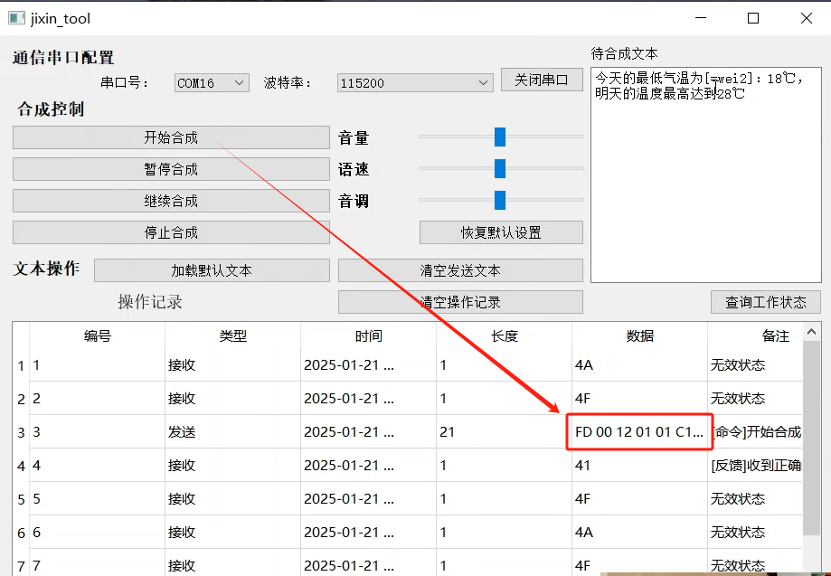

**实现步骤：**

1. **硬件连接**
    - 单片机UART连接CI-33T的RXD/TXD
    - 设置相同的波特率（默认115200）
    - 确保共地连接

2. **代码实现**
    - 将文本转换为模块支持的编码格式
    - 按照16进制格式组织数据包
    - 通过串口发送给模块

3. **测试验证**
    - 使用串口调试工具验证格式正确性
    - 确认模块能正确合成和播放
    - 测试不同长度文本的合成效果

**注意事项：**

- 不提供Arduino等平台的示例SDK
- 需要自行实现文本到16进制的转换
- 建议先用串口工具验证协议格式
- 文本编码需要符合模块要求
- 建议有一定嵌入式开发基础
- 商业项目需要采购相应的开发授权

---

### CI-33T是否支持OTA功能？如何使用？

**问题描述：**

询问CI-33T芯片的OTA（空中升级）功能是否真实存在，是否有相关的使用例程或文档。

**解决方案：**

**OTA功能状态：**

- **功能存在性**：CI-33T硬件支持OTA功能
- **当前状态**：功能存在但尚未实现
- **开发计划**：将在后续版本中逐步实现

**技术说明：**

- OTA功能在硬件层面已经预留
- 目前软件平台和固件尚未支持该功能
- 官方暂无相关的使用例程和文档

**临时替代方案：**

1. **串口升级**
    - 使用串口进行固件更新
    - 需要物理连接设备
    - 配合专用烧录工具使用

2. **等待官方更新**
    - 关注官方平台更新通知
    - 等待OTA功能正式发布
    - 届时将提供详细的使用文档

**注意事项：**

- OTA功能正在开发中，具体发布时间待定
- 当前项目设计需要考虑固件更新方式
- 建议预留物理升级接口作为备份
- 可关注官方技术社区获取最新进展

---

### CI-33T如何实现声纹识别的多级控制？

**问题描述：**

需要了解CI-33T芯片的声纹识别功能中，变量定义和附加条件的使用方法，以及如何配合实现多级控制逻辑。

**解决方案：**

**多级控制逻辑规则：**

根据配置界面规则，多级控制的逻辑关系如下：

- **条件子项之间**：在同一个附加条件内，多个条件子项是"与"的关系
- **附加条件之间**：多个附加条件之间是"或"的关系
- **变量定义**：用于存储和传递识别结果，支持多级判断

**配置方法：**

1. **添加触发条件**：

    - 进入智能公元平台的触发配置界面
    - 设置行为类型为声纹识别
    - 配置触发方式为语音指令

2. **设置附加条件**：

    - 添加第一个附加条件组
    - 在组内添加多个条件子项（所有条件必须同时满足）
    - 可添加多个附加条件组（任一组满足即可触发）

3. **配置变量定义**：

    - 定义变量用于存储声纹识别结果
    - 设置变量作用域和生命周期
    - 配置变量的初始值和更新规则

**应用示例：**

```
多级控制场景：
附加条件1：声纹A + 指令"开机" → 执行动作1
附加条件2：声纹B + 指令"开机" → 执行动作2
附加条件3：声纹A + 指令"关机" + 时间>18:00 → 执行动作3
```

**实现要点：**

1. **条件组合**：

    - 同组内的条件必须全部满足（与逻辑）
    - 不同组之间满足任一组即可触发（或逻辑）
    - 支持嵌套条件实现复杂控制

2. **变量使用**：

    - 存储识别结果用于后续判断
    - 支持跨指令的状态传递
    - 可实现计数、计时等高级功能

3. **调试建议**：

    - 逐个测试每组条件的有效性
    - 验证变量的赋值和引用正确
    - 使用日志功能跟踪触发过程

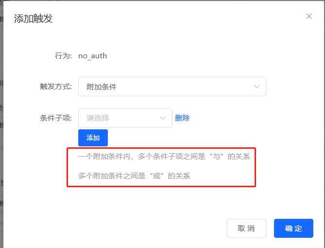

**注意事项：**

- 声纹识别功能需要购买授权才能正常使用
- 未授权版本每5分钟会自动重启一次
- 建议先在测试环境验证逻辑正确性
- 复杂的多级控制需要充分测试各种场景

解决方案：

**1. 使用TTS功能**

- **CI-33T支持TTS**：

    - CI-33T模块内置文本转语音功能
    - 可直接播报接收到的文本数据
    - 支持数字和常见字符的播报

- **串口数据格式**：

    - 通过串口发送需要播报的文本
    - 支持中文、英文和数字
    - 数字会自动转换为对应读音

**2. 其他型号实现方案**

- **预设语音法**：

    - 提前录制所有可能的数值（0-100）
    - 通过变量或串口触发对应语音
    - 适用于范围有限的数值播报

- **分段播报法**：

    - 将数值拆分为各位播报
    - 如"25度"播报为"二十五度"
    - 需要巧妙设计触发逻辑

**3. 实施步骤**

1. **硬件连接**：

    - 单片机UART连接语音模块
    - 确保波特率和通信协议一致

2. **数据发送**：

    - 读取传感器数据（如温度）
    - 格式化为播报字符串
    - 通过串口发送到语音模块

3. **语音配置**：

    - TTS直接发送文本即可
    - 预设方式需要配置触发映射


注意事项：

- TTS功能目前仅CI-33T支持
- 其他型号需要通过预设语音实现
- 播报频率不宜过高，避免体验不佳

---

### 如何获取文字转语音（TTS）功能的固件和软件工具？

**问题描述：**

需要获取支持文字转语音功能的固件和相关软件工具。

**解决方案：**

**资料获取方式：**

1. **通过官方平台获取**
    - 登录智能公元文档中心
    - 进入"教程和示例固件"栏目
    - 查找"文本转语音教程"相关内容
    - 下载所需文件：

        - jixin_tools.exe（TTS软件工具）
        - TTS文字转语音固件（.bin格式，直接烧录使用）

2. **观看教学视频**
    - 参考B站视频教程：CI-33T 文本转语音固件演示及TTS串口工具使用教程
    - 视频链接：https://www.bilibili.com/video/BV1mdftYLEQJ/
    - 视频中展示了完整的使用流程和操作方法

3. **联系技术团队**
    - TTS功能属于特殊功能，资料可能需要单独申请
    - 可通过官方技术团队渠道获取相关资料
    - 提供购买凭证获取技术团队

**固件说明：**

- 文字转语音功能可能需要专用固件
- 不同于常规语音识别固件，具备文本转语音能力
- 需配合专用的TTS串口工具使用

**注意事项：**

- TTS功能可能需要特定型号的模块支持（如CI-33T）
- 确认购买的版本是否支持文字转语音功能
- 下载前确保已经登录平台账号
- 如果平台资料更新不及时，建议直接联系客服获取最新资料

---


---

### CI-33T模块如何配置串口功能？

**问题描述：**

CI-33T模块无法通过串口输出识别到的命令词，串口输入指令也无法播放语音，需要了解如何正确配置串口功能。

**解决方案：**

**需要先配置引脚为串口功能**：

1. **引脚配置**
    - 在配置平台中将需要使用的引脚配置为串口功能
    - 通常B6/B7可配置为UART1
    - 配置后引脚才能作为串口使用

2. **串口输出配置**
    - 在触发设置中选择"串口输出"
    - 设置对应的消息编号和参数
    - 配置识别到命令词后的串口输出内容

3. **串口输入配置**
    - 添加触发行为，触发方式选择"串口输入"
    - 选择已配置的串口
    - 设置消息编号和输入参数
    - 关联需要执行的语音播报动作

**注意事项：**

- 引脚必须先配置为串口功能，否则串口选项不可选
- 串口功能配置完成后需要重新生成并烧录固件
- 参考串口配置教程视频进行操作

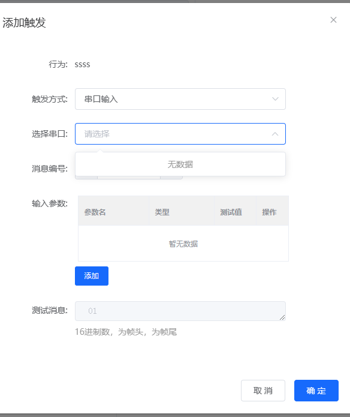

---


---

### CI-33T能否识别并提取语音中的数字？

**问题描述：**

希望使用CI-33T模块从语音指令中识别并提取数字，例如从"左转90度"中提取数字90。

**解决方案：**

CI-33T模块无法直接识别并提取语音中的数字。

**注意事项：**

- CI-33T是固定命令词识别模块，不支持连续语音识别
- 无法从句子中分离出特定数字或参数
- 如需数字识别功能，请考虑使用其他支持连续语音识别的模块
- 可以设置多个带数字的命令词（如"左转90度"、"左转180度"等）

---

## 逻辑控制配置


---

### CI-33T语音指令配置时消息号不生效怎么办？

**问题描述：**

CI-33T配置语音指令时，消息号的参数在后续控制逻辑中未正确引用，导致配置无法按预期工作。

**解决方案：**

1. **检查消息号关联**：

    - 确认触发设置的消息号与控制设置匹配
    - 消息号2的参数只能在消息号2的控制中使用
    - 不能跨消息号引用参数

2. **正确的配置流程**：

    - 先配置触发方式（串口输入、消息号）
    - 再配置输入参数（参数列表）
    - 最后在相同消息号下添加控制

3. **变量设置注意事项**：

    - 变量uart_read_1需要与具体参数关联
    - 不能直接关联到不同消息号的参数
    - 变量和参数要在同一个消息配置内

**注意事项：**

- 每个消息号是独立的配置单元
- 参数作用域限于对应的消息号
- 配置时注意左右两边的消息号要一致


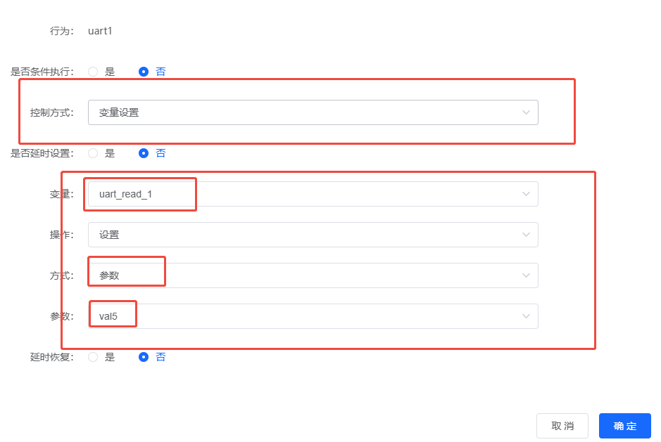

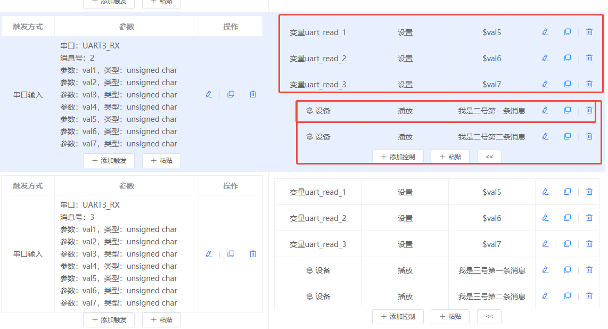

---


---

### CI-33T如何实现中英文混合语音识别？

**问题描述：**

需要在同一固件上实现中英文混合语音识别功能，适用于家电产品升级添加语音功能。

**解决方案：**

离线方案下有两种实现方式：

**方案一：双模块方案**

- 使用两个模块，一个专门负责中文识别
- 另一个专门负责英文识别
- 通过主控MCU协调两个模块的工作
- 适合成本敏感、快速实现的项目

**方案二：CI33T定制开发**

- 使用CI33T芯片进行双模型定制开发
- 在单个芯片上集成中英文双识别引擎
- 需要支付定制开发费用
- 批量采购达到一定数量后，开发费可抵扣

**开发流程：**

1. **需求确认阶段**
    - 提供详细的产品需求说明
    - 明确中文识别词条数量
    - 明确英文识别词条数量
    - 确定具体实现的功能需求
    - 说明与MCU的通信需求
    - 硬件配置说明（如双麦克风、双喇叭等）
    - 预期想要实现的效果描述

2. **技术评估阶段**
    - 技术团队评估开发难度和工作量
    - 确定开发费用和周期
    - 签订定制开发协议
    - 开发费收取方式：前期收取，后期采购达到一定数量可抵扣

3. **开发实施阶段**
    - 进行双模型集成开发
    - 提供测试固件验证功能
    - 根据反馈调整优化
    - 交付最终定制固件

**注意事项：**

- CI33T模块单价为10.9元，批量采购可享受优惠价格
- 定制开发需要前期投入开发费用
- 建议先明确产品出货量，以便评估开发费抵扣方案
- 对于产品升级项目，可参考现有月出货量（如十几K级别）制定阶梯价格

---

### CI-33T模块变量替换功能存在缺陷怎么办？

**问题描述：**

在CI-33T模块的固件配置中，使用变量名（如{module}）在十六进制参数中进行动态替换时，配置后设备无法正常工作，串口输出数据混乱。

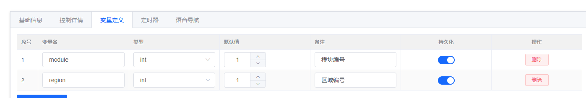

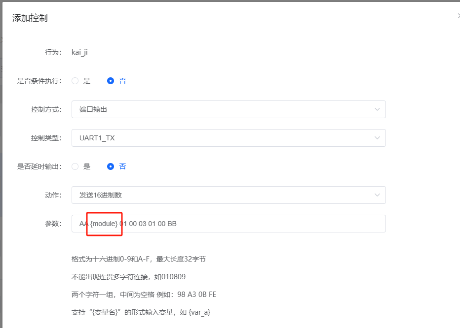

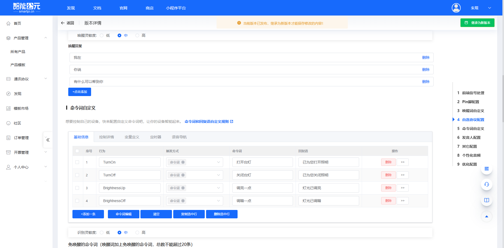

**解决方案：**

**问题分析：**

- **变量替换限制**：当前平台的变量替换功能可能不支持在十六进制数据中嵌入变量
- **解析缺陷**：变量与十六进制数据混合时可能导致解析错误
- **数据格式**：串口输出时变量未被正确替换，保持原始格式

**临时解决方案：**

1. **避免混合使用**
    - 不要在十六进制数据中直接嵌入变量
    - 将变量和固定数据分开处理
    - 使用纯十六进制格式或纯变量格式

2. **使用固定值测试**
    - 先用固定的十六进制数据测试功能
    - 确认基础功能正常后再考虑变量化
    - 逐步增加复杂性

3. **替代实现方案**
    - 通过多个控制项实现不同参数
    - 使用条件判断选择不同数据
    - 在接收端进行数据解析

**长期解决方案：**

- 等待平台更新变量替换功能
- 反馈问题给技术团队，加速修复进度
- 考虑使用SDK进行二次开发实现需求

**注意事项：**

- 变量替换功能目前存在限制，使用前充分测试
- 混合格式的数据可能导致不可预期的错误
- 重要应用建议使用固定参数确保稳定性
- 保存配置前建议导出备份，避免丢失设置

---

### CI-33T平台设置中PA2和PA3没有串口选项？

**问题描述：**

在CI-33T平台的引脚设置页面中，PA2和PA3引脚的功能选项中没有串口（UART）选项，导致无法配置为UART通信引脚。

**解决方案：**

PA2和PA3确实支持UART功能，但需要在正确的配置条件下才能显示串口选项。

**技术说明：**

根据CI-33T引脚定义表：

- **PA2引脚**：支持UART1_TX功能
- **PA3引脚**：支持UART1_RX功能
- 两个引脚配合可组成完整的UART1串口

**配置方法：**

1. **检查应用场景选择**：

    - 确认在平台中选择了正确的应用场景
    - 某些应用场景可能不开放UART功能
    - 尝试切换到通用或开发场景

2. **展开功能选项**：

    - 在引脚配置界面中，点击功能下拉菜单
    - 确保展开完整的选项列表
    - UART选项可能在列表的较后位置

3. **验证引脚模式**：

    - PA2需要在"输出模式"下配置
    - PA3需要在"输入模式"下配置
    - 确认默认电平设置正确

**常见问题：**

1. **选项不显示**：

    - 可能是当前场景限制
    - 尝试创建新产品重新配置
    - 联系技术支持确认平台版本

2. **配置灰色不可选**：

    - 检查引脚是否被其他功能占用
    - 确认模块型号选择正确（CI-33T）
    - 刷新页面重新加载配置

**注意事项：**

- PA2/PA3的UART功能是硬件支持的
- 平台界面的选项显示可能与场景配置相关
- 如持续无法找到UART选项，建议联系技术支持
- 配置完成后记得保存并重新生成固件

---

### CI-33T的双语言支持能力如何？

**问题描述：**

需要了解CI-33T模块是否支持双语言功能，以及相关的指令数量限制和Flash容量问题。

**解决方案：**

CI-33T是专门为双语言应用设计的模块：

**语言支持特性：**

- 支持4M Flash容量，勉强能容纳双语言模型
- 最多支持两种语言组合（中英、中俄、中法等）
- 单语言模式下可支持更多指令（最多300条）
- 双语言模式下指令数量需要分配给两种语言

**指令数量说明：**

- 单语言：可支持最多300条指令
- 双语言：两种语言的指令总数受Flash容量限制
- 每种语言都需要独立的语音模型和播报资源

**实现方式：**

- 需要定制开发，提供两种语言的语料
- 开发周期较长，费用较高
- 支持说什么语言就识别什么语言指令

**注意事项：**

- 双语言功能需要提前规划，确定指令分配方案
- 不支持三种或更多语言
- Flash为内部存储，不支持外挂扩展

---

### CI-33T与SU-03T的引脚兼容性如何？

**问题描述：**

考虑从SU-03T升级到CI-33T，需要了解两个模块的引脚兼容性。

**解决方案：**

**物理兼容性：**

- 模块尺寸基本相同
- 引脚数量一致
- 但不完全pin-to-pin兼容，部分引脚功能可能有差异

**主要差异：**

- CI-33T：4M Flash，支持双语言
- SU-03T：2M Flash，仅支持单语言
- CI-33T单价：模块10.9元，芯片7.9元

**升级建议：**

- 确认现有电路原理图
- 检查外设使用情况
- 可能需要调整PCB布线

**注意事项：**

- 升级前建议先购买样品测试
- 批量生产前做好充分验证
- 用量大可申请价格优惠

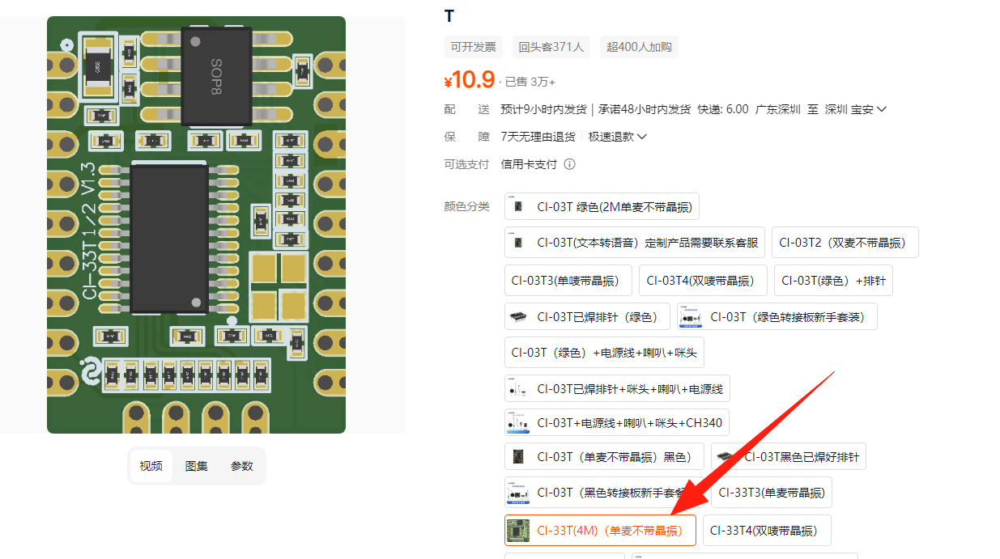

---

### CI-03T的自学习功能如何使用？

**问题描述：**

了解到CI-03T具有自学习功能，希望了解如何使用该功能学习不同的语言表达。

**解决方案：**

CI-03T的自学习功能可以学习已有指令的另外一种说法：

**功能特点：**

- 学习已有指令的不同表达方式
- 支持学习不同语言的相同含义指令
- 不需要重新编译固件

**使用场景：**

- 中文指令学习英文说法
- 学习方言或口音表达
- 扩展同一功能的不同说法

**操作步骤：**

1. 先配置好基础的中文指令
2. 进入自学习模式
3. 说出新的表达方式
4. 系统自动关联到原有指令

**视频教程：**
详细操作可参考：CI-03T免唤醒和自学习教程
https://www.bilibili.com/video/BV1LM4y1S7A8/

**注意事项：**

- 自学习功能需要原有指令作为基础
- 学习效果与语料质量相关
- 建议在安静环境下进行学习

---

### Flash容量是否可以扩展？

**问题描述：**

希望了解是否可以将4M Flash升级到8M，以支持更多功能。

**解决方案：**

Flash容量无法通过外部方式扩展：

**技术限制：**

- Flash是芯片内部存储，无法外挂
- 不支持SPI接口外接Flash
- 不支持插卡方式扩展

**升级方案：**
只能更换Flash容量更大的芯片：

- 需要选择具备更大Flash的芯片型号
- 8M Flash的芯片存在但可能不支持双语言
- 成本会相应增加

**成本梯度：**

- 具体价格需要咨询技术支持
- 大用量可申请优惠
- 建议先购买样品测试

**注意事项：**

- 选型时就要考虑好Flash容量需求
- 双语言对Flash需求较大
- 8M版本功能支持可能有差异

---

### CI-33T双语言模式下指令数量如何分配？

**问题描述：**

需要确认CI-33T在双语言模式下的指令数量限制，是中文40条、英文40条，还是单语言可以支持80条。

**解决方案：**

CI-33T的指令数量支持情况如下：

**单语言模式：**

- 最多可支持300条指令
- 所有指令资源都分配给一种语言

**双语言模式：**

- 两种语言的指令总数受Flash容量限制
- 不是简单的40+40分配方式
- 具体数量取决于：

    - 语音模型大小
    - 播报资源占用
    - 两种语言的复杂度

**实际应用建议：**

- 如果指令数量较多（如超过100条），建议使用单语言模式
- 双语言适合指令数量较少的应用场景
- 需要提前规划好两种语言的指令分配

**注意事项：**

- 双语言对Flash资源占用较大
- 不是固定的比例分配
- 建议根据实际需求选择合适的方案

---

### CI-33T和CI-03T的TTS功能授权费用和定制要求

**问题描述：**

需要了解CI-33T和CI-03T芯片的TTS（文字转语音）功能是否支持离线使用，以及TTS功能的授权费用、定制费用、起订量要求和产品兼容性问题。

**解决方案：**

**TTS功能支持情况：**

- **CI-33T**：原生支持TTS功能，无需额外授权
- **CI-03T**：现已支持TTS功能，但需要购买授权版本
- 两个型号都支持离线TTS功能，无需连接云端

**价格说明：**

- **基础模块价格**：

    - CI-33T：13元（不含TTS授权）
    - CI-03T：13元（不含TTS授权）

- **TTS授权费用**：

    - CI-33T TTS版本：19元（基础价格+6元TTS授权费）
    - CI-03T TTS版本：17元（基础价格+4元TTS授权费）
    - TTS授权费按模块数量一次性收取

**定制服务说明：**

1. **标准声音库**：

    - 默认提供成人女声
    - 支持中英文语音合成
    - 直接购买授权版本即可使用

2. **声音定制**：

    - 需要额外定制费用（一次性）
    - 如小男孩声音等特殊音色需要单独开发
    - 定制费用需根据具体需求评估

3. **固件定制**：

    - 固件定制是一次性费用
    - 每个模块仍需TTS功能授权费
    - 需要特殊授权才能使用定制固件

**功能限制：**

- TTS功能和语音识别（ASR）不能在同一模块上共存
- 如需同时使用语音识别和TTS，建议：

    - 方案一：使用两个模块（一个SU-03T做识别，一个CI-33T/CI-03T做TTS）
    - 方案二：两个扬声器的输出可以合并为一个

**产品差异：**

| 特性 | CI-03T | CI-33T |
|-----|---------|---------|
| Flash容量 | 2M | 4M |
| 支持词条数 | 300条 | 500条 |
| TTS支持 | 需授权 | 原生支持 |
| 价格（含TTS） | 17元 | 19元 |

**购买建议：**

1. **小批量测试**：

    - 可先购买CI-03T TTS版本测试（17元）
    - 确认功能满足需求后再批量采购

2. **批量采购**：

    - 年采购量4000左右可申请价格优惠
    - 建议直接联系销售获取批量报价

3. **开发流程**：

    - 购买授权版本的模块
    - 下载专用TTS固件烧录
    - 使用jixin_tools.exe工具进行控制

**注意事项：**

- 购买时务必确认选择标注了TTS功能的版本
- 淘宝13元的基础版本不支持TTS功能
- TTS与ASR功能互斥，设计时需考虑使用双模块方案
- 定制声音需要额外开发周期和费用
- 批量采购前建议先拿样品测试功能

---

### CI-33T的声纹识别需要授权费用吗？

**问题描述：**

询问CI1303（CI-33T）的声纹识别功能是否需要额外支付授权费用。

**解决方案：**

**1. 授权机制**

- 声纹识别是付费功能，需要额外授权
- 未授权版本只能体验五分钟，之后会自动重启
- 授权后可无限制使用声纹识别功能

**2. 授权费用**

- 在模块报价基础上增加1元授权费
- 包含完整的声纹识别功能使用权
- 一次购买，永久使用

**3. 授权获取**

- 购买模块时选择含声纹授权的版本
- 或后续联系技术支持单独购买授权
- 授权不影响已注册的声纹数据

**注意事项：**

- CI-33T相比CI-03T主要差异在于支持声纹识别
- 声纹识别占用内存较大，建议使用CI-33T模块
- 授权是合法使用的必要条件

---

### CI-33T控制空调时出现无法控制或获取温度问题怎么办？

**问题描述：**

使用CI-33T(4M)语音识别模块控制空调时，遇到无法控制志高空调、无法获取空调设置温度等问题。

**解决方案：**

**1. 空调无法控制问题**

- **排查电流问题**：检查红外发射电流是否过小，电流过小会导致无法有效控制空调
- **检查配对情况**：虽然配对可能成功，但需要确认红外信号是否正确发送
- **测试其他品牌**：先测试其他品牌空调确认模块功能正常

**2. 空调温度获取问题**

- **功能限制**：当前版本不支持获取空调设置温度
- **替代方案**：可通过温度传感器实时检测环境温度
- **记录模式**：记录温度调节指令次数来推算当前温度

**3. 红外接收头选型**

- **推荐型号**：使用IRM-56384等3P脚的红外接收头
- **封装规格**：SIP-3-2.54mm封装
- **品牌选择**：EVERLIGHT（亿光）等知名品牌

**调试方法：**

1. **电流测试**：

    - 使用万用表测量红外发射时的电流
    - 确认电流在规格范围内
    - 必要时增加驱动电路

2. **信号检测**：

    - 使用手机相机查看红外发射是否正常
    - 确认发射频率和占空比正确
    - 检查发射角度和距离

3. **协议分析**：

    - 使用红外分析仪捕获信号波形
    - 对比原遥控器和模块发射的信号
    - 确认协议编码完全一致

**注意事项：**

- 不同品牌空调的红外协议可能不同
- 空调型号众多，同一品牌可能有多种协议
- 建议先确认空调的具体型号和协议
- 特殊协议可能需要定制开发

---

### CI-33T测试完成后如何获取固件进行烧录？

**问题描述：**

在测试完成后希望能够直接获取固件进行烧录，避免频繁寄回模块进行调试。

**解决方案：**

**1. 固件获取流程**

- **下订单采购**：通过淘宝等平台下单购买模块
- **备注说明需求**：在订单中备注需要固件自行烧录
- **联系客服**：下单后联系客服或技术支持确认

**2. 批量测试建议**

- **小批量采购**：可先采购10-100个进行批量测试
- **固件更新**：后续调整可提供新版本固件
- **自主烧录**：收到固件后可自行烧录测试

**3. 开发授权说明**

- **测试版本**：仅用于功能验证，不能用于正式产品
- **正式版本**：需要采购商业授权，解除功能限制
- **定制服务**：特殊需求可申请定制开发

**烧录准备：**

1. **硬件准备**：

    - 准备专用烧录工具
    - 确认烧录接口连接正确
    - 检查供电稳定性

2. **软件工具**：

    - 使用官方烧录软件
    - 下载对应版本的固件
    - 确认烧录参数设置

3. **注意事项**：

    - 固件与模块型号必须匹配
    - 烧录过程中不要断电
    - 保留原固件备份

**商业合作建议：**

- 项目确定后可批量采购
- 量大可享受价格优惠
- 技术支持团队配合调试
- 提供完整的技术文档

---

### 如何在产品管理平台中更换模块？

**问题描述：**

在产品管理平台中，需要将现有产品的模块从SU-03T更换为CI-33T，但平台不支持直接更换模块型号。

**解决方案：**

由于平台架构限制，无法直接更换已有产品的模块型号，需要通过以下步骤实现：

1. **创建新产品**

    - 在产品管理页面点击"新建产品"
    - 选择目标模块型号（如CI-33T）
    - 填写产品基本信息

2. **复制原有配置**

    - 唤醒词：从原产品复制相同的唤醒词
    - 命令词：将命令词列表逐个复制到新产品
    - 串口配置：保持相同的波特率和协议设置

3. **配置产品特性**

    - **语音识别+自学习**：支持基础识别和自学习功能
    - **语音识别+深度降噪**：适合噪声环境
    - **普通话通用Pro**：通用场景优化模型
    - **中文窗帘通用Pro**：特定场景优化模型

4. **应用场景选择**

    - 根据实际使用环境选择合适的模型
    - 无特殊要求可选择接近的通用模型
    - 不同模型针对不同噪声环境优化

**注意事项：**

- 平台不支持直接更换模块，必须新建产品
- 命令词可以通过复制粘贴方式迁移
- 建议新产品创建后进行完整功能测试

---


---

### CI-33T的TTS文本转语音功能是否提供SDK？

**问题描述：**

需要了解CI-33T的TTS（文本转语音）功能是否有测试版本的SDK，以及在TTS模式下是否可以使用控制功能。

**解决方案：**

**1. TTS固件提供情况**

- 提供TTS测试固件（TTS_文本转语音.bin）
- 可直接烧录测试基本功能
- 串口1（PA2、PA3）通信，波特率115200

**2. 控制功能限制**

- TTS模式下暂不支持完整的控制功能
- 该功能仍在开发中
- 当前主要用于纯TTS应用

**3. 技术规格**

- 通信接口：串口1（PA2、PA3）
- 波特率：115200
- 主要功能：文本转语音输出

**注意事项：**

- TTS模式下的控制功能正在开发中
- 测试固件主要用于验证TTS基本功能
- 需要控制功能的场景建议等待后续版本更新

---


---

### CI-33T模块如何实现串口双向通信？

**问题描述：**

CI-33T模块是否可以通过串口接收来自继电器的反馈数据，实现双向通信？

**解决方案：**

- CI-33T模块支持串口数据接收功能
- 配置UART0_RX用于接收数据
- 可参考CI-03T的串口收发配置方法
- 配置方法与SU-03T的串口收发类似

**参考教程：**

- CI-03T串口播报温湿度教程
- CI-03T串口发数据教程

**注意事项：**

- CI-33T与CI-03T功能相似，只是Flash容量更大
- 需要确保发送和接收设备的波特率一致

---


---

### CI-33T1支持哪些编程方式？

**问题描述：**

需要了解CI-33T1模块是否支持图形化编程，能否使用其他软件进行开发，以及是否有开发板和模组样品可供研究。

**解决方案：**

**编程方式支持：**

1. **图形化编程**
    - CI-33T1支持智能公元平台的图形化编程
    - 提供可视化配置界面，无需编程基础
    - 支持拖拽式功能模块配置

2. **本地开发环境**
    - 可从后台拉取模型在虚拟机环境运行
    - 支持C语言环境下的VS编译
    - 不改变模型的情况下可以使用VS在C环境编译

3. **开发资源获取**
    - CI-33T1模组可通过淘宝等渠道购买
    - 提供开发板用于快速原型验证
    - 可申请样品用于前期研究

**特殊功能支持：**

- **声纹识别**：CI-33T1支持声纹识别功能
- **鼾声识别**：提供专门的鼾声识别固件
- **哭声识别**：支持婴儿哭声检测功能
- **男女声识别**：可根据声音特征区分性别

**开发建议：**

- 图形化编程更适合快速原型开发
- 复杂功能建议使用本地开发环境
- 声纹等特殊功能需要按照教程配置
- 购买时备注用途获取技术支持

**注意事项：**

- CI-33T1与CI-73T1功能相似，主要差异在内存容量
- 声纹识别功能需要额外授权
- 特殊识别功能有对应的使用说明文档
- 开发板和模组可联系客服获取
    - 每个指令对应提示语和成功回复语
    - 支持自定义语音指令内容

2. **配置选项**
    - 唤醒词设置
    - 命令词学习
    - 回复语配置

**使用流程：**

1. 选择需要学习的指令
2. 录制或设置命令词
3. 配置对应的提示语
4. 设置成功后的回复语

**注意事项：**

- 不同型号的具体功能可能有差异
- 建议参考具体型号的使用方手册
- 图形化软件简化了开发流程

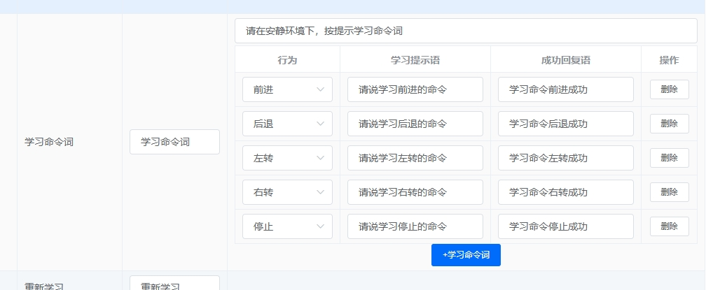

---

### CI-33T是否可以取消休眠功能？

**问题描述：**

需要了解CI-33T模块是否支持取消休眠功能，以保持模块持续工作状态。

**解决方案：**

CI-33T模块支持通过配置取消休眠功能：

- 在智能公元平台中添加"禁止超时退出唤醒"控制
- 该功能可使模块保持常醒状态，不会因超时而退出唤醒
- 适用于需要实时响应的应用场景

**配置步骤：**

1. 登录智能公元平台
2. 进入事件触发配置界面
3. 选择"上电启动系统自动"触发方式
4. 添加"禁止超时退出唤醒"控制选项
5. 生成并烧录固件

**注意事项：**

- 常醒状态会增加模块功耗
- 适用于需要实时响应的应用场景
- 如需降低功耗，可设置合理的超时时间

---

### CI-33T上电和待机时的串口数据输出如何配置？

**问题描述：**

需要了解CI-33T芯片上电和待机时是否会自动发送串口数据，以及如何配置这些数据的输出。

**解决方案：**

**串口数据输出控制：**

1. **默认行为说明**：

    - CI-33T默认不会自动发送上电或待机数据
    - 串口数据输出需要在平台中配置后才工作
    - 未进行配置时，串口不会主动发送任何数据
    - 观察到的串口数据可能是波特率不匹配或接线错误导致

2. **配置方法**：

    - 登录智能公元平台
    - 进入对应项目的产品配置页面
    - 在需要输出数据的命令词或触发事件中配置串口输出
    - 设置串口输出内容（如"设备已上电"等）
    - 生成并烧录固件

3. **数据获取方式**：

    - 通过官方文档了解串口协议格式
    - 参考B站视频教程：[CI-33T串口通信教程](https://www.bilibili.com/video/BV1Ms4y1a7RE/)
    - 使用串口调试助手观察数据输出

**注意事项：**

- 使用平台默认工程烧录时，需要重新配置才能启用串口输出
- 串口数据必须按照指定协议格式发送
- CI-33T与CI-03T除Flash大小不同外，其他功能基本一致
- 建议使用UART1（B6/B7）进行串口通信以避免与调试功能冲突
- 如果未配置串口输出但收到数据，请检查接线是否正确或波特率设置

---

### CI-33T自学习命令词数量限制

**问题描述：**

在使用CI-33T模块进行命令词自学习时，当学习到85个左右命令词时，模块会停止工作，完全无法响应。重新烧录固件后，问题仍然重复出现。

**问题原因：**

自学习命令词需要消耗RAM空间来存储语音模板。CI-33T虽然有640KB SRAM，但系统运行需要占用大部分资源，剩余可用RAM有限。当自学习命令词数量过多时：

- RAM资源耗尽，导致系统崩溃
- 每个自学习命令词约占用6-8KB RAM空间
- 85个命令词约占用510-680KB RAM，接近或超出可用上限

**解决方案：**

1. **控制自学习数量**：

    - 建议自学习命令词总数不超过50-60条
    - 优先学习使用频率高的命令词
    - 考虑将不常用命令词设置为固定词条

2. **优化使用策略**：

    - 分批次使用：需要时学习，不使用时删除
    - 使用命令分组功能，减少同时加载的命令词
    - 考虑使用多模块方案分担功能

3. **替代方案**：

    - 使用CI-33T的固定词条功能（最多500条）
    - 通过平台预录命令词，避免占用RAM
    - 如需大量自学习功能，考虑使用更大RAM的芯片方案

**注意事项：**

- 自学习功能适用于临时、少量命令词场景
- 大量命令词建议使用平台预配置方案
- RAM限制是硬件约束，无法通过软件升级解决

---

### CI-33T如何通过串口控制TTS语音合成？

**问题描述：**

需要了解如何使用单片机（如STM32）通过串口控制CI-33T模块的TTS（文字转语音）功能，实现将文本转换为语音输出。

**解决方案：**

**功能确认**

CI-33T模块支持TTS文字转语音功能，可以通过串口接收文本数据并合成语音输出。

**通信协议**

- **接口类型**：串口（UART）
- **数据编码格式**：GB2312
- **数据格式**：直接发送需要合成的文本内容，无需特殊协议头或尾

**硬件连接**

1. **串口连接**：

    - STM32的UART TX引脚连接到CI-33T的UART RX引脚
    - STM32的UART RX引脚连接到CI-33T的UART TX引脚
    - 确保GND共地连接

2. **电源要求**：

    - 供电电压：3.6V-5.5V
    - 确保电源能提供足够的峰值电流（>500mA）

**软件配置**

1. **串口参数设置**：

    - 波特率：9600bps（默认）
    - 数据位：8位
    - 停止位：1位
    - 校验位：无

2. **发送数据示例**：

    - 发送"你好"文本（GB2312编码）：
    ```
    0xC4 0xE3 0xCA 0xC7
    ```
    - 模块接收后自动进行语音合成并播放

**使用步骤**

1. **配置模块**：

    - 在智能公元平台生成支持TTS功能的固件
    - 烧录到CI-33T模块

2. **发送文本**：

    - 将文本转换为GB2312编码
    - 通过串口发送编码后的字节数据
    - 模块自动识别并合成语音

3. **验证功能**：

    - 发送测试文本如"测试"
    - 听模块是否正确播放语音
    - 检查语音清晰度和音量

**注意事项**

- 确保发送的文本编码为GB2312格式，否则可能出现乱码
- 串口通信参数必须与模块默认设置一致
- TTS功能需要模块支持，使用前请确认固件已启用该功能
- 长文本建议分段发送，避免一次性发送过多数据

**参考资料**

- 详细的TTS功能说明请参考官方技术文档
- GB2312编码表可查询相关标准文档
- 更多示例代码可联系技术支持获取


---


### CI-33T英文命令词如何配置多条和泛化词？

**问题描述：**

在配置英文语音指令时，需要了解如何设置多个英文命令词以及泛化词功能的具体使用方法。

**解决方案：**

**英文命令词配置说明：**

1. **多条英文命令词配置**：

    - 英文命令词支持多条配置，使用方式与中文完全相同
    - 多条英文命令词之间使用"|"分隔
    - 当设置多条命令词时，说出任意一条都能触发该行为
    - 示例：`turn on light|open light|light on`

2. **英文泛化词功能**：

    - 英文泛化词功能与中文完全相同
    - 可以通过"|"分隔符配置多个泛化词
    - 支持英文同义词、不同表达方式的组合
    - 示例：`Is it currently positioning|What is the current positioning situation`

3. **配置步骤**：

    - 在智能公元平台创建英文项目
    - 在命令词自定义界面输入英文命令词
    - 使用"|"连接多个指令或泛化词
    - 保存配置并生成固件

**注意事项：**

- 英文项目下不能输入中文字符
- 英文命令词建议使用常见词汇，避免生僻词
- 泛化词数量不宜过多，以免影响识别率
- 建议测试所有命令词的识别效果

---


### CI-33T可以自动计算CRC校验码吗？

**问题描述：**

询问CI-33T模块是否支持自动计算CRC校验码的功能。

**解决方案：**

CI-33T模块不支持自动计算CRC校验码，需要通过手动计算实现。

**实现方法：**

**1. 手动赋值计算**

- 将需要计算CRC的数据赋值给变量
- 对变量进行CRC计算
- 在控制逻辑中调用计算结果

**2. 计算流程**

```c
// 伪代码示例
uint8_t data[] = {0x01, 0x02, 0x03, 0x04};
uint16_t crc_result;

// 手动计算CRC
crc_result = calculate_crc(data, sizeof(data));

// 使用计算结果
// 将crc_result用于通信校验
```

**3. 注意事项**

- CI-03T模块可能有类似功能（根据用户反馈）
- 不同模块的功能支持可能有差异
- 需要根据具体应用需求实现CRC算法
- 建议在开发前确认所需功能的支持情况

**替代方案：**

- 在外部MCU中计算CRC
- 使用串口助手等工具预先计算
- 采用其他校验方式（如累加和校验）

---
---
### CI-33T的TTS授权模块如何通过串口发送文字播报？

**问题描述：**

使用单片机通过串口向CI-33T的TTS授权模块发送文字数据，需要了解正确的数据格式和通信参数。

**解决方案：**

**串口通信参数**

- **接口**：串口1（A2/A3脚，即PA2/PA3）
- **波特率**：115200
- **数据位**：8位
- **停止位**：1位（无特殊停止位）
- **校验位**：无

**数据格式**

通过串口发送UTF-8编码的文本数据即可实现语音播报，无需特殊协议头尾。示例数据格式：

```
FD 00 08 01 01 C4 E3 BA C3 0D 0A
```

- `FD`：帧头
- `00 08`：数据长度
- `01 01`：命令类型
- `C4 E3 BA C3`：文字编码（UTF-8）
- `0D 0A`：结束符

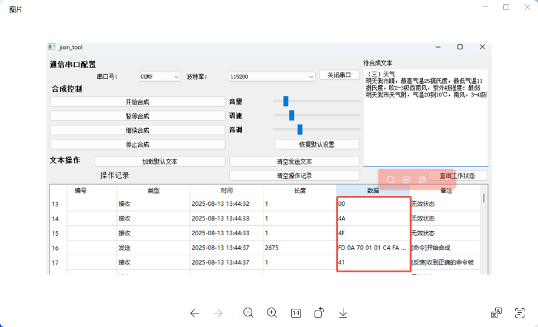

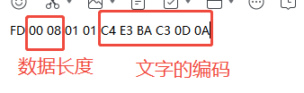

**注意事项：**

- TTS授权模块只能烧录TTS固件，烧录其他固件会覆盖授权码
- 未授权模块烧录TTS固件会每10多秒重启一次
- 模块上电不会自动播报，需要通过串口发送数据
- 建议使用jixin_tool软件进行调试验证

---

### TTS授权模块的固件使用限制

**问题描述：**

需要了解CI-33T和CI-03T的TTS授权模块使用限制，以及固件兼容性问题。

**解决方案：**

**授权机制说明**

1. **TTS专用固件**：

    - TTS授权模块只能烧录TTS专用固件
    - 固件可从平台文档中心下载（搜索"TTS"）
    - 烧录其他固件会覆盖芯片内部的授权码

2. **未授权限制**：

    - 未授权模块可以烧录TTS固件测试
    - 但会每10多秒自动重启一次
    - 无法用于正式产品

3. **型号差异**：

    - CI-33T和CI-03T有TTS授权版本
    - SU-03T不支持TTS功能
    - 授权版本需要单独购买

**外观区分**

- TTS授权模块与普通模块外观相同
- 区别仅在于是否带晶振（与TTS功能无关）
- 需要通过购买记录或测试来确认

**下载失败排查**

如果TTS固件下载失败，可能的原因：

1. **硬件连接问题**：

    - 焊线烧录容易接触不良
    - 建议使用专用烧录转接板

2. **芯片型号确认**：

    - 检查芯片丝印确认型号
    - 不同型号使用不同的TTS固件

---

### CI-33T命令词相近导致误唤醒怎么办？

**问题描述：**

多个设备放置在一起，命令词相近时会出现误判，导致通道错误开启。

**解决方案：**

**优化方法**

1. **添加误识别词**：

    - 在智能公元平台中将相近的命令词添加到误识别词列表
    - 这样可以降低系统对相近发音的敏感度

2. **调低命令词阈值**：

    - 针对容易误唤醒的命令词，单独调低其识别阈值
    - 提高识别准确度，减少误触发

**配置建议**

- 使用差异更大的命令词
- 为不同设备设置不同的唤醒词
- 合理布置设备位置，减少相互干扰

---
