# CI-73T 平台与固件 FAQ

本页用于整理 CI-73T 相关的平台与固件问题。

## 内存与性能优化

### CI-73T2内存占用过高怎么办？

**问题描述：**

CI-73T2模块在配置时出现内存占用过高的问题，仅编辑30多条播报指令就显示内存不足，同时PWM使用变量设置时也出现失效现象。

**解决方案：**

**1. 选择小内存占用模型**

在产品配置的应用场景选择小内存占用的模型：

- **推荐模型**：普通通话通用Pro(占0.6M空间)-V00923-V1
- 该模型专为节省内存空间优化
- 适合对指令数量要求适中的应用

**2. PWM变量问题分析**

PWM变量设置失效的可能原因：

- 模型内存占用过高导致变量功能不稳定
- 系统资源不足，无法正确处理变量逻辑
- 建议优先解决内存问题，再测试变量功能

**3. 内存优化建议**

1. **精简播报内容**：

    - 减少每个回复语的字数
    - 使用简洁的表达方式
    - 一个汉字约占用3字节存储空间

2. **使用组合播报**：

    - 将多个固定播报合并为一个
    - 减少独立的TTS播报指令
    - 使用变量播报替代固定文本

3. **关闭不必要的功能**：

    - 检查GPIO配置，关闭未使用的输出功能
    - 如启用声纹检测，考虑关闭以节省内存
    - 声纹检测功能会占用较多存储空间

4. **选择合适的应用模型**：

    - 优先选择占用空间更小的模型
    - 避免使用大型声学模型
    - 根据实际需求选择合适精度

**Flash容量说明**

- CI-73T1/2模块内置1M Flash（1024×1024字节）
- 系统程序占用部分空间（约0.6M）
- 剩余空间用于用户配置和音频数据
- 配置超出剩余空间会导致生成失败

**注意事项：**

- 相同的回复语不会自动合并，每个都会单独占用空间
- 应用场景模型大小是影响固件大小的主要因素
- 建议分模块开发，逐步测试功能
- 生成前可以先导出配置文件备份

## 通信接口定制

### CI-73T2如何实现I2C通信功能？

**问题描述：**

需要在CI-73T2模块上实现I2C通信功能，以便与MPU6050芯片进行数据交互，根据实时数据动态调节PWM占空比。但模块说明书未提供相关引脚和开发平台支持。

**解决方案：**

**1. I2C通信支持情况**

- **标准平台限制**：智能公元平台目前不支持I2C通信配置
- **需要定制开发**：I2C功能需要通过定制实现
- **二次开发方案**：具备开发能力的用户可进行二次开发

**2. 定制开发方案**

1. **功能需求确认**：

    - 与MPU6050进行双向I2C通信
    - 读取传感器数据（16位有符号整数）
    - 根据数据值动态调节PWM占空比
    - 数据范围：-32768 ～ +32768

2. **通信架构**：

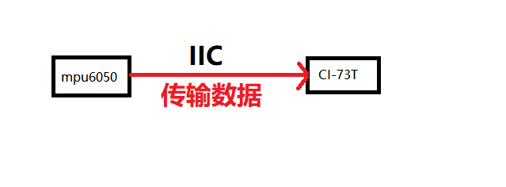

3. **双向通信需求**：

    - 支持读写操作
    - 传输动态实时数据
    - 使用变量形式处理数据

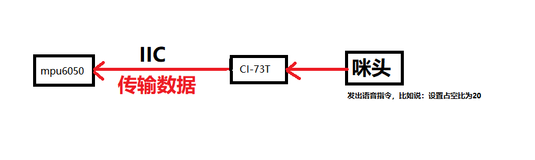

**3. 实现方案**

- **方案一：定制固件**
    - 联系厂家进行I2C功能定制
    - 提供详细的通信协议需求
    - 评估开发周期和费用

- **方案二：二次开发**
    - 使用官方SDK进行二次开发
    - 需要具备RISC-V开发经验
    - 自主实现I2C通信协议

**技术要求**：

- **数据格式**：16位有符号整数
- **通信速率**：根据MPU6050规格配置
- **引脚分配**：需要专用I2C引脚或复用GPIO
- **实时性要求**：根据数据更新频率确定

**注意事项：**

- 标准平台无法直接配置I2C功能
- 定制开发需要额外的开发成本和时间
- 二次开发需要处理底层硬件接口
- 确认I2C地址分配，避免冲突
- 保留足够的系统资源用于数据处理

---

### CI-73T的降噪功能在哪里配置？

**问题描述：**

在配置CI-73T1/2芯片时，无法在智能体平台的前端信号处理界面找到降噪功能的配置选项。

**解决方案：**

**降噪配置位置：**

CI-73T的降噪功能配置与具体的应用场景相关：

1. **基础降噪说明**：

    - CI-73T内置降噪算法
    - 降噪功能与选定的应用场景绑定
    - 不同场景的降噪策略不同

2. **应用场景选择**：

    - 进入产品配置的"前端信号处理"界面
    - 选择合适的应用场景（如"窗帘电机"）
    - 系统会自动应用对应的降噪配置

3. **降噪级别说明**：

    - 不同应用场景有不同的降噪强度
    - 电机类场景针对电机噪声优化
    - 非电机场景可能有不同的降噪配置

**针对电机噪声的建议：**

1. **场景选择**：

    - 选择对应的电机类场景
    - 或选择噪声特征相似的场景
    - 测试不同场景的降噪效果

2. **参数微调**：

    - 如降噪效果不明显
    - 可尝试调整麦克风增益
    - 或优化硬件安装位置

**技术限制：**

- CI-73T的降噪是场景预设的
- 不支持用户自定义降噪参数
- 降噪效果与实际环境相关

**注意事项：**

- 如找不到降噪选项，确认是否选择了正确的应用场景
- 电机噪声特殊，可能需要多次测试不同场景
- 必要时联系厂家获取定制化建议

---

### 官网平台无法保存新建产品项目怎么办？

**问题描述：**

在使用官网平台创建CI-73T1产品项目时，无法保存新建的产品，导致无法进行后续操作。

**解决方案：**

**问题原因：**

这是临时的平台故障，可能与以下因素有关：

1. **平台服务器问题**
    - 服务器负载过高
    - 数据库连接异常
    - 网络波动影响

2. **浏览器缓存问题**
    - 本地缓存数据冲突
    - Cookie过期
    - 会话超时

**处理方法：**

1. **基础操作**
    - 刷新浏览器页面（F5）
    - 清除浏览器缓存和Cookie
    - 更换浏览器尝试（Chrome/Firefox/Edge）

2. **时间选择**
    - 避开高峰时段操作
    - 等待几分钟后重试
    - 问题通常在短时间内恢复

3. **网络检查**
    - 确认网络连接稳定
    - 尝试使用有线网络
    - 避免使用不稳定WiFi

**注意事项：**

- 这是平台临时故障，非用户操作错误
- 如长时间无法使用，请联系厂家
- 建议及时保存已编辑的内容，避免数据丢失

### CI-73T的CPU架构是什么？

**问题描述：**

需要确认CI-73T芯片的CPU架构类型（RISC-V或ARM）。

**解决方案：**

CI-73T系列芯片采用**RISC-V架构**。

**架构说明：**

- 所有CI系列芯片均使用RISC-V架构
- 这不是ARM架构，是开源指令集架构
- 与规格书描述一致

**注意事项：**

- CI系列和SU系列的架构可能不同
- 选择开发工具时需要注意架构兼容性
- 汇编或底层开发需要使用RISC-V工具链

### LD3322模块输出脉冲周期与设置不符怎么办？

**问题描述：**

LD3322模块配置为4000毫秒周期的脉冲输出，但示波器实测信号周期仅为2秒左右。

**解决方案：**

**1. 示波器设置检查**

- 确认示波器时基设置是否正确
- 检查测量范围是否合适
- 验证触发方式是否匹配信号类型

**2. 信号测量方法**

- 使用自动测量功能读取周期值
- 手动计算完整波形的时间长度
- 测量多个周期取平均值

**3. 可能原因分析**

- **示波器设置误差**：

    - 时基设置不正确导致读数偏差
    - 扫描速度与信号频率不匹配
    - 建议使用自动测量功能

- **信号源问题**：

    - 模块输出可能不稳定
    - 配置未正确生效
    - 建议重新生成并烧录固件

**4. 排查步骤**

1. 使用示波器的自动测量功能
2. 调整时基让显示2-3个完整周期
3. 测量多个周期验证一致性
4. 更换示波器通道重新测量

**注意事项：**

- 示波器时基设置对测量精度影响很大
- 建议使用示波器的自动测量功能
- 如仍有偏差，可尝试使用其他测量设备验证

---

### 如何在CI-73T上实现延时控制功能？

**问题描述：**

需要通过语音指令控制设备延时动作，例如在收到"启动第一路"指令后，延迟5秒再启动第二路。

**解决方案：**

可以通过设置定时器超时回调实现延时控制功能。

**1. 定时器配置方法**

- **创建定时器**：

    1. 进入开机事件配置
    2. 添加定时器控制
    3. 设置超时时间（如5000ms = 5秒）
    4. 选择重复模式（如需要）

- **配置延时动作**：

    1. 在定时器超时回调中添加动作
    2. 设置要控制的GPIO引脚
    3. 配置引脚输出状态（高电平/低电平）

**2. 实现步骤示例**

**实现第一路立即启动，第二路延时5秒启动**：

1. **配置第一路指令**：

    - 触发方式：语音命令"启动第一路"
    - 执行动作：GPIO_A25设置为高电平
    - 添加定时器启动：启动5秒定时器

2. **配置第二路指令**：

    - 触发方式：定时器超时
    - 执行动作：GPIO_A26设置为高电平
    - 关联定时器：选择之前创建的定时器

**3. 硬件连接**

- **第一路控制**：GPIO_A25连接第一路继电器
- **第二路控制**：GPIO_A26连接第二路继电器
- **共地连接**：确保所有设备共地

**4. 注意事项**

- **定时器资源**：确认模块支持的定时器数量
- **延时精度**：定时器精度为毫秒级
- **功耗考虑**：不使用低功耗模式时，1V1引脚可悬空
- **模块供电**：芯片内部有内核供电，无需外部额外供电

**5. 优化建议**

- **可重复使用**：定时器可设置为重复使用
- **多个延时**：可创建多个定时器实现不同延时
- **状态管理**：注意记录各延时的状态避免冲突

**配置界面示例：**

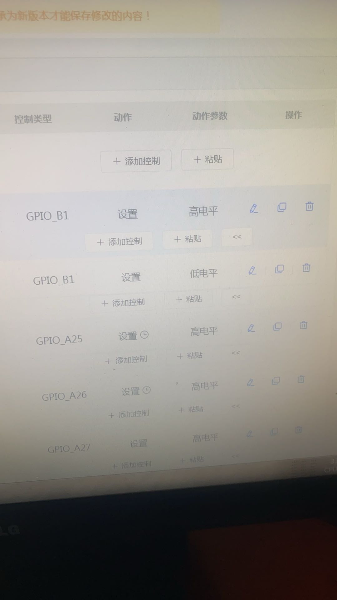

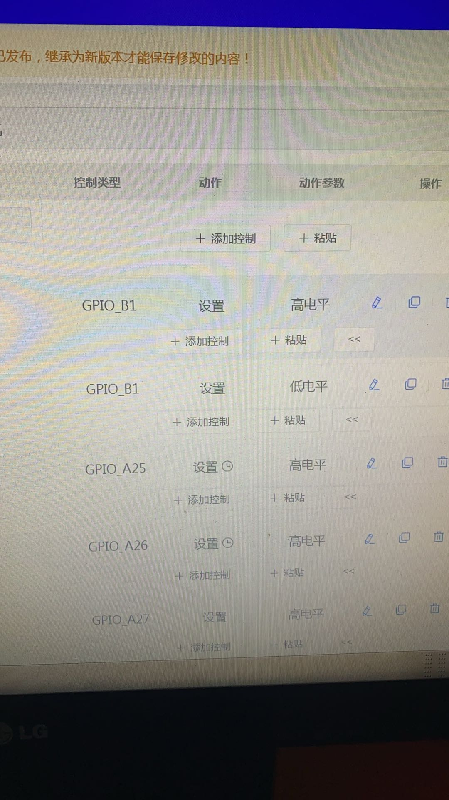

---

### 固件生成失败提示"CI13242 has no model V01179"怎么办？

**问题描述：**

固件生成失败，提示"CI13242 has no model V01179"，且无法选择正确的韩文模型配置。

**解决方案：**

**问题原因：**

1. **模型不可用**：

    - V01179是韩文标准通用Pro5模型的版本号
    - 当前CI13242芯片平台暂时还未支持韩文语言包
    - 韩文模型尚未在平台中发布

2. **平台限制**：

    - CI-73T模块的韩文支持仍在开发中
    - 应用场景区中显示的韩文选项暂时不可用
    - 配置检查通过但生成时会报错

**解决方法：**

1. **使用其他语言**：

    - 暂时选择中文或其他已支持的语言
    - 完成产品基本功能开发
    - 等待韩文模型发布

2. **联系厂家**：

    - 反馈韩文语言需求
    - 询问韩文模型发布时间表
    - 申请优先支持或测试资格

3. **替代方案**：

    - 如急需韩文支持，考虑使用其他型号
    - 评估是否可以使用在线翻译功能
    - 分阶段实现产品需求

**技术背景：**

- CI-73T是较新的模块型号
- 韩文语言支持需要专门的语音模型训练
- 平台正在逐步完善多语言支持

**注意事项：**

- 韩文模型支持是平台功能，非硬件限制
- 配置检查通过不代表生成一定成功
- 建议关注平台公告获取最新语言支持信息
- 如有批量需求，可提前与商务沟通定制方案

### SDK生成失败且无法选择应用场景和自然说模型怎么办？

**问题描述：**

在生成SDK固件时，多个版本均提示生成失败，且无法选择特定的应用场景和自然说模型，导致SDK生成失败。

**问题原因：**

1. **模型限制**：

    - CI-73T1在平台上可用的应用场景和自然说模型选项有限
    - 当前仅支持"普通话通用Pro"和"中文茶吧机通用Pro3"两个模型
    - 日语等其他语言的模型尚未在平台发布

2. **配置问题**：

    - 语音识别配置可能存在参数冲突
    - 产品特性设置为"仅语音识别"可能导致某些功能不可用

**解决方案：**

1. **使用可用模型**：

    - 选择"普通话通用Pro(占0.6M空间)-V00923-V1"应用场景
    - 选择"中文茶吧机通用Pro3(占0.5M空间)-V01048-V1"自然说模型
    - 完成产品开发后再考虑语言扩展

2. **检查配置参数**：

    - 确认麦克风配置正确（单MIC/双MIC）
    - 检查产品类别和场景设置是否匹配
    - 验证所有配置项是否兼容

3. **替代方案**：

    - 如需日语支持，可考虑使用CI-03T型号
    - CI-03T已验证支持日语，且引脚基本兼容
    - 联系厂家申请CI-73T日语定制

**注意事项：**

- 不同型号的语言支持进度不同
- 平台会逐步更新语言模型，关注官方公告
- 大批量生产前务必测试目标语言功能

### CI-73T1选择日语后显示"无数据"怎么办？

**问题描述：**

在CI-73T1模块配置界面中选择日语语言后，前端信号处理中的"自然说"选项显示为"无数据"，无法进行日语相关配置。

**问题原因：**

1. **语言包未发布**：

    - CI-73T1的日语语言包尚未在平台发布
    - 虽然规格书标注支持日语，但平台支持需要时间
    - 当前仅支持中文和英文模型

2. **平台更新延迟**：

    - 硬件支持不代表平台已发布对应语言包
    - 语言模型需要训练和验证后才能发布
    - 不同型号的语言支持进度不同

**解决方案：**

1. **使用其他语言开发**：

    - 暂时使用中文或英文进行开发
    - 验证产品功能基本正常
    - 等待日语语言包发布

2. **选择支持日语的型号**：

    - CI-03T已验证支持日语
    - 引脚与CI-73T1基本兼容
    - 可直接替换使用

3. **定制开发方案**：

    - 联系厂家申请日语定制
    - CI-73T可以通过定制支持日语
    - 需要额外的开发时间和费用

**注意事项：**

- 规格书标注的支持语言代表硬件能力
- 平台语言包会逐步更新，关注官方公告
- 如急需日语功能，建议更换为CI-03T
- 批量生产前务必验证目标语言功能

### 如何配置PWM触发条件实现风扇控制？

**问题描述：**

需要实现当任意一路PWM信号大于等于1时，将GPIO_A1设置为高电平（风扇开启）；当所有五路PWM信号均为0时，将GPIO_A1设置为低电平（风扇关闭）。

**问题分析：**

当前配置存在的问题：

1. 使用"上电启动"事件触发，该事件只在上电时触发一次
2. 上电时PWM值为0，不满足大于等于1的条件，因此GPIO_A1不会被设置为高电平
3. 配置了"五路PWM大于等于1"的条件，这意味着需要所有五路都大于等于1才触发

**解决方案：**

1. **修改触发条件**：

    - 不要使用"上电启动"作为触发条件
    - 改为使用"值变化"或"循环检测"触发
    - 或者设置多个控制行为分别处理

2. **正确的逻辑配置**：

    - 创建行为1：任意一路PWM ≥ 1 → GPIO_A1 = 高电平
    - 创建行为2：所有PWM = 0 → GPIO_A1 = 低电平

3. **具体实现方案**：

    - 方案一：使用5个独立的控制行为
        - 每个行为监听一路PWM
        - 条件：PWM_X ≥ 1 → 设置GPIO_A1为高电平
        - 另建一个行为：所有PWM = 0 → 设置GPIO_A1为低电平

    - 方案二：使用系统定时器循环检测
        - 设置定时器每100ms检测一次
        - 条件判断：如果有任意PWM ≥ 1 → 设置GPIO_A1高电平
        - 否则设置GPIO_A1低电平

**注意事项：**

- 上电启动事件只触发一次，不适合持续监控
- 条件中的"大于等于"需要注意边界值
- 确保PWM值的变化能够触发控制行为
- 测试时注意观察实际PWM值的变化范围

---

### CI-73T文档中提到的ADC功能是否可用？

**问题描述：**

在查阅CI-73T芯片文档时，发现文档中提到支持ADC功能引脚，但在实际的平台Pin脚配置中找不到ADC配置项。

**解决方案：**

CI-73T模块**不支持**ADC功能：

1. **文档错误说明**：

    - 产品规格书中标注的"支持接口"包含ADC属于文档错误
    - 实际硬件不支持ADC功能
    - 平台配置中不会出现ADC相关选项

2. **正确接口支持**：

    - CI-73T实际支持：UART、GPIO、PWM、I2S、I2C
    - 不支持：ADC（模数转换）功能

3. **替代方案**：

    - 如需要ADC功能，建议使用其他支持ADC的模块型号
    - 或外接ADC芯片通过I2C/SPI接口通信

**注意事项：**

- 文档正在修正中，以实际硬件功能为准
- 选型时请确认所需功能是否被硬件支持
- 如有疑问可联系厂家确认功能支持情况

---

### SDK生成时间过长（约180分钟）是否正常？

**问题描述：**

SDK生成时间异常延长，从正常的几分钟变为需要约180分钟，询问是否正常以及原因。

**解决方案：**

1. **平台异常情况**：

    - 正常情况下SDK生成应该只需要几分钟
    - 出现180分钟的生成时间属于平台异常
    - 周末平台曾出现故障，正在恢复中

2. **临时解决方法**：

    - 等待平台完全恢复正常
    - 避开高峰时段进行生成
    - 如持续异常，联系厂家

3. **故障排除**：

    - 检查网络连接是否稳定
    - 尝试刷新页面重新生成
    - 清除浏览器缓存后重试

**注意事项：**

- 这是临时性的平台问题，非正常现象
- 技术团队正在紧急修复
- 建议关注官方公告了解恢复进度
- 如急需固件，可联系厂家协助处理

---
 
### CI系列离线语音模块可以使用VSCode等本地编译器进行开发吗？

**问题描述：**

需要了解CI系列离线语音识别芯片是否支持使用VSCode等本地编译器进行二次开发，以及如何获取相关的开发资源。

**解决方案：**

**开发支持说明：**

CI系列离线语音模块**不提供**公开的SDK开发包，无法直接使用VSCode等本地编译器进行开发：

1. **无公开SDK**：

    - 官方不提供CI系列的公开SDK下载
    - 无法自行搭建完整的开发环境
    - 仅提供开源代码用于参考学习

2. **技术限制**：

    - CI系列为商业化的离线语音方案
    - 开发工具链和算法库未公开
    - 需要使用官方提供的开发包

3. **授权限制**：

    - SDK开发包仅提供给授权客户
    - 需要签署相关协议才能获取
    - 不支持个人开发者或未授权使用

**官方开发方案：**

1. **智能公元平台开发**：

    - 在线图形化配置界面
    - 无需编程知识即可完成开发
    - 支持可视化配置和调试

2. **授权开发包获取**：

    - 联系官方销售或厂家
    - 申请获取CI系列开发包的授权
    - 包含完整的开发工具和库文件

3. **Mixly图形化编程（教育场景）**：

    - 面向教育的图形化编程平台
    - 支持部分CI系列型号（如CI-73T2）
    - 适合学习和原型开发

**替代方案建议：**

1. **使用其他开源方案**：

    - 考虑使用其他开源语音识别方案
    - 如Mozilla Common Voice、Kaldi等
    - 需要较强的技术能力和时间投入

2. **模块化集成**：

    - 将CI系列模块作为语音识别单元
    - 配合开源主控（如ESP32、STM32）
    - 通过串口或IO口进行通信控制

3. **智能公元在线开发**：

    - 如项目允许，使用在线平台开发
    - 享受官方提供的维护服务
    - 减少开发复杂度和时间成本

**技术资源参考：**

- 智能公元平台：https://smartpi.cn/
- CI系列技术文档：https://help.aimachip.com/docs/offline_ci03t/
- 开发案例参考：查看各型号的示例工程和教程

---

## 串口通信

### 串口数据拼接与有符号数如何处理？

**问题描述：**

在串口通信中，传感器分两个字节发送数据，需要了解如何处理数据拼接以及有符号数（16位整数）的读取方法。

**解决方案：**

**1. 数据拼接限制**

- **无法直接拼接**：语音模块串口不能拼接两次发送的数据
- - 需要靠外部逻辑模拟：在接收端进行数据重组
- - 一帧内的数据也无法拼接：模块不提供字节级拼接功能

**2. 处理建议**

1. **发送端处理**：

    - 将16位数据拆分为两个字节分别发送
    - 添加数据标识符（如帧头帧尾）
    - 接收端根据标识符重组数据

2. **接收端方案**：

    - 使用缓冲区缓存接收到的字节
    - 根据协议逻辑判断数据完整性
    - 重组为完整的有符号数

**3. 有符号数处理**

- **数据范围**：-32768 ～ +32768（16位有符号整数）
- **字节拆分**：高8位 + 低8位
- **符号处理**：需要处理负数的符号位
- **重组方法**：`(高字节 << 8) | 低字节`

**4. 替代方案**

- **使用变量功能**：虽然有限制，但可尝试用于简单场景
- **外部MCU处理**：在单片机端完成数据处理逻辑
- **协议简化**：设计简洁的通信协议，减少拼接需求

**注意事项：**

- 语音模块仅提供字节级串口通信
- 复杂数据处理需要在外部实现
- 建议在硬件设计时考虑数据格式
- 保证通信双方的时钟和协议一致性

---

### 串口数据发送应选择"窗口参数"还是"添加变量"？

**问题描述：**

单片机通过串口向CI-73T发送数值时，不确定应该选择"添加窗口参数"还是"添加变量"来实现数据交互。

**解决方案：**

**功能说明**

1. **窗口参数**
    - 用于语音识别的参数传递
    - 主要与识别状态、触发条件相关
    - 适用于条件判断和流程控制

2. **变量功能**
    - 用于存储和传递数据值
    - 支持int、float、string等类型
    - 适合接收单片机发送的数值数据

**正确选择**

- **串口数据发送**：选择"添加变量"
- **数值存储**：选择"添加变量"
- **条件控制**：选择"添加窗口参数"

**操作步骤**

1. **定义变量**
    - 在"变量定义"页面添加所需变量
    - 设置变量类型（int、float等）
    - 配置默认值和备注

2. **串口接收**
    - 在控制配置中选择"添加变量"
    - 选择已定义的变量名称
    - 配置串口接收规则

**注意事项：**

- 变量支持在多个控制逻辑中复用
- 串口发送的数值会自动更新到对应变量
- 官网有详细的使用教程可供参考
- 变量名要与单片机发送的数据对应

---

### CI-73T2使用CI13LC SDK编译的固件无法唤醒怎么办？

**问题描述：**

在CI-73T2模块上使用CI13LC SDK编译的固件，虽然主芯片CI13242相同，但无法实现语音唤醒功能，而智能公元AI平台生成的固件可以正常工作。

**解决方案：**

**问题原因分析：**

1. **硬件差异**：

    - CI-73T2和CI13LC使用不同的开发板公版
    - 虽然主芯片相同（CI13242）
    - 但外围电路和配置存在差异

2. **软件配置差异**：

    - 启英泰伦SDK针对CI13LC开发板优化
    - 智能公元固件针对CI-73T2模块优化
    - 两者在底层配置上存在不同

**处理建议：**

1. **使用智能公元平台**：

    - 推荐使用智能公元AI平台生成固件
    - 平台已适配CI-73T2模块特性
    - 可确保功能正常使用

2. **SDK修改方案**：

    - 如必须使用SDK开发
    - 需要自行修改适配CI-73T2
    - 参考启英泰伦软件开发文档

3. **配置对比**：

    - 对比智能公元固件和SDK固件的差异
    - 重点检查音频配置和引脚定义
    - 调整SDK工程配置文件

**注意事项：**

- 不同厂商的同芯片模块可能存在兼容性差异
- SDK开发需要自行处理硬件适配问题
- 建议优先使用原厂提供的开发工具

---

### CI-73T1是否支持OTA升级？

**问题描述：**

询问CI-73T1语音模块是否支持OTA升级，希望了解是否有串口OTA等远程升级方案以应对未来可能出现的问题。

**解决方案：**

**1. OTA支持情况**

CI-73T1作为语音模块，其升级方式如下：

- **当前不支持OTA升级**：CI-73T1是纯语音识别模块
- **WiFi模块才支持OTA**：只有带WiFi功能的模块才支持空中升级
- **语音模块定位**：专注于离线语音识别功能

**2. 升级方案说明**

后期产品规划：

- 将推出二合一模块：集成语音识别+WiFi功能
- 支持OTA升级的复合型模块正在开发中
- 届时会支持更便捷的升级方式

**3. 现有升级方式**

当前CI-73T1的固件升级方式：

- 通过串口连接进行固件烧录
- 使用专用烧录工具和线缆
- 需要物理接触模块进行升级

**4. 设计考虑**

如果需要OTA功能，建议：

- 选择带WiFi功能的模块型号
- 或配合WiFi主控模块实现远程升级
- 预留串口升级接口作为备用方案

**注意事项：**

- CI-73T1本身不支持OTA，这是产品定位决定
- 后续产品会考虑OTA需求
- 选择模块时需确认是否需要OTA功能

---

### CI-73T是否支持中英文双语语音？

**问题描述：**

希望了解CI-73T芯片是否可以同时支持中英文双语语音识别，以及需要使用几个固件。

**解决方案：**

**语言支持模式：**

- **中英混合**：不支持在同一个固件中混合中英文指令
- **单一语言**：一个固件只支持一种语言（中文或英文）
- **多固件方案**：需要分别制作中文固件和英文固件

**实现方案：**

1. **两个固件方案**

    - 制作一个中文语音固件
    - 制作一个英文语音固件
    - 根据需求烧录对应固件

2. **切换方式**

    - 通过重新烧录固件切换语言
    - 或在硬件上设计语言选择开关
    - 配合不同的MCU程序实现自动切换

**注意事项：**

- 不支持中英文混合识别
- 每个固件只能识别对应语言的指令
- 如需同时支持中英文，需要配合外部逻辑判断
- 建议明确产品需求，选择单一语言方案以降低复杂度

---

### 固件生成失败提示"生成的固件超大"怎么办？

**问题描述：**

在平台上生成固件时，系统提示"生成失败，生成的固件超大(2012927字节)，请删减配置项目，选用小模型或使用组合播报"。例如80多个命令词导致固件大小超出限制。

**解决方案：**

**理解错误原因：**

- 固件大小超出所选模块的Flash容量限制
- CI-03T、CI-33T等不同型号有不同的Flash容量
- 即使更换模块型号，如果配置项过多仍可能导致固件过大

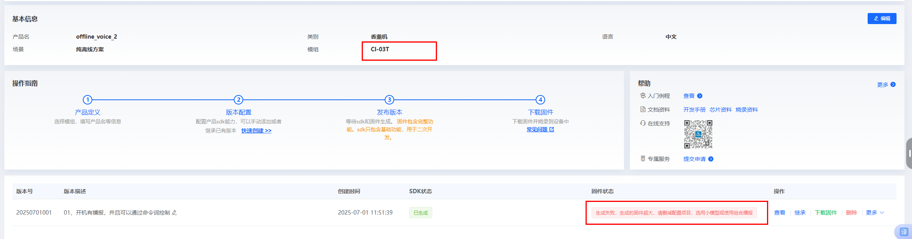

**解决步骤：**

**1. 检查模块型号与容量**

- CI-03T：支持300条词条，Flash容量较小
- CI-33T：支持500条词条，Flash容量更大
- 确认产品信息中的模块型号设置正确

**2. 削减配置项目**

- **减少词条数量**：删除不必要的命令词
- **简化语音模型**：使用更小的识别模型
- **减少控制逻辑**：合并相似的控制动作
- **优化播报内容**：使用更短的TTS文本

**3. 使用组合播报**

- 将多个固定播报组合成一个
- 减少单独的TTS播报指令
- 使用变量播报代替固定文本

**4. 模型选择建议**

- 优先选择小模型：如基础识别模型
- 避免使用大型声学模型
- 根据实际需求选择合适精度

**注意事项：**

- 不同模块的Flash容量不同，需根据型号限制配置
- 固件大小包括所有配置、模型和播报内容
- 建议分模块开发，逐步测试功能
- 如需大量功能，考虑使用更大容量的模块型号
- 不是指固件总大小为8192字节，而是超出了8192字节的限制
- 1M Flash的模块，系统程序会占用部分空间，剩余空间用于使用方配置

**优化固件大小的方法：**

1. **选择更小的应用模型**
    - 将应用场景从"普通话通用Pro(占0.6M空间)"改为更小的模型
    - 如"普通话通用(占0.5M空间)"或其他占用空间更小的模型
    - 选择0.6M或更小占用的模型

2. **简化回复语**
    - 减少每个回复语的字数
    - 避免使用重复的长回复语
    - 一个汉字通常占用3个字节
    - 减少播报内容数量，播报内容很吃存储空间

3. **降低音频质量**
    - 将个性化音频从"16位"调为"8位"
    - 可显著减少音频占用的空间

4. **删减配置项目**
    - 减少语音指令数量
    - 移除不必要的个性化音频
    - 使用组合播报功能替代多个独立回复语

5. **关闭不必要的功能**
    - 如启用了声纹检测等功能，考虑关闭以减少内存占用
    - 检查GPIO配置，关闭未使用的输出功能
    - 声纹检测功能会占用较多存储空间

**6. 声纹检测功能优化**

- 如果必须使用声纹检测，尽量减少注册的回复语数量
- 仅注册5个回复语仍可能导致内存超限
- 考虑删除部分声纹功能（如删除声纹命令）
- 选择更小的模型（如0.6M）以节省空间

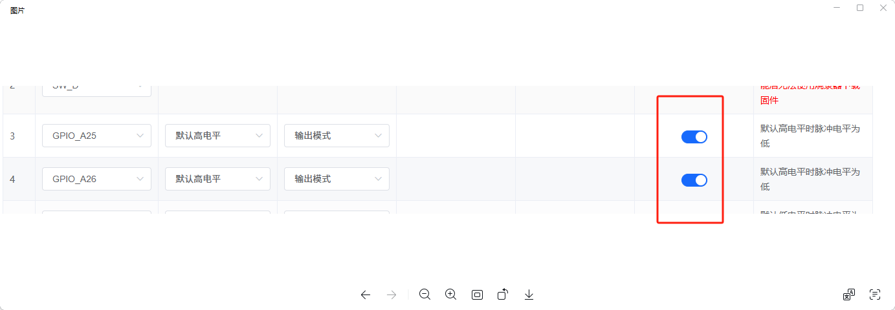

**Flash容量说明：**

- CI-73T1模块内置1M Flash（1024×1024字节）
- 系统会占用部分空间（如0.6M）
- 剩余空间用于使用方配置和音频数据
- 如果配置超出剩余空间，就会生成失败

**选择合适模块：**

- 如果优化后仍无法生成，考虑选用Flash容量更大的模块
- 根据实际需求评估所需Flash大小
- 建议先保证功能实现，再进行优化

**注意事项：**

- 相同的回复语不会自动合并，每个都会单独占用空间
- 应用场景模型大小是影响固件大小的主要因素
- 生成前可以先导出配置文件备份

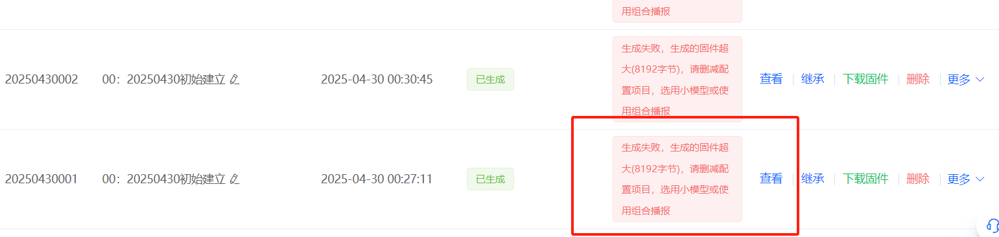

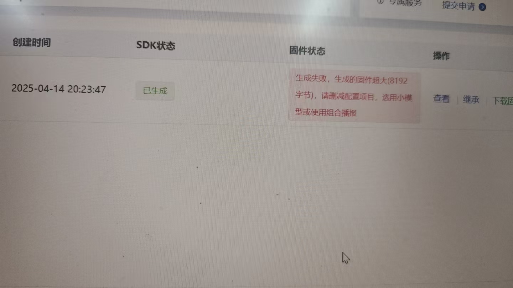

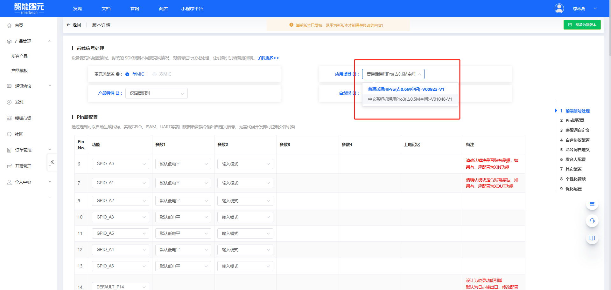

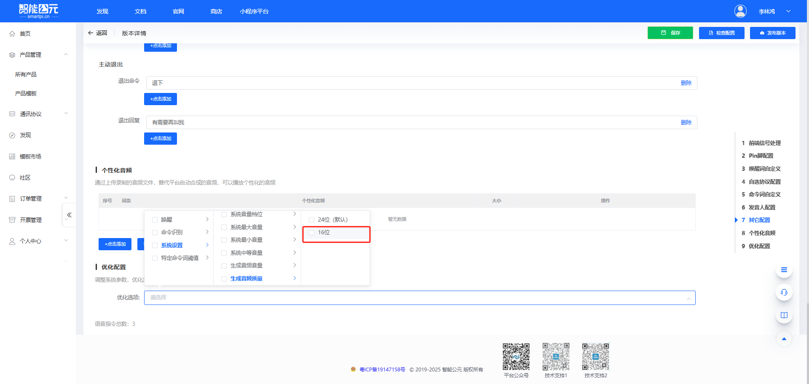

---

---

### 固件生成持续超时怎么办？

**问题描述：**

平台固件生成服务持续超时，系统提示"当前排队任务过多，请半小时后再尝试提交"，无法成功生成固件。

**解决方案：**

**当前系统状况：**

1. **服务器负载过高**
    - 多使用方同时提交生成任务导致服务器拥堵
    - 系统提示"排队任务过多"说明服务器已达处理上限
    - 即使在凌晨等非高峰时段也可能出现超时

2. **系统通知与实际状态不一致**
    - 可能收到"固件已生成"的通知，但打开后仍显示超时
    - 这是系统前端通知与后端状态不同步导致

**应对策略：**

1. **减少重复提交**
    - 避免多次同时提交生成任务
    - 每次提交后等待完成再尝试下一次
    - 多次提交会加剧服务器拥堵

2. **选择替代方案**
    - 考虑使用CI-73T模块进行测试
    - CI-73T生成速度更快，成本更低
    - 基础语音功能与SU-03T相同

3. **获取SDK源代码**
    - 下载任意之前生成的固件包
    - 内含开源代码，可自行开发
    - 适合有开发能力的使用方

**临时解决方案：**

1. **使用已有固件**
    - 联系群内其他使用方分享相似配置的固件
    - 先使用基础功能进行开发测试
    - 等系统恢复后再生成定制固件

2. **分时段尝试**
    - 早上6-8点尝试生成（相对负载较轻）
    - 避开晚上和周末等高峰期
    - 每次尝试间隔至少1小时

**注意事项：**

- 这是平台系统性问题，非个人设置或网络问题
- 技术团队正在努力优化服务器性能
- 紧急项目建议准备备用方案（如其他模块）
- 保存好配置信息，便于系统恢复后快速生成

---

### 如何配置唤醒后的事件触发机制？

**问题描述：**

需要配置唤醒词触发后的事件处理机制，但不确定是否会有引脚电平变化，以及如何在平台中设置。

**解决方案：**

CI-73T等模块不会自动产生引脚电平变化，需要自行设计事件触发逻辑。

**配置方法：**

**1. 进入触发配置**

    - 在控制详情页面找到"行为"列
    - 选择"wakeup_ui"作为触发行为
    - 设置对应的唤醒词

**2. 配置触发动作**

    - 控制类型：选择"系统触发"
    - 动作选择："进入唤醒"
    - 保存配置并生成固件

**3. 自定义事件处理**

    - 可通过GPIO输出控制外部电路
    - 使用PWM信号作为唤醒指示
    - 通过串口发送唤醒状态

**注意事项：**

- 唤醒后不会有引脚自动拉高/拉低
- 需要在平台中配置事件触发链
- 唤醒状态可通过串口查询
- 可根据需求设计自定义的硬件响应

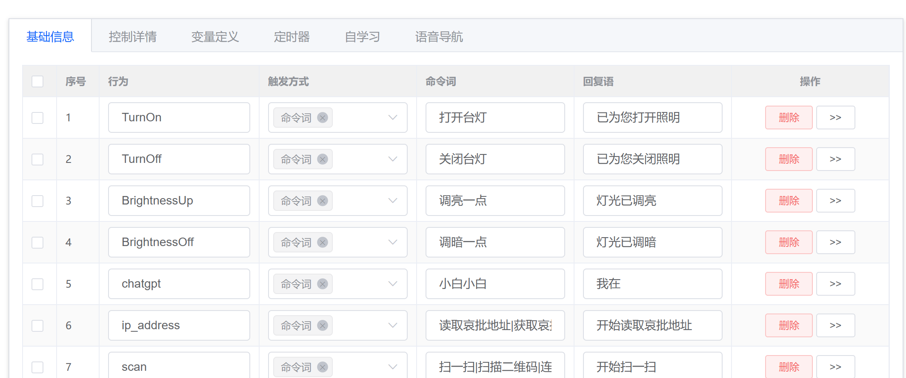

---

## 串口控制协议

---

### 语音模块是否支持将识别的语音指令以TTS文本形式输出？

**问题描述：**

需要了解语音模块是否能将识别到的语音指令（如"把闹钟定在下午3点15分"）以TTS文本形式通过串口输出，以便单片机解析并处理动态参数。

**解决方案：**

**现有模块方案：**

- **不支持直接输出TTS文本**：当前样品模块（如CI-73T2、SU-03T）不支持将识别的语音指令直接以文本形式输出
- **固定协议输出**：模块识别到指令后，只能通过串口发送预设的固定协议
- **无法处理泛化需求**：对于包含动态参数的指令（如不定时的闹钟设置），现有方案无法满足

**AI大模型方案：**

正在开发的AI大模型方案可以实现此功能：

- **支持语音文本输出**：可将识别到的完整语音指令以文本形式输出
- **处理动态参数**：能够理解和解析包含时间、数量等变量的指令
- **泛化能力强**：支持更灵活的自然语言理解和处理

**选型建议：**

1. **固定指令场景**：

    - 使用现有模块（CI-73T2、SU-03T等）
    - 在平台配置固定的控制协议
    - 适用于指令数量有限、参数固定的应用

2. **泛化指令场景**：

    - 等待AI大模型方案发布
    - 支持自然语言理解和文本输出
    - 适用于需要处理动态参数的复杂应用

**注意事项：**

- AI大模型方案正在开发中，具体发布时间需咨询官方技术团队
- 现有模块可通过增加指令数量部分满足需求，但无法完全解决泛化问题
- 建议根据项目实际需求选择合适的方案

---

### 如何让云端智能体返回串口指令？

**问题描述：**

需要让云端智能体（如扣子智能体）在响应用户指令时返回特定的串口指令数据，以实现类似离线语音模块的灯光控制功能。

**解决方案：**

**1. 智能体技能配置**

- 在扣子智能体中配置特定技能，使其能够识别用户关于灯光控制的请求
- 当智能体识别到相关指令时，返回预定义的串口指令数据
- 例如：用户输入"打开客厅灯" → 智能体返回"0x01 0x02 0x03"

**2. 指令映射与格式化**

- 在智能体的响应逻辑中，将自然语言指令映射为标准的串口通信协议格式
- 需要定义清晰的指令对照表
- 确保串口指令格式与目标设备兼容

**3. 串口指令发送逻辑**

- 使用外部MCU或主控设备接收智能体返回的串口指令数据
- 通过串口将指令发送至目标设备（如灯光控制器）
- 注意时序控制：确保通信稳定可靠

**4. 相关说明**

- 相关功能文档正在整理中，建议关注官方文档更新
- 可参考离线语音模块的串口控制逻辑作为实现参考
- 需要确保云端智能体与本地设备的通信协议匹配

**注意事项：**

- 确保串口通信参数（波特率、数据位、停止位等）与目标设备一致
- 云端智能体返回的指令需要有明确的格式定义
- 建议在实际部署前进行充分的测试验证

---

### CI-73T1能否实现声音大小控制PWM输出？

**问题描述：**

希望在CI-73T1模块上实现通过检测声音大小来控制IO输出不同PWM信号的功能，以实现类似声控喷泉的调速效果。

**解决方案：**

**技术可行性分析：**

1. **软件层面实现**
    - CI-73T1确实有检测声音大小的算法
    - 可以通过软件层面实现分贝大小检测
    - 但实际测试效果不理想，准确度不高

2. **平台限制**
    - 智能公元平台无法直接配置此功能
    - 需要通过SDK开发才能实现
    - 无现成的配置界面和教程

**替代方案建议：**

1. **使用外部传感器方案**
    - 采用专用的声音传感器模块
    - 通过ADC采集声音信号
    - 使用单片机处理并输出PWM控制

2. **实现步骤**
    - 连接声音传感器到单片机ADC引脚
    - 编写程序采集声音强度
    - 根据分贝值输出对应占空比的PWM
    - 驱动电机或水泵实现调速

**注意事项：**

- CI-73T1的声音检测算法主要用于语音识别，不是精确的分贝测量
- 软件实现的准确性受环境影响较大
- 对于需要精确控制的场景，建议使用专用传感器
- 如坚持使用模块方案，需要进行SDK开发

---

### CI-73T系列SDK生成提示请求超时怎么办？

**问题描述：**

在使用CI系列SDK平台时，遇到SDK生成超时的问题，无法正常生成固件。

**解决方案：**

**问题原因：**

1. **服务器维护通知**
    - CI系列平台在2025年3月12日18:00开始维护
    - 维护期间功能无法使用
    - 预计14日恢复正常服务

2. **维护影响范围**
    - 固件生成功能
    - SDK下载服务
    - 在线配置保存

**临时解决方案：**

1. **等待维护完成**
    - 关注平台通知，等待维护结束
    - 14日后再尝试生成SDK
    - 避免在维护期间重复提交

2. **提前规划**
    - 关注平台维护公告
    - 提前生成需要的固件
    - 保留备份固件以备不时之需

**注意事项：**

- 平台维护是必要操作，无法避免
- 维护期间所有用户都无法使用服务
- 建议关注官方通知获取最新进展
- 如紧急需要固件，可联系厂家协助

---

### CI-73T的编译速度是否已经优化？

**问题描述：**

之前使用SU-03T时遇到编译特别慢的问题，想了解CI-73T的编译速度是否已经改善。

**解决方案：**

**1. 平台优化进展**

- **编译速度已优化**：智能公元平台已完成编译优化
- **服务器负载改善**：平台性能得到显著提升
- **生成时间缩短**：相比之前的超长等待时间，现在生成速度正常

**2. CI-73T性能优势**

- **生成速度快**：CI-73T作为推荐替代方案，生成效率更高
- **服务器优先级**：相比热门型号，CI-73T的队列压力较小
- **性价比高**：成本低且性能稳定，适合快速测试

**3. 使用建议**

- **首选CI-73T**：如对生成速度有要求，优先使用CI-73T进行测试
- **错峰使用**：SU-03T如遇拥堵，可选择非高峰时段
- **备选方案**：保持多种型号库存，避免单一型号拥堵影响进度

**注意事项：**

- 平台优化是持续过程，速度会逐步改善
- CI-73T功能与SU-03T类似，可直接替换测试
- 建议根据项目紧急程度选择合适的模块型号
- 编译速度还与配置复杂度相关，简单配置生成更快

---

### 如何使用零代码平台进行固件配置？

**问题描述：**

需要了解如何通过零代码平台配置固件，包括自定义唤醒词、命令词、回复语以及各种协议收发等功能。

**解决方案：**

智能公元平台提供零代码配置功能，操作步骤如下：

1. **访问平台**
    - 登录机芯智能官网（http://www.smartpi.cn/#/）
    - 进入智能公元平台

2. **配置功能**
    - 自定义唤醒词：根据产品需求设置专属唤醒词
    - 命令词配置：添加所需的控制命令词
    - 回复语设置：配置识别后的语音反馈
    - 协议收发：设置各种通信协议
    - GPIO控制：配置引脚输入输出
    - PWM调节：设置脉冲宽度调制
    - 自学习功能：启用指令自学习

3. **生成固件**
    - 配置完成后生成固件（约1小时完成）
    - 下载SDK获取开源代码

**注意事项：**

- 平台支持语音识别和WIFI模块的直接配置
- 无需编程基础，通过图形化界面即可完成
- 推荐选择适合的芯片型号进行开发，如CI-73T2（单MIC离线语音模块，支持300条命令词）

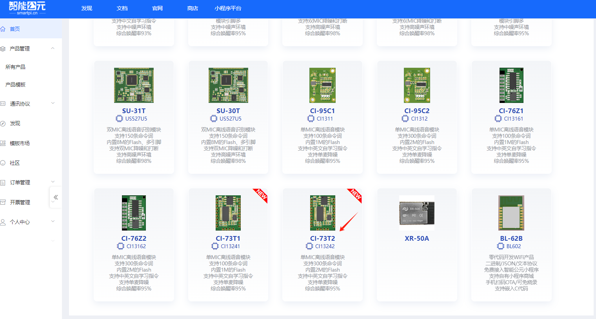

---

---

### 固件生成失败提示超大怎么办？

**问题描述：**

在平台生成固件时失败，错误提示为"生成失败，生成的固件超大(8192字节)，请删减配置项目，选用小模型或使用组合播报"。

**解决方案：**

固件大小超过芯片Flash容量限制时的处理方法：

**1. 优化现有配置**

- **删减命令词**：减少不必要的命令词数量
- **简化回复语**：缩短回复内容，使用简洁的表达
- **选用小模型**：更换为占用Flash更小的识别模型
- **使用组合播报**：将多个回复语组合成固定播报模式

**2. 选择更大Flash容量的模块**

不同型号模块的Flash容量：

- **CI-73T1**：1M Flash
- **CI-73T2**：2M Flash（适合大容量固件）

**3. 预测试验证**

- **平台配置**：在购买前先在平台配置完整功能
- **生成测试**：尝试生成固件，确认是否能成功
- **容量评估**：根据实际需要选择合适容量的模块

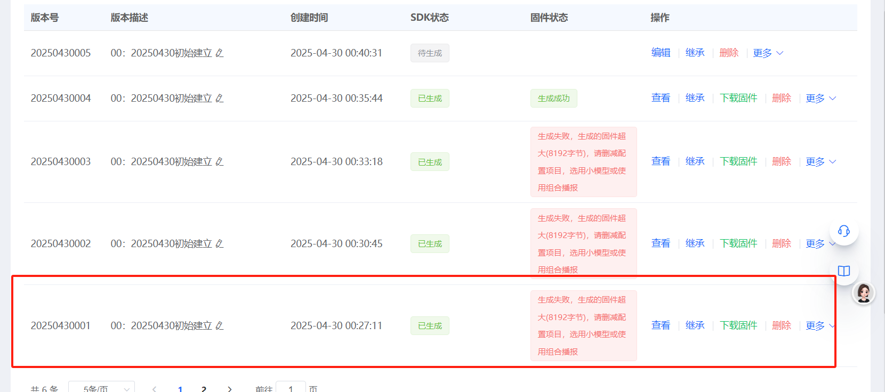

**注意事项：**

- 31条和91条回复语的固件可能超过普通芯片的Flash限制
- 出现"超大"提示时，说明配置已超出当前芯片容量
- 建议优先选用小模型简化配置，仍无法解决时再考虑升级硬件
- CI-73T2等2M Flash模块可支持更复杂的配置需求

---

---

### 代理平台与原厂SDK的支持范围区别

**问题描述：**

误以为技术团队团队是产品原厂，询问是否可以提供SDK开发支持，实际需要确认平台与SDK的支持范围。

**解决方案：**

**1. 代理身份确认**

- 当前为代理商，非产品原厂
- 提供代理级别的技术团队服务
- 原厂SDK需要直接联系芯片厂商

**2. 支持范围差异**

- **平台开发**：代理商提供完整技术团队
    - 图形化配置界面
    - 在线技术团队
    - 产品问题解答

- **SDK开发**：需要联系原厂
    - 编程手册和数据表
    - GCC编译环境配置
    - 底层开发支持

**3. 推荐方案**

- 优先使用平台进行产品开发
- CI-73T等模块支持平台直接开发
- 无需使用SDK即可完成大部分功能

**注意事项：**

- 平台开发周期更短，适合快速量产
- SDK开发需要更强的技术能力
- 选择开发方式前先确认技术团队渠道

---

### CI-73T模块是否可以使用平台直接开发？

**问题描述：**

确认CI-73T模块是否可以通过机芯智能平台进行开发，而不必使用SDK。

**解决方案：**

- CI-73T模块支持平台直接开发
- 可以不使用SDK进行产品开发
- 平台提供了完整的配置功能

**开发优势：**

- 无需配置复杂的编译环境
- 图形化界面操作简单
- 快速实现语音识别功能
- 支持在线固件生成

**注意事项：**

- 推荐优先使用平台开发
- 平台已支持CI-73T的全部功能
- 如有特殊需求可联系技术团队

---

### 智能公元平台中找不到UART0_TX/RX控制选项

**问题描述：**

在智能公元平台添加控制时，控制类型下拉菜单中没有UART0_TX和UART0_RX选项。

**解决方案：**

- 需要先在"Pin脚配置"中将GPIO配置为UART功能
- 例如：将GPIO_A6配置为UART0_TX，设置波特率、数据位、停止位等参数
- 配置完成后，在控制逻辑中即可选择对应的UART控制选项

**注意事项：**

- 引脚必须先配置为对应功能，才能在控制逻辑中使用
- UART0、UART1、UART2的具体引脚对应关系请参考模组规格书

---

### 智能公元平台无法下载固件

**问题描述：**

在智能公元平台发布固件后，点击下载时提示"无法下载"。

**解决方案：**

- 重新生成固件后再尝试下载
- 确保所有配置项已正确填写
- 检查网络连接是否正常

**注意事项：**

- 固件发布后需要等待几秒钟才能下载
- 如持续无法下载，可尝试清除浏览器缓存后重试

---

### CI-73T延时功能的最大有效延时时间

**问题描述：**

需要了解CI-73T芯片延时功能支持的最大有效延时时间。

**解决方案：**

- 最大延时时间没有官方限制值，需要根据实际使用场景测试
- 延时时间以毫秒为单位，如6小时=21600000毫秒
- 建议进行长时间稳定性测试以确定实际上限

**注意事项：**

- 长时间定时可能会影响系统稳定性
- 典型应用场景通常不需要过长的定时时间

---

### CI-73T固件大小限制与芯片型号确认

**问题描述：**

需要确认CI-73T芯片的固件大小限制，以及如何区分T1和T2型号。

**解决方案：**

- **CI-73T1**：内置1MB Flash，固件大小不能超过1MB
- **CI-73T2**：内置2MB Flash，固件大小不能超过2MB
- 查看芯片丝印确认型号：13242即为CI-73T2

**注意事项：**

- 芯片表面的丝印会明确标注型号信息
- CI-73T1和CI-73T2在功能上基本相同，主要区别在于Flash容量
- 选择型号时应根据实际固件大小需求决定
