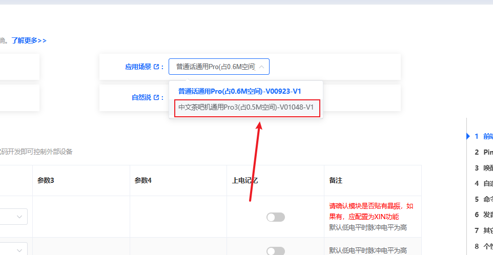
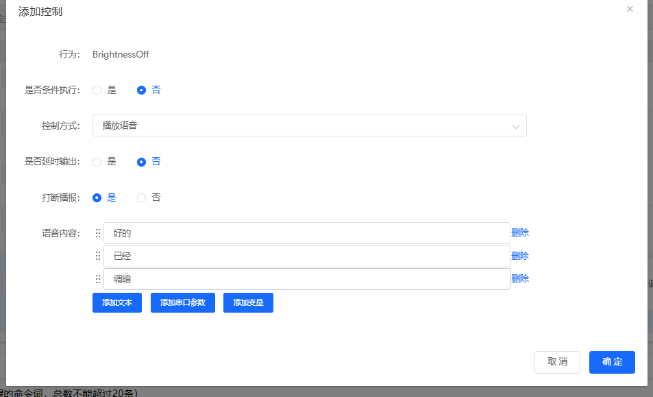
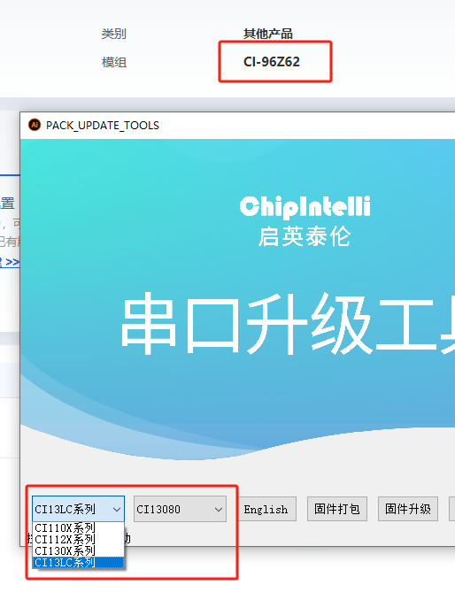

# CI-96Z 平台与固件 FAQ

本页用于整理 CI-96Z 相关的平台与固件问题。

### CI-96Z如何通过语音指令发送串口数据包？

**问题描述：**

需要实现当识别到"开灯"或"关灯"等语音指令时，通过串口发送固定的数据包，供其他单片机解析并控制外设。

**解决方案：**

**1. 配置串口引脚**

1. **Pin脚配置**：

    - 在平台进入Pin脚配置页面
    - 选择两个GPIO引脚配置为UART功能
    - 例如：PA15配置为UART1_TX，PA16配置为UART1_RX

2. **串口参数设置**：

    - 波特率：9600（或根据需求调整）
    - 数据位：8
    - 停止位：1
    - 校验位：无

**2. 配置语音指令和串口输出**

1. **添加"开灯"命令**：

    - 命令词：设置"开灯"
    - 添加控制动作：端口输出
    - 控制类型：UART1_TX
    - 动作：发送
    - 参数：设置开灯数据包（如 AA BB 01 00 CC DD）

2. **添加"关灯"命令**：

    - 命令词：设置"关灯"
    - 添加控制动作：端口输出
    - 控制类型：UART1_TX
    - 动作：发送
    - 参数：设置关灯数据包（如 AA BB 00 00 CC DD）

**3. 数据包格式设计**

```
数据包格式：
AA BB [命令] [数据] CC DD

- AA BB：固定帧头
- [命令]：命令标识（01=开灯，00=关灯）
- [数据]：附加数据（如亮度值）
- CC DD：固定帧尾
```

**4. 单片机端解析示例**

```c
// 单片机接收解析代码
void parse_uart_data() {
    if (uart_buffer[0] == 0xAA && uart_buffer[1] == 0xBB) {
        switch(uart_buffer[2]) {
            case 0x01:  // 开灯命令
                turn_on_light();
                break;
            case 0x00:  // 关灯命令
                turn_off_light();
                break;
        }
    }
}
```

**注意事项：**

- 串口引脚配置后需重新烧录固件
- 数据包格式要与接收端约定一致
- 建议使用十六进制格式发送数据
- 可根据需要添加更多命令和数据
- 测试时使用串口调试助手验证输出

---

### CI-96Z自学习功能开启后固件生成超大如何解决？

**问题描述：**

在开启自学习功能后，仅添加三条语音词条就会提示固件生成超大，导致无法正常生成固件。

**解决方案：**

**1. 选择更小的模型**

- 在固件生成平台的模型选择界面，选择占用空间更小的模型
- 推荐使用"中文茶吧机通用Pro3(占0.5M空间)-V01048-V1"或类似小容量模型
- 该模型相比通用Pro模型可节省约0.1M空间



**2. 使用组合播报功能**

当需要播报多个词语时，使用组合播报可以节省固件空间：

- 进入"添加控制"配置界面
- 设置行为：选择需要触发的动作
- 控制方式：选择"播报"
- 在播报内容中添加多个语音内容（如"好的"、"已经"、"调暗"）
- 可选择是否延时输出和打断播报设置



**注意事项：**

- 开启自学习功能会显著增加固件大小，建议尽量使用小模型
- 组合播报可以将多个短词语合并为一个播报动作，有效节省空间
- 如仍提示固件超大，考虑减少词条数量或关闭部分高级功能
- 选择模型时要根据实际应用场景，在功能和空间占用间找到平衡

### CI-96Z62应选择哪个产品系列？

**问题描述：**

使用串口升级工具时，CI-96Z62芯片在"其他产品"中可以选择，但不确定"系列"选项应选择哪个。

**解决方案：**

**正确选择：**

- **产品类型**：其他产品 → CI-96Z62
- **系列选择**：CI13LC系列



*串口升级工具中CI-96Z62的正确选择*

**选择依据：**

- **CI-96Z62** 属于 CI13LC 系列产品
- 该系列基于 CI1303 芯片平台
- 支持离线语音识别功能
- 适用于需要高性能语音处理的应用

**注意事项：**

- 选择错误的系列可能导致固件不兼容
- 确认芯片型号后再进行固件升级
- 如不确定可查看芯片表面丝印
- 建议保留原固件作为备份

### 如何确认金手指语音模块的型号？

**问题描述：**

收到金手指语音模块后，需要确认是否为C1系列以及具体型号信息。

**解决方案：**

**1. 标签信息识别**

- 查看产品标签上的完整信息
- 确认"金手指语音模块-无小程序"标识
- 核对规格型号CI-96Z61

**2. 型号对应关系**

- CI-96Z61对应C1系列
- 基于CI13161芯片
- 无小程序功能版本

**3. 订单管理**

- 根据实际需求调整订单数量
- 可优先使用现有库存
- 后续按需安排生产

**注意事项：**

- 金手指模块需注意焊接工艺
- 确认与现有方案的兼容性
- 保留标签信息便于追溯
- 如有疑问及时与供应商确认

---


### CI-96Z蓝牙广播5分钟后自动隐藏功能如何配置？

**问题描述：**

模块开机后5分钟内可被搜索连接，但5分钟后广播自动隐藏，防止他人随意连接。需要了解该功能的具体实现机制。

**技术原理：**

**1. 广播隐藏机制**

- **初始阶段（0-5分钟）**：模块正常广播，可被小程序搜索和连接
- **检查阶段（5分钟节点）**：模块检查当前连接状态
- **隐藏条件**：只有在断开连接状态下才会隐藏广播
- **持续检查**：如果5分钟时仍处于连接状态，每10秒检查一次直至断开

**2. 实现逻辑**

```c
// 伪代码示例
void broadcast_hide_check() {
    if (system_time >= 5_minutes) {
        if (is_connected()) {
            // 连接状态下，每10秒检查一次
            set_timer(10_seconds, broadcast_hide_check);
        } else {
            // 断开连接，立即隐藏广播
            hide_broadcast();
        }
    }
}
```

**3. 应用场景**

- 防止他人随意扫描和连接设备
- 保护设备安全，避免未授权访问
- 仅在需要配对时允许被发现
- 隐藏后仍可通过遥控器正常使用

**注意事项：**

- 广播隐藏仅影响小程序搜索功能
- 隐藏后遥控器仍可正常使用
- 重新上电后会重置5分钟计时
- 小程序连接状态下不会触发隐藏

---

### CI-96Z葡萄牙语识别效果差如何优化？

**问题描述：**

CI-96Z61/CI-96Z62的葡萄牙语识别效果明显差于SU-03T，需要了解优化方案和成本。

**技术对比：**

| 型号 | 葡萄牙语识别效果 | 说明 |
|------|------------------|------|
| SU-03T | 最好 | 支持中英文，识别率高 |
| CI-96Z62 | 较好 | 优于CI-96Z61 |
| CI-96Z61 | 较差 | 不推荐用于葡萄牙语 |

**优化方案：**

**1. 重新训练模型**

- **训练方式**：使用客户提供的高质量音频样本
- **样本要求**：每条命令词至少50条真人录音
- **训练周期**：约3-4周
- **优化方向**：针对易混淆词组进行调整

**2. 成本说明**

- **小语种训练费用**：具体费用请联系官方客服评估
- **包含内容**：语料收集、清洗、训练、测试
- **费用政策**：如涉及优惠政策或商务条款，请联系官方客服确认

**3. 替代方案**

- 如果预算有限，可降低识别要求
- 针对特定命令词进行优化（如二选一）
- 调整命令词，避免音节相似的情况

---

### CI-96Z如何区分1M和2M内存版本？

**问题描述：**

CI-86Z系列芯片有1M和2M两种内存版本，需要准确区分以避免使用错误的固件。

**识别方法：**

**1. 查看芯片丝印**

- **1M版本**：丝印标记为 "13161"
- **2M版本**：丝印标记为 "13162"
- **查看方式**：使用强光手电筒照射芯片表面

**2. 识别位置**

```
芯片布局示意：
┌─────────────┐
│  CI-86Z2    │
│  13161/13162 │  ← 内存容量标记
│              │
└─────────────┘
```

**3. 应用差异**

- **1M版本**：适用于基础功能，固件较小
- **2M版本**：支持更多功能，可存储更大模型
- **固件兼容性**：两个版本的固件不通用

**注意事项：**

- 采购时需明确内存容量要求
- 丝印较难查看，建议在良好光线下观察
- 烧录前务必确认芯片版本和固件匹配
- 保存芯片包装上的标识信息便于区分

---

### CI-96Z串口通信配置及调试方法

**问题描述：**

连接串口调试工具时出现通信异常，或某些CH340模块无法正常连接，需要了解正确的配置方法。

**通信参数：**

**1. 标准配置**

- **波特率**：115200
- **数据位**：8
- **停止位**：1
- **校验位**：无
- **流控**：无

**2. 硬件连接**

```
模块引脚    功能        连接方向
VCC        3.3V        输入
GND        地           输入
TX         串口发送      输出
RX         串口接收      输入
```

**3. CH340兼容性问题**

**问题描述：**
某些CH340 USB转串口模块在开漏模式下无法正常通信

**解决方案：**

- 将串口配置改为推挽模式（Push-Pull）
- 更换支持开漏模式的CH340模块
- 使用其他品牌的USB转串口模块

**4. 常见问题排查**

- **无通信**：检查TX/RX是否交叉连接
- **乱码**：确认波特率设置正确
- **连接失败**：尝试更换USB端口或数据线
- **驱动问题**：安装正确的CH340驱动程序

**调试技巧：**

1. 使用串口助手发送 "AT" 测试通信
2. 观察55 AA帧头是否正确接收
3. 检查数据帧格式是否符合协议要求
4. 使用示波器测量信号电平是否正常

---

### CI-96Z遥控器配对与使用说明

**问题描述：**

需要了解CI-96Z的蓝牙遥控器配对机制、码存储位置以及使用注意事项。

**配对机制：**

**1. 配对方法**

- **操作步骤**：同时按住遥控器的K1+K2或K9+K10键
- **配对模式**：遥控器进入配对状态，等待设备响应
- **绑定确认**：设备识别后完成配对绑定

**2. 码存储位置**

- **存储位置**：配对码存储在遥控器中，非接收器
- **码丢失风险**：设计良好，基本不会出现码丢失
- **多设备支持**：可支持一控多功能

**3. 工作模式**

- **广播模式**：未配对时，可控制所有同类型接收器
- **配对模式**：配对后，只能控制绑定的特定设备
- **清码操作**：重新配对时会覆盖之前的码

**兼容性说明：**

- **跨型号兼容**：遥控器程序需要更新以支持不同型号
- **协议差异**：CI-86Z与CS=4c53a149使用不同数据格式
- **开发成本**：具体费用请联系官方客服评估

**应用场景：**

- 单一遥控器控制多个设备（广播模式）
- 专属遥控器防误操作（配对模式）
- 替代传统2.4G遥控方案

**注意事项：**

- 配对无需接收器特殊操作
- 更换遥控器时注意兼容性
- 保留配对操作说明便于用户使用

---

### CI-96Z LED指示灯异常问题处理

**问题描述：**

遥控器LED指示灯在某些情况下不亮或闪烁异常，需要了解原因和解决方法。

**问题分析：**

**1. 深度睡眠影响**

- **现象**：长时间未使用后LED不响应
- **原因**：进入深度睡眠，寄存器配置丢失
- **影响**：LED驱动配置被清除

**2. 电源管理**

- **正常状态**：LED正输出（高电平驱动）
- **异常状态**：配置丢失导致无法驱动
- **唤醒机制**：按键触发应能唤醒LED

**解决方案：**

**1. 软件优化**

```c
// 唤醒后重新初始化LED配置
void wake_up_handler() {
    if (is_deep_sleep_wake()) {
        // 重新初始化LED配置
        init_led_gpio();
        // 恢复之前的工作状态
        restore_working_state();
    }
}
```

**2. 硬件检查**

- 测量LED引脚电压（正常2.4V）
- 检查LED限流电阻值
- 确认LED极性连接正确

**3. 改进建议**

- 增加强制唤醒机制
- 优化睡眠唤醒逻辑
- 添加LED状态指示功能

**预防措施：**

- 定期使用遥控器保持活跃
- 避免长时间闲置
- 选择带状态指示的遥控器

---

### CI-96Z MCode协议限制及注意事项

**问题描述：**

在使用MCode确定设备功能时，发现M值存在位数限制，需要了解其限制和正确使用方法。

**技术限制：**

**1. MCode位数限制**

- **总位数**：4位（bit）
- **数值范围**：0-7（十进制）
- **超限问题**：不能存储大于7的数值

**2. 功能映射**

```
M值 功能对应表：
0 - 默认功能
1 - 基础版本（仅3键）
2 - 带记忆位置
3 - 带记忆位置+灯控
4 - 带灯控
5-7 - 保留或自定义
```

**3. 存储要求**

- **掉电记忆**：M值需要支持断电后保存
- **上电读取**：重启后自动读取保存的M值
- **动态切换**：支持运行时修改M值

**应用场景：**

- **产品线管理**：不同型号使用不同M值
- **功能选择**：根据M值显示对应UI界面
- **版本控制**：区分基础版和完整版

**注意事项：**

- 设计时预留充足的M值空间
- 避免在协议中使用超过7的数值
- 考虑M值与功能的映射关系清晰性
- 保存M值配置文档便于维护

---

### CI-96Z语音响应延时优化方案

**问题描述：**

在童锁模式下，语音响应出现"好现在是童锁模式"重复播报，需要优化响应延时避免播报重叠。

**问题分析：**

**1. 播报重叠原因**

- **中断机制**：新指令打断正在播报的语音
- **缓冲问题**：播报缓冲区未及时清空
- **时序问题**：延时设置不当导致播报重叠

**2. 影响场景**

- 童锁模式切换
- 快速连续指令
- 多段语音组合播报

**优化方案：**

**1. 增加播报延时**

```c
// 语音播报前增加延时
void play_voice_response(char* text) {
    if (is_child_lock_mode()) {
        // 童锁模式增加100ms延时
        delay_ms(100);
    }
    start_voice_playback(text);
}
```

**2. 播报状态管理**

- 检查当前播报状态
- 等待播报完成再执行新指令
- 实现播报队列机制

**3. 配置参数**

- **基础延时**：50ms（标准模式）
- **童锁延时**：100ms（安全模式）
- **最大延时**：200ms（防止过长等待）

**实施建议：**

1. 在语音识别处理逻辑中加入延时判断
2. 测试不同延时值的效果
3. 记录最佳的延时参数
4. 在固件版本说明中记录配置

**效果评估：**

- 播报清晰度提升
- 减少语音重叠现象
- 改善用户体验

---

### CI-96Z与MCU串口通信中的多设备数据冲突如何解决？

**问题描述：**

在智能沙发控制系统应用中，两个MCU同时向一个串口发送数据时，出现数据冲突导致蓝牙通信异常、小程序界面显示错误等问题。

**问题分析：**

**1. 数据冲突现象**

- 蓝牙数据上不去，导致界面显示异常
- 偶发性问题：10次操作中有3次出错
- 错误会持续，直到重新搜索连接设备

**2. 数据格式分析**

通信协议采用十六进制格式：

- **帧头**：82 01 01
- **数据位**：00 XX（状态/控制信息）
- **播报结束标志**：04 FF（播报完成后发送）

**解决方案：**

**1. 建立数据同步机制**

```c
// MCU数据发送同步伪代码
void uart_send_data_sync(uint8_t *data, uint16_t len) {
    // 1. 检查总线是否空闲
    while (uart_is_busy()) {
        delay_ms(1);
    }

    // 2. 获取发送权限
    if (acquire_uart_lock()) {
        // 3. 发送数据
        uart_send(data, len);

        // 4. 等待发送完成
        while (!uart_send_complete());

        // 5. 释放发送权限
        release_uart_lock();
    }
}
```

**2. 优化通信协议**

```c
// 带序号的数据包格式
typedef struct {
    uint8_t header[3];      // 82 01 01 固定帧头
    uint8_t sequence;       // 序列号（0-255循环）
    uint8_t device_id;      // 设备ID（区分不同MCU）
    uint8_t command;        // 命令字
    uint8_t data;          // 数据
    uint8_t checksum;       // 校验和
} uart_packet_t;
```

**3. 数据缓冲策略**

- 单MCU发送时限制处理前5个字节
- 丢弃多余数据避免解析错误
- 使用FIFO缓冲区管理数据流

**4. 播报机制优化**

- **主动播报**：命令词触发，无需MCU反馈
- **被动播报**：收到MCU数据后播报
- **04 FF处理**：播报完成后发送的结束标志

**实施建议：**

1. **硬件层面**：考虑使用双串口模块，每个MCU独立通信
2. **软件层面**：实现数据仲裁机制，避免冲突
3. **协议层面**：增加设备标识和序列号
4. **测试验证**：充分测试并发场景

**注意事项：**

- 两个MCU往一个串口发数据必须做好同步机制
- 测试时要用串口助手验证数据格式
- 考虑使用硬件流控（RTS/CTS）避免数据丢失

---

### CI-96Z固件生成速度慢怎么办？

**问题描述：**

在使用智能公元平台生成固件时，系统响应缓慢，有时一天都无法完成一个固件的生成，影响开发进度。

**原因分析：**

**1. 服务器负载大**

- SU系列产品使用人数增加
- 固件生成需要排队等待
- 服务器资源紧张

**2. 固件复杂度**

- 功能配置复杂导致生成时间延长
- 模型大小影响编译速度
- 自学习功能增加处理时间

**优化建议：**

**1. 错峰生成**

- 选择非高峰时段生成固件（如凌晨2-6点）
- 避开工作日的高峰期
- 提前安排好生成计划

**2. 简化配置**

- 暂时关闭不必要的功能
- 使用较小的模型
- 减少词条数量

**3. 批量生成**

- 一次生成多个需要的版本
- 保存常用配置模板
- 预先生成测试版本

**4. 联系技术支持**

- 持续超过2小时未完成可联系客服
- 反馈具体问题获得优先处理
- 了解服务器维护计划

**临时解决方案：**

- 使用本地备份的固件进行测试
- 先用简化版本验证功能
- 考虑使用离线开发工具