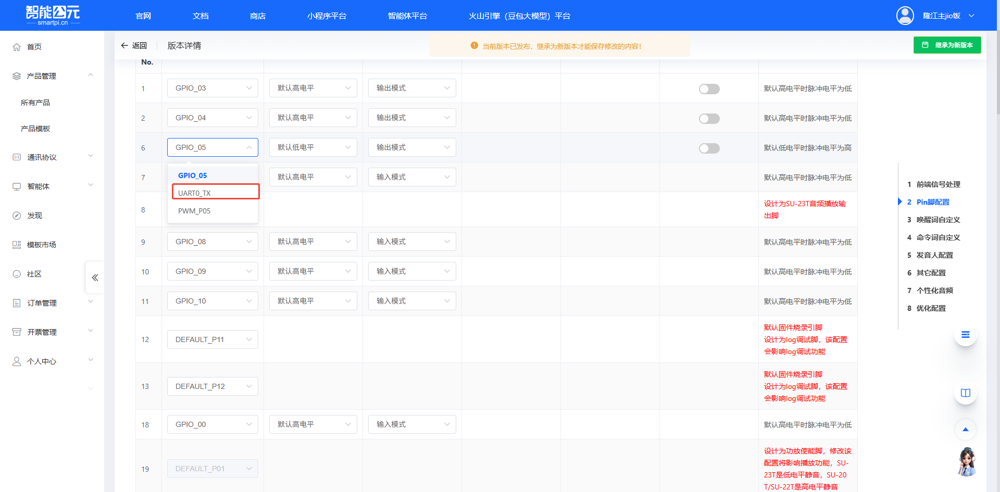

# CI1302 平台与固件 FAQ

## 引脚控制复位/重启功能

**问题描述：**

是否可以通过引脚的上下拉来控制CI1302芯片的复位或重启功能？

**解决方案：**

CI1302支持通过多种方式实现复位和重启控制，包括芯片软复位和外部引脚控制。

**1. 复位控制方式**

**芯片软复位**：

- CI1302内置软复位功能
- 可通过特定命令或触发条件实现
- 不需要外部硬件干预

**外部引脚控制**：

- 支持外部引脚触发复位
- 可通过GPIO配置实现
- 需要在平台中进行相应设置

**2. 平台配置方法**

**第一步：配置GPIO引脚**

- 登录智能公元平台
- 进入CI1302项目配置
- 选择可用GPIO引脚
- 配置为输入模式，设置上下拉

**第二步：设置复位触发条件**

- 在控制配置中添加触发条件
- 选择"软复位"或"重启"操作
- 设置GPIO电平判断条件

**第三步：保存并生成固件**

- 检查配置完整性
- 保存项目配置
- 生成并下载新固件

**3. 配置示例**

这样将PA5引脚接地时，芯片会执行软复位操作。

**4. 应用场景**

- **外部按键复位**：通过按键实现系统复位
- **系统联动控制**：主控MCU控制CI1302复位
- **故障自动恢复**：检测电路异常后自动复位
- **节能管理**：定时复位释放资源

**5. 注意事项**

- **引脚选择**：

    - 确认所选GPIO支持输入功能
    - 避免使用多功能复用引脚
    - 参考芯片手册了解引脚限制

- **电路设计**：

    - 外部复位建议使用硬件去抖动
    - 考虑ESD保护措施
    - 避免频繁复位影响寿命

- **软件配合**：

    - 复位后需要重新初始化
    - 保存重要数据到非易失存储
    - 设置合理的复位间隔

## 固件生成失败问题

**问题描述：**
提交配置后，固件生成进度停滞，无法生成下载文件，提示"播报文件过多内存爆了"。

**问题原因：**

- 播报文件数量过多，导致编译时内存溢出
- CI1302 Pro模块对播报文件数量有限制

**解决方案：**

### 1. 删除部分播报文件
- 在工程配置的播报文件列表中，删除不必要的播报文件
- 优先保留核心功能所需的播报文件
- 考虑合并功能相似的播报内容

### 2. 重新生成固件
- 在固件生成页面，点击右侧"重新生成"按钮
- **重要**：在生成过程中不要刷新页面
- 耐心等待生成完成

### 3. 播报文件优化建议
- **精简播报内容**：使用更简洁的播报文本
- **复用播报文件**：相同内容使用同一个播报文件
- **分段播报**：将长内容拆分为多个短播报

## 使用注意事项

- **型号确认**：确保使用的是CI1302 Pro模型
- **版本检查**：在平台固件生成页面确认版本信息

- **文件数量限制**：根据实际需求合理配置播报文件数量
- **内存管理**：大型项目建议考虑外部存储方案
- **生成环境**：保持网络稳定，避免生成过程中断

## 相关配置

- 固件生成路径：智能公元平台 → 产品配置 → 固件生成
- 重新生成按钮位于固件生成页面的右侧
- 播报文件管理：在语音配置页面进行添加/删除操作

---

## 串口输出功能

### CI1302串口能输出识别到的文字吗？

**问题描述：**

需要实现语音识别后通过串口输出识别到的文字内容，用于对接外部设备或系统。

**解决方案：**

CI1302的串口只能输出音频数据，无法直接输出识别到的文字。

**1. 串口输出能力**

- **输出内容**：SPX格式音频文件
- **输出方式**：通过串口发送音频数据流
- **不支持**：直接输出文字或ASR识别结果

**2. 文字输出方案**

如需要获取语音识别的文字内容，有以下方案：

- **使用JX-A7T模块**：配合在线大模型服务可实现文字输出
- **在线ASR服务**：将录制的音频发送到在线语音识别服务进行转换
- **本地处理**：CI1302只能通过串口输出音频，文字识别需要外部模型完成

**3. VAD算法说明**

CI1302内置VAD（语音活动检测）算法：
- 用于判断是否有有效语音输入
- 辅助进行语音段落的起止检测
- 不包含文字转换功能

**VAD工作原理：**

1. **分贝检测机制**
    - 系统持续检测环境声音分贝
    - 任何达到人类语音分贝的声音都会被检测到
    - 检测到声音后打开VAD进行语音识别

2. **识别结果处理**
    - 如果声音能匹配到命令词，识别为对应命令
    - 如果声音无法匹配任何命令词，识别为"不匹配"

**注意事项：**

- VAD是基于分贝的检测，并非语义理解
- 环境噪声可能触发VAD，导致频繁的"不匹配"识别
- **不建议**为"不匹配"情况添加语音反馈，这会导致非常频繁的误触发
- CI1302是离线语音识别芯片，专注于本地命令词识别
- 串口音频输出可用于录音或音频处理
- 如需ASR文字输出，建议选择JX-A7T等支持在线大模型的型号
