# JX-12F 平台与固件 FAQ

本页用于整理 JX-12F 相关的平台与固件问题。

### 如何在微信小程序中配置JX-12F的滑条温度调节功能？

**问题描述：**

需要在微信小程序中配置滑条控件，实现温度调节功能，并通过模块下发相应指令。

**解决方案：**

**1. 添加控制行为**

- 在平台的控制行为配置中添加新的控制项
- 配置滑条控件的相关参数

**2. 滑条参数设置**

- **数据类型**：选择适合的温度数据类型
- **最小值**：根据需求设置温度下限（如0℃）
- **最大值**：根据需求设置温度上限（如100℃）
- **步长**：设置温度调节的精度
- **单位符号**：设置为℃
- **单位名称**：设置为度

**3. 执行行为配置**

- **执行类型**：选择"执行行为"
- **执行行为**：添加串口输出变量
- 绑定温度变量到串口发送功能

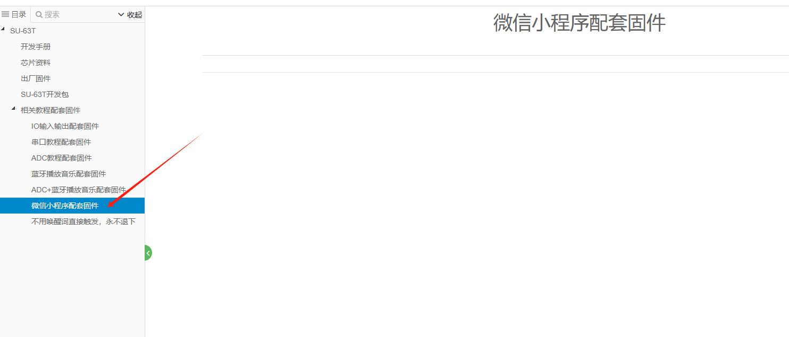

**4. 实现方案选择**

**方案一：直接绑定**

- 滑条直接绑定串口发送
- 实时发送AA 55 变量 55 AA格式的数据

**方案二：确认按钮方式**

- 滑条绑定温度变量存储
- 添加确认按钮触发串口发送
- 降低频繁通信，提高稳定性

**注意事项：**

- 开发包中包含相关示例，可参考配置
- B站有相关教程视频可供学习
- 确保变量设置与串口协议格式匹配

---

### 如何配置JX-12F的温度控制功能并通过串口发送指令？

**问题描述：**

需要配置JX-12F模块的温度控制功能，通过串口发送特定协议格式（如AA 55 变量值 55 AA）的数据。

**解决方案：**

**1. 温度变量配置**

- **最大值**：设置为100（或根据实际需求）
- **单位符号**：设置为℃
- **单位名称**：设置为度
- **执行类型**：选择"执行行为"
- **初始值**：设置默认温度值


**2. 串口输出行为配置**

- 添加"发送协议消息"行为
- 选择UART1_TX作为发送接口
- 配置协议格式（HCP-III或其他）
- 绑定温度变量到协议参数

**3. 协议模板设置**

- 创建包含帧头、数据、帧尾的协议模板
- 例如：AA 55 [温度数据] 55 AA
- 确保协议长度和格式正确

**4. 实现方案**

**方案一：实时发送**

- 滑条变化时立即发送串口数据
- 适合需要实时响应的应用

**方案二：确认触发**

- 滑条仅更新温度变量
- 通过确认按钮触发串口发送
- 减少通信频率，提高稳定性

**注意事项：**

- 变量赋值必须在串口发送之前完成
- 确保协议格式与接收端匹配
- 测试验证发送数据的正确性

---

### 小程序控制时JX-12F串口TX无法发送指令怎么办？

**问题描述：**

使用微信小程序通过TCP接口发送指令时，串口TX端口无法接收到预期的AA 55 05 32 55 AA指令。

**解决方案：**

**1. 检查控件绑定**

- 确认滑条控件绑定了正确的执行行为
- 避免直接绑定TCP传输行为

**2. 正确的配置流程**

- 先设置变量值（如温度变量）
- 再通过UART1_TX发送协议消息


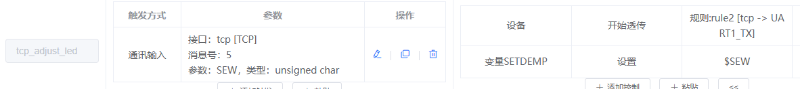


**3. 参考配置示例**

- 控件名：slide（或其他名称）
- 执行行为：发送UART1_TX消息
- 消息号：7（或其他）
- 参数：pwm4_duty（或对应变量）
- 协议：HCP-III

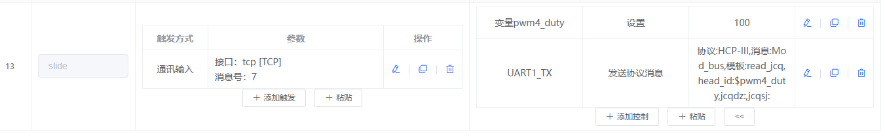

**注意事项：**

- TCP传输主要用于接收数据，不是直接发送串口指令
- 需要先赋值变量，再发送串口消息
- 确保执行顺序正确：设置变量 → UART发送

---

### 如何正确配置UART协议发送参数以确保数据正确？

**问题描述：**

配置UART通信协议发送十六进制数据时，发送的数据与预期不符，需要确认正确的配置和执行顺序。

**解决方案：**

**1. 协议配置方法**

**方法一：使用固定格式**

- 直接在发送配置中指定固定的十六进制格式
- 例如：AA 55 [变量] 55 AA
- 适合简单协议应用

**方法二：自定义协议**

- 在通讯协议中创建自定义协议模板
- 配置帧头、消息号、参数、帧尾
- 更灵活的协议定义

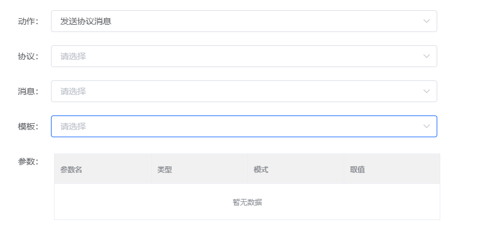
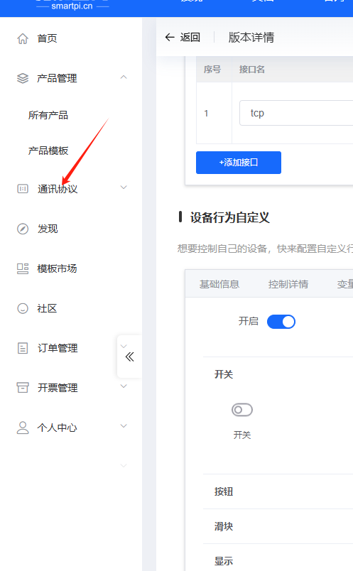

**2. 参数配置步骤**

- 选择控制类型为UART1_TX
- 动作设置为"发送协议消息"
- 选择对应的协议和模板
- 配置参数绑定变量

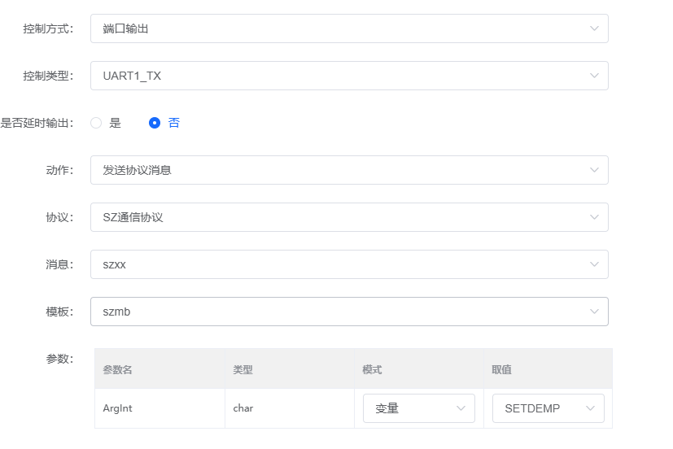
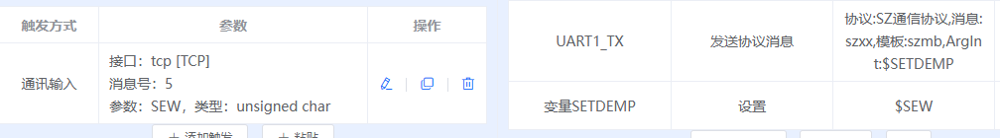

**3. 执行顺序要求**

- 第一步：给变量赋值（SEW变量赋值）
- 第二步：发送协议消息
- 确保先赋值再发送的代码执行顺序

**4. 定时任务功能**

- 平台定时任务功能尚未上线
- 如需定时功能，需要在应用层实现

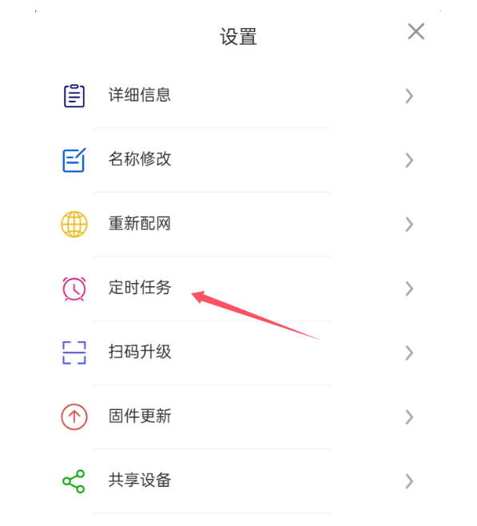

**注意事项：**

- 变量赋值和协议发送必须按顺序执行
- 使用unsigned char类型时注意数据范围
- 测试时验证发送数据的字节数和格式
- 协议字段数量必须与实际数据匹配

---

### 如何确保UART通信协议中变量正确赋值和发送？

**问题描述：**

配置UART通信协议时，虽然设置了变量SEW的值，但通过UART1_TX发送的十六进制数据仍然不正确。

**解决方案：**

**1. 协议模板配置**

- 创建完整的协议模板定义
- 配置帧头（AA 55）、消息号、参数、帧尾（55 AA）
- 确保每个字段类型和长度正确


**2. 通讯输入参数配置**

- 参数设置为SEW（或对应变量名）
- 类型选择unsigned char
- 变量绑定到$SEW（或对应变量）


**3. 执行顺序关键**

- 必须先执行：给SEW变量赋值
- 再执行：发送协议消息
- 代码执行顺序不可颠倒

**4. 验证方法**

- 使用串口调试工具监控TX输出
- 检查发送的十六进制数据是否符合预期
- 对比协议模板与实际输出

**注意事项：**

- 变量赋值必须在协议发送之前完成
- 确保协议模板的字段数量与实际数据一致
- 使用unsigned char类型时注意数据范围0-255
- 如果数据仍然不正确，检查协议模板的字段定义

---

### JX-12F蓝牙配网时小程序搜索不到设备怎么办？

**问题描述：**

使用JX-12F模块进行蓝牙配网时，虽然手机蓝牙能搜索到模块，但在小程序中无法搜索到设备。

**解决方案：**

**权限检查与设置：**

1. 在手机系统设置中开启"位置信息"权限
2. 确保小程序已获取蓝牙和位置权限
3. 华为鸿蒙系统需要额外检查系统权限管理

**硬件操作检查：**

1. 配网时需要将IO0引脚拉低
2. 不能连接手机自身开启的热点，需要连接其他2.4GHz WiFi

**注意事项：**

- 小程序搜索蓝牙设备需要位置权限，这是系统限制
- IO0引脚电平错误会导致模块无法正常工作

---

### 小程序搜索设备时提示"搜索错误"怎么办？

**问题描述：**

在微信小程序中搜索设备时，弹出"搜索错误"提示。

**解决方案：**

1. **检查蓝牙权限**：设置 → 应用管理 → 微信 → 权限 → 蓝牙 → 选择"使用小程序时允许"
2. **检查定位权限**：设置 → 应用管理 → 微信 → 权限 → 位置 → 选择"使用小程序时允许"

| 错误设置 | 正确设置 |
|-----------|-----------|
| "使用时询问" | "使用小程序时允许" |
| "不允许" | "使用小程序时允许" |

**注意事项：**

- 蓝牙搜索需要位置权限是iOS/Android系统的要求
- 权限只需要设置一次，后续使用无需重复设置

---

### 如何解绑JX-12F设备并配置多个小程序账号？

**问题描述：**

需要解绑已配置的JX-12F设备，并了解是否可以配置多个小程序账号关联同一设备。

**解决方案：**

**1. 设备解绑方法**

- 解绑操作需要在微信小程序端进行
- 设备端无法主动解绑自身
- 在小程序中找到对应设备进行解绑操作

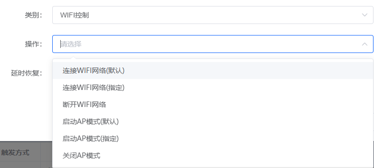

**2. 多账号配置方案**

- 可以使用不同手机号申请多个小程序账号
- 每个账号可以独立管理设备
- 同一设备可被多个账号控制（需分别配置）

**配置示例：**

- 账号1关联微信1 → 登录账号1配置设备
- 账号2关联微信2 → 登录账号2配置同一设备
- 芯片程序支持多账号配置

**3. 设备授权区分**

- JX-12F为WIFI模块，不占用授权数量
- 在设备列表中可以查看设备类型（WIFI/蓝牙）
- WIFI模块设备不计入授权总数

**注意事项：**

- 解绑后设备重新上电仍可能被连接
- 产线测试时需确保完全解绑，避免安全风险
- 多账号配置时注意管理权限和数据隔离

---

### JX-12F如何通过UART1实现Modbus协议通信？

**问题描述：**

需要配置JX-12F通过串口1与单片机进行Modbus协议通信。

**解决方案：**

**硬件连接：**

- UART1_TX（IO5）连接单片机RX  
- UART1_RX（IO4）连接单片机TX  
- 共地连接

**通信参数配置：**

- 波特率：9600/19200/38400/57600/115200 bps  
- 数据位：8位，停止位：1位

**注意事项：**

- Modbus协议需要在平台中配置协议模板  
- 串口通信参数必须与单片机一致

---

### 如何排查和解决小程序数据更新延迟问题？

**问题描述：**

小程序控制和设备数据反馈存在长时间延迟。

**解决方案：**

**日志调试方法：**

- IO7和IO16是日志输出引脚  
- 波特率设置为2000000 bps

**延迟问题定位：**

1. **模块端延迟**：单片机数据给模块后，模块上报延迟  
2. **小程序端延迟**：小程序接收数据后显示延迟  
3. **网络延迟**：数据传输过程中的网络问题

**调试建议：**

- 使用稳定的WiFi网络，避免使用手机热点  
- 合理设置上报频率

---

### JX-12F的PWM输出是否可以设置占空比？

**解决方案：**

JX-12F模块支持PWM输出功能，可以在智能公元平台上进行占空比设置。

**配置步骤：**

1. 登录智能公元平台  
2. 选择PWM输出通道（如PWM_A2）  
3. 设置频率值（如2000Hz）  
4. 设置占空比（如0-100%）

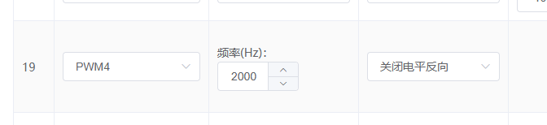

**PWM参数说明：**

- **频率范围**：1Hz-20kHz可调  
- **占空比范围**：0%-100%可调  
- **输出电平**：3.3V

**应用示例：**

- LED亮度控制：频率1kHz，占空比调节亮度  
- 电机速度控制：频率10kHz，占空比调节速度  
- 舵机角度控制：频率50Hz，占空比5-10%控制角度

---

### JX-12F TCP通信配置方法

**配置步骤：**

1. 进入智能公元平台的通讯接口配置界面  
2. 选择TCP通信模式  
3. 输入服务端的对端地址和端口

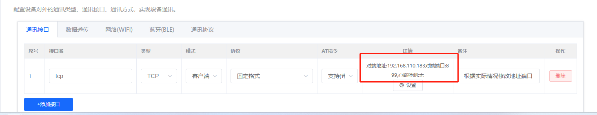

**触发条件配置：**

- 设置特定的GPIO输入作为TCP连接触发条件  
- 支持模块上电后自动连接

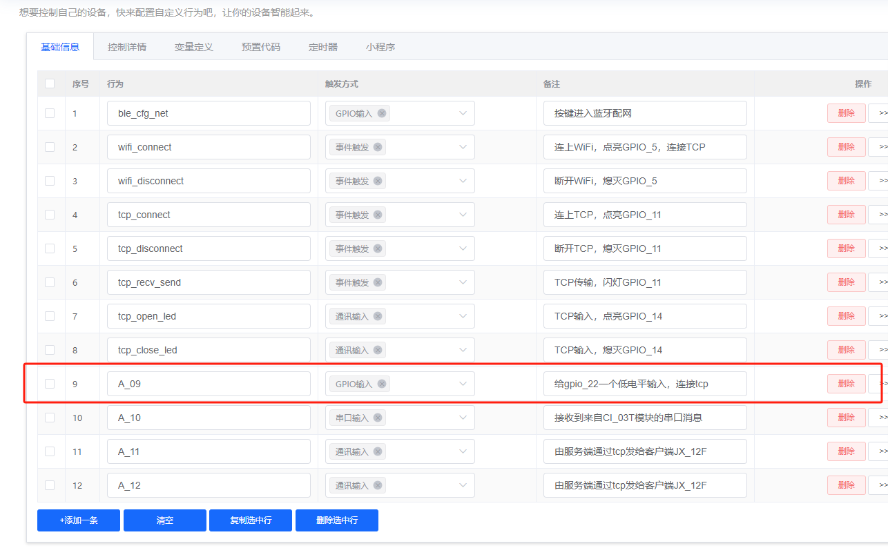

**网络拓扑说明：**

- JX-12F作为客户端，支持多个JX-12F连接同一服务端  
- 从属模块之间不直接通信

---

### AI产品零代码平台配置错误怎么办？

**常见错误提示：**

- "行为名不能为空"  
- "命令词不能为空"  
- "控制类型不要使用GPIO_A28"

**解决思路：**

1. 根据提示逐项修改  
2. 避免使用GPIO_A28等受限引脚  
3. 确保每个行为都有名称和触发条件

---

### 如何生成JX-12F固件配置的JSON文件？

**导出操作步骤：**

1. 登录智能公元平台：https://www.smartpi.cn  
2. 选择对应的JX-12F项目  
3. 退回到上一级界面，点击"导出"按钮  
4. 系统自动生成并下载JSON配置文件

**使用场景：**

- 配置备份  
- 配置分享  
- 批量配置

---

### JX-12F如何进行Linux二次开发？

**开发环境搭建：**

1. 推荐使用Ubuntu 18.04或20.04虚拟机  
2. 配置至少4GB内存、50GB硬盘空间  
3. 下载JX-12F开发包（版本2403041042）

**工具链配置：**

```bash
# 安装基本工具
sudo apt-get update
sudo apt-get install make gcc git python3

# 配置交叉编译工具链
export PATH=$PATH:/opt/toolchain-xtensa/bin
```

**编译与烧录：**

```bash
# 编译固件
make clean
make all

# 烧录到模块
make flash PORT=/dev/ttyUSB0
```

---

### JX-12F固件生成失败怎么办？

**问题描述：**

使用平台生成JX-12F固件时，配置检查通过但固件生成失败，且无法下载固件。

**解决方案：**

**1. 检查配置功能**

- 确认使用的功能在平台已开放
- 部分功能（如获取时间）尚未在平台开放
- 可能导致生成失败的配置需要排查


**2. 获取配置文件**

- 在配置页面导出JSON配置文件
- 用于技术支持分析和问题排查
- 导出位置：配置页面的"导出"按钮

**3. 常见失败原因**

- 使用了未开放的功能
- 配置参数超出模块支持范围
- 平台生成队列繁忙（高峰期较慢）

**4. 时间功能说明**

- JX-12F获取时间功能尚未在平台开放
- 如需定时功能，需要在应用层实现
- 平台定时任务功能正在开发中

**注意事项：**

- 配置检查通过不代表所有功能都可用
- 生成失败时请导出配置文件联系技术支持
- 避开高峰期进行固件生成，减少等待时间

---

### 如何配置JX-12F模块以实现Wi-Fi透传功能？

**问题描述：**

需要配置JX-12F模块实现Wi-Fi数据透传功能，将数据通过Wi-Fi发送到指定服务器。

**解决方案：**

**1. Wi-Fi基础配置**

在智能公元平台的"网络（WIFI）配置"中设置：

- **设备名称**：设置为JX_12F或其他唯一标识
- **国家码**：选择中国（13个频道）
- **AP模式配置**：

    - AP的IP地址：192.168.169.1
    - AP的密码：自定义访问密码
    - AP的名称：Wi-Fi广播名称
    - AP的信道：建议信道5
    - AP的最大连接数：默认10

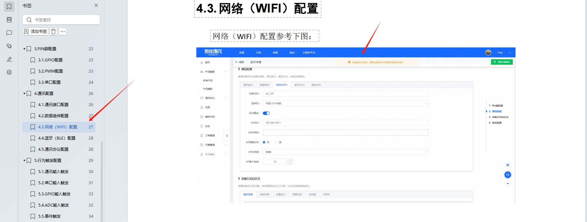

**2. TCP/UDP通信配置**

- **添加通信接口**：在通讯配置中添加TCP或UDP协议
- **设置目标地址**：配置对端主机名或IP地址
- **配置端口号**：设置服务器监听的端口号
- **选择工作模式**：客户端模式（JX-12F仅支持客户端）

**3. 数据透传规则**

创建双向数据转发规则：

- **规则1**：UART1_RX → tcp[TCP]
    - 来源接口：UART1_RX（接收单片机数据）
    - 目标接口：TCP（发送到服务器）

- **规则2**：tcp[TCP] → UART1_TX
    - 来源接口：TCP（接收服务器数据）
    - 目标接口：UART1_TX（发送给单片机）

**4. 测试验证**

- **使用网络调试工具**：在PC上运行TCP/UDP调试工具
- **监听指定端口**：等待JX-12F连接
- **发送测试数据**：验证双向通信是否正常

**注意事项：**

- JX-12F仅支持客户端模式，不能作为服务器
- 确保目标服务器已开启并监听指定端口
- 串口与Wi-Fi透传需要配置转发规则
- 建议先在局域网环境测试连通性

---

### JX-12F模块WiFi配置与数据透传测试

**问题描述：**

在使用JX-12F模块进行WiFi配置时，无法在手机上找到模块的WiFi名称，同时需要了解如何实现外部模块通过串口将数据透传到指定IP本地服务器的功能。

**解决方案：**

**WiFi名称查找问题**

1. **检查模块配置**：

    - 确认模块的设备名称设置为JX_12F
    - 检查AP模式配置参数是否正确
    - 验证WiFi信道设置为6（默认信道6）

2. **WiFi搜索方法**：

    - 确保手机WiFi功能正常开启
    - 刷新WiFi列表，耐心等待搜索完成
    - 检查是否开启了WiFi过滤功能

3. **配置验证**：

    - AP密码：根据配置设置
    - AP隐藏名称：设置为"否"
    - 最大连接数：默认10个

**数据透传功能实现**

1. **串口连接配置**：

    - 外部模块通过串口连接到JX-12F
    - 确认串口参数（波特率、数据位、停止位）匹配
    - 建立稳定的物理连接

2. **网络透传设置**：

    - 在平台配置中设置目标服务器IP
    - 配置端口号和通信协议
    - 启用串口到网络的数据转发功能

3. **数据流向配置**：

    ```
    外部模块 → 串口RX → JX-12F处理 → WiFi发送 → 指定IP服务器
    ```

**调试与验证**

1. **模块日志检查**：

    - 查看模块启动日志
    - 确认WiFi初始化是否成功
    - 验证串口数据接收状态

2. **网络连接测试**：

    - 使用网络调试工具监听指定端口
    - 发送测试数据验证透传功能
    - 检查数据格式和完整性

**注意事项：**

- JX-12F默认工作在2.4GHz频段
- 确保目标服务器已开启相应端口监听
- 串口数据透传可能需要特定的协议封装
- 建议先在本地网络环境测试功能

---

### JX-12F模块WiFi透传配置错误怎么办？

**问题描述：**

在配置JX-12F模块进行WiFi透传时，代码检查工具显示多个错误，包括通讯配置客户端ID为空、订阅主题为空、MQTT协议数量不能超过1等问题。

**解决方案：**

**1. 通讯配置错误修正**

- **TCP接口配置**：

    - 类型：TCP
    - 模式：客户端
    - 协议：自选协议（不是MQTT）
    - 对端地址：设置目标服务器IP
    - 对端端口：设置服务器端口号

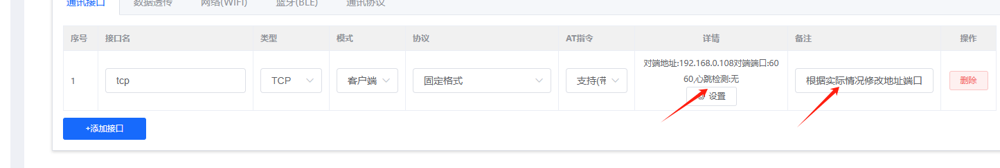

**2. MQTT协议错误处理**

- **协议不匹配**：JX-12F透传不需要MQTT协议
- **改为TCP协议**：在通讯接口中选择TCP而非MQTT
- **删除MQTT配置**：移除所有MQTT相关设置

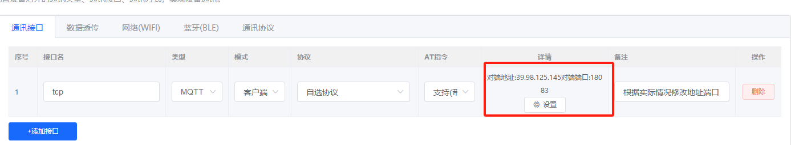

**3. 常见错误解决**

- **通讯配置客户端ID为空**：

    - 使用TCP协议时不需要客户端ID
    - 确保协议选择正确

- **订阅主题为空**：

    - MQTT协议特有错误，TCP透传不涉及
    - 改用TCP协议可解决

- **MQTT协议数量不能超过1**：

    - 说明当前配置混用了MQTT
    - 统一使用TCP协议进行透传

**4. 正确的透传配置**


**配置步骤**：

1. **添加TCP接口**：

    - 接口名：自定义（如tcp_client）
    - 类型：TCP
    - 模式：客户端
    - 协议：自选协议

2. **设置对端地址**：
    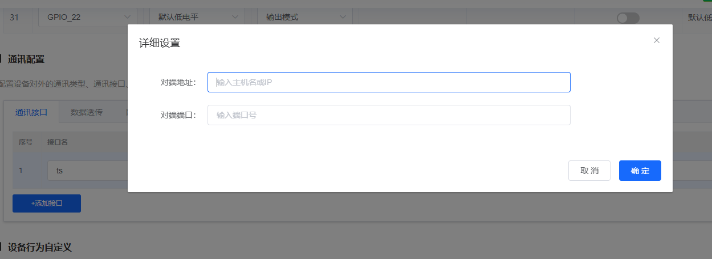
    - 输入服务器IP地址
    - 输入服务器端口号

3. **配置数据转发**：

    - UART1_RX → tcp（单片机到服务器）
    - tcp → UART1_TX（服务器到单片机）

**注意事项：**

- WiFi透传使用TCP协议，不需要MQTT
- 确保服务器地址和端口配置正确
- 代码检查无错误后才能生成固件
- 建议使用入门例程学习配置方法

---

### JX-12F蓝牙配网失败怎么办？

**问题描述：**

使用官方小程序通过蓝牙为JX-12F模块配网时，可以搜索到设备但配网失败，提示需要确认设备处于配网模式。

**解决方案：**

**1. 配网模式确认**

- JX-12F的IO8引脚默认为低电平（运行模式）
- 配网时不需要特殊操作，默认即处于配网模式
- 不要将IO8拉高（烧录模式才需要拉高）

**2. 小程序配网步骤**

1. **准备阶段**
    - 确保模块已正常上电运行
    - 手机蓝牙保持开启状态
    - 下载"智能公元"小程序

2. **搜索设备**
    - 打开小程序，选择"添加设备"
    - 选择蓝牙配网方式
    - 在设备列表中找到JX-12F

3. **配网注意事项**
    - 不要先在手机系统蓝牙中配对模块
    - 如已配对，需要先取消配对
    - 确保使用小程序而非其他工具

**3. 配网失败排查**

1. **检查WiFi环境**
    - 确认路由器支持2.4GHz频段
    - 检查WiFi密码是否正确
    - 避免使用特殊字符的密码

2. **模块状态检查**
    - 重新给模块上电
    - 等待模块完全启动（约3-5秒）
    - 观察模块指示灯状态

3. **距离和环境**
    - 手机靠近模块（1米内）
    - 避免过多蓝牙设备干扰
    - 远离WiFi路由器等干扰源

**4. 常见问题解决**

- **前两步正常，第三步失败**：检查WiFi密码和路由器设置
- **搜索不到设备**：确认未在系统蓝牙配对，重启小程序
- **多次配网失败**：尝试恢复出厂设置后重新配网

**注意事项：**

- 设备默认已授权，无需额外授权操作
- 配网过程中保持手机屏幕常亮
- 如配网成功后无法联网，检查路由器是否禁止新设备

---

### JX-12F如何配置端口输入输出和反馈？

**问题描述：**

在使用JX-12F设备时，需要配置端口输入输出功能，实现小程序控制端口输出并查看输入端口的反馈信息。

**解决方案：**

1. **端口输出控制配置**
    - 在设备行为中选择"控制"方式
    - 控制方式选择"端口输出"
    - 选择对应的GPIO引脚（如GPIO_1）
    - 设置动作为"设置电平"，参数选择"高电平"或"低电平"

2. **端口输入触发配置**
    - 在触发方式中选择"GPIO输入"
    - 选择可用输入端口（GPIO_0、GPIO_3、GPIO_11、GPIO_12、GPIO_20）
    - 设置触发条件（低电平或高电平触发）

3. **输入反馈配置**
    - 在GPIO输入触发后添加控制动作
    - 设置变量赋值（如赋值1表示高电平，0表示低电平）
    - 在小程序中添加文本显示组件并关联该变量
    - 实时查看端口状态变化

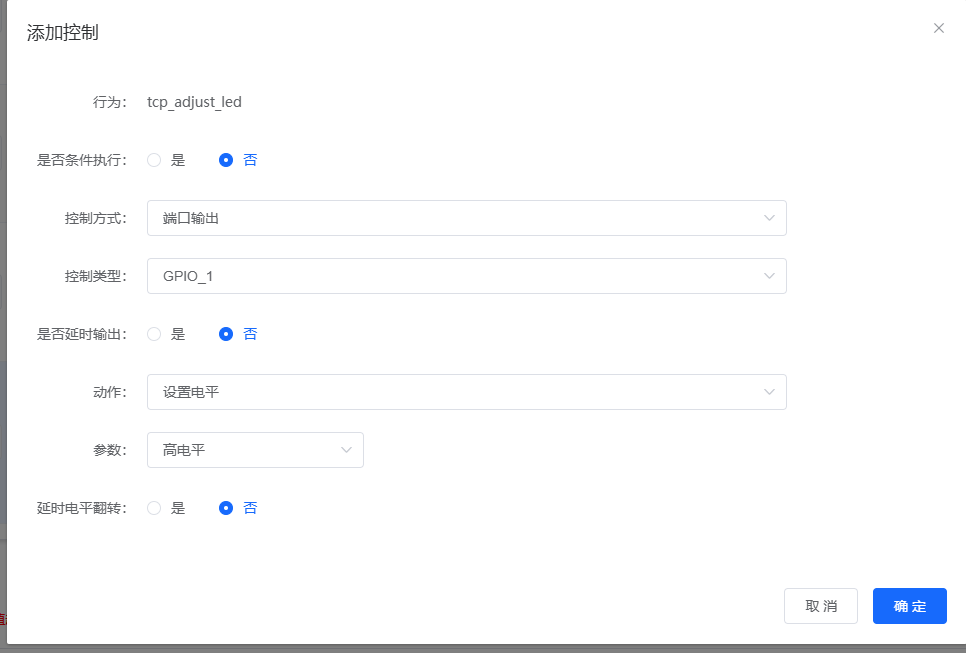

*配置端口输出控制，设置GPIO_1输出高电平*

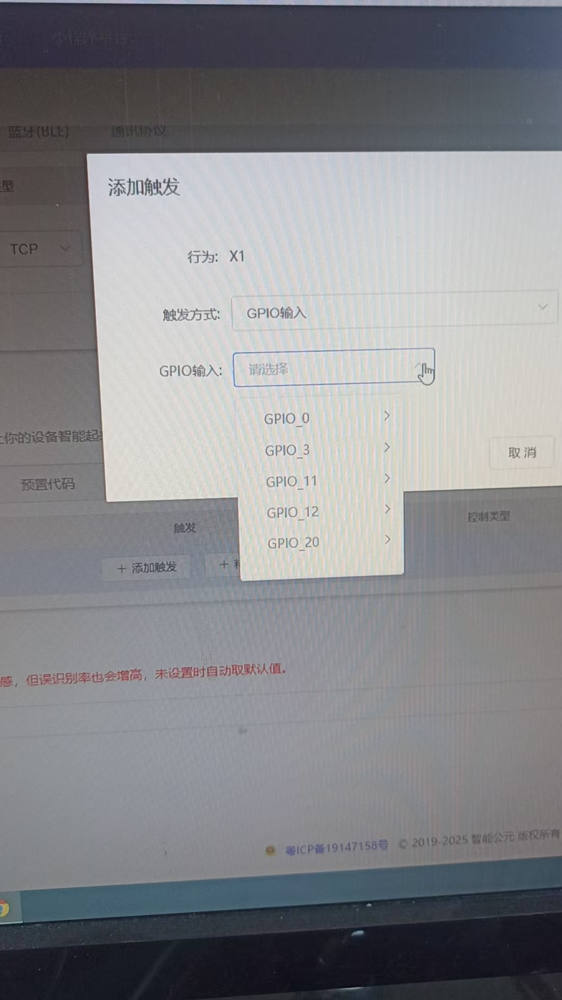

*配置GPIO输入触发，可选择输入端口*

**注意事项：**

- GPIO输入端口有限，需在可用端口中选择
- 输入反馈需要通过变量传递到小程序显示
- 确保端口电平与触发条件匹配
- 测试时注意观察小程序显示的状态变化

---

### GPIO输入触发中找不到所需端口怎么办？

**问题描述：**

在配置GPIO输入触发时，触发方式的下拉菜单中缺少所需的GPIO端口（如GPIO_1），只有部分端口可选。

**解决方案：**

1. **理解输入输出端口区别**
    - 触发方式中的GPIO输入仅显示可用作输入的端口
    - GPIO_1可能被配置为输出功能，不在输入列表中
    - 需要查看端口的实际可用性

2. **正确的配置思路**
    - 触发方式选择"GPIO输入"用于检测外部信号
    - 控制方式选择"端口输出"用于控制GPIO输出
    - 确认使用正确的配置类型

3. **端口可用性检查**
    - JX-12F的GPIO端口有特定限制
    - 部分端口只能作为输入或输出
    - 参考模块文档确认端口复用情况


*GPIO_0低电平触发的配置示例*

**注意事项：**

- 不是所有GPIO端口都支持输入输出双向配置
- 端口可用性取决于模块的硬件设计
- 如需要特定端口，确认其在对应模式下的可用性
- 使用平台提供的可用端口进行配置

---
### JX-12F是否支持输出随机数？

**问题描述：**

希望了解JX-12F模块是否支持输出范围可调的随机数，例如触发一次输出5至80之间的随机数，并支持通过串口输出数字字符。

**解决方案：**

**功能支持情况：**

- **JX-12F当前不支持内置随机数功能**
- 模块本身不提供随机数生成指令
- 无法直接通过配置实现随机数输出

**替代实现方案：**

1. **外部MCU方案**
    - 使用外部单片机生成随机数
    - 通过串口将随机数发送给JX-12F
    - JX-12F接收后进行后续处理

2. **硬件随机数生成**
    - 外部添加硬件随机数生成器
    - 通过ADC采集噪声信号
    - 转换为数字信号后输入

3. **伪随机数实现**
    - 在外部MCU中使用时间种子
    - 实现简单的伪随机算法
    - 按需生成指定范围的随机数

**串口通信实现：**

```
外部MCU → 串口TX → JX-12F串口RX → 处理输出
```

**注意事项：**

- JX-12F主要专注于WiFi和语音功能
- 复杂的算法功能建议由外部MCU处理
- 串口通信协议需要自行定义
- 确保数据格式符合JX-12F的接收要求

---

### JX-12F是否需要编程来开发WiFi功能？

**问题描述：**

询问JX-12F WiFi+BLE模组是否需要编程来开发WiFi功能。

**解决方案：**

JX-12F支持零成本开发WiFi功能，具体特点：

1. **无需编程**
    - 支持直接点击选项生成功能
    - 通过平台图形化配置实现WiFi控制
    - 可免费生成专属小程序

2. **开发方式**
    - 使用官方平台进行可视化配置
    - 选择需要的功能模块
    - 配置GPIO和控制逻辑
    - 一键生成小程序和控制界面

3. **功能特性**
    - PIN脚兼容ESP12F、ESP8266系列WiFi模块
    - 支持语音+WiFi创新产品开发
    - 可实现各种WiFi品类控制

**注意事项：**

- 适合快速原型开发和产品验证
- 复杂功能可能仍需要定制开发
- 建议先使用平台功能评估需求

---

### JX-12F开发包文件如何打开和使用？

**问题描述：**

需要了解JX-12F开发包中文件的使用方法，特别是压缩包内各种文件的格式和用途。

**解决方案：**

这些压缩包解压后会得到对应的文件夹，文件夹里包含一些说明文档、可烧录文件、以及json文件，json文件可以导入到网站平台，进而查看其具体的配置信息。

**1. 文件解压**

**Windows系统：**

- 使用WinRAR或7-Zip等解压软件
- 右键点击压缩包，选择"解压到当前文件夹"

**Linux系统：**

- 使用命令行：`tar -zxvf 文件名.tar.gz`
- 或使用图形界面的归档管理器

**2. 解压后文件说明**

解压后通常包含以下文件：

- **说明文档**：README或使用说明文件，详细介绍开发包内容
- **可烧录文件**：.bin格式的固件文件，用于烧录到模块
- **JSON配置文件**：包含模块的配置信息，可导入平台查看
- **其他资源文件**：可能包含示例代码或参考资料

**3. JSON文件导入方法**

- 登录智能公元平台
- 选择相应的产品类型
- 使用"导入配置"功能上传JSON文件
- 在平台中查看和修改配置参数

**注意事项：**

- JSON文件主要用于查看配置，不是烧录文件
- 烧录时请使用.bin格式的固件文件
- 保留原始压缩包作为备份
- 如有疑问，可查看说明文档获取详细信息

---

### JX-12F1固件文件（.tar.gz格式）如何打开？

**问题描述：**

下载JX-12F1的固件文件是.tar.gz格式，不知道应该使用什么软件打开，以及是否有相关操作教程。

**解决方案：**

**1. 文件格式说明**

- .tar.gz是压缩文件格式
- 需要先解压才能使用里面的文件
- Windows和Linux系统都有对应的解压工具

**2. 解压步骤**

**Windows系统：**

- 下载并安装WinRAR或7-Zip解压软件
- 右键点击.tar.gz文件
- 选择"解压到当前文件夹"或"解压到这里"

**Linux系统：**

- 使用命令行：`tar -zxvf 文件名.tar.gz`
- 或图形界面的归档管理器

**3. 解压后内容**

解压后通常包含：

- 说明文档（README或使用说明）
- 可烧录的固件文件（.bin格式）
- JSON配置文件（可导入平台查看）
- 其他相关资源文件

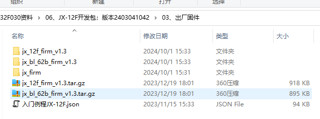

**注意事项：**

- 压缩包内的.bin文件才是烧录用的固件
- JSON文件可以导入平台查看具体配置
- 如文件损坏，建议重新下载
- 解压软件建议使用最新版本

---

### 如何将通讯协议从MQTT改为TCP并通过TCP连接测试？

**问题描述：**

需要将JX-12F模块的通讯协议从MQTT改为TCP，并通过TCP连接测试与单片机的串口通信。

**解决方案：**

**1. 协议切换步骤**

- **删除MQTT配置**：

    - 在通讯配置中删除所有MQTT相关接口
    - MQTT协议数量不能超过1的错误将解决
    - 清空MQTT的客户端ID、用户名、密码等配置

- **添加TCP接口**：

    - 接口名：自定义（如tcp）
    - 类型：TCP
    - 模式：客户端
    - 协议：自选协议

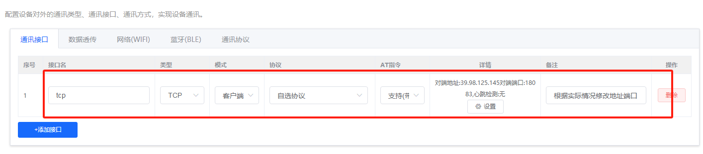

**2. TCP连接测试**

- **使用网络调试工具**：

    - 下载任意TCP调试助手软件
    - 创建TCP服务器等待连接
    - 或连接到JX-12F作为客户端

- **连接参数设置**：

    - 对端地址：JX-12F的IP地址
    - 对端端口：JX-12F配置的端口
    - 点击连接建立TCP链路

**3. 数据透传配置**

配置双向数据转发规则：

- **规则1**：UART1_RX → tcp
    - 来源：串口接收的数据
    - 目标：TCP发送到服务器
    - 实现单片机数据上传


- **规则2**：tcp → UART1_TX
    - 来源：TCP接收的数据
    - 目标：串口发送给单片机
    - 实现服务器下发指令

**4. 网络配置**

- **AP模式设置**：

    - AP的IP地址：39.98.125.145
    - AP的密码：admin
    - 设备名称：JX_12F


- **串口参数**：

    - UART1_RX配置为自选协议
    - UART1_TX设置波特率9600
    - 数据位8、停止位1、校验位无


**测试验证方法：**

1. **串口助手测试**：

    - 单片机发送数据到UART1_RX
    - 观察TCP服务器是否收到
    - 从TCP发送数据验证UART1_TX输出

2. **双向通信测试**：

    - 建立稳定的TCP连接
    - 测试数据收发的完整性
    - 验证通信延迟和稳定性

**注意事项：**

- JX-12F仅支持客户端模式，不能作为TCP服务器
- 确保WiFi网络稳定，避免断线重连
- TCP和MQTT协议不能同时使用
- 串口波特率需要与单片机匹配

---

### 如何将JX-12F小程序模块与自定义应用整合？

**问题描述：**

需要了解如何将小程序模块与自己的应用进行整合，以及所需的技术资料和协议文档。

**解决方案：**

**1. 获取开发资源**

需要以下文档：

- JX-12F开发包
- JX-12F技术开发手册
- 智能公元平台协议自定义文档

**2. 整合流程**

**步骤一：了解协议**

- 研究智能公元平台协议文档
- 理解小程序与应用的通信协议
- 掌握数据格式和接口规范

**步骤二：开发对接**

- 根据协议文档开发对接程序
- 实现数据接收和解析功能
- 处理小程序发送的各种指令

**步骤三：功能测试**

- 搭建测试环境验证对接效果
- 模拟各种使用场景
- 确保数据传输的准确性

**3. 技术要点**

- 通信接口：通常是UART或WiFi
- 数据格式：JSON或自定义格式
- 功能映射：小程序功能到应用功能的对应关系

**注意事项：**

- 确保协议版本匹配
- 注意数据加密和安全机制
- 保留兼容性考虑
- 充分利用官方提供的开发资源

---

### JX-12F舱内压力数值显示异常怎么办？

**问题描述：**

JX-12F设备在小程序界面显示的舱内压力数值异常，且蓝牙断开后需要重启模块才能重新连接。

**解决方案：**

**1. 检查数据类型配置**

- 登录固件管理平台，找到"舱内压力（KPa）"数据块配置
- 确认数据类型设置是否正确（显示小数时应使用double类型）
- 检查关联变量类型是否与数据类型匹配
- 验证小数位数设置是否符合需求

**2. 修正变量类型**

- 如果需要显示小数值，使用double类型的变量
- 避免使用int类型变量发送小数数据
- 确保固件中发送的数据类型与平台配置一致

**3. 蓝牙连接问题**

- 配网后使用WiFi连接，与蓝牙无关
- 如果出现连接问题，检查WiFi网络配置
- 重启模块可以解决临时连接异常

**注意事项：**

- 数据类型不匹配会导致显示异常
- 使用int类型变量发送小数会被截断为整数
- 修改配置后需要重新生成并烧录固件


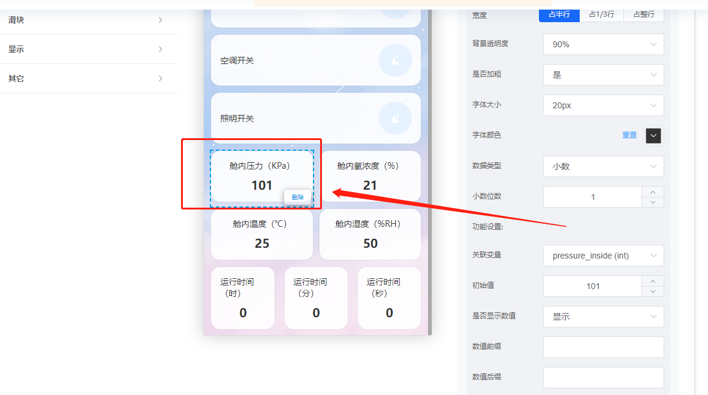

---

### JX-12F固件SDK何时发布？

**问题描述：**

需要了解JX-12F的固件SDK开发工具包是否已经发布，以及是否可以通过内网IP进行功能测试。

**解决方案：**

**1. SDK发布状态**

- JX-12F的SDK开发工具包目前还未正式发布
- SDK发布后会第一时间上传到平台
- 建议关注平台的更新通知

**2. 测试方案**

- 在SDK发布前，可以使用平台生成固件进行测试
- 支持通过内网IP进行功能测试
- 确保测试环境与实际使用场景一致

**3. 替代方案**

- 使用现有的固件配置功能实现基本需求
- 通过平台的数据透传功能测试数据通信
- 等待SDK发布后进行深度开发

**注意事项：**

- SDK发布时间请关注官方通知
- 平台会持续更新固件功能
- 可以先使用平台功能熟悉模块特性

---

### JX-12F获取系统时间报错怎么办？

**问题描述：**

JX-12F模块在配置获取系统时间功能时，固件生成失败，提示"生成失败，可能是配置原因，请检查配置"。

**解决方案：**

**1. 配置错误原因**

- **参数设置错误**：获取系统时间时，年月日、时分秒、星期几等参数全部设置为"忽略"
- **功能不支持**：当前固件版本可能不支持获取系统时间功能
- **配置冲突**：时间控制功能与其他控制设置存在冲突

**2. 正确配置方法**

- **年月日设置**：根据需要选择具体的年、月、日数值，不能设置为"忽略"
- **时分秒设置**：设置具体的时间数值（如08:30:00）
- **星期几设置**：选择对应的星期数值（1-7对应周一到周日）
- **测试验证**：配置完成后先生成固件测试

**3. 替代方案**

- **使用外部RTC**：通过外部RTC芯片提供准确时间
- **串口授时**：通过MCU定期发送时间信息给模块
- **网络授时**：如模块支持网络功能，可考虑NTP授时


**注意事项：**

- 获取系统时间功能需要硬件支持
- 所有时间参数不能同时设置为"忽略"
- 如仍无法解决，可联系技术团队获取最新固件版本
- 建议使用其他时间同步方式替代

---


---

### JX-12F芯片是否支持通过串口输出ASCII字符？

**问题描述：**

询问JX-12F芯片是否支持通过串口直接输出ASCII字符（如"abcd"），以及一次能发送多少字符。

**解决方案：**

JX-12F芯片不能直接发送ASCII字符，需要将字符转换为十六进制格式发送。

**1. 数据格式限制**

- **只支持十六进制**：平台仅支持发送十六进制数据
- **不支持字符串**：不能直接输入"abcd"等字符
- **需要转换**：必须将字符转换为十六进制后发送

**2. 字符转换方法**

- **ASCII字符转换**：

    - 'a' → 61
    - 'b' → 62
    - 'c' → 63
    - 'd' → 64
    - 字符串"abcd" → 61 62 63 64

- **使用转换工具**：

    - 在线ASCII转十六进制工具
    - 编程语言内置函数
    - 串口调试助手转换功能

**3. 发送字符数量**

- **理论限制**：单次发送可包含多个字符
- **实际应用**：取决于接收端的缓冲区大小
- **建议控制**：单次发送不超过32字节（64个十六进制字符）

**4. 发送配置**

- 在动作参数中输入转换后的十六进制数据
- 多个字节用空格分隔（如：61 62 63 64）
- 确保接收端按ASCII标准解码

**注意事项：**

- 发送端和接收端必须约定相同的编码格式
- 中文字符需要使用GBK或UTF-8编码
- 建议先少量测试确保通信正常
- 复杂数据包建议加入校验字节

---


---

### 哪些型号支持通过小程序连接蓝牙进行固件OTA升级？

**问题描述：**

希望了解哪些语音模块型号支持通过小程序连接蓝牙进行固件OTA升级功能。

**解决方案：**

**支持OTA升级的型号：**

- JX-12F支持通过小程序进行蓝牙OTA升级
- 固件生成时显示OTA选项的型号均支持此功能

**使用方式：**

- 在智能公元平台生成固件时启用OTA功能
- 通过微信小程序连接模块的蓝牙
- 在小程序中选择固件升级功能
- 按提示完成OTA升级过程

**注意事项：**

- OTA升级需要模块具备蓝牙功能
- 升级过程中确保电源稳定
- 不同型号的OTA实现方式可能有差异
- 建议在升级前备份当前配置

----


---

### 平台OTA功能什么时候上线？

**问题描述：**

平台目前不支持OTA功能，导致产品使用体验不佳，希望了解OTA功能的开发进度和何时能够上线。

**解决方案：**

- **功能现状**：

    - 当前平台暂未集成OTA升级功能
    - 只有部分型号（如JX-12F）支持小程序蓝牙OTA
    - 大部分型号需要通过串口进行固件更新

- **开发计划**：

    - OTA功能已在规划中，具体上线时间待定
    - 需要考虑不同型号的硬件支持能力
    - 涉及服务器端升级服务开发

**替代方案**：

- 使用串口工具进行固件更新
- 选择支持OTA功能的特定型号
- 关注官方通知，了解功能上线进度

**注意事项：**

- OTA功能需要硬件支持，不是所有型号都能实现
- 升级过程中需确保电源稳定，避免断电损坏
- 建议在开发阶段预留固件更新接口

---


---

### WiFi模块如何创建小程序项目？

**问题描述：**

WiFi模块介绍中提到支持小程序开发，但在创建产品时找不到小程序的开发选项。

**解决方案：**

- **模块选择**：

    - 小程序开发功能仅支持JX-12F模块
    - 其他WiFi模块不支持小程序开发
    - 需要选择正确的模块型号才能看到小程序选项

- **创建步骤**：

    1. 在创建产品时选择JX-12F模块
    2. 开发模式中选择"小程序"选项
    3. 按照小程序开发流程进行配置

- **功能说明**：

    - JX-12F支持微信小程序控制
    - 可通过小程序实现远程控制
    - 支持云端数据同步

**注意事项：**

- 确认购买的是JX-12F模块
- 其他WiFi型号如BL-62B、XR-50A不支持小程序
- 小程序开发需要一定的微信小程序开发基础
- 需要在微信开发者工具中完成小程序开发

---

### 单片机数据如何在小程序上正确显示？

**问题描述：**

使用二进制协议配置后，单片机发送的数据（水温、水位、室内管温、室外管温）无法在小程序上正确显示，所有数值均为0。

**解决方案：**

1. **协议兼容性问题**
    - 二进制协议与MODBUS-RTU协议不兼容
    - 需要根据单片机支持的协议选择对应的配置方式
    - MODBUS-RTU是标准工业协议，格式固定

2. **数据格式定义**
    - 在平台中定义协议字段格式
    - 设置正确的字段顺序和数据类型
    - 确保字段长度与实际数据匹配

3. **变量配置**
    - 在变量列表中创建对应的变量：

        - water_T（水温）
        - water_H（水位）
        - T_roomin（室内管温）
        - T_roomout（室外管温）
    - 将变量绑定到协议字段

**注意事项：**

- 不同协议之间不能混用，需统一使用一种
- MODBUS协议头部字段支持动态设备号
- 数据显示前需确保单片机正常发送数据
- 协议配置后需要重新生成固件

---

### JX-12F是否支持配置多个变量显示实现倒计时功能？

**问题描述：**

需要配置JX-12F模块同时显示小时、分钟、秒三个变量，通过串口上报实现倒计时功能，但无法找到支持显示三个变量的控件。

**解决方案：**

**1. 功能支持情况**

- 获取系统时间功能尚未在平台开放
- 目前无法直接通过平台配置时间显示功能
- 配置获取时间功能可能导致固件生成失败

**2. 替代实现方案**

- 使用外部MCU维护倒计时逻辑
- 通过串口将时间数据发送给JX-12F
- 在小程序中创建三个独立的文本控件
- 分别绑定小时、分钟、秒变量进行显示

**3. 实现步骤**

- 在JX-12F中定义三个变量：hour、minute、second
- 外部MCU通过串口定期发送更新这三个变量的值
- 在小程序界面添加三个文本显示组件
- 分别绑定到对应的时间变量

**注意事项：**

- 获取时间功能预计1-2周内上线
- 倒计时逻辑需要在外部MCU实现
- 确保串口通信协议与数据格式匹配
- 多变量显示需要使用多个独立的控件

---

### JX-12F模块是否支持设备解绑功能？

**问题描述：**

需要通过内部指令实现设备解绑功能，以避免量产测试时设备被绑定后存在安全风险。

**解决方案：**

**1. 功能支持情况**

- 目前不支持通过AT指令进行设备解绑
- 配网和设备绑定不完全是一件事
- 设备解绑功能已列入开发需求列表

**2. 当前解决方案**

- 在小程序的设备管理后台进行解绑操作
- 解绑功能正在开发中，后续会上线
- 量产测试时需要做好设备记录和管理

**3. 安全建议**

- 产线测试设备使用测试账号进行绑定
- 建立设备追踪机制，记录绑定状态
- 出厂前确保解除测试绑定关系

**注意事项：**

- 解绑功能预计在后续版本中上线
- 当前需要通过小程序端进行解绑操作
- 量产时建议建立完善的设备管理流程
- 绑定过的设备仍可能被之前的用户控制

---

### 添加获取系统时间功能后固件生成失败怎么办？

**问题描述：**

JX-12F模块在增加获取系统时间和串口TX发送功能后，固件生成失败，提示"生成失败，可能是配置原因，请检查配置"。

**解决方案：**

**1. 功能支持情况**

- WiFi模块获取时间功能尚未在平台开放
- 虽然界面有此选项，但功能还未上线
- 预计1~2周内此功能完全上线

**2. 临时解决方案**

- 删除获取系统时间相关的配置
- 使用外部RTC或MCU提供时间
- 通过串口接收外部发送的时间数据

**3. 配置调整建议**

- 移除"获取系统时间"控制项
- 保留串口TX发送功能
- 改用外部时间源实现倒计时


**注意事项：**

- 配置检查通过不代表功能已开放
- 生成失败通常是因为使用了未开放的功能
- 建议等待功能正式上线后再使用
- 可导出配置文件供技术支持分析

---

### 执行行为下拉框内容如何配置？

**问题描述：**

配置设备执行行为时，发现执行行为下拉框的内容与前面的配置项无关，无法正确显示或选择相应的执行行为。

**解决方案：**

**1. 配置原理**

- 执行行为下拉框的内容基于已定义的控制行为
- 需要先在"控件关联行为"中定义行为
- 执行类型选择"执行行为"后，下拉框会显示已配置的行为列表

**2. 配置步骤**

- 在产品手册的"7.2.控件关联行为"章节查看详细说明
- 先创建控件并定义其关联的行为
- 然后在执行行为中选择对应的预定义行为

**3. 示例说明**

- `[uart_adjust_led]`等选项来自之前定义的行为
- 执行行为的显示名称对应已创建的控制项
- 下拉框内容会随着配置项的增加而更新


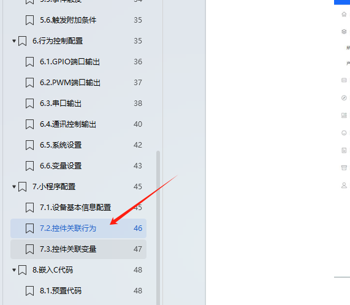

**注意事项：**

- 执行行为需要预先定义才能在下拉框中选择
- 建议参考产品手册中的配置说明
- 确保控件与行为的正确关联
- 配置后需要重新生成固件生效

---

### 固件下载失败时如何获取JSON配置文件？

**问题描述：**

在下载固件时遇到无法下载的问题，需要获取JSON配置文件用于问题排查。

**解决方案：**

**1. 获取JSON文件的方法**

- 在固件配置页面，不要点击"下载固件"
- 返回到上一页（产品管理页面）
- 点击"导出"按钮导出JSON配置文件

**2. JSON文件用途**

- 包含完整的配置信息
- 可用于技术支持分析问题
- 可以导入到平台查看具体配置

**3. 下载失败处理**

- 确认网络连接正常
- 检查是否配置了未开放的功能
- 联系技术支持时提供导出的JSON文件

**注意事项：**

- JSON文件不是固件，不能直接烧录
- 导出的配置文件有助于快速定位问题
- 建议定期备份重要配置
- 如频繁失败，检查配置项是否超出模块支持范围

---

### 获取系统时间功能配置导致固件生成失败如何解决？

**问题描述：**

JX-12F项目在增加获取系统时间并串口发送的功能后，固件生成失败，即使修改触发方式仍无法解决。

**解决方案：**

**1. 问题根本原因**

- WiFi模块的获取时间功能尚未在平台开放
- 界面虽然可以选择，但功能还未实现
- 任何包含获取时间的配置都会导致生成失败

**2. 功能状态说明**

- 获取系统时间功能预计1~2周内上线
- 目前仅界面选项可用，实际功能未完成
- 平台正在积极开发此功能

**3. 配置检查**

- 已定义时间变量：pwm2_year、pwm2_month、pwm2_day、pwm2_hour、pwm2_min等
- 触发方式从"串口输入"改为"系统设置"仍无效
- 说明问题在于功能本身未开放

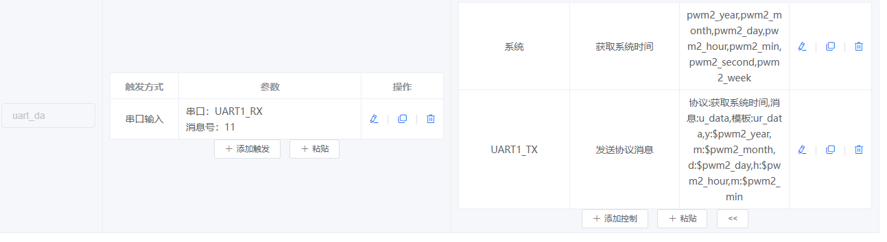


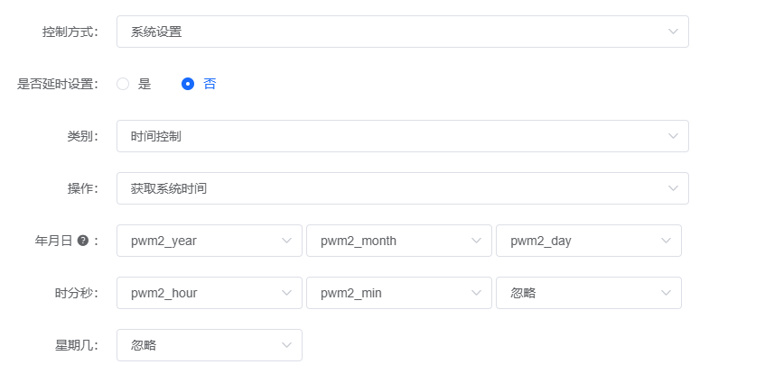

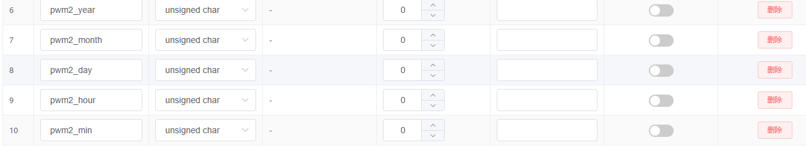

**4. 临时方案**

- 删除所有获取系统时间相关的配置
- 使用外部RTC提供时间数据
- 通过串口接收外部发送的时间信息

**注意事项：**

- 不是配置错误，是功能未上线
- 需要等待平台更新才能使用此功能
- 建议关注平台更新通知
- 可导出工程文件供技术支持分析

---

### 小程序端的定时功能是否已实现？

**问题描述：**

咨询小程序端的定时功能是否已经实现，以及JX-12F设备的解绑功能开发进度。

**解决方案：**

**1. 定时功能状态**

- 小程序端的定时功能尚未完全实现
- 平台定时任务功能正在开发中
- 建议关注后续更新通知

**2. 解绑功能进度**

- 设备解绑功能已列入开发需求列表
- 将在小程序的设备管理后台实现
- 具体上线时间待定

**3. WiFi模块安全考虑**

- 解绑功能对于量产测试很重要
- 避免测试设备流入用户手中
- 可防止之前绑定者继续控制设备

**4. 临时解决方案**

- 产线使用专用测试账号
- 建立设备绑定状态记录
- 通过账号管理避免绑定混乱

**注意事项：**

- 解绑和定时功能都在开发计划中
- 功能上线后会通过官方渠道通知
- 建议建立量产管理流程
- WiFi模块的固件功能会持续更新

---

### 如何实现安卓App远程升级离线语音模块？

**问题描述：**

希望在不增加硬件成本的情况下，通过安卓App远程升级离线语音模块的固件，避免在单片机端和安卓端分别进行更新。

**解决方案：**

**1. 当前升级方式限制**

- 离线语音模块没有小程序升级接口
- 只有WiFi模块（如JX-12F）才支持小程序升级
- 离线语音模块需要通过串口进行固件更新

**2. 可选方案**

**方案一：使用WiFi+语音模块**

- 选择SU-63T等支持小程序的模块
- 通过小程序直接修改命令词
- 支持远程配置和更新

**方案二：混合架构**

- 单片机端：负责控制逻辑，保持固件稳定
- 安卓端：集成语音识别功能
- 通过通信协议更新语音命令库

**方案三：自定义OTA方案**

- 在单片机实现Bootloader
- 通过安卓App发送固件数据
- 串口透传到语音模块

**3. 小程序接口集成**

- 目前不支持将小程序接口集成到第三方App
- 小程序升级接口是封闭的系统
- 需要使用官方提供的升级方式

**注意事项：**

- 语音固件文件较大，蓝牙升级难度高
- 离线语音模块的远程升级需要额外开发
- 建议在产品设计阶段选择合适的升级方案

---

### 如何配置二进制协议实现ID指令收发？

**问题描述：**

在配置二进制协议时，新增了ID指令后，TCP发送ID指令无法正常接收并回复。

**解决方案：**

**1. 协议配置检查**

- 确认消息结构字段定义正确
- 检查ArgInt字段类型是否匹配
- 验证校验方法设置


**2. 消息结构配置**

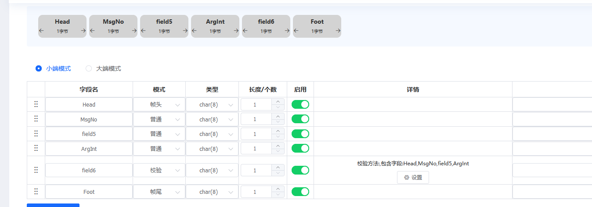

- Head：帧头
- MsgNo：消息号
- field5/field6：保留字段
- ArgInt：参数字段（double(64)类型）
- Foot：帧尾

**3. 模板参数设置**

- 检查模板绑定是否正确
- 确认参数类型一致
- 验证取值范围

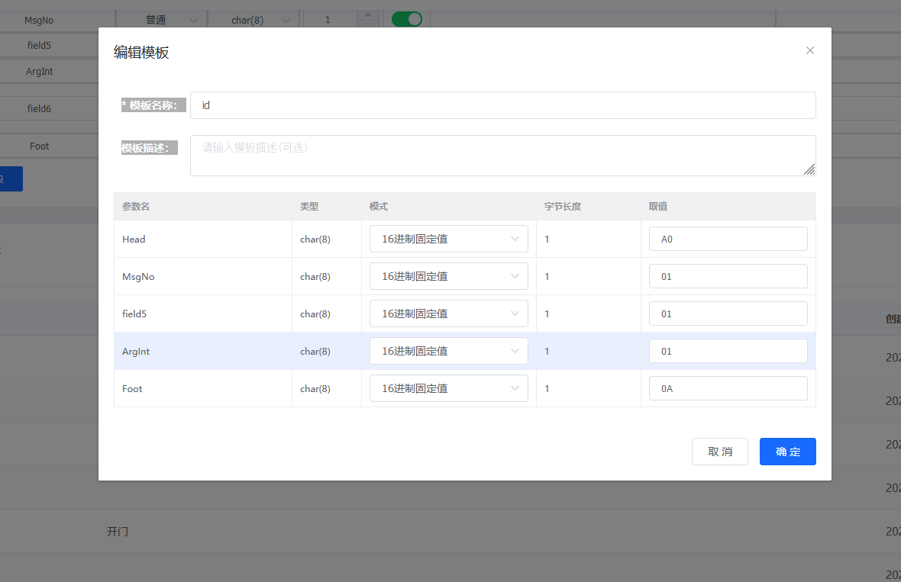

**4. 调试方法**

1. 使用串口调试工具监控数据流
2. 发送测试数据验证协议解析
3. 检查模块是否正确响应
4. 验证TCP回传数据格式

**注意事项：**

- double(64)类型占用8字节
- 确保发送端和接收端格式一致
- ArgInt字段不能与简单类型混用
- 测试时先用简单数据验证

---

### 如何填写二进制协议模板中的参数值？

**问题描述：**

在配置通信协议模板时，不确定如何填写ArgInt参数的取值，特别是发送8字节的ID值时。

**解决方案：**

**1. 参数类型理解**

- ArgInt定义为double(64)类型，占8字节
- 对应需要发送的ID数据
- 模式设置为"作为参数"

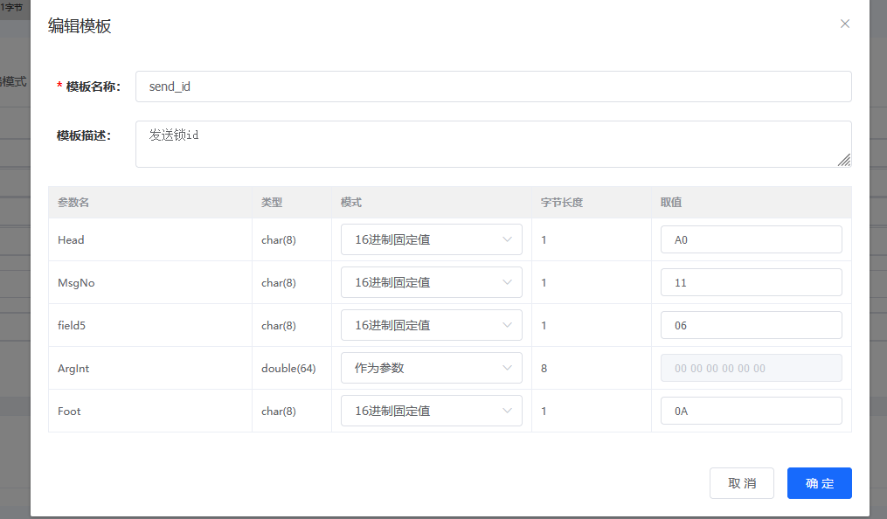

**2. 取值填写方法**

- 直接填写数值即可，如1、11等
- 不需要转换为十六进制
- 平台会自动处理格式转换

**3. 控制行为配置**

- 操作类型：发送协议消息
- 协议：选择对应的二进制协议
- 消息：选择send_id模板
- 参数：填写实际的ID数值

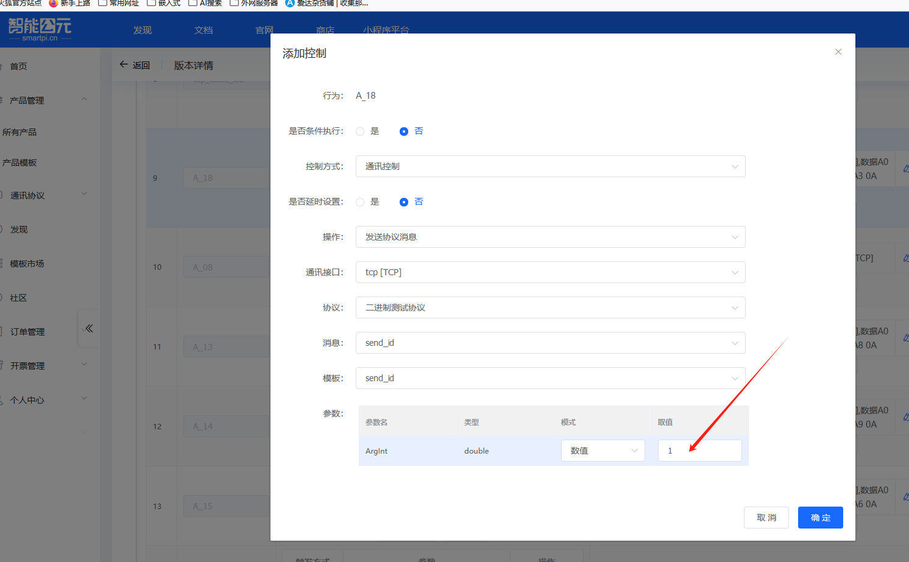

**4. 示例说明**

- 发送ID=1：ArgInt参数填写1
- 发送ID=11：ArgInt参数填写11
- 平台自动转换为8字节格式

**注意事项：**

- double类型会处理为浮点格式
- 确保接收端能正确解析
- 测试时先用小数值验证
- 保存配置后需重新生成固件

---

### 私钥配置错误导致语音识别无响应如何处理？

**问题描述：**

配置私钥后语音识别设备无法正常响应，修正私钥后出现响应变慢和功能失效的情况。

**解决方案：**

**1. 私钥格式问题排查**

- 私钥内容不能包含换行符
- 使用VSCode等专业编辑器打开私钥文件
- 避免使用普通文本编辑器（可能自动添加换行符）

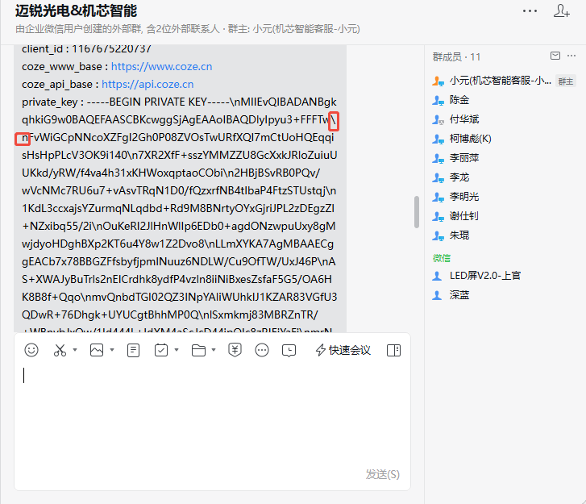

**2. 正确的私钥复制方法**

- 使用VSCode打开私钥文件
- 全选复制整个私钥内容
- 粘贴时确保为一整行，无换行

**3. 资源点耗尽排查**

当修正私钥后仍出现异常时，需要检查扣子平台资源点：

- 登录扣子平台查看"付费管理"页面
- 检查资源点余额是否为0
- 查看"消费历史"确认消耗情况

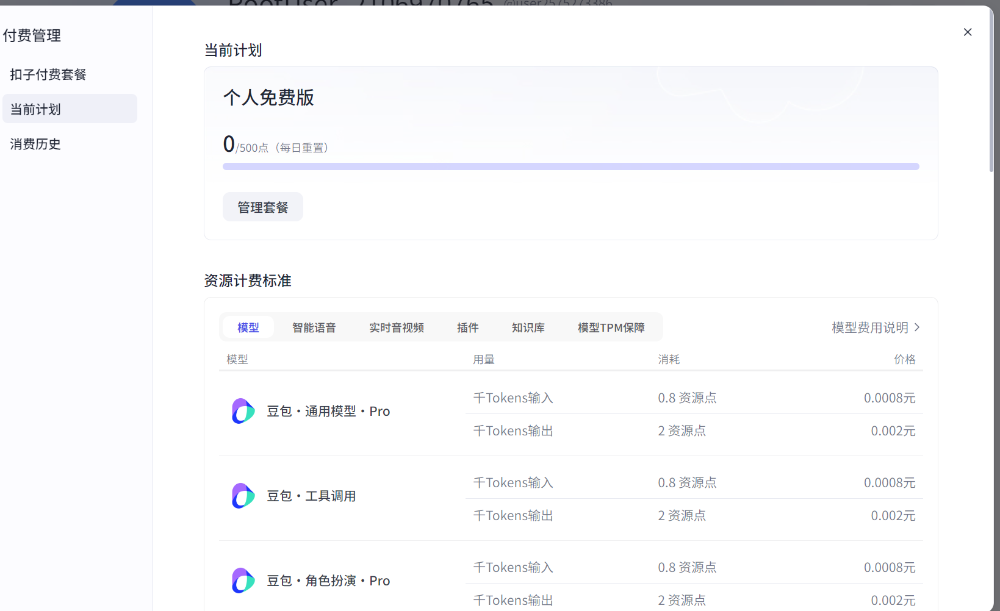

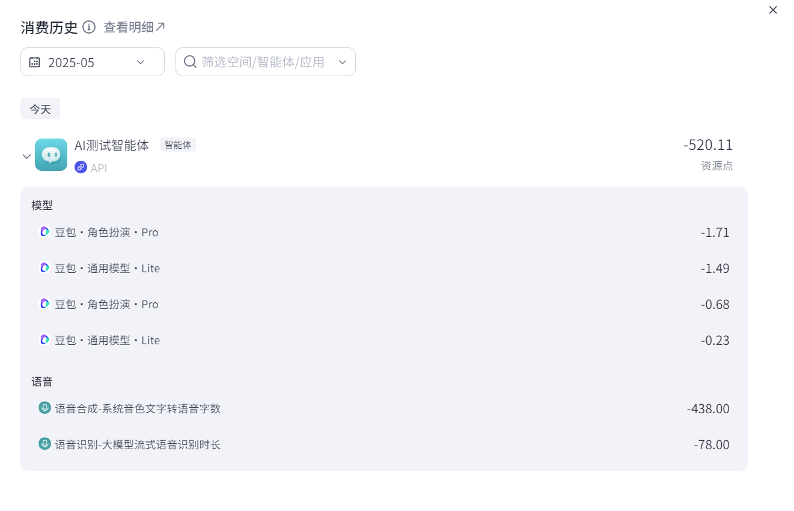

**4. 资源点充值**

- 个人免费版每日500资源点
- 耗尽后需要等待次日重置或购买套餐
- 实时监控资源点使用情况

**注意事项：**

- 私钥必须完整复制，包括BEGIN和END行
- 严禁在私钥中添加任何空格或换行
- 资源点耗尽会导致所有AI功能失效
- 建议设置资源点使用提醒

---

### 如何配置固件升级参数？

**问题描述：**

在固件升级配置界面，需要正确填写待升级产品号和版本号等参数，但不清楚具体的填写规则。

**解决方案：**

**1. 参考官方文档**

- 访问固件升级配置文档
- 文档链接：https://help.aimachip.com/docs/mini_program/mini_program-1f5vp20d3egjb#ao1k8q
- 详细阅读升级配置说明和示例

**2. 配置参数说明**

- **目标固件**：选择需要升级到的固件版本
- **固件链接**：填写固件文件的下载地址
- **待升级产品号**：填写当前设备的产品型号（如JX-12F）
- **待升级版本号**：填写当前设备固件的版本号
- **升级方式**：选择强制升级或可选升级
- **升级超时长**：设置升级超时时间（单位：秒）
- **升级说明**：填写升级说明信息（可选）

**3. 升级流程**

- **设备检查**：设备检查是否有新版本
- **下载固件**：从指定链接下载新固件
- **自动升级**：下载完成后自动安装
- **重启验证**：升级后自动重启验证版本

**注意事项：**

- 产品号和版本号必须与当前设备匹配
- 固件链接必须为有效的下载地址
- 升级过程中确保设备不断电
- 建议在空闲时间进行升级操作

---

### JX-12F模块WiFi连接稳定性问题

**问题描述：**

JX-12F模块在WiFi连接时出现频繁掉线，信号较弱时无法重连，同时观察到日志中存在5字节数据包延迟现象。

**解决方案：**

1. **WiFi信道支持**
    - JX-12F模块支持802.11b/g/n协议
    - 工作在2.4GHz频段
    - 支持1-13信道，具体可连接信道由路由器决定

2. **5字节数据包延迟分析**
    - 正常MQTT通信时出现额外的5字节数据包
    - 该数据包与正常数据间隔约90-100ms
    - 不影响正常通信，但可能影响连接稳定性

3. **掉线重连问题**
    - 信号强度低于2格时容易掉线
    - 掉线后有时无法自动重连
    - 可能与DHCP租约时间有关（默认24小时）

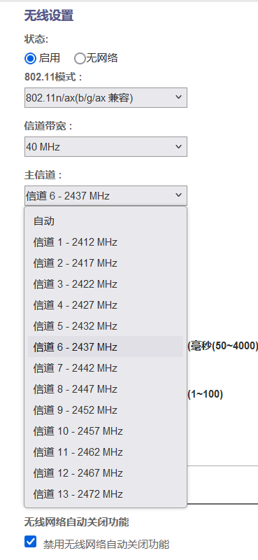

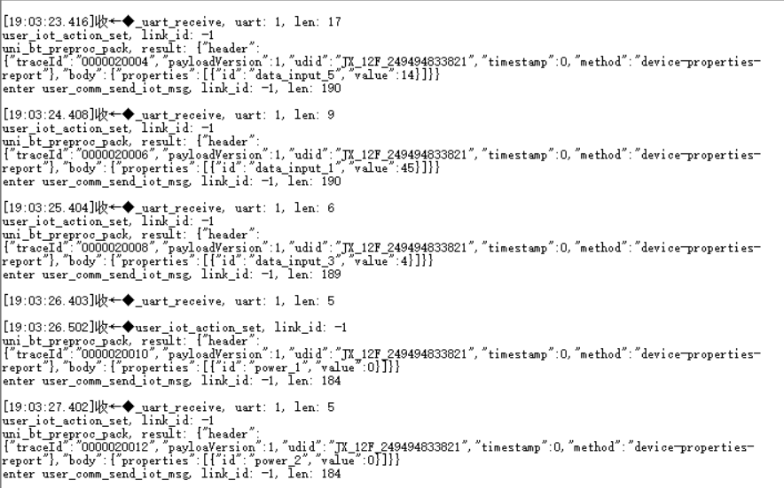

**优化建议：**

- 避免在信号弱区域（2格以下）使用
- 定期重启设备，刷新网络连接
- 调整路由器DHCP租约时间，避免到期掉线
- 使用最新固件版本，改善重连机制

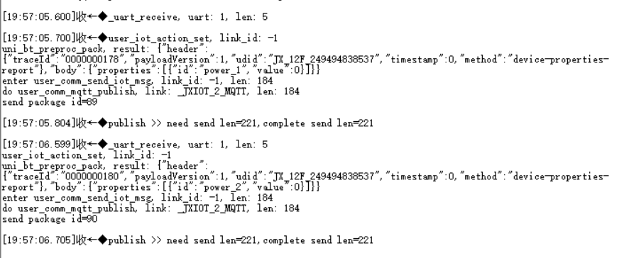

**注意事项：**

- 小程序登录时如果手机信号差可能导致设备掉线
- 5字节数据包的具体作用需要进一步分析
- 长时间运行需要监控连接状态

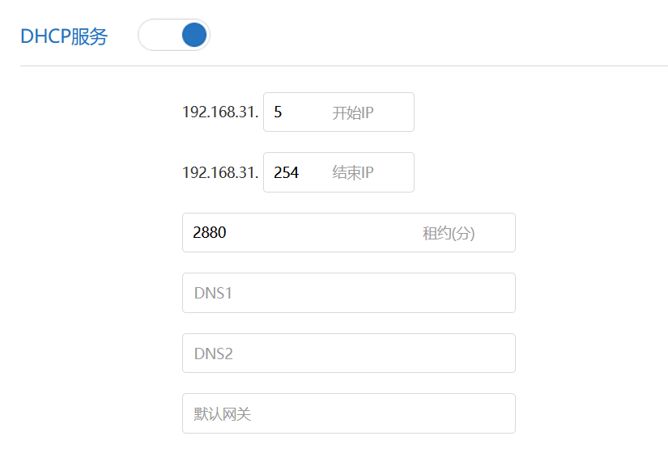

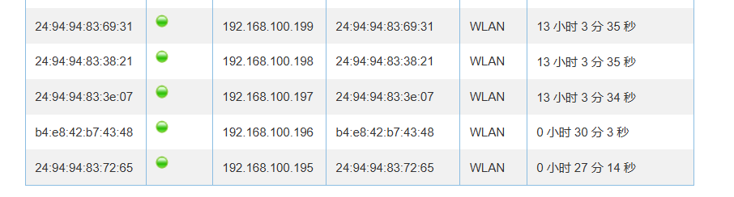

---

