# JX-A7T 平台与固件 FAQ

本页用于整理 JX-A7T 相关的平台与固件问题。

## 产品介绍与功能特点

### JX-A7T支持哪些工作模式？

**问题描述：**

需要了解JX-A7T新品的功能特点，特别是其支持的工作模式。

**解决方案：**

JX-A7T同时支持离线指令与在线指令双重模式：

**1. 离线指令模式**

- 支持本地命令词识别
- 无需网络连接即可响应基本命令
- 响应速度快，可靠性高

**2. 在线指令模式**

- 搭载大模型运行，提供智能对话能力
- 支持自然语言理解和生成
- 可实现更复杂的交互功能

**3. 获取相关资源**

- **文档和例程**：已陆续上传至智能公元平台
- **访问地址**：https://help.aimachip.com/docs/jx_a7t_v1/jx_a7t_v1-1ghc1h40pidif
- **内容包含**：产品规格、开发指南、示例代码等

**注意事项：**

- 离线模式适合基本控制功能
- 在线模式提供更智能的交互体验
- 开发前建议先了解平台文档和例程
- 当前入手可享受超值价格福利

---

### JX-A7T的AI对话功能是否支持英文？

**问题描述：**

需要了解JX-A7T的AI对话功能是否支持英文交流，以及如何实现英文回答。

**解决方案：**

JX-A7T的AI对话功能支持英文交流：

**1. 英文对话支持**

- AI对话功能完全支持英文输入
- 可以用英文提问并获得回答
- 支持中英文混合对话

**2. 英文回答设置**

- 默认情况下会根据输入语言自动回复
- 英文提问通常会得到英文回答
- 对话记忆中的语言会影响回复语言

**3. 优化英文回答的方法**

- 确保对话记忆中使用英文
- 增加智能体功能，自动识别语言类型
- 在智能体配置中设置语言偏好

**4. 智能体功能增强**

- 通过智能体识别中英文
- 根据识别结果自动切换回复语言
- 提供更准确的语言匹配

**注意事项：**

- AI对话功能需要网络连接支持
- 语言识别准确性可能与发音和语速有关
- 建议在安静环境下进行英文对话测试
- 复杂句式可能影响识别准确率

---

### JX-A7T开发资料在哪里获取？

**问题描述：**

购买JX-A7T开发板后，不知道开发资料在哪里获取。

**解决方案：**

**官方文档平台：**

所有JX-A7T的开发资料都在智能公元平台提供：

- **官方文档地址**：https://help.aimachip.com/docs/jx_a7t_v1/jx_a7t_v1-1ghc1h40pidif
- **资料类型**：

    - 快速入门指南
    - 硬件连接说明
    - 软件开发教程
    - API接口文档
    - 示例代码和工程

**平台访问方式：**

1. **直接访问链接**：点击或复制上述链接到浏览器
2. **登录要求**：部分高级功能可能需要注册或登录
3. **文档导航**：左侧有完整的文档目录结构
4. **搜索功能**：支持关键词快速定位所需内容

**资料内容概览：**

- **产品规格**：详细的硬件参数和电气特性
- **开发环境**：推荐的开发工具和配置方法
- **固件下载**：最新固件版本和升级说明
- **常见问题**：开发过程中可能遇到的问题和解决方案

**注意事项：**

- 文档持续更新，建议定期查看最新版本
- 如有特定问题未在文档中找到，可联系官方技术支持
- 下载资料需要稳定的网络连接
- 部分示例代码可能需要根据实际项目进行调整

---

### JX-A7T模组是否支持MCP功能？

**问题描述：**

需要确认JX-A7T模组是否支持MCP（Model Context Protocol）功能，以及如何使用MCP实现控制。

**解决方案：**

JX-A7T模组支持MCP功能，通过MCP可以实现大模型调用外部工具进行控制。

**1. MCP功能说明**

- **MCP全称**：Model Context Protocol（模型上下文协议）
- **功能作用**：让大模型能够调用预定义的工具和控制接口
- **实现方式**：离线部分使用预置好的控制触发，在线部分通过MCP调用工具

**2. MCP配置方法**

- **文档地址**：https://help.aimachip.com/docs/agent/agent-1gp1hsejc96fk
- **配置流程**：

    1. 在智能公元平台配置MCP工具
    2. 设置好MCP工具参数和控制逻辑
    3. 在大模型提示词中告知有这个工具可以调用
    4. 识别到特定意图时，大模型会调用MCP工具

**3. MCP应用场景**

- **语音控制**：收到语音指令时，模块的流程是通过MCP调用对应的控制工具
- **智能控制**：可以像扣子的插件一样，实现智能体直接调用
- **设备联动**：支持通过MCP协议控制其他设备和系统

**4. 与传统控制的区别**

- **离线控制**：使用离线语音，通过预设置好的控制触发实现
- **在线控制**：使用在线大模型，通过MCP制作，提前设置好MCP工具
- **混合模式**：JX-A7T支持离线+在线双模式，可根据场景选择

**注意事项：**

- MCP功能需要网络连接支持（在线模式）
- 离线模式下使用传统的预设置控制方式
- MCP工具配置需要遵循智能公元平台的规范
- 建议先了解MCP文档后再进行配置开发

---

---

## 应用软件与开发

### JX-A7T如何实现展示行业的语音控制应用？

**问题描述：**

需要在展示行业中使用JX-A7T模块，实现离线语音指令串口输出、在线知识库联动控制，以及小程序按钮控制功能。

**解决方案：**

JX-A7T模块完全支持该应用场景，可实现离线模式和在线模式的灵活切换：

**1. 离线模式实现**

- 支持预定义语音指令识别
- 每条指令通过串口输出对应的指令码
- 响应速度快，无需网络连接
- 适合基础的展示控制功能

**2. 在线模式知识库联动**

- 知识库采用Markdown格式的JSON文件定义
- 大模型理解语音语义，索引知识库获取控制指令
- WiFi模块将指令数据发送给JX-A7T模块
- JX-A7T模块通过串口输出最终控制码

**3. 知识库定义格式**

```json
{
    "name": "我要打开灯光",
    "data": [{"id": "switch_1", "value": 1}]
}
```

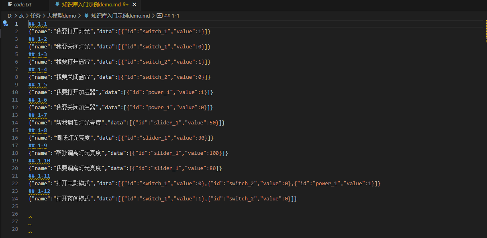
*知识库采用JSON格式，包含语音指令名称和对应的设备控制数据*

**4. 数据流与控制逻辑**

- **语音输入**：大模型理解用户语音，即使表达不完全一致也能准确匹配
- **知识库索引**：根据语义匹配获取对应的data信息
- **数据传输**：WiFi模块将data信息发送给JX-A7T
- **串口输出**：JX-A7T将控制指令通过对外串口输出

**5. 小程序联动控制**

- 小程序按钮可关联特定的设备标识(id)
- 设备标识与知识库中的id值对应
- 实现语音控制和手动控制的统一

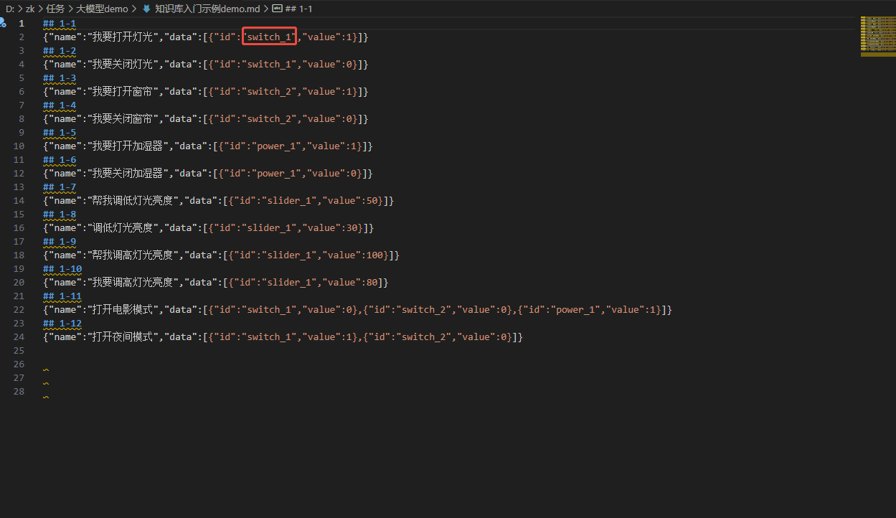
*小程序中的设备标识(id)与知识库中的id值相对应，实现统一控制*

**注意事项：**

- 语音模块支持串口透传，可将WiFi接收的数据转发到对外串口
- 知识库支持语义理解，不要求用户语音与name字段完全一致
- 如需UDP网络控制指令发送，需要定制开发WiFi部分程序
- 建议优先使用标准串口控制方式，成本更低且实现简单

---

### JX-A7T模块有专门的APP吗？

**问题描述：**

询问JX-A7T模块是否有制作专门的APP，以及目前的开发状态。

**解决方案：**

目前JX-A7T模块只有小程序，没有独立的APP。

---

### JX-A7T在线功能异常怎么办？

**问题描述：**

在烧录语音和WiFi固件后，设备昨天能正常进行在线和离线功能，但今天只能离线无法在线，尽管小程序显示已连接网络，且设备指示灯闪烁表明未成功联网。

**解决方案：**

**问题现象分析：**

- **小程序显示已连接**：但实际未成功联网
- **指示灯闪烁**：表示设备未连接到网络
- **离线功能正常**：说明语音模块工作正常

**网络连接判断：**

1. **指示灯状态**：

    - **联网成功**：指示灯常亮
    - **未联网**：指示灯闪烁
    - **左边指示灯**：专门显示网络状态

2. **实际连接状态**：

    - 以指示灯状态为准，不以小程序显示为准
    - 闪烁说明网络配置或连接有问题
    - 需要重新配置网络

**解决步骤：**

1. **检查网络配置**：

    - 确认WiFi密码正确
    - 检查路由器是否正常工作
    - 尝试重新配置网络连接

2. **重启设备**：

    - 断电重启模块
    - 等待设备完全启动
    - 观察指示灯状态变化

3. **网络环境排查**：

    - 确认WiFi信号强度足够
    - 检查网络是否限制了设备连接
    - 尝试使用手机热点测试

**预防措施：**

- 定期检查网络连接状态
- 确保路由器稳定运行
- 配置备用网络连接方式

**注意事项：**

- 设备指示灯是判断网络状态的可靠依据
- 小程序显示可能存在延迟或不同步
- 如持续无法联网，检查网络环境和设备配置

---

### JX-A7T模块的最小尺寸是多少？

**软件支持：**

- **小程序支持**：提供小程序用于配置和控制
- **无独立APP**：暂未开发专门的手机APP
- **开发计划**：需关注官方发布信息

**使用方式：**

- 通过微信小程序进行配置
- 小程序提供基础控制功能
- 满足日常使用需求

**注意事项：**

- 当前主要通过小程序使用
- 后续是否会推出APP需关注官方通知
- 可以通过小程序体验基本功能

---

### JX-A7T模块如何测试？

**问题描述：**

询问如何测试JX-A7T2模块，以及测试所需的工具和文档支持。

**解决方案：**

**测试文档获取：**

1. **官方文档资源**：

    - JX-A7Tdemo操作指示文档.pdf
    - JX-A7T烧录指引文档V1.0.pdf
    - 包含完整的测试和操作指南

2. **文档内容涵盖**：

    - 模块快速入门指导
    - 硬件连接说明
    - 功能测试步骤
    - 常见问题解决方法

**测试所需工具：**

1. **基础工具**：

    - USB数据线（Type-C接口）
    - 电脑（用于烧录和调试）
    - 串口调试工具

2. **硬件准备**：

    - JX-A7T2模块或开发板
    - 电源（3.3V-5V）
    - 扬声器（用于音频输出测试）
    - 麦克风（用于语音输入测试）

**测试流程：**

1. **硬件连接**：

    - 按照文档连接电源和音频设备
    - 通过USB连接到电脑
    - 确认硬件连接正确

2. **固件烧录**：

    - 使用官方烧录工具
    - 烧录最新固件版本
    - 验证烧录成功

3. **功能测试**：

    - 测试离线语音命令识别
    - 测试在线大模型对话
    - 验证GPIO控制功能

**支持资源：**

- 官方提供详细文档和示例
- 技术支持团队可提供协助
- 智能公元平台提供配置工具

**注意事项：**

- 严格按照文档指引操作
- 测试前确认所有连接正确
- 如遇问题，参考文档的故障排除章节
- 保留测试记录便于问题定位

---

## 网络配置与连接问题

### JX-A7模块绑定Coze后语音对话无响应怎么办？

**问题描述：**

JX-A7模块烧录默认Wi-Fi和语音固件后，成功配置网络并绑定Coze平台，但语音对话始终无调用，设备在路由器上显示一闪一闪的连接状态。

**解决方案：**

**1. 网络连接问题排查**

- **使用手机热点测试**：用另一部手机开启2.4GHz热点，让模块连接后重试
- **检查路由器设置**：确认是否开启了AP隔离或防火墙限制
- **信号强度检查**：确保模块距离路由器不要太远

**2. 设备状态检查**

- **开关位置确认**：左侧开关应在"运行"位置，右侧在"WiFi"位置
- **指示灯状态**：正常连接后指示灯应稳定常亮，不闪烁
- **重启设备**：重新插拔电源或按复位键重启模块

**3. Coze平台配置验证**

- **绑定状态确认**：在小程序中确认Coze绑定是否成功
- **API配置检查**：确认API密钥和接口配置正确
- **服务状态查询**：检查Coze平台服务是否正常运行

**4. 网络环境优化**

- **信道选择**：尝试更换WiFi信道（1、6、11），避开拥堵信道
- **密码简化**：使用纯数字或简单字母的WiFi密码
- **路由器重启**：重启路由器清除可能的连接缓存

**注意事项：**

- JX-A7需要2.4GHz WiFi网络，不支持5GHz
- 设备连接成功后会在路由器显示为已连接设备
- 语音对话无响应通常是网络或平台配置问题
- 建议先解决网络连接问题，再测试语音功能

---

### JX-A7T串口0对应哪两个引脚？

**问题描述：**

需要确认JX-A7T模块的UART0串口对应的引脚定义。

**解决方案：**

**引脚对应关系：**

- **UART0_TX**：GPIO_B5
- **UART0_RX**：GPIO_B4

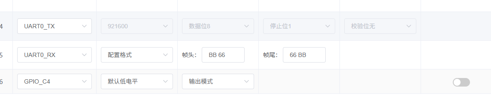

**使用说明：**

- GPIO_B4/B5是UART0专用引脚
- 波特率可配置，最高支持921600
- 使用时需确认GPIO功能配置为UART模式
- 注意电平匹配，JX-A7T为3.3V TTL电平

**注意事项：**

- UART0和UART1是独立的串口
- 配置时需在平台中正确选择串口号
- 不同UART引脚不可混用
- 串口通信需确保共地连接

---

### 如何配置JX-A7T的串口通信和引脚分配？

**问题描述：**

需要正确配置JX-A7T模块的串口通信，包括波特率设置、引脚分配以及如何通过串口1获取语音控制指令输出。

**解决方案：**

**1. 串口配置说明**

JX-A7T有两个串口，用途不同：

- **UART0**：用于与WiFi通信（波特率921600）
- **UART1**：用于输出语音控制指令（用户可使用）

**2. 波特率设置**

- **UART0**：固定波特率921600，用于WiFi模块通信
- **UART1**：波特率可配置，默认115200
- **调试注意**：通过UART1查看语音指令输出

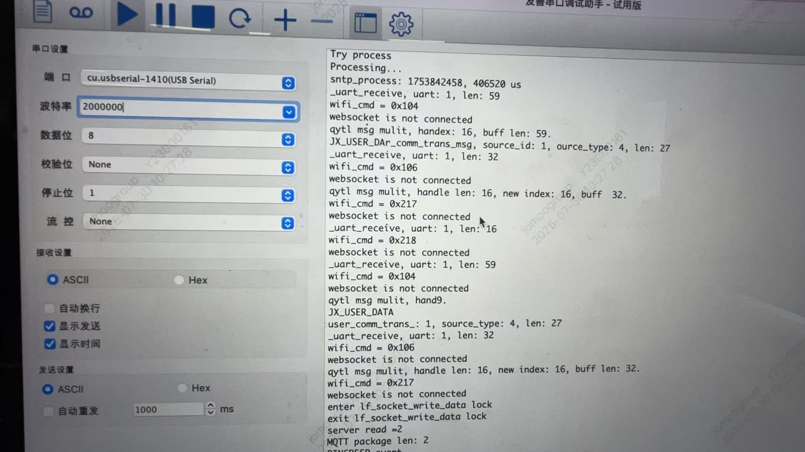

**3. 引脚配置方法**

在平台中配置串口引脚：

- 进入Pin脚配置页面
- UART0_TX和UART0_RX已自动配置用于WiFi通信
- UART1_TX和UART1_RX可配置为自定义串口

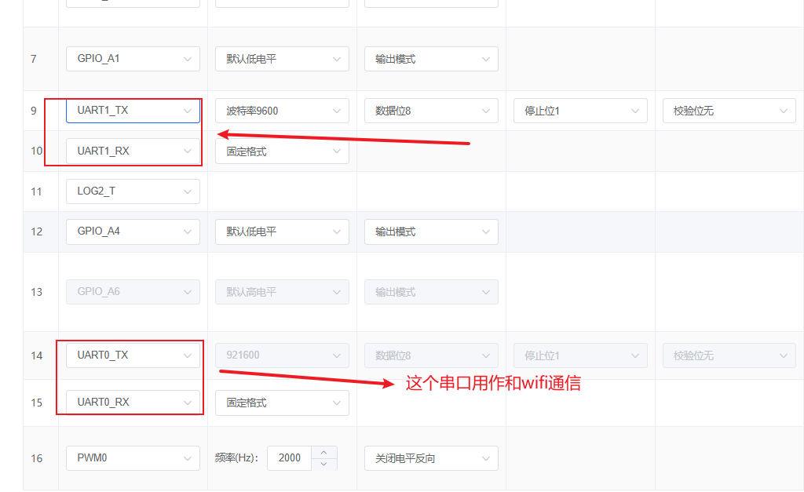

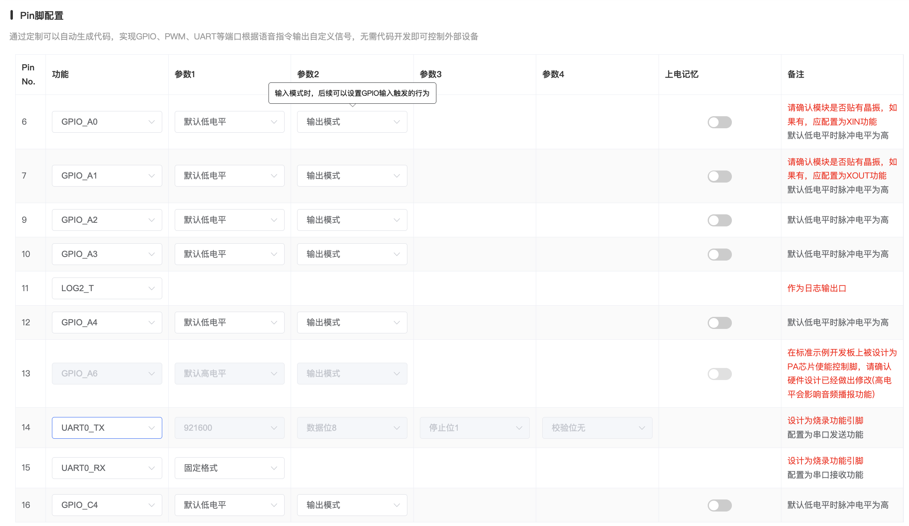

**4. 获取语音指令输出**

要获取语音控制指令：

- 将UART1_TX/UART1_RX配置为GPIO模式
- 在控制详情中选择"发送16进制数"操作
- 连接串口调试工具到UART1引脚
- 语音识别后会通过UART1输出对应指令

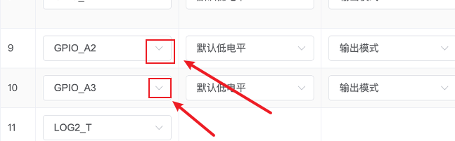

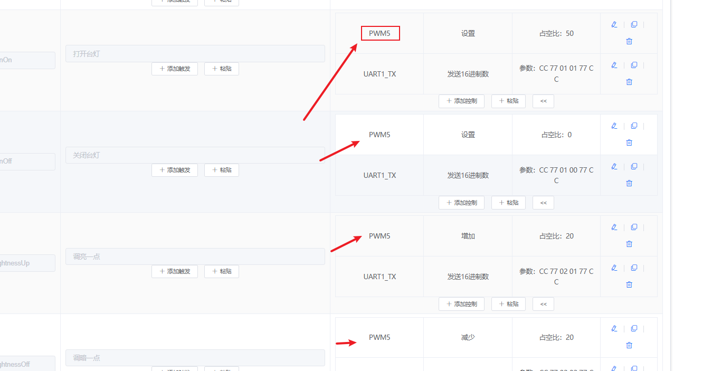

**注意事项：**

- UART0专用于WiFi通信，用户不应占用
- UART1配置为GPIO后可作为普通串口使用
- 波特率2M需要使用质量好的USB转串口模块
- 确保TX/RX交叉连接（模块TX→转换器RX）

---

### 如何配置JX-A7T的音量控制？

**问题描述：**

需要通过语音指令控制JX-A7T模块的音量大小。

**解决方案：**

**1. 添加语音指令**

在智能公元平台中添加以下语音指令：

- **"声音大点"指令**：

    - 触发方式：语音识别
    - 控制方式：系统设置
    - 类别：播放控制
    - 操作：增加音量

- **"声音小点"指令**：

    - 触发方式：语音识别
    - 控制方式：系统设置
    - 类别：播放控制
    - 操作：减小音量


**2. 配置步骤**

- 进入语音指令自定义页面
- 添加命令词并设置识别内容
- 在控制详情中选择对应的操作
- 保存配置并生成固件

**3. 测试验证**

- 烧录固件到模块
- 测试语音指令是否正确触发
- 验证音量变化是否符合预期

**注意事项：**

- 音量控制范围为0-100，默认值适中
- 支持多级音量调节，可连续控制
- 音量变化会影响所有语音播报内容
- 建议根据实际使用环境调节合适音量

---

### 智能体平台导入例程后原有项目会丢失吗？

**问题描述：**

在智能体平台导入例程后，发现之前创建的Wi-Fi和语音项目消失，担心原有项目被覆盖。

**解决方案：**

**项目不会覆盖说明：**

导入例程不会覆盖原有项目，两者可以同时存在。

**1. 项目查找方法**

- 导入的例程会显示为新增项目
- 原有项目仍在产品列表中
- 可在"所有产品"中查看完整项目列表

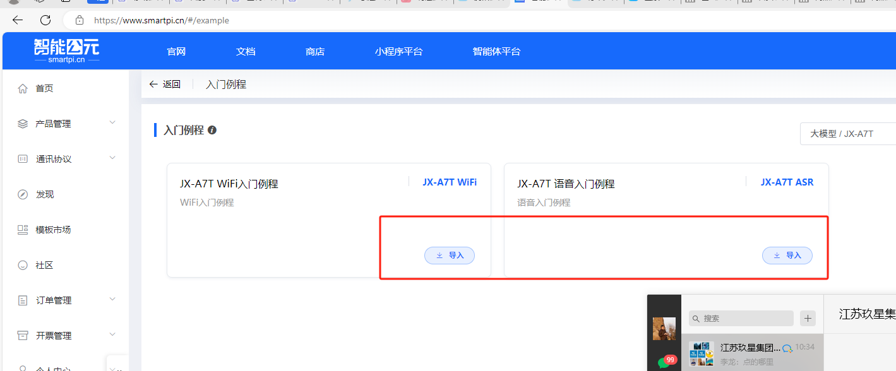

*在入门例程页面点击导入按钮*

**2. 项目列表确认**

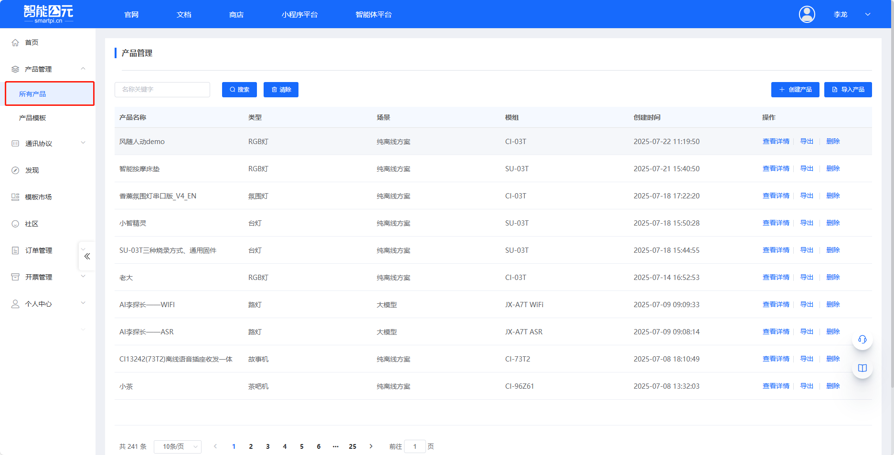

*导入前的产品列表，显示原有创建的项目*

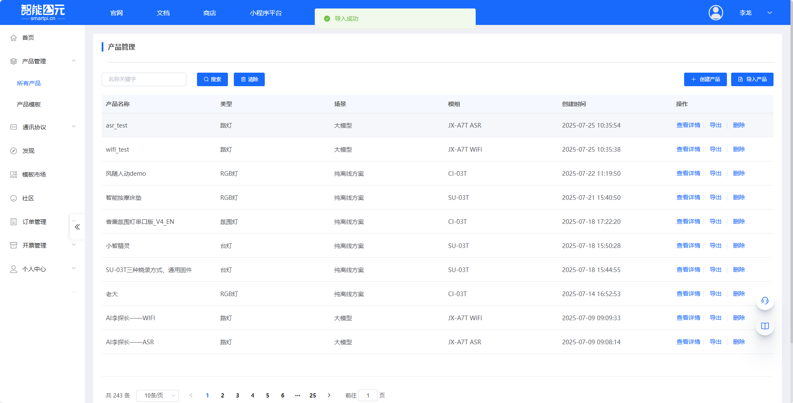

*导入后新增了asr_test和wifi_test项目*

**3. 原有项目定位**

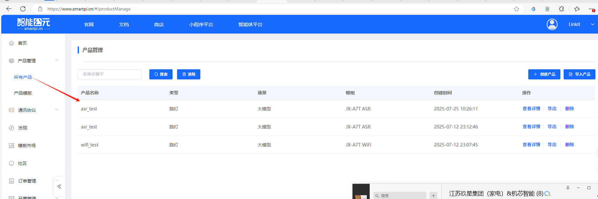

*在"所有产品"中查看完整项目列表*

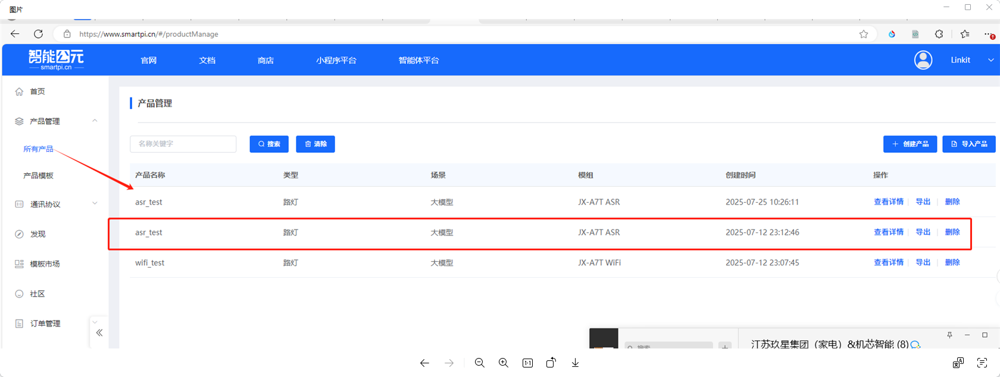

*红色框内为之前创建的asr_test项目*

**项目名称修改：**

- 可以修改项目名称，但"类型"字段无法更改
- 项目名称可编辑，不影响功能使用
- 类型字段在创建后固定，不可修改

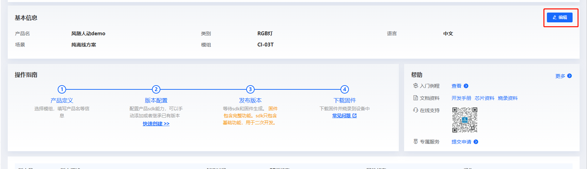

*点击编辑可修改项目名称，但类型不可改*

---

### JX-A7T如何配置豆包扣子智能体？

**问题描述：**

需要了解如何将JX-A7T与豆包扣子平台集成，实现大模型对话功能。

**解决方案：**

JX-A7T支持通过智能公元平台配置豆包扣子智能体：

**1. 获取豆包扣子配置信息**

- 在豆包扣子平台创建智能体
- 获取以下配置信息：

    - 应用ID（client_id）
    - 智能体ID
    - 公钥（public_key）
    - 私钥（private_key）

**2. 在智能公元平台配置**

- 进入智能公元平台的配置页面
- 创建新配置，填写豆包扣子信息：

    - 平台：选择扣子
    - 应用ID：输入获取的client_id
    - 智能体ID：输入智能体ID
    - 公钥：复制粘贴公钥内容
    - 私钥：使用VSCode等编辑器打开私钥文件，避免换行符问题

**3. 配置注意事项**

- **私钥处理**：使用VSCode打开私钥文件，避免文本编辑器自动添加换行符
- **权限设置**：确保小程序有蓝牙和定位权限
- **网络要求**：设备需要连接2.4G WiFi网络

**4. 功能使用**

- 配置完成后，设备将自动连接到豆包大模型
- 支持自然语言对话和智能交互
- 可通过语音或文本与设备对话

**注意事项：**

- 智能公元平台的智能体喂养功能暂未开放
- 目前需要直接在豆包扣子平台定义智能体
- 确保账户有足够的资源点（可在资源库查看余额）
- 私钥文件必须完整且无额外字符，否则会导致认证失败

---

### JX-A7T的智能体如何喂养和配置？

**问题描述：**

希望了解如何在智能公元平台喂养智能体，以及如何管理知识库内容。

**解决方案：**

当前智能体喂养的实现方式：

**1. 现状说明**

- 智能公元平台的智能体喂养功能尚未开放
- 需要通过豆包扣子平台进行智能体配置
- 后续将支持在智能公元平台直接喂养

**2. 当前实现方案**

- 在豆包扣子平台创建和配置智能体
- 上传知识库文件和提示词
- 设置智能体的行为和回复规则
- 通过API接口与JX-A7T设备集成

**3. 知识库管理**

- 使用"知识库入门示例demo.md"作为参考
- 将FAQ、产品说明等文档上传为知识库
- 配置检索规则和回复模板
- 测试智能体的回答准确性

**4. 配置文件示例**

- **大模型提示词**：定义智能体的角色和回复风格
- **小程序控件key&value**：定义与设备交互的控制指令
- **入门示例demo**：提供完整的配置示例

**注意事项：**

- 知识库文件格式需符合平台要求
- 提示词设计要简洁明确
- 定期更新知识库内容以保证信息准确性
- 建议先在扣子平台充分测试后再集成到设备

---

### 场景管理功能无法使用怎么办？

**问题描述：**

场景管理功能显示正常但无法执行同步开机、同步关机等操作。

**解决方案：**

**1. 功能检查**

- 确认场景管理界面开关状态
- 检查设备是否已正确配网
- 验证设备与平台的连接状态

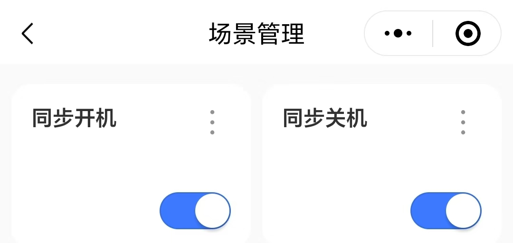

**2. 常见原因排查**

- **网络连接问题**：设备网络不稳定导致指令下发失败
- **设备状态异常**：设备未处于可接收指令状态
- **平台服务异常**：临时性服务中断

**3. 解决步骤**

- 重新启动设备
- 检查网络连接质量
- 重新配置网络设置
- 等待平台服务恢复

**4. 联系支持**

如问题持续存在：

- 记录具体的错误提示
- 提供设备ID和时间信息
- 联系技术支持人员协助

**注意事项：**

- 场景管理功能依赖稳定的网络连接
- 建议在网络良好时使用该功能
- 功能暂时不可用时，可使用手动控制作为备选方案

---

### 如何将WiFi的MQTT数据透传到串口？

**问题描述：**

需要确认通过WiFi连接的MQTT数据是否可以直接透传到JX-A7T模块的串口1 TX引脚。

**解决方案：**

**数据透传配置说明：**

智能体平台支持将MQTT数据透传到串口输出。

**1. 透传规则配置**

- **来源接口**：选择 Linkit [MQTT]
- **目标接口**：选择 UART1_TX [串口]
- **启用状态**：开启该透传规则

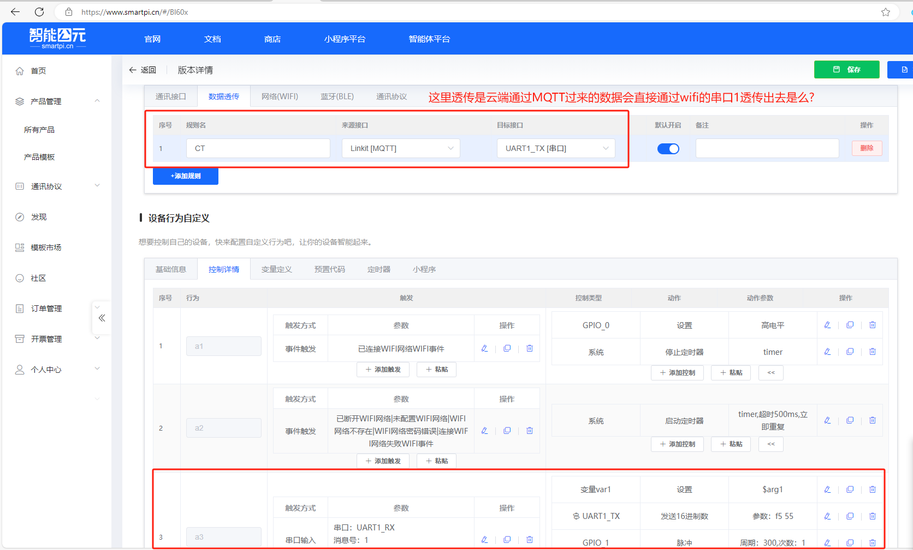

*数据透传配置界面，MQTT到串口1的透传规则*

**2. 数据流向**

- MQTT接收的数据 → UART1_TX引脚输出
- 支持自定义MQTT主题和数据格式
- 串口波特率等参数可配置

**3. 功能限制**

- 该透传规则仅适用于自行发送的MQTT数据
- 不支持透传官方小程序的数据
- 小程序数据需通过其他方式处理

**注意事项：**

- 确保MQTT连接配置正确
- 串口参数需与接收端设备匹配
- 透传功能在平台数据透传页面配置
- 建议使用官方小程序进行MQTT数据测试

---

### 如何配置串口与智能公元平台小程序对接？

**问题描述：**

需要使用智能公元默认小程序，如何配置串口触发的行为进行对接。

**解决方案：**

**小程序对接方式：**

在小程序控件上对接行为名称即可实现控制。

**1. 通讯协议配置**

- 在智能公元平台创建通讯协议
- 协议标识：自定义（如uart_test）
- 协议类型：二进制格式
- 用于定义设备与小程序的通信规则

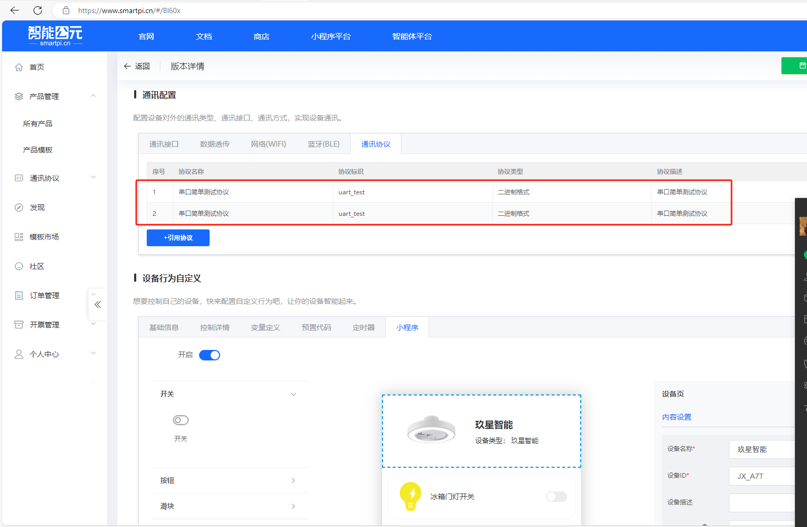

*通讯协议配置界面，定义串口通信协议*

**2. 行为触发方式**

- 行为目前只能通过串口触发
- 在小程序控件上绑定对应的行为名称
- 串口数据触发后，小程序执行对应动作

**3. 参考配置方案**

可参考JX-A7T模块WiFi部分的出厂固件配置：

- 查看官方提供的默认配置
- 了解串口协议格式
- 参考标准行为实现方式

**注意事项：**

- 小程序对接需要在平台配置通讯协议
- 行为名称需与小程序控件完全匹配
- 串口数据格式必须符合协议定义
- 建议使用官方提供的示例代码作为参考

---

### JX-A7T模块UART1串口配置与数据交互问题

**问题描述：**

在使用JX-A7T模块时，配置UART1与单片机进行数据交互，但出现协议模板参数错误，需要确认配置是否正确并解决连接问题。

**解决方案：**

**1. 数据透传配置**

配置双向数据转发规则：

- **规则1**：UART1_RX → tcp
    - 来源接口：UART1_RX（接收单片机数据）
    - 目标接口：tcp（发送到服务器）

- **规则2**：tcp → UART1_TX
    - 来源接口：tcp（接收服务器数据）
    - 目标接口：UART1_TX（发送给单片机）

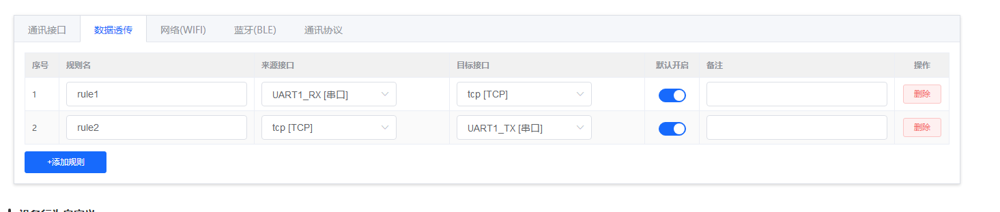

**2. 网络配置**

- **AP模式设置**：

    - AP的IP地址：39.98.125.145
    - AP的密码：admin
    - 设备名称：自定义

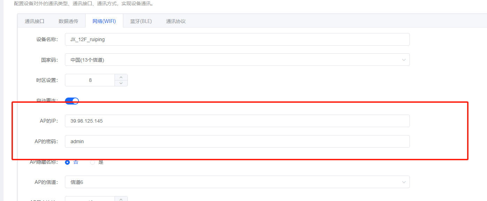

**3. 串口参数设置**

- **UART1_TX配置**：

    - 波特率：9600
    - 数据位：8
    - 停止位：1
    - 校验位：无

- **UART1_RX配置**：

    - 协议：自选协议
    - 等待触发输入

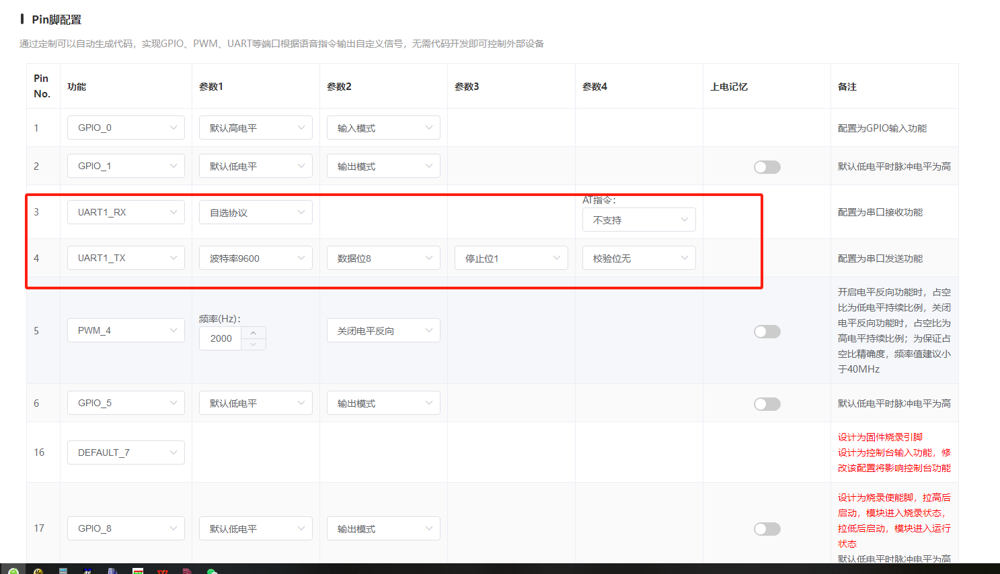

**4. 触发方式配置**

- **触发名称**：WIFI_TXRX
- **输入端口**：UART1_RX
- **协议**：HCP-III
- **消息模板**：Mod_bus
- **模板**：read_jcq


**5. 错误排查**

- **行为控制详情端口输出协议消息模板参数错误**：

    - 检查触发方式中的模板参数配置
    - 确认协议模板与消息模板匹配
    - 验证所有必填参数已设置


**解决方法**：

- 导出配置模型文件
- 检查并修正模板参数错误
- 重新导入修正后的配置
- 确保代码检查通过

**注意事项：**

- UART1_TX和UART1_RX需要分别配置
- 波特率必须与单片机匹配（此处为9600）
- 协议模板错误会导致功能异常
- 建议使用入门例程作为配置参考

---

### 如何配置JX-A7T的语音指令？

**问题描述：**

需要了解如何在JX-A7T平台上添加和配置语音指令。

**解决方案：**

**1. 语音指令添加流程**

- **进入命令词配置**：在平台选择"命令词"选项
- **添加新指令**：点击"添加"按钮创建新命令
- **设置识别内容**：输入要识别的语音内容（如"打开灯光"）


**2. 指令参数设置**

- **识别灵敏度**：设置低、中、高三档
- **回复语设置**：配置指令识别后的语音反馈
- **重复检测**：设置是否允许连续识别

**3. 控制动作关联**

- **添加控制动作**：为每个指令配置执行动作
- **选择控制方式**：GPIO输出、串口发送等
- **配置参数**：设置具体的输出引脚或数据

**注意事项：**

- 每个语音指令需要配置对应的触发动作
- 指令内容应简洁明了，便于识别
- 建议测试不同距离和角度的识别效果
- 保存配置后需要重新生成并烧录固件

---

### 如何确认JX-A7T固件的唤醒灵敏度设置？

**问题描述：**

需要确认JX-A7T固件是否已按要求调整为中灵敏度，避免生产版本与沟通版本存在差异。

**解决方案：**

**1. 确认固件配置**

- 在智能公元平台的"唤醒词自定义"页面查看设置
- 检查"唤醒灵敏度"选项是否设置为"中"
- 截图保存配置记录作为凭证

**2. 版本管理流程**

- 记录每次固件提交生产的具体日期
- 技术需求变更需要及时同步到生产环节
- 建立版本变更追踪机制

**3. 生产批次管理**

- 确认每个批次使用的固件版本
- 如需调整，提前通知生产部门
- 保留批次号与固件版本的对应记录

**注意事项：**

- 固件提交生产后，后续需求变更将在下一批次生效
- 建议在技术需求确认后再安排生产
- 保留所有配置变更的沟通记录
- 生产前最后确认一次固件配置参数

---

### JX-A7T1模块无法运行DeepSeek模型怎么办？

**问题描述：**

JX-A7T1模块在扣子平台配置对话流时，无法成功运行DeepSeek-R1/250528大模型，但可以正常运行豆包大模型。

**解决方案：**

DeepSeek模型本身可以正常运行，问题可能出在配置上。

- **可用的模型**：

    - DeepSeek-R1/250528
    - DeepSeek-V3-0324
    - 豆包深度思考128K

- **建议方案**：

    - 检查提示词是否正确设置
    - 确认输入变量格式为{{input}}
    - 如仍有问题，可使用豆包模型替代

**注意事项：**

- 扣子平台的模型列表是完整的
- 多个大模型使用可能会有限制
- 建议选择一个稳定模型使用

---

### JX-A7T模块是否支持自定义小程序功能？

**问题描述：**

需要了解JX-A7T模块是否可以将默认小程序替换为自定义功能的小程序。

**解决方案：**

JX-A7T模块支持自定义小程序开发，但需要自行设计：

- **开发方式**：需要自行设计和开发小程序
- **功能定制**：可根据产品需求定制特定功能
- **技术支持**：参考官方开发文档进行开发

**注意事项：**

- 自定义小程序需要具备相应的开发能力
- 建议先了解平台提供的API接口
- 开发前可先体验默认小程序的功能设计

---

### JX-A7T模块是否支持播放歌曲功能？

**问题描述：**

询问JX-A7T模块是否支持在线播放歌曲或背景音乐功能。

**解决方案：**

**在线音乐播放：**

- 目前不支持通过扣子平台在线播放歌曲
- 主要考虑音频传输成本较高

**背景音乐支持：**

- 支持通过个性化音频功能上传背景音乐
- 可在平台的"个性化音频"页面管理音频文件
- 上传的音频可替代平台自动生成的回复语音

**蓝牙音乐播放：**

- JX-B5C等型号支持蓝牙音乐播放功能
- 可通过蓝牙连接手机播放音乐
- JX-A7T主要专注语音交互功能

**注意事项：**

- 在线音乐播放功能暂未开放
- 背景音乐需自行录制并上传
- 不同型号的音乐支持能力有差异

---

### JX-A7T模块可以接入其他大模型吗？

**问题描述：**

大模型响应速度较慢，是否可以接入其他响应更快的大模型（如豆包）。

**解决方案：**

**模型选择：**

- 可在扣子平台选择其他运行速度更快的模型
- 支持扣子平台提供的所有大模型
- 包括DeepSeek、豆包等多种选择

**响应速度优化：**

- 不同模型的响应速度存在差异
- 可根据实际需求选择合适的模型
- 扣子平台的模型列表完整可用

**功能特点：**

- 支持对话过程中唤醒打断
- 可实现大模型控制硬件功能
- 相比纯对话机器人更具实用性

**注意事项：**

- 更换模型可能需要调整提示词配置
- 不同模型可能有使用费用
- 建议选择稳定可靠的模型版本

---

### JX-A7T如何配置大模型实现特定应用场景？

**问题描述：**

需要在扣子平台上配置JX-A7T的大模型，以实现智慧农业等特定应用场景的语音控制和闲聊问答功能。

**解决方案：**

大模型的类型和角色可以在扣子平台上自行配置，不受预定义类型限制。

**1. 角色配置方法**

- 登录扣子平台（coze.cn）
- 在智能体配置中设置角色提示词
- 可以配置成各种类型的专业角色（如智慧农业专家）
- 提示词决定了大模型的回复风格和知识领域


*扣子平台首页，可以创建和配置智能体*

**2. 知识库配置**

- 在平台知识库中添加专业领域知识
- 配置语音指令与设备控制的映射关系
- 例如："我要关闭灯光"对应开关控制
- "帮我调低灯光亮度"对应滑块控制

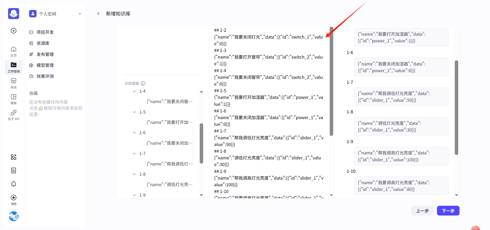

*知识库管理界面，配置语音指令与设备控制的映射*

**3. 离在线共存实现**

- **离线功能**：使用SU-03T实现精准语音控制
- **在线功能**：通过JX-A7T连接大模型进行智能对话
- **智能切换**：闲时自动切换到在线大模型，控制时使用离线指令

**4. 应用场景扩展**

- 不限于智慧农业，可配置任意专业领域
- 根据应用场景定制角色和知识库
- 支持自然语言控制设备，无需固定指令

**注意事项：**

- 网络访问问题可能是地区网络延迟导致
- 建议在网络稳定时进行配置和测试
- 大模型角色配置可随时更改以适应不同需求

---

### SDK生成需要多长时间，能否加快处理？

**问题描述：**

在平台创建SDK版本后，系统提示需要13分钟生成时间，希望了解能否加快处理速度。

**解决方案：**

**生成时间说明：**

- SDK生成需要排队处理，无法直接加急
- 显示的时间为预估时间，实际情况可能因服务器负载而变化
- 任务较多时都需要按顺序处理

**影响因素：**

- 配置复杂度：简单配置生成较快
- 服务器负载：高峰期可能需要更长时间
- 队列长度：前方任务数量影响等待时间

**优化建议：**

- 避开高峰时段进行SDK生成
- 确保配置完整无误后再提交生成
- 提前规划开发时间，预留充足的生成等待期

**注意事项：**

- 生成速度不影响SDK质量
- 耐心等待生成完成即可
- 如长时间未完成，可联系技术支持查询进度

---

### 如何优化JX-A7T的语音回复默认语句？

**问题描述：**

模块每次回答都会说"很高兴收到你的问题啊，让我来为你解答"，显得冗余，能否优化或去除。

**解决方案：**

**当前状态：**

- 默认回复语句确实存在冗余问题
- 官方已确认需要优化
- 后续固件更新会改进

**临时解决方案：**

- 可在扣子平台调整提示词
- 设置更简洁的回复风格
- 优化对话流程设计

**唤醒打断功能：**

- 支持在对话过程中使用唤醒词打断
- 直接说唤醒词即可中断当前回复
- 提高交互效率

**注意事项：**

- 默认语句优化需等待官方固件更新
- 建议关注平台更新公告
- 可通过提示词优化部分改善体验

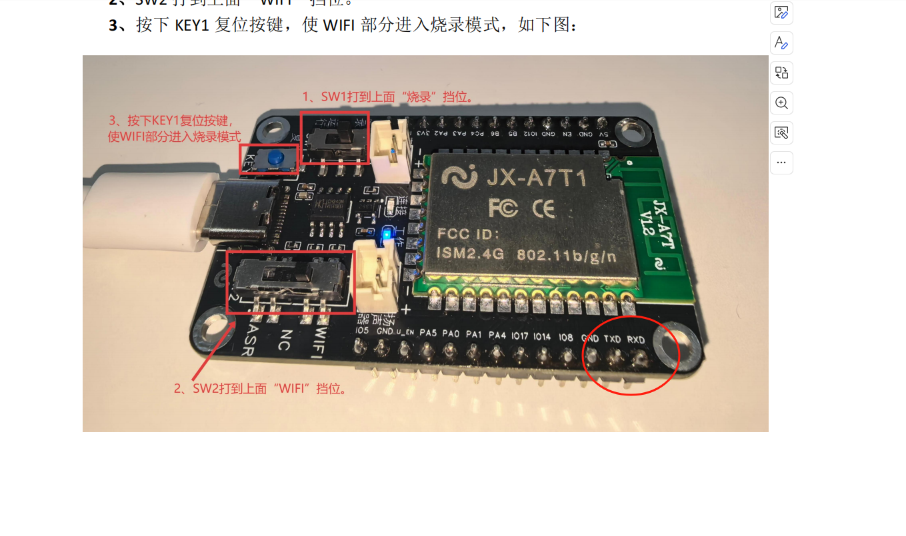

---

### 如何对JX-AT7设备进行扫码升级？

**问题描述：**

需要了解JX-AT7设备如何进行扫码升级操作。

**解决方案：**

在JX-AT7的手机应用设置界面中，找到并点击"扫码升级"选项即可启动升级流程。

**操作步骤：**

1. 打开JX-AT7设备的手机应用
2. 进入设备设置界面
3. 在设置选项列表中找到"扫码升级"
4. 点击该选项开始升级流程

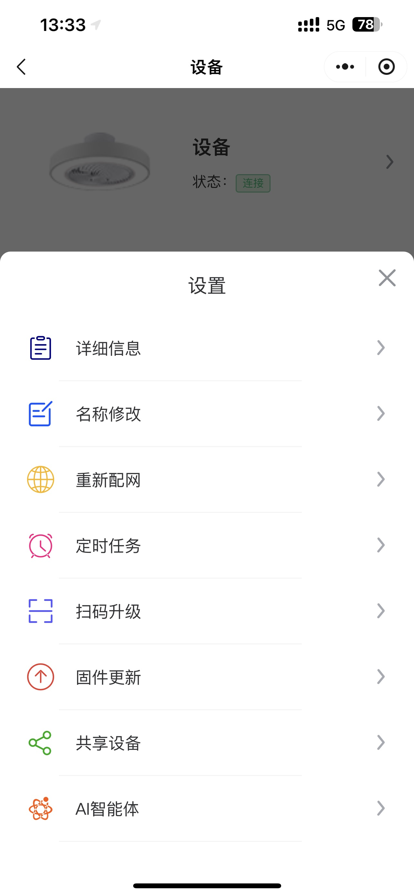

*JX-AT7设备的手机应用设置界面，包含扫码升级选项*

**注意事项：**

- 扫码升级功能需要设备已连接到网络
- 升级过程中请保持设备电量充足
- 升级时间可能较长，请耐心等待完成

---

### JX-AT7设备WiFi控制界面中的串口信息是什么意思？

**问题描述：**

在JX-AT7设备的WiFi控制界面中，画圈部分的串口发送信息（如UART1_TX发送的十六进制指令）的含义和作用不明确。

**解决方案：**

这些串口信息是离线语音识别芯片通过串口发送给WiFi模块的控制命令。

**数据流向说明：**

- **发送方**：离线语音识别芯片（如CI-03T1/T2）
- **接收方**：在线WiFi模块
- **传输路径**：通过UART1_TX串口发送
- **数据格式**：十六进制指令（如CC 77 01 01 7 7 CC）

**功能作用：**

1. **控制指令传输**：将语音识别结果转换为控制命令
2. **模块间通信**：实现离线语音与在线WiFi的协同工作
3. **设备控制**：通过WiFi模块控制外部设备或上传数据

**配置位置：**

这些串口发送指令在控制详情界面的每个控制项中进行配置：

- 选择触发条件（唤醒词、命令词等）
- 设置动作为"发送UART数据"
- 配置具体的十六进制指令参数

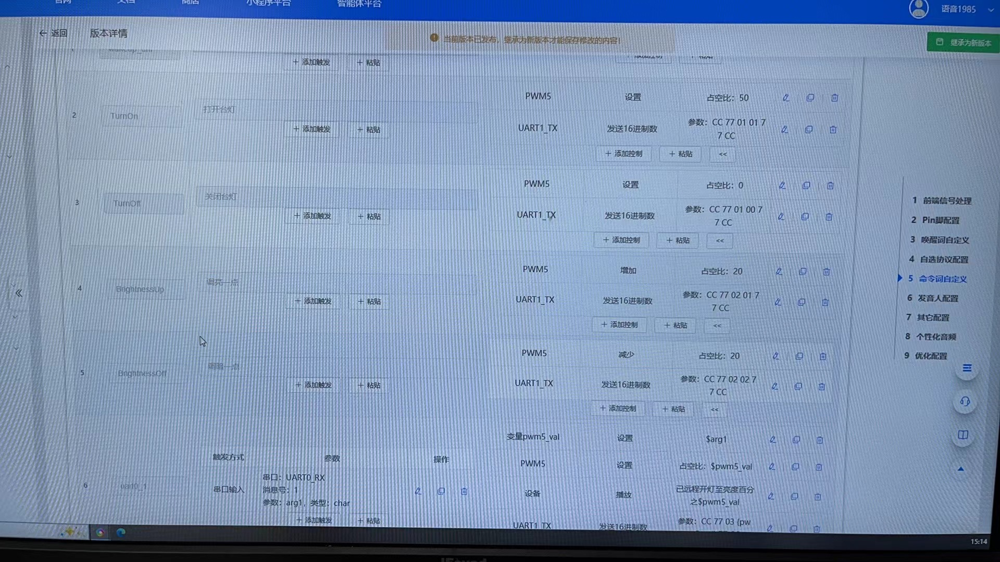

*JX-AT7设备的控制配置界面，显示了通过UART1_TX发送的串口指令*

**注意事项：**

- 这些是模块内部通信的数据格式
- 指令格式需要根据实际控制需求配置
- WiFi模块接收到这些指令后会执行相应的控制动作

---

### JX-A7T模块中语音数据传输到WiFi模块的路径是哪里？

**问题描述：**

需要确认JX-A7T模块中，语音数据传输到WiFi模块的具体路径和连接方式，特别是数据从哪个接口发送到WiFi。

**解决方案：**

语音数据通过UART1_TX接口从离线语音芯片传输到在线WiFi模块。

**数据传输路径：**

1. **语音识别芯片** → **UART1_TX** → **WiFi模块**
2. UART1_TX是语音芯片的串口发送引脚
3. WiFi模块通过对应的RX引脚接收数据

**硬件连接：**

- 使用排线连接语音芯片和WiFi模块
- 确保UART1_TX与WiFi模块的RX正确连接
- CH340 USB转串口模块用于调试和数据传输

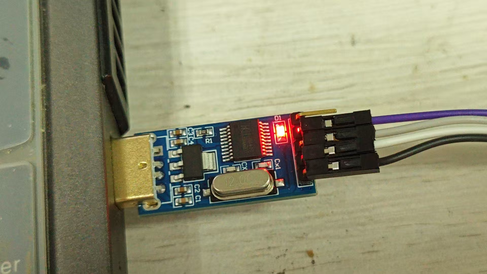

*CH340 USB转串口模块通过排线与JX-A7T连接，红色指示灯表明数据传输中*

**注意事项：**

- 数据传输需要正确的硬件连接
- UART1_TX是固定的数据输出接口
- WiFi接收到数据后会执行相应的控制动作
---

### JX-A7T模块烧录时进度条不动和扫码升级无反应怎么办？

**问题描述：**

JX-A7T模块在烧录固件时进度条不移动，且扫码升级没有反应。

**解决方案：**

**1. 进度条不动问题**

- 烧录过程较慢是正常现象，需要耐心等待
- 进度条可能不实时更新，但烧录仍在进行
- 确认镜像文件路径正确且没有中文字符

**2. 供电检查**

- 确保使用5V供电，电流要足够
- 供电不足会导致烧录异常
- 建议使用外部适配器而非USB供电

**3. 扫码升级无反应**

- 检查网络连接是否正常
- 确认二维码清晰完整
- 重新启动手机APP尝试
- 确认模块已连接到WiFi

**4. 其他排查方法**

- 重启模块后重新尝试
- 检查拨码开关位置是否正确
- 更换网络环境后重试
- 联系官方技术支持提供具体错误信息

**注意事项：**

- 烧录和升级过程需要稳定供电
- 操作过程中不要断开连接
- 如多次失败，可能是硬件问题
- 保留完整的操作记录便于问题排查

---

### JX-A7T模块的固件烧录顺序和拨码开关设置是什么？

**问题描述：**

需要了解JX-A7T模块的固件烧录顺序，是否需要拨码开关，以及扫码升级的时间。

**解决方案：**

**1. 烧录顺序**

固件烧录有固定顺序：**先烧录WiFi固件，后烧录ASR固件**。

**2. 拨码开关设置**

JX-A7T开发板上有拨码开关，设置方法如下：

- **左边拨码**：拨到"运行"位置
- **右边拨码**：

    - 烧录WiFi时：拨到"WiFi"
    - 烧录ASR时：无需拨动（保持原位置）
    - 正常使用：拨到"WiFi"


**3. 烧录步骤**

```
步骤1：左边拨到"运行"，右边拨到"WiFi"
步骤2：连接USB，烧录WiFi固件
步骤3：WiFi烧录完成后，扫码升级ASR
步骤4：两者都烧录好后，右边保持拨到"WiFi"
```

**4. 扫码升级时间**

- 扫码升级需要较长时间（好几分钟）
- 需要耐心等待，不要中断过程
- 升级时间与网络状况有关

**5. 继电器板连接**

- A27-A28引脚可连接到3.3V继电器板
- 继电器板的GND需要与电源GND相连
- 使用3.3V供电时注意电流要足够

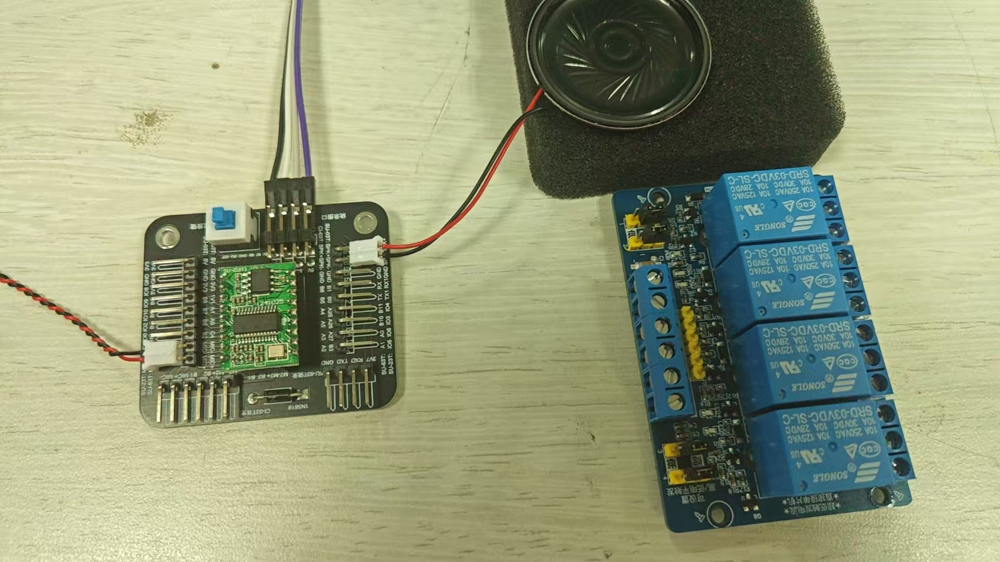

*JX-A7T模块通过引脚连接到继电器板*

**注意事项：**

- 烧录过程中要保持稳定供电
- 扫码升级需要良好的网络环境
- 正常使用时右边拨码保持在WiFi位置
- 如果使用5V继电器板，需要确认电压兼容性

---

### JX-A7T模块如何正确连接3.3V继电器板？

**问题描述：**

需要将JX-A7T模块的A27-A28引脚连接到3.3V继电器板，并确认供电连接方式。

**解决方案：**

**1. 引脚连接**

```
JX-A7T A27 → 继电器板 IN1
JX-A7T A28 → 继电器板 IN2
JX-A7T GND → 继电器板 GND（必须共地）
```

**2. 供电要求**

- 继电器板使用3.3V供电（非5V）
- 供电电流要足够（建议500mA以上）
- 可以使用JX-A7T板上的5V输出，但需要降压到3.3V

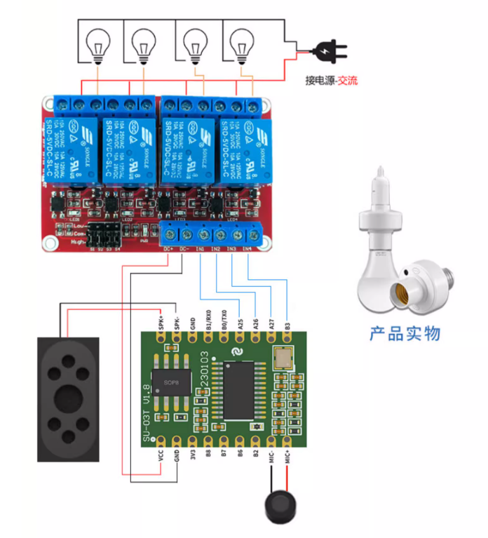

*JX-A7T模块与继电器板的连接示意图，VCC、GND、B2、B3等引脚的连接方式*

**3. 接线注意事项**

- 确保GND连接（共地是必须的）
- 检查继电器板的供电电压标识
- 3.3V继电器板不能用5V直接供电
- 供电不足会导致继电器不动作

**4. 测试验证**

- 连接完成后测试继电器动作
- 使用万用表测量输出电压
- 确认控制信号是否正确触发

**注意事项：**

- 不同厂家的继电器板电压规格可能不同
- 使用前确认继电器板的工作电压
- 供电稳定是继电器正常工作的关键
- 如继电器不动作，优先检查供电和接地

---

### JX-A7T模块如何进行配置与演示？

**问题描述：**

需要获得JX-A7T模块的配置与演示示例，以了解如何通过平台进行唤醒词、命令词和控制逻辑的自定义配置。

**解决方案：**

**1. Pin脚配置**

- **串口配置**：

    - UART1_RX和UART1_TX用于串口通信
    - DEFAULT_LOG为日志输出口，建议不要修改
    - GPIO_B2和GPIO_B3可配置为输出模式


*JX-A7T的Pin脚配置界面*

**2. 命令词自定义**

- **添加命令词**：

    - 点击"添加"按钮创建新命令词
    - 设置命令词名称（如A_01、A_02）
    - 配置对应的识别内容

- **识别灵敏度设置**：

    - 提供低、中、高三个选项
    - 根据实际环境调整灵敏度
    - 支持编辑、清空和删除操作


*JX-A7T命令词自定义界面*

**3. 控制详情配置**

- **配置控制逻辑**：

    - 设置触发条件（唤醒词、命令词）
    - 选择动作类型（发送UART数据等）
    - 配置动作参数（如十六进制数据AA FA 00 FF）

- **变量管理**：

    - 支持定义和使用变量（如canshu_1）
    - 实现动态数据传递
    - 便于复杂控制逻辑实现

---

### JX-A7T调用API接口时提示"IP地址访问请求被限制"怎么办？

**问题描述：**

在调用API接口时收到错误代码"103"，提示"IP地址访问请求被限制"。即使将查询到的IP地址添加到白名单后，问题仍然存在，更换电脑后问题依旧。

**解决方案：**

1. **确认准确的出口IP地址**
    - 使用多个可靠的IP查询服务交叉验证（如ip.cn、ip138.com等）
    - 避免仅依赖单一查询工具，因为不同工具的数据源可能不同

2. **检查IP地址动态变化**
    - 确认网络环境是否使用动态IP（如家庭宽带）
    - 动态IP可能在重启网络或一段时间后发生变化
    - 建议在调用API时实时查询当前出口IP

3. **更新白名单配置**
    - 将最新确认的出口IP地址添加到服务器白名单
    - 确保白名单配置已生效
    - 排查是否有其他网络策略（如防火墙）阻止请求

4. **使用正确的API地址**
    - 确认使用正确的API地址和app_key
    - 示例正确地址：`https://ai.topyn.cn/stream/algorithm/agent_single_chat/v1?app_key=80mao4xfi6d7&id=[ID]`

**注意事项：**

- 对于动态IP环境，建议使用静态IP或通过VPN等技术手段固定出口IP
- 确保调用的agent_id和app_key参数正确无误
- 如果问题持续存在，可联系网络工程师进一步排查网络限制策略

---

### JX-A7T设备无法响应大模型但远程控制正常怎么办？

**问题描述：**

设备可以正常使用小程序进行远程控制（如开关灯），但无法响应大模型的对话请求。

**解决方案：**

1. **检查网络连接状态**
    - 确认设备已成功连接到WiFi网络
    - 查看设备界面是否显示联网状态
    - 如果显示未联网，需要重新配网

2. **重新配置网络**
    - 进入设备配网模式
    - 搜索并连接目标WiFi
    - 输入正确的WiFi密码
    - 等待连接成功

3. **验证网络连通性**
    - 使用远程控制功能测试网络是否正常
    - 如果远程控制正常，说明基础网络连接已建立
    - 重点关注与大模型服务的连接

4. **检查智能体绑定状态**
    - 在小程序的AI智能体界面查看绑定信息
    - 确认智能体类型、ID和应用ID显示正常
    - 如未显示，需要重新绑定

**注意事项：**

- 远程控制功能正常说明硬件和网络基本正常
- 问题通常出现在与大模型服务的连接上
- 重新配网后通常能解决大部分连接问题
- 确保设备在白名单IP范围内

---

### JX-A7T模块返回的指令数据不一致怎么办？

**问题描述：**

在使用JX-A7T模块进行固件烧录后，多次执行相同语音指令时，返回的指令数据不一致。例如第一次执行"太阳"指令返回0x30，但在执行其他指令后再执行"太阳"，会返回0x2048f3等其他数值。

**解决方案：**

**1. 数据接收问题排查**

- 确认使用十六进制格式接收串口数据
- 使用串口调试助手测试，验证数据是否一致
- 检查MCU端的数据处理逻辑是否正确

**2. 数据格式确认**

- JX-A7T串口发送的是十六进制格式数据
- 每个命令对应固定的十六进制值
- 数据不会自动累加或拼接

**3. MCU代码检查**

- 检查串口接收缓冲区是否及时清空
- 确认每次只读取当前发送的数据
- 避免历史数据与新数据混合

**4. 测试验证**

- 使用官方串口工具测试，确认模块输出稳定
- 对比不同串口工具的接收结果
- 录制完整的操作视频供分析

**注意事项：**

- 该问题通常出现在MCU端的数据处理逻辑中
- 模块本身发送的数据是稳定和一致的
- 使用整型变量接收数据可避免格式转换问题


*JX-A7T控制详情配置界面*

**4. 演示示例说明**

- **项目文件**：

    - 提供完整的项目配置文件
    - 包含唤醒词、命令词和控制逻辑
    - 可导入平台直接使用

- **实际应用**：

    - 参考演示进行功能配置
    - 根据需求修改参数
    - 测试验证配置效果

**注意事项：**

- 确保硬件连接与配置一致
- 测试时建议使用串口调试助手
- 配置完成后需重新生成固件

---

### JX-A7T模块如何与云端服务进行对接和绑定？

**问题描述：**

需要将JX-A7T模块与云端大模型服务对接，以便在云端服务器上进行测试和使用。

**解决方案：**

1. **获取模块设备标识**
    - 在设备信息中查看设备标识（格式：JX_A7T_XXXXXXXXXXXX）
    - 该标识用于云端绑定，是模块的唯一识别码

2. **配置网络访问权限**
    - 将服务器IP地址添加到白名单
    - 示例IP：116.205.190.32
    - 确保网络可达性

3. **云端绑定操作**
    - 提供模块的设备标识给官方技术支持
    - 官方技术支持在云端完成绑定操作
    - 绑定后设备即可访问云端大模型服务

4. **验证绑定状态**
    - 在小程序中查看AI智能体绑定界面
    - 确认显示正确的智能体信息
    - 测试语音交互功能是否正常  

**注意事项：**

- 每个模块都有唯一的设备标识，绑定时需准确提供
- 网络配置（音色、语速、唤醒词等）仍需离线部署
- 绑定后即可使用云端大模型进行智能对话
- 如有多个模块，需要分别提供每个模块的设备标识

---

### JX-A7T模块如何配置串口输入触发功能？

**问题描述：**

在使用小程序配置JX-A7T模块时，配置了串口输入触发但无法接收到串口数据，同时不确定串口输入是否能控制小程序的按钮状态。

**解决方案：**

**1. 串口输入配置方法**

- 在小程序中进入触发方式配置
- 触发方式选择"串口输入"
- 配置触发参数（16进制格式）
- 设置对应的触发动作（如调用场景）

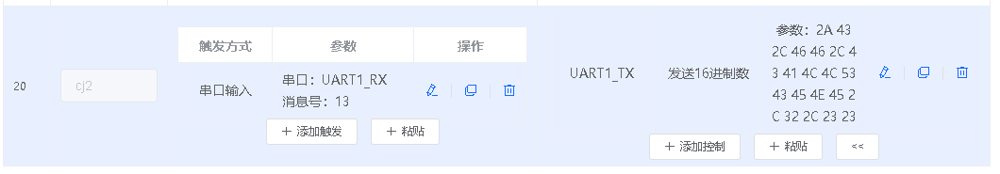

*串口输入配置界面，显示触发方式为串口输入，参数为16进制数*

**2. 按钮动作配置**

- 场景1按钮配置执行操作"[cj1]"
- 场景2按钮配置执行操作"[cj2]"
- 确保按钮与触发动作正确关联

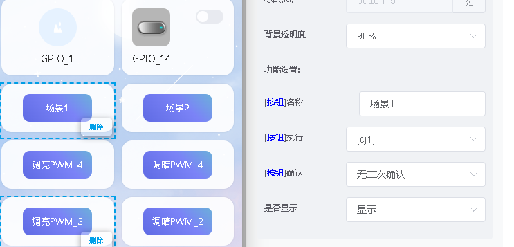

*场景1按钮配置界面，执行操作为"[cj1]"*

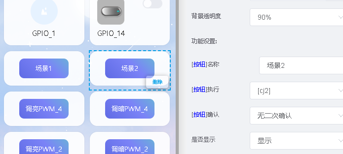

*场景2按钮配置界面，执行操作为"[cj2]"*

**3. 串口触发验证**

- 配置触发方式为"串口输入"
- 关联动作设置为"调用场景2"
- 通过串口发送测试数据验证功能


*触发方式配置界面，设置为串口输入触发调用场景2*

**4. 测试步骤**

- 直接对串口发送数据
- 观察是否触发相应的控制动作
- 使用串口调试助手发送16进制测试数据
- 验证场景切换是否正常

**注意事项：**

- 串口输入触发主要用于控制执行动作
- 不能直接控制小程序按钮的显示状态
- 需要确保串口参数（波特率等）配置正确
- 建议使用简单配置逐步验证功能

**5. 串口控制小程序按钮状态的可能方案**

如果需要实现串口控制按钮状态显示，可考虑以下方法：

- 使用开关控件关联两个串口行为
- 配置不同串口触发对应开关状态变化
- 通过串口发送特定指令改变开关显示
- 结合变量设置实现状态同步

---


---

### JX-A7T固件平台如何批量删除历史版本？

**问题描述：**

在JX-A7T固件平台上积累了大量历史版本记录，需要清理不需要的版本，但界面仅支持单个删除操作，无法进行多选批量删除。

**解决方案：**

**当前限制说明：**

1. **平台功能限制**：

    - 固件平台目前仅支持单个删除操作
    - 没有多选批量删除功能
    - 需要逐个点击删除按钮进行操作

2. **设计原因**：

    - 历史版本主要用于测试和版本回退
    - 保留历史版本便于问题追溯
    - 避免误删除导致无法恢复

**临时处理方法：**

1. **选择性删除策略**：

    - 优先删除明显的测试版本
    - 保留关键版本节点
    - 删除重复或错误的版本

2. **删除操作步骤**：

    - 在版本列表中找到要删除的版本
    - 点击对应的删除按钮
    - 确认删除操作
    - 重复操作直到清理完成

3. **版本管理建议**：

    - 定期清理不必要的版本
    - 建立版本命名规范
    - 重要版本添加标记说明

**版本管理最佳实践：**

1. **版本命名规范**：

    - 使用有意义的版本号（如V1.0、V1.1）
    - 包含日期信息（如V1.0_20241208）
    - 添加功能说明（如V1.0_add_wifi）

2. **定期清理机制**：

    - 每月清理一次历史版本
    - 保留最近3-5个版本
    - 重要里程碑版本永久保留

3. **替代方案**：

    - 创建新项目避免版本过多
    - 使用项目分组管理不同版本
    - 导出重要配置本地备份

**注意事项：**

- 删除操作不可恢复，请谨慎操作
- 建议删除前确认版本确实不再需要
- 保留至少一个可用的历史版本作为备份
- 如需批量删除功能，可向平台反馈需求

---

### 是否可以通过串口调试助手实现固件OTA升级？

**问题描述：**

是否可以通过串口调试助手将平台生成的bin文件发送给单片机，再由单片机转发给语音识别模块以实现固件OTA升级。

**解决方案：**

**技术可行性：**

1. **理论可行性**

    - 可以通过串口实现固件传输
    - 需要单片机作为中转设备
    - 但需要实现复杂的通信协议

2. **实现难点**

    - 需要了解语音芯片的分区结构
    - 必须实现完整的烧录协议
    - 涉及寄存器操作和闪存编程

**技术要求：**

1. **SDK开发需求**

    - 需要进行SDK级别的开发
    - 找到芯片对应的地址分区
    - 通过串口调用寄存器实现闪存擦除和编程

2. **协议复杂性**

    - 涉及一大堆底层协议
    - 需要处理时序和校验
    - 错误处理和恢复机制

**官方支持：**

- **不提供技术支持**：此类OTA实现方式不在官方技术支持范围内
- **资料限制**：平台技术文档中仅提供芯片手册
- **自行开发**：需要开发者自行研究和实现

**建议方案：**

1. **使用标准OTA功能**

    - 选择支持OTA的模块（如JX-A7T）
    - 使用官方提供的OTA升级方案
    - 通过WiFi进行远程升级

2. **串口烧录方式**

    - 使用官方提供的PACK_UPDATE_TOOLS
    - 通过串口直接连接模块烧录
    - 适合开发和调试阶段

**注意事项：**

- 通过单片机中转实现OTA升级的技术复杂度高
- 缺乏官方文档和技术支持
- 建议优先考虑官方支持的升级方案
- 如确有此需求，需要深入研究芯片手册和相关协议

---

### JX-A7T配置后设备无响应怎么办？

**问题描述：**

JX-A7T固件配置后设备无法正常响应控制指令。

**解决方案：**

1. **事件触发方式**：

    - 将"上电触发"改为"命令词触发"
    - 上电事件可能导致设备无响应

2. **附加条件配置**：

    - 检查变量FLAG_1、FLAG_2等配置
    - 确认GPIO_B2输出设置正确

3. **多输入条件控制异常**：

    - 检查变量配置是否正确
    - 确认所有输入条件都已设置
    - 测试时验证所有输入端口状态

**测试建议**：

- 先单独测试每个输入端口
- 再测试多输入组合
- 使用最新版本固件

---

### JX-A7T智能体AI大模型对话功能失效怎么办？

**问题描述：**

JX-A7T模块的智能体AI大模型对话功能突然失效，其他功能正常，无法进行AI对话交互。

**解决方案：**

- 导出产品的JSON配置文件供技术支持分析
- 确认使用的是官方智能体而非自建智能体
- 检查智能体配置参数是否正确设置

**注意事项：**

- 自建智能体可能出现模型参数配置不当
- 使用官方智能体可获得更稳定的体验
- 保留完整的错误信息和配置截图便于分析

**2. 检查智能体配置**

- 确认使用的是官方智能体还是自建智能体
- 如使用自建智能体，检查资源点是否用完
- 登录对应的智能体平台查看配置状态

**2. 网络连接验证**

- 确认模块已连接到2.4G WiFi网络
- 检查网络是否正常访问互联网
- 验证防火墙或路由器是否限制相关端口

**3. 智能体状态检查**

- 官方智能体：检查服务是否正常运行
- 自建智能体：确认扣子（Coze）平台配置正确
- 验证API密钥是否有效且未过期

**4. 资源使用情况**

- 登录扣子平台查看资源使用量
- 检查是否超出免费额度或付费限额
- 如超限，需要充值或等待额度重置

**5. 功能恢复方法**

- 重启模块重新初始化网络连接
- 重新绑定智能体配置
- 更新到最新固件版本

**注意事项：**

- AI对话功能依赖网络连接和智能体服务
- 自建智能体需要定期关注资源使用情况
- 建议预留充足的资源额度避免服务中断
- 如问题持续存在，可切换回官方智能体测试

---

### JX-A7T模块引脚无丝印如何识别？

**问题描述：**

JX-A7T模块引脚位置没有丝印，无法区分GPIO_A25、GPIO_A26、GPIO_A27。

**解决方案：**

1. **查看官方文档**：下载JX-A7T技术规格书查看引脚定义图

2. **万用表测试**：

    - 模块上电后测量各引脚电平
    - 配置改变某个GPIO输出
    - 观察哪个引脚电平变化

3. **参考封装**：

    - JX-A7T采用标准SMD33封装
    - 引脚间距1.27mm

**识别方法**：在模块边缘做临时标记，记录引脚位置对应GPIO。

---

### 如何在JX-A7T中设置蓝牙（BLE）通讯参数？

**问题描述：**

需要在设备配置界面中设置蓝牙（BLE）通讯参数，包括设备名称、服务UUID、广播数据等，但不确定如何正确配置。

**解决方案：**

**1. 蓝牙通讯配置步骤**

- 在智能公元平台找到蓝牙通讯配置界面
- 设置设备名称（将作为蓝牙广播名称）
- 配置服务UUID（唯一标识符）
- 设置广播数据（可选）
- 配置扫描回复数据（可选）

**2. 参数说明**

- **最小/最大广播间隔**：控制广播频率
- **扫描间隔**：控制设备扫描频率
- **扫描窗口**：每次扫描的持续时间

**3. 获取详细配置方法**

- 参考《JX-12F技术开发手册v1.0.pdf》
- 手册包含完整的蓝牙通讯配置说明和示例
- 技术手册可通过平台下载或联系技术支持获取

**注意事项：**

- UUID必须符合蓝牙标准格式
- 广播间隔影响功耗和连接速度
- 配置错误可能导致蓝牙无法正常工作
- 建议使用默认配置作为起点，逐步调整

---

### JX-A7T获取蓝牙信号强度后无法显示变量值？

**问题描述：**

在JX-A7T模块中配置了"获取蓝牙信号强度"功能，但关联的变量值无法正确显示，且可能导致模块重启。

**解决方案：**

- **信号强度特性**：蓝牙信号强度为负值，可能导致显示异常
- **变量显示问题**：负值可能无法在界面正常显示
- **延时设置不当**：错误的延时配置可能导致模块重启

**处理步骤：**

1. **检查延时设置**
    - "获取蓝牙信号强度"后不应添加"延时1000ms 输出"
    - 应使用"延时1000ms 恢复"设置
    - 避免输出负值导致的问题

2. **使用语音播报验证**
    - 配置语音播报信号强度值
    - 通过播报确认功能是否正常工作
    - 播报正常说明功能已生效

3. **变量显示替代方案**
    - 使用其他变量测试显示功能
    - 确认变量显示机制本身正常
    - 问题可能在于负值处理

**注意事项：**

- 蓝牙信号强度必须在模块连接小程序后才能获取
- 信号强度值为负数是正常现象
- 如需实时显示，建议等待固件更新支持
- 配置错误可能导致模块重启，需谨慎操作

---

### JX-A7T模块如何通过日志判断WiFi和MQTT连接状态？

**问题描述：**

在使用JX-A7T模块时，需要通过日志判断WiFi连接是否正常，以及MQTT数据传输是否成功建立。

**解决方案：**

**1. WiFi连接状态判断**

- 观察日志中是否出现重复的`WebSocket send`和`_uart_receive`记录
- 出现`wiff_cmd = 0x105`命令表明WiFi正在发送数据
- 有UART接收数据说明WiFi连接正常

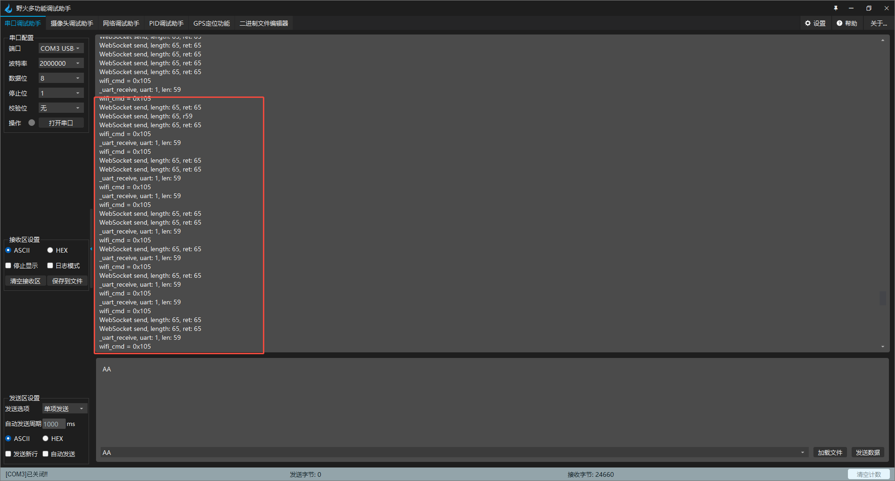

*日志显示WebSocket发送和UART接收，说明WiFi连接正常*

**2. MQTT连接状态判断**

- 检查日志中是否有`server read = 2 MQTT package len: 2`记录
- 出现`PINGRESP event`表明收到服务器PING响应
- 看到`mqtt heart beat>need send len=2`说明正在发送心跳包

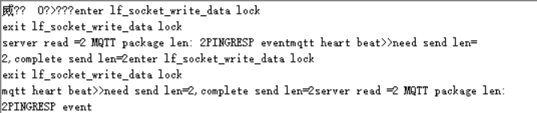

*日志显示MQTT PINGRESP和心跳包，说明MQTT通信正常*

**判断标准：**

- **WiFi正常**：有WebSocket发送和UART接收记录
- **WiFi异常**：没有上述日志输出，WiFi连接可能有问题
- **MQTT正常**：能收到PINGRESP响应并发送心跳
- **MQTT异常**：没有MQTT相关日志，连接未建立

**注意事项：**

- 日志需要通过串口调试工具查看
- WiFi数据传输日志表明模块正在上传音频
- MQTT心跳包是维持连接的重要机制
- 建议在调试时同时关注两种日志状态

---

### 固件配置时如何添加串口二进制协议？

**问题描述：**

在配置JX-A7T/CI-03T1/CI-03T2固件时，配置了串口输入但无法正常工作，发现缺少添加串口二进制协议的关键步骤。

**解决方案：**

**1. 完整配置流程**

- **步骤1：配置串口输入**
    - 在固件配置界面添加串口输入（如UART0_1）
    - 设置触发方式为串口输入
    - 配置端口参数（波特率、数据位等）

- **步骤2：添加串口二进制协议**（关键步骤）
    - 必须在串口输入配置后添加二进制协议
    - 选择对应的串口二进制协议类型
    - 配置协议参数（帧头、校验等）

- **步骤3：关联触发动作**
    - 设置接收到串口数据后的执行动作
    - 如调用场景、控制GPIO等
    - 确保触发条件正确关联

**2. 常见错误**

- 仅配置串口输入，未添加二进制协议
- 导致无法正确解析串口数据
- 模块无法响应串口指令

**3. 配置技巧**

- 使用官方示例配置作为参考
- 确认所有步骤都已配置完成
- 保存前检查配置完整性

**注意事项：**

- 添加串口二进制协议是必要步骤
- 文档可能未明确说明此步骤
- 配置不完整会导致通信失败
- 建议按完整流程逐步操作

---

### JX-A7T如何配置接入自定义大模型API？

**问题描述：**

希望了解如何将JX-A7T模块配置为接入自定义的大模型API，而不仅仅是使用平台提供的扣子（Coze）服务。

**解决方案：**

1. **创建新配置**
    - 在智能体配置页面点击"+ 创建新配置"
    - 选择平台为"智能公元"
    - 勾选"自定义"选项启用自定义API接入

2. **配置API参数**
    - 填写自定义服务的API地址
    - 设置认证密钥和参数
    - 选择对应的API类型（大模型服务、完整对话服务等）

3. **参考文档**
    - 平台顶部的"自定义服务接入API参考文档"链接
    - 查看"大模型服务API"、"完整对话服务API"等详细文档
    - 根据API文档配置正确的请求格式

**注意事项：**

- 自定义API需要按照文档格式配置
- 确保API服务稳定可用
- 保留完整的错误信息便于问题排查

---

### 如何对接API接口实现自定义AI服务？

**问题描述：**

需要了解API接口的形式和请求方式，确认能否连接自己服务器的AI服务进行商业化部署。

**解决方案：**

**1. API接口形式**

- 提供标准API文档用于对接
- 支持自定义AI服务接入
- 需要提供API密钥等认证信息

**2. 请求方式支持**

- 支持POST请求方式
- 使用标准HTTP/HTTPS协议
- 数据格式为JSON或XML
- 需要按照API文档格式封装请求

**3. 对接流程**

1. **提供API文档**
    - 包含接口地址、参数格式
    - 提供认证方式和密钥
    - 说明请求和响应格式

2. **技术对接**
    - 由技术团队进行接入开发
    - 实现API调用逻辑
    - 处理响应数据解析

3. **测试验证**
    - 完成开发后进行联调测试
    - 验证功能是否正常
    - 调试优化接口调用

**4. 商业化考虑**

- 自建AI服务可降低长期成本
- 需要考虑服务器部署和维护
- 建议评估开发投入与收益

**注意事项：**

- 对接需要一定的技术开发能力
- 确保API接口的稳定性和安全性
- 商业化部署需考虑性能和并发需求
- 如需技术支持，可联系官方协助对接

---

### JX-A7T是否支持USB直接烧录？

**问题描述：**

不确定JX-A7T模块是否可以通过USB接口直接进行烧录，还是需要额外的烧录器。

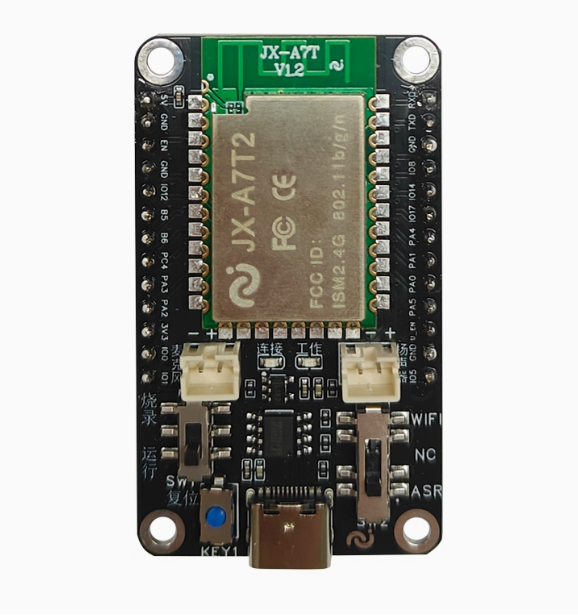

**解决方案：**

**烧录方式说明：**

1. **开发板版本**
    - JX-A7T开发板可以直接通过USB进行烧录
    - 不需要额外购买烧录器
    - 使用开发板自带的USB接口连接

2. **模块版本**
    - 单独的JX-A7T模块需要使用专用烧录器
    - 需要JL USB Updater烧录器配合转接板
    - 按照引脚定义正确连接VCC、GND、TX、RX

3. **烧录工具选择**
    - 开发板：使用官方提供的USB烧录工具
    - 模块：使用JL USB Updater软件
    - 两种方式都需要选择正确的固件文件

**注意事项：**

- 开发板版本适合快速开发调试
- 批量生产时通常使用模块版本配合烧录器
- 烧录前确认固件版本与硬件匹配
- 官方文档链接：https://help.aimachip.com/docs/jx_a7t_v1

---

### JX-A7T的AI大模型功能是否可以离线使用？

**问题描述：**

了解JX-A7T模块的AI大模型功能是否支持离线使用，还是必须联网。

**解决方案：**

**功能说明：**

1. **离线功能**
    - 支持离线语音指令控制
    - 包含基础的语音识别和响应功能
    - 未联网时使用本地预设指令

2. **在线功能**
    - AI大模型对话需要联网使用
    - 支持更复杂的自然语言理解
    - 可以获取实时的信息和知识

3. **智能切换**
    - 离线与在线功能自动集合
    - 未联网时自动使用离线指令
    - 联网后自动启用AI大模型功能

**主要特性：**

- 支持AEC（回声消除）唤醒打断功能
- 支持OTA在线扫码升级
- 离线也能正常控制硬件设备
- 可根据网络状态智能切换工作模式

**注意事项：**

- 纯离线使用时功能有限
- AI大模型需要网络连接才能发挥全部能力
- 建议保持网络连接以获得最佳体验
- 固件会持续优化离线功能

**测试视频参考：**
https://www.bilibili.com/video/BV1itMvz8Ect/

---

### 如何实现JX-A7T的离在线混合功能？

**问题描述：**

需要实现既能离线精准控制设备，又能在线进行智能对话的双模功能，当前扣子平台在智能对话方面不够满足需求。

**解决方案：**

**功能架构设计：**

- **离线模式**：使用SU-03T实现精准语音控制，响应速度快，识别准确
- **在线模式**：通过JX-A7T连接大模型，实现自然对话和问答
- **智能切换**：根据使用场景自动选择最适合的模式

**1. 离线控制实现**

- 配置固定命令词进行设备控制
- 识别结果稳定可靠，不受网络影响
- 适合控制类指令（开关灯、调节参数等）

**2. 在线对话实现**

- 连接扣子平台或其他大模型服务
- 支持自由对话和知识问答
- 可配置个性化角色和专业知识库

**3. 混合使用策略**

- **控制指令**：优先使用离线识别，确保准确性
- **闲聊问答**：自动切换到在线大模型
- **无缝切换**：用户感知不到模式切换过程

**4. 配置方法**

- 在平台中设置触发条件
- 控制类指令匹配离线命令词
- 对话类内容转发到在线大模型

**5. 未来优化方向**

- 官方将推出集成度更高的模块
- 结合小智的智能对话特性
- 保持离线控制的精准性
- 提升在线交互的自然度

**注意事项：**

- 当前方案需要配合使用不同模块
- 扣子平台的智能体功能可以根据提示词优化
- 建议等待官方发布新版本的一体化解决方案
- 可根据项目需求选择合适的实现方案

---

### 智能公元小程序如何扫码绑定智能体？

**问题描述：**

在智能公元小程序中没有找到扫码绑定设备的功能入口，界面只显示蓝牙搜索功能。

**解决方案：**

**正确的绑定流程：**

1. **生成智能体二维码**

    - 在扣子平台或其他智能体平台创建智能体
    - 在智能体配置页面点击"二维码"按钮
    - 生成用于绑定的二维码（有效期10分钟）

2. **小程序绑定操作**

    - 打开"智能公元"微信小程序
    - 进入设备管理页面
    - 选择已配网的JX-A7T设备
    - 点击"AI智能体"选项
    - 使用小程序扫描智能体二维码进行绑定

3. **功能说明**

    - 绑定成功后，设备将连接到对应的智能体服务
    - 语音对话会通过智能体进行处理
    - 可在小程序查看绑定状态和设备信息

**注意事项：**

- 二维码有效期仅为10分钟，过期需重新生成
- 确保设备已连接到2.4GHz WiFi网络
- 绑定功能在"AI智能体"菜单中，不在主界面
- 如找不到入口，可更新小程序到最新版本

---

### JX-A7T串口通信与继电器控制问题如何解决？

**问题描述：**

JX-A7T模块与485通讯16路继电器模块连接时，烧录语音模块后有唤醒有回复，但没有串口输出，继电器模块没有反应。

**解决方案：**

**1. 通信方式确认**

- JX-A7T使用UART通信（不是485通信）
- B6（RX）和B7（TX）是串口引脚
- 485通讯需要额外电路转换

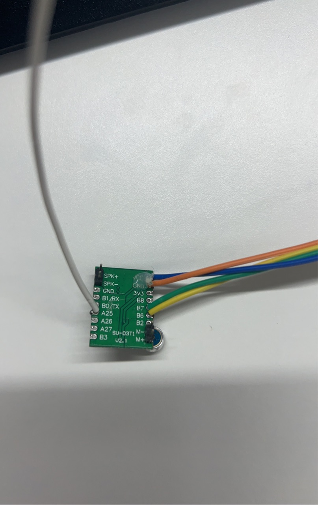
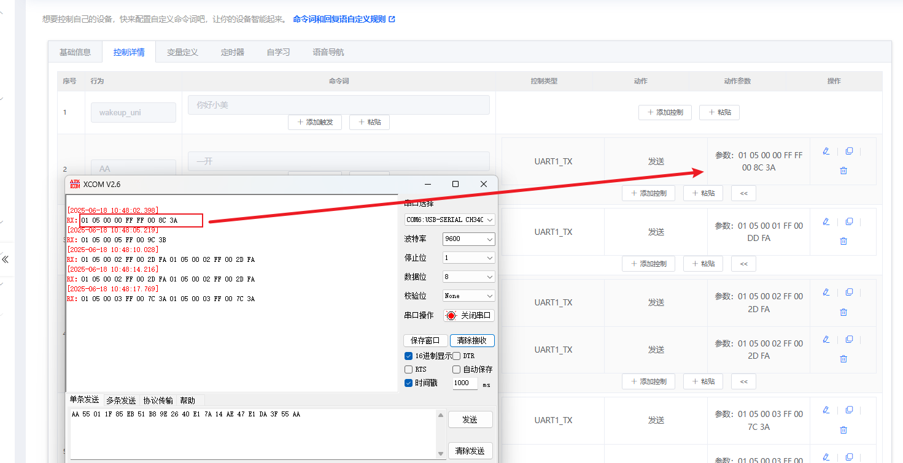

**2. 连接方式**

```
JX-A7T B6(TX) → 485模块 RX
JX-A7T B7(RX) → 485模块 TX
JX-A7T GND    → 485模块 GND
```

**3. 波特率配置**

- 确认两端波特率一致（如9600）
- 在平台基本配置中设置
- 继电器模块需要匹配设置

**4. 问题排查**

- 单独测试JX-A7T：串口调试软件监控输出
- 单独测试继电器：串口调试软件直接控制
- 检查485转换电路是否正常

**注意事项：**

- JX-A7T是UART TTL电平，不是485电平
- 需要专门的485转换芯片（如MAX485）
- 检查转换电路供电是否正常
- 确认A/B线接线正确（A正B负）

---

### JX-A7T开发包WIFI固件如何导入平台？

**问题描述：**

需要将JX-A7T开发包中的WIFI固件导入智能公元平台进行修改，但解压开发包后没有找到导入文件。

**解决方案：**

**1. 找到导入文件**

- 在产品资料页面查找WIFI部分
- 找到"wifi_test.json"文件
- 这个文件就是用于导入平台的配置文件

**2. 下载和导入**

- 直接下载"wifi_test.json"文件
- 在平台中选择"导入"功能
- 选择下载的json文件进行导入


**3. 文件问题处理**

- 如果解压后没有json文件，重新下载开发包
- 确认下载的是完整版开发包
- 联系技术支持获取正确的文件

**注意事项：**

- 不是所有开发包都包含导入文件
- wifi_test.json包含了WIFI配置的所有参数
- 导入后可以在平台基础上修改
- 修改完成后重新生成固件

---

### JX-A7T模块的消息号2是什么意思？

**问题描述：**

在JX-A7T模块的串口通信配置中，发现消息编号设置为"2"，不清楚这个消息号的来源和定义位置，是否为系统自动匹配或可自定义。

**解决方案：**

消息号是WiFi模块发送给语音模块的数据标识，可以根据需要自定义。

**消息号说明：**

- **消息号作用**：标识不同的串口数据指令
- **可自定义**：不是固定的，可以根据需求修改
- **系统匹配**：WiFi发送和语音接收的消息号必须一致

**配置方法：**

1. **WiFi端配置**：

    - 在WiFi固件中配置发送的消息号
    - 可以设置为任意数字（如0、1、2等）
    - 用于区分不同的控制指令

2. **语音端配置**：

    - 在ASR固件中设置串口输入触发
    - 消息号要与WiFi端发送的一致
    - 根据消息号执行相应的控制动作

**实际应用：**

- **消息号0**：可以用于控制开灯
- **消息号1**：可以用于控制关灯
- **消息号2**：可以用于控制窗帘等
- 消息号的选择完全由开发者定义

**注意事项：**

- 消息号只是一个标识符，具体数值可自定义
- 确保发送端和接收端使用相同的消息号
- 可以根据项目需求设置更多的消息号
- 消息号与具体的控制动作由配置决定

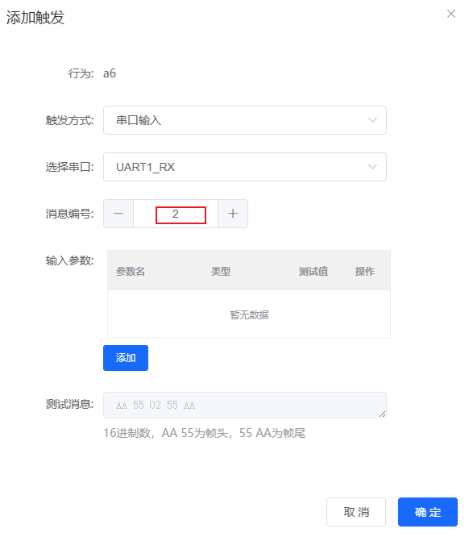

---


### JX-A7T模块如何配置声源定位事件触发？

**问题描述：**

在配置声源定位事件触发时，无法在软件界面中选择"声源定位"作为触发方式，导致无法完成配置。

**解决方案：**

**1. 问题分析**

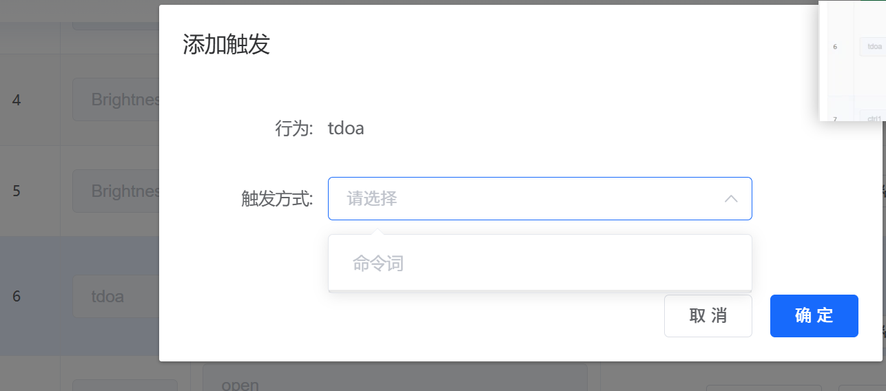

从截图可见，触发方式下拉菜单中仅显示"命令词"选项，缺少"声源定位"选项。

**2. 可能原因**

- **功能未开放**：声源定位触发功能可能尚未在当前版本中开放
- **模块不支持**：JX-A7T模块可能不支持声源定位触发
- **权限限制**：可能需要特定权限或更高级别账号才能使用

**3. 替代方案**

- **使用命令词触发**：将声源检测结果作为命令词的触发条件
- **GPIO输入触发**：通过外部硬件信号触发相关动作
- **定时触发**：设置定时器定期执行相关功能

**4. 功能确认方法**

- 查看官方文档确认JX-A7T是否支持声源定位
- 联系技术支持确认功能开放状态
- 关注平台更新，等待新版本发布

**注意事项：**

- 视频教程中的功能可能为预览或测试版本
- 实际可用功能以当前平台界面为准
- 如确实需要此功能，建议反馈给产品团队

---

### JX-A7T声源定位角度识别不稳定怎么办？

**问题描述：**

声源定位功能存在角度值跳变、出现负角度（如-10度）以及延时输出后仍播报上次角度的问题，影响定位准确性。

**问题原因分析：**

1. **角度跳变原因**：

    - 声源距离两个麦克风过近（站在中间）
    - 麦克风间距不足（当前4cm）
    - 声源与麦克风阵列距离过近（1.5米内）

2. **负角度出现**：

    - 系统异常，正常角度范围应为0-180度
    - 可能是固件bug或配置错误

3. **延时输出问题**：

    - 延时设置（如1000ms）未能完全解决更新延迟
    - 系统仍使用缓存的上次角度值

**解决方案：**

**1. 硬件布局优化**

- 增加麦克风间距：建议将4cm增加到更合适的距离
- 保持声源与麦克风阵列距离：至少1.5米以上
- 避免声源位于两个麦克风正中间位置

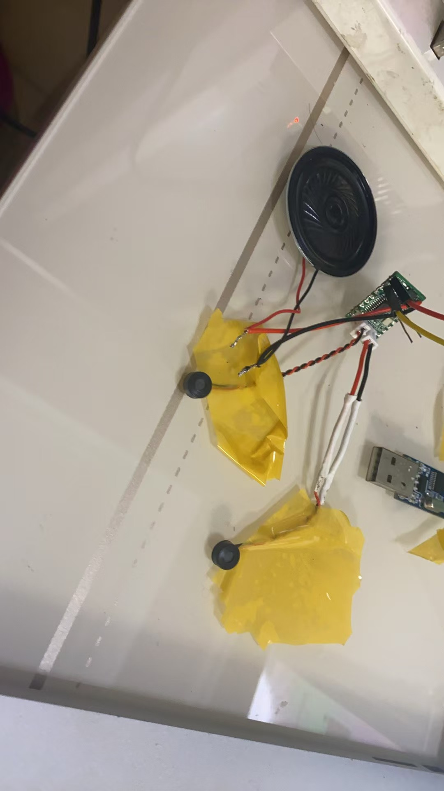

*麦克风安装布局，两个麦克风间距为4cm*

**2. 延时输出配置**

- 启用"是否延时输出"选项
- 设置合适的延时时长（如1000ms）
- 通过延时让声源定位结果稳定后再输出


*配置界面中的"是否延时输出"选项*

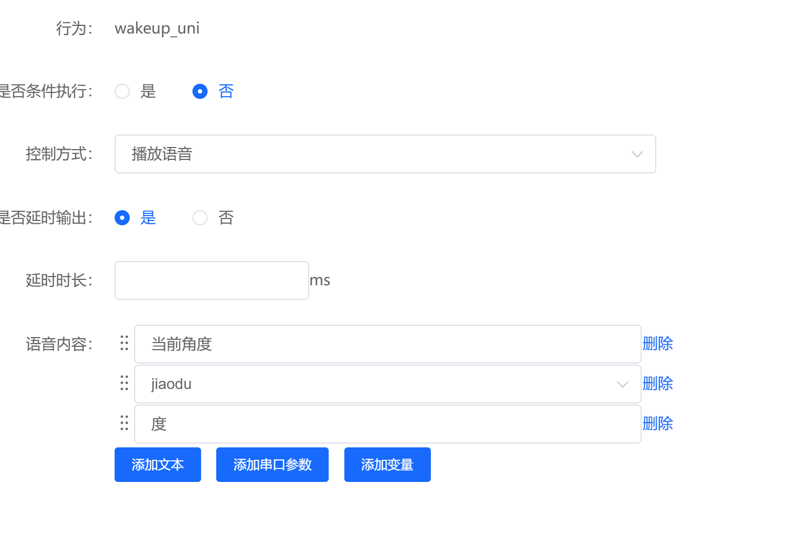

*启用延时输出并设置延时时长*

**3. 逻辑控制优化**

使用变量和逻辑判断确保角度值的准确性：

- 创建角度变量（如jiaodu）存储当前角度
- 设置中间变量（如asfdadg）作为状态标记
- 通过GPIO输出控制外部设备

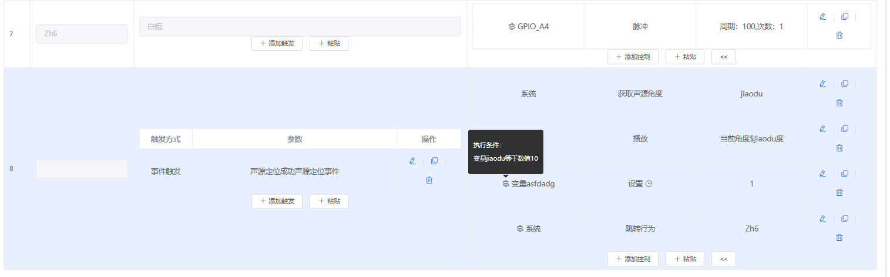

*当角度等于10度时设置标记变量*


*根据标记变量控制GPIO输出*

**4. 区域判断方案**

如只需判断左右区域：

- 配置0-90度为左区域
- 配置90-180度为右区域
- 使用变量大于90度和小于90度的判断

**注意事项：**

- 声源不能太靠近麦克风
- 建议声源距离至少1.5米以上
- 避免站在两个麦克风正中间
- 负角度属于异常现象，需要检查固件版本
- 复杂应用场景可考虑分区域简化判断

---

### JX-A7T如何实现免唤醒配置？

**问题描述：**

需要配置JX-A7T在上电后无需语音唤醒即可持续监听并触发声源定位功能，实现24小时待命状态。

**解决方案：**

**1. 事件触发配置**

- 进入命令词编辑页面
- 选择"事件触发"选项
- 触发方式选为"上电启动系统启动"


*命令词编辑页面的事件触发选项*


*选择"上电启动系统启动"作为触发方式*

**2. 系统控制配置**

- 在行为中添加"系统"控制
- 选择"进入唤醒"操作
- 添加"禁止超时退出唤醒"控制
- 设置进入唤醒前的延时（如5000ms）


*成功配置上电启动和禁止超时退出唤醒*

**3. 验证方法**

通过串口日志验证功能：

```bash
# 正常工作时的日志输出
调界视 78
调界视 127
调界视 102
调界视 98
```

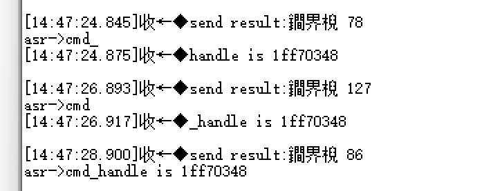

*声源定位功能的串口输出日志*


*设备启动后的声源定位触发日志*

**4. 应用场景说明**

- 24小时待命设备：无需唤醒词直接响应
- 持续监听应用：任何语音指令都会触发
- 关键控制场景：确保随时可用状态

**注意事项：**

- 开机直接进入唤醒模式，所有命令都会听到就触发
- 免唤醒配置后设备会持续监听，功耗可能增加
- 建议在进入唤醒操作前添加延时，确保系统完全启动
- 禁止超时退出唤醒可确保设备始终处于唤醒状态
- 此配置适合需要快速响应的应用场景

---

### JX-A7T1模块附加条件配置未生效怎么办？

**问题描述：**

JX-A7T1模块的附加条件配置未生效，导致语音指令无法按预期触发。

**解决方案：**

**1. 配置检查**

    - 确认附加条件已正确保存
    - 检查条件逻辑是否合理
    - 验证变量名称是否一致

**2. 条件设置验证**

    - 确认触发条件与实际需求匹配
    - 检查条件优先级设置
    - 验证条件之间的逻辑关系

**3. 测试方法**

    - 单独测试每个条件
    - 逐步增加条件复杂度
    - 使用日志输出调试

**4. 常见问题**

    - 变量名拼写错误
    - 条件逻辑冲突
    - 执行顺序不正确

**注意事项：**

- 附加条件需要精确匹配才能触发
- 建议使用简单条件逐步验证
- 复杂条件建议分解为多个简单条件
- 保存配置前确认所有设置已生效

---

### JX-A7T1模块如何配置附加条件和串口上传数据？

**问题描述：**

需要确认JX-A7T1模块的附加条件和串口上传数据配置是否正确。

**解决方案：**

**1. 附加条件配置方法**

    - 在触发方式中设置条件
    - 选择变量作为判断依据
    - 配置具体的判断条件（如变量Increase_energy等于数值1）

**2. 串口数据上传设置**

    - 添加串口输出行为
    - 设置发送数据的格式
    - 配置触发条件和时机

**3. 配置界面说明**


*配置界面显示触发方式、参数和操作三列，可设置变量条件*

**4. 验证步骤**

    - 保存配置并生成固件
    - 烧录到模块进行测试
    - 观察功能是否正常执行

**注意事项：**

- 附加条件需要与变量配合使用
- 串口数据格式要匹配接收端要求
- 配置后必须重新生成固件
- 建议先测试基础功能再添加复杂条件

---

### JX-A7T1模块固件生成速度是否正常？

**问题描述：**

JX-A7T1模块的固件生成速度很快，担心是否正常。

**解决方案：**

**1. 生成速度说明**

    - 如果改动不大，秒级生成是正常的
    - 平台经过优化，小改动生成很快
    - 生成速度不影响固件质量

**2. 影响生成速度的因素**

    - 配置复杂度：简单配置生成快
    - 语音内容：语音文件多会较慢
    - 服务器负载：高峰期可能稍慢

**3. 正常生成时间参考**

    - 小改动：几秒到十几秒
    - 中等改动：30秒左右
    - 大改动：1-2分钟

**4. 质量确认方法**

    - 下载生成的固件
    - 烧录测试功能
    - 验证所有配置生效

**注意事项：**

- 生成速度快是平台优化的结果
- 不影响固件的稳定性和功能
- 如担心质量，可多测试验证
- 大批量生成建议错峰进行

---

### JX-A7T如何将语音和WiFi联系在一起？

**问题描述：**

需要了解JX-A7T模块的语音功能与WiFi功能如何集成和联动，实现语音控制和网络通信的协同工作。

**解决方案：**

**1. 模块架构理解**

    - JX-A7T是双模合一的语音模块
    - 集成了离线语音识别和在线WiFi通信
    - 两部分功能可以协同工作

**2. 语音与WiFi的联动方式**

**语音触发WiFi功能：**

    - 语音指令触发网络请求
    - 通过WiFi连接智能体服务
    - 实现AI对话和信息查询

**WiFi控制语音响应：**

    - 接收网络指令
    - 触发本地语音播报
    - 执行相应的硬件控制

**3. 配置流程**

**语音配置部分：**

    - 设置唤醒词和命令词
    - 配置语音识别行为
    - 定义触发后的动作

**WiFi配置部分：**

    - 配置网络连接参数
    - 绑定智能体或服务
    - 设置数据传输协议

**联动配置：**

    - 语音指令触发WiFi发送
    - WiFi接收触发语音输出
    - 设置变量传递状态

**4. 典型应用场景**

**智能对话：**

    - 语音唤醒模块
    - 通过WiFi连接AI大模型
    - 实现自然语言对话

**远程控制：**

    - 手机通过网络发送指令
    - 模块接收后语音播报
    - 控制连接的设备

**数据上报：**

    - 本地传感器数据通过语音播报
    - 同时通过WiFi上报到服务器
    - 实现远程监控

**注意事项：**

- 语音和WiFi功能需要分别配置
- 联动功能通过变量和触发器实现
- 确保网络连接稳定以保障在线功能
- 开发建议先测试各部分独立功能
- 官方文档：https://help.aimachip.com/docs/jx_a7t_v1

---

---

### JX-A7T语音指令的附加条件如何配置？

**问题描述：**

在配置语音指令触发条件时，需要了解是否需要所有附加条件同时成立才能执行对应操作。

**解决方案：**

**条件触发逻辑**

- **AND逻辑**：所有附加条件必须同时成立才能触发执行动作
- 条件判断是严格的"与"关系，缺一不可
- 任何一个条件不满足，整个触发条件都不成立

**配置示例**

以"Increase_energy"命令词为例：

- **命令词**：Increase_energy
- **附加条件**：变量energy小于数值10
- **触发结果**：只有当energy变量值确实小于10时，该命令才会生效


*命令词配置界面，显示了"变量energy小于数值10"的附加条件*


*附加条件配置详情，明确设置了变量判断条件*

**配置步骤**

1. **添加命令词**
    - 在平台中添加需要的命令词
    - 设置命令词的识别内容

2. **设置附加条件**
    - 在触发条件中选择"附加条件"
    - 配置变量判断逻辑（如：变量名、比较符、数值）
    - 可以设置多个条件，所有条件必须同时满足

3. **配置执行动作**
    - 设置条件满足后要执行的动作
    - 可以是GPIO控制、串口输出、语音播报等

**注意事项：**

- 附加条件使用的是AND逻辑，不是OR逻辑
- 变量必须在配置中正确定义并赋值
- 条件判断中的变量值必须是数值类型
- 建议在测试时先使用简单条件，验证通过后再增加复杂度
- 如果需要OR逻辑，需要配置多个触发规则

---

---

### JX-A7T模块如何配置和使用变量？

**问题描述：**

在JX-A7T1模块中，需要了解如何正确配置变量（如start、stop、time、energy、volume）以实现对设备的控制。

**解决方案：**

**变量定义方法**

1. **添加变量**
    - 在平台配置界面添加需要的变量
    - 设置变量名称（如start、stop、time等）
    - 选择变量类型（推荐int类型）
    - 设置默认值（通常为0）

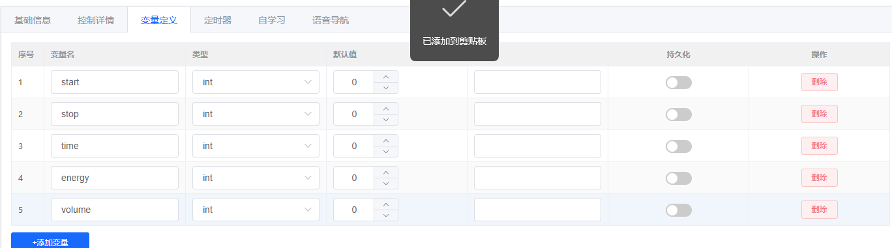

*JX-A7T模块的变量配置界面，定义了多个int类型变量*

2. **变量命名规范**
    - 使用有意义的英文名称
    - 避免使用特殊字符和中文
    - 变量名在项目中必须唯一
    - 建议使用驼峰命名法（如energyValue）

**变量使用场景**

1. **状态标记**
    - start/stop：控制设备启停状态
    - flag：作为标志位控制流程

2. **数值存储**
    - time：存储时间相关数值
    - energy：存储能量或电量值
    - volume：存储音量等级

3. **条件判断**
    - 作为附加条件的判断依据
    - 控制不同执行分支
    - 实现复杂的逻辑控制

**变量赋值方法**

1. **通过命令词赋值**
    - 语音指令触发后设置变量值
    - 可设置为固定数值或递增/递减

2. **通过串口输入赋值**
    - 外部设备通过串口发送数据
    - 模块接收后更新对应变量

3. **通过触发器赋值**
    - GPIO、定时器等触发器设置变量
    - 支持多种触发条件组合

**注意事项：**

- 变量必须先定义才能使用
- int类型变量默认值为0，使用前建议先赋值
- 变量名需要与配置中的命名完全一致
- 复杂逻辑建议使用多个变量分段控制
- 保存配置前确认所有变量都已正确配置

---

---

### JX-A7T模块如何配置串口输入触发？

**问题描述：**

需要配置JX-A7T1模块的语音指令，使其能够通过串口输入触发方式执行相应的行为。

**解决方案：**

**串口输入触发配置**

1. **添加语音指令**
    - 在A1至A6指令条目中设置触发方式为"串口输入"
    - 配置参数为"UART1_RX"
    - 设置消息号（如NUM_1、NUM_2等）
    - 选择参数类型为"unsigned char"

2. **配置变量关联**
    - 为每个指令设置对应的FLAG变量
    - A1指令可设置FLAG=1
    - A2指令可设置FLAG=2
    - 通过FLAG值区分不同指令

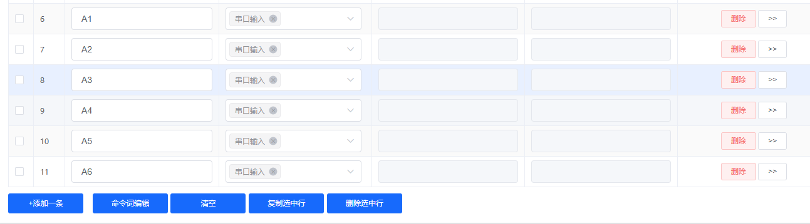

*A1至A6指令条目都配置为串口输入触发*

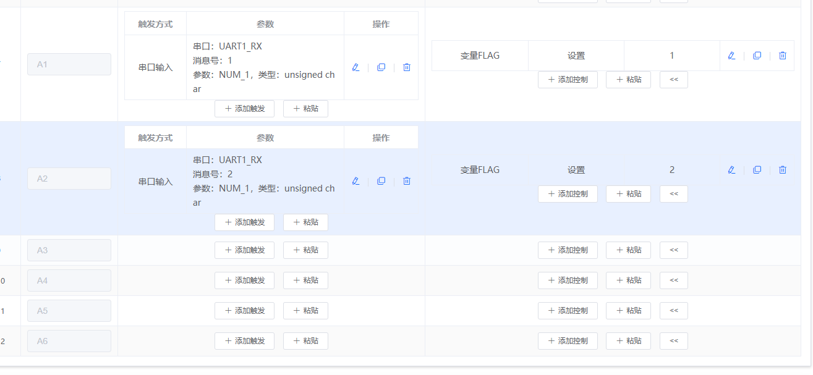

*A1和A2指令的具体配置，显示了UART1_RX和消息号设置*

**配置步骤详解**

1. **进入配置界面**
    - 选择要配置的指令条目（如A1）
    - 点击触发方式下拉菜单
    - 选择"串口输入"

2. **设置串口参数**
    - 选择串口：UART1_RX
    - 输入消息号：1、2、3等（用于区分不同指令）
    - 设置参数类型：unsigned char（单字节）
    - 可设置超时时间（可选）

3. **配置执行动作**
    - 设置触发后要执行的动作
    - 可以是GPIO控制、变量赋值、语音播报等
    - 每个消息号对应不同的动作

4. **多指令配置**
    - 重复步骤1-3配置多个指令
    - 使用不同的消息号区分
    - 可配置A1-A6共6条指令

**串口数据格式**

- **数据类型**：unsigned char（0-255）
- **消息号匹配**：发送的数据必须与配置的消息号一致
- **发送格式**：十六进制或十进制，根据配置决定
- **波特率**：需与发送端设备一致

**使用场景示例**

1. **MCU控制**：

    - 单片机通过串口发送指令控制模块
    - 发送0x01触发A1动作
    - 发送0x02触发A2动作

2. **设备联动**：

    - 其他设备通过串口联动控制
    - 实现多设备协同工作
    - 支持远程控制和自动化

3. **测试调试**：

    - 使用串口调试助手发送测试数据
    - 验证各指令功能是否正常
    - 便于开发和调试阶段使用

**注意事项：**

- 串口输入触发需要外部设备主动发送数据
- 消息号必须在1-255范围内
- 建议先使用串口调试工具测试功能
- 串口通信参数（波特率、数据位）必须匹配
- 如同时使用语音和串口触发，注意避免冲突

---

---

### JX-A7T模块如何配置多条语音指令？

**问题描述：**

需要在JX-A7T模块上配置1到10条语音指令，并为每条指令分配相应的执行行为。

**解决方案：**

**多指令配置说明**

- JX-A7T模块支持配置多条语音指令
- 每条指令可以独立设置触发条件和执行动作
- 通过不同的指令号（1-10）实现功能区分

**配置步骤**

1. **添加指令条目**
    - 在平台中逐个添加指令（A1-A10）
    - 每个指令对应一个数字（1-10）
    - 可以为每个指令设置不同的触发方式

2. **设置指令内容**
    - 为每个指令配置具体的识别内容
    - 设置对应的触发条件（语音、串口、GPIO等）
    - 配置执行的动作和行为

3. **分配执行行为**
    - 每个指令可以执行不同的动作
    - 可以为指令赋值（如设置变量为1、2、3...10）
    - 支持GPIO控制、串口输出、语音播报等

**典型配置示例**

1. **数值控制类指令**
    - 指令1：设置变量value=1，执行动作1
    - 指令2：设置变量value=2，执行动作2
    - ...
    - 指令10：设置变量value=10，执行动作10

2. **功能切换类指令**
    - 指令1：模式1，开启功能A
    - 指令2：模式2，开启功能B
    - ...
    - 指令10：模式10，开启功能J

3. **参数调节类指令**
    - 指令1：音量级别1
    - 指令2：音量级别2
    - ...
    - 指令10：音量级别10

**实现方法**

1. **逐个配置法**
    - 分别配置每个指令的触发和动作
    - 适合指令功能差异较大的情况
    - 便于独立调试和管理

2. **模板复用法**
    - 先配置一个指令作为模板
    - 复制模板并修改参数
    - 提高配置效率

3. **变量统一管理**
    - 使用统一的变量系统
    - 通过数值区分不同状态
    - 便于逻辑判断和控制

**注意事项：**

- 每个指令都需要独立配置，不能批量设置
- 指令数量越多，配置复杂度越高
- 建议先完成基础功能测试，再逐步增加指令
- 保留配置备份，防止意外丢失
- 测试时逐个验证每个指令的功能

---

---

### JX-A7T工作流程和配置方法是什么？

**问题描述：**

需要了解JX-A7T模块的完整工作流程，以及如何配置语音和WiFi功能并将两者联系在一起。

**解决方案：**

**1. 模块工作流程**

**初始化阶段：**

    - 上电启动，系统初始化
    - 加载语音识别模型
    - 连接预设的WiFi网络

**待机阶段：**

    - 监听唤醒词
    - 保持网络连接
    - 处理网络指令

**工作阶段：**

    - 语音唤醒后识别命令
    - 执行本地或网络功能
    - 通过语音或网络反馈结果

**2. 语音功能配置**

**基础配置：**

    - 登录智能公元平台
    - 创建JX-A7T产品
    - 配置唤醒词（如"你好小智"）

**命令词设置：**

    - 添加离线命令词
    - 设置识别动作
    - 配置GPIO或串口输出

**3. WiFi功能配置**

**网络设置：**

    - 使用智能公元小程序配网
    - 选择2.4G WiFi网络
    - 输入密码完成连接

**服务绑定：**

    - 绑定官方智能体
    - 或创建自定义智能体
    - 配置API密钥

**4. 语音与WiFi集成配置**

**方法一：通过串口通信**

    - 语音部分配置串口输出
    - WiFi部分配置串口输入
    - 两部分通过串口数据交互

**方法二：通过变量共享**

    - 设置全局变量
    - 语音和WiFi功能共享状态
    - 实现复杂逻辑控制

**方法三：通过触发联动**

    - 语音触发网络请求
    - 网络响应触发语音播报
    - 形成完整的交互闭环

**5. 开发资源**

**视频教程：**

    - JX-A7T新一代AI大模型模块固件制作及烧录教程
    - JX-A7T模块扣子配置视频
    - B站搜索"机芯智能"查看更多

**文档支持：**

    - 智能公元平台文档中心
    - 官方技术规格书
    - 开发包和示例代码

**注意事项：**

- 开发板出厂已预装固件，可直接测试
- 配置修改后必须重新生成固件
- 语音和WiFi功能可独立使用也可联动
- 建议先完成基础功能再开发联动
- 遇到问题可查看官方教程或联系技术支持

---

### JX-A7T的GPIO_A4如何配置为语音触发后立即输出高电平？

**问题描述：**

JX-A7T模块的GPIO_A4引脚默认配置为前15秒低电平、后15秒高电平的脉冲模式，需要修改为语音触发后立即输出高电平并持续30秒。

**解决方案：**

- **修改GPIO配置模式**：

    - 将GPIO_A4的输出模式从"输出脉冲"改为"设置电平"
    - 不使用默认的脉冲输出方式
    - 直接通过动作控制设置电平状态

- **配置语音触发动作**：

    - 设置动作为"设置电平"
    - 设置参数为"高电平"
    - 勾选"延时电平翻转"选项
    - 设置延长时间为30000ms（30秒）

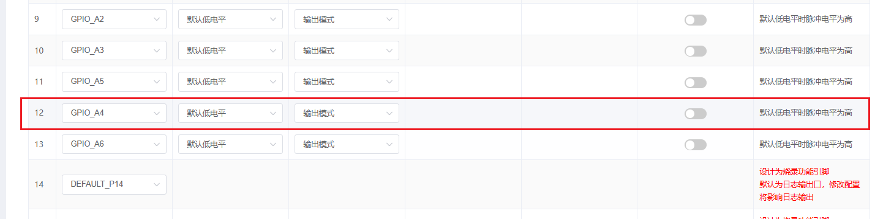

*JX-A7T模块的GPIO_A4引脚配置界面，设置为输出模式*

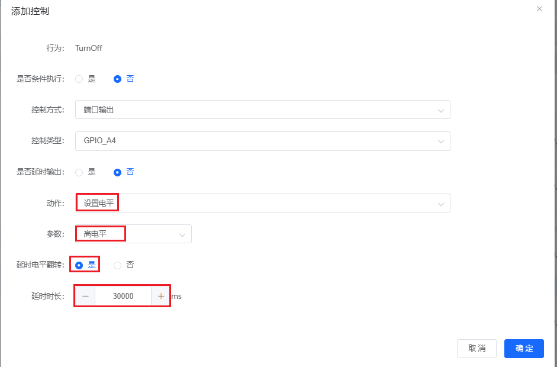

*语音触发后的动作配置，设置高电平输出和30秒延时*

**注意事项：**

- 修改配置后必须重新生成并烧录固件
- 延时时间单位为毫秒，30秒=30000ms
- "延时电平翻转"表示在延时后自动切换到相反电平
- 如需要持续高电平，注意在30秒内不要再触发其他动作

---

## 网络配置

### JX-A7T1如何配置网络？

**问题描述：**

需要了解JX-A7T1模块的网络配置方法，包括使用的小程序和配网步骤。

**解决方案：**

**1. 配网工具**

- 使用"智能公元"小程序进行配网
- 支持微信小程序和支付宝小程序
- 目前仅支持2.4GHz WiFi网络

**2. 配网步骤**

1. **烧录默认固件**
    - JX-A7T1出厂已预装默认固件
    - 可直接进行网络配置
    - 确保模块已正常上电

2. **打开小程序**
    - 搜索"智能公元"小程序
    - 进入设备管理界面
    - 点击"+"添加设备

3. **配网操作**
    - 选择2.4GHz WiFi网络
    - 输入WiFi密码
    - 等待配网成功提示

**3. 网络要求**

- WiFi频段：2.4GHz（不支持5GHz）
- 安全协议：WPA/WPA2
- 密码长度：8-63位字符

**4. 注意事项**

- 确保模块在配网范围内
- 配网过程中不要断开电源
- 密码输入要准确，区分大小写
- 配网成功后模块会自动连接网络

---

### JX-A7模块语音对话未调用怎么办？

**问题描述：**

JX-A7模块烧录默认固件并配置网络成功后，绑定Coze但语音对话始终未调用，路由器显示设备连接不稳定。

**解决方案：**

**1. 网络连接检查**

- 检查WiFi信号强度是否足够
- 确认路由器是否正常运行
- 验证2.4GHz频段是否可用

**2. Coze绑定验证**

- 确认Coze账号登录正常
- 检查智能体配置是否正确
- 验证API密钥是否有效

**3. 模块状态检查**

- 观察模块指示灯状态
- 检查模块是否持续在线
- 确认语音功能是否启用

**4. 唤醒测试**

- 尝试使用默认唤醒词
- 检查麦克风是否正常工作
- 确认喇叭有声音输出

**注意事项：**

- 网络不稳定可能导致AI对话中断
- 建议靠近路由器放置模块
- 如问题持续，可尝试重启路由器和模块

---

### JX-A7T的WiFi配网方式是什么？

**问题描述：**

需要了解JX-A7T模块的WiFi配网方式，是使用蓝牙配网还是其他方式，以及是否有小程序支持。

**解决方案：**

**1. 配网方式说明**

JX-A7T支持通过小程序进行蓝牙配网：

- **配网工具**：使用微信小程序进行配置
- **连接方式**：手机蓝牙连接JX-A7T模块
- **配置流程**：通过小程序发送WiFi信息给模块

**2. 配网步骤**

```
1. 打开"智能公元"微信小程序
2. 搜索并连接JX-A7T设备（蓝牙）
3. 在小程序中输入WiFi名称和密码
4. 点击配网，发送WiFi信息到模块
5. 等待模块连接WiFi网络
6. 配网成功后设备可在线使用
```

**3. 注意事项**

- **蓝牙权限**：首次使用需要授权蓝牙权限
- **网络要求**：仅支持2.4GHz WiFi网络
- **安全验证**：配网需要手机蓝牙靠近模块
- **绑定管理**：可绑定到自有公众号使用
- **参考资源**：平台提供配网示例代码

**4. 开发支持**

- 如需定制小程序，可参考官方配网流程
- 支持二次开发，可集成到自有系统
- 提供完整的API接口和开发文档

---

### JX-A7T是否可以绑定到自有公众号？

**问题描述：**

希望了解JX-A7T模块的小程序是否可以绑定到自己的公众号，以及如何获取相关的开发资源。

**解决方案：**

**1. 小程序绑定说明**

JX-A7T模块支持绑定到自有公众号：

- **小程序商城**：官方提供小程序商城功能
- **绑定方式**：可将小程序关联到自有公众号
- **定制开发**：支持完整的自定义开发

**2. 开发资源获取**

- **技术文档**：智能公元平台提供开发指南
- **API接口**：提供完整的设备控制API
- **示例代码**：包含配网、控制等功能的示例
- **技术支持**：有项目需求可联系开发团队

**注意事项：**

- 绑定前需要完成公众号认证
- 小程序功能需要符合微信平台规范
- 建议先使用默认小程序熟悉功能
- 定制开发需要一定的技术基础

---

### JX-A7T1绑定Coze智能体后对话测试无响应？

**问题描述：**

JX-A7T1模块成功配置网络并绑定Coze智能体，但在进行对话测试时无响应，且Coze智能体后台未显示调用记录。

**解决方案：**

**配置验证步骤：**

1. **小程序确认绑定**
    - 进入设备设置界面
    - 查看AI智能体绑定状态
    - 确认智能体类型为"coze"

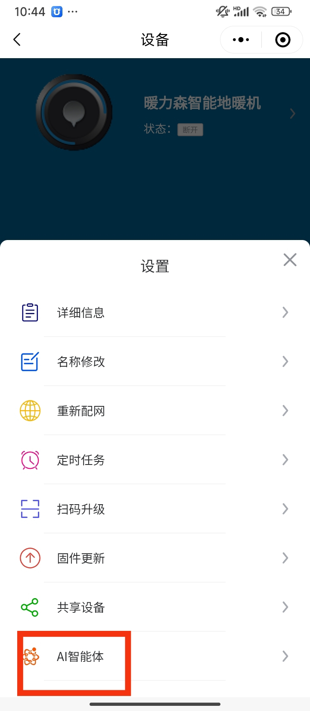

2. **查看设备详情**
    - 确认设备名称：AI宠物
    - 记录设备标识：JX_A7T_7C3E821E2213
    - 验证连接方式为WiFi

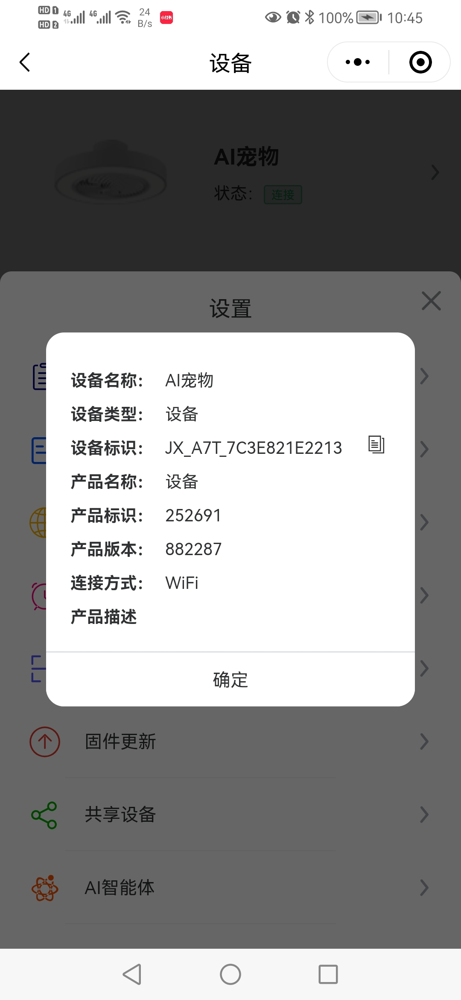

3. **检查智能体配置**
    - 确认智能体名称：玩具测试
    - 验证智能体ID和应用ID已填写
    - 确认绑定信息完整

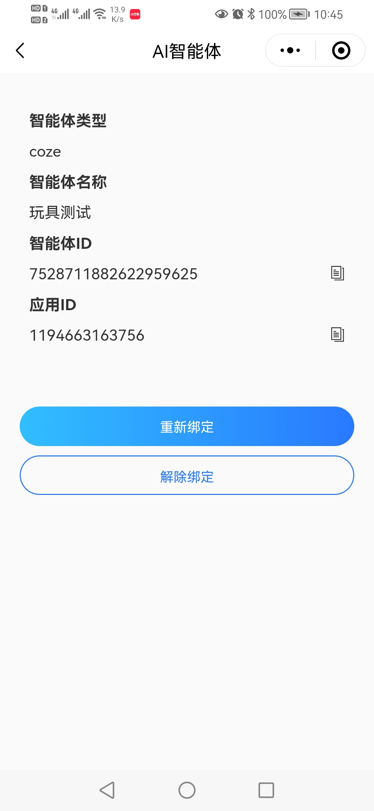

4. **Coze平台验证**
    - 登录Coze平台
    - 确认智能体配置正常
    - 检查资源点余额：500

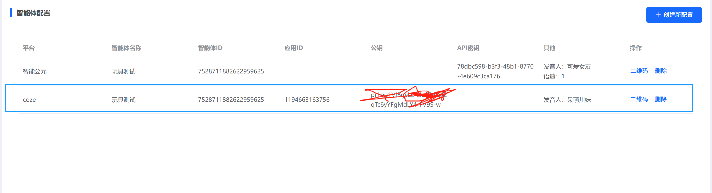

**固件版本确认：**

- 确认烧录的是默认WiFi固件和音频固件
- 如使用旧固件，建议重新生成
- 确保固件版本支持Coze功能

**网络环境检查：**

- 确认模块连接的是2.4GHz WiFi
- 检查网络是否正常访问互联网
- 验证路由器未限制相关端口

**注意事项：**

- 小程序控制正常说明网络连接成功
- 对话无响应可能是智能体配置问题
- 确保资源点充足以支持对话功能
- 如问题持续，联系技术支持提供设备ID

---
- 确保使用2.4GHz WiFi网络

---

### JX-A7T1模块是否可以接入用户自部署的大模型？

**问题描述：**

需要确认JX-A7T1模块能否接入用户自己部署的大模型，以及是否支持将语音识别和文本转语音服务定制到用户自己的模型上。

**解决方案：**

1. **当前支持情况**
    - 目前JX-A7T1主要支持绑定到Coze平台
    - 暂不支持直接接入用户自部署的大模型

2. **即将推出的功能**
    - 预计两周内会推出对外接收的接口
    - 新接口发布后即可接入用户自部署的大模型

3. **服务定制选项**
    - ASR（语音识别）和TTS（文本转语音）服务可以使用官方提供的
    - 用户可以只接入大模型进行对话处理
    - 后续会核算定制服务的成本

**注意事项：**

- 只有JX-A7T系列支持大模型功能
- 需要等待新接口发布才能实现自定义大模型接入
- 建议持续关注官方更新公告
- 可以先使用Coze平台进行开发和测试

---

### JX-A7T模块的PWM分辨率是多少位的？

**问题描述：**

需要了解JX-A7T模块的PWM分辨率位数。

**解决方案：**

1. **PWM分辨率查询**
    - 可以在智能公元平台的Pin脚配置界面查看
    - 登录平台后进入相关模块的配置页面
    - 在PWM配置部分可以查看具体的分辨率参数

2. **配置方法**
    - 在平台中找到PWM引脚配置
    - 可以设置PWM频率（如2000Hz）
    - 支持的分辨率和其他参数会在界面中显示

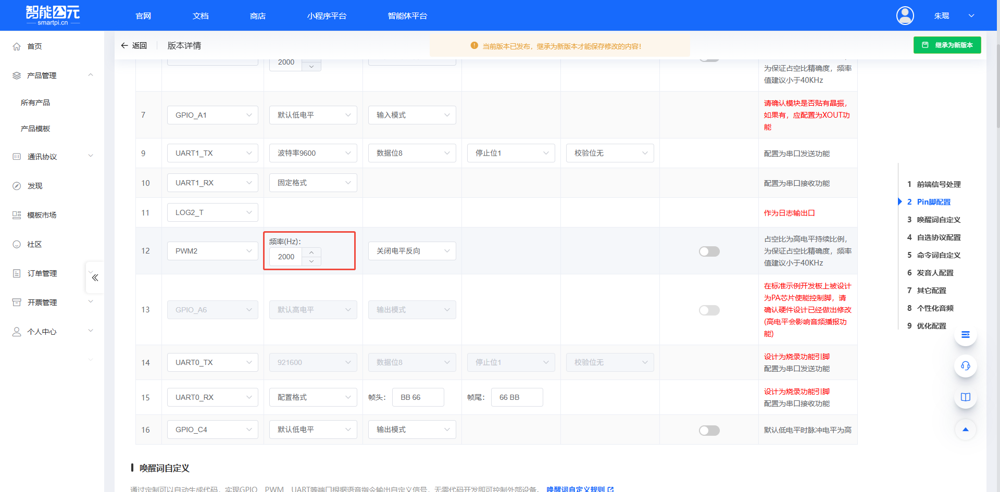

**注意事项：**

- 具体的PWM分辨率位数需要以平台显示为准
- 配置时需确认GPIO功能设置为PWM模式
- 不同固件版本的PWM参数可能有差异
- 建议使用最新版本固件以获得完整功能

---

### JX-A7T模块的PWM电平反向配置如何设置？

**问题描述：**

需要了解JX-A7T模块PWM配置中的"开启电平反向"和"关闭电平反向"设置的含义和作用。

**解决方案：**

**1. PWM电平反向功能说明**

- **功能作用**：控制PWM输出的初始电平状态
- **全部颠倒**：启用后，初始电平状态会相反
- **默认状态**：不启用反向时，初始为低电平

**2. 电平反向配置**

- **开启电平反向**：

    - 未启用：PWM开启时输出高电平
    - 启用后：PWM开启时输出低电平

- **关闭电平反向**：

    - 未启用：PWM关闭时输出低电平
    - 启用后：PWM关闭时输出高电平

**3. 配置方法**

在PWM功能配置界面中：

- 找到"开启电平反向"选项
- 找到"关闭电平反向"选项
- 根据实际需求勾选相应选项
- 保存配置并重新生成固件

**4. 应用场景**

- **继电器控制**：根据继电器的触发逻辑配置初始电平
- **LED控制**：设置LED的初始亮灭状态
- **电机控制**：配置电机的初始转向状态

**注意事项：**

- 电平反向会影响所有PWM通道的输出
- 配置后需要重新烧录固件才能生效
- 建议根据实际硬件电路需求进行配置
- 如不确定配置效果，建议先测试验证

---

### JX-A7T模块小程序无法搜索到蓝牙设备怎么办？

**问题描述：**

在使用微信小程序配置JX-A7T模块时，无法搜索到设备进行配网连接。

**分析原因：**

无法搜索到蓝牙设备可能有以下原因：

1. 微信小程序的蓝牙搜索权限未开启
2. 手机蓝牙功能未开启或异常
3. 模块蓝牙功能未正确配置
4. 小程序蓝牙权限申请被拒绝
5. 小程序未获取位置权限（Android系统要求）

**解决方案：**

1. **检查微信蓝牙权限**
    - 进入微信设置 → 通用 → 辅助功能 → 蓝牙
    - 确保蓝牙权限已开启
    - 或通过手机系统设置 → 应用权限管理 → 微信 → 蓝牙权限

2. **检查手机蓝牙状态**
    - 确保手机蓝牙已开启
    - 可以尝试重启手机蓝牙功能
    - 关闭其他已连接的蓝牙设备，避免干扰

3. **重新启动小程序**
    - 完全关闭微信小程序
    - 重新进入小程序并尝试搜索
    - 确保小程序已获得蓝牙权限授权

4. **检查模块蓝牙配置**
    - 确认JX-A7T模块的蓝牙功能已启用
    - 检查模块固件是否支持蓝牙通信
    - 验证模块蓝牙名称是否正确

5. **权限申请流程**
    - 首次使用需要授权蓝牙权限
    - 在小程序弹窗中点击"允许"
    - 如意外拒绝，需在手机设置中重新开启

6. **位置权限处理（关键步骤）**
    - 小程序搜索设备时会弹出"获取你的位置信息"权限申请
    - 必须点击"允许"才能搜索到附近的蓝牙设备
    - 这是Android系统的要求，蓝牙扫描需要位置权限
    - 如权限被拒绝，需在手机设置中重新开启位置权限

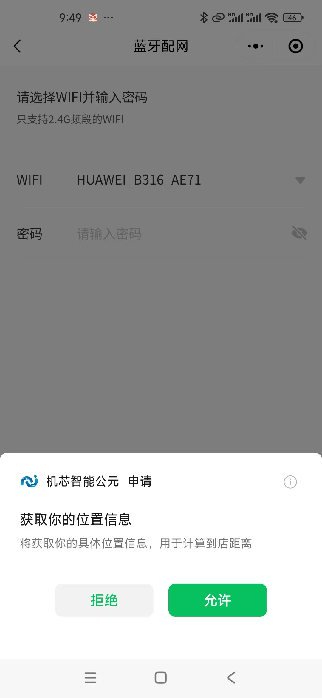

配网成功后会显示设备信号强度：


如果未获取位置权限，将无法搜索到设备：


**注意事项：**

- 微信小程序的蓝牙权限需要用户主动授权
- Android系统要求蓝牙设备搜索必须获取位置权限
- 不同品牌手机的蓝牙设置路径可能略有不同
- 如问题持续存在，尝试重启手机后再次操作
- 确保使用支持蓝牙通信的固件版本

### SU-03T型号芯片最多能设置多少条语音命令词？

**问题描述：**

需要了解SU-03T型号芯片支持的语音命令词数量上限。

**解决方案：**

1. **命令词数量限制**
    - SU-03T型号芯片最多支持设置150条语音命令词
    - 如需更多命令词，可考虑使用CI-03T型号（支持300条命令词）

2. **选择建议**
    - 对于一般应用场景，150条命令词通常足够使用
    - 如项目需要超过150条命令词，建议选择CI-03T型号
    - 可根据实际需求和预算选择合适的芯片型号

**注意事项：**

- 命令词数量会影响固件大小和编译时间
- 建议根据实际需求合理规划命令词数量
- 不同型号芯片的价格和性能可能有所差异
- 选择芯片型号时需综合考虑项目需求

### JX-A7T模块配置扣子智能体后在线AI无反应怎么办？

**问题描述：**

配置好扣子智能体后，手机扫码与JX-A7T模块对话时，离线语音功能正常但在线AI无反应。

**分析原因：**

根据问题描述，可能的原因包括：

1. 扣子智能体的密钥配置不正确
2. 公钥和私钥绑定过程中出现格式问题
3. 网络连接异常
4. 智能体配置未正确保存或生效

**解决方案：**

1. **检查扣子智能体配置**
    - 在PC端登录扣子平台，测试智能体是否可以正常回答问题
    - 确认智能体在试运行状态下可以正常响应

2. **重新生成和绑定密钥**
    - 重新生成私钥和公钥
    - 确保下载的密钥文件中没有隐藏的换行符
    - 重新进行密钥绑定操作

3. **检查网络连接**
    - 确保模块连接的网络可以访问外网
    - 检查WiFi或以太网连接状态
    - 验证DNS配置是否正确

4. **验证智能体状态**
    - 确认扣子智能体已发布并处于运行状态
    - 检查智能体的API接口是否正常工作
    - 验证智能体的调用配额是否充足

5. **调试建议**
    - 使用串口助手查看模块的调试日志
    - 检查是否有网络请求相关的错误信息
    - 验证发送给智能体的请求格式是否正确

**注意事项：**

- 扣子智能体的配置需要严格按照文档要求进行
- 密钥文件建议使用纯文本编辑器打开检查
- 确保使用最新版本的固件以获得完整的在线功能支持
- 如问题持续，可尝试恢复出厂设置后重新配置

### SU-63T语音控制板支持哪些蓝牙功能？

**问题描述：**

需要了解SU-63T语音控制板的蓝牙功能支持情况，包括是否支持连接蓝牙话筒和音箱，以及是否具备自学习功能。

**解决方案：**

1. **蓝牙功能支持**
    - SU-63T支持蓝牙功能，但仅可作为音响使用
    - 可以连接蓝牙音箱，替代传统喇叭输出
    - 不支持连接蓝牙话筒作为输入设备

2. **音频输入输出**
    - 输入：仍需使用板载咪头进行语音采集
    - 输出：可通过蓝牙播放音频，连接蓝牙音箱
    - 无法完全用蓝牙设备替代咪头和喇叭的组合

3. **自学习功能**
    - SU-63T不具备自学习功能
    - 语音命令词需要通过平台预配置
    - 不支持用户自定义添加或学习新的命令词

4. **应用场景**
    - 适合需要无线音频输出的应用
    - 可简化安装，避免音频线布线
    - 适用于智能家居控制等场景

**注意事项：**

- 蓝牙连接需要考虑传输距离和干扰问题
- 蓝牙音箱的配对需要在首次使用时进行
- 如需自学习功能，可考虑其他型号或方案
- 使用蓝牙输出可能增加一定的延迟

### JX-A7T模块选择不同应用场景区间时无法生成固件怎么办？

**问题描述：**

在前端信号处理配置界面中，当应用场景区间选择为'安静环境(占1.3M空间)-V000'时，无法生成固件，但切换到'安静环境(占1M空间)-V0048'后即可正常生成，询问是否与语句内容过多有关。

**分析原因：**

根据问题描述，固件生成失败的原因包括：

1. 选择的应用场景模型占用空间较大
2. 语句内容数量过多导致超出模型容量
3. 不同版本的算法模型有不同的资源限制

**解决方案：**

1. **选择合适的模型版本**
    - 优先选择占用空间较小的模型（如1M空间的V0048）
    - 避免使用占用空间较大的模型（如1.3M空间的V000）
    - 根据实际需求在功能和资源占用之间进行平衡

2. **优化语句内容**
    - 减少不必要的命令词数量
    - 简化语音命令的表述
    - 删除重复或不常用的命令

3. **分批配置命令词**
    - 如果项目需要大量命令词，考虑分多个固件版本
    - 根据功能模块划分命令词集合
    - 使用外部存储或云端识别扩展功能

4. **配置建议**
    - 单MIC配置下选择较小的模型版本
    - 如需使用高级功能，确保有足够的存储空间
    - 考虑使用双MIC配置以获得更好的识别效果

**注意事项：**

- 模型空间占用直接影响固件生成成功率
- 语句内容越多，需要的存储空间越大
- 建议在实际项目中预留一定的存储余量
- 不同版本的算法模型在功能和资源占用上有所差异
- 1.3M模型通常功能更丰富但占用更多资源

---

## 声纹识别功能

### 如何获取和使用JX-A7T声纹识别固件？

**问题描述：**

需要获取JX-A7T的声纹识别固件，并希望获得详细的声纹编辑教程。

**解决方案：**

**获取方式：**

1. **视频教程学习**
    - 参考官方提供的声纹识别视频教程
    - 地址：https://www.bilibili.com/video/BV1fPUmYxENX
    - 详细介绍声纹编辑的逻辑和操作步骤

2. **固件获取**
    - 技术支持可提供视频中的例程固件
    - 需要按照视频教程进行配置

**配置说明：**

- 声纹识别功能还在优化中，可用于测试和小功能实现
- 完整的配置文档后续会发布到平台

**注意事项：**

- 声纹功能仍在优化阶段，部分功能可能不完善
- 建议先学习视频教程，理解配置逻辑
- 导入固件失败时，请确认是否按照正确步骤操作

---

### 如何设置唤醒词的声纹识别？

**问题描述：**

希望只有特定用户能唤醒设备，实现声纹保护功能。

**解决方案：**

**方案一：双唤醒词法**

1. 配置两个唤醒词（如A1、A2）
2. 使用A2唤醒词进行声纹注册
3. 注册完成后禁用A2唤醒词
4. 只有录入声纹的用户使用A1能唤醒设备

**方案二：外部触发注册**

1. 使用单一唤醒词
2. 通过串口发送命令注册声纹
3. 或使用按键等外部触发方式注册
4. 实现单一唤醒词的声纹保护

**注意事项：**

- 声纹注册需要用户按提示录入声音特征
- 每个需要使用的用户都应单独注册声纹
- 录入环境应尽量安静，避免干扰
- 声纹功能会占用额外的存储空间

---


## 定时器控制

### JX-A7T重复触发和立即重复触发有什么区别？

**问题描述：**

需要了解JX-A7T模块定时器控制中"重复触发"和"立即重复触发"两种工作模式的区别，以及各自的触发时序特点。

**解决方案：**

**1. 重复触发模式**

- 计时起点不触发事件
- 第一个周期结束后才开始触发
- 触发序列：01010101……（0=不触发，1=触发）

**2. 立即重复触发模式**

- 计时起点立即触发一次事件
- 之后按设定周期重复触发
- 触发序列：10101010……（0=不触发，1=触发）

**3. 配置示例**
假设设置超时时长为5秒：

- **重复触发**：5秒后第一次触发 → 等待5秒 → 第二次触发 → ...
- **立即重复触发**：立即触发 → 等待5秒 → 第二次触发 → ...

**4. 应用场景**

- **重复触发**：需要延时启动的周期性任务
- **立即重复触发**：需要立即启动的周期性任务

**注意事项：**

- 两种模式的区别仅在于计时起点是否触发事件
- 选择哪种模式取决于具体的应用需求
- 超时时长决定了两次触发之间的时间间隔

---

## GPIO与串口控制

### JX-A7T支持一条指令控制多个端口吗？

**问题描述：**

需要了解JX-A7T模块是否支持一条语音指令同时控制多个GPIO端口的输出电平，以及如何配置UART串口发送多位指令时的B7端口设置。

**解决方案：**

**1. 多端口控制方法**

- 支持一条指令控制多个端口
- 在平台中为同一条指令添加多个控制项即可
- 每个控制项可以设置不同的GPIO端口和动作

**2. 配置步骤**

- 在"添加控制"界面选择要控制的指令
- 添加第一个控制项：选择端口输出和对应的GPIO引脚
- 继续添加更多控制项：选择其他GPIO引脚
- 保存配置后，一条指令会同时触发所有配置的动作

**3. UART发送多位指令配置**

- 数据位设置：选择8位数据（一个字节8位）
- 发送内容：按需填写6个或7个字节的数据
- B7端口：默认为日志输出口，建议不要修改
- 发送时将所有数据字节填入参数区域

**4. 指令格式示例**
发送切换波特率指令（6字节）：

- 起始码：AA 55
- 长度：04
- 操作码：01
- 参数：2C 1F（波特率参数）
- 校验码：根据前面字节计算
- 结束码：55 AA

**注意事项：**

- GPIO_B7默认用作日志输出，不建议修改为其他用途
- UART发送时数据位固定为8位，不能改为6位或7位
- 多个控制项会按顺序执行，但几乎同时完成
- 串口通信需要遵循约定的协议格式

---

## 串口通信协议

### 如何解析串口接收的十六进制数据？

**问题描述：**

在使用串口通信时，接收到的十六进制数据（如01 00解析为1，01 01解析为257）数值差异很大，不理解其计算逻辑。

**解决方案：**

**1. 固定格式帧结构**

- 默认帧头：AA 55
- 帧尾：55 AA
- 数据格式：十六进制传输
- 帧结构：帧头 + 消息编号 + 参数 + 帧尾

**2. 数据解析说明**

- 01 00：第一个字节是消息编号(01)，第二个字节是参数(00)
- 01 01：第一个字节是消息编号(01)，第二个字节是参数(01)
- Rcvbuff(3)：表示接收缓冲区第3个字节的数据
- 数值差异来源于参数字节的十六进制值

**3. 完整帧示例**
发送帧：AA 55 01 2C 1F 55 AA
- AA 55：帧头（固定）
- 01：消息编号
- 2C 1F：参数（两个字节）
- 55 AA：帧尾（固定）

**4. 接收数据解析**

- 跳过帧头AA 55
- 读取消息编号
- 读取参数数据
- 验证帧尾55 AA

**注意事项：**

- 这是十六进制数据传输，不是十进制
- Rcvbuff是按字节索引的数组，从0开始计数
- 01 00表示两个字节：0x01和0x00
- 实际数值计算取决于应用层协议定义

---

## 平台功能更新

### JX-A7T支持在发送内容中加入变量吗？

**问题描述：**

需要在JX-A7T模块的发送内容中加入变量功能，以便实现动态数据输出，但不确定该功能是否已经更新到平台。

**解决方案：**

**当前功能状态**

- **开发中**：变量发送功能尚未更新到平台
- **暂未支持**：当前版本的平台不支持在发送内容中插入变量
- **开发计划**：该功能正在开发中，具体上线时间待定

**替代方案**

**1. 固定内容配置**

- **多配置项**：为可能的变量值分别配置发送内容
- **预设模板**：预先设置常用的输出格式
- **组合使用**：通过不同的触发条件选择不同的预设内容

**2. 外部处理方案**

- **MCU辅助**：使用外部单片机处理变量逻辑
- **串口输出**：JX-A7T只输出固定内容，具体数值由MCU计算
- **模块分工**：

    - JX-A7T：负责语音识别和基础控制
    - MCU：负责数据处理和变量计算

**3. 暂时等待方案**

- **关注更新**：定期查看平台更新日志
- **技术支持咨询**：联系技术支持获取开发进度
- **测试版本**：如有测试版本可申请提前体验

**注意事项：**

- 变量功能是较复杂的需求，开发周期较长
- 建议关注官方公告，获取最新功能更新信息
- 如有紧急项目需求，可考虑上述替代方案
- 具体上线时间请以官方发布为准

---

## 固件生成与烧录

### JX-A7T使用unsigned int类型导致固件生成失败怎么办？

**问题描述：**

在协议配置中将变量类型从int改为unsigned int后，导致固件生成失败。使用int类型时，串口发送的数据在小程序中显示为负数，并且显示完整的帧数据（包含帧头帧尾）。

**解决方案：**

**1. 数据类型选择建议**

- 当前平台对unsigned int类型支持存在兼容性问题
- 建议暂时使用int类型进行变量定义
- 如需处理无符号数据，可在代码中进行转换

**2. 负数显示问题处理**

int类型显示负数的原因是数据解析问题：

- 检查单片机发送的数据格式
- 确保数据值在int类型的表示范围内
- 如数据超过int范围，建议分段发送或使用其他数据类型

**3. 串口数据格式**

单片机发给模块的串口数据格式应为：
```
AA 55 [消息号] [数据内容] 55 AA
```

其中：

- AA 55：帧头
- 55 AA：帧尾
- 消息号：用于区分不同数据
- 数据内容：实际传输的数据

**4. 变量配置注意事项**

- unsigned int类型存在8位、16位、32位的区别
- 平台当前推荐使用32位int类型
- 确保协议、变量定义、触发设置中的数据类型一致

**注意事项：**

- 平台正在排查unsigned int类型的兼容性问题
- 使用int类型时，注意数据范围限制（-2147483648到2147483647）
- 发送负数数据时，小程序会显示实际数值而非补码形式
- 建议使用示例项目测试数据传输功能

---

### JX-A7T生成固件时提示帧头帧尾为空怎么办？

**问题描述：**

在使用JX-A7T模块生成固件时，出现错误提示"帧头帧尾为空"，询问该问题是否可解决以及如何处理。

**解决方案：**

**问题性质说明：**

- 这是警告信息，不是错误
- 不影响固件的正常生成和使用
- 可以直接忽略该提示并继续生成固件

**处理方法：**

1. **直接生成固件**

    - 看到"帧头帧尾为空"提示时，无需停止
    - 继续完成固件生成流程
    - 生成的固件可正常使用

2. **理解提示含义**

    - 帧头帧尾：用于串口通信协议的数据包标识
    - 某些应用场景可能不需要固定帧头帧尾
    - 平台给出提醒但允许继续操作

3. **验证固件功能**

    - 下载生成的固件
    - 正常烧录到JX-A7T模块
    - 测试各项功能是否正常工作

**技术说明：**

- 帧头帧尾主要用于数据包的识别和校验
- 如果应用不涉及复杂的串口通信协议，可以不设置
- JX-A7T模块本身不强制要求特定的通信格式

**注意事项：**

- 该警告不会影响固件的烧录和使用
- 如需使用串口通信协议，可后续在代码中添加帧头帧尾
- 建议先烧录测试固件，确认基本功能正常
- 如有特殊协议需求，可联系技术支持获取定制方案

---

### JX-A7T模块如何实现离线与在线功能结合开发？

**问题描述：**

需要了解JX-A7T模块是否需要额外付费购买，以及如何实现离线语音与在线AI大模型功能的结合开发。

**解决方案：**

JX-A7T是专门设计用于离线与在线功能结合的大模型模块，具体实现方式如下：

**1. 模块功能架构**

- JX-A7T集成了离线语音识别和在线WiFi通信功能
- 支持离线指令控制与在线AI对话的无缝切换
- 在线指令通过豆包/扣子大模型API实现AI交互

**2. 智能体配置方法**

- 在智能公元平台后台配置智能体API接口
- 申请豆包智能体并获取API密钥
- 将API接口信息填入智能公元后台配置即可

**3. 开发流程**

- 购买JX-A7T模块硬件
- 在智能公元平台注册和登录
- 配置离线语音指令和词条
- 绑定或创建智能体（推荐使用豆包扣子）
- 生成并烧录固件到模块

**注意事项：**

- JX-A7T模块需要单独购买，淘宝有售
- 智能体可自行在豆包扣子平台配置定义
- 在线功能依赖网络连接，离线功能可独立工作
- 平台已提供完整的例程和文档支持

---

### JX-A7T固件编译需要180分钟吗？

**问题描述：**

JX-A7T模块在更新固件时，平台显示编译时间预估为180分钟，询问实际编译时长及影响因素。

**解决方案：**

**1. 编译时间说明**

- 180分钟是平台显示的预估时间，不是固定值
- 实际编译时间通常远少于预估时间
- 预估时间包含 worst case 的处理时间

**2. 影响编译时间的因素**

- **固件复杂度**：功能越多、配置越复杂，时间越长
- **服务器负载**：高峰时段可能延长处理时间
- **网络状况**：网络延迟影响文件传输速度
- **模块类型**：是否包含大模型配置影响编译量

**3. 实际编译时间**

- 根据用户反馈，实际编译时间通常在几分钟到几十分钟
- 大部分固件都能在10-30分钟内完成编译
- 180分钟是极端情况下的最大预估值

**注意事项：**

- 编译进度条更新可能有延迟，请耐心等待
- 如长时间无响应，可刷新页面查看状态
- 建议避开网络高峰期进行固件更新
- 编译完成后会自动开始下载

---

## 智能体绑定与配置

### JX-A7T智能体的运行机制是什么？

**问题描述：**

需要了解JX-A7T模块绑定智能体后，离线命令和在线大模型是如何协同工作的。

**解决方案：**

JX-A7T采用离线优先的智能运行机制：

**1. 离线优先原则**

- 设备唤醒后，会先识别离线命令词
- 如果识别到预置的离线命令，直接执行本地响应
- 离线命令响应速度快，无需网络连接

**2. 在线大模型补充**

- 当语音内容不在离线命令词库中时，自动调用在线大模型
- 大模型需要一定的处理时间，响应相对较慢
- 支持自然语言理解和智能对话

**3. 使用场景示例**

```
用户说："打开台灯" → 识别为离线命令 → 立即执行（约0.5秒）
用户说："今天天气怎么样" → 调用大模型 → 智能回答（约3-6秒）
```

**注意事项：**

- 智能体运行都需要一定的处理时间，响应速度相对较慢
- 建议将常用控制指令设置为离线命令词
- 复杂对话和知识问答使用在线大模型
- 网络状况会影响大模型响应速度

---


### JX-A7T智能体的运行机制是什么？

**问题描述：**

需要了解JX-A7T模块绑定智能体后，离线命令和在线大模型是如何协同工作的。

**解决方案：**

JX-A7T采用离线优先的智能运行机制：

**1. 离线优先原则**

- 设备唤醒后，会先识别离线命令词
- 如果识别到预置的离线命令，直接执行本地响应
- 离线命令响应速度快，无需网络连接

**2. 在线大模型补充**

- 当语音内容不在离线命令词库中时，自动调用在线大模型
- 大模型需要一定的处理时间，响应相对较慢
- 支持自然语言理解和智能对话

**3. 使用场景示例**

```
用户说："打开台灯" → 识别为离线命令 → 立即执行（约0.5秒）
用户说："今天天气怎么样" → 调用大模型 → 智能回答（约3-6秒）
```

**注意事项：**

- 智能体运行都需要一定的处理时间，响应速度相对较慢
- 建议将常用控制指令设置为离线命令词
- 复杂对话和知识问答使用在线大模型
- 网络状况会影响大模型响应速度

---


### 如何进行JX-A7T智能体绑定？

**问题描述：**

需要了解JX-A7T模块的智能体绑定流程、二维码有效期、用户绑定方案等。

**解决方案：**

**绑定流程说明：**

1. **开发者绑定流程**：

    - 登录智能公元小程序
    - 添加设备并扫描设备二维码
    - 在设备详情页点击"AI智能体"菜单
    - 扫描绑定二维码完成智能体关联

2. **二维码有效期**：

    - 绑定二维码有效期为10分钟
    - 超时后需要重新生成二维码
    - 出于安全考虑，不支持永久有效二维码

**用户端绑定方案：**

1. **设备分享功能**：

    - 开发者可通过设备分享功能将设备分享给用户
    - 分享链接具有时效性
    - 用户通过链接可快速绑定设备

2. **开发者与用户管理**：

    - 开发者作为主设备管理者
    - 可管理多个用户从设备
    - 支持设备的批量管理

**绑定限制说明：**

- 出于安全考虑，二维码不能设置为永久有效
- 设备分享链接也有时效限制
- 每个设备有绑定数量限制，如需增加可联系后台处理

**注意事项：**

- 二维码绑定10分钟有效期是为了安全考虑
- 未来平台将推出开发者和用户分离的管理端
- 临时方案可通过后台申请增加绑定设备数量

---

### 智能体平台资源点不足怎么办？

**问题描述：**

在使用扣子平台的大模型智能体时，提示"资源点余额不足"，导致无法正常使用智能体功能。

**解决方案：**

**1. 扣子平台限制说明**

- 扣子平台的大模型试用版每天有资源点限制
- 资源点耗尽后需要等待刷新或升级付费版
- 付费版升级地址：https://console.volcengine.com/coze-pro

**2. 智能公元平台优势**

- 智能公元平台的智能体目前免费使用
- 没有每日资源点限制
- 提供稳定的服务支持

**3. 建议使用方案**

- 优先使用智能公元平台创建智能体
- 通过智能公元平台配置后，可直接在设备中使用
- 避免第三方平台的资源限制问题

**注意事项：**

- 扣子平台适合开发测试，注意资源点使用情况
- 正式产品建议使用智能公元平台
- 可将扣子平台创建的智能体迁移到智能公元平台

- 可将扣子平台创建的智能体迁移到智能公元平台

---

### 大模型对话算不算播音？如何配置触发事件？

**问题描述：**

JX-A7T模块在使用大模型智能体时，需要确认大模型的对话回复是否属于播音，以及如何配置播音开始/结束的触发事件。

**解决方案：**

**1. 大模型对话与播音的关系**

- 当前版本：大模型对话回复不算播音
- 未来版本：计划支持大模型对话触发播音事件
- 预计时间：国庆后可能会推出此功能

**2. 播音事件配置**

**支持的播音场景：**

- 离线命令词播报
- 自定义播放语音控制
- TTS语音合成播报

**暂不支持的场景：**

- 大模型AI对话回复
- 扣子平台智能体对话
- 实时语音转文字内容

**3. 替代方案**

**方案一：使用播放语音控制**
```
触发事件 → 添加控制 → 播放语音 → 设置延时（如400ms）
```

**方案二：组合播报**

- 将多个命令词设置为相同回复语
- 使用"|"分隔符实现随机播报
- 节省Flash存储空间

**方案三：变量判断控制**

- CI系列模块：支持变量随机值
- 通过变量判断播放不同语音
- 实现更灵活的播报控制

**注意事项：**

- 播报控制中的标点符号可能导致生成不完整
- 建议只保留英文，删除标点符号
- 播报延时建议设置为400ms以上
- 大模型对话触发功能正在开发中

---

### 如何修改JX-A7T的唤醒词？---

### 如何修改JX-A7T的唤醒词？

**问题描述：**

需要了解JX-A7T模块的唤醒词修改方法和配置流程。

**解决方案：**

**唤醒词修改方法：**

1. **平台修改**：

    - 登录智能公元平台
    - 进入产品配置页面
    - 找到唤醒词设置选项
    - 可自定义唤醒词，如"你好小智"、"小智精灵"等

2. **烧录更新**：

    - 修改唤醒词后需要重新生成固件
    - 将新固件烧录到模块
    - 通电后新唤醒词生效

**测试验证：**

- 唤醒词修改后，可通过语音测试验证
- 模块通电后会有语音提示
- 喊唤醒词应有相应响应

**注意事项：**

- 唤醒词修改需要烧录固件才能生效
- 产品化时建议使用自定义唤醒词
- 平台支持任意命名离线唤醒词

---

### 绑定智能体后无法对话怎么办？

**问题描述：**

JX-A7T模块成功绑定智能体后，无法进行正常对话交互。

**解决方案：**

**问题排查步骤：**

1. **检查唤醒响应**：

    - 先确认喊唤醒词是否有响应
    - 如无响应，可能是麦克风或唤醒词问题
    - 如有响应，说明硬件基本正常

2. **确认扣子智能体状态**：

    - 在扣子平台测试智能体对话功能
    - 确认智能体配置正确且能正常响应
    - 检查智能体是否是对话流类型

3. **网络连接检查**：

    - 确认模块已连接WiFi
    - 检查网络稳定性
    - 可尝试重启路由器或更换网络

4. **固件和配置**：

    - 确认烧录的是最新固件
    - 检查智能体API配置是否正确
    - 重新生成并烧录固件

**常见原因：**

- 智能体未正确配置为对话流类型
- 网络连接不稳定
- 唤醒词未触发模块进入对话状态
- 智能体API密钥或配置错误

**解决方法：**

1. **基础检查**：

    - 确认唤醒词能触发模块
    - 检查网络连接状态
    - 测试扣子智能体对话

2. **重新配置**：

    - 将智能体转换为对话流类型
    - 重新生成并烧录固件
    - 再次测试对话功能

**注意事项：**

- JX-A7T需要先唤醒后才能对话
- 智能体必须是对话流类型才能正常对话
- 确保网络连接稳定且智能体配置正确

---

## 在线语音与AI集成

### JX-A7T能否实现非指令式语音控制？

**问题描述：**

需要在JX-A7T设备上实现非指令式的语音控制功能，让用户无需说出特定指令即可通过自然语音进行控制。

**解决方案：**

JX-A7T支持实现在线语音控制和非指令式语音交互功能：

**1. 在线语音控制实现**

- **固件支持**：JX-A7T当前固件已支持在线语音控制功能
- **无需移植**：不需要移植小智AI或其他第三方固件
- **平台集成**：可通过官方平台配置实现在线语音服务

**2. 非指令式语音交互**

- **自然对话**：支持自然语言对话，无需固定指令词
- **智能理解**：通过在线AI服务理解用户意图
- **灵活响应**：根据对话内容动态生成响应和控制指令

**3. 实现方式**

- **网络连接**：确保设备连接到互联网
- **平台配置**：在官方平台配置在线语音服务
- **API集成**：通过API接口连接AI对话服务
- **固件生成**：生成支持在线功能的固件并烧录

**注意事项：**

- 需要稳定的网络连接以支持在线语音服务
- 非指令式控制依赖于后台AI服务的理解能力
- 建议根据实际产品需求进行充分测试
- 产品功能持续优化，建议实测后配置相关设置

---

## 语音交互功能与大模型对接

### 如何实现语音交互功能，让设备接收外部语音、传送平台处理后语音播报？

**问题描述：**

需要在现有产品上增加语音交互功能，实现设备自动接收外部语音信息并传送到平台，平台处理后将文本回复传回设备，设备再将文本语音播报出来。

**解决方案：**

**1. 功能需求拆分**

语音交互功能需要实现以下两个核心部分：

- **语音转文本（ASR）**：设备自动接收外部语音，转换为文本发送给平台
- **文本转语音（TTS）**：接收平台返回的文本，转换为语音进行播报

**2. 技术实现方案**

**方案一：使用智能体平台（推荐）**

- 通过智能体平台的OpenAI-API-Compatible接口接入自定义大模型
- 平台支持多种模型类型：LLM、TEXT、EMBEDDING、SPEECH2TEXT、MODERATION
- 在平台中配置自定义API参数：基础URL、API-Key、模型名称等

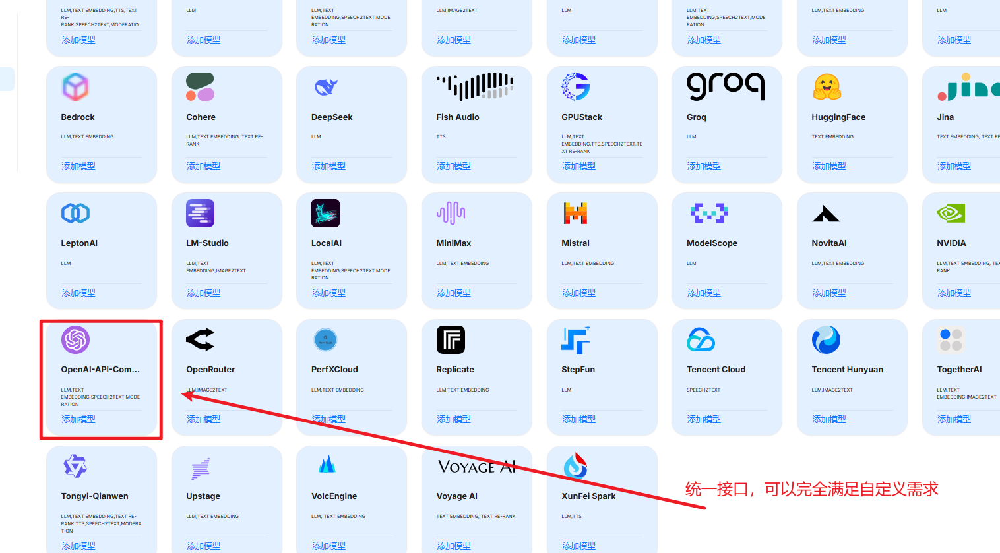

**方案二：定制开发**

如果智能体平台无法满足需求，可选择定制开发：

- ASR部分需要定制（设备端实现语音转文本）
- TTS部分可使用现有模块功能
- 需要提供大模型接口文档供对接

**3. 智能体平台配置步骤**

1. **登录智能体平台**：https://ai.aimachip.com/user-setting/model
2. **选择模型类型**：选择"OpenAI-API-Compatible"
3. **配置API参数**：

    - 模型类型：选择对应的API类型
    - 模型名称：自定义模型名称
    - 基础URL：填入API服务地址
    - API-Key：填入认证密钥

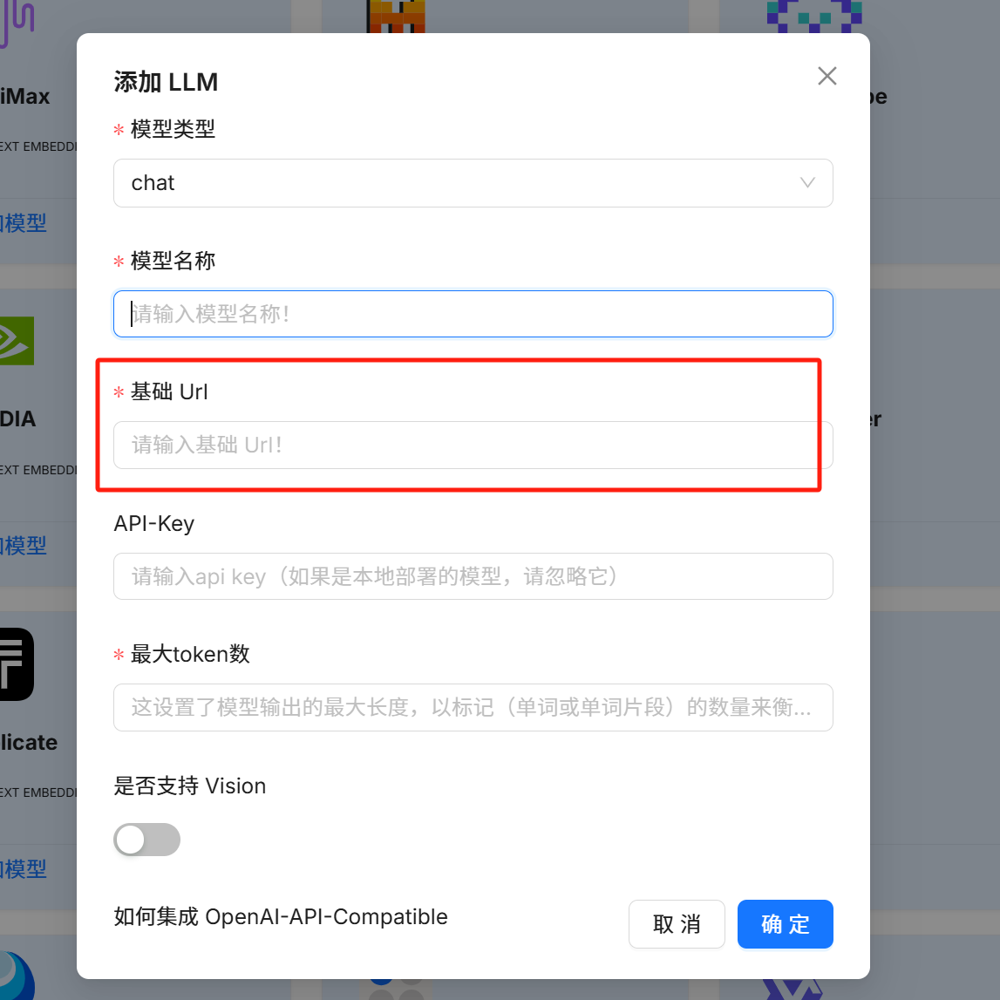

4. **测试对接**：在平台中测试API连通性
5. **生成固件**：配置完成后生成支持在线功能的固件

**注意事项：**

- ASR和TTS服务均需要网络连接，无法完全离线运行
- 自定义大模型接口需符合OpenAI API格式规范
- 流式输出接口需要特殊处理，建议提供标准REST API
- 定制开发涉及额外费用，需评估需求量级
- TTS服务使用需要收取服务费，按模块计费

**接口要求：**

- HTTP协议，支持POST请求
- 请求参数需包含：nAgentId、nHistoryId、message等
- 支持流式输出（stream=true）
- 返回格式需符合平台规范

---

### 自建大模型如何与JX-A7T对接？

**问题描述：**

已有自建的大模型服务，希望了解如何与JX-A7T模块进行对接，实现语音交互功能。

**解决方案：**

**1. 接口适配要求**

自建大模型需要满足以下条件：

- **API协议**：HTTP/HTTPS协议
- **接口格式**：兼容OpenAI API格式
- **认证方式**：支持API-Key认证
- **返回格式**：JSON格式，支持流式输出

**2. 对接方式**

**方式一：通过智能体平台**

1. 在智能体平台选择"OpenAI-API-Compatible"模型
2. 配置自建模型的API地址和密钥
3. 测试连通性后生成固件

**方式二：定制开发**

1. 提供完整的大模型API文档
2. 技术团队评估接口可行性
3. 开发专用对接接口
4. 集成到模块固件中

**3. 费用说明**

- **方案一（平台对接）**：

    - 一次性接口定制费：约5000元（需商务确认）
    - 模块费用：按硬件价格
    - 年服务费：每个模块每年收取

- **方案二（完全定制）**：

    - 根据具体需求评估
    - 需要提供详细需求文档
    - 开发周期约2周

**注意事项：**

- 自建模型必须保证服务稳定可用
- 建议先使用测试环境验证对接
- 需要考虑网络延迟对交互体验的影响
- 流式输出接口需要特殊处理

---

### 如何配置自研农业大模型API与JX-A7T对接？

**问题描述：**

需要将自研的农业大模型API集成到JX-A7T模块中，实现设备的人机交互功能，解决API调用验证和接口配置问题。

**解决方案：**

**1. API接口规范**

自研大模型API需要满足以下技术要求：

- **接口地址**：`https://ai.topyn.cn/stream/algorithm/agent_single_chat/v1`
- **请求协议**：HTTP POST，支持SSE流式返回
- **认证参数**：app_key、id（作为URL参数）
- **请求参数**：
    ```json
    {
    "agent_id": "b6ceebc2ed2911efab6950ebf6bd1b4d",
    "query": "用户输入的问题",
    "stream": true
    }
    ```

**2. 网络权限配置**

- **IP白名单**：将服务器出口IP添加到自研API的白名单
- **出口IP**：113.118.46.32（需根据实际情况配置）
- **临时密钥**：申请测试用的app_key和id进行验证

**3. JX-A7T对接方案**

**方案一：智能体平台配置**

1. 登录智能公元平台，选择"OpenAI-API-Compatible"模型
2. 配置API参数：

    - 基础URL：填入自研API地址
    - API-Key：填入认证密钥
    - 模型名称：自定义标识
3. 测试API连通性并生成固件

**方案二：定制开发**

1. 提供完整的API文档
2. 技术团队开发专用对接接口
3. 支持WebSocket和HTTP协议调用
4. 集成到固件并提供测试版本

**4. 示例调用代码**

```bash
curl --location --request POST 'https://ai.topyn.cn/stream/algorithm/agent_single_chat/v1?app_key=80mao4xfi6d7&id=xxx' \
--header 'Content-Type: application/json' \
--data-raw '{
    "agent_id": "b6ceebc2ed2911efab6950ebf6bd1b4d",
    "query": "水稻稻飞虱防治办法",
    "stream": true
}'
```

**5. 流式返回处理**

- 返回采用SSE（Server-Sent Events）协议
- 支持实时流式输出
- 需要正确解析流式数据格式

**注意事项：**

- 自研API必须保证7×24小时稳定运行
- 建议先在测试环境完成对接验证
- IP白名单配置是连接成功的前提
- 流式接口需要特殊处理，建议提供标准REST API作为备选
- 商用部署需考虑并发和性能要求

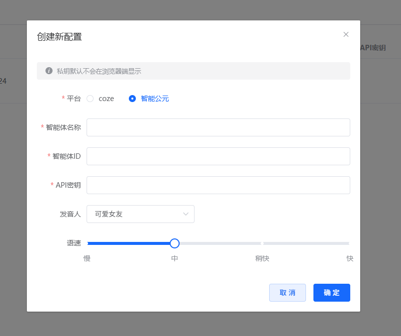

*配置第三方智能体API的界面示例，支持平台选择、API密钥配置等参数设置*

---

### 语音交互功能是否可以离线运行？

**问题描述：**

希望了解语音交互功能是否可以完全离线运行，不依赖云端服务。

**解决方案：**

**功能限制说明：**

语音交互功能无法完全离线运行，原因如下：

- **ASR（语音转文本）**：必须通过云端服务实现，离线只能输出Speex格式数据流
- **大模型处理**：需要云端AI服务进行语义理解和回复生成
- **TTS（文本转语音）**：可以使用本地TTS服务

**部分离线方案：**

如果只需要部分离线功能，可以考虑：

1. **本地命令词识别**：离线识别预设的唤醒词和命令
2. **云端对话**：识别到命令后连接云端进行对话
3. **本地播报**：使用本地TTS播报云端返回的文本

**建议：**

- 如果必须完全离线，建议使用固定回复的命令词方案
- 语音交互功能的设计初衷是利用云端AI的智能对话能力
- 可根据实际应用场景调整功能需求

---


## 产品介绍与功能特点

### JX-A7T 产品有哪些主要功能特点？

**问题描述：**

需要了解 JX-A7T 产品的功能特点、在线与离线指令模式的差异，以及如何获取相关技术文档和例程。

**解决方案：**

JX-A7T 是一款支持离线指令与在线指令双重模式的智能语音模块，搭载大模型运行。

**主要功能特点：**

- **双重指令模式**：

    - 离线指令模式：支持本地语音识别，无需网络连接，响应速度快
    - 在线指令模式：搭载大模型运行，提供更智能、更高效的使用体验

- **大模型集成**：

    - 在线指令模式使用自研大模型
    - 支持更复杂的语义理解和对话交互

**技术文档与资源：**

- 官方文档平台：智能公元平台
- 文档地址：https://help.aimachip.com/docs/jx_a7t_v1/jx_a7t_v1-1ghc1h40pidif
- 平台提供完整的例程代码和操作指南
- 文档持续更新，涵盖产品功能说明和开发指导

**注意事项：**

- 在线指令功能需要网络连接才能使用
- 离线指令可独立工作，保证隐私保护
- 建议定期查看官方文档获取最新更新
- 产品推广期间可能有优惠活动，具体信息请查阅官方平台或联系销售获取最新政策

---

## 固件导入与文件管理

### JX-A7T固件导入时文件名或格式问题如何解决？

**问题描述：**

在导入JX-A7T声纹识别固件时，遇到文件名或文件格式问题，导致固件无法正常导入。

**解决方案：**

**1. 文件名问题排查**

- **检查文件后缀**：确保文件名为 `jx_firm.tar.gz`，而不是 `jx_firm.tar.gz(3).temp` 等异常格式
- **删除多余字符**：如果文件名包含 `(3).temp` 等字符，需要删除并保留正确的后缀
- **重新解压**：从原始压缩包重新解压，避免解压过程中产生的错误命名

**2. 正确的文件命名**

```
✅ 正确：jx_firm.tar.gz
❌ 错误：jx_firm.tar.gz(3).temp
❌ 错误：jx_firm.tar.gz (2).zip
```

**3. 导入步骤**

- 确保下载的是完整的固件包
- 解压后找到正确的固件文件
- 文件名必须与平台要求的格式完全一致
- 避免使用中文路径或特殊字符

**注意事项：**

- 导入前先确认文件完整性
- 不要修改原始文件名，仅删除异常后缀
- 如果问题持续，重新下载固件包
- 确保使用最新版本的固件导入工具

---

### JX-A7T固件中如何设置和使用变量？

**问题描述：**

在JX-A7T固件配置中，需要理解变量的来源、定义位置和使用方法。

**解决方案：**

**1. 变量定义位置**

- 进入"命令词自定义"功能模块
- 点击"变量定义"选项卡
- 在此处添加和管理所有变量

**2. 变量创建步骤**

- 添加变量名称（如 start、stop、time、energy）
- 选择变量类型（推荐 int 类型）
- 设置默认值（通常为 0）
- 保存配置

**3. 变量使用场景**

- **状态标记**：start/stop 控制设备启停
- **数值存储**：time 存储时间，energy 存储能量值
- **条件判断**：作为附加条件的判断依据
- **数据传递**：在不同功能模块间传递参数

**4. 变量赋值方法**

- 通过语音指令触发后设置变量值
- 通过串口输入从外部设备接收数据
- 通过触发器（GPIO、定时器）设置变量

**注意事项：**

- 变量必须先定义才能使用
- int 类型变量默认值为 0，使用前建议先赋值
- 变量名需要与配置中的命名完全一致
- 复杂逻辑建议使用多个变量分段控制

---

### SU-63T在蓝牙音箱模式下GPIO输入是否响应？

**问题描述：**

不确定SU-63T在蓝牙音箱模式下，外部GPIO输入是否能够正常响应。

**解决方案：**

**功能确认：**

SU-63T在蓝牙音箱模式下，GPIO输入功能正常，可以响应外部信号。

**测试结果：**

- GPIO输入可以接收拉高信号
- 按键触发功能正常
- 语音播报可能需要暂停播放才能正常输出

**配置建议：**

1. **暂停播放设置**
    - 在触发GPIO输入前先暂停蓝牙播放
    - 使用"暂停播放"命令确保音频通道空闲
    - 触发完成后再恢复播放

2. **GPIO触发配置**
    - 配置GPIO为输入模式
    - 设置触发条件（如电平变化）
    - 关联相应的执行动作

3. **测试验证**
    - 先测试GPIO输入是否能触发
    - 再测试在蓝牙播放期间的响应
    - 确认功能是否符合预期

**注意事项：**

- 蓝牙播放和GPIO功能可以同时工作
- 如果语音播报不出，检查是否需要暂停蓝牙播放
- 建议在实际应用中添加播放控制逻辑
- 蓝牙音箱模式不影响GPIO的底层功能

---

### CI-03T模块串口命令发送无响应如何解决？

**问题描述：**

通过串口发送命令（如消息号31、32）到CI-03T模块没有反应，而消息号1-7正常工作。

**解决方案：**

**问题原因：十六进制和十进制混淆**

发送命令时存在进制转换问题：

- 消息号31应发送十六进制的 `1F`，而不是 `32`
- 消息号32应发送十六进制的 `20`，而不是 `32`

**正确发送格式：**

```
AA 55 1F 00 55 AA  (消息号31的十六进制)
AA 55 20 00 55 AA  (消息号32的十六进制)
```

**解决方案选项：**

1. **发送端调整**
    - 使用十六进制格式发送命令
    - 确认串口工具设置为HEX模式
    - 十进制31转换为十六进制是1F

2. **接收端调整**
    - 在平台中将消息号改为十进制对应值
    - 消息号32改为50（十六进制32对应十进制50）
    - 保持发送使用十进制

**配置示例：**

在平台控制详情的"测试消息"中：

- 发送 `AA 55 1F 00 55 AA` 触发消息号31
- 或将平台消息号设为50，发送 `AA 55 32 55 AA`

**注意事项：**

- 确认发送和接收端的进制设置一致
- 使用串口调试工具验证发送格式
- 保存配置后需要重新生成固件
- 建议统一使用十六进制避免混淆

---

### JX-A7T设备升级固件后无法配网怎么办？

**问题描述：**

JX-A7T设备在升级固件后无法完成配网，即使刷回旧固件也无法连接网络，且重新制作板子和小程序后问题依旧存在。

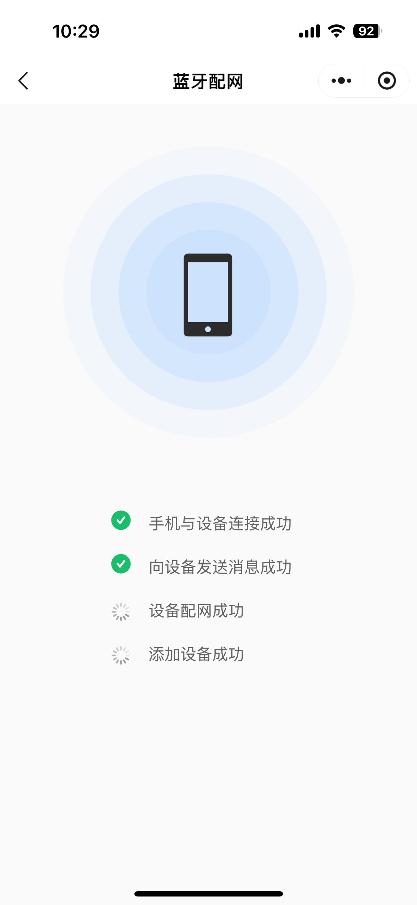

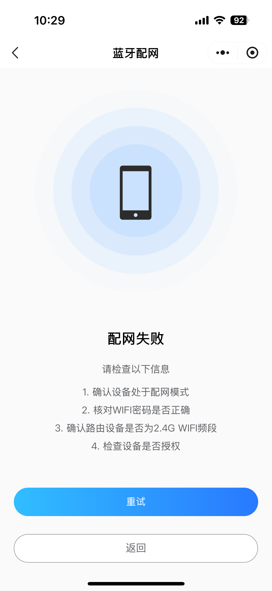

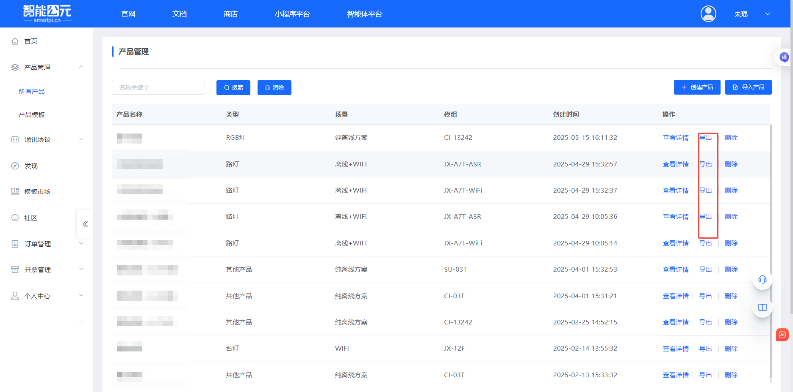

**解决方案：**

**问题分析**

- 设备能够显示手机连接成功和发送消息成功
- 但设备配网和添加设备状态未完成
- 这种现象表明配网过程中某个环节出现问题

**排查步骤**

1. **固件问题排查**
    - 确认升级的固件版本是否兼容
    - 尝试刷回确认可用的旧固件版本
    - 检查固件文件是否完整无损

2. **硬件检查**
    - 重新制作新的硬件板子排除硬件故障
    - 检查WiFi模块是否正常工作
    - 验证天线连接是否良好

3. **小程序和配置检查**
    - 重新制作小程序排除软件问题
    - 检查小程序配网流程是否正确
    - 验证产品配置是否正确导出

**后续处理**

- 将工程文件提交给官方技术团队进行测试
- 等待技术团队测试结果和反馈
- 根据测试结果进行相应修复

**注意事项：**

- 配网失败可能是固件、硬件或小程序任一环节问题
- 建议保留可用的旧版本固件作为备份
- 如果问题持续，需要技术团队介入分析

---

### CI-03T的TX/RX电平及与5V单片机连接方法

**问题描述：**

需要确认CI-03T模块的TX/RX引脚电平，以及如何与5V单片机正确连接。

**解决方案：**

**电平规格：**

- CI-03T的TX/RX引脚为 **3.3V TTL电平**
- 不能直接与5V单片机连接，需要电平转换

**连接方法：**

1. **使用上拉电阻**
    - TX和RX线各加一个上拉电阻到5V
    - 电阻值：1kΩ-10kΩ
    - 可以实现3.3V到5V的电平转换

2. **专用电平转换芯片**
    - 使用TXS0108等电平转换芯片
    - 实现3.3V和5V双向转换
    - 更稳定可靠

**平台配置要求：**

- 将使用的串口配置为"开漏模式"
- 在系统设置中的串口UART配置选项
- 勾选"开漏模式"选项

**接线示例：**

```
CI-03T TX → 上拉电阻 → 5V单片机 RX
CI-03T RX → 上拉电阻 → 5V单片机 TX
共地(GND)必须连接
```

**注意事项：**

- 不建议3.3V和5V直接连接
- 必须进行电平转换，否则可能损坏模块
- 共地连接是通信正常的基础
- 开漏模式配合上拉电阻可以实现5V输出

---

### SU-03T串口烧录失败如何处理？

**问题描述：**

使用云知声UniOne蜂鸟M烧录工具通过串口烧录SU-03T时，设备无法识别，工具显示"等待设备.."。

**解决方案：**

**1. 硬件连接检查**

- **TX/RX连接**：B6接TX，B7接RX（交叉连接）
- **供电检查**：确保5V供电稳定，电流足够
- **共地连接**：GND必须正确连接

**2. 烧录步骤**

- 芯片需要断电复位才能进入烧录模式
- 正确步骤：拔掉5V电源→重新上电→立即开始烧录
- 或者：拔插GND线实现复位

**3. 常见问题排查**

- **排针接触不良**：SU-03T排针较小，确保接触良好
- **USB转串口驱动**：确认CH340等驱动已正确安装
- **串口号选择**：在工具中选择正确的COM端口

**4. 替代方案**

- 使用专用烧录器（如FwLink2 Lite）
- 通过SWD接口烧录，更稳定可靠
- 适合批量生产和调试使用

**注意事项：**

- 烧录时不要触碰连接线，避免接触不良
- 确保供电稳定，不足会导致识别失败
- 烧录工具需要管理员权限运行
- 多次失败可尝试更换USB端口或电脑

---

### STM32最小系统板使用CH340烧录超时如何解决？

**问题描述：**

使用CH340下载程序烧录STM32最小系统板时，出现"芯片超时无应答，无法连接"错误。

**解决方案：**

**1. 烧录工具选择**

- **MCUISP**：适用于STM32的串口烧录工具
- **STM32CubeProgrammer**：ST官方工具
- **J-Link/ST-Link**：专用调试器，更稳定

**2. 连接检查**

- **BOOT0引脚**：烧录时必须拉高（接3.3V）
- **BOOT1引脚**：保持低电平（接地）
- **复位时序**：先设置BOOT0，再按复位键

**3. 波特率设置**

- 降低波特率至115200或更低
- 高波特率可能导致通信不稳定
- 确认与MCU支持的波特率匹配

**4. 驱动和端口**

- 确认CH340驱动已正确安装
- 检查设备管理器中的COM端口
- 尝试不同的USB端口

**推荐方案：**

对于STM32开发，建议使用ST-Link或J-Link：

- 更稳定的连接
- 支持调试功能
- 避免串口烧录的各种问题

**注意事项：**

- STM32的串口烧录需要进入BOOT模式
- 不同厂家的最小系统板可能有差异
- 确认目标芯片型号选择正确
- 供电要稳定，建议使用外部电源

---

### CI-03T串口命令格式和参数设置

**问题描述：**

在通过串口发送命令到CI-03T时，不确定正确的命令格式和参数设置方法。

**解决方案：**

**1. 命令格式**

CI-03T串口命令使用标准格式：
```
AA 55 [消息号] [参数] 55 AA
```

- **帧头**：AA 55（固定）
- **消息号**：1字节（0-255）
- **参数**：可变长度，通常为00
- **帧尾**：55 AA（固定）

**2. 消息号设置**

- 消息号对应平台配置的A1-A6指令
- 可以使用十六进制或十进制
- 必须与平台中的设置一致

**3. 参数配置**

在平台中需要：

- 添加串口输入触发
- 设置消息号（如1、2、3...）
- 选择参数类型（unsigned char）
- 配置触发动作

**4. 发送示例**

```
触发A1：AA 55 01 00 55 AA
触发A2：AA 55 02 00 55 AA
触发A31：AA 55 1F 00 55 AA（十六进制）
```

**注意事项：**

- 确认串口参数（波特率、数据位、停止位）
- 十六进制发送时工具要设置为HEX模式
- 消息号超出255需要使用多字节
- 保存配置后需重新生成并烧录固件

---

### SU-63T的ADC功能如何使用？

**问题描述：**

需要了解SU-63T芯片的ADC引脚功能、采样值含义和典型应用电路。

**解决方案：**

**1. ADC功能确认**

- SU-63T支持ADC采样功能
- 可用于采样电池电压等模拟信号
- 需要在平台中正确配置GPIO

**2. 配置方法**

- 将GPIO设置为ADC输入模式
- 设置合适的偏置值（如100）
- 配置采样触发的条件

**3. 采样值说明**

- ADC返回值为数字量
- 具体数值范围取决于参考电压
- 需要根据实际电路计算对应电压

**4. 典型应用电路**

```
电池分压电路：
电池正极 → 分压电阻1 → ADC引脚 → 分压电阻2 → 地
```

选择合适的分压比，确保：

- 最大电池电压时分压后不超过ADC量程
- 有足够的分辨率检测电压变化

**5. 电压计算**

```
实际电压 = (ADC值 / ADC满量程) × 参考电压 × 分压比
```

**注意事项：**

- ADC采样需要稳定的参考电压
- 输入信号不能超过ADC的最大电压
- 建议添加滤波电容提高采样稳定性
- 具体的ADC分辨率请查看芯片手册

---

### JX-A7T开发板裸硬件如何获取？

**问题描述：**

需要获取JX-A7T开发板的裸硬件，用于家电项目开发，并希望对接专有模型而非使用默认大模型。

**解决方案：**

- **开发板供应**：JX-A7T开发板目前官方已上架销售
- **技术支持**：购买后可获得官方技术支持，协助解决开发过程中的技术问题
- **应用场景**：适用于家电项目的智能化开发


**注意事项：**

- 开发板版本可能会更新，购买时请确认最新版本
- 对接专有模型需要一定的开发经验，建议参考官方文档
- 如需批量采购，可联系销售获取更优价格

---

### JX-A7T是否支持上下行均使用Opus编码的通讯协议？

**问题描述：**

需要确认JX-A7T设备是否支持上行和下行均使用Opus编码的通讯协议，以及该协议与启英语音平台的兼容性。

**解决方案：**

**协议支持情况：**

JX-A7T目前的通讯协议**不支持**上下行均使用Opus编码的方案。

- **上行**：支持Opus编码
- **下行**：不支持Opus编码
- **启英语音平台**：暂不支持此类协议配置

**替代方案参考：**

- 安信可的华镇方案支持上下行均使用Opus编码
- 可考虑使用其他支持该协议的平台或方案

**注意事项：**

- 协议兼容性问题需要提前确认，避免开发过程中出现问题
- 如果项目必须使用上下行Opus编码，需要选择支持该协议的硬件平台
- 建议在项目初期与技术团队确认具体的协议支持情况

---

### JX-A7T产品功能有哪些特点？

**问题描述：**

了解JX-A7T的主要功能特性，以便评估是否符合项目需求。

**解决方案：**

JX-A7T是一款支持离线指令与在线指令双重模式的产品，主要特点包括：

- **双模式支持**：

    - 离线指令：支持本地语音识别，无需网络连接
    - 在线指令：搭载大模型运行，提供更智能的交互体验

- **大模型集成**：

    - 在线指令模式搭载大模型
    - 提供更智能、更高效的使用体验
    - 支持更复杂的语义理解和对话

- **技术文档获取**：

    - 例程和文档已上传至智能公元平台
    - 官方文档地址：https://help.aimachip.com/docs/jx_a7t_v1/jx_a7t_v1-1ghc1h40pidif
    - 可随时登录平台查看产品功能说明和操作指南
    - 包含详细的例程代码和开发说明

- **产品状态**：

    - JX-A7T大模型产品已正式上线
    - 适用于家电项目、智能设备开发等应用场景

**注意事项：**

- 使用在线指令和大模型功能需要网络连接
- 建议先查看官方文档了解完整功能列表和开发指南
- 如有项目需求或合作意向，可通过官方渠道联系技术团队
- 开发前建议先参考官方例程，快速上手产品开发

---

### JX-A7T模块具备哪些功能？定制需求包括什么？

**问题描述：**

需要了解JX-A7T模块已具备的功能，以及需要定制开发的部分。

**解决方案：**

**1. 现有功能**

JX-A7T现已具备以下功能：

- **离在线语音识别**：支持离线识别和在线识别结合
- **离在线结合机制**：先通过离线识别，再做在线识别
- **灵活唤醒词设置**：可随意更改唤醒词，不需要从固定几个里面挑选
- **AEC唤醒词打断**：具备回声消除功能，在线大模型播报时也可以打断
- **在线大模型自定义**：可自行编辑控件，如天气和时间获取等

**2. 定制需求**

需要定制的部分包括：

- **ASR识别训练**：针对专属名词的识别训练需要定制
- **TTS音色训练**：播放音色需要训练定制
- **模型选择与微调**：大模型的选择和微调方向需要训练
- **特定场景优化**：根据应用场景进行算法优化

**3. 大模型说明**

- 使用自研大模型，非第三方产品
- 支持在线交互和智能对话
- 可根据项目需求进行定制化开发

**注意事项：**

- 离线功能直接可用，在线功能需要网络连接
- 定制开发需要根据具体需求评估
- 平台配置的基础功能可直接使用，无需定制

---

### JX-A7T模块是否支持用户自定义唤醒词和指令？

**问题描述：**

需要了解JX-A7T模块是否支持用户自定义唤醒词，是否可以在APP上实现简单的指令修改功能，以及支持的语言种类。

**解决方案：**

JX-A7T模块完全支持用户自定义唤醒词和指令，具体功能如下：

**1. 唤醒词自定义**

- **完全自由定义**：支持任意唤醒词，不受固定选项限制
- **平台配置**：可在智能公元平台自由修改唤醒词
- **OTA升级**：通过OTA即可实现零代码替换，无需重新烧录
- **实时生效**：配置后通过OTA升级立即生效


**2. 指令修改功能**

- **APP端支持**：支持在APP上实现简单的指令修改
- **在线配置**：通过平台进行指令词的修改和管理
- **灵活调整**：可根据应用场景随时调整指令内容
- **无需编码**：基础的指令修改不需要编写代码


**3. 多语言支持**

- **默认支持**：支持中文、英文、日文、韩语四种语言
- **平台选择**：用户可在平台配置中选择所需语言
- **定制支持**：其他语言可通过定制开发实现
- **语言切换**：支持在不同语言模式间切换


**4. 实现方式**

- **平台操作**：

    1. 登录智能公元平台
    2. 选择JX-A7T项目
    3. 在语音配置中修改唤醒词
    4. 在命令词管理中添加或修改指令
    5. 生成固件并通过OTA升级

- **APP集成**：

    1. 开发APP集成平台接口
    2. 提供指令修改界面给最终用户
    3. 通过API调用更新平台配置
    4. 触发OTA更新使配置生效

**注意事项：**

- 自定义唤醒词和指令需要网络连接进行OTA更新
- 建议选择清晰、不易误触发的唤醒词
- 多语言定制需要额外开发时间
- APP端修改功能需要对接平台API接口
- 修改配置后需要重新生成并烧录固件

---

### A7T模块是否支持中英文混合控制？

**问题描述：**

需要确认A7T模块是否可以同时支持中文和英文语音控制，以及如何实现网络切换以保证语音控制的连续性。

**解决方案：**

**1. 中英文控制支持方案**

- **在线模式（A7T）**：

    - 支持中英文混合控制
    - 可在平台直接配置实现
    - 搭载大模型，提供更智能的交互体验
    - 离线词条数量相对较少

- **离线模式（CI-33T）**：

    - 支持离线中英文控制
    - 需要根据唤醒词进行中英文模式切换
    - 需要定制开发双语固件
    - 支持500条词条

**2. 网络切换方案**

**硬件连接设计：**

- A7T模块的串口（32、33脚）可连接到4G模块的串口
- 单片机检测WiFi连接状态
- WiFi断线时，单片机控制切换到4G网络传输数据
- 4G模块提供热点信号供A7T连接

**实现逻辑：**

1. 单片机实时监测WiFi连接状态
2. WiFi信号不稳定或断开时，自动切换到4G网络
3. 通过串口通信实现设备状态同步
4. 确保语音控制功能不中断

**注意事项：**

- 在线模式下需要网络连接才能使用中英文混合控制
- 离线双语控制需要定制开发，会产生额外费用
- 4G模块与A7T通过串口通信，仅传输数据，不能直接共享网络
- 网络切换逻辑需要单片机编程实现

---

### 如何禁用A7T模块的声纹识别功能？

**问题描述：**

需要禁用A7T模块的声纹识别功能，并了解设备行为定义和Pin脚配置在不同界面中的重复性及配置优先级。

**解决方案：**

**1. 声纹识别功能说明**

- 当前A7T模块主要识别文字指令
- 暂不支持将声纹识别用于特定声音（如敲击门）的识别
- 声纹识别功能主要用于说话人身份识别
- **声纹识别只针对人声有效**：无法用于识别电脑提示音、QQ/微信提示音、报警声等非人声
- 对于非人声音频的识别需求，可考虑使用自学习功能或联系官方进行定制模型训练

**2. 设备行为定义配置**

**界面关系说明：**

- **ASR产品**和**WiFi产品**是两个独立的产品配置
- 两者的"设备行为定义"功能分别控制不同串口的通信
- ASR产品控制语音串口的行为，WiFi产品控制WiFi串口的行为
- 两个配置界面不重复，各自独立工作

**通信机制：**

- ASR和WiFi可以通过串口通信互相控制
- 需要在"设备行为定义"中配置相应的触发和响应行为
- 通过串口0或串口1进行数据传输

**3. Pin脚配置优先级**

**配置同步：**

- 不同界面的Pin脚配置显示相同内容时，修改任意一处都会同步更新
- 引脚功能配置是全局统一的，不会产生冲突
- 建议在主配置界面进行Pin脚设置，确保配置一致性

**注意事项：**

- Pin脚配置完成后需要重新生成并烧录固件
- 不同功能模块可能使用相同的引脚，需要合理规划避免冲突
- 串口触发输入和控制输出功能不会冲突，可以独立配置

---

### 如何自定义A7T模块串口通信的帧头帧尾？

**问题描述：**

需要了解如何自定义A7T模块串口通信的帧头帧尾，以及不同串口的引脚功能和配置对OTA升级的影响。

**解决方案：**

**1. 串口配置说明**

**不可修改的串口（涉及OTA功能）：**

- **语音串口0**（PB5/TX0, PB6/RX0）：固定帧头帧尾，不能修改
- **WiFi串口1**（UART0_RX2, UART0_TX2）：固定帧头帧尾，不能修改
- 这两个串口因涉及OTA升级功能，帧头帧尾格式被锁定

**可配置的串口：**

- **语音串口1**（A2, A3）：可自定义帧头帧尾
- **WiFi串口0**：可自定义帧头帧尾
- 在Pin脚配置中将"固定格式"改为"自定义格式"即可修改

**2. 帧头帧尾配置方法**

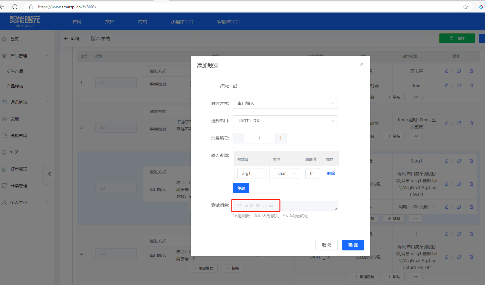

**配置步骤：**

1. 进入"添加触发"配置界面
2. 选择串口输入类型
3. 在"配置格式"中选择"自定义格式"
4. 设置帧头（如：AA 55）和帧尾（如：55 AA）
5. 保存配置

**注意事项：**

- 修改帧头帧尾后可能会影响OTA功能，建议使用可配置的串口
- WiFi串口0优先级较低，通常用于输出日志，便于调试
- 语音串口0不仅用于烧录，也可用于触发输入和控制输出

**3. A7T模块串口总览**

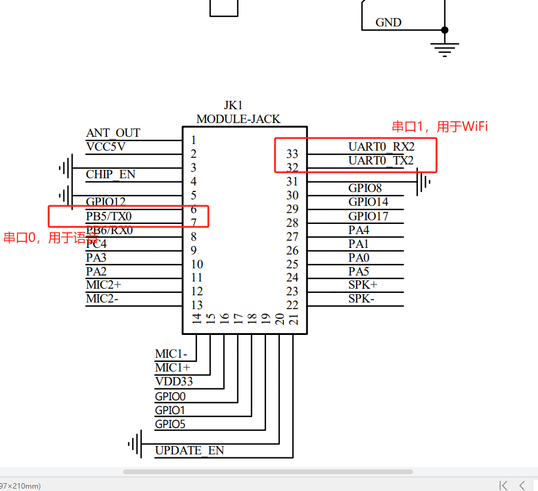

- **总共3个串口**：

    - 语音串口0（PB5/PB6）：烧录专用，帧头帧尾固定
    - WiFi串口1（UART0_RX2/UART0_TX2）：WiFi通信，帧头帧尾固定
    - 语音串口1（A2/A3）：可自定义配置

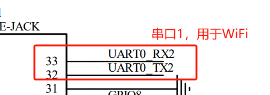

**建议：**

- 使用语音串口1或WiFi串口0进行自定义通信协议开发
- 保持语音串口0和WiFi串口1的默认配置以确保OTA功能正常

---

### A7T模块是否支持蓝牙或WiFi Mesh功能？

**问题描述：**

需要确认A7T模块是否支持蓝牙或WiFi Mesh功能，以及该功能的开发优先级。

**解决方案：**

**1. 当前支持情况**

- **暂时不支持**：A7T模块目前暂不支持蓝牙Mesh或WiFi Mesh功能
- **开发计划**：该功能已在开发计划中，但优先级相对靠后

**2. 技术可行性**

- **蓝牙Mesh**：技术上可行，可在A7T模块上实现
- **WiFi Mesh**：技术上同样可行，可在A7T模块上实现
- **实现方式**：两种Mesh方案都可以通过软件升级实现

**3. 开发优先级**

**当前状态：**

- 由于需要优先完成其他重要功能开发，Mesh功能已被推后
- 家电行业对Mesh功能需求较高（一个房间需要控制多个设备）
- 正在考虑提升该功能的开发优先级

**建议：**

- 如果项目急需Mesh功能，可考虑使用其他支持Mesh的模块
- 关注官方更新，等待A7T模块的Mesh功能发布
- 可通过多个A7T模块配合实现简单的多设备控制

---

### JX-A7T模块的串口引脚如何配置？

**问题描述：**

需要确认JX-A7T模块中语音和WiFi串口的引脚配置，以及为何在语音串口0下拉菜单中无法选择串口1。

**解决方案：**

**1. JX-A7T模块串口总览**

JX-A7T模块共有3个串口：

- **语音串口0**：PB5(TX)、PB6(RX) - 用于烧录语音固件
- **WiFi串口1**：UART0_RX2、UART0_TX2 - 用于烧录WiFi固件
- **语音串口1**：PA2(TX)、PA3(RX) - 可自定义配置

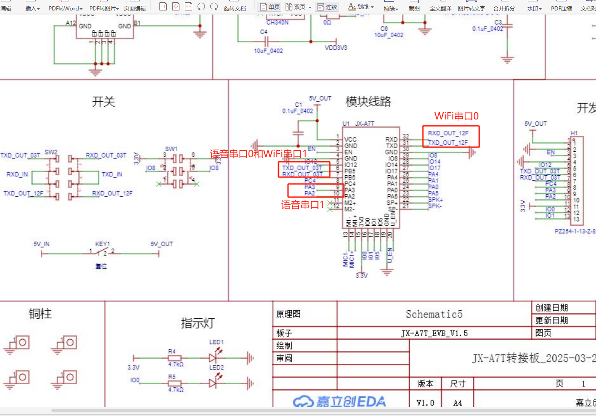

**2. 串口功能说明**

**烧录专用串口：**

- 语音的串口0（TXD_OUT_03T, RXD_OUT_03T）
- WiFi的串口0（RXD_OUT_12F, TXD_OUT_12F）
- 这两个串口都是固定的，用于固件烧录

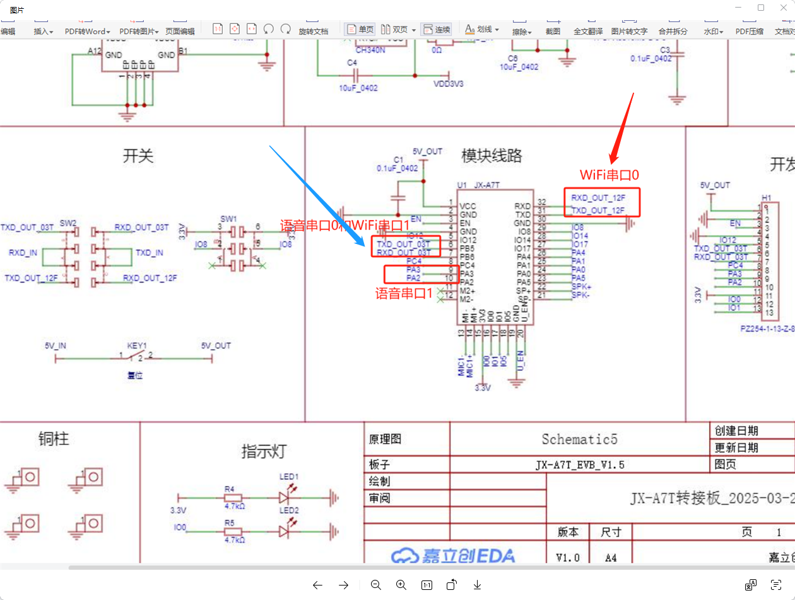

**可配置串口：**

- 语音串口1（PA2/PA3）：可在平台中配置功能
- 在语音固件的Pin脚配置中可见具体定义
- PA2配置为UART0_TX，PA3配置为UART1_RX

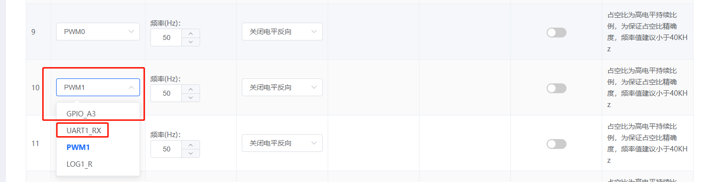
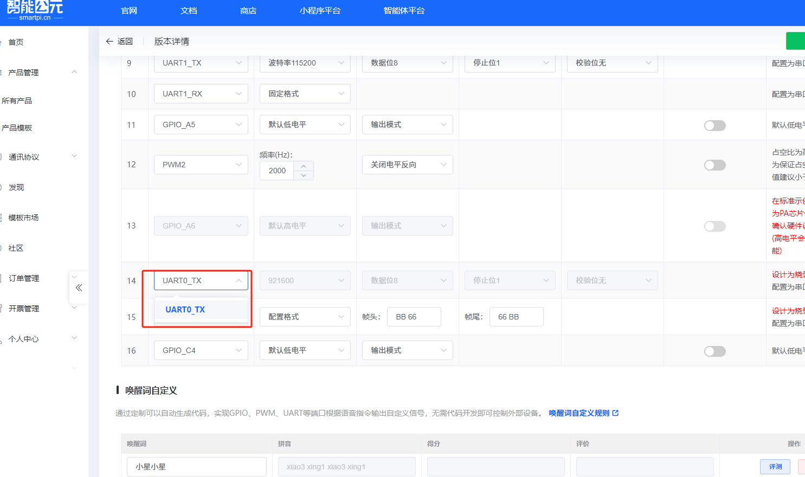

**3. 配置限制说明**

**固定配置原因：**

- 语音串口0和WiFi串口1因涉及OTA功能，配置被锁定
- 在语音固件配置界面中，串口0的下拉菜单无法选择串口1
- 这是系统设计决定的，确保烧录功能不受影响

**建议：**

- 使用语音串口1（PA2/PA3）进行自定义串口通信
- 烧录时使用专用的串口0接口
- 不同串口功能独立，可根据需求灵活配置

---

### JX-A7T模块的串口配置会冲突吗？

**问题描述：**

需要确认JX-A7T模块的串口功能，特别是哪个串口用于烧录语音和WiFi固件，以及配置串口触发输入或控制输出是否会冲突。

**解决方案：**

**1. 串口烧录功能确认**

**烧录专用串口：**

- **语音串口0**（蓝色箭头）：用于烧录语音固件
- **WiFi串口0**（红色箭头）：用于烧录WiFi固件
- 这两个串口是固定的，专门用于固件烧录


**2. 串口使用限制**

**不可外接的串口：**

- 语音串口0和WiFi串口1只能用于内部通信
- 外接会导致大模型功能异常
- 不能连接到外部单片机使用

**可配置的串口：**

- 语音串口1（PA2/PA3）：可用于外部连接
- WiFi串口0：可用于外部连接
- 这两个串口可以配置触发输入和控制输出

**3. 平台配置说明**

**内部通信配置：**

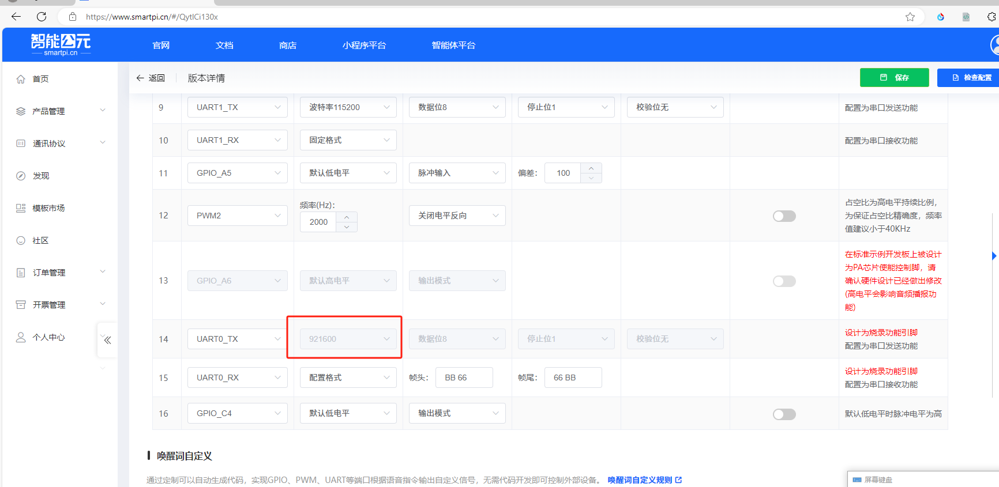

- 平台中显示的串口0控制输出选项
- 用于WiFi和语音模块间的内部信息交流
- 不是平台bug，而是内部通信配置

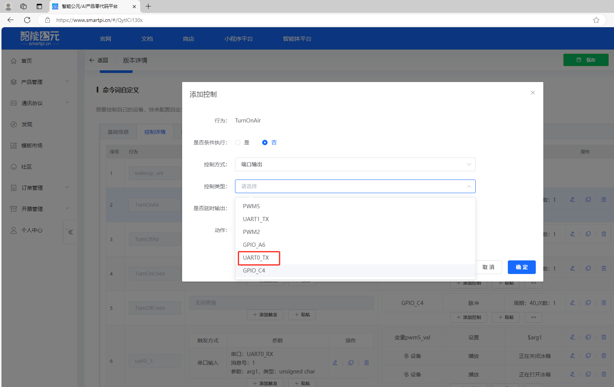

**功能说明：**

- 同时配置触发输入和控制输出不会冲突
- 两个功能可以同时起作用
- 但仅限语音串口1和WiFi串口0可外接使用

**注意事项：**

- PCB设计时必须正确区分烧录串口和通信串口
- 语音串口0（PB5/PB6）只能用于烧录，不能外接
- WiFi串口1（UART0_RX2/UART0_TX2）只能用于烧录，不能外接
- 使用串口1和WiFi串口0进行外部设备通信

---

### 如何获取JX-A7T模块的DeviceKey？

**问题描述：**

需要获取JX-A7T模块的DeviceKey以用于MQTT连接配置。

**解决方案：**

**1. DeviceKey获取方法**

**方法一：通过串口日志**

- 连接WiFi的串口0
- 查看串口输出的日志信息
- 日志中会打印包含DeviceKey的信息

**方法二：通过小程序查看**

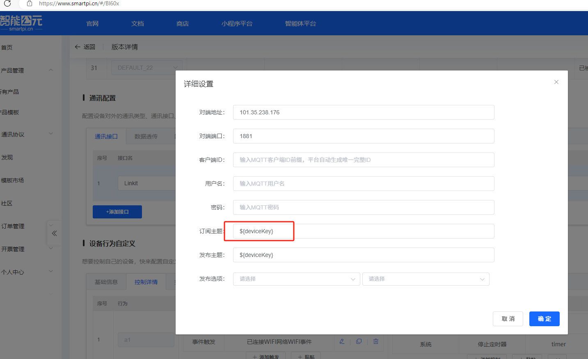

- 模块出厂固件无需烧录，直接上电配网即可
- 配网成功后打开小程序
- 在设备信息页面查看设备标识


**2. DeviceKey格式说明**

**标识格式：**

- Device ID格式：`JX_A7T_` + 12位十六进制码
- 示例：`JX_A7T_7C3E821D6A8D`
- 这个标识就是MQTT连接所需的DeviceKey


**3. 使用场景**

**MQTT配置：**

- 在平台的MQTT通信配置中
- 订阅主题和发布主题使用占位符 `${deviceKey}`
- 系统会自动替换为实际的设备标识

**注意事项：**

- 必须先完成WiFi配网才能获取DeviceKey
- 出厂固件已包含所需功能，无需额外烧录
- 每个模块的DeviceKey都是唯一的
- 保存好DeviceKey，用于后续MQTT连接配置

---

### 如何让A7T模块显示自定义的小程序界面？

**问题描述：**

需要将A7T模块烧录特定固件，使其在小程序中显示自定义的设备控制界面，而非默认的出厂固件界面。

**解决方案：**

**1. 固件与界面关系**

**出厂固件界面：**

- A7T模块出厂时带有默认固件
- 配网后在小程序中显示默认的控制界面
- 当前使用的是出厂固件的小程序界面

**自定义界面实现：**

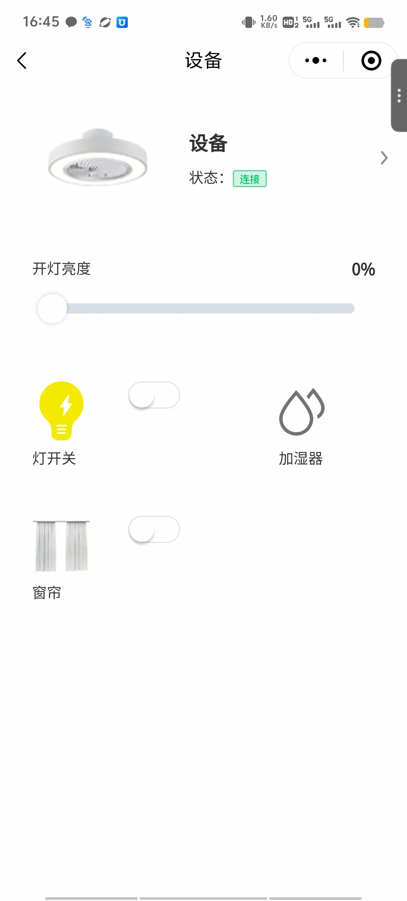

- 需要烧录自定义固件才能显示特定界面
- 界面内容取决于固件中配置的控制项
- 包括开关、滑块、显示等控件类型

**2. 界面配置方法**

**云端平台配置：**

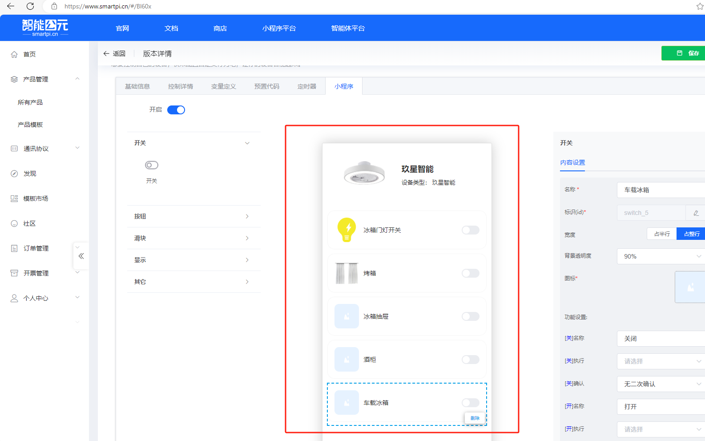

- 在智能公元平台配置设备控件
- 每个开关/滑块的右侧有配置界面
- 可以设置控件类型、名称、范围等参数

- 配置完成后生成固件
- 烧录新固件到A7T模块

**3. 操作步骤**

1. **连接设备**：

    - 模块上电并完成WiFi配网
    - 小程序搜索并连接设备

2. **烧录固件**：

    - 下载自定义生成的固件
    - 通过烧录工具更新到模块
    - 不烧录语音功能也可使用

3. **验证界面**：

    - 重新在小程序中连接设备
    - 查看是否显示预期的控制界面

**注意事项：**

- 出厂固件已包含基本功能，可直接使用
- 自定义界面需要根据项目需求配置
- 烧录新固件前备份原有固件
- 界面控件与固件功能必须对应

---

### A7T模块如何与4G模块配合实现语音控制？

**问题描述：**

需要设计A7T模块与4G模块的通信方案，实现语音控制家电功能，并了解为何无法直接通过4G模块实现类似ESP32的实时聊天通话功能。

**解决方案：**

**1. 网络切换通信方案**

**推荐连接方式：**

- 4G模块连接A7T的语音串口1（PA2/PA3）
- WiFi串口1用于内部通信，不建议外接
- 通过串口透传实现A7T与4G模块的信息交流

**工作流程：**

1. WiFi信号断开时，A7T检测网络状态
2. 通过语音串口1发送网络状态给4G模块
3. 4G模块提供WiFi热点供A7T连接
4. 实现网络无缝切换，保证语音控制连续性

**2. 语音聊天功能限制**

**技术差异说明：**

- ESP32是纯WiFi模块，需要代码开发实现聊天功能
- A7T是离线/在线双模式，通过平台配置即可使用
- A7T使用模拟麦克风，包含模数转换过程

**实时通话限制：**

- 4G模块与A7T配合无法实现实时聊天通话
- 原因：传输速度达不到实时通话要求
- 接收依靠传输录音，播报依靠编码传输TTS

**3. A7T与ESP32的区别**

**A7T优势：**

- 离线/在线双模式共存
- 未触发唤醒时不开启ASR扫描，节省成本
- 模拟麦克风，功耗控制更精确
- 平台配置化开发，降低开发风险和费用

**ESP32特点：**

- 数字麦克风，需要云端持续扫描
- 一直运行会增加持续费用
- 需要编写代码实现所有功能
- 小程序也需要定制开发

**建议：**

- 使用A7T的语音串口1连接4G模块
- 将实时聊天功能单独在4G模块上实现
- 利用A7T的平台化配置优势，快速部署语音控制功能

---

### A7T模块支持AI平台播放歌曲功能吗？

**问题描述：**

需要确认A7T模块是否支持通过AI平台实现语音指令"播放一个儿歌"并自动搜索和播放歌曲，以及相关功能的收费模式和实现方式。

**解决方案：**

**1. 功能支持情况**

**基本支持：**

- A7T模块可以实现语音指令播放歌曲
- 通过AI平台（如DeepSeek）进行歌曲搜索
- 支持语音指令触发播放功能

**收费模式：**

**音乐播放收费：**

- 播放歌曲功能需要付费
- AI平台部分功能免费（如AI小智平台）
- 播放网络歌曲涉及版权问题

**免费内容：**

- 故事播放功能不收费
- 故事由模型合成，不涉及版权
- 天气查询等基础功能免费

**2. 版权限制说明**

**音乐版权：**

- 大部分网络歌曲有版权限制
- 仅少数厂家开放部分免费歌曲
- 免费歌曲通常不支持商用

**免责声明：**

- 使用无版权的网络歌曲可避免收费
- 但版权纠纷需要用户自行承担责任
- 建议使用正版音乐资源

**3. 智能体配置方案**

**多智能体支持：**

- 可在同一设备配置多个智能体
- 例如：

    - 时间天气查询智能体
    - 联网查询智能体
    - 播放故事和歌曲智能体
- 所有智能体可在小程序端同时添加使用

**平台限制：**

- 智能体平台（AI小智）暂时无法实现此功能
- 可能需要定制智能体方案
- 需要评估具体需求后提供方案

**建议：**

- 优先使用故事播放等免费功能
- 如需音乐播放，考虑使用版权免费的音乐
- 复杂功能需求可联系定制开发

---

### CI-03T系列是否支持语音播报和人机问答功能？

**问题描述：**

需要确认CI-03T系列芯片是否支持语音播报和人机问答功能需求。

**解决方案：**

**1. 语音播报功能**

- **支持方式**：CI-03T支持TTS语音播报功能
- **内容来源**：

    - 传感器监测数据：可播报现场监测的传感数据
    - 平台自定义内容：支持平台上输入文字内容，编码后通过单片机串口发送给CI-03T
- **播放控制**：音量和语速可在平台上配置

**2. 人机问答功能**

- **预置问题**：支持预置固定的问题列表
- **动态回答**：回答内容可以不相同，实现动态交互
- **交互流程**：

    1. 识别到预置问题后，CI-03T通知单片机
    2. 单片机向平台请求答案
    3. 平台将回答内容转给单片机
    4. 单片机再发给CI-03T串口播放

**3. 实现限制**

- **词条限制**：CI-03T支持300条词条，需要合理规划
- **动态内容**：完全动态的语音识别（不限定词条）需要在线模块
- **定制开发**：特殊需求可通过定制实现

**注意事项：**

- TTS功能需要购买授权版本的模块
- 动态问答需要单片机配合平台接口调用
- 如需要完全自由的语音识别，建议考虑JX-A7T等在线模块

---

### JX-A7T支持小程序平台吗？如何使用？

**问题描述：**

咨询JX-A7T模块是否支持使用小程序平台，以及如何使用该平台，是否需要收费。

**解决方案：**

**支持情况：**

- JX-A7T模块支持小程序功能
- 该服务免费提供，无需额外费用
- 可通过智能公元平台进行配置

**使用方法：**

1. **制作WiFi固件时添加小程序**
    - 在固件配置界面选择"小程序"标签
    - 通过拖拽添加控件（开关、按钮、滑块等）
    - 将控件绑定到对应的行为上

2. **控件配置**
    - 选择需要的控件类型
    - 设置控件属性（名称、默认值等）
    - 配置触发条件和响应动作

3. **发布与使用**
    - 生成固件并烧录到模块
    - 通过微信小程序搜索并打开对应小程序
    - 即可远程控制设备

**注意事项：**

- 只有支持WiFi功能的模块才能使用小程序平台
- 小程序配置需要在固件生成时完成
- 控件数量可能有限制，建议合理规划
- 确保模块已正确连接网络

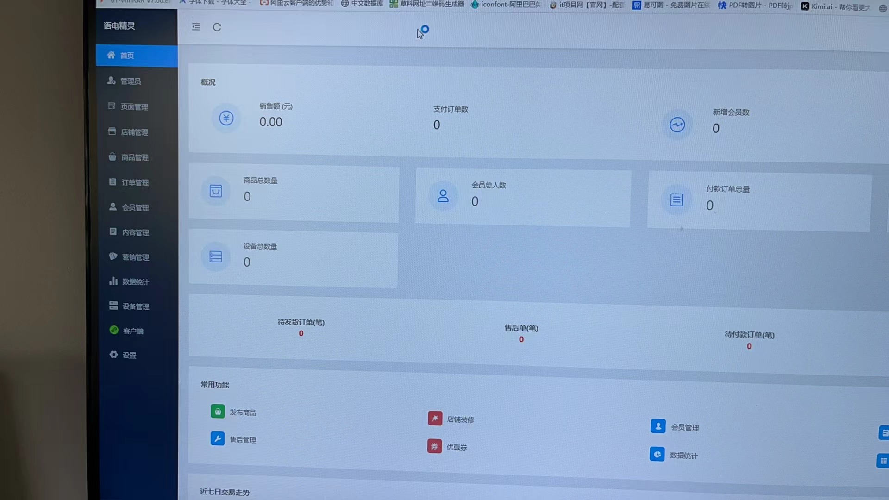

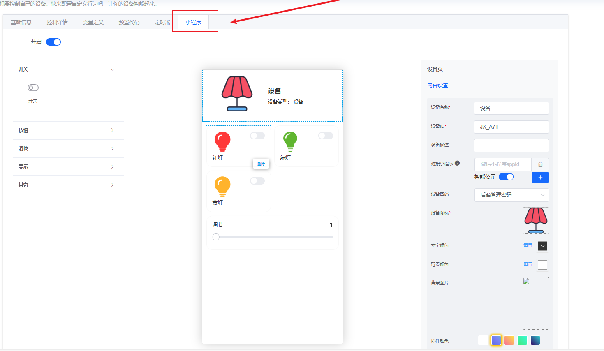

---

## 串口通信与低功耗


---

### 有支持联网功能的AI对话模块吗？

**问题描述：**

询问公司是否有支持联网功能的AI对话模块产品。

**解决方案：**

- **产品开发状态**：

    - 联网AI对话模块目前正在开发中
    - 预计很快会推出正式版本
    - 届时将支持云端AI对话功能

- **相关产品**：

    - JX-A7T是新一代AI语音模块，支持大模型语音对话
    - 可连接云端服务实现自然语言交互
    - 支持DeepSeek、豆包等大模型

- **获取最新信息**：

    - 关注官方店铺或公众号获取产品动态
    - 联系技术团队了解开发进度
    - 查看产品发布公告

**注意事项：**

- 联网AI对话功能需要网络连接支持
- 建议提前了解云端服务的配置和使用方法
- 可先关注JX-A7T的非联网AI功能进行开发

---


---

### JX-A7T模块能否接收单片机实时音频信号？

**问题描述：**

询问JX-A7T模块是否支持接收单片机实时生成的音频模拟信号并直接播放，作为独立的音频播放模块使用。

**解决方案：**

**功能限制说明：**

JX-A7T等语音模块不支持直接接收外部实时音频信号进行播放，原因如下：

1. **模块功能定位**
    - 语音模块主要用于语音识别和语音合成
    - 不具备实时音频输入播放功能
    - 无法作为通用的音频放大模块使用

2. **音频播放机制**
    - 只能播放预先存储的音频文件
    - 支持通过命令词触发固定音频播放
    - 可上传自定义音频文件（MP3、WAV等格式）

3. **替代实现方案**
    - 通过语音命令控制播放：设置特定命令词触发音频播放
    - 使用串口指令：单片机发送指令控制模块播放指定音频
    - 变量控制：通过变量变化触发特定音频播放

**自定义音频设置方法：**

1. **上传个性化音频**
    - 在平台配置中选择"个性化音频"
    - 上传自定义的音频文件

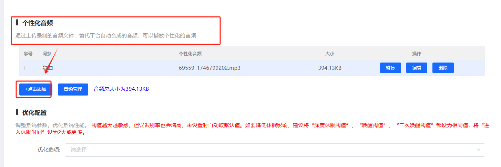

2. **设置控制指令**
    - 添加语音指令控制音频播放
    - 可设置"播放声音"等命令词

3. **使用变量控制音量**
    - 创建变量跟踪音量状态
    - 当音量达到最大时触发播报提示


**注意事项：**

- 模块无法识别实时音频输入信号
- 音频播放需要预先上传音频文件到模块
- 可通过串口通信控制音频播放，但需遵循特定协议
- 如需实时音频播放，建议使用专用音频解码模块

---


---

### JX-A7T模块JSON配置文件导入失败

**问题描述：**

在导入JX-A7T模块的JSON配置文件时，提示"文件格式非法，导入产品失败"。

**解决方案：**

1. **检查JSON格式**
    - 确保JSON文件格式正确，无语法错误
    - 避免使用不支持的下划线命名
    - 使用标准JSON编辑器进行格式验证

2. **正确的变量配置**
    - 数字变量不能直接使用阿拉伯数字
    - 需要将数字改为字母组合（如：1→a，2→b）
    - 语音内容中的变量名要与配置一致

**注意事项：**

- 导入前备份原有配置
- 如格式问题持续，可基于标准模板修改
- 语音指令中避免使用阿拉伯数字作为变量

---


---

### JX-A7T语音固件无法解压怎么办？

**问题描述：**

从智能公元平台下载的JX-A7T语音固件（jx_firm.tar.gz）无法解压，导致语音固件烧录无法进行。

**解决方案：**

- **联系技术团队**：将无法解压的文件发送给技术团队
- **获取解压后的文件**：技术团队会提供解压后的.bin文件
- **使用解压后的固件**：直接使用jx_a7t_asr_fw.bin进行烧录

**注意事项：**

- 保留原始的.tar.gz文件作为备份
- 解压后的固件文件名称可能包含模块型号标识
- 确保获取的.bin文件与模块型号匹配

---


---

### 语音模块是否支持联网获取信息播报？

**问题描述：**

希望语音模块能够联网获取并播报当前时间、天气等信息，以及是否支持类似小爱同学和Siri的AI交互功能。

**解决方案：**

**1. 联网信息播报实现方案**

- **模块能力**：语音模块本身不具备联网功能
- **实现方式**：需要通过外部MCU或主控设备联网获取信息
- **通信流程**：

    1. MCU联网获取时间、天气等信息
    2. MCU通过串口将信息发送给语音模块
    3. 语音模块接收并播报串口传来的内容

**2. AI交互功能限制**

- **当前不支持**：离线语音模块不支持自然语言AI交互
- **功能定位**：只能接收串口信息、处理串口信息并作出反应
- **交互方式**：通过串口接收格式化的文本内容进行播报

**3. 具体实现建议**

- **时间播报**：

    - MCU通过NTP协议获取网络时间
    - 格式化时间文本（如"现在时间14点30分"）
    - 通过串口发送给语音模块播报

- **天气播报**：

    - MCU调用天气API获取天气信息
    - 将天气信息转换为播报文本
    - 通过串口发送给语音模块

**注意事项：**

- 语音模块只能作为语音输出终端，不具备主动联网能力
- AI交互需要使用支持大模型的在线语音模块（如JX-A7T）
- 信息传输的形式和格式需要根据实际需求设计
- 如需自然语言交互，建议考虑在线语音方案

### JX-A7T能否实现类似ESP32的智能对话功能？

**问题描述：**

希望了解JX-A7T模组是否能够实现类似ESP32的智能对话功能，并支持串口输出16进制代码与关键词匹配。

**解决方案：**

JX-A7T可以直接实现大模型加离线语音功能，无需额外的ESP32：

**1. 核心功能对比**

- **JX-A7T**：集成大模型+离线语音，单模块即可实现智能对话
- **ESP32+语音板**：需要组合使用，相对复杂
- **功能集成**：JX-A7T是一体化解决方案

**2. 串口通信功能**

- **串口输出**：支持输出识别结果和控制指令
- **16进制支持**：可配置输出16进制代码
- **关键词匹配**：支持命令词识别和匹配响应
- **双向通信**：串口发送指令也能触发语音响应

**3. 智能对话能力**

- **在线大模型**：支持自然语言理解和生成
- **离线命令**：支持本地命令词识别
- **混合模式**：可同时配置离线和在线功能

**注意事项：**

- JX-A7T已内置大模型功能，无需额外搭配ESP32
- 串口通信协议需要根据具体需求配置
- 开发时建议参考官方开发文档和例程

---

### JX-A7T是否有带底板的成品开发板？

**问题描述：**

咨询JX-A7T模组是否有带底板的成品开发板可供测试，以便快速评估功能。

**解决方案：**

**1. 当前产品状态**

- **样品阶段**：JX-A7T目前提供样品进行测试
- **量产计划**：预计五月份正式量产并上架销售
- **获取方式**：可通过客服渠道申请样品（50元/个）

**2. 开发板信息**

- **二合一模块**：JX-A7T ASR和JX-A7T WiFi是同一个模块
- **平台入口**：在平台上分为语音和WiFi两个入口
- **底板开发**：带底板的成品开发板正在开发中

**3. 获取建议**

- **样品测试**：可先购买模块样品进行功能验证
- **关注更新**：底板开发完成后会第一时间通知
- **联系客服**：通过淘宝客服咨询样品购买

**注意事项：**

- 目前只能购买模块样品进行测试
- 带底板的开发板需要等待后续发布
- 测试前确认是否符合项目需求

---

### JX-A7T是否支持DeepSeek大模型？

**问题描述：**

咨询JX-A7T开发板是否支持接入DeepSeek大模型，以及如何选择合适的模块型号以满足离线语音和在线大模型交互的混合应用场景需求。

**解决方案：**

JX-A7T支持接入DeepSeek等多种大模型：

**1. 大模型支持能力**

- **支持模型**：可接入DeepSeek、通义千问等多种大模型
- **智能体功能**：通过智能公元平台配置智能体
- **响应速度**：深度思考时可能需要几秒响应时间
- **持续优化**：后续版本会不断优化响应速度

**2. 模块选择建议**

- **JX-A7T**：支持离线+在线混合模式
- **离线功能**：本地命令词识别，响应速度快
- **在线功能**：大模型对话，智能交互体验
- **灵活切换**：可根据场景选择使用模式

**3. 应用场景配置**

- **日常使用**：使用离线语音，实时响应
- **研学场景**：使用在线大模型，智能问答
- **混合模式**：同一模块支持两种功能

**配置说明：**

- **固件选择**：需要分别配置WiFi和语音功能
- **平台配置**：在智能公元平台配置智能体
- **开发板选择**：选择JX-A7T开发板即可

**注意事项：**

- 大模型响应可能有延迟，属于正常现象
- 建议根据实际需求选择合适的模型
- 学生研学场景推荐使用在线大模型
- 功能会持续更新优化

---

### JX-A7T支持哪些WiFi频段？

**问题描述：**

需要了解JX-A7T模组是否支持2.4G频段的Wi-Fi连接，以便在移动场景下使用。

**解决方案：**

JX-A7T模块支持标准的2.4G WiFi频段：

**1. WiFi频段支持**

- **支持频段**：2.4GHz WiFi
- **兼容性**：与市面上大部分WiFi设备兼容
- **移动支持**：可通过随身WiFi等设备提供网络连接

**2. 使用场景**

- **固定场景**：连接家庭/办公室WiFi
- **移动场景**：连接2.4G随身WiFi设备
- **手机热点**：支持连接手机2.4G热点

**3. 网络配置**

- **连接方式**：通过小程序或平台配置
- **安全协议**：支持WPA/WPA2加密
- **连接稳定性**：2.4G频段穿透性好，覆盖范围大

**注意事项：**

- 仅支持2.4G频段，不支持5G WiFi
- 手机端可连接任意频段（2.4G/5G）
- 移动使用时建议使用2.4G随身WiFi

---

### JX-A7T是否支持远程语音功能？

**问题描述：**

需要了解JX-A7T模组是否支持远程语音功能，即用户在外地通过手机APP或小程序语音指令，模块能接收并执行，同时将语音识别结果通过串口输出。

**解决方案：**

JX-A7T支持通过微信小程序进行远程控制，但功能有一定限制：

**1. 远程控制功能**

- **小程序支持**：可通过微信小程序"机芯智能"进行控制
- **网络要求**：模块和手机都需要联网（2.4G WiFi）
- **控制方式**：支持远程按钮控制功能
- **串口输出**：可输出识别结果和控制指令

**2. 语音功能限制**

- **远程语音**：当前平台不支持直接通过小程序发送语音到模块执行
- **本地语音**：支持本地离线语音识别和在线大模型对话
- **开发支持**：如需远程语音功能需要定制开发

**3. 小程序使用流程**

1. 微信搜索"机芯智能"小程序
2. 添加设备并完成网络配置
3. 通过小程序界面进行控制
4. 查看设备状态和反馈信息

**注意事项：**

- 远程语音功能需要额外开发费用
- 当前主要支持按钮控制和状态查看
- 可参考同系列语音+蓝牙模块的小程序使用视频
- 开发前建议先测试基础功能是否满足需求

### JX-A7T 的内存容量是多少？

**问题描述：**

需要了解 JX-A7T 模组当前的内存容量规格以及未来的扩展计划。

**解决方案：**

- 当前 JX-A7T 模组提供 2MB 内存版本
- 后续计划推出 4MB 大容量版本

**注意事项：**

- 具体上市时间请关注官方发布信息
- 可根据项目需求选择合适的容量版本

### JX-A7T 支持哪些智能体平台？

**问题描述：**

了解 JX-A7T 模组当前和未来支持的智能体平台选项。

**解决方案：**

- 目前主要以对接 Coze 平台为主
- 后续可能会增加其他智能体平台支持

**注意事项：**

- 平台对接功能会随固件更新逐步完善
- 建议关注官方更新公告获取最新平台支持信息

---

### 大模型板子当前是否可以进行刷写？

**问题描述：**

询问大模型板子是否已经可以刷写使用，以及当前的调试状态如何。

**解决方案：**

- **当前状态**：大模型板子仍在调试阶段
- **功能演示**：已有针对空气炸锅等特定应用场景的智能体演示视频
- **测试支持**：可以提供使用视频供参考评估

**注意事项：**

- 产品尚未正式发布，需等待调试完成
- 当前展示的是特定应用场景的演示版本
- 正式版本发布时间请关注官方通知

---

### JX-A7T T1与T2版本有什么区别？

**问题描述：**

需要了解JX-A7T模组T1和T2版本的主要区别，以便选择合适的型号。

**解决方案：**

- **主要区别**：T1含2M OTA Flash，T2无OTA Flash
- **功能差异**：T1支持固件无线升级功能，T2不支持
- **选择建议**：有OTA升级需求的选择T1版本

**开发资源：**

- **文档地址**：https://help.aimachip.com/docs/jx_a7t_v1/jx_a7t_v1-1ghc1h40pidif
- 例程和文档已陆续上传至智能公元平台
- 当前为免费体验版，可申请样品测试

**注意事项：**

- 两个版本在其他功能上基本相同
- OTA功能对产品维护和更新很重要
- 根据项目需求选择是否需要OTA功能

---

### JX-A7T能否刷写其他平台的固件（如小智平台）？

**问题描述：**

询问JX-A7T模块是否能够刷写其他平台（如小智平台）的固件。

**解决方案：**

**固件兼容性说明：**

JX-A7T模块不能刷写其他平台（如小智平台）的固件：

**1. 硬件架构差异**

- **JX-A7T**：采用CI1302+BL602双芯片架构
- **小智平台固件**：专为ESP32系列芯片设计
- **不兼容原因**：芯片架构完全不同，固件无法通用

**2. 功能实现方式**

- **小智方案**：离线语音模块 + ESP32组合
- **JX-A7T方案**：单模块集成离在线功能
- **开发方式**：需使用智能公元平台进行配置

**3. 替代方案**

如需要类似小智平台的功能，JX-A7T提供了对应的解决方案：

- **MCP功能**：支持大模型调用外部工具进行控制
- **零代码配置**：在智能公元平台直接配置逻辑
- **串口控制**：支持通过串口与外部MCU通信

**注意事项：**

- 只能使用智能公元平台生成的固件
- 刷写非官方固件可能导致模块损坏
- JX-A7T的MCP功能可实现类似小智的控制效果

---

### JX-A7T如何配置自定义协议的多个变量？

**问题描述：**

配置自定义协议时，需要处理41个变量的数据，但变量数量和数据处理逻辑不匹配，导致数据无法正确读取。

**解决方案：**

1. **变量定义**
    - 在变量列表中创建41个变量
    - 确保变量名与单片机程序中的Translate_Data数组对应
    - 设置正确的变量类型和数据源

2. **协议字段配置**
    - 创建协议头部字段：head_id、command、jcqdz、jcqsj等
    - 添加41个数据字段对应实际数据
    - 添加校验字段用于数据完整性检查

3. **校验和处理**
    - 计算所有数据的校验和
    - 将校验值放入最后两个字节
    - 单片机端进行相同的校验计算

**注意事项：**

- 变量必须先定义后才能在协议中使用
- 数据字段的顺序必须与发送顺序一致
- 41个变量需要占用41个字节空间
- 建议使用定时器定期读取数据

## 小程序配置

---

### 如何在JX-A7T模块上配置语音指令并正确烧录固件？

**问题描述：**

需要在JX-A7T模块上配置语音指令以实现AI语音功能，并了解配置好的固件是否可以用于其他模块。

**解决方案：**

JX-A7T模块需要分别配置语音部分和WiFi部分的固件。

**1. 选择正确的模组类型**

在智能公元平台创建产品时，需要选择对应的模组：

- **JX-A7T WiFi**：用于WiFi功能配置
- **JX-A7T ASR**：用于语音识别功能配置


*产品定义阶段需要选择'JX-A7T ASR'模组来配置语音功能*

**2. 固件烧录流程**

JX-A7T的固件分为两部分，需要分别烧录：

- **语音部分**：配置唤醒词、命令词和语音识别
- **WiFi部分**：配置网络连接和AI对话功能

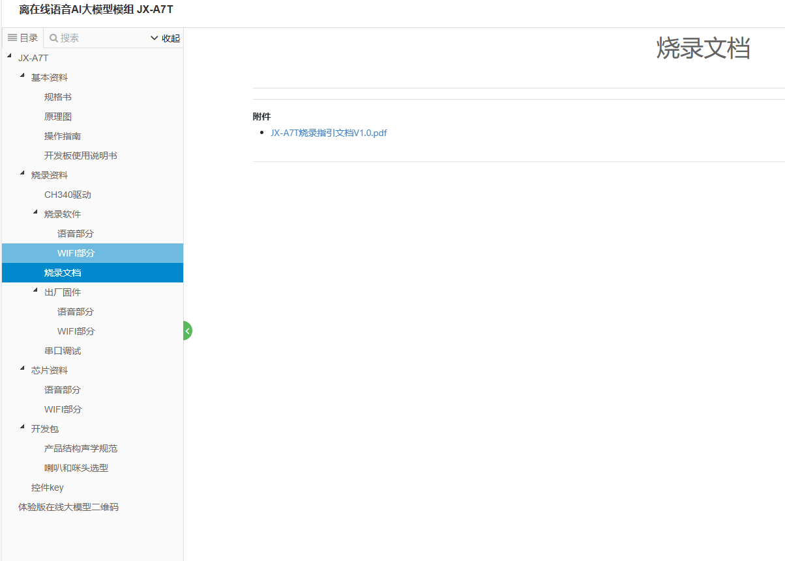

*烧录文档中明确说明了语音部分和WiFi部分的配置方法*

**3. 配置语音指令**

在语音工程中配置命令词：

- 进入命令词配置页面
- 添加需要的语音指令（如"请开灯"、"亮黄灯"等）
- 设置对应的回复语
- 配置触发后的动作

**4. 固件复用性**

配置完成的固件可以复用：

- 同型号的JX-A7T模块可以使用相同的固件
- 需要确保每个模块的设备标识不同
- AI功能配置可以通用于多个模块

**注意事项：**

- 语音功能和WiFi功能需要分别配置和烧录
- 配置语音功能时必须选择"JX-A7T ASR"模组
- 烧录顺序：先烧录WiFi固件，后烧录ASR固件
- 固件可以在同型号模块间复用，但AI对话能力需要网络支持

---

### 如何配置JX-A7T的智能体并实现快速绑定？

**问题描述：**

需要了解JX-A7T的智能体配置方法，以及是否有更简单的配置方式实现AI对话功能。

**解决方案：**

JX-A7T支持两种智能体配置方式。

**1. 自定义智能体配置**

在智能公元平台创建和配置智能体：

- 登录智能公元平台
- 进入智能体配置页面
- 创建智能体并配置相关参数
- 生成固件并烧录到模块

**2. 快速绑定方式（推荐）**

使用官方提供的默认智能体：

- 模块烧录完固件后
- 使用微信小程序"智能公公"
- 扫描官方提供的二维码直接绑定

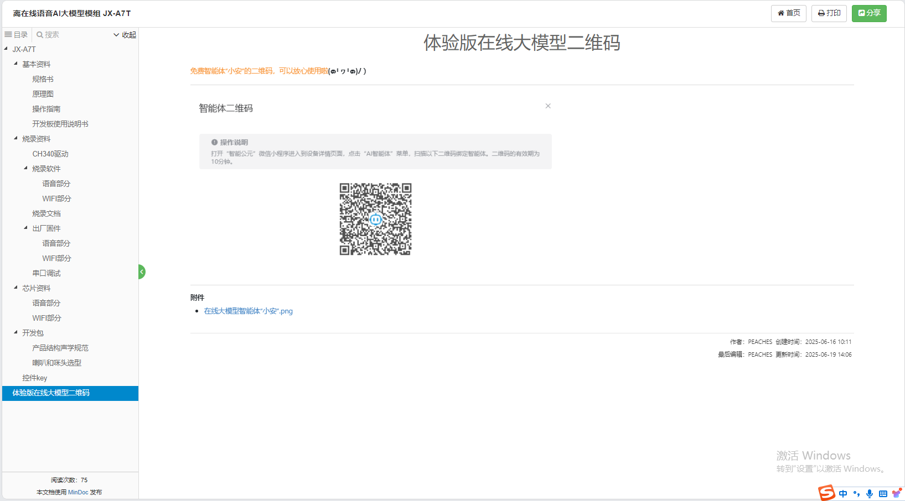

*通过小程序扫描二维码可以快速绑定智能体，有效期10分钟*

**3. 绑定步骤**

快速绑定智能体的操作流程：

1. **打开小程序**：微信搜索"智能公公"
2. **进入设备详情**：选择已配网的JX-A7T设备
3. **点击AI智能体**：在功能菜单中选择"AI智能体"
4. **扫描二维码**：对准官方提供的二维码扫描
5. **完成绑定**：等待绑定成功提示

**注意事项：**

- 二维码有效期为10分钟，过期需要重新获取
- 绑定成功后即可进行AI对话
- 官方智能体提供基础对话功能
- 如需定制功能，建议在平台自建智能体

---

### JX-A7T模块的采购和AI功能费用

**问题描述：**

需要了解JX-A7T模块的采购发货时间以及AI功能是否免费。

**解决方案：**

**1. 供货情况**

JX-A7T模块目前有现货供应：

- **小批量采购**：50-100块可现货发运
- **供货稳定**：常规订单可正常发货
- 大批量采购建议提前联系确认库存

**2. AI功能使用说明**

JX-A7T的AI功能使用方式：

- **在线模式**：需要网络连接，使用云端大模型
- **离线模式**：本地语音识别，无需网络
- **混合使用**：可根据场景灵活切换

**注意事项：**

- 模块采购无最小订单量限制
- AI功能可能产生服务费用，具体视使用情况而定
- 建议采购前确认具体需求和预算
- 如有大批量采购需求，可直接联系销售团队

---

### JX-A7T的大模型功能是否支持联网数据获取？

**问题描述：**

需要了解JX-A7T的大模型智能体是否支持获取联网数据，如日期、天气等需要联网的功能。

**解决方案：**

**1. 当前功能状态**

JX-A7T的大模型功能特点：

- **运行模式**：在线运行，不是离线模式
- **基础功能**：目前主要支持对话功能
- **数据获取**：暂不支持实时联网查询

**2. 功能规划**

大模型的扩展功能开发计划：

- **日期查询**：计划添加时间日期查询功能
- **天气信息**：将支持天气数据获取
- **其他联网功能**：逐步增加更多实用功能

**3. 功能调用机制**

未来的联网功能实现方式：

- 需要在平台配置各种功能调用
- 不是直接联网获取，而是通过功能接口
- 大模型将可调用特定的API服务

**注意事项：**

- 大模型是在线运行的，需要网络连接
- 目前仅支持基础对话，暂无联网查询功能
- 功能会通过固件更新逐步添加
- 建议关注官方更新公告了解新功能

---

### JX-A7T智能体的声音是否可以修改？

**问题描述：**

需要了解配置好的智能体声音是否可以像离线固件一样进行自定义修改。

**解决方案：**

**1. 当前声音修改支持情况**

官方智能体的声音设置：

- **当前状态**：暂不支持修改
- **开发计划**：后续将提供声音修改接口
- **替代方案**：可使用扣子平台自建智能体

**2. 扣子平台自定义**

如需修改声音，可以通过扣子平台：

- 在扣子平台创建自建智能体
- 配置所需的声音参数和特性
- 通过智能公元平台接入自定义智能体

**3. 声音定制展望**

未来的声音功能：

- 官方将在平台提供声音修改接口
- 支持多种音色选择
- 可调节语速、语调等参数
- 提供更丰富的个性化选项

**注意事项：**

- 官方智能体的声音暂无法修改
- 使用扣子平台可以实现声音自定义
- 声音功能开发完成后会通过更新推送
- 建议根据实际需求选择合适的智能体方案

---

### JX-A7T平台是否已上线？硬件设计是否会更改？

**问题描述：**

需要确认JX-A7T模块平台是否已经上线，以及硬件设计是否会进行更改。

**解决方案：**

**平台状态确认：**

- JX-A7T正式平台已经上线
- 刚完成上线部署，可以正常使用
- 所有配置功能已经可用

**硬件设计确认：**

- 硬件设计不会再更改
- JX-A7T ASR和JX-A7T WiFi是同一模组
- 两款型号分别基于不同芯片：

    - JX-A7T ASR：基于CI-1302芯片
    - JX-A7T WiFi：基于JX1001芯片

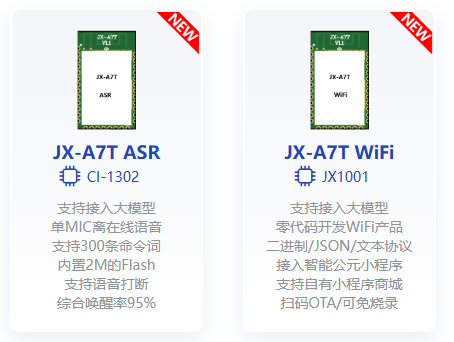

**注意事项：**

- 两个版本需要开发不同的固件
- 是同一模组的两种不同功能版本
- 硬件已经定型，不会再进行修改
- 可根据项目需求选择合适的版本

---

### JX-A7T的获取系统时间功能是否已上线？

**问题描述：**

需要了解JX-A7T的获取系统时间功能是否已经上线并可以使用。

**解决方案：**

- 获取系统时间功能已经上线
- 功能已通过测试验证，可以使用
- 可直接调用相关API获取系统时间

**注意事项：**

- 使用时请参考API文档
- 确保设备已连接网络
- 如有问题请联系技术支持

---

### JX-A7T的例程如何获取？不同例程有什么区别？

**问题描述：**

需要获取JX-A7T的例程，并了解asr_test.json和wifi_test.json两个例程的具体区别。

**解决方案：**

**例程获取方式：**

1. 联系技术支持或客服
2. 提供开发需求说明
3. 获取对应的例程文件

**例程功能区别：**

- **asr_test.json**：语音功能的例程
    - 包含离线语音识别相关配置
    - 用于开发语音控制功能

- **wifi_test.json**：WiFi功能的例程
    - 包含网络通信相关配置
    - 用于开发WiFi连接和通信功能

**注意事项：**

- 两个例程对应不同的功能模块
- 根据项目需求选择合适的例程
- 这是同一模组的两种不同功能实现方式
- 开发时需要使用对应的例程作为参考

---

### JX-A7T蓝牙配网失败怎么办？

**问题描述：**

JX-A7T设备在蓝牙配网过程中，虽然手机连接成功，但无法完成Wi-Fi配网和设备添加，原因是设备未授权。

**解决方案：**

- **确认设备授权状态**：

    - 未授权的设备无法完成配网
    - 需要通过授权文档操作进行授权
    - 授权只需进行一次，成功后永久有效

- **授权操作步骤**：

    1. 获取Wi-Fi产品授权文档
    2. 按照文档指示进行授权操作
    3. 授权完成后重新尝试配网

- **配网流程**：

    1. 确保设备已授权
    2. 使用手机蓝牙连接设备
    3. 发送Wi-Fi配置信息
    4. 等待设备连接网络
    5. 完成设备添加

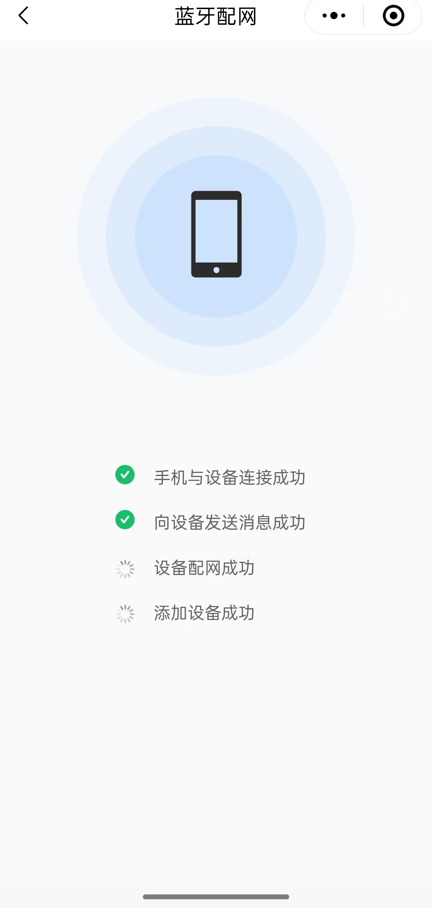

*蓝牙配网过程中显示连接成功但配网卡住*

**注意事项：**

- 授权是配网的前提条件
- 如果配网失败，首先检查设备授权状态
- 授权完成后无需重复操作

---

### JX-A7T获取授权码时返回乱码怎么办？

**问题描述：**

通过串口发送AT+CHIPID指令获取授权码时，返回的授权码为乱码，且与正常授权码格式差异较大，导致无法正确获取和验证授权码。

**解决方案：**

- **检查串口连接**：

    - 确认连接到RX0和TX0引脚
    - 检查波特率是否设置为2000000
    - 确保共地连接良好

- **等待日志输出完成**：

    - 上电后等待WiFi日志输出完成
    - 清除接收区内容后再发送指令
    - 避免指令与设备日志混杂

- **正确获取授权ID步骤**：

    1. 发送：AT+CHIPID?
    2. 获取16位芯片ID（如：7C3E821CB6410000）
    3. 使用AT+AUTHID=xxxx指令进行授权

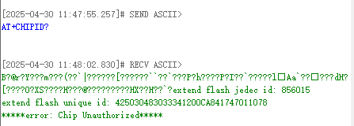

*AT+CHIPID指令返回乱码*


*正确的授权ID格式和返回结果*

**注意事项：**

- 使用野火调试助手等可靠工具
- 确保串口参数配置正确
- 授权ID为16位十六进制格式
- 授权成功会显示"Authorized OK"

---

### JX-A7T模块上电无播报问题如何排查？

**问题描述：**

JX-A7T模块配置了开机播报功能，但实际使用时上电后没有播报开机提示音，其他语音控制功能正常工作。

**解决方案：**

**问题排查方法**

1. **确认配置和固件**
    - 检查播报配置是否正确导出
    - 确认使用的是最新的固件文件
    - 验证固件生成过程中无错误提示

2. **模块单独测试**
    - 将模块单独供电测试播报功能
    - 排除外部电路干扰因素
    - 确认模块本身功能正常

3. **硬件连接检查**
    - 检查喇叭连接线序是否正确
    - 测量音频输出电压是否正常
    - 确认功放电路工作正常

4. **导出工程分析**
    - 通过产品管理导出工程文件
    - 发送完整工程给技术支持分析
    - 确认导出的固件与配置一致

**技术验证**

技术支持测试发现：

- 单模块测试时播报功能正常
- 问题可能出现在用户端的硬件连接
- 建议按照导出的固件重新烧录测试

**注意事项：**

- 其他语音功能正常说明模块识别部分工作正常
- 重点检查音频输出硬件连接
- 确保使用的是导出的最终固件文件
- 提供详细的测试现象便于问题定位

---

### JX-A7T是否支持语义识别分析和OTA更新离线对话？

**问题描述：**

需要确认JX-A7T模块是否支持语义识别分析功能，以及是否能够通过无线方式更新离线对话内容。

**解决方案：**

**语义识别支持：**

- **在线部分配置**：JX-A7T支持在线语义识别功能
- **混合工作模式**：根据网络状态智能切换在线/离线模式
- **AI对话能力**：可连接大模型实现自然语言理解
- **应用场景**：适用于需要智能对话和语义理解的产品

**OTA更新功能：**

- **小程序扫码更新**：支持通过小程序扫码进行OTA升级
- **离线对话更新**：可无线更新离线命令词和回复内容
- **零代码替换**：无需重新烧录，OTA升级即可生效
- **远程维护**：方便产品后期维护和功能升级

**使用方式：**

1. **OTA更新操作**：

    - 打开智能公元小程序
    - 扫描模块二维码
    - 选择更新内容进行升级

2. **配置管理**：

    - 在智能公元平台配置离线命令词
    - 设置在线语义识别参数
    - 生成固件并通过OTA推送

**注意事项：**

- 语义识别功能需要网络连接支持
- OTA升级需要模块带有OTA Flash（T1版本）
- 离线内容更新后无需重新训练即可使用
- 建议定期更新以获得最新功能和优化

---

### 如何获取JX-A7T模块的技术资料？

**问题描述：**

需要获取JX-A7T模块的完整技术资料，包括开发板使用指南、模组规格书和demo操作文档。

**解决方案：**

**获取方式：**

1. **联系技术支持**：

    - 通过官方渠道申请获取技术资料
    - 提供项目需求和使用场景
    - 获取官方文档下载链接

2. **可用技术资料清单**：

    - **JX-A7T开发板使用指南.pdf**：开发板详细使用说明
    - **JX-A7T-V1.0-模组规格书.pdf**：模块硬件规格和接口定义
    - **JX-A7Tdemo操作指示文档.pdf**：演示程序操作指南

3. **开发板购买选项**：

    - **JX-A7T1开发板（大模型免费体验版）**：含OTA功能
    - 确认购买时选择正确的开发板型号

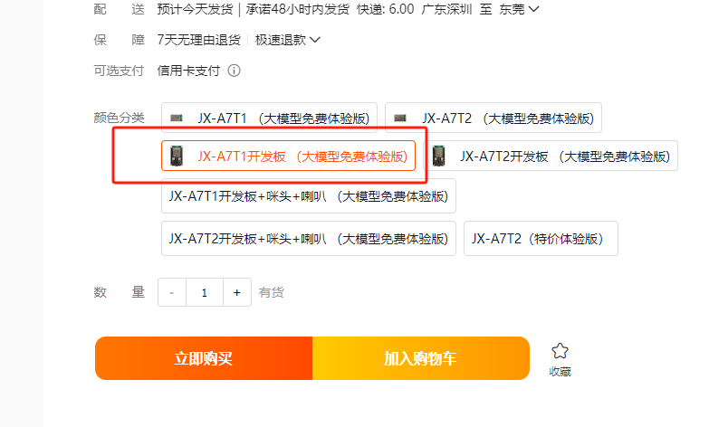

**资料内容说明：**

- **规格书**：包含电气参数、引脚定义、机械尺寸
- **使用指南**：开发环境搭建、烧录流程、调试方法
- **demo文档**：示例程序说明、测试步骤、常见问题

**注意事项：**

- 技术资料为官方提供，请妥善保管
- 开发板分为T1（含OTA）和T2（无OTA）两个版本
- 购买时确认是否需要OTA升级功能
- 如有技术问题可联系官方技术支持

---

### JX-A7T是否支持TTS功能和多组语音指令？

**问题描述：**

需要确认JX-A7T模块是否支持TTS（文本转语音）功能，以及是否可以设置多组语音指令并支持中英文输入。

**解决方案：**

**TTS功能支持：**

- **支持中英文TTS**：JX-A7T支持中文和英文文本转语音
- **云端TTS服务**：通过网络连接实现高质量语音合成
- **本地播报**：TTS转换后的语音在本地模块播放
- **灵活配置**：支持动态文本输入和播报

**多组语音指令设置：**

1. **命令词管理**：

    - 在智能公元平台添加多组命令词
    - 每组命令可配置不同的触发词
    - 支持命令词分类和场景管理

2. **播报内容配置**：

    - 可为不同命令设置不同回复内容
    - 支持参数化播报（如变量、数值等）
    - 中英文混合播报支持

3. **TTS使用场景**：

    - 传感器数据播报
    - AI对话结果播报
    - 自定义信息提示

**实现方式：**

1. **平台配置**：

    - 登录智能公元平台
    - 选择JX-A7T项目
    - 在语音配置中设置命令词
    - 配置TTS播报内容

2. **串口触发**：

    - 通过串口发送文本到模块
    - 模块自动进行TTS转换和播报
    - 支持实时文本流输入

**注意事项：**

- TTS功能需要网络连接支持
- 多组命令词需要合理规划避免冲突
- TTS播报可能占用一定的网络带宽
- 建议测试确认播报效果符合需求

---

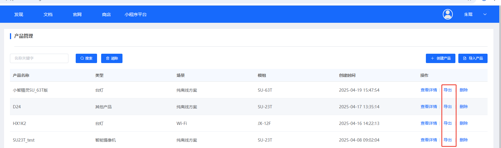

---

### JX-A7T的技术资料如何获取？

**问题描述：**

需要获取JX-A7T模组的相关技术资料，包括规格书、操作指示文档和电气原理图，并希望在使用过程中能得到技术支持。

**解决方案：**

**可获取的技术资料：**

1. **规格书**：

    - 包含产品的技术参数
    - 详细的接口定义
    - 电气特性说明
    - 应用场景指导

2. **操作指示文档**：

    - 设备的上电流程
    - 语音指令设置方法
    - 固件更新步骤
    - 调试方法和技巧

3. **电气原理图**：

    - 芯片连接方式
    - 电源电路设计
    - 接口电路原理
    - 功放电路连接

**技术支持渠道：**

- **在线支持**：可通过智能公元平台获取技术文档
- **工程师支持**：使用过程中可联系技术工程师获得帮助
- **电联支持**：必要时可安排电话技术支持
- **社区交流**：参与开发者社区交流经验

**注意事项：**

- 建议先仔细阅读规格书，了解产品限制和特性
- 操作前按照指示文档进行，避免误操作
- 如有特殊需求，可咨询技术支持获得定制建议
- 保留好技术文档，便于后续开发和维护

---

### TTS功能可以和语音识别功能集成在同一个固件中吗？

**问题描述：**

需要确认离线语音识别模块是否支持将文本转语音（TTS）功能与语音识别功能同时集成到同一个固件中。

**解决方案：**

**功能限制说明：**

- **功能互斥**：TTS功能和语音识别功能不能同时存在于同一个固件中
- **固件分离**：使用TTS功能的固件后，无法进行语音识别的配置
- **定制限制**：即使是定制开发，目前也无法实现两个功能的共存

**可选方案：**

1. **双模块方案**
    - 使用两个模块：一个专门做TTS，一个做语音识别
    - 离线模块只能通过这种方式实现所有功能
    - 系统需要同时管理两个模块

2. **在线模块方案**
    - 选用JX-A7T在线模块
    - 支持离线指令和在线指令
    - 在线指令可以运行大模型并播报结果

**方案对比：**

| 方案 | 优点 | 缺点 |
|------|------|------|
| 双离线模块 | 完全离线工作 | 成本高，系统复杂 |
| 在线模块(JX-A7T) | 功能集成度高 | 需要网络连接 |

**注意事项：**

- 目前暂时不支持TTS与语音识别的单模块集成
- 选择方案时需考虑成本和系统复杂度
- 在线方案需要稳定的网络连接支持
- 双模块方案需要解决音频输出切换问题

---


---

### JX-A7T模块的主要特点是什么？

**问题描述：**

了解JX-A7T这款新产品的主要功能特点和使用模式。

**解决方案：**

**JX-A7T核心特点：**

1. **双模式支持**
    - **离线指令模式**：本地语音识别，快速响应
    - **在线指令模式**：搭载大模型，智能对话

2. **大模型集成**
    - 支持自然语言理解
    - 上下文对话能力
    - 更智能的交互体验

3. **产品定位**
    - 高端智能语音模块
    - 适合复杂交互场景
    - 提供更专业的AI服务

**应用场景：**

- 智能家居控制
- 机器人对话交互
- 教育辅导设备
- 专业问答系统

**获取方式：**

- 官方文档：https://help.aimachip.com/docs/jx_a7t_v1/jx_a7t_v1-1ghc1h40pidif
- 联系技术团队了解具体参数和优惠

**注意事项：**

- 在线模式需要网络连接
- 根据应用场景选择合适的工作模式
- 新产品上市期间可能有优惠政策

---


---

### JX-A7T模块串口通信异常数据分析

**问题描述：**

JX-A7T模块在串口通信时出现非预期的8字节数据包，这些数据包并非由单片机发送，怀疑是固件问题导致。

**解决方案：**

1. **问题现象**
    - 串口接收到非预期的8字节数据包
    - 这些数据包出现在正常的6字节数据包之后几十毫秒
    - 数据包内容为'user_comm_trans_msg'，source_id为1，source_type为4
    - 断开WiFi模块后，在单片机串口仍能监测到这些数据

2. **排查方法**
    - 分离测试：拔掉WiFi模块，单独监测单片机串口
    - 对比发送和接收的数据长度
    - 使用测试固件打印异常数据内容

3. **发送数据记录**
    - 实际发送的字节数：17、9、6、5、5字节
    - WiFi模块接收到：17、9、8、6、8、5、5字节
    - 其中两个8字节为异常数据

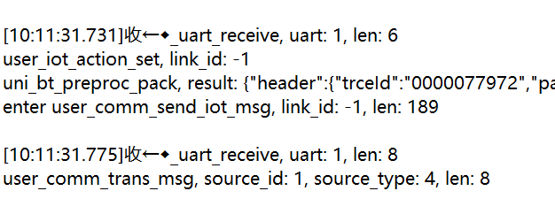

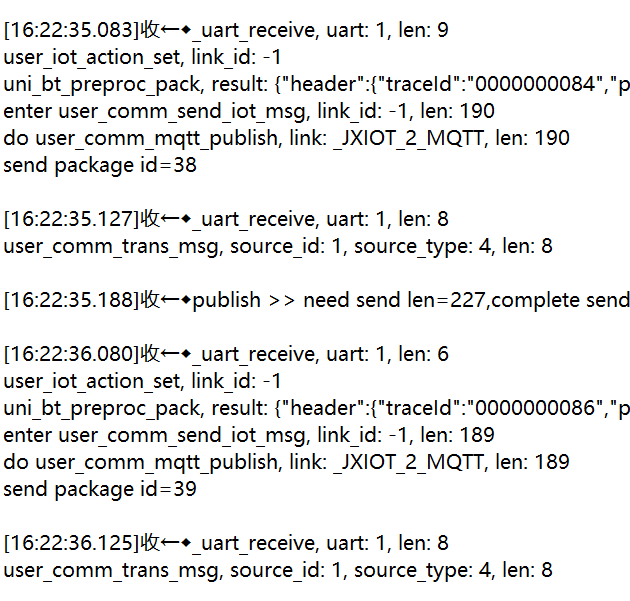

**临时解决方案：**

- 更新为最新版本固件（jx_12f_firmware_nls241108.bin）
- 在测试固件中打印异常8字节数据的具体内容
- 记录异常数据出现的时机和规律

**注意事项：**

- 异常数据可能与WiFi模块断线重连后的内部状态恢复有关
- 需要区分是单片机还是WiFi模块发送的数据
- 如问题持续，需要提供详细日志供固件团队分析


---


---

### JX-A7T模块串口固定异常数据问题排查

**问题描述：**

JX-A7T模块在串口通信时出现固定不变的异常数据（0x2D 0x26 0x57等），更换WiFi模块和单片机板子后问题依然存在，无法通过串口助手捕获。

**解决方案：**

1. **问题特征**
    - 异常数据固定为：0x2D 0x26 0x57等特定字节序列
    - 数据长度为9字节和8字节交替出现
    - 重新上电后异常数据保持不变
    - 只出现在特定数据（9字节和6字节）之后

2. **排查过程**
    - 更换WiFi模块：问题依然存在
    - 更换单片机板子：问题依然存在
    - 断电重启：异常数据不变
    - 串口助手无法捕获：说明可能不是实际串口信号

3. **硬件配置**
    - 单片机：STM32F1系列
    - 串口电压：3.3V
    - 波特率：9600
    - 电源芯片：AMS1117（非开关电源）

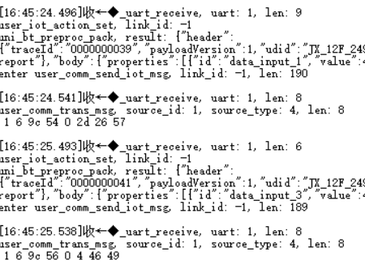


**可能原因分析：**

- 可能是单片机内部串口外设的寄存器配置问题
- 可能与其他外设（语音模块、触摸屏）的干扰有关
- 不是简单的电源或信号干扰问题

**进一步排查建议：**

- 使用示波器捕捉串口波形，确认实际信号
- 检查单片机串口相关寄存器配置
- 尝试关闭其他外设，单独测试串口通信
- 考虑快递设备到原厂进行详细检测

**注意事项：**

- 问题具有持续性，更换硬件无法解决
- 异常数据的规律性表明不是随机干扰
- 需要从软件配置或硬件设计层面深入排查

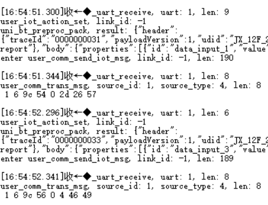

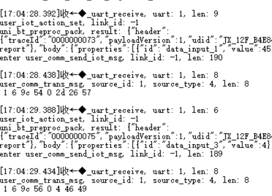

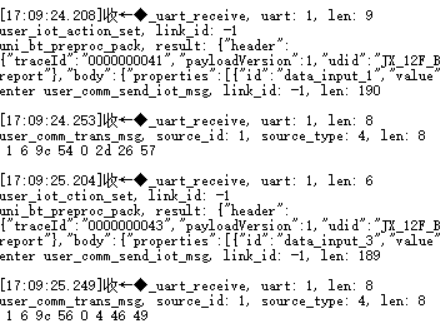

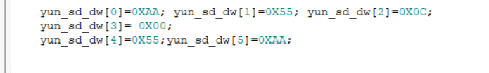

---


---

### JX-A7T模块固件烧录与通信问题

**问题描述：**

JX-A7T模块在使用过程中出现多个问题：串口助手无法捕获数据、使用变量时通信异常、固件版本兼容性等。

**解决方案：**

1. **变量使用问题**
    - 使用变量赋值时出现通信异常
    - 将变量替换为具体数值后问题消失
    - 17字节数据中也包含变量，但无异常
    - 问题主要出现在9字节和6字节数据发送时

2. **通信回执机制**
    - 使用标准MODBUS协议通信
    - 发送触发命令后，固件会返回数据
    - 拔掉WiFi模块后没有触发，固件不会发送数据
    - 通信过程中存在约100ms的时间间隔

3. **固件版本管理**
    - 多个版本在测试：jx_12f_firmware_nls241106.bin（6号）
    - jx_12f_firmware_nls241108.bin（8号）
    - 8号版本增加了调试日志，其他功能相同
    - 建议烧录时记录MD5：f503c896b22a4ddd431776cc3c779928


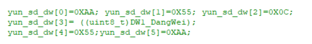

**调试建议：**

- 使用8号版本固件进行问题定位
- 保留完整的通信日志，特别关注100ms间隔
- 确认是否为串口实际发出的信号
- 考虑快递设备到原厂进行硬件检测

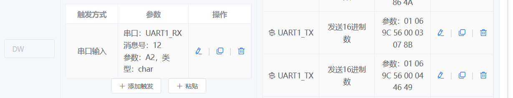

**注意事项：**

- 变量处理异常可能与编译器优化有关
- 100ms间隔的数据可能不是串口实际输出
- 需要区分是软件逻辑问题还是硬件信号问题

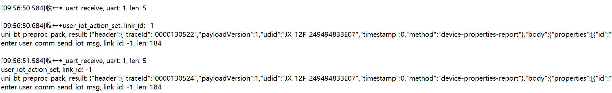

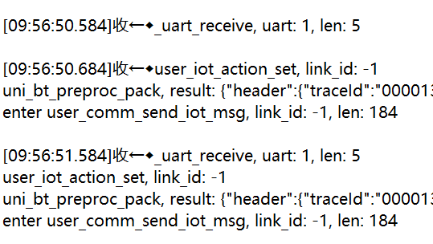

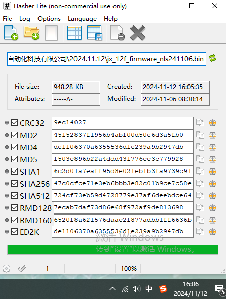

---


---

### 在JX-A7T平台上如何配置禁止识别词？

**问题描述：**

在JX-A7T平台上配置语音识别控制规则时，无法通过"禁止识别词"操作来关闭特定的命令词识别，且在配置128条指令时，发现配置后仍无法生效。

**解决方案：**

需要正确选择操作选项并按照流程配置：

**1. 操作选项区分**

JX-A7T平台提供多个相似的操作选项：

- "允许语音识别"：控制整个语音识别功能
- "允许识别词"：启用特定命令词
- "禁止识别词"：禁用特定命令词

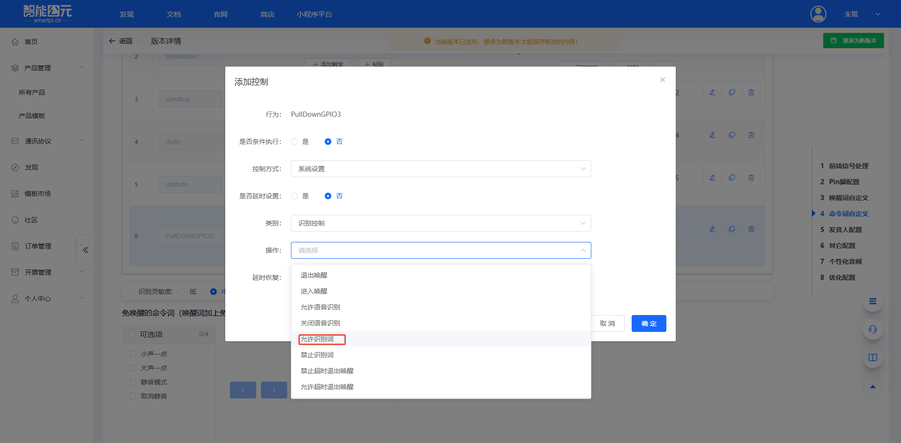

**2. 正确配置步骤**

- 在串口触发下点击"+ 添加控制"
- 选择操作为"禁止识别词"
- 指定要禁用的命令词名称

**3. 常见错误**

容易混淆的操作：

- 误选"允许语音识别"而非"允许识别词"
- 注意区分"控制语音识别"和"控制识别词"

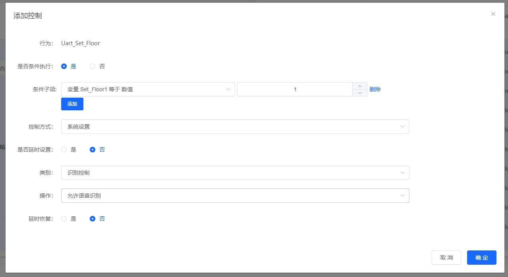

**4. 批量配置支持**

- 128条指令每条都需要配置允许和禁止规则
- 可以批量复制配置提高效率
- 建议分批配置避免配置错误

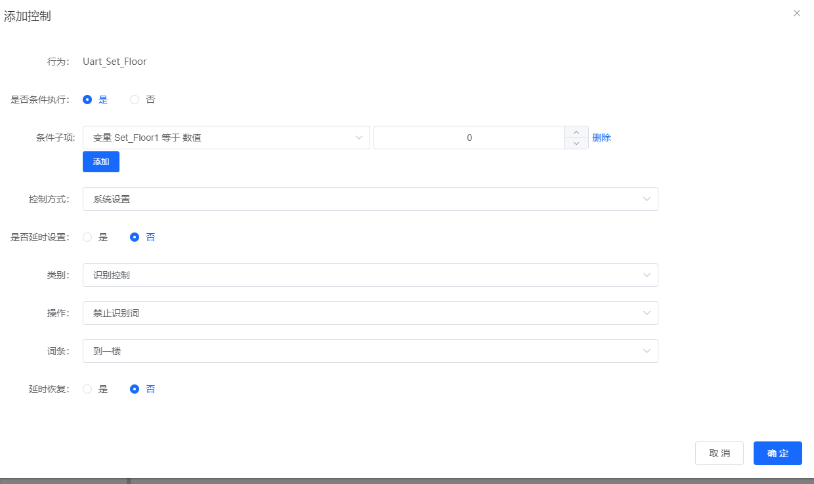

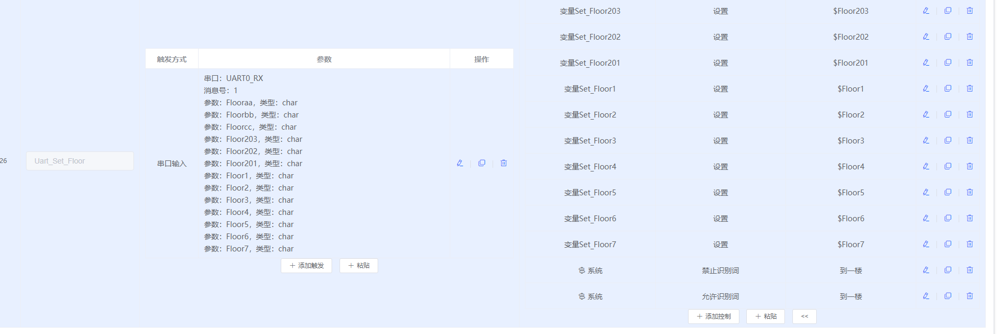

**5. 验证方法**

- 通过串口发送测试数据
- 检查变量值是否正确更新
- 验证特定命令词是否被禁用

**注意事项：**

- 每个命令词需要单独的启用/禁用配置
- 配置后必须重新生成固件
- 串口数据格式必须正确
- 建议配置过程中保存项目进度

---


---

### 如何正确配置JX-A7T模块的串口通信协议？

**问题描述：**

配置JX-A7T模块串口通信协议时，遇到串口输出数据异常（始终为0）以及参数数据字节序不符合预期的问题。

**解决方案：**

**1. 变量赋值配置**：

- 确保串口触发前先给变量赋值
- 变量设置格式：$变量名（如$num1）
- 避免使用未初始化的变量

    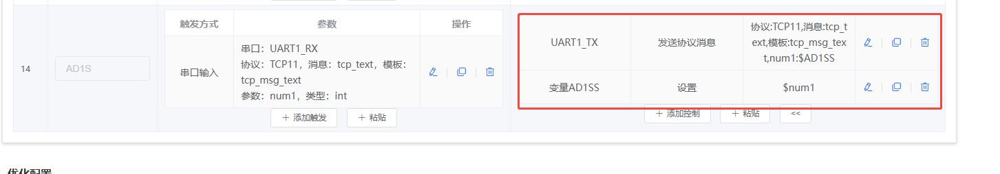

**2. 串口触发配置**：

- 触发方式选择"串口输入"
- 参数格式：变量名, 类型: int（如num1, 类型: int）
- 测试值设置完整协议帧

    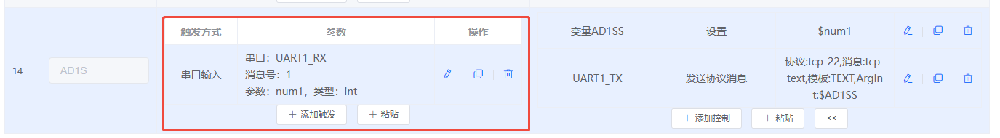
    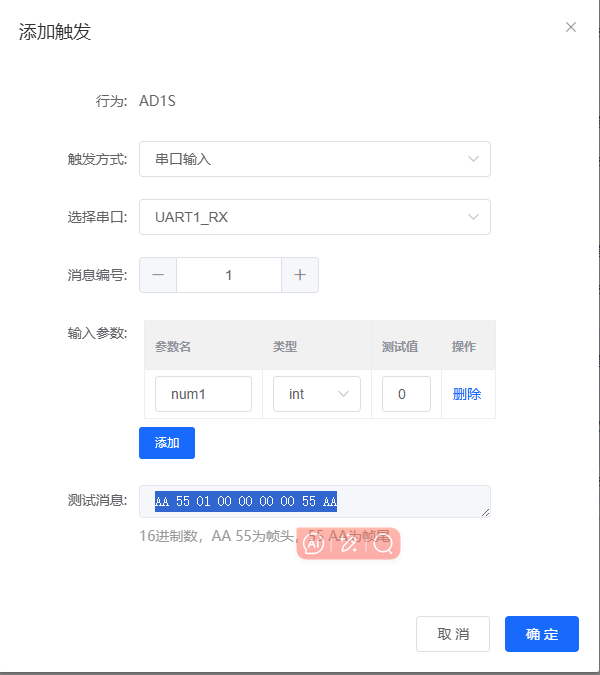

**3. 协议模板配置**：

- 选择固定格式而非自选协议
- 小端模式：int(16)类型，占2字节
- 大端模式：int(32)类型，占4字节

    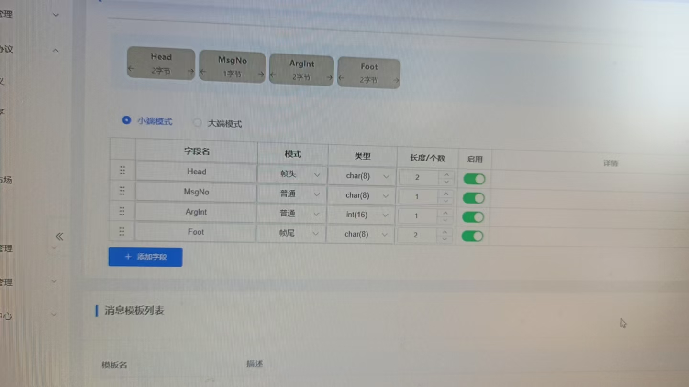
    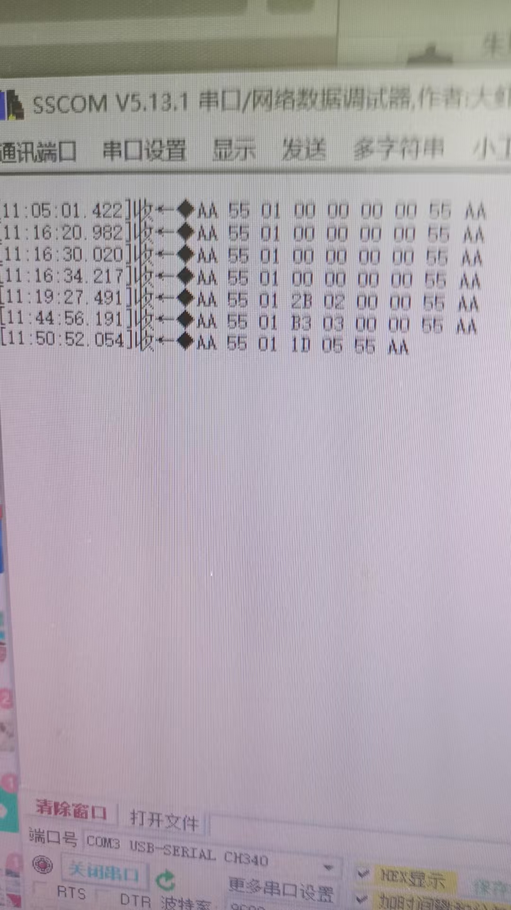
    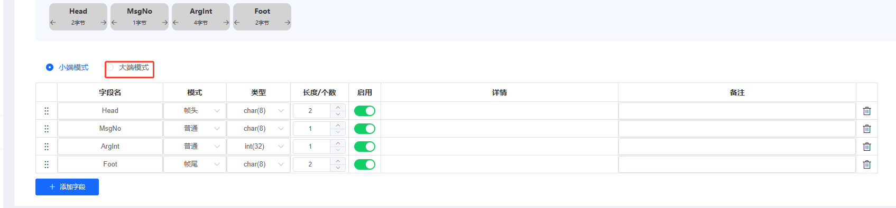

**4. 数据格式验证**：

- 使用串口调试器监控输出
- 小端模式输出：AA 55 01 00 00 00 55 AA
- 大端模式输出：AA 55 01 2B 02 00 00 55 AA

    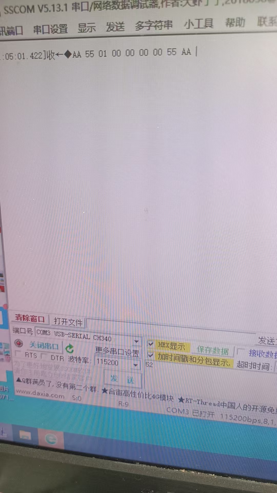
    

**注意事项：**

- 自定义协议需要完整配置才能正确触发
- 变量必须在使用前正确赋值
- 字节序选择需与接收端一致
- 建议使用固定格式协议减少配置错误

---

