# SU-03T 平台与固件 FAQ

本页用于整理 SU-03T 相关的平台配置与固件问题。

### SU-03T支持哪些唤醒方式？

**问题描述：**

需要了解SU-03T除了通过麦克风进行语音唤醒外，是否还支持其他唤醒方式，如IO口电平信号或串口数据唤醒。

**解决方案：**

SU-03T支持多种唤醒方式，包括语音唤醒、IO口电平唤醒和串口数据唤醒。

**1. 语音唤醒（默认方式）**

- 通过麦克风接收特定唤醒词
- 平台配置中设置唤醒词
- 最常用的唤醒方式

**2. IO口电平唤醒**

- 可通过给IO口高低电平信号触发唤醒
- 在平台中配置相应的IO控制
- 适用于外部传感器或按键触发

**3. 串口数据唤醒**

- 通过串口接收特定数据命令唤醒
- 可接收16进制数据进行控制
- 适用于与其他MCU或主控设备通信

**4. 平台配置方法**

- 登录智能公元平台
- 在"添加控制"中配置触发条件
- 选择"进入唤醒"或"退出唤醒"等操作
- 可设置条件执行和延时

**注意事项：**

- 不同唤醒方式可在同一固件中并存
- IO口驱动能力有限（不足20mA），需要驱动电路控制大负载
- 平台浏览器搜索"智能公元"获取详细教程
- B站搜索"机芯智能"查看操作视频

### 如何配置GPIO延时翻转功能？

**问题描述：**

需要实现GPIO默认低电平，命令词触发后变成高电平，延时2秒后自动恢复为低电平的功能。

**解决方案：**

在智能公元平台中，可以通过"延时翻转"功能实现GPIO的电平自动切换。

**1. 配置步骤**

- 登录智能公元平台，进入对应项目
- 在GPIO配置中，勾选"延时翻转"选项
- 在时间参数中填写延时时间（单位：毫秒）
- 设置输出电平为"高电平"

**2. 时间参数设置**

- 延时时间必须以毫秒为单位填写
- 2秒延时应填写：2000（不要填写3ms这样的错误格式）
- 平台会自动在指定时间后翻转电平

**3. 配置示例**


**常见错误：**

- 时间单位错误：误将毫秒写成其他单位
- 未勾选延时翻转：导致电平不会自动恢复
- 电平设置错误：未正确设置目标电平

**注意事项：**

- 延时时间范围建议在100ms-10s之间
- 多个GPIO可独立配置不同的延时时间
- 延时翻转不影响其他功能的正常使用

### 如何通过语音指令循环发送串口数据？

**问题描述：**

需要实现通过语音指令触发模块循环发送特定的16进制串口数据，直到收到停止指令才停止。

**解决方案：**

可通过智能公元平台配置，实现语音控制循环发送串口数据功能。

**1. 平台配置步骤**

- 登录智能公元平台
- 创建语音识别指令（如"开始发送"、"停止发送"）
- 在控制配置中添加串口发送操作

**2. 循环发送实现**

- 设置"开始发送"指令触发串口发送动作
- 配置发送的16进制数据（如：00 01 00 3B）
- 设置循环模式或使用定时器实现连续发送
- 配置"停止发送"指令终止发送

**3. 数据发送配置**

- 在串口发送中选择16进制模式
- 输入需要发送的数据帧
- 可设置发送间隔和次数
- 支持动态变量控制发送内容

**4. 高级配置**

- 可结合条件判断实现更复杂的控制逻辑
- 支持多个数据帧的交替发送
- 可根据外部输入动态调整发送内容

**注意事项：**

- 确保串口波特率等参数与接收端匹配
- 循环发送时注意不要阻塞其他指令识别
- 建议设置合理的发送间隔，避免数据拥塞
- 平台提供详细的配置示例，可参考学习

---

### 如何获取SU-03T的开发包和规格书？

**问题描述：**

需要获取SU-03T语音识别模块的规格书及相关开发资料。

**解决方案：**

SU-03T的完整开发资料已整理在开发包中，包含以下内容：

- **原理图**：模块硬件原理图
- **技术手册**：模块和芯片的详细技术规格书
- **接线资料**：标准的接线方式和接口定义
- **烧录软件**：固件烧录工具
- **烧录资料**：详细的烧录操作指南

**获取方式：**

访问智能公元平台的SU-03T开发包页面：
http://help.aimachip.com/docs/offline_su03t/su_03t_kfb

该页面提供了所有必需的开发文档，规格书也在开发包内提供。


**注意事项：**

- 开发包中的资料会持续更新，建议定期查看最新版本
- 规格书文件名通常为"SU-03T-V1.6模组规格书V1.7.pdf"或类似格式
- 如需要特定公司料号的规格书，可在下载后自行重命名

---

### SU-03T版本升级说明

**问题描述：**

需要区分SU-03T不同版本的硬件模块，并了解固件兼容性。

**解决方案：**

SU-03T模块已完成硬件升级，可通过以下方式识别：

- **旧版本**：丝印标识为V2J
- **新版本**：丝印标识为su-03t1

**固件兼容性：**

- 新版本固件可以在旧版本模块上使用
- 新版本固件需要在2024年11月之后的版本才能正常使用
- 旧版本固件不能在新版本模块上使用
- 建议使用智能公元平台最新的固件以获得最佳性能


**2025年固件更新**：

- **2025.2版本固件**：已发布新版本固件，优化了语音识别稳定性
- 适用于智能门禁等应用场景
- 支持自定义唤醒词（如"小爱小爱"）
- 烧录后如遇语音测试问题，请确认固件是否正确烧录
**注意事项：**

- 新旧版本在外观和功能上基本兼容
- 选购时注意查看模块丝印标识确认版本
- 固件升级时请确保选择正确的版本和时间

---

### SU-03T如何实现PWM控制灯带闪烁？

**问题描述：**

需要在低代码平台实现PWM控制灯带0.5秒亮、0.5秒灭的周期性闪烁效果，同时控制两个不同灯色的灯带。

**解决方案：**

**配置要点：**

1. **定时器时间设置**
    - 定时器周期应大于所有延迟时间之和
    - 对于0.5秒亮0.5秒灭的场景，定时器时间应>1秒
    - 建议设置为1.5秒或2秒，留出余量

2. **PWM输出配置**
    - 使用一个PWM引脚控制一个灯带
    - PWM输出100表示灯带亮
    - PWM输出0表示灯带灭

**配置步骤：**

1. **创建定时器**
    - 定时器时间：1500ms（1.5秒）
    - 定时器模式：循环执行

2. **配置定时器操作**（超时后执行）：

    - PWM0输出：延迟0ms → 输出100（灯带1亮）
    - PWM0输出：延迟500ms → 输出0（灯带1灭）
    - PWM1输出：延迟0ms → 输出100（灯带2亮）
    - PWM1输出：延迟500ms → 输出0（灯带2灭）

**注意事项：**

- 定时器时间必须大于最长延迟时间
- 多个PWM操作时注意延迟时间的累加
- 如需精确控制，建议使用逻辑控制功能
- 延迟输出功能可以实现简单的时序控制

---

### SU-03T如何配置为英文识别？

**问题描述：**

需要将SU-03T模块从中文识别改为英文识别功能。

**解决方案：**

**固件制作要求：**

- **需要重新制作固件**：英文识别功能需要在固件层面进行配置
- 当前固件为中文识别版本，不支持直接切换到英文识别
- 英文识别需要不同的语音模型和算法支持

**操作步骤：**

1. **获取英文固件**：

    - 向供应商提出英文识别需求
    - 说明具体的应用场景和识别要求
    - 确认是否可以提供英文版本固件

2. **重新订购**（如需要）：

    - 部分情况可能需要订购英文版本的模块
    - 确认是否有英文版本的库存
    - 了解英文版本和中文版本的价格差异

3. **自主开发**（高级用户）：

    - 如有SDK开发能力，可以自行编译英文固件
    - 需要获取英文语音识别模型
    - 使用相应的开发工具链进行编译

**注意事项：**

- SU-03T的语音识别语言是在固件编译时确定的
- 无法通过简单配置切换中英文识别
- 英文识别和中文识别使用不同的算法模型
- 项目规划阶段应确定所需的语言版本

---

### 如何获取SU-03T的唤醒状态并传输到自研软件？

**问题描述：**

在使用自定义唤醒词时，需要将SU-03T识别到唤醒词后的状态传输到自研的数字人软件或Windows平台软件中。

**解决方案：**

SU-03T支持通过串口通信将唤醒状态输出给外部设备：

- **通信方式**：使用SU-03T的串口接口进行通信
- **配置方法**：在智能公元平台配置唤醒后输出串口数据
- **数据格式**：可配置输出特定格式的数据表示唤醒状态
- **接收端**：自研软件通过串口接收并解析状态数据

**实现步骤：**

1. 在智能公元平台创建项目并配置唤醒词
2. 配置唤醒识别后的输出动作（串口输出）
3. 设置需要输出的数据格式（如"woke_up"或其他标识）
4. 自研软件监听串口，接收并处理唤醒状态

**参考资料：**

- SU-03T串口教程：https://www.bilibili.com/video/BV1nv4y197uR/

**注意事项：**

- SU-03T只有一路串口，烧录和运行不能同时使用
- 串口通信需要正确配置波特率等参数
- 建议在输出数据中加入校验机制确保可靠性

---

### 在智能平台配置时找不到参数选项怎么办？

**问题描述：**

在智能平台中配置语音指令时，无法找到'后退'等参数选项，导致无法完成指令配置。

**解决方案：**

**1. 确认配置的是自己的命令词**

- 参数选项与具体命令词相关联
- 系统预设的命令词有对应的参数
- 自定义的命令词需要使用对应的自定义参数


**2. 检查命令词来源**

- 确认是在配置"基础信息"中的系统命令词
- 还是配置"自学习"中的用户命令词
- 不同来源的命令词参数选项不同

**3. 正确配置控制动作**

- 选择正确的控制方式：系统设置
- 选择正确的类别：允许识别词或禁止识别词
- 在参数列表中选择对应的命令词

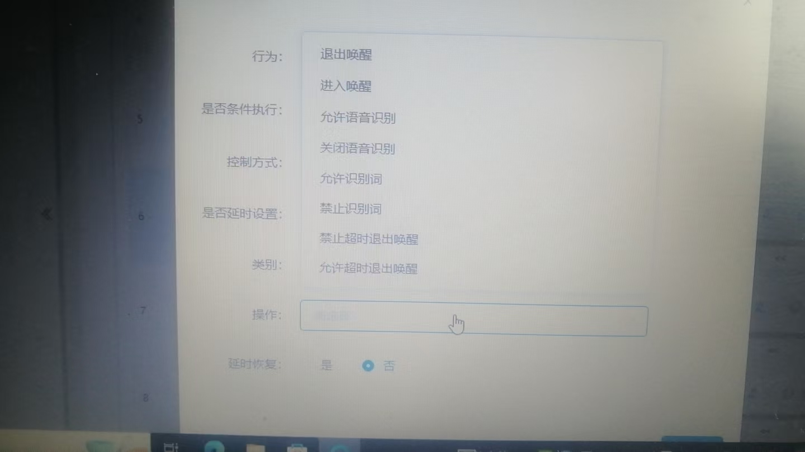

**注意事项：**

- 每个命令词的参数是独立的，需要选择对应项
- 系统预设命令词和自学习命令词的配置方式不同
- 找不到参数时，先确认命令词的来源和类型

---

### 如何在智能平台中禁用语音指令词？

**问题描述：**

在使用CI-03T系列芯片的语音识别系统时，无法找到禁用特定语音指令词的设置选项，导致无法禁用自定义的语音指令。

**解决方案：**

**1. 进入命令词控制界面**

- 在智能平台中进入命令词自定义页面
- 选择需要配置的命令词
- 点击添加控制按钮

**2. 配置禁止识别动作**

- 选择控制方式：系统设置
- 选择类别：禁止识别词
- 在参数中选择需要禁用的具体命令词

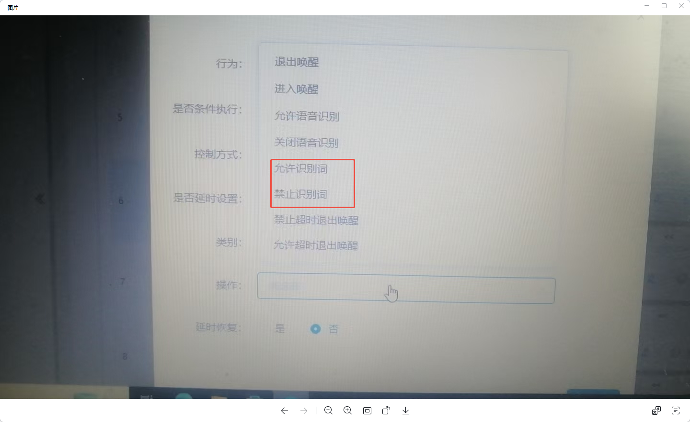

**3. 应用并生成固件**

- 保存控制配置
- 生成新的固件文件
- 烧录到设备中生效

**注意事项：**

- 禁止识别功能会影响该命令词的所有触发
- 如需重新启用，可以配置"允许识别词"动作
- 建议先测试少量命令词的禁用效果
- 系统预设命令词和自学习命令词都可以禁用
- **禁止识别词上限是10个**，超过限制可能导致部分设置无效

---

### SU-03T是否自带MP3播放功能？为什么需要额外添加MP3播放器？

**问题描述：**

看到其他语音模块需要添加MP3播放器，询问SU-03T是否自带播放功能，以及为什么有些设计需要额外的MP3播放器。

**解决方案：**

**SU-03T内置播放功能：**

- SU-03T模块自带音频播放功能
- 支持预录音频播放（不支持TTS语音合成）
- 内置功放，可直接驱动8Ω 2W喇叭
- 无需额外添加MP3播放器模块

**需要额外MP3播放器的原因：**

1. **对音质有更高要求**：

    - SU-03T内置功放适合语音提示
    - 如需要播放音乐或高质量音效，可能需要专用音频模块
    - 外接MP3播放器可提供更好的音质和音效处理

2. **需要播放更多音频文件**：

    - SU-03T的Flash容量有限，存储的音频文件数量受限
    - 如需要播放大量音乐或音效文件，需要外接存储
    - 外部MP3模块支持TF卡等大容量存储

3. **功能扩展需求**：

    - 需要更复杂的音频处理功能
    - 需要支持多种音频格式解码
    - 需要音频均衡、音效处理等高级功能

**使用建议：**

- 语音识别和提示回复：直接使用SU-03T内置功能
- 简单音效播放：SU-03T已足够使用
- 复杂音频需求：考虑外接专用音频模块

**注意事项：**

- SU-03T的音频功能已满足大多数语音交互场景
- 如无特殊音质或存储需求，无需额外添加MP3模块
- 外接模块会增加系统复杂度和成本

---

### 如何设置上电默认唤醒状态？

**问题描述：**

需要配置设备上电后默认处于唤醒状态，以便直接接收语音命令。

**解决方案：**

**配置方法：**

1. **导入配置文件**
    - 访问配置文档链接
    - 导入提供的JSON配置文件
    - 在平台中学习配置方法

2. **配置链接**
    - http://help.aimachip.com/docs/offline_su03t/su_03t_123
    - 包含完整的上电唤醒配置示例

3. **配置步骤**
    - 在平台打开项目配置
    - 导入JSON配置文件
    - 查看并学习相关设置
    - 根据需要调整参数

**注意事项：**

- 配置会影响设备启动行为
- 建议先在测试环境验证
- 保存配置前备份原设置

---

### SU-03T是否支持在线替换关键字？

**问题描述：**

希望了解SU-03T模块是否可以通过串口在线替换关键字指令，避免重新烧录固件。

**解决方案：**

**关键字管理方式：**

1. **预置所有命令词**
    - 在开发阶段将所有可能的命令词预先配置到固件中
    - 通过启用/禁用特定命令词实现功能切换
    - 这是最稳定可靠的方案

2. **串口通信功能**
    - 支持通过串口发送数字消息和指令
    - 可以控制模块的输出和行为
    - 但不支持直接修改固件中的命令词

3. **固件重新烧录**
    - 如需修改命令词，需要通过烧录工具更新固件
    - 支持串口烧录模式
    - 烧录完成后新的命令词生效

**替代方案：**

- 使用自学习功能（限10条命令）
- 设计灵活的命令映射逻辑
- 通过上位机软件动态配置

**注意事项：**

- 不支持运行时直接修改命令词
- 建议在产品开发阶段完善命令词设计
- 频繁更换命令词影响用户体验

---

### 普通话通用版本和专用版本有什么区别？

**问题描述：**

需要了解平台上语音模型的普通话通用版本和专用版本（如窗帘、烟机等）之间的区别，以便选择合适的模型。

**解决方案：**

**1. 版本差异说明**

- **算法优化方向不同**
    - 通用版本：面向广泛使用场景优化，适应性更强
    - 专用版本：针对特定场景深度优化，专业领域表现更好

- **识别效果对比**
    - 专用版本在特定场景下识别率更高
    - 通用版本在不同环境下表现稳定
    - 新版本比老版本整体效果更好

**2. 选择建议**

- **首选通用版本**：适合大多数应用场景，效果稳定可靠
- **特殊场景选专用**：有明确场景需求时选择对应专用版本
- **窗帘场景**：针对机械噪音环境优化，适合电机类设备
- **烟机场景**：针对厨房环境优化，抗油烟干扰能力强

**3. 版本识别方法**

- 在平台选择时查看模型名称
- 专用版本会标注具体应用场景
- 新版本通常标注Pro或新版本号

**注意事项：**

- 版本差异主要体现在算法优化方向
- 硬件性能相同，选择合适的版本即可
- 新版本在算法和模型上持续改进
- 建议根据实际测试效果选择最适合的版本

---

### 如何选择合适的语音模型版本？

**问题描述：**

平台上存在多个语音模型版本，需要了解如何为具体项目选择最合适的版本。

**解决方案：**

**1. 根据应用场景选择**

- **通用环境**：选择普通话通用版本
    - 适合智能家居、家电控制等通用场景
    - 识别效果稳定，适应性强

- **高噪声环境**：选择专用降噪版本
    - 中文窗帘通用Pro：针对电机噪音优化
    - 中文油烟机通用Pro：针对厨房噪音优化
    - 其他特定场景的专用版本

- **远距离识别需求**：选择支持远场识别的版本
    - 部分新版本支持更远的识别距离

**2. 根据识别效果选择**

- **新版本优先**：相同场景下，新版本识别效果更好
    - 版本号越新，算法优化越成熟
    - 优先选择标注了Pro或最新版本号的模型

**3. 版本选择步骤**

1. 在平台中查看可用模型列表
2. 根据项目需求筛选合适场景
3. 对比不同版本的描述信息
4. 选择最新且最适合的版本
5. 完成配置后测试验证效果

**注意事项：**

- 不同版本主要在算法和优化方向上有差异
    - 硬件基础相同，版本选择不影响硬件性能
    - 建议保存配置便于后续修改和复用
    - 特殊场景下的专用版本可能不适合通用使用

---

### 如何通过按键触发语音播放而不使用语音唤醒？

**问题描述：**

需要在SU-03T模块上通过一个按键直接触发语音播放，而不依赖语音唤醒功能。

**解决方案：**

**1. GPIO配置**

- 选择任意可用的GPIO引脚连接按键
- 配置GPIO为输入模式，检测按键状态

**2. 触发方式设置**

- 在平台配置中添加GPIO输入触发器
- 设置为低电平触发（按键按下时）
- 配置触发后执行"播放声音"动作

**3. 实现步骤**

1. 在智能公元平台添加触发器
2. 触发方式选择"GPIO输入"
3. 选择连接按键的GPIO引脚
4. 设置触发条件为"低电平触发"
5. 添加执行动作：播放指定语音
6. 生成固件并烧录测试

**注意事项：**

- 按键需要上拉电阻，确保释放时为高电平
- 可以添加消抖处理，避免误触发
- 适合需要手动触发特定语音的场景

---

### 如何通过高低电平信号触发语音识别？

**问题描述：**

需要配置SU-03T1模块在检测到外部高低电平信号变化后，自动触发语音识别功能或执行特定语音命令。

**解决方案：**

**1. GPIO输入检测配置**

- 在平台中选择"触发器"配置
- 触发方式选择"GPIO输入"
- 选择对应的GPIO引脚（如A25、B0等）
- 设置触发条件：高电平触发或低电平触发

**2. 语音识别触发方式**

- **方案一：直接触发识别**
    - GPIO变化后立即开始语音识别
    - 等待用户输入语音命令
    - 适合需要手动激活识别的场景

- **方案二：执行预设命令**
    - GPIO变化后直接执行预设的语音命令
    - 无需用户说话，自动完成动作
    - 适合传感器触发的自动化场景

**3. 具体配置步骤**

1. 添加GPIO输入触发器
2. 设置触发条件（电平变化）
3. 配置执行动作：

    - 开始语音识别
    - 或播放特定语音
    - 或设置其他GPIO状态
4. 生成固件并测试

**应用场景：**

- 人体感应器触发语音播报
- 门磁开关触发语音提示
- 按键触发语音助手
- 设备状态变化触发语音反馈

**注意事项：**

- SU-03T1支持内部上拉，默认为高电平
- 检测低电平触发更可靠
- 确保外部信号电平稳定
- 避免信号抖动导致误触发

---

### 如何配置串口指令触发GPIO输出？

**问题描述：**

需要配置SU-03T在接收到特定串口数据（如5A A5 07 41 00 01 00 00 4C 30）后，触发GPIO25设置为低电平的操作。

**解决方案：**

**1. 添加触发器配置**

- **触发方式**：选择"串口输入"
- **串口选择**：UART1_RX（根据实际使用选择）
- **消息编号**：设置一个编号（如2）

**2. 输入参数配置**

- **参数定义**：

    - len：数据长度
    - cmd：命令类型
    - add：地址
    - adta：数据内容
    - crc：校验码（可选）

- **测试消息设置**：

    - 输入完整的十六进制数据
    - 例如：5A A5 07 41 00 01 00 00 4C 30

**3. 添加控制行为**

- **控制方式**：变量设置
- **变量名**：自定义（如gpio_out）
- **操作方式**：设置
- **设置对象**：GPIO25
- **参数值**：0（低电平）

**4. 条件判断配置**

- **条件执行**：选择"是"
- **条件1**：变量com等于数值2（串口消息匹配）
- **条件2**：变量sum等于数值4（数据校验匹配）
- **执行动作**：播放语音提示（如"好的"）

**注意事项：**

- 帧尾校验码如果变化，可以不设置帧尾
- 或根据算法计算校验码进行匹配
- 使用十六进制格式输入，用空格分隔字节
- 配置后使用串口调试工具验证

**简化配置方案**：

如果校验码处理复杂，可以：

1. 不设置帧尾，只匹配帧头
2. 缩短匹配长度，提高响应速度
3. 使用固定测试数据验证功能

---
148-
### 串口发送数据如何使用十六进制格式？

**问题描述：**

在配置串口参数后，原来的发送参数1现在应该填写01，原来的A要填写什么格式。

**解决方案：**

**1. 十六进制格式说明**

- **基本规则**：

    - 所有数据都需要转换为十六进制
    - 单个字节用两位十六进制表示
    - 多个字节用空格分隔

- **常见转换示例**：

    - 原参数1 → 新参数：01
    - 原参数A → 新参数：0A
    - 原参数B → 新参数：0B
    - 原参数C → 新参数：0C
    - 依此类推...

**2. 完整数据包格式**

- **数据包示例**：5A A5 07 41 00 01 00 00 4C 30
    - 5A A5：帧头
    - 07：数据长度
    - 41：命令类型
    - 00 01：地址
    - 00 00：数据
    - 4C 30：校验码

- **注意事项**：

    - 每个字节前面补0（如A写成0A）
    - 使用空格分隔，不要连续写
    - 保持字节顺序一致

**3. 平台配置方法**

- 在发送参数或测试消息中输入
- 使用标准十六进制格式
- 平台会自动处理格式转换

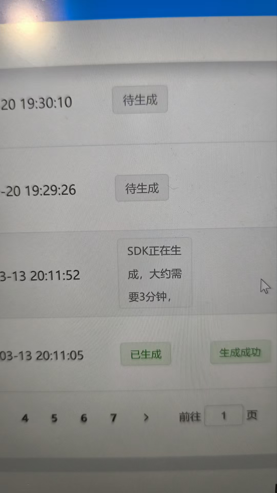

*串口参数配置界面*

---

### SU-03T是否支持MCU数据采集和语音播报功能？

**问题描述：**

需要确认SU-03T模块是否可以实现：通过语音识别触发MCU采集数据，然后将数据传给模块进行实时语音播报。

**解决方案：**

SU-03T支持此功能，可通过串口通信实现MCU与模块的数据交互。

**实现步骤：**

1. **语音识别配置**
    - 在平台配置相应的唤醒词和命令词
    - 设置识别后触发的串口输出指令

2. **MCU数据采集**
    - MCU接收到串口指令后开始采集数据
    - 将采集到的数据格式化为播报文本

3. **语音播报实现**
    - MCU将播报文本通过串口发送给支持TTS的模块（如CI-03T TTS版）
    - SU-03T仅支持播放预录音频，不能进行TTS语音播报

4. **配置方式**
    - 所有配置均在网页平台完成
    - 参考SU-03T串口教程进行详细配置

**注意事项：**

- 需要正确配置串口通信参数（波特率、数据位等）
- 播报文本格式需符合模块要求
- 建议参考官方串口教程视频进行配置

---

### SU-03T固件生成时间过长怎么办？

**问题描述：**

在使用SU-03T芯片生成固件时，遇到生成过程卡在'待生成'状态，等待时间过长的问题。

**解决方案：**

**问题原因分析：**

1. **服务器负载较高**：

    - SU系列模块使用用户较多
    - 服务器需要处理大量生成请求
    - 高峰期会导致排队等待

2. **配置复杂度影响**：

    - 功能配置越复杂，生成时间越长
    - 音频文件较多会增加处理时间
    - 特殊功能可能需要额外计算资源

**处理方法：**

1. **耐心等待**：

    - 正常等待时间通常为10-30分钟
    - 高峰期可能延长至1-2小时
    - 避免频繁取消重新生成

2. **优化生成策略**：

    - 避开高峰时段进行固件生成
    - 简化初始配置，先测试基础功能
    - 分模块逐步添加功能并测试

3. **检查生成状态**：

    - 定期刷新页面查看最新状态
    - 注意是否显示"生成超时"提示
    - 超时后可选择重新生成

4. **网络环境优化**：

    - 使用稳定的有线网络连接
    - 关闭其他占用带宽的应用
    - 确保网络连接不被中断

**注意事项：**

- SU-03T固件生成需要一定时间是正常现象
- 不要因为等待时间长就认为是系统故障
- 建议在配置完成后先保存，避免重复操作
- 如等待超过2小时仍无进展，可联系技术支持

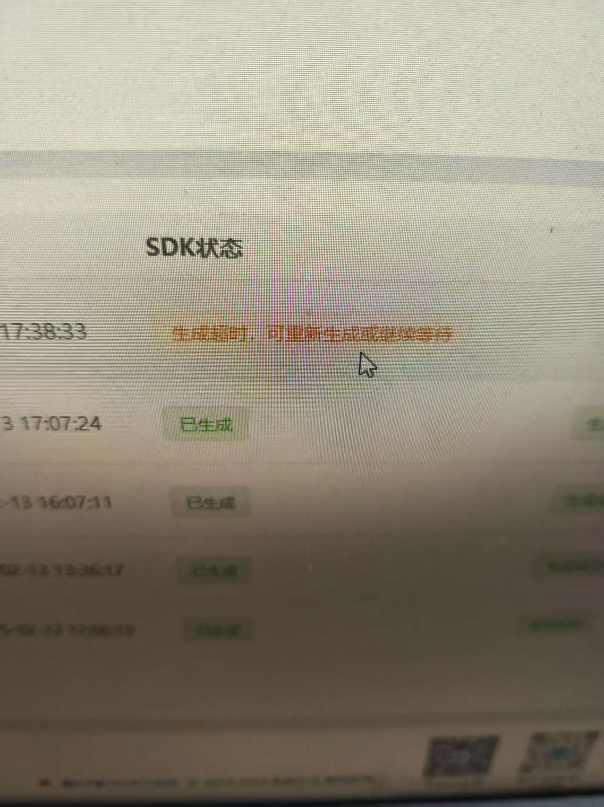

---

### 固件连续几次无法生成正常吗？

**问题描述：**

在使用平台生成固件时，连续几次都无法成功生成，询问这是否是正常现象。

**解决方案：**

**问题分析：**

固件生成连续失败是**正常现象**，特别是在SU系列模块使用高峰期。

**主要原因：**

1. **服务器负载过高**
    - SU系列用户量较大，服务器需要排队处理
    - 高峰期容易出现生成失败
    - 这是平台服务限流机制

2. **网络连接问题**
    - 网络不稳定可能导致生成中断
    - 数据传输超时造成失败

**处理方法：**

1. **多次尝试**
    - 连续失败时多刷新页面
    - 点击"更多"→"重新生成固件"
    - 建议间隔5-10分钟再试

2. **避开高峰期**
    - 工作日上午、下午时段成功率较高
    - 避免晚上和周末高峰期
    - 深夜时段服务器负载较轻

3. **简化配置**
    - 先用简单配置测试生成
    - 成功后再逐步添加功能
    - 减少音频文件数量

**注意事项：**

- 配置检查通过不代表生成一定成功
- 连续失败不是配置错误，是服务器资源问题
- 耐心多试几次通常能成功
- 如急需使用可联系技术支持协助

---

### SDK生成时间过长怎么办？如何获取出厂模板？

**问题描述：**

使用SDK生成平台时遇到生成耗时过长的问题，显示需要145分钟，并询问SU-03T是否有出厂模板可供使用。

**解决方案：**

**1. SDK生成时间长的原因**

- **用户量大**：SU系列模块使用人数多，生成任务需要排队
- **服务器负载**：高峰期生成任务较多，导致等待时间延长
- **正常范围**：一般生成时间在10-30分钟，极端情况可能更长


*SDK生成状态显示需要145分钟*

**2. 出厂模板获取**

SU-03T提供出厂模板可供使用：

- **模板特点**：出厂模板声音效果较好
- **获取方式**：可联系技术支持获取
- **文件类型**：通常包含固件文件和配置文件

**3. 使用建议**

- **急用方案**：申请出厂模板直接使用
- **自定义需求**：如需特定功能，仍需生成自定义固件
- **错峰生成**：选择非高峰时段生成，减少等待时间

**注意事项：**

- 出厂模板功能相对固定，如需定制仍需生成SDK
- 生成时长受服务器负载影响，非技术问题
- 可先使用出厂模板开发，后续再更新自定义固件

---

### 固件生成超过12小时无响应怎么办？

**问题描述：**

平台生成固件时，显示"SDK正在生成"超过12小时仍未完成，无法确定是操作问题还是服务异常。

**解决方案：**

**极端情况说明：**

固件生成超过12小时是**异常情况**，正常情况下即使高峰期也不应超过2小时。

**可能原因：**

1. **系统队列异常**
    - 生成任务可能卡在队列中
    - 系统资源分配出现问题
    - 服务进程可能已经停止

2. **网络或浏览器问题**
    - 页面连接断开但显示仍在生成
    - 缓存问题导致状态更新失败
    - 浏览器兼容性问题

**处理建议：**

1. **立即操作**
    - 刷新页面重新查看状态
    - 尝试取消当前生成任务
    - 重新提交生成请求

2. **更换方案**
    - 简化配置后重新生成
    - 删除不需要的音频文件
    - 分步骤生成和测试功能

3. **联系技术支持**
    - 提供项目ID和配置信息
    - 说明已等待的具体时长
    - 请求优先处理或排查


*固件生成状态显示"SDK正在生成"已超过12小时*

**注意事项：**

- 超过12小时通常表示系统出现异常
- 不要继续无限等待，应主动处理
- 保留配置信息，方便重新提交
- 如有多人遇到同样问题，可能是平台故障

---

### 平台生成服务故障如何处理？

**问题描述：**

平台生成固件服务出现持续卡顿问题，技术团队正在努力优化，但仍有多人无法正常生成。

**解决方案：**

**官方说明：**

1. **问题确认**
    - 技术团队已意识到服务器性能问题
    - 正在努力进行系统优化
    - 对造成的不便深表歉意

2. **当前状况**
    - SU系列模块用户量较大
    - 服务器负载过高导致生成缓慢
    - CI系列模块生成相对正常

3. **优化进展**
    - 已增加服务器资源
    - 实施负载均衡机制
    - 持续监控系统性能

**临时解决方案：**

1. **使用CI系列模块**
    - CI-03T等模块生成速度正常
    - 功能相近，可作为替代方案
    - 支持大部分语音识别需求

2. **错峰使用**
    - 选择非高峰时段生成
    - 避免晚上和周末
    - 工作日上午成功率较高

3. **简化配置**
    - 先生成基础功能版本
    - 逐步添加和测试功能
    - 减少单次生成的复杂度

**后续改进：**

- 服务器扩容正在进行中
- 预计1-2日内完成优化
- 完成后将恢复正常生成速度
- 感谢大家的耐心等待

---

### SU-03T是否支持OLED驱动？

**问题描述：**

需要了解SU-03T芯片是否支持OLED显示屏驱动，以及是否有现成的驱动程序或实现方案。

**解决方案：**

SU-03T目前没有现成的OLED驱动程序。如果需要连接OLED显示屏，可以考虑以下方案：

- **软件模拟I2C**：通过两个GPIO引脚模拟I2C时序来驱动OLED显示屏
- **硬件选型建议**：后续推出的其他模块会提供对OLED驱动的支持

**注意事项：**

- SU-03T的资源有限，使用软件模拟I2C可能会占用较多系统资源
- 建议在项目设计阶段考虑显示需求，选择合适的硬件方案
- 如确需在SU-03T上实现OLED显示，需要自行开发驱动程序

---

### 如何防止SU-03T模块死机并设置定时重启？

**问题描述：**

SU-03T模块在长时间运行过程中可能出现死机现象，需要采取措施防止系统死机并设置定时重启功能。

**解决方案：**

**1. 硬件看门狗方案**

- 启用模块内部的硬件看门狗功能
- 在固件中定期喂狗（发送复位信号）
- 系统无响应时看门狗会自动复位

**2. 软件定时重启**

- 在主程序中设置定时器逻辑
- 每运行一段时间（如24小时）主动触发系统重启
- 通过调用系统API或发送复位指令实现

**3. 固件稳定性优化**

- 避免长时间占用CPU或内存资源
- 合理分配系统资源
- 增加异常处理机制，防止程序崩溃

**注意事项：**

- 定时重启的时间间隔需根据实际应用场景调整
- 频繁重启可能影响用户体验，需要平衡稳定性和可用性
- 确保供电稳定（3.6-5.5V），避免电源问题导致死机

---

### SU-03T/10A模块如何升级固件？

**问题描述：**

需要了解SU-03T/10A模块以及蜂鸟M芯片的固件升级方法和操作指南。

**解决方案：**

**1. 公元平台直接升级**

- 登录智能公元平台
- 选择已创建的固件配置
- 点击"继承发布"生成新固件
- 新固件会包含最新的优化和功能

**2. 早期板子烧录方式**

- 2024年10月25日前采购的模块
- 需要下载新固件进行烧录
- 使用专用烧录工具进行更新

**3. 升级注意事项**

- 备份当前固件配置
- 确认模块型号匹配（SU-03T/10A）
- 升级后需要重新测试语音功能
- 如有问题可联系技术支持

**4. 蜂鸟M芯片特别说明**

- 蜂鸟M是新一代主控芯片
- 性能较上一代有显著提升
- 支持更优化的语音算法
- 建议升级到最新版本固件

**注意事项：**

- 升级过程请勿断电
- 保留原配置文件便于恢复
- 新固件可能需要重新校准麦克风
- 批量升级建议先进行小批量测试

---

### 个性化音频文件上传后大小异常怎么办？

**问题描述：**

将个性化音频文件添加到SU-03T时，文件大小被异常压缩至0.21KB，导致音频无法正常播放，即使原始文件在500KB限制内也会出现此问题。

**解决方案：**

**1. 音频格式转换**

- 使用音频转换软件（如格式工厂）将音频文件转换为WAV格式
- 确保转换后的文件大小不超过500KB
- 推荐使用标准的WAV格式编码

**2. 文件大小要求**

- 单个音频文件大小限制：500KB以内
- 系统会自动处理和压缩音频文件
- 转换为WAV格式可避免大小异常问题

**注意事项：**

- MP3等其他格式可能导致大小异常
- 必须使用专业的音频转换工具进行格式转换
- 转换时注意保持音质的同时控制文件大小

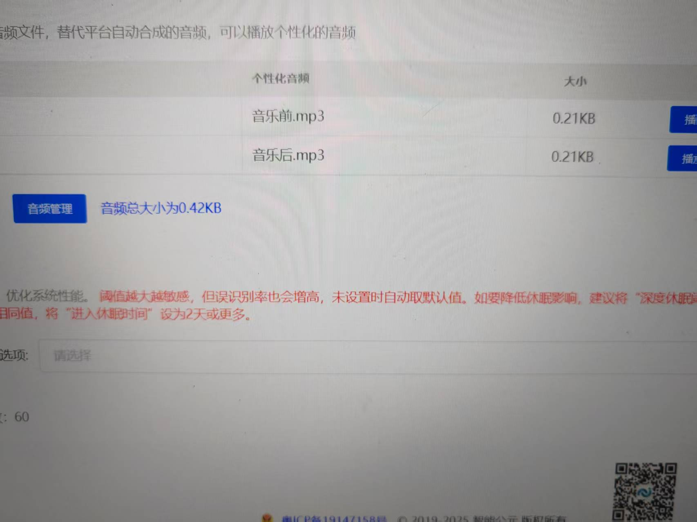

---

### SU-03T1是否支持系统重启配置功能？

**问题描述：**

需要在SU-03T1模块中配置系统自动重启功能，但不确定当前固件是否支持该功能。

**解决方案：**

**系统重启配置说明：**

- SU-03T1模块支持系统重启配置功能
- 可以通过平台设置定时重启
- 支持条件触发重启和定时重启两种模式

**配置方法：**

1. **定时重启设置**
    - 在平台中选择"系统设置"
    - 找到"定时重启"选项
    - 设置重启间隔时间（如24小时）
    - 保存配置并生成新固件

2. **条件触发重启**
    - 设置触发条件（如运行时间、异常状态等）
    - 配置重启动作
    - 测试验证功能正常

**注意事项：**

- 新固件版本已恢复该功能
- 旧版本用户需要升级到最新固件
- 重启配置会影响正常使用，需合理安排时间
- 建议在低峰期自动重启

---

### CI-03T是否支持一个欢迎词多个回复词随机回复？

**问题描述：**

希望配置CI-03T模块在识别到欢迎词后，能够随机选择多个不同的回复词进行响应。

**解决方案：**

**随机回复功能说明：**

- CI-03T模块支持一个欢迎词对应多个回复词
- 支持随机选择播放回复内容
- 可以提升交互的多样性和趣味性

**配置步骤：**

1. **添加欢迎词**
    - 在命令词中添加欢迎词（如"你好"）
    - 设置为唤醒词或命令词

2. **配置多个回复**
    - 在响应动作中选择"播放语音"
    - 添加多个回复语音文件
    - 勾选"随机播放"选项

3. **设置随机策略**
    - 可设置播放权重
    - 支持顺序循环或随机选择
    - 可配置不重复播放逻辑

**应用场景：**

- 智能音箱的随机应答
- 玩具的多样化回应
- 服务机器人的自然交互
- 避免单一回复的单调感

**注意事项：**

- 确保所有回复文件格式正确
- 建议回复内容风格统一
- 测试各种随机组合效果
- 注意回复文件的总大小限制

---

### 如何配置语音指令触发I/O输出脉冲？

**问题描述：**

需要配置SU-03T模块，在识别到语音指令（英语"cut"或中文"剪"）后，将指定I/O口输出一个1100ms的低电平脉冲，之后恢复高电平并等待下一次语音指令。

**解决方案：**

**实现方式：**

1. **配置命令词**
    - 在智能公元平台添加命令词："cut"（英文）和"剪"（中文）
    - 设置为免唤醒模式或需要唤醒词根据实际需求

2. **配置GPIO输出控制**
    - 在识别后的动作中选择"端口输出"
    - 选择对应的GPIO引脚
    - 设置输出为"输出脉冲"模式
    - 配置脉冲宽度为1100ms

3. **电平配置**
    - 设置初始电平为高电平
    - 脉冲输出为低电平
    - 脉冲结束后自动恢复为高电平

**配置步骤：**

1. 登录智能公元平台，选择SU-03T模块
2. 添加命令词"cut"和"剪"
3. 为每个命令词配置输出动作：

    - 控制方式：端口输出
    - 选择GPIO引脚
    - 动作：输出脉冲
    - 脉冲宽度：1100ms
    - 初始电平：高
    - 脉冲电平：低
4. 生成固件并烧录到模块

**参考资料：**

- SU-03T配置教程：https://www.bilibili.com/video/BV1e8411T77q/

**注意事项：**

- 确保GPIO引脚与外部电路正确连接
- 脉冲宽度单位为毫秒，1100ms应设置为1100
- 测试时验证脉冲宽度和电平变化是否正确
- 如需更复杂的时序控制，可配合定时器使用

---

### 如何实现SU-03T模块免唤醒指令与IO控制功能？

**问题描述：**

需要在SU-03T模块上实现免唤醒指令功能，当识别到特定词语（如"镜子"）时，控制一个IO口输出低电平并延时1秒后恢复高电平。

**解决方案：**

SU-03T支持免唤醒指令功能，无需说唤醒词即可直接识别特定命令词并执行相应动作。

**实现步骤：**

1. **配置免唤醒命令词**
    - 在智能公元平台添加命令词（如"镜子"）
    - 设置为免唤醒模式（无需唤醒词直接识别）
    - 注意免唤醒命令词数量有限制

2. **配置IO输出控制**
    - 在识别后的动作中选择"端口输出"
    - 选择对应的GPIO引脚（如GPIO_B0）
    - 设置输出为低电平

3. **配置延时恢复**
    - 添加定时器功能，延时1000ms
    - 定时器超时后将同一GPIO设置为高电平
    - 或使用"输出脉冲"功能直接实现

4. **生成并烧录固件**
    - 保存配置并生成固件
    - 使用烧录工具烧录到模块

**参考资料：**

- SU-03T、IO输入输出教程：https://www.bilibili.com/video/BV19K411B7ib/
- CI-03T免唤醒和自学习教程：https://www.bilibili.com/video/BV1LM4y1S7A8/
- 平台配置方法与CI-03T相同

**注意事项：**

- 免唤醒命令词的数量有限，需要合理规划使用
- IO口初始电平需要根据实际电路需求配置
- 延时时间单位为毫秒，1秒应设置为1000ms
- 测试时确保硬件连接正确

---

### 如何配置多个免唤醒命令词对应多个GPIO端口输出？

**问题描述：**

需要配置SU-03T芯片，使其在识别到6个不同的语音指令时，通过3个GPIO端口（B3、A27、A26）输出500ms的低电平脉冲信号，每个端口对应两个命令词，且不需要使用唤醒词。

**解决方案：**

**实现思路：**

1. 使用免唤醒模式，无需唤醒词直接识别命令
2. 每个GPIO端口对应两个不同的命令词
3. 所有输出都设置为500ms低电平脉冲
4. GPIO初始状态设置为高电平

**配置步骤：**

1. **设置免唤醒模式**

    - 在智能公元平台创建项目时选择免唤醒模式
    - 或添加一个不使用的唤醒词，通过上电启动事件禁用唤醒词识别

2. **添加命令词**

    - 添加6个命令词（如命令词1-6）
    - 全部设置为免唤醒命令词

3. **配置GPIO引脚**

    - 在Pin脚配置中设置：

        - GPIO_B3：输出模式，默认高电平
        - GPIO_A27：输出模式，默认高电平
        - GPIO_A26：输出模式，默认高电平

4. **配置控制动作**

    为每个命令词添加控制动作：

    - 命令词1、2 → GPIO_B3输出脉冲（500ms）
    - 命令词3、4 → GPIO_A27输出脉冲（500ms）
    - 命令词5、6 → GPIO_A26输出脉冲（500ms）

    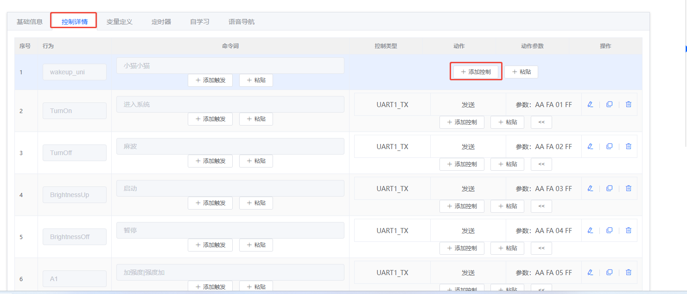

    添加控制时设置：

    - 行为：选择对应的命令词
    - 控制方式：端口输出
    - 控制类型：选择对应的GPIO
    - 动作：输出脉冲
    - 周期：500ms（注意单位是10ms，所以填50）
    - 次数：1

    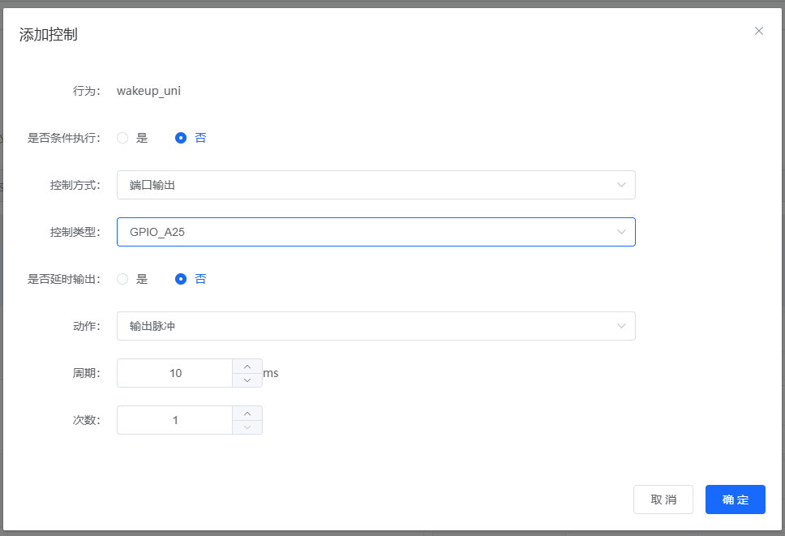

5. **生成固件**

    - 发布前点击"检查配置"
    - 确保没有错误提示
    - 生成固件并烧录

**Pin脚配置示例：**

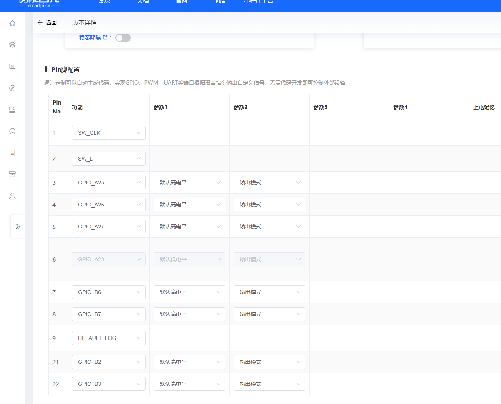

**注意事项：**

- 免唤醒词数量有限制（SU-03T支持约10条）
- 输出脉冲周期单位是10ms，500ms需填写50
- 确保GPIO端口与外部电路正确连接
- 测试时验证每个命令词都能正确触发对应端口
- 如需更复杂的控制逻辑，可配合变量和条件判断实现

---

### 如何在语音回复中添加分隔符？

**问题描述：**

需要在语音模块的回复语中添加分隔符（如"｜"），以实现更清晰的语音输出或后续处理。

**解决方案：**

**分隔符功能说明：**

- 支持在回复语中使用特殊分隔符
- 可用于区分不同内容或实现特殊效果
- 分隔符会在语音播报时产生停顿

**使用方法：**

1. **添加分隔符**
    - 在回复文本中直接输入分隔符
    - 常用分隔符："｜"、"——"、"…"等
    - 可在任意位置插入

2. **应用场景示例**
    - "欢迎光临｜今天天气晴朗"
    - "请稍等｜正在处理中"
    - "成功｜操作已完成"

3. **分隔符效果**
    - 产生短暂停顿
    - 分隔不同信息内容
    - 提高语音的层次感

**高级应用：**

- **多段信息分隔**：使用不同分隔符区分内容类型
- **语气停顿**：在需要停顿的地方添加分隔符
- **数据标记**：为后续处理添加标记点

**注意事项：**

- 分隔符会占用回复字符长度
- 建议测试不同分隔符的效果
- 过多分隔符可能影响自然度
- 选择符合应用场景的分隔符

---

### 如何配置定时器实现上电自动发送串口消息？

**问题描述：**

需要配置设备上电后，通过定时器每60秒自动通过串口发送一个16进制消息，但配置后定时器未触发。

**解决方案：**

**配置上电启动触发：**

1. **添加触发器配置**
    - 触发方式：选择"事件触发"
    - 事件类型：选择"系统启动"
    - 触发类型：选择"上电启动"

2. **定时器配置**
    - 定时器编号：选择t3或其他可用定时器
    - 超时时间：设置为60000ms（60秒）
    - 触发方式：事件触发
    - 循环模式：根据需要设置单次或循环

3. **串口发送配置**
    - 执行动作：选择"串口发送"
    - 发送内容：输入要发送的16进制消息
    - 串口选择：选择对应的串口（如UART1）

4. **关键配置要点**
    - 必须添加"上电启动"触发，否则定时器不会自动启动
    - 定时器需要设置为"循环启动"才能持续工作
    - 确保串口参数配置正确（波特率、数据位等）

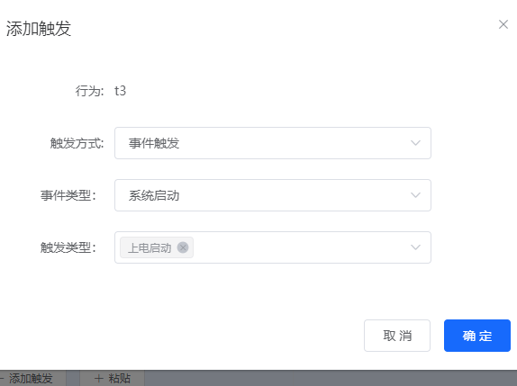

*上电启动触发配置示例*

**注意事项：**

- 仅设置定时器超时不足以实现上电自启动
- 必须同时配置"系统启动→上电启动"触发器
- 建议先测试单次发送，确认功能正常后再改为循环模式
- 定时器参数单位为毫秒，60秒应设置为60000

---
### 如何实现定时器与MCU联动？

**问题描述：**

需要了解CI芯片内部的定时器功能如何与外部MCU进行联动，具体应用场景是当定时器超时时，通过串口向MCU发送数据。

**解决方案：**

**定时器功能说明：**

- 定时器是内部功能，可理解为定时器中断
- 计时到达后触发预设的操作
- 需要配合定时器事件使用

**实现步骤：**

1. **配置定时器启动**
    - 添加控制：启动定时器
    - 选择定时器编号（T1、T2等）
    - 设置超时时间和工作模式

2. **添加定时器事件**
    - 触发方式：事件触发
    - 事件类型：定时器超时
    - 选择对应的定时器编号

3. **配置超时动作**
    - 操作：UART1_TX发送数据
    - 设置要发送的十六进制数据
    - 配置完整的触发流程

**应用场景示例：**

- **设备监控**：定时查询传感器状态
- **数据上报**：定时发送设备运行数据
- **心跳机制**：定时发送保活信号
- **延时控制**：实现精确的延时操作

**注意事项：**

- 必须同时配置定时器启动和定时器事件
- 定时器超时时间以毫秒为单位
- 单次触发模式需要重新启动才能再次触发
- 循环模式会持续重复触发


### SU-03T如何通过串口命令强制停止播放？

**问题描述：**

在使用SU-03T播放长内容时，需要通过串口发送命令强制停止播放。

**解决方案：**

**播放控制功能配置：**

1. **添加串口触发器**
    - 触发方式：选择"串口输入"
    - 串口选择：UART1_RX（根据实际使用选择）
    - 设置触发条件（如特定命令字）

2. **配置播放控制动作**
    - 执行动作：选择"播放控制"
    - 控制类型：选择"停止播放"
    - 可设置为立即停止当前播放

3. **串口命令格式**
    - 发送特定的十六进制命令
    - 命令格式需符合模块协议要求
    - 可通过串口调试工具测试

**使用条件：**

- 模块必须处于唤醒状态才能响应停止命令
- 建议先唤醒设备再发送停止命令
- 支持在任何播放阶段强制停止

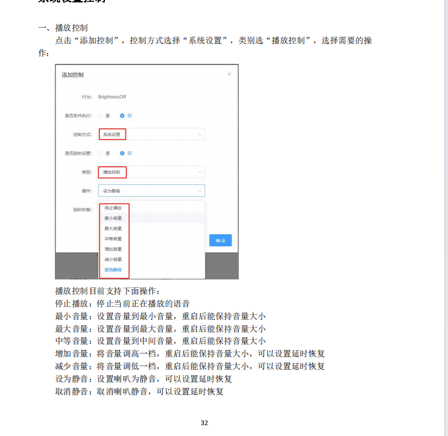

*播放控制配置示例*

**应用场景：**

- 紧急情况下的语音中断
- 播放错误内容的快速停止
- 多设备协作时的播放同步控制

**注意事项：**

- 停止命令不会影响后续的语音识别功能
- 停止后可立即接收新的播放或识别指令
- 建议在产品说明书中标注停止命令的使用方法

---

### SU-03T1是否支持485通信？

**问题描述：**

询问SU-03T1模块是否自带485通信功能，以及如何与485设备通信。

**解决方案：**

**1. 通信接口说明**

- SU-03T1自带的是TTL电平串口，不是485差分电平
- 如需使用485通信，必须外接485转换模块
- 串口参数：默认9600波特率，8数据位，1停止位

**2. 485转换方案**

- **独立485模块**：

    - 需要额外的485转换芯片或模块
    - TTL转485模块接入SU-03T1的串口
    - 转换后可与485网络通信

- **通信流程**：
    SU-03T1 → TTL串口 → 485转换模块 → 485网络


*SU-03T1系列产品选项*

**3. 咪头引线延长**

如果需要延长咪头连接线：

- **注意事项**：线长超过100mm（10cm）必须使用屏蔽线
- **推荐方案**：使用双绞线或屏蔽线防干扰
- **定制服务**：可联系厂家定制长线（价格另议）

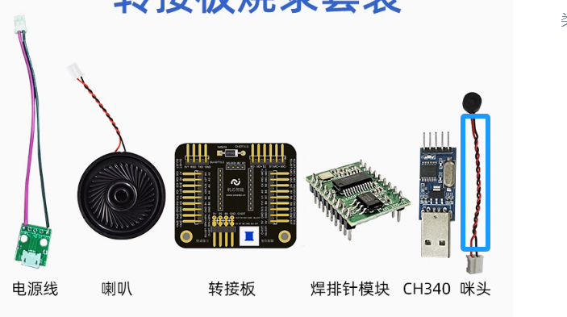

*SU-03T1套件组件，咪头被蓝色框标出*


*咪头选型推荐与技术参数*

**注意事项：**

- TTL和485是不同的电平标准，不能直接相连
- 长距离通信建议使用485，抗干扰能力更强
- 咪头引线过长会影响拾音效果，必须做好屏蔽

---

### SU-03T的语音导航功能是如何实现的？

**问题描述：**

了解语音导航功能的实际使用效果，以及该功能是否仅能播报预设内容。

**解决方案：**

**功能说明：**

- 语音导航功能仅能播报预设的固定内容
- 不支持动态生成或实时更新的导航信息
- 播报内容需要在开发阶段预先配置到固件中

**实现方式：**

1. **预设播报内容**
    - 在平台配置中设置需要播报的导航文本
    - 每个导航指令对应固定的播报内容
    - 支持多条导航指令配置

2. **触发方式**
    - 通过语音命令触发导航播报
    - 也可通过串口发送指令触发
    - 触发后模块播报对应的预设内容

3. **视频教程**
    - 平台提供详细的配置教程
    - 教程链接：https://www.bilibili.com/video/BV1CG411P7y6/
    - 包含SU-03T、六路继电器配套教程、个性化音频、自学习、语音导航等内容

**注意事项：**

- 语音导航功能适用于固定路线或场景的语音提示
- **顺序执行特性**：语音导航是按顺序执行的，用户必须按照预设的导航流程逐条说出指令，无法跳过或随机选择中间的指令
- 如需动态导航信息，需要配合其他系统实现
- 预设内容数量受限于模块的Flash容量
- 词条较多时，语音导航的交互体验可能不如直接使用命令词灵活

---

### CI系列离线语音芯片的定时器可以使用变量设置超时时间吗？

**问题描述：**

在CI系列离线语音识别芯片的开发环境中，是否可以使用变量来设置定时器的超时时间。

**解决方案：**

**功能限制：**

- 定时器的超时时间不支持使用变量设置
- 超时时间参数必须是固定数值，不能传入变量
- 这是平台固件的功能限制

**原因说明：**

1. **配置界面限制**
    - 定时器超时时间配置框只接受固定数值输入
    - 无法绑定变量或动态参数
    - 系统编译时会检查参数类型

2. **设计考量**
    - 固定超时时间便于系统优化和资源管理
    - 避免运行时参数变化导致的不可预期行为
    - 保证系统的实时性和稳定性

**替代方案：**

- 使用多个固定时间的定时器，根据条件选择启动
- 通过计数器配合基本定时单位实现可变延时
- 在串口接收等事件中处理时间相关的逻辑

**注意事项：**

- 不支持运行时修改定时器超时时间
- 设计时需要根据实际需求选择合适的固定时间值
- 如需灵活的时间控制，考虑在应用层实现相关逻辑

---

### SU-03T可以通过串口控制吗？如何配置串口引脚？

**问题描述：**

希望使用串口发送控制指令来操作SU-03T模块，并了解是否可以使用B6/B7进行烧录，同时使用B2/B3进行串口控制。

**解决方案：**

**1. 串口控制支持**

- SU-03T支持通过串口接收控制指令
- 可以发送数字消息触发对应的动作
- 支持其他设备通过串口控制语音模块

**2. 串口引脚配置**

- **B6/B7引脚**：用于串口烧录
- **B2/B3引脚**：用于串口通信控制
- **注意事项**：SU-03T只有一路串口

**3. 使用方法**

- 烧录固件时：使用B6/B7连接烧录器
- 烧录完成后：需要将串口线转接到B2/B3
- 运行时控制：通过B2/B3接收串口指令

**操作流程：**

1. **固件烧录阶段**
    - 连接烧录器到B6/B7引脚
    - 使用烧录工具完成固件更新
    - 断开烧录器连接

2. **串口控制阶段**
    - 将串口线连接到B2/B3引脚
    - 上位机或MCU通过串口发送控制指令
    - 模块接收指令后执行相应动作

**注意事项：**

- SU-03T只有一路串口，烧录和运行不能同时进行
- 烧录完成后必须重新连接串口线到B2/B3
- 串口控制需要按照协议格式发送指令
- B2/B3串口参数：默认9600波特率，8数据位，1停止位

---

### 如何配置串口数据触发不同的事件？

**问题描述：**

希望通过串口接收的数据进行条件判断，控制不同的事件，但配置后功能无法正常工作。

**解决方案：**

串口数据触发事件需要正确配置触发、变量绑定和条件判断：

**1. 配置串口输入触发**

- 触发方式选择"串口输入"
- 选择对应的串口（如UART1_RX）
- 设置消息编号
- 配置输入参数（如rendata1-rendata8）
- 参数类型选择char（字符型）

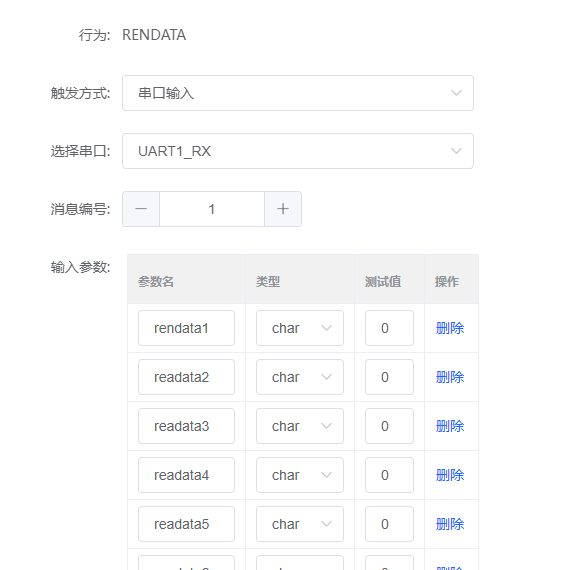

**2. 绑定串口数据到变量**

- 添加控制事件
- 选择"变量设置"方式
- 将串口参数赋值给变量
- 例如：rendata5 → RenData5

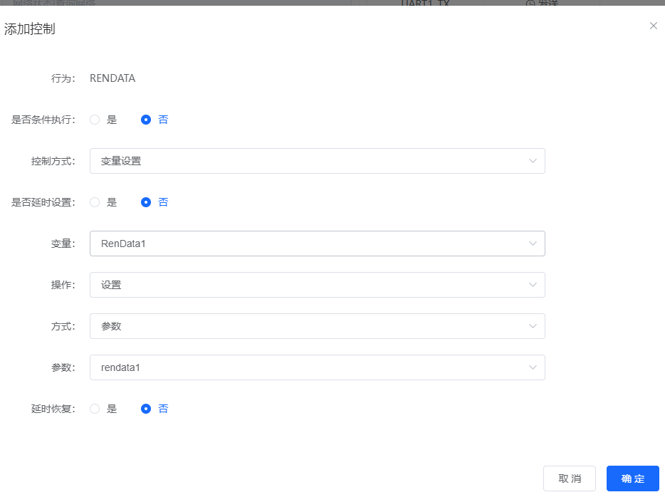

**3. 设置条件判断**

- 添加控制事件
- 选择"条件控制"
- 设置判断条件（如：变量 RenData5 等于 数值 2）
- 配置触发的动作（如播放语音）

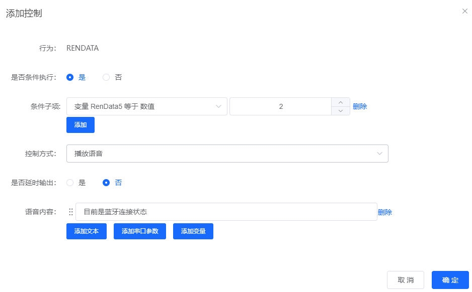

**4. 处理多数值触发**

如果要实现不同数值触发不同事件：

- 方法一：使用单一变量
    - 所有条件判断使用同一个变量（如RenData5）
    - 避免语音覆盖问题，使用定时器延时播放
    - 示例：if(RenData5==2)触发事件1，if(RenData5==3)触发事件2

- 方法二：使用多个变量
    - 为不同数值创建多个条件判断
    - 注意语音可能相互覆盖，需要延时处理

**数据格式示例：**

```
AA 55 01 00 00 00 02 01 02 00 00 55 AA
```

其中第7位（02）是变化的值，用于触发不同事件。

**注意事项：**

- 确保串口输入变量与条件判断变量一致
- 如果语音播放被覆盖，添加延时输出
- 测试时可通过"测试值"查看变量变化
- 串口数据必须按照设置的前缀触发（如AA 55 01）

**常见问题：**

1. **条件不生效**
    - 检查变量名称是否匹配
    - 确认串口数据格式正确
    - 验证触发条件设置

2. **事件被覆盖**
    - 使用定时器添加延时
    - 避免同时触发多个语音
    - 考虑使用单一变量判断

---

### SU-03T/SU-10A固件升级通知

**问题描述：**

收到通知称SU-03T/SU-10A需要升级为SU-03T1/SU-10A1，询问是否必须升级和如何操作。

**解决方案：**

**升级原因：**

- 芯片Flash更新换代
- 蜂鸟M/US516P6芯片Flash规格变更
- 需要同步调整模块型号

**升级说明：**

- 原有固件仍可继续使用
- 新生产的模块将使用新型号
- 建议新项目使用新型号
- 在智能公元平台需要选择对应型号

**操作步骤：**

1. **确认模块型号**
    - 查看模块上的丝印标识
    - 确认是否使用新型号芯片

2. **平台配置**
    - 登录智能公元平台
    - 创建新产品时选择对应型号
    - SU-03T项目选择SU-03T1
    - SU-10A项目选择SU-10A1

3. **固件选择**
    - 下载对应型号的固件
    - 确保固件版本匹配

**注意事项：**

- 升级主要影响新生产的模块
- 现有模块如无特殊需求可不升级
- 新项目建议直接使用新型号
- 技术支持可提供具体指导

---

### SU-03T如何实现语音控制的定时功能？

**问题描述：**

需要通过语音指令设定一个定时时间，时间到达后自动执行开关操作，实现语音控制的定时功能。

**解决方案：**

SU-03T可以通过软件设计实现定时功能，结合语音识别和定时器机制来完成定时控制。

**实现原理：**

1. **语音识别部分**
    - 使用模块内置的语音识别功能
    - 识别包含定时信息的语音指令（如"定时10分钟"）
    - 将时间信息转换为具体数值

2. **定时器设计**
    - 在软件中定义定时器变量
    - 存储设定的定时时间（毫秒）
    - 实现倒计时逻辑

3. **控制逻辑**
    - 定时器超时后执行开关操作
    - 可根据需要重新启动定时器实现循环
    - 通过变量判断是否执行特定操作

**实现步骤：**

1. **定义变量和定时器**
    ```
    uint32_t timer_duration;  // 存储定时时间
    bool timer_running = false;  // 定时器运行状态
    ```

2. **处理语音指令**
    - 解析语音中的时间信息
    - 将时间字符串转换为毫秒值
    - 启动定时器开始计时

3. **定时器超时处理**
    - 执行预设的开关操作
    - 根据需要决定是否循环
    - 更新定时器状态

**应用场景：**

- 定时开关电器
- 定时提醒功能
- 延时控制操作
- 周期性任务执行

**注意事项：**

- 定时精度取决于系统时钟
- 需要合理管理芯片资源
- 建议在定时开始和结束时提供用户反馈
- 复杂的定时逻辑可能需要二次开发

---

### SU-03T的端口输出是否支持自定义数据配置？

**问题描述：**

在配置SU-03T的端口输出行为时，发现无法自定义数据，只能选择预设的动作类型（如输出脉冲），询问是否支持自定义数据输出。

**解决方案：**

**当前功能限制：**

- SU-03T的端口输出功能**不支持自定义数据**
- 只能使用预设的动作类型
- 无法手动输入任意16进制数据

**支持的输出类型：**

1. **输出电平**
    - 输出高电平
    - 输出低电平

2. **输出脉冲**
    - 可设置脉冲宽度
    - 自动从初始电平翻转到目标电平

3. **延时输出**
    - 支持延时执行
    - 可配置延时时间

**配置方法：**

在平台行为配置界面：

1. 选择"控制方式：端口输出"
2. 选择"控制类型：GPIO_BX"（具体引脚）
3. 选择"动作"类型：

    - 输出高电平
    - 输出低电平
    - 输出脉冲

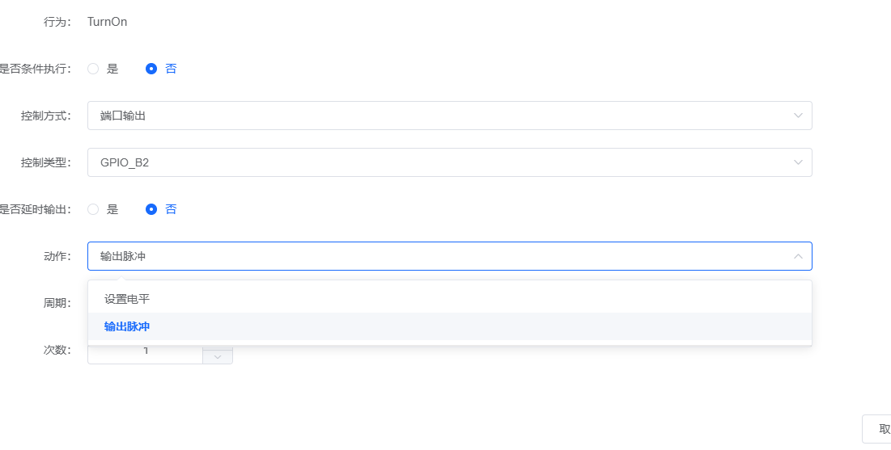

*SU-03T端口输出配置界面，可见只能选择预设动作*

**技术原因：**

- 模块固件固化了输出动作类型
- 为简化配置，降低使用门槛
- 避免用户配置错误导致硬件损坏

**替代方案：**

1. **组合使用多个控制**
    - 通过多个简单的控制组合实现复杂逻辑
    - 使用变量控制输出状态
    - 配合定时器实现时序控制

2. **考虑其他型号**
    - 如需自定义串口数据输出
    - 可选择支持串口输出功能的型号
    - 如SU-32T等支持更多通信功能

**注意事项：**

- 如需发送自定义数据，建议使用串口通信功能
- 端口输出主要用于简单的开关控制
- 复杂数据通信需要选用合适的模块型号

---

### SU-03T可以通过命令动态调节音量吗？
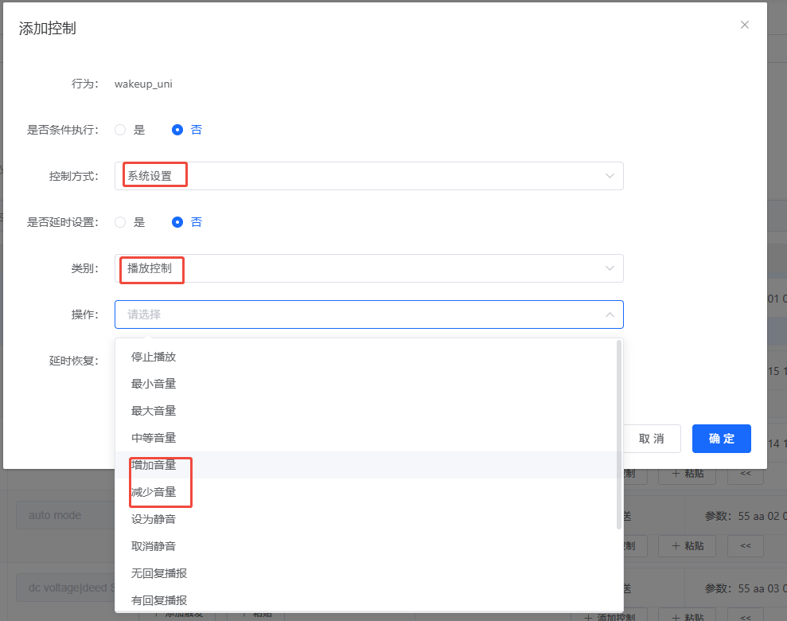

*智能公元平台播放控制选项*

**问题描述：**

在实际应用中，需要通过串口命令或外部指令动态调节SU-03T的输出音量，而不是仅依赖平台配置的固定音量。

**解决方案：**

**1. 播放控制配置**

SU-03T支持通过平台配置的"播放控制"功能实现音量动态调节。在智能公元平台的添加控制中：

- **控制方式**：选择"系统设置"
- **类别**：选择"播放控制"
- **可用操作**：
  - 最小音量
  - 最大音量
  - 中等音量
  - 增加音量
  - 减少音量
  - 设为静音
  - 取消静音
  - 有/无回复播报

**2. 触发方式**

可通过以下方式触发音量调节：

- **语音指令**：设置命令词触发对应操作
- **串口输入**：通过串口接收外部命令触发
- **GPIO触发**：通过按键或电平变化触发

**3. 应用场景**

- 设备根据环境噪音自动调节音量
- 通过物理按键或遥控器调节音量
- 主控MCU通过串口动态调节音量
- 多设备协作时统一音量控制

**注意事项：**

- 平台配置的默认音量在上电时生效
- 动态音量调节不会改变默认音量设置
- 需要重新生成固件才能使配置生效

---

---

---

### SU-03T是否支持TTS功能？

**问题描述：**

确认SU-03T与CI-03T在TTS功能上的区别，以及如何根据需求选择合适型号。

**解决方案：**

**TTS功能对比：**

| 型号 | TTS支持 | 实现方式 | 说明 |
|------|----------|----------|------|
| SU-03T标准版 | ✗ | 不支持 | 仅支持预录音频播放 |
| CI-03T标准版 | ✗ | 不支持 | 仅支持预录音频播放 |
| CI-03T(TTS版) | ✓ | 需授权 | 购买时需选择TTS版本 |
| CI-33T | ✓ | 原生支持 | 单模块实现ASR+TTS |

**功能说明：**

1. **SU-03T功能限制**：

    - 不支持实时文本转语音
    - 只能播放预先录制的音频
    - 语音内容需要在固件生成时配置

2. **CI-03T TTS版本**：

    - 支持中英文TTS
    - 购买时必须选择授权版本
    - 需要烧录专用TTS固件
    - ASR和TTS不能在同一模块共存

**选型建议：**

- 需要动态语音播报 → 选择CI-33T或CI-03T(TTS版)
- 仅需要固定回复 → SU-03T或CI-03T标准版即可
- 成本敏感 → SU-03T性价比最高

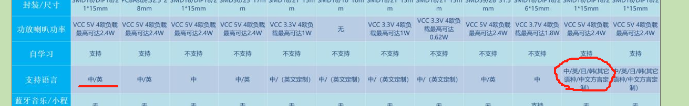

3. **与其他功能对比**：

    | 功能 | SU-03T1 | CI-33T | 说明 |
    |------|----------|----------|------|
    | TTS语音合成 | ✗ | ✓，无需授权 | CI-33T支持 |
    | 声纹识别 | ✗ | ✓，需要授权 | CI-33T需要额外购买 |
    | 自然说功能 | ✓ | ✓ | 两者都支持 |

**配置方法：**

1. **平台配置**：

    - 在智能公元平台选择SU-03T1
    - 添加需要TTS播报的命令词
    - 设置对应的播报文本内容

2. **触发方式**：

    - 通过语音识别触发TTS播报
    - 可配置变量动态生成播报内容
    - 支持参数化播报

3. **播报设置**：

    - 可选择不同的播报音色
    - 调节播报音量和语速
    - 设置播报重复次数

**注意事项：**

- TTS功能开箱即用，无需担心授权问题
- 播报内容需要在固件生成时配置
- TTS播报时会占用一定的Flash存储空间
- 建议测试播报效果是否符合产品需求

---

### SU-03T模块SDK开发支持范围

**问题描述：**

了解SU03T模块的SDK提供的开发支持范围和服务内容。

**解决方案：**

**SDK支持范围说明：**

- **提供内容**：提供完整的SDK源代码
- **支持范围**：仅提供平台开发的使用支持
- **不支持内容**：不提供代码开发层面的使用支持

**支持详情：**

1. **平台开发支持**
    - 平台配置相关问题解答
    - 功能实现指导说明
    - 常见问题排查方法

2. **SDK源代码提供**
    - 提供完整的SDK源代码包
    - 包含开发所需的接口文档
    - 包含示例代码和说明

3. **代码开发限制**
    - 不提供代码编写指导
    - 不提供程序调试服务
    - 不提供定制开发服务

**使用建议：**

- 进行二次开发应具备一定的嵌入式开发经验
- 参考SDK中的示例代码和文档进行开发
- 平台配置问题可获得相关帮助
- 代码层面问题需要自行解决或寻找第三方支持

**注意事项：**

- SDK仅作为开发资源提供，不包含开发服务
- 使用SDK进行开发需要具备相应的技术能力
- 应仔细阅读SDK文档和示例，了解开发规范

---

### SU-03T二次开发需要什么Python环境？

**问题描述：**

在进行SU03T模块二次开发时遇到编译失败，需要了解所需的Python环境要求。

**解决方案：**

**Python版本要求：**

- **需要同时安装Python 2.7和Python 3.x**
- 部分代码较古老，必须使用Python 2.7
- 新版本的某些功能可能需要Python 3.x

**环境配置建议：**

1. **Python 2.7.12**
    - 用于编译古老的代码部分
    - 某些遗留脚本依赖此版本
    - 建议使用Python 2.7.12或相近版本

2. **Python 3.x**
    - 用于较新的功能和脚本
    - 推荐使用Python 3.5或更高版本
    - 部分现代工具需要此版本

**安装注意事项：**

- 在Linux系统中可以同时安装多个Python版本
- 使用python2和python3命令区分不同版本
- 或使用虚拟环境管理不同项目的Python版本

**开发环境建议：**

- 确保系统中同时有python2.7和python3命令
- 根据脚本需求选择合适的Python版本执行
- 查看项目文档，确认每个脚本所需的Python版本


*Python 2.7和Python 3.x同时安装环境*

---

### SU-03T/SU-10A芯片批次升级与离线烧录支持

**问题描述：**

SU-03T/SU-10A芯片已升级为新批次，需要确认新批次芯片的识别方式和是否支持离线烧录器烧录自定义程序。

**解决方案：**

**1. 批次识别说明**

- **新批次丝印**：升级后的芯片丝印标识为"P"
- **芯片型号**：内部实际为蜂鸟M新版（US516P6）
- **Flash扩容**：此次升级对Flash进行了扩容，但不影响使用和功能

**2. 离线烧录支持**

- **支持离线烧录**：新批次芯片支持使用离线烧录器
- **空片供应**：芯片以空片形式提供，可自行烧录程序
- **烧录方式**：支持通过专用烧录工具烧录自定义固件

**3. 固件兼容性**

- **功能无差异**：扩容不影响芯片功能和使用方式
- **平台更新**：建议使用10月25日平台更新后的固件内容
- **向下兼容**：现有项目配置可直接使用，无需修改

**注意事项：**

- 新旧批次芯片在功能上完全兼容
- 为获得最佳性能，建议使用最新平台版本生成固件
- 离线烧录需要配合专用烧录工具使用
- 批量采购时可明确要求提供新批次芯片

---

### SU-03T升级到SU-03T1有相关资料吗？

**问题描述：**

需要从SU-03T升级到SU-03T1，了解相关的技术资料和平台变动说明。

**解决方案：**

SU-03T1是SU-03T的升级版本，有详细的升级说明文档。

**升级说明：**

**1. 主要改进**

    - SU-03T1性能更强
    - 识别率和稳定性提升
    - 平台功能有增强

**2. 获取资料**

    - 查看微信群历史消息获取升级说明
    - 技术支持群已发布过升级指南
    - 包含平台变动的详细说明

**3. 平台变动**

    - 部分配置界面有调整
    - 新增了部分功能选项
    - 原有项目配置兼容

**注意事项：**

- 升级前建议备份原配置
- 如有疑问可联系技术支持
- 新版本平台支持更好
- 建议使用新版本进行开发

---

### 智能文本输入是否支持选择特定变量输出？

**问题描述：**

在智能文本输入中，希望根据串口接收的指令（如读取ID指令）返回特定变量（如掉电保存的变量ID）的值，但发现当前平台不支持直接选择并输出该变量。

**解决方案：**

**当前平台限制**

- 智能公元平台目前不支持通过智能文本输入选择特定变量进行输出
- 无法直接将变量值绑定到串口输出动作
- 暂时无法实现根据协议命令动态返回变量值

**替代方案**

1. **使用固定值输出**
    - 在平台中预设可能的变量值
    - 通过不同触发条件输出对应值
    - 适用于有限数量的变量情况

2. **固件级开发**
    - 使用SDK进行二次开发
    - 在固件层面实现变量读取和串口输出
    - 需要具备嵌入式开发经验

**注意事项：**

- 平台功能会持续更新，建议关注后续版本
- 如急需此功能，可联系技术支持了解开发计划
- 固件级开发需要投入较多开发资源

---

### 平台是否支持串口发送接收的消息？

**问题描述：**

询问是否可以通过串口在平台上发送和接收消息。

**解决方案：**

平台暂时不支持通过串口发送接收的消息。

**功能说明：**

- 当前版本平台不支持双向串口通信
- 只能配置单向的串口输出功能
- 无法将串口接收的数据作为触发条件使用

**限制影响：**

- 无法实现基于串口数据的动态响应
- 不能构建需要双向通信的应用
- 限制了与外部设备的交互能力

**注意事项：**

- 该功能可能在后续版本中支持
- 建议关注平台更新日志
- 如有特殊需求可联系技术支持

---

### SU-03T是否有新款版本？新旧版本是否兼容？

**问题描述：**

SU-03T是否有新款产品发布，以及新旧版本之间是否兼容，特别是新版本固件是否可以用于老款设备。

**解决方案：**

**版本差异说明：**

1. **SU-03T1（新版本）特性**：

    - 支持平台新生成的固件
    - 早期二次开发固件不可用
    - 调试烧录器需要升级软件烧录

2. **SU-03T（旧版本）特性**：

    - 平台旧版本固件可用
    - 早期二次开发固件可用
    - 使用现有的调试烧录器

**兼容性问题：**

- **固件不兼容**：新旧版本固件不可混用
    - 新版本固件只能在SU-03T1上使用
    - 旧版本固件只能在SU-03T上使用
    - 强制使用可能导致功能异常

- **硬件识别**：

    - 模块外观可能有细微差异
    - 丝印标识会明确标注版本
    - 购买时需确认具体版本

**选择建议：**

1. **新项目开发**：

    - 优先选择SU-03T1新版本
    - 可使用平台最新功能
    - 未来升级空间更大

2. **现有项目维护**：

    - 继续使用原有SU-03T版本
    - 保持现有固件和工具不变
    - 避免兼容性问题

3. **升级考虑**：

    - 评估升级成本和收益
    - 考虑重新开发生成的固件
    - 测试验证后再批量升级

**固件生成时间确认：**

- 旧固件生成时间：需要确认具体日期
- 不同版本固件：功能和支持可能有差异
- 建议记录固件版本和生成时间

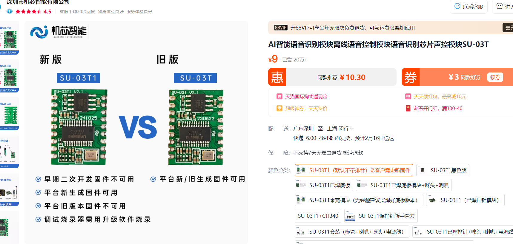

---

### SU-03T如何配置舵机缓慢回零功能？

**问题描述：**

在使用SU-03T芯片时，无法精确调试舵机缓慢回零功能的时间和占空比参数。

**解决方案：**

**1. 参数调整方向**

舵机缓慢回零功能需要调整以下两个参数：

- **定时器时间参数**：控制PWM更新的频率
- **占空比增加值**：控制每次更新的步进量

**2. 调试方法**

通过定时器中断实现平滑过渡：

1. **启动定时器**设置：

    - 超时时间：200ms（可根据需要调整）
    - 重复模式：启用
    - 变量操作：cnt增加5（调整步进值）

2. **PWM占空比设置**：

    - 使用变量`$cnt`作为占空比值
    - 通过定时器逐步减小占空比
    - 实现舵机缓慢回到零位

**3. 调试技巧**

- 先测试正常的0-180度转动
- 调整定时器超时时间（100ms-500ms）
- 调整变量增加/减少的步进值
- 观察舵机运动平滑度

**注意事项：**

- CI芯片和SU-03T的PWM控制可能有差异
- 建议从较小的步进值开始调试
- 定时器时间越短，运动越平滑但CPU占用越高

**注意事项：**

- 新旧版本不可混用固件，强制使用会导致功能异常
- 购买时务必确认版本需求
- 保留现有固件的完整备份
- 如需升级，建议同步更新烧录工具

---

### SU-03T固件生成速度慢怎么办？

**问题描述：**

SU-03T模块固件生成速度变慢，需要长时间排队等待，影响开发效率。

**解决方案：**

**速度变慢原因：**

- SU系列模块用户量大幅增加
- 服务器负载较高，需要排队处理
- 固件生成需要消耗较多计算资源

**解决建议：**

1. **错峰生成固件**

    - 选择凌晨时段（如2:00-5:00）生成
    - 避开工作日高峰期（9:00-18:00）
    - 用户较少时生成速度较快

2. **优化生成策略**

    - 一次性批量生成所有需要的固件
    - 保存配置避免频繁重新生成
    - 提前规划减少临时需求

3. **考虑升级方案**

    - **升级到CI系列**：生成速度快，无需排队
    - **CI-03T**：性能与SU-03T相近，价格更优
    - **CI-33T**：支持更多词条（500条）

**替代方案：**

1. **本地开发环境**

    - 申请本地开发包
    - 在本地编译生成固件
    - 不受服务器排队影响

2. **预先准备固件**

    - 在项目前期就完成固件生成
    - 建立固件版本库
    - 测试验证后批量保存

**技术说明：**

- SU系列使用在线生成模式，依赖服务器资源
- CI系列支持本地或快速生成模式
- 两种系列的功能基本相同，主要差异在服务模式

**注意事项：**

- 固件生成慢是服务器负载导致，非故障
- 建议合理安排生成时间，避免影响项目进度
- 如对生成速度有高要求，可考虑切换到CI系列
- 保留生成的固件备份，避免重复生成

---

### SU-03T如何设置英文识别模式？

**问题描述：**

需要将SU-03T模块切换为英文识别模式，但对英文唤醒词和命令词的格式要求不明确，设置后无法正常唤醒。

**解决方案：**

**语言切换设置：**

1. **切换语言模式**
    - 在平台配置界面选择语言为"英文"
    - 切换后不能有任何中文内容
    - 唤醒词和命令词都必须使用英文

2. **英文唤醒词格式要求**
    - 字母必须全大写
    - 多个单词之间使用短杠"-"连接（官方说明）
    - 实际使用时建议用空格分隔效果更好
    - 示例：HI-JERRY 或 HELLO-ALICE

3. **英文命令词格式**
    - 使用空格分隔多个单词
    - 不需要全大写，保持正常英文格式
    - 示例：TURN ON LIGHT, OPEN DOOR
    - 避免使用特殊字符

**配置示例：**

```
唤醒词：HI-JERRY
命令词：

- TURN ON LIGHT
- TURN OFF LIGHT
- OPEN THE DOOR
- CLOSE THE WINDOW
```

**注意事项：**

- 必须先切换到英文模式才能设置英文词条
- 唤醒词全大写是强制要求
- 命令词建议使用常见英文口语
- 设置完成后需要重新生成固件

---

### SU-03T如何实现二级判断功能？

**问题描述：**

需要实现类似"说开灯→问开哪个灯→说台灯→回复已打开"的二级对话交互功能。

**解决方案：**

**变量设置方法：**

1. **添加变量作为附加条件**
    - 在命令词配置界面选择"添加触发方式"
    - 在"附加条件"中选择"变量"
    - 设置变量名称和初始值

2. **配置对话流程**
    - 第一级命令：设置"开灯"，触发播报"你要开哪个灯？"
    - 设置变量记录用户选择
    - 第二级命令：根据变量值执行具体动作

3. **具体实现步骤**
    - 进入语音导航配置
    - 为"开灯"命令添加变量附加条件
    - 设置多个子命令（台灯、吊灯、壁灯等）
    - 每个子命令对应具体的GPIO输出

**配置示例：**

```
第一级命令：

- 命令词：开灯
- 回复：你要开哪个灯？
- 设置变量：lamp_type

第二级命令（基于变量）：

- 台灯 → GPIO1高电平 → 播报"台灯已打开"
- 吊灯 → GPIO2高电平 → 播报"吊灯已打开"
- 壁灯 → GPIO3高电平 → 播报"壁灯已打开"
```

**技术要点：**

- 变量用于在多轮对话中保存状态
- 附加条件实现基于前序判断的分支逻辑
- 支持多层次的对话交互设计
- 可结合延时、计数等高级功能

**注意事项：**

- 二级判断需要合理设计对话流程
- 避免过于复杂的分支导致用户体验下降
- 测试各种对话路径确保逻辑正确
- 变量在设备复位后会重置

---

### SU-03T的串口通讯协议是什么？

**问题描述：**

需要了解SU-03T模块的串口通讯协议，包括波特率、帧结构以及语音控制指令集。

**解决方案：**

SU-03T模块的串口通讯协议需要在智能公元平台进行配置，不支持手工编写的协议。

**基本配置：**

- **波特率**：9600 bps（默认）
- **数据位**：8位
- **停止位**：1位
- **校验位**：无

**指令集配置：**

通过平台的"命令词自定义"功能配置语音控制指令：

1. **基础命令词配置**
    - 在平台添加命令词（如A1、A2等）
    - 设置控制类型为UART1_TX
    - 配置动作为"发送"
    - 设置对应的发送参数

2. **系统级命令**
    - 音量控制：最小音量、最大音量、中等音量
    - 功能控制：关闭儿童锁、设置静音
    - GPIO控制：通过GPIO_B2等引脚输出控制信号

3. **事件触发配置**
    - 系统启动事件
    - 串口输入事件（Uart1_RX）
    - FM相关控制命令（A14、A16等）

**注意事项：**

- SU-03T只有一路串口，烧录时使用B6/B7，运行时通信使用B2/B3
- FM发射功能通过I2C控制，但整体控制通过串口实现
- 协议不是手工编写的，需要在平台生成和配置
- 固件中的串口协议与平台配置一致，可参考现有项目配置

---

### SU-03T新旧版本固件兼容性说明

**问题描述：**

SU-03T芯片进行了Flash扩容，需要了解新旧版本模块的固件兼容性、烧录要求以及如何选择合适的版本。

**解决方案：**

**版本差异说明：**

1. **SU-03T1（新版本）特性**：

    - 支持平台新生成的固件
    - 早期二次开发固件不可用
    - 调试烧录器需要升级软件才能烧录新版固件
    - Flash容量更大，支持更多功能扩展

2. **SU-03T（旧版本）特性**：

    - 平台旧版本固件可用
    - 早期二次开发固件可用
    - 使用现有的调试烧录器即可
    - 库存有限，出完后将全部为新版本

**固件兼容性：**

- **新固件兼容性**：平台10月25日更新后生成的新固件，新旧模块都能烧录使用
- **旧固件限制**：旧版本固件在新模块上可能无法正常工作
- **烧录工具要求**：新版本模块需要升级烧录器软件版本

**版本选择建议：**

1. **新项目开发**：

    - 优先选择SU-03T1新版本
    - 可使用平台最新功能
    - 未来升级空间更大

2. **现有项目维护**：

    - 如有旧版本库存可继续使用
    - 保持现有固件和工具不变
    - 建议逐步迁移到新版本

3. **固件更新建议**：

    - 建议使用平台10月25日后的固件版本
    - 新固件包含优化和改进
    - 向下兼容现有项目配置

**固件版本判断方法**：

在智能公元平台的固件管理界面，可通过生成时间判断固件版本：

- **新版本固件**：生成时间晚于2024年10月25日
- **旧版本固件**：生成时间早于2024年10月25日

如果现有固件生成时间早于2024年10月25日，需要：

1. 从原生成版本继承配置
2. 重新发布生成新固件
3. 确保新固件兼容所选模块版本

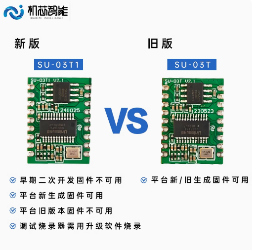

*SU-03T1（新版）和SU-03T（旧版）对比图*

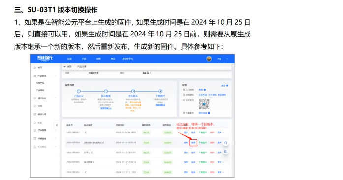

*智能公元平台固件管理界面，通过生成时间判断固件版本*

**注意事项：**

- 新旧版本主要差异在Flash容量和固件支持
- 新固件可以在旧模块上正常使用
- 旧模块库存有限，建议新项目直接使用新版本
- 烧录新版本固件可能需要升级烧录工具

---

### SU-03T使用了哪些算法？

**问题描述：**

需要了解SU-03T芯片中使用的算法，特别是关于降噪和结构设计方面的细节。

**解决方案：**

**算法说明：**

SU-03T使用的核心算法涉及以下方面：

1. **语音识别算法**：

    - 使用神经网络算法进行语音识别
    - 支持离线命令词识别
    - 具备一定的抗噪声能力

2. **降噪处理**：

    - 平台提供了相关的降噪配置参数
    - 可通过调整参数优化不同场景下的识别效果
    - 具体算法细节属于公司机密，不对外公开

**技术资料获取：**

1. **二次开发文档**：

    - 《SU-03T技术开发手册v1.2》
    - 《蜂鸟M(US516P6) SOC产品手册(补充)》
    - 包含算法配置参数和使用说明

2. **降噪配置资料**：

    - 访问智能公元帮助文档
    - 链接：https://help.aimachip.com/docs/question/question-1fu2u5hd964ic
    - 包含降噪参数配置介绍

3. **开发包下载**：

    - 平台提供完整开发包
    - 包含算法配置工具和示例
    - 可下载后查看详细配置方法

**注意事项：**

- 具体算法实现属于商业机密，无法提供源代码级细节
- 如需了解算法配置，可参考二次开发文档
- 降噪效果可通过调整平台参数进行优化
- 更深入的算法细节不在技术支持范围内

---

### SU-03T固件修改后默认音量设置异常怎么办？

**问题描述：**

对SU-03T模块固件进行功能修改，设置默认音量为最低（10%），但烧录后实际音量变为最大音量。

**解决方案：**

**固件修改内容：**

- 简化词条数量
- 移除儿童锁和FM功能
- 增加亮度调节功能
- 降低整体喇叭音量
- 设置默认音量为最低（10%）

**音量配置方案：**

- **最大音量**：限制为50%
- **中等音量**：设置为30%
- **最小音量**：设置为10%
- **默认音量**：设置为10%（最低）

**问题排查与解决：**

1. **确认配置保存**
    - 在平台中检查音量设置是否正确保存
    - 确认默认音量已设置为最低值
    - 重新生成固件确保配置生效

2. **固件版本验证**
    - 确认烧录的固件版本正确
    - 检查固件文件是否为最新生成
    - 验证固件完整性

3. **音量初始化检查**
    - 检查固件中的音量初始化代码
    - 确认默认值设置逻辑正确
    - 排除音量设置被覆盖的问题

**测试步骤：**

1. 使用新固件进行完整测试
2. 首次开机检查音量是否为最低
3. 测试各档位音量切换功能
4. 验证最大音量限制是否生效

**注意事项：**

- 固件修改后需要充分测试各项功能
- 音量设置异常可能影响用户体验
- 建议保留音量配置的修改记录
- 如问题持续存在，需要技术支持进一步排查

---

### SU-03T如何通过串口播放MP3音频文件？

**问题描述：**

希望通过串口发送指令触发语音模块播放预设的MP3音频文件，如欢迎语或音乐。

**解决方案：**

**功能支持：**

SU-03T支持通过串口指令触发播放音频文件，包括欢迎语音和音乐。

**音频文件要求：**

- **采样率**：16kHz
- **位深度**：16位
- **声道**：单声道
- **格式**：支持MP3或WAV格式

**实现步骤：**

1. **准备音频文件**
    - 制作符合格式要求的MP3文件
    - 控制文件时长在几秒内
    - 确保音频清晰且音量适中

2. **添加到固件**
    - 在平台中上传音频文件
    - 配置对应的播放指令
    - 生成包含音频文件的新固件

3. **配置串口触发**
    - 添加串口输入触发器
    - 设置触发命令（如特定十六进制指令）
    - 配置执行动作为"播放语音"

4. **测试验证**
    - 通过串口调试工具发送指令
    - 确认音频文件正常播放
    - 验证音质和音量

**应用场景：**

- 设备开机播放欢迎语
- 接收特定指令播放提示音
- 通过串口控制播放背景音乐
- 系统状态变化时的语音提示

**注意事项：**

- 音频文件大小受限于Flash容量
- 建议使用压缩后的音频文件
- 播放时会影响其他语音识别功能
- 音频文件格式必须严格按照要求准备

---

### SU-03T如何修改语音指令为发送十六进制数据？

**问题描述：**

需要将语音指令"向前一点"和"向后一点"的触发功能进行对调，即"向前一点"发送0x07，"向后一点"发送0x05。

**解决方案：**

**功能修改方案：**

1. **修改指令映射**
    - 删除原有的"向前一点"和"向后一点"语音配置
    - 重新添加命令词但调换触发动作
    - 或直接修改现有命令词的串口输出值

2. **配置步骤**

    **方法一：重新配置**

    - 在平台中删除原命令词
    - 重新添加"向前一点"，设置发送07
    - 添加"向后一点"，设置发送05

    **方法二：直接修改**

    - 找到"向前一点"命令，修改发送参数为07
    - 找到"向后一点"命令，修改发送参数为05

3. **十六进制格式说明**
    - 发送数据使用十六进制格式
    - 0x07应填写为"07"
    - 0x05应填写为"05"
    - 单字节指令直接写两位十六进制数

**数据格式示例：**

```
向前一点 → 发送：07
向后一点 → 发送：05
```

**测试验证：**

1. 生成新固件
2. 烧录到模块测试
3. 说"向前一点"，检查串口输出是否为07
4. 说"向后一点"，检查串口输出是否为05

**注意事项：**

- 十六进制数据不需要"0x"前缀
- 确保串口参数配置正确
- 测试时使用串口调试助手验证输出
- 修改后需要重新生成并烧录固件

---

### SU-03T如何获取完整固件文件进行功能测试？

**问题描述：**

需要获取完整的固件文件，以测试语音模块的唤醒词、回复语和开机播报功能。

**解决方案：**

**固件文件获取：**

1. **固件类型说明**
    - .bin文件：烧录用固件文件
    - _update.bin：升级版本固件
    - .tar.gz：完整固件包（包含所有资源）

2. **获取方式**
    - 联系技术支持获取已生成的固件
    - 提供具体测试需求（唤醒词、回复语等）
    - 确认固件版本和配置信息

**测试功能清单：**

1. **唤醒词测试**
    - 测试所有配置的唤醒词
    - 验证唤醒灵敏度和响应速度
    - 检查误唤醒率

2. **回复语测试**
    - 逐条测试命令词的回复
    - 确认回复内容正确
    - 验证回复音量适中

3. **开机播报测试**
    - 断电重启测试开机播报
    - 确认播报内容完整
    - 检查播报时机正确

**测试建议：**

- 在安静环境下进行测试
- 准备测试用例清单
- 记录测试结果和问题
- 多人测试验证普适性

**注意事项：**

- 完整固件包含音频资源文件
- 测试前确认固件版本正确
- 保留测试记录便于问题定位
- 如发现问题及时反馈技术支持

---

### SU-03T是否支持读取8000D通讯协议数据？

**问题描述：**

希望使用SU-03T读取8000D通讯协议中定义的无线温度、工作位指示、断路器状态等寄存器数据，并需要相关的代码示例。

**解决方案：**

**功能限制说明：**

- SU-03T模块和智能公元平台目前不支持8000D通讯协议
- 该功能需要用户自行开发实现
- 平台暂不提供此类专用通讯协议支持
- 无法提供对应的代码示例

**技术实现建议：**

如需要实现此功能，可考虑以下方案：

1. **使用带通讯功能的模块**
    - 选择支持Modbus、RS485等工业通讯协议的专用模块
    - 或使用单片机作为中间层实现协议转换

2. **自行开发方案**
    - 在SU-03T基础上增加通讯处理电路
    - 通过串口与外部设备通讯
    - 需要完整的软硬件开发能力

**寄存器地址说明：**

根据提供的8000D协议文档：

- **无线温度数据**：地址9-18（10个无线温度传感器）
    - 数据类型：short型（16位）
    - 取值范围：示例中03D6表示+98.2℃，FF38表示-20.0℃

- **状态指示寄存器**：地址27-36
    - 地址27：工作位指示（54表示工作位合，55表示工作位分）
    - 地址28：试验位指示
    - 地址29：断路器合位指示
    - 地址30：断路器分位指示
    - 地址35：触头超温报警
    - 地址36：通讯地址

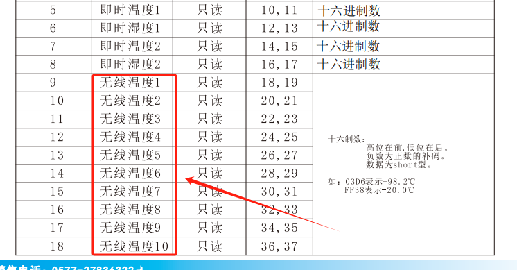

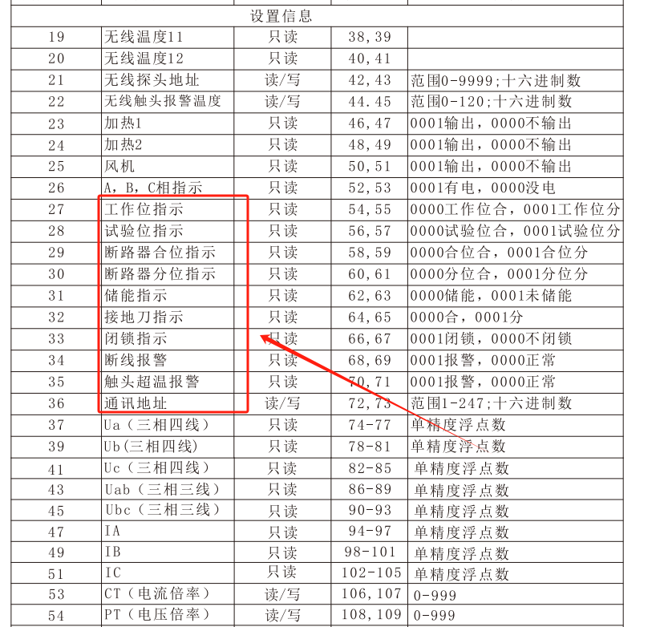

**注意事项：**

- 8000D协议是特定的工业通讯协议
- 需要理解协议的寄存器地址和数据格式
- 数据采用大端格式（高位在前，低位在后）
- 负数采用补码表示
- 开发难度较高，建议评估项目需求和技术能力
- 可咨询技术支持获取更详细的开发建议

---

### SU-03T是否支持通过串口发送字符串进行语音播报？

**问题描述：**

希望通过TTL串口发送字符串数据，让SU-03T模块播报自定义的文本内容。

**解决方案：**

SU-03T不支持直接通过串口发送字符串进行语音播报，有以下限制：

**串口通信限制：**

1. **不支持TTL字符串传输**
    - 不能直接发送文本字符串进行播报
    - 只能发送固定的十六进制指令格式（AA55 55AA）

2. **支持的播报方式**
    - 可通过串口参数发送数字
    - 模块会播报接收到的数字值
    - 示例：发送AA55 01 0A 55AA，模块播报"你收到的数字是10"

**指令格式示例：**

```
帧头：AA 55
数据长度：01
串口参数：0A（表示数字10）
帧尾：55 AA
```

**替代方案：**

如需播报自定义字符串内容，建议使用：

- **CI系列模块**：支持TTS（文字转语音）功能
- **预置语音文件**：在SU-03T中预先录制所有需要播报的内容
- **数字编码映射**：将不同数字映射到预设的播报内容

**注意事项：**

- SU-03T的串口功能主要用于发送控制指令和数据
- 如需要灵活的语音播报功能，建议选用支持TTS的型号
- 串口通信需要严格按照协议格式发送数据

---

### 如何配置SU-03T通过串口接收特定数据触发语音播放？

**问题描述：**

需要配置SU-03T芯片，当通过串口接收到特定的十六进制数据序列（如1122334455）时，能够触发播放对应的语音指令。

**解决方案：**

SU-03T的串口触发功能基于帧头帧尾和消息号进行匹配：

**1. 配置串口触发**

- 在控制详情中选择"串口输入"作为触发方式
- 选择对应的串口（如UART1_RX）
- 配置帧头和帧尾格式

**2. 数据匹配规则**

- **必须设置帧头**：用于识别数据包的开始
- **帧尾可选**：可以不设置帧尾
- **消息号区分**：当多个串口消息使用相同帧头帧尾时，通过消息号区分
- **参数匹配**：可以设置多个参数进行精确匹配

**3. 配置步骤**

1. 在UART1_RX配置中设置帧头（如"11 22"）
2. 添加触发，选择串口输入
3. 设置消息编号和输入参数
4. 配置触发后执行的语音播放动作

**4. 数据格式示例**

```
完整数据包：帧头 + 消息号 + 参数1 + 参数2 + ... + 帧尾
示例：11 22 33 44 55
- 11 22：帧头
- 33：消息编号
- 44：参数1
- 55：参数2
```

**5. 配置特定数据序列匹配（如1122334455）**

由于SU-03T是通过帧头、消息号和参数的组合进行匹配，需要将目标数据拆分：

**配置方法：**

- 设置帧头为："11 22"
- 设置消息编号为：33（十六进制0x33，即十进制51）
- 添加参数：

    - 参数1：类型unsigned char，测试值68（0x44）
    - 参数2：类型unsigned char，测试值85（0x55）

**实际接收数据：**

- 当串口收到"11 22 33 44 55"时触发
- 11 22：匹配帧头
- 33：匹配消息编号51
- 44：匹配参数1的值
- 55：匹配参数2的值

**多数据包区分：**
```
数据包1：11 22 33 44 55 → 触发动作A1
数据包2：11 22 34 44 55 → 触发动作BD
- 相同帧头（11 22）
- 不同消息号（33 vs 34）
- 可以触发不同语音
```

**注意事项：**

- 串口输入是匹配帧头帧尾和消息号触发的，不是匹配完整数据序列
- 如需匹配特定数据序列，建议将数据拆分为帧头、消息号和参数
- 可以使用串口调试助手测试配置是否正确
- 参数名需要先填写，测试值可以不填
- 帧头必须设置，帧尾可选
- 测试消息用于检查配置是否正确，不会影响实际触发逻辑

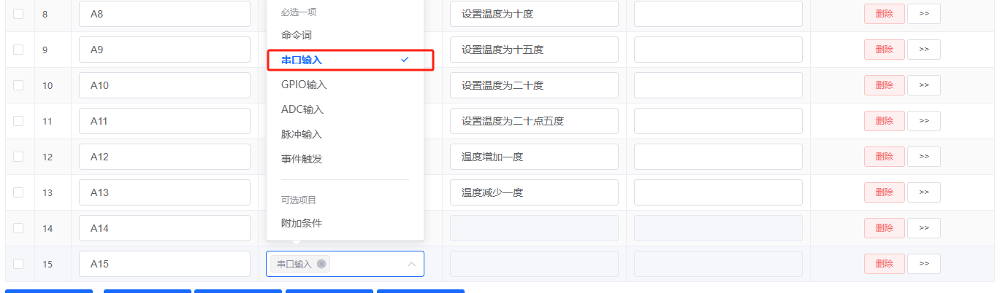
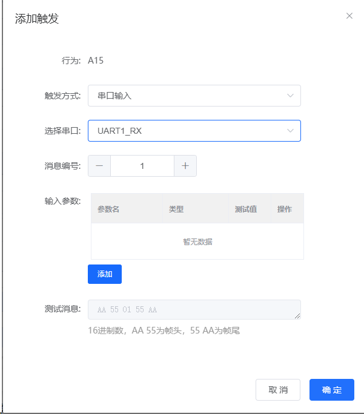

**6. 配置示例详细图解**

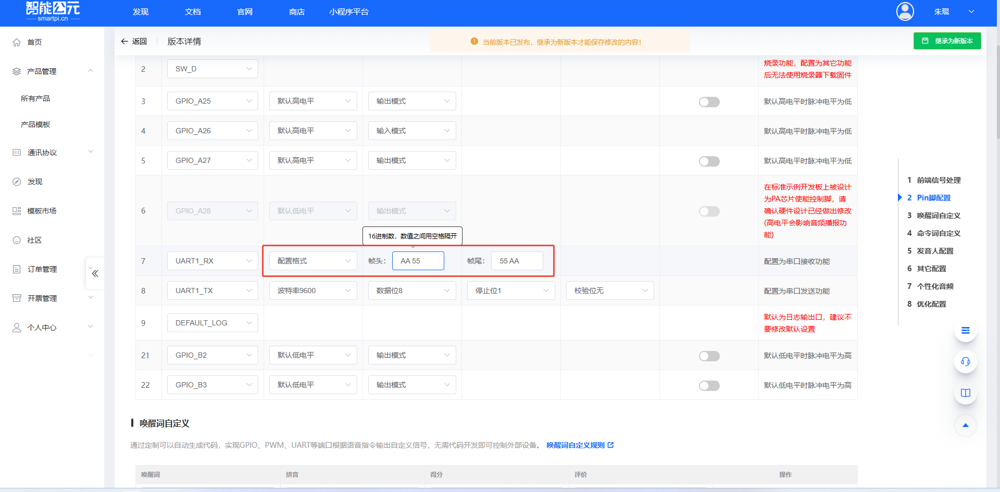
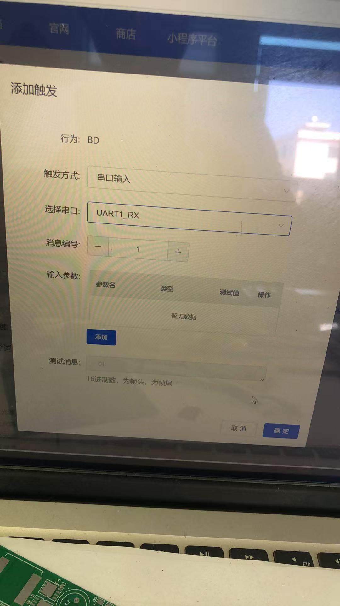
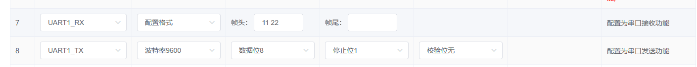
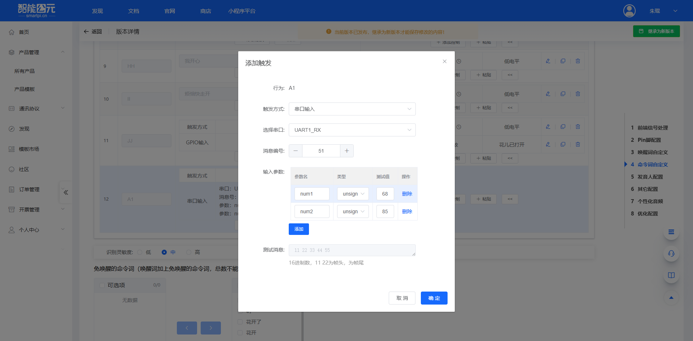

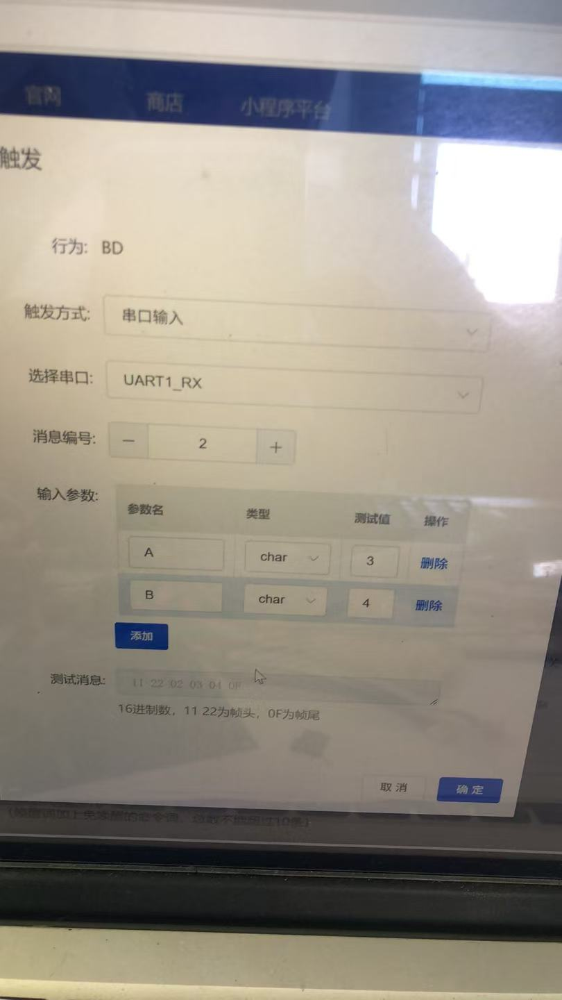

**参考资料：**

- SU-03T串口教程：https://www.bilibili.com/video/BV1nv4y197uR/
- CI-03T触发模式免唤醒和自学习教程：https://www.bilibili.com/video/BV1LM4y1S7A8/

---


### SU-03T/10A模块固件升级有什么好处？

**问题描述：**

对SU-03T/10A模块固件升级的必要性及好处不明确，希望了解升级的具体优势。

**解决方案：**

**固件升级的主要优势：**

1. **功能增强**
    - 新增更多语音识别功能
    - 优化现有算法性能
    - 支持更多控制指令

2. **性能提升**
    - 提高语音识别准确率
    - 降低误触发率
    - 加快响应速度

3. **兼容性改善**
    - 支持最新的平台功能
    - 兼容新的小程序版本
    - 提供更多API接口

**升级建议：**

- 早期采购的模块建议升级到新固件
- 在公元平台直接继承发布新固件
- 保留原固件备份便于回滚

**注意事项：**

- 升级前记录原有配置
- 确认硬件型号与新固件兼容
- 如有特殊定制功能，升级前请咨询技术团队

---


---

### 固件生成时间过长怎么办？

**问题描述：**

在平台生成固件时遇到生成时间过长的问题，超过30分钟仍未完成。

**解决方案：**

**1. 正常生成时间说明**

- 云端生成的模型精度较高，需要较长时间
- 一般生成时间需要10-30分钟
- SU-03T的SDK生成在智能公元网页平台进行

**2. 生成时间长的原因**

- 模型精度要求高，处理时间长
- 服务器负载较高
- 固件配置复杂度高
- 网络连接稳定性影响

**3. 应对措施**

- 耐心等待，不要关闭页面
- 避免重复提交生成任务
- 建议错峰使用，避开工作日下午等高峰时段
- 检查网络连接稳定性

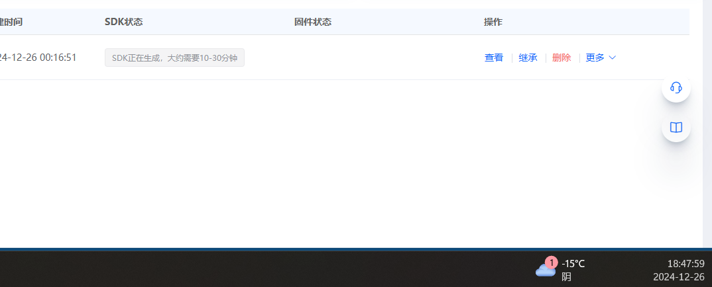

**注意事项：**

- 生成时间超过30分钟属于正常情况
- 相比本地训练（需半天+编译20分钟），云端生成更可靠
- 如一直显示"生成中"可尝试重新生成
- 确保配置正确避免反复生成

---


---

### 旧模块是否可以使用新固件？

**问题描述：**

已有SU-03T旧模块，想了解是否可以使用新生成的固件进行更新。

**解决方案：**

- **完全兼容**：旧模块可以使用新固件
- **重新生成**：需要在平台重新生成对应固件
- **烧录更新**：按照正常烧录流程更新固件即可

**注意事项：**

- 新固件可能包含功能改进和bug修复
- 建议备份原有固件后再更新
- 更新后重新配置相关参数


---

### 如何配置系统默认音量？

**问题描述：**

每次烧录固件后，系统音量默认为最大值，需要找到配置方法设置合适的默认音量。

**解决方案：**

**1. 通过系统设置配置默认音量**


如上图所示的设置方法仅是临时音量控制，不是系统默认音量配置。

**2. 正确的默认音量配置方法**

在优化配置中设置系统音量档位：

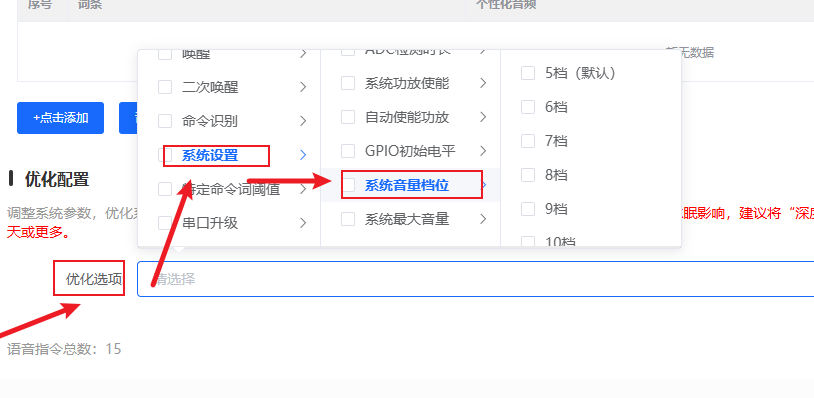

- 进入"优化配置"页面
- 找到"系统设置"选项
- 选择"系统音量档位"进行配置
- 可选择合适的默认音量级别

**3. 配置说明**

系统音量档位决定了设备启动时的默认音量：

- **档位1**：最低音量
- **档位5**：最高音量（默认）
- 可根据需要选择1-5之间的档位

**4. 验证步骤**

- 配置完成后重新生成固件
- 烧录新固件到模块
- 断电重启后验证默认音量
- 测试音量是否符合预期

**注意事项：**

- 系统音量档位与语音指令中的音量控制是独立的
- 配置的默认音量在每次上电时自动生效
- 如需要临时调节，仍可通过语音指令控制
- 建议根据实际使用场景选择合适的默认档位

---

---

### SU-03T能否通过串口接收指令控制GPIO？

**问题描述：**

能否通过串口将特定指令发送给SU-03T模块，使其自动将指定GPIO引脚（如GPIO_A25）设置为低电平。

**解决方案：**

**功能支持确认：**

SU-03T模块支持通过串口接收指令来控制GPIO引脚。

**实现方法：**

1. **串口通信配置**
    ```
    MCU            SU-03T模块
    TX  →  UART1_RX (B6引脚)
    RX  ←  UART1_TX (B7引脚)
    GND →  GND
    ```

2. **指令格式**
    - 支持自定义指令格式
    - 可使用十六进制数据（如0xA1）
    - 指令内容可灵活定义

3. **平台配置步骤**
    - 登录智能公元平台
    - 在命令词配置中添加新的触发条件
    - 触发方式选择"串口输入"
    - 配置对应GPIO的控制动作

**配置示例：**

1. **创建触发行为**
    - 行为名称：自定义（如"gpio_control"）
    - 触发方式：串口输入
    - 选择串口：UART1_RX

2. **设置GPIO控制**
    - 选择要控制的GPIO引脚（如GPIO_A25）
    - 设置动作：输出低电平
    - 保存配置

3. **生成固件**
    - 保存完整配置
    - 生成新固件
    - 烧录到模块

**使用场景：**

- 外部MCU联动控制
- 传感器触发响应
- 多设备协同工作
- 自定义协议扩展

**注意事项：**

- 串口波特率默认为115200
- 需要正确配置GPIO引脚为输出模式
- 串口指令格式需与配置匹配
- 建议添加校验机制确保可靠性


---

### SU-03T串口控制GPIO不成功怎么办？

**问题描述：**

在使用SU-03T模块时，无法通过串口控制GPIO，仅能通过串口助手正常通信，希望获得具体的实现示例和方法。

**解决方案：**

**问题分析：**

无法通过串口控制GPIO的常见原因：

1. **未正确配置GPIO控制指令**
2. **通信协议不匹配**
3. **未在平台中正确设置触发条件**

**正确的实现方法：**

1. **使用AT指令格式（基础方法）**
    ```
    指令格式：AT+GPIO=<pin>,<value>
    参数说明：

    - <pin>：GPIO引脚编号（0-8）
    - <value>：引脚状态（0=低电平，1=高电平）
    ```

2. **Python示例代码**
    ```python
    import serial

   # 配置串口参数
   ser = serial.Serial(
       port='COM3',      # 根据实际端口调整
       baudrate=9600,   # 默认波特率
       timeout=1
   )

   # 控制GPIO引脚0为高电平
   ser.write(b'AT+GPIO=0,1\r\n')
   response = ser.read(100)
   print(response.decode('utf-8'))

   # 控制GPIO引脚1为低电平
   ser.write(b'AT+GPIO=1,0\r\n')
   response = ser.read(100)
   print(response.decode('utf-8'))

   ser.close()
   ```

3. **平台配置方法（推荐）**
    - 在智能公元平台配置触发行为
    - 触发方式：串口输入
    - 配置对应的GPIO控制动作

**注意事项：**

1. **串口参数配置**
    - 波特率：默认115200（部分固件为9600）
    - 数据位：8位
    - 停止位：1位
    - 校验位：无

2. **指令格式要求**
    - 必须以\r\n（回车换行）结尾
    - 支持十六进制格式（如0xA1）
    - 区分大小写（AT指令需大写）

3. **GPIO限制**
    - 输出电流：<20mA
    - 电压：3.3V
    - 负载不能超过150mA

**调试步骤：**

1. **验证串口通信**
    - 先使用串口助手测试AT指令
    - 确认模块有正确响应
    - 记录正确的波特率和格式

2. **检查GPIO配置**
    - 确认目标GPIO已配置为输出模式
    - 检查是否有功能冲突
    - 验证引脚编号是否正确

3. **逐步测试**
    - 从简单的GPIO控制开始
    - 逐步增加复杂度
    - 保留测试日志便于排查

**常见问题：**

- **无响应**：检查波特率和指令格式
- **错误响应**：确认引脚编号和功能配置
- **部分成功**：检查电源和负载情况


---

### 如何通过平台配置SU-03T接收串口指令控制GPIO？

**问题描述：**

如何通过平台配置SU-03T芯片，使其在接收到MCU发送的特定串口指令（如0xA1）时，自动将GPIO_A25引脚设置为低电平。

**解决方案：**

**配置步骤详解：**

1. **进入命令词自定义**
    - 登录智能公元平台
    - 选择对应项目
    - 进入命令词自定义页面

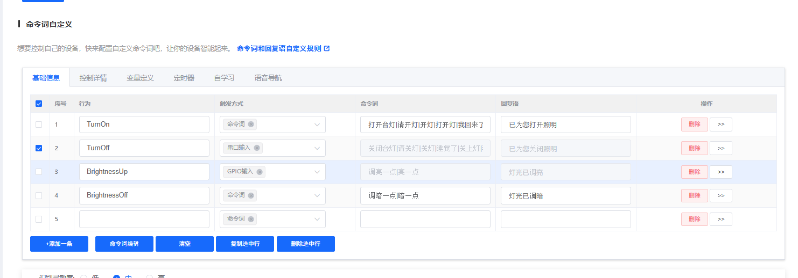

*显示TurnOff命令的触发方式设置为串口输入*

2. **创建控制行为**
    - 在控制详情中新增行为
    - 行为名称：自定义（如"a1"）
    - 点击"添加触发"按钮

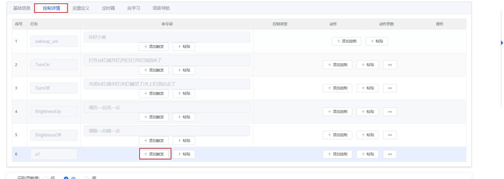

*新增名为"a1"的行为，需要添加触发条件*

3. **配置串口触发**
    - 触发方式：串口输入
    - 选择串口：UART1_RX
    - 参数类型：int（整数）
    - 设置参数值：a1（对应0xA1）

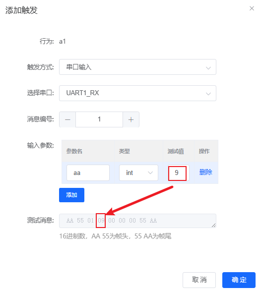

*触发方式设为串口输入，参数为aa，测试值为9*

4. **设置GPIO控制动作**
    - 选择要控制的GPIO：GPIO_A25
    - 设置动作：输出低电平
    - 保存配置

**固件生成和烧录：**

1. **发布版本**
    - 保存所有配置
    - 点击"发布版本"
    - 选择生成固件包或SDK

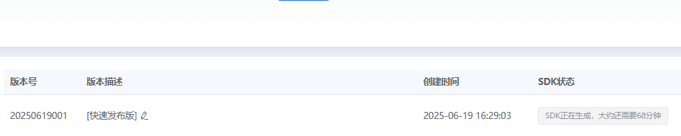

*显示SDK正在生成中，预计需要68分钟*

2. **了解固件区别**
    - 固件包：包含完整功能，可直接烧录
    - SDK：包含基础功能，用于二次开发

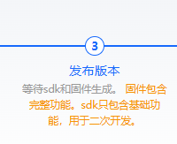

*说明固件包和SDK的区别*

**使用说明：**

1. **烧录固件**
    - 下载生成的固件包
    - 使用烧录工具烧录到模块
    - 测试基本功能

2. **串口通信测试**
    ```
    MCU发送：0xA1
    SU-03T响应：GPIO_A25输出低电平
    ```

3. **SDK开发（可选）**
    - 下载SDK进行二次开发
    - 自行编译BIN文件
    - 实现更复杂的功能

**注意事项：**

- 生成固件需要排队等待，高峰期可能较慢
- 串口参数需与MCU匹配（波特率115200）
- GPIO引脚需提前配置为输出模式
- 建议使用体验版智能体快速验证功能

---

---

---

### SU-03T自学习功能异常及学习失败怎么办？

**问题描述：**

在使用SU-03T模块的自学习功能时，学习多条命令后出现学习异常和失败的问题。

**解决方案：**

**问题原因分析：**

- 自学习功能占用较大的内存空间
- SU-03T的Flash容量有限，学习空间受限
- 每句学习的语音长度不定，占用的空间大小不同
- 基础命令词和自学习命令共用Flash空间

**优化方案：**

1. **减少学习成功次数**
    - 将"学习成功次数"从默认的3次调整为2次
    - 可在一定程度上节省存储空间

2. **使用覆盖模式**
    - 选择"指定学习模式"中的"覆盖原来学习"选项
    - 覆盖模式比追加模式能存储更多命令

3. **减少基础命令词数量**
    - 在"基础信息"中减少语音指令的数量
    - 为自学习功能预留更多空间

4. **选择更大容量的模块**
    - 升级到CI-33T模块（内置4MB Flash）
    - CI-33T最大支持500条语音指令
    - 引脚兼容SU-03T，便于替换

**注意事项：**

- 当有100条命令词时，学习总数不得超过50条
- 一个词重复学习3遍算作3条存储空间
- 即使调整为2次学习，SU-03T的自学习条数仍可能受限在15条左右
- 基础信息和自学习功能共用Flash空间，需要平衡使用

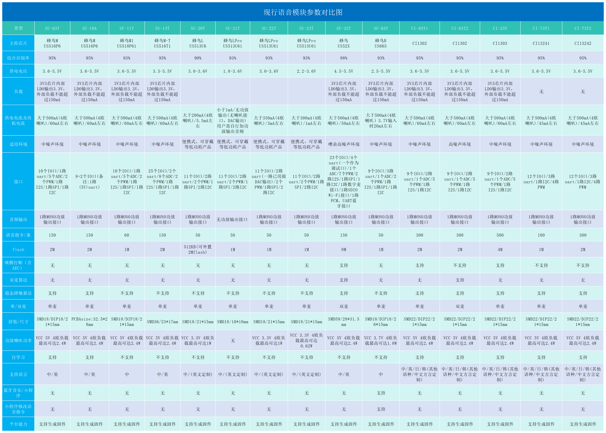

---

### 基础信息大小是否会影响自学习空间？

**问题描述：**

需要了解在智能平台中添加的基础信息是否会占用自学习功能的存储空间。

**解决方案：**

**空间分配说明：**

- 基础信息和自学习功能共用Flash存储空间
- 两者共享固定的存储区域，不是独立分区
- 基础信息越多，自学习可用空间越少

**空间管理建议：**

1. **合理规划基础命令词**
    - 只添加必要的常用命令
    - 避免添加冗余或不常用的命令
    - 为自学习功能预留足够空间

2. **优化存储策略**
    - 优先将固定命令放入基础信息
    - 变化频繁的命令使用自学习功能
    - 定期评估命令使用频率

3. **空间计算参考**
    - SU-03T总存储空间有限
    - 当基础命令较多时，自学习条数会相应减少
    - 建议通过实际测试确定最佳配置

**注意事项：**

- Flash空间是模块的硬性限制
- 不同版本的固件可能有不同的空间分配策略
- 如需要大量命令词，建议升级到更大容量的模块

---

### SU-03T自学习条数限制及如何优化？

**问题描述：**

SU-03T在使用自学习功能时，发现学习条数无法超过15条，即使调整学习成功次数和缩减语音参数后仍无法增加。

**解决方案：**

**限制原因分析：**

1. **硬件限制**
    - SU-03T的Flash容量有限
    - 自学习占用较大的存储空间
    - 每条语音长度影响存储需求

2. **空间分配机制**
    - 基础信息和自学习共用Flash空间
    - 系统保留固定空间用于其他功能
    - 15条是常见的学习上限

**优化尝试及效果：**

1. **调整学习次数**
    - 从3次调整为2次，效果有限
    - 仍无法突破15条限制
    - 属于边际优化，效果不明显

2. **降低音频质量**
    - SU-03T平台不提供音频质量调节选项
    - 该功能仅在部分型号中支持
    - 无法通过此方式增加学习条数

**实际解决方案：**

1. **减少基础命令词**
    - 删除不必要的基础命令
    - 为自学习预留更多空间
    - 平衡基础命令和自学习数量

2. **升级硬件型号**
    - 选择CI-33T（4MB Flash，支持500条）
    - 引脚兼容，可直接替换
    - 从根本上解决容量限制

3. **分场景使用**
    - 不同场景使用不同的自学习配置
    - 通过串口动态切换命令集
    - 避免单次学习过多命令

**注意事项：**

- SU-03T的15条限制是硬件特性
- 优化配置对突破限制帮助有限
- 建议根据实际需求选择合适型号

---
### SU-03T自学习功能有什么作用？

**问题描述：**

需要了解SU-03T模块的自学习功能具体作用是什么，以及该功能在实际应用中的效果。

**解决方案：**

**自学习功能说明：**

- 允许用户自定义命令词和对应动作
- 无需在平台上预配置，直接通过语音学习
- 适合个性化定制和快速原型验证

**主要应用场景：**

1. **个性化命令定制**
    - 用户可录入自己的专属命令词
    - 如"开灯"、"关门"、"播放音乐"等
    - 提升产品的个性化体验

2. **快速原型验证**
    - 无需重新生成固件即可测试新命令
    - 快速验证命令词的识别效果
    - 提高开发和调试效率

3. **场景化配置**
    - 不同使用场景学习不同命令集
    - 通过串口切换不同的学习配置
    - 实现场景自适应功能

**学习方式：**

1. 进入自学习模式
2. 按提示录入命令词（3-5次）
3. 录入对应的回复或动作
4. 保存学习结果

**注意事项：**

- 自学习占用Flash存储空间，与基础命令共享
- SU-03T大约支持15条自学习命令
- 学习成功次数和失败退出次数可配置
- 建议在安静环境下进行学习，提高成功率


### SU-03T串口通讯需要使用固定格式吗？

**问题描述：**

SU-03T使用串口通讯时，如果设置串口引脚为固定格式，单片机收发内容是否需要按照固定格式的帧头帧尾。

**解决方案：**

- **固定格式要求**：

    - 是的，使用固定格式时需要按照规定的帧头帧尾格式
    - 单片机需要解析和发送符合协议格式的数据包
    - 具体格式参考SU-03T的串口通讯协议文档

- **数据帧结构**：

    - 通常包含帧头、数据长度、数据内容、校验位、帧尾
    - 严格按照协议规定组装数据包
    - 确保帧头帧尾正确识别

- **开发建议**：

    - 仔细阅读串口通讯协议说明
    - 使用官方提供的示例代码参考实现

---


---

### SU-03T超时退出时可以触发引脚输出吗？

**问题描述：**

需要了解SU-03T在超时退出时，是否可以触发引脚输出或引脚高低电平输出。

**解决方案：**

**当前功能限制**

- **超时退出功能**：

    - 仅支持语音回复（如"有需要再叫我"）
    - 不支持直接触发引脚输出
    - 不支持高低电平输出动作

**配置界面说明**


- **超时时间**：可设置5-60秒
- **退出回复**：支持自定义语音内容
- **功能范围**：仅限语音交互

**注意事项：**

- 当前固件不支持超时退出时的硬件控制
- 如需硬件控制功能，建议反馈需求给技术团队
- 可通过其他方式实现类似功能（如外部定时器）

### 定时器超时时间最大值是多少？

**问题描述：**

需要了解SU-03T模块定时器配置中，超时时间最大可以设置多大的数值，以及如何实现长延时（如一周）的功能。

**解决方案：**

**参数规格：**

- **数据类型**：无符号int类型
- **单位**：毫秒（ms）
- **最大值**：根据int类型范围决定（通常为4,294,967,295ms）
- **换算关系**：

    - 1分钟 = 60,000ms
    - 1小时 = 3,600,000ms
    - 1天 = 86,400,000ms
    - 1周 = 604,800,000ms（在支持范围内）

**长延时实现建议：**

1. **使用MCU实时钟**
    - 对于超长延时（如一周），建议使用MCU的RTC
    - SU-03T仅作为执行单元
    - 通过MCU精确计时后触发SU-03T

2. **分级延时策略**
    - 使用多个定时器接力实现
    - 或通过计数器累计多次短延时

**用户体验优化建议：**

- 当前仅支持ms单位，容易因少写0而出错
- 建议平台增加可选单位（ms/min/h）
- 配置时仔细核对数值，避免错误

**注意事项：**

- 虽然支持理论最大值，但实际测试建议先用小值验证
- 超大延时可能影响系统稳定性，建议采用MCU+模块方案
- 填写数值时注意位数，一周是604800000ms

---
    - 测试时先验证通讯握手是否成功

**注意事项：**

- 固定格式下的数据通讯必须严格遵守协议
- 错误的帧格式可能导致通讯失败
- 建议使用串口调试工具辅助开发
- 如需简化开发，可考虑使用自由格式（如果支持）

---

### SU-03T支持TX优先功能吗？

**问题描述：**

在MCU持续向SU-03T更新变量值的场景下，定时器触发后无法正常发送十六进制数据，需要确认是否支持TX优先或串口发送优先级配置。

**解决方案：**

**问题分析：**

- 当MCU持续发送数据更新变量时，可能影响定时器事件的串口发送
- 需要检查MCU程序逻辑，确保数据流控制正确

**排查步骤：**

1. **检查MCU发送逻辑**
    - 确认是否在全双工模式下正确处理收发
    - 检查发送缓冲区管理
    - 验证数据流控制协议

2. **测试隔离方法**
    - 停止MCU的数据发送，仅保留定时器触发
    - 验证定时器事件是否能正常发送数据
    - 逐步恢复MCU通信，找出冲突点

3. **优化通信协议**
    - 设置适当的发送间隔
    - 使用流控机制（RTS/CTS）
    - 确保关键数据（如定时触发）优先发送

**常见问题及解决：**

| 现象 | 可能原因 | 解决方案 |
|-------|----------|----------|
| 无法发送 | 缓冲区满 | 调整发送速率 |
| 数据丢失 | 发送冲突 | 实现发送队列 |
| 响应延迟 | 处理阻塞 | 优化中断处理 |

**注意事项：**

- 问题通常是MCU端程序逻辑导致，而非SU-03T功能限制
- 建议在MCU端实现合理的串口数据管理机制
- 复杂场景建议分步调试，先确保基础功能正常


---

### SU-03T能否接入DeepSeek？

**问题描述：**

询问SU-03T芯片是否可以接入DeepSeek，以及如何实现语音对话功能。

**解决方案：**

- **SU-03T是离线语音模块**：

    - 不支持直接接入DeepSeek等在线服务
    - 仅能识别预录入的唤醒词和命令词
    - 无法进行实时语音对话

- **实现语音对话的方案**：

    - 使用ESP32等WiFi模块配合
    - ESP32连接SU-03T，处理语音识别结果
    - 通过ESP32访问DeepSeek API
    - 将DeepSeek回复通过TTS播放

- **开发教程**：

    - B站有相关教程视频
    - 需要一定的开发能力
    - 可以建立专门的交流群组

**注意事项：**

- 严禁直接使用9V连接语音模块

---


---

### 是否有生成SDK的离线软件？

**问题描述：**

需要了解是否提供离线的SDK生成软件，以便在没有网络连接的情况下生成固件。

**解决方案：**

- **智能公元平台在线生成**：

    - 当前SDK生成主要通过智能公元平台完成
    - 需要登录平台进行配置和生成
    - 支持自定义命令词、响应语等参数

- **获取已有固件**：

    - 可以向其他开发者获取之前生成的固件文件
    - 智能公元平台各模块的开发包包含示例固件
    - SU-03T等热门模块有完整的开发资源包

- **离线开发支持**：

    - 智能公元平台提供各模块的开发包下载
    - 包含技术文档、示例代码和调试工具
    - 可以下载后离线学习和开发

**注意事项：**

- 固件生成仍需要在线完成
- 建议保存常用的固件配置以备离线使用
- 平台定期更新，在线生成可获得最新功能

---


---

### SU-03T串口发送参数如何配置？

**问题描述：**

配置SU-03T串口发送参数时，不确定参数'4'是否代表发送十六进制数据4，且因设计板子时未引出串口。

**解决方案：**

**1. 串口参数确认**

- **参数说明**：

    - 发送参数填写'4'即发送hex数据0x04
    - 支持发送任意十六进制数据（00-FF）
    - 数据会通过UART1_TX引脚发送

- **通信格式**：

    - 波特率：9600（可配置）

---

## SU-03T固件问题


---

### SU-03T刷入原厂固件后无语音播报声音怎么办？

**问题描述：**

SU-03T刷入原厂固件后无语音播报声音，且无法通过命令唤醒，但喇叭电压测试正常（2.5V对地）。

**解决方案：**

**1. 固件版本确认**

- 确认刷入的是原厂release版本固件
- 检查固件文件是否完整（jx_su_03t_release.bin）
- 验证烧录过程是否成功完成

**2. 硬件连接检查**

- 确认喇叭连接正确（正负极对应）
- 检查咪头是否损坏
- 测量咪头工作电压（SU-03T应为2.4-2.5V）

**3. 配置问题排查**

- 检查是否配置了唤醒词
- 验证语音识别功能是否开启
- 确认音量设置不为零


**4. 唤醒失败处理**

- 更换update版本固件测试
- 检查咪头是否正常（阻值约1kΩ）
- 调整唤醒阈值和灵敏度

**注意事项：**

- 原厂固件可能未配置具体功能
- 需要根据实际需求重新配置命令词
- 如硬件正常但无声音，可能是固件配置问题

---


---

### 如何配置SU-03T通过GPIO输入触发语音播报？

**问题描述：**

需要配置SU-03T芯片，使其在GPIO接收到高电平信号时触发语音播报功能。

**解决方案：**

**1. GPIO输入配置**

- 在平台基础信息中添加GPIO输入配置
- 设置GPIO_B3为输入模式
- 配置默认电平为低电平

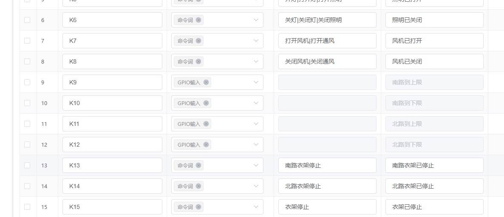

**2. 控制动作设置**

- 在控制详情中添加新的控制项
- 设置触发方式为GPIO输入
- 选择GPIO_B3高电平作为触发条件

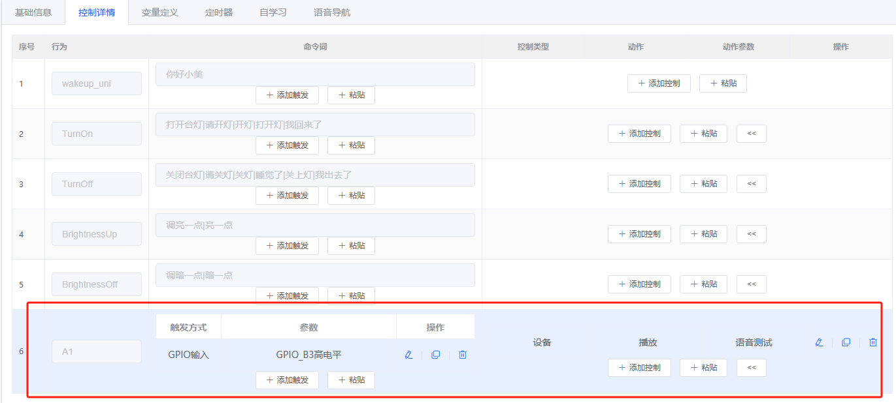

**3. 语音播报配置**

- 配置触发后播放指定语音内容
- 可选择播放TTS合成语音或预录音频
- 设置合适的音量和播放参数

**注意事项：**

- GPIO_B3引脚需要外接上拉电阻
- 触发信号需要保持一定时间才能稳定识别
- 可根据需求选择不同的GPIO引脚

---


---

### SU-03T开机时是否会自动发送指令？

**问题描述：**

SU-03T开机后可能会发送异常指令给机器人核心板，导致随机动作，需要确认是否是模块自动发送的。

**解决方案：**

**1. 开机播报功能检查**

- SU-03T默认不会自动发送指令
- 可能是开启了"开机播报"功能
- 开机播报会产生语音输出，但不会发送串口数据

**2. 配置检查步骤**

- 进入平台"其它配置"页面
- 查看"开机播报"设置状态
- 如不需要可选择"无开机播报"


**3. 异常指令排查**

- 检查串口配置是否正确
- 验证外部设备是否误判信号
- 确认固件中是否有异常的定时器设置

**注意事项：**

- 开机播报是语音输出，不是串口数据
- 机器人异常动作可能是接收端解析错误
- 建议关闭不必要的开机功能

---


---

### SU-03T开机播报导致机器人异常动作怎么办？

**问题描述：**

SU-03T开机时自动播报预设语音，导致连接的机器人核心板接收异常信号产生随机动作。

**解决方案：**

**1. 关闭开机播报**

- 进入平台"其它配置"页面
- 将"开机播报"设置为"无开机播报"
- 保存配置并重新生成固件


**2. 信号隔离处理**

- 在语音模块和机器人控制板之间加入隔离
- 检查串口连接是否正确（TX-RX交叉）
- 验证波特率等通信参数

**3. 优化配置**

- 如需要开机提示，改为简单的短提示音
- 调整语音播报内容避免包含控制关键词
- 延迟启动机器人主控程序

**注意事项：**

- 开机播报产生的音频可能被咪头接收
- 确保机器人主控有正确的滤波处理
- 必要时在软件层面增加防误触发机制

---


---

### 固件生成时选错芯片型号怎么办？

**问题描述：**

使用固件生成工具时，误将SU-03T1选为SU-03T2，生成并烧录了错误固件，导致芯片无法被识别，设备无法正常工作。

**解决方案：**

**1. 芯片型号识别**

- **SU-03T1**：实际使用的芯片型号
- **SU-03T2**：不同型号，固件不兼容
- **关键差异**：不同型号的引脚定义和功能可能不同

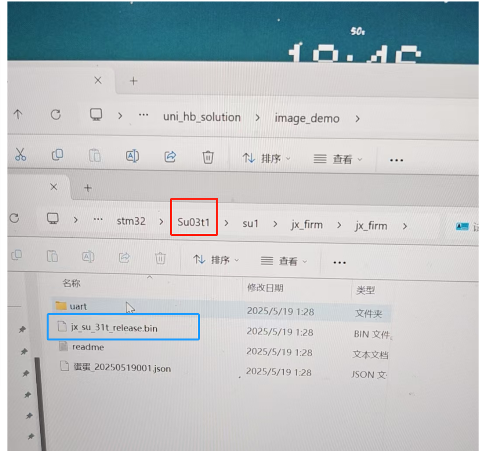

**2. 错误后果**

- **无法识别**：烧录后工具检测不到设备
- **功能异常**：即使识别成功，功能也不正常
- **风险提示**：可能需要重新烧录正确固件

**3. 解决方法**

- **重新生成**：在固件生成工具中选择正确芯片型号SU-03T1
- **确认配置**：检查引脚配置和功能设置是否正确
- **重新烧录**：使用生成的正确固件重新烧录设备

**4. 预防措施**

- **型号确认**：生成前仔细核对芯片上的丝印型号
- **文件命名**：生成的固件文件名应包含正确的型号信息
- **测试验证**：烧录前先在测试板验证功能
- **备份保存**：保留正确的配置文件供后续使用

**注意事项：**

- 不同型号芯片的固件完全不兼容
- 芯片型号通常在芯片表面或包装上标注
- 生成固件时务必确认所有参数设置正确
- 如不确定型号，可联系技术团队确认

---


---

### SU-03T能否通过PWM控制步进电机？

**问题描述：**

需要了解SU-03T模块是否支持通过PWM输出来控制步进电机，以及如何配置PWM参数。

**解决方案：**

SU-03T支持PWM输出，但需要注意PWM的限制和配置要求。

**1. PWM功能说明**

- SU-03T支持2路硬件PWM输出
- 模拟PWM由GPIO模拟，周期精度为10毫秒级
- 频率配置范围：大于0且小于40KHz
- 适合控制简单负载，不适合复杂步进电机控制

**2. 步进电机控制限制**

- **脉冲需求**：步进电机需要精确的脉冲序列控制
- **方向控制**：需要独立的方向信号控制转向
- **细分控制**：精度要求高时需要细分驱动
- **PWM局限**：简单PWM无法满足步进电机的控制需求

**3. 替代方案**

**方案一：GPIO脉冲控制**

- 使用GPIO模拟脉冲输出
- 通过软件控制脉冲时序
- 需要精确的时序控制

**方案二：外接驱动器**

- SU-03T通过串口发送指令给外部驱动器
- 使用专用步进电机驱动芯片（如A4988）
- SU-03T只负责发送控制命令

**方案三：使用直流电机替代**

- 如果应用场景允许，考虑使用直流电机
- PWM可直接控制直流电机转速
- 控制逻辑更简单

**4. 配置注意事项**

- PWM输出引脚需要确认具体型号的引脚定义
- 频率设置要考虑电机响应特性
- 占空比控制电机的平均电压或电流

**注意事项：**

- 直接用PWM控制步进电机效果有限
- 建议使用专用的步进电机驱动方案
- 复杂的电机控制建议通过单片机实现

----


---

### PWM调光功能如何实现语音播报？

**问题描述：**

需要实现PWM调光到最大或最小值时，语音播报"最大"或"最小"的反馈功能。

**解决方案：**

官网文档中心已提供PWM调光相关例程，支持语音播报功能。

**1. 获取例程文档**

- SU-03T系列：访问官网文档中心 → SU-03T系列产品 → "呼吸灯、PWM柔和调光固件"
- CI-03T系列：访问官网文档中心 → CI-03T系列产品 → "PWM调光"

**2. 实现原理**

- 监测PWM占空比变化
- 当占空比达到100%时，触发播报"最大"
- 当占空比达到0%时，触发播报"最小"
- 使用变量存储当前PWM状态

**3. 配置步骤**

1. 添加PWM输出控制
2. 设置PWM占空比变化监测
3. 配置边界值触发条件
4. 添加对应的语音播报动作

**4. 命令词控制示例**

```
命令词设计：

- "调亮"：PWM占空比+10%
- "调暗"：PWM占空比-10%
- "最亮"：PWM占空比=100%，播报"最大"
- "最暗"：PWM占空比=0%，播报"最小"
```

**注意事项：**

- PWM占空比范围为0-100%，0表示完全关闭，100表示最大输出
- 语音播报会短暂中断PWM输出，建议在播报完成后恢复正常调光
- 不同型号的PWM引脚定义可能不同，需查阅对应技术文档

---


---

### SU-03T模块如何实现一天只能执行一次的动作？

**问题描述：**

需要在SU-03T模块上实现一个点动动作（如打开操作）每天只能执行一次的限制。

**解决方案：**

**1. 核心需求分析**

- **功能要求**：

    - 特定动作每天只能触发一次
    - 需要判断是否为同一天
    - 动作执行后需要锁定直到次日

- **技术前提**：

    - 必须获取实时时间（日期信息）
    - 需要记录上次执行的日期
    - 要有断电保护功能

**2. 实现方法**

- **时间获取**：

    - 模块必须支持RTC（实时时钟）功能
    - 或通过外部时钟源获取当前日期
    - 确保时间准确性和同步

- **变量定义**：

    - 定义布尔变量记录当天是否已执行
    - 定义变量存储上次执行日期
    - 使用非易失性存储保存状态

- **条件判断逻辑**：
    ```
    if (当前日期 != 上次执行日期):
        执行动作
        上次执行日期 = 当前日期
        已执行标记 = true
    else:
        不执行动作
    ```

**3. 配置方案**

- **变量设置**：

    - 创建"执行日期"变量
    - 创建"执行状态"变量
    - 设置变量为掉电保持类型

- **附加条件**：

    - 动作触发前检查日期变量
    - 执行成功后更新日期变量
    - 使用条件表达式控制动作执行

**注意事项：**

- 确保模块RTC功能正常工作
- 建议使用EEPROM保存关键数据
- 考虑断电情况下的数据恢复
- 系统初始化时正确设置初始值
- 如无RTC功能，需外部时间源支持

---


---

### 如何测试SU-03T串口模块能否正确接收并响应串口指令？

**问题描述：**

需要测试SU-03T模块能否正确接收并响应串口发送的指令。


**解决方案：**

**1. 准备工作**

- 将语音模块连接咪头和喇叭
- 将模块通过CH340连接到电脑

**2. 平台配置**

- 在智能公元平台配置串口触发测试
- 添加触发行为：选择"串口输入"
- 选择串口：UART1_RX
- 设置测试消息和参数

**3. 测试步骤**

- 使用串口助手发送配置的测试消息
- 观察模块是否有语音播报反应
- 如有播报，说明串口功能正常

**4. 硬件连接**

- 模块使用5V供电
- CH340连接：TX接模块RX，RX接模块TX
- 或使用模块自带串口接口

**注意事项：**

- 模块需要先配置串口触发功能
- 发送的数据格式必须与配置一致
- 建议从简单指令开始测试

---


---

### 如何使用STC单片机与SU-03T进行串口通信？

**问题描述：**

需要了解如何使用STC单片机与SU-03T语音模块进行串口通信，包括发送和接收的数据格式。

**解决方案：**

**1. 硬件连接**

```
STC          SU-03T模块
TX      →     UART1_RX (B6引脚)
RX      ←     UART1_TX (B7引脚)
GND     →     GND
5V      →     VCC (可选)
```

**2. 通信协议**

- 支持自定义串口数据帧格式
- 可设置帧头帧尾（如AA 55开头，55 AA结尾）
- 支持任意十六进制数据传输

**3. STC程序编写**

- 需要编写串口通信程序
- 初始化UART串口
- 配置波特率（默认9600或115200）
- 实现数据发送和接收功能

**4. 平台配置参考**

- 在智能公元平台配置串口功能
- 导出测试消息用于验证
- 观察模块返回的数据格式

**注意事项：**

- SU-03T专注于离线语音识别，串口功能需预先配置
- 通信双方参数（波特率、数据位等）必须一致
- 建议先使用串口调试助手验证通信正常

---


---

### 如何设置SU-03T的语言为英文？

**问题描述：**

需要将SU-03T模块设置为英文语音识别，但在输入英文命令时出现"不能存在字母"的错误提示。

**解决方案：**

**语言配置步骤：**

1. **进入产品配置**
    - 登录智能公元平台
    - 选择或创建新产品
    - 进入产品信息填写阶段

2. **选择语言**
    - 在"选择语言"下拉菜单中选择"英文"
    - 该选项位于产品基本信息配置页面
    - 选择后整个平台界面将支持英文词条输入

**重要说明：**

- **必须重新创建**：不支持在现有中文项目中直接切换为英文
- **独立配置**：中英文项目需要分别创建
- **词条限制**：英文项目下不能输入中文字符

**操作流程：**

1. 新建产品 → 2. 填写产品信息 → 3. 选择语言：英文 → 4. 配置英文指令

**注意事项：**

- 语言选择在项目创建初期进行，无法后期修改
- 如需要中英文双语支持，需创建两个项目
- 英文命令的识别准确度可能需要优化训练
- 确保麦克风适配英文语音的频率特性

---


---

### SU-03T模块如何与MCU进行串口通信？

**问题描述：**

需要通过SU-03T模块的串口与MCU通信，实现更复杂的控制功能，如更改单片机参数。

**解决方案：**

**1. 通信能力确认**

- **支持双向通信**：

    - SU-03T支持通过串口与MCU通信
    - 可以发送串口数据给MCU
    - 也能接收MCU发送的命令

- **串口配置**：

    - 模块自带标准串口接口
    - 支持常见波特率（9600/115200）
    - TTL电平兼容多数MCU

**2. 通信实现方式**

- **模块→MCU（输出）**：

    - 在平台配置串口输出功能
    - 设置识别成功后发送的数据
    - 例如："打开台灯"→发送"A1"

- **MCU→模块（输入）**：

    - 需要提前在模块中设置好回复语
    - MCU发送特定命令触发对应回复
    - 非实时配置，需预定义

**3. 应用示例**

- **参数修改场景**：

    1. 语音指令："调亮一点"
    2. 模块发送："BRIGHT+1"
    3. MCU接收后调整PWM占空比
    4. MCU可回复："亮度已调高"

- **控制指令场景**：

    1. 语音指令："停止运行"
    2. 模块发送："STOP"
    3. MCU执行停机操作
    4. MCU可回复："已停止"

**4. 实现步骤**

- **平台配置**：

    1. 创建项目时启用串口输出
    2. 配置每个命令对应的输出数据
    3. 生成并烧录固件到模块

- **MCU编程**：

    1. 初始化串口接收
    2. 解析接收到的数据
    3. 执行对应的功能
    4. 可选：发送确认信息

**注意事项：**

- 通信前确认波特率匹配
- 数据格式建议使用ASCII
- 串口连接时注意交叉（TX→RX，RX→TX）
- 保留通信协议文档便于维护

---


---

### 如何在串口接收数据中只识别特定位置的字符？

**问题描述：**

使用SU-03T模块通过串口接收数据时，接收到的数据包含帧头、帧尾和中间的多组变化数据，希望只识别其中一组数据中的特定字符。

**解决方案：**

**1. 检查串口配置**

在平台的Pin脚配置中确认串口格式设置：

- 帧头：已正确配置（如AA 55）
- 帧尾：已正确配置（如55 AA）
- 波特率、数据位、停止位：与发送端一致

**2. 数据解析方法**

对于包含多组变化数据的情况：

- 系统会按照帧头帧尾自动识别数据包
- 如果需要识别特定位置的数据，可在平台配置触发消息
- 触发消息可以设置为完整的匹配数据

**3. 配置示例**

- 在"控制详情"中添加"串口输入"触发
- 设置需要识别的完整数据内容
- 系统只在完全匹配时触发相应动作

**注意事项：**

- 串口触发需要严格按照配置的格式发送数据
- 如果数据中有时间戳，确保格式正确
- 可以导入参考的配置文件查看示例

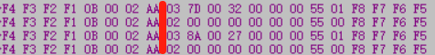


---


---

### SU-03T与STM32串口通信不稳定怎么办？

**问题描述：**

使用SU-03T的B0、B1串口与STM32单片机通信时，出现数据偶尔能收到、大多数时间无法收到的问题。语音模块与电脑串口助手通信正常，单片机与串口助手通信也正常。

**解决方案：**

**问题分析：**

- 模块与电脑、单片机与串口助手通信均正常，说明硬件本身没问题
- 问题出在语音模块与单片机的直接连接上
- 可能是连接质量或信号完整性问题

**排查步骤：**

1. **连接质量检查**
    - 检查杜邦线是否接触不良
    - 更换新的杜邦线尝试
    - 直接焊线连接，避免使用杜邦头
    - 使用蜂鸣器测试每根线的导通性

2. **PCB走线检查**
    - 确认PCB走线没有断裂
    - 检查过孔是否导通
    - 测试连接阻抗是否正常
    - 排除PCB制作工艺问题

3. **信号完整性优化**
    - 在串口线上添加上拉电阻
    - 使用双绞线减少干扰
    - 避免长距离平行布线
    - 增加滤波电容

4. **波特率和协议确认**
    - 确认双方波特率设置一致
    - 检查数据位、停止位、校验位配置
    - 验证帧头帧尾设置是否正确

**固件层面优化：**

1. **重新生成简易固件**
    - 制作一个只测试串口传输的简易固件
    - 排除网络不稳定导致的生成bug
    - 逐步增加功能定位问题

2. **增加串口数据量**
    - 在平台配置中增加每次发送的字节数
    - 添加适当的延时保证数据传输稳定
    - 使用握手协议确认数据接收

**注意事项：**

- 换两种STM32单片机都有同样问题，说明不是单片机问题
- 直接焊线比使用杜邦线更可靠
- 串口通信不稳定通常是物理连接问题
- 帧头帧尾是确保传输可靠性的重要手段，不建议省去

---


---

### SU-03T可以实现AI智能语音功能吗？

**问题描述：**

希望将SU-03T模块实现为AI智能语音设备，能够接入类似DeepSeek的AI模型来处理语音并生成回答。

**解决方案：**

**1. 功能限制说明**

- **SU-03T定位**：

    - 离线语音识别模块
    - 专注于本地命令词识别
    - 不具备直接AI对话能力

- **技术架构**：

    - 固化的命令词识别
    - 不支持云端AI接入
    - 无法运行大语言模型

**2. AI语音实现方案**

- **ESP32方案**：

    - 使用ESP32作为主控
    - SU-03T作为语音识别扩展
    - 通过串口将识别结果传给ESP32
    - ESP32连接WiFi调用AI接口

- **树莓派方案**：

    - 树莓派处理AI逻辑
    - SU-03T负责语音唤醒和识别
    - 通过GPIO或串口通信
    - 更强的处理能力

**3. 实现步骤**

- **硬件准备**：

    - 准备ESP32或树莓派开发板
    - SU-03T模块连接到主控
    - 配置网络连接环境

- **软件开发**：

    - 语音识别结果传输
    - AI接口调用（HTTP/WS）
    - 语音合成播放（TTS）
    - 业务逻辑处理

**注意事项：**

- SU-03T无法直接运行AI模型
- 需要配合主控实现AI功能
- 考虑响应延迟和成本因素
- 建议先实现简单的问答功能

---


---

### SU-03T1如何与ESP32项目对接实现语音唤醒？

**问题描述：**

需要将SU-03T1语音识别芯片与现有的ESP32项目进行对接，实现语音唤醒功能，并询问具体的对接方式和注意事项。

**解决方案：**

SU-03T1可以通过串口与ESP32进行通信，实现语音唤醒和识别功能。

**1. 硬件连接方式**

```
ESP32          SU-03T1模块
TX   →   UART1_RX (B6引脚)
RX   ←   UART1_TX (B7引脚)
GND  →   GND
5V   →   VCC (可选，根据模块供电需求)
```

**2. 通信实现步骤**

- **语音唤醒方式**：

    - 直接喊出唤醒词即可激活SU-03T1
    - 模块识别到唤醒词后会通过串口发送相应数据

- **串口通信配置**：

    - 使用UART1进行通信
    - 默认波特率：9600 bps（可在平台配置修改）
    - 数据格式：8数据位，1停止位，无校验

- **数据传输**：

    - SU-03T1识别到命令后，通过串口发送识别结果
    - ESP32接收串口数据，执行相应控制逻辑

**3. 平台配置要点**

在智能公元平台进行以下配置：

- 设置串口输出功能
- 配置识别结果输出格式
- 定义唤醒词和命令词
- 设置对应的串口发送数据

**注意事项：**

- SU-03T1只有一路串口，烧录固件和运行通信不能同时进行
- 确保ESP32和SU-03T1的串口参数（波特率等）一致
- 建议先使用串口调试助手验证通信正常
- 如需要更复杂的AI对话功能，可配合ESP32的WiFi能力调用云端API

---

### 是否有适用于Arduino Uno开发板的SU-03T芯片库，以及如何在Arduino环境中使用SU-03T模块


**1. 官方库支持情况**

- **SU-03T模块**：

    - 官方暂未提供专门的Arduino库
    - 主要通过图形化编程平台配置
    - 或使用串口通信方式控制

**2. Arduino控制方案**

- **串口通信方式**：

    - 使用Arduino的Serial库
    - 通过UART发送控制命令
    - 参考模块的串口协议文档

- **硬件连接**：

    - Arduino TX → SU-03T RX
    - Arduino RX → SU-03T TX
    - 共地连接（GND）
    - 供电连接（3.3V或5V，看模块规格）

**3. 开发资源**

- **图形化编程**：

    - 推荐使用官方图形化开发环境
    - 支持拖拽式编程，无需编码
    - 可生成Arduino兼容的配置

- **SDK开发**：

    - 如需要深度定制，可下载SDK
    - SDK包含完整的API文档
    - 需要一定的嵌入式开发经验


---

### 如何修改语音模块的设备名称？

**问题描述：**

希望更改语音模块的默认名称（如将"小智"改为其他自定义名称），实现个性化设置。

**解决方案：**

**1. 平台配置修改**

- **进入语音模块页面**：

    - 登录智能公元平台
    - 进入项目配置界面
    - 找到语音模块设置选项

- **修改唤醒词/设备名**：

    - 找到"唤醒词"设置项
    - 输入新的设备名称
    - 保存配置

**2. 固件生成和烧录**

- **重新生成固件**：

    - 修改名称后必须生成新固件
    - 确保其他配置保持不变
    - 下载更新后的固件文件

- **烧录更新**：

    - 使用烧录工具烧录新固件
    - 确认烧录成功完成
    - 测试新唤醒词是否生效

**3. 注意事项**

- **唤醒词选择建议**：

    - 选择4-5个汉字
    - 避免使用生僻字
    - 确保发音清晰

- **功能验证**：

    - 测试新唤醒词的识别率
    - 确认设备响应正常
    - 验证语音播报功能

**注意事项：**

- 修改设备名会影响唤醒识别
- 新固件烧录后原设置被覆盖
- 保留原固件作为备份
- 建议记录原始配置信息

---### 控制类型中的GPIO选项如何选择？

**问题描述：**

在配置控制类型时，下拉菜单显示GPIO_A25、GPIO_A26、GPIO_A27、GPIO_A28、GPIO_B6、GPIO_B7、GPIO_B2、GPIO_B3等选项，不清楚如何选择，且没有找到以"S"开头的选项。

**解决方案：**

**配置界面位置：**

- **Pin脚配置**：用于设置GPIO的基本属性（输入/输出模式、默认电平）
- **命令词自定义**：用于配置语音指令与GPIO的关联关系

配置步骤：

1. 在Pin脚配置页面设置GPIO为输出模式
2. 在命令词自定义页面添加控制动作
3. 在控制动作中选择对应的GPIO引脚

**1. GPIO选项说明**

- **GPIO编号规则**：

    - GPIO_Axx：A组GPIO引脚
    - GPIO_Bxx：B组GPIO引脚
    - 数字表示具体引脚号

- **常用引脚功能**：

    - GPIO_B6：UART1_TX（串口发送）
    - GPIO_B7：UART1_RX（串口接收）
    - GPIO_B2、B3：可用作GPIO或串口
    - GPIO_A25-A28：其他GPIO功能

**2. 选择依据**

- **根据硬件连接**：

    - 选择与实际接线对应的GPIO
    - 确保配置与硬件一致
    - 避免功能冲突

- **根据功能需求**：

    - 需要串口输出选UART1_TX
    - 需要PWM输出选择PWM引脚
    - 普通控制选择任意GPIO

**3. "S"开头的选项**

- **选项说明**：

    - 某些模块可能有特殊功能标识
    - 通常以"S"开头表示特殊功能
    - SU-03T可能没有此类选项

- **替代方案**：

    - 使用GPIO选项实现相同功能
    - 查看模块具体支持的特性
    - 联系技术团队确认

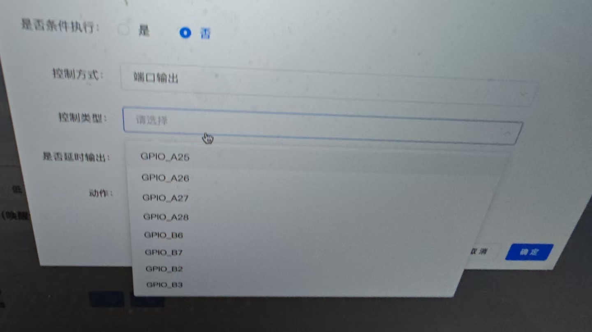

*控制类型下拉菜单中的GPIO选项列表*

**注意事项：**

- GPIO选择必须与硬件设计匹配
- 不同型号支持的引脚功能不同
- 配置错误可能导致功能异常

---


---

### 如何在SU-03T模块上设置PWM控制风扇转速？

**问题描述：**

需要在SU-03T模块上实现通过PWM信号控制风扇转速，类似CI-03T的功能。

**解决方案：**

**1. PWM控制原理**

- **基本原理**：

    - 通过调整PWM占空比控制风扇转速
    - 占空比越大，风扇转速越快
    - 占空比越小，风扇转速越慢
    - 使用脉冲宽度调制实现调速

- **设置方法**：

    - SU-03T与CI-03T使用相同的PWM控制方法
    - 主要区别在于引脚名称不同
    - 需要确认SU-03T可复用为PWM的引脚

**2. 智能公元平台配置**

- **登录平台**：

    - 访问 https://www.smartpi.cn
    - 选择对应的SU-03T模块
    - 创建新产品或编辑现有产品

- **PWM配置步骤**：

    - 在控制类型选择PWM输出
    - 设置PWM频率（建议1kHz-10kHz）
    - 配置占空比范围（0-100%）
    - 将PWM输出绑定到具体指令

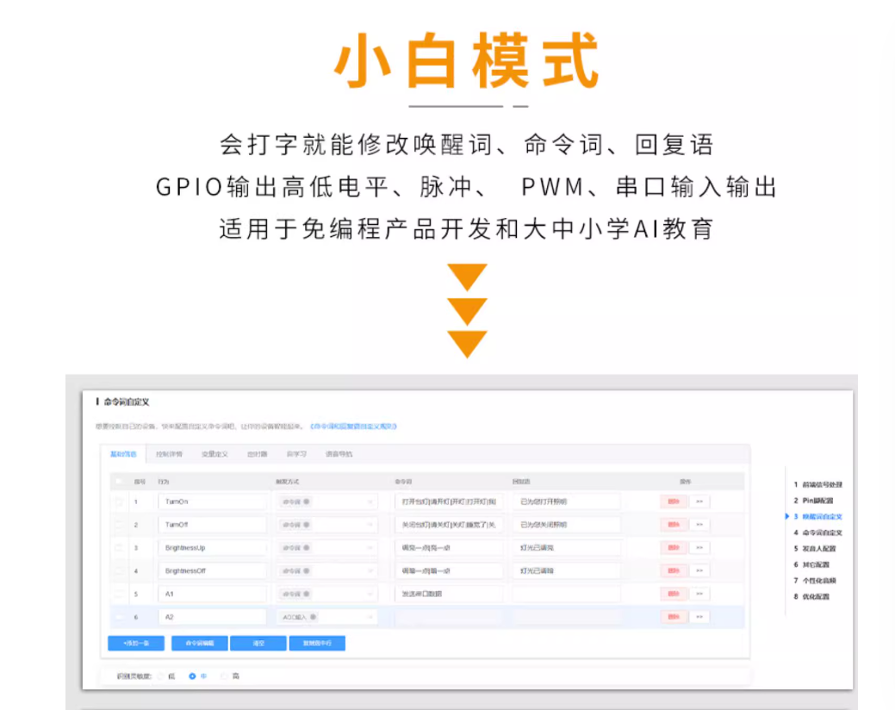

*智能公元平台的PWM输出配置界面*

**3. 硬件连接**

- **引脚确认**：

    - 查看SU-03T引脚定义图
    - 确认哪些GPIO可复用为PWM
    - 选择合适的PWM引脚

- **风扇连接**：

    - 风扇正极接PWM输出引脚
    - 风扇负极接GND
    - 确保供电电压符合风扇规格
    - 必要时增加驱动三极管

**注意事项：**

- SU-03T和CI-03T的PWM设置方法相同，只是引脚名称不同
- 确认风扇工作电压与模块输出匹配
- 大功率风扇需要额外的驱动电路
- PWM频率过高可能导致风扇异响

---


---

### SU-03T新版本为什么没有音量调节功能？

**问题描述：**

新发布的SU-03T产品版本中无法通过默认设置调节音量，而之前版本可以通过语音控制降低音量。

**解决方案：**

**功能变更说明：**

- 新版本的SU-03T默认固件中未包含音量调节功能
- 需要使用方自己在平台上添加音量调节的语音指令
- 这不是功能缺失，而是为了让使用方有更灵活的自定义空间

**添加音量调节步骤：**

1. **登录智能公元平台**
    - 进入产品配置页面
    - 找到语音指令设置

2. **添加音量控制指令**
    - 添加音量增大指令，对应设置音量+的动作
    - 添加音量减小指令，对应设置音量-的动作
    - 添加静音指令，对应设置静音的动作

3. **配置回复语**
    - 为每个指令设置相应的语音回复
    - 如音量已增大、音量已减小、已静音等

4. **生成并烧录固件**
    - 保存配置
    - 生成新的固件
    - 重新烧录到模块

**学习资源：**

- B站搜索机芯智能，查看视频教程
- 官方提供详细的配置教程
- 教程涵盖各种功能的添加方法

**注意事项：**

- 新版本平台支持更灵活的自定义配置
- 音量调节功能需要手动添加到指令列表
- 配置完成后记得重新生成和烧录固件
- 如不确定操作，建议先观看官方教程

---

### SU-03T是否支持在线语音调音量功能？

**问题描述：**

在使用SU-03T模块时，需要确认是否支持通过在线语音指令实时调节音量，以及如何实现该功能。

**解决方案：**

**功能支持说明：**

- SU-03T只支持离线调音量功能
- 在线调音量功能SU-03T不能实现
- 在线调节需要配合WiFi模块使用

**实现方案：**

1. **离线音量调节**
    - 在平台配置中添加音量控制指令
    - 支持增大音量、减小音量、最大音量、最小音量等控制
    - 通过语音指令直接控制模块音量

2. **在线调节方案**
    - 使用SU-03T加WiFi模块的组合方案
    - 通过两个串口连接实现
    - WiFi模块接收在线指令后转发给SU-03T

**注意事项：**

- 离线调音量功能在固件烧录时配置，使用时无需网络
- 如需在线调音量，需要额外的WiFi模块支持
- 硬件设计时需预留WiFi模块的接口和空间

---

---


---

### SU-03T是否支持TTS功能？

**问题描述：**

确认SU-03T模组是否具备文字转语音（TTS）功能，以及输出音量功率问题。

**解决方案：**

- **功能确认**：SU-03T标准版本不支持TTS功能
- **功能定位**：SU-03T是纯离线语音识别模块
- **支持功能**：

    - 离线命令词识别
    - 唤醒词检测
    - 固定回复词播放
    - GPIO/串口控制输出
    - 内置功放驱动喇叭（8Ω 2W）

**音量功率解决方案：**

如需要更大的音量功率或TTS功能，建议选择：

- **CI-03T（TTS版本）**：支持中英文TTS，购买时需选择TTS授权版本
- **CI-33T**：原生支持TTS功能，支持中英文
- **外接功放**：使用更大功率的喇叭（4Ω 2.4W或8Ω 1.6W）

**喇叭选型参考：**

| 阻抗 | 推荐功率 | 说明 |
|------|----------|------|
| 4Ω | 2.4W起 | 不要超过太大，如4Ω 5W模块带不动 |
| 8Ω | 1.6W起 | 可选8Ω 2W圆喇叭或8Ω 5W腔体喇叭 |


**注意事项：**

- SU-03T专注于离线识别，语音内容需预先录制
- 标准SU-03T输出音量较小，如需大音量请选择其他型号
- 如需动态语音播报，建议选择支持TTS的型号
- CI-03T的TTS功能需要购买授权版本才能使用
- 确认产品功能需求后再选型
---


---

### 删除唤醒词后固件生成失败怎么办？

**问题描述：**

SU-03T在配置免唤醒功能时，删除唤醒词或添加免唤醒词后导致固件生成失败。

**解决方案：**

- 唤醒词不能删除，必须保留至少一个
- 可以设置一个简单但不使用的唤醒词
- 免唤醒词在"免唤醒的命令词"区域配置

**注意事项：**

- 唤醒词是系统语法要求，不能为空
- 实际使用时通过事件触发实现免唤醒
- 免唤醒词数量限制为10条

---


---

### SU-03T 可以使用 Keil 开发吗？

**问题描述：**

询问是否可以使用 Windows 下的 Keil IDE 进行 SU-03T 芯片的开发。

**解决方案：**

- SU-03T 不能使用 Keil 进行开发
- 需要在 Linux 系统下搭建开发环境
- Windows 系统需要安装虚拟机

**注意事项：**

- 确保虚拟机中的 Linux 环境配置正确
- 开发工具链需要与官方要求一致
- 建议使用官方推荐的开发环境

---


---

### 可以使用 ST-Link 烧录 SU-03T 吗？

**问题描述：**

询问是否可以使用 ST-Link V2 烧录器烧录 SU-03T 固件。

**解决方案：**

- SU-03T 串口烧录必须使用 CH340
- 不支持使用 ST-Link 进行烧录
- 其他烧录器可能不兼容

**注意事项：**

- 确保使用 CH340 USB 转 TTL 模块
- 检查驱动是否正确安装
- 烧录前确认模块进入下载模式

---

## 串口输出配置


---

### SU-03T支持哪些红外协议？

**问题描述：**

需要了解SU-03T模块支持的红外协议类型，特别是是否支持SIRC协议。

**解决方案：**

平台配置的红外功能支持以下协议：

1. **支持的红外协议**
    - **NEC码**：标准红外编码协议
    - **学习码**：直接录制原始红外信号
    - 不支持SIRC协议

2. **红外学习功能**

---


---

### SU-03T固件文件可以自行编写吗？

**问题描述：**

询问是否可以自行编写SU-03T（CI-03T1/CI-03T2）的固件文件，还是只能在平台生成烧录。

**解决方案：**

**技术可行性**

- 理论上可以自行编写固件文件
- 但需要深入了解芯片架构和指令集
- 需要掌握底层开发工具和调试方法

**实际限制**

- 公司不提供SDK开发包
- 缺少官方技术文档支持
- 自行开发难度大、周期长

**建议方案**

- 使用官方平台生成固件
- 通过平台配置实现所需功能
- 如有特殊需求，联系技术团队定制

**注意事项：**

- 自行开发固件可能导致不稳定
- 官方平台经过充分测试，稳定可靠
- 建议优先使用平台提供的功能

---


---

### CI系列芯片使用什么IDE进行开发？如何获取二次开发文档？

**问题描述：**

需要了解CI系列离线语音识别芯片配套的IDE开发工具以及代码二次开发支持文档。

**解决方案：**

**开发环境搭建：**

1. **SU-03T二次开发环境**
    - 参考官方教程视频：【SU-03T二次开发教程之环境搭建】
    - 视频包含完整的IDE配置和开发环境搭建流程
    - 涵盖工具安装、项目创建、编译调试等步骤

2. **二次开发文档获取**
    - 可通过技术团队获取二次开发文档压缩包
    - 文档包含API接口说明、示例代码和开发指南
    - 提供完整的硬件接口和软件开发参考

**注意事项：**

- 不同型号的CI系列芯片可能使用不同的开发工具
- 建议先查看具体型号的开发文档
- 二次开发需要一定的嵌入式开发经验
- 开发过程中需要遵守相关许可协议

---

## PLC对接


---

### SU-03T与PLC双向通信如何实现？

**问题描述：**

需要实现SU-03T语音模块接收语音指令后，同时播报语音并发送自定义十六进制数据给PLC，以及接收PLC返回的数据后播报语音的双向通信功能。

**解决方案：**

SU-03T支持与PLC的双向串口通信，可通过智能公元平台配置实现。

**1. 语音识别后发送数据给PLC**

在平台配置语音命令的串口输出功能：

- 触发方式：语音输入
- 执行动作：串口发送
- 数据格式：自定义十六进制数据
- 支持同时播报语音和发送数据

配置示例：

- 输入："1号纸箱"
- 动作1：播放"收到1号纸箱指令"
- 动作2：串口发送自定义数据（如 AA BB CC）


**2. 接收PLC数据并播报语音**

配置串口输入触发语音播报：

- 触发方式：串口输入
- 串口选择：UART1_RX
- 设置触发条件（特定数据帧）
- 执行动作：播放对应语音

**3. 实现流程**

```
人语音输入 → SU-03T识别 → 播报确认语音 + 发送数据给PLC
                                            ↓
PLC执行动作 → 发送完成信号 → SU-03T接收 → 播报状态语音
```

**注意事项：**

- SU-03T只有一路串口，烧录和运行不能同时使用
- 串口通信参数需与PLC匹配（波特率、数据位等）
- 发送和接收的数据均为十六进制格式
- 建议在数据帧中加入校验码确保通信可靠性

---

### SU-03T模块如何与西门子Smart200 PLC对接？

**问题描述：**

需要将SU-03T语音模块与西门子Smart200 PLC进行通信，实现语音控制PLC功能。

**解决方案：**

**1. 硬件连接**
SU-03T模块通过UART接口与西门子Smart200 PLC通信：

- 模块TX → PLC RX
- 模块RX → PLC TX
- GND → GND

**2. 通信参数设置**

- 波特率：9600 bps（默认，可配置）
- 数据位：8位
- 停止位：1位
- 校验位：无

**3. PLC地址设置**
在西门子Smart200 PLC中设置以下参数：

- 通信端口：选择PLC的通信端口（如PPI、MPI或以太网）
- 地址：设置为模块的通信地址，通常为1（默认地址）
- 协议：选择Modbus RTU或自定义协议

**4. 样例程序**
以下为西门子Smart200 PLC的样例程序（基于TIA Portal）：

```plaintext
// 读取SU-03T模块的语音指令状态
// 假设模块地址为1，使用Modbus RTU协议
// 读取寄存器地址：40001（状态寄存器）
// 读取寄存器地址：40002（语音指令ID）

// 读取模块状态
MOV 1, DB1.DBX0.0  // 设置通信使能
MOV 40001, DB1.DBW0  // 设置读取寄存器地址
CALL 1, DB1.DBX0.0  // 调用Modbus读取指令

// 读取语音指令ID
MOV 1, DB1.DBX0.0  // 设置通信使能
MOV 40002, DB1.DBW0  // 设置读取寄存器地址
CALL 1, DB1.DBX0.0  // 调用Modbus读取指令
```

**注意事项：**

- 确保模块供电电压在3.6-5.5V范围内，避免电压不稳导致通信失败
- 检查模块与PLC之间的接线是否正确，避免短路或接触不良
- 在PLC程序中，确保通信协议与模块支持的协议一致
- 如需自定义指令，可通过平台生成固件并上传至模块

---


---

### SU-03T能否解析Modbus RTU协议数据进行播报？

**问题描述：**

需要在SU-03T模块上接收Modbus RTU协议的传感器数据，解析其中的温湿度数值并语音播报。

**解决方案：**

**1. 平台功能限制**

- 基础平台配置不支持直接解析Modbus RTU协议
- 需要通过二次开发实现协议解析功能
- Modbus RTU的CRC校验码是动态计算的，无法作为固定帧尾

**2. 实现方案**

**方案一：二次开发**

- 在设备端实现Modbus RTU协议解析
- 使用UART接口接收传感器数据
- 编写CRC校验算法验证数据完整性
- 提取有效数据并赋值给变量

**方案二：预计算校验码**

- 提前计算好可能的CRC校验值
- 在平台设置固定的数据帧格式
- 适用于数据格式固定的场景

**方案三：等待平台更新**

- 平台正在测试支持校验格式的协议配置
- 近期可能会上线相关功能
- 届时可通过配置实现

**3. 数据解析示例**

```
接收数据帧：02 04 00 00 00 02 71 F8
解析结果：

- 从站地址：02
- 功能码：04（读取保持寄存器）
- 数据长度：02
- 温度数据：00 F6（246，即24.6℃）
- 湿度数据：02 3B（571，即57.1%）
```

**4. 语音播报实现**

```plaintext
1. 将解析出的温湿度数据赋值给变量：

    - temperature = 24.6
    - humidity = 57.1

2. 配置播报逻辑：

    - "播报温湿度" → 播报"当前温度24.6度，湿度57.1%"
```

**注意事项：**

- Modbus RTU协议需要实现CRC16校验算法
- 建议先用串口调试助手验证数据格式
- 二次开发需要一定的编程基础
- 复杂应用建议寻求专业技术团队

---


---

### 如何根据Modbus RTU数据帧触发不同语音播报？

**问题描述：**

需要根据接收到的不同Modbus RTU数据帧（如01 06 00 00 00 01）触发对应的语音播报（如"一号开关已打开"）。

**解决方案：**

**1. 数据帧识别方法**

- 将完整的数据帧作为触发条件
- 需要配置多个独立的行为对应不同数据帧
- 每个行为识别特定的数据格式

**2. 配置示例**

```
数据帧对应表：

- 01 06 00 00 00 01 48 0A → "一号开关已打开"
- 01 06 00 00 00 00 89 CA → "一号开关已关闭"
- 01 06 00 01 00 01 19 CA → "二号开关已打开"
- 01 06 00 01 00 00 D8 0A → "二号开关已关闭"
```

**3. 实现步骤**

**方案一：串口输入触发（需要二次开发）**

- 监听串口接收的完整数据帧
- 配置多个行为，每个行为对应一个数据帧
- 触发条件设置为特定串口数据
- 执行动作为对应的语音播报

**方案二：数据解析后播报**

- 先解析数据帧中的有效参数
- 将参数赋值给变量
- 根据变量值播报不同内容
- 更灵活但需要编程实现

**4. 平台限制说明**

- SU-03T模块当前不支持直接识别Modbus协议
- 无法像播报温度变量那样直接播报开关状态
- 需要将模块改造为支持Modbus协议的从机

**5. 替代方案**

- 使用支持Modbus协议的专用模块
- 通过外部MCU解析后转发给SU-03T
- 等待平台更新支持Modbus协议

**注意事项：**

- 完整的8字节数据帧需要精确匹配
- CRC校验码也必须包含在触发条件中
- 建议先用串口助手测试数据接收
- 复杂场景建议使用二次开发

---

## 平台功能限制


---

### SU-03T1购买后需要升级固件吗？

**问题描述：**

购买的SU-03T1芯片标注需要升级固件，询问这是否是出厂时未完成的必要操作。

**解决方案：**

**1. 固件版本说明**

- 新购买的模块需要烧录10月25日之后发布的固件
- 之前的老固件需要重新生成才能使用
- 当天生成的固件可以直接使用

**2. 固件升级原因**

- 固件功能持续更新优化
- 新版本固件修复了已知问题
- 提升了稳定性和识别率

**3. 升级步骤**

- 登录智能公元平台
- 选择或导入之前的配置
- 重新生成固件文件
- 使用烧录工具烧录新固件

**注意事项：**

- 这是正常的产品更新流程，非质量问题
- 建议使用最新版本的固件以获得最佳体验
- 保留配置文件，方便重新生成固件
- 如不确定操作，可联系技术团队指导


---


---

### 为什么无法在平台修改语音指令？

**问题描述：**

在智能公元平台的个性化音频配置页面中，发现无法修改或添加新的语音指令，且小程序端也不支持此功能。

**解决方案：**

**功能限制说明**

- **智能公元平台**：目前仅支持调整现有语音指令的参数（如阈值、音量等）
- **语音指令修改**：需要通过PC端平台重新配置并生成固件
- **小程序功能**：主要用于语音内容管理，不支持修改指令逻辑

**操作指引**

1. **PC端平台操作**
    - 登录智能公元PC端平台
    - 进入产品的语音配置页面
    - 重新定义语音指令和对应行为
    - 生成并下载新的固件文件

2. **固件更新流程**
    - 使用烧录工具将新固件烧录到模块
    - 确保固件版本与硬件型号匹配
    - 测试所有语音指令功能

3. **替代方案**
    - 如需频繁调整指令，考虑使用串口控制
    - 通过串口指令实现更灵活的控制逻辑
    - 部分型号支持OTA更新，可远程推送新配置

**注意事项：**

- 语音指令的修改需要重新生成整个固件
- 建议在开发阶段充分测试所有指令组合
- 保留原固件备份，以便快速恢复
- CI-03T/SU-03T等标准模块均遵循此限制

---

## 基础概念问题


---

### 离线语音模块的词条需要预先设置吗？

**问题描述：**

对于初次使用离线语音模块的使用方，不确定语音指令词条是否需要预先设置到模块中。

**解决方案：**

**1. 离线语音识别原理**

离线语音模块的工作机制：

- **预设词条**：所有可识别的语音指令必须预先定义并烧录到固件中
- **本地匹配**：模块将采集到的语音与本地存储的词条模板进行比对
- **固定指令集**：不支持动态添加或实时学习新的命令词
- **快速响应**：由于本地处理，响应速度通常在500ms以内

**2. 词条配置流程**

**步骤一：在平台定义词条**

- 登录智能公元平台
- 创建产品配置
- 输入需要识别的命令词（如"开灯"、"关灯"等）
- 设置每个命令词对应的触发行为

**步骤二：生成固件**

- 平台根据词条列表生成对应的识别模型
- 将词条和行为配置编译到固件中
- 下载生成的固件文件

**步骤三：烧录固件**

- 使用烧录工具将固件烧录到模块
- 词条即永久保存在模块的Flash中
- 上电后即可识别预设的词条

**3. 词条容量限制**

不同型号的词条支持数量：

| 型号 | 词条容量 | 备注 |
|------|----------|------|
| SU-03T | 150条 | 基础型号 |
| CI-03T | 300条 | 标准型号 |
| CI-33T | 500条 | 大容量型号 |
| CI-95C/CI-96Z | 1000条 | 高性能型号 |
| JX-A7T | 300条离线+在线AI | 混合型号 |

**4. 使用注意事项**

**词条设计原则**：

- 词条长度建议2-5个汉字
- 避免发音相近的词条
- 使用清晰、常用的词汇
- 考虑使用场景的噪音环境

**修改流程**：

- 修改词条需要重新生成固件
- 重新烧录后新词条生效
- 原有词条将被完全替换
- 建议开发阶段充分测试

**灵活性考虑**：

- 如需动态修改指令，可考虑串口控制方案
- 复杂逻辑建议配合MCU实现
- 部分型号支持自学习功能（仅限词调变化）

**5. 常见问题**

**Q：能否在使用过程中添加新词条？**
A：不能，必须重新烧录固件。

**Q：词条可以用方言或英语吗？**
A：主要支持普通话，部分型号支持简单英语。

**Q：同一个词可以触发不同动作吗？**
A：不能，一个词条对应一个确定的行为。

---


---

### SU-03T是否支持红外遥控接收功能？

**问题描述：**

平台上只看到红外发送和学习功能，询问SU-03T是否支持红外接收功能。

**解决方案：**

1. **功能支持情况**
    - SU-03T支持红外接收功能
    - 但需要通过软件配置实现
    - 标准固件默认未开放此功能

2. **实现原理**
    - 红外信号通过脉冲方式传输
    - 需要配置引脚为输入模式
    - 使用定时器检测高低电平变化

3. **配置方法**
    - 引脚初始化：设置为输入模式，启用内置上拉
    - 定时器配置：设置合适的采样频率
    - 中断处理：响应脉冲信号变化

4. **开发说明**
    - 需要使用C语言开发
    - 通过脉冲检测解析红外信号
    - 可参考B站教学视频学习

**注意事项：**

- 红外接收功能属于定制项目
- 当前开放红外学习和固定码发送
- 开发需要一定的嵌入式经验
- 可联系技术团队获取开发资源

---


---

### 如何配置8路继电器全部控制功能？

**问题描述：**

需要配置语音指令来同时控制所有8路继电器的开关，但不确定如何设置"全部控制"的配置逻辑。

**解决方案：**

**1. 获取参考配置**

- 访问智能公元文档中心
- 查找"六路继电器配套固件"
- 下载配置文件和教程


**2. 配置方法**

- 下载"SU-03T控制六路继电器配套资料.zip"
- 导入现成的配置文件到平台
- 参考配置文件了解全部控制逻辑

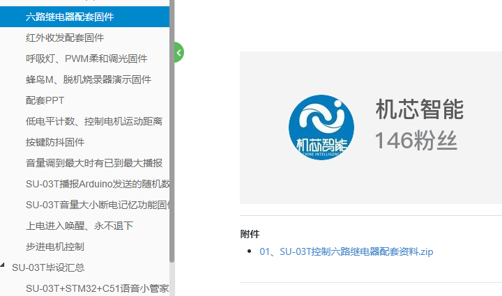

**3. 全部控制实现**

- 配置专门的命令词（如"全部打开"）
- 在控制动作中同时配置多个GPIO输出
- 每个GPIO对应一路继电器控制


**4. 扩展到8路**

- 在六路配置基础上增加两路
- 配置新的GPIO引脚控制第7、8路继电器
- 更新全部控制命令，包含所有8路

**注意事项：**

- 确保语音模块有足够的GPIO资源
- 检查电源功率是否满足8路继电器同时工作
- 配置完成后测试每路继电器的独立和全部控制功能
- 如无现成配置，可手动逐路配置后测试全部控制逻辑

---


---

### 如何配置8路继电器全部控制功能？

**问题描述：**

需要配置语音指令来同时控制所有8路继电器的开关，但不确定如何设置"全部控制"的配置逻辑。

**解决方案：**

**1. 获取参考配置**

- 访问智能公元文档中心
- 查找"六路继电器配套固件"
- 下载配置文件和教程


**2. 配置方法**

- 下载"SU-03T控制六路继电器配套资料.zip"
- 导入现成的配置文件到平台
- 参考配置文件了解全部控制逻辑


**3. 全部控制实现**

- 配置专门的命令词（如"全部打开"）
- 在控制动作中同时配置多个GPIO输出
- 每个GPIO对应一路继电器控制


**4. 扩展到8路**

- 在六路配置基础上增加两路
- 配置新的GPIO引脚控制第7、8路继电器
- 更新全部控制命令，包含所有8路

**注意事项：**

- 确保语音模块有足够的GPIO资源
- 检查电源功率是否满足8路继电器同时工作
- 配置完成后测试每路继电器的独立和全部控制功能
- 如无现成配置，可手动逐路配置后测试全部控制逻辑

---


---

### 如何获取SU-03T开发板的芯片手册和原理图？

**问题描述：**

需要获取SU-03T开发板的完整技术资料，包括芯片手册、原理图等开发文档。

**解决方案：**

**1. 官方渠道获取**

- **智能公元平台文档中心**：

    - 访问 http://help.aimachip.com/docs/offline_su03t/
    - 包含SU-03T的完整开发包
    - 所有资料均可免费下载

- **B站视频教程**：

    - 搜索UP主"机芯智能"
    - 包含各模块的教学视频和案例
    - 实时更新的使用指导

**2. 开发包内容**

SU-03T开发包包含以下资料：

- **硬件资料**：

    - SU-03T模块原理图
    - 芯片技术手册
    - 引脚定义和规格说明
    - 硬件连接示意图

- **软件工具**：

    - 固件烧录软件
    - 配置工具
    - 调试助手

- **示例代码**：

    - Arduino示例
    - 串口通信协议
    - 常用功能实现代码

- **教程文档**：

    - 快速入门指南
    - 详细功能说明
    - 常见问题解答

**3. 获取步骤**

1. 访问智能公元文档中心
2. 找到SU-03T相关页面
3. 下载SU-03T开发包压缩文件
4. 解压后查看所有资料

**注意事项：**

- 确保下载与硬件版本匹配的最新资料
- 开发包中的示例代码可作为开发参考
- 如有疑问可查看文档中的视频教程链接
- 建议保存一份本地备份便于离线查看

---


---

### 上传的WAV音频文件为什么会变小？

**问题描述：**

上传WAV音频文件到平台后，文件大小明显变小，怀疑文件被压缩，希望了解如何上传无损音频文件。

**解决方案：**

**文件变小原因：**

- **芯片内存限制**：语音模块Flash容量有限
- **自动压缩处理**：超出内存承受范围时自动压缩
- **优化存储**：为保证功能正常运行，系统会压缩音频

**内存限制说明：**

**1. 不同模块的容量限制**

- **CI-03T**：较大Flash容量，支持更多音频
- **SU-03T**：2MB Flash，需要严格控制音频大小
- **其他型号**：根据具体Flash容量而定

**2. 音频处理机制**
```
原文件大小     处理方式      结果
< 300KB     直接存储      不压缩
300KB-1MB    压缩存储      文件变小
> 1MB       大幅压缩      可能影响音质
```

**优化建议：**

**1. 音频文件准备**

- 使用合适的采样率（16kHz或22kHz足够）
- 选择单声道而非立体声
- 控制录音时长，避免过长
- 使用WAV格式，避免使用无损格式

**2. 压缩影响**

- 适度压缩对语音提示音影响不大
- 过度压缩可能影响音质
- 背景音乐类音频更敏感

**3. 存储策略**

- 优先保证核心功能的音频质量
- 次要音频可以使用更高压缩
- 定期清理不需要的音频文件

**注意事项：**

- 300KB的音频文件在某些模块上也可能被压缩
- 压缩是自动行为，无法手动关闭
- 建议在上传前自行优化音频文件大小
- 如确需高保真音频，考虑使用Flash容量更大的模块

---


---

### SU-03T模块二次开发需要什么环境？

**问题描述：**

需要进行SU-03T模块的二次开发，手工编写修改SDK源代码，了解支持的开发环境要求。

**解决方案：**

**开发环境要求：**

- **仅支持Ubuntu环境**：不支持Windows系统
- 需要搭建完整的Linux开发环境
- 官方不提供Windows下的开发工具链

**环境准备：**

1. **Ubuntu系统要求**
    - 推荐Ubuntu 18.04或更高版本
    - 64位系统
    - 至少20GB可用磁盘空间

2. **开发工具安装**
    - GCC编译工具链
    - Make构建工具
    - 相关库文件和依赖

3. **硬件要求**
    - 性能较好的计算机
    - 虚拟机运行可能导致性能问题

**注意事项：**

- 虚拟机运行Ubuntu可能不够流畅
- 建议直接安装Linux系统或使用双系统
- 二次开发需要具备嵌入式开发经验
- 官方仅提供Ubuntu环境下的技术团队

**替代方案：**

- 使用官方平台配置功能实现需求
- 避免需要二次开发的复杂功能
- 如必须二次开发，建议准备专门的Linux开发环境

---


---

### SU-03T支持实时播放语音流吗？

**问题描述：**

询问SU-03T模块是否支持通过小程序传输语音流并实时播放的功能。

**解决方案：**

**功能限制：**

- SU-03T模块不支持实时语音流播放
- 模块只能播放预录制的语音文件
- 不支持流式音频输入和播放

**支持的功能：**

1. **预录制语音播放**
    - 在平台中上传语音文件
    - 通过指令触发播放
    - 支持常见音频格式（如PCM、WAV）

2. **个性化音频**
    - 可以自行录制或制作语音文件
    - 上传到平台替换默认语音
    - 生成固件后使用

**替代方案：**

- 如需实时语音功能，考虑其他方案
- 使用支持流式播放的音频模块
- 通过外部音频处理芯片实现

**注意事项：**

- SU-03T主要用于语音识别和固定指令播放
- 实时语音流需要更复杂的音频处理能力
- 可根据实际需求选择合适的产品方案

---


---

### 蜂鸟M/US516P6芯片更新Flash后，固件需要重新生成吗？

**问题描述：**

蜂鸟M/US516P6芯片更新了Flash，SU-03T、SU-10A模块的型号和固件需要同步调整，询问是否需要重新生成固件以及平台是否支持新芯片。

**解决方案：**

**1. 新旧芯片固件兼容性**

- **新芯片**：必须使用新发布的固件
- **旧芯片**：新旧固件都兼容，无需立即更新
- **固件判断**：根据固件生成时间判断是否需要重新生成

**2. 平台支持情况**

- 平台已支持SU-03T1、SU-10A1新芯片的固件生成
- 在平台中选择对应的新型号即可生成固件
- 新固件会标注芯片版本信息

**3. 操作建议**

- 购买新芯片后，直接在平台生成新固件
- 使用旧芯片的项目，可继续使用现有固件
- 仓库中有旧芯片库存时，新生成的固件兼容旧模块

**注意事项：**

- 出厂时间在2024年10月25日之后的为新芯片
- 新固件可以用在新旧两种模块上
- 建议新项目统一使用新芯片和新固件
- 旧模块库存用完后，将全面切换到新芯片

---


---

### SU-03T/SU-32T串口配置有什么区别？

**问题描述：**

需要了解不同型号语音模块在串口配置上的差异。

**解决方案：**

- **基本操作相同**：

    - 串口收发配置方法一致
    - 变量定义和参数设置相同
    - 条件判断逻辑相同

- **主要区别**：

    - 不同型号的引脚定义可能不同
    - 具体控制功能可能因型号而异
    - 配置界面布局可能略有差异

**注意事项：**

- 操作逻辑基本通用，可相互参考
- 注意查看对应型号的引脚定义
- 控制功能以实际型号支持为准

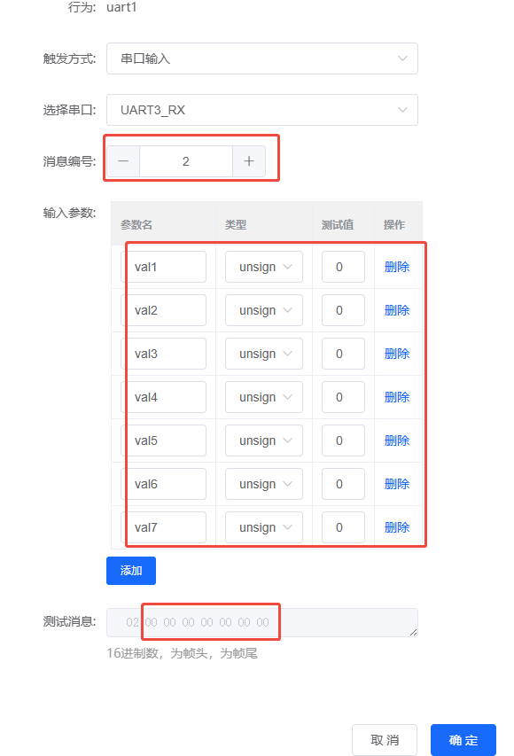

---


---

### 如何通过串口控制SU-03T/CL03T的识别功能？

**问题描述：**

需要通过串口指令控制SU-03T和CL03T模块的语音识别功能，实现开启和关闭识别。

**解决方案：**

**配置方法：**

1. **触发方式设置**
    - 将触发方式改为"收到某串字符触发"
    - 设置触发字符（如特定指令）

2. **控制操作配置**
    - 添加控制项，操作设置为"退出唤醒"
    - 另添加控制项，操作设置为"进入唤醒"
    - 可根据需要配置其他操作

**可选操作：**

- **允许语音识别**：开启识别功能
- **关闭语音识别**：关闭识别功能
- **允许识别词**：允许特定命令词识别
- **禁止识别词**：禁止特定命令词识别
- **禁止超时退出唤醒**：禁用超时退出
- **允许超时退出唤醒**：启用超时退出

**使用示例：**

通过发送不同的串口字符实现不同功能：

- 发送字符"A"：进入唤醒状态
- 发送字符"B"：退出唤醒状态
- 发送字符"C"：允许语音识别
- 发送字符"D"：关闭语音识别

**注意事项：**

- 串口字符可自定义设置
- 支持针对特定唤醒词的细致操作
- 配置时注意触发条件和操作的对应关系
- 测试时验证不同指令的效果

---


---

### SU-03T识别后如何通过串口发送字符给单片机？

**问题描述：**

SU-03T识别到语音后，需要通过串口发送字符给单片机以控制其动作，询问具体的配置方法。

**解决方案：**

**配置步骤：**

1. **设置控制方式**
    - 控制方式选择："端口输出"
    - 控制类型选择："UART1_TX"
    - 动作设置为："发送"

2. **设置发送参数**
    - 参数格式：十六进制格式（如"AA 55 99 55 AA"）
    - 最大长度：32字节
    - 格式要求：两个字符一组，中间用空格分隔

**格式说明：**

- 仅支持十六进制格式，不支持直接发送字符
- 格式示例：98 A3 0B FE（不能写成980A3BFE）
- 字符范围：0-9和A-F
- 不能出现连贯多字符连接

**接收端处理：**

在单片机端建立映射关系：

- 接收十六进制数据
- 根据预设的映射表解析为实际控制指令
- 执行相应的动作

**示例映射：**

```
接收: AA 55 99 55 AA → 执行: 开灯动作
接收: BB 66 88 77 CC → 执行: 关灯动作
```

**注意事项：**

- 发送数据前确保串口连接正常
- 十六进制数据必须为偶数长度
- 单片机端需要相应的解析程序
- 建议先进行简单测试验证通信

---

### 如何配置SU-03T串口语音播报功能？

**问题描述：**

需要配置SU-03T接收MCU通过串口发送的温湿度数值，并实时语音播报出来。

**解决方案：**

通过智能公元平台配置串口输入触发和变量播报功能：

**1. 配置串口输入触发**

- **触发方式**：选择"串口输入"
- **串口选择**：UART1_RX
- **消息号**：设置对应的消息号（如1）
- **参数类型**：选择char类型接收数据

**2. 定义变量**

- **进入变量定义**：在命令词自定义页面找到"变量定义"标签
- **添加变量**：点击"+添加变量"按钮
- **变量命名**：定义变量名称（如temperature、humidity）
- **变量类型**：选择合适的数据类型

**3. 配置语音播报**

- **触发条件**：串口接收到数据后触发
- **数据处理**：将接收到的参数赋值给变量
- **播报内容**：使用"添加变量"功能将变量插入播报文本
- **播报格式**：如"当前温度{temperature}度，湿度{humidity}%"

**配置步骤：**

1. 在版本详情页面，选择触发方式为"串口输入"
2. 设置串口参数（UART1_RX、消息号、参数类型）
3. 在命令词自定义页面添加需要的变量
4. 在语音内容中使用"添加变量"插入变量
5. MCU端按照设定格式发送数据（如"25"表示温度25度）

**注意事项：**

- 必须先定义变量才能在播报内容中使用
- 串口数据格式需要与配置的参数类型匹配
- 变量赋值需要在串口接收后立即执行
- 测试时建议先发送简单数据验证功能

---

### 在平台中如何配置变量和串口参数？

**问题描述：**

在AI产品零代码平台中，需要配置变量和串口参数，实现MCU采集的温度值通过串口发送到SU-03T并进行语音播报。

**解决方案：**

**1. 变量配置流程**

- **位置**：命令词自定义页面 → 变量定义标签
- **操作**：点击"+添加变量"创建变量
- **设置**：输入变量名和选择数据类型
- **保存**：完成变量定义后保存配置

**2. 串口参数配置**

- **触发配置**：版本详情页面 → 选择触发方式为"串口输入"
- **串口设置**：配置UART1_RX、消息号、参数类型
- **Pin脚配置**：在Pin脚配置部分设置串口波特率等参数
- **参数映射**：将接收到的串口数据映射到已定义的变量

**3. 语音内容配置**

- **添加控制**：在版本详情页面添加新的控制项
- **语音内容**：输入播报文本，点击"添加变量"
- **变量选择**：从列表中选择之前定义的变量插入
- **实时播报**：串口收到数据后自动触发播报

**配置要点：**

- 变量必须先定义才能使用
- 串口参数和变量要正确关联
- 波特率等通信参数要匹配
- 测试时验证数据传输是否正常

**注意事项：**

- 串口输入和变量配置是配合使用的
- 串口数据格式需要与平台配置一致
- 建议使用简单数据先测试连通性
- 复杂场景可能需要多个变量配合

---

### 如何通过串口输入实现实时温度值触发语音播报？

**问题描述：**

需要通过串口输入实现MCU采集的实时温度值触发语音播报，而不是使用固定的数值作为触发条件。

**解决方案：**

平台中串口触发支持接收动态数据，无需配置固定值：

**1. 串口输入配置**

- **触发方式**：选择"串口输入"
- **参数设置**：配置消息号和参数类型
- **接收数据**：MCU发送的实时温度值会自动接收
- **无需固定值**：不需要在测试值中设置固定数值

**2. 变量关联方法**

- **接收赋值**：串口接收到的值会自动赋给指定变量
- **变量使用**：在语音播报中直接使用该变量
- **实时更新**：每次串口收到新数据都会更新变量值

**3. MCU发送格式**

- **数据格式**：直接发送温度数值（如"25"）
- **无需包装**：不需要额外的协议头或尾
- **串口配置**：确保波特率、数据位等参数匹配

**配置流程：**

1. 在版本详情页面配置串口输入触发
2. 不设置测试值（留空即可）
3. 在变量定义中创建温度变量
4. 在语音内容中使用该变量
5. MCU通过串口实时发送温度值

**注意事项：**

- 串口输入会自动接收数据，不需要配置固定值
- 变量值会随着串口数据实时更新
- 测试时确认串口通信正常
- 建议添加数据校验确保可靠性

---

### 串口配置时'变量'和'参数'有什么区别？

**问题描述：**

在配置串口触发时，因误选了'变量'而非'参数'导致数据无法正常传输，需要了解两者的区别。

**解决方案：**

在平台配置中，'变量'和'参数'有不同的用途：

**1. 参数（Parameter）**

- **用途**：用于接收串口传入的数据
- **数据流向**：外部MCU → 模块内部
- **配置方式**：串口输入触发时选择"参数"
- **特点**：可以接收外部实时数据

**2. 变量（Variable）**

- **用途**：存储模块内部的数据
- **数据流向**：模块内部使用
- **初始值**：变量本身没有值，需要通过参数赋值
- **特点**：不能直接接收串口数据

**3. 正确配置方法**

- **串口输入**：选择"参数"而非"变量"
- **数据类型**：确保参数和变量类型一致
- **参数映射**：串口参数会自动赋值给指定变量

**配置示例：**

1. 在串口输入配置中，方式选择"参数"
2. 设置参数名（如TEMP）
3. 在变量设置中，将该参数关联到变量
4. MCU发送十六进制数据（如 AA 55 0C 00 00 00 00 55 AA）

**十六进制数据格式：**

- **帧头**：AA 55
- **消息号**：0C（十六进制）
- **数据内容**：00 00 00 00（4字节数据）
- **帧尾**：55 AA

**注意事项：**

- 串口输入触发必须选择"参数"
- 变量值通过参数传入后才能使用
- 确保数据类型匹配（int、char等）
- 十六进制数据格式必须正确

---

### SU-03T支持十六进制数据写入变量吗？

**问题描述：**

需要通过串口向SU-03T发送十六进制数据来更新内部变量值。

**解决方案：**

SU-03T支持通过串口参数接收十六进制数据：

**1. 数据格式要求**

- **十六进制格式**：使用空格分隔的十六进制数据
- **帧结构**：包含帧头、消息号、数据、帧尾
- **示例格式**：AA 55 0C 00 00 00 00 55 AA

**2. 配置步骤**

- **串口输入**：配置为串口输入触发
- **选择参数**：必须选择"参数"而非"变量"
- **消息编号**：设置对应的消息号（如12）
- **参数类型**：选择合适的数据类型（int、char等）

**3. MCU发送要求**

- **波特率匹配**：与模块配置一致
- **数据格式**：严格按照十六进制格式发送
- **帧头帧尾**：必须包含正确的帧头帧尾
- **消息号匹配**：与平台配置的消息号一致

**实现方法：**

1. 在平台配置串口输入参数
2. 确保选择"参数"选项
3. MCU按格式组织十六进制数据
4. 通过串口发送数据
5. 模块接收后自动更新变量

**注意事项：**

- 十六进制数据必须用空格分隔
- 消息号要使用十六进制格式
- 参数和变量的数据类型要一致
- 测试时先发送简单数据验证

---

### 如何通过串口传输带小数点的数值？

**问题描述：**

在通过串口发送浮点数（如5.8、3.5）时，MCU只能发送整数或十六进制值，无法直接传输小数点，需要找到一种方法将浮点数正确传输并还原。

**解决方案：**

**1. 数据编码方法**

- **浮点数转十六进制**：使用IEEE 754标准将浮点数转换为64位十六进制
- **示例转换**：

    - 3.5 → 00 00 00 00 00 00 0C 40
    - 2.7 → 00 9A 99 99 99 99 05 40
    - 5.8 → 相应的IEEE 754十六进制表示

**2. 传输协议格式**

完整的串口数据包格式：
```
AA 55 [消息号] [8字节数据] 55 AA
```

- **帧头**：AA 55
- **消息号**：根据平台配置确定
- **数据内容**：8字节的IEEE 754浮点数
- **帧尾**：55 AA

**3. MCU端实现**

```c
// 发送端（MCU）
float value = 5.8;
uint8_t data[8];
memcpy(data, &value, sizeof(float));  // 将浮点数转为字节数组

// 发送完整数据包
send_data("AA 55 0C");
for(int i=0; i<8; i++) {
    printf("%02X ", data[i]);
}
send_data("55 AA");
```

**4. 接收端处理**

在SU-03T平台配置时：

- 选择参数类型为"double"
- 设置对应的测试值验证转换
- 平台会自动处理IEEE 754格式的解析

**注意事项：**

- **字节序问题**：确保发送端和接收端的字节序一致（大端序/小端序）
- **数据长度**：double类型固定为8字节
- **变量命名**：建议使用英文变量名，避免中文导致的兼容性问题
- **测试验证**：先用简单数值（如1.0、2.0）验证通信正常

---

### double类型参数无法写入值怎么办？

**问题描述：**

在平台配置double类型参数时，测试值无法成功写入，或者发送的十六进制数据无法正确设置变量参数。

**解决方案：**

**1. 变量命名问题**

- **问题现象**：中文变量名可能导致参数写入失败
- **解决方法**：将变量名改为英文
- **操作步骤**：

    1. 删除原有的中文变量
    2. 重新创建英文变量名（如PH、EC、TEMP）
    3. 重新生成SDK

**2. 数据格式验证**

- **类型匹配**：确保参数类型与MCU发送的数据类型一致
- **十六进制格式**：使用空格分隔的十六进制数据
- **完整数据包**：包含帧头帧尾的完整格式

**3. 配置检查清单**

- 变量名使用英文
- 参数类型选择double
- 串口输入配置为"参数"模式
- 消息号与MCU发送一致
- 数据格式使用正确的十六进制

**4. 常见问题解决**

| 现象 | 原因 | 解决方案 |
|--------|------|---------|
| 测试值为0 | 变量未关联 | 检查变量绑定关系 |
| 无法写入 | 中文变量名 | 改用英文变量名 |
| 数据错误 | 字节序不匹配 | 调整发送端字节序 |
| 触发失败 | 消息号错误 | 确认消息号配置 |

**注意事项：**

- 重新生成SDK后需要重新烧录固件
- 建议保存配置模板供后续使用
- 复杂场景建议分步调试，先确保通信正常

---

### SU-03T固件生成速度过慢怎么办？

**问题描述：**

在智能公元平台生成SU-03T固件时，生成时间超过48小时仍未完成，显示"生成超时"状态，影响测试进度。

**解决方案：**

**1. 问题原因分析**

- SU-03T模块用户量激增，导致服务器负载过重
- 平台生成队列拥堵，处理速度明显下降
- 生成时间与服务器负载直接相关

**2. 临时解决方案**

- **更换模块型号**：使用CI-73T模块进行测试
    - CI-73T生成速度更快，可大幅提升测试效率
    - 成本较低，性价比高
    - 功能与SU-03T类似，满足基本测试需求

- **错峰生成**：选择服务器负载较低的时间段（如早上）进行固件生成

**3. 平台优化进展**

- 工程团队已紧急修复服务器负载问题
- 平台持续优化中，生成速度逐步改善
- 可联系技术支持协助排队生成

**注意事项：**

- 固件生成超时并非个别现象，与服务器整体负载相关
- CI-73T作为替代方案时，需要确认引脚兼容性
- 建议项目规划时预留充足的固件生成时间

---

### SU-03T模块是否支持完全开放的二次开发？

**问题描述：**

需要了解SU-03T模块是否支持完全开放的二次开发，包括唤醒词、命令词的自定义，以及是否存在授权限制。

**解决方案：**

**功能支持情况：**

SU-03T模块在智能公元平台上提供完全开放的二次开发功能：

- **命令词支持**：最多支持150条命令词
- **唤醒词自定义**：支持自定义唤醒词
- **回复语自定义**：支持自定义回复语
- **固件生成**：平台会生成可烧录的固件文件

**授权说明：**

- **平台功能完全开放**：除小程序功能需要授权外，其他功能均开放使用
- **无额外授权费用**：二次开发不需要额外的授权费用
- **在线语音功能**：小程序和在线语音功能需要授权，主要涉及无线通信和低功耗蓝牙

**开发流程：**

1. 在智能公元平台创建项目
2. 配置唤醒词和命令词
3. 设置回复语和控制逻辑
4. 生成固件文件
5. 使用烧录工具烧录到模块

**注意事项：**

- 小程序功能主要用于无线通信和低功耗蓝牙场景
- 在线语音功能需要WiFi支持
- 离线语音识别功能完全开放，无需授权

---

### 如何通过关键词控制PWM的占空比？

**问题描述：**

需要了解如何通过语音关键词来调整PWM的占空比，实现如"调亮一点"、"调暗一点"等控制功能。

**解决方案：**

**平台配置方法**

1. **添加触发器**
    - 在控制配置中添加触发器
    - 设置关键词如"调亮一点"或"调暗一点"

2. **配置PWM控制**
    - 点击"添加控制"
    - 选择控制方式为"端口输出"
    - 选择已配置的PWM引脚（如PWM4）

3. **设置控制动作**
    - 选择动作类型：

        - "增加占空比"：用于调亮
        - "减少占空比"：用于调暗
        - "设置占空比"：直接设置具体数值
    - 设置方式为"数值"
    - 输入调整值（如10）

**功能说明**

- **占空比调整**：支持通过关键词动态调整PWM占空比
- **频率调整**：目前平台不支持直接调整PWM频率
- **数值范围**：占空比范围为0-100

**注意事项：**

- 需要先在引脚配置中启用PWM功能
- 占空比调整范围根据具体应用需求设置
- 建议添加最大值和最小值限制，避免超出硬件规格


---

### 如何使用单个IO输入实现计数触发功能？

**问题描述：**

需要使用单个IO输入脚（如B2）实现计数触发，通过连续按下开关的次数来循环控制4路不同的输出信号，以节约IO资源。

**解决方案：**

通过变量计数和条件判断，实现单个IO输入控制多路输出的循环切换功能。

**实现步骤：**

1. **创建计数变量**
    - 添加unsigned char类型的计数变量（如cnt）
    - 设置默认值为0
    - 用于记录IO输入的次数

2. **配置IO输入触发**
    - 设置触发方式为"GPIO输入"
    - 选择触发引脚（如B2）
    - 配置触发条件（高电平或低电平）

3. **添加计数逻辑**
    - 每次IO触发时，计数变量cnt加1
    - 当cnt达到5时重置为0（实现4路循环）

4. **配置输出控制**
    - 根据cnt的值控制不同输出：

        - cnt=1：控制第1路输出
        - cnt=2：控制第2路输出
        - cnt=3：控制第3路输出
        - cnt=4：控制第4路输出

**配置示例：**

```json
{
    "variables": [
    {
        "name": "cnt",
        "type": "unsigned char",
        "default": 0,
        "description": "计数变量"
    }
    ],
    "triggers": [
    {
        "name": "io_input",
        "type": "gpio_input",
        "pin": "B2",
        "actions": [
        {
            "type": "variable_operation",
            "variable": "cnt",
            "operation": "add",
            "value": 1
        },
        {
            "type": "condition",
            "condition": "cnt > 4",
            "actions": [
            {
                "type": "variable_operation",
                "variable": "cnt",
                "operation": "set",
                "value": 0
            }
            ]
        }
        ]
    }
    ],
    "outputs": [
    {
        "name": "out1",
        "type": "gpio_output",
        "pin": "A25",
        "condition": "cnt == 1"
    },
    {
        "name": "out2",
        "type": "gpio_output",
        "pin": "A26",
        "condition": "cnt == 2"
    },
    {
        "name": "out3",
        "type": "gpio_output",
        "pin": "A27",
        "condition": "cnt == 3"
    },
    {
        "name": "out4",
        "type": "gpio_output",
        "pin": "A28",
        "condition": "cnt == 4"
    }
    ]
}
```

**注意事项：**

- 计数变量达到最大值后需要重置，实现循环控制
- 每个输出条件需要使用独立的控制项
- 可根据实际需求调整循环的路数
- 该方法可有效节约IO口资源

---

### 平台界面显示"系统音量"错误怎么办？

**问题描述：**

在平台界面中发现"系统音量"选项显示异常，怀疑是系统Bug。

**解决方案：**

这通常是由于网页加载不完整导致的显示错误。

**解决方法：**

1. **刷新页面**
    - 使用浏览器刷新功能（F5或Ctrl+R）
    - 强制刷新页面（Ctrl+F5）
    - 清除浏览器缓存后重新加载

2. **检查网络连接**
    - 确认网络连接稳定
    - 避免在网速较慢时操作
    - 使用Chrome或Edge等主流浏览器

3. **重新登录**
    - 退出当前账号
    - 清除浏览器Cookie和缓存
    - 重新登录平台


**注意事项：**

- 平台偶尔的显示错误通常不影响实际功能
- 如果刷新后问题持续存在，可联系技术支持
- 建议截图保留错误信息便于排查

---

### 变量的默认值是多少？

**问题描述：**

在配置5路变量时，需要确认变量的默认值是否为0。

**解决方案：**

在智能公元平台中，变量的默认值可以根据需要进行设置，并非固定为0。

**默认值设置说明：**

1. **默认值可自定义**
    - 创建变量时可设置任意默认值
    - 默认值范围根据变量类型确定
    - unsigned char类型：0-255

2. **常见默认值设置**
    - 计数变量：通常设为0
    - 标志变量：0表示false，1表示true
    - 状态变量：根据初始状态设定


**设置建议：**

- 计数类变量：默认值设为0
- 开关类变量：默认值设为0（关闭状态）
- 需要初始激活的标志：可设为1
- 根据实际应用逻辑设置合理的默认值

**注意事项：**

- 变量默认值在系统启动时生效
- 可在运行过程中通过命令修改变量值
- 默认值设定不合理可能导致初始状态异常

---

### 如何配置GPIO输入触发条件以实现互斥控制？

**问题描述：**

需要配置GPIO输入触发条件，使特定命令词（如a1、a2）执行期间禁止其他GPIO信号输入。

**解决方案：**

通过变量控制和附加条件设置，实现GPIO输入的互斥触发功能。

**配置步骤：**

1. **创建控制变量**
    - 创建用于控制IO使能的变量（如prohibit_b1）
    - 类型设为unsigned char，默认值为0
    - 0表示允许触发，1表示禁止触发

2. **配置命令词输出**
    - 在需要禁止IO的命令词（a1、a2）中添加控制动作
    - 命令开始执行时设置prohibit_b1为1
    - 命令执行完毕后设置prohibit_b1为0

    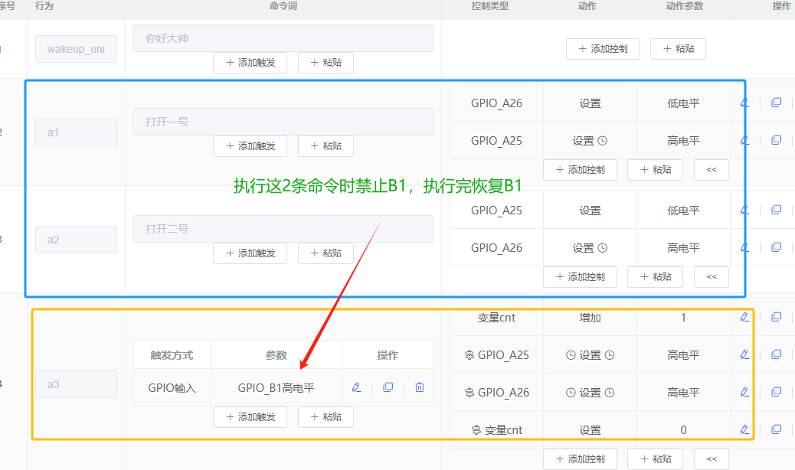

3. **设置GPIO输入触发条件**
    - 在需要控制的GPIO输入触发中添加"附加条件"
    - 选择条件类型："变量比较"
    - 设置条件：prohibit_b1 等于 0

    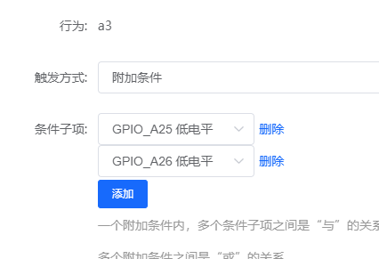

4. **多条件组合**
    - 支持添加多个条件，多个条件之间是"与"的关系
    - 例如：GPIO_A25低电平 AND GPIO_A26低电平 AND prohibit_b1等于0
    - 只有所有条件都满足时才会触发

**配置示例：**

```json
{
    "variables": [
    {
        "name": "prohibit_b1",
        "type": "unsigned char",
        "default": 0
    }
    ],
    "commands": [
    {
        "name": "a1",
        "trigger": "voice",
        "actions": [
        {
            "type": "gpio_output",
            "pin": "A26",
            "value": 1
        },
        {
            "type": "variable_set",
            "variable": "prohibit_b1",
            "value": 1
        },
        {
            "type": "delay",
            "time": 3000
        },
        {
            "type": "variable_set",
            "variable": "prohibit_b1",
            "value": 0
        },
        {
            "type": "gpio_output",
            "pin": "A26",
            "value": 0
        }
        ]
    }
    ],
    "triggers": [
    {
        "name": "b1_input",
        "type": "gpio_input",
        "pin": "B1",
        "conditions": [
        {
            "variable": "prohibit_b1",
            "operator": "==",
            "value": 0
        }
        ],
        "actions": [
        {
            "type": "gpio_output",
            "pin": "A27",
            "value": 1
        }
        ]
    }
    ]
}
```

**注意事项：**

- 每个需要控制的IO口都要创建对应的控制变量
- 命令词执行期间必须保持变量值为1
- 多个条件时全部满足才会触发
- 确保在产品管理页面导出完整的工程配置

---

## 固件获取与使用

### SDK中的固件与平台生成的固件有什么区别？

**问题描述：**

在使用SDK生成的固件时，发现串口输入无法正常工作，且对固件生成与SDK使用流程存在困惑。

**解决方案：**

1. **固件生成机制差异**

    - 平台生成的固件：包含完整的控制逻辑和配置
    - SDK中的固件：仅包含基础功能，用于二次开发
    - 固件生成需要重新分配内存分区

2. **正确使用方式**

    - 基础使用：直接从平台下载压缩包并解压
    - 二次开发：在虚拟机中编译后生成完整固件
    - 避免直接使用SDK中的固件文件

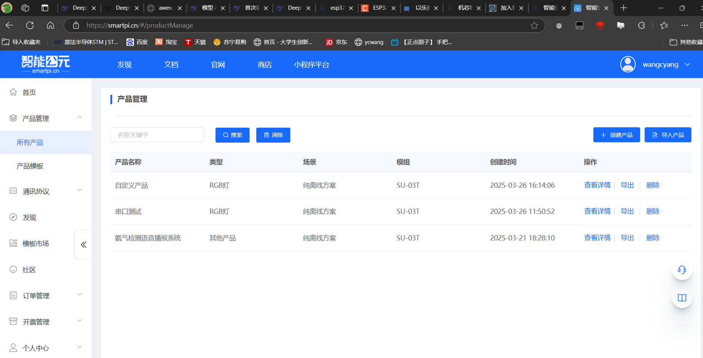

3. **固件文件位置**

    - 平台生成的固件：在下载的压缩包内
    - SDK固件路径：Hummingbird-M-Production-Tool文件夹
    - 正确的固件应包含完整的应用逻辑

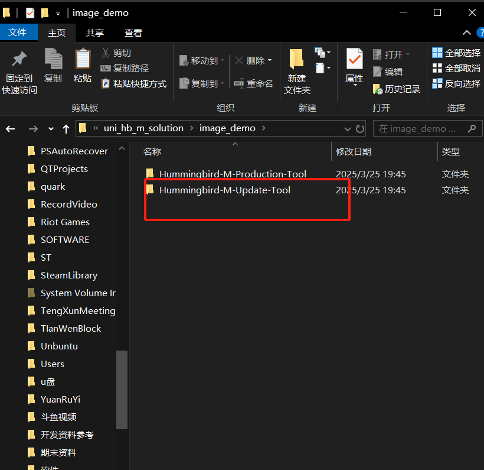

4. **烧录注意事项**

    - 优先使用平台生成的完整固件
    - SDK固件主要用于开发和调试
    - 完整功能必须通过平台配置

**注意事项：**

- SDK和平台固件是异步生成的，内容不同
- 平台固件已经过完整测试和验证
- 仅在有二次开发需求时才使用SDK

### 如何正确获取和烧录固件？

**问题描述：**

不清楚固件的正确获取途径，以及如何区分SDK固件和平台固件。

**解决方案：**

1. **固件下载流程**

    - 登录智能公元平台
    - 在产品管理页面选择对应产品
    - 点击"下载"获取压缩包


2. **固件文件识别**

    - .bin文件：可直接烧录的完整固件
    - .json文件：工程配置文件
    - SDK中的固件：仅用于开发环境

3. **使用场景选择**

    - 直接使用：下载平台生成的固件包
    - 二次开发：使用SDK进行定制化开发
    - 批量生产：使用平台生成的一致性固件

**注意事项：**

- 不要混用SDK和平台的固件
- 保留固件版本信息便于追溯
- 生产环境建议使用平台生成的正式版本

---

### SU-03T固件版本无法直接修改怎么办？

**问题描述：**

在固件平台中，已发布的版本显示"当前版本已发布，继承为新版本才能保存修改的内容！"，无法直接编辑配置。

**解决方案：**

**1. 使用继承为新版本功能**

- 在版本详情页面点击绿色的"继承为新版本"按钮
- 系统会自动复制当前配置到新版本
- 在新版本中可以进行所有修改操作

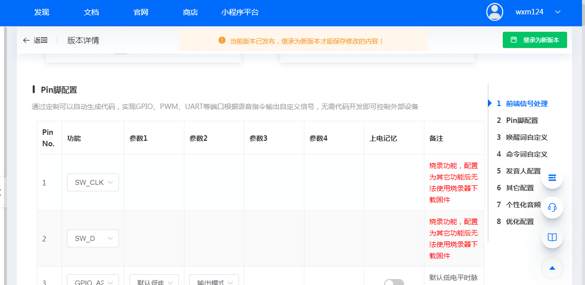

**2. 发布状态说明**

- "发布中"表示固件正在编译生成
- 已发布版本是稳定版本，不能直接修改
- 继承版本相当于复制模板代码进行编辑

**3. 导出产品数据**

- 在产品管理页面点击"导出"按钮
- 导出完整的产品配置供测试
- 技术支持可以通过导出文件进行问题排查


**注意事项：**

- 每次修改都需要继承为新版本
- 建议在测试版上验证功能后再发布正式版
- 保留版本历史便于问题追溯

---

### SU-03T固件发布速度太慢怎么办？

**问题描述：**

每次修改固件配置后，平台生成SDK需要10-30分钟，影响开发效率。

**解决方案：**

**1. 使用测试版固件**

- 测试版发布速度更快，通常几分钟即可完成
- 功能与正式版完全相同，只是获取方式不同
- 开发阶段建议使用测试版快速验证

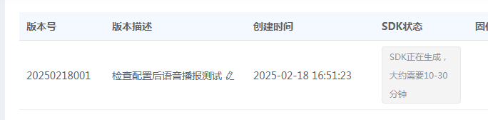

**2. 版本使用建议**

- 开发调试：使用测试版，快速迭代
- 功能验证：测试版确认无误后
- 生产环境：使用正式版，确保稳定性

**3. 平台维护提示**

- 平台维护期间可能速度较慢
- 非维护时段正常发布速度较快
- 可避开高峰期进行固件生成

**注意事项：**

- 测试版和正式版功能完全一致
- 开发过程中可反复使用测试版
- 最终交付前使用正式版进行完整测试

---

### SU-03T播报功能异常如何排查？

**问题描述：**

固件配置检查通过且串口有输出，但语音播报功能异常，需要从电路方面排查原因。

**解决方案：**

**1. 硬件连接检查**

- 确认喇叭连接正确（正负极不能接反）
- 检查喇叭功率是否匹配模块输出要求
- 使用示波器检测音频输出信号

**2. 电路排查要点**

- 检查功放电路工作是否正常
- 确认电源供电稳定（电压、纹波）
- 排查PCB布线是否存在干扰

**3. 固件测试流程**

- 导出固件包供技术支持测试
- 提供详细的电路原理图
- 说明异常现象和触发条件

**注意事项：**

- 语音播报异常通常是硬件问题
- 软件配置问题会导致完全无输出
- 建议使用标准测试环境验证

---

### 如何使用SU-03T识别带小数的温度值？

**问题描述：**

在温控产品应用中，需要通过语音指令识别带小数的温度值（如38.1度、38.2度等），并通过串口发送给MCU进行温度设置。

**解决方案：**

SU-03T目前不支持通过一条指令识别连续的小数值，需要为每个具体的温度值创建独立的指令：

- **指令配置方式**：每个温度值需要单独配置一条语音指令
- **数据类型设置**：使用double数据类型来修饰温度变量
- **串口输出配置**：

    - 行为：设置为对应的功能（如SetTempN）
    - 控制方式：端口输出
    - 控制类型：UART1_TX
    - 动作：发送
    - 参数格式：十六进制，两个字符一组，中间空格分隔（如：98 A3 0B FE）

**实现步骤：**

1. 在智能公元平台为每个需要的温度值创建独立指令
2. 配置指令对应的串口输出数据
3. MCU端接收并解析串口数据，执行相应的温度设置

**注意事项：**

- 一个指令只能对应一个固定的温度值，无法动态识别任意小数
- 如果温度范围较大（如36.0-39.0度），需要创建大量指令，建议优化设计
- 参数输入框中的十六进制数据必须以空格分隔，不能连续输入

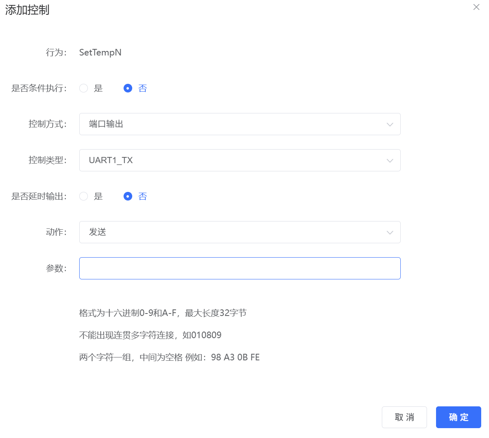

---

### SU-03T是否支持双语言功能？

**问题描述：**

希望产品能够出口不同国家，需要实现双语言支持（如中英、中俄、中法等），通过菜单选择语言。

**解决方案：**

SU-03T单模块不支持双语言功能，有以下替代方案：

**方案一：使用CI-33T模块**

- CI-33T具备4M Flash，勉强能容纳双语言模型
- 推荐用于需要双语言的应用场景
- 需要定制开发，周期较长，费用较高

**方案二：双模块方案**

- 使用两个SU-03T模块，一个识别中文，一个识别其他语言
- 通过主控切换两个模块的工作状态
- 成本相对较低，实现简单

**方案三：单语言多版本**

- 不同国家使用不同语言版本的固件
- 生产时根据目标国家烧录对应语言固件
- 无法实现终端用户语言切换

**语言支持说明：**

- 平台目前支持中、英、日、韩等主流语言
- 其他语言需要语料训练支持
- 每种语言需要单独的语音模型

**注意事项：**

- SU-03T的Flash容量有限，无法容纳多种语言模型
- 不支持外挂Flash或插卡方式扩展语言包
- 双语言功能建议在项目规划阶段就确定合适的方案

---

### SU-03T支持哪些语言？如何烧录非主流语言包？

**问题描述：**

需要了解SU-03T支持的语言范围，以及是否可以通过接口方式烧录非主流语言包。

**解决方案：**

**语言支持范围：**

- 平台目前支持：中文、英文、日文、韩文四种主流语言
- 部分语种（如俄语）暂不支持
- 不支持全部13国语言

**非主流语言处理：**

- 可以通过固件烧录方式支持其他语言
- 需要提供相应语言的语料进行训练
- 训练完成后生成对应语言的固件包

**烧录方式：**

- 支持USB或串口方式烧录固件
- 需要准备不同语言版本的固件
- 生产时根据目标国家选择对应固件

**实现流程：**

1. 确认需要的语言类型
2. 联系技术支持评估可行性
3. 提供语料或定制需求
4. 获取对应语言固件
5. 通过烧录工具烧录到模块

**注意事项：**

- 非主流语言需要额外开发和训练
- 可能产生额外的定制费用
- 建议提前规划语言需求

---

### SU-03T是否支持语音指令收集功能？

**问题描述：**

希望收集未被识别的语音指令，用于统计用户使用习惯，并在后续产品升级时优化。

**解决方案：**

SU-03T本身不支持语音指令收集功能：

**当前限制：**

- 无法存储未识别的语音指令
- 不支持通过USB读取语音数据
- 固件无法记录识别失败的内容

**替代方案：**

**方案一：使用SU-A7T模块**

- 后续将支持小程序修改唤醒词和命令词
- 可提供部分后台权限用于统计
- 支持产品升级和优化

**方案二：主控统计方案**

- MCU记录识别成功的指令ID
- 通过日志分析使用频率
- 需要提前规划统计架构

**方案三：用户调研**

- 通过调查问卷收集用户需求
- 分析常见使用场景
- 指导产品功能优化

**注意事项：**

- 本地语音模块的隐私特性限制数据收集
- 建议在产品设计阶段考虑统计需求
- 可关注SU-A7T等新一代模块功能

---

### SU-03T固件在2024年10月25日前生成的需要如何处理？

**问题描述：**

在2024年10月25日之前生成的SU-03T固件需要重新继承才能正常使用，否则会导致固件无法正常工作。

**解决方案：**

- 在智能公云平台的固件管理界面找到需要重新继承的固件版本
- 点击"重新继承"按钮，系统会自动重新生成固件
- 重新继承完成后，固件状态会更新为可用


**注意事项：**

- 仅2024年10月25日之前生成的固件需要重新继承
- 重新继承操作需要在智能公云平台进行
- 建议检查所有相关固件版本，确保都已更新

---

### 固件状态显示"待生成"如何处理？

**问题描述：**

在智能公云平台生成固件时，固件状态一直显示为"待生成"，无法正常生成和发布。

**解决方案：**

- 确认是否已点击"发布"按钮
- 如果点击发布后仍为待生成状态，尝试点击"继承"按钮重新继承固件
- 重新继承后，再次点击发布按钮进行生成


**操作步骤：**

1. 进入固件管理页面
2. 找到需要生成的固件版本
3. 点击"继承"按钮进行重新继承
4. 等待继承完成后，点击"发布"按钮
5. 固件生成成功后可下载使用

**注意事项：**

- 固件生成可能需要一定时间，请耐心等待
- 如果多次尝试仍失败，建议检查网络连接和平台状态
- 确认账号有足够的权限进行固件生成操作

---

### SU-03T模块需要烧录哪个固件？

**问题描述：**

需要确认SU-03T模块应该烧录的具体固件文件和配置信息。

**解决方案：**

SU-03T模块应烧录在智能公云平台生成的最新固件文件。固件文件通常包含以下信息：

- **固件文件名**：jx_su_03t_release.bin
- **版本号**：如V2.1（根据实际需求选择）
- **MD5校验值**：用于验证固件完整性
- **功能配置**：包括开机播报、唤醒词、回复语等

**示例固件信息：**

- **版本**：SU-03T-V2.1
- **开机播报**：无
- **唤醒词**：小迪小迪、你好丰田、你好奥迪、你好小智、你好大众、你好奔驰、你好别克、你好雷克萨斯、你好雪佛兰
- **回复语**：你说、有什么可以帮到你、听着呢、我在
- **MD5**：f875f41d14e987d574b00a532a498384

**注意事项：**

- 烧录前请确认固件版本符合项目需求
- 使用MD5校验值验证固件文件完整性
- 不同项目可能需要不同的唤醒词和回复语配置
- 建议保留原始固件文件备份

---

### 温控产品如何优化温度数字识别？

**问题描述：**

温控产品温度范围较大（如36.0-39.0度），如果每个温度都设置独立指令，会导致指令数量过多，影响使用体验。

**解决方案：**

**问题分析：**

- 36.0到39.0度包含31个温度值（36.0, 36.1, 36.2...39.0）
- 每个温度值需要一条独立指令
- 指令数量过多影响用户体验

**优化方案：**

**方案一：分段设置**

- 将温度分为整数和小数两部分
- 整数部分：36度、37度、38度、39度（4条指令）
- 小数部分：0.0度、0.1度、0.2度...0.9度（10条指令）
- 总共仅需14条指令

**方案二：步进调节**

- 设置"升温0.1度"、"降温0.1度"指令
- 从基准温度开始逐步调节
- 配合"设置温度36度"等整数指令

**方案三：常用温度预设**

- 只设置常用的温度值（如36.5, 37.0, 37.5, 38.0等）
- 减少指令数量到10条以内
- 配合微调功能

**实现建议：**

- 根据实际使用场景选择合适的方案
- 测试用户接受度
- 考虑结合显示屏显示当前温度

**注意事项：**

- 温控产品需要平衡功能完整性和易用性
- 建议收集用户使用习惯数据
- 可考虑其他交互方式补充

---

### 如何移除SU-03T中的儿童锁功能？

**问题描述：**

需要移除SU-03T语音软件中与儿童锁相关的唤醒词（命令词3和4）及其关联的语音回复和串口协议数据，以解决因误识别导致的售后问题。

**解决方案：**

**问题分析：**

- "打开儿童锁"和"关闭儿童锁"命令词包含"打开"和"关闭"通用词
- 容易与其它"打开"和"关闭"命令产生误识别
- 用户忘记已关闭儿童锁后，误认为模块故障

**处理方案：**

1. **移除相关命令词**
    - 删除"打开儿童锁"命令词（命令词3）
    - 删除"关闭儿童锁"命令词（命令词4）
    - 同时移除对应的语音回复内容
    - 移除相关的串口协议数据输出

2. **避免误识别的建议**
    - 如需保留"打开"和"关闭"通用命令
    - 建议删除易产生冲突的通用命令词
    - 或使用更具体的命令词（如"打开大门"代替"打开"）

**实施步骤：**

1. 在智能公元平台重新配置项目
2. 删除指定的命令词及关联功能
3. 重新生成并烧录固件
4. 进行充分测试确认功能正常

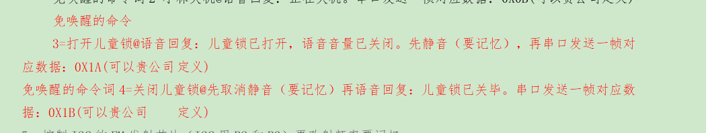

**注意事项：**

- 修改后需要全面测试所有命令词的识别准确率
- 确保移除功能不会影响其它正常功能
- 建议在批量生产前进行小批量验证

---

### 新旧版SU-03T模块是否兼容？

**问题描述：**

确认SU-03T模块是否已升级，新旧版本是否兼容，以及烧录工具和固件是否相同。

**解决方案：**

**版本兼容性：**

- 新版本（SU-03T1）与旧版本（SU-03T）固件兼容
- 固件可以继承使用，无需重新开发
- 新旧版本使用相同的烧录工具和软件

**主要区别：**

- **新版本**：不支持早期二次开发固件，支持平台新生成的固件
- **旧版本**：支持平台新/旧生成的固件
- **调试烧录器**：需要升级软件烧录工具

**使用建议：**

1. 使用串口烧录方式，新旧版本通用
2. 固件可以直接继承使用
3. 如需使用调试烧录器，确保工具已升级


**注意事项：**

- 购买时如需特定版本，请在下单备注说明
- 新版本硬件升级后功能更稳定
- 建议使用最新的固件版本以获得最佳性能

---

### 如何修改SU-03T的命令词配置？

**问题描述：**

需要修改SU-03T语音软件的指令关键词，移除指定的命令词以优化识别效果。

**解决方案：**

**支持移除的命令词类型：**

1. **通用开关命令**
    - "打开"、"开机"、"打开电视"、"打开这个"
    - "看电影"、"看电唱歌"、"我想看动画"
    - "关机"、"关闭"、"再"

2. **音量控制命令**
    - "静音"、"不要"
    - "打开音量"

3. **特定功能命令**
    - "打开儿童锁"
    - "关闭儿童锁"

**实施步骤：**

1. **平台配置修改**
    - 登录智能公元平台
    - 找到对应项目配置
    - 删除需要移除的命令词
    - 保存配置

2. **固件重新生成**
    - 使用修改后的配置生成新固件
    - 下载固件文件（.bin格式）

3. **烧录测试**
    - 使用串口工具烧录新固件
    - 测试所有保留的命令词
    - 确认移除的命令词不再响应

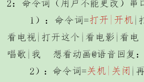


**优化建议：**

- 保留核心功能命令词，减少命令总数
- 使用更具体、不易混淆的命令词
- 避免包含通用词汇（如"打开"、"关闭"）
- 定期收集用户反馈，持续优化命令词配置

**注意事项：**

- 每次修改后需要全面测试
- 确保新固件与现有硬件兼容
- 建议保留原固件备份
- 批量更新前先进行小批量验证

---

### SU-03T支持播放音乐功能吗？

**问题描述：**

需要确认SU-03T模块是否支持语音唤醒后播放音乐，以及如何配置音乐播放功能。

**解决方案：**

**功能支持**：

- SU-03T支持播放MP3格式音频文件
- 可以通过语音唤醒后触发音乐播放
- 需要在平台配置中上传音频文件

**配置步骤**：

1. **登录智能公元平台**
    - 进入对应项目的配置界面
    - 找到"个性化音频"或"音频管理"功能

2. **上传音频文件**
    - 支持MP3和WAV格式
    - 建议文件大小不超过2MB
    - 上传需要播放的音乐文件

3. **配置触发命令**
    - 设置唤醒词（如"小智"）
    - 配置播放音乐的命令词
    - 关联上传的音频文件


**注意事项：**

- 音频文件需要符合平台要求的格式和大小限制
- 建议使用音质良好的音频源以获得更好的播放效果
- 可根据需要替换或更新音频文件
- 播放功能支持循环播放、单次播放等模式配置

---

### 固件生成时语音播报配置错误怎么办？

**问题描述：**

使用485串口发送指令生成固件时，语音播报功能被错误分配到其他设备（如A7），导致播报功能异常。

**解决方案：**

**问题原因**：
控制详情配置中存在空的控制项，导致系统在生成固件时随机分配播报功能到错误的设备。

**处理步骤**：

1. **检查控制详情配置**
    - 查看所有控制项是否都已正确配置
    - 确认没有空白的控制项存在

2. **修正配置错误**
    - 删除所有空的控制项
    - 确保每个控制项都有明确的设备分配
    - 将播报功能正确配置到目标设备

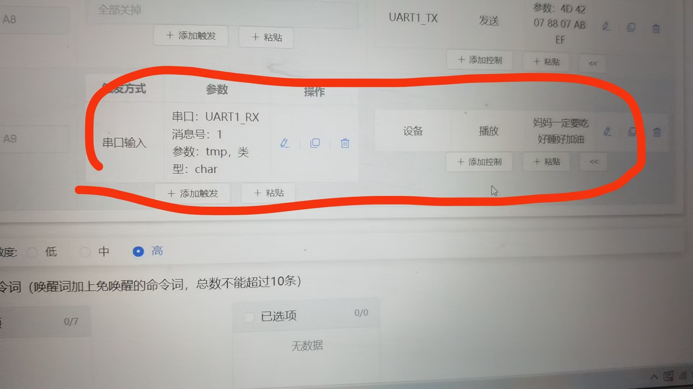

3. **验证配置**
    - 确认串口输入配置正确（UART1_RX、消息号、参数等）
    - 检查播报设备是否为预期设备

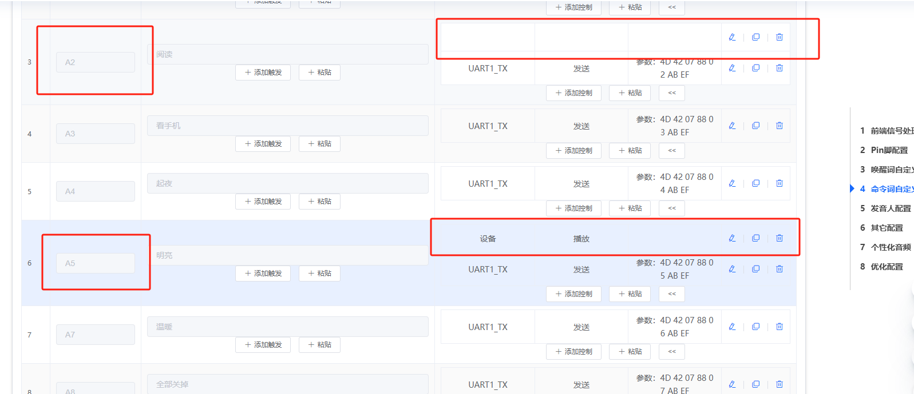

4. **重新生成固件**
    - 保存配置后重新生成固件
    - 烧录测试验证功能是否正常

**注意事项：**

- 控制详情中的所有控制项都不能留空，否则系统会随机选择播报设备
- 建议在配置完成后点击"检查配置"功能，确保没有遗漏
- 生成固件前仔细核对每个控制项的设备分配
- 如遇配置问题，可清空后重新配置避免残留

---

### 固件版本如何继承升级？

**问题描述：**

固件更新后，新出厂模块都需要烧录新固件，旧版本固件需要通过平台继承升级方式生成新版本。

**解决方案：**

**版本升级规则**：

- 固件生成时间在2024年10月25日之后：可直接使用
- 固件生成时间在2024年10月25日之前：需要从原版本继承并生成新版本

**继承升级步骤**：

1. 在智能公元平台找到之前的固件包
2. 点击"继承"按钮，选择原固件版本
3. 确认配置信息无误后，点击"生成新固件"
4. 等待固件生成完成（约30分钟）


**注意事项：**

- 继承升级会保留原有的配置信息（唤醒词、回复语等）
- 新模块出厂将默认使用新版本固件
- 建议定期更新固件以获得最新功能和优化
- 旧版本固件可通过继承方式无缝升级到新版本
- **只有bin文件无法进行继承升级**：固件继承操作需要在智能公元平台的固件管理界面进行，如果只有bin文件而没有json工程文件，无法完成继承升级。需要联系原固件提供方获取完整的固件包（包含json配置文件）

---

### 固件更新时有两个BIN文件如何选择？

**问题描述：**

在固件更新时，出现两个BIN文件（jx_su_03t_release.bin 和 jx_su_03t_release_update.bin），不确定应该选择哪个文件进行更新。

**解决方案：**

**正确操作流程**：

- 不要直接选择BIN文件进行更新
- 应该在智能公元平台进行继承升级操作

**操作步骤**：

1. 登录智能公元平台
2. 找到之前创建的固件版本
3. 点击"继承"按钮
4. 在弹出的界面中确认配置信息
5. 点击"生成新固件"完成更新


**注意事项：**

- 平台继承升级会自动处理版本差异
- 不需要手动选择或下载BIN文件
- 继承操作会保留所有原有配置
- 如果固件生成时间较早，必须通过继承方式升级

---

### 固件生成状态显示"待生成"怎么办？

**问题描述：**

在智能公元平台继承升级固件后，固件状态一直显示"待生成"，无法完成生成过程。

**解决方案：**

**问题原因**：

- 只创建了新版本但没有触发固件生成
- 需要手动点击"生成SDK"按钮

**解决步骤**：

1. 在固件列表中找到待生成的版本
2. 点击"更多"选项
3. 在下拉菜单中点击"生成SDK"
4. 等待状态变为"SDK正在生成，大约需要30分钟"

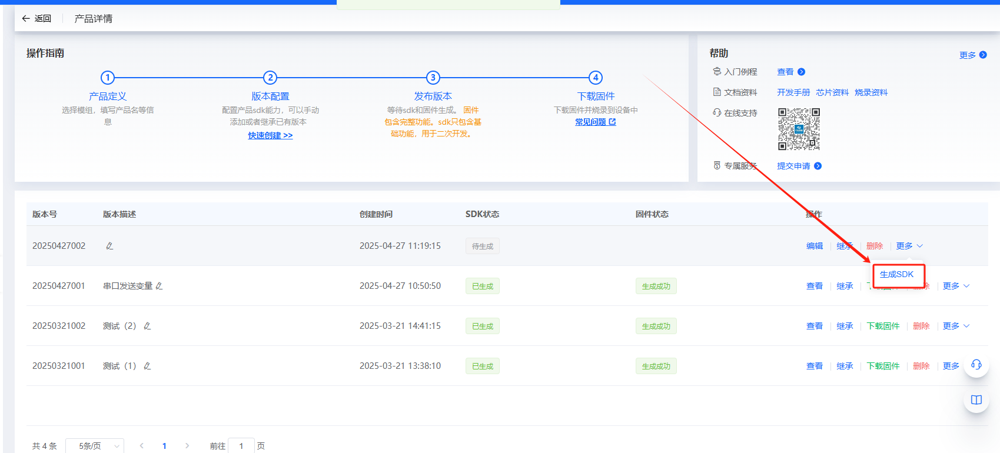


**注意事项：**

- 继承操作只是创建了新版本，还需要手动生成SDK
- 生成过程约需要30分钟，请耐心等待
- 如果长时间未生成，可以尝试重新点击生成SDK
- 生成完成后可下载固件文件进行烧录

---

### SU-03T如何实现同一端口输出不同脉宽的脉冲？

**问题描述：**

需要实现同一端口根据不同指令输出三个不同脉宽的脉冲信号。

**解决方案：**

1. **使用PWM功能**
    - SU-03T支持PWM输出功能
    - 可通过软件控制脉冲宽度
    - 支持多个PWM输出通道

2. **配置不同脉宽**
    - 在平台中设置不同的PWM占空比
    - 可配置25%、50%、75%等不同占空比
    - 每个语音指令对应一个占空比设置

3. **实现步骤**
    - 在智能公元平台添加控制命令
    - 选择PWM输出功能
    - 设置不同的占空比参数
    - 绑定到对应的语音指令

**注意事项：**

- PWM输出频率需要根据实际需求设置
- 确保外部负载不超过150mA
- 脉冲精度受限于模块的定时器分辨率
- 建议添加延时控制确保信号稳定性

---

### SU-03T在什么条件下会进入休眠状态？

**问题描述：**

需要了解SU-03T模块进入休眠状态的具体条件和机制。

**解决方案：**

1. **自动休眠触发条件**
    - 模块在相对安静的环境下会自动进入休眠
    - 持续一段时间无语音信号触发
    - 系统根据环境噪声水平自动判断

2. **休眠状态特征**
    - 功耗降低至0.9mA左右
    - 仍然保持语音唤醒功能
    - 对非唤醒词的处理能力降低

3. **影响休眠的因素**
    - 环境噪声水平
    - 麦克风灵敏度设置
    - 固件版本的功耗优化

**注意事项：**

- 休眠是正常的功能，用于降低功耗
- 有规律噪声时模块可能不会进入深度休眠
- 休眠后仍可响应唤醒词
- 可通过软件配置禁用自动休眠功能

---

### SU-03T长时间未唤醒后为什么难以唤醒？

**问题描述：**

SU-03T模块在长时间未被唤醒后，语音唤醒功能变得困难。

**解决方案：**

1. **原因分析**
    - 模块进入深度休眠状态
    - 唤醒检测灵敏度降低
    - 需要更强的语音信号才能触发

2. **改善方法**
    - 适当提高说话音量
    - 减少与模块的距离
    - 确保唤醒词发音清晰标准

3. **预防措施**
    - 定期测试唤醒功能
    - 避免模块长时间闲置
    - 优化使用环境的安静度

**注意事项：**

- 这是正常现象，与模块的功耗管理机制有关
- 深度休眠有助于延长电池寿命
- 如需即时响应，可考虑禁用休眠功能
- 唤醒困难不代表模块故障

---

### 如何禁用SU-03T的休眠功能？

**问题描述：**

希望禁用SU-03T模块的休眠功能，确保设备持续处于工作状态。

**解决方案：**

1. **软件配置禁用**
    - 在智能公元平台中配置固件
    - 找到休眠相关设置选项
    - 关闭自动休眠功能

2. **重新生成固件**
    - 保存配置后重新生成固件
    - 下载新生成的固件文件
    - 烧录到模块中

3. **验证效果**
    - 烧录后测试模块功耗
    - 确认模块不会自动进入休眠
    - 验证唤醒响应速度

**注意事项：**

- 禁用休眠会增加功耗（约2-3mA）
- 持续工作可能影响模块寿命
- 电池供电场景需谨慎考虑
- 可根据实际需求选择是否禁用

---

### SU-03T如何将串口输入的参数用作变量？

**问题描述：**

需要将通过串口输入的参数作为变量在模块中使用，实现动态控制功能。

**解决方案：**

1. **串口通信配置**
    - 确保UART接口正确连接
    - 设置合适的波特率（如9600或115200）
    - 配置数据位、停止位等参数

2. **参数接收与解析**
    - SU-03T支持通过串口接收16进制数据
    - 可定义特定的数据帧格式
    - 在平台中配置串口接收处理逻辑

3. **变量存储与使用**
    - 将接收到的参数存储到内部变量
    - 在控制逻辑中引用该变量
    - 实现基于变量的条件判断和控制

4. **实现示例**
    - 定义命令格式：`SET_VAR [参数值]`
    - 解析参数并存储到变量
    - 在PWM输出或其他功能中使用该变量

**注意事项：**

- 串口数据格式需要与发送端约定一致
- 变量值范围需要根据实际应用限制
- 建议添加数据校验确保传输可靠性
- 串口接收不会影响语音识别功能

---

### 哪些型号支持空调码的学习和发送功能？

**问题描述：**

需要了解哪些语音模块型号支持空调码的学习和发送功能，以便选择合适的产品。

**解决方案：**

目前只有SU-03T平台的模块支持空调码学习和发送功能。

**支持情况：**

- **SU-03T**：支持空调码学习和发送
- **其他型号**：暂不支持此功能

**功能特点：**

1. **空调码学习**
    - 可学习原装空调遥控器的红外码
    - 支持多种空调品牌和型号
    - 学习过程简单快捷

2. **空调码发送**
    - 通过语音指令控制空调
    - 支持开关、温度、模式等控制
    - 发送稳定可靠

3. **平台配置**
    - 在智能公元平台直接配置
    - 无需编写代码
    - 支持自定义控制指令

**注意事项：**

- 需要配合红外发射电路使用
- 学习时确保环境光线充足
- 建议保存学习过的空调码备份
- 不同品牌空调可能需要多次学习

---

### 小程序平台生成固件时提示排队任务过多怎么办？

**问题描述：**

使用小程序平台生成SU-03T芯片固件时，遇到"当前排队任务过多，请半小时后再尝试提交"的错误，影响开发效率。

**解决方案：**

**问题原因：**

- 平台生成固件任务过多，服务器繁忙
- 同时有多个用户在生成固件
- 资源有限导致需要排队

**解决方法：**

1. **重新登录尝试**
    - 退出小程序后重新登录
    - 有时可以避开高峰期
    - 清除缓存后重试

2. **错峰生成**
    - 避开工作日高峰时段
    - 选择凌晨或早晨等非繁忙时间
    - 提前规划好固件生成需求

3. **批量生成策略**
    - 一次提交多个需要的固件
    - 避免频繁重新生成
    - 保存好配置文件便于复用

**临时替代方案：**

- 使用本地开发环境（如果有开源工具）
- 联系技术支持获取固件生成服务
- 考虑使用离线烧录工具

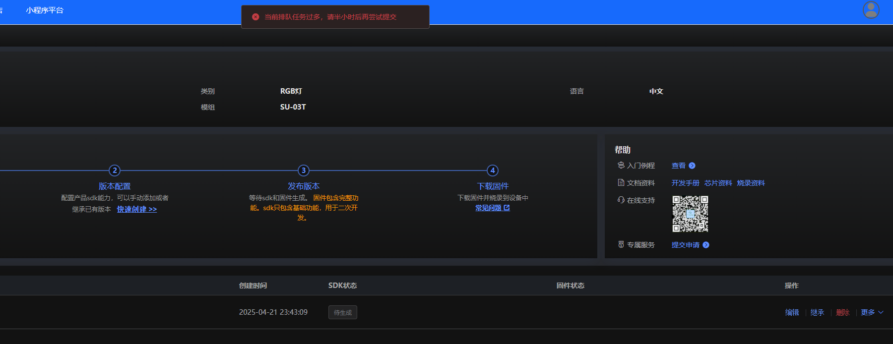

**注意事项：**

- 平台正在扩容，问题会逐步改善
- 紧急情况下可联系技术支持协助
- 建议保存常用配置，减少生成次数

---


### SU-03T主动退出后如何重新唤醒？

**问题描述：**

SU-03T设备在主动退出后，是否只能通过命令词唤醒才能通信，或者能否通过发送通信帧进行唤醒？

**解决方案：**

SU-03T主动退出后，可以通过多种方式重新唤醒，不限于命令词唤醒。

**唤醒方式：**

1. **命令词唤醒**（默认方式）
    - 说出预设的唤醒词
    - 模块进入工作状态
    - 可以接收后续指令

2. **免唤醒词功能**
    - 在平台中添加常用操作到免唤醒词列表
    - 可添加最多10个免唤醒词指令
    - 直接说出指令即可执行，无需唤醒词

3. **串口唤醒**
    - 通过串口发送特定数据唤醒
    - 在平台中配置串口触发事件
    - 可结合电平触发使用

4. **IO口电平触发**
    - 配置IO口电平变化触发唤醒
    - 适合外部传感器或按键触发
    - 可设置为高电平或低电平触发

**配置方法：**

1. **免唤醒词设置**
    - 登录智能公元平台
    - 在词条设置中选择"免唤醒词"
    - 添加需要免唤醒的常用指令

2. **串口/IO触发配置**
    - 在"添加控制"中选择触发条件
    - 设置"进入唤醒"操作
    - 配置串口数据或IO电平条件

**注意事项：**

- 免唤醒词数量有限制（最多10个）
- 不同唤醒方式可在同一固件中并存
- 建议根据应用场景选择合适的唤醒方式
- 串口唤醒时需要确保数据格式正确

---

### SU-03T在新平台中如何根据硬件管脚定义配置串口功能？

**问题描述：**

在新平台中配置SU-03T的串口功能时，界面显示的Pin No. 1、2、3与实际硬件板上的引脚位置不匹配，需要确定正确的接线方式和引脚映射关系。

**解决方案：**

**1. 理解Pin编号与GPIO的对应关系**

平台显示的Pin No. 是逻辑编号，需要通过下拉菜单查看实际的GPIO名称：

- Pin No. 1 → 对应 GPIO_BC
- Pin No. 2 → 对应 GPIO_B1
- Pin No. 3 → 对应 GPIO_A2

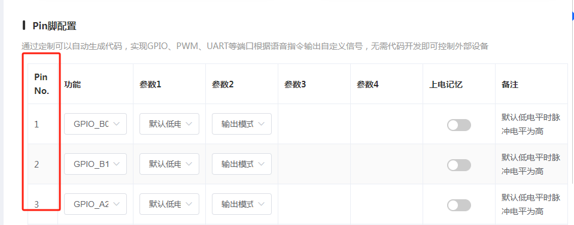

**2. 串口功能的GPIO映射**

查看串口功能下拉菜单中的原始引脚定义：

- **UART1_TX**：可在不同GPIO组之间切换
- **UART1_RX**：可在不同GPIO组之间切换
- **实际可用组**：

    - B0/B1：默认UART引脚组
    - B2/B3：备用UART引脚组
    - 其他GPIO：根据芯片资源动态分配

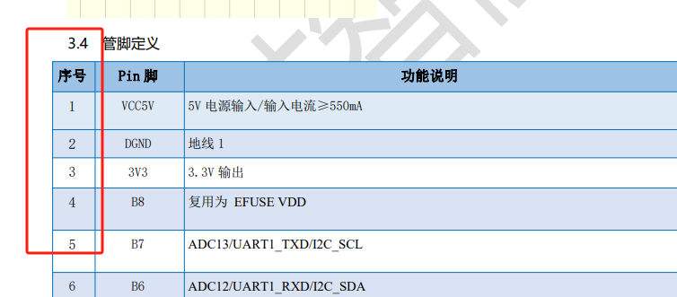


**3. 正确配置步骤**

**方法一：使用B0/B1作为串口**

1. 在Pin脚配置中：

    - Pin 1（GPIO_BC）：不修改（保持GPIO功能）
    - Pin 2（GPIO_B1）：不修改（保持GPIO功能）
    - 找到其他位置设置UART功能

2. 在功能选择中：

    - 找到UART1_TX和UART1_RX选项
    - 查看它们映射的实际GPIO引脚
    - 选择合适的GPIO组（如B0/B1）

**方法二：使用B2/B3作为串口**

1. 将相应的Pin脚配置为：

    - Pin X：设置为 UART1_TX
    - Pin Y：设置为 UART1_RX

2. 桮认映射关系：

    - 模块UART1_TX → 外部设备RX
    - 模块UART1_RX → 外部设备TX


**4. 接线确认**

配置完成后，根据实际的GPIO名称进行接线：

```
实际接线示例（使用B6/B7）：
模块B6(TX) → 外部设备RX
模块B7(RX) → 外部设备TX
GND → 共地

实际接线示例（使用B0/B1）：
模块B0(TX) → 外部设备RX
模块B1(RX) → 外部设备TX
GND → 共地
```

**注意事项：**

- 平台界面的Pin编号只是逻辑顺序
- 实际功能由下拉菜单中的GPIO名称决定
- 配置完成后，按照实际GPIO名称接线
- 不同版本的模块引脚资源可能略有差异
- 烧录功能（B6/B7）与串口功能可复用但不冲突

---

### SU-03T平台中变量赋值操作的意义是什么？

**问题描述：**

在平台控制逻辑中，为什么需要将变量A1的值赋给另一个变量CS_1，而不是直接使用A1？这种赋值操作能实现哪些直接使用A1无法实现的功能？

**解决方案：**

**1. 变量赋值的作用**

变量赋值是平台提供的灵活功能，主要用于：

- **数据传递**：将一个变量的值复制到另一个变量
- **数据处理**：对数值进行运算或转换
- **逻辑简化**：简化复杂的条件判断
- **状态存储**：保存中间计算结果

**2. 直接使用A1的限制**

- **功能单一**：A1只能用于原始数据的存储
- **无法计算**：不能进行数学运算
- **控制受限**：某些控制功能不支持直接引用A1

**3. 变量赋值的实际应用场景**

**场景一：数值运算**

```
示例：加法运算
变量X = A1 + 10
变量Y = CS_1 * 2
```

- 实现动态数值调整
- 根据A1的实时值计算CS_1
- 支持减法、乘法、除法等

**场景二：单位转换**

```
示例：温度转换
变量temp_F = A1 * 9 / 5 + 32
变量temp_C = CS_1（转换为摄氏度）
```

- 将原始数据转换为用户友好的格式
- 根据需要调整单位或精度

**场景三：状态缓存**

```
示例：防抖处理
变量last_state = CS_1
current_state = A1
```

- 记录上次状态
- 实现状态比较和防抖逻辑

**4. 配置方法**

在控制配置中选择"变量设置"操作：

- **变量名**：选择目标变量（如CS_1）
- **操作类型**：选择"赋值"
- **数据源**：选择源变量（如A1）
- **保存配置**：完成后生成固件时生效

**5. 注意事项**

- 变量赋值会增加执行时间
- 过度使用可能影响响应速度
- 合理使用可以简化逻辑，提高可维护性
- 如无特殊需求，可直接使用原始变量

---

## 通信协议配置中测试值的用途

**问题描述**
在配置串口通信协议时，对"测试值"的实际用途存在疑问，不了解除了生成测试消息外的其他功能。

**解决方案**
测试值在通信协议配置中具有以下作用：

**1. 测试消息生成**

- 测试值用于生成完整的测试消息格式
- 消息格式：帧头 + 消息号 + 数据 + 帧尾
- 示例：AA 55 01 01 55 AA（十六进制格式）

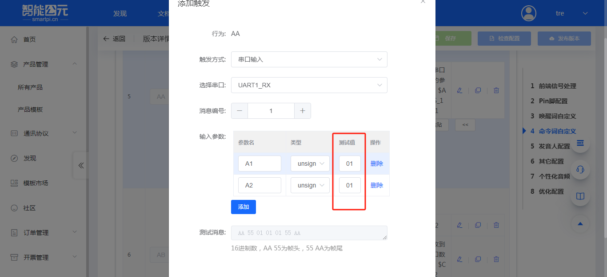

**2. 参数验证**

- 验证通信协议配置的正确性
- 检查参数映射和数据格式
- 确认消息结构是否完整

**3. 实际应用场景**

测试值在实际使用中的用途：

- **数据播报**：可以将接收到的参数值通过语音播报出来
- **后续处理**：作为控制逻辑的输入参数进行计算或判断
- **动态响应**：根据不同的参数值执行不同的操作

**4. 配置说明**

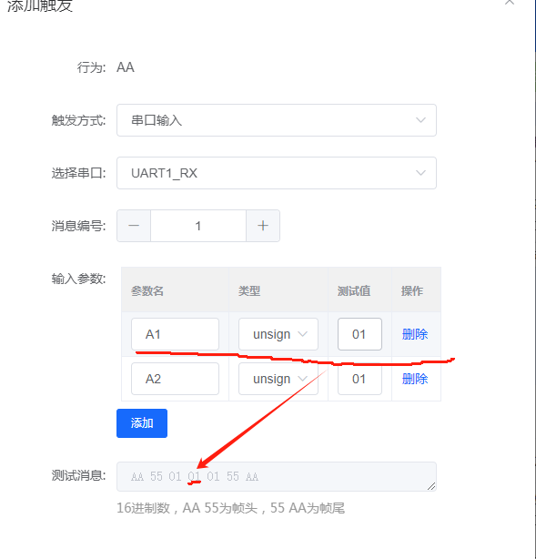
- 测试值可以设置任意数值用于测试
- 实际通信时，模块会根据接收到的完整消息帧进行解析
- 判断依据是消息号，不是单独的测试值

**5. 注意事项**

- 测试值主要用于开发和调试阶段
- 实际使用时，模块接收的是完整的通信协议帧
- 如果某个参数在后续逻辑中不需要使用，可以删除该参数
- 参数值可以在控制逻辑中引用，实现动态响应

---

## 通信协议参数配置限制

**问题描述**
在配置通信协议时，需要了解参数命名规则和最大配置条目数限制。

**解决方案**

**1. 参数命名规则**

- 不同消息号下的参数名建议不重名
- 虽然技术上可以重名，但容易造成混淆
- 推荐使用有意义的参数名，如：temp_sensor、motor_speed等

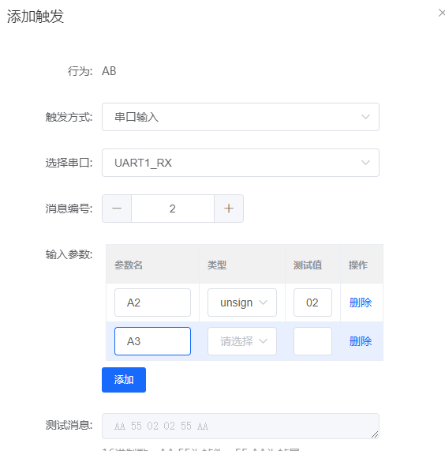

**2. 最大配置条目数**

- 当前平台支持最多配置14条通信协议
- 每条协议对应一个消息号
- 可根据实际需求添加或删除协议条目

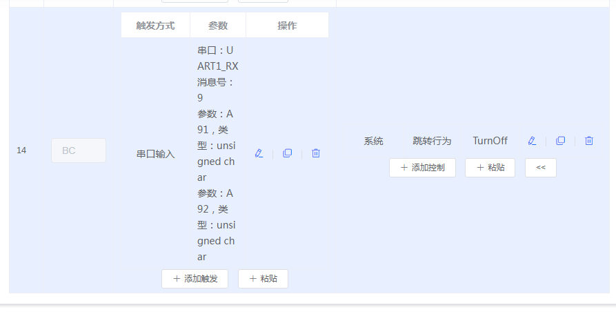

**3. 优化建议**

- 合理规划通信协议数量
- 将相似功能合并到同一消息号
- 定期清理不需要的协议配置

---

## 语音识别灵敏度与误识别问题

**问题描述**
设置语音指令"播种小麦"时，说出"播种小"或"种小麦"也能被识别，怀疑识别灵敏度过高导致误识别。

**解决方案**

**1. 识别灵敏度设置**

- 语音识别具有多级灵敏度调节
- 当前设置为中等灵敏度
- 灵敏度越高，识别率越高，但误识别率也会相应增加

**2. 识别规则说明**

- 语音识别采用模糊匹配算法
- 系统会根据发音相似度进行匹配
- 不需要完整说出所有字词也能识别

**3. 优化建议**

- 根据实际环境调整灵敏度：

    - 安静环境：可降低灵敏度
    - 噪声环境：适当提高灵敏度
- 选择独特的指令词，避免相似发音
- 增加指令词长度，提高区分度

**4. 常见问题**

- 误识别是语音识别的正常现象
- 即使设置为中等灵敏度，仍可能出现部分误识别
- 可以通过调整指令词或添加确认机制来降低误触发

---

### 如何实现按钮控制的语音循环播报功能？

**问题描述：**

需要实现按下按钮时持续重复播报一段语音，松开按钮时停止播报的功能。该功能需要检测按钮的按下（低电平）和松开（高电平）状态，并通过定时器控制语音的重复播放。

**解决方案：**

通过双边沿检测和定时器控制，实现按钮状态的实时监测和语音播报的精确控制。

**实现原理：**

- **按下按钮**：检测到低电平（按钮按下），启动定时器，定时器溢出时触发语音播报
- **松开按钮**：检测到高电平（按钮松开），停止定时器，进入无播报模式
- **重复播报**：通过定时器周期性触发语音播报，实现循环效果

**实现步骤：**

1. **配置按钮检测**
    - 在智能公元平台添加GPIO输入控制
    - 选择合适的GPIO引脚（如GPIO_B0）
    - 配置为双边沿检测模式

2. **设置定时器**
    - 创建一个定时器（如T1）
    - 设置合适的溢出时间（根据语音长度调整，建议100-200ms）
    - 定时器模式设置为循环执行

3. **配置语音播报**
    - 在定时器超时事件中添加语音播放动作
    - 选择需要重复播报的语音文件
    - 设置播报模式为单次播放（由定时器控制重复）

4. **实现控制逻辑**
    - **按钮按下事件**（下降沿）：

        - 启动定时器开始计时
        - 开始执行语音播报

    - **按钮松开事件**（上升沿）：

        - 停止定时器
        - 停止当前语音播放
        - 进入静默状态

**代码逻辑示例：**

```c
// 按钮检测和定时器控制逻辑
void button_handler() {
    if (button_is_pressed()) {  // 按下按钮（低电平）
        start_timer();  // 启动定时器
    } else if (button_is_released()) {  // 松开按钮（高电平）
        stop_timer();   // 停止定时器
        stop_voice();   // 停止语音播放
    }
}

// 定时器溢出中断
void timer_overflow_handler() {
    play_voice();  // 触发语音播报
}
```

**注意事项：**

- 必须使用双边沿检测，确保能同时检测按下和松开动作
- 定时器时间应根据语音长度合理设置，避免重叠播放
- SU-03T支持排队播报功能，也可通过多次触发实现重复播报
- 建议在测试时先使用较短的语音文件进行调试
- 如需更精确的控制，可结合变量状态管理播报状态

---

### 不同型号的语音指令设置可以相互继承吗？

**问题描述：**

希望将一个型号（如SU-03T）的语音指令设置继承到另一个型号（如CI-03T），避免重复配置。

**解决方案：**

不能直接继承。不同型号的语音指令设置需要独立配置：

**1. 型号差异原因**

- 不同型号使用不同的芯片平台和固件架构
- 每个型号有独立的配置空间和参数结构
- 硬件资源（如Flash大小、RAM大小）存在差异

**2. 配置方法**

需要为每个型号单独创建配置：

- 在平台中选择对应型号（CI-03T或SU-03T）
- 重新配置所需的语音指令
- 设置相应的触发方式和回复语
- 生成各自型号的固件

**3. 配置迁移技巧**

虽然不能直接继承，但可以参考配置：

- 记录原配置的命令词列表
- 记录每个命令词的触发方式和输出
- 在新型号中按照相同逻辑重新配置
- 使用相同的变量名保持控制逻辑一致

**注意事项：**

- 即使配置相似，不同型号的识别效果可能有差异
- 建议分别测试每个型号的识别效果
- 保存好每个型号的配置文件，方便后续修改

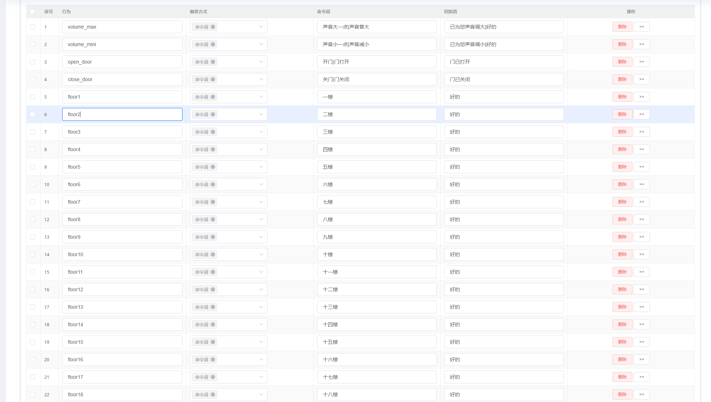

---


---

### SU-03T的配置可以直接导入到CI-03T吗？

**问题描述：**

希望将SU-03T的配置文件直接导入到CI-03T中使用，避免重复配置工作。

**解决方案：**

无法直接导入。SU-03T和CI-03T的配置不兼容，需要独立配置：

**1. 不兼容原因**

- **SDK差异**：两个型号使用不同的SDK架构
- **硬件差异**：芯片平台和资源分配不同
- **固件结构**：配置文件格式和参数结构不匹配

**2. 正确操作方法**

需要重新在平台中配置：

- 在智能平台选择CI-03T型号
- 根据SU-03T的配置重新设置参数
- 配置唤醒词、命令词和回复语
- 生成CI-03T专用的固件文件

**3. 配置迁移建议**

虽然不能直接导入，但可以参考原配置：

- 记录SU-03T中的所有命令词
- 记录每个命令词对应的输出控制
- 在CI-03T中按相同逻辑重新配置
- 使用相同的变量名保持控制逻辑一致

**注意事项：**

- 必须在平台中选择正确的型号进行配置
- 即使配置内容相同，不同型号的识别效果可能有差异
- 建议分别测试和调优每个型号

---


---

### SU-03T1和CI-03T2如何正确配置麦克风和产品特性？

**问题描述：**

购买了SU-03T1和CI-03T2模块，但在智能平台配置时不确定如何选择正确的麦克风配置、应用场景和产品特性选项。

**解决方案：**

**1. 型号识别与配置对应**

**SU-03T1**：

- 麦克风配置：单MIC（单麦克风）
- 带AEC（声学回声消除）功能
- 适合成本敏感的项目

**CI-03T2**：

- 麦克风配置：双MIC（双麦克风）
- 带降噪功能
- 适合对识别效果要求高的项目

**2. 产品特性配置说明**

平台中标注"（限双MIC）"的选项表示：

- 只有双麦克风模块才能选择该特性
- 单麦克风模块无法使用这些功能
- 主要涉及深度降噪等高级音频处理功能

**3. 配置步骤**

- 在平台选择正确的型号（SU-03T1或CI-03T2）
- 根据硬件实际配置选择麦克风数量
- 在产品特性中选择对应的功能选项
- 双MIC模块可选择所有带"（限双MIC）"标注的特性

**注意事项：**

- 配置错误可能导致功能异常或识别效果下降
- CI-03T2作为双麦版本，识别效果在嘈杂环境中更佳
- 单麦模块选择双麦特性将无法生成固件
- 建议根据实际采购的硬件型号进行配置

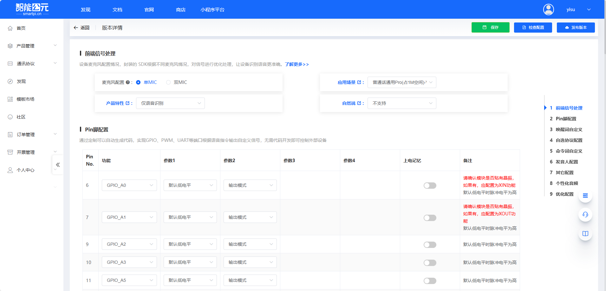
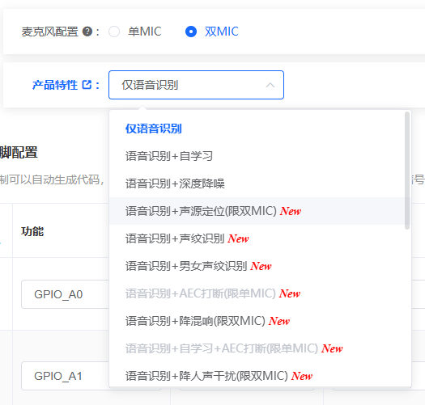

---


---

### SU-03T1模块有新旧版本吗？

**问题描述：**

SU-03T1模块存在新旧版本，需要了解版本差异、固件兼容性和生产计划。

**解决方案：**

**版本说明：**

SU-03T1模块确实存在新旧版本之分：

- **新版**：目前主要出货版本
- **旧版**：库存有限，售完即停

**固件兼容性：**

1. **新版固件兼容性**
    - 不兼容早期二次开发固件
    - 兼容平台新生成的固件
    - 需要使用升级软件进行烧录

2. **旧版固件兼容性**
    - 不兼容平台旧版本固件

**版本选择建议：**

- 新项目推荐使用新版
- 需要兼容旧固件的项目请提前确认
- 旧版库存有限，有需求请尽快采购

**版本对比：**

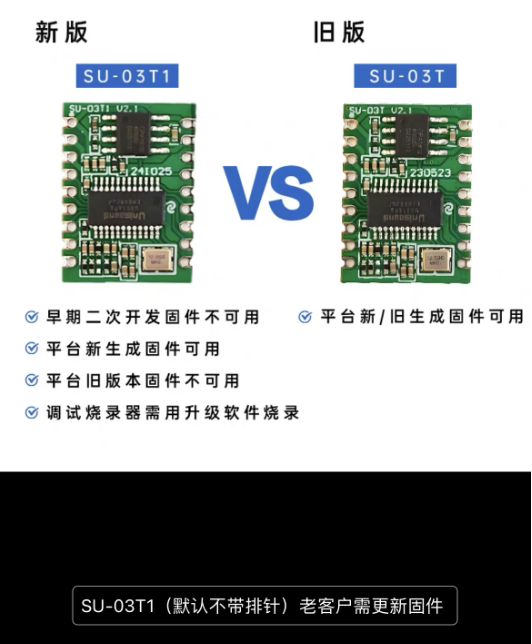

**注意事项：**

- 新版固件烧录时必须使用专用升级软件
- 采购时请确认所需版本，优先推荐新版
- 旧版库存售完后将全面停产，仅提供新版

---


---

### 如何获取SU-03T1最新的开发包？

**问题描述：**

需要获取SU-03T1更新版本的完整开发包。

**解决方案：**

**开发包获取方式：**

- **官方文档链接**：https://help.aimachip.com/docs/offline_su03t/su_03t_kfb

**更新方法：**

1. **访问文档页面**
    - 打开上述链接
    - 查看最新版本的开发包

2. **下载更新内容**
    - 下载最新的固件文件
    - 获取配套的开发文档

3. **重新烧录固件**
    - 在SU-03T1模块上重新烧录新固件
    - 测试功能是否正常

**注意事项：**

- 开发包会不定期更新，建议定期查看最新版本

---


---

### CI-33T和SU-03T模块是否支持TTS功能，能否实现单模块TTS播报和继电器联动？

**问题描述：**

需要确认CI-33T和SU-03T模块是否支持TTS文本转语音功能，以及是否可以使用单个模块实现TTS语音播报和继电器联动控制。

**解决方案：**

**模块支持情况：**

- **CI-33T**：支持TTS文本转语音功能
- **SU-03T**：不支持TTS功能，仅支持离线语音识别

**实现方案：**

由于TTS功能与语音识别功能在硬件上互斥，单个模块无法同时实现TTS播报和继电器控制：

- **双模块方案**：

    - 使用一个带TTS授权的CI-33T模块实现语音播报
    - 使用一个SU-03T或其他控制模块实现继电器控制
    - MCU通过串口控制TTS模块，将文字转换为语音
    - MCU同时处理继电器控制逻辑

- **MCU+TTS模块方案**：

    - MCU实现主控制逻辑
    - MCU通过串口控制TTS模块进行文字转语音播报
    - MCU直接控制继电器输出

**TTS授权说明：**

- TTS模块需要单独购买授权版本
- 授权了TTS的模块只能烧录TTS固件
- 下载其他固件会覆盖芯片内部的授权码
- 未授权模块烧录TTS固件会10多秒重启一次

**注意事项：**

- TTS功能固件可在官方平台下载烧录
- 授权后的模块无法同时使用语音识别功能
- 如需语音识别+TTS功能，必须使用两个模块分别实现
- 购买时需确认选择标注了TTS功能的版本


---


---

### SU-03T是否支持变量复杂计算功能？

**问题描述：**

购买的SU-03T模块在智能公开平台中无法找到变量的复杂计算功能（如增加、减少等操作），询问该功能是否已支持。

**解决方案：**

**功能支持情况：**

- **SU-03T**：平台暂不支持变量复杂计算功能
- **CI系列**（CI-03T、CI-33T等）：已支持变量复杂计算

**功能差异说明：**

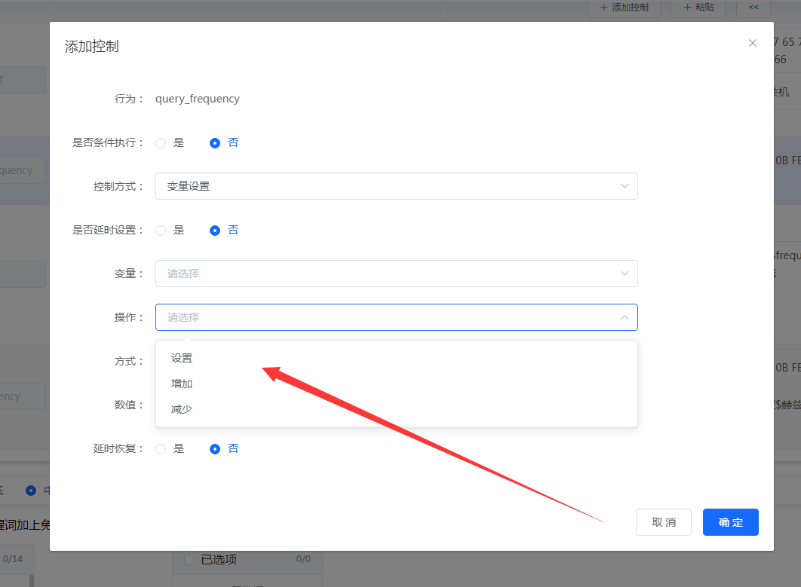

SU-03T在智能平台的变量操作中，仅支持：

- 变量赋值（设置固定值）
- 变量引用（使用其他变量的值）

CI系列支持更丰富的操作：

- 赋值
- 增加（variable + value）
- 减少（variable - value）
- 乘法（variable * value）
- 除法（variable / value）

**替代方案：**

1. **更换为CI系列模块**
    - CI-03T：功能直接替代SU-03T，价格更优
    - 支持完整变量计算功能
    - 性能更强，词条支持更多

2. **二次开发方案**
    - 使用SDK进行代码开发
    - 在代码中实现复杂计算逻辑
    - 需要较长的开发周期

**推荐方案：**

建议更换为CI-03T模块：

- 引脚兼容，可直接替换
- 功能更完善，支持变量计算
- 成本更低，性价比更高
- 无需额外开发工作

---


---

### 语音模块支持播放自定义音效吗？

**问题描述：**

需要了解SU-03T语音模块是否支持播放自定义的个性化音频，如蜂鸣声、嘀嘀声等特殊音效。

**解决方案：**

SU-03T完全支持播放个性化音频，可以方便地添加各种音效。

**实现方法：**

1. **录制或获取音效**
    - 使用录音设备录制蜂鸣声、嘀嘀声
    - 或从音效网站下载（如站长素材等）
    - 确保音频格式为MP3或WAV

2. **上传音效文件**
    - 在平台配置中进入"个性化音频"管理
    - 上传准备好的音效文件
    - 文件大小建议控制在500KB以内

3. **关联语音指令**
    - 添加或修改语音命令词
    - 将回复语设置为对应的音效文件
    - 触发时会播放指定音效

**常用音效示例：**

- 蜂鸣声：B.B.B.B连续音
- 嘀嘀声：嘀.嘀.嘀短促音
- 提示音：叮咚、提示等
- 警报声：连续急促的音效

**注意事项：**

- 音效时长不宜过长（建议3-5秒）
- 音量要适中，避免过大失真
- 可根据不同功能使用不同音效
- 测试时确认音效播放效果符合预期


---

### CI系列芯片支持多语言定制吗？

**问题描述：**

希望为CI系列离线语音识别芯片定制支持中文和印尼语的多语言语音指令功能，并了解相关费用、周期及所需提供的资料。

**解决方案：**

CI系列芯片支持小语种定制，但有以下限制和要求：

**1. 语言支持限制**

- 支持两种语言定制（如中文+印尼语）
- 不支持三种语言（超出内存限制）
- SU-03T（2M内存）不支持双语言
- CI-33T（4M内存）支持双语言功能

**2. 定制流程**

- 提供需求清单（命令词、回复语等）
- 提供符合要求的语音语料
- 填写产品项目需求表
- 研发评估后提供定制方案

**3. 语料要求**

- 每个命令词提供4-10条录音
- 男女声比例各半为佳
- 音频格式：.wav（16.0KHz，16位，1声道）
- 命令词至少4个音节
- 声音干净，底噪小

**4. 费用和周期**

- 基础定制费：2000元起步（单语种）
- 双语言费用需根据指令数量评估，高于2000元
- 标准方案：2周开发周期（10人精选语料）
- 深度方案：1个月开发周期（需100人以上语料）

**训练方案对比：**

- 短期方案：最少2周，适合简单需求
- 长期方案：最少1个月，效果更好
- 费用根据具体需求评估，需上级审批

**注意事项：**

- 语料质量直接影响识别效果
- 推荐使用30人以上语料，覆盖各年龄段
- AI翻译的回复语可用于应答语音
- 定制固件无法在平台自行配置


---


---

### 如何在智能公元平台导入工程配置文件？

**问题描述：**

有工程配置文件但不知道如何在智能公元平台导入，也无法找到导入功能的位置。

**解决方案：**

**1. 导入工程配置文件**

- 登录智能公元平台
- 进入"产品管理"页面
- 点击"导入产品"按钮
- 选择本地的.json后缀配置文件导入

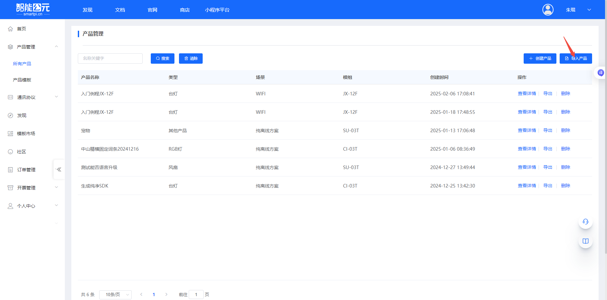

**2. 配置功能修改**

导入成功后可以进行功能配置：

- 在平台上修改或添加新的控制功能
- 重新生成固件文件
- 下载更新后的固件进行烧录

**3. 学习资源**

- B站有详细的SU-03T串口教程视频
- 搜索关键词："SU-03T串口教程"
- 按照视频指引进行操作

**注意事项：**

- 确保导入的是.json格式的配置文件
- 修改配置后需要重新生成固件
- 保留原配置文件作为备份

---


---

### 如何将串口接收到的数据写入变量？

**问题描述：**

需要将串口接收到的数据（如十六进制数据）存储到变量中，以便后续使用。

**解决方案：**

目前平台暂不支持将串口接收的数据直接写入变量。

**当前限制：**

- SU-03T系列模块不支持串口数据写入变量功能
- 串口接收的数据只能作为触发条件使用
- 无法动态存储串口数据内容

**替代方案：**

1. **使用固定参数映射**
    - 为每个可能的串口数据创建对应的参数
    - 通过参数赋值给固定变量
    - 适合数据种类较少的场景

2. **外部处理方案**
    - 使用外部MCU处理串口数据
    - MCU将处理结果通过简单指令发送给语音模块
    - 灵活性更高，不受平台限制

**注意事项：**

- 如需要此功能，可联系技术团队了解定制开发
- 未来版本可能会支持此功能
- 建议关注平台更新公告

---


---

### SU-03T支持通过串口发送变量吗？

**问题描述：**

希望通过串口发送包含变量的数据，实现动态数据传输，但平台提示不支持。

**解决方案：**

SU-03T系列模块目前不支持在串口发送中使用变量。

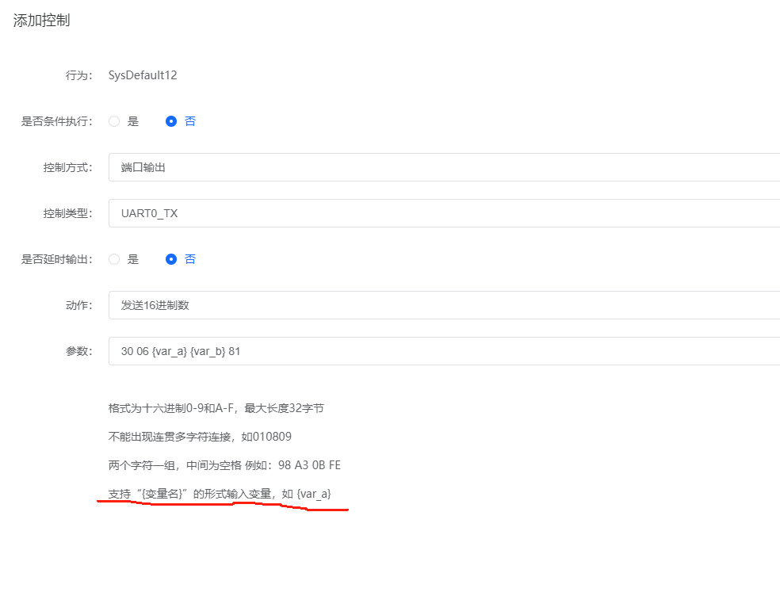

**功能限制：**

- 串口发送内容必须是固定值
- 不能使用{变量名}格式
- 支持十六进制和ASCII格式输入

**现有功能：**

1. **固定数据发送**
    - 直接输入要发送的十六进制数据
    - 或输入ASCII字符
    - 适合发送固定指令

2. **条件触发发送**
    - 可设置不同的触发条件
    - 每个条件发送不同的固定数据
    - 通过条件判断实现差异化

**替代方案：**

1. **多配置切换**
    - 创建多个配置文件
    - 每个配置使用不同的固定数据
    - 根据需要切换使用

2. **使用CI系列模块**
    - CI-03T等模块支持变量功能
    - 可实现更灵活的数据处理

**注意事项：**

- 这是SU-03T系列的硬件限制
- 平台设置界面虽然显示变量选项，但实际不支持
- 购买时请根据需求选择合适型号

---


---

### SU-03T 是否支持 Modbus RTU 协议？

**问题描述：**

在使用 SU-03T 模块时，希望通过 Modbus RTU 协议接收外部数据（如 01 06 00 00 00 01 48 0A），并根据数据内容触发对应的语音播报，但发现无法直接解析 Modbus 协议数据。

**解决方案：**

SU-03T 模块目前不支持 Modbus RTU 协议。如需实现 Modbus 数据解析和语音播报功能，可通过以下方式：

1. **二次开发方案**：

    - 需要对模块进行二次开发，将其改造为支持 Modbus 协议的从机
    - 通过 MCU 或其他处理器先解析 Modbus 协议，再通过串口将解析后的数据发送给 SU-03T

2. **替代方案**：

    - 使用支持 Modbus 协议的中间处理器
    - 将 Modbus 数据转换为 SU-03T 可识别的简单串口指令
    - 通过变量方式触发语音播报

**注意事项：**

- SU-03T 原生固件不支持工业标准协议（如 Modbus、CAN 等）
- 如需要协议支持，建议选择具备通信协议处理能力的处理器配合使用
- 开发自定义协议处理需要相关技术能力和开发资源

---


---

### SU-03T 是否支持 TTS（文本转语音）功能？

**问题描述：**

希望通过串口输入任意字符串（如 "ABCD"），让 SU-03T 模块直接播报出来，实现 TTS 功能。

**解决方案：**

SU-03T 模块不支持 TTS 功能，无法直接播报串口输入的任意字符串。如需文字转语音功能，可选择以下方案：

1. **支持 TTS 的型号**：

    - **CI-33T**：支持 TTS 功能，可通过串口输入字符串进行语音播报
    - **CI-03T**：同样支持 TTS 功能

2. **替代方案**：

    - 使用外部 TTS 模块配合 SU-03T
    - 通过 MCU 将文本转换为语音，再播放给 SU-03T
    - 预录制常用词汇，通过指令触发播放

**功能对比：**

| 型号 | TTS 支持 | 离线命令词 | 备注 |
|-------|---------|------------|------|
| SU-03T | ❌ 不支持 | ✅ 支持 | 仅支持预录制语音 |
| CI-33T | ✅ 支持 | ✅ 支持 | 可混合使用 |
| CI-03T | ✅ 支持 | ✅ 支持 | 可混合使用 |

**注意事项：**

- SU-03T 主要用于离线命令词识别，不支持实时文本转语音
- 如需要 TTS 功能，建议选用 CI-33T 或 CI-03T
- SU-03T 可以播放预录制的语音文件，但不支持动态文本转语音

---


### SU-03T新旧版本固件是否兼容？

**问题描述：**

现在新版的SU-03T1模块，原来老版的SU-03T固件是否还能使用？

**解决方案：**

SU-03T和SU-03T1是不同的硬件版本，固件存在兼容性差异。

**1. 版本差异说明**

- **SU-03T**：旧版本模块
- **SU-03T1**：新版模块，硬件和软件都有改进
- 两者在引脚定义、内部电路等方面存在差异

**2. 固件兼容性**

- **旧固件兼容性**：

    - SU-03T的固件**不能**直接用于SU-03T1
    - 硬件差异可能导致功能异常
    - 强制使用可能导致模块损坏

- **新固件适配**：

    - SU-03T1需要使用专用的新版本固件
    - 平台会自动根据模块型号提供匹配的固件
    - 在智能公元平台选择正确的模块型号

**3. 使用建议**

- **购买确认**：

    - 购买时确认模块的具体型号
    - SU-03T和SU-03T1价格相近但功能有差异
    - 根据实际需求选择合适的版本

- **固件下载**：

    - 登录智能公元平台
    - 选择对应的模块型号
    - 平台会提供匹配的固件版本

**4. 注意事项**

- 不要混用不同版本的固件
- 升级硬件后需要重新配置项目
- 保存好项目配置文件
- 如有疑问咨询技术支持

---


### SDK生成失败如何处理？

**问题描述：**

在智能公元平台生成SDK时，提示生成失败，即使检查配置没有问题也无法成功生成。

**解决方案：**

SDK生成失败可能是平台临时问题或配置冲突导致，可以通过以下方法解决。

**1. 问题排查步骤**

**检查配置完整性**：

- 确认所有必填项已填写
- 检查命令词配置是否完整
- 验证GPIO配置是否合理
- 确认串口参数设置正确

**检查项目状态**：

- 确认项目已保存
- 检查是否有未完成的配置项
- 验证固件是否已发布版本

**2. 解决方法**

**方法一：等待平台恢复**

- 平台可能正在维护或升级
- 稍后重试生成功能
- 关注官方通知了解平台状态

**方法二：重新配置项目**

1. 保存当前配置
2. 创建新项目
3. 重新导入配置
4. 再次尝试生成SDK

**方法三：简化配置测试**

- 先使用最小配置生成
- 逐步添加功能模块
- 找出导致失败的配置项
- 针对性解决问题

**3. 常见原因分析**

- **平台负载高**：

    - 生成高峰期服务器繁忙
    - 等待非高峰时段重试

- **配置冲突**：

    - GPIO功能重复配置
    - 命令词设置冲突
    - 参数超出允许范围

- **缓存问题**：

    - 浏览器缓存导致
    - 清除缓存后重试
    - 更换浏览器尝试

**4. 联系技术支持**

如果以上方法都无法解决：

- 提供详细的错误信息
- 发送配置截图
- 说明操作步骤
- 等待技术支持响应

**注意事项：**

- SDK生成是平台功能，非模块问题
- 固件烧录不受SDK生成影响
- 可以先使用固件功能
- 保持平台版本最新

---


### 如何设置变量名？变量命名规则是什么？

**问题描述：**

在配置自定义命令词时，对变量名的命名规则存在疑问，特别是如何正确填写变量名。

**解决方案：**

**变量命名规则：**

变量名必须满足C语言变量名规则：

- 只能包含字母（a-z, A-Z）、数字（0-9）和下划线（_）
- 必须以字母或下划线开头，不能以数字开头
- 区分大小写（如：LED与led是不同的变量）
- 不能使用C语言关键字（如：int、char、if、for等）
- 建议使用有意义的命名，如：led_state、motor_speed、door_status

**变量类型选择：**

| 类型 | 说明 | 使用场景 |
|------|------|----------|
| int | 整数 | 计数器、状态标识（0/1）、温度值等 |
| char | 字符 | 单个字符标识、简单状态等 |
| double | 双精度浮点数 | 精确数值、小数等 |
| unsigned char | 无符号字符 | 0-255范围的数值、PWM值等 |


**变量调用方法：**

1. 在"变量定义"页面添加变量
2. 在"添加控制"中引用定义的变量
3. 设置变量的值或操作方式
4. 实现命令词与变量的联动

---

### "禁止识别/允许识别"指令有数量限制吗？如何突破？

**问题描述：**

在配置"系统禁止识别"和"系统允许识别"指令时，发现最多只能添加6条指令。希望添加十几个指令，需要了解是否有其他方法。

**解决方案：**

**限制说明：**

- "禁止识别/允许识别"指令确实有数量限制，最多支持6条
- 这是由于内存限制导致的硬性限制
- 添加太多指令会占用过多内存空间

**替代方案：**

**方案一：使用附加条件和变量**

通过附加条件和变量功能实现更复杂的控制逻辑：

1. 在"变量定义"中定义控制变量
2. 在"添加控制"中配置条件执行
3. 使用变量来判断是否执行特定命令
4. 通过一个变量控制多个命令的启用/禁用状态

**方案二：使用变量设置方式**

1. 配置一个主控命令词（如"开启控制"/"关闭控制"）
2. 主控命令修改控制变量的值
3. 其他命令词根据变量值决定是否执行
4. 通过条件执行实现类似"禁止识别"的效果

**配置示例：**

```
变量定义：

- control_enable（int类型，默认值1）

主控命令：

- "开启控制" → 设置变量 control_enable = 1
- "关闭控制" → 设置变量 control_enable = 0

其他命令：

- 添加条件执行：control_enable == 1 时才执行
```

**注意事项：**

- 附加条件和变量功能需要一定的逻辑配置
- 建议先在平台测试验证效果
- 合理规划变量和条件逻辑，避免过于复杂

**配置顺序和延时设置：**

- **执行顺序**：系统的控制运行逻辑是自上而下的
- **禁止/允许顺序**：必须先配置"禁止识别词"，再配置"允许识别词"
- **延时设置**：在"允许识别词"控制后建议添加延时，确保生效
- **关闭识别**：不需要添加延时
- **批量设置**：禁止识别词只能一个一个单独设置，不能批量选择多个

---

### 自学习功能的"覆盖原来学习"和"新增学习结果"有什么区别？

**问题描述：**

在使用自学习功能时，看到"覆盖原来学习"和"新增学习结果"两个选项，不清楚它们的区别和使用场景。

**解决方案：**

**两种模式说明：**

**1. 覆盖原来学习模式**

- 用新的学习数据**替换**之前学习的同一命令词
- 适用于需要修改已有命令词发音的情况
- 覆盖后，旧的学习数据会被删除
- 不会增加学习条目总数

**使用场景：**

- 之前学习的命令词识别效果不好
- 更换了说话人，需要重新学习
- 命令词发音方式发生变化

**2. 新增学习结果模式**

- 将新的学习数据作为**新的条目**添加
- 适用于添加新的命令词
- 会占用自学习的存储空间
- 学习条目总数会增加

**使用场景：**

- 需要学习新的命令词
- 同一个命令词需要多种说法都能识别
- 扩展命令词功能


**配置参数说明：**

- **学习成功次数**：设置学习成功需要重复的次数（如2次）
- **失败退出次数**：设置连续失败多少次后退出学习（如3次）

**注意事项：**

- SU-03T自学习功能最多支持约10-15条命令
- 覆盖模式不占用额外空间，推荐优先使用
- 新增模式会占用存储空间，注意总量限制
- 自学习命令词建议控制在10条以内

---

### SU-03T如何处理数字指令的误识别问题？

**问题描述：**

当设置多个数字指令（如"设置温度36度"、"设置温度37度"等）时，说出未设置的数字（如"设置温度20度"）也会触发响应。如何防止这种情况？

**解决方案：**

**1. 问题原因**

SU-03T的语音识别是基于固定命令词的匹配，不是真正的数字识别：

- 模块只能识别预先设置的固定命令
- 说出相似但未设置的指令时，可能被误识别为最接近的已设置指令
- 这是离线语音识别的特性，不是故障

**2. 优化方案**

**方案一：使用防误识别词**

1. 将容易误触发的词添加到防误识别列表
2. 例如：设置温度36-39度范围时，将"20度"、"30度"等加入防误识别
3. 多个防误识别词用"|"分隔

**方案二：改变命令词结构**

1. 不要使用"设置温度36度"这种格式
2. 改为"设置温度"然后模块播报"请问设置多少度"
3. 用户回答数字时，模块再根据数字发送串口数据
4. 但这种方式下，数字仍需预先设置

**方案三：使用MCU做二次判断**

1. 模块识别后将值传给MCU
2. MCU判断数值是否在有效范围内
3. 如果超出范围，MCU不执行或返回错误提示

**方案四：改用带在线功能的模块**

- JX-A7T等支持在线语音的模块
- 可以通过在线语音识别实现真正的数字识别
- 需要网络连接

**3. 数字放前面的技巧**

- 将数字放在命令词前面可以提高识别准确性
- 例如："三十六度设置温度"比"设置温度三十六度"更好

**4. 灵敏度调整**

- 降低识别灵敏度可以减少误识别
- 在平台优化选项中调低命令词阈值
- 或将灵敏度从"高"调为"中"

**5. 数字识别的局限性**

**离线模块的限制**：

- SU-03T不支持真正的任意数字识别
- 每个数字必须作为单独的命令词预先设置
- 小数点也需要单独设置（如"38.1度"需要单独设置）

**在线模块的选择**：

- 如需真正的任意数字识别，选择JX-A7T
- 在线识别可以理解语义并提取数字
- 但需要稳定的网络连接

**注意事项：**

- 离线语音识别本质上是模式匹配，不是语义理解
- 防误识别词可以有效减少误触发，但无法完全消除
- 数字指令过多会影响识别准确率
- 建议合理控制数字指令的数量

---

### SU-03T的英文版本如何配置？识别效果如何？

**问题描述：**

需要将SU-03T配置为英文识别，询问配置方法和识别效果注意事项。

**解决方案：**

**1. 英文版本配置**

SU-03T支持英文识别，但需要单独创建英文工程：

1. **创建新工程**：

    - 在智能公元平台创建新产品
    - 选择"英文"语言
    - 选择SU-03T模块

2. **不能直接转换**：

    - 中文工程不能直接转换为英文
    - 需要重新创建工程
    - 可以复制词条，但需要手动翻译

**2. 英文识别特点**

**识别效果**：

- 中文识别效果优于英文
- 英文识别可能存在口音差异
- 建议使用英式英语发音

**常见问题**：

- 同音数字词容易触发（如thirty和thirteen）
- 英语的语序变化可能导致识别问题
- 某些人声口音可能无法有效识别

**3. 优化建议**

**命令词设计**：

- 使用简洁明确的命令词
- 避免使用发音相似的词
- 数字放在命令词前面更准确

**发音建议**：

- 尽量使用标准发音
- 可使用翻译软件的发音进行测试
- 不同口音可能需要反复测试

**4. 中英文版本差异**

| 特性 | 中文版本 | 英文版本 |
|------|---------|---------|
| 识别准确率 | 较高 | 略低 |
| 口音敏感度 | 较低 | 较高 |
| 同音词问题 | 存在 | 存在（如thirty/thirteen） |
| 命令词格式 | 任意 | 建议简洁 |

**注意事项：**

- 英文版本需要单独创建工程
- 中英文不能混合使用
- 英文识别效果因口音而异
- 建议先用翻译软件测试验证

---

### SU-03T如何通过串口或GPIO停止播报？

**问题描述：**

SU-03T不支持AEC唤醒打断功能，需要了解如何通过串口输入或GPIO输入来停止语音播报。

**解决方案：**

SU-03T不支持AEC（回声消除）打断功能，但可以通过串口输入或GPIO输入触发停止播放：

**1. 串口输入停止播报**

在智能公元平台配置串口输入触发：

- **触发方式**：选择"串口输入"
- **串口配置**：选择对应的UART接口（如UART1_RX）
- **消息号**：设置识别的消息号（如消息号1）
- **参数**：设置触发参数（如01）
- **控制动作**：系统 → 停止播放

当串口接收到指定消息号的数据时，会触发停止播放动作。

**2. GPIO输入停止播报**

在智能公元平台配置GPIO输入触发：

- **触发方式**：选择"GPIO输入"
- **GPIO引脚**：选择可用引脚（如GPIO_B3）
- **触发条件**：设置高电平或低电平触发
- **控制动作**：系统 → 停止播放

当指定GPIO引脚检测到设定电平时，会触发停止播放动作。

**注意事项：**

- SU-03T没有AEC打断功能，无法通过唤醒词打断播报
- 串口打断和GPIO打断需要外部触发信号
- 如需唤醒词打断功能，建议选择支持AEC的CI系列模块
- 配置停止播放功能时，确保触发条件不会误触发

---

### SU-03T稳态降噪设置保存后不生效怎么办？

**问题描述：**

在智能公元平台配置SU-03T的稳态降噪功能后，保存并发布版本，但重新进入工程发现稳态降噪开关显示为关闭状态，设置没有保存成功。

**解决方案：**

这是发布方式选择不当导致的。发布版本时有"快速发布"和"优化版发布"两种方式，选择不当会导致配置项丢失。

**1. 正确的发布方式**

- **选择"优化版发布"**：
    - 优化版会完整保留所有配置项
    - 确保稳态降噪等高级功能设置正确生效
    - 生成时间较长但配置可靠

- **避免"快速发布"**：
    - 快速发布可能会重置部分配置项为默认值
    - 稳态降噪等配置可能被默认关闭
    - 仅适合开发调试阶段的快速验证

**2. 配置步骤**

1. 在"前端信号处理"页面开启稳态降噪
2. 保存工程配置
3. 点击发布，选择"优化版发布"
4. 等待生成完成后下载固件
5. 重新进入工程验证配置已保存

**注意事项：**

- 快速发布适用于功能验证，不适合生产环境
- 如环境噪声较大，建议选择支持更强降噪能力的CI-03T模块
- 稳态降噪主要针对持续性噪声（风扇、空调等）

---
