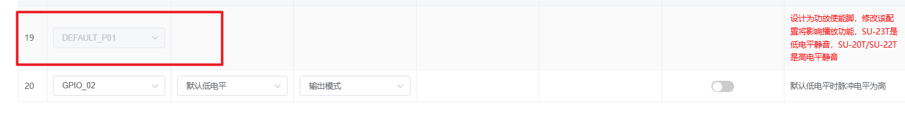

# SU-20T 平台与固件 FAQ

本页用于整理 SU-20T 相关的平台与固件问题。

### 功放使能引脚是否可以在平台上配置？

**问题描述：**

希望了解是否可以通过平台配置功放使能引脚，以及如何通过唤醒控制功放工作状态。

**解决方案：**

**1. 功放使能引脚说明**

功放使能引脚是特殊功能引脚，具有以下限制：

- 引脚19（DEFAULT_P01）被设计为功放使能脚
- 修改该配置会影响播放功能
- 不同型号的静音电平可能不同：

    - SU-23T：低电平静音
    - SU-20T/SU-22T：高电平静音

*GPIO配置界面显示功放使能脚的红色提示信息*

**2. 替代方案**

如果需要通过唤醒控制功放开关：

- 使用其他可配置的GPIO引脚控制功放
- 在唤醒事件中设置相应引脚的电平状态
- 退出唤醒时恢复相反的电平状态

**3. 烧录接口注意**

- 引脚12和13是默认固件烧录引脚
- 烧录程序时使用这两个引脚
- 避免将关键功能连接到烧录引脚

*GPIO配置界面标识的默认烧录引脚*

**注意事项：**

- 功放使能引脚的配置直接影响音频输出
- 设计时需考虑不同型号的电平逻辑
- 保留烧录引脚用于固件更新
- 建议使用专用功放控制电路

---

