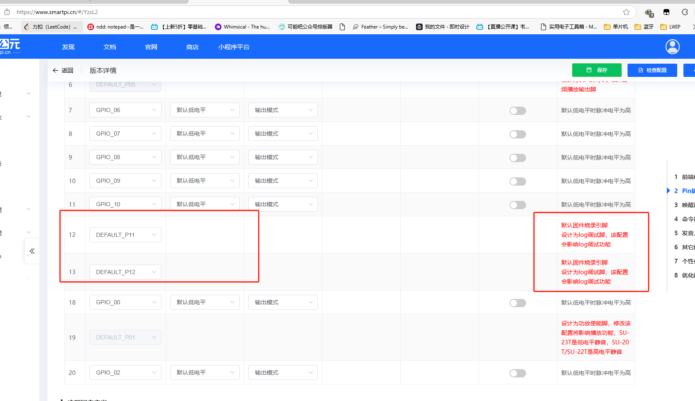
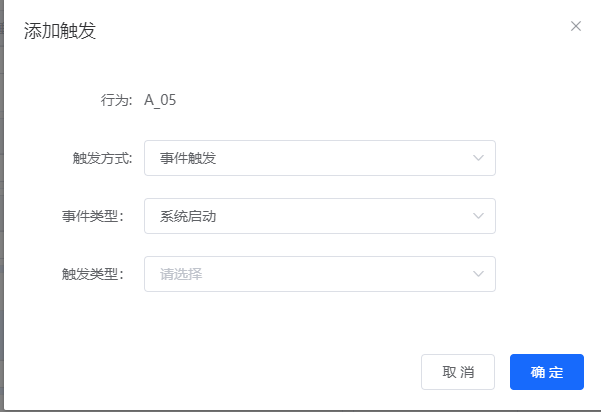
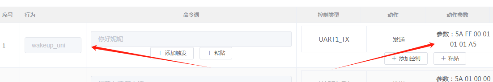
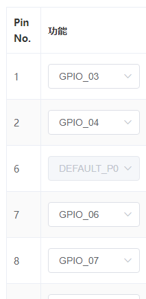
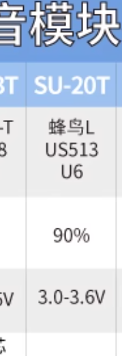
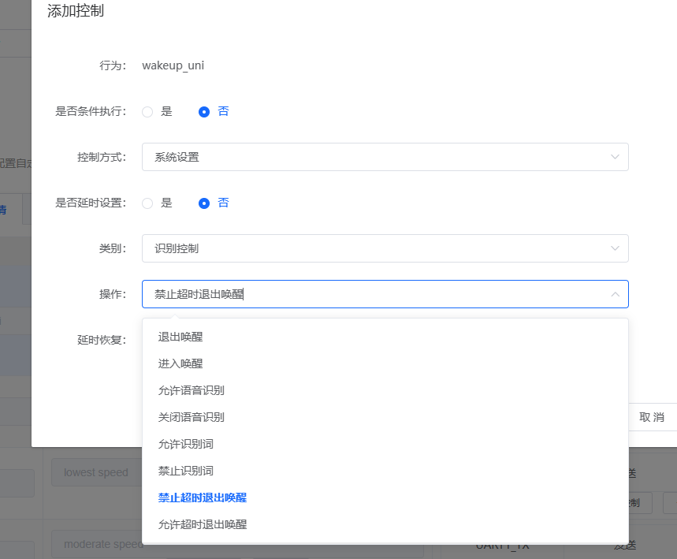
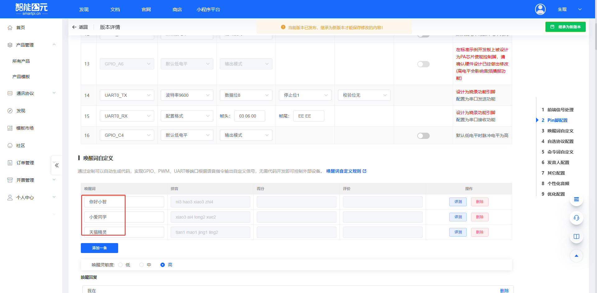

# SU-21T 平台与固件 FAQ

本页用于整理 SU-21T 相关的平台与固件问题。

### 如何获取SU-21T的开发资料？

**问题描述：**

需要获取SU-21T语音模块的完整开发资料，包括开发包、烧录工具、规格书等。

**解决方案：**

SU-21T的官方开发资料可通过以下方式获取：

- **官方文档首页**：访问[SU-21T官方文档](https://help.aimachip.com/docs/offline_su21t)获取最新资料

- **开发包下载**：

    - 最新版本开发包 V2.1.0：[下载链接](https://help.aimachip.com/attach_files/offline_su21t/897)
    - 包含SDK、示例代码、配置工具等完整开发环境

- **必备工具**：

    - 烧录软件：[下载](https://help.aimachip.com/docs/offline_su21t/offline_su21t-1gb2hlcok72aj)
    - CH340驱动（USB转串口）：[下载](https://help.aimachip.com/docs/offline_su21t/offline_su21t-1gb2hkm8qnnh6)
    - 串口调试工具：[下载](https://help.aimachip.com/docs/offline_su21t/offline_su21t-1gb2hmb13rqgg)

- **硬件设计资料**：

    - 规格书：[下载](https://help.aimachip.com/docs/offline_su21t/offline_su21t-1gb2j7ik4lpf4)
    - 原理图：[下载](https://help.aimachip.com/docs/offline_su21t/offline_su21t-1gb2j3itkpacg)
    - 产品结构声学规范：[下载](https://help.aimachip.com/attach_files/offline_su21t/890)
    - 喇叭和咪头选型指南：[下载](https://help.aimachip.com/attach_files/offline_su21t/891)

**注意事项：**

- 开发包包含完整的示例工程和教程，建议首次使用时仔细阅读
- 烧录前请先安装CH340驱动，否则无法识别串口设备
- 所有资料均可在官方文档页面找到最新版本

---

### SU-21T是否支持音频输出功能？

**问题描述：**

询问SU-21T的音频输出是否可以通过串口RX0/TX0实现，以及该型号是否支持音频输出功能。

**解决方案：**

**1. 音频输出能力确认**

SU-21T不支持内置功放和音频输出：

- **不支持内置功放**：SU-21T没有内置功放功能
- **不能直接接喇叭**：单模块无法实现喇叭输出
- **仅支持语音识别**：专注于语音识别功能

**2. 串口功能说明**

RX0/TX0是串口通信引脚：

- **RX0/IO5**：串口接收引脚
- **TX0/IO6**：串口发送引脚
- **用途**：用于与主控MCU通信
- **不支持音频**：不能传输音频信号

**3. 音频输出方案**

如果需要音频输出功能：

- **选择SU-23T**：支持内置功放，可直接接喇叭
- **使用外接功放**：通过I2S或PWM音频外接功放电路
- **串口控制**：通过串口控制外部音频播放设备

**型号对比：**

| 型号 | 内置功放 | 音频输出 | 适用场景 |
|------|----------|----------|----------|
| SU-21T | 不支持 | 不支持 | 纯语音识别 |
| SU-23T | 支持 | 支持 | 识别+播报 |

**注意事项：**

- SU-21T专注于语音识别，不包含音频输出功能
- 如需语音播报，请选择支持功放的型号
- 串口仅用于数据通信，不能传输模拟音频

---

### SU-21T是否支持环境噪声检测功能？

**问题描述：**

需要确认SU-21T模块是否支持检测当前环境噪声大小的功能，包括检测环境噪声分贝值和调节输出音量。

**解决方案：**

SU-21T模块不支持环境噪声检测功能：

1. **功能限制**：

    - SU-21T仅支持调节输出音量大小
    - 不具备环境噪声检测能力
    - 无法获取环境噪声的分贝值
    - 不能检测当前环境音量

2. **技术原因**：

    - 硬件设计未集成噪声检测传感器
    - 固件算法不支持噪声分析
    - 模块专注于语音识别功能
    - 没有环境音频采集和处理电路

3. **功能边界**：

    - 支持功能：语音识别、命令词触发、音量调节
    - 不支持功能：环境噪声检测、音频录制、声级测量
    - 设计定位：纯离线语音识别，非环境监测设备

**替代方案：**

1. **外接噪声传感器**：

    - 使用专用噪声传感器模块（如MAX4466、LMV324等方案）
    - 通过串口或IO口与SU-21T连接
    - 实现环境噪声检测和自适应音量调节

2. **使用其他模块**：

    - 如需噪声检测功能
    - 可选择支持此功能的专用模块
    - 或使用带环境传感器的MCU方案

3. **分立方案设计**：

    ```
    噪声传感器模块 → MCU处理 → SU-21T语音识别
                                ↓
                            自适应音量控制
    ```

**应用场景说明：**

- **适合场景**：固定音量的语音控制应用
- **不适合场景**：需要根据环境噪声自动调节的应用
- **典型应用**：穿戴设备、手持设备、固定环境的语音控制

**注意事项：**

- SU-21T是纯离线语音识别模块
- 不支持环境监测类功能
- 如需复合功能，建议多模块组合使用
- 设计时需明确功能边界，避免功能期望不符

---

### SU-21T烧录串口设置为普通串口后还能烧录吗？

**问题描述：**

需要确认SU-21T的烧录串口（DEFAULT_P11和DEFAULT_P12）在平台设置为普通串口后，是否仍具有烧录功能。

**解决方案：**

**1. 烧录功能确认**

- 烧录串口设置为普通串口后仍具有烧录功能
- 烧录功能是硬件级别，不受软件配置影响
- 只是无法查看调试日志了

**2. 引脚功能说明**

- DEFAULT_P11（GPIO_11）：默认固件烧录引脚
- DEFAULT_P12（GPIO_12）：默认固件烧录引脚
- 设计为log调试脚，修改配置会影响日志查看



*红色标注显示DEFAULT_P11和DEFAULT_P12为烧录引脚*

**3. 使用建议**

- 如需向单片机发送串口数据：

    - 建议使用其他串口接口（如RX0/TX0）
    - 保留烧录串口用于固件更新和调试
- 如已修改为普通串口：

    - 烧录功能依然可用
    - 无法通过串口查看调试信息
    - 需要通过其他方式排查问题

**注意事项：**

- 修改烧录串口配置前请记录原始设置
- 量产阶段建议保留烧录串口用于后期维护
- 开发阶段可灵活配置，但需有其他调试手段

---

### SU-21T设备启动后延时进入语音识别模式的配置方法

**问题描述：**

需要配置SU-21T设备在启动后延时10秒再进入语音识别模式，实现设备上电后前10秒不进行语音识别，10秒后再开启识别功能。

**解决方案：**

**配置步骤：**

1. **添加系统启动行为**：

    在配置界面中添加第一条行为：

    - 触发方式：事件触发
    - 事件类型：系统启动
    - 行为：关闭语音识别

    

2. **配置定时器延时**：

    设置一个定时器，延时时间为10000ms（10秒）：

    - 定时器类型：单次定时器
    - 超时时间：10000ms
    - 触发条件：系统启动后立即启动

3. **添加定时器超时行为**：

    添加第二条行为：

    - 触发方式：定时器超时
    - 行为：开启语音识别

    

**工作原理：**

1. **设备上电瞬间**：

    - 系统启动事件触发
    - 执行第一条行为：关闭语音识别
    - 同时启动10秒定时器

2. **延时期间（0-10秒）**：

    - 语音识别功能保持关闭状态
    - 设备不响应语音唤醒指令
    - 其他功能可正常工作

3. **延时结束（10秒后）**：

    - 定时器超时事件触发
    - 执行第二条行为：开启语音识别
    - 设备进入正常语音识别模式

**配置要点：**

1. **事件触发设置**：

    - 确保选择"系统启动"作为触发事件
    - 这是设备上电时的第一个系统事件

2. **定时器配置**：

    - 延时时间可根据实际需求调整
    - 支持1000ms到65535ms范围
    - 可设置为单次或重复定时器

3. **行为顺序**：

    - 必须先关闭再开启，确保正确的时序
    - 两个行为通过定时器关联

**应用场景：**

1. **系统初始化时间**：

    - 等待其他硬件模块稳定
    - 避免过早识别造成的误触发

2. **环境稳定等待**：

    - 等待音频系统稳定
    - 避免开机瞬间的噪声干扰

3. **用户场景适配**：

    - 给用户留出设备准备时间
    - 避免设备未准备好时开始识别

**注意事项：**

- 定时器精度为毫秒级，可根据需求微调
- 延时期间其他功能不受影响
- 配置完成后需生成新固件并烧录
- 建议在实际环境中测试延时效果

---


---

### 如何在平台中为SU-21T添加退出唤醒事件触发？

**问题描述：**

需要在智能公元平台为SU-21T设备配置退出唤醒事件触发，使设备在退出唤醒状态时通过串口发送数据通知。

**解决方案：**

**1. 进入设备配置界面**

- 登录智能公元平台
- 选择SU-21T对应的产品项目
- 进入设备触发配置页面

**2. 查看现有触发配置**

在配置界面可以看到已有的唤醒事件触发：



*SU-21T设备现有的唤醒事件触发配置，显示wakeup_uni触发行为，通过UART1_TX发送数据*

**3. 添加退出唤醒触发**

**步骤一：点击添加触发**

- 在触发配置页面找到"添加触发"按钮
- 点击进入新触发事件创建界面


*添加新触发事件的配置界面，包含触发方式选择和动作设置*

**步骤二：配置退出唤醒事件**

1. **选择触发方式**
    - 触发方式选择：事件触发
    - 事件类型选择：退出唤醒

2. **配置输出动作**
    - 动作类型：串口输出
    - 输出端口：UART1_TX
    - 数据格式：十六进制格式
    - 数据内容：根据需求自定义

**配置完成效果：**


*成功添加的退出唤醒事件触发，显示为事件触发类型，已配置串口输出动作*

**4. 数据发送配置详情**

**串口输出设置：**

- **输出端口**：UART1_TX
- **数据格式**：支持十六进制、ASCII、字符串
- **数据内容示例**：

    - 十六进制：`0x01 0x02`
    - ASCII：`EXIT`
    - 字符串：`wake_exit`

**动作执行流程：**

1. 设备检测到退出唤醒事件
2. 触发配置的串口输出动作
3. 通过UART1_TX发送预设数据
4. 外部设备接收数据并处理

**5. 验证配置效果**

**测试步骤：**

1. **固件烧录**
    - 保存配置并生成固件
    - 将固件烧录到SU-21T设备

2. **功能测试**
    - 触发设备进入唤醒状态
    - 等待或主动触发退出唤醒
    - 监控串口输出数据

**预期结果：**

设备退出唤醒状态时，串口会输出配置的数据，例如：
```
[接收数据] EXIT
```

**6. 常见问题处理**

**问题1：找不到退出唤醒选项**

- 确认SU-21T固件版本支持退出唤醒事件
- 检查平台是否已更新到最新版本
- 联系技术支持确认功能支持情况

**问题2：触发后无串口输出**

- 检查串口连接和波特率设置
- 确认触发事件配置正确
- 验证数据格式是否有效

**问题3：数据格式错误**

- 确认十六进制格式输入正确（使用0x前缀）
- 检查ASCII字符是否在有效范围内
- 验证字符串内容无特殊字符

**7. 高级配置选项**

**多动作配置：**

可以为退出唤醒事件配置多个动作：

- 串口输出数据
- 控制GPIO输出
- 播放提示音
- 进入低功耗模式

**条件触发：**

设置特定的退出唤醒条件：

- 超时退出：发送 `TIMEOUT_EXIT`
- 命令退出：发送 `CMD_EXIT`
- 异常退出：发送 `ERROR_EXIT`

**8. 注意事项**

**重要提醒：**

- 配置修改后必须重新生成并烧录固件
- 退出唤醒事件与进入唤醒事件是独立配置
- 串口输出数据长度建议不超过64字节
- 确保外部设备能够正确解析接收的数据

**优化建议：**

- 使用有明确含义的数据标识符
- 建立数据接收确认机制
- 定期检查配置是否正常工作
- 保留配置备份便于问题排查

---


---

### SU-21T的IO1在平台中不可用怎么办？

**问题描述：**

在SU-21T设备的平台配置界面中，无法找到或选择IO1引脚进行功能配置。

**解决方案：**

**原因说明：**

SU-21T的IO1引脚已被硬件功放使能功能占用，因此无法在平台中作为通用GPIO使用。

**1. 引脚占用情况确认**

在平台引脚配置界面中可以看到：



*SU-21T在平台中的引脚配置界面，显示IO1（Pin No. 1）被其他功能占用，无法在配置选项中选择*

**2. 引脚功能分配**

**IO1引脚当前用途：**

- **功能名称**：硬件功放使能引脚
- **占用原因**：用于控制外部功放电路的开关状态
- **引脚状态**：被系统内部占用，不可重新分配

**可用引脚列表：**

根据配置界面显示，SU-21T可用的引脚包括：

- **Pin No. 1 (IO1)**：已被占用（功放使能）
- **Pin No. 2**：GPIO_04（可用）
- **Pin No. 6**：DEFAULT_P0（可用）
- **Pin No. 7**：GPIO_06（可用）
- **Pin No. 8**：GPIO_07（可用）

**3. 替代方案**

**方案一：使用其他可用引脚**

如果需要GPIO功能，可以使用以下引脚替代：

- **GPIO_04**：Pin No. 2
- **DEFAULT_P0**：Pin No. 6
- **GPIO_06**：Pin No. 7
- **GPIO_07**：Pin No. 8

**方案二：检查功放需求**

如果不需要使用硬件功放功能：

1. **确认硬件设计**
    - 检查是否真的需要功放使能控制
    - 评估是否可以使用软件音量控制替代

2. **硬件修改**
    - 如需释放IO1，可能需要硬件电路修改
    - 建议咨询硬件工程师确认可行性

**4. 硬件功放功能说明**

**功放使能引脚作用：**

- **控制逻辑**：高电平使能功放，低电平关闭功放
- **功耗优化**：在不播放音频时关闭功放，降低功耗
- **电路保护**：避免功放电路长时间工作

**使用场景：**

- 电池供电设备需要优化功耗
- 外接大功率功放电路需要开关控制
- 需要精确控制音频输出时序

**5. 配置建议**

**GPIO分配策略：**

1. **优先使用可用引脚**
    - 将非关键功能分配到GPIO_04、GPIO_06等
    - 保留DEFAULT_P0用于特殊功能需求

2. **功能规划**
    - 提前规划引脚使用，避免冲突
    - 考虑未来功能扩展需求

3. **文档记录**
    - 记录每个引脚的实际用途
    - 建立引脚分配表便于维护

**6. 技术支持**

**如需进一步协助：**

- **硬件咨询**：联系硬件工程师确认引脚修改可行性
- **软件支持**：咨询软件团队了解功放控制逻辑
- **平台协助**：联系平台技术支持确认是否有其他解决方案

**7. 注意事项**

**重要提醒：**

- IO1被占用是硬件设计决定，无法通过软件修改
- 强制修改可能导致功放功能异常
- 在硬件设计阶段应考虑引脚分配问题
- 建议保留完整的硬件和软件文档

**设计建议：**

- 在新产品设计时预留足够的GPIO资源
- 考虑引脚复用功能的使用场景
- 建立引脚使用优先级策略
- 定期review引脚分配的合理性

---

### SU-21T是否支持MCU直接更新固件？

**问题描述：**

询问SU-21T芯片是否支持通过MCU直接进行固件更新，以及是否有相关的串口固件更新协议。

**解决方案：**

- **蜂鸟L-PRO芯片暂不支持开放串口烧录协议**
- 需要通过专用烧录工具进行固件更新
- 批量生产建议使用烧录夹具提高效率

**二次开发方案：**

- 下载SDK源代码进行二次开发
- 需要虚拟机环境和编程经验
- 可以参考SU-03T环境搭建教程

**注意事项：**

- SU-21T不支持在线串口升级功能
- 如需OTA功能建议选择其他型号
- 本地编译需要较强的技术能力


---

### SU-21T是否支持配置串口通信功能？SU-23T配置能否烧录到SU-21T？

**问题描述：**

需要确认SU-21T芯片是否支持配置串口通信功能，以及是否可以使用SU-23T的配置模组烧录到SU-21T芯片上。

**解决方案：**

**串口通信功能：**

- SU-21T支持配置串口通信功能
- SU-21T有部分IO口不可控（硬件限制）
- 建议创建SU-23T的模组进行配置操作

**兼容性说明：**

- SU-21T和SU-23T使用相同的芯片
- SU-23T的配置可以烧录到SU-21T芯片上
- 两个型号硬件兼容，固件可以互通使用

**型号对比：**

- **SU-23T**：带功放，可以播报语音
- **SU-21T**：不带功放，仅支持语音识别
- **功耗对比**：SU-23T功耗略低于SU-21T

**选型建议：**

- 如果需要语音播报功能，推荐使用SU-23T
- 如果仅需语音识别功能，可以使用SU-21T
- 对于太阳能供电等低功耗场景，SU-23T是更好的选择

### 如何获取SU-21T和SU-23T的规格书？

**问题描述：**

需要获取SU-21T和SU-23T芯片的规格书，了解详细技术参数。

**解决方案：**

- **SU-21T规格**：

    - 主控芯片：蜂鸟LPro US513 U61
    - 综合识别率：93%
    - 供电电压：1.8-3.6V


- **SU-20T规格**（对比参考）：

    - 主控芯片：蜂鸟L US513 U6
    - 综合识别率：90%
    - 供电电压：3.0-3.6V



**获取方式：**

- 向技术支持团队申请获取
- 参考产品手册中的电气特性
- 注意区分不同型号的芯片差异

**注意事项：**

- SU-21T使用蜂鸟LPro芯片，性能优于SU-20T
- 规格书包含详细的引脚定义和电气参数
- 设计电路时需严格按照规格书要求


---

### 如何设置语音唤醒后不休眠？

**问题描述：**

需要设置语音模块在唤醒后不自动进入休眠状态，但发现设置的唤醒词退出操作未生效，设备仍在设定时间后休眠。

**解决方案：**

**1. 永不退出设置**

- 在系统设置中找到"超时退出"配置
- 将时间设置为最大值或选择永不退出
- 部分型号支持"永不退出"选项


**2. 参考例程配置**

- 下载"CI-03T，上电进入唤醒、永不退下"例程
- 导入例程配置文件到项目
- 根据需求调整其他参数

**3. 唤醒退出操作配置**

- 在添加控制中配置wakeup_uni事件
- 选择"禁止超时退出唤醒"操作
- 确认配置已正确保存



**注意事项：**

- 不同型号的休眠策略可能不同
- SU-21T等低功耗模块会自动进入深度休眠
- 唤醒词可以退出深度休眠模式
- 如设置无效可尝试重新生成固件

---

### 语音模块的唤醒词如何配置？是否需要编写程序？

**问题描述：**

需要了解语音模块（如SU-21T）的唤醒词配置方式，以及是否需要自己编写程序来配置和烧录固件。

**解决方案：**

**1. 唤醒词配置**：

- 唤醒词在智能云元平台上配置，可自定义
- 平台支持多种唤醒词选择，如"你好小智"、"小爱同学"、"天猫精灵"等
- 登录平台后在"唤醒词自定义"界面进行配置



**2. 零代码平台操作**：

- **无需编写程序**：平台是零代码配置平台
- **手机端支持**：配置过程可以在手机上进行操作
- **灵活便捷**：通过可视化界面完成所有配置

**3. 固件烧录要求**：

- 配置完成后需要烧录固件到模块
- 烧录过程需要使用电脑
- 需要CH340串口烧录器进行烧录

**注意事项：**

- 模块买来后需要先在平台配置相应功能才能使用
- 平台配置完成后必须烧录固件才能生效
- 建议保留配置备份，便于后续修改
- 配置期间遇到问题可寻求技术团队

---

