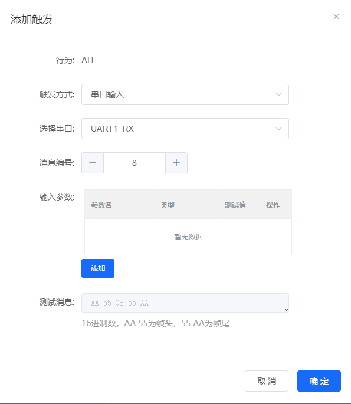
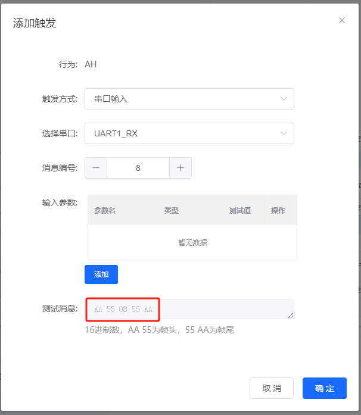
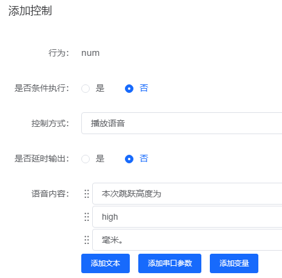

# SU-22T 平台与固件 FAQ

本页用于整理 SU-22T 相关的平台与固件问题。

### SU-22T模块支持串口输出和SDK开发吗？

**问题描述：**

需要确认SU-22T模块是否支持串口输出配置，以及下载SDK后是否可以在C代码中实现串口信息输出。

**解决方案：**

**功能支持确认：**

1. **串口输出功能**

    - SU-22T模块支持串口输出配置
    - 提供UART接口用于串口通信
    - 可通过SDK进行开发配置

2. **SDK开发支持**

    - 支持通过C语言进行二次开发
    - 可在代码中实现串口信息输出
    - 提供完整的开发环境和API

**开发环境要求：**

1. **操作系统**

    - 需要在Ubuntu系统环境下进行编译
    - 建议使用虚拟机运行Ubuntu
    - Windows系统无法直接编译

2. **开发工具**

    - 使用官方提供的SDK开发包
    - 包含编译工具链和示例代码
    - 支持标准C语言开发

**实施步骤：**

1. **环境搭建**

    - 在Ubuntu系统中创建虚拟机环境
    - 下载并解压SU-22T模块的SDK
    - 配置交叉编译工具链

2. **代码开发**

    - 使用C语言编写串口输出代码
    - 调用SDK提供的串口API
    - 实现自定义的数据输出逻辑

3. **编译烧录**

    - 在虚拟机中编译生成固件
    - 通过烧录工具下载到模块
    - 验证串口输出功能

**技术要点：**

- SDK支持完整的串口通信功能
- 可配置串口参数（波特率、数据位等）
- 支持多种串口输出格式
- 提供丰富的示例代码参考

**注意事项：**

- 必须在虚拟机环境下进行编译
- 确保SDK版本与模块硬件兼容
- 串口参数配置需与接收端设备匹配
- 开发前建议先运行官方示例验证环境


---

### SU-22T控制序列中多个控制动作是如何执行的？

**问题描述：**

在一个控制序列中配置了多个设备控制动作，其中包含延时操作时，需要了解这些控制是同时执行还是按顺序执行，以及延时电平反转和延时输出对后续控制的影响。

**解决方案：**

**执行顺序说明：**

1. **基本执行规则**

    - 控制序列中的多个动作按先后顺序执行
    - 系统会依次执行配置的每个控制动作
    - 不是并发执行，而是串行处理

2. **延时电平反转特性**

    - 延时电平反转添加到系统任务回调中执行
    - 不会阻塞后续控制的执行
    - 后续控制会继续按顺序执行

**执行机制详解：**

1. **延时电平反转**

    - 触发后立即加入系统任务队列
    - 由系统定时器回调处理
    - 不影响主控制流程的执行

2. **延时输出**

    - 会轻微影响后续控制的执行时机
    - 延时输出执行时会有短暂等待
    - 后续控制需等待延时输出完成

**实际执行示例：**

假设配置了以下控制序列：

1. 控制A：延时电平反转（延时5秒）
2. 控制B：延时输出（延时3秒）
3. 控制C：立即执行

**执行流程：**

1. **执行控制A**
    - 触发电平反转并添加到系统任务
    - 立即继续执行下一步

2. **执行控制B**
    - 开始延时输出计时
    - 需要等待3秒延时完成

3. **执行控制C**
    - 在控制B完成后执行
    - 控制A的电平反转由系统独立处理

**关键要点：**

- 延时电平反转使用异步执行机制
- 延时输出使用同步执行机制
- 两种延时方式对后续控制的影响不同
- 系统任务回调确保定时操作的准确性

**应用建议：**

1. **需要精确延时控制时**

    - 使用延时电平反转，不影响主流程
    - 适合需要并行处理的场景

2. **需要顺序执行时**

    - 使用延时输出，确保执行顺序
    - 适合需要严格时序控制的场景

**注意事项：**

- 延时电平反转由系统回调管理，执行时机准确
- 延时输出会阻塞主控制流程，影响执行速度
- 设计控制逻辑时需考虑两种延时的差异
- 复杂时序建议分别测试验证

---

### SU-22T是否支持ADC功能？

**问题描述：**

需要确认SU-22T芯片是否具备ADC（模数转换）功能，用于采集模拟信号。

**解决方案：**

**功能确认：**

SU-22T芯片**不支持**ADC功能。

**替代方案：**

1. **使用外部ADC芯片**
    - 通过I2C或SPI接口连接外部ADC
    - 常用芯片：ADS1115、MCP3021等
    - 需要额外的硬件成本

2. **使用专用传感器模块**
    - 选择数字输出的传感器
    - 直接输出数字量，无需ADC
    - 减少开发难度

3. **更换其他芯片**
    - 如必须使用ADC功能
    - 考虑使用带ADC的语音芯片
    - 选择合适的型号替代

**注意事项：**

- 设计前需仔细阅读芯片规格书
- 确认所需功能是否硬件支持
- 提前规划功能实现方案
- 考虑成本和开发周期

**其他建议：**

- 若仅需简单模拟检测
- 可考虑使用比较器电路
- 将模拟信号转为数字信号
- 通过GPIO读取高低电平

---

### 如何通过串口输入替代唤醒词进行触发？

**问题描述：**

希望不使用语音唤醒，而是通过串口发送16进制数据来触发特定动作。

**解决方案：**

**功能实现：**

将唤醒词转换为对应的16进制数据，通过串口输入实现触发。






**配置步骤：**

1. **添加触发规则**
    - 触发行为：选择需要执行的动作
    - 触发方式：选择"串口输入"
    - 选择串口：UART1_RX
    - 设置消息号：自定义（如8）

2. **配置16进制数据**
    - 使用帧头：AA 55
    - 设置消息号：08（对应消息号8）
    - 使用帧尾：55 AA
    - 完整数据：AA 55 08 55 AA

3. **保存配置**
    - 点击"添加"保存触发规则
    - 可以添加多个不同的触发规则
    - 每个规则对应不同的消息号

**数据格式说明：**

- AA 55：固定帧头，表示数据开始
- XX：消息号，可自定义（00-FF）
- 55 AA：固定帧尾，表示数据结束
- 数据长度固定为5字节

**使用方法：**

1. **发送触发数据**
    - 通过串口调试工具发送16进制数据
    - 确保波特率等串口参数正确
    - 发送格式选择HEX模式

2. **执行效果**
    - 接收正确数据后立即触发动作
    - 无需先进行语音唤醒
    - 可随时通过串口触发

**应用场景：**

- 需要精确控制触发时机
- 无法使用语音唤醒的环境
- 自动化控制系统集成
- 与其他MCU协同工作

**注意事项：**

- 串口输入触发无需唤醒词
- 不同消息号可触发不同动作
- 保留配置记录便于调试
- 测试时使用串口助手验证


### SU-22T英文模式下语音指令对应的IO控制功能无法正常工作怎么办？

**问题描述：**

SU-22T模块在英文语音模式下，语音指令的识别正常，但对应的IO控制功能无法正常工作，而中文模式下功能正常。

**解决方案：**


**问题排查步骤：**

**1. 检查识别灵敏度**

- 英文语音识别可能需要更高的灵敏度设置
- 在平台中尝试调高识别灵敏度参数
- 确保英文发音清晰标准

**2. 验证配置一致性**

- 确认英文模式下每个命令词都配置了对应的IO动作
- 检查IO引脚配置是否正确
- 验证命令词拼音或英文拼写是否准确

**3. 测试建议**
```
排查流程：

1. 使用中文模式测试，确认IO控制功能正常
2. 切换到英文模式，检查配置是否同步
3. 重新生成并烧录英文固件
4. 测试英文命令词，观察IO响应
```

**4. 常见原因分析**

- **识别差异**：英文识别率可能低于中文
- **配置问题**：英文模式下的配置可能未完全生效
- **固件问题**：英文固件可能存在功能缺陷

**5. 解决方案**

- **提高灵敏度**：将英文识别灵敏度调高5-10%
- **简化命令词**：使用简单易识别的英文单词
- **验证固件**：下载最新的英文固件版本
- **联系技术支持**：提供具体配置文件供分析

**注意事项：**

- SU-22T支持中英文双语，但需要分别配置
- 英文命令词建议使用标准发音
- 确保英文固件版本与平台版本匹配
- 如问题持续，可提供生成的固件文件供技术支持分析

---

### SU-22T模块可以用5V供电吗？

**问题描述：**

确认SU-22T模块是否支持5V供电，以及使用5V供电的影响。

**解决方案：**

**1. 供电规格说明**

- **电压范围**：

    - SU-22T不建议长期使用5V供电
    - 短时间测试可能没问题
    - 长期使用5V会损坏模块

- **推荐电压**：

    - 使用3.7V锂电池供电
    - 或3.3V稳压电源
    - 确保电压稳定可靠

**2. 5V供电风险**

- **损坏风险**：

    - 长时间5V供电可能烧坏芯片
    - 功耗增加，发热严重
    - 缩短模块使用寿命

- **故障模式**：

    - 逐渐性能下降
    - 突然完全失效
    - 无规律工作异常

**3. 正确使用方法**

- **电源选择**：

    - 使用3.7V 18650锂电池
    - 或3.3V LDO稳压模块
    - 避免直接连接5V

- **电源质量**：

    - 确保电源纹波小
    - 提供足够电流（>500mA）
    - 加滤波电容改善稳定性

**注意事项：**

- 不要为省事直接使用5V
- 设计电路时加入电压转换
- 批量使用时严格管控供电电压
- 发现异常立即断电检查

**解决方案：**

**问题原因分析：**

- 固件超大主要是由于播报条数过多导致的
- 单条播报的字数限制较宽松（几个字到三四十字都能播）
- 生成大量音频文件会占用大量存储空间

**优化方法：**

1. **减少播报条目**
    - 删除不常用的命令词
    - 合并相似功能的指令
    - 优先保留核心语音功能

2. **使用播报拼接技巧**
    - 将多条播报中相同的内容单独提取
    - 例如："今天的温度是"、"度"等常用词可复用
    - 具体数值或变量单独配置
    - 示例拼接：

        - 今天的温度是（可复用）
        - 二十六（变量）
        - 度（可复用）

3. **简化配置逻辑**
    - 减少复杂的条件判断
    - 关闭不必要的高级功能
    - 分批生成功能模块

**配置示例：**



*通过"添加文本"、"添加串口参数"和"添加变量"构建语音播报内容*

**注意事项：**

- 固件大小限制是硬件物理特性
- 使用拼接技巧可以显著减少固件大小
- 优化后必须完整测试所有功能
- 保留配置文件备份便于恢复

---

