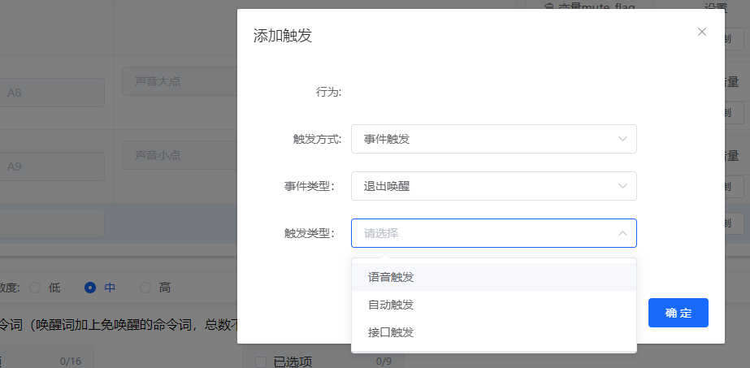
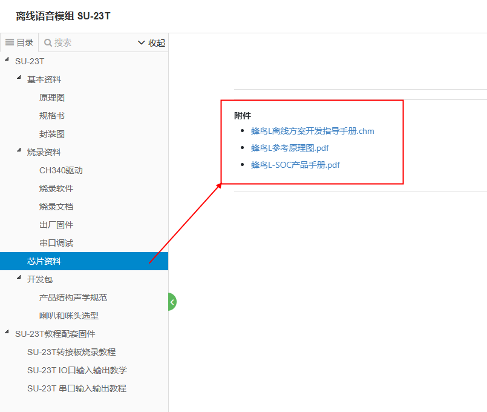
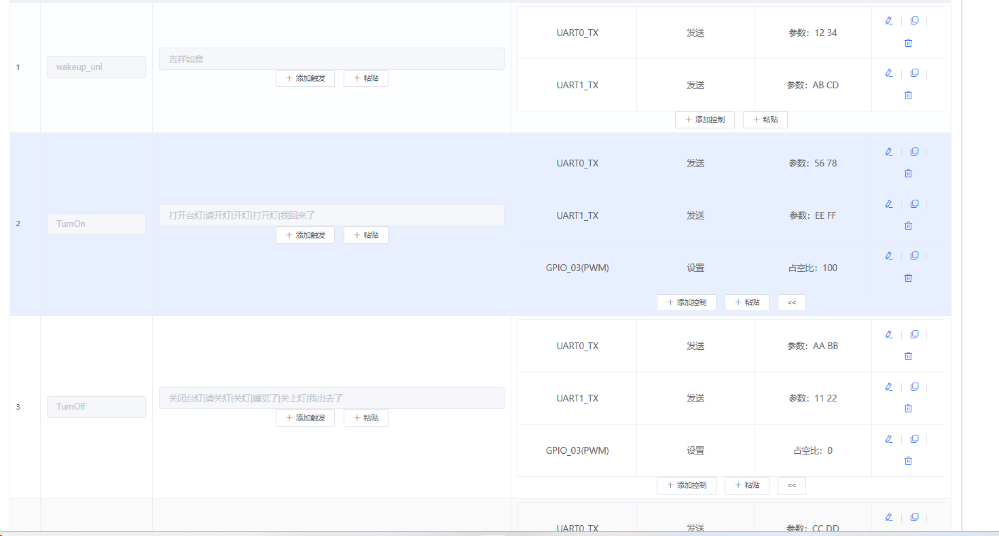

# SU-23T 平台与固件 FAQ

本页用于整理 SU-23T 相关的平台与固件问题。

### SU-23T模块的采购套餐包含哪些组件？

**问题描述：**

需要明确SU-23T模块的正确采购方式，了解套餐包含的组件内容。

**解决方案：**

SU-23T模块的完整套餐应包含以下组件：

- **SU-23T模块**：已焊接排针
- **麦克风**：用于语音输入
- **电源线**：供电连接线
- **喇叭**：语音输出设备
- **CH340**：USB转串口模块
- **转接板**：用于连接和调试

**采购注意事项：**

1. **确认套餐内容**
    - 单独购买模块不包含配套组件
    - 需选择包含所有必要组件的套餐
    - 确保套餐包含调试所需的CH340和转接板

2. **购买建议**
    - 首次使用建议购买完整套餐
    - 避免因缺少组件影响开发进度
    - 保留原包装以便后续维护

**注意事项：**

- 模块本身和配套组件是分开的，需确认购买的是完整套餐
- 如已单独购买模块，需要补购其他必要组件
- 建议联系客服确认具体套餐内容后再下单

---

### SU-23T模块是否支持自行修改配置？

**问题描述：**

购买SU-23T模块后，需要了解是否可以自行修改配置或功能。

**解决方案：**

SU-23T模块支持的功能说明：

1. **固件自定义支持**
    - SU-23T模块支持自行修改配置
    - 可通过平台修改唤醒词和功能指令
    - 支持IO输入输出和串口通信功能

2. **修改方式**
    - 使用官方平台进行配置修改
    - 参考官方教程进行操作
    - IO配置教程：https://www.bilibili.com/video/BV1L8411D7JC/
    - 串口配置教程：https://www.bilibili.com/video/BV1S14y197rg/

**注意事项：**

- 修改配置前建议备份原始设置
- 需要使用配套的CH340和转接板进行调试
- 复杂修改建议参考官方教程或联系技术支持

---

### 如何配置SU-23T芯片上电后免唤醒直接进入语音识别状态？

**问题描述：**

需要配置SU-23T芯片，使其上电后无需唤醒词即可直接进入语音识别状态。

**解决方案：**

1. 在产品配置平台中，设置事件触发：

    - 触发方式：PullDownGPIO3
    - 参数：上电启动系统启动
    - 操作：点击"+ 添加控制"按钮

2. 添加控制指令：

    - 控制类型：系统设置
    - 具体操作：识别控制 → 进入唤醒
    - 延时设置：添加500ms延时

**注意事项：**

- 进入唤醒指令前必须添加500ms延时，确保系统完全启动
- 配置完成后需要重新生成固件并烧录

### 如何配置SU-23T模块上电后持续保持唤醒状态？

**问题描述：**

需要配置SU-23T芯片，使其上电后进入唤醒状态并一直保持唤醒状态不退出。

**解决方案：**

**1. 配置上电启动事件**

- 触发方式：事件触发
- 参数：上电启动系统启动
- 添加控制：系统设置 → 识别控制 → 进入唤醒
- 延时设置：500ms

**2. 配置学习完成事件**

- 触发方式：事件触发
- 参数：学习完成自学习事件
- 添加控制：系统设置 → 进入唤醒
- 确保学习后不会退出唤醒状态

**3. 启用禁止超时退出唤醒**

- 在系统设置中勾选"禁止超时退出唤醒"选项
- 这样模块进入唤醒状态后不会自动退出
- 持续保持语音识别状态

**注意事项：**

- 两个事件都需要配置进入唤醒动作
- 确保延时设置合理，避免系统未完全启动
- 配置完成后需要测试上电后的行为是否符合预期

---

### SU-23T模块长时间连续输入声音后进入休眠怎么办？

**问题描述：**

SU-23T模块在长时间连续输入声音后会进入休眠状态，需要重新启动才能恢复正常工作。

**解决方案：**

**1. 问题排查步骤**

- 记录进入休眠的具体场景和触发条件
- 分析是否有规律性，如特定声音强度或持续时间导致
- 提供视频或日志供技术支持分析

**2. 固件升级**

- 使用最新版本的固件
- 联系技术支持获取经过优化的固件
- 重新烧录固件后进行全面测试

**注意事项：**

- 这个问题可能与固件版本有关
- 建议保留问题现象的详细记录
- 如问题持续存在，需返厂检测

---

### SU-23T模块固件生成需要等待多久？

**问题描述：**

在平台提交固件生成请求后，等待时间超过预期，需要了解正常处理时间。

**解决方案：**

**1. 生成时间说明**

- 低功耗模块修改唤醒词需要约30分钟
- 平台采用排队机制，高峰期需要更长等待时间
- 只修改控制逻辑不改变模型时，生成速度较快

**2. 加速建议**

- 避免在高峰时段提交请求
- 提交前检查配置是否正确
- 如等待超过1小时，可联系客服确认状态

**注意事项：**

- 生成时间是正常现象，请耐心等待
- 多人同时使用时会延长等待时间
- 建议合理安排固件修改时间

---

### SU-23T模块上电瞬间有高电平输出如何解决？

**问题描述：**

SU-23T模块开机瞬间会产生一个高电平输出，可能导致误触发。

**解决方案：**

**问题原因：**

- 高电平输出来自芯片硬件初始化过程
- 这是固件无法避免的硬件特性
- 需要在下位机端进行处理

**处理方案：**

- 在下位机程序中添加500ms上电延时
- 延时期间忽略高电平信号
- 延时结束后再开始正常工作

**注意事项：**

- 这是硬件特性，无法通过修改固件解决
- 必须在接收端（下位机）进行处理
- 建议使用硬件或软件滤波消除干扰

---

### 如何修改SU-23T模块的唤醒词和指令？

**问题描述：**

需要修改SU-23T模块的唤醒词和输出指令，以适应不同的应用场景。

**解决方案：**

**1. 修改步骤**

- 登录官方平台
- 进入产品配置界面
- 修改唤醒词和指令配置
- 提交生成新固件（约30分钟等待时间）

**2. 下载和烧录**

- 固件生成完成后下载压缩包
- 使用CH340和转接板连接模块
- 按照教程进行固件烧录

**注意事项：**

- 修改唤醒词需要重新训练识别模型
- 建议在非高峰时段提交
- 保留原固件备份以便恢复

---

### 如何配置超时退出唤醒功能？

**问题描述：**

需要配置超时退出唤醒功能，并了解不同触发方式的区别。

**解决方案：**

超时退出唤醒功能配置步骤：

1. **启用超时退出唤醒**
    - 在系统设置中勾选"允许超时退出唤醒"
    - 可关联到指定的 GPIO（如 GPIO_03）
    - 设置退出时的电平状态（高电平/低电平）

2. **配置触发方式**

    触发方式有三种类型：

    - **语音触发**：通过"退下"等退出指令退出唤醒
    - **自动触发**：超时后自动退出唤醒
    - **接口触发**：通过 GPIO、串口等外部信号触发退出

**注意事项：**

- 超时退出唤醒是默认功能，即使不配置事件触发也会生效
- 如果只需要超时退出而不需要语音退出，可以不配置语音触发
- 主动退出功能可在"主动退出"配置中设置退出命令和回复
- 配置完成后需要重新生成固件并烧录生效

### 如何获取SU-23T芯片的技术资料手册？

**问题描述：**

需要获取SU-23T芯片的完整技术资料，包括开发指导手册、参考原理图和产品手册。

**解决方案：**

**官方文档获取方式：**

- 在线文档地址：https://help.aimachip.com/docs/offline_su23t
- 芯片资料页面：https://help.aimachip.com/docs/offline_su23t/offline_su23t-1gb2k7mrvrlsp

**可用资料包括：**

1. **蜂鸟L离线方案开发指导手册**（.chm格式）
2. **蜂鸟L参考原理图**（.pdf格式）
3. **蜂鸟L-SOC产品手册**（.pdf格式）

**注意事项：**

- 所有资料均可通过官方文档系统免费获取
- 建议下载最新版本的文档以获得准确信息
- 参考原理图可用于硬件设计参考
- 开发前建议仔细阅读开发指导手册

---

---

### SU-23T的串口0（UART0）如何配置使用？

**问题描述：**

SU-23T模块有两个串口，串口1既是烧录又是通信，想知道串口0是否可用于外部通信，以及在平台中如何配置。

**解决方案：**

**串口0配置前提：**

在智能公元平台配置界面中，需要先在"Pin脚配置"页面将引脚选择为UART0功能，之后才能在"控制详情"中找到UART0相关配置选项。

*Pin脚配置界面中需先选择UART0对应的引脚功能*

**配置步骤：**

1. **在Pin脚配置页面选择UART0**
    - 进入产品配置的Pin脚配置界面
    - 找到对应的引脚（如UART0_TX）
    - 在下拉菜单中选择"UART0_TX"或"UART0_RX"功能

2. **在控制详情中配置串口参数**
    - Pin脚选择UART0后，才能在"控制详情"中找到UART0选项
    - 配置串口参数：波特率、数据位、停止位、校验位
    - 设置触发条件和响应动作

**串口功能说明：**

| 串口 | 功能 | 说明 |
|------|------|------|
| UART0 | 可配置通信接口 | 需先在Pin脚配置中选择，之后可正常使用 |
| UART1/串口1 | 默认通信接口 | 也是烧录串口，配置为通信不会影响烧录 |

**注意事项：**

- 串口0必须在Pin脚配置中先选择对应功能，才能在后续配置中使用
- 如果在控制详情中找不到UART0选项，请检查Pin脚配置是否已正确选择
- 串口1配置为数据输出不会与固件烧录冲突，两个功能独立工作

---

### 如何在智能公元平台上自定义设置唤醒词和词条？

**问题描述：**

需要了解如何在智能公元平台上自定义设置唤醒词和词条。

**解决方案：**

**1. 访问智能公元平台**

    - 打开网址：https://www.smartpi.cn
    - 注册或登录账号

**2. 创建产品配置**

    - 选择对应的芯片型号（如US513U6/SU-23T等）
    - 设置产品名称和类别
    - 配置基础参数

**3. 配置语音指令**

    - 添加唤醒词（如"吉祥如意"）
    - 设置具体的语音指令（如TurnOn、TurnOff等）
    - 为每个指令配置对应的控制动作

**4. 设置控制动作**

    - UART发送数据：通过串口发送特定指令
    - GPIO控制：设置引脚输出高低电平
    - 组合动作：多个控制同时执行

**5. 生成并下载固件**

    - 完成配置后点击生成固件
    - 平台会生成.bin格式的固件文件
    - 下载后使用对应的烧录工具烧录

**注意事项：**

- 不同芯片型号支持的最大词条数不同
- 唤醒词建议选择4-6个汉字
- 指令词要避免发音相似的情况
- 生成固件前务必检查配置是否完整
- 保存配置文件便于后续修改

---

