### SU-32T如何配置IO口控制唤醒功能？

**问题描述：**

需要通过IO口的高低电平来控制模块的唤醒和睡眠状态，实现外部信号触发唤醒功能。

**解决方案：**

SU-32T支持通过IO口电平信号控制唤醒状态，需要在智能公元平台中进行相关配置。

**1. 配置步骤**

**第一步：配置IO口为GPIO触发模式**

- 登录智能公元平台
- 进入对应的项目配置
- 找到需要配置的IO口（如PA1、PA2等）
- 将IO口配置为"GPIO触发"模式
- 设置触发类型（高电平触发或低电平触发）

**第二步：设置唤醒词的附加条件**

- 在唤醒词配置页面
- 找到"控制词条"或"触发条件"设置
- 点击"添加附加条件"
- 选择对应的IO口
- 设置电平判断条件（如：PA1为高电平且PA2为低电平）

**2. 配置示例**

假设需要PA1为高电平时才能唤醒：


这样只有在PA1为高电平时，说唤醒词才会触发唤醒。

**3. 多IO口组合控制**

可以实现多个IO口的逻辑组合：

- **与逻辑**：所有IO口都满足条件才能唤醒
- **或逻辑**：任一IO口满足条件即可唤醒
- **组合条件**：PA1=高且PA2=低

**4. 应用场景**

- **外部传感器控制**：只有传感器检测到信号才允许唤醒
- **按键开关控制**：通过按键控制模块是否响应语音
- **系统状态判断**：根据其他设备状态决定是否允许唤醒
- **省电优化**：在不需要语音功能时保持睡眠状态

**5. 注意事项**

- IO口电平判断要准确配置
- 考虑IO口的上下拉电阻配置
- 避免IO口浮空导致误触发
- 测试所有可能的电平组合
- 保存配置后需要重新生成固件

---

# SU-32T 平台与固件 FAQ

本页用于整理 SU-32T 相关的平台与固件问题。

### SU-32T芯片规格书支持29个GPIO，但平台仅显示20-21个，如何解决？

**问题描述：**

SU-32T芯片规格书标明支持29个GPIO接口，但在智能公元平台的固件配置中仅显示20个，最多可配置21个GPIO，其余GPIO无法在平台中找到或使用。

**问题分析：**

- **芯片理论资源**：SU-32T芯片本身确实支持最多29个GPIO
- **平台可用资源**：平台仅开放了20-21个GPIO供用户配置
- **资源占用情况**：部分GPIO被系统内部功能占用，无法开放给用户使用
- **模组设计限制**：模组化设计中，某些引脚可能用于内部连接或特定功能

**解决方案：**

**方案一：使用平台可用GPIO**

1. **确认可用GPIO数量**：

    - 平台显示的20-21个GPIO为完全可用的用户接口
    - 这些GPIO经过充分测试，稳定性有保障
    - 优先使用这些可用接口满足应用需求

2. **合理规划GPIO使用**：

    - 梳理实际应用需要的GPIO数量
    - 优化设计，减少不必要的GPIO占用
    - 使用复用功能（如I2C、SPI）减少GPIO需求

**方案二：二次开发使用未开放GPIO**

1. **二次开发要求**：

    - 需要具备嵌入式开发经验
    - 熟悉SU-32T芯片架构和寄存器配置
    - 能够进行底层驱动开发

2. **开发流程**：

    - 获取SU-32T详细技术规格书和原理图
    - 分析未被占用的GPIO引脚分布
    - 自行开发底层驱动配置这些GPIO
    - 集成到固件中进行测试验证

3. **技术支持**：

    - 如需二次开发支持，可联系技术支持获取详细资料
    - 提供具体应用需求和GPIO使用方案
    - 获取未开放GPIO的相关技术文档

**可用GPIO说明：**

- **平台开放GPIO**：20-21个，可直接通过平台配置使用
- **系统占用GPIO**：用于内部功能，如：

    - 麦克风接口控制
    - 模块内部通信
    - 系统状态指示
    - 调试接口保留
- **预留GPIO**：为未来功能扩展保留

**设计建议：**

1. **优先使用平台资源**：

    - 使用平台开放的GPIO进行产品设计
    - 避免依赖未开放的GPIO接口
    - 确保产品的兼容性和可维护性

2. **GPIO使用优化**：

    - 合理规划功能，减少GPIO数量需求
    - 使用IO扩展芯片增加GPIO数量
    - 采用I2C/SPI等总线方式控制多个器件

3. **产品规划考虑**：

    - 设计初期就确认GPIO需求
    - 预留足够的GPIO余量
    - 考虑使用其他接口替代部分GPIO功能

**注意事项：**

- 平台未开放的GPIO可能存在兼容性问题
- 二次开发使用未开放GPIO需要自行承担风险
- 固件更新可能影响未开放GPIO的功能
- 建议在量产前进行充分的兼容性测试
- 如确实需要更多GPIO，可考虑使用GPIO扩展器件

**替代方案：**

如需要更多GPIO接口，可考虑以下方案：

- 使用I2C GPIO扩展芯片（如PCF8574）
- 采用SPI接口的IO扩展器件
- 使用多片SU-32T协同工作
- 选择其他GPIO资源更丰富的芯片方案

---

### SU-32T串口输入触发功能异常如何解决？

**问题描述：**

设备在通过串口输入触发功能后，多次触发（约每2秒一次）后便无法再接收串口数据，需要重新上电才能恢复。同时串口发送功能也会失效。

**问题分析：**

这是一个已知的固件问题，在频繁触发串口输入后可能导致通信模块异常。测试场景显示在2秒间隔的连续触发下会出现此问题。

**临时解决方案：**

1. **延长触发间隔**：

    - 延长串口触发的时间间隔（建议大于5秒）
    - 避免连续快速触发操作
    - 测试确定稳定的触发频率

2. **减少触发任务数量**：

    - 检查配置的串口触发任务数量
    - 简化触发逻辑，减少同时执行的指令
    - 避免复杂的延迟发送任务

3. **使用其他触发方式**：

    - 考虑使用GPIO输入触发替代串口触发
    - 使用外部单片机进行串口到GPIO的转换
    - 采用更稳定的通信协议

**根本解决：**

此问题需要官方固件更新来解决：

1. **获取最新固件**：

    - 联系技术支持获取修复版本的固件
    - 提供测试场景和问题复现方法
    - 等待官方发布稳定版本

2. **固件升级**：

    - 下载并烧录最新版本固件
    - 重新配置触发事件
    - 充分测试验证问题是否解决

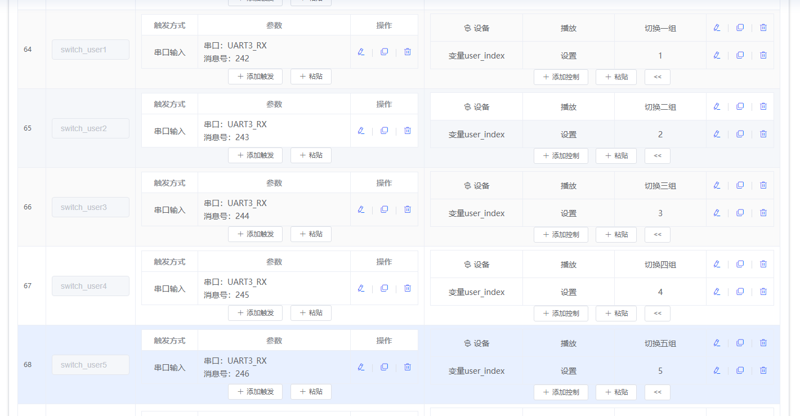

*串口输入触发配置示例*

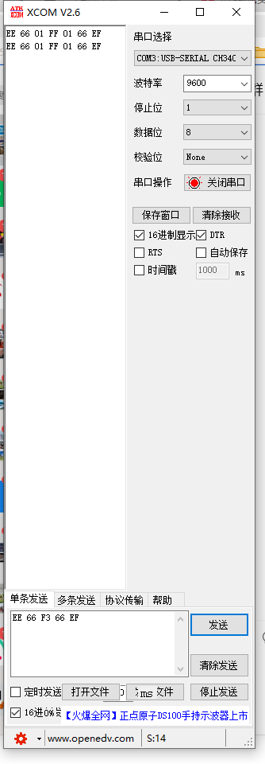

*串口接收数据异常时的界面*

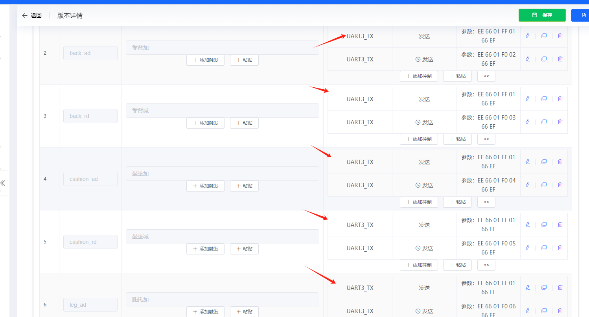

*固件配置中的多个串口发送任务*

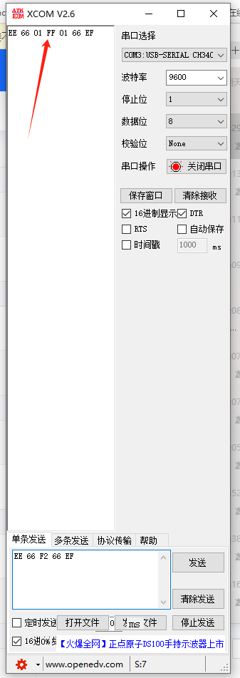

*串口发送功能失效的界面*

**技术说明：**

- 问题出现在频繁的串口通信处理上
- 可能与串口缓冲区或中断处理有关
- 需要底层固件优化来彻底解决

**注意事项：**

- 在问题修复前，避免高频次串口触发
- 保存好配置文件，便于固件升级后恢复
- 如必须高频触发，考虑增加外部处理逻辑
- 建议在量产前充分测试通信稳定性

---

### SU-32T是否支持上电触发事件配置？

**问题描述：**

需要配置SU-32T在上电后延迟200ms发送串口指令，实现开机自动触发功能。

**解决方案：**

SU-32T支持上电触发事件配置，可通过智能公元平台实现：

1. **添加触发事件**：

    - 在智能公元平台的触发配置中，选择"添加触发"
    - 触发方式选择"事件触发"
    - 事件类型选择"系统启动"
    - 从下拉菜单中选择"上电启动"作为触发类型

2. **配置延迟执行**：

    - 在触发动作中设置延迟时间
    - 配置200ms延迟后执行串口发送
    - 设置要发送的具体串口指令内容

3. **串口指令配置**：

    - 选择对应的UART端口（UART1_TX或UART3_TX）
    - 配置要发送的十六进制数据
    - 设置通信协议参数（波特率、帧头帧尾等）

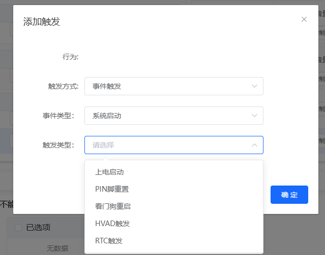

*配置上电启动触发事件界面*

**技术说明：**

- 上电触发事件在系统完成初始化后自动执行
- 延迟时间可根据实际需求调整（200ms为推荐值）
- 支持配置复杂的触发逻辑和多条指令执行

**注意事项：**

- 配置完成后需要重新生成并烧录固件
- 确保P51引脚不接地，复位后直接进入工作模式
- 建议在实际应用中测试不同延迟时间的效果

---

### SU-32T的语音指令如何计算词条数量？

**问题描述：**

需要了解SU-32T模块中，一个语音指令包含多个不同说法（用竖线分隔）时，是否算作多条词条。

**解决方案：**

**词条计算规则：**

- **多条说法算多条词条**：使用竖线（|）分隔的不同说法，每条都独立计算词条数
- **示例说明**："关闭水泵一|关闭按摩泵一"算作2条词条
- **内存占用**：每条说法都会占用模型内存空间

**词条配置示例：**

```
指令示例：打开灯光|开灯|开启灯光
- 实际占用：3条词条
- 识别效果：任一说法都能触发相同动作
```


*使用竖线分隔多个说法的示例，这样配置会占用多条词条*

**词条数量管理：**

1. **SU-32T词条限制**：

    - 最大支持150条本地指令
    - 需要合理规划词条分配
    - 避免超出模块容量

2. **优化建议**：

    - 选择最常用的2-3种说法
    - 避免过多同义词配置
    - 优先选择识别率高的表述

3. **容量规划**：

    - 每个动作平均分配词条数量
    - 重要功能可配置更多说法
    - 次要功能使用单一说法

**技术说明：**

- 多说法功能提升了用户体验，但会占用更多资源
- 每条说法都需要经过模型训练和存储
- 建议在功能和容量之间找到平衡点

**注意事项：**

- 配置时要注意总词条数不超过150条
- 测试阶段验证所有说法都能正常识别
- 如词条不足，考虑简化指令或选择更高型号模块

---

### SU-32T上电后需要等待多久才能正常进行串口通讯？

**问题描述：**

需要了解SU-32T上电后需要等待多长时间才能正常进行串口通信。

**解决方案：**

SU-32T的串口通信就绪时间取决于启动模式：

1. **快速启动模式**：

    - 条件：P51引脚不接地
    - 状态：复位后直接进入工作模式
    - 延迟：立即可以进行串口通信

2. **烧录模式**：

    - 条件：P51引脚接地
    - 状态：进入固件烧录模式
    - 延迟：需要等待烧录工具连接

**技术说明：**

- P51是模式选择引脚
- 不接地：正常工作模式
- 接地：烧录/调试模式
- 系统启动时间：约100-200ms

**应用建议：**

1. **常规应用**：

    - 保持P51悬空或接高电平
    - 上电后即可立即通信
    - 适合产品正常使用

2. **开发调试**：

    - 可通过P51控制进入不同模式
    - 方便固件更新和调试
    - 需要硬件设计支持

3. **通信时序**：

    - 上电后等待100ms再发送指令
    - 确保系统完全初始化
    - 避免因时序问题导致的通信失败

**注意事项：**

- 确认P51引脚在最终产品中的处理
- 如通信异常，检查P51电平状态
- 建议在通信前增加短暂延时
- 批量生产时注意测试不同上电时序

---

### SU-32T如何配置串口通信协议？

**问题描述：**

需要在智能公元平台为SU-32T模块创建固件时，配置串口通信协议，定义模块通过串口发送和接收数据的格式。

**解决方案：**

**1. Pin脚配置为串口功能**

在智能公元平台的Pin脚配置中，将GPIO引脚配置为串口功能：

- **UART3配置**：PIN37和PIN38可配置为UART3_TX和UART3_RX
- **UART1配置**：PIN57和PIN58可配置为UART1_RX和UART1_TX
- 根据实际需求选择合适的串口引脚

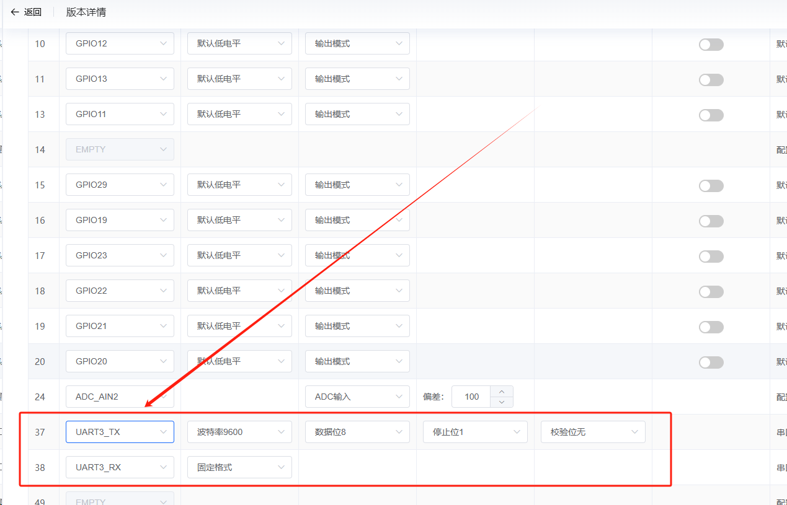

*将PIN37和PIN38配置为UART3_TX和UART3_RX*

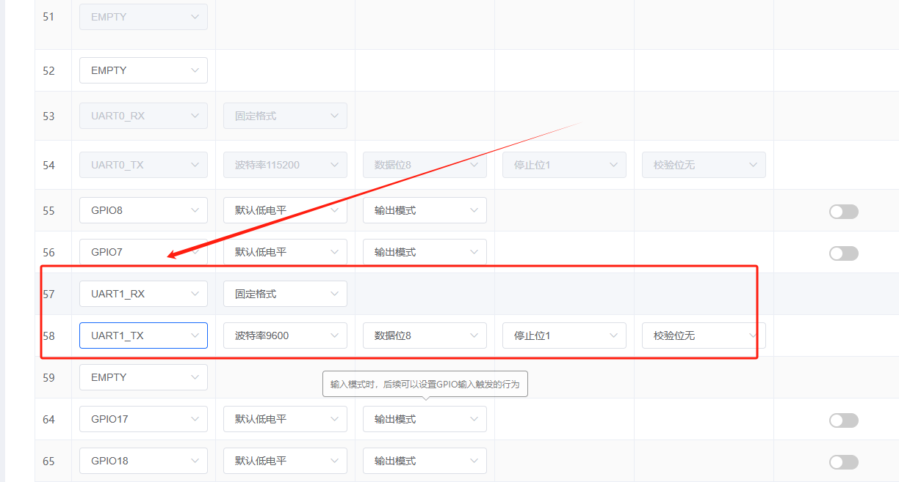

*将PIN57和PIN58配置为UART1_RX和UART1_TX*

**2. 串口协议参数配置**

在串口配置界面中，可以自定义通信协议的帧格式：

- **配置格式**：选择"配置格式"而非固定格式
- **帧头设置**：可自定义帧头，如AA 55
- **帧尾设置**：可自定义帧尾，如55 AA
- **波特率**：支持9600等常用波特率
- **数据位**：8位
- **停止位**：1位


*UART1_RX和UART1_TX的帧格式参数配置*

**3. 命令词发送配置**

在命令词自定义界面，配置语音指令触发后的串口发送动作：

- **触发方式**：选择"发送"
- **串口选择**：选择UART3_TX或UART1_TX
- **发送数据**：自定义要发送的十六进制数据，如AA BB CC


*配置"打开浴缸"指令通过UART3_TX发送数据*

**4. 串口接收配置**

配置模块接收外部控制系统的串口指令：

- **触发方式**：选择"串口输入"
- **串口选择**：选择UART1_RX或UART3_RX
- **消息编号**：设置唯一的消息编号用于识别不同指令


*配置通过UART1_RX接收外部指令*

**5. 多指令关联配置**

可以将多个语音指令与串口通信功能关联：

- 为每个语音指令设置不同的行为参数
- 支持将同一语音指令关联多个动作
- 可配置复杂的控制逻辑

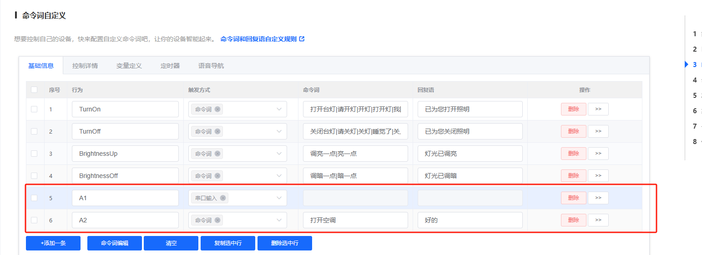

*配置多个命令词使用串口输入触发*

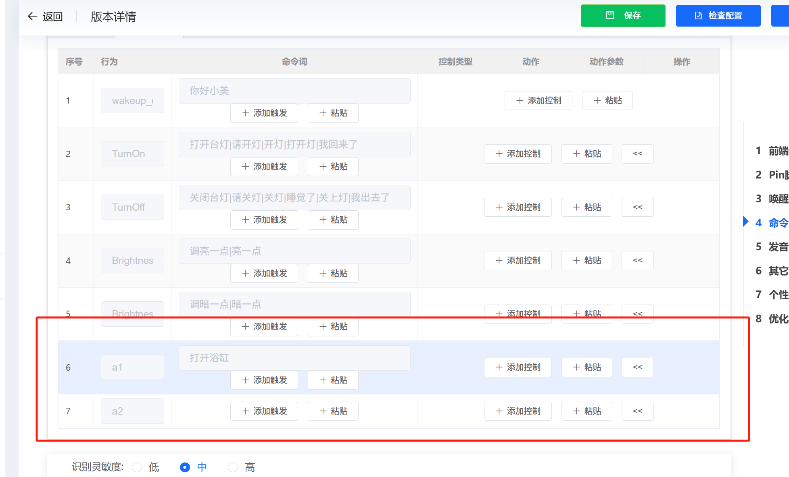

*将"打开浴缸"、"关闭浴缸"等指令与具体动作关联*

**技术要点：**

1. **协议灵活性**：

    - 支持完全自定义的帧头帧尾
    - 可删除固定格式以适应特殊需求
    - 支持可变长度的数据帧

2. **双向通信**：

    - 支持同时配置发送和接收
    - 可实现与控制系统的完整交互
    - 支持多路UART同时工作

3. **配置步骤**：

    - 先配置Pin脚为串口功能
    - 再设置串口协议参数
    - 最后关联语音指令和串口动作

**注意事项：**

- 配置完成后需要重新生成并烧录固件
- 串口通信需要确保电平匹配（TTL电平）
- 使用串口调试工具验证协议正确性
- 注意消息编号的唯一性，避免冲突

---

### 如何获取 SU-32T 开发包？

**问题描述：**

需要获取 SU-32T 的开发包进行二次开发。

**解决方案：**

**开发包获取方式：**

1. **官方下载**：

    - SU-32T 开发包可在官方文档页面下载
    - 文件名格式：SU-32T开发包；版本[日期时间].zip
    - 包含完整的 SDK、示例工程、编译器和调试工具

2. **开发包内容**：

    - SDK 开发套件
    - 示例工程代码
    - 编译器工具链
    - 调试工具
    - 技术文档

3. **使用说明**：

    - 解压开发包到指定目录
    - 阅读其中的开发文档
    - 参考示例工程进行开发
    - 使用编译器生成自定义固件

**注意事项：**

- 开发包仅用于二次开发，常规使用建议在智能公元平台配置
- 需要具备一定的嵌入式开发经验
- 如需技术支持，可联系官方获取开发指导

---

### 如何配置SU-32T芯片的UART1_RX和UART3_TX以实现串口数据的输入输出测试？

**问题描述：**

需要配置SU-32T芯片，实现通过UART1_RX输入数据，再由UART3_TX输出的数据传输测试。

**解决方案：**

**1. 硬件连接**

使用CH340芯片进行USB转串口连接：

```
CH340 TX → SU-32T UART1_RX
SU-32T UART3_TX → CH340 RX（或其他接收设备）
```

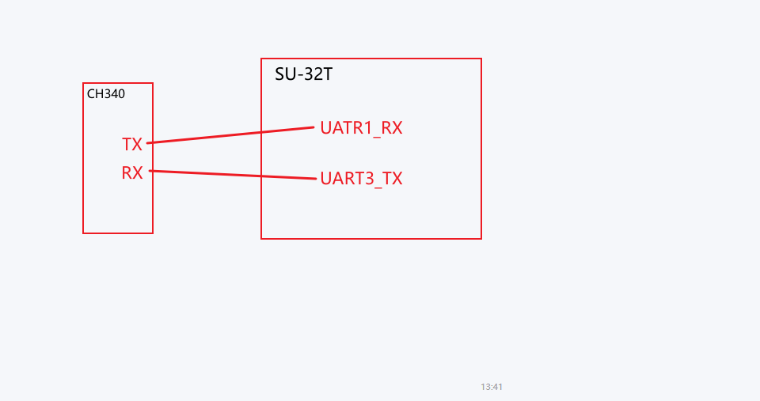

*CH340芯片的TX和RX引脚分别连接到SU-32T的UART1_RX和UART3_TX引脚*

**2. 软件配置**

在平台中配置UART参数：

- **波特率**：9600
- **数据位**：8
- **停止位**：1
- **校验位**：无


*SU-32T的UART1_RX和UART1_TX配置参数设置*

**3. 测试验证**

- 配置完成后烧录固件到模块
- 使用串口调试工具发送测试数据
- 观察UART3_TX是否有对应输出
- 验证数据传输的完整性

**注意事项：**

- 确保地线（GND）正确连接
- 检查串口参数配置是否匹配
- 测试时建议使用简单的数据格式
- 配置无误后可实现数据的正常转发

---

### SU-32T模块使用什么烧录接口？

**问题描述：**

用户需要确认SU-32T模块的烧录接口是UART还是SW，以及需要连接哪些引脚。

**解答：**

**烧录接口规格：**

1. **接口类型**
    - SU-32T模块使用**UART接口**进行固件烧录
    - 不支持SW（SWD）接口烧录

2. **所需连接引脚**
    - **TXD**：数据发送引脚
    - **RXD**：数据接收引脚
    - **GND**：接地引脚
    - **5V/3.3V**：电源引脚（根据模块要求）

3. **接线方法**
    ```
    烧录器     →    SU-32T模块
    RXD       →    TXD
    TXD       →    RXD
    GND       →    GND
    5V        →    5V（如需要供电）
    ```

4. **注意事项**
    - 交叉连接：烧录器的TX接模块的RX，烧录器的RX接模块的TX
    - 确保电平匹配（通常为3.3V）
    - 供电要稳定，建议使用外部电源而非USB供电

5. **烧录工具**
    - 可使用专用的UART烧录工具
    - 或通过USB转TTL模块连接电脑
    - 配合相应的烧录软件使用

**技术提示：**
烧录前建议先确认模块的引脚定义，可通过查看模块丝印或查阅技术手册获得准确的引脚位置信息。

---

### SU-32T开发板如何与PC进行交互？

**问题描述：**

希望了解SU-32T开发板是否可以不设计额外电路，直接与PC交互并实现模拟手动操作PC上的程序。

**解决方案：**

**通信方案说明：**

1. **基本通信方式**
    - SU-32T通过USB协议与PC端通信
    - 开发板使用串口转USB的方式实现
    - 需要CH340或类似USB转串口芯片

2. **硬件连接**
    - 开发板自带USB接口可直接连接PC
    - 或使用外部CH340模块连接UART引脚
    - 连接方式：TX→RX，RX→TX，GND→GND

3. **软件实现**

    **SU-32T端（发送端）：**

    - 配置命令词触发串口输出
    - 设置输出格式（ASCII或十六进制）
    - 通过串口发送控制指令

    **PC上位机（接收端）：**

    - 编写程序监听指定COM端口
    - 接收并解析来自SU-32T的数据
    - 根据接收到的指令执行相应操作

4. **配置步骤**
    - 在智能公元平台添加命令词
    - 每个命令对应一个串口输出动作
    - 生成固件并烧录到SU-32T

**应用示例：**

| SU-32T语音指令 | 串口输出 | PC端响应动作 |
|----------------|----------|-------------|
| "打开文件" | "open_file" | 打开指定文件 |
| "点击按钮" | "click_btn" | 模拟鼠标点击 |
| "输入文字" | "type_text" | 自动输入文字 |
| "关闭程序" | "close_app" | 关闭应用程序 |

**注意事项：**

- 开发板版本通常已集成USB转串口功能
- 若使用自制板卡，需额外购买CH340模块
- PC端需要自行开发上位机软件
- 通信协议需要预先定义好数据格式

---

### SU-32T触摸屏与语音芯片如何选择UART接口？

**问题描述：**

使用SU-32T触摸屏模块与语音芯片通信时，需要选择正确的UART接口，确保触摸屏触发的指令不会干扰原有的语音命令输出。

**解决方案：**

**1. UART接口选择**

- 触摸屏通信使用**UART1**
- 语音模块通过**UART3**接收信号
- 模块通过UART1接收触摸屏信号
- 模块通过UART3发送信号控制外部设备

**2. 通信配置**

```
触摸屏(UART1) → 语音模块(UART1_RX)
语音模块(UART3_TX) → 外部设备
```

**3. 信号隔离**

- UART1和UART3相互独立工作
- 触摸屏信号不会干扰语音命令输出
- 语音播报和串口输出可同时进行


**注意事项：**

- SU-32T支持多路UART，可根据需求分配
- 确保波特率等通信参数一致
- 触摸屏和语音功能可并行使用
- 无需担心信号互相干扰

---

### SU-32T是否有现成的工程文件可以直接测试？

**问题描述：**

需要现成的SU-32T工程文件或固件，可以直接下载并进行功能测试，以快速了解模块的基本功能。

**解决方案：**

**目前资源状况：**

1. **官方资源**
    - 官方暂不提供预编译的现成工程文件
    - 主要提供开发包和示例代码
    - 用户需要根据实际需求自行配置生成

2. **获取示例资源的途径**
    - 官网开发包：包含基础配置示例
    - 技术文档：详细的配置说明和步骤
    - 社区分享：部分用户分享的配置案例

**建议操作流程：**

1. **参考示例配置**
    - 下载官方开发包
    - 查看标准配置模板
    - 根据需求修改参数

2. **创建测试工程**
    - 在平台创建新工程
    - 选择基础的语音识别功能
    - 配置简单的IO控制

3. **逐步测试验证**
    - 先完成基础功能测试
    - 再逐步增加复杂功能
    - 保存每个阶段的工程文件

**注意事项：**

- 官方不提供预编译固件主要是出于安全考虑
- 建议用户自行配置，以获得最佳使用体验
- 可联系技术支持获取配置指导
- 保存配置好的工程文件以便后续使用

---

### SU-32T在在线开发网站找不到例程怎么办？

**问题描述：**

在SU-32T的在线开发网站中搜索不到可用的例程或项目，文档选项下也只有开发包和用户指南。

**解决方案：**

**1. 当前资源状态**

- SU-32T暂无在线例程
- 文档选项下仅有：

    - 开发包
    - 用户指南


**2. 替代方案**

- 可参考SU-03T的例程进行修改
- 将SU-03T例程配置改为SU-32T
- 大部分基础功能配置相似

**3. 获取帮助**

- 查看官方开发包中的示例
- 参考用户指南进行配置
- 联系技术支持获取配置案例

---

### SU-32T配置GPIO时输入模式选项不显示怎么办？

**问题描述：**

在配置GPIO引脚时，发现"输入模式"选项未显示，无法进行输入配置。

**解决方案：**

**1. 检查引脚当前模式**

- 如果引脚被设置为"输出模式"
- 输入模式选项不会显示

**2. 正确配置步骤**

- 先在平台PIN脚配置中将该引脚配置为"输入模式"
- 保存配置后，输入模式相关选项才会出现

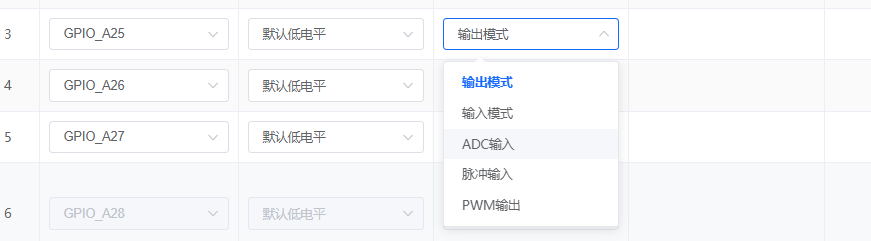

**注意事项：**

- GPIO引脚需先设置为输入模式，才能配置输入相关参数
- 输入模式和输出模式是互斥的，不能同时配置
- 配置完成后记得生成新固件并烧录

### 如何配置SU-32T模块通过串口指令触发语音播报？

**问题描述：**

需要配置SU-32T模块，使其在接收到特定串口指令后自动播报对应的语音内容。

**解决方案：**

通过配置平台添加串口触发行为：

1. **添加触发行为**
    - 在配置界面选择添加新的触发行为
    - 触发方式选择"串口输入"

2. **配置串口参数**
    - 选择串口：UART1_RX
    - 设置消息编号：1-255之间（自定义）
    - 配置参数：根据需要添加参数（可选）
    - 参数类型：unsigned char
    - 设置测试值：1

3. **确认配置**
    - 添加控制后确认配置详情
    - 配置完成后，当模块收到外部串口消息
    - 模块会自动播报对应的消息内容


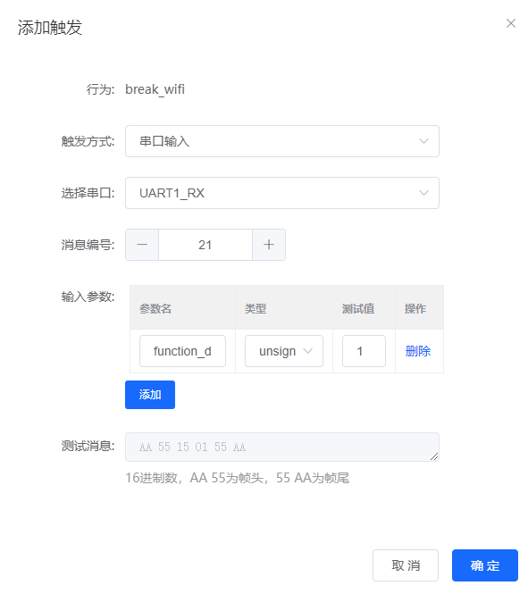

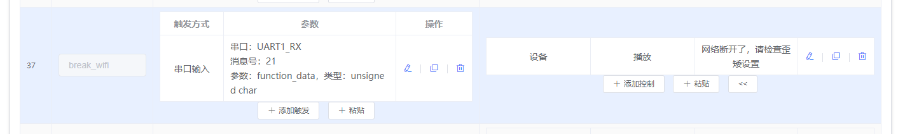

**注意事项：**

- 消息编号需要在1-255范围内
- 参数配置为可选项，根据实际需求决定是否添加
- 串口指令内容需要与外部发送端约定好
- 配置完成后需要重新生成并烧录固件

---


---

### 如何设置SU-32T不进入休眠状态

**问题描述：**

需要设置SU-32T设备使其不会因超时而自动进入休眠状态，实现上电后直接进入唤醒模式并持续保持唤醒状态。

**解决方案：**

通过配置"上电启动"事件触发和"禁止超时退出唤醒"操作，实现设备上电后自动进入唤醒模式并持续保持唤醒状态。

**1. 添加上电启动事件触发**

- 在命令词自定义页面，点击"+添加触发"
- 触发方式选择：**事件触发**
- 事件类型选择：**系统启动**
- 触发类型选择：**上电启动**
- 点击"确定"保存

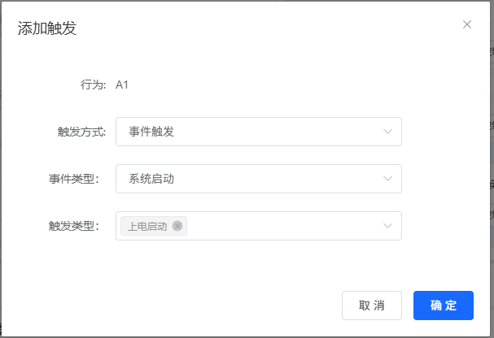

*配置上电启动事件触发界面*

**2. 添加"进入唤醒"控制**

- 在上电启动触发下，点击"+添加控制"
- 控制方式选择：**系统设置**
- 类别选择：**识别控制**
- 操作选择：**进入唤醒**
- 是否延时设置：**否**
- 点击"确定"保存

**3. 添加"禁止超时退出唤醒"控制**

- 继续点击"+添加控制"（或在上电启动触发下添加）
- 控制方式选择：**系统设置**
- 类别选择：**识别控制**
- 操作选择：**禁止超时退出唤醒**
- 是否延时设置：**否**
- 点击"确定"保存


*配置禁止超时退出唤醒界面*

**4. 完整配置效果**

配置完成后，事件规则列表应显示：

```
A1 | 事件触发 | 上电启动系统启动
    系统 | 进入唤醒
    系统 | 禁止超时退出唤醒
```

**应用场景：**

- 电梯轿厢语音控制：上电后直接识别楼层指令，无需唤醒词
- 设备面板控制：上电后即可响应语音指令
- 公共场所语音交互：无需用户说唤醒词，提升使用体验

**注意事项：**

- 禁止休眠会增加功耗
- 上电启动事件只在设备上电时触发一次
- 建议根据实际需求选择合适的休眠策略
- 如需恢复超时退出功能，删除"禁止超时退出唤醒"控制项即可

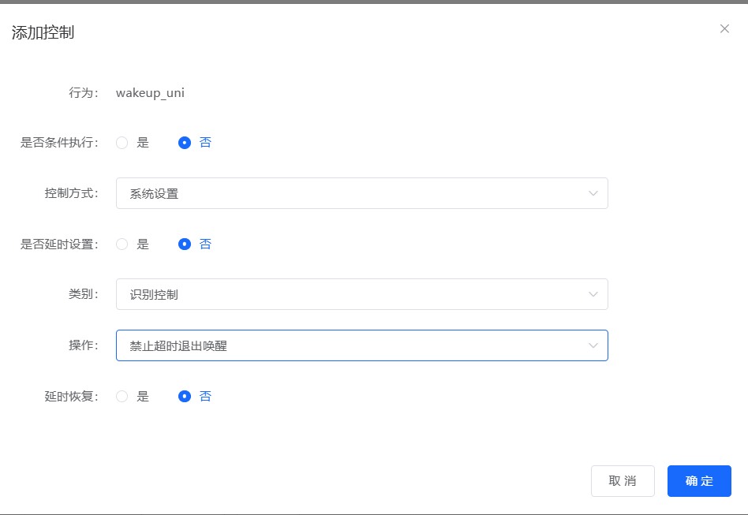


---

### 如何在不同型号间导入命令词

**问题描述：**

需要将一个项目（如SU-32T）中已配置的命令词导入到另一个项目（如CI-03T）中。

**解决方案：**

**1. 复制源项目命令词**

    - 在源项目的命令词编辑器中点击"命令词编辑"
    - 复制所有命令词文本内容
    - 命令词格式示例：`BB=启动一号舵机@一号舵机准备就绪`

**2. 粘贴到目标项目**

    - 进入目标项目的命令词自定义页面
    - 点击"命令词编辑"按钮
    - 将复制的命令词粘贴到编辑框中
    - 点击"确定"保存更改

**注意事项：**

- 确保命令词语法格式正确
- 导入的命令词总数不能超过模块限制（通常为10条）
- 不同型号可能支持的命令词数量不同
- 导入后建议测试确保命令词正常工作

---

### SU-32T是否支持时钟功能？精度如何？

**问题描述：**

需要了解SU-32T是否内置时钟，以及时钟精度是否满足按时间段控制继电器的需求。

**解决方案：**

**1. 时钟功能支持**

- **内置时钟**：SU-32T模块带有时钟电路
- **离线运行**：可独立计时，无需外部时间源
- **定时功能**：支持基于时间的控制逻辑

**2. 时钟精度说明**

- **精度限制**：无法实时获取网络时间
- **时间偏移**：长时间运行会产生累积误差
- **误差范围**：可能达到每年3-4分钟
- **影响因素**：温度、电压等环境因素

**3. 定时控制实现**

支持时间段控制功能：

- **时间判断**：可设置5:30-18:30等时间段
- **多路控制**：可控制多路继电器
    - 示例：白天运行两路继电器
    - 示例：夜间运行一路继电器
- **逻辑配置**：在平台上设置时间条件

**4. 精度优化建议**

- **定期校准**：定期重启或更新时间
- **温度补偿**：保持工作环境温度稳定
- **选型建议**：对精度要求高的应用建议测试验证

**注意事项：**

- 适合精度要求不高的定时应用
- 高精度需求建议外接RTC模块
- 建议购买样品进行实际测试
- 定时功能依赖模块内部时钟稳定运行

---

