# SU-63T 平台与固件 FAQ

本页用于整理 SU-63T 相关的平台与固件问题。

### SU-63T的蓝牙语音和微信小程序可以同时使用吗？

**问题描述：**

需要确认SU-63T设备是否可以同时支持蓝牙语音功能和微信小程序通过蓝牙进行通信。

**解决方案：**

**功能支持确认：**

- SU-63T支持蓝牙语音和微信小程序同时使用
- 两种功能通过蓝牙协议栈的不同层面实现，可以并行工作
- 设备可作为蓝牙音频设备同时支持语音和小程序通信

**使用场景：**

1. **蓝牙语音功能**：

    - 支持A2DP协议进行音频播放
    - 支持HFP协议进行免提通话
    - 可连接蓝牙音箱、耳机等音频设备

2. **微信小程序通信**：

    - 通过BLE（低功耗蓝牙）与微信小程序通信
    - 支持数据透传和设备控制
    - 可实现自定义功能扩展

**技术实现：**

- SU-63T采用蓝牙双模设计（BR+EDR+BLE 5.1）
- 经典蓝牙用于音频传输，BLE用于小程序通信
- 两个协议栈可同时独立工作

**注意事项：**

- 连接微信小程序时，确保手机蓝牙已开启
- 同时使用时可能增加功耗，建议在供电设计时预留余量
- 如遇连接问题，可分别尝试连接调试

---

### SU-63T小程序生成很慢或无法生成怎么办？

**问题描述：**

在配置页面点击生成小程序后长时间无响应，甚至几小时都无法完成生成，且多次刷新和重新生成均无效。

**解决方案：**

**1. 问题原因分析**

- **服务器负载**：可能遇到服务器维护或高负载情况
- **指令数量**：配置的命令词较多（如70条）会增加生成时间
- **网络问题**：网络连接不稳定可能导致生成中断

**2. 处理步骤**

- **刷新页面**：

    - 先尝试刷新浏览器页面
    - 查看生成进度是否有变化
    - 确认网络连接正常

- **重新生成**：

    - 使用"继承"功能重新生成
    - 删除原有配置后重新创建
    - 选择非高峰时段尝试生成

**3. 访问小程序**

- **小程序入口**：

    - 微信搜索"智能公元"小程序
    - 或通过B站教程了解具体操作步骤

**注意事项：**

- 正常情况下小程序生成只需几分钟
- 如长时间无响应，可能是服务器问题
- 建议联系技术支持确认服务器状态
- 可先使用测试版本验证功能

---

### 如何在固件中配置关闭蓝牙功能？

**问题描述：**

在智能公元平台配置SU-63T固件时，找不到关闭蓝牙的控制选项。

**解决方案：**

- **操作路径**：在"系统控制"配置中点击"添加控制"
- **选择功能**：在系统操作列表中选择"关闭蓝牙"
- **配置说明**：

    - 关闭蓝牙功能会影响与手机等设备的连接
    - 关闭后仍可使用离线语音识别功能
    - 建议在不需要蓝牙功能时关闭以节省功耗

- **配置文件**：可以通过导入JSON文件查看其他用户的配置示例
- **重新生成**：修改配置后需要重新生成并下载固件

**注意事项：**

- 蓝牙功能关闭后无法通过手机APP控制
- 语音识别功能不受蓝牙开关影响
- 可通过语音指令动态控制蓝牙开关

---

### 如何管理固件版本和中断SDK生成？

**问题描述：**

在固件发布过程中，SDK正在生成时无法暂停，需要了解版本管理方法。

**解决方案：**

**版本管理操作：**

- **继承版本**：点击"继承"创建当前版本的复刻版本
- **修改配置**：在复刻版本中可以进行修改
- **删除旧版**：确认新版本无误后，可删除正在发布的版本
- **操作时机**：只能在SDK生成完成前进行继承操作

**中断SDK生成：**

- **方法一**：创建继承版本后，当前版本可停止生成
- **方法二**：等待当前版本生成完成，再创建新版本修改
- **注意事项**：生成过程中的版本无法直接暂停

**建议流程：**

1. 在基础配置页面点击"继承"
2. 创建复刻版本用于修改
3. 在新版本中完成所有修改
4. 删除不需要的旧版本

**注意事项：**

- 继承功能在SDK生成期间也可使用
- SU-63T的SDK生成时间较长是正常现象
- 建议合理安排配置时间，避免频繁重新生成

---

### SU-63T的音量控制方式有哪些？

**问题描述：**

需要了解SU-63T模块的音量控制功能，是否可以通过语音直接指定音量数值，以及音量调整的步长。

**解决方案：**

**音量控制方式：**

- **档位调节**：仅支持"增大音量"/"减小音量"指令进行档位调节
- **数值指定**：不支持直接说"音量调到50"等具体数值
- **档位设置**：可在系统设置中配置音量档位数量（5-10档）

**音量档位配置：**

- **默认设置**：5档音量（默认）
- **可选档位**：6档、7档、8档、9档、10档
- **配置路径**：固件配置→系统设置→系统音量档位
- **步长说明**：每个档位的音量增量由系统自动分配

**使用建议：**

- 语音指令使用"音量增大"/"音量减小"进行调节
- 档位越多，音量调节越精细
- 可根据产品需求选择合适的档位数量

**注意事项：**

- 无法通过语音指定具体音量数值
- 音量档位需要在固件生成前设置
- 修改档位设置需要重新生成固件

---

### 如何配置蓝牙信号强度获取功能？

**问题描述：**

在配置获取蓝牙信号强度的操作时，变量未正确填写，导致无法存储获取到的信号强度值。

**解决方案：**

- **变量定义**：需要在操作配置中定义一个变量用于存储信号强度
- **变量名称**：自定义变量名（如"Strength"）
- **填写位置**：在"获取蓝牙信号强度"操作的"变量"字段填写定义的变量名
- **功能说明**：

    - 获取到的信号强度值会存储在指定变量中
    - 可通过串口读取该变量的值
    - 用于实时监测蓝牙信号质量

**配置步骤：**

1. 在系统控制中添加"获取蓝牙信号强度"操作
2. 在变量字段中填入自定义的变量名
3. 重新生成并烧录固件
4. 通过串口发送指令触发获取操作

**注意事项：**

- 必须先定义变量才能存储获取的数值
- 变量名不能使用中文或特殊字符
- 获取信号强度需要模块已连接蓝牙设备

---

### 固件生成时退出平台会影响生成吗？

**问题描述：**

在固件生成过程中，如果用户退出平台，是否会影响固件的正常生成。

**解决方案：**

- **后台生成**：固件生成在后台服务器进行，退出平台不影响生成进程
- **生成状态**：可通过版本管理页面查看生成进度
- **注意事项**：

    - 退出后无法停止正在进行的生成
    - 建议等待生成完成后再进行其他操作
    - 生成时间较长是SU-63T的正常现象

**操作建议：**

- 生成开始后可关闭浏览器，不影响生成
- 定期登录查看生成进度
- 生成完成后会收到通知或可在平台查看

---

### SU-63T的串口通信协议是什么？

**问题描述：**

需要了解如何通过串口发送特定数据包（AA 55 01 55 AA）给模块，执行相应的命令。

**解决方案：**

**通信协议格式：**

- **帧头**：AA 55（固定帧头）
- **命令字**：01（表示具体命令）
- **帧尾**：55 AA（固定帧尾）
- **数据内容**：根据具体命令而定

**常用命令示例：**

- AA 55 01 55 AA：触发命令1（如播放提示音）
- AA 55 07 55 AA：触发命令7（如播放语音）
- AA 55 81 55 AA：触发命令81（如调节音量）

**配置方法：**

- 在智能公元平台配置串口输入触发
- 设置触发方式为"串口：UART1_RX"
- 配置消息号与命令对应
- 生成固件后即可通过串口控制

**注意事项：**

- 串口波特率需要配置一致（默认9600）
- 命令字需根据实际配置确定
- 支持多条指令组合发送

---

### 蓝牙连接后语音功能异常怎么办？

**问题描述：**

在蓝牙连接后，设备的语音功能（如开机播报）失效，且无法正常执行语音指令，即使删除了关闭蓝牙的延时操作也未能解决。

**解决方案：**

**问题原因：**

- SU-63T不支持AEC（声学回声消除）打断功能
- 蓝牙音频播放时会占用音频处理资源
- 导致语音识别功能暂时失效

**解决方案：**

**1. 播报状态提示**

- 开机播报时提示"蓝牙已连接"
- 让用户了解当前状态
- 避免用户误解为模块故障

**2. 功能说明优化**

- 在产品说明中明确此限制
- 说明蓝牙播放时语音暂停是正常现象
- 提供解决方案指引

**3. 延时配置**

- 即使删除延时，现象仍可能存在
- 这是硬件架构限制，非配置问题

**注意事项：**

- 此现象为SU-63T的硬件特性
- 不影响单独使用语音识别功能
- 如需同时使用，考虑支持AEC的模块

---

### SU-63T蓝牙通话时模块持续重启怎么办？

**问题描述：**

SU-63T模块连接手机蓝牙后，在接听来电时会导致语音模块持续重启。

**解决方案：**

**问题分析：**

- SU-63T在蓝牙通话时可能出现固件兼容性问题
- 来电接听时的特殊工作状态可能导致模块重启
- 这是固件层面的已知问题，需要技术支持验证

**临时解决方案：**

1. **固件测试**：

    - 提供固件文件给技术支持进行测试验证
    - 确认是否存在导致重启的固件缺陷
    - 获取修复后的固件版本

2. **使用场景调整**：

    - 如对语音要求较高，建议更换其他型号模块
    - 可选择支持更好稳定性的模块型号
    - 避免在高要求通话场景使用

**长期建议：**

- 在产品设计初期进行充分的蓝牙通话测试
- 考虑使用稳定性更好的模块型号
- 评估是否必须使用蓝牙通话功能

**注意事项：**

- 此问题需要技术支持配合测试固件
- 其他模块型号可能不存在此问题
- 建议根据产品需求选择合适的模块

---

### SU-63T如何配置蓝牙连接事件监听功能？

**问题描述：**

需要配置SU-63T模块在蓝牙连接成功或超时未连接时触发相应的事件监听功能，以实现蓝牙状态的实时反馈。

**解决方案：**

**事件监听配置方法：**

1. **添加事件触发**

    - 在平台"添加触发"界面选择"事件触发"
    - 事件类型选择"蓝牙事件"
    - 可选择多种蓝牙相关事件

2. **支持的蓝牙事件类型**

    - **BLE连接连上**：BLE设备连接成功时触发
    - **BLE连接断开**：BLE设备断开连接时触发
    - **BLE鉴权通过**：BLE设备认证成功时触发
    - **BLE鉴权失败**：BLE设备认证失败时触发
    - **蓝牙连接连上**：经典蓝牙设备连接时触发
    - **蓝牙连接断开**：经典蓝牙设备断开时触发

3. **事件触发配置**

    - 设置触发后的动作（如语音播报、GPIO输出等）
    - 可配置多个响应动作组合
    - 支持条件判断和延时执行

**实际应用示例：**

```
事件1：BLE连接连上
- 触发动作：播放"蓝牙已连接"提示音
- GPIO输出：点亮连接指示灯

事件2：蓝牙连接断开
- 触发动作：播放"蓝牙已断开"提示音
- GPIO输出：熄灭连接指示灯

事件3：超时未连接（10秒）
- 触发动作：播放"请检查蓝牙连接"提示
- 串口输出：发送错误代码到主控
```

**BLE与经典蓝牙的区别：**

- **BLE（低功耗蓝牙）**：

    - 主要用于低功耗设备连接
    - 适合传感器、手环等设备
    - 连接快速，功耗低

- **经典蓝牙**：

    - 主要用于音频传输
    - 适合音箱、耳机等设备
    - 支持A2DP、HFP等音频协议

**注意事项：**

- 不同蓝牙事件可同时配置监听
- 事件触发响应时间取决于蓝牙协议栈处理速度
- 建议根据实际需求选择合适的事件类型
- 配置完成后需要重新生成并烧录固件

---

### SU-63T是否支持通过板载ESP32的WiFi功能进行OTA更新？

**问题描述：**

询问SU-63T是否支持通过产品板载的ESP32 WiFi功能进行固件OTA更新，以及小程序更新词条功能的具体使用方。

**解决方案：**

**OTA更新支持情况：**

- **当前不支持**：目前还没有通过板载ESP32的WiFi功能进行OTA更新的功能案例
- **出厂固件**：产品出厂时固件已烧录好，后续升级无法通过单片机程序直接更新词条
- **更新限制**：需要专业工具和重新烧录才能更新固件内容

**小程序更新词条说明：**

- **使用方身份**："用户自主定制语音指令和固件"中的"用户"指的是开发方（机芯智能）
- **非消费者功能**：消费者无法通过微信小程序自行定制语音指令
- **开发方操作**：词条更新和固件升级需要由开发方通过专业工具完成

**注意事项：**

- SU-63T目前不支持用户端的OTA更新功能
- 小程序功能主要用于设备控制，而非固件更新
- 如需更新词条或固件，请联系开发方或重新烧录固件


---### MACHINE INTELLIGENCE是哪个品牌？机芯智能是原厂吗？

**问题描述：**

询问产品上显示的"MACHINE INTELLIGENCE"品牌归属，以及机芯智能公司是原厂还是代理商。

**解决方案：**

**品牌归属确认：**

- "MACHINE INTELLIGENCE"是深圳市机芯智能有限公司的英文名称
- 对应的中文名称是"机芯智能"
- 该品牌属于机芯智能公司所有

**公司身份确认：**

- **原厂身份**：机芯智能是语音模块的原厂制造商
- **自主研发**：拥有自己的开发平台"智能公元"
- **直接生产**：不通过代理，直接生产和销售产品

**产品标识：**

- 模块上印有"机芯智能"的LOGO
- 同时标注英文名称"MACHINE INTELLIGENCE"
- 产品包装和文档均使用机芯智能品牌

**注意事项：**

- 购买时请认准"机芯智能"或"MACHINE INTELLIGENCE"品牌
- 机芯智能是原厂，提供技术支持和售后服务
- 通过官方渠道购买确保产品质量和售后保障

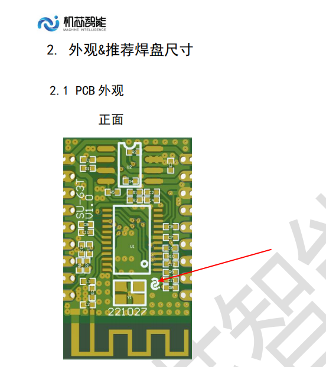

---### SU-63T小程序如何使用？

**问题描述：**

需要了解SU-63T小程序的下载方式、使用方法，以及是否每个板子都需要独立使用。

**解决方案：**

- **小程序下载**：

    - 在微信中搜索"智能公元"小程序
    - 直接使用微信小程序，无需单独下载APP

- **功能开启步骤**：

    1. 在智能公元平台的项目配置中
    2. 找到"小程序功能"选项
    3. 开启该功能才能使用

- **使用说明**：

    - 每个SU-63T模块需要独立配置
    - 通过蓝牙与小程序通信
    - 可实现语音控制、状态查看等功能

**注意事项：**

- 必须先在平台配置中开启小程序功能
- 确保模块蓝牙功能正常工作
- 小程序使用需要稳定的蓝牙连接

---### SU-63T使用SDK编译固件后MP3语音播报功能失效？

**问题描述：**

使用SU-63T SDK修改蓝牙名称后，编译生成的固件失去了MP3语音播报功能，而平台编译的固件正常。

**解决方案：**

**1. 问题分析**

- SDK编译不属于官方技术支持范围
- 平台仅提供固件生成，不提供SDK编译支持
- 修改源码可能影响其他功能模块

**2. 推荐方案**

- **使用平台功能**：通过智能公元平台修改蓝牙名称
- **定制开发**：联系云知声获取SDK编译技术支持
- **避免自行修改**：不建议在无技术支持的情况下修改源码

**3. 平台使用建议**

- 平台支持完整的固件配置功能
- 包括蓝牙名称、语音播报等所有功能
- 生成的固件经过完整测试，功能稳定

**注意事项：**

- SDK编译问题需要联系原厂（云知声）技术支持
- 自行修改源码可能导致功能异常
- 建议优先使用平台提供的标准功能

---### 如何查看已创建的小程序？

**问题描述：**

在配置设备自定义行为时，无法看到已创建的小程序，询问如何查看和使用该小程序。

**解决方案：**

**1. 小程序查看方法**

- 通过微信公众号访问：搜索"智能公元"
- 登录智能公元平台账号
- 进入个人中心或项目管理页面

**2. 小程序功能确认**

- SU-63T和WiFi模块都支持小程序功能
- 需要在平台配置中开启"小程序"选项
- 每个模块需要独立配置小程序功能

**3. 使用步骤**

1. 在智能公元平台创建并配置项目
2. 确认项目中的"小程序"功能已启用
3. 通过微信搜索并进入"智能公元"小程序
4. 使用蓝牙连接已配置的SU-63T模块
5. 在小程序中查看和控制设备功能

**注意事项：**

- 必须先在平台配置中开启小程序功能
- 每个设备模块需要独立配置
- 小程序功能需要稳定的蓝牙连接
- 确保手机蓝牙已开启并允许配对

---### SU-63T蓝牙数据回传功能问题

**问题描述：**

需要将SU-63T模块接收到的串口指令数据通过蓝牙回传给小程序，实现数据的双向通信功能。

**解决方案：**

**功能支持说明：**

1. **蓝牙通信限制**：

    - SU-63T支持蓝牙数据传输功能
    - 但平台暂未提供通用的蓝牙数据发送配置
    - 需要通过特定方式实现数据回传

2. **当前实现方式**：

    - 小程序发送指令给模块
    - 模块执行后可通过蓝牙返回特定信息
    - 但自由的数据透传功能尚未完全开放

**临时解决方案：**

1. **使用预定义的蓝牙回复**：

    - 在平台配置小程序相关的蓝牙回复功能
    - 通过命令词触发特定的蓝牙数据包
    - 将串口数据编码到预定义的回复格式中

2. **利用现有的蓝牙功能**：

    - 蓝牙音乐：可传输音频数据
    - 蓝牙控制：可传输控制指令
    - 状态上报：可上报设备状态信息

3. **数据封装策略**：

    - 将串口数据封装到标准蓝牙协议中
    - 使用特定的数据标识符区分不同类型的数据
    - 通过小程序端解析数据包

**开发建议：**

1. **小程序端开发**：

    - 实现蓝牙数据接收和解析
    - 建立与SU-63T的稳定连接
    - 处理数据包的解码和应用

2. **模块端配置**：

    - 配置串口输入触发相应的蓝牙发送
    - 设置数据转发或状态上报功能
    - 测试蓝牙通信的稳定性

**注意事项：**

- 蓝牙数据传输有速率和包大小限制
- 需要考虑蓝牙连接的稳定性和功耗
- 复杂的数据处理可能影响模块性能
- 建议使用简化的数据协议以提高效率

**技术支持：**

- 如需实现完整的数据透传功能
- 可联系技术支持评估定制开发方案
- 提供具体的数据格式和通信需求说明

### SU-63T是否支持ACE功能？

**问题描述：**

需要确认SU-63T芯片是否支持ACE（声学回声消除）功能，以及是否能够实现音乐播放打断。

**解决方案：**

**功能支持说明：**

1. **ACE功能支持**
    - SU-63T：不支持ACE功能
    - CI-03T：支持AEC功能（支持音乐打断）
    - 其他型号需要查看具体规格

2. **功能差异影响**
    - 不支持ACE的模块无法实现音乐播放打断
    - 播放音乐时无法通过语音指令暂停
    - 需要等待音乐播放完成后才能响应

3. **替代方案**
    - 使用支持AEC的模块（如CI-03T）
    - 通过物理按键实现控制
    - 使用其他触发方式（如GPIO触发）

**注意事项：**

- 选型时根据需求确认功能支持
- AEC功能是实现交互体验的重要特性
- 如需音乐打断功能，建议选择支持AEC的型号
- 不同芯片的功能支持存在差异

---### 固件生成时提示内存超限怎么办？

**问题描述：**

在生成固件时，开启语音导航功能后系统提示内存超限，导致固件无法正常生成，显示需要两个小时才能完成。

**解决方案：**

**问题原因分析：**

1. **语音导航功能占用较大内存**
    - 开启语音导航后需要加载额外的导航词库
    - 同时运行命令词识别和导航识别占用大量资源
    - 模块内存容量有限，超出限制无法生成固件

2. **功能配置冲突**
    - 20条命令词 + 3条串口输入 + 蓝牙音乐功能组合
    - 多个功能同时启用导致内存不足
    - 个性化音频功能进一步占用存储空间

**处理建议：**

1. **关闭语音导航功能**
    - 在配置界面找到"语音导航功能"开关
    - 将其关闭后重新生成固件
    - 这是解决内存超限的最直接方法

2. **优化功能配置**
    - 减少命令词数量（如从20条减少到10-15条）
    - 关闭不必要的串口输入通道
    - 暂时禁用蓝牙音乐功能进行测试

3. **分步验证功能**
    - 先生成基础功能固件进行测试
    - 确认核心功能正常后再逐步添加其他功能
    - 避免一次性启用所有高级功能

**注意事项：**

- SU-63T模块内存有限，不适合同时运行过多复杂功能
- 语音导航功能与其他功能组合使用时需注意内存限制
- 如必须使用语音导航，建议减少其他功能配置
- 固件生成时间过长通常是内存不足的信号

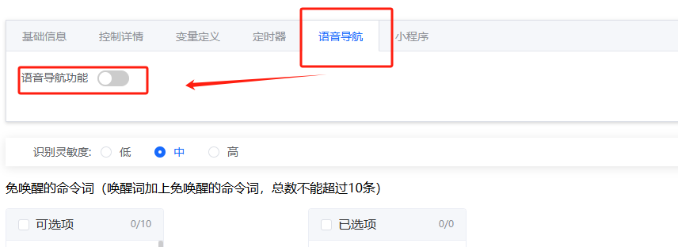

---### SU-63T支持自定义小程序修改命令词吗？费用如何计算？

**问题描述：**

希望了解是否可以通过自研小程序实现命令词修改功能，以及使用智能公元平台的费用模式、数据安全性和功能迭代情况。

**解决方案：**

**1. 命令词修改支持**

- SU-63T支持通过小程序进行命令词修改
- 自研小程序可以实现该功能
- 需要支付运营费用

**2. 费用模式**

- 按数量计算运营费用
- 以三年为周期进行收费
- 具体费用需根据实际使用数量确定

**3. 数据安全保障**

- 数据安全有保障
- 平台采用加密传输和存储
- 符合数据安全相关标准

**注意事项：**

- 自研小程序需要对接SU-63T的蓝牙协议
- 功能迭代升级需考虑兼容性
- 建议评估自研成本与使用智能公元平台的成本对比

---### SU-63T语音控制开关二次确认功能配置异常

**问题描述：**

在配置语音控制开关功能时，部分功能（如蓝牙音乐、雷达感应）的开启/关闭需要二次确认，而语音控制开关则不需要，导致开关逻辑不一致。

**解决方案：**

**问题原因分析：**

1. **确认方式配置不一致**
    - 语音控制开关：确认方式设置为"无二次确认"
    - 蓝牙音乐开关：确认方式设置为"有二次确认"
    - 雷达感应开关：确认方式设置为"有二次确认"

2. **固件逻辑配置问题**
    - 不同开关的确认方式在配置平台中独立设置
    - 需要统一各开关的确认逻辑
    - 配置差异导致用户体验不一致

**处理步骤：**

1. **检查配置设置**
    - 登录智能公元平台
    - 进入相应项目的开关配置界面
    - 查看每个开关的"确认方式"设置

2. **统一确认方式**
    - 将所有开关的确认方式设置为一致
    - 根据需求选择"有二次确认"或"无二次确认"
    - 保存配置并重新生成固件

3. **测试验证**
    - 烧录新固件到模块
    - 测试各开关功能是否正常
    - 确认确认逻辑是否统一

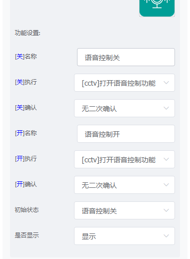


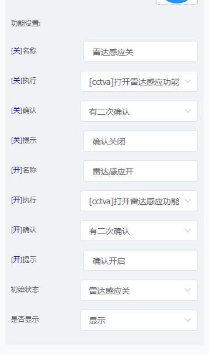

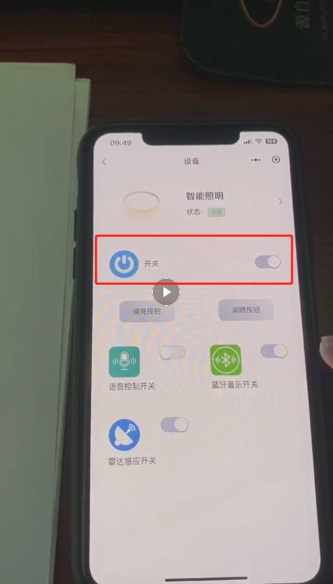

**注意事项：**

- 配置修改后需要重新生成固件并烧录
- 二次确认功能主要用于防止误操作
- 建议根据实际使用场景选择合适的确认方式
- 行为配置中的命令名称需要与开关功能对应

---### SU-63T的蓝牙连接密码可以由用户自行更改吗？

**问题描述：**

希望了解SU-63T模块的蓝牙连接密码是否支持用户自行修改，以及如何操作。

**解决方案：**

**1. 密码修改支持**

- **支持用户修改**：SU-63T的蓝牙连接密码可以由用户自行更改
- **修改位置**：在智能公元平台的配置和菜单中设置
- **操作流程**：需要先清空密码，然后重新设置

**2. 修改步骤**

1. **清空现有密码**
    - 在配置的控制选项中找到"清空密码"功能
    - 执行清空密码操作
    - 等待操作完成

2. **重新设置密码**
    - 进入菜单配置界面
    - 找到蓝牙密码设置选项
    - 输入新的蓝牙连接密码
    - 保存配置

3. **生成并烧录固件**
    - 保存所有配置更改
    - 生成新的固件文件
    - 烧录到SU-63T模块

**注意事项：**

- 密码清空和重置需要重新生成固件才能生效
- 建议记录新密码，避免遗忘
- 修改密码后需要重新配对蓝牙连接
- 确保新密码符合安全性要求（建议使用数字和字母组合）

---### SU-63T启用蓝牙音乐功能时无法修改命令词？

**问题描述：**

在启用蓝牙音乐功能时，无法通过小程序修改语音命令词，同时蓝牙信号强度获取功能也存在异常。

**解决方案：**

**1. 功能冲突分析**

- **内存限制问题**：蓝牙音乐功能占用大量内存资源
- **命令词修改限制**：启用蓝牙音乐后，SU-63T最多支持50条命令词
- **功能互斥性**：蓝牙音乐与小程序命令词修改功能因内存不足无法同时使用

**2. 蓝牙信号强度获取**

- **已解决**：蓝牙信号强度获取功能已修复
- **获取方式**：通过BLE连接获取信号强度
- **独立使用**：即使关闭蓝牙音乐，仍可获取信号强度

**3. 处理建议**

- **方案一**：关闭蓝牙音乐功能，保留命令词修改能力
    - 可支持300-500条命令词（不启用蓝牙音乐时）
    - 通过小程序正常修改命令词
    - 仍可获取蓝牙信号强度

- **方案二**：保留蓝牙音乐功能，接受命令词限制
    - 最多支持50条命令词
    - 无法通过小程序修改命令词
    - 适合音乐播放为主要需求的应用场景

**注意事项：**

- SU-63T的内存限制是硬件限制，无法通过外扩Flash解决
- 蓝牙音乐功能与命令词修改功能因内存冲突无法同时使用
- 如需同时支持大量命令词和音乐功能，建议选择其他内存更大的模块型号

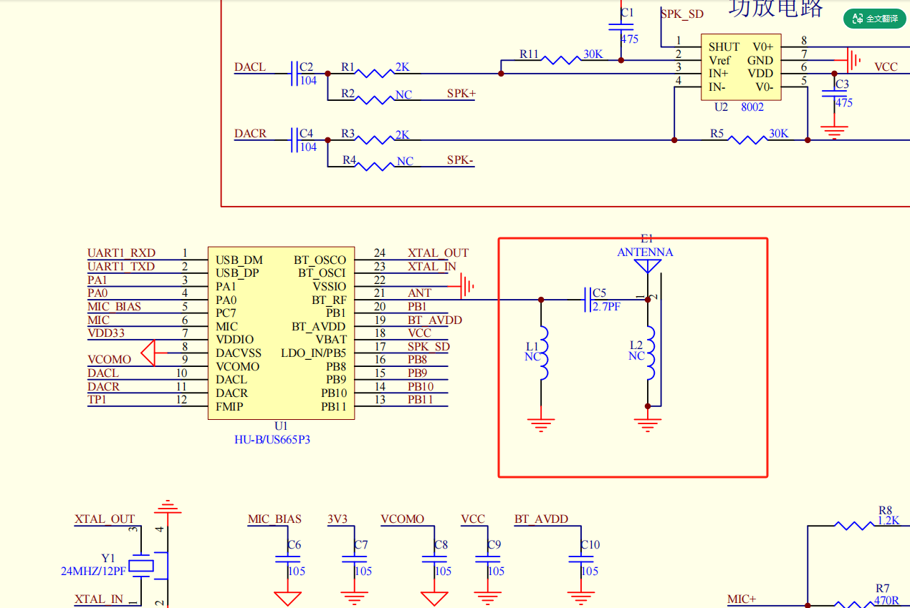

---### SU-63T如何生成并发布小程序正式版？

**问题描述：**

需要了解如何生成并发布小程序的正式版，以及发布前需要完成哪些准备工作。

**解决方案：**

**1. 发布前准备工作**

- **完善小程序基本信息**：

    - 补充小程序图标和名称
    - 完善小程序简介和分类
    - 确保所有必填信息已填写

- **同步配置信息**：

    - 确认小程序AppID已正确配置
    - 同步相关ID到平台
    - 验证配置信息的一致性

**2. 正式版发布流程**

- **提审准备**：

    - 完成所有功能测试
    - 确保小程序符合微信规范
    - 准备审核所需的资料

- **提交审核**：

    - 在微信开发者平台提交审核
    - 等待微信审核（需要时间）
    - 关注审核进度和结果

- **发布上线**：

    - 审核通过后发布正式版
    - 微信会通知正式版上线
    - 正式版发布后即可公开使用

**3. 费用说明**

- **无发布费用**：

    - 生成正式版无需支付费用
    - 微信小程序发布免费
    - 仅需支付可能的认证费用

**注意事项：**

- 小程序基本信息必须完整才能发布
- 微信审核需要时间，请耐心等待
- 确保小程序功能符合微信平台规范
- 正式版发布前建议充分测试

---### 小程序审核通过后无法添加设备怎么办？

**问题描述：**

小程序审核通过后仍无法添加设备，提示设备添加失败。经排查发现是由于设备配置中对接小程序的AppID填写错误导致。

**解决方案：**

**1. 问题排查**

- **检查AppID配置**：

    - 确认设备配置中的小程序AppID是否正确
    - AppID是小程序的唯一标识，必须完全匹配
    - 注意检查是否遗漏字符（如缺少'b'）

- **验证小程序状态**：

    - 确认小程序已通过审核并发布
    - 检查小程序是否处于正常运行状态
    - 确认小程序主体类型正确

**2. AppID格式要求**

- **标准格式**：AppID通常为'wx'开头+16位字符
- **完整长度**：共18位字符
- **示例**：wx113723a.......

**3. 修正步骤**

1. **登录智能公元平台**
2. **进入设备配置页面**
3. **修正AppID填写**
4. **保存配置并重新生成固件**
5. **重新烧录固件到设备**

**注意事项：**

- AppID区分大小写，必须完全准确
- 修改配置后需要重新生成和烧录固件
- 建议复制粘贴避免手动输入错误
- 确认使用的是小程序的AppID而非AppSecret

---### SU-63T小程序授权登录时提示'无账号'或'invalid code'怎么办？

**问题描述：**

在尝试通过微信小程序进行授权登录时，遇到"无账号"和"invalid code"等错误，无法完成登录授权。

**解决方案：**

**1. 问题排查步骤**

- **确认小程序主体类型**：

    - 微信小程序主体必须是企业类型
    - 个人主体小程序无法使用完整功能
    - 确认小程序已完成企业认证

- **验证AppID配置**：

    - 检查配置的小程序AppID是否正确
    - 确认AppID与小程序后台一致
    - 避免复制粘贴时的空格或错误

- **使用管理员账号扫码**：

    - 必须使用小程序管理员的微信扫码
    - 非管理员账号无法完成授权
    - 确保扫码账号有小程序管理权限

**2. 常见错误处理**

- **"无账号"错误**：

    - 确认使用的是管理员微信扫码
    - 检查小程序是否已发布
    - 确认小程序配置信息正确

- **"invalid code"错误**：

    - 重新扫码获取新的授权码
    - 检查授权码是否已过期
    - 确认网络连接正常

**3. 授权流程**

1. **管理员扫码**：

    - 使用小程序管理员微信扫描二维码
    - 确认登录授权请求
    - 等待授权完成

2. **重新授权**：

    - 如授权失败，重新生成二维码
    - 清除小程序缓存后重试
    - 确保使用正确的AppID

**注意事项：**

- 授权码有有效期，需要及时使用
- 确保小程序已通过审核并发布
- 体验版小程序功能可能受限
- 建议使用正式版进行测试

---### SU-63T如何发布自定义小程序？烧写固件后是否影响小程序识别？

**问题描述：**

需要发布已开发完成的微信小程序，并提供小程序ID和密钥完成配置对接。同时担心烧写固件后是否会影响小程序的识别功能。

**解决方案：**

**1. 小程序发布流程**

- **发布准备**：

    - 确保小程序已完成开发并测试通过
    - 准备好小程序的AppID和AppSecret
    - 完成小程序备案（如需）

- **发布方式**：

    - 提供小程序ID和密钥给技术支持
    - 由技术团队协助部署发布
    - 或参考官方文档自行发布

- **发布参考**：

    - 官方发布指南：https://help.aimachip.com/docs/mini_program/mini_program-1e9ca38dt6dg3

**2. 固件烧录与小程序识别**

- **固件烧录不影响小程序识别**：

    - 烧写固件不会影响小程序的识别功能
    - 小程序识别基于模块的蓝牙功能
    - 只要模块支持蓝牙通信，小程序即可正常工作

- **配置要求**：

    - 小程序需要使用智能公元平台配置
    - 平台生成的固件包含小程序功能
    - 确保固件中已开启小程序功能选项

**3. 自定义小程序开发**

- **支持自定义**：

    - 支持基于SU-63T开发自定义小程序
    - 需要对接模块的蓝牙协议
    - 可实现与原版小程序相同的功能

- **技术支持**：

    - 提供小程序开发文档
    - 可协助处理小程序发布问题
    - 提供蓝牙协议对接指导

**注意事项：**

- 发布小程序需要提供完整的小程序信息
- 固件烧录和小程序功能是独立的系统
- 建议使用智能公元平台生成包含小程序功能的固件
- 自定义小程序开发需要一定的技术基础

---### SU-63T语音模组与小程序状态不同步如何解决？

**问题描述：**

使用SU-63T模块时，通过小程序更新语音配置后出现命令错乱，且小程序控制状态与本地设备状态不一致。同时还出现未喊唤醒词也能执行命令的问题。

**解决方案：**

**1. 状态不同步问题解决**

**问题原因**：语音模组通过GPIO输出脉冲信号模拟按键操作，但小程序与模组之间缺乏状态同步机制。

**解决方法**：

- **方案一：串口通信同步**
    - 在主板和语音模块间建立串口通信
    - 通过串口互相了解设备状态
    - 主板负责记录和同步状态

- **方案二：复位电路设计**
    - 设计复位电路给语音模块
    - 通过复位操作恢复初始状态
    - 简化但会中断当前功能

**2. 免唤醒命令问题**

**问题原因**：在配置中设置了免唤醒的命令词，导致无需喊唤醒词即可直接执行命令。

**解决方法**：

- 检查小程序配置中的命令词设置
- 确认是否启用了"免唤醒"选项
- 根据需求关闭免唤醒功能

**硬件设计参考**：

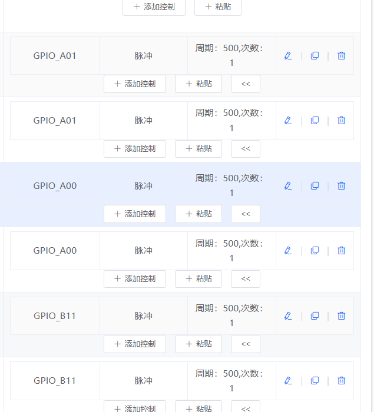

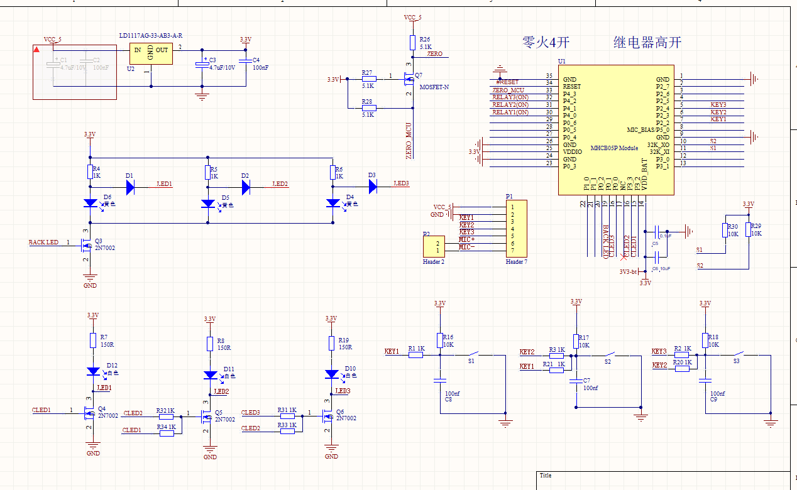

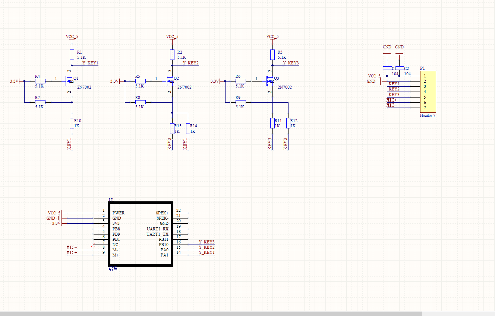

**注意事项：**

- 状态同步问题需要从硬件设计层面考虑
- 脉冲信号控制方式需配合状态管理机制
- 建议量产前充分测试状态同步逻辑
- 免唤醒功能适用于特定场景，请根据实际需求配置

---### SU-63T如何实现命令词随机发送功能？

**问题描述：**

需要实现从一个识别词对应的多个命令（如命令A、B、C）中随机选择一个发送的功能。

**解决方案：**

**1. 伪随机实现原理**

- SU-63T平台支持的是伪随机（有规律的随机）
- 通过变量和定时器实现顺序轮换效果
- 不是真正的随机函数，而是循环选择

**2. 变量定义步骤**

1. **添加变量**

    - 进入"变量定义"页面
    - 点击"+添加变量"按钮
    - 创建整型变量s01，初始值为0

2. **变量说明**

    - 变量名：s01（可自定义）
    - 变量类型：int（整型）
    - 初始值：0
    - 作用：存储当前选择的命令索引

**3. 触发配置步骤**

1. **开机触发设置**

    - 触发方式：选择"上电启动"
    - 控制动作：添加"启动定时器"
    - 定时器作用：周期性改变变量值

2. **定时器变量改变**

    - 设置定时器间隔（如1秒）
    - 控制动作：选择"变量改变"
    - 变量操作：s01 = (s01 + 1) % 3
    - 实现循环：0→1→2→0

**4. 命令词配置步骤**

1. **添加触发条件**

    - 选择对应的命令词
    - 添加触发条件："变量s01等于数值0"
    - 不同变量值对应不同命令

2. **配置发送动作**

    - 变量值=0：发送十六进制数据 7E FF 06 03 00 00 17 EF
    - 变量值=1：发送十六进制数据 7E FF 06 03 00 00 18 EF
    - 变量值=2：发送十六进制数据 7E FF 06 03 00 00 19 EF

**5. 完整配置流程**

```
第一步：添加变量s01（初始值0）
第二步：设置开机触发 → 启动定时器
第三步：定时器触发 → 变量s01自增（大于2归零）
第四步：命令词触发 → 检测s01值 → 发送对应数据
```

**6. 控制详情配置示例**

1. **你好小美命令配置**

    - 触发条件：变量s01等于数值0
    - 控制动作：禁止超时退出唤醒、启动定时器

2. **UART2_TX配置**

    - 触发条件：变量s01等于数值1
    - 控制动作：发送UART数据
    - 数据参数：98 A3 0B FE

**注意事项：**

- 这是顺序循环而非真随机
- 定时器间隔根据实际需求调整
- 变量名在所有配置中必须保持一致
- 每个变量值需要单独配置触发条件
- 建议先测试基础功能再组合使用

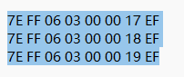

---### SU-63T小程序修改命令词顺序出错怎么办？

**问题描述：**

通过小程序修改命令词时出现顺序错乱，担心是否与不设置唤醒词有关。

**解决方案：**

**问题分析：**

1. **顺序出错原因**

    - 修改过程中数据传输中断导致
    - 网络不稳定影响同步
    - 操作超时导致部分更新

2. **唤醒词影响**

    - 不设置唤醒词不是出错原因
    - 只要设置正确就不会出问题
    - 关键是保持稳定的网络连接

**正确操作步骤：**

1. **网络环境准备**

    - 确保网络连接稳定
    - 避免在网络卡顿时操作
    - 使用有线网络替代WiFi

2. **操作注意事项**

    - 修改过程中保持小程序在前台
    - 不要切换到其他应用
    - 等待操作完成提示

3. **批量修改建议**

    - 少量多次修改，而非一次性大量修改
    - 每次修改后验证结果
    - 出错时重新同步

4. **设置优化**

    - 即使不使用唤醒词，也建议设置一个
    - 可以使用简单唤醒词降低误触发
    - 保持标准配置结构

**预防措施：**

- 修改前确保电量充足
- 避免在信号弱的环境中操作
- 保留配置备份便于恢复
- 如问题持续，尝试重新登录小程序

**注意事项：**

- 顺序出错通常是网络或操作问题
- 与是否设置唤醒词无直接关系
- 正确操作下小程序修改是可靠的
- 建议在网络良好时进行批量修改

---### SU-63T是否支持Mixly二次开发？

**问题描述：**

需要确认SU-63T模块是否支持Mixly图形化编程软件进行二次开发。

**解决方案：**

**Mixly支持确认：**

- **支持状态**：SU-63T支持Mixly图形化编程
- **开发方式**：可通过Mixly进行可视化编程开发
- **功能兼容**：支持SU-63T的主要功能配置

**使用说明：**

1. **Mixly连接配置**：

    - 在Mixly中选择SU-63T模块
    - 配置正确的串口参数
    - 设置账号和密码信息

2. **功能开发**：

    - 支持语音识别命令配置
    - 支持GPIO控制编程
    - 支持串口通信配置
    - 可实现基础的控制逻辑

3. **固件烧录**：

    - 通过Mixly生成固件
    - 直接烧录到SU-63T模块
    - 无需使用智能公元平台

**注意事项：**

- 使用Mixly需要了解基本的图形化编程概念
- 确保Mixly版本兼容SU-63T模块
- 复杂功能建议仍使用智能公元平台配置
- 遇到技术问题可查阅Mixly官方文档

---### SU-63T固件烧录后命令词不同步和缺少语音反馈怎么办？

**问题描述：**

固件烧录测试时发现两个问题：小程序显示的命令词数量与固件中实际修改的数量不一致，且烧录后没有语音播报反馈，无法确认烧录是否成功。

**解决方案：**

**1. 命令词数量不一致问题**

**原因分析：**

- 小程序平台显示的是缓存数据
- 固件中的命令词已经更新但平台未同步
- 需要刷新平台或重新加载固件配置

**解决方法：**

- 在平台中重新加载固件文件
- 刷新小程序页面查看最新数据
- 确认生成的固件包含正确的命令词数量

**2. 缺少语音播报反馈**

**问题说明：**

- 固件烧录成功后没有语音提示
- 无法通过声音确认烧录状态
- 影响测试效率和体验

**解决方案：**

**添加播报功能：**

- **上电播报**：配置开机欢迎词
- **唤醒成功播报**：唤醒词识别后提示
- **命令执行播报**：命令词识别后确认

**配置步骤：**

1. 在固件配置中添加播报设置
2. 录制或选择播报语音文件
3. 设置触发条件（上电/唤醒/命令）
4. 重新生成并烧录固件

**3. 测试验证流程**

**完整测试步骤：**

1. 烧录新固件到模块
2. 上电后确认是否播放欢迎词
3. 测试唤醒词是否有播报反馈
4. 验证命令词识别后的提示音
5. 检查串口输出是否正常

**4. 预防措施**

**开发建议：**

- 固件开发时预留播报接口
- 设置默认的提示音文件
- 支持播报内容的自定义配置

**调试技巧：**

- 使用串口监控模块状态
- 观察LED指示灯变化
- 录制整个测试过程便于分析

**注意事项：**

- 播报功能会增加固件大小
- 确保语音文件格式正确（如PCM/WAV）
- 播报内容要简洁清晰
- 测试时保持环境安静

---
### SU-63T如何通过ADC读取电量？

**问题描述：**

需要使用SU-63T的ADC功能读取电池电量信息，但不确定如何配置和实现。

**解决方案：**

**硬件连接：**

1. **电池分压电路**
    - 电池电压需要通过电阻分压到ADC量程
    - 典型分压比：10KΩ + 10KΩ（1:2分压）
    - 确保分压后电压不超过3.3V

2. **ADC引脚配置**
    - 在平台配置中启用ADC功能
    - 选择合适的GPIO引脚作为ADC输入
    - 配置采样率和精度

**平台配置步骤：**

1. **启用ADC功能**
    - 进入智能公元平台
    - 选择"外设配置"→"ADC"
    - 添加ADC通道并选择GPIO

2. **配置参数**
    - 采样位数：通常12位（0-4095）
    - 参考电压：3.3V
    - 采样频率：1Hz-10Hz（电量监测）

**软件实现：**

```c
// ADC读取示例
uint16_t adc_value = adc_read(channel);  // 读取ADC值
float voltage = (float)adc_value * 3.3f / 4095.0f;  // 转换为电压
float battery_voltage = voltage * 2.0f;  // 根据分压比计算
```

**电量计算：**

- 锂电池电压范围：3.0V-4.2V
- 电量百分比换算：

    - 4.2V = 100%
    - 3.7V = 50%
    - 3.0V = 0%

**应用场景：**

- 电池电量监测
- 低电量预警
- 充电状态检测
- 电源管理

**注意事项：**

- 分压电阻选择1%精度的金属膜电阻
- 在分压输出端加滤波电容（100nF）
- 定期校准确保精度

---
---### SU-63T小程序如何配置？

**问题描述：**

在智能公元AI产品代码平台中无法找到SU-63T小程序的配置入口，需要了解如何配置小程序功能以及对接小程序的含义。

**解决方案：**

**小程序配置入口位置**

- 登录智能公元AI产品代码平台
- 进入设备版本详情页面
- 在配置标签中找到"小程序"标签页
- 小程序配置入口位于该标签页下

**开关功能配置方法**

1. **进入功能设置**
    - 在设备内容设置页面配置功能开关
    - 设置名称、执行指令和确认指令

2. **配置开关状态**
    - 可以为开关配置多种状态（如"关"和"开"）
    - 每种状态对应不同的执行指令
    - 示例："[TurnOn]打开台灯|请开灯"

**对接小程序含义**

- 对接小程序是指配置微信小程序相关的参数
- 包括微信小程序appid和后台管理密码
- 如使用官方小程序，可保持默认配置

**使用官方小程序**

- 在微信中搜索"机芯智能公元"小程序
- 或扫描二维码进入
- 完成注册和授权后即可使用
- 无需额外配置，直接使用官方小程序进行设备配网和控制

**设备配网流程**

1. 打开手机蓝牙开关
2. 进入"机芯智能公元"小程序
3. 点击首页的"+"号添加设备
4. 选择网络并输入密码进行配网
5. 配网成功后进入设备控制界面

**注意事项：**

- 不需要修改对接小程序配置时可保持默认
- 使用官方小程序无需开发自定义小程序
- 确保设备固件版本支持小程序功能

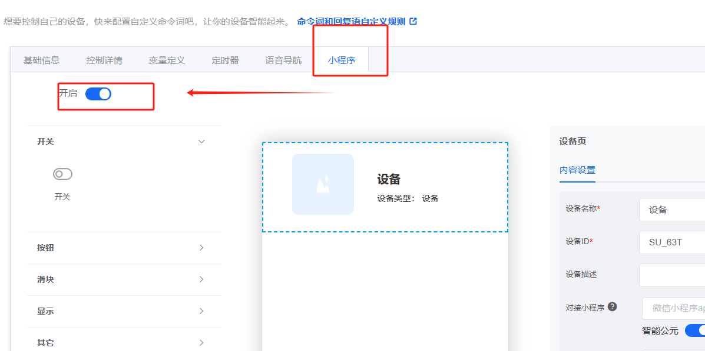

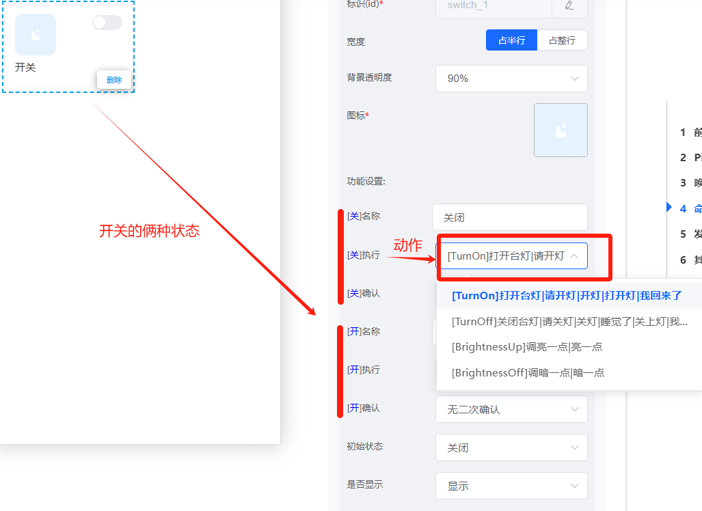

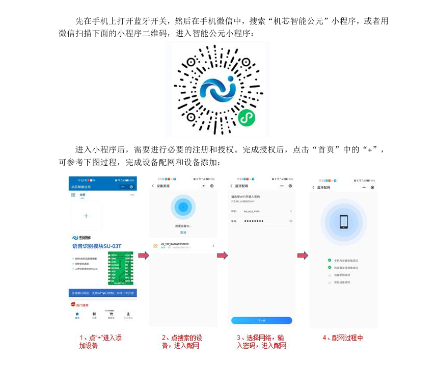

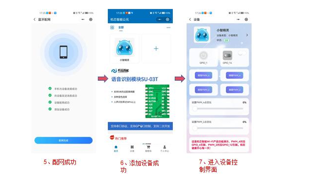

---
---### 蓝牙音乐功能是什么？

**问题描述：**

在配置SU-63T时看到"蓝牙音乐"选项，需要了解该功能的含义以及开启与关闭的区别。

**解决方案：**

**蓝牙音乐功能说明**

- 开启蓝牙音乐功能后，模块可以通过语音控制播放蓝牙音乐
- 支持连接手机等蓝牙设备进行音乐播放
- 可通过语音指令控制播放、暂停、切换歌曲等操作

**开启与关闭的区别**

**开启状态：**

- 模块具备蓝牙音乐播放功能
- 可通过语音指令控制蓝牙播放
- 支持语音打断播放功能
- 适合智能音箱、蓝牙音响等应用场景

**关闭状态：**

- 模块不具备蓝牙音乐功能
- 只能执行普通语音控制命令
- 不支持蓝牙音频播放
- 适合仅需要语音控制的应用场景

**使用示例**

- 可参考"CI-03T+SU-63T智能蓝牙音箱"的实现效果
- 支持语音控制播放、暂停、音量调节等功能
- 可实现唤醒词打断播放，立即响应新的语音命令

**注意事项：**

- 蓝牙音乐功能仅在特定型号（如SU-63T）上支持
- 开启该功能会占用额外的系统资源
- 根据产品需求选择是否开启此功能

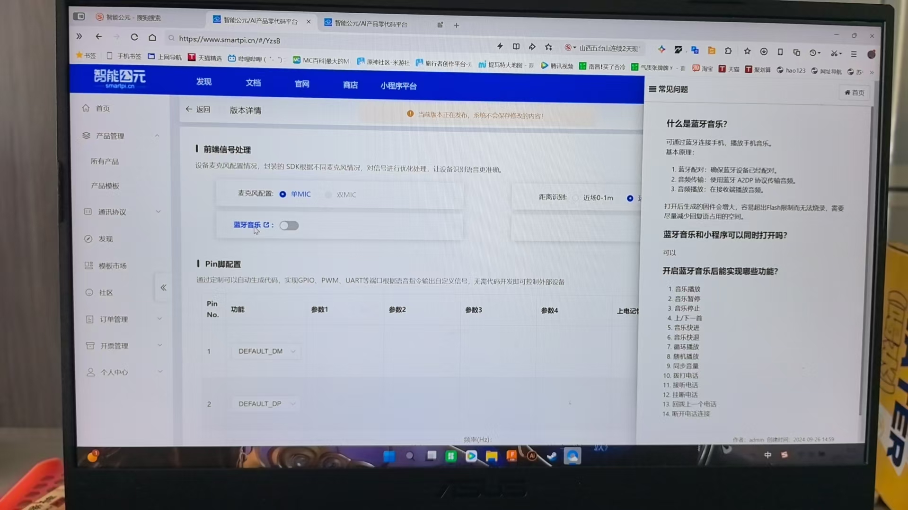

---
---### SU-63T模块是否支持手机小程序更改语音内容？

**问题描述：**

询问SU-63T模块是否支持通过手机小程序更改和更新6条语音内容的播放内容。

**解决方案：**

**功能支持说明：**

- SU-63T模块可以连接微信小程序
- 支持在线升级软件功能
- 通过小程序可以方便地管理和更新语音内容

**使用方法：**

1. **连接小程序**
    - 在微信中搜索对应的官方小程序
    - 按照指引完成设备绑定
    - 确保手机蓝牙已开启

2. **语音内容管理**
    - 在小程序中找到语音管理功能
    - 可以上传、编辑或删除语音内容
    - 支持6条语音的独立管理

3. **在线更新功能**
    - 通过小程序直接推送更新到模块
    - 无需重新烧录固件
    - 更新过程快速便捷

**注意事项：**

- 确保模块固件版本支持小程序连接
- 语音内容格式和大小需要符合模块要求
- 更新过程中保持设备供电稳定
- 建议在良好网络环境下进行在线更新

---
---### SU-63T蓝牙密码可以使用方自行修改吗？

**问题描述：**

SU-63T蓝牙模块连接后，希望使用方能够自行修改蓝牙连接密码，但找不到修改密码的设置选项。

**解决方案：**

**1. 密码修改方法**

SU-63T支持通过菜单功能修改蓝牙密码：

**操作步骤**：

1. **进入菜单设置**
    - 通过语音指令进入菜单模式
    - 选择系统设置或蓝牙设置选项

2. **选择密码修改功能**
    - 在菜单中找到"修改密码"选项
    - 或选择"清除密码"后重新设置

3. **设置新密码**
    - 输入新的蓝牙连接密码
    - 确认密码修改

**2. 平台配置方法**

**控制菜单配置**：

- 在智能公元平台添加菜单功能
- 设置菜单项包含"清除密码"、"设置密码"等选项
- 配置对应的动作和回复语

**密码管理功能**：

- **清除密码**：清除当前密码，恢复默认
- **设置密码**：设置新的连接密码
- **查询密码**：播报当前密码（慎用）

**3. 默认密码说明**

- **出厂默认**：通常为"1234"或"0000"
- **首次使用**：建议立即修改默认密码
- **密码格式**：通常为4位数字

**4. 注意事项**

- 密码修改后需要重新配对蓝牙
- 建议记录密码避免遗忘
- 密码设置后需要重新上电生效
- 部分版本可能需要清除配对信息

**5. 使用方使用建议**

- **简化密码**：设置简单易记的密码
- **定期更换**：提高安全性
- **避免重复**：不要使用连续或重复数字
- **妥善保管**：避免泄露密码信息

**故障排查**：

- 找不到菜单项：确认固件版本支持
- 密码无效：检查输入是否正确
- 无法连接：确认设备输入的是新密码

---

### SU-63T蓝牙授权数量可以在多个账号之间分配吗？

**问题描述：**

需要了解SU-63T的蓝牙授权数量是否可以在多个账号之间进行分配，以及是否可以在页面上自行调整授权数量的分配。

**解决方案：**

**授权分配规则：**

- 不同账号之间的蓝牙授权数量不能合并计算
- 同一账号下的授权数量可以在页面自行分配
- 第二阶梯授权套餐：1001-10000个登录用户数量，费用2500元

**分配方式：**

1. 登录平台账户
2. 在授权管理页面查看当前授权数量
3. 根据需要调整各应用/服务的授权分配

**注意事项：**

- 授权数量按账号独立计算，无法跨账号累加
- 建议根据实际使用情况合理规划各账号的授权数量
- 授权分配调整即时生效

---

### SU-63T模块变量断电后是否会保存？

**问题描述：**

在设置SU-63T模块时，通过语音命令将变量X设置为某个值（如3），需要了解模块断电后再上电时，变量X的值是保持为3还是恢复为默认的0。

**解决方案：**

**变量记忆功能配置**

SU-63T支持变量的断电保存功能：

- 在变量定义中开启"记忆"开关
- 开启后，模块断电重启会恢复变量到断电前状态
- 默认关闭时，断电后变量恢复为初始值

**配置方法**

1. **进入变量定义页面**
    - 在命令词自定义标签页找到变量定义
    - 添加或编辑需要记忆的变量

2. **开启记忆功能**
    - 找到"断电重启会恢复变量到断电前状态"开关
    - 开启该选项即可启用变量记忆

**应用场景示例**

- **设备状态记忆**：记住灯的亮度、模式等设置
- **用户偏好保存**：保存音量、语速等个性化设置
- **计数器保持**：保留使用次数、累计时间等数据

**注意事项：**

- 仅开启记忆的变量会保存，未开启的恢复默认值
- 记忆功能占用少量存储空间
- 建议只为必要的状态变量开启记忆
- 变量记忆功能需要固件支持

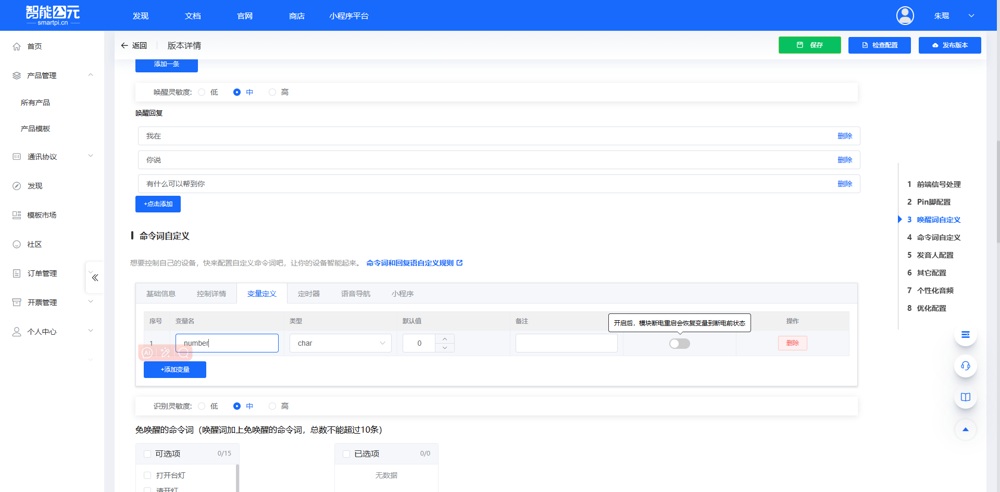

---

### SU-63T模块上电后无播报如何解决？

**问题描述：**

SU-63T模块配置了开机播报功能，但上电后没有播报开机提示音，而其他语音控制功能正常工作。

**解决方案：**

**问题排查步骤**

1. **确认配置是否正确**
    - 检查是否已选择"有开机播报"选项
    - 确认播报内容已正确设置
    - 验证其他跳转程序未干扰开机流程

2. **测试出厂固件**
    - 烧录官方出厂固件测试播报功能
    - 排除自定义固件的配置问题
    - 确认硬件播报功能正常

3. **硬件问题排查**
    - 检查喇叭连接是否正常
    - 确认音频输出电路无故障
    - 验证电源供电稳定

4. **固件工程检查**
    - 导出工程文件给技术支持分析
    - 检查是否有配置冲突
    - 确认播报触发条件设置正确

**可能原因分析**

- 播报配置被其他程序中断
- 音频输出硬件故障
- 固件生成时配置未正确写入
- 模块与现有硬件不匹配

**注意事项：**

- 其他语音功能正常说明模块基本工作正常
- 开机播报问题多数是配置或硬件输出问题
- 建议先用出厂固件排除硬件故障
- 提供完整工程文件便于技术支持分析

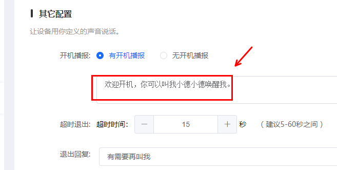

### SU-63T串口发送数据长度有限制怎么办？

**问题描述：**

SU-63T芯片的UART串口每次发送的数据长度不能超过16字节，导致无法正常发送21字节的RFID读写器控制指令。

**解决方案：**

**问题分析：**

- SU-63T串口发送限制为小于16字节
- 需要发送的RFID指令为21字节
- 后续固件升级会支持发送更长的串口数据

**解决方案：**

1. **分拆发送方案**

    - 将21字节指令拆分为两部分
    - 第一部分：16字节
    - 第二部分：5字节

2. **延时控制**

    - 在两部分之间设置1.5ms延时
    - 延时时间按115200波特率计算
    - 确保第一部分完全发送后再发送第二部分

**配置示例：**

- 第一组参数：设置16字节的数据内容
- 第二组参数：设置剩余5字节的数据内容
- 使用短指令格式：每个参数小于16字节

    

**实施步骤：**

1. 在平台配置中创建第一个串口输出指令（16字节）
2. 创建第二个串口输出指令（5字节）
3. 在两个指令间添加适当的延时
4. 生成固件并测试效果

**注意事项：**

- 理论上分拆方案可行，需要实际测试验证
- 延时时间可根据实际通信效果调整
- 等待固件升级后可支持更长的数据发送
- 测试时确保RFID设备能正确接收分拆的指令

---


---

### CI1302支持OTA升级吗？

**问题描述：**

需要了解CI1302芯片是否支持OTA（空中升级）功能，以便进行远程固件更新。

**解决方案：**

**1. OTA支持情况**

- **CI1302当前状态**：暂时不支持OTA升级
- **开发计划**：正在规划实现中
- **预计时间**：暂无具体发布时间表

**2. 支持OTA的型号**

目前支持OTA功能的芯片型号：

- **SU-63T**：已支持OTA升级
- **JX-12F**：已支持OTA升级
- **其他型号**：持续更新中

**3. 替代升级方案**

**串口升级**：

- 通过UART接口进行固件更新
- 需要物理连接设备
- 适合开发和维护阶段

**量产预烧录**：

- 在生产时直接烧录最新固件
- 适合没有升级需求的场景
- 降低产品复杂度

**本地烧录工具**：

- 使用命令行工具本地升级
- 需要Windows系统
- 适合小批量更新

**4. 升级方案对比**

| 升级方式 | 便利性 | 成本 | 适用场景 |
|---------|--------|------|---------|
| OTA升级 | 高 | 中 | 远程设备、难以接触 |
| 串口升级 | 中 | 低 | 开发调试、维护 |
| 预烧录 | 低 | 最低 | 量产、固定功能 |

**注意事项：**

- CI1302用户需关注官方OTA支持更新
- 如需OTA功能，可考虑使用SU-63T或JX-12F
- 串口升级是目前CI1302的主要升级方式
- OTA功能开发完成后会通过官方渠道通知

---


---

### SU-63T固件如何配置和刷入？

**问题描述：**

需要将特定固件程序刷入SU-63T设备，并配置开机播报音频、唤醒词和回复语等参数。

**解决方案：**

**1. 固件配置要求**

在刷入固件前，需要确认以下配置参数：

- 设备型号：SU-63T-V1.1
- 固件文件：智能250724.fw
- 开机播报：自定义音频文件
- 唤醒词：如"小特小特"
- 回复语：如"我在"

**2. 固件刷入流程**

- 准备对应的固件文件（.fw格式）
- 使用专用烧录工具和CH340串口烧录器
- 连接设备硬件接口
- 执行固件刷入操作

**3. 配置验证**

固件刷入完成后，需要进行以下验证：

- 设备开机是否播放预设音频
- 唤醒词响应是否正常
- 回复语是否按预期触发

**注意事项：**

- 固件文件需与设备型号完全匹配
- 刷入过程中确保供电稳定，避免断电
- 保留原固件备份，便于回滚
- 配置参数需在固件生成时设定，烧入后无法修改

---

