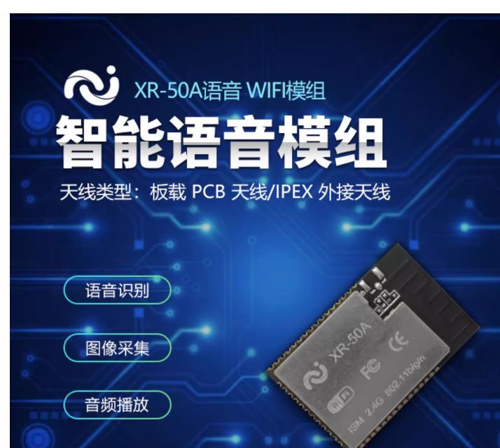
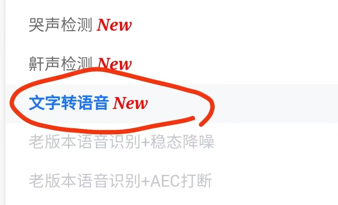

# XR-50A 平台与固件 FAQ

本页用于整理 XR-50A 相关的平台与固件问题。

### 文字转语音（TTS）功能支持

**问题描述：**

部分芯片模块支持文字转语音（TTS）功能，需要了解该功能的具体应用场景和实现方式。

**解决方案：**

- 支持TTS功能的模块（如XR-50A语音WIFI模组）可通过串口接收文本数据
- 模块内部会将文本信息转换为语音并播报
- 该功能在平台配置中以"文字转语音"选项提供，为新增功能
- 串口输入文本数据后，模块会自动转换并播放语音

**应用场景：**

- 语音提示和播报
- 实时文本转语音输出
- 智能家居语音反馈
- 设备状态语音提醒

**注意事项：**

- TTS功能目前主要在CI-03T系列芯片上提供支持
- 使用TTS功能需要通过串口输入文本数据
- 具体实现方式和工具可咨询技术团队获取
- 功能实现方式与ESP32的TTS类似

---

