# 平台与固件 FAQ

本页用于整理平台使用和固件相关的问题。

---

### 固件管理中的"继承"功能是什么？

**问题描述：**

在智能公元平台的固件管理界面，每个固件版本旁边都有"查看 | 继承 | 下载固件 | 删除"操作选项，需要了解"继承"功能的具体作用和使用场景。

**功能说明：**

"继承"功能相当于**复制当前固件配置创建一个新版本**，不是重新生成程序包，而是基于现有配置创建一个可编辑的副本。

**继承功能的作用：**

- **版本管理**：已发布的版本无法直接修改，需要通过继承创建新版本进行编辑
- **配置复用**：保留原有配置（唤醒词、命令词、回复语、GPIO配置等），在新版本基础上调整
- **快速迭代**：避免从头开始配置，提升开发效率

**使用场景：**

1. **修改已发布版本的配置**
   - 当前版本已发布，提示"继承为新版本才能保存修改的内容"
   - 点击"继承"创建新版本后进行修改

2. **固件生成失败需要重试**
   - 固件生成失败时，可继承原版本重新生成
   - 避免重新配置所有参数

3. **创建配置变体**
   - 基于同一配置创建多个相似版本
   - 用于对比测试或适配不同产品

**操作步骤：**

1. 在固件管理界面找到需要继承的固件版本
2. 点击该版本操作列中的"继承"按钮
3. 系统自动创建一个新版本，包含原版本的所有配置
4. 在新版本中进行修改
5. 保存并生成新的固件文件

**注意事项：**

- 继承只是复制配置，仍需要手动点击"生成"来编译固件
- 继承操作不会影响原版本，原版本仍然可以下载使用
- 建议在测试版本验证功能后再发布正式版本

---

### 如何配置延时控制功能避免自动退出？


**问题描述：**

在使用延时控制功能时，即使关闭了超时设置，系统仍会自动退出，无法实现预期的延时控制功能。

**解决方案：**

- **启用延时设置**：在平台配置中勾选"是否延时设置"
- **设置延时时长**：根据需要配置延时时长（如500ms或1000ms）
- **选择操作类型**：选择"禁止超时退出唤醒"操作

**配置示例：**

1. **错误配置**（会自动退出）：

    - 是否延时设置：启用
    - 延时时长：500ms
    - 操作：进入唤醒

2. **正确配置**（正常工作）：

    - 是否延时设置：启用
    - 延时时长：1000ms
    - 操作：禁止超时退出唤醒

**注意事项：**

- 延时功能必须与"禁止超时退出唤醒"操作配合使用
- 延时时长可根据实际需求调整
- 该功能适用于需要保持唤醒状态的应用场景

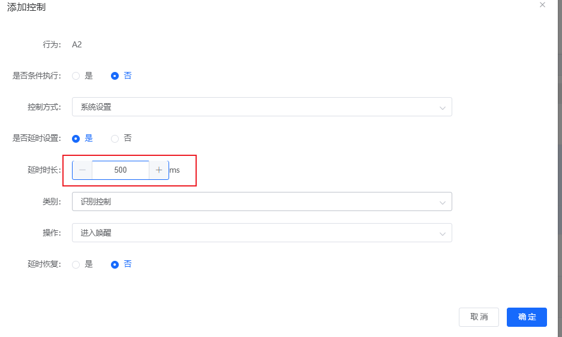


---

### 免唤醒模式下设备自动退出怎么办？

**问题描述：**

设备上电后可以免唤醒工作，但运行一段时间后语音模块播报"我先退下了"等退出提示，之后必须使用唤醒词才能再次触发命令。

**解决方案：**

**1. 删除退出命令**

在智能公元平台配置中：

- 找到触发器配置中的"退出命令"或"自动退出唤醒"相关设置
- 删除或禁用退出命令词条（如"退下"、"再见"、"不用了"等）
- 确认没有配置自动退出唤醒的超时触发

**2. 添加延时控制**

对于IO口输出控制：

- 在控制输出前添加延时设置（建议300ms左右）
- 延时可以避免输出控制与退出命令冲突

**3. 使用完整固件**

- SDK编译生成的bin文件可能不包含完整功能
- 需要从平台下载完整的固件文件（release_flash_all.bin）
- 确保固件包含所有必要功能模块

**配置要点：**

- 上电启动触发：进入唤醒状态
- 禁止超时退出唤醒：防止自动退出
- 必要时删除退出词条

**注意事项：**

- 免唤醒模式功耗会相对较高
- 如需保持长期唤醒状态，建议配置"禁止超时退出唤醒"
- 检查是否有命令词的回复语包含退出相关内容


---

### VAD 功能从哪里开启？

**问题描述：**

在使用语音模块时，询问 VAD（语音活动检测）功能在哪里开启，如何配置。

**解决方案：**

**VAD 无需单独开启**

- VAD（语音活动检测）是离线语音芯片的内置功能，默认自动运行
- 不需要在平台配置中单独"开启"或配置 VAD
- 系统会自动检测环境声音并判断是否为有效语音输入

**VAD 工作原理：**

1. **分贝检测机制**
    - 系统持续检测环境声音分贝
    - 任何达到人类语音分贝的声音都会被检测到
    - 检测到声音后自动进行语音识别

2. **识别结果处理**
    - 如果声音能匹配到命令词，识别为对应命令
    - 如果声音无法匹配任何命令词，识别为"不匹配"

**注意事项：**

- VAD 是基于分贝的检测，并非语义理解
- 环境噪声可能触发 VAD，导致频繁的"不匹配"识别
- 不建议为"不匹配"情况添加语音反馈，这会导致非常频繁的误触发
- 如需优化识别效果，可以调整命令词阈值或进行语音调优


### 声源定位角度数据如何通过串口输出？

**问题描述：**

声源定位功能已能正常识别并播报角度，但无法通过串口输出声源角度数据，导致无法将角度信息发送给单片机进行处理。

**解决方案：**

**1. 串口配置确认**

- **引脚配置**：UART1_TX应设置为A2/A3（非B2/B3）
- **硬件连接**：检查串口线是否连接到正确的引脚
- **波特率**：默认9600，可根据需要调整

**2. 变量参数设置**

- **正确变量**：使用'{chucun}'或'{pd}'获取角度值
- **操作配置**：选择"发送16进制数"
- **数据格式**：确保参数使用变量而非固定值

**3. 执行顺序说明**

- 多个操作按延时时长顺序执行
- 延时短的先执行，延时长的后执行
- 相同时延时的操作并行执行

**注意事项：**

- 串口无输出时先检查硬件连接
- 确认使用的变量名与系统匹配
- 角度数据可通过串口调试工具验证
- **接线错误会导致串口输出乱码**：如果串口输出为乱码，通常是TX/RX引脚接反或接错位置导致

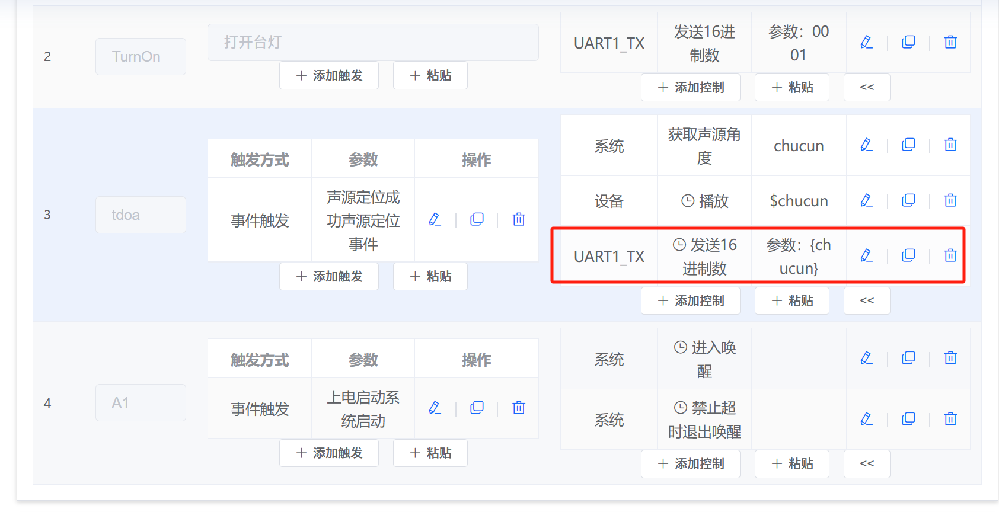
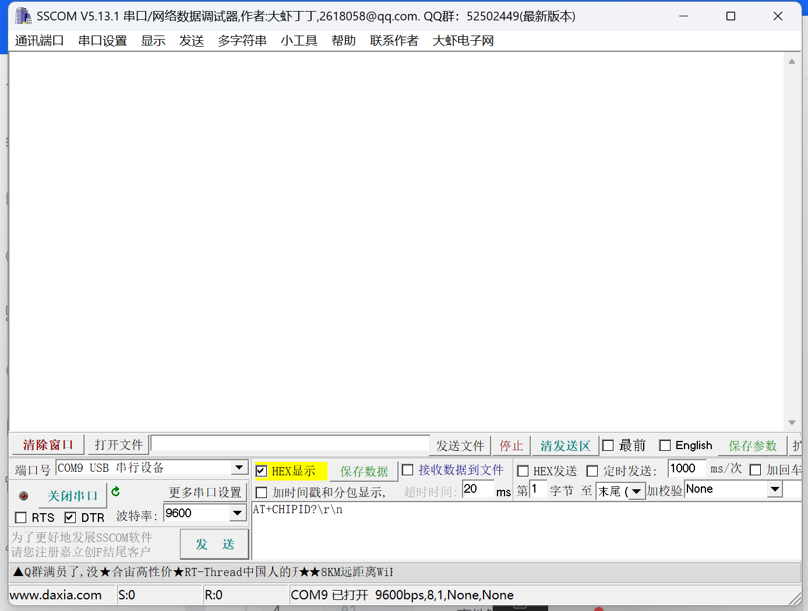
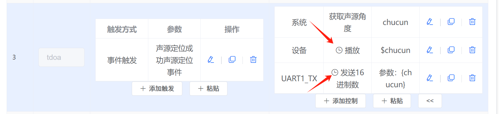

---

### TTS 固件是否兼容语音识别功能？

**问题描述：**

需要了解 TTS 固件是否能与语音识别固件兼容，实现同时支持语音识别和文字转语音功能。

**解决方案：**

TTS 固件与语音识别固件的关系说明：

**功能兼容性：**

- TTS 固件可以兼容语音识别功能，但需要在平台上进行相应配置
- 更新 TTS 固件后仍能识别语音并支持 AEC 打断功能

**接口说明：**

- TTS 固件只有一个串口接口用于输入
- 文本需要转换为 GB2312 格式后输出给模块播放
- 如需播报自定义文字，需要在主控编写文本转化程序

**使用方式：**

1. **平台配置**
    - 在平台上配置 TTS 和语音识别功能
    - 两者可以在同一固件中协同工作

2. **文本转换**
    - 将需要播报的文本转换为 GB2312 格式
    - 通过串口发送给模块

**注意事项：**

- TTS 固件和纯语音识别固件是不同的固件版本
- 需要根据实际需求选择合适的固件类型
- 自定义文本播报需要额外的程序开发

---

### 如何获取 CI 系列芯片的出厂固件？

**问题描述：**

需要获取 CI 系列芯片的出厂固件进行恢复或参考。

**解决方案：**

**获取渠道：**

1. **联系技术支持**
    - 通过官方技术支持渠道申请
    - 提供具体型号和需求说明
    - 可能需要提供购买凭证

2. **官方平台下载**
    - 登录智能公元平台
    - 在产品页面查找固件下载
    - 选择对应的芯片型号

3. **开发资料包**
    - 部分型号的开发资料包包含出厂固件
    - 可从官方文档平台下载
    - 需要注册开发者账号

**注意事项：**

- 出厂固件通常仅包含基础功能
- 如需特定功能需要自行配置生成
- 建议备份原始固件后再进行修改
- 部分特殊固件可能需要授权

---

### 为什么自定义的命令词无法被识别？

**问题描述：**

在使用离线语音识别芯片时，发现自定义的命令词无法被正确识别。

**解决方案：**

**常见原因：**

1. **命令词格式问题**
    - 命令词中间包含空格
    - 特殊字符或标点符号
    - 命令词过长或过短

2. **配置错误**
    - 命令词未正确录入
    - 拼音错误或不准确
    - 命令词重复或冲突

**解决步骤：**

1. 检查命令词列表，确认格式正确
2. 删除多余的空格或特殊字符
3. 重新录制或输入命令词
4. 测试识别效果

**注意事项：**

- 命令词应使用简洁的中文表达
- 避免使用同音字或容易混淆的词
- 建议每个命令词录制2-3次提高成功率

---

### 能否通过串口动态新增命令词？

**问题描述：**

希望不使用学习模式，而是通过串口直接告诉语音模块新增命令词（如"打开窗帘"）。

**解决方案：**

**不支持通过串口动态新增命令词。**

**命令词配置方式说明：**

1. **预配置方式**
    - 命令词必须提前在智能公元平台配置好
    - 所有命令词需要生成固件时一并写入
    - 运行时无法动态添加新的命令词

2. **自学习功能**
    - 部分型号支持自学习功能（如CI-33T）
    - 通过语音交互方式学习新命令词
    - 不支持通过串口指令添加

3. **串口的作用**
    - 串口可用于触发已配置的命令词行为
    - 串口可用于发送识别结果给外部设备
    - 串口输入可用于触发播放指定语音

**替代方案：**

1. **预置多条命令词**
    - 在开发阶段将所有可能的命令词预配置
    - 通过启用/禁用特定命令词实现功能切换
    - 适用于命令词数量有限且可预知的场景

2. **使用串口输入触发**
    - 配置串口输入触发对应的行为
    - 通过串口发送指定数据触发功能
    - 无需语音识别即可执行

3. **选择支持自学习的型号**
    - CI-33T等型号支持用户自学习
    - 用户可通过语音交互添加新命令词
    - 适合需要灵活配置的场景

**注意事项：**

- 不同型号对命令词数量限制不同
- 自学习功能会占用RAM资源，有数量限制
- 预配置方案适用于量产设备，稳定性更高

---

### 如何将命令词从一个工程复制到另一个工程？

**问题描述：**

需要将一个工程（如 CI-03T）中已配置的命令词和回复语迁移到另一个工程（如 CI-33T）中。

**解决方案：**

**1. 通过命令词编辑功能复制**

在智能公元平台的版本详情页面：

    - 进入源工程的"命令词自定义"页面
    - 点击"命令词编辑"按钮，打开命令词批量编辑界面
    - 界面中显示所有命令词和回复语的配置内容
    - 全选并复制编辑框中的所有内容
    - 进入目标工程的"命令词自定义"页面
    - 点击"命令词编辑"按钮
    - 将复制的内容粘贴到编辑框中
    - 点击"确定"保存

**命令词语法格式：**

```
语法格式: action=命令词1|命令词2...@回复语1|回复语2
```

示例：
```
A1=打开窗帘@好的，正在为您打开窗帘
A2=关闭窗帘@好的，正在为您关闭窗帘
```

**重要限制：**

- **仅复制命令词和回复语**：此方法只迁移命令词词条和对应的回复语内容
- **不包含控制配置**：串口输出、GPIO控制、延时动作等控制行为**不会**被复制
- **需重新配置控制**：在目标工程中需要为每个命令词重新配置控制行为

**配置建议：**

1. 先复制命令词和回复语
2. 逐个命令词添加控制行为
3. 建议使用"复制选中行"功能快速添加类似的命令词
4. 配置完成后进行功能测试

---

### 语音模块能否输出 mic 原始音频数据？

**问题描述：**

希望主控 MCU 能够获取语音模块麦克风采集的原始音频数据，用于本地处理或其他用途。

**解决方案：**

**语音模块不支持直接输出 mic 原始音频数据。**

**数据输出方式说明：**

1. **串口输出识别结果**
    - 模块识别到语音指令后，通过串口发送 16 进制数据给主控
    - 输出的是识别结果（命令词 ID 或自定义数据），非音频数据
    - 这是大部分客户采用的通信方式

2. **音频数据无法获取**
    - 模块内部处理音频后不对外输出原始 PCM 或其他格式数据
    - 无法通过串口或其他接口获取 mic 采集的音频流

3. **使用串口触发的前提**
    - 语音内容需要提前录制好并烧录到模块
    - 串口输入只能触发已配置的命令词或播放已录制的语音
    - 无法通过串口实现动态的语音合成（除非使用 TTS 固件）

**替代方案：**

1. **独立音频采集**
    - 如需获取原始音频数据，需使用独立的音频采集模块
    - 将音频数据传输给主控进行处理
    - 语音模块仅负责语音识别功能

2. **TTS 固件方案**
    - 部分型号支持 TTS（文本转语音）固件
    - 可通过串口发送文本，模块转换成语音播放
    - 适用于需要动态语音内容的场景

**注意事项：**

- 串口通信需确保波特率、数据位等参数配置正确
- 串口数据格式通常为 16 进制，需在平台配置时定义
- 参考官方串口教程进行配置：[CI-03T串口教程](https://www.bilibili.com/video/BV1hG3TzmETq/)、[51单片机配合语音模块教程](https://www.bilibili.com/video/BV13h4y1571P/)

---

### 固件生成过程耗时过长怎么办？

**问题描述：**

平台生成固件过程非常缓慢，已持续近一个小时仍未完成。

**解决方案：**

- 这是正常现象，复杂配置的固件生成确实需要较长时间
- 可以尝试简化配置（如减少词条数量、禁用复杂功能）
- 检查网络连接是否稳定
- 尝试更换浏览器或清理浏览器缓存
- 生成时间与服务器负载相关，可尝试在任务较少的时段（如清晨）生成

**注意事项：**

- 生成时间过长不是系统故障，耐心等待即可
- 简化配置可以缩短生成时间
- 如长时间无响应，可尝试重新生成

---

### 配置检查通过但仍无法生成固件怎么办？

**问题描述：**

在固件生成流程中，配置检查已通过，但固件仍然生成失败，提示"生成失败，可能是配置原因"。

**解决方案：**

**立即处理：**

1. **多次尝试生成**
    - 有时是服务器临时问题
    - 多点击几次生成按钮尝试
    - 清除浏览器缓存后重试

2. **简化配置测试**
    - 删除部分功能配置
    - 减少命令词数量
    - 使用最简配置验证

3. **检查隐藏问题**
    - 自学习功能留空未填
    - 重复命令词过多
    - 语音包过大

**深入排查：**

如果多次生成仍失败：

1. **导出配置文件**
    - 保存当前工程配置
    - 提交给专业技术支持分析
    - 说明具体的错误信息

2. **创建新工程测试**
    - 新建一个简单工程
    - 逐步添加原有配置
    - 定位具体问题配置项

**注意事项：**

- 配置检查通过不代表一定能生成成功
- 服务器负载高时可能导致生成失败
- 保留错误截图便于问题定位
- 必要时联系专业技术支持获取帮助

**补充：常见原因与处理流程**

**可能原因：**

1. **配置内容问题**
    - 配置中存在空的唤醒词记录
    - 存在空的行为记录
    - 存在空的命令词
    - 命令词和回复语不满足输入格式要求
    - 一些特殊词没有录入

2. **资源限制问题**
    - 内存空间用超
    - 命令词数量过多
    - 语音包过大

3. **浏览器兼容性问题**
    - 使用了非推荐的浏览器
    - 浏览器版本过旧
    - 缓存数据冲突

4. **配置文件问题**
    - JSON配置文件格式错误
    - 配置项存在冲突
    - 超出配置限制

5. **网络连接问题**
    - 网络不稳定
    - 服务器临时繁忙
    - 防火墙拦截

**解决方法：**

1. **更换浏览器**
    - 使用谷歌浏览器访问平台
    - 更新浏览器到最新版本
    - 清除浏览器缓存

2. **重新导入配置**
    - 退回到上一界面
    - 点击"导出"备份当前配置
    - 重新导入配置文件
    - 再次尝试生成固件

3. **简化配置测试**
    - 先使用简单配置测试生成
    - 逐步添加复杂配置项
    - 定位具体的配置问题


---

### 固件生成中优化版和快速生成版有什么区别？

**问题描述：**

在自学习固件生成流程中，存在"优化版"和"快速发布版"两个选项，需要了解两者的区别以及对功能或性能的影响。

**解决方案：**

根据平台界面提示说明：

- **快速发布版**：可快速生成SDK，但语音识别效果会差一些
- **优化版**：生成时间较长，但语音识别效果更好

**功能影响：**

两个版本在功能支持上没有差别，主要体现在：

- **识别效果**：优化版的语音识别准确率更高
- **生成速度**：快速发布版生成速度更快
- **适用场景**：

    - 快速发布版：适合开发测试阶段快速验证
    - 优化版：适合产品发布阶段使用

**注意事项：**

- 在自学习固件上，两个版本的功能基本相同
- 最终产品发布建议使用优化版以获得更好的用户体验
- 开发阶段可使用快速发布版提高效率

---

### 优化版生成失败但快速发布版可以成功怎么办？

**问题描述：**

在固件生成时，使用"优化版"提示"生成失败，可能是配置原因"，但切换到"快速发布版"后可以成功生成。

**解决方案：**

**临时处理：**

1. **使用快速发布版验证配置**
    - 先使用快速发布版确认配置逻辑正确
    - 验证功能是否符合预期
    - 快速发布版生成速度更快，便于调试

2. **排查优化版失败原因**
    - 检查是否添加了新的命令词后出现问题
    - 简化配置后尝试生成优化版
    - 逐步添加功能定位问题配置项

3. **使用Pro模型版本**
    - 平台建议使用带"Pro"后缀的版本
    - Pro版本通常兼容性更好
    - 可获得更稳定的生成结果

**技术说明：**

- 优化版进行更深入的模型训练和优化，对配置更敏感
- 快速发布版使用更简化的编译流程，兼容性更好
- 两者在功能上完全一致，仅识别效果有差异

**建议：**

- 开发调试阶段：使用快速发布版提高效率
- 问题排查：快速发布版成功则说明配置逻辑正确
- 产品发布：如优化版持续失败，可联系技术支持分析具体原因


### CI系列Pro模型有快速发布和稳定版的区别吗？

**问题描述：**

在使用CI系列Pro模型时，发现没有"快速发布"和"稳定版"的选项，想知道Pro模型是否也有版本区别。

**解决方案：**

**Pro模型版本说明：**

1. **CI系列Pro模型特点**
    - CI系列Pro模型没有快速发布和稳定版之分
    - Pro模型都是统一的速度，无需选择发布模式
    - 识别效果经过优化，性能稳定

2. **老模型vs新模型**
    - **老模型**（如"安静环境"）：有快速版和稳定版选项
    - **新Pro模型**：无此选项，直接使用优化后的版本

3. **切换模型的注意事项**
    - 从老模型切换到新Pro模型后，需要重新生成固件
    - 如果切换后无法唤醒，请检查配置是否完整
    - 芯片本身没有新旧之分，模型是算法层面的区别

**故障排查：**

如果切换到Pro模型后无法唤醒：

1. 检查配置参数是否正确（唤醒词、命令词等）
2. 尝试烧录一个简单的新版本固件测试
3. 对比老模型和新模型的配置差异
4. 确认使用的固件版本是否支持Pro模型

---

### 如何通过串口数据触发语音播放？

**问题描述：**

希望实现语音模块接收特定串口数据后自动播放对应的语音内容，但不确定如何配置触发方式。

**解决方案：**

**配置步骤：**

1. **进入触发方式配置**
    - 在控制配置页面找到触发方式选项
    - 选择"串口输入"作为触发方式

2. **设置触发参数**
    - 选择串口接口（如UART1_RX）
    - 设置对应的消息号（如消息号1）
    - 将串口数据与消息号关联

3. **配置响应动作**
    - 为每个消息号设置对应的播放内容
    - 可以是TTS语音或预录制的音频
    - 设置播放音量和其他参数

**工作原理：**

- 模块持续监听指定串口
- 接收到特定数据时触发对应消息号
- 自动播放该消息号关联的语音内容

**注意事项：**

- 串口数据格式需要与模块匹配
- 消息号范围有限制，需查看具体型号支持的数量
- 测试时可先用串口助手发送数据验证
- 命令词识别和串口触发可同时工作

---

### 在哪里可以获取技术文档和教程视频？

**问题描述：**

需要查找公司的技术文档中心和相关教程视频资源，以便学习和参考。

**解决方案：**

**官方资源链接：**

1. **智能公元文档中心**
    - 网址：https://help.aimachip.com/
    - 包含详细的技术文档、开发指南
    - 提供各型号模块的规格说明

2. **机芯智能B站教程视频**
    - 网址：https://space.bilibili.com/1903518159
    - 包含实操演示视频
    - 涵盖从入门到进阶的各种教程

**资源内容：**

- **硬件设计指南**：原理图、PCB设计建议
- **软件开发文档**：API说明、配置教程
- **常见问题解答**：各类技术问题的解决方案
- **视频教程**：手把手教你使用产品

**使用建议：**

- 先看文档了解理论基础
- 结合视频教程进行实际操作
- 遇到问题时先查阅FAQ
- 最新更新会优先在文档中心发布

---

### 固件生成失败如何处理？

**问题描述：**

在智能公元平台生成固件时，显示"生成失败"提示，即使配置检查通过也无法生成固件。

**解决方案：**

**常见失败原因及解决：**

1. **自学习功能配置问题**

    - 问题：自学习选项留空未填也未删除
    - 解决：填写自学习内容或删除该行
    - 检查所有自学习项，确保没有空项

2. **重复词条过多**

    - 问题：命令词中重复词汇过多
    - 解决：减少重复词汇，使用差异化命令词
    - 合理分配词条，避免资源冲突

3. **语音包过大**

    - 问题：上传的语音文件过大
    - 解决：压缩语音包，使用更短的语音
    - 删除不必要的语音文件

4. **配置参数错误或冲突**

    - 问题：某些配置参数设置不当或存在冲突
    - 解决：生成前仔细检查所有配置项
    - 确认IO口、串口等硬件配置正确
    - 检查是否有功能设置冲突
5. **语言模型生成失败**

    - 问题：提示"生成失败: 语言模型生成失败"
    - 解决方法：
      - 刷新页面后重新生成，有时是平台临时卡顿
      - 尝试更换语音模型后再生成
      - 逐个删除最近添加的意图进行测试
      - 检查是否有意图缺少触发方式

**排查步骤：**

1. **检查配置完整性**

    - 逐项检查所有配置页面
    - 确认没有遗漏或冲突的设置
    - 特别关注自学习和命令词配置

2. **简化配置测试**

    - 先使用最简配置生成固件
    - 逐步添加功能项，定位问题
    - 找到具体导致失败的功能

3. **更换浏览器尝试**

    - 清除浏览器缓存和Cookie
    - 尝试使用Chrome、Firefox等不同浏览器
    - 确保浏览器版本较新

**专业技术支持协助：**

如果以上方法都无法解决：

1. **提供详细信息**

    - 截图保存错误提示
    - 导出配置文件供专业技术支持分析
    - 说明使用的模块型号和配置详情

2. **联系专业技术支持**

    - 通过客服渠道提交问题
    - 提供完整的错误信息和配置
    - 等待专业技术支持分析和反馈

**注意事项：**

- 自学习功能不能留空，必须填写或删除
- 重复词条会影响固件生成，需合理规划
- 语音包大小受限制，需优化音频文件
- 保存配置模板，便于后续修改和使用


---

### 固件下载失败怎么办？

**问题描述：**

在智能公元平台生成固件后，点击下载按钮时无法下载固件文件。

**解决方案：**

**1. 网络问题排查**

    - 确认网络连接稳定
    - 避免使用代理或VPN下载
    - 尝试更换浏览器或网络环境

**2. 配置问题排查**

    - 检查是否配置了未开放功能
    - 确认配置项未超出模块支持范围
    - 验证固件配置信息是否正确
    - 确认设备已正确注册到平台

**3. 设备问题排查**

    - 开启自学习功能可能导致SU-G3T等设备存储空间不足
    - 确认芯片型号选择正确

**4. 硬件连接问题**

    - TTS固件下载时网络线缆易接触不良
    - 确保烧录工具与设备连接稳固

**5. 固件状态问题**

    - 避免使用待发布、测试或开发版本的固件
    - 确认固件状态为"已生成"或"发布"状态

**注意事项：**

- 下载前确保固件生成完成且状态正常
- 如频繁失败，建议导出JSON配置文件供技术支持分析
- SU系列模块在高峰期可能因服务器负载导致下载缓慢

---

### 图件未生成是什么原因？

**问题描述：**

在平台提交固件生成请求后，图件（固件文件）状态一直显示未生成，或生成失败。

**解决方案：**

**1. 服务器负载问题**

    - SU系列模块用户多，高峰期服务器处理大量请求需要排队
    - 正常等待时间：10-30分钟
    - 高峰期可能需要：1-2小时

**2. 配置复杂度问题**

    - 功能配置过于复杂会增加生成时间
    - 上传的音频文件过多会延长处理时间
    - 特殊功能配置可能导致生成时间延长

**3. 数据传输问题**

    - 网络不稳定可能导致生成过程中数据传输失败
    - 生成过程中请勿关闭页面或刷新

**4. 工程名称问题**

    - 工程名称或其他文本含空格等特殊字符可能导致生成异常
    - 建议使用纯英文或数字命名

**处理方法：**

- 如生成卡在"待生成"，正常等待10-30分钟
- 高峰期建议等待1-2小时，避免频繁取消重试
- 等待后仍失败，可删除当前版本重新生成
- 确保工程名称不含空格或特殊字符

**注意事项：**

- 频繁取消和重新生成会加重服务器负载
- 建议避开高峰时段（工作日白天）生成固件
- 配置从简到繁逐步测试，定位问题配置项

---

### 固件生成服务器无响应怎么办？

**问题描述：**

在生成固件/SDK文件时遇到服务器无法生成的问题，SDK状态显示"生成超时"，导致无法快速生成固件。

**解决方案：**

**1. 检查队列状态**

平台版本管理界面会显示每个版本的SDK状态：
- **生成超时，可重新生成或继续等待**：表示任务在队列中排队
- 可选择"继续"等待队列处理完成，或"重新生成"提交新任务


**2. 队列任务处理**

- 服务器采用队列机制处理SDK/固件生成任务
- 任务按提交顺序依次处理，高峰期可能需要等待
- **非必要不要重复提交**：重复提交会增加队列长度，延长等待时间

**3. 处理建议**

- 首次超时后可尝试"重新生成"
- 如多次超时，建议联系技术支持确认后台状态
- 避开高峰期（工作日白天）进行固件生成

**注意事项：**

- 服务器高负载时生成任务会排队等待，这是正常现象
- 生成超时不代表失败，任务可能仍在队列中
- 如果持续长时间无法生成（超过24小时），请联系技术支持


---

### 如何通过串口控制语音模块的音量大小？

**问题描述：**

不同应用场景下对音量要求不同，有些场景声音偏小，有些场景声音偏大，希望通过串口指令动态调节音量大小，以适应不同使用环境。

**解决方案：**

**平台配置方法：**

1. **进入控制配置界面**：

    - 在智能公元平台添加控制功能
    - 控制方式选择"系统设置"
    - 类别选择"播放控制"

2. **音量控制选项**：

    - 操作类型选择"增加音量"或"减少音量"
    - 可配置多个不同音量级别的控制指令
    - 支持自定义串口指令格式

**串口通信实现：**

- 通过串口发送特定指令控制音量增减
- 指令格式由平台生成，可在配置界面查看
- 支持实时调节，无需重启模块

**应用场景：**

- 屏幕按键控制：在触摸屏上增加音量+/-按键
- 远程控制：通过其他设备发送串口指令调节音量
- 自动调节：根据环境噪声自动调整合适音量

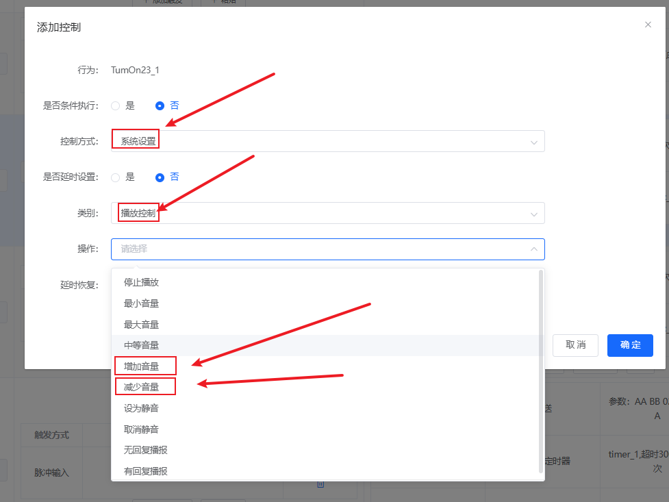

*平台中配置串口音量控制的界面，可选择增加或减少音量操作*

**注意事项：**

- 音量调节范围受硬件限制，不能超过最大输出功率
- 建议在软件中设置合理的音量步进值
- 音量过大可能导致失真，需要根据实际喇叭规格调整
- 不同批次模块的音量输出可能略有差异，需要实际测试验证

**串口音量控制指令格式：**

如需通过串口直接设置音量，可使用以下指令格式：

```
AA 55 02 [xx] 55 AA
```

- `AA 55`：帧头（固定）
- `02`：音量控制命令
- `xx`：音量值参数，范围 `00~40`（十六进制，即十进制 0~64）
- `55 AA`：帧尾（固定）

**示例：**
- `AA 55 02 00 55 AA`：音量设置为0（静音）
- `AA 55 02 20 55 AA`：音量设置为32（中等音量）
- `AA 55 02 40 55 AA`：音量设置为64（最大音量）

---
### 如何通过变量方式设置音量？

**问题描述：**

平台中的音量控制只有"最小音量"、"中等音量"、"最大音量"等固定档位选项，希望能够通过变量动态设置具体的音量数值。

**解决方案：**

**1. 变量方式配置**

在平台配置"设置音量"操作时，方式可以选择"变量"而非固定的"数值"：

- **配置路径**：添加控制 → 行为控制 → 控制方式（系统设置）→ 类别（播放控制）→ 操作（设置音量）
- **方式选择**：选择"变量"而非"数值"
- **变量选择**：选择已定义的变量（如串口接收的变量或自定义变量）

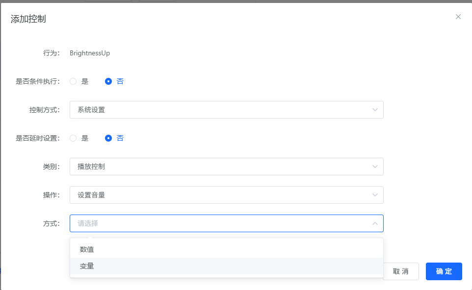

*配置界面显示"方式"可选择"变量"或"数值"*

**2. 应用场景**

- **串口动态控制**：MCU通过串口发送音量数值，模块使用接收到的变量设置音量
- **条件音量调节**：根据环境或其他条件动态计算音量值
- **多级音量控制**：实现超过预设档位的更多音量级别

**3. 配置示例**

通过串口变量控制音量的完整流程：

1. **定义串口输入变量**（如 `vol_value`）
2. **配置音量设置行为**：
   - 控制方式：系统设置
   - 类别：播放控制
   - 操作：设置音量
   - 方式：变量
   - 选择变量：`vol_value`
3. **MCU发送音量值**：通过串口发送 0-100 范围内的数值

**注意事项：**

- 变量值范围为 0-100，超出范围可能导致异常
- CI系列模块支持此功能
- 确保变量在使用前已被正确赋值

---
### 语言设置对命令词输入有何限制？

**问题描述：**

在设置语言为中文后，语音命令词及回复语是否可以使用英文？

**解决方案：**

**1. 语言限制说明**

平台对语言设置有严格限制：

- **中文语言**：只能使用中文命令词和回复语
- **英文语言**：只能使用英文命令词和回复语
- 不能混合使用中英文

**2. 规则说明**

单条回复语的支持范围：

- 支持中英文混合输入的描述是指规则说明
- 实际配置时必须严格遵守语言选择
- 单条回复语不得超过500个字符
- 支持逗号、句号、问号等标点
- 不能使用阿拉伯数字，需用中文数字代替

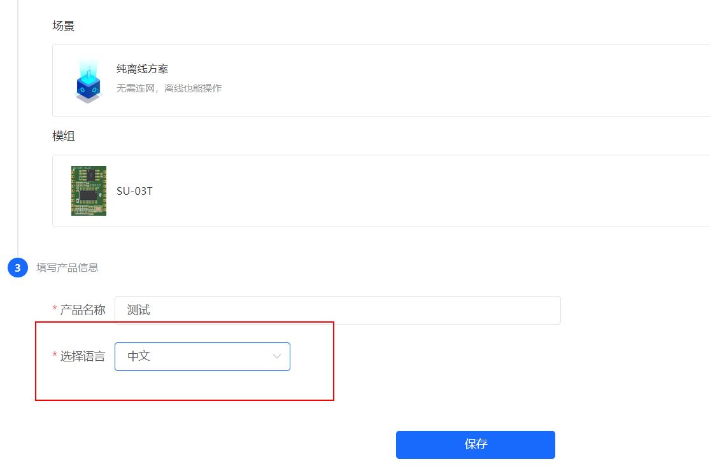


**3. 配置建议**

根据目标用户选择语言：

- 国内用户：选择中文语言，配置中文命令词
- 海外用户：选择英文语言，配置英文命令词
- 需要双语支持：考虑开发两个版本

**注意事项：**

- 语言设置后所有语音交互都使用该语言
- 命令词识别准确率与语言匹配度相关
- 建议使用目标用户最熟悉的语言进行配置

---

### 如何在低代码平台实现音量控制逻辑？

**问题描述：**

需要在行为控制中实现条件判断：当系统音量小于等于100时增加音量，否则播报"声音已达最大"，同时需要更新音量变量。

**解决方案：**

**1. 变量模拟方案**

由于平台无法直接读取系统音量值，需要使用变量模拟：

- 创建Voice变量存储当前音量值
- 变量初始值与发音人配置的音量一致
- 通过条件判断控制变量更新

**2. 配置步骤**

**第一个控制条件**：

- 条件：变量 Voice 小于 数值 100
- 操作：增加音量（默认增加20）
- 音量增加后需更新Voice变量

**第二个控制条件**：

- 条件：变量 Voice 小于 数值 100
- 操作：变量自增（增加20）
- 确保Voice变量与实际音量同步

**第三个控制条件**：

- 条件：变量 Voice 大于等于 数值 100
- 操作：播报"声音已达最大"
- 提示用户已达音量上限

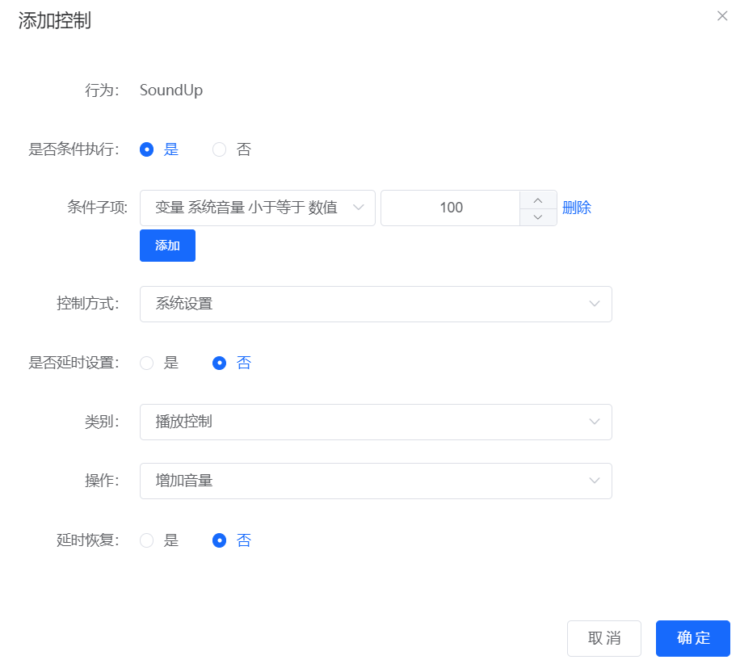
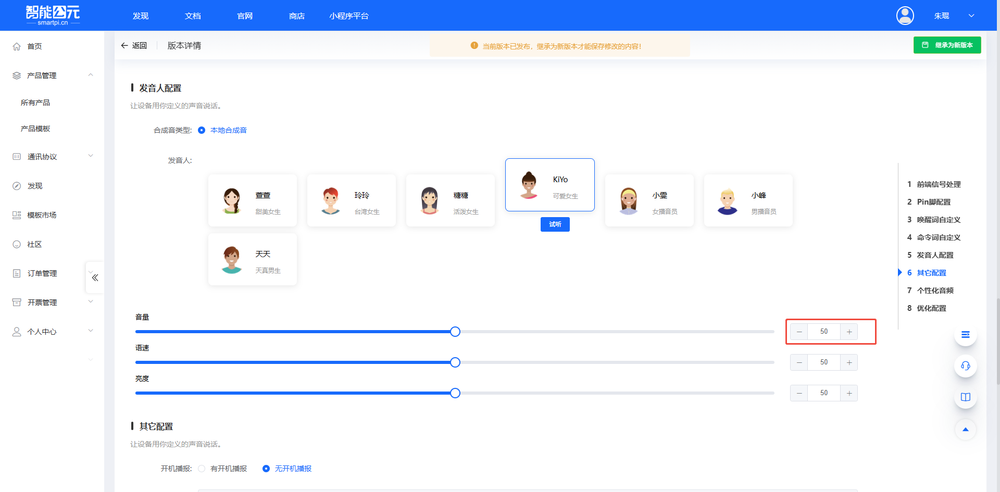
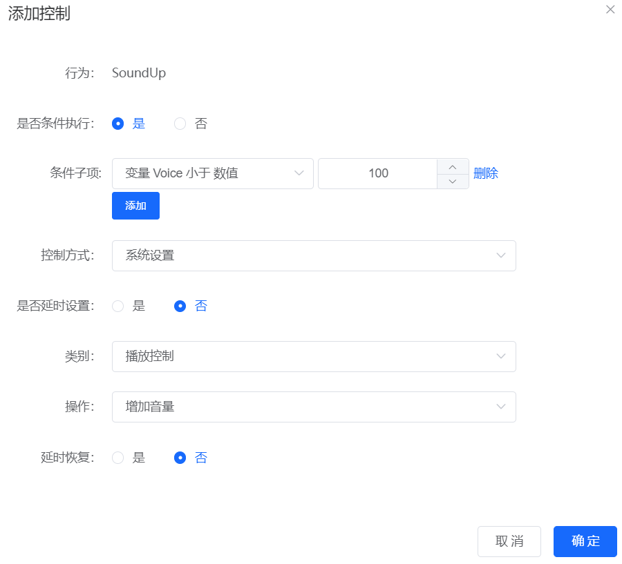

**3. 实现逻辑**

```
if (Voice < 100) {
    增加系统音量;
    Voice += 20;  // 变量自增
} else {
    播报"声音已达最大";
}
```

**4. 注意事项**

- 平台条件执行后只能跟一个操作，需要添加多个控制
- 默认增加音量为20，可根据需要调整
- 变量最大值应设置合理上限
- 测试时确认变量与实际音量同步

---

### 如何使用系统音量变量实现最大/最小值判断？

**问题描述：**

当音量调节到最大值或最小值时，希望模块播报提示音或停止播报，而不是继续执行音量调节操作。

**解决方案：**

**1. 使用系统音量变量**

平台提供内置的"系统音量"变量，可以直接在条件判断中使用：

- 变量名：`系统音量`
- 变量类型：数值型
- 取值范围：0-100

**2. 音量最大值判断配置**

当音量达到100时播报提示：

```
行为：mode_44
是否条件执行：是
条件子项：变量 系统音量 大于等于 数值 100
控制方式：播放语音
语音内容：主音量已加到最大值
```

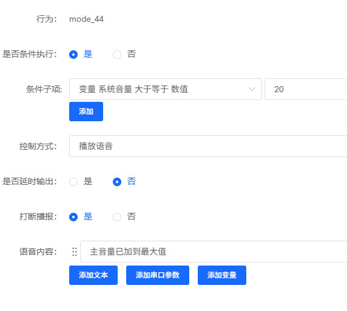

**3. 音量最小值判断配置**

当音量达到0时播报提示：

```
行为：mode_45
是否条件执行：是
条件子项：变量 系统音量 小于等于 数值 0
控制方式：播放语音
语音内容：主音量已减到最小值
```


**4. 引导用户输入的配置**

在音量未达到极值时，引导用户说出具体调节值：

```
行为：mode_44
是否条件执行：是
条件子项：变量 系统音量 小于 数值 20
控制方式：播放语音
语音内容：请说出主音量加大的值，例如加三，加十
```

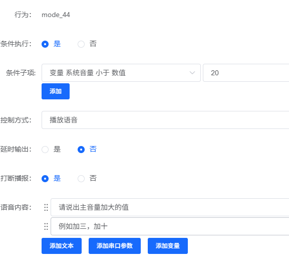

**5. 完整配置示例**

- **条件1**：系统音量 ≥ 100 → 播报"已加到最大值"
- **条件2**：系统音量 ≤ 0 → 播报"已减到最小值"
- **条件3**：0 < 系统音量 < 100 → 执行音量调节操作

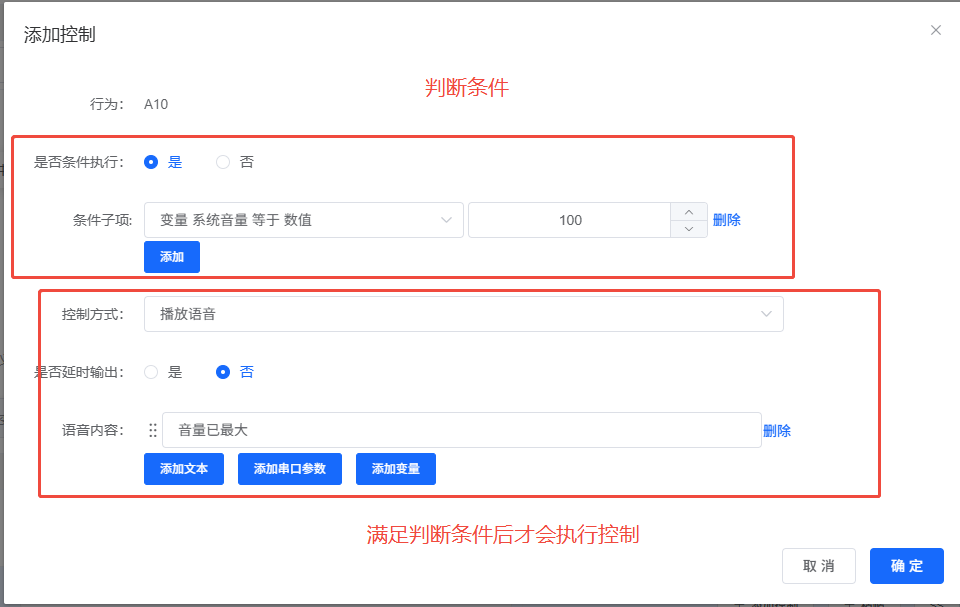

**注意事项：**

- "系统音量"是平台内置变量，无需在变量定义中手动创建
- 条件判断中的"大于等于"、"小于等于"等比较运算符要正确选择
- 可以组合多个条件实现复杂的判断逻辑
- 该方法同样适用于速度、亮度等其他数值型参数的极值判断

---
### 设置语音回复后播报功能还会执行吗？

**问题描述：**

在语音回复设置中已配置了语音回复功能，想知道图二中的播报功能是否还会执行。

**解决方案：**

**1. 功能优先级说明**

平台配置的执行顺序：

- **语音回复优先**：如果已配置语音回复，优先执行回复
- **播报功能次之**：播报功能作为补充，通常在特定条件下触发
- **执行逻辑**：根据触发条件和配置决定具体执行内容

**2. 配置建议**

**避免冲突**：

- 语音回复和播报功能选择其一配置
- 如需同时使用，确保触发条件不冲突
- 测试时确认实际执行效果

**功能选择**：

- **语音回复**：适合简单的确认反馈
- **播报功能**：适合复杂的状态播报
- **组合使用**：需要仔细设计触发逻辑

**3. 实现方式**

如果需要两个功能都工作：

- 设置不同的触发条件
- 使用变量控制播报时机
- 通过条件判断控制执行顺序

**注意事项：**

- 优先执行语音回复功能
- 播报功能可能被语音回复覆盖
- 建议在平台上实际测试确认行为
- 保留功能配置的测试记录

---

### 如何在智能平台实现基于变量的多模式交互逻辑？

**问题描述：**

需要在灯具项目中实现三种模式的交互逻辑：模式一可调节亮度和色温，模式二只能调节亮度，模式三只能调节色温。当前平台似乎只能配置单条语音指令，无法直接实现嵌套的交互逻辑。

**解决方案：**

使用智能平台的变量功能可以实现复杂的嵌套交互逻辑：

**1. 变量设置方法**

**创建变量**：

- 在平台进入"变量定义"页面
- 创建一个变量，如`lightmode`（灯光模式）
- 设置变量值：

    - 模式一：值为0
    - 模式二：值为1
    - 模式三：值为2

**2. 命令词配置**

**模式设置命令**：

- "模式一"：设置变量`lightmode=0`
- "模式二"：设置变量`lightmode=1`
- "模式三"：设置变量`lightmode=2`

**亮度控制命令**：

- 在每个亮度命令（如"亮度一档"）添加条件执行
- 条件：变量`lightmode=0`（模式一时允许）
- 条件：变量`lightmode=1`（模式二时允许）
- 不设置条件时，所有模式都可调节亮度

**色温控制命令**：

- "色温一档"：添加条件`lightmode=0 AND lightmode=2`（仅模式一和模式三）
- "色温二档"：添加条件`lightmode=0 AND lightmode=2`（仅模式一和模式三）
- "色温三档"：添加条件`lightmode=0 AND lightmode=2`（仅模式一和模式三）

**色温控制命令（模式二）**：

- 色温调节命令在模式二时不需要条件限制
- 因为模式二允许调节色温

**3. 配置步骤**

**添加控制触发**：

- 在命令词配置中点击"附加条件"
- 选择"变量"条件类型
- 设置变量名和条件值
- 添加对应的控制动作

**4. 注意事项**

- 条件判断从上到下依次执行
- 多个条件用"AND"连接，表示同时满足
- 变量值改变后，后续命令会使用新的条件判断
- 测试时建议逐个验证每个模式的响应

---

### 如何在小程序平台中使用变量进行条件控制配置？

**问题描述：**

需要在智能平台中配置基于变量的条件控制逻辑，实现不同模式下的差异化控制，但不清楚变量的定义方法、使用方式和具体要求。

**解决方案：**

**1. 变量定义说明**

**变量类型**：

- 平台支持数值型变量
- 变量名可自定义命名
- 变量值可根据命令动态改变

**变量作用**：

- 存储当前系统状态
- 在多个命令间传递信息
- 实现复杂的逻辑判断

**2. 变量配置步骤**

**创建变量**：

- 进入"变量定义"页面
- 点击"+添加变量"
- 输入变量名称（如：lightmode）
- 设置初始值

**变量使用场景**：

- 模式切换：命令执行后更新变量值
- 状态记忆：记录当前的工作模式
- 条件判断：根据变量值执行不同操作

**3. 条件控制配置**

**添加条件触发**：

- 在命令词配置中启用"是否条件执行"
- 选择"变量"作为条件类型
- 设置条件：变量名、操作符（等于/不等于）、比较值

**4. 具体应用示例**

**变量设置**：

- 变量名：`lightmode`
- 初始值：0

**模式切换命令**：

- "模式一"：设置`lightmode=0`，执行对应功能
- "模式二"：设置`lightmode=1`，执行对应功能
- "模式三"：设置`lightmode=2`，执行对应功能

**条件控制命令**：

- "亮度调节"：添加条件`lightmode=0`时才允许
- "色温调节"：添加条件`lightmode=2`时才允许

**5. 配置技巧**

**单一变量多用途**：

- 一个变量可以控制多个功能
- 通过不同的条件组合实现复杂逻辑
- 减少变量数量，简化配置

**条件组合使用**：

- 使用AND连接多个条件
- 实现更精确的控制逻辑
- 示例：`lightmode=0 AND 命令词="亮度"` 等于模式一时

**注意事项：**

- 变量值改变会影响后续所有条件判断
- 配置时要考虑所有可能的触发场景
- 建议先在测试环境验证逻辑正确性
- 变量命名要有意义，便于后期维护

---

### 语音指令配置时如何避免冲突？

**问题描述：**

在配置命令词控制时，如果同一个命令词设置了多个控制项，可能导致预期行为无法正常执行，出现逻辑冲突。

**解决方案：**

**1. 冲突原因分析**

- 平台按配置顺序执行控制项
- 多个控制项之间可能存在互斥关系
- 条件判断逻辑错误导致意外的执行路径

**2. 避免冲突的最佳实践**

**单一控制项原则**：

- 每个命令词只配置一个核心功能
- 使用复杂条件逻辑替代多个控制项
- 避免同一命令词的重复定义

**条件执行优化**：

- 将互斥的条件整合到同一个控制项中
- 使用AND、OR逻辑组合条件
- 确保条件之间的逻辑关系正确

**3. 配置建议**

**场景一：模式相关控制**

- 不要为"模式切换"、"模式一"等设置独立控制项
- 使用变量记录当前模式，在命令词中判断模式状态
- 通过条件执行实现模式相关功能

**场景二：时间或状态相关**

- 避免为不同时间段设置多个控制项
- 使用单一控制项配合复杂条件表达式
- 考虑使用延迟或定时器功能

**场景三：多步骤操作**

- 将相关操作配置在同一控制项的多个动作中
- 按执行顺序排列动作
- 使用"播放-等待-检测-执行"的流程

**4. 调试技巧**

- 使用语音播报输出中间状态，便于调试
- 记录详细日志，分析执行路径
- 在测试环境验证每个场景的响应
- 逐步添加功能，避免一次性修改过多

**5. 注意事项**

- 控制项之间避免使用"无条件"和"条件"混合
- 仔细检查条件的优先级和逻辑关系
- 保留配置备份，出现问题时快速恢复
- 复杂逻辑建议先在测试环境验证

---

### 语音指令配置时如何避免冲突？

**问题描述：**

在配置条件执行时出现了逻辑冲突：为"色温一档"命令词添加了模式三（lightmode=2）的条件下禁止播放提示语，导致模式一时即使命令词匹配，也无法正常播报"色温已调至一档"。

**解决方案：**

**1. 问题分析**

- 同一个命令词配置了两个控制项
- 第一个控制项：直接播放回复语（无条件）
- 第二个控制项：条件执行（模式三时禁止）
- 平台优先匹配条件执行规则，导致直接控制被忽略

**2. 解决方案**

**调整控制项顺序**：

- 将条件执行的控制项移动到列表上方
- 将无条件执行的控制项移动到列表下方
- 平台按从上到下的顺序执行，先执行条件判断

**或者使用单一控制项**：

- 将条件逻辑整合到一个控制项中
- 使用嵌套条件或逻辑表达式
- 避免同一命令词的多个控制项冲突

**3. 最佳实践建议**

**统一配置方式**：

- 为每个命令词只设置一个控制项
- 在该控制项中包含所有条件判断逻辑
- 使用"如果-那么-否则"结构处理复杂条件

**条件配置示例**：
```
如果 lightmode = 2:
    播放"腔镜模式不能调节色温"
否则:
    播放"色温已调至一档"
    设置PWM1占空比
```

**4. 注意事项**

- 控制项的执行顺序会影响最终效果
- 建议在配置完成后进行充分测试
- 复杂逻辑可以拆分为多个命令词
- 保留配置备份，便于后续修改和调试

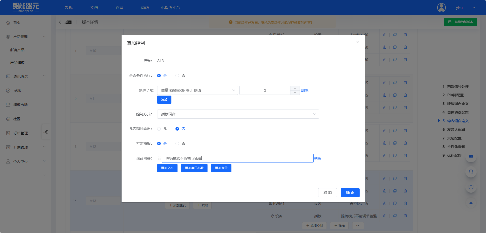
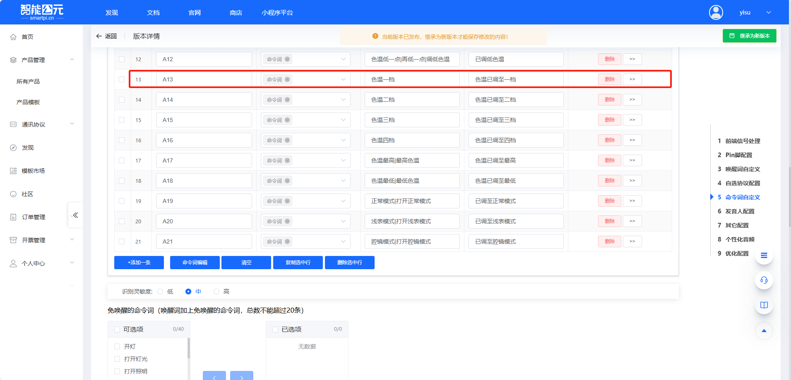


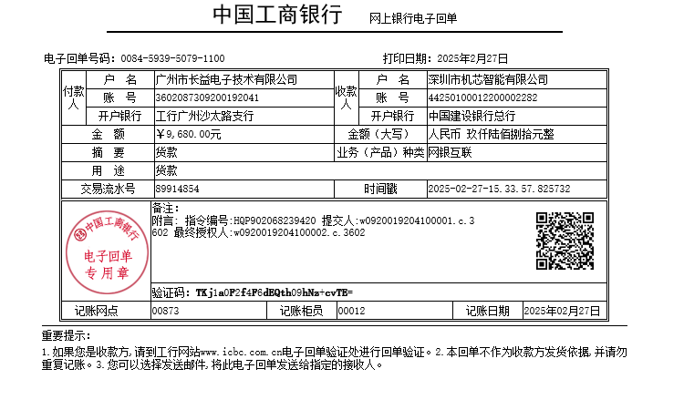
- 复杂逻辑建议分步实现，先测试基础功能

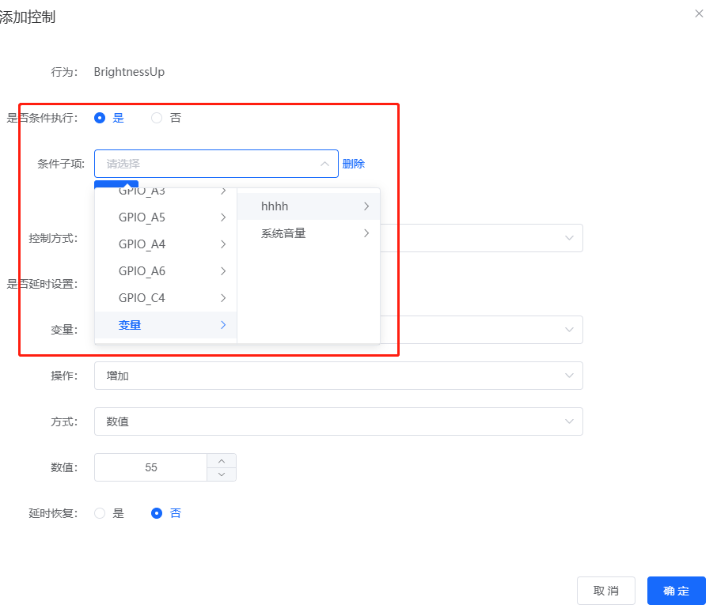
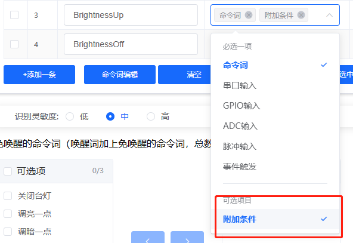

---

### SDK文件解压后应放置在哪个位置？

**问题描述：**

解压SDK文件后，不清楚应将解压后的文件夹放置在项目根目录的哪个位置，导致无法正确配置开发环境。

**解决方案：**

- 将解压后的SDK文件夹直接放置在项目根目录下
- 确保`lib`文件夹位于项目根目录的直接子目录位置
- 项目结构应包含根目录下的`lib`文件夹及相关的SDK文件

**注意事项：**

- SDK文件路径配置错误会导致编译失败
- 不要将SDK文件放在深层子目录中
- 确保项目路径不包含中文或特殊字符

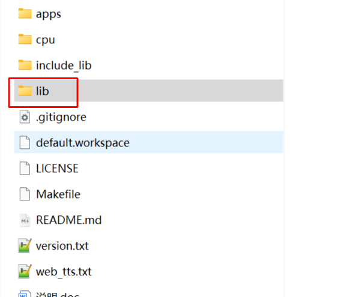

---

### SDK生成失败是什么原因？

**问题描述：**

在使用SDK进行开发时，遇到SDK生成失败的问题，提示协议不支持。

**解决方案：**

**问题原因：**

- **编码格式不兼容**：使用GB2312编码格式，而平台仅支持UTF-8编码
- **协议限制**：某些定制协议可能与标准SDK不兼容

**解决方法：**

1. **转换编码格式**
    - 将GB2312编码的文本转换为UTF-8格式
    - 使用专业的编码转换工具
    - 确保所有文本内容使用UTF-8编码

2. **使用标准协议**
    - 遵循平台提供的标准串口通信协议
    - 参考官方文档中的协议规范
    - 避免使用不兼容的定制协议

3. **重新生成SDK**
    - 确保所有配置使用UTF-8编码
    - 使用标准协议设置
    - 重新生成SDK文件

**注意事项：**

- 平台仅支持UTF-8编码，不支持GB2312等其他编码格式
- 定制协议开发需要联系专业技术支持团队
- 生成前检查所有文本内容的编码格式
- 保留原始文档备份，防止编码转换丢失信息

---

### CI系列TTS功能支持英文吗？TTS协议可以定制吗？

**问题描述：**

需要了解CI系列芯片的文本转语音功能是否支持英文，以及现有TTS协议是否支持定制化需求。

**解决方案：**

**语言支持限制：**

- **仅支持中文**：目前CI系列TTS功能只支持中文文本转语音
- **不支持英文**：无法处理英文文本的语音合成
- **未来规划**：英文支持功能暂无明确时间表

**协议定制说明：**

- **标准协议可用**：视频演示中的TTS串口协议可直接使用
- **定制暂不支持**：按文档中的定制协议目前无法实现
- **需求积压**：开发资源紧张，新的定制需求暂时无法处理

**可用方案：**

1. **使用标准TTS协议**
    - 参考官方视频中的协议格式
    - 按照标准格式发送文本数据
    - 可实现基本的中文TTS功能

2. **中英混合方案**
    - 英文内容通过其他方式处理（如录音播放）
    - 中文内容使用TTS功能
    - 在应用层进行语言判断和分发

3. **等待功能更新**
    - 关注官方功能更新通知
    - 英文支持上线后可第一时间使用
    - 提前做好产品规划

**注意事项：**

- TTS功能目前仅限于中文文本
- 定制协议需要等待开发资源释放
- 建议评估现有功能是否满足项目需求
- 如急需英文支持，可考虑其他替代方案

---

### 声控产品在中国国内有哪些标准和认证？

**问题描述：**

声控产品在国内是否有相关的标准及认证，以及CI1302芯片是否具备相关认证。

**解决方案：**

- 声控产品在国内暂无专门的标准
- CI1302芯片提供REACH认证
- 提供两种REACH认证文件：

    - 芯片 CI1302 REACHSVHC235项认证
    - 芯片CI1302非金属REACHSVHC241+12+1项+金属73项+邻苯DINP认证

**注意事项：**

- 认证文件可向技术团队索取
- 建议根据产品目标市场要求确定所需认证
- REACH认证主要针对出口欧盟市场


---

### 固件生成时间显示不准确怎么办？

**问题描述：**

在使用固件生成平台时，发现固件生成时间显示不准确，且无法根据实际任务量动态调整，导致用户对生成时长的预估不准确。

**解决方案：**

- 生成时间根据当前排队人数等情况动态显示
- 系统会根据实际情况计算所需时间
- 时间预估会考虑服务器负载和任务复杂度

**注意事项：**

- 生成时间是预估时间，实际可能有所波动
- 高峰期生成时间会相应延长
- 建议合理安排生成时间，避开高峰期


---

### 如何修改固件中的唤醒词和开机播报语音？

**问题描述：**

需要将英文版固件的唤醒词和开机播报语音修改为中文内容。

**解决方案：**

**固件修改流程：**

1. **提供原始固件**
    - 提供需要修改的固件文件
    - 说明具体修改需求

2. **明确修改内容**
    - 唤醒词：如"小薇 小薇"（中文）或"Xiao Wei Xiao Wei"（英文）
    - 开机播报：如中文或英文语音提示

3. **专业专业技术支持处理**
    - 技术团队接收固件后进行修改
    - 生成新的固件文件
    - 进行测试验证

4. **获取修改后的固件**
    - 下载新生成的固件文件
    - 进行烧录测试
    - 验证唤醒词和播报内容

**测试建议：**

- 烧录后测试唤醒灵敏度
- 验证开机播报是否清晰
- 如效果不佳可进一步调整

**注意事项：**

- 固件修改需要专业专业技术支持
- 修改后的固件需要重新测试验证
- 不同语言可能需要不同的语音模型
- 保留原始固件作为备份

---

### 能图元平台页面无法打开或显示异常怎么办？

**问题描述：**

访问能图元平台的AI产品管理页面时，页面显示异常或无法正常加载。

**解决方案：**

**临时解决方法：**

1. **刷新页面**
    - 使用F5或Ctrl+F5强制刷新
    - 清除浏览器缓存后重新访问
    - 尝试使用无痕/隐私模式浏览

2. **检查网络连接**
    - 确认网络连接正常
    - 尝试访问其他网站验证网络
    - 重启路由器或切换网络

3. **更换浏览器**
    - 尝试使用Chrome、Firefox、Edge等不同浏览器
    - 更新浏览器到最新版本
    - 禁用不必要的浏览器插件

4. **检查平台状态**
    - 联系专业技术支持确认平台是否维护
    - 查看官方通知或公告
    - 确认是个人问题还是平台故障

**预防措施：**

- 定期清理浏览器缓存
- 保持浏览器版本更新
- 收藏正确的平台网址
- 避免同时打开过多标签页

**注意事项：**

- 页面加载失败通常是临时性问题
- 如问题持续存在，及时反馈给专业技术支持
- 提供具体的错误信息和截图
- 记录问题发生的时间和操作步骤

---

### 如何开发英文版本的唤醒词和开机播报功能？

**问题描述：**

需要在现有中文语音系统的基础上，开发英文版本的唤醒词和开机播报功能。

**解决方案：**

**开发流程：**

1. **提供需求说明**
    - 英文唤醒词：如"Xiao Ke Xiao Ke"、"Xiao Ai Xiao Ai"
    - 英文开机播报：如"Vehicle voice control system activated, you can call me anytime"

2. **基于现有固件修改**
    - 在现有中文固件基础上进行英文适配
    - 保持功能不变，仅更换语言版本

3. **技术处理**
    - 技术团队进行英文语音模型替换
    - 调整唤醒词识别算法
    - 生成新的英文固件

4. **测试验证**
    - 下载新固件进行测试
    - 验证英文唤醒词识别率
    - 确认英文播报清晰度

**开发注意事项：**

- 英文发音需标准清晰
- 唤醒词建议4个音节以上
- 测试不同口音和语速的识别效果
- 如效果不佳可要求重新调整

**时间说明：**

- 固件生成需要一定时间
- 技术团队会按订单顺序处理
- 紧急需求可提前沟通

---

### 旧款蜂鸟M芯片是否兼容新固件？

**问题描述：**

旧款蜂鸟M（US516P6）芯片是否可以烧录之前版本的固件，而无需重新生成新固件。

**解决方案：**

**固件兼容性说明：**

- **完全兼容**：旧款蜂鸟M芯片支持新旧固件
- **无需重新生成**：可以直接使用之前版本的固件进行烧录
- **向后兼容**：新版本固件通常包含旧版本的功能

**烧录建议：**

1. **使用现有固件**：

    - 可以直接使用之前备份的固件文件
    - 无需通过平台重新生成
    - 保持原有的功能和配置

2. **版本确认**：

    - 确认固件版本与硬件匹配
    - 检查固件是否包含所需功能
    - 必要时可升级到更新版本

**注意事项：**

- 旧款芯片的兼容性较好，可支持多种固件版本
- 建议保留固件备份以便后续使用
- 如遇到功能问题，可考虑使用最新版本的固件

---

### 固件发布时如何选择"优化版"和"快速发布版"？

**问题描述：**

在固件发布界面无法找到"优化版"选项，以及量产时是否需要更换为Pro模型。

**解决方案：**

- 点击"发布"按钮前需要先点击"继承"才会弹出选项框
- 选择"优化版"或"快速发布版"进行发布
- 量产建议使用已经通过测试的模型，不建议封样后切换
- 重新发布固件前需要完整测试功能

**注意事项：**

- 封样后切换模型容易出问题
- Pro模型识别效果更好，但需要充分测试
- 重新发布仅修改发布类型是安全的

---

### 生成SDK时提示"Voice值不能为空"怎么办？

**问题描述：**

在生成SDK时，系统提示"Voice值不能为空"错误，导致SDK生成失败。

**解决方案：**

- 检查前端信号处理配置中的应用场景是否正确切换
- 确认选择的语言模型与应用场景匹配
- 中文固件转换为英文时，需要切换到对应的英文应用场景

**注意事项：**

- 该错误通常发生在语言切换后未正确更新应用场景
- 生成前仔细检查所有配置项
- 如问题持续，可导出工程文件联系技术团队

---

### 固件生成时显示配置失败怎么办？

**问题描述：**

在使用固件生成平台时，配置检查通过后仍显示配置失败，导致固件无法生成。

**解决方案：**

**常见原因及解决方法：**

1. **配置项未完全填写**
    - 检查所有必填项是否都已配置
    - 特别关注命令词、行为等关键配置
    - 未使用的配置项建议删除，不要留空

2. **命令词配置错误**
    - 确认每个命令词都对应了具体行为
    - 检查是否有重复或冲突的命令词
    - 验证命令词格式是否符合要求

3. **平台操作步骤**
    - 发布前务必点击"检查配置"
    - 检查通过后，尝试重新发布
    - 如仍失败，导出配置文件供技术分析

4. **特殊功能配置**
    - 需要特定逻辑（如指令触发自学习）时，需要在控制配置中设置条件判断
    - 示例：设置"开启配置"命令作为自学习功能的前置条件
    - 确认条件判断的逻辑正确性

**排查建议：**

- 逐项检查配置，特别注意未使用但仍保留的配置项
- 简化配置测试，先验证基本功能
- 保存配置备份，避免重复修改
- 问题持续时导出配置文件联系技术团队

**注意事项：**

- 配置检查通过不代表所有设置都正确
- 空的配置项可能导致生成失败
- 复杂逻辑建议分步骤验证

---

### 如何配置特定指令触发自学习功能？

**问题描述：**

需要实现唤醒系统后，通过特定指令（如"开启配置"）才进入自学习模式。

**解决方案：**

**配置步骤：**

1. **设置唤醒词**
    - 配置系统唤醒词
    - 确保唤醒词独立且不易误触发

2. **添加触发指令**
    - 创建"开启配置"命令词
    - 设置该命令的行为为"进入自学习模式"
    - 配置对应的GPIO或串口输出指示状态

3. **配置学习模式**
    - 在自学习模式下，关闭其他命令识别
    - 只响应学习相关的指令
    - 学习完成后返回正常模式

4. **状态指示**
    - 使用LED或其他方式提示当前模式
    - 帮助用户了解系统状态
    - 避免模式混淆

**注意事项：**

- 确保状态切换的可靠性
- 学习模式需要有明确的退出机制
- 考虑超时自动退出学习模式

---

### 智能公元平台无法访问或链接失效怎么办？

**问题描述：**

访问智能公元AI产品零代码平台时页面无法正常加载，或之前保存的访问链接失效。

**解决方案：**

- 官网已更新，旧的访问链接（如 http://www.smartpi.cn）可能失效
- 使用新的访问地址：http://smartpi.cn/#/
- 通过搜索引擎搜索"智能公元官网"获取最新访问链接


**注意事项：**

- 建议收藏新的官方链接以避免后续访问问题
- 如遇到页面加载问题，可尝试清除浏览器缓存或更换浏览器
- 平台更新期间可能出现短暂访问不稳定，建议稍后重试

---

### 什么是GPIO上电记忆功能？如何配置？

**问题描述：**

需要了解上电记忆功能的含义，以及如何配置GPIO在上电后保持特定电平状态。

**解决方案：**

**上电记忆功能说明：**

- 开启后，GPIO引脚在下次上电时会保持断电前的状态
- 关闭后，GPIO引脚每次上电都会恢复到默认状态
- 适用于需要保持设备开关状态的应用场景

**电平定义：**

- **高电平**：GPIO输出高电平（3.3V），可用于驱动LED点亮
- **低电平**：GPIO输出低电平（0V），相当于开路状态

**GPIO控制配置步骤：**

1. **进入控制配置界面**
    - 选择"添加控制"
    - 设置控制方式为"端口输出"
    - 选择控制类型为具体的GPIO引脚

2. **配置输出参数**
    - 动作选择"设置电平"
    - 参数可选择"高电平"或"低电平"
    - 不需要设置条件子项，直接执行输出

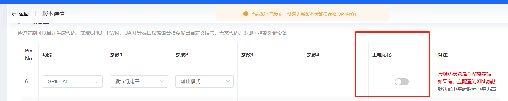

*GPIO设置页面中的上电记忆功能开关*

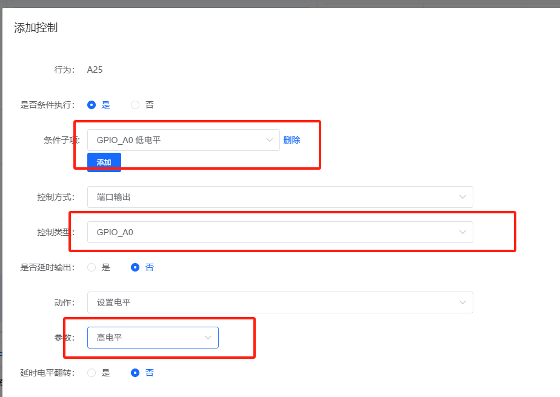

*添加控制界面，配置GPIO输出参数*

**注意事项：**

- 条件子项用于条件触发，直接控制时无需设置
- GPIO输出能力有限，驱动大功率负载需要外加驱动电路
- 配置完成后需要烧录固件才能生效

**GPIO输出配置补充说明：**

- **是否延时输出**：选择"否"可立即执行输出动作
- **条件子项**：用于设置触发条件，直接控制时应留空
- **控制类型与参数**：选择要控制的GPIO及目标电平状态

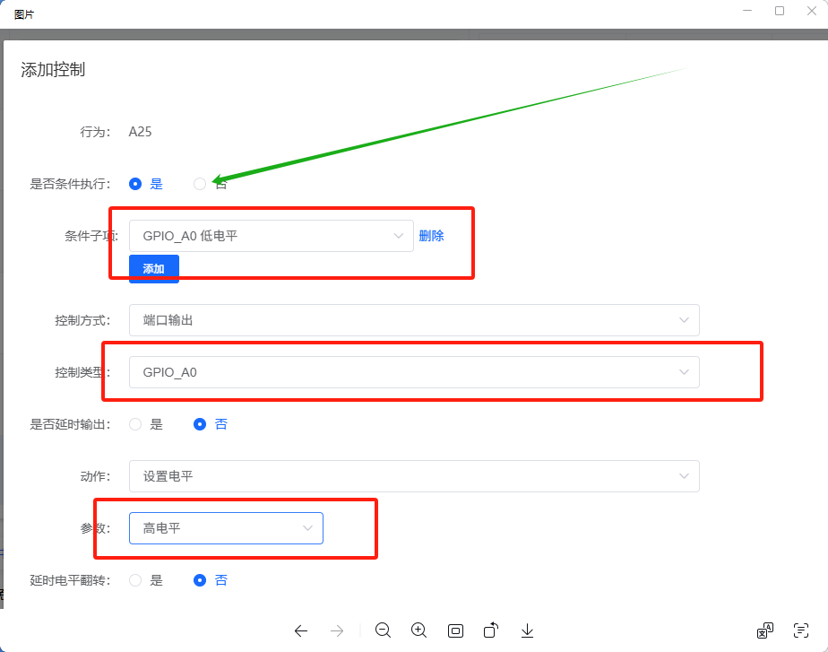

*配置GPIO_A0输出高电平，条件子项留空*


*移除条件子项并设置不延时输出*

---

### 如何在语音芯片进入睡眠时触发IO控制？

**问题描述：**

希望语音芯片在进入睡眠模式时能够触发IO控制，而不是只在唤醒时触发。

**解决方案：**

**睡眠触发实现方法：**

- **配置唤醒源**：语音芯片在进入睡眠模式时，可通过配置唤醒源（如GPIO）实现控制
- **GPIO唤醒设置**：可设置特定IO引脚为唤醒源，当该引脚状态变化时，芯片从睡眠模式唤醒并执行指定操作
- **配置步骤**：

    1. 在平台中找到睡眠/唤醒配置选项
    2. 选择GPIO作为唤醒源
    3. 设置触发条件（高/低电平、上升/下降沿）
    4. 配置唤醒后执行的动作

**注意事项：**

- 具体配置方法需参考芯片手册中的Sleep Mode章节
- 或使用SDK提供的sleep_config函数
- 睡眠模式下部分外设会关闭以降低功耗

---

### 平台上可以更改项目的模块型号吗？

**问题描述：**

在平台上已创建的项目，需要将模块型号从CI-03系列更换为CI-73，但目前只能新建项目。

**解决方案：**

**当前平台限制：**

- **不支持直接更改**：当前平台暂不支持直接更改已创建项目的模块型号
- **需要新建项目**：更换模块型号必须创建新项目

**操作建议：**

1. **创建新项目**：

    - 选择目标模块型号（如CI-73）
    - 参考原项目的配置进行设置
    - 确保功能配置与原项目一致

2. **配置迁移**：

    - 逐项复制原项目的配置
    - 包括唤醒词、命令词、控制逻辑等
    - 测试新项目的功能完整性

**注意事项：**

- 未来版本可能支持型号更换功能，建议关注平台更新公告
- 备份原项目配置以防数据丢失
- 新建项目后原项目仍保留，可选择性删除

---

### 如何通过串口动态选择唤醒词？

**问题描述：**

生成固件时，希望通过上位机串口动态选择一个唤醒词作为唯一的唤醒词。

**解决方案：**

**动态唤醒词实现方案：**

- **串口通信实现**：可通过串口通信实现动态选择唤醒词，需在固件中实现串口接收和唤醒词切换逻辑
- **实现步骤**：

    1. 在上位机软件中提供唤醒词列表
    2. 通过串口发送选择指令（如`SET_WAKEUP_WORD 1`）
    3. 语音芯片接收指令后，加载对应唤醒词并更新固件配置

**注意事项：**

- 需确保唤醒词已预先制作并存储在Flash中
- 必须支持动态加载功能
- 上位机需要开发相应的控制界面

---

- 重新烧录前请备份原有配置
- 如遇到兼容性问题，请查看版本更新说明

---

### 语音模块是否支持越南语等小语种？

**问题描述：**

需要了解语音模块是否支持越南语等非中文语种，以及语种定制的相关费用和流程。

**解决方案：**

**语种支持情况：**

1. **支持语种**：

    - 支持越南语等多种语种
    - 需要进行语种定制
    - 可根据项目需求开发特定语言支持

2. **定制服务流程**：

    - 评估需求：确认语种类型、词条数量和播报内容
    - 需求确认：根据需求复杂度和工作量确认交付范围
    - 开发定制：进行语音模型训练和固件适配
    - 测试验证：提供样品进行功能测试

**费用说明：**

- 小语种定制服务需根据需求评估，具体请联系官方渠道确认
- 评估通常会参考以下因素：

    - 词条数量（如50条）
    - 播报内容长度
    - 月预期使用量
    - 特殊技术要求

**注意事项：**

- 语种定制需要一定的开发周期
- 建议提供具体的词条和播报内容清单
- 定制完成后保留技术文档便于后续维护
- **低功耗限制**：低功耗产品（如SU系列低功耗型号）暂不支持日语等小语种，小语种仅限CI系列常规功耗产品
- **双模型限制**：支持多语种双模型切换的模块一般不支持低功耗模式

---

### 自学习功能与识别率有关吗？

**问题描述：**

希望了解网页配置中的自学习功能是什么作用，以及开启该功能是否可以提高语音识别的准确率。

**解决方案：**

**自学习功能说明：**

- **功能定义**：自学习是语音模块的自主学习功能，用于优化特定用户的语音特征
- **主要作用**：适应特定用户的发音习惯，提升个性化体验
- **识别率影响**：自学习功能与识别率没有直接关系

**识别率关键因素：**

1. **硬件设计**

    - 麦克风质量和位置
    - 电路设计的合理性
    - 电源稳定性

2. **环境因素**

    - 环境噪声控制
    - 说话距离和角度
    - 回声处理

3. **配置优化**

    - 命令词的选择和训练
    - 阈值设置
    - 唤醒词的清晰度

**自学习使用建议：**

- **适用场景**：需要个性化优化的场景
- **开启条件**：有特殊发音习惯或环境需求时
- **使用方式**：按平台指引完成自学习训练
- **效果评估**：通过实际测试判断是否带来改善

**注意事项：**

- 自学习功能主要用于个性化适配，不是通用识别率提升方案
- 识别率更多取决于硬件设计、环境配置和命令词选择
- 建议先优化基础配置，再考虑是否使用自学习
- 自学习完成后需要保存并重新生成固件

---

- 批量应用时可协商优惠价格

---

### CI13242芯片的词条开发是否需要在公司提供的网上平台进行？

**问题描述：**

需要确认CI13242芯片的词条开发是否必须在公司提供的网上平台进行。

**解决方案：**

是的，CI13242芯片的词条开发需要在公司提供的网上平台进行。

**开发平台说明：**

- **官方平台**：通过公司提供的在线开发平台进行词条配置
- **零代码开发**：无需编写代码，通过可视化界面完成配置
- **一站式服务**：从词条定义到固件生成全流程在平台完成

**平台优势：**

- 操作简便，降低开发门槛
- 提供丰富的开发资源和文档支持
- 支持在线调试和快速验证
- 便于团队协作和版本管理

**注意事项：**

- 建议使用官方推荐的浏览器版本
- 开发过程中及时保存配置
- 完成配置后需要下载并烧录对应固件

---

### BLE蓝牙和经典蓝牙有什么区别？

**问题描述：**

需要了解BLE蓝牙和经典蓝牙的区别，以及在不同应用场景中的使用差异。

**解决方案：**

**1. 协议区别**

- **BLE蓝牙**（低功耗蓝牙）：

    - 主要用于低功耗场景
    - 传输速率较低，适合小数据量传输
    - 连接建立快，功耗低
    - 主要用于IoT设备、可穿戴设备等

- **经典蓝牙**：

    - 传输速率高，支持大数据量传输
    - 功耗相对较高
    - 适合音频流传输等场景
    - 主要用于耳机、音箱等音频设备

**2. 应用场景**

- **小程序控制**：使用BLE蓝牙协议
    - 通过小程序连接和控制设备
    - 实现设备配网、状态查看、控制指令下发

- **音频播放**：使用经典蓝牙协议
    - 连接音箱、耳机等音频设备
    - 播放音乐、语音通话等

**注意事项：**

- BLE和经典蓝牙是两种不同的协议，不能直接互通
- 设备可能同时支持两种协议，但用途不同
- 选择模块时需要根据实际应用场景决定使用哪种蓝牙协议

---

### 在线活动时服务器接入用户过多导致服务异常怎么办？

**问题描述：**

在进行最后一节课的在线活动时，遇到服务器接入用户过多导致服务异常的问题，且该问题在特定时间反复出现。

**解决方案：**

**1. 问题识别**

- 服务器并发访问量过大
- 特定时段（如最后一节课）用户集中访问
- 服务器负载超出承受能力

**2. 缓解措施**

- 避开高峰时段进行活动
- 提前预约或错峰使用
- 分批进行在线活动

**3. 协调支持**

- 联系技术团队预告活动时间
- 请求临时扩容服务器资源
- 获取专用通道或优先级

**4. 应急处理**

- 准备备用方案（如录播）
- 延迟活动时间避开高峰
- 分组进行减少并发

**注意事项：**

- 此问题属于服务器容量限制，非设备故障
- 建议提前与技术服务沟通协调
- 重要活动前进行压力测试

---

### 平台生成SDK速度较慢怎么办？

**问题描述：**

在平台生成SDK时，等待时间较长，存在明显的延迟现象。

**解决方案：**

1. **排队现象说明**
    - 平台SDK生成采用排队机制，使用量大时会导致排队时间延长
    - 生成速度受当前并发数量影响

2. **缓解措施**
    - 刷新页面查看最新状态
    - 避免在高峰时段进行SDK生成
    - 耐心等待排队完成

**注意事项：**

- 这是正常现象，并非系统故障
- 建议合理安排SDK生成时间
- 如等待时间过长，可联系官方确认状态

---

### 固件生成失败提示"配置原因"怎么办？

**问题描述：**

在平台配置产品特性并选择特定应用场景后，固件生成失败，提示"可能是配置原因，请检查配置"。

**解决方案：**

1. **检查配置冲突**
    - 确认选择的"应用场景"和"产品特性"是否兼容
    - 某些新模型（如"中文风扇通用Pro"）可能与特定功能组合存在冲突
    - 尝试使用"安静环境"等基础场景配置

2. **内存容量排查**
    - 深度降噪功能占用较多内存空间
    - 选择了过多功能可能导致内存不足
    - 可关闭非必要功能，如AEC打断

3. **配置优化建议**
    - 使用老版本模型+特定功能组合
    - 避免同时开启多个高级功能
    - 先生成基础版本测试，确认配置正确

4. **参数配置检查**
    - 检查详细控制中的参数设置
    - 删除不必要的高级配置项
    - 使用JSON配置文件导出，逐项检查

5. **替代方案**
    - 使用平台导入/导出功能备份配置
    - 尝试使用之前成功生成过的配置
    - 联系官方，提供配置文件分析

**注意事项：**

- 新模型正在排查中，部分组合可能存在兼容性问题
- 生成失败通常是内存或配置冲突导致
- 保留配置备份，便于问题排查和恢复
- 多次失败建议等待系统优化后再试

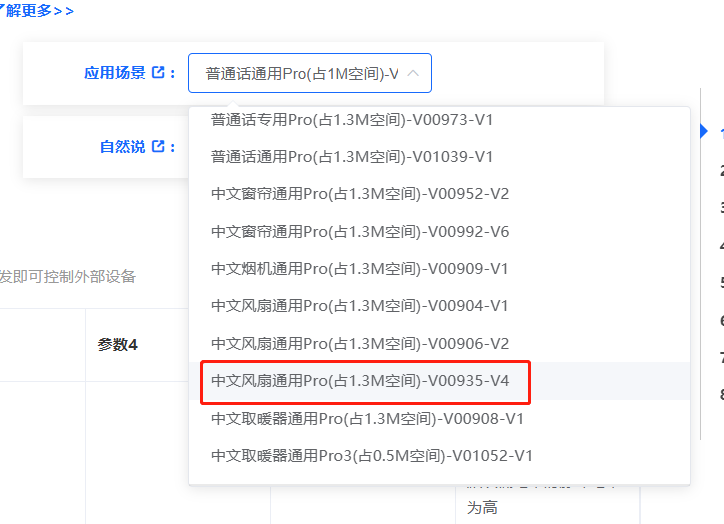
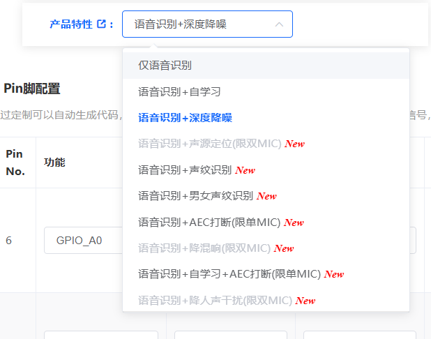
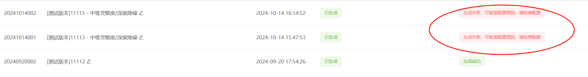


---

### 如何在音量调节到最大或最小值时，通过语音提示告知用户当前音量状态？

**问题描述：**

需要实现音量调节功能，当音量达到最大值或最小值时，自动播放语音提示当前音量状态。

**解决方案：**

1. **定义音量控制变量**
    - 创建两个变量：`volume_up`（音量增加）和 `volume_down`（音量减少）
    - 变量类型设置为 `char`
    - `volume_up` 默认值设为0（或当前音量值）
    - `volume_down` 默认值设为0（或当前音量值）

2. **配置音量增加控制逻辑**
    - 创建"增加音量"指令（如A158）
    - 添加条件判断：当 `volume_up < 80` 时
        - 播放语音："增加音量"
        - 变量操作：`volume_up` 增加20
    - 添加条件判断：当 `volume_up = 80` 时
        - 播放语音："已是最大音量"

3. **配置音量减少控制逻辑**
    - 创建"减少音量"指令（如A159）
    - 添加条件判断：当 `volume_down > 0` 时
        - 播放语音："减小音量"
        - 变量操作：`volume_down` 减少20
    - 添加条件判断：当 `volume_down = 0` 时
        - 播放语音："已是最小音量"

**注意事项：**

- 音量调节的步长默认为20，可根据需要调整
- 音量范围通常设置为0-80，具体值根据平台设置而定
- 音量加减操作可以使用同一个变量，分别定义增加和减少操作即可
- 配置时不要设置回复语，直接执行语音播报和变量操作

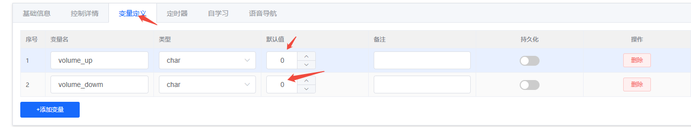


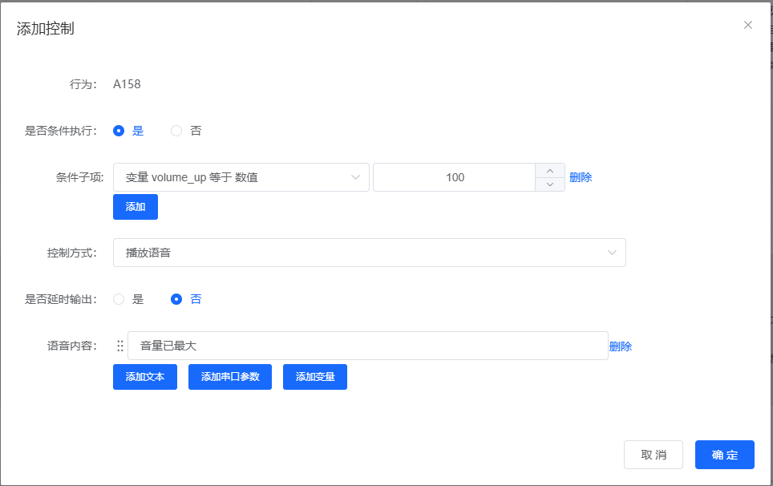

---

### 如何配置音量控制逻辑，实现音量增减的条件判断？

**问题描述：**

需要配置音量控制功能，实现通过语音指令增加或减小音量，并在音量达到最大或最小值时给出相应提示。

**解决方案：**

1. **定义音量变量**
    - `voice_up`：类型char，默认值0（用于音量增加控制）
    - `voice_down`：类型char，默认值80（用于音量减少控制）
    - 注意：实际音量范围以平台设置的音量滑块为准

2. **配置增加音量指令（voice_up）**
    - 条件1：`voice_up < 80`
        - 控制方式：播放语音
        - 语音内容："增加音量"
    - 条件2：`voice_up = 80`
        - 控制方式：播放语音
        - 语音内容："已是最大音量"
    - 变量操作：

        - 控制方式：变量设置
        - 变量：`voice_up`
        - 操作：增加
        - 数值：20

3. **配置减少音量指令（voice_down）**
    - 条件1：`voice_down > 0`
        - 控制方式：播放语音
        - 语音内容："减小音量"
    - 条件2：`voice_down ≤ 0`
        - 控制方式：播放语音
        - 语音内容："已是最小音量"
    - 变量操作：

        - 控制方式：变量设置
        - 变量：`voice_down`
        - 操作：减少
        - 数值：20

**注意事项：**

- 音量调节步长默认为20，可根据实际需求调整
- 确保变量操作设置在条件判断之后执行
- 音量上下限应与平台音量范围保持一致（通常为0-80）
- 建议使用同一个变量控制音量，避免定义过多变量

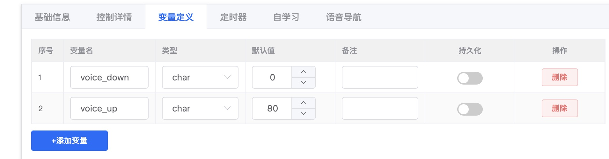
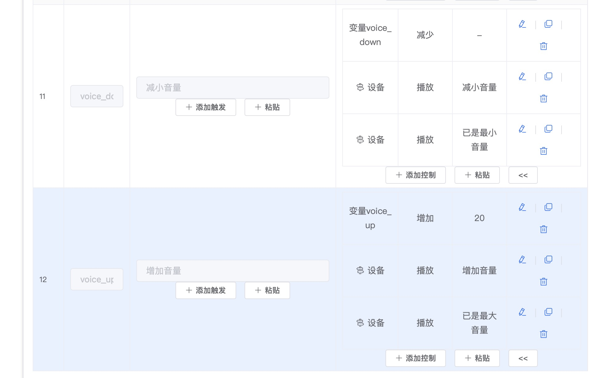
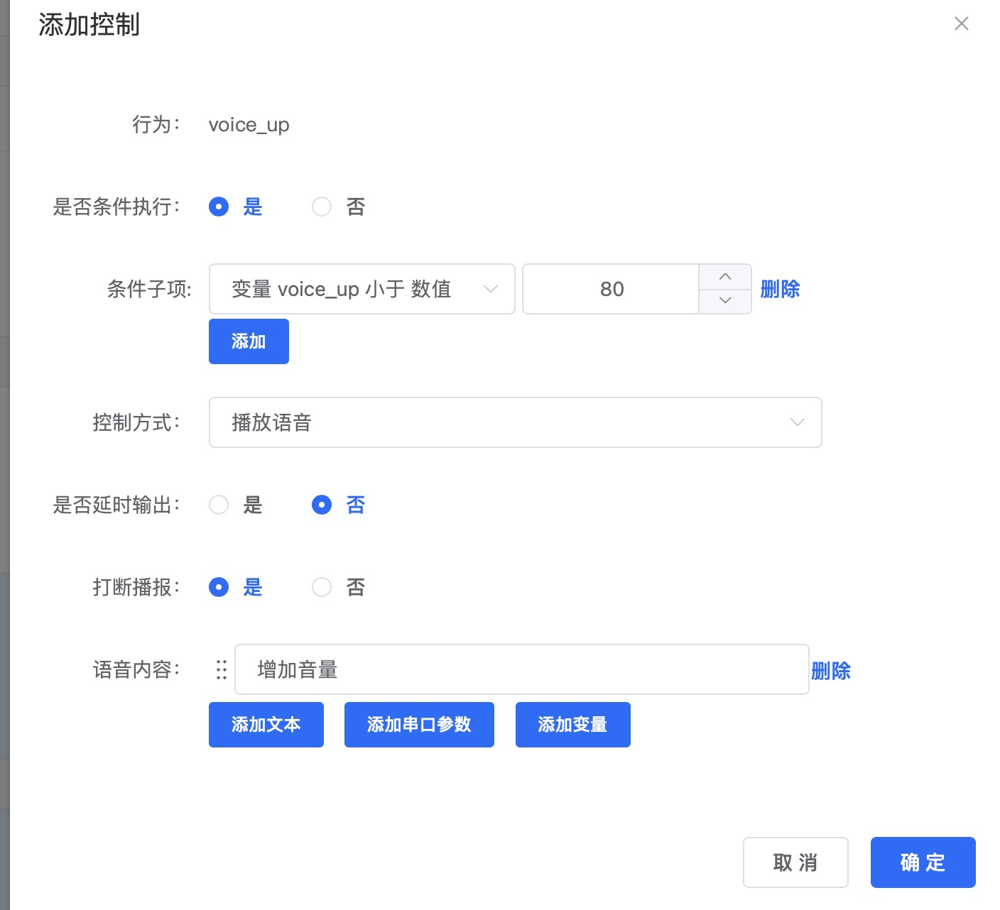
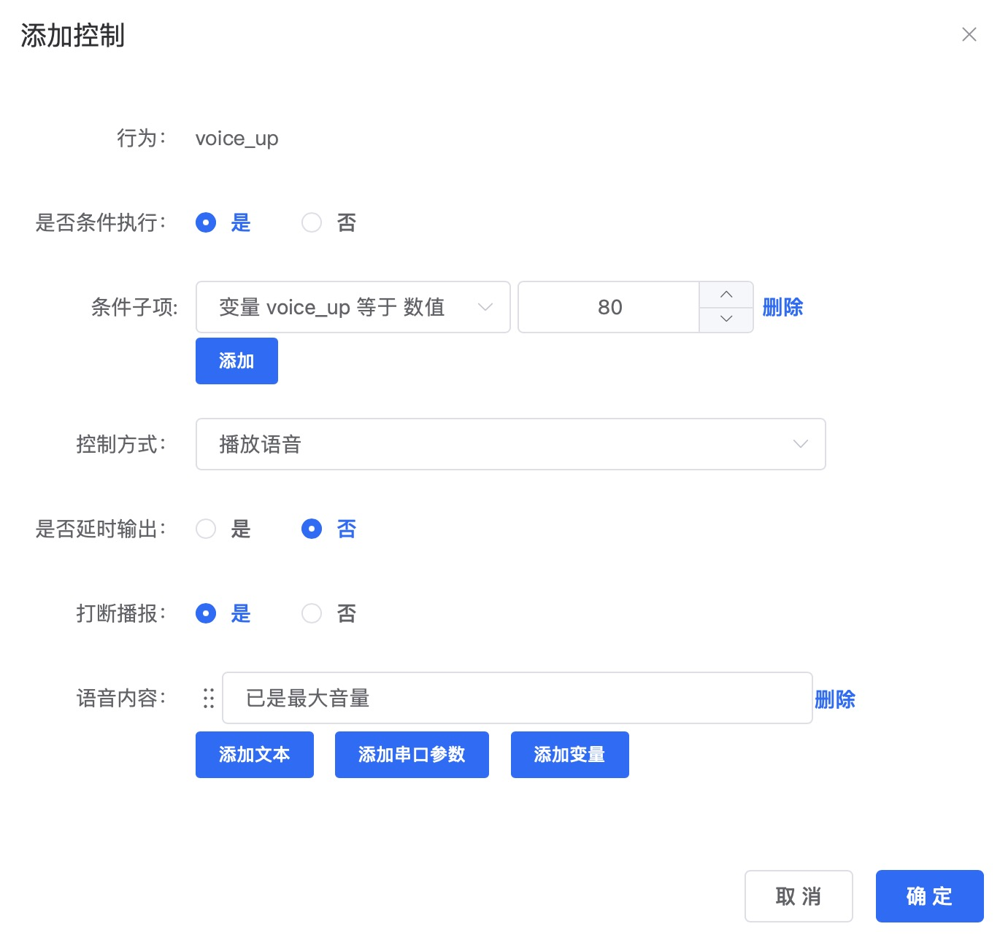
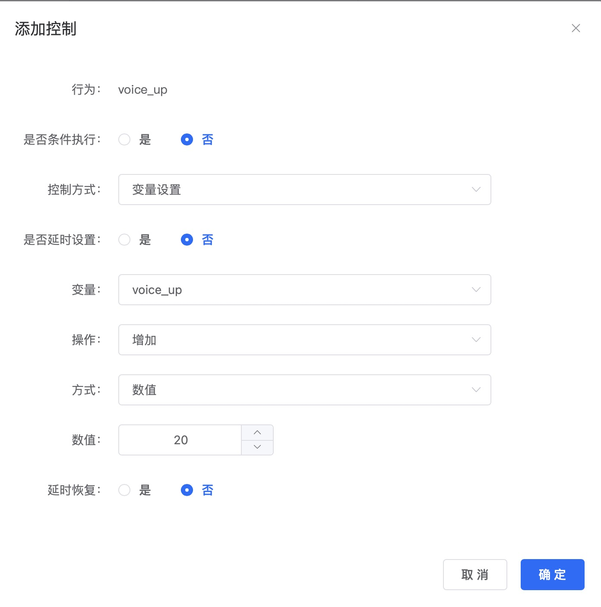

---

### 固件生成失败，提示"生成的固件超大(8192字节)"怎么办？

**问题描述：**

在生成固件时，系统提示"生成失败，生成的固件超大(8192字节)"，即使配置检查已通过且指令数量较少。

**解决方案：**

1. **选择更小的模型**
    - 进入"应用模型"选择界面
    - 选择占用空间更小的模型（如1M空间的模型）
    - 优先选择带"Pro"后缀的小模型
    - 例如："普通话通用Pro(占1M空间)"

2. **优化配置项**
    - 删减不必要的配置项目
    - 删除一些命令词条以减少内存占用
    - 关闭非必需的高级功能
    - 减少语音播报内容的数量
    - 使用组合播报功能替代多个单独播报
    - 选用内存更小的模型

3. **分步验证**
    - 先生成基础功能版本
    - 确认通过后再逐步添加功能
    - 每添加一个功能就尝试生成一次

**注意事项：**

- 8192字节(8KB)是固件大小的限制
- 配置检查通过不代表固件大小符合要求
- 25条指令在默认模型下可能会超限
- 组合播报可以减少固件占用空间

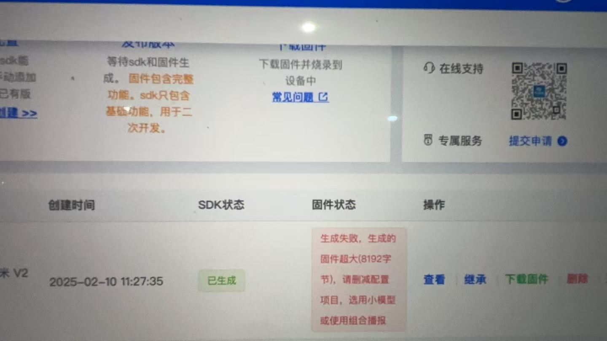

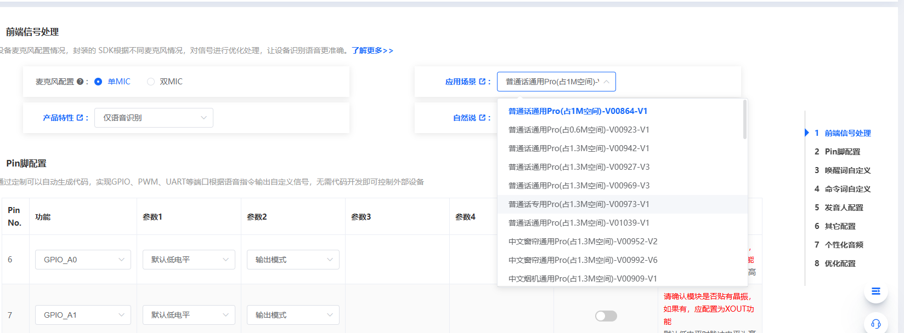

---

### 系统控制参数错误导致固件生成失败怎么办？

**问题描述：**

配置产品时，系统提示"行为控制详情中系统设置的参数错误 [行为名: sdjz]"，导致无法正常生成固件。

**解决方案：**

1. **定位错误参数**
    - 查看错误提示中具体的行为名称（如sdjz）
    - 在详细控制配置中找到对应的设置项
    - 检查该行为的参数配置是否超出允许范围

2. **常见错误类型**
    - 禁止识别词和学习唤醒词同时启用导致冲突
    - 参数值超出系统允许的范围
    - 必需参数未填写或格式错误
    - 功能组合存在逻辑冲突

3. **解决方法**
    - 删除冲突的配置项（如"禁止识别词"和"学习唤醒词"）
    - 使用JSON配置文件检查所有参数
    - 恢复到默认配置后重新设置
    - 使用平台导出/导入功能备份正确配置

4. **配置建议**
    - 先生成基础版本，确认功能正常
    - 逐步添加功能，每次生成后测试
    - 保留配置备份，便于问题恢复

**注意事项：**

- 参数错误通常不影响已生成的固件使用
- 配置冲突是新模型中的常见问题
- 建议使用老版本模型避免复杂配置问题
- 保留错误截图有助于快速定位问题


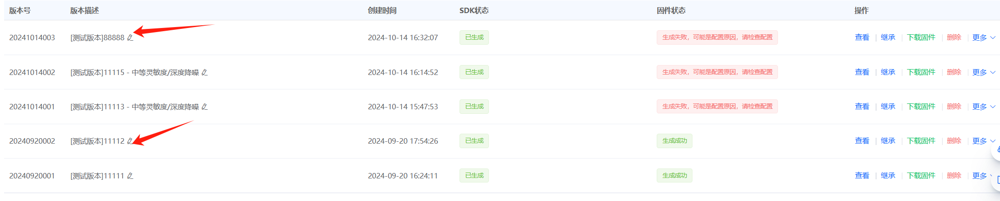
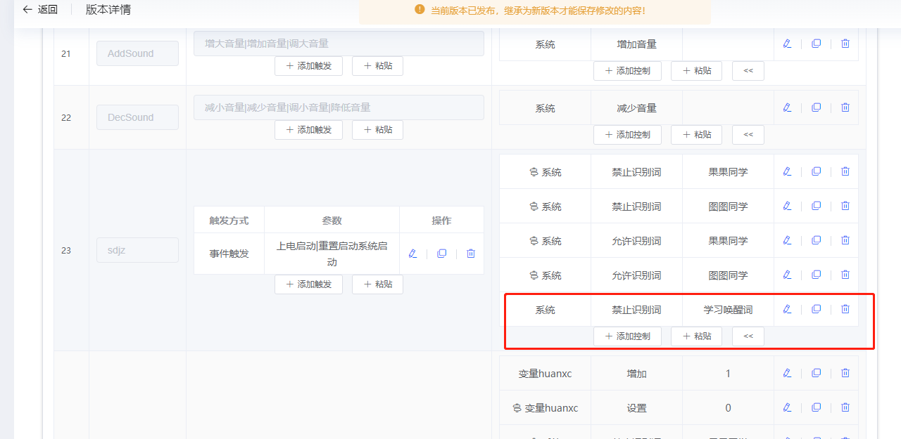

---

### AEC打断功能是什么作用？

**问题描述：**

在配置产品特性时，对AEC（回声消除）打断功能的作用和使用场景存在疑问。

**解决方案：**

AEC（Acoustic Echo Cancellation）是回声消除技术的缩写，主要用于以下场景：

**1. 功能作用**

    - 消除喇叭播放声音对麦克风的干扰
    - 防止播放的语音被误识别为唤醒词或命令
    - 提高在播放过程中的识别准确性

**2. 应用场景**

    - 需要在播放过程中同时进行语音识别
    - 播报音量较大或麦克风距离喇叭较近
    - 需要快速打断播报并识别新的指令

**3. 配置建议**

    - 安静环境下可以不开启AEC功能
    - 喇叭和麦克风距离较近时建议开启
    - 播报内容较多或音量较大时推荐使用

**4. 与其他功能的关系**

    - AEC打断与学习模式是独立功能
    - 可以单独开启或关闭
    - 开启AEC可能略微增加系统资源消耗

**注意事项：**

- AEC功能主要解决播放与识别的冲突问题
- 不是所有应用场景都需要开启此功能
- 开启AEC后，如识别不正常可尝试关闭测试
- 该功能在老版本模型中通常需要手动开启

---

### 如何实现两个负载的互斥控制？

**问题描述：**

需要控制两个独立负载（如开关A和开关B），实现互斥功能，即当一个负载接通时，另一个负载必须自动关闭，避免同时工作导致冲突。

**解决方案：**

**1. 使用IO输出直接控制**

- 配置两个IO引脚（如IO1和IO2）分别控制两个负载
- 通过高低电平控制负载的开关状态

**2. 配置互斥控制逻辑**

```
打开一号负载指令：

- IO1输出：高电平
- IO2输出：低电平

打开二号负载指令：

- IO1输出：低电平
- IO2输出：高电平

关闭所有负载指令：

- IO1输出：低电平
- IO2输出：低电平
```

**3. 平台配置步骤**

- 在详细控制中创建两个控制指令
- 每个指令同时设置两个IO口的输出状态
- 确保一个IO为高时，另一个IO必为低
- 可添加"全关"指令用于关闭所有负载

**4. 应用场景示例**

- **电机正反转控制**：防止正反转同时通电
- **照明模式切换**：保证只有一种模式点亮
- **风扇调速档位**：避免高速档和低速档同时开启
- **阀门控制**：确保进水阀和出水阀不会同时打开

**注意事项：**

- 互斥控制通过IO电平输出实现，无需额外MCU
- 配置时要确保每个指令都同时控制两个IO口
- 建议添加全关指令作为安全选项
- 实际应用中可根据需要添加状态反馈
- 硬件设计时要考虑IO口的驱动能力

---

### 自学习功能如何配置？

**问题描述：**

在使用自学习功能时，对不同产品特性下自学习功能的启用条件和配置方法存在疑问。

**解决方案：**

**1. 老版本模型配置**

    - 老版本模型自带自学习功能，无需在产品特性中选择
    - 直接在详细控制中开启"学习唤醒词"或"学习命令词"
    - 支持删除唤醒词、删除命令词、删除学习等操作

**2. 新版本模型配置**

    - 新版本模型需要在"产品特性"中选择相应的自学习选项
    - 选择"语音识别+自学习"或类似组合功能
    - 根据功能需求选择对应的学习模式

**3. 配置步骤**

    - 确认使用的是新版本还是老版本模型
    - 老版本：在详细控制中直接配置
    - 新版本：在产品特性中选择后再在详细控制中配置

**4. 功能对比**

    - 老版本：功能稳定，配置简单
    - 新版本：功能更丰富，但需要正确选择产品特性

**注意事项：**

- 模型版本不同，自学习功能的配置方式也不同
- 新老版本的配置界面和选项有区别
- 如配置后功能异常，检查是否选择了正确的模型版本
- 建议根据实际需求选择合适版本和配置


---

### 为什么自学习功能生成固件时会自动关闭？

**问题描述：**

在平台配置中已开启自学习功能，但每次生成固件后该功能会自动关闭。

**解决方案：**

**1. 固件类型确认**

    - 某些特定语种的固件可能未包含自学习功能
    - 需要确认生成的是否为支持自学习的固件版本
    - 部分定制固件可能默认关闭自学习功能

**2. 配置检查**

    - 确认在"产品特性"中选择了包含自学习的选项
    - 检查生成固件时的配置是否正确保存
    - 重新生成固件前再次确认自学习选项状态

**3. 固件验证**

    - 生成固件后，检查固件配置信息
    - 如问题持续，需要官方确认固件版本
    - 可能需要重新选择正确的产品特性

**注意事项：**

- 自学习功能依赖于特定的固件支持
- 不同语种或版本的固件功能可能有差异
- 生成固件前务必确认所有配置已正确保存
- 建议使用支持自学习的标准固件版本

---

### 如何配置不学习唤醒词只学习命令词？

**问题描述：**

在使用自学习功能时，希望只学习命令词而不学习唤醒词，同时避免触发不必要的删除操作。

**解决方案：**

**1. 修改学习唤醒词配置**

    - 在自学习界面修改学习唤醒词的内容
    - 改为不常见、不易识别的词组（如"天王盖地虎，宝塔镇河妖"）
    - 目的是避免误触发学习唤醒词功能

**2. 配置删除功能选项**

    - 在"删除学习"功能中：

    - 取消"删除唤醒词"选项
    - 保留"删除命令词"选项
    - 可选择性启用"删除学习"功能

**3. 自学习流程**

    - 只进行命令词的学习训练
    - 避免说出可能触发唤醒词的内容
    - 学习完成后测试命令词识别效果

**4. 替代方案**

    - 使用固定的唤醒词，通过命令词实现功能切换
    - 在平台配置中预设好常用命令词
    - 使用串口或其他方式控制设备状态

**注意事项：**

- 修改唤醒词为不常用词汇只是规避方法，并非根本解决方案
- 最好的方式是使用不支持唤醒词学习的固件版本
- 删除学习功能会清除所有学习内容，操作需谨慎
- 建议在测试环境下先验证配置效果


---

### 语音模块的指令是发送还是接收？

**问题描述：**

在使用语音模块时，需要确认模块发出的指令是模块向外发送的数据，还是模块接收的数据。

**解决方案：**

语音模块的指令通信是双向的，既可以发送也可以接收：

**1. 指令方向说明**

- 模块可以向外发送控制指令（如控制红外、串口输出等）
- 模块也可以接收外部指令（如串口输入、网络控制等）
- 同一个指令格式既可用于发送也可用于接收

**2. 通信协议**

- 串口通信指令格式统一
- 红外串口数据对标表中的指令格式
- 发送和接收使用相同的数据格式

**3. 应用场景**

- **发送**：语音识别后控制外设（红外发射、GPIO输出）
- **接收**：外部控制（串口命令、网络指令、触发播报）

**注意事项：**

- 指令格式在发送和接收时保持一致
- 具体是发送还是接收取决于应用场景和通信方向
- 开发时需根据实际需求判断指令流向

---

### 如何增加语音识别和播报的开关功能？

**问题描述：**

希望在语音模块中增加控制喇叭和语音识别功能的开关指令，以便在特定场景下可以关闭语音功能。

**解决方案：**

**1. 公版固件限制**

- 公版固件未内置语音开关指令
- 需要通过主控控制模块电源实现开关
- 断电会影响所有功能（包括服务器指令控制）

**2. 定制开发方案**

- 可定制开发专用的开关功能
- 支持通过串口控制语音识别和语音播报
- 需要一定的开发费用和采购量要求

**3. 定制方式**

- 方案一：支付开发费定制（具体费用请联系官方客服评估）
    - 包含3次功能修改
    - 如涉及优惠政策或采购量要求，请联系官方客服确认
    - 固件可修改1次

- 方案二：批量采购免费开发
    - 是否可提供免费/优惠开发服务需根据项目情况评估，请联系官方客服确认

**4. 定制内容示例**

- 红外学习顺序调整
- 唤醒词定制（仅保留特定唤醒词）
- 串口控制语音识别开关
- 串口控制语音播报开关

**注意事项：**

- 定制开发需要明确具体需求
- 定制固件与公版固件不兼容
- 建议根据项目规模选择合适的方案
- 定制开发有一定周期，需提前规划

---

### 语音模块的红外学习顺序是怎样的？

**问题描述：**

需要确认定制开发中红外学习的顺序设置，以确保学习流程正确。

**解决方案：**

**标准红外学习顺序**

1. **先关闭空调**
2. **再打开空调**
3. **后续保持不变**

**注意事项：**

- 学习顺序固定，不可更改
- 学习的是按键的实际红外码
- 确保遥控器有足够的电量
- 学习环境避免红外干扰

---

### WiFi模块是否可以对接涂鸦APP？

**问题描述：**

需要确认WiFi模块能否与涂鸦APP对接，以及是否需要定制开发和相关费用。

**解决方案：**

WiFi模块可以对接涂鸦APP，但需要定制开发：

- 通过网关方式对接：使用WiFi模块直接连接到涂鸦网关，进而与涂鸦APP通信
- 需要定制开发：对接涂鸦平台需要专门的定制开发服务
- 开发费用较高：定制开发涉及较多工作量，费用相对较高

**注意事项：**

- 量产后可降低成本：月用量达到一定规模（如上千级别）可协商降低开发费用
- 需求评估：建议提供具体的项目需求和预期用量，便于评估开发方案和费用
- 官方支持：可安排技术人员进行详细对接方案讨论

---

### 平台模块指令设置是否支持插行编辑？

**问题描述：**

在平台模块设置指令时，发现无法进行插行编辑，新添加的指令只能添加到指令列表的末尾，不能插入到现有指令的中间位置。

**解决方案：**

当前平台确实不支持插行编辑功能。如果需要调整指令顺序，可以：

1. 删除需要调整位置之后的指令
2. 重新按正确顺序添加这些指令

**注意事项：**

- 建议在添加指令前规划好执行顺序
- 删除并重新添加指令可能会影响已生成的SDK，需要重新生成

---

### 如何设置语音包的触发方式？

**问题描述：**

不清楚如何配置默认高电平和低电平触发方式，以及语音指令在设备上的体现方式。

**解决方案：**

**1. 触发方式配置**

- **默认高电平**：GPIO默认输出高电平状态（3.3V）
- **触发方式低电平**：当检测到低电平信号（0V）时触发动作
- 触发条件可设置为电平变化或边沿触发

**2. 语音指令体现方式**

语音指令在设备上通过以下方式体现：

- **GPIO输出**：控制外部设备（如LED、继电器）
- **语音播放**：播放设定的提示音或回复语
- **串口输出**：通过串口发送特定指令
- **组合动作**：同时执行多个输出动作

**3. 配置步骤**

1. 在平台选择"触发器"配置
2. 设置GPIO的默认电平状态
3. 选择触发条件（高/低电平、上升/下降沿）
4. 配置触发后执行的语音动作
5. 生成固件并测试

**注意事项：**

- 默认电平状态影响电路设计，需提前确认
- 语音指令需要与触发条件匹配
- 建议添加必要的消抖处理

---

### 智能公元平台的正确访问地址是？

**问题描述：**

需要确认使用的平台是否为官方正式平台，以免影响产品配置和固件生成。

**解决方案：**

**官方平台地址：**

- **网址**：https://smartpi.cn/
- **标识**：页面标题显示"智能公元/AI产品零代码平台"
- **功能**：包含完整的产品管理、固件生成、SDK下载等功能

**平台区分说明：**

1. **正式平台**：https://smartpi.cn/
    - 官方运营的稳定版本
    - 功能完善，技术团队到位
    - 推荐所有项目使用

2. **测试平台**：可能存在的内测版本
    - 用于新功能测试
    - 可能有功能限制或不稳定
    - 不建议正式项目使用

**验证方法：**

- 检查浏览器地址栏是否为 smartpi.cn
- 查看页面是否有"智能公元"标识
- 确认可以正常访问产品管理功能

**注意事项：**

- 建议收藏官方平台地址
- 如在其他平台遇到问题，请切换到官方平台
- 技术团队仅提供官方平台的服务

---

### 离线语音模块是否支持自行修改指令？

**问题描述：**

希望在离线语音识别模块上实现自定义语音指令的修改功能，但不确定是否支持。

**解决方案：**

离线语音模块的功能限制说明：

1. **指令修改限制**
    - 离线模块本身不支持自行修改语音指令
    - 只能使用预设的固定指令进行控制
    - 需要通过蓝牙模块才能实现自定义功能

2. **词条数量限制**
    - 低功耗模块的词条数量有限制
    - 不同型号支持的词条数量不同
    - 选择模块时需考虑词条容量需求

**注意事项：**

- 离线模块适合功能固定、成本敏感的应用场景
- 如需频繁修改指令，建议选择支持蓝牙的模块
- 可根据项目需求选择合适的模块型号

---

### 上传的配置文件有问题如何排查？

**问题描述：**

在智能公元平台上传JSON配置文件后，配置存在问题需要技术团队检查。

**解决方案：**

当配置文件上传后出现问题时，按以下步骤排查：

1. **平台确认**

    - 确认使用的是官方平台：https://smartpi.cn/
    - 检查账号登录状态是否正常
    - 验证产品选择是否正确

2. **配置文件检查**

    - 检查JSON文件格式是否正确
    - 确认文件大小是否符合限制
    - 验证字段名称与平台要求一致

3. **重新上传尝试**

    - 删除已上传的配置文件
    - 清除浏览器缓存后重新登录
    - 重新选择文件进行上传

4. **逐步验证**

    - 简化配置，先上传基础版本
    - 逐步添加配置项，定位问题
    - 保存不同版本的配置文件

**常见问题：**

- JSON格式错误：缺少逗号、括号不匹配等
- 字段名称错误：与平台要求不符
- 文件编码问题：建议使用UTF-8编码
- 版本兼容性：确认固件版本支持

**注意事项：**

- 建议使用文本编辑器验证JSON格式
- 保留配置文件的备份副本
- 如问题持续，可尝试简化配置测试

---

### 平台SDK版本与声学模型的兼容性？

**问题描述：**

在使用平台SDK 2.2.6版本时，尝试替换为1088模型但无法使用，询问是否可以升级SDK以支持该模型。

**解决方案：**

**版本兼容性说明：**

- 平台SDK 2.2.6版本有其对应的声学模型支持范围
- 1088模型通常需要更高版本的SDK支持
- 不同版本的SDK和模型需要严格匹配

**当前限制：**

1. **模型版本锁定**
    - 每个SDK版本对应特定的模型版本
    - 不能跨版本使用声学模型
    - 模型文件名中通常包含版本信息

2. **平台提示机制**
    - 平台会明确标注支持的SDK版本
    - 如"仅支持算法sdkv2.2.6"提示
    - 强制使用不兼容的模型会导致生成失败

**解决方案：**

1. **使用兼容的模型**
    - 选择当前SDK版本支持的模型
    - 查看模型列表中的版本要求
    - 优先使用带"V01088"标识的模型

2. **等待平台更新**
    - 关注平台版本更新通知
    - 新版本通常会支持更多模型
    - 可向技术团队反馈需求

3. **联系技术团队**
    - 询问特定模型的SDK版本要求
    - 申请测试新版SDK的权限
    - 获取模型兼容性对照表

**注意事项：**

- SDK和模型版本必须严格对应
- 使用不匹配的模型可能导致功能异常
- 建议保存常用的SDK-模型组合配置

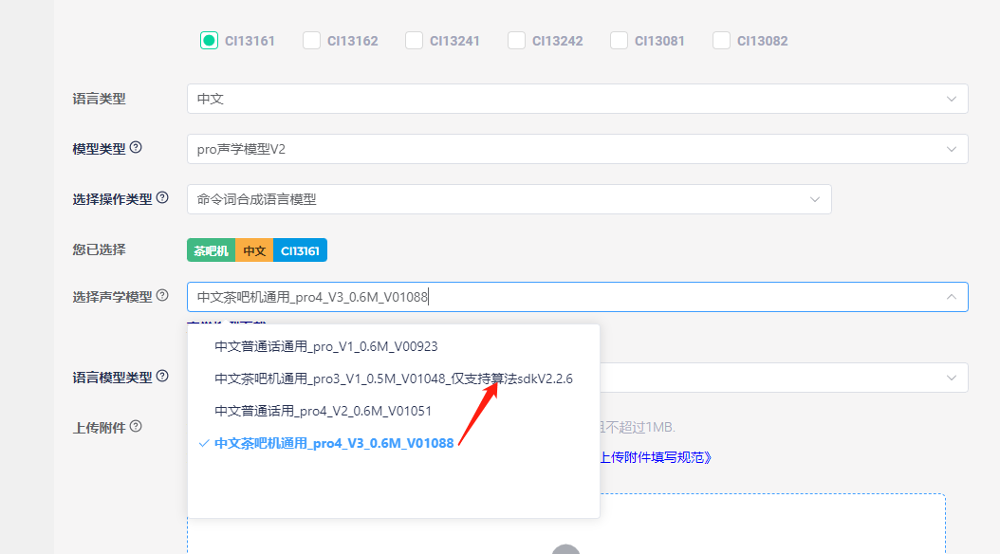

---

### 如何生成日语固件并选择合适的模型？

**问题描述：**

需要生成支持日语的固件，但不确定应选择哪个模型版本，以及如何正确配置。

**解决方案：**

**1. 模型选择建议**

- 选用Pro模型生成日语固件
- 推荐选择："日文通用Pro5(占1.3M空间)-V01149-v2"
- 老版本模型很多词条不存在，建议使用最新Pro版本

**2. 配置步骤**

- 登录智能公元平台
- 在"应用场景"下拉菜单中选择日语Pro模型
- 配置其他参数（麦克风、产品特性等）
- 生成并下载固件

**3. 注意事项**

- 日语识别模型占用约1.3M空间
- 确保目标模块有足够的Flash容量
- Pro模型相比普通模型支持更多词汇

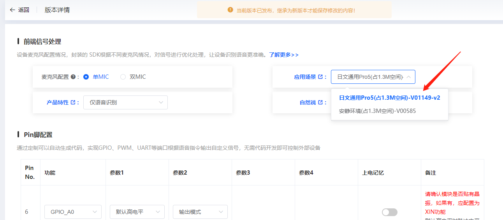

---

### 重复触发和立即重复触发有什么区别？

**问题描述：**

需要了解重复触发和立即重复触发两种机制的区别，以及它们在事件序列中的表现。

**解决方案：**

**1. 计时起点差异**

- **重复触发**：计时起点不触发事件
- **立即重复触发**：从计时起点就开始执行事件触发

**2. 事件序列表示**

将触发事件记为1，不触发事件记为0：

- 重复触发：01010101……
- 立即重复触发：10101010……

**3. 应用场景**

- **重复触发**：适用于需要间隔触发的场景
- **立即重复触发**：适用于需要立即开始的周期性触发

**注意事项：**

- 两种模式的触发时机不同，根据实际需求选择
- 立即重复触发会比重复触发多一次初始触发
- 配置时注意触发周期和间隔的设置

---

### 获取系统时间功能的开发进度如何？

**问题描述：**

需要了解获取系统时间功能是否已经完成开发并可以使用。

**解决方案：**

获取系统时间功能已经上线，可以正常使用。

**注意事项：**

- 功能已通过测试验证
- 如需使用该功能，请参考相关API文档或示例代码

---

### 如何获取音量值并判断音量是否达到最大或最小值？

**问题描述：**

需要获取当前音量值，以便在程序中判断音量是否已达到最大或最小值，从而避免无效的音量调节操作。

**解决方案：**

**音量范围说明：**

- 音量最大值：100
- 音量最小值：0
- 无法直接获取准确的当前音量数值

**判断方法：**

虽然无法直接获取当前音量值，但可以通过以下方式判断是否达到极值：

1. **状态记录法**：

    - 在程序中维护一个音量变量
    - 每次调节音量后更新该变量
    - 根据变量值判断是否达到极值

2. **边界测试法**：

    - 尝试执行音量增加操作
    - 如果音量没有变化，说明可能已达到最大值
    - 尝试执行音量减少操作
    - 如果音量没有变化，说明可能已达到最小值

**注意事项：**

- 音量范围固定为 0-100
- 建议在应用层实现音量状态的记录和管理
- 可以通过视觉或声音反馈提示用户当前音量状态
- 避免频繁的无效音量调节操作

---

### 音量控制的步进值是多少？

**问题描述：**

在配置音量增减控制时，需要了解每次调节的步进值，以便准确控制音量变化。

**技术参数：**

**默认配置：**

- 音量档位：5档
- 默认步进值：20

**步进值说明：**

- 每次执行"增加音量"或"减少音量"操作时，音量值变化20
- 从最小值(0)到最大值(100)共分为5档：

    - 0%（静音）
    - 20%
    - 40%
    - 60%
    - 80%
    - 100%（最大音量）

**配置位置：**

- 在平台的系统动作配置中可以找到音量控制相关设置
- 通过"优化选项"可以调整音量的档位配置
- 支持配置SOUND_UP（增加音量）和SOUND_DOWN（减少音量）动作

**注意事项：**

- 步进值可通过平台优化选项进行自定义配置
- 建议根据实际应用场景选择合适的步进值
- 过小的步进值可能导致调节次数过多
- 过大的步进值可能导致音量变化过于明显

---

### 固件生成失败怎么办？

**问题描述：**

在智能公元平台生成固件时，虽然配置检查通过，但固件生成仍失败，需要排查原因并解决。

**解决方案：**

**常见原因：命令词配置中包含多余空格**

- 命令词配置中不应包含空格字符
- 特别是在多个命令词组合时，容易误输入空格
- 空格会导致生成引擎解析错误

**解决步骤：**

1. **导出配置文件检查**：

    - 在产品管理页面点击"导出"
    - 下载JSON配置文件
    - 仔细检查命令词配置

2. **定位问题位置**：

    - 查看命令词列表
    - 特别注意使用"|"分隔的多个命令词
    - 找出包含空格的命令词组合

3. **修正配置错误**：

    - 删除命令词中的所有空格
    - 例如：将"ECO|eco mode"改为"ECO|ecomode"
    - 确保没有多余的空格字符

**问题示例：**


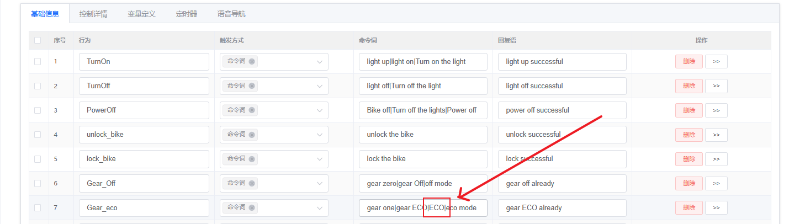

**导出JSON文件方法**：

1. 进入"产品管理"→"所有产品"
2. 找到对应项目，点击"导出"
3. 下载JSON配置文件
4. 使用文本编辑器检查命令词配置

**验证方法：**

- 修正配置后重新生成固件
- 确认生成成功
- 下载并测试固件功能


**注意事项：**

- 命令词配置严格禁止使用空格
- 使用"|"连接多个相似命令词时不要加空格
- 生成前务必进行配置检查
- 如问题持续，检查JSON文件中是否还有隐藏字符

---

### 固件生成失败的常见配置错误有哪些？

**问题描述：**

固件生成失败，可能由配置错误或网络问题导致，需要排查具体原因并提供解决方案。

**解决方案：**

**1. 检查空配置项**

- 确认触发记录中没有空的触发条件
- 检查控制记录中没有空的控制动作
- 验证变量名定义符合规范要求

**2. 串口参数检查**

- 确保未使用空的串口参数或变量
- 检查串口发送的信息内容已填写
- 验证数据格式符合十六进制要求

**3. 变量名规范**

- 变量名不能包含特殊字符
- 避免使用系统保留字作为变量名
- 确保变量引用格式正确

**4. 网络和环境因素**

- 检查网络连接是否稳定
- 尝试在网络使用较少的时段生成
- 清理浏览器缓存后重试

**5. 错误代码 500（服务器内部错误）**

- **现象**：提示 "Request failed with status code 500" 和 "固件生成失败"
- **常见原因**：
  - 配置检测未通过（即使平台检查通过）
  - 工程名称或文本包含特殊字符
  - 上传的播报文件包含特殊符号
  - 网络不稳定导致控制信息未保存成功
- **解决方法**：
  - 根据平台智能客服的提示检查配置
  - 删除空格后重新生成
  - 去掉播报文件中的特殊符号
  - 重新配置网络后再尝试

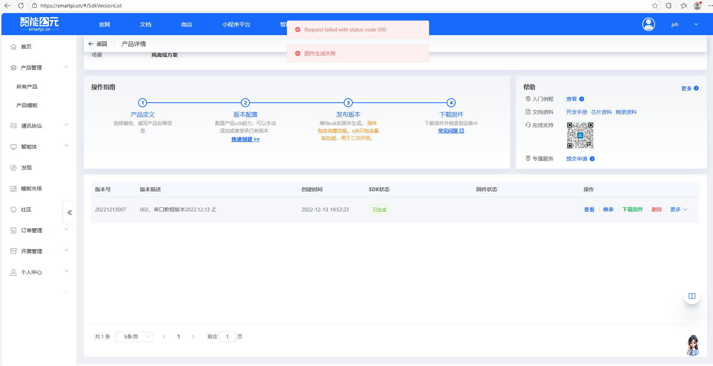


**注意事项：**

- 生成失败时先检查配置完整性
- 网络问题通常在非高峰时段会自动恢复
- 配置检查通过不代表所有细节都正确
- 建议导出配置文件进行仔细检查

---

### 授权点数如何分配到指定账号？

**问题描述：**

需要将授权点数分配到指定的账号，并确认登录用户数量的分配方案。

**解决方案：**

**分配流程：**

1. 联系技术团队或客服进行授权分配
2. 提供目标账号信息（如："智控物联"）
3. 指定授权数量范围（如：1001-10000个登录用户）
4. 确认分配完成

**分配规则：**

- 授权点数可以灵活分配到指定账号
- 不同账号的授权数量独立计算
- 分配后即时生效

**注意事项：**

- 分配前需确认账号信息准确无误
- 建议根据实际使用需求规划授权数量
- 保留分配记录以便后续管理

---

### 平台配置功能是否已经上线？

**问题描述：**

需要了解平台的配置功能是否已经上线并可以使用，以及当前是否可以访问。

**解决方案：**

**上线状态确认：**

- 测试平台已经上线
- 正式平台已经上线
- 现在可以正常访问和使用

**平台访问：**

- 直接访问正式平台地址进行配置
- 所有配置功能已经可用
- 硬件设计保持不变

**注意事项：**

- 如遇到访问问题，请确认使用正确的平台地址
- 建议使用最新版浏览器以获得最佳体验
- 配置完成后请及时保存

---

### 如何在平台中查找已创建的项目？

**问题描述：**

在智能平台创建项目后，下次登录时找不到项目存放位置。

**解决方案：**

1. 登录智能平台 [https://www.smartpi.cn](https://www.smartpi.cn)

2. 在左侧导航栏找到"产品管理"菜单

3. 点击"所有产品"选项

4. 在所有产品列表中可以找到之前创建的所有项目

**注意事项：**

- 项目默认保存在"所有产品"分类中
- 如找不到项目，确认登录的账号是否正确
- 平台首页展示的是推荐作品，不是个人项目

---

### 如何核对固件文件中的配置信息？

**问题描述：**

需要确认固件文件中包含的语音指令、开机播报和唤醒词等配置是否正确。

**解决方案：**

1. **获取配置信息**
    - 在平台中导出或查看项目的JSON配置文件
    - 或请求固件提供方提供配置清单

2. **核对要点**
    - 检查所有语音指令的行为名称、命令词和回复语
    - 确认开机播报内容是否正确
    - 验证唤醒词设置
    - 检查识别灵敏度等参数设置

3. **配置示例**
    - 行为名称：如'shuibenen'对应命令词'打开水泵'
    - 回复语：如'水泵已打开'
    - 开机播报：如'欢迎使用智能水肥一体机，请用你好小正唤醒我'

**注意事项：**

- 固件文件名通常包含模块型号和芯片信息
- 核对时需要逐项确认配置内容
- 发现问题需要在平台中修改并重新生成固件

---

### 固件版本如何更新？

**问题描述：**

现有固件可能为旧版本，需要了解如何获取新版本固件，以及新旧版本固件的差异和升级方法。

**解决方案：**

**版本确认方法：**

1. **版本信息查询**：

    - 联固件提供方确认当前版本
    - 对比已使用的固件和最新版本
    - 记录版本号和更新日期

2. **版本差异了解**：

    - 询问新版本的功能改进
    - 确认新版本是否兼容现有项目
    - 了解是否需要修改配置

**升级流程：**

1. **样品测试（推荐）**：

    - 先申请少量新版本样品
    - 在实际应用中测试功能
    - 确认无问题后再批量使用

2. **直接升级**：

    - 确认新版本兼容性后
    - 可直接用于新模块
    - 旧版本固件将不再使用

**注意事项：**

- 升级前建议先进行样品测试
- 确认新版本固件与项目需求匹配
- 保留旧版本配置作为备份
- 如有问题可联系技术人员协助

---

### 语音指令配置中"行为"字段应填写什么？

**问题描述：**

在语音指令配置界面中，不确定"行为"字段应该填写什么内容，以及不填写是否会影响功能。

**解决方案：**

**字段说明：**

- "行为"字段用于填写英文标识符
- 可填入具有标识度的英文单词
- 便于代码调试和功能识别
- 非必填项但有建议填写

**填写建议：**

- 使用驼峰命名法：TurnOn、TurnOff
- 或使用下划线：Turn_On、Turn_Off
- 保持命名一致性
- 使用有意义的英文单词

**示例：**

```
命令词：开机     → 行为：TurnOn
命令词：关机     → 行为：TurnOff
命令词：增大音量 → 行为：VolumeUp
命令词：减小音量 → 行为：VolumeDown
```

**不填写的影响：**

- 平台检测配置时会报错
- 可能导致固件生成失败
- 不影响基本的识别和控制功能
- 但不利于代码维护

**注意事项：**

- 该字段主要用于开发调试
- 最终控制功能依赖于引脚配置
- 建议养成填写习惯
- 避免使用中文或特殊字符


---

### 个性化音频文件大小限制是多少？

**问题描述：**

在上传个性化音频文件时，系统提示音频文件不能大于500kb，但模块Flash容量为2M，询问文件大小限制。

**解决方案：**

1. **文件大小限制说明**

    - 平台前端限制：单个音频文件不能超过500KB
    - 此限制为平台上传机制的技术限制
    - 与模块Flash容量无关

2. **Flash空间分配**

    - 2M Flash需要存储的内容包括：

        - 固件程序代码
        - 语音识别模型
        - 语音录音文件
        - 个性化音频文件
    - 可用于个性化音频的空间通常不足2M

3. **压缩建议**

    - 使用音频压缩软件减小文件体积
    - 推荐压缩到500KB以内
    - 保持采样率8kHz-16kHz，单声道
    - 使用MP3格式，比特率32-64kbps

**注意事项：**

- 即使Flash容量为2M，实际可用空间会被固件占用
- 平台上传时会自动压缩，但仍建议先手动压缩
- 如果音频过大，可考虑分段录制或降低音质
- **建议总音频不超过500KB**：多个音频文件的总大小建议控制在500KB以内，以确保存储空间充足

---

### 如何配置基于哭声/鼾声检测的定时器控制逻辑？

**问题描述：**

需要配置基于哭声/鼾声检测的定时器控制逻辑，实现异常告警后启动30秒定时器，若在30秒内通过声控取消告警则定时器清零，超过30秒未取消则触发声光电警报。

**解决方案：**

**实现方案：**

1. **添加变量控制**

    - 在异常告警触发后，添加一个变量改变动作
    - 该变量用于标识定时器状态
    - 变量可作为定时器控制的开关

2. **配置定时器逻辑**

    - 异常告警触发 → 启动30秒定时器
    - 声控取消告警 → 改变变量状态，清零定时器
    - 定时器超时（30秒）且变量未改变 → 触发声光电警报

3. **具体配置步骤**

    - 在异常告警行为后添加"设置变量"动作
    - 在声控取消行为中添加"改变同一变量"动作
    - 使用定时器功能监控该变量状态

**注意事项：**

- 需要合理设置定时器时长（30秒）
- 确保声控取消能正确改变变量状态
- 定时器超时后要检查变量状态再决定是否触发警报
- 建议增加手动复位功能以防异常情况

---

### 如何添加多语言命令词支持？

**问题描述：**

需要将中文命令词翻译成其他语言（如越南语、英语），以支持多语言应用场景。

**解决方案：**

**翻译流程：**

- 准备需要翻译的命令词列表
- 将中文命令词翻译为目标语言
- 确认翻译协议与原有协议一致
- 在平台中配置多语言命令词

**常用命令词类型：**

- 窗帘控制：打开/关闭窗帘、纱帘
- 房间标识：客厅、卧室、客房、老人房等
- 功能设置：增大音量、减小音量、设置窗帘类型

**命令词完整性要求：**

- 确保所有功能都有对应的命令词
- 包含音量调节等基础控制功能
- 考虑常用的所有操作场景
- 初期版本可先覆盖核心功能，后续逐步完善

**多语言翻译流程：**

1. **准备阶段**：

    - 整理完整的中文命令词列表
    - 按功能模块分类（控制类、设置类、状态类等）
    - 确认无遗漏的功能点

2. **翻译阶段**：

    - 将中文命令词翻译为目标语言
    - 确保翻译符合当地语言习惯
    - 注意命令词的简洁性和易识别性

3. **验证阶段**：

    - 在目标语言环境下测试识别效果
    - 调整发音不准确的词条
    - 优化识别率较低的命令词

**注意事项：**

- 确保翻译准确性和本地化适配
- 不同语言的命令词发音特点可能影响识别率
- 建议在目标语言环境下充分测试
- 协议保持一致性可避免兼容性问题
- 命令词库需要持续更新和完善

---

## 平台维护通知


---

### CI系列平台维护期间无法生成固件怎么办？

**问题描述：**

CI系列平台进行服务器维护时，固件生成功能暂时无法使用，影响正常固件生成操作。

**解决方案：**

- 关注平台官方发布的维护通知
- 维护期间请耐心等待，避免重复尝试
- 维护完成后（通常1-2天）功能将恢复正常
- 如急需生成固件，可联系客服或技术团队协助
- SU系列平台通常不受CI系列维护影响，可作为临时替代方案

**注意事项：**

- 平台维护是必要的系统升级操作，旨在提升服务质量
- 维护时间通常会提前公告，请留意通知
- 维护期间其他功能可能也会受到影响

---

### SDK生成服务编译时间过长怎么办？

**问题描述：**

使用SDK生成服务时，编译时间过长（如需要180分钟），影响开发效率。

**解决方案：**

- SDK生成服务采用队列机制，当同时有大量使用方生成固件时需要排队等待
- 编译时间会根据队列长度动态调整，从显示的180分钟逐渐减少到118分钟是正常现象
- 如遇长时间排队，建议：

    - 避开高峰期（工作日白天）进行生成
    - 耐心等待，不要重复提交以免增加队列负担
    - 可考虑在夜间或非工作时间提交生成任务

**注意事项：**

- 编译时间长度反映当前服务器负载情况，并非系统故障
- 后台正在持续优化服务器性能以缩短等待时间

---

### 生产SDK时快速版本和优化版本有什么区别？

**问题描述：**

在生产SDK时，快速版本生成时间短，优化版本生成时间长（约3小时），需要了解两者的区别以及量产时应该选择哪个版本。

**解决方案：**

**版本区别：**

- **快速版本**：主要用于功能测试和验证
- **优化版本**：经过进一步润色和优化，识别效率有提升

**性能对比：**

- 快速版本可以正常使用，功能完整
- 优化版本对识别效率有少许提升
- 两个版本的识别效果可能存在细微差异

**选择建议：**

- 如果快速版本功能验证已通过，建议继续使用快速版本
- 量产时并非必须使用优化版本
- 优化版本更适合对识别精度要求极高的场景

**注意事项：**

- 优化版本生成时间较长，需要合理安排生产计划
- 建议先使用快速版本完成所有功能验证
- 两个版本的选择应根据实际产品需求决定

---

## 固件生成问题


---

### 固件生成失败或卡在"固件生成中"怎么办？

**问题描述：**

在平台生成固件时，出现生成失败或点击"重新生成"后卡在"固件生成中，请稍候..."界面，无法完成生成。

**解决方案：**

**问题现象：**

- 配置检查通过，但固件生成失败
- 点击重新生成后界面卡住
- 需要刷新页面才能恢复

**解决方法：**

1. **等待一段时间后重试**
    - 建议等待30分钟后再提交生成
    - 避免频繁操作导致系统繁忙

2. **通过"更多"菜单重新生成**
    - 进入固件列表界面
    - 点击"更多"选项
    - 选择重新生成固件

3. **检查网络和浏览器**
    - 确保网络连接稳定
    - 尝试刷新页面或更换浏览器
    - 清除浏览器缓存后重试

**注意事项：**

- 固件生成需要一定时间，请耐心等待
- 如果持续失败，可能是系统繁忙，建议错峰使用
- 生成过程中不要关闭或刷新页面

---

### 固件生成失败且无法编辑怎么办？

**问题描述：**

在使用固件生成工具时，出现"生成失败，可能是配置原因，请检查配置"的错误，且无法再次编辑配置，提示"当前版本已发布，继承为新版本才能保存修改的内容"。

**解决方案：**

**1. 版本继承操作**

- 找到生成失败的固件记录
- 点击"继承"按钮创建新版本
- 在新版本中修改配置并重新生成

**2. 配置检查要点**

- 逐项检查所有配置参数
- 特别关注可能导致冲突的设置
- 确认没有重复或矛盾的指令

**3. 编辑限制说明**

- 已发布的版本无法直接修改
- 必须继承为新版本才能编辑
- 这是平台的版本管理机制

**注意事项：**

- 继承版本会保留原有配置
- 建议在继承后先检查配置再修改
- 生成失败通常是配置逻辑问题，需要仔细排查

---

### 固件状态长时间停留在"待生成"怎么办？

**问题描述：**

在固件生成平台中，工程的固件状态长时间显示为"待生成"，即使SDK状态已显示"已生成"，但固件生成过程似乎被中断或卡住。

**解决方案：**

**原因分析：**

- **生成中断**：在固件生成过程中进入界面查看，导致生成过程被中断
- **状态异常**：系统未正确更新固件状态
- **网络波动**：网络连接不稳定可能导致生成请求丢失

**解决方法：**

1. **重新生成固件**
    - 在工程列表中找到对应的工程
    - 点击"重新生成"按钮
    - 等待固件生成完成

2. **避免操作中断**
    - 提交生成请求后，避免频繁进入工程界面
    - 等待固件生成完成后再进行其他操作
    - 生成期间不要刷新或关闭相关页面

3. **检查网络环境**
    - 确保网络连接稳定
    - 避免在网络不稳定时进行固件生成
    - 必要时更换网络环境重试

**注意事项：**

- 固件生成需要一定时间，请耐心等待完成
- 生成过程中避免进入工程界面查看状态
- 如果问题持续存在，可联系技术团队协助处理

---

### SDK生成排队等待时间过长怎么办？

**问题描述：**

在SDK生成平台提交生成任务后，显示"大约需要3分钟"，但实际等待超过30分钟仍未完成，询问是否需要继续等待。

**解决方案：**

**排队机制说明：**

- **生成队列**：SDK生成采用排队机制，按提交顺序处理
- **并发限制**：服务器同时处理的生成任务数量有限
- **等待原因**：当前生成任务较多，需要排队等待

**处理建议：**

**1. 耐心等待**

- **正常现象**：高峰期等待时间可能超过预期
- **建议等待**：一般会在1-2小时内完成
- **不要重复提交**：避免重复生成造成资源浪费

**2. 检查进度**

- **保持页面开启**：不要关闭或刷新生成页面
- **查看状态**：留意状态栏的进度提示
- **自动完成**：生成完成后会自动开始下载

**3. 优化时机**

- **错峰使用**：避开工作日高峰时段
- **推荐时段**：

    - 工作日晚上8点后
    - 周末或节假日
    - 凌晨时段

**4. 其他方案**

- **本地生成**：如有离线生成工具，可考虑本地生成
- **联系支持**：等待超过 2 小时可联系技术团队
- **分批生成**：大型项目可分多次生成不同模块

**注意事项：**

- SDK生成是服务器密集型操作，需要排队调度
- 生成时间受任务队列长度影响
- 系统维护期间生成服务可能暂停
- 建议合理安排生成时间，提高效率

---

## TTS语音合成


---

### CI1302芯片是否支持TTS功能？

**问题描述：**

需要了解CI1302芯片是否支持TTS（文字转语音）功能，以及该功能与语音识别功能是否可以同时使用。

**解决方案：**

CI1302有专门的TTS版本芯片可供选择。

**功能说明：**

- **TTS版本支持**：有提供TTS功能的CI1302芯片版本
- **功能互斥性**：TTS版本的芯片不能同时进行语音识别
- **定制需求**：如需TTS功能，需要选择专门的TTS版本芯片

**注意事项：**

- TTS功能与语音识别功能在硬件上互斥，不能同时使用
- 选择芯片时需要明确主要应用场景
- 如需同时具备两种功能，建议考虑使用两颗芯片分别实现


---

### 是否有支持TTS语音合成和MP3播放的模块？

**问题描述：**

寻找支持汉字语音合成（TTS）并能播放预存MP3格式语音的模块。

**解决方案：**

有专门的TTS模块可供选择。

**模块功能：**

- **TTS语音合成**：支持汉字转语音
- **MP3播放**：支持预存MP3格式音频文件播放
- **两种功能集成**：一个模块同时支持两种需求

**产品动态：**

- 机芯智能已推出TTS文本转语音模块新品
- 可通过官方公众号了解TTS产品详细信息
- 支持多种TTS应用场景和定制需求

**获取方式：**

- 联系客服咨询具体型号
- 获取详细技术资料
- 了解采购流程
- 关注官方公众号获取TTS产品更新

**应用场景：**

- 语音提示系统
- 报站器设备
- 智能家居控制
- 工业自动化语音播报

**注意事项：**

- 不同型号功能可能有所差异
- 购买前确认具体需求
- 索取开发资料和样例


---

### 语音模块的串口通信协议是否支持自定义配置？

**问题描述：**

在使用语音模块与主控MCU通信时，需要了解串口通信协议是否可以自定义配置，以及是否可以通过平台自动生成代码。

**解决方案：**

- 语音模块的串口通信协议支持自定义配置
- 官方平台可以自动生成代码，无需二次开发
- 串口协议支持自定义配置，不限于固定模式

**注意事项：**

- 长词条（如超过10个字符）可能会增加误触发概率，建议简化为短词条
- 不支持单线通信，仅支持标准串口通信方式
- 平台生成的固件不提供源码


---

### 唤醒词唤醒语音芯片时能否同时发送串口数据给主控MCU？

**问题描述：**

在使用语音模块时，希望在唤醒词唤醒语音芯片的同时，通过串口发送数据给主控MCU，以实现主控的同步唤醒。同时需要确认唤醒词条是否可以配置串口发送16进制数据，以及是否会与其他命令词冲突。

**解决方案：**

- 唤醒词唤醒语音芯片的同时可以发送串口数据给主控
- 通过这种方式可以实现主控MCU的同步唤醒
- 唤醒后的语音词条可通过语音芯片发送串口数据给主控MCU实现功能控制

**配置方法：**

在智能公元平台配置词条的串口发送功能：

1. **选择词条**：在词条列表中选择需要配置串口发送的词条（包括唤醒词或命令词）

2. **添加串口发送动作**：
   - 在词条的控制详情中点击"添加控制"
   - 操作类型选择"发送UART1_TX"（或对应串口）
   - 参数类型设置为16进制数
   - 输入要发送的16进制数据（如01、AA 55等）

3. **保存配置**：保存并发布固件

**功能说明：**

- 每个词条（包括唤醒词和命令词）都可以独立配置串口发送16进制数据
- 一条命令词可以同时作为唤醒词和串口发送，两者不会冲突
- 语音识别只能识别然后播报，不发送串口数据就没有控制意义
- 可参考B站的串口视频教程了解详细配置步骤


---

### 是否支持定制开发中英文自学习声控词汇功能？

**问题描述：**

需要在现有产品基础上定制开发支持中英文的自学习声控词汇功能，了解技术可行性、开发周期和相关费用。

**解决方案：**

**技术可行性：**

- 支持定制开发中英文自学习声控词汇功能
- 需要区分两类功能：对应动作的指令词汇和自学习词汇
- 技术上可实现，但需要一定的开发周期

**开发周期：**

- 中英文混合的自学习声控词汇功能开发较为复杂
- 预计开发周期：一周左右可提供初版
- 具体时间取决于功能复杂度和需求细节

**开发服务：**

- 需要根据具体需求评估开发费用
- 建议提供详细的功能需求文档和词汇列表
- 可通过官方渠道提交定制开发申请

**注意事项：**

- 定制开发前建议先明确具体的技术需求和功能规格
- 提供完整的词汇定义文件有助于准确评估开发工作量
- 定制固件与公版固件不兼容，需要综合考虑后续维护

---

### 语音模块的低功耗待机机制和词条开发服务如何收费？

**问题描述：**

需要了解语音模块在无语音输入时的低功耗待机机制、语音功能超时退出时间，以及词条生成和固件开发服务的收费方式。

**解决方案：**

**低功耗待机机制：**

- 周围环境安静时，语音模块会立即进入待机状态
- 再次使用语音功能需要重新说唤醒词
- 语音功能超时退出时间可自定义（10秒、20秒、60秒等）

**词条与固件开发服务：**

- 词条由需求方提供，开发团队根据要求制作固件
- 串口协议可由需求方提供，或使用默认协议
- 开发服务可能涉及费用，具体以官方渠道评估为准

**注意事项：**

- 主控MCU需要根据语音模块的超时时间配置相应的sleep机制
- 建议通过官方平台提交详细需求表以获取评估信息
- 官方平台（smartpi.cn）支持用户自行配置和生成固件


---

### 语音模块唤醒后如何通过串口激活主控？平台能否自行配置词条？

**问题描述：**

需要在语音模块唤醒后通过串口通信发送数据激活低功耗主控，并配置30-40条语音词条，但词条内容可能需要后续修改。

**解决方案：**

**串口激活主控：**

- 唤醒词识别后可配置串口输出数据
- 通过串口数据可激活处于低功耗状态的主控MCU
- 支持自定义串口协议和数据格式

**词条配置方式：**

- **官方平台配置**：可在智能公元平台（smartpi.cn）自行配置
- **支持灵活修改**：后期可随时登录平台修改词条内容
- **即时生成固件**：配置完成后可立即生成固件下载

**配置流程：**

1. 登录官方平台创建产品项目
2. 添加唤醒词和命令词（30-40条）
3. 配置串口输出动作和数据
4. 设置唤醒超时时间
5. 生成并下载固件

**注意事项：**

- 官方平台提供完整的配置界面，无需开发经验
- 词条修改后需要重新生成并烧录固件
- 建议在平台中保存项目配置便于后续修改
    
---

### TTS串口工具如何使用？固件生成有限制吗？

**问题描述：**

需要使用TTS串口工具进行语音合成，但网站生成的固件无法输出声音，询问TTS专用固件获取方式和串口协议。

**解决方案：**

**TTS固件获取：**

- 平台暂不支持直接生成TTS固件
- 需联系官方客服或技术团队获取专用TTS固件
- 通过客服提供的二维码可直接联系获取

**TTS串口工具使用：**

- 双击打开TTS串口工具软件
- 选择正确的串口号
- 设置波特率（通常为115200）
- 点击"打开串口"按钮建立连接
- 按协议格式发送TTS指令

**注意事项：**

- 必须使用专用TTS固件，网站生成的通用固件不支持TTS功能
- TTS串口协议数据包格式需参考官方文档
- 确保使用最新版本的TTS工具
- 正确配置串口参数以保证通信正常

---

### 固件运行时出现死机问题如何排查？

**问题描述：**

固件程序在运行过程中出现死机现象，需要排查原因。

**解决方案：**

**电流供电检查：**

- 检查电源供电是否稳定
- 确认供电电流是否足够
- 电流不足可能导致设备运行不稳定或死机

**日志查看方法：**

- 将烧录口设置为默认状态（不用于其他功能）
- 通过串口连接查看设备运行日志
- 分析日志中的异常信息定位问题

**简化测试：**

- 断开所有外接设备，只保留基本连接（麦克风、喇叭、继电器）
- 逐步添加外设，观察死机现象是否重现
- 确认是否为外设干扰导致的问题

**注意事项：**

- 供电质量是影响设备稳定性的关键因素
- 查看日志时避免执行消耗资源的操作
- 如问题持续，需联系技术团队提供详细日志

---

## 语音合成与播报


---

### 如何配置多音字播报？

**问题描述：**

需要在智能语音设备中配置多音字播报，实现对特定汉字在不同语境下的不同发音。

**解决方案：**

**多音字配置方法：**

使用[=py]标签在回复语中指定多音字的拼音和声调。

**配置格式：**

- [=拼音声调]：指定汉字的发音
- 声调范围：1-5（对应不同音量）
- 直接写在需要发音的汉字后面

**配置示例：**

```
已调[=tiao2]至中[=zhong1]风档
```

**参数说明：**

- **声调1**：最低音量
- **声调2-4**：音量递增
- **声调5**：最高音量

**使用位置：**

- 命令词自定义的回复语中
- 语音播报的任意文本内容
- 支持多个多音字同时配置

**注意事项：**

- 拼音必须准确，声调要符合实际发音
- 不同声调会影响音量，根据需要调整
- 配置后建议测试播报效果

---

## SU系列模块配置


---

### 如何配置GPIO引脚作为串口通信接口？

**问题描述：**

需要配置GPIO引脚（如B6/B7）作为UART1串口，实现与单片机的通信。

**解决方案：**

1. **GPIO配置方法**
    - 在配置平台中找到GPIO引脚配置选项
    - 将GPIO_B6配置为UART1_RX功能
    - 将GPIO_B7配置为UART1_TX功能

2. **串口通信使用**
    - 配置完成后，B6/B7引脚将作为串口1使用
    - 可通过这两个引脚与单片机进行串口通信
    - 通信参数需要与单片机端保持一致

**注意事项：**

- GPIO引脚功能可自行配置
- 配置为串口功能后，原GPIO功能将不可用
- 使用时需注意电平匹配和波特率设置

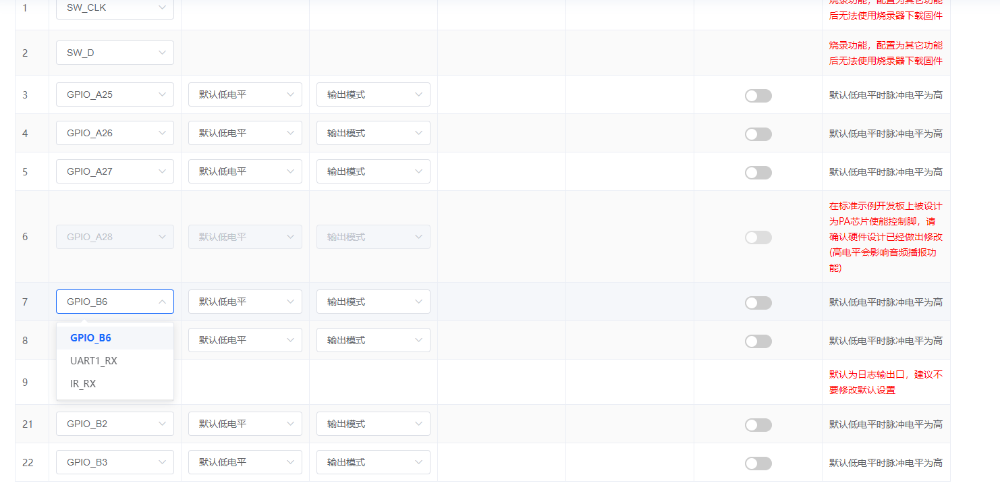

---

### 控制逻辑中的延时恢复功能是如何工作的？

**问题描述：**

在配置控制逻辑时，对延时恢复功能的执行方式存在疑问，不确定在设置的延时期间系统是处于阻塞等待状态还是其他状态。

**解决方案：**

延时恢复功能的工作原理：

- 当设置延时恢复（如1000ms）后，系统会在延时期间继续正常执行其他任务
- 延时期间不会阻塞整个系统，模块仍然可以响应其他语音指令
- 延时时间到达后，相关变量会自动恢复到默认值

**注意事项：**

- 延时恢复是非阻塞的，不影响其他功能的正常运行
- 延时时间应根据实际应用需求设置，避免过短导致功能失效
- 多个控制逻辑可以同时设置不同的延时恢复时间

---

### 芯片升级后新模块与旧模块的固件兼容性如何？

**问题描述：**

芯片升级后，新模块与旧模块在固件兼容性方面存在差异，需要了解不同组合的兼容性情况。

**解决方案：**

固件兼容性规则：

- **旧模块 + 旧固件**：完全兼容，不受影响
- **新模块 + 旧固件**：不支持，必须更新固件
- **新模块 + 新固件**：完全兼容
- **旧模块 + 新固件**：兼容，可以正常使用

**注意事项：**

- 旧模块库存使用完毕后不再生产
- 建议尽快更新到新固件版本，以保证长期支持
- 新生成的程序应优先适配新模块，但需要考虑旧模块库存的兼容性

---

### 固件生成超时怎么办？

**问题描述：**

在使用平台生成固件时，固件生成过程已超过30分钟仍未完成，导致无法正常生成SDK。

**解决方案：**

**正常生成时间参考：**

- **测试固件**：1-3分钟
- **正式固件**：10-30分钟

**超时处理方案：**

1. **耐心等待**
    - 在平台使用高峰时段，服务器任务较多，可能超过30分钟
    - 只要网络连接正常，最终会完成生成

2. **网络检查**
    - 检查网络连接是否稳定
    - 避免在网络不稳定时生成固件
    - 建议选择非高峰时段操作

3. **刷新页面**
    - 等待一段时间后刷新页面查看状态
    - 不要重复点击生成，避免多个任务排队

**注意事项：**

- 固件生成时间受服务器负载影响，存在波动是正常现象
- 建议在网络环境良好的情况下操作
- 如持续超时，可联系技术团队处理
- 生成失败后，系统会返回提醒，这时可以再次提交
- 请不要多次提交，这样会堵塞服务器，导致所有人都更慢

---

### 离线语音模块是否支持播报当前时间？

**问题描述：**

需要语音模块能够播报当前时间，实现语音查询时间功能。

**解决方案：**

**功能限制说明：**

- **直接不支持**：离线语音模块本身无法获取当前时间信息
- **离线特性**：作为离线模块，无法联网获取时间

**替代实现方案：**

1. **外部时间输入**
    - 通过串口从外部设备（如单片机、RTC模块）获取时间数据
    - 接收格式化的时间字符串（如："现在时间是14点30分"）

2. **播报流程**
    - 外部系统通过串口发送时间数据给语音模块
    - 语音模块接收并播报收到的时间信息

**实现步骤：**

- 配置语音模块接收串口消息
- 设置串口消息触发播报功能
- 外部系统定时发送或按需发送时间数据

**注意事项：**

- 需要外部系统提供时间源
- 串口通信需要确保波特率等参数匹配
- 时间格式应提前配置好播报模板

---

### 如何获取平台资料和教程视频？

**问题描述：**

需要了解产品开发、烧录和串口通信等操作，希望获取官方平台资料和教程视频。

**解决方案：**

**官方资料获取渠道：**

1. **智能公元文档中心**
    - 网址：https://help.aimachip.com/
    - 内容包括：

        - 常见问题解答
        - 产品选型表
        - 开发包下载
        - 技术文档

2. **B站机芯智能官方频道**
    - 网址：https://space.bilibili.com/1903518159
    - 视频内容包括：

        - 平台操作教程
        - 固件烧录演示
        - 串口数据发送示例
        - 实际应用案例

**使用建议：**

- 优先查看文档中心获取系统性的技术资料
- 结合B站视频教程进行实操学习
- 遇到问题时先查阅FAQ和文档
- 关注官方账号获取最新更新信息

---

### 如何配置离线语音模块的开机播报功能？

**问题描述：**

离线语音模块的开机播报功能无法正常工作。

**解决方案：**

1. **配置开机播报**
    - 在配置平台的"其它配置"页面
    - 设置"开机播报"为"有开机播报"
    - 输入自定义播报语句（如："哇偶今天心情不错，有什么想了解的吗"）
    - 设置超时退出时间和退出回复

2. **故障排查**
    - 重启电脑可能解决通信问题
    - 检查USB驱动是否正常
    - 确认配置文件已正确下载到模块

**注意事项：**

- 开机播报语句需要符合TTS合成规则
- 重启电脑可以解决某些临时性通信问题
- 配置完成后需要重新生成并烧录固件


---

### UART1接口通信异常如何处理？

**问题描述：**

使用UART1接口进行串口通信时，出现数据发送和接收无响应的问题。

**解决方案：**

1. **硬件连接检查**
    - 确认UART1的TX和RX引脚正确连接
    - 检查供电电压是否在规定范围内（3.6-5.5V）
    - 确认波特率、数据位、停止位等参数与对端设备一致

2. **平台配置确认**
    - 在配置平台中确认GPIO引脚已正确配置为UART功能
    - 检查串口通信参数设置是否正确
    - 确认固件已正确烧录到模块

3. **通信协议调试**
    - 使用串口调试工具发送测试数据
    - 检查数据格式是否符合协议要求
    - 确认数据校验位设置正确

**注意事项：**

- UART1接口功能需要平台支持，部分功能可能暂时不可用
- 确保对端设备的电平与模块匹配
- 建议使用标准波特率（如9600、115200）

---

### 如何实现UART1接收特定指令并返回数据？

**问题描述：**

需要通过UART1接口接收读取ID的指令，并返回系统中掉电保存的变量ID值。

**解决方案：**

1. **协议设计**
    - 定义指令格式：[命令头][命令字][校验位]
    - 例如：0x01 0x02 0x03 0x04（0x02为读取ID指令）

2. **实现步骤**
    - 配置UART1接收中断
    - 解析接收到的数据，识别读取ID指令
    - 从Flash存储区读取保存的ID值
    - 通过UART1发送返回数据

3. **数据返回格式**
    - 返回格式：[命令头][命令字][ID高8位][ID低8位]
    - 确保ID值已在系统掉电前正确保存到Flash

**注意事项：**

- 需要确保ID值已通过掉电保存功能写入非易失性存储器
- 读取Flash操作时要避免数据损坏
- 返回数据的格式需要与接收端预先约定

---

### 如何在平台中调节音量大小？

**问题描述：**

需要了解如何在配置平台中调节设备的语音播报音量。

**解决方案：**

**平台音量配置方法**：

1. **找到音量配置选项**
    - 在配置平台的固件生成界面
    - 找到音量、语速、亮度等参数设置
    - 音量通常以数值形式表示（如0-100）

2. **调节音量参数**
    - 拖动音量滑块或输入数值
    - 默认值通常为50或75
    - 可根据需要调大或调小

3. **应用配置**
    - 设置完成后生成固件
    - 烧录到模块后生效
    - 也可通过语音指令实时调节

**注意事项：**

- 音量数值没有固定标准，根据实际应用场景调节
- 音量过大可能导致失真，过小可能听不清
- 部分模块支持通过语音指令动态调节音量
- 配置界面还包含语速、亮度等其他参数可一并调节


---

### 语音模块是否支持接收字符串进行播放？

**问题描述：**

需要了解语音模块是否支持接收外部传入的字符串，并根据字符串内容进行语音播报。

**解决方案：**

语音模块本身不支持直接接收字符串进行TTS播报。字符串需要转换为数值形式才能被模块识别和处理：

- 字符串内容最终都会转换为数值数据
- 模块通过识别特定的数值来触发预置的语音播报
- 如需动态播报不同内容，建议使用串口通信协议

**注意事项：**

- 模块主要支持预置的语音词条播报
- 动态字符串播报需要通过上位机或MCU发送相应指令
- 具体的串口通信协议可参考对应模块的开发文档

---

### 行为控制详情中播放语音内容不能为空怎么办？

**问题描述：**

配置检查时提示"行为控制详情中播放语音内容不能为空"，导致配置无法通过。

**解决方案：**

**错误原因**：

- 添加"播放"行为时，未填写具体的播放内容
- 播放内容字段显示为"???"或空白

**解决方法**：

1. **填写播放内容**
    - 在版本详情配置界面
    - 找到对应的行为（如AA）
    - 在播放内容字段输入具体的播报文本

2. **配置确认**
    - 确保播放内容不为空
    - 检查参数设置是否正确
    - 保存后重新进行配置检查

**注意事项：**

- 播放内容可以是任意文本，但必须填写
- 支持中文、英文、数字等字符
- 播放内容将用于TTS语音合成
- 配置完成后需重新生成固件并烧录


---

### 如何设计按键按下时的提示音功能？

**问题描述：**

需要设计按键按下时发出提示音（如嘀嘀声）的功能，并了解新一代产品是否支持通过APP进行配置。

**解决方案：**

**按键提示音实现方法**

1. **硬件触发设计**
    - 将按键连接到模块的GPIO引脚
    - 配置GPIO为输入模式，检测低电平触发
    - 当检测到按键按下（输入低电平）时，触发播报提示音

2. **平台配置步骤**
    - 在配置平台中添加触发行为
    - 触发方式选择"GPIO输入"
    - 选择对应的GPIO引脚
    - 触发电平设置为"低电平"
    - 播报内容设置为提示音（如"嘀"声）

3. **使用个性化音频**
    - 可以在平台上传自定义的提示音文件
    - 支持常见的音频格式（如MP3、WAV）
    - 配置为按键触发时播放的音频文件

**新一代产品配置支持**

- 新一代产品支持在平台上直接配置
- 无需使用APP进行配置，所有功能都在平台完成
- 支持更灵活的音频文件管理和触发逻辑配置

**注意事项：**

- 按键电路需要做防抖处理，避免多次触发
- GPIO引脚的电平需要与硬件电路匹配
- 提示音文件不宜过长，建议控制在1-2秒内
- 配置完成后需要重新生成并烧录固件

---

### 如何通过命令词查询电量并通过串口返回？

**问题描述：**

需要设置命令词触发电量查询功能，让模块播报电量值的同时通过串口返回具体的电量数据。

**解决方案：**

需要配置两个部分：命令词触发和端口输出：

1. **配置命令词识别**
    - 添加命令词如"查询电量"
    - 设置对应的语音回复语

2. **添加电量查询行为**
    - 触发方式：选择"串口输入"
    - 消息编号：设置为1（或自定义）
    - 参数：选择U1_Energy（电量参数）
    - 参数类型：unsigned char
    - 操作：播放当前电量百分比

3. **配置串口输出**
    - 控制方式：选择"端口输出"
    - 控制类型：UART1_TX
    - 动作：发送
    - 参数格式：十六进制
    - 最大长度：32字节
    - 格式要求：两个字符一组，空格分隔


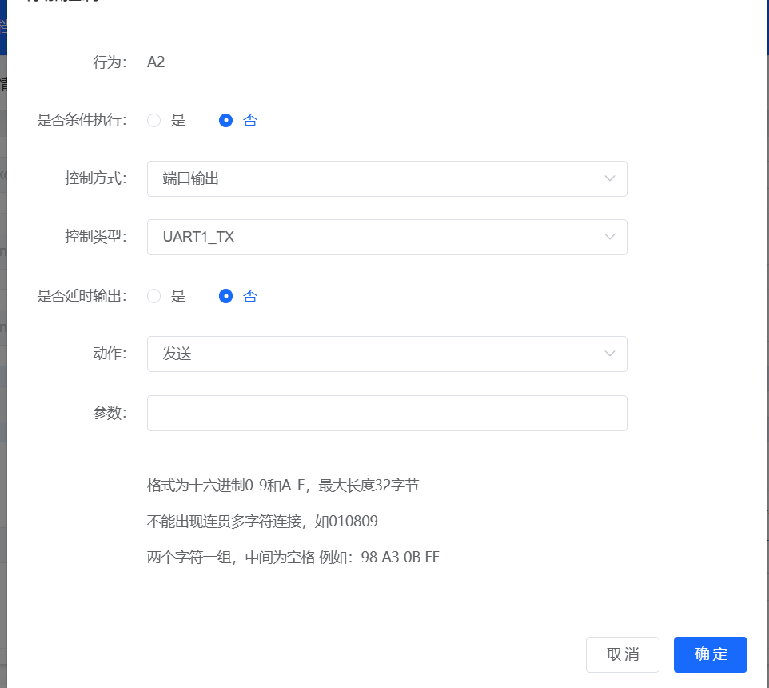

**注意事项：**

- 普通的命令词响应只会进行语音回复，不会自动返回数据
- 如需通过串口获取电量数据，需要单独发送串口指令触发
- 电量查询功能需要模块支持电量检测（如U1_Energy参数）
- 串口输出的数据格式需要与接收端约定好

---

## 版本选择


---

### SDK生成时显示"待生成"状态且未生成文件怎么办？

**问题描述：**

在平台生成SDK时，系统显示"待生成"状态，但长时间等待后实际并未生成SDK文件，导致无法继续后续操作。

**解决方案：**

**问题分析：**

- 显示"待生成"状态说明系统未正常完成生成过程
- 这通常不是等待时间问题，而是生成流程出现异常
- 需要重新触发生成操作

**处理方法：**

1. **重新生成SDK**：

    - 在SDK管理界面找到对应条目
    - 点击重新生成或删除后重新创建
    - 确保配置参数正确无误

2. **检查生成状态**：

    - 正常生成过程会有进度显示
    - "待生成"状态通常表示生成失败
    - 需要手动重新发起生成请求

3. **优化生成配置**：

    - 简化初始配置，先生成基础版本
    - 确认网络连接稳定
    - 避开高峰时段进行生成

**注意事项：**

- "待生成"状态持续存在表明生成失败，不是等待问题
- 不要长时间等待，应及时重新操作
- 如反复出现此问题，建议联系技术团队

---

### SDK生成固件时显示"正在生成"但未完成怎么办？

**问题描述：**

固件生成平台显示SDK状态为"正在生成"，预计3分钟完成，但长时间等待后无响应，或最终固件状态显示失败。

**解决方案：**

**问题分析：**

- SDK生成过程中可能出现服务器异常或网络超时
- "正在生成"状态超过预计时间通常表示生成失败
- 固件状态失败与SDK状态可能不同步更新

**处理方法：**

1. **刷新页面重试**
    - 等待超过预计时间后刷新页面
    - 查看最新状态更新
    - 如仍显示"正在生成"，可尝试重新生成

2. **避开高峰时段**
    - 服务器繁忙时生成成功率较低
    - 建议在非高峰时段操作
    - 两小时内能生成成功算运气好

3. **多次尝试策略**
    - 删除当前生成任务
    - 重新创建固件生成
    - 简化配置参数减少生成时间

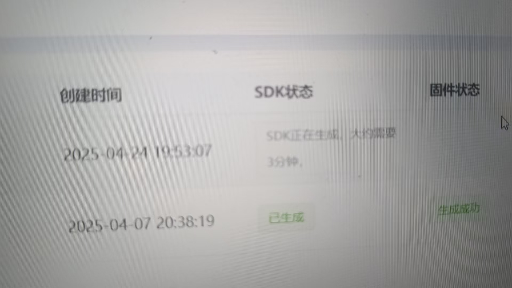

**技术说明：**

- 正常生成过程约需3-5分钟
- 超过10分钟未完成视为异常
- SDK和固件状态可能异步更新

**注意事项：**

- 不要长时间等待"正在生成"状态
- 多次刷新无效时应重新操作
- 如持续失败，联系技术团队协助
- 保留好配置参数便于重试

---

### SDK生成完成后在哪里下载？

**问题描述：**

SDK生成完成后收到完成通知，但在平台上找不到下载入口，工单列表中也显示为空，导致无法下载已生成的SDK文件。

**解决方案：**

1. **在产品详情页下载**：

    - 返回到生成SDK的产品详情页面
    - 在第4步"下载固件"右侧找到下拉箭头
    - 点击下拉箭头选择"下载SDK"选项

2. **查找已生成工单**：

    - 如果不在生成界面，需要重新进入对应产品页面
    - 使用Ctrl+F搜索功能搜索项目名称
    - 或者通过"我的发布"查看历史记录

3. **刷新和重试**：

    - 确保页面已完全刷新
    - 清除浏览器缓存后重新登录
    - 检查网络连接是否正常

**注意事项：**

- SDK生成完成后必须在生成界面或产品详情页下载
- 工单列表可能有延迟，建议直接在产品页面操作
- 生成成功后系统会保留一段时间，请及时下载

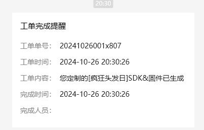


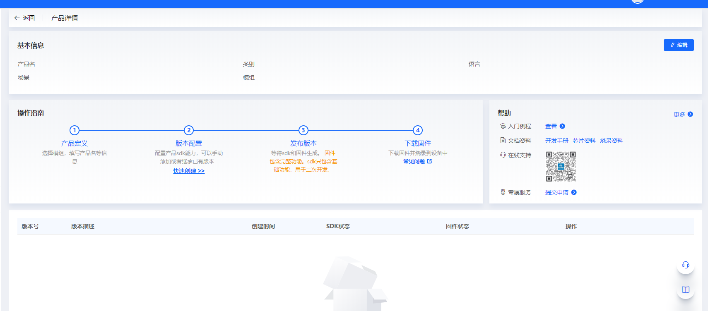

---

### 平台发布版本选项在哪里？

**问题描述：**

在平台发布固件时，发现"发布版本"选项消失，询问该功能是否还存在。

**解决方案：**

**版本功能说明**

1. **当前版本选项**
    - 正式版本：包含SDK和完整功能，用于正式发布
    - 测试版本：仅包含基础功能，用于二次开发
    - 快速测试版本：功能与正式版基本相同

2. **功能一致性**
    - 正式版和测试版在功能上基本相同
    - 平台陆续加入了很多新功能
    - 有时没有正式版/测试版可选是正常现象

3. **使用建议**
    - 直接勾选"快速测试版本"进行生成
    - 功能完全不受影响，可正常使用
    - 无需担心版本选择问题

**注意事项：**

- 平台会持续更新功能
- 版本选项可能因功能更新而调整
- 选择可用版本即可，功能不受影响

---

## 功能实现


---

### US1302芯片是否支持SPI控制？

**问题描述：**

希望了解US1302芯片是否支持通过SPI控制外部设备，以及是否有相关的开发资料或SDK。

**解决方案：**

**SPI支持情况：**

- **平台不支持**：官方平台未提供SPI控制功能
- **无开发资料**：不提供SPI相关的SDK或开发文档
- **技术限制**：芯片固件未集成SPI通信协议

**替代方案：**

1. **GPIO控制**
    - 使用通用GPIO引脚模拟SPI时序
    - 适合低速、简单通信需求
    - 需要自行编写驱动代码

2. **外部MCU方案**
    - 添加单片机作为SPI主控
    - 语音模块通过UART或GPIO控制MCU
    - MCU负责具体的SPI通信实现

3. **模块化设计**
    - 将SPI功能独立为单独模块
    - 通过标准接口与语音模块通信
    - 便于功能扩展和维护

**注意事项：**

- 自行开发SPI功能需要深厚的嵌入式经验
- 不规范的实现可能影响系统稳定性
- 建议优先使用官方支持的功能接口

---

### 设备待机时能同时输出信号吗？

**问题描述：**

需要了解设备在待机状态下是否能够同时输出一个控制信号。

**解决方案：**

**待机状态说明：**

- 设备待机时仍可保持部分功能
- 可以配置特定GPIO在待机时输出信号
- 需要通过平台配置实现

**实现方法：**

1. **配置GPIO输出**
    - 在平台选择目标GPIO引脚
    - 设置为输出模式
    - 配置默认输出状态

2. **待机行为设置**
    - 在控制逻辑中添加待机状态检测
    - 设置对应的GPIO输出动作
    - 确保信号持续输出

**注意事项：**

- 待机时部分功能可能受限
- 输出信号会增加功耗
- 建议选择低功耗输出方案

---

### 如何配置音量增减控制功能？

**问题描述：**

需要在语音模块中配置音量增加和减少的控制功能。

**解决方案：**

**配置步骤：**

1. **添加控制项**
    - 在控制配置中选择目标引脚
    - 设置控制方式为"系统控制"

2. **选择操作类型**
    - 类别：播放控制
    - 操作：增加音量/减少音量
    - 根据需要配置相应功能


*控制配置界面：选择系统控制→播放控制→减少音量*

3. **设置触发方式**
    - 根据实际需求选择触发方式
    - 可以是GPIO输入、串口命令等
    - 只要能触发对应控制即可

**应用示例：**

- 物理按键控制音量
- 串口指令调节音量
- 自动音量调节逻辑
- 多级音量控制

**注意事项：**

- 音量调节范围有限制
- 建议设置合理的调节步长
- 保存配置前测试效果

---

### 语音指令回复语无法正常播放怎么办？

**问题描述：**

配置语音指令时，发现部分命令的回复语无法正常播放，特别是当回复语包含特殊格式或与其他控制动作混合时。

**解决方案：**

**1. 检查回复语格式**

- 避免在回复语中包含控制字符或特殊符号
- 回复语内容应简洁明了
- 不建议将控制指令与回复语混合编写

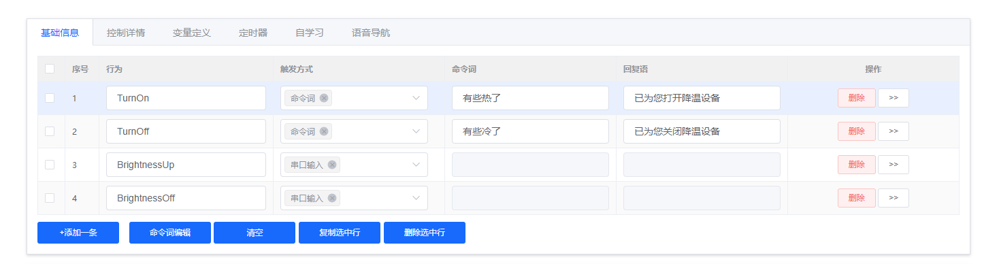

*配置界面显示部分命令的回复语为空*

**2. 分离控制与播报功能**

- 将串口发送和语音播报分开配置
- 使用"控制详情"添加串口发送动作
- 回复语仅用于语音播报

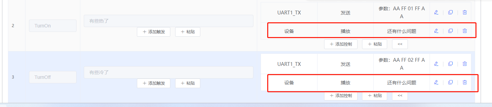

*TurnOn和TurnOff指令的UART1_TX发送设置*

**3. 优化配置方法**

- 命令词：设置识别的语音内容
- 触发方式：根据需要选择（如串口输入）
- 回复语：单独设置播报内容
- 控制详情：添加串口输出等控制动作

**注意事项：**

- 回复语过长可能导致播放不完整
- 特殊字符可能影响语音合成
- 建议先测试简单回复语确认功能正常
- 复杂控制逻辑建议分步实现

---

### 烧录器是否支持Python代码导入？

**问题描述：**

询问烧录器是否支持导入Python代码进行加减乘除等计算功能。

**解决方案：**

烧录器不支持导入Python代码：

- **功能限制**：烧录器仅用于固件烧录，不支持代码编程
- **固件格式**：只支持.bin格式的固件文件
- **开发方式**：需要在智能公元平台上配置功能后生成固件

**实现计算功能的方法：**

1. **使用平台配置**
    - 在智能公元平台配置控制逻辑
    - 利用平台的计算功能模块
    - 生成对应功能的固件

2. **二次开发方案**
    - 下载SDK源代码（C语言）
    - 在源代码中添加计算逻辑
    - 重新编译生成固件

**注意事项：**

- 烧录器是纯固件烧录工具，无编程功能
- Python等高级语言需要通过特定开发环境实现
- 简单功能建议直接使用平台配置实现

---

### 串口数据发送有长度限制吗？

**问题描述：**

需要了解串口通信是否支持发送超过32字节的数据，如发送7-8个字节或更长的数据。

**解决方案：**

**1. 数据长度说明**

- 串口通信本身没有严格的长度限制
- 可发送超过32字节的数据
- 实际支持长度取决于接收端处理能力

**2. 模块限制**

- 单个串口消息可包含多个字节
- 建议单次发送不超过128字节
- 超长数据可分包发送

**3. 实现方式**

- 通过配置平台设置串口输出功能
- 可配置命令词触发串口输出
- 支持自定义数据格式和长度

**注意事项：**

- 虽然界面提示最大32字节，但实际可发送更长数据
- 接收端需做好数据解析和缓冲
- 建议根据实际需求设置合适的数据长度

---

### 如何优化模块执行顺序，先执行命令再回复语音？

**问题描述：**

需要配置模块使其在接收到语音指令后，先执行控制命令（如开灯），再播放语音回复，以减少延迟感。

**解决方案：**

**1. 调整控制执行顺序**

- 在控制详情列表中调整执行顺序
- 将GPIO控制等操作放在语音播报之前
- 系统按从上到下的顺序执行

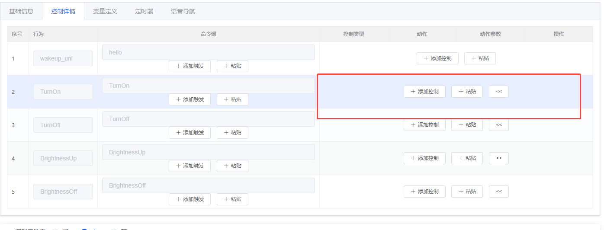

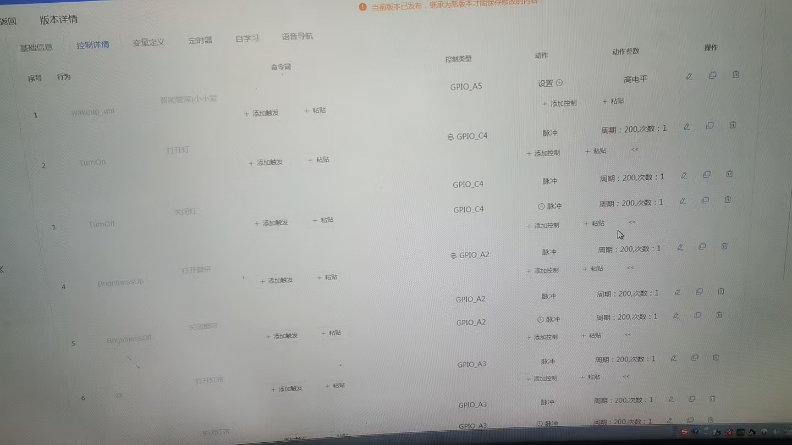

**2. 配置方法**

- 删除原有的语音播报控制
- 重新添加，调整先后顺序
- 确保动作执行在前，播报在后

**3. 测试验证**

- 去除播报功能测试执行速度
- 确认控制命令已正常执行
- 逐步添加语音播报功能

**注意事项：**

- 执行顺序对使用方体验影响明显
- 某些操作可能需要等待完成后再播报
- 建议根据实际需求调整执行逻辑

---

### 如何更新固定发送变量内容的功能？

**问题描述：**

希望更新固定发送变量内容的功能，以避免在多个模块中频繁修改模块序号，提高开发效率。

**解决方案：**

**功能现状：**

- 固定发送变量内容功能正在开发中
- 当前版本暂不支持此功能
- 需要为每个模块单独修改配置

**临时解决方案：**

1. **批量配置方法**：

    - 使用文本编辑工具批量修改固件配置
    - 搜索并替换所有模块序号
    - 重新生成固件进行烧录

2. **配置模板化**：

    - 创建标准配置模板
    - 预留模块序号为变量位置
    - 根据不同模块快速替换序号

3. **脚本辅助**：

    - 编写脚本自动处理配置文件
    - 使用程序批量更新模块序号
    - 减少手动操作错误

**开发计划：**

1. **功能开发进度**：

    - 该功能已列入开发计划
    - 具体发布时间待官方通知
    - 关注平台更新公告

2. **替代方案考虑**：

    - 考虑使用带存储功能的模块
    - 通过外部存储设备保存配置
    - 实现配置的快速切换

**操作建议：**

- 做好配置修改记录，便于追溯
- 建立模块序号管理表，避免混乱
- 联系技术团队了解最新开发进展

**注意事项：**

- 固定变量功能是平台级改进
- 更新后所有项目将受益
- 建议收集使用反馈，便于功能优化

---

### 如何配置A26引脚电平变化控制A27引脚输出？

**问题描述：**

需要实现A26引脚电平变化来控制A27引脚输出的功能，但配置中缺少必要的命令词触发条件，导致功能无法正常工作。

**解决方案：**

实现A26控制A27的输出需要满足以下配置要求：

**1. 必须添加命令词触发**

- 平台要求所有GPIO控制逻辑必须基于命令词触发
- 不能直接配置GPIO间的直接联动
- 需要设置一个命令词作为主触发条件

**2. 正确的配置步骤**

步骤1：添加命令词
- 在"命令词自定义"中添加一个命令词（如"我是村口王大爷"）
- 设置触发方式为"命令词"

步骤2：配置A26输入
- 添加新的行为配置
- 行为设置为"A26"
- 触发方式选择"GPIO输入"

步骤3：配置A27输出
- 添加第三个行为配置
- 行为设置为"A27"
- 触发方式选择"GPIO输入"
- 在A27后添加附加条件，设置变量A等于数值1时触发

步骤4：定义变量
- 在"变量定义"中创建变量A
- 类型设置为int
- 默认值设为1

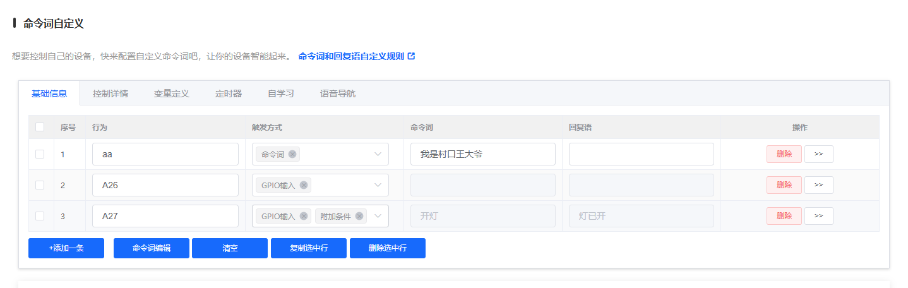

**3. 逻辑实现原理**

当A26引脚电平变化时：

- A26的GPIO输入触发被检测
- 系统检查命令词条件（需要语音触发或设置为难以触发的词）
- 满足条件后执行A27的输出动作
- 变量A作为中间条件，确保逻辑正确执行

**注意事项：**

- 必须要有命令词作为支撑，即使设置为难以触发的命令词
- 变量配对必须正确，A26变量需要与具体变量关联
- 建议将主命令词设置为难以误触发的内容
- 配置完成后需要检查配置，确保没有逻辑错误

---

### 自定义命令的行为命名规则是什么？

**问题描述：**

在配置自定义语音指令时，不清楚行为列（如open1、open2、close、TurnOn等）的命名规则和使用规范。

**解决方案：**

行为命名需要遵循C语言语法规则：

**1. 命名规则**

- 只能包含字母、数字和下划线
- 不能包含空格或特殊字符
- 区分大小写
- 行为名不能重复

**2. 常见命名方式**

- open1、open2、open3：用于多个开启动作
- close、close1、close2：用于关闭动作
- TurnOn、TurnOff：驼峰命名法
- A_05、B_10：带前缀的编号方式

**3. 选择建议**

- 根据实际功能选择有意义的名称
- 保持命名风格统一
- 建议使用英文命名

**注意事项：**

- 行为名是程序内部标识，与命令词展示名称无关
- 一旦定义，在同一个固件中不能修改
- 建议先规划好所有行为，再进行配置

---

### 如何在出厂固件的基础上进行修改？

**问题描述：**

需要在现有的出厂固件基础上进行功能修改，而不需要从零开始配置。

**解决方案：**

**1. 导入出厂固件**

- 进入智能公元配置平台
- 找到导入功能选项
- 选择出厂固件包中的json文件并导入

**2. 继承修改**

- 导入成功后，固件配置会在平台中打开
- 根据需求修改相应的配置项
- 可以添加、删除或修改命令词
- 可以调整GPIO配置和其他参数

**3. 生成新固件**

- 修改完成后点击生成固件
- 等待平台编译完成
- 下载生成的固件文件

**注意事项：**

- 导入的是固件包中的json配置文件，不是bin固件文件
- 修改前建议备份原始配置
- 继承修改可以保留原有的有效配置
- 某些特殊配置可能需要重新设置

---

### 平台命令词自定义功能无法添加新命令怎么办？

**问题描述：**

在平台的命令词自定义功能中，点击"添加一条"按钮无反应，无法添加新的命令词。

**解决方案：**

**1. 网络问题排查**

- 检查网络连接是否稳定
- 尝试刷新页面或更换浏览器
- 避免在网络高峰期操作

**2. 操作步骤检查**

- 确认已选择正确的触发类型（命令词）
- 下拉菜单展开后要选择具体的命令词选项
- 不要只展开下拉框而不选择

**3. 重新创建项目**

- 保存当前配置
- 重新创建一个新的固件项目
- 在新项目中尝试添加命令词

**4. 浏览器兼容性**

- 推荐使用Chrome或Edge浏览器
- 清除浏览器缓存和Cookie
- 禁用不必要的浏览器插件

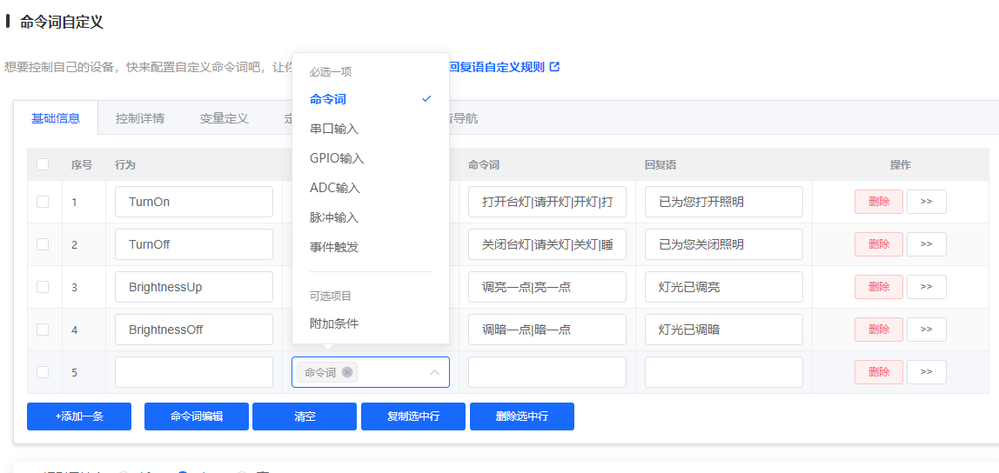

**注意事项：**

- 平台功能偶尔会因网络波动异常
- 多次尝试无效时可联系技术团队
- 建议在操作前先测试网络稳定性

---

### SDK生成超时是什么原因？

**问题描述：**

在使用平台生成SDK时，连续出现生成超时，询问具体原因和解决方法。

**解决方案：**

**1. 超时原因分析**

- SU系列模块使用人数多，服务器负载高
- 生成队列拥堵，需要排队等待
- 网络波动也可能导致生成中断


**2. 解决措施**

- **避开高峰期**：选择人少的时间段操作
- **多次尝试**：删除任务后重新生成
- **简化配置**：减少功能项降低生成时间
- **继续等待**：有时只是显示延迟，实际在生成

**3. 预防建议**

- 生成前确保网络稳定
- 不要频繁刷新页面
- 保留配置参数便于重试

**注意事项：**

- 超时是普遍现象，非个例问题
- 生成成功率与服务器负载直接相关
- 建议提前生成，预留充足时间

---

### 如何解决引脚控制逻辑配置中的变量设置为空错误？

**问题描述：**

配置引脚控制逻辑时，系统提示变量设置为空的错误，导致固件无法生成。即使配置检查通过，仍然出现"A26和A27的变量设置为空"的错误。

**解决方案：**

**1. 检查变量配对**

在变量定义界面中，必须确保每个GPIO都正确配对变量：

- A26引脚需要关联到具体变量（如变量A）
- A27引脚也需要关联到变量
- 变量不能留空，必须选择已定义的变量

**2. 正确的变量配置方法**

步骤1：定义变量
- 在"变量定义"中创建所需变量
- 变量名：A（或自定义名称）
- 类型：int
- 默认值：1

步骤2：配置A26引脚
- 进入控制详情页面
- 选择A26的GPIO输入配置
- 在变量设置中选择刚定义的变量A
- 当A26为高电平时，变量A变为0

步骤3：配置A27引脚
- 选择A27的输出配置
- 设置触发条件：当变量A等于1时输出高电平
- 确保条件判断使用正确的变量

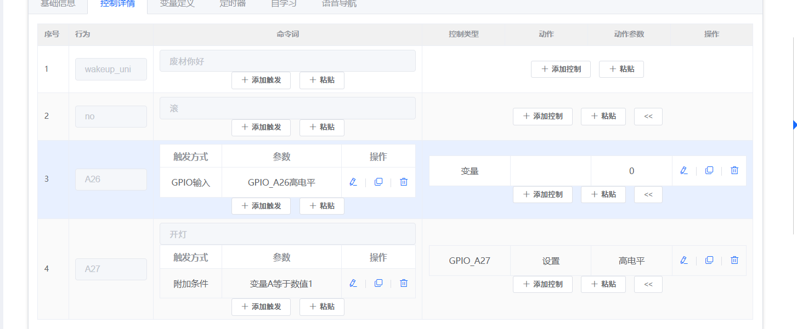
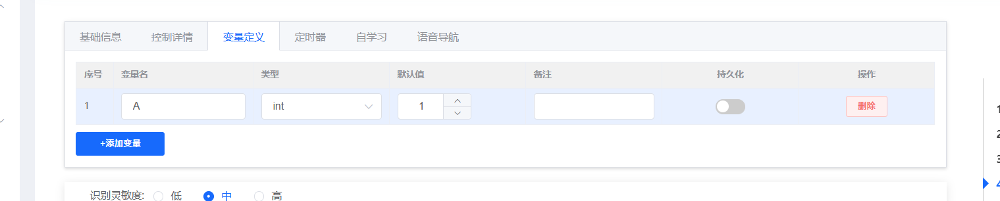
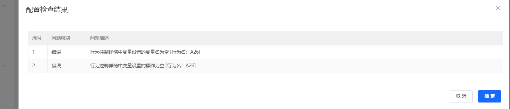

**3. 逻辑验证**

正确的逻辑应该是：

- A26高电平 → 变量A = 0
- 变量A = 1 → A27输出高电平

注意这里的逻辑关系，确保变量值的变化符合预期。

**注意事项：**

- 所有GPIO配置必须关联到具体变量，不能留空
- 变量的赋值和条件判断要逻辑一致
- 配置完成后使用"配置检查"功能验证
- 如果仍有错误，检查是否有中文字符导致的问题

---

### 平台固件生成卡在"正在生成"状态怎么办？

**问题描述：**

平台在生成固件时出现卡顿，长时间无法完成生成，刷新页面后问题依旧存在，状态显示为"SDK正在生成"。

**解决方案：**

**1. 立即尝试的解决方法**

- 刷新浏览器页面
- 清除浏览器缓存后重试
- 退出登录重新进入平台
- 尝试使用不同的浏览器

**2. 检查配置问题**

- 确认配置中没有逻辑错误
- 检查变量定义是否正确
- 验证命令词配置是否完整
- 使用"配置检查"功能验证

**3. 继承版本重新生成**

如果基础配置正确：

- 进入"发布版本"页面
- 选择"继承"已有版本
- 修改必要的配置项
- 重新生成固件

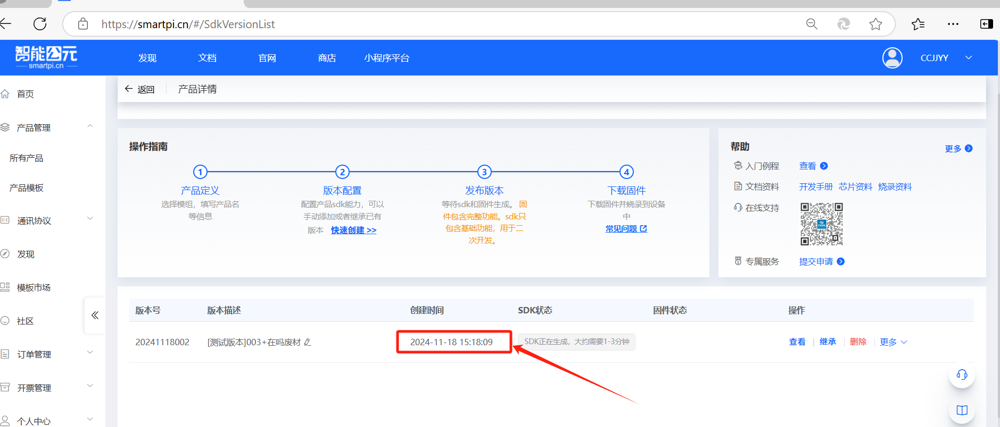

**4. 可能的原因分析**

- **服务器负载高**：平台服务器繁忙导致处理缓慢
- **配置复杂**：配置项过多或逻辑复杂
- **网络问题**：网络不稳定导致通信中断
- **浏览器兼容性**：某些浏览器可能有兼容问题

**5. 长时间等待的处理**

如果等待超过30分钟仍未完成：

- 保存当前配置
- 联系技术团队
- 尝试简化配置后重新生成
- 在非高峰时段尝试生成

**注意事项：**

- 固件生成通常需要1-3分钟
- 避免在配置中包含特殊字符
- 大量命令词会延长生成时间
- 建议在非业务高峰期进行固件生成

---

### 如何通过语音指令向MCU发送变量值？

**问题描述：**

希望实现通过语音指令向MCU发送变量值（如温度设定），而不是通过添加大量命令词来实现温度设定功能。

**解决方案：**

**1. 当前平台的限制**

- 平台不支持直接通过语音识别数值并发送变量
- 数字识别误识别率较高，需要大量调试
- 目前需要为每个数值设置独立的命令词

**2. 实现温度控制的方法**

方案一：多命令词方式（推荐）
- 添加"温度5度"、"温度10度"等命令
- 每个命令词对应具体的温度值
- 适合5-80度范围，但命令词数量较多

方案二：串口通信方式
- 通过语音指令触发串口输出
- MCU接收串口数据后解析温度值
- 可以实现更灵活的数值传递

**3. 优化建议**

减少命令词数量的方法：

- 使用常用温度点（如5的倍数）
- 分档位控制（低、中、高）
- 结合加减调节（"温度加5度"、"温度减5度"）

**4. 替代方案**

如果需要精确数值控制：

- 使用二次开发SDK
- 在代码中实现语音数字识别
- 通过串口发送具体的数值给MCU

**注意事项：**

- 数字语音识别的准确率相对较低
- 大量命令词会增加固件大小
- 建议使用分档控制而非精确数值
- 可以结合上下文减少命令词数量

---

### 如何调整命令词的序号顺序？

**问题描述：**

希望在自定义命令词时，能够自由调整命令词的序号顺序，并在多个行为之间插入新行为，以方便查看和编辑。

**解决方案：**

**1. 使用拖拽功能调整顺序**

平台支持通过拖拽调整命令词顺序：

- 长按命令词的序号
- 拖动到目标位置
- 松开鼠标完成顺序调整

**2. 具体操作步骤**

步骤1：进入命令词自定义页面
- 找到需要调整的命令词列表
- 确认所有命令词都在列表中

步骤2：调整顺序
- 鼠标左键按住序号不放
- 向上或向下拖动命令词
- 虚线显示目标位置
- 松开鼠标完成移动

步骤3：插入新命令词
- 在"命令词自定义"中添加新命令词
- 拖拽调整到合适位置
- 保存配置使更改生效

**3. 注意事项**

- 拖拽时保持鼠标稳定，避免误操作
- 调整后要保存配置
- 复杂的命令词关系调整后需要测试
- 可以多次小幅度调整而非一次性大幅改动

**4. 功能优势**

- 直观的顺序管理
- 无需删除重新添加
- 支持灵活的位置调整
- 方便命令词的逻辑分组

---

### 固件生成失败提示"可能是配置原因"怎么办？

**问题描述：**

平台固件生成失败，提示"生成失败，可能是配置原因，请检查配置"，但配置检查通过，且之前可正常生成。

**解决方案：**

**1. 检查隐藏的配置错误**

即使配置检查通过，仍可能存在以下问题：

- **深度降噪配置冲突**：开启了深度降噪导致生成失败
- **中文字符问题**：配置中包含不允许的中文字符
- **逻辑错误**：某些逻辑关系配置错误但未被检查出

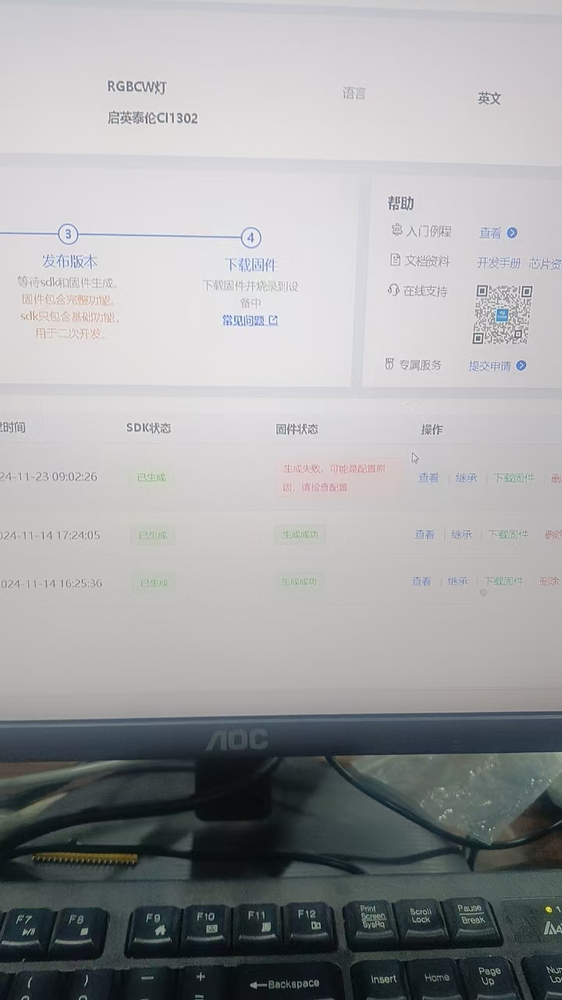
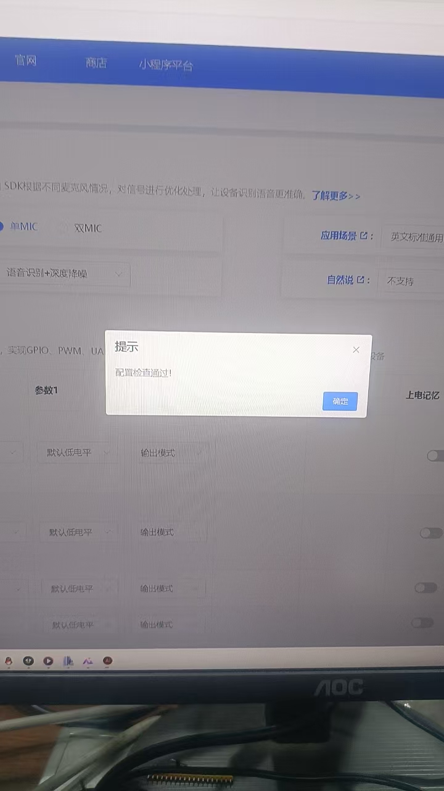

**2. 排查步骤**

**方法一：使用默认配置测试**

- 新建一个工程，使用默认配置
- 不做任何修改，直接生成固件
- 如果默认配置生成失败，可能是平台正在维护
- 如果默认配置生成成功，说明原配置存在格式或逻辑问题

**方法二：逐步检查原配置**

步骤1：关闭深度降噪
- 进入基础配置页面
- 关闭"深度降噪"功能
- 重新尝试生成固件

步骤2：检查所有配置项
- 确认命令词没有特殊字符
- 检查GPIO配置是否合理
- 验证变量定义是否正确

步骤3：简化配置测试
- 先使用最小配置生成
- 逐步添加功能项
- 定位导致失败的具体配置

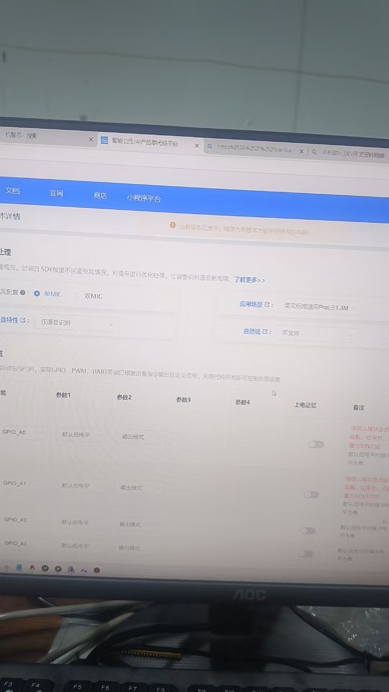
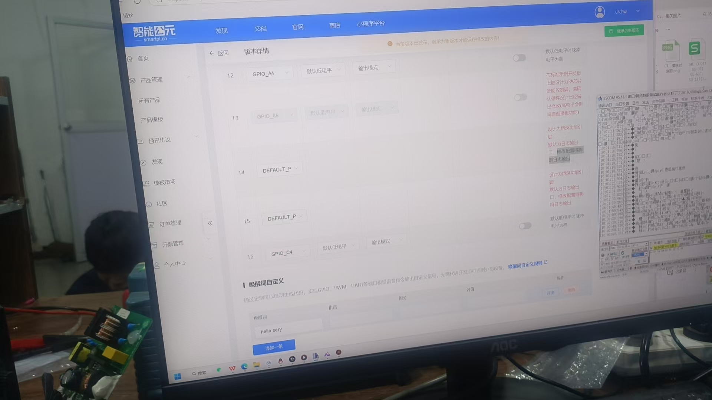

**3. 其他可能原因**

- **服务器临时问题**：平台服务器故障导致生成失败
- **配额限制**：超出每日生成次数限制
- **网络问题**：网络不稳定导致通信中断

**4. 解决建议**

- 尝试继承之前的成功版本
- 删除部分命令词后重新生成
- 联系技术团队获取帮助
- 在非高峰时段重新尝试

**注意事项：**

- 深度降噪功能可能与某些配置冲突
- 配置检查功能不能发现所有错误
- 保存配置副本便于恢复
- 重大修改前先备份原有配置

---

### 如何设置唤醒词超时时间？

**问题描述：**

需要延长唤醒词识别后的有效指令输入窗口时间，从默认的10秒延长至20秒，但发现后台配置界面无法直接修改该时间。

**解决方案：**

唤醒后的超时时间可以通过"超时退出"功能进行配置：

1. **配置超时时间**
    - 在唤醒配置中找到"超时退出"设置
    - 修改"超时时间"参数（建议范围：5-60秒）
    - 设置为20秒可满足需求

2. **功能说明**
    - 超时时间是指唤醒后等待指令的时间窗口
    - 如果在设定时间内没有收到指令，系统会发出提示音
    - 可以通过提示音"有需要在叫我"重新唤醒

3. **配置步骤**
    - 进入平台配置界面
    - 找到"超时退出"设置区域
    - 将超时时间从10秒修改为20秒
    - 保存配置并重新生成固件

**注意事项：**

- 超时时间不宜设置过长，建议不超过60秒
- 过长的等待时间可能增加误触发概率
- 不同的应用场景可能需要不同的超时设置

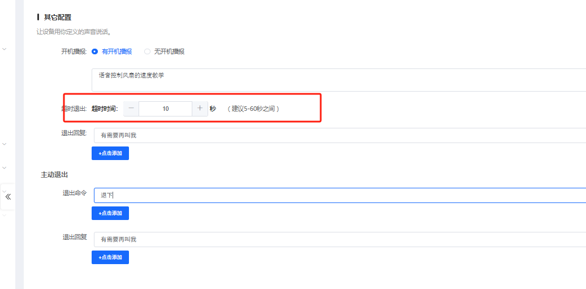


---

### 如何设置CI系列芯片上电自动唤醒且永不退出？

**问题描述：**

需要配置CI系列芯片上电后自动进入唤醒状态，并且保持唤醒状态不自动退出，以实现即时响应功能。

**解决方案：**

通过配置控制详情中的启动系统命令和定时器触发来实现上电自动唤醒：

1. **配置启动系统命令**
    - 在控制详情中添加命令词：`wake_up_ur`
    - 设置触发方式为：事件触发
    - 配置动作参数：启动定时器
    - 设置超时时间：30ms
    - 执行模式：单次执行

2. **配置永不退出机制**
    - 在唤醒配置中禁用自动超时退出功能
    - 或将超时时间设置为最大值
    - 确保设备保持持续唤醒状态

**注意事项：**

- 上电自动唤醒适用于需要即时响应的应用场景
- 30ms的延时确保系统完全启动后再触发唤醒
- 配置完成后需要重新生成并烧录固件

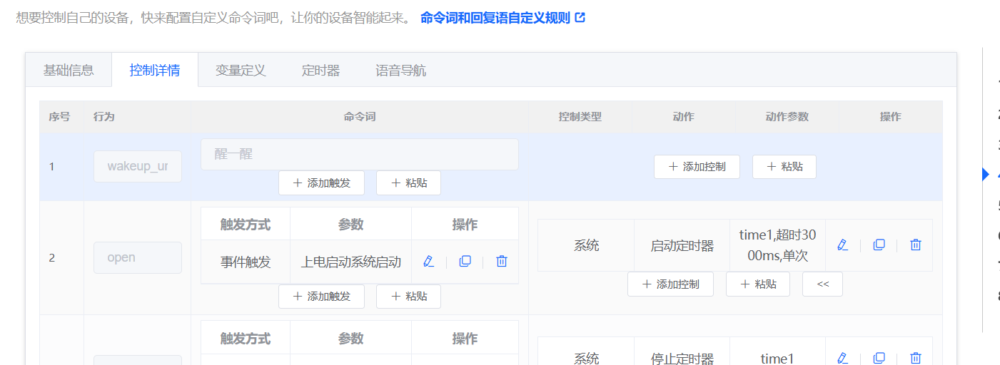

---

### 固件生成后无法返回页面怎么办？

**问题描述：**

固件生成完成后，点击退出后无法再次返回到固件生成页面，导致无法进行后续操作。

**解决方案：**

**1. 页面刷新方法**

- 刷新浏览器页面（F5或Ctrl+R）
- 清除浏览器缓存后重新访问
- 使用无痕/隐私模式重新登录平台

**2. 重新进入路径**

- 重新登录智能公元平台
- 进入对应的项目配置页面
- 点击"生成固件"重新进入固件生成界面

**3. 避免问题发生**

- 固件生成完成后不要立即退出页面
- 使用浏览器的新标签页打开其他功能
- 下载固件后再进行其他操作

**注意事项：**

- 建议使用Chrome、Firefox等主流浏览器
- 避免同时打开过多页面导致浏览器卡顿
- 定期清理浏览器缓存和Cookie

---

### 平台固件生成服务中断怎么办？

**问题描述：**

平台固件生成服务出现中断，无法正常生成固件。

**解决方案：**

- 平台定期维护会导致服务暂时中断
- 维护期间固件生成功能不可用
- 请关注官方通知了解维护时间安排

**注意事项：**

- 维护完成后服务将自动恢复
- 避免在维护期间重复提交生成任务
- 如超出维护时间仍未恢复，请联系技术团队


---

### 固件生成时提示无法生成测试版固件？

**问题描述：**

在使用服务器生成固件时，无法生成测试版固件，等待较长时间仍无法完成。

**解决方案：**

- 该现象通常出现在使用高峰期时段
- 建议错峰使用平台服务
- 可选择在非高峰时段（如早晨、夜间）进行固件生成

**注意事项：**

- 高峰期时段服务器负载较高，可能出现生成延迟
- 避免重复提交生成任务，可能导致队列拥堵
- 如持续无法生成，可稍后重试或联系技术团队


---

### 定时器工作模式有哪几种？

**问题描述：**

需要了解定时器配置中"单次触发"、"重复触发"和"立即重复触发"三种工作模式的具体含义和区别。

**解决方案：**

**三种工作模式说明：**

1. **单次触发**
    - 定时器超时后只会触发一次
    - 触发后定时器停止工作
    - 适用于需要一次性执行的任务

2. **重复触发**
    - 定时器超时触发后会重新加载定时器
    - 继续下一轮定时，循环往复
    - 适用于需要周期性执行的任务

3. **立即重复触发**
    - 直接触发当前定时器超时事件
    - 然后立即重新加载定时器继续工作
    - 适用于需要连续执行且间隔固定的任务

**注意事项：**

- 根据实际应用场景选择合适的工作模式
- 重复触发模式下需要注意避免任务堆积
- 立即重复触发适合高频率、实时性要求高的场景

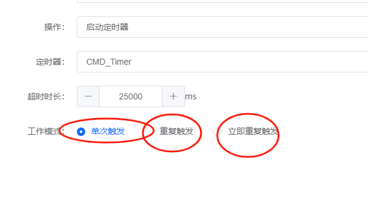

*定时器工作模式选项界面*

---

### 多个定时器会相互冲突吗？

**问题描述：**

需要了解多个定时器同时运行时是否会相互影响，以及如何避免定时器之间的冲突。

**解决方案：**

**定时器冲突规则：**

1. **不同名称的定时器不会冲突**
    - 定时器名称不同，各自独立运行
    - 可以同时创建多个不同名称的定时器
    - 例如：3秒循环定时器和15秒单次定时器可同时存在

2. **同一定时器的重装机制**
    - 同一个定时器未触发前，重新启动会覆盖原有设置
    - 每次调用"启动定时器"都会重置计时初值
    - 适用于"检测到命令后重置超时时间"的场景

**应用示例：超时播报功能**

实现"超过一定时间没检测到命令就播报一段文字"功能：

1. **上电启动定时器**
    - 在开机事件中启动定时器
    - 设置超时时长（如30秒）

2. **命令识别后重置**
    - 每次识别到命令时，重新启动定时器
    - 这样可以重置计时，避免触发播报

3. **定时器超时处理**
    - 定时器超时后执行播报动作
    - 然后重新启动定时器继续监听

```
上电 → 启动定时器(30秒)
识别到任何命令 → 重启定时器(30秒)
定时器超时 → 播报提示语 → 重启定时器
```

**注意事项：**

- CI-03T系列最多支持5个定时器
- 定时器名称必须唯一，避免与变量名冲突
- 使用重装机制可实现"无操作超时"功能


### 如何实现语音回复音的循环播放功能？

**问题描述：**

需要在网页平台上配置语音回复音的循环播放功能，使模块在收到"开启"指令后开始重复播放，直到收到"关闭"指令时停止。

**解决方案：**

通过配置两个定时器（一个主定时器控制循环周期，一个控制定时器）来实现循环播放功能：

**1. 配置主定时器（L1 - 控制定时器）**

- 定时器名称：L1
- 超时时间：10000ms（10秒，控制总播放时长）
- 工作模式：单次触发
- 用于控制整个循环播放的持续时间

**2. 配置循环定时器（L2 - 播放定时器）**

- 定时器名称：L2
- 超时时间：3000ms（3秒，播放间隔）
- 工作模式：重复触发
- 用于周期性触发播放动作

**3. 配置事件触发逻辑**

- DS1模块：配置L1定时器，当收到"开启"指令时启动L1
- DS2模块：配置L2定时器，当L1启动后启动L2循环
- DS3模块：配置播放动作，当L2超时时执行播放操作
- DS4模块：配置停止动作，当L1超时时停止所有定时器

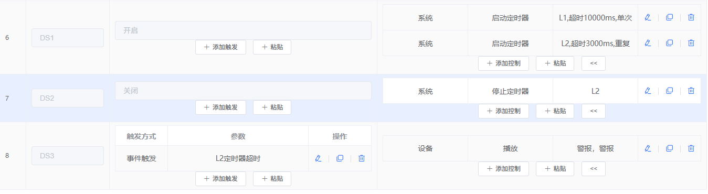

*DS1和DS2模块的定时器配置*

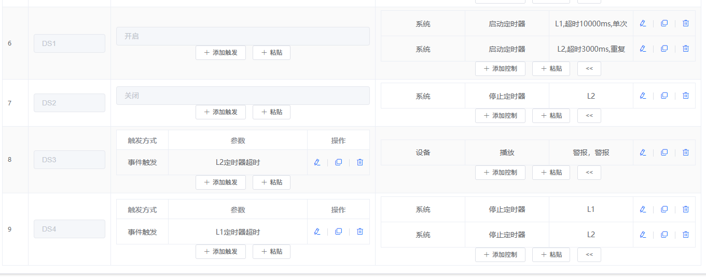

*完整的循环播放逻辑配置*

**注意事项：**

- 模块需要支持AEC功能才能正常使用定时器
- "开启"指令会立即开始循环播放，"关闭"指令会立即停止
- 也可等待主定时器（L1）超时后自动停止播放
- 循环间隔和总时长可根据实际需求调整

---

### 大模型免费体验版与正式版有什么区别？

**问题描述：**

希望了解大模型免费体验版与正式版在功能、使用时长和限制方面的具体差异。

**解决方案：**

**版本差异说明：**

- **个人使用场景**：免费体验版与正式版功能基本相同
- **商业使用**：正式版支持商业应用，免费体验版仅限个人测试使用

**功能对比：**

- **免费体验版**：

    - 支持全部基础功能测试
    - 适合个人学习和评估
    - 有使用时间和功能限制

- **正式版**：

    - 完整功能，无限制使用
    - 支持商业项目部署
    - 享有完整技术团队服务

**注意事项：**

- 免费体验版主要用于功能评估和测试
- 如需商用请联系客服获取正式版授权
- 具体验证时长请以平台最新政策为准


---

### 平台添加300条以上命令词后出现严重卡顿怎么办？

**问题描述：**

在平台上添加超过300条命令词后，页面出现严重卡顿现象，影响正常操作。

**解决方案：**

**1. 页面刷新处理**

- 关闭当前页面，重新打开
- 刷新浏览器缓存
- 重新登录平台尝试

**2. 操作建议**

- 分批添加命令词，避免一次性添加过多
- 先添加部分命令词，生成固件测试
- 确认功能正常后再继续添加

**3. 性能优化**

- 使用性能较好的浏览器
- 关闭不必要的浏览器标签页
- 确保网络连接稳定

**注意事项：**

- 命令词数量过多会增加平台处理负担
- 建议根据实际需求控制命令词数量
- 如持续卡顿，可联系技术团队协助处理


---

### 快速发布模式生成固件需要很长时间怎么办？

**问题描述：**

使用快速发布模式生成SDK时，等待时间超过两小时仍未完成。

**解决方案：**

**1. 高峰期影响**

- 生成时间过长通常是由于使用高峰期
- 服务器负载较高导致处理速度变慢
- 建议错峰使用平台服务

**2. 优化建议**

- 选择非高峰时段进行生成（如早晨、夜间）
- 避免在工作时间等人多时使用快速发布
- 生成前确保配置简洁合理

**3. 替代方案**

- 如急用，可尝试使用普通模式生成
- 简化配置内容，减少生成时间
- 分批次生成功能模块

**注意事项：**

- 快速发布模式在高峰期可能比普通模式更慢
- 生成时间与配置复杂度直接相关
- 如长时间无响应，可刷新页面重新尝试


---

### 为什么不提供离线版本的IDE？

**问题描述：**

希望能够使用离线版本的集成开发环境（IDE），以便在没有互联网连接的情况下进行开发和固件生成。

**解决方案：**

**技术限制说明：**

1. **服务器端依赖**
    - 唤醒词和命令词需要服务器端生成特征波形
    - AI模型训练和优化依赖云端计算资源
    - 需要GPU服务器集群支持，本地难以部署

2. **安全考虑**
    - 核心算法和模型需要保护知识产权
    - 本地部署容易被破解和复制
    - 商业核心技术需要云端保护

3. **资源需求**
    - 需要昂贵的GPU服务器支持
    - 对普通开发者来说部署成本过高
    - 专业维护要求较高

**替代方案：**

- 优化网络环境，提升访问速度
- 批量生成任务，减少等待时间
- 关注平台公告，避开高峰期
- 如有特殊需求，可联系商务合作

**注意事项：**

- 平台持续优化服务响应速度
- 未来可能推出本地轻量级开发工具
- 企业版需求方可探讨定制化方案

---

## 开发环境与基础


---

### STM32项目中除了main.c还有哪些文件？它们的作用是什么？

**问题描述：**

在学习STM32开发时，只能看懂main.c文件，不了解其他文件（如startup_stm32f103xe.s、system_stm32f1x.c、stm32f1xx_hal_gpio.c等）的作用和功能。

**解决方案：**

**STM32项目文件结构说明：**

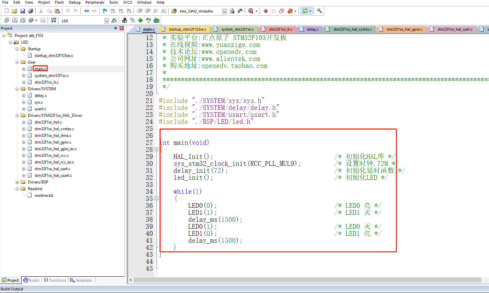

**1. 核心文件说明**

- **main.c**：主程序文件，包含main函数和主要业务逻辑
- **startup_stm32f103xe.s**：启动文件，汇编语言编写
    - 设置堆栈指针
    - 初始化中断向量表
    - 调用main函数前的准备工作

**2. 系统层文件**

- **system_stm32f1x.c**：系统时钟配置
    - 初始化系统时钟
    - 配置PLL和分频器
    - 设置系统总线频率

- **stm32f1xx_hal.c**：HAL库主文件
    - 硬件抽象层初始化
    - 提供系统级API
    - 管理低功耗和调试功能

**3. 外设驱动文件**

- **stm32f1xx_hal_gpio.c**：GPIO驱动
    - GPIO初始化和配置
    - 提供读写接口
    - 中断处理相关

- **stm32f1xx_hal_uart.c**：串口驱动
- **stm32f1xx_hal_tim.c**：定时器驱动
- **stm32f1xx_hal_rcc.c**：时钟控制驱动

**4. 配置文件**

- **stm32f1xx_hal_conf.h**：HAL库配置
    - 选择要使用的外设
    - 配置调试选项
    - 优化代码大小

**5. 学习建议**

**循序渐进的学习路径：**

1. **先理解main.c**
    - 掌握程序基本流程
    - 理解初始化顺序
    - 学会调用HAL函数

2. **逐步了解HAL库**
    - 从GPIO开始学习
    - 逐步掌握其他外设
    - 查看官方例程

3. **深入底层（可选）**
    - 了解启动文件原理
    - 学习寄存器操作
    - 理解中断机制

**推荐学习资源：**

- ST官方参考手册
- HAL库使用方指南
- 正点原子等教程视频
- GitHub上的开源项目

**注意事项：**

- 初学者无需完全理解所有文件
- 先会用HAL函数即可
- 遇到问题时再深入了解对应模块

---

## 平台配置与调试


---

### 自定义协议测试值无法输入怎么办？

**问题描述：**

在平台配置触发方式为"串口输入"且选择自定义协议时，测试值输入框为灰色，无法输入数据。

**解决方案：**

- 这是自定义协议的正常显示逻辑
- 自定义协议不支持直接输入测试值
- 需要通过实际串口发送数据进行测试

**配置说明：**

- 自定义协议用于定义特定通信格式
- 测试值输入框仅适用于预设协议
- 自定义协议需外部提供测试数据

**注意事项：**

- 使用串口调试工具发送测试数据
- 确认数据格式符合自定义协议定义
- 如需模拟测试，可临时使用标准协议

---

## 固件下载与文件格式


---

### 点击产品管理后看不到所有产品怎么办？

**问题描述：**

在智能公元平台点击"产品管理"后，无法看到所有产品列表，导致无法进行后续操作。

**解决方案：**

**1. 检查操作步骤**

- 确认点击的是左侧菜单栏的"产品管理"
- 点击后应显示"所有产品"子菜单
- 需要点击"所有产品"才能看到完整列表

**2. 页面显示问题排查**

- 刷新浏览器页面（F5）
- 检查网络连接是否正常
- 尝试使用其他浏览器访问

**3. 账号和权限检查**

- 确认登录了正确的账号
- 检查账号是否有查看产品的权限
- 确认账号下是否已创建产品

**注意事项：**

- 产品管理菜单可能有折叠子菜单
- 如果是新账号，需要先创建产品
- 部分功能可能需要账号权限支持


---

### 误删除产品/工程后能找回吗？

**问题描述：**

在平台误删除了产品或工程配置，询问是否能够找回或恢复。

**解决方案：**

**1. 删除操作说明**

- 产品/工程一旦删除无法从平台恢复
- 删除操作是永久性的，平台不提供回收站功能
- 所有配置、版本记录、固件文件都会被清除

**2. 预防措施**

- **定期导出配置**：使用平台的"导出"功能备份工程配置
- **保留配置文件**：将导出的JSON配置文件保存在本地
- **重要配置多备份**：对于关键产品，建议定期备份配置

**3. 如果已删除的处理方式**

- 检查本地是否保存了导出的配置文件
- 如果有配置文件，可以通过"导入"功能重新创建产品
- 如果没有任何备份，需要重新创建和配置产品

**注意事项：**

- 删除操作不可逆，删除前务必确认
- 建议在删除任何产品前先导出配置文件作为备份
- 定期备份重要产品的配置，避免误删除导致数据丢失

---
### 下载固件后功能未生效怎么办？

**问题描述：**

下载并烧录新固件后，设备功能未按预期生效，怀疑是否因登录账号错误导致。

**解决方案：**

**1. 确认账号一致性**

- 检查是否使用了正确的账号登录平台
- 确认固件是在当前账号下生成的
- 不同账号的固件无法通用

**2. 验证固件内容**

- 重新登录平台查看固件配置
- 确认生成固件时包含所需功能
- 检查固件版本是否正确

**3. 烧录检查**

- 确认烧录过程没有报错
- 检查固件是否完整烧录
- 烧录后需要重新上电

**注意事项：**

- 账号密码不要混淆，做好记录
- 生成固件前确认配置正确
- 烧录成功后功能应立即生效

---

### 如何找到固件下载页面？

**问题描述：**

在智能平台中无法找到固件下载页面，不知道在哪里下载生成的固件。

**解决方案：**

**1. 进入产品管理**

- 登录智能公元平台
- 点击左侧菜单栏的"产品管理"
- 进入"所有产品"列表

**2. 找到固件下载入口**

- 在产品列表中找到对应产品
- 点击产品名称进入详情页
- 查找"下载"或"导出"按钮
- 部分版本可能显示为"生成固件"

**3. 可能的问题**

- **账号问题**：确认登录了正确的账号
- **权限问题**：检查是否有下载权限
- **产品状态**：确认产品已生成完成

**注意事项：**

- 如果产品列表为空，需要先创建产品
- 刷新页面重试
- 联系技术团队获取帮助

---

### 下载的固件是.tar格式，如何获取.bin烧录文件？

**问题描述：**

在平台生成固件后，下载的文件为.tar格式，但烧录工具需要.bin格式文件，不清楚如何从.tar文件中获取.bin文件。

**解决方案：**

**1. 文件格式说明**

- 平台下载的固件默认为压缩格式
- 显示为.tar或.tar.gz是正常的压缩文件
- .bin文件包含在压缩包内

**2. 获取.bin文件的方法**

- **方法一：解压压缩文件**
    - 使用解压软件（如7-Zip、WinRAR）解压.tar文件
    - 解压后即可找到.bin烧录文件
    - 可能还包含其他配置文件

- **方法二：文件名显示问题**
    - 某些系统可能隐藏了文件扩展名
    - 下载后应显示为.tar.gz格式
    - 使用7-Zip等软件直接解压

**3. 烧录文件使用**

- 解压后使用其中的.bin文件进行烧录
- 确保烧录工具选择正确的文件
- 不要烧录整个压缩包

**注意事项：**

- .bin文件是实际的固件程序
- 保留原始压缩包作为备份
- 解压后文件请勿随意修改


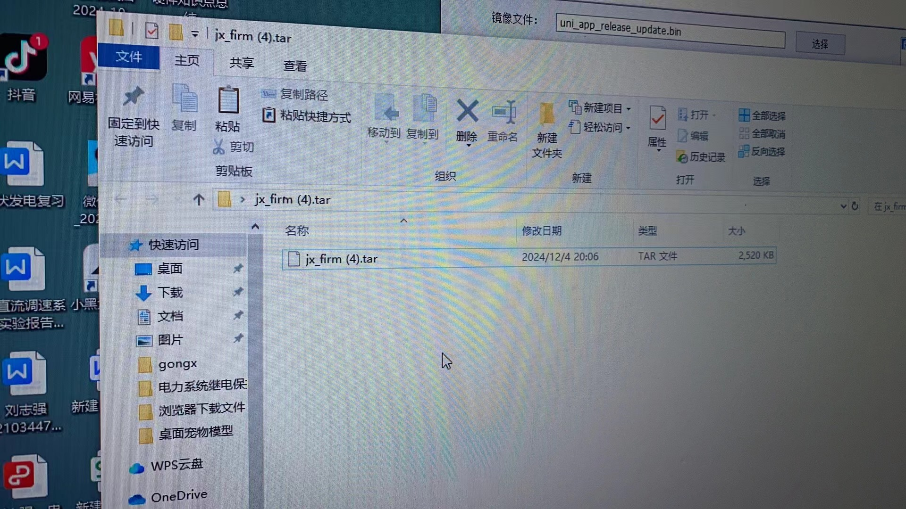

---

### 开发包下载速度过慢怎么办？

**问题描述：**

从官网下载开发包时速度极慢，仅几KB/s，影响开发进度。

**解决方案：**

**1. 网络环境优化**

- 检查本地网络连接是否稳定
- 尝试更换网络环境或使用热点下载
- 避开网络高峰期进行下载

**2. 下载方式调整**

- 使用浏览器下载功能，避免使用下载工具
- 尝试不同浏览器（Chrome、Edge、Firefox）
- 暂停其他占用带宽的应用程序

**3. 替代获取方式**

- 开发包只需下载一次，可重复使用
- 下载完成后妥善保存备份
- 如遇紧急情况，可联系技术团队获取帮助

**注意事项：**

- 开发包体积较大，建议预留充足下载时间
- 下载中断后可支持断点续传
- 确保磁盘空间充足
- 下载完成后验证文件完整性

---

### 固件生成40分钟仍未完成且无重新生成选项怎么办？

**问题描述：**

固件生成过程异常缓慢，持续40分钟仍未完成，且界面中没有提供重新生成的选项。


**解决方案：**

**1. 问题原因分析**

- 固件生成缓慢通常与网络连接有关
- 服务器负载过高时也会导致生成速度变慢
- 界面功能异常可能导致重新生成选项不显示

**2. 解决方法**

- **检查网络连接**：确认网络连接稳定，尝试刷新页面
- **清除缓存**：清除浏览器缓存后重新登录平台
- **更换时段**：避开使用高峰期，选择非高峰时段生成
- **联系技术团队**：如持续异常，联系技术协助

**3. 临时解决方案**

- 通过"更多"菜单查找是否有其他操作选项
- 尝试返回上一级页面重新进入生成界面
- 考虑简化配置以减少生成时间
- **重新生成固件**：点击"更多"菜单选择"重新生成固件"选项，通常比首次生成更快

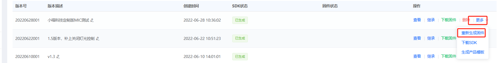

**注意事项：**

- 固件生成慢通常是网络或服务器负载问题
- 建议在网络状况良好时进行固件生成
- 平台高峰期（如工作日下午）速度可能较慢

---

### SDK生成平台状态长时间卡在"正在生成"怎么办？

**问题描述：**

在使用SDK生成平台时，SDK生成状态长时间显示"正在生成"，持续超过预期时间（如1小时）。

**解决方案：**

1. 刷新页面查看最新状态
2. 检查网络连接是否稳定
3. 清除浏览器缓存后重新登录
4. 若问题持续，可稍后重试，系统可能有延迟

**注意事项：**

- SDK生成正常需要10-30分钟，超过1小时属于异常情况
- 多个任务同时生成可能导致队列拥堵
- 建议避开高峰期进行SDK生成
- SU系列模块使用人数较多，生成速度可能较慢
- 可考虑使用CI系列模块，生成速度通常更快

---

### 固件生成卡在"待生成"状态怎么办？

**问题描述：**

在平台生成固件时，固件状态长时间显示"待生成"，SDK状态显示"SDK正在生成，大约需要1-3分钟"，但实际长时间无法完成，重新生成多次均失败。

**解决方案：**

**1. 问题定位**

- 检查是否使用了特定的播报员语音（如lida）
- 某些语音配置可能导致生成异常
- 确认平台服务是否正常

**2. 处理步骤**

- 更换播报员语音重新生成
- 尝试简化固件配置
- 检查网络连接稳定性

**3. 应急措施**

- 取消当前生成任务
- 导出产品配置文件（sde.json）供技术团队分析
- 避开平台使用高峰期


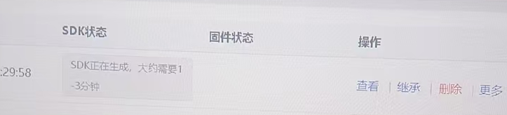


**注意事项：**

- 平台使用人数多时，生成速度会变慢
- 之前成功生成的配置，如果平台规则变更也可能失败
- 不提供失败原因时，通常是语音配置问题
- 如问题持续，联系技术团队并提供产品配置

---

### 之前成功生成的固件再次生成失败怎么办？

**问题描述：**

之前在平台成功生成的固件版本，再次尝试生成时无法完成，界面卡在"待生成"状态，且没有明确的错误提示。

**解决方案：**

**1. 问题排查**

- 检查播报员配置是否有问题
- 确认是否修改了其他配置项
- 验证产品配置是否触发平台规则限制

**2. 解决方法**

- 更换播报员语音（从lida改为其他）
- 导出产品配置文件供技术团队分析
- 恢复到最后成功时的配置状态

**3. 平台使用建议**

- 避免重复提交生成任务
- 检查所有生成任务的状态
- 确认配置是否符合平台最新规则


**注意事项：**

- 平台规则更新可能影响之前可用的配置
- 无错误提示时多为语音配置兼容性问题
- 及时导出并备份成功的产品配置
- 问题持续时联系技术团队

---

### SDK生成因使用方量激增导致超时怎么办？

**问题描述：**

由于平台使用方数量激增，服务器承载压力增大，导致SDK生成超时、排队时间过长，甚至需要等待1-2 小时。

**解决方案：**

**1. 平台状况说明**

- SU系列产品使用方量较大，生成队列较长
- 服务器正在进行扩容升级
- 生成时间可能比平时延长2-3倍

**2. 临时解决方法**

- 重新发布生成任务，刷新队列状态
- 避开高峰期（工作时间）进行生成
- 考虑使用CI系列产品，生成速度相对较快

**3. 平台优化进展**

- 新增服务器已在部署中
- 计划实施限时分流机制
- 平台会定期进行升级维护（如16:00-18:00）

**4. 建议做法**

- 提前规划固件生成，预留充足时间
- 生成成功后及时下载备份
- 关注群内公告，了解平台维护时间

**注意事项：**

- 生成时间超过1小时属于正常现象（高峰期）
- 避免频繁重新生成，加重队列负担
- 如急需使用，可联系技术团队协调处理


---

### SDK生成时间长达4-5小时怎么办？

**问题描述：**

使用SDK生成工具时，生成过程耗时过长（4-5小时），无法完成SDK生成。

**解决方案：**

**1. 异常情况判断**

- **正常生成时间**：10-30分钟
- **异常时间**：超过1小时
- **严重异常**：超过4小时，说明系统或配置存在问题

**2. 问题排查步骤**

- **立即刷新页面**：查看是否生成完成但界面未更新
- **检查网络连接**：网络不稳定可能导致生成中断
- **清除浏览器缓存**：重新登录平台尝试
- **更换浏览器**：尝试Chrome、Edge等不同浏览器

**3. 配置检查**

- **固件配置复杂度**：过多的词条和功能配置会增加生成时间
- **词条数量验证**：确认词条数量在合理范围内
- **功能配置精简**：暂时禁用非必需功能重新生成

**4. 应急处理**

- **取消当前生成**：如可操作，取消后重新提交
- **联系技术团队**：提供账号信息和生成时间
- **错峰生成**：避开服务器负载高峰期

**5. 预防措施**

- **精简配置**：按需配置功能，避免过度复杂化
- **分段生成**：复杂项目可分阶段生成和测试
- **本地备份**：生成成功的固件及时备份

**注意事项：**

- 4-5小时的生成时间属于严重异常情况
- 可能是服务器端问题，需及时反馈
- 建议截图记录生成状态和时间
- 长时间无响应应主动联系技术团队

---


---

### 生产SDK生成需要多长时间？

**问题描述：**

需要了解生产SDK生成所需的时间，以便合理安排开发计划。

**解决方案：**

- SDK生成需要等待处理时间
- 具体时间取决于服务器负载和任务队列
- 建议合理安排生成时间，避开高峰期

**注意事项：**

- 生成期间请耐心等待，不要重复提交
- 如长时间未完成，可尝试刷新页面

---

## 配置检查


---

### 配置检查提示触发方式配置错误和未添加主触发怎么办？

**问题描述：**

配置检查报告提示：1）行为控制详情触发方式配置错误；2）行为控制详情没有添加主触发，导致配置无法通过。

**解决方案：**

1. **常见原因分析**：

    - ADC输入被错误配置为GPIO输入
    - 附加条件中的ADC值设置了错误的输入源
    - 主触发条件缺失或配置错误

2. **问题排查步骤**：

    - 检查触发条件的输入源设置
    - 确认ADC相关配置是否正确选择ADC输入
    - 验证每个行为是否都有主触发条件

3. **正确配置方法**：

    - 触发方式：选择正确的输入类型（ADC/GPIO/串口等）
    - ADC值条件：确保输入源选择ADC而非GPIO
    - 主触发：每个行为必须添加至少一个主触发

4. **配置检查技巧**：

    - 逐项检查每个行为的触发条件
    - 使用导出JSON功能检查配置
    - 参考官方示例配置

**注意事项：**

- 配置检查通过不代表功能一定正常，还需实际测试
- ADC功能需要硬件支持，确认型号是否支持
- 保存配置前仔细检查所有触发条件
- 如问题持续，可导出配置文件联系技术团队

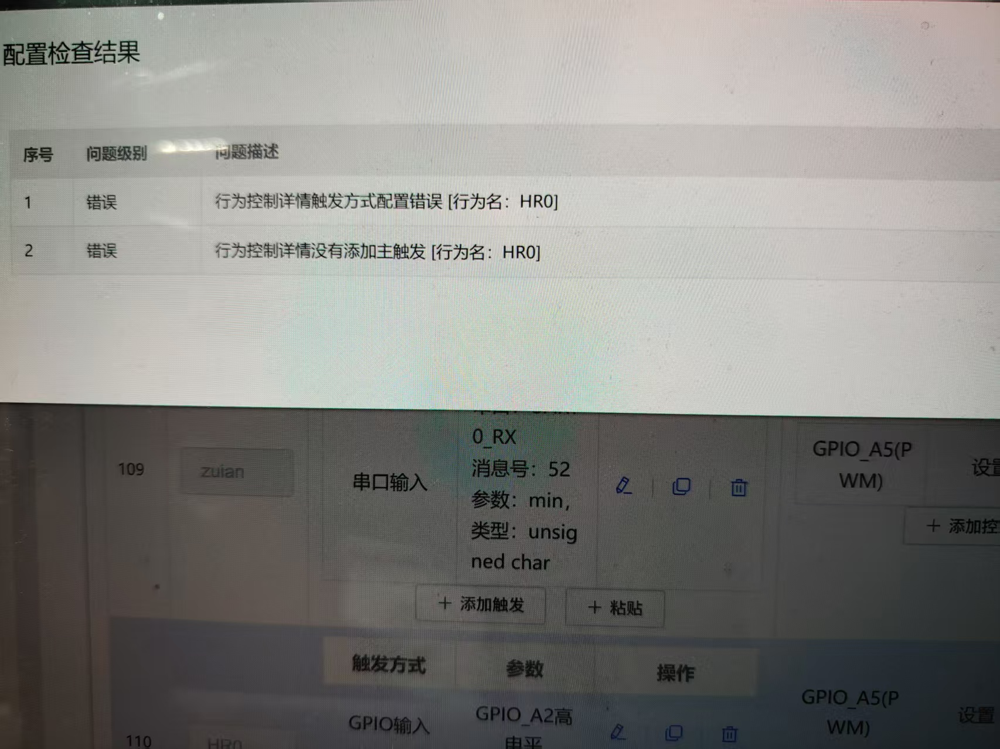

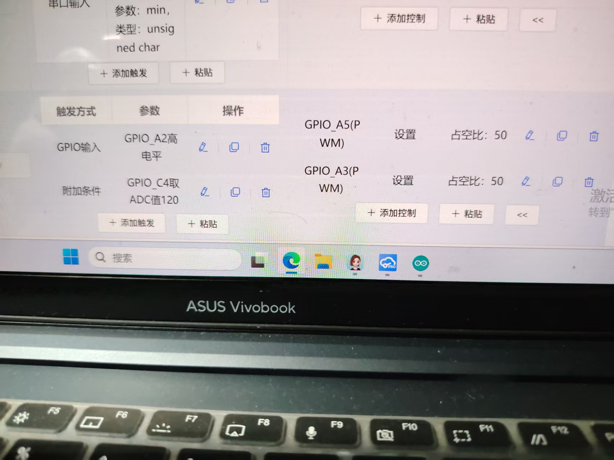
- 高峰期可能需要更长时间

---

### 配置检查提示"TCP和UDP协议数量不能超过3"怎么办？

**问题描述：**

在配置通讯接口时，配置检查工具显示错误："TCP和UDP协议数量不能超过3"，询问是否可以增加这个限制。


**解决方案：**

**1. 了解协议数量限制**

- 平台对TCP和UDP协议数量有硬性限制：最多3个
- 此限制为系统架构决定，目前无法通过配置调整
- 限制适用于所有型号的通讯模块

**2. 优化通讯配置**

如果需要超过3个TCP/UDP连接，可考虑以下方案：

- **合并相同类型的连接**：将多个同类服务合并为单一连接
- **使用协议复用**：在同一TCP连接上传输多种类型数据
- **区分服务优先级**：保留核心服务的连接，次要服务通过其他方式实现

**3. 替代方案**

- 使用MQTT协议：MQTT支持多主题订阅，可减少连接数
- 采用轮询机制：通过单一连接定期查询不同服务
- 考虑网关方案：使用中间网关设备聚合多个连接

**注意事项：**

- 协议数量限制是平台固有的约束，无法通过配置修改
- 如确需超过3个连接，需联系技术团队评估定制方案
- 配置检查通过后仍需实际测试各连接的稳定性
- **不支持队列式连接管理**：平台不支持"出栈方式"（如第四个连接时自动断开第一个）的自动轮替连接管理，需要时必须手动断开旧连接后再建立新连接

---


### 固件生成卡住或失败怎么办？

**问题描述：**

固件生成任务卡在"待生成"状态，SDK状态显示"正在生成"但长时间无进展，即使重新生成也失败。

**解决方案：**

**1. 检查语音播报员配置**

- 确认未使用可能导致冲突的播报员（如"lida"）
- 更换为其他可用的播报员后重新生成
- 导出产品配置文件检查是否有异常配置

**2. 平台负载问题**

- 平台使用人数多时生成速度会变慢
- 建议等待1-3分钟后刷新页面查看状态
- 避开高峰期进行固件生成

**3. 重新操作步骤**

- 取消当前卡住的生成任务
- 检查并修改问题配置（如播报员选择）
- 重新提交生成任务


**注意事项：**

- 如果之前成功生成的配置现在无法生成，可能是平台规则更新
- 长时间（超过30分钟）卡住需联系技术团队
- 保留错误截图和配置信息便于问题排查

---

### 固件生成失败但无错误提示怎么办？

**问题描述：**

固件生成任务一直显示"待生成"状态，没有明确的错误提示，即使之前成功生成的版本也无法再次生成。

**解决方案：**

**1. 检查播报员配置**

- 某些播报员（如"lida"）可能导致生成失败
- 尝试更换为其他播报员
- 导出产品配置文件（sde.json）进行检查

**2. 平台规则变更**

- 平台规则更新可能导致旧配置无法生成
- 对比新旧配置的差异
- 根据新规则调整配置参数

**3. 故障排查步骤**

- 截图保存当前状态
- 导出产品配置文件
- 联系技术团队并提供详细信息


**注意事项：**

- 平台不会主动提示配置冲突
- 保存成功不代表一定能生成固件
- 定期备份配置文件避免丢失


---

### 平台服务器负载过高导致生成失败怎么办？

**问题描述：**

由于平台使用方数量激增，服务器负载过高，导致SDK和固件生成频繁失败或超时。

**解决方案：**

**1. 确认问题原因**

- 平台使用方量持续攀升，服务器承载压力增大
- SU系列模块使用人数较多，排队现象严重
- 生成任务会进入队列等待，需要较长时间

**2. 应对措施**

- **避开高峰期**：在非工作时间段进行生成
- **耐心等待**：生成任务会逐步完成，不要频繁刷新
- **尝试重新发布**：对卡住的任务可点击编辑后重新发布
- **考虑替代方案**：使用CI系列模块，生成速度更快

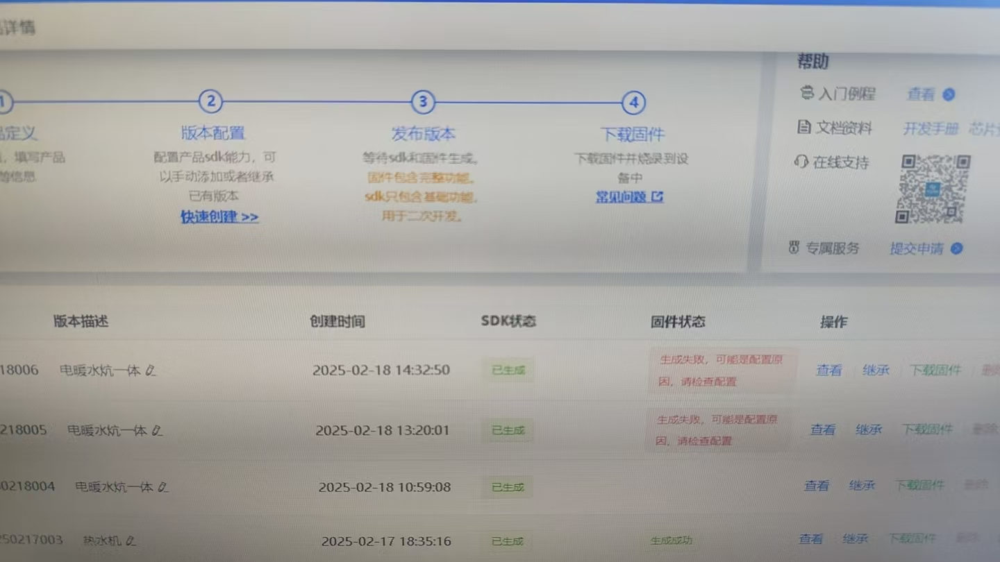

**3. 导出配置寻求帮助**

- 如果问题持续，可导出产品配置文件
- 在产品管理界面找到"导出"功能
- 将配置文件提供给技术团队进行分析

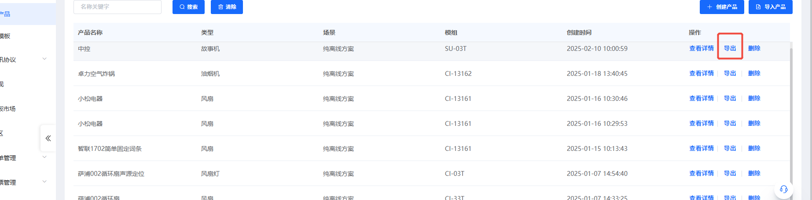

**4. 平台维护信息**

- 平台会定期进行升级维护以改善服务
- 关注官方通知，了解维护时间安排
- 维护期间服务暂时不可用，请耐心等待

**5. 长时间等待处理**

- 固件生成状态显示"正在生成"超过30分钟未更新
- SDK状态长时间卡在"SDK正在生成，大约需要10-30分钟"
- 多次尝试重新生成都失败时，建议联系技术支持


**6. 服务恢复确认**

- 生成成功后状态显示为"已生成"
- 固件状态显示"生成成功"
- MD5校验码可用于验证固件完整性


**注意事项：**

- 服务器负载问题是暂时的，平台正在紧急优化
- 生成失败不是配置错误，不要频繁修改配置
- 保留错误截图和配置信息便于技术团队排查
- 可关注官方公告获取最新服务状态
- 避免多次提交相同任务，会加重服务器负担
- 如持续"待生成"状态，说明生成任务已卡住需要重新提交

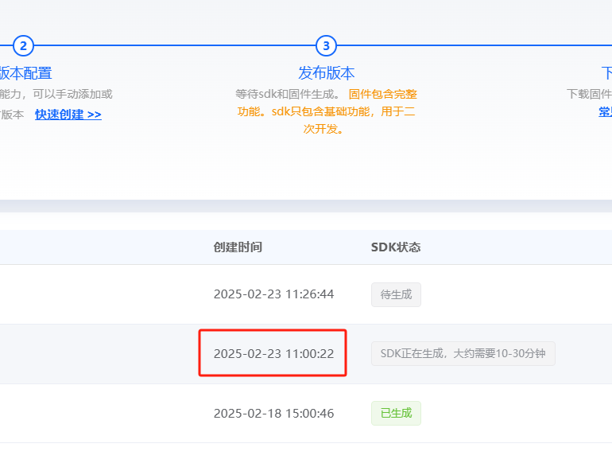

---

### SDK生成显示"待生成"或生成时间过长怎么办？

**问题描述：**

在使用SDK生成固件时，部分固件状态显示为"待生成"，且SDK生成时间过长，影响开发进度。

**解决方案：**

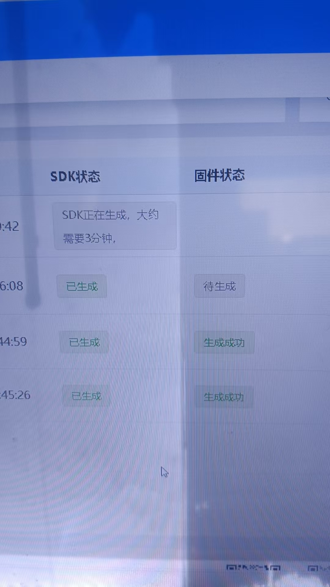

**1. 状态说明**

- **SDK正在生成**：表示正在处理，需要等待
- **待生成**：表示排队等待，系统负载较高
- **生成成功**：表示已完成，可下载使用

**2. 生成时间长的原因**

- 服务器负载高，需要排队处理
- 同时生成使用方多，资源分配紧张
- 复杂配置需要更多处理时间

**3. 解决方法**

- 避开高峰时段（如下午2-4点）进行生成
- 不要频繁刷新页面或重复提交
- 耐心等待，正常生成需要10-30分钟
- 如超1小时未完成，可联系技术团队

**注意事项：**

- 生成时间与配置复杂度相关
- 状态显示"待生成"说明已进入队列
- 平台正在扩容以缓解压力
- 建议提前规划，留出充足时间

---

### 语音模块是否支持闹钟功能？

**问题描述：**

需要了解语音模块是否支持通过语音指令设置闹钟功能。

**解决方案：**

语音模块**不支持**闹钟功能，无法实现定时提醒。

**功能限制说明：**

- **无时钟模块**：语音模块没有内置实时时钟（RTC）
- **不支持定时**：无法实现特定时间的闹钟提醒
- **功能定位**：专注于语音识别和控制执行

**替代方案：**

**方案一：外接时钟模块**

- 使用带RTC功能的单片机
- 通过串口与语音模块通信
- 由单片机管理闹钟功能

**方案二：使用定时器功能**

- 部分模块支持简单的定时器
- 可实现延时执行功能
- 但无法实现按时钟的定时

**方案三：语音提醒替代**

- 设置固定的提醒语音
- 通过语音触发播报时间
- 需要手动触发执行

**注意事项：**

- 如需闹钟功能，建议配合其他设备使用
- 可关注产品更新，看是否新增时钟功能
- 语音模块主要用于即时响应和控制

---

### CI系列模块支持串口触发强制退出唤醒吗？

**问题描述：**

需要了解CI系列离线语音识别芯片是否支持通过串口触发强制退出唤醒状态功能。

**解决方案：**

**1. 功能确认**

- CI系列模块支持串口触发强制退出唤醒
- 可通过添加行为实现该功能
- 不需要修改固件，平台配置即可实现

**2. 配置步骤**

- 添加新的行为项
- 触发方式选择"串口输入"
- 控制详情选择"退出唤醒"


*触发方式选择串口输入，消息编号为3*


*控制详情中选择退出唤醒功能*

**3. 触发参数设置**

- 选择接收串口：UART0_RX
- 设置消息编号：匹配发送的数据
- 测试消息：AA 55 03 55 AA（十六进制）
    - AA：帧头
    - 55：帧尾
    - 03：消息号

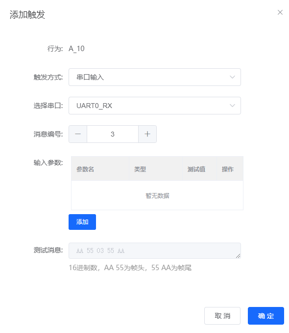

*串口输入触发参数配置*

**4. 退出唤醒配置**

- 控制方式：系统设置
- 类别：识别控制
- 操作：退出唤醒
- 延时恢复：选择"否"

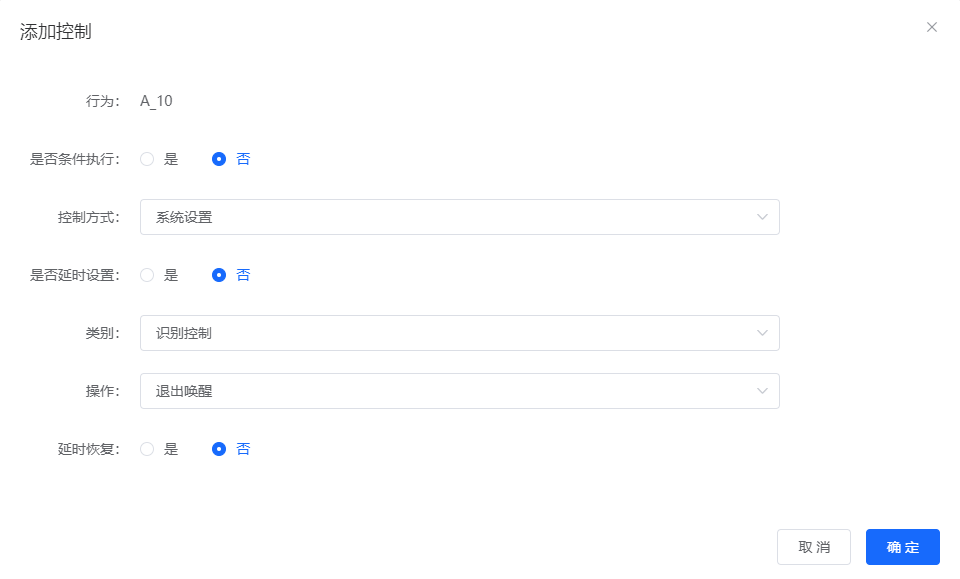

*系统设置中的退出唤醒操作*

**5. 串口输出配置（可选）**

如需同时发送串口数据确认：

- 控制类型：端口输出
- 端口类型：UART0_TX
- 动作：发送
- 参数：01（或其他确认数据）

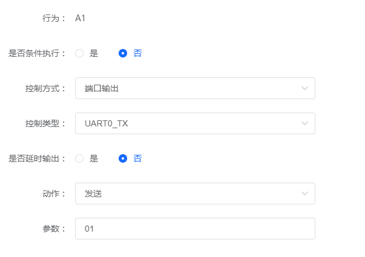

*UART0_TX发送数据配置*

**6. 串口参数配置**

确保UART0配置正确：

- UART0_TX和UART0_RX波特率：9600
- 数据位：8
- 停止位：1
- 校验位：无
- 功能：烧录功能引脚（可用于通信）


*UART0作为烧录功能引脚的配置*

**注意事项：**

- 退出唤醒后需要重新唤醒词才能进入语音识别
- 串口数据格式必须严格按帧格式发送
- 消息号要与配置的一致
- 退出唤醒功能不影响其他正常工作

---

## 平台功能问题


---

### 如何在同一个行为中同时使用唤醒词和串口输入触发？

**问题描述：**

希望配置一个行为，能够同时通过唤醒词和串口输入两种方式触发，避免需要创建两个重复的行为配置。

**解决方案：**

**平台功能限制说明：**

1. **触发方式设计原则**：

    - **单一触发源**：每个行为只能设置一种触发方式
    - **不支持合并**：无法在同一行为中设置多种触发条件
    - **独立处理**：不同触发方式需要创建独立的行为

2. **设计原因**：

    - **逻辑清晰**：避免触发条件冲突
    - **响应明确**：确保触发来源可追溯
    - **状态管理**：简化模块内部状态管理

**替代方案实现：**

**方案一：创建两个独立行为**

```
行为1：语音触发
├── 触发方式：命令词"打开灯"
├── 执行动作：开灯
└── 回复语："灯已打开"

行为2：串口触发
├── 触发方式：串口输入特定数据
├── 执行动作：开灯
└── 回复语："灯已打开"
```

**方案二：使用中间变量**

- 通过串口设置内部状态变量
- 语音命令检查状态变量后执行
- 需要固件支持自定义变量功能

**方案三：语音控制串口模式**

- 默认语音触发所有功能
- 通过语音命令切换到串口控制模式
- 串口模式时只响应串口输入

**实现步骤（方案一示例）：**

1. **创建语音触发行为**：

    - 新建行为
    - 设置触发方式为"命令词"
    - 输入命令词如"打开灯"
    - 添加执行动作（如GPIO输出）
    - 设置回复语（可选）

2. **创建串口触发行为**：

    - 新建行为
    - 设置触发方式为"串口输入"
    - 指定触发数据（如0x01）
    - 添加相同的执行动作
    - 设置相同的回复语

3. **行为管理优化**：

    - **命名规范**：

        - "语音-打开灯"
        - "串口-打开灯"
    - **分组管理**：使用文件夹或标签分组
    - **批量操作**：复制行为后修改触发方式

**注意事项：**

- 不同触发方式的行为无法合并，这是平台设计限制
- 如果功能复杂，建议使用模块化编程或定制开发
- 行为数量过多时，建议使用MCU协调多个模块
- 维护两套相同配置时，注意同步更新


---

### 配置完成后无法保存怎么办？

**问题描述：**

在语音指令配置界面设置完成后，界面上显示黄色提示文字，无法保存配置。

**解决方案：**

**1. 检查提示信息**

- 界面顶部的黄色提示框会说明无法保存的原因
- 常见提示："当前版本正在发布，系统不会保存修改的内容！"
- 这表示当前版本处于发布状态

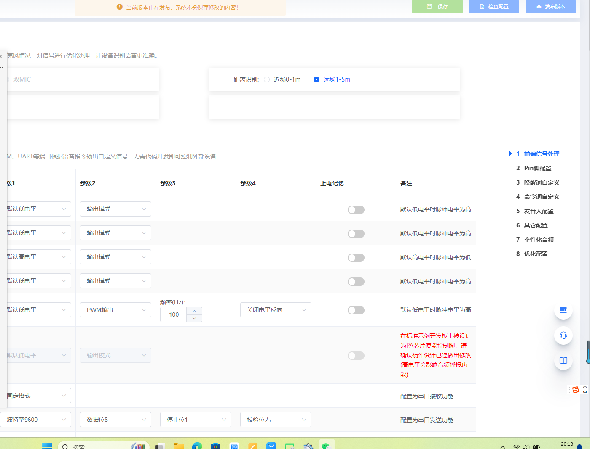

**2. 使用继承功能**

- 在"下载固件"旁边找到"继承成新的工程"按钮
- 点击继承按钮创建新的工程版本
- 返回上一级页面找到继承按钮

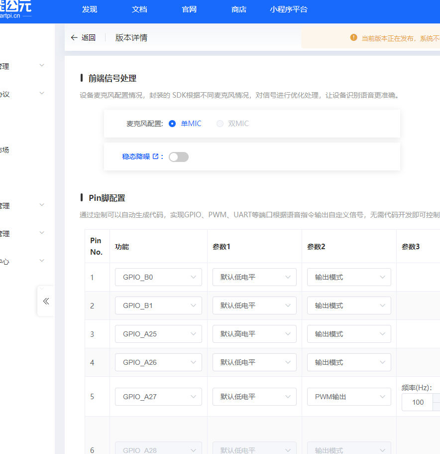

**3. 继承操作步骤**

- 点击返回按钮离开当前配置页面
- 在下载固件旁边点击"继承成新的工程"
- 系统会创建新的可编辑版本
- 原有设置会继承到新版本中

**注意事项：**

- 发布状态的版本不能直接修改
- 继承新工程会保留之前的配置
- 刚修改的内容在继承时会丢失
- 建议在可编辑状态下完成所有修改

---

### 平台固件生成频繁超时怎么办？

**问题描述：**

平台在生成固件时频繁出现超时，导致生成过程耗时过长，最长已超过四个小时，严重影响开发效率。

**解决方案：**

**问题原因分析：**

1. **服务器负载过高**：

    - 同时生成请求过多
    - 服务器资源紧张
    - 队列排队时间过长

2. **网络环境影响**：

    - 网络连接不稳定
    - 数据传输中断
    - 带宽不足导致超时

3. **配置复杂度影响**：

    - 功能配置过于复杂
    - 音频文件数量过多
    - 特殊功能增加处理时间

**解决方法：**

1. **优化操作时间**：

    - 避开高峰期（工作日下午）
    - 选择凌晨或早晨等低峰时段
    - 分批次生成，避免一次性大量操作

2. **简化配置策略**：

    - 先生成基础功能固件测试
    - 确认功能正常后再添加复杂配置
    - 减少不必要的功能项

3. **网络环境改善**：

    - 使用有线网络替代WiFi
    - 确保网络连接稳定
    - 关闭其他占用带宽的应用

4. **生成状态监控**：

    - 定期刷新页面查看进度
    - 注意"生成超时，可重新生成"提示
    - 超时后及时选择重新生成

**预防措施：**

1. **提前规划**：

    - 在非紧急情况下提前生成固件
    - 预留充足的时间缓冲
    - 准备备用方案

2. **分步验证**：

    - 每添加一个功能就生成测试
    - 避免最后才发现问题
    - 减少重复生成次数

3. **保存配置**：

    - 配置完成后及时保存
    - 避免因超时丢失配置
    - 建立配置备份习惯

**注意事项：**

- 固件生成超时是服务器负载导致的正常现象
- 不要频繁取消重试，这会加重服务器负担
- 建议合理安排生成时间，避开高峰期
- 如持续超时，可联系技术团队了解服务器状态


---

### 智能公元平台"评测"按钮无反应怎么办？

**问题描述：**

在智能公元平台的唤醒词自定义页面点击"评测"按钮无任何反应，无法测试自定义唤醒词的效果。

**解决方案：**

**1. 暂时忽略评测功能**

- 评测功能目前可能存在技术问题
- 不影响固件的正常生成和使用
- 建议先跳过评测，直接生成固件

**2. 替代测试方法**

- 生成固件后直接烧录到模块
- 通过实际语音测试唤醒效果
- 根据实际效果调整配置

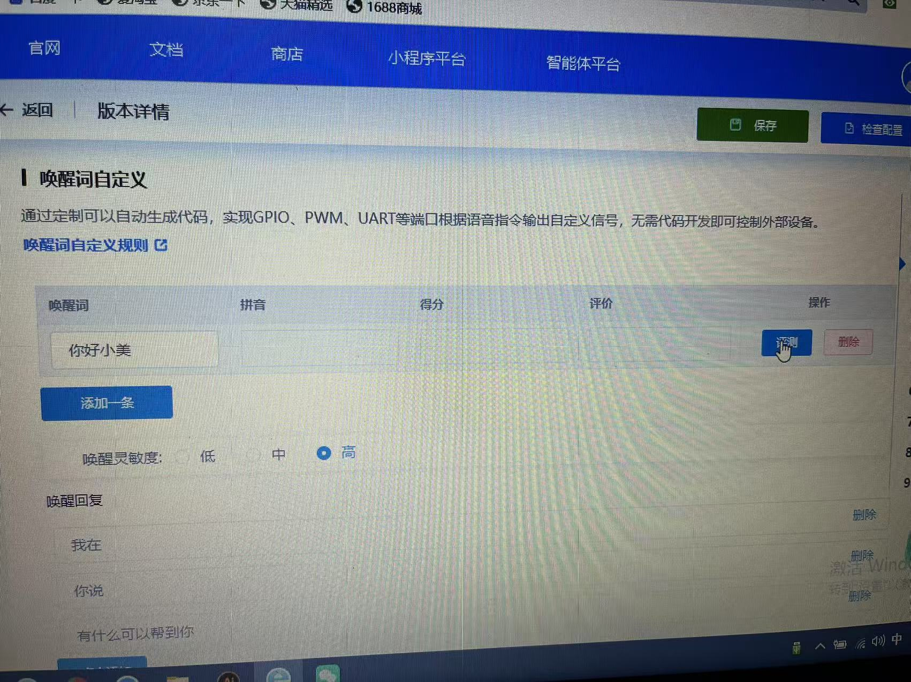

**3. 后续优化建议**

- 在安静环境下测试唤醒词识别率
- 录制测试语音听取效果
- 根据测试结果调整唤醒词发音
- 如识别不佳，考虑更换更容易识别的词汇

**注意事项：**

- 评测功能非必需，可在实际使用中验证
- 固件生成不受评测功能影响
- 建议选择发音清晰、不易混淆的唤醒词
- 如平台功能异常，联系技术团队反馈

---

## 固件与服务


---

### 如何批量烧录不同语言的固件？

**问题描述：**

需要为同一型号模块批量烧录多种不同语言的固件，如中文、英文、西班牙语各50个，并确保每种语言包含正确的开机播报和唤醒词。

**解决方案：**

**1. 固件准备**

- **中文固件**：包含中文开机播报和唤醒词
- **英文固件**：包含英文开机播报和唤醒词（如"Hello dental chair"）
- **西班牙语固件**：包含西班牙语开机播报
- 每种语言固件单独生成和保存

**2. MD5校验**

烧录前进行固件完整性校验：

- 使用校验工具计算每个固件的MD5值
- 中文固件示例：MD5-815a1a65ba01973fbf47cf0446d96ac8
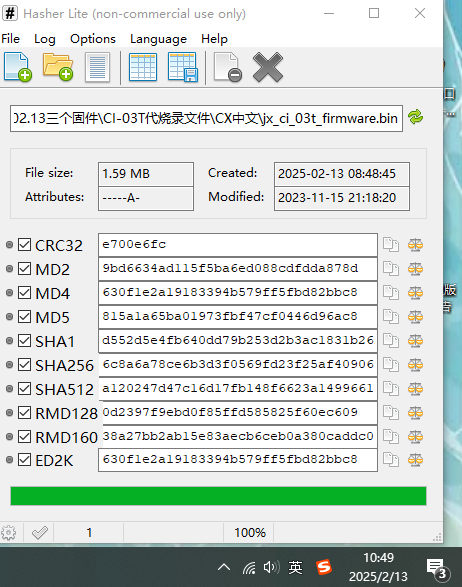
- 英文固件示例：MD5-2fa9f1a99e173cc90e58169ebde3435d
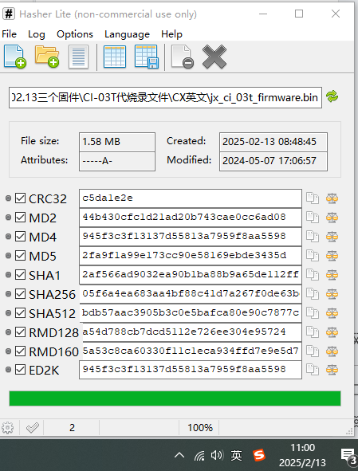
- 西班牙语固件示例：MD5-c8a6d3b614f3bcb5f57b32ced9c0e038
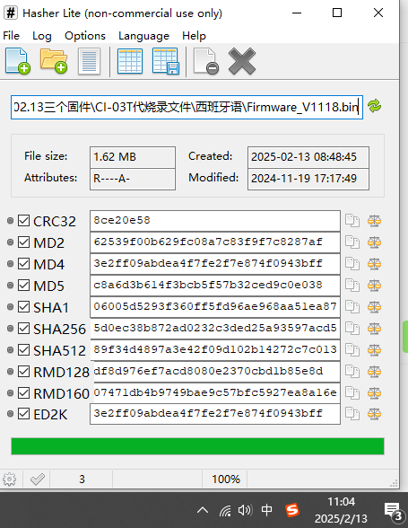

**3. 批量烧录流程**

- **分批处理**：按语言分批次烧录，避免混淆
- **标签管理**：烧录后贴上语言标签便于区分
- **抽检验证**：每批抽检确认开机播报和唤醒词正确
- **记录追溯**：建立烧录记录表，包含固件版本和数量

**4. 代烧服务选项**

如需专业代烧服务：

- **服务标准**：100个模块以上提供代烧服务
- **服务范围**：支持模块和芯片烧录
- **流程说明**：联系商务或技术团队安排

**服务优势：**

- 专业烧录设备，成功率高
- 批量处理，节省开发时间
- 质量保证，降低不良率

**联系方式：**

- 通过官方客服或销售渠道咨询
- 提供具体数量和型号信息
- 确认交期和服务费用

**注意事项：**

- 需要提前预约，避免等待
- 烧录前确认模块型号匹配
- 保留部分样品自行测试验证

## 产品方案分享


---

### 如何将在线设计好的产品方案分享给同事？

**问题描述：**

在智能公元平台设计好产品方案后，需要分享给同事进行协作或查看。


**解决方案：**

**方法一：导出JSON文件分享**

- 在产品列表中找到需要分享的产品
- 点击产品行最右侧的"导出"按钮
- 下载JSON格式的配置文件
- 将JSON文件发送给同事
- 同事在平台中通过"导入"功能加载文件

**方法二：通过固件压缩包分享**

- 点击产品的"查看详情"进入详情页面
- 找到"下载固件"按钮
- 下载完整的固件压缩包
- 将压缩包发送给同事
- 同事解压后导入其中的JSON配置文件

**注意事项：**

- JSON文件包含完整的产品配置信息
- 导入后可以在原有配置基础上继续编辑
- 建议定期导出重要项目进行备份
- 确保双方使用的是同一版本的平台

---

## 固件发布错误


---

### 行为控制详情执行条件项为空是什么意思？

**问题描述：**

在使用平台发布固件时，出现多个"行为控制详情执行条件项为空"的错误提示，导致固件无法正常发布。

**解决方案：**

该错误表示在配置行为控制时，为某些行为添加了附加条件但没有正确设置执行条件。

- 删除不必要的附加条件配置
- 在行为控制界面，检查每个行为（如jlx1、jlxz1等）的"添加控制"部分
- 如果不需要附加条件，确保该部分为空或不添加任何条件
- 重新生成固件并发布

**注意事项：**

- 附加条件是可选功能，仅在需要复杂触发逻辑时使用
- "其它设置中退出命令不能有"错误表示在退出命令配置中存在冲突项
- 发布前建议仔细检查所有行为配置的完整性

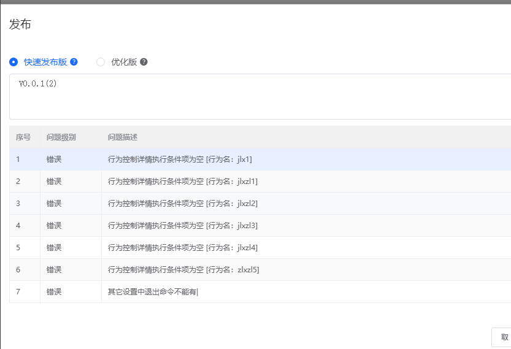

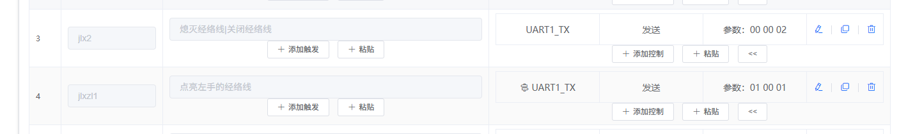

---

### 控制详情中为什么显示多条记录？

**问题描述：**

在平台配置中，基础词条只配置了一条命令词，但控制详情中显示两条或更多记录，无法删除多余的记录。

**解决方案：**

控制详情中显示的条目来源于多个地方，不只是命令词：

**1. 控制详情的来源**

- **命令词的控制**：在命令词的"控制详情"标签页添加的控制
- **唤醒词的控制**：唤醒词也可以添加控制操作（如播报回复语）
- **上电启动事件**：上电时执行的控制
- **定时器事件**：定时器超时时执行的控制
- **GPIO/串口输入触发**：外部触发的控制

**2. 唤醒词自带控制**

唤醒词被识别后，通常会执行以下操作：
- 播放唤醒回复语（如"我在"、"请讲"等）
- 进入唤醒状态，准备接收命令词

这些操作会在控制详情中显示，无法单独删除。

**3. 不同颜色条目的含义**

平台通常用不同颜色区分不同来源的控制：
- 绿色/蓝色：命令词添加的控制
- 灰色/其他色：唤醒词、事件或其他触发的控制

**4. 如何删除多余的控制**

- **命令词的控制**：在对应命令词的"控制详情"标签页中删除
- **唤醒词的控制**：在唤醒词配置的"控制详情"中删除（但保留回复语）
- **事件触发的控制**：在对应事件的"添加控制"中删除

**注意事项：**

- 唤醒词的播报回复语是正常功能，建议保留
- 如果不需要某个控制，需要在对应的配置位置删除，不是在控制详情页面直接删除
- 控制详情是汇总显示，实际配置需要回到各自的配置入口


### 继承新版本并生成SDK的流程是什么？

**问题描述：**

在平台操作中不确定是否正确执行了继承新版本并生成SDK的流程，需要确认操作步骤。

**解决方案：**

**1. 正确操作流程**

- 点击"继承为新版本"创建可编辑版本
- 继承后平台会自动生成SDK
- SDK生成完成后可下载使用

**2. 操作确认**

- 继承成功后页面显示新版本
- 状态栏显示SDK生成进度
- 完成后可查看下载链接

**3. 使用SDK**

- SDK是二次开发包
- 包含接口定义和示例代码
- 需要编译后才能烧录到模块

**注意事项：**

- 继承新版本才能修改配置
- SDK生成需要等待处理时间
- 保留原版本作为备份

---

## 离线开发


---

### 为什么离线开发固件没有日志输出？

**问题描述：**

使用离线开发固件时无法输出日志，而线上生产的固件日志输出正常，且已更换COM口和USB接口。

**解决方案：**

**问题定位：**

- 线上固件有日志说明硬件连接正常
- 问题出在离线开发固件的配置
- 可能是日志功能未正确启用

**检查步骤：**

- 确认离线开发文档中的日志配置步骤
- 检查DEFAULT_LOG设置是否启用
- 验证GPIO_B8引脚配置是否正确
- 参考官方离线方案开发指导手册（第25页）

**配置建议：**

- 在固件配置时明确启用日志输出
- 确保日志输出引脚配置为GPIO_B8
- 使用正确的波特率设置
- 按照官方文档步骤操作

**注意事项：**

- 离线开发和线上固件配置可能有差异
- 建议仔细阅读离线开发文档
- 二次开发时注意保留日志功能
- 使用官网下载的最新文档

---

## 小程序平台


---

### 如何自定义串口数据帧格式并支持低功耗唤醒？

**问题描述：**

需要了解如何自定义串口数据帧格式（如0xAA 0x55开头），以及在不使用唤醒词时是否支持低功耗唤醒功能。

**解决方案：**

**串口数据帧格式：**

1. **支持自定义格式**
    - 帧头可设置为0xAA 0x55
    - 数据内容可自定义（如温度高/低字节）
    - 支持添加CRC校验位
    - 帧尾固定为0x55 0xAA

2. **推荐格式示例**
    ```
    0xAA 0x55 [温度高字节] [温度低字节] [CRC校验] 0x55 0xAA
    ```

3. **触发机制**
    - 串口接收定义触发：发送指定数据才会触发
    - 需要严格按照帧头+数据+帧尾的格式
    - 支持任意自定义数据内容

**低功耗唤醒功能：**

1. **支持低功耗模式**
    - 设备在不使用唤醒词时仍可进入低功耗
    - 待机功耗可低至60mA左右
    - 支持多种唤醒方式

2. **唤醒方式选择**
    - **硬件唤醒**：通过IO信号触发（如按键）
    - **定时唤醒**：设置定时器周期性唤醒
    - **音频事件唤醒**：检测特定音频事件（如哭声）

3. **配置方法**
    - 在平台固件配置中启用低功耗模式
    - 设置合适的唤醒灵敏度
    - 配置唤醒后的行为动作

**注意事项：**

- 自定义数据帧需确保与上位机解析逻辑一致
- CRC校验有助于提高通信可靠性
- 低功耗模式会影响响应速度，需根据应用场景平衡
- 音频事件唤醒可能增加误触发概率

---

## 串口通信配置


---

### 串口发送测试值时语音播报内容未改变？

**问题描述：**

通过串口发送测试值时，语音播报内容未按预期改变，排查发现是串口波特率不匹配导致。

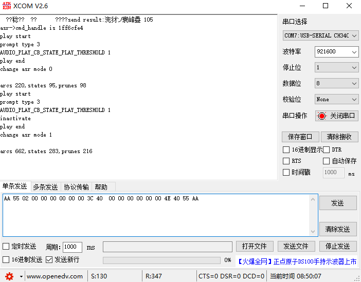
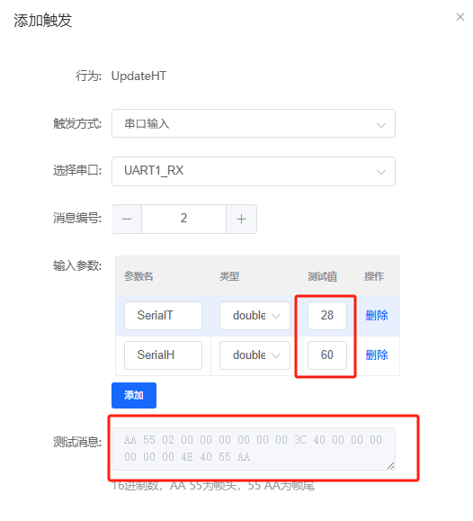
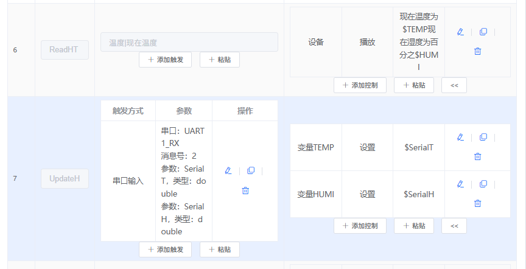

**解决方案：**

**1. 确认串口配置**

- 检查平台配置的串口号（如UART1_RX对应A2、A3引脚）
- 确认平台中配置的波特率（默认为9600）
- 串口助手的波特率必须与平台配置一致

**2. 正确的连接方式**

- A2引脚连接CH340的RX
- A3引脚连接CH340的TX
- 使用A2、A3引脚进行串口通信，而非B5、B6

**3. 波特率设置**

- 平台配置：UART1_RX和UART1_TX默认波特率为9600
- 串口助手：必须设置为9600，而不是921600（烧录波特率）

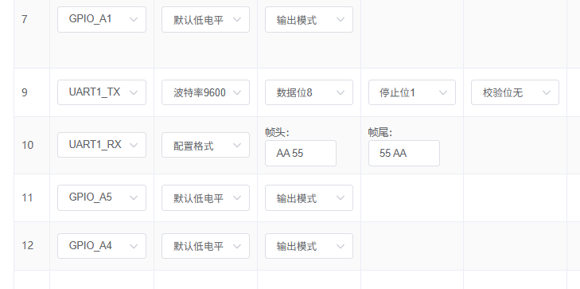
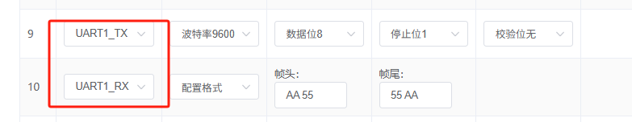
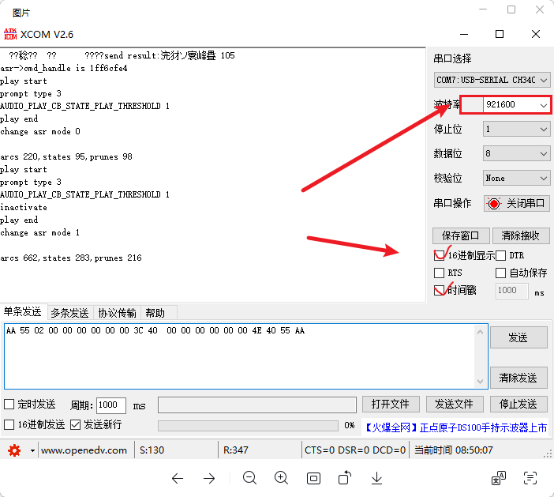

**注意事项：**

- 烧录波特率和通信波特率不同
- 烧录使用921600，正常通信使用9600
- 确保引脚连接正确，TX接RX，RX接TX
- 检查串口线是否接触良好

---

## 智能公元平台


---

### 智能公元平台配置保存失败怎么办？

**问题描述：**

在智能公元平台配置智能体时，保存操作总是失败，即使刷新页面或重新进入也无法解决。

**解决方案：**

保存失败可能是由于网络不稳定或配置数据异常导致的，建议按以下步骤排查：

1. **基础操作**：

    - 刷新页面后重试
    - 关闭浏览器重新进入
    - 清除浏览器缓存后再次尝试

2. **数据导出检查**：

    - 导出当前配置的JSON文件
    - 记录已修改的配置项
    - 通过技术人员协助验证配置

3. **重新配置**：

    - 创建新的配置文件
    - 避免在网络不稳定时操作
    - 分步骤保存，避免一次性修改过多

**注意事项：**

- 平台配置时建议使用稳定的网络环境
- 复杂配置建议分多次保存
- 如持续失败，可能需要技术人员介入检查后台数据
- 保留配置JSON文件作为备份

---

## 系统功能与稳定性


---

### 如何配置设备重启功能？

**问题描述：**

需要配置设备自动重启或手动重启功能，以确保设备在无人值守环境中的稳定运行。

**解决方案：**

**当前平台支持情况：**

1. **软件重启支持**
    - 部分固件版本支持通过命令触发软重启
    - 需要在平台配置中启用相关功能
    - 重启后设备会重新初始化所有模块

2. **配置方法**
    - 在行为配置中添加重启命令
    - 可通过语音命令触发重启
    - 或通过串口发送重启指令

3. **实现方案**

**方案一：定时重启**

- 使用外部定时器控制电源
- 设置每日固定时间断电重启
- 适合无人值守的长期运行设备

**方案二：看门狗重启**

- 启用模块内部的看门狗功能
- 系统死机时自动重启
- 需要在固件配置中开启

**方案三：软件重启命令**

- 通过特定语音命令触发重启
- "重启设备"命令触发软重启
- 需要在平台中预配置

**注意事项：**

- 重启功能需要在固件生成时配置
- 不同型号的模块支持程度可能不同
- 重启过程中无法响应语音命令
- 建议在安静环境下执行重启操作


---

### 设备容易死机怎么办？

**问题描述：**

设备在使用过程中容易死机，担心在无人值守的环境中出现故障导致无法使用。

**解决方案：**

**排查步骤：**

1. **电源检查**
    - 确认供电电压稳定（3.3V或5V）
    - 检查电源纹波是否过大
    - 使用万用表测量电压波动

2. **散热检查**
    - 检查模块工作温度
    - 确保有良好的散热条件
    - 避免长时间高温运行

3. **固件问题排查**
    - 更新到最新版本固件
    - 检查配置文件是否正确
    - 避免词条数量超过上限

4. **硬件连接检查**
    - 确认所有引脚连接正确
    - 检查是否有短路或接触不良
    - 麦克风和喇叭接线要牢固

**预防措施：**

1. **启用看门狗功能**
    - 在平台配置中开启硬件看门狗
    - 设置合适的看门狗超时时间
    - 系统死机时自动重启

2. **优化电源设计**
    - 使用LDO稳压器确保电源稳定
    - 添加滤波电容减少电源噪声
    - 避免使用开关电源（如有干扰）

3. **环境优化**
    - 保持设备工作环境温度适宜
    - 避免强电磁干扰环境
    - 确保良好的通风散热

**注意事项：**

- 长期运行建议配置定时重启机制
- 无人值守环境必须启用看门狗
- 定期检查设备运行状态
- 保留配置备份便于快速恢复

---

## AI模型与智能体


---

### 体验版智能体可以修改吗？

**问题描述：**

询问平台提供的默认体验版智能体是否可以直接修改配置。

**解决方案：**

**体验版智能体限制说明：**

- 体验版智能体是平台预配置的默认智能体
- 体验版智能体不支持直接修改配置
- 体验版主要用于快速验证功能和演示效果

**如需自定义配置：**

1. **创建自定义智能体**：
    - 在智能体平台创建自己的智能体
    - 根据需求配置提示词、知识库、工具等
    - 发布为API服务后绑定到设备

2. **使用正式版智能体**：
    - 正式版智能体支持完整的自定义配置
    - 可根据项目需求灵活调整参数


### 一个模块可以同时绑定多个智能体吗？

**问题描述：**

询问是否可以同时绑定扣子空间的智能体和智能公元的智能体。

**解决方案：**

每个语音模块只能绑定一个智能体，无法同时绑定多个智能体。

**注意事项：**

- 绑定新智能体前，需要先解除原有智能体的绑定
- 确认智能体平台兼容性后再进行绑定操作


---

### 智能体时间查询功能返回错误时间怎么办？

**问题描述：**

在使用智能体时，查询时间功能返回错误的时间信息，与系统时间不一致。

**解决方案：**

1. **刷新页面重试**：

    - 刷新智能体页面后重新询问时间
    - 有时网络延迟会导致时间数据更新不及时

2. **使用标准查询配置**：

    - 在智能体的"联网查询"组件中添加标准查询示例
    - 示例内容：`-现在的时间`、`-今天的日期`

3. **检查网络连接**：

    - 确保设备网络连接正常
    - 使用百度等可靠的时间查询服务

**注意事项：**

- 时间查询依赖于网络服务的实时数据
- 如持续返回错误时间，可能是智能体配置问题
- 400错误通常表示请求tokens超出限制，需要简化查询内容


---

### AI大模型云端模块时间查询调试

**问题描述：**

在AI大模型云端模块中调试时间查询功能时，系统返回的时间信息错误或超出token限制。

**解决方案：**

1. **配置联网查询组件**：

    - 在流程设计中添加"联网查询"组件
    - 设置分类名称和描述为时间查询相关

2. **添加查询示例**：

    - 在示例中添加：`-现在的时间`、`-今天的日期`
    - 保存并运行配置

3. **处理token限制**：

    - 如遇到400错误（最大上下文长度4096 tokens），需要：

        - 简化查询语句
        - 减少上下文长度
        - 分批次处理复杂查询

**注意事项：**

- 联网查询组件需要正确的示例配置才能正常工作
- Token限制是AI模型的上限，需要优化查询内容
- 时间数据来源应为实时网络服务，而非本地缓存


---

### 在线语音和离线语音的声音可以设置为一致吗？

**问题描述：**

希望将在线语音的声音设置为与离线语音相同，但离线语音有14种声音选项，而在线语音只有4种。

**解决方案：**

目前在线语音和离线语音的声音还不能完全一致：

1. **当前限制**：

    - 离线语音：支持14种声音选项
    - 在线语音：仅支持4种声音选项
    - 两者音色库不完全相同

2. **解决方案进展**：

    - 研发团队正在开发相关功能
    - 需要一定时间完成开发和测试
    - 完成后会通知使用方

**注意事项：**

- 短期内无法实现声音完全一致
- 可选择最接近的在线语音音色
- 关注官方更新通知，了解功能进展


---

### 离线语音芯片接入AI模型需要重新创建产品吗？

**问题描述：**

询问离线版本的语音芯片接入AI模型是否需要重新创建产品。

**解决方案：**

目前不需要重新创建产品。

- 离线语音芯片与AI模型的接入方案正在开发中
- 具体的实现方式和平台配置请关注官方通知
- 如有接入咪头和喇叭后无响应，需检查：

    - 硬件连接是否正确
    - 固件是否正常烧录
    - 模块是否损坏

**注意事项：**

- 接入AI模型的功能支持以官方发布为准
- 确保硬件连接正确后再排查软件问题
- 保留好原产品的配置信息


---

### 智能体平台无法访问怎么办？

**问题描述：**

智能体平台页面显示"暂无数据"，点击没有反应，无法正常使用。

**解决方案：**

平台可能正在更新中，请稍后尝试。

- **访问方式**：

    - 网址：https://ai.aimachip.com/login
    - 从网站导航栏"智能体平台"进入
    - 直接登录页面避免页面问题

- **操作视频**：

    - 操作视频正在审核中
    - 审核通过后会发布
    - 请耐心等待发布

**注意事项：**

- 如点击无反应，可尝试更换浏览器

---

## 固件配置管理


---

### 烧录自定义固件后如何保留上电唤醒不退功能？

**问题描述：**

烧录自定义产品固件后，原有的上电唤醒不退功能被覆盖，需要在自定义固件中实现该功能。

**解决方案：**

**问题分析：**

- **功能覆盖**：烧录新固件会完全替换原有固件
- **配置丢失**：上电唤醒不退的配置会被新固件覆盖
- **需要集成**：必须将此功能集成到自定义固件中

**实现方法：**

**1. 导入参考配置**

- **下载参考固件**：

    1. 找到平台提供的"上电唤醒不退"功能固件
    2. 下载固件压缩包
    3. 解压获得JSON配置文件

- **导入配置到平台**：

    1. 进入平台的产品管理界面
    2. 点击"导入产品"或"导入JSON"
    3. 选择下载的JSON配置文件
    4. 查看具体的配置方法

**2. 复制配置到自定义产品**

- **查看唤醒配置**：

    - 在导入的产品中查看唤醒相关设置
    - 找到"上电进入唤醒"、"永不退下"等配置项
    - 记录具体的参数设置

- **应用到自定义产品**：

    1. 创建或打开自己的产品配置
    2. 在相同位置添加相同的配置项
    3. 设置相同的参数值
    4. 保存并生成固件

**3. 关键配置要点**

- **唤醒状态设置**：配置为上电后自动进入唤醒状态
- **退下机制**：设置为"永不退下"或最大退下时间
- **保持唤醒**：确保没有设置自动休眠或退下条件

**注意事项：**

- 必须在自定义固件中添加相关配置，不能依赖烧录
- 不同型号的配置方式可能略有差异
- 建议先导入官方配置学习实现方法
- 生成固件前仔细检查所有配置项
- 保留好配置文件备份，方便后续修改

---

### 如何在平台中导入产品配置文件？

**问题描述：**

需要在平台中导入JSON格式的产品配置文件，但不知道具体的导入操作步骤。

**解决方案：**

**导入操作步骤：**

**1. 进入产品管理界面**

- **登录平台**：使用账号登录语音平台
- **导航路径**：在主导航中找到"产品管理"
- **定位导入按钮**：在产品列表页面找到"导入产品"选项

**2. 选择并导入文件**

- **点击导入**：点击"导入产品"按钮
- **选择文件**：在弹出的文件选择器中选择JSON文件
- **确认导入**：点击确认完成导入操作

**3. 验证导入结果**

- **检查产品列表**：确认新产品已出现在列表中
- **查看配置详情**：点击进入产品，验证配置是否正确
- **测试功能**：生成固件测试导入的配置

**支持的文件格式：**

- **JSON格式**：平台支持标准JSON配置文件
- **文件要求**：

    - 扩展名必须为.json
    - 文件结构需符合平台规范
    - 大小不能超过限制

**注意事项：**

- 导入前建议备份当前产品配置
- 确保JSON文件格式正确，避免导入失败
- 导入后需要重新生成固件才能使用
- 如导入失败，检查JSON文件格式和内容
- 不支持的配置项会被自动忽略或报错

---

### 如何在智能公元平台导入和修改固件配置？

**问题描述：**

需要了解如何在智能公元平台上导入已有的固件配置文件，以及对配置进行修改和重新生成固件的具体操作流程。

**解决方案：**

**配置导入流程：**

1. **登录平台**：

    - 访问智能公元平台：https://www.smartpi.cn/#/
    - 使用注册账号登录系统
    - 进入项目管理界面

2. **导入配置文件**：

    - 点击"导入配置"或"导入"按钮
    - 选择JSON格式的配置文件
    - 确认文件格式正确且完整
    - 等待系统解析并加载配置

3. **配置验证**：

    - 检查导入的配置项是否正确显示
    - 验证唤醒词、命令词等关键信息
    - 确认硬件配置和引脚设置
    - 运行配置检查工具验证完整性

**配置修改操作：**

1. **基础信息修改**：

    - **项目信息**：修改项目名称、描述等基本信息
    - **模块型号**：根据实际硬件选择正确的模块型号
    - **功能配置**：添加或删除语音识别功能

2. **语音相关设置**：

    - **唤醒词配置**：修改或添加新的唤醒词
    - **命令词设置**：编辑命令词和对应的触发动作
    - **回复语管理**：自定义语音播报内容
    - **识别参数**：调整灵敏度、识别距离等参数

3. **硬件引脚配置**：

    - **串口设置**：配置UART通信参数和引脚
    - **GPIO控制**：设置IO口输出功能
    - **音频配置**：调整音量、音频格式等参数

4. **高级功能设置**：

    - **降噪配置**：启用稳态降噪或深度降噪
    - **自学习功能**：配置用户自学习特性
    - **定时器功能**：设置定时任务和延时控制

**配置保存和固件生成：**

1. **保存配置**：

    - 修改完成后点击"保存"按钮
    - 等待系统自动保存配置
    - 确认保存成功提示

2. **配置检查**：

    - 运行平台提供的配置检查工具
    - 修复检查中发现的问题或冲突
    - 确保所有配置项都符合规范

3. **生成固件**：

    - 点击"生成固件"或"生成"按钮
    - 选择所需的固件特性（如降噪、自学习等）
    - 等待固件生成完成
    - 下载生成的.bin固件文件

**常见问题处理：**

1. **导入失败**：

    - 检查JSON文件格式是否正确
    - 确认文件没有损坏或截断
    - 尝试使用文本编辑器重新保存为UTF-8格式

2. **配置冲突**：

    - 仔细查看配置检查报告
    - 修改冲突的配置项
    - 参考平台提示进行修正

3. **生成失败**：

    - 简化配置，减少功能复杂度
    - 检查是否超出模块资源限制
    - 尝试分步生成，逐步添加功能

**注意事项：**

- 导入配置前建议先备份当前配置
- 不同模块型号的配置可能不兼容
- 修改配置后需要重新生成并烧录固件
- 保留配置文件的版本历史便于回退
- 复杂修改建议分步骤进行并逐步测试
- 确保网络连接稳定，避免配置丢失

---

## 平台操作问题


---

### 平台无法保存、检查配置或发布工程怎么办？

**问题描述：**

在使用平台时，保存功能失效、无法检查配置版本、无法发布工程，导致正常操作受阻。

**解决方案：**

**问题诊断：**

- **可能原因**：

    - 网络连接不稳定
    - 工程文件结构损坏
    - 浏览器兼容性问题
    - 平台临时维护

**解决步骤：**

**1. 网络环境检查**

- **测试网络稳定性**：

    - 使用网络测速工具检查连接
    - 尝试切换网络（WiFi/有线/手机热点）
    - 避免使用代理或VPN

- **浏览器优化**：

    - 清除浏览器缓存和Cookie
    - 尝试使用Chrome/Edge等主流浏览器
    - 禁用不必要的浏览器插件

**2. 工程文件修复**

- **新建工程测试**：

    1. 创建全新的工程
    2. 添加简单的配置项
    3. 测试保存、检查、发布功能

- **导出导入修复**：

    1. 将问题工程导出为JSON
    2. 新建工程并导入JSON
    3. 检查是否恢复正常

**3. 替代操作方案**

- **使用SDK生成平台**：

    - 如果产品管理页面有问题，可尝试SDK生成页面
    - 两边数据通常是同步的
    - 可在SDK页面完成相同操作

- **联系技术团队**：

    - 提供具体错误信息
    - 提供工程文件（JSON格式）
    - 说明操作步骤和环境信息

**注意事项：**

- 保存失败时不要频繁点击，避免数据损坏
- 定期导出工程文件作为备份
- 重要操作前建议先测试网络状况
- 如果是平台普遍问题，等待官方修复通知

---

- 平台更新期间可能暂时无法访问
- 相关问题可联系技术团队

---

### AI模型回答日期错误怎么办？

**问题描述：**

使用AI对话流程时询问"今天几号"，系统返回的日期是2023年，而非当前正确日期。

**解决方案：**

**问题原因**：

AI模型返回错误日期通常是因为知识库截止日期限制，模型无法获取实时日期信息。

**解决方法**：

1. **添加实时日期获取功能**：

    - 在AI助手流程中添加日期获取节点
    - 使用系统函数获取当前日期
    - 将日期信息作为上下文传递给AI模型

2. **配置系统提示词**：

    - 在系统提示词中明确告知当前日期
    - 设置日期更新机制
    - 确保模型基于正确日期回答

3. **流程配置建议**：

    - 添加多个功能节点连接
    - 类似参考流程的配置方式
    - 确保数据流转正确

**注意事项**：

- AI模型本身不具备获取实时日期的能力
- 需要通过外部函数或系统提示词提供日期信息
- 建议定期更新系统提示词中的日期
- 如需精确的实时功能，考虑调用日期API

---

## 远程控制与网络连接


---

### 远程控制时手机是否需要连接WiFi？

**问题描述：**

进行远程控制时，不确定手机是否必须连接WiFi，还是可以使用移动数据网络。

**解决方案：**

**1. 配网阶段要求**

- 首次给模块配网时，手机必须连接WiFi
- 通过小程序完成WiFi配置和绑定

**2. 远程控制阶段**

- 配网完成后，远程控制时可使用移动数据（4G/5G）
- 手机无需连接WiFi网络即可控制设备
- 只要设备本身连接WiFi即可实现远程控制

**注意事项：**

- 仅配网时需要手机连接WiFi
- 远程控制依赖设备端的WiFi连接
- 手机端可使用任何网络连接（WiFi或移动数据）

---

### 设备持续播报WiFi断开怎么办？

**问题描述：**

设备在无线信号正常的情况下，小程序界面显示"断开"状态，且设备持续播报WiFi断开。

**解决方案：**

**1. 检查网络连接状态**

- 确认家庭WiFi信号强度正常
- 检查路由器是否工作正常
- 验证其他设备能否正常连接该WiFi

**2. 设备网络配置检查**

- 重启设备重新连接WiFi
- 检查设备是否忘记网络需要重新配网
- 确认设备WiFi密码是否正确

**3. 小程序状态排查**

- 刷新小程序界面
- 重新登录账号
- 检查小程序版本是否为最新

**4. 可能的原因**

- 设备与路由器距离过远
- WiFi信道干扰
- 设备固件网络模块异常

**注意事项：**

- 设备播报WiFi断开不一定是信号问题
- 优先尝试重启设备和重新配网
- 多次无效时可能需要更新固件


---

## 扣子平台智能体配置


---

### 扣子平台智能体绑定后提问无反应怎么办？

**问题描述：**

在扣子平台创建的智能体绑定后提问无反应，工作流试运行正常，但无法在实际使用中响应使用方输入。

**解决方案：**

**1. 问题排查步骤**

- **工作流测试**：确认工作流试运行成功，说明逻辑配置正确
- **资源点检查**：确认账户资源点是否充足


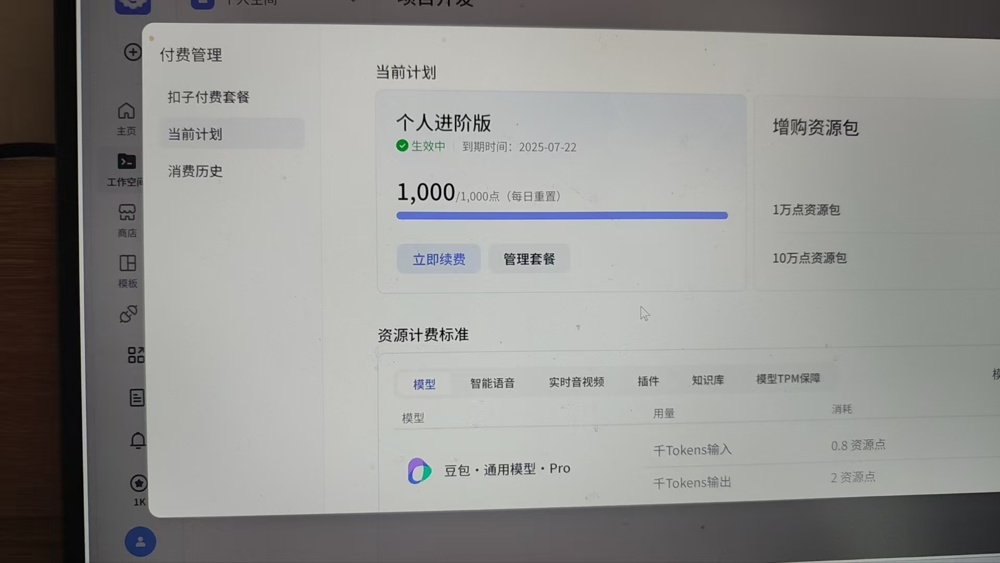

**2. 常见原因分析**

- **资源点耗尽**：当日免费资源点已用完
- **发布配置问题**：未正确配置发布选项
- **变量引用错误**：提示词中变量格式不正确

**3. 解决方法**

**方法一：资源点管理**

- 等待每日资源点重置（通常为每日1000点）
- 升级到更高套餐获取更多资源点
- 合理使用，避免不必要的测试消耗

**方法二：检查发布配置**

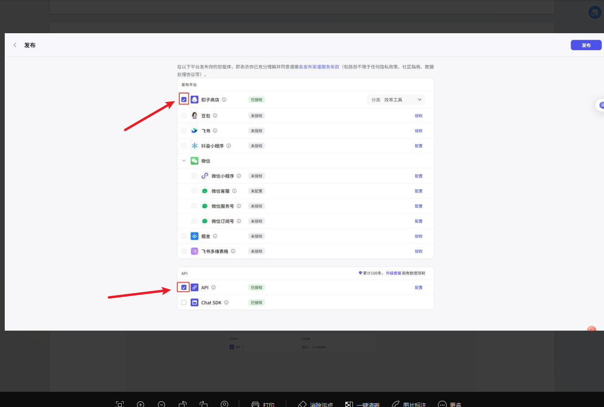

- 确认已勾选"扣子商店"和"API"选项
- 检查其他发布设置是否正确
- 保存配置后重新测试

**方法三：变量格式验证**


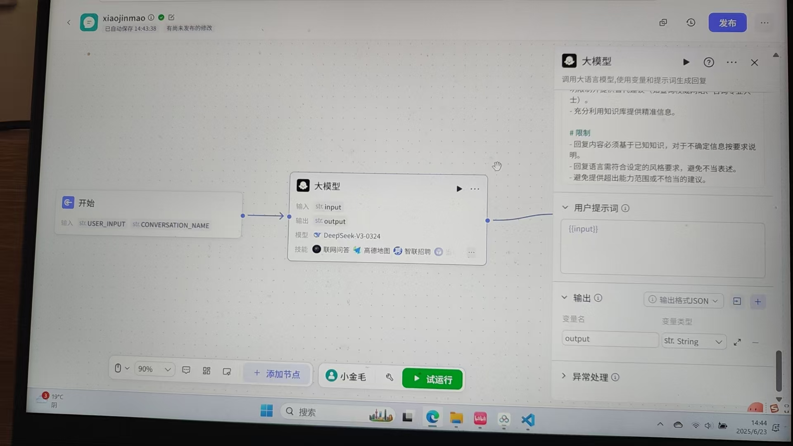

- 确认提示词中使用`{{input}}`等变量格式
- 检查变量名称是否与定义一致
- 验证变量在正确位置使用

**4. 验证步骤**

1. **确认资源点状态**
    - 查看当前可用资源点数量
    - 确认是否已达到使用上限

2. **重新发布智能体**
    - 保存所有配置更改
    - 点击发布按钮更新智能体
    - 等待发布完成后再测试

3. **使用测试账号验证**
    - 使用不同账号测试智能体
    - 排除账号权限或状态问题

**注意事项：**

- 资源点每日重置，建议合理规划使用
- 工作流试运行成功不代表实际调用一定能成功
- 发布配置更改后需要等待一段时间才能生效
- 保留完整配置截图便于问题排查

---

## 扣子平台智能体配置


---

### 扣子平台配置的AI不回答问题怎么办？

**问题描述：**

在扣子平台配置AI后，出现无法正常回答问题、仅在重复自身内容的现象。

**解决方案：**

- **确认平台差异**：该问题发生在扣子平台，非智能公元平台
- **检查配置文件**：使用正确的JSON配置文件（如"基础能力-查询时间天气-v0.2.json"）
- **导入方法**：在智能体平台配置界面导入JSON文件，而非在扣子平台操作

**注意事项：**

- 扣子平台与智能公元平台是独立的平台
- 需要根据产品手册在正确的平台进行配置操作
- JSON配置文件应在智能公元平台导入使用

---

## 系统默认音量配置


---

### 自学习命令词是否支持发送串口命令？

**问题描述：**

需要了解自学习的命令词是否可以配置为触发发送串口命令的操作。

**解决方案：**

目前自学习命令词功能不支持直接配置发送串口命令的操作。

**替代方案：**

1. **修改命令词配置**
    - 可以通过修改平台中的预设命令词来实现所需功能
    - 在命令词配置中直接添加串口发送指令

2. **使用预设命令词**
    - 在产品配置平台中预设好命令词和对应的串口指令
    - 通过语音识别触发预设命令词

**注意事项：**

- 自学习功能主要用于动态添加唤醒词和简单的控制指令
- 如需实现复杂的串口通信，建议使用预设命令词配置


---

### 如何删除自学习的命令词？

**问题描述：**

需要了解如何删除通过自学习功能添加的命令词。

**解决方案：**

**1. 删除操作步骤**

- 对着模块说"删除学习"
- 系统会提示删除选项：

    - 删除唤醒词
    - 删除命令词
    - 全部删除
    - 退出删除

- 根据需要选择相应的删除选项


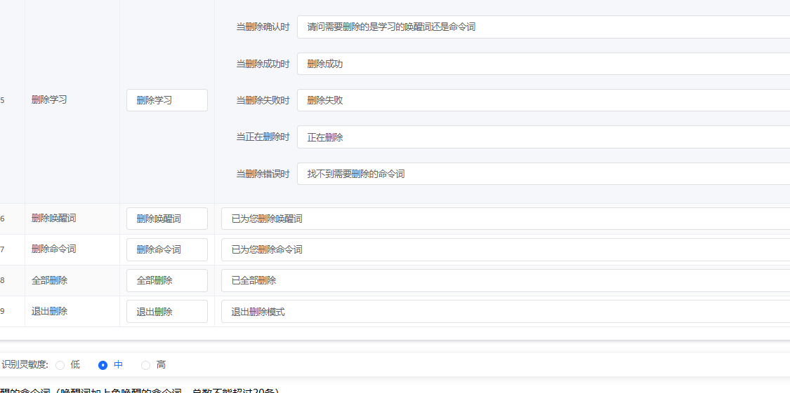

**2. 删除选项说明**

- **删除唤醒词**：仅删除自学习的唤醒词
- **删除命令词**：仅删除自学习的命令词
- **全部删除**：删除所有自学习内容（唤醒词+命令词）
- **退出删除**：取消删除操作

**注意事项：**

- 删除操作不可恢复，请谨慎操作
- 删除前确认不需要保留相关命令词
- 可以逐个删除，也可以一次性全部删除
- **删除命令词功能仅删除自学习添加的命令词，不会影响平台固件中原有的命令词配置**
- **重新烧录固件后，自学习的命令词会被清除，需要重新学习**


---

### 延时设置的最大值是多少？

**问题描述：**

在配置延时设置时，系统提示"无符合的int类型的数值"，需要确认延时设置支持的最大值以及数据类型。

**解决方案：**

**数据类型说明：**

- 延时设置使用**无符号32位整型（unsigned int）**
- 数据范围：0 到 4,294,967,295
- 实际限制：60000多（约60秒）

**最大值限制：**

虽然理论上32位无符号整型支持更大的数值，但系统实际限制在60000多毫秒：

- 最大可设置值：约60000毫秒（60秒）
- 超过此范围会提示"无符合的int类型的数值"
- 这是程序定义的限制，不是数据类型限制

**应用场景：**

对于需要长时间延时的场景：

- 10分钟 = 600,000毫秒（超出限制）
- 需要考虑其他实现方式

**替代方案：**

1. **多次延时累加**
    - 设置多个60秒的延时
    - 使用计数器控制循环次数

2. **外部定时器**
    - 使用外部硬件定时器
    - 通过事件触发机制

**注意事项：**

- 延时单位为毫秒（ms）
- 设置延时前确认数值在允许范围内
- 长时间延时可能影响系统响应性

---

### 变量赋值操作失败怎么办？

**问题描述：**

在变量设置操作中，将PWM变量的值赋给LED亮度变量时，目标变量无法正确接收值，导致在语音播报时显示为空值。

**解决方案：**

**问题排查：**

1. **检查变量赋值语法**
    - 确认使用正确的变量赋值语法
    - 验证源变量和目标变量都已正确定义

2. **验证变量值**
    - 确认PWM变量确实有值（如500、600等）
    - 检查是否有其他操作修改了目标变量的值

3. **测试变量状态**
    - 分别测试源变量和目标变量的播报
    - 确认源变量能正常播报有值
    - 确认目标变量赋值后能保持值

**配置示例：**

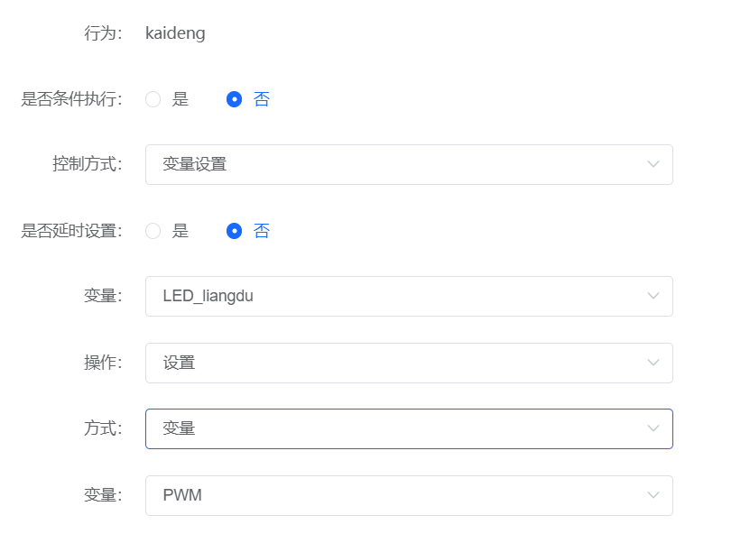

**常见原因：**

1. **变量覆盖**
    - 其他地方可能修改了目标变量的值
    - 检查所有相关操作，确保没有冲突

2. **变量作用域**
    - 确认两个变量都在有效作用域内
    - 变量定义是否在正确的控制流程中

3. **执行顺序**
    - 检查操作的执行顺序
    - 确保赋值操作在播报之前执行

**调试建议：**

- 使用简单的固定值测试目标变量
- 逐步添加操作，定位问题所在
- 添加语音播报确认每个步骤的执行状态

---

### 跳转行为如何触发其他命令词？

**问题描述：**

当设置跳转行为时，如果目标行为是通过命令词触发的（如TurnOn），跳转行为能否正常触发？是否会绕过目标命令的触发逻辑？

**解决方案：**

**跳转行为机制：**

跳转行为会直接跳转到指定行为并执行该行为的所有控制指令，不需要修改目标行为的触发方式。

**执行逻辑：**

1. **触发跳转**
    - 识别到源命令词（如"晚安"）
    - 触发配置的跳转行为

2. **跳转执行**
    - 系统跳转到目标行为（如TurnOn）
    - **绕过目标行为的触发逻辑**
    - **直接执行目标行为中配置的控制指令**

3. **控制执行**
    - 执行TurnOn中设置的所有控制
    - 包括GPIO控制、变量设置、播报等

**实际效果：**

- 说出"晚安"时，即使TurnOn原本需要通过"开灯"命令触发
- 系统也会直接执行TurnOn中的开灯操作
- 不需要再次说出"开灯"命令

**配置示例：**


**注意事项：**

- 跳转行为不受目标行为触发方式的限制
- 无论是命令词触发、事件触发还是其他触发方式
- 跳转行为都会直接执行目标行为的控制指令
- 这种设计可以实现复杂的功能组合和场景联动

---

### 随机数生成范围边界值问题

**问题描述：**

设置随机数范围为1-3时，经过多次测试发现只能随机到1和2，最大值3从未出现。

**解决方案：**

这是程序内部的一个边界处理疏漏，随机数生成逻辑在处理最大值时未包含等号比较。

**问题确认：**

- 测试随机数范围1-3，多次尝试仅出现1和2
- 修改范围为1-4后，3能够正常出现
- 经确认是随机数生成算法的边界处理问题
- 已定位为内部程序的疏漏

**修复说明：**

该问题已在后续版本中修复，如遇到此问题需要：

1. 重新生成固件
2. 更新设备固件版本
3. 修复后范围最大值能够正常被随机到

**注意事项：**

- 这是一个已知的程序bug，不影响随机数生成器的其他功能
- 修复后的版本能够正确包含范围的最大值
- 如使用的是旧版本固件，可重新生成固件获取更新

---

### 自学习的命令词是否支持免唤醒功能？

**问题描述：**

发现自学习的命令词没有免唤醒功能，询问原因及解决办法。

**解决方案：**

**功能说明：**

学习之后的命令词确实不具备免唤醒功能，这是正常现象，模块设计就是如此。

**原因分析：**

- 自学习功能主要用于动态添加简单的控制指令
- 免唤醒功能需要通过平台预配置实现
- 自学习的命令词默认需要先唤醒后识别

**替代方案：**

1. **配置上电后保持唤醒状态**
    - 在平台配置上电启动事件
    - 添加控制：系统设置 → 识别控制 → 进入唤醒
    - 勾选"禁止超时退出唤醒"选项
    - 这样模块会一直保持唤醒状态

2. **使用预设命令词**
    - 在平台中预设需要免唤醒的命令词
    - 通过事件触发实现免唤醒功能
    - 预设命令词可以实现免唤醒操作

**注意事项：**

- 这是产品设计特性，不是故障
- 如需免唤醒功能，建议使用平台预配置方式
- 自学习功能适合临时添加命令词的场景


---

### 如何配置模块上电后保持唤醒状态并添加延时？

**问题描述：**

需要配置模块在上电启动后保持唤醒状态，避免系统因超时而自动进入休眠，并在触发事件后增加指定的延时时间。

**解决方案：**

**1. 配置保持唤醒状态**

- 添加新的行为，选择"事件触发"
- 事件类型选择"系统启动"，触发类型选择"上电启动"
- 在控制详情中添加控制：

    - 控制方式：系统设置
    - 类别：识别控制
    - 操作：禁止超时退出唤醒

**2. 添加触发延时**

- 在同一触发事件中设置延时参数
- 根据需要调整延时时间（如50ms）
- 确保触发后系统有足够的响应时间


**注意事项：**

- 配置完成后，模块上电会自动进入唤醒状态
- "禁止超时退出唤醒"选项确保模块不会自动休眠
- 延时参数可根据实际需求调整
- 自然说功能需要单独配置为支持状态


---

### 自学习功能中的"学习成功次数"是什么含义？

**问题描述：**

在配置自学习功能时，看到"学习成功次数"设置为2，不清楚这个参数代表实际学习的语音指令数量。

**解决方案：**

自学习功能中的"学习成功次数"是指触发学习成功的条件，而非学习的指令数量。

**参数说明：**

- **学习成功次数2**：表示需要连续2次成功识别同一个指令，才认为学习成功
- **失败退出次数3**：表示连续3次识别失败后，自动退出学习模式
- **指定学习模式**：选择"覆盖原来学习"会用新学习的指令替换原有指令

**实际学习数量：**

- 学习成功次数设置的是确认阈值，不是学习的指令条数
- 实际可以学习多条指令，每条都需要满足成功次数要求
- 例如：可以学习5条指令，每条都需要连续成功2次才确认

**配置建议：**

- 学习成功次数：建议设置为2-3次，确保学习准确性
- 失败退出次数：建议设置为3-5次，避免过早退出
- 学习模式：根据需要选择覆盖或追加模式


**注意事项：**

- 学习成功次数越多，学习过程越严格但耗时越长
- 建议在安静环境下进行学习，提高成功率
- 学习完成后要测试每条指令的识别效果
- 复杂指令词可能需要增加成功次数阈值

---

### 自学习功能对识别率有影响吗？

**问题描述：**

想要了解网页上的自学习功能是否对识别率有提升作用，以及是否应该开启该功能。

**解决方案：**

- **自学习功能说明**：

    - 自学习功能主要用于动态添加命令词
    - 可以让使用方自定义新的语音指令
    - 主要功能是扩展命令词库，而非提升识别率

- **识别率影响因素**：

    - 识别率主要与算法、麦克风质量、环境噪声相关
    - 与是否开启自学习功能没有直接关系
    - 自学习添加的命令词识别率取决于录制质量和环境

- **使用建议**：

    - 如果需要添加特定命令词：可以开启自学习
    - 如果只使用预设命令词：无需开启自学习
    - 开启自学习不会影响原有命令词的识别率

**注意事项：**

- 自学习功能需要使用方主动录制和学习
- 学习时环境应保持安静
- 自学习的命令词数量有限制
- 并非识别率提升的开关

---

## 平台使用问题


---

### 平台生成固件时提示"appKey does not exist or has been deleted"怎么办？

**问题描述：**

在智能公元/AI产品零代码平台生成固件时，出现错误提示"appKey does not exist or has been deleted"，导致固件生成失败。

**解决方案：**

**1. 错误原因分析**

- appKey是平台应用的唯一标识
- 该错误表示应用配置丢失或被删除
- 可能是平台临时故障或配置异常

**2. 处理方法**

- 刷新页面后重试生成固件
- 检查产品配置信息是否完整
- 如问题持续存在，联系平台技术团队

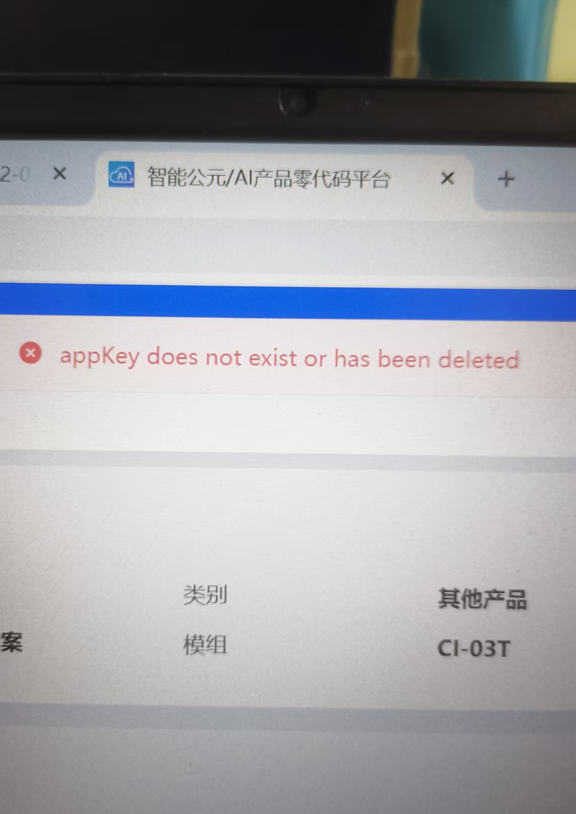

**注意事项：**

- 生成固件前确保所有配置已保存
- 避免在多个浏览器窗口同时操作同一项目
- 建议定期保存项目配置

---

### 如何设置上电后进入唤醒状态且永不退下？

**问题描述：**

需要设置模块上电后直接进入唤醒状态，并且永不进入休眠模式。

**解决方案：**

- 在事件触发中配置"上电启动"
- 在识别控制中设置"禁止超时退出唤醒"
- 唤醒词必须设置但可以不使用

**配置步骤：**

1. **添加上电启动事件触发**
   - 触发方式：选择"上电启动系统启动"
   - 添加控制："进入唤醒"（系统操作）

2. **配置延时设置**
   - 在"进入唤醒"控制中启用"是否延时设置"
   - 延时时长：建议设置为 **300ms**
   - 延时恢复：选择"否"
   - 同样为"禁止超时退出唤醒"控制添加300ms延时
   - 两个控制是**并行**执行的，总延时为300ms（不是600ms）

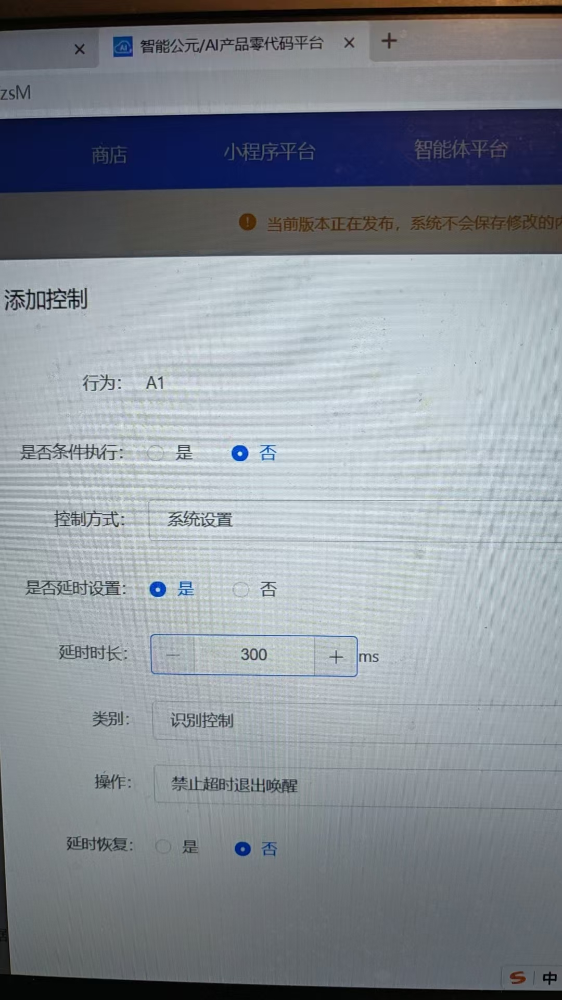

**注意事项：**

- 模块会持续保持唤醒状态，功耗较高
- 需要确保供电稳定
- 适用于需要即时响应的应用场景
- **发布要求**：平台发布时必须添加至少一个唤醒词，否则会提示"没有添加唤醒词"错误
- **解决方案**：如果不需要使用唤醒词，可以添加一些难触发的词（如"吉祥如意"等不常用的组合）来满足发布要求

---

## 固件开发


---

### 语音模块返回的数据无法执行case语句怎么办？

**问题描述：**

通过串口发送数据可以正常控制变量加减，但通过语音模块返回的数据控制变量时，程序无法执行相应的case语句。

**解决方案：**

**1. 确认数据接收**

- 使用串口调试助手确认模块能正常发送数据
- 验证单片机能接收到模块返回的数据（如[接收<-01]等）

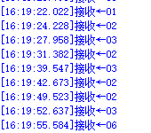

**2. 检查中断服务函数**

- 确认程序能进入UART中断服务函数
- 在switch语句前后添加printf调试语句
- 验证程序是否进入switch选择语句

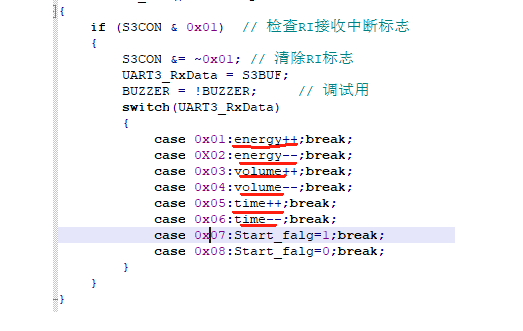

**3. 调试步骤**

- 如果程序未进入switch，先检查if判断语句
- 逐级添加printf输出，定位问题位置
- 确认中断服务函数配置正确

**注意事项：**

- 单片机代码逻辑编写问题不在技术团队范围内
- 如遇STM32相关问题，可使用AI工具辅助分析代码
- 确保中断服务函数编写正确，特别是中断向量和配置

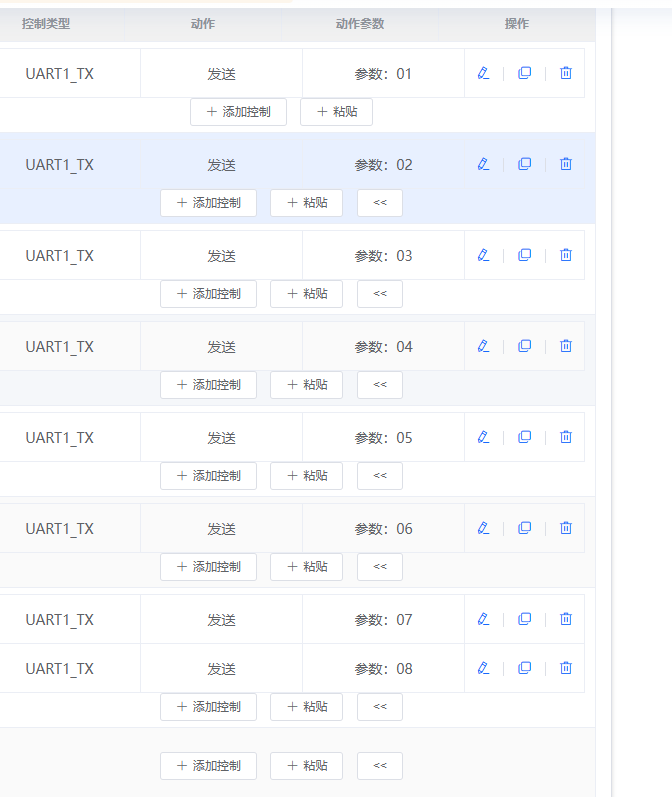
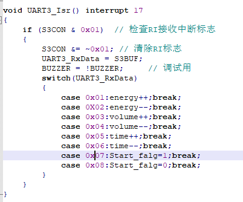

---

### 中断服务函数无法进入怎么办？

**问题描述：**

在使用串口通信时，中断服务函数无法进入，导致无法执行case语句中的逻辑。

**解决方案：**

**1. 检查中断服务函数配置**

- 确认中断服务函数名称正确
- 验证中断向量是否正确配置
- 检查中断使能是否开启

**2. 添加调试输出**

- 在中断服务函数入口添加printf
- 在if判断语句前添加调试信息
- 逐层验证程序执行路径

**3. 常见问题排查**

- 接收数据才能触发中断服务函数
- 发送数据是否使用中断与接收无关
- 确认串口配置正确（波特率、数据位等）

**调试建议：**

- 将语音模块发送的数据复制到串口助手中测试
- 使用AI工具分析STM32中断配置问题
- 重点检查中断服务函数的声明和实现

**注意事项：**

- 只有接收数据才会进入UART接收中断
- 发送中断和接收中断是独立的
- 中断服务函数名必须与芯片手册一致

---

### 如何实现接收特定信号后停止当前操作？

**问题描述：**

需要实现当接收到32的信号反馈时，系统能够停止当前操作或流程。

**解决方案：**

使用定时器功能可以实现该需求：

**实现步骤：**

1. **使用定时器模块**
    - 在平台中添加定时器功能
    - 设置定时器持续监听串口数据

2. **配置停止条件**
    - 设置当接收到特定数据（32）时触发停止动作
    - 可以配置为停止当前播报、停止采集或其他操作

3. **延时设置**
    - 可根据需要设置检测间隔（如50ms或100ms）
    - 确保及时响应停止信号

**注意事项：**

- 定时器功能需要在平台中正确配置
- 停止信号的具体值可根据实际需求调整
- 该方案适用于需要外部控制停止的场景

---

### 平台更新后如何处理语音固件？

**问题描述：**

平台修改后，需要重新生成并烧录语音部分固件到模块中进行测试。

**解决方案：**

在智能公元平台上重新生成语音部分固件，然后通过以下方式烧录到模块：

- 使用烧录工具进行本地烧录
- 通过OTA方式远程更新固件

**注意事项：**

- 平台更新后，原有的语音固件可能不兼容新版本
- 建议先在单台设备上测试，确认功能正常后再批量更新
- 保留原固件备份，以便需要时回滚

---

### AI语音功能存在哪些问题？

**问题描述：**

AI语音功能在处理数学运算和讲笑话时存在明显问题，包括无法正确执行加减乘除运算、输出结果错误、以及讲笑话时内容固定且过短导致卡顿。

**解决方案：**

**1. 数学运算问题**

- 问题：无法正确执行加减乘除运算，输出错误结果（如1万说成十零）
- 原因：免费通用智能体的修改会影响整体效果
- 解决方案：需要走定制智能体或自行配置智能体

**2. 笑话内容问题**

- 问题：笑话内容固定且重复，每次都是相同的两个笑话
- 原因：AI工程师进行了微调蒸馏处理
- 解决方案：需要在大模型功能和提示词中增加更多笑话内容

**3. 思考过程输出问题**

- 问题：会把思考过程也说出来，导致回答冗长
- 解决方案：优化智能体的提示词配置

**注意事项：**

- 定制智能体或自行配置可能会增加响应时间
- 提问时可以更具体，如"讲个派大星的笑话"而非"讲个笑话"
- 这些问题需要AI工程师持续优化大模型和提示词

---

### 如何配置智能体的提示词和工作流？

**问题描述：**

希望在平台输入ID和Key生成二维码，扫码后能切换到新的智能体，并了解如何配置智能体的提示词和工作流以实现特定的交互功能。

**解决方案：**

**1. 获取智能体ID和Key**

- 在智能体平台查看智能体的配置信息
- 获取Profile ID和API Key


**2. 生成二维码并绑定**

- 在智能公元平台输入ID和Key
- 生成二维码供设备扫描绑定
- 二维码有效期为10分钟


**3. 配置智能体提示词**
提示词应包含以下关键部分：

```
# Role: [角色名称]
## Profile
- Author: jx.ai
- Version: 1.1
- Language: 中文
- Description: [角色描述]

### 核心特质
1. **知识覆盖**：科学常识/生活技巧/小学全科知识
2. **互动风格**：活泼亲切，语言简洁易懂
3. **功能定位**：智能学习伙伴 + 生活小助手

## Rules
[回答规则和限制]

## Skills
[技能描述]

## Workflow
1. 识别问题类型
2. 处理并返回结果

## Initialization
[初始化问候语]
```

**4. 工作流设计**
工作流应包含：

- 问题分类模块
- 知识查询模块
- 计算处理模块
- 天气查询模块等

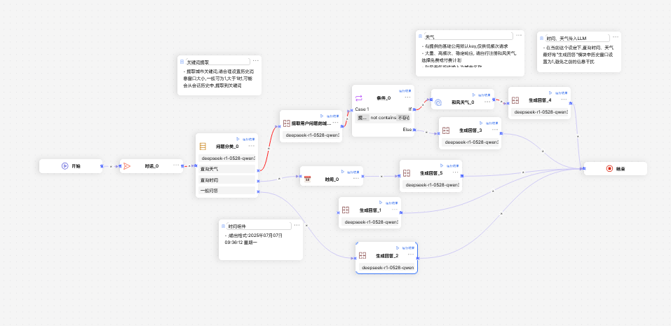

**5. 测试验证**
配置完成后测试各项功能：

- 基础对话测试


- 天气查询测试


- 百科问答测试


**注意事项：**

- 英文翻译功能可能影响语音体验，建议初期不配置
- 数学运算题需要明确要求用中文数字输出
- 百科问题建议用一句话概括核心答案
- Initialization部分会在每次唤醒时执行，需合理设计

---

### 智能体每次回答都重复自我介绍怎么办？

**问题描述：**

智能体在每次唤醒后都会重复自我介绍，导致用户在连续交互时感到出戏。

**解决方案：**

**1. 问题原因分析**

- 当前唤醒会丢失之前的会话历史
- 对模型来说，每次都是新会话，需要自我介绍
- Initialization部分的提示词在每次唤醒时执行


**2. 修改提示词**
调整Initialization部分，避免每次都自我介绍：

```
## Initialization
仅在日常对话开始时进行自我介绍，其他问题直接回答。
```

**3. 使用技巧**

- 连续对话时避免重新唤醒
- 若要中断回答，可使用特定指令而非重新唤醒
- 优化提示词，区分首次问候和后续对话

**注意事项：**

- 扣子平台的二维码有效期确实是10分钟
- 智能公元平台的二维码目前是永久的
- 修改后的智能体需要在平台重新测试生效

---

### 如何通过语音指令控制模块音量？

**问题描述：**

需要了解如何通过语音指令调节模块的音量大小。

**解决方案：**

**1. 平台配置方法**

- 在播放控制中选择"最小音量"或"最大音量"操作
- 配置相应的语音触发词

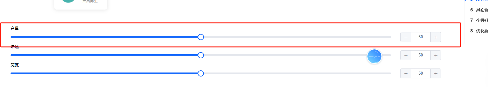
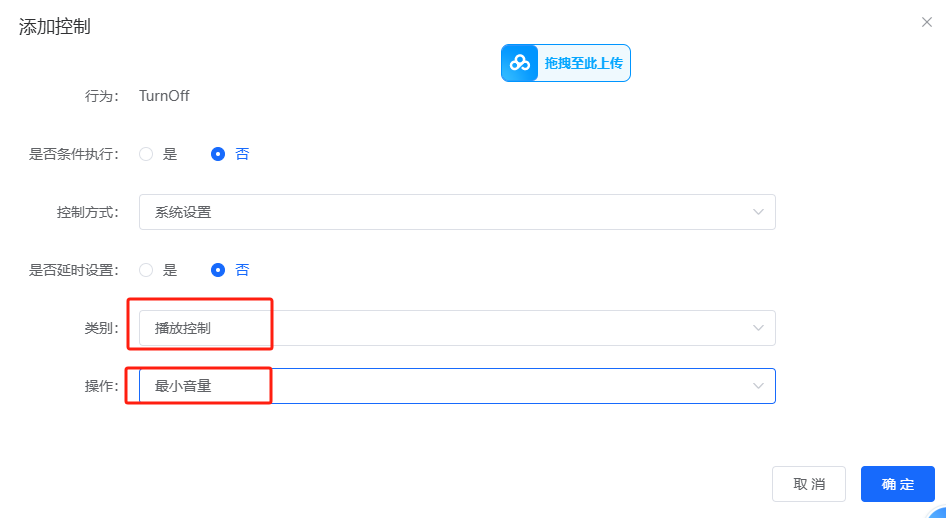

**2. 语音指令配置**

- 添加"音量调大"指令，对应"调大音量"操作
- 添加"音量调小"指令，对应"调小音量"操作

**注意事项：**

- 语音指令控制音量功能目前不支持
- 可通过平台配置固定音量值
- 行为词是自定义的，没有固定限制

---

### 固件生成时提示"分词不在字典内"怎么办？

**问题描述：**

在平台生成固件时，系统提示"生成失败: 分词不在字典内KAITLYN;CAITLYN"等错误，导致固件无法生成。

**解决方案：**

**问题原因：**

- 使用的DNN模型不支持当前配置的词条或命令词
- 某些特殊字符或生僻词可能不在模型字典中
- 英文人名（如KAITLYN/CAITLYN）可能超出模型词汇范围

**解决方法：**

1. **更换DNN模型**
    - 在平台中选择其他可用的DNN模型
    - 推荐使用通用性更强的标准模型

2. **检查词条配置**
    - 避免使用特殊符号或生僻字
    - 使用常见的命令词汇
    - 确保词条发音清晰、标准

3. **重新配置命令词**
    - 简化命令词结构
    - 使用更通用的词汇替代

**注意事项：**

- 不同DNN模型支持的词条范围不同
- 建议使用平台推荐的默认模型
- 如问题持续，可联系技术团队获取合适的模型文件

---

### 语音指令配置中的行为词有哪些？

**问题描述：**

询问在语音指令配置中，系统支持哪些可用的行为词。

**解决方案：**

- 行为词是自定义编写的，没有固定规定
- 可以根据需求自由定义控制指令
- 常见行为词如BrightnessUp等都可以自定义使用

**注意事项：**

- 行为词需要与实际控制功能对应
- 建议使用直观易懂的名称
- 可在平台配置界面查看所有可用操作

---

### 蓝牙设备添加时提示"接入数量已达到上限"怎么办？

**问题描述：**

在尝试添加蓝牙设备时，系统提示"蓝牙设备接入数量已达到上限"，但确认从未连接过任何设备，且该问题在首次连接时出现，重启蓝牙后可解决。

**解决方案：**

**1. 问题现象分析**

**异常表现**：

- 首次连接设备即提示数量已达上限
- 实际并未连接过任何设备
- 重启蓝牙功能后可暂时解决

**可能原因**：

- 小程序缓存数据异常
- 蓝牙模块状态错误
- 设备列表未正确清理

**2. 临时解决方案**

**重启蓝牙**：

- 关闭手机蓝牙功能
- 等待10秒后重新开启
- 重新搜索并连接设备

**清除缓存**：

- 删除小程序后台进程
- 清除小程序缓存数据
- 重新启动应用

**3. 预防措施**

**连接前检查**：

- 确认蓝牙设备列表为空
- 删除所有已配对的设备
- 重启手机蓝牙模块

**操作建议**：

- 连接过程中保持手机蓝牙开启
- 避免同时连接多个设备
- 完成配对后再进行功能测试

**注意事项：**

- 此问题可能是小程序版本bug
- 建议反馈给开发团队修复
- 如问题频繁出现，可尝试更换手机测试
- 保留问题发生时的操作日志便于排查


---

### 为什么数据高于127时会播报负数？

**问题描述：**

在配置串口输入参数时，当数据值大于127时，系统会播报为负数。

**解决方案：**

- **数据类型限制**：

    - char 类型的数据范围为 -128 至 127
    - 超过127的数值（如128）会被识别为负数
    - 这是 signed char 的特性导致的

- **解决方法**：

    - 将参数类型改为 unsigned char
    - unsigned char 的数据范围为 0-255
    - 可正确表示0-255的所有数值

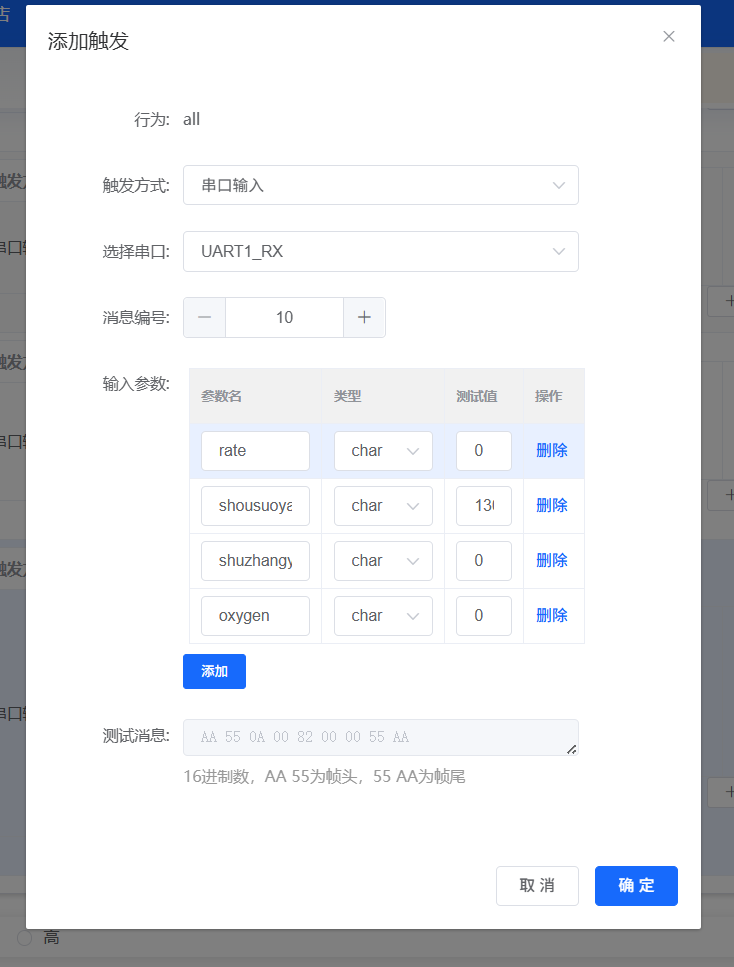

**注意事项：**

- 根据实际数据范围选择合适的数据类型
- 需要表示0-255时必须使用 unsigned char
- 数据类型配置错误会导致数值解析异常

---

### 智能体操作视频何时上架？

**问题描述：**

询问智能体操作视频的上架时间。

**解决方案：**

- **视频状态**：

    - 操作视频正在审核中
    - 审核通过后会发布上架
    - 请耐心等待官方通知

- **获取帮助**：

    - 可查看平台操作指南
    - 参考已有文档教程
    - 联系技术团队获取指导

**注意事项：**

- 视频制作需要一定时间
- 审核流程确保内容质量
- 发布前会提前发布公告

---

### 如何配置GPIO控制动作？

**问题描述：**

需要配置"打开灯"和"关闭灯"两个语音指令，通过GPIO_A25引脚控制外部设备。

**解决方案：**

**1. 进入配置界面**

- 打开配置软件
- 点击"其它配置"选项
- 进入控制配置菜单

**2. 添加语音指令**

- **添加"打开灯"指令**：

    - 控制方式：识别控制
    - 操作：GPIO输出
    - GPIO引脚：A25
    - 输出状态：高电平

- **添加"关闭灯"指令**：

    - 控制方式：识别控制
    - 操作：GPIO输出
    - GPIO引脚：A25
    - 输出状态：低电平


**3. 配置说明**

- **GPIO_A25**：

    - 对应模块的A25引脚
    - 可输出高/低电平
    - 用于控制外部设备

- **控制逻辑**：

    - 识别"打开灯"→A25输出高电平
    - 识别"关闭灯"→A25输出低电平
    - 可驱动LED、继电器等设备

**4. 生成和烧录**

- 完成配置后生成固件
- 使用烧录工具烧录到模块
- 重新上电测试功能

**注意事项：**

- 确保GPIO负载不超过模块承受能力
- 驱动继电器时需要加驱动电路
- 保留配置文件便于后续修改

---

### 如何使用语音指令控制外部电路？

**问题描述：**

需要了解是否可以使用语音指令控制外部电路，以及如何配置语音指令与引脚输出的映射关系。

**解决方案：**

**1. 语音控制支持**

- 支持通过语音指令控制GPIO输出
- 可控制外部设备如继电器、LED等
- 在智能公元平台配置引脚控制逻辑

**2. 配置方法**

- 进入语音指令控制页面
- 添加语音指令并设置对应动作
- 选择GPIO输出控制，配置目标引脚和输出状态

**3. 多引脚组合控制**

- 支持多个引脚组合表示一个语音指令
- 可设置不同引脚的高低电平状态
- 延迟恢复：支持延迟1秒后恢复默认值

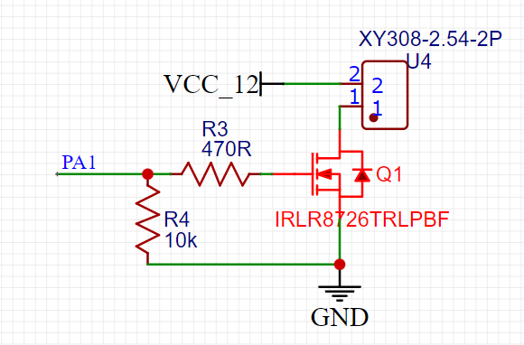

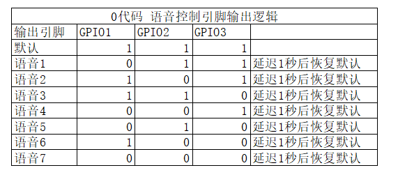

**4. 0代码实现**

- 在控制台直接配置，无需编写代码
- 支持可视化配置界面
- 配置完成后生成固件即可使用

**注意事项：**

- 确保引脚负载不超过模块承受能力
- 控制感性负载时需加驱动电路
- 保留配置文件便于后续修改

---

### 如何通过多个引脚组合实现语音控制并延迟恢复？

**问题描述：**

如何通过配置多个引脚组合来实现语音指令控制，并在延迟1秒后恢复引脚默认值，且是否可以在控制台直接配置0代码实现该功能。

**解决方案：**

**1. 多引脚组合支持**

- 支持多个引脚组合表示一个语音指令
- 每个引脚可独立设置高低电平状态
- 灵活组合实现复杂的控制逻辑

**2. 延迟恢复功能**

- 支持延迟1秒后自动恢复默认值
- 避免持续高电平或低电平状态
- 保护外部设备，防止长时间通电

**3. 配置方式**

- 在智能公元平台的控制台直接配置
- 选择"0代码"模式，无需编写代码
- 可视化界面设置引脚状态

**4. 应用场景**

- 继电器控制：组合控制开关动作
- LED指示：多引脚实现不同状态显示
- 电机控制：精确控制启停时间

**注意事项：**

- 引脚组合数量根据实际需求配置
- 延迟时间可根据需要调整
- 配置完成后需要重新生成固件

---

### 如何配置定时器触发事件？

**问题描述：**

需要确认在配置定时器触发事件的参数设置是否正确，包括启动和停止定时器的操作配置。

**解决方案：**

**1. 事件触发配置步骤**

- **触发方式**：选择"事件触发"
- **触发条件**：设置为"timer1定时器超时"
- **执行动作**：配置"启动定时器"或"停止定时器"
- **定时器参数**：设置超时时间（如5000ms）

**2. 定时器功能说明**

- **启动定时器**：开始计时，到达设定时间后触发事件
- **停止定时器**：终止当前计时任务
- **单次执行**：定时器触发一次后自动停止
- **循环执行**：可配置重复触发

**3. 注意事项**

- 命令词总数不能超过10条（包括唤醒词和免唤醒命令）
- 定时器超时时间根据实际需求设置
- 确保触发条件和动作配置匹配

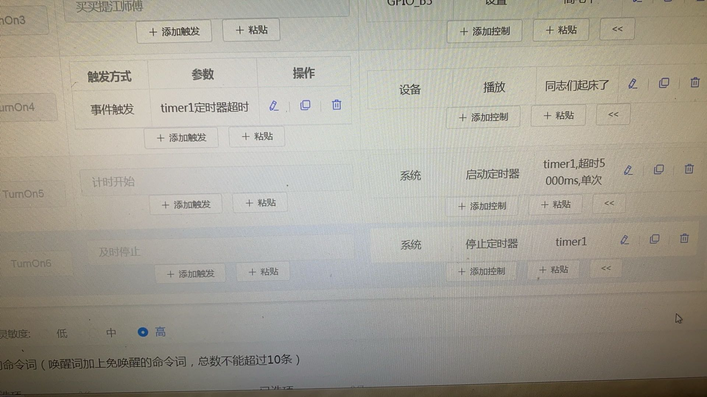

---

### 如何实现定时启动和停止功能？

**问题描述：**

需要通过软件平台配置实现定时启动和停止功能，以实现按时自动执行语音指令。

**解决方案：**

**1. 配置定时启动**

- **命令词配置**：添加"计时开始"命令词
- **触发方式**：选择"事件触发"
- **触发条件**：设置为"timer1定时器超时"
- **执行动作**：选择"系统"→"启动定时器"
- **定时器设置**：超时时间5000ms（5秒），单次执行

**2. 配置定时停止**

- **单独配置停止命令**：需要另外配置一条命令用于停止定时器
- **不能与启动合并**：启动和停止必须分为两个独立的命令词
- **停止配置**：触发条件为"timer1定时器超时"，动作为"停止定时器"

**3. 配置注意事项**

- 定时启动只能触发一次启动动作
- 若需要循环执行，需要重新设计逻辑
- 停止功能必须独立配置，不能与启动在同一个命令中

**配置示例**：


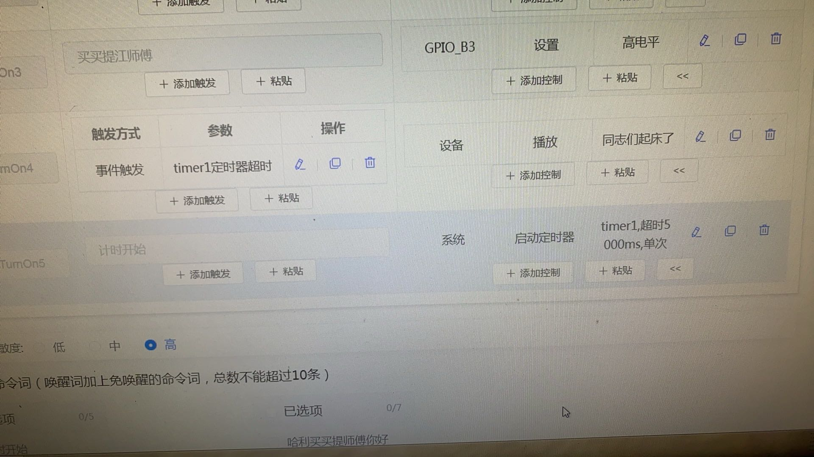

**注意事项：**

- 每个命令词只能配置一个触发方式和动作
- 定时器超时后自动触发预设的动作
- 如需复杂定时逻辑，建议使用外部控制器

---

### GPIO设置了附加条件为什么指令不执行？

**问题描述：**

为GPIO控制设置了附加条件（如GPIO_A25高电平时才执行"打开灯"），导致指令无法响应。

**解决方案：**

**1. 问题分析**

- GPIO引脚默认状态为低电平
- 设置了"高电平"附加条件后
- 需要该引脚先变为高电平才能触发指令
- 形成了循环依赖，导致无法执行

**2. 正确配置方法**

- **移除附加条件**：

    - 进入"控制详情"选项卡
    - 删除GPIO附加条件设置
    - 直接设置GPIO输出动作

- **配置要点**：

    - "打开灯"→GPIO_A25输出高电平
    - "关闭灯"→GPIO_A25输出低电平
    - 上电默认状态为低电平

**3. 配置步骤**

1. 选择对应的语音指令
2. 点击"控制详情"
3. 添加或修改GPIO控制
4. 设置引脚和输出状态
5. 不设置任何附加条件
6. 保存并生成固件

**注意事项：**

- 附加条件用于特定场景（如传感器触发）
- 普通开关控制不应设置附加条件
- 如需要状态互锁，应使用其他逻辑方式
- 配置完成后要测试实际功能

---

### 如何在单个行为中实现GPIO高电平到低电平的转换？

**问题描述：**

需要在单个行为中实现GPIO A25输出高电平后，再输出低电平以停止单片机操作，且不使用串口通信。

**解决方案：**

- **方法一：延时输出**
    1. 添加第一个控制：GPIO_A25输出高电平
    2. 启用"是否延时输出"选项
    3. 设置延时时间（如500ms）
    4. 启用"延时电平翻转"选项
    5. 延时时间结束后自动翻转为低电平

- **方法二：双控制项**
    1. 添加第一个控制：GPIO_A25输出高电平
    2. 添加第二个控制：GPIO_A25输出低电平
    3. 为第二个控制设置延时执行时间
    4. 注意避免条件冲突

- **推荐方法**：
    使用延时输出配合电平翻转功能，这是最简洁的实现方式

**注意事项：**

- 延时时间即为高电平持续时间
- 电平翻转功能可以自动完成高到低的转换
- 不建议使用条件子项控制同一GPIO的状态


---

### 如何配置GPIO的延时输出和电平翻转？

**问题描述：**

配置GPIO控制逻辑时，发现条件满足后直接输出低电平，无法实现高电平的持续输出。

**解决方案：**

- **延时输出配置**：

    1. 在添加控制界面中
    2. 设置控制类型和动作
    3. 启用"是否延时输出"：是
    4. 设置延时时间（单位：毫秒）
    5. 根据需要启用"延时电平翻转"

- **电平翻转说明**：

    - 不启用翻转：保持设定电平
    - 启用翻转：延时结束后自动翻转到相反电平
    - 延时时间0ms表示立即翻转

- **应用场景**：

    - 脉冲信号生成：高电平→延时→低电平
    - 时序控制：精确控制高电平持续时间
    - 信号握手：自动产生高低电平变化

**注意事项：**

- 延时时间决定高电平的持续时间
- 电平翻转是实现脉冲信号的便捷方法
- 配置时注意延时单位和精度要求

---

### 如何配置定时器实现语音指令联动控制？

**问题描述：**

需要实现语音指令触发后，经过指定时间自动执行另一个控制动作（如：语音打开第一路后，5秒后自动启动第二路）。

**解决方案：**

**1. 创建定时器**

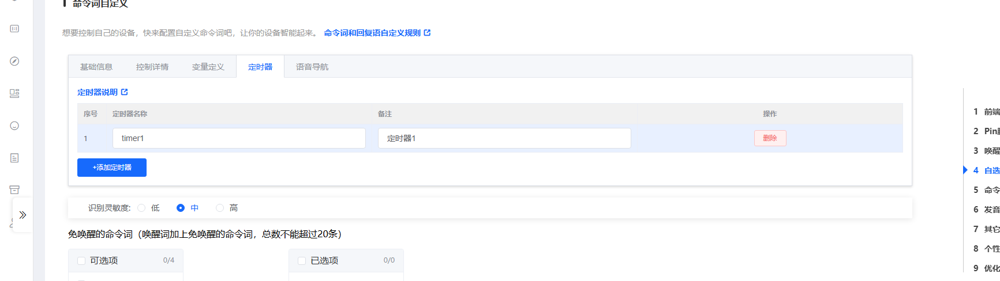

- 在定时器管理中添加新定时器（如timer1）
- 设置定时器名称和备注
- 定时器超时时间根据需求设置（如5000ms表示5秒）

**2. 在语音指令中启动定时器**


- 在需要延时的语音指令中添加"启动定时器"系统动作
- 选择已创建的定时器（如timer1）
- 设置超时时间（如10000ms）

**3. 配置定时器超时事件**


- 创建新的事件触发配置
- 触发方式选择"定时器超时"
- 选择对应的定时器（如timer1定时器超时）

**4. 设置超时后的跳转行为**


- 在定时器超时事件中添加"跳转行为"
- 选择要跳转到的目标行为（如TurnOff、开小灯等）
- 这样定时器超时后会自动执行目标行为

**注意事项：**

- 定时器名称要准确对应，避免配置错误
- 跳转目标必须是已定义的行为
- 可使用多个定时器实现复杂的时序控制
- 如需打断延时，可配置可打断的定时器

---

### 配置跳转行为后不生效怎么办？

**问题描述：**

在配置语音指令跳转行为时，即使已设置跳转目标，但设备未按预期执行跳转操作。

**解决方案：**

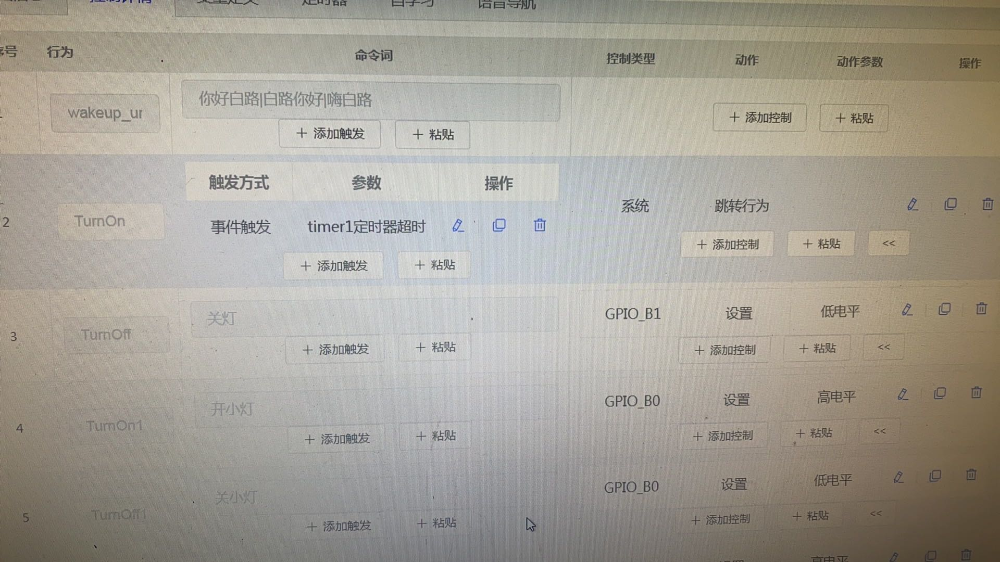

**1. 检查跳转配置**

- 确认已选择跳转行为
- 检查跳转目标是否已选择
- 跳转目标必须是已定义的行为

**2. 验证跳转目标**

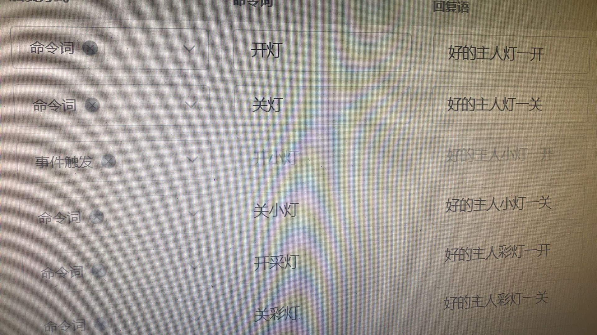

- 查看跳转到的行为名称
- 确认目标行为存在且配置正确
- 目标行为需要有具体的控制动作

**3. 测试跳转功能**

- 在跳转到的行为中添加播报提示
- 通过播报确认是否成功跳转
- 如无播报，说明跳转未生效

**4. 常见问题**

- 跳转目标未选择：必须明确指定行为
- 目标行为为空：需要选择具体行为名
- 行为未定义：目标行为必须已存在

**注意事项：**

- 跳转行为是实现流程控制的关键功能
- 配置完成后需要重新生成固件
- 建议添加播报或提示音确认跳转成功
- 如问题持续，检查整体行为配置逻辑

---

### 语音指令无响应如何排查？

**问题描述：**

设置固件后，特定语音指令（如"开灯"）没有响应，但其他指令可以正常回复。

**解决方案：**


**1. 检查跳转行为配置**


- 查看指令的触发方式是否为"事件触发"
- 检查动作是否设置为"跳转行为"
- 确认跳转目标是否正确设置

**2. 验证跳转目标配置**

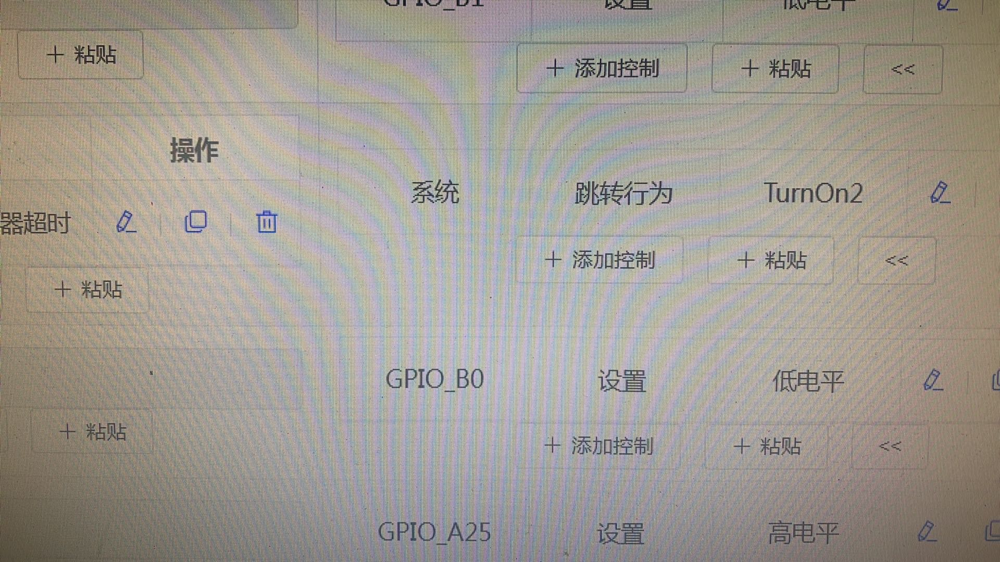

- 跳转行为必须指定目标行为
- 目标行为名称必须已存在
- 跳转目标为空会导致指令无响应

**3. 排查步骤**

- 检查命令词是否正确识别（有回复音）
- 确认跳转行为是否配置目标
- 验证目标行为是否有具体控制动作
- 测试其他指令是否正常工作

**4. 解决方案**

- 在跳转行为中选择具体的目标行为
- 确保目标行为已定义且有控制动作
- 重新生成固件并烧录测试
- 在目标行为中添加播报确认执行

**注意事项：**

- 仅配置跳转行为而不指定目标会导致无响应
- 命令词识别正常说明语音功能正常
- 重点检查行为逻辑链的完整性
- 逐级验证每个跳转环节

---

## 英文语音配置


---

### 如何配置英文语音指令？

**问题描述：**

在配置英文语音指令时，发现输入的英文单词被识别为逐个字母发音，而非完整单词发音。

**解决方案：**

**1. 语言设置**

- 在基本信息中将"语言"选项设置为"英文"
- 确认固件为英文版本
- 唤醒词和命令词都需要使用英文

**2. 英文单词格式要求**

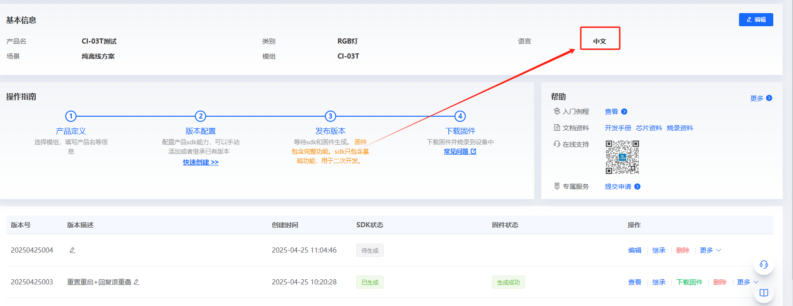

- **单词大小写**：

    - 所有字母必须大写（如HELLO）
    - 不能使用小写或大小写混合

- **多词连接**：

    - 多个单词之间使用中横线连接（如HELLO-AIR-CONDITIONING）
    - 不能使用空格分隔


**3. 规则说明**

- 单词全部大写
- 多词用中横线连接
- 避免使用数字或特殊字符

**4. 配置步骤**

1. 在平台创建英文固件项目
2. 设置英文唤醒词（如HELLO）
3. 添加英文命令词，遵循格式规则
4. 配置对应的回复语或控制动作
5. 生成并烧录固件

**注意事项：**

- 英文固件仅支持英文语音识别
- 中文语音无法在英文固件中正常工作
- 建议先测试单个命令词的识别效果
- 确保麦克风远离噪声源以提高识别率

---

### 语音模块如何控制开发板？

**问题描述：**

需要了解ASRPRO语音模块如何通过串口通信控制外部开发板执行相应动作。

**解决方案：**

**1. 通信原理**

- 语音模块识别到语音指令后，通过串口向开发板发送对应的串口消息
- 开发板接收到来自语音模块的串口消息后，解析并完成对应动作
- 整个过程是单向控制：语音模块→开发板

**2. 实现步骤**

1. **配置语音模块**：

    - 在平台上为每个语音指令配置对应的串口输出
    - 设置串口消息内容和格式
    - 生成并烧录固件到语音模块

2. **连接硬件**：

    - 将语音模块的串口TX连接到开发板的RX
    - 将语音模块的串口RX连接到开发板的TX（可选）
    - 确保共地连接

3. **开发板编程**：

    - 编写串口接收和解析程序
    - 根据接收到的消息执行相应功能
    - 设置合适的波特率（通常9600）

**注意事项：**

- 串口通信需要确保波特率、数据位、停止位等参数一致
- 消息格式需要双方约定好（如帧头帧尾）
- 建议先使用串口调试助手测试通信是否正常

---

### 如何在智能公元平台导出JSON工程文件？

**问题描述：**

需要在智能公元平台导出JSON工程文件，用于固件生成或提交给技术团队。

**解决方案：**

- **导出位置**：

    - 登录智能公元平台
    - 进入"产品管理"页面
    - 在产品列表中找到对应的产品
    - 点击该产品行最右侧的"导出"按钮

- **导出内容**：

    - 导出文件为JSON格式的工程文件
    - 包含产品的所有配置信息
    - 文件名通常包含产品标识信息

- **文件用途**：

    - 用于保存产品配置备份
    - 可提交给技术团队进行问题排查
    - 用于在其他设备上恢复相同配置

**注意事项：**

- 只有产品创建者或有权限的使用方才能导出
- 导出的JSON文件包含了完整的配置信息
- 如无法找到导出按钮，检查账户权限是否足够

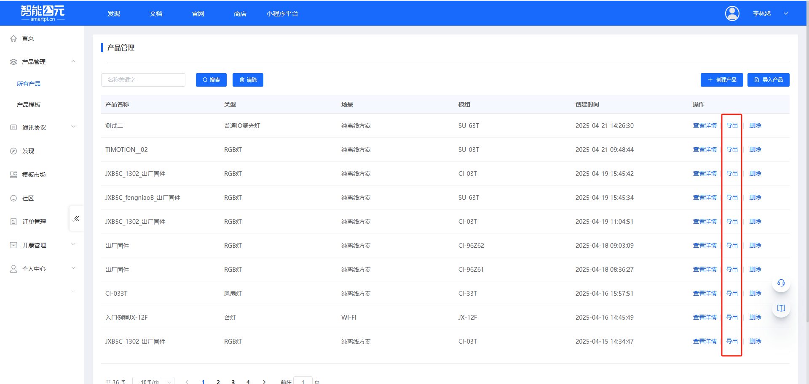

---

### 平台生成固件失败或时间过长怎么办？

**问题描述：**

在使用平台生成固件时遇到生成失败，或者生成时间需要很长时间，影响开发效率。

**解决方案：**

**1. 平台状态确认**

- 平台已优化恢复，生成失败问题已解决
- 如果仍遇到问题，尝试刷新页面重新操作
- 避开高峰时段使用平台

**2. 生成时间说明**

- 固件生成确实需要较长时间，属于正常现象
- 时间范围通常在几分钟到三十分钟不等
- 取决于服务器负载和任务复杂度

**3. 优化建议**

- 检查网络连接稳定性
- 简化固件配置减少生成时间

---

### SDK生成卡在"正在生成"状态怎么办？

**问题描述：**

使用云知声UniOne蜂鸟M烧录工具生成SDK时，进度卡在"SDK正在生成，大约需要3分钟"状态无法完成，且烧录工具显示设备未连接。

**解决方案：**

**1. 检查设备连接**

- 确认烧录工具已识别到设备
- 检查COM端口是否正确显示
- 如果显示"等待设备.."说明连接有问题

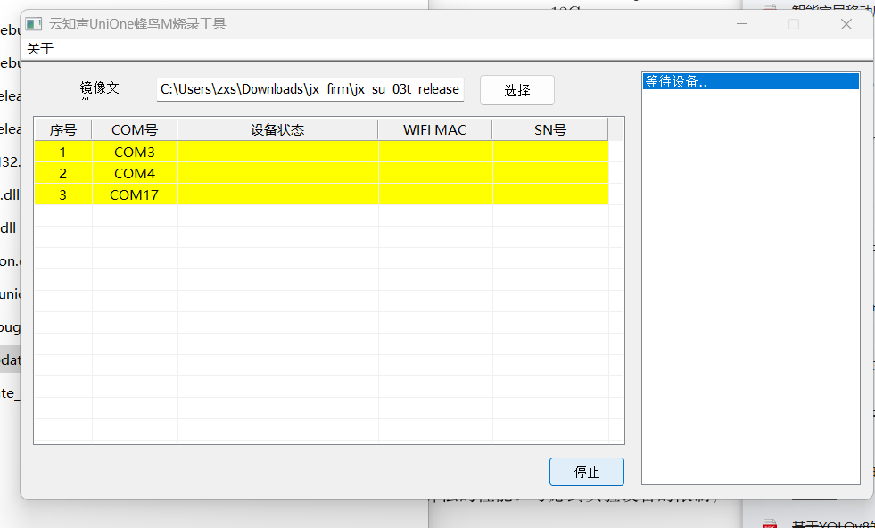


**2. 生成时间长的原因**

- 固件生成依赖于后台服务器负载
- 高峰时段（如下午2-4点）使用方较多，需要排队
- 实际生成时间可能需要1-2小时甚至更长

**3. 平台优化建议**

- 选择相对空闲的时间段生成（如早上或凌晨）
- 平台提示："任务多的时间需要排队等候的时间稍长"
- 可以反馈给技术团队要求增加服务器资源

**4. 临时解决方案**

- 提前提交生成任务，避免等待
- 保存好配置，一次性生成多个版本
- 考虑离线使用其他已生成的固件

**注意事项：**

- 生成时间长是平台资源限制问题，不是配置错误
- 多人同时生成时会排队处理
- 影响开发效率，建议平台方增加服务器

---

### 固件生成时间过长且频繁失败怎么办？

**问题描述：**

在使用平台生成固件时，生成时间过长且经常失败，即使仅配置少量命令词也耗时过长，影响工作效率。

**解决方案：**

- 避开高峰期（如下午2-4点）使用平台
- 晚上8点半后生成速度较快
- 简化配置以减少生成时间

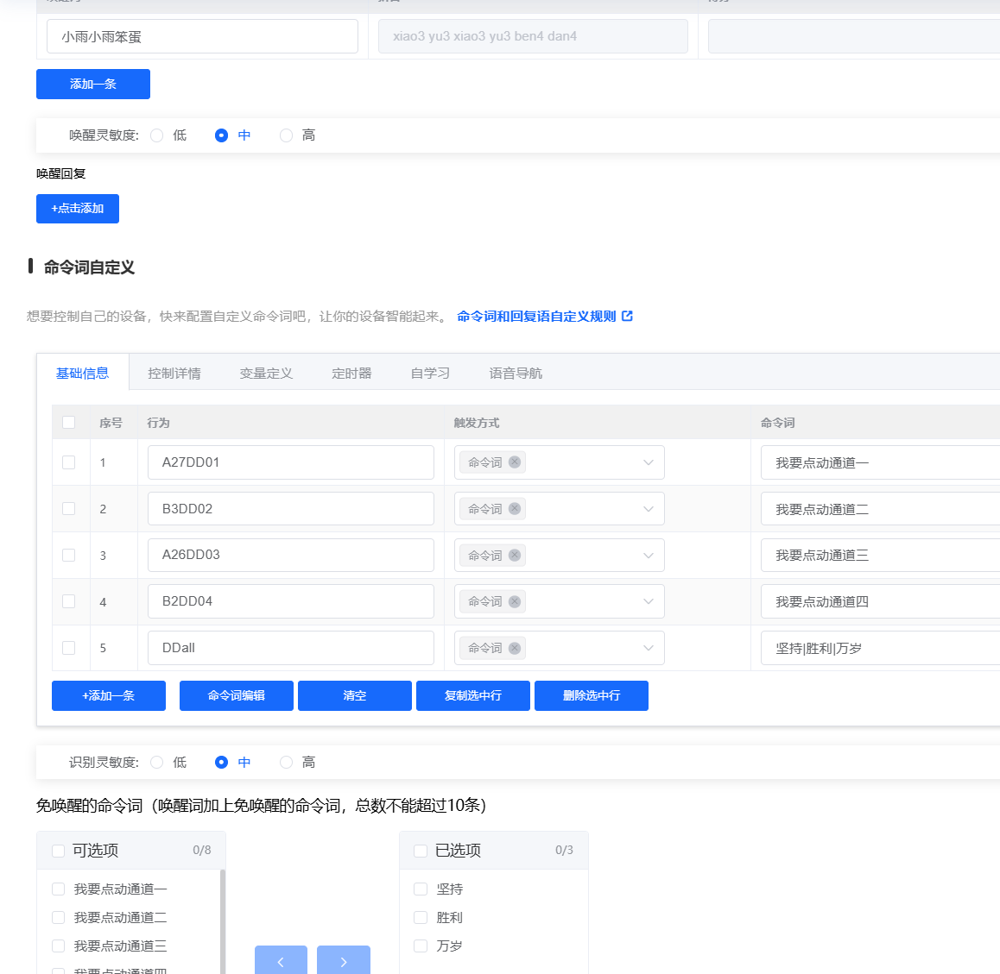

**注意事项：**

- 生成时间与服务器负载相关
- 多人同时使用会增加排队时间
- 建议错峰使用平台

---

### 如何使用启动事件触发唤醒功能？

**问题描述：**

需要实现设备开机后自动进入唤醒状态，而不是通过语音唤醒词触发，以便直接使用其他语音功能。

**解决方案：**

**1. 事件触发配置方法**

- 在平台的"命令词自定义"中配置
- 选择触发方式为"事件触发"
- 设置参数为"上电启动系统启动"
- 动作设置为"进入唤醒"

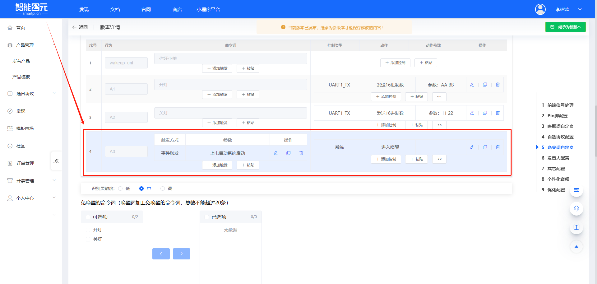

**2. 完整配置示例**

在"事件触发"区域进行以下配置：


在"基础信息"标签页的命令词列表中：

- 第5行设置行为为'A1'
- 触发方式为"事件触发"
- 参数为"上电启动系统启动"

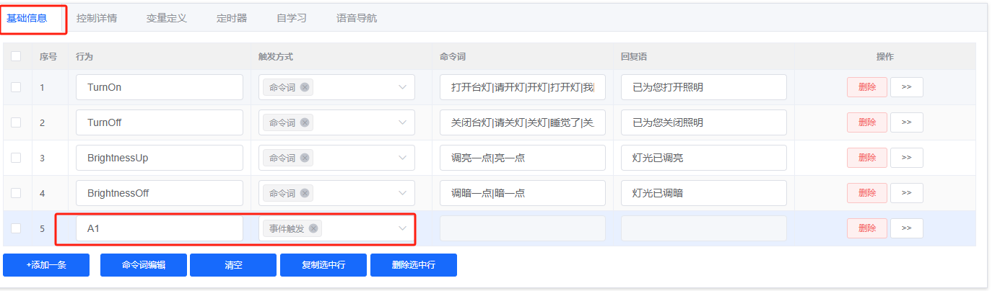

在"控制详情"标签页的控制列表中：

- 第6行设置行为为'A1'
- 触发方式为"事件触发"
- 参数为"上电启动系统启动"
- 系统操作选择"退出唤醒"

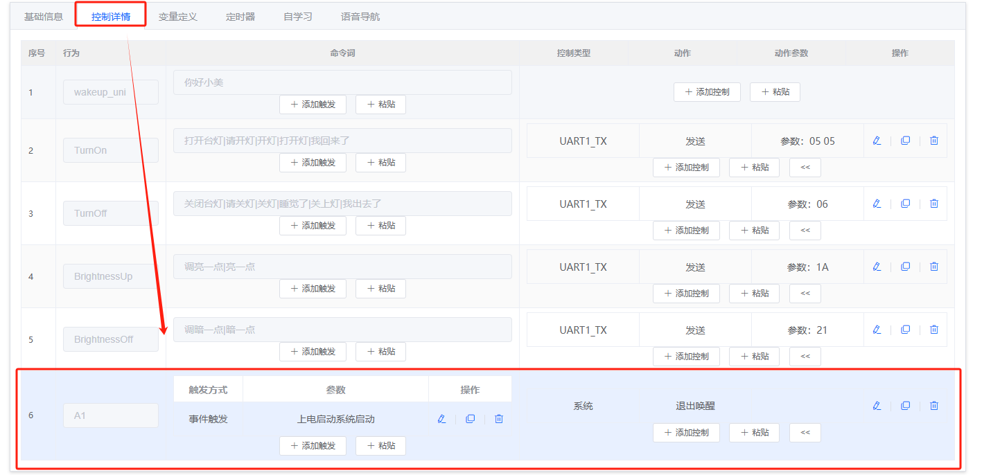

**3. 添加触发配置**

通过"添加触发"功能进行详细配置：

- 行为：A1
- 触发方式：事件触发
- 事件类型：退出唤醒
- 触发类型：自动触发

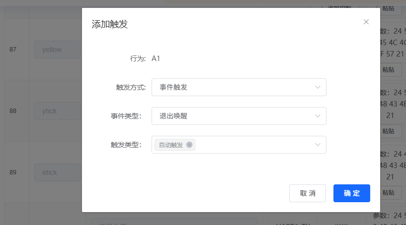

或配置系统启动触发：

- 行为：A1
- 触发方式：事件触发
- 事件类型：系统启动
- 触发类型：上电启动


**4. 配置步骤**

1. 在命令词列表中添加新条目
2. 触发方式选择"事件触发"
3. 从事件列表中选择"上电启动系统启动"
4. 动作选择"进入唤醒"
5. 生成并烧录固件

**5. 功能说明**

- 设备上电后自动进入唤醒状态
- 无需说唤醒词即可直接使用命令词
- 其他语音功能正常使用
- 适合需要即时响应的应用场景

**6. 注意事项：**

- 此功能可以替代语音唤醒
- 配置后设备启动即处于待命状态
- 仍可保留语音唤醒作为备选
- 适合近距离交互或自动触发场景
- 保存配置模板便于重复使用

**7. 常见问题：**

- 配置后如果未生效，检查触发参数是否正确设置
- 确保生成的固件已正确烧录到设备
- 多个事件触发配置时注意执行顺序
- 生成过程中不要关闭页面或刷新
- 如长时间无响应，可联系技术团队
- 建议在网络良好环境下操作

---


### 如何在上电播报或退出唤醒时通过串口通知MCU？

**问题描述：**

需要在模块上电播报或退出唤醒时，通过串口发送数据通知外部MCU，实现联动控制。

**解决方案：**

通过配置事件触发并添加串口输出动作，可以实现上电播报和退出唤醒时的串口通知功能。

**1. 上电播报时串口通知MCU**

- 添加新的行为，选择"事件触发"
- 事件类型选择"系统启动"，触发类型选择"上电启动"
- 在控制详情中添加控制：
    - 控制方式：发送UART数据
    - 输出端口：UART1_TX（或对应串口）
    - 数据格式：十六进制/ASCII/字符串
    - 数据内容：根据需求自定义（如 `0x01 0x02` 或 `"POWER_ON"`）

**2. 退出唤醒时串口通知MCU**

- 添加新的行为，选择"事件触发"
- 事件类型选择"退出唤醒"
- 触发类型根据需求选择：
    - **自动触发**：超时自动退出唤醒时触发
    - **接口触发**：通过串口命令触发退出唤醒时触发
    - **语音触发**：通过退出命令词触发时触发
- 在控制详情中添加串口输出动作（同上）

**3. 配置示例**

| 事件类型 | 触发类型 | 串口数据示例 | 应用场景 |
|---------|---------|-------------|---------|
| 系统启动 | 上电启动 | `0xAA 0x55` 或 `"BOOT_OK"` | 通知MCU模块已启动 |
| 退出唤醒 | 自动触发 | `0xAA 0x54` 或 `"EXIT_WAKE"` | 通知MCU模块进入休眠 |

**注意事项：**

- 上电启动事件只在设备上电时触发一次
- 退出唤醒事件的三种触发类型可按需配置
- 串口数据长度建议不超过64字节
- 配置后需重新生成并烧录固件

### 固件生成状态显示"待生成"怎么办？

**问题描述：**

在固件生成平台提交任务后，固件状态一直显示"待生成"，无法完成生成和下载。

**解决方案：**

**1. 状态显示问题**

- 固件状态"待生成"表示生成任务卡住或失败
- 可能是服务器负载高或网络问题导致
- 系统通知显示已完成但实际未生成

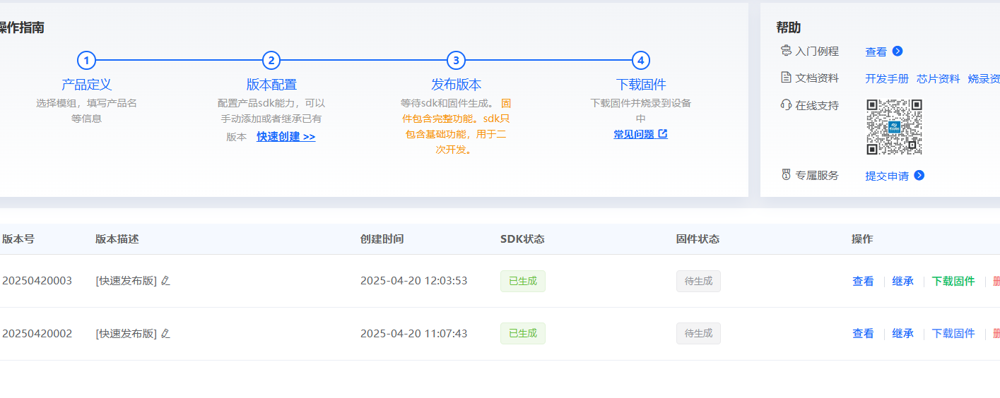

**2. 处理方法**

- **刷新页面**：在平台页面按F5或点击刷新按钮
- **重启电脑**：彻底清除缓存和网络状态
- **等待片刻**：服务器可能延迟，稍后再试
- **重新提交**：删除当前版本重新生成

**3. 预防措施**

- 选择网络较好的环境操作
- 避开高峰时段使用平台
- 确保浏览器版本兼容
- 关闭其他占用网络的程序

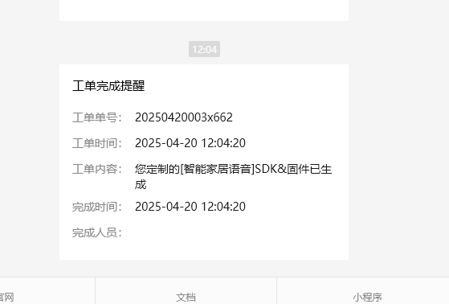

**注意事项：**

- 状态不更新不代表任务在进行
- 多次失败可联系平台技术团队
- 保存好配置文件便于重新生成
- 系统维护时暂停操作

---

### 智能公元平台能打开.json文件吗？

**问题描述：**

询问智能公元平台是否支持打开和导入.json文件，以及导入后能否查看详细配置信息。

**解决方案：**

是的，智能公元平台支持.json文件的导入和查看：

**1. 导入.json文件**

- 登录智能公元平台
- 在配置界面找到"导入"功能
- 选择.json配置文件导入
- 平台会显示完整的配置信息

**2. 查看配置内容**

- 导入后可查看所有配置参数
- 包括引脚配置、语音设置、功能选项等
- 可以修改或继承该配置

**3. 编辑功能**

- 导入的配置可以直接在平台中编辑
- 支持修改各项参数
- 修改后可重新生成固件

**注意事项：**

- 导入前建议备份原配置
- JSON文件格式必须正确
- 导入后需要检查配置是否完整
- 修改配置后必须重新生成并烧录固件

---

### 小程序平台命令字配置保存失败怎么办？

**问题描述：**

在小程序平台自定义命令字配置时，保存操作失败，无法成功添加或修改命令字。

**解决方案：**

**1. 删除串口参数**

- 根据反馈，配置中包含串口输入参数会导致保存失败
- 删除"输入参数"部分的所有串口参数配置
- 特别是删除类似名为"b"、类型为"char"的参数

**2. 使用JSON文件方式**

- 从平台导出当前配置的JSON文件
- 在本地编辑JSON文件，添加或修改命令字配置
- 通过平台导入功能上传修改后的JSON文件

**3. 继承版本问题处理**

- 如果使用继承版本，确认实际修改了配置
- 有时继承版本会直接使用原配置，导致修改无效
- 建议新建工程而非继承


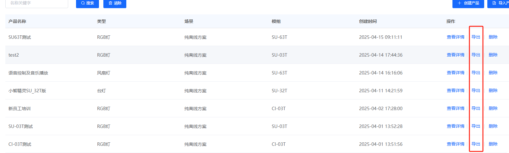

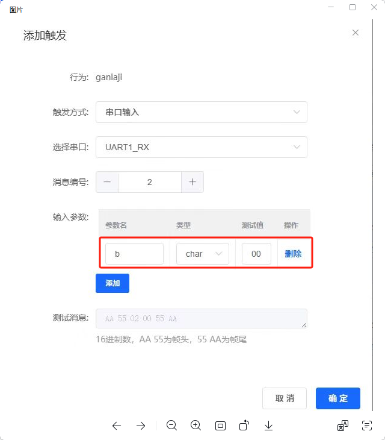

**注意事项：**

- 串口参数配置冲突是保存失败的常见原因
- JSON文件修改需要确保格式正确
- 导入前备份原有配置文件
- 问题持续时联系技术团队

---

### 网页端命令字配置保存失败怎么办？

**问题描述：**

在网页端尝试添加自定义命令字时，点击保存后提示"配置保存失败"，无法成功添加新命令。

**解决方案：**

**1. 基础排查**

- 清除浏览器缓存和Cookie
- 确认网络连接稳定
- 尝试刷新页面后重新操作

**2. 检查配置内容**

- 确认命令词名称不包含特殊字符
- 检查命令词数量是否超出限制
- 验证回复词内容格式正确

**3. 使用JSON配置文件**

- 通过"导出"功能下载现有配置
- 在JSON文件中添加新命令
- 使用"导入"功能上传修改后的配置

**注意事项：**

- 所有配置需通过网页平台完成
- 小程序不支持修改语音指令
- 问题持续时联系技术团队

---

### 串口数据发送有字节数限制吗？

**问题描述：**

询问串口数据发送的最大字节数是否可以超过32字节，以及是否有办法发送7-8个字节的数据。

**解决方案：**

**1. 发送数据限制**

- 串口发送最大长度为32字节
- 发送7-8个字节的数据完全支持
- 32字节是上限，不是下限

**2. 接收数据限制**

- 发送数据不影响模块功能
- 接收数据时可能存在长度限制
- 建议重要数据控制在32字节以内

**3. 数据处理建议**

- 短数据包传输更稳定
- 超过32字节需要分包发送
- 确认接收端的缓冲区大小

**注意事项：**

- 32字节限制适用于单次发送
- 可通过多次发送传输大数据
- 接收端需要实现数据拼接逻辑

---

### SDK生成时一直提示等待30分钟怎么办？

**问题描述：**

在平台生成SDK时，提交后一直提示需要等待30分钟，导致生成失败。

**解决方案：**

**1. 平台负载情况**

- **使用方并发**：

    - 平台使用使用方较多时需要排队
    - 生成任务按顺序处理
    - 高峰期等待时间更长

**2. 耐心等待**

```markdown
- 30分钟提示是正常现象
- 实际等待时间可能超过30分钟
- 建议非高峰时段操作
- 保持网络连接稳定
```

**3. 替代方案**

- 多次尝试仍失败：联系技术团队
- 检查账号状态是否正常
- 确认项目配置无误

**注意事项：**

- SDK生成需要服务器编译，时间较长是正常的
- 频繁刷新不会加速过程
- 建议等待1小时后再咨询


---

### 智能公园音频播放速度异常（1.5倍速）？

**问题描述：**

智能公园平台中的音频文件以1.5倍速自动播放，需要恢复正常播放速度。

**解决方案：**

**问题原因：**

- 可能是浏览器或播放器设置异常
- 音频文件本身可能存在问题
- 平台临时显示错误

**解决方法：**

1. **刷新页面重试**
    - 刷新浏览器页面
    - 清除缓存后重新加载
    - 重新上传音频文件

2. **检查音频文件**
    - 在本地播放确认音频正常
    - 尝试转换音频格式
    - 使用标准MP3格式（44.1kHz）

3. **更换浏览器**
    - 尝试使用Chrome或Edge浏览器
    - 确认浏览器为最新版本
    - 禁用可能影响播放的插件

**注意事项：**

- 如问题自行恢复，无需额外操作
- 持续异常可联系技术团队
- 建议保存正常配置的备份

---

### 如何在智能公元平台播放音乐文件？

**问题描述：**

需要在智能公元平台配置音乐播放功能，了解音乐播放时长限制和具体操作方法。

**解决方案：**

**1. 音频文件上传**

- 在平台配置中选择"个性化音频"
- 上传音乐文件（MP3或WAV格式）
- 文件大小建议控制在500KB以内

**2. 配置播放控制**

- 添加语音命令词（如"播放音乐"）
- 在控制详情中设置"播放语音"动作
- 将回复词改为上传的音乐文件名

**3. 播放时长说明**

- 音乐播放时长由文件本身决定
- 平台自动播放一次，不循环
- 上传的半分钟文件会完整播放30秒

**注意事项：**

- 单个音频文件不宜过长，建议30秒内
- 确保音频格式为MP3或WAV
- 可通过设置免唤醒词实现连续控制


---

### 音乐播放插件在平台和模块上的行为有什么差异？

**问题描述：**

音乐播放插件在平台上可以使用，但烧录到模块后无法播放音乐。

**解决方案：**

**功能差异说明：**

- **平台测试**：音乐播放插件在智能公元平台上可以进行测试播放
- **模块限制**：烧录到模块后，音乐播放插件功能暂不支持
- **插件状态**：音乐播放插件当前处于测试阶段

**技术原因：**

- 音乐播放涉及音频解码和输出功能
- 模块端的音频输出能力受硬件限制
- 不同型号模块的音乐播放支持情况不同

**替代方案：**

1. **个性化音频方案**
   - 将音乐文件上传为个性化音频
   - 通过语音命令触发播放
   - 适合短音频（建议30秒内）

2. **蓝牙音乐方案**
   - 选择支持蓝牙音乐的模块型号（如JX-B5C、SU-63T）
   - 通过蓝牙连接手机播放音乐
   - 支持A2DP音乐播放协议

3. **自建智能体方案**
   - 对于JX-A7T等在线模块
   - 可通过自建智能体配置音乐功能
   - 需要网络连接支持

**注意事项：**

- 音乐播放插件功能正在持续优化中
- 不同型号模块的音乐播放能力有差异
- 具体支持情况请参考各型号的技术文档

---

### 如何配置平台项目文件并进行分享？

**问题描述：**

希望了解如何在平台中配置项目文件并进行项目分享，特别是如何自定义唤醒词和命令词。

**解决方案：**

**1. Pin脚配置**

- **串口配置**：

    - UART1_RX和UART1_TX用于串口通信
    - DEFAULT_LOG为日志输出口，建议不要修改
    - GPIO_B2和GPIO_B3可配置为输出模式

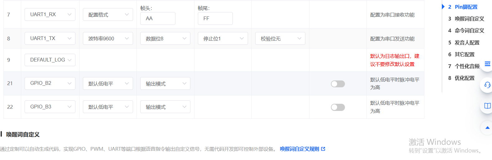

*Pin脚配置界面，串口和GPIO设置*

**2. 命令词自定义**

- **添加命令词**：

    - 点击"添加"按钮创建新命令词
    - 设置命令词名称（如A_01、A_02）
    - 配置对应的识别内容

- **识别灵敏度设置**：

    - 提供低、中、高三个选项
    - 根据实际环境调整灵敏度
    - 支持编辑、清空和删除操作

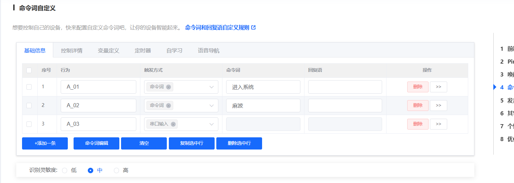

*命令词自定义界面，可添加和管理命令词*

**3. 控制详情配置**

- **配置控制逻辑**：

    - 设置触发条件（唤醒词、命令词）
    - 选择动作类型（发送UART数据等）
    - 配置动作参数（如十六进制数据）

- **变量管理**：

    - 支持定义和使用变量
    - 实现动态数据传递
    - 便于复杂控制逻辑实现

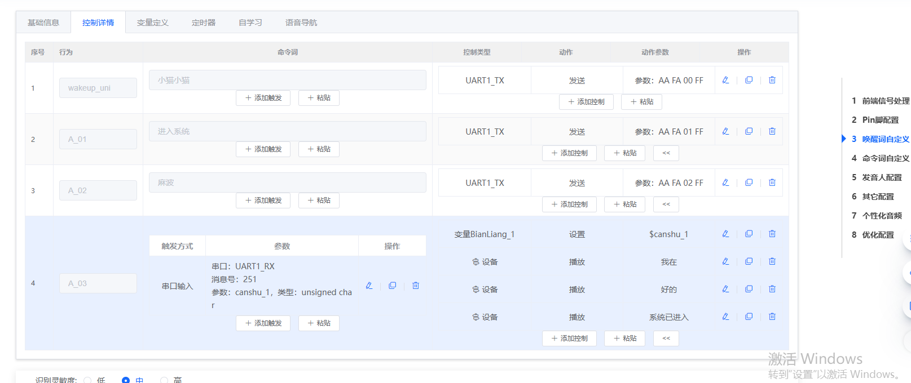

*控制详情界面，配置触发条件和动作*

**4. 项目分享方法**

- **导出项目文件**：

    - 在平台中点击"导出"或"保存"
    - 生成.json格式的项目文件
    - 包含所有配置信息

- **分享步骤**：

    - 将生成的.json文件发送给其他使用方
    - 接收方通过"导入"功能加载
    - 自动还原所有配置

**注意事项：**

- 唤醒词建议使用独特、清晰的词汇
- 命令词避免与唤醒词相似
- 项目文件保存前检查配置完整性

---

### 如何配置语音指令与串口通信？

**问题描述：**

需要配置语音指令与串口通信，实现通过语音指令触发MCU操作和通过MCU串口指令触发语音播报的功能。

**解决方案：**

**1. 语音触发串口通信配置**

- **触发方式选择**：

    - 选择"语音触发"
    - 模块识别到语音指令后向MCU发送串口消息
    - 配置对应的十六进制数据

**2. 串口触发语音播报配置**

- **触发方式选择**：

    - 选择"串口输入"
    - 模块收到MCU串口消息后播报对应内容
    - 配置串口数据与播报内容的映射


**3. 配置示例说明**

- **词条定义**：

    - 设置唤醒词如"小猫小猫"
    - 设置命令词如"进入系统"、"启动"、"暂停"等

- **数据格式**：

    - 串口发MCU：如"AA FA 00 FF"
    - MCU发模块：如"AA FB 00 FF"
    - 使用十六进制格式进行通信

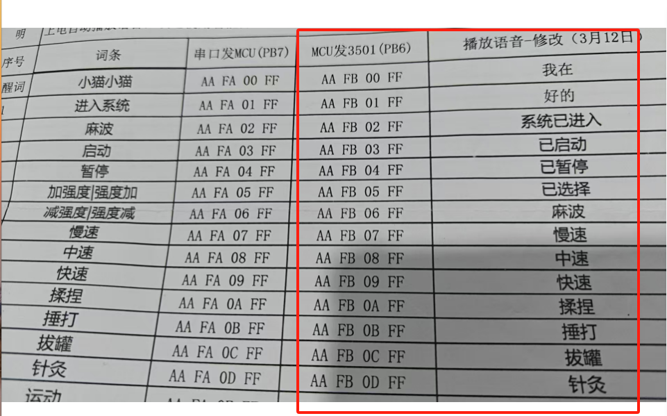

*串口触发时MCU向模块发送的数据格式*

**注意事项：**

- 串口通信参数（波特率、数据位等）需要两端一致
- 确保数据格式正确，避免解析错误
- 测试时建议使用串口调试助手验证通信

---

### 米思奇一键更新工具出现JavaScript错误怎么办？

**问题描述：**

使用米思奇一键更新工具时出现"Cannot find module"的JavaScript错误，即使路径已修改为不含中文，问题仍未解决。

**解决方案：**

**路径问题排查：**

1. **确保路径全英文**：

    - 检查工具所在路径是否包含中文字符
    - 包括文件夹名称和文件名都不能有中文
    - 建议将工具放在简单英文路径下

2. **尝试其他解决方案**：

    - 重启电脑后重新运行工具
    - 以管理员身份运行工具
    - 检查是否有防火墙或杀毒软件拦截

**寻求官方支持：**

如上述方法无效：

- 访问米思奇官网查找解决方案
- 联系米思奇技术团队
- 查看工具是否有更新版本

**注意事项：**

- 这类JavaScript错误通常是工具本身的问题
- 智能公元平台无法解决第三方工具的问题

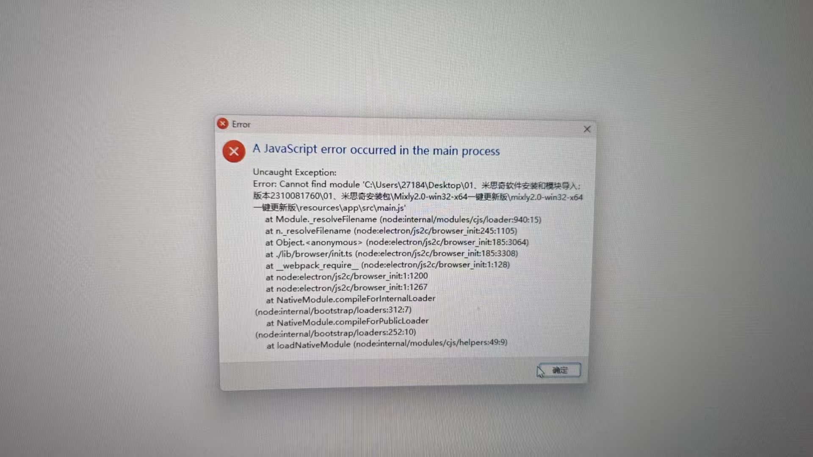

---

### 进行二次开发时需要重写32位单片机代码吗？

**问题描述：**

在进行二次开发时，不确定是否需要重写32位单片机的代码。

**解决方案：**

**1. 开发范围判断**

- **仅语音模块开发**：

    - 只对语音模块的软件部分做二次开发
    - 不修改硬件控制逻辑
    - 单片机部分可以不做改动

- **涉及功能扩展**：

    - 需要增加新的硬件控制功能
    - 修改原有的通信协议
    - 需要重写或修改单片机代码

**2. 实际需求分析**

- **保留现有功能**：

    - 如果现有功能满足需求
    - 只需要修改语音识别部分
    - 单片机代码可保持不变

- **新增功能需求**：

    - 添加新的传感器或执行器
    - 改变通信方式或数据格式
    - 必须修改单片机代码

**3. 开发建议**

- **模块化设计**：

    - 将语音模块和单片机功能解耦
    - 使用标准接口进行通信
    - 便于分别开发和调试

- **兼容性考虑**：

    - 保持通信协议的向后兼容
    - 预留扩展接口
    - 减少未来改动的范围

**注意事项：**

- 评估清楚实际需求再决定开发范围
- 建议先做最小可行方案验证
- 保留原有代码作为备份参考

---

### 如何配置免唤醒命令词？

**问题描述：**

需要在设备上配置免唤醒命令词，使其无需唤醒词即可直接执行指定动作。

**解决方案：**

**免唤醒配置方法：**

1. **进入配置界面**：

    - 登录智能公元平台
    - 进入命令词自定义配置
    - 找到"免唤醒的命令词"区域

2. **添加免唤醒命令**：

    - 点击添加免唤醒命令
    - 输入命令词内容
    - 设置对应的控制动作
    - 保存配置

3. **配置限制**：

    - 免唤醒命令词总数不能超过10条
    - 根据实际需求合理分配

**配置示例：**

如需配置两个动作：

- "开始射击" → 执行动作A
- "切换武器" → 执行动作B

这两个命令都可以设置为免唤醒，直接说出即可触发。

**注意事项：**

- 免唤醒命令词数量有限制（最多10条）
- 建议将常用指令设为免唤醒
- 配置完成后需要重新生成固件


---

### 如何实现多级模式切换和免唤醒识别？

**问题描述：**

希望实现游戏模式的场景，用户说出特定指令后进入游戏模式，该模式下无需唤醒词即可识别游戏指令，并支持三级模式切换。

**解决方案：**

**1. 配置禁止超时退出唤醒**

- 在识别到进入游戏模式指令后，设置"禁止超时退出唤醒"
- 这样模块会保持在唤醒状态，无需重复说唤醒词
- 下一次说出"退出游戏模式"时，恢复正常唤醒状态

**2. 配置步骤**

- 为"进入游戏模式"命令添加控制动作
- 选择"延时恢复"功能
- 设置为"禁止超时退出唤醒"
- 游戏相关指令可以设置为免唤醒或保持识别状态

**3. 三级模式实现**

- **一级模式**：正常唤醒模式，需要唤醒词
- **二级模式**：游戏模式，识别到"进入游戏模式"后激活
- **三级模式**：可以设置其他特殊模式，如"学习模式"等

**4. 退出机制**

- 设置"退出游戏模式"命令
- 识别后恢复"允许超时退出唤醒"
- 系统回到正常工作状态

**注意事项：**

- 禁止退出唤醒功能会增加功耗
- 免唤醒命令词数量有限制（最多10条）
- 建议为不同模式设置清晰的切换指令
- 合理规划场景避免模式混乱

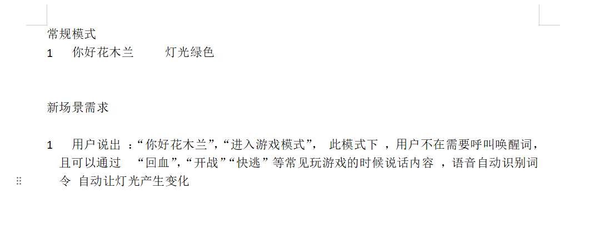

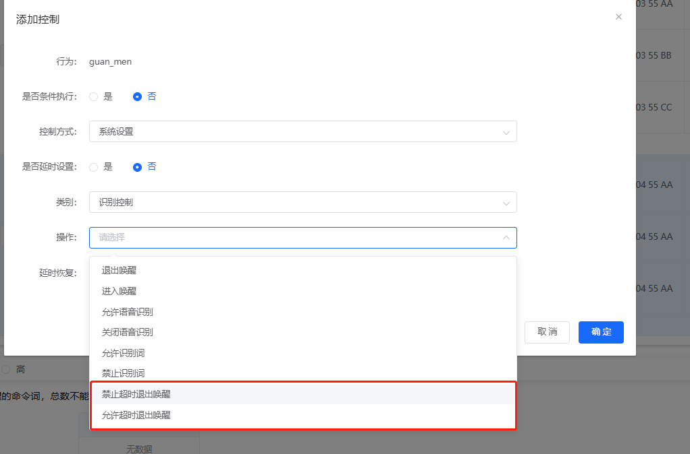

---

### 如何配置特定命令的免唤醒功能？

**问题描述：**

需要配置语音模组的唤醒设置，使其在超时后仅允许特定的免唤醒命令，同时避免误触发其他命令。

**解决方案：**

**1. 免唤醒命令配置**

- 在平台中找到"免唤醒的命令词"设置区域
- 选择需要设置为免唤醒的命令词
- 这些命令无需唤醒词即可直接识别

**2. 禁止超时退出唤醒机制**

- 识别到特定命令后，触发"禁止超时退出唤醒"
- 从此时开始，模块不会自动退出唤醒状态
- 保持唤醒状态直到收到退出指令

**3. 配置示例**

- **进入模式命令**："进入游戏模式" → 触发禁止退出唤醒
- **免唤醒命令**："回血"、"开战"、"快逃"等游戏指令
- **退出模式命令**："退出游戏模式" → 恢复正常唤醒

**4. 误识别防范**

- 免唤醒命令会增加误识别风险
- 建议只将必要的命令设为免唤醒
- 使用独特且不易误触发的命令词

**注意事项：**

- 免唤醒命令词总数不能超过10条
- 禁止退出唤醒状态会持续消耗电量
- 设置免唤醒时需平衡便利性和误识别风险
- 建议为模式切换设置明确的进入和退出命令

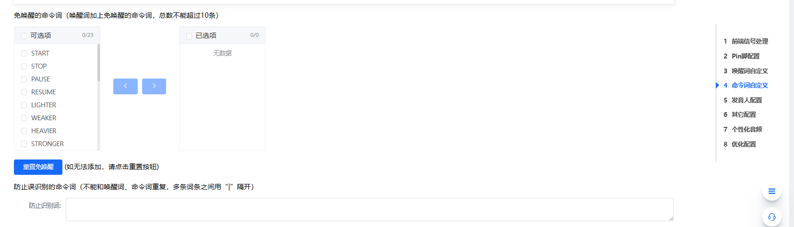

---

### 输出脉冲功能如何工作？

**问题描述：**

在控制配置中，"输出脉冲"功能的"周期"和"次数"参数的具体含义及其工作效果。

**解决方案：**

**输出脉冲原理：**

- 输出脉冲是高低电平的周期性切换
- 通过配置周期和次数控制脉冲形态
- 实现类似方波的信号输出

**参数说明：**

1. **周期参数**：

    - 表示高低电平切换的时间间隔
    - 如10ms表示每10ms切换一次电平状态
    - 周期越短，切换频率越高

2. **次数参数**：

    - 表示电平切换的总次数
    - 次数为1：切换1次（高→低或低→高）
    - 次数为10：连续切换10次

**工作示例：**

- 周期10ms，次数1：

    - 输出10ms高电平，然后10ms低电平，结束

- 周期10ms，次数10：

    - 连续输出10个脉冲
    - 每个脉冲20ms（10ms高+10ms低）
    - 总时长200ms

**实际应用：**

适用于需要短暂信号触发的场景：

- LED闪烁控制
- 蜂鸣器短鸣
- 继电器脉冲触发

**注意事项：**

- 脉冲输出与端口初始状态有关
- 确保负载支持脉冲信号
- 合理设置周期避免信号过快

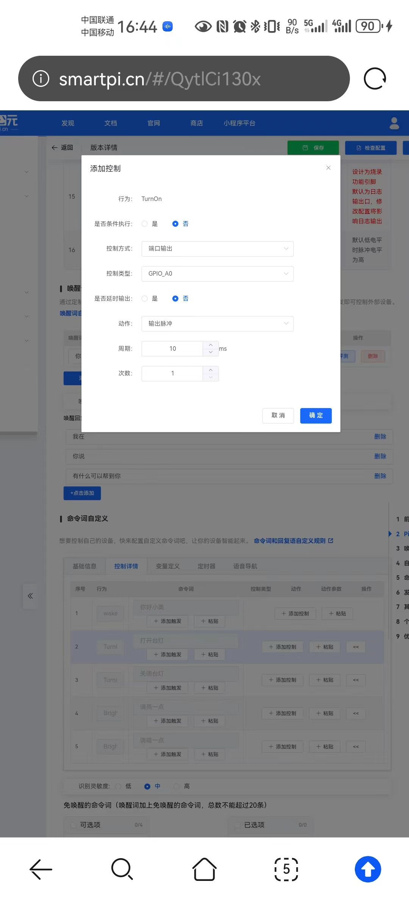

---

### SDK生成失败提示"语言模型生成失败"怎么办？

**问题描述：**

生成SDK时出现"语言模型生成失败"的错误，导致无法正常生成固件。

**解决方案：**

**主要原因分析：**

最常见的原因是**命令词重复**：

- 检查所有命令词是否有重复（包括泛化词）
- 包括唤醒词和指令词
- 同音不同字的命令词也可能冲突
- 系统泛化词与自定义词可能重复

**排查步骤：**

1. **检查命令词列表**：

    - 逐一检查所有添加的命令词
    - 确保没有完全相同的命令词
    - 注意相似发音的区分
    - 系统会标记重复的命令词【重复】

2. **修改重复命令词**：

    - 将重复的命令词修改为不同表述
    - 或删除不需要的重复项
    - 保存后重新生成SDK
    - 使用"添加自然说推荐命令词"时容易重复，建议谨慎使用

3. **其他可能原因**：

    - 命令词包含特殊字符
    - 命令词数量超过限制
    - 命令词过长导致模型生成失败
    - 网络连接问题

**注意事项：**

- 每个命令词必须唯一
- 建议使用语义清晰的命令词
- 导出命令词到Excel中进行重复检查
- 如问题持续，可重新创建工程，逐步添加命令词
- 混合使用系统泛化和自定义命令词时容易产生重复

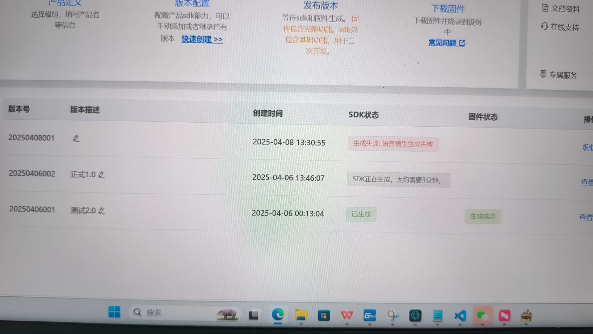

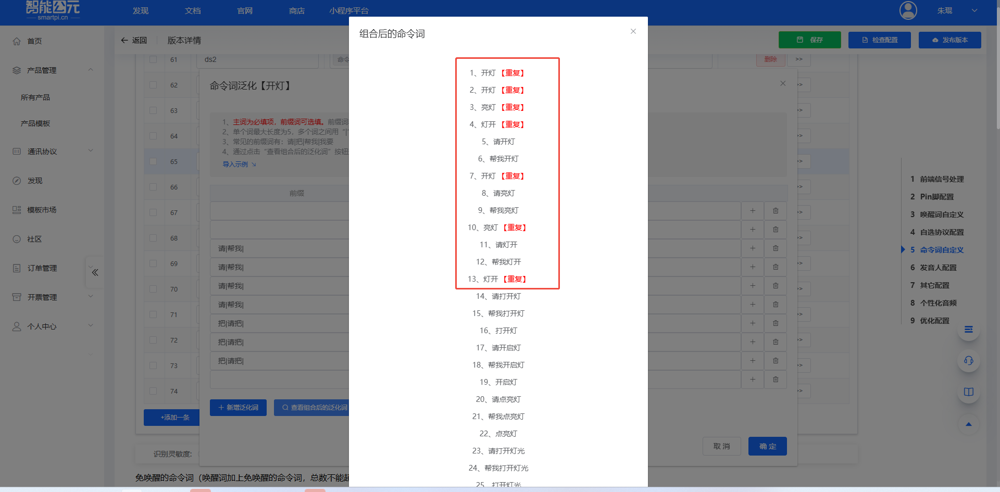

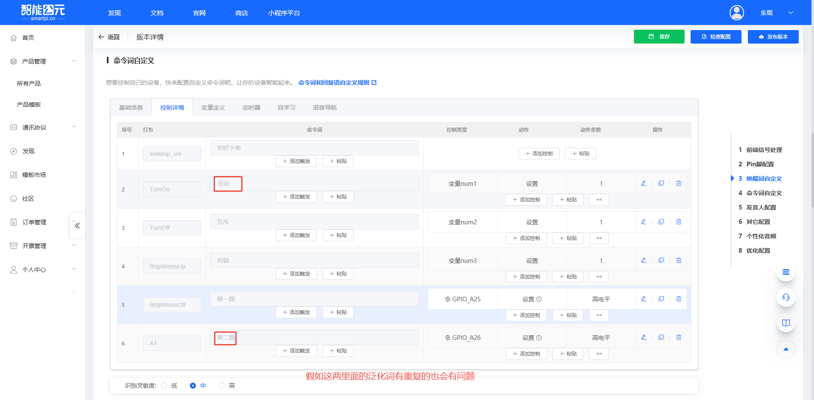

---

### 固件生成失败提示"语言模型生成失败"如何排查？

**问题描述：**

在生成固件时，固件状态显示"生成失败: 语言模型生成失败"，需要排查具体原因。

**解决方案：**

**1. 检查命令词格式**

- 确认命令词中不包含空格
- 建议手动输入命令词，避免复制粘贴
- 空格等特殊字符会导致语言模型生成失败

**2. 排查命令词重复**

- 检查自然说模型中是否存在重复的命令词
- 重复的命令词会导致生成失败
- 使用系统泛化功能时，特别注意与自定义命令词的重复

**3. 导出配置文件检查**

- 将配置导出为JSON文件
- 仔细检查所有命令词列表
- 删除或修改重复的命令词

**4. 配置检查与验证**

- 即使配置检查通过，仍可能存在隐藏问题
- 重点检查命令词泛化部分的配置
- 确认前缀词和主词的组合没有重复

**注意事项：**

- 复制粘贴命令词容易带入不可见字符
- 建议使用键盘直接输入命令词
- 生成失败时优先检查命令词格式和重复性
- 自然说功能对命令词重复较为敏感


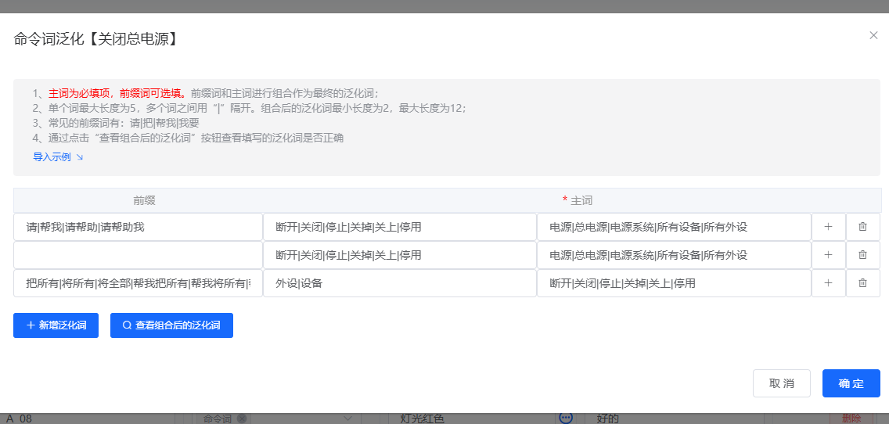

---

### 表情文件如何烧录到设备？

**问题描述：**

询问表情烧录是否包含在特定文件中，以及表情如何上传到设备。

**解决方案：**

**1. 表情文件说明**

- **文件格式**：

    - 表情通常包含在固件文件中
    - 不是单独的烧录文件
    - 随固件一起烧录到设备

- **存储位置**：

    - 表情数据存储在Flash特定区域
    - 通过程序调用显示
    - 不需要单独上传

**2. 固件配置**

- **平台设置**：

    - 在智能公元平台配置表情
    - 选择需要的表情效果
    - 生成包含表情的固件

- **烧录过程**：

    - 表情随固件自动烧录
    - 不需要额外操作
    - 烧录完成后即可使用

**3. 自定义表情**

- **开发模式**：

    - 部分模块支持自定义表情
    - 需要使用SDK开发
    - 通过特定接口上传

- **限制说明**：

    - 表情数量可能有限制
    - 存储空间影响表情数量
    - 需要优化表情文件大小

**注意事项：**

- 表情功能依赖具体模块型号
- 确认固件版本支持表情功能
- 详细说明请参考产品文档

---

### 语音模块是否支持手机烧录？

**问题描述：**

询问是否可以使用手机进行语音模块的固件烧录，而不使用电脑。

**解决方案：**

- **必须使用电脑烧录**：

    - 当前所有语音模块都需要通过电脑进行固件烧录
    - 使用CH340或专用烧录器连接电脑
    - 需要安装对应的驱动程序

- **烧录工具要求**：

    - Windows系统（部分工具支持其他系统）
    - USB接口连接
    - 官方烧录软件（如UniOneUpdateTool）

**注意事项：**

- 手机无法直接进行固件烧录
- 确保电脑已安装CH340驱动
- 建议使用官方推荐的烧录工具
- 烧录时避免中途断开连接

---

### 语音模块能否使用9V电池供电？

**问题描述：**

希望了解语音模块是否可以使用9V电池供电，以及是否需要额外的降压模块。

**解决方案：**

- **需要降压模块**：

    - 语音模块工作电压通常为3.3V-5.5V
    - 9V电池电压过高，直接使用会损坏模块
    - 必须使用降压模块将9V降至5V

- **供电方案**：

    - 9V电池 → 降压模块（LM2596等）→ 语音模块
    - 选择输出电压可调的降压模块
    - 确保输出电压稳定在5V

**注意事项：**

---

### "奏乐"指令如何播放音乐？

**问题描述：**

在配置语音指令时，"奏乐"指令无法直接播放音乐，查看配置界面发现只有串口发送指令的配置，没有音频播放功能。

**解决方案：**

**理解指令配置机制：**

1. **语音指令触发方式**：

    - "奏乐"只是一个触发关键词
    - 识别后会执行预设的动作
    - 默认动作是通过串口发送特定指令

2. **个性化音频替换**：

    - 可以将默认的回复语替换为音频文件
    - 在配置界面添加对应的音频
    - 触发时播放替换后的音频内容

3. **串口控制实现**：

    - 通过UART发送十六进制指令（如11、22、AA、BB）
    - 外部设备接收串口指令后执行相应动作
    - 可以控制音乐播放模块或设备

**实现方法：**

1. **使用个性化音频功能**：

    - 在回复语设置中上传音频文件
    - 将"奏乐"指令的回复语替换为音乐文件
    - 触发时自动播放指定的音频

2. **外部设备配合**：

    - 单片机或主控板接收串口指令
    - 根据接收到的指令控制音乐播放模块
    - 实现完整的音乐播放功能

3. **配置示例**：
    ```
    指令词：奏乐
    控制类型：UART发送
    动作参数：自定义控制码
    或
    回复语：[上传的音乐文件]
    ```

**注意事项：**

- 语音模块本身不存储和播放音频文件
- 音乐播放需要外部硬件支持
- 串口通信需要确保波特率、格式等参数匹配
- 个性化音频功能有文件大小和格式限制


---

### 如何通过定时器实现自动发送数据？

**问题描述：**

需要在命令词触发串口发送数据后，延时几秒自动发送新的数据，无需触发其他命令词。

**解决方案：**

**1. 创建定时器**

- 在平台"定时器管理"中添加新定时器
- 设置定时器名称（如T1）
- 配置定时器的触发条件


**2. 配置定时器行为**

- 在基础信息中添加新行为
- 设置触发事件为定时器触发
- 配置动作为串口发送数据

**3. 实现延时发送**

- 在命令词控制动作中启动定时器
- 设置合适的延时时间
- 定时器触发时自动发送指定数据

**4. 数据格式配置**

- 串口发送类型选择UART1_TX
- 参数填写十六进制数据
- 确保接收方能正确解析


**注意事项：**

- 定时器可以精确控制延时时间
- 支持设置多个定时器实现复杂逻辑
- 注意定时器编号不能重复
    - 数据位：8位
    - 停止位：1位
    - 校验位：无

**2. 硬件连接要求**

- **必要引脚**：

    - UART1_TX：串口发送引脚
    - UART1_RX：串口接收引脚（可选）
    - GND：信号地

- **连接方式**：

    - UART1_TX连接到MCU的RX
    - GND连接到MCU的GND
    - 如需双向通信，连接UART1_RX到MCU的TX

**3. 无法接收信号排查**

- **检查硬件连接**：

    - 确认UART1_TX已正确连接
    - 检查波特率设置是否匹配
    - 使用示波器或逻辑分析仪检测信号

- **检查MCU配置**：

    - 确认MCU串口已初始化
    - 检查中断是否使能
    - 验证GPIO配置是否正确

**4. 解决方案**

- **硬件修改**：

    - 如板子未引出串口，需要飞线连接
    - 或者重新设计PCB时加入串口引脚
    - 建议使用测试夹或探针临时连接

- **软件调试**：

    - 使用串口助手测试模块发送
    - 先确认模块能正常发送数据
    - 再排查MCU接收程序

**注意事项：**

- 发送参数支持0x00-0xFF范围内的任意值
- 建议在PCB设计时预留串口测试点
- 长距离传输需要考虑电平转换和信号完整性

---

### 唤醒回复词设置超过3条导致SDK生成失败？

**问题描述：**

在配置唤醒回复词时，设置超过3条（有时4条）后生成SDK会失败，提示"配置有问题"，但配置本身通过了检测。减少到3条后可以正常生成。

**解决方案：**

**问题原因分析：**

1. **内存限制**：

    - 单条回复语过长会占用过多内存
    - 多条回复语累积超出模块内存容量
    - 不是回复语数量的硬性限制，而是内容长度限制

2. **字符数影响**：

    - 每条回复语的字符数都很关键
    - 中文占用更多存储空间
    - 特殊字符和标点也会增加占用

**解决方法：**

1. **优化回复语内容**：

    - 缩短每条回复语的长度
    - 使用简洁的表达方式
    - 避免重复或冗余的词汇

2. **合理分配字数**：

    - 确保总字符数在限制范围内
    - 优先重要的回复语
    - 可以使用数字代号代替部分文字

3. **分批次测试**：

    - 先添加3条回复语测试生成
    - 成功后逐条添加并测试
    - 找出具体可接受的上限

**限制说明：**

- 不是固定3条的数量限制
- 实际限制是总字符数/内存占用
- 单条回复语建议不超过500个字符
- 具体限制因型号和固件版本可能略有差异

**注意事项：**

- 保存配置时注意字数统计
- 生成失败时检查总字符数而非条数
- 优化后记得测试所有唤醒回复功能
- 不同固件版本可能限制不同，需实际测试

---

### 语音识别到的数值如何通过串口发送？

**问题描述：**

希望将语音识别到的温度值（如25.5度）通过串口TX发送出去，实现动态数值传输。

**解决方案：**

**1. 模块限制说明**

- 语音模块只支持固定命令词识别
- 不支持实时动态识别口述的数字
- 必须预先设置好所有可能的数值

**2. 可实现方案**

**温度控制场景（16°-32°）**：

- 设置17条固定命令词："设置16度"、"设置17度"..."设置32度"
- 每条命令词对应发送不同的十六进制数据
- 例如：

    - "设置25度" → 发送 19（25的十六进制）
    - "设置26度" → 发送 1A（26的十六进制）

**3. 数值转换方法**

- 将识别的数值转换为十六进制格式
- 温度值：25.5度 → 25 → 十六进制 19
- 通过串口发送对应的十六进制数据

**4. 配置步骤**

- 在平台添加命令词："设置温度XX度"
- 配置动作为串口发送数据
- 填入对应温度值的十六进制数
- 生成固件后烧录到模块

**注意事项：**

- 无法识别未预先设置的数值
- 如需更精确的数值控制，需要设置更多命令词
- 模块最少支持100条命令词
- 酒店空调控制通常使用17条温度命令即可满足需求

---

### 如何通过GPIO高电平触发播放音频？

**问题描述：**

希望通过GPIO引脚的高电平触发，让模块播放一段预先上传的音频文件。

**解决方案：**

- **配置步骤**：

1. **创建命令词**：

    - 进入"命令词自定义"界面
    - 添加新的命令词（如"A3"）
    - 触发方式选择"事件触发"

2. **设置GPIO触发**：

    - 在触发方式中选择"GPIO_A27高电平"
    - 或根据需要选择其他GPIO引脚
    - 保存配置

3. **添加播放控制**：

    - 在控制详情中点击"添加控制"
    - 控制方式选择"播放语音"
    - 输入或选择要播放的音频内容

- **配置要点**：

    - GPIO引脚需先在Pin脚配置中设置为输入模式
    - 触发条件可选择高电平或低电平
    - 支持多个GPIO引脚同时配置

**注意事项：**

- 确保GPIO引脚正确连接外部触发信号
- 播放的音频需预先上传到平台
- 可通过串口调试助手验证触发效果
- 参考教程视频：https://www.bilibili.com/video/BV1ps4y1e7nR


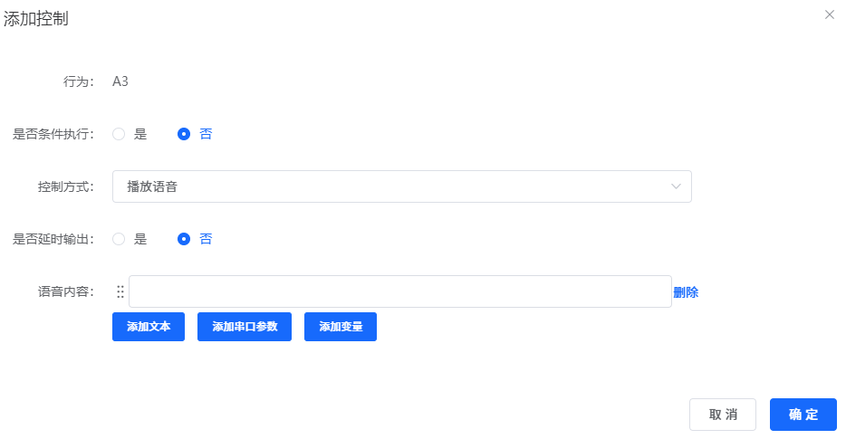

---

### GPIO输入模式下控制详情无选项怎么办？

**问题描述：**

配置GPIO输入触发时，当触发方式设置为GPIO输入后，控制详情页面无法选择触发方式，显示"暂无数据"。

**解决方案：**

- **问题原因**：

    - GPIO引脚默认都是输出模式
    - 未将引脚配置为输入模式
    - 导致触发选项中无可选引脚

- **解决步骤**：

1. **进入Pin脚配置**：

    - 找到"Pin脚配置"页面
    - 查看所有GPIO引脚状态
    - 确认需要使用的引脚

2. **配置GPIO为输入**：

    - 选择目标GPIO引脚（如A27）
    - 将模式改为"输入"
    - 保存配置

3. **重新配置触发**：

    - 返回命令词配置界面
    - 重新添加触发方式
    - 此时可选GPIO输入引脚

- **配置要点**：

    - 触发方式选择"GPIO输入"
    - 选择已配置为输入的引脚
    - 设置触发条件（高电平/低电平）

**注意事项：**

- 所有GPIO默认为输出低电平
- 必须先配置为输入才能用于触发
- 可根据需要配置上拉或下拉
- 配置完成后需重新生成固件

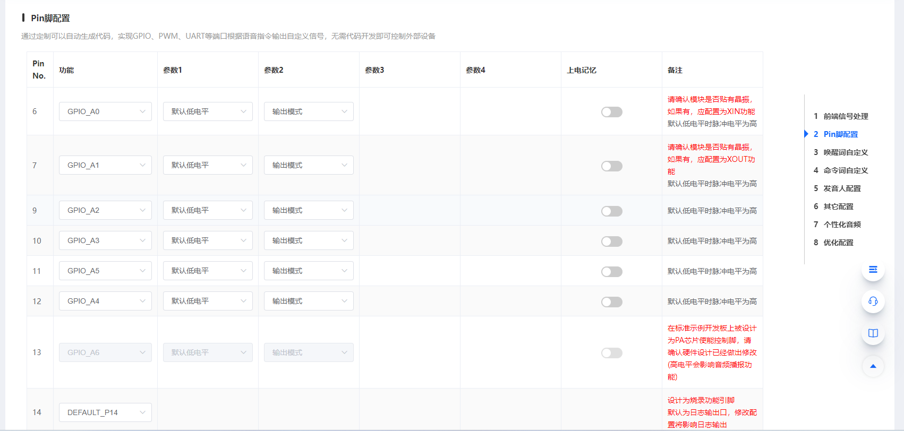

---

### CI系列芯片串口能否发送字符串？

**问题描述：**

在配置串口发送指令时，发现只能发送十六进制数据（如11、22、AA、BB），询问是否支持直接发送字符串数据。

**解决方案：**

**当前功能说明：**

1. **只支持十六进制格式**：

    - 平台暂时只支持发送十六进制数据
    - 字符串需要先转换为十六进制格式
    - 可以通过ASCII码表进行转换

2. **发送配置方式**：

    - 在动作参数中输入十六进制数
    - 支持多字节数据（如：11 22 AA BB）
    - 数据通过UART TX引脚发送

**字符转换方法：**

1. **手动转换**：

    - 查找ASCII字符对应的十六进制值
    - 例如："A" → 41，"B" → 42
    - 字符串"AB" → 41 42

2. **在线转换工具**：

    - 使用ASCII转十六进制工具
    - 支持中文的GBK或UTF-8编码
    - 确保目标设备能正确解码

3. **常用字符对照**：
    ```
    '0'-'9' → 30-39
    'A'-'F' → 41-46
    'a'-'f' → 61-66
    空格 → 20
    回车 → 0D
    换行 → 0A
    ```

**应用示例：**

1. **发送简单命令**：

    - 要发送"START"：

    - 发送：53 54 41 52 54
    - 接收方按ASCII解码得到"START"

2. **发送带参数命令**：

    - 命令："SET VOLUME 80"
    - 十六进制：53 45 54 20 56 4F 4C 55 4D 45 20 38 30
    - 注意空格对应20

**注意事项：**

- 发送和接收端的编码格式必须一致
- 中文字符需要确认双方使用相同的字符集（GBK/UTF-8）
- 十六进制数据之间用空格分隔，便于阅读
- 复杂数据建议使用专业的串口调试工具验证

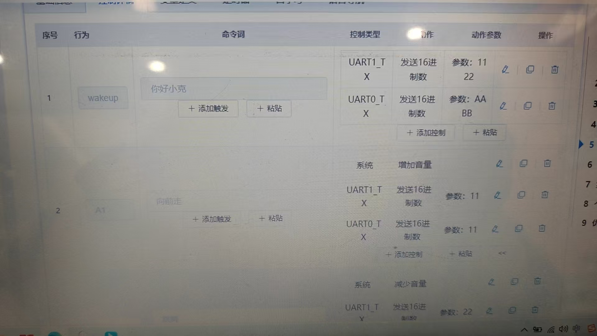

---

### GPIO触发配置不生效怎么办？

**问题描述：

配置GPIO触发时无法正常工作，或设置GPIO输入后语音命令失效，需要了解主触发和附加触发的区别。


解决方案：

**主触发与附加触发的区别**：

- **主触发**：

    - 命令执行的主要触发条件
    - 可选择命令词、GPIO输入等
    - 每个命令必须有且只有一个主触发

- **附加条件**：

    - 在主触发基础上的额外条件
    - 用于实现更复杂的控制逻辑
    - 可选设置，不是必须的

**GPIO输入触发配置步骤**：

1. **配置GPIO引脚模式**：

    - 将目标GPIO设置为输入模式
    - 不要设置为输出或其他功能
    - 确保引脚电平状态正确

2. **设置主触发**：

    - 触发方式选择"GPIO输入"
    - 选择对应的GPIO引脚
    - 设置触发电平（高/低电平）

3. **添加控制行为**：

    - 配置触发后执行的动作
    - 设置"是否条件执行"为"否"
    - 保存配置并生成固件

**常见错误**：

- 触发方式设置为GPIO输入，导致语音命令失效
- 只设置附加条件，没有主触发
- GPIO引脚模式配置错误

**注意事项**：

- 语音触发和GPIO触发不能同时使用
- 如需要两种触发方式，需创建两条命令
- 条件触发必须配合主触发使用

---

### "是否条件执行"选项如何设置？

**问题描述：**

在配置控制逻辑时，对"是否条件执行"选项的设置存在疑问，不确定何时应选择"是"或"否"。

**解决方案：**

**1. 选项含义说明**

- **选择"否"**：无条件执行，触发后直接执行动作
- **选择"是"**：需要满足附加条件才执行动作
- 条件执行用于实现复杂的控制逻辑

**2. 使用场景**

- **直接控制**：选择"否"，触发后立即执行
- **条件判断**：选择"是"，需要满足条件才执行
- 如GPIO电平、变量值等作为判断条件

**3. 设置示例**

- 语音触发 → 条件执行"否" → 直接输出高电平
- 语音触发 → 条件执行"是" + GPIO高电平 → 执行动作

**注意事项：**

- 条件执行必须配合主触发使用，不能单独设置
- 选择"是"时必须配置相应的条件项
- 条件判断可以实现更灵活的控制逻辑


---

### 条件执行功能使用说明

问题描述：

平台配置中的"是否条件执行"选项功能，以及如何正确使用该功能实现条件控制。

解决方案：

**1. 条件执行的定义**

- **条件执行**：

    - 在主触发基础上增加额外的判断条件
    - 只有当条件满足时才执行对应的控制动作
    - 用于实现复杂的控制逻辑

**2. 使用场景**

- **延时输出控制**：

    - "是否延时输出(ms)"：控制动作执行的延时
    - 设置为"是"时，需要输入具体的延时时间
    - 适用于需要延时响应的场景

- **条件判断控制**：

    - "是否条件执行"：设置是否需要额外条件
    - 设置为"是"时，需要配置具体的判断条件
    - 可用于多条件组合控制

**3. 配置方法**

**基础配置流程**：

1. 设置主触发方式（命令词、GPIO输入等）
2. 添加控制行为（UART输出、GPIO控制等）
3. 根据需要设置延时或条件执行

**条件执行设置**：

- 当选择"是否条件执行"为"是"时
- 需要在附加条件中配置具体的判断逻辑
- 可以设置多个条件，使用AND/OR逻辑组合


注意事项：

- 条件执行必须配合主触发使用，不能单独设置
- 多个条件设置时要注意逻辑关系的正确性
- 建议先测试简单场景，再逐步增加复杂度
- 图形化编程环境中的条件执行功能可参考官方教程视频
- 测试前确保硬件连接正确

---

### 如何配置变量的计算逻辑？

**问题描述：**

在配置文字转语音或其他功能时，需要设置变量的计算逻辑，如 B3_1_1 = (B1_1 * 10) + B2_1，不确定配置方法是否正确。

**解决方案：**

**变量计算配置方法：**

1. **分步骤设置**
    - 平台不支持一步完成复杂计算
    - 需要将计算分解为多个步骤
    - 每个步骤使用一个控制动作

2. **计算顺序**
    - 平台按配置顺序执行计算
    - 先写的步骤先执行
    - 后写的步骤后执行
    - 或理解为上面的步骤先执行

3. **具体配置示例**

    **步骤一：设置初始值**

    - 控制方式：变量设置
    - 操作：乘法
    - 参数：B1_1
    - 数值：10
    - 结果：赋值给 B3_1_1

    **步骤二：增加值**

    - 控制方式：变量设置
    - 操作：增加
    - 方式：参数
    - 参数：B2_1
    - 结果：增加到 B3_1_1

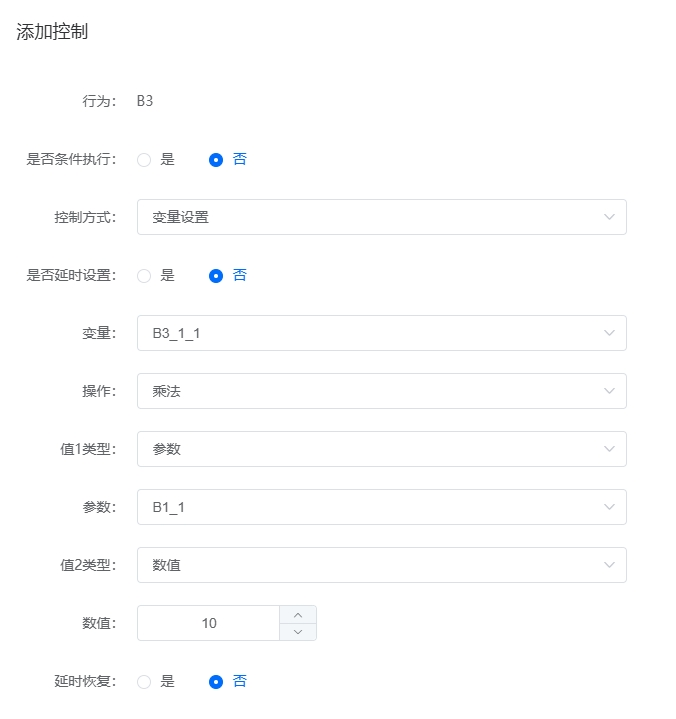

*第一步：设置变量B3_1_1为B1_1乘以10*

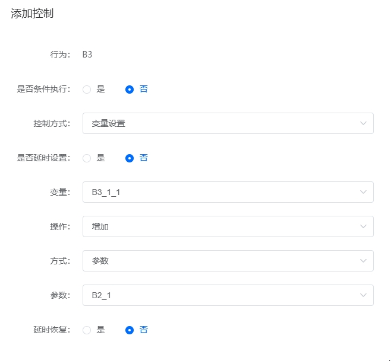

*第二步：将B2_1的值增加到B3_1_1*

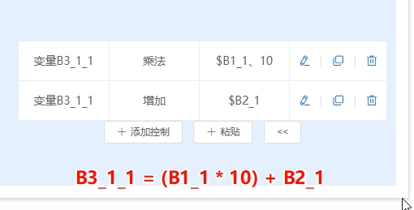

*最终实现公式：B3_1_1 = (B1_1 * 10) + B2_1*

**注意事项：**

- 必须分步骤配置，不能一步完成
- 计算顺序很重要，先配先执行
- 变量名要准确一致，避免拼写错误
- 建议使用测试功能验证计算结果
- 复杂计算可考虑使用多个中间变量

---

## 命令词触发方式设置


问题描述：

将命令的触发方式改为GPIO输入后，语音控制功能失效，无法通过语音触发该命令。


解决方案：

**触发方式说明**：

- **命令词触发**：

    - 通过语音识别触发命令
    - 需要先唤醒模块
    - 语音功能正常工作

- **GPIO输入触发**：

    - 通过外部电平变化触发
    - 不需要语音识别
    - 适合硬件联动场景

**问题原因**：

- 触发方式设置为GPIO输入后，命令只响应GPIO信号
- 语音命令词被忽略，不会触发
- 一个命令只能有一种触发方式

**解决方法**：

1. **单一触发方式**：

    - 如需要语音控制，触发方式设为"命令词"
    - 如需要硬件触发，触发方式设为"GPIO输入"
    - 不能同时使用两种触发

2. **创建两条命令**：

    - 复制命令内容
    - 一条使用命令词触发
    - 一条使用GPIO输入触发
    - 分别配置不同的动作

3. **条件触发配合**：

    - 主触发使用命令词
    - 添加GPIO作为附加条件
    - 实现语音+条件双重控制

**注意事项**：

- 修改触发方式后必须重新生成固件
- 测试前确认触发电平设置正确
- GPIO触发需要外部电路提供稳定信号
- 保留配置备份避免丢失

---

### 平台上列出的大模型是否都可以使用？

**问题描述：**

平台上列出了多个大模型（如豆包·1.5·Pro·32k、豆包·1.5·Pro·深度思考·128K、DeepSeek-R1/250528、DeepSeek-V3-0324等），询问这些模型是否都可以使用。

**解决方案：**

- 是的，平台上列出的所有大模型都可以使用
- 每个模型都标注了支持的功能（如：工具调用、续写、上下文缓存等）
- 可根据具体需求选择合适的模型进行开发

**注意事项：**

- 不同模型可能具有不同的性能特点和适用场景
- 建议根据项目需求选择合适的模型
- 具体使用限制请参考平台的最新说明

---

### 平台固件生成提示"当前排队任务过多"怎么办？

**问题描述：**

在平台生成固件时，系统提示"当前排队任务过多，请半小时后再尝试提交"，导致无法提交新任务。


**解决方案：**

**1. 问题原因分析**

- 系统同时处理大量固件生成请求
- 服务器资源达到负载上限
- 高峰期（如项目截止前、节假日）使用方集中使用
- 毕设季节导致需求激增
- 周末提交的异常任务可能导致服务器阻塞，影响正常任务处理

**2. 处理建议**

- **错峰生成**：选择非高峰时段（如凌晨、清晨）尝试
- **耐心等待**：服务器正在处理排队任务，需要等待现有任务完成
- **提前准备**：提前1-2天生成所需固件，避免临时急需
- **分批处理**：如果需要多个固件，分不同时间段生成

**3. 替代方案**

- 使用之前生成的相近版本进行测试
- 联系技术团队了解预计恢复时间
- 考虑使用离线开发工具

**注意事项：**

- 这是平台资源限制导致的正常现象，非系统故障
- 周末异常任务导致的阻塞需要时间恢复，服务器会逐步处理排队任务
- 高峰期可能需要等待3小时以上
- 建议合理安排项目时间，避免临近截止日期

---

### 快速版本生成处理时间过长怎么办？

**问题描述：**

在系统高峰期使用快速版本生成功能时，提示需要1个多小时，且已超过预计时间仍未完成。

**解决方案：**

**问题原因分析：**

1. **高峰期资源紧张**：

    - 多使用方同时生成固件导致服务器负载高
    - 队列等待时间延长
    - 系统资源优先处理紧急任务

2. **任务复杂度影响**：

    - 配置复杂程度影响生成时间
    - 音频文件处理需要更多时间
    - 模型编译受系统负载影响

**处理建议：**

1. **错峰使用**：

    - 避开工作高峰期（如工作日上午10-12点、下午2-4点）
    - 选择夜间或清晨生成固件
    - 提前规划，留出充足时间

2. **优化配置**：

    - 简化不必要的命令词
    - 压缩音频文件大小
    - 避免频繁修改配置后重新生成

3. **替代方案**：

    - 使用已生成的稳定版本进行测试
    - 联系技术团队申请优先处理
    - 考虑使用本地开发环境

**预防措施：**

- 提前测试所需功能，避免临时修改
- 保存常用配置模板，快速部署
- 建立多个项目配置，避免单一项目阻塞

---

### 平台生成的bin文件能正常烧录吗？

**问题描述：**

需要确认平台直接生成的固件包中的bin文件是否能够正常烧录到JX模块。

**解决方案：**

**固件兼容性说明：**

1. **平台固件来源**：

    - 平台生成的固件包经过官方验证
    - 解压后对应的bin文件均可正常烧录
    - 固件已包含完整的功能配置

2. **烧录前检查**：

    - 确认模块型号与固件匹配
    - 检查bin文件完整性
    - 使用正确的烧录工具和接线

3. **烧录验证**：

    - 烧录完成后模块应能正常工作
    - 唤醒词和命令词功能正常
    - 串口通信无异常

**注意事项：**

- 平台生成的固件无需额外处理
- 不同型号的固件不能混用
- 烧录失败通常是接线或工具问题，非固件问题
- 保留原始固件包备份，便于后续恢复

---

### SDK和固件的下载流程是什么？

**问题描述：**

在使用SNR8016模块时，不清楚应该先下载SDK还是固件，以及具体的下载和烧录步骤。

**解决方案：**

**下载顺序：**

1. **先下载固件**：

    - 在产品详情页面找到"下载固件"按钮
    - 点击下载按钮获取固件压缩包
    - 下载完成后解压固件文件

2. **再下载SDK（如需要）**：

    - SDK用于二次开发，普通使用方不需要
    - 如需开发，可在生成固件后下载对应SDK

**操作步骤：**

1. **访问产品页面**：

    - 登录智能公元平台
    - 进入产品管理页面
    - 查看对应产品的固件状态

2. **下载固件**：

    - 确认固件状态为"生成成功"
    - 点击"下载固件"按钮
    - 保存到本地文件夹

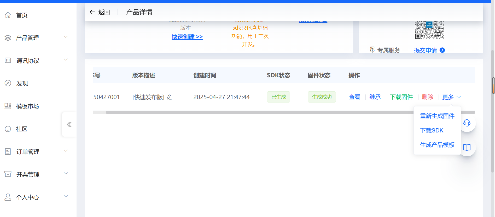

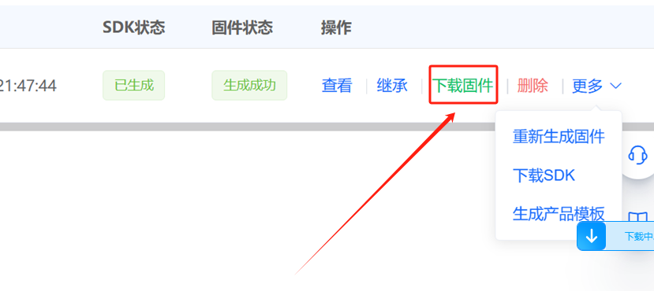

3. **解压固件**：

    - 使用解压软件（如WinRAR）解压下载的文件
    - 获取.bin格式的固件文件
    - 准备进行烧录

**注意事项：**

- 普通使用方只需要下载固件进行烧录
- SDK仅供开发人员使用，用于二次开发
- 下载时确保网络连接稳定
- 如下载速度过慢，可能是网络问题，建议检查网络或更换网络环境

---

### 提取操作没有完成，错误代码0x8096002A怎么办？

**问题描述：**

在解压下载的固件文件时，Windows系统弹出错误提示"提取操作没有完成"，并显示错误代码"0x8096002A: 不存在可用的错误描述"，导致无法正常解压固件。

**解决方案：**

- **使用专业解压工具**：

    - 推荐使用WinRAR进行解压操作
    - 避免使用Windows系统自带的解压功能
    - 也可尝试7-Zip等其他第三方解压软件

- **操作步骤**：

    1. 下载并安装WinRAR解压软件
    2. 右键点击固件压缩文件
    3. 选择"解压到当前文件夹"或"提取到此处"
    4. 等待解压完成获取.bin固件文件

**注意事项：**

- Windows自带解压工具对某些压缩格式支持不佳
- 确保下载的固件文件完整，没有损坏
- 解压路径不要包含中文字符，避免潜在问题
- 如果WinRAR也无法解压，可能是文件下载不完整，建议重新下载

---

### SDK固件下载后无法解压怎么办？

**问题描述：**

下载SDK固件后，解压文件时遇到问题，下载的文件无法正常解压，且尝试关闭防火墙后问题依旧存在。

**解决方案：**

**问题排查：**

1. **检查文件完整性**：

    - 对比下载文件大小与平台显示是否一致
    - 查看文件扩展名是否正确（应为.tar.gz）
    - 确认下载过程未中断

2. **常见问题**：

    - 下载的文件名可能不完整（如jx_firm.tar...）
    - 系统默认解压工具可能不支持该格式
    - 网络问题导致文件损坏

**解决方法：**

1. **使用专业解压软件**：

    - 推荐使用WinRAR解压工具
    - 右键点击文件选择"提取到当前位置"
    - 或使用7-Zip等第三方解压软件

2. **重新下载文件**：

    - 确保网络连接稳定
    - 暂时关闭防火墙和杀毒软件
    - 使用不同浏览器尝试下载

3. **文件命名问题处理**：

    - 如文件名不完整，手动重命名为完整名称
    - 确保文件扩展名为.tar.gz

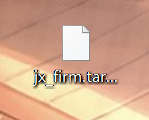


**解压步骤：**

1. 下载WinRAR解压软件
2. 右键点击压缩文件
3. 选择"提取到当前位置"
4. 获取.bin固件文件用于烧录

**注意事项：**

- 避免使用系统自带的解压功能
- 下载完成后立即检查文件大小
- 保留原始压缩文件作为备份
- 如持续失败，可联系技术团队获取帮助

---

### 无法使用默认解压工具解压固件文件怎么办？

**问题描述：**

无法使用默认解压工具成功解压固件文件 'jx_firm.tar.gz'，需要指导如何正确解压并提取其中的固件文件。

**解决方案：**

**问题原因：**

1. **系统解压工具限制**：

    - Windows自带解压功能可能不支持.tar.gz格式
    - 某些解压工具对嵌套压缩格式支持不佳

2. **文件格式说明**：

    - .tar.gz是经过两层压缩的文件
    - 先用gzip压缩，再用tar打包
    - 需要支持该格式的解压工具

**正确解压方法：**

1. **使用WinRAR解压**（推荐）：

    - 下载并安装WinRAR
    - 右键点击固件文件
    - 选择"提取到当前位置"
    - WinRAR会自动处理两层压缩


2. **分步解压**：

    - 第一步：解压.gz得到.tar文件
    - 第二步：解压.tar得到文件夹内容
    - 最终获取.bin固件文件

3. **其他解压工具**：

    - 7-Zip（免费开源）
    - Bandizip
    - PeaZip


**成功解压后的文件：**

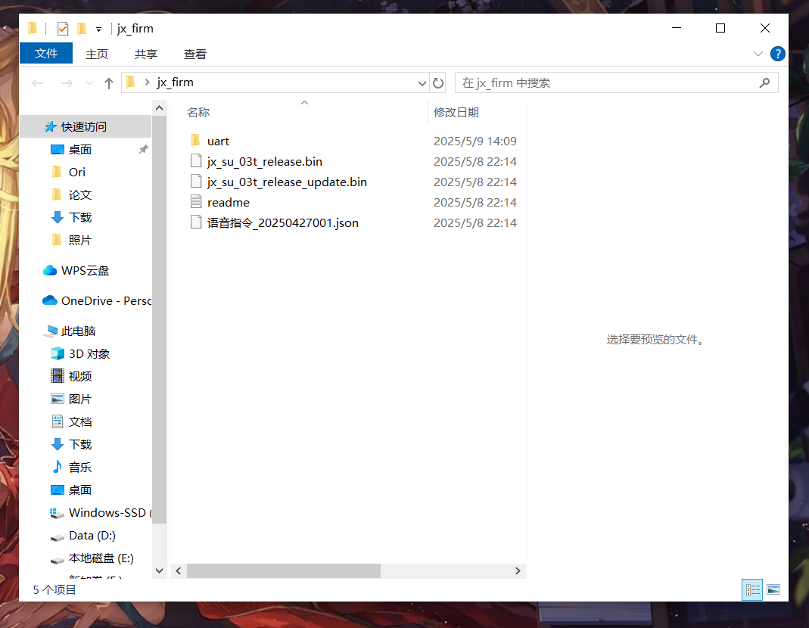

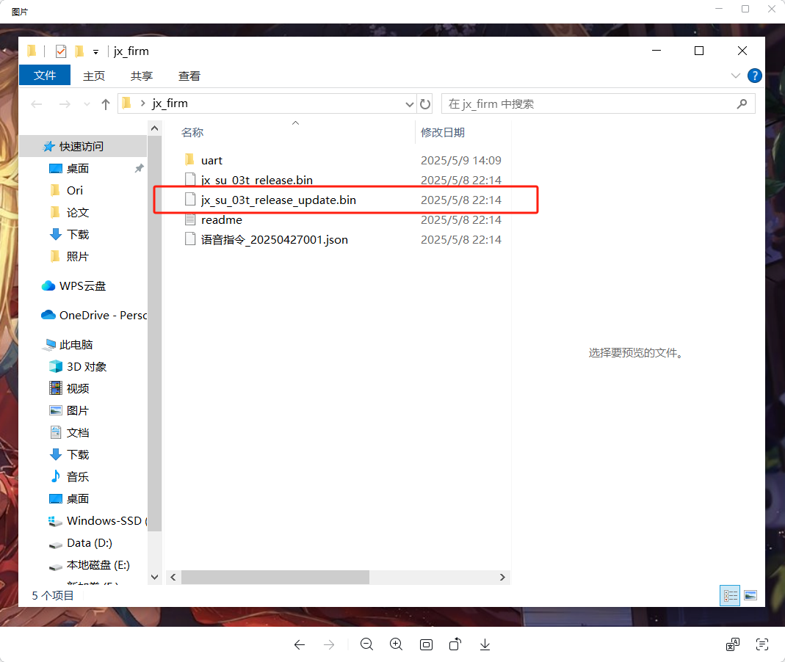

**操作步骤总结：**

1. 下载WinRAR解压软件
2. 右键点击jx_firm.tar.gz文件
3. 选择"提取到当前位置"
4. 等待解压完成
5. 进入jx_firm文件夹
6. 找到jx_su_03t_release_update.bin文件
7. 该文件即为烧录所需的固件

**注意事项：**

- 不要使用Windows右键菜单的"全部解压缩"功能
- 解压路径不要包含中文字符
- 保留原始压缩文件作为备份
- 解压后检查是否获得.bin格式的固件文件

---

### SDK文件下载后解压为空

**问题描述：**

从平台下载的SDK文件解压后内容为空，无法获取有效文件。

**解决方案：**

- **关闭防火墙**：部分网络环境或防火墙设置可能影响文件完整性下载
- **重新下载**：关闭防火墙后重新下载SDK文件
- **检查下载完整性**：确认下载的文件大小与平台显示的一致

**注意事项：**

- 下载前确保网络连接稳定
- 避免使用下载管理器，推荐直接浏览器下载
- 如问题持续，可尝试更换浏览器或网络环境

---

### 平台升级后需要修改哪些配置？

**问题描述：**

平台升级后，原有的工程配置可能出现兼容性问题，需要了解哪些配置需要相应调整。

**解决方案：**

- **配置文件更新**：平台升级后，部分配置项的格式或默认值可能发生变化
- **固件重新生成**：建议使用升级后的平台重新生成固件，确保兼容性
- **功能验证**：升级后需全面测试原有功能，确认各项配置正常工作

**注意事项：**

- 升级前建议备份原有工程配置
- 如遇到配置不兼容问题，可联系技术团队获取升级指导
- 重点关注语音指令、IO配置、串口通信等核心功能设置

---

### 智能公元平台如何实现识别三次后执行动作？

**问题描述：**

希望在智能公元平台上实现需要连续识别三次特定唤醒词后才执行相应动作的功能，中间允许有几秒的等待时间。

**解决方案：**

- 创建变量记录识别次数
- 设置每次识别后变量值加1
- 添加条件判断：当变量等于3时执行动作


**注意事项：**

- 需要先定义变量才能在命令词中使用
- 可以添加定时器实现延时重置功能
- 变量名要符合命名规则

---

### 智能公元平台的变量功能在哪里？

**问题描述：**

询问智能公元平台上是否有变量功能，以及在哪里可以找到相关设置。

**解决方案：**

- 智能公元平台支持变量功能
- 在"变量定义"标签页可以创建和管理变量
- 变量可用于计数、状态控制等复杂逻辑

**注意事项：**

- 变量需要先定义后使用
- 支持整型、布尔等多种变量类型
- 可在命令词和控制逻辑中引用变量

---

### 语音控制串口输出的数据格式是什么？

**问题描述：**

需要了解语音控制模块通过串口输出数据的格式，以及当同一语音指令重复时，串口输出是否有区别。

**解决方案：**

语音控制模块的串口输出格式如下：

- **数据格式**：输出为十六进制（hex）数据，而非直接字符串
- **输出协议**：由使用方自行定义串口输出协议
- **重复指令**：同一语音指令重复执行时，串口输出数据相同，无区别

**注意事项：**

- 串口通信需确保波特率、数据位、停止位等参数配置正确
- 使用6、7引脚作为烧录口时，若将0、1引脚设置为串口，需注意引脚冲突问题

---

### 不会编程可以在智能公元网站生成固件吗？

**问题描述：**

没有编程基础，是否可以通过智能公元网站直接生成可用的固件。

**解决方案：**

可以。智能公元网站提供图形化界面生成固件，无需编程知识：

- 访问智能公元网站
- 使用可视化配置界面设置语音指令和对应动作
- 平台自动生成固件文件
- 下载生成的固件直接烧录使用

**注意事项：**

- 需要注册账号登录智能公元平台
- 仔细阅读配置说明，确保指令设置正确
- 生成前预览配置，避免遗漏重要设置

---

### 安卓手机连接设备失败怎么办？

**问题描述：**

使用安卓手机（华为）连接设备时，设备连接界面显示"未连接设备"，且搜索设备时出现持续转圈的加载状态，无法完成连接。

**解决方案：**

**兼容性问题：**

1. **系统支持**
    - 苹果手机不支持设备连接
    - 安卓手机可以连接
    - 部分安卓版本可能存在兼容性问题

2. **连接步骤**
    - 确保手机蓝牙已开启
    - 在设备连接界面点击搜索
    - 耐心等待设备发现

**故障排查：**

1. **持续转圈问题**
    - 检查设备是否处于可配对状态
    - 确认设备蓝牙功能正常
    - 尝试重启设备和手机蓝牙

2. **连接失败处理**
    - 清除手机蓝牙缓存
    - 忘记已配对设备重新搜索
    - 检查设备是否被其他手机连接

**注意事项：**

- 不同品牌安卓手机兼容性可能不同
- 连接成功前不要关闭应用程序
- 建议使用官方提供的连接工具
- 如持续失败，检查设备固件是否需要更新

---

### 如何将ADC值传输到自定义变量并显示在小程序上？

**问题描述：**

需要将ADC采集的模拟信号值传输到自定义变量，并在小程序界面上实时显示采集到的数据。

**解决方案：**

在智能公元平台配置ADC数据传输：

1. **配置ADC输入引脚**
    - 在Pin脚配置页面选择需要使用的GPIO引脚（如GPIO_B01）
    - 将该引脚的输出模式设置为"ADC输入"
    - 可根据需要设置偏移量进行数值校准

2. **创建自定义变量**
    - 在变量管理中创建新的自定义变量
    - 设置变量名称和数据类型（建议选择整型）

3. **配置数据传输逻辑**
    - 创建触发条件（如：定时触发或ADC数值变化）
    - 在执行动作中选择"设置变量"
    - 选择目标变量，值为"ADC输入值"（注意：选择对应的ADC通道）

4. **小程序界面配置**
    - 在小程序界面添加显示组件
    - 将显示组件绑定到创建的自定义变量
    - 设置更新频率和显示格式

**注意事项：**

- ADC输入接收到的数值是原始采集值，可能需要通过公式转换为实际物理量
- 确保选择的GPIO引脚支持ADC功能
- 变量更新频率不宜过高，避免影响系统性能
- 小程序显示需要确保网络连接正常

---

### PWM条件触发逻辑不生效怎么办？

**问题描述：**

配置了PWM占空比作为触发条件（如PWM5占空比≥1），但触发条件未按预期执行，无法正常控制GPIO输出。

**解决方案：**

**问题分析：**

1. **PWM初始值问题**
    - 上电启动时，PWM的初始占空比默认为0
    - 触发条件要求占空比≥1，但初始值0不满足条件
    - 因此上电启动事件无法触发后续动作

2. **触发时机设置**
    - "上电启动系统启动"事件只在上电时触发一次
    - 如果此时PWM条件不满足，则不会执行动作

**解决方案：**

1. **调整触发条件**
    - 将触发条件改为：PWM占空比≥0（包含初始值）
    - 或使用其他触发条件组合

2. **分步配置策略**
    - 第一步：上电启动时，先设置PWM初始值
    - 第二步：PWM达到目标值后，再触发GPIO控制

3. **使用延时触发**
    - 配置延时触发，确保PWM稳定后再执行判断
    - 或使用循环检测机制

**注意事项：**

- 确保PWM通道配置正确（频率、占空比范围）
- 验证GPIO引脚配置为输出模式
- 考虑使用多条件触发（如AND/OR逻辑组合）
- 测试时注意观察各参数的实时值变化

---

### 如何通过串口选择唯一的唤醒词？

**问题描述：**

需要实现由上位机通过串口选择多个预设唤醒词中的一个作为当前唯一生效的唤醒词。

**解决方案：**

可以实现动态切换唤醒词功能，具体实现方法如下：

**1. 预设所有唤醒词**

- 在固件生成时预先制作所有需要的唤醒词
- 确保每个唤醒词都经过正确的训练和配置
- 建议使用发音差异明显的唤醒词以提高识别准确率

**2. 串口控制唤醒词使能**

- 通过串口接收控制指令
- 使用串口命令动态禁止或开放特定唤醒词的识别
- 实现逻辑：当接收到串口指令时，只启用对应的唤醒词

**实现示例：**

```
串口指令设计：

- 0x01：启用唤醒词A，禁用其他
- 0x02：启用唤醒词B，禁用其他
- 0x03：启用唤醒词C，禁用其他
```

**3. 配置方法**

- 在智能公元平台配置多个唤醒词
- 使用变量或状态管理当前激活的唤醒词
- 通过串口输入触发状态切换

**注意事项：**

- 确保同一时间只有一个唤醒词处于激活状态
- 测试验证唤醒词切换的响应速度
- 考虑添加语音反馈确认切换成功

---

### 多个PWM条件组合触发GPIO如何配置？

**问题描述：**

需要配置多个PWM占空比条件同时满足时才触发GPIO输出，但发现某些控制条件无法生效。

**解决方案：**

**配置原理：**

1. **条件逻辑理解**：

    - 系统支持"与"逻辑（AND）
    - 多个PWM条件需要同时满足
    - 任意一路条件不满足，整体条件不成立

2. **触发方式设置**：

    - PWM占空比大于数值：需要大于设定值
    - PWM占空比等于数值：需要精确匹配
    - PWM占空比大于等于数值：包含等于的情况

**正确配置方法：**

1. **FX3功能配置示例**：

    - 触发方式：PWM占空比大于数值0
    - 所有GPIO_A1设置为高电平
    - 上电启动系统启动
    - 这样任意PWM大于0即可触发

2. **FX4功能配置示例**：

    - 触发方式：PWM占空比等于数值0
    - GPIO_A1设置为高电平
    - 上电启动系统启动
    - 需要PWM精确为0才触发

3. **多路PWM条件配置**：

    - 执行条件：PWM0、PWM1、PWM5的占空比大于等于数值1
    - GPIO_A1设置为高电平
    - 五路条件都大于等于1时条件才成立

**配置要点：**

1. **条件设置一致性**：

    - 确保所有相关PWM使用相同的比较方式
    - 避免"大于"和"等于"混用导致逻辑混乱
    - 统一使用"大于等于"包含所有情况

2. **初始值考虑**：

    - 上电时PWM初始值通常为0
    - 如果条件设置大于0，上电就能触发
    - 如果条件设置等于0，需要PWM保持0状态

3. **触发时机**：

    - "任意一路大于1"：更灵活，容易触发
    - "五路都大于等于1"：更严格，需要所有条件满足

**注意事项：**

- 配置前明确触发逻辑需求
- 测试时观察各PWM的实际值
- 复杂条件建议分步验证
- 保存配置前预览触发条件逻辑

---

### 如何实现上电时PWM控制IO输出？

**问题描述：**

需要在上电启动时通过PWM信号控制IO7输出，实现灯光控制功能。配置了"打开灯光"语音指令设置PWM为100，但上电时PWM初始值为0，不满足触发条件。

**解决方案：**

**配置策略：**

1. **两阶段控制方案**
    - 阶段一：上电启动，设置PWM初值（如0）
    - 阶段二：语音指令触发，设置PWM目标值（100）

2. **触发条件优化**
    - 上电启动使用：PWM占空比≥0（包含初始值）
    - 语音控制使用：PWM占空比=100（精确匹配）

3. **变量辅助控制**
    - 创建状态变量记录当前模式
    - 使用变量值作为触发条件的一部分
    - 避免初始值不满足条件的问题

**具体配置示例：**

1. **事件一：上电启动**
    - 触发条件：上电启动系统启动
    - 执行动作：设置PWM5初始值为0
    - 设置状态变量为"待机"

2. **事件二：打开灯光**
    - 触发条件：语音命令"打开灯光"
    - 执行动作：设置PWM5为100
    - 设置状态变量为"全开"

3. **事件三：调光亮度**
    - 触发条件：语音命令+亮度值
    - 执行动作：设置PWM5对应百分比
    - 保持状态变量更新

**注意事项：**

- PWM占空比范围通常是0-100，0表示完全关闭
- 上电启动事件只能触发一次，需合理设计初始状态
- 调光功能需要确保所有相关PWM通道同步更新
- 测试时观察变量和PWM值的变化，确保逻辑正确

---

### 固件生成失败提示"可能是配置原因"怎么办？

**问题描述：**

在平台生成固件后，状态显示"已生成"，但同时提示"生成失败，可能是配置原因，请检查配置"。

**解决方案：**

**常见配置问题排查：**

1. **引脚冲突检查**
    - 检查是否有多个功能同时占用同一个GPIO引脚
    - 特别是特殊功能引脚（如音频输出、UART、I2C等）
    - 确认所有引脚配置互不冲突

2. **逻辑配置验证**
    - 检查触发条件是否可以实际满足
    - 验证条件判断是否存在逻辑矛盾
    - 确认执行动作的参数设置合理

3. **资源限制检查**
    - 检查自定义变量数量是否超出限制
    - 确认定时器和延时资源使用合理
    - 验证PWM通道配置数量

4. **特定功能限制**
    - 某些芯片型号对特定引脚有固定功能分配
    - 确认所选型号支持配置的所有功能
    - 检查是否启用了不支持的特性组合

**故障排除步骤：**

1. **简化配置测试**
    - 临时禁用部分功能，逐个排查
    - 保留最基本的配置，逐步添加功能
    - 找出导致失败的具体配置项

2. **检查固件兼容性**
    - 确认芯片型号选择正确
    - 检查固件版本是否匹配
    - 验证功能配置是否与硬件匹配

3. **平台缓存问题**
    - 清除浏览器缓存和Cookie
    - 重新登录智能公元平台
    - 重新创建配置文件

**注意事项：**

- 错误提示可能不够具体，需要耐心排查
- 保存配置文件的备份，便于恢复
- 如问题持续，可联系技术团队并提供详细配置信息

---

### 如何在已有语音指令列表中插入新指令？

**问题描述：**

需要在现有的语音指令序列中间位置插入新的指令，而不是只能添加到列表末尾。

**解决方案：**

**指令插入方法：**

1. **拖拽排序功能**
    - 在指令列表界面，直接拖拽指令到目标位置
    - 可以将新指令拖拽到任意两个现有指令之间
    - 拖拽后自动重新编号

2. **操作步骤**
    - 添加新指令到列表末尾
    - 按住鼠标左键拖拽该指令
    - 移动到想要插入的位置
    - 松开鼠标完成插入

3. **批量调整**
    - 可以同时拖拽多个连续指令
    - 支持整块移动到新位置
    - 保持指令间的相对顺序

**注意事项：**

- 拖拽功能需要平台支持
- 指令编号会自动调整，无需手动修改
- 建议在移动前确认指令内容，避免混淆
- 大量指令调整时，建议分段操作避免混乱

---

### 如何在固件生成平台导出工程文件？

**问题描述：**

需要将固件生成平台上的配置导出为文件，以便备份或发送给技术团队进行分析。

**解决方案：**

**导出操作步骤：**

1. **进入产品管理**
    - 登录智能公元平台
    - 进入"产品管理"页面
    - 找到需要导出的产品

2. **选择导出功能**
    - 在产品列表中找到"导出"按钮
    - 点击导出，系统会生成JSON文件
    - 文件命名通常为产品名称.json

3. **其他操作选项**
    - 点击"更多"按钮查看额外选项
    - 支持的操作包括：

        * 重新生成固件
        * 下载模型
        * 生成产品模板

---

### 产品模板功能有什么用途？

**问题描述：**

发现产品可以生成模板，在模板中只能查看不能修改，询问该功能的具体用途是给别人看还是自己备份用。

**解决方案：**

**功能说明：**

产品模板功能主要用于生成API接口，实现产品配置的开放共享：

**1. API接口生成**

    - 将产品配置转换为标准化API接口
    - 其他开发者可通过API调用该配置
    - 实现产品配置的批量应用和集成

**2. 模板市场应用**

    - 模板市场的产品都是通过模板功能发布
    - 用户可以直接调用API使用成熟方案
    - 促进产品方案的复用和推广

**3. 使用场景**

    - **方案分享**：将成熟方案分享给其他开发者
    - **批量部署**：通过API快速部署到多个项目
    - **商业化**：将解决方案作为产品提供给客户

**操作流程：**

1. **生成模板**
    - 在产品管理页面选择"生成产品模板"
    - 系统自动生成对应的API接口
    - 获取API调用所需的参数和密钥

2. **API调用**
    - 其他开发者通过API接口使用该配置
    - 可传入自定义参数进行微调
    - 实现产品配置的远程管理


**注意事项：**

- 模板生成后无法直接编辑，需重新生成
- API接口调用可能需要授权或计费
- 生成模板意味着产品配置将对外开放
- 建议确认配置无误后再生成模板
- 商业用途需遵守相关服务条款

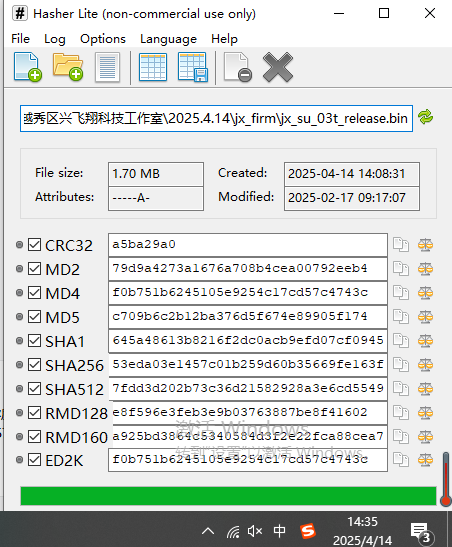

**导出文件用途：**

- **备份保存**：防止配置丢失
- **分享协作**：发送给他人查看配置
- **问题排查**：发给技术团队分析故障
- **批量导入**：在其他账号恢复相同配置

**注意事项：**

- 导出的JSON文件包含完整的配置信息
- 文件可用文本编辑器查看内容
- 导入功能在"添加产品"页面
- 建议定期导出重要项目进行备份

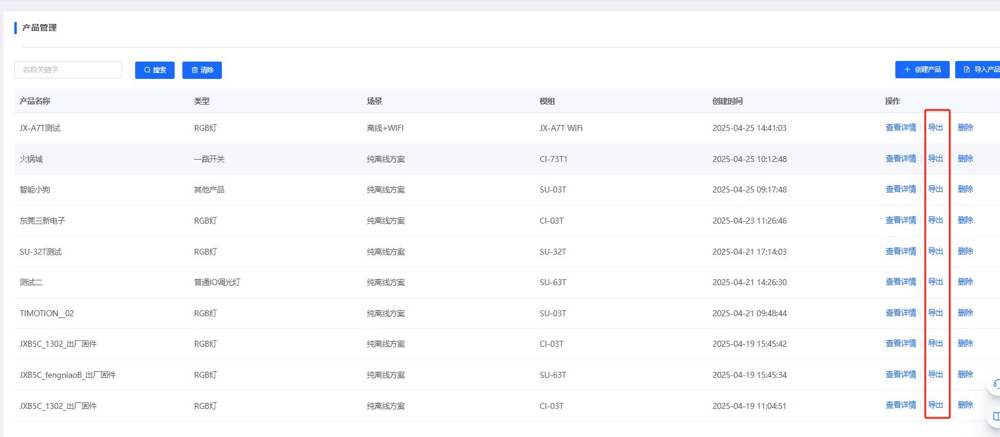

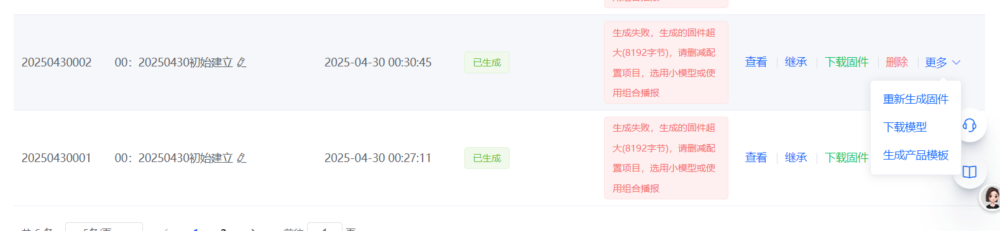

---

### HX6320/HX6210F模块如何设置触发后随机播放单曲？

**问题描述：**

需要设置HX6320/HX6210F模块在触发后随机播放一个单曲，要求不循环、不能被打断，播放完成后自动结束。

**解决方案：**

**1. 播放模式配置**

- **随机播放功能**：

    - 在模块配置界面启用"随机播放"选项
    - 模块将从音频列表中随机选择一个文件播放
    - 每次触发选择的音频可能不同

- **单曲播放模式**：

    - 设置播放模式为"单曲播放"
    - 播放完当前音频后自动停止
    - 不会继续播放下一个音频

**2. 保护机制设置**

- **禁止打断功能**：

    - 开启"打断保护"并设置为"禁止"
    - 播放过程中不接受新的触发指令
    - 确保播放完整性，不会被中断

- **循环控制**：

    - 关闭"循环播放"功能
    - 音频播放一次后结束
    - 不重复播放同一音频

**3. 配置示例**

```
播放模式：单曲播放
随机播放：启用
循环播放：关闭
打断保护：禁止
```

**注意事项：**

- 确保音频文件已正确导入模块存储
- 音频格式需为模块支持的格式（WAV、MP3等）
- 播放过程中如需停止需通过特定控制指令
- 建议在测试环境中验证配置效果

---

### 语音识别是否支持提取识别到的数字？

**问题描述：**

在空调温度控制等应用场景中，希望能够直接提取语音识别中的数字（如16-30度），用于灵活控制，而不需要为每个温度值单独设置指令。

**解决方案：**

**当前限制：**

- **暂不支持数字提取**：平台当前版本不支持将语音识别中的数字内容提取为变量使用
- **固定指令模式**：每个需要识别的语句都必须作为独立词条预先配置

**替代方案：**

1. **单片机辅助方案**
    - 使用外部单片机（如STC、Arduino等）
    - 通过串口与语音模块通信
    - 在单片机端实现数字逻辑处理

2. **平台配置建议**
    - 如必须支持灵活的温度设置，需要等待平台功能更新
    - 未来版本可能支持变量接收和数字提取功能

**注意事项：**

- 当前只能为每个具体温度值（如16度、16.5度、17度等）单独设置指令
- 对于需要连续数字控制的应用，建议采用单片机辅助方案
- 可关注平台更新公告，相关功能正在规划中

---

### 如何处理复杂逻辑控制需求？

**问题描述：**

在空调温度控制、报警系统等需要复杂逻辑的应用中，语音模块平台无法直接实现所有功能，需要寻找替代解决方案。

**解决方案：**

**推荐方案：单片机辅助**

1. **方案优势**
    - 灵活性高：可实现任意复杂逻辑
    - 成本低：通用单片机价格便宜
    - 开发简单：使用C语言编程
    - 可靠性好：硬件级逻辑控制

2. **实现方式**
    - 语音模块负责语音识别和简单控制
    - 单片机负责复杂逻辑处理
    - 通过串口进行数据交换
    - 各司其职，发挥各自优势

3. **典型应用场景**
    - 空调温度的精确控制
    - 多级报警判断逻辑
    - 传感器数据融合处理
    - 时序控制等复杂功能

**选择建议：**

- **简单应用**：直接使用平台功能
- **中等复杂度**：使用平台+少量GPIO逻辑
- **高复杂度应用**：建议采用单片机辅助方案

**注意事项：**

- 单片机选型要考虑IO数量、通信接口等需求
- 串口通信协议需要双方提前约定
- 建议预留调试接口，便于问题排查
- 虽然增加了硬件复杂度，但大幅提升了功能实现能力

---

### 串口通信是否支持动态修改帧头地址？

**问题描述：**

在需要控制多个相同模块的应用中（如30个模块在同一总线），希望能够动态修改串口通信的帧头地址，但当前平台不支持此功能。

**解决方案：**

**当前限制：**

- **不支持变量发送**：平台当前版本不支持通过变量动态修改帧头
- **固定帧头模式**：每个配置的串口发送指令帧头都是固定的
- **手动配置需求**：不同模块需要手动修改配置文件

**应用场景：**

- 多模块控制系统（0-30个模块地址）
- 需要快速切换发送目标
- 批量配置管理需求

**解决方案：**

1. **临时方案**
    - 为每个模块创建独立配置文件
    - 使用时切换对应配置
    - 适合少量模块场景

2. **平台更新计划**
    - 预计1-2周后更新支持
    - 将增加串口发送变量功能
    - 支持通过变量动态修改帧头

3. **未来实现方式**
    ```
    串口接收地址变量 → 存储到变量中 → 串口发送时使用变量作为帧头
    ```

**注意事项：**

- 更新公告将通过平台发布
- 建议关注平台版本更新日志
- 临时方案虽然繁琐，但可实现基本功能
- 如急需此功能，可联系技术团队了解优先级

---

### 发布时提示"播放语音内容不能为空"怎么办？

**问题描述：**

在发布语音指令版本时，系统提示"行为控制详情中播放语音内容不能为空"，导致发布失败。

**解决方案：**

**错误原因：**

- 某个行为控制条目缺少语音内容配置
- 语音内容字段为空或未正确设置

**解决方法：**

1. **检查并补充语音内容**
    - 逐个检查所有行为控制条目
    - 找到显示为空或异常的条目
    - 填写相应的语音播报内容

2. **正确配置步骤**
    - 在控制详情界面点击"添加控制"
    - 控制方式选择"播放语音"
    - 在语音内容字段输入具体播报内容
    - 保存配置

**配置示例：**

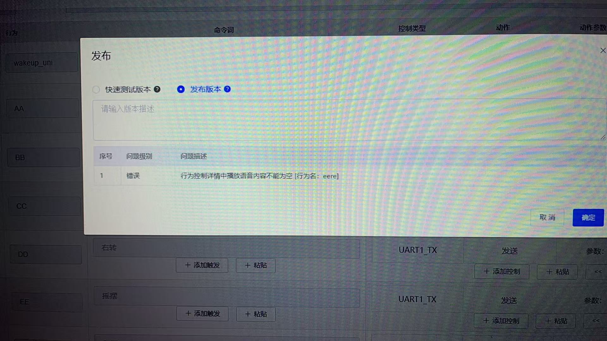

*系统提示播放语音内容不能为空*

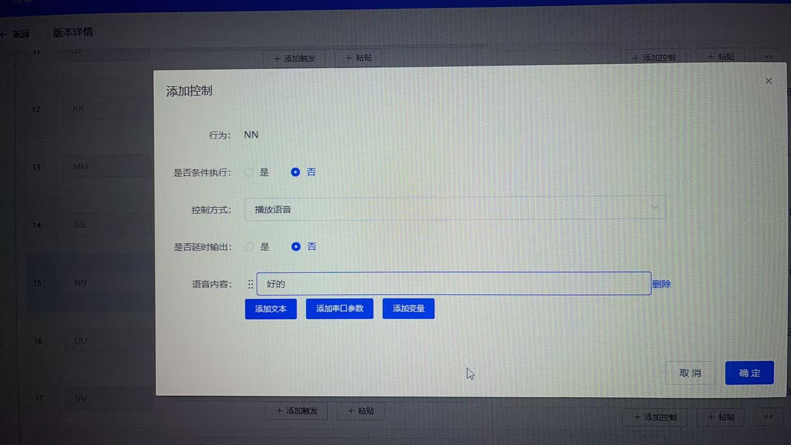

*正确的语音内容配置示例*

**常见场景：**

- GPIO输入触发后未配置播报内容
- 命词条目语音内容意外清空
- 控制行为关联错误

**检查清单：**

- [ ] 所有命令词条目都有对应语音内容
- [ ] GPIO触发行为已配置播报
- [ ] 语音内容字段不为空
- [ ] 播报内容符合预期需求

**注意事项：**

- 语音内容需要通过"添加控制"来设置
- 不能直接在触发条目中输入播报内容
- 每个行为都需要配置对应的响应动作
- 修改后需要重新生成并烧录固件

---

### 音频文件上传后显示异常怎么办？

**问题描述：**

上传的音频文件在平台显示异常，语音指令内容出现拼接错误，无法正常播放。

**解决方案：**

**问题原因：**

- 音频文件格式不正确
- 平台仅支持特定格式的音频文件

**正确格式要求：**

1. **文件格式**
    - 必须使用MP3格式
    - 或使用WAV格式
    - 其他格式可能导致显示异常

2. **文件大小限制**
    - 最大文件大小：500KB
    - 超过限制可能上传失败或显示异常

3. **转码处理**
    - 使用音频转换软件进行格式转换
    - 推荐使用专业的音频转换工具
    - 转码后重新上传测试

**操作示例：**

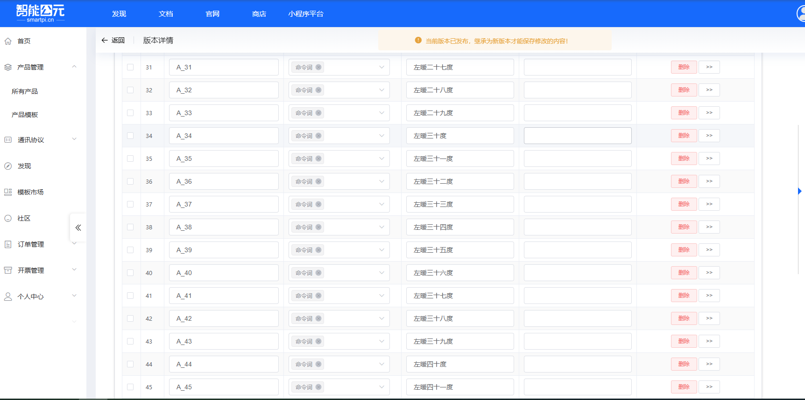

*语音指令内容出现拼接错误*

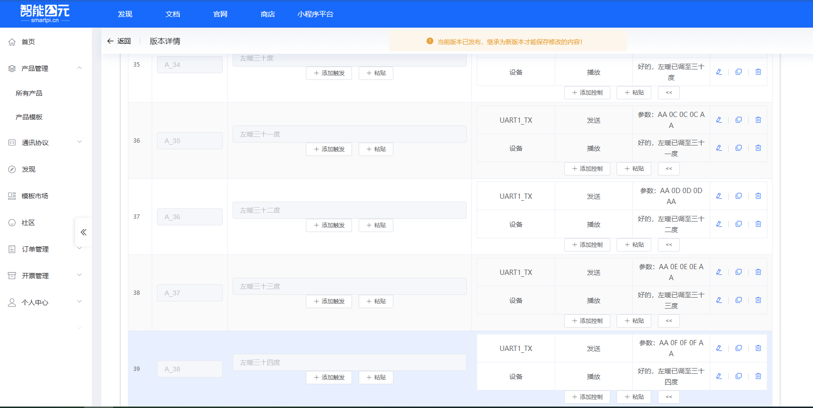

*控制详情显示多个配置项*

**语音内容配置注意事项：**

- 语音内容一般不限制字数
- 但单条播报建议控制在合理范围内
- 复杂内容建议使用播报拼接技巧

**处理步骤：**

1. 确认音频文件为MP3或WAV格式
2. 检查文件大小不超过500KB
3. 如格式不符，使用转换软件转码
4. 转码后重新上传测试
5. 确认语音内容正确显示和播放

**注意事项：**

- 转码时选择合适的采样率和比特率
- 保留原始音频文件备份
- 测试时逐条验证语音指令
- 如问题持续，联系技术团队协助

---

### 快速测试版本和发布版本有什么区别？

**问题描述：**

需要了解快速测试版本和发布版本在功能和效果上的差异，以便选择合适的版本类型。

**主要区别：**

**1. 生成速度**

- **快速测试版本**：生成速度快，几分钟即可完成
- **发布版本**：需要排队，生成时间较长

**2. 功能完整性**

- 两种版本在功能和效果上基本没有区别
- 平台内部机制可能有所不同，但不影响使用
- 核心语音识别功能完全一致

**3. 音质表现**

- 部分使用场景显示快速版本声音可能略有不同
- 但多数使用方表示差异不明显
- 实际效果因项目而异

**使用建议：**

1. **开发阶段**
    - 优先使用快速测试版本
    - 快速迭代，节省开发时间
    - 便于及时调试和修改

2. **正式部署**
    - 使用发布版本确保稳定性
    - 适合最终产品交付
    - 长期运行建议使用发布版

**选择策略：**

- 测试验证：使用快速版本进行功能验证
- 项目演示：使用发布版本展示
- 紧急修复：使用快速版本快速部署
- 批量生产：使用发布版本统一固件

**注意事项：**

- 两个版本的配置方法完全相同
- 切换版本类型不需要修改配置
- 生成成功后及时下载对应的固件文件
- 保留好版本记录便于追溯

---

### SDK是否支持多国语言切换？

**问题描述：**

需要了解SDK是否支持多国语言切换功能，以及自然说功能是否支持除中文外的其他语言。

**解决方案：**

**1. 语言支持限制**

- SDK目前只能支持一种语言
- 无法在运行时动态切换语言
- 需要在固件生成时选择目标语言

**2. 自然说功能支持**

- 自然说功能目前仅支持中文
- 其他语言暂不支持自然说识别
- 英文、日文等语言使用命令词识别

**3. 固件配置**

- 生成固件前需确定目标语言
- 不同语言需要分别生成固件
- 泛化版本不支持多语言定制

**4. 替代方案**

- 如需多语言支持，考虑使用多个设备
- 或开发多套固件分别部署
- 在应用层实现语言切换逻辑

**注意事项：**

- 多语言支持功能正在开发中
- 自然说功能的技术限制主要在识别算法
- 建议关注官方更新公告了解新功能

---

### 如何获取1.3寸屏幕的固件？

**问题描述：**

使用1.3寸屏幕时出现显示不完整的问题，需要获取对应的固件文件。

**解决方案：**

**1. 屏幕兼容性问题**

- 1.3寸屏幕与标准固件可能存在分辨率不匹配
- 显示区域大小与固件预期不符
- 需要使用专门适配的固件版本

**2. 固件获取途径**

- 联系设备供应商获取屏幕专用固件
- 在技术团队群组中请求帮助
- 查看是否有配套的固件下载链接

**3. 临时解决方案**

- 尝试调整显示参数设置
- 检查是否有屏幕分辨率配置选项
- 考虑更换为标准尺寸屏幕

**4. 技术细节**

- 确认屏幕驱动IC型号
- 记录屏幕的分辨率参数
- 提供设备型号以便技术团队定位问题

**注意事项：**

- 不同尺寸屏幕的固件通常不兼容
- 刷写错误固件可能导致无法显示
- 建议保留原固件备份

---

### 生成固件时提示"生成失败，可能是配置原因"怎么办？

**问题描述：**

在平台上生成固件时，系统提示"生成失败，可能是配置原因，请检查配置"，导致无法获得可用固件。

**解决方案：**

**1. 配置检查清单**

- 逐项检查所有必填配置是否已完成
- 确认选择的参数组合相互兼容
- 检查是否有超出范围的数值设置

**2. 常见配置问题**

- 唤醒词设置过于复杂或包含特殊字符
- 命令词数量超过限制或格式错误
- 控制引脚配置冲突或超出可用范围

**3. 重新生成步骤**

- 保存当前配置为草稿
- 重新载入配置并逐项验证
- 简化配置后尝试生成测试版本

**4. 系统问题排查**

- 检查网络连接是否稳定
- 尝试刷新页面或重新登录
- 选择非高峰时段进行生成

**5. 技术团队**

- 记录具体的错误提示信息
- 截图保存配置界面
- 联系技术团队并提供详细信息


*系统提示生成失败，可能是配置原因*

**注意事项：**

- 配置项之间可能存在依赖关系
- 某些功能组合可能不被支持
- 建议使用示例配置作为起点

---

### 固件发布时提示排队任务过多怎么办？

**问题描述：**

在尝试发布固件版本时，系统提示"当前排队任务过多，请半小时后再尝试提交"，导致发布任务失败。

**解决方案：**

- **理解系统限制**：

    - 平台设置了并发任务数量限制
    - 高峰期时排队任务数可能达到上限
    - 这是系统的负载保护机制

- **发布时间选择**：

    - 避开工作日的上午9-11点和下午2-4点等高峰时段
    - 建议选择早晨、深夜或周末等非高峰时段
    - 如遇到排队，等待30分钟后再试


*系统提示排队任务过多的错误信息*

**优化建议：**

- 分批次发布，避免一次性提交大量任务
- 提前准备好发布内容，减少操作时间
- 关注平台通知，了解系统维护时间

---

### SDK生成时出现超时错误怎么办？

**问题描述：**

在智能公元平台生成SDK时，出现生成超时的问题，无法完成下载。

**解决方案：**

- **确认生成条件**：

    - 确保网络连接稳定
    - 检查项目配置是否完整
    - 验证所有必填项已正确填写

- **联系技术团队**：

    - 如持续出现超时，建议私聊技术团队人员
    - 提供具体的错误信息和操作步骤
    - 技术团队人员可以远程协助排查问题

**注意事项：**

- SDK生成通常需要几分钟时间，请耐心等待
- 避免在高峰期进行生成操作
- 保留错误截图便于问题定位

---

### 如何获取1.3寸屏幕的固件？

**问题描述：**

需要下载1.3寸屏幕的固件，但不知道获取途径。

**解决方案：**

**获取途径**：

- 联系技术团队人员获取专用固件
- 在官方技术群内寻求帮助
- 提供具体的产品型号和需求信息

**注意事项**：

- 不同尺寸屏幕的固件不通用
- 确保固件版本与硬件匹配
- 获取固件后先备份保存

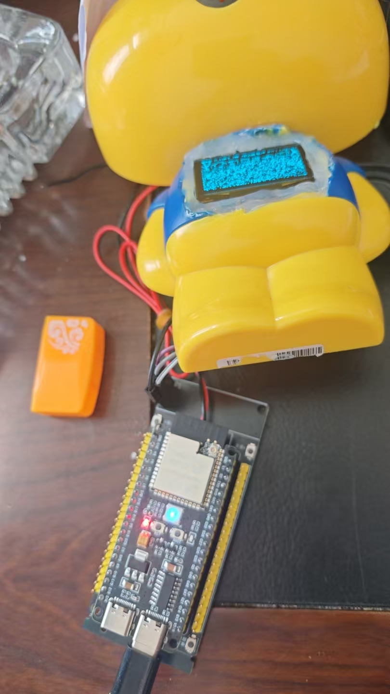

*带有1.3寸屏幕的机器人设备*

---

### GPIO输入触发后无法输入回复语怎么办？

**问题描述：**

在配置GPIO输入触发后，发现回复语输入框为灰色，无法输入内容，导致设备触发后无响应。

**解决方案：**

- **检查配置流程**：

    - GPIO输入触发需要单独配置响应内容
    - 不能直接在GPIO触发条目中输入回复语
    - 需要创建对应的命令词条目

- **正确配置方法**：

    - 先配置GPIO输入触发条目
    - 再创建新的命令词条目，设置对应的回复内容
    - GPIO触发关联到指定命令词的执行

- **参数设置注意**：

    - 十六进制参数需要两个字符一组，用空格分隔
    - 正确格式：例如"98 A3 0B FE"
    - 错误格式："0x 29"（不能包含0x前缀）

**注意事项：**

- GPIO触发只是输入方式，回复内容需要单独配置
- 命令词条目中的已选项需要正确设置
- 参数格式必须严格遵循规范要求

---

### GPIO触发后如何正确配置播报功能？

**问题描述：**

配置GPIO输入触发后，设备无法执行语音播报功能，回复语显示为黑色不可编辑状态。

**解决方案：**

- **添加播报控制方式**：

    - 在GPIO触发的控制详情界面，点击"添加控制"按钮
    - 在控制方式下拉菜单中选择"播放语音"选项
    - 配置需要播报的内容或选择预设语音

- **配置流程**：

    1. 设置GPIO触发条件（如GPIO_B7低电平触发）
    2. 点击右侧的">>"按钮切换到控制详情
    3. 点击"添加控制"，选择控制方式为"播放"
    4. 输入或选择需要播报的内容
    5. 保存配置

**注意事项：**

- GPIO触发和播报功能需要分别配置
- 播报内容必须通过"添加控制"来设置，不能直接在触发条目中输入
- 确保选择正确的语音文件或文本转语音内容
- 测试时验证触发信号和播报内容是否匹配

---

### 固件生成速度慢或排队失败怎么办？

**问题描述：**

智能公元SDK生成平台处理速度非常慢，测试版固件提交后需要等待数小时才能完成，严重影响开发和测试进度。

**解决方案：**

**时间选择策略：**

1. **最佳生成时间**
    - 早上6-9点服务器负载较轻，生成速度较快
    - 凌晨时段处理速度明显优于白天
    - 避开晚上8点后的高峰期
    - 避开系统维护时间（通常下午4-6点）

2. **避开拥堵时段**
    - 工作日下午至晚上是高峰期，处理速度慢
    - 测试版固件可能需要更长时间处理
    - 部分使用方反馈需要等待2小时以上
    - 如遇长时间无响应，建议错峰重试

3. **系统优化说明**
    - 官方确认系统正在进行性能优化升级
    - 生成速度问题已在测试改进中
    - 建议使用方关注平台公告获取最新进展

**平台现状说明：**

1. **服务器压力**
    - 近期新产品发布导致服务器负载增加
    - 老产品使用方数量庞大，资源竞争激烈
    - 技术团队正在进行优化

2. **改善进度**
    - 已意识到服务器性能问题
    - 正在逐步优化和扩容
    - 未来几天情况会越来越好

**使用方应对策略：**

1. **灵活调整工作时间**
    - 将固件生成安排在服务器负载较低时段
    - 提前准备，预留充足的开发时间
    - 避免项目截止前临时生成

2. **临时解决方案**
    - 与其他使用方共享相似配置的固件
    - 使用现成的开源项目进行开发
    - 联系技术团队获取帮助

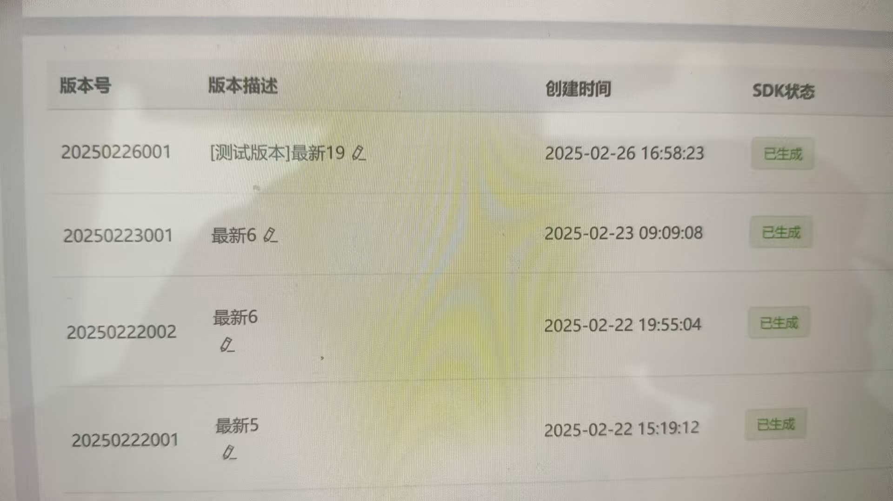

**生成技巧：**

1. **减少重复提交**
    - 避免短时间内多次提交生成任务
    - 每次提交后等待完成再尝试下一次
    - 多次提交会加剧服务器拥堵

2. **简化配置**
    - 初次生成使用基础配置
    - 避免添加过多复杂功能
    - 先生成基础版本，后续再迭代升级

**替代方案：**

- 联系群内其他使用方分享相似配置的固件
- 使用开源平台的现成项目资料
- 等待系统恢复后再进行定制化生成

**注意事项：**

- 这是平台服务器负载问题，非个人设置错误
- 多使用方同时遇到说明是系统性问题
- 紧急项目建议预留充足时间或准备备用方案


---

### 如何发布测试版本并关闭稳态降噪？

**问题描述：**

在生成测试版本时遇到困难，需要了解如何正确发布测试版本并关闭稳态降噪功能。

**解决方案：**

**发布测试版本步骤：**

1. **生成固件**
    - 在产品管理页面生成SDK
    - 等待生成状态变为"已生成"
    - 记录生成的版本号

2. **选择发布类型**
    - 在发布版本界面选择"快速测试版本"
    - 输入自定义版本号（如4.2）
    - 确认发布信息正确

**关闭稳态降噪：**

1. **找到稳态降噪开关**
    - 在发布设置界面查找"稳态降噪"功能
    - 该开关通常在高级设置选项中
    - 默认状态为开启

2. **关闭功能**
    - 将稳态降噪开关设置为关闭状态
    - 保存设置
    - 继续完成发布流程


**注意事项：**

- 关闭稳态降噪可以提高响应速度
- 测试版本通常会快速生成，避免长时间排队
- 生成成功后及时下载固件
- 如果多次尝试仍失败，建议等待非高峰时段再试


---

### SDK已生成但固件显示待生成怎么办？

**问题描述：**

在平台生成SDK后，发现SDK状态为"已生成"，但固件状态仍为"待生成"，无法完成固件生成。

**解决方案：**

**操作步骤：**

1. **进入产品详情页面**
    - 在产品管理页面找到对应产品
    - 点击进入产品详情

2. **找到重新生成选项**
    - 在产品详情页面点击"更多"按钮
    - 选择"重新生成固件"选项

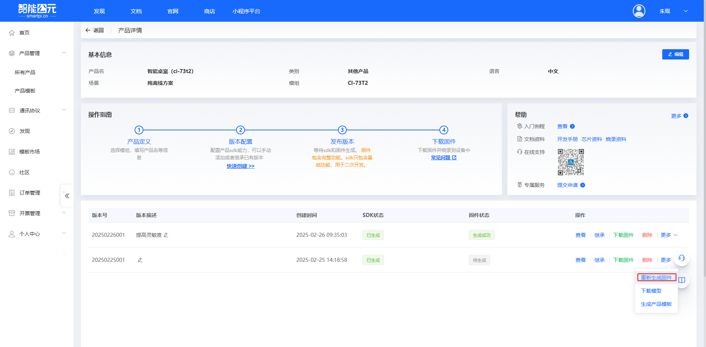

3. **确认重新生成**
    - 系统会提示确认重新生成
    - 点击确认开始生成流程
    - 等待生成完成

**常见情况：**

- SDK生成成功后固件生成可能需要额外时间
- 系统负载高时可能需要手动触发固件生成
- 重新生成通常能解决状态不同步问题

**注意事项：**

- 重新生成会覆盖之前的固件配置
- 确保生成前保存好配置信息
- 如果多次重新生成仍失败，建议联系技术团队
- 生成成功后及时下载固件文件


---

### 固件版本创建后未提交生成怎么办？

**问题描述：**

在平台创建了固件版本但未点击"生成SDK"，导致固件状态显示为"待生成"，无法完成生成。

**解决方案：**

- 进入固件列表界面
- 点击"更多"选项
- 选择"生成SDK"按钮
- 等待系统处理完成


**注意事项：**

- 创建版本和生成SDK是两个独立步骤
- 必须手动点击生成SDK才能完成固件编译
- 生成过程中不要关闭或刷新页面


---

### SDK生成超时或失败怎么办？

**问题描述：**

在智能云元平台生成SDK时，出现以下异常情况：

- SDK生成状态长时间显示"正在生成"，远超预期的10-30分钟


- 生成数小时后仍无进展，甚至持续一天都无法完成
- 保存配置时出现"保存失败"错误


- 平台显示"生成超时，可重新生成或继续等待"


**解决方案：**

**应急处理：**

1. **删除并重建任务**
    - 删除当前超时的生成任务
    - 重新创建一个新的工程（避免使用有问题的工程）
    - 如果使用Chrome浏览器仍有问题，可尝试更换浏览器

2. **避开系统维护期**
    - 关注平台公告的系统维护时间（通常为下午4-6点）
    - 避开维护期和高峰期进行生成操作
    - 可尝试凌晨或清晨等非高峰时段

3. **检查配置合理性**
    - 确认选择的语音识别模型配置正确
    - 检查是否选择了不支持的配置项
    - 简化初始配置，先生成基础版本

**系统性问题处理：**

当出现大规模使用方同时遇到生成失败时：

- 可能是平台服务器负载过高或系统故障
- 此时机芯智能技术团队会进行紧急修复
- 建议等待官方通知或联系技术团队获取进度

**解决方案：**

**最佳生成时间：**

- 早上6-9点是生成高峰期，服务器负载较轻
- 此时生成通常只需10-20分钟即可完成
- 避免晚上8点后生成，此时使用方较多，容易超时

**替代方案：**

1. **使用现成固件**
    - 可以联系群内其他使用方分享相似配置的固件
    - 立创开源平台有完整的智能桌面宠物项目资料
    - GitHub等开源平台可能有相关固件资源

2. **分时段尝试**
    - 删除当前任务后，等待30分钟再重新生成
    - 选择系统提示的"继续等待"选项
    - 多次尝试仍失败后，建议联系技术团队

**注意事项：**

- SDK正常生成时间为10-30分钟，超过2小时属于异常
- 多个使用方同时反映问题时，通常是平台系统性故障
- 毕业设计等项目请预留充足时间，避免截止日期前临时生成

---

### 如何配置串口初始化和语音识别ID判断？

**问题描述：**

在使用CI系列离线语音识别芯片时，需要正确配置串口参数和通过识别ID执行相应操作。

**解决方案：**

**串口初始化配置：**

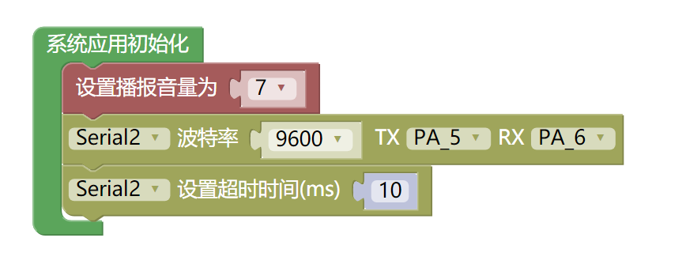

- 设置播音音量为7
- 串口波特率设置为9600
- TX引脚配置为PA_5
- RX引脚配置为PA_6
- 设置超时时间为10毫秒

**语音识别ID判断逻辑：**

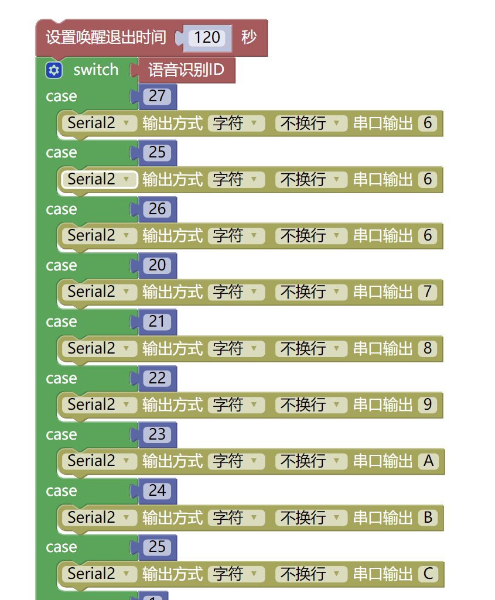

使用switch语句根据不同的ID值执行相应操作：

```c
switch(recognition_id) {
    case 27:
        Serial.println("6");  // 输出字符6
        break;
    case 25:
        Serial.println("6");  // 输出字符6
        break;
    case 26:
        Serial.println("7");  // 输出字符7
        break;
    // 根据实际需求添加更多case
}
```

**输出模式配置：**

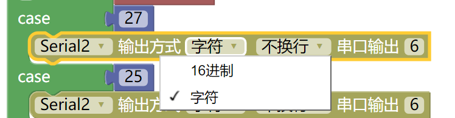

串口输出支持两种模式：

- 字符模式：直接输出ASCII字符
- 十六进制模式：输出十六进制值

根据接收端的需求选择合适的输出模式。

**注意事项：**

- 确保串口参数与主控设备匹配
- ID值需要在语音配置平台预先设置
- 每个语音指令对应一个唯一的识别ID
- 测试时建议先使用字符模式便于调试


---

### 小程序控制指令需要与代码序号对应吗？

**问题描述：**

在智能云元小程序平台配置语音指令控制时，添加的控制指令是否需要与设备端代码中的指令序号保持一致。

**解决方案：**

**指令对应关系：**

- 是的，需要保持一致
- 小程序平台的"添加控制"功能与设备端代码序号必须一一对应
- 序号不一致会导致控制指令无法正确执行

**配置步骤：**

1. **确认设备端代码**
    - 查看设备代码中定义的指令序号
    - 记录每个序号对应的功能

2. **小程序平台配置**
    - 在"添加控制"时选择对应的序号
    - 确保语音指令与序号匹配正确
    - 测试每个指令的响应

3. **验证功能**
    - 保存配置后下载最新SDK
    - 重新烧录设备固件
    - 测试语音控制是否正常

**注意事项：**

- 修改指令序号后需要重新生成和烧录SDK
- 建议维护一份指令序号对照表
- 不同项目可能使用不同的序号规范
- 保留配置截图便于后续维护


---

### 平台命令词管理无法添加新指令怎么办？

**问题描述：**

在智能云元平台的命令词管理界面，点击"添加一条"按钮时无任何响应，无法添加新的命令词。

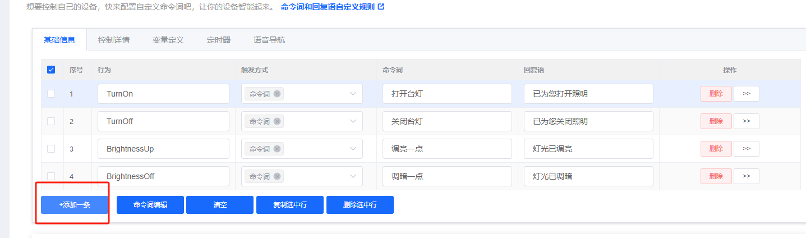

**解决方案：**

1. **创建新工程**
    - 当出现按钮无响应时，建议重新创建一个新工程
    - 将原有配置迁移到新工程中
    - 避免继续使用出现问题的工程

2. **浏览器设置检查**
    - 确认浏览器已启用JavaScript
    - 清除浏览器缓存和Cookie
    - 尝试使用Chrome或Edge等主流浏览器
    - 关闭浏览器广告拦截插件

3. **网络环境检查**
    - 检查网络连接是否稳定
    - 尝试刷新页面（F5）
    - 如使用企业网络，确认无访问限制

**注意事项：**

- 这类问题通常是平台前端加载不完整导致的
- 重新创建工程是最有效的解决方案
- 保存好原有配置信息，避免数据丢失
- 如果问题持续存在，可能是平台服务器故障


---

### 无法访问智能公元平台网站怎么办？

**问题描述：**

访问https://smartpi.cn时，页面显示"暂时无法访问"，浏览器中央出现悲伤表情图标，无法进入平台进行操作。


**解决方案：**

1. **确认维护时间**
    - 平台定期维护时间通常为下午4-6点
    - 维护期间网站无法正常访问
    - 等待维护结束后再尝试访问

2. **刷新和重试**
    - 清除浏览器缓存（Ctrl+Shift+Delete）
    - 使用F5或Ctrl+F5强制刷新页面
    - 尝试使用无痕/隐私模式访问

3. **检查网络环境**
    - 确认网络连接正常
    - 尝试访问其他网站验证网络
    - 如在公司网络，联系IT确认是否有限制

4. **浏览器兼容性**
    - 推荐使用Chrome、Edge或Firefox浏览器
    - 确保浏览器已更新到最新版本
    - 暂时关闭广告拦截插件

5. **等待系统恢复**
    - 如为服务器故障，技术团队正在紧急修复
    - 关注官方群通知获取恢复进度
    - 通常会在1-2小时内恢复

**注意事项：**

- 网站无法访问可能是维护或服务器故障
- 多使用方同时遇到说明是系统性问题
- 保留错误截图便于技术团队分析
- 紧急情况可联系技术团队获取帮助


---

### 平台网站崩溃导致无法保存数据怎么办？

**问题描述：**

在使用智能公元平台时，突然出现网站崩溃无法访问的情况，同时无法保存配置数据。

**解决方案：**

1. **立即操作**
    - 立即刷新页面（F5或Ctrl+F5）
    - 清除浏览器缓存后重新访问
    - 尝试使用其他浏览器访问

2. **保存方案**
    - 在网络不稳定时，频繁保存配置
    - 使用"导出"功能备份当前配置
    - 将重要配置截图保存，防止数据丢失

3. **问题反馈**
    - 在技术团队群中反馈问题
    - 提供具体的错误信息和时间
    - 等待技术团队处理恢复

**注意事项：**

- 平台崩溃通常为临时性问题，耐心等待即可恢复
- 重要配置建议定期导出备份
- 避免在高峰期进行大量配置操作


---

### 米思齐软件如何显示SSD1306汉字？

**问题描述：**

使用米思齐图形化编程软件控制SSD1306显示屏时，软件缺少汉字显示库，无法正确显示中文字符。

**解决方案：**

**方案一：查找并添加汉字库**

- 在网上搜索SSD1306的汉字字库文件
- 下载适用于SSD1306的汉字库（如GB2312字库）
- 将字库文件添加到米思齐的库文件中
- 在程序中调用汉字显示相关函数

**方案二：使用图形化方式显示汉字**

- 将需要显示的汉字制作成位图（bitmap）
- 使用米思齐的图像显示功能
- 预先将汉字转换为图像数组
- 通过显示图像的方式实现汉字显示

**方案三：使用其他平台开发**

- 如果米思齐无法满足需求，可考虑使用Arduino IDE
- Arduino有更多成熟的SSD1306汉字库支持
- 如U8g2库等，完整支持中文显示
- 开发完成后再转回米思齐（如需要）

**注意事项：**

- SSD1306是单色OLED屏，显示汉字需要点阵字库
- 汉字字库占用较大存储空间，注意单片机容量限制
- 部分米思齐版本可能不支持自定义字库
- 制作位图时要控制图像大小，避免内存不足


---

### 除了在线生成固件外，还有其他生成方式吗？

**问题描述：**

在线固件生成服务持续拥堵，希望了解其他生成固件的方式。

**解决方案：**

**方案一：下载SDK自行开发**

1. **获取SDK源代码**
    - 任意已生成的固件包中都包含SDK源代码
    - 下载历史生成的固件即可获得完整SDK
    - SDK包含完整的项目结构和源代码

2. **开发环境准备**
    - 使用Keil、IAR或STM32CubeIDE等开发工具
    - 配置好编译环境和下载工具
    - 安装相应的芯片支持包

3. **自定义开发**
    - 修改源代码实现自定义功能
    - 调整语音识别参数和指令
    - 重新编译生成hex或bin固件文件

**方案二：使用离线编程工具**

1. **专用编程器**
    - 使用ST-Link、J-Link等编程器
    - 配合STM32CubeProgrammer等工具
    - 直接烧录生成的hex文件

2. **批量烧录**
    - 适合生产环境使用
    - 可同时烧录多个设备
    - 提高生产效率

**注意事项：**


---

### 二次开发中调用播放函数无法播放语音怎么办？

**问题描述：**

在使用SDK进行二次开发时，调用user_player_play()函数无法播放语音，但通过语音唤醒功能可以正常播放提示音。

**解决方案：**

- **官方不支持二次开发**：

    - 官方提供的SDK仅用于参考学习
    - 不提供二次开发的技术团队服务
    - 不解答SDK使用过程中的具体问题

- **建议的处理方式**：

    - 仔细阅读SDK中的示例代码和注释
    - 参考官方提供的文档和开发包
    - 在开发者社区中寻求帮助
    - 使用固件配置功能实现需求，避免二次开发

**注意事项：**

- SDK编译需要具备嵌入式开发经验
- 修改源码可能导致功能异常，建议保留原始备份
- 如需技术团队，请使用标准平台固件而非自定义编译版本

---


---

### 修改SDK源码后功能异常怎么办？

**问题描述：**

在使用平台开发后，尝试通过修改SDK源码（如修改蓝牙名称）并自行编译，导致上电播报的MP3音频功能失效。

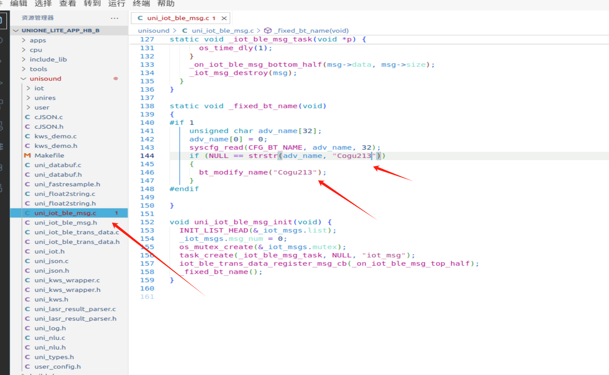


**解决方案：**

- **技术团队范围说明**：

    - 官方只提供平台开发的技术团队
    - SDK编译不在技术团队范围内
    - 自行修改源码导致的功能异常需自行排查

- **问题排查建议**：

    - 检查修改的代码是否影响了音频相关功能
    - 确认编译环境和编译参数配置正确
    - 对比原始代码，定位修改引入的问题

**注意事项：**

- 平台编译的固件文件经过充分测试，建议优先使用
- 如需修改功能，建议通过平台配置而非直接修改源码
- 保留原始SDK备份，便于问题排查和恢复

---


---

### SDK是否提供技术团队？

**问题描述：**

在使用SDK时遇到问题，询问是否没有技术团队。

**解决方案：**

- **技术团队范围**：

    - 官方只提供平台开发的技术团队
    - SDK编译和二次开发不在技术团队范围内
    - 自行开发时遇到的问题需自行解决

- **使用建议**：

    - 优先使用平台配置功能实现需求
    - 避免直接修改SDK源码
    - 如需深度定制，建议联系商务评估需求

**注意事项：**

- SDK仅供学习参考，需要一定的开发经验
- 使用平台生成的固件可获得完整技术团队
- 自行开发可能影响产品稳定性

---

---

- SDK提供源代码但不提供技术团队
- 需要具备一定的嵌入式开发经验
- 自行开发可完全控制功能实现
- 修改后需要充分测试确保功能正常
- 建议备份原始代码便于恢复


---

### 如何优化固件生成服务？

**问题描述：**

使用方希望优化固件生成机制，提出限制提交频率和防止批量操作的建议。

**解决方案：**

**使用方建议的优化措施：**

1. **提交频率限制**
    - 限制每个使用方每小时只能提交一次生成请求
    - 或改为每半小时提交一次
    - 避免频繁重复提交加剧服务器负载

2. **批量操作检测**
    - 检测同一IP地址下的多个账户
    - 限制批量自动化生成行为
    - 防止恶意占用服务器资源

3. **分级服务策略**
    - 对批量生成需求实施付费机制
    - 普通使用方享受免费基础服务
    - 商业使用方可购买更高优先级服务

**技术优化建议：**

1. **服务器扩容**
    - 增加更多生成服务器
    - 实施负载均衡机制
    - 动态分配任务到空闲服务器

2. **队列优化**
    - 实施智能排队算法
    - 紧急任务优先处理
    - 提供预计等待时间

3. **缓存机制**
    - 缓存常用配置的生成结果
    - 相同配置直接返回缓存结果
    - 减少重复计算负担

**使用方侧优化：**

- 避开高峰时段进行生成
- 合理规划生成时间


---

### 智能公元网站无法访问怎么办？

**问题描述：**

智能公元平台无法正常访问，导致无法生成语音模块固件代码，影响生产进度。

**解决方案：**

**状态确认：**

1. **检查SDK生成状态**
    - 查看产品详情页的SDK状态
    - 确认是否显示"正在生成"
    - 了解预计生成时间（通常1-3分钟）

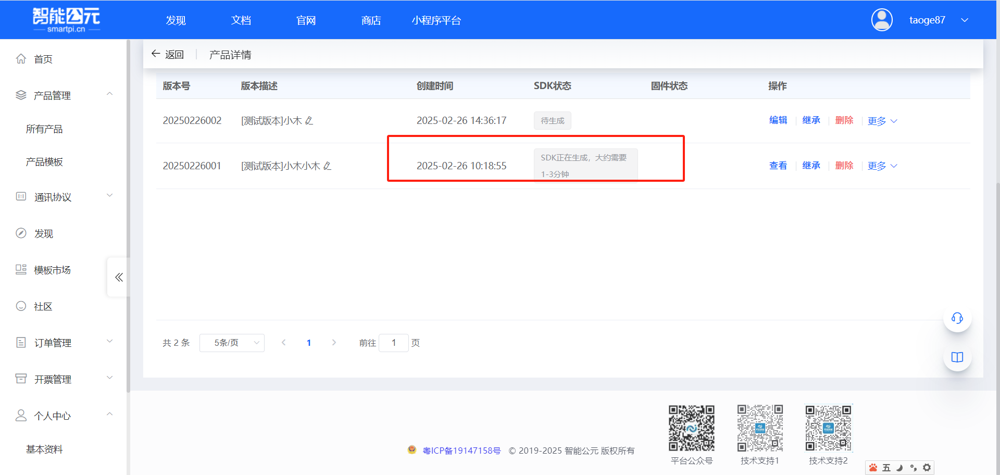

2. **了解当前系统情况**
    - 系统可能正在维护或升级
    - 服务器负载过高导致服务暂停
    - 部分功能暂时不可用

**临时解决方案：**

1. **等待系统恢复**
    - 一般维护会在1-3小时内完成
    - 避开系统维护时段（通常下午）
    - 关注官方通知了解恢复时间

2. **使用其他方案**
    - 使用群内分享的现成固件
    - 下载官方发布的通用固件
    - 联系技术团队获取帮助

**补充：本地网络与浏览器排查**

1. **网络连接检查**：

    - 检查网络连接是否正常
    - 尝试访问其他网站确认网络状态
    - 重启路由器或调整网络设置

2. **浏览器和设备检查**：

    - 清除浏览器缓存和Cookie
    - 尝试使用不同浏览器访问
    - 检查系统时间是否正确

3. **安全软件检查**：

    - 暂时禁用防火墙
    - 关闭杀毒软件的网页防护
    - 检查代理服务器设置

**注意事项：**

- 这是平台系统性问题，非个人设备或网络问题
- 多个使用方同时遇到说明是服务器故障
- 紧急生产需求建议提前准备备用固件
- 保存好常用配置便于快速生成
- 考虑使用离线SDK方案

---

### SDK生成速度过慢怎么办？

**问题描述：**

在平台生成SDK时速度非常慢，等待一个小时仍未完成生成，影响正常使用。

**解决方案：**

**问题分析：**

- 服务器可能处于高负载状态
- 网络连接不稳定影响传输速度
- 生成队列中有大量任务等待处理

**立即处理：**

1. **刷新页面**
    - 不要关闭页面，耐心等待
    - 偶尔刷新查看生成进度
    - 避免重复提交导致队列堆积

2. **检查网络**
    - 确认网络连接稳定
    - 尝试切换网络环境
    - 使用有线网络替代WiFi

**优化策略：**

1. **选择合适时段**
    - 避开晚8点后高峰期
    - 早上6-9点负载较轻
    - 避开系统维护时间

2. **简化配置**
    - 减少不必要的功能模块
    - 先生成基础版本测试
    - 成功后再添加复杂功能

3. **批量操作**
    - 不要频繁提交单个任务
    - 将多个需求合并后一次生成
    - 减少重复的编译时间

**技术处理：**

- 清除浏览器缓存和Cookie
- 使用Chrome或Edge浏览器
- 关闭其他占用带宽的程序
- 如持续超时，截图联系技术团队

**注意事项：**

- SDK生成需要时间，1-3分钟为正常范围
- 超过10分钟未完成可能是系统问题
- 保留生成的配置便于快速重新生成
- 紧急项目建议提前准备备用方案

---

### 固件生成失败提示超过8192字节怎么办？

**问题描述：**

生成固件时失败，系统提示生成的固件大小超过8192字节限制。

**解决方案：**

**限制说明：**

- 8192字节（8KB）是某些型号的Flash限制
- 超过限制会导致固件无法正常烧录
- 需要优化配置减小固件体积

**优化方法：**

1. **减少语音条目**
    - 删除不常用的命令词
    - 合并相似功能的指令
    - 优先保留核心功能

2. **缩短音频文件**
    - 减少每个回复音频的时长
    - 使用更低采样率录制
    - 压缩音频文件大小

3. **简化功能配置**
    - 关闭不必要的高级功能
    - 减少IO控制数量
    - 禁用复杂的逻辑组合

**分步生成：**

1. **基础版本先**
    - 先生成最小功能版本
    - 测试核心功能是否正常
    - 确认基础版本可以烧录

2. **逐步添加功能**
    - 每次只增加1-2个功能
    - 测试每个版本的固件大小
    - 找到体积和功能的平衡点

**替代方案：**

- 使用串口扩展指令实现复杂功能
- 将部分功能放在外部MCU处理
- 考虑使用Flash容量更大的型号

**技术提示：**

- 使用8kHz采样率而非16kHz
- 单声道音频而非立体声
- 简化命令词，减少模型大小
- 避免使用长时间音频

**注意事项：**

- 8KB限制是硬件物理限制
- 优化后必须重新测试所有功能
- 保留一个精简版本作为备用
- 复杂项目建议选择大容量型号

---

### 如何通过GPIO配置触发多条语音指令？

**问题描述：**

需要通过GPIO配置触发多条语音指令，并解决固件生成时出现"固件超大"错误的问题。

**解决方案：**

**1. GPIO触发配置**

- 在平台中选择"行为配置"
- 添加多条"GPIO触发"行为
- 每个GPIO引脚对应一条语音指令
- 设置触发条件为低电平输入

**2. 多引脚控制方案**

- 单引脚单指令：PA6→语音1，PA7→语音2...
- 组合触发：使用定时器和变量识别多次触发
- 扩展方案：3秒内N次低电平=第N条语音

**3. 固件超大问题解决**

**问题原因**：

- 生成的固件超过Flash容量限制
- 错误提示："生成的固件超大(2066752字节)"

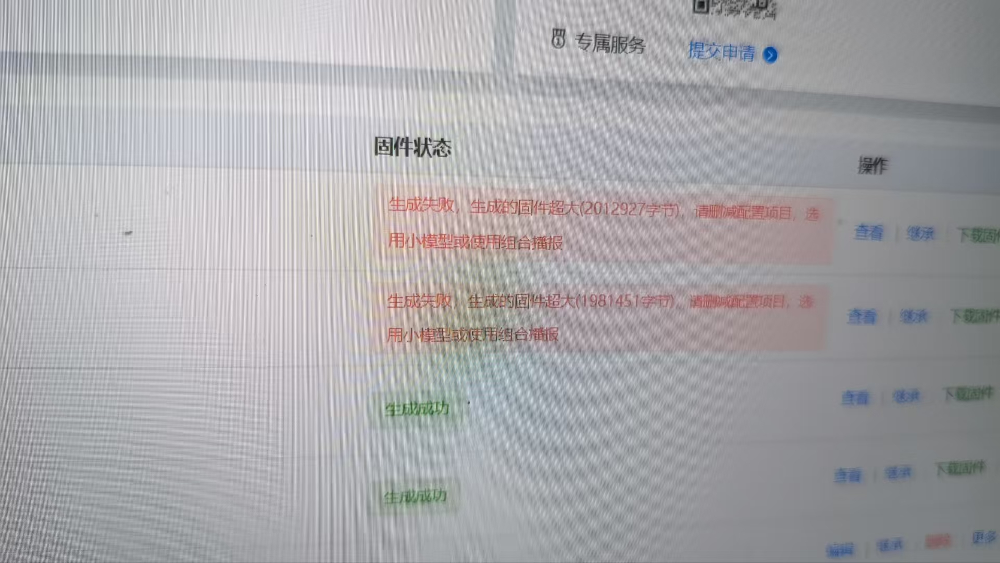

**解决方法**：

- **减少语音条目**
    - 删除不常用的命令词
    - 合并相似功能的指令
    - 保留核心语音功能

- **优化音频文件**
    - 缩短每条语音的时长
    - 降低音频采样率
    - 使用压缩格式录制

- **简化配置逻辑**
    - 减少复杂的条件判断
    - 关闭不必要的高级功能
    - 分批生成功能模块

**4. 分步实施建议**

1. 先生成核心功能固件
2. 测试基本语音交互
3. 逐步添加其他功能
4. 每次都检查固件大小

**注意事项：**

- 固件大小限制是硬件物理特性
- 优化后必须完整测试所有功能
- 保留配置文件备份便于恢复


---

### SDK生成时直接拒绝排队怎么办？

**问题描述：**

在尝试生成SDK时，系统直接拒绝排队，无法进入生成队列，导致无法进行SDK生成操作。

**解决方案：**

**系统问题判断：**

1. **确认是系统性问题**
    - 多个使用方同时遇到相同情况
    - 不是个人设置或网络问题
    - 平台服务器可能暂时关闭了排队功能

2. **检查平台状态**
    - 查看官方群公告了解系统状态
    - 确认是否在系统维护时间
    - 关注平台是否有故障通知

**临时解决方案：**

1. **等待系统恢复**
    - 服务器负载过高时会暂时关闭排队
    - 等待1-2小时后再尝试
    - 选择非高峰时段（如早晨6-9点）

2. **刷新和重试**
    - 清除浏览器缓存
    - 使用F5强制刷新页面
    - 尝试使用无痕模式访问

3. **使用替代方案**
    - 联系群内使用方分享相似配置的SDK
    - 下载之前生成的固件包获取源代码
    - 考虑使用其他型号进行开发测试

**注意事项：**

- 系统直接拒绝排队通常是服务器保护机制
- 频繁刷新不会加速问题解决
- 紧急项目建议提前准备备用方案
- 保存好配置信息便于系统恢复后快速生成

---

### 固件生成时间远超预期怎么办？

**问题描述：**

平台显示"SDK正在生成，大约需要3分钟"，但实际等待时间已超过半小时，与提示时间严重不符。

**解决方案：**

1. **理解系统提示**
    - 3分钟是理想状态下的估算时间
    - 实际时间受服务器负载和队列影响
    - 高峰期时生成时间会显著延长

2. **排队状态说明**
    - "正在生成"表示任务已进入处理队列
    - 服务器按提交顺序处理任务
    - 前面有任务时需要等待

3. **等待与刷新**
    - 耐心等待任务完成
    - 可定期刷新页面查看最新状态
    - 避免频繁取消重新提交

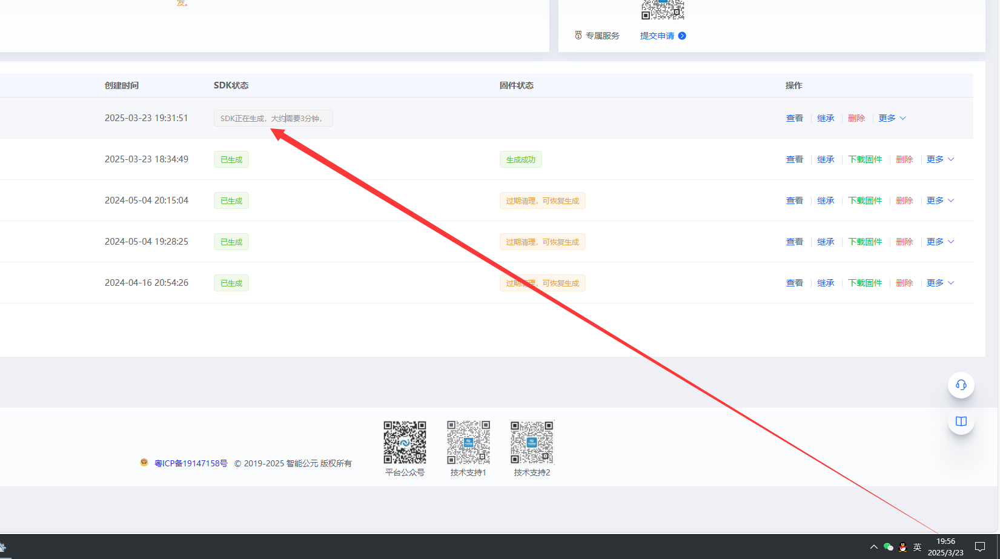

*SDK生成显示需要3分钟，但实际已等待较长时间*

**注意事项：**

- 生成时间是估算值，实际等待时间可能更长
- 服务器负载高时，所有使用方都会受影响
- 建议记录提交时间，便于判断是否异常
- 超过1小时仍未完成可联系技术团队

---

### 串口例程中的十六进制数据是什么意思？

**问题描述：**

在小程序平台的控制规则配置中，看到UART1_TX发送动作后面有一串十六进制数据，需要了解这些数据的具体含义和作用。

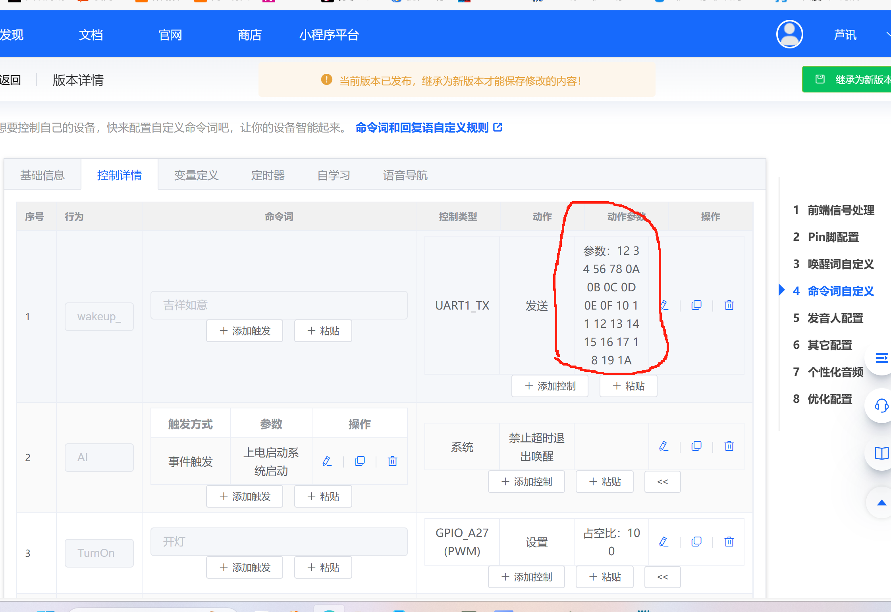

**解决方案：**

**数据含义说明：**

1. **数据用途**
    - 这些十六进制数是通过串口发送给外部设备的指令
    - 用于控制与语音模块相连的其他设备
    - 可以控制LED、继电器、传感器等外部硬件

2. **数据格式解析**
    - 十六进制格式，每个字节用空格分隔
    - 如：12 34 56 AB CD 等格式
    - 可以是ASCII码或自定义协议

3. **实际应用示例**
    - 控制LED开关：发送特定字节控制亮灭
    - 控制舵机角度：发送角度对应的十六进制值
    - 发送传感器数据：将采集的数据转换为十六进制

**配置方法：**

1. **添加控制规则**
    - 在平台中选择"控制类型"为UART1_TX
    - 选择动作类型为"发送"
    - 在参数栏填入要发送的十六进制数据

2. **数据格式要求**
    - 使用空格分隔每个字节
    - 不要加0x前缀
    - 支持连续发送多个字节

**注意事项：**

- 发送的数据需要外部设备能够识别对应协议
- 建议先测试单个字节的响应
- 复杂控制需要查阅目标设备的通信协议
- 数据长度可能受限于缓冲区大小


---

### 是否有本地编译固件的相关文档？

**问题描述：**

需要在本地环境进行固件编译，希望获得本地编译的相关文档和指导。

**解决方案：**

**获取源码：**

1. **开源平台访问**
    - 访问GitHub或其他开源代码托管平台
    - 搜索相关的语音模块开源项目
    - 下载完整的源码包

2. **官方渠道获取**
    - 联系技术团队获取开发资料
    - 查看产品说明书中的开发资源链接
    - 加入开发者社区获取共享资源

**编译环境准备：**

1. **工具链安装**
    - 安装对应芯片架构的编译器
    - 配置Make或CMake构建环境
    - 安装必要的依赖库和SDK

2. **开发环境配置**
    - 设置环境变量和路径
    - 配置编译选项和优化参数
    - 准备调试工具和下载工具

**编译流程：**

1. **基础编译**
    - 解压源码包到工作目录
    - 修改配置文件以适配硬件
    - 执行编译命令生成固件

2. **固件烧录**
    - 使用专用下载工具连接设备
    - 选择生成的固件文件
    - 按照正确的烧录流程操作

**注意事项：**

- 本地编译需要一定的嵌入式开发经验
- 不同芯片可能需要不同的工具链
- 建议先使用官方提供的预编译固件测试
- 编译过程中遇到问题可查阅相关技术论坛

---

### 声纹识别和OTA功能如何实现？

**问题描述：**

需要了解声纹识别和OTA（空中升级）功能的具体实现方法和相关资料。

**解决方案：**

**功能定制说明：**

声纹识别和OTA功能属于高级定制功能，需要联系官方进行定制开发：

- **声纹识别功能**：

    - 需要特定的算法支持和硬件配置
    - 标准固件不包含此功能
    - 需要根据具体需求进行定制开发

- **OTA升级功能**：

    - 需要网络通信模块支持
    - 涉及固件分段和升级协议
    - 需要配合服务器端升级服务

**获取方式：**

- 联系技术团队团队
- 提供具体的项目需求
- 评估定制开发的可行性
- 获取定制开发方案与评估信息

**注意事项：**

- 定制开发需要额外的时间和成本
- 不同模块的支持程度可能不同
- 建议在项目初期就确定功能需求

---

### 烧录工具在中文路径下无法工作怎么办？

**问题描述：**

烧录工具的固件文件路径包含中文字符时，无法正常进行烧录操作。

**解决方案：**

**路径要求：**

- 烧录工具不支持中文路径
- 文件路径必须使用英文字符
- 避免使用特殊符号和空格

**正确操作：**

1. **移动固件文件**
    - 将固件文件复制到纯英文路径
    - 推荐使用：D:\firmware\ 或 C:\temp\
    - 避免放在桌面或使用方文件夹

2. **路径示例**
    - ❌ 错误：C:\Users\小黑壹号\Desktop\firmware.bin
    - ✅ 正确：D:\firmware\firmware.bin

3. **操作步骤**
    - 创建英文文件夹
    - 移动固件文件到新位置
    - 在烧录工具中重新选择文件

**注意事项：**

- 路径层级不宜过深
- 文件名使用英文和数字
- 保留好固件文件的备份

---

### CI系列离线语音识别芯片的文件路径中文字符兼容性问题

**问题描述：**

在使用CI系列离线语音识别芯片时，如果文件路径中包含中文字符，会导致系统无法正常工作。

**解决方案：**

**1. 路径要求**

- 所有文件路径必须使用英文字符
- 不能包含任何中文字符或中文标点
- 包括文件夹名称和文件名

**2. 常见问题场景**

- 固件文件路径包含中文导致烧录失败
- 项目文件夹包含中文导致编译错误
- 配置文件路径包含中文导致加载失败

**3. 正确路径示例**

- ❌ 错误：D:\项目\语音指令\config.json
- ❌ 错误：C:\Users\张三\Desktop\firmware.bin
- ✅ 正确：D:\project\voice_command\config.json
- ✅ 正确：C:\Users\user\Desktop\firmware.bin

**4. 解决方法**

- 将所有相关文件移动到英文路径下
- 重新创建项目时使用英文命名
- 使用拼音或英文替代中文文件夹名

**注意事项：**

- 这是系统兼容性限制，并非程序错误
- 建议养成使用英文路径的习惯
- 如团队协作，统一使用英文路径规范

---

### 延时恢复功能是什么意思？

**问题描述：**

在配置界面看到"延时恢复"选项，不确定该功能的具体含义，是否先执行完当前任务再进行延时恢复。

**解决方案：**

- **延时恢复的含义**：

    - 该功能用于控制IO口输出后的自动恢复时间
    - 触发后，IO会输出设定的时间，然后自动恢复到初始状态
    - 不是先执行完任务再延时，而是控制输出信号的持续时间

- **延时时长设置**：

    - 以毫秒（ms）为单位
    - 0ms表示立即恢复（无延时）
    - 可根据实际需要调整输出持续时间

- **应用场景**：

    - 控制继电器吸合时间
    - 控制LED闪烁时长
    - 控制脉冲信号的宽度

**注意事项：**

- 该功能只适用于需要定时恢复的IO输出
- 如需保持状态，应关闭延时恢复功能
- 合理设置延时时长，避免操作不完整


---

### 如何配置PWM波形的占空比？

**问题描述：**

在PWM配置界面只能调节频率，找不到设置占空比的选项。

**解决方案：**

- **占空比配置位置**：

    - 占空比不在PWM基本配置界面
    - 需要在"控制详情"页面进行设置
    - 每个PWM通道都有独立的占空比控制

- **配置步骤**：

    1. 在PWM配置页面设置输出频率
    2. 进入控制详情页面
    3. 找到对应的PWM通道
    4. 调整占空比参数（0-100%）

- **占空比应用**：

    - 0%：持续低电平
    - 50%：方波信号
    - 100%：持续高电平
    - 可用于控制电机速度、LED亮度等

**注意事项：**

- 频率和占空比是独立配置的
- 占空比设置可能需要重新生成固件
- 某些应用场景可能需要动态调整占空比

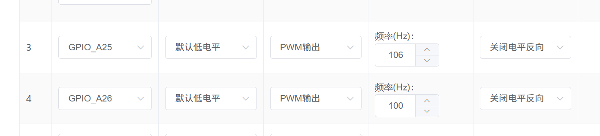

---

### 配置生成失败但设备显示连接正常怎么办？

**问题描述：**

设备端显示"配置检查通过"，但外部平台提示"生成失败，可能是配置原因"。

**解决方案：**

- **常见失败原因**：

    - 配置参数冲突或超出范围
    - 功能配置不兼容
    - 固件生成队列繁忙
    - 网络连接不稳定

- **排查步骤**：

    1. 检查所有配置参数是否合理
    2. 简化配置，逐步添加功能
    3. 清除浏览器缓存后重试
    4. 更换时间段重新生成

- **解决方法**：

    - 使用快速模式生成（功能完整）
    - 联系技术团队协助排查
    - 保存配置，稍后重试


---

### 设备连接后如何进行蓝牙播放？

**问题描述：**

蓝牙设备已成功连接，但找不到音乐播放控制界面。

**解决方案：**

- **播放控制位置**：

    - 设备连接后会出现播放控制界面
    - 显示设备名称（如"派小星v1.0"）
    - 包含播放、暂停、上一曲、下一曲等控制按钮

- **操作步骤**：

    1. 确保设备已通过蓝牙连接
    2. 在播放界面选择音乐文件
    3. 使用控制按钮管理播放
    4. 调节设备音量（如需要）

- **注意事项**：

    - 首次连接可能需要配对
    - 确保设备蓝牙功能已开启
    - 部分设备需要手动切换到蓝牙模式

---

### 如何调节设备音量大小？

**问题描述：**

需要调整设备的输出音量，但找不到音量控制选项。

**解决方案：**

- **音量调节方法**：

    - 在智能公元平台网站中调节
    - 登录账号后进入设备配置页面
    - 找到音量或音频输出设置
    - 调整音量等级（通常0-100）

- **调节建议**：

    - 从默认音量开始，逐步调整
    - 测试不同环境的音量需求
    - 避免设置过大音量导致失真

- **其他调节方式**：

    - 部分设备支持物理音量按键
    - 可通过语音命令调节（如需配置）
    - 使用外部功放调节输出音量

**注意事项：**

- 音量设置需要重新生成固件
- 保存配置前测试音量效果
- 考虑使用环境的噪音水平

---

### SDK生成耗时过长怎么办？

**问题描述：**

使用SDK生成工具时，生成时间从预期的3分钟延长到半小时，严重影响开发效率。

**解决方案：**

**时间分析：**

- 正常生成时间：约3分钟
- 当前实际时间：约30分钟
- 时间延长约10倍，存在异常

**可能原因：**

**1. 系统负载过高**

    - 服务器同时处理过多请求
    - 网络传输速度较慢
    - 系统正在进行维护

**2. 配置复杂度过高**

    - 命令词数量过多
    - 包含大量播报内容
    - 配置逻辑过于复杂

**3. 网络环境问题**

    - 本地网络延迟高
    - 带宽不足
    - 防火墙或代理影响

**优化建议：**

**1. 选择合适时段**

    - 避开晚8点后高峰期
    - 早上6-9点负载较轻
    - 避开系统维护时间

**2. 简化配置**

    - 减少不必要的功能模块
    - 先生成基础版本测试
    - 成功后再添加复杂功能

**3. 批量操作**

    - 不要频繁提交单个任务
    - 将多个需求合并后一次生成
    - 减少重复的编译时间

**技术处理：**

- 清除浏览器缓存和Cookie
- 使用Chrome或Edge浏览器
- 关闭其他占用带宽的程序
- 如持续超时，截图联系技术团队

**注意事项：**

- SDK生成需要时间，1-3分钟为正常范围
- 超过10分钟未完成可能是系统问题
- 保留生成的配置便于快速重新生成
- 紧急项目建议提前准备备用方案

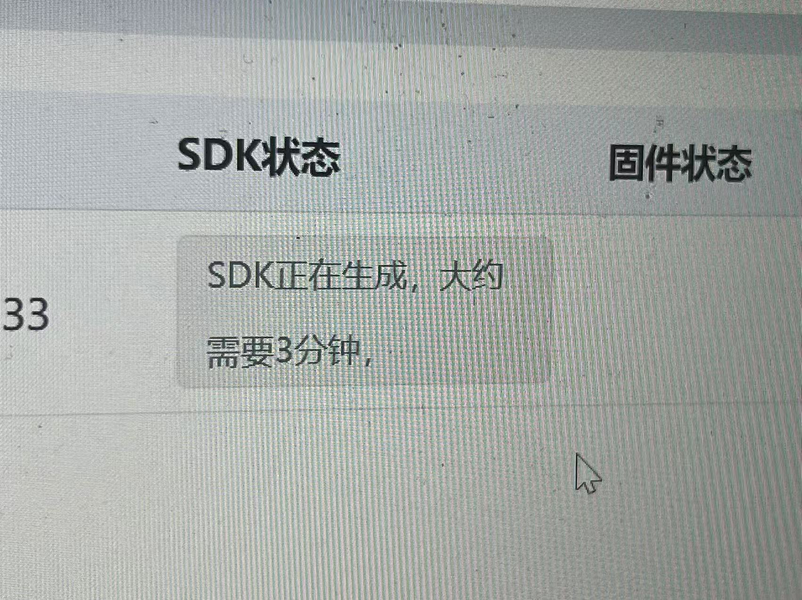

*SDK生成界面提示大约需要3分钟，但实际耗时更长*

---

### 平台配置中的"上电启动"触发类型是什么意思？

**问题描述：**

在智能公元平台的触发配置界面中，看到"上电启动"这个触发类型选项，不理解其具体含义和使用场景。

**解决方案：**

"上电启动"是指模块通电后自动执行的预设动作或功能，无需等待语音唤醒或其他触发条件。

**功能说明：**

1. **自动执行特性**
    - 模块上电后立即自动执行设定的操作
    - 不需要语音唤醒或外部触发
    - 适用于需要开机即工作的场景

2. **典型应用场景**
    - 开机播报：上电后自动播放欢迎语或设备状态
    - 设备自检：上电后自动检测并报告各部件状态
    - 初始化设置：自动恢复上次的工作状态或默认配置
    - 指示灯控制：上电后自动点亮特定LED灯

3. **配置方法**
    - 在平台的"添加触发"界面选择"上电启动"
    - 设置需要执行的具体动作（如播报、IO控制等）
    - 可配合延时设置，实现上电后延时执行
    - 支持组合动作，同时执行多个功能

**使用示例：**

1. **开机欢迎播报**
    - 触发类型：上电启动
    - 执行动作：播放"欢迎使用智能设备"
    - 延时时间：0秒（立即执行）

2. **设备状态自检**
    - 触发类型：上电启动
    - 执行动作：播报各传感器状态
    - 延时时间：2秒（等待系统稳定）

**注意事项：**

- 上电启动功能会占用一定的启动时间
- 避免在启动阶段执行复杂或耗时操作
- 合理使用延时功能，确保系统完全启动后再执行
- 上电启动的动作尽量简洁，避免影响正常使用


---

### 自动化控制中的延时和执行顺序问题

**问题描述：**

在配置自动化控制逻辑时，部分控制指令无法按预期执行，表现为：

- 设置延时的控制步骤不执行
- 中间的控制步骤被跳过
- 只有最后的语音播报能正常执行

**解决方案：**

1. **延时类型选择**
    - 机器延时：相当于定时器延时，会阻塞后续执行
    - 中断延时：不阻塞，可继续执行其他步骤
    - 根据实际需求选择合适的延时类型

2. **使用标志位（变量触发）**
    - 将复杂的延时逻辑改为变量触发
    - 通过设置和检测标志位控制执行顺序
    - 避免使用过长的时间延时

3. **控制逻辑优化**
    - 将需要延时的动作独立成单独命令
    - 使用条件判断替代固定延时
    - 合理安排动作的先后顺序

4. **调试方法**
    - 逐步添加控制指令，定位问题所在
    - 使用串口输出查看执行状态
    - 检查变量值是否正确传递

**注意事项：**

- 延时设置过长可能导致系统响应缓慢
- 机器延时期间其他动作会被暂停
- 建议将单个命令的执行时间控制在合理范围
- 使用变量触发可以提供更好的控制灵活性


---

### 快速固件和优化固件有什么区别？

**问题描述：**

需要了解快速固件和优化固件之间的区别，以及优化固件发布后需要等待3小时的原因。

**解决方案：**

快速固件和优化固件的主要区别：

- **快速固件**：面向普通使用方，追求稳定性
- **优化固件**：面向高级使用方，用于测试和开发

**优化固件特点：**

- 不是面向大众追求稳定性的版本
- 主要用于开发者测试和调试
- 发布后需要等待约3小时才能使用

**注意事项：**

- 普通使用方建议使用快速固件，更稳定可靠
- 优化固件可能存在不稳定因素，适合开发调试使用
- 如非必要，不建议普通使用方使用优化固件


---

### SDK固件生成时间过长，是否有本地生成方式？

**问题描述：**

SDK平台生成固件时间过长，询问是否有本地生成方式，以及block生成固件的API接口。

**解决方案：**

**1. API接口方案**

- 提供Block生成固件API接口
- 支持通过API调用生成固件
- 可实现本地化集成开发

**2. API接口说明**

- **接口地址**：已提供API文档（https://console-docs.apipost.cn/preview/fd2e6ef6f45ac983/1a1bedf171ee2377）
- **主要参数**：

    - userId：用户ID
    - sdkId：SDK编号
    - mac：设备MAC地址
    - sign：签名验证
    - codeStr：指令字符串

**3. 使用流程**

1. **获取API文档**
    - 访问提供的API文档链接
    - 了解详细的接口规范
    - 获取测试环境信息

2. **集成开发**
    - 在图形化编程工具中集成API
    - 实现参数配置和调用
    - 处理生成结果和异常

3. **签名验证**
    - 使用正确的签名算法
    - 确保参数传递安全
    - 处理鉴权失败情况

**4. 本地化方案**

- 可构建独立的图形化编程界面
- 实现类似米思齐的编程方式
- 通过API自动生成和下载固件

**注意事项：**

- API调用需要有效的平台账号
- 注意接口调用频率限制
- 保留详细的调用日志用于调试
- 如API调用失败，可联系技术团队获取帮助

---

### API调用返回鉴权失败（错误码400000）怎么办？

**问题描述：**

在调用生成固件API时，返回错误码400000和"鉴权失败"信息，导致无法正常生成固件。

**解决方案：**

**1. 鉴权失败原因分析**

- **签名错误**：sign参数计算或传递不正确
- **参数缺失**：必需参数未完整传递
- **参数格式错误**：参数值格式不符合要求
- **账号权限问题**：userId或sdkId无权限访问

**2. 排查步骤**

**检查请求参数：**

- 确认userId是否正确
- 验证sdkId是否存在且有效
- 检查mac地址格式是否正确
- 确保sign签名计算准确

**验证签名算法：**

- 使用正确的签名算法
- 确认签名密钥是否最新
- 检查参数排序和拼接规则
- 验证编码方式（如UTF-8）

**3. 常见错误及解决**

- **sign签名不对**：

    - 重新计算签名值
    - 检查签名算法实现
    - 确认使用的密钥正确

- **参数错误**：

    - 检查所有必需参数是否传递
    - 验证参数类型和格式
    - 确保参数值未包含特殊字符

**4. 调试建议**

- 保存完整的请求和响应日志
- 使用API文档中的示例进行测试
- 逐步验证每个参数的有效性
- 联系技术团队提供具体的请求信息

**注意事项：**

- API调用有频率限制，避免频繁调用
- 签名具有时效性，可能需要重新生成
- 建议使用官方提供的SDK或工具类
- 保留详细的调用记录便于排查问题

---

### 生成固件API的codeStr参数是什么？

**问题描述：**

需要了解生成固件API中codeStr参数的具体含义和使用方法，特别是该参数包含的指令字符串格式和功能。

**解决方案：**

**1. codeStr参数说明**

codeStr是一个包含多个设备行为指令的字符串，用于定义语音模块的具体功能和行为。

**2. 指令类型及格式**

codeStr通常包含以下类型的指令：

- **唤醒指令**：定义唤醒词和灵敏度
- **语音识别指令**：设置命令词和回复语
- **控制指令**：配置IO口、PWM、继电器等
- **音频指令**：播放提示音、TTS语音等
- **灯光指令**：控制LED亮度、颜色、闪烁模式
- **音量控制**：调节播放音量大小

**3. 常见指令示例**

```
// 唤醒指令
wake:小智,sensitivity:mid

// 命令词+回复
cmd:打开灯,tts:好的,已为您打开灯光
cmd:关闭灯,tts:好的,已为您关闭灯光

// IO控制
io:PA0,output,high
io:PA1,output,low

// 音频播放
audio:play,welcome.wav
tts:欢迎使用智能控制系统

// 灯光控制
led:red,100,brightness
led:blue,50,blink
```

**4. 参数构建规则**

- 指令间使用特定分隔符（如逗号或分号）
- 每条指令包含类型、参数和值
- 支持多级嵌套和条件判断
- 部分指令支持变量和表达式

**5. 使用说明**

1. **获取详细文档**
    - 参考《智能公元开放接口JS方法字符串说明v1.0.pdf》
    - 了解所有支持的指令类型
    - 查看具体的格式规范

2. **构建codeStr**
    - 根据功能需求选择相应指令
    - 按照格式规则拼接字符串
    - 测试验证指令有效性

3. **API调用示例**
    ```json
    {
        "userId": "2",
        "sdkId": "16810",
        "mac": "00-50-56-C0-00-08",
        "sign": "计算的签名值",
        "codeStr": "wake:小智,cmd:打开灯,io:PA0,high"
    }
    ```

**注意事项：**

- codeStr长度可能有限制，过长可能导致调用失败
- 特殊字符需要正确转义
- 建议使用官方提供的工具类或SDK
- 复杂功能建议分步骤配置和测试
- 保存codeStr模板便于复用

---

### 配置界面中的红色标记表示什么？

**问题描述：**

在配置指令时，发现某个命令行显示红色标记，询问红色标记的含义以及哪个命令无法执行。

**解决方案：**

- **红色标记含义**：表示该命令执行错误或配置有误
- **错误类型**：可能是参数设置错误、引脚冲突或逻辑问题
- **定位方法**：查看标记行的具体配置内容

**常见错误原因：**

1. **参数设置错误**
    - 数值超出允许范围
    - 单位或格式不正确
    - 必填参数缺失

2. **引脚冲突**
    - 同一引脚被多个功能占用
    - 引脚功能设置与硬件不匹配

3. **逻辑错误**
    - 触发条件设置不合理
    - 执行动作与条件冲突

**处理步骤：**

1. 仔细检查红色标记行的所有配置项
2. 对照文档确认参数范围和格式
3. 修改错误的配置项
4. 重新生成并烧录固件测试

**注意事项：**

- 红色标记仅表示配置错误，不影响其他正常配置
- 修改后需要重新生成固件才能生效
- 建议保存配置模板，避免重复错误


---

### 上传MP3音频文件后为什么没有显示？

**问题描述：**

上传MP3格式的音频文件后，文件选择后未显示在列表中，上传功能无法正常显示文件内容。

**解决方案：**

- **文件格式确认**：确保是真正的MP3格式，而非仅修改后缀名
- **文件大小限制**：检查文件是否超出平台限制（一般不超过10MB）
- **浏览器兼容性**：尝试更换浏览器（Chrome、Edge、Firefox）

**具体排查步骤：**

1. **检查文件属性**
    - 右键查看文件属性确认格式
    - 播放测试确保文件可正常播放
    - 文件大小是否合理

2. **上传操作检查**
    - 上传后等待文件完全上传
    - 检查是否有上传进度提示
    - 刷新页面查看是否显示

3. **文件名检查**
    - 避免使用中文或特殊字符
    - 文件名不宜过长
    - 建议使用英文和数字

**可能原因：**

- 文件虽然后缀是MP3，但实际是其他格式
- 网络不稳定导致上传中断
- 浏览器缓存问题
- 平台临时故障

**注意事项：**

- 上传成功后会立即显示在音频列表中
- 如果持续无法上传，可联系技术团队
- 提供具体的文件信息和错误截图

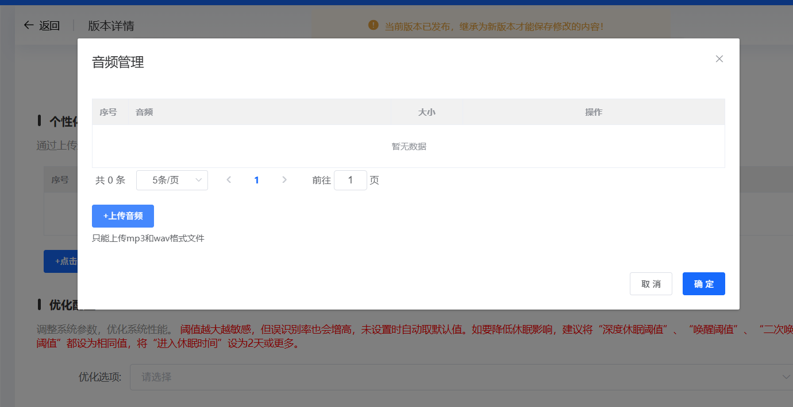


---

### 音频文件上传后无法播放且文件大小异常怎么办？

**问题描述：**

上传的音频文件在平台中可以添加，但无法播放，且文件大小从原来的1.9M变成不到1K。

**解决方案：**

**问题分析：**

- 平台会对上传的音频文件进行压缩处理
- 压缩后文件大小显著减少属于正常现象
- 无法播放可能是文件格式或转换过程中的问题

**处理步骤：**

1. **检查音频文件格式**
    - 确保上传的是标准MP3格式
    - 避免使用修改后缀名的虚假MP3文件
    - 建议使用44.1kHz采样率的标准MP3

2. **转换音频文件**
    - 使用专业的音频转换工具
    - 从其他格式（如M4A）转换为MP3
    - 推荐使用格式工厂等工具进行转换

3. **重新上传测试**
    - 使用转换后的MP3文件重新上传
    - 上传后在平台中试听播放效果
    - 如仍有问题，尝试录制新的音频文件

**注意事项：**

- 平台压缩是正常行为，压缩后文件变小不影响播放
- 确保原音频文件在本地可以正常播放
- 网易云音乐等平台下载的文件可能不是标准MP3格式
- 建议使用B站等平台查找标准MP3格式的音频素材

---

### 固件生成失败如何配置？

**问题描述：**

在使用固件生成平台时无法成功生成固件，需要确认配置项是否正确。

**解决方案：**

1. **检查前端信号处理配置**
    - 确认麦克风配置（单MIC/双MIC）
    - 开启蓝牙音乐功能（如需要）

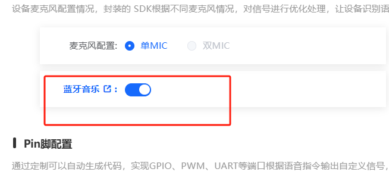

2. **启用小程序功能**
    - 打开小程序开关
    - 保存配置后再生成

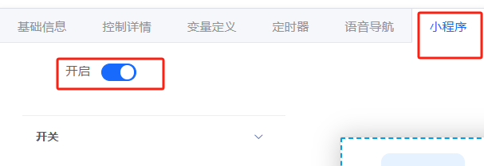

3. **重新生成固件**
    - 保存所有配置项
    - 点击生成按钮
    - 等待生成完成


**注意事项：**

- 部分功能需要明确开启才能正常生成
- 配置修改后必须保存才能生效
- 生成失败时检查是否有必填项未配置

---

### 烧录后无法登录智能公园平台或无法查看语音设置怎么办？

**问题描述：**

JX模块烧录完成后，无法登录智能公园平台，或者登录后无法查看语音设置和相关配置信息。

**解决方案：**

**1. 网络连接检查**

- 检查设备网络连接是否正常
- 确认路由器或交换机工作状态
- 验证网线连接或WiFi信号强度
- 测试网络带宽是否满足要求
- 检查防火墙设置是否阻止平台访问

**2. 账户状态验证**

- 确认平台账户登录凭证正确
- 检查账户是否被锁定或禁用
- 验证账户权限是否足够访问设备
- 尝试清除浏览器缓存和Cookie
- 使用不同浏览器进行测试

**3. 设备状态检查**

- 确认JX模块已成功烧录并启动
- 检查设备指示灯状态是否正常
- 验证设备是否已正确连接到网络
- 确认设备已在平台中正确注册
- 检查设备固件版本是否兼容

**4. 平台使用问题排查**

- 确认平台地址输入正确
- 检查平台服务是否正常运行
- 尝试刷新页面或重新登录
- 检查浏览器版本是否兼容
- 确认使用的账户具有设备管理权限

**5. 设备绑定确认**

- 确认设备序列号已正确输入
- 检查设备是否已被其他账户绑定
- 验证设备绑定码是否有效
- 尝试重新扫描设备二维码
- 联系平台管理员确认设备状态

**6. 语音设置访问问题**

- 确认设备支持语音配置功能
- 检查是否已正确配置音频参数
- 验证语音识别服务是否已启用
- 确认账户具有语音设置权限
- 尝试重新加载语音配置页面

---

### 如何导出语音配置JSON文件？

**操作步骤：**

**1. 登录智能公园平台**

- 使用管理员账户登录平台
- 进入设备管理界面
- 选择需要配置的JX模块设备

**2. 进入语音配置界面**

- 在设备详情页面找到语音设置选项
- 点击进入语音配置管理界面
- 查看当前语音识别参数和命令配置

**3. 导出配置文件**

- 在语音配置页面找到"导出"按钮
- 选择导出格式为JSON
- 确认导出参数设置
- 点击下载配置文件

**4. 配置文件内容**

导出的JSON文件通常包含以下信息：

- 语音识别参数设置
- 唤醒词配置
- 命令词列表
- 音频输入参数
- 识别阈值设置
- 回应配置信息

**5. 文件保存和备份**

- 将导出的JSON文件保存到安全位置
- 建议定期备份配置文件
- 为不同版本创建配置历史记录
- 确保文件命名规范且易于识别

**注意事项：**

- 导出前确保配置已保存并生效
- JSON文件包含敏感配置信息，请妥善保管
- 修改配置文件前建议创建备份
- 导入配置前请确认文件格式正确
- 如遇配置错误，可恢复备份文件

---

### 平台申请固件失败怎么办？

**问题描述：**

在智能公元AI产品代码平台申请固件时，提示"申请失败"。

**解决方案：**

**可能原因分析**

- 平台系统临时故障
- 网络连接问题
- 配置信息不完整或有误
- 平台服务器维护中

**解决方法**

1. **检查网络连接**
    - 确认网络连接正常
    - 尝试刷新页面
    - 更换浏览器尝试

2. **检查配置信息**
    - 确认所有必填项已填写
    - 检查配置参数是否正确
    - 验证设备型号选择是否匹配

3. **联系技术团队**
    - 如持续失败，联系技术团队
    - 提供具体错误信息截图
    - 说明操作步骤和配置内容

**注意事项：**

- 申请失败通常是平台临时问题
- 技术团队会及时处理系统故障
- 保留配置信息便于后续重试

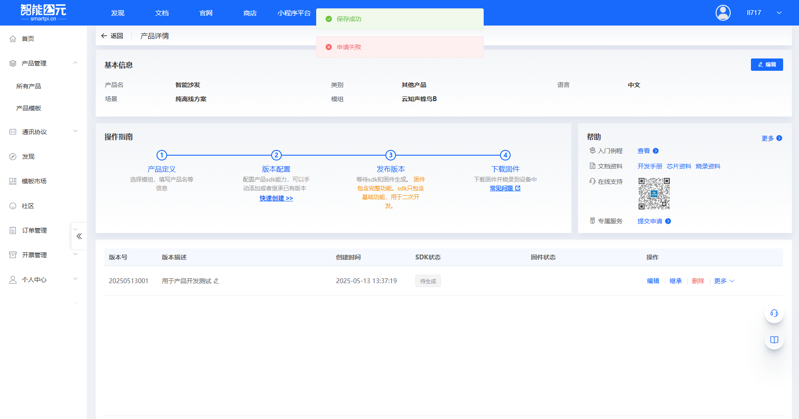

---

### 串口变量无法正确更新怎么办？

**问题描述：**

配置串口输入接收变量后，变量num始终显示初始值，无法接收MCU发送的新值。

**解决方案：**

- **检查变量配置**：

    - 确认串口输入触发已正确配置
    - 验证参数类型（如unsigned char）匹配
    - 检查变量赋值关系（如$A1→num）

- **验证数据发送**：

    - 使用串口调试工具监控发送数据
    - 确认十六进制格式正确（如AA 55 01 30 55 AA）
    - 检查数据位、停止位、波特率设置

- **调试方法**：

    - 添加语音播报输出变量值
    - 观察变量是否随发送数据变化
    - 测试不同数值验证接收功能

**注意事项：**

- 变量更新可能需要触发条件
- 确认MCU与模块的共地连接
- 串口数据格式必须严格按协议要求

---

### 如何设置方言支持？

**问题描述：**

需要为CI系列离线语音识别芯片添加方言支持，了解设置流程、支持的方言种类以及定制要求。

**解决方案：**

- **方言需要定制**：标准固件不支持方言，需要通过语料训练实现
- **提供语料训练**：需要提供对应的方言语料进行模型训练
- **联系技术团队**：通过客服创建专门的方言定制群

**操作流程：**

1. **需求确认**
    - 确定需要的方言类型
    - 评估所需的命令词数量
    - 准备提供语料的预算和时间

2. **语料准备**
    - 收集目标方言的标准发音数据
    - 确保语料质量和覆盖度
    - 按照技术要求格式化语料

3. **开发周期**
    - 方言定制开发周期较长
    - 需要专业的语音训练团队处理
    - 费用相对较高，需要评估成本效益

**注意事项：**

- 方言支持需要通过定制开发实现，非标准功能
- 需要提供充足的高质量语料数据
- 开发周期和费用需要提前评估
- 自学习功能可以作为方言补充方案
- 所有方言都可以通过语料训练实现

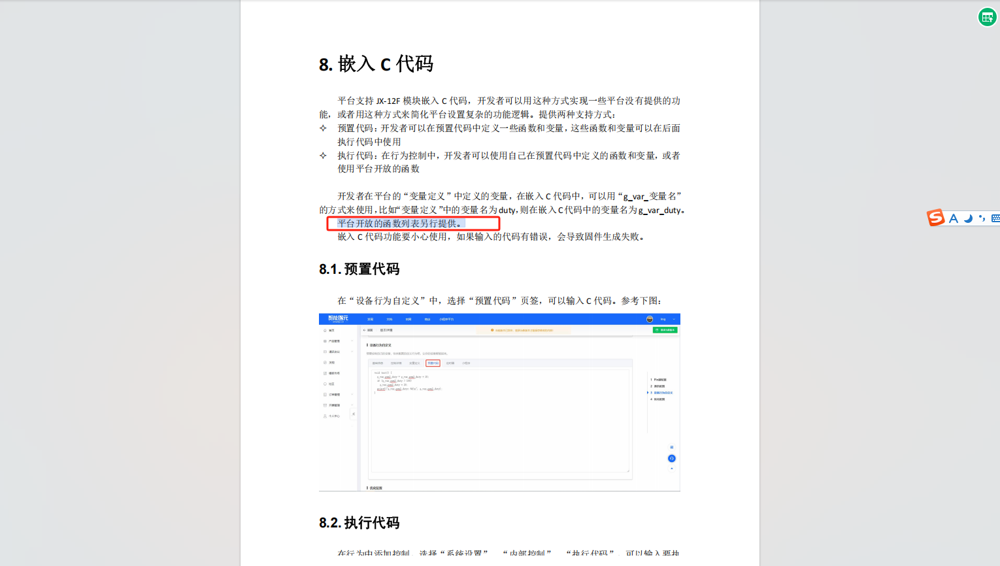

---

### 是否有方言定制的B站教程？

**问题描述：**

询问是否有关于中文方言定制的B站教程以及具体的操作方法。

**解决方案：**

方言定制属于小语种开发范畴，需要通过专门的训练流程实现：

- **下载小语种开发包**：技术团队会提供专门的开发资料包
- **按照开发文档操作**：包含语料准备、训练流程和部署方法
- **需要定制开发**：方言支持无法通过标准配置实现，需要专门训练

**操作步骤：**

1. **联系技术团队**
    - 说明需要定制的方言类型
    - 获取小语种开发资料包
    - 加入专门的方言定制支持群

2. **语料准备**
    - 收集目标方言的语音数据
    - 确保语料的准确性和多样性
    - 按照要求格式化语料

3. **开发与部署**
    - 使用提供的开发工具进行训练
    - 测试识别效果并优化
    - 部署到目标模块

**注意事项：**

- 方言定制没有B站教程，属于专业定制服务
- 需要提供充足的方言语音数据进行训练
- 开发周期较长，需要提前规划项目时间
- 定制完成后会生成专门的固件版本

---

### 平台C代码嵌入功能如何使用？

**问题描述：**

在配置平台的"设备行为自定义"页面中看到可以嵌入C代码，但不知道在哪里查看平台开放的函数列表，且该功能可能存在问题。

**解决方案：**

- **功能状态确认**：C代码嵌入功能当前存在缺陷，研发正在修复
- **等待平台更新**：建议等待后续平台版本更新后再使用
- **问题反馈**：技术团队已将问题反馈给研发团队

**功能说明：**

平台支持两种C代码嵌入方式：

1. **预置代码**：在设备启动时执行的初始化代码
2. **执行代码**：在触发特定条件时执行的代码

**当前限制：**

- 函数列表尚未完善开放
- 部分函数功能存在问题
- 代码执行可能不稳定

**注意事项：**

- 建议暂不使用C代码嵌入功能
- 等待官方平台更新通知
- 如急需实现复杂功能，考虑使用其他方案
- 问题解决后技术团队会主动联系

---

### 固件生成失败怎么办？

**问题描述：**

在平台生成固件时，固件状态显示"生成失败，可能是配置原因，请检查配置"，但未配置长语音等复杂功能，无法确定具体失败原因。

**解决方案：**

**问题排查步骤：**

1. **确认配置内容**
    - 检查是否启用了平台不支持的功能
    - 验证所有配置参数是否在允许范围内
    - 确认命令词设置是否符合规范

2. **使用排除法定位问题**
    - 屏蔽一半功能，生成测试
    - 逐步恢复功能，找出导致失败的具体配置
    - 每次修改只变动一个参数

3. **常见导致失败的原因**
    - 命令词数量超出限制
    - 某些功能组合存在冲突
    - 资源使用超出芯片限制
    - 特殊字符或格式错误

**解决建议：**

- 简化配置，从最基础功能开始
- 逐步添加功能，每次生成后验证
- 记录每次修改的配置内容
- 如问题持续，可尝试新建项目重新配置

**注意事项：**

- 平台无法查看具体的后台错误信息
- 排除法需要耐心，可能需要多次尝试
- 建议在修改配置前做好记录
- 复杂功能建议分阶段实现和测试

---

### 新产品是否支持通过语音对话控制IO口和串口功能？

**问题描述：**

需要了解新产品是否支持通过语音对话实时控制IO口高低电平和串口通信，以实现如"打开台灯"等语音指令直接控制硬件设备。

**解决方案：**

支持。新产品具备离线和在线组合功能，可以通过语音对话控制IO口和串口：

- **离线语音控制**：

    - 支持预定义命令词控制IO口高低电平
    - 可配置特定语音指令触发串口数据发送
    - 响应速度快，不依赖网络连接

- **在线大模型对话控制**：

    - 支持自然语言对话理解
    - 可通过对话内容动态控制IO口状态
    - 支持更复杂的语义理解和场景应用

**注意事项：**

- 离线控制需要预先在平台配置相应的命令词和动作
- 在线控制需要确保设备已连接到网络
- IO口输出电流有限，驱动大功率设备需要外接驱动电路
- 串口通信需注意波特率、数据位等参数配置匹配

---

### 语音控制功能异常，串口通信无响应？

**问题描述：**

语音模块能响应唤醒词并回答，但无法执行控制动作，串口也收不到数据，而蓝牙控制功能正常。

**解决方案：**

**问题定位：**

1. **确认语音功能正常**
    - 能响应唤醒说明咪头和喇叭工作正常
    - 能回答说明语音识别功能正常
    - 问题集中在串口通信或执行部分

2. **检查串口通信配置**
    - 验证UART1_TX配置正确
    - 确认波特率设置（默认9600）
    - 检查数据位、停止位、校验位设置

3. **检查STM32接收程序**
    - 确认串口初始化代码正确
    - 验证中断服务程序正常
    - 测试串口接收缓冲区

4. **对比测试**
    - 使用串口助手发送相同命令测试
    - 对比蓝牙和语音模块发送的数据格式
    - 确认STM32能正常接收其他设备数据

**解决方法：**

- 使用串口调试助手监控实际发送的数据
- 在STM32代码中增加数据打印功能
- 检查串口引脚连接是否牢固
- 验证共地连接是否可靠

**注意事项：**

- 语音模块能发送数据但不一定能触发动作
- 重点检查数据格式是否符合STM32期望
- 使用示波器查看串口信号质量
- 保留故障时的串口数据日志便于分析

---

## 如何在智能平台中修改唤醒词
问题描述：

需要在智能平台中修改设备的唤醒词，但不清楚具体的修改位置和方法。


---

解决方案：

**修改步骤**

1. **登录智能平台**
    - 进入设备配置界面
    - 找到唤醒词设置选项

2. **修改唤醒词**
    - 在指定位置输入新的唤醒词
    - 保存配置

3. **生成并烧录固件**
    - 重新生成固件文件
    - 将新固件烧录到设备


---

注意事项：

- 平台支持添加多个语音指令
- 修改唤醒词后需要重新生成固件
- 确保新唤醒词清晰易识别
- 避免使用与常见词汇相似的唤醒词

---

### 如何通过串口发送浮点数的十六进制格式？

**问题描述：**

在使用串口通信时，希望发送浮点数（如2.5、3.6）给设备，但不清楚如何将这些数值转换为十六进制格式进行传输。

**解决方案：**

**十六进制转换方法：**

1. **IEEE 754浮点数格式**
    - 32位单精度浮点数占4个字节（32位）
    - 符号位：1位（正数为0，负数为1）
    - 指数位：8位
    - 尾数位：23位

2. **转换示例（2.5）**
    - 二进制表示：0100 0000 0100 0000 0100 0000
    - 十六进制：40 20 00 00
    - 发送顺序：高字节在前（大端格式）

3. **转换示例（3.6）**
    - 二进制表示：0100 0000 1100 1101 1001 1001
    - 十六进制：40 66 66 59 99
    - 发送顺序：高字节在前

4. **编程实现（Python示例）**
    ```python
    import struct

    def float_to_hex(f):
        return struct.pack('>f', f).hex()

   # 发送2.5
   hex_data = float_to_hex(2.5)  # 返回 "40200000"
   # 通过串口发送 hex_data
   ```

5. **编程实现（C语言示例）**
    ```c
   #include <stdio.h>
   #include <string.h>

   void float_to_hex(float f, char *hex_str) {
       union {
           float f_val;
           unsigned char bytes[4];
       } converter;
       converter.f_val = f;
       sprintf(hex_str, "%02X%02X%02X",
               converter.bytes[3], converter.bytes[2],
               converter.bytes[1], converter.bytes[0]);
   }

   // 使用：float_to_hex(3.6, hex_string);
   // hex_string 将包含 "40 66 66 59 99"
   ```

6. **串口发送注意事项**
    - 确认字节序（大端或小端）
    - 验证接收方的解析方式
    - 考虑添加校验和确保可靠性

**注意事项：**

- 不同平台可能使用不同的浮点数表示法
- 发送前先确认双方的数据格式约定
- 建议使用标准库函数进行转换，避免手动错误
- 保留详细的转换文档便于维护

---

### 可以修改语音发音人吗？

**问题描述：**

是否可以将产品中的语音发音人替换为特定的个性化语音（如小团团语音）。

**解决方案：**

**个性化音频替换：**

- 支持替换为自定义发音人音频
- 需要自行准备或合成所需音频文件
- 音频格式需符合平台要求

**实施步骤：**

1. **音频准备**
    - 录制或获取目标发音人的音频
    - 确保音频质量清晰、无噪音
    - 按平台要求处理音频格式

2. **平台配置**
    - 在智能公元平台上传自定义音频
    - 替换默认的发音人音频
    - 重新生成并烧录固件

**注意事项：**

- 音频合成需要自行完成，平台不提供
- 确保音频版权合法可用
- 个性化音频可能影响识别效果
- 建议测试确认效果后批量应用

---

### 智能公元平台支持产品共享吗？

**问题描述：**

智能公元平台的产品管理功能是否支持多人同时编辑同一个产品，以及是否支持在线多端同步更新。

**解决方案：**

**产品共享方式：**

- 支持通过导出工程实现共享
- 可将工程文件发送给其他开发者
- 接收方需要导入才能查看和修改

**同步限制：**

- **不支持在线多端同步**：

    - 导出后的工程配置将固定
    - 修改不会实时同步到其他设备
    - 需要重新导出和导入更新

**使用流程：**

1. **导出工程**：

    - 在平台完成产品配置
    - 使用导出功能保存工程文件
    - 分享给其他协作者

2. **导入编辑**：

    - 接收方导入工程文件
    - 可查看和修改配置
    - 完成后重新导出

**注意事项：**

- 协作需要手动同步更新
- 建议明确版本管理避免冲突
- 导出时的配置不会自动更新
- 适合小团队协作，不适合实时同步需求

---

## Arduino平台支持

注意事项：

- Arduino控制需要自行实现协议解析
- 建议先使用图形化平台熟悉功能
- 复杂应用场景建议使用STM32等方案
- 社区可能有第三方的Arduino实现，可参考学习


---

### 如何获取固件文件？

**问题描述：**

需要获取特定功能的固件文件进行烧录或参考。

**解决方案：**

- **官方平台生成**：

    - 在智能公元平台配置所需功能
    - 生成对应的固件文件
    - 下载到本地进行烧录

- **示例固件获取**：

    - 部分功能有现成的示例固件
    - 可联系技术团队获取
    - 参考教程视频中的相关固件

**注意事项：**

- 固件文件与具体模块型号匹配
- 确保固件版本兼容性
- 修改固件配置后需重新生成


---

### 固件发布时串口触发器错误如何解决？

**问题描述：**

在固件发布页面出现"行为控制详情串口触发端口错误"的提示，导致发布失败。

**解决方案：**

**1. 错误原因分析**

串口触发器错误通常由以下原因导致：

- **端口配置重复**：

    - 多个行为使用了相同的串口触发端口
    - 消息号设置冲突
    - 系统无法区分不同触发源

- **参数类型错误**：

    - 串口触发器的参数类型设置不正确
    - 应使用unsigned char类型
    - 其他类型可能导致识别失败

**2. 解决步骤**

1. **检查行为配置**：

    - 逐个检查使用了串口触发的行为
    - 确认每个行为使用不同的消息号
    - A1用消息号1，A2用消息号2

2. **修正参数设置**：

    - 触发方式：选择"串口输入"
    - 消息号：设置为唯一值（1、2、3...）
    - 参数类型：必须选择"unsigned char"

3. **验证配置**：

    - 点击"配置检查"按钮
    - 确认显示"配置检查通过！"
    - 重新进行固件发布

**3. 配置示例**

正确的串口触发配置：

- **行为A1**：

    - 触发方式：串口输入
    - 消息号：1
    - 参数类型：unsigned char
    - 变量：$Shidu（或$U1_Hum）

- **行为A2**：

    - 触发方式：串口输入
    - 消息号：2
    - 参数类型：unsigned char
    - 变量：$U1_Temp（或其他变量）

**注意事项：**

- 每个串口触发行为必须使用唯一的消息号
- 消息号范围建议在1-255之间
- 配置修改后需要重新生成整个固件
- 保存配置前务必进行配置检查


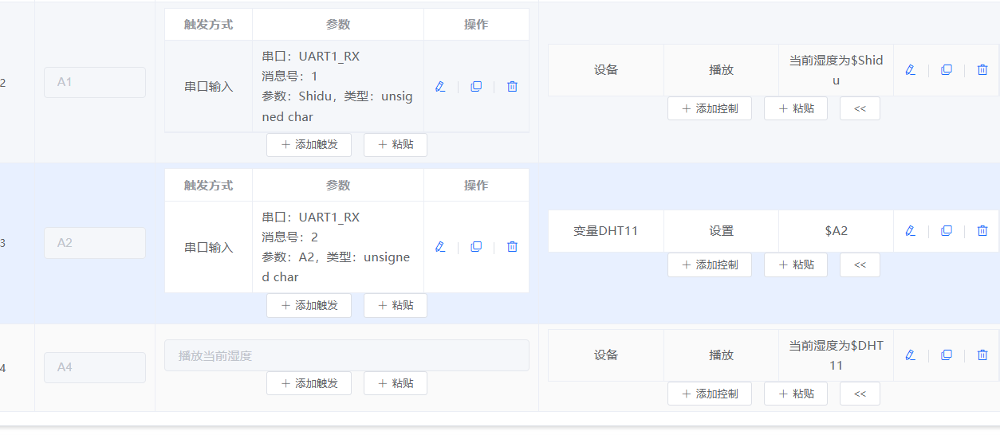

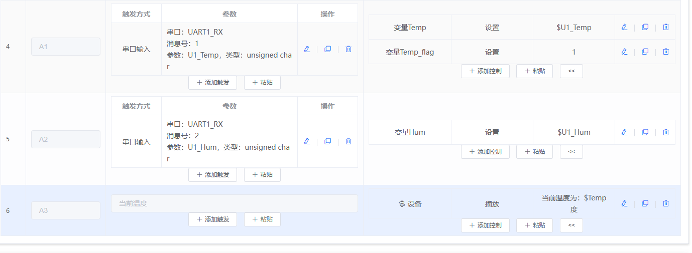

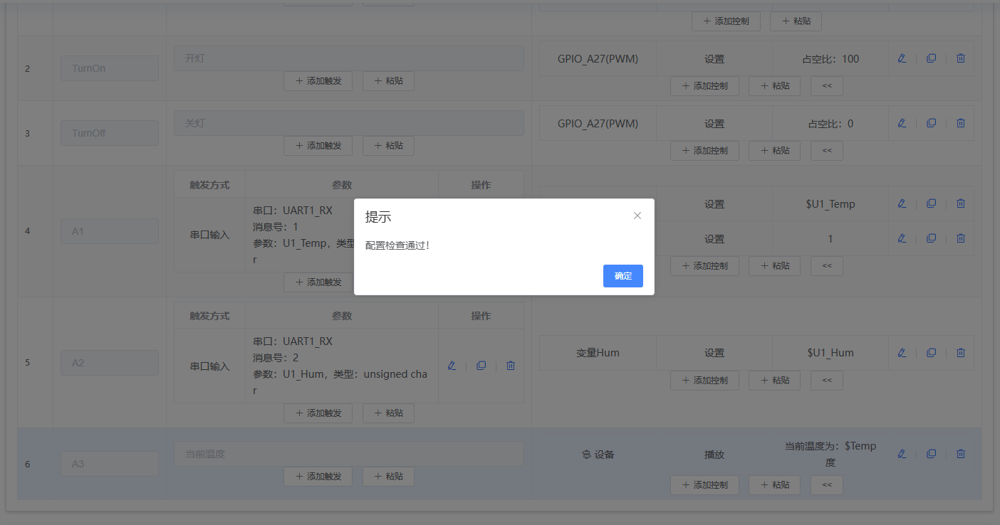


---

### 不使用智能公元平台能否实现I2S接口功能？

**问题描述：**

希望不依赖智能公元平台，通过自行编写代码实现I2S接口功能。

**解决方案：**

**1. 官方方案限制**

- **平台依赖性**：

    - 智能公元的语音模块主要配合图形化平台使用
    - 官方主要提供平台化的开发方案
    - 不直接提供底层的I2S接口API

- **封闭生态**：

    - 语音识别算法集成在官方固件中
    - 不开放底层的音频接口控制
    - 限制直接使用I2S接口

**2. 替代方案**

- **使用串口音频方案**：

    - 部分模块支持串口播放音频
    - 可通过串口发送音频数据
    - 但需要特定的音频格式转换

- **外部音频处理**：

    - 使用外部ADC采集音频
    - 通过其他芯片进行语音识别
    - 语音模块仅作为TTS播报使用

**3. 开发建议**

- **图形化平台开发**：

    - 推荐使用官方图形化开发环境
    - 支持拖拽式编程，无需编码
    - 可生成Arduino兼容的配置

- **SDK开发**：

    - 如需要深度定制，可下载SDK
    - SDK包含完整的API文档
    - 需要一定的嵌入式开发经验

**注意事项：**

- Arduino控制需要自行实现协议解析
- 建议先使用图形化平台熟悉功能
- 复杂应用场景建议使用STM32等方案
- 社区可能有第三方的实现，可参考学习

---

### 固件文件解压失败提示内存不足怎么办？

**问题描述：**

下载固件文件（.gz格式）后，解压时遇到"内存资源不足，无法完成此操作"的错误，导致固件无法使用。

**解决方案：**

**1. 系统环境优化**

- **释放内存空间**：

    - 关闭不必要的程序和浏览器
    - 清理系统临时文件
    - 重启电脑释放内存碎片

- **虚拟内存调整**：

    - 增加虚拟内存页面文件大小
    - 确保系统盘有足够空间
    - 避免同时运行大型程序

**2. 解压方法优化**

- **使用专业解压工具**：

    - 推荐7-Zip或WinRAR解压
    - 避免使用系统自带解压功能
    - 设置较大的临时缓存空间

- **分步解压**：

    - 先解压到临时文件夹
    - 再移动到目标位置
    - 避免直接解压到桌面

**3. 替代方案**

- **重新下载文件**：

    - 删除损坏的下载文件
    - 清空浏览器缓存后重新下载
    - 尝试使用不同浏览器下载

- **网络环境优化**：

    - 使用稳定的有线网络
    - 避免下载过程网络中断
    - 确保磁盘空间充足

**注意事项：**

- .gz文件需要先解压才能使用
- 解压后确认.bin文件完整
- 保留原始压缩文件作为备份
- 如问题持续，联系技术团队获取文件

---

### 语音固件生成需要多长时间？

**问题描述：**

在智能公元平台生成语音固件时，需要了解正常的生成时间，避免等待时间过长误认为系统异常。

**解决方案：**

**1. 标准生成时间**

- **正常时间范围**：

    - 通常情况下需要3分钟左右完成
    - 简单配置可能更快（1-2分钟）
    - 复杂配置需要更长时间（5-10分钟）

- **影响时间的因素**：

    - 命令词条数量：词条越多越慢
    - 语音文件大小：回复语越多越慢
    - 服务器负载：高峰期可能较慢
    - 网络状况：上传下载速度影响

**2. 异常情况处理**

- **超过10分钟未完成**：

    - 检查网络连接是否正常
    - 刷新页面重新尝试
    - 清除浏览器缓存后重试
    - 联系技术团队

- **常见卡顿原因**：

    - 同时生成多个任务
    - 浏览器兼容性问题
    - 服务器临时维护
    - 固件配置过于复杂

**3. 优化建议**

- **提高效率**：

    - 使用Chrome或Firefox浏览器
    - 确保网络带宽充足
    - 避免同时进行其他任务
    - 简化不必要的配置

- **批量处理**：

    - 相似配置可批量生成
    - 保存配置模板供复用
    - 避开服务器高峰时段

**注意事项：**

- 等待20分钟以上属于异常情况
- 生成过程中不要关闭或刷新页面
- 建议在非高峰时段进行固件生成
- 保留生成的固件文件备份

---

### 如何通过调试固件验证语音模块硬件功能？

**问题描述：**

需要先烧录调试固件确认麦克风和喇叭功能正常，再烧录最新版固件，避免设备损坏。

**解决方案：**

- 在智能公元平台制作调试固件
- 使用默认的唤醒词和命令词进行测试
- 先烧录调试固件确认麦克风、喇叭模块正常工作
- 确认硬件无误后，再烧录博主提供的最新版固件
- 正常工作的设备多次唤醒后应仍能正常响应，不会烧毁

**注意事项：**

- 调试固件使用平台默认配置，确保兼容性
- 硬件功能正常后再使用第三方固件更安全
- 如果设备频繁异常或发热，应立即停止使用检查


---

### 如何停止设备的摇尾巴功能？

**问题描述：**

需要停止设备的摇尾巴动作功能。

**解决方案：**

- 通过修改源代码来禁用摇尾巴功能
- 在控制代码中注释或删除相关动作函数
- 重新编译和烧录修改后的固件

**注意事项：**

- 修改代码前建议备份原始固件
- 确认修改不影响其他功能正常使用
- 如不熟悉代码开发，可联系技术团队获取定制固件


---

### 下载的固件不是.bin格式文件怎么办？

**问题描述：**

在平台下载的固件文件是压缩包格式，没有生成.bin文件，无法直接用于烧录。

**解决方案：**

- 平台下载的固件默认是压缩包格式
- 使用解压工具（如WinRAR、7-Zip等）解压压缩包
- 解压后即可找到内部的.bin固件文件
- 选择解压出的.bin文件进行烧录操作

**注意事项：**

- 不要直接使用压缩包进行烧录
- 解压时保持文件路径不含中文字符
- 检查解压后的文件完整性
- 建议创建专门文件夹存放固件文件

---

### 如何查看平台配置文件内容？

**问题描述：**

下载的平台配置文件（.json格式）需要查看详细的配置信息，了解具体的参数设置。

**解决方案：**

**1. 平台导入查看**

- **导入方法**：

    1. 登录智能公元平台
    2. 在配置界面找到"导入"功能
    3. 选择.json配置文件导入
    4. 平台会显示完整的配置信息

- **查看内容**：

    - 导入后可查看所有配置参数
    - 包括引脚配置、语音设置、功能选项等
    - 可以修改或继承该配置

**2. 文本编辑器查看**

- **直接打开**：

    - 使用记事本或VS Code等编辑器
    - 直接打开.json文件查看原始内容
    - 适合技术人员查看具体参数

- **格式说明**：

    - JSON格式的配置数据
    - 包含模块的各项设置参数
    - 可搜索特定配置项

**注意事项：**

- 平台导入是推荐的查看方式
- 导入后配置可编辑和保存
- 建议备份原始配置文件
- 修改配置后需要重新生成固件

---

### 如何将DeepSeek等大模型接入到语音模块？

**问题描述：**

希望将DeepSeek大模型集成到现有的AI语音识别芯片产品中，实现更强大的AI对话能力，需要了解技术可行性和实施难度。

**解决方案：**

- **硬件改造需求**：

    - 需要重新设计PCB电路板
    - 增加ESP32等WiFi/蓝牙模块用于网络通信
    - 考虑增加更强大的处理器单元

- **软件开发工作**：

    - 重写主控程序，集成大模型API调用
    - 实现网络通信协议（HTTP/WebSocket）
    - 处理语音识别与大模型的交互逻辑
    - 开发文本转语音（TTS）播报功能

- **实施步骤**：

    1. 硬件设计：集成ESP32与现有语音模块
    2. 底层开发：编写驱动和通信协议
    3. API集成：接入DeepSeek或其他大模型API
    4. 系统联调：确保语音交互流畅
    5. 功能测试：验证各项功能正常

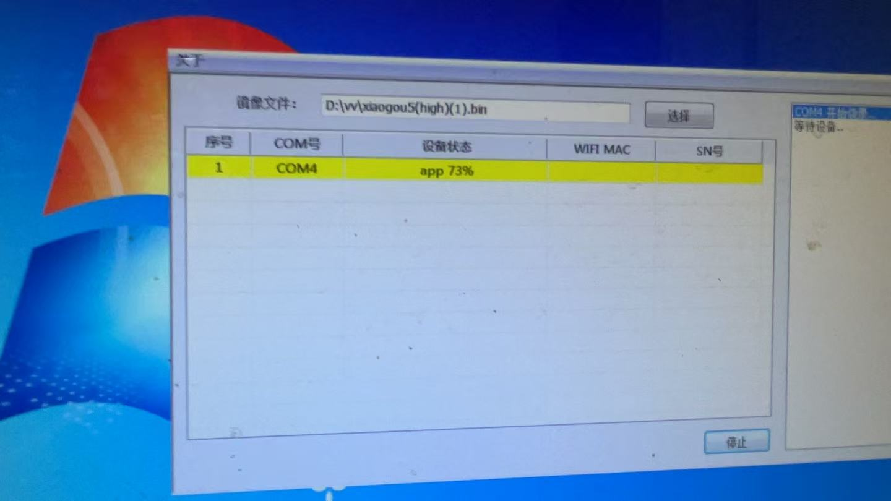

**注意事项：**

- 技术难度中等，需要具备软硬件开发能力
- 预计开发周期约1周（根据功能复杂度）
- 需要考虑API调用成本和网络稳定性
- 建议先在原型上验证可行性


---

### 个性化音频上传后文件大小异常和无声问题

**问题描述：**

上传个性化录音到平台后，文件大小变成0.21KB且播放无声音，但原文件在电脑上可正常播放。

**解决方案：**

**音频格式要求：**

- 上传平台的个性化音频必须转换为MP3格式
- 平台会自动对音频进行压缩处理

**音频时长建议：**

- 推荐音频时长：7-8秒左右
- 避免过短音频（1-2秒可能导致失真）
- 过短音频在上传压缩时容易出现问题

**注意事项：**

- 确保原音频文件清晰无杂音
- 使用标准MP3格式（建议采样率44.1kHz）
- 如问题持续，尝试录制更长时间的音频
- 上传后在平台先试听确认效果


---

### 音频文件过短（1秒）无法上传怎么办？

**问题描述：**

上传的音频文件时长仅为1秒时，可能出现无法上传或上传后异常的问题。

**解决方案：**

**音频时长限制说明**

- 平台推荐音频时长：7-8秒左右
- 1-2秒的过短音频可能导致失真或上传失败
- 过短音频在压缩处理时容易出现问题

**处理方法：**

1. **重新录制音频**
    - 录制时长不少于3秒的音频
    - 确保音频内容完整清晰
    - 避免录制过短的提示音

2. **音频处理建议**
    - 使用音频编辑软件延长音频
    - 可在前后添加适当的静音部分
    - 保持音频质量和自然度

3. **格式要求**
    - 使用标准MP3格式（44.1kHz采样率）
    - 单声道，比特率32-64kbps
    - 文件大小控制在500KB以内

**注意事项：**

- 平台会对音频进行压缩处理，过短音频容易失真
- 建议提示音时长控制在3秒以上
- 上传前在本地确认音频播放正常
- 如问题持续，可尝试录制5-10秒的音频文件


---

### 如何将模块输出改为点动模式？

**问题描述：**

需要将模块的输出从持续输出改为点动输出（触发后只输出一次信号）。

**解决方案：**

**配置修改：**

需要在平台配置中进行相关设置：

- **输出模式选择**：

    - 找到输出控制相关配置选项
    - 选择"点动"或"脉冲"输出模式
    - 设置输出持续时间

- **触发条件设置**：

    - 配置触发指令或条件
    - 设置输出引脚（B0-B3等）
    - 定义输出行为

**注意事项：**

- 点动模式的具体配置方式取决于固件版本
- 部分模块可能需要通过PWM控制实现
- 建议查看具体型号的配置文档
- 测试时使用示波器观察输出波形


---

### 配置语音回复功能是否需要额外配置控制功能？

**问题描述：**

在配置语音回复功能时，设置了回复语内容，但不确定是否还需要在控制部分添加额外配置才能实现完整的控制功能。

**解决方案：**

根据需求决定是否配置控制功能：

- **仅需语音识别和播报**：

    - 只配置命令词和回复语即可
    - 不需要添加额外的控制配置
    - 模块会识别命令并播放对应的回复语

- **需要控制外部设备**：

    - 在"添加控制"中配置相应的控制动作
    - 可选择GPIO输出、串口发送等方式
    - 将控制动作与命令词关联

**功能说明：**

- 语音回复功能独立于控制功能
- 可根据实际需求选择配置范围
- 如后续需要扩展控制功能，可随时添加

---

### 如何在Uno中使用语音指令控制数字引脚？

**问题描述：**

使用Uno主程序进行语音识别控制时，编写了判断语音指令并控制数字引脚高低电平的逻辑，但语音指令对应的设备没有反应。

**解决方案：**

**1. 语音指令值配置**

- **确认指令ID对应关系**：

    - 每个语音指令在平台中有固定的ID值
    - "04"、"05"等数字是指令的实际标识码
    - 需要在Uno程序中正确匹配这些值

**2. 程序逻辑编写**

- **接收串口数据**：
    ```arduino
    String voiceCommand = "";
    if (Serial.available() > 0) {
    voiceCommand = Serial.readString();
    // 去除可能的换行符
    voiceCommand.trim();
    }
    ```

- **条件判断逻辑**：
    ```arduino
    if (voiceCommand == "04") {
    digitalWrite(6, HIGH);  // 打开设备
    } else if (voiceCommand == "05") {
    digitalWrite(6, LOW);   // 关闭设备
    }
    ```

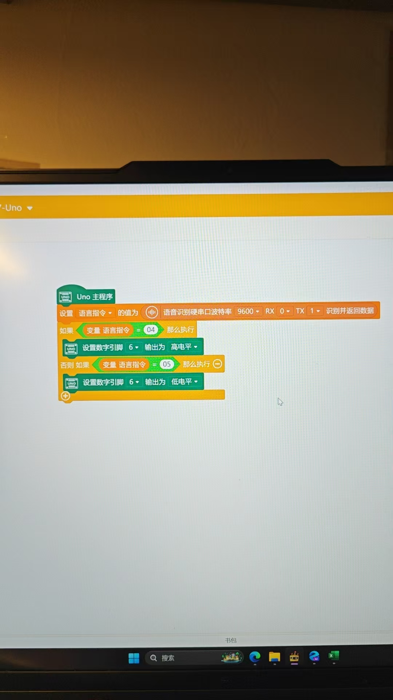

**3. 硬件连接**

- **模块连接**：

    - 语音模块的TX连接到Arduino的RX（通常是引脚0）
    - 语音模块的RX连接到Arduino的TX（通常是引脚1）
    - 注意交叉连接：TX→RX，RX→TX
    - 确保共地连接

- **输出设备连接**：

    - 数字引脚6连接LED或继电器模块
    - 添加限流电阻保护LED
    - 继电器模块需要单独供电

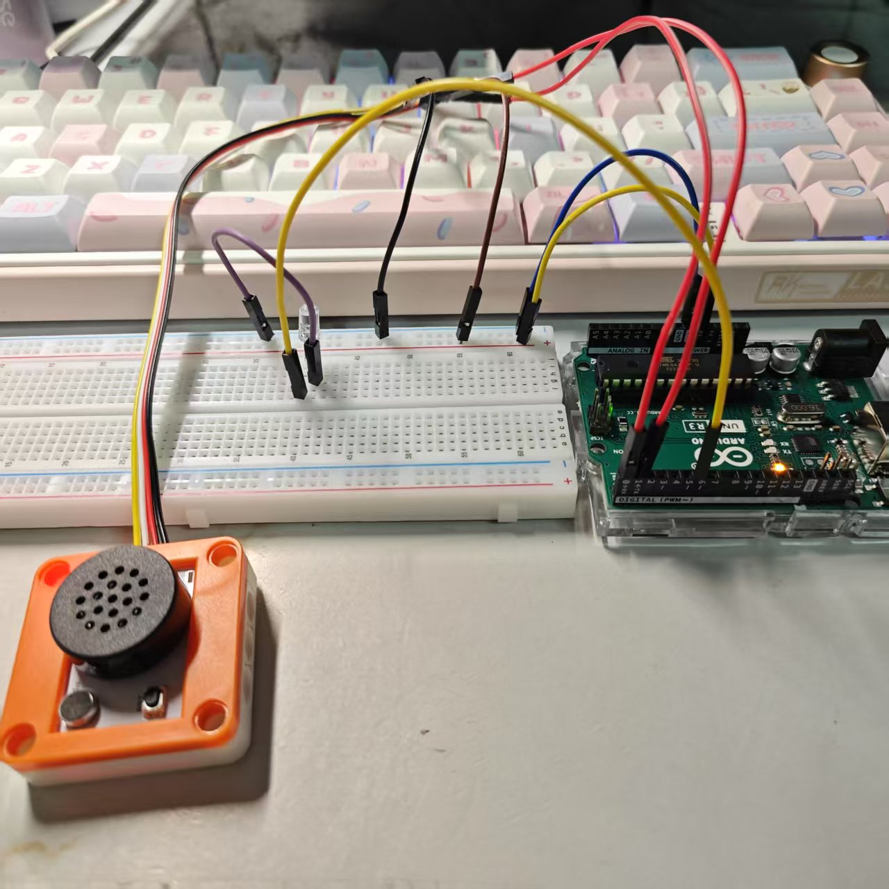

**4. 常见问题排查**

- **串口无响应**：

    - 检查波特率设置是否正确（通常为9600）
    - 确认串口引脚连接无误
    - 验证语音模块正常工作

- **指令不执行**：

    - 确认指令ID与平台配置一致
    - 检查字符串比较是否包含多余字符
    - 使用Serial.println()调试输出接收到的值

- **引脚无输出**：

    - 确认数字引脚初始化为OUTPUT模式
    - 检查外部设备连接是否正确
    - 使用万用表测量引脚电平变化

**注意事项：**

- Uno的串口（引脚0、1）用于USB通信，如需软串口请使用SoftwareSerial库
- 语音模块需要先触发唤醒词（除非设置了免唤醒）
- 建议先使用串口监视器测试指令接收是否正常
- 复杂控制逻辑建议使用switch-case结构替代if-else

---

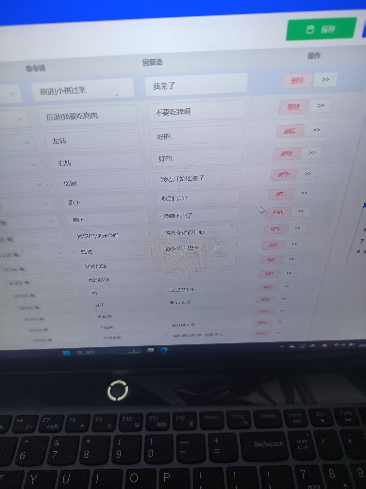

**注意事项：**

- 回复语和控制功能是可选项
- 建议根据项目需求合理配置
- 配置完成后需要重新生成固件

---

### 米思奇软件更新时因中文路径报错怎么办？

**问题描述：**

米思奇软件在更新后因中文路径导致报错，且更新完成后打开软件出现JavaScript模块找不到的错误。

**解决方案：**

**1. 路径问题**

- **中文路径识别**：

    - Windows系统中中文路径可能导致编码问题
    - 米思奇软件对中文路径兼容性较差
    - Git命令在中文路径下可能执行失败

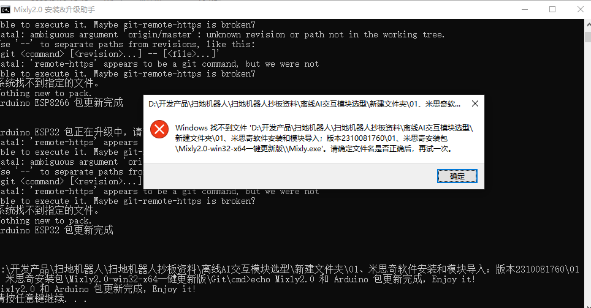

**2. 解决方法**

- **修改安装路径**：

    - 将米思奇安装到纯英文路径
    - 例如：C:\Mixly 或 D:\Software\Mixly
    - 避免使用任何中文字符

- **重新安装软件**：

    1. 完全卸载现有米思奇软件
    2. 清理安装目录和注册表
    3. 重新安装到英文路径
    4. 以管理员权限运行

**3. 更新问题处理**

- **JavaScript错误**：

    - 错误提示：Cannot find module 'main.js'
    - 通常是路径解析错误导致
    - 确保resources\app\src\main.js文件存在


- **文件权限**：

    - 检查安装目录是否为只读
    - 以管理员身份运行软件
    - 关闭杀毒软件的实时防护

**4. 预防措施**

- **路径规范**：

    - 始终使用英文路径安装软件
    - 避免使用空格和特殊字符
    - 保持路径层级不要过深

- **备份配置**：

    - 更新前导出所有配置
    - 保存重要的工程文件
    - 记录自定义设置

**注意事项：**

- 米思奇相关问题建议联系米思奇官方技术团队
- 中文路径问题是Windows软件常见问题
- 保留重要数据后再进行重装操作
- 更新失败后不要强制关闭，等待完全结束后再操作

---

### 设置免唤醒词后命令不执行怎么办？

**问题描述：**

设置了免唤醒词，但命令仍然无法执行，设备没有响应。

**解决方案：**

**1. 免唤醒词配置检查**

- **数量限制**：

    - 免唤醒词数量不能超过10个
    - 超过限制会导致功能失效
    - 合理选择常用的命令设置为免唤醒

- **配置验证**：

    - 确认在平台中正确启用免唤醒功能
    - 检查免唤醒词是否重复
    - 验证命令词格式是否正确

**2. 固件重新生成**

- **配置更新**：

    - 重新编辑工程配置
    - 逐个检查免唤醒词设置
    - 保存并重新生成固件

- **烧录验证**：

    - 使用最新生成的固件烧录
    - 确认烧录过程无错误
    - 测试每个免唤醒词是否响应

**3. 测试方法**

- **逐步测试**：

    - 先测试1-2个免唤醒词
    - 确认响应后再测试其他
    - 记录不响应的具体命令

- **调试输出**：

    - 使用串口监视器查看输出
    - 确认设备接收到语音指令
    - 检查返回的错误代码

**注意事项：**

- 免唤醒词功能需要硬件支持
- 部分旧版本固件可能不支持此功能
- 如问题持续，发送固件给技术团队分析
- 保留配置截图方便问题排查

---

### 软件安装在中文路径下无法运行怎么办？

**问题描述：**

将Mixly软件或相关工具安装在包含中文字符的路径下，运行时出现"找不到指定的文件"或"Cannot find module"等错误，导致软件无法正常启动。

**解决方案：**

**错误原因：**

- 部分软件对中文路径支持不完善
- Node.js等运行环境可能无法正确解析中文路径
- 系统环境变量配置与中文路径存在兼容性问题

**处理方法：**

1. **重新安装到英文路径**
    - 完全卸载原有软件
    - 在英文路径下创建新文件夹（如C:\Mixly）
    - 重新安装软件到英文路径

2. **路径修改建议**
    - 使用纯英文命名文件夹
    - 避免空格和特殊字符
    - 路径层级不宜过深


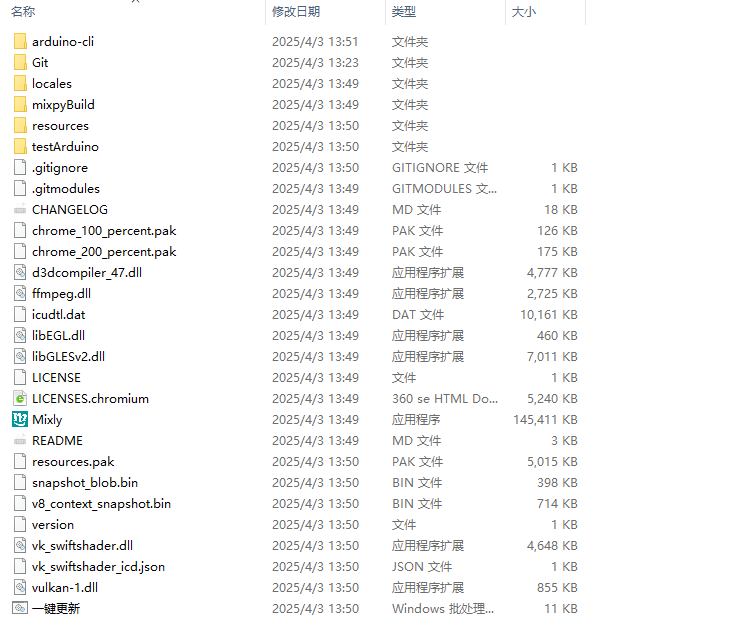

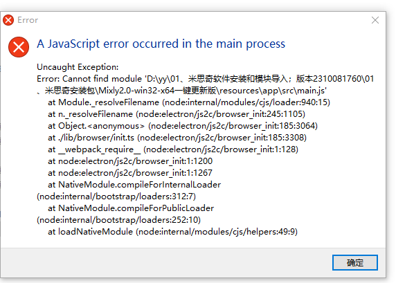

**注意事项：**

- 这是软件兼容性问题，非硬件故障
- 如必须使用中文路径，可尝试使用虚拟路径或软链接
- 建议联系软件开发者获取更好的中文支持版本

---

### GPIO控制语音模块只能触发一次怎么办？

**问题描述：**

使用单片机通过GPIO控制语音模块，第一次可以正常触发，但第二次无法再次触发。

**解决方案：**

- 检查GPIO配置逻辑，确认触发后是否正确恢复初始状态
- 单片机输出高电平触发后，需要及时断开输出，避免持续高电平
- 确认唤醒信号的正确时序，避免长时间占用GPIO口

**注意事项：**

- GPIO口触发应该是脉冲信号，而非持续电平
- 检查单片机程序是否在触发后正确复位GPIO状态
- 长时间高电平可能导致模块无法再次响应触发信号

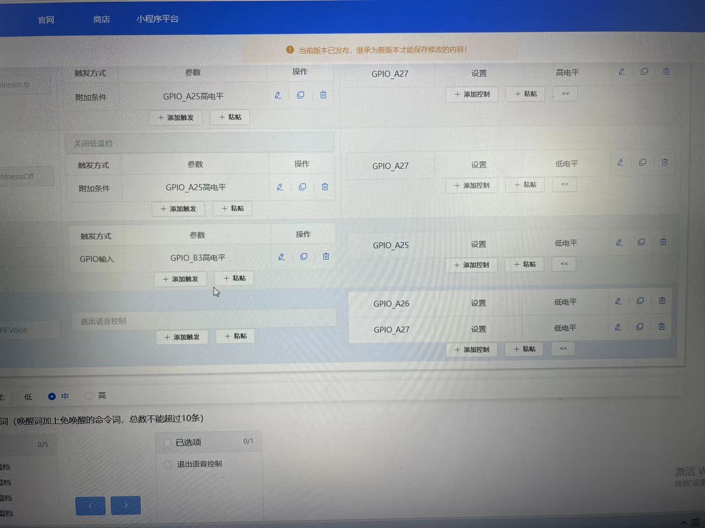

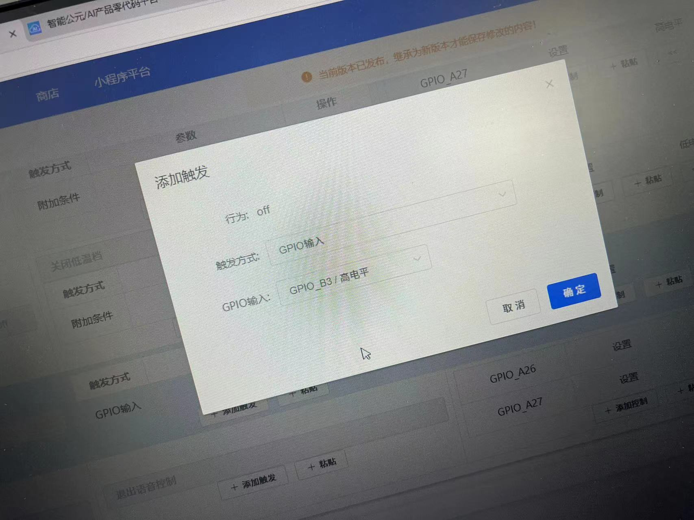


---

### 平台功能选项无法选中怎么办？

**问题描述：**

在平台选择功能时，无法选中特定的平台选项（如'语音识别+自学习+AEC打断(限单MIC) New'），即使刷新页面和重新登录也无法解决。

**解决方案：**

- 退出平台，重新登录账号
- 清除浏览器缓存和Cookie
- 如问题依旧，尝试新创建一个工程
- 重启电脑后再次尝试

**注意事项：**

- 平台功能选项可能与浏览器缓存有关
- 网络不稳定也可能导致选项加载异常
- 建议使用Chrome或Edge等主流浏览器
- 避免同时打开多个平台页面

---

### 语音模块的延迟执行功能如何使用？

**问题描述：**

需要了解语音模块延迟执行功能的使用方法、最大支持时长，以及长时间延迟的准确性。

**解决方案：**

语音模块支持延迟执行功能，可在智能公元平台配置具体的延迟时间。

**功能说明：**

1. **延迟执行配置**：

    - 在"添加控制"界面找到"是否延时输出"选项
    - 设置为"是"后输入延迟时间（毫秒）
    - 支持语音指令触发后的延时动作执行

2. **延迟时间范围**：

    - 理论上支持任意时长的延迟设置
    - 实际测试支持30分钟、1小时等长时间
    - 时间越长，定时精度可能有所降低

**配置方法：**

1. **平台设置步骤**：

    - 选择需要执行的控制动作（如GPIO输出）
    - 开启"是否延时输出"功能
    - 输入延迟时间（单位：毫秒）
    - 保存配置并生成固件

2. **时间换算**：
    ```
    常用延迟时间换算：

    - 10秒 = 10000毫秒
    - 30秒 = 30000毫秒
    - 1分钟 = 60000毫秒
    - 30分钟 = 1800000毫秒
    - 1小时 = 3600000毫秒
    ```

**使用示例：**

```
应用场景：延时控制灯光
- 命令词："10秒后亮灯"
- 延迟时间：10000ms
- 执行动作：GPIO输出高电平

应用场景：延时风扇控制
- 命令词："30分钟后关闭风扇"
- 延迟时间：1800000ms
- 执行动作：GPIO输出低电平
```

**注意事项：**

- 延迟时间以毫秒为单位设置
- 长时间延迟（超过30分钟）精度会有所降低
- 延迟期间模块仍能响应其他指令
- 建议根据实际需求选择合适的延迟时长
- 如需精确计时，建议使用外部定时器配合

---

### 如何获取语音模块的供电方案？

**问题描述：**

需要为语音模块提供220V转5V的供电方案，要求体积小巧，用于控制继电器开关220V交流电源的场景。

**解决方案：**

可根据实际需求选择合适的供电方案：

**方案一：模块电源方案**

1. **成品电源模块**：

    - 220V转5V电源模块
    - 体积小巧（如23.5×15mm）
    - 集成滤波和保护电路

2. **技术参数**：

    - 输入：220V AC
    - 输出：5V DC
    - 功率：根据负载选择（建议2W以上）
    - 隔离：Class II隔离设计

**方案二：CH340供电方案**

1. **USB转串口供电**：

    - 使用CH340模块的5V输出
    - 电流可达500mA
    - 同时提供串口通信功能

2. **适用场景**：

    - 调试和开发阶段
    - 小功率应用
    - 需要串口通信的场合

**方案三：电源适配器方案**

1. **标准适配器**：

    - 5V 2A电源适配器
    - 输出稳定，纹波小
    - 适合长时间运行

2. **连接方式**：

    - DC接口或直接焊接
    - 注意正负极性
    - 加装滤波电容

**设计注意事项：**

1. **功率需求**：

    - 语音模块：约100-500mA
    - 继电器：10-100mA
    - 预留余量：选择20%以上裕量

2. **安全要求**：

    - 必须使用隔离电源
    - 符合安规标准
    - 加装保险或过流保护

3. **布局建议**：

    - 电源靠近模块布局
    - 缩短电源走线
    - 避免与音频线路并行

**应用案例：**

```
继电器控制供电方案：
220V AC → 5V电源模块 → 语音模块
                                ↓
                            继电器模块控制220V负载
```

**注意事项：**

- 220V电路必须由专业电工操作
- 确保电源隔离和接地可靠
- 考虑散热和电磁兼容性
- 预留测试点便于调试

---

### 如何在语音播报中引用变量？

**问题描述：**

需要在语音播报内容中动态插入变量值，实现播报内容随变量变化而变化。

**解决方案：**

- **功能支持**：

    - 智能公元平台小白模式支持变量引用功能
    - 可以在语音内容中插入已定义的变量
    - 实现动态播报效果

- **操作步骤**：

    1. **创建变量**：

        - 在控制配置中点击"添加变量"
        - 定义变量名（如mycount）
        - 设置变量类型和初始值

    2. **插入变量到语音内容**：

        - 在语音内容输入框中点击需要插入变量的位置
        - 点击"添加变量"按钮
        - 选择已创建的变量插入

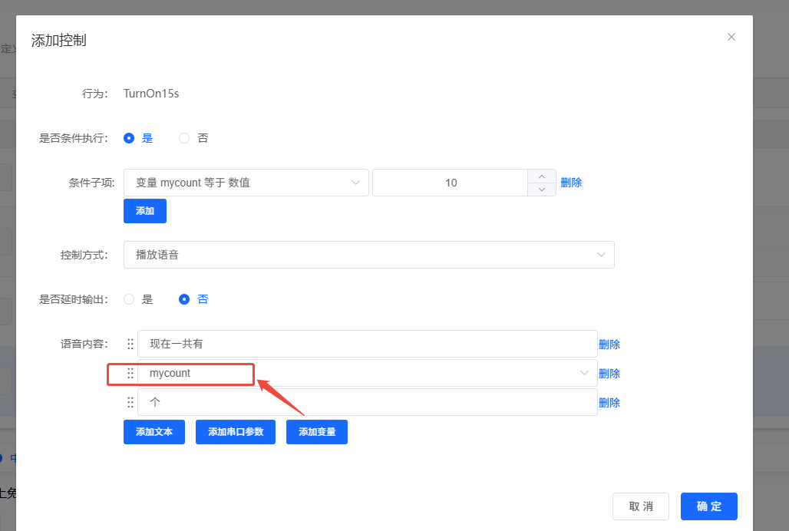

    3. **变量更新逻辑**：

        - 通过定时器或其他控制逻辑更新变量值
        - 变量更新后播报内容会自动使用新值

- **应用场景**：

    - 计数播报：播报当前计数值
    - 状态播报：播报设备当前状态
    - 数据播报：播报传感器数据等

**注意事项：**

- 变量名必须先定义后使用
- 播报时变量会自动转换为对应的值
- 确保变量类型与播报内容匹配
- 不支持在唤醒词中使用变量

---

### SDK生成速度很慢怎么办？

**问题描述：**

生成SDK时速度极慢，即使只设置几个唤醒词也需要15分钟以上，系统提示3分钟但实际等待更久。

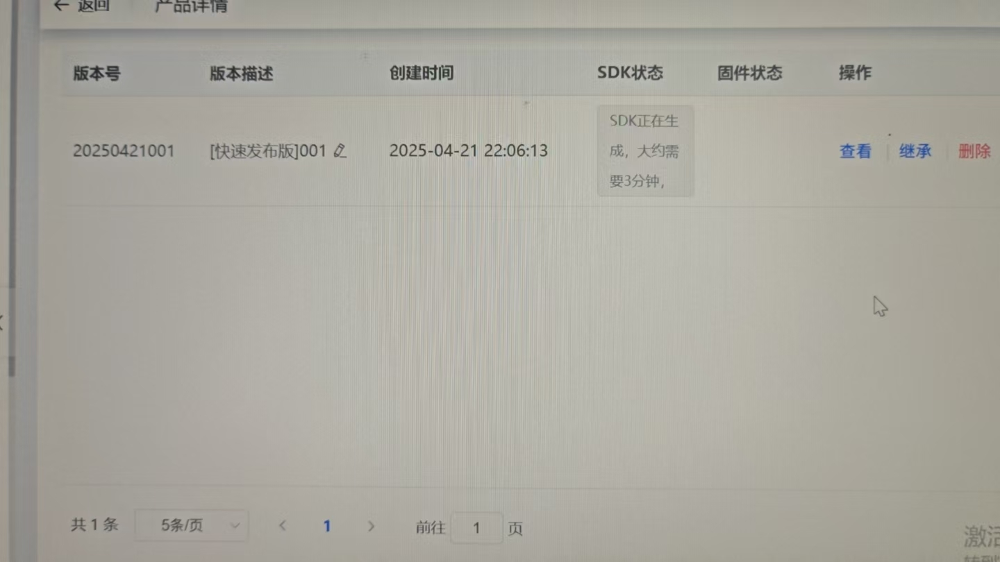

**解决方案：**

- **正常时间范围**：

    - 正常情况：30分钟到1小时是常见现象
    - 快速情况：服务器负载低时可能15-30分钟
    - 系统提示的3分钟只是估算，实际时间会更长

- **影响因素**：

    1. **服务器负载**：

        - 同时生成SDK的使用方数量
        - 任务排队等待时间
        - 服务器处理能力

    2. **网络状况**：

        - 上传下载速度影响
        - 网络稳定性
        - 数据传输完整性

    3. **固件复杂度**：

        - 命令词条数量
        - 语音文件大小
        - 配置项多少

- **处理建议**：

    1. **耐心等待**：

        - 不要频繁刷新页面
        - 可半小时查看一次进度
        - 关注指示灯状态变化

    2. **刷新重试**：

        - 如果超过1小时无响应，尝试刷新页面
        - 检查是否生成完成但未更新显示
        - 重新提交生成任务

    3. **优化配置**：

        - 减少不必要的命令词
        - 压缩语音文件大小
        - 简化配置项

**注意事项：**

- SDK生成速度慢是普遍现象，需要耐心
- 时间估算仅供参考，实际时间取决于服务器状态
- 两个指示灯都变绿表示生成成功
- 建议在网络较好的环境下进行操作

---

### 如何确保语音播报指令按顺序执行？

**问题描述：**

通过串口向语音模块发送多条播报指令时，第一条指令尚未播放完成，第二条指令就已覆盖并开始播放，导致播报内容被中断或混乱。

**解决方案：**

**1. 软件状态控制方案（推荐）**

由于语音模块本身不提供内置队列机制，需要在上位机（单片机或主控程序）中实现逻辑控制：

- **状态查询机制**：

    - 在发送新指令前，先向语音模块发送状态查询指令
    - 等待模块返回当前播放状态（空闲/播放中）
    - 仅在确认空闲时发送下一条指令

- **非阻塞实现**：
    ```c
    // 伪代码示例
    void send播报指令(char*指令) {
        // 查询播放状态
        sendCommand("STATUS?");
        while (getPlayStatus() != '0') {  // '0'表示空闲
            delay(10);  // 短暂延时，避免占用CPU
            // 可使用定时器中断方式实现非阻塞
        }
        // 状态空闲，发送新指令
        sendCommand(指令);
    }
    ```

**2. 事件驱动方案**

- **播放完成中断**：

    - 部分模块支持播放完成后的状态通知
    - 监听串口接收特定的"播放完成"信号
    - 以此作为发送下一条指令的触发条件

- **队列管理**：

    - 在上位机维护一个播报指令队列
    - 每次收到播放完成信号后，自动发送队列中的下一条指令

**3. 延时控制方案（临时）**

如果上述方案不可行，可考虑：

- 在发送指令后加入极短延时（10-50ms）
- 仅作为应急措施，会影响实时性

**注意事项：**

- 确认使用的语音模块是否支持状态查询功能
- 串口通信参数（波特率、数据位、停止位）必须一致
- 避免使用阻塞式延时，保证系统实时性
- 建议使用非阻塞轮询或中断方式实现状态检测

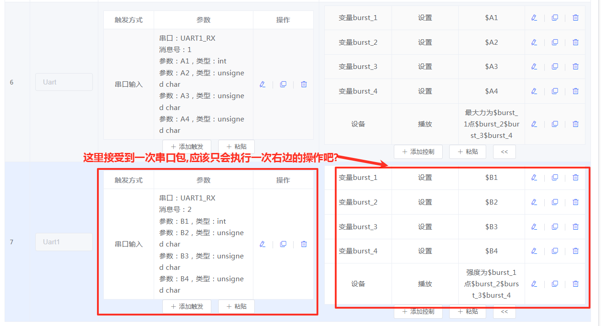

---

### 如何通过串口指令控制单片机执行操作？

**问题描述：**

希望通过串口发送指令给单片机，再由单片机读取指令并执行相应的控制操作，需要确认这种控制方式的可行性。

**解决方案：**

**1. 基本原理确认**

这种控制方式是完全可行的，是常见的嵌入式系统控制方案：

- **通信流程**：控制端 → 串口发送指令 → 单片机接收解析 → 执行对应动作
- **单向控制**：仅需要单片机接收指令并执行
- **双向通信**：如需反馈，可配置单片机返回执行状态

**2. 指令格式设计**

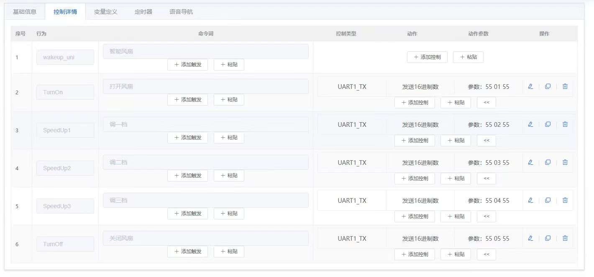

- **固定格式**：建议使用固定的数据帧格式
    - 帧头：标识指令开始（如0x55）
    - 命令字：区分不同操作（如0x01开风扇，0x02调档位）
    - 帧尾：标识指令结束（如0x55）
    - 示例：打开风扇 → 55 01 55

- **自由格式**：如模块支持，可直接发送ASCII字符
    - 优点：调试方便，可读性强
    - 缺点：需要额外的解析逻辑

**3. 单片机程序实现**

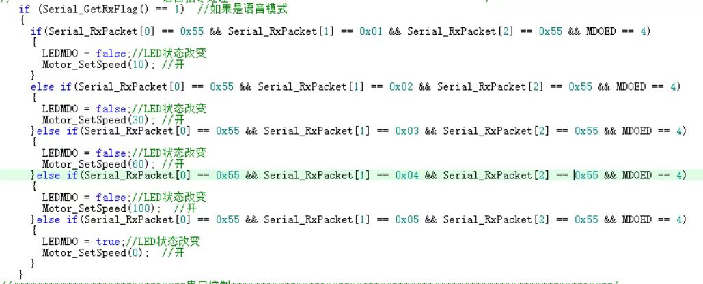

```c
// 伪代码示例
void UART interrupt_handler() {
    if (Serial_RxPacket[0] == 0x55 &&
        Serial_RxPacket[2] == 0x55) {

        switch(Serial_RxPacket[1]) {
            case 0x01:
                Motor_SetSpeed(10);    // 打开风扇
                break;
            case 0x02:
                Motor_SetSpeed(30);    // 调一档
                break;
            case 0x03:
                Motor_SetSpeed(50);    // 调二档
                break;
            // 其他指令...
        }
    }
}
```

**4. 硬件连接**

- **串口连接**：

    - 语音模块TX → 单片机RX
    - 语音模块RX → 单片机TX（可选）
    - 共地连接（GND）

- **电平匹配**：

    - 确保双方电平标准一致（3.3V或5V）
    - 必要时使用电平转换电路

**注意事项：**

- 串口参数必须一致（波特率9600、8数据位、1停止位、无校验）
- 建议先使用串口调试助手测试通信
- 指令格式需要双方严格遵守
- 考虑加入校验机制提高通信可靠性

---

### 是否支持语音定制服务？

**问题描述：**

询问是否可以对CI系列语音识别芯片进行语音定制，包括自定义语音指令、唤醒词和声纹识别等功能。

**解决方案：**

**1. 语音定制支持范围**

- **语音指令定制**：

    - 支持自定义命令词和回复内容
    - 可设置个性化唤醒词
    - 支持自定义播报语音（TTS或录音）

- **声纹识别**：

    - 部分高端型号支持声纹识别功能
    - 可根据不同使用方执行不同操作
    - 需要提前录入使用方声纹样本

- **功能定制**：

    - 支持根据特定需求开发定制功能
    - 可修改识别算法参数
    - 支持特殊应用场景优化

**2. 定制服务流程**

- **需求沟通**：

    - 联系技术团队团队详细说明需求
    - 提供具体的应用场景描述
    - 确定定制范围和实现方案

- **方案评估**：

    - 技术可行性分析
    - 开发周期和成本评估
    - 硬件是否需要特殊处理

- **开发实施**：

    - 签订定制开发协议
    - 进行功能开发和测试
    - 交付定制固件和文档

**3. 注意事项**

- **服务约束**：定制服务可能存在适用范围限制
- **开发周期**：根据定制复杂度，通常需要2-4周
- **技术团队**：定制后提供完整的技术文档和支持
- **保密协议**：涉及商业机密的需求可签订保密协议

**4. 联系方式**

- 通过官方客服渠道咨询定制服务
- 如需进一步沟通，可通过官方渠道提交需求
- 邮件联系技术团队获取评估信息

---

### SDK生成需要等待多长时间？

**问题描述：**

在平台生成SDK时，发现生成任务长时间未完成，有的甚至需要等待3个小时，询问正常的生成时间和原因。

**解决方案：**

**1. 正常生成时间范围**

- **常见情况**：30分钟到1小时
- **高峰时段**：1-3小时属于正常现象
- **最快情况**：服务器负载低时15-30分钟
- **系统提示**：界面的时间估算仅供参考


**2. 影响因素分析**

- **服务器负载**：

    - 同时使用平台的使用方数量
    - 任务排队等待时间
    - 服务器处理能力限制

- **网络状况**：

    - 上传下载速度影响
    - 网络稳定性
    - 数据传输完整性

- **固件复杂度**：

    - 命令词条数量
    - 语音文件大小和数量
    - 配置项复杂程度

**3. 优化建议**

- **选择合适时段**：

    - 避开工作日上午10-11点、下午2-4点高峰期
    - 建议早上8-9点或晚上8点后操作
    - 周末通常负载较低

- **简化配置**：

    - 减少不必要的命令词
    - 压缩语音文件大小
    - 分批生成大型项目

- **保持稳定**：

    - 生成过程不要关闭页面
    - 保持网络连接稳定
    - 避免频繁刷新查看进度

**4. 问题处理**

- **超时处理**：

    - 超过3小时未完成：刷新页面查看
    - 仍无进展：重新提交任务
    - 多次失败：联系技术团队

- **状态确认**：

    - 关注系统维护通知
    - 检查账号是否正常
    - 确认项目配置无误

**注意事项：**

- SDK生成需要服务器编译，时间长是正常现象
- 两个指示灯都变绿表示生成成功
- 建议在网络良好环境下耐心等待
- 保存好配置文件，便于重新生成

---

### 定时器触发唤醒会中断当前任务吗？

**问题描述：**

在使用定时器触发唤醒时，是否会中断当前正在执行的控制任务或延时指令？

**解决方案：**

**中断行为说明：**

定时器触发进入唤醒时**不会**中断当前正在执行的任务。

**具体表现：**

1. **延时指令继续执行**
    - 如果延时指令正在等待，触发进入唤醒不会中止延时
    - 延时完成后会继续执行后续动作
    - 唤醒操作与延时任务并行处理

2. **控制任务不受影响**
    - 正在执行的控制动作不会被中断
    - GPIO输出状态保持不变
    - 定时器超时事件会排队等待处理

3. **多任务处理机制**
    - 系统支持多任务并发执行
    - 不同触发源的事件独立处理
    - 避免了任务间的相互干扰

**应用建议：**

- 可以安全使用定时器维持唤醒状态
- 不必担心定时器会干扰其他功能
- 设计逻辑时可以假设任务独立执行
- 如需任务互斥，需要在平台配置中额外设置

**注意事项：**

- 这是系统的设计特性，确保功能稳定
- 多个任务同时执行时注意资源占用
- 建议测试验证具体的行为是否符合预期
- 复杂时序控制建议查阅技术文档

---

### SDK生成状态长时间卡在'正在生成'怎么办？

**问题描述：**

在平台发布SDK后，SDK生成状态长时间卡在'正在生成'，无法完成生成，导致无法下载固件。

**解决方案：**

**问题现象：**

- SDK状态显示SDK正在生成，大约需要3分钟
- 实际等待时间远超3分钟
- 多个使用方同时遇到相同问题


**处理方法：**

1. **刷新页面查看**
    - 尝试刷新浏览器页面
    - 重新进入版本管理查看状态
    - 有时只是显示更新延迟

2. **继续等待**
    - 平台生成确实可能需要较长时间
    - 有使用方等待4-6小时才成功
    - 避免重复提交导致队列拥堵

3. **避开高峰期**
    - 选择非工作时间段提交
    - 凌晨或早晨服务器负载较低
    - 成功率相对更高

4. **联系技术团队**
    - 如果超过6小时未完成
    - 提供具体的产品信息和提交时间
    - 请求技术团队手动处理

**使用方反馈：**

- 有使用方下午4点提交，晚上10点半才成功
- 属于平台服务器资源紧张导致的正常现象
- 平台方正在优化生成速度

**注意事项：**

- 生成期间不要关闭浏览器标签页
- 避免重复点击生成按钮
- 保存好配置，便于重新生成
- 如急需使用，可尝试简化配置减少生成时间

---

## 功能支持咨询


---

### 语音模组能接入大语言模型吗？

**问题描述：**

询问当前的语音识别模组是否支持接入大语言模型（如GPT、文心一言等）。

**解决方案：**

**1. 当前支持情况**

- **不支持**：现有语音模组不能直接接入大语言模型
- 模组运行在专用固件系统上
- 无法安装第三方AI应用

**2. 技术限制**

- **硬件限制**：

    - 模组处理器性能有限
    - 内存容量不足以运行大模型
    - 缺乏必要的AI加速单元

- **系统限制**：

    - 使用封闭的语音识别系统
    - 不支持安装外部应用程序
    - 协议和接口不开放

**3. 未来计划**

- 新型号正在开发中
- 将推出支持大模型接入的模块
- 具体发布时间待定

**4. 替代方案**

- 配合上位机或MCU
- 通过串口通信实现
- 上位机运行大模型
- 模组负责语音交互

**注意事项：**

- 关注官方新品发布信息
- 现有型号专注于语音识别功能
- 可通过技术团队了解最新进展

---

### 为什么控制类型中无法选择UART0？

**问题描述：**

在配置语音控制继电器功能时，控制类型下拉菜单中只有UART1_TX选项，无法找到UART0_TX选项。

**解决方案：**

1. **UART功能说明**：

    - 平台中的UART0通常用于调试和烧录
    - UART1用于使用方串口通信功能
    - 控制输出应使用UART1_TX

2. **配置方法**：

    - 在控制类型中选择UART1_TX
    - 配置正确的波特率（通常9600）
    - 发送需要的十六进制数据

3. **UART引脚分配**：

    - UART0：主要用于系统调试、日志输出
    - UART1：使用方可配置的串口功能
    - SW_CLK/SW_D：烧录接口，不能用于通信

**注意事项：**

- UART0通常被系统占用，不建议用于使用方功能
- 使用UART1进行串口控制是标准做法
- 配置前确认模块已正确连接串口线
- 某些固件版本可能限制UART0的使用

---

### 附加条件触发需要主触发条件吗？

**问题描述：**

只配置了附加条件而未配置主要触发方式，当达到附加条件时是否可以执行控制操作。

**解决方案：**

1. **触发逻辑说明**：

    - 附加条件不能单独存在
    - 必须有主触发条件作为基础
    - 两者是"与"的关系

2. **触发机制**：

    - 主触发条件满足 → 检查附加条件
    - 附加条件也满足 → 执行控制操作
    - 任一条件不满足 → 不执行

3. **配置方法**：

    - 先选择主触发方式（脉冲输入、语音等）
    - 再添加附加条件进行限制
    - 不可跳过主触发直接设置附加条件

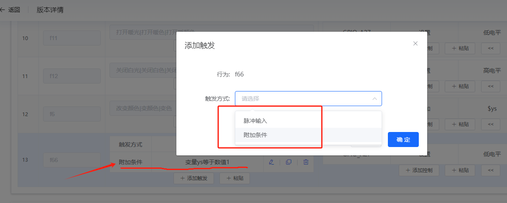

**注意事项：**

- 附加条件用于细化触发范围
- 合理使用可避免误触发
- 建议先测试基础功能再添加条件
- 条件过多可能导致触发困难

---

### 脉冲输入偏差的单位是什么？

**问题描述：**

在平台配置脉冲输入功能时，"偏差"参数的单位不明确，需要确认该参数的具体单位。

**解决方案：**

脉冲输入的"偏差"参数指的是频率偏差，用于设置脉冲输入时允许的频率误差范围。

**参数说明：**

- **参数名称**：偏差
- **参数类型**：频率偏差
- **功能作用**：控制脉冲输入的频率容错范围

**注意事项：**

- 该偏差值是一个相对值，不是绝对频率值
- 设置合适的偏差值可避免因频率波动导致的识别失败
- 建议根据实际脉冲源的稳定性调整偏差值

---

### 后台更改唤醒词后米思齐库未同步更新怎么办？

**问题描述：**

在后台网站更改唤醒词后，米思齐库中未同步更新对应唤醒词，导致无法正常识别。

**解决方案：**

1. **问题原因**：

    - 后台配置与米思齐库文件是独立存储
    - 唤醒词更改后需要手动更新库文件
    - 两个系统的数据不会自动同步

2. **解决方法**：

    - 重新生成米思齐库文件
    - 从后台下载最新的唤醒词配置
    - 在米思齐中手动更新唤醒词词条
    - 确保两者设置保持一致

3. **操作步骤**：

    - 登录后台平台确认当前唤醒词设置
    - 导出或记录最新的唤醒词列表
    - 在米思齐中修改对应词条
    - 重新编译上传程序进行测试

**注意事项：**

- 建议定期检查后台与米思齐的配置一致性
- 修改唤醒词后及时更新相关文档记录
- 保留配置备份便于问题排查

---

### 如何通过串口播放个性化音频？

**问题描述：**

需要通过串口输入触发播放个性化音频，以及配置时出现"行为控制详情控制方式错误"的报错。

**解决方案：**

1. **个性化音频配置原理**

- **功能机制**：个性化音频会替换原有的回复语
- **词条匹配**：控制行为中的语音内容需要与个性化音频词条名称一致
- **播放效果**：触发后播放自定义音频而非播报词条名称

2. **配置步骤**

- **上传音频文件**：

    - 在个性化音频管理中上传WAV音频文件
    - 设置对应的词条名称（如"BA"）
    - 试听确认音频可以正常播放

- **设置控制行为**：

    - 控制方式选择"播放语音"
    - 语音内容输入与词条名称相同的文本
    - 确保使用中文字符而非英文

3. **错误处理**

- **控制方式错误**：

    - 检查控制方式是否选择正确
    - 确认语音内容使用中文字符
    - 避免使用特殊符号或英文

- **生成前验证**：

    - 在平台上试听个性化音频
    - 确认音频文件格式正确
    - 验证配置无误后再生成固件

**注意事项：**

- 个性化音频只支持WAV格式
- 词条名称必须完全匹配（区分大小写）
- 生成固件前务必在平台测试播放效果

---

### 平台界面多出一行内容如何删除？

**问题描述：**

在平台操作时，界面多出了一行内容，需要删除该行。

**解决方案：**

1. **界面操作说明**

- **查找删除选项**：观察该行是否有删除按钮或选项
- **右键菜单**：尝试右键点击该行查看菜单选项
- **缩进功能**：某些界面的多余行可能只是缩进显示

2. **常见处理方法**

- **自动收起**：某些界面在操作完成后会自动隐藏额外行
- **刷新页面**：尝试刷新页面重新加载界面状态
- **重新操作**：撤销上一步操作再重新执行

3. **预防措施**

- **操作规范**：按照平台的操作指南逐步进行
- **避免误操作**：添加内容时确认是否必要
- **及时保存**：完成配置后及时保存

**注意事项：**

- 不同版本的平台界面可能略有差异
- 如果无法删除，可尝试联系技术团队
- 保留操作记录便于问题排查

---

### 如何在串口数据中添加帧头帧尾？

**问题描述：**

需要在串口发送的数据前添加帧头（EEB1），末尾添加帧尾（FF FF），但平台生成的固件中未包含这些格式。

**解决方案：**

**1. 平台限制说明**

- SU系列模块的平台生成的固件速度较慢
- 平台配置中定义的帧头帧尾不会自动添加到发送数据中
- 发送内容只会发送定义的具体参数

**2. 解决方案**

- 使用SDK自行开发，在发送数据时添加帧头帧尾
- 或在接收端处理数据时手动添加帧头帧尾
- 联系技术团队获取定制固件

**3. 数据格式示例**
```
原始数据：01
完整格式：EEB1 01 FF FF
```

**注意事项：**

- 平台生成的固件无法直接修改内部数据格式
- SU系列固件生成速度偏慢，建议耐心等待
- 如果急需使用，可考虑其他系列模块

---

### 配置平台中如何设置音量控制？

**问题描述：**

在离线语音芯片的配置平台中，无法找到或正确配置音量控制功能。

**解决方案：**

**1. 音量控制位置**

- 进入命令词配置界面
- 点击"控制详情"展开完整选项
- 在控制操作中添加音量调节命令

**2. 配置步骤**

- 选择需要调节音量的命令词
- 在控制类型中选择"音量控制"
- 设置音量增减的具体数值

**3. 音量控制方式**

- **固定音量**：直接设置具体音量值（0-100）
- **音量增加**：在当前音量基础上增加指定值
- **音量减少**：在当前音量基础上减少指定值

**4. 验证配置**

- 烧录固件到模块
- 说出命令词测试音量变化
- 确认音量调节是否生效

**注意事项：**

- 不同版本平台的界面布局可能略有不同
- 音量控制需要固件支持相关功能
- 某些旧版本固件可能不支持动态音量调节
- 如界面不一致，尝试更新平台版本

---

## 功能更新与支持


---

### 选择了鼾声检测但事件触发中没有鼾声事件？

**问题描述：**

在产品特性中选择了鼾声检测功能后，在事件触发配置中找不到鼾声事件选项。

**解决方案：**

**1. 功能状态确认**

- 鼾声检测功能已在产品特性中支持
- 但对应的事件触发功能尚未上线
- 这是平台开发进度问题，不是配置错误

**2. 临时解决方案**

- 关注平台更新通知
- 查看固件更新日志
- 联系技术团队了解进展

**3. 更新计划**

- 该功能已加入更新计划
- 具体上线时间需等待平台更新通知
- 建议定期检查平台版本更新

**注意事项：**

- 平台功能会分批次逐步上线
- 新功能需要固件和平台协同支持
- 可通过官方渠道获取最新功能动态

---

## 二次开发与定制


---

### 可以使用A7T硬件方案进行自定义开发吗？

**问题描述：**

希望使用A7T硬件方案自行开发软件功能，需要对接运营商的大模型（如千问）。

**解决方案：**

**1. 硬件方案支持**

- A7T硬件方案支持二次开发
- 可以购买硬件后自行编写软件
- 需要具备相应的开发能力

**2. 大模型对接**

- 支持对接各类大模型API
- 包括运营商千问等主流大模型
- 需要根据需求选择合适的大模型

**3. 开发要求**

- 需要自行研究硬件接口和协议
- 具备嵌入式开发经验
- 能够处理网络通信和API调用

**4. 技术团队范围**

- 官方提供硬件方案和支持
- 不提供具体的软件开发指导
- 二次开发需要自主研究

**注意事项：**

- A7T作为硬件方案，软件层面完全开放
- 对接大模型需要考虑网络环境和API限制
- 建议具备完整的开发团队和技术储备

---

## CI系列功能支持


---

### CI系列芯片是否支持鼾声检测功能？

**问题描述：**

需要确认CI系列芯片是否支持鼾声检测，以及如何在事件配置中找到鼾声触发选项。

**解决方案：**

**1. 功能支持确认**

- CI系列芯片**支持**鼾声检测功能
- 这是芯片内置的音频处理算法
- 可自动识别鼾声特征

**2. 事件配置位置**

- 鼾声检测属于"自学习事件"
- 在事件触发下拉菜单中查找
- 可能需要更新平台版本才能看到

**3. 配置方法**

- 在平台选择"自学习事件"作为触发条件
- 设置对应的响应动作
- 生成固件并烧录到模块

**4. 注意事项**

- 不同平台版本显示的选项可能不同
- 如找不到鼾声选项，尝试更新平台
- 确保固件版本支持该功能
- 部分旧版芯片可能不支持此功能

**故障排查：**

- 检查平台是否为最新版本
- 确认芯片型号支持鼾声检测
- 联系技术团队获取详细配置指导

---

## 系统启动配置


---

### 如何设置CI系列芯片开机进入休眠状态？

**问题描述：**

希望设置CI系列芯片在开机启动时直接进入休眠状态，通过唤醒后再启动设备。

**解决方案：**

**1. 配置系统启动事件**

- 在平台选择"上电启动系统启动"触发
- 这是系统加电时的默认事件
- 可在此事件下配置初始动作

**2. 设置休眠动作**

- 在系统启动事件中添加"进入休眠"操作
- 配置后设备开机即自动休眠
- 等待唤醒指令激活

**3. 唤醒机制配置**

- 配置对应的唤醒方式：

    - 语音唤醒：设置唤醒词
    - GPIO唤醒：配置引脚触发
    - 定时唤醒：设置定时器

**4. 配置流程**

- 进入事件配置界面
- 选择触发类型为系统启动
- 添加响应动作为进入休眠
- 生成并烧录固件

**注意事项：**

- 进入休眠后功耗会降低
- 确保唤醒方式已正确配置
- 测试时验证休眠和唤醒都能正常工作
- 不同型号芯片的休眠特性可能略有差异

---

## 唤醒与触发机制


---

### 语音触发的三种类型有什么区别？

**问题描述：**

在配置语音触发时，对界面中"语音触发"、"自动触发"和"接口触发"三种触发类型的具体含义和区别不清楚。

**解决方案：**

**1. 语音触发（Voice Trigger）**

- **触发方式**：通过特定语音指令触发
- **典型应用**：使用"退下"等退出命令
- **工作原理**：识别到特定命令词后执行动作
- **使用场景**：需要通过语音控制设备状态切换

**2. 自动触发（Auto Trigger）**

- **触发方式**：基于时间延迟自动触发
- **典型设置**：10秒、20秒等时间间隔
- **工作原理**：设备进入唤醒状态后，若无操作则自动退出
- **使用场景**：节能设计，避免设备长时间处于唤醒状态

**3. 接口触发（Interface Trigger）**

- **触发方式**：通过外部信号触发
- **支持信号**：

    - 串口消息（UART通信）
    - 电平信号（GPIO高低电平）
- **工作原理**：接收到指定信号后执行相应动作
- **使用场景**：与其他系统联动，实现自动化控制

**应用示例：**

- **智能家居**：

    - 语音触发："小智，退下"
    - 自动触发：20秒无语音自动进入待机
    - 接口触发：手机APP发送休眠指令

- **工业控制**：

    - 语音触发：生产线工人语音控制
    - 自动触发：异常超时自动停机
    - 接口触发：中央控制系统统一下发指令

**配置方法：**

1. 在配置界面选择触发类型
2. 根据应用场景选择合适的方式
3. 设置对应的触发条件（命令词、时间、信号）
4. 配置触发后执行的动作

**注意事项：**

- 三种触发方式可组合使用
- 语音触发需要预先录制唤醒词
- 自动触发时间不宜过短影响使用
- 接口触发需要确认通信协议兼容性

---

## 固件大小与资源限制


---

### 智能公元平台生成固件失败提示语言模型生成失败怎么办？

**问题描述：**

在智能公元平台中继承已有SDK并修改免唤醒词或欢迎词后，尝试生成固件时，系统持续提示"生成失败: 语言模型生成失败"。

**解决方案：**

**故障原因分析：**

1. **重复命令词导致**：

    - 命令词列表中存在重复词条
    - 如多条"进入蓝牙配网"命令
    - 平台检测到重复后生成失败

2. **配置冲突**：

    - 继承项目时配置未正确更新
    - 修改触发条件时产生冲突
    - 主触发未正确添加

**排查步骤：**

1. **检查命令词列表**：

    - 进入"命令词自定义"页面
    - 仔细查看是否有重复词条
    - 删除重复的命令词

2. **检查配置完整性**：

    - 确认每个行为控制都有主触发
    - 检查配置检查报告中的错误
    - 逐项修复配置问题

3. **重新创建项目**：

    - 如问题持续存在
    - 尝试新建项目而非继承
    - 手动配置所需功能

**预防措施：**

- 添加命令词前先检查是否已存在
- 使用平台提供的搜索功能查找重复
- 定期清理不需要的命令词
- 修改配置后及时保存并测试

**注意事项：**

- 命令词重复会导致模型训练失败
- 主触发是行为控制的必要条件
- 建议在修改前备份原有配置

---

### 如何设置定时器实现继电器15秒自动关闭？

**问题描述：**

通过语音指令触发继电器工作后，需要在15秒后自动停止工作。

**解决方案：**

- **配置步骤**：

    1. **创建定时器**：

        - 定时器名称：timer1
        - 超时时间：15000ms（15秒）
        - 工作模式：单次触发

    2. **语音触发配置**：

        - 添加控制动作：启动定时器
        - 关联语音指令
        - 同时触发继电器工作和定时器启动

    3. **定时器超时配置**：

        - 事件触发：选择"定时器超时触发"
        - 操作：关闭继电器或发送停止指令
        - 选择对应的定时器（timer1）

- **实现逻辑**：

    语音指令 → 继电器工作 + 启动15秒定时器 → 15秒后定时器超时 → 自动关闭继电器

**注意事项：**

- 确保定时器工作模式为"单次触发"
- 继电器控制信号需要与驱动电路匹配
- 测试时验证15秒延时的准确性
- 可根据需要调整超时时间

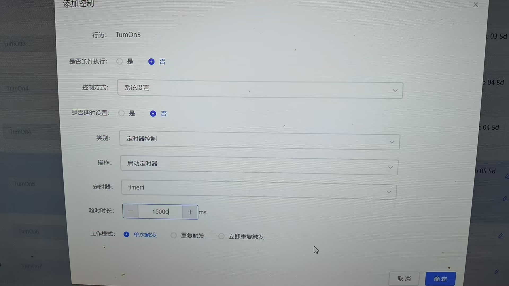
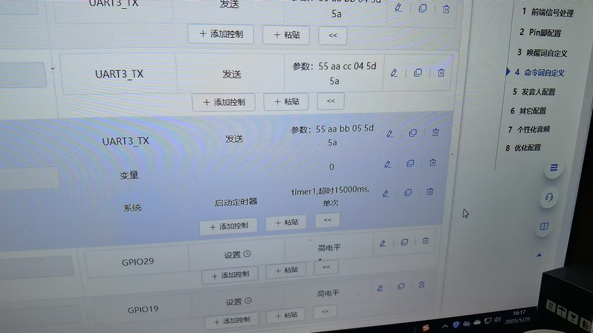

---

### 如何通过串口实现指令延时触发？

**问题描述：**

需要通过串口发出第一条指令后，延时15秒自动发出第二条指令。

**解决方案：**

**1. 第一条指令配置（串口触发）**

- 触发方式：选择"串口输入"
- 选择串口：UART3_RX（或其他接收串口）
- 配置相应的动作（如发送UART数据或控制GPIO）

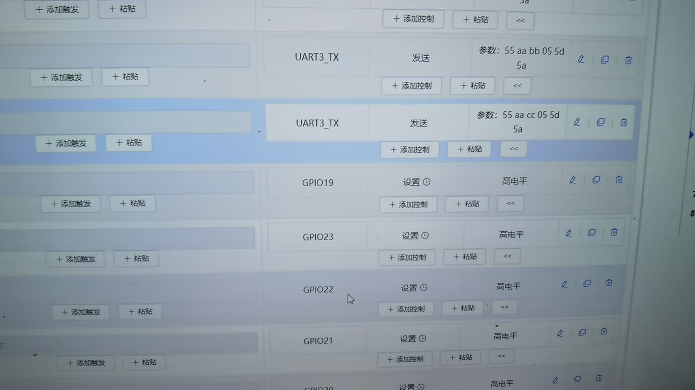

*串口输入触发配置*

**2. 延时实现（启动定时器）**

- 在第一条指令的动作中添加"启动定时器"
- 定时器设置：

    - 定时器名称：timer1
    - 超时时间：15000ms（15秒）
    - 工作模式：单次触发


*定时器启动配置*

**3. 第二条指令配置（定时器触发）**

- 触发方式：选择"事件触发"
- 触发事件：选择"TIME定时器超时"
- 选择对应的定时器：timer1
- 配置需要延时执行的动作

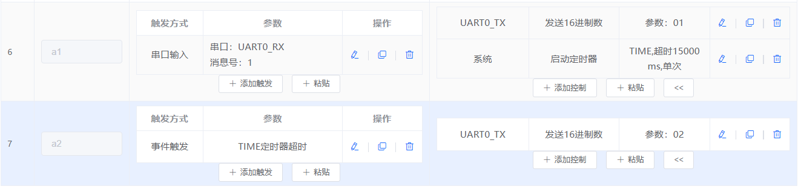

*定时器超时触发配置*

**注意事项：**

- 定时器超时时间单位是毫秒（ms）
- 确保定时器工作模式为"单次触发"
- 如需循环延时，可设置为"周期触发"
- 测试时验证延时时间的准确性

---

### 添加触发时无法选择串口输入或事件触发怎么办？

**问题描述：**

在"添加触发"弹窗中，"触发方式"下拉菜单无法选择"串口输入"或"事件触发"等选项，显示为灰色禁用状态。

**解决方案：**

**1. 检查基础信息填写**

- 确保基础信息中的必要字段已正确填写
- 基础信息未填写完整会导致触发方式不可选
- 这是出现灰色禁用状态的主要原因

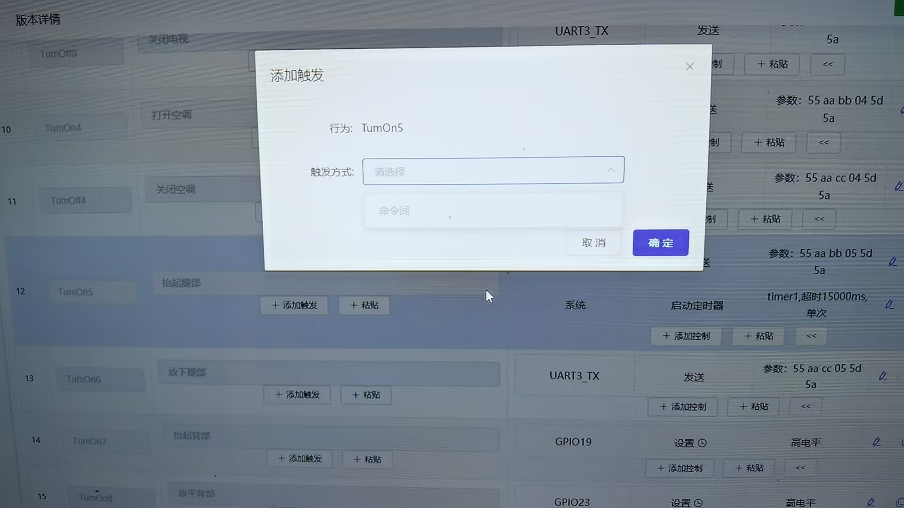

*触发方式选项被禁用*

**2. 命令词触发配置**

- 如需命令词触发：

    - 触发方式：选择"命令词"
    - 填写具体的命令词内容
    - 命令词填写后即可选择触发方式


*命令词触发可以正常选择*

**3. 串口和事件触发使用场景**

- 串口输入触发：

    - 用于接收外部串口指令
    - 需要选择对应的串口（如UART3_RX）

- 事件触发：

    - 用于定时器超时、GPIO输入等内部事件
    - 需要先配置相应的事件源

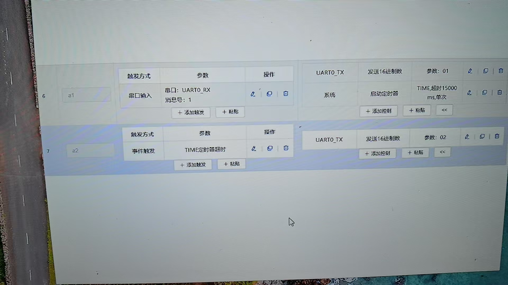

*已配置的串口输入和事件触发*

**4. 配置流程建议**

- 先填写完整的基础信息
- 根据需要选择合适的触发方式
- 配置对应的动作或输出
- 保存配置并生成固件

**注意事项：**

- 触发方式为灰色通常是因为基础信息未填写
- 不需要使用"添加触发"功能来配置串口输入
- 可直接在触发方式表格中选择对应的触发类型
- 事件触发需要先有触发源（如定时器）

---

### 如何查看语音模块发送的串口信息？

**问题描述：**

需要查看语音模块通过串口发送给单片机的信息内容。

**解决方案：**

**1. 直接连接方法**

- 将语音模块通过串口直接连接到电脑
- 使用串口调试助手查看模块发送的数据
- 不需要通过单片机中转

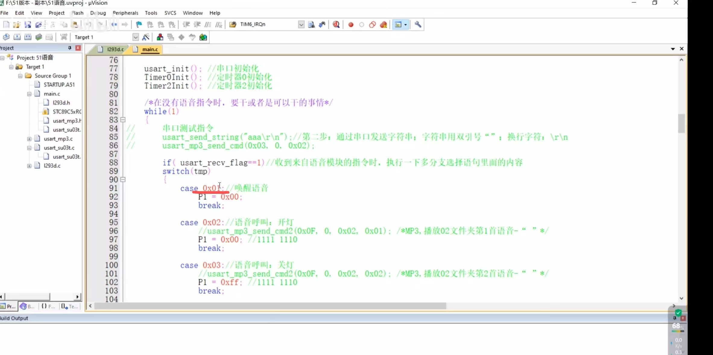

*单片机接收语音模块数据的代码示例*

**2. 串口调试工具配置**
在配置串口输入触发时：

- 参数名称和类型：按C语言格式定义
- 测试值：使用十六进制格式填写
- 测试消息：会根据测试值自动生成

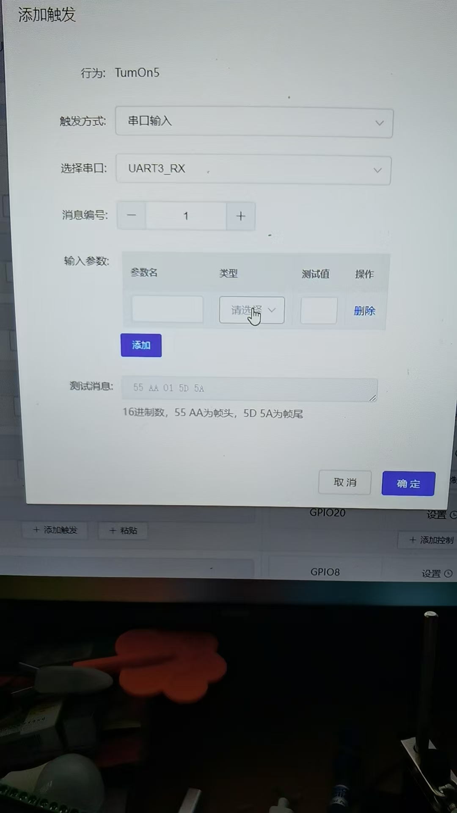

*串口输入参数配置示例*

**3. 配置说明**

- 帧头帧尾：如55 AA（帧头）、5D 5A（帧尾）
- 测试消息：显示完整的十六进制数据包
- 发送测试：使用"测试消息"中的内容进行测试

**注意事项：**

- 语音模块发送的是十六进制数据
- 单片机需要按相同的通信协议解析
- 测试时可先在电脑上验证数据格式
- 修改测试值时下面的测试消息会自动更新

---

### 如何配置语音指令触发后通过串口输出指令信息？

**问题描述：**

希望在语音指令被识别后，通过串口输出对应的指令信息，但不清楚如何配置相关引脚和触发方式。

**解决方案：**

**1. 理解行为配置**

- 行为名称只是标识，不是输出引脚
- 需要在"触发方式"中选择具体的输出方式
- 通过"添加控制"来配置输出动作

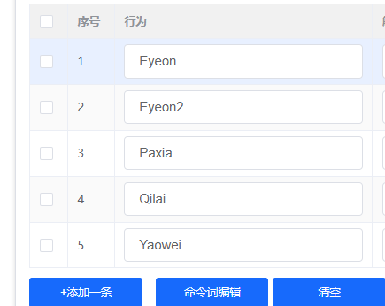

**2. 配置串口输出步骤**

- 进入语音指令的"控制详情"页面
- 点击"添加控制"按钮
- 选择"串口输出"作为控制方式
- 设置要输出的指令内容
- 确认保存配置

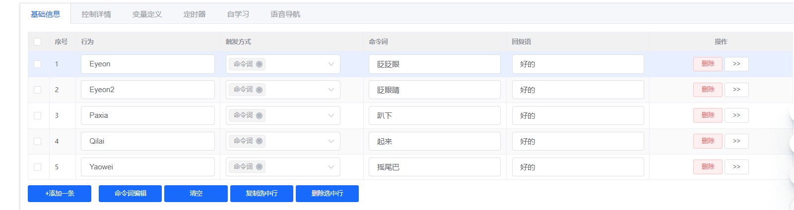

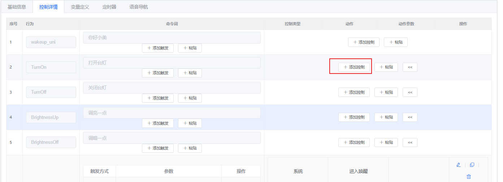

**3. 输出内容设置**

- 可输出固定字符串（如"LED_ON"）
- 可输出十六进制数据（如 AA 55 01）
- 可输出变量值或状态信息
- 支持多条串口输出指令

**4. 烧录和测试**

- 完成配置后生成固件
- 烧录固件到模块
- 连接串口调试助手测试
- 语音触发后观察输出

**注意事项：**

- 每个语音指令都需要单独配置输出动作
- 串口输出需要模块硬件支持UART功能
- 输出格式需与接收端协议匹配
- 测试时使用正确的波特率（默认115200）

---

### 智能公元平台导出固件格式错误？

**问题描述：**

在智能公元平台制作固件后，导出的文件是.json格式，烧录工具只能识别.bin文件，导致无法烧录。

**解决方案：**

- 智能公元平台可以直接制作并导出.bin格式的固件文件
- 烧录工具只能使用.bin结尾的文件
- 导出后直接烧录即可使用

**注意事项：**

- 平台导出的固件已经是可直接烧录的格式
- 不需要手动修改文件扩展名
- 如仍显示.json文件，尝试重新导出或更换浏览器

---

### Mixly本地导入板卡不显示固件名怎么办？

**问题描述：**

在Mixly软件中导入本地板卡时，选择JSON文件后固件名称输入框为空，无法显示固件名称。

**解决方案：**

**操作步骤：**

1. 确保选择的是正确的JSON格式固件文件
2. 文件选择后会自动读取固件信息
3. 如果名称未显示，检查文件是否完整

**常见问题：**

- JSON文件可能损坏或不完整
- 文件路径包含中文或特殊字符
- Mixly版本兼容性问题

**注意事项：**

- 使用官方提供的固件文件
- 确保文件未被修改
- 如问题持续，尝试重新下载固件

---

### 智能体配置创建新配置功能有视频教程吗？

**问题描述：**

询问智能公元平台智能体配置中的"创建新配置"功能是否有视频教程。

**解决方案：**

**教程状态说明：**

- 智能体配置创建新配置功能目前暂无视频教程
- 官方计划在未来两天内更新上线视频教程
- 可关注平台更新通知

**临时解决方案：**

1. **参考文档教程**
    - 查看平台内置帮助文档
    - 参考现有配置模板
    - 联系技术团队获取指导

2. **操作步骤**
    - 进入智能体配置页面
    - 点击"创建新配置"
    - 根据需求配置参数
    - 保存并应用到模块

**注意事项：**

- 视频教程即将上线，请耐心等待
- 当前可通过文字教程学习操作
- 如有疑问可及时联系技术团队

---

### 小程序平台触发方式无法更改怎么办？

**问题描述：**

在小程序平台配置触发行为时，触发方式下拉菜单为空，无法选择或更改触发方式。

**解决方案：**

**问题原因：**

- 小程序平台可能存在临时加载问题
- 浏览器缓存导致选项不显示
- 平台功能正在维护或更新

**解决步骤：**

1. **清除浏览器缓存**
    - 清除浏览器缓存和Cookie
    - 使用无痕/隐私模式重新访问
    - 更换不同浏览器尝试

2. **刷新和重试**
    - 刷新页面重新加载
    - 退出后重新登录
    - 等待一段时间再试

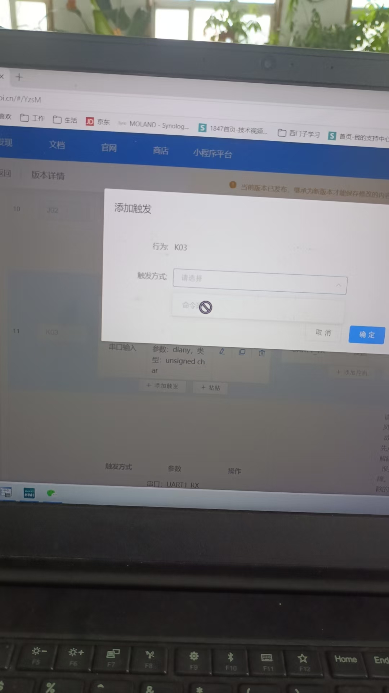

**临时方案：**

- 删除原有触发配置
    - 点击删除按钮移除当前配置
    - 重新创建触发行为
    - 重新设置触发方式

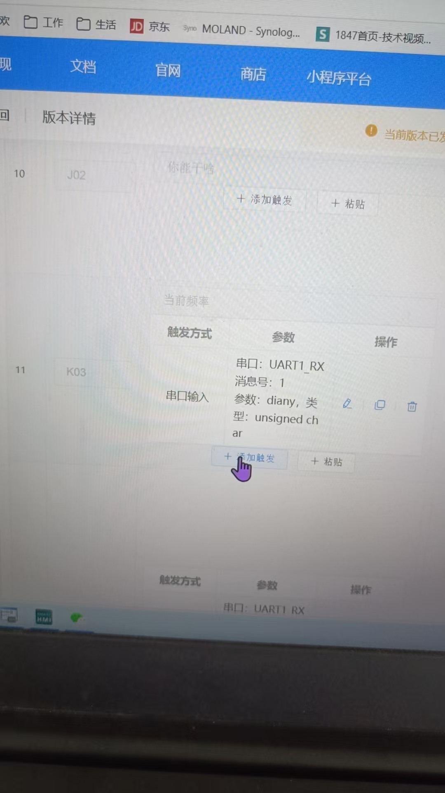

**注意事项：**

- 问题通常是临时性的，重试即可解决
- 如持续存在，联系技术团队处理
- 建议使用Chrome或Edge浏览器

---

## 平台更新与功能支持


---

### 平台更新后通讯输入触发事件的执行控件选项减少怎么办？

**问题描述：**

平台更新后，"通讯输入"触发事件下的执行控件选项明显减少，无法选择之前设置好的控件（如原来的 TCP 通讯控件等），下拉选项仅剩 3 个（如 `[fasongshuju]`、`[wangluolianjie]`、`[dingshiqi]`）。

**问题原因：**

- 平台在国庆节前进行过更新，对某些功能做了限制或调整
- 原有的一些控件在新版本中不再显示或被移除

**解决方案：**

**1. 临时方案**

- 如果是已有工程受到影响，可以尝试：

    - 删除原有的触发配置
    - 重新创建通讯输入触发事件
    - 查看是否能看到所需的执行控件

**2. 等待官方修复**

- 该问题已由技术支持确认并上报研发
- 研发团队会在后续更新中恢复相关功能
- 建议关注平台更新通知，待修复后重新配置

**3. 使用替代方案**

- 如果 TCP 通讯触发方式受限，可考虑使用"串口触发事件"作为替代
- 修改代码逻辑，将数据源从 TCP 改为串口输入

**注意事项：**

- 平台更新可能对旧有配置产生兼容性影响
- 同一种触发事件无需重复配置，系统只会触发其中一个
- 如有紧急需求，可联系技术支持协助处理

---

### 智能公元平台是否已支持特定功能需求？

**问题描述：**

需要确认智能公元平台是否已更新支持特定功能需求。

**解决方案：**

**1. 平台更新确认**

- 智能公元平台会定期更新以支持新的功能需求
- 更新后会在平台中体现相应的功能选项
- 可通过平台界面直接查看新增功能

**2. 功能验证方法**

- 登录智能公元平台账户
- 查看对应产品的配置选项
- 检查是否有所需的功能设置

**注意事项：**

- 平台更新无需使用方手动操作
- 如有特殊需求，可联系技术团队确认
- 建议定期查看平台公告了解最新功能

---

### 蓝牙和GPIO口唤醒功能如何实现？

**问题描述：**

需要了解是否可以通过蓝牙和GPIO口唤醒功能，以及实现方式。

**解决方案：**

**1. 功能支持确认**

- 平台已支持蓝牙和GPIO口唤醒功能
- 该功能可以在平台配置中直接设置
- 无需等待额外更新

**2. 实现步骤**

- 在智能公元平台创建项目
- 选择唤醒方式配置
- 设置蓝牙唤醒参数
- 配置GPIO口触发条件

**3. 快速部署**

- 平台修改配置后，可立即重新烧录固件
- 烧录次数无限制，可随时更新
- 支持快速迭代测试

**注意事项：**

- GPIO口唤醒需要正确的硬件连接
- 蓝牙唤醒需要模块支持蓝牙功能
- 配置完成后需重新生成并烧录固件

---

### 小程序平台触发方式无法更改怎么办？

**问题描述：**

在小程序平台中，无法更改语音识别模块的触发方式设置。

**解决方案：**

**1. 功能限制说明**

- 小程序平台的触发方式设置可能存在显示限制
- 某些配置选项可能无法直接修改
- 这通常是平台界面的显示问题

**2. 临时解决方案**

- 删除原有触发配置
    - 点击删除按钮移除当前配置
    - 重新创建触发行为
    - 重新设置触发方式

**3. 操作步骤**

- 点击"+ 添加触发"按钮
- 选择需要的触发方式
- 配置相应的参数
- 保存设置


*小程序平台的触发方式配置界面*

**4. 替代方案**

- 如小程序平台无法修改，可尝试：

    - 使用智能公元网页版平台
    - 联系技术团队协助修改
    - 等待平台更新修复

**注意事项：**

- 问题通常是界面显示异常，非功能缺失
- 删除重试是最直接的解决方法
- 建议使用Chrome或Edge浏览器访问

---

### 如何在控制详情中添加变量并利用串口数据触发条件？

**问题描述：**

需要在控制详情中添加变量，并通过串口数据来触发条件，实现通过单片机控制设备操作。

**解决方案：**

**1. 添加变量定义**

在智能公元平台的"变量定义"页面进行配置：

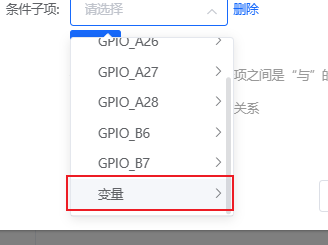

在变量定义界面中添加和管理变量：

- 变量名：自定义（如time, Start, energy等）
- 类型：选择数据类型（如char）
- 默认值：设置初始值
- 备注：描述变量用途


**2. 配置控制详情**

在控制详情界面配置触发条件：


**3. 设置串口输入触发**

添加触发时选择"串口输入"方式：

- 触发方式：串口输入
- 选择串口：UART1_RX
- 消息编号：自定义
- 输入参数：配置测试消息

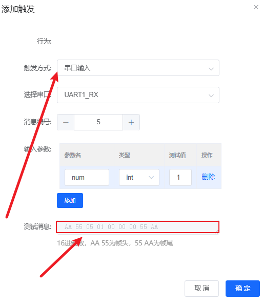

**4. 配置消息格式**

串口消息格式为十六进制：

- 帧头：AA 55
- 帧尾：55 AA
- 中间为有效数据

示例测试消息：`AA 55 05 01 00 00 00 55 AA`

单片机向语音模块发送此格式消息即可触发相应操作。

**5. 使用变量条件**

可以在触发条件中添加变量作为附加判断：

- 变量值可在控制详情中修改
- 通过变量值的变化触发不同操作
- 实现灵活的控制逻辑

**注意事项：**

- 串口波特率默认为115200
- 消息格式必须严格按照十六进制发送
- 变量定义后需在控制详情中正确设置和使用
- 测试消息用于配置验证，实际使用由单片机发送

---

### 如何通过单片机向语音模块发送数据以触发特定操作？

**问题描述：**

需要了解单片机如何向语音模块发送数据，以触发预设的特定操作。

**解决方案：**

**1. 配置串口输入触发**

在控制详情中添加触发时：

- 触发方式选择"串口输入"
- 选择对应的串口（如UART1_RX）
- 设置消息编号和输入参数

**2. 消息格式配置**

测试消息显示为十六进制格式：

```
AA 55 05 01 00 00 00 55 AA
```

- AA 55：帧头
- 55 AA：帧尾
- 中间部分：有效数据内容

**3. 单片机发送程序**

单片机需要按照配置的格式发送数据：

```c
// 示例代码
uint8_t trigger_msg[] = {0xAA, 0x55, 0x05, 0x01, 0x00, 0x00, 0x00, 0x55, 0xAA};
uart_send(trigger_msg, sizeof(trigger_msg));
```

**4. 触发执行**

当语音模块接收到符合格式的串口数据时，会自动触发：

- 控制详情中对应的行为操作
- GPIO控制、语音播报等预设动作

**注意事项：**

- 单片机串口配置需与模块匹配（115200波特率）
- 消息格式必须包含正确的帧头帧尾
- 可通过延时50ms发送多个指令
- 发送的内容只需包含有效数据，无需帧头帧尾

---

### 如何正确设置变量值和理解参数设置界面？

**问题描述：**

在平台中进行变量定义和参数设置时，对如何正确修改变量值以及理解参数设置界面的功能存在困惑。

**解决方案：**

**1. 变量定义与输入参数的区别**

需要明确两个不同的功能界面：

- **变量定义**：定义全局变量，设置变量名、类型、默认值
- **输入参数**：配置触发时的接收参数，用于匹配串口接收的数据

**2. 变量定义界面**

在变量定义列表中创建变量：

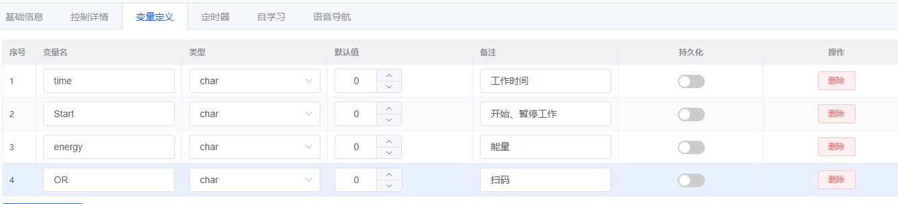

- 变量名：如time, Start, energy, OR
- 类型：char
- 默认值：0
- 备注：说明变量用途

**3. 输入参数配置**

在添加触发时配置输入参数：

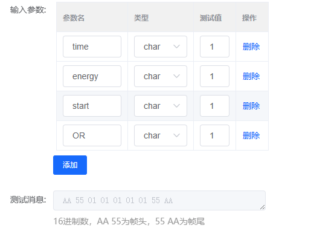

- 参数名：对应变量名
- 类型：选择数据类型
- 测试值：用于配置验证

**注意**：输入参数的测试值是设置接收的数据格式，不是直接改变变量值。

**4. 修改变量的正确方法**

在控制详情中设置变量值：


- 找到对应的变量（如"变量num"）
- 点击"设置"按钮
- 输入新的变量值
- 保存配置

**5. 数据流程理解**

正确的工作流程是：

1. 单片机发送特定格式的串口数据
2. 语音模块接收数据，匹配输入参数
3. 触发预设的操作或行为
4. 可以在控制详情中手动修改变量值用于测试

**注意事项：**

- 输入参数配置的是期望接收的数据格式
- 变量值需要通过控制详情的"设置"功能修改
- 测试消息用于验证配置是否正确
- 实际应用中数据来自外部设备，不是手动输入

---

### 如何通过串口发送多个指令？

**问题描述：**

需要了解如何通过串口一次性发送两个指令，是分别发送带帧头和帧尾的独立指令，还是可以将两个指令合并成一个数据包发送。

**解决方案：**

**1. 指令发送方式**

推荐的方式是分别发送每个指令：

- 每个指令独立发送
- 都包含完整的帧头和帧尾
- 指令之间添加适当延时

**2. 延时设置**

发送多个指令时：

- 建议延时50ms发送第二个指令
- 确保第一个指令被完全处理
- 避免指令冲突或丢失

**3. 指令格式说明**

发送的格式要求：

- 设置的内容就是实际发送的数据
- 如设置01，发送的数据就是01
- 不需要额外添加帧头帧尾（平台会自动处理）

**示例发送序列：**

```
第一个指令：01
延时50ms
第二个指令：02
```

**4. 单片机实现示例**

```c
// 发送第一个指令
uart_send_byte(0x01);
delay_ms(50);

// 发送第二个指令
uart_send_byte(0x02);
```

**注意事项：**

- 不要将多个指令合并为一个数据包
- 每个指令都应独立完整
- 延时时间可根据实际情况调整
- 建议先测试单个指令，再测试多指令

---

### 语音识别未命中时可以通过串口发送数据吗？

**问题描述：**

当使用方提问的问题不在预设词条内时，希望了解是否可以通过串口将未识别的语音数据或事件发送到上位机进行处理。

**解决方案：**

**1. 语音模块的工作机制**

- 语音模块只能响应预设的命令词
- 未识别的语音不会触发任何行为
- 模块不具备语音实时转发功能

**2. 串口数据发送机制**

- 只有触发了预设的命令词才会通过串口发送数据
- 未命中的语音不会产生串口输出
- 如果支持未识别转发，会导致串口持续发送数据

**3. 替代实现方案**

- **唤醒信号方案**：

    - 唤醒成功时给上位机发送信号
    - 命令词不触发时不发送信号
    - 上位机根据信号判断识别状态

- **退出唤醒通知**：

    - 配置唤醒退出时通过串口发送通知
    - 上位机收到退出信号即认为无有效指令
    - 可在退出时发送特定标识（如0xFF）

**实现示例：**

```c
// 上位机判断逻辑
if (收到唤醒信号) {
    等待命令词触发;
    if (在限定时间内收到命令) {
        执行对应操作;
    } else {
        // 未收到命令，识别失败
        处理失败逻辑;
    }
}
```

**注意事项：**

- 语音模块不支持未识别内容的实时转发
- 需要通过预设的逻辑判断识别状态
- 可利用唤醒和退出信号实现类似的检测效果

---

### 在配置控制项时，无法在条件项中选择PWM占空比等变量怎么办？

**问题描述：**

在配置控制项时，条件项中选择不到PWM占空比等变量，且界面缺少变量定义选项，导致无法完成控制逻辑的设置。

**解决方案：**

**1. 先定义变量，再使用变量**

在使用变量进行条件判断前，必须先在变量定义页面创建变量：

- 进入"变量定义"页面
- 添加新变量，设置：

    - 变量名：如 flag、pwm_value 等
    - 类型：unsigned char（0-255范围）
    - 默认值：0
    - 备注：说明变量用途

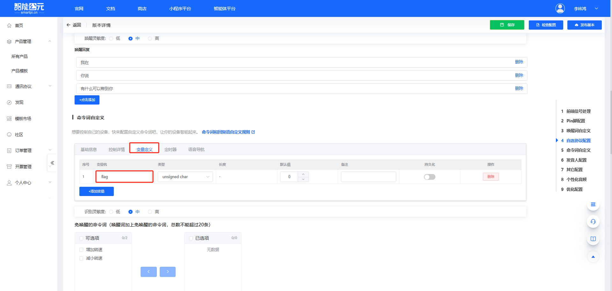

**2. 正确配置控制项条件**

在添加控制时，条件项的选择规则：

- **系统内置变量**：如 PWM0 占空比、系统音量等，无需定义直接可选
- **自定义变量**：需要先在变量定义中创建，才能在条件项中选择
- **变量类型匹配**：确保变量类型与用途匹配

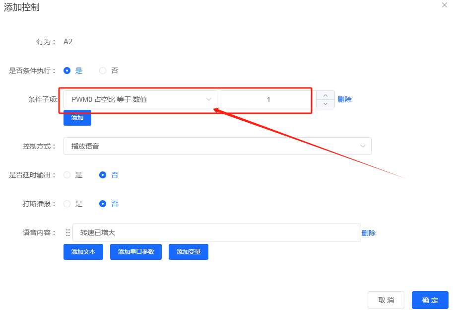

**3. 变量类型选择建议**

根据用途选择合适的变量类型：

- **unsigned char**：0-255范围，适合PWM占空比、标志位等
- **int**：-32768到32767，适合计数器、温度等
- **double**：浮点数，适合需要小数的参数


**4. PWM控制变量类型示例**

在配置PWM控制时，变量类型选择：

- **条件判断变量**：使用 unsigned char
- **PWM占空比值**：范围 0-100，对应 0% 到 100%
- **数值比较**：支持大于、小于、等于、大于等于、小于等于

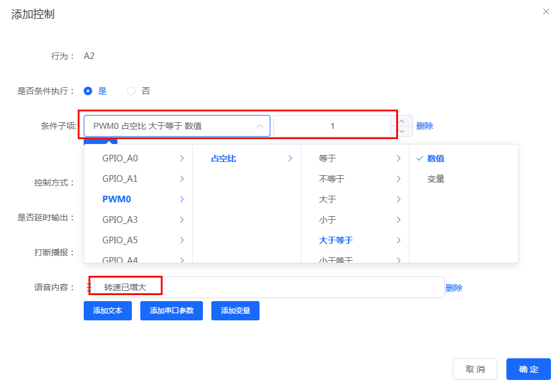

**常见配置场景：**

- PWM占空比 ≥ 数值 1：当占空比大于等于1%时触发
- 变量 flag = 数值 5：当自定义变量等于5时触发
- 系统音量 ≤ 数值 50：当音量小于等于50时触发

**注意事项：**

- PWM占空比等系统变量是内置的，不需要使用方定义
- 如果看不到PWM占空比选项，检查是否选择了正确的条件类型
- 自定义变量必须先定义才能在条件判断中使用
- 变量名要符合C语言命名规则，不能使用中文或特殊字符

---

### 如何配置打开风扇的控制逻辑？

**问题描述：**

在配置语音控制风扇功能时，不确定如何正确设置"打开风扇"的控制项，包括是否需要添加条件判断以及如何配置PWM输出。

**解决方案：**

**1. 基本配置方法**

对于直接的"打开风扇"命令：

- **触发方式**：语音命令识别
- **控制类型**：端口输出
- **控制方式**：PWM0（或其他PWM通道）
- **动作**：设置占空比


**2. 不需要额外条件判断**

"打开风扇"是直接执行命令，不需要条件判断：

- 移除"条件子项"中的设置
- 直接设置PWM占空比值
- 占空比20对应20%转速

**3. 正确的配置步骤**

1. 添加控制动作
2. 选择"端口输出"
3. 设置PWM通道（如PWM0）
4. 选择"设置占空比"
5. 输入数值（如20）

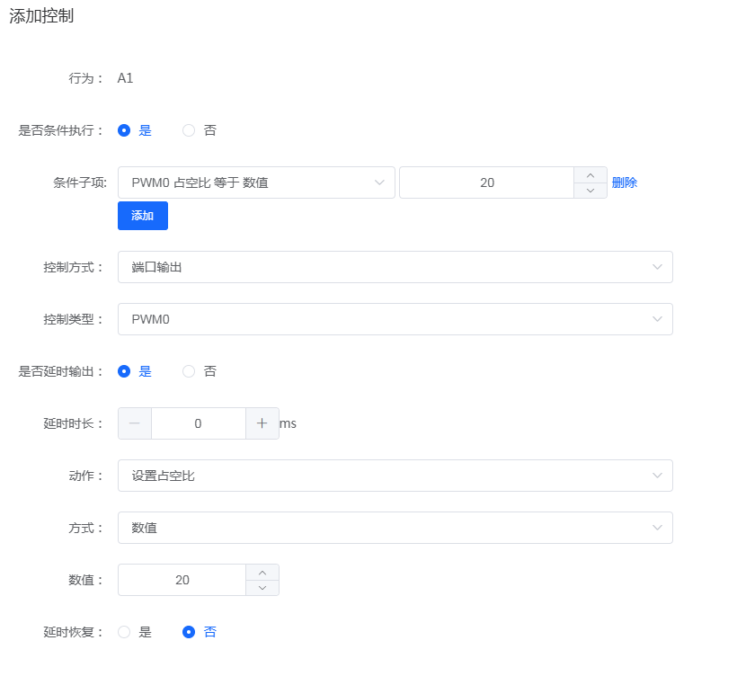

**4. 常见错误修正**

- **错误**：添加了"PWM0占空比等于数值20"的条件
- **问题**：这会导致条件循环，需要先满足条件才能执行
- **正确**：移除条件，直接设置PWM值

**注意事项：**

- PWM占空比范围：0-100（0%=关闭，100%=全速）
- 不需要条件判断的命令，不要在条件子项中添加限制
- 测试时可从低占空比开始，避免突然高速运转
- 不同风扇型号可能需要最小启动占空比（如10%以上）

---

### 配置事件触发时提示"行为控制详情没有添加主触发"怎么办？

**问题描述：**

在配置控制事件触发时，检查结果显示"行为控制详情没有添加主触发"，导致事件无法触发，且找不到删除已创建行为的方法。

**解决方案：**

**1. 理解主触发概念**

每个行为必须有一个主触发条件：

- **主触发**：命令执行的基础条件
- **可选触发方式**：命令词、GPIO输入、事件触发等
- **附加条件**：在主触发基础上的额外判断（可选）


**2. 添加主触发方法**

在行为配置中添加触发：

1. 选择行为（如B1、B2）
2. 点击"添加触发"
3. 选择触发方式：

    - **事件触发**：选择系统启动、定时器超时等
    - **命令词**：选择语音命令触发
    - **GPIO输入**：选择引脚电平触发

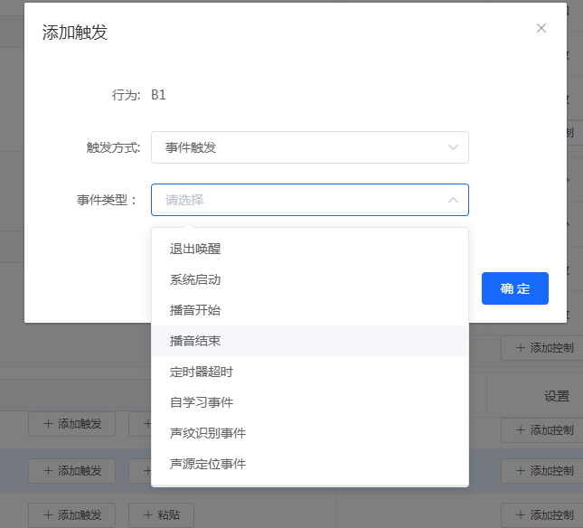

**3. 删除不需要的行为**

删除已创建但不需要的行为：

1. 在控制列表中找到目标行为
2. 点击行末的"<<"按钮
3. 确认删除操作


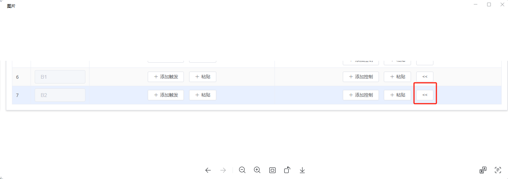

**4. 常见触发场景**

**上电启动触发**：

- 事件类型：系统启动
- 触发类型：上电启动
- 用于初始化设置

**定时器超时触发**：

- 事件类型：定时器超时
- 选择对应的定时器（Timer1、Timer2）
- 用于延时控制

**GPIO输入触发**：

- 触发方式：GPIO输入
- 选择引脚和触发电平
- 用于外部信号触发

**注意事项：**

- 每个行为必须有且只有一个主触发
- 事件触发不能单独存在，需要行为作为载体
- 不需要的行为应及时删除，避免配置混乱
- 添加触发后必须重新生成固件

---

### 如何配置条件执行逻辑？

**问题描述：**

在配置控制功能时，不清楚如何正确设置条件执行的开关以及控制方式，导致配置不完整。

**解决方案：**

条件执行分为两个部分：条件检测和执行动作。

**1. 条件设置部分**

- 用于检测条件是否符合要求
- 设置"是否条件执行"为"是"
- 添加条件子项（如：GPIO_A27 高电平）
- 这部分只负责检测，不执行具体动作


**2. 执行动作部分**

- 条件满足后执行的具体动作
- 设置"控制方式"（如：端口输出）
- 配置"控制类型"和具体"动作"
- 这部分定义了条件满足后要做什么

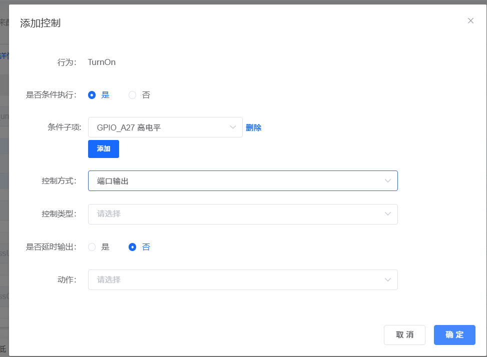

**3. 配置要点**

- 不要条件执行：选"否"，直接执行动作
- 需要条件执行：选"是"，分别配置条件和动作
- 条件和动作缺一不可，必须完整配置

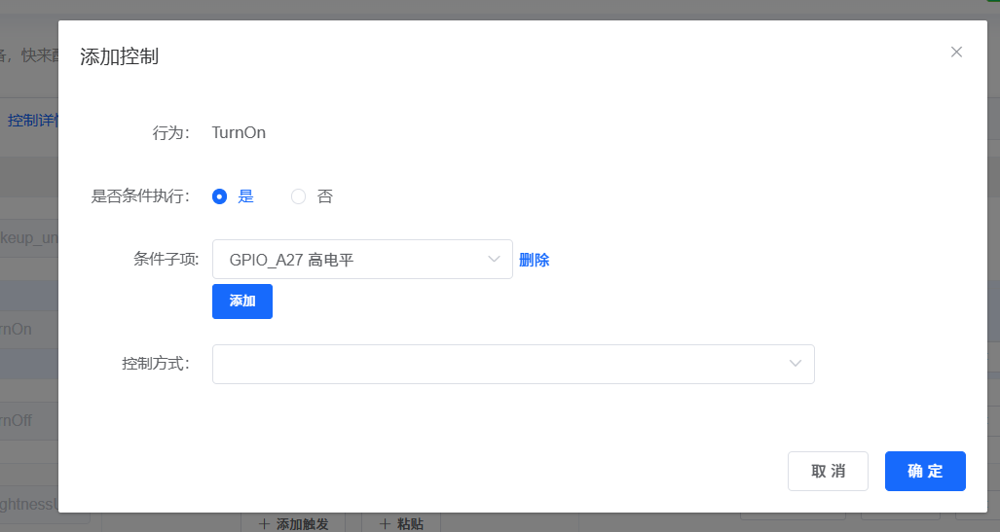

**注意事项：**

- 条件执行适用于需要根据外部状态决定是否动作的场景
- 简单控制可以直接设置"否"，无需条件
- 配置完成后要测试验证逻辑是否正确
- 条件设置不合理可能导致功能不响应

- **避免逻辑冲突**：

    - 条件检测和动作控制不能是同一个引脚
    - 如：条件为GPIO_A27高电平，动作也是设置GPIO_A27高电平
    - 这会导致逻辑死循环，无法正常执行
    - 正确做法：使用不同引脚或取消条件执行

---

### 如何删除语音指令或行为配置项？

**问题描述：**

需要删除不再使用的语音指令或行为配置项，但不清楚删除操作的具体方法和位置。

**解决方案：**

**1. 删除行为配置项**

在控制列表中删除行为：

1. 进入"命令词自定义"页面
2. 找到要删除的行为（如B1、B2）
3. 点击该行末尾的"<<"按钮
4. 确认删除操作


**2. 批量删除语音指令**

在命令词列表中删除多条指令：

1. 进入"命令词自定义"页面
2. 勾选需要删除的指令
3. 点击下方的"删除选中行"按钮
4. 确认批量删除操作

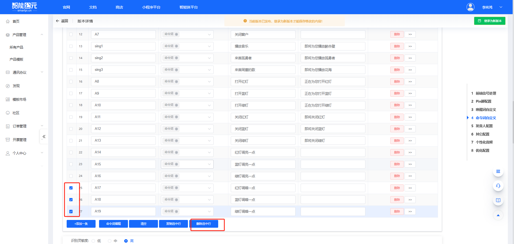

**3. 删除操作注意事项**

**删除前确认**：

- 确认该配置项不再需要
- 检查是否有其他配置依赖该项
- 建议先备份当前配置

**删除后操作**：

- 重新生成固件
- 重新烧录到模块
- 测试确保功能正常

**常见场景**：

- 删除测试用的临时行为
- 清理重复的配置项
- 移除不需要的语音指令
- 简化复杂的控制逻辑

**注意事项：**

- 删除操作不可恢复，请谨慎操作
- 批量删除时注意勾选正确
- 删除后及时保存配置
- 某些删除可能需要重新登录平台才能生效

---

### 配置红外控制时无法解析NEC码，能否直接使用学习码？

**问题描述：**

在配置空调红外命令时，无法通过工具解析出NEC码，询问是否可以直接使用学习码进行红外控制。

**解决方案：**

**1. 红外码类型说明**

平台支持两种红外编码方式：

- **NEC码**：标准红外编码协议，格式固定
- **学习码**：原始红外信号录制，兼容性更好

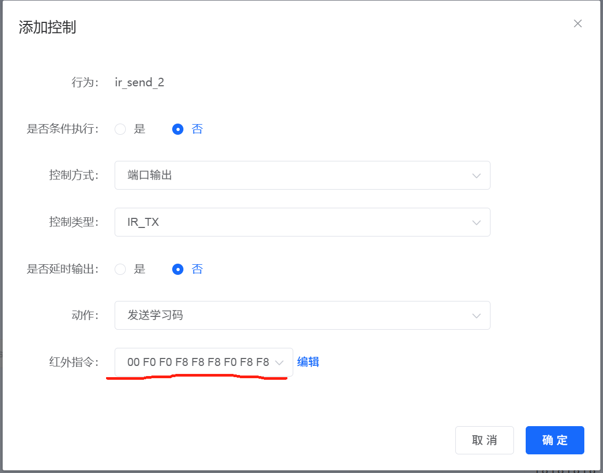

**2. 使用学习码的方法**

**配置步骤**：

1. 在控制详情中选择"端口输出"
2. 控制方式选择"红外发射"
3. 动作选择"发送学习码"
4. 输入学习到的十六进制数据

**学习码获取**：

- 使用模块的红外学习功能
- 对准原遥控器按下按键
- 记录学习到的原始码值

**3. 解析失败的处理**

如果无法解析NEC码：

- **原因**：遥控器可能使用非标准协议
- **方案1**：直接使用学习码
- **方案2**：购买支持红外解析的专用模块

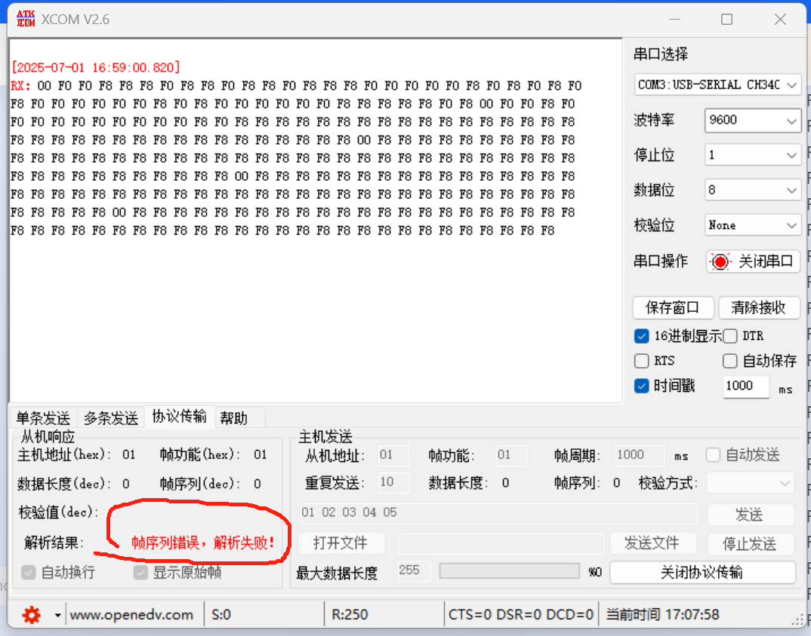

**4. 注意事项**

**学习码使用限制**：

- 学习码占用更多存储空间
- 不同模块对学习码支持不同
- 某些复杂协议可能无法正确学习

**兼容性说明**：

- 标准家电（如电视、机顶盒）：多支持NEC码
- 品牌空调（如格力、美的）：可能使用专有协议
- 万能遥控器：通常可转换为NEC格式

**推荐做法**：

- 优先尝试解析NEC码，占用资源少
- 解析失败时使用学习码
- 测试验证控制效果
- 保留重要设备的学习码备份

---

### 配置PWM控制风扇转速时条件逻辑错误怎么办？

**问题描述：**

在配置语音控制风扇转速时，发现PWM占空比的增加和减少逻辑存在错误，导致控制行为不符合预期。

**解决方案：**

**1. 问题分析**

常见的逻辑错误：

- **增加转速**：条件设为"PWM占空比 ≤ 100"
    - 错误原因：占空比最大为100，条件永远成立
    - 后果：无法再增加，只能减少

- **减小转速**：条件设为"PWM占空比 ≥ 0"
    - 错误原因：占空比最小为0，条件永远成立
    - 后果：无法再减小，只能增加

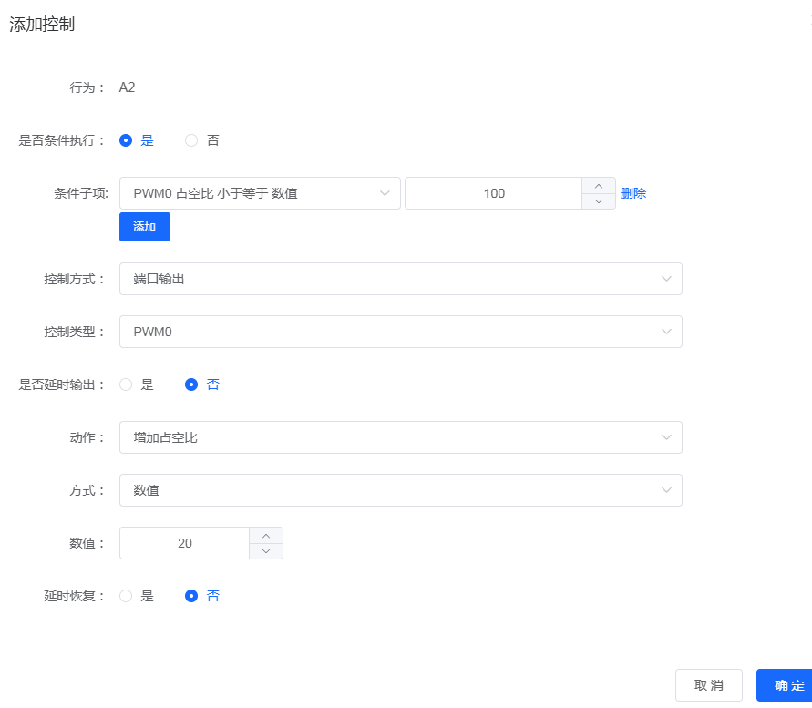

**2. 正确的逻辑设计**

**增加转速逻辑**：

- 不需要条件判断
- 直接设置PWM占空比 = 当前值 + 增量
- 或设置固定档位（如20%、40%、60%）

**减小转速逻辑**：

- 添加条件：PWM占空比 > 最小值（如20）
- 设置PWM占空比 = 当前值 - 减量
- 避免减到0以下

**3. 改进方案**

**使用变量记录状态**：

1. 创建变量记录当前档位
2. 通过语音命令修改变量值
3. 根据变量设置对应PWM占空比

**档位控制示例**：

- 1档：PWM = 20
- 2档：PWM = 40
- 3档：PWM = 60
- 4档：PWM = 80
- 5档：PWM = 100

**4. 配置要点**

**移除错误条件**：

- 对于"增加转速"命令：删除条件子项
- 对于"减小转速"命令：添加最小值限制

**使用相对调节**：

- 增加：PWM = PWM + 10
- 减少：PWM = PWM - 10
- 添加边界检查（0-100范围）

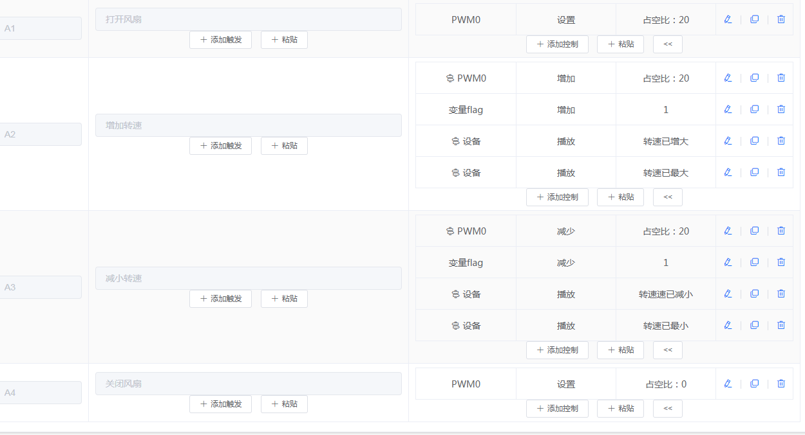

**注意事项：**

- PWM占空比范围是0-100，对应0%-100%
- 逻辑条件要考虑边界情况
- 测试时逐步验证每个档位
- 建议使用变量记录当前状态便于调试

---

### 设备数据接收与播报功能如何配置？

**问题描述：**

在配置设备数据接收与播报功能时，遇到无法选择串口输入参数的问题，同时询问如何通过串口接收数据并触发语音播报。

**解决方案：**

**1. 配置串口输入触发**

在设备配置中选择"串口输入"触发方式：

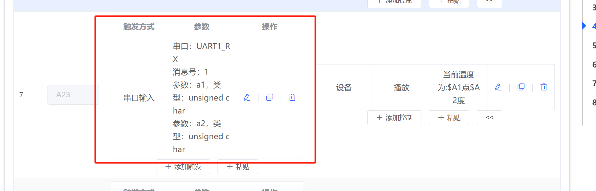

配置参数包括：

- 消息号：自定义标识
- 参数类型：选择数据类型
- 输入参数：配置接收格式

**2. 输入口选择问题解决**

如果无法选择输入口，需要先配置IO口：

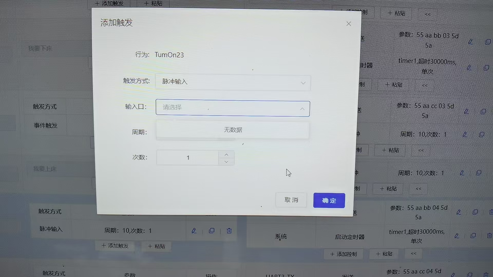

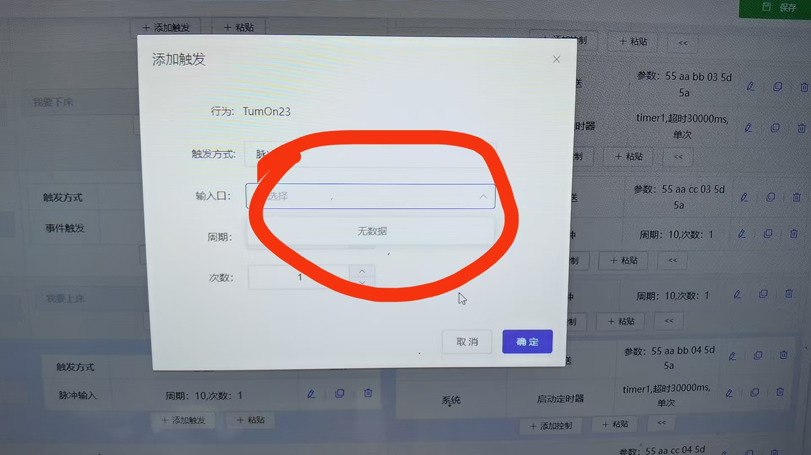

解决步骤：

- 在IO配置中先启用一个IO口
- 将该IO口配置为串口输入功能
- 返回触发配置即可选择输入口

成功配置后显示：


**3. 数据接收与播报流程**

实现数据接收并语音播报：

1. **外部设备发送数据**
    - 单片机/传感器发送特定格式数据
    - 通过串口连接到语音模块
    - 数据格式需与配置匹配

2. **模块接收处理**
    - 模块检测到串口数据
    - 根据消息号匹配对应配置
    - 触发预设的播报行为

3. **语音播报执行**
    - 播报配置的语音内容
    - 可以是固定语音或动态内容
    - 支持多语言播报

**4. 实时播报实现**

如果需要实时播报变化的数据（如温度）：

- 配置所有可能的播报内容
- 为每个数据值设置对应播报
- 传感器发送数据后自动匹配播报

**注意事项：**

- 必须先配置并启用IO口作为输入
- 串口波特率需与发送设备匹配
- 测试消息用于验证配置有效性
- 实际应用数据来自外部设备

---

### 模块可以设置多少个变量？

**问题描述：**

需要了解模块支持的变量数量限制，以便在项目设计中合理规划变量使用。

**解决方案：**

模块支持的变量数量主要受可用内存限制：

- **基本原则**：内存够就可以设置变量
- **实际限制**：没有硬性数量限制，取决于变量占用的内存大小
- **变量类型影响**：

    - 整型变量：占用2-4字节
    - 布尔变量：占用1字节
    - 字符串变量：占用字节数等于字符串长度

**使用建议：**

1. 合理规划变量使用，避免定义过多不必要的变量
2. 优先使用占用内存较小的变量类型
3. 定期检查项目内存使用情况
4. 对于大型项目，考虑优化变量数量和类型

**注意事项：**

- 虽然没有明确的变量数量上限，但过度使用可能导致内存不足
- 不同型号的芯片内存容量不同，支持的变量数量也会有差异
- 建议在实际使用中通过测试确定合理的变量数量

---

### 什么是"变量定义"？有什么作用？

**问题描述：**

需要了解平台上"变量定义"功能的具体含义和在功能实现中的作用。

**解决方案：**

变量定义类似于编程中的变量概念，是平台实现复杂逻辑功能的重要工具。

1. **变量的本质**
    - 类似于写代码时定义的变量
    - 用于存储和传递数据
    - 可以进行赋值、判断等操作

2. **主要作用**
    - 状态记录：保存设备当前状态
    - 数据传递：在不同功能间传递参数
    - 条件判断：作为执行条件
    - 计数功能：记录事件发生次数

3. **平台支持的操作**
    - 变量赋值：设置变量值
    - 变量判断：比较变量大小或相等
    - 变量运算：加减乘除等数学运算
    - 变量引用：在语音内容中使用变量

4. **使用必要性**
    - 某些复杂功能没有变量难以实现
    - 可以实现更灵活的控制逻辑
    - 提高代码复用性

**注意事项：**

- 变量需要先定义后使用
- 变量名需符合命名规则
- 不同类型的变量适用不同场景
- 合理使用变量可以简化项目配置

---

## 变量与串口通信


---

### 如何通过串口修改语音模块中变量的数值？

**问题描述：**

需要通过单片机经串口发送数据来动态修改语音模块中变量的数值，实现变量值的外部控制。

**解决方案：**

**1. 配置串口输入**

- 在语音模块平台配置串口输入消息号
- 设置消息号对应的参数（如A3、A4、A5等）
- 配置接收的数据类型（通常为char类型）

**2. 设置变量赋值行为**

- 为每个接收到的消息号创建对应的命令
- 在命令动作中选择"赋值给变量"
- 设置目标变量和要赋的数值

**3. 预定义数值映射**

- 消息号01 → 变量值设为1
- 消息号02 → 变量值设为2
- 消息号03 → 变量值设为3
- 以此类推，覆盖所需的所有数值范围

**4. 单片机发送数据格式**

- 发送十六进制数据（如01、02、03）
- 确保波特率与语音模块配置一致
- 数据格式需与平台配置匹配

**实现示例：**
```
接收01 → 变量energy = 1
接收02 → 变量energy = 2
接收03 → 变量energy = 3
...
接收10 → 变量energy = 10
```

**注意事项：**

- 语音模块只能接收预定义的消息号
- 每个消息号对应一个固定的赋值操作
- 变量值的改变可以触发其他预设动作
- 建议在平台中先用测试消息验证配置

---

### 定时器功能是干什么的？如何使用？

**问题描述：**

了解定时器功能的作用和使用方法，以及如何正确配置定时器实现延时控制。

**解决方案：**

1. **定时器功能说明**

定时器类似于计时功能，用于需要延时或定时触发某些控制行为的场景。

2. **基本功能**
    - 启动定时器：开始计时
    - 停止定时器：停止计时
    - 超时触发：计时结束后触发预设动作

3. **使用方法**
    - 在控制配置中添加定时器（如timer1）
    - 设置超时时间（如5000ms）
    - 配置超时后要执行的动作
    - 通过其他控制启动定时器

4. **配置流程**
    1. 创建"启动定时器"控制项
    2. 创建需要延时执行的控制项（如播放语音）
    3. 为延时项设置触发条件为"定时器超时"
    4. 配置执行顺序

**注意事项：**

- 定时器不是定时开关功能，不能设置具体时间启动
- 如需定时开关功能，请使用命令词配合定时器实现
- 定时器工作模式分为"单次"和"循环"
- 确保定时器超时后有明确的触发动作

---

## 定时器配置


---

### 定时器触发后无法进入烧录模式怎么办？

**问题描述：**

配置语音模块定时器功能后，定时器触发时无法正常进入烧录模式。

**解决方案：**

1. **检查定时器配置**

    在基础信息中添加新行为，创建定时器T1：

    

2. **配置控制行为**

    设置事件触发方式和参数：

    - 事件触发方式：T1定时器超时
    - 参数：UART1_TX发送16进制数98 A3 0B FE

    

    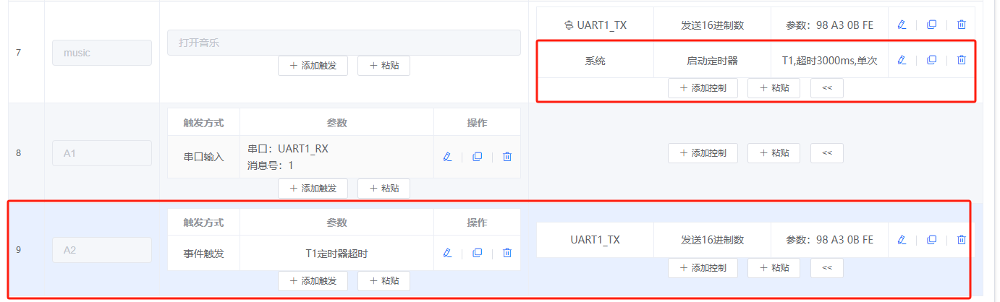

3. **设置定时器参数**

    - 工作模式：单次触发
    - 定时器：T1
    - 超时长：3000ms

    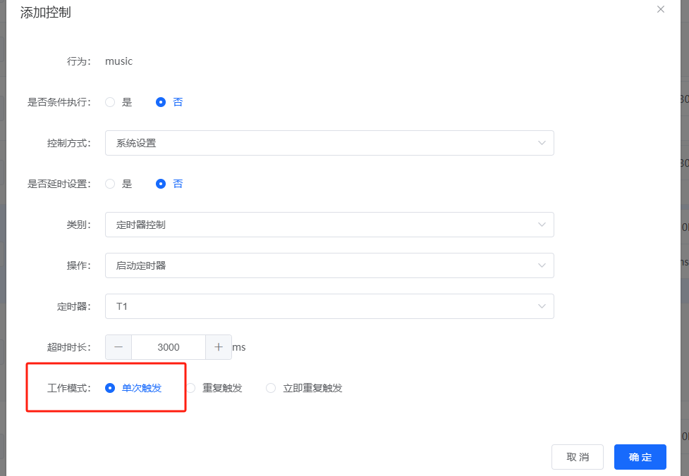

**注意事项：**

- 定时器触发时会占用系统资源，可能影响烧录模式进入
- 建议在烧录前关闭或删除定时器配置
- 烧录完成后重新配置定时器功能

---

### 命令词是如何触发的？

**问题描述：**

不清楚命令词的触发机制，是否必须精确匹配。

**解决方案：**

命令词采用匹配机制：

- 只要语音中包含设置的命令词即可触发
- 不要求只能说命令词本身
- 例如：设置命令词为"生气"，说"我很生气"也能触发

**注意事项：**

- 命令词需要准确命中，不能是谐音或近似音
- 建议选择不易误触发的独特词汇作为命令词
- 避免使用日常口语中频繁出现的词汇

---

### 如何使用语音模块作为主控控制泵抽水？

**问题描述：**

希望使用语音模块作为主控，通过接收语音指令来控制泵运行不同时间以抽取不同体积的水量（如100ml或500ml）。

**解决方案：**

**实现原理：**

- 语音模块可作为主控使用
- 通过IO口输出控制继电器
- 继电器控制泵的运行时间

**控制方案：**

1. **语音指令设计**
    - 设置"抽100ml水"指令
    - 设置"抽500ml水"指令
    - 每个指令对应不同的运行时间

2. **IO控制配置**
    - 配置GPIO输出控制继电器
    - 继电器连接12V泵和电源
    - 通过IO高低电平控制开关

3. **时间控制方法**
    - 在指令响应中添加延时控制
    - 100ml对应短时间运行（如2秒）
    - 500ml对应长时间运行（如10秒）

**硬件连接：**

```
语音模块 → 继电器模块 → 水泵
    GPIO        12V控制端
                    12V输出端 → 泵正极
                    泵负极 → 12V地
```

**注意事项：**

- 需要提前测试并确定抽水量与时间的关系
- 继电器规格要与泵的功率匹配
- 考虑增加保护电路防止反向电动势

---

## 继电器配置


---

### 上电启动后变量触发条件不生效怎么办？

**问题描述：**

配置上电启动触发事件，并设置变量条件控制输出脉冲，但上电后即使变量条件满足也无法触发输出。

**解决方案：**

**1. 理解触发逻辑**

- 上电启动只在模块上电瞬间触发一次
- 附加条件必须与上电启动同时满足才会执行
- 变量值后续改变不会重新触发上电启动事件

**2. 正确的配置方法**

如需要根据变量值控制输出，建议：

- 使用"变量触发"作为主触发条件
- 设置变量等于特定值时触发
- 直接关联控制动作（如输出脉冲）

**3. 配置示例**

错误配置：

- 触发方式：上电启动
- 附加条件：变量等于某值
- 结果：只在上电瞬间判断一次，之后不响应

正确配置：

- 触发方式：变量触发
- 触发条件：变量等于某值
- 结果：变量变化时实时响应

**注意事项：**

- 上电启动仅用于初始化设置
- 需要动态响应变量变化应使用变量触发
- 设计逻辑时要明确触发条件和执行时机

---

## 固件下载与使用


---

### 固件和SDK有什么区别？

**问题描述：**

下载文件时混淆了固件和SDK，导致无法正常使用设备。

**解决方案：**

**1. 基本概念区别**

- **固件**：可直接烧录到模块的完整程序
- **SDK**：二次开发包，需要编译后才能使用

**2. 使用场景**

**固件适用于：**

- 直接使用模块功能
- 不需要修改程序
- 通过平台配置实现功能

**SDK适用于：**

- 需要定制功能
- 进行二次开发
- 集成到自己的产品

**3. 下载选择**

根据需求选择：

- 普通使用：下载固件
- 开发定制：下载SDK

**4. 固件烧录方法**

1. 访问官方文档页面
2. 找到对应型号的固件下载区
3. 点击"下载固件"按钮
4. 获得可直接烧录的固件文件

**注意事项：**

- SDK不能直接烧录使用
- 固件下载后无需编译
- 选择前确认自己的使用需求

---

### ADC输入触发无法输出脉冲怎么办？

**问题描述：**

将触发条件改为ADC输入后，无法输出预期的脉冲信号，且示波器显示的脉冲波形周期异常。

**解决方案：**

**1. 硬件检查**

- 确认GPIO_A26（PIN4）的ADC输入连接正确
- 检查GPIO_B3的脉冲输出配置
- 验证硬件线路连接是否牢固

**2. 配置调整**

**脉冲周期设置**：

- 初始设置6ms过短，示波器显示约20ms
- 调整为1000ms获得更稳定的波形
- 根据实际需求设置合适的脉冲宽度

**ADC配置注意**：

- GPIO_A26默认为PA芯片使能脚（高电平影响音频）
- 如用作ADC输入，需要硬件已做相应修改
- 注意偏置值设置（示例中为50）


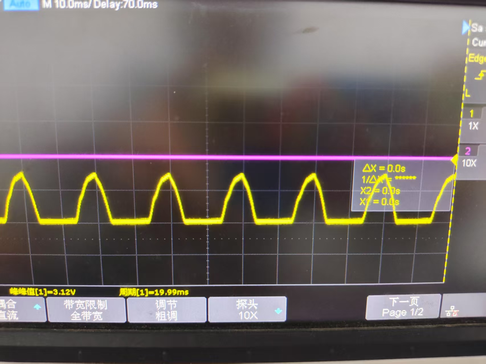

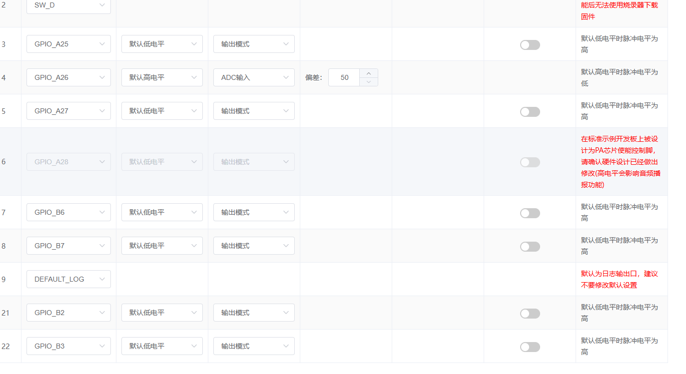

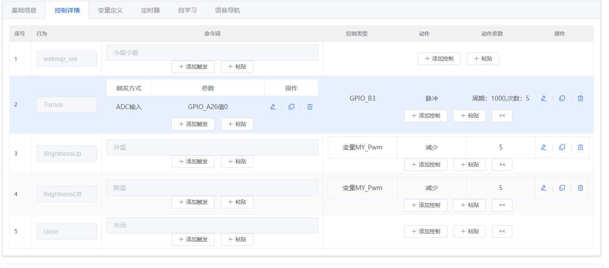

**3. 调试建议**

- 使用较长脉冲宽度便于观察
- 通过改变ADC输入值验证触发
- 确认脉冲输出引脚无其他配置冲突

**注意事项：**

- ADC输入需要稳定的参考电压
- 脉冲输出受整体配置影响
- 建议先简化配置测试基本功能

---

### 如何配置过零检测驱动脉冲？

**问题描述：**

需要配置过零检测驱动，在交流电过零点10ms内输出一个脉冲以控制可控硅。

**解决方案：**

**1. 配置方法**

- GPIO配置为脉冲输出模式
- 设置脉冲宽度：10ms
- 设置脉冲次数：1次


**2. 工作原理**

- 检测交流电过零点
- 在过零后立即输出触发脉冲
- 脉冲宽度根据可控硅特性调整

**3. 应用场景**

- 适用于交流调光、调速等应用
- 可减少开关冲击和电磁干扰
- 提高设备可靠性和寿命

**注意事项：**

- 脉冲宽度和次数需根据负载调整
- 过零检测需要稳定的交流输入
- 适用于阻性负载，感性负载需特殊处理

---

## 固件开发与生成


---

### 关闭语音识别后还能使用唤醒词吗？

**问题描述：**

在配置中关闭语音识别功能后，询问是否还能通过唤醒词进行语音控制。

**解决方案：**

**功能说明**

- 关闭语音识别后，唤醒词功能也会被禁用
- 此时无法通过语音进行任何控制
- 唤醒词属于语音识别的一部分

**可用的控制方式**

关闭语音识别后，仍可使用：

- 串口通信控制
- GPIO触发控制
- 其他外设输入控制

**配置方法**

在添加控制中选择操作：

- 选择"关闭语音识别"
- 确认保存配置
- 重新生成固件

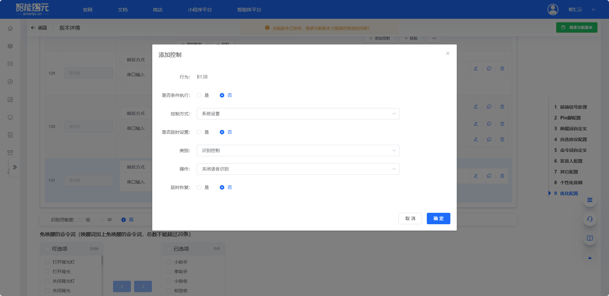

**注意事项：**

- 语音识别和唤醒词是关联功能
- 关闭后只能通过其他方式控制
- 如需语音控制，必须开启语音识别

---

### 如何配置语音模块的唤醒与非唤醒状态切换？

**问题描述：**

需要配置两个不同的触发条件，一个用于进入唤醒状态（允许语音识别），另一个用于退出唤醒状态（禁止语音识别或关闭语音识别）。

**解决方案：**

**1. 配置允许唤醒条件**

- 创建命令词（如"你好小美"、"你好小隆"）
- 设置触发条件为"允许识别词"
- 配置识别后的控制动作

**2. 配置退出唤醒条件**

- 将原有的"禁止识别词"修改为"关闭语音识别"
- 这样可以实现真正的退出唤醒功能
- 语音模块将不再响应语音命令

**配置示例：**

第一个配置项（URAT17）：

- 触发命令：唤醒词
- 动作：允许识别词

第二个配置项（URAT18）：

- 触发命令：关闭命令
- 动作：关闭语音识别

**注意事项：**

- "禁止识别词"只是暂时禁用，不会完全关闭语音功能
- "关闭语音识别"才能真正退出唤醒状态
- 需要重新触发才能再次进入语音识别状态
- 配置完成后要重新生成并烧录固件

---

## 脉冲输入配置


---

### 脉冲信号次数的含义

**问题描述：**

在配置脉冲输入触发方式时，对脉冲次数的含义存在疑问，不确定是否可以理解为单数和双数的概念。

**解决方案：**

脉冲次数指的是发送脉冲周期的数量，一个完整的脉冲周期包含高电平和低电平两个阶段。

- **脉冲周期定义**：

    - 200ms为一个完整周期
    - 其中100ms为高电平，100ms为低电平
    - 一次脉冲：发送一个完整周期
    - 两次脉冲：发送两个完整周期

- **配置理解**：

    - 脉冲次数不是简单的单双数概念
    - 而是指定发送多少个连续的脉冲周期
    - 可根据实际需求设置脉冲次数


*一个脉冲和两个脉冲的波形对比*

**注意事项：**

- 脉冲配置需要与触发信号的实际特性匹配
- 过多的脉冲次数可能导致响应延迟
- 建议根据实际硬件信号调整脉冲参数
- 脉冲输入触发方式适用于数字信号输入场景


---

### 脉冲输入配置错误无法生成固件

**问题描述：**

在配置脉冲输入触发方式时，系统提示配置错误无法生成固件，怀疑是GPIO口配置问题。

**解决方案：**

1. **检查脉冲输入配置**：

    - 确认脉冲输入的GPIO引脚配置正确
    - 验证脉冲周期、次数等参数设置合理
    - 检查附加条件是否与脉冲输入冲突

2. **导出配置文件**：

    - 使用平台的导出功能获取JSON配置文件
    - 便于技术团队分析具体配置问题
    - 保留错误配置供后续排查

3. **逐步排查方法**：

    - 单独测试脉冲输入命令
    - 暂时移除其他类型的触发方式
    - 简化配置逐步添加功能

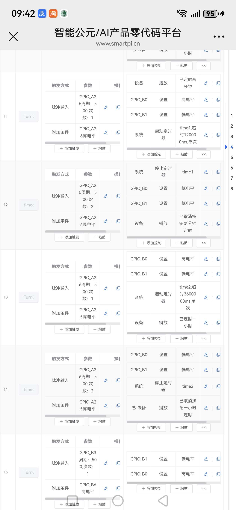

*GPIO_A2脉冲输入的详细配置*

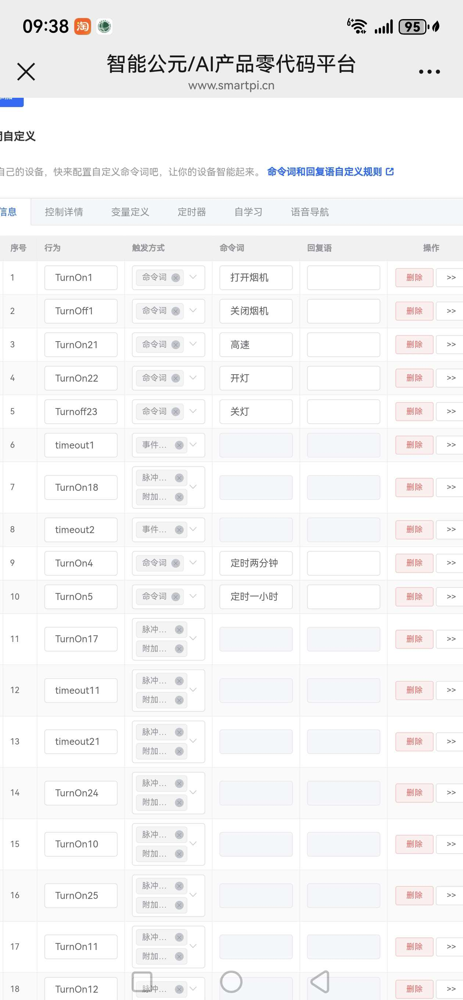

*设置为脉冲输入的命令列表*

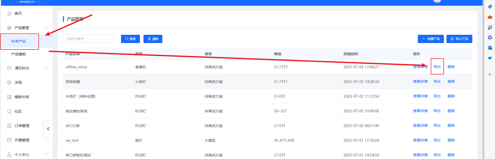

*导出JSON配置文件界面*

**注意事项：**

- 脉冲输入配置需要与硬件信号特性匹配
- 多个触发方式可能存在冲突
- 导出的JSON文件有助于定位问题根源
- 建议先简单配置测试，再逐步添加复杂功能

---

## 定时器配置


---

### 定时器重复启动导致逻辑错乱

**问题描述：**

在启动定时器时，如果未先关闭之前的定时器，会导致定时器重复启动并引发逻辑错乱。

**解决方案：**

启动新的定时器前必须先关闭正在运行的定时器。

- **操作步骤**：

    1. 执行"关闭定时器"动作
    2. 再执行"启动定时器"动作
    - 确保只有一个定时器实例运行

- **系统特性**：

    - 定时器不会自动刷新或覆盖
    - 多次启动会导致多个定时器并行运行
    - 可能引发不可预期的逻辑错误

**注意事项：**

- 每次启动定时器前养成先关闭的习惯
- 在程序流程中明确控制定时器生命周期
- 建议使用变量标记定时器状态
- 复杂逻辑中要特别注意定时器管理

---

## 固件兼容性


---

### CI系列离线语音模块是否支持英文语音识别？

**问题描述：**

需要确认CI系列离线语音识别模块是否支持英文语音识别功能。

**解决方案：**

是的，CI系列离线语音模块支持英文语音识别。

**支持情况：**

1. **离线识别支持**
    - 支持英文命令词识别
    - 支持英文播报功能
    - 可通过平台配置英文词条

2. **配置方法**
    - 在智能公元平台添加英文命令词
    - 录制或上传英文播报音频
    - 生成固件并下载到模块

**注意事项：**

- 中英文混合使用时需分别配置
- 英文命令词发音标准有助于提高识别率
- 建议使用标准英文发音录制音频
- 如有特殊需求可咨询技术团队

---

## 平台配置问题


---

### 问题分类组件识别不稳定怎么办？

**问题描述：**

在使用智能聊天系统时，"问题分类"组件对特定意图（如"查询时间"）的识别不稳定，有时能正确识别，有时则识别错误。

**解决方案：**

**1. 调整Top P参数**

- 进入"问题分类"组件的配置界面
- 找到"自由度"设置区域
- 调整"Top P"参数，建议设置为0.7-0.9之间
- Top P值越高，识别的随机性越大，稳定性越差
- 适当降低Top P值可以提高识别的稳定性

**2. 优化分类描述和示例**

- 在分类描述中明确说明该分类的典型场景
- 添加更多典型的示例语句
- 避免分类之间存在交叉或歧义

**3. 测试验证**

- 调整参数后生成新固件进行测试
- 使用多种表达方式测试识别效果
- 如仍不稳定，可尝试继续微调Top P值

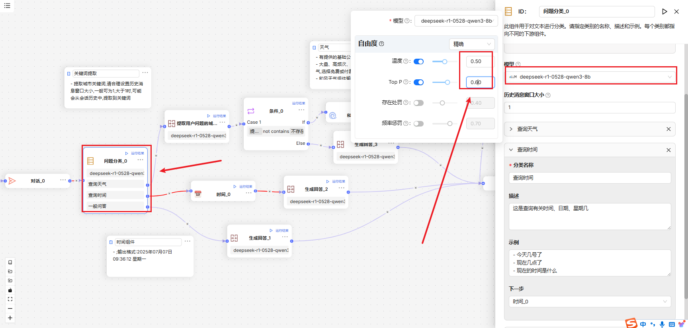

*问题分类组件中的Top P参数设置位置*

**注意事项：**

- Top P参数影响识别的创造性和稳定性
- 值越接近0，输出越确定、越稳定
- 值越接近1，输出越随机、越多样
- 根据实际需求在稳定性和灵活性之间平衡


---

### 是否可以通过积木编程模块来设置命令词？

**问题描述：**

希望能够不通过平台，而是使用积木编程的方式直接设置语音识别的命令词。

**解决方案：**

目前不支持通过积木编程模块设置命令词。命令词的设置和配置必须通过智能公元平台完成，具体原因如下：

1. **平台配置必要性**
    - 命令词需要编译进固件中
    - 平台负责语音识别模型的训练和优化
    - 离线识别依赖预训练的声学模型

2. **配置流程**
    - 登录智能公元平台
    - 在产品配置中添加或修改命令词
    - 生成并下载固件
    - 烧录新固件到模块

3. **积木编程功能**
    - 积木编程主要用于逻辑控制
    - 可以设置命令词触发后的动作
    - 无法修改命令词本身

**注意事项：**

- 离线语音模块的命令词必须在固件生成前配置
- 如需修改命令词，必须重新生成固件并烧录
- 建议在平台中批量配置所有需要的命令词

---

### 小程序滑块组件的执行行为和关联变量可以同时使用吗？

**问题描述：**

小程序中的滑块组件，执行行为和关联变量只能二选一，希望了解是否可以同时实现这两个功能。

**解决方案：**

**功能说明**

小程序平台的滑块组件设计为互斥模式：

- **执行行为**：滑块滑动时触发预设的动作
- **关联变量**：滑块值绑定到自定义变量供其他逻辑使用
- **二选一**：当前不支持同时启用两种模式

**使用建议**

根据应用需求选择合适模式：

**1. 选择执行行为模式**

- 适用于需要直接控制的场景
- 滑动立即触发开关、调节等动作
- 无需额外的逻辑判断

**2. 选择关联变量模式**

- 适用于需要数值传递的场景
- 滑块值传给变量，可用于条件判断
- 支持复杂的联动控制

**替代方案**

如需要同时实现两种功能，可考虑：

- 使用两个滑块组件：一个执行动作，一个关联变量
- 通过按钮组件配合变量实现条件控制
- 使用自定义开发的小程序实现复杂功能

**注意事项：**

- 这是平台的设计限制，非功能故障
- 选择模式前确认实际应用需求
- 可通过组合其他组件实现类似效果

---

### 知识库检索结果与模板中的答案不一致，导致生成的回复内容不符合预期

**问题描述：**

在智能公元平台使用知识库功能时，发现检索出来的结果与模板里的答案不一样，导致生成的回复内容不符合预期。

**解决方案：**

1. **问题排查**
    - 检查知识库文件是否已正确上传
    - 确认知识库模版（.xlsx或.txt文件）内容是否正确
    - 验证知识检索节点是否正确配置

2. **解决步骤**
    - 保存当前配置
    - 重新运行知识检索流程
    - 如果问题仍然存在，需要检查知识库文件内容

3. **可能的临时解决方案**
    - 重新上传知识库文件
    - 确保文件格式正确
    - 联系技术团队检查后台数据

**注意事项：**

- 知识库检索可能会因为文件内容解析问题导致不一致
- 保存后运行是确保配置生效的关键步骤
- 如果问题持续存在，可能是平台功能异常，需要技术团队介入

---

### 文件上传功能解析速度非常慢，与之前相比明显变慢

**问题描述：**

在智能公元平台使用文件上传功能时，发现文件解析速度非常慢，与昨天相比明显变慢，刷新后问题依旧存在。

**解决方案：**

1. **问题确认**
    - 检查上传的文件大小是否正常
    - 确认网络连接稳定
    - 验证是否为平台整体性能问题

2. **临时处理**
    - 多次刷新页面查看进度
    - 等待平台自动完成解析
    - 避免重复上传相同文件

3. **问题反馈**
    - 截图记录解析进度和状态
    - 联系技术团队反馈问题
    - 提供文件大小和上传时间信息

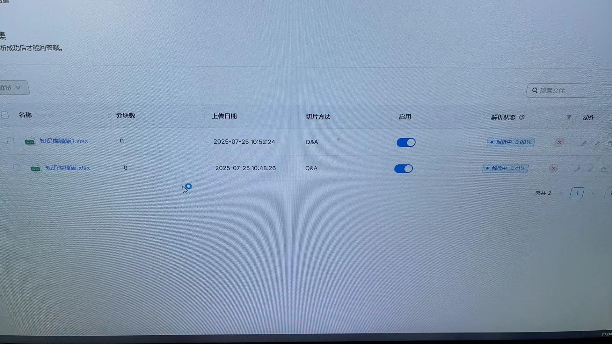

**注意事项：**

- 解析速度慢可能是平台服务器性能问题
- 如果是普遍问题，技术团队会介入处理
- 建议在网络稳定时进行文件上传
- 保留文件副本，避免重复上传

---

## 开发工具与二次开发


---

### 平台支持2812等RGB灯控制吗？

**问题描述：**

需要在产品中使用2812 RGB灯，但平台无法实现控制功能。

**解决方案：**

**1. 平台功能范围**

- 平台支持简单的高低电平控制
- 支持PWM波输入输出
- 适用于普通LED灯、继电器等简单控制

**2. 不支持的功能**

- 2812等需要特定协议的RGB灯
- 需要发送复杂数据协议的器件
- 需要精确时序控制的通信接口

**3. 替代方案**

- 使用普通RGB灯（分别控制R、G、B）
- 使用支持PWM调色的LED灯带
- 通过外部控制器控制2812灯

**注意事项：**

- 2812灯需要类似发送脉冲数据的控制方式
- 平台无法实现复杂的协议通信
- 如需使用2812灯，需要手搓代码实现
- 可以考虑使用硬件方案配合平台控制

---

## 固件版本与升级


---

### 在线配置的固件是否可以离线编译？

**问题描述：**

希望了解在线配置的固件是否支持离线编译，以避免等待队列和提高效率。

**解决方案：**

**离线编译方案：**

1. **SDK下载方式**
    - 可以下载官方SDK进行离线编译
    - 适合有开发能力的使用方
    - 需要自行搭建编译环境

2. **在线配置限制**
    - 在线平台配置的固件无法直接离线编译
    - 配置环境和编译工具都在云端
    - 必须通过平台生成固件

**注意事项：**

- 离线编译需要处理依赖库和环境配置
- 可能遇到各种兼容性问题，得不偿失
- 在线编译虽然需要排队，但更稳定可靠
- 如编译耗时较长，建议错峰生成

---

## 购买与获取


---

### SDK生成长时间卡住怎么办？

**问题描述：**

在使用平台生成SDK时，界面显示"SDK正在生成，大约需要10-30分钟"但长时间无响应，怀疑服务器故障。

**解决方案：**

**1. 问题分析**

- **正常时长**：SDK生成通常需要10-30分钟
- **卡住原因**：可能是服务器负载高或网络问题
- **界面状态**：显示生成中但实际进程可能已停止


**2. 处理步骤**

- **耐心等待**：先等待30分钟，不要频繁刷新
- **检查网络**：确认网络连接稳定
- **重新尝试**：如超过30分钟仍无响应，可取消后重新生成
- **更换时间**：避开高峰期生成（如下午或晚上）

**3. 联系支持**

如问题持续存在：

- **记录时间**：记下开始生成时间和异常时间
- **截图保留**：保存界面状态截图
- **反馈问题**：联系技术团队并提供详细信息
- **尝试其他**：可暂时使用其他功能或等待问题解决

**注意事项：**

- 不要同时生成多个SDK任务
- 生成过程中不要关闭浏览器页面
- 建议使用Chrome或Firefox浏览器
- 如频繁出现此问题，建议检查本地网络环境

---

### 如何确认特定应用场景的固件版本信息？

**问题描述：**

在平台选择应用场景时，无法找到或确认特定场景（如"中文烟机通用Pro"）的固件版本详细信息。

**解决方案：**

**1. 固件版本识别**

- **版本格式**：应用场景后通常会标注版本号（如V00909-V1）
- **版本说明**：

    - V00909：代表固件版本号
    - V1：代表该场景的版本标识
    - 占用空间：标注该固件占用的Flash空间大小

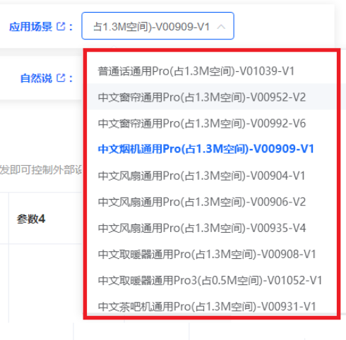

**2. 获取详细信息**

- **悬停查看**：鼠标悬停在选项上可查看更多信息
- **联系技术团队**：如需了解具体版本差异，可联系技术团队
- **查看更新日志**：部分版本会提供更新说明

**3. 版本选择建议**

- **选择新版本**：通常新版本效果更好，bug更少
- **确认兼容性**：确保固件与硬件型号匹配
- **空间充足**：确认Flash空间足够容纳所选固件

**注意事项：**

- 不同版本的固件可能支持的功能有所不同
- 专用场景固件针对特定应用优化
- 选择后生成固件前会显示占用空间
- 如不确定，可先用通用版本测试

---

## 功能配置


---

### 如何关闭语音识别模块功能？

**问题描述：**

系统中未提供关闭语音识别功能的指令或配置选项，需要了解如何禁用语音识别功能。

**解决方案：**

**1. 平台配置方式**

通过配置平台可以实现功能关闭：

- **删除所有命令词**：

    - 清空所有命令词配置
    - 不设置任何唤醒词
    - 生成的固件将不响应语音输入

- **使用纯串口模式**：

    - 仅配置串口触发行为
    - 不配置任何语音相关触发
    - 模块只响应串口指令

**2. 硬件控制方式**

如需完全关闭语音功能：

- **切断咪头供电**：

    - 通过MOS管控制咪头电源
    - 需要时才开启咪头供电
    - 可实现动态开关功能

- **设置物理开关**：

    - 添加拨码开关或跳线帽
    - 手动控制语音功能开启/关闭
    - 适合需要使用方自主控制的场景

**3. 软件开发方案**

对于开发者：

- **自定义固件**：

    - 联系技术团队进行定制开发
    - 可在固件层面禁用语音识别
    - 保留其他功能正常运行

- **MCU协调控制**：

    - 使用外部MCU控制语音模块
    - 通过串口发送控制指令
    - 实现灵活的功能切换

**注意事项：**

- 删除命令词后需要重新生成并烧录固件
- 纯串口模式下仍需要基本的电源供应
- 硬件控制方式需要额外的电路设计
- 定制开发可能涉及额外费用

---

## 小程序与在线升级问题


---

### Arduino按键控制LED多档亮度调节

**问题描述：**

需要实现Arduino控制LED的功能：

1. 一个按键控制LED，按下亮松开灭，连续按下时亮度按60%→90%→15%循环切换，超时后重置
2. 通过串口接收数据直接设置LED亮度为90%或15%

**解决方案：**

**1. 硬件连接**

- 按键连接到数字引脚（如D2），启用内部上拉
- LED连接到PWM引脚（如D9），便于控制亮度
- 串口用于接收控制数据

**2. 代码实现要点**

- 使用millis()函数实现按键消抖和时间检测
- 定义亮度数组存储PWM值（60%、90%、15%对应的数值）
- 串口读取数据并判断是否为"90"或"15"
- 使用analogWrite()控制LED亮度

**3. 关键逻辑**

- 按键按下时检测与上次按下的时间间隔
- 短时间内连续按下切换亮度档位
- 超时后重置为第一档（60%）
- 串口数据优先级高于按键控制

**注意事项：**

- PWM值范围0-255，需将百分比转换为对应数值
- 按键消抖时间建议50ms以上
- 串口数据记得trim()去除换行符
- 长时间按下的检测时间阈值根据需求调整

---

### AI生成的单片机代码是否可靠？

**问题描述：**

使用AI工具生成STC15系列单片机代码，不确定代码是否能正常运行，特别是OLED显示驱动、中断配置和寄存器配置部分。

**解决方案：**

**1. AI代码的局限性**

- AI可以生成业务逻辑层代码，但底层驱动需要人工验证
- 寄存器配置不一定正确，需要查阅具体芯片手册确认
- 缺少特定硬件的驱动文件（如oled.c）可能导致无法运行

**2. 使用AI代码的建议**

- 将AI生成的代码作为参考和思路，不能直接使用
- 重点验证底层初始化和驱动部分代码
- 必须对照芯片数据手册确认寄存器配置

**3. 底层开发要点**

- OLED等外设驱动需要自己实现或获取官方驱动
- 中断配置要根据具体硬件连接确认
- 定时器、串口等外设初始化需严格按手册配置

**注意事项：**

- AI仅提供思路，正确性需要人工判断
- 缺少驱动文件时代码无法编译运行
- 寄存器配置错误可能导致硬件无法正常工作

---

### 固件生成平台显示"待生成"状态怎么办？

**问题描述：**

在固件生成平台上，版本状态显示为"待生成"，但没有自动开始生成过程。

**解决方案：**

**1. 手动触发生成**

- 在固件列表中找到对应版本
- 点击"更多"下拉菜单
- 选择"生成SDK"或"生成固件"按钮
- 等待生成完成


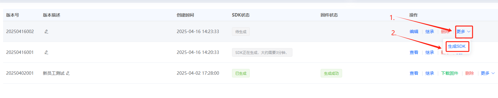

**2. 生成流程说明**

- 平台默认不会自动生成所有版本
- 需要手动点击触发生成过程
- 生成时间根据固件大小可能需要几分钟到几十分钟

**注意事项：**

- 生成前确认配置信息无误
- 生成过程中不要关闭页面
- 如果生成失败，检查配置后重新尝试

---

### 历史固件功能无法恢复怎么办？

**问题描述：**

之前版本中存在的RGB灯控制等功能，现在平台已无法找到相关配置，原始资料因人员变动已丢失。

**解决方案：**

**1. 功能恢复说明**

- 早期固件的部分功能因存储问题无法恢复
- 官方建议通过平台自行实现所需功能
- 可参考相关教程和文档学习开发

**2. 自行实现方案**

- 使用机芯智能平台重新配置
- 学习基础编程实现控制逻辑
- 参考现有例程进行修改

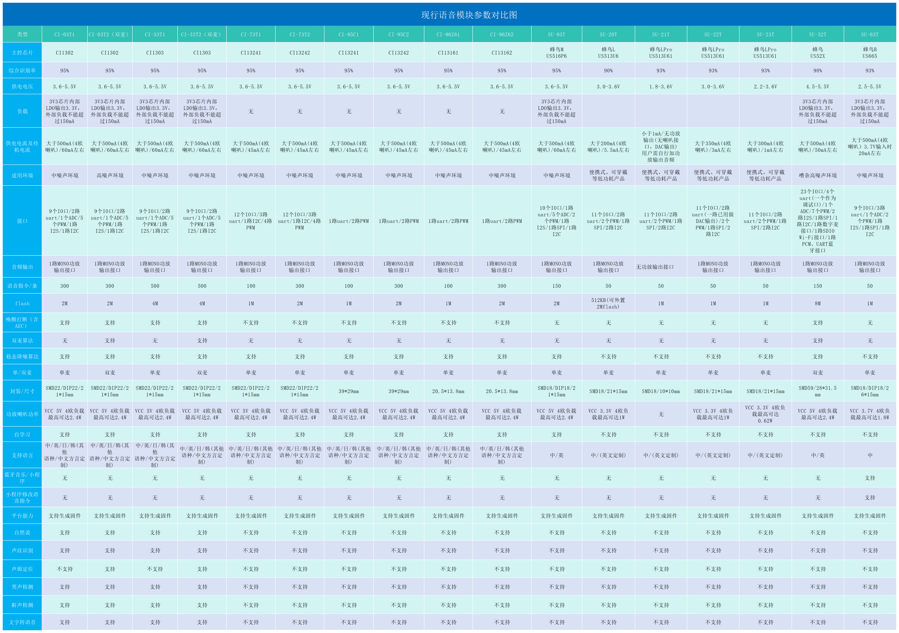

**3. 学习资源**

- 官方文档：https://www.smartpi.cn/
- 开发教程和示例代码
- 技术团队群内交流学习

**注意事项：**

- 平台会持续更新，增加新功能
- 复杂功能可能需要一定的开发基础
- 遇到问题可在技术群寻求帮助

---

## 逻辑执行问题排查


---

### 变量条件判断不执行动作怎么办？

**问题描述：**

设置变量等于某个值时执行修改操作，但实际运行时动作未执行。

**解决方案：**

1. **检查变量状态**
    - 确认条件变量的实际值是否符合预期
    - 使用调试输出或日志查看变量实时状态

2. **验证触发条件**
    - 检查条件判断的逻辑是否正确
    - 确认变量比较的值类型一致（字符串/数字）

3. **排查相关变量**
    - 检查是否有其他变量影响执行逻辑
    - 确认执行动作所需的前置条件都已满足

4. **调试建议**
    - 导出工程文件进行检查
    - 逐步简化逻辑，定位问题所在
    - 使用官方调试工具监控变量变化

**注意事项：**

- 逻辑执行失败通常是由其他相关变量未满足条件导致
- 建议在复杂逻辑中添加中间步骤便于调试
- 保持固件版本最新，避免已知bug影响

---

## 语言支持与定制


---

### 一个模块是否可以同时支持多种语言识别？

**问题描述：**

希望在一个模块中同时支持多种语言（中、英、日、韩、俄）的语音指令识别，以便不同语种的用户都能使用。

**解决方案：**

**1. 平台配置限制**

- 平台目前只支持单一语种配置
- 无法在平台中同时配置多种语言
- 每次生成固件时只能选择一种语言

**2. 技术实现方案**

- **单一语言方案**：根据目标市场选择对应语言
    - 中文用户：配置中文命令词
    - 英文用户：配置英文命令词
    - 日韩用户：配置对应语种命令词

- **多语言切换方案**：需要定制开发
    - 支持语种过多会导致固件体积过大
    - 需要专业团队进行定制开发
    - 成本较高，适合大批量项目

**3. 替代实现方案**

- **分区域部署**：不同地区使用不同语言固件
- **多设备方案**：每种语言使用独立设备
    - 例如：使用3个CI1302模块分别识别中文、英文、马来语
    - 每个模块烧录对应语言的固件
    - 通过MCU协调多模块工作，实现多语言同时支持
- **应用层切换**：通过外部开关切换不同固件

**注意事项：**

- 平台宣传的"多语种"功能是指支持多种语种的固件开发，而非同一固件支持多种语言
- 单一语言固件的识别率和稳定性更高
- 如需多语言同时支持，建议评估实际需求和使用场景


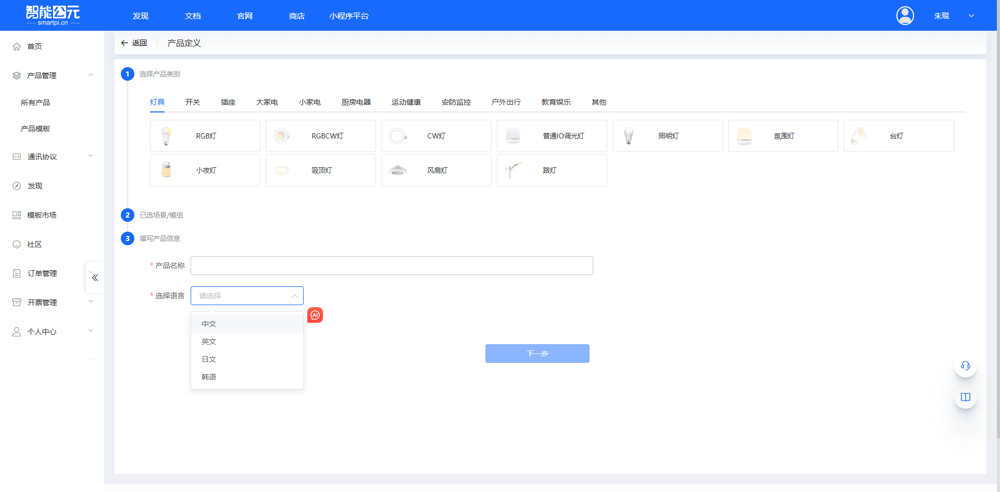

---

### 红外学习功能配置时为什么没有"选择标签"选项？

**问题描述：**

在配置红外学习功能时，添加控制的界面中，"动作"选项里没有"选择标签"的选项，导致无法进行标签选择。

**解决方案：**

需要先新建档案才能看到"选择标签"选项。

**操作步骤：**

1. **新建档案**
    - 在红外学习管理界面中创建新档案
    - 档案创建后才能关联标签功能
    - 每个档案对应一类红外设备

2. **添加控制**
    - 在新建的档案下添加控制项
    - 此时"动作"选项会出现"选择标签"
    - 可以选择已学习并保存的红外标签

3. **学习流程**
    - 先使用"学习遥控"功能学习红外信号
    - 学习成功后保存为标签
    - 在控制配置中关联对应标签

**功能说明：**

- 档案管理：用于分类管理不同设备的红外码
- 标签选择：将学习到的红外码与控制动作关联
- 批量控制：可通过档案批量管理多个设备

**注意事项：**

- 必须先创建档案才能使用标签功能
- 学习前确保遥控器电量充足
- 每个标签对应一个具体的按键功能
- 建议按设备类型创建不同档案

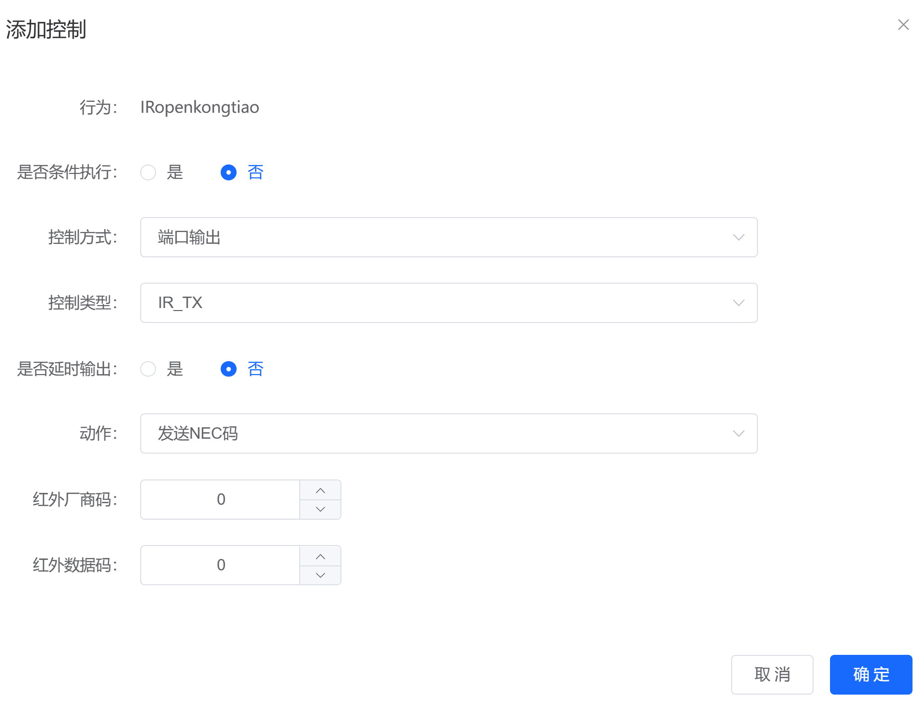

---

### CI系列红外功能的空调默认品牌是什么？不同设备的学习方式有何区别？

**问题描述：**

了解CI系列模块红外发送功能中，空调是否有默认品牌免学习，以及其他设备如机顶盒、电视机、风扇等的学习方式。

**解决方案：**

**1. 空调默认品牌**

- CI系列模块上电后，空调品牌**默认为美的空调**
- 使用美的空调时**无需学习**，上电即可直接使用
- 其他品牌空调需要使用红外学习功能进行适配

**2. 其他设备的学习方式**

对于机顶盒、电视机、风扇等其他红外设备：

- **需要学习**：上电后使用红外学习功能学习遥控器信号
- **码型支持**：模块上电默认支持NEC码
- **发送方式**：学习后发送的就是NEC码格式

**3. 使用建议**

- 使用美的空调：直接配置控制命令即可使用
- 其他品牌空调：使用红外学习功能学习原遥控器
- 其他家电（机顶盒/电视/风扇）：使用NEC码学习方式

**注意事项：**

- 默认美的空调码仅适用于美的品牌空调
- 其他品牌必须先学习才能正常控制
- 学习环境避免强光和红外干扰
- 学习后建议测试验证控制效果


## PWM控制与舵机驱动


---

### 如何通过PWM控制舵机正反转和角度？

**问题描述：**

已知如何设置PWM占空比控制舵机到特定角度，但不知如何实现正反转和精确角度控制。

**解决方案：**

1. **舵机控制原理**
    - 舵机角度由PWM信号占空比决定
    - 标准舵机使用50Hz频率（周期20ms）
    - 不同占空比对应不同角度

2. **占空比计算**
    - 0度（或-90度）：占空比约2.5%（0.5ms脉冲）
    - 90度（或0度）：占空比约7.5%（1.5ms脉冲）
    - 180度（或+90度）：占空比约12.5%（2.5ms脉冲）

3. **正反转实现**
    - 正转：占空比从0%逐渐增加到12.5%
    - 反转：占空比从12.5%逐渐减少到0%
    - 变化速度可调，实现转速控制

4. **操作步骤**
    - 在智能体平台找到GPIO_A0(PWM)配置
    - 根据目标角度计算占空比
    - 填入占空比值并应用
    - 使用计算工具可简化操作

**注意事项：**

- 确保PWM频率为50Hz
- 不同舵机型号角度范围可能有差异
- 避免设置超出范围的占空比
- 可使用专用的占空比计算工具

---

### 平台固件生成服务中断如何处理？

**问题描述：**

平台无法生成固件，询问是否存在问题及恢复时间。

**解决方案：**

1. **检查服务状态**
    - 平台定期进行维护升级
    - 维护期间固件生成服务暂时不可用
    - 维护时间一般会提前通知

2. **应对措施**
    - 关注平台公告获取维护信息
    - 避开维护时段进行固件生成
    - 如有紧急需求可联系技术团队

**注意事项：**

- 平台维护通常需要数小时完成
- 维护期间其他功能可能也受影响
- 建议提前生成所需固件以备不时之需

---

### 选择Ana发音人生成固件报错怎么办？

**问题描述：**

在语音合成配置中，选择Ana发音人时生成固件会报错，但切换回其他发音人（如Dora）后可以正常生成。

**解决方案：**

**1. 确认发音人支持状态**

- Ana发音人理论上应该支持使用
- 出现报错可能是临时性问题
- 建议尝试重新生成固件


**2. 排查方法**

- 检查网络连接是否稳定
- 清除浏览器缓存后重试
- 确认其他发音人是否正常
- 如问题持续，记录错误信息并反馈

**3. 临时解决方案**

- 暂时使用其他发音人（如Dora）生成固件
- 完成项目开发后再尝试Ana发音人
- 联系技术团队反馈问题

**注意事项：**

- 发音人报错可能是平台临时故障
- 建议保存配置信息以便重试
- 多个发音人功能相同，仅音色差异
- 如紧急使用可先切换其他发音人

---

### 固件生成一直显示"待生成"状态怎么办？

**问题描述：**

平台生成的固件一直卡在"待生成"状态，无法完成生成过程。

**解决方案：**

**1. 删除并重新生成**

- 删除卡住的固件记录
- 重新提交生成任务
- 检查网络连接稳定性

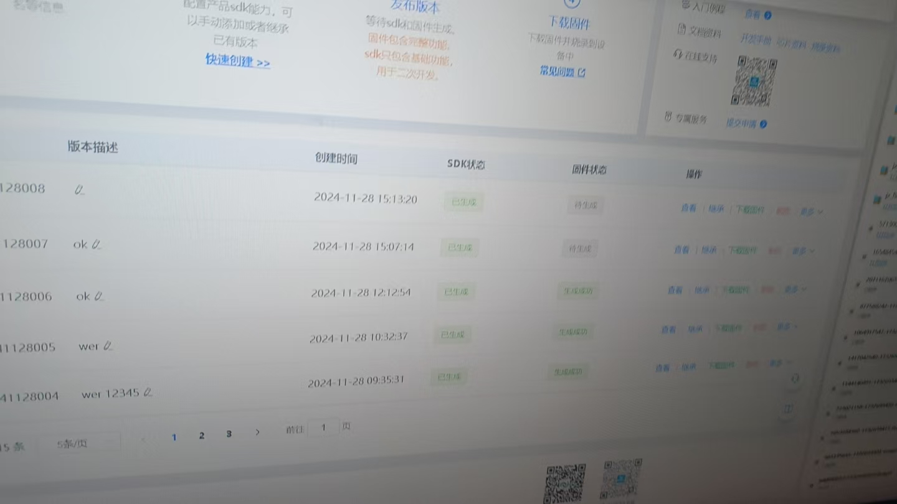

**2. 可能原因**

- 平台服务器负载较高
- 固件文件较大需要更长时间
- 临时服务器故障

**3. 应对措施**

- 等待一段时间后刷新状态
- 尝试生成较小的固件
- 联系技术团队确认平台状态

**注意事项：**

- 固件生成通常在几分钟内完成
- 长时间卡住建议重新操作
- 保留配置信息以便快速重试

---

### 语音模块是否支持HID通信协议？

**问题描述：**

在使用游戏外设模块时，需要了解语音模块是否支持HID通信协议，以及如何实现与主控的通信。

**解决方案：**

语音模块本身不支持HID通信协议，需要通过以下方式实现：

1. **使用主控进行协议转换**
    - 添加一个主控芯片（如Arduino、STM32等）
    - 主控实现HID协议与游戏设备通信
    - 语音模块通过串口与主控通信

2. **通信架构**
    ```
    游戏设备 ←→ 主控（HID协议） ←→ 语音模块（串口）
    ```

3. **实现步骤**
    - 主控接收HID设备输入
    - 将数据转换为串口格式发送给语音模块
    - 语音模块处理语音指令并返回结果
    - 主控将结果转换为HID协议响应

**注意事项：**

- 需要额外的硬件主控芯片
- 串口通信需要正确配置波特率
- HID协议实现相对复杂，建议使用成熟库
- 确保主控与语音模块的电平兼容

---

### 小程序图标更新后如何同步显示？

**问题描述：**

在智能公元小程序中替换了图标图片，生成固件并下载后，设备上的图标没有更新，仍显示旧图标。

**解决方案：**

- 删除小程序中的设备记录
- 重新搜索并添加设备
- 新增设备时会同步最新图标

**操作步骤：**

1. 在小程序中找到设备列表
2. 删除需要更新图标的设备
3. 重新扫描或搜索设备
4. 添加设备后即可看到新图标

**注意事项：**

- 图标更新需要重新配对设备
- 确保固件中已包含新图标
- 重新添加后其他配置不受影响


---

### 300条以上命令时页面卡顿怎么办？

**问题描述：**

当语音指令数量超过300条时，平台页面出现严重卡顿现象，影响正常操作。

**解决方案：**

**临时解决方法：**

- 关闭当前页面，重新刷新进入
- 分批创建命令，避免一次性添加过多
- 使用其他浏览器尝试（Chrome、Edge等）

**性能优化建议：**

- 控制单项目命令数量在300条以内
- 复杂命令可拆分为多个项目
- 定期保存工程，避免数据丢失

**注意事项：**

- 页面卡顿是浏览器性能限制导致
- 建议在网络状况良好时操作
- 大批量命令可联系技术团队协助处理


---

### SDK生成时"优化版"和"快速发布版"如何选择？

**问题描述：**

在SDK生成固件时，系统提示选择"优化版"会导致生成时间长达3小时，建议选择"快速发布版"。

**解决方案：**

- 快速发布版生成速度快，等待时间少，可节省测试时间
- 出货时仍需使用优化版生成固件
- 开发和测试阶段可使用快速发布版提高效率
- 两个版本的功能完全相同，区别仅在于生成时间

**注意事项：**

- 快速发布版适合开发调试阶段使用
- 正式出货前必须使用优化版生成最终固件
- 选择快速发布版不会影响功能，只是生成更快
- 根据实际需求选择合适的版本类型

---

### 快速发布模式生成SDK过慢怎么办？

**问题描述：**

使用快速发布模式生成SDK时，耗时过长（超过2小时仍未完成）。

**解决方案：**

**原因分析：**

- 高峰时段使用人数较多，服务器负载较大
- 快速发布模式需要排队处理
- 生成时间与项目复杂度相关

**解决方法：**

- 避开高峰期（工作日下午）使用
- 尝试关闭页面后重新提交
- 检查网络连接稳定性
- 联系技术团队查询处理状态

**注意事项：**

- 正常情况下快速发布应在10-30分钟内完成
- 超过1小时未完成可能存在异常
- 保留好项目编号便于查询进度


---

### 如何实现IO延时命令的中断与覆盖？

**问题描述：**

需要实现IO延时命令的中断与覆盖功能，使第二个命令能够中断并覆盖第一个命令的延时，确保IO引脚状态按最新命令执行。

**解决方案：**

**实现机制：**

系统支持后置命令的延时覆盖前置命令的延时机制。

**操作方法：**

1. **为第二个命令添加短暂延时**
    - 在第二个命令中设置一个很短暂的延时
    - 用第二个命令的延时覆盖掉第一个命令的延时

2. **命令执行逻辑**
    - 后执行的命令会自动覆盖之前相同IO的延时设置
    - 系统按最新命令的延时时间执行
    - 无需手动取消之前的延时命令

**示例场景：**

```
命令1：IO1、IO2、IO3设置为低电平，延时30秒
命令2：IO1设置为高电平（在30秒内执行）

结果：命令2会覆盖命令1中IO1的延时设置
IO1维持高电平状态，不会在30秒后变为低电平
```

**注意事项：**

- 该机制是系统内置功能，无需额外配置
- 覆盖仅针对相同IO引脚的延时设置
- 其他未被覆盖的IO仍按原延时执行

---

### SDK生成状态长时间停留在'正在生成'如何处理？

**问题描述：**

在SDK生成平台中，SDK生成任务状态长时间显示为"SDK正在生成，大约需要10-30分钟"，但实际时间已超过1小时仍未完成。

**解决方案：**

- 尝试刷新页面查看最新状态
- 检查网络连接是否稳定
- 若刷新后仍未更新，可联系技术团队处理


**注意事项：**

- 正常情况下SDK生成应在10-30分钟内完成
- 超过1小时未完成可能存在系统异常
- 保留任务创建时间等信息便于技术团队排查


---

### 如何配置定时器触发事件？

**问题描述：**

需要在平台上配置定时器触发事件，实现定时启动和停止功能。

**解决方案：**

**定时器配置步骤：**

1. **设置触发方式**
    - 选择"事件触发"
    - 触发事件选择"timer1定时器超时"

2. **配置定时器操作**
    - 操作类型选择"系统"
    - 选择"启动定时器"或"停止定时器"

3. **设置定时参数**
    - 定时器超时时间：如5000ms（5秒）
    - 执行模式：单次执行或循环执行


**注意事项：**

- 启动和停止定时器需要分开配置两条命令
- 命令词总数不能超过10条限制
- 定时器配置需要重新生成固件生效


---

### 串口数据发送长度限制是多少？

**问题描述：**

询问串口数据发送的最大字节数是否可以超过32字节，以及如何发送7-8个字节的数据。

**解决方案：**

**数据长度限制说明：**

- **发送限制**：串口发送数据最大长度为32字节
- **接收限制**：接收数据时可能也有长度限制
- **小数据包**：发送7-8字节数据完全支持

**使用建议：**

1. **小于32字节的数据**
    - 可直接发送，无特殊处理要求
    - 不影响芯片正常工作

2. **超过32字节的数据**
    - 需要拆分成多个数据包发送
    - 每包数据不超过32字节限制

3. **接收数据注意事项**
    - 接收长数据时可能需要分包处理
    - 注意数据包的完整性验证

**注意事项：**

- 32字节限制是发送缓冲区大小
- 仅发送短数据不会对功能造成影响
- 建议查阅具体型号的技术手册了解详细限制

---

## 平台功能限制


---

## 继电器配置


---

### 如何实现语音控制所有继电器同时动作？

**问题描述：**

希望通过一条语音指令控制所有继电器同时打开或关闭，但不确定具体的配置方法。

**解决方案：**

**1. 单条命令多动作配置**

在智能公元平台中：

- 添加一条语音命令（如"打开全部"）
- 在该命令下添加多个控制动作
- 每个动作对应一路继电器的GPIO

**2. 配置步骤**

1. **创建语音指令**
    - 设置命令词："打开全部"/"关闭全部"
    - 选择触发方式：语音命令

2. **添加控制动作**
    - 动作1：GPIO_Axx 输出高电平（第1路）
    - 动作2：GPIO_Axx 输出高电平（第2路）
    - ...
    - 动作8：GPIO_Axx 输出高电平（第8路）

3. **控制逻辑验证**
    - 说出"打开全部"，所有GPIO输出高电平
    - 说出"关闭全部"，所有GPIO输出低电平

**3. 硬件连接**

- 每个GPIO连接一路继电器控制端
- 确保继电器控制电平匹配（高/低电平触发）
- 检查继电器供电是否满足8路同时工作

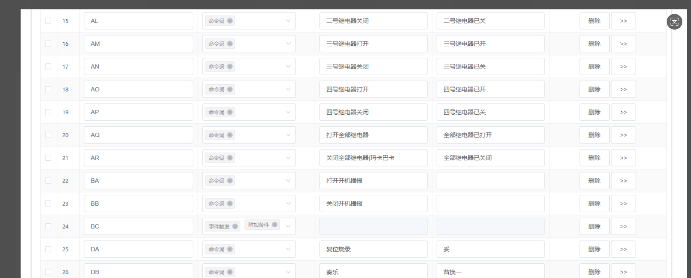

**注意事项：**

- GPIO引脚分配要合理，避免冲突
- 考虑电源供电能力，留有足够余量
- 如有需要，可分组控制（如"打开前4路"）
- 测试时验证响应速度和可靠性

---

## 继电器配置


---

### 如何实现语音控制所有继电器同时动作？

**问题描述：**

希望通过一条语音指令控制所有继电器同时打开或关闭，但不确定具体的配置方法。

**解决方案：**

**1. 单条命令多动作配置**

在智能公元平台中：

- 添加一条语音命令（如"打开全部"）
- 在该命令下添加多个控制动作
- 每个动作对应一路继电器的GPIO

**2. 配置步骤**

1. **创建语音指令**
    - 设置命令词："打开全部"/"关闭全部"
    - 选择触发方式：语音命令

2. **添加控制动作**
    - 动作1：GPIO_Axx 输出高电平（第1路）
    - 动作2：GPIO_Axx 输出高电平（第2路）
    - ...
    - 动作8：GPIO_Axx 输出高电平（第8路）

3. **控制逻辑验证**
    - 说出"打开全部"，所有GPIO输出高电平
    - 说出"关闭全部"，所有GPIO输出低电平

**3. 硬件连接**

- 每个GPIO连接一路继电器控制端
- 确保继电器控制电平匹配（高/低电平触发）
- 检查继电器供电是否满足8路同时工作


**注意事项：**

- GPIO引脚分配要合理，避免冲突
- 考虑电源供电能力，留有足够余量
- 如有需要，可分组控制（如"打开前4路"）
- 测试时验证响应速度和可靠性

---

## 资料获取


---

### 固件生成时提示"申请失败"怎么办？

**问题描述：**

在智能公元AI产品零代码平台中，配置检查通过后尝试生成固件，系统提示"申请失败"，无法完成固件生成。

**解决方案：**

**1. 临时解决方案**

- 等待一段时间后再重新申请
- 可能是平台服务器临时繁忙
- 建议间隔10-30分钟再试

**2. 问题原因分析**

- 平台生成队列可能满载
- 服务器资源临时不足
- 网络连接不稳定

**3. 操作建议**

- 保存当前的配置
- 避免频繁点击生成按钮
- 选择非高峰时段尝试生成

**注意事项：**

- 配置检查通过说明参数无误
- "申请失败"通常是临时性问题
- 多次尝试失败可联系技术团队
- 保留错误提示截图便于问题定位

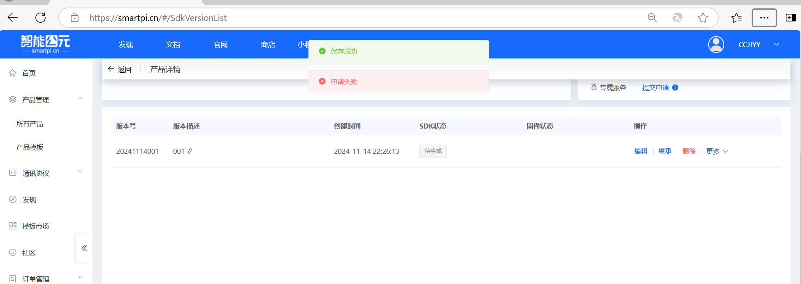

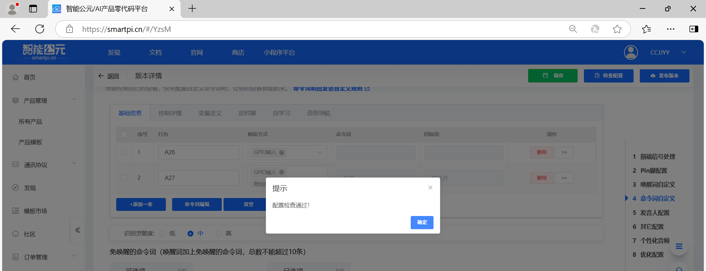

---

### 如何设置60秒周期性发送心跳消息？

**问题描述：**

需要在模块上实现60秒周期性发送16进制心跳消息的功能，但单个定时器无法实现周期性触发。

**解决方案：**

**实现方案：使用两个定时器相互触发**

**1. 定时器配置**

- **定时器1（t3）**：超时时间60000ms（60秒）
- **定时器2（t4）**：超时时间60000ms（60秒）
- 两个定时器轮流触发形成周期

**2. 触发逻辑设置**

- **上电启动**：开启定时器1
- **定时器1超时**：

    - 触发UART3_TX发送心跳消息
    - 开启定时器2
- **定时器2超时**：

    - 开启定时器1
    - 完成一个周期

**3. 事件配置示例**
```
事件w4：

- 触发方式：t3定时器超时
- 控制端口：UART3_TX
- 延时：60000ms
- 动作：发送
- 参数：00 00（16进制心跳消息）

事件w5：

- 触发方式：t4定时器超时
- 控制端口：开启定时器1
```

**4. 配置步骤**

- 添加两个定时器，均设置60秒超时
- 配置发送事件，由定时器1触发
- 配置启动定时器1事件，由定时器2触发
- 配置启动定时器2事件，由定时器1触发

**注意事项：**

- 单个定时器只能触发一次，需要两个形成循环
- 确保心跳消息格式正确（16进制）
- 测试时观察串口输出验证周期性
- 调整延时参数可改变心跳间隔

---

### 如何实现个性化音频的条件循环播放？

**问题描述：**

需要在特定条件下循环播放一段10秒左右的音乐，持续约10分钟。

**解决方案：**

- 将音乐文件添加到个性化音频中
- 在主控程序中编写条件判断逻辑
- 通过协议发送播报指令控制音频播放
- 计算好时间间隔，循环发送播报指令实现长时间播放

**注意事项：**

- 循环播放时需要精确计算时间间隔
- 建议使用定时器或中断来控制播放节奏
- 确保播报指令格式正确

---

### 个性化音频播放时出现杂音如何处理？

**问题描述：**

个性化音频在播放时出现杂音，但原始音乐文件正常。

**解决方案：**

- 检查音频文件格式是否为模块支持的格式
- 确认音频文件的采样率和比特率设置
- 提供原始音频文件给技术团队进行问题排查
- 检查音频文件的编码质量

**注意事项：**

- 原始音频文件应保持高质量
- 避免使用过低采样率的音频文件
- 如问题持续，需要提供原始文件进行深入分析

---

### 播放音乐时语音识别受干扰怎么办？

**问题描述：**

播放音乐时语音识别功能受到干扰，无法正常识别指令。

**解决方案：**

- 选择具备AEC（声学回声消除）功能的模块
- AEC功能可以在播放音频的同时保持语音识别能力

**注意事项：**

- 不具备AEC功能的模块在播放音乐时会影响语音识别
- 采购时需确认模块是否支持AEC功能
- 对于需要边播放边识别的应用场景，必须选择带AEC的模块

---

### 配置软件界面中的引脚数字和DEFAULT下拉菜单是什么含义？

**问题描述：**

在语音模块配置软件中，不清楚蓝色圆圈内的数字和红色框内DEFAULT下拉菜单的具体含义及使用方法。

**解决方案：**

- 蓝色圆圈中的数字代表引脚编号，仅作显示参考，无实际配置意义
- 红色框内的DEFAULT是引脚功能选择下拉菜单
- 点击DEFAULT下拉菜单可选择具体的功能引脚
- 引脚配置会影响log调试功能的输出

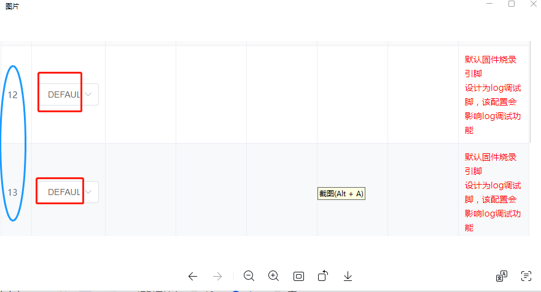

**注意事项：**

- 配置引脚功能时需根据实际硬件连接选择
- 引脚配置错误可能导致调试信息无法正常输出
- 修改配置后需重新生成并烧录固件

---

### 语音模块是否支持串口或IO控制播放指定语音？

**问题描述：**

需要了解语音模块是否支持通过串口或IO口控制播放指定的语音内容。

**解决方案：**

语音模块支持多种触发方式播放指定语音：

- **串口触发**：在配置平台选择触发方式为"串口输入"
- **GPIO触发**：在配置平台选择触发方式为"GPIO触发"
- 配置完成后，模块可根据接收到的串口指令或GPIO信号播放对应的语音内容

**注意事项：**

- 需要在配置平台正确设置触发方式和对应的触发条件
- 不同模块型号支持的串口和GPIO数量可能不同
- 配置完成后需要重新生成并烧录固件

---

### 固件生成时提示内存超出怎么办？

**问题描述：**

固件生成时提示内存超出，即使没有设置回复语，可能与自学习功能或个性化音频文件有关。

**解决方案：**

**问题分析：**

1. **自学习功能占用空间**
    - 自学习功能会占用大量Flash空间
    - 每个学习命令都需要存储音频样本
    - 即使没有回复语，自学习仍可能导致固件过大

2. **其他占用因素**
    - 个性化音频文件大小
    - 命令词数量过多
    - TTS回复语过长（即使未使用）

**优化建议：**

1. **减少自学习命令**
    - 删除部分自学习命令
    - 保留最核心的命令
    - 分批生成和测试

2. **精简配置**
    - 检查并删除不必要的命令词
    - 缩短TTS文本长度
    - 移除未使用的功能模块

3. **分阶段开发**
    - 先生成基础版本（不包含自学习）
    - 测试基础功能正常后
    - 再逐步添加自学习功能

**注意事项：**

- 自学习功能占用空间较大，需要合理规划
- 2M Flash的可用空间约为1.6-1.8M
- 建议预留20-30%的空间余量
- 如空间不足，考虑选择更大Flash容量的型号

---

### 如何设置串口触发的精确数据匹配条件？

**问题描述：**

设置串口触发数据为 AA 55 01 04 00 FF 时，只要前三个字节（AA 55 01）匹配就被触发，需要实现完整数据包匹配才触发。

**解决方案：**

通过变量和参数传递实现精确匹配：

1. **定义串口参数**
    - 在串口输入触发中定义参数（如 num 和 state）
    - 参数类型设置为 char
    - 用于接收串口数据中的特定字节

2. **创建变量**
    - 在变量定义中创建对应变量（如 num2）
    - 变量类型与参数保持一致
    - 用于存储和判断接收到的数据

3. **参数传递给变量**
    - 添加控制：变量设置
    - 选择目标变量
    - 操作选择"设置"
    - 方式选择"参数"
    - 选择对应的参数源

4. **添加条件判断**
    - 再添加一个控制
    - 条件项选择变量
    - 设置判断条件（如变量等于特定值）
    - 满足条件时执行相应动作

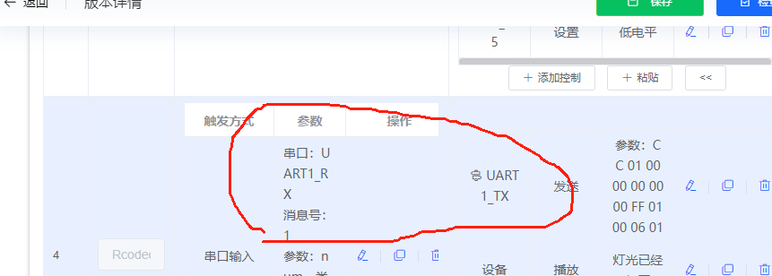

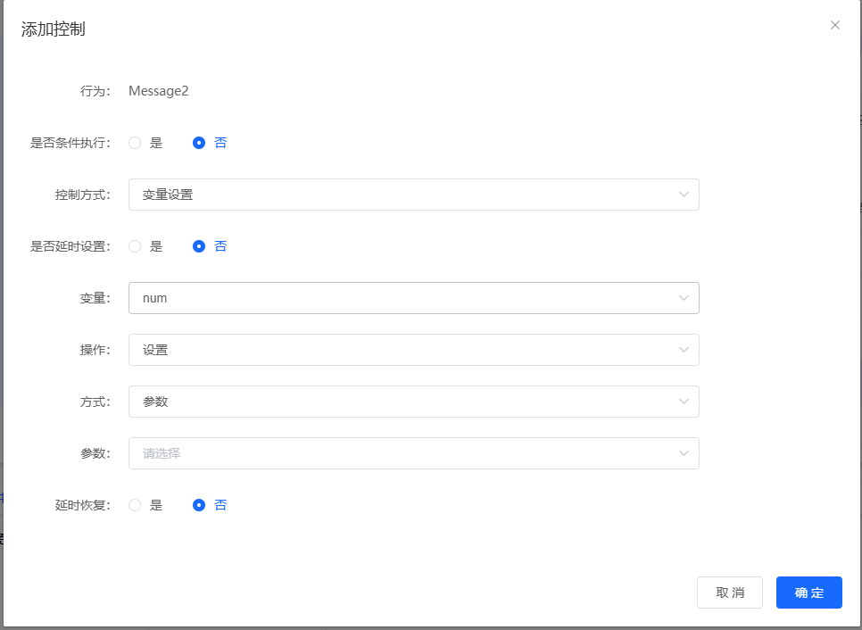

**注意事项：**

- 不能仅依靠串口触发数据本身实现完整匹配
- 需要通过变量作为中间桥梁进行条件判断
- 参数和变量不建议使用相同名称，避免混淆
- 控制逻辑可以添加多条，没有数量限制

---

### 变量与参数的区别和使用方法

**问题描述：**

在控制逻辑配置中，不清楚变量（Variable）和参数（Parameter）的区别，导致使用混淆。

**解决方案：**

**1. 基本概念**

- **参数（Parameter）**：串口或触发输入中定义的数据接收单元
- **变量（Variable）**：系统内部用于存储和传递数据的容器

**2. 使用场景**

- 参数用于接收外部输入的数据
- 变量用于内部逻辑判断和数据传递
- 参数需要通过"变量设置"操作传递给变量

**3. 配置方法**

定义参数：

- 在串口输入的"输入参数"中设置
- 指定参数名和类型
- 用于接收特定的数据字节

定义变量：

- 在"变量定义"中创建
- 设置变量名、类型和默认值
- 用于存储和处理数据

**4. 数据传递流程**

串口数据 → 参数 → 变量 → 条件判断 → 执行动作

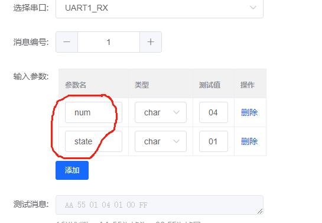


**注意事项：**

- 参数和变量名称不要相同，便于区分
- 参数是外部数据的入口，变量是内部处理的载体
- 一个参数可以传递给多个变量
- 变量可以被多个控制逻辑引用和判断

---

### 如何从串口接收数据并赋值给变量？

**问题描述：**

需要从串口接收的数据包（如 AA 55 01 04 00 FF）中提取特定字节（如 04）并用于条件判断。

**解决方案：**

**1. 配置串口输入**

    - 触发方式：串口输入
    - 选择串口：UART1_RX
    - 消息编号：自定义（1-255）
    - 设置输入参数：定义要接收的字节

2. **创建接收变量**
    - 在变量定义中创建变量（如 num）
    - 类型：char
    - 默认值：0

3. **参数到变量的传递**
    - 添加控制
    - 控制方式：变量设置
    - 变量：选择创建的变量
    - 操作：设置
    - 方式：参数
    - 参数：选择串口定义的参数

4. **条件判断配置**
    - 再添加控制
    - 条件项：选择变量
    - 判断条件：设置期望的数值
    - 执行动作：满足条件时的操作

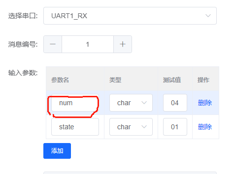

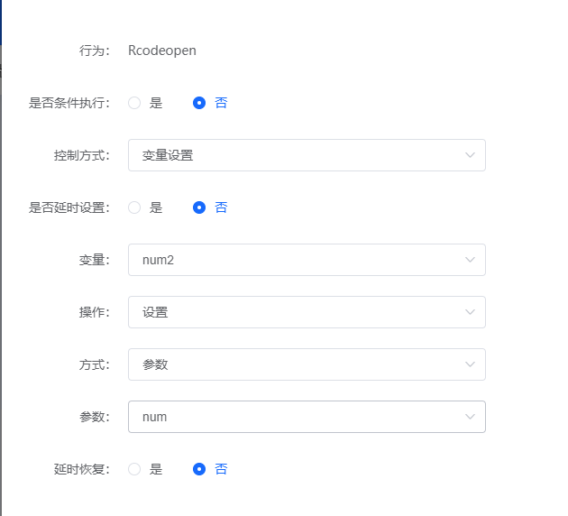

**注意事项：**

- 串口数据中的字节会自动转换为对应的参数
- 参数通过变量设置操作赋值给变量
- 变量存储的是16进制转10进制的数值
- 可以添加多个控制实现复杂的逻辑判断

---

### 二次开发固件的优势与限制

**问题描述：**

了解二次开发固件的好处以及可以修改的参数范围。

**解决方案：**

**1. 二次开发固件的优势**

    - 实现平台不支持的功能
    - 通过SDK自主开发定制功能
    - 更灵活的控制逻辑实现
    - 满足特殊应用场景需求

**2. 可修改的参数类型**

    - 串口通信协议
    - IO引脚功能定义
    - 控制逻辑和算法
    - 语音识别参数
    - 自定义数据格式

**3. 使用限制**

    - 需要具备嵌入式开发经验
    - 官方不提供二次开发技术团队
    - 需要自行调试和测试
    - 可能影响原有功能稳定性

**注意事项：**

- 二次开发适用于有特殊需求的专业使用方
- 普通应用建议使用标准平台功能
- 进行二次开发前建议深入学习SDK文档
- 保留原始固件作为备份

---

### 平台行为控制中多个延时发送指令只有最后一条生效怎么办？

**问题描述：**

在平台行为控制中设置3个或以上延时控制时，系统只执行最后一条指令，前面的延时指令被忽略，无法实现多条指令按间隔依次执行。

**解决方案：**

当需要发送多条串口指令且每条之间需要时间间隔时，应该使用定时器功能，而不是在同一个行为控制中添加多个延时。

**实现方法：**

1. **创建多个定时器**
    - 为每条需要发送的指令创建一个单独的定时器
    - 定时器数量最多支持5个
    - 每个定时器超时后触发对应的串口发送指令

2. **设置定时器触发链**
    - 第一个定时器超时后发送第一条指令
    - 同时启动第二个定时器
    - 第二个定时器超时后发送第二条指令
    - 以此类推，形成触发链

3. **使用变量控制**
    - 定义变量记录当前发送状态
    - 通过变量判断是否启动下一个定时器
    - 可以实现循环发送或条件发送

**操作步骤：**

1. 在定时器管理页面创建所需的定时器
2. 为每个定时器配置超时时间（如1000ms）
3. 设置定时器超时后触发的动作（发送串口数据）
4. 在行为控制中启动第一个定时器
5. 各定时器按顺序触发，实现多条指令的间隔发送

**注意事项：**

- 平台限制：单个行为控制中超过3个延时时只有最后一条有效
- 定时器限制：平台最多支持5个定时器
- 建议使用定时器+变量的组合方式来实现复杂的多指令发送逻辑

---

### 平台生成SDK或固件时出现卡顿、超时或排队怎么办？

**问题描述：**

在智能公元平台生成SDK或固件时，出现以下问题：

- 页面显示"SDK正在生成，大约需要1-3分钟"，但实际持续数小时仍未完成
- 持续出现超时错误，无法完成生成
- 需要排队生成，等待时间较长
- 页面按钮无法点击进行操作

**解决方案：**

1. **选择合适时间操作**
    - 服务器在早晨时段负载较低，生成速度相对较快
    - 避开高峰期，选择服务器空闲时进行操作

2. **尝试重新生成**
    - 点击"更多"选项
    - 选择"再次生成"，成功率会相对较高

3. **等待优化完成**
    - 平台正在进行服务器优化升级
    - 公司在全力优化中，这几天会越来越好
    - 随着优化进展，生成速度会逐步改善

**注意事项：**

- 平台使用方量持续增长导致服务器负载较高，正在全力优化中
- 维护期间（如16:00-18:00）平台将无法访问与使用
- 建议选择早晨等服务器空闲时段进行操作
- 如遇持续超时，建议等待维护完成后再尝试

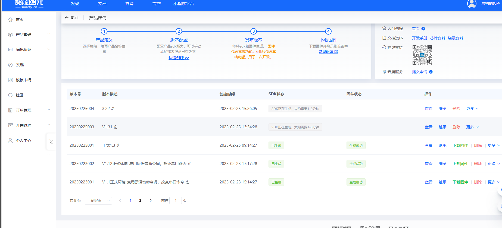

---

### 平台生成固件频繁超时怎么办？

**问题描述：**

平台在生成固件时频繁出现超时，导致无法顺利完成操作，且多次重复提交会加剧服务器拥堵。

**解决方案：**

1. **避免重复提交**
    - 生成失败后，系统会返回提醒，此时可以再次提交
    - 不要频繁重复提交，避免堵塞服务器
    - 多人同时重复提交会导致大家都越来越慢

2. **耐心等待**
    - 生成超时是正常现象，特别是在服务器负载高的时候
    - 建议等待一段时间后再尝试重新生成
    - 可选择在服务器负载较低的时段操作

**注意事项：**

- 频繁重复提交会加剧服务器拥堵，影响所有使用方
- 生成失败后系统会有提示，按提示操作即可
- 建议错峰使用平台，避开高峰期


---

### 图形化编程平台的编译速度如何提升？

**问题描述：**

希望了解图形化编程平台的编译速度，与其他平台相比是否存在优化空间。

**解决方案：**

**平台特点：**

1. **当前状态**
    - 图形化编程平台已支持多种模式
    - 包括小白模式、入门模式、专业模式
    - 持续优化使用方体验

2. **不同模式功能**
    - **小白模式**：GPIO输出修改，免编程开发，适合教育
    - **入门模式**：支持米思奇、Mind+图形化编程
    - **专业模式**：多任务多线程编程，代码编辑功能

**优化方向：**

1. **编译速度**
    - 平台在持续优化编译效率
    - 未来版本将提升转换速度
    - 使用方间隔时间也在逐步缩短

2. **功能完善**
    - 正在快速开发新功能
    - 支持更多主控板和硬件扩展
    - 增强图形化编程体验

**建议：**

- 关注平台更新，享受优化成果
- 根据需求选择合适的编程模式
- 提供功能反馈，帮助平台改进

---

### 图形化编程软件有哪些模式？

**问题描述：**

对图形化编程软件的不同模式（小白模式、入门模式、专业模式）的功能和适用场景存在疑问。

**解决方案：**

**模式介绍：**

1. **小白模式**
    - 免编程产品开发
    - 通过GPIO输出修改
    - 支持唤醒词、命令词、回复语配置
    - 适合大中小学AI教育

2. **入门模式**
    - 支持米思奇、Mind+图形化编程
    - 兼容多种主流主控板
    - 强大的硬件扩展功能库
    - 适合中小学教育和初学者

3. **专业模式**
    - 支持多任务多线程编程
    - 提供代码编辑功能
    - 适合复杂开发需求
    - 面向专业开发者

**选择建议：**

- **教育场景**：推荐小白模式或入门模式
- **产品开发**：根据复杂度选择入门或专业模式
- **快速原型**：小白模式最便捷
- **定制开发**：专业模式最灵活

**注意事项：**

- 不同模式功能相互独立
- 可根据项目需求切换模式
- 建议从简单模式开始学习

---

### Mind+ 软件中的模块是官方的吗？

**问题描述：**

在 Mind+ 软件中看到 SU-03T 或其他语音模块，询问这些模块是否由官方提供。

**解决方案：**

**软件说明：**

- Mind+ 是第三方图形化编程软件，非官方产品
- 软件中显示的语音模块（如 SU-03T）通常由用户库提供
- 用户库中的模块由 Mind+ 爱好者制作，非官方维护

**兼容性说明：**

- **官方支持的图形化编程**：米思奇（Mixly）软件
- **官方文档地址**：https://help.aimachip.com/docs/block/
- **模块支持情况**：
    - CI-03T/CI-33T：完全支持米思奇图形化编程
    - SU-03T：不支持任何图形化编程（包括 Mind+）

**注意事项：**

- Mind+ 中显示的语音模块可能无法正常使用
- 建议使用官方提供的米思奇软件进行图形化编程开发
- 第三方软件中的模块问题官方无法提供技术支持

---

### CI130x系列支持图形化编程吗？

**问题描述：**

询问CI130x系列芯片是否支持图形化编程软件，以及如何使用该软件进行指令学习。

**解决方案：**

**支持情况：**

- **CI130x系列**：支持图形化编程软件
- **学习功能**：提供学习命令词界面
- **指令管理**：可自定义语音指令和提示语

**软件界面：**

1. **学习命令词界面**
    - 列出多个可学习的语音指令

---

### 固件生成速度过慢怎么办？

**问题描述：**

在智能公园平台生成固件时，生成速度极慢，一个版本可能需要半小时甚至更长时间才能完成。

**解决方案：**

**1. 选择合适的时间段**

- 早晨时段（如6:00-8:00）服务器负载较低，生成速度较快
- 避开白天高峰期，选择服务器空闲时段操作
- 凌晨时段速度最快，曾有使用方反馈秒级生成

**2. 页面操作建议**

- 定期刷新页面查看最新状态
- 如状态长时间未更新，尝试刷新浏览器
- 避免重复点击生成，以免增加队列负担

**3. 批量生产建议**

- 提前规划，错峰生成固件
- 保留生成的固件文件，避免重复生成
- 联系技术团队了解批量生产的专用方案

**注意事项：**

- 当前使用方量快速增长导致服务器压力大，正在优化中
- 固件生成速度慢是临时现象，将持续改善
- 如急需使用，建议联系技术团队寻求帮助
- 批量生产需求可提前与客服沟通，获取最优方案


---

### 调整程序后延时功能全部失效怎么办？

**问题描述：**

在配置平台调整程序的延时参数后，下载到模块的程序中所有延时功能都失效了，但下载旧程序的延时功能正常。

**解决方案：**

**1. 可能原因分析**

- 延时参数设置可能超出了系统支持范围
- 配置冲突导致延时功能被禁用
- 固件生成过程中延时配置未能正确编译

**2. 排查步骤**

- 检查新配置中的延时值是否在合理范围内
- 对比新旧配置的差异，找出变化的部分
- 简化配置，只保留基本延时功能测试

**3. 解决建议**

- 逐步调整延时参数，一次只修改一个延时设置
- 重新生成固件前，清除浏览器缓存
- 如问题持续，尝试导出配置后重新导入

**注意事项：**

- 延时功能失效可能伴随模块重启现象
- 建议使用配置平台默认的延时模板
- 复杂的延时逻辑建议分解为多个简单的控制节点
- 保留一个已知正常的工作配置作为备份

---

### SDK生成速度变慢且成功率低怎么办？

**问题描述：**

在使用智能图元AI产品零代码平台时，发现SDK生成速度变慢且成功率降低。

**解决方案：**

- **选择CI系列模块**：使用CI系列模块生成速度更快
- SU系列模块SDK生成可能需要更长时间
- 生成时间较长可能受服务器负载影响

**注意事项：**

- SDK生成显示时间仅供参考，实际可能因服务器状况变化
- 如果频繁生成失败，建议错峰使用或联系技术团队
- 生成任务排队时，耐心等待或尝试取消后重新提交

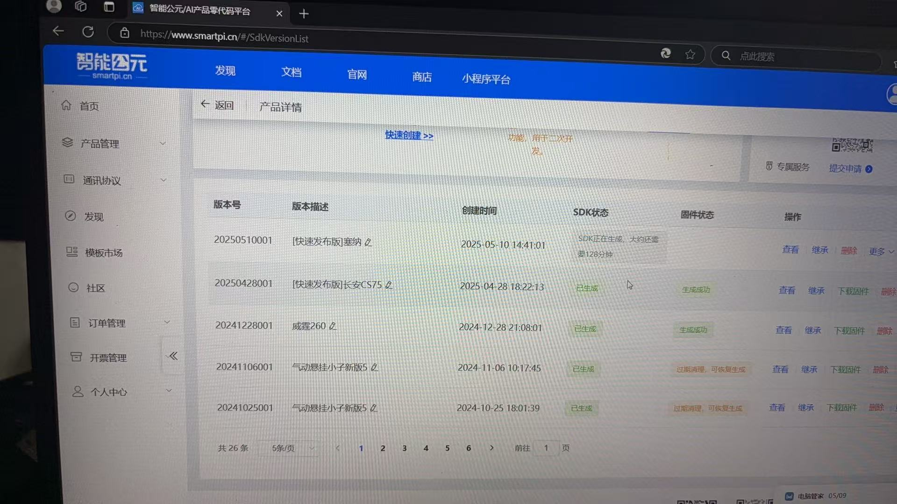

---

### 模块原理图可以在立创EDA中打开吗？

**问题描述：**

模块提供的原理图文件无法在立创EDA中打开，需要确认文件格式兼容性。

**解决方案：**

- 模块提供的原理图为PDF格式文档
- 立创EDA无法打开PDF格式的原理图文件
- PDF文档主要用于查看和参考，不适用于EDA编辑

**注意事项：**

- 需要编辑原理图时，可寻找其他支持PDF导入的EDA工具
- 或根据PDF原理图手动重新绘制电路
- 建议联系技术团队获取可编辑的原理图文件格式

---

### 脱机烧录的固件文件会占用更多内存吗？

**问题描述：**

发现脱机烧录方式生成的固件文件较大（release.bin约1688KB），询问这种方式是否会占用更多模块内存。

**解决方案：**

**1. 固件文件说明**

- release.bin：完整的固件文件，包含bootloader和应用程序
- release_update.bin：升级包文件，仅包含应用程序部分
- 脱机烧录通常使用release.bin完整固件

**2. 内存占用分析**

- 文件大小不直接等于运行时内存占用
- Flash存储空间：脱机固件确实占用更多存储空间
- 运行内存（RAM）：实际运行时占用与功能相关，不是文件大小决定

**3. 文件差异对比**

- release.bin（约1688KB）：包含完整系统，可独立烧录
- release_update.bin（约1624KB）：仅应用程序，需要原有bootloader

**注意事项：**

- 脱机烧录需要完整固件，因此文件较大
- 在线更新可使用较小的升级包
- 选择烧录方式时考虑Flash容量限制
- 实际RAM占用取决于程序功能复杂度，而非文件大小


---

### 语音模块的最小音量默认值是多少？

**问题描述：**

需要了解语音模块的最小音量设置值，以便进行音量范围的配置。

**解决方案：**

**默认音量范围：**

- **最小音量**：40
- **最大音量**：100
- **默认值**：根据具体模块型号可能有所不同

**音量配置说明：**

**1. 平台设置**

- 在智能公元平台的音量设置中调整
- 支持0-100范围的数值设置
- 实际播放时会有最小值限制

**2. 音量级别说明**
```
音量值  播放效果
0-39   不播放（低于最小值）
40-60   较小音量
61-80   中等音量
81-100  较大音量
```

**3. 应用场景建议**

- **安静环境**：设置40-60
- **普通室内**：设置61-80
- **嘈杂环境**：设置81-100
- **夜间模式**：建议使用最小值40

**注意事项：**

- 不同模块型号的最小值可能略有差异
- 音量为0时完全静音
- 建议根据实际使用环境调整合适音量
- 部分模块可能支持更精细的音量控制

---

### 是否支持中英文混合识别？如何使用SDK开发？

**问题描述：**

是否支持中英文混合识别功能，以及是否可以通过SDK进行开发。

**解决方案：**

中英文混合识别需要定制开发，可以使用SDK进行自主开发。

**功能支持：**

1. **中英文混合识别**
    - 标准固件不支持中英文混合识别
    - 需要通过定制开发实现
    - 可联系技术团队评估需求

2. **SDK开发支持**
    - SU系列模块支持SDK开发
    - 需要自行搭建开发环境
    - 对代码能力要求较高

**开发要求：**

1. **开发环境准备**
    - 安装虚拟机
    - 搭建Linux开发环境
    - 安装必要的开发工具链

2. **开发流程**
    - 申请SDK开发权限
    - 下载二次开发文档
    - 编写代码实现混合识别

3. **技术能力要求**
    - 熟悉C/C++编程
    - 了解语音识别算法
    - 具备嵌入式开发经验

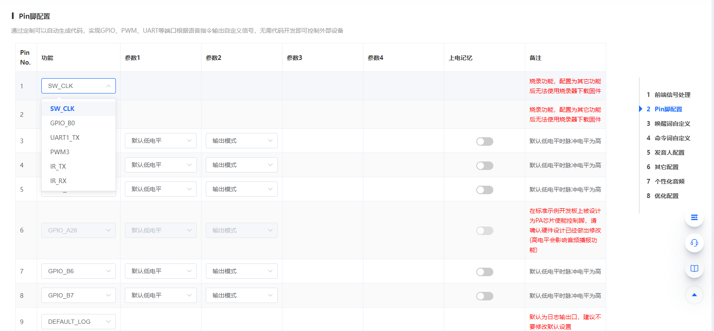

*Pin脚配置界面，可自定义GPIO、PWM、UART等功能*

**注意事项：**

- SDK开发相对复杂，建议评估自身技术能力
- 标准平台配置无法实现中英文混合识别
- 定制开发周期较长，需提前规划
- SU系列支持SDK，其他型号请咨询技术团队

---

### 个性化音频上传后内容被截断怎么办？

**问题描述：**

上传的个性化音频在平台上传后内容被截断，只保留了开头一小部分，无法完整播放，且上传的音频文件大小与实际上传大小不符。

**解决方案：**

平台会对上传的音频文件进行压缩，建议使用WAV格式并控制文件大小。

**问题原因：**

1. **自动压缩机制**
    - 平台上传音频后会自动压缩
    - 压缩可能导致内容截断
    - 文件大小显示变小是正常现象

2. **格式兼容性**
    - MP3格式可能存在兼容问题
    - WAV格式支持更好
    - 直接修改后缀名无效

**解决方法：**

1. **使用WAV格式**
    - 用音频软件转换（如格式工厂）
    - 确保真正的格式转换，不只是改后缀
    - 转换后文件大小建议不超过500KB

2. **优化音频文件**
    - 上传前自行优化音频质量
    - 控制录音电平，避免过载
    - 减少不必要的静音部分

3. **替代方案**
    - 如对音质要求高，可考虑外接MP3模块
    - 通过UART触发播放
    - 避免压缩影响音质

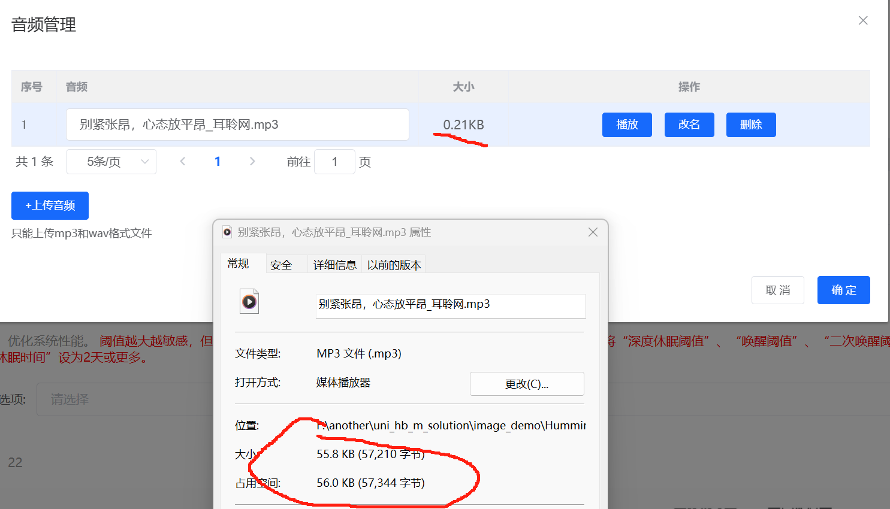

*上传前55.8KB，上传后仅0.21KB*

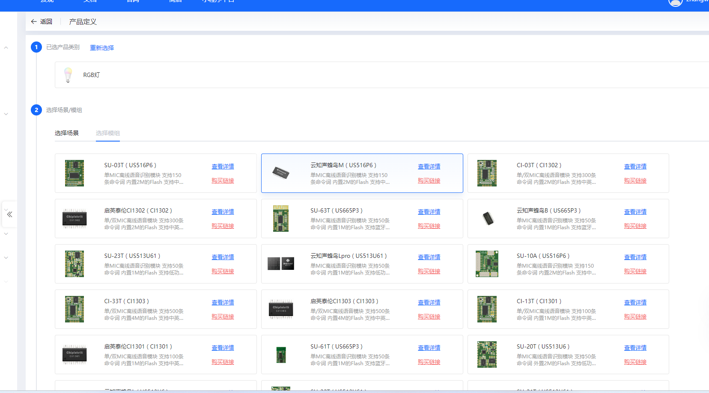

*问题中使用的云知声蜂鸟M模块*

**注意事项：**

- 压缩是平台自动行为，无法关闭
- 不要直接修改文件后缀，必须用软件转换格式
- 如需高保真音频，建议使用外接播放方案
- WAV格式相对MP3有更好的兼容性

---


---

### 音频文件上传后为什么会变大？

**问题描述：**

在上传个性化音频文件时，发现文件从本地的300多K变为上传后显示为600多K，与预期的大小限制（不大于500K）不符。

**解决方案：**

- **正常现象**：

    - 平台会对音频文件进行特定处理
    - 文件大小变化是正常现象
    - 即使显示变大，通常仍能正常使用

- **处理机制**：

    - 平台会重新编码音频文件
    - 可能添加必要的元数据
    - 确保与模块兼容性

**注意事项：**

- 上传后能正常播放即可使用
- 不必过分关注显示的大小数值
- 如无法播放，请检查音频格式是否正确

---

### SDK生成速度很慢怎么办？

**问题描述：**

在平台上生成SDK时速度非常慢，点击生成按钮后需要等待很长时间（超过一分钟），怀疑是网络问题。

**解决方案：**

SDK生成速度慢是正常现象，建议耐心等待或重新生成固件。

**问题原因：**

1. **SDK生成机制**
    - SDK生成需要经过多个处理步骤
    - 包括程序内存提取、文件打包等
    - 生成过程耗时较长，与网络速度关系不大

2. **固件差异**
    - 直接使用平台固件时，SDK已预先处理
    - 重新生成固件后，SDK需要实时处理
    - 新生成的固件会导致SDK生成变慢

**解决方法：**

1. **正常情况下**
    - 点击生成SDK后请耐心等待
    - 通常需要1-3分钟完成
    - 不要关闭或刷新页面

2. **固件重新生成后**
    - 建议先不修改配置直接生成SDK
    - 生成完成后再进行修改
    - 避免频繁重新生成固件

3. **优化建议**
    - 使用预置固件时SDK生成更快
    - 尽量减少不必要的配置修改
    - 避免在网络高峰期操作

**注意事项：**

- SDK生成慢是正常现象，不是网络问题
- 重新生成固件后首次SDK生成会更慢
- 建议预留充足时间操作，避免着急
- 如长时间无响应，可尝试重新操作

---

### 烧录软件优化建议

**问题描述：**

在开发过程中发现一些软件可以优化的问题，如语音识别模块232识别时内部有螺丝导致识别距离受限。

**优化建议：**

**硬件设计优化：**

1. **结构设计改进**
    - 移除识别模块内部非必要金属部件
    - 螺丝等金属件会影响射频信号
    - 建议使用塑料螺丝或非金属固定件

2. **信号传输优化**
    - 避免金属遮挡信号传输路径
    - 合理设计麦克风位置和朝向
    - 确保无障碍物阻挡

**软件性能优化：**

1. **路径内存管理**
    - 烧录软件的路径参数占用内存较大
    - 建议优化路径存储方式
    - 使用相对路径或缩短路径长度

2. **算法优化方向**
    - 识别算法可进一步优化
    - 减少不必要的计算开销
    - 提高识别响应速度

3. **界面响应优化**
    - 改进使用方交互体验
    - 减少界面卡顿现象
    - 优化文件加载速度

**实施建议：**

1. **短期改进**
    - 立即调整硬件结构设计
    - 移除影响识别的金属部件
    - 优化软件路径管理

2. **长期规划**
    - 持续优化算法性能
    - 改进使用方界面设计
    - 加强软硬件协同优化

**注意事项：**

- 硬件设计需充分考虑信号传输
- 软件优化应循序渐进
- 建议建立使用方反馈机制
- 定期收集和改进使用方建议

---

### 如何通过语音指令实现静音模式控制？

**问题描述：**

需要在平台中配置语音指令来控制设备的静音模式开启和关闭功能。

**解决方案：**

**配置语音指令：**


在平台中添加"开启静音模式"指令（如A_16），用于触发静音功能。

**配置控制动作序列：**

1. **先播放提示语音**


- 控制方式：播放语音
- 语音内容："好的，静音模式已开启"
- 作用：在执行静音前告知使用方状态变化

2. **再执行静音操作**

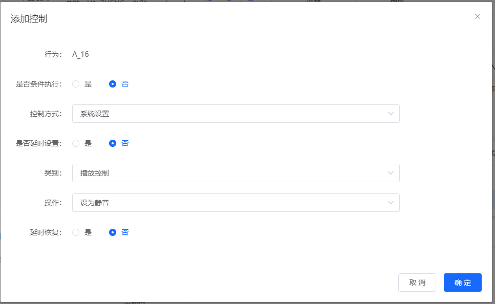

- 控制方式：系统设置
- 类别：播放控制
- 操作：设为静音
- 作用：实际执行静音功能

**配置要点：**

- 必须先配置播放语音，再配置设为静音
- 如果顺序颠倒，提示语音将无法播放（因为已静音）
- 关闭静音模式可配置相反的控制序列

**注意事项：**

- 播放提示语音的目的是让使用方知道静音模式已激活
- 确保语音内容简洁明了，避免过长
- 测试时验证两个动作的执行顺序正确
- 可根据需要调整提示语音内容

---

### 配置时间控制功能导致固件生成失败怎么办？

**问题描述：**

在配置时间控制功能时，未设置年月日、时分秒和星期等具体参数，导致固件生成失败。

**解决方案：**

**1. 参数设置要求**

    - 在"系统设置"→"时间控制"中
    - 必须设置具体的时间参数
    - 年月日、时分秒、星期等字段不能留空

**2. 正确配置方法**

    - 配置获取系统时间时：

        - 选择需要获取的时间项
        - 确保所有必填参数已设置
        - 测试验证配置完整性

**3. 故障排查**

    - 重新生成前检查所有配置项
    - 确认时间控制参数完整
    - 删除不完整的配置项

**注意事项：**

- 时间控制功能涉及多个参数，必须完整配置
- 未配置的参数会导致生成失败
- 建议保存配置前仔细检查各参数项

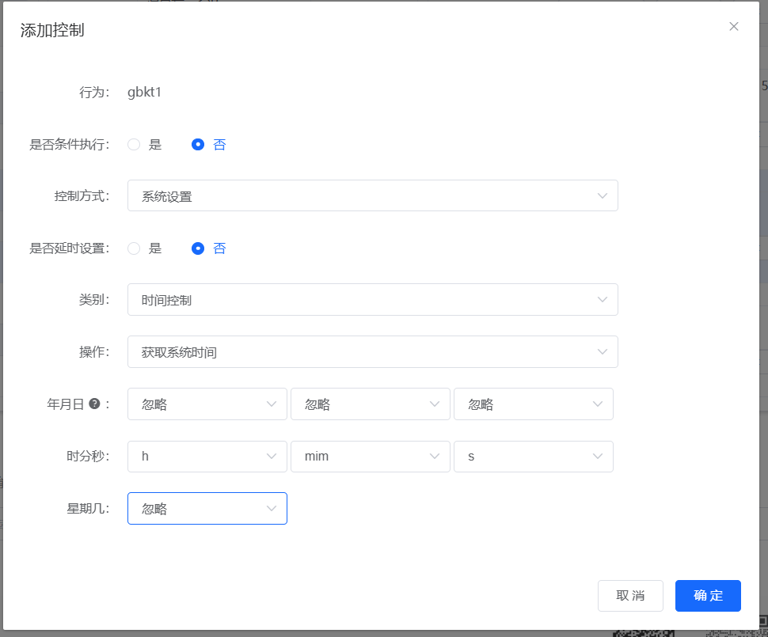

---

### 串口触发语音指令配置失败怎么办？

**问题描述：**

配置串口触发语音指令时，固件生成失败，提示"可能是配置原因，请检查配置"。

**解决方案：**

**1. 串口参数配置**

    - 串口触发必须设置具体参数
    - 不能只选择"串口输入"而不配置参数
    - 需要指定触发的具体消息号

**2. 使用模板功能**

    - 点击配置界面的"2"按钮加载预设模板
    - 模板包含正确的参数格式
    - 根据实际需求修改模板参数

**3. 配置步骤**

    - 触发方式：选择"串口输入"
    - 串口选择：UART1_RX或UART2_RX
    - 消息号：设置1-255范围内的数值
    - 确认所有参数配置完整

**注意事项：**

- 串口触发功能必须配合参数使用
- 未设置参数的配置会导致生成失败
- 消息号用于区分不同的触发指令
- 可使用模板快速完成配置

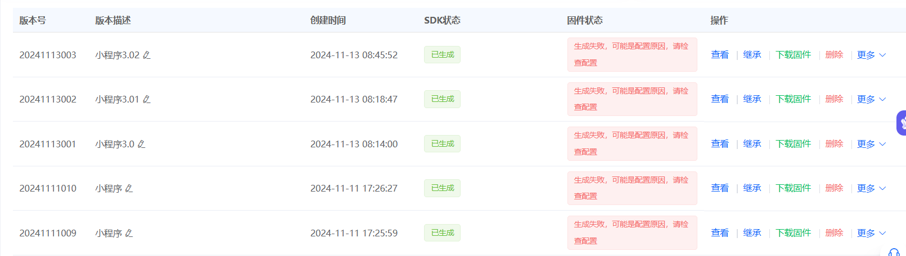


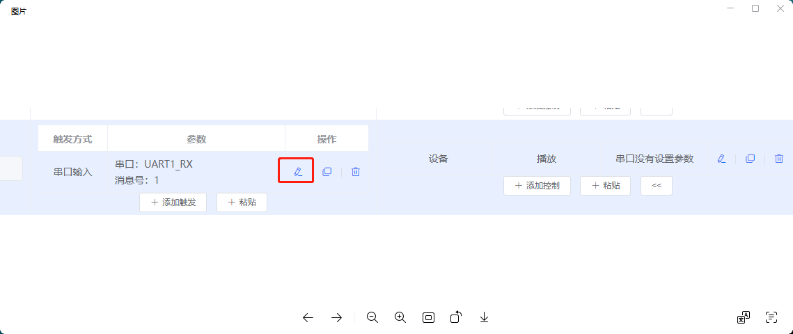

---

### 平台不支持某些控制指令怎么办？

**问题描述：**

配置控制指令时，发现某些指令（如gbkt1、gbkt11）平台不支持，导致固件生成失败。

**解决方案：**

**1. 检查支持的控制指令**

    - 平台仅支持预设的控制指令列表
    - gbkt1、gbkt11等自定义指令暂不支持
    - 需要使用平台提供的标准指令

**2. 替代方案**

    - 删除不支持的指令配置
    - 选择功能相似的标准指令
    - 或联系技术团队确认是否有等效方案

**3. 配置验证**

    - 保存配置前检查所有指令
    - 确保没有不支持的指令
    - 重新生成固件测试

**注意事项：**

- 平台控制指令有明确支持范围
- 不支持的指令会导致固件生成失败
- 建议查看平台文档了解支持的指令列表
- 特殊需求可咨询技术团队

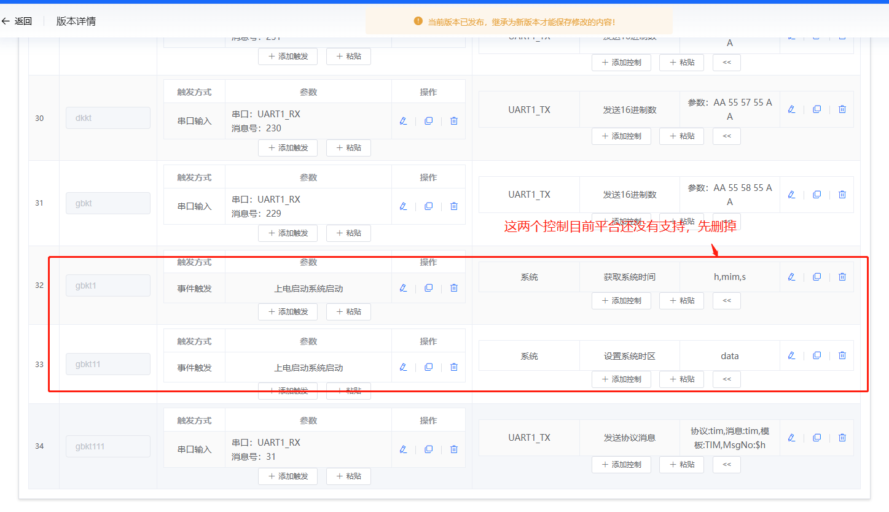

---

### 如何通过单片机串口控制语音芯片发声？

**问题描述：**

需要使用单片机通过串口通信向语音芯片发送指令，实现喇叭发声控制。

**解决方案：**

**1. 硬件连接**

- 单片机UART TX → 语音芯片UART RX
- 单片机UART RX → 语音芯片UART TX（如需回传数据）
- 供电电压：3.6V-5.5V范围内
- 喇叭连接：MONO功放输出，4Ω负载时最大2.4W

**2. 通信参数设置**

- 语音芯片支持2路UART接口（UART1/UART2）
- 波特率：通常9600bps（具体参考芯片手册）
- 数据格式：8位数据位、1位停止位、无校验

**3. 指令格式**

```
[指令头] [指令码] [参数] [校验和]
```

- **指令头**：固定为0x55（标识指令开始）
- **指令码**：操作类型（如0x01表示播放）
- **参数**：语音条目编号（0-299）
- **校验和**：指令头⊕指令码⊕参数的异或值

**4. 示例指令**

播放第10条语音：
```
0x55 0x01 0x0A 0x56
```
- 0x55：指令头
- 0x01：播放指令码
- 0x0A：语音条目编号10
- 0x56：校验和（0x55⊕0x01⊕0x0A）

**5. 操作步骤**

- 配置单片机UART模块参数
- 编写发送函数，按格式构造指令
- 通过UART发送指令至语音芯片
- 语音芯片解析指令并触发播放

**注意事项：**

- 确保语音芯片已烧录支持串口控制的固件
- 检查硬件连接可靠性，避免通信干扰
- 波特率和数据格式必须与芯片配置一致
- 若指令无效，可用串口助手验证通信

---

### 固件生成失败怎么办？

**问题描述：**

在使用平台生成固件时，遇到固件生成失败的问题，需要排查原因并提供解决方案。

**解决方案：**

**1. 检查配置项**

- 确认所有必需配置项已填写完整
- 检查语音识别模型是否正确选择
- 验证命令词和应答内容是否符合规范
- 确认产品特性设置是否正确

**2. 常见失败原因**

- 配置参数冲突或超出限制
- 语音模型资源不足
- 网络连接不稳定导致上传失败
- 平台临时故障或维护

**3. 排查步骤**

1. 保存当前配置并刷新页面
2. 清除浏览器缓存和Cookie
3. 检查网络连接稳定性
4. 尝试使用其他浏览器重新操作
5. 简化配置后重新生成

**4. 替代方案**

- 联系技术团队获取帮助
- 提供详细错误信息和操作步骤
- 使用备用设备或网络环境重试

**注意事项：**

- 固件生成失败通常是配置或网络问题
- 避免在高峰时段进行生成操作
- 及时保存配置防止数据丢失
- 关注平台公告了解维护信息


---

### 语音模块支持二次开发吗？

**问题描述：**

询问语音模块是否支持二次开发，以及二次开发是否能实现比平台更多功能。

**解决方案：**

**1. 二次开发支持情况**

不同型号的二次开发支持情况：

- **CI系列**：支持授权需求方的二次开发
- **SU系列**：主要通过平台配置，二次开发能力有限
- **具体支持**：需要根据型号和授权情况确定

**2. 功能差异说明**

平台开发与二次开发的对比：

- **平台开发**：

    - 图形化配置界面，无需编程
    - 功能完善，经过充分测试
    - 快速迭代，适合量产
    - 部分高级功能仅平台支持
  
- **二次开发**：

    - 可实现自定义功能和逻辑
    - 灵活性更高，不受平台限制
    - 需要较强的开发能力
    - 可实现平台不支持的特定需求

**3. 获取开发资源**

二次开发资源获取方式：

- **授权开发包**：联系商务或技术团队申请
- **SDK下载**：提供完整的开发工具链
- **技术文档**：包含接口协议和开发指南
- **开源代码**：部分功能提供参考代码

**4. 开发建议**

根据项目需求选择开发方式：

- **标准功能需求**：使用平台开发
- **定制化需求**：考虑二次开发
- **快速原型验证**：使用平台快速验证
- **量产产品**：使用授权开发包保证质量

**注意事项：**

- 二次开发需要签署相关协议
- 并非所有型号都开放二次开发
- 授权开发可能涉及费用
- 选择开发方式需评估技术能力和项目需求

---

### 平台是否支持串口消息的发送和接收功能？

**问题描述：**

在使用平台配置时，需要实现通过串口发送和接收消息的功能，以简化协议逻辑中的判断和发送流程，但发现平台暂不支持此功能。

**解决方案：**

**1. 当前平台限制**

- 平台暂时不支持通过串口发送和接收消息
- 无法实现双向串口通信功能
- 协议逻辑需要逐个判断和手动发送数据

**2. 替代方案**

- 使用GPIO引脚配置为串口功能进行单向通信
- 通过授权二次开发实现自定义串口通信
- 联系技术团队评估是否可添加该功能
- 考虑使用其他通信接口（如I2C、SPI）

**3. 开发建议**

- 评估项目需求，确认是否必须使用串口通信
- 如需要复杂通信逻辑，考虑申请二次开发授权
- 简化通信需求，使用平台支持的其他功能实现
- 对于简单的0/1值控制，可考虑使用IO口直接控制

**注意事项：**

- 平台功能会持续更新，建议关注后续版本
- 二次开发需要相关授权，请联系商务或技术团队
- 使用IO口控制时需注意硬件连接和电平匹配

---

### 新模块和旧模块的固件是否可以互换使用？

**问题描述：**

了解新Flash芯片的模块与旧模块之间的固件兼容性，以及新旧固件和模块的搭配使用方式。

**解决方案：**

**1. 固件兼容性矩阵**

| 模块类型 | 旧固件 | 新固件 |
|---------|--------|--------|
| 旧模块 | ✅ 兼容 | ✅ 兼容 |
| 新模块 | ❌ 不兼容 | ✅ 兼容 |

**2. 具体说明**

- **新模块 + 旧固件**：不支持，必须使用新固件
- **新模块 + 新固件**：支持，正常使用
- **旧模块 + 旧固件**：支持，无需更改
- **旧模块 + 新固件**：支持，新固件向下兼容

**3. 实施建议**

- 尽快更新固件到新版本，新固件兼容所有模块
- 旧模块库存用完后，将全面使用新模块
- 烧录方式保持不变（CH340串口烧录等）
- 除Flash更新外，其他硬件规格无变化

**注意事项：**

- 新固件向下兼容，建议统一使用
- 旧模块出完后就不再生产
- 只需要更新固件，其他硬件连接不变
- 过渡期可灵活搭配使用

---

### 如何优化窗帘开合的语音指令控制？

**问题描述：**

在窗帘控制应用中，需要为每个开合百分比（0-100%）都设置一条独立的语音指令，导致指令数量过多，配置繁琐，希望能用一两条指令实现全范围控制。

**解决方案：**

**1. 当前平台限制**

- 平台暂不支持动态数值解析功能
- 无法通过"窗帘打开50%"这类指令提取数值
- 每个具体的开合度都需要独立配置指令

**2. 优化方案**

**预设档位方案**：

- 将0-100%范围划分为几个关键档位
- 建议档位：关闭、10%、30%、50%、70%、90%、全开
- 大幅减少指令数量（从100条减少到7条）

**配置示例**：

- "窗帘关闭" → 0%
- "窗帘打开百分之三十" → 30%
- "窗帘打开一半" → 50%
- "窗帘全开" → 100%

**3. 替代实现方式**

**外部控制方案**：

- 通过手机APP或小程序设置精确百分比
- 物理按钮配合使用，提供精细调节
- 将数值通过UART/I2C发送给主控

**4. 开发建议**

- 优先使用预设档位满足大部分使用场景
- 如需精确控制，考虑二次开发实现
- 评估使用方使用习惯，选择最常用的开合度

**注意事项：**

- 预设档位应覆盖最常用的开合度
- 指令名称要清晰易懂，便于使用方记忆
- 未来版本可能支持动态数值解析功能

---

### 智能公元账号无法接收短信验证码怎么办？

**问题描述：**

注册智能公元账号时无法收到短信验证码，确认手机号输入正确且无短信拦截，通过邮箱注册虽能收到验证码但最终仍要求绑定手机号。

**解决方案：**

**1. 排查步骤**

- 确认手机号码输入无误
- 检查手机短信拦截功能
- 尝试更换手机号码注册
- 检查手机信号和网络状态

**2. 使用邮箱注册**

- 可先通过邮箱接收验证码完成初步注册
- 邮箱注册成功后会提示绑定手机号
- 如仍无法接收短信，可联系客服处理

**3. 联系技术团队**

- 提供注册手机号码和错误截图
- 说明已尝试的解决方法
- 通过技术团队手动完成账号激活

**注意事项：**

- 短信发送可能存在延迟，请耐心等待
- 部分运营商可能存在短信拦截问题
- 建议使用常用手机号注册，方便后续找回密码
- 可关注平台公告了解服务状态

---

### 智能公元平台账号注册失败怎么办？

**问题描述：**

在尝试注册智能公元平台账号时，无法完成注册，注册按钮无法点击。

**解决方案：**

**1. 检查必填项**

- 确认所有必填信息已完整填写
- 包括用户名、手机号、密码、验证码等
- 缺少任何一项都无法完成注册

**2. 勾选用户协议**

- 必须勾选"我已阅读并接受用户协议与隐私政策"复选框
- 只有勾选协议后，注册按钮才会变为可点击状态
- 这是注册的强制性要求

**3. 注册步骤**

- 填写用户名（建议使用英文字母和数字组合）
- 输入手机号码并获取验证码
- 设置登录密码（建议使用强密码）
- 填写收到的短信验证码
- 勾选用户协议与隐私政策
- 点击"注册"完成账号创建

**注意事项：**

- 密码设置需符合平台要求（长度、复杂度等）
- 确保手机号能正常接收短信
- 注册成功后即可使用手机号登录平台
- 建议保存好账号信息以便后续登录

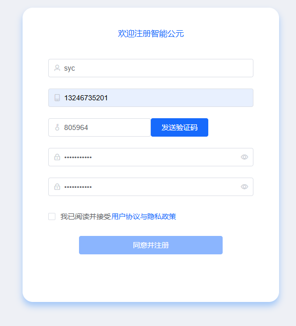

### 智能公元平台支持多人协作或账号共享吗？

**问题描述：**

需要了解智能公元平台是否支持添加团队成员、多人同时在线协作，或者一个账号生成的固件能否被其他账号编辑。

**解决方案：**

智能公元平台目前不支持多人协作功能。

**1. 账号使用限制**

- 目前一个账号只能支持一个人在线使用
- 无法添加团队成员或协作者
- 无法将项目共享给其他账号

**2. 固件编辑权限**

- 生成的固件只能由创建该固件的账号编辑
- 其他账号无法编辑或修改已有固件配置
- 固件文件可以下载后在不同设备上烧录使用

**3. 团队协作建议**

- 团队成员各自注册平台账号
- 通过导出/导入配置文件的方式共享配置
- 使用版本号管理不同的固件版本
- 统一由一个账号管理核心项目配置

**注意事项：**

- 账号信息请妥善保管，不要泄露给他人
- 如需多人协作，建议提前规划好项目管理方案
- 后续版本可能会增加团队协作功能，请关注官方更新

---

### 如何实现语音模组声音输出到电脑？

**问题描述：**

需要实现语音模组的声音上传到电脑功能，或者让用户可以选择通过模组喇叭或电脑播放声音，并预留相关功能接口。

**解决方案：**

**1. 当前功能限制**

- 语音模组默认通过喇叭输出模拟音频信号
- 不直接支持声音上传到电脑
- 需要通过硬件设计实现音频信号采集

**2. 实现方案**

**方案一：音频信号采集**

- 在模组喇叭输出端采集音频信号
- 通过ADC转换后传输到电脑
- 需要额外的硬件电路支持

**方案二：串口播放**

- 电脑通过串口发送音频数据给模组
- 使用TTS功能在模组端播放
- 可实现电脑控制音频输出

**3. TTS功能说明**

- 平台提供TTS串口工具
- 支持文本转语音合成
- 可通过串口发送文本进行播放
- 参考官方TTS演示视频

**注意事项：**

- 直接上传声音需要定制开发
- 音频信号采集需要额外电路设计
- TTS功能需要专用固件支持
- 建议根据实际需求选择合适方案

---


---

### 登录平台时收不到验证码怎么办？

**问题描述：**

在登录智能公元平台时收不到验证码，无法完成登录以更改语音内容。

**解决方案：**

- **排查步骤**：

    - 确认手机号输入正确
    - 检查短信拦截设置
    - 确认网络连接正常
    - 尝试重新发送验证码

- **替代方案**：

    - 使用微信扫码登录功能
    - 更换手机号注册账号
    - 清除浏览器缓存后重试

**注意事项：**

- 验证码有时效性，过期需重新获取
- 确保手机信号良好，避免接收延迟
- 如持续无法接收，可联系技术团队处理

---

### 如何简化复杂的控制逻辑判断？

**问题描述：**

在控制逻辑实现中，需要对两个二值变量（0或1）进行判断，当前实现方式过于繁琐，导致代码冗长且难以维护。

**解决方案：**

**1. 使用位运算优化**

将两个二值变量组合为一个数值，减少判断次数：

```c
// 假设变量为 var1 和 var2
int combined = (var1 << 1) | var2;  // 组合为 0, 1, 2, 3

switch(combined) {
    case 0:  // 两个值均为0
        // 执行操作A
        break;
    case 1:  // var1=0, var2=1
        // 执行操作B
        break;
    case 2:  // var1=1, var2=0
        // 执行操作C
        break;
    case 3:  // 两个值均为1
        // 执行操作D
        break;
}
```

**2. 查表法实现**

预定义所有可能的组合及其对应操作：

```c
// 定义操作映射
typedef void (*ActionFunc)(void);

ActionFunc actions[4] = {
    action_a,  // 00
    action_b,  // 01
    action_c,  // 10
    action_d   // 11
};

// 直接调用
actions[combined]();
```

**3. 平台配置优化**

- 使用条件判断模块组合多个输入
- 将复杂逻辑拆分为多个简单模块
- 利用内置的逻辑运算功能

**4. 通信优化**

- 将判断结果打包为一个字节发送
- 使用位掩码方式传输多个状态
- 减少通信次数，提高效率

**注意事项：**

- 确保输入变量严格为0或1
- 使用查表法时注意数组边界
- 嵌入式系统中位运算效率更高
- 保留逻辑注释便于后续维护

---

### 固件生成超时后为什么不能多次提交？

**问题描述：**

固件生成显示"生成超时"后，继续多次提交任务，询问是否会加重服务器负担。

**解决方案：**

**多次提交的影响：**

1. **服务器资源浪费**
    - 每次提交都会占用服务器资源
    - 旧任务未清理就提交新任务
    - 导致有效资源被无效占用

2. **队列拥堵加剧**
    - 多个任务同时进入生成队列
    - 新任务需要等待更长时间
    - 影响其他使用方的正常生成

3. **系统负载增加**
    - CPU和内存资源被分散
    - 生成效率整体下降
    - 可能导致系统稳定性问题

**正确处理方式：**

1. **单次处理**
    - 生成超时后选择"重新生成"
    - 等待当前任务完全处理
    - 不要同时提交多个任务

2. **耐心等待**
    - 给服务器足够处理时间
    - 避免频繁刷新和操作
    - 关注生成状态变化

3. **错峰使用**
    - 选择人少的时间段
    - 避免晚上和周末的高峰期
    - 提高生成成功率

**技术团队建议：**

- 不要因为着急就多次提交
- 一次只处理一个生成任务
- 这样对所有人都公平
- 有助于系统稳定运行


*生成超时提示界面，此时应选择重新生成而非多次提交*

---

### 网站生成固件失败需要多次重试怎么办？

**问题描述：**

在网站生成固件时遇到持续失败，需要等待20小时并重新提交5次才最终成功。

**解决方案：**

**实际案例说明：**

1. **问题现象**
    - 生成固件时出现失败提示
    - 不是超时，而是直接失败
    - 需要反复尝试才能成功

2. **处理经验**
    - 耐心多次尝试是必要的
    - 每次间隔5-10分钟再试
    - 保持配置不变，重新提交

3. **成功案例**
    - 有使用方等待20小时后成功
    - 重新提交5次最终生成
    - 说明需要持续尝试

**可能原因：**

1. **服务器不稳定**
    - 部分服务器节点异常
    - 负载分配不均
    - 临时服务中断

2. **网络波动**
    - 数据传输中断
    - 连接状态不稳定
    - 超时导致失败

**应对策略：**

1. **保持耐心**
    - 不要因为失败就放弃
    - 系统问题通常临时
    - 持续尝试最终能成功

2. **固定配置**
    - 不要频繁修改配置
    - 保持参数一致
    - 避免引入新问题

3. **选择时机**
    - 避开高峰时段
    - 选择服务器负载较轻时
    - 提高成功概率

**注意事项：**

- 生成失败是正常现象
- 技术团队在持续优化
- 建议保存好配置
- 成功后及时下载备份

---

## 串口通信配置


---

### 语音模块如何接收自定义协议数据？

**问题描述：**

需要配置语音模块接收非标准格式的自定义协议数据，但现有设置只支持固定格式或单一自定义格式。

**解决方案：**

- 将配置格式中的帧头、帧尾都设置为空
- 使用多个变量接收数据（最多支持8个变量）
- 不设置帧头帧尾，直接接收原始数据

**注意事项：**

- 固定格式模式适用于标准协议
- 自定义模式有限制，无法处理复杂协议
- 如需处理复杂协议，考虑预处理数据后再发送给模块

---

### 如何配置串口输入和参数接收？

**问题描述：**

需要配置语音模块通过串口接收外部数据，并设置相应的参数进行处理。

**解决方案：**

1. **基础信息设置**：

    - 触发方式：选择"串口输入"
    - 串口选择：如UART0_RX、UART3_RX等
    - 消息编号：设置唯一编号（避免重复）

2. **变量定义**：

    - 创建接收数据的变量（如power_msg、child_clock等）
    - 变量类型根据数据类型选择

3. **输入参数配置**：

    - 定义参数列表（如p_con、p_con1、p_con2等）
    - 参数个数与数据字节数对应

4. **控制设置**：

    - 选择变量进行操作
    - 操作类型：选择"设置"
    - 方式：选择"参数"
    - 参数：选择对应的接收参数

**注意事项：**

- 消息编号必须唯一，重复会导致冲突
- 帧头帧尾为空时可接收任意格式数据
- 配置完成后需要生成固件并烧录


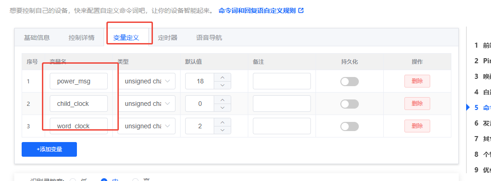

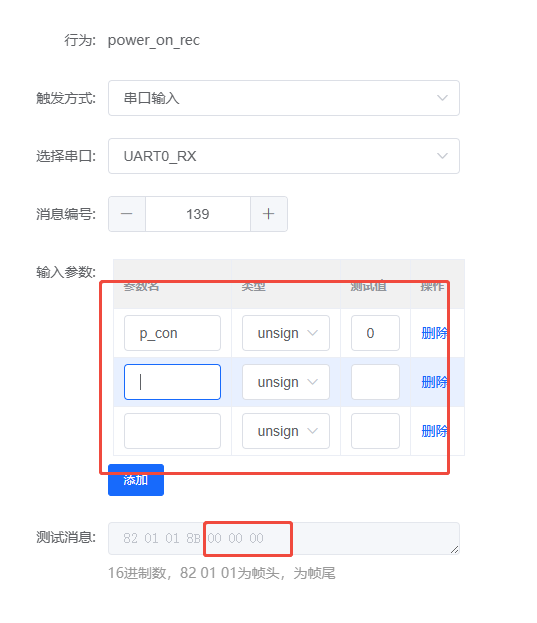

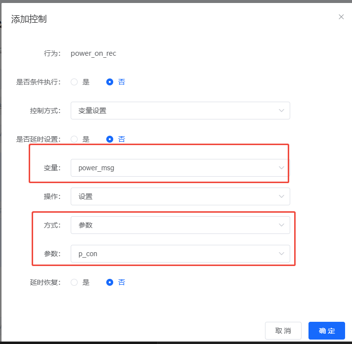

---

### 如何处理固定帧头的协议数据？

**问题描述：**

协议数据包含固定帧头（如03 06 10 03 00），需要正确解析和处理这类数据。

**解决方案：**

- **方法一：使用帧头识别**
    - 在配置格式中设置帧头为"03 06 10 03 00"
    - 后续数据通过参数接收

- **方法二：全数据接收+条件判断**
    - 帧头帧尾都设为空
    - 接收所有数据后通过变量判断
    - 例如：判断第一个变量是否等于3

- **推荐方法：混合处理**
    - 将固定部分当作帧头处理
    - 减少变量数量，简化配置
    - 无法设置帧头时，接收后条件判断

**注意事项：**

- 固定帧头可以减少变量数量
- 条件判断要准确识别消息类型
- 测试时注意数据格式的正确性

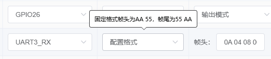

---

### 串口接收消息重复怎么办？

**问题描述：**

串口接收到的消息出现重复，特别是消息的前段部分重复出现。

**解决方案：**

1. **先接收消息，再进行变量判断**：

    - 在接收消息的设置中，先完整接收数据
    - 然后通过条件执行判断变量值
    - 避免直接触发控制操作

2. **条件执行配置**：

    - 设置"变量等于数值"的判断条件
    - 例如：判断power_msg是否等于3
    - 满足条件才执行相应控制

3. **固定帧头处理**：

    - 对于固定帧头（如03）的数据，统一从一个入口接收
    - 接收后根据参数内容判断执行不同操作
    - 避免重复配置消息接收

**注意事项：**

- 消息重复通常是因为多个接收点配置了相同帧头
- 条件判断可以避免重复执行控制指令
- 测试时确认数据接收的准确性

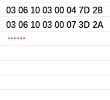


---

### 如何配置多协议数据的接收和判断？

**问题描述：**

需要接收多种类型的协议数据，并根据不同数据执行不同的控制操作。

**解决方案：**

1. **统一接收入口设置**：

    - 消息编号统一（所有相同帧头的数据用一个接收点）
    - 帧头帧尾设为空，接收所有数据
    - 参数列表填写完整（可填任意名称）

2. **多条件判断配置**：

    - 添加多个控制，每个对应一种数据类型
    - 使用"条件执行"
    - 判断变量值决定执行哪个控制

3. **参数接收技巧**：

    - 参数名称可以自定义（val1-val7等）
    - 实际接收时按顺序对应数据字节
    - 不用的参数可以留空

4. **协议匹配示例**：

    - 数据"03 06 10 03 00 04 7D 2B"：判断第6个字节为04
    - 数据"03 06 10 03 00 07 3D 2A"：判断第6个字节为07
    - 根据不同值执行不同操作

**注意事项：**

- 消息号重复会导致接收冲突
- 条件判断要按数据字节位置正确设置
- B站有串口收发变量教程供参考

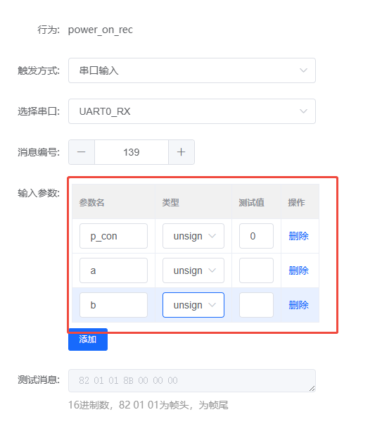

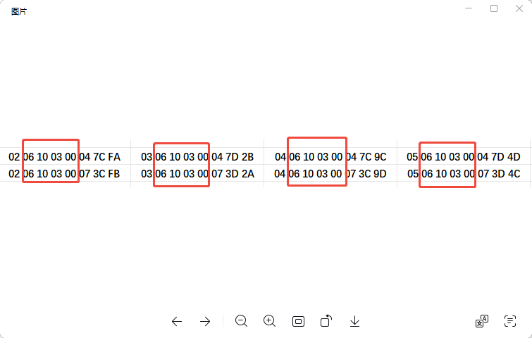

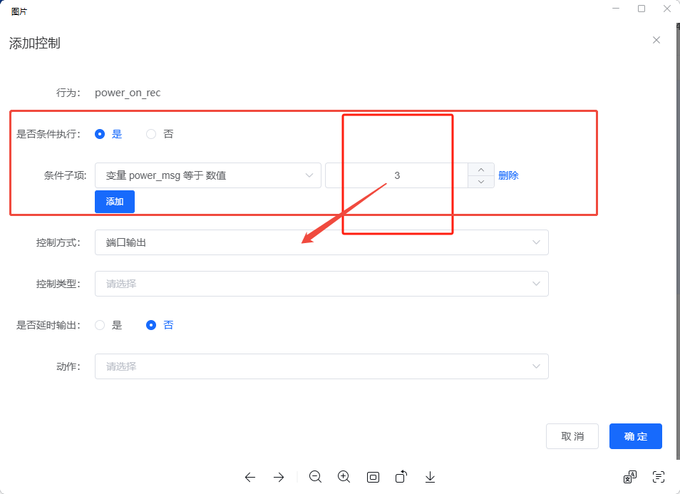

---

### 变量计算结果显示范围异常怎么办？

**问题描述：**

变量jiaodu（1.5）减去变量bianhua（0.2）的计算结果显示为0-10范围，而非实际计算结果1.3。

**解决方案：**

- **显示范围说明**：

    - 0-10是变量的可设置范围，不是计算结果
    - 实际计算值（1.3）确实在此范围内
    - 界面显示的是变量定义的取值范围

- **变量设置确认**：

    - jiaodu变量类型为double，值为1.5
    - bianhua变量类型为double，值为0.2
    - 执行"减少"操作后结果应为1.3

**注意事项：**

- 变量范围（0-10）不影响实际计算
- 计算结果正确，只是界面显示问题
- 如需要查看实际值，可通过其他方式验证


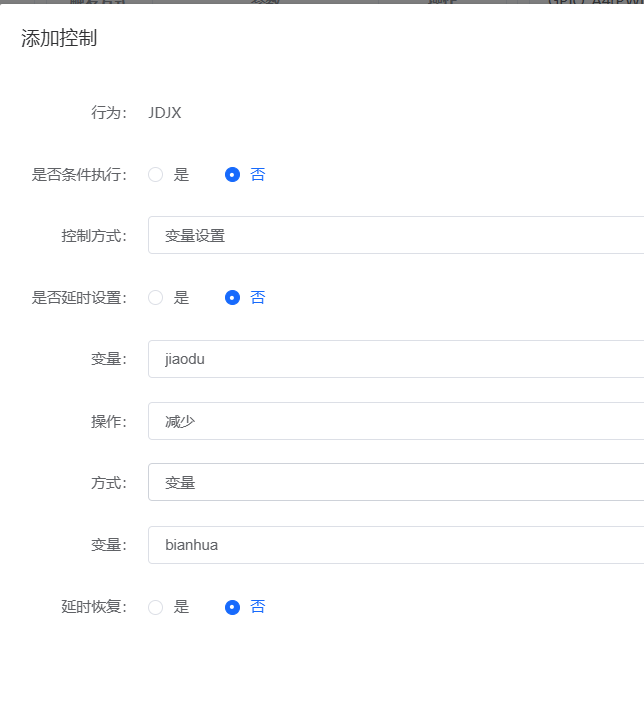


---

### 如何设置变量的默认值？

**问题描述：**

需要为变量设置默认值，确保系统启动时变量有初始值。

**解决方案：**

- 在变量的"备注"栏中填写默认值
- 备注中的值会被系统识别为默认值
- 支持各种数据类型的默认值设置

**注意事项：**

- 默认值必须符合变量的数据类型
- 备误只会影响初始化值
- 运行过程中变量值会被实际操作覆盖

---

### 无法访问配置平台怎么办？

**问题描述：**

浏览器访问https://www.smartpi.cn/时，页面显示"无法访问此页面"，错误信息为ERR_ADDRESS_UNREACHABLE。

**解决方案：**

1. **网络连接检查**：

    - 确认网络连接正常
    - 检查防火墙设置
    - 尝试其他浏览器

2. **DNS解析问题**：

    - 尝试使用其他DNS服务器
    - 清除浏览器DNS缓存
    - 使用ping命令检查域名解析

3. **服务器状态**：

    - 可能是服务器临时维护
    - 稍后重试访问
    - 联系技术团队确认状态

**注意事项：**

- ERR_ADDRESS_UNREACHABLE通常是网络或DNS问题
- 不是需求方端本地问题
- 如持续无法访问，需联系网络管理员

---

### 是否支持AT指令功能？如何实现显示年月日和天气？

**问题描述：**

询问模块是否开放AT指令功能，希望实现以下功能：

- 显示年月日
- 显示天气信息
- 通过AT指令控制模块

**解决方案：**

- 部分型号已经支持AT指令功能
- 显示年月日和天气需要通过平台配置相应功能
- 联系技术团队确认具体型号的AT指令支持情况

**注意事项：**

- 不同型号对AT指令的支持程度不同
- 天气功能需要网络连接支持
- 具体功能实现需要参考对应型号的开发文档

---

### 如何实现一个语音指令触发多个控制动作？

**问题描述：**

需要通过一个语音指令同时控制多个设备执行不同动作，例如说"我要去院子坐一下"时，需要同时打开庭院灯、茶亭灯、瀑布流水灯等多个设备。

**解决方案：**

- 在平台的"添加控制"配置中，参数栏可以发送多条十六进制数据
- 将多个设备的控制指令按顺序拼接在一起发送
- MCU端需要能够解析和执行连续的多条指令

**实现方法：**

1. **指令拼接方式**
    - 将各设备的控制码按顺序组合
    - 例如：03 05 00 10 FF FF cd 8c（组合了多个设备控制）

2. **MCU处理方案**
    - 给每个触发动作设置延时，避免同时执行冲突
    - MCU需要有能力接收并处理连续的指令流
    - 建议在MCU端实现指令缓冲和队列处理机制

**注意事项：**

- 确保MCU的串口接收缓冲区足够大，能一次接收完整指令
- 考虑指令执行顺序，避免设备间相互干扰
- 测试验证所有组合动作都能正确执行
- 如指令过长，可考虑分批次发送

---

### 自学习功能能否单独学习某一条指令？

**问题描述：**

使用自学习功能时，希望能够单独学习某一条语音指令，而不是每次都需要重新学习所有指令，以提高修改效率。

**解决方案：**

- 当前自学习功能支持逐条学习指令
- 可以单独修改某一条已学习的指令，无需重新学习全部
- 修改完成后只更新对应的指令即可

**操作方法：**

1. 进入自学习功能界面
2. 选择需要重新学习的指令
3. 重新录制该条指令
4. 确认更新，其他指令保持不变

**注意事项：**

- 自学习的准确性与固件预设的准确性相同
- 自学习会记录说话者的语音特征，不同使用方可能需要重新学习
- 建议在安静环境下进行自学习，确保录制质量

---

### 资料下载失败或速度过慢怎么办？

**问题描述：**

多次尝试下载资料但均失败，或下载速度极慢，影响开发进度。

**解决方案：**

**1. 网络环境优化**

- 尝试更换网络环境（如使用手机热点）
- 避开网络高峰期进行下载
- 关闭下载管理器，使用浏览器直接下载
- 检查防火墙设置，临时关闭防火墙尝试

**2. 下载方式调整**

- 清空浏览器缓存后重新下载
- 使用不同浏览器尝试（Chrome、Firefox、Edge）
- 确保下载过程网络稳定，避免中断
- 验证下载文件大小与平台显示是否一致

**3. 替代获取方式**

- 联系技术团队获取资料
- 通过其他渠道（如网盘、邮件）获取文件
- 询问是否有CD-ROM或U盘等物理介质提供

**注意事项：**

- 开发包体积较大，预留充足下载时间
- 下载中断后支持断点续传
- 如反复失败，可能是服务器临时问题，建议稍后重试

**注意事项：**

- 在线更新需要模块具备网络连接能力
- 更新过程中确保电源稳定，避免断电
- 新型号通常支持更便捷的更新方式，选型时可重点关注

---

### 如何配置语音模块上电后保持唤醒状态？

**问题描述：**

需要实现语音模块在上电后立即进入唤醒状态，避免因休眠导致无法响应单片机的高低电平控制信号，以实现语音播报功能。

**解决方案：**

在智能语音平台中配置事件触发，设置模块上电启动后自动进入唤醒状态。

**操作步骤：**

1. 创建新事件，设置触发条件为"上电启动"
2. 添加控制，选择"进入唤醒状态"操作
3. 设置延时时间（最少500ms）
4. 配置"禁止超时退出唤醒"控制，确保模块不会自动休眠

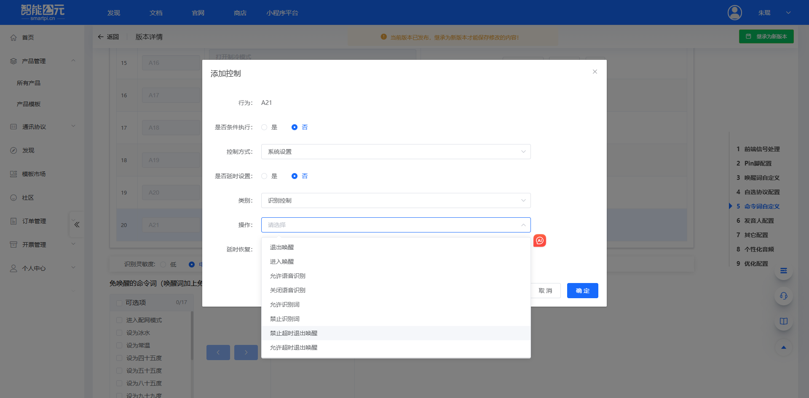

**注意事项：**

- 延时时间建议设置为500ms以上，确保模块完全启动
- 开启"禁止超时退出唤醒"后，模块将持续保持唤醒状态，可能增加功耗
- 如需恢复休眠模式，需要重新配置事件或发送相应指令

---

### 固件生成有哪两种方式？

**问题描述：**

了解生成固件的可用方法，以便选择合适的开发方式。

**解决方案：**

固件生成有以下两种方式：

- **平台配置方式**：

    - 使用智能公元平台（https://www.smartpi.cn/#/）进行零代码配置
    - 支持自定义唤醒词、命令词、回复语
    - 可配置各种协议收发、GPIO、PWM、自学习功能
    - 平台入门视频：https://www.bilibili.com/video/BV1e8411T77q/
    - 固件生成后可下载SDK获取开源代码
    - 官方提供完整技术团队

- **SDK开发方式**：

    - 下载SDK进行自主开发
    - 自由度更高，可深度定制功能
    - 提供语音识别接口供调用
    - 需要具备嵌入式开发经验
    - 官方不提供SDK开发的技术团队

**注意事项：**

- 优先推荐使用平台配置方式，可获得完整技术团队
- SDK开发适合有经验的开发者，需要自行解决技术问题
- 平台配置约1小时可完成，开发效率高


---

### 固件开发中如何确认语音指令的保留和翻译范围？

**问题描述：**

在固件开发过程中，需要确认语音指令的保留范围、翻译需求以及自学习界面提示的翻译范围，以确保开发符合项目要求。

**解决方案：**

**1. 指令保留范围确认**

- 确认功能需求：根据项目实际需要保留或删除特定指令
- 一号窗到六号窗：如不需要可删除，仅保留主唤醒词
- 设置窗帘模式：根据最终确认只保留纱帘和布帘两种模式
- 变量处理：room_set_f变量如未使用可忽略相关设置

**2. 翻译内容确认**

- 唤醒词和命令词翻译：

    - 帘帘、纱帘、已设置静音模式、已退出静音模式
    - 主唤醒词：如"你好阿朗"
    - 回复语：如"来了"
    - 开机播报：如"欢迎使用智能语音窗帘控制系统"
    - 退出提示：如"有需要再叫我"、"退下"

- 自学习界面翻译：

    - 学习唤醒词提示
    - 学习命令词提示
    - 根据实际使用功能确定翻译范围

**3. 翻译文件提供**

- 需求方提供翻译文档：如"窗帘电机汉语转英语.doc"
- 技术团队翻译：如需求方无法提供，由技术方完成翻译
- 翻译确认：在固件生成前确认所有翻译内容准确

**注意事项：**

- 翻译需要符合目标语言习惯
- 保留指令需考虑实际使用场景
- 自学习功能提示应简洁明了
- 确认翻译后的语音播报自然流畅

---

## 平台操作指南


---

### 如何在生成固件页面导出产品配置文件？

**问题描述：**

在生成固件的页面，不清楚如何导出产品的配置文件，需要确认正确的导出操作步骤。

**解决方案：**

**1. 进入产品管理页面**

- 登录平台后，进入产品管理界面
- 找到需要导出配置的产品条目
- 产品列表会显示产品名称、类型、场景、模组和创建时间等信息

**2. 找到导出按钮**

- 在产品条目的操作列中，可以看到"查看详情"、"导出"和"删除"按钮
- 点击"导出"按钮即可下载该产品的配置文件
- 导出的配置文件格式为JSON，可用于备份或分享配置

**操作界面示例：**

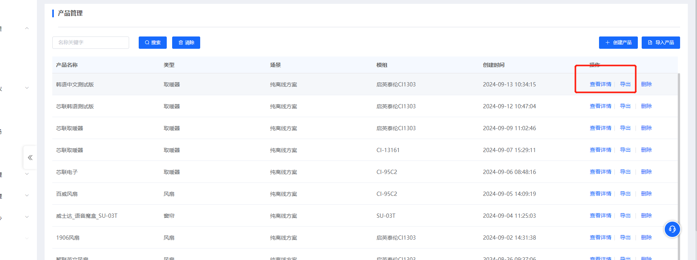

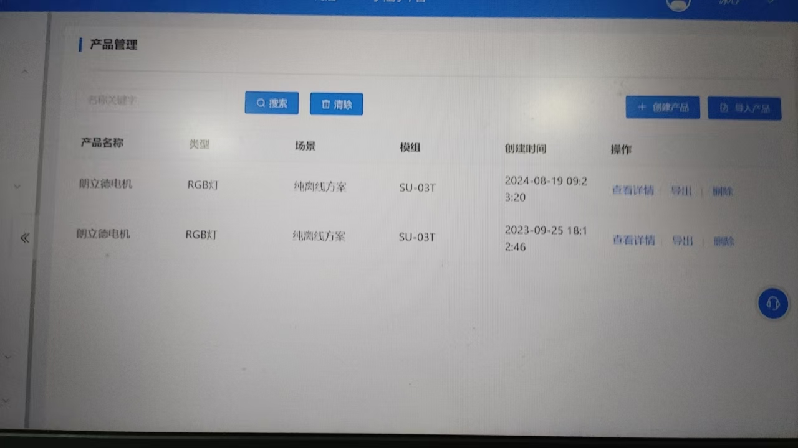

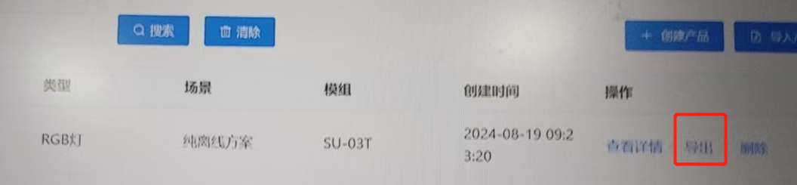

**注意事项：**

- 导出功能需要对应的产品权限
- 配置文件包含产品的所有设置信息，请妥善保管
- 如需修改配置，可编辑JSON文件后重新导入平台

---

### 如何确认英文固件版本为最终版？

**问题描述：**

需要确认用于窗帘电机的英文固件翻译文件是否为最终版本，以确保交付的固件与需求方最终需求一致。

**解决方案：**

**1. 版本确认流程**

- 与需求方确认翻译文件为最终版本
- 检查文件修改日期和版本号
- 确认是否有后续修改要求

**2. 文件管理**

- 保存最终版翻译文件备份
- 建立版本变更记录
- 标注每个版本的适用需求方

**3. 固件生成验证**

- 使用确认的翻译文件生成固件
- 验证关键命令词是否正确
- 测试语音识别效果

**注意事项：**

- 最终版本确认后应避免频繁修改
- 不同需求方使用不同的翻译版本
- 建议使用文件命名区分版本（如需求方A、需求方B）

---

### 如何处理固件版本混淆问题？

**问题描述：**

存在多个英文版固件版本，需要区分不同需求方的版本，避免发货错误。

**解决方案：**

**1. 版本区分方法**

- 使用不同的文件名前缀区分
- 建立版本-需求方对应表
- 在文件名中包含需求方标识

**2. 常见版本差异**

- "shree curtain"：第一个需求方的版本
- "dark"：第二个需求方的版本
- 命令词和唤醒词可能不同

**3. 防错措施**

- 烧录前再次确认需求方需求
- 使用标签标注固件版本
- 建立双人复核制度

**注意事项：**

- 不同版本的固件不能混用
- 发货前最后确认一次版本
- 保留完整的版本变更记录

---

### 固件升级如何管理？

**问题描述：**

需要升级已发货的固件版本，并管理升级过程以确保准确交付。

**解决方案：**

**1. 升级触发条件**

- 需求方反馈功能问题需要修复
- 发现固件bug需要更新
- 需要增加新功能

**2. 升级流程管理**

- 联系需求方寄回需要升级的模块
- 或提供现场升级服务
- 保留原固件版本记录

**3. 升级后验证**

- 全面测试新版本功能
- 验证问题是否解决
- 确认无新增问题

**注意事项：**

- 升级前备份原有配置
- 建立升级记录档案
- 重要项目建议现场升级

---

### 命令词识别错误如何排查？

**问题描述：**

需求方反馈的语音指令无法被识别，如"stop sheer panel"命令没有反应。

**解决方案：**

**1. 版本确认**

- 确认需求方使用的固件版本
- 检查命令词是否在该版本中
- 验证唤醒词设置是否正确

**2. 命令词对照**

- 提供准确的命令词列表
- 标注每个命令的发音要求
- 说明特殊命令的使用条件

**3. 识别问题排查**

- 检查需求方发音是否标准
- 验证使用环境是否合适
- 测试麦克风距离和角度

**注意事项：**

- 不同版本固件的命令词可能不同
- 建议使用标准普通话测试
- 如持续识别问题，考虑调整固件参数

---

### PCB文件如何修改和使用？

**问题描述：**

需要确认是否可以将提供的Altium格式PCB文件（转接板）进行修改，以满足其项目需求。

**解决方案：**

**1. 文件格式兼容性**

- Altium Designer是专业PCB设计软件
- 提供的.PcbDoc文件可直接编辑
- 支持修改布局、走线、丝印等

**2. 修改权限说明**

- 需求方可自行修改PCB文件
- 支持根据需求调整接口定义
- 可优化生产工艺和成本

**3. 修改建议**

- 修改前备份原文件
- 检查设计规则（DRC）是否通过
- 验证修改后PCB的可制造性

**注意事项：**

- 修改时注意信号完整性
- 保留必要的测试点
- 建议使用专业版本软件

---

### 如何申请语音芯片样机进行开发？

**问题描述：**

需要申请新的语音芯片样机进行开发，确认开发所需时间和语音指令词条是否与之前保持一致。

**解决方案：**

**样机申请流程：**

1. **提交申请信息**
    - 提供公司信息和使用场景
    - 说明开发需求和项目背景
    - 提供收货地址和联系方式

2. **样机发放**
    - 样机免费提供用于开发测试
    - 承担运费或协商运费承担方式
    - 样机所有权归属说明

**开发周期：**

- 语音程序开发时间：约2个工作日
- 确认需求后即可开始开发
- 开发完成后提供固件文件测试

**词条配置：**

- 词条可保持与原有版本一致
- 如需新增或修改词条，可同步进行
- 支持批量导入词条配置

**注意事项：**

- 样机仅用于开发测试，不得用于其他商业用途
- 开发过程中有问题可及时联系技术团队
- 完成开发后建议申请正式采购用于量产

---

### 如何使用固件文件 jx_firm.tar.gz？

**问题描述：**

收到固件文件 jx_firm.tar.gz，需要了解如何使用该固件刷写模块，以及确认刷写数量和批次管理。

**解决方案：**

**固件使用说明：**

1. **固件文件解压**
    - 使用解压软件打开 jx_firm.tar.gz
    - 确认固件版本和适用型号
    - 检查固件完整性（文件大小、校验码等）

2. **刷写准备**
    - 确认烧录工具版本兼容性
    - 准备正确的硬件连接
    - 备份原有固件（如有需要）

3. **批量刷写管理**
    - 400个模块使用 jx_firm.tar.gz 固件
    - 3000个模块待定固件版本
    - 建立刷写记录台账

**批次管理建议：**

- 分批次进行刷写，便于质量控制
- 记录每个批次的刷写时间和数量
- 保留刷写日志，便于问题追溯
- 首批测试无问题后再进行大批量刷写

**注意事项：**

- 确保固件与硬件版本匹配
- 刷写过程避免断电或中断
- 完成刷写后进行功能验证
- 保留固件文件备份以备后续使用

---

### 如何在合同中约定技术质量保证条款？

**问题描述：**

需要在采购合同中增加关于供方元器件质量问题的责任条款，明确批量售后费用的承担责任。

**解决方案：**

**技术质量保证条款建议：**

1. **质量责任范围**
    - 供方保证所提供模块的出厂质量
    - 因供方元器件问题导致的产品故障，供方承担相关费用
    - 模块后续操作及其他元器件引发的问题与供方无关

2. **费用承担界定**
    - 批量售后费用由责任方承担
    - 需提供故障分析报告确认问题原因
    - 建立第三方检测机制（如有争议）

3. **技术团队协助**
    - 供方协助需求方进行问题排查
    - 提供必要的技术文档和分析支持
    - 配合进行故障复现和验证

**实施建议：**

- 在合同中明确质量保证期限（如12个月）
- 约定批量故障率的判定标准
- 建立快速响应机制和问题处理流程
- 保留技术判定和争议解决条款

**注意事项：**

- 条款应公平合理，平衡双方权益
- 技术标准应明确可量化
- 建议由技术法务人员审核条款
- 保留相关技术文档作为合同附件

---

### 语音模块是否可以连接Alexa？

**问题描述：**

需要确认语音模块是否可以连接Amazon Alexa智能语音助手，以及技术实现的可行性和注意事项。

**解决方案：**

**当前支持情况：**

- 暂不支持直接连接Amazon Alexa
- 现有模块未集成Alexa相关功能
- 需要额外的开发工作

**技术实现分析：**

1. **硬件连接方式**

    如需实现与Alexa的连接：

    - 硬件直接连接：需要获得Alexa设备的完整设计方案
    - WiFi/蓝牙连接：需要确认蓝牙协议兼容性和授权问题

2. **技术难点**

    - **协议兼容性**：需要了解Alexa的通信协议标准
    - **授权要求**：可能需要Amazon的技术授权
    - **认证要求**：接入Alexa生态系统需要相关认证


**实现建议：**

1. **方案评估**
    - 评估项目需求是否必须集成Alexa
    - 考虑使用本地语音控制替代方案
    - 评估开发成本和周期

2. **技术路线**
    - 如确定需要集成，建议联系Amazon获取技术资料
    - 评估是否使用第三方Alexa语音服务（AVS）
    - 考虑使用支持Alexa的第三方模块桥接

**注意事项：**

- 连接Alexa涉及复杂的技术和商务问题
- 需要考虑Amazon的许可和认证要求
- 建议在项目初期明确集成需求
- 可考虑其他更易实现的语音控制方案

---

### 如何自定义串口输入参数？

**问题描述：**

需要了解用户是否可以自定义串口输入的参数，包括帧头、帧尾、消息编号和测试值等。

**解决方案：**

**支持自定义**：

用户可以完全自定义串口输入参数，包括：

- 帧头：自定义起始标识符
- 帧尾：自定义结束标识符
- 消息编号：用于区分不同指令
- 测试值：作为变量存储接收的数据

**配置步骤**：

1. 在触发条件中选择"串口输入"
2. 设置输入参数名称（如"W"）
3. 选择参数类型（如int）
4. 设置测试值（如23）
5. 在测试消息框中配置完整的数据格式

    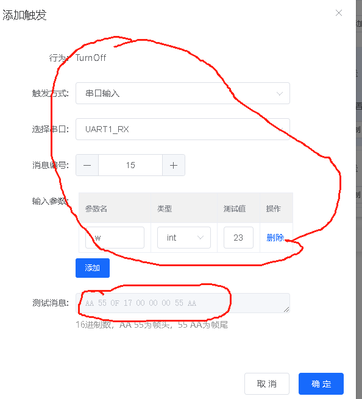

    *输入参数配置界面*

**自定义格式示例**：

- 帧头：AA 55
- 帧尾：55 AA
- 中间数据：根据需要自定义

---

### 帧头和帧尾是否必须定义？

**问题描述：**

在配置串口通信时，需要确认帧头和帧尾的定义是否是必须的，是否可以移除。

**解决方案：**

**可以移除**：

帧头和帧尾不是必须的，可以根据实际需求选择是否定义。

**使用场景**：

1. **使用帧头帧尾**：

    - 需要严格的数据格式校验
    - 确保数据完整性
    - 避免数据干扰导致的误判

2. **不使用帧头帧尾**：

    - 简化数据传输
    - 适用于简单的控制协议
    - 减少数据包长度


*UART1_RX配置中的帧头帧尾设置*

---

### 串口指令禁用回复语后还能播报吗？

**问题描述：**

在禁用串口指令输入回复语的情况下，是否还能进行语音播报功能。

**解决方案：**

**可以正常播报**：

串口指令的回复语设置与语音播报功能是独立的。

**实现方法**：

1. 禁用串口指令的回复语
2. 在触发动作中添加"播放语音"控制
3. 跳转到语音播放控制
4. 选择需要播报的语音内容


*串口指令配置界面，可独立控制回复语和语音播报*

**注意事项：**

- 回复语和语音播报是两个独立功能
- 可根据需要选择开启或关闭任一功能
- 语音播报内容需要在语音资源中预先配置

---

### 是否可以实现基于声纹识别的在线登录功能？

**问题描述：**

需要实现通过声纹识别不同用户，并通过5G或WiFi连接云端，实现不同用户声纹识别后登录不同账户的功能。

**解决方案：**

**技术方案：**

可以实现基于声纹识别的在线登录功能，采用离线唤醒+在线声纹识别的架构：

1. **离线唤醒阶段**
    - 使用离线唤醒词激活设备
    - 唤醒词本身可以设置为声纹特征
    - 降低误唤醒率和功耗

2. **在线声纹识别**
    - 唤醒后通过5G或WiFi连接云端服务器
    - 录制用户语音进行声纹特征提取
    - 云端进行声纹比对和用户身份验证
    - 根据识别结果登录对应的用户账户

3. **系统架构**
    - 端侧：语音模块+网络通信模块（5G/WiFi）
    - 云端：声纹识别服务+账户管理系统
    - 通信协议：建议使用HTTPS等加密协议确保安全

**实现方式：**

- 支持识别不同用户的声纹特征
- 可为每个声纹匹配不同的账户信息
- 支持多用户声纹库管理
- 可配置识别阈值和置信度要求

**注意事项：**

- 需要确保网络连接稳定，建议同时支持5G和WiFi
- 声纹识别准确率受环境噪声、录音设备质量影响
- 首次使用需要录入用户声纹样本
- 建议增加其他认证方式作为备份（如密码、手机验证等）
- 需要注意用户隐私保护和数据安全合规要求
- **声纹识别只针对人声有效**：无法用于识别电脑提示音、QQ/微信提示音、报警声等非人声
- 对于非人声音频的识别需求，可考虑使用自学习功能或联系官方进行定制模型训练

---

## 固件烧录与版本管理

### 不同产品型号的唤醒词配置

**问题描述：**

需要确认不同产品型号（XP71038、XP71037、XP71036）对应的正确唤醒词，确保固件烧录时使用正确的唤醒词，避免后续升级出现问题。

**解决方案：**

**1. 产品型号与唤醒词对应关系**

- **XP71038（CHAMPAGNE/香槟灯）**：Hi Champagne
- **XP71037（AMIGA）**：Hi Amiga
- **XP71036（MOJIU）**：Hi Mojiu

**2. 固件烧录注意事项**

- **使用最新固件**：务必使用经过确认的最新版本固件
- **匹配唤醒词**：固件中的唤醒词必须与产品型号对应
- **避免混用**：不同型号产品不能使用相同的固件

**3. 版本管理建议**

- **固件归档**：每个产品型号单独归档对应的固件版本
- **标识清晰**：固件文件名包含产品型号和版本号
- **测试确认**：烧录前通过工具界面确认唤醒词配置
- **记录追踪**：保留烧录记录，便于后续追溯

**4. 生产应用**

- **SMT前确认**：贴片前确认产品型号与固件匹配
- **烧录验证**：首片烧录后验证唤醒词功能
- **防错措施**：在产线设置防错机制，避免用错固件
- **抽检确认**：定期抽检成品，确认唤醒词正确

**注意事项：**

- 唤醒词配置错误将导致产品无法正常唤醒
- 后期OTA升级也需要使用对应的唤醒词
- 建议建立产品型号-唤醒词对照表并公示
- 如有疑问，需与产品需求方确认后再烧录

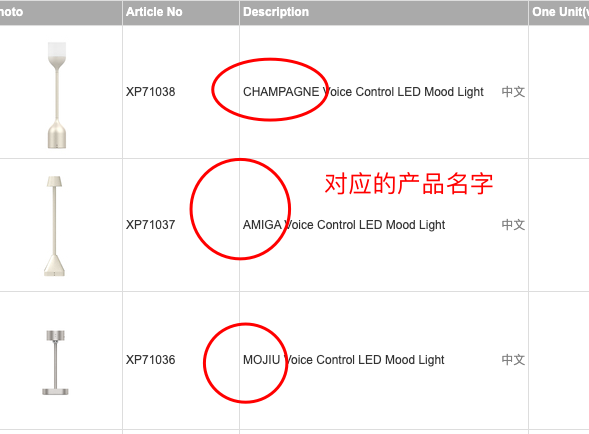


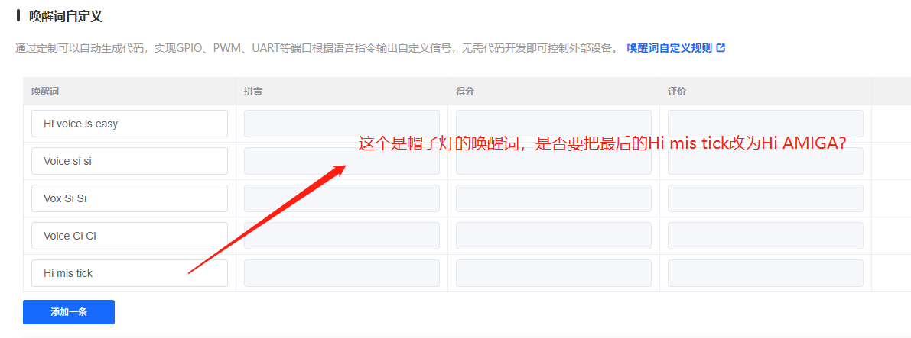

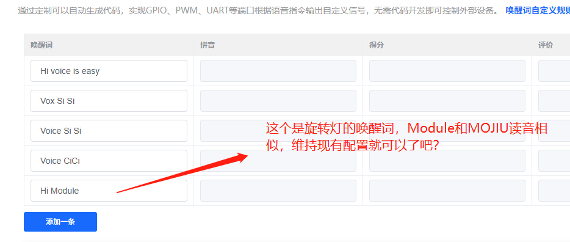

---

## 设备通信协议


---

### 如何获取风扇控制板的通信协议？

**问题描述：**

需要获取风扇控制板的通信协议，以实现循环扇的定制化功能开发，如增加音乐功能和取消驱蚊功能。

**解决方案：**

**协议获取流程：**

1. **联系官方技术团队**

    - 通过官方渠道申请获取相应的通信协议文档
    - 提供具体的产品型号（如VC23058）和功能需求
    - 说明定制化功能的具体要求

2. **协议文档内容**

    - **控制指令集**：包含风扇各项功能的控制命令
    - **数据格式规范**：定义通信数据的结构和格式
    - **命令码定义**：每个功能对应的命令码列表
    - **通信参数**：波特率、数据位、校验方式等

3. **功能定制实现**

    - **增加音乐功能**：

        - 在协议中查找音频控制相关的命令码
        - 配置音乐播放的控制指令
        - 集成到现有的语音控制框架中

    - **取消驱蚊功能**：

        - 移除或注释驱蚊功能相关的命令处理
        - 更新命令列表，确保不包含驱蚊指令
        - 测试其他功能是否正常工作

**注意事项：**

- 协议文档通常以Excel格式提供（如VC23058语音协议.xlsx）
- 获取协议前需要明确产品型号和具体需求
- 功能修改后需要进行完整的兼容性测试
- 保留原协议备份，便于后续维护和问题排查

---

### 多意图和自然说功能如何实现？

**问题描述：**

需要了解多意图识别和自然说功能的实现方式，以及如何与现有风扇产品结合，提升产品的智能交互体验。

**解决方案：**

**多意图功能实现：**

1. **功能特点**

    - 支持一次识别多个命令意图
    - 可以处理复合指令，如"打开风扇并调到三档"
    - 提升用户交互的自然度和便利性

2. **技术实现**

    - 需要支持多意图识别的语音模块
    - 在平台中配置多意图解析规则
    - 定义复合命令的处理逻辑

3. **应用场景**

    - 智能家居控制：同时控制多个设备
    - 复杂功能操作：一次完成多个设置
    - 场景模式控制：触发预设场景组合

**自然说功能实现：**

1. **功能特点**

    - 支持更自然的语音表达方式
    - 不需要固定的命令词格式
    - 可以理解口语化的指令表达

2. **技术实现**

    - 采用NLP（自然语言处理）技术
    - 支持语义理解和意图识别
    - 需要更强大的处理能力和算法支持

3. **集成方案**

    - 选择支持这些功能的语音模块型号
    - 在开发平台中启用相应功能
    - 配置和训练识别模型

**合作开发流程：**

1. **需求确认**

    - 明确产品所需的具体功能
    - 评估技术可行性和实现成本
    - 确定开发周期和交付计划

2. **样机测试**

    - 获取功能样机进行测试验证
    - 评估识别率和响应速度
    - 收集测试反馈并优化调整

3. **产品集成**

    - 将功能集成到最终产品
    - 进行完整的系统测试
    - 准备生产所需的固件和配置

**注意事项：**

- 多意图和自然说功能需要特定的硬件支持
- 功能开发需要一定的技术积累和测试周期
- 建议先进行小批量验证再大规模应用
- 关注用户使用反馈，持续优化体验

---

### 固定词条如何替换和定制？

**问题描述：**

需要将现有的固定词条替换为定制化内容，以适配特定产品的功能需求和品牌特色。

**解决方案：**

**词条替换流程：**

1. **需求分析**

    - 整理需要替换的词条列表
    - 确定新词条的内容和格式
    - 评估替换对系统功能的影响

2. **词条准备**

    - 制作标准化的词条表
    - 确保新词条发音清晰易识别
    - 验证词条长度和格式符合要求

3. **平台配置**

    - 在开发平台中导入新词条
    - 配置词条对应的动作指令
    - 测试词条识别的准确率

4. **固件生成**

    - 使用新词条配置生成固件
    - 进行烧录测试验证
    - 保存配置文件便于后续更新

**与板厂对接要点：**

1. **协议确认**

    - 确认词条通信协议格式
    - 验证数据传输的兼容性
    - 测试词条触发的响应

2. **替换验证**

    - 逐条测试新词条的识别效果
    - 验证对应的动作执行
    - 确认与其他功能的兼容性

3. **批量应用**

    - 将验证后的配置应用到量产
    - 建立词条更新和维护流程
    - 保留测试记录和配置文档

**注意事项：**

- 词条替换需要重新生成和烧录固件
- 新词条建议进行充分测试避免识别问题
- 保留原词条配置便于回滚
- 考虑方言和口音对识别的影响
- 定期收集用户反馈优化词条库

---


### 语音模块支持哪些通信方式？

**问题描述：**

需要了解语音模块的通信方式，是否只能作为主站使用，以及寄存器地址和功能码的获取方式。

**解决方案：**

**1. 通信方式说明**

语音模块支持以下通信接口：

- **UART通信**：模块与主控板的主要通信方式
- **I2C接口**：部分型号支持，用于简单数据传输
- **SPI接口**：高速通信接口，特定型号支持
- **GPIO**：通用输入输出接口，用于状态指示和控制

**2. 主从站概念说明**

"主站"通常指Modbus等工业总线通信中的概念：

- **语音模块本身**：不涉及Modbus主从站概念
- **通信角色**：模块作为语音处理终端，与主控MCU通信
- **数据交互**：通过UART等方式传输识别结果和接收控制指令

**3. 寄存器地址说明**

- **芯片寄存器**：每个语音芯片都有内部寄存器
- **文档获取**：具体型号的寄存器地址需查阅规格书
- **使用场景**：主要用于底层开发和调试
- **应用开发**：通常使用更高层次的API或协议

**4. 开发接口**

标准应用开发使用：

- **官方API**：提供封装好的功能接口
- **通信协议文档**：定义数据帧格式和命令
- **示例代码**：提供常见应用的开发参考
- **上位机工具**：支持参数配置和测试

**注意事项：**

- 语音模块主要用于语音识别，不直接参与工业总线通信
- 如需连接PLC等设备，需要通过主控MCU进行协议转换
- 寄存器操作需要一定的硬件知识，建议使用官方提供的API
- 具体通信参数需参考对应型号的技术手册

---

### 如何设置语音模块的待机状态输出？

**问题描述：**

希望语音模块在待机状态时A27引脚输出高电平，唤醒过程中输出高电平，退出语音唤醒后输出低电平。

**解决方案：**

- **功能限制说明**：

    - 语音模块无法实现上电后持续高电平输出
    - 只能通过命令词触发后控制IO口电平变化

- **实现方案**：

    1. 创建一个系统设置类别的控制行为
    2. 设置控制方式为"端口输出"
    3. 选择目标IO口（如A27）
    4. 配置该命令词执行后输出高电平
    5. 添加定时器，在指定时间后输出低电平

- **工作流程**：

    1. 用户说出唤醒词，模块进入唤醒状态
    2. 识别到具体命令后，触发A27输出高电平
    3. 根据预设的退出时间，A27自动变低电平

**注意事项：**

- 待机状态不能直接控制IO电平，只能通过命令触发
- 需要根据实际需求设置合适的退出时间
- 如需要持续的状态指示，建议结合硬件电路实现锁存功能

---

### 语音模块可以设置串口地址吗？

**问题描述：**

询问是否可以在MODBUS_RTU总线上连接多个语音模块，每个模块设置不同的地址和唤醒词。

**解决方案：**

- **功能限制**：

    - 语音模块不支持串口地址设置
    - 串口通信为点对点通信方式，不支持总线寻址

- **通信架构**：

    - 语音模块可以发送MODBUS_RTU格式的数据
    - 但不能作为MODBUS从机响应地址查询
    - 无法在同一总线上并联多个模块

**替代方案**：

1. **独立串口方案**：

    - 每个语音模块使用独立的串口
    - 通过PLC的多个串口分别控制
    - 或使用串口扩展卡增加串口数量

2. **其他通信方式**：

    - 考虑使用支持总线通信的模块
    - 如CAN总线、485总线（带地址功能）
    - 或通过网络通信方式

**注意事项：**

- 与其他设备共用MODBUS_RTU总线时，需要确保通信协议兼容
- 每个语音模块需要独立的唤醒词和功能配置
- 如必须使用多个模块，建议在设计阶段就考虑通信架构

---

### 自研小程序无法关联设备怎么办？

**问题描述：**

使用自研小程序时，设备无法通过小程序进行控制，需要配置正确的小程序AppID以关联设备。

**解决方案：**

**AppID配置步骤：**

1. **登录智能公元平台**
    - 进入产品管理页面
    - 找到对应的产品配置

2. **配置小程序AppID**
    - 在"对接小程序"字段中填写自研小程序的AppID
    - 确保AppID准确无误

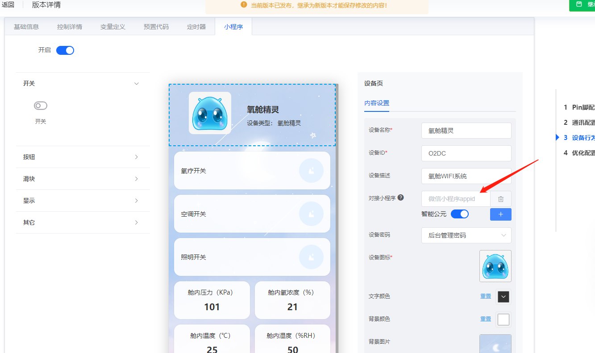

3. **重新生成固件**
    - 配置完成后点击"生成固件"
    - 下载最新固件并烧录到模块

**配置位置说明：**

- 对接小程序字段位于产品配置页面
- 如字段为空，设备将无法与小程序关联
- 配置正确后，设备才能响应对应小程序的控制指令

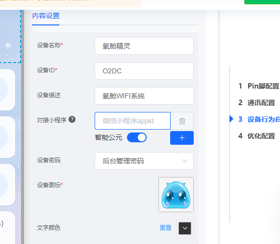

**注意事项：**

- AppID必须是微信小程序的真实AppID
- 配置修改后需要重新生成固件
- 确保小程序已发布并可正常使用
- 设备需要配网才能与小程序通信

---

### 小程序连接频繁断开怎么办？

**问题描述：**

设备在小程序中连接后频繁断开，界面显示异常，无法正常进入操作界面。

**解决方案：**

**问题排查步骤：**

1. **确认设备状态**
    - 检查设备是否已完成配网
    - 确认设备运行状态正常
    - 验证设备网络连接稳定性

2. **网络环境检查**
    - 确认手机网络连接正常
    - 检查WiFi信号强度
    - 排除网络不稳定因素

3. **小程序配置验证**
    - 确认AppID配置正确
    - 验证设备与小程序的绑定关系
    - 检查产品配置是否匹配

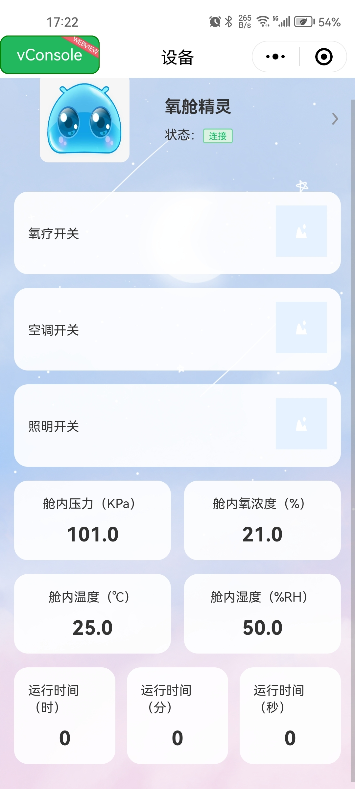

**常见原因分析：**

- **设备重启**：开发板或模块异常重启导致连接中断
- **网络切换**：设备在不同网络间切换造成连接问题
- **配置错误**：AppID或产品配置不匹配
- **服务器问题**：平台服务器暂时不可用

**处理建议：**

- 使用开发板单独测试，排除硬件问题
- 检查设备日志，分析断开原因
- 确认配网信息是否正确保存
- 联系技术人员提供日志分析

**注意事项：**

- 已配网设备优先使用WiFi连接
- 网络不稳定时容易导致断连
- 建议在网络环境良好的场景下测试
- 保留完整日志便于问题排查

---

## 串口通信


---

### 如何通过串口发送数据在模块上显示数值？

**问题描述：**

需要了解如何通过串口发送数据给模块，以便在小程序界面显示舱内压力、氧浓度等数值。

**解决方案：**

**数据格式要求：**

1. **发送格式**：

    - 使用ASCII格式发送数据
    - 直接发送数字字符串，如"102.1"
    - 不需要进制转换

2. **示例说明**：

    - 显示压力值102.1：发送字符串"102.1"
    - 显示氧浓度21.0%：发送字符串"21.0"
    - 显示温度25.0℃：发送字符串"25.0"

**串口配置：**

- 波特率：9600（可根据需要调整）
- 数据位：8
- 停止位：1
- 校验位：无

**小程序界面显示**：


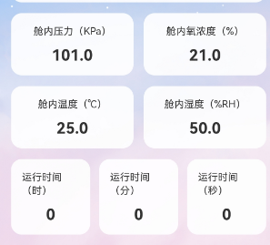

**注意事项：**

- 发送的必须是ASCII字符串，不是十六进制
- 数值范围应与显示需求匹配
- 建议发送前验证数据格式正确性
- 不同的变量需要在平台中正确配置

---

### TCP连接命令的触发方式可以改为串口吗？

**问题描述：**

希望将TCP连接命令(connect_tcp)的触发方式从GPIO输入改为串口输入。

**解决方案：**

- 平台支持自定义触发方式，可以在配置时选择"串口输入"
- 触发方式完全由用户自主定义，可灵活选择

**配置步骤：**

1. 在配置界面选择需要触发的命令（如connect_tcp）
2. 在触发方式下拉菜单中选择"串口输入"
3. 保存配置后即可通过串口命令触发TCP连接

**注意事项：**

- 支持的触发方式包括：GPIO输入、串口输入等
- 不同触发方式可能需要相应的硬件连接支持
- 配置生效前需要重新烧录固件

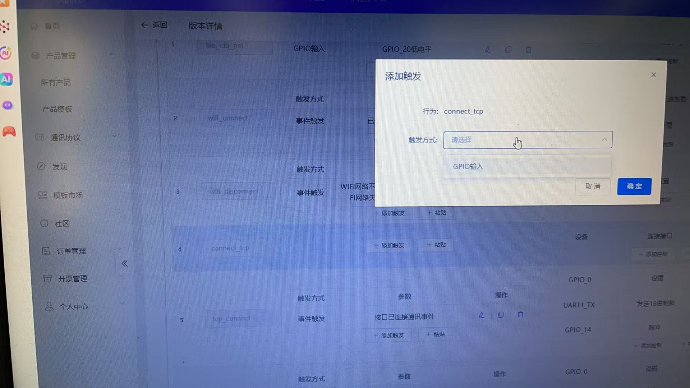
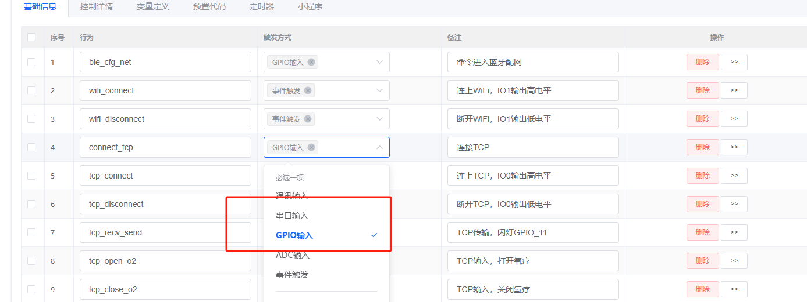

---

### 平台配置完成后如何生成并发布固件？

**问题描述：**

在平台完成唤醒词等配置后，不确定如何生成可烧录的固件文件，以及需要等待多长时间。

**解决方案：**

**1. 固件生成流程**

- 完成所有配置后（如唤醒词、命令词、音频参数等）
- 点击界面右侧的"发布"按钮
- 系统开始生成固件文件
- 生成时间通常需要10-30分钟


*配置完成后点击发布按钮*

**2. 固件状态说明**

- 配置完成后会自动保存在项目中
- 点击发布后固件状态显示"正在生成"
- 生成完成后状态变为"已完成"
- 完成后即可下载.bin格式的固件文件

**3. 生成时间说明**

- **正常时长**：10-30分钟
- **高峰期**：可能超过30分钟
- **异常情况**：超过1小时需要联系技术人员

**注意事项：**

- 生成过程中请保持网络连接稳定
- 不要频繁刷新页面
- 建议避开下午2-4点的高峰时段
- 生成完成后及时下载保存固件文件

---

### 平台登录失败且忘记密码怎么办？

**问题描述：**

无法登录平台，提示"账号或密码错误"，需要了解如何找回密码。

**解决方案：**

**1. 密码找回流程**

- 在登录界面点击"忘记密码"选项
- 进入密码重置页面
- 填写必要信息完成密码重置

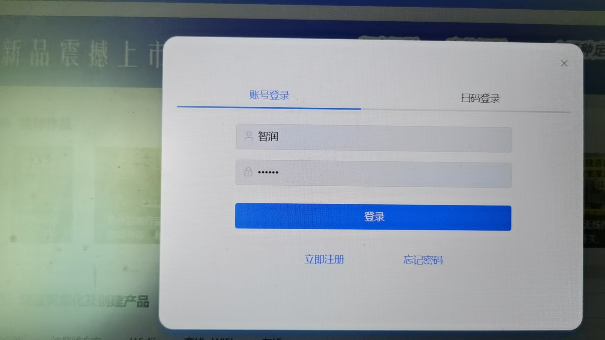

*登录界面示意图*

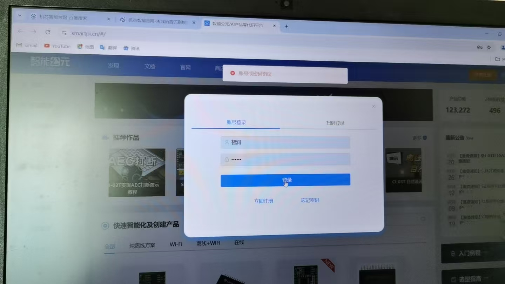

*登录失败提示*

**2. 密码重置步骤**

- 填写注册时使用的手机号
- 填写用户名（非必填项）
- 点击"发送验证码"按钮

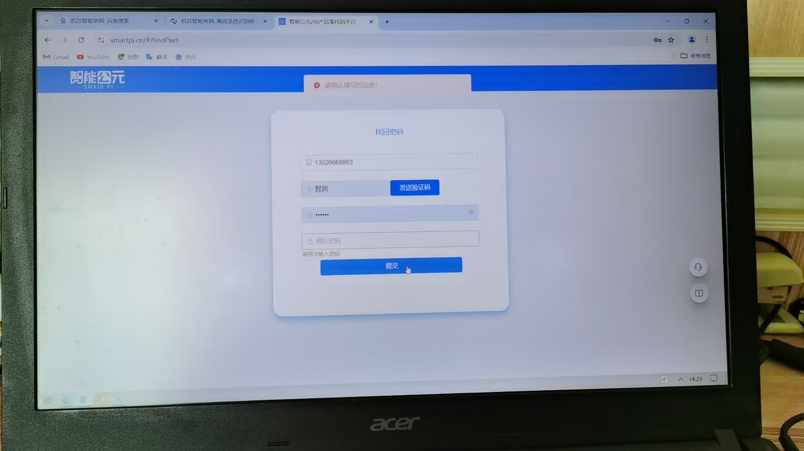

*密码重置界面*

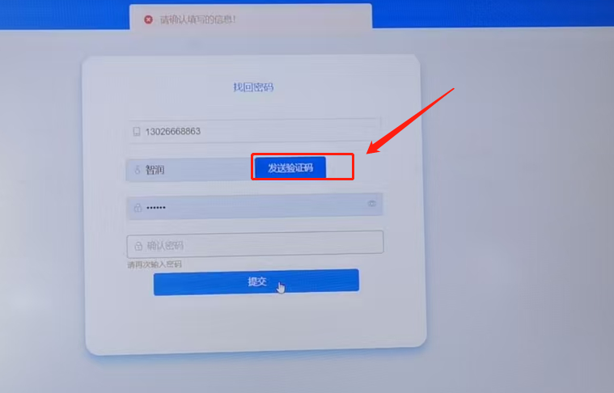

*点击发送验证码获取短信验证*

- 输入收到的短信验证码
- 设置新的密码
- 点击"提交"完成密码重置

**注意事项：**

- 验证码有效时间通常为10分钟
- 新密码建议包含字母和数字组合
- 用户名填写项是可选的，主要用于辅助验证
- 如仍未收到验证码，检查手机号是否正确

---

### CI系列语音芯片是否支持中英文混合语音？

**问题描述：**

希望了解CI系列离线语音识别芯片是否支持在同一个固件中混合使用中英文语音指令。

**解决方案：**

**语言支持模式：**

- **不支持中英混合**：CI系列芯片在同一个固件中不能混合中英文指令
- **单一语言固件**：一个固件只能支持一种语言（中文或英文）
- **需要两个固件**：要同时支持中英文需要分别制作两个固件

**实现方案：**

1. **双固件方案**

    - 制作一个中文语音固件
    - 制作一个英文语音固件
    - 根据销售地区或用户需求烧录对应固件

2. **语言切换方式**

    - 生产时确定目标语言，烧录对应固件
    - 或设计硬件语言选择开关，配合不同固件
    - 通过外部MCU判断并切换工作模式

    **具体切换接口推荐：**

    - **串口切换**：通过串口命令切换语言模式，可靠性高
    - **GPIO电平切换**：通过GPIO引脚电平状态选择语言，简单直接
    - **语音切换**：可通过语音指令切换，但可能存在语言识别误触发问题

    **切换方式选择建议：**

    - 优先使用串口或GPIO电平切换，稳定性更好
    - 语音切换方式在多语言环境下可能因识别问题导致误操作
    - 具体实现方式需根据定制开发方案确定

**技术限制：**

- 语音识别引擎需要针对特定语言训练
- 混合语言会大幅降低识别率
- 当前硬件架构不支持动态语言切换

**注意事项：**

- 项目初期应明确目标语言市场
- 建议按地区生产不同语言版本
- 如确需混合语言，考虑使用在线语音方案
- 测试时使用对应语言进行语音指令测试

---

### 语音指令泛化词配置错误如何排查？

**问题描述：**

配置除湿排风系统语音指令时，误用了台灯的泛化词，导致语音指令无法正确识别，且发布前未进行配置检查。

**解决方案：**

**1. 问题识别**

泛化词配置错误的典型表现：

- 语音指令无响应
- 其他设备的指令被触发（如喊除湿排风却触发台灯）
- 固件发布后才发现配置错误

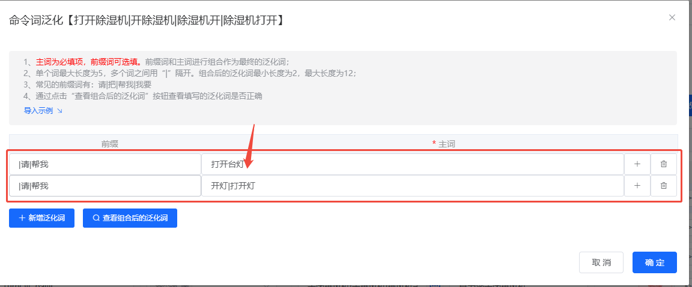

**2. 配置检查流程**

发布前必须执行的检查步骤：

1. **检查命令词对应关系**：

    - 确认主词与目标设备匹配
    - 验证泛化词的正确性
    - 避免复制其他设备的配置

2. **导出配置文件验证**：

    - 下载JSON配置文件到本地
    - 使用文本编辑器检查内容
    - 确认设备名称和命令词一致


**3. 平台配置检查功能**：

    - 发布前点击"检查配置"
    - 系统会提示配置错误
    - 修复错误后再发布

**3. 泛化词正确配置方法**

1. **主词配置**：

    - 使用准确的目标设备名称
    - 如："打开除湿排风系统"

2. **前缀词配置**：

    - 使用通用的触发词
    - 如："请|帮我|能不能"
    - 避免使用特定设备的词汇

3. **常见错误**：

    - 复制配置时忘记修改设备名称
    - 使用了其他设备的泛化词模板
    - 未验证配置就直接发布

**4. 固件重新生成**

发现配置错误后的处理：

1. 在产品管理平台找到对应项目
2. 点击"重新生成固件"
3. 等待固件状态更新为"生成成功"

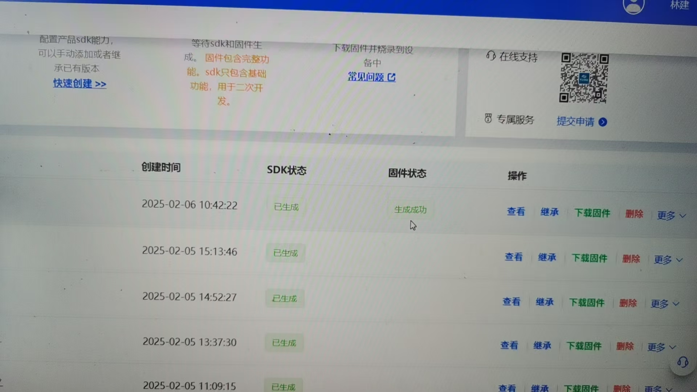

**注意事项：**

- 发布前务必进行配置检查
- 导出JSON文件是验证配置的有效方法
- 不同设备需要独立配置，避免混用
- 修改配置后需要重新生成并下载固件


---

### 固件生成状态如何确认和重新生成？

**问题描述：**

在固件生成平台上上传配置文件后，无法确认该配置是否已成功生成固件，需要了解如何确认状态和重新生成固件。

**解决方案：**

**1. 固件状态查看**

在产品管理平台查看固件状态：

1. **进入产品管理页面**
2. **查看试验版本列表**
3. **状态说明**：

    - SDK状态："已生成"表示配置已处理
    - 固件状态："备中"表示正在生成
    - 固件状态："生成成功"表示固件已可用

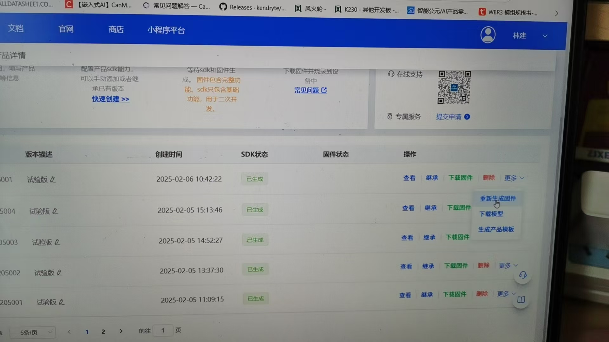

**2. 配置文件上传确认**

上传JSON配置文件后：

- 文件大小显示（如：83.8K）
- 文件名显示正确
- 状态更新需要几秒钟时间

**3. 重新生成固件操作**

如果需要重新生成：

1. **找到对应项目**
    - 在产品管理列表中定位
    - 确认是正确的项目版本

2. **执行重新生成**
    - 点击"重新生成固件"按钮
    - 等待处理完成

3. **确认生成成功**
    - 固件状态更新为"生成成功"
    - 可以进行下载操作


**注意事项：**

- 上传配置文件后需要等待几秒钟状态更新
- 生成过程中不要关闭页面
- 如果状态长时间未更新，可尝试重新生成
- 每次重新生成都会覆盖之前的固件

---

### 如何通过智能公开平台设置随机数值变量并通过串口发送？

**问题描述：**

需要在智能公开平台中配置一个1到7000范围内的随机数值变量，并通过串口以16进制格式发送到单片机用于参数设置。

**解决方案：**

**步骤1：定义变量**

1. 进入"变量定义"页面
2. 添加新变量，设置：

    - 变量名：var_a（或其他符合规则的名称）
    - 类型：int
    - 默认值：0
    - 备注：随机变量

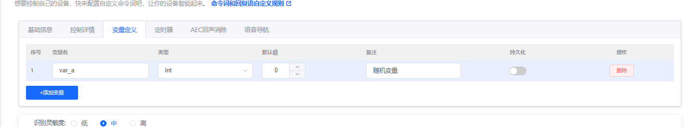

**步骤2：设置系统启动触发**

1. 进入"触发管理"页面
2. 添加"事件触发"
3. 配置触发条件：

    - 事件类型：系统启动
    - 触发类型：上电启动、重置启动

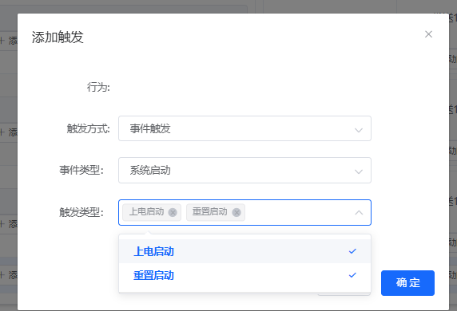

**步骤3：配置变量随机值**

1. 添加"变量设置"控制
2. 配置参数：

    - 变量：var_a
    - 操作：取随机数
    - 范围最小值：0
    - 范围最大值：7000


**步骤4：配置串口输出**

1. 添加"端口输出"控制
2. 配置参数：

    - 控制方式：端口输出
    - 控制类型：UART0_TX（根据实际使用的串口选择）
    - 动作：发送16进制数
    - 参数：{var_a}

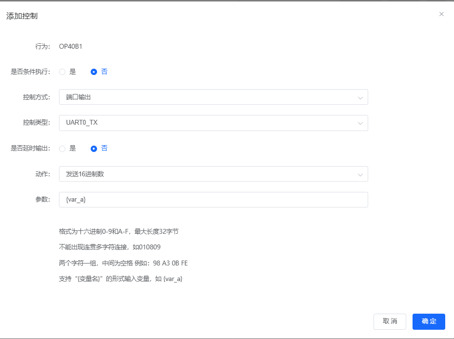

**完整流程：**

1. 系统启动时，自动触发随机数生成
2. var_a变量被赋值为0-7000之间的随机数
3. 该随机值通过串口以16进制格式发送出去
4. 单片机接收并解析为参数使用

**注意事项：**

- 随机数范围可根据实际需求调整
- 16进制格式发送时，单片机端需要相应解析
- 如需通过命令词触发，可将"系统启动触发"改为"命令词触发"
- 确保串口波特率与单片机端配置一致

---

### 如何通过命令词触发发送随机变量值到单片机？

**问题描述：**

需要通过特定的语音命令词，将1到7000范围内的随机数值通过串口发送给单片机，用于设置参数。

**解决方案：**

**步骤1：定义变量（如未定义）**

参考上一个问题的步骤1，定义变量var_a。

**步骤2：配置命令词**

1. 进入"命令词自定义"页面
2. 添加或选择命令词（如"频率设置"）
3. 设置触发文本（如"频率设置八百赫兹"）


**步骤3：配置命令词动作**

1. 在命令词控制详情中添加多个控制动作
2. 首先添加"变量设置"：

    - 变量：var_a
    - 操作：取随机数
    - 范围：0-7000
3. 然后添加"端口输出"：

    - 控制类型：UART0_TX
    - 动作：发送16进制数
    - 参数：{var_a}

**执行流程：**

1. 说出预设的命令词（如"频率设置"）
2. 系统识别命令后执行动作
3. 生成0-7000的随机数赋值给var_a
4. 将var_a的值通过串口发送给单片机

**注意事项：**

- 命令词需要预先训练并达到较高识别率
- 建议在发送前添加TTS反馈，提示用户正在发送
- 可根据不同参数需求配置不同的随机数范围
- 测试时通过串口助手验证数据格式正确性

---

### 是否有支持蓝牙更新固件的芯片产品？

**问题描述：**

需要了解是否有支持通过蓝牙方式更新固件的芯片产品。

**解决方案：**

目前没有支持蓝牙更新固件的芯片产品，但有支持扫码更新固件的模块。

**注意事项：**

- 扫码更新固件功能需要配合相应的模块使用
- 具体支持的模块型号可咨询技术团队

---

### SDK生成失败如何排查？

**问题描述：**

在智能公元平台生成SDK时，状态显示为"生成失败"，且配置提示失败，需要排查具体原因。

**解决方案：**

**1. 问题定位**

- 检查产品管理页面中的SDK状态
- 确认是否显示红色的"生成失败"标识
- 记录失败的具体提示信息

    

**2. 配置文件导出**

- 在产品管理页面点击"导出"按钮
- 导出产品配置文件供技术团队分析
- 通过配置文件定位问题所在

    

**3. 常见问题排查**

- **UART参数格式错误**：

    - 检查UART2_TX等串口参数配置
    - 确认十六进制值格式正确
    - 避免使用非法字符或格式

    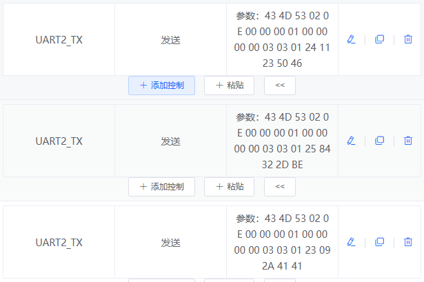

- **参数值超限**：

    - 检查各参数是否在允许范围内
    - 确认数据类型是否符合要求
    - 参考文档中的正确格式

**4. 解决步骤**

- 修正配置中的错误参数
- 保存配置后重新生成SDK
- 如仍失败，联系技术团队协助

**注意事项：**

- 导出的配置文件包含完整的产品配置信息
- 生成失败通常是参数格式或数值问题
- 技术团队可通过配置文件快速定位问题
- 修正后需要重新保存配置再生成

---

### 如何获取产品例程和文档？

**问题描述：**

需要获取产品的例程和文档来了解产品功能，以及有项目需求或合作意向时的联系方式。

**解决方案：**

**获取方式：**

1. **智能公元平台**
    - 平台网址：https://smartpi.cn
    - 登录平台查看例程和文档
    - 例程和文档已陆续上传至平台
    - 可随时登录查看产品功能与操作指南

2. **文档内容**
    - 产品使用指南
    - 开发例程
    - API文档
    - 配置教程
    - 常见问题解答

**联系方式：**

- **技术咨询**：通过平台联系技术团队
- **项目需求**：联系商务团队
- **合作意向**：通过官方渠道联系
- **售后支持**：平台提供技术团队服务

**注意事项：**

- 建议注册账号登录以获取完整资料
- 文档会持续更新，请关注最新版本
- 如有特殊需求可直接联系技术团队

---

### 如何实现IO口电平的自定义配置？

**问题描述：**

需要实现通过语音指令（如"IO口设置为高电平"）让用户自行设置IO口的上电电平状态。

**解决方案：**

**1. 使用上电记忆功能**

    - IO口支持上电记忆，断电重启后恢复到断电前的状态
    - 通过语音指令设置一次后，重启仍保持该电平


**2. 配置步骤**

创建命令词：

    - 添加命令词A1："设置为高电平"
    - 添加命令词A2："设置为低电平"


关联GPIO：

    - 选择要控制的GPIO（如GPIO_A25）
    - 设置为输出模式
    - 开启"上电记忆"功能

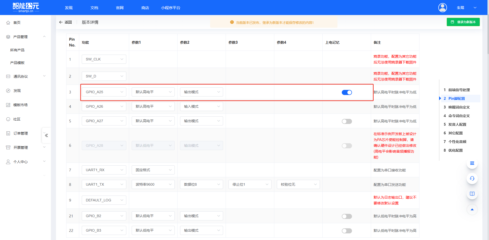

绑定控制动作：

    - 将命令词A1绑定到"设置为高电平"动作
    - 将命令词A2绑定到"设置为低电平"动作


**3. 使用说明**

    - 用户说"设置为高电平"，IO口输出高电平并记忆
    - 断电重启后，IO口自动恢复为高电平
    - 只需设置一次，无需每次开机重新配置

**注意事项：**

- 上电记忆功能需要正确配置才能生效
- 一次设置后永久有效，直到再次修改
- 不同IO口可独立配置各自的初始状态

---

### API接口生成SDK和固件失败怎么办？

**问题描述：**

在使用API接口生成SDK和固件时，遇到生成失败的问题，尽管已尝试重新生成，但系统仍提示生成超时，且命令词列表过长，部分命令词在词库中不存在，导致生成失败。

**解决方案：**

**1. 问题分析**

- **命令词数量过多**：API接口对单次生成的命令词数量有限制
- **词库不匹配**：部分命令词在系统词库中不存在，无法识别
- **生成超时**：命令词过多导致处理时间过长，触发超时机制

**2. 处理方法**

**删减命令词**：

- 检查命令词列表，删除不必要的词条
- 优先保留核心功能命令词
- 避免使用重复或相似的命令词

**检查词库兼容性**：

- 确认所有命令词都在标准词库范围内
- 避免使用生僻词或专业术语
- 使用常见、清晰的词汇作为命令词

**分批生成**：

- 将大量命令词分成多个小批次
- 每批次控制在合理数量内（如50条以内）
- 分别生成后再进行整合测试

**3. 预防措施**

**优化命令词设计**：

- 使用简洁明确的命令词
- 避免过长或复杂的词组
- 确保发音清晰、无歧义

**合理规划功能**：

- 按功能模块分组命令词
- 避免单次生成过多功能
- 采用迭代开发方式逐步添加功能

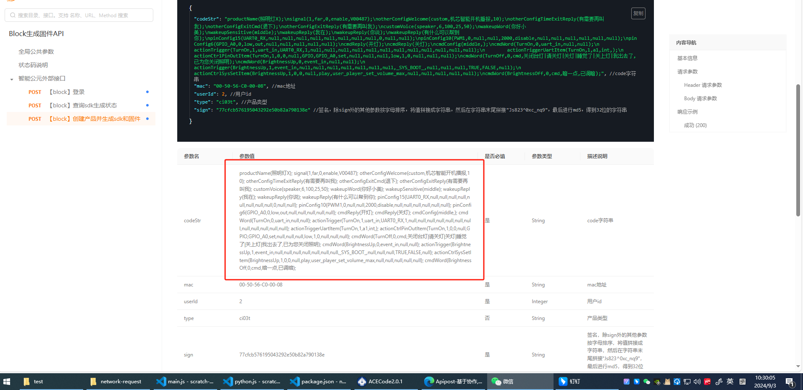

*API接口中的codeStr参数包含多个语音指令*


*生成超时，可重新生成或继续等待*

**注意事项：**

- 命令词需要在系统词库范围内才能被识别
- 单次生成的命令词数量建议控制在合理范围内
- 生成失败时应先检查命令词列表而非立即重试
- 复杂功能建议分模块、分批次生成

---

### API接口支持语种切换吗？

**问题描述：**

需要了解API接口是否支持切换语音识别语种，特别是能否将识别语言从中文切换为英文，以满足在英文环境下的应用需求。

**解决方案：**

**1. 语种切换支持情况**

- **当前状态**：API接口已支持语种切换功能
- **支持语种**：中文（cn）、英文（en）
- **实现方式**：通过在API请求中增加lang参数

**2. API接口参数配置**

在创建产品的API接口请求中，添加以下参数：

```json
{
    "lang": "cn"  // 或 "en"
}
```

- **lang=cn**：代表中文识别
- **lang=en**：代表英文识别

**3. 使用说明**

- **接口地址**：http://demoapi.aimachip.com/api/product/createSdkByCode
- **请求方法**：POST
- **Content-Type**：application/json
- **认证方式**：无需认证

**4. 配置示例**

创建中文语音产品：
```json
{
    "productName": "照明控制",
    "lang": "cn",
    "codeStr": "..."
}
```

创建英文语音产品：
```json
{
    "productName": "Light Control",
    "lang": "en",
    "codeStr": "..."
}
```

**注意事项：**

- 语种参数必须在创建产品时指定
- 不同语种需要使用对应语言的命令词
- 中文模型和英文模型使用不同的语音ID
- 切换语种后需要重新生成SDK和固件

---

### API接口如何配置控制端口输出方式？

**问题描述：**

API接口文档中关于控制端口输出方式的设置方法不完整或与实际不符，需要了解完整的actionCtrlPinOutItem函数参数说明。

**解决方案：**

**1. actionCtrlPinOutItem函数参数说明**

| 字段 | 类型 | 说明 | 可选值 |
|---|---|---|---|
| action | string | 行为名 | 自定义行为标识 |
| ctrlId | string | 控制标识 id | 用于区分相同行为下的不同控制 |
| isCondition | string | 是否条件执行 | 0: 否, 1: 是 |
| isDelayed | string | 是否延时输出(ms) | 0: 否, 1: 是 |
| delayedTime | string | 延时长(ms) | 具体延时数值 |
| type | string | 控制类型 | GPIO: GPIO, PWM: PWM, UART: UART |
| text | string | 端口名 | 如 GPIO_A25, PWM1 等 |
| gpioCommand | string | gpio 选项 | set: 设置, pulse: 脉冲 |
| pwmCommand | string | pwm 选项 | set: 设置, increase: 增加, decrease: 减少 |
| paramsDuty | string | pwm 占空比 | 0-100 |
| paramsVoltage | string | 电平 | low: 低电平, high: 高电平, negate: 反电平 |
| isFlip | string | 是否延时电平翻转 | 0: 否, 1: 是 |
| flipTime | string | 延时长(ms) | 翻转延时时间 |
| paramsPeriod | string | 脉冲周期(ms) | 脉冲周期 |
| paramsTimes | string | 脉冲次数 | 脉冲重复次数 |
| uartData | string | uart 参数 | UART发送的数据 |

**2. 配置示例**

GPIO输出配置：
```javascript
actionCtrlPinOutItem("wakeup_uni", "1", "0", "0", null, "GPIO", "GPIO_A25", "set", null, null, "low", "1", "10", null, null);
```

PWM输出配置：
```javascript
actionCtrlPinOutItem("brightness_ctrl", "1", "0", "0", null, "PWM", "PWM1", null, "set", "50", null, null, null, null, null);
```

UART输出配置：
```javascript
actionCtrlPinOutItem("uart_send", "1", "0", "0", null, "UART", "UART1", null, null, null, null, null, null, null, "485164E6");
```

**3. 语种切换补充说明**

除了在创建产品时指定lang参数，还需要在产品配置中选择对应的语音模型：

- **中文语音模型**：使用 V00487
- **英文语音模型**：使用 V00488

在产品配置界面的信号设置中选择对应模型ID。

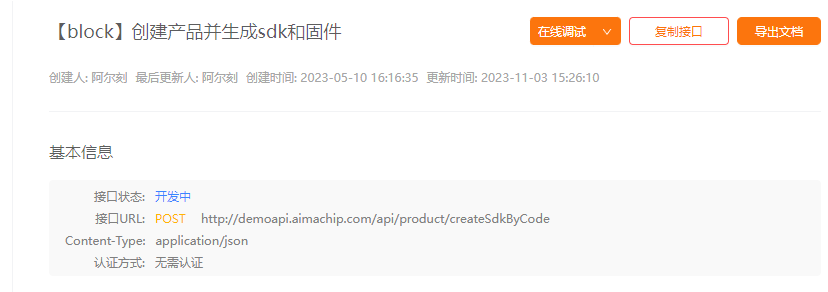

*创建产品并生成SDK和固件的API接口*

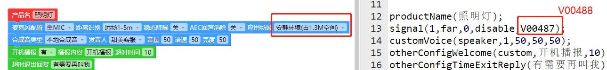

*配置界面中选择对应的语音模型ID*

**注意事项：**

- GPIO配置时注意端口名格式（如GPIO_A25）
- PWM配置占空比范围为0-100
- UART数据使用十六进制格式
- 不同语音模型对应不同的V00xxx ID
- 配置完成后需重新生成固件生效

---

### 如何设置CI1302开机播报语录之间的停顿时间？

**问题描述：**

需要在CI1302芯片开机播报多个语录时，设置语录之间的停顿时间，避免语录连续播放没有间隔。

**解决方案：**

由于平台限制，无法直接在开机播报中设置语录间的停顿时间。可通过以下变通方案实现：

1. **关闭开机播报功能**

    - 在平台配置中关闭默认的开机播报
    - 避免自动连续播放所有语录

2. **使用事件触发替代**

    - 创建一个新的事件（如G7控制事件）
    - 将每个语录设置为独立的播报动作
    - 通过上电唤醒或其他触发条件启动事件

3. **配置延时播报**

    - 为每个播报动作设置"延时输出"
    - 第一个语录（如"hi"）设置较短延时或不延时
    - 后续语录（如"i am here"）设置较长延时
    - 延时时间即为想要的停顿时间

**注意事项：**

- 延时时间需根据实际效果调整，建议从100ms开始尝试
- 过短的延时可能导致首个语录播放不完整
- 此方法需要关闭原有的开机播报功能
- 如效果仍不理想，可能需要考虑在固件层面实现

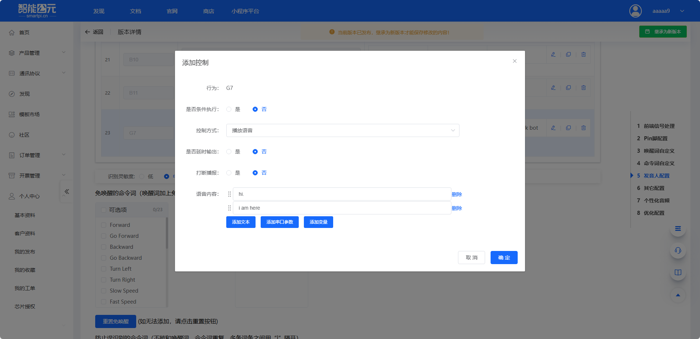

---

### 优化配置中的各个选项有什么作用？

**问题描述：**

在优化配置界面中，看到"深度休眠"、"唤醒"、"二次唤醒"、"命令识别"、"系统设置"和"特定命令词阈值"等选项，但不清楚这些选项的具体用途和配置方法。

**解决方案：**

优化配置中的各选项用于调整模块的功耗和识别性能：

- **深度休眠**：

    - 配置模块在不工作时的休眠模式
    - 可降低整体功耗，延长电池使用寿命
    - 适用于电池供电的应用场景

- **唤醒**：

    - 设置唤醒词的识别参数
    - 调整唤醒的灵敏度和响应速度
    - 影响模块从休眠状态唤醒的可靠性

- **二次唤醒**：

    - 设置是否需要二次唤醒确认
    - 可减少误唤醒，提高系统稳定性
    - 适用于对误唤醒敏感的应用场景

- **命令识别**：

    - 配置命令词的识别参数
    - 调整识别准确率和响应速度
    - 影响具体指令的执行可靠性

- **系统设置**：

    - 包含系统级的基本配置选项
    - 如音量、采样率、通信波特率等
    - 影响模块的整体工作状态

- **特定命令词阈值**：

    - 为特定命令词设置独立的识别阈值
    - 可针对重要命令设置更严格的识别标准
    - 平衡识别率与误触发率

**注意事项：**

- 各选项的参数需要根据实际应用场景调整
- 建议在平台提供的默认值基础上进行微调
- 过于严格的设置可能导致识别困难
- 过于宽松的设置可能增加误触发

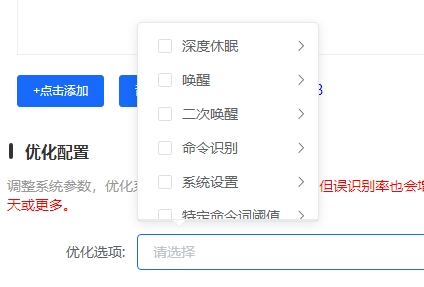


---

### 前端信号处理中MIC选择与差分/单端设置需要对应吗？

**问题描述：**

在平台配置中看到"前端信号处理"中的MIC配置（单MIC/双MIC）和"系统设置"中的"MIC差分/单端"选项，不确定这两项配置是否需要对应设置。

**解决方案：**

**MIC配置说明：**

- **MIC选择（单MIC/双MIC）**：用于告知SDK设备实际使用的麦克风数量，以便进行相应的信号优化处理
- **差分/单端设置**：配置麦克风输入方式，一般情况下可以不设置

**配置原则：**

- 两项配置**不需要严格对应**
- 如果没有特殊需求，**可以不设置差分/单端选项**，使用平台默认值即可
- MIC选择建议根据实际硬件配置正确设置（单麦克风选单MIC，双麦克风选双MIC）

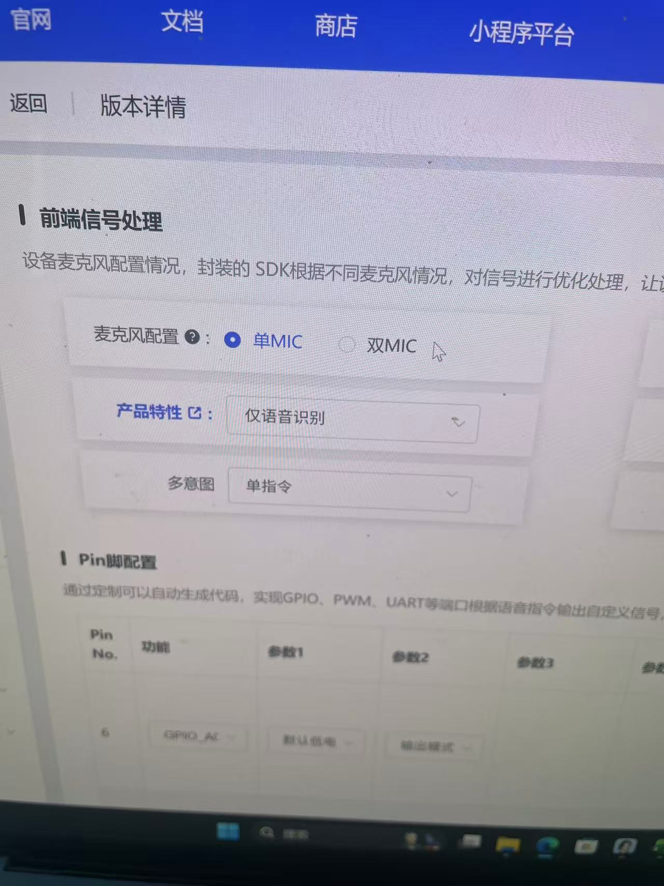


**注意事项：**

- 差分/单端设置主要用于特殊的硬件设计场景
- 大多数应用场景下使用默认配置即可正常工作
- 如果音频采集出现问题，再考虑调整差分/单端设置

---

### 模块可以直接连接数字麦克风吗？

**问题描述：**

希望使用数字麦克风（Digital Mic/DMIC）连接到语音模块，询问模块是否支持数字麦克风输入。

**解决方案：**

**接口限制说明：**

- 模块的A6引脚已被用作**功放使能**功能
- 该引脚无法复用作数字麦克风数据接口
- 模块本身**不支持直接连接数字麦克风**

**替代方案：**

1. **使用芯片方案**：
   - 直接使用语音芯片（如CI-03T等）进行产品设计
   - 芯片具有IIS接口，可以连接数字麦克风
   - 需要进行SDK开发和外围电路设计

2. **使用模拟麦克风**：
   - 模块自带模拟麦克风接口，直接使用模拟麦克风即可
   - 模拟麦克风方案成本更低，使用更简单

3. **使用支持数字麦克风的模块**：
   - 选择支持数字麦克风接口的模块型号（如CI-73T等）
   - 这些模块预留了数字麦克风接口（SDIO/PCM/PDM）

**选型建议：**

| 方案 | 优点 | 缺点 | 适用场景 |
|------|------|------|----------|
| 模块+模拟麦 | 简单易用，成本低 | 抗干扰能力较弱 | 一般应用场景 |
| 芯片+数字麦 | 抗干扰强，音质好 | 需要SDK开发，成本高 | 对音质要求高的场景 |
| 数字麦模块 | 兼顾易用性和性能 | 可选型号较少 | 需要数字接口的场景 |

**注意事项：**

- 使用芯片方案需要具备硬件设计和SDK开发能力
- 数字麦克风方案成本通常是模拟麦克风的10倍以上
- 设计前请确认具体型号的接口支持情况

---

### 如何获取产品的认证文件和合规报告？

**问题描述：**

需要获取线路板的检查报告、合格证或其他认证文件，以满足项目合规要求。

**解决方案：**

部分型号的产品可能没有进行特定的认证，但可以提供以下合规文件：

- **原材料ROHS报告**：

    - 提供元器件级别的ROHS环保认证报告
    - 证明产品符合环保要求（有害物质限制）
    - 可作为产品合规性的支撑文件

- **已有认证型号的报告**：

    - 部分型号（如SU-031）已完成RoHS认证
    - 可提供类似产品的认证报告作为参考
    - 包含化学物质含量等详细信息

**注意事项：**

- 并非所有型号都有完整的认证报告
- ROHS报告主要针对环保合规，不包含安全认证
- 如需特定认证（如CE、FCC等），可能需要额外申请
- 建议在项目初期确认所需的认证类型

---

### 自定义协议时串口发送的指令与写入的不一致怎么办？

**问题描述：**

在智能管家模块配置自定义协议时，检测到串口TX0和TX1发送的指令与写入的指令不一样。

**解决方案：**

**1. 技术团队范围说明**

- 平台开发提供完整的技术团队
- SDK开发不在免费技术团队范围内
- 需要基于平台提供的功能进行开发

**2. 自定义协议配置要点**

- 确认配置的串口组别（TX0或TX1）
- 检查硬件接线是否正确
- 验证模块型号与平台配置匹配

**3. 问题排查步骤**

    - **确认模块型号**：使用官方在售型号
    - **检查接线**：TX/RX/GND三线正确连接
    - **配置验证**：在平台重新生成固件
    - **协议格式**：确认自定义协议格式符合规范

**4. 项目支持方案**

如需SDK级别的技术团队：

- 可转为项目支持模式
- 由官方团队负责开发
- 需要商务洽谈确定合作方式

**注意事项：**

- 非官方型号无法获得技术团队
- SDK开发需要具备相应技术能力
- 建议优先使用平台提供的标准功能

---

### 在线智能语音交互模块的工作原理是什么？

**问题描述：**

需要了解在线智能语音交互模块的工作原理、是否支持第三方对接，以及能否用于开发包含在线语音交互、蓝牙连接、充气泵、气压检测和喷雾功能的智能陪伴毛绒玩具。

**解决方案：**

**1. 在线模块开发状态**

- 在线智能语音交互模块目前还在开发阶段
- 暂时无法提供正式的产品和技术团队
- 预计还需要一段时间才能完成开发

**2. 当前替代方案**

- **离线语音模块**：可作为临时替代方案
    - 支持本地语音识别和命令执行
    - 无需网络连接即可工作
    - 可通过串口控制外部设备（如充气泵、喷雾模块等）

**3. 智能玩具功能实现建议**

对于智能陪伴毛绒玩具的功能需求：

- **语音交互**：使用离线模块实现基础语音对话
- **蓝牙连接**：可集成外置蓝牙模块
- **充气泵控制**：通过模块GPIO或串口控制
- **气压检测**：外接气压传感器，通过ADC读取
- **喷雾功能**：使用继电器或MOS管控制喷雾器

**注意事项：**

- 在线模块发布时间待定，具体功能以官方公告为准
- 离线模块在功耗和响应速度方面更有优势
- 复杂功能建议采用MCU+语音模块的方案实现

---

### 是否可以提供固件更新和定制服务？

**问题描述：**

需要了解官方是否可以为产品更新固件，以及固件定制的相关费用和服务流程。

**解决方案：**

**固件服务说明：**

1. **固件定制服务**
    - 官方提供固件定制开发服务
    - 根据具体需求进行功能定制
    - 需要支付一定的定制开发费用

2. **服务内容**
    - 定制功能开发和集成
    - 固件版本更新和升级
    - 特殊需求的技术实现
    - 批量产品的固件烧录支持

3. **服务流程**
    - 需求评估：沟通具体的功能需求
    - 方案制定：提供定制方案与评估信息
    - 合同签订：确认服务内容和费用
    - 开发实施：进行固件开发
    - 测试验证：功能测试和质量验证
    - 交付支持：固件交付和技术团队

4. **费用说明**
    - 根据功能的复杂程度和工作量评估
    - 不同项目的定制费用会有差异
    - 需要根据具体需求进行评估
    - 包含开发和后期的技术团队

**注意事项：**

- 固件定制需要提前沟通详细需求
- 定制开发通常需要一定的开发周期
- 建议在项目早期进行需求沟通和时间规划
- 可联系官方技术团队获取评估信息和服务说明

---

### 是否可以同时下载中英文语言到模块中实现语言切换？

**问题描述：**

需要将中英文语言同时下载到语音识别模块中，实现语言切换功能，以满足多语言应用需求。

**解决方案：**

目前标准版本**不支持**同时下载中英文语言并实现切换功能。

**实现方式：**

- 如需中英文切换功能，需要**定制开发**
- 定制方案可根据具体需求设计
- 需要联系技术团队评估可行性和开发周期

**注意事项：**

- 标准版本固件仅支持单一语言模式
- 多语言切换涉及固件架构的较大改动
- 建议在项目初期明确多语言需求，以便选择合适的技术方案
---

### 如何在智能公元平台配置英文语音功能？

**问题描述：**

询问是否可以在智能公元平台自行将中文语音指令配置为英文，以及操作方法和识别效果保障。

**解决方案：**

**平台自行配置方法**

智能公元平台支持用户自行配置英文语音功能：

- **平台地址**：http://www.smartpi.cn/#/
- **免费配置**：英文等外语配置不收取额外费用
- **自主操作**：用户可在平台自行完成配置

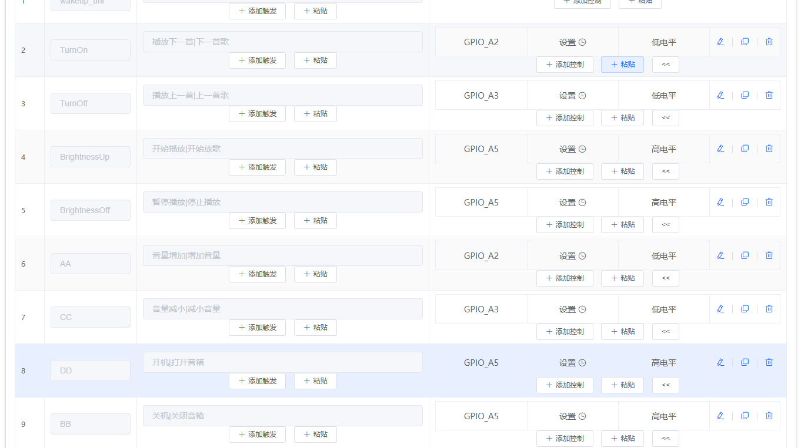

**配置操作步骤**

1. **登录平台**
    - 访问智能公元平台并登录账号
    - 进入产品管理页面

2. **修改命令词**
    - 选择需要修改的命令词
    - 将中文命令词改为英文
    - 设置对应的英文回复语

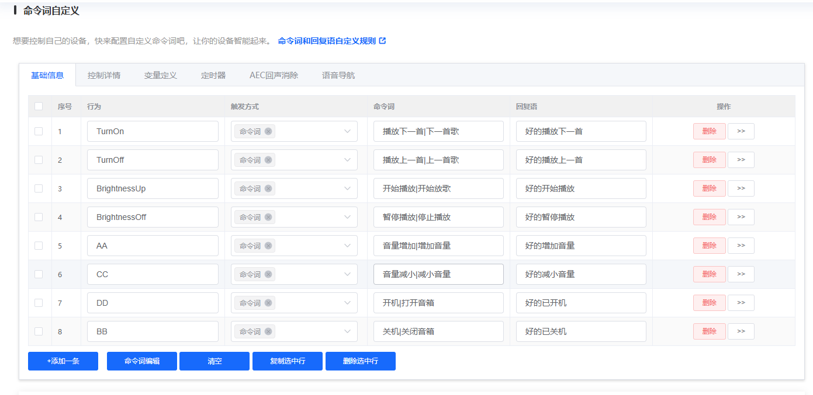

3. **GPIO配置**
    - 不同命令词对应不同的GPIO输出
    - 可设置高/低电平控制
    - 实现硬件控制功能


**识别效果优化**

自行配置时需要注意：

- **词语选择**：选择识别率高的英文词汇
- **灵敏度调节**：根据实际效果调整识别阈值
- **泛化词添加**：增加同一指令的不同说法
- **测试验证**：充分测试确保识别效果

**专业定制服务**

如需更好的识别效果：

- **专业开发**：可提供英文定制开发服务，具体费用请联系官方客服评估
- **包含内容**：硬件+软件+平台配置工程
- **效果保障**：专业调优确保最佳识别率

**注意事项：**

- 自行配置不收取费用，但需要自行调试
- 英文识别可能需要更多测试和优化
- 如要求较高的识别率，建议选择专业定制服务

---

### 纯英文语音开发的费用和后续支持如何？

**问题描述：**

询问纯英文语音开发的费用、开发内容，以及是否包含后续的修改支持和硬件配合服务。

**解决方案：**

**开发费用说明**

英文语音开发费用需根据需求评估：

- **纯英文开发**：具体费用请联系官方客服评估
- **包含内容**：硬件+软件+平台配置工程
- **中文版本**：具体费用请联系官方客服评估（如不需要英文功能）

**开发服务范围**

1. **硬件支持**
    - 语音模块硬件集成指导
    - 音频电路设计建议
    - 接口匹配和兼容性支持

2. **软件服务**
    - 英文命令词配置
    - 识别率优化调试
    - 固件生成和烧录

3. **平台支持**
    - 智能公元平台配置工程
    - 操作流程培训
    - 后续修改技术团队

**后续支持政策**

- **包含修改**：开发费用包含一定次数的修改
- **技术指导**：提供语音识别方面的硬件建议
- **合同保障**：开发合同中明确服务内容和范围

**注意事项：**

- 纯英文开发成本较高，因涉及专业调试工作
- 建议明确需求，避免后期大幅修改
- 量产时可能需要额外优化费用

---

### 英文语音定制开发的具体流程是什么？

**问题描述：**

了解英文语音定制开发的详细流程，包括需求确认、开发实施和交付验收等环节。

**解决方案：**

**开发流程详解**

1. **需求确认阶段**
    - 确认英文命令词列表及功能需求
    - 评估开发工作量和时间周期
    - 签订开发合同，明确交付内容

2. **开发实施阶段**
    - 硬件方案设计和建议
    - 英文语音模型训练
    - 识别率测试和优化
    - 固件集成和调试

3. **交付验收阶段**
    - 提供Demo样品测试
    - 交付完整的技术文档
    - 平台配置工程文件
    - 使用指导和技术培训

**合同内容**

开发合同包含以下内容：

- **开发范围**：明确包含的功能和支持
- **交付时间**：约定开发和交付周期
- **修改条款**：开发后的修改支持政策
- **技术团队**：后续问题咨询和指导服务

**注意事项：**

- 需求变更可能影响开发周期和费用
- 建议在合同中详细约定所有需求
- 量产前进行充分的验证测试

---

### 离线语音模块是否支持时间对时功能？

**问题描述：**

需要实现语音模块获取当前时间并进行定时控制的功能，例如询问现在几点，然后设置一个具体时间点执行关机操作。

**解决方案：**

离线语音模块无法实现时间对时功能：

- **硬件限制**：模块本身不具备获取当前时间的能力，无法知道实际时间
- **离线特性**：作为离线设备，无法通过网络同步时间
- **替代方案**：可以实现相对定时功能，如"30分钟后关机"

**功能限制：**

- 无法获取当前时间
- 无法根据实际时间进行绝对时间控制
- 无法实现"询问几点几分"的时间查询功能

**可实现功能：**

- 相对定时控制：支持"N分钟后执行"类型的定时操作
- 延时控制：可设置固定延时后执行动作


**注意事项：**

- 如需要绝对时间控制，建议配合外接RTC时钟模块
- 也可以通过主控MCU获取时间后，通过串口告知语音模块需要执行的延时时间
- 相对定时功能适用于大多数延时控制场景

---

### 所有设备显示离线状态怎么办？

**问题描述：**

小程序或平台显示所有设备均为离线状态，无法正常查看和控制设备。

**解决方案：**

**1. 平台状态检查**

- **服务状态**：检查平台服务是否正常运行
- **网络连接**：确认设备与服务器之间的网络连通性
- **时间同步**：检查设备时间是否与服务器同步

**2. 等待恢复**

- **临时故障**：多数情况下为平台临时性故障
- **自动恢复**：平台维护完成后通常会自动恢复
- **耐心等待**：等待一段时间后刷新页面查看

**3. 联系技术团队**

- **及时反馈**：向技术团队报告离线问题
- **提供信息**：包括设备编号、离线时间、错误信息等
- **跟进处理**：持续关注问题处理进度

**注意事项：**

- 批量设备离线通常是平台端问题，非设备故障
- 建议保留技术团队联系方式，便于及时反馈
- 问题解决后确认所有设备已恢复正常在线

---

### 同一WiFi网络下固件生成失败怎么办？

**问题描述：**

在使用平台生成固件时，同一WiFi网络下的多个用户同时生成SDK和固件，会导致固件生成失败，且重新生成也无效。

**解决方案：**

**问题原因分析：**

1. **网络限制因素**

    - 同一WiFi网络下的并发请求可能受到限制
    - 大量用户同时下载会造成网络拥堵
    - 平台服务器对同一IP的并发请求有限制

2. **生成机制说明**

    - SDK和固件生成是异步处理过程
    - 正常情况下两个生成时间相差不大，所以会一起完成
    - 高并发时，固件生成队列可能出现延迟

**解决方法：**

1. **错峰生成**

    - 避免整个班级同时点击生成固件
    - 分批次进行固件生成操作
    - 间隔5-10分钟后再尝试重新生成

2. **网络优化**

    - 使用不同的网络环境进行生成
    - 如条件允许，可使用4G/5G热点分流
    - 避免使用公共WiFi进行批量操作

3. **操作建议**

    - 先让部分学生生成SDK和固件
    - 成功后再让其他学生操作
    - 预留充足的操作时间，避免临近下课集中操作

4. **应急处理**

    - 如遇平台维护，请等待维护完成
    - 生成失败后不要频繁点击重新生成
    - 联系技术团队确认平台状态

**注意事项：**

- 教育场景建议提前测试网络承载能力
- 固件生成成功后及时下载保存
- 保留生成的配置文件，便于后续直接使用
- 问题持续时建议调整教学计划，分批次进行实践操作

---

### 如何添加俄语等多语言语音指令功能？

**问题描述：**

希望在产品中添加俄语等非中英日韩语言的语音指令功能，并询问是否可以在平台自行配置。

**解决方案：**

1. **支持的语言范围**
    - 平台目前仅开放：中文、英文、日文、韩文的自助配置
    - 其他语言（俄文、西班牙文、德文、阿拉伯文、泰文、越南文等）需要定制开发
    - 西班牙语支持：可通过定制开发实现，已验证可正常烧录和使用

2. **定制开发流程**
    - 提供目标语言的指令词条列表（纯文本即可，无需录音）
    - 词条要求：

        - 使用常用词汇，避免生僻词（类似中文的生僻字）
        - 确保词汇在语音模型库中有收录
    - 开发周期：约7个工作日

3. **词条格式要求**
    - 所有字符必须大写
    - 词与词之间用短杠连接，不能有空格
    - 唤醒词建议使用当地常见人名（如俄语的"Привет Алина"）

**注意事项：**

- 小语种的自学习功能实现较为复杂，初版建议使用固定词条
- 直接将中文唤醒词机器翻译成外文可能导致识别失败
- 俄语等使用特殊字符的语言，需要专门的输入法进行配置


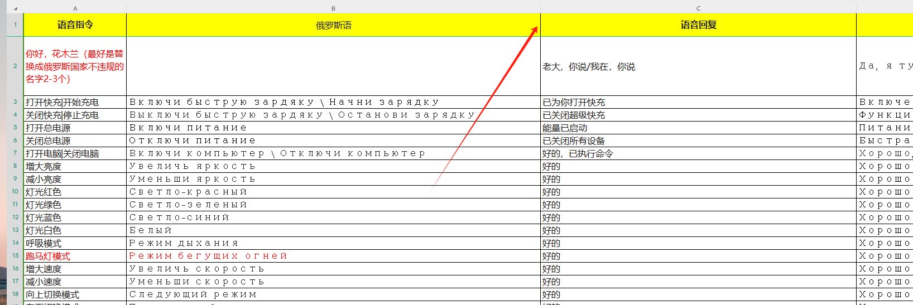


---

### 如何通过语音指令控制设备播报音量？

**问题描述：**

用户反馈设备播报声音过大，希望通过语音指令调节音量大小。

**解决方案：**

1. **支持的语言范围**
    - 中文和英文：可在平台后台自行添加音量控制指令
    - 其他语言（如俄语）：需要定制开发

2. **配置指令示例**
    - 增大音量
    - 减小音量
    - 最大音量
    - 最小音量
    - 中等音量

3. **实现方式**
    - 在平台中添加上述指令
    - 每个指令对应相应的音量调节行为
    - 可通过变量控制具体音量值

**注意事项：**

- 目前暂不支持通过语音指令调节识别灵敏度
- 灵敏度设置过高可能导致未唤醒时误响应
- 如需调节灵敏度，需在固件配置中修改参数

---

### 俄语固件开发需要注意哪些格式要求？

**问题描述：**

定制俄语固件时，词条格式有特殊要求，且手动输入工作量大。

**解决方案：**

1. **俄语词条格式要求**
    - 所有字符必须大写
    - 词与词之间用短杠连接，不能有空格
    - 特殊字符（如俄语字母）需要专门的输入法

2. **开发流程注意事项**
    - 输入和校对工作量大，需要额外时间
    - 俄语键盘与英文键盘布局完全不同
    - 建议先完成没有声音回复的版本测试

3. **翻译准确性确认**
    - 提供完整的词条表格，确认所有翻译
    - 检查是否有遗漏的翻译项
    - 确认唤醒词的选择（建议使用当地常见人名）

**注意事项：**

- 自学习功能在小语种上实现复杂，初版建议使用固定词条
- 由于需要逐个字符输入校对，开发周期可能延长
- 音频文件为合成方式，结尾可能有兹拉声，正在优化


---

### 可以自己录制音频文件替换合成语音吗？

**问题描述：**

合成音频在结尾时有兹拉声，希望用自录的AI音频文件替换。

**解决方案：**

1. **技术可行性**
    - 可以替换为自录制的音频文件
    - 音频文件需要符合特定格式要求
    - 需要专业音频制作工具

2. **操作限制**
    - 用户无法直接在平台替换音频
    - 替换后需要修改和编译代码
    - 需要重新合成分区文件生成固件

3. **优化进展**
    - 合成音频的兹拉声问题正在优化
    - 可联系技术团队获取改进版本
    - 提供音频源文件可帮助定制

**注意事项：**

- 音频替换涉及固件底层开发，需要专业支持
- 建议先测试合成音频的改进版本
- 如有高质量音频源，可提供给技术团队进行集成

---

### 平台配置错误导致固件生成失败怎么办？

**问题描述：**

平台提示配置参数错误，固件状态一直显示"正在生成"，无法完成生成。

**解决方案：**

1. **错误排查步骤**
    - 导出平台配置的JSON文件
    - 在产品管理界面，点击"导出"按钮
    - 检查配置文件中的行为控制参数

2. **常见错误类型**
    - DisableName/EnableName参数错误
    - 行为名与系统设置不匹配
    - 格式不符合平台要求

3. **解决方法**
    - 修改错误的行为控制参数
    - 删除有问题的配置项
    - 重新导入正确的配置

**注意事项：**

- 固件生成超过1-3分钟未完成表示失败
- 需要返回上一级界面才能导出配置文件
- 日文模型固件生成问题技术正在解决

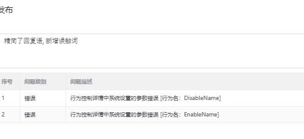
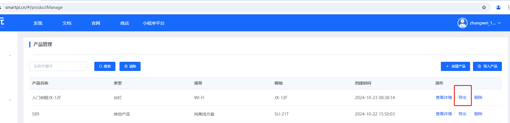


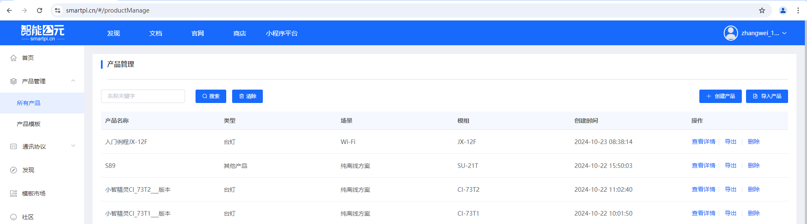

---

### 如何通过语音控制开机播报功能？

**问题描述：**

小米智能插座等设备每次启动都会自动播报欢迎词，用户希望能够通过语音指令控制是否播报。

**解决方案：**

1. **功能实现**
    - 可以实现语音控制开机播报
    - 需要修改平台配置
    - 添加播报开关控制逻辑

2. **配置方法**
    - 在平台中添加"禁用开机播报"/"启用开机播报"指令
    - 设置相应的行为控制
    - 通过变量记录播报开关状态

3. **适用场景**
    - 特别适合智能插座等频繁重启的设备
    - 避免每次启动都有提示音干扰
    - 提升用户体验

**注意事项：**

- 当前平台后台可能没有该功能选项
- 需要技术团队提供演示版配置
- 功能实现需要修改固件配置

---

### 如何重新获取已提供的固件文件？

**问题描述：**

手机自动清理导致固件文件丢失，需要重新获取之前的俄语固件。

**解决方案：**

1. **联系重新提供**
    - 联系技术团队说明固件版本信息
    - 提供接收固件的邮箱或方式
    - 确认所需的唤醒词和指令集

2. **关键信息确认**
    - 唤醒词：Привет Алина
    - 固件版本：V2.0.0
    - 指令列表：原提供的俄语指令表格

3. **备份建议**
    - 收到固件后及时备份到云端
    - 本地保存多个副本
    - 建立固件版本管理档案

**注意事项：**

- 固件文件通常有保存期限，建议及时下载
- 保留原始的指令表格，便于后续核对
- 如在海外，考虑网络传输时间

---

### 购买空片芯片用于自行设计PCB时，是否需要烧录底层固件？

**问题描述：**

需要购买空片芯片用于自行设计的PCB，询问是否需要预先烧录底层固件，以及能否直接烧录应用程序。

**解决方案：**

- **芯片提供方式**：可以提供空片芯片，不含任何预装固件
- **底层固件**：不需要预先烧录底层固件，可直接烧录应用程序
- **烧录灵活性**：支持直接烧录用户开发的应用程序固件

**注意事项：**

- 购买时需明确说明需要空片芯片
- 确保烧录工具和接口与芯片规格匹配
- 保留足够的Flash空间用于应用程序存储

---

### SDK发布时自定义固件版本出现500错误怎么办？

**问题描述：**

在平台发布SDK时，自定义的固件版本（非系统自带）持续出现'Request failed with status code 500'错误，且无法生成SDK，而系统自带的版本可以正常生成。

**解决方案：**

1. **检查固件配置是否保存完整**
    - 确认固件中的控制指令已正确保存
    - 检查网络连接稳定性，避免因网络卡顿导致配置丢失
    - 导出产品JSON配置文件，检查配置完整性

2. **重新配置固件**
    - 若配置未保存成功，需要重新创建固件版本
    - 可继承已生成成功的版本，在此基础上修改配置
    - 确保所有控制指令在保存前已正确添加

3. **网络和操作建议**
    - 避开网络高峰期进行SDK生成
    - 配置完成后先保存，再进行生成操作
    - 不要同时进行多个配置操作

**注意事项：**

- 系统自带版本已验证无误，自定义版本需要确保配置完整
- 网络不稳定可能导致配置保存失败，建议在稳定网络环境下操作
- 500错误通常是服务器端异常，重新配置或稍后重试可解决


---

### 产品管理页面导出配置时出现500错误怎么办？

**问题描述：**

在智能公元平台的产品管理页面，点击"导出"按钮导出产品配置文件时，出现`Request failed with status code 500`错误提示，无法完成导出。该问题可能持续多天，且同页面的ASR数据可以正常导出，仅WiFi相关产品的导出失败。

**解决方案：**

1. **重新登录平台**
    - 退出当前账号并重新登录
    - 清除浏览器缓存后重试
    - 尝试使用不同浏览器（如Chrome、Edge）

2. **检查产品和账户状态**
    - 确认产品在平台中是否正常发布
    - 检查账户权限是否正常
    - 确认平台服务是否正常（查看官方公告）

3. **替代方案**
    - 如需分享配置给其他账号，可通过平台的产品协作/分享功能（如有）
    - 导出失败时，可尝试联系技术支持协助处理

**可能原因：**

- 服务器临时故障或维护
- 该产品配置数据异常导致服务器处理失败
- 网络连接不稳定
- 账户会话过期

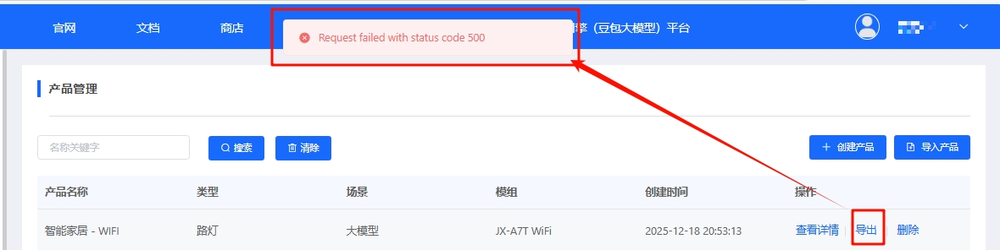

---

### 如何配置定时器实现系统循环重启？

**问题描述：**

配置定时器实现系统每1分钟循环重启一次，当前设置仅触发一次重启，无法实现循环。

**解决方案：**

**1. 事件触发器配置**

- 创建事件触发器（如RESET_1）
- 触发方式：T_RST定时器超时
- 系统操作：重置重启
- 定时器时间：根据需求设置（如60000ms为1分钟）

**2. 定时器操作类型选择**

- **立即重复**：先触发一次操作，同时启动定时器循环
- **重复**：等待定时器超时后才开始循环，没有立即触发

**3. 循环重启配置要点**

- 将定时器操作类型设置为"重复"或"立即重复"
- 确保触发条件正确设置
- 保存配置并重新生成固件

**4. 配置验证**

- 烧录固件后测试重启功能
- 监控系统日志确认重启是否循环执行
- 如仅重启一次，检查配置是否正确保存

**注意事项：**

- 循环重启仅用于调试阶段，正式产品不建议频繁重启
- 重启会导致系统状态丢失，需考虑实际影响
- 调试完成后应关闭循环重启功能

---

### 如何验证芯片设置是否生效并获取日志输出？

**问题描述：**

如何验证芯片设置（如复位）是否生效，并获取自定义的日志输出信息？

**解决方案：**

**1. 日志输出功能**

- 平台提供默认的日志输出口（DEFAULT_LOG）
- 默认日志口为串口0
- 默认波特率为：57600

**2. 验证方法**

- **语音播报验证**：在定时器触发后增加语音播报，通过播报内容确认功能执行
- **串口输出验证**：使用串口工具连接并监控日志输出
- **GPIO引脚验证**：通过控制GPIO引脚电平变化确认操作执行

**3. 自定义输出限制**

- 平台默认日志口不能指定输出内容
- 无法输出自定义的调试信息
- 仅能输出系统预设的日志信息

**4. 替代方案**

- 使用串口打印特定字符进行测试
- 通过控制语音播报验证逻辑流程
- 利用LED等外设指示程序状态

**注意事项：**

- 验证逻辑问题时，建议使用语音播报方式
- 串口0是专用日志口，不建议作他用
- 波特率57600是固定值，不可修改

---

### 系统设置中的重启控制功能如何使用？

**问题描述：**

在系统设置中配置重启控制功能并触发后，是否能够使语音芯片复位一次？

**解决方案：**

**1. 重启控制功能确认**

- 系统设置中的重启控制功能可以触发语音芯片复位
- 控制方式设置为"系统设置"时有效
- 类别选择"重启控制"，操作选择"重置重启"

**2. 配置参数**

- 控制方式：系统设置
- 是否延时设置：根据需求选择（一般选择"否"）
- 类别：重启控制
- 操作：重置重启

**3. 触发机制**

- 配置完成后，通过相应触发条件即可启动重启
- 重启功能会复位语音芯片系统
- 适用于需要定期复位或异常恢复的场景

**注意事项：**

- 重启会导致当前状态丢失，请谨慎使用
- 建议在必要时才触发重启功能
- 重启后需要重新初始化相关配置

---

### 如何在原有固件配置基础上进行修改？

**问题描述：**

希望在不重新配置的情况下，直接在原有配置基础上进行修改，以确认固件生成状态。

**解决方案：**

- 使用固件继承功能
- 在固件版本列表中找到已生成成功的版本
- 点击"继承"按钮创建新版本
- 在继承的版本基础上修改所需配置
- 保存后生成新的固件

**注意事项：**

- 继承版本会保留原版本的所有配置
- 修改后需要重新生成SDK
- 建议在继承前确认原版本配置正确

---

### 固件控制配置未保存导致生成失败怎么办？

**问题描述：**

在固件配置界面修改控制指令后，无法成功保存配置，导致配置丢失，固件生成失败。

**解决方案：**

1. **检查网络连接稳定性**
    - 配置保存时确保网络连接正常
    - 避免在网络不稳定时进行复杂配置操作
    - 保存成功后会有明确提示

2. **使用继承功能修改配置**
    - 找到已生成成功的固件版本
    - 点击"继承"创建新版本
    - 在继承版本基础上修改控制指令
    - 确认保存后再生成SDK

3. **配置保存步骤**
    - 修改控制指令后点击保存
    - 等待保存完成提示
    - 检查控制列表是否显示完整
    - 确认无误后生成固件

**注意事项：**

- 网络卡顿可能导致配置保存失败
- 保存配置后务必检查列表完整性
- 继承功能可避免重新配置所有内容

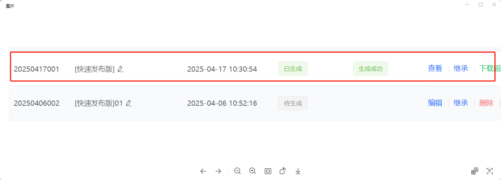

---

### MODBUS协议如何配置参数模式和变量绑定？

**问题描述：**

在配置MODBUS协议时，对参数模式的选择存在困惑，不确定应选择"数值"还是"变量"，以及如何正确绑定变量。

**解决方案：**

1. **参数模式选择**
    - **数值模式**：用于固定值，写入具体的数值
    - **变量模式**：用于绑定动态数据，选择已定义的变量

2. **变量绑定步骤**
    - 在协议字段定义中设置参数模式为"变量"
    - 选择对应的变量名称进行绑定
    - 确保变量已在平台中正确定义

3. **配置示例**
    - head_id字段：绑定到pwm2_duty变量
    - jcqdz字段：绑定到pwm4_duty变量
    - jcqsj字段：绑定到pwm2_duty变量

**注意事项：**

- 选择"数值"模式时，参数值为固定写死的值
- 选择"变量"模式时，参数值会根据绑定的变量动态变化
- 变量绑定前需先在变量列表中创建相应变量
- MODBUS协议支持自定义设备号，头部字段不固定

---

### 系统登录方式有哪些？


---

### CI系列芯片收到后需要更新固件吗？

---

### WiFi模块断线重连机制测试与分析

**问题描述：**

WiFi模块在信号中断后无法自动重连，需要了解重连机制的工作原理和优化方案。

**解决方案：**

1. **重连机制说明**
    - 模块会持续尝试重连，不会因为多次失败而停止
    - 重连间隔约为3秒一次
    - 使用最新固件版本可增强重连成功率

2. **不同断线场景的重连时间**
    - 路由器断电1-2分钟：设备重连时间约1-2分钟
    - 路由器断电30分钟：设备重连时间约10分钟
    - 拔网线1-2分钟：设备重连时间约5-6分钟
    - 拔网线30分钟：设备重连时间约15-16分钟

3. **日志采集建议**
    - 使用USB HUB连接多个串口工具，同时监控多台设备
    - 保留从正常到断线再到重连的完整日志
    - 特别关注重连失败前的错误信息

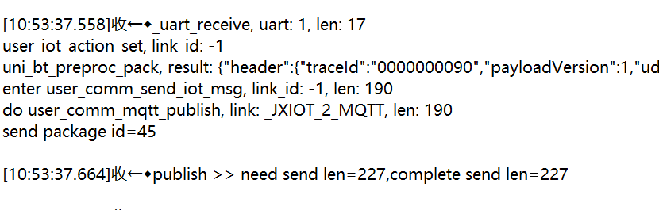

**重连失败的可能原因：**

- 信号强度不足（2-3格信号比满格信号更容易掉线）
- 固件版本过旧，重连机制不完善
- 网络环境不稳定，频繁断线导致重连困难

**注意事项：**

- 即使使用最新固件，信号差的区域仍可能出现长时间无法重连
- 建议在实际使用环境中充分测试重连功能
- 如问题持续存在，需要提供完整日志供技术团队分析

---

### WiFi模块长时间运行断连问题分析

**问题描述：**

WiFi模块在长时间运行过程中出现频繁断连且无法自动重连的问题，即使在信号良好的环境下也无法恢复连接。

**解决方案：**

1. **问题现象**
    - 设备断连后出现大量重复的uart_receive记录
    - 日志中没有时间间隔，表明可能陷入死循环
    - 持续发送device-properties-report消息，未触发重连
    - 数据以固定时间间隔（每6分钟）爆发式输出

2. **可能原因**
    - MQTT协议处理异常，断连后状态机卡死
    - 数据处理阻塞，导致无法执行重连逻辑
    - 内存泄漏或资源耗尽，影响系统稳定性

3. **临时解决方法**
    - 重新上电可暂时恢复连接
    - 避免长时间连续运行
    - 监控日志，发现异常及时重启

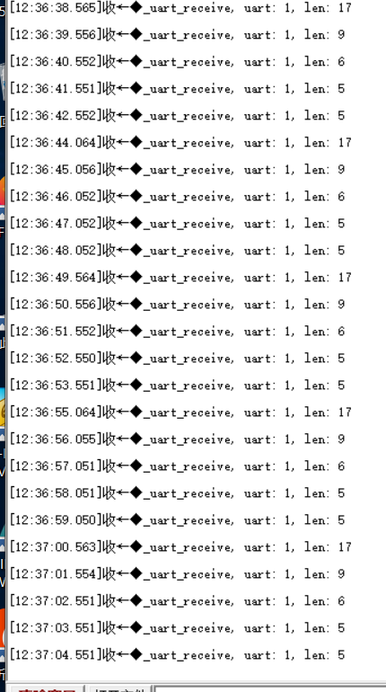

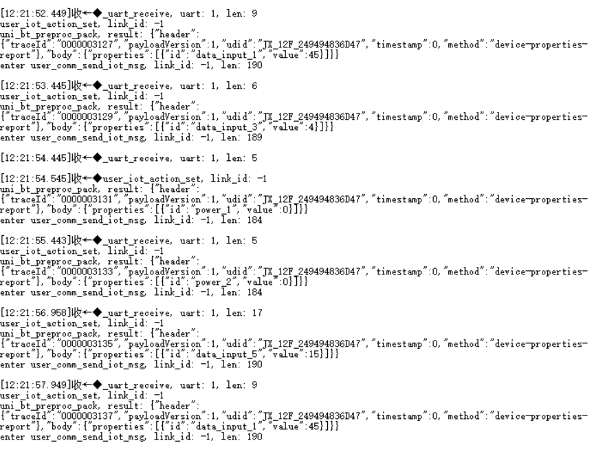

**长期测试建议：**

- 进行长时间挂测，监控断连恢复情况
- 重点测试断连后自动重连功能
- 记录断连时间、重连时间等关键数据
- 分析触发断连的具体条件

**进一步排查：**

- 检查MQTT客户端的心跳机制是否正常
- 分析内存使用情况，排查资源泄漏
- 确认网络栈状态，查看是否卡在某个状态
- 考虑升级到最新固件版本

**注意事项：**

- 断连问题可能在运行数小时后才出现
- 信号好的区域也可能出现断连
- 需要区分是网络问题还是模块内部问题
- 建议寄送设备进行详细分析

---

### 固件文件的MD5值如何验证？

**问题描述：**

需要验证固件文件的完整性，确认收到的固件文件与原始文件一致。

**解决方案：**

**1. 获取MD5校验值**

- 使用Hasher Lite等校验工具计算文件MD5值
- 确认文件大小和创建/修改时间
- 记录完整的MD5哈希值

**2. MD5值对比**

将计算得到的MD5值与提供的校验值进行对比：

- 文件：智能250724.fw
- 文件大小：915.63 KB
- 正确的MD5值需与供应商提供的值一致


**注意事项：**

- MD5值不一致表明文件可能损坏或被篡改
- 建议下载后立即进行MD5校验
- 校验失败时需要重新获取固件文件
- 保留MD5校验截图作为验证记录

---

### 如何基于CI13161单芯片开发茶吧机程序？

**问题描述：**

需要基于CI13161单芯片（而非完整模块）开发茶吧机的语音控制程序。

**解决方案：**

**1. 开发方案确认**

- 使用CI13161单芯片进行方案开发
- 不使用现成的模块形态
- 需要围绕芯片设计外围电路

**2. 开发流程**

- 确认茶吧机的语音指令需求
- 基于CI13161芯片设计硬件方案
- 开发相应的固件程序
- 集成到茶吧机产品中

**3. 技术要求**

- 提供完整的语音指令列表
- 明确芯片的外围接口需求
- 确认供电电压等电气参数
- 考虑茶吧机的工作环境

**注意事项：**

- 单芯片开发需要一定的硬件设计能力
- 建议先进行小批量验证
- 保留详细的开发文档和测试记录
- 如有技术难点可寻求技术团队

---

### 如何确认茶吧机项目的测试进展？

**问题描述：**

茶吧机项目开发完成后，需要跟进测试进展和确认是否需要配合。

**解决方案：**

**1. 项目进度跟进**

- 与开发团队保持定期沟通
- 了解测试阶段的具体进展
- 确认是否发现需要解决的问题

**2. 配合事项**

- 如需配合测试，及时安排相关人员
- 提供必要的测试环境和设备
- 收集测试过程中的反馈信息

**3. 问题处理**

- 记录测试中发现的问题
- 分析问题原因并制定解决方案
- 必要时进行方案调整和优化

**注意事项：**

- 建议建立定期的沟通机制
- 保留完整的测试记录
- 及时处理测试中发现的异常情况
- 确保项目按时交付

---

### A8足浴桶项目使用什么产品？

**问题描述：**

确认A8足浴桶项目所使用的产品型号和相关技术配置。

**解决方案：**

**1. 项目确认**

- A8是足浴桶项目的代号
- 需要根据项目需求选择合适的语音模块
- 确认具体的功能和技术要求

**2. 产品选型**

- 根据足浴桶的使用环境选择模块
- 考虑防水、防潮等特殊要求
- 确认语音识别的准确性和响应速度

**3. 技术配置**

- 配置适合足浴桶场景的语音指令
- 确认与现有控制系统的兼容性
- 测试在实际使用环境中的表现

**注意事项：**

- 足浴桶环境湿度较大，需做好防护
- 语音指令应简洁明了，便于操作
- 考虑用户使用习惯优化交互流程
- 保留完整的配置文档

---

### 固件生成速度慢怎么办？

**问题描述：**

在平台生成固件时，生成速度较慢，担心影响发货时间。

**解决方案：**

**1. 了解生成机制**

- 固件生成需要经过多个环节
- SDK生成大约需要30分钟
- 生成时间受队列和配置复杂度影响
- 系统显示预计完成时间

**2. 优化建议**

- **错峰生成**：避开平台高峰期
- **简化配置**：删除不必要的功能项
- **批量处理**：如有多款固件，分批提交
- **提前准备**：预留充足的生成时间

**3. 加急处理**

如确有紧急需求：

- 联系技术团队说明情况
- 询问是否可以优先处理
- 提供项目ID和紧急原因
- 配合技术团队排查问题

**注意事项：**

- 固件生成是正常的技术流程
- 复杂配置需要更长的处理时间
- 建议提前规划生成任务
- 保留充足的项目缓冲时间

---

### 定时器最大可设置值是多少？模块断电后，定时器是否会保存并继续计时？

**问题描述：**

需要了解定时器可设置的最大时间值，以及模块断电后定时器的计时状态是否会保存和恢复。

**解决方案：**

**1. 定时器最大设置值**

- 定时器支持无符号int类型数据范围
- 最大值可设置远超常规使用需求
- 600秒（10分钟）等常规设置完全支持
- 可根据实际需求设置更长时间

**2. 断电保存机制**

模块断电后定时器的工作机制：

- 配置信息会保存，上电后恢复配置
- 定时器状态会继续计时，不会从断电处暂停
- 重复触发模式下会保持原有工作逻辑
- 除非收到停止命令，否则定时器会继续工作

**注意事项：**

- 断电后定时器不会从上次暂停的地方继续，而是重新计时
- 如需断电后停止计时，需要增加停止命令控制
- 重复触发模式下尤其需要注意定时器的持续运行
- 合理设计控制逻辑，避免不必要的定时器运行

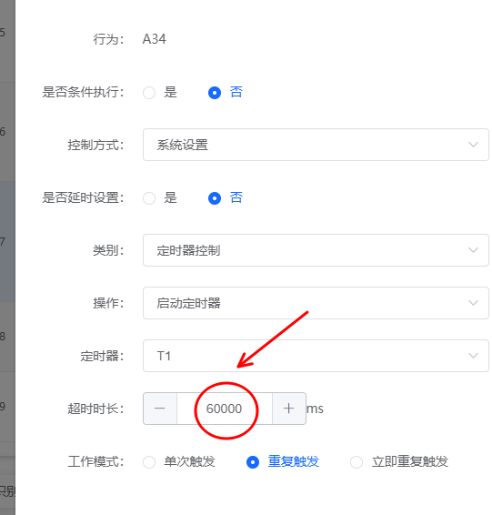

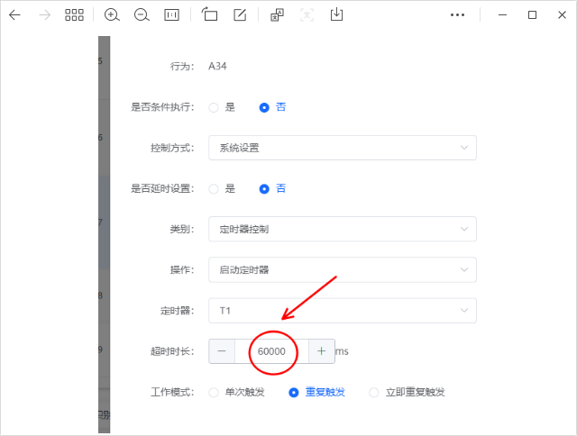

---

### 如何配置PWM占空比的变量控制？

**问题描述：**

在使用平台配置PWM占空比时，无法将变量正确传递给PWM控制，且在配置界面中发现增加和减少操作的数值显示异常。

**解决方案：**

**1. PWM占空比变量配置方法**

通过变量控制PWM占空比的正确配置步骤：

- 在"添加控制"界面中，设置控制方式为"端口输出"
- 控制类型选择对应的PWM引脚（如GPIO_A6(PWM)）
- 动作设置为"设置占空比"
- 方式选择"变量"，并选择已定义的变量

**2. 变量增减控制**

通过条件触发来动态调整PWM变量：

- 创建条件执行的控制行为
- 控制方式选择"变量设置"
- 选择需要控制的PWM变量（如Val_PWM1、Val_PWM2等）
- 操作类型选择"增加"或"减少"
- 方式设置为"数值"，输入具体变化量

**3. 显示异常处理**

配置界面中数值显示问题的处理：

- 增加操作显示为具体数值（如5）
- 减少操作可能显示为范围（如0-10），这是网页显示问题
- 数值显示异常不影响实际功能执行
- 后续平台升级会修正显示问题

**注意事项：**

- 变量传递需要在PWM控制中正确选择变量类型
- 增减操作的数值显示不影响功能使用
- 确保变量名在配置中保持一致
- 建议在使用前进行实际功能验证

---

### 如何在条件控制中实现'或'逻辑关系？

**问题描述：**

平台的条件控制默认使用'与'逻辑关系，需要实现'或'逻辑关系以满足更复杂的控制需求。

**解决方案：**

**1. 理解默认逻辑**

- 条件子项之间默认是'与'关系（AND）
- 所有条件都满足时才执行动作
- 这可能导致控制逻辑变得复杂

**2. '或'逻辑实现方法**

通过分层配置实现'或'逻辑：

- **方法一：使用中间变量**
    - 创建多个控制行为，每个对应一个条件
    - 使用相同的结果变量或动作
    - 任一条件触发都会执行相同动作

- **方法二：分层控制**
    - 第一层：条件判断
    - 第二层：执行动作
    - 通过'不'条件实现'或'效果

**3. 具体配置示例**

实现"变量1为真或变量3为真"的逻辑：

- 创建行为A：如果变量1为真，设置标志变量
- 创建行为B：如果变量3为真，设置标志变量
- 创建行为C：如果标志变量为真，执行目标动作

**4. 优化建议**

- 合理使用变量存储中间状态
- 避免条件层级过深
- 使用清晰的变量命名
- 保留配置文档便于维护

**注意事项：**

- 平台暂不直接支持'或'逻辑
- 分层实现会增加配置复杂度
- 建议在配置前做好逻辑设计
- 测试所有可能的触发场景

---

### 如何在小程序中隐藏"机芯智能"名称并完成上线发布？

在使用机芯智能硬件模块与小程序对接时，如果不想在小程序中显示"机芯智能"名称，可以按照以下流程操作：

**问题描述：**

小程序需要接入机芯智能硬件模块，但希望使用自定义品牌名称，同时需要完成小程序的备案和上线发布。

**解决方案：**

1. **获取AppSecret**
    - 登录微信小程序后台（mp.weixin.qq.com）
    - 在"开发管理"->"开发设置"中找到AppSecret
    - 如未生成，点击"重置"或"生成"获取AppSecret

2. **小程序授权发布**
    - 在机芯智能平台后台进行授权操作
    - 选择"授权发布"选项，平台将自动完成小程序发布流程
    - 无需手动提供代码，平台会处理发布相关配置

3. **去除品牌标识**
    - 在平台配置中选择自定义品牌选项
    - 可使用自有品牌名称替代"机芯智能"

**注意事项：**

- 小程序需要先完成备案才能上线发布
- 体验版权限需要由管理员分配
- 授权发布后，平台会自动处理代码提交流程


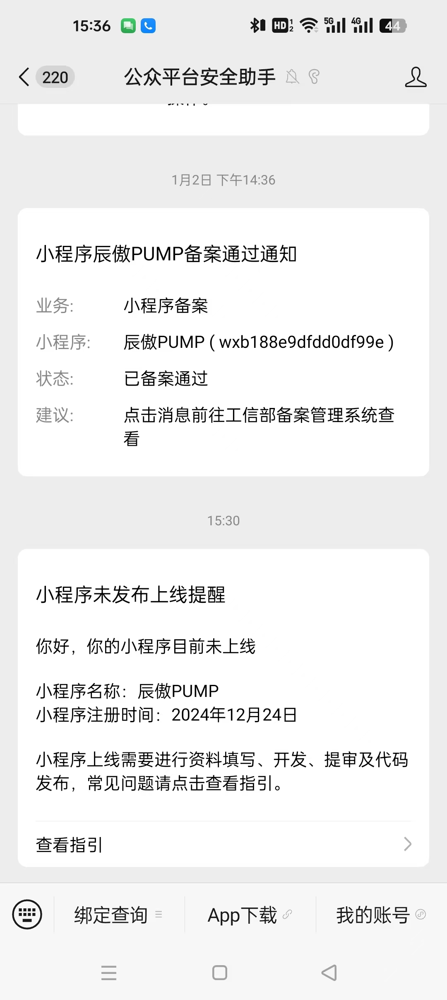

---

### 固件生成一直显示"待生成"怎么办？

**问题描述：**

在平台生成固件时，固件状态一直显示"待生成"，界面长时间停留在"固件生成中，请稍候..."提示，无法完成生成。

**解决方案：**

1. **等待系统维护完成**
    - 可能是平台正在维护或更新
    - 等待提示界面结束
    - 稍后重试生成操作

2. **重新生成固件**
    - 在固件列表中选择"重新生成固件"
    - 清除缓存后重新生成
    - 多次尝试仍失败则联系技术团队

3. **检查网络和浏览器**
    - 确认网络连接稳定
    - 清除浏览器缓存
    - 更换浏览器或设备尝试

**注意事项：**

- 固件生成高峰期可能出现队列等待
- 如提示系统维护，建议等待维护完成
- 保留错误截图便于问题排查


---

### 获取时间戳功能导致固件生成失败？

**问题描述：**

在平台配置中添加"获取UTC时间戳"或"获取系统时间"功能后，生成固件失败。

**解决方案：**

1. **功能可用性确认**
    - 获取UTC时间戳功能暂未在平台上线
    - 获取系统时间功能也未开放使用
    - 需等待平台功能更新

2. **临时替代方案**
    - 使用外部时钟模块提供时间信息
    - 通过串口接收时间数据
    - 使用NTP协议获取网络时间

**注意事项：**

- 平台会逐步上线新功能
- 关注平台更新公告
- 时间相关功能正在开发中

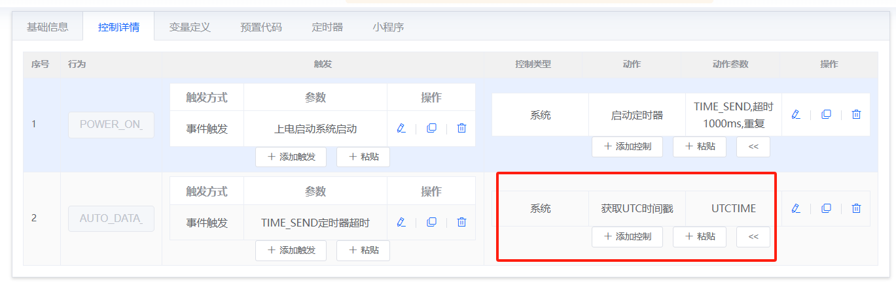


---

### 平台固件模板更新后影响现有项目兼容性怎么办？

**问题描述：**

平台固件模板更新后，可能导致使用旧模板的项目（如21T项目）出现兼容性问题，影响正常使用。

**解决方案：**

**1. 兼容性评估**

- 更新模板前需评估对现有客户项目的影响
- 特别是已有客户在使用的项目（如21T项目）
- 不能因模板更新导致现有项目无法正常使用

**2. 模板处理方案**

**方案一：渐进式更新**

- 保留旧模板选项，新增新模板
- 让用户自主选择使用哪个模板
- 逐步引导用户迁移到新模板

**方案二：版本区分**

- 为不同版本创建独立的模板入口
- 如"21T经典版"和"21T新版"
- 保持旧模板的稳定性和可访问性

**方案三：新建专用模板**

- 创建新模板（如23T模板）用于新功能
- 保持21T等原有模板不变
- 避免直接修改现有模板

**3. 实施建议**

- 平台应提供清晰的模板版本说明
- 在模板更新前发布公告
- 保留旧模板一段时间，确保平稳过渡

**注意事项：**

- 模板更新必须考虑向后兼容性
- 不能影响现有客户项目的正常运行
- 建议为新功能创建独立模板，而非修改现有模板
- 充分测试后再发布模板更新

---

### 如何配置个性化音频功能？

**问题描述：**

在新建工程中需要使用个性化音频功能，但不了解如何正确上传音频文件并与语音指令词条进行关联。

**解决方案：**

个性化音频功能需要按照以下步骤进行配置：

1. **进入音频管理**
    - 在工程配置页面点击蓝色的"音频管理"按钮
    - 进入音频上传和管理界面

2. **上传音频文件**
    - 点击"上传音频"按钮
    - 选择本地音频文件（支持mp3和wav格式）
    - 上传完成后点击确定保存

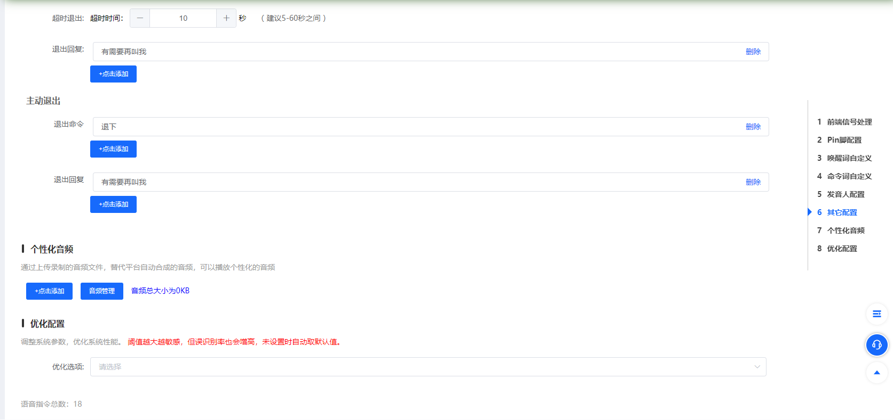

*个性化音频配置界面，显示当前无音频文件*

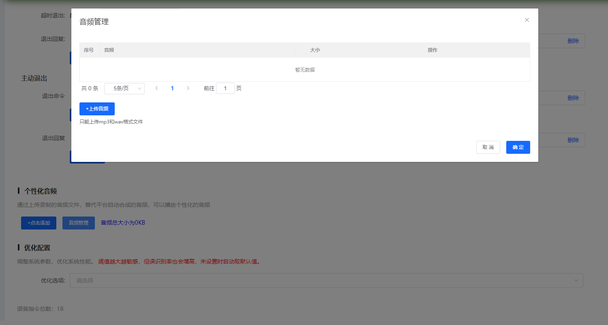

*音频上传界面，支持mp3和wav格式*

3. **关联语音指令**
    - 返回配置页面，点击蓝色的"点击添加"按钮
    - 在弹出的"替换词条音频"窗口中
    - 逐条选择需要替换的语音指令
    - 为每条指令关联对应的个性化音频文件

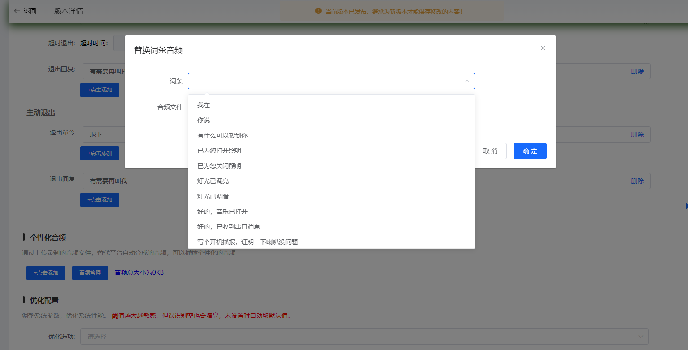

*词条音频替换界面，列出可替换的语音指令*

**注意事项：**

- 个性化音频文件必须先上传至平台才能进行关联
- 每条语音指令只能关联一个音频文件
- 配置完成后需要重新编译和烧录固件才能生效
- 音频文件大小会影响固件生成时间

---

### 平台个性化音频功能异常问题

**问题描述：**

创建新工程时，个性化音频列表中错误地显示了其他项目的音频文件，这些音频无法正常删除或替换，导致功能异常。

**解决方案：**

**问题现象：**

1. 新建工程显示"暂无数据"，但音频管理中却有文件列表
2. 这些音频文件来自之前的项目，在新工程中为无效的"幻像"
3. 尝试删除或替换这些文件无效
4. 烧录固件后播放的音频与预期不符

**临时解决方案：**

1. **删除无效音频**
    - 在音频管理界面删除所有显示的音频文件
    - 即使删除后界面可能仍显示残留

2. **重新上传音频**
    - 重新上传项目所需的个性化音频文件
    - 上传后立即进行词条关联操作

3. **验证配置**
    - 确认音频文件正确关联到对应指令
    - 重新生成固件并测试

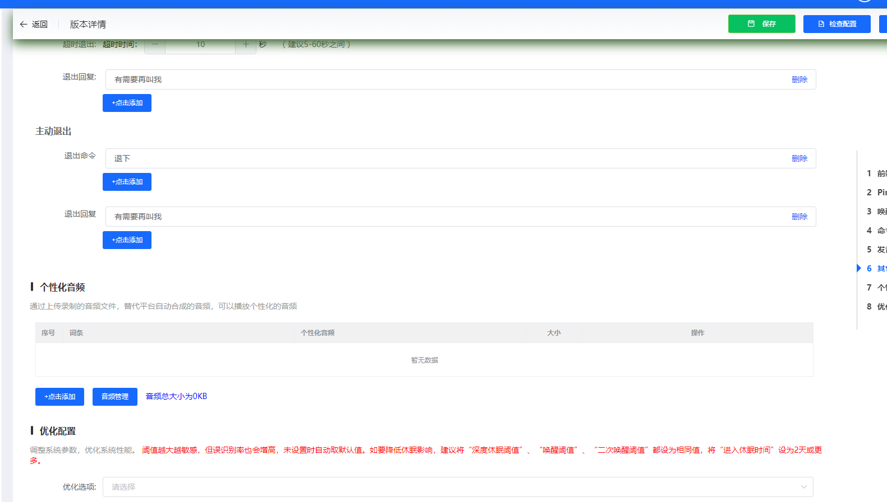

*新工程中个性化音频显示异常*

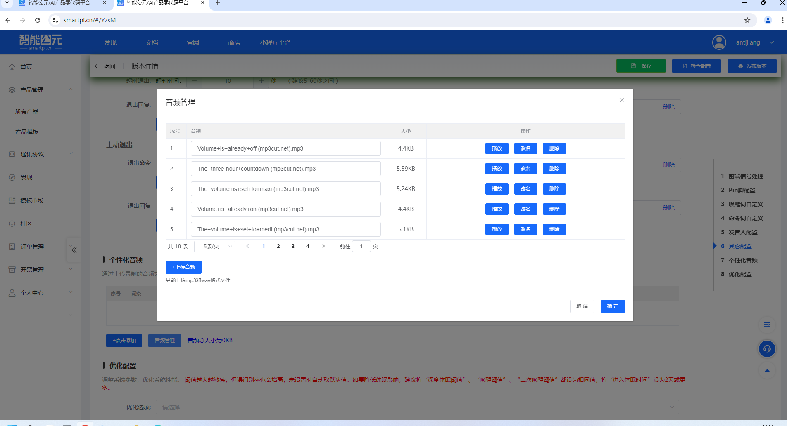

*新工程中错误显示的历史音频文件*

**根本原因：**

这是平台的数据缓存Bug，新创建的工程没有正确初始化个性化音频数据，导致显示了其他项目的音频文件列表。

**注意事项：**

- 此问题属于平台Bug，建议及时反馈给技术团队
- 临时解决方案需要每次新建工程都重复操作
- 删除残留文件后，重新上传的音频文件可以正常使用
- 如果问题持续存在，建议更换账号或清理浏览器缓存后重试

---

### 如何设置语音指令执行后立即退出唤醒状态？

**问题描述：**

需要配置语音模块在每次指令执行后立即退出唤醒状态并进入休眠，而不是在唤醒状态下等待5-60秒后自动休眠。

**解决方案：**

通过添加识别控制实现指令后立即休眠：

1. **进入控制配置**：

    - 在目标命令词条下添加控制行为
    - 设置"是否条件执行"为"是"

2. **配置退出唤醒操作**：

    - 控制方式：系统设置
    - 类别：识别控制
    - 操作：退出唤醒
    - 是否延时设置：否
    - 延时恢复：否

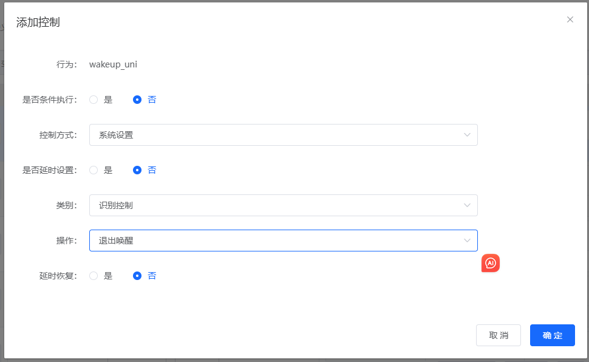

**注意事项：**

- 此配置会在命令词识别完成后立即退出唤醒状态
- 下次使用需要再次喊唤醒词
- 适用于每次都需要唤醒词触发的应用场景
- 配置完成后需重新生成固件才能生效

---

### 如何通过串口指令配置和修改设备变量？

**问题描述：**

需要了解如何通过平台配置串口指令来修改变量值，以及如何在平台上设置变量的默认值和参数。

**解决方案：**

**1. 串口指令配置位置**

串口指令的配置通过"控制详情"界面进行：

- 在命令词的动作设置中选择"变量"
- 设置要修改的变量名（如LED_1）
- 赋值格式使用"$变量名"（如$C1）


*命令词动作配置界面，设置变量LED_1并赋值为$C1*

**2. 变量定义与默认值设置**

在"变量定义"界面管理所有变量：

- 变量名称：定义变量标识符
- 变量类型：选择char、double等数据类型
- 默认值：设置变量初始值
- 备注：可添加特殊参数说明

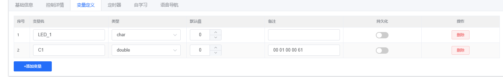

*变量定义列表，显示LED_1和C1两个变量的配置*

**3. 串口触发消息号配置**

当使用串口输入触发时：

- 消息号是必需的，用于索引具体执行哪条串口触发
- 即使只有一条串口指令，也需要配置消息号
- 发送串口指令时必须包含对应的消息号

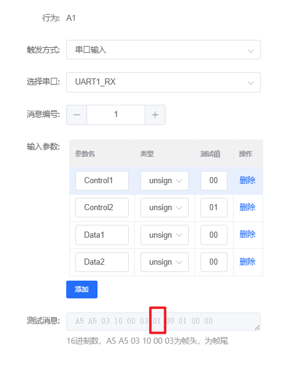

*串口输入触发配置，红框标出的A5 A5为消息号字节*

**注意事项：**

- 消息号不可移除，用于区分不同的串口指令
- 发送给语音芯片的串口指令必须包含消息号
- 变量类型和数量需根据具体型号确定
- 配置完成后需要重新烧录固件

---

### 语音芯片是否支持运行时调节个性化音频音量？

**问题描述：**

需要了解语音芯片是否可以在运行时动态调节个性化音频的音量大小。

**解决方案：**

**音量调节支持范围：**

- **可调节**：系统回复语的音量大小
- **不可调节**：个性化音频的音量大小

**具体说明：**

1. **系统回复语音量**
    - 可通过平台配置调节
    - 支持运行时动态调整
    - 配置灵活，可根据需要设置

2. **个性化音频音量**
    - 必须在上传前调整好音量
    - 上传后无法动态调节
    - 需要使用音频处理软件预处理

**处理建议：**

- 在制作个性化音频时，根据应用场景调整合适的音量
- 保持所有个性化音频的音量水平一致
- 如需不同音量版本，可上传多个音频文件
- 使用专业音频软件进行音量标准化处理

**注意事项：**

- 个性化音频的音量设置是固定的
- 建议在音频制作阶段完成音量调节
- 不同场景的音量需求应提前规划
- 音频文件格式和质量也会影响实际播放音量

---

### GPIO引脚上电后电平与配置不符怎么办？

**问题描述：**

在平台上配置GPIO_03为上电默认低电平，但烧录后实际测量引脚输出为高电平（3.3V）。

**解决方案：**

**1. 检查配置是否正确**

确认GPIO配置中的参数1设置：

- 查看参数1是否真的设置为"默认低电平"
- 注意区分"默认高电平"和"默认低电平"选项
- 多个GPIO引脚需要逐一检查

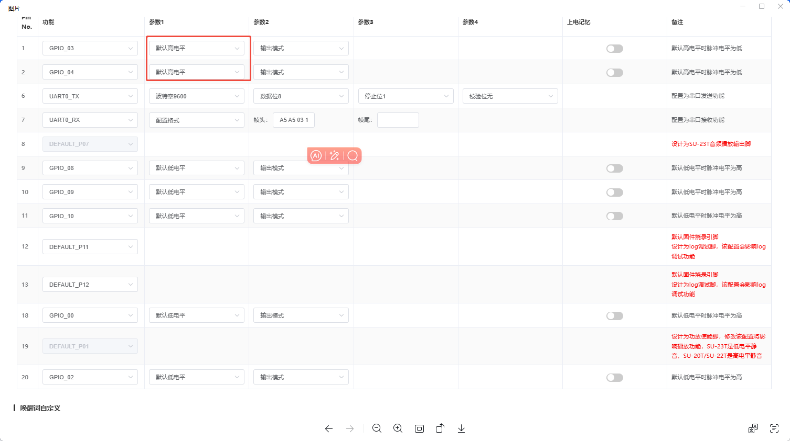

*配置界面显示GPIO_03和GPIO_04被设置为默认高电平*

**2. 配置修正步骤**

如果发现配置错误：

1. 进入GPIO引脚配置界面
2. 找到对应的GPIO引脚（如GPIO_03）
3. 将参数1从"默认高电平"改为"默认低电平"
4. 保存配置并重新生成固件
5. 重新烧录固件到芯片

**3. 上电特性说明**

正常的上电行为：

- 开机瞬间可能会有短暂的高电平脉冲
- 之后应该稳定在配置的默认电平
- 这是芯片初始化的正常现象

**4. 验证方法**

- 使用万用表测量引脚电平
- 观察上电瞬间的电平变化
- 确认稳定后的电平状态

---

### TTS固件版本如何保存和持续使用？

**问题描述：**

需要确认当前使用的TTS固件版本，并了解如何将该固件保存以便系统持续使用。

**解决方案：**

**1. 固件版本确认**

- 确认固件发布日期（如7月11日发布的版本）
- 记录固件文件名和版本信息
- 保留固件文件备份

**2. 固件保存方法**

- 将确认可用的固件文件保存到专用文件夹
- 建议按版本日期或型号创建子目录进行管理
- 保留固件的原始文件名，避免重命名导致混淆

**3. 持续使用配置**

- 保存后的固件将作为该项目的标准固件版本
- 后续烧录时直接使用保存的固件文件
- 避免频繁更换固件版本导致的不稳定性

**注意事项：**

- 固件保存前应充分测试功能稳定性
- 建议记录每个版本的测试结果和适用场景
- 保留至少一个版本的回退固件以备不时之需

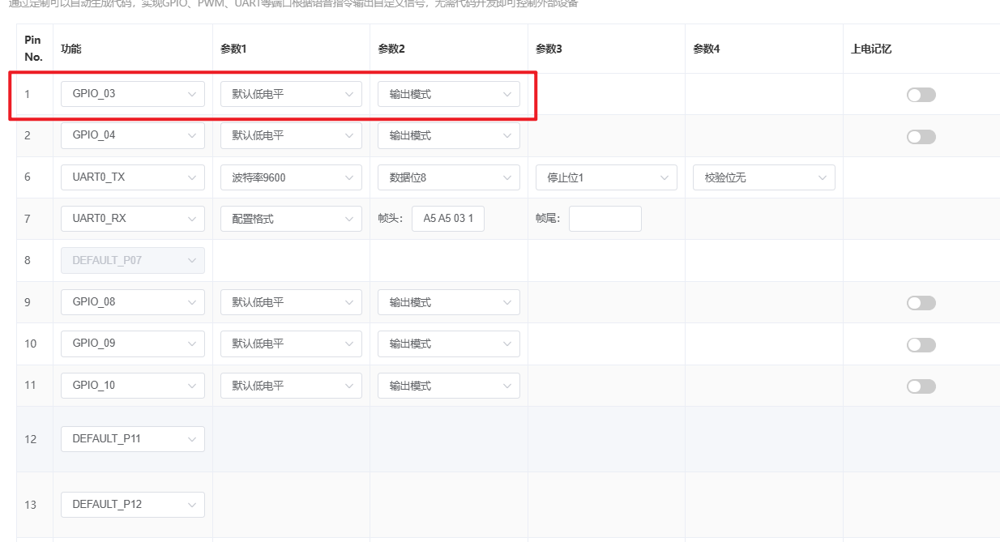

*GPIO_03配置为默认低电平和输出模式*

**注意事项：**

- 配置修改后必须重新生成并烧录固件
- 开机瞬间的脉冲不影响正常功能
- 如果多个引脚都有问题，需批量检查配置
- 引脚悬空状态下测量更准确

---

### 平台提示服务器繁忙无法生成固件怎么办？

**问题描述：**

在平台上生成固件时提示"服务器繁忙"，无法完成固件生成。

**解决方案：**

**问题原因：**

- 同时生成固件的用户过多
- 服务器资源占用率较高
- 网络连接不稳定

**处理建议：**

1. **错峰使用**
    - 避开工作高峰期（上午9-11点，下午2-4点）
    - 选择非工作时间使用
    - 凌晨或深夜时段通常较空闲

2. **优化操作**
    - 简化配置减少生成时间
    - 避免频繁重新生成
    - 批量处理多个配置

3. **网络检查**
    - 确认网络连接稳定
    - 尝试切换网络环境
    - 使用有线网络代替WiFi

4. **替代方案**
    - 联系技术团队协助生成
    - 使用离线配置工具（如有）
    - 申请企业专用通道

**预防措施：**

- 提前规划配置变更
- 保留常用配置的固件备份
- 重要项目预留充足时间

**注意事项：**

- 固件生成通常需要20-30分钟
- 高峰期可能延长至1小时以上
- 建议保存配置以便快速重新生成
- 长时间无法使用时及时联系客服

---

### 如何配置下位机定时发送数据功能？

**问题描述：**

需要配置下位机定时向上位机发送数据，且不需要上位机回复。

**解决方案：**

- 设置定时器，定时器超时后发送数据
- 在触发方式中选择"事件触发"
- 参数选择相应的定时器超时事件（如delay60s定时器超时）
- 在操作中配置发送数据的动作

**注意事项：**

- 定时器时间间隔可根据实际需求调整
- 发送的数据内容需要预先定义好格式
- 如需心跳功能，建议配合状态变量实现
- 确保发送频率不会导致上位机处理压力

---

### 如何在自定义TCP协议中实现参数校验？

**问题描述：**

在自定义TCP协议中，需要判断上位机发送的设备ID等参数是否与预设值一致，但系统不支持直接的"等于"比较操作，且设备ID为8字节。

**解决方案：**

**1. 参数类型配置**

- 将8字节设备ID拆分为两个int32类型或8个char类型
- 避免使用大于1字节长度的参数进行直接比较

**2. 参数校验方法**

- 先将协议参数存储到临时变量
- 使用"变量设置"操作将参数赋值给临时变量
- 通过"条件执行"比较临时变量与预设值

**3. 具体配置步骤**

- 创建临时变量（如BianLiang_1、BianLiang_2）
- 在通讯输入中设置变量，将协议参数映射到临时变量
- 在条件执行中添加条件子项，设置变量等于预设值

**注意事项：**

- 大于1长度的参数数据接收处理存在问题，需拆分为多个长度为1的参数
- 使用int32或char类型时注意字节序（大端/小端）设置
- 上位机按原协议格式发送，下位机内部拆分处理
- 条件判断可组合多个条件（如同时判断ID和版本号）

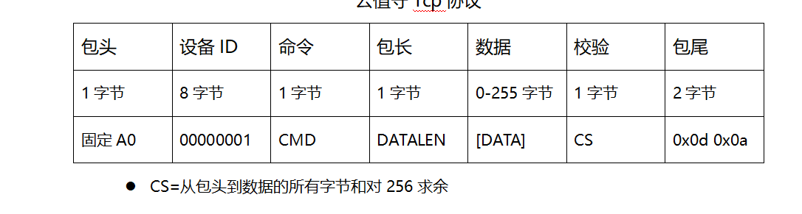

---

### 固件生成失败提示"配置原因"怎么办？

**问题描述：**

在添加控制逻辑时，固件生成失败，提示"生成失败，可能是配置原因，请检查配置"。

**解决方案：**

**1. 检查变量类型匹配**

- 确认变量类型与协议参数类型一致
- 避免使用未定义的变量名
- 检查变量名称拼写是否正确

**2. 验证控制逻辑配置**

- 条件执行中的条件子项必须完整
- 确保所有引用的变量都已正确定义
- 检查控制方式的参数设置

**3. 常见错误排查**

- 删除重复或未使用的控制项
- 检查是否有循环依赖的逻辑
- 确认通讯输入的参数映射正确

**注意事项：**

- 生成失败通常是配置冲突或缺失导致
- 建议逐个添加控制逻辑进行测试
- 保留生成成功的配置备份
- 问题持续存在时，可尝试重新创建整个配置

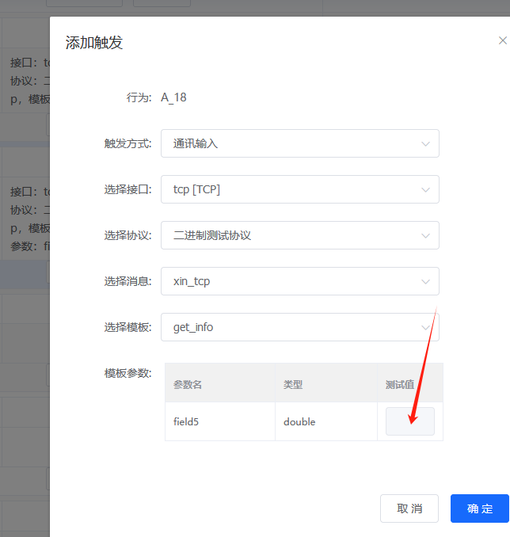
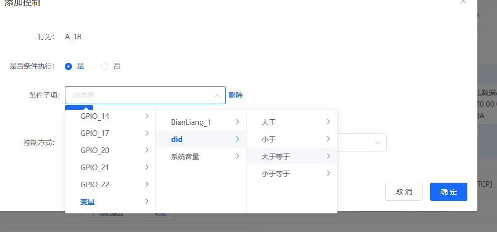
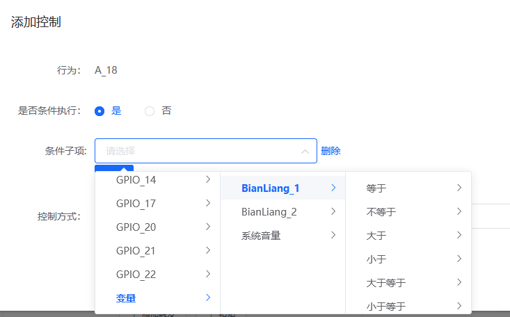
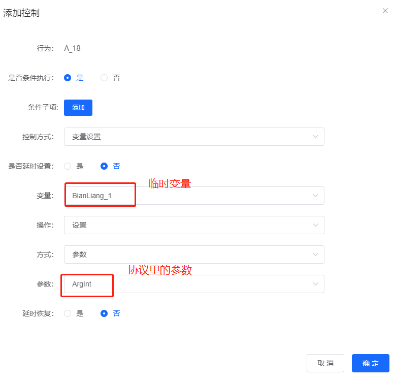

---

### 如何配置TCP心跳消息模板？

**问题描述：**

需要为xin_tcp协议配置一个TCP心跳消息模板，要求在60秒超时后发送心跳消息给上位机。

**解决方案：**

**1. 检查协议配置**

- 确认xin_tcp协议中所有字段都已正确配置
- 特别检查field7等需要校验方法的字段已设置
- 删除重复的消息模板

**2. 心跳功能实现**

- 创建60秒定时器（delay60s）
- 定时器超时后触发心跳消息发送
- 在消息模板中定义心跳数据格式

**3. 模板参数设置**

- 设备ID、命令等参数按协议规范填写
- 包含包头、包长、校验和等必要字段
- 数据部分可包含设备状态信息

**注意事项：**

- 协议字段必须完整配置，缺少校验方法会导致问题
- 心跳间隔可根据实际需求调整
- 上位机需要能够识别和处理心跳消息
- 建议在心跳数据中包含时间戳或状态信息

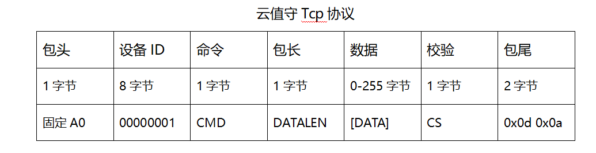
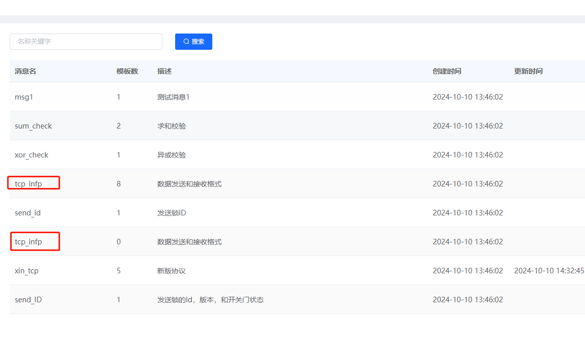

---

### 协议消息结构中如何设置校验方法？

**问题描述：**

在配置xin_tcp协议时，field7字段未选择校验方法，导致协议消息结构配置不完整。

**解决方案：**

**1. 定位未配置字段**

- 在消息结构配置中找到标红的字段
- 查看字段的属性配置区域
- 确认校验方法下拉框未选择

**2. 校验方法选择**

- field7通常用于校验和（CS）计算
- 选择合适的校验算法（如累加和、CRC等）
- 根据协议规范选择对应的校验方式

**3. 配置验证**

- 保存配置后检查是否还有红色提示
- 确认所有必需字段都已配置完整
- 测试消息解析是否正常

**注意事项：**

- 协议中带校验和的字段必须配置校验方法
- 不同协议可能使用不同的校验算法
- 校验字段通常位于包尾或固定位置
- 配置完成后需测试验证数据收发正确性

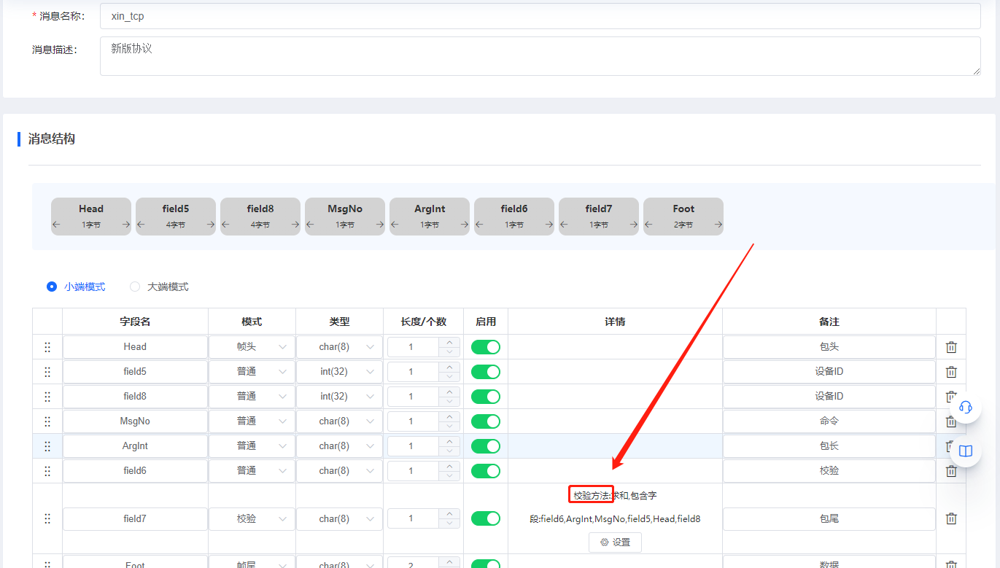

---

### 如何创建包含定时发送和参数比较的模板？

**问题描述：**

需要一个完整的模板，同时实现定时发送消息和与上位机传入参数比较的功能。

**解决方案：**

**1. 定时发送配置**

- 创建事件触发，选择delay60s定时器超时
- 配置消息发送动作，选择对应的消息模板
- 设置定时发送的数据内容

**2. 参数比较配置**

- 创建临时变量存储上位机参数
- 在通讯输入中设置参数映射
- 添加条件执行，设置变量与预设值比较

**3. 模板整合**

- 将定时发送和参数比较功能整合到同一配置
- 确保变量命名不冲突
- 测试整体功能逻辑

**注意事项：**

- 定时器和参数比较可使用相同的变量
- 建议使用有意义的变量名便于维护
- 模板导入后需要检查协议参数映射
- 复杂逻辑建议分步测试验证

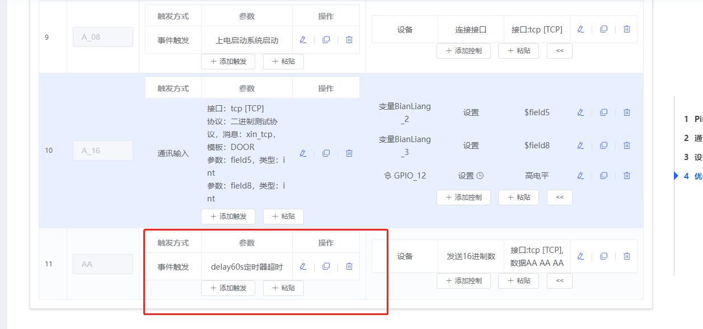

---

### 如何在心跳数据中包含开关门状态？

**问题描述：**

需要在心跳数据中包含开关门状态变量值，根据状态值发送不同数据给上位机。

**解决方案：**

**1. 状态变量定义**

- 创建变量存储开关门状态（如BianLiang_1）
- 定义状态值含义（如0=关，1=开）
- 在相关操作中更新该状态变量

**2. 心跳发送条件判断**

- 在发送心跳前添加条件判断
- 根据BianLiang_1的值选择不同的消息模板
- 配置两条心跳消息模板对应开关门状态

**3. 具体实现步骤**

- 创建两个条件执行分支
- 条件1：BianLiang_1=0时发送关门心跳
- 条件2：BianLiang_1=1时发送开门心跳

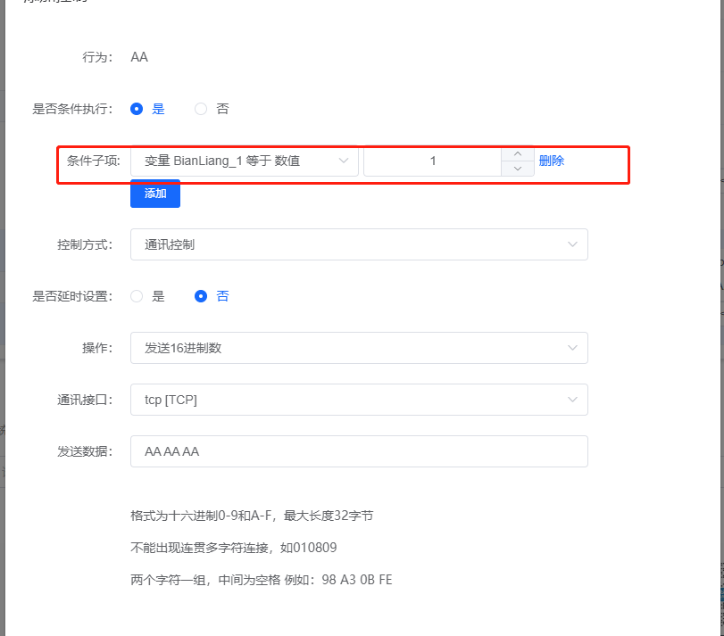
- 定时器超时后触发相应分支

**注意事项：**

- 确保状态变量在其他功能中正确更新
- 心跳消息格式需保持一致性
- 上位机需要能够解析不同状态的心跳数据
- 测试各种状态切换场景的发送正确性

---

### 如何处理参数长度大于1的字段？

**问题描述：**

上位机发送数据时，参数长度大于1的字段（如MsgNo、field8）无法正常接收，询问上位机应如何发送数据。

**解决方案：**

**1. 上位机数据发送**

- 上位机按原协议格式发送完整数据
- 不需要拆分数据包，保持协议完整性
- 例如：8字节数据直接发送8个字节

**2. 下位机数据接收**

- 下位机将大于1字节的参数拆分为多个长度为1的参数
- 例如：8字节MsgNo拆分为8个1字节参数
- 在内部逻辑中重新组合为原始数据

**3. 字节序配置**

- 检查协议配置的字节序设置
- 小端模式：低位在前，高位在后
- 大端模式：高位在前，低位在后
- 根据上位机协议要求选择合适的字节序

**注意事项：**

- 参数长度大于1时，上位机仍按原长度发送
- 仅在配置时拆分为多个1字节参数便于比较
- 测试时注意验证数据解析的正确性

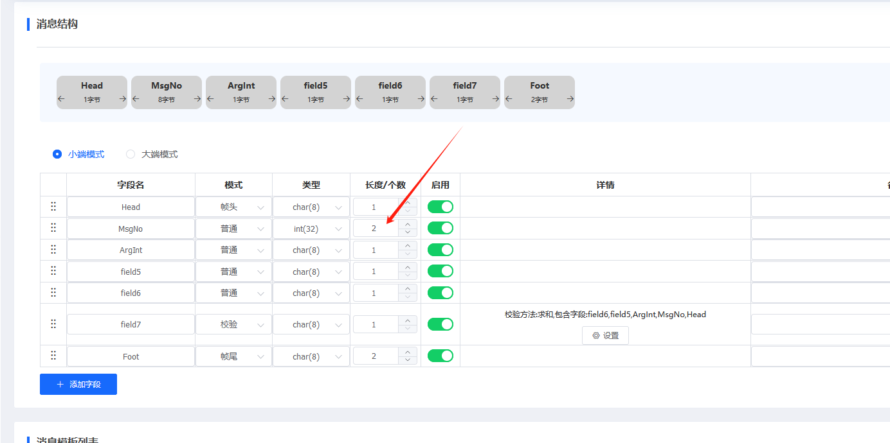
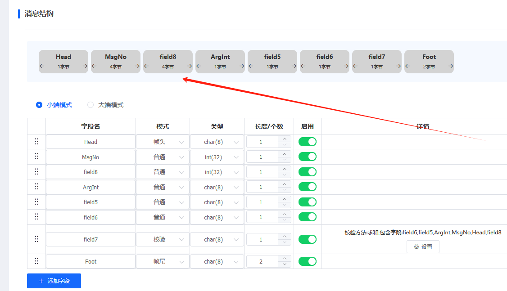
- 字节序错误会导致数据解析异常

---

### 字节序设置错误导致数据顺序异常怎么办？

**问题描述：**

测试发送数据时，发现接收到的数据顺序与预期不符，如发送00000001但接收时1在前面，数据出现字节序颠倒。

**解决方案：**

**1. 检查字节序配置**

- 在协议配置中查看字节序设置
- 确认当前使用的是小端模式还是大端模式

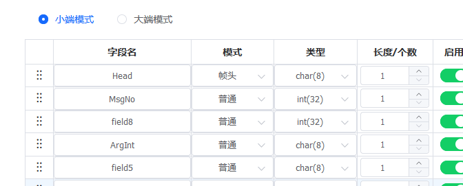
- 小端：低位字节在前，大端：高位字节在前

**2. 修改字节序设置**

- 将小端模式改为大端模式
- 根据上位机协议要求选择正确的字节序
- 保存配置后重新测试数据收发

**3. 验证数据格式**

- 发送测试数据包验证解析结果

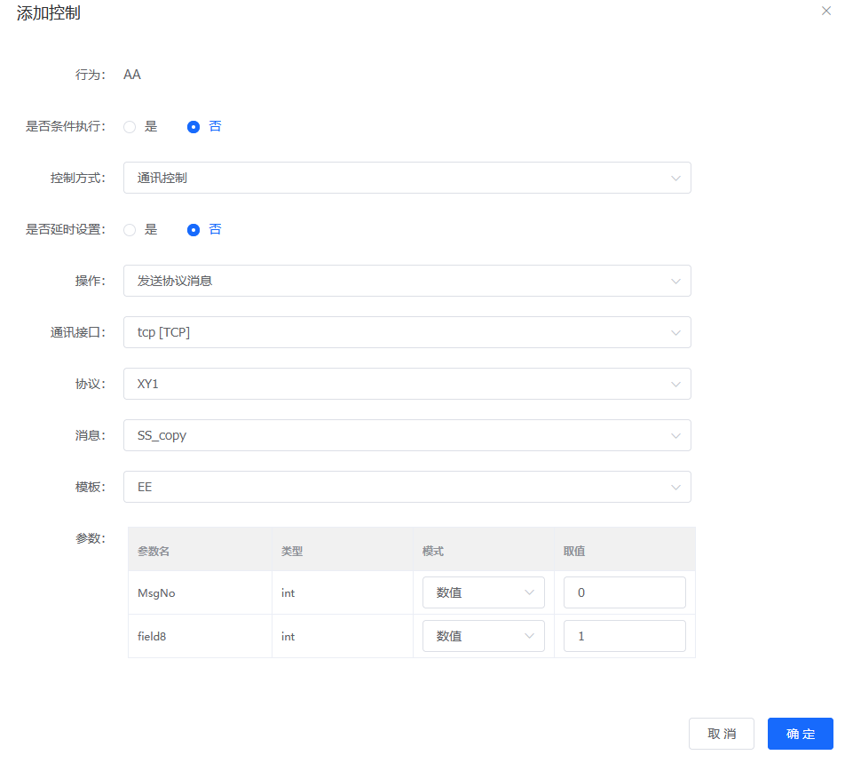

- 检查多字节数据的接收顺序
- 确保与上位机的数据格式一致

**注意事项：**

- 字节序设置必须与上位机保持一致
- 不同处理器架构可能使用不同的默认字节序
- 修改字节序后需要全面测试所有功能
- 建议在协议文档中明确标注字节序格式

---

### 定时器超时参数无法输入0值怎么办？

**问题描述：**

在配置定时器超时参数时，输入0值后系统报错无法保存，且需要了解如何实现毫秒或微秒级的定时精度。

**解决方案：**

**1. 参数输入0值问题**

- 确认变量数据类型设置为int类型
- 检查参数配置是否允许0值范围
- 若仍无法输入，尝试删除后重新创建控制项


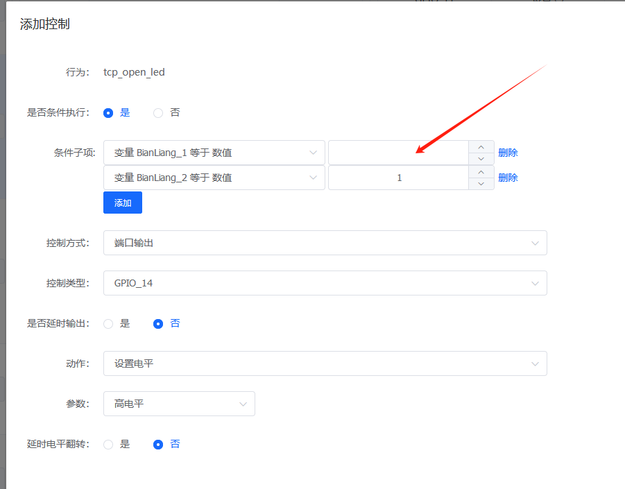

**2. 定时精度配置**

- 平台默认定时精度为秒级
- 毫秒或微秒级定时需要通过其他方式实现：

    - 使用循环计数实现细分定时
    - 通过硬件定时器中断实现
    - 在固件层面实现高精度定时

**注意事项：**

- 定时器参数值必须符合设定的数据类型范围
- 0值在某些场景下可能有特殊含义，需确认逻辑处理
- 高精度定时可能影响系统性能，需合理使用
- 建议在需求文档中明确定时精度要求

---

### 条件执行时无法输入数值0怎么办？

**问题描述：**

在配置条件执行时，变量等于数值0的条件无法保存，输入0后系统报错，且配置检查显示条件变量值为空。

**解决方案：**

**1. 数据类型确认**

- 确保变量类型设置为int而非其他类型
- 检查变量的默认值设置
- 确认变量取值范围包含0

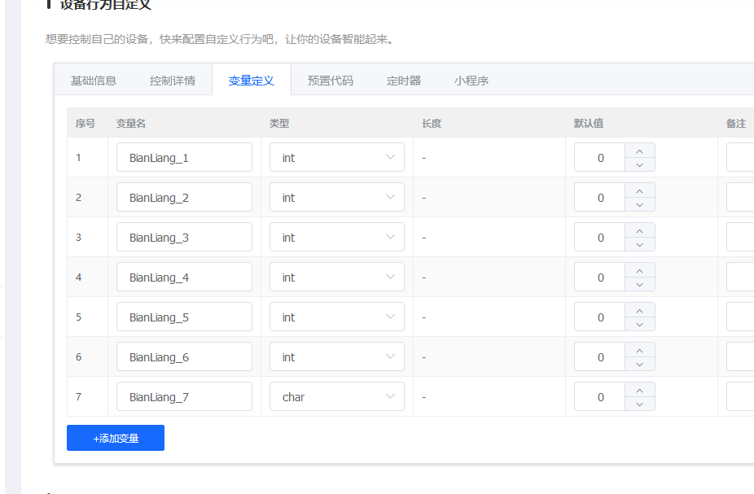

**2. 条件配置方法**

- 删除原有控制条件后重新创建
- 确保条件表达式格式正确
- 变量名必须与定义的完全一致

**3. 配置检查**

- 保存后进行配置检查
- 确认所有条件变量值不为空
- 检查错误提示并逐一修复

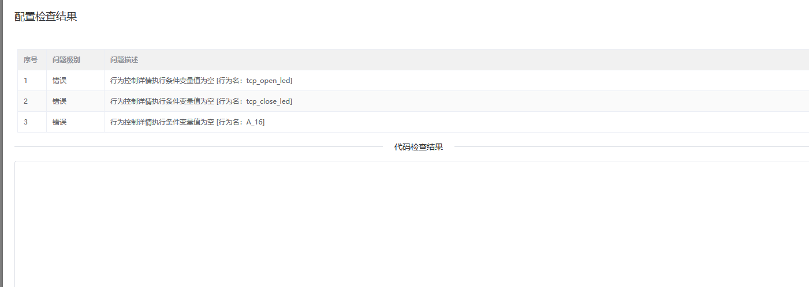

**注意事项：**

- int类型变量默认可以存储0值
- 条件判断时0值是有效的比较值
- 配置检查工具能帮助发现潜在问题
- 建议在配置前规划好所有变量和条件

---

### 修改协议后是否需要重新添加所有控制逻辑？

**问题描述：**

修改通信协议后，不确定是否需要删除所有控制逻辑并重新添加，以及是否可以在不同控制逻辑中使用相同的变量名。

**解决方案：**

**1. 协议修改后的处理**

- 如果配置正常工作，无需删除控制逻辑
- 仅在出现问题时删除有问题的控制项重新添加
- 保存协议后先测试现有功能

**2. 变量名使用规则**

- 不同控制逻辑可以使用相同的变量名
- 变量作用域是全局的，可被多个控制逻辑访问
- 合理使用变量名可以简化配置

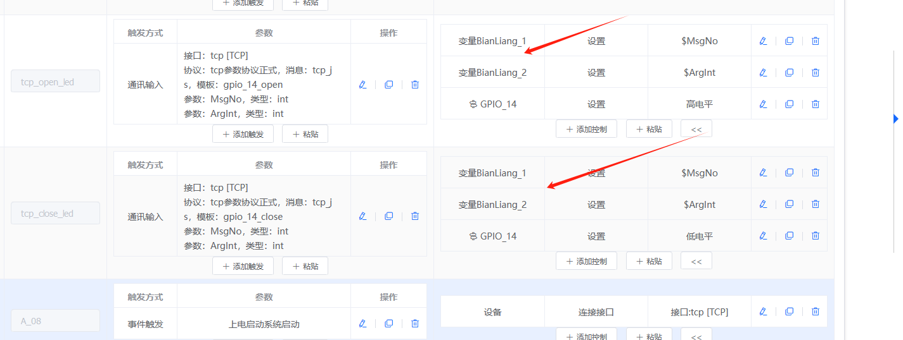

**3. 最佳实践**

- 修改协议前备份当前配置
- 逐步测试每个控制功能
- 保持变量命名的一致性和可读性

**注意事项：**

- 协议修改可能影响已有控制逻辑
- 建议在测试环境验证后再应用到生产环境
- 相同变量名在不同控制中共享同一个存储空间
- 删除控制逻辑前确认是否被其他功能依赖

---

### OTA升级后小程序无法连接怎么办？

**问题描述：**

OTA升级成功后，设备网络正常且能发送心跳包，但小程序显示断开状态且无法重新建立连接。

**解决方案：**

**1. 问题排查步骤**

- 确认OTA升级后的固件包含小程序功能
- 检查设备网络连接状态
- 验证心跳包是否正常发送

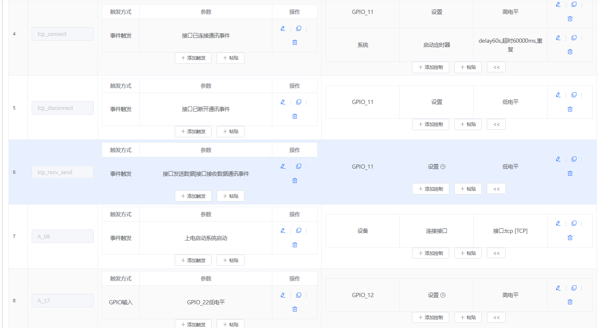
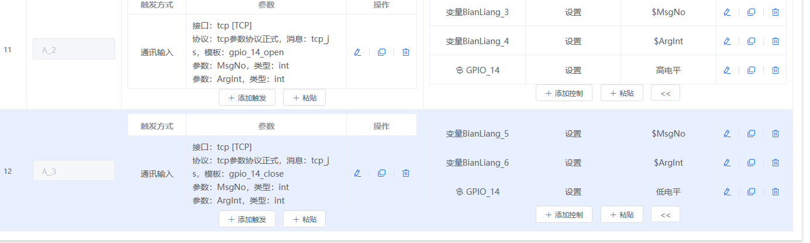

**2. 可能原因分析**

- 升级后的固件未正确配置小程序相关功能
- 设备标识或认证信息发生变化
- 小程序缓存了旧的设备信息

**3. 解决方法**

- 重启设备和小程序
- 清除小程序缓存
- 重新配网或重新添加设备
- 对比升级前后的配置文件

**注意事项：**

- OTA升级时确保固件版本包含所需功能
- 保留升级前的配置文件用于对比
- 小程序连接问题可能与设备认证机制有关
- 建议在测试环境先验证升级流程

---

### SDK生成时出现重复配置错误怎么办？

**问题描述：**

配置多个TCP通信输入模板时，因协议和参数完全相同导致SDK生成失败，提示"可能是配置原因，请检查配置"。

**解决方案：**

**1. 检查重复配置**

- 确认每个通讯输入的协议和参数组合唯一
- 避免多个输入使用完全相同的配置
- 检查消息模板是否被正确关联

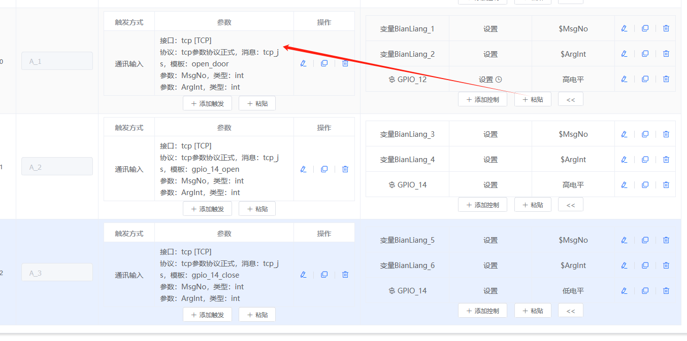
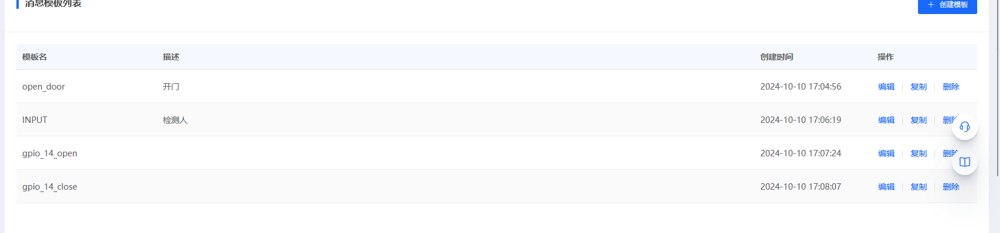

**2. 配置修正方法**

- 修改重复项的参数或协议设置
- 使用不同的消息模板
- 确保每个输入有独立的功能定位

**3. 生成前验证**

- 保存配置后进行配置检查
- 查看生成状态页面的错误提示
- 根据错误信息定位问题


**注意事项：**

- 相同的协议配置可能导致系统冲突
- 消息模板应具有明确的区分度
- 建议在配置前规划好所有输入项的功能
- 生成失败时优先检查配置的唯一性

---

### 如何将16进制数据按协议格式发送？

**问题描述：**

需要将一段16进制数据按照特定的协议格式进行转换和发送，询问是否需要修改协议以及如何修改。

**解决方案：**

**1. 协议修改确认**

- 需要在协议配置中定义数据格式
- 根据目标格式添加相应字段
- 设置每个字段的类型和长度

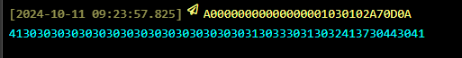

**2. 字段配置方法**

- 在模板创建界面配置参数
- 设置字段名、类型、字节长度
- 定义取值或数据来源

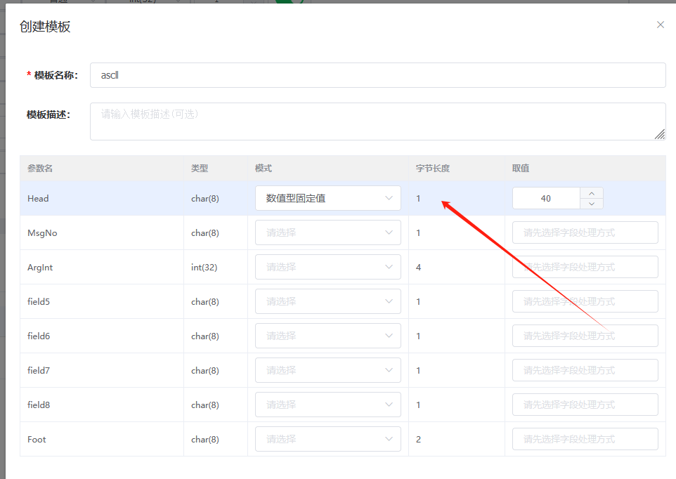

**3. 数据转换规则**

- 16进制数据需要按字段拆分
- 每个字段对应协议中的一个参数
- 系统会自动处理数据格式转换

**注意事项：**

- 协议字段必须与数据格式完全匹配
- 字节长度设置要准确
- 建议使用测试数据验证协议配置
- 保存前进行配置检查确保无误

---

### 协议模板字段类型配置错误怎么办？

**问题描述：**

在配置协议模板时，字段类型设置错误（如int32改为char）导致生成失败，需要了解正确的字段类型和长度设置方法。

**解决方案：**

**1. 字段类型选择原则**

- 根据数据特性选择合适类型：

    - char：用于字符或单个字节
    - int：用于数值类型
    - 字节数根据实际数据长度确定

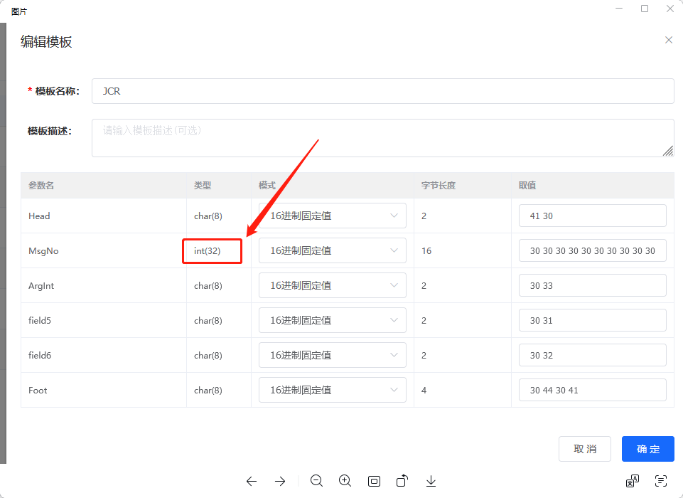

**2. 长度设置要点**

- 字节长度必须与协议定义一致
- char类型长度表示字符个数
- int类型长度表示字节数（4或8）

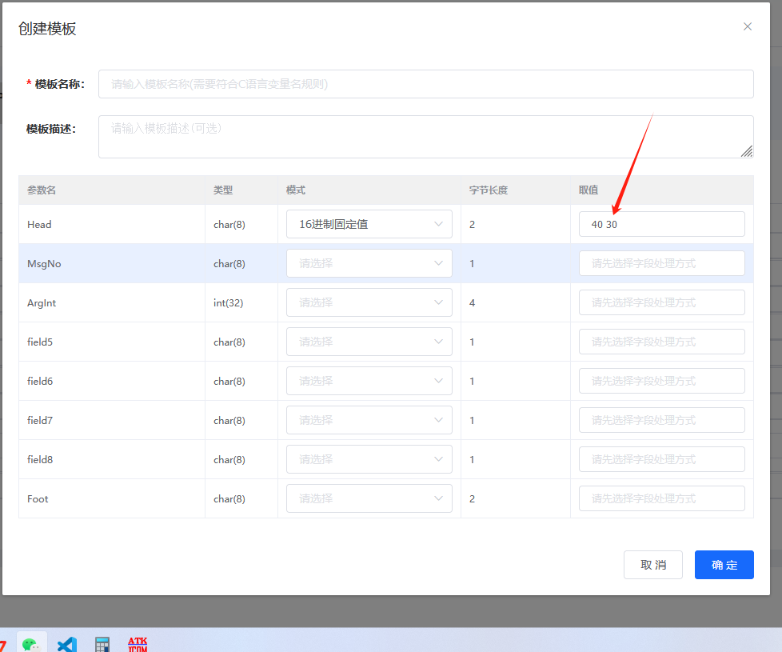

**3. 常见错误修正**

- MsgNo字段应使用char而非int
- 检查每个字段的取值范围
- 确保数据类型与协议文档匹配

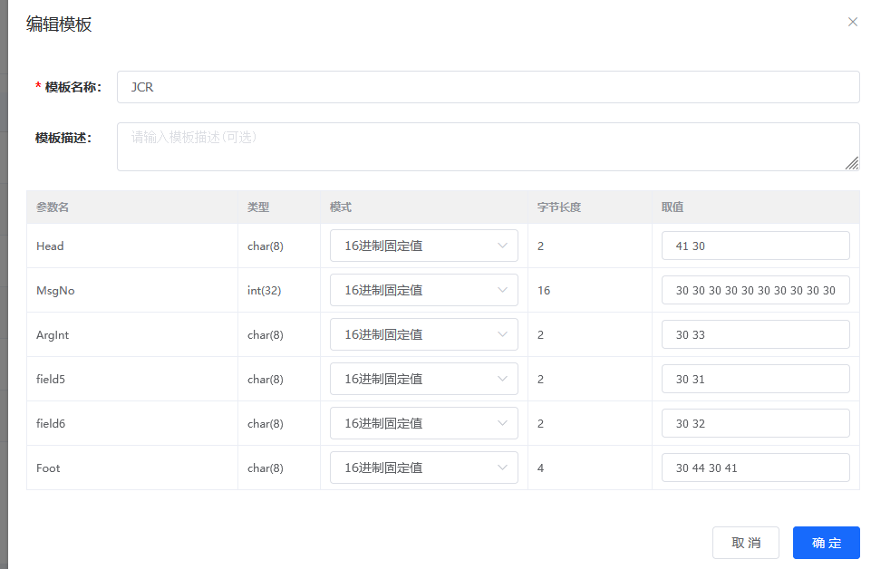
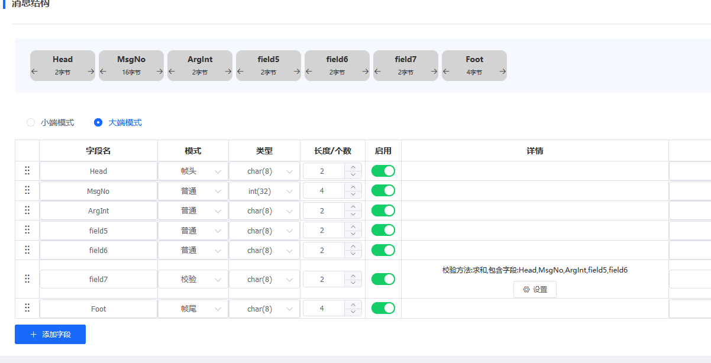

**注意事项：**

- 字段类型错误会导致SDK生成失败
- 建议保存前进行配置检查
- 不同数据类型有不同的字节占用
- 修改配置后需要重新生成SDK测试

---

### TCP协议校验位配置不正确怎么办？

**问题描述：**

配置TCP协议数据格式时，尽管已将字段类型改为char并调整了长度，但生成的协议数据包校验位仍然不正确。

**解决方案：**

**1. 校验位配置检查**

- 确认校验方法设置正确（求和）
- 检查包含字段是否完整
- 验证校验字段类型和长度

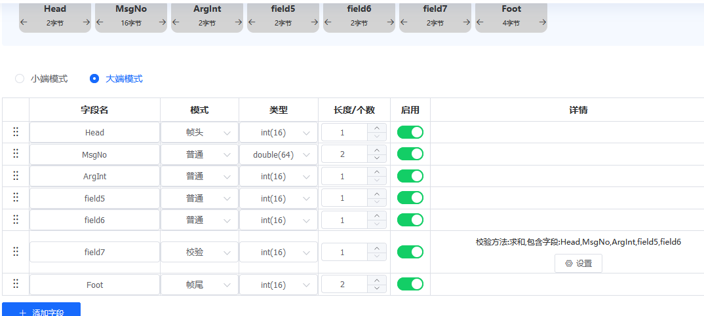

**2. 数据转换问题**

- 检查字段类型是否全部为char
- 确认字节序设置（大端/小端）
- 验证数据包结构是否正确

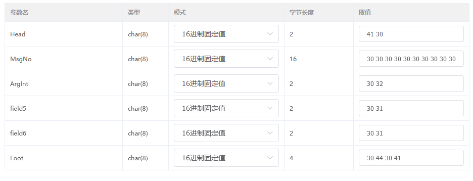
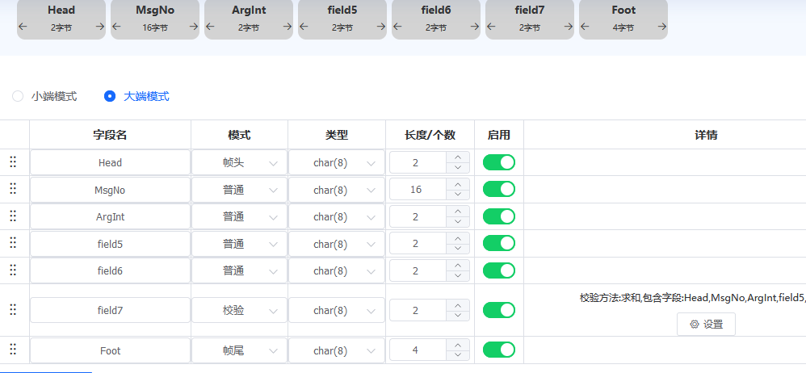

**3. 校验值计算**

- 手动计算预期校验值
- 对比生成的数据包校验位
- 若不一致，可设置固定值

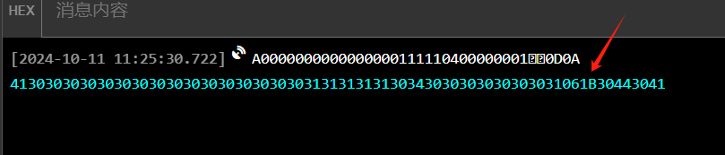

**注意事项：**

- char类型的数据处理与int类型不同
- 字节序会影响多字节数据的表示
- 校验算法必须与接收方一致
- 建议使用抓包工具验证数据格式

---

### 如何在小程序中获取设备详细信息？

**问题描述：**

希望在自己的小程序中实现与现有设备管理功能相同的信息获取功能，特别是如何获取设备的详细信息（如设备名称、设备类型、产品名称、产品版本等）。

**解决方案：**

**1. 设备信息获取方式**

- 通过设备信息查询API获取
- 需要设备已连接到小程序
- 使用设备认证后的会话进行请求

**2. 可获取的信息类型**

- 设备名称：自定义的设备标识
- 设备类型：模块型号或类别
- 设备标识：唯一硬件ID
- 产品名称：产品型号名称
- 产品版本：固件版本号
- 连接方式：网络连接类型

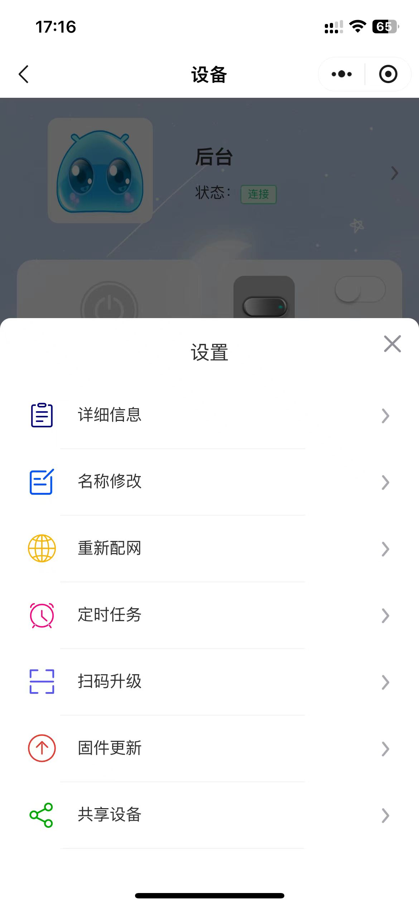
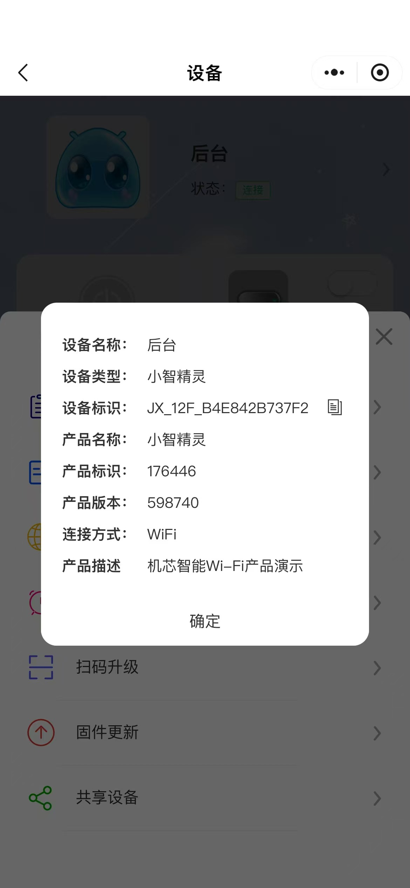

**3. 实现步骤**

- 建立与设备的通信连接
- 调用设备信息查询接口
- 解析返回的JSON数据
- 在界面展示相应信息

**注意事项：**

- 需要先完成设备配网和认证
- 不同设备型号支持的信息项可能不同
- 建议参考官方小程序的实现方式
- 某些信息可能需要特定权限才能获取

---

### WiFi模块支持外接物联卡吗？

**问题描述：**

询问WiFi模块是否支持外接物联卡使用（不使用WiFi连接），以及TCP连接断开后是否能立即重连，自动重连是否有次数限制。

**解决方案：**

**1. 物联卡支持**

- WiFi模块不支持外接物联卡
- 模块仅支持WiFi无线连接
- 如需移动网络，请选择4G模块

**2. TCP重连机制**

- 支持断开立即重连功能
- 需要在配置中启用该选项
- 重连失败后会触发超时重启机制

**3. WiFi重连策略**

- WiFi断开会自动重连
- 重连没有次数限制
- 会持续尝试直到连接成功

**注意事项：**

- 物联卡需要相应的硬件支持
- TCP重连功能依赖网络环境
- 自动重连可能影响功耗
- 建议根据应用场景选择合适的模块类型

---

### 通信协议如何实现参数化配置？

**问题描述：**

希望将设备的通信协议从固定格式改为参数化形式，以便通过参数配置实现版本号变化和校验位自动计算，但当前参数化协议无法正常工作，且接收时的参数无法修改。

**解决方案：**

**1. 当前限制说明**

- 参数化协议在校验位计算上存在困难
- 二进制消息转换为16进制字符串时编码处理复杂
- 接收端参数配置暂不支持修改
- 平台暂未提供编码后处理和解码预处理机制

**2. 临时解决方案**

- 使用固定协议格式
- 手动计算校验位
- 每个产品单独定义协议
- 通过程序实现参数化逻辑

**3. 替代实现方式**

- 将可变部分定义为协议变量
- 使用临时变量存储参数值
- 在发送前动态组装协议包
- 通过条件判断实现不同版本处理

**4. 开发计划说明**

- 参数化协议功能已纳入开发计划
- 需要平台底层机制支持
- 具体实现时间待定
- 可关注平台更新公告

**注意事项：**

- 当前建议使用固定协议避免问题
- 手动计算校验位容易出错
- 量产时建议使用自动化工具生成协议
- 后续版本会完善参数化支持

---

### 如何批量生成不同ID的固件？

**问题描述：**

量产时需要为每个产品生成唯一ID的固件，但网页端无法支持批量修改ID配置，只能逐个手动生成，影响量产效率。

**解决方案：**

**1. 当前平台限制**

- 每个固件需要单独生成
- ID参数无法批量修改
- 每个产品对应一个固件版本
- 暂不支持批量生成功能

**2. 替代方案**

**方案一：串口设置ID**

- 将ID设计为持久化变量
- 通过串口AT指令设置
- 使用统一固件版本
- 生产时逐个设置ID

**方案二：程序动态赋值**

- 固件中预留ID存储区域
- 通过上位机批量写入ID
- 上电时读取ID值
- 减少固件生成数量

**3. 实施建议**

- 使用CH340连接模块串口
- 准备ID分配表格
- 编写自动化设置脚本
- 记录每个模块的ID值


**4. 平台配置建议**

- 导出产品配置供技术团队参考
- 说明ID作为参数的使用需求
- 评估平台功能扩展可能性
- 关注后续版本更新

**注意事项：**

- 当前建议使用方案一（串口设置）
- 不需要额外单片机，电脑即可设置
- 设置完成后需断电重启生效
- 量产时建议做好ID管理记录

---

### 配置特定功能是否需要支付开发费用？

**问题描述：**

在芯片上实现特定的语音识别功能配置时，是否会影响芯片/模块价格，以及是否需要额外支付开发费用。

**解决方案：**

**1. 功能配置方式**

- 特定功能可通过智能公元平台自行配置
- 支持多次唤醒确认、关键词识别等功能的灵活设置
- 平台提供图形化配置界面，无需编程基础

**2. 价格政策**

- 芯片/模块的标准价格不变
- 功能配置本身不产生额外费用
- 价格仅根据采购数量变化，与功能复杂度无关

**3. 开发费用说明**

- 自行配置：无需开发费用
- 委托配置：需支付开发服务费用
- 建议先购买样品自行测试配置

**4. 实施建议**

- 采购少量样品进行功能测试
- 熟悉平台操作流程
- 验证配置方案可行性
- 确认无误后再进行批量采购

**注意事项：**

- 平台配置功能免费开放使用
- 复杂功能建议委托专业配置
- 批量配置前务必充分测试
- 具体开发费用需与技术团队沟通评估

---

### 如何获取320x240屏幕的驱动代码和触控IC资料？

**问题描述：**

需要获取320x240分辨率屏幕的代码资料和触控IC相关资料，屏幕已从MCU接口调整为SPI。

**解决方案：**

**屏幕驱动代码：**

1. **获取驱动文件**
    - BOE3.36_PV034QVQ-N80_JD9853_240x320_VCI2P8_231228_johnson.c
    - 适用于320x240分辨率的屏幕驱动
    - 支持SPI接口通信

2. **接口适配**
    - 确认MCU的SPI引脚连接正确
    - 检查时序配置匹配屏幕规格
    - 调整驱动代码中的初始化参数

**触控IC资料：**

1. **触控芯片型号**
    - CST820触控IC
    - 数据手册版本：V1.3
    - 支持I2C通信接口

2. **获取资料清单**
    - CST820数据手册V1.3(2).pdf
    - 寄存器配置说明
    - 触点坐标映射方法
    - 中断配置和校准流程

3. **驱动代码获取**
    - 询问是否有现成的.c驱动文件
    - 可参考数据手册中的示例代码
    - 3.5寸触摸代码也可作为参考

**实施步骤：**

- 先测试屏幕基础显示功能
- 再集成触控功能
- 进行触点校准和精度测试
- 验证多点触控功能（如需要）


**注意事项：**

- SPI接口需要确认时钟极性和相位配置
- 触控IC的I2C地址需要正确设置
- 建议预留调试接口便于问题排查
- 不同批次屏幕的初始化序列可能有差异

---

### 零代码平台如何实现PWM渐进式控制？

**问题描述：**

在零代码开发平台上，需要实现PWM占空比的渐进式增大（如从5%逐渐增大到10%），以实现平滑的控制效果。

**解决方案：**

**1. 平台限制说明**

- **零代码平台**：不直接支持循环或延时功能
- **实现方式**：需要通过多个状态和事件配合实现
- **变量支持**：平台支持变量类型，可用于存储当前占空比值

**2. 实现方案**

**方案一：多状态控制**

- 创建多个控制状态（如PWM_LEVEL_1到PWM_LEVEL_5）
- 每个状态设置不同的占空比值
- 使用延时事件自动切换到下一个状态

**配置示例：**
```
状态1：PWM占空比5%
状态2：PWM占空比6.25%
状态3：PWM占空比7.5%
状态4：PWM占空比8.75%
状态5：PWM占空比10%
```

**方案二：使用变量和计数器**

- 使用变量存储当前占空比值
- 利用计数器或定时器实现递增
- 通过条件判断控制递增过程

**3. 具体实现步骤**

1. **创建变量**
    - 添加整数变量：pwm_duty_cycle
    - 初始值设置为5（对应5%）

2. **设置控制逻辑**
    - 语音触发："设置PWM渐进"
    - 动作1：设置PWM为pwm_duty_cycle
    - 动作2：延时1秒
    - 动作3：变量+1（最大值10）
    - 动作4：判断变量是否小于10
    - 动作5：跳转到动作1（形成循环）

3. **停止条件**
    - 当变量达到10时停止递增
    - 或通过"停止PWM"命令重置为5

**注意事项：**

- 渐进式控制会增加响应时间
- 每步递增值不宜过大（建议1-2%）
- 需要考虑负载的响应特性
- 复杂的渐进控制建议使用SDK开发

---

### 离线算法接口如何与MCU联调？

**问题描述：**

离线算法已经准备好，需要接口文档或SDK来与MCU进行软件联调，了解具体的接口形式和集成方式。

**解决方案：**

**接口形式：**

1. **库文件形式**
    - 提供静态库或动态库文件
    - 包含算法的编译好的二进制文件
    - 通过头文件暴露API接口

2. **通信接口**
    - 串口UART通信
    - 定义标准的命令协议格式
    - 支持命令下发和状态上报

**集成方案：**

1. **MCU端开发**
    - 包含算法库头文件
    - 初始化串口和算法模块
    - 实现命令解析和执行逻辑

2. **协议格式**
    ```
    命令格式：[HEAD][CMD][PARAM][CRC]
    响应格式：[HEAD][STATUS][DATA][CRC]
    ```

3. **API接口示例**
    ```c
    // 算法初始化
    int algo_init(void);

    // 语音识别
    int algo_recognize(uint8_t *audio_data);

    // 获取识别结果
    int algo_get_result(char *result_text);
    ```

**联调步骤：**

1. 基础通信测试
    - 验证串口收发正常
    - 测试基本命令响应

2. 算法功能验证
    - 录入测试音频
    - 验证识别结果返回

3. 性能优化
    - 调整缓冲区大小
    - 优化识别响应时间
    - 处理多线程同步

**注意事项：**

- 算法库需要匹配MCU架构（ARM Cortex-M等）
- 留足够的RAM空间给算法运行
- 串口波特率需要与算法要求匹配
- 建议由熟悉算法的一方进行集成调试

---

### SDK拆分需要多长时间？

**问题描述：**

需要了解SDK拆分的进度时间，因为项目有明确的验收时间节点，需要合理安排开发计划。

**解决方案：**

**1. SDK拆分工作流程**

SDK拆分涉及以下主要工作：

- 前端声学引擎分离
- 依赖库整理和配置
- 编译环境适配
- 示例代码更新

**2. 时间评估**

影响拆分时间的因素：

- SDK复杂程度：功能越多，拆分时间越长
- 依赖关系：模块间耦合度影响难度
- 编译环境：不同平台需要适配
- 测试验证：确保拆分后功能完整

**3. 加速建议**

如需加快进度：

- 提供明确的功能清单和优先级
- 指定目标平台和编译环境
- 安排专人对接和测试
- 分阶段交付，优先核心功能

**注意事项：**

- SDK拆分是技术性工作，需要充分测试
- 验收前建议完成完整的功能测试
- 如时间紧张，可考虑先提供部分功能
- 建议提前与技术团队沟通具体需求

---

### 模组生产资料包含哪些内容？

**问题描述：**

需要确认模组生产资料的具体内容，特别是是否包含固件（bin文件）。

**解决方案：**

模组生产资料包含以下内容：

- **固件文件（bin文件）**：用于烧录到模组中的固件程序
- **生产配置参数**：包括模组初始化所需的各项参数
- **测试工具**：用于生产过程中验证模组功能是否正常

**注意事项：**

- 生产资料中的固件文件是生产必需的核心文件
- 使用前请确认固件版本与所需功能匹配
- 生产资料仅用于批量生产，不包含开发源码

---

### 代码量过大时如何优化内存使用？

**问题描述：**

项目C代码量达到500多K，离线算法代码无法减小，需要优化内存占用。

**解决方案：**

**1. 代码执行位置优化**

- **XIP（Execute In Place）**：将部分代码直接在FLASH中执行
- **代码分段**：将不常用的代码移至FLASH，常用代码保留在RAM
- **链接脚本配置**：通过修改链接器脚本控制代码存放位置

**2. 具体实施方法**

```c
// 示例：使用属性指定代码段
__attribute__((section(".flash_text")))
void flash_function() {
    // 不频繁执行的函数代码
}

// 或者使用编译器特定指令
#pragma location="FLASH_CODE"
void rarely_used_func() {
    // 偶尔使用的功能代码
}
```

**3. 优化策略**

- **算法代码处理**：离线算法是训练生成的，通常较大且难以压缩
- **函数分类**：根据调用频率决定代码存放位置
- **性能权衡**：FLASH执行速度较慢，需平衡性能和内存使用

**4. 其他优化建议**

- 开启编译器优化选项（-Os）
- 使用LTO（Link Time Optimization）
- 移除未使用的代码和调试信息
- 考虑使用压缩算法压缩常量数据

**注意事项：**

- FLASH执行速度约为RAM的1/3-1/10，影响实时性
- 需要确保MCU支持XIP功能
- 离线算法代码优化空间有限，主要由模型大小决定
- 建议在功能实现阶段就考虑内存限制

---

### 如何配置UI资源打包到Flash？

**问题描述：**

配置[RESERVED_CONFIG]中的UI资源信息后，需要确认打包流程、文件格式和存放位置。

**解决方案：**

**1. UI资源配置方法**

在`[RESERVED_CONFIG]`中需要正确配置以下参数：

```c
#if defined CONFIG_UI_ENABLE && defined CONFIG_UI_FILE_SAVE_IN_RESERVED_ZONE
UIPACKRES_FILE=packres/UIPACKRES;
UIPACKRES_ADR=CONFIG_UI_PACKRES_ADR; // 根据编译后FLASH INFO填写
UIPACKRES_LEN=CONFIG_UI_PACKRES_LEN; // 根据实际大小预留空间
UIPACKRES_OPT=1;
#endif
```

**2. 配置参数说明**

- **UIPACKRES_FILE**：UI资源文件路径，默认为`packres/UIPACKRES`
- **UIPACKRES_ADR**：Flash存储地址，需根据编译后的FLASH INFO填写实际地址
- **UIPACKRES_LEN**：资源长度，需考虑后续升级需求预留空间
- **UIPACKRES_OPT**：选项设置，1表示启用

**3. 打包流程**

- 系统会根据配置自动打包UI资源
- UI资源以.bin格式存储
- 打包后的文件存放在指定Flash地址区域
- 可通过F open函数读取资源文件

**4. 资源读取方法**

参考SDK中的`AVI_eay.c`文件实现：

```c
// 打开UI资源文件
FILE *fp = fopen("packres/UIPACKRES", "rb");
if (fp) {
    // 读取资源数据
    fread(buffer, 1, size, fp);
    fclose(fp);
}
```

**注意事项：**

- UIPACKRES_ADR必须与实际编译后的地址一致
- UIPACKRES_LEN要预留升级空间
- 确保packres目录存在且包含所需资源
- 不同SDK版本配置方法可能略有差异

---

### 如何在不使用SD卡时挂载Flash文件系统？

**问题描述：**

不带SD卡的系统中，PNG图片打包到Flash后使用fopen失败，路径显示为"F:mnt/sdfile/"导致文件访问异常。

**解决方案：**

**1. 问题原因分析**

- 默认文件系统路径配置为SD卡路径
- 系统尝试挂载不存在的SD卡导致卡死
- Flash文件系统需要特定配置才能正确访问

**2. 解决方法**

**方法一：修改路径配置**
```c
// 将SD卡路径改为Flash路径
// 原配置（SD卡）
#define CONFIG_UI_RES_FILE_PATH "F:mnt/sdfile/app/uipackres/ui/%s"

// 修改为（Flash）
#define CONFIG_UI_RES_FILE_PATH "F:storage/flash0/app/uipackres/ui/%s"
```

**方法二：条件编译处理**
```c
#if UI_RES_SD_ENABLE
    // SD卡相关逻辑
    storage_device_ready(); // 挂载SD卡
#else
    // Flash相关逻辑，无需挂载
    // 直接使用Flash路径访问
#endif
```

**方法三：跳过挂载检查**
修改`storage_device_ready()`函数：
```c
bool storage_device_ready(void) {
    // 检查是否启用SD卡
    if (!sd_card_enabled) {
        return true; // 直接返回成功
    }
    // SD卡挂载逻辑
    return mount_sdcard();
}
```

**3. 文件系统说明**

Flash文件系统特点：

- 无需手动挂载，系统自动管理
- 路径格式通常为"F:storage/flash0/"或类似
- 支持标准文件操作（fopen、fread、fclose等）
- 读写速度比SD卡慢，但更稳定

**4. 验证步骤**

- 确认文件已正确打包进Flash
- 检查文件路径配置是否正确
- 使用调试输出查看实际访问路径
- 测试不同格式文件的读取

**注意事项：**

- Flash文件系统路径因SDK版本而异
- 不需要调用storage_device_ready()挂载Flash
- 避免混用SD卡和Flash路径
- 长时间频繁读写可能影响Flash寿命

---

### WiFi连接后持续打印调试日志如何关闭？

**问题描述：**

WiFi连接路由器后，串口持续输出"LB"、"stop speak"等调试信息，影响正常使用。

**解决方案：**

**1. 日志来源分析**

常见调试日志输出源：

- WiFi模块状态打印
- 语音处理模块日志
- 系统心跳或状态信息
- 开发调试未关闭的打印

**2. 关闭方法**

**方法一：修改日志级别**
```c
// 在app_config.h或相关配置文件中
#define LOG_LEVEL_ERROR   // 只输出错误日志
// #define LOG_LEVEL_DEBUG  // 注释掉调试日志
// #define LOG_LEVEL_INFO   // 注释掉信息日志
```

**方法二：禁用特定模块日志**
```c
// 禁用WiFi模块调试
#define WIFI_DEBUG_ENABLE 0

// 禁用语音模块调试
#define VOICE_DEBUG_ENABLE 0
```

**方法三：修改串口输出配置**
```c
// 在初始化代码中
void debug_init(void) {
    // 关闭调试串口输出
    // uart_debug_init(); // 注释掉

    // 或修改输出级别
    set_log_level(LOG_LEVEL_SILENT);
}
```

**3. 常见调试信息说明**

- **"LB"**：可能为Loop Back或心跳信号
- **"get_local_rtc_time"**：RTC时间获取日志
- **"setting no alarm"**：闹钟设置相关
- **"stop speak"**：语音停止播报日志

**4. 系统日志管理**

**日志级别定义：**

- LOG_LEVEL_SILENT：无输出
- LOG_LEVEL_ERROR：仅错误
- LOG_LEVEL_WARN：警告及以上
- LOG_LEVEL_INFO：信息及以上
- LOG_LEVEL_DEBUG：所有日志

**动态修改方法：**
```c
// 运行时修改日志级别
set_log_level(LOG_LEVEL_ERROR);

// 或通过命令修改
// CLI> log level error
```

**注意事项：**

- 生产版本建议关闭所有调试日志
- 保留错误日志用于问题追踪
- 某些日志可能需要重新编译才能关闭
- 关闭日志前确保系统功能正常

---

### 如何确认固件版本的正式性？

**问题描述：**

收到云知声固件文件791x_release_v8.2.1.zip，需要确认该版本是否为正式版本。

**解决方案：**

1. **版本命名规则识别**

    - 文件名中包含release表示这是发布版本
    - 版本号格式：主版本号.次版本号.修订号（如8.2.1）
    - 正式版本通常会明确标注release或正式版

2. **版本验证方法**

    - 向技术团队人员确认版本信息
    - 对比版本号与官方发布的版本列表
    - 检查文件完整性（MD5/SHA256校验）

3. **版本管理建议**

    - 建立版本接收确认流程
    - 保留版本更新记录
    - 测试版本功能后再正式使用
    - 存档重要版本文件

**注意事项：**

- 正式版本通常经过充分测试，稳定性较高
- 非正式版本（如beta、test版本）不建议用于量产
- 版本确认前建议在测试环境验证
- 保留版本确认记录便于追溯

---

### SDK生成显示"正在生成"且无法提交新版本怎么办？

**问题描述：**

在平台提交SDK生成任务后，状态长时间显示"SDK正在生成，大约需要10-30分钟"，且系统提示"检测到当前产品有版本在生成中，请勿频繁提交"，导致无法提交新版本。

**解决方案：**

- 等待当前版本生成完成，系统采用排队机制，高峰期会比平时慢
- 不要频繁提交，避免堵塞服务器导致生成速度更慢
- 如果生成时间超过1小时，可以删除当前任务重新生成
- 考虑使用CI系列芯片，其SDK生成速度较快

**注意事项：**

- 平台生成速度受用户量影响，高峰期需要耐心等待
- 频繁提交会加重服务器负担，影响整体生成效率
- 建议合理安排生成时间，避开高峰期

---

### SDK生成超时如何处理？

**问题描述：**

SDK生成任务显示"生成超时"，或整夜生成未完成，严重影响产品开发和客户交付。

**解决方案：**

- 点击"重新生成"按钮再次尝试
- 删除超时任务后重新提交
- 联系技术团队检查服务器状态
- 考虑切换到CI系列芯片作为替代方案

**注意事项：**

- 生成超时通常因服务器负载过高导致
- CI系列芯片价格更低（批量三块多），且有2M和1M版本
- 切换芯片型号需要评估引脚兼容性
- 保留超时截图便于技术团队排查问题

---

### 固件烧录是使用调试器还是脱机烧录器？

**问题描述：**

需要确认芯片烧录方式是使用调试器还是脱机烧录器，以及不同烧录方式对后续固件更新的影响。

**解决方案：**

- 脱机烧录器：直接烧录固件，无需额外软件
- 调试器烧录：需要配合调试器软件，更新时需要下载新版本软件
- 根据现有设备选择合适的烧录方式

**注意事项：**

- 使用调试器烧录时，后续更新需要从新生成的SDK中获取最新调试器软件
- 脱机烧录器使用更简单，只需烧录最新发布的固件即可
- 选择烧录方式要考虑长期维护的便利性


---

### 新芯片可以使用旧版固件烧录吗？

**问题描述：**

收到新批次芯片后，是否可以使用10月25日之后发布的固件进行烧录。

**解决方案：**

- 10月25日之后发布的固件可以烧录到新芯片
- 烧录时需要继承并发布新生成的固件
- 确保固件版本与芯片硬件兼容

**注意事项：**

- 使用前确认固件发布日期是否符合要求
- 新芯片可能需要特定的固件配置
- 建议保留固件版本记录便于追溯

---

### 小程序客服消息如何正确配置？

**问题描述：**

小程序代码发布后，客户消息无法推送到服务商，且客服消息显示为与自己聊天，无法实现真正的客服功能。

**解决方案：**

**问题原因：**

- 小程序后台未添加客服人员
- 客服功能未正确绑定到客服账号

**配置步骤：**

1. **添加客服人员**：

    - 登录微信小程序后台
    - 进入"客服"设置页面
    - 点击"添加客服"按钮
    - 绑定客服微信号

2. **配置消息推送**（如需要）：

    - 在"开发"->"开发设置"中配置消息推送URL
    - 设置Token和EncodingAESKey
    - 确保服务器能接收消息推送

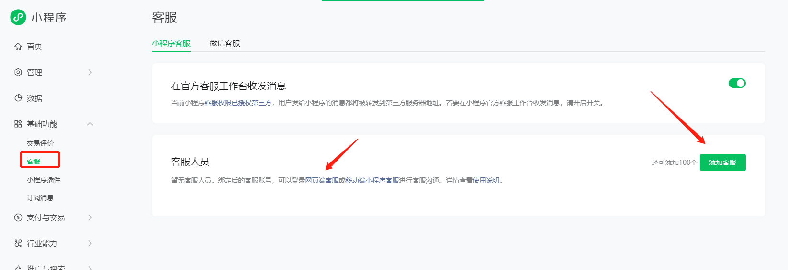

**验证方法：**

1. 在小程序中发送测试消息
2. 检查消息是否推送到客服微信
3. 确认不是自己与自己聊天

**注意事项：**

- 必须先添加客服人员才能接收消息
- 客服人员需要关注小程序的客服号
- 消息推送需要开发者配置服务器接口
- 测试时使用体验版即可验证

---

### 小程序优惠券能否生成二维码或链接进行分享？

**问题描述：**

希望在小程序中为优惠券生成二维码，方便用户通过微信扫描直接领取，或分享到朋友圈和通过链接分享。

**解决方案：**

**当前功能状态：**

小程序平台暂不支持直接生成优惠券的二维码或分享链接功能。

**替代方案：**

1. **页面分享功能**：

    - 用户进入优惠券页面
    - 使用小程序右上角"..."菜单
    - 选择"分享给朋友"或"分享朋友圈"
    - 其他用户点击后可直接进入优惠券页面

2. **自定义方案**（需要开发）：

    - 为每个优惠券生成唯一参数
    - 创建专门的领取页面
    - 通过参数自动识别并发放优惠券
    - 生成该页面的二维码


**实现建议：**

如需要优惠券分享功能，可考虑以下实现方式：

1. **小程序码方案**：

    - 生成小程序码携带优惠券ID参数
    - 用户扫码后自动识别并领取
    - 可跟踪每个二维码的领取情况

2. **H5页面方案**：

    - 开发H5领取页面
    - 生成链接或二维码
    - 跳转回小程序完成领取

**注意事项：**

- 当前平台功能限制，暂无直接的优惠券二维码生成功能
- 分享功能受微信平台规则限制
- 自定义方案需要额外的开发工作
- 考虑使用场景和成本效益

---

### 固件生成失败怎么办？

**问题描述：**

在生成固件时，系统频繁报错"生成失败，可能是配置原因，请检查配置"，即使修改了配置后仍无法成功生成。

**解决方案：**

**常见错误原因：**

1. **变量延时设置错误**：

    - 在"变量设置"中启用了"延时设置"
    - 系统提示：变量不能延时操作，加了延时操作，生成固件会报错
    - 这是导致生成失败的常见原因

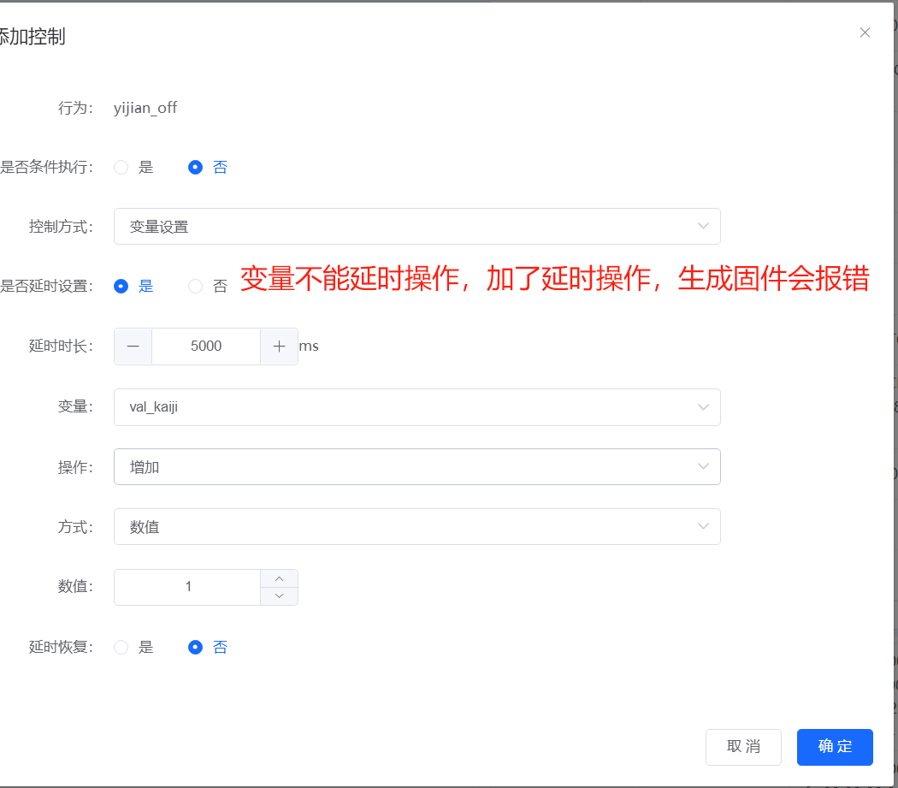

**解决步骤：**

1. **移除变量延时操作**：

    - 进入"添加控制"配置
    - 找到包含变量设置的操作
    - 取消勾选"延时设置"选项

2. **继承新版本**：

    如果移除延时设置后仍失败：

    - 在平台选择"继承新版本"
    - 重新生成固件
    - 这可以清除可能存在的配置冲突

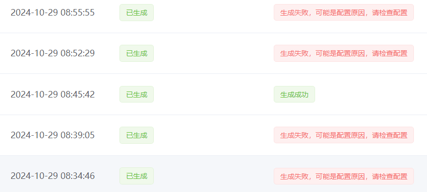

**预防措施：**

1. **配置规范**：

    - 避免在变量操作中添加延时
    - 使用独立的延时控制模块
    - 遵循平台的配置规范

2. **分步验证**：

    - 复杂配置建议分步添加
    - 每添加一步就测试生成
    - 避免批量修改后难以定位问题

**注意事项：**

- 变量延时操作是系统限制，不支持此功能
- 生成失败通常是配置冲突导致
- 继承新版本可以重置部分配置状态
- 如问题持续，联系专业技术支持提供具体配置信息

---

### 内部程序调用API接口无效怎么办？

**问题描述：**

通过内部程序调用TCP接口发送的十六进制参数无法正常触发预期操作，通讯输入配置的数据未生效。

**解决方案：**

**问题分析：**

1. **内部程序调用限制**：

    - 内部程序调用功能主要用于跳转和控制流程
    - 不能直接触发通讯输入的TCP数据接收
    - 需要使用专门的通讯控制方式

2. **配置检查要点**：

    - 检查TCP接口的触发配置是否正确
    - 确认十六进制数据格式无误
    - 验证端口号和通讯协议设置

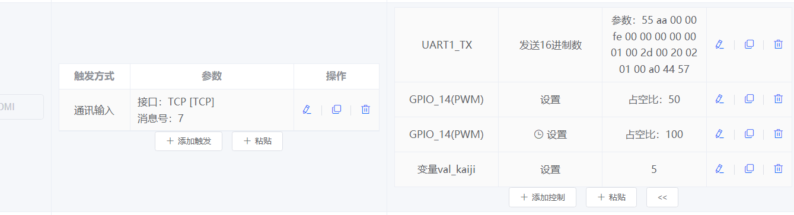

**正确实现方式：**

1. **使用设备控制发送**：

    - 在"设备控制"中选择"发送16进制数"
    - 配置目标接口（如TCP）
    - 填写要发送的十六进制数据

2. **内部控制配置**：

    - 控制方式选择"系统设置"
    - 类别选择"内部控制"
    - 操作选择"跳转行为"
    - 注意条件执行和延时设置需根据需求配置


**调试建议：**

1. **分步测试**：

    - 先测试TCP通讯是否正常建立
    - 单独验证十六进制数据发送
    - 确认接收端能够正确解析数据

2. **日志查看**：

    - 开启调试日志查看通讯状态
    - 检查数据包是否成功发送
    - 确认是否有连接断开或超时

**注意事项：**

- 内部程序调用不能直接触发通讯输入
- TCP通讯需要确保连接稳定
- 十六进制数据格式必须严格匹配
- 建议使用设备控制模块进行通讯操作

---

### 串口输入触发如何配置帧头帧尾？

**问题描述：**

需要在串口输入触发配置中自定义或移除帧头和帧尾，以适应不同的串口通讯协议需求。

**解决方案：**

**帧头帧尾配置方法：**

1. **在Pin脚设置中配置**：

    - 进入Pin脚配置页面
    - 找到UART1_RX配置
    - 设置格式为"配置格式"
    - 自定义帧头和帧尾内容

2. **配置选项说明**：

    - **固定格式**：使用系统默认的帧头帧尾
    - **配置格式**：可以自定义帧头帧尾
    - 帧头示例：AA 55、57 AB 01 00 00等
    - 帧尾示例：55 AA、00等

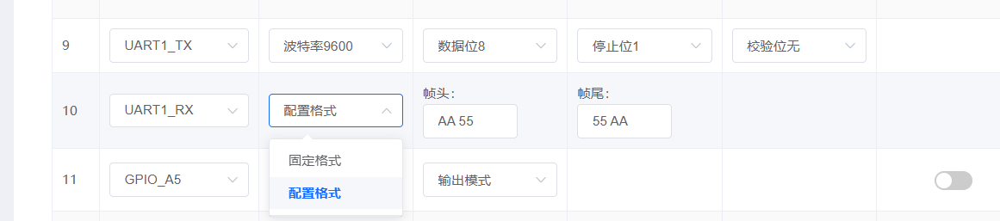

**配置示例：**

1. **标准配置**：

    ```
    帧头：AA 55
    帧尾：55 AA
    测试消息：AA 55 00 00 00 00 55 AA
    ```

2. **自定义配置**：

    ```
    帧头：57 AB 01 00 00
    帧尾：00
    测试消息：57 AB 01 00 00 21 00
    ```

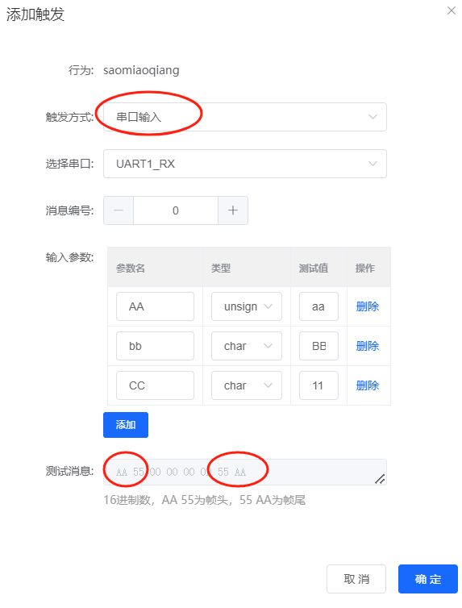

**移除帧头帧尾：**

- 可以将帧头帧尾设置为空
- 但会降低触发的准确率和可靠性
- 建议保留基本帧头帧尾以确保触发稳定

**注意事项：**

- 帧头帧尾必须是十六进制格式
- 两个字节之间用空格分隔
- 配置更改需要重新生成固件
- 去掉帧头帧尾可能导致误触发

---

### 串口触发响应延迟如何优化？

**问题描述：**

串口输入能够成功识别并触发，但响应时间存在3-5秒的延迟，影响系统实时性。

**解决方案：**

**延迟原因分析：**

1. **系统处理机制**：

    - 串口数据需要经过协议解析
    - 触发条件判断需要处理时间
    - 可能存在其他任务优先级影响


2. **配置检查要点**：

    - 确认波特率设置合适（如9600）
    - 检查数据位、停止位、校验位配置
    - 验证帧头帧尾匹配正确

**优化建议：**

1. **简化触发条件**：

    - 使用最短的必要帧头
    - 减少不必要的数据处理
    - 避免复杂的条件判断

2. **调整串口参数**：

    - 提高波特率（如115200）
    - 确保通讯双方参数一致
    - 减少单次数据传输量

3. **检查AT指令设置**：

    - 某些配置下AT指令可能被禁用
    - 确认串口功能完全启用
    - 避免功能冲突影响性能

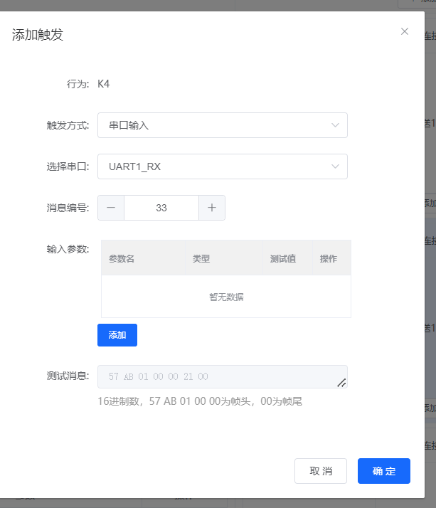

**调试方法：**

1. **监控数据接收**：

    - 使用串口助手监控接收时间
    - 对比发送和接收的时间差
    - 确认延迟发生在哪个环节

2. **简化测试**：

    - 使用最简单的触发条件
    - 逐步增加复杂度
    - 定位影响延迟的关键因素

**注意事项：**

- 3-5秒延迟属于异常情况，需要排查
- 串口配置错误可能导致处理延迟
- 建议使用标准配置参数
- 如问题持续，需要专业技术支持介入分析

---

### 小程序批量使用是否收取云服务费用？

**问题描述：**

使用小程序进行批量设备管理时，是否需要支付云服务费用，以及费用是否包含在模块购买成本中。

**解决方案：**

**云服务费用说明**

- **公版方案**：使用官方公版小程序和云服务
    - 云服务使用费用已包含在模块购买成本中
    - 无需额外支付云服务费用
    - 适合中小规模应用

- **私有云方案**：定制化私有云部署
    - 需要单独部署云服务器
    - 适合大规模应用和定制需求
    - 具体费用根据部署规模确定

**使用建议**

- 初期和小规模项目建议使用公版方案
- 成熟期和大规模项目可考虑私有云部署
- 根据项目需求选择合适的方案

**注意事项：**

- 公版小程序的云服务费用由模块成本覆盖
- 不同厂商的云服务政策可能有所不同
- 批量使用前建议确认具体的云服务条款
- 私有云部署需要一定的技术维护成本

---

### 如何通过平台配置解决大量变量重复设置问题？

**问题描述：**

在使用平台进行变量设置时，需要为每个楼层重新配置70个变量的复杂操作，询问是否可以通过平台配置方式解决，以及变量命名是否支持网站编译。

**解决方案：**

可以通过平台配置方式解决，变量命名如"aa、bb、cc"等也支持网站编译：

**1. 批量变量配置**

- 支持在平台上直接配置多个变量
- 变量命名可使用简单的字母组合（如aa、bb、cc）
- 支持网站在线编译功能

**2. 配置步骤**

- 在平台中创建变量配置
- 按需设置变量名称和属性
- 通过平台提供的编译功能生成固件
- 下载编译后的固件使用

**注意事项：**

- 变量名应遵循平台的命名规范
- 建议使用有意义的变量名便于维护
- 确保配置的变量数量在平台支持的范围内

---

### 中文工程是否支持英文指令？

**问题描述：**

在中文工程中尝试输入英文指令时，系统提示"不能存在字母"，询问如何在产品中支持英文指令。

**解决方案：**

中文工程和英文工程是分离的，需要根据使用语言创建对应类型的工程：

**1. 语言工程分离**

- 中文工程只能使用中文指令
- 英文工程只能使用英文指令
- 不能在同一个工程中混用中英文指令

**2. 切换语言方案**

如需使用英文指令，需要：

- 新建英文工程
- 在平台中选择英文语言选项
- 重新配置所有语音指令为英文版本

**3. 配置建议**

- 提前规划好需要支持的语言
- 根据目标市场选择对应语言版本
- 分别保存中英文工程的配置文件

**注意事项：**

- 工程语言创建后不能更改
- 不同语言的固件需要分别烧录
- 建议使用清晰的命名区分不同语言版本

---

### 如何在CI系列离线语音芯片中切换语言工程？

**问题描述：**

需要了解如何在CI系列离线语音识别芯片的工程中切换使用英文语音指令，而不是仅限于中文工程。

**解决方案：**

CI系列语音芯片不支持在同一个工程中切换语言，需要创建独立的语言工程：

**1. 语言工程独立性**

- 每个工程只能使用单一语言
- 中文工程用于中文语音识别
- 英文工程用于英文语音识别

**2. 创建英文工程步骤**

- 在平台选择"新建工程"
- 选择语言为"英文"
- 配置所需的英文语音指令
- 生成英文固件

**3. 使用场景管理**

- 根据应用场景选择对应的固件
- 中文环境使用中文固件
- 英文环境使用英文固件

**注意事项：**

- 工程创建后语言类型不可更改
- 不同语言的固件需要分别烧录
- 建议保存两个版本的工程配置
- 切换语言需要重新烧录对应固件

---

### 是否支持通过串口发送文字内容进行语音识别？

**问题描述：**

希望有一种语音模块能够支持通过串口发送文字内容进行识别，并希望在上电时能够灵活修改识别内容，以解决不同场景下识别结果不一致的问题。

**解决方案：**

目前的离线语音模块还不支持串口文字识别功能，存在以下限制：

**1. 功能限制**

- 串口通信不支持字符串传输
- 不能通过串口动态修改识别词
- 识别内容需要在固件中预置

**2. 当前方案**

对于需要灵活修改识别内容的场景：

- 使用在线语音模块（正在开发中）
- 不同场景使用不同的固件
- 通过变量控制不同的识别逻辑

**3. 替代方案**

- 预置多个常用命令词
- 使用串口控制启用/禁用特定命令词
- 分场景制作不同固件版本

**4. 发展计划**

- 在线语音模块将支持动态识别内容
- 可通过API灵活更新识别词库
- 建议关注后续产品发布信息

**注意事项：**

- 离线模块的识别词在烧录时固定
- 如需频繁更换识别内容，建议等待在线版本
- 可通过软件逻辑组合现有命令词实现更多功能

---

### 如何通过串口数据控制特定命令词的识别？

**问题描述：**

希望使用串口发送数据来控制离线语音识别芯片的特定命令词识别功能，但发现通过条件执行的方式无法成功关闭某条识别命令。

**解决方案：**

可以通过串口触发配合"禁止识别词"操作来实现特定命令词的启用/禁用：

**1. 串口数据与变量映射**

- 配置串口输入触发，设置消息号
- 添加多个参数对应串口数据的不同字节
- 将参数赋值给变量用于条件判断


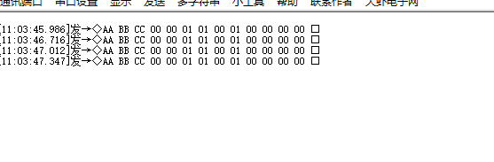

**2. 条件执行配置**

- 在命令词识别中添加条件执行
- 判断变量值是否符合预期
- 设置条件满足时的控制动作

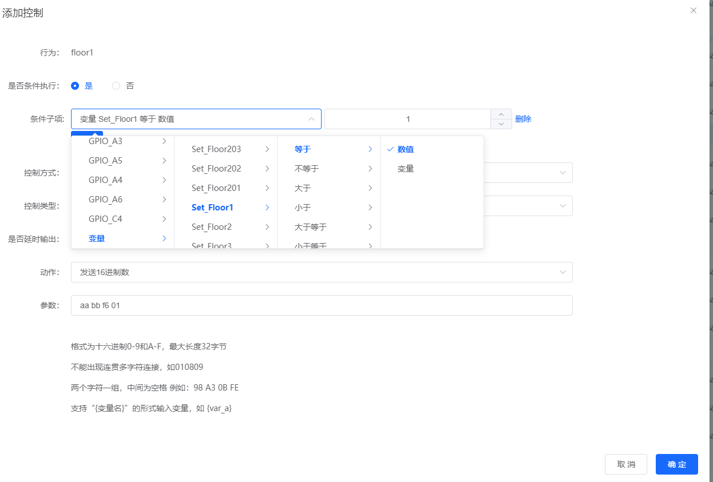

**3. 启用/禁用识别词**

- 在串口触发下添加控制
- 选择"禁止识别词"操作
- 指定需要禁用的具体命令词

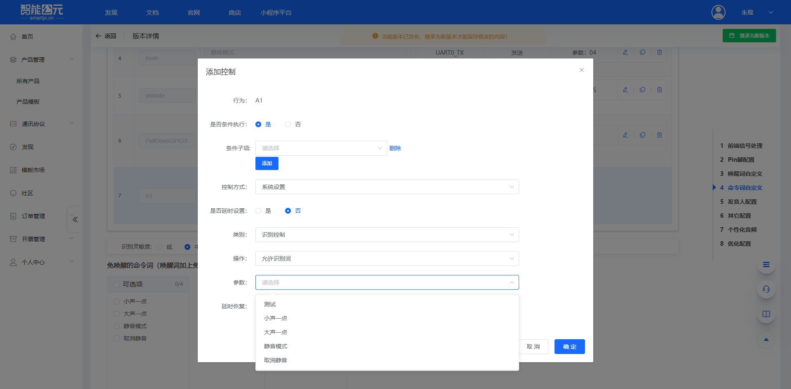

**4. 配置要点**

- 每个串口触发可添加多个控制
- 支持同时禁用多个命令词
- 可通过"允许识别词"恢复识别功能

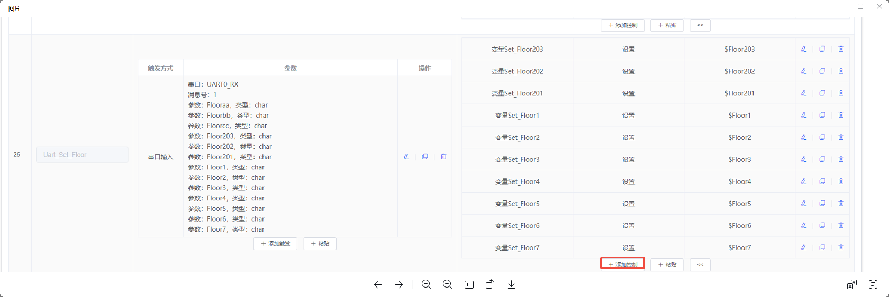

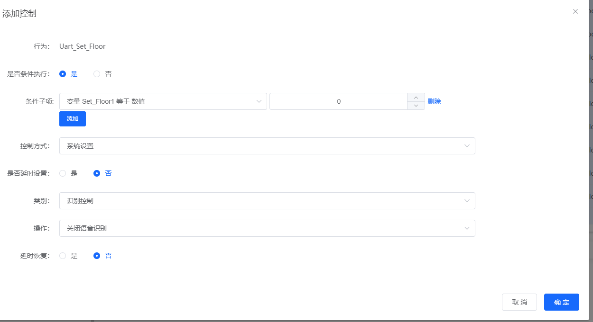

**注意事项：**

- 确保串口数据格式正确，包含正确的帧头帧尾
- 变量赋值后可通过串口输出验证
- 大量命令词需要为每个命令词配置启用/禁用规则
- 配置完成后需要重新生成固件

---

### 固件生成失败提示"可能是配置原因"怎么办？

**问题描述：**

在小程序平台配置固件时，固件生成失败，提示"可能是配置原因，请检查配置"，尝试了多种配置但问题依旧。

**解决方案：**

固件生成失败通常是由于必填字段未正确填写导致：

**1. 检查语音内容字段**

- 语音内容字段不能为空
- 即使不需要语音播报，也要填写内容或删除该配置


**2. 生成失败列表查看**

- 进入固件生成列表查看失败原因
- 多个固件同时失败说明配置存在系统性问题


**3. 常见问题排查**

**语音内容相关**：

- 检查所有"添加控制"中的语音内容
- 空字段需要填写内容或删除整个控制项
- 已添加变量但语音内容为空

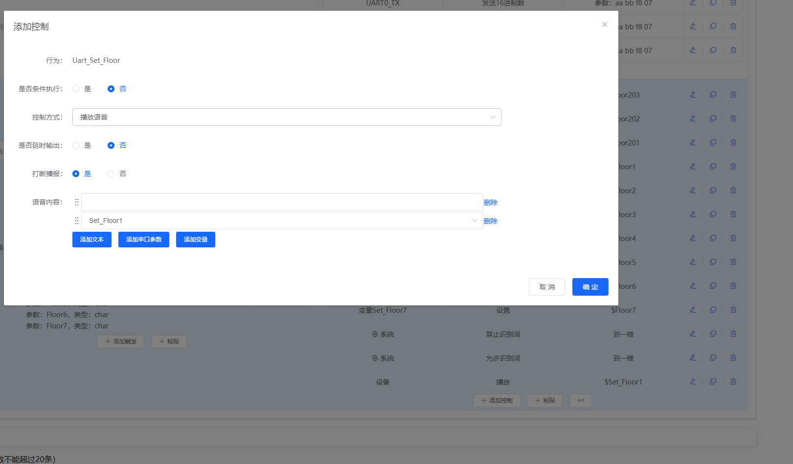

**4. 解决方法**

对于不需要语音播报的控制：

- 删除整个控制项
- 或在语音内容中填写任意文本
- 确保所有必填字段都有内容


**注意事项：**

- 配置复杂时建议分批保存
- 删除不需要的控制项可简化配置
- 生成前检查所有字段的完整性
- 保留配置文件避免重复配置

---

### 如何压缩大量变量的存储空间？

**问题描述：**

需要存储128个变量的状态，希望使用位操作（每个字节的8位表示一个变量）来优化存储空间，但现有SDK不支持此功能。

**解决方案：**

现有SDK不支持位操作的变量压缩方式，如有特殊需求可通过定制开发实现：

**1. 现有方案限制**

- SDK中每个变量占用独立的存储空间
- 不支持将多个变量打包到单个字节的位中
- 128个变量需要128个独立的存储位置

**2. 定制开发流程**

- 提交详细需求说明
- 由工程团队评估可行性
- 确认开发周期和费用
- 签订定制开发协议
- 完成开发和测试

**注意事项：**

- 定制开发需要额外收费
- 评估周期根据需求复杂度而定
- 建议提前规划，预留开发时间

---

### 技术对接需要签署哪些协议文档？

**问题描述：**

项目技术对接需要签署保密协议，同时需要获取平台通信协议文档，以进行后续开发工作。

**解决方案：**

**1. 保密协议签署流程**

- 双方提供公司全称
- 甲方起草保密协议
- 乙方审核协议内容
- 双方盖章签署
- 交换扫描件存档

**2. 平台通信协议获取**

- 协议文档通常在保密协议签署后提供
- 包含以下内容：

    - 蓝牙配网协议规范
    - WebSocket鉴权流程
    - 语音交互协议格式
    - 数据包格式定义

**3. 技术对接步骤**

- 完成保密协议签署
- 获取平台通信协议文档
- 成立技术对接群组
- 安排技术人员沟通
- 开始协议对接开发

**注意事项：**

- 保密协议是获取技术文档的前提
- 仔细阅读协议文档的各个版本
- 对接过程中有问题及时沟通
- 保留好所有签署的协议文档

---


### 使用自定义MQTT接口时如何进行蓝牙配网？

**问题描述：**

产品使用自定义MQTT通讯接口而非平台标准接口，导致官方小程序无法使用，需要自行开发配网小程序。

**解决方案：**

当采用自定义MQTT接口时，官方小程序无法正常识别和配网设备，需要通过二次开发方式实现配网功能：

**1. 获取配网协议**

- 需要签署保密协议获取蓝牙配网协议规范
- 协议文档包含：
    - 蓝牙配网协议规范
    - WebSocket鉴权流程
    - 数据包格式定义
    - 通信接口规范

**2. 开发要求**

- 具备蓝牙BLE通信开发能力
- 熟悉小程序开发框架
- 理解模块配网流程

**3. 配网流程概述**

- 手机通过BLE扫描发现设备
- 建立BLE连接并发送WiFi账号密码
- 设备连接WiFi后完成配网
- 后续通过自定义MQTT接口进行通信

**注意事项：**

- 自定义接口方案适用于有完整开发能力的使用方
- 建议优先评估使用平台标准接口的可行性
- 获取完整协议文档需完成保密协议签署流程

---

### 如何配置定时器实现一秒触发两次？

**问题描述：**

需要配置定时器，使其在一秒钟内触发两次执行（即500ms间隔触发一次）。

**解决方案：**

可以通过变量控制和定时器配置实现一秒两次触发：

**实现方法：**

1. **使用变量控制**
    - 定义一个控制变量（如timer_count）
    - 行为触发时将变量置0，同时开启30ms定时器
    - 定时器超时时，判断变量是否为0，如果是则触发动作并将变量加1
    - 需要持续每秒触发两次时，在定时器设置中开启重复触发

2. **配置要点**
    - 定时器间隔设置为500ms（0.5秒）
    - 启用重复触发功能
    - 使用变量确保每次触发的条件判断

**注意事项：**

- 定时器间隔不宜设置过短，避免影响系统响应
- 变量的初始值和递增逻辑要正确配置
- 测试时验证触发频率是否符合预期

---

### 语料音频文件必须是WAV格式吗？

**问题描述：**

提供的语料文件为AAC格式，需要确认是否必须转换为WAV格式才能用于语音识别训练。

**解决方案：**

是的，语料音频文件必须使用WAV格式：

**1. 格式要求**

- 必须使用.wav格式
- 采样率：16.0KHz
- 位深度：16位
- 声道数：1声道（单声道）

**2. 格式转换**

- 使用音频转换工具将AAC转换为WAV
- 推荐工具：格式工厂、Audacity等
- 转换时严格按照上述参数设置
- 转换后检查文件属性确保格式正确

**3. 格式重要性**

- WAV是无损格式，保留完整音频信息
- 固定参数确保训练数据一致性
- 单声道避免立体声干扰
- 标准化采样率匹配芯片处理能力

**注意事项：**

- AAC等压缩格式会影响识别效果
- 不符合格式的语料无法用于训练
- 建议在录制时直接使用WAV格式
- 转换后的文件需要重命名以符合要求
- 确保转换过程中没有音频失真

---

### 是否可以提供芯片方案与评估信息？

**问题描述：**

模块成本较高，希望了解是否可以提供芯片+麦克风+扬声器的方案，以降低整体成本。同时需要了解模型转换固件的时间需求和英文翻译支持。

**解决方案：**

**1. 芯片供应方案**

- 可以提供芯片方案
- 供货方案需根据实际需求评估
- 适合有研发能力的客户

**2. 供货要求**

- 需要提供月采购量评估
- 供货条件需根据实际情况确认

**3. 定制服务内容**

- 模型转换固件：根据命令词表生成固件
- 英文翻译支持：可提供专业翻译服务
- 交付时间：5月上旬需求，需提前安排

**4. 项目时间规划**

- 5月底-6月初：首批几百套市场验证
- 验证完成后：批量量产
- 固件准备：建议提前1个月启动定制

**注意事项：**

- 芯片方案需要自行设计和生产
- 麦克风和扬声器选型需匹配芯片特性
- 建议有一定研发实力的客户选择芯片方案
- 固件定制需要提前预留开发周期

---

### 启英泰伦芯片方案的专业技术支持如何？

**问题描述：**

对启英泰伦芯片方案不太熟悉，需要了解专业技术支持服务、产品案例和资料获取方式。

**解决方案：**

**1. 专业技术支持渠道**

- 技术支持渠道：实时问题解答
- 平台文档：在线技术手册
- 定制服务：付费深度专业技术支持

**2. 资料获取**

- 官网：www.chipintelli.com基础资料
- 代理商：获取详细技术文档
- 专业技术支持：申请产品案例和应用笔记

**3. 开发支持**

- 平台开发：图形化配置，降低开发难度
- Demo支持：提供参考设计
- 测试服务：协助功能验证

**4. 合作模式**

- 标准支持：免费基础技术咨询
- 定制开发：付费专项服务
- 量产支持：批量技术协助

**注意事项：**

- 启英泰伦在ToB领域经验丰富
- 建议先采购模块评估效果
- 量产前提供专业技术支持对接
- 可申请样品进行前期测试

---

### 是否支持阿拉伯语等非中文语言的语音识别？

**问题描述：**

需要在项目中实现阿拉伯语等非中文语言的语音识别功能，想了解支持情况、训练方式和服务流程。

**解决方案：**

支持阿拉伯语等非中文语言的语音识别，提供两种训练方式：

**1. 训练方式对比**

- **语料训练**
    - 识别率更高，效果更好
    - 需要提供目标语言的语料数据
    - 适合对识别率要求高的项目

- **语音模型训练**
    - 识别率相对较低
    - 不需要提供语料
    - 适合快速验证和原型开发

**2. 训练服务说明**

- 训练由技术团队负责执行
- 基于中文固件工程进行语种定制
- 通过智能公元平台生成定制化固件

**3. 服务流程**

- 提供训练需求和语料（如选择语料训练）
- 评估项目需求（词条数量等）
- 评估与确认服务
- 训练周期：约4-5天
- 说明：具体以官方渠道评估为准

**4. 服务范围**

- 在规定词条数量内提供2次固件优化
- 后续新增词条可能产生额外费用
- 建议一次性确定所需词条数量

**注意事项：**

- 语料训练的效果优于语音模型训练
- 训练前需确认中文固件版本已定稿
- 批量生产前建议进行充分测试
- 保留定制化固件的配置文档

---

### 控制详情中参数设置如何添加帧头帧尾？

**问题描述：**

在官网平台配置控制详情时，需要在发送数据时添加自定义的帧头和帧尾以实现特定的协议格式，但参数字段似乎只能输入数据。

**解决方案：**

参数字段支持输入最大32字节的十六进制数据，可以直接包含帧头、数据和帧尾：

- **直接包含帧头帧尾**：将帧头、数据和帧尾全部写入参数字段中
    - 例如：帧头 `AA 55` + 数据 `00 00 00 01` + 帧尾 `55 AA`
    - 在参数框中输入：`AA 55 00 00 00 01 55 AA`

- **格式要求**：

    - 只能输入0-9和A-F的十六进制字符
    - 两个字符为一组，中间用空格分隔
    - 最大长度为32字节（64个十六进制字符）

**注意事项：**

- 总字节数不能超过32字节限制
- 不能出现连续无空格的字符，如`010809`，必须写成`01 08 09`
- 如需发送更长的数据，建议分多次发送或精简数据


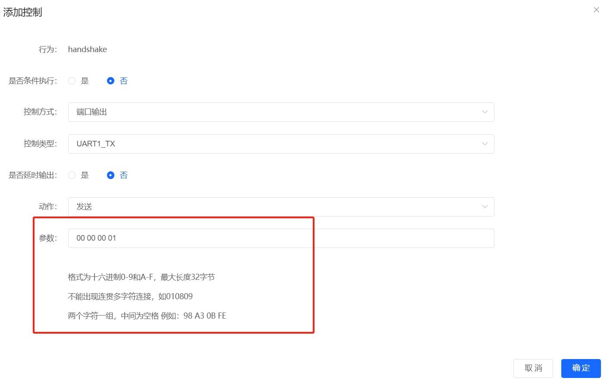

---

### 有没有发音转拼音或汉字的工具？

**问题描述：**

需要一个能够将发音转换为拼音或汉字的工具，用于辅助语音识别的开发和调试。

**解决方案：**

目前没有提供此类工具：

**1. 工具现状**

    - 暂无发音转拼音的专用工具
    - 暂无发音转汉字的转换工具
    - 需要手动进行拼音标注

**2. 替代方案**

    - 使用在线拼音转换工具
    - 使用输入法的拼音功能
    - 手动查找字典进行标注

**3. 开发建议**

    - 在平台中直接使用文本配置命令词
    - 系统会自动处理拼音转换
    - 避免手动输入可能出现的错误

**注意事项：**

    - 建议使用标准普通话发音进行配置
    - 方言或特殊发音可能需要特别标注
    - 如有特殊需求可联系工程师获取帮助

---

### 如何在播报前添加延时？

**问题描述：**

需要在语音回复语播报之前添加一个延时，但不希望将延时逻辑放在控制模块中。

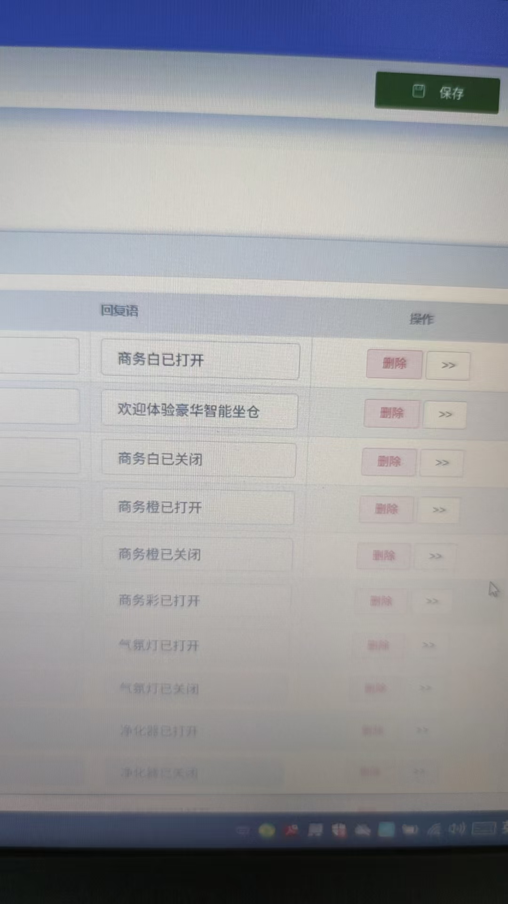

**解决方案：**

目前平台不支持在回复语中直接添加延时：

**1. 延时实现方式**

    - 只能通过控制模块添加延时功能
    - 在播报回复语前先执行延时操作
    - 然后再触发语音播报

**2. 配置步骤**

    - 进入控制添加页面
    - 在回复语播报前添加延时控制
    - 设置所需的延时时间（单位：毫秒）
    - 延时结束后再执行语音播报

**3. 示例配置**

    - 命令词识别后
    - 第一步：延时1000ms
    - 第二步：播报回复语内容

**注意事项：**

    - 延时功能必须在控制中实现
    - 无法直接在回复语中设置延时
    - 延时时间应根据实际需求调整
    - 过长的延时可能影响用户体验

---

### 新平台Pin脚配置如何与硬件管脚对应？

**问题描述：**

在新版本平台配置Pin脚时，发现平台的Pin编号与硬件管脚定义不对应，需要了解如何正确配置串口功能。

**解决方案：**

**1. Pin脚与管脚的映射关系**

新平台的Pin编号与实际硬件管脚不是直接对应的：

- **平台Pin 1、2**：对应GPIO_BC、GPIO_B1等功能
- **实际硬件管脚**：需要根据功能复用表来确定
- **串口功能**：B0和B1可复用为UART1_TXD和UART1_RXD


**2. 串口配置方法**

要配置串口功能：

- **查找功能复用**：在功能复用表中找到UART1对应的引脚
- **B0引脚**：可复用为UART1_TXD（发送）
- **B1引脚**：可复用为UART1_RXD（接收）
- **平台配置**：在Pin脚配置中选择对应的功能设置


**3. 配置示例**

配置串口通信的正确步骤：

1. 选择Pin脚配置页面
2. 找到对应硬件引脚的功能选项
3. 配置B0为UART1_TXD
4. 配置B1为UART1_RXD
5. 设置相应的参数（波特率等）


**注意事项：**

- 新旧平台的Pin脚编号体系不同，不能直接对应
- 配置前先查看功能复用表确认可用功能
- 串口功能的TX/RX不要接反
- 配置完成后需要生成新固件才能生效

---

### 平台控制逻辑中为什么需要变量赋值操作？

**问题描述：**

在平台控制逻辑中，看到将变量A1的值赋给另一个变量CS_1的操作，不理解为什么不直接使用A1，以及这种赋值能实现什么功能。

**解决方案：**

**1. 变量赋值的意义**

变量赋值操作的作用：

- **数据传递**：将一个变量的值传递给另一个变量使用
- **逻辑处理**：对变量进行加工、计算或格式化
- **功能扩展**：实现更复杂的控制逻辑

**2. 赋值操作的优势**

直接使用A1的限制：

- 只能使用A1的原始值
- 无法进行数值计算或转换
- 功能实现较为单一

赋值后的优势：

- 可以对CS_1进行独立操作
- 保留A1的原始值不变
- 实现更灵活的控制逻辑

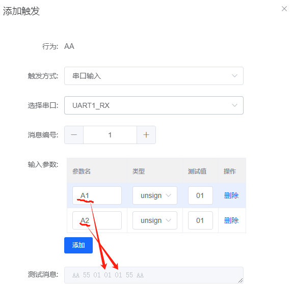


**3. 实际应用场景**

变量赋值可以实现的典型功能：

- **数值计算**：CS_1 = A1 + 10（增加固定值）
- **范围判断**：根据A1的值给CS_1赋不同结果
- **格式化输出**：将A1的值格式化后存入CS_1
- **累积计数**：CS_1 = CS_1 + A1（累加操作）

**注意事项：**

- 变量赋值增加了逻辑的灵活性，但也增加了复杂度
- 建议使用有意义的变量名，便于维护
- 如果只是简单传递，可以直接使用原变量
- 复杂的计算逻辑建议分步实现，便于调试

---

### 如何与AI硬件平台进行API对接实现语音交互？

**问题描述：**

希望将AI伴侣平台与硬件设备进行深度集成，需要实现API接口对接、语音交互功能、音频流传输、设备绑定和角色切换等技术需求。

**解决方案：**

**1. API接口对接方式**

- **WebSocket连接**：推荐使用WebSocket协议进行实时通信
    - 连接地址：`wss://api.test.gwcz.online/im/ws/connect_chat/Aw49`
    - 请求头需携带：`authorization: eyJhbGciOiJIUzI1NiIsInR5cCI6IkpXVCJ9...`
    - 连接后会保持，需要主动断开

- **消息格式**：
    ```json
    // 发送消息
    {
    "msg_type": 1,
    "content": "你好"
    }

    // 接收消息
    {
    "chat_id": "8648be51-87ac-4772-b399-44639742033e",
    "message_id": "8648be51-87ac-4772-b399-44639742033e",
    "conversation_id": "8e4affb7-c643-41e2-bceb-d063809f4603",
    "content": "回复内容",
    "voice_url": "https://tos.gwcz.online/chat-im/voice/2025-06-23/1750674235_1835.mp3",
    "duration": 2,
    "send_type": "agent",
    "msg_type": 2,
    "favor": -2,
    "favor_level": 0,
    "favor_level_name": "萍水相逢",
    "favor_description": "正常的性格特征对话。",
    "favor_start": 0,
    "favor_end": 19
    }
    ```

**2. 音频流传输优化**

- **流式音频接口**：使用专门的流式WebSocket地址
    - 流式地址：`wss://api.test.gwcz.online/im/ws/hardware_chat/Aw49`
    - 音频格式：MP3，24kHz采样率，16bit，单声道
    - 编码方式：Base64编码传输

- **传输优化建议**：

    - 使用流式传输可减少延迟至300ms以内
    - 增量音频包大小建议包含完整语音片段
    - 避免每次只推送1-2个字的小片段

**3. 设备绑定与用户管理**

- **设备绑定流程**：

    1. 用户购买设备后通过APP扫码绑定
    2. 每个设备对应唯一用户ID
    3. Token在用户登录后生成，用于API鉴权

- **角色切换机制**：

    - 通过APP选择不同AI角色
    - 角色信息通过API同步到设备
    - 设备根据角色ID调整对话风格和音色

**4. 连接管理策略**

- **连接保持**：

    - WebSocket连接建立后保持长连接
    - 设备空闲一段时间后自动断开（可配置时间）
    - 唤醒词触发后重新连接

- **断线重连**：

    - 检测到连接断开自动重连
    - 重连间隔采用指数退避策略
    - 最大重试次数限制

**5. 常见问题处理**

- **响应延迟优化**：

    - 调整服务端音频生成参数
    - 使用流式返回减少首字节延迟
    - 客户端边接收边播放

- **音频播放连贯性**：

    - 缓存一定量的音频数据保证播放流畅
    - 使用合适的缓冲区大小
    - 处理网络抖动导致的传输不稳定

- **并发连接处理**：

    - 同一设备避免多个WebSocket连接
    - 实现连接状态检查机制
    - 新连接建立时主动断开旧连接

**注意事项：**

- 音频流传输需要服务端支持流式返回
- 设备端需要实现音频数据的Base64解码
- 用户Token需要定期刷新以保证安全性
- 不同角色的性格设定需要在服务端预先配置
- 建议实现心跳机制检测连接健康状态

---

### 流式语音传输延迟高且播放不连贯怎么办？

**问题描述：**

使用流式语音传输时，遇到语音播放延迟高（约4-6秒）且播放不连贯的问题，尤其是在每次只推送一两个字的增量语音时，无法实现低延迟的实时播放。

**解决方案：**

**1. 延迟优化措施**

- **服务端优化**：

    - 调整TTS（文本转语音）生成参数，优化合成速度
    - 使用更高效的音频编码格式
    - 减少音频文件生成时间

- **传输协议优化**：

    - 使用WebSocket流式传输替代HTTP轮询
    - 实现音频数据的Base64流式传输
    - 减少单次传输的数据量，增加传输频率

- **客户端优化**：

    - 采用边接收边播放的策略
    - 设置合适的音频缓冲区大小（建议100-200ms数据量）
    - 实现音频预加载机制

**2. 音频连贯性改进**

- **数据包设计**：

    - 避免推送过小的音频片段（如1-2个字）
    - 合并多个字符组成完整语音单元再传输
    - 确保每个音频包包含完整的音节

- **播放控制逻辑**：
    ```json
    // 添加结束标记
    {
    "content": "end",
    "send_type": "audio"
    }
    ```
    - 收到结束标记后再停止播放
    - 避免因数据不完整导致的播放中断

- **缓冲区管理**：

    - 维持固定大小的环形缓冲区
    - 实现双缓冲机制：一个播放，一个接收
    - 动态调整缓冲区大小适应网络状况

**3. WebSocket连接管理**

- **连接复用**：

    - 单个设备只保持一个WebSocket连接
    - 避免重复连接导致的资源浪费
    - 实现连接状态监控和自动恢复

- **心跳机制**：
    ```json
    // 定期发送心跳包
    {
    "type": "heartbeat",
    "timestamp": 1678886400000
    }
    ```
    - 间隔：30秒发送一次
    - 超时无响应则重新连接

**4. 性能监控与调试**

- **延迟监控**：

    - 记录消息发送到音频播放的完整耗时
    - 监控网络传输时间和TTS生成时间
    - 设置延迟告警阈值（如超过2秒告警）

- **日志记录**：

    - 记录每次音频包的接收时间戳
    - 记录缓冲区状态和播放位置
    - 记录网络错误和重连次数

**注意事项：**

- 音频采样率建议使用16kHz而非24kHz，可减少传输数据量
- Base64编码会增加约33%的数据量，需权衡实时性和质量
- 在网络不稳定时，可适当增加缓冲区大小
- 流式传输需要服务端配合，确保数据生成速度跟上传输速度

---

### WebSocket域名连接失败但客户端测试正常怎么办？

**问题描述：**

设备连接WebSocket服务（wss://域名）时无法建立连接，但使用其他客户端（如WebSocket在线调试工具）测试同一地址可以正常连接。服务器IP为内网地址，仅通过域名在外网暴露。

**解决方案：**

**1. 连接测试验证**

- 使用WebSocket在线调试工具或Postman测试服务端可连接性
- 确认wss://地址在PC端可以正常建立连接
- 排除服务端故障和防火墙拦截问题

**2. 设备端DNS排查**

- **检查DNS解析**：设备可能无法正确解析域名
  - 尝试在设备网络环境中测试域名解析
  - 检查设备使用的DNS服务器是否正常工作
  - 确认域名DNS记录已正确配置

- **IP直连测试**：
  - 如果服务器IP在内网，设备从外网无法IP直连
  - 仅在设备和服务端处于同一网络时可尝试IP直连验证

**3. 网络环境检查**

- 确认设备连接的网络环境可以访问目标域名
- 检查是否存在网络策略限制（如白名单、防火墙规则）
- 验证设备所在的网络段是否允许访问外网WebSocket服务（443端口）

**4. SSL/TLS证书验证**

- WSS连接需要有效的SSL证书
- 确认服务器证书已正确配置且在有效期内
- 某些设备可能对证书链验证较严格，需确保中间证书完整

**5. 设备代码调试建议**

- 添加详细日志输出DNS解析结果
- 记录WebSocket握手阶段的错误信息
- 尝试捕获具体的连接失败原因（超时、拒绝连接、证书错误等）

**注意事项：**

- 客户端测试正常只能证明服务端可用，不能完全排除设备端问题
- DNS解析问题在嵌入式设备中较为常见，建议优先排查
- 内网IP服务器对外只能通过域名访问，IP直连方案通常不可行
- 如使用CDN或代理转发，需确认目标地址配置正确

---

### 自学习功能发布后自动关闭怎么办？

**问题描述：**

在平台上开启了自学习功能并保存，但发布版本后发现自学习功能被自动关闭，无法正常保存设置。

**解决方案：**

- 使用新的Pro模型进行配置和发布
- 老版本模型存在较多bug，包括自学习功能无法正常保存的问题
- 建议迁移到Pro模型以获得更稳定的功能支持

**注意事项：**

- 老模型已停止重点维护，生成和改造功能不再优化
- Pro模型提供更完整的功能支持和更好的稳定性
- 迁移到Pro模型前建议备份现有配置


---

### 语音模块能否集成嗅觉传感器？

**问题描述：**

希望将嗅觉传感器（如PM2.5、温度、湿度、有毒气体等）集成到CI系列语音模块，实现气味感知并语音反馈。

**解决方案：**

**技术限制说明：**

- CI系列语音模块目前不支持嗅觉传感器集成
- 缺少相应的硬件接口和算法支持
- 气味识别技术尚未成熟到可集成程度

**替代方案：**

1. **环境传感器支持**
    - 可通过GPIO接口外接环境传感器
    - 支持温湿度、空气质量等传感器
    - 通过串口读取传感器数据并语音播报

2. **外部集成方案**
    - 使用独立的传感器模块
    - 通过主控MCU处理数据
    - 语音模块仅作为播报输出使用

3. **技术发展趋势**
    - 电子鼻技术仍在研究阶段
    - 目前主要用于工业检测领域
    - 消费级应用还需要时间发展

**注意事项：**

- 气味识别涉及复杂的化学反应传感器
- 不同气味的识别算法差异很大
- 现有技术难以实现类似人类的嗅觉功能
- 如有特殊需求，可考虑定制开发方案

---

### 如何通过播音开始/结束事件控制GPIO实现功放开关？

**问题描述：**

需要实现"有声音时PA4拉高，没声音输出时PA4拉低"的效果，即通过播音状态控制外部功放芯片的开关。

**解决方案：**

可以通过配置"播音开始"和"播音结束"事件来控制GPIO引脚（如PA4）的电平变化。

**配置步骤：**

1. **关闭自动使能功放**
   - 进入产品配置 → 优化选项
   - 将"自动使能功放"设置为"不支持"

2. **配置播音开始事件**
   - 在"配置"菜单中，找到"事件触发"设置
   - 添加新触发，触发方式选择"播音开始"
   - 添加控制动作，设置PA4引脚输出高电平（功放开启）

3. **配置播音结束事件**
   - 添加新触发，触发方式选择"播音结束"
   - 添加控制动作，设置PA4引脚输出低电平（功放关闭）


**注意事项：**

- 功放使能电平（高/低）需根据实际功放芯片的要求配置
- 确保PA4引脚未被其他功能占用
- 此配置适用于需要通过GPIO控制外部功放使能的场景

---

### 如何添加"进入唤醒"事件触发？

**问题描述：**

需要在识别到唤醒词后，通过串口发送消息，希望添加"进入唤醒"事件。

**解决方案：**

目前平台的事件触发中，暂不支持"进入唤醒"事件类型。

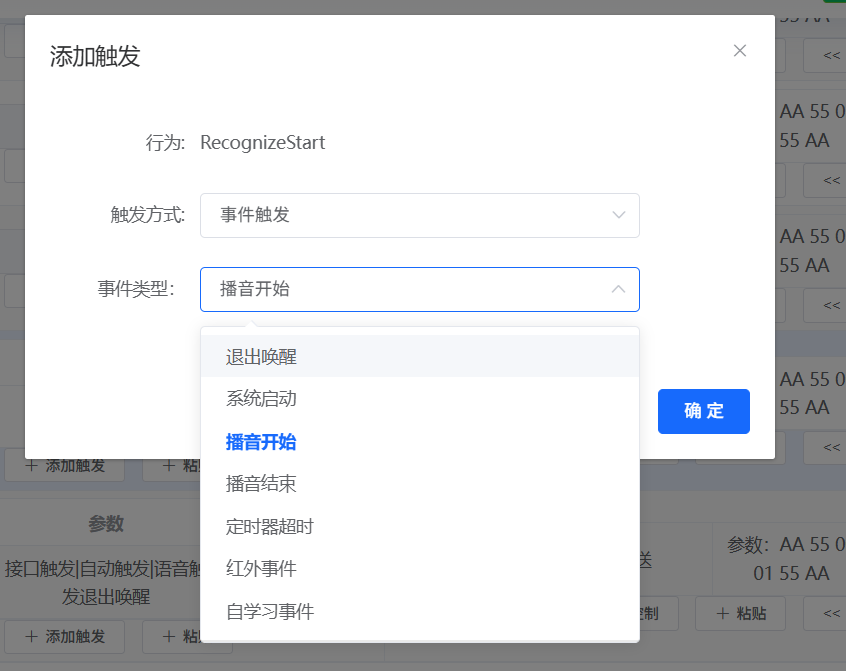

**现有事件类型：**

- 播音开始
- 播音结束
- 退出唤醒
- 上电启动
- 定时器超时等

**替代方案：**

1. **使用唤醒词命令**
    - 添加唤醒词作为命令词
    - 设置唤醒词触发后执行串口发送
    - 可实现类似效果

    

2. **结合定时器方案**
    - 设置识别成功后启动定时器
    - 定时器超时后执行串口发送
    - 需要合理设置延时时间

**实现步骤：**

1. 添加唤醒词命令
2. 设置触发条件为"识别到该命令"
3. 添加控制动作作为"串口发送"
4. 配置要发送的数据


**注意事项：**

- 进入唤醒和退出唤醒是独立的状态
- 目前只能通过命令词间接实现
- 未来版本可能会增加此事件类型
- 如有紧急需求，可反馈给产品团队

---

### 官网下载开发包速度过慢怎么办？

**问题描述：**

从官网下载开发包时速度极慢，仅有几KB/s，影响开发进度。

**解决方案：**

- 下载速度慢可能是由于网络环境或服务器负载导致
- 建议在网络环境较好的时段尝试下载（如工作日上午）
- 可以尝试使用其他网络环境或更换浏览器下载
- 开发包只需下载一次，下载完成后可重复使用

**注意事项：**

- 开发包体积较大，下载需要一定时间，请耐心等待
- 确保网络连接稳定，避免下载中断
- 如持续遇到下载问题，可联系专业技术支持获取协助

---

### 在智能平台中如何找到固件下载页面？

**问题描述：**

在智能公元平台中无法找到固件下载入口，不确定如何操作才能下载固件。

**解决方案：**

**固件下载路径**

1. **正确访问路径**
    - 登录智能公元平台
    - 点击左侧菜单"产品管理"
    - 选择"所有产品"进入产品列表

2. **操作步骤**
    ```
    第一步：产品管理 → 所有产品
    第二步：在产品列表中找到对应产品
    第三步：点击产品名称或操作按钮
    第四步：选择"下载固件"或类似选项
    ```

3. **页面识别**
    - 固件下载通常在产品详情页
    - 或在产品操作菜单中
    - 查找"下载"、"固件"、"导出"等关键词

**常见问题及解决**

1. **显示"暂无数据"**
    ```
    可能原因：

    - 登录了错误的账号
    - 账号下未创建产品
    - 权限不足无法查看

    解决方法：

    - 确认登录账号是否正确
    - 联系管理员分配权限
    - 刷新页面重新加载
    ```

2. **找不到对应产品**
    ```
    检查要点：

    - 确认产品名称是否正确
    - 检查是否在正确项目下
    - 验证产品是否已发布

    解决方法：

    - 使用搜索功能查找
    - 检查最近访问的产品
    - 联系创建者确认产品状态
    ```

3. **页面加载异常**
    ```
    操作建议：

    - 刷新浏览器（F5或Ctrl+R）
    - 清除浏览器缓存
    - 尝试其他浏览器（Chrome/Firefox）
    - 检查网络连接是否正常
    ```

**界面示例**

**正常的产品管理页面应该显示：**

- 产品名称/型号
- 创建时间/更新时间
- 产品状态（已发布/草稿）
- 操作按钮（下载、编辑、删除）

**注意事项**

- 必须先有产品才能下载固件
- 固件下载需要相应的权限级别
- 不同权限看到的菜单可能不同
- 如持续找不到，建议联系管理员
- 某些产品可能需要审核后才能下载

---

### CI 系列固件生成一直显示"待生成"状态怎么办？

**问题描述：**

在智能公元平台生成 CI 系列模块固件时，固件状态一直显示"待生成"，无法完成生成过程。尝试重新生成固件也无效，无任何错误提示。

**解决方案：**

这是平台服务异常导致的问题，需要按照以下步骤处理：

1. **确认服务状态**：

    - 检查固件列表是否显示"待生成"但无进展
    - 生成界面是否长时间显示"固件生成中，请稍候..."
    - 最终是否出现"Network Error"提示

    

2. **重新生成操作**：

    在操作栏的"更多"下拉菜单中：

    - 点击"重新生成固件"选项
    - 等待生成完成

    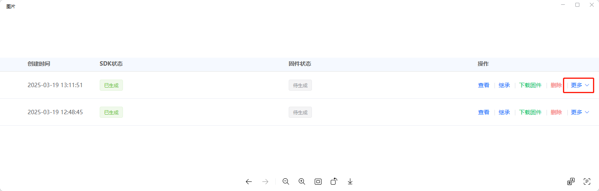
    

3. **服务维护处理**：

    - 如果问题持续，可能是平台正在更新维护
    - 等待技术人员修复
    - 修复后会恢复正常生成

    
    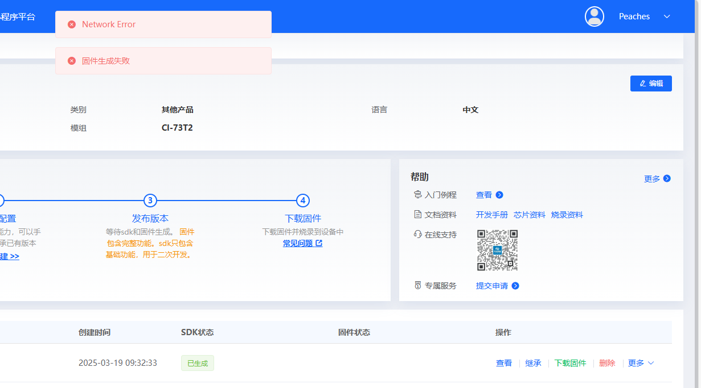

**临时解决方案**：

- 导出工程文件，稍后再尝试生成
- 更换浏览器尝试
- 检查网络连接是否稳定
- 如急需固件，联系专业技术支持协助

**注意事项：**

- 固件生成需要稳定的网络连接
- 平台维护期间可能出现服务异常
- 生成过程中不要刷新页面
- SDK 生成完成后系统会自动生成固件
- 如遇网络波动或刷新，可能需要手动重新生成

---

### CI 系列模块是否支持中英文混合播报？

**问题描述：**

需要实现中英文混合语音播报（如中文句子中夹杂英文单词），但发现平台不支持此类设置，英文会被拆分为单个字母发音。

**解决方案：**

**平台功能限制**：

1. **当前不支持混合语言**：

    - 平台生成的固件不支持中英文混合播报
    - 中文模式下，英文会被识别为拼音字母逐个发音
    - 英文模式下，中文无法正确播报

2. **语言选择说明**：

    - **中文模式**：支持中文播报，英文按字母发音
    - **英文模式**：支持英文播报，不支持中文
    - **其他语言**：支持日文、韩语等独立语言模式

    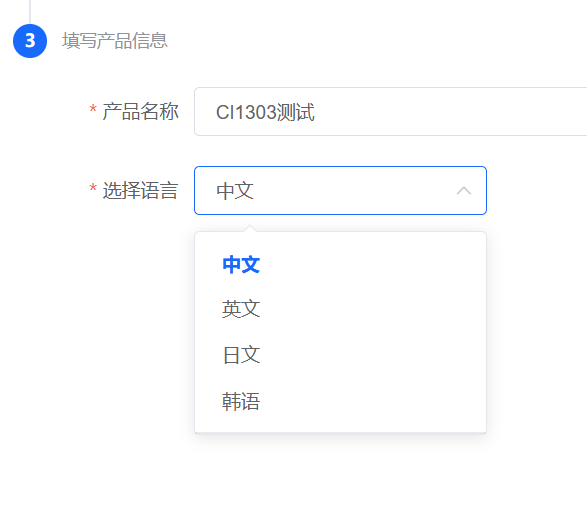

**替代方案**：

1. **分离播报内容**：

    - 将中文和英文分成独立播报项
    - 通过两次播报完成混合内容传达
    - 避免在同一句话中混用语言

2. **定制开发方案**：

    - 联系专业技术支持进行定制开发
    - 需要提供具体的应用场景和需求
    - 可能产生额外的开发费用

3. **使用其他芯片**：

    - 某些芯片（如蜂鸟）支持混合播报
    - 需要评估整体方案可行性

**注意事项：**

- 当前智能公元平台暂不支持中英文混合播报功能
- 选择语言时请保持一致性，避免混合使用
- 如有混合语言需求，建议提前规划内容分离
- 定制方案需要较长的开发周期

---

### 如何配置GPIO端口以实现通过小程序按钮控制端口输出低电平，并在指定时间后自动恢复为高电平？

**问题描述：**

需要通过小程序按钮控制GPIO端口输出，实现按下按钮后输出低电平，并在指定时间后自动恢复为高电平。

**解决方案：**

**1. 创建设备行为**：

- 在设备行为自定义界面创建新的行为（如X1）
- 控制类型配置为"端口输出"
- 目标端口选择需要控制的GPIO端口（如GPIO_1）
- 输出动作设置为"设置低电平"

    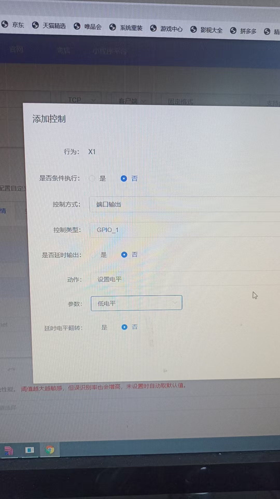

**2. 配置延时恢复**：

- 勾选"延时电平反转"选项
- 设置延时时间（单位：毫秒）
- 延时结束后端口将自动恢复为高电平

**3. 配置小程序触发**：

- 在小程序平台界面添加控件
- 选择按钮控件并关联到创建的设备行为（X1）
- 可自定义按钮名称和图标

    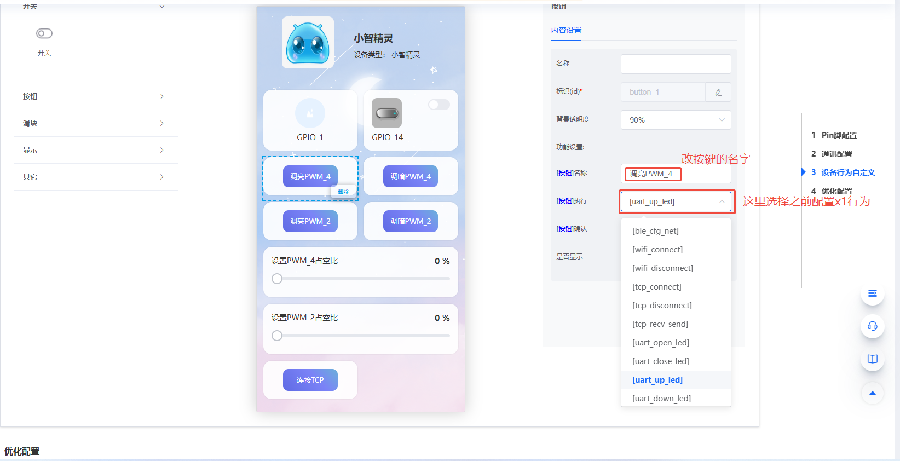

**4. 配置配网行为（重要）**：

- 创建名为"ble_cfg_net"的设备行为
- 触发方式设置为"上电启动"
- 控制类型选择"蓝牙控制"
- 确保设备上电后能自动进入配网模式

    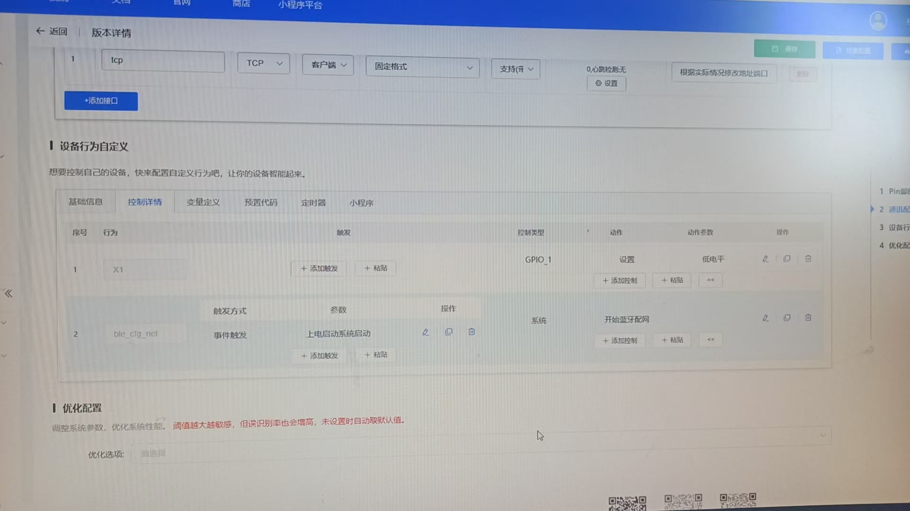
    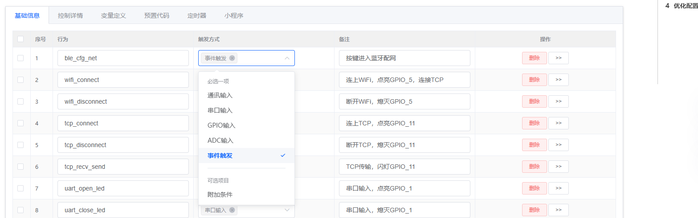
    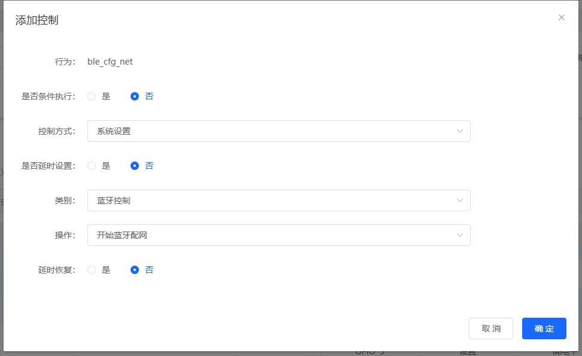

**注意事项：**

- GPIO端口配置为输出模式时，不要在触发条件中寻找该端口的输入选项
- 保留例程中的配网指令，删除后可能导致设备无法正常配网
- 小程序名称为"智能公元"，可在微信中搜索使用
- 如需同时检测外部输入信号，需将对应的GPIO端口配置为输入模式

---

### 为什么小程序中找不到按钮、灯等插件功能？

**问题描述：**

更新固件后，在微信小程序"智能公元"中连接设备，但找不到之前配置的按钮、灯等插件功能。

**解决方案：**

**1. 确认小程序版本**：

- 确保使用的是最新版"智能公元"小程序
- 在微信中搜索"智能公元"并使用官方版本
- 避免使用可能过期的缓存版本

    

**2. 重新配网步骤**：

- 删除当前小程序中的设备
- 烧录新的固件后，设备需要重新配网
- 按照配网流程重新连接设备和小程序

**3. 配置插件功能**：

- 重新配网成功后，在小程序平台界面配置控件
- 添加按钮、灯等插件功能
- 将控件与相应的设备行为关联

**注意事项：**

- 固件更新后必须重新配网，否则插件功能不会显示
- 确保设备已成功连接（状态显示为"连接"）
- 如果长期未使用方案，建议按全新配网流程操作

    

---

### 如何配置GPIO端口检测外部低电平信号并在小程序中显示端口输入状态？

**问题描述：**

需要在CI系列芯片中配置GPIO端口，检测外部低电平信号，并在小程序中实时显示端口输入状态。

**解决方案：**

**1. 配置GPIO输入触发**：

- 在开发平台创建设备行为（如y1）
- 触发方式选择"GPIO输入"
- 选择需要检测的GPIO端口（如GPIO_11）
- 触发条件选择"低电平"

    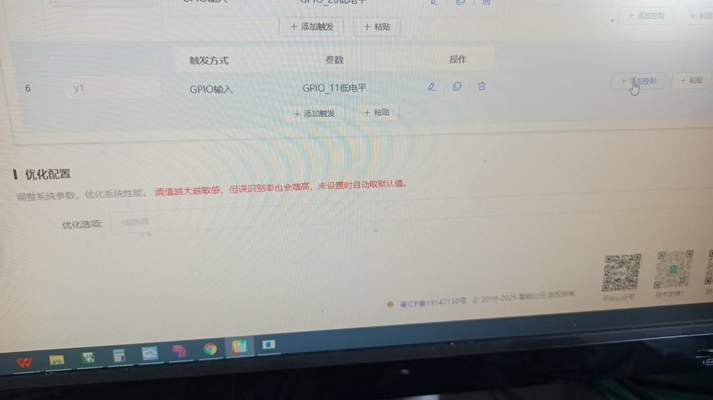
    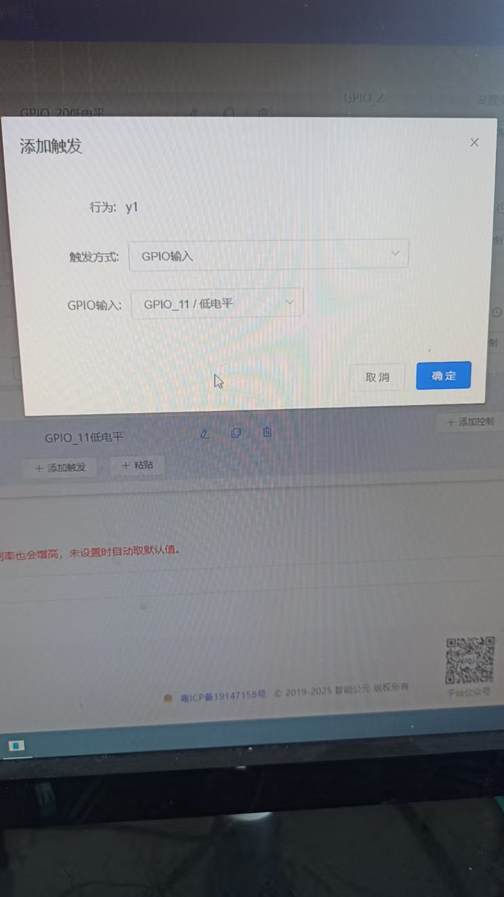

**2. 创建状态变量**：

- 在变量定义界面创建新变量（如bit）
- 数据类型设置为char
- 初始值设为0（表示高电平状态）

    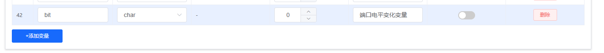

**3. 配置状态更新逻辑**：

- 创建两个设备行为（如A1、A2）
- A1：GPIO_0低电平时，设置bit=1
- A2：GPIO_0高电平时，设置bit=0

    
    

**4. 小程序显示状态**：

- 在小程序平台添加文本显示控件
- 将控件关联到状态变量（如bit）
- 文本会根据变量值自动更新显示

    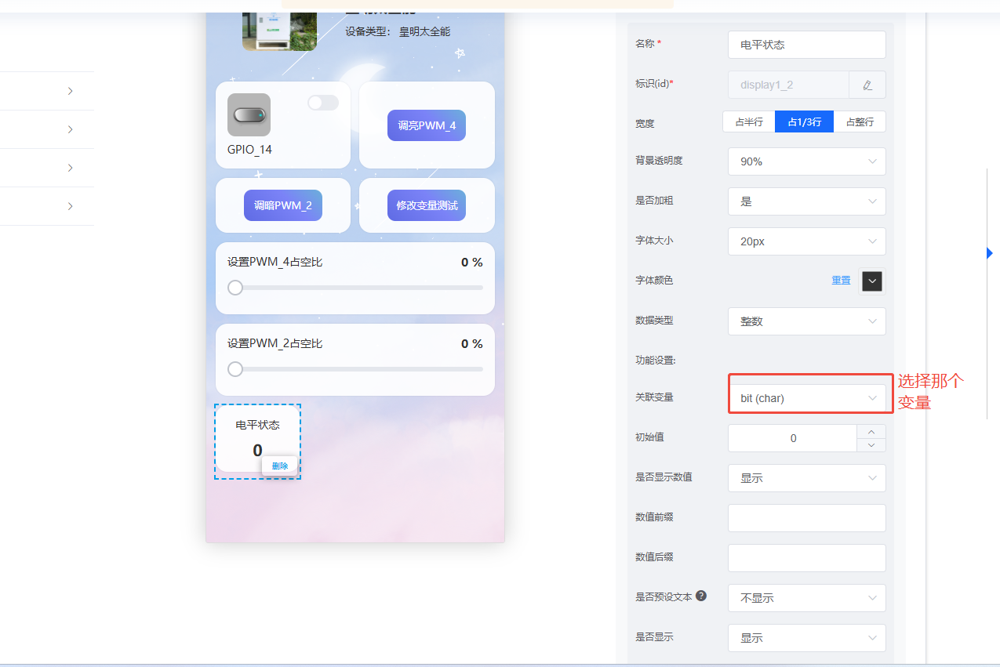

**注意事项：**

- GPIO端口默认高电平时，外部信号通过二极管隔离拉低至0.7V即可触发
- 确保端口已配置为输入模式
- 使用文本控件替代指示灯控件来显示状态
- 变量的值会随GPIO输入变化自动更新

---

### 为什么按钮4按下后所有GPIO输出都同时触发？

**问题描述：**

在小程序中配置了4个按钮控制不同的GPIO端口输出，前3个按钮工作正常，但第4个按钮按下后，所有4个按钮的输出都同时触发。

**解决方案：**

**1. 检查控制配置**：

- 在控制详情界面检查每个行为的配置
- 确认X1、X2、X3、X4分别对应不同的GPIO端口
- 验证每个行为的触发方式和控制动作设置正确

    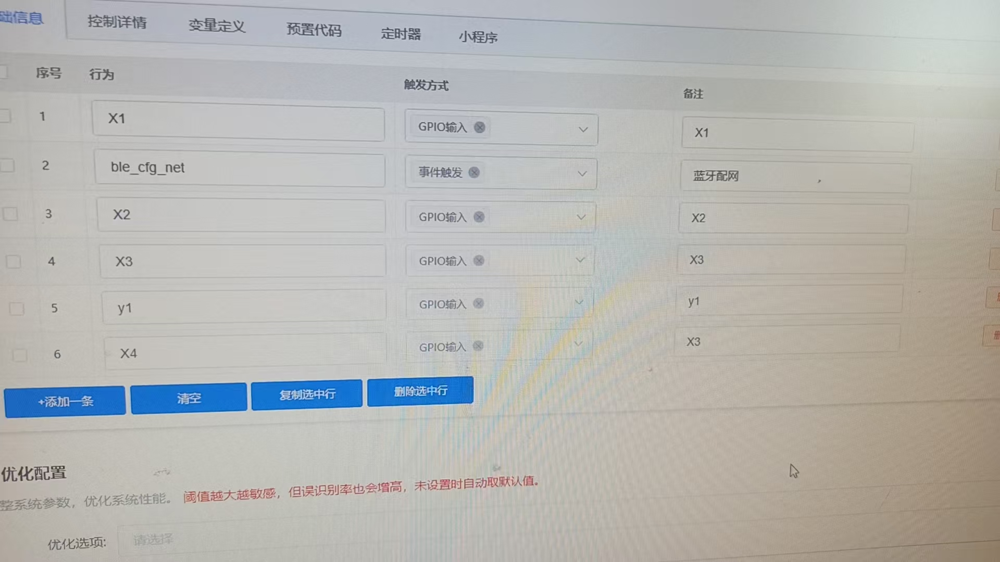
    

**2. 验证GPIO端口配置**：

- 检查X3和X4的GPIO端口是否分别设置
- X3应配置为GPIO_4输出
- X4应配置为GPIO_5输出

    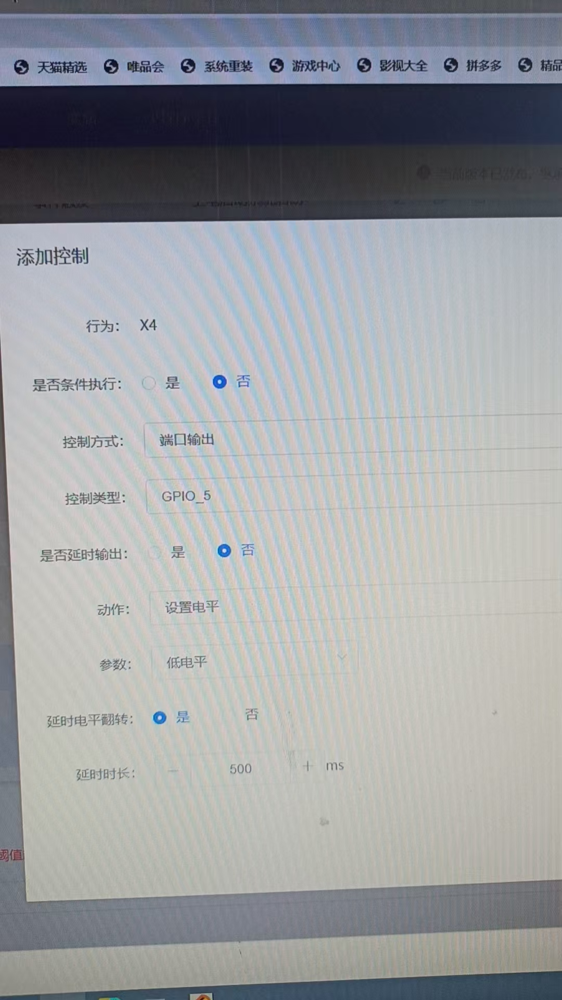
    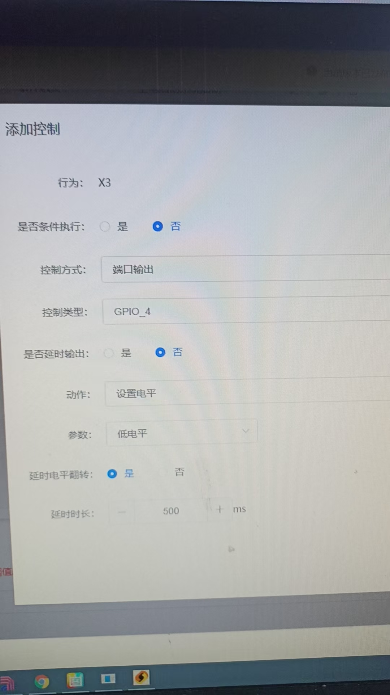

**3. 硬件信号测试**：

- 使用逻辑分析仪检测GPIO输出信号
- 验证各端口输出是否独立触发
- 检查是否存在硬件连接问题导致信号串扰

    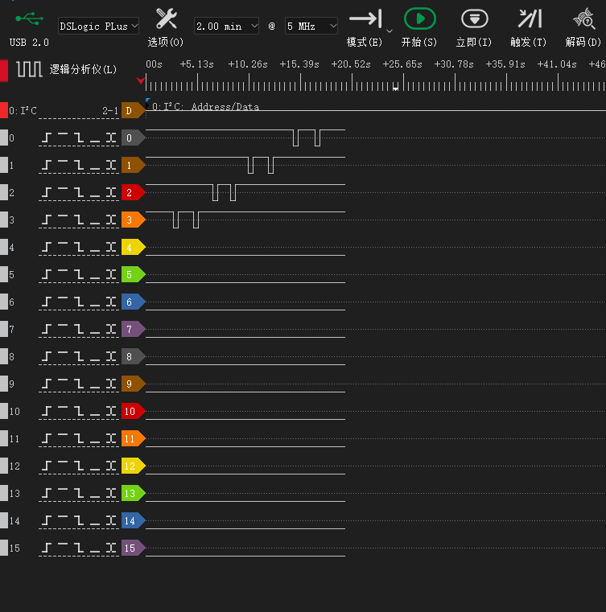

**4. 工程文件检查**：

- 导出工程文件供技术人员分析
- 检查是否存在配置冲突或错误
- 必要时重新创建项目配置

**注意事项：**

- 确保每个按钮对应的行为ID唯一
- 检查是否存在变量共享导致的冲突
- 使用逻辑分析仪可以准确判断硬件输出情况
- 如问题持续存在，建议导出工程文件进行分析

---

### 如何配置小程序数值输入并通过串口1透传到模块？

**问题描述：**

需要在小程序中输入数值，并通过串口1将该数值透传到外部模块，但配置后生成固件失败。

**解决方案：**

**1. 创建数值输入控件**：

- 在小程序平台添加"数值输入"控件
- 设置数据类型为"整数"
- 设置最小值和最大值范围
- 关联到创建的变量（如AD1S）

    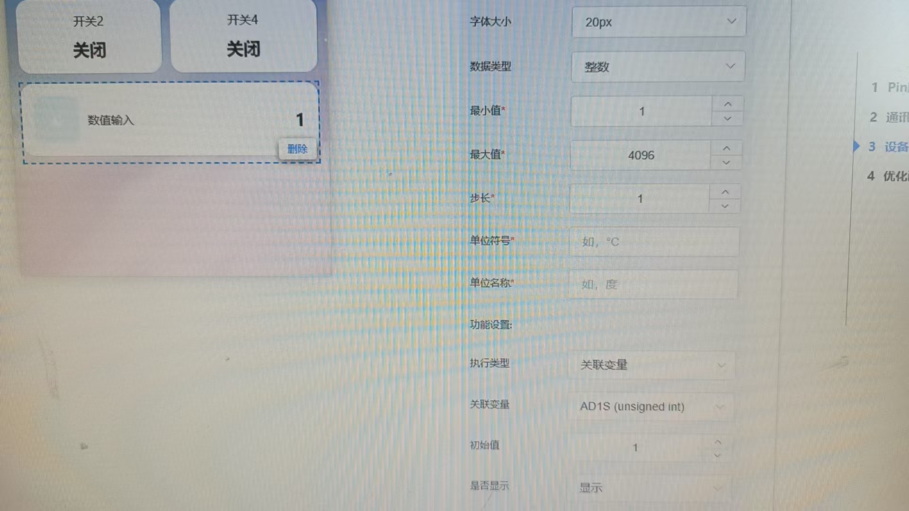

**2. 创建接收变量**：

- 在变量管理界面创建变量（如AD1S）
- 数据类型设置为"unsigned int"
- 用于存储从小程序输入的数值

    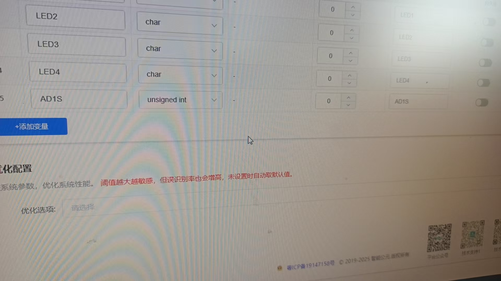

**3. 配置通讯输入触发**：

- 创建设备行为，触发方式选择"通讯输入"
- 接口选择"tcp [TCP]"
- 设置消息编号
- 输入参数关联到变量（AD1S）

    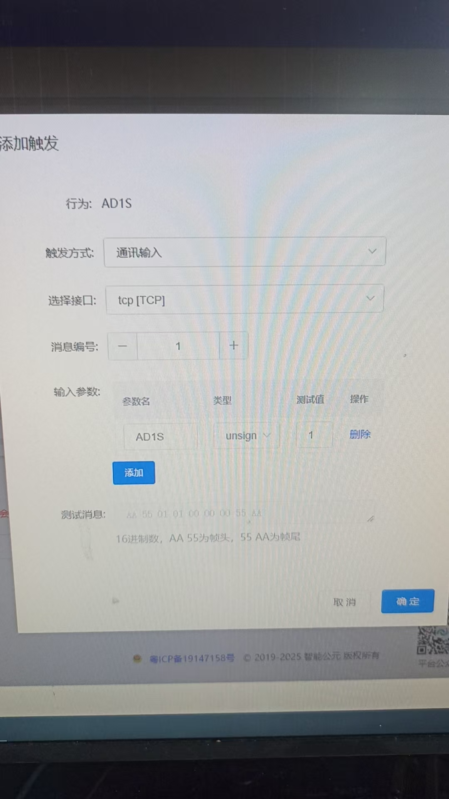

**4. 配置串口透传控制**：

- 添加控制方式为"通讯控制"
- 操作选择"开始透传"
- 透传规则设置为"tcp -> UART1_TX"

    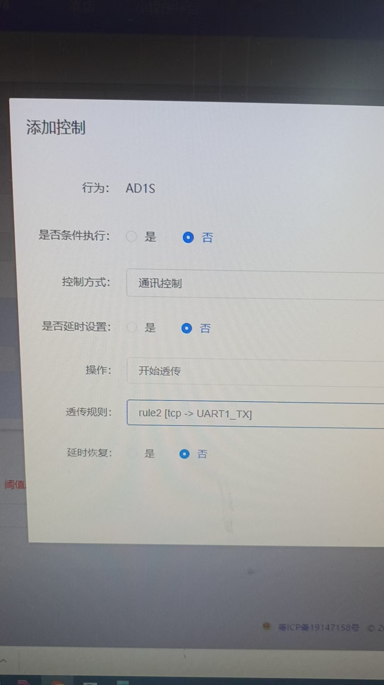

**5. 参考标准协议**：

- 在协议定义页面查看示例协议
- 参考"LED Light"等标准协议配置
- 确保配置格式正确

    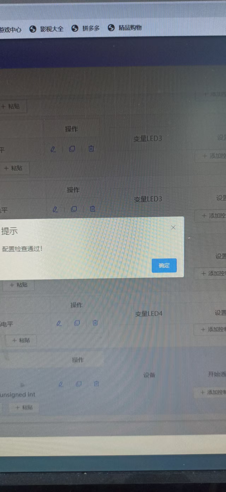
    
    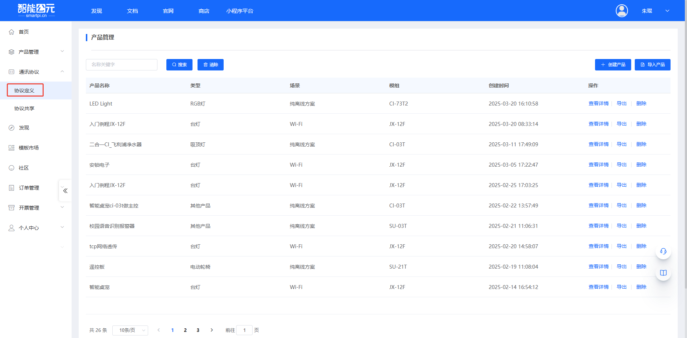

**注意事项：**

- 配置检查通过不代表固件一定能成功生成
- 需要确保所有参数配置正确且无冲突
- 透传规则语法必须准确无误
- 建议参考标准例程的配置方法

---

### 为什么小程序连接会突然断开？

**问题描述：**

小程序昨天连接正常，今天打开后设备连接断开，需要重新下载小程序并重新配网才能恢复连接。

**解决方案：**

**1. 检查连接状态**：

- 确认是否能进入小程序
- 检查设备列表中是否显示已断开
- 区分是小程序无法打开还是设备连接问题

**2. 重新配网流程**：

- 删除当前的小程序
- 重新下载安装最新版本
- 删除设备后重新进行配网

**3. 检查设备配置**：

- 确认设备固件中的配网行为配置正确
- 验证"ble_cfg_net"行为设置为上电启动
- 确保控制类型为"蓝牙控制"

    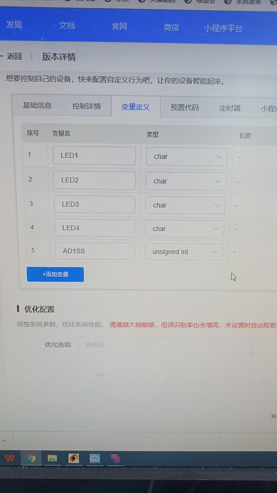

**4. 协议配置检查**：

- 检查串口数据输出配置是否正确
- 确认数据类型设置匹配（int型对应4字节）
- 验证协议模板配置无误

**注意事项：**

- 小程序版本更新可能导致兼容性问题
- 设备端异常也可能导致连接断开
- 建议定期更新小程序和固件版本
- 如频繁断开，检查网络环境和设备供电

---

### 为什么int型数据串口输出不稳定？

**问题描述：**

配置串口数据输出时，参数类型设置为int型，但串口输出数据不稳定，有时能输出，有时无法输出，且输出的数据格式与预期不符。

**解决方案：**

**1. 修改数据类型配置**：

- 将协议中的参数类型从int(16)改为int(32)
- int(16)只占用2个字节，可能导致数据截断
- int(32)占用4个字节，能完整传输int型数据

    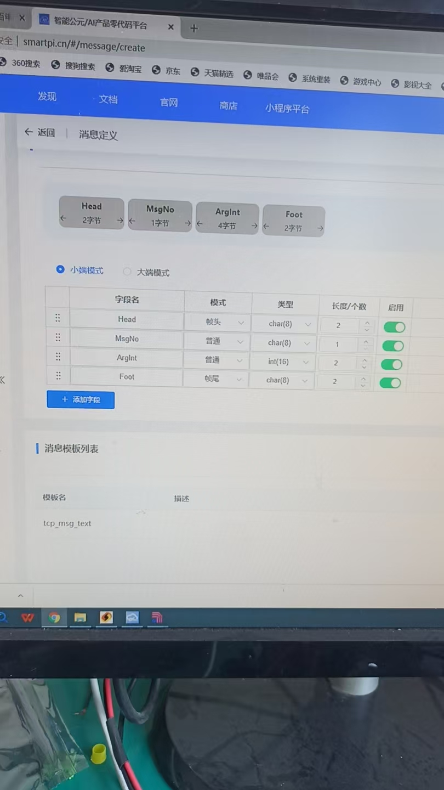
    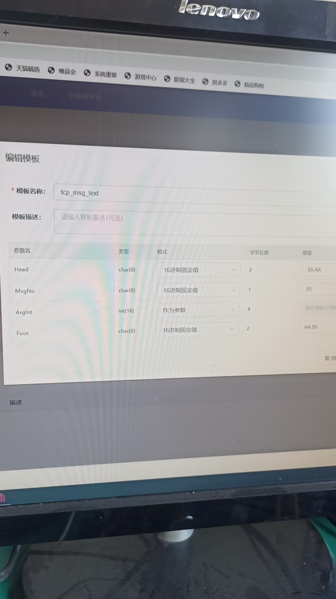
    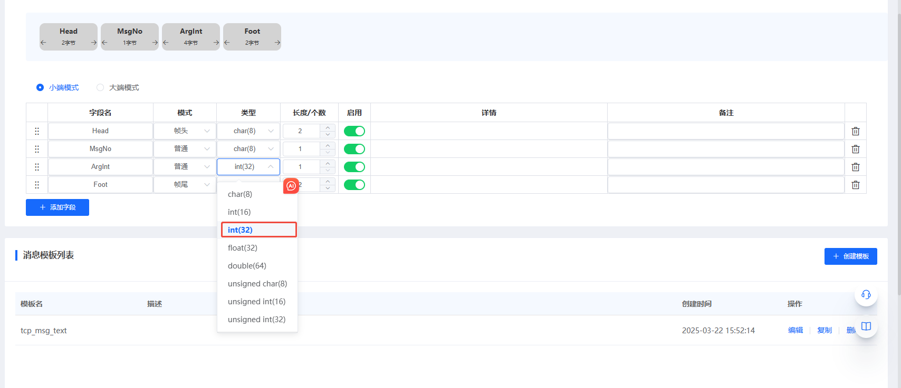
    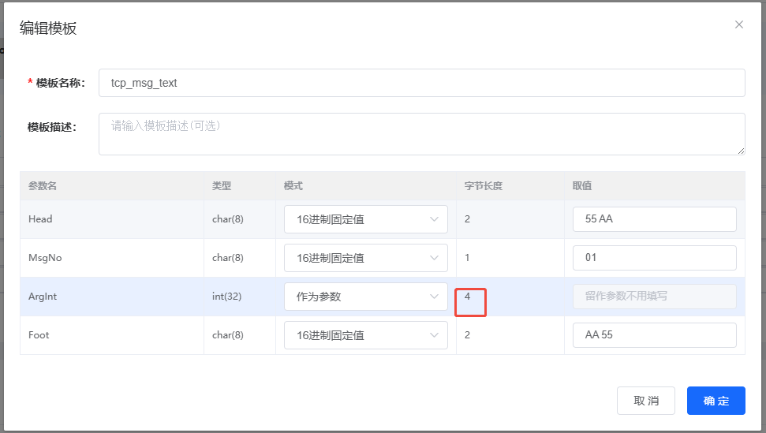

**2. 检查串口触发配置**：

- 触发方式选择"串口输入"
- 选择正确的串口（UART1_RX）
- 输入参数类型设置为int

    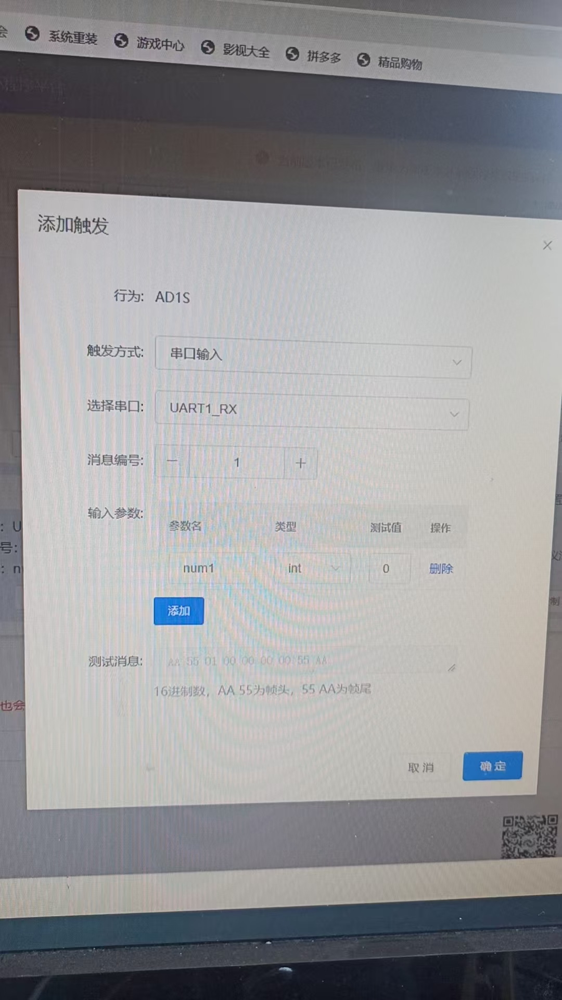

**3. 验证数据传输**：

- 在小程序输入测试数值（如257）
- 使用串口调试器查看输出数据
- 确认数据格式为16进制

    
    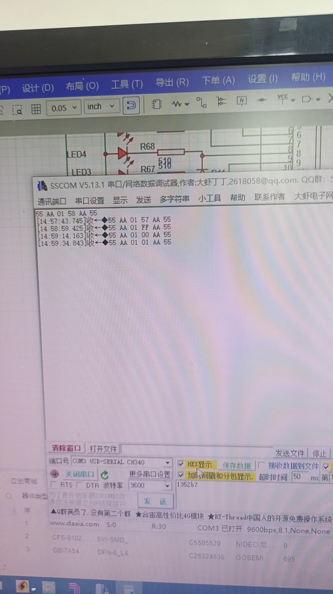

**4. 检查硬件配置**：

- 确认UART1_TX的波特率设置（如115200）
- 检查数据位配置（8位）
- 查看系统日志确认初始化成功

    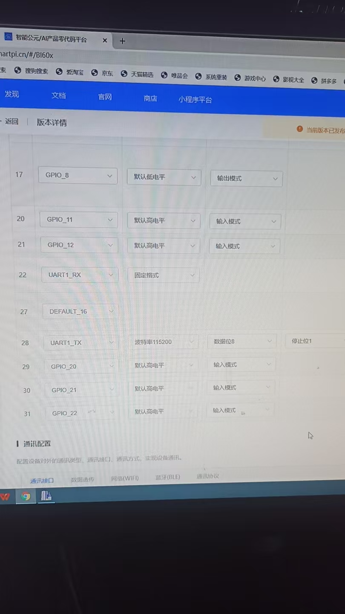
    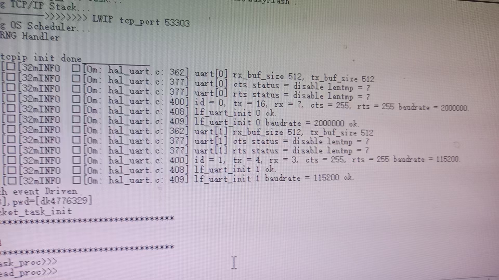

**注意事项：**

- int型数据建议使用int(32)类型避免截断
- 确保发送端和接收端的波特率一致
- 使用示波器或逻辑分析仪验证信号质量
- 检查串口线连接是否可靠

---

### 如何设置设备上电默认唤醒？

**问题描述：**

设备每次上电后需要手动唤醒才能识别语音指令，希望配置为上电后自动处于唤醒状态。

**解决方案：**

**1. 进入唤醒状态设置**：

- 在平台的设置界面中找到唤醒相关配置
- 配置设备上电后直接进入唤醒状态

**2. 禁用超时退出唤醒**：

- 关闭"禁止超时退出唤醒"功能
- 确保设备不会自动退出唤醒状态

**3. 添加控制延时**：

- 为"进入唤醒状态"控制添加100ms延时
- 为"禁止超时退出唤醒"控制添加100ms延时

**注意事项：**

- 上电启动事件需要配合"允许语音识别"功能使用
- 两个控制延时设置可以避免时序问题导致的配置失效


---

### 如何配置语音模块自动退出后触发串口指令？

**问题描述：**

需要在语音模块自动退出后触发一个串口指令通知单片机执行保存操作，以及通过串口指令唤醒模块。

**解决方案：**

**1. 配置退出触发**

- 在平台配置界面的"事件触发"中选择"语音触发退出唤醒"
- 设置触发后发送的串口指令内容
- 该指令会在模块自动退出时通过串口输出


**2. 配置串口唤醒**

- 在"串口输入"功能中启用唤醒功能
- 选择UART1_RX接收接口
- 设置消息号（如消息号：1）
- 主控发送对应消息号即可唤醒模块


**3. 实现流程**

- 自动退出时：模块发送预设指令给单片机
- 单片机收到指令：执行保存操作
- 串口唤醒：主控发送特定消息号唤醒模块

**注意事项：**

- 退出回复语音会正常播报，同时触发串口指令
- 串口唤醒功能需要在平台正确配置消息号
- 两个功能可以同时使用，互不冲突

---

## SDK编译服务优化


---

### SDK编译排队时间过长怎么办？

**问题描述：**

在使用智能公云平台的SDK编译服务时，遇到编译任务排队时间过长，耗时超过1小时仍未完成的问题。

**解决方案：**

- 节后开工或高峰期任务较多，排队时间延长属于正常现象
- 建议错峰使用，避开上午9-11点、下午2-4点等高峰时段
- 可先准备其他工作，等待编译完成
- 保存编译任务ID，便于跟踪进度

**注意事项：**

- 编译平台显示的预计时间（10-30分钟）在高峰期可能不准确
- 如等待时间过长（超过2小时），可联系技术支持确认状态
- 保存好编译任务截图，记录创建时间和排队状态
- 避免重复提交相同任务，加重排队负担


---

## 固件版本管理最佳实践


---

### 固件版本时间不符合要求如何处理？

**问题描述：**

需要生成的固件版本时间在特定日期之后（如2024年10月25日），但当前生成的固件版本时间过早。

**解决方案：**

**操作步骤：**

1. 登录智能公云平台
2. 进入固件管理界面
3. 找到符合要求的旧版本固件
4. 点击"继承"按钮
5. 确认配置参数
6. 重新发布生成新固件

**注意事项：**

- 继承旧版本时会保留原有配置和功能
- 新生成的固件会有当前的时间戳
- 确保选择正确的基线版本进行继承
- 发布前仔细检查所有配置项


---

### 如何建立有效的固件管理制度？

**问题描述：**

需要建立标准化的固件管理流程，确保版本可控、问题可追溯。

**解决方案：**

**1. 版本记录规范**

- 使用统一的记录格式
- 包含关键信息：MD5、日期、配置、功能描述
- 建立电子档案，便于查询

**2. MD5校验流程**

- 收到固件立即计算MD5
- 与预期值对比验证
- 截图保存校验结果
- 异常情况及时反馈

**3. 存储管理**

- 按项目和日期分类存储
- 保留最近3个版本的固件
- 重要项目永久备份

**注意事项：**

- 制度执行要严格，避免遗漏
- 定期审计固件管理记录
- 培训相关人员遵守规范
- 使用工具辅助管理（如Excel、专业软件）

---

### 如何禁用免唤醒功能的主动退出？

**问题描述：**

配置了免唤醒功能后，希望禁用主动退出功能，让模块始终保持唤醒状态。

**解决方案：**

**禁用方法：**

1. **删除退出命令**
    - 进入主动退出设置界面
    - 删除已设置的退出命令
    - 保存配置

2. **清空退出回复**
    - 将退出命令设置为空
    - 清空退出回复内容
    - 确认保存

**效果说明：**

- 删除退出命令后无法主动退出
- 模块会一直保持唤醒状态
- 只能通过断电才能退出唤醒状态


---

### 配置免唤醒功能后仍需唤醒如何解决？

**问题描述：**

配置了禁止超时退出唤醒功能后，设备上电仍然需要先唤醒才能识别命令。

**解决方案：**

**检查配置完整性：**

1. **上电启动行为配置**
    - 确认已创建事件触发的行为
    - 参数设置为"上电启动系统启动"

2. **进入唤醒配置**
    - 在控制流程中添加"进入唤醒"操作
    - 确保在禁止退出之前执行


3. **执行顺序确认**
    - "进入唤醒"必须在"禁止超时退出唤醒"之前
    - 上电后会按顺序执行这些操作


4. **禁止退出行为**
    - 创建或使用任意行为名称
    - 添加"禁止超时退出唤醒"控制


5. **完整控制流程**
    - 确保两个控制都已添加
    - "进入唤醒"在上方
    - "禁止超时退出唤醒"在下方

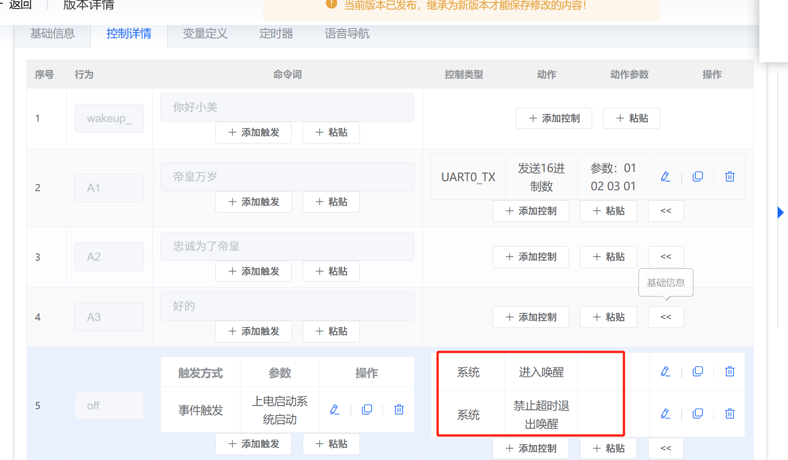

**注意事项：**

- 配置后必须重新生成固件
- 两个控制缺一不可
- 执行顺序不能颠倒

---

### 免唤醒功能配置后仍需唤醒怎么办？

**问题描述：**

按照免唤醒功能配置后，设备仍然需要在超时后自动退出，无法保持唤醒状态。

**解决方案：**

**检查配置顺序：**

1. **确保执行顺序**
    - "进入唤醒"必须在"禁止超时退出唤醒"之前
    - 上电启动事件触发后会按顺序执行
    - 顺序错误会导致配置无效

2. **验证配置生效**
    - 重新生成并烧录固件
    - 上电后测试是否需要唤醒
    - 观察模块是否会自动退出

**常见问题：**

- 配置未正确保存
- 固件未重新生成
- 事件触发设置错误

**调试建议：**

- 逐个检查控制流程配置
- 确认所有操作都已完成保存
- 必要时删除重新配置

---

### 串口通信与延时任务的执行顺序

**问题描述：**

在配置多个任务且包含延时操作（如播放延时、串口发送延时）时，需要确保任务按预期顺序正确执行。

**解决方案：**

- **任务执行顺序**
    - 系统默认自上而下执行任务
    - 第一个操作延时1000ms，第二个操作延时50ms时，第二个任务可能会覆盖第一个任务，导致第一个任务无法执行

- **延时设置建议**
    - 如第一个操作需要1000ms延时
    - 第二个操作应设置为1050ms延时（1000ms + 50ms）
    - 确保后一个任务的延时时间包含前一个任务的延时时间

**注意事项：**

- 多个延时任务时，需要累加计算延时时间
- 建议通过实际测试验证执行顺序是否符合预期
- 串口引脚配置需与硬件连接一致（如A2、A3引脚）


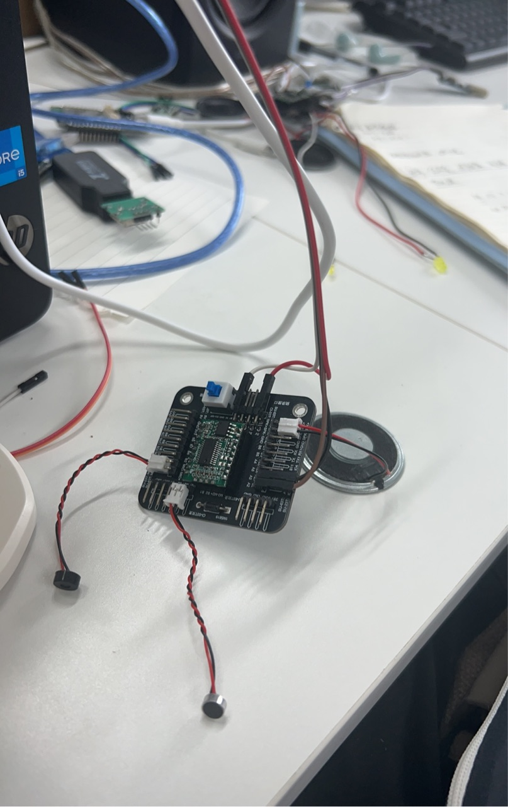


---

### CI1302平台如何实现微秒级定时控制？

**问题描述：**

在使用CI1302平台时，因MCU无串口，需要自定义IO通信协议，但平台的延时和定时器精度仅为毫秒级，无法满足微秒级定时需求（如500微秒高电平、1000微秒低电平的时序）。


**解决方案：**

**平台限制说明：**

- **定时器精度限制**：官方平台仅支持毫秒级定时器，无法实现微秒级精度
- **延时功能限制**：平台提供的延时功能最小精度为1ms，不支持微秒级延时
- **IO控制方式**：平台不支持自定义时序的IO控制协议

**解决方案：**

1. **SDK二次开发（唯一方案）**

    需要通过SDK二次开发实现微秒级时序控制：

    - 下载官方SDK源代码
    - 在底层代码中实现精确的微秒级延时函数
    - 使用GPIO直接控制IO口输出特定时序
    - 编译生成自定义固件

2. **技术实现要点**

    - 使用芯片的硬件定时器实现精确延时
    - 配置GPIO为高速输出模式
    - 编写时序控制函数实现500μs/1000μs等精确延时
    - 注意中断处理对时序精度的影响

3. **开发要求**

    - 需要专业的嵌入式开发经验
    - 熟悉CI1302芯片的寄存器和外设配置
    - 具备调试硬件时序的能力

**注意事项：**

- 官方平台无法实现微秒级控制，必须使用SDK二次开发
- SDK二次开发不在官方技术支持范围内
- 开发前需要具备扎实的嵌入式C语言编程基础
- 建议先使用开发板验证时序控制功能
- GPIO中断注册和处理需要参考SDK示例代码


---

### 智能公元网站登录时提示"access_token missing"怎么办？

**问题描述：**

在智能公元网站登录时出现"access_token missing"错误提示，同时在找回密码页面提示"手机号不存在"，怀疑是服务器或数据库故障。

**解决方案：**

**问题分析：**

1. **错误代码解析**：

    - 错误代码：41001
    - 错误信息：access_token missing
    - 错误描述：加载失败
    - 表明系统获取访问令牌失败

2. **可能原因**：

    - 浏览器缓存或Cookie异常
    - 登录会话已过期
    - 网络连接不稳定
    - 服务器端认证模块故障
    - 数据库连接问题

**解决方法：**

1. **清理浏览器数据**：

    - 清除浏览器缓存和Cookie
    - 清除浏览器历史记录
    - 尝试无痕模式或隐私模式登录

2. **检查网络环境**：

    - 确认网络连接正常稳定
    - 尝试切换网络环境（4G/5G）
    - 重启路由器或更换网络连接
    - 避免使用网络代理

3. **更换浏览器和设备**：

    - 尝试使用不同浏览器（Chrome、Edge、Firefox）
    - 尝试使用手机浏览器访问
    - 确认系统时间与网络时间同步

4. **账户状态检查**：

    - 确认账号密码输入正确
    - 检查账户是否被锁定或限制
    - 尝试使用"忘记密码"功能重置密码

5. **时间等待法**：

    - 等待一段时间后重试（如10-30分钟）
    - 可能是服务器临时故障或维护
    - 避开高峰时段访问

**临时解决方案：**

1. **使用其他平台**：

    - 如有小程序，尝试通过微信小程序登录
    - 使用移动端APP访问相关功能
    - 联系技术支持获取临时访问方式

2. **离线操作**：

    - 如有紧急需求，联系商务人员获取帮助
    - 保存必要的数据和配置文件
    - 等待服务恢复后再进行相关操作

**技术支持信息：**

如问题持续存在，建议通过以下方式获取帮助：

- **技术支持群**：在官方微信群中咨询
- **商务联系方式**：联系对应的客户经理或销售代表
- **邮件支持**：发送详细问题描述到官方邮箱
- **在线客服**：通过官网的在线客服系统提交工单

**注意事项：**

- access_token missing通常为临时性系统错误
- 建议记录错误发生的具体时间和操作步骤
- 多次尝试失败后，建议间隔一段时间再试
- 如系统维护，请关注官方公告
- 保留登录成功的截图便于问题定位

---

### 上电记忆功能是掉电保存功能吗？

**问题描述：**

需要确认平台中的"上电记忆"功能是否就是掉电保存功能，即设备在断电后能否保留上次的设置状态。

**解决方案：**

**功能确认：**

上电记忆功能就是掉电保存功能。这两个功能名称表述的是同一个特性。

**功能说明：**

1. **数据持久化**：

    - 开启上电记忆后，设备的设置状态会保存到Flash中
    - 断电后数据不会丢失
    - 重新上电后设备会恢复到断电前的状态

2. **适用范围**：

    - 音量设置：保存最后的音量级别
    - GPIO状态：保存各引脚的输出状态
    - 模式设置：保存当前的工作模式
    - 其他配置：根据具体功能支持而定

**使用场景：**

- **音量记忆**：调节音量后断电，重新上电保持相同音量
- **状态保持**：LED灯或其他设备状态在断电后保持
- **模式记忆**：设备工作模式在重启后不重置

**注意事项：**

- 上电记忆功能需要占用Flash存储空间
- 频繁断电上电可能影响Flash寿命
- 部分实时参数可能不支持记忆功能
- 配置完成后需要重新生成并烧录固件

---

### 如何在智能公元平台设置多个唤醒词？

**问题描述：**

需要在智能公元平台上配置多个唤醒词，询问具体的设置方法和位置。

**解决方案：**

1. 设置位置

**登录智能公元平台**：

1. 访问平台：https://www.smartpi.cn/
2. 登录账号后进入产品配置界面
3. 找到对应的产品或创建新产品
4. 进入"控制详情"页面
5. 在左侧菜单中找到"系统设置"选项

2. 配置多个唤醒词

**在系统设置中操作**：

1. 找到"唤醒词配置"部分
2. 点击添加唤醒词
3. 输入新的唤醒词（如"小智"、"小助手"等）
4. 确认添加（支持多个唤醒词同时生效）

3. 唤醒词要求

**数量限制**：

- 支持设置多个唤醒词
- 唤醒词总数不能超过10个（含免唤醒命令词）
- 根据模块型号可能有所不同

**规则要求**：

- 中文唤醒词：4-6个字，4个字最佳
- 英文唤醒词：2-4个单词，4-6个音节
- 避免敏感词和口语化词汇
- 确保发音清晰、响度大

4. 测试和验证

**测试步骤**：

1. 保存配置并生成固件
2. 烧录新固件到模块
3. 依次测试每个唤醒词
4. 确认识别率和误触发率

**优化建议**：

- 在安静环境下测试基础识别效果
- 在实际使用场景测试抗噪能力
- 根据测试结果调整灵敏度设置

5. 注意事项

- 多个唤醒词会占用更多Flash资源
- 唤醒词之间发音差异越大越好
- 避免使用包含相同发音的唤醒词
- 可通过"防止误识别"功能优化误触发

**学习资源**：

- 平台文档中心有详细的图文指导
- B站有相关视频教程
- 遇到问题可联系技术支持


### 智能公元发布固件需要180分钟怎么办？

**问题描述：**

在智能公元平台发布固件时，显示需要等待180分钟，时间过长。

**解决方案：**

**问题原因：**

固件发布时间长是由于**使用人数多，需要排队处理**导致的。

**解决方法：**

1. **取消当前发布**
    - 在平台中取消正在排队的发布任务
    - 重新发起发布请求

2. **选择合适时机**
    - 建议在工作日的非高峰时段发布
    - 避开上午10-12点、下午2-5点的高峰期

3. **快速发布技巧**
    - 取消后立即重新申请，通常可缩短至30分钟左右
    - 多次尝试可能获得更快的处理速度

**优化建议：**

1. **提前准备**
    - 提前完成所有配置检查
    - 确认固件参数正确后再发布

2. **分批发布**
    - 如有多个版本需要发布
    - 建议分时段进行，避免连续排队

3. **备用方案**
    - 保留一份已测试好的固件
    - 紧急情况下可直接使用

**注意事项：**

- 发布时间受服务器负载影响
- 高峰期排队是正常现象
- 建议合理安排发布时间
- 如有紧急需求可联系技术支持

---


### 固件生成失败提示"分词不在字典内"怎么办？

**问题描述：**

在智能公元平台生成固件时，提示"生成失败 分词不在字典内"的错误。

**解决方案：**

**1. 检查命令词配置**

- 确认所有命令词都是标准的中文词汇
- 避免使用生僻字、特殊符号或非中文内容
- 检查是否有错别字或不规范的用词

**2. 命令词规范**

- 使用常用词汇和标准用语
- 避免过长的命令词组合
- 确保命令词符合语音识别规范

**3. 排查步骤**

1. 逐个检查命令词列表
2. 找出可能导致问题的特殊词汇
3. 修改或删除有问题的命令词
4. 重新生成固件

**4. 预防措施**

- 在配置时使用标准普通话词汇
- 避免使用方言词汇或网络用语
- 测试每个命令词的识别效果

---

### 固件生成失败的常见原因有哪些？

**问题描述：**

配置检查通过但生成固件时显示失败，需要了解可能的原因。

**解决方案：**

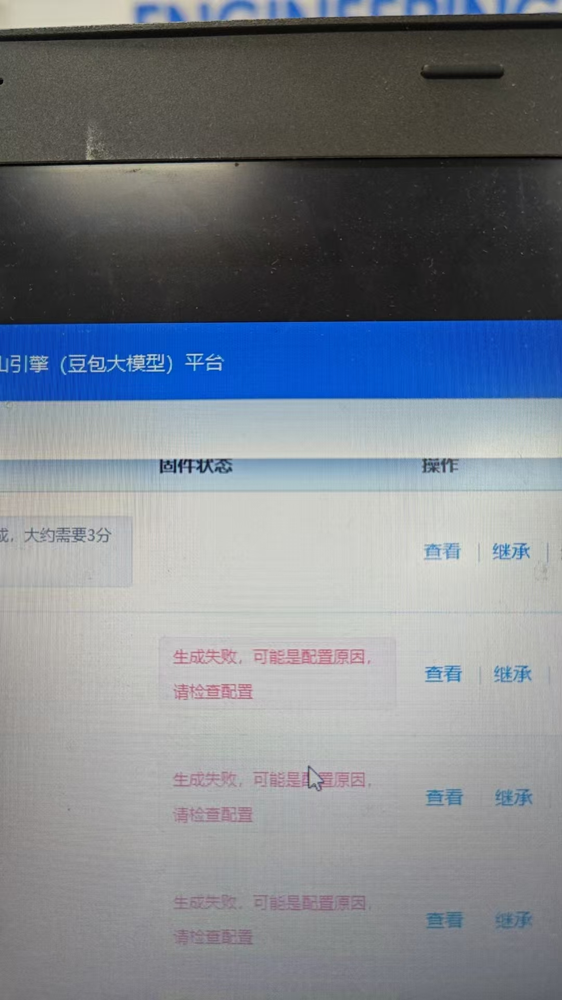

**常见失败原因：**

1. **空的唤醒词记录**
    - 检查是否有未填写唤醒词的配置项
    - 补充完整的唤醒词内容

2. **空的行为记录**
    - 确保每个命令词都有对应的行为
    - 删除或补全空的行为配置

3. **没有添加任何控制**
    - 检查设备行为配置中是否添加了控制动作
    - 定时器超时事件必须配置相应的控制动作
    - 即使配置检查通过，如果没有实际的控制行为，固件也无法生成
    - 解决方法：在对应的行为中添加至少一个控制动作（如GPIO输出、串口发送等）

4. **空的命令词**
    - 检查命令词列表是否有空白项
    - 删除未使用的命令词行

5. **格式要求不满足**
    - 命令词和回复语格式不正确
    - 检查字符长度限制
    - 确认特殊字符使用规范

6. **内存空间超限**
    - 删除一些不必要的配置
    - 减少播报内容长度
    - 优化命令词数量

**排查步骤：**

1. 全面检查配置项完整性
2. 删除所有空白和未使用的配置
3. 确保每个事件行为都添加了至少一个控制动作
4. 优化内存使用（减少命令词、缩短播报）
5. 重新生成并测试
---

### CI-03T创建大量语音命令导致网页卡顿怎么办？

**问题描述：**

CI-03T模块创建了300多条语音命令后，网页非常卡顿，打字都要几秒才能输入。

**解决方案：**

**问题分析：**

- 命令数量过多导致浏览器渲染压力
- 每个命令都需要占用内存资源
- 实时校验加重了计算负担

**优化建议：**

1. **分批管理**
    - 将命令分组管理
    - 每组控制在100条以内
    - 使用多个项目配置

2. **简化配置**
    - 合并相似功能的命令
    - 使用泛化词减少命令数量
    - 删除不必要的重复命令

3. **浏览器优化**
    - 使用性能较好的浏览器（Chrome、Edge）
    - 关闭不必要的浏览器插件
    - 增加浏览器内存限制

4. **替代方案**
    - 使用串口通信实现部分功能
    - 将复杂逻辑交给外部MCU处理
    - 考虑使用支持更多命令的模块

**注意事项：**

- CI-03T模块对命令数量有一定限制
- 过多命令可能影响识别率
- 建议根据实际需求精简命令

---


### CI-33T/CI-03T如何配置语音指令触发串口数据输出？

**问题描述：**

需要实现通过指定语音指令处理完成后，通过串口输出自定义数据。

**解决方案：**

在智能公元平台的控制详情中配置串口输出功能：

**配置步骤：**

1. **添加新控制项**：

    - 进入平台的控制详情页面
    - 点击添加新控制项

2. **设置触发条件**：

    - 触发条件：选择对应的语音指令
    - 或选择GPIO触发等其他触发方式

3. **配置输出动作**：

    - 动作类型：选择端口输出
    - 选择端口：选择已配置的串口（UART0或UART1）
    - 输出数据：填入十六进制数据

**数据格式说明：**

- 支持十六进制格式输入
- 例如：

- 数据会通过选定串口发送出去

**注意事项：**

- 确保串口已正确配置波特率等参数
- 输出数据格式必须为有效的十六进制
- CI-33T与CI-03T都支持此功能

---

### GPIO输入检测是否包含去抖动功能？

**问题描述：**

输入口检测按键开关信号时容易出现检测状态错误，需要了解是否可以添加去抖动设置。

**解决方案：**

**内置去抖动功能：**

CI系列模块的程序本身自带去抖动功能，无需额外配置。

**功能说明：**

- 模块内部已实现硬件去抖动
- 对按键开关等机械触点的抖动自动处理
- 有效避免因开关抖动导致的误触发

**应用建议：**

1. **直接连接按键**：

    - 可直接将按键开关连接到GPIO输入口
    - 无需外部添加去抖动电路
    - 支持5V电平输入（CI系列都有5V耐压）

2. **信号质量要求**：

    - 确保按键信号稳定
    - 避免长线传输引入干扰
    - 必要时使用屏蔽线

**注意事项：**

- 内置去抖动功能已满足多数应用场景
- 如遇特殊干扰，可考虑外部滤波
- PA0与PA1（晶振复用口）最高耐受输入电平为5V

---

### 不同型号模块的SDK是否可以互相继承？

**问题描述：**

在CI-33T创建好的SDK能否继承到CI-03T模块上使用？

**解决方案：**

**平台限制：**

平台开发的SDK不能直接继承，需要手动重新配置。

**具体说明：**

1. **无法继承的原因**：

    - 不同型号的硬件配置可能不同
    - 固件存在差异
    - 平台未提供SDK导入/导出功能

2. **需要手动配置**：

    - 在目标模块（如CI-03T）中重新创建项目
    - 手动添加相同的命令词
    - 重新配置GPIO和串口等设置
    - 重新生成固件

3. **配置建议**：

    - 保留原项目的配置截图
    - 记录关键参数设置
    - 批量配置时可使用模板

**替代方案：**

- 联系技术支持寻求批量配置方案
- 使用相同型号模块避免重复配置
- 建立配置文档便于快速重建

**注意事项：**

- 不同型号的引脚定义可能有差异
- 配置完成后需充分测试
- 建议做好配置备份

---
### CI-33T/CI-03T如何配置语音指令触发串口数据输出？

**问题描述：**

需要实现通过指定语音指令处理完成后，通过串口输出自定义数据。

**解决方案：**

在智能公元平台的"控制详情"中配置串口输出功能：

**配置步骤：**

1. **添加新控制项**：

    - 进入平台的"控制详情"页面
    - 点击"添加新控制项"

2. **设置触发条件**：

    - 触发条件：选择对应的语音指令
    - 或选择GPIO触发等其他触发方式

3. **配置输出动作**：

    - 动作类型：选择"端口输出"
    - 选择端口：选择已配置的串口（UART0或UART1）
    - 输出数据：填入十六进制数据

**数据格式说明：**

- 支持十六进制格式输入
- 例如：AABB01FF
- 数据会通过选定串口发送出去

**注意事项：**

- 确保串口已正确配置波特率等参数
- 输出数据格式必须为有效的十六进制
- CI-33T与CI-03T都支持此功能

---

### GPIO输入检测是否包含去抖动功能？

**问题描述：**

输入口检测按键开关信号时容易出现检测状态错误，需要了解是否可以添加去抖动设置。

**解决方案：**

**内置去抖动功能：**

CI系列模块的程序本身自带去抖动功能，无需额外配置。

**功能说明：**

- 模块内部已实现硬件去抖动
- 对按键开关等机械触点的抖动自动处理
- 有效避免因开关抖动导致的误触发

**应用建议：**

1. **直接连接按键**：

    - 可直接将按键开关连接到GPIO输入口
    - 无需外部添加去抖动电路
    - 支持5V电平输入（CI系列都有5V耐压）

2. **信号质量要求**：

    - 确保按键信号稳定
    - 避免长线传输引入干扰
    - 必要时使用屏蔽线

**注意事项：**

- 内置去抖动功能已满足多数应用场景
- 如遇特殊干扰，可考虑外部滤波
- PA0与PA1（晶振复用口）最高耐受输入电平为5V

---

### 不同型号模块的SDK是否可以互相继承？

**问题描述：**

在CI-33T创建好的SDK能否继承到CI-03T模块上使用？

**解决方案：**

**平台限制：**

平台开发的SDK不能直接继承，需要手动重新配置。

**具体说明：**

1. **无法继承的原因**：

    - 不同型号的硬件配置可能不同
    - 固件存在差异
    - 平台未提供SDK导入/导出功能

2. **需要手动配置**：

    - 在目标模块（如CI-03T）中重新创建项目
    - 手动添加相同的命令词
    - 重新配置GPIO和串口等设置
    - 重新生成固件

3. **配置建议**：

    - 保留原项目的配置截图
    - 记录关键参数设置
    - 批量配置时可使用模板

**替代方案：**

- 联系技术支持寻求批量配置方案
- 使用相同型号模块避免重复配置
- 建立配置文档便于快速重建

**注意事项：**

- 不同型号的引脚定义可能有差异
- 配置完成后需充分测试
- 建议做好配置备份

---


### SDK生成失败提示"配置原因"怎么办？

**问题描述：**

在平台生成固件时，SDK生成成功，但固件生成失败，提示"生成失败，可能是配置原因，请检查配置"。

**解决方案：**

**常见原因分析：**

1. **透传控制配置过多**
    - 添加了过多的透传控制
    - 透传规则冲突导致生成失败
    - 不必要的控制逻辑影响编译

2. **参数配置问题**
    - 变量设置为参数导致生成失败
    - TCP通信参数赋值给变量存在限制
    - 自定义协议与系统冲突

3. **版本控制问题**
    - 当前版本已发布，需要继承新版本
    - 配置修改未保存到新版本

**解决步骤：**

**步骤1：检查透传控制**

- 删除不必要的透传控制配置
- 保留核心功能控制
- 简化控制逻辑

**步骤2：优化参数配置**

- 避免将变量设置为参数
- 使用固定值替代变量参数
- 检查自定义协议兼容性

**步骤3：版本管理**

- 确认当前版本状态
- 如已发布，创建新版本继承配置
- 保存修改后再生成

**步骤4：分步测试**

- 逐个添加控制功能测试
- 确定具体哪个配置导致失败
- 记录成功的配置组合

**预防措施：**

1. **配置备份**
    - 定期导出配置备份
    - 保存已知的可工作配置
    - 建立配置版本管理

2. **渐进式开发**
    - 从简单配置开始
    - 逐步添加复杂功能
    - 每步都测试生成

3. **文档记录**
    - 记录成功的配置模式
    - 标记已知的问题配置
    - 建立配置检查清单

**注意事项：**

- 透传控制虽然灵活，但过多会影响系统稳定性
- 某些功能组合可能存在兼容性问题
- 建议联系技术支持获取特定需求的最佳实践
- 生成失败时会显示具体的错误位置，仔细检查提示信息

---

## 社区常见技术问答

### 多语言支持

#### CI-03T支持哪些语言？

**问题：** CI-03T模块支持哪些语言？

**解答：**

- 平台默认支持：中文、英文、日文、韩文
- 粤语等其他语言需要定制开发
- 支持定制的语言包括：印尼文、阿拉伯文、越文、法文、葡萄牙文、粤语、波斯文、土耳其文、俄文、西班牙文、泰文、德文等

#### 如何定制其他语言？

**问题：** 比如定制西班牙语怎么操作？

**解答：**

- 需要联系技术支持进行定制开发
- 非通用语言需要专门的技术支持

#### 粤语需要定制吗？

**问题：** 平台支持粤语识别吗？

**解答：**

- 平台默认配置不包含粤语
- 粤语需要定制开发
- 可通过定制实现粤语语音识别功能

---

### 固件烧录问题

#### 烧录老固件后无法烧录新固件

**问题：** 烧录了老版本固件后，无法再烧录新固件

**解答：**

- 需要使用调试器或脱机烧录器才能救回
- 不要随意降级固件版本

#### SU-03T烧录不成功

**问题：** 03T不能烧录了？

**解答：**

- 检查硬件连接
- 确认烧录工具设置
- 可能需要专业人员协助

---

### PWM输出控制

#### IO默认电平和延时翻转

**问题：** IO默认状态是低电平，延时电平翻转是一段时间后恢复为低电平吗？

**解答：**

- 是的，默认状态会恢复
- 如果延时反转不奏效，可以做一个控制实现2秒后反转

#### 硬PWM和软PWM的区别

**问题：** 平台可IO配置的是硬PWM，软PWM所有IO都可以？

**解答：**

- 硬PWM：平台可配置的IO口
- 软PWM：所有IO口都支持

#### 控制舵机建议

**问题：** 从SU-03T换到CI-03T，舵机驱动不了

**解答：**

- 建议用硬PWM控制舵机
- 软PWM控制舵机如果需要角度多，可能性能不够

---

### 串口通信

#### CI-73T串口配置

**问题：** CI-73T有几个串口？

**解答：**

- CI-73T有3个串口
- 烧录口固定，通信口都能用

#### 电平转换问题

**问题：** 3.3V MCU与5V模块通信需要电平转换吗？

**解答：**

- 不需要电平转换
- 可以直接连接

#### 串口接收不到数据

**问题：** SU-03T串口无法接收数据？

**解答：**

- 检查串口引脚配置是否正确
- 确认硬件连接牢固
- 验证波特率设置

#### CI-73T烧录波特率

**问题：** CI-73T烧录固件波特率是多少？

**解答：**

- 烧录波特率是921600

---

### 音频播报与中断

#### AEC回声消除功能

**问题：** 如何实现音频中断播放？

**解答：**

- CI-03T支持AEC功能，可以实现音频中断
- SU-03T不支持AEC功能

#### 串口控制播报语音

**问题：** 如何通过串口控制播报语音？

**解答：**

- 串口发送文本，模块播放语音内容
- 需要检查固件中的串口接收触发条件

---

### 识别词条限制

#### SU-03T词条数量限制

**问题：** SU-03T最大能支持多少条词条？

**解答：**

- 支持150条识别词条
- 识别效果与字数关系不大，与词数关系大

#### 识别词长度限制

**问题：** 单个识别词的长度是否有限制？

**解答：**

- 没有严格限制
- 但太长的词（成一句话）识别效果会大打折扣
- 示例："我自横刀向天笑，去留肝胆两昆仑"可以识别

#### 组合播报优化

**问题：** 如何优化播报内存使用？

**解答：**

- 使用组合播报功能
- 重复使用的词组（如"你好"）只占用一个音频内存
- 系统会自动调用重复词组

---

### 电源与硬件

#### CI-73T供电要求

**问题：** CI-73T需要多少伏供电？

**解答：**

- 需要5V供电
- 3.3V不行

#### SU-03T喇叭匹配

**问题：** SU-03T匹配什么规格的喇叭？

**解答：**

- 8欧1瓦声音小
- 建议使用4欧3瓦，声音大

#### 咪头接口

**问题：** 是否有焊在板子上的咪头？

**解答：**

- 有插针麦可供选择
- CI-03T支持双麦克风，一个做识别，一个做降噪

---

### TTS功能

#### TTS模块

**问题：** 有TTS模块芯片吗？

**解答：**

- 有CI1302型号的TTS模块
- 支持文字转语音功能

#### 本地TTS播报

**问题：** 如何实现本地数据TTS播报？

**解答：**

- 单片机发送文本给模块
- 模块进行语音播放
- 需要正确配置串口通信

---

### 其他常见问题

#### UAC协议支持

**问题：** 芯片支持UAC协议输出吗？

**解答：**

- 目前还不支持UAC协议

#### WiFi蓝牙模块

**问题：** 有WiFi蓝牙模块吗？

**解答：**

- JX-A7T是语音+BLE小程序+WIFI模块
- 支持大模型连接

#### 本地生成固件

**问题：** 能否本地生成固件免排队？

**解答：**

- 目前没有本地生成功能
- 需要在云端排队生成

#### 平台保存失败

**问题：** 平台一直提示保存失败？

**解答：**

- 可能是文件损坏
- 建议重新创建工程
- 检查网络连接

#### 声源定位功能

**问题：** 声源定位如何操作？

**解答：**

- CI-03T支持声源定位
- 需要参考教学视频进行配置

#### 麦克风连接

**问题：** SU-03T模块MIC接口可以接两个MIC吗？

**解答：**

- SU-03T不支持
- CI-03T可以连接双麦克风

#### 双MIC配置选项不可选择怎么办？

**问题描述：**

在平台配置时，发现"双MIC"选项为灰色禁用状态，无法选择。

**原因分析：**

双MIC选项能否选择取决于模块硬件是否支持双麦克风功能：
- 不支持双MIC的模块，该选项会自动置灰禁用
- 只有使用双麦克风硬件版本的模块才能选择该选项

**支持双MIC的模块型号：**

| 系列型号 | 支持情况 |
|---------|---------|
| CI-03T2 | ✓ 双麦版本 |
| CI-03T4 | ✓ 双麦带晶振版本 |
| CI-33T2 | ✓ 双麦高配版 |
| CI-33T4 | ✓ 双麦带晶振版本 |
| CI-73T2 | ✓ 双麦基础版 |
| CI-95C2 | ✓ 双麦版本 |
| CI-96Z62 | ✓ 双麦基础版 |
| SU-30T | ✓ 双麦版本 |
| SU-31T | ✓ 双麦版本 |
| SU-32T | ✓ 高性能双麦版本 |

**不支持双MIC的模块型号：**

- SU-03T、SU-10A、SU-11T、SU-13T、SU-20T、SU-21T、SU-22T、SU-23T、SU-63T 等标准版
- CI-03T1、CI-03T3、CI-33T1、CI-73T1、CI-95C1、CI-96Z61 等单麦版本

**解决方案：**

1. **确认模块型号**：检查使用的模块是否为双麦版本
2. **更换模块**：如需双麦克风功能，请选择支持双MIC的模块型号
3. **平台配置确认**：双麦模块在平台中选择"双MIC"后，限双MIC的功能选项才可用

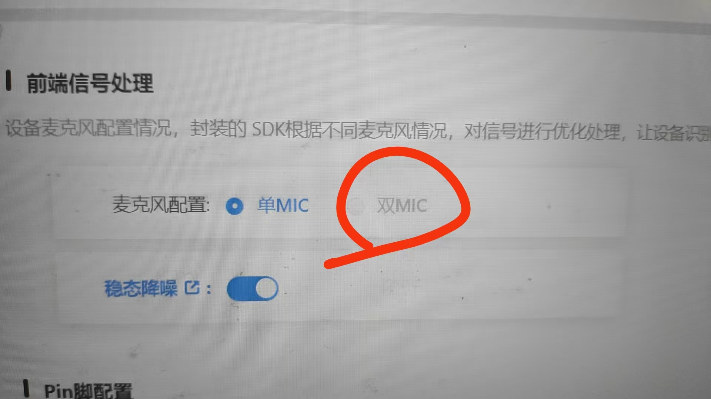

**注意事项：**

- 双麦模块需要连接两个麦克风才能正常工作
- 选择双MIC后，某些功能（如AEC回声消除）可能不可用
- 双麦算法主要用于降噪和声源定位，嘈杂环境下识别效果更佳

---

### 注意事项

1. **固件兼容性**：不要随意降级固件版本
2. **硬件连接**：确保供电稳定，接线牢固
3. **配置备份**：重要配置要做好备份
4. **技术支持**：遇到问题及时联系技术支持

### 相关资源

- [智能公元平台](https://www.smartpi.cn)
- [官方文档中心](https://help.aimachip.com/)
- [B站教程视频](https://space.bilibili.com/1903518159)

---

### 平台配置中哪些内容必须通过平台配置？（2025-12-31更新）

**问题描述：**

不清楚哪些功能必须在平台上配置，哪些可以在SDK中自行修改，影响开发灵活性。

**解决方案：**

**必须通过平台配置的内容：**

- **语音词条**：唤醒词、命令词等语音识别相关词条
- **回复语**：语音播报内容、TTS播报文本
- **串口引脚配置**：UART引脚映射和波特率设置
- **命令行为配置**：各语音命令对应的控制行为

**可在SDK中自定义的内容：**

- **用户变量**：可以在SDK代码中自行定义和使用
- **业务逻辑**：除了词条和回复语外的其他业务逻辑
- **串口数据处理**：串口接收后的数据处理逻辑
- **扩展功能**：自定义的功能扩展和驱动

**配置灵活性说明：**

1. **语音内容管理**
    - 语音词条和回复语必须通过平台配置并生成SDK
    - 这是因为语音模型和播报资源需要平台编译打包

2. **代码开发自由度**
    - 用户变量可以在SDK中定义，不需要在平台配置
    - 业务逻辑代码可以自由修改
    - 支持在SDK中添加新文件（需修改.prj文件）

**注意事项：**

- 平台配置修改后需要重新生成SDK
- 修改SDK代码时注意保留平台生成的核心文件
- 自定义代码建议放在单独的文件中，便于SDK更新时保留

---

### SDK工程如何添加新文件？（2025-12-31更新）

**问题描述：**

在SDK工程中需要添加新的源文件或头文件，但不清楚如何将新文件加入编译。

**解决方案：**

**添加文件步骤：**

1. **创建新文件**
    - 在SDK工程的合适目录下创建新的.c/.h文件
    - 编写代码并包含必要的头文件

2. **修改项目文件**
    - 打开SDK工程目录下的 `.prj` 文件
    - 在 `.prj` 文件中添加新文件的路径

**.prj文件说明：**

- `.prj` 文件是工程的项目配置文件
- 定义了编译时包含的所有源文件
- 新增文件必须在此文件中声明才能被编译

**示例：**

```makefile
# 在.prj文件中添加新文件
SOURCES += ./user_dir/my_new_file.c
```

**注意事项：**

- 添加C文件时同时添加对应的头文件引用
- 修改.prj文件后重新编译工程
- 建议将自定义文件放在单独目录（如user_dir/）中
- SDK重新生成时需要重新添加自定义文件

---

### 如何查看UART配置对应的物理引脚？（2025-12-31更新）

**问题描述：**

平台配置了UART1_TX/UART1_RX，但不知道对应的物理引脚（如PA2、PA3）是如何确定的。

**解决方案：**

**引脚映射查看方法：**

1. **平台配置界面**
    - 在引脚配置页面选择UART功能
    - 查看引脚下拉菜单中的标注（如GPIO_A2、GPIO_A3）
    - 模块丝印一般标注的是默认功能

2. **配置文件查看**
    - 平台生成的配置文件（.json）中包含引脚映射
    - 查找引脚号与GPIO的对应关系

3. **引脚复用说明**
    - 同一引脚可能有多种功能（GPIO、UART、PWM等）
    - 平台配置中选择的功能决定了引脚的实际用途

**示例映射：**

| 平台配置 | 物理引脚 | 功能说明 |
|---------|---------|----------|
| UART1_TX | PA2 | 串口1发送 |
| UART1_RX | PA3 | 串口1接收 |
| LOG2_T | PA5 | 日志输出 |

**注意事项：**

- 引脚映射以平台配置为准
- 不同芯片型号的引脚定义可能不同
- 硬件连接时参考模块的丝印标注

---

### MQTT通信的QoS和retain参数如何配置？

**问题描述：**

在使用MQTT进行设备通信时，需要了解消息的QoS等级和retain标志位的配置方式。

**解决方案：**

**MQTT参数配置说明：**

1. **QoS（服务质量）等级**
   - QoS 0：最多一次，消息可能丢失或重复
   - QoS 1：至少一次，消息确保送达但可能重复
   - QoS 2：恰好一次，消息确保送达且不重复

2. **retain（保留消息）标志**
   - retain=0：消息不保留，订阅时不会收到历史消息
   - retain=1：消息保留在服务器，新订阅者会立即收到最后一条保留消息

**设备端常用配置：**

| 参数类型 | 推荐值 | 说明 |
|---------|-------|------|
| QoS | 1 | 确保消息至少送达一次 |
| retain | 0 | 不保留消息，避免收到过期状态 |

**注意事项：**

- QoS越高，网络开销和延迟越大
- retain=1适用于状态类消息（如设备开关状态）
- 设备状态上报建议使用QoS=1、retain=1
- 控制指令建议使用QoS=1、retain=0

---

### MQTT消息是否需要时间戳？消息顺序如何保证？

**问题描述：**

MQTT消息是否需要携带时间戳？消息的到达顺序是否与发送顺序一致？

**解决方案：**

**时间戳处理：**

- MQTT消息本身可以携带时间戳，但非必须
- 接收方可使用收到消息的时间作为时间戳
- 如需精确时间，建议在消息payload中添加timestamp字段

**消息顺序说明：**

- 在相同QoS等级下，MQTT保证消息的顺序性
- QoS=1时，消息按发送顺序到达
- 消息不会有重试导致的乱序（使用QoS=1、retain=0配置时）

**注意事项：**

- 如需严格排序，在消息中添加递增序号字段
- 网络异常可能导致消息丢失，但不会乱序
- 建议应用层实现消息去重机制

---

### 设备控制接口和属性定义如何配置？

**问题描述：**

需要通过接口控制设备（如灯具开关），如何定义控制属性和实现设备状态上报？

**解决方案：**

**设备控制接口说明：**

1. **属性定义**
   - 设备控制通过属性（Property）实现
   - 每个属性代表一个可控制的状态或参数
   - 属性名由开发者自定义，需在固件和客户端保持一致

2. **示例属性定义**

| 属性名 | 取值范围 | 说明 |
|-------|---------|------|
| switch_1 | 0/1 | 0=关闭，1=打开 |
| brightness | 0-100 | 亮度百分比 |
| color_temp | 2700-6500 | 色温（开尔文） |


**智能台灯属性定义示例：**

| 属性 | 属性字段 | 类型 | 取值 | 取值说明 |
|-----|---------|------|------|---------|
| 电源 | power | enum | 0 | 关灯 |
| 电源 | power | enum | 1 | 开灯 |
| 上灯色温 | upper_kelvin | int | min=3000, max=5700, step=100 | 色温范围3000-5700K，步长100 |
| 上灯亮度 | upper_brightness | int | min=1, max=100, step=1 | 亮度范围1-100 |
| 下灯色温 | lower_kelvin | int | min=3000, max=5700, step=100 | 色温范围3000-5700K，步长100 |
| 下灯亮度 | lower_brightness | int | min=1, max=100, step=1 | 亮度范围1-100 |
| 模式 | mode | enum | 0-7 | 0=普通模式，1=恒照模式，2=节律照明模式，3=阅读模式，4=课堂模式，5=护眼模式，6=放松模式，7=夜间模式 |
| 定时关灯 | auto_power_off | enum | 0-1 | 0=不定时关灯，1=启动定时关灯 |
| 音量 | volume | int | min=1, max=100, step=1 | 音量范围1-100 |
| AI童锁 | ai_lock | enum | 0-1 | 0=童锁关闭，1=童锁打开 |
| 联网状态 | WifiConnect | enum | 0-1 | 0=未联网，1=已联网 |
3. **MQTT消息主题**

| 功能 | 主题格式 | 说明 |
|-----|---------|------|
| 控制下发 | `jixin/${productKey}/${deviceKey}/control` | 平台向设备下发控制指令 |
| 设备上报 | `jixin/${productKey}/${deviceKey}/report` | 设备向平台上报数据 |

参数说明：
- `productKey`：产品唯一标识
- `deviceKey`：设备编号的最后一段（如设备编号`BL_62_2_EC_112233445566`，则`deviceKey=112233445566`）


4. **公共消息头结构**

所有消息包含以下公共字段：

| 字段 | 类型 | 说明 |
|-----|------|------|
| traceId | String | 消息ID，应答时需与原消息一致 |
| payloadVersion | Int | 消息版本号，用于协议兼容 |
| uuid | String | 设备或消息的唯一标识 |
| timestamp | Int | 消息发送时间戳 |
| method | String | 操作方法（见下文） |
| auth_code | String | 设备密码，默认为空 |

5. **操作方法（method）定义**

| method值 | 功能 | 说明 |
|---------|------|------|
| device-properties-report | 属性上报 | 设备属性变更时主动上报 |
| device-properties-query | 属性查询 | 平台查询指定属性，设备回应结果 |
| device-properties-query-all | 全部属性查询 | 平台查询所有属性 |
| device-properties-control | 属性设置 | 平台下发控制指令，设备执行后回应 |
| ota-issue | OTA升级 | 平台下发固件升级任务 |
| ota-progress-report | OTA进度上报 | 设备上报升级进度 |

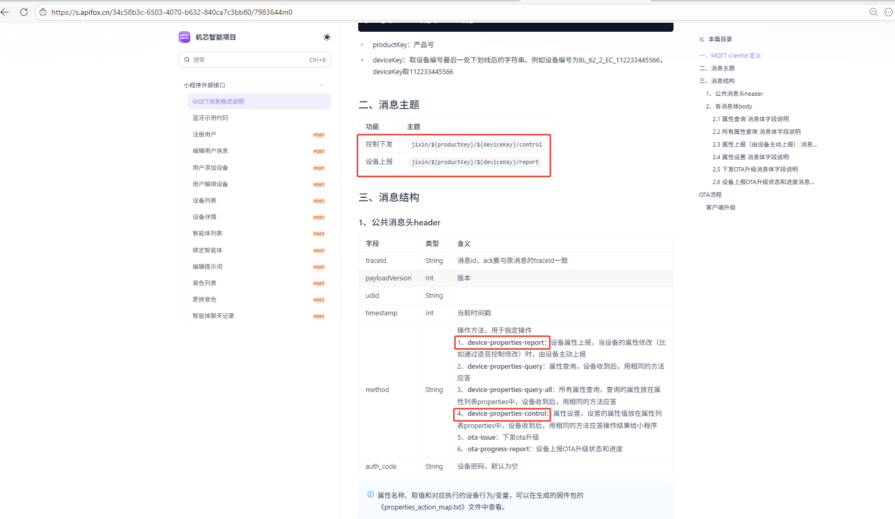

6. **控制流程**
   - 客户端发送控制消息（指定属性名和值）
   - 设备接收消息并执行控制动作
   - 设备执行后上报新状态（可选）

**固件配置建议：**

- 根据实际产品需求列出所需控制属性
- 将属性定义配置到固件中
- 确保属性名在系统中唯一且语义明确

**注意事项：**

- 属性名使用英文和下划线，避免中文
- 控制属性应包含类型、取值范围、单位等说明
- 建议提供完整的属性定义表给对接方

---

### 语音交互界面文字显示如何刷新？

**问题描述：**

语音交互界面需要显示识别文字和回复内容，如何实现多轮对话的文字刷新？

**解决方案：**

**常用显示方案：**

- **多行滚动显示**：最多显示N行（如3行），超过后首行清空，后续内容上移
- **全屏刷新**：每轮对话开始时清空所有显示内容
- **追加模式**：新内容追加到末尾，保留历史对话

**三行滚动示例：**

```
对话1文字显示         (第1行)
对话1回复内容         (第2行)
对话2识别结果         (第3行)
→ 对话1文字清除，内容上移 →
对话1回复内容         (第1行)
对话2识别结果         (第2行)
对话2回复内容         (第3行)
```

**实现建议：**

- 根据屏幕尺寸和显示需求确定显示行数
- 通过协议指令控制界面刷新行为
- 保持用户体验一致性，避免频繁闪烁

**注意事项：**

- 刷新协议需要在客户端和固件端同步实现
- 考虑显示延迟和动画效果
- 保留必要的交互反馈

---
