# CI-03T 语音调优 FAQ

### 连续运动时接收不到指令怎么办？

**问题描述：**

在测试CI芯片产品时，遇到连续运动时接收不到指令的问题，同时锂电池容量过小可能影响性能。

**解决方案：**

- **问题原因**：

    - 锂电池容量过小，导致供电不足
    - 连续运动时功耗增加，电压下降影响芯片工作

- **解决方法**：

    - 更换新代码后恢复正常
    - 建议使用更大容量的锂电池
    - 优化电源管理，确保稳定供电

**注意事项：**

- 确保电池容量满足连续工作需求
- 监测电压变化，避免低于工作电压
- 优化代码功耗管理

---

### WiFi模块如何使用？

**问题描述：**

需要了解如何操作WiFi模块进行蓝牙配网和控制。

**解决方案：**

- **配网步骤**：

    1. 将通信模块插接到板子上
    2. 打开"智能公园"微信小程序
    3. 通过蓝牙进行配网操作
    4. 使用APP控制设备

- **注意事项**：

    - WiFi模块控制相对复杂
    - 可参考视频教程进行操作
    - 配网成功后可远程控制设备

---

### 降噪与自学习功能冲突如何解决？

**问题描述：**

在电机附近 10cm 的高噪声环境下，使用 CI-03T1/T2 芯片时，配置自学习功能与深度降噪功能会发生冲突，导致无法同时启用。

**解决方案：**

**功能冲突说明：**

- 自学习功能和深度降噪功能在 CI-03T 系列芯片上存在冲突
- 两者无法同时开启使用
- 需要根据实际需求选择其中一个功能

**高噪声环境建议：**

1. **选择烟机应用场景**
    - 在平台应用场景中选择"烟机"选项
    - 烟机场景针对电机噪声进行了优化
    - 自身具有一定的降噪效果

2. **功能取舍建议**
    - 如果必须使用自学习功能：不开启深度降噪
    - 如果需要更好的降噪效果：放弃自学习功能
    - 单独更换噪声模型（烟机模型）也能有效果

3. **替代方案**
    - 适当调高命令识别阈值
    - 在硬件上增加隔音措施
    - 调整模块安装位置，远离噪声源

**配置步骤：**

1. 进入产品应用场景选择界面
2. 选择"中文烟机通用Pro"场景
3. 在 Pin 脚配置中根据需求选择功能
    - 选择"语音识别+自学习"（放弃深度降噪）
    - 或选择"语音识别+深度降噪"（放弃自学习）

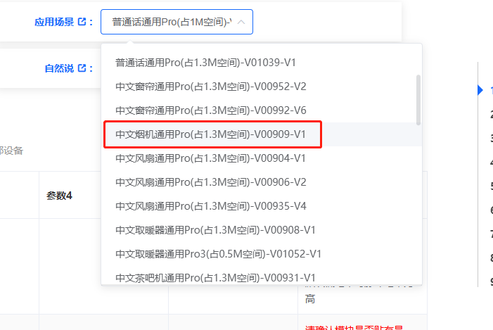

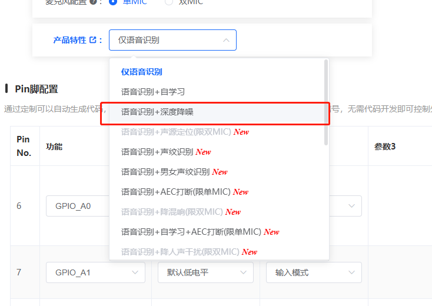


---

### CI-03T是否支持用户自定义语音指令学习功能？

**问题描述：**

需要在台灯项目中集成CI-03T离线语音模块，实现语音指令的自定义学习功能，让用户可以录制自己的语音指令以提高特定口音的识别准确率。

**解决方案：**

CI-03T支持自学习功能，可以让用户现场录制语音指令：

**1. 功能确认**

- CI-03T模块支持自学习功能
- 用户可以录制带地方口音的普通话
- 录制的语音数据会存储到模块中
- 适合地区口音差异较大的使用场景

**2. 实现方式**

- 通过智能公元平台配置自学习功能
- 在产品特性中选择"语音识别+自学习"选项
- 用户可以在产品设置中进行录音操作
- 录音数据通过模拟信号输入到模块的麦克风引脚

**3. 硬件连接**

- 主控MCU通过串口与CI-03T通信
- 将模拟音频信号输入到CI-03T的麦克风引脚
- 相当于对麦克风讲话，可以触发识别动作

**注意事项：**

- 自学习功能需要在安静环境下进行
- 每个命令词建议录制2-3次以提高成功率
- 带口音的普通话基本都能识别
- 可以先购买样品模块进行测试验证

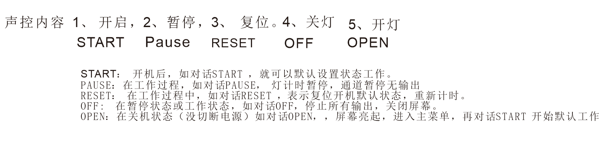

---

### CI-03T模块的硬件连接方式是什么？

**问题描述：**

需要了解CI-03T模块与主控MCU的硬件连接方式、接线注意事项以及软件协议对接方法。

**解决方案：**

**1. 硬件连接**

- 串口通信：MCU的TX连接CI-03T的RX，MCU的RX连接CI-03T的TX
- 供电：CI-03T需要5V直流供电
- 接地：MCU和CI-03T的GND相连
- 音频设备：咪头和扬声器直接连接到CI-03T模块

**2. 调试步骤**

- 先调试MCU的串口功能
- 使用串口助手模拟MCU发送指令给CI-03T
- 验证CI-03T接收指令后执行的动作是否正确
- 确认通信协议和数据格式

**3. 软件对接**

- 根据CI-03T的串口协议定义发送指令格式
- MCU按照协议格式发送控制命令
- CI-03T识别到语音指令后，通过串口返回对应指令码

**注意事项：**

- 串口电平需要匹配（通常为TTL电平）
- 确保供电稳定，建议使用5V/1A以上的电源
- 麦克风和扬声器的选型参考官方提供的选型指南

---

### CI-03T命令词需要说多次才能识别怎么办？

**问题描述：**

在使用离线语音识别芯片时，发现命令词需要说多次才能被识别，希望提高识别灵敏度。

**解决方案：**

**1. 调整识别阈值**

- 在优化选项中调整"命令识别/命令识别阈值"参数
- 阈值设置：低、中、高三个档位
- 阈值越大越敏感，但误识别率也会增高
- 未设置时自动取默认值0.4
- 最高灵敏度设置为0.8


*优化选项中的阈值设置界面*

**2. 增加命令词变体**

- 为同一命令添加多个表达方式
- 示例配置：`前进|向前进|向浅井|向千金`
- 即使发音略有差异，也能提高识别成功率

**3. 优化发音和环境**

- 保持相对安静的环境进行测试
- 命令词发音清晰，语速适中
- 确保麦克风朝向说话人
- 避免背景噪声干扰

**4. 供电稳定性**

- 确保电源供电稳定，避免电压波动
- 尤其在有舵机等运动部件时，电源波动会影响识别率
- 建议使用稳定的电源模块

**注意事项：**

- 提高灵敏度会增加误识别率，需要平衡设置
- 命令词建议控制在合理范围内，避免过多导致冲突
- 阈值调整到0.8时为最高灵敏度

---

### CI-03T唤醒词误触发问题优化

**问题描述：**

CI-03T模组在使用短唤醒词时出现误触发，测试版固件存在误报，需要优化固件实现"先唤醒后执行命令"逻辑。

**解决方案：**

**唤醒词长度优化：**

- 建议使用3-6个字的中文唤醒词
- 过短的唤醒词容易导致误识别
- 避免使用日常对话中的高频词汇

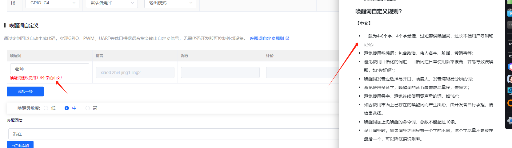

**识别阈值调整：**

1. **命令识别阈值调低**：

    - 适当降低命令识别阈值可减少误触发
    - 建议从0.4开始调整，根据实际效果微调
    - 阈值越小越不敏感，可降低误识别率

2. **唤醒灵敏度设置**：

    - 默认唤醒灵敏度为0.2
    - 如误识别率高，可降低至0.1
    - 需要在实际环境中测试验证

**固件版本选择：**

- 测试版固件可能存在误报问题
- 建议使用正式版固件确保稳定性
- 正式版固件经过全面测试，误触发率更低

**防误识别配置：**

- 在平台中添加容易误识别的词汇到禁止列表
- 多个禁止识别词用"|"分隔
- 可有效避免特定场景下的误触发

**注意事项：**

- 唤醒词和命令词的配置需要在智能公元平台完成
- 配置修改后需要重新生成并烧录固件
- 建议在典型使用环境下进行充分测试
- 平衡识别率和误识别率，找到最适合的阈值设置

### 如何清除 CI-03T 的自学习唤醒词数据？

**问题描述：**

需要在每次关机或开机时自动清除自学习的唤醒词数据，且不通过语音指令进行操作。

**解决方案：**

**清除方法说明：**

1. **禁用第一个唤醒词**
    - 自学习的唤醒词模型存储在第一个唤醒词位置
    - 在平台配置中禁用（关闭）第一个唤醒词
    - 禁用后自学习的唤醒词应该无法触发

2. **替代方案**
    - 使用重置重启功能清除数据
    - 通过串口发送清除命令
    - 在程序中加入开机清除逻辑

**操作步骤：**

1. 进入唤醒词自定义配置界面
2. 找到自学习的唤醒词（通常在第一位）
3. 将该唤醒词状态设置为禁用
4. 重新生成并烧录固件

**技术原理：**

- 自学习功能存储在指定的唤醒词槽位
- 禁用对应槽位即可清除相关数据
- 不需要通过语音指令操作

**注意事项：**

- 此方法需要测试验证有效性
- 可能受固件版本影响
- 如无效可联系技术支持获取其他方案


---

### CI-03T可以同时支持深度降噪和自学习功能吗？

**问题描述：**

需要了解CI-03T是否同时支持深度降噪和自学习功能，特别是在高噪声环境下如何配置功能。

**解决方案：**

**功能限制说明：**

CI-03T的深度降噪和自学习功能**不能同时支持**，需要根据应用场景选择其中一种功能。

**场景选择建议：**

**1. 高噪声环境（如马路边）**

- **推荐配置**：深度降噪
- **原因**：降噪效果更好，能有效滤除环境噪声
- **缺点**：无法使用自学习功能

**2. 自学习为必需的场景**

- **配置方案**：自学习功能
- **适用场景**：需要动态添加或修改命令词
- **注意事项**：降噪能力相对较弱

**3. 折中方案**

- **硬件优化**：使用双麦克风配置提高降噪效果
- **环境改善**：减少环境噪声源
- **命令词设计**：选择发音清晰、不易混淆的词汇

**开发建议：**

- 先在相对安静的环境下测试自学习功能
- 高噪声环境下优先考虑深度降噪
- 根据实际需求权衡功能选择

**注意事项：**

- 两个功能互斥，配置时只能选择其一
- 建议通过实际测试验证所选配置的效果
- 可联系技术支持获取更多配置指导

---

### CI-03T离线识别率极低且误识别严重如何解决？

**问题描述：**

在使用离线语音识别功能时，发现识别率极低，即使将识别灵敏度调至最高，命令词识别仍不准确，经常误识别为其他指令，严重影响使用体验。

**问题分析：**

1. **识别率低的原因**：

    - 命令词发音与训练数据差异较大
    - 麦克风拾音质量或位置不当
    - 环境噪声过大干扰识别

2. **误识别严重的原因**：

    - 命令词之间发音相似
    - 识别阈值设置过高
    - 命令词设计过于简单

**解决方案：**

**1. 命令词重新设计**

- 选择发音差异明显的词汇
- 避免"前进"、"浅井"等易混淆的词组
- 使用4字以上的命令词提高识别准确率
- 示例：使用"启动设备"替代简单的"开机"

**2. 分级优化配置**

```
第一优先级：核心控制命令
- 设置最高识别精度
- 使用最少歧义的词汇

第二优先级：辅助功能命令
- 适当降低灵敏度避免误触发
- 可接受略低的识别率
```

**3. 硬件环境优化**

- **麦克风选择**：

    - 使用灵敏度适中的麦克风，避免过于灵敏的型号
    - 确认麦克风频响范围匹配语音频率
    - 如JX-A7T的麦克风识别过于灵敏，可考虑更换

- **环境降噪**：

    - 减少背景噪声源
    - 增加物理隔音措施
    - 避免风口等位置

**4. 软件参数调节**

- 逐级测试识别阈值，找到最佳平衡点
- 不要直接设置到最高值
- 根据实际环境动态调整

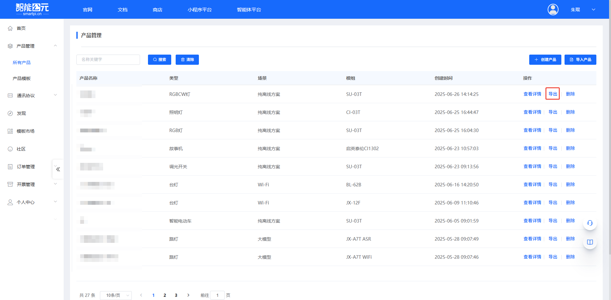

*智能公元平台的产品管理界面，可查看和配置不同模块*

**5. 替代方案建议**

如持续存在识别问题：

- 考虑使用JX-A7T等支持大模型的模块
- 通过AI纠错功能提高识别准确率
- 结合离线和在线模式，互补优势

**调试建议：**

1. **分步测试**：

    - 单独测试每个命令词的识别率
    - 记录容易误识别的命令组合
    - 逐步优化配置参数

2. **数据记录**：

    - 统计各命令的成功/失败次数
    - 记录误识别的具体场景
    - 分析失败原因并针对性改进

3. **用户培训**：

    - 指导用户使用标准发音
    - 保持一致的语速和音量
    - 避免即兴发挥的发音方式

**注意事项：**

- 识别率优化是系统工程，需要软硬件配合
- 过度追求灵敏度会导致误识别增加
- 建议在目标使用环境中进行充分测试
- 保留配置变更记录，便于问题回溯

---

## 串口播报

### 如何配置CI-03T模块的串口播报功能？

**问题描述：**

需要配置CI-03T模块根据串口接收到的数据进行动态语音播报，例如播报电量等实时数据。

**解决方案：**

1. **设置触发方式**

    - 在智能公元平台的控制配置中，将触发方式选择为"串口输入"
    - 这样模块就会根据接收到的串口数据进行播报

2. **配置播报内容**

    - 在回复语字段中填写需要播报的固定内容
    - 对于动态数据（如电量），可以使用变量占位符
    - 模块会从接收到的串口数据中解析参数并进行播报

3. **参考教程**

    - B站有串口播报温湿度的教程视频：https://www.bilibili.com/video/BV1Ms4y1a7RE/
    - 可以参考该视频了解具体的配置方法和实现步骤

**注意事项：**

- 串口播报功能需要正确配置引脚（A2为TX，A3为RX）
- 烧录时模块的TX/RX需要与烧录器的TX/RX交叉连接
- 波特率通常设置为115200，数据位8，停止位1，无校验

---

## 音频播放故障

### CI-03T按键触发录音时偶发无法正常播放音频怎么办？

**问题描述：**

CI-03T设备在按键触发录音播放时，偶发出现无法正常播放音频，仅发出滋滋声，断电重启后恢复正常。

**解决方案：**

**故障现象分析：**

- 偶发性问题：不是每次都出现
- 触发响应：模块收到触发脉冲（能发出滋滋声说明）
- 恢复方式：断电重启后恢复正常
- 喇叭规格：8欧2瓦（在支持范围内）

**可能原因：**

1. **软件异常**
    - 音频解码模块偶尔卡死
    - 内存管理异常导致音频播放失败
    - 中断处理异常

2. **硬件瞬时异常**
    - 电源瞬间波动
    - 功放电路保护性关闭
    - 音频输出路径瞬时异常

**解决方案：**

1. **延长等待时间**
    - 出现问题时等待更长时间（超过1分钟）
    - 观察是否能自动恢复
    - 记录故障持续时间和频率

2. **固件优化**
    - 检查固件版本是否有已知bug
    - 更新到最新稳定版本
    - 在固件中加入异常恢复机制

3. **硬件检查**
    - 确认供电稳定
    - 检查喇叭连接是否牢固
    - 测试其他喇叭确认是否为喇叭问题

**注意事项：**

- 偶发问题通常与软件异常有关
- 建议记录故障发生的具体场景
- 如果问题频繁出现，可能需要更换模块

### CI-03T模块烧录后无法通过唤醒词唤醒怎么办？

**问题描述：**

CI-03T模块烧录固件后，开机播报正常，但无法通过设定的唤醒词（如"你好货电"）唤醒设备。

**解决方案：**

**问题排查步骤：**

1. **确认唤醒词配置**

    - 检查智能公元平台中唤醒词是否正确设置
    - 确认固件生成时包含了唤醒词配置
    - 验证唤醒词拼音和声调设置

    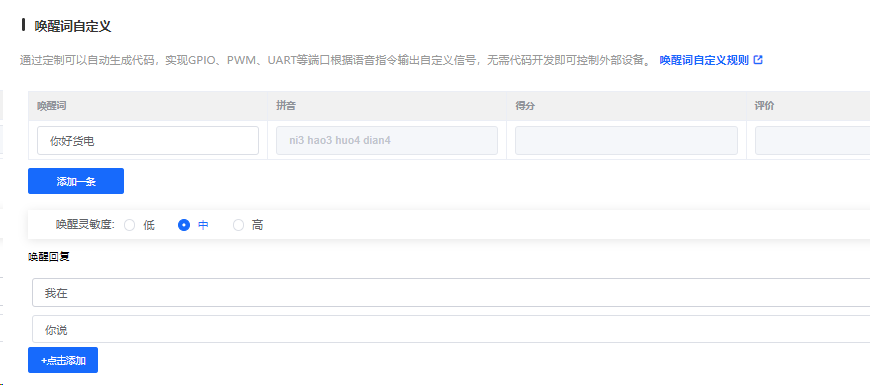

2. **检查固件版本差异**

    - **调试模式固件**：可以正常唤醒
    - **Release模式固件**：可能出现无法唤醒的问题
    - 建议优先使用调试模式进行测试验证

3. **检查AEC设置**

    - 正式版本固件可能需要关闭AEC才能唤醒
    - 在前端信号处理中关闭AEC回声消除功能
    - 测试版本和正式版本可能有差异

4. **使用谐音替代**

    - 如果唤醒词识别困难，可使用读音相近的词
    - 例如："货电"可改为"货店"等谐音词
    - 在唤醒词自定义规则中调整

5. **固件MD5验证**

    - 确认烧录固件的MD5值是否正确
    - 固件损坏可能导致功能异常

**注意事项：**

- Release模式固件与调试模式固件在唤醒功能上可能存在差异
- 建议在开发阶段使用调试模式，验证无误后再打包Release版本
- 唤醒词建议选择发音清晰、不易混淆的词汇
- 如果Release模式持续无法唤醒，可联系技术支持获取固件调试工具

---

## 双麦克风配置问题

### CI-03T2双麦克风模块仅连接一个麦克风时无法唤醒怎么办？

**问题描述：**

CI-03T2双麦克风模块在只连接一个麦克风（M1），M2未连接麦克风的情况下，出现无法唤醒或识别响应的问题。

**解决方案：**

**1. 硬件连接检查**

- 确认M1麦克风已正确连接
- M2麦克风引脚处理方式取决于固件配置
- 检查麦克风电路完整性

**2. 固件配置选择**

- **双麦克风固件**：必须同时连接M1和M2两个麦克风
    - M2悬空会导致模块工作异常
    - M2接地可能影响输入阻抗匹配

- **单麦克风固件**：仅需连接M1麦克风
    - M2可以悬空或根据设计接地
    - 配置为单麦克风模式工作

**3. 具体处理方案**

**方案一：使用双麦克风配置**

- 连接两个相同的麦克风
- M1和M2保持相同的电路参数
- 适合需要降噪的应用场景

**方案二：使用单麦克风固件**

- 只连接M1麦克风
- 重新烧录单麦克风版本固件
- 在平台配置中选择单麦克风模式

**方案三：M2正确处理**

- 如使用双麦固件但只有一个麦克风
- M2引脚不能完全悬空
- 根据设计可能需要适当的阻抗匹配

**注意事项：**

- 双麦克风模块必须使用配套的双麦克风固件
- 单个麦克风工作建议使用单麦克风版本模块
- 麦克风选型和布局会影响识别效果
- 确保电源供电稳定

---

### CI-03T2如何配置声源定位功能并输出角度信息？

**问题描述：**

需要配置CI-03T2双麦芯片的声源定位功能，通过串口输出角度信息，但在实际测试中发现定位角度不稳定、精度差。

**解决方案：**

**1. 声源定位配置**

- CI-03T2支持19个角度信息的声源定位
- 需要配置19条语音指令来对应不同角度
- 可以区分左右方向，满足基本定位需求

**2. 角度输出配置**

- 在平台中为语音指令配置"获取声源角度"系统指令
- 选择通过GPIO_A4引脚以脉冲信号形式输出
- 可设置输出周期和次数（如周期100次，次数1）


**3. 串口输出方案**

通过以下方式实现角度信息串口输出：

- 配置19条指令，每条对应一个角度值
- 使用语音播报功能输出角度信息
- 或配置串口输出相应的角度数据

**注意事项：**

- 声源定位精度受环境影响较大，建议在相对安静的环境下使用
- 麦克风的布局和间距会影响定位精度
- 角度不稳定可能由环境噪声、回声或麦克风安装问题导致
- 建议进行多次测试取平均值以提高准确性

---

## 个性化音频

### CI-03T支持多少个个性化音频？

**问题描述：**

需要了解CI-03T模块支持的个性化音频数量限制，以及串口输入是否能触发播放上传的个性化音频。

**解决方案：**

**1. 音频数量限制**

- **无固定数量限制**：只要内存足够即可添加
- **实际限制**：取决于Flash剩余空间
- **动态提示**：超出限制时配置检查会提示


**2. 串口输入触发**

- **支持播放**：串口输入可以触发播放个性化音频
- **配置方法**：在平台中设置串口输入触发
- **消息映射**：将接收的消息号对应到具体音频

**3. 使用建议**

- 合理规划音频数量，保留足够内存
- 使用合适的音频格式和采样率
- 压缩音频文件以节省空间

**4. 检查方法**

- 在平台点击"检查配置"
- 系统会提示是否超出限制
- 根据提示调整音频数量

**注意事项：**

- 音频总大小受Flash容量限制
- 建议定期清理不需要的音频
- 串口触发需要正确配置消息编号

---

### CI-03T1模块是否支持语音输入数字解析功能？

**问题描述：**

希望通过语音输入数字（如"放入500g样品"、"放入150g样品"），能够通过串口解析出具体的数值，实现语音参数输入功能。

**解决方案：**

**系统限制说明：**

- **不支持动态解析**：CI-03T1模块无法从语音指令中实时提取数字参数
- **固定词条限制**：语音识别基于固定的预设词条，不支持动态数值识别
- **替代方案**：只能将具体的数值作为独立的语音词条预先设置

**替代实现方案：**

1. **预设常用数值**
    - 将常用数值（如100g、150g、200g、500g等）设置为独立语音指令
    - 每个指令对应固定的参数值和操作

2. **分级设置方案**
    - 设置"增加"、"减少"等调节指令
    - 通过多次调用实现参数调整

**注意事项：**

- 每个数值都会占用一个词条额度
- CI-03T支持300条词条，需要合理规划使用
- 未来版本可能会支持数值提取，建议关注官方更新

---

### CI-03T1如何配置语音指令并通过PWM控制？

**问题描述：**

CI-03T1模块需要配置语音指令，并通过单片机发送指令使模块播报"起床了"，同时需要配置PWM5控制占空比。

**解决方案：**

**1. 语音指令配置**

- 添加语音指令：在平台中添加如"HI"、"HD"、"FF"、"DD"等命令词
- 设置触发方式：选择语音触发方式
- 配置回复语：为每个指令设置对应的播报内容
- 烧录固件：将配置好的固件烧录到模块

**2. PWM输出配置**

- **GPIO配置**：在平台中将Pin No. 6配置为PWM5功能
- **占空比设置**：在"添加控制"中为PWM5设置占空比参数（如80%）
- **输出范围**：PWM占空比调节范围通常为0-100%
- **功能验证**：烧录后测试PWM输出是否正常

**3. 单片机控制方法**

- **串口连接**：将模块TX/RX与单片机串口交叉连接
- **发送指令**：单片机通过串口发送对应指令码
- **指令格式**：通常格式为`0x55 指令码 参数 校验码`
- **PWM控制**：通过串口发送PWM5控制指令调整占空比

**4. 常用指令码参考**

- 播放指令：0x55 0x01 播放第1条
- PWM控制：0x55 0x06 PWM5 0x80（设置80%占空比）
- 停止播放：0x55 0x02 停止当前播放

**注意事项：**

- 确保串口参数正确（波特率9600, 8位数据, 1位停止位）
- PWM输出频率固定，通过占空比调节亮度或速度
- 具体指令码需参考模块的开发文档
- 测试时建议使用串口调试工具监控通信

---

### CI-03T在语音干扰环境下控制效果不佳怎么办？

**问题描述：**

在有背景音（如电视播放）的环境下，CI-03T的语音控制效果不佳，识别率下降。

**解决方案：**

**优化方案：**

**1. 中断静音法**

- 使用中断唤醒功能
- 唤醒后立即发送静音指令
- 在静音状态下执行控制命令
- 完成操作后再恢复音量

**2. 实施步骤**
```
语音唤醒 → 立即静音 → 执行控制指令 → 恢复音量
```

**3. 具体配置**

- 在平台配置中断唤醒后的静音动作
- 设置控制指令（如"换台"）
- 配置完成后的音量恢复动作
- 确保整个流程自动化

**效果评估：**

- 在电视音量不是太大的情况下基本可用
- 静音窗口期可以有效避免干扰
- 控制成功率显著提升

**进一步优化建议：**

- 使用指向性麦克风，减少背景音干扰
- 调整唤醒词，选择更容易识别的词汇
- 合理设置模块位置，避免正对音源
- 双麦克风方案可能提供更好的噪声抑制效果

**注意事项：**

- 静音时间不宜过长，避免影响使用体验
- 需要根据实际环境音量调整方案
- 双麦克风模块可能有更好的抗干扰能力
- 建议先在安静环境下测试基础功能

---

本页用于整理 CI-03T 相关的语音调优问题。

### CI-03T1唤醒词"Hi BP"识别失败怎么办？

**问题描述：**

CI-03T1模块无法识别唤醒词"Hi BP"，导致无法进入唤醒模式，后续命令词也无法识别成功。

**解决方案：**


**问题原因：**

- "BP"是英文字母组合，中文语音识别引擎难以准确识别
- 单独的"B"和"P"音节过于简单，容易误触发或无法识别
- 拼音标注"nì hao3 xiao3 mei3"与实际发音不匹配

**解决方案：**

**1. 更换唤醒词**

- 使用英文单词作为唤醒词，如"hello"
- 或使用更容易识别的中文词汇
- 避免使用英文字母组合

**2. 调整拼音标注**

- 将"B"改为"bee"（蜜蜂的发音）
- 将"P"改为"pee"或"peer"或"peel"
- 使用拼音让系统更容易识别

**3. 优化建议**
```
推荐替换方案：
"Hi BP" → "hello"
"Hi BP" → "bee pee"
"Hi BP" → "你好小微"
```

**实施步骤：**

1. 在平台中修改唤醒词设置
2. 使用推荐的英文单词或调整后的拼音
3. 重新生成并烧录固件
4. 测试新唤醒词的识别效果
5. 确认唤醒后命令词识别正常

**注意事项：**

- 唤醒词应选择发音清晰、不易混淆的词汇
- 英文唤醒词建议使用常见单词
- 拼音标注要准确反映实际发音
- 测试时保持环境相对安静，避免干扰

---

### CI-03T断电再上电后没有开机播报怎么办？

**问题描述：**

语音模块在断电再上电后没有开机播报，且设备在昨天正常工作后今天突然无法工作，怀疑设备可能已损坏。

**解决方案：**

**问题排查：**

1. **基础检查**
    - 确认供电电压是否正常（3.6-5.5V）
    - 检查电源连接是否稳定
    - 观察指示灯状态

2. **电压测量**
    - 测量各关键点电压
    - VCC-GND：应在5V左右
    - 音频相关引脚电压是否正常

**可能原因及解决：**

1. **供电问题**
    - 供电电压不稳定或过低
    - 使用稳定可靠的5V电源
    - 检查电源线连接

2. **固件异常**
    - 固件可能损坏或配置丢失
    - 重新烧录固件
    - 恢复出厂设置

3. **硬件故障**
    - 检查是否有烧毁痕迹
    - 测量关键引脚对地电阻
    - 更换模块测试

**预防措施：**

- 使用稳定的电源供电
- 避免电压反接
- 断电前关闭电源开关
- 定期检查设备状态

### CI-03T自学习功能提示"已达上限"怎么办？

**问题描述：**

在使用CI-03T自学习功能时，系统提示"已达上限"，即使只学习一条命令词也无法添加。

**解决方案：**

**1. 自学习限制说明**

- CI-03T模块支持的自学习命令词数量有限制
- 建议控制在10条以内
- 过多的自学习命令词会占用内存资源

**2. 删除已有学习记录**

如果需要重新学习命令词，按以下步骤删除：

1. **登录智能公元平台**
    - 进入对应产品的管理页面
    - 找到"自学习配置"选项

2. **管理自学习记录**
    - 查看已学习的命令词列表
    - 选择不需要的命令词删除
    - 或选择"清空所有记录"

3. **重新学习**
    - 删除完成后重新进入学习模式
    - 录入新的命令词
    - 测试识别效果

**3. 优化建议**

- 精简命令词数量，只保留必要的
- 使用短句（4-5个字）效果最佳
- 避免使用长句或复杂语句
- 定期清理不需要的学习记录

**注意事项：**

- 自学习功能不同于命令词配置
- 自学习的命令词存储在模块特定区域
- 删除操作需要通过平台进行
- 如果无法删除，尝试重新烧录固件

- 突然无法工作可能是静电或电源冲击导致
- 建议在电源入口增加TVS管保护
- 长期不使用时建议断电保存

---

### CI-03T能识别句子中的数字吗？

**问题描述：**

询问CI-03T语音识别芯片是否能够识别句子中的数字，例如"打开X秒"这种包含变量的指令。

**解决方案：**

**1. 识别机制说明**

CI-03T采用固定的命令词识别机制：

- **固定匹配**：只能识别预先设定的命令词
- **不支持变量**：无法识别句子中的任意数字
- **精确匹配**：必须与设定的词条完全一致

**2. 数字处理限制**

- **不支持泛化识别**：

    - 无法理解"X秒"、"N个"等变量表达
    - 每个数字需要单独设置命令词
    - 不具备自然语言理解能力

- **正确做法**：

    - 设置具体的命令词如"打开3秒"、"打开5秒"
    - 每个时长对应独立的命令词
    - 通过多个命令词覆盖不同需求

**3. 替代方案**

- **枚举法**：

    - 列出所有可能的数值
    - 为每个数值创建单独命令词
    - 适合数值范围有限的场景

- **串口控制**：

    - 使用固定命令词触发
    - 通过串口发送具体数值
    - 由MCU处理可变参数

**注意事项：**

- CI-03T是离线识别芯片，不支持云端解析
- 命令词数量受芯片存储容量限制

---

### CI-03T如何配置自学习功能？

**问题描述：**

在CI-03T1平台上找不到自学习功能的配置入口。

**解决方案：**

**1. 模型选择**

- 在平台前端信号处理配置中找到"产品特性"下拉菜单
- 选择"语音识别+自学习"选项
- 只有选择了支持自学习的模型才能使用该功能

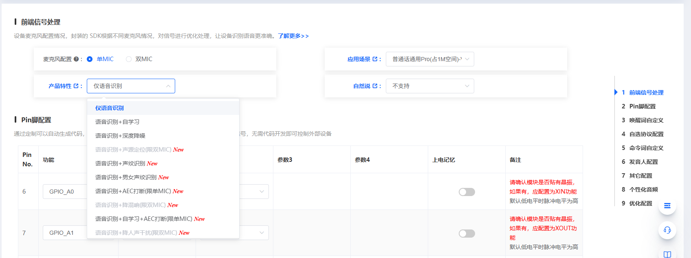

**2. 配置步骤**

- 登录智能公元平台
- 进入项目的基础信息配置页面
- 光标向上滑动找到模型选择区域
- 选择支持自学习功能的固件模型

**注意事项：**

- 自学习功能需要特定的固件支持
- 不是所有CI-03T版本都支持自学习
- 配置前请确认模块型号和固件版本

---

### CI-03T如何实现组合播报功能？

**问题描述：**

需要通过组合播报的方式优化语音播报内容，实现更灵活的语音输出。

**解决方案：**

**1. 组合播报原理**

- 将播报内容拆分为多个小段
- 每段可以独立配置和触发
- 通过组合实现动态播报效果

**2. 配置方法**

**添加控制步骤：**

- 在命令词配置中选择"添加控制"
- 为同一行为添加多个播报动作
- 每个播报内容可以独立设置

**示例配置：**

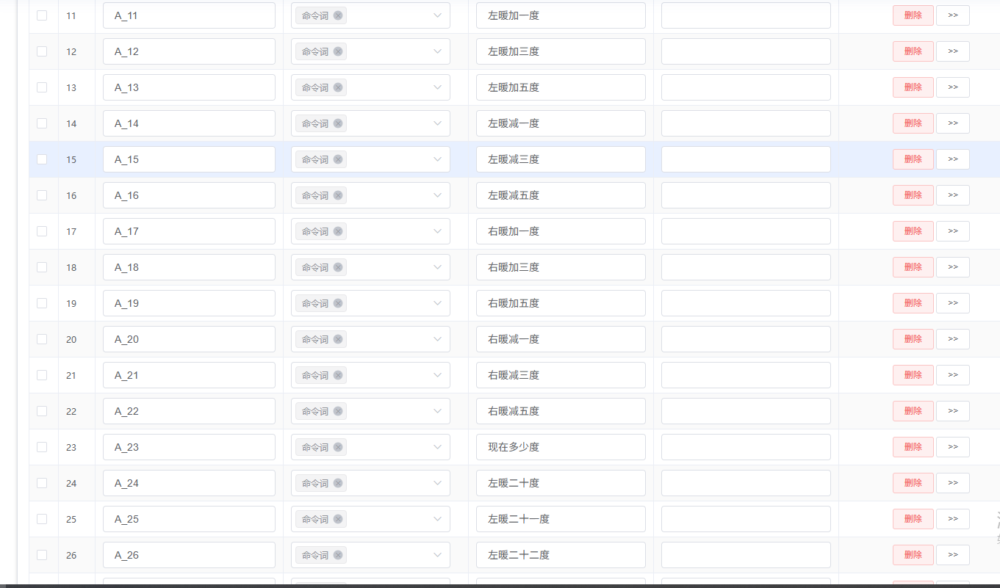

- 行为A_19：播放"好的，右暖已为您调高五度"
    - 第一步：播放"好的，右暖已为您"
    - 第二步：播放"调高五度"
    - 可设置延时输出控制时序

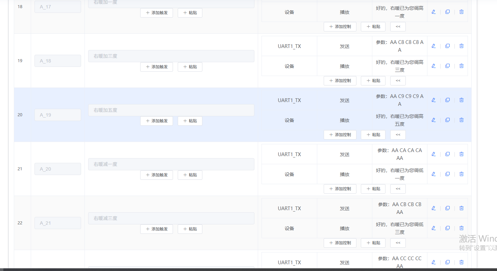

- 行为A_21：播放"好的，右暖已为您调低三度"
    - 第一步：播放"好的，右暖已为您"
    - 第二步：播放"调低三度"

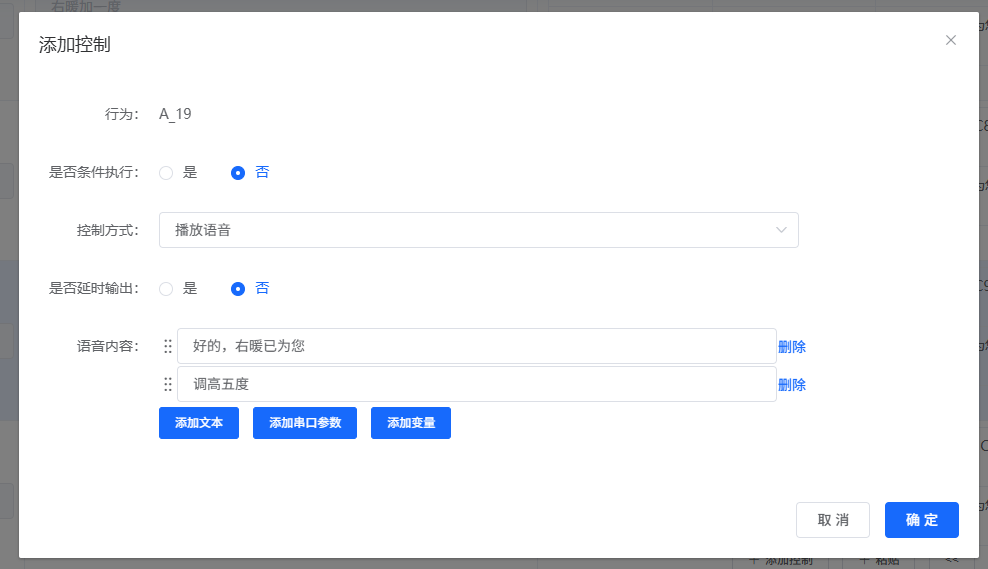
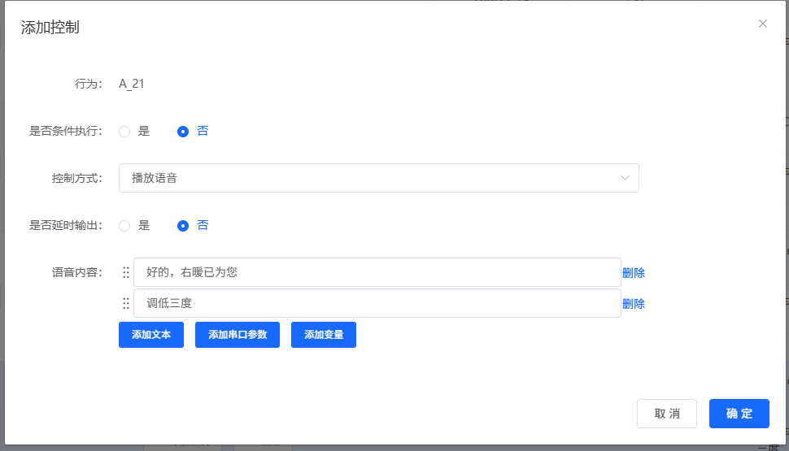

**3. 优化技巧**

- 内容拆分：将长句拆分为常用词根
- 复用组件：相同词根可在多处使用
- 时序控制：通过延时优化播报节奏

**4. 应用场景**

**温度播报示例：**

- "今天的温度是" + "二" + "十" + "八" + "度"
- "今天的温度是" + "三" + "十" + "一" + "度"
- 数字部分可以动态组合

**注意事项：**

- 组合播报需要合理的延时设置
- 过多的拆分可能影响自然度
- 建议根据实际效果调整拆分粒度
- 保留常用短语作为完整播报内容

---

### CI-03T如何优化播报内容长度？

**问题描述：**

播报内容过长导致响应慢或占用存储空间大，需要进行优化。

**解决方案：**

**1. 内容精简策略**

- 删除不必要的修饰词
- 使用简洁的表达方式
- 保留核心信息即可

**2. 组合播报应用**

- 将固定部分和可变部分分离
- 使用组合播报减少重复内容
- 通过参数化实现动态播报

**3. 分级播报**

- 重要信息优先播报
- 次要信息可以省略或简化
- 根据场景调整播报详细程度

**注意事项：**

- 播报内容影响识别响应速度
- 过长的音频占用较多Flash空间
- 建议平衡信息完整性和响应速度
- 如需要识别可变数值，考虑使用支持该功能的更高型号

---

### CI-03T1模块如何调节音量和控制唤醒词响应？

**问题描述：**

使用CI-03T1模块时遇到两个问题：声音输出过小需要调节，以及在设置系统"关电"状态后唤醒词仍然会响应。

**解决方案：**

**音量调节方法：**

1. **固件生成时预设音量**
    - 在固件生成平台的"其它配置"区域找到音量调节滑块
    - 将音量滑块拖动至所需位置（最大值为100%）
    - 重新生成并下载固件


2. **运行时动态调节音量**
    - 通过控制命令在运行时调整音量
    - 在控制逻辑中找到"系统"模块
    - 设置"最大音量"和"最小音量"参数


**唤醒词控制方案：**

- **软件逻辑控制**：

    - 设置全局变量（如 `is_power_on`）表示系统状态
    - "关电"功能中将 `is_power_on` 设为 `false`
    - "上电"功能中将 `is_power_on` 设为 `true`
    - 唤醒词处理逻辑中增加条件判断

- **实现方法**：

    - 在"关电"时执行退出唤醒功能
    - 在"上电"时重新启用唤醒功能
    - 确保唤醒词只在系统开启状态下响应

**注意事项：**

- 音量调节范围：0-100（百分比）
- 模块硬件始终运行，需通过软件逻辑控制功能状态
- 唤醒词响应逻辑必须在固件中正确配置条件判断
- 系统状态变量应在所有相关功能中保持一致

---

### CI-03T/CI-03T1/CI-03T2可以支持多少个同时有效的唤醒词？

**问题描述：**

咨询CI-03T1和CI-03T2芯片上可以同时有效使用的唤醒词数量。

**解决方案：**

**唤醒词数量限制：**

1. **支持数量**：

    - CI-03T系列芯片最多支持10个同时有效的唤醒词
    - 所有唤醒词可以同时激活，不需要切换
    - 唤醒词之间相互独立工作

2. **配置建议**：

    - 合理规划唤醒词，避免发音相近的词
    - 选择清晰易识别的词汇
    - 考虑实际使用场景的需要

3. **性能优化**：

    - 唤醒词数量会影响识别率和响应速度
    - 建议根据实际需求设置，不一定要用满10个
    - 过多唤醒词可能增加误触发概率

**注意事项：**

- 不同批次的芯片可能有细微差异
- 唤醒词需要符合中文发音规范
- 建议定期测试唤醒效果
- 如需更多唤醒词，考虑升级到更高型号的芯片

---

### CI-03T是否支持组合识别功能？

**问题描述：**

CI-03T芯片是否支持组合识别功能，即同时识别多个指令（如"打开灯光并调节到50%"）。

**解决方案：**

**功能限制说明：**

- CI-03T当前不支持组合识别功能
- 无法一次识别包含多个动作的复合指令
- 需要通过多轮对话或简化指令实现

**技术现状：**

1. **当前能力**：

    - 仅支持单一指令识别
    - 每次识别一个独立的命令词
    - 无法理解"并"、"和"等连接词

2. **组合识别限制**：

    - 无法同时处理多个意图
    - 不支持连续的数值识别
    - 语法解析能力有限

**实现方案：**

1. **多轮对话设计**：

    - 第一轮："打开灯光"
    - 第二轮："调节到50%"
    - 通过上下文保持状态

2. **简化指令结构**：

    - 使用单一动作指令
    - 避免复合句式
    - 提高识别准确率

3. **状态管理方案**：

    - 使用变量记住当前状态
    - 支持增量操作
    - 减少重复描述

**替代方案：**

1. **使用带屏方案**：

    - 结合显示屏提供选项菜单
    - 通过数字或选择确认
    - 降低语音识别复杂度

2. **考虑其他型号**：

    - CI-33T：支持更多功能
    - 带处理器的模块
    - 支持自然语言理解的方案

**开发建议：**

- 组合识别是高级功能，需要专门开发
- 量产需求建议提前评估技术可行性
- 可联系技术支持了解定制开发服务

**注意事项：**

- 当前限制是算法能力所致
- 简化指令可提升用户体验
- 多轮对话需要设计合理的交互流程
- 如有特殊需求，建议早期与厂家沟通

---

---

### CI-03T1命令词配置附加条件后为何无法执行？

**问题描述：**

配置CI-03T1模块的命令词时，设置了附加条件（如变量Power_On等于1）后，发现除了唤醒词能正常执行外，其他命令词均无法执行。

**解决方案：**

**问题排查步骤：**

1. **检查配置逻辑**
    - 确认命令词触发方式设置正确
    - 验证附加条件的变量名和数值匹配
    - 检查条件执行是否勾选

2. **变量状态管理**
    - 确认变量Power_On已正确初始化
    - 验证变量在系统运行中值的变化
    - 检查变量作用域是否正确

**调试方法：**

- **简化测试**：

    - 先去掉附加条件，测试命令词是否正常
    - 逐步增加条件，定位问题所在
    - 使用简单变量名避免冲突

- **变量追踪**：

    - 在关键位置添加变量播报
    - 使用串口输出变量状态
    - 确认条件判断逻辑正确

**可能原因：**

1. **变量未正确设置**
    - Power_On变量初始化值不为1
    - 变量在其他地方被修改
    - 变量作用域问题

2. **条件判断错误**
    - 数值类型不匹配
    - 条件表达式错误
    - 多重条件冲突

**注意事项：**

- 命令词和唤醒词的执行机制不同
- 附加条件需要在命令执行前满足
- 建议使用简单的布尔变量（true/false）
- 复杂逻辑建议分解为多个简单条件

---

### CI-03T自学习功能如何修改已学习的内容？

**问题描述：**

需要修改或重新学习已经通过自学习功能录入的语音指令，不想删除所有内容后重新学习。

**解决方案：**

**自学习功能说明：**

1. **学习模式**
    - CI-03T支持离线自学习功能
    - 可以通过语音录入新的命令词
    - 适合现场调试和快速修改

2. **修改方法**
    - 当前版本不支持单独修改某条已学习内容
    - 需要重新进入学习模式
    - 重新录入所有需要的命令词

3. **操作建议**
    - 在修改前记录好所有需要的命令词
    - 按照逻辑顺序重新录入，避免遗漏
    - 可以保留不变的命令词，只新增或修改部分

**替代方案：**

1. **使用平台生成**
    - 在智能公元平台配置所有命令词
    - 可以随时修改单独某条指令
    - 生成固件后一次性烧录

2. **批量管理**
    - 平台支持导出配置文件
    - 可以备份和恢复配置
    - 方便多次修改和版本管理

**注意事项：**

- 自学习模式适合少量快速修改
- 大量指令建议使用平台管理
- 修改前确认麦克风工作正常
- 录入时保持环境安静

---

---

### CI-03T1识别率低于规格书标称值怎么办？

**问题描述：**

CI-03T1芯片的语音识别率远低于产品规格书中的0.95，怀疑芯片存在识别率问题。

**解决方案：**

识别率受多种因素影响，需要系统排查：

- **硬件连接检查**：

    - 确认麦克风连接正确且无短路
    - 检查供电稳定性（推荐3.3V或5V）
    - 验证与Arduino或其他主控的通信正常

- **环境优化**：

    - 在安静环境下测试，排除背景噪声干扰
    - 确保发音清晰，语速适中
    - 麦克风距离建议在20-50cm范围内

---

### 小车运行时语音识别不灵敏且丢字怎么办？

**问题描述：**

在使用语音模块控制小车时，发现语音识别不灵敏，特别是小车运行时识别效果更差。有时需要等待小车停稳后才能正常发出指令，前面的1-2个字经常丢失。

**解决方案：**

**1. 噪声影响分析**

小车运行时的噪声来源：

- **电机噪声**：直流电机运行时产生电磁干扰
- **机械噪声**：齿轮、轮胎摩擦等结构噪声
- **风噪干扰**：小车移动时产生的气流噪声
- **振动传导**：机械振动通过车体传导至麦克风

**2. 改善方案**

**麦克风位置优化**：

- 将麦克风通过导线延长，远离主要噪声源
- 使用双绞线连接麦克风，减少电磁干扰
- 将麦克风悬空安装，避免固体传声
- 在麦克风周围加装防风罩

**硬件改进措施**：

- 使用带屏蔽的音频线缆
- 在麦克风电路增加滤波电容
- 电机电源加去耦电容，减少电源干扰
- 考虑使用外部高灵敏度麦克风

**软件配置调整**：

- 适当提高识别阈值，避免误触发
- 开启深度降噪功能（如果支持）
- 选择"噪声环境"或"高噪声"应用模型
- 调整麦克风增益参数

**3. 替代方案**

**蓝牙分离方案**：

- 将语音模块设计为头戴式设备
- 通过蓝牙与主控小车通信
- 麦克风靠近嘴部，提高识别准确率
- 小车端仅负责执行动作

**315/433MHz遥控方案**：

- 使用语音控制遥控发射器
- 小车端接收射频信号执行动作
- 避免小车运行时的噪声干扰

**4. 使用建议**

- **安静环境测试**：先在静止状态下测试识别效果
- **距离控制**：保持有效通信距离（1-2米内）
- **语音技巧**：发音清晰，语速适中
- **环境选择**：避免在强噪声环境下使用

**注意事项：**

- 小车运行时的噪声是主要挑战
- 完全消除噪声较困难，建议综合多种方案
- 语音模块适合静态或低噪声环境
- 高速移动场景建议考虑其他控制方式

---

### CI-03T1是否支持唤醒打断功能？

**问题描述：**

需要确认CI-03T1芯片是否支持在语音播报过程中通过唤醒词进行打断。

**解决方案：**

CI-03T1支持唤醒打断功能：

- **支持型号**：CI-03T1具备AEC（声学回声消除）功能
- **实现方式**：通过"语音识别+AEC打断"功能实现
- **适用场景**：需要在语音播放过程中快速响应新指令

**功能特点：**

1. **打断类型**：

    - 唤醒词打断：播放过程中说唤醒词可立即停止
    - 命令词打断：播放过程中说命令词可执行新指令
    - 组合打断：同时支持两种打断方式

2. **技术优势**：

    - 响应速度快，延迟低
    - 识别准确率高
    - 用户体验流畅

**配置方法：**

1. **平台配置**：

    - 登录智能公元平台
    - 选择对应的项目
    - 在产品特性中选择"语音识别+AEC打断(限单MIC)"

2. **生成固件**：

    - 配置完成后生成固件
    - 下载并烧录到模块
    - 测试打断功能是否正常

**注意事项：**

- 此功能仅限CI-03T1等支持AEC的型号
- 双麦克风版本效果更佳，但单麦版本也支持
- 配置后需要重新烧录固件才能生效
- 建议在实际使用环境中测试各种打断场景

---


---

### CI-03T2双麦克风间距是多少？

**问题描述：**

需要了解CI-03T2双麦克风模块的两个麦克风之间的间距。

**解决方案：**

CI-03T2双麦克风模块的两个麦克风间距为 **4-6cm**。

**技术规格：**

- 麦克风间距：标准设计为4-6cm
- 声学设计：此间距经过声学算法优化
- 降噪效果：双麦克风配合降噪算法，有效提升噪声抑制能力

**设计考虑：**

1. **声学定位**：

    - 双麦克风阵列可用于声源定位
    - 通过计算两个麦克风信号的到达时间差
    - 实现语音增强和噪声抑制

2. **降噪性能**：

    - 间距设计基于声学原理计算
    - 配合内部降噪算法，显著提升信噪比
    - 在嘈杂环境中表现优异

**应用建议：**

1. **安装规范**：

    - 按照模块丝印标识正确安装
    - 确保两个麦克风都在有效工作范围内
    - 避免遮挡麦克风拾音孔

2. **环境适配**：

    - 适合中高噪声环境
    - 推荐用于需要高质量语音识别的产品
    - 与单麦克风版本相比，抗干扰能力更强

**注意事项：**

- 4-6cm是经过优化的标准间距
- 实际间距可能存在微小差异（±0.5cm）
- **双麦距离超过40mm会影响声源定位角度的识别准确性**：双麦距离超过40mm后，声源定位功能识别出来的角度会有影响，建议严格按照40mm（4cm）标准间距设计

---

### CI-03T在车间环境中识别率低怎么办？

**问题描述：**

CI-03T模块在办公室环境中识别正常，但在车间环境中需要重复多次才能响应，识别率显著降低。

**解决方案：**

**环境分析：**

1. **噪声影响**：

    - 车间环境噪声较大
    - 风声等持续噪声干扰
    - 影响语音特征提取

2. **识别率对比**：

    - 单麦方案：95%识别率
    - 双麦方案：98%识别率
    - 双麦可提升3%识别率

**优化方案：**

1. **使用双麦克风**：

    - 采用双麦克风配置
    - 提高噪声环境下的识别率
    - 增强语音信号质量

2. **硬件连接**：

    - 按照双麦克风原理图连接
    - 正确连接MIC1和MIC2
    - 注意差分走线和电容配置

3. **位置优化**：

    - 麦克风远离噪声源
    - 增加物理隔音措施
    - 选择合适安装位置

**实施建议：**

1. **测试验证**：

    - 先在实验室测试双麦效果
    - 再到实际车间环境验证
    - 记录改善程度

2. **持续优化**：

    - 调整麦克风距离和角度
    - 测试不同位置效果
    - 选择最佳安装方案

**注意事项：**

- 风声等持续噪声是主要干扰源
- 双麦方案可显著提升抗噪能力
- 建议实际测试后再批量实施

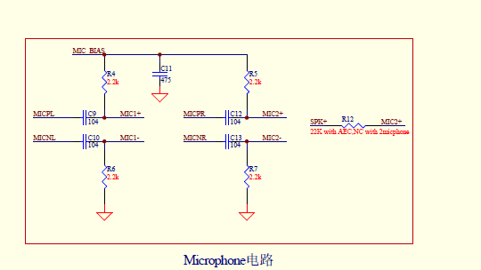

---


---

### CI-03T1模块无法正常唤醒怎么办？

**问题描述：**

CI-03T1离线语音识别芯片在设备启动后无法正常唤醒或识别语音指令，需要技术支持人员分析原因并提供解决方案。

**解决方案：**

**问题排查步骤：**

1. **基础功能检查**：

    - 确认模块已正常上电
    - 检查指示灯状态
    - 验证串口通信是否正常

2. **固件验证**：

    - 确认固件已正确烧录
    - 检查固件版本是否匹配
    - 尝试重新烧录固件

3. **唤醒灵敏度调试**：

    - 在平台调整唤醒阈值
    - 降低阈值提高灵敏度
    - 测试不同距离下的唤醒效果

**硬件检查要点：**

1. **麦克风连接**：

    - 检查麦克风接线是否正确
    - 确认麦克风供电正常
    - 验证麦克风信号质量

2. **喇叭连接**：

    - 确认喇叭连接可靠
    - 检查功放使能信号
    - 验证音频输出功能

3. **电源稳定性**：

    - 测量供电电压是否稳定
    - 检查电源纹波是否过大
    - 确保电源满足模块要求

**调试方法：**

1. **使用调试日志**：

    - 连接串口查看调试信息
    - 观察唤醒识别过程的日志输出
    - 分析错误代码和状态信息

2. **环境测试**：

    - 在安静环境下测试基础功能
    - 逐步增加干扰因素
    - 记录问题出现的具体条件

3. **参数优化**：

    - 调整识别阈值参数
    - 优化麦克风增益设置
    - 测试不同唤醒词的效果

**常见问题处理：**

- **固件版本问题**：确保使用最新的兼容固件
- **硬件连接不良**：重新检查并加固所有连接
- **环境噪声过大**：调整麦克风位置或增加降噪处理
- **电源问题**：使用稳定可靠的电源供电

**注意事项：**

- 唤醒失败可能是多种因素共同作用的结果
- 建议按照先硬件后软件的顺序排查
- 保留完整的调试记录便于技术支持分析
- 如问题持续，可联系技术支持获取专业帮助

---


---

### CI-03T模块在旋转设备上如何解决风噪导致的识别问题？

**问题描述：**

在旋转灯罩场景下使用CI-03T模块，咪头和语音模块随设备转动产生风噪，导致语音识别不稳定，需要离得特别近才能识别。

**解决方案：**

**1. 问题分析**

- **风噪产生原理**：咪头在旋转过程中刮风，产生很大风噪
- **识别困难**：风噪严重干扰语音信号，导致识别效率下降
- **距离限制**：必须近距离大声说话才能被识别

**2. 优化方案**

**方案一：硬件优化**

1. **更换为CI-03T双麦版本**：

    - 双麦对比单麦会有所改善
    - 利用双麦算法进行噪声抑制
    - 提供更好的方向性和抗噪能力

2. **咪头选型优化**：

    - 选择信噪比更高的咪头（SNR＞75dB）
    - 使用防风噪结构设计的咪头
    - 考虑使用带防风罩的咪头

3. **结构优化**：

    - 在咪头周围增加防风结构
    - 使用透气但不透声的材料遮挡
    - 优化咪头安装位置，减少直接风冲击

**方案二：软件配置优化**

1. **选择烟机噪声模型**：

    - 在智能公元平台选择"中文烟机通用Pro"模型
    - 该模型针对高噪声环境优化
    - 开启深度降噪效果最佳

2. **参数调整**：

    - 命令词灵敏度加大（提升识别能力）
    - 识别距离设置为远场（0-1m或1-5m）
    - 根据实际效果微调阈值


**方案三：系统设计优化**

1. **物理隔离**：

    - 将咪头安装在旋转部件外部
    - 使用固定式咪头，避免旋转
    - 通过软连接线缆传输信号

2. **降低转速**：

    - 在语音交互时暂停或降低旋转速度
    - 减少风噪产生
    - 识别完成后再恢复正常转速

3. **使用SU-03T模块**：

    - SU-03T更适合简单噪声场景
    - 配置烟机模型会有较好效果
    - 成本更低，易于替换测试

**3. 测试验证**

1. **静态测试**：

    - 设备不旋转时测试识别距离
    - 作为对比基准
    - 确认基础功能正常

2. **动态测试**：

    - 不同转速下测试识别率
    - 记录可识别的最远距离
    - 统计误识别率

3. **优化验证**：

    - 逐项测试优化措施的效果
    - 找到最佳组合方案
    - 在实际使用场景下验证

**4. 注意事项**

- 风噪是物理现象，完全消除困难，重在优化
- 双麦版本效果会更好，但成本也更高
- 信噪比更高的咪头可能有改善，但效果有限
- 软件优化需要在识别率和误触发之间找到平衡
- 建议在产品设计阶段就考虑旋转带来的风噪问题

**5. 替代方案**

如果风噪问题严重影响使用，建议：

- 更换为固定安装方案（咪头不旋转）
- 选择支持更强降噪算法的模块（如CI-33T）
- 考虑使用其他交互方式（如按键、遥控等）

---


---

### CI-03T芯片自学习功能如何使用？

**问题描述：**

需要了解CI-03T芯片的自学习功能使用方法，包括是否可以重复学习、如何进入重新学习模式、回复语语言支持，以及是否可以通过串口指令触发自学习功能。

**解决方案：**

**视频教程**：

- CI-03T免唤醒和自学习教程：[B站视频](https://www.bilibili.com/video/BV1LM4y1S7A8/?share_source=copy_web)

**自学习功能开启：**

1. **平台配置**：

    - 在智能公元平台选择带有"自学习"功能的产品特性
    - 在"命令词自定义"下打开"自学习"开关
    - 生成包含自学习功能的固件

2. **学习流程**：

    - 唤醒后念"学习唤醒词"进入唤醒词学习模式
    - 唤醒后念"学习命令词"进入命令词学习模式
    - 根据语音提示念出自定义的词
    - 学习成功后系统播报"学习成功"

**学习管理功能：**

1. **重新学习**：

    - 念命令词"重新学习"可以重新学习上一个词
    - 适合对学习效果不满意时使用
    - 无需重新烧录固件即可更新

2. **退出学习**：

    - 念命令词"退出学习"可以退出学习模式
    - 退出后返回正常语音识别状态

3. **删除学习**：

    - 念"我要删除"进入删除模式
    - 支持：全部删除、删除唤醒词、删除命令词
    - 可选择性删除已学习的内容

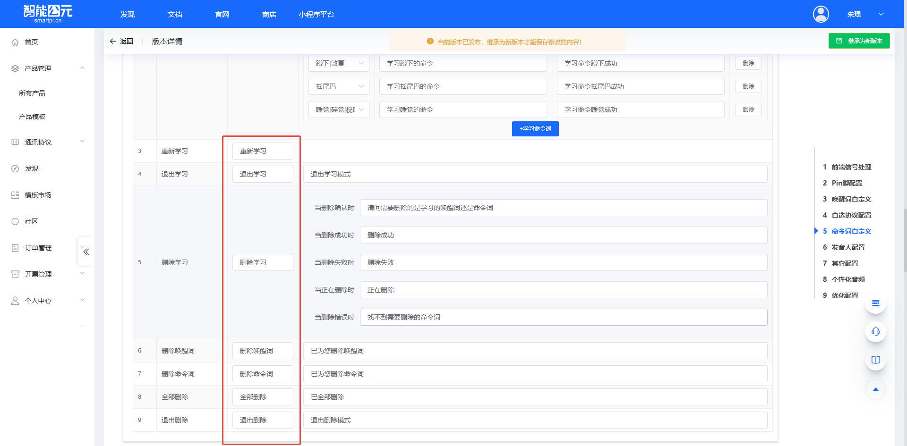

*智能公元平台显示的"重新学习"、"退出学习"、"删除学习"等操作选项*

**使用限制：**

1. **学习次数限制**：

    - 自学习功能只能学习一次，不能重复学习相同内容
    - 如需重新学习，需要使用"重新学习"命令或重烧固件

2. **语言支持**：

    - 回应语默认为普通话
    - 如需方言回应，需要用方言个性化音频替换默认词条
    - 自学习过程支持中文、英文等多种语言

3. **环境要求**：

    - 必须在安静环境下进行学习
    - 距离设备1米内，正常语速
    - 避免背景噪声干扰

**注意事项：**

- 开启自学习功能会消耗较多Flash资源
- 建议自学习命令词条数控制在10条以内
- 自学习识别效果可能不如内置词条
- 学习成功后建议立即测试识别效果
- 粤语等方言学习后，回应语仍是普通话

**串口触发自学习功能：**

1. **串口输入配置**：

    - 在智能公元平台的控制配置中设置触发方式为"串口输入"
    - 参数选择为"UART1_RX消息号"
    - 操作选择"跳转行为"以触发相应的自学习系统命令

    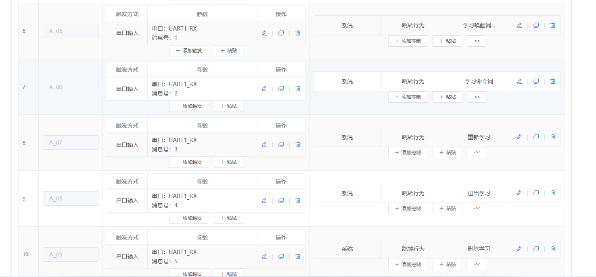

    *通过串口输入触发不同系统行为的配置列表*

2. **添加控制详情**：

    - 行为选择对应的系统命令（如A_07）
    - 控制方式选择"系统设置"
    - 操作选择"跳转行为"
    - 具体行为选择需要触发的自学习功能，如：

        - [[CWSL_REGISTER_AGAIN]]：重新学习
        - [[CWSL_EXIT_LEARNING]]：退出学习
        - [[CWSL_DELETE_LEARNING]]：删除学习

    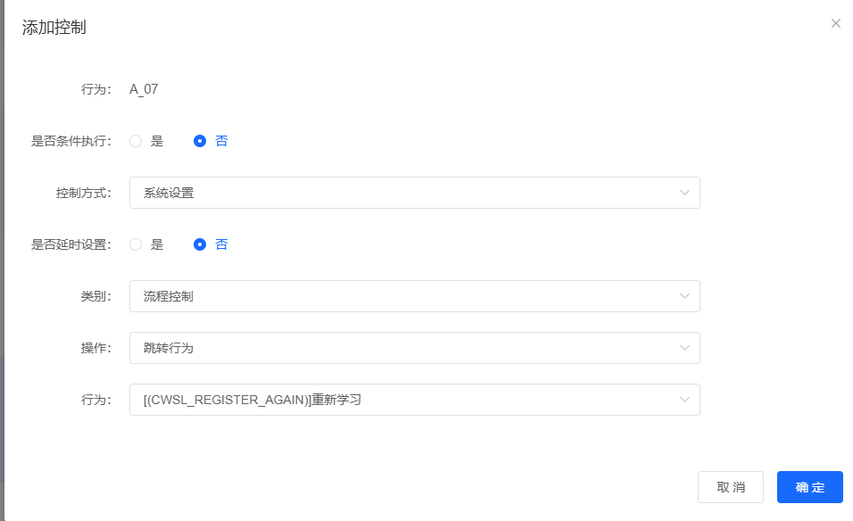

    *添加控制的具体配置，用于通过串口指令触发自学习功能*

3. **支持的串口指令**：

    - 学习唤醒词：触发进入唤醒词学习模式
    - 学习命令词：触发进入命令词学习模式
    - 重新学习：重新学习上一个词条
    - 退出学习：退出当前学习模式
    - 删除学习：进入删除模式，可选择删除唤醒词或命令词

4. **使用示例**：

    - 通过串口发送特定消息号
    - 系统接收到消息后触发对应的学习行为
    - 用户按照语音提示完成学习操作
    - 学习成功后系统自动播报确认信息

    

    *智能公元平台中自学习功能的开关配置*

---


---

### CI-03T1自学习功能等待超时机制是怎样的？

**问题描述：**

在CI-03T1模块的学习唤醒词或命令词时，播报完提示词后等待用户输入新指令的超时机制是否生效，以及超时时间是多少。

**解决方案：**

**超时机制说明：**

CI-03T1的自学习功能存在超时机制，但实际表现可能与理论值有差异：

1. **理论超时时间**：

    - 一般为几秒到十几秒
    - 没有精确的固定时间
    - 可通过实际测试大致确定

2. **实际测试现象**：

    - 有用户测试等待超过一分钟仍未报学习失败
    - 设置的退出时间（60秒）可能未生效
    - 超时机制在某些情况下可能失效

**可能的退出方式：**

1. **主动退出**：

    - 可以说"退出学习"主动退出学习模式
    - 这是最可靠的退出方式
    - 不依赖超时机制

2. **超时退出**：

    - 理论上超时后会提示学习失败
    - 实际时间可能因固件版本而异
    - 不建议完全依赖超时机制

**影响因素分析：**

1. **固件版本差异**：

    - 不同固件版本的超时实现可能不同
    - 某些版本可能存在超时不生效的bug
    - 建议使用最新稳定版本

2. **环境因素**：

    - 背景噪声可能影响超时判断
    - 麦克风持续拾音可能重置超时计时
    - 建议在绝对安静环境下进行

**建议操作流程：**

1. **标准学习流程**：

    - 唤醒后说"学习唤醒词"或"学习命令词"
    - 听到提示后立即说出要学习的词（建议3-5秒内）
    - 不要等待过长时间，避免超时不确定性

2. **快速操作原则**：

    - 整个学习过程建议快速连续完成
    - 每个命令词学习间隔不超过10秒
    - 避免依赖系统的超时保护

3. **备用退出方案**：

    - 如需退出，主动说"退出学习"
    - 不要等待系统自动超时
    - 确保学习过程的可控性

**注意事项：**

- 自学习功能的超时机制不够稳定，不建议完全依赖
- 实际超时时间可能与理论值存在较大差异
- 主动退出学习是最可靠的方式
- 学习过程建议快速完成，避免长时间等待
- 如频繁出现超时问题，建议检查固件版本或联系技术支持

---


---

### CI-03T1语音播报被误识别为命令词怎么办？

**问题描述：**

在使用CI-03T1芯片时，语音播报的回复内容被系统误识别为命令词，导致频繁触发，且识别灵敏度过高。

**解决方案：**

**问题分析：**

1. **回复语与命令词冲突**：

    - 回复语中包含与命令词相同的词汇
    - 系统无法区分回复语和用户命令
    - 形成循环触发现象

2. **识别灵敏度设置**：

    - 特定命令词阈值设置过低（0.5）
    - 导致识别过于灵敏
    - 增加误触发概率

3. **自然说功能影响**：

    - 开启自然说后泛化范围过广
    - 一两个字就能触发命令
    - 超出预期识别范围

**解决步骤：**

1. **调整识别阈值**：

    - 将特定命令词阈值从0.5调整到默认值
    - 避免阈值过低导致的误识别
    - 平衡识别率和准确性

    

    *唤醒阈值、命令识别阈值和特定命令词阈值设置界面*

4. **提高唤醒词识别准确率**：

    - 对于特定唤醒词识别率不高的情况，可单独调高该唤醒词的阈值
    - 例如将"设备巡检"等唤醒词的阈值设置为0.8
    - 这样可以减少误唤醒，提高识别准确性

    

    *特定命令词阈值设置为0.8以提高识别准确率*

5. **检查硬件配置**：

    - 确认麦克风配置为单MIC
    - 开启稳态降噪功能
    - 距离识别设置为远场1-5m
    - 检查SW_CLK和SW_D引脚配置是否正确

    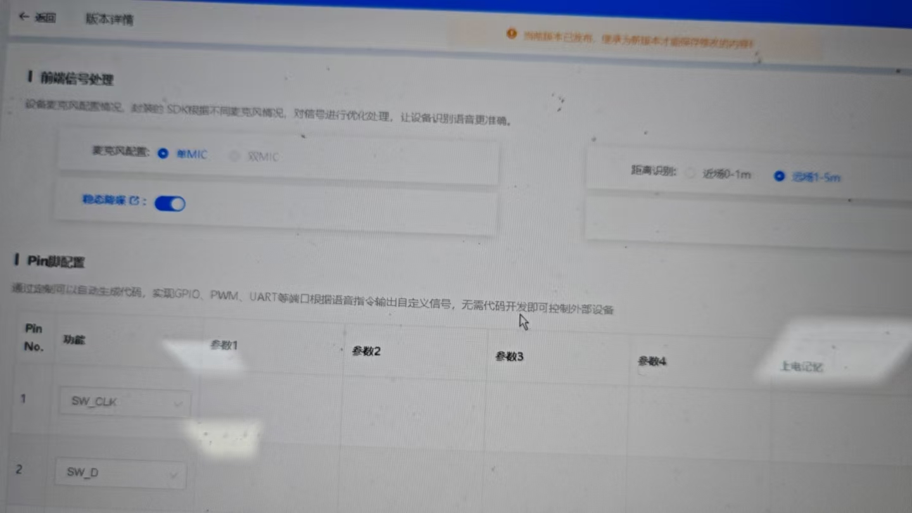

    *前端信号处理和Pin脚配置界面*

2. **配置防误识别词**：

    - 在防误识别词输入框添加容易误触发的词汇
    - 如："声音"、"音量"、"时间"等单字或双字词
    - 防止简短词汇被误识别
    - 示例：设置"打开顶灯"后，将"厨房"、"客厅"等词加入防误识别列表，避免"打开厨房灯"、"打开客厅灯"等相似指令被误识别

    

    **实际案例：唤醒词误触发问题**

    | 问题现象 | 原因分析 | 解决方案 |
    | --- | --- | --- |
    | 说"欢迎小星"时被唤醒 | "欢迎小星"包含了唤醒词"小星" | 将"欢迎小星"加入防误识别词列表 |
    | 说"退下吧"被误识别为调音量 | "退下吧"被误识别为其他命令 | 将"退下吧"加入防误识别词列表 |
    | 相似发音的命令词误触发 | 命令词发音过于接近 | 在防误识别词中添加相似词 |

    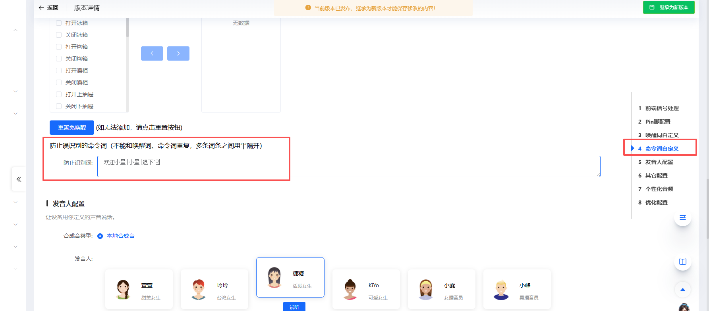

    *防误识别词配置示例：多条词条用"\|"分隔*

    *防误识别词配置位置*

    

    *在智能因元平台的命令词自定义界面中配置防误识别词*

    

    *红色框标注了"防止误识别的命令词"输入框，用于添加可能引起误识别的词语*

3. **优化回复语设计**：

    - 回复语避免使用命令词中的关键词
    - 使用更长的描述性语句
    - 减少"好的，已为你把声音调大"这类回复

    

    *命令词与回复语配置示例*

4. **调整自然说设置**：

    - 关闭或限制自然说功能
    - 如需使用，选择"用户指定泛化"模式
    - 避免系统自动泛化导致过度识别

    

    *自然说功能配置选择*

**配置建议：**

1. **阈值设置**：

    - 唤醒阈值：保持默认或略微调高
    - 命令识别阈值：使用默认中等灵敏度
    - 特定命令词阈值：避免设置过低

2. **超时时间**：

    - 设置合理的超时退出时间（30秒）
    - 避免过短（15秒）导致操作不便
    - 给用户充足的交互时间

    

    *超时时间设置建议*

3. **泛化词控制**：

    - 泛化词前缀不宜过短（如"请"）
    - 主词要保持足够长度和独特性
    - 测试泛化效果，避免过度泛化

    

    *泛化词配置示例*

**注意事项：**

- 自然说功能虽然方便，但可能增加误识别率
- 建议在确定功能稳定后再开启自然说
- 回复语设计要避免与命令词产生冲突
- 防误识别词可以有效减少单字、双字的误触发
- 如仍有问题，可考虑关闭AEC打断功能

---


---

### 外部麦克风灵敏度过高导致CI-03T模组误触发怎么办？

**问题描述：**

使用CI-03T模组加底板设计时，如果外部麦克风灵敏度过高，会导致语音模块出现误触发问题。

**解决方案：**

**调整麦克风规格参数**

- 将麦克风灵敏度调整为-32dB
- 确保信噪比（SNR）＞70dB
- 联系麦克风供应商调整规格参数

**电源质量检查**

- 检查电源纹波，确保纹波较小（建议控制在100mV左右）
- 过大的电源纹波可能影响语音模块正常工作
- 优化电源滤波电路设计

**注意事项：**

- 硬件搭配标准配置，再优化算法，才能达到最好的效果
- 麦克头性能调整与尺寸装配无关，主要是电声参数的优化
- 如已定型无法更换硬件，建议联系技术支持评估软件优化方案

---


---

### 当CI-03T模组的"睡眠模式"和产品上另一个语音系统的"助眠模式"使用同一个唤醒词时发生冲突，如何解决？

**问题描述：**

产品上有两套语音系统，CI-03T的"睡眠模式"与另一语音系统的"助眠模式"使用相同唤醒词，导致说出"助眠模式"时会错误触发CI-03T的睡眠模式。

**解决方案：**

**方法一：调整识别阈值**

1. 进入固件的"优化配置"界面
2. 找到"睡眠模式"的识别阈值设置
3. 适当调低阈值（阈值越小越不敏感，可降低误识别率）
4. 建议从0.4开始调整，根据实际效果微调


**方法二：添加禁止识别词**

1. 在优化配置中找到"防止误识别的命令词"设置
2. 添加"助眠模式"、"助眠"等关键词
3. 保存配置后，系统识别到这些词时不会触发睡眠模式


**注意事项：**

- 阈值调整需要平衡识别率和误识别率
- 禁止识别词功能可以有效避免特定场景下的误触发
- 建议两种方法结合使用以达到最佳效果

---


---

### CI-03T单麦模块在农机高噪声环境下无法唤醒怎么办？

**问题描述：**

在农机高噪声环境下使用CI-03T单麦语音识别设备，当发动机高转速时噪声增大，导致语音模块无法被唤醒。

**解决方案：**

**方案一：更换为双麦模块**

- 使用CI-03T2双麦版本模组，双麦算法专门针对高噪声环境优化
- 双麦模组支持更好的噪声抑制和声源定位能力
- 适合农机、工厂等高噪声应用场景

**方案二：改造现有单麦模块**

- 将单麦模块改造为双麦配置
- 去掉PCB上指定电阻（图中红框位置）
- 连接两个麦克风实现双麦拾音

**方案三：软件优化配置**

- 在智能公元平台选择"中文烟机通用Pro"模型
- 该模型专为高噪声环境优化，开启深度降噪效果最佳
- 配置产品特性为"语音识别+深度降噪"

**硬件改装步骤：**

1. 找到CI-03T1/2模块上的指定电阻
2. 小心去掉该电阻以支持双麦克风配置
3. 连接两个外部麦克风
4. 重新烧录支持双麦的固件

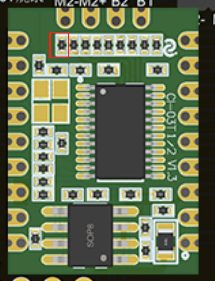

**注意事项：**

- 单麦模块在高噪声环境下性能有限，建议优先选择双麦方案
- 麦克风安装位置应远离震动源，避免机械噪声干扰
- 改装需要一定的硬件操作经验，建议采购专业的双麦模块
- 农机环境建议选择抗噪声能力强的麦克风规格

---


---

### CI-03T模块在工程车高噪声环境下如何优化识别效果？

**问题描述：**

在工程车高噪声环境下使用CI-03T模块，存在固定噪声（如风扇）和较大音响声音的混合噪声，导致无法准确唤醒，需要优化识别率和降噪性能。

**解决方案：**

**方案一：选择合适的声学模型**

1. 在智能公元平台的应用场景界面选择针对噪声优化的模型
2. 推荐模型：

    - 普通话通用Pro：适用于一般噪声环境
    - 中文风扇通用Pro：专门针对风扇等固定噪声优化
    - 中文烟机通用Pro：适用于高噪声环境，开启深度降噪效果最佳

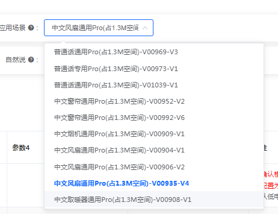

**方案二：硬件升级建议**

1. **使用双麦克风版本**：

    - 单麦版本在高噪声环境下识别效果有限
    - 建议更换为CI-03T双麦版本，提供更好的噪声抑制能力
    - 双麦算法专门针对高噪声环境优化

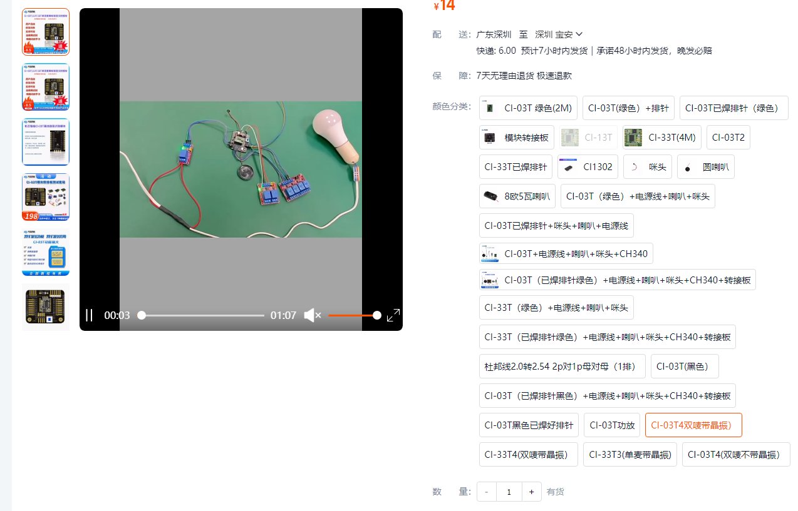

2. **启用AEC打断功能**：

    - 在产品特性中选择"语音识别+AEC打断"
    - AEC功能仅支持单麦版本
    - 可增强在音响播放声音时的唤醒能力

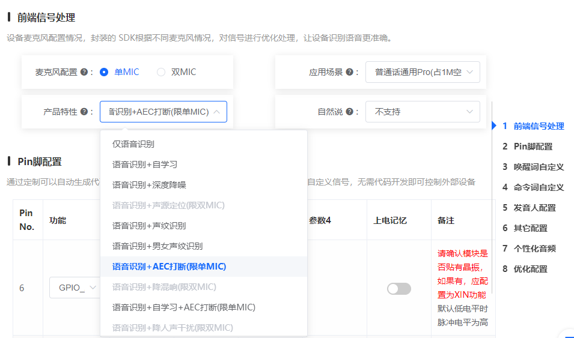

**方案三：综合优化策略**

1. **混合噪声处理**：

    - 固定噪声（如风扇）：通过选择对应的噪声模型进行优化
    - 音频播放噪声：启用AEC打断功能实现语音交互
    - 环境整体噪声：使用双麦版本获得更好的降噪效果

2. **参数调整**：

    - 适当调整唤醒词识别阈值
    - 根据实际环境噪声强度进行微调
    - 在保证识别率的前提下降低误触发

**注意事项：**

- 工程车环境复杂，建议优先考虑双麦方案
- AEC打断功能仅在单麦版本中可用
- 需要在实际使用环境中测试验证效果
- 如仍无法满足需求，可考虑更高规格的语音模块

---


---

### CI-03T1模块生产过程中识别率不达标怎么办？

**问题描述：**

在CI-03T1模块生产过程中，发现部分批次的模块存在识别率不达标的问题，需要确认原因并提供解决方案。

**解决方案：**

**1. 硬件质量检查**

- 检查模块生产过程中的焊接质量
- 确认麦克风规格是否符合要求（灵敏度-32dB，SNR>70dB）
- 验证电源纹波是否控制在合理范围内（建议100mV左右）
- 检查PCB板是否存在短路或接触不良

**2. 固件版本确认**

- 确保使用最新的Pro版本声学模型
- 旧版本模型识别率较低，建议升级到新版本
- 在智能公元平台选择适合的噪声模型

**3. 测试环境标准化**

- 在标准噪声环境下进行测试
- 使用标准测试音频和语速
- 确保测试环境符合规范要求
- 多人测试（至少2男2女）获得平均数据

**4. 生产质量管控**

- 建立首件检验制度
- 定期抽检产品识别率
- 记录不合格产品的批次信息
- 及时反馈给供应商分析改进

**注意事项：**

- 识别率问题可能是硬件、固件或测试环境综合导致
- 批量问题应立即停止生产并联系技术支持
- 保留故障样品便于深入分析原因
- 建议预留5-10%的不良率作为生产损耗

---


---

### CI-03T1模块识别率不稳定怎么办？

**问题描述：**

CI-03T1模块在生产过程中出现识别率不稳定的问题，需要确认原因并提供解决方案。

**解决方案：**

**1. 生产流程标准化**

- 严格按照作业指导书进行贴片和测试
- 确保生产环境稳定，避免温湿度波动
- 使用标准化的测试设备和流程
- 建立关键工序的质量检查点

**2. 硬件一致性检查**

- 确认所有元器件批次一致
- 检查PCB板是否存在版本差异
- 验证焊接工艺是否稳定
- 抽检模块的电气参数

**3. 测试环境控制**

- 在标准噪声环境下进行测试
- 使用统一的测试音频和距离
- 确保测试人员说话方式一致
- 记录详细的测试数据用于分析

**4. 固件版本管理**

- 确保所有模块使用相同固件版本
- 验证固件文件的完整性（MD5校验）
- 建立固件版本追溯机制
- 及时更新到最新稳定版本

**5. 质量管控措施**

- 实施首件检验制度
- 定期抽检产品识别率
- 建立不合格品隔离机制
- 统计分析不良率趋势

**注意事项：**

- 识别率不稳定通常涉及多个因素的综合影响
- 需要从人、机、料、法、环五个方面全面分析
- 建议收集足够数据样本后再进行改进
- 如问题持续存在，可联系技术支持进行现场分析

---


---

### 为什么将CI-03T模组的唤醒词从“小豹小豹”改为“豹一豹一”和“豹二豹二”后，唤醒效果会变差？

首先，应确保使用最新的"pro"声学模型，而不是旧的"安静环境"模型。如果更换模型后效果仍不理想，可以通过优化唤醒词来改善。技术支持可以提供一个修改后的固件，为"豹一豹一"和"豹二豹二"等不易识别的唤醒词增加"泛词"来提升唤醒率。如果担心误识别，也可以选择不增加泛词，而是直接调高该唤醒词的灵敏度。

---


---

### CI-03T1模块测试识别率不达标怎么办？

**问题描述：**

在CI-03T1模块生产测试时，发现部分模块识别率不达标，需要分析原因并提供解决方案。

**解决方案：**

**1. 测试方法标准化**

- 使用标准的测试环境和设备
- 制定详细的测试作业指导书
- 统一测试音频的音量和距离
- 确保测试人员操作一致性

**2. 测试数据分析**

- 记录每次测试的详细数据
- 统计识别成功率和失败案例
- 分析失败时的环境因素
- 建立测试数据追溯系统

**3. 不合格品处理**

- 将识别率不达标的模块单独隔离
- 进行二次测试确认问题
- 分析失败的具体原因和模式
- 记录模块序列号便于追溯

**4. 改进措施**

- 根据测试数据优化生产工艺
- 调整测试标准和方法
- 对测试人员进行再培训
- 联系技术支持提供改进建议

**5. 质量提升计划**

- 建立测试通过率目标
- 实施持续改进措施
- 定期评估测试方法的有效性
- 与供应商共同提升产品质量

**注意事项：**

- 测试标准应基于实际使用场景
- 考虑环境因素对识别率的影响
- 保留完整的测试记录用于质量分析
- 建议与供应商建立质量改进机制

---


---

### CI-03T1芯片是否支持在语音播报过程中通过唤醒词进行打断？

**问题描述：**

咨询CI-03T1芯片是否支持在语音播报过程中通过唤醒词进行打断操作。

**解决方案：**

**功能支持确认：**

- **CI-03T1支持AEC唤醒打断功能**
- CI-03T系列芯片中的CI-03T1和CI-03T2支持在音频播放过程中进行语音唤醒和打断
- 该功能通过AEC（声学回声消除）技术实现，能够在播报过程中识别唤醒词并打断当前播报

**技术实现原理：**

1. **AEC技术**：通过声学回声消除算法，区分设备自身播放的音频和用户语音输入
2. **实时监控**：在语音播报过程中持续监听唤醒词
3. **打断机制**：检测到唤醒词时立即中断当前播报，进入语音识别状态

**使用场景：**

- 智能家居设备在播报状态提示时，用户可直接通过唤醒词打断并下达新指令
- 语音助手在播放音乐或播报信息时，用户无需等待播报结束即可交互
- 提升用户体验，实现更自然的人机交互流程

**注意事项：**

- 唤醒打断功能需要在固件配置中启用AEC相关选项
- 确保麦克风和扬声器的相对位置合理，以获得最佳AEC效果
- 建议在实际使用环境中测试打断功能的可靠性

---


---

### CI-03T1模块在音乐环境下唤醒成功率极低怎么办？

**问题描述：**

CI-03T1模块在音乐环境下唤醒成功率极低，即使在无音乐的中等噪声环境下也难以被唤醒。

**解决方案：**

**方法一：调整前端信号处理配置**

1. **关闭深度降噪功能**：

    - 将产品特性从"语音识别+深度降噪"更改为"语音识别+AEC打断(限单MIC)"
    - 深度降噪功能可能在音乐环境下过度抑制语音信号
    - AEC打断功能更适合有音频播放的场景

2. **配置步骤**：

    - 登录智能公元平台
    - 进入前端信号处理配置界面
    - 选择单MIC配置
    - 产品特性勾选"语音识别+AEC打断(限单MIC)"


*使用"语音识别+深度降噪"配置时，唤醒成功率仅为0.8*


*更改为"语音识别+AEC打断"配置后，唤醒成功率显著提升*

**方法二：声学模型优化**

1. **选择合适的声学模型**：

    - 优先选择带"pro"后缀的声学模型
    - 避免使用"安静环境"模型，该模型对复杂噪声环境处理能力有限

2. **测试验证**：

    - 在实际音乐环境下测试不同配置的唤醒效果
    - 记录唤醒成功率数据
    - 根据测试结果选择最优配置

**方法三：硬件调整建议**

- 如果单麦方案仍无法满足需求，可考虑升级到双麦版本（CI-03T2）
- 双麦算法提供更好的噪声抑制和声源定位能力
- 适合音乐播放等复杂音频环境

**注意事项：**

- 深度降噪功能主要针对稳态噪声，对音乐等动态噪声效果有限
- AEC功能主要用于回声消除，可提升播放状态下的唤醒能力
- 配置更改后需要重新生成并烧录固件
- 建议在典型使用环境下进行充分测试

---


---

### CI-03T1模块启用深度降噪功能后唤醒效果变差怎么办？

**问题描述：**

在相同硬件设备和安静环境下，CI-03T1模块启用深度降噪功能后，语音唤醒效果比SU-03T差，且在音乐播放环境中更难唤醒。

**解决方案：**

**方法一：对比测试深度降噪功能影响**

1. **测试方案**：

    - 分别测试开启和关闭深度降噪功能的唤醒效果
    - 在相同环境下对比识别成功率
    - 记录测试数据用于分析

2. **预期结果**：

    - 关闭深度降噪后，唤醒效果可能提升
    - 深度降噪功能可能对某些噪声环境过度处理

**方法二：优化配置方案**

1. **仅开启基础语音识别**：

    - 产品特性只选择"语音识别"，不开启深度降噪
    - 适用于一般噪声环境
    - 可获得更好的唤醒灵敏度


*启用深度降噪功能可能影响唤醒性能*

2. **使用AEC打断替代**：

    - 选择"语音识别+AEC打断(限单MIC)"配置
    - 适合需要音频播放打断功能的场景
    - 对唤醒性能影响较小

**方法三：硬件升级建议**

- 如果确实需要强降噪能力，建议升级到CI-33T模块
- CI-33T支持同时启用声纹识别和高级降噪功能
- 提供更好的噪声处理和唤醒性能平衡

**功能影响说明：**

- 深度降噪功能主要针对稳态噪声（如风扇、发动机声）
- 对音乐等动态噪声可能产生过度抑制
- 降噪强度与唤醒灵敏度需要平衡

**注意事项：**

- 不同应用场景需要选择合适的降噪策略
- 建议在实际使用环境下进行充分测试
- 如降噪需求不高，可关闭深度降噪以获得最佳唤醒效果
- 音乐播放环境建议使用AEC打断功能

---


---

### CI-03T1在现场环境中出现高误识别率如何解决？

**问题描述：**

CI-03T1芯片在产品现场使用时，每天出现约100次误识别（将非"Help me"语音误识别为"Help me"），且误识别率随音量增大而显著上升。

**解决方案：**

**降低唤醒灵敏度：**

1. **当前默认值**：0.2（默认灵敏度）
2. **优化建议**：降低到0.1以减少误识别
3. **调整方法**：

    - 在固件配置界面找到唤醒词灵敏度设置
    - 将数值从0.2调整为0.1
    - 重新生成固件并烧录测试


**音量与误识别关系：**

- 音量从30%增加到80%时，误识别率显著上升
- TV等背景噪声是主要误识别源
- 需要在典型家庭环境（TV开启）下测试验证

**固件版本说明：**

- 新版本固件相比旧版本识别率更高
- 但灵敏度提高也可能增加误识别率
- 需要平衡识别率和误识别率

**功能逻辑说明：**

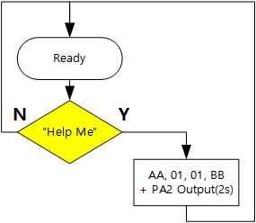

- 识别到"Help me"后输出UART数据：AA 01 01 BB
- PA2(pin9)输出高电平，原为1秒，可调整为2秒
- 系统保持Ready状态，无需等待即可进行下次识别

**测试验证：**

1. 在不同音量环境下测试（30%、50%、80%）
2. 记录24小时内的误识别次数
3. 根据实际效果微调灵敏度值

**注意事项：**

- 灵敏度调整需要多次测试找到最佳值
- 建议在量产前进行充分的环境测试
- 如仍有问题，可联系技术支持进行算法优化

---


---

### CI-03T系列语音模块在嘈杂环境下是否会出现持续识别导致卡死的问题？

**问题描述：**

担心CI-03T系列语音模块在嘈杂环境下可能会出现持续识别导致系统卡死的问题，需要了解模块的处理机制。

**解决方案：**

**技术特性：**

- CI-03T系列模块具备抗持续识别机制
- 不会因嘈杂环境导致系统卡死
- 模块有内置的音频处理和过滤算法

**麦克风规格：**

- 信号接收速率：标准16kHz采样率
- 支持自适应噪声抑制
- 具备防误触发机制

**优化建议：**

- 在嘈杂环境下适当调低识别阈值
- 确保麦克风安装位置合理
- 避免直接靠近强噪声源

**注意事项：**

- 模块设计已考虑各种使用场景
- 正常使用情况下不会出现卡死问题
- 如遇异常可联系技术支持分析

---


---

### CI-03T在音响播放大音乐时能否正常识别？

**问题描述：**

在音响播放较大音乐声的高噪音环境下，CI-03T芯片是否能够正确识别唤醒词，以及音响声音是否会干扰语音识别。

**解决方案：**

**可行性分析：**

1. **AEC回声消除功能**：

    - CI-03T支持AEC（声学回声消除）功能
    - 能够有效减少播放声音对麦克风的影响
    - 在播放音乐时仍可识别语音指令

2. **实际测试效果**：

    - 识别效果还可以，在播放音乐声音较大的情况下
    - 隔四五米，CI-03T依旧可以比较好地识别出语音指令
    - 可并发送对应的串口消息给其他模块

3. **成功关键因素**：

    - 需要在固件中开启AEC功能
    - 使用双麦克风版本（CI-03T2）效果更佳
    - 合理的硬件布局和结构设计

**配置建议：**

1. **选择合适模块版本**：

    - CI-03T1：单麦克风，支持基础AEC
    - CI-03T2：双麦克风，AEC效果更好
    - 根据产品需求选择合适版本

2. **固件配置设置**：

    - 在智能公元平台开启AEC回声消除
    - 根据实际效果调整识别参数
    - 测试不同音量下的识别率

3. **硬件设计优化**：

    - 麦克风远离喇叭，减少声音直射
    - 使用隔音材料隔离麦克风和喇叭
    - 确保结构开孔利于声音传播

**应用场景参考：**

- **智能音响**：CI-03T负责语音，SU-63T负责蓝牙音频
- **语音控制**：可在播放音乐时通过语音控制其他功能
- **多模态交互**：语音识别与音频播放并行工作

**技术限制：**

- 单麦克风版本抗噪能力有限
- 极端噪音环境可能影响识别距离
- 建议在实际使用场景中充分测试

**注意事项：**

- 开启AEC会略微增加算法延迟
- 双麦克风版本成本略高但效果更好
- 需要合理的结构设计配合
- 如识别率不理想，可考虑升级到CI系列更高型号

---


---

### CI-03T1在有持续呼呼声的噪声环境下如何选择应用场景？

**问题描述：**

在存在持续呼呼声和"右侧站台"背景噪音的环境中，如何为CI-03T1模块选择合适的应用场景以实现准确的语音识别功能。

**解决方案：**

**噪声特性分析：**

- 呼呼声是持续存在的背景噪声，可以通过降噪功能解决
- "右侧站台"是特定的干扰声音，可以作为防止识别词处理
- 需要区分持续噪声和瞬时干扰声音


**应用场景选择建议：**

- 对于基本识别功能（不需要声纹识别）：选择带降噪功能的Pro模型
- 如果需要同时支持声纹识别和强降噪：建议升级至CI-33T模块
- CI-03T1在启用声纹识别时难以支持高级降噪模型

**防止识别词设置：**

- 将"右侧站台"添加到防止误识别的命令词列表
- 这样该声音不会被误识别为有效命令
- 多条防止识别词之间用"|"分隔

**识别阈值调整：**

- 根据环境噪声强度调整识别阈值
- 噪声较大时适当降低阈值避免误识别
- 建议从默认值开始，根据实际效果逐步优化

**注意事项：**

- 持续的呼呼声可以通过降噪算法有效抑制
- 防止识别词功能可有效避免特定干扰词的误触发
- 制作完成后需要在实际噪声环境下测试验证效果
- 如噪声环境复杂，建议考虑使用双麦版本模块

---

### 设备噪音（如气泵）导致命令误触发怎么办？

**问题描述：**

设备中有气泵等配件，启动时噪音导致语音模块误触发其他命令，气泵停止工作后命令执行才正常。

**解决方案：**

**问题原因分析：**

- 气泵等配件的工作噪音会被麦克风拾取
- 噪声被误识别为语音命令，导致误触发
- 噪声环境下识别准确率下降，正常命令可能无法触发

**硬件优化方案：**

1. **麦克风布置优化**
    - 咪头尽量远离噪声源（如气泵、电机等）
    - 声学结构设计是影响识别的关键因素
    - 在麦克风和噪声源之间增加物理隔离

2. **选用双麦版本**
    - 推荐使用 CI-03T2 双麦版本
    - 双麦克风阵列具有更好的噪声抑制能力
    - 接双麦配置，可启用双麦降噪算法

**软件配置优化：**

1. **选择专用噪声模型**
    - 在平台应用场景中选择"中文烟机通用Pro"
    - 该模型专为高噪声环境优化
    - 对电机、气泵等设备噪音有较好的抑制效果

2. **调整灵敏度参数**
    - 降低命令识别灵敏度可减少误触发
    - 降低唤醒灵敏度避免噪音误唤醒
    - 在识别率和误触发率之间找到平衡点

**注意事项：**

- 双麦版本必须正确连接两个麦克风才能正常工作
- 噪声模型会占用更多Flash空间，确认容量充足
- 建议在实际使用场景中进行充分测试验证


---

### CI-03T1/CI-03T2声纹识别支持人数有限制吗？

**问题描述：**

需要了解CI-03T1/CI-03T2芯片在设置单一命令声纹识别时最多支持多少个不同的人，以及是否有更好的方法支持更多用户。

**解决方案：**

**声纹识别人数限制：**

- **CI-03T1/CI-03T2**：最多支持**9个**不同人的声纹注册
- **限制原因**：受芯片算法性能和存储空间限制
- **配置限制**：单一命令词注册9个声纹时，无法注册其他命令词

**功能限制说明：**

1. **数量与功能关系**：

    - 9个不同人：1个命令词
    - 1个声纹：9个命令词
    - 无法同时实现多人和多命令词的组合

2. **算法性能影响**：

    - 注册声纹越多，识别准确率可能下降
    - 声纹特征增多，相似可能性提高
    - 识别时间相应增加

**扩展方案建议：**

1. **使用CI-33T模块**：

    - 支持9个声纹（与CI-03T相同）
    - Flash容量更大（4M vs 2M）
    - 算法性能更优，适合声纹识别应用

2. **多模块方案**：

    - 使用多个CI-03T/CI-33T模块并联
    - 每个模块负责一部分用户
    - 通过主控协调管理

3. **分级认证方案**：

    - 第一级：声纹识别验证身份
    - 第二级：密码或PIN码二次验证
    - 降低对单一技术的依赖

**技术限制原因：**

- **非内存限制**：外接Flash无法解决人数限制
- **算法限制**：受声纹比对算法性能约束
- **识别效果**：过多声纹会导致误识率上升

**配置建议：**

- 优先使用CI-33T进行声纹识别项目
- 合理规划声纹注册数量，建议不超过5个
- 定期清理不常用的声纹，保持系统效率
- 重要应用建议增加其他认证方式作为补充

**注意事项：**

- 9人是硬件和算法的硬性限制，无法通过软件突破
- 声纹识别功能需要在安静环境下注册
- 实际使用中建议保留余量，不要用到极限
- 如需要支持更多用户，必须考虑多模块或其他技术方案


*声纹功能设置界面，显示声纹总数设置为9，表明芯片支持的最大声纹注册人数为9个*

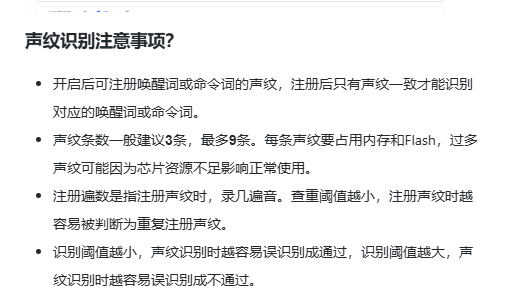

*声纹识别注意事项说明截图，列出了声纹注册和识别的注意事项*

---


---

### CI-03T1在噪声环境下如何实现声纹识别功能？

**问题描述：**

在噪声环境中使用CI-03T1模块识别两个命令词（"左侧站台"、"右侧站台"），同时需要实现声纹识别功能，并咨询是否可以基于提供的音频进行声纹定制。

**解决方案：**

**声纹识别配置说明：**

- 声纹识别需要注册唤醒词或命令词，注册后只有声纹一致才能识别对应的唤醒词或命令词
- 声纹条数建议3条，最多支持8条
- 注册时建议录制多遍以提高准确性
- 识别阈值调整：阈值越小越容易误识别，阈值越大越容易误识别不通过

**识别阈值说明：**

- 默认识别阈值通常设置为0.52（即520）
- 识别结果分数需要高于识别阈值才能被判定为有效识别
- 例如：日志输出 `max scor 600` 表示识别分数为600，高于阈值0.52，识别成功
- 识别阈值与查重阈值共同控制识别触发条件

**声纹注册方式：**

- **语音触发**：唤醒设备后说出声纹注册指令（如"开始注册声纹"）
- **串口指令**：可通过串口发送指令启动声纹注册流程

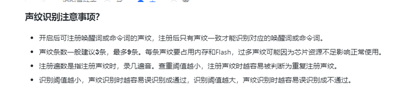

**噪声环境处理方案：**

- 呼呼声等持续噪声可以通过降噪功能解决
- "右侧站台"等命令词本身可作为防止识别词设置，避免误识别
- 在实际使用环境中测试后根据效果调整参数

**声纹定制说明：**

- 声纹注册需要在使用现场进行录入，这样会更准确
- 无法直接基于提供的音频文件进行声纹定制
- 需要用户在实际使用环境中通过语音录入完成声纹注册

**模块选择建议：**

- CI-03T1支持声纹识别，但在启用声纹识别时难以支持高级降噪模型
- 如果同时需要强降噪和声纹识别功能，建议升级至CI-33T模块

**注意事项：**

- 声纹识别只支持特定数量的命令词或唤醒词（最多9条），不能做到识别一个人的所有声音
- 声纹注册应在安静环境下进行，确保录制质量
- 识别阈值需要根据实际环境多次调试找到最佳值

---


---

### 如何使用CI-03T的自学习功能支持多国语言？

**问题描述：**

需要了解CI-03T的自学习功能如何支持25种等多国语言需求，以及具体的操作方法和教程资源。

**解决方案：**

**自学习多语言实现方式：**

1. **逐条录制学习**
    - 支持任意语言的命令词录制
    - 每条命令词需要单独录制学习
    - 适合少量多语言需求（<10条）

2. **学习操作流程**
    - 唤醒后念"学习唤醒词"或"学习命令词"进入学习模式
    - 根据语音提示念出自定义的命令词
    - 学习成功后系统播报"学习成功"

**教程资源参考：**

- **CI-03T免唤醒和自学习教程**：
    https://www.bilibili.com/video/BV1LM4y1S7A8/

- **SU-03T自学习功能演示**（操作方式相同）：
    https://www.bilibili.com/video/BV1pB4y147tn/

**多语言大规模需求限制：**

- **词条数量限制**：自学习功能建议<10条命令词
- **操作复杂度**：25种语言需要逐条录制，操作较繁琐
- **用户接受度**：终端用户需要逐一学习每种语言

**替代方案建议：**

1. **在线语音方案**
    - 使用JX-A7T等在线语音模组
    - 通过云端识别自然支持多国语言
    - 适合需要大量语言的应用场景

2. **分批学习管理**
    - 将语言分组，按需学习激活
    - 不同地区使用不同的语言包
    - 通过固件更新切换语言组

**注意事项：**

- 自学习功能在安静环境下效果最佳
- 录制时语速正常、声音洪亮、距离1米内
- 学习过程中避免环境噪声干扰
- 大规模多语言需求建议考虑在线方案

---


---

### 如何在CI-03T系列语音芯片上使用朝鲜语发音人？

**问题描述：**

希望在CI-03T系列语音芯片上使用朝鲜语发音人，并咨询是否支持定制朝鲜语语音以及自学习功能的使用方法。

**解决方案：**

**发音人支持情况：**

1. **平台默认发音人**：

    - 平台提供多种中文发音人选择（如橙子、小美、小小、乐乐、方方、阿栋、程程等）
    - 朝鲜语属于小语种，不在平台默认支持的发音人范围内

2. **朝鲜语定制方案**：

    - 支持朝鲜语发音人定制服务
    - 需要提供相应的语料素材进行模型训练
    - 定制费用根据项目数量和需求确定

**自学习功能实现方案：**

1. **自学习流程**：

    - 制作中文固件并开启自学习功能
    - 将固件烧录到语音模块中
    - 通过自学习将朝鲜语命令词和唤醒词录入
    - 测试识别效果并优化

2. **操作步骤**：

    - 唤醒后念"学习唤醒词"进入唤醒词学习模式
    - 唤醒后念"学习命令词"进入命令词学习模式
    - 根据语音提示念出朝鲜语词汇
    - 学习成功后系统播报确认


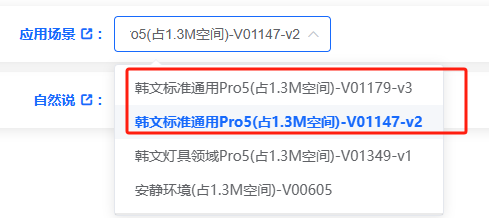

**定制与自学习对比：**

| 方案 | 优点 | 缺点 | 适用场景 |
|------|------|------|----------|
| 定制开发 | 识别效果好，支持大规模命令词 | 成本高，开发周期长 | 量产项目，命令词数量多 |
| 自学习功能 | 成本低，快速实现 | 命令词数量有限，效果依赖录制质量 | 样品测试，少量命令词 |

**实施建议：**

1. **短期测试**：先使用自学习功能进行原型验证
2. **长期量产**：通过定制开发获得更好的识别效果
3. **语料准备**：如选择定制，需准备至少4人（2男2女）的朝鲜语录音语料

**注意事项：**

- 自学习功能建议控制在10条命令词以内
- 录制时需要在安静环境下进行，距离设备1米内
- 定制开发周期约1个月，需提前规划
- 朝鲜语识别效果可能略低于中文和英文模型

---


---

### CI-03T系列模块的降噪功能如何选择和评估？

**问题描述：**

在高噪声环境（如粮食转运设备旁）下使用语音模块，需要了解CI-03T系列模块的降噪能力以及如何选择合适的配置。

**解决方案：**

**CI-03T降噪特性：**

- **默认降噪**：即使不开启稳态降噪功能，CI-03T模块仍具备基础的降噪能力
- **功能兼容**：CI-03T支持同时开启稳态降噪和自学习功能
- **适用场景**：适合高噪声工业环境，如粮食转运设备、大型机械等场所

**模块选择建议：**

- **高噪声环境**：优先选择CI-03T系列模块
- **需要自学习**：CI-03T可同时支持降噪和自学习功能
- **一般噪声环境**：稳态降噪功能已足够应对

**降噪效果评估：**

- **无量化指标**：没有具体的量化数值来衡量不同降噪方案的能力差距
- **实测验证**：建议通过实际应用场景测试来评估效果
- **测试方法**：

    1. 购买样品进行实测
    2. 在实际噪声环境下验证识别效果
    3. 根据测试结果确定是否满足需求

**优化建议：**

- 对于通用场景，使用标准通用Pro模块可提供稳定且高质量的降噪效果
- 如效果不理想，可针对具体问题联系技术支持寻找解决方案
- 在量产前进行充分的环境测试至关重要

**注意事项：**

- 降噪效果受多种因素影响，包括噪声类型、安装位置、声学结构等
- 不同批次的产品可能存在细微差异，建议预留调试余量
- 工业环境下的噪声特性复杂，可能需要结合多种降噪方案

---


---

### CI-03T的小语种定制服务详情

**问题描述：**

需要了解CI-03T系列芯片的小语种定制服务详情，包括是否需要额外联系、收费情况，以及确认淘宝上的产品链接是否正确。

**解决方案：**

**小语种定制服务说明：**

1. **服务流程**：

    - 需要联系技术支持或商务人员
    - 提供目标语言的语料数据
    - 评估后确认定制费用和开发周期

2. **定制要求**：

    - 必须提供语料数据
    - 语料需要按照标准格式录制
    - 包含唤醒词和命令词的完整数据集

3. **费用说明**：

    - 小语种定制为收费服务
    - 具体费用根据语料复杂度和项目规模评估
    - 需要私聊沟通具体需求

**支持型号确认：**

- **CI-03T系列**：支持小语种定制
- **其他型号**：部分型号也支持，需具体确认

**购买渠道注意事项：**

1. **官方渠道推荐**：

    - 淘宝官方店：https://item.taobao.com/item.htm?id=697462463035
    - 购买时确认产品型号为CI-03T

2. **产品识别**：

    - CI-73T与CI-03T是不同型号
    - CI-73T虽也支持小语种，但规格不同
    - 确认产品参数后再购买

**定制开发流程：**

1. **需求确认**：

    - 明确需要定制的语言类型
    - 确定命令词和唤醒词列表
    - 评估项目时间要求

2. **语料准备**：

    - 按要求录制目标语言语料
    - 确保语料质量和数量符合标准
    - 提供清晰的文本标注

3. **开发实施**：

    - 技术团队进行模型训练
    - 提供测试固件验证效果
    - 根据反馈进行优化调整

**注意事项：**

- 小语种定制需要一定开发周期（通常3-4周）
- 语料质量直接影响最终识别效果
- 建议提前规划定制需求，避免影响项目进度
- 购买时请认准官方渠道，避免型号混淆

---


---

### CI-03T1多次唤醒后死机问题如何处理？

**问题描述：**

CI-03T1离线语音识别芯片在多次唤醒后会出现死机现象，无法再输出语音。

**解决方案：**

**问题反馈流程：**

1. **异常模块寄回检测**：

    - 将出现问题的模块寄回厂家进行检测分析
    - 提供详细的故障描述和使用环境
    - 包含故障现象的触发条件和频率

2. **故障现象描述**：

    - 具体表现：连续唤醒多次后死机，无语音输出
    - 触发条件：重复进行唤醒操作
    - 影响范围：发现5个模块存在相同问题

**售后处理方案：**

1. **紧急换货处理**：

    - 维修部门急需使用时，可申请紧急换货
    - 厂家可优先安排发货新的替换模块
    - 确保生产不受影响

2. **故障模块分析**：

    - 厂家收到故障模块后进行技术分析
    - 定位问题根源：硬件故障或固件缺陷
    - 根据分析结果提供改进方案

**预防措施：**

1. **使用测试验证**：

    - 在批量使用前进行充分的可靠性测试
    - 模拟实际使用场景进行压力测试
    - 特别关注多次唤醒的稳定性

2. **固件版本确认**：

    - 使用经过充分测试的稳定固件版本
    - 避免使用测试版或未经验证的固件
    - 定期更新到最新的稳定版本

**临时解决方案：**

- 如遇到紧急需求，可先联系厂家申请样品更换
- 保留故障模块的详细记录，便于技术分析
- 在问题解决前，适当控制唤醒频率避免触发问题

**注意事项：**

- 多个模块出现相同问题时，可能是批次性质量问题
- 及时反馈问题有助于厂家快速定位并解决
- 保留完整的故障记录和处理过程
- 建议建立模块故障追溯机制

---


---

### CI-03T1英文固件识别效果如何优化？

**问题描述：**

CI-03T1模块在英文版本固件下的语音识别效果不佳，需要了解如何优化识别效果。

**解决方案：**

**问题定位与诊断：**

1. **提供测试视频**：

    - 录制模块在实际使用环境中的测试视频
    - 展示识别失败的具体场景和表现
    - 包含清晰的声音输入和环境背景

2. **技术团队分析**：

    - 将测试视频提交给技术团队进行分析
    - 识别具体的问题类型（发音、噪声、距离等）
    - 获取针对性的优化建议

**固件优化方案：**

1. **联系固件优化**：

    - 将现有固件文件发送给厂家
    - 说明具体的识别问题和场景
    - 请求技术团队进行固件级别的优化

2. **优化调整内容**：

    - 调整英文语音模型的参数
    - 优化识别算法的阈值设置
    - 针对特定应用场景进行适配

**自助优化建议：**

1. **检查语音配置**：

    - 确认命令词发音是否标准
    - 避免使用发音相似或容易混淆的词汇
    - 选择发音清晰、辨识度高的命令词

2. **环境优化**：

    - 减少背景噪声干扰
    - 确保麦克风朝向正确
    - 保持适当的识别距离（推荐0.3-2米）

3. **参数调整**：

    - 在平台中调整识别灵敏度
    - 选择合适的英文识别模型
    - 根据环境噪声等级调整降噪参数

**注意事项：**

- 英文识别模型的优化需要基于具体问题进行调整
- 提供详细的测试场景有助于技术团队快速定位问题
- 固件优化通常需要一定的开发周期
- 建议在优化完成后进行充分测试验证

---


---

### CI-03T静音状态下无法执行控制指令怎么办？

**问题描述：**

CI-03T1模块在静音状态下，即使唤醒词被正确识别，后续的控制指令（如开灯/关灯）也无法执行，需要先执行"取消静音"操作。

**解决方案：**

1. **问题分析**
    - 正常情况下，静音仅关闭喇叭播报，不影响指令执行
    - 出现此问题可能是程序跑飞，静音状态异常
    - 模块带看门狗功能，一段时间后可能自动恢复

2. **临时解决方案**
    - 先说"取消静音"恢复声音
    - 再说唤醒词
    - 最后说控制指令

3. **长期优化方案**
    - 移除静音功能配置，测试是否还有此现象
    - 或修改静音控制为"不唤醒就不能控制"的模式
    - 提供工程文件给技术支持分析

**注意事项：**

- 静音功能设计上不应影响指令识别和执行
- 复杂环境下可能误识别"静音"类似词语
- 建议记录问题出现的具体场景和频率

---

### CI-03T拾音器和喇叭正常但无法识别语音指令怎么办？

**问题描述：**

CI-03T模块的拾音器和喇叭功能正常，烧录后能够正常播报，但语音指令无响应，无法识别命令词。

**解决方案：**

**问题分析：**

1. **硬件功能正常确认**：

    - 喇叭能正常播报，说明音频输出正常
    - 拾音器硬件正常，说明麦克风电路基本完好
    - 同样的固件在其他板子上正常，说明固件无问题

2. **可能原因**：

    - 芯片内部识别电路损坏
    - 麦克风引脚存在虚焊
    - 芯片影响到了识别功能

**排查步骤：**

1. **基础硬件检查**：

    - 检查3.3V脚的输出电压是否正常
    - 测量芯片各引脚工作电压
    - 确认麦克风引脚无虚焊或接触不良

2. **固件验证**：

    - 烧录出厂固件进行测试
    - 排除自定义固件配置问题
    - 先排除硬件问题

3. **对比测试**：

    - 将固件烧录到确认正常的板子上
    - 验证是否为个别芯片问题
    - 使用相同型号的板子交叉测试

**解决方法：**

1. **芯片更换建议**：

    - 如多个排查后仍无法识别，可能是芯片损坏
    - 影响到了芯片内部的识别功能部分
    - 建议更换新的CI-03T模块

2. **焊接质量检查**：

    - 重新检查麦克风引脚焊接质量
    - 使用放大镜观察是否有虚焊或冷焊
    - 必要时重新焊接麦克风连接

3. **硬件对比**：

    - 将正常工作的麦克风和喇叭移植到问题板子
    - 排除外围器件问题
    - 确认问题是否在芯片本身

**注意事项：**

- 拾音器和喇叭正常不代表识别功能正常
- 芯片可能部分功能损坏，需要整体更换
- 保留详细的测试记录便于问题定位
- 如多个模块出现相同问题，可能是批次性质量问题

---
- 定制开发专用的高噪声识别模型

---


---

### CI-03T自学习功能的数据限制

**问题描述：**

CI-03T1和CI-03T2芯片的自学习功能中，新增学习结果最多可以保存多少条，以及是否支持覆盖原有学习数据。

**解决方案：**

**自学习数据限制：**

1. **新增学习结果**：

    - 最多支持保存10条学习结果
    - 超过限制后需要删除旧数据才能添加新的


*平台中显示的"新增学习结果"按钮位置*

2. **数据存储机制**：

    - 新增结果会保留，不会覆盖原有学习数据
    - 系统预置命令词与自学习命令词独立管理
    - 可以同时查看预设词库和自学习词库

3. **数量控制建议**：

    - 建议控制在十条以内以保证系统稳定
    - 定期清理不需要的学习结果
    - 重要命令词使用预置功能，节省自学习空间

4. **覆盖说明**：

    - 自学习功能不支持覆盖原有数据
    - 如需修改已学习的命令词，需要先删除再重新学习
    - 删除操作会清除该词条的所有学习记录

**注意事项：**

- 自学习功能占用额外的Flash空间
- 学习结果越多，系统响应时间可能略有增加
- 建议在安静环境下进行学习操作
- 如达到存储上限，需要管理学习数据
    - 建议：控制在十条以内以保证系统稳定运行

2. **数据存储机制**：

    - 新增学习结果会保留，不会覆盖原有学习数据
    - 系统预置命令词与自学习命令词分开管理
    - 学习结果与原有词库独立存储

3. **功能特点**：

    - 支持用户自定义命令词
    - 学习过程简单，通过语音交互完成
    - 学习成功后立即生效，无需重新烧录

**操作建议：**

1. **规划学习内容**：

    - 优先学习最常用的命令词
    - 避免学习相似度过高的词汇
    - 定期清理不需要的学习结果

2. **管理存储空间**：

    - 达到10条上限时，整理现有学习结果
    - 删除使用频率低或效果不佳的词条
    - 为重要命令词预留存储空间

3. **批量应用考虑**：

    - 学习结果可通过配置导出，用于批量烧录
    - 建议在量产前统一学习标准命令词
    - 保留学习配置文件便于重复使用

**技术限制：**

- 自学习功能占用额外的Flash空间
- 学习结果越多，系统响应时间可能略有增加
- 极端噪声环境可能影响学习成功率
- 建议在安静环境下进行学习操作

**注意事项：**

- 自学习功能与稳态降噪功能互斥，只能选择其中一项
- 学习成功后建议测试验证效果
- 如需更多命令词，考虑使用支持更大词条量的模块

---


---

### CI-03T1自学习功能提示语语音替换问题

**问题描述：**

在CI-03T1模块的自学习功能中，无法将自定义的语音文件替换所有提示语（Prompt）的语音，部分提示语词条无法在平台中找到或选择。

**解决方案：**

**问题原因分析：**

1. **字符串去重机制**：

    - 平台在进行词条对比时，可能采用字符串去重过滤
    - 当命令词与唤醒词前缀相似时，提示语可能被误过滤
    - 字符串对比长度不足导致误判

2. **平台功能限制**：

    - 部分系统自带提示语不支持自定义替换
    - "退出学习"等系统核心命令无法通过自学习修改
    - 英文版本平台的提示语支持可能不完整

**当前解决方案：**

1. **可替换的提示语**：

    - 在平台的"替换词条音频"功能中查找可用词条
    - 部分提示语如"Please say the learn..."等可以替换
    - 支持替换的提示语会显示在可选列表中

2. **系统命令限制**：

    - "退出学习"（exit voice control）等核心命令无法替换
    - 系统自带的命令词保持固定提示语
    - 这些限制是为了保证系统基本功能的稳定性

3. **平台优化建议**：

    - 该问题已反馈至平台优化计划
    - 后续版本可能改进字符串匹配算法
    - 建议关注平台更新日志

**替代方案：**

1. **使用中文版本**：

    - 中文版本的提示语支持更完整
    - 可以尝试切换到中文平台配置
    - 生成固件时仍可选择英文语音

2. **定制开发**：

    - 如需完整的提示语自定义
    - 可联系技术支持评估定制开发
    - 提供具体的需求说明和预期效果

**注意事项：**

- 自学习功能的提示语替换存在一定限制
- 系统核心命令的提示语无法修改
- 建议在配置前详细测试可替换的词条范围
- 如有特殊需求，可考虑其他实现方案

---

### CI-03T1/CI-03T2语音播报断续问题

**问题描述：**

在使用CI-03T1/CI-03T2离线语音识别芯片时，当执行关闭/开启语音识别功能的指令时，播报语音会出现断续现象，而其他播报功能正常。使用DCDC供电，电流供应充足。

**解决方案：**

**问题原因分析：**

1. **系统控制冲突**：

    - 播报"语音识别已关闭"时，同时执行了"设置变量SP_UNRECOG"和"关闭语音识别"
    - 多个操作同时执行导致播报资源冲突
    - 系统控制优先级高于播报，造成中断

2. **延时设置不足**：

    - 关闭语音识别前的延时仅为500ms
    - 时间过短，播报未完成就开始执行关闭操作
    - 需要增加延时确保播报完成

**解决方法：**

1. **移除冲突的控制项**：

    - 删除"设置变量SP_UNRECOG"控制
    - 仅保留播报操作
    - 避免多操作同时执行

    

2. **增加延时设置**：

    - 将延时从500ms调整至1500ms或更长
    - 确保播报内容完全播放完毕
    - 再执行关闭/开启语音识别操作

    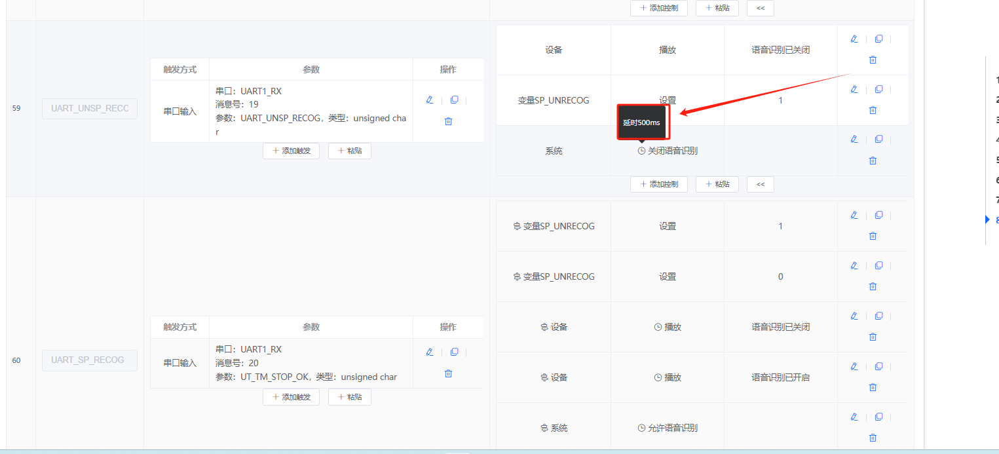

3. **优化控制顺序**：

    - 先执行播报操作
    - 通过延时确保播报完成
    - 最后执行语音识别开关操作

    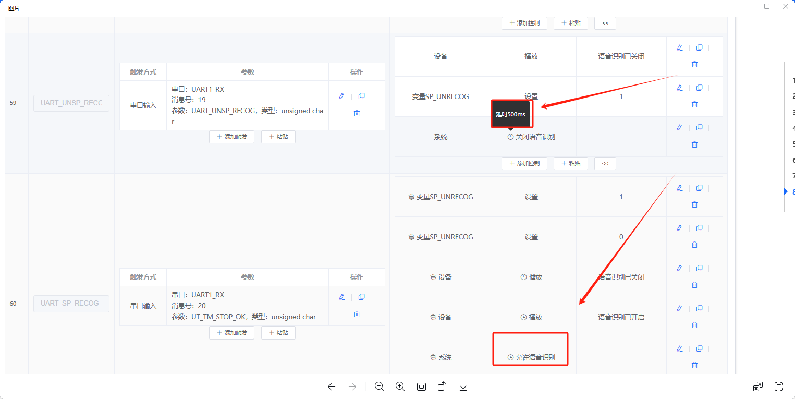

**测试验证步骤：**

1. 仅保留播报功能，移除其他控制
2. 测试播报是否连续正常
3. 逐步增加延时时间，找到最小有效值
4. 重新添加必要的控制操作

**技术原理说明：**

- 播报断续是软件层面的资源竞争问题
- 不是硬件供电或喇叭质量问题
- DCDC供电且电流充足可排除电源问题
- 关键在于合理安排操作的执行时序

**注意事项：**

- 此问题在关闭/开启语音识别时特有
- 其他播报功能正常说明硬件无问题
- 调整延时需要实际测试找到最佳值
- 如问题持续，可能需要简化控制逻辑

---


---

### CI-03T1（CI1302）语音识别响应延迟如何处理？

**解决方案：**

**功能实现确认：**

- CI-03T系列模块支持此功能
- 需要在平台进行相应配置
- 可实现动态物体名称记录和查找

**平台配置方法：**

1. **设置记录命令词**：

    - 命令词："这个是|你是"
    - 回复语："好的我知道了"
    - 控制设置：无特殊配置

2. **设置查询命令词**：

    - 命令词："*在哪儿"
    - 回复语："我在这儿"
    - 使用通配符"*"匹配任意物体名称

**配置示例：**

```
命令词1：这个是空调遥控器
回复语1：好的我知道了

命令词2：空调遥控器在哪儿
回复语2：我在这儿

命令词3：这个是电视遥控器
回复语3：好的我知道了

命令词4：电视遥控器在哪儿
回复语4：我在这儿
```

**使用流程：**

1. 唤醒语音模块（如"你好小美"）
2. 说出"这个是[物体名称]"进行记录
3. 系统回复"好的我知道了"确认记录
4. 后续可询问"[物体名称]在哪儿"
5. 系统回复"我在这儿"表示物体位置

**功能特点：**

- 物体名称可以是任意词汇
- 不限制具体物体类型
- 支持动态更新记录内容
- 每次新记录会覆盖之前的内容

**应用场景：**

- 物品定位查找
- 动态标签管理
- 语音备忘录功能
- 智能家居控制

**注意事项：**

- 此功能仅支持CI-03T系列模块
- 配置时需要在平台中正确设置命令词和回复语
- 物体名称建议使用2-4个字的词汇
- 使用时需在安静环境下，确保识别准确率


*平台配置界面展示如何设置"这个是"和"在哪儿"的命令词*

---


---

### CI-03T芯片识别阿拉伯数字时识别率不稳定怎么办？

**问题描述：**

CI-03T芯片在识别阿拉伯数字时识别率不稳定，偶尔无法识别，且唤醒词也会失效，需要优化识别准确率。

**解决方案：**

**问题分析：**

1. **单字识别难度**：

    - 阿拉伯数字（0-9）都是单字发音
    - 单字发音时长短，特征信息少
    - 市面上所有语音芯片对单字识别都存在挑战

2. **识别率统计**：

    - CI-03T综合识别率约95%
    - 单字识别误识别风险相对较高
    - 需要通过优化参数改善效果

**优化方法：**

1. **单独调整数字阈值**：

    - 进入平台"优化配置"菜单
    - 找到"命令词阈值"设置选项
    - 可单独调整特定命令词的识别灵敏度

2. **阈值调整策略**：

    - 识别率差时：调高阈值增加识别机会
    - 误识别多时：调低阈值减少误触发
    - 逐步测试找到最佳平衡点

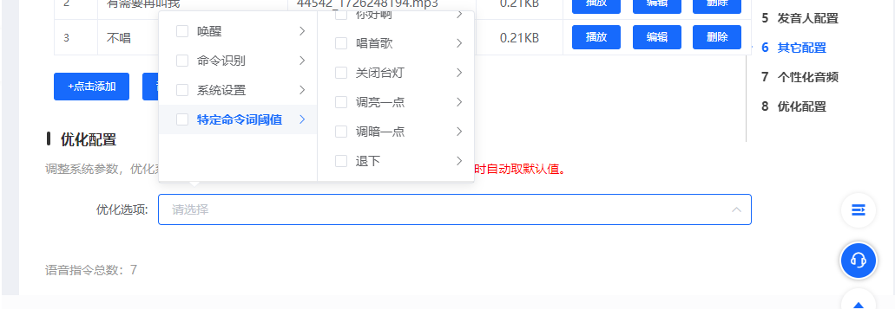

*在优化配置中可单独调整特定命令词的阈值*

3. **唤醒词优化**：

    - 同步调整唤醒词识别阈值
    - 如"计算机"识别不稳定，可尝试其他唤醒词
    - 确保唤醒后能正常识别命令词

**硬件优化建议：**

1. **咪头选型**：

    - 选择高信噪比咪头（SNR＞70dB）
    - 推荐机芯智能定制咪头6027
    - 避免使用规格不符的廉价咪头

2. **电路设计**：

    - 确保电源供电稳定
    - 咪头线长度控制在100mm以内
    - 使用双绞线或屏蔽线防干扰

3. **结构优化**：

    - 合理设计咪头安装位置
    - 避免将咪头放入密闭空间
    - 结构开孔设计要利于声音传播

**测试验证方法：**

1. **分批测试**：

    - 记录偶尔无法识别的具体数字
    - 针对性调整对应数字的阈值
    - 验证调整后的改善效果

2. **环境控制**：

    - 在安静环境下进行基础测试
    - 在实际使用环境中验证
    - 记录不同场景下的识别表现

3. **多次采样**：

    - 每个数字多次发音测试
    - 统计成功识别次数
    - 计算实际识别准确率

**注意事项：**

- 阈值调整需要平衡识别率和误识别率
- 单字识别问题是业界共同挑战，需要合理预期
- 如某数字持续识别困难，可考虑改变说法（如"1"改为"幺"）
- 建议保留充足的测试时间，不要急于下结论

---


---

### CI-03T系列英文识别准确率低如何优化？

**问题描述：**

在使用CI-03T1/CI-03T2系列芯片进行英文语音识别时，识别准确率较低（约60%），且存在误触发或触发失败的问题。

**解决方案：**

**1. 使用预设英文唤醒词**：

系统提供了一批优化过的英文唤醒词，识别效果优于自定义词条：

- HI-JENNY、HELLO-LIGHT、HI-TOM、HELLO-HELLO
- HI-BETA、HELLO-JERRY、HI-REST、HELLO-LASKO
- YUMM、HELLO-LAXFO、HI-ALFIE、HI-LAY-STER
- 以及其他20余个预设唤醒词

**2. 付费定制语料训练**：

对于更高识别率要求，可考虑付费定制服务：

- **语料要求**：

    - 每个唤醒词、命令词提供4-10条录音
    - 不同男女录音比例各一半为佳
    - 音频格式：.wav（16.0KHz，16位，1声道）
    - 命令词建议至少4个音节，尤其是唤醒词
    - 选择发音有明显差异的词条，避免发音相近

- **录音质量要求**：

    - 声音平稳，语速正常
    - 声音最好有男有女，适应性好
    - 音频要求声音干净，底噪和背景声小或无
    - 推荐使用真实外国人的声音，而非合成音

- **开发流程**：

    - 在智能公元平台完成CI系列模块固件配置
    - 测试逻辑无误后，提供JSON文件
    - 产品使用的回复语也需要通过录制音频准备

**注意事项：**

- 语料训练和泛化功能不能同时使用
- 定制训练需要额外开发周期和成本
- 近30条指令如需泛化，建议每条指令优化3个变体
- 在甩脂机等有震动的产品中，需要做好硬件减震措施

---


---

### CI-03T在车内环境下声源定位识别率低怎么办？

**问题描述：**

使用CI-03T芯片的声源定位功能时，在车内环境下由于胎噪、风噪等低频噪音干扰，导致声源定位识别率大幅降低，现有语言模型效果不达标。

**解决方案：**

**1. 硬件结构优化**

- 将设备放置在中控台上，远离主要的噪声源
- 确保麦克风与人的嘴巴距离保持在30~50cm范围内
- 使用隔震材料减少震动传递


**2. 固件配置调整**

- 使用双麦克风配置（CI-03T2）
- 在固件开发平台中启用"语音识别+声源定位+降混响"功能
- 开启深度降噪功能以应对低频噪声

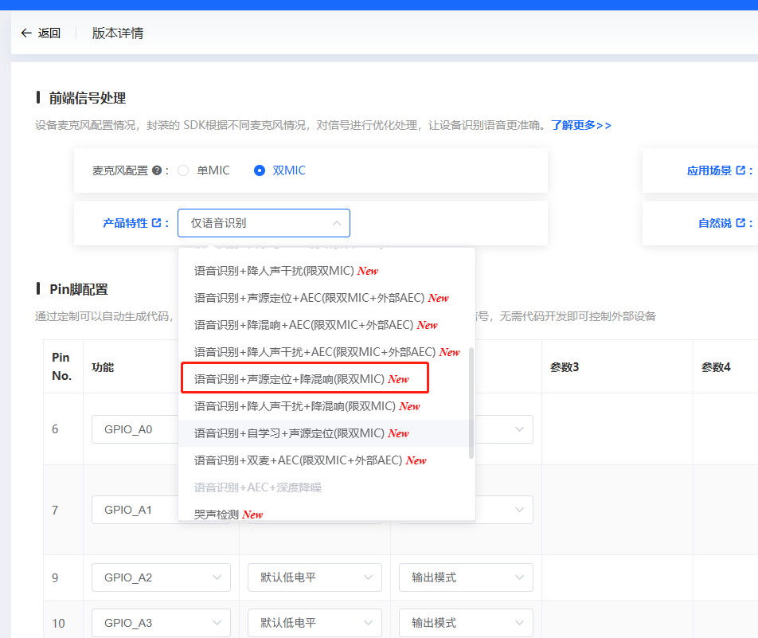

**3. 算法模型选择**

- 尝试不同的噪声环境模型：

    - 茶吧机模型：在车内环境下成功率约50~60%
    - 中文烟机模型：针对特定噪声环境优化
- 测试结果表明，现有模型在车内环境下仍存在局限性

**4. 系统级优化方案**

- 考虑使用外部降噪模块
- 增加防风罩减少风噪影响
- 优化麦克风选型，选择信噪比更高的麦克风（SNR＞75dB）

**注意事项：**

- 车内环境的低频噪声（胎噪、风噪、电机声）对声源定位影响显著
- 音乐播放对识别率影响相对较小
- 双麦方案相比单麦方案识别率提升约3%，改善有限
- 完全解决车内噪声问题需要从硬件、算法和结构多方面综合考虑
- 建议在产品设计阶段进行充分的环境测试和验证

---


---

### CI-03T模块在高噪声环境下降噪问题如何解决？

**问题描述：**

CI-03T模块在加油站等高噪声环境下使用时，受到加油泵工作噪声干扰，语音识别率和唤醒效果明显下降，需要优化降噪处理。

**解决方案：**

**问题分析：**

1. **噪声环境特点**：

    - 加油泵噪声频率集中在低频段（50-200Hz）
    - 噪声强度可达80-95dB，远超正常语音水平
    - 噪声具有持续性和周期性特点
    - 严重影响语音信号的信噪比

2. **模块噪声处理能力**：

    - CI-03T1/CI-03T2基础降噪能力有限
    - CI-33T在燃气表场景中证明效果更好
    - 需要根据具体噪声类型选择合适方案
    - 可能需要硬件配合软件优化

**优化方案：**

**方案一：硬件降噪优化**

1. **麦克风选型**：

    - 使用指向性麦克风，减少环境噪声拾取
    - 选择信噪比更高的麦克风模块
    - 考虑使用阵列麦克风进行空间滤波

2. **结构设计优化**：

    - 增加物理隔音和减震结构
    - 设计防风罩减少气流噪声
    - 优化麦克风安装位置远离噪声源

3. **电路优化**：

    - 增加前置放大和滤波电路
    - 使用专用降噪芯片处理音频信号
    - 优化供电减少电路噪声

**方案二：软件算法优化**

1. **噪声模型训练**：

    - 收集加油泵等典型工业噪声样本
    - 训练专门的噪声抑制模型
    - 生成针对强噪声环境的固件版本

2. **参数调整**：

    - 提高降噪强度和灵敏度阈值
    - 调整VAD（语音活动检测）参数
    - 优化动态增益控制策略

3. **多级降噪处理**：

    - 实现预处理+核心算法+后处理三级降噪
    - 结合谱减法和维纳滤波等多种算法
    - 针对低频噪声进行专门抑制

**方案三：使用场景优化**

1. **CI-33T替换方案**：

    - 更换为在燃气表场景验证过的CI-33T
    - 该模块对低频噪声有更好抑制效果
    - 支持更复杂的噪声环境处理

2. **工作模式调整**：

    - 增加噪声检测自动模式切换
    - 在高噪声时使用更严格的识别策略
    - 提供手动切换噪声模式的命令

3. **使用指导优化**：

    - 指导用户在相对安静时进行语音操作
    - 建议在加油间歇期使用语音功能
    - 提供视觉提示反馈识别状态

**实施步骤：**

1. **噪声环境评估**：

    - 现场测量噪声频谱和强度
    - 分析主要噪声成分和特点
    - 确定最合适的优化方案

2. **方案选择和实施**：

    - 优先尝试软件算法优化
    - 如效果不佳再考虑硬件改进
    - 评估成本和实施难度

3. **测试验证**：

    - 在实际加油站环境中测试
    - 统计不同噪声水平下的识别率
    - 收集用户使用反馈

4. **效果优化**：

    - 根据测试结果调整参数
    - 持续收集噪声样本改进算法
    - 提供多种噪声模式选择

**临时解决方案：**

1. **距离优化**：

    - 缩短说话距离提高信噪比
    - 使用近场语音交互方式
    - 避免远距离语音操作

2. **时机选择**：

    - 在加油泵停止工作时使用
    - 选择相对安静的时段操作
    - 避开最大噪声干扰时刻

3. **操作方式调整**：

    - 使用按键或触摸作为备用方案
    - 提供文字提示反馈系统状态
    - 结合多种交互方式提高成功率

**技术说明：**

- 加油泵噪声主要为低频持续噪声
- 信噪比低于0dB时常规算法效果有限
- CI-33T的降噪模型经过燃气表场景优化
- 硬件改进成本较高但效果更明显

**注意事项：**

- 强噪声环境下的语音识别是业界难题
- 需要综合多种方法才能达到较好效果
- 建议在产品设计阶段就考虑噪声适应性
- 不同噪声环境可能需要不同的优化方案
- 如有量产需求，建议进行充分的现场测试

---


---

### CI-03T系列是否支持文字转语音(TTS)功能？

**问题描述：**

询问CI-03T系列芯片是否支持文字转语音功能，以及该功能是离线还是在线实现。

**解决方案：**

**功能支持确认：**

1. **TTS功能支持**：

    - CI-03T系列模块支持文字转语音(TTS)功能
    - 支持将文本转换为语音播报
    - 可实现动态语音内容生成

2. **实现方式**：

    - **离线TTS**：本地实现，无需网络连接
    - 通过内置的语音合成引擎完成
    - 支持中文和英文的文本转换

3. **功能特点**：

    - 支持自定义播报内容
    - 可通过串口发送文本进行转换
    - 播报语音清晰自然
    - 响应速度快，无延迟

**配置方法：**

1. **平台配置**：

    - 在智能公元平台的"其他配置"中启用TTS功能
    - 设置TTS语音参数（音调、语速等）
    - 配置TTS触发方式

2. **使用方式**：

    - 通过命令词触发TTS播报
    - 通过串口发送文本内容
    - 支持动态文本内容更新

**技术限制：**

- TTS功能需要额外授权才能使用
- 授权费用需要联系商务洽谈
- 不同型号的TTS能力可能略有差异

**注意事项：**

- TTS功能需要额外授权，不是默认开启
- 使用前需确认授权状态和费用
- 建议先申请样品进行功能验证
- 批量使用前需要完成授权采购流程

---


---

### CI-03T系列是否支持文字转语音(TTS)功能？

**问题描述：**

询问CI-03T系列芯片是否支持文字转语音功能，以及该功能是离线还是在线实现。

**解决方案：**

**功能支持确认：**

1. **TTS功能支持**：

    - CI-03T系列模块支持文字转语音(TTS)功能
    - 支持将文本转换为语音播报
    - 可实现动态语音内容生成

2. **实现方式**：

    - **离线TTS**：本地实现，无需网络连接
    - 通过内置的语音合成引擎完成
    - 支持中文和英文的文本转换

3. **功能特点**：

    - 支持自定义播报内容
    - 可通过串口发送文本进行转换
    - 播报语音清晰自然
    - 响应速度快，无延迟

**技术限制：**

- TTS功能需要额外授权才能使用
- 授权费用需要联系商务洽谈
- 不同型号的TTS能力可能略有差异

**配置方法：**

1. **平台配置**：

    - 在智能公元平台的"其他配置"或"个性化音频"中启用TTS功能
    - 设置TTS语音参数（音调、语速等）
    - 配置TTS触发方式

2. **使用方式**：

    - 通过命令词触发TTS播报
    - 通过串口发送文本内容
    - 支持动态文本内容更新

**技术限制：**

- TTS功能需要额外授权，不是默认开启
- 使用前需确认授权状态和费用
- 如无授权，无法使用TTS功能

**注意事项：**

- TTS功能需要额外授权，不是默认开启
- 使用前需确认授权状态和费用
- 批量使用前需要完成授权采购流程
- 建议先申请样品进行功能验证

---


---

### CI-03T1播放音乐时如何通过语音指令实现暂停播放功能？

**问题描述：**

在使用CI-03T1芯片播放音乐时，添加了暂停播放的语音指令和控制命令，但该功能无法正常工作。

**解决方案：**

**1. 功能确认**

CI-03T1支持通过AEC（声学回声消除）技术实现播放过程中的语音控制：

- **技术原理**：AEC算法能够分离播放音频和用户语音信号
- **支持功能**：播放音乐时可通过语音指令进行暂停、继续等操作
- **实现条件**：需要启用"语音识别+AEC打断"功能

**2. 配置步骤**

**步骤一：启用AEC功能**

- 登录智能公元平台
- 进入产品配置界面
- 在前端信号处理中选择单MIC配置
- 产品特性勾选"语音识别+AEC打断(限单MIC)"

**步骤二：配置暂停命令**

- 在命令词中添加"暂停播放"、"停止播放"等指令
- 设置对应的控制动作（暂停播放/停止播放）
- 确保命令词发音清晰，避免与唤醒词冲突

**步骤三：生成并烧录固件**

- 配置完成后生成固件
- 下载并烧录到模块
- 测试各项功能是否正常

**3. 注意事项：**

- 此功能仅CI-03T1等支持AEC的型号具备
- 双麦克风版本（CI-03T2）主要用于降噪，不支持AEC打断
- 配置更改后需要重新烧录固件才能生效
- 建议在实际使用环境中测试各种场景下的识别效果

---

### CI-03T1台灯应用中AEC打断效果不佳如何优化？

**问题描述：**

在使用CI-03T1芯片开发台灯语音对话功能时，遇到唤醒词打断效果不佳的问题，即使在播放过程中说出唤醒词也难以成功打断。

**解决方案：**

**问题分析：**

1. **硬件配置影响**：

    - 使用18cm长线连接麦克风，导致信号衰减
    - 麦克风远离主板可能影响AEC算法性能
    - 继电器切换可能引入干扰噪声

2. **AEC功能配置**：

    - 需要启用"语音识别+AEC打断"功能
    - 仅支持单麦克风配置
    - 对硬件连接要求较高

**优化方案：**

1. **配置正确的应用场景**：

    - 选择"普通话通用Pro"模型（占用1.3M空间）
    - 确保使用支持AEC的最新模型版本
    - 避免使用不支持打断功能的旧模型

    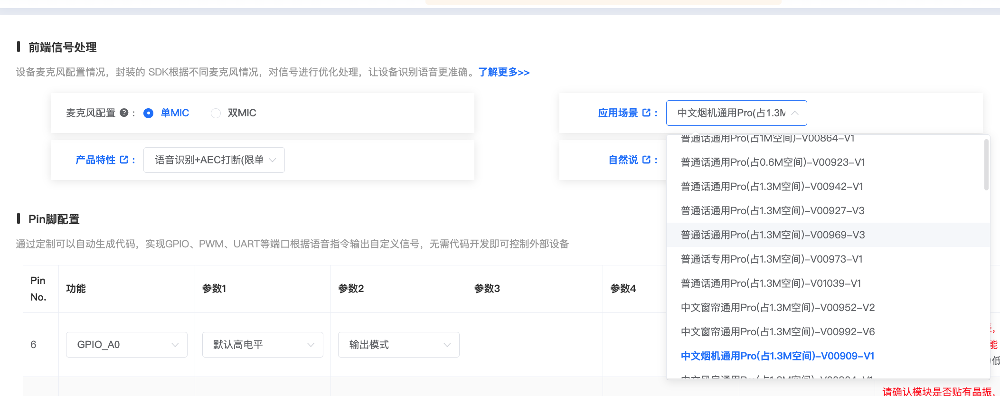

    *选择普通话通用Pro模型*

    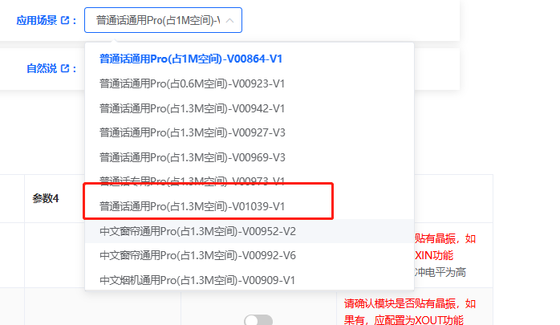

    *不同版本的普通话通用Pro模型列表*

2. **启用AEC打断功能**：

    - 在产品特性中选择"语音识别+AEC打断(限单MIC)"
    - 确保麦克风配置为单MIC模式
    - 该功能专为单麦克风AEC场景优化

    

    *单MIC配置下的AEC打断功能*

    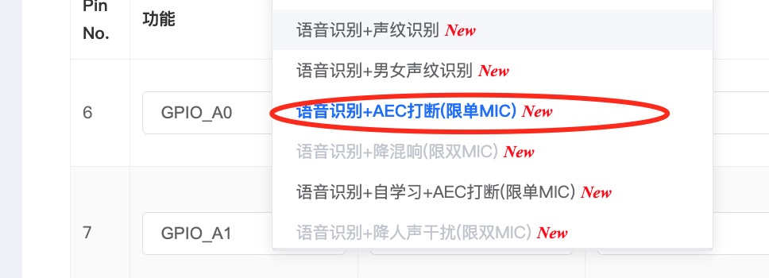

    *选择语音识别+AEC打断功能*

3. **硬件优化建议**：

    - 避免使用过长的麦克风连接线（建议<5cm）
    - 将麦克风直接集成在主板上
    - 远离继电器等干扰源
    - 确保良好的电源滤波

**多唤醒词配置：**

1. **提高唤醒成功率**：

    - 设置多个唤醒词可提高整体唤醒灵敏度
    - 例如：小亮小亮、小梁小梁、销量销量等
    - 一般不会影响其他命令词的识别效果

    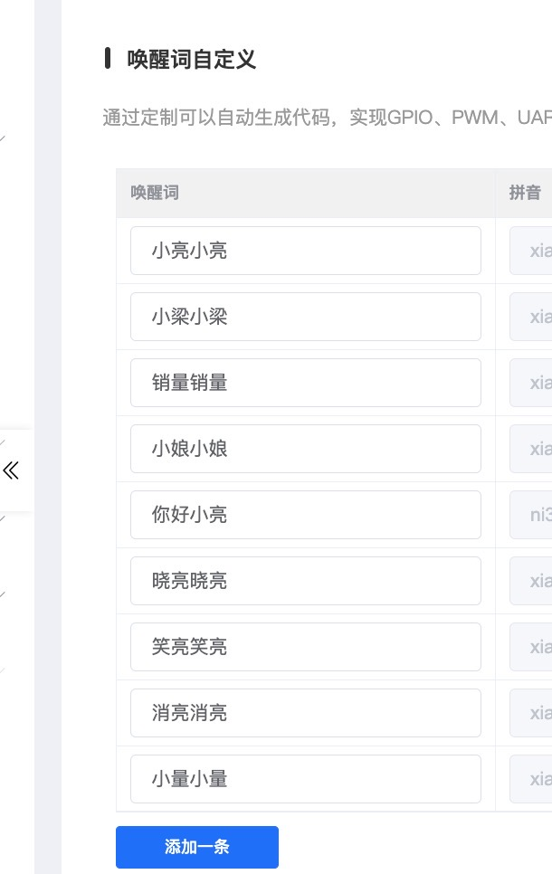

    *多个唤醒词配置示例*

2. **灵敏度平衡**：

    - 多个唤醒词可能略微增加误唤醒率
    - 需要在实际使用环境中测试验证
    - 可通过调整识别阈值进行优化


**注意事项：**

- AEC打断功能仅支持单麦克风配置
- 麦克风连线过长会严重影响打断效果
- 多个唤醒词可提高灵敏度但需测试误唤醒率
- 台灯应用建议选择安静环境模型
- 已生产的板子如需优化，可能需要重新设计硬件

---


---

### CI-03T1芯片选型与配置指南

**问题描述：**

需要为台灯语音对话功能选择合适的芯片配置，了解各项参数设置的最佳实践和优化方法。

**解决方案：**

**选型建议：**

1. **优先选择CI-03T1**：

    - 支持AEC回声消除，适合需要打断功能的场景
    - 单麦克风版本，成本更低
    - 体积更小，适合空间受限产品

2. **核心配置优化**：

    - AEC功能必须开启
    - 识别参数调优：唤醒阈值、灵敏度
    - 播报音量和音质平衡

3. **硬件设计要点**：

    - 麦克风远离喇叭，避免声音直射
    - PCB设计预留测试点，便于调试
    - 确保良好的电源和地线布局

4. **开发流程建议**：

    - 使用官方开发包进行功能验证
    - 小批量测试验证语音效果
    - 保留调试日志，便于问题排查

**配置最佳实践：**

1. **AEC配置**：

    - 在平台中启用"语音识别+AEC"选项
    - 选择适合的AEC算法参数
    - 测试不同环境下的打断效果

2. **交互流程设计**：

    - 唤醒词识别后立即停止播放
    - 执行命令词，播报确认信息
    - 合理设计对话流程，避免用户困惑

3. **音频输出控制**：

    - 调整播报音量，避免过大影响AEC效果
    - 确认音频输出与语音识别的同步

4. **批量生产测试**：

    - 在不同环境下测试语音识别效果
    - 收集用户反馈，持续优化参数

**技术支持：**

- 官方提供CI-03T1的技术文档和选型指南
- 丰富的开发案例和应用示例
- 专业团队提供技术支持服务

**注意事项：**

- AEC功能虽然强大，但受物理定律限制
- 在极端环境下效果可能下降
- 建议进行充分的环境测试和验证
- 如需更高性能，考虑升级到更高型号

---


---

### CI-03T如何实现声源定位控制舵机指向功能？

**问题描述：**

需要在CI-03T芯片上实现声源定位功能，并通过控制舵机指向声源方向，需要编写相应的控制函数。

**解决方案：**

**1. 硬件连接方案**：

- **舵机接口**：CI-03T提供5路PWM输出，可用于控制舵机
- **电源设计**：确保舵机的供电电压与CI-03T的3.3V输出兼容
- **推荐做法**：使用外部电源为舵机供电，避免过载芯片内部LDO

| PWM引脚 | 功能 | 说明 |
|---------|------|------|
| PWM1-PWM5 | 舵机控制 | 支持5路PWM同时输出 |

**2. 声源定位配置**：

- 在智能公元平台启用"语音识别+声源定位"功能
- 配置声源角度输出范围（0-180度）
- 设置识别阈值和灵敏度参数

**3. 舵机控制实现**：

基于网页端SDK配置，可通过以下步骤实现：

- 在声源定位回调函数中获取角度值
- 将角度映射为PWM占空比
- 通过PWM输出控制舵机转动

**技术要点**：

- **PWM频率**：设置50Hz（周期20ms）
- **占空比范围**：0°对应5%，180°对应25%
- **角度映射公式**：占空比 = (角度 / 180) × 20% + 5%

**4. 注意事项**：

- 舵机启动电流较大，建议使用外部电源供电
- 网页端SDK需确认是否支持PWM直接控制
- 舵机与麦克风保持一定距离避免机械噪声干扰

**替代方案参考**：

如需更高级的智能交互功能，可考虑使用集成大模型和联网功能的智能云台产品。

---

## 语音模块唤醒词与命令词配置问题

**问题描述：**
设备长时间挂机后无法正常唤醒，但免唤醒命令可以执行，重启后恢复正常。需要解决唤醒失效问题和优化配置。

**问题分析：**

1. **唤醒词识别失效原因**：

    - 模块进入深度休眠模式
    - 唤醒词灵敏度低于命令词
    - 休眠参数设置不当

2. **深度休眠影响**：

    - 模块为了省电自动进入低功耗模式
    - 深度休眠时仅保留部分功能
    - 可能影响唤醒词的识别能力

**解决方案：**

**方法一：优化休眠参数**

1. **调整休眠时间设置**：

    - 深度休眠时间：与唤醒阈值相同
    - 唤醒阈值：0.5（可适当调高）
    - 二次唤醒阈值：与唤醒阈值一致
    - 建议设置：2-7天而非1年

2. **参数配置步骤**：

    - 进入平台优化配置界面
    - 找到"深度休眠时间"选项
    - 修改为较短时间（如2天）
    - 将三个阈值设置为相同数值

**方法二：提高唤醒灵敏度**

1. **调整唤醒词设置**：

    - 增加唤醒词数量（支持多个）
    - 选择发音更清晰的词
    - 重新录制标准发音
    - 适当调高唤醒灵敏度

2. **命令词与唤醒词平衡**：

    - 确保唤醒词灵敏度≥命令词
    - 测试不同词组的识别效果
    - 避免使用相似音节的词汇

**方法三：禁用超时退出**

1. **配置持续唤醒**：

    - 添加控制项："禁止超时退出唤醒"
    - 这样设置后模块保持唤醒状态
    - 注意：可能导致误触发增加

2. **权衡方案**：

    - 不完全禁用，而是延长时间
    - 根据使用场景调整
    - 定期自动复位模块

**方法四：自动复位机制**

1. **软硬件复位**：

    - 主控定期重启语音模块
    - 使用看门狗电路
    - 通过GPIO控制模块电源

2. **定时复位示例**：
    ```cpp
    // 每24小时复位一次
    if(millis() - lastReset > 86400000) {
        digitalWrite(RESET_PIN, LOW);
        delay(100);
        digitalWrite(RESET_PIN, HIGH);
        lastReset = millis();
    }
    ```

**预防措施：**

1. **环境优化**：

    - 保持适宜的温度湿度
    - 避免强电磁干扰
    - 确保电源稳定

2. **固件升级**：

    - 使用最新版本固件
    - 关注厂商更新日志
    - 测试新版本的稳定性

3. **监控机制**：

    - 定期检查模块状态
    - 记录唤醒失败次数
    - 建立故障预警机制

**测试验证方法：**

1. **长期稳定性测试**：

    - 连续运行72小时以上
    - 记录唤醒成功率
    - 测试不同时间段表现

2. **唤醒词测试**：

    - 在不同距离测试
    - 多人发音测试
    - 模拟环境噪音测试

3. **对比测试**：

    - 测试不同休眠设置
    - 比较功耗与性能
    - 选择最佳配置

**注意事项：**

- 深度休眠时间不宜设置过长
- 唤醒词需要定期重新录制
- 免唤醒命令不受深度休眠影响
- 完全禁用休眠会增加功耗
- 建议根据实际使用场景选择方案

---

## CI-33T串口数据与引脚配置

**问题描述：**
CI-33T芯片上电和待机时的串口数据输出配置，以及PB5/PB6引脚作为串口使用的问题。

**解决方案：**

**一、串口数据输出配置**

1. **默认状态说明**：

    - 上电后不会自动发送数据
    - 待机时无数据输出
    - 需要在平台配置才能输出

2. **配置串口输出**：

    - 登录智能公元平台
    - 选择对应工程
    - 配置串口输出功能
    - 生成并烧录新固件

3. **串口参数设置**：

    - 波特率：默认9600bps
    - 数据位：8位
    - 停止位：1位
    - 校验位：无

**二、PB5/PB6引脚使用**

1. **引脚功能说明**：

    - PB5/PB6可用作串口
    - 对应芯片物理引脚18、19
    - 兼容SU03T的使用方式

2. **平台配置方法**：

    - 找到DEFAULT_P14、DEFAULT_P15
    - 下拉选择UART0_TX/UART0_RX
    - 也可以选择GPIO_B5/GPIO_B6

3. **烧录口复用**：

    - P6/P7（烧录口）可作串口用
    - 不影响程序烧录功能
    - 便于开发调试

**三、引脚配置对照表**

| 平台名称 | 物理引脚 | 可选功能 | 说明 |
|---------|---------|---------|------|
| DEFAULT_P14 | 18 | UART0_TX/GPIO_B5/PWM1 | 串口发送/通用IO |
| DEFAULT_P15 | 19 | UART0_RX/GPIO_B6/PWM2 | 串口接收/通用IO |
| GPIO_B5 | - | DEFAULT_P14/UART0_TX | 串口发送功能 |
| GPIO_B6 | - | DEFAULT_P15/UART0_RX | 串口接收功能 |

**四、常见问题解决**

1. **接收到乱码**：

    - 检查波特率设置
    - 确认接线无误
    - 验证电源稳定

2. **无数据输出**：

    - 确认已配置输出功能
    - 检查固件版本
    - 重新生成固件

3. **配置界面无显示**：

    - 某些引脚可能不在列表
    - 使用下拉菜单查找
    - 参考官方文档

**注意事项：**

- CI-33T与CI-03T功能基本一致
- 默认工程可能不开启串口输出
- 烧录和串口通信可同时进行
- 引脚配置需在生成固件前完成

---

## SU03T回复语触发条件设置

**问题描述：**
需要为SU03T的回复语设置触发条件，实现基于特定条件的智能语音回复控制。

**解决方案：**

**一、基础配置方法**

1. **准备工作**：

    - 登录智能公元平台
    - 选择对应工程
    - 进入命令词配置界面

2. **设置步骤**：

    - 将"回复语"字段留空
    - 点击"控制详情"进入高级配置
    - 在控制详情中设置触发和播放条件

**二、触发条件配置**

1. **添加触发条件**：

    - 点击"添加触发"
    - 选择触发类型：

        - GPIO输入状态
        - 变量值条件
        - 设备状态
        - 时间条件

2. **常用触发条件示例**：
    ```
    示例1：GPIO触发
    - 触发条件：GPIO_A5 = 高电平
    - 执行动作：播放语音
    - 播放内容："收到，继电器已打开"

    示例2：变量触发
    - 触发条件：变量temperature > 30
    - 执行动作：播放语音
    - 播放内容："温度过高，请注意"

    示例3：设备状态触发
    - 触发条件：收到特定串口数据
    - 执行动作：播放语音
    - 播放内容："指令执行成功"
    ```

**三、控制动作配置**

1. **播放控制设置**：

    - 控制方式：选择"播放语音"
    - 播放内容：输入要播放的文字
    - 是否条件执行：选择"是"或"否"

2. **多级条件设置**：

    - 可添加多个触发条件
    - 支持"与"逻辑关系
    - 可设置优先级顺序

**四、高级功能应用**

1. **条件组合使用**：
    ```json
    配置示例：
    {
        "trigger": {
        "gpio": "GPIO_A5",
        "state": "high",
        "variable": "jiaodu",
        "operator": ">",
        "value": "90"
        },
        "action": {
        "type": "play_audio",
        "content": "检测到声音从右侧传来",
        "conditional": true
        }
    }
    ```

2. **嵌套控制**：

    - 控制内可以再嵌套控制
    - 实现复杂的逻辑判断
    - 支持递归条件检查

**五、实际应用场景**

1. **智能控制场景**：
    ```
    场景：智能窗帘控制
    - 命令词："打开窗帘"
    - 触发条件：光照传感器 > 500lux
    - 回复语："白天自动打开窗帘"（条件满足）
    - 回复语："夜间不建议打开"（条件不满足）
    ```

2. **安全防护场景**：
    ```
    场景：门禁系统
    - 命令词："开门"
    - 触发条件：授权用户 + 时间08:00-22:00
    - 回复语："欢迎回家"（条件满足）
    - 回复语："非授权时段"（条件不满足）
    ```

3. **环境监测场景**：
    ```
    场景：温湿度监控
    - 触发条件：温度 > 30°C
    - 执行动作：播放语音
    - 播放内容："温度过高，已开启空调"
    ```

**六、调试与优化**

1. **调试方法**：

    - 使用串口输出调试信息
    - 记录触发条件状态
    - 验证逻辑判断流程

2. **性能优化**：

    - 减少不必要的条件判断
    - 优化条件检查顺序
    - 避免循环依赖

**七、常见问题解决**

1. **回复语不播放**：

    - 检查触发条件是否满足
    - 确认音频文件存在
    - 验证条件逻辑正确性

2. **条件失效问题**：

    - 检查变量是否正确赋值
    - 确认GPIO状态正常
    - 验证条件表达式语法

3. **播放延迟问题**：

    - 优化条件判断逻辑
    - 减少嵌套层数
    - 使用更高效的表达式

**注意事项：**

- 回复语字段和控制详情不能同时配置
- 条件执行会略微增加响应延迟
- 复杂条件建议先在模拟环境测试
- 定期检查和更新触发条件
- 保留配置备份便于恢复

**配置示例文件：**

```json
{
    "command": "打开继电器",
    "reply": "",
    "controls": [
    {
        "trigger": {
        "type": "gpio",
        "pin": "A5",
        "state": "high"
        },
        "action": {
        "type": "play_audio",
        "content": "收到，继电器已打开",
        "conditional": true
        }
    }
    ]
}
```

---

## SU03T转接板电源引脚说明

**问题描述：**
SU03T转接板上TTL通讯旁边的3V7针脚的功能和电压规格咨询。

**解决方案：**

**一、引脚功能说明**

1. **3V7引脚定义**：

    - 引脚名称：3V7
    - 功能类型：电源输入
    - 位置：TTL通讯接口旁

2. **电源规格**：

    - 输入电压范围：3.7V - 5V
    - 推荐电压：5V
    - 最大电流：根据负载决定

**二、使用方法**

1. **供电方案**：

    - 使用5V USB供电
    - 使用3.7V锂电池供电
    - 使用4.2V锂电池充电器

2. **接线方式**：
    ```
    方案1：USB供电
    - 3V7引脚：接5V
    - GND引脚：接USB地线

    方案2：电池供电
    - 3V7引脚：接3.7V电池正极
    - GND引脚：接电池负极
    ```

**三、电源设计考虑**

1. **电源稳定性**：

    - 建议使用稳压电路
    - 添加滤波电容
    - 避免电压波动

2. **功耗管理**：

    - 正常工作电流：约50mA
    - 唤醒峰值电流：约100mA
    - 待机电流：小于1mA

**注意事项：**

- 3V7是输入引脚，不是输出
- 电压不能超过5.5V
- 建议使用带保护的电源
- 避免电源反接损坏模块

---


---

### CI-03T1（CI1302）语音识别响应延迟如何处理？

**问题描述：**

CI-03T1芯片（主控为CI1302）在使用时出现语音识别响应延迟问题，即在输入命令词后，系统需要2秒才能播放反馈词。

**解决方案：**

**延迟原因分析：**

1. **正常响应时间**：

    - CI-03T1的1-2秒响应时间属于正常范围
    - 这是芯片完成语音识别和处理的必要时间
    - 包含音频采集、特征提取、匹配和输出等步骤

2. **影响因素**：

    - 命令词复杂度：较长的命令词需要更多处理时间
    - 环境噪声：噪声环境下需要更多时间去噪和确认
    - 供电稳定性：供电不足可能影响处理速度

**优化建议：**

1. **选择合适的模型版本**：

    - 在智能公元平台选择最新的语音模型
    - Pro版本相比普通版本有更好的响应速度
    - 根据实际环境选择优化模型（如降噪版本）

2. **优化命令词设置**：

    - 使用简洁清晰的命令词
    - 避免使用过于相似或复杂的词汇
    - 建议使用2-4个字的命令词以获得最佳响应速度

3. **硬件环境优化**：

    - 确保稳定的5V供电
    - 减少环境噪声干扰
    - 麦克风位置合理，避免遮挡

4. **固件配置调整**：

    - 适当调高识别灵敏度（注意平衡误识别率）
    - 启用降噪功能（如支持）
    - 关闭不必要的附加功能以节省处理资源

**技术说明：**

- CI1302芯片的响应速度有物理限制
- 1-2秒的延迟是正常工作状态，不是故障
- 过度追求响应速度可能降低识别准确率
- 建议在实际使用中测试并找到最佳平衡点

**注意事项：**

- 响应延迟与识别准确率需要平衡
- 不同批次的芯片可能有细微差异
- 如延迟超过3秒，可能存在供电或环境问题
- 批量使用前建议进行充分的性能测试

---


---

### CI-03T1和CI-03T2是否支持讲故事功能？

**问题描述：**

需要了解CI-03T1和CI-03T2模块是否支持播放长篇故事内容，还是仅限于简短回复。

**解决方案：**

**功能支持确认：**

CI-03T1和CI-03T2模块完全支持长文本播报功能，包括讲故事、朗读长篇文章等应用场景。

**实际验证案例：**

- 已成功测试播报《出师表》等长篇古文
- 支持连续长文本的语音播报
- 可完整播放故事内容，不会被截断

**技术实现方式：**

1. **TTS合成播报**：

    - 文本通过TTS（Text-to-Speech）引擎实时合成语音
    - 支持任意长度的中文文本转换
    - 播报流畅度与自然度良好

2. **存储方式**：

    - 长文本不需要预先存储音频文件
    - 通过TTS实时转换，节省Flash空间
    - 支持动态内容播报

**使用建议：**

1. **内容准备**：

    - 故事内容可通过命令词触发
    - 建议将长故事分段，便于管理
    - 可设置多个故事命令词

2. **播报控制**：

    - 支持播报过程中的打断功能
    - 可通过语音指令停止当前播报
    - 播报完成后可继续其他交互

3. **优化配置**：

    - 选择合适的TTS音色和语速
    - 调整播报音量至舒适水平
    - 测试不同长度内容的播报效果

**注意事项：**

- 长文本播报会占用一定的处理时间，属于正常现象
- TTS播报与录音播报在音色上略有差异，属于技术特点
- 如对音质有特殊要求，可考虑使用组合播报功能
- 超长内容的播报时间可能较长，建议合理安排交互时机

**应用场景举例：**

- 儿童故事机：播报童话、寓言等长篇内容
- 智能助手：朗读新闻、天气等长文本信息
- 教育设备：播放课文、诗词等学习内容
- 辅助工具：朗读说明书、操作指南等文档内容

---


---

### CI-03T1如何正确配置和使用AEC唤醒打断功能？

**问题描述：**

对CI-03T1是否支持AEC（回声消除）功能存在疑问，以及如何正确配置实现语音播报过程中的唤醒打断功能。

**解决方案：**

**功能支持确认：**

- **CI-03T1完全支持AEC唤醒打断功能**
- 该功能是CI-03T1的核心特性之一
- 通过AEC（声学回声消除）技术实现播报过程中的语音识别
- 支持唤醒词打断、命令词打断或组合打断方式

**配置步骤：**

**1. 平台配置设置**

    - 登录智能公元平台
    - 进入产品配置界面
    - 选择"语音识别+AEC打断(限单MIC)"产品特性
    - 确保麦克风配置为单MIC模式

**2. 前端信号处理配置**

    - 选择单MIC配置模式
    - 根据使用环境选择合适的噪声模型
    - 保持默认的识别距离设置
    - 无需额外配置双麦克风相关参数

**3. AEC打断方式选择**

    - **唤醒词打断**：仅支持唤醒词打断播报
    - **命令词打断**：支持命令词直接打断播报
    - **唤醒词+命令词打断**：支持两种方式打断

**技术实现原理：**

1. **AEC算法工作原理**
    - 实时采集扬声器播放的音频作为参考信号
    - 通过算法消除播放音频对麦克风的影响
    - 在播报过程中持续监听用户语音输入

2. **打断触发机制**
    - 检测到有效唤醒词或命令词时立即中断播报
    - 响应速度快，延迟通常在100ms以内
    - 支持远场和近场各种距离的打断操作

**实际应用场景：**

- **智能音箱**：播放音乐时通过语音控制切换歌曲
- **智能台灯**：播报状态时通过语音调整设置
- **机器人对话**：长时间对话过程中可随时打断并切换话题

**优化建议：**

1. **硬件布局优化**
    - 确保麦克风和扬声器相对位置合理
    - 避免麦克风直接朝向扬声器
    - 使用适当的声学结构减少回声

2. **参数调整**
    - 根据实际效果调整识别阈值
    - 测试不同音量下的打断成功率
    - 在典型使用环境中验证效果

**注意事项：**

- AEC功能仅支持单麦克风版本的CI-03T1
- 双麦克风版本（CI-03T2）主要用于降噪，不支持AEC打断
- 配置更改后需要重新生成并烧录固件
- 建议在实际使用环境中充分测试打断功能的可靠性
- 如打断效果不理想，可检查硬件连接或联系技术支持

**故障排查：**

- **打断无效**：确认是否启用了正确的AEC配置
- **误打断频繁**：适当调整识别阈值
- **打断距离短**：检查麦克风连接和硬件布局
- **打断延迟大**：优化硬件设计或联系技术支持

---


---

### CI-03T/CI-33T是否支持识别婴儿哭声和宠物叫声？

**问题描述：**

需要了解CI-03T和CI-33T模块是否支持识别婴儿哭声和宠物叫声，以及如何配置和使用这些功能。

**解决方案：**

**功能支持确认：**

1. **CI-03T/CI-33T支持情况**：

    - **哭声检测**：✓ 支持识别婴儿哭声
    - **宠物叫声识别**：✗ 不支持识别宠物叫声
    - 两种型号都支持相同的检测功能

2. **技术说明**：

    - 哭声检测是CI系列的高级功能之一
    - 通过内置算法专门识别婴儿哭声的音频特征
    - 宠物叫声由于种类繁多、特征差异大，暂未支持

**哭声检测功能配置：**

1. **启用方式**：

    - 在智能公元平台的"高级功能"中选择启用哭声检测
    - 需要使用支持此功能的固件版本
    - 配置完成后重新生成并烧录固件

2. **功能应用**：

    - 检测到哭声时可触发特定GPIO输出
    - 可配置报警、通知或其他响应动作
    - 适用于婴儿监护器、智能摇篮等应用

**实现场景示例：**

1. **婴儿监护器**：

    - 检测到哭声时触发报警或推送通知
    - 可联动摄像头或通知家长
    - 结合其他传感器实现综合监护

2. **智能玩具**：

    - 检测哭声时播放安抚音乐或语音
    - 触发特定的互动功能
    - 提升产品的智能化和关怀性

**技术限制说明：**

- 哭声检测功能会占用额外的Flash空间
- 需要相对安静的环境以获得最佳检测效果
- 不同批次的产品在检测灵敏度上可能有细微差异
- 建议在实际使用环境中进行充分测试

**配置建议：**

- 根据应用场景调整检测灵敏度
- 避免在嘈杂环境中使用，可能导致误触发
- 定期测试和验证检测效果是否符合预期
- 保留详细的功能测试记录便于优化

---


---

### CI-03T模块是否支持长故事播放？

**问题描述：**

需要了解CI-03T1和CI-03T2模块是否支持播放长篇故事内容，如《出师表》等较长文本。

**功能支持确认：**

CI-03T系列模块完全支持长文本播放功能：

1. **长故事播放**：

    - 可完整播放《出师表》等长篇内容
    - 支持故事连续播放
    - 无严格时长限制

2. **测试验证**：

    - 已验证可播放入选语文课文
    - 支持复杂文本内容的准确识别
    - 语音合成效果自然流畅

**实现方式：**

1. **文本输入**：

    - 将长故事内容作为应答文本
    - 系统自动进行TTS转换
    - 保持文本完整性和连贯性

2. **播放控制**：

    - 可随时中断播放
    - 支持暂停和继续
    - 播放过程中响应其他指令

**注意事项：**

- 超长文本可能需要考虑固件大小限制（3276000字节）
- 建议对超长内容进行适当分段
- 可使用组合播报功能优化播放体验
- 测试时建议完整播放一次验证效果

---


---

### CI-03T1模块更换喇叭、咪头、LED和电阻后仍无法正常工作怎么办？

**问题描述：**

CI-03T1离线语音识别芯片模块无法正常工作，已更换喇叭、咪头、LED和电阻等部件，但问题仍未解决。

**解决方案：**

1. **彻底检查硬件连接**：

    - 使用万用表检查所有焊点连接
    - 验证供电线路是否有短路
    - 检查音频输出电路是否正常
    - 确认咪头接线是否正确

2. **使用已知正常的模块对比**：

    - 换一个确认工作正常的模块测试
    - 使用相同固件和配置
    - 对比测试结果确定问题范围

3. **检查PCB设计问题**：

    - 验证PCB布线是否正确
    - 检查是否存在元器件焊接错误
    - 确认电源部分设计是否合理

**注意事项：**

- 多个元件更换后仍无效可能是PCB设计缺陷
- 建议使用专业设备进行电路检测
- 如确定是硬件问题，可考虑购买整套模块
- 保留详细的故障排查记录便于分析

---


---

### CI-03T1和CI-03T2模块待机时发热量大吗？

**问题描述：**

需要了解CI-03T1和CI-03T2模块在长时间待机时是否会产生较大热量，以及在供电方式上应如何选择以减少发热问题。

**解决方案：**

**发热情况**

1. **待机发热程度**

    - 模块待机时发热量不大
    - 正常工作温度范围内
    - 可以长时间安全使用

2. **工作电流说明**

    - 待机电流约为60mA
    - 工作电流大于500mA（4Ω喇叭）
    - 待机功耗相对较低

**供电选择**

1. **电池类型选择**

    - 锂电池：适合长时间待机
    - 普通电池：可短期使用
    - 根据具体应用场景选择

2. **注意事项**

    - 长时间待机建议使用可充电电池
    - 避免一次性电池的成本浪费
    - 确保电池电压稳定（3.6-5.5V）

**使用建议：**

- 模块发热量在正常范围内
- 可以放心长时间使用
- 选择合适的供电方式
- 注意电池容量和续航需求

---

### 如何配置声纹识别让模块只响应特定人员的命令？

**问题描述：**

需要配置语音模块，使其只响应特定人员的语音命令，而忽略其他人的命令。

**解决方案：**

**功能支持说明：**

CI系列模块支持声纹识别功能，可实现特定人员语音控制：

- **支持型号**：CI-03T、CI-33T、CI-95C等CI系列模块
- **不支持型号**：SU系列模块不支持声纹识别功能
- **功能类型**：定制功能，需要联系商务开通

**实现方案：**

**方案一：使用支持声纹识别的CI模块**

1. **选择合适型号**：

    - CI-03T：300条词条，性价比高
    - CI-33T：500条词条，适合复杂应用
    - CI-95C：1000条词条，旗舰性能

2. **声纹配置流程**：

    - 在智能公元平台开启声纹识别功能
    - 录入授权用户的声纹特征
    - 设置只响应已录入声纹的命令

3. **使用限制**：

    - 需要预先录入声纹模板
    - 支持多个用户声纹录入
    - 录入环境需要安静无干扰

**方案二：声纹识别定制开发**

声纹识别是定制功能，需要特殊申请：

---


---


---

### 双麦克风配置时Mic2未生效怎么办？

**问题描述：**

配置双麦克风后，Mic2未能正常工作，在智能公元平台配置了双MIC，但实际只有单麦克风生效。

**解决方案：**

**问题原因：**

1. **硬件限制**：

    - 单麦模块的Mic2引脚用于AEC功能
    - 单麦模块不支持双麦克风输入
    - 需要购买双麦版本的模块

2. **模块区别**：

    - 单麦模块：Mic2复用为回声消除
    - 双麦模块：Mic2作为第二麦克风输入
    - 硬件设计不同，无法通过配置改变

**解决方法：**

1. **购买双麦模块**：

    - 直接购买双麦克风规格的模块
    - 确认型号支持双麦克风功能
    - 无需飞线改造

2. **硬件差异说明**：

    - 单麦模块：无Mic2焊盘
    - 双麦模块：有独立Mic2接口
    - 引脚定义完全不同

**实施步骤：**

1. **确认模块型号**：

    - 检查现有模块是否为双麦版本
    - 查看模块丝印标识
    - 确认硬件支持情况

2. **重新采购**：

    - 联系供应商更换为双麦模块
    - 采购时明确双麦克风需求
    - 测试验证双麦功能

**注意事项：**

- 单麦模块无法通过飞线实现双麦功能
- Mic2引脚在单麦模块上有其他用途
- 建议直接采购双麦模块，避免改装风险


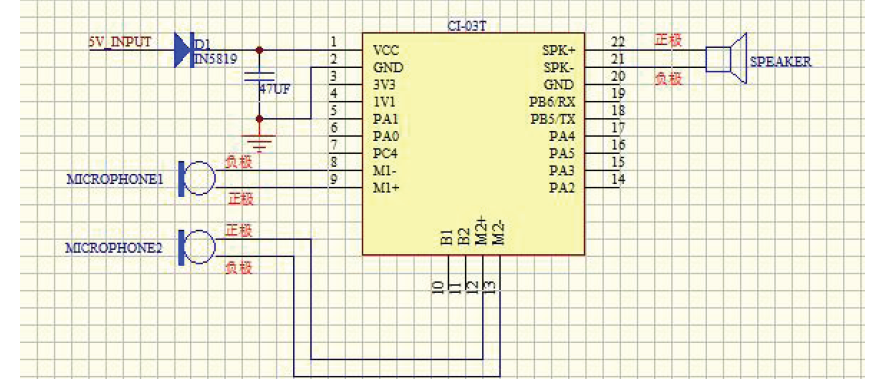

---


---


---

### 单麦模块能否通过飞线连接Mic2实现双麦功能？

**问题描述：**

购买了CI-03T单麦模块，希望通过飞线连接到模块上的MIC2引脚来实现双麦克风功能。

**解决方案：**

**技术限制：**

1. **无法通过飞线实现**：

    - 单麦模块硬件不支持双麦克风输入
    - Mic2引脚在单麦模块上用于其他功能
    - 需要购买专用双麦模块

2. **模块版本区别**：

    - CI-03T（单麦）：仅支持一个麦克风
    - CI-03T2（双麦）：支持两个麦克风
    - 硬件设计完全不同

**硬件说明：**

1. **单麦模块限制**：

    - Mic2引脚未引出或无焊盘
    - 即使引出也无法作为麦克风使用
    - 内部电路设计不支持双麦输入

2. **双麦模块优势**：

    - 提供完整的双麦克风接口
    - 支持噪声环境下的更好识别
    - 自带相应的硬件电路

**实施建议：**

1. **直接采购双麦模块**：

    - 购买CI-03T2双麦版本
    - 避免改装风险和成本
    - 确保功能完整性和稳定性

2. **项目规划考虑**：

    - 设计初期确定是否需要双麦
    - 预留相应成本预算
    - 提前进行功能验证

**注意事项：**

- 单麦模块无法通过飞线改造为双麦
- 飞线可能损坏模块或导致功能异常
- 双麦功能需要完整的硬件支持
- 建议根据实际需求选择合适型号


---

### 语音SOS功能误触发问题如何优化？

**问题描述：**

使用CI-03T等模块实现语音SOS功能时，遇到语音指令误触发严重的问题，尤其是在环境中有相似语音时容易误识别，影响正常使用。

**解决方案：**

**问题分析：**

- SOS紧急呼叫功能对误触发极其敏感
- 环境中的相似语音或对话内容可能导致误触发
- 简单的命令词（如"救命"）容易在日常对话中被误识别

**优化策略：**

1. **选择合适的命令词**：

    - 使用4-6个字的命令词，避免过短的词组
    - 示例改进：

        - "救命" → "帮帮我帮帮我"（叠词降低误触发）
        - "救救我" → "紧急呼叫求助"等更独特表述
    - 避免使用日常生活中常见的高频词

2. **调整识别阈值**：

    - 在智能公元平台"优化配置"中调高命令词识别阈值
    - SOS功能的识别阈值应设置得比普通功能更严格
    - 阈值范围可在0.01-0.2之间调整，建议设置为0.06-0.1

3. **添加防误触机制**：

    - 设置防识别词，排除可能引起误触发的常见对话
    - 考虑加入唤醒词+命令词的双重确认机制
    - 可设置连续识别2-3次才触发SOS，降低偶然误触发

4. **硬件和部署优化**：

    - 确保麦克风位置合理，避免过度拾取远处声音
    - 在可能的情况下，增加物理按键作为SOS的备用触发方式
    - 考虑使用支持更先进识别算法的模块

**大模型AI模块的优势：**

- 大模型AI模块在识别灵活性上有所提升
- 支持更自然的语言理解，可以更好地判断真实意图
- 但在强噪声环境下，误触发问题仍无法完全避免

**注意事项：**

- 误触发问题无法完全消除，只能通过优化降低发生概率
- 调整参数后需要在实际使用场景中充分测试
- SOS功能建议配合其他触发方式（如按键）使用，确保可靠性
- 叠词命令词虽然能降低误触发，但可能影响紧急情况下的识别成功率

---


---


---

### 命令词识别率低与播报功能冲突问题

**问题描述：**

在使用CI-03T1芯片时，除第一条命令外其他命令识别率低，同时发现命令词、控制和回复语的播报功能存在冲突。

**解决方案：**

**命令词识别优化：**

1. **命令词长度控制**：

    - 建议设置4-6个字的命令词
    - 过长的命令词识别率会降低
    - 简短清晰的命令词更容易识别

2. **发音规范**：

    - 使用标准普通话发音
    - 避免使用生僻字或多音字
    - 命令词之间要有明显区分度

**播报功能冲突处理：**

1. **功能冲突说明**：

    - 命令词的"回复语"和"控制"中的播放功能不能同时使用
    - 重复配置播放会导致系统无法正常执行

2. **正确配置方式**：

    - 方式一：在"回复语"中设置播报内容，"控制"中不配置播放
    - 方式二：在"控制"中配置播放动作，不设置"回复语"
    - 根据实际需求选择其中一种方式

3. **配置示例**：

    - 命令词："查询温湿度"
    - 回复语：留空或填写简单提示
    - 控制：设备→播放，CS设置为数据→$CS_2（温湿度变量）

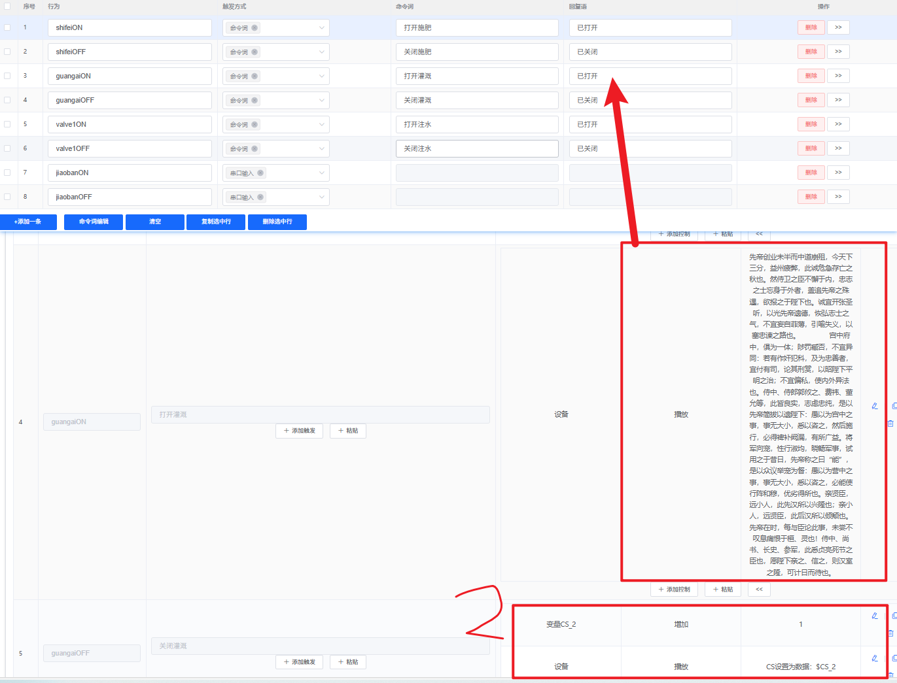

**识别率提升建议：**

- 在安静环境下录制唤醒词和命令词
- 保持发音一致性，避免语调变化过大
- 适当调整麦克风的增益设置
- 如环境噪声较大，选择带降噪功能的声学模型

**注意事项：**

- 每条命令词都需要独立测试识别效果
- 播报功能配置冲突需要重新生成固件
- 如个别命令识别持续困难，考虑更换命令词
- 测试时保持与实际使用环境一致的噪声水平

---


---


---

### 部分语音指令（如"加大频率"、"减小频率"）识别不灵敏怎么办？

**问题描述：**

CI-03T模组在使用过程中，部分特定指令（如"加大频率"、"减小频率"）识别率较低，用户需要多次重复才能触发。

**解决方案：**

**方法一：使用多指令词配置**

- 在命令词配置中使用"|"符号添加多个相似指令
- 例如："加大频率|频率加大"、"减小频率|频率减小"
- 这样用户说出任何一个相似指令都能触发同一功能

**方法二：声学模型优化**

- 更换为最新的"pro"声学模型（非"安静环境"模型）
- 技术支持可以提供定制固件，针对特定难识别词进行优化
- 在平台上使用：https://demohome.aimachip.com/（新模型支持）

**注意事项：**

- 研发阶段应多测试样板，找到最佳性能配置
- 多指令词配置能提高识别成功率，但可能增加误识别风险
- 如有特定需求，可联系技术支持进行固件定制优化

---


---


---

### 特定语音指令（如Q1、Q13）持续识别失败怎么办？

**问题描述：**

在CI-03T1芯片测试过程中发现，部分特定语音指令（如Q1和Q13）持续无法被成功识别，即使在新版本固件中识别率仍然很低，需要针对性优化。

**解决方案：**

**方法一：提供更多语料进行训练**

- 收集更多该指令的语音样本
- 提供不同人声、不同语速的语料
- 将语料提交给技术支持进行模型训练
- 确保语料质量清晰，无背景噪声

**方法二：使用多指令词配置**

- 在平台中为同一功能配置多个相似指令
- 例如：Q1指令可配置为"Q1|指令一|第一项"
- 这样用户说出任何一个指令都能触发相应功能

**方法三：固件定制优化**

- 联系技术支持进行针对性优化
- 针对识别困难的指令进行特殊处理
- 可能需要单独训练该指令的声学模型
- 优化周期取决于训练复杂度和数据量

**训练注意事项：**

- 训练周期通常需要3周时间
- 建议批量提供语料，避免分批次训练
- 合成音和真人录音都可以使用
- 确保语料覆盖不同发音习惯

**优化策略：**

- 优先提供识别最困难的指令语料
- 完整测试所有指令，提供统计报告
- 保留识别失败的具体案例供分析
- 与技术支持保持沟通，及时反馈测试结果

**注意事项：**

- 不同固件版本可能影响识别效果
- 需要在实际应用场景中充分测试
- 训练后的固件需要重新烧录验证
- 建议保留版本记录便于对比

---


---


---

### AEC打断效果不稳定问题调试方法

**问题描述：**

在使用CI-03T1或CI-03T2进行AEC语音打断时，发现打断效果不稳定，需要近距离（约20cm）才能触发，且唤醒和打断的可靠性存在波动。

**问题诊断流程：**

**第一步：电源质量检查**

1. **电源纹波测量**：

    - 使用示波器测量电源纹波
    - 要求：峰峰值小于100mV，推荐控制在50mV以下
    - 过大的纹波会严重影响语音识别性能

2. **纹波处理方法**：

    - 增加滤波电容容量
    - 优化PCB布局，减少噪声耦合
    - 使用LDO稳压器提高电源质量

**第二步：基础语音功能验证**

1. **断开AEC电路**：

    - 暂时断开AEC连接，测试基础语音识别
    - 在相对安静环境下应能达到8米左右的接收距离
    - 确认咪头和基础电路工作正常

2. **咪头规格检查**：

    - 灵敏度：-32dB ~ -25dB范围
    - 信噪比：≥70dB
    - 推荐使用机芯智能6027咪头

**第三步：AEC电路调试**

1. **分压电阻调整**：

    - 增大AEC分压电阻值（如将10kΩ改为30kΩ）
    - 调整喇叭信号的采样幅度
    - 确保AEC信号与咪头信号匹配

    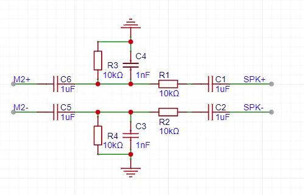

2. **信号幅度匹配**：

    - 保证输出信号失真小
    - 适当增大AEC采样量
    - 通过分压电阻精确匹配

**第四步：参数优化**

1. **识别阈值调整**：

    - 将唤醒词阈值调至最高（如0.8）
    - 观察识别效果变化
    - 平衡识别率和误识别率

2. **测试验证**：

    - 测试不同距离下的唤醒和打断效果
    - 记录成功率和失败场景
    - 逐步优化参数

**常见问题及解决：**

**① 电源纹波过大**

- 现象：峰峰值600mV（严重超标）
- 解决：增加滤波电路，目标120mV以下
- 最终应控制在50mV以内

**② 咪头信号质量**

- 现象：咪头信号纹波峰峰值74mV
- 分析：可能受到电源或布局干扰
- 解决：优化PCB布局，增加屏蔽

**③ 打断距离问题**

- 现象：需要20cm近距离才能打断
- 可能原因：

    - AEC信号幅度不匹配
    - 喇叭音量过大
    - 环境噪声干扰

**调试建议：**

1. **分步调试**：

    - 先确保基础功能正常
    - 再逐步接入AEC功能
    - 最后进行整体优化

2. **参数记录**：

    - 记录每次调整的参数值
    - 对比测试效果
    - 建立调试档案

3. **环境测试**：

    - 在不同音量下测试
    - 模拟实际使用场景
    - 验证稳定性

**注意事项：**

- 电源质量是语音识别的基础，纹波必须控制在合理范围
- 咪头选型至关重要，建议使用推荐规格
- AEC调试需要耐心，逐步调整各参数
- 如基础语音功能异常，应优先解决后再调试AEC
- 必要时可联系技术支持获取专用测试固件

---


---


---

### 声纹识别效果不理想如何调整阈值？

**问题描述：**

在测试声纹识别产品时，发现识别效果不理想，主要表现为早晚声音不一致，需要确认是否可以通过调整声纹识别阈值来优化性能。

**解决方案：**

**问题分析：**

- 早晚声音不一致是声纹识别的常见问题
- 人的声音在一天中会有自然变化（如晨起时声音沙哑）
- 通过合理调整阈值可以改善识别稳定性

**阈值调整方法：**

1. **找到声纹阈值设置**：

    - 在智能公元平台的"优化配置"中找到声纹识别阈值选项
    - 可针对声纹识别功能单独调整识别阈值
    - 阈值范围通常在0.1-0.9之间

2. **调整策略**：

    - **识别困难时**：适当调低阈值（如从0.5调至0.3），提高识别通过率
    - **误识别多时**：适当调高阈值（如从0.3调至0.5），提高识别准确性
    - **早晚差异大时**：建议取中间值，平衡不同时段的识别效果

3. **逐步优化步骤**：

    - 先使用默认阈值进行测试
    - 记录识别失败的具体时间和场景
    - 根据失败模式调整阈值并重新测试
    - 多次迭代找到最佳阈值设置

**其他优化建议：**

1. **声纹注册优化**：

    - 在不同时间段多次注册声纹（如早晨、下午、晚上各一次）
    - 注册时保持正常说话状态，避免刻意模仿
    - 确保注册环境安静，无背景噪声干扰

2. **使用环境建议**：

    - 尽量在稳定的环境中使用声纹识别
    - 避免在极度疲劳或声带异常时使用
    - 保持与设备的一致距离（建议1-2米）

3. **硬件选择优化**：

    - 选择支持声纹识别的模块型号（如CI-03T、CI-33T等）
    - 使用高质量麦克风，确保声音采集清晰
    - 考虑升级到性能更好的模块以获得更稳定的识别效果


**注意事项：**

- 声纹识别阈值的调整需要在识别准确率和通过率之间找到平衡
- 阈值过低可能导致误识别增加，安全性降低
- 阈值过高可能导致正常用户识别困难，使用体验下降
- 建议在实际使用环境中充分测试后再确定最终阈值

---


---


---

### 声纹识别功能是否指定人使用？

**问题描述：**

询问声纹识别是否只能由特定人员使用，以及声纹识别的具体含义。

**解决方案：**

是的，声纹识别功能就是指定人使用的功能。

**功能说明：**

- **声纹注册**：需要预先录入授权用户的声音特征
- **身份验证**：只有声纹匹配的用户才能触发对应的命令词或唤醒词
- **安全控制**：通过声音特征实现人员身份的识别和访问控制

**使用方式：**

1. **注册声纹**：

    - 在智能公元平台启用声纹识别功能
    - 为需要授权的用户分别录制声纹
    - 每个用户可注册特定的唤醒词或命令词

2. **识别限制**：

    - CI-03T系列最多支持9个声纹注册
    - CI-33T同样支持9个声纹
    - 每个声纹对应特定的命令权限

**应用场景：**

- 智能门锁：只有家庭成员才能开门
- 保险柜：授权人员才能访问
- 个人设备：防止他人误触发操作

**注意事项：**

- 声纹注册需要在安静环境下进行
- 建议每个用户多次录制以提高准确性
- 声纹识别会增加一定的响应延迟
- 重要应用建议结合其他认证方式使用
- **声纹识别只针对人声有效**：无法用于识别电脑提示音、QQ/微信提示音、报警声等非人声
- 对于非人声音频的识别需求，可考虑使用自学习功能或联系官方进行定制模型训练

---


### GPIO_A4高电平时仍能唤醒如何处理？

**问题描述：**

GPIO_A4设置为输入模式，默认高电平，期望实现A4高电平时禁止唤醒，但实际测试发现高电平时仍可被唤醒。

**解决方案：**

- **GPIO输入限制**：

    - GPIO设为输入模式且默认高电平时，只能接收低电平输入
    - 无法接收高电平输入触发
    - 这是硬件特性导致的现象

- **替代实现方案**：

    1. 使用两个GPIO引脚：

        - 一个默认高电平，接收低电平触发进入唤醒
        - 一个默认低电平，接收高电平触发退出唤醒

    2. 单GPIO软件方案：

        - 设置变量统计低电平输入次数
        - 通过变量值控制唤醒状态
        - 奇数次低电平进入唤醒，偶数次退出唤醒

**注意事项：**

- GPIO默认高电平输入时，高电平无法触发
- IO口紧张时可采用软件计数方案
- 需要外部MCU提供可控的电平信号


---

### 粤语语音识别产品误唤醒率高如何优化？

**问题描述：**

粤语语音识别产品经常无缘无故唤醒，平常说话、音乐或广播都会触发误唤醒，不是唤醒词也会唤醒。

**解决方案：**

**优化方案：**

1. **提供训练语料**

    - 收集200人以上的粤语录音数据
    - 按照训练数据采集规范进行录制
    - 提供典型使用场景的语料

2. **使用更高性能芯片**

    - 推荐使用CI1303芯片
    - 选择3M大模型获得更好效果
    - CI1302/CI1312基础模型对粤语支持有限

3. **优化唤醒词设置**

    - 选择发音独特、不易误触发的唤醒词
    - 避免使用与日常用语相似的词汇
    - 测试不同环境下的误唤醒率

**语料采集要求：**

- 按照官方提供的训练数据采集规范
- 包含不同年龄、性别的发音人
- 覆盖典型使用环境和噪声场景

**注意事项：**

- 粤语识别效果受地区方言影响较大
- 需要大量高质量训练数据才能达到理想效果
- 英语有较好基础语料，其他语言建议增加训练

---


---


---

### 智能头盔在户外噪声环境下如何优化语音识别效果？

**问题描述：**

智能头盔在户外使用时，面临复杂的噪声环境，导致语音识别率大幅下降（室内20%误识别，室外仅60%识别率），需要针对骑行场景进行专项优化。

**噪声环境分析：**

1. **生活区环境**：45-53dBA，相对安静，但仍有部分误识别
2. **车流密集区**：75-80dBA，高噪声严重影响识别效果
3. **噪声类型**：

    - 持续性噪声：风噪、引擎声
    - 突发性噪声：鸣笛、刹车声
    - 振动噪声：头盔与车体共振

**综合优化方案：**

**方案一：硬件层面优化**

1. **麦克风选型与布置**：

    - 选择抗噪声能力强的麦克风（灵敏度-32dB，SNR>70dB）
    - 麦克风位置远离主要噪声源
    - 使用防风罩减少风噪影响
    - 考虑使用双麦克风阵列进行噪声抑制

2. **外部降噪模块集成**：

    - 添加专用降噪芯片（如A-59P模块）
    - 放置在语音信号前端进行预处理
    - 注意降噪模块与CI-03T的参数匹配

**方案二：固件参数优化**

1. **选择合适的声学模型**：

    - 平台选择"中文烟机通用Pro"等高噪声优化模型
    - 启用深度降噪功能
    - 调整识别阈值平衡误识别率

2. **唤醒词优化**：

    - 选择发音独特、音节多的唤醒词
    - 避免与环境声音相似的词汇
    - 建议使用4个音节以上的唤醒词

**方案三：结构声学设计**

1. **物理隔离**：

    - 麦克风与头盔外壳间增加减震材料
    - 设计独立的麦克风腔体
    - 避免振动直接传导

2. **气流管理**：

    - 优化麦克风开孔位置，避免直接迎风
    - 设计导流结构减少湍流影响
    - 使用防风海绵或网罩

**方案四：软件算法增强**

1. **动态噪声检测**：

```c
// 伪代码示例
void noise_adaptive_threshold() {
    float noise_level = get_current_noise_level();

    if (noise_level > 70dBA) {
        // 高噪声环境：降低阈值，增强降噪
        set_recognition_threshold(LOW);
        enable_noise_reduction(HIGH);
    } else if (noise_level > 50dBA) {
        // 中等噪声：标准设置
        set_recognition_threshold(NORMAL);
        enable_noise_reduction(MEDIUM);
    } else {
        // 安静环境：提高阈值，减少误触发
        set_recognition_threshold(HIGH);
        enable_noise_reduction(LOW);
    }
}
```

2. **多轮确认机制**：

    - 在噪声环境下启用二次确认
    - 对关键操作增加语音反馈
    - 使用LED等视觉提示辅助

**测试验证方法：**

1. **分贝测试**：

    - 使用分贝仪记录实际使用环境的噪声水平
    - 分场景测试：安静街道、繁忙路口、高速骑行
    - 记录各场景下的识别率数据

2. **实路测试**：

    - 模拟真实使用场景
    - 测试不同速度下的识别效果
    - 验证风噪对识别的影响

**量产建议：**

1. **标准化测试流程**：

    - 建立噪声环境测试标准
    - 每批次进行抽检
    - 记录测试数据用于持续优化

2. **用户指导**：

    - 提供最佳使用距离建议（15-30cm）
    - 指导正确的麦克风佩戴位置
    - 说明在高噪声环境下的使用技巧

**注意事项：**

- 降噪模块上电需要一定时间，建议系统上电时提前初始化
- 户外环境复杂，单一方案可能无法完全解决，需要多措并举
- 过度降噪可能影响语音自然度，需要平衡降噪效果和语音质量
- 定期收集用户反馈，持续优化算法参数
- 考虑升级到支持双麦的CI-03T2模块以获得更好的噪声抑制效果

**替代方案：**

如现有方案仍无法满足需求，可考虑：

- 升级至更强降噪能力的SU-32T模块（98%识别率）
- 使用在线语音方案配合离线识别作为补充

---


---


---

### 双麦克风降噪与近距离多设备误触发解决方案

**问题描述：**

在使用单麦克风设备时遇到语音输入干扰问题，考虑升级为双麦克风方案以实现环境音降噪。同时在两个距离1.5米、唤醒词相同的窗口间，容易出现误触发旁边窗口的问题。

**解决方案：**

**双麦降噪功能说明：**

1. **降噪能力**：

    - 双麦克风目前支持降混响功能
    - 后续版本将支持降人声干扰
    - 相比单麦方案有更好的噪声抑制效果

2. **硬件选型**：

    - CI-03T2：支持双麦克风降噪
    - SU-32T：高性能双麦抗噪方案
    - 根据产品需求选择合适型号

**近距离多设备误触发解决方案：**

1. **就近唤醒方案**：

    - 可实现只唤醒距离近的模块
    - 通过测距技术判断用户位置
    - 需要配合外部单片机实现

2. **技术实现原理**：

    - 使用测距算法检测用户与设备的距离
    - 单片机根据距离判断优先级
    - 仅触发距离最近的设备响应

3. **项目运作模式**：

    - 就近唤醒方案目前需要按项目定制
    - 标准平台暂未支持此功能
    - 需要联系销售进行项目评估

**替代方案建议：**

1. **优化唤醒词设置**：

    - 为不同设备设置不同的唤醒词
    - 避免使用相同或相似的唤醒词
    - 增加唤醒词的独特性

2. **物理隔离措施**：

    - 增加设备间的物理距离
    - 使用隔声材料减少声音传播
    - 调整麦克风朝向，减少互相干扰

3. **识别参数调整**：

    - 适当提高识别阈值
    - 降低识别灵敏度
    - 减少误触发概率

**注意事项：**

- 双麦降噪需要正确连接两个麦克风
- 就近唤醒为定制方案，需要评估项目可行性
- 多设备部署时建议优先考虑不同唤醒词
- 如必须使用相同唤醒词，建议增加距离检测机制

---


---


---

### 自学习功能是否支持单独学习某个命令词？

**问题描述：**

在使用自学习功能时，希望能够单独学习某个命令词（如命令一），而不是必须一次性学习所有命令词。

**解决方案：**

**功能限制说明：**

目前自学习功能**不支持**单独学习特定命令词：

- **必须完整学习流程**：进入学习模式后，需要按照顺序完整学习所有预设的命令词
- **无法跳跃学习**：不能直接跳到某个特定的命令词进行单独学习
- **无法选择性学习**：学习过程是连续的，无法选择性地学习其中某个或某几个

**技术原因**：

1. **学习机制设计**：

    - 自学习功能是为用户提供完整的命令词定制流程
    - 系统按照预设顺序逐个引导学习
    - 无法中断或跳过某个命令词的学习步骤

2. **存储管理方式**：

    - 学习结果按顺序存储在Flash中
    - 系统没有提供单独访问某个命令词学习状态的接口
    - 无法实现针对性的重新学习或覆盖

3. **用户体验考虑**：

    - 确保学习过程的完整性和一致性
    - 避免用户在学习过程中产生困惑
    - 保证所有命令词的学习质量

**替代方案：**

1. **完整重新学习**：

    - 如需修改某个命令词，必须删除所有学习结果
    - 然后重新进行完整的学习流程
    - 这确保了学习数据的完整性

2. **批量预配置**：

    - 在量产前，预先学习所有需要的命令词
    - 通过配置导出功能保存学习数据
    - 烧录到新设备时直接导入学习结果

3. **使用在线方案**：

    - 考虑使用支持动态命令词的在线语音模块
    - 可以通过API动态添加或修改命令词
    - 无需重新学习即可更新命令词

**配置尝试结果：**

通过平台配置尝试单独学习时：

- 配置检查会提示错误
- 系统要求完整的自学习流程
- 建议按照标准的学习步骤操作

**注意事项：**

- 自学习功能的限制是硬件架构决定的
- 目前所有离线语音模块都有此限制
- 如需灵活的单独学习功能，建议评估在线语音方案
- 学习过程中请确保环境安静，避免学习失败


*CI-03T自学习功能配置界面，显示新增学习结果按钮和相关设置*

---

### 如何配置自然说功能的指令词模板？

2. **实际配置示例**：

    **身高相关指令**（支持24种表达）：

    - "爸爸身高"
    - "请爸爸身高"
    - "帮我爸爸身高"
    - "我要爸爸身高"
    等24种变体

    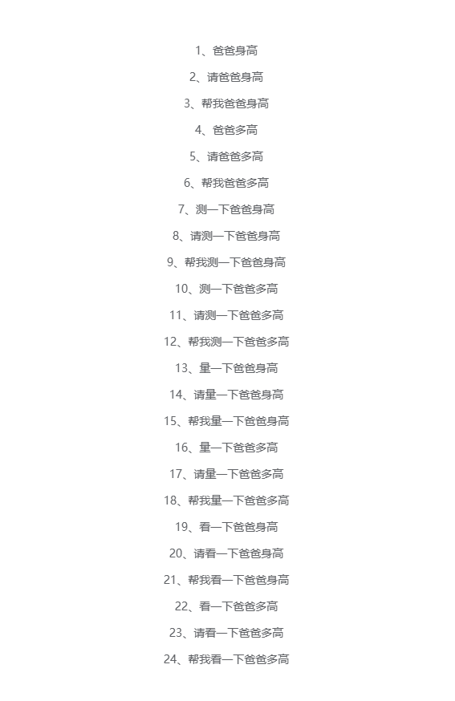

    **体重相关指令**（支持24种表达）：

    - "二宝体重"
    - "请二宝体重"
    - "帮我二宝体重"
    - "我要二宝体重"
    等24种变体

    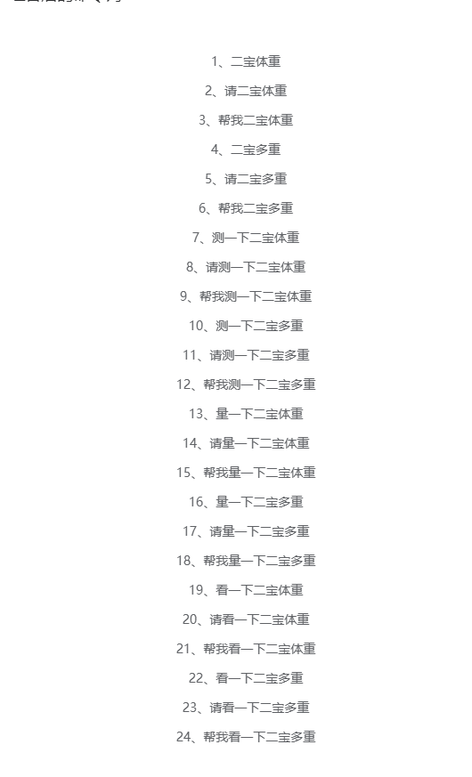

    **身高体重组合指令**（支持12种表达）：

    - "妈妈身高体重"
    - "请妈妈身高体重"
    - "帮我妈妈身高体重"
    等12种变体

    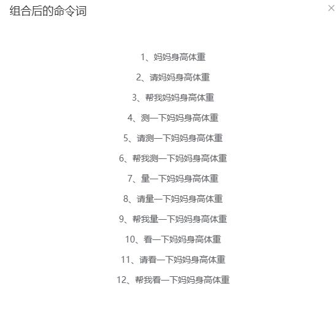

**协议分组策略：**

1. **按功能分组**：

    - 自由跳模式：使用统一协议
    - 倒计时模式：使用统一协议
    - 倒计数模式：可并入倒计时

2. **按身份区分**：

    - 爸爸系列：协议ID 01-0X
    - 妈妈系列：协议ID 02-0X
    - 大宝系列：协议ID 03-0X
    - 二宝系列：协议ID 04-0X

**内存使用估算：**

- 一个自然说词条 ≈ 20-30个固定词条
- 10个自然说词条 ≈ 200-300个固定词条
- CI-03T的300条容量约支持10-15个自然说功能

**配置建议：**

1. **优先级排序**：先配置核心功能的自然说
2. **测试验证**：每组模板充分测试后再添加下一组
3. **精简优化**：定期检查未使用的模板，及时清理
4. **容量预留**：保留20%的词条容量用于后续扩展

**注意事项：**

- 自然说模板需要精心设计，避免含义重叠
- 测试时使用多种表达方式验证效果
- 协议设计要考虑主控的处理便利性
- 记录每个自然说词条对应的所有变体，便于维护

---


---


---

### 数字识别不灵敏如何优化？

**问题描述：**

在设置时间和闹钟时，数字识别不灵敏，特别是"1-10"等数字经常识别不到。需要提高数字识别的准确率。

**解决方案：**

**识别难点分析：**

1. **数字发音特点**：

    - 单个数字发音短，特征不明显
    - 容易被环境噪声掩盖
    - 需要更精确的发音

2. **现有词条限制**：

    - 自然说功能可能降低单数字识别率
    - 固定词条数量有限
    - 需要合理配置词条

**优化策略：**

1. **增加数字变体**：

    - "一" → "一十"、"幺"、"数字一"
    - "2" → "二"、"两"、"数字二"
    - "3" → "三"、"数字三"
    - "10" → "十"、"一十"、"数字十"

2. **使用固定词条**：

    放弃部分自然说，改用固定词条：

    - "设置一点钟"、"设置二点钟"...
    - "设置十分"、"设置二十分"...
    - "设置十秒"、"设置二十秒"...

3. **语速和音量控制**：

    - 设置时间时使用中等语速
    - 避免过快导致识别失败
    - 确保环境噪声较小

4. **AEC功能应用**：

    - 启用回声消除功能
    - 减少环境干扰影响
    - 提高数字识别准确率

**技术方案：**

1. **双麦克风方案**：

    - 使用双麦克风版本的模块（如CI-03T2）
    - 更好的噪声抑制和定向识别
    - 适合数字识别场景

2. **分段输入策略**：

    - 分段设置时间：
        ```
        语音：设置时间
        模块：设置小时？
        用户：十点
        模块：设置分钟？
        用户：三十分
        模块：设置秒？
        用户：二十秒
        ```

3. **确认反馈机制**：

    - 每步设置后语音确认
    - 显示当前设置值
    - 确认无误后继续下一步

**注意事项：**

- 数字识别需要比一般指令更清晰的发音
- 环境噪声对数字识别影响很大
- 建议在安静环境下设置时间
- 如仍无法满足需求，考虑在线语音方案

---


---


---

### 韩语识别训练语料具体要求

**问题描述：**

使用CI-03T1或CI-03T2语音芯片时，部分韩语命令词无法识别，需要了解训练语料的具体要求和训练流程。

**解决方案：**

**训练效果现状：**

- 基础韩语命令词识别效果较差
- 很多命令词完全识别不出来
- 需要特别标准的发音才能勉强识别
- 现有语料无法满足训练要求

**语料数量要求：**

1. **最低要求**：

    - 每条命令词至少60条语料
    - 语料数量越多，训练效果越好
    - 10条语料不足以进行有效训练

2. **理想数量**：

    - 每条命令词100条语料为佳
    - 确保训练模型的稳定性和准确性
    - 提高在复杂环境下的识别率

**训练流程和时间：**

1. **语料提交流程**：

    - 整理符合格式的语料文件
    - 确保语料质量达标
    - 提交给训练团队

2. **训练周期**：

    - 训练时间：约3周
    - 包含模型训练和优化
    - 提供测试固件验证

3. **成本考虑**：

    - 小语种训练成本较高
    - 需要一次性训练成功
    - 效果不达标需要重新训练

**语料质量标准：**

1. **技术规格**：

    - 采样率：16kHz
    - 位深：16bit
    - 格式：WAV
    - 单声道

2. **内容要求**：

    - 标准韩语发音
    - 无背景噪音
    - 语音清晰完整
    - 时长1-3秒

**训练前准备：**

1. **硬件准备**：

    - 确保产品电路已集成CI-1312等支持芯片
    - 验证硬件连接正确
    - 准备测试环境

2. **软件准备**：

    - 列出所有需要训练的命令词
    - 准备命令词对应表
    - 建立语料文件命名规范

**效果验证标准：**

1. **识别率要求**：

    - 标准发音识别率>95%
    - 稍有偏差发音识别率>85%
    - 所有命令词均可正常识别

2. **测试场景**：

    - 安静环境测试
    - 一定噪声环境测试
    - 不同发音人测试

**注意事项：**

- 语料未达到要求时无法开始训练
- 训练成本高昂，建议一次性准备充足语料
- 小语种训练效果通常低于中英文
- 需要预留充足的训练和测试时间
- 建议提前与训练团队沟通技术细节

---


---


---

### 韩语语音识别率低的问题分析与优化方案

**问题描述：**

使用CI-03T1或CI-03T2芯片进行韩语语音识别测试时，发现前30句语料中，从Q19开始的命令词识别率极低或完全无法识别，且Q1、Q13等部分语料也存在识别失败问题。

**问题分析：**

1. **识别率分布**：

    - Q1-Q18：大部分有较高识别率（40-57次成功）
    - Q19-Q30：识别率极低，大部分完全无响应
    - 问题集中出现在特定序号的命令词

2. **错误类型统计**：

    - 无返回：Q20-Q30完全无响应
    - 误识别：返回错误编号（如0E、0F、05、08、09等）
    - 部分成功：Q21仅40次成功

3. **可能原因**：

    - 语料质量问题：后期命令词语料录制不规范
    - 模型训练不足：60条语料不足以支撑有效训练
    - 命令词设计：发音相近或难以区分

**优化建议：**

1. **增加语料数量**：

    - 每条命令词提供100条语料
    - 确保语料质量一致性和规范性
    - 覆盖不同发音人和语速变化

2. **重新设计命令词**：

    - 选择发音差异更大的词汇
    - 避免使用发音相近的命令词
    - 简化复杂的长句命令

3. **分批训练策略**：

    - 先训练Q1-Q18的基础命令词
    - 确认识别率稳定后
    - 再逐步添加Q19-Q30的扩展命令词

**临时解决方案：**

1. **使用现有可用命令**：

    - 专注于Q1-Q18的稳定识别功能
    - 暂时停用问题命令词（Q19-Q30）
    - 通过软件逻辑规避识别率低的问题

2. **阈值调整优化**：

    - 调高识别阈值减少误触发
    - 针对问题命令词单独设置参数
    - 在安静环境下进行测试验证

**长期改进方案：**

1. **语料标准化**：

    - 统一录音设备和环境参数
    - 建立语料质量审核流程
    - 保留原始语料用于对比分析

2. **模型优化**：

    - 使用更多样本人群进行训练
    - 增加噪声环境下的语料样本
    - 考虑使用性能更好的芯片（如CI-1312）

**测试验证建议：**

- 分命令词记录识别成功率和错误类型
- 在实际使用环境中进行测试
- 保留测试数据和日志便于分析
- 与技术支持团队密切沟通优化进展

---


---


---

### 如何通过语音指令实现动态命令词记录功能？

**问题描述：**

需要实现通过语音指令动态记录命令词的功能，当说出"这个是[物体名称]"时，系统能记录该物体名称，后续说出"[物体名称]在哪儿"时，系统能回答"我在这儿"。

**解决方案：**

**功能实现确认：**

- CI-03T系列模块支持此功能
- 需要在平台进行相应配置
- 可实现动态物体名称记录和查找

**平台配置方法：**

1. **设置记录命令词**：

    - 命令词："这个是|你是"
    - 回复语："好的我知道了"
    - 控制设置：无特殊配置

2. **设置查询命令词**：

    - 命令词："*在哪儿"
    - 回复语："我在这儿"
    - 使用通配符"*"匹配任意物体名称

**配置示例：**

```
命令词1：这个是空调遥控器
回复语1：好的我知道了

命令词2：空调遥控器在哪儿
回复语2：我在这儿

命令词3：这个是电视遥控器
回复语3：好的我知道了

命令词4：电视遥控器在哪儿
回复语4：我在这儿
```

**使用流程：**

1. 唤醒语音模块（如"你好小美"）
2. 说出"这个是[物体名称]"进行记录
3. 系统回复"好的我知道了"确认记录
4. 后续可询问"[物体名称]在哪儿"
5. 系统回复"我在这儿"表示物体位置

**功能特点：**

- 物体名称可以是任意词汇
- 不限制具体物体类型
- 支持动态更新记录内容
- 每次新记录会覆盖之前的内容

**应用场景：**

- 物品定位查找
- 动态标签管理
- 语音备忘录功能
- 智能家居控制

**注意事项：**

- 此功能仅支持CI-03T系列模块
- 配置时需要在平台中正确设置命令词和回复语
- 物体名称建议使用2-4个字的词汇
- 使用时需在安静环境下，确保识别准确率


*平台配置界面展示如何设置"这个是"和"在哪儿"的命令词*

---


---


---

### 展会等嘈杂环境下设备难以唤醒怎么办？

**问题描述：**

在嘈杂环境（如展会）下，使用CI-03T1芯片的设备难以被唤醒，需要了解如何解决唤醒问题。

**解决方案：**

**1. 更换专用模型**：

- 使用烟机模型，该模型针对强噪声环境进行优化
- 或选择其他1.3M专用模型（如取暖桌、卫浴、风扇等）
- 这些模型开启了稳态降噪功能，更适合嘈杂环境

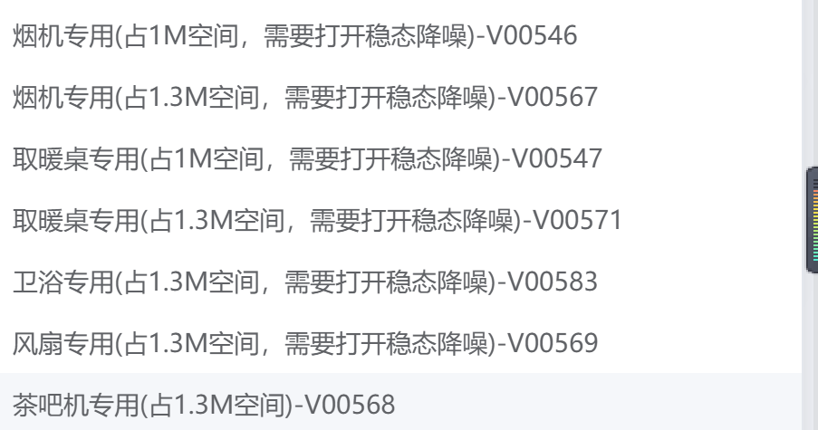

*不同应用场景的专用模型，烟机模型适合强噪声环境*

**2. 开启深度降噪**：

- 深度降噪功能可降低噪声对识别的干扰
- 不会降低整体灵敏度，而是提升在噪声环境下的识别率
- 适用于有持续背景噪声的场景

**3. 多人说话环境限制**：

- 多人说话时，干扰源变得不可控
- 深度降噪对多人说话干扰的效果有限
- 建议在演示时尽量减少背景说话声

**注意事项：**

- 烟机模型是经过验证的适合展会环境的解决方案
- 英语识别在嘈杂环境下会更加困难，建议使用中文演示
- 如需更好效果，可考虑使用双麦克风阵列方案

---


---


---

### 在自有智能体中能否实现方言自学习功能？

**问题描述：**

希望在自有的智能体中实现方言自学习功能，需要了解该功能是否支持以及如何实现。

**解决方案：**

**功能说明：**

方言自学习功能是离线语音模块的特性，当前在智能体平台中尚未实现此功能。

**技术限制：**

1. **离线功能特性**

    - 方言自学习是离线语音识别的功能
    - 需要支持自学习功能的硬件模块（如CI-73T、CI-03T）
    - 通过模块的本地处理能力实现方言适配

2. **智能体平台现状**

    - 当前智能体平台主要聚焦在线AI对话能力
    - 方言自学习功能尚未集成到智能体框架中
    - 在线模式通过云端大模型处理语音识别

**推荐方案：**

1. **使用支持自学习的模块**

    - 选择CI-73T或CI-03T等支持方言自学习的模块
    - 通过离线模式实现方言识别
    - 配合在线模式实现智能对话

2. **混合模式应用**

    - 离线：使用方言自学习处理本地指令
    - 在线：使用智能体处理复杂对话
    - 根据场景自动切换工作模式

3. **测试验证**

    - 获取模块样品进行测试
    - 验证方言识别效果
    - 确认是否满足项目需求

**注意事项：**

- 方言自学习功能需要特定硬件支持
- 智能体平台未来可能会支持此功能
- 建议关注官方平台更新公告
- 如项目急需，可考虑离线+在线混合方案

---


---


---

### 离线方言识别支持哪些类型？

**问题描述：**

需要了解离线方言识别功能支持的具体方言类型和数量。

**解决方案：**

**方言支持说明：**

离线方言识别功能没有固定的类型数量限制，支持通过自学习功能适配各种方言。

**技术特点：**

1. **自学习适配**

    - 不限定具体的方言种类
    - 通过自学习功能动态适配方言口音
    - 支持用户自定义训练方言语音

2. **硬件支持**

    - 需要具备自学习功能的语音模块
    - CI-73T、CI-03T等模块支持此功能
    - 通过本地算法实现方言识别

3. **实际应用**

    - 可根据目标用户群体训练相应方言
    - 支持地方特色口音识别
    - 提升特定地区用户的识别准确率

**使用建议：**

1. **测试验证**

    - 获取支持自学习的模块样品
    - 针对目标方言进行测试训练
    - 验证实际识别效果

2. **批量应用**

    - 根据测试结果确定最终方案
    - 在量产前进行充分验证
    - 确保方言识别的稳定性

**注意事项：**

- 方言识别效果取决于训练样本质量
- 不同方言的识别准确率可能有差异
- 建议针对主要目标方言进行优化
- 如有特殊方言需求，可联系技术支持评估

---


---


---

### 离线方言识别是否支持上海话、苏州话？

**问题描述：**

需要确认离线方言识别功能是否支持上海话、苏州话等具体方言。

**解决方案：**

**支持情况说明：**

离线方言识别通过自学习功能适配各种方言，理论上可以支持上海话、苏州话等地方方言。

**技术实现方式：**

1. **自学习训练**

    - 通过自学习功能录入方言语音样本
    - 系统动态适配和识别方言特征
    - 支持用户自定义训练方言指令

2. **效果验证**

    - 实际支持效果需要通过测试验证
    - 不同方言的识别准确率可能存在差异
    - 建议获取样品进行实际测试

**测试建议：**

1. **样品测试**

    - 申请支持自学习的模块样品（如CI-73T、CI-03T）
    - 使用上海话或苏州话进行自学习训练
    - 验证实际识别效果和准确率

2. **批量验证**

    - 小批量测试验证识别效果
    - 确认满足项目需求后再批量采购
    - 针对识别问题进行优化调整

**注意事项：**

- 方言识别效果受训练样本数量和质量影响
- 建议使用多位发音人进行训练，提升泛化能力
- 如有特殊的方言识别需求，可联系技术支持进行评估
- 某些特殊方言可能需要更多训练样本才能达到理想效果

---


---


---

### 在播放音乐的过程中能否通过语音提示词实现打断功能？

**问题描述：**

需要了解在播放音乐的过程中，是否可以通过语音提示词实现打断功能，实现更灵活的交互控制。

**解决方案：**

**支持情况对比：**

| 模块型号 | 打断功能 | 技术原理 | 适用场景 |
|----------|---------|----------|----------|
| **CI-03T** | ✅ 支持 | 单麦AEC回声消除 | 播放音乐时可语音打断 |
| **CI-03T2** | ❌ 不支持 | 双麦降噪算法 | 播放时无法识别，需暂停音乐 |
| **SU-03T** | ❌ 不支持 | 单麦克风设计 | 播放时无法识别 |
| **CI-33T** | ✅ 支持 | 双麦+AEC算法 | 高噪声环境优化 |
| **SU-32T** | ✅ 支持 | 双麦阵列+降噪 | 最强抗干扰能力 |

**技术实现原理：**

1. **AEC（声学回声消除）技术**：

    - 通过算法分离播放音频和语音信号
    - 实时消除喇叭播放对麦克风的影响
    - 保持语音识别通路活跃

2. **工作流程**：

    - 正常播放：音频输出，AEC算法工作
    - 语音输入：检测到语音时，AEC处理并识别
    - 打断执行：识别成功后中断播放，执行命令

**配置方法：**

1. **平台设置**：

    - 选择支持AEC功能的模块型号（如CI-03T）
    - 在产品特性中启用AEC回声消除功能
    - 生成包含AEC算法的固件

2. **硬件要求**：

    - 使用单麦克风版本（CI-03T1）
    - 确保麦克风和扬声器位置合理
    - 避免物理遮挡影响拾音效果

**应用建议：**

1. **需要打断功能**：

    - 优先选择CI-03T1单麦克风AEC版本
    - 成本敏感项目可考虑CI-03T2双麦版本
    - 高质量音频产品推荐CI-33T

2. **替代方案**：

    - SU-03T不支持，可升级到CI系列或SU-32T
    - 通过外部暂停控制实现类似效果

3. **优化建议**：

    - 调整播放音量，降低对麦克风干扰
    - 优化麦克风位置，提高拾音质量
    - 在安静环境下测试和调试

**注意事项：**

- AEC功能需要硬件支持，软件无法实现
- 双麦克风版本在嘈杂环境下表现更优
- 配置AEC功能可能略微增加功耗
- 打断功能响应速度取决于算法处理效率

---


---


---

### 在播放音乐的过程中能否通过语音提示词实现打断功能？

**问题描述：**

需要了解在播放音乐的过程中，是否可以通过语音提示词实现打断功能，实现更灵活的交互控制。

**解决方案：**

**支持情况对比：**

| 模块型号 | 打断功能 | 技术原理 | 适用场景 |
|-----------|----------|----------|----------|
| **CI-03T** | ✅ 支持 | 单麦AEC回声消除 | 需要打断的音乐播放场景 |
| **CI-03T2** | ❌ 不支持 | 双麦降噪 | 高噪声环境，不需要打断 |
| **SU-03T** | ❌ 不支持 | 无AEC功能 | 基础语音控制 |
| **SU-32T** | ✅ 支持 | 双麦阵列+AEC | 高噪声环境优化 |

**技术实现原理：**

1. **AEC（声学回声消除）技术**：

    - CI-03T通过内置AEC算法分离播放音频和语音信号
    - 实时监测播放内容，生成反向声学模型
    - 从麦克风输入中减去播放声音的干扰
    - 保持语音识别通路活跃，实现打断功能

2. **工作流程**：

    - 模块正常播放音乐或语音回复
    - AEC算法持续处理播放音频
    - 检测到语音输入时，识别是否为有效指令
    - 确认指令后停止当前播放，执行新指令

**配置方法：**

1. **硬件选择**：

    - 选择CI-03T单麦克风AEC版本
    - 确认模块型号标识（CI-03T1）
    - 固件版本需支持AEC功能

2. **平台配置**：

    - 在智能公元平台选择"语音识别+AEC"选项
    - 启用回声消除相关功能
    - 配置识别阈值和参数

3. **测试验证**：

    - 播放音乐时测试语音打断功能
    - 验证识别准确性和响应速度
    - 调整AEC参数以获得最佳效果

**应用场景：**

1. **智能音响**：播放音乐时通过语音控制
2. **语音助手**：播放提示音时响应新指令
3. **车载系统**：导航语音与媒体播放的协调
4. **智能家居**：背景音乐播放时的语音控制

**注意事项：**

- AEC功能仅CI-03T单麦克风版本支持
- 双麦克风版本主要针对噪声优化，不支持AEC
- 配置AEC功能可能略微增加功耗
- 打断效果与环境和硬件布局相关
- 建议在实际使用场景中测试和调优

---


---


---

### 在播放音乐的过程中能否通过语音提示词实现打断功能？

**问题描述：**

需要为台灯语音对话功能选择合适的芯片配置，了解各项参数设置的最佳实践。

**解决方案：**

**芯片选型建议：**

1. **CI-03T1 vs CI-03T2**：

    - **CI-03T1**：单麦克风版本，支持AEC回声消除
    - **CI-03T2**：双麦克风版本，不支持AEC但降噪更强
    - **台灯应用**：建议选择CI-03T1，因需要AEC实现打断功能

2. **使用场景选择**：

    - **书房/床头环境**：选择"普通话通用Pro"模型
    - **安静环境**：可选用标准普通话模型节省空间
    - **噪声环境**：考虑双麦克风方案或更高性能型号

**配置优化建议：**

1. **基础配置**：

    - 词条数量：控制在150条以内
    - 唤醒词：2-4个，发音清晰易区分
    - 回复语：简洁明了，控制在20字以内

2. **高级功能**：

    - AEC打断：必须启用以支持对话功能
    - 自然说：根据需求决定是否开启
    - 自学习：适合需要自定义的场景

**开发建议：**

- 先用开发板验证功能，再进行PCB设计
- 保留充足的调试接口便于问题排查
- 预留足够的Flash空间用于功能扩展
- 建立完整的功能测试用例

**注意事项：**

- 硬件设计对AEC性能影响极大，需特别注意
- 多唤醒词可改善体验但需平衡误唤醒率
- 固件配置建议保存完整配置文件备份
- 量产前进行充分的可靠性测试

---


---


---

### 五个字唤醒词识别率低怎么办？

**问题描述：**

使用五个字的唤醒词时，识别准确率明显降低，经常出现误识别或无法唤醒的情况，而三个字和四个字的唤醒词则正常工作。

**问题分析：**

1. **识别难度增加**：

    - 五个字的发音时间较长，增加了识别复杂度
    - 用户发音时容易出现音节不均匀
    - 语音特征提取难度随字数增加而提升

2. **技术限制**：

    - 过长的唤醒词会增加误唤醒概率
    - 语音模型对长词组的处理能力有限
    - 需要用户发音非常标准才能识别

**解决方案：**

**方法一：优化唤醒词设计**

1. **选择更简洁的唤醒词**：

    - 优先使用4个字的唤醒词，识别效果最佳
    - 如必须使用5个字，选择发音清晰、响亮的词组
    - 避免使用生僻字或多音字

2. **增加音节区分度**：

    - 选择音节变化明显的词组
    - 避免使用相似音节的连续组合
    - 确保每个音节都有清晰的发音边界

**方法二：调整识别参数**

1. **降低识别灵敏度**：

    - 适当调低唤醒灵敏度，减少误触发
    - 平衡识别率和误唤醒率
    - 在保证识别的前提下尽量降低敏感度

2. **优化阈值设置**：

    - 调整唤醒词阈值参数
    - 根据实际测试效果微调
    - 记录最佳参数配置

**方法三：提升发音质量**

1. **标准发音训练**：

    - 保持稳定的语速和音量
    - 每个字发音清晰，不拖沓
    - 避免地方口音过重

2. **多次录制验证**：

    - 在平台中多次录制唤醒词
    - 选择发音最标准的版本
    - 测试不同语速下的识别效果

**方法四：使用命令词技巧**

1. **命令词设置技巧**：

    - 如果五个字唤醒词必须使用，可考虑以下方案：

    - 将唤醒词作为命令词使用，另设简短的唤醒词
    - 或使用四个字唤醒词，通过命令词实现复杂功能

2. **实际应用案例**：

    - 唤醒词："小智助手"（4字）
    - 命令词："打开空调模式"（实现原本5个字的功能）

**官方建议参考：**

根据智能公元平台官方文档建议：

- **唤醒词长度**：一般为4-6个字，4个字最佳
- **过短容误唤醒高**：少于4个字容易误触发
- **过长不便使用**：超过6个字不便于用户呼叫和记忆
- **音节覆盖应尽量多，差异大**：提高识别准确率

**测试验证方法：**

1. **对比测试**：

    - 分别测试3字、4字、5字唤醒词的识别率
    - 记录各自的误唤醒次数
    - 选择综合表现最佳的方案

2. **环境测试**：

    - 在安静环境下测试基础识别率
    - 在典型使用环境下验证实际效果
    - 模拟各种干扰情况下的稳定性

**注意事项：**

- 五个字唤醒词的识别率低是正常现象
- 建议优先考虑四个字的唤醒词以获得最佳体验
- 如必须使用特定长度的唤醒词，需要加强用户引导
- 识别效果受环境、发音标准度、设备性能多重因素影响

---

## 语音模块对接大模型方案

**问题描述：**
需要实现语音模块识别用户语音后，将文本发送到GPT大模型，再将大模型回复播放出来的完整语音交互方案。

**解决方案：**

**方案一：基于CI-03T模块的完整实现**

1. **硬件选型**：

    - 使用CI-03T离线语音模块
    - 外接WiFi模块（如ESP8266/ESP32）
    - 或者使用自带网络功能的MCU

2. **系统架构设计**：
    ```
    语音输入 → CI-03T识别 → MCU处理 → 发送GPT → 接收回复 → TTS播放 → 音频输出
    ```

3. **具体实现步骤**：

    **步骤1：语音识别配置**

    - 在智能公元平台配置唤醒词和命令词
    - 设置串口输出模式输出识别结果
    - 生成并烧录固件到CI-03T模块

    **步骤2：网络通信开发**

    - 实现WiFi连接和HTTP/HTTPS请求
    - 配置ChatGPT API密钥和请求格式
    - 处理网络异常和超时机制

    **步骤3：GPT API调用示例**：
    ```json
    {
        "model": "gpt-3.5-turbo",
        "messages": [
        {"role": "user", "content": "用户语音识别的文本"}
        ],
        "max_tokens": 150,
        "temperature": 0.7
    }
    ```

    **步骤4：语音合成(TTS)**

    - 将GPT返回的文本转换为语音
    - 可使用：

        - 在线TTS服务（百度、阿里云等）
        - 本地TTS芯片或模块
        - ESP32-AudioKit等开发板

4. **通信协议设计**：

    **CI-03T串口协议**：

    - 波特率：9600
    - 数据格式：识别结果通过串口输出
    - 输出格式：JSON格式，包含识别文本和置信度

    **MCU处理逻辑**：

    - 监听串口接收识别结果
    - 解析JSON数据提取文本内容
    - 发送HTTP请求到GPT API
    - 接收并处理GPT响应
    - 调用TTS播放回复内容

**方案二：使用离线语音助手开发板**

1. **推荐开发板**：

    - SmartPi开发板（集成WiFi）
    - ESP32系列开发板
    - 树莓派Pico W

2. **开发优势**：

    - 集成度高，减少外部连线
    - 内置WiFi，便于网络通信
    - 社区支持好，示例代码丰富

3. **快速开发流程**：

    - 购买现成的离线语音模块
    - 参考官方提供的对接方案
    - 使用现成的HTTP请求库
    - 集成第三方TTS服务

**方案三：基于WebSocket的实时通信**

1. **WebSocket优势**：

    - 支持双向实时通信
    - 减少HTTP请求延迟
    - 支持流式响应

2. **实现方案**：

    - MCU作为WebSocket客户端
    - 建立与后端服务器的持久连接
    - 后端负责转发GPT请求
    - 支持流式语音合成

3. **代码架构示例**：
    ```cpp
    // 伪代码示例
    void onVoiceRecognized(String text) {
        websocket.send(JSON.stringify({
        type: "user_input",
        text: text,
        session_id: sessionId
        }));
    }

    websocket.onMessage = function(message) {
        if(message.type == "gpt_response") {
        playTTS(message.text);
        }
    };
    ```

**技术实现要点：**

1. **API密钥管理**：

    - 将OpenAI API密钥安全存储
    - 避免在代码中硬编码
    - 考虑使用代理服务器隐藏密钥

2. **延迟优化**：

    - 使用本地缓存减少重复请求
    - 实现流式响应处理
    - 优化TTS合成速度

3. **错误处理机制**：

    - 网络断开重连
    - API限流处理
    - 语音识别失败降级

4. **用户体验优化**：

    - 添加语音提示反馈
    - 支持打断和重新唤醒
    - 保存对话上下文

**推荐开发流程：**

1. **第一阶段**：基础功能验证
    - 实现CI-03T的语音识别
    - 完成基本的GPT API调用
    - 验证TTS播放功能

2. **第二阶段**：系统集成
    - 优化各模块间的通信
    - 完善错误处理机制
    - 提升响应速度

3. **第三阶段**：产品化
    - 外壳设计和PCB集成
    - 电源管理优化
    - 批量生产测试

**注意事项：**

- CI-03T模块需要外接MCU处理网络通信
- GPT API调用需要稳定的网络环境
- 整个方案的响应时间约为2-5秒
- 建议使用5V/2A以上电源确保稳定工作
- 注意API调用的成本控制

---

## 语音唤醒与命令词交互流程

**问题描述：**
需要了解语音模块的完整工作流程，包括唤醒词识别、命令词处理、回复语播放等环节的交互机制。

**解决方案：**

**一、语音识别基本流程**

1. **语音模块工作状态**：

    - 待机状态：模块处于低功耗监听模式
    - 唤醒状态：检测到唤醒词后进入活跃模式
    - 识别状态：等待并识别用户命令
    - 执行状态：执行识别到的命令并回复

2. **完整交互流程**：
    ```
    语音输入 → 唤醒词检测 → 命令词识别 → 触发动作 → 播放回复 → 返回待机
    ```

**二、唤醒词与命令词配置**

1. **唤醒词设置**：

    - 每个设备仅支持1个唤醒词
    - 建议使用3-4个字的词组
    - 需要在平台录制或上传音频
    - 支持自定义唤醒词

2. **命令词设置**：

    - 支持多个命令词（根据型号不同，上限不同）
    - 每个命令词可配置独立动作
    - 支持命令词分类管理
    - 可设置识别灵敏度

3. **免唤醒命令词**：

    - 部分型号支持免唤醒命令
    - 识别后直接执行，无需先说唤醒词
    - 适合高频使用的简单命令

**三、回复语配置方案**

1. **直接回复语设置**：

    - 在命令词配置界面直接填写回复内容
    - 识别成功后立即播放
    - 支持文字转语音

2. **条件控制回复**：

    - 回复语字段留空
    - 在"控制详情"中配置播放条件
    - 支持基于GPIO、变量等条件判断

3. **高级回复控制**：
    ```json
    控制配置示例：

    - 触发条件：GPIO_A5为高电平
    - 执行动作：播放语音
    - 播放内容："收到，继电器已打开"
    - 条件执行：是/否
    ```

**四、串口输出配置**

1. **输出模式选择**：

    - 禁用：不输出任何数据
    - 简单模式：输出识别结果
    - 完整模式：输出详细状态信息

2. **数据格式说明**：
    ```
    识别成功格式：{"cmd":"命令词","state":"success","msg":"识别成功"}
    识别失败格式：{"cmd":"","state":"fail","msg":"未识别到有效命令"}
    ```

3. **自定义输出**：

    - 可为每个命令配置特定输出格式
    - 支持十六进制数据发送
    - 可集成变量值输出

**五、声源定位集成**

1. **硬件要求**：

    - 必须使用双麦克风型号（如CI-03T2）
    - 麦克风间距：40mm（推荐）
    - 同平面同向安装

2. **定位数据获取**：

    - 定义变量存储角度值（如：jiaodu）
    - 配置触发条件读取变量
    - 通过串口或语音播报输出

3. **角度数据处理**：
    ```
    角度范围：0°-180°
    分辨率：10°（19个方向）
    输出示例：

    - 0°：55 AA 01 00 AA 55
    - 90°：55 AA 01 5A AA 55
    - 180°：55 AA 01 B4 AA 55
    ```

**六、常见问题处理**

1. **唤醒无响应**：

    - 检查唤醒词发音是否标准
    - 调整唤醒灵敏度
    - 确认模块未进入深度休眠

2. **命令识别率低**：

    - 优化录音环境
    - 重新录制命令词
    - 调整识别阈值

3. **回复不播放**：

    - 检查音频文件完整性
    - 确认音量设置
    - 验证触发条件

**七、性能优化建议**

1. **响应速度优化**：

    - 使用本地音频文件
    - 减少串口输出数据量
    - 优化识别算法参数

2. **功耗管理**：

    - 合理设置休眠时间
    - 配置深度休眠阈值
    - 选择合适的唤醒方案

3. **稳定性提升**：

    - 添加看门狗机制
    - 设置自动重连
    - 配置错误恢复策略

**注意事项：**

- 声源定位功能需要双麦克风硬件支持
- 测试时保持1米以上距离效果更佳
- 串口波特率默认9600，可在平台修改
- 复杂场景建议使用条件控制而非直接回复
- 定期更新固件以获得最新功能

---


---


---

### 如何实现任意数字（包括小数点）的语音识别？

**问题描述：**

需要在语音指令中支持任意数字的识别，包括0-1000的整数以及小数（如138.45），用于调节设备量程等应用场景。

**解决方案：**

**技术限制：**

CI-03T系列离线语音识别芯片无法实现真正意义上的任意数字识别，原因如下：

1. **存储容量限制**：

    - CI-03T支持300条词条，CI-33T支持500条词条
    - 0-1000的整数就需要1000个词条
    - 包含小数点后，词条数量会呈指数增长
    - 现有Flash容量无法满足需求

2. **识别原理限制**：

    - 离线识别基于模板匹配
    - 所有识别内容必须预先配置
    - 不具备动态数字提取能力

**可行的替代方案：**

1. **分段数字输入法**：

    ```
    设计思路：

    - "量程设置" → 进入设置模式
    - "一百" → 输入百位
    - "三十" → 输入十位
    - "八" → 输入个位
    - "点四五" → 输入小数部分
    - "确认" → 完成输入（最终值：138.45）
    ```

2. **预设常用数值法**：

    - 只配置实际使用中的特定数值
    - 例如：100、150、200、250等常用量程
    - 虽然不是任意数字，但能满足大部分使用需求

3. **数字组合法**：

    - 分别识别"数字+单位"
    - 例如："一百三十八"和"点四五"分开识别
    - 在主控端进行数值组合

**定制方案说明：**

目前仅提供时间数字识别的定制服务，支持：

- 固定格式的时间表达
- 预设的时间范围
- 需要联系技术支持进行专项定制

**注意事项：**

- 任意数字识别超出了离线语音芯片的能力范围
- 建议重新设计交互逻辑，避开任意数字输入需求
- 如必须支持任意数字，考虑使用在线语音识别方案
- 分段输入是较为可行的离线替代方案

---


---


---

### 唤醒词功能配置后串口无法接收数据怎么办？

**问题描述：**

使用CI-03T1芯片配置唤醒词功能时，串口无法接收到任何数据，即使主动发送数据也无反应，串口通信完全无响应。

**解决方案：**

**问题排查：**

1. **检查Pin脚配置**：

    - 确认GPIO_B0和GPIO_B1已正确配置为UART1_TX和UART1_RX
    - 验证引脚功能映射是否正确设置
    - 检查引脚是否与其他功能冲突

2. **确认串口参数设置**：

    - 波特率：默认9600（可根据需求调整）
    - 数据位：8位
    - 停止位：1位
    - 校验位：无

3. **硬件连接检查**：

    - TX与RX引脚是否正确连接（TX接RX，RX接TX）
    - 共地连接是否可靠
    - 连接线是否完好

**配置步骤：**

1. **Pin脚配置界面设置**：

    - 进入平台Pin脚配置页面
    - 将GPIO_B0设置为UART1_TX
    - 将GPIO_B1设置为UART1_RX
    - 保存配置并生成固件

2. **串口调试工具测试**：

    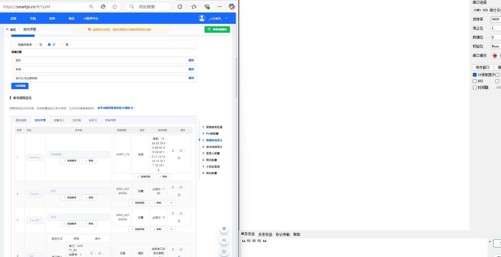

    *配置界面显示唤醒词和串口参数设置*

3. **Pin脚配置确认**：

    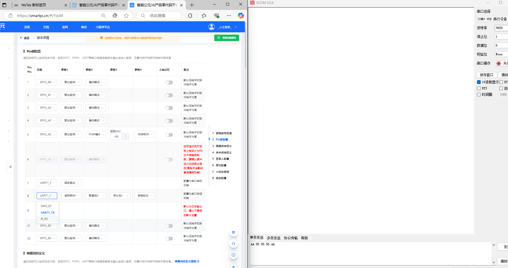

    *GPIO_B0/B1已配置为UART1功能*

**常见问题解决：**

1. **串口无任何响应**：

    - 检查模块是否正常唤醒
    - 确认固件已正确烧录
    - 验证串口工具设置正确

2. **能发送但接收不到数据**：

    - 检查TX/RX线序是否接反
    - 确认对方设备串口参数匹配
    - 检查共地连接

3. **数据乱码**：

    - 波特率不匹配，调整串口工具波特率
    - 数据格式设置错误
    - 连接线干扰过大

**测试方法：**

1. 使用串口助手发送测试数据
2. 触发唤醒词观察是否有串口输出
3. 检查串口数据帧格式是否正确
4. 验证数据内容是否符合预期

**注意事项：**

- 配置修改后需要重新生成并烧录固件
- 串口功能需要正确的硬件连接支持
- 建议使用USB转TTL模块进行调试
- 如问题持续，检查模块硬件是否正常


### CI-03T板子烧录固件后，语音识别回答使用英文且声音不清晰，怀疑是顶板型号不匹配导致的问题。
解决方案

1. 固件匹配检查
- 确认烧录的是CI-03T专用固件，而非SU-03T固件
- 验证固件文件名应为CI系列专用版本
- 检查固件版本与硬件版本匹配性

2. 语言设置配置
- 检查配置界面中的语音语言设置
- 确保设置为中文而非英文
- 验证TTS（文本转语音）语音类型配置

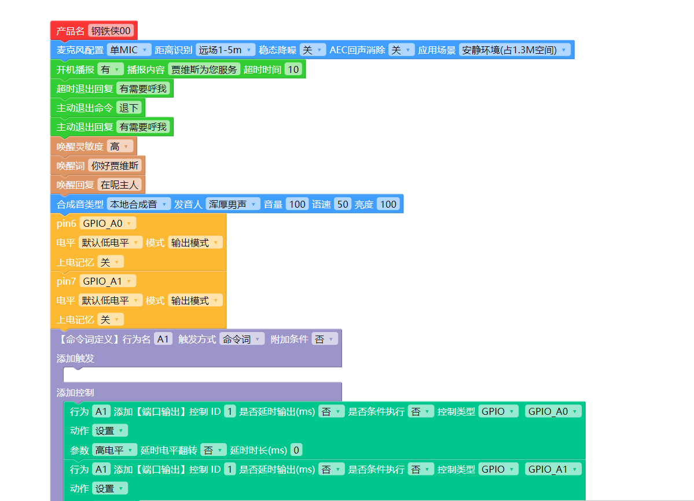

*CI-03T板子的配置界面，显示唤醒词和语音设置*

3. 声音质量优化
- 调整合成音类型选择
- 确认音频输出格式设置

硬件检查：

- 验证扬声器连接质量
- 检查音频输出线路
- 确认供电电压稳定

4. 重新烧录步骤
- 下载正确的CI-03T固件
- 使用专用烧录工具进行烧录
- 烧录前恢复出厂设置
- 烧录后重新配置所有参数

注意事项
- CI-03T和SU-03T固件不兼容，混用会导致功能异常
- 烧录固件时确认文件路径和名称正确
- 如多次烧录仍有问题，可能需要检查硬件
- 保留原始固件备份，便于恢复

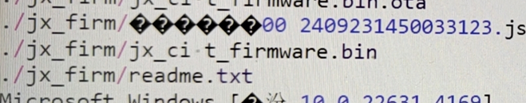

*命令行显示的CI-03T固件文件路径*

---

### 如何避免语音播放时误触发识别关键词？

**问题描述：**

在使用CI-03T系列离线语音模块时，语音播放过程中会误触发语音识别的关键词，需要通过软件方式避免这种冲突。

**解决方案：**

**方法一：禁用特定识别词**

在语音播放开始时，禁用可能被误触发的识别词：

```c
// 播放开始时禁用特定识别词
user_asr_word_disable("命令词");
user_asr_word_disable("唤醒词");

// 播放结束后重新启用
user_asr_word_enable("命令词");
user_asr_word_enable("唤醒词");
```

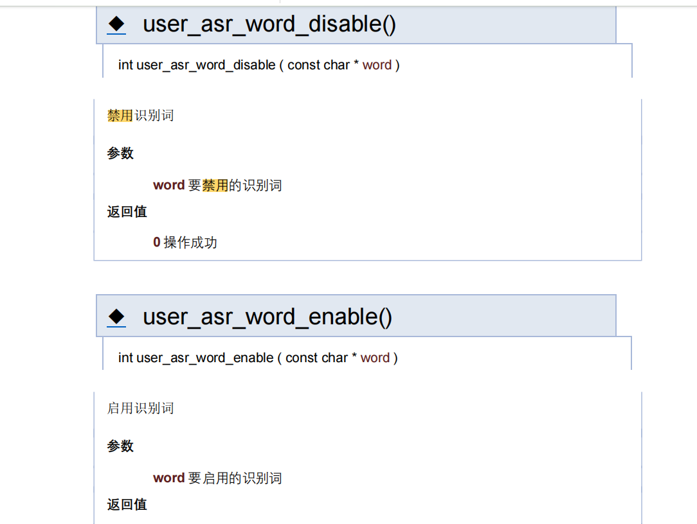

*user_asr_word_disable()和user_asr_word_enable()函数说明*

**方法二：全局禁用语音识别**

如果无法确定具体会触发的命令词，可以在播放期间全局关闭语音识别：

```c
// 播放开始时全局禁用识别
user_asr_recognize_disable();

// 播放结束后重新启用
user_asr_recognize_enable();
```

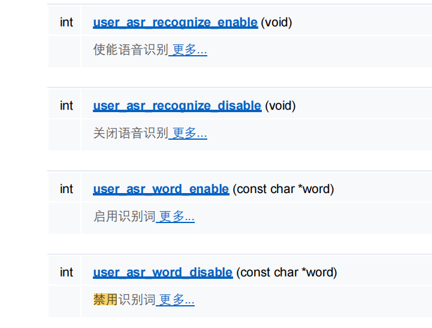

*user_asr_recognize_disable()和user_asr_recognize_enable()函数说明*

**实现方案：**

1. **事件触发机制**：

    - 设置播音开始事件
    - 在事件处理中执行禁用操作
    - 设置播音结束事件
    - 在事件处理中恢复识别功能

2. **函数参数说明**：

    - `user_asr_word_disable()`：禁用指定的识别词，需传入具体的词
    - `user_asr_word_enable()`：启用指定的识别词，需传入具体的词
    - `user_asr_recognize_disable()`：全局关闭语音识别功能
    - `user_asr_recognize_enable()`：全局开启语音识别功能

3. **应用场景选择**：

    - 如知道具体触发词：使用方法一，禁用特定词
    - 如无法确定触发词：使用方法二，全局禁用

**注意事项：**

- 函数的具体参数需要根据实际SDK文档确认
- 禁用识别后无法进行语音交互，需确保及时恢复
- 建议在播放关键提示音时使用此功能
- 测试各种场景确保功能稳定性

---

### CI-03T接双麦克风后为什么不回应？

**问题描述：**

CI-03T模块接了双麦克风，喇叭能播放欢迎词，但呼叫小智无回复。

**解决方案：**

**问题分析：**

接了双麦克风但不回应，通常是因为平台配置未选择双麦克风模式。

**解决步骤：**

1. **检查平台配置**：

    - 登录智能公元平台
    - 进入对应项目配置
    - 找到前端信号处理或麦克风配置选项
    - 确认选择了"双MIC"而非"单MIC"

2. **确认硬件连接**：

    - 检查两个麦克风是否正确连接到MK1和MK2引脚
    - 确认麦克风规格符合模块要求
    - 验证接线无误，无虚焊或短路

3. **重新生成固件**：

    - 修改配置为双麦克风模式
    - 保存配置并生成新固件
    - 重新烧录到模块
    - 测试唤醒功能

**配置说明：**

1. **单MIC模式**：

    - 只使用MK1麦克风输入
    - 适用于单麦克风应用场景
    - 配置相对简单

2. **双MIC模式**：

    - 同时使用MK1和MK2麦克风
    - 支持降噪和声源定位
    - 适合嘈杂环境使用

**功能特点：**

- **双麦克风优势**：

    - 更好的噪声抑制能力
    - 提升远场识别效果
    - 支持声学回声消除

- **配置要求**：

    - 必须在平台选择对应模式
    - 硬件需要连接两个麦克风
    - 固件必须与配置匹配

**注意事项：**

- 接双麦克风但平台选单MIC，会导致无法正常唤醒
- 配置双MIC后必须重新烧录固件
- 建议使用规格匹配的麦克风
- 测试时确保环境噪音适度

---

### 如何测试双麦克风模块的咪头？

**问题描述：**

拿到新的双麦克风模块后，需要先测试喇叭和咪头是否正常工作。

**解决方案：**

**测试步骤：**

1. **基础功能测试**：

    - 给模块上电
    - 听是否有开机提示音
    - 确认喇叭工作正常

2. **咪头测试方法**：

    - 使用出厂固件进行测试
    - 对着麦克风说话测试
    - 观察串口输出或GPIO响应

3. **单麦克风测试**：

    - 如双麦不响应，先接单麦测试
    - 只连接MK1麦克风
    - 确认单麦克风模式工作正常

**测试要点：**

1. **喇叭测试**：

    - 有开机提示音说明喇叭正常
    - 无提示音检查喇叭连接
    - 确认功放电路工作

2. **咪头测试**：

    - 在安静环境下测试
    - 距离麦克风5-10cm
    - 使用标准音量说话

3. **逐步排查**：

    - 先测试单麦克风功能
    - 确认基础功能正常
    - 再测试双麦克风配置

**故障处理：**

- 单麦克风不工作：检查麦克风连接和供电
- 双麦克风无响应：确认平台配置为双MIC模式
- 完全无反应：检查电源和固件是否正常

---

### CI-03T语音指令无法识别怎么办？

**问题描述：**

CI-03T1离线语音识别芯片无法正常识别语音指令，设备没有响应。

**解决方案：**

1. **基础检查**：

    - 确认模块已正常上电
    - 检查是否有开机提示音
    - 验证麦克风连接是否正确

2. **环境因素优化**：

    - 在安静环境下测试（35dB以下）
    - 保持距离麦克风5-10cm
    - 使用标准音量清晰发音

3. **指令重新录制**：

    - 在平台重新录制语音指令
    - 确保录制环境安静无杂音
    - 使用标准普通话录制

4. **固件重新生成**：

    - 检查唤醒词和命令词配置
    - 调整识别阈值参数
    - 重新生成并烧录固件

**可能原因：**

- 麦克风连接松动或损坏
- 环境噪声过大影响识别
- 语音指令录制质量不佳
- 固件配置参数错误

**注意事项：**

- CI-03T支持300条词条，注意不要超出限制
- 录制指令时避免背景音干扰
- 建议使用原厂推荐的麦克风型号
- 识别问题通常是配置而非硬件故障

---

### CI-03T1烧录后发烫且无法唤醒怎么办？

**问题描述：**

CI-03T1模块在烧录后出现发烫现象，无法正常唤醒和播报语音。

**解决方案：**

1. **立即断电检查**

    - 立即断开电源连接
    - 等待模块完全冷却
    - 不要尝试再次上电

2. **发烫原因分析**

    - 可能是功放芯片区域过热
    - 检查主控芯片温度
    - 确认没有短路现象

3. **测试步骤**

    - 单独给模块供电测试
    - 使用串口助手检查通信
    - 发送命令测试各功能

4. **注意事项**

    - 烧录前断开喇叭连接
    - 发烫时暂停使用避免损坏
    - 如问题持续，需要更换模块

---


### CI-03T和SU-03T是否支持自定义免唤醒词？

**问题描述：**

需要了解CI-03T和SU-03T是否支持自定义免唤醒命令词，以及如何设置。

**解决方案：**

- **支持自定义**：CI-03T和SU-03T均支持自定义免唤醒命令词
- **小程序设置**：可通过小程序界面进行免唤醒词配置
- **数量限制**：免唤醒命令词总数不超过20条（含唤醒词）

**设置步骤：**

1. **进入免唤醒设置**
    - 在小程序中找到"免唤醒"设置选项
    - 查看可选择的预设命令词列表

2. **选择命令词**
    - 从左侧可选项中选择需要的命令词
    - 点击移动按钮将命令词移到右侧已选列表

3. **保存配置**
    - 确认选择的命令词
    - 保存配置到模块

**注意事项：**

- 免唤醒词需要配合唤醒词一起使用
- 不同固件版本可能支持的命令词数量不同
- 建议参考官方教程视频了解详细操作
- 自定义命令词需在平台支持下进行设置

---


---

### CI-03T的哭声检测功能如何配置和使用？

**问题描述：**

CI-03T芯片的产品特性中有'哭声检测'选项，但不知道如何配置和使用。

**解决方案：**

**功能说明：**

- 哭声检测是CI-03T的特殊功能之一
- 可用于智能家居监控、婴儿监护等场景
- 检测到哭声后可触发相应动作

**配置步骤：**

**1. 在智能公元平台配置**

- 登录智能公元平台
- 进入CI-03T产品配置页面
- 找到'前端信号处理'部分
- 麦克风配置选择'单MIC'或'双MIC'
- 在'产品特性'下拉菜单中选择'哭声检测'

**2. 设置触发响应**

- 配置检测到哭声后的动作
- 可设置为播报语音、发送串口数据等
- 根据应用场景选择合适的响应方式

**3. 生成和烧录固件**

- 完成配置后生成固件
- 使用标准烧录流程烧录到模块
- 上电测试哭声检测功能

**应用场景：**

- 婴儿监护：检测哭声后自动播放安抚音乐
- 安防报警：作为异常声音检测触发报警
- 智能关怀：识别特定声音后通知家人

**注意事项：**

- 哭声检测功能需要安静的环境进行校准
- 不同哭声类型（婴儿、成人）检测率可能不同
- 建议多次测试调整灵敏度设置
- 该功能可能占用部分命令词资源

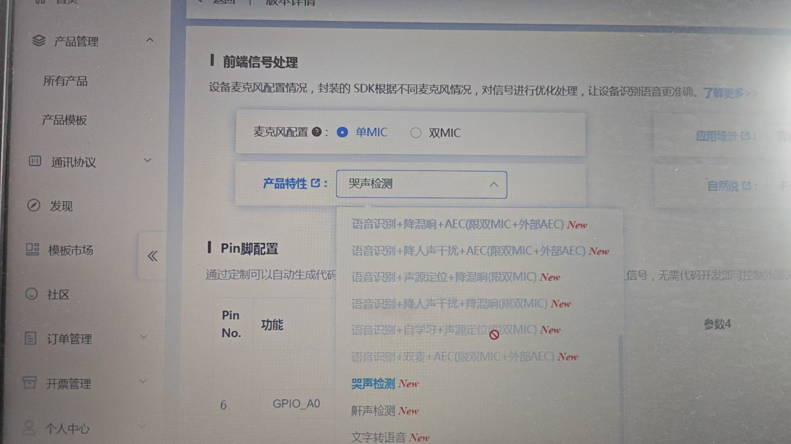

---

### CI-03T自学习命令词如何保持免唤醒功能？

**问题描述：**

CI-03T使用自学习功能学习新命令词后，如何替换原有的免唤醒命令词，使新学习的命令词也能保持免唤醒功能。

**解决方案：**

**自学习功能说明：**

- 自学习功能可以让用户现场录入命令词
- 学习后的命令词会添加到现有命令词列表中
- 原有的免唤醒设置不会自动迁移到新命令词

**保持免唤醒的方法：**

1. **重新配置平台设置**：

    - 在智能公元平台中添加自学习的命令词
    - 将新命令词设置为免唤醒模式
    - 重新生成并烧录固件

2. **使用命令词覆盖**：

    - 自学习后，通过配置替换原有命令词
    - 将需要免唤醒的词条重新配置
    - 确保配置的完整性

**操作建议：**

- 先在平台配置好所有需要免唤醒的命令词
- 自学习功能作为临时补充或测试使用
- 正式使用建议通过平台配置固件

**注意事项：**

- 自学习功能主要用于现场调试和快速验证
- 批量生产建议使用平台预配置方式
- 免唤醒功能需要在平台中明确设置


---

### CI-03T1一个命令词控制两个端口如何执行？

**问题描述：**

CI-03T1模块配置一个命令词同时控制两个端口时，需要了解是同时执行还是串行执行。

**解决方案：**

**执行方式：**

- **同时执行**：一个命令词配置的多个端口会**同时**触发
- 两个GPIO引脚在同一时间点被取反
- 不存在先后顺序或延迟执行

**配置示例：**

- 命令词"变色"配置控制GPIO_A2的端口7和6
- 触发时两个端口同时执行"反电平"操作
- 实现多路同步控制效果

**应用场景：**

- 需要多个动作同时完成的场景
- 同步控制多个设备
- 实现复杂的组合逻辑

**串口通信注意事项：**

- 烧录时B5(TX)接RX，B6(RX)接TX（需要反接）
- 正常通信时TX/RX需要交叉连接
- 配置的串口引脚需与实际接线一致


*一个命令词配置两个GPIO_A2端口*

**限制说明：**

- 如需要更复杂的控制逻辑，需要MCU参与
- 纯语音模块只能实现同时触发
- 串行或条件控制需要外部控制器实现

---

### 鼾声检测功能GPIO输出异常如何排查？

**问题描述：**

使用鼾声检测固件时，GPIO A5引脚一直输出低电平，不符合"平时为高电平，检测到鼾声或哭声时输出100ms低电平"的预期行为。

**解决方案：**

- **基础检查步骤**：

    1. **确认引脚连接**：

        - 检查示波器探头是否正确连接到A5引脚
        - 确认地线连接良好
        - 验证供电电压为5V（CI-03T1需要5V供电）

    2. **固件验证**：

        - 确认烧录的是正确的鼾声检测固件
        - 重新烧录官方提供的测试固件
        - 使用标准鼾声音频文件测试

    3. **硬件检查**：

        - CI-03T1需要外部晶振（12.288MHz）
        - 确认晶振焊接正确且参数匹配
        - 检查模块型号是否为CI-03T1（非CI-03T2）

- **测试方法**：

    1. **使用标准测试音频**：

        - 播放提供的鼾声测试音频文件
        - 音频文件需要靠近麦克风
        - 确保环境相对安静

    2. **电压测量**：

        - 使用万用表测量A5引脚静态电压
        - 正常情况下应为3.3V高电平
        - 检测到鼾声时短暂变为0V

- **常见问题处理**：

    - **持续低电平**：

        1. 检查固件版本是否正确
        2. 确认晶振已焊接并工作
        3. 测试其他GPIO引脚是否正常

    - **无任何响应**：

        1. 检查供电是否稳定
        2. 确认麦克风连接正常
        3. 重新生成并烧录固件

**注意事项：**

- CI-03T1必须使用外部晶振才能正常工作
- 鼾声检测功能需要专门的固件支持

---

### CI-03T双麦唤醒距离过近怎么办？

**问题描述：**

使用的双麦CI-03T需要靠很近才能唤醒，询问是否需要调整参数以改善唤醒距离。

**解决方案：**

**1. 唤醒阈值调整**

通过调整唤醒阈值来改善灵敏度：


- **阈值范围**：0.1至0.8
- **当前设置**：图中显示为0.8（较高）
- **建议调整**：适当降低阈值提高灵敏度

**2. 调优步骤**

逐步优化唤醒距离：

1. **初始测试**
    - 记录当前能唤醒的最大距离
    - 确认环境噪声水平
    - 选择合适的测试位置

2. **阈值调整**
    - 将阈值从0.8逐步降低
    - 每次调整0.1-0.2
    - 测试每次调整后的效果

3. **平衡设置**
    - 找到灵敏度和误触发的平衡点
    - 避免过于灵敏导致误触发
    - 确保在合理距离内稳定唤醒

**3. 其他影响因素**

检查可能影响唤醒距离的因素：

- **麦克风状态**：

    - 确认麦克风工作正常
    - 检查麦克风电压（1.6-1.7V）
    - 验证麦克风连接牢固

- **环境因素**：

    - 减少背景噪声干扰
    - 避免正对声源或风口
    - 确保相对安静的测试环境

- **硬件检查**：

    - 确认为双麦版本
    - 检查PCB是否为正品
    - 验证供电电压稳定

**4. 高级优化**

如基础调整效果有限：

- **固件更新**：使用最新版本固件
- **声学结构**：优化麦克风位置和朝向
- **算法选择**：尝试不同的唤醒算法
- **硬件升级**：考虑使用更高级型号

**注意事项：**

- 阈值过低可能导致误唤醒
- 调整后需要充分测试各种场景
- 双麦版本应比单麦版本有更好的距离表现
- 如问题持续存在，可能是硬件故障


- 测试时使用标准鼾声音频确保触发
- 如果所有方法都无效，可能是模块硬件问题

---

### CI-03T1模块喇叭声音特别小怎么办？

**问题描述：**

CI-03T1模块的喇叭声音特别小，影响正常使用。

**解决方案：**

**1. 调整音量参数**

    - 进入设备配置界面
    - 找到音量设置选项
    - 将音量值调大（从默认75调至80-90）

**2. 检查硬件连接**

    - 确认喇叭正负极连接正确
    - 检查喇叭功率匹配（推荐8欧姆0.5W）
    - 确保连接线无虚接

**注意事项：**

- 音量设置过大会导致失真
- 建议根据实际环境需求调整
- 如仍有问题，可尝试更换喇叭测试


---

### CI-03T对韩语的识别度如何？

**问题描述：**

测试发现CI-03T对韩语的识别效果不如中文，需要了解实际表现和优化方法。

**解决方案：**

**1. 识别能力说明**

- **中文识别**：识别度最高，为优化语言
- **其他语种**：识别度相对较低
- **韩语表现**：确实不如中文识别效果好

**2. 优化建议**

1. **精选关键词汇**：

    - 选择识别度高的韩语词汇
    - 避免使用发音相似的词
    - 使用简单明确的指令词

2. **多次测试筛选**：

    - 录入多个韩语词汇进行测试
    - 筛选出识别效果最好的词
    - 保留效果好的词汇作为命令词

3. **发音优化**：

    - 使用标准韩语发音
    - 避免口音过重
    - 保持发音一致性

**3. 替代方案**

1. **AI生成语音**：

    - 使用AI工具生成标准韩语发音
    - 将生成的语音用于测试
    - 选择识别效果最好的音频

2. **寻找母语者协助**：

    - 请韩语母语者录制命令词
    - 确保发音标准准确
    - 使用标准发音进行配置

**注意事项：**

- 韩语识别确实比中文识别效果差
- 建议通过实际测试筛选最佳词汇
- 如要求高识别率，建议使用中文命令词
- 可考虑混合使用中韩语命令词

---

### CI-03T1和CI-03T2支持哪些语言？

**问题描述：**

确认CI-03T1和CI-03T2芯片是否已支持韩语和日语语音指令，以及英语语音合成质量是否可接受。

**解决方案：**

**1. 语言支持现状**

- **中文识别**：识别度最高，为优化语言
- **韩语支持**：

    - 平台已支持韩语命令词识别
    - 韩语一直可以使用
    - 识别效果相比中文略差，但基本可用
- **日语支持**：

    - 平台已支持日语命令词识别
    - 识别效果与韩语相当
- **英语语音合成**：

    - 支持英语TTS播报
    - 机器人音质较为明显
    - 适合简单提示，不适合长对话

**2. 使用建议**

- **命令词选择**：

    - 中文命令词：识别效果最佳
    - 韩语/日语命令词：建议选择发音差异大的词汇
    - 避免使用发音相似的命令词

- **语音合成优化**：

    - 英语播报：适合简短指令提示
    - 长文本：建议分段播报
    - 重要提示：可考虑使用中文播报

**3. 配置方法**

1. **语言选择**：

    - 在平台配置界面选择目标语言
    - 支持中、韩、日、英四种语言
    - 不同语言可混合使用

2. **测试验证**：

    - 录入命令词进行识别测试
    - 筛选识别效果好的词汇
    - 测试不同语言的播报效果

**注意事项：**

- 韩语和日语识别需要标准发音
- 英语TTS音质偏向机械感，适合功能性提示
- 如对音质要求高，建议使用中文或联系定制服务
- 多语言混合使用时，确保命令词不冲突

---

### CI-03T开机播报功能与免唤醒词冲突怎么办？

**问题描述：**

在使用CI-03T时，当通过变量控制开启开机播报功能后，设备无法识别任何免唤醒命令词；但不开启播报功能时，免唤醒词可以正常识别。

**解决方案：**

**1. 问题分析**

- **变量控制逻辑**：使用volume_set变量控制开机播报（volume_set=1时播报）
- **冲突现象**：开启播报后，所有免唤醒命令词都无法识别
- **根本原因**：开机播报与语音识别功能在时序上存在冲突

**2. 解决方法**

**方法一：添加延时缓冲**

- 在播放操作前增加延时设置
- 上电后等待系统稳定再执行播报
- 避免播报影响语音识别初始化


**方法二：优化免唤醒词配置**

- 检查免唤醒词设置是否正确
- 确认只有可识别的词被设置为免唤醒
- 避免使用无法识别的词汇

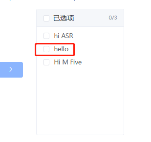

**方法三：检查唤醒词设置**

- 确认默认唤醒词配置正确
- 避免唤醒词设置影响免唤醒功能
- 必要时禁用默认唤醒词

**3. 配置示例**

正确的控制流程配置：

1. **power_on事件触发**
    - 条件：volume_set = 1
    - 动作：播放语音"Hello, I'm ASR"
    - 延时：建议添加100-200ms延时

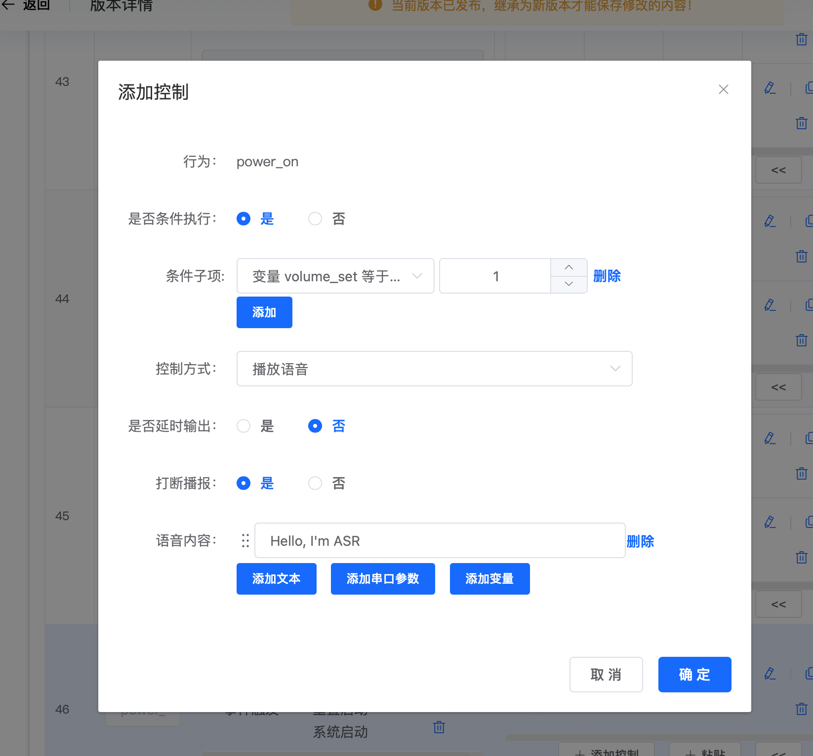

2. **免唤醒词独立设置**
    - 不与开机播报共用控制逻辑
    - 确保每个免唤醒词都有独立的行为ID
    - 测试验证每个词的识别效果

**注意事项：**

- 开机播报和语音识别需要足够的初始化时间
- 建议在播报前添加延时，让系统完全启动
- 免唤醒词的识别效果受环境噪声影响
- 如果问题持续，可考虑不使用开机播报功能

---

### CI-03T唤醒词和免唤醒命令词行为ID配置问题

**问题描述：**

配置的唤醒词触发后发送串口消息99，其他免唤醒命令词触发后也发送99（实际配置的是其他串口输出）。

**解决方案：**

**1. 行为ID说明**

    - 唤醒词和免唤醒命令词不共用同一个行为ID
    - 两者是独立的触发机制
    - 需要分别配置对应的行为

**2. 配置检查步骤**

    - 导出产品配置JSON文件
    - 检查命令词的行为ID配置
    - 确认每个命令词对应的串口输出设置

**3. 排查方法**

    - 在智能公元平台点击"导出"获取配置文件
    - 查看固件版本列表，选择正确的测试版本
    - 对比配置文件中的行为ID设置

**注意事项：**

- 免唤醒命令词需要单独配置行为ID
- 如果所有命令词都发送相同消息，可能是平台配置错误
- 建议导出配置文件检查具体设置
- 重新生成固件前确认配置正确

---

### CI-03T语音控制舵机无反应怎么办？

**问题描述：**

使用CI-03T语音识别芯片控制舵机时，语音识别正常且有回复语音，但舵机无反应，重新烧录程序后问题依旧存在。

**解决方案：**

**1. 占空比配置检查**

- 检查平台配置中GPIO输出的PWM占空比设置
- 0度对应2.5%占空比，180度对应12.5%占空比
- 避免使用极值：2.5%占空比可能导致舵机无法复位

**2. 占空比调整建议**

- 0度位置：建议设置为4%（略高于2.5%极值）
- 90度位置：设置7.5%占空比
- 180度位置：设置12.5%占空比

**3. 舵机控制参数（100Hz）**
| 角度 | 脉冲周期(ms) | 高电平时间(ms) | 占空比 |
|------|-------------|---------------|--------|
| 0°   | 20          | 0.5           | 2.5%   |
| 45°  | 20          | 1.0           | 5.0%   |
| 90°  | 20          | 1.5           | 7.5%   |
| 135° | 20          | 2.0           | 10.0%  |
| 180° | 20          | 2.5           | 12.5%  |

**4. 排查步骤**

- 确认语音识别有响应（说明语音功能正常）
- 检查平台配置中的占空比参数
- 使用万用表测量GPIO输出是否正常
- 单独测试舵机是否工作正常

**注意事项：**

- 舵机在极值位置（0°或180°）可能无法复位
- 占空比设置为2.5%时，舵机可能无法转到0°位置
- 建议使用稍大于极值的占空比确保可靠动作
- 如需精确控制，可参考提供的占空比计算工具

---

### CI-03T如何实现一个命令词多个回复词随机回复？

**问题描述：**

询问CI-03T模块是否支持一个欢迎词触发后随机回复多个预设回复词的功能。

**解决方案：**

**1. 随机回复语法**

- CI-03T支持使用竖线（|）分隔多个回复词
- 触发命令词时系统会随机选择其中一个回复
- 适用于所有语音指令的回复设置

**2. 配置方法**

- 在命令词的回复语后添加竖线分隔符
- 配置格式：`命令词|回复1|回复2|回复3`
- 示例：`欢迎词|您好！欢迎光临|很高兴见到您|欢迎回来！`

**3. 应用场景**

- 欢迎语：避免单调的重复欢迎
- 状态反馈：多样化的响应方式
- 交互体验：提升用户使用体验

**注意事项：**

- 确保使用英文竖线符号（|）分隔
- 每个回复词的长度建议适中
- 分隔符前后不要添加空格
- 需要重新生成固件才能生效

---

### CI-03T播放音乐时如何实现语音控制暂停功能？

**问题描述：**

在使用CI-03T1芯片播放音乐时，尝试通过语音指令实现暂停播放功能，但添加暂停指令和控制命令后无法正常工作。

**解决方案：**

**1. 功能限制说明**

- **技术要求**：语音打断播放功能需要AEC（声学回声消除）支持
- **芯片支持**：仅CI-03T/CI-33T系列模块支持AEC打断功能
- **功能原理**：通过AEC技术消除扬声器回声，确保在播放音乐时能准确识别语音命令

**2. AEC技术原理**

AEC（Acoustic Echo Cancellation，声学回声消除）在此场景中的作用：

- **去除扬声器回声**：避免麦克风拾取扬声器播放的音乐声音，干扰语音识别
- **语音优先处理**：在用户讲话时，动态降低或暂停音乐音量
- **确保识别准确**：在背景音（音乐）存在的情况下，保证语音识别的准确性

**3. 实现条件**

- **硬件支持**：必须使用支持AEC功能的模块型号
- **正确配置**：需要在配置中启用AEC相关功能
- **算法支持**：模块内置的AEC算法处理回声消除

**注意事项：**

- 不是所有语音模块都支持AEC打断功能
- 启用AEC功能可能会增加一定的处理延迟
- 建议在安静环境下测试AEC打断功能的效果
- 如项目需要频繁的语音打断功能，建议优先选择支持AEC的模块型号

---

### CI-03T英文关键词识别效果不佳怎么办？

**问题描述：**

使用CI-03T模块进行英文关键词识别测试时，发现识别效果不理想，询问是否有专门的英文测试固件。

**解决方案：**

**1. 英文识别特点**

- CI-03T模块对英文的识别支持相对有限
- 英文关键词的识别率通常低于中文
- 目前没有专门的英文测试固件提供

**2. 优化建议**

- 增加英文关键词的数量，建立多个唤醒词
- 尝试使用不同的英文发音和口音进行训练
- 选择发音清晰、区别度高的英文单词

**3. 替代方案**

- 如果项目对英文识别要求较高，建议考虑其他型号
- SU-63T等新型号在英文识别方面可能有所改进
- 评估项目需求，确认是否必须使用英文识别

**注意事项：**

- 英文识别效果不佳是硬件特性，非故障问题
- 多建几个唤醒词进行测试，找到效果较好的组合
- 如需高识别率的英文语音识别，建议咨询技术支持获取合适的型号推荐

---

### CI-03T运行过程中出现不规律死机怎么办？

**问题描述：**

CI-03T模块在运行过程中出现不规律死机现象，表现为上一个语音命令能正常执行，但下一个命令无法执行，重启后恢复正常，且出现频率较高。

**解决方案：**

**问题分析：**

- 死机具有偶发性，无固定触发条件
- 重启后功能暂时恢复正常
- 可能是软件或硬件稳定性问题

**排查步骤：**

1. **电源稳定性检查**

    - 测量工作电压是否稳定在3.3V
    - 检查电源纹波和噪声水平
    - 确认供电能力充足（预留30%余量）
    - 使用示波器观察电源质量

2. **散热状况检查**

    - 触摸芯片表面温度是否过高
    - 检查通风散热设计是否合理
    - 长时间运行后观察死机频率变化
    - 改善散热或降低工作环境温度

3. **固件兼容性**

    - 确认使用的固件版本稳定
    - 避免使用测试版或非正式版本
    - 尝试回退到之前的稳定版本
    - 重新生成固件排除配置问题

**可能原因：**

1. **软件Bug**

    - 固件存在内存泄漏或资源竞争
    - 特定语音指令触发程序异常
    - 中断处理或任务调度问题

2. **硬件问题**

    - 芯片质量不稳定，有缺陷
    - 焊接不良导致接触电阻变化
    - 外部干扰信号影响芯片工作

3. **系统资源耗尽**

    - 内存碎片化导致分配失败
    - 句柄或资源未正确释放
    - 缓冲区溢出影响程序运行

**解决方法：**

1. **基础解决方案**

    - 定时重启预防死机积累
    - 增加硬件看门狗自动恢复
    - 优化语音指令的使用间隔

2. **固件优化**

    - 减少同时运行的功能模块
    - 优化代码减少资源占用
    - 增加异常捕获和自动恢复

3. **硬件改进**

    - 增加电源滤波和稳压电路
    - 优化PCB布局减少干扰
    - 增加散热片或风扇

**测试验证：**

- 记录死机发生时的具体条件
- 监测死机前的系统状态
- 通过日志分析定位问题根因
- 使用最小配置测试排除干扰因素

**注意事项：**

- 偶发性死机问题通常需要长期观察
- 保留完整的故障记录便于分析
- 如问题频繁出现，建议更换模块
- 联系技术支持获取针对性固件更新

---

### CI-03T1/CI-03T2 自学习功能成功率低怎么办？

**问题描述：**

在使用CI-03T1或CI-03T2芯片产品时，即使在优化环境和发音标准的情况下，自学习功能成功率仍然较低。

**解决方案：**

**1. 优化固件版本**

- 使用优化版本固件：将学习次数从3次减少为2次，可提高自学习成功概率
- 联系技术支持获取最新的自学习优化固件

**2. 环境优化措施**

- 保证环境安静：自学习时避免周围有噪声干扰
- 靠近咪头发音：声源尽量接近麦克风
- 标准普通话：发音尽可能与标准普通话接近

**3. 词汇选择建议**

- 避免生僻字：不包含生僻字、多音字的词汇
- 使用高频词：选择日常使用频率很高的常用词汇
- 正对咪头：进行自学习时，正对着咪头喊话

**4. 技术限制说明**

- 语音处理算法限制：目前软件算法方面无法做到非常好的优化
- 自学习次数限制：第二次、第三次学习容易受外界干扰导致失败
- 建议减少学习次数：通过固件优化减少学习次数可以提高成功率

**注意事项：**

- 自学习对环境要求较高，需在安静环境下进行
- 每次学习尽量保持相同的发音和距离
- 如持续失败，建议考虑使用预设词条替代自学习功能

---

### CI-03T1配置后无法唤醒怎么办？

**问题描述：**

配置CI-03T1芯片的唤醒词和命令词后，生成SDK并烧录到设备，发现设备无法被唤醒。

**解决方案：**

1. **检查配置参数**：

    - 确认唤醒词和命令词设置正确
    - 验证识别灵敏度设置是否合理
    - 检查是否遗漏必要的配置选项

2. **重新生成SDK**：

    - 配置修改后需要重新生成SDK
    - 确保使用最新生成的固件文件
    - 避免使用旧版本的固件

**验证步骤：**

1. 重新生成SDK并下载固件
2. 重新烧录到设备
3. 测试唤醒功能是否恢复正常

**注意事项：**

- 每次修改配置后都必须重新生成SDK
- 烧录完成后建议重启设备测试
- 如果问题持续存在，请检查硬件连接

---

### 如何避免相似命令词被误识别？

**问题描述：**

在存在背景干扰音的情况下，CI-03T1芯片将相似的命令词（如"左"和"右"）识别错误，导致"左声道测试"被误识别为"右声道测试"，或反之。

**解决方案：**

1. **优化命令词设计**：

    - 避免使用过于相似的命令词
    - 增加**命令词的差异化特征
    - 例如：将"左声道测试"改为"测试左声道"，"右声道测试"保持不变

2. **调整识别灵敏度**：

    - 适当降低命令词识别灵敏度（如从0.8降至0.1）
    - 减少因高灵敏度导致的误识别
    - 平衡识别率和准确性

3. **设置防误识别词**：

    - 在防误识别词中添加容易混淆的词汇
    - 例如：添加"测试左"防止"测试右"被误识别
    - 或添加"右声道"防止"左声道"被误识别

**注意事项：**

- 命令词差异越大，识别准确率越高
- 灵敏度设置需要通过实际测试找到最佳值
- 在有噪音的环境下，建议使用更明显的差异化词汇

---

### 如何配置自然说功能实现多意图识别？

**问题描述：**

需要在平台配置自然说功能，支持对用户自然语言输入（如"给我把灯打开"）进行多意图识别，并仅执行核心指令（如"开灯"）。

**解决方案：**

**1. 前端信号处理配置**

在前端信号处理中进行基础设置：

- 麦克风配置：选择"单MIC"或根据实际硬件配置
- 产品特性：勾选"语音识别+声纹识别"
- 自然说选项：选择"系统自动化+用户指定泛化"模式

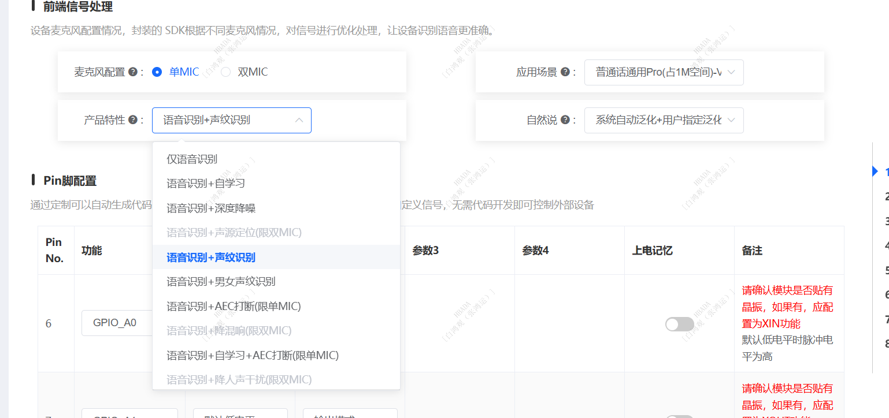

*前端信号处理中自然说功能的初始设置*

**2. 自然说模式选择**

在自然说配置中选择正确的模式：

- 推荐使用"用户指定泛化"模式
- 该模式支持自定义泛化规则
- 可以精确控制识别范围


*用户指定泛化模式配置界面*

**3. 命令词自定义设置**

在命令词自定义中精细设置：

- 为每个核心功能设置命令词（如"打开台灯"、"关闭台灯"）
- 配置对应的触发方式和回复语
- 确保命令词简洁明确

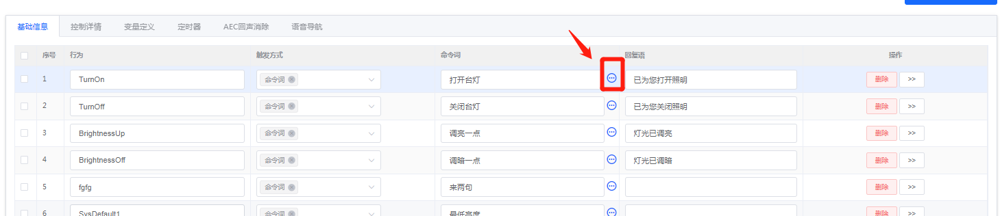

*命令词自定义中的具体配置示例*

**配置要点：**

1. **泛化词设计**
    - 前缀词：如"请帮我"、"给我把"等
    - 主词：核心功能词，如"开灯"、"关灯"
    - 避免重复的泛化组合

2. **识别逻辑**
    - 系统会自动过滤前缀词
    - 提取主词作为核心指令
    - 执行对应的控制动作

3. **测试验证**
    - 使用多种表达方式测试
    - 确认都能正确识别核心意图
    - 验证不会误触发其他指令

**注意事项：**

- 自然说功能会增加系统资源消耗
- 建议先在小范围测试后再全面应用
- 定期检查并清理不需要的泛化词
- 保持主词的独特性，避免相似命令冲突

---

### CI-03T在噪声环境下识别效果差且正常语速识别率低怎么办？

**问题描述：**

CI-03T模块在噪声环境下语音识别效果差，在安静环境中正常语速说话时识别率低，需要优化识别效果。

**解决方案：**

**1. 噪声环境优化**

- 调整命令识别阈值至0.8，提高识别准确性
- 选择"普通通话通用Pro"应用场景，支持语音识别+深度降噪
- 使用双麦克风配置，提升噪声抑制能力


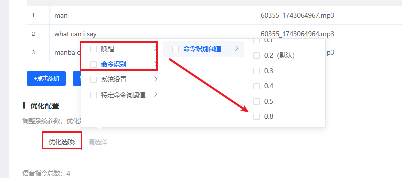

**2. 正常语速识别优化**

开启自然说功能并配置命令词泛化：

- 在前端信号处理中开启"自然说"功能
- 为命令词添加同音或易混淆的泛化词
- 处理正常语速下的发音重叠问题
- 正确配置前缀词和主词的位置

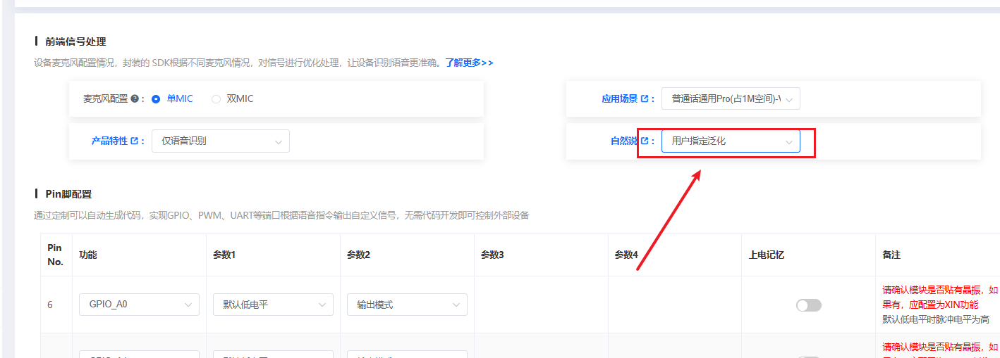


**前缀词配置注意事项：**

- **前缀词会被算法省略**，不能包含关键动作词
- **错误做法**：将"打开"等动作词设为前缀
    - 前缀："打开"，主词："空调"
    - 系统会省略"打开"，只识别"空调"

- **正确做法**：

    - 前缀："请|帮我|麻烦你"
    - 主词："打开空调|关闭空调"
    - 动作词必须放在主词位置

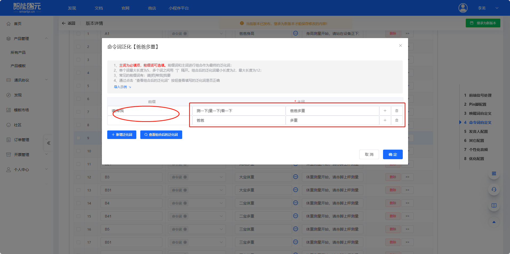

**调试方法：**

查看设备日志，识别配置问题：

- cmd_id: 65535 表示未匹配到命令
- semantic_id: ffffffff 表示语义识别失败
- not match 提示表示命令词不匹配

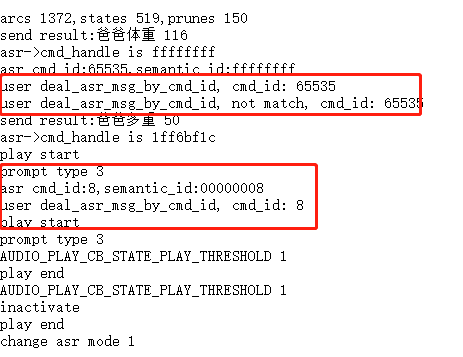

**3. 泛化词配置步骤**

1. 添加主要命令词的泛化词：

    - 例如："告诉我温度数据"→"告诉我二氧华诞的书局"
    - 例如："告诉我二氧化碳的数据"→"告诉我二氧华探的数据"

2. 批量添加可能的同音词组合

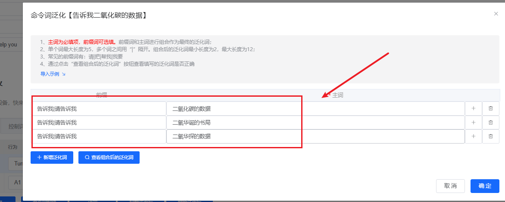

3. 使用检查功能确保无重复泛化词

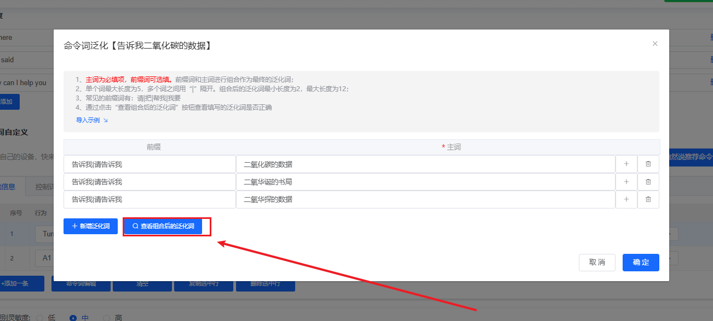

**注意事项：**

- 泛化词应是平时说话时模块可能误会的同音字
- 可以添加多个同音字组合，如"二氧华诞"、"二氧华旦"等
- 噪声环境下建议使用双麦克风版本
- 阈值调整需要平衡识别率和误触发率

---

### CI-03T如何实现变量计数功能进行误识别率测试？

**问题描述：**

需要测试语音模块与板子的适配性，希望通过变量计数功能记录误识别次数，并通过语音播报当前计数，避免频繁连接电脑查看。

**解决方案：**

**1. 变量计数实现原理**

- 添加计数变量X，每次识别触发时X加1
- 通过语音播报输出当前变量值
- 实现离线测试，无需电脑连接

**2. 配置步骤**

- **添加变量**：

    - 在平台中创建计数变量X
    - 设置变量初始值为0

- **设置触发条件**：

    - 每次语音识别触发时
    - 变量X自动加1

- **配置播报输出**：

    - 添加播报动作
    - 输出变量X的当前值

**3. 实现方法**

- **基础配置**：

    - 为唤醒词或命令词添加计数功能
    - 每次识别成功后变量递增

- **播报设置**：

    - 使用变量播报功能
    - 播报内容："当前识别次数：X次"

- **测试流程**：

    - 触发语音识别
    - 系统自动计数
    - 实时播报统计结果

**4. 优势**

- **无需电脑**：完全离线测试
- **实时反馈**：即时获取测试数据
- **便捷高效**：适合长期稳定性测试
- **数据记录**：通过播报记录测试进度

**5. 应用场景**

- 焊接咪头的适配性测试
- 长期稳定性验证
- 环境干扰测试
- 批量产品抽检

**注意事项：**

- 变量输出只能通过播报实现
- 需要确保播报音量清晰可辨
- 测试环境应保持相对稳定
- 建议记录测试时间和条件

---

### CI-03T泛化词生成失败怎么办？

**问题描述：**

在使用CI-03T系列芯片的语音指令泛化词生成功能时，系统总是提示"生成失败：语言模型生成失败"。

**解决方案：**

**1. 泛化词配置规则**

严格遵循以下配置规则：

- **主词**：必填项
- **前缀词**：可选填
- **单个词最大长度**：5个字符
- **多个词分隔**：使用"|"分隔
- **组合后长度**：最小2，最大12
- **禁止重复**：组合后不应有重复的词

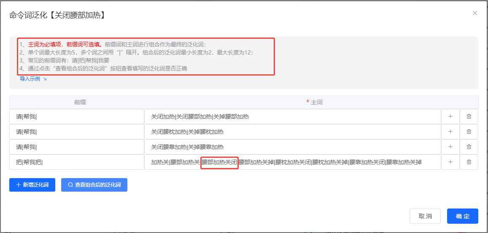

**2. 常见错误及解决方法**

**错误配置示例**：

- 主词包含过多重复内容
- 单个词长度超过5个字符
- 组合后总长度超过12个字符
- 存在重复的泛化词组合


系统提示错误：
```
生成失败: 语言模型生成失败
```


**3. 正确配置步骤**

- **检查单个词长度**：

    - 确保每个词不超过5个字符
    - 拆分过长的词语

- **优化组合结构**：

    - 减少不必要的重复
    - 精简泛化词数量
    - 确保组合合理

- **使用检查功能**：

    - 点击"查看组合后的泛化词"
    - 检查是否有重复或超长组合
    - 修正发现的问题

**4. 故障排除流程**

- **第一步**：检查所有配置是否符合规则
- **第二步**：使用检查功能验证组合结果
- **第三步**：修正不符合规则的配置
- **第四步**：重新生成并发布

**5. 预防措施**

- 在配置前仔细阅读规则说明
- 逐步添加泛化词，避免一次性过多
- 定期检查和清理无效配置
- 保存正确的配置模板供参考

---

### 如何解决因命令词前缀重复导致的误唤醒问题？

**问题描述：**

两个命令词容易相互唤醒，需要正确配置防误识别功能以提高识别准确性。

**解决方案：**

**1. 问题分析**

- 命令词前缀重复导致相互干扰
- 相似的语音结构容易误触发
- 需要优化命令词结构和防误识别配置

**2. 防误识别配置**

在"命令词自定义"设置下配置防误识别词：

- **功能位置**：命令词自定义 → 防误识别词
- **作用**：避免与唤醒词或命令词重复
- **效果**：减少误唤醒，提高识别准确性


**3. 优化策略**

- **减少前缀重复**：

    - 避免使用相同的前缀词
    - 使用差异化前缀如"请|帮我|麻烦你"
    - 不要把整个命令词作为防误识别词

- **优化命令词结构**：

    - 增加命令词之间的差异性
    - 避免使用过于相似的发音
    - 合理设置前缀和主词组合

- **使用防误识别词**：

    - 输入容易混淆的词组
    - 防止系统误识别
    - 定期更新防误识别词库

**4. 配置原则**

- **精简有效**：只添加必要的防误识别词
- **避免过度**：过多的防误识别词可能影响正常识别
- **定期测试**：验证防误识别效果
- **动态调整**：根据实际使用情况优化配置

**5. 验证方法**

- **交叉测试**：测试不同命令词是否相互干扰
- **环境测试**：在不同环境下验证识别效果
- **统计误唤醒率**：记录并分析误唤醒频率
- **持续优化**：根据测试结果调整配置

**注意事项：**

- 防误识别词不应包含正常命令词
- 定期清理无效的防误识别词
- 平衡识别率和误触发率
- 保持配置简洁有效

---

### CI-33T/CI-03T在高温环境中数字识别错误率高怎么办？

**问题描述：**

在高温老化试验箱环境中使用CI-33T/CI-03T进行语音识别时，报数字温度设定值的错误率较高，影响正常使用。

**解决方案：**

**1. 环境因素分析**

- 高温环境可能影响麦克风性能
- 试验箱内部声学环境复杂，存在反射和混响
- 设备运行时产生的噪声干扰

**2. 优化建议**

- 调整麦克风与声源的距离和角度
- 在试验箱内部添加吸音材料，减少声反射
- 选择设备运行间隙进行语音输入
- 考虑使用外接麦克风，远离热源和噪声源

**3. 配置调整**

- 增加识别阈值，降低误触发率
- 开启降噪功能（如使用双麦克风版本）
- 针对数字命令词进行重复训练

**注意事项：**

- 高温环境下电子元件性能可能发生变化
- 建议在常温环境下验证功能正常后，再进行高温测试
- 如问题持续，可考虑将语音模块移出高温区，通过延长线连接

---

### CI-03T1/CI-03T2固件烧录后命令词修改功能异常怎么办？

**问题描述：**

使用CI-03T1/CI-03T2模块时，固件烧录后出现命令词修改功能异常，部分命令词无法被唤醒，且小程序按钮功能不可用。

**解决方案：**

**1. 功能异常分析**

**可能原因：**

- 固件烧录过程中数据损坏
- 命令词配置文件格式错误
- 小程序与固件版本不匹配
- 模块内部存储区异常

**症状表现：**

- 部分命令词无法触发响应
- 小程序编辑按钮灰色不可用
- 修改后设置无法保存

**2. 诊断步骤**

**基础检查：**

- 确认模块供电正常（3.3V）
- 检查串口通信是否正常
- 验证麦克风和扬声器连接

**固件验证：**

- 重新下载原始固件文件
- 对比烧录前后文件大小
- 检查固件校验值（MD5/SHA256）

**3. 解决方法**

**重新烧录固件：**

1. 使用官方烧录工具
2. 选择正确的固件文件
3. 按照烧录流程操作
4. 烧录成功后恢复出厂设置

**命令词重新配置：**

1. 在小程序中删除所有命令词
2. 重新添加需要的命令词
3. 逐个测试每个命令词
4. 保存配置并重启模块

**4. 预防措施**

**开发建议：**

- 烧录前备份原始固件
- 使用稳定可靠的供电
- 避免烧录过程中断电
- 保留配置文件备份

**测试要点：**

- 每次修改后完整测试所有功能
- 记录异常命令词的特征
- 对比正常与异常命令词的差异

**5. 替代方案**

**硬件检查：**

- 如多次烧录仍有问题
- 检查模块是否物理损坏
- 考虑更换新模块测试
- 联系技术支持进行硬件检测

**注意事项：**

- CI-03T1和CI-03T2配置方法基本相同
- 确保小程序版本与固件兼容
- 命令词长度建议控制在4-6个汉字
- 复杂问题建议联系技术支持

---

### CI-03T自然说功能功耗高且泛化词重复导致生成失败怎么办？

**问题描述：**

在使用CI-03T模块时，发现自然说功能待机功耗较高（30-50mA），且因为泛化词重复导致无法生成语言模型。

**解决方案：**

**1. 功耗问题分析**

- CI-03T待机功耗约30-50mA
- 持续采集麦克风时功耗可能达到50mA+
- 高功耗原因：模块持续监听和处理语音信号


*固件生成成功后的状态显示*

**2. 泛化词重复问题**

- 自然说填写的泛化词有重复
- 系统检测到重复项会拒绝生成语言模型
- 需要检查并清理重复的泛化词组合

**3. 解决方案**

- 在平台中查看"查看组合后的泛化词"列表
- 删除所有重复的词组
- 确保每个泛化词组合都是唯一的

**4. 功耗优化建议**

如需更低功耗的模块：

- 现行支持自然说的只有CI-03T系列
- SU-03T系列芯片不同，不支持自然说功能
- SU-03T有深度休眠模式，功耗更低

**5. 配置建议**

- 精简自然说配置，减少泛化词数量
- 只配置必要的核心功能
- 定期清理不需要的泛化词

**注意事项：**

- CI-03T功耗较高的原因是支持自然说功能
- 泛化词越多，占用资源越多
- 生成前务必检查是否有重复项
- 建议批量编辑和验证泛化词，避免逐个添加

---

## 声源定位

### CI-03T如何实现声源定位功能？

**问题描述：**

需要在CI-03T系列芯片上实现声源定位功能，用于识别声音来源的方向角度，并结合关键词识别判断说话人位置。

**解决方案：**

**1. 功能配置**

- 在平台中开启声源定位功能
- 设置定位方式：唤醒词+命令词定位
- 配置双麦距离：推荐40mm
- 设置识别方位数：根据需求选择（如5个方位）


**2. 硬件要求**

- 必须使用双麦克风配置
- 前端信号处理中选择"语音识别+声源定位(限双MIC)"
- 确保两个麦克风正常工作

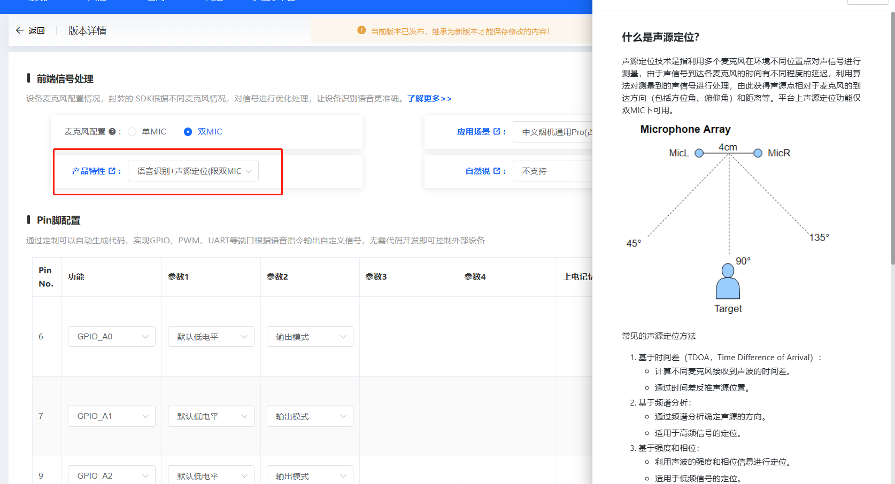

**3. 声源定位原理**

- 利用多个麦克风测量声信号到达时间差
- 通过算法处理获得声源的方位角信息
- 仅在双MIC下可用此功能

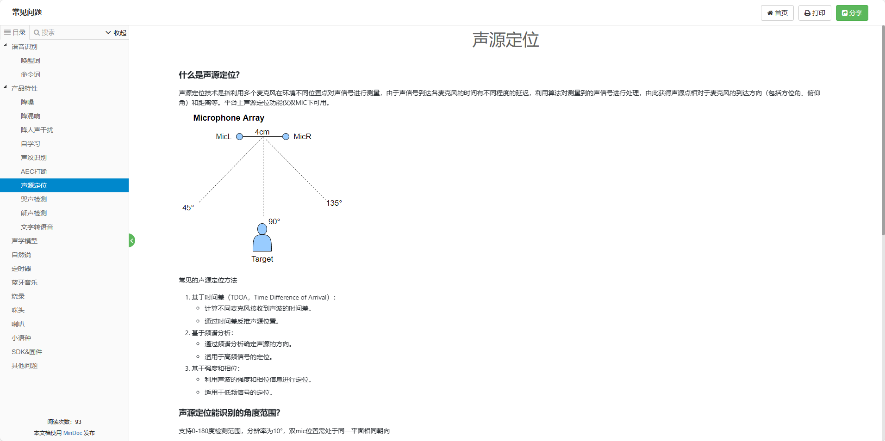

**4. 角度输出配置**

- 角度范围：0-180度
- 分辨率：10度
- 共19个可能的角度值
- 支持通过串口输出角度数据


**5. 串口输出设置**

- 创建变量（如jiaodu）存储角度值
- 设置控制条件：当变量等于特定角度时触发输出
- 配置串口输出帧格式：AA 55 [角度值] 55 AA

**注意事项：**

- 声源定位只能判断水平方向角度，无法测算距离
- 多人站在同一水平线时，会识别为同一角度
- 需要使用双麦版本模块，单麦不支持此功能
- 两个麦克风间距推荐为40mm

---

### CI-03T声源定位距离判断问题

**问题描述：**

声源定位功能是否支持距离测量，能否准确判断声源的精确位置？

**解决方案：**

双麦的声源定位算法仅支持角度测算，无法实现以下功能：

- 不能测量声源距离
- 无法获取俯仰角信息
- 无法精确定位声源的三维坐标

**注意事项：**

- 如需精确位置定位（角度+距离），至少需要三麦阵列
- 现有芯片不支持三麦以上的声源定位算法
- 双麦定位适用于水平方向判断场景

---

### CI-03T声源定位始终显示0度怎么办？

**问题描述：**

使用CI-03T模块时，声源定位功能正常工作，能识别语音并播报角度，但串口始终返回0度数据。

**解决方案：**

**1. 确认模块版本**

- 确认购买的是双麦版本模块
- 单麦版本不支持声源定位功能
- 检查模块丝印标识

**2. 检查麦克风连接**

- 确认M1和M2两个麦克风都已连接
- 测试单独拔掉每个麦克风，确认都有识别响应
- 检查麦克风焊接是否牢固

**3. 验证固件配置**

- 使用官方提供的测试固件
- 确认前端信号处理选择双MIC配置
- 检查声源定位功能已开启

**4. 硬件排查**

- 测试两个麦克风间距是否为40mm
- 确认麦克风没有松动或接触不良
- 检查是否有胶水等物质覆盖麦克风

**注意事项：**

- 单麦模块即使焊接第二个麦克风也无法实现声源定位
- 建议直接购买双麦版本模块进行批量生产
- 硬件修改单麦模块为双麦成功率较低

---

### CI-33T单麦模块如何改为双麦？

**问题描述：**

购买了CI-33T单麦版本，需要进行声源定位，如何将其改为双麦模块？

**解决方案：**

**1. 硬件修改**

- 找到模块上特定位置的电阻（红色方框标识）
- 小心移除该电阻以启用第二个麦克风通道
- 焊接第二个麦克风到M2接口


**2. 注意事项**

- 硬件修改需要专业技能
- 修改可能导致模块损坏
- 成功率有限，仅建议测试使用

**3. 建议方案**

- 测试阶段：可尝试硬件修改
- 批量生产：建议直接采购双麦版本
- 成本考虑：双麦版本与单麦价格相同

**注意事项：**

- 移除电阻有风险，需谨慎操作
- 即使修改成功，效果可能不如原厂双麦模块
- 批量应用建议使用正规双麦版本

---

### CI-03T在工厂环境如何优化识别率和降噪效果？

**问题描述：**

在工厂环境测试CI-03T语音识别效果不理想，门关闭时效果稍好，门开启时识别率下降，需要优化识别率和降噪效果。

**解决方案：**

**1. 环境分析**

工厂环境特点：

- 噪声较大且不稳定
- 门开闭对识别效果有明显影响
- 与卧室等安静环境差异显著

**2. 降噪模型选择**

根据实际使用环境选择合适的降噪模型：

- **工厂环境测试**：选择"烟机"降噪模型
- **卧室环境使用**：选择"普通话通用Pro"或安静的室内模型
- **兼容性考虑**：不同环境需要不同模型，难以完全兼容

**3. 配置优化**

1. **产品特性配置**：

    - 选择"语音识别+深度降噪"
    - 开启深度降噪功能

2. **噪声模型设置**：

    - 工厂测试：噪声模型设置为"烟机"
    - 实际使用：根据最终场景选择相应模型

3. **灵敏度调节**：

    - 唤醒词灵敏度：调至"高"
    - 识别灵敏度：调至"高"

**4. 双麦克风方案**

- **效果提升**：双麦克风相比单麦克风有更好的降噪效果
- **适用场景**：噪声较大的环境建议使用双麦版本
- **成本考虑**：根据实际需求和预算决定

**5. 实测建议**

1. **在目标环境测试**：

    - 不能仅在工厂测试就决定配置
    - 必须在实际使用环境（卧室）验证
    - 不同环境需要不同的配置策略

2. **避免过度降噪**：

    - 降噪开太高可能在安静环境不适应
    - 需要在识别率和误触发之间平衡

**注意事项：**

- 没有最强的降噪，只有最适合的降噪
- 数字识别在嘈杂环境下难度较大
- 建议在实际使用场景下反复测试和调整
- 如需兼顾工厂和卧室，优先按卧室环境配置

---

### 什么是声源定位功能？

**问题描述：**

需要了解声源定位功能的具体含义、实现能力以及应用场景。

**解决方案：**

**1. 功能定义**

- 声源定位是通过麦克风阵列确定声源方向的技术
- 能够识别语音来自哪个方向或角度
- 主要用于增强特定方向的语音识别

**2. 技术实现**

- 需要双麦克风硬件支持
- 通过计算两个麦克风接收到声音的时间差来确定方向
- 支持角度范围限制，只响应特定方向的语音

**3. 应用场景**

- 智能家居：只响应特定方向的语音指令
- 会议室：识别发言人的位置
- 机器人：转向声音来源方向

**注意事项：**

- 声源定位功能仅在支持双麦克风的型号上可用（如CI-03T2、CI-33T2）
- 单麦克风设备无法实现声源定位
- 近距离定位效果较好，远距离精度会下降
- 需要在平台中正确配置和启用该功能

---


---

### 自学习功能中如何避免重复动作冲突？

**问题描述：**

在CI-03T1芯片的自学习功能配置中，存在多个动作相同但指令名称不同的情况，如何避免这些重复动作的冲突。

**解决方案：**

**动作约束机制：**

- **互斥原则**：如果多个命令词对应相同动作，设置其中一个后，其他相同动作的命令词将失效
- **优先级**：后设置的命令词会覆盖之前的相同动作设置
- **芯片处理**：系统自动处理重复动作，只保留最后设置的有效命令

**配置示例：**

- 设置"设置为窗帘"后，"设置为窗纱"将无法生效（两者动作相同）
- "窗帘调到十"和"窗帘调到二十"虽然都是调节动作，但参数不同，可以同时存在

**配置建议：**

1. **规划命令词**：在配置前先规划好所有需要的命令词
2. **避免重复**：确保每个命令词对应唯一的动作
3. **逐个测试**：配置后逐个测试命令词的有效性
4. **使用描述性名称**：命令词名称应准确描述其实际功能

**注意事项：**

- 自学习功能针对动作进行设置，相同动作的命令词会相互覆盖
- 建议在控制详情中仔细检查每个命令词对应的动作
- 如果需要切换动作，需要重新学习对应的命令词

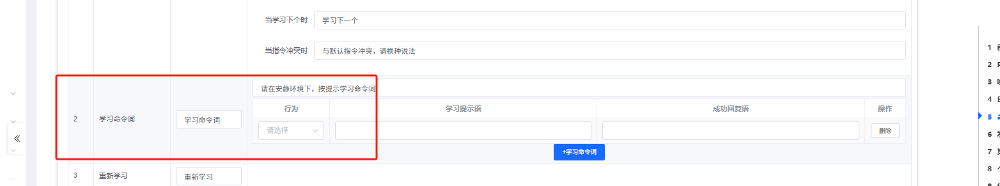


---


---

### 更换唤醒词后需要重新学习所有命令吗？

**问题描述：**

当前系统更换唤醒词后需要重新学习全部指令，希望优化此流程。

**解决方案：**

**当前机制：**

- **系统设计**：更换唤醒词后，所有命令词必须重新学习
- **无法保留**：已学习的命令词在更换唤醒词后失效
- **逐个学习**：必须按照顺序重新学习每个命令词

**技术原因：**

1. **数据关联性**
    - 唤醒词和命令词在内部数据中关联存储
    - 更换唤醒词会重置整个语音模型
    - 保证识别准确性和一致性

2. **安全考虑**
    - 避免数据混淆导致识别错误
    - 确保新唤醒词下的命令词准确性

**优化建议：**

1. **规划在先**
    - 确定最终要使用的唤醒词
    - 一次性完成所有学习
    - 避免频繁更换

2. **批量工具**
    - 建议使用PC端工具进行批量导入
    - 可保存配置模板
    - 减少重复操作

**注意事项：**

- 这是系统的安全设计，非功能缺陷
- 未来版本可能会优化此体验
- 建议在项目初期确定好唤醒词

---

### 如何实现窗帘开合度0~100%的语音指令控制？

**问题描述：**

需要实现窗帘开合度0~100%的语音指令控制，但不想为每个百分比值单独设置一条语音指令。

**解决方案：**

当前系统限制和替代方案：

- **系统限制**：暂时不支持从语音指令中提取数值参数
- **替代方案1**：按10%间隔设置指令（0%、10%、20%...100%）
    - 总共需要11条指令，占用空间较少
    - 可以满足大多数使用场景需求

- **替代方案2**：按25%间隔设置指令（0%、25%、50%、75%、100%）
    - 只需5条指令，更加简洁
    - 适合精度要求不高的场景

**注意事项：**

- CI-03T等模块支持300-500条词条，需要合理分配词条资源
- 选择合适的间隔精度，平衡功能需求和词条占用
- 未来版本可能会支持数值提取功能，建议关注官方更新

---


---

### CI-03T命令词无法触发且唤醒功能失效？

**问题描述：**

使用CI-03T开发板时，配置的命令词无法触发，只有串口输入和上电时能播放语音。增加串口输入配置后，连唤醒功能也失效了。

**解决方案：**

**问题分析：**

根据配置截图，可能存在以下问题：

1. **触发方式冲突**
    - 同时配置了多个触发方式可能产生冲突
    - 串口输入和命令词识别的优先级设置问题

2. **唤醒功能被禁用**
    - 增加串口输入后可能无意中禁用了唤醒词
    - 需要确认是否设置了常时唤醒模式

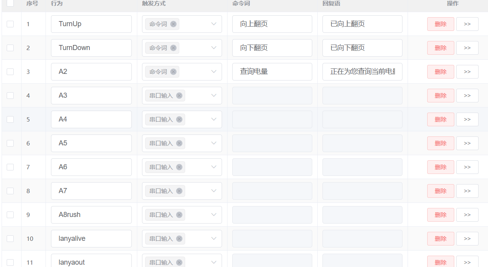

**排查步骤：**

1. **检查唤醒词配置**
    - 确认是否设置了唤醒词
    - 检查唤醒词是否被意外删除
    - 验证唤醒灵敏度设置

2. **检查触发方式**
    - 确认每个行为的触发方式设置正确
    - 命令词触发需要对应正确的命令词
    - 避免多个触发方式相互冲突

3. **重新导出配置检查**
    - 从平台导出JSON配置文件
    - 检查配置中是否包含唤醒词设置
    - 验证命令词配置是否完整

**解决方法：**

1. **简化配置测试**
    - 先只保留一个命令词进行测试
    - 确认基本功能正常后再逐步添加
    - 避免一次性配置过多功能

2. **检查麦克风连接**
    - 确认麦克风正确连接
    - 检查麦克风极性是否正确
    - 测试不同麦克风排除硬件问题

3. **重新生成固件**
    - 删除现有配置，重新创建
    - 确保每个步骤正确无误
    - 下载完整的固件包进行烧录

**注意事项：**

- 配置多个触发方式时要注意优先级
- 唤醒功能需要在配置中明确启用
- 建议使用官方推荐的麦克风型号
- 如果问题持续，可尝试恢复出厂设置后重新配置

---


---

### 如何在句子中识别"醒一醒"关键词？

**问题描述：**

希望系统能够识别包含"醒一醒"的完整句子，而不是只能作为独立的唤醒词识别，且该词在各种指令中识别效果都不理想。

**解决方案：**

**识别原理说明：**

- 语音模块的唤醒词用于防止误唤醒
- 唤醒词是独立的触发机制，不是关键词检索
- 系统设计为先识别唤醒词，再识别命令词

**实现方案：**

1. **使用命令词而非唤醒词**：

    - 将"醒一醒"设置为命令词
    - 配置常时唤醒状态（无唤醒词）
    - 直接说包含"醒一醒"的命令触发

2. **命令词配置示例**：

    - "你好同志醒一醒" → 设置为完整命令词
    - "醒一醒醒一醒" → 设置为完整命令词
    - "怎么了同志" → 设置为完整命令词

3. **常时唤醒设置**：

    - 在平台配置中取消唤醒词
    - 设备保持随时监听状态
    - 适合不怕误识别的应用场景

**限制说明：**

- 唤醒词机制无法识别句子中的关键词
- 语音识别不是语义理解，是声学模式匹配
- CI-03T等模块不支持关键词检索功能

**应用建议：**

- 如必须响应包含特定词的句子，使用命令词模式
- 接受可能增加的误识别风险
- 考虑使用"你好"、"小智"等更容易识别的词


---

### CI1303芯片灵敏度如何进一步提升？

**问题描述：**

CI1303芯片的唤醒阈值已调至最高（0.2），但唤醒效果仍不理想，希望了解其他提升方法。

**解决方案：**

**软件调节极限：**

- 唤醒阈值范围：0.01-0.2（默认）
- 0.2已是软件可调的最高灵敏度
- 软件调节已达极限时需要从硬件优化


**硬件优化方案：**

1. **咪头选择**
    - 不同咪头有不同的采样度
    - 使用配套推荐的高灵敏度咪头
    - 避免使用低质量的咪头

2. **连接线优化**
    - 麦克风线缆越短越好
    - 长线会降低信号强度
    - 建议使用带屏蔽线的咪头

3. **环境优化**
    - 减少环境噪声干扰
    - 合理布置咪头位置
    - 避免靠近干扰源

**注意事项：**

- 延长麦克风线缆会影响灵敏度
- 不同型号咪头的灵敏度差异较大
- 0.2已是软件调节上限
- 建议购买带屏蔽线的高质量咪头

---


---

### CI-03T1串口发送字符时播报数字怎么办？

**问题描述：**

通过串口发送字符（char类型）数据时，设备播报的是数字而非预期的字母，可能是数据类型或编码问题。

**解决方案：**

1. **确认数据类型**
    - 检查发送的是ASCII字符还是十六进制数值
    - 字符'a'的ASCII码是97，可能被误读为数字97
    - 确认串口发送的数据格式正确

2. **使用正确的编码方式**
    - 发送英文字母时使用ASCII编码
    - 避免使用可能被误解为数值的格式
    - 确认接收端的数据解析方式

3. **检查平台配置**
    - CI-03T1可能不支持自定义字符指令
    - 部分型号只能识别预设的命令词
    - 需要通过平台配置固定的命令词

**注意事项：**

- 不能自定义字符或十六进制指令时，需使用预设命令
- 确认模块型号是否支持自定义串口协议
- 建议使用标准命令词而非自定义字符


---


---

### CI-03T1如何实现声纹识别注册？

**问题描述：**

需要了解CI-03T1芯片的声纹识别功能及注册方法。

**解决方案：**

**1. 声纹识别功能说明**

- CI-03T1支持声纹识别功能
- 需要通过平台配置启用
- 声纹识别用于区分不同用户

**2. 注册方法**

- 登录智能公元平台
- 在产品配置中找到声纹识别选项
- 按照平台提示进行声纹录入
- 需要多次朗读以提高准确率

**3. 配置要求**

- 确保麦克风正常工作
- 在安静环境下进行注册
- 按提示完成所有注册步骤

**注意事项：**

- 声纹识别需要单独的配置和训练
- 注册完成后需要生成新固件
- 不同用户的声纹需要分别注册
- 建议定期更新声纹数据以保持准确性

---

**解决方案：**

执行指令时音量变小可能由以下原因造成：

**1. 硬件原因**

- **扬声器功率不足**：选用的扬声器功率匹配不当
- **供电不稳**：执行动作时电压下降，影响音频输出
- **音频线路问题**：音频输出线路存在干扰或损耗

**2. 软件配置**

- **音量设置冲突**：不同场景下的音量设置不一致
- **音频处理问题**：音频流处理过程中出现衰减
- **优先级设置**：执行动作时音频优先级被降低

**排查步骤：**

1. **检查硬件连接**
    - 确认扬声器功率与模块匹配
    - 检查供电电源稳定性
    - 验证音频线路连接良好

2. **测试音量设置**
    - 检查默认音量和执行音量设置
    - 确认不同场景下音量配置一致
    - 尝试调整音量参数

3. **监测电源状态**
    - 测量执行动作时的电压变化
    - 确保电源功率充足
    - 必要时增加独立音频供电

**注意事项：**

- 执行动作时的功耗变化可能影响音频输出
- 建议使用功率余量足够的电源适配器
- 音频线路应远离干扰源
- 可考虑增加音频放大电路改善输出

---

## 误识别优化


---

### 如何调整CI-03T模块的命令词识别灵敏度？

**问题描述：**

CI-03T模块对多个命令词的识别灵敏度不足，需要调整灵敏度阈值以改善识别效果。

**解决方案：**

**1. 全局灵敏度调整**

- 在平台的"命令识别"设置中找到"命令识别阈值"
- 默认值通常为0.05，可根据需要调整
- 阈值范围建议在0.02-0.08之间

**2. 特定命令词阈值调整**

- 选择"特定命令词阈值"选项
- 为识别率低的命令词单独设置阈值
- 如"关机"设为0.02，"设定十六度"设为0.05

**3. 调试建议**

- 先降低敏感命令词的阈值测试效果
- 逐步调整至最佳识别效果
- 记录各命令词的最佳阈值配置

**注意事项：**

- 阈值越小越不敏感，阈值越大越敏感
- 过高的阈值会导致误识别率增加
- 不同命令词可能需要不同的阈值设置
- 建议在目标使用环境中进行测试

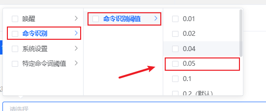

---


---

### 是否可以使用默认的识别阈值？

**问题描述：**

在使用CI-03T1和CI-03T2等模块时，是否可以直接使用默认的识别阈值设置。

**解决方案：**

**默认阈值说明**

- 命令识别默认阈值：0.2（中等灵敏度）
- 唤醒识别默认阈值：0.2（已调至较高灵敏度）
- 默认设置适合大多数应用场景
- CI-03T1和CI-03T2使用相同的默认阈值0.2

**使用建议**

- 初次使用建议先采用默认阈值进行测试
- 默认阈值在识别率和误识别率之间取得较好平衡
- 如识别效果不佳，再根据实际情况进行调整
- 调整时建议逐步微调，每次改动0.01-0.02

**注意事项：**

- CI-03T1和CI-03T2使用相同的默认阈值设置
- 默认值已经过优化，适合多数使用环境
- 特殊环境（极安静或极嘈杂）可能需要调整阈值


---

### 语音模块的默认识别阈值是多少？

**问题描述：**

需要了解CI-03T1、CI-03T2等语音模块的默认识别阈值设置，以便进行后续调整。

**解决方案：**

**各模块默认阈值**

- **命令识别默认阈值**：0.2
- **唤醒识别默认阈值**：0.2
- **适用型号**：CI-03T1、CI-03T2、SU-03T等标准模块
- **低功耗模块**：SU-20T/21T/22T/23T同样使用0.2默认值

**阈值含义**

- 数值0.2表示中等灵敏度水平
- 唤醒阈值0.2已经是较高设置（范围0.01-0.2）
- 命令识别阈值0.2提供平衡的识别表现
- 此设置经过优化，适合大多数应用场景

**调整建议**

- 如需提高灵敏度：可调低至0.1-0.15
- 如误识别较多：可调高至0.25-0.3
- 极端环境：需要根据实际情况大幅调整

**注意事项：**

- 0.2是出厂默认值，不是最低或最高值
- 调整阈值需要重新烧录固件才能生效
- 建议记录不同阈值下的实际测试效果


---

### 在嘈杂环境中如何调整识别阈值参数？

**问题描述：**

在嘈杂环境中使用语音模块时，需要调整识别阈值参数以提高语音识别的灵敏度。

**解决方案：**

**1. 阈值参数说明**

- **命令识别阈值**：控制所有命令词的识别灵敏度，当前值0.4
- **特定命令词阈值**：可单独调整指定命令词的灵敏度，当前值0.5
- **阈值越大越敏感**：提高数值可增强识别能力，但误识别率也会增高
- **未设置时自动取默认值**：系统会使用优化后的默认参数


**2. 嘈杂环境调整策略**

- **适度调高阈值**：在噪声较大的环境中，可适当提高识别阈值
- **从0.4开始测试**：先设置为0.4，根据实际效果微调
- **逐步优化**：每次调整0.05-0.1，找到最佳平衡点
- **重点命令词优化**：对重要命令词单独设置更高阈值

**3. 调整步骤**

1. 登录智能公元平台，进入产品配置
2. 在"优化配置"中找到阈值设置选项
3. 调整"命令识别阈值"至0.4或更高
4. 对识别率低的特定命令词，在"特定命令词阈值"中单独设置
5. 生成固件并烧录测试

**注意事项：**

- 阈值调整需要在识别准确率和误识别率之间找到平衡
- 过高的阈值可能导致频繁误触发，影响使用体验
- 建议在实际使用环境中进行充分测试
- 不同噪声类型可能需要不同的阈值策略

---

### CI-03T1的默认唤醒灵敏度0.2是什么含义？

**问题描述：**

在使用CI-03T1模块时，看到默认唤醒灵敏度设置为0.2，需要了解这个数值的具体含义和影响。

**解决方案：**

**0.2的含义**

- 数值范围：唤醒阈值范围为0.01-0.2
- 0.2是最高设置，表示最灵敏
- 默认使用最高灵敏度便于用户测试
- 数值越大越容易触发唤醒

**灵敏度等级说明**

- **0.2（默认）**：最高灵敏度，容易唤醒，适合安静环境
- **0.15-0.19**：较高灵敏度，平衡唤醒与误触发
- **0.10-0.14**：中等灵敏度，适合一般环境
- **0.05-0.09**：较低灵敏度，适合嘈杂环境
- **0.01-0.04**：最低灵敏度，避免频繁误唤醒

**使用建议**

- 初期测试可以使用默认的0.2
- 如出现频繁误唤醒，逐步调低至0.15或0.1
- 最终设置需要根据实际环境测试确定

**注意事项：**

- 0.2不是中间值，而是最大值
- 过高的灵敏度在嘈杂环境会导致误触发
- 建议记录不同设置下的唤醒成功率


---

### CI-03T1命令词"小千小千"在日常对话中误识别怎么办？

**问题描述：**

CI-03T1模块使用"小千小千"作为命令词时，在日常会议或聊天环境中容易被误识别，导致设备在非主动唤醒情况下输出200ms低电平信号。

**解决方案：**

**1. 灵敏度优化**

- 在平台"优化配置"中调低"小千小千"的特定命令词阈值
- 阈值越大越灵敏，但误识别率也越高
- 逐步降低阈值直到误识别消失，同时确保正常唤醒不受影响

**2. 缩短唤醒时间**

- 将"超时退出"时间从20秒改为10秒
- 减少设备处于唤醒状态的时间窗口
- 在唤醒状态下时间越短，越不容易误识别

**注意事项：**

- "小千小千"是命令词而非唤醒词，应调整命令词灵敏度
- 叠词类词汇在日常对话中出现频率较高，容易误触发
- 如产品名称不便更换，需接受一定的误识别概率
- 极低灵敏度可能导致部分用户无法正常触发设备

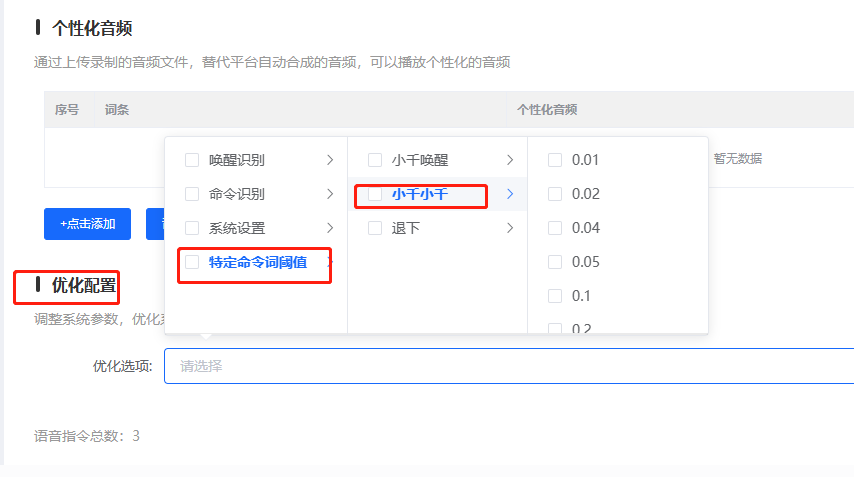

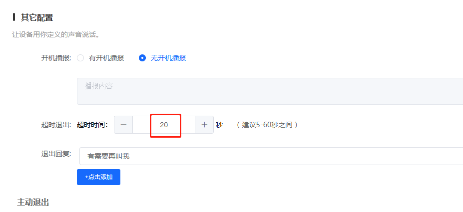

---


---


### 编辑命令词后串口输出顺序混乱或内容错误怎么办？

**问题描述：**

在平台上编辑好命令词并下载到模块后，发现通过串口输出的指令顺序混乱，或者输出的内容与配置不一致（说的和输出的不匹配）。

**原因分析：**

1. 命令词设置过长导致识别混乱
2. 命令词顺序排列不当
3. 工程配置文件损坏或异常
4. 语音识别项配置分散

**解决方案：**

**1. 缩短命令词长度**

- 将命令词修改为3-4个字
- 避免使用过长的命令词
- 重新生成并下载固件

**2. 重新创建工程配置**

- 删除现有工程，重新创建
- 重新配置所有命令词
- 确保配置文件完整

**3. 优化命令词排列顺序**

- 保留最开始的第一条语音识别项
- 将回复语句删除后重新添加
- 把所有语音识别类命令放到一起，接在第一条后面
- 保持命令词顺序的逻辑性

**4. 排查误识别**

- 检查是否是误识别导致输出不一致
- 调整识别阈值
- 使用防误识别功能

**注意事项：**

- 命令词顺序混乱可能影响系统逻辑
- 建议每次修改后进行完整测试
- 如问题持续，建议联系技术支持


### 双麦声源定位唤醒无法启用怎么办？

**问题描述：**

双麦声源定位唤醒功能无法启用，仅语音识别模式可以正常唤醒。

**解决方案：**

- **设备支持确认**：

    - 声源定位功能仅支持双麦设备：CI-03T2、CI-33T2
    - 单麦设备不支持：SU-32T、SU-22T、CI-03T1
    - 确认设备是否为双麦配置

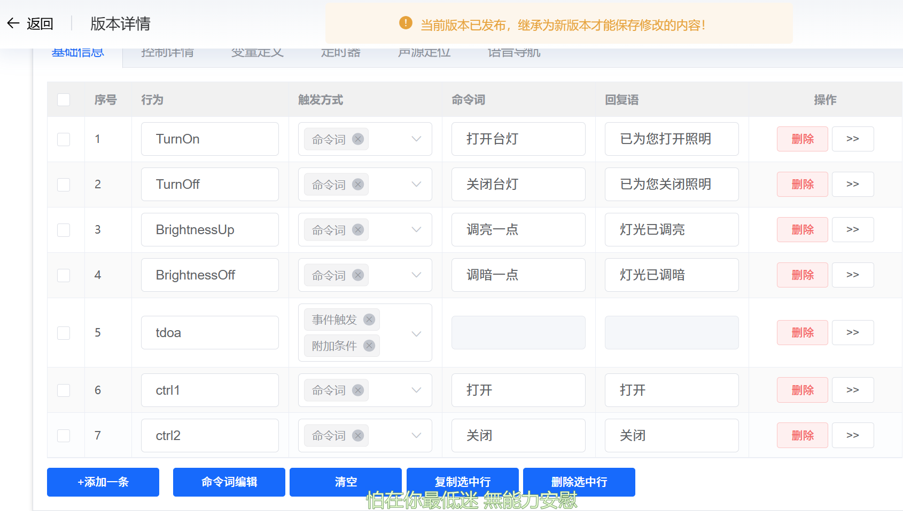

- **硬件配置检查**：

    - 双麦间距必须严格保持在40mm-60mm之间
    - 确保双麦克风已正确连接，无松动
    - 检查麦克风线路是否过长（建议<100mm）

- **软件设置验证**：

    - 确认声源定位功能已正确配置和启用
    - 检查是否选择了声源定位算法
    - 验证相关设置参数

- **芯片授权检查**：

    - 发送AT指令`AT+CHIPID?\r\n`查看芯片ID
    - 确认返回信息是否包含授权信息
    - 如显示"Unauthorized"需联系技术支持授权

- **其他排查**：

    - 检查固件是否为最新版本
    - 确认所有AT指令设置正确
    - 如问题持续，联系技术支持提供设备信息

**注意事项：**

- 单麦设备无法使用声源定位功能
- 双麦间距过大或过小都会影响定位精度
- 芯片未授权会导致功能无法使用

---

## 麦克风相关问题


---

### 设备启动噪音大导致识别距离短怎么办？

**问题描述：**

设备启动时噪音很大（类似抽油烟机），导致语音识别距离变短，超过1米就无法识别。

**解决方案：**

- **开启稳态降噪功能**：

    - 在前端信号处理设置中启用"稳态降噪"
    - 该功能可有效抑制环境噪声
    - 适用于高噪声环境


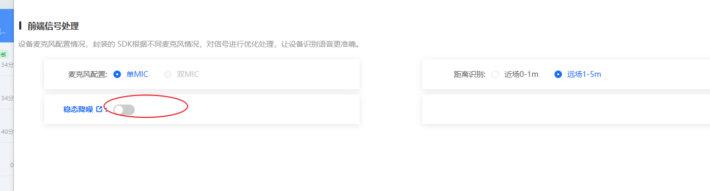

- **调整识别参数**：

    - 将命令识别阈值调至合适值（如0.8）
    - 根据实际环境调整灵敏度
    - 在远场识别距离设置为1-5m


- **选择合适应用场景**：

    - 选择噪声环境对应的预设场景
    - 如"中文烟机通用Pro"等适配高噪声场景
    - 根据产品类型选择合适模板

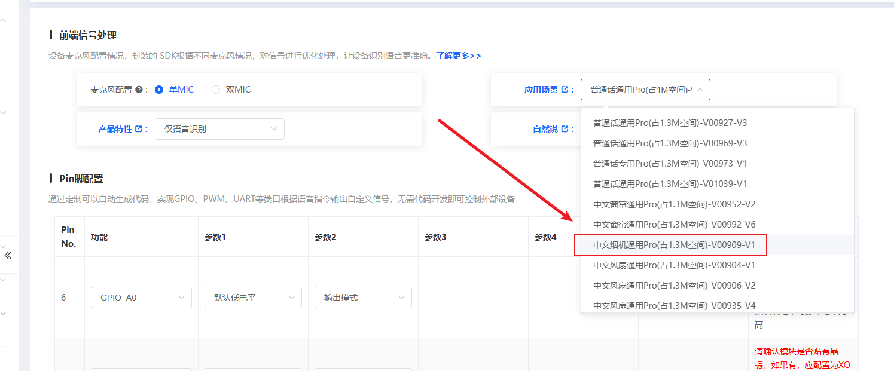


- **硬件优化建议**：

    - 考虑更换为CI-03T模块（抗噪能力更强）
    - 缩短咪头连接线长度（建议<100mm）
    - 使用双绞线或屏蔽线减少干扰

**注意事项：**

- 稳态降噪功能在启动时生效
- 高噪声环境会显著影响识别距离
- 咪头线过长会引入干扰，影响识别效果
- 1-5米的识别距离需要在低噪声环境下才能实现

---


---

### 语音识别距离过短（超过1米失效）怎么办？

**问题描述：**

语音模块识别距离过短，超过1米基本就无法识别，有时需要贴近咪头才能触发识别。

**解决方案：**

**1. 环境优化**

**减少环境噪声**：

- 关闭空调、风扇等噪声源
- 远离电视、音响等干扰设备
- 选择安静环境进行测试

**避免强干扰**：

- 远离金属遮挡物
- 避免电磁干扰源
- 不要在回声强的环境使用

**2. 配置调整**

**提高灵敏度设置**：

- 识别阈值调至较低值（如0.7-0.8）
- 逐个词条调整灵敏度
- 测试不同阈值的效果

**优化词条设置**：

- 使用发音清晰的命令词
- 避免相似度过高的词条
- 简化命令词结构

**3. 硬件检查**

**麦克风状态**：

- 检查咪头表面是否清洁
- 确认咪头无物理损坏
- 验证连接线牢固

**位置调整**：

- 确保咪头朝向正确
- 避免被物体遮挡
- 考虑加装防风罩

**4. 故障排查**

如果问题持续存在：

**固件问题**：

- 发送固件给技术支持测试
- 说明识别距离和测试环境
- 提供配置截图

**硬件问题**：

- 尝试更换麦克风
- 检查模块供电电压
- 测试其他同型号模块

**5. 改进建议**

**使用技巧**：

- 说话时正对麦克风
- 保持适中音量和语速
- 避免在嘈杂环境使用

**选购建议**：

- 如需远距离识别，考虑CI-03T等高性能模块
- 选择带降噪功能的型号
- 关注模块的拾音灵敏度参数

**注意事项：**

- 1米以上的识别距离需要良好环境支持
- 贴近识别可能是环境噪声过大导致
- 建议保留测试日志便于问题定位
- 硬件故障需要联系售后处理

---

## 音频播放相关问题


---

### 如何实现连续参数的语音控制（如0-99度温度调节）？

**问题描述：**

需要通过语音指令实现连续参数调节，如温度设置0-99度，是否需要为每个数值创建独立的命令词。

**解决方案：**

目前离线语音模块需要为每个具体数值创建独立的命令词，无法直接识别连续数值。

**实现方案：**

1. **独立命令词方案**：

    - 每个温度值对应一个命令词
    - 0-99度需要100条命令词
    - 占用词条容量较大

2. **步进调节方案**（推荐）：

    - 使用"温度增加"、"温度减少"调节
    - 或使用固定步长："增加5度"、"减少5度"
    - 大幅减少命令词数量

3. **分段设置方案**：

    - 预设常用温度点（如20、25、30度）
    - 配合微调指令实现精确控制
    - 平衡词条数量和实用性

**应用示例：**

```
方案一：精确控制（需100条命令词）
- "温度设置一度" → 1度
- "温度设置二度" → 2度
- ...
- "温度设置九十九度" → 99度

方案二：步进控制（需4条命令词）
- "温度增加五度" → +5度
- "温度减少五度" → -5度
- "温度设置最高" → 99度
- "温度设置最低" → 0度

方案三：分段控制（需10条命令词）
- "温度设置二十度" → 20度
- "温度设置三十度" → 30度
- ...
- "温度增加一度" → +1度
- "温度减少一度" → -1度
```

**优化建议：**

1. **根据实际需求选择方案**：

    - 精确控制：适用于需要精确设定的场景
    - 步进控制：适用于需要频繁调节的场景
    - 分段控制：平衡精确度和词条数量

2. **其他参数类似处理**：

    - 风速、亮度、音量等参数同样处理
    - 统一控制逻辑，提升用户体验
    - 考虑模块的词条容量限制

**注意事项：**

- 每条独立命令词都会占用词条容量
- CI-03T支持300条，CI-33T支持500条词条
- 建议优先使用步进或分段方案节省词条
- 测试时验证所有命令词的识别准确率

---

## 发音人相关问题


---

### 唤醒距离过近且成功率低怎么办？

**问题描述：**

设备需要非常靠近才能唤醒，唤醒距离过近（相比其他设备的5-6米），且有时需要多次尝试才能成功唤醒。

**解决方案：**

**1. 硬件检查**

- 检查麦克风线路连接是否牢固，避免虚接
- 确认使用的硬件型号（如CI-03T1）
- 检查麦克风是否被遮挡或污染

**2. 参数优化**

- 尝试删除"深度休眠阈值"设置项
- 调整"唤醒阈值"参数，降低唤醒难度
- 将唤醒灵敏度设置为"高"


**3. 唤醒词优化**

- 增加多个唤醒词，测试是否是特定词汇识别困难
- 确认唤醒词设置是否正确


**4. 环境因素排查**

- 检查环境噪音是否过大
- 确认电源供电是否稳定
- 测试在不同环境下的唤醒效果

**注意事项：**

- 唤醒距离过近通常是硬件或参数配置问题
- 深度休眠阈值可能会影响唤醒灵敏度
- 如果硬件检查无异常，重点调整软件参数
- 多个唤醒词可以帮助判断是词汇问题还是硬件问题

---

## 多语种语音调试


---

### CI-03T模块长时间无操作后需要多次唤醒怎么办？

**问题描述：**

使用免唤醒命令词时，长时间无操作后需要发声2-3次才能被识别，一旦响应一次后问题消失，但长时间不用后问题重现。

**解决方案：**

- **问题原因分析**：

    - 模块进入深度休眠状态
    - 需要多次语音输入才能完全唤醒
    - 免唤醒词虽然不受唤醒退出影响，但受休眠状态影响

- **解决方法**：

1. **调整超时退出设置**：

    - 在"其它配置"中设置"超时退出"时间
    - 建议设置为60秒或更长
    - 也可通过逻辑设置永不退出唤醒

2. **配置永不退出唤醒**：

    - 导入永不退出唤醒的配置文件
    - 上电即进入唤醒状态
    - 避免因超时导致的休眠

3. **优化灵敏度设置**：

    - 调整唤醒词灵敏度（低/中/高）
    - 阈值越大越灵敏（0.05-0.4）
    - 但误识别率也会相应增高

**注意事项：**

- 免唤醒词识别率与唤醒词相同
- 长时间不用后的识别问题主要是休眠导致
- SU-03T支持深度休眠设置，CI-03T需通过逻辑配置实现


---


---

### 声纹识别功能支持多少人？

**问题描述：**

需要了解声纹识别功能是否只能识别一个人的声音，还是支持多个人的声纹。

**解决方案：**

- 声纹识别功能支持多个人使用
- 不是只能识别一个人的声音
- 只有录入过声纹的声音才能被识别

**注意事项：**

- 需要先注册用户的声纹信息
- 每个使用设备的人都需要单独注册
- 未注册声纹的人无法触发相应功能
- CI-03T1和CI-03T2型号支持声纹识别功能

---


---

### 深度降噪、自学习、声纹识别等功能如何使用？

**问题描述：**

需要了解深度降噪、自学习、声纹识别等语音功能的具体说明和使用方法。

**解决方案：**

**1. 学习资源获取**

- **B站教程**：在B站搜索"机芯智能"官方账号查看教程
    - 官方账号：https://space.bilibili.com/1903518159
    - 搜索关键字：自学习、深度降噪、声纹识别等
    - 观看对应型号的功能演示视频


- **智能公元公众号**：查看功能介绍文章
    - 关注"智能公元"公众号
    - 查看历史文章获取功能说明
    - 部分功能有详细的使用指南


**2. 各功能简介**

- **深度降噪**：

    - 降低环境噪声干扰
    - 提高语音识别准确率
    - 适合嘈杂环境使用

- **自学习功能**：

    - 支持用户自定义命令词
    - 无需修改固件即可添加新命令
    - 提高产品灵活性

- **声纹识别**：

    - 识别不同用户声音
    - 支持个性化响应
    - CI-03T1和CI-03T2等型号支持

**3. 使用建议**

- **先看教程**：使用前先观看完整教程视频
- **逐步尝试**：从基础功能开始，逐步尝试高级功能
- **记录问题**：使用中遇到问题及时记录并反馈
- **参考示例**：参考官方提供的配置示例

**注意事项：**

- 不同型号支持的功能有所不同
- 部分功能需要特定硬件支持
- 建议在平台配置时开启所需功能
- 如有疑问，通过官方渠道获取技术支持

---

## 声源识别与定位


---

### CI系列芯片是否支持声源识别功能？

**问题描述：**

需要了解CI系列芯片是否支持声源识别功能，特别是声源定位技术的应用情况。

**解决方案：**

目前CI系列芯片主要专注于语音识别和命令词识别功能，不直接支持声源定位技术。

**功能范围说明：**

- **语音识别**：支持离线命令词识别、唤醒词识别
- **声纹识别**：部分型号（如CI-03T1、CI-03T2）支持声纹识别功能
- **声源定位**：当前不支持多麦克风阵列的声源定位

**注意事项：**

- 如需声源定位功能，可能需要外接专门的声源处理模块
- 单麦克风配置无法实现声源定位
- 双麦克风配置主要用于降噪，而非声源定位

---


---

### 烧录后语音模块无反应如何排查？

**问题描述：**

重新烧录固件后，语音模块无任何反应，已确认供电和扬声器正常。

**解决方案：**

**1. 电压测试**

使用万用表测试各关键点电压：

- **3V3引脚**：应有3.3V输出
- **麦克风正负极**：

    - CI-03T：1.6-1.7V范围
    - SU-03T：2.4-2.5V范围
- **扬声器正负极**：对GND应为2.2-2.5V

**2. 硬件检查**

- 检查扬声器是否损坏（测量电阻，应为几欧姆）
- 确认麦克风连接正确
- 测试更换已知好的扬声器

**3. 固件和设置**

- 添加开机播报语音测试声音输出
- 检查串口通信是否正常
- 确认Action_Mode变量赋值逻辑正确

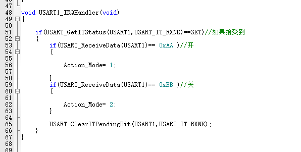

**4. 故障判断**

- 各电压正常但无声音：扬声器损坏
- 电压异常：模块可能烧坏
- 烧录成功但无响应：检查固件配置

**注意事项：**

- CI-03T的麦克风负极（MIC-）通常为0V（接地）
- 电压测试要在上电状态下进行
- 如果多次烧录都失败，可能模块已损坏

---


---

### 哪些模块支持声纹识别功能？如何获取授权？

**问题描述：**

需要了解哪些模块支持声纹识别功能，以及如何获取声纹识别的授权和测试方法。

**解决方案：**

**支持型号：**

- **CI-03T**：支持声纹识别功能
- **CI-33T**：支持声纹识别功能

**功能测试：**

- 未授权的模块也可以测试体验声纹识别功能
- 方便用户在购买前评估功能效果
- 测试期间功能完全可用

**授权获取：**

1. **批量订单授权**
    - 联系机芯智能朱敏女士获取批量授权
    - 适用于商业项目和生产需求

2. **授权说明**
    - 未授权模块运行期间会每隔几分钟自动重启
    - 可能导致运行中出现错误
    - 正式使用必须获得授权

**注意事项：**

- 授权是针对声纹识别功能的特殊许可
- 测试阶段可先体验功能效果
- 商用项目务必提前办理授权手续


---

### 如何进行声纹识别注册？

**问题描述：**

需要了解声纹识别的注册方法和操作步骤。

**解决方案：**

声纹识别需要通过平台配置实现，CI-03T和CI-33T等型号支持此功能：

**注册步骤：**

1. **选择支持声纹识别的模块**
    - CI-03T或CI-33T芯片
    - 确保固件版本支持声纹功能

2. **平台配置声纹识别**
    - 在配置平台启用声纹识别功能
    - 设置需要声纹验证的命令词
    - 配置声纹库存储和管理

3. **声纹录入流程**
    - 按平台提示录入语音样本
    - 多次重复以建立准确声纹模型
    - 完成声纹特征提取和存储

**功能特点：**

- 支持多人声纹识别
- 可区分不同用户身份
- 提高系统安全性

**注意事项：**

- 声纹识别功能需要单独授权
- 未授权模块只能体验测试
- 商用需联系机芯智能获取授权

---


---

### 如何配置CI-03T的声源定位功能？

**问题描述：**

需要在CI-03T系列芯片上配置和使用声源定位功能，包括设置触发条件和限制声源角度范围。

**解决方案：**

**1. 基本配置步骤**

- 在平台中开启声源定位功能
- 选择定位方式（如"唤醒词+命令词定位"或"唤醒词定位"）
- 配置双麦克风（M1和M2）参数

**2. 声源角度获取**

- 在命令词配置中添加"获取声源角度"动作
- 使用变量存储声源角度值
- 通过系统控制类型中的"声源定位"功能实现

**3. 角度范围限制**

- 使用规则配置设置触发条件
- 例如：设置"变量bb等于数值1"时触发声源定位
- 可通过变量判断控制角度范围（如45°-135°）

**注意事项：**

- 声源定位功能需要双麦克风硬件支持
- 教学视频参考：[CI-03T声源定位教学视频](https://www.bilibili.com/video/BV1rhAoefEWq/)
- 默认角度范围为0°-180°，如需限制特定区间需要额外的规则配置
- 配置完成后建议实际测试不同角度的识别效果

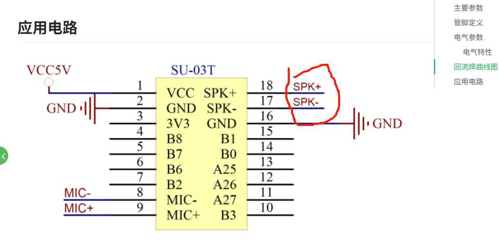


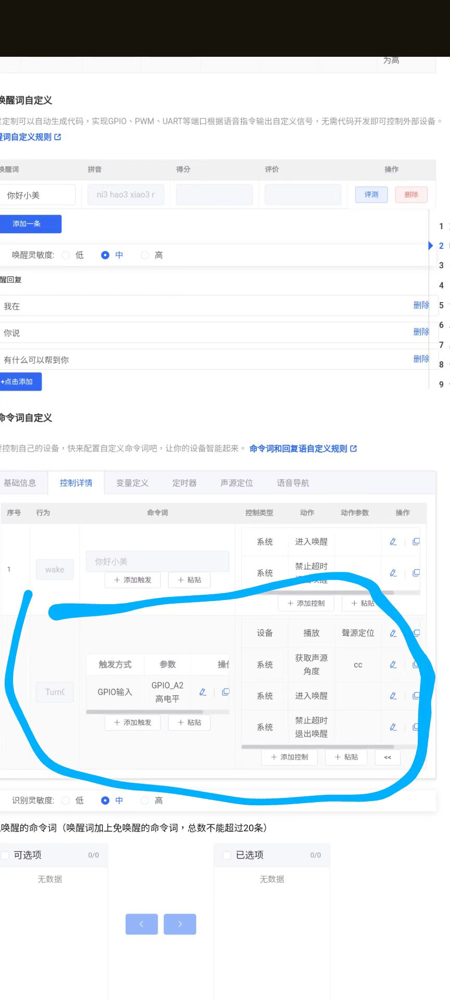

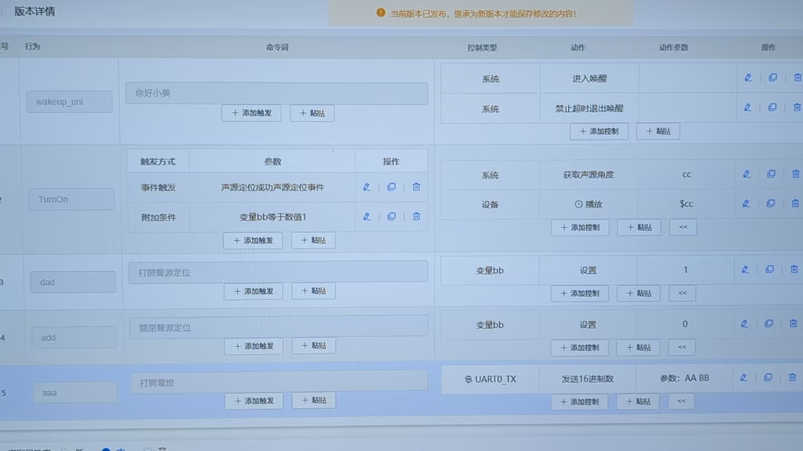

---


---

### 模块是否支持打呼噜声音识别？

**问题描述：**

需要实现打呼噜声音的识别功能，询问模块是否支持此类特殊声音识别。

**解决方案：**

CI-03T模块可以实现打呼噜声音识别功能：

**1. 技术支持**

- CI-03T具备处理特殊声音识别的能力
- 需要使用专用的识别模型
- 目前相关模型还在调试优化阶段

**2. 实现方式**

- 需要特殊的识别算法支持
- 不能通过常规命令词配置实现
- 需要定制化的语音识别模型

**注意事项：**

- 特殊声音识别功能需要联系技术支持获取详细信息
- 相关模型正在开发中，具体实现方案需咨询
- 可提供具体应用场景以获得更好的技术支持

---


---

### CI-03T如何配置双麦克风功能？

**问题描述：**

需要了解CI-03T和CI-33T是否支持双麦克风配置，以及如何正确实现双麦功能。

**解决方案：**

**双麦支持情况：**

- **CI-03T/CI-33T**：支持双麦克风配置
- **功能优势**：支持声源定位、降混响、男女声纹识别等高级功能
- **硬件要求**：需要两个麦克风，分别连接到M0和M1引脚

**配置方法：**

1. **软件配置**：

    - 在配置软件中选择"双MIC"模式
    - 某些功能在双麦模式下才会启用
    - 配置相关的高级功能（如声源定位）

2. **硬件连接**：

    - **不能简单并联**：两个麦克风不能直接并联
    - **独立连接**：每个麦克风单独连接到对应引脚
    - **距离要求**：两个麦克风距离不超过10cm
    - **电流考虑**：并联可能导致电流不足，影响性能

3. **功能选择**：

    双麦模式下可启用的高级功能：

    - 语音识别+声源定位+降混响
    - 语音识别+男女声纹识别
    - 更好的噪声抑制效果

**注意事项：**

- 双麦功能只在对应用中才有效
- 两个麦克风的特性应尽量一致
- 配置时需要选择支持双麦的产品特性
- 单麦模式不支持上述高级功能

---


---

### 空调温度设置16-30度（0.5度步进）如何实现？

**问题描述：**

需要实现空调温度精确控制，支持16-30度范围，每0.5度一个档位，询问是否需要逐条添加命令词。

**解决方案：**

**功能支持确认：**

- **CI-03T支持**：支持空调温度设置功能
- **双麦要求**：该功能需要双麦克风配置
- **精度支持**：可支持0.5度的温度步进

**实现方法：**

1. **逐条配置法**：

    - 为每个温度值创建命令词
    - 示例："空调16度"、"空调16.5度"、"空调17度"等
    - 总共需要29条命令词（（30-16）×2+1）

2. **温度命令词优化**：

    使用词根+数字的组合：

    - 基础词："空调"、"设置为"、"调到"
    - 温度数字："16"、"16.5"、"17"等
    - 利用语音指令泛化功能减少配置量

3. **配置示例**：

    ```
    温度命令列表：

    - 空调16度 → 温度设置16°C
    - 空调16.5度 → 温度设置16.5°C
    - 空调17度 → 温度设置17°C
    ...
    - 空调30度 → 温度设置30°C
    ```

**注意事项：**

- 确保选择了双麦克风模式
- 0.5度精度需要准确发音（如"十六点五度"）
- 测试所有温度值确保识别正常
- 考虑使用泛化功能减少配置工作量

---

### CI-03T命令词泛化设置导致固件生成失败怎么办？

**问题描述：**

在使用CI-03T系列芯片的命令词泛化功能时，设置带参数的命令词（如"喂食一次"、"喂食两次"等），但因泛化设置规则不合规导致语言模型生成失败，进而无法生成固件。

**解决方案：**

**1. 检查命令词长度限制**

- 单个词最大长度：5个字
- 组合后的泛化词最大长度：12个字
- 超出限制会导致固件生成失败


**2. 正确的设置方法**

- 主词长度控制在5个字以内
- 前缀词使用"请|帮我|立即|我要|现在|马上"等
- 确保组合后总长度不超过12个字

**3. 错误示例**

"今天喂食几份了" - 7个字，超出单个词最大长度限制

**4. 排查步骤**

- 在平台点击"检查配置"
- 如提示语言模型生成失败，检查命令词长度
- 将超长命令词拆分为多个短词
- 重新生成固件

**注意事项：**

- 命令词过长不仅影响生成，还会降低识别率
- 建议使用简洁明确的命令词
- 如需实现复杂功能，可考虑使用支持变量识别的型号（如JX-A7T）

---

### CI-03T离线语音指令词长度超限如何拆分？

**问题描述：**

在设置离线语音指令时，遇到指令词长度超过限制导致无法正确识别的问题，需要了解具体的长度限制和拆分方法。

**解决方案：**

**1. 长度限制说明**

- 单个词最大长度：5个字
- 组合后的泛化词最大长度：12个字
- 超长命令词难以识别，且可能导致固件生成失败


**2. 拆分原则**

- 将长句按语义拆分为多个短词
- 每个词控制在5个字以内
- 保持拆分后的词语具有独立意义

**3. 拆分示例**

原句："今天喂食几份了"（7个字）

拆分方案："看下今天" + "喂食几份" + "了"


**4. 实施步骤**

- 检查命令词长度，识别超长部分
- 根据语义选择合适的拆分点
- 在平台中分别设置拆分后的词
- 测试识别效果，根据需要调整

**注意事项：**

- 拆分时要保持语义连贯性
- 过度拆分可能影响识别准确率
- 建议使用简洁的表达方式
- 如需支持可变参数，考虑使用JX-A7T等在线模块

---

### CI-03T的数字变量识别功能如何实现？

**问题描述：**

CI-03T芯片宣传支持"数字变量识别"功能，需要了解该功能的具体实现方式。

**解决方案：**

**功能说明：**

CI-03T的数字变量识别功能需要定制开发，非标准功能。


**实现方式：**

- 需要根据具体需求进行定制
- 联系技术支持提供详细需求
- 评估可行性后安排定制开发
- 定制周期和费用需具体评估

**注意事项：**

- 标准CI-03T固件不支持数字变量识别
- 如需立即使用变量识别功能，建议选用JX-A7T
- JX-A7T支持智能体变量提取，无需定制
- 定制功能需要一定的开发周期

---

## 自然说功能

### CI-03T自然说泛化词部分指令无法识别怎么办？

**问题描述：**

在使用CI-03T1模组时，自然说泛化词功能部分指令（如'开灯'、'请开灯'、'打开灯'、'请打开灯'）可以正常识别，但其他组合词（如'帮我开灯'、'灯打开'、'把灯打开'）无法被识别，导致语音控制功能不完整。

**解决方案：**

**1. 问题定位**

该问题是由于平台功能还在改进阶段，部分泛化词组合存在识别异常。

**2. 临时解决方案**

- 去除免唤醒设置：将自然说的词设置为非免唤醒触发
- 测试基本功能：确保去除免唤醒后，大部分泛化词可以正常识别

**3. 平台更新后的解决方案**

平台已针对该问题进行修复，解决步骤如下：

- 刷新平台页面，确保使用最新版本
- 在原有配置基础上，继承后增减一个命令词
- 重新生成固件并测试

**4. 配置示例**

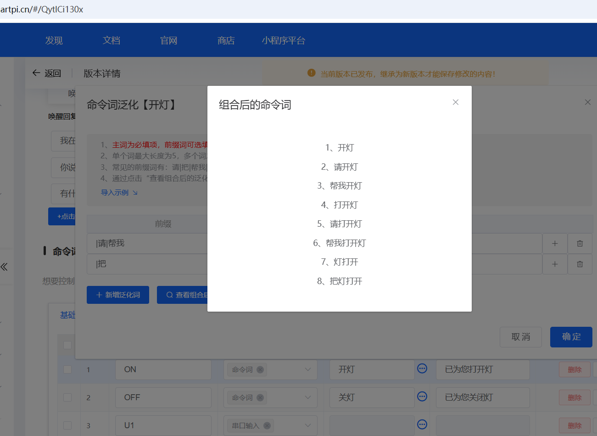

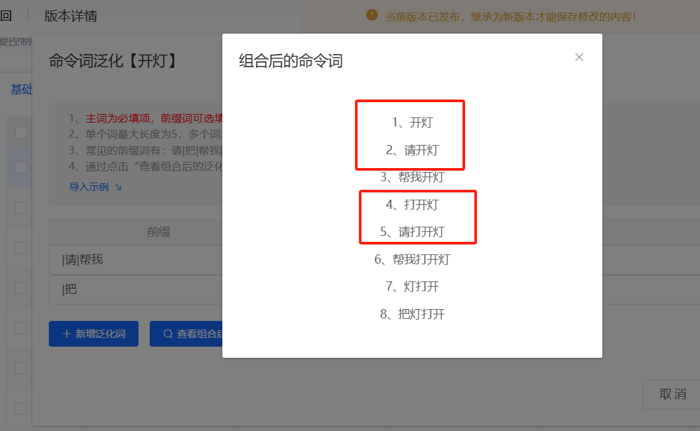

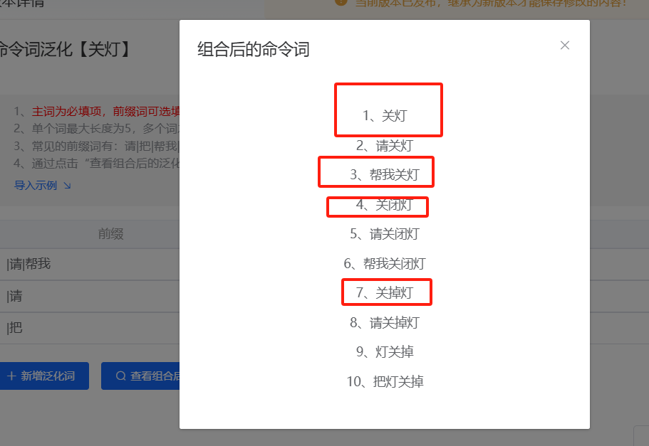

**注意事项：**

- 自然说的词不建议设置为免唤醒触发
- 平台功能持续更新中，遇到问题及时联系技术支持
- 配置修改后需要重新生成固件才能生效
- 建议定期关注平台更新日志，了解功能改进情况

---


---

### 语音识别测试出现识别度低、无响应等问题怎么办？

**问题描述：**

在语音识别功能测试中，发现当有人持续说话时，声控识别度极低，且存在声音识别能力不足、口音差异导致识别失败、长时间不使用后设备无响应等问题。

**解决方案：**

**1. 识别度低问题**

持续说话环境下的识别优化：

- **调整灵敏度**：将识别灵敏度调至最高（0.8）
- **使用唤醒词**：采用唤醒词+命令词模式，提高识别准确率
- **降噪模型**：尝试使用风扇领域模型，有一定降噪效果

**2. 音量小无法识别**

音量优化方案：

- **麦克风位置**：对准人说话位置，距离尽量近
- **硬件检查**：确认麦克风质量，选择高灵敏度咪头
- **环境优化**：减少背景噪声干扰

**3. 口音差异问题**

口音适应性改善：

- **多词条录入**：同一指令录入多种说法
- **训练优化**：针对目标口音进行专门训练
- **模型选择**：选择更通用的识别模型

**4. 长时间无响应**

稳定性解决方案：

- **电源管理**：检查供电稳定性
- **看门狗设计**：添加自动重启机制
- **定期唤醒**：设计定期自检功能

**5. 配置优化建议**

基于测试反馈的配置：

- **英文识别**：6条指令（open、open door、close、close door等）
- **灵敏度设置**：

    - 识别灵敏度：高
    - 命令识别阈值：0.8
    - 特定命令词阈值：根据需要设置

**6. 详细配置步骤**

免唤醒与唤醒词模式切换：

- **免唤醒命令词**：放在右侧，直接触发识别
- **唤醒+命令模式**：命令词放在左侧，需要先说唤醒词
- **识别速度**：

    - 免唤醒：快速响应
    - 唤醒+命令：约两倍时间，但准确率更高

**7. 阈值设置详解**

个性化音频配置：

- **命令识别阈值0.8**：所有命令词统一设置为0.8
- **特定命令词阈值**：可单独设置某个词的阈值
- **高是0.5**：界面中的"高"选项实际是0.5
- **最高0.8**：需要在优化选项中手动设置

**8. 麦克风配置**

前端信号处理优化：

- **单MIC配置**：适合简单环境
- **应用场景**：英文标准通用Pro5模型
- **产品特性**：仅语音识别模式

**9. 部署建议**

实际应用环境优化：

- **安装高度**：1.7米墙面高度
- **朝向角度**：麦克风朝向用户常在位置
- **避免遮挡**：确保无物体遮挡麦克风

**注意事项：**

- 英文识别需要更高灵敏度补偿
- 持续说话环境建议使用唤醒词
- 定期检查设备工作状态
- 复杂环境可能需要定制优化

---

## 语言支持与播报

### CI-03T是否支持中英文混合识别？

**问题描述：**

需要了解CI-03T系列芯片是否支持中英文混合语音指令识别，以及中文环境中是否可以播放英文语音内容。

**解决方案：**

1. **语言识别支持**

    - 平台配置支持中、英、日、韩四种语言
    - 不支持中英文混合识别同一词条
    - 只能支持中英互相切换的定制

2. **混合识别方案**

    - 使用像声字做中英文切换
    - 需要定制化开发实现
    - 标准功能暂不支持实时混合

3. **英文语音播报**

    - 中文环境下无法直接生成英文语音
    - 可通过个性化音频替代实现
    - 将英文内容录制成音频文件后替换

**注意事项：**

- 如需中英混合功能，需要评估定制开发
- 个性化音频替换可实现中英混合播报
- 建议根据主要使用语言选择对应版本

### 如何实现中英混合播报？

**问题描述：**

在不支持生成英文语音的设备上，需要实现中英文混合播报功能。

**解决方案：**

1. **个性化音频方案**

    - 将需要英文播报的内容预先录制
    - 在平台中使用个性化音频替换
    - 可实现中英文内容切换播报

2. **实施步骤**

    - 准备高质量的英文音频文件
    - 在命令词配置中选择个性化音频
    - 上传并替换默认播报内容

3. **注意事项**

    - 音频文件格式需符合平台要求
    - 时长和大小会占用存储空间
    - 建议使用标准发音录制

**注意事项：**

- 个性化音频数量有限制
- 录音质量直接影响播报效果
- 批量使用前建议充分测试

---

---

### 固件更新后新增指令无法执行怎么办？

**问题描述：**

更新固件后，发现新增的语音指令无法执行，且原有指令的执行顺序与预期不符，导致设备行为异常。

**解决方案：**

**问题分析：**

这是由于**指令执行逻辑配置错误**导致的。原固件的逻辑是转到0度后才会缓慢回零，而新增配置后改变了执行顺序。


**正确配置方法：**

1. **理解原执行逻辑**
    - 原固件：先执行转动指令→到达目标位置→再说"归零"才缓慢回零
    - 转动到180度后，需要单独触发归零指令

2. **配置新的执行顺序**
    - 如需先转出再归零，需要：

    - 配置转动指令作为触发条件
    - 将归零动作作为转动指令的后续执行步骤

3. **固件生成注意事项**
    - 在智能公元平台配置指令时，注意指令之间的依赖关系
    - 确认触发条件和执行动作的对应关系
    - 生成前刷新页面确保配置生效

**烧录验证步骤：**

1. 确认固件下载成功
    - 查看烧录工具显示"device: update success"
    - 固件校验码匹配（如：874D432C）

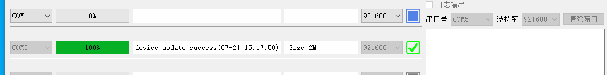

2. 测试指令执行
    - 逐条测试每个语音指令
    - 验证执行顺序是否符合预期
    - 确认新增指令是否正常响应

**故障排除：**

- **指令无响应**：检查指令ID是否配置正确
- **执行顺序错误**：重新梳理指令逻辑关系
- **部分功能丢失**：对比新旧固件配置差异

**注意事项：**

- 固件更新会完全覆盖原有配置
- 建议在修改前备份原有配置
- 复杂逻辑建议分步骤测试验证
- 如问题持续，可使用已验证的固件版本

---


## 误唤醒优化

### 如何降低CI-03T在办公室环境中的误唤醒率？

**问题描述：**

在办公室环境中使用CI-03T模块时，背景聊天声容易导致模块误唤醒（未说出唤醒词但被激活），需要优化方法来降低误唤醒率。

**解决方案：**

**方法一：调整灵敏度**

- 降低模块的唤醒灵敏度设置
- 通过平台配置界面调整识别阈值
- 建议逐步降低，避免设置过低影响正常唤醒

**方法二：添加防误唤醒命令词**

- 禁用与正式命令词相似的词汇
- 防止部分匹配导致的误触发

**防误唤醒示例：**

如果正式命令词是"打开窗户"，可以禁用以下相似词汇：

- "打开窗"
- "打开"
- "窗户"

**配置步骤：**

1. 在平台配置中找到"防误触发"或类似设置
2. 添加需要禁用的相似词汇
3. 测试配置效果，确保不影响正常唤醒

**注意事项：**

- 灵敏度调整需要平衡误唤醒率和唤醒成功率
- 防误唤醒命令词应根据实际命令词进行个性化设置
- 建议在实际使用环境中进行充分测试
- 医疗等对误唤醒要求高的场景，建议结合硬件降噪措施
---

## 自学习功能

### CI-03T自学习功能的数量限制是多少？

**问题描述：**

需要了解CI-03T自学习功能支持的最大唤醒词和命令词数量，以及如何管理已学习的内容。

**解决方案：**

CI-03T自学习功能存在以下限制：

**1. 数量限制**

- **唤醒词**：最多支持2个自定义唤醒词
- **命令词**：根据固件版本，通常支持150-300条
- **学习模板**：总量有限制，超过上限需先删除

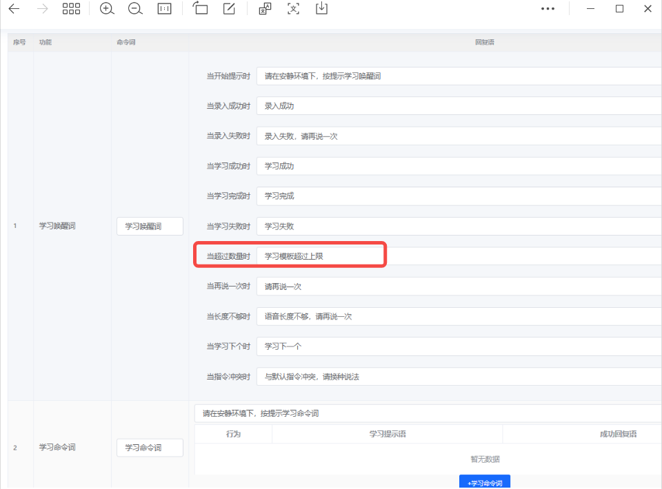

**2. 自学习触发方式**

- **语音触发**：通过语音指令进入学习模式
- **按键触发**：可通过外部按键触发（需定制固件）
- **串口触发**：通过串口命令触发学习

**3. 删除已学习内容**


删除操作支持以下选项：

- **删除唤醒词**：删除已学习的自定义唤醒词
- **删除命令词**：删除已学习的命令词
- **全部删除**：清除所有自学习内容
- **退出删除模式**：取消删除操作

**操作步骤：**

1. 进入自学习模式
2. 选择删除功能
3. 根据提示选择删除类型
4. 确认删除操作

**注意事项：**

- 自学习功能需要专用固件支持
- 删除操作不可恢复，请谨慎操作
- 达到数量上限后必须删除才能学习新内容
- 建议定期备份重要的学习配置
- 方言学习效果因口音差异而不同


**4. 功能限制**

以下功能目前**不支持**或需要**定制开发**：

- **播放已录入的语音**：当前版本不支持回放之前录入的自学习命令词音频
- **串口指令删除指定命令**：标准版本仅支持语音方式删除，如需通过串口指令删除指定的某一条自学习命令，需要联系厂商进行定制开发
---

### CI-03T自学习功能无法正常学习怎么办？

**问题描述：**

使用CI-03T自学习功能时，发现无法成功学习唤醒词和方言唤醒词。

**解决方案：**

**1. 确认固件版本**

- 确保使用支持自学习功能的固件
- 联系技术支持获取最新的自学习固件
- 固件文件通常命名为：jx_ci_03t_firmware.bin

**2. 检查学习流程**

- 严格按照学习流程操作
- 确保环境安静，无背景噪音
- 说话清晰，语速适中

**3. 自学习流程要点**

- 学习唤醒词：系统提示"请说出唤醒词"后清晰说出
- 学习方言唤醒词：需要多次重复以提高准确率
- 学习命令词：每个命令词需要说3-5遍

**4. 硬件检查**

- 确认麦克风连接正常
- 检查音频输入质量
- 确保模块供电稳定

**注意事项：**

- 自学习功能默认唤醒词为"老师"
- 学习失败时可尝试重新进入学习模式
- 方言学习效果因人而异，建议多人测试
- 如持续失败，可联系技术支持获取帮助

---

### 音箱音量较大时语音唤醒识别效果差怎么办？

**问题描述：**

在使用CI-03T芯片的音响设备中，当音箱播放音乐音量较大时，语音唤醒词识别效果显著下降，无法实现有效的唤醒打断功能。

**解决方案：**

**问题分析**

音量大时识别效果差的原因：

- **AEC缺失**：未做相应的回声消除（AEC）处理
- **声音干扰**：音箱播放的音乐干扰麦克风输入
- **动态范围**：大音量时语音信号被背景音掩盖

**表现现象**

- **小音量**：语音识别完全正常
- **中等音量**：识别效果略有下降
- **最大音量**：基本无法识别唤醒词
- **倒数第二大音量**：识别效果比较差

**临时解决方案**

1. **降低音量使用**
    - 在需要语音控制时适当降低音量
    - 可通过物理按键或遥控器调节

2. **优化麦克风位置**
    - 确保麦克风远离喇叭
    - 考虑使用定向麦克风

3. **唤醒词训练**
    - 选择穿透性更强的唤醒词
    - 训练时使用目标音量水平

**长期解决方案**

- **AEC算法开发**：需要专业开发实现回声消除
- **硬件优化**：调整麦克风和喇叭的相对位置
- **固件定制**：开发支持大声压下识别的专用固件

**注意事项：**

- 当前方案在最大音量下基本不可用
- AEC开发难度较大，需要专业团队支持
- 量产产品建议重新设计硬件布局

---

### 音箱产品如何实现语音控制的完整集成？

**问题描述：**

了解如何在现有音箱产品中集成CI-03T语音控制功能，包括装机方案、量产可行性以及后续机型的扩展考虑。

**解决方案：**

**Demo集成方案**

当前可实现的基础集成：

1. **硬件集成**
    - 使用CI-03T模块直接替换部分功能
    - 模块输出接到音箱喇叭
    - 保留原有按键控制作为备用

2. **功能实现**
    - 通过语音控制模拟按键信号
    - 实现播放、暂停、音量调节等基础功能
    - 语音播报和音乐可同时进行

**量产化要求**

1. **硬件重新设计**
    - 需要修改PCB以集成语音模块
    - 优化麦克风位置，避免声学干扰
    - 考虑AEC算法的硬件支持

2. **结构设计**
    - 麦克风位置需要专门设计
    - 可能需要在外壳开孔
    - 确保音频部件的合理布局

**开发注意事项**

- **飞线限制**：当前飞线方案仅适合Demo展示
- **量产要求**：必须重新设计PCB和结构
- **测试验证**：需要充分测试各种使用场景

**扩展机型考虑**

- 每款新机型都需要重新开模
- 麦克风位置是关键设计因素
- 建议建立标准化的集成方案

---

### 特定唤醒词"浙江笛虎科技"无响应怎么办？

**问题描述：**

在CI-03T1智能摄像机中使用唤醒词"浙江笛虎科技"，设备无法响应唤醒，需要确认问题原因并提供解决方案。

**解决方案：**

**1. 问题诊断**

**固件配置检查**：

- 确认唤醒词在固件中已正确配置
- 检查固件MD5码确保版本正确
- 验证是否为被动播放模式问题

**常见标识**：

- 被动播放模式下唤醒词可能失效
- 需要特别注明是否支持唤醒功能
- 确认固件生成时的功能配置

**2. 测试验证**

**使用测试词验证**：

- 先用简单唤醒词测试（如：小笛小笛）
- 确认硬件基本功能正常
- 逐步测试目标唤醒词

**测试步骤**：

1. 使用已知良好的唤醒词测试
2. 确认模块能够正常响应
3. 逐步更换为目标唤醒词
4. 记录每次测试的结果

**3. 唤醒词优化**

**发音清晰度**：

- "浙江笛虎科技"包含多个音节
- 确保每个字发音清晰标准
- 避免连读或吞音

**环境因素**：

- 测试环境保持安静
- 距离保持在1-3米范围内
- 避免背景噪声干扰

**4. 配置调整**

**灵敏度设置**：

- 适当提高唤醒灵敏度
- 避免灵敏度过高导致误触发
- 根据实际环境调整参数

**固件确认**：

- 检查固件配置信息中的唤醒词
- 确认回复语设置（如：版本号1518+15）
- 验证MD5码：420644f35f7f88050c5f3f314a10d86b

**5. 解决方案**

**方案一：简化唤醒词**

- 使用更简单的唤醒词（如：小笛小笛）
- 降低识别难度
- 提高响应成功率

**方案二：重新生成固件**

- 在平台重新配置唤醒词
- 确保所有参数正确设置
- 生成新的固件进行测试

**方案三：硬件检查**

- 确认麦克风连接正常
- 检查音频输入通路
- 验证硬件工作状态

**注意事项**：

- 复杂唤醒词的识别率相对较低
- 建议使用2-3个字的简单唤醒词
- 测试时保持相同的说话语调和音量

---

### CI-03T如何开发自学习唤醒词样品？

**问题描述：**

需要基于CI-03T1或CI-03T2语音模块开发支持自学习唤醒词的样品，要求使用2M金手指模块，支持三意图，并需定义语音协议供单片机使用。

**解决方案：**

**1. 硬件规格**

- 选用CI-03T1或CI-03T2芯片
- 2M Flash金手指模块封装
- 支持自学习唤醒词功能
- 支持三意图识别

**2. 功能配置**

- 开启自学习唤醒词功能
- 配置三个控制意图
- 定义语音通信协议
- 单片机根据协议进行响应

**3. 协议定义要点**

- 明确指令格式和数据结构
- 定义唤醒和学习模式切换方式
- 确认输出信号类型（UART/IO）
- 制定错误处理机制

**注意事项：**

- 自学习功能需要用户在安静环境下录制
- 协议定义需考虑单片机的处理能力
- 建议预留扩展接口以备功能升级
- 样品开发完成后需充分测试自学习效果

---

### CI-03T1语音识别控制选项中，'允许语音识别'和'允许识别词'两个设置的区别是什么？

**问题描述：**

在配置CI-03T1语音识别功能时，发现'是否条件执行'下有'允许语音识别'选项，'控制方式'下有'允许识别词'选项，需要了解两个设置的具体区别和用途。

**解决方案：**

两个选项的功能定位不同：

- **允许语音识别**：开启后可以识别到所有已配置的命令词
- **允许识别词**：仅允许识别指定的命令词，实现更精确的控制

实际应用中，如果需要进入唤醒功能，两者可以达到相同的效果。

**注意事项：**

- '允许识别词'适用于需要严格限制可识别命令的场景
- '允许语音识别'适用于需要识别所有命令词的通用场景
- 根据具体应用需求选择合适的配置方式


---

### CI-03T声源定位功能的具体用途和应用场景是什么？

**问题描述：**

需要了解CI-03T声源定位功能的具体用途，以及在哪些场景下可以应用该功能。

**解决方案：**

**声源定位技术原理**

- 利用双麦克风测量声信号到达时间差
- 通过算法计算声源方向角度
- 支持0-180度范围内的方位角检测
- 仅支持水平方向定位，无法测算距离

**主要应用场景**

1. **智能家电控制**
    - 根据说话人位置定向响应
    - 智能音箱、电视等产品
    - 提升用户交互体验

2. **机器人导航**
    - 声源引导机器人移动方向
    - 服务机器人应用
    - 配合其他传感器实现精确定位

3. **会议系统**
    - 自动定位发言人员
    - 摄像头自动对焦
    - 远程会议场景应用

4. **车载应用**
    - 驾驶员位置识别
    - 语音控制定向响应
    - 提升驾驶安全性

**注意事项：**

- 声源定位功能仅支持双麦克风版本
- 单麦克风版本无法实现该功能
- 需要在开发平台中启用"语音识别+声源定位"选项
- 环境噪声会影响定位精度

---

### 如何提升CI-03T的识别距离和灵敏度？

**问题描述：**

希望提升CI-03T芯片麦克风的灵敏度和识别距离，实现更远距离的语音识别。

**解决方案：**

**软件优化方案：**

1. **调整识别阈值**
    - 降低识别阈值（从默认值调整）
    - 平衡识别率和误识别率
    - 最高可设置到0.8

2. **增加命令词变体**
    - 为同一命令添加多种表达
    - 提高不同发音的识别成功率
    - 使用"|"符号分隔多种说法

**硬件优化方案：**

1. **电源稳定性**
    - 确保电源纹波小且稳定
    - 影响识别效率的关键因素
    - 建议使用LDO稳压

2. **PCB设计优化**
    - 麦克风走线尽量短
    - 避免多层板走线交叉
    - 减少电磁干扰

3. **麦克风选型**
    - 选择合适灵敏度的麦克风
    - 注意频响曲线匹配
    - 考虑使用阵列麦克风

**注意事项：**

- 灵敏度提升会增加误识别风险
- 识别距离和误识别率需要权衡
- 硬件修改比软件调整效果更明显
- 极限距离提升受算法和硬件限制

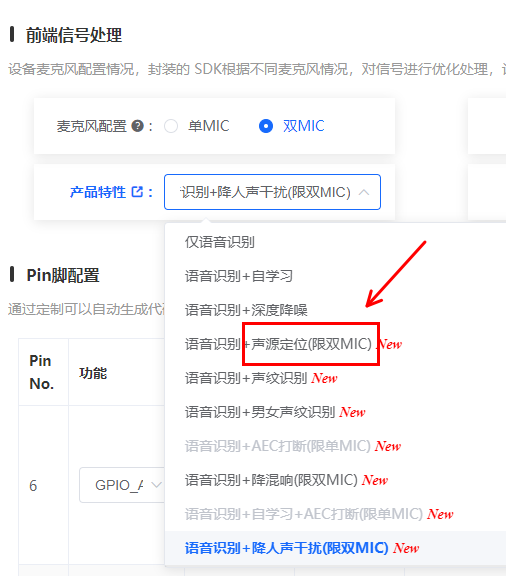

---

### CI-03T数字指令识别误触发如何解决？

**问题描述：**

使用CI-03T模块时，数字指令容易误触发，例如"二十五楼"会被误识别为"五楼"，影响识别可靠性。

**解决方案：**

**1. 问题原因分析**

- 数字指令的发音相似性较高，特别是带数字的指令
- "二十五"和"五"在音频特征上存在相似性
- CI-03T为单麦方案，在复杂环境下识别精度有限

**2. 推荐解决方案**

如需更高的识别可靠性，建议升级到SU-32T模块：

- **SU-32T**：双麦克风阵列方案
- 识别效果优于单麦方案
- 更好的降噪和抗干扰能力
- 数字指令识别准确率更高

**3. CI-03T优化建议**

如继续使用CI-03T，可尝试以下优化：

- 调整指令词条，避免使用相似发音的数字
- 增加指令间的停顿时间
- 在安静环境下使用语音控制
- 适当调整识别门限

**注意事项：**

- 双麦方案成本会高于单麦方案
- SU-32T需要相应的硬件设计调整
- 数字指令误触发是语音识别的普遍挑战
- 根据实际应用需求选择合适的模块

---

### 如何禁用CI-03T1中的特定命令词？

**问题描述：**

在使用CI-03T1芯片时，希望禁用某些旧的命令词（如"到一楼"），以确保新学习的命令词能够生效，实现命令词的替换。

**解决方案：**

**1. 使用禁止识别词功能**

在控制-系统设置中添加禁止识别词：

- 操作路径：控制 → 系统 → 禁止识别词
- 输入要禁用的词条（如"到一楼"）
- 该词条将不再被识别和响应

**2. 批量禁用方案**

如需禁用多个命令词：

- 使用"禁止所有词"功能
- 一次性禁用所有旧命令词
- 为新学习的命令词腾出识别空间

**3. 操作步骤**

- 步骤1：先学习新的命令词
- 步骤2：添加控制指令禁止旧命令词
- 步骤3：测试新命令词的识别效果

**4. 注意事项**

- 禁止识别词只影响识别，不影响已学习的模型
- 新旧命令词相似度较高时可能产生冲突
- 建议使用差异较大的新命令词
- 禁用操作可以随时撤销
- **禁止识别词上限是10个**，超过限制可能导致部分设置无效

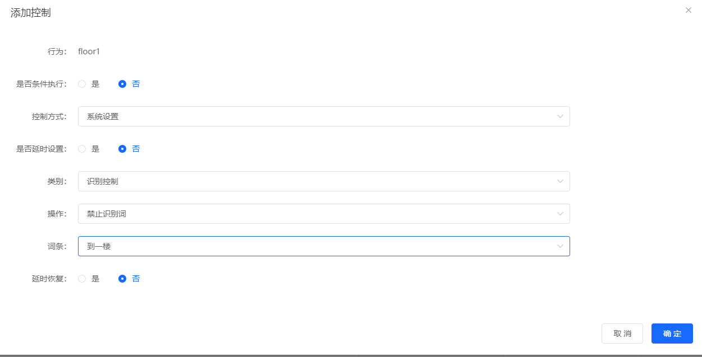


---

### CI-03T1自学习功能出现冲突怎么办？

**问题描述：**

在使用CI-03T1的自学习功能时，新学习的命令词与已有命令词冲突，导致"与播认指令冲突"的提示，或新学习的命令词被一并禁止。

**解决方案：**

**1. 冲突原因分析**

- 新学习的命令词与已有命令词相似度过高
- 系统检测到模型特征相近，产生冲突
- 自学习主要用于方言适配或识别效果差的词条

**2. 解决方案**

- 使用难以触发且独特的词作为自学习触发词
- 选择长句或拗口句子减少误触发
- 避免与现有命令词发音相似的词条

**3. 最佳实践**

- 个别识别差的词条使用自学习优化
- 方言用户可使用自学习功能适配
- 通用命令词建议直接在平台配置

**注意事项：**

- 自学习不是简单的命令替换功能
- 相似命令词建议直接修改配置而非学习
- 冲突时可能需要删除部分已学习的词条

---

### 串口接收数据如何赋值给多个变量？

**问题描述：**

如何将一条串口数据（如AA 55 01 02 03 04 05 55 AA）中的多个数值分别赋值给5个不同的变量。

**解决方案：**

**1. 参数分割设置**

在串口接收配置中：

- 将数据包设置为5个参数
- 每个参数对应一个变量
- 第一个参数赋给变量1，第二个参数赋给变量2，以此类推

**2. 变量设置步骤**

- 添加控制：变量设置
- 选择变量名（如num1, num2, num3...）
- 参数来源：选择对应的参数位置
- 操作：设置

**3. 配置示例**

接收数据包：AA 55 [01] [02] [03] [04] [05] 55 AA

- 参数1（01）→ 变量num1
- 参数2（02）→ 变量num2
- 参数3（03）→ 变量num3
- 参数4（04）→ 变量num4
- 参数5（05）→ 变量num5

**注意事项：**

- 第一位通常是信息号，可能不能改动
- 确保参数数量与实际数据包格式匹配
- 使用变量名时注意大小写一致性


---

### 高噪声环境下声纹识别性能如何？

**问题描述：**

在煤矿等85dB高噪声环境下使用串口指令调用声纹功能时，需要了解声纹识别的性能指标和灵敏度调节能力。

**解决方案：**

- **声纹功能支持**：支持通过串口指令调用声纹注册、删除和识别功能
- **灵敏度调节**：声纹识别的灵敏度是可调节的

**串口指令说明：**

- 指令01：启动声纹注册
- 指令02：删除声纹
- 指令03：启动声纹识别（无需唤醒词）

**注意事项：**

- 具体的识别性能指标暂未提供详细数据
- 建议在实际应用场景中测试验证识别效果
- 高噪声环境下可能需要配合降噪硬件或调整麦克风布局
- 声纹识别支持"工号+姓名"的注册方式

---

### CI-03T1识别率不稳定且偶尔漏识别如何解决？

**问题描述：**

使用CI-03T1模块进行语音识别时，存在识别率不稳定、偶尔漏识别的问题，希望找到识别率更高、更稳定的模块，并咨询是否可以通过3.5mm音频接口直接输入音频信号来提高识别效果。

**解决方案：**

**1. 模块升级建议**

- 推荐升级到SU-32T模块
- SU-32T具有更好的降噪性能和识别稳定性
- 适合对识别率要求较高的应用场景

**2. 音频输入方式说明**

- 3.5mm音频接口输入需要确保咪头电压正确
- 不是任何声音信号都能直接使用
- 需要确认音频信号电平匹配模块要求

**3. 提高识别率的设置**

- 调整识别灵敏度至更高档位
- 在优化选项中选择"命令识别/命令识别阈值"
- 建议设置为0.8以获得最高灵敏度

**注意事项：**

- 使用音频输入时，需要验证信号电平是否在模块接受范围内
- 提高灵敏度会增加误识别率，需要平衡设置
- 直播等特殊应用场景建议先进行实际测试验证

---

### CI-03T如何实现360度声源定位？

**问题描述：**

CI-03T声源定位功能仅支持0-180度范围，需要实现360度全方位定位。

**解决方案：**

**1. 双模块方案**

- **硬件配置**：

    - 使用两个CI-03T模块背对背安装
    - 两个模块覆盖180度范围（0-180度和180-360度）
    - 模块间距适当，避免相互干扰

- **数据处理**：

    - 两个模块独立输出角度值
    - 主控MCU接收两个角度数据
    - 通过计算差值确定声源实际位置

**2. 角度计算示例**

```
左侧模块：0-180度（正面为90度）
右侧模块：180-360度（正面为270度）

声源在左侧：

- 左模块角度 = X度
- 实际位置 = X度

声源在右侧：

- 右模块角度 = 360 - Y度
- 实际位置 = 360 - Y度

背对背声源：

- 需要根据实际测试结果校准
- 可能需要调整参考点
```

**3. 配置要求**

- **模块同步**：

    - 两个模块需要使用相同固件
    - 唤醒词和命令词配置一致
    - 确保模块参数设置相同

- **通信协议**：

    - 设计统一的串口通信协议
    - 添加模块ID标识
    - 确保数据格式一致

**4. 实现步骤**

- **硬件安装**：

    - 确定两个模块的安装位置
    - 保持适当的间距避免遮挡
    - 固定可靠，避免振动影响

- **软件调试**：

    - 先单独测试每个模块
    - 验证角度输出是否正确
    - 调试计算逻辑的准确性

**注意事项：**

- 双模块方案成本较高，根据项目需求选择
- 也可以使用四麦克风阵列实现360度定位
- 背对背安装时注意方向一致性
- 需要根据实际环境进行校准和调试

---

### CI-03T如何实现命令词识别与角度输出结合？

**问题描述：**

需要在命令词识别的同时输出声源定位角度信息，实现更精确的语音交互。

**解决方案：**

**1. 平台配置方法**

- **串口输出配置**：

    - 在命令词动作中添加串口输出
    - 选择UART0_TX作为输出端口
    - 配置发送16进制角度数据

- **角度数据格式**：

    - 将角度值转换为16进制
    - 例如：90度 = 0x5A，180度 = 0xB4
    - 可以包含多个字节的数据

- **命令词与角度关联**：

    - 每个命令词可以设置不同的角度输出
    - 支持使用变量动态调整
    - 实现不同命令词对应不同方向

**2. 配置示例**

```
命令词："向左转"
- 角发动作：播放语音
- 串口输出：发送 5A（90度）

命令词："向右转"
- 角发动作：播放语音
- 串口输出：发送 B4（180度）

命令词："向前走"
- 角发动作：播放语音 + 前进
- 串口输出：发送 5A + 前进数据
```

**3. 主控处理**

- **数据解析**：

    - MCU接收语音识别结果
    - 同时接收角度数据（16进制）
    - 将角度值转换为十进制角度

- **控制逻辑**：

    - 根据识别的命令词执行对应动作
    - 结合角度信息实现精准控制
    - 支持连续的角度更新和跟踪

**4. 高级应用**

- **动态区域响应**：

    - 可以设置角度区域触发不同响应
    - 例如：左侧90度区域播放特定语音
    - 实现智能分区控制

- **多级精度**：

    - 通过算法优化角度精度
    - 使用滤波算法减少噪声影响
    - 实现亚度级的角度分辨

**注意事项：**

- 角度数据与命令词通过同一次串口发送
- 需要设计合理的通信协议避免数据冲突
- 角度精度受限于模块硬件性能
- 建议在实际应用中进行充分测试和校准

### 如何配置和使用声纹识别功能？

**问题描述：**

需要在 CI-03T1/T2 芯片上配置和使用声纹识别功能，特别是如何通过命令词进入注册模式并解决首次注册问题。

**解决方案：**

**声纹识别基本配置：**

1. **平台配置**
    - 开启声纹识别功能开关
    - 设置声纹总数（最多支持 9 个）
    - 配置注册超时时间和识别阈值
    - 添加声纹识别词列表

**注册方式说明：**

- **串口触发注册**：一般通过串口命令进入注册模式
- **命令词触发**：可通过特定命令词触发注册（需定制）
- **语音触发不推荐**：语音能注册的话声纹识别功能就失去意义

**首次注册解决方案：**

由于声纹识别词和正常命令词不在同一个模型中，首次注册需要特殊处理：

1. **串口触发方案**
    - 使用串口命令触发第一个声纹注册
    - 注册完成后将标志位置 1
    - 后续可通过声纹识别命令词注册其他声纹

2. **命令词方案（会消耗声纹位置）**
    - 将"禁用注册声纹"和"允许注册声纹"设为声纹词
    - 占用 2 个声纹位置（共 9 个）
    - 通过标志位掉电保存解决首次注册问题

**授权注意事项：**

- 声纹识别功能需要授权
- 未授权时模块会 5 分钟重启一次
- CI-33T 芯片支持声纹识别功能

---


---

### CI-03T1声纹功能可以用于出货测试吗？

**问题描述：**

询问CI-03T1声纹功能是否可以立即用于出货测试，以及设备每五分钟自动重启是否会影响继电器驱动应用。

**解决方案：**

**测试可行性：**

- **功能测试**：可用于前期功能验证和测试
- **重启机制**：未授权时每5分钟自动重启一次
- **数据保留**：重启不会清除已注册的声纹数据

**应用限制：**

1. **继电器驱动场景**
    - 每5分钟重启会导致继电器频繁断开
    - 不适合直接驱动继电器等功率器件
    - 影响设备稳定性和用户体验

2. **适用场景**
    - 功能验证：测试声纹识别效果
    - 方案评估：确认技术可行性
    - 开发调试：配合固件优化迭代

**量产建议：**

1. **测试阶段**
    - 使用未授权模块完成功能验证
    - 确认所有功能符合需求
    - 记录测试数据和问题

2. **量产准备**
    - 功能验证通过后采购授权模块
    - 授权模块无重启问题，可正常使用
    - 留出充足时间考虑15天授权周期

**注意事项：**

- 未授权模块的重启是正常保护机制
- 测试期间需要考虑重启对应用的影响
- 建议在非关键路径上先进行测试
- 最终产品必须使用授权模块以确保稳定性

**应用场景限制：**

- 适合门锁、保险等安全场景
- 多人同时使用场景（如比赛）声纹模型可能不够
- 建议根据实际需求测试评估


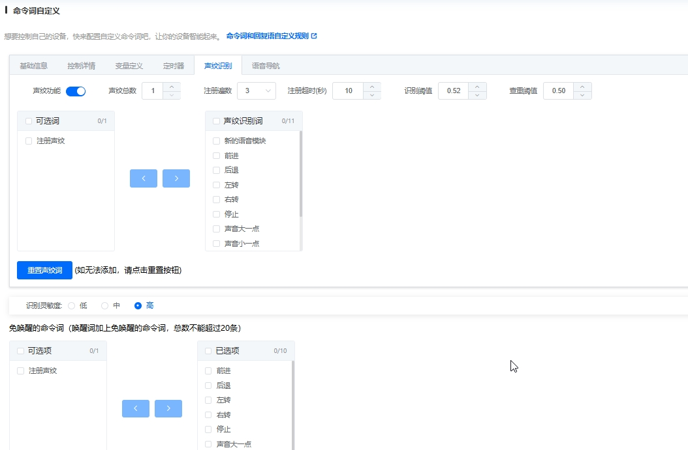

---


---

### 免唤醒命令词播报时触发循环唤醒如何解决？

**问题描述：**

在使用CI-03T系列芯片时，设置免唤醒命令词（如"正常模式"），回复语为"已调到正常模式"。播报回复语时，模块因识别到播报内容中的关键词而被再次唤醒，导致播报内容循环播放。

**解决方案：**

**1. 问题分析**

- 播报内容"已调到正常模式"包含关键词"正常模式"
- 模块识别到该关键词后误触发新的唤醒
- 造成无限循环播放的现象

**2. 解决方法**

**启用AEC功能**：

- AEC（声学回声消除）可以识别并消除自身播放的音频
- 开启AEC后，模块不会识别自己的播报内容
- 从而避免循环触发的问题

**3. 配置步骤**

在智能公元平台中：

- 进入前端信号处理配置
- 开启AEC（声学回声消除）功能
- 保存配置并重新生成固件
- 烧录新固件到模块

**4. 注意事项**

- AEC功能需要硬件支持，确保模块具备此功能
- 开启AEC可能增加一定的计算开销
- 建议在实际使用环境中测试效果
- 该问题并非每次都会出现，属于偶发现象
- 如仍有问题，可录制视频反馈给工程师分析

**5. 预防措施**

- 回复语设计时避免包含唤醒词或命令词
- 可以使用更通用的回复语，如"好的"、"收到"等
- 测试阶段建议多测试各种场景，确保稳定性

---


---

### 嘈杂环境下的语音识别问题如何解决？

**问题描述：**

在声音嘈杂的环境下，语音识别效果差，难以准确识别语音指令。

**解决方案：**

1. **声学结构优化**
    - 尽量隔绝噪音，进行声学结构处理
    - 使用隔音材料或设计声学腔体
    - 确保咪头与噪声源保持足够距离

2. **硬件选型**
    - 使用高规格咪头：灵敏度-32±3dB，信噪比≥65dB
    - 咪头位置尽量远离电机和强电部分
    - 考虑更换为抗噪能力更强的模块（如CI-03T）

3. **软件参数调整**
    - 适当提高语音唤醒灵敏度
    - 在平台中调整识别参数
    - 测试不同灵敏度设置的效果

4. **替代方案**
    - 使用方言的中文谐音作为唤醒词
    - 尝试自学习功能训练特定发音
    - 如有预算，可付费定制方言语料训练

**注意事项：**

- 噪声环境对语音识别影响较大
- 28dB的普通咪头在噪声环境下效果不佳
- 咪头敞开放置时更容易受到干扰
- 谐音方案效果不如专门的语料训练
- CI-03T相比其他型号具有更好的抗噪性能

---


---


---

### 唤醒过于敏感导致频繁误唤醒怎么办？

**问题描述：**

设备唤醒过于敏感，导致频繁误唤醒，影响正常使用。

**解决方案：**

**1. 调整唤醒灵敏度**

- 在智能公元平台中降低唤醒灵敏度设置
- 将唤醒阈值调高，减少误触发
- 优先选择4个字的唤醒词，降低误唤醒概率

**2. 优化唤醒词选择**

- 使用4个字或更长的唤醒词
- 避免使用与环境音相似的词汇
- 选择发音独特不易混淆的词语

**3. 环境降噪措施**

- 减少环境噪声源
- 远离音响、电视等发声设备
- 必要时增加延时设置，避免连续误触发

**4. 高级优化方案**

- 使用双麦降噪模块（如CI-03T）
- 启用AEC回声消除功能
- 调整麦克风增益到合适水平

**注意事项：**

- 降低灵敏度会增加唤醒难度，需找到平衡点
- 4字唤醒词相比3字词误唤醒率更低
- 在实际使用环境中反复测试调整

---

## 唤醒词设置


---


---

### 小语种发音人选择较少怎么办？

**问题描述：**

日语、俄语等小语种的发音人选择较少，目前仅有单一选项，希望增加更多语音选择。

**解决方案：**

**1. 当前状况说明**

- 小语种功能刚推出不久，发音人选项有限
- 日语目前仅有"橙子"女声一个选项
- 后续会逐渐增加和完善发音人选择

**2. 个性化音频替代**

- 使用CI-03T和CI-33T可自行替换播报音
- 中英日韩语言可在平台直接上传个性化音频
- 每条回复语可对应不同的自定义音频

**3. 操作步骤**

- 登录智能公元平台
- 进入"个性化音频"配置页面
- 上传录制好的音频文件（WAV/MP3格式）
- 将音频分配给对应的播报内容
- 重新生成固件

**注意事项：**

- 俄语/德语/西班牙语等需要通过文件替换实现
- 个性化音频是逐条替换，非整体TTS引擎替换
- 可参考B站教程：N003新手入门教程——个性化音频+音量调节


---


---

### CI-03T支持播放过程中的语音打断功能吗？

**问题描述：**

需要了解CI-03T系列芯片是否支持在播放音频过程中通过语音唤醒实现硬件端的打断功能。

**解决方案：**

CI-03T系列模块支持硬件打断功能，可实现播放过程中的语音唤醒打断。

**功能特点：**

1. **硬件端打断**
    - CI-03T支持硬件级别的音频打断功能
    - 在播放语音播报或音频时，可通过唤醒词即时打断
    - 打断响应速度快，用户体验更好

2. **实现方式**
    - 通过硬件检测唤醒词，触发中断信号
    - 主控MCU接收到中断信号后立即停止播放
    - 无需等待软件处理，响应更及时

3. **与软件打断对比**
    - **硬件打断**：响应快，不依赖软件轮询
    - **软件打断**：需要软件检测，响应相对较慢

**应用场景：**

- 智能音箱播放音乐时的语音控制
- 语音助手播报过程中的指令打断
- 智能家电提示音期间的快速响应

**注意事项：**

- 需要在固件配置时启用打断功能
- 确保主控MCU正确处理中断信号
- 建议在产品设计阶段预留中断处理接口
- 不同型号的CI-03T（CI-03T1/CI-03T2）均支持此功能

---


---

### 如何选择启英泰伦芯片方案？

**问题描述：**

对启英泰伦公司不太了解，需要获取公司及产品的介绍资料，以便进行内部选型汇报。

**解决方案：**

**1. 芯片供应商信息**

- CI-03T使用启英泰伦芯片
- SU-03T使用云知声芯片
- 启英泰伦专注语音识别芯片研发

**2. 公司背景**

- 官网：www.chipintelli.com
- 专业的语音芯片供应商
- 在电子、科技类客户中采用较多
- 医疗器械、教育类领域也有应用案例

**3. 技术特点**

- 支持中英日韩多语言识别
- 双模型支持需要较大Flash空间
- CI-03T、CI-33T支持双模型功能

**4. 选型建议**

- 如需中英双模型：选择启英泰伦芯片方案
- 数字识别要求高：可考虑云知声等其他方案
- 建议购买样品实测效果后再做决定

**注意事项：**

- 启英泰伦在消费电子领域知名度相对较低
- 技术资料需通过代理商获取
- 量产前务必进行充分测试验证
- 可联系工程师获取更详细的产品资料

---


---

### 如何实现方言唤醒词识别？

**问题描述：**

希望CI-03T系列芯片能够识别上传的方言作为唤醒词，提升本地化用户体验。

**解决方案：**

**1. 自学习功能**

- 使用平台的自学习功能录入方言
- 上传方言音频作为唤醒词样本
- 系统会自动训练适配方言特点

**2. 方言语料训练**

- 提供方言语料进行定制训练
- 录制标准方言发音样本
- 通过训练服务生成方言模型

**3. 配置步骤**

- 进入自学习配置页面
- 选择唤醒词自学习选项
- 上传或录入方言音频
- 生成固件并测试效果

**注意事项：**

- CI-03T和CI-33T支持粤语等常见方言
- 方言识别效果取决于样本质量和数量
- 建议提供多人发音的样本覆盖差异
- 如需特殊方言支持，可联系技术支持评估

---


---

### 如何配置中英文混合的语音识别？

**问题描述：**

需要在CI-03T2上实现100条语音指令识别，大部分为中文，少量为英文，并解决声源定位无法区分前后的问题。

**解决方案：**

**多语言配置方法：**

1. **英文命令词处理**
    - 英文单词使用中文谐音替代
    - 例如："hello" → "哈喽"
    - 在平台上直接输入中文谐音词

2. **中文命令词**
    - 直接使用原中文命令词
    - 保持原有发音和语调
    - 确保命令词清晰易识别

3. **配置步骤**
    - 在智能公元平台逐个添加命令词
    - 设置对应的识别响应动作
    - 生成固件并烧录到模块

**声源定位前后区分方案：**

**问题分析：**

- 双麦克风只能识别0-180度角度
- 无法区分声音来自正面还是背面
- 背面声源会镜像到对应前方角度

**解决方案：**

1. **双模块方案**
    - 使用两个双麦模块背对背安装
    - 每个模块覆盖180度范围
    - 通过数据融合实现360度识别

2. **传感器辅助**
    - 增加接近传感器或红外传感器
    - 判断有人在前方还是后方
    - 结合声源定位角度给出准确方向

**注意事项：**

- 英文命令词必须用中文谐音注册
- 测试时在安静环境下进行
- 双模块方案需要 MCU 有两个 UART 接口
- 建议先测试单模块效果再决定是否需要双模块

---

### CI-03T韩语唤醒词识别灵敏度如何优化？

**问题描述：**

使用韩语唤醒词时出现识别灵敏度不足的问题，需要在较远距离才能唤醒设备，且唤醒不稳定，有时无法唤醒。

**解决方案：**

**1. 硬件配置检查**

确认前端信号处理配置正确：

- 麦克风配置：单MIC
- 距离识别：远场1-5m
- 产品特性：老版本语音识别+稳态降噪


**2. 灵敏度参数优化**

调整唤醒和识别相关参数：

- 将唤醒灵敏度从"中"调高至"高"
- 降低命令识别阈值（从默认0.2调至0.01-0.05）
- 重新生成固件并测试效果


**3. 唤醒词优化**

使用训练成熟的韩语唤醒词：

- 推荐使用：하이 베스트（嗨，最佳）、수성（水星）、하이 시스템（你好系统）
- 避免使用自创或生僻的韩语词汇
- 这些唤醒词经过大量样本训练，识别效果更佳

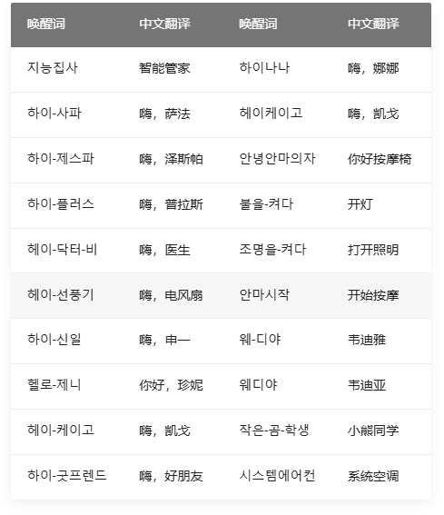

**4. 固件定制优化**

如上述优化后效果仍不理想：

- 联系技术支持进行专项优化
- 可针对性调整特定唤醒词的算法参数
- 提供实际使用场景的语音样本用于训练

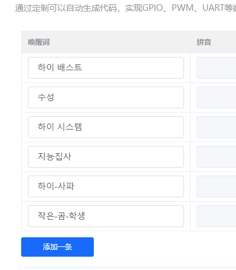

**5. 唤醒回复语配置**

- 设置合适的唤醒回复语（如"네"）
- 确保回复语与唤醒词匹配，避免误唤醒
- 可根据需要修改回复语内容


**注意事项：**

- 韩语发音特点与中文不同，可能需要更高的灵敏度设置
- 优化后需要在实际使用环境下充分测试
- 唤醒词的选择对识别率影响极大，建议优先使用推荐词汇
- 如有普通话误唤醒问题，可在禁止识别词中添加相关词汇

---

### CI-03T固件更新后唤醒距离不稳定怎么办？

**问题描述：**

固件更新后出现唤醒距离不稳定的问题：1.1米距离无法唤醒，但靠近后可以唤醒；靠近咪头用唤醒语触发后，离远一点都可以唤醒。

**解决方案：**

**1. 固件版本确认**

- 确保使用的是有效且未过期的固件文件
- 避免使用已失效的固件版本


**2. 唤醒词数量优化**

- 唤醒词数量过多可能导致误报率增加
- 建议只使用2-3个唤醒词以提高识别准确性
- 选择发音差异明显的唤醒词组合

**3. 平台配置修改**

用户可以在智能公元平台上自行修改唤醒词：

- 登录智能公元平台进入项目配置
- 在唤醒词配置界面添加或修改唤醒词
- 支持韩语、中文等多种语言唤醒词


**4. 唤醒词选择建议**

对于韩语应用，推荐使用以下唤醒词组合：

- 하이 배스트（嗨，最佳）
- 지능집사（智能管家）
- 避免使用过多相似发音的唤醒词


**5. 参数重新校准**

如距离问题持续存在：

- 重新校准唤醒阈值设置
- 调整远场/近场识别距离参数
- 联系技术支持进行专项优化

**注意事项：**

- 固件更新后建议在典型使用环境下进行充分测试
- 唤醒词数量与识别准确率需要平衡
- 不同批次的模块可能存在细微差异，需要分别调试
- 韩语环境下使用，建议优先选择官方推荐的韩语唤醒词

---
### CI-302在周围环境声音很大的情况下，很难唤醒怎么做解决方案

**问题描述：**

在周围环境声音很大的情况下，CI-302模块很难被唤醒，需要解决方案来提高在噪声环境下的唤醒成功率。

**解决方案：**

**1. 启用深度降噪功能**

通过智能公元平台配置降噪功能：

- **产品特性设置**：选择"语音识别+深度降噪"
- **麦克风配置**：根据硬件选择"单MIC"或"双MIC"
- **应用场景选择**：选择"中文烟机通用Pro"
- **声学模型**：使用对应的噪声优化模型


**2. 配置要点**

- 深度降噪功能专门针对高噪声环境优化
- 烟机应用场景针对电机噪声进行了特殊优化
- 建议在安静环境下进行初始配置和测试

**注意事项：**

- 深度降噪功能与自学习功能存在冲突，无法同时启用
- 根据实际需求选择降噪或自学习功能
- 可适当调整安装位置，远离主要噪声源

---

### SU-03T自学习功能如何使用

**问题描述：**

用户需要了解如何启用和使用SU-03T的自学习功能，以及如何进行命令词训练。

**解决方案：**

**1. 功能启用**

- SU-03T支持自学习功能，可以让用户现场录制语音指令
- 通过智能公元平台配置时，选择"语音识别+自学习"选项
- 用户可以在产品设置中进行录音操作

**2. 训练步骤**

- 确保在安静环境下进行录音
- 每个命令词建议录制2-3次以提高成功率
- 录制的语音数据会存储到模块中
- 适合地区口音差异较大的使用场景

**注意事项：**

- 自学习功能与深度降噪功能冲突，无法同时使用
- 录音时保持环境安静，避免背景噪声干扰
- 录制完成后进行测试验证识别效果

---

### GPIO驱动LED是否需要限流电阻

**问题描述：**

使用SU-03T直接驱动LED时，是否需要添加限流电阻。

**解决方案：**

**电阻需求判断**

- SU-03T的GPIO口直接驱动LED时，建议添加限流电阻
- 限流电阻可以保护LED和模块的GPIO口
- 具体阻值根据LED规格和工作电流确定

**电阻选型建议**

- 标准LED通常工作电流为5-20mA
- 对于5V系统，推荐使用220Ω-1kΩ的限流电阻
- 具体计算公式：R = (Vcc - Vf) / I
    - Vcc：供电电压
    - Vf：LED正向压降（通常1.8-3.3V）
    - I：期望的工作电流

**示例配置**

- 5V供电，红色LED（Vf=2V），期望10mA电流：

    - R = (5V - 2V) / 0.01A = 300Ω
    - 可选用330Ω标准电阻

---

### 继电器开机吸合问题解决

**问题描述：**

使用三极管控制继电器时，开机瞬间继电器会吸合一下，需要解决方案。

**解决方案：**

**问题原因**

- GPIO在上电瞬间可能处于浮空状态
- 导致三极管基极电压不稳定，误触发导通

**解决方法**

1. **添加下拉电阻**
    - 在三极管基极和地之间添加10kΩ下拉电阻
    - 确保GPIO在未初始化时保持低电平

2. **硬件连接优化**
    - 对于NPN三极管（如8050）：

        - 基极串联1kΩ限流电阻
        - 基极对地添加10kΩ下拉电阻
    - 确保低电平控制方式正确配置

**注意事项**

- 下拉电阻阻值建议为10kΩ，过大可能效果不佳
- 检查控制逻辑，确认是低电平还是高电平触发
- 继电器线圈两端建议添加续流二极管

---

### SU-03T端口多程序控制功能

**问题描述：**

用户希望了解SU-03T是否支持一个端口控制多种不同的输出模式，如根据不同命令输出不同数量的脉冲。

**解决方案：**

**功能确认**

- SU-03T支持端口多程序控制功能
- 可以通过配置实现一个端口根据不同命令执行不同动作
- 支持输出不同数量的脉冲、控制不同时序等

**配置方法**

1. **通过智能公元平台配置**
    - 在产品特性中选择相应的控制模式
    - 配置GPIO输出方式（脉冲、电平、PWM等）
    - 设置不同命令对应的输出参数

2. **编程实现**
    - 支持配置不同命令词触发不同的端口动作
    - 可以设置输出脉冲数量（如5个、6个、10个等）
    - 支持复杂的时序控制

**应用场景**

- 控制步进电机步数
- 控制舵机角度
- 控制LED闪烁次数
- 其他需要量化输出的应用

---

### CI-03T与SU-03T选型对比

**功能对比**

| 功能特性 | CI-03T | SU-03T |
|---------|--------|--------|
| 核心芯片 | CI1302 | CI1302 |
| 自学习功能 | ✅ 支持 | ✅ 支持 |
| 深度降噪 | ✅ 支持 | ✅ 支持（与自学习冲突） |
| 多程序端口控制 | ✅ 支持 | ✅ 支持 |
| 串口通信 | ✅ 支持 | ✅ 支持 |
| GPIO数量 | 更多 | 标准配置 |
| 功耗 | 标准功耗 | 优化功耗 |

**选型建议**

- **需要更多GPIO口**：选择CI-03T
- **功耗敏感应用**：选择SU-03T
- **基本语音控制**：两者均可满足
- **复杂控制逻辑**：选择CI-03T

---

### JX-A7T大模型对接

**功能说明**

JX-A7T是支持大模型对接的语音模块，可以集成云端AI服务。

** capabilities**

- 支持对接大语言模型（如DeepSeek等）
- 可通过串口接收问题并返回AI回答
- 支持语音交互获取云端AI服务

**注意事项**

- 当前版本需要定制开发
- 未来将提供标准接口支持
- 需要网络连接访问云端服务

---

### 串口通信协议配置

**CI-03T/CI-1302串口配置**

通过智能公元平台可以灵活配置串口通信参数：

- **波特率**：支持多种标准波特率
- **数据格式**：可配置帧头帧尾
- **通信协议**：支持自定义协议格式
- **数据收发**：双向通信支持

**配置步骤**

1. 在智能公元平台创建工程
2. 选择对应的模块型号
3. 在串口配置界面设置通信参数
4. 配置帧结构（帧头、数据长度、校验、帧尾）
5. 生成固件并烧录

**应用示例**

- 与MCU串口通信控制
- 接收传感器数据并语音播报
- 通过串口控制其他设备
---

### 模块靠近播放设备时无法唤醒怎么办？

**问题描述：**

当模块靠近手机或其他播放设备（正在播放音乐或视频）时，语音唤醒和命令词识别无法正常工作，即使将播放音量调到很小也无效果。

**解决方案：**

**问题原因**

- 播放设备发出的音乐中包含人声（歌词）
- 语音识别算法将播放的人声误判为环境噪声或干扰信号
- 模块的麦克风接收到较强的音频信号，影响正常语音识别

**解决方法**

1. **尝试降噪语音模型**
    - 使用CI-03T模块时可选择带降噪的语音模型
    - 在平台配置中选择"语音识别+降噪"模式
    - 注意：降噪模式与声源定位功能可能存在冲突，需根据需求选择

2. **调整设备位置**
    - 增大模块与播放设备之间的距离
    - 将模块远离扬声器方向放置
    - 在硬件设计时预留合理的安装间距

3. **降低播放音量**
    - 适当降低播放设备的音量
    - 避免在最大音量下进行语音控制
    - 在安静环境下测试确认模块功能正常

4. **使用AEC回声消除功能**
    - 如果是模块自身播放导致的干扰，可启用AEC（声学回声消除）
    - 内置AEC：单麦模块可直接使用内置AEC功能
    - 外部AEC：双麦AEC需要额外外接芯片，涉及硬件和软件调试，建议使用单麦内置AEC

**注意事项：**

- 降噪模型与声源定位功能互斥，不能同时启用
- 如果需要同时使用声源定位和降噪，需考虑其他方案
- 在高噪声环境下，识别率下降是正常现象

---

### 内部AEC和外部AEC有什么区别？

**问题描述：**

在配置界面中看到"内部AEC"和"外部AEC"选项，需要了解两者的区别和选择方法。

**解决方案：**

**AEC（声学回声消除）功能说明**

AEC用于消除模块自身播放声音对麦克风拾音的干扰，实现"一边播放一边识别"的功能。

**内部AEC vs 外部AEC**

| 特性 | 内部AEC | 外部AEC |
|------|---------|---------|
| 麦克风要求 | 单麦克风 | 双麦克风 |
| 硬件要求 | 无需额外硬件 | 需要外接AEC专用芯片 |
| 调试难度 | 直接可用，开箱即用 | 需要调试软件和硬件 |
| 适用场景 | 一般应用 | 高性能回声消除需求 |
| 推荐程度 | ✅ 推荐使用 | ⚠️ 需要专业技术 |

**选择建议**

1. **大多数情况使用内部AEC**
    - 无需额外硬件，配置简单
    - 单麦模块即可实现
    - 满足大多数应用场景需求

2. **外部AEC的适用场景**
    - 对回声消除效果有极高要求
    - 具备硬件调试能力
    - 愿意投入额外成本（外接芯片）

**配置方法**

- 在平台配置的"前端信号处理"中选择AEC相关选项
- 如不确定，直接使用内部AEC即可
- 双麦AEC需要硬件配合，不建议初学者尝试

**注意事项：**

- 使用外部AEC会增加硬件成本和开发复杂度
- 声源定位+ AEC组合需要双MIC+外部AEC支持
- 配置前请确认硬件是否满足要求

---

### AEC打断功能如何配置才能支持命令词打断？

**问题描述：**

启用AEC打断功能后，播放音乐时只有唤醒词能打断，命令词不能打断。

**解决方案：**

**原因分析：**

AEC 打断方式通过 `aec_type` 参数控制，默认值为 "0"，仅支持唤醒词打断。如需命令词打断功能，需要修改此参数。

**aec_type 参数说明：**

| 参数值 | 打断方式 |
|--------|----------|
| `"0"` | 仅唤醒词打断（默认） |
| `"1"` | 仅命令词打断 |
| `"2"` | 唤醒词 + 命令词均可打断 |

**配置示例**（JSON 格式）：

```json
"aec_config": {
  "open": "1",
  "aec_gain": 1,
  "aec_enable_threshold": 6000,
  "aec_type": "2"
}
```

**完整参数说明：**

| 参数 | 说明 |
|------|------|
| `open` | AEC 功能开关："1"=开启，"0"=关闭 |
| `aec_gain` | AEC 增益系数，通常设为 1 |
| `aec_enable_threshold` | AEC 启用阈值，默认 6000 |
| `aec_type` | 打断类型配置 |

**注意事项：**

- 修改 `aec_type` 后需重新生成并烧录固件才能生效
- 命令词打断功能依赖于正确的 AEC 参考信号接入
- 如需同时支持唤醒词和命令词打断，建议设置为 `"2"`
