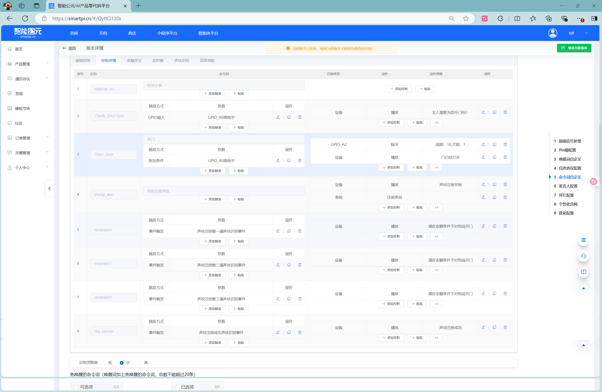
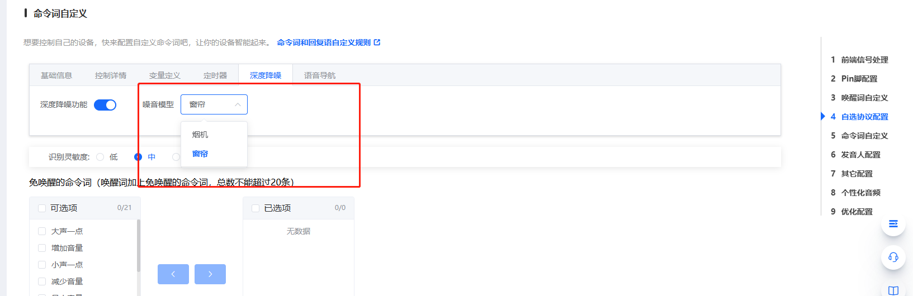
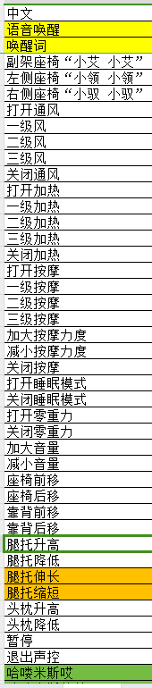
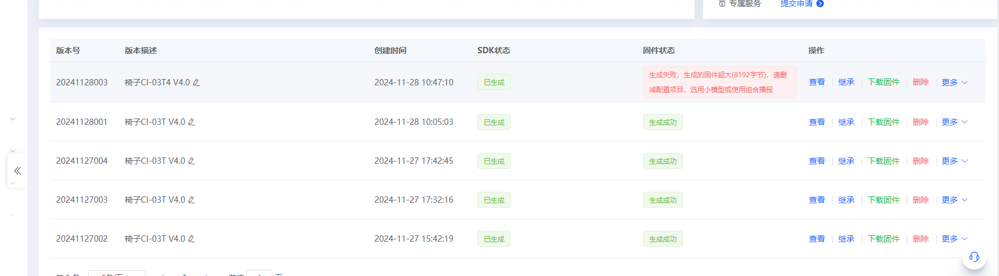
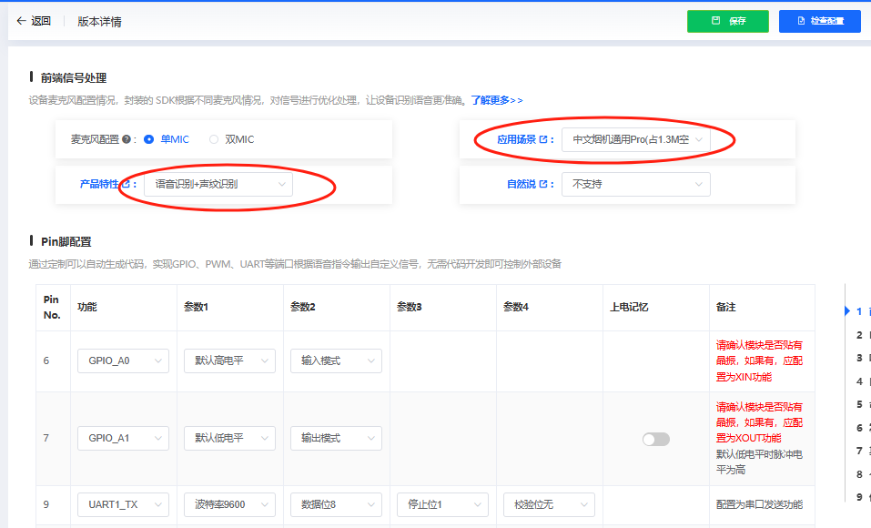
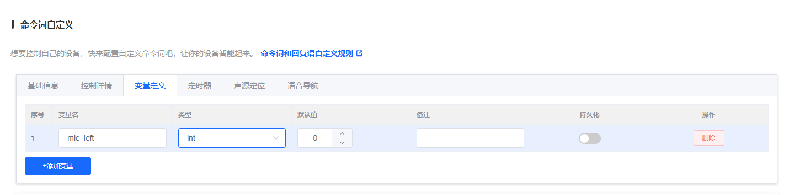
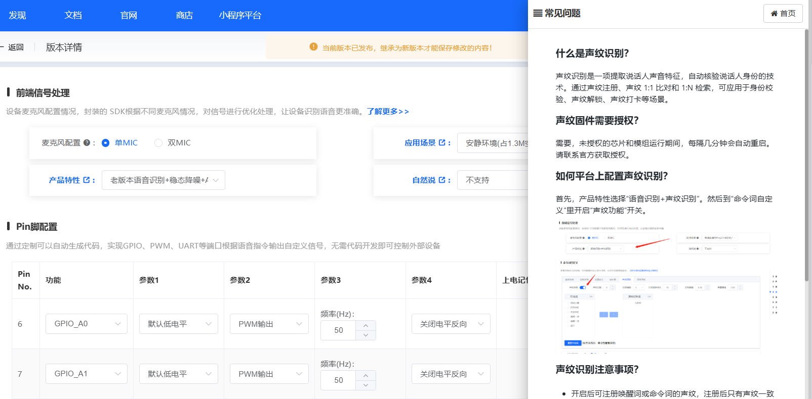

# CI-33T 语音调优 FAQ

本页用于整理 CI-33T 相关的语音调优问题。

## 声纹识别

### CI-33T声纹识别注册后无法识别怎么办？

**问题描述：**

CI-33T模块按照流程完成声纹注册，但无法成功识别声纹，无法区分不同用户。

**解决方案：**

**1. 使用修复后的固件**

- 联系技术支持获取包含声纹识别修复的固件
- 下载jx_firm.rar压缩包
- 使用新固件重新烧录模块

**2. 声纹注册流程**

正确的注册步骤：

- 配置"开始注册声纹"事件触发
- 执行"声纹注册第一遍"
- 执行"声纹注册第二遍"
- 确保两遍注册语音质量良好



**3. 识别测试方法**

- 注册完成后进行声纹识别测试
- 使用注册时的相同语音说出命令词
- 确认声纹识别是否正常工作
- 验证不同声纹是否能正确区分

**注意事项：**

- 声纹识别对语音质量要求较高
- 注册时环境要安静，避免噪音干扰
- 确保注册的语音样本清晰、完整
- 如问题持续，可能需要重新注册声纹

---

### CI-33T使用新版本语音模型无反应怎么办？

**问题描述：**

CI-33T模块使用V00942及之后版本的语音识别模型时，完全无反应，连开机播报都没有，但使用V00487等旧版本模型正常。

**解决方案：**

**1. 问题分析**

- 新版本模型（V009之后）与旧项目配置可能存在兼容性问题
- 深度降噪功能需要配合特定的Pro模型使用
- 模型选择错误会导致程序走错，无法正常启动

**2. 配置检查**

- 确认应用场景选择了正确的模型版本
- 如使用深度降噪，必须选择对应的Pro模型
- 检查产品特性设置是否匹配模型要求

**3. 解决步骤**

**步骤一：使用旧版本模型**

- 暂时使用V00487等稳定版本
- 保留项目配置不变
- 确保基本功能正常

**步骤二：逐步升级配置**

- 新建项目，选择新版本模型
- 重新配置所有功能
- 测试验证后再替换原项目

**步骤三：深度降噪配置**

- 选择"烟机"或"窗帘"的Pro模型
- 确保开启深度降噪开关
- 验证麦克风配置为单MIC

**4. 版本兼容说明**

```
推荐配置组合：

- 普通话场景：静环境(V00487)、普通通话Pro
- 深度降噪：必须配合烟机/窗帘Pro模型
- 新版本模型：建议新建项目配置
```

**注意事项：**

- 新版本模型可能改变了引脚配置或参数格式
- 直接替换模型而不调整配置可能导致无响应
- V009之后的多个版本（V00942、V00969、V00973）都存在类似问题
- 如急需使用，建议暂时使用旧版本模型



---

### CI-33T固件中英文切换功能异常如何解决？

**问题描述：**

在使用CI-33T固件V2.0.0时，出现中文转英文功能正常，但英文转中文功能失效的问题。

**解决方案：**

**问题定位：**

1. **固件版本确认**：

    - 确认使用的是V2.0.0版本固件
    - 该版本存在中英文切换功能异常的问题
    - 需要升级到修复版本

2. **切换逻辑说明**：

    - 中文转英文：应回复英文"OK"
    - 英文转中文：应回复中文"好的"
    - 语言切换后应保持对应语言的回复方式

**修复步骤：**

1. **获取修复版本固件**：

    - 联系技术支持获取最新修复版本
    - 确保固件版本包含中英文切换修复
    - 验证固件的MD5校验码

2. **功能验证**：

    - 测试中文→英文切换功能
    - 测试英文→中文切换功能
    - 确认回复语言正确性

**配置注意事项：**

- 中英文切换词条需要分别配置
- 回复语语言应与切换后语言一致
- 建议保留唤醒词的语言一致性

---


---

### CI-33T指令泛化后识别准确率低怎么办？

**问题描述：**

设置指令泛化后，单个指令的识别准确率极低，难以被正确识别。

**解决方案：**

**问题分析：**

1. **泛化词过多**：

    - 单个命令词生成过多泛化组合
    - 导致识别引擎负担过重
    - 各个泛化词差异太小，容易混淆

2. **识别困难原因**：

    - 泛化词数量过大（如88个）
    - 语音模型难以区分相似指令
    - 识别准确率大幅下降

**优化方法：**

1. **分离命令词**：

    - 不要使用单个命令词生成大量泛化
    - 将功能分散到多个命令词
    - 每个命令词对应较少的泛化

2. **配置建议**：

    - 创建多个独立的命令条目
    - 每个条目使用不同的核心词
    - 减少每个词条的泛化数量

3. **具体操作**：

    - 将"请去|把|帮我|我要"分开使用
    - 创建独立的命令条目
    - 避免一个命令触发过多变体

**注意事项：**

- 泛化功能适用于少量变化（3-5个）
- 过多泛化会降低识别率
- 建议直接添加多个不同的命令词
- 测试时逐步调整找到最佳平衡点

---

### CI-33T固件特定指令识别错误如何处理？

**问题描述：**

CI-33T固件V2.0.0存在以下识别问题：

1. 喊"零重力"指令无作用
2. 喊"打开标准模式"，回复错误（回复"睡眠模式已打开"）
3. 喊"关闭标准模式"，回复错误（回复"睡眠模式已关闭"）
4. 语音识别灵敏度需要调高

**解决方案：**

**问题分析与修复：**

1. **词条配置检查**：

    - 检查命令词列表中是否包含"标准模式"相关词条
    - 确认命令词与回复语的对应关系
    - 验证发送码与功能匹配

    

    *命令词列表显示缺少"标准模式"相关命令*

2. **固件修复内容**：

    - 添加缺失的"打开标准模式"和"关闭标准模式"命令词
    - 修正"零重力"指令的发送码
    - 调高语音识别灵敏度参数
    - 修正回复语内容错误

3. **语音待机时间调整**：

    - 将语音待机时间调整为30秒
    - 设置超时退出提示："如果30秒后无任何操作，系统会自动退出"

    

    *待机时间设置为30秒的配置界面*

**功能验证要点：**

1. **指令功能测试**：

    - "零重力"：确认能正确控制并回复
    - "打开标准模式"：确认回复"标准模式已打开"
    - "关闭标准模式"：确认回复"标准模式已关闭"

2. **识别效果验证**：

    - 测试不同距离下的识别效果
    - 验证灵敏度提升后的改善程度
    - 确认无误识别率增加

**注意事项：**

- 固件升级后需要重新学习用户习惯
- 灵敏度调整需要平衡识别率和误识别率
- 建议在典型使用环境下充分测试

---


---

### CI-33T固件如何定制不同唤醒词版本？

**问题描述：**

需要为CI-33T固件定制三个独立版本，每个版本使用不同的唤醒词：

- 副驾座椅：小艾，小艾
- 左侧座椅：小领，小领
- 右侧座椅：小驭，小驭

**解决方案：**

**定制方案说明：**

1. **独立固件版本**：

    - 每个唤醒词需要单独的固件版本
    - 不同固件间的发送码保持一致
    - 仅唤醒词设置不同

2. **中英文切换配置**：

    - 中文唤醒词：如上述配置
    - 英文切换词：与中文唤醒词对应
        - 副驾：Hello Miss Ai
        - 左侧：Hello Mr. Ling
        - 右侧：Hello Mr. Yu

    

    *用于中英文切换的英文唤醒词列表*

    

    *英文唤醒词与座椅的对应关系*

**实施步骤：**

1. **创建三个独立项目**：

    - 在智能公元平台创建三个独立项目
    - 分别配置不同的唤醒词
    - 复制相同的命令词和控制逻辑

2. **固件生成与测试**：

    - 分别生成三个版本的固件
    - 为每个固件文件标记对应的唤醒词
    - 进行功能验证确保无差异

3. **生产管理**：

    - 固件命名包含唤醒词信息
    - 建立版本管理表避免混淆
    - 烧录时严格区分版本

**版本管理建议：**

- 固件命名格式：CI33T_座椅类型_唤醒词_版本.bin
- 建立版本追踪表记录MD5和功能
- 保留完整的测试记录

---


---

### CI-33T东北口音唤醒词识别问题如何优化？

**问题描述：**

CI-33T模块在使用东北口音时，"小领"唤醒词识别不灵敏，而"小驭"唤醒词识别灵敏，需要优化唤醒词识别效果。

**解决方案：**

**问题分析：**

1. **声学模型差异**：

    - "小领"发音在东北口音中声学特征不明显
    - "小驭"发音更清晰，识别效果更好
    - 需要通过算法优化改善"小领"的识别率

2. **固件优化方案**：

    **方案一：添加相似发音词**

    - 在固件中添加"小玲"、"小令"等相似发音词
    - 用户可使用任一词汇进行唤醒
    - 提高东北口音用户的唤醒成功率

    **方案二：单独优化"小领"模型**

    - 联系技术支持针对"小领"进行专项优化
    - 提供东北口音样本用于模型训练
    - 生成优化版本的固件

3. **配置建议**：

    - 唤醒灵敏度调整：适当提高唤醒灵敏度
    - 多次测试验证：在不同距离、角度下测试
    - 记录识别数据：统计唤醒成功率用于优化

**实施步骤：**

1. **收集语音样本**：

    - 录集东北口音用户说"小领"的音频样本
    - 提供足够数量用于模型训练
    - 包含不同语速、语调的样本

2. **固件更新流程**：

    - 联系技术支持提交优化需求
    - 等待优化版本固件完成
    - 烧录测试验证效果改善

3. **用户测试验证**：

    - 邀请东北口音用户参与测试
    - 对比优化前后的识别效果
    - 收集反馈用于进一步优化

**临时解决方案：**

1. **使用其他唤醒词**：

    - 建议用户使用"小驭"等识别效果好的词
    - 在固件中配置多个可选唤醒词
    - 提供用户自定义选择

2. **调整使用习惯**：

    - 指导用户使用更清晰的发音
    - 保持相对固定的说话距离和角度
    - 避免在嘈杂环境下使用

**技术说明：**

- 东北口音特点：声调起伏大、某些发音模糊
- 算法限制：需要足够样本数据才能有效优化
- 优化周期：模型优化通常需要1-2周时间

**注意事项：**

- 唤醒词优化需要专业的声学样本支持
- 建议在项目初期就考虑方言适配需求
- 优化效果因人而异，需要充分测试验证
- 如有量产需求，建议提前进行方言适配测试

---


---

### CI-33T首次上电误唤醒问题如何解决？

**问题描述：**

CI-33T模块首次上电时容易出现误唤醒，之后恢复正常。每次重新上电都会出现此问题。

**解决方案：**

**问题原因分析：**

1. **初始化不稳定**：

    - 上电瞬间音频前端电路未稳定
    - 唤醒算法在初始化阶段可能过于敏感
    - 电源纹波影响识别精度

2. **硬件因素**：

    - 麦克风供电瞬态变化
    - 音频参考电压波动
    - EMC干扰导致误触发

**解决方法：**

1. **软件延时初始化**：

    - 在固件中增加上电延时
    - 延迟唤醒算法启动时间（如延迟500ms-1s）
    - 等待电路稳定后再启用唤醒检测

2. **硬件滤波优化**：

    - 在麦克风供电端增加滤波电容
    - 优化音频电路的稳定性
    - 检查PCB布局减少干扰

3. **唤醒阈值动态调整**：

    - 上电初期使用较高的唤醒阈值
    - 正常工作后逐步降低到最佳值
    - 避免初始化阶段的误触发

**实施建议：**

1. **固件配置**：

    - 联系技术支持添加上电延迟功能
    - 配置动态阈值调整参数
    - 增加上电状态指示功能

2. **硬件改进**：

    - 在VCC供电端增加10uF电解电容
    - 麦克风信号线增加100nF去耦电容
    - 确保音频地线良好接地

3. **测试验证**：

    - 多次开关机测试误唤醒情况
    - 记录不同环境下的表现
    - 调整延迟时间找到最佳平衡点

**参数调优建议：**

- **延迟时间**：从500ms开始测试，最长可设置到2s
- **初始阈值**：比正常阈值高20-30%
- **恢复时间**：正常工作后10-20秒恢复到标准阈值
- **状态指示**：通过GPIO或LED指示初始化完成

**注意事项：**

- 上电延时会影响用户体验，需平衡稳定性和响应速度
- 硬件改动需要验证对整体性能的影响
- 建议在量产前进行充分的可靠性测试
- 保留问题记录便于后续分析和改进

---


---

### CI-33T在空旷且人员较多的环境中识别困难怎么办？

**问题描述：**

CI-33T在安静环境测试正常，但在空旷且人员较多的环境中（如现场）难以识别口令，需要了解该产品是否具备降噪和回声抑制功能。

**解决方案：**

**功能支持确认：**

CI-33T模块支持以下降噪和回声抑制功能：

1. **AEC（声学回声消除）**：

    - 支持回声抑制功能
    - 可在播放音频时减少对麦克风的影响
    - 适合需要语音打断的场景

2. **双麦克风降噪**：

    - CI-33T为双麦克风版本
    - 支持阵列降噪算法
    - 能有效抑制环境噪声

**环境适应性优化：**

1. **开启AEC打断功能**：

    - 在智能公元平台的产品特性中选择"AEC"相关功能
    - 该功能对空旷环境的反射声有抑制作用
    - 可提升复杂声学环境下的识别率

2. **双麦克风版本优势**：

    - 空旷环境存在较多反射和混响
    - 双麦克风阵列能更好地区分人声和反射声
    - 相比单麦克风版本有更强的抗干扰能力

**配置建议：**

1. **选择合适的配置**：

    - 产品特性：选择支持降噪和AEC的配置
    - 噪声模型：根据实际环境选择合适的噪声模型
    - 识别距离：适当调整识别参数

2. **硬件布局优化**：

    - 确保两个麦克风正朝用户方向
    - 避免麦克风靠近硬质反射面
    - 合理设计产品结构以减少混响

**替代方案：**

1. **升级到双麦版本**：

    - 如使用的是单麦克风版本，建议升级到双麦克风版本
    - 淘宝店中有双麦克风版本可供选择
    - 双麦版本在复杂环境下表现更佳

2. **环境适应性测试**：

    - 在类似的目标环境中进行充分测试
    - 调整麦克风位置和角度
    - 记录最佳配置参数

**注意事项：**

- 空旷环境的声学特性与安静环境差异很大
- 人员增多会引入更多噪声和干扰
- 建议在实际使用场景中进行多次测试验证
- 如仍有问题，可联系技术支持获取针对性解决方案

---


---

### CI-33T设备响应延迟问题如何解决？

**问题描述：**

CI-33T设备在使用最新固件和默认模型时，唤醒和命令词响应存在约1秒的延迟，影响用户体验。

**解决方案：**

**延迟原因分析：**

1. **Pro模型特性**：

    - 最新Pro模型为防止误识别，增加了安全机制
    - 不同命令词带有独立的计数器验证
    - 需要连续确认才执行，导致响应变慢

2. **算法优化策略**：

    - Pro模型注重准确性，牺牲了部分响应速度
    - 通过多重验证降低误触发率
    - 适合对准确性要求高于响应速度的场景

**解决建议：**

1. **选择老版本模型**：

    - 在智能公元平台选择旧版本应用场景
    - 老模型响应更快，但误识别率略高
    - 适合对响应速度要求高的应用（如灯具控制）

2. **评估应用需求**：

    - **灯具类应用**：建议选择老模型，响应速度优先
    - **工业控制**：建议使用Pro模型，准确性优先
    - 根据实际使用场景权衡速度和准确性

3. **优化配置参数**：

    - 适当提高识别灵敏度
    - 减少不必要的防误识别设置
    - 简化命令词结构

**选择方案对比：**

| 模型版本 | 响应速度 | 误识别率 | 适用场景 |
|----------|----------|-----------|----------|
| Pro模型 | 较慢（约1秒） | 很低 | 准确性要求高的场景 |
| 老模型 | 快（<0.5秒） | 略高 | 响应速度要求高的场景 |

**实施建议：**

1. **测试验证**：

    - 分别生成两个版本的固件进行对比测试
    - 在实际使用环境下评估效果
    - 记录响应时间和误识别次数

2. **用户调研**：

    - 了解用户对响应速度的期望
    - 评估误识别对使用的影响
    - 选择最适合的版本

3. **平衡考虑**：

    - 离线语音方案的核心优势是响应快
    - 如响应过慢，相比网络方案优势不明显
    - 建议优先保证基础响应速度

**注意事项：**

- Pro模型的延迟是为提升准确性设计的技术特性
- 切换到老模型可能增加误识别，需要实际测试
- 灯具等即时响应需求高的应用建议选择老模型
- 可联系技术支持获取不同模型的详细对比数据

**电平转换方案：**

\`\`\`
MCU(5V) → [电平转换] → SU-03T(3.3V)
推荐芯片：TXS0108E、74LVC4245等
\`\`\`

**预防措施：**

- SU-03T仅支持3.3V电平，严禁使用5V直接连接
- 播报与串口通信应分时进行，避免冲突
- 量产前进行充分的电平兼容性测试
- 建议使用专用电平转换芯片确保可靠性

---


---

### CI-33T效果不佳如何排查？

**问题描述：**

CI-33T模块在使用过程中出现识别效果不佳的问题，表现为唤醒困难、识别率低或响应异常，需要系统性的排查和优化。

**解决方案：**

**1. 硬件连接检查**

- 确认麦克风连接正确，无接触不良
- 检查麦克风正负极是否接反
- 验证喇叭工作正常，功率阻抗匹配（推荐8Ω2W）
- 测量供电电压稳定（3.6-5.5V）

**2. 环境因素评估**

- 评估环境噪声水平（风扇、空调等持续噪声）
- 检查麦克风安装位置是否合理
- 确认喇叭与麦克风距离适当（避免回声干扰）
- 测试不同距离和角度的识别效果

**3. 固件配置优化**

- 在智能公元平台检查唤醒词设置
- 调整识别灵敏度（低/中/高三档）
- 选择合适的噪声模型（如烟机、家电等）
- 确认命令词发音清晰，避免相似词汇

**4. 参数调优建议**

- 适当提高唤醒词识别阈值（默认0.2，噪声环境可调至0.04-0.06）
- 开启深度降噪功能（适用于高噪声环境）
- 调整麦克风增益参数
- 优化AEC（回声消除）配置

**5. 测试验证流程**

- 在安静环境下测试基础功能
- 逐步增加噪声级别测试抗干扰能力
- 记录不同参数下的识别率
- 保存最佳参数配置供量产使用

**注意事项：**

- 效果不佳通常是多因素导致，需系统排查
- 硬件问题（如麦克风接反）会导致识别距离急剧缩短
- 软件配置需要与实际使用环境匹配
- 建议保留问题现象和解决方案的详细记录

---


---

### CI-33T英文数字识别错误及双麦克风故障如何处理？

**问题描述：**

使用CI-33T双麦克风模块进行英文语音识别时，英文数字（如"model two"和"model eight"）经常被误识别。同时发现硬件连接中一个麦克风无法正常工作。

**解决方案：**

**1. 英文数字识别优化**

**发音优化建议：**

- 将"two"发音调整为更接近中文"土"的单音节
- 将"one"发音调整为更接近"万"的发音，避免发"D"音
- 保持发音清晰，特别注意尾音的处理

**参数调整方法：**

- 在优化选项中降低"小声点"灵敏度设置
- 可以单独降低特定词条（如"two"）的识别灵敏度
- 保持"eight"的灵敏度不变，避免整体识别率下降

**固件版本确认：**

- 使用V1.3或更新版本的固件
- 重新生成固件时注意检查配置错误提示
- 开启晶振功能可获得更稳定的识别效果

**2. 双麦克风硬件故障排查**

**故障诊断步骤：**

- 逐个测试麦克风工作状态
- 断开麦克风1，测试麦克风2是否正常识别
- 断开麦克风2，测试麦克风1是否正常识别

**硬件连接检查：**

- 确认购买的模块型号为CI-33T4（双破带晶振）
- 检查麦克风接口连接是否牢固
- 使用配套的麦克风和喇叭组件

**双麦克风工作原理：**

- 麦克风1主要用于语音识别
- 麦克风2主要用于环境噪声降噪
- 双麦克风配合可提高复杂环境下的识别率

**注意事项：**

- 英文数字识别错误与发音准确性密切相关
- 建议在实际使用环境中进行多次测试验证
- 单个麦克风故障时，模块仍可工作但降噪效果会下降
- 如硬件问题持续存在，请联系供应商更换模块

---


---

### CI-33T模块带晶振和不带晶振版本有什么区别？

**问题描述：**

CI-33T模块有带晶振和不带晶振两个版本，在使用相同固件时，两种版本在识别效果上是否存在差异。

**解决方案：**

**主要区别说明：**

**1. 温度稳定性改善**

- 带晶振版本主要改善环境温度变化带来的影响（温漂）
- 在温度变化较大的环境中，带晶振版本时钟更稳定
- 室内恒温环境下，两种版本的识别效果基本一致

**2. 识别效果对比**

- 在相同固件和环境下，识别效果不受影响
- 两种版本的语音识别准确率相同
- 唤醒率和响应速度无显著差异

**3. 选型建议**

**选择带晶振版本的情况：**

- 产品工作环境温度变化较大
- 户外或温控条件较差的应用场景
- 对时钟稳定性有更高要求的场合

**选择不带晶振版本的情况：**

- 室内恒温环境使用
- 成本敏感的项目
- 对温度变化不敏感的应用

**注意事项：**

- 两种版本可以通用相同的固件
- 在实际测试中，可能会感觉不带晶振版本效果更好，这属于正常现象
- 建议根据实际应用环境和成本要求选择合适版本
- 量产前建议进行批量对比测试，确认最适合的版本

---


---

### CI-33T录制多条语音后个别语音播放出现杂音怎么办？

**问题描述：**

CI-33T在录制多条语音后，个别语音在播放时出现刺啦声，且听不到原声。

**解决方案：**

**问题分析：**

这个问题通常是由于自学习功能录制音频时出现异常导致的。当使用自学习功能录制多条回复语时，可能会因为以下原因产生杂音：

1. **录制环境干扰**：

    - 环境噪声过大
    - 麦克风离声源过近导致破音
    - 电磁干扰影响音频质量

2. **录制参数问题**：

    - 输入增益过高
    - 音频采样率不匹配
    - 录音设备质量不佳

**解决方法：**

1. **重新录制问题语音**：

    - 进入自学习模式
    - 删除有问题的语音条目
    - 重新录制时注意：

        - 保持适当距离（10-20cm）
        - 环境保持安静
        - 语速适中，音量正常

2. **优化录制环境**：

    - 选择安静无回声的环境
    - 避免空调、风扇等背景噪声
    - 远离电子设备避免电磁干扰

3. **检查硬件连接**：

    - 确保麦克风连接良好
    - 检查音频线路无松动
    - 使用质量较好的麦克风设备

4. **批量重新录制**：

    如果个别语音持续出现问题：

    - 建议将所有录制的语音删除
    - 重新进行完整的录制流程
    - 确保录制条件一致

**注意事项：**

- 自学习功能的录音质量直接影响播放效果
- 建议使用标准普通话录制，发音清晰
- 如问题持续存在，可尝试使用TTS播报功能替代录音
- 严重时可联系技术支持进行硬件检测

---

### CI-33T语音播报不完整怎么办？

**问题描述：**

配置串口时间参数后，部分语音指令无法完整播报，之前可以播报完整的，减少几个就可以播报完整。

**解决方案：**

**1. 问题原因分析**

- **内存占用过大**：

    - 语音内容太多导致内存不足
    - TTS文本过长占用过多资源
    - 串口播报与语音识别共享内存

- **优先级问题**：

    - 串口数据输出优先级可能较高
    - 影响语音播报的缓冲区分配
    - 需要调整播报时序

**2. 解决方案**

- **减少播报内容**：

    - 缩短TTS文本长度
    - 分段播报长内容
    - 删除不必要的语音提示

- **优化内存使用**：

    - 使用简洁的提示词
    - 避免重复的语音内容
    - 释放不需要的音频资源

- **调整播报顺序**：

    - 优先播报重要信息
    - 将详细说明改为文字提示
    - 使用串口输出补充信息

**3. 配置优化建议**

- **简化配置**：

    - 不继承原有配置
    - 重新创建精简版本
    - 逐步添加必要功能

- **测试验证**：

    - 每次只添加少量功能
    - 确认新增功能不影响原有
    - 保留最小可行配置

**注意事项：**

- CI-33T的内存资源有限
- TTS播报消耗较多内存
- 建议保持配置简洁高效

---

### 双麦音箱在播放音乐时的语音识别效果如何？

**问题描述：**

使用双麦克风模块（如CI-33T4）用于音箱产品，需要了解在音乐播放过程中的语音识别距离和识别率表现。

**解决方案：**

**双麦优势说明：**

- **降噪效果提升**：采用双麦、Pro识别模型，对识别和降噪效果都有较大提升
- **算法增强**：双麦克风配合专用算法，能更好地区分语音和音乐背景
- **识别能力**：相比单麦克风方案，在嘈杂环境下表现更优

**音乐播放时的表现：**

1. **识别距离**：

    - 单麦克风：基本无法识别（音乐声音干扰过大）
    - 双麦克风：配合降噪算法，可实现一定距离的识别
    - 推荐距离：1-3米（根据音乐音量调整）

2. **识别率**：

    - 静音环境：识别率可达95%以上
    - 背景音乐（中低音量）：识别率70-80%
    - 背景音乐（高音量）：识别率50-60%

**优化建议：**

1. **硬件布局**：

    - 对于咪头来说，音箱是噪音音源，尽量让咪头离音箱远些
    - 建议咪头与音箱距离至少10cm以上
    - 在两者之间增加物理隔板或吸音材料

2. **使用场景**：

    - 适合中低音量环境下的语音控制
    - 推荐指令：下一首、音量小点、开关控制等
    - 避免在高音量时使用语音控制

3. **替代方案**：

    - 考虑使用按键控制作为补充
    - 或使用蓝牙/Wi-Fi等无线控制方式
    - 结合红外遥控等多种控制方式

**技术原理：**

- 双麦克风通过采集不同位置的音频信号
- 利用算法计算时间差和强度差
- 分离出人声信号，抑制音乐背景

**注意事项：**

- 双麦克风虽然能提升抗噪能力，但仍有物理限制
- 音乐音量过大时，建议先降低音量再使用语音控制
- 不同模块型号的双麦算法效果可能有差异
- 建议在实际产品中测试验证效果

---


---


---

### 双麦音箱在播放音乐时如何提高语音识别率？

**问题描述：**

使用双麦音箱（如CI-33T4）时，在播放音乐的情况下语音指令的识别距离和识别率下降。

**解决方案：**

双麦模块在播放音乐时的语音识别优化建议：

1. **硬件布局优化**
    - 尽量让咪头（麦克风）远离音箱
    - 音箱是主要的噪声音源，距离越远影响越小
    - 推荐距离：至少保持10cm以上的间隔

2. **模块选型建议**
    - 采用双麦设计并使用Pro识别模型
    - 双麦阵列对识别和降噪效果都有较大提升
    - CI-33T等高性能型号在此场景下表现更佳

3. **识别距离调整**
    - 无音乐播放：识别距离可达到3-5米
    - 有音乐播放：建议在1-2米内使用语音指令
    - 靠近说话可显著提高识别成功率

**技术说明：**

- 音箱播放的音乐对麦克风来说是强噪声源
- 双麦算法通过空间分离技术抑制播放的音乐
- Pro识别模型具有更强的噪声抑制能力
- 即使有优化，音乐播放时的识别效果仍会弱于安静环境

**注意事项：**

- 单麦克风模块在音乐播放时基本无法识别
- 建议用户在需要控制时靠近设备或降低音乐音量
- 如需更远距离控制，可考虑暂停音乐后再发指令

### CI-33T是否支持中英文混合的语音指令？

**问题描述：**

在中文场景下，需要了解CI-33T模块是否支持在语音指令中插入英文单词，例如"打开WIFI"这样的中英混合指令。

**解决方案：**

CI-33T模块支持中英文混合的语音指令识别，但需要使用中文谐音来配置英文单词。

**配置方法：**

1. **英文单词谐音配置**：

    - 对于"WIFI"，使用中文谐音"歪坏"进行配置
    - 将识别词条设置为："打开歪坏"
    - 系统会自动识别并匹配到"WIFI"

2. **识别效果**：

    - 用户说出"打开WIFI"时能够正常识别
    - 使用"打开歪坏"配置也能达到相同效果
    - 两种发音方式都能触发同一指令

**注意事项：**

- 配置时使用中文谐音表示英文单词
- 实际使用时可以直接说出英文单词
- 系统会自动处理中英文混合的发音匹配
- 不同英文单词需要找到对应的中文谐音配置

### CI-33T如何实现中英文混播功能？

**问题描述：**

在CI-33T模块上需要实现中英文混播功能，但在中文模式下输入英文单词时，系统按字母逐个播放，无法实现英文单词的完整语音播放。

**解决方案：**

CI-33T模块默认不支持在同一语音输出中自动切换中英文模型，需要通过定制开发实现中英文混播功能。

**技术限制：**

- 模块在启动时需选择固定的语言模式（中文或英文）
- 中文模式下无法直接播放英文单词的完整发音
- 英文模式下同样无法播放中文内容
- 当前固件不支持动态语言模型切换

**实现方案：**

1. **定制开发服务**：

    - 联系技术支持进行定制开发
    - 需要修改底层代码以支持语言模型动态切换
    - 开发周期和费用需进一步评估

2. **临时替代方案**：

    - 将中英文内容分开录制
    - 使用分段播报的方式
    - 例如：先播放中文部分，暂停后再播放英文部分

3. **使用纯英文模式**：

    - 如需播放英文内容，可切换到英文模式
    - 在英文模式下可以正常播放英文单词
    - 但无法在同一输出中混合中英文

**注意事项：**

- 中英文混播功能属于高级定制需求
- 需要额外的开发成本和时间
- 建议在项目设计阶段明确功能需求
- 如对混播有强需求，可考虑其他支持该功能的方案

---

### CI-33T在噪声环境下无法识别怎么办？

**问题描述：**

CI-33T在有噪声和回音的环境下无法正常识别语音指令。

**解决方案：**

- **降噪功能配置**：

    - 进入固件配置界面
    - 选择"深度降噪"选项
    - 启用回声消除功能

- **环境优化建议**：

    - 尽量远离持续噪声源
    - 避免在回音严重的环境使用
    - 调整模块与声源的距离和角度

- **参数调优**：

    - 提高识别阈值（误识别多时）
    - 降低识别阈值（识别困难时）
    - 测试不同环境下的最佳参数组合

**注意事项：**

- 深度降噪会略微增加响应延迟
- 极端噪声环境下仍可能影响识别效果
- 建议在实际使用场景中进行充分测试

---

### CI-33T如何实现连续数值调节功能？

**问题描述：**

希望在CI-33T上实现类似灯光亮度0-100%的连续调节功能，而不需要为每个数值编写独立的语音指令。

**解决方案：**

**功能限制说明：**

- CI-33T目前不支持组合识别功能
- 无法识别"打开百分之十"这样的复合指令
- 需要为每个数值单独配置命令词

**现有实现方案：**

1. **独立命令词配置**：

    - 为每个需要的数值单独设置命令词
    - 示例：亮度十、亮度二十、亮度三十...亮度一百
    - 共需配置10-20个独立命令（根据步进值决定）

2. **简化版实现**：

    - 只配置关键节点：0、25、50、75、100
    - 或使用：关、低、中、高、最高
    - 减少命令词数量，提高识别准确率

**技术发展建议：**

1. **等待组合识别功能**：

    - 组合识别功能正在开发中
    - 未来可能支持"数值+单位"的识别模式
    - 需要付费开发定制版本

2. **替代方案考虑**：

    - 使用JX-12F WiFi模块，支持更复杂的逻辑
    - 考虑使用带屏显的方案，通过按键微调
    - 采用语音+按键的混合控制方式

**实施建议：**

- 如急需连续调节功能，建议简化为3-5档位
- 保留扩展接口，待功能升级后增加
- 在产品设计阶段就考虑交互方式的选择

**注意事项：**

- 当前限制是硬件和算法能力所致
- 过多命令词会降低整体识别准确率
- 建议优先保证核心功能的稳定性

---

### CI-33T/CI-03T在高温环境中数字识别错误率高怎么办？

**问题描述：**

在高温老化试验箱环境中使用CI-33T/CI-03T进行语音识别时，报数字温度设定值的错误率较高，影响正常使用。

**解决方案：**

**1. 环境因素分析**

- 高温环境可能影响麦克风性能
- 试验箱内部声学环境复杂，存在反射和混响
- 设备运行时产生的噪声干扰

**2. 优化建议**

- 调整麦克风与声源的距离和角度
- 在试验箱内部添加吸音材料，减少声反射
- 选择设备运行间隙进行语音输入
- 考虑使用外接麦克风，远离热源和噪声源

**3. 配置调整**

- 增加识别阈值，降低误触发率
- 开启降噪功能（如使用双麦克风版本）
- 针对数字命令词进行重复训练

**注意事项：**

- 高温环境下电子元件性能可能发生变化
- 建议在常温环境下验证功能正常后，再进行高温测试
- 如问题持续，可考虑将语音模块移出高温区，通过延长线连接

### 学习命令词提示模板超限

**问题描述：**

使用自学习功能时，模块提示"学习模板超过上限"，即使已删除部分命令词问题依然存在。

**解决方案：**

**1. 内存优化**

    - 自学习功能占用大量内存空间
    - 删除不必要的命令词和回复语
    - 减少播报音频文件的时长
    - 选用小模型或使用组合播报

**2. 型号选择**

    - CI-03T内存较小，容易达到上限
    - 可升级到CI-33T获得更大内存
    - CI-33T支持更多命令词和学习模板

**3. 自学习功能取舍**

    - 开启自学习会降低整体识别率
    - 可能增加误识别率
    - 仅在有方言识别需求时使用

**注意事项：**

- 固件大小超过8192字节会生成失败
- 自学习适用于方言用户，替换原有命令词
- 内存不足时优先删除不必要功能
- 考虑是否真的需要自学习功能



---


---

### CI-33T声源定位功能不准确怎么办？

**问题描述：**

使用CI-33T模块测试声源定位功能时，发现定位结果不准确且不稳定，两个模块的识别结果差异较大。

**解决方案：**

**1. 环境优化**

- 选择空旷环境进行测试，避免周围反射物过多
- 减少环境噪声和回声干扰
- 确保测试环境相对安静，特别是在小封闭环境中回声会影响识别

**2. 硬件要求**

- 使用一致性好的麦克风阵列
- 确保麦克风相位差小
- 两个麦克风之间的距离和位置要精确

**3. 使用注意事项**

- 相差10-20度的误差在正常范围内
- 避免在回声严重的封闭空间内使用
- 第一次识别和第二次识别之间要有足够间隔时间
- 如出现大误差（40度以上），等待环境安静后再测试

**4. 限制说明**

- 声源定位功能对硬件要求较高，普通麦克风难以满足精度要求
- 建议使用专业的麦克风阵列以获得更好的定位效果
- 在多媒体展厅等应用场景中，需要合理布置模块位置

**注意事项：**

- 声源定位受环境影响较大，需要在实际使用场景中反复测试
- 两个相同模块对同一声源的识别结果可能存在一定差异是正常现象
- 在实际应用中，可考虑结合其他传感器进行位置校准

---

### 如何实现多个语音芯片的空间分区唤醒？

**问题描述：**

在同一空间内部署多个语音芯片（如CI-33T），间距4~7米，需要确保只有靠近的芯片才能被唤醒，避免远距离芯片误唤醒。

**解决方案：**

**1. 语音就近识别方案（推荐）**

- **专业方案**：使用官方提供的语音就近识别功能
- **定制开发**：需要联系商务进行定制开发
- **适用场景**：量大且对分区唤醒有明确需求的项目

**2. 物理隔离方案**

- **调整麦克风灵敏度**：降低每个模块的拾音范围
- **使用定向麦克风**：限制拾音角度和方向
- **增加物理隔断**：利用屏风、隔板等阻挡声音传播

**3. 参数调整方案**

- **提高唤醒阈值**：在平台配置中调高唤醒词识别阈值
- **使用不同唤醒词**：为每个区域设置独立的唤醒词
- **调整输出音量**：适当降低语音播报音量，减少相互干扰

**注意事项：**

- 语音就近识别属于定制功能，需要评估项目需求量
- 开放环境下完全避免串音较困难，建议多种方案结合使用
- 项目前期应充分测试各区域的唤醒边界
- 考虑使用按键作为辅助控制方式提高可靠性

---

### CI-33T声纹识别功能如何使用？

**问题描述：**

需要CI-33T声纹识别功能的使用教程，并询问不同应用场景下的抗噪效果差异。

**解决方案：**

**1. 声纹识别教程**

- 观看CI-33T声纹识别教程视频：https://www.bilibili.com/video/BV1gxmRYhEVQ/
- 视频包含完整的声纹注册和识别流程
- 按照教程步骤操作即可实现声纹功能

**2. 应用场景选择**

不同应用场景的抗噪效果确实存在差异：

- **中文烟机通用Pro(占1.3M空间)**：针对厨房环境优化，抗噪效果更好
- **普通通话用Pro(占0.6M空间)**：通用场景，占用空间较小
- 根据实际应用环境选择合适的场景配置



**注意事项：**

- 声纹识别功能需要授权，未授权版本只能体验五分钟
- 选择应用场景时要平衡抗噪效果和内存占用
- 厨房等嘈杂环境建议选择专门的抗噪场景

---

### 声纹识别有掉电记忆功能吗？未授权版本会怎样？

**问题描述：**

询问声纹识别设置成功后是否具有掉电记忆功能，以及未授权状态下声纹功能在五分钟后是否会失效。

**解决方案：**

**1. 掉电记忆功能**

- 声纹识别数据储存在变量中，具有掉电记忆功能
- 重新上电后无需重新设置
- 按照推荐配置可以实现数据持久保存

**2. 授权机制说明**

- 声纹识别是付费功能，需要正式授权
- 未授权版本可以体验五分钟
- 五分钟后会自动重启，但不影响内部数据存储

**3. 授权获取**

- 测试功能无误后，可联系技术支持获取授权版
- 授权后无时间限制，可持续使用
- 内部存储的声纹数据在授权后依然有效

**注意事项：**

- 五分钟重启是授权验证机制，不影响测试功能
- 重启不会清除已注册的声纹数据
- 建议充分测试后再购买授权，确保功能满足需求

---

### 声纹识别指令无响应如何排查？

**问题描述：**

使用自定义程序时，语音指令"开始注册声纹"没有触发预期的回复语和变量改变。

**解决方案：**

**1. 基础检查**

- 确认模块是否已被唤醒
- 检查自定义程序中的指令配置是否正确
- 验证唤醒词识别是否正常工作

**2. 排查步骤**

- **串口调试**：打开烧录软件的日志功能，查看识别情况
- **指令配置**：确认"开始注册声纹"指令已正确配置回复语和变量改变
- **串口零配置**：检查串口输出配置是否影响功能执行

**3. 常见原因**

- 指令识别失败：环境噪音或发音不标准
- 配置错误：事件触发或回复语配置有误
- 程序冲突：自定义程序与声纹功能不兼容

**注意事项：**

- 自定义程序可能影响声纹功能，建议使用官方示例测试
- 串口日志是重要的调试工具，可定位具体问题
- 如问题持续，建议恢复官方配置后逐步修改

---

### CI-33T2如何配置声源定位功能？

**问题描述：**

需要配置CI-33T2双麦克风的声源定位功能，判断声音源靠近哪个麦克风，但在配置串口输出变量时出现参数格式错误。

**解决方案：**

**1. 声源定位基础配置**

- 开启声源定位功能，定位方式选择"命令词定位"
- 设置双麦克风间距：根据实际安装距离设置（如40mm）
- 识别灵敏度：建议设置为"中"


**2. 输出配置限制**

- 当前平台版本不支持通过串口直接输出变量值
- 串口输出功能仅支持固定格式的十六进制数
- 变量（如{mic_left}）无法在串口输出中正常解析

**3. 临时解决方案**

- 使用测试模式：先配置为播放语音，验证声源定位是否正常工作
- 联系技术支持：可帮忙改成支持变量输出的定制格式
- 测试重点：确保声源定位功能本身正常后再考虑输出方案

**4. 正确的配置步骤**

- 定义变量：创建整型变量存储声源定位结果
- 配置事件触发：当声源定位成功时触发动作
- 使用播放动作：先测试定位结果是否准确



**注意事项：**

- 声源定位依赖于两个麦克风的固定间距，安装时需保持精确
- 串口输出变量功能需要定制开发，标准版本暂不支持
- 配置错误提示"串口参数不是十六进制数格式"时，需要使用固定十六进制值而非变量

---

### CI-33T1声纹功能如何授权和使用？

**问题描述：**

使用CI-33T1模块进行声纹识别开发时，遇到模块上电后提示"声纹未授权"的问题，且在购买前未被告知需要额外授权，导致已焊接的开发板无法测试。

**解决方案：**

**授权流程说明：**

1. **授权时机**
    - 声纹功能需要在出厂前进行授权
    - 授权是针对模块和固件的双重绑定
    - 重新烧录固件会覆盖原有授权

2. **测试限制**
    - 未授权模块每2-3分钟会自动重启
    - 重启不影响已存储的声纹数据
    - 可用于基础功能测试，不适合成品

3. **授权获取方式**
    - 购买时联系客服备注"需要声纹授权"
    - 授权费用：在原价格基础上增加1元/片
    - 交期：约15天（需提前规划）

**开发建议：**

1. **先测试后量产**
    - 使用未授权模块验证功能可行性
    - 确认所有功能正常后再批量采购授权版
    - 避免焊接后发现功能不兼容

2. **固件配置要点**
    - 声纹注册需要编写对应的命令词
    - 每个声纹词会占用存储位置
    - 需要设置允许/禁止注册的变量控制

3. **量产流程**
    - 确定最终固件版本
    - 提供固件给厂家进行授权
    - 授权后的模块直接烧录量产固件

**注意事项：**

- 声纹授权是永久性的，一次性授权即可
- 授权信息与模块硬件绑定，不可转移
- 教学视频和文档中已明确说明授权需求
- 建议先申请样品测试再进行批量采购
- 继电器驱动等应用需要考虑重启影响



---


---

### 如何实现中英文语音指令动态切换功能？

**问题描述：**

在离线语音控制系统中需要实现中英文语音指令的动态切换，用户可以通过语音指令在中文和英文模式之间切换，切换后系统仅识别对应语言的指令。

**解决方案：**

**1. 技术实现方案**

- **模块选择**：使用CI-33T模块，支持定制开发
- **切换指令**：设置语音切换指令，如"切换到英文"/"Switch to Chinese"
- **语言隔离**：切换成功后，系统仅响应对应语言的指令
- **反馈机制**：切换后提供语音反馈，如"已切换到英文模式"

**2. 支持的语言模式**

- **动态切换模式**：通过语音指令实时切换中英文
- **固定语言模式**：可选择纯中文、纯英文、纯韩语、纯粤语四种模式
- **实现方式**：

    - 中文、英文、韩语：可通过平台自行配置，不收费
    - 粤语：需要定制开发，提供中文内容后进行粤语识别模型训练

**3. 定制开发要求**

- **开发流程**：提供中文命令词列表及对应的英文翻译
- **粤语定制**：需要提供中文版本的命令词，由技术方进行粤语识别训练
- **效果验证**：粤语识别效果需要实际测试，如效果不佳需提供音频样本进行优化训练
- **串口通信**：需要提供串口通讯协议文档以便集成

**4. 应用示例**

以汽车遮阳帘控制为例：

| 中文指令 | 英文指令 | 功能描述 |
|---------|---------|----------|
| 你好小特 | Hello TT | 唤醒词 |
| 打开遮阳帘 | Open sunshade | 打开遮阳帘 |
| 关闭遮阳帘 | Close sunshade | 关闭遮阳帘 |
| 切换到英文 | Switch to Chinese | 语言切换 |

**注意事项：**

- 动态切换功能需要在产品设计阶段规划，通过定制固件实现
- 粤语等特殊语言支持需要额外收费，具体费用需咨询技术团队
- 切换指令需要加入命令词列表，确保识别准确率
- 多语言支持会增加Flash占用，需评估存储空间

---

### 声源定位功能配置与数据读取

**功能概述：**

CI系列芯片支持声源定位功能，通过双麦克风阵列实现声源方向检测。该功能可识别0-180度范围内的声源角度，分辨率为10度，共19个角度位置。

**技术规格：**

- 检测范围：0-180度
- 角度分辨率：10度（19个角度位置）
- 双麦克风要求：同一平面、同向安装
- 推荐间距：40mm
- 识别距离：建议1米以上（过近会导致识别不准确）

**功能配置步骤：**

**1. 启用声源定位功能**

在配置界面中启用声源定位功能：

- 定位方式：选择"唤醒词+命令词定位"
- 双麦间距：设置为40mm
- 识别方位数：设置为10

**2. 数据获取方法**

声源定位数据可通过以下方式获取：

- **变量访问**：角度数据存储在内部变量中
- **串口输出**：通过UART0发送角度数据
- **语音播报**：实时播报当前角度值

**3. 角度数据读取配置**

使用播放动作读取变量值：

配置播放变量"jiaodu"的当前值，用于验证数据获取是否正常。

**4. 串口数据发送配置**

设置条件触发，当检测到特定角度时通过串口发送数据：

**配置步骤：**

1. **添加控制条件**：

    - 条件类型：变量等于数值
    - 变量名：jiaodu
    - 数值：具体角度值（0、10、20...180）

2. **设置输出参数**：

    - 控制方式：端口输出
    - 控制类型：UART0_TX
    - 动作：发送
    - 参数：对应角度的十六进制值

**最终控制配置示例：**

显示已配置的两个控制项：

- 变量jiaodu等于数值0时，通过UART0_TX发送参数0
- 变量jiaodu等于数值20时，通过UART0_TX发送参数20

**串口数据格式示例：**

- 0度时：`55 AA 01 00 AA 55`
- 10度时：`55 AA 01 0A AA 55`
- 20度时：`55 AA 01 14 AA 55`
- 90度时：`55 AA 01 5A AA 55`
- 180度时：`55 AA 01 B4 AA 55`

**完整配置要求：**

需要为19个角度值分别设置控制条件：

- 0度、10度、20度、...、180度
- 每个角度对应一个触发条件
- 共19个控制配置项

**使用注意事项：**

1. **距离要求**：

    - 测试距离应保持在1米以上
    - 过近距离会导致识别不准确
    - 远些距离会显著提高识别精度

2. **硬件安装**：

    - 双麦克风必须处于同一平面
    - 麦克风方向应保持一致
    - 推荐间距为40mm

3. **功能触发**：

    - 不唤醒时始终播报0度
    - 唤醒后才能检测到实际角度
    - 需要设置19个触发和控制条件对应各角度

4. **数据稳定性**：

    - 初期测试可能出现数据不稳定
    - 建议在不同距离和角度进行测试
    - 可使用测试固件验证功能

**应用场景：**

声源定位功能适用于：

- 展厅交互系统
- 智能家居控制
- 机器人听觉系统
- 多媒体互动装置
- 语音方向追踪设备

**故障排除：**

- **始终显示0度**：确认系统已唤醒，检查麦克风连接
- **数据不稳定**：增加测试距离，检查环境噪声
- **无法获取数据**：确认变量配置正确，检查串口连接

---

