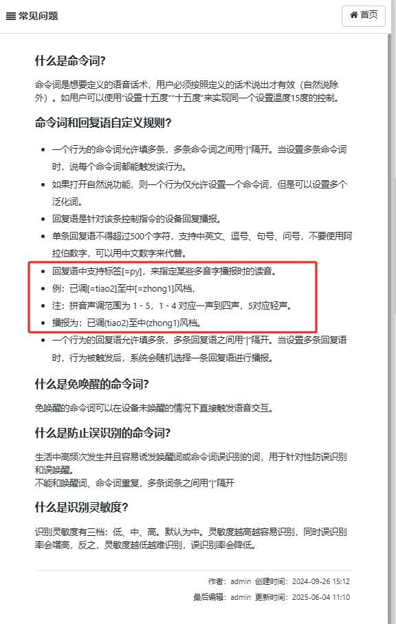
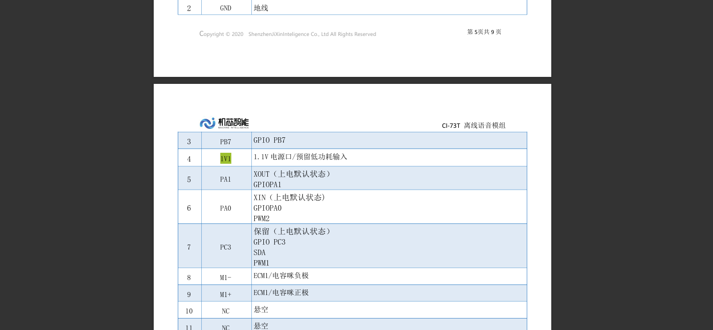
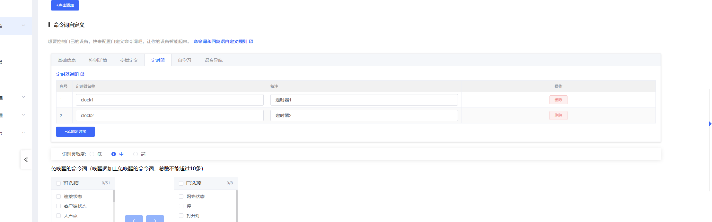
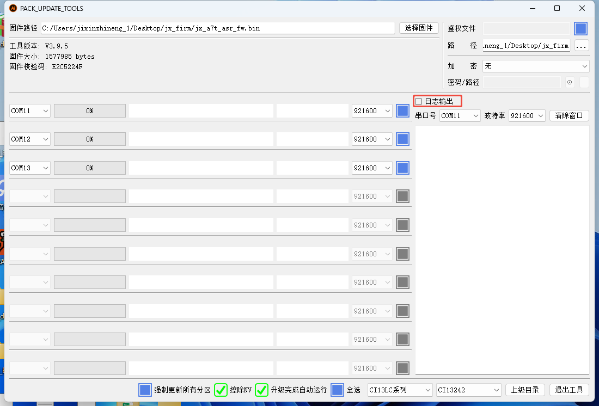
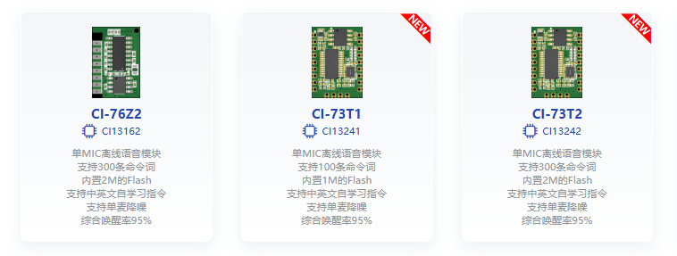

# CI-73T 语音调优 FAQ

本页用于整理 CI-73T 相关的语音调优问题。

### CI-73T的多音字播报如何控制读音？

**问题描述：**

CI-73T2模块在播报多音字时无法自动判断正确读音，例如"调节"被错误地读作"diaojie"，需要了解如何控制多音字的播报读音。

**解决方案：**

**1. 多音字控制方法**

使用支持标签功能指定多音字的正确读音：

- 在回复语中使用 `[=py]` 标签
- 后面跟拼音和声调数字
- 可以精确控制每个字的读音

**2. 配置示例**



**3. 使用说明**

- **[=tiao2]至[=zhong1]风档**：

    - "调"读作 "tiao2"（二声）
    - "节"读作 "zhong1"（一声）
    - "风档"正常读音

- **已调[=yi2]定**：

    - "已"读作 "yi2"（三声）
    - "调"读作 "tiao2"（二声）
    - "定"正常读音

**4. 声调数字对应**

- 一声：[=zhong1], [=ma1], [=hua1] 等
- 二声：[=tiao2], [=yi2], [=bai2] 等
- 三声：[=yi3], [=qian3] 等
- 四声：[=zhi4], [=si4] 等

**5. 应用场景**

- 专有名词：公司名、地名等
- 成语、俗语：确保读音准确
- 技术术语：保证专业性
- 人名、姓氏：正确标注姓氏读音

**注意事项：**

- 标签仅用于控制当前字的读音
- 不影响前后字的自动读音判断
- 建议在关键多音字处使用标签控制
- 配置完成后需要重新生成和烧录固件

---

### CI-73T1是否支持语音打断功能？

**问题描述：**

需要确认CI-73T1芯片是否支持通过语音指令打断正在播放的语音或自定义音频。

**解决方案：**

**功能支持情况：**

- CI-73T系列芯片不支持AEC（声学回声消除）功能
- 无法使用语音指令打断正在播放的音频
- 不支持语音打断自定义音频播放

**替代方案：**

1. **使用支持AEC的型号**
    - CI-96Z支持AEC打断功能
    - SU-32T/SU-63T支持语音打断
    - 可根据需求选择合适型号

2. **软件逻辑优化**
    - 设置播报完成标志位
    - 在播报期间忽略新的语音指令
    - 播报完成后恢复正常识别

**注意事项：**

- CI-73T1硬件不支持AEC功能
- 语音打断需要特定硬件支持
- 选型时需确认是否需要打断功能
- 不支持AEC的型号无法通过固件升级获得此功能

---

### 如何在CI-73T上实现延时控制功能？

**问题描述：**

需要实现语音指令控制的延时功能，例如在收到"启动第一路"指令后，延迟5秒再启动第二路。

**解决方案：**

**功能实现思路：**

使用定时器超时回调功能，实现精确的延时控制。

**1. 硬件连接参考**



**2. 配置步骤**

**步骤1：设置GPIO控制**

- 配置第一路和第二路的GPIO输出
- 设置输出电平（高电平/低电平）
- 确认GPIO引脚分配正确

**步骤2：创建定时器**

- 进入定时器配置界面
- 创建两个定时器（clock1和clock2）
- 设置定时器名称便于识别



**步骤3：配置延时逻辑**

1. **触发条件设置**
    - 语音指令："启动第一路"
    - 立即执行：设置第一路GPIO为高电平
    - 延时执行：启动定时器，5秒后执行动作

2. **定时器回调设置**
    - 定时器超时后执行
    - 设置第二路GPIO为高电平
    - 完成延时控制功能

**配置要点：**

1. **定时器设置**
    - 定时时长：5000ms（5秒）
    - 触发次数：单次或循环
    - 精度要求：±100ms

2. **状态管理**
    - 第一路启动后开始计时
    - 计时期间可执行其他操作
    - 第二路启动后完成控制

3. **错误处理**
    - 定时器异常时的复位机制
    - 多次指令的防重复处理
    - 异常情况的日志记录

**应用场景扩展：**

1. **多路延时控制**
    - 可配置多级延时
    - 每路独立延时设置
    - 支持延时序列编排

2. **条件延时**
    - 根据不同指令设置不同延时
    - 支持可变延时参数
    - 动态调整延时时间

**注意事项：**

- 定时器精度取决于系统时钟
- 延时期间模块保持正常工作
- 建议测试验证实际延时时间
- 复杂延时逻辑可能需要多次调试

---

### CI-73T2模块长时间未使用后无法唤醒怎么办？

**问题描述：**

CI-73T2模块在长时间未使用（超过12小时）后无法被语音唤醒，但无线控制功能正常，重新断电后才能恢复语音功能。

**解决方案：**

**问题排查步骤：**

1. **确认问题现象**：

    - 模块放置超过12小时后无法唤醒
    - 无线控制功能正常，说明供电正常
    - 重新断电后语音功能恢复

2. **日志分析**：

    - 使用CI-73T2的B5、B6引脚查看日志
    - 将端口改为烧录端口，连接串口查看日志
    - 确认模块是否识别到唤醒词

3. **问题定位**：

    - 确认是模块死机（完全不识别）
    - 还是识别到命令但不执行控制
    - 通过日志输出判断具体状态

**临时解决方案：**

1. **日志开启方法**：

    - 在固件升级工具中开启日志功能
    - 通过B5、B6引脚连接串口查看实时日志
    - 记录正常工作和故障状态下的日志差异

    

    *固件升级工具中的日志输出开关*

2. **对比测试验证**：

    - 准备两块模块进行对比测试
    - 一块单独供电，一块放板上供电
    - 观察是否是硬件供电问题导致

**深入分析方法：**

1. **硬件因素排查**：

    - 检查模块供电是否稳定
    - 确认电源纹波在允许范围内
    - 验证周边电路是否存在干扰

2. **固件异常处理**：

    - 如确认是固件问题，可将故障模块寄回分析
    - 记录完整的故障现象和触发条件
    - 保留故障模块用于技术分析

**预防措施：**

1. **供电设计优化**：

    - 使用稳定的LDO供电
    - 增加滤波电容，减少电源波动
    - 避免与大功率电路共享电源

2. **定期维护机制**：

    - 考虑增加定期重启机制
    - 通过MCU定时检测模块状态
    - 发现异常时自动重启模块

**注意事项：**

- 该问题可能是个别模块的硬件特性
- 需要收集更多同类模块的使用情况
- 如频繁出现，建议联系厂家进行深入分析
- 保留完整的测试日志有助于问题定位

---

### 自然说功能灵敏度不足怎么办？如何优化指令词配置？

**问题描述：**

在使用自然说功能时，发现"倒计时"、"倒计数"、"自由跳"等指令的识别灵敏度不高，需要了解优化方法。

**解决方案：**

**自然说功能特点：**

1. **功能优势**：

    - 一个命令词可支持多种表达方式
    - 支持前缀词变化，如"请"、"帮我"、"给我"等
    - 一个自然说词条可泛化20多个变体
    - 相比固定词条，大幅减少词条占用

2. **灵敏度问题**：

    - 自然说功能的灵敏度相对固定词条略低
    - 复杂的语音表达可能导致识别率下降
    - 需要合理配置命令词模板数量

**优化建议：**

1. **精简命令词数量**：

    - 每个核心功能建议配置3-4个自然说模板
    - 避免过多的变体导致识别混乱
    - 优先使用最常用的表达方式

2. **模板配置示例**：

    对于"爸爸倒计时"功能，可配置：

    - "爸爸倒计时开始"
    - "请开始爸爸的倒计时"
    - "爸爸倒计时"
    - "开始爸爸倒计时"

3. **分类管理策略**：

    - 将相似功能的命令词归为一类
    - 使用相同的触发协议
    - 减少协议数量，降低复杂度

**不同型号的词条容量对比：**

| 型号 | 支持词条数 | 适用场景 |
|------|-----------|----------|
| CI-73T1 | 100条 | 小型项目，指令简单 |
| CI-03T | 300条 | 中型项目，功能丰富 |
| CI-73T2/CI-76Z2 | 500条 | 大型项目，指令复杂 |




**注意事项：**

- 自然说功能虽能减少词条数量，但仍需合理规划
- 过多的自然说模板会影响整体识别率
- 建议先测试核心功能，再逐步扩展
- 如词条数量不足，可考虑升级到更高容量的型号

---

### 如何调整CI-73T2的唤醒阈值以优化高噪声环境下的唤醒性能？

**问题描述：**

在高噪声环境下，CI-73T2模块的默认唤醒阈值（0.2）可能导致过于灵敏，出现误唤醒。需要调整唤醒阈值以提高抗干扰能力。

**解决方案：**

**1. 唤醒阈值配置方法**

通过智能公元平台的个性化音频配置界面进行调整：

- 进入"唤醒"设置页面
- 找到"唤醒阈值"选项
- 根据环境噪声情况选择合适的阈值

**2. 阈值选择建议**

| 阈值设置 | 适用场景 | 效果说明 |
|----------|----------|----------|
| 0.1（最低） | 非常安静的环境 | 最灵敏，容易误唤醒 |
| 0.2（默认） | 一般室内环境 | 平衡灵敏度和抗干扰 |
| 0.3-0.5 | 中等噪声环境 | 减少误唤醒，保持较好响应 |
| 0.8（最高） | 高噪声环境 | 最强抗干扰，可能降低唤醒率 |


**3. 调优建议**

- **逐步调整**：从默认值开始，逐步提高阈值直到达到满意效果
- **现场测试**：在实际使用环境下测试不同阈值的效果
- **平衡考虑**：阈值过高可能导致正常唤醒困难

**注意事项：**

- 噪声较大时，建议将阈值设置在0.5-0.8之间
- 每次调整后需要重新生成和烧录固件
- 不同麦克风的安装位置可能影响最佳阈值设置

---

### CI-73T1模块声音发闷、不明亮如何优化？

**问题描述：**

从SU-03T更换到CI-73T1模块后，语音合成声音效果变差，表现为发闷、混浊、不明亮，影响用户体验。

**解决方案：**

**1. 发音人选择优化**

不同发音人的音质差异较大，建议尝试以下选项：

- **推荐发音人**：小英-高兴、橙子、小美
- **避免使用**：默认发音人（可能导致声音发闷）
- **测试方法**：在线生成固件前先试听效果

**2. 音频参数调节**

通过调整以下参数改善音质：

- **音量**：适当提高至80-90%
- **语速**：调整为0.9-1.0倍速
- **亮度**：提高至60-70%（关键参数）
- **音调**：微调至合适范围

**3. 硬件连接检查**

确认音频硬件连接正确：

```
模块SPK+ → 喇叭正极
模块SPK- → 喇叭负极
喇叭阻抗：8Ω（推荐4-8Ω）
喇叭功率：3-5W（匹配模块输出）
```

**4. 与SU-03T的差异说明**

CI-73T1与SU-03T在音频方面的区别：

- ** codec芯片**：CI-73T1使用不同的音频解码芯片
- **默认音调**：CI-73T1默认音调偏低
- **音色特点**：CI-73T1偏向沉稳风格
- **调节范围**：CI-73T1参数调节更灵活

**5. 优化建议**

获得最佳音质的步骤：

1. **选择合适发音人**：优先试听"小英-高兴"
2. **调整亮度参数**：这是影响声音明亮度的关键
3. **微调其他参数**：根据实际听感调整
4. **实际环境测试**：在目标环境中验证效果

**注意事项：**

- 不同批次的模块可能存在细微差异
- 喇叭质量对最终音质影响很大
- 建议使用原装或推荐规格的喇叭
- 如仍不满意，可考虑更换为SU-03T或更高型号

---

### CI-73T在电机噪音环境下能否稳定工作？

**问题描述：**

需要了解CI-73T芯片在存在电机噪音的环境下是否能够稳定实现语音控制功能，以及是否适合集成到现有产品板上。

**解决方案：**

**安静环境表现：**

- CI-73T在单纯安静环境下没有问题
- 语音识别功能正常稳定
- 适合安静环境的应用场景

**噪音环境考虑：**

**1. 噪声影响评估**

- 电机噪音对麦克风的影响较大
- 麦克风离噪音源近，影响更明显
- 物理噪音比人耳感知更强烈

**2. 测试建议**

- 购买模块进行实际测试
- 在真实噪音环境下验证效果
- 评估是否满足项目需求

**3. 固件复杂度关联**

- 噪声环境下的识别还与固件复杂程度相关
- 简单固件可能适应性更好
- 复杂功能可能增加识别难度

**4. 集成考虑**

- 可集成到产品板上使用
- 价格敏感，量大的项目有成本优势
- 需要预留足够的麦克风避噪空间

**注意事项：**

- 不敢对噪音环境下的效果打包票
- 电机噪音是主要干扰源
- 建议先小批量测试验证
- 如效果不佳，考虑增加物理隔噪措施

---

### CI-73T1唤醒后一段时间内无法识别命令怎么办？

**问题描述：**

使用唤醒词唤醒CI-73T1后，一段时间内无法识别语音命令，串口没有输出。

**解决方案：**

**1. 现象分析**

    - 唤醒成功后进入识别窗口期
    - 窗口期内应能正常识别命令
    - 串口无输出表明识别未触发

**2. 可能原因**

    - 麦克风输入配置问题
    - 识别阈值设置过高
    - 唤醒后未正确进入识别状态

**3. 调试建议**

    - 检查唤醒词配置是否正确
    - 验证命令词是否在有效范围内
    - 使用串口助手观察实际状态

**注意事项：**

- 唤醒后的识别窗口有时间限制
- 建议在唤醒后及时发出命令
- 如问题持续，需要检查硬件连接
- 可联系厂家提供详细日志

---

### 如何设置CI-73T1的二次唤醒阈值？

**问题描述：**

需要了解CI-73T1芯片二次唤醒阈值的设置方法和相关配置。

**解决方案：**

**1. 二次唤醒功能说明**

    - CI-73T1支持二次唤醒功能
    - 可在平台中设置唤醒阈值
    - 用于避免误触发和提高识别精度

**2. 配置方法**

    - 进入平台的语音识别配置
    - 找到唤醒相关设置选项
    - 调整唤醒阈值参数

**3. 参数建议**

    - 阈值不宜过高，避免无法唤醒
    - 阈值不宜过低，防止误唤醒
    - 根据实际环境调整参数

**注意事项：**

- 二次唤醒阈值需要实际测试验证
- 不同环境可能需要不同阈值设置
- 建议从默认值开始微调
- 保留配置备份以便恢复

---

### CI-73T1模块是否支持英文唤醒词和标点符号？

**问题描述：**

在设置唤醒词时，使用英文和标点符号（如"HI.小瑞"）遇到限制，需要了解支持的语言和字符要求。

**解决方案：**

**唤醒词支持范围：**

- 不支持英文唤醒词
- 不支持标点符号
- 仅支持中文唤醒词

**替代方案：**

1. **使用纯中文唤醒词**
    - 将"HI.小瑞"改为"嗨，小瑞"或"你好小瑞"
    - 去除所有标点符号
    - 使用2-4个字的中文词语

2. **识别效率说明**
    - 使用含英文的唤醒词可能影响识别效率
    - 纯中文唤醒词识别效果更稳定
    - 建议实际测试验证识别效果

**关于单机版软件：**

目前配置工具基于网页版提供服务，暂无独立的电脑客户端软件。所有配置操作需通过智能公元平台（smartpi.cn）进行。

**注意事项：**

- 唤醒词设置需符合中文语言规范
- 避免使用特殊字符和标点符号
- 配置完成后需要重新生成和烧录固件

---


---

### 免唤醒命令词数量可以增加吗？

**问题描述：**

语音模块配置免唤醒命令词时，系统提示总数不能超过10条，需要了解是否可以增加到20条。

**解决方案：**

**1. 了解限制原因**

- 免唤醒命令词的数量限制由模块硬件和固件决定
- 不同型号支持的数量上限不同
- 限制是为了保证识别准确性和响应速度

**2. 各型号支持情况**

- **SU-03T、SU-10A等基础型号**：最多支持10条
- **CI-73T2等高端型号**：可支持20条免唤醒命令词
- **具体限制需查看对应型号的技术规格**

**3. 突破限制的方法**

- 更换支持更多命令词的模块型号
- 使用分级触发机制（将命令分组）
- 优化命令词设计，减少条目需求

**4. 替代方案**

- 使用多级唤醒机制（唤醒词+子命令）
- 通过串口发送指令扩展命令数量
- 重新设计交互逻辑，用更少的命令实现功能

**注意事项：**

- 免唤醒命令词越多，识别准确率可能下降
- 建议优先使用最核心的命令作为免唤醒
- 可通过变量和条件判断实现复杂功能
- 选型时根据实际需求选择合适型号

---

### CI-73T1麦克风拾音距离缩短且识别不灵敏怎么办？

**问题描述：**

使用CI-73T1模块时，麦克风拾音距离明显缩短（仅1-2米），识别不够灵敏，只有特定唤醒词能被识别，同时麦克风线被延长至4.5米。

**解决方案：**

**问题分析：**

1. **麦克风线长影响**
    - 麦克风线延长至4.5米会严重影响信号质量
    - 线缆过长会导致信号衰减和噪声增加
    - 这是造成识别距离缩短的主要原因

2. **识别不灵敏原因**
    - 部分唤醒词（如"花儿为我而开"）可以识别，说明模块功能正常
    - 其他命令词无法识别可能与信噪比下降有关
    - 免唤醒命令词对信号质量要求更高

**解决方法：**

1. **缩短麦克风线缆**
    - 将麦克风线缩短至推荐长度（建议不超过1米）
    - 避免不必要的延长，保持信号完整性
    - 如必须延长，使用带屏蔽的麦克风线

2. **更换合适麦克风**
    - 使用54dB灵敏度的麦克风替代52dB麦克风
    - 确保麦克风信噪比达到70dB或更高
    - 选择匹配模块输入阻抗的麦克风型号

3. **优化固件配置**
    - 重新生成固件，确保所有命令词正确配置
    - 验证免唤醒设置是否生效
    - 调整识别阈值以适应实际环境

**注意事项：**

- 麦克风线长强烈影响识别效果，应尽量避免超过2米
- 更换麦克风时注意极性正确，必要时需添加耦合电容
- 如必须使用长线缆，建议在麦克风端加前置放大器
- 批量生产前建议充分测试验证方案可行性

---
### CI-73T1模块识别灵敏度不如其他模块怎么办？

**问题描述：**

使用CI-73T1模块时，感觉麦克风识别灵敏度没有之前使用的其他模块高，识别效果不如预期。

**解决方案：**

**问题分析：**

1. **模块差异因素**
    - 不同型号模块的麦克风配置可能不同（单麦/双麦）
    - 不同芯片的音频前端处理算法存在差异
    - 硬件设计和电路布局也会影响识别效果

2. **灵敏度差异可能原因**
    - CI-73T1为单麦克风版本，相比双麦克风模块抗噪能力较弱
    - 使用环境噪声较大时，单麦克风识别效果会更明显下降
    - 麦克风选型或电路设计可能与之前模块不同

**优化建议：**

1. **确认硬件配置**
    - 检查麦克风型号和灵敏度参数是否与之前一致
    - 确认麦克风电路连接正确，极性未接反
    - 验证麦克风偏置电压是否在正常范围

2. **调整固件参数**
    - 在平台中调整识别灵敏度至"高"
    - 适当降低唤醒阈值以提高唤醒率
    - 选择合适的应用场景模型

3. **硬件优化**
    - 使用更高灵敏度的麦克风（推荐-32dB至-25dB范围）
    - 优化麦克风开孔位置和大小
    - 增加麦克风与喇叭之间的声学隔离

4. **环境改善**
    - 减少背景噪声干扰
    - 调整用户与麦克风的距离（建议30-50cm）
    - 确保麦克风孔未被遮挡

**选型参考：**

如对识别灵敏度要求较高，可考虑：
- **CI-03T2**：双麦克风版本，降噪效果更好
- **SU-32T**：双麦克风阵列，高噪声环境识别率更高
- **CI-73T2**：与CI-73T1接口兼容，Flash容量更大

**注意事项：**

- 识别效果受多种因素影响，需综合评估硬件、固件和环境
- 建议使用官方推荐的麦克风型号和电路设计
- 更换模块型号时，需重新评估整体方案兼容性

---

### CI-73T1是否支持声纹识别功能？

**问题描述：**

设备在识别到特定用户（如张三）后，其他用户无法成功唤醒设备，只有该特定用户能唤醒，询问是否存在记忆功能及问题原因。

**解决方案：**

**功能说明：**

1. **CI-73T1不支持声纹识别**
    - CI-73T系列模块不具备声纹识别功能
    - 不支持根据不同用户声音进行差异化处理
    - 不存在针对特定用户的记忆功能

2. **识别差异的可能原因**
    - **发音标准性**：特定用户发音更标准，符合训练样本
    - **音量和距离**：不同用户说话音量或与麦克风距离不同
    - **环境因素**：识别时的背景噪声可能影响结果

**问题分析与建议：**

1. **普通话标准化**
    - 确保所有用户使用标准普通话
    - 避免地方口音影响识别
    - 统一唤醒词的发音方式

2. **使用环境优化**
    - 保持相同的说话距离
    - 控制说话音量在合适范围
    - 减少背景噪声干扰

3. **提高识别成功率的方法**
    - 多个用户都进行标准发音训练
    - 选择识别率较高的通用唤醒词
    - 调整麦克风位置获得最佳收音效果

**注意事项：**

- CI-73T1对所有用户一视同仁，无特殊偏好
- 如需声纹识别功能，需选择支持该功能的其他型号
- 识别差异通常由发音或环境因素导致，非模块问题
- 建议让识别困难的用户调整发音或使用位置

---

### 连续语音播报为什么会自动中断？

**问题描述：**

在使用CI-73T2芯片进行连续语音播报时，播报在第三条（或3.5条）后自动中断，无法完成全部播报内容。

**解决方案：**

**1. 播报限制确认**

连续播报存在系统限制：

- 单次连续播报有数量限制
- 通常在3-4条语音后自动中断
- 这是系统保护机制，避免过长时间占用

**2. 优化配置方法**

通过系统设置优化播报：

- 在"优化配置"中开启"自动使能功放"选项
- 该选项位于系统设置的最下方
- 可改善播报连续性和稳定性

**3. 分段播报策略**

如果需要播报多条内容：

- 将长内容分成多个段落
- 使用定时器触发后续播报
- 每个段落控制在3条以内

**4. 替代方案**

优化播报逻辑：

- 合并相关内容为一条长语音
- 减少播报频率，增加信息密度
- 使用变量控制播报顺序

**注意事项：**

- CI-73T2的连续播报限制是系统特性
- 开启功放自动使能可能改善但无法完全解决
- 建议在设计阶段考虑播报长度限制
- 测试所有播报场景确保功能正常

---


---

### 如何配置多条件语音播报？

**问题描述：**

在CI-73T2模块中配置基于多个变量的语音播报时，遇到"打断播报"功能导致播报不完整，且无法实现多条件的"或"逻辑判断的问题。

**解决方案：**

**1. 打断播报功能理解**

- "打断播报"是新增功能，用于控制播报行为
- 启用后可能影响连续播报的完整性
- 该功能与AEC（回声消除）功能独立

**2. 多条件"或"逻辑实现**

由于平台不支持直接的"或"逻辑：

- **方法一：独立配置**
    - 每个变量状态创建独立播报规则
    - 变量1为1时播报"A单元开"
    - 变量1为0时播报"A单元关"
    - 依此类推处理其他变量

- **方法二：使用拼接播报**
    - 将多个播报内容拼接为一个长语音
    - 在"添加控制"中添加多个语音条目
    - 注意拼接后的总时长限制

**3. 配置优化建议**

- 关闭"打断播报"功能以确保播报完整
- 使用定时器控制播报间隔
- 避免同时触发过多播报任务

**4. 替代方案**

如果配置过于复杂：

- 考虑使用CI-03T系列替代（无此限制）
- 通过外部逻辑处理条件判断
- 简化播报内容，减少配置复杂度

**注意事项：**

- CI-73T2的连续播报限制约10秒
- 多条件配置会增加规则复杂度
- 建议在设计阶段优化播报逻辑
- 保留配置文档便于后续维护

---


---

### 长时间播报导致队列溢出怎么办？

**问题描述：**

CI-73T2模块在进行长语音播报或拼接多条语音内容时，可能导致内部播报队列溢出，影响播报功能正常使用。

**解决方案：**

**1. 队列溢出原因**

- 长时间播报占用过多内存资源
- 拼接多条语音内容超出队列容量
- CI-73T2内存资源较为紧张
- 这是系统架构限制，不是配置错误

**2. 规避方法**

通过分段播报避免队列溢出：

- **方法一：分段播报**
    - 将长内容分成多个短段落
    - 使用定时器控制播报间隔
    - 每段控制在10秒以内

- **方法二：延迟触发**
    - 完成前一段播报后再触发下一段
    - 利用变量状态管理播报进度
    - 避免同时发送过多播报指令

**3. 优化建议**

设计播报内容时的考虑：

- 单条播报控制在10秒内
- 避免过度拼接语音内容
- 使用简洁明了的播报文案
- 合理规划播报顺序和逻辑

**4. 替代方案**

如果必须长时间播报：

- 考虑使用CI-03T系列（内存更大）
- 通过外部存储和分段播放实现
- 减少同时进行的其他操作

**注意事项：**

- 队列溢出是硬件限制，无法通过配置解决
- 平台更新可能改善但需要评估内存影响
- 建议在设计阶段考虑播报时长限制
- 保留足够的系统资源避免功能异常


---

### 声源定位角度输出精度是多少？

**问题描述：**

需要了解声源定位0-180度范围内的输出档位数量和角度步进精度，以及无需声源定位时的模块选型。

**解决方案：**

**角度输出参数：**

- **输出范围**：0-180度
- **档位数量**：具体档位数需查阅芯片规格书
- **步进精度**：角度输出的最小变化单位
- **输出格式**：数值形式（如0-180对应实际角度）

**无需声源定位的选型：**

**推荐型号：**

- **CI-73T1**：单麦克风，100条命令词，1M Flash
- **CI-73T2**：单麦克风，300条命令词，2M Flash
- **成本考虑**：单麦方案成本更低

**选型对比：**

| 特性 | CI-03T双麦 | CI-73T系列 |
|------|-------------|------------|
| 声源定位 | ✓ | ✗ |
| 麦克风数量 | 双麦 | 单麦 |
| 命令词数量 | 300条 | 100-300条 |
| 成本 | 较高 | 较低 |
| 适用场景 | 需要定位 | 仅需识别 |

**使用建议：**

1. **仅需识别功能**
    - 选择CI-73T1（100条命令词）
    - 成本最低，满足基本需求
    - 后期可升级到CI-73T2

2. **需要声源定位**
    - 必须选择CI-03T双麦版本
    - 提供0-180度角度信息
    - 适合定向交互应用

**注意事项：**

- 声源定位会增加模块成本
- 角度精度需参考具体型号规格书
- 单麦模块识别效果与双麦基本一致
- 根据实际需求选择合适方案

---

