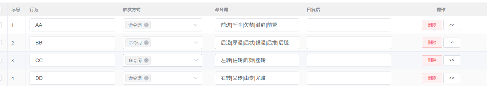
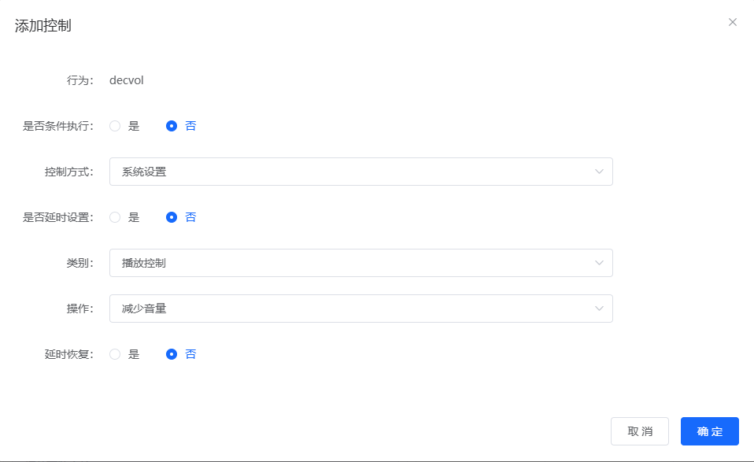
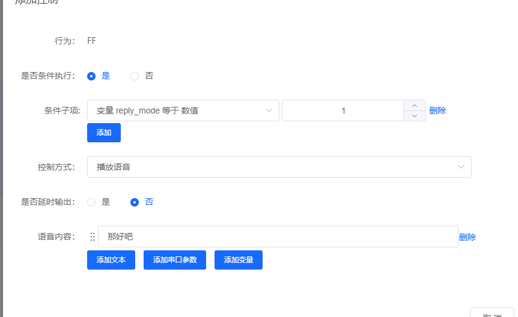
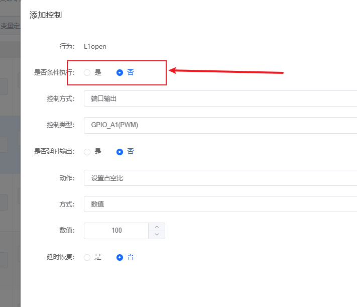
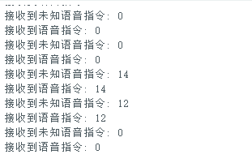
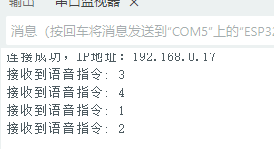
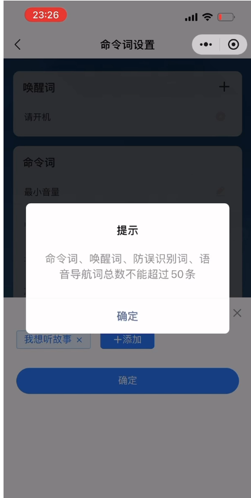
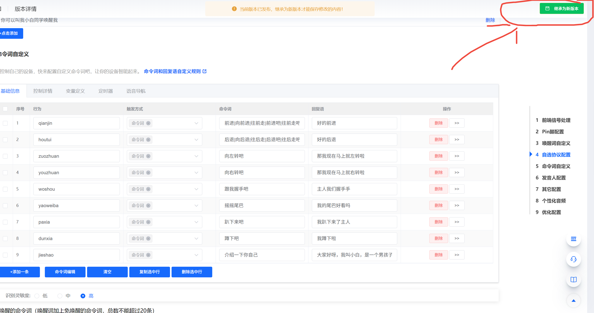

# JX-A7T 语音调优 FAQ

本页用于整理 JX-A7T 相关的语音调优问题。

### JX-A7T命令词离线识别误触发AI回答问题如何优化？

**问题描述：**

在使用JX-A7T设备时，发现部分命令词（如"前进"）在离线识别中容易被误识别为AI回答，导致识别率不稳定，需要优化离线识别率。

**问题分析：**

1. **识别机制说明**：

    - JX-A7T支持离线和在线双模式
    - 离线识别失败时，语音可能被转发到在线大模型处理
    - 这导致本应离线触发的命令被AI回答响应

2. **误识别原因**：

    - 用户发音不标准，离线模型未识别到
    - 环境噪声影响识别准确率
    - 命令词设置过于简单，容易与日常对话混淆

**解决方案：**

1. **增加分词和词条**：

    - 为同一命令添加多个表达方式
    - 示例配置：`站立|站起来|立正`
    - 这样即使发音略有差异，也能提高识别成功率

2. **优化命令词设计**：

    - 使用3-4字的命令词，提高识别准确性
    - 避免使用过于常见或简单的词汇
    - 推荐命令：站起来、趴下去、前进等

3. **调整识别参数**：

    - 在平台配置中调整识别阈值
    - 阈值越大越敏感，但识别率也会提高
    - 未设置时自动取默认值0.4


*平台中的优化选项设置，可调整识别阈值参数*

4. **麦克风光化**：

    - 检查麦克风安装位置，避免正对噪声源
    - 确保麦克风拾音质量良好
    - 如有必要，可考虑使用其他型号麦克风

**配置示例：**



*配置多个命令词变体以提高识别成功率*

**注意事项：**

- 离线词条数量有限制，建议控制在合理范围内
- 过多的分词可能增加误识别率，需要平衡设置
- 如持续出现识别问题，建议联系技术支持获取针对性优化方案
- 量产前进行充分测试，确保各种发音习惯下都能正常识别

### JX-A7T新品大模型模块有哪些功能特点？

**问题描述：**

JX-A7T是新一代AI大模型模块，需要了解其功能特点、离线与在线指令模式的差异，以及如何获取相关技术文档和开发资源。

**解决方案：**

**产品定位：**

JX-A7T是新一代AI大模型模块，同时拥有离线指令与在线指令双重模式，为智能语音交互提供更强大的能力。

**核心功能特点：**

1. **双模式支持**：

    - **离线指令模式**：支持本地语音指令识别，无需网络连接即可响应控制命令，支持300条词条
    - **在线指令模式**：搭载大模型运行，提供更智能、更高效的使用体验，支持复杂的自然语言理解和交互
    - **混合工作模式**：离线快速响应与在线智能对话相结合，根据场景自动切换

2. **高级功能特性**：

    - **AEC唤醒打断**：支持在音频播放过程中进行语音唤醒和打断
    - **大模型可操作硬件**：通过AI大模型直接控制硬件设备
    - **小程序远程控制**：支持通过小程序进行远程操作和控制
    - **任意命名离线名字及指令**：支持用户自定义个性化的唤醒词和命令词
    - **OTA在线升级**：支持固件在线升级，方便功能更新和维护


**技术优势：**

- **智能交互升级**：大模型加持，提供更自然的对话体验，支持多轮对话和上下文理解
- **响应速度快**：离线模式保证即时响应，在线模式提供智能处理
- **扩展性强**：支持多种控制方式和自定义功能
- **易于集成**：标准接口设计，方便快速集成到产品中

**技术文档和开发资源获取：**

产品例程和文档已陆续上传至智能公元平台，可通过以下方式获取：

- **官方文档首页**：https://help.aimachip.com/docs/jx_a7t_v1
- **详细文档**：https://help.aimachip.com/docs/jx_a7t_v1/jx_a7t_v1-1ghc1h40pidif
- **智能公元平台**：https://smartpi.cn

平台提供的内容包括：

- 产品规格说明
- 开发指南
- 示例代码
- 接口文档
- 应用案例

**适用场景：**

- 智能家居控制中心
- 智能语音助手设备
- 教育机器人产品
- 物联网控制终端
- AI陪伴玩具
- 需要智能交互的各类电子产品

**注意事项：**

- 在线功能需要网络连接支持
- 具体功能配置需通过智能公元平台进行
- 离线模式适用于基本控制命令，响应速度快，不依赖网络
- 在线模式适合复杂交互场景，需要网络连接
- 量产前建议进行充分的功能测试和验证

---


---

### JX-A7T所有设备AI语音功能突然中断如何处理？

**问题描述：**

所有设备的AI语音功能突然全面中断，无法进行语音对话和响应，即使更换WiFi后问题依旧存在。

**解决方案：**

**1. 问题判断**

- 确认是否所有设备同时出现故障
- 检查是否为服务端问题
- 验证设备本身硬件是否正常

**2. 服务状态确认**

- 可能是火山引擎或豆包服务出现故障
- 此类问题影响所有用户
- 需要等待服务方修复

**3. 临时处理方案**

- 记录故障发生时间和现象
- 关注官方通知或公告
- 准备备用方案（如离线命令）

**4. 问题上报**

- 收集设备ID信息
- 记录具体的故障表现
- 联系技术支持报告问题

**注意事项：**

- 如果是服务端故障，只能等待修复
- 更换WiFi无法解决服务端问题
- 建议在工作时间联系技术支持获取最新进展

---

### JX-A7T修复后如何验证AI对话功能？

**问题描述：**

设备在连接WiFi后进行问答操作时，约20次中有5次出现无法完整说话的情况，需要验证修复效果。

**解决方案：**

**1. 测试方法**

- 连接WiFi后进行多轮对话测试
- 记录成功次数和失败次数
- 统计问题发生频率

**2. 验证标准**

- 20次对话中失败次数控制在1-2次为正常
- 观察是否仍存在中途停止说话现象
- 检查语音播放的完整性

**3. 问题跟踪**

- 记录具体的失败场景
- 注意网络状态对问题的影响
- 收集设备日志用于分析

**4. 持续优化**

- 根据测试结果调整参数
- 必要时联系技术支持进一步优化
- 定期复测确保问题已解决

**注意事项：**

- 问题可能与网络稳定性有关
- 建议在不同时段进行多次测试
- 如问题持续存在，需要进一步排查网络或服务端问题

---

### JX-A7T AI对话中途中断如何解决？

**问题描述：**

多台JX-A7T设备在使用过程中出现AI对话中断的问题，每次问答进行到一半就停止，且该问题在多个设备上频繁发生。

**解决方案：**

**1. 网络环境优化**

- 每个设备使用独立的WiFi热点
- 避免多个设备共享同一网络
- 检查网络稳定性，确保信号强度良好

**2. 设备排查方法**

- 查看WiFi日志，检查是否有接收数据中途中断
- 使用串口助手连接设备（波特率2000000）
- 记录具体的设备ID以便技术支持分析

**3. 问题定位步骤**

- 确认是否所有设备都出现相同问题
- 测试单个设备在不同网络环境下的表现
- 收集中断发生时的具体场景信息

**4. 临时解决方案**

- 使用独立热点进行测试
- 缩短单次对话的长度
- 增加确认性对话，避免长篇回复

**注意事项：**

- 问题可能与网络拥堵或服务器负载有关
- 建议收集设备ID和日志信息联系技术支持
- 在高峰时段可能更容易出现中断现象

---

### JX-A7T模块智能体响应速度慢、出现哑炮和断字问题如何处理？

**问题描述：**

JX-A7T模块在调用智能体时存在响应速度慢（6-7秒）、部分请求无响应（哑炮）以及语音播放断字的问题。在Coze平台直接运行相同智能体仅需1秒，说明问题出在模块的传输链路或配置上。

**问题原因分析：**

1. **传输链路延迟**：

    - Coze平台响应1秒，JX-A7T需要6-7秒
    - 表明模块的传输链路存在5-6秒的额外延迟
    - 可能是网络传输、协议转换或内部处理效率问题

2. **哑炮现象原因**：

    - 传输链路不稳定导致请求丢失
    - 协议解析或格式兼容性问题
    - 网络超时或连接中断

3. **语音播放断字**：

    - 音频数据传输不完整
    - TTS合成与播放缓冲区管理问题
    - 网络波动影响音频流接收

**解决方案：**

**1. 优化智能体配置**

- 在Coze平台选择单 Agent（对话流模式）
- 关闭大模型的深度思考开关，减少处理时间
- 使用lite快速模型而非功能强大的大模型
- 简化智能体流程图，减少节点数量

**2. 检查网络配置**

- 确认WiFi连接稳定，信号强度良好
- 检查网络带宽是否满足需求
- 配置静态IP以避免DNS解析延迟
- 考虑使用5GHz频段减少干扰

**3. 模块配置优化**

- 更新模块固件到最新版本
- 检查智能体API Key和Base URL配置
- 调整超时参数，适当延长等待时间
- 验证串口通信参数（波特率、数据位）

**4. 传输链路排查**

- 使用网络抓包工具分析数据传输
- 检查HTTP请求头和响应格式
- 验证WebSocket连接稳定性
- 监控网络丢包率和重连次数

**5. 音频播放优化**

- 检查TTS服务配置，选择快速合成选项
- 调整音频缓冲区大小参数
- 优化音频解码和播放参数
- 考虑使用本地TTS减少网络依赖

**6. 使用本地智能体平台**

- 智能公元平台正在开发内置智能体功能
- 可减少对外部平台的依赖，降低延迟
- 关注平台更新通知，及时迁移到新平台
- 内置平台可提供更稳定的连接和更快的响应

**优化建议：**

1. **分层测试**：

    - 单独测试网络连通性
    - 单独测试智能体API响应
    - 单独测试模块音频播放
    - 综合测试完整链路

2. **性能监控**：

    - 记录各环节耗时数据
    - 建立延迟基线用于对比
    - 监控哑炮发生频率和场景
    - 定期分析性能数据寻找优化点

3. **替代方案**：

    - 考虑使用有线网络连接
    - 评估不同智能体平台的性能差异
    - 在关键应用中设计离线模式作为备选
    - 联系技术支持获取针对性的优化方案

**注意事项：**

- 6-7秒延迟超出正常范围，需要重点优化
- 哑炮问题影响用户体验，需优先解决
- 播放断字可能与网络稳定性相关
- 建议保留完整的测试数据用于问题定位
---


---

### JX-A7T模块如何配置音量控制功能？

**问题描述：**

需要在JX-A7T模块工程中配置音量控制功能，包括增加音量和减少音量的行为设置。

**解决方案：**

**功能配置步骤：**

1. **添加减少音量控制**：

    - 行为名称：decvol（可自定义）
    - 控制方式：系统设置
    - 类别：播放控制
    - 操作：减少音量

2. **添加增加音量控制**：

    - 行为名称：incvol（可自定义）
    - 控制方式：系统设置
    - 类别：播放控制
    - 操作：增加音量

3. **配置命令词关联**：

    - 为减少音量功能添加命令词，如"声音小一点"
    - 为增加音量功能添加命令词，如"声音大一点"
    - 命令词与行为进行关联绑定



*JX-A7T模块中配置"减少音量"功能的界面，行为名称为decvol*

**行为命名规范：**

1. **命名要求**：

    - 行为名称需符合C语言语法规范
    - 避免使用特殊字符和保留字
    - 建议使用有意义的英文命名

2. **命名示例**：

    - 减少音量：decvol、volumeDown、volDecrease
    - 增加音量：incvol、volumeUp、volIncrease
    - 静音控制：mute、volumeMute

3. **命名冲突检查**：

    - 确保行为名称在项目中唯一
    - 不与系统变量名重复
    - 不使用中文或拼音命名

**配置验证方法：**

1. **功能测试**：

    - 触发"声音小一点"命令，验证音量是否减小
    - 触发"声音大一点"命令，验证音量是否增大
    - 测试音量边界值（最小和最大）的处理

2. **串口监控**：

    - 监听串口输出，确认控制命令发送
    - 验证命令格式和参数正确性
    - 记录音量变化的数值范围

3. **用户体验优化**：

    - 添加音量变化提示音
    - 支持多级音量调节（如小声、中声、大声）
    - 考虑添加静音和恢复音量功能

**注意事项：**

- 行为名称一旦设定，需要在整个项目中保持一致
- 音量控制功能与其他音频功能可能存在冲突，需要合理规划
- 建议在配置完成后进行完整的端到端测试
- JX-A7T支持离线和在线双模式，音量控制在两种模式下都可使用

---

### 离在线语音方案如何实现免唤醒自由说？

**问题描述：**

需要在智能马桶等产品中实现免唤醒自由说的离线语音控制，同时支持低延迟的AI大模型语音对话功能。

**解决方案：**

**技术方案说明：**

1. **离线语音控制部分**：

    - 支持免唤醒命令词功能，无需唤醒词即可直接触发
    - 免唤醒模式下可配置多个命令词，但数量有限制
    - 建议在离线模型中预置更多常用命令词以满足使用需求

2. **在线大模型对话**：

    - 使用JX-A7T2等支持离在线共存的模组
    - 可实现产品使用说明、故障排查等智能对话功能
    - 响应延迟取决于所选的大模型服务（如Coze方案）

3. **离在线共存方案**：

    - 当前离在线共存功能主要支持深度降噪加AEC
    - 暂未支持自由说的离在线共存模式
    - 可通过配置更多离线命令词部分弥补此限制

**配置建议：**

1. **离线命令词规划**：

    - 梳理产品常用控制指令，预置到离线模型中
    - 如"冲水"、"烘干"、"加热"、"除臭"等高频功能
    - 通过免唤醒方式实现快速响应

2. **在线对话功能**：

    - 用于产品介绍、使用指导、故障诊断等复杂交互
    - 可通过优化网络和服务选择来降低响应延迟
    - 建议选择本地化部署或边缘计算方案以减少延迟

**注意事项：**

- 免唤醒命令词数量受模块Flash容量限制
- 在线功能需要稳定的网络连接支持
- 响应延迟与所选的大模型服务直接相关
- 建议保留关键功能的离线控制能力

---


---


---

### 语音设备如何对非命令词给出反馈？

**问题描述：**

设备唤醒后，当用户说出的内容不是预设的命令词时，设备没有任何反应，容易让用户误以为设备死机。希望能够在检测到非命令词时给出语音反馈提示。

**解决方案：**

**功能限制说明：**

离线语音模块目前不支持非命令词识别反馈功能：

- **技术原理**：离线模块仅能识别预设的固定命令词
- **无法实现**：无法判断输入内容是否为非命令词并给出反馈
- **误识别风险**：若启用此功能，任何语音都可能触发回复，造成严重误触发

**替代方案建议：**

1. **优化唤醒反馈**：

    - 唤醒成功后立即播报"我在"或"请讲"
    - 让用户明确知道设备已准备接收命令
    - 这是目前最有效的用户体验优化方案

2. **设置超时提示**：

    - 通过外部MCU实现定时功能
    - 唤醒后10秒内无命令识别，播报"请再说一遍"
    - 需要软硬件配合实现

3. **使用在线语音方案**：

    - 如确实需要自然语言交互功能
    - 可考虑JX-A7T等在线语音模组
    - 通过云端AI实现更智能的语音交互

**技术限制原因：**

- **离线识别特性**：只能匹配预设的命令词模板
- **算法设计**：没有"非命令词"的判断逻辑
- **误触发控制**：避免日常对话中的任何语音都触发回复

**注意事项：**

- 离线模块的设计目标是精确识别特定命令词
- 非命令词反馈功能与离线识别的基本原理相冲突
- 建议通过优化唤醒反馈和命令词设计来改善用户体验
- 如需自然对话能力，应选择在线语音方案

---


---


---

### 如何实现多轮对话功能？

**问题描述：**

询问是否有支持多轮对话功能的语音识别芯片板子。

**解决方案：**

**功能说明：**

语音模块本身不具备自然语言理解的多轮对话能力，但可以通过配置多个命令词实现类似效果。

**实现方案：**

1. **设置多个语音命令**：

    - 在智能公元平台配置所需的命令词
    - 每个命令词对应特定的功能或回复
    - 通过组合使用实现连续交互

2. **命令词配置示例**：

    ```
    基础命令词配置：

    - "今天天气" → 回复天气信息
    - "明天天气" → 回复明日预报
    - "播放音乐" → 播放指定歌曲
    - "下一首" → 切换到下一曲
    ```

3. **交互流程设计**：

    - 用户先说唤醒词激活设备
    - 然后说出具体命令词
    - 设备执行对应功能并回复
    - 可继续说出其他命令词

**技术限制：**

1. **无上下文记忆**：

    - 每次命令识别都是独立的
    - 无法记住之前的对话内容
    - 不支持自然语言理解

2. **精确匹配要求**：

    - 必须说出预设的命令词
    - 支持的命令词数量有限
    - 不能随意改变表达方式

**优化建议：**

1. **合理的命令词设计**：

    - 选择简洁明了的词汇
    - 避免发音相似的命令
    - 覆盖常用功能需求

2. **使用免唤醒功能**：

    - 将常用命令设为免唤醒
    - 提高交互效率
    - 注意避免误触发

3. **回复语设计**：

    - 提供清晰的执行反馈
    - 可提示可用的后续操作
    - 提升用户体验

**替代方案：**

如需要真正的多轮对话功能：

1. **JX-A7T模块**：

    - 支持在线大模型对话
    - 具备上下文理解能力
    - 可实现自然语言交互

2. **在线语音识别**：

    - 使用联网语音识别服务
    - 结合NLP技术实现对话
    - 需要网络连接支持

**注意事项：**

- 离线语音模块适合固定命令控制场景
- 多轮对话效果依赖于命令词的丰富程度
- 设计命令词时要考虑用户的表达习惯
- 免唤醒功能提高效率但增加误触发风险

---

### JX系列模块设置语音播报后功能失效怎么办？

**问题描述：**

在JX系列模块中配置语音播报功能后，发现语音无法播放，且再次唤醒后无任何响应。

**解决方案：**

- **配置检查**：

    - 确认"无回复播报"设置是否正确
    - 检查语音内容字段是否为空（必须填写内容）
    - 验证"是否延时输出"设置是否影响播放

- **变量控制逻辑**：

    - 如使用变量控制不同回复模式（如A/B模式）
    - 确认变量赋值来源正确（需要从其他操作或命令设置）
    - 检查变量类型是否匹配（unsigned char）

- **调试建议**：

    - 先简化配置，测试基本的语音播放功能
    - 逐步添加变量控制逻辑
    - 使用串口打印调试变量状态

**注意事项：**

- 语音内容为空时会导致播放失败
- 变量需要明确的赋值操作才能生效
- 复杂的逻辑建议分步实现和测试
- 可以导出JSON配置文件发送给技术支持分析


---

### JX系列模块如何实现不同模式下的不同回复词？

**问题描述：**

希望JX系列模块在同一个命令词下，根据不同模式返回不同的回复词，通过变量控制模式切换。

**解决方案：**

- **变量定义**：

    - 添加unsigned char类型的变量（如reply_mode）
    - 设置变量值：0代表A模式，1代表B模式
    - 在配置界面中正确设置变量

- **条件触发设置**：

    - 创建条件触发规则
    - 当reply_mode等于0时，播放A模式回复词
    - 当reply_mode等于1时，播放B模式回复词

- **变量赋值方法**：

    - 通过其他命令词切换模式值
    - 使用外部控制信号改变变量
    - 上电初始化时设定默认值

**注意事项：**

- 变量必须有明确的赋值操作才能生效
- 避免使用未初始化的变量
- 测试时先验证变量值是否正确切换
- 建议保存配置文件备份

---

### JX-A7T的WiFi回复语音和语音回复不一致如何解决？

**问题描述：**

JX-A7T模块在烧录新固件后无法正常工作，且设备的Wi-Fi回复语音与语音指令回复语音不一致，影响用户体验。

**解决方案：**

**1. 问题原因分析**

导致两种回复语音不一致的原因：

- **WiFi回复库**：仅支持4种预设语音
- **语音回复库**：支持更多语音选择
- **固件设计**：两部分使用不同的音频源
- **平台限制**：当前无法统一两种语音库

**2. 可行的解决方案**

**方案一：统一使用语音回复**

- 在智能公元平台配置所有回复
- 录制WiFi回复音作为个性化音频
- 将录制的音频替换语音回复内容
- 保持两种回复声音一致

**方案二：接受现状使用**

- WiFi回复使用固定语音
- 语音指令使用丰富选择
- 区分功能场景使用不同回复
- 重点关注语音指令的体验优化

**3. 操作步骤**

如选择方案一统一语音：

1. **录制WiFi回复语音**
    - 使用WiFi触发各种回复场景
    - 用手机或专业设备录制
    - 确保录音质量清晰

2. **配置个性化音频**
    - 进入智能公元平台
    - 选择对应命令词的回复
    - 上传录制好的音频文件

3. **测试验证**
    - 烧录新固件到模块
    - 测试WiFi触发和语音指令
    - 确认回复声音一致

**4. 注意事项**

- WiFi回复语音修改功能已在开发计划中
- 目前只能通过个性化音频部分解决
- 录制音频时注意环境噪音
- 建议使用官方推荐的语音合成

---



---

### JX-A7T模块上电后频繁误识别语音指令导致系统误操作怎么办？

**问题描述：**

JX-A7T模块在上电后会持续检测语音信号，导致未被唤醒时也频繁识别出未知语音指令，造成系统误操作，影响正常使用。

**问题分析：**

1. **模块工作原理**：模块上电后会持续检测周边语音信号，用于检测唤醒信号
2. **误识别原因**：模块将环境噪声或非指令语音误判为有效指令
3. **系统影响**：频繁的误识别导致门、窗、灯等设备自动开关，系统逻辑混乱

**解决方案：**

**1. 优化配置设置**

- 检查"添加控制"中的"是否条件执行"选项，避免多余配置
- 确认命令识别阈值设置合理（如设置为0.02）
- 减少不必要的语音指令数量，降低误识别概率



*检查并优化配置中的条件执行设置*

**2. 代码端防抖处理**

- 在Arduino代码中加入防抖逻辑
- 对连续接收的未知指令进行过滤
- 设置指令间隔时间阈值，避免频繁触发

**3. 调整识别参数**

- 适当提高命令识别阈值（如从0.02调整到0.03）
- 优化麦克风安装位置，避免直接对着噪声源
- 增加静音检测功能，只在有明显语音时触发识别



*串口打印的连续误识别日志*

**4. 系统逻辑优化**

- 增加唤醒确认机制：先唤醒后识别
- 对关键操作增加二次确认
- 设置操作冷却时间，防止连续误操作

**注意事项：**

- 完全避免误识别较困难，需要通过多种手段降低发生概率
- 调整识别阈值可能影响正常识别灵敏度，需要平衡设置
- 防抖逻辑要根据实际应用场景合理设置时间参数



*正常识别时的串口输出格式*


*在后台优化命令识别阈值参数*

---

### JX-A7T命令词修改失败和数量限制问题怎么解决？

**问题描述：**

在尝试修改JX-A7T模块的命令词时，修改第二个命令词失败，且系统提示命令词总数不能超过50条，需要了解解决方法。

**解决方案：**

**1. 命令词修改失败原因**

**当前限制说明：**

- 命令词、唤醒词、防误识别词、语音导航词总数不能超过50条
- 当前固件已预设48条命令词
- 最多只能再添加2条自定义命令词

**修改失败处理：**

- 修改过程需要2-3分钟，属于正常现象
- 修改请求需要发送到服务器处理
- 长时间等待是正常的，不要关闭页面

**2. 命令词管理建议**

**精简命令词策略：**

- 合并功能相似的命令词
- 使用多义词减少命令总数
- 优先保留核心功能命令

**优化建议：**

- 命令词建议控制在25条以内
- 过多命令词会增加误识别率
- 考虑使用离线和在线模式配合

**3. 命令词扩容咨询**

- 当前50条限制是系统设计
- 如需更多命令词需要联系运营
- 可通过技术支持渠道申请扩容
- 需说明具体应用场景和需求

**4. 操作注意事项**

**修改步骤：**

1. 确保网络连接稳定
2. 逐个修改命令词，避免批量操作
3. 点击保存后耐心等待2-3分钟
4. 收到成功提示后再进行下一步

**常见问题：**

- 修改第二个命令词时失败：通常是总数超限
- 长时间加载：需要发送到服务器处理
- 找不到确定按钮：滚动到页面底部查看




**注意事项：**

- 每个项目的命令词需求不同，建议提前规划
- 优先使用离线模式处理核心命令
- 复杂指令可考虑使用在线大模式
- 定期清理不常用的命令词

---

### JX-A7T退出唤醒播报和开机回复需要配置串码吗？

**问题描述：**

在配置语音指令时，需要确认退出唤醒播报和开机回复词是否需要发送串码，以及如何正确配置。

**解决方案：**

**1. 播报功能配置说明**

**自动播报类型：**

- 开机播报：设备上电时自动播放欢迎词
- 退出唤醒播报：超时退出唤醒状态时的提示音
- 命令词触发播报：识别到命令后的确认反馈

**串码配置：**

- 串码用于内部标识和控制
- 开机和退出播报的串码自动包含在固件中
- 不需要额外发送串码给MCU

**2. 配置方法**

**平台配置步骤：**

1. **设置开机播报**
    - 在语音配置中添加开机欢迎词
    - 可自定义播报内容
    - 上电后自动触发

2. **配置退出时长**
    - 设置唤醒超时时间（如15分钟）
    - 超时后自动退出唤醒状态
    - 可配置退出提示音

3. **命令词串码**
    - 每个命令词对应唯一串码
    - 用于MCU识别执行命令
    - 串码自动生成无需手动配置

**3. 串码作用说明**

| 功能类型 | 是否需要串码 | 说明 |
|---------|-------------|-----|
| 开机播报 | 否 | 自动触发，内部处理 |
| 退出唤醒播报 | 否 | 系统自动执行 |
| 命令词识别 | 是 | 需要串码标识命令 |
| 唤醒词识别 | 是 | 需要串码通知唤醒 |

**注意事项：**

- 开机和退出播报是模块内部功能
- 只需要配置语音文本，不需要处理串码
- 命令词的串码由系统自动分配
- 如需自定义播报内容，在平台中直接设置文本

---

### 如何选择输出音频质量更高的产品？

**问题描述：**

需要了解哪款产品的音频输出质量更高。

**解决方案：**

目前产品系列中，不同型号的音频输出质量有所差异：

- **CI系列**：采用标准的音频输出方案，适合一般应用场景
- **SU系列**：支持更多音色选择（离线语音有14种，在线语音4种）
- **JX-A7T**：支持离线和在线语音切换，音频质量相对较优

**注意事项：**

- 音频质量还与外部扬声器、咪头质量相关
- 建议根据实际应用场景选择合适型号


---

### 如何实现离线语音模块的泛音识别功能？

**问题描述：**

希望了解如何在离线语音识别芯片上实现泛音识别功能，以及是否可以将设备联网接入AI平台以降低使用门槛。

**解决方案：**

**1. 泛音识别功能说明**

**功能定义**：

- 泛音识别：相同意思的不同词语组合都能识别
- 自动组合：将前后可能的关键词写入，模块自由组合
- 空间节省：多个表达方式只占用一个词条空间

**示例说明**：
```
开门
把门打开
打开门
→ 都识别成同一个指令，只占1个词条空间
```

**2. 实现方法**

**配置步骤**：

1. 在平台中找到泛音识别设置
2. 输入核心词（如"开门"）
3. 添加可能的前缀词（如"把"、"打开"）
4. 添加可能的后缀词（如"门"、"窗户"）
5. 系统自动组合并生成识别模型

**占用情况**：

- 具体占用方式因型号而异
- 部分型号按组合数量计算
- 建议配置后查看剩余词条空间

**3. 联网AI方案**

**当前限制**：

- 离线模块本身不支持联网AI功能
- 需要通过外部MCU配合实现
- 实现复杂度较高，不适合初学者

**替代方案**：

- 选择支持在线功能的模块（如JX-A7T）
- 使用ESP32等配合AI平台
- 通过串口将语音模块与联网模块连接

**注意事项：**

- 泛音识别需要模块支持该功能
- 配置时需合理规划前后缀词汇
- 过多的组合可能影响识别准确率
- 联网AI方案需要编程能力，门槛较高

---

## 模块故障排查


---

### JX-A7T平台语音识别率低的问题如何修复？

**问题描述：**

JX-A7T平台出现语音识别率低的问题，影响正常使用。

**解决方案：**

通过继承并重新生成固件来解决识别率低的问题：

- 打开原有的固件工程配置
- 点击右上角的"继承为新版本"按钮
- 继承后重新生成固件
- 烧录新固件到设备



*在命令词自定义页面点击"继承为新版本"按钮*

**注意事项：**

- 该操作针对T2版本的固件
- T1版本可以直接通过扫码升级
- 继承操作需要等待2-3分钟处理时间
- 学生群体建议使用带有OTA在线升级功能的JX-A7T1版本

---

### 固件管理平台上如何继承并生成新版本？

**问题描述：**

在固件管理平台上需要对已有的固件版本进行继承并生成新版本，特别是针对CI-03T2等T2版本的设备。

**解决方案：**

**继承操作步骤：**

1. **打开原有工程**
    - 在平台中找到需要修改的固件工程
    - 进入命令词自定义或其他配置页面

2. **执行继承操作**
    - 点击右上角的"继承为新版本"按钮
    - 系统提示"当前版本已发布，继承为新版本才能保存修改的内容"
    - 确认继承操作

3. **生成新固件**
    - 继承完成后进行所需修改
    - 重新生成固件文件
    - 下载并烧录到设备


*红色箭头指示的"继承为新版本"按钮位置*

**版本差异说明：**

- **T1版本**：支持OTA在线升级，直接扫码即可更新
- **T2版本**：需要通过平台继承生成，手动烧录更新
- **推荐选择**：教育场景建议使用JX-A7T1版本，便于维护

**注意事项：**

- 继承操作会将原工程完整复制
- 修改后必须生成新固件才能生效
- 保留原版本备份，便于问题排查
- 批量更新时建议做好版本管理

---

**问题描述：**

JX-A7T平台出现语音识别率低的问题，影响正常使用。

**解决方案：**

通过继承并重新生成固件来解决识别率低的问题：

- 打开原有的固件工程配置
- 点击右上角的"继承为新版本"按钮
- 继承后重新生成固件
- 烧录新固件到设备


*在命令词自定义页面点击"继承为新版本"按钮*

**注意事项：**

- 该操作针对T2版本的固件
- T1版本可以直接通过扫码升级
- 继承操作需要等待2-3分钟处理时间
- 学生群体建议使用带有OTA在线升级功能的JX-A7T1版本

---

### JX-A7T语音指令识别率低怎么办？

**问题描述：**

JX-A7T语音指令识别率低，部分指令（如'模式一'、'模式二'）需要多次尝试才能被识别，且特定指令识别困难。

**解决方案：**

1. **调整超时退出时间**：

    - 将超时退出时间从6秒调整为30秒
    - 6秒时间过短，容易导致识别中断
    - 30秒给用户足够的语音输入时间

2. **优化识别参数配置**：

    - 特定命令词阈值不要设置过高（建议0.2或更低）
    - 阈值越大误识别率越高，但过小会影响灵敏度
    - 移除或降低特定命令词阈值设置

3. **命令词优化建议**：

    - 使用4个字的命令词，识别率更高
    - 避免使用只有一字之差的命令词（如"模式一"和"模式二"）
    - 推荐使用差异更大的词组，如"第一模式"、"第二模式"

4. **数字和英文指令处理**：

    - 数字指令（如"旋转一百八十"）建议改为"一百八十度"
    - 纯数字识别率较低，需要配合单位词
    - 复杂指令可拆分为多个简单指令

**注意事项：**

- 命令词之间的差异越大越容易识别
- 台湾口音可能与大陆普通话模型存在差异
- 建议使用常见、标准的普通话发音
- 识别率与发音标准度密切相关，必要时更换为更通用的命令词

---

### 语音指令识别准确率与唤醒灵敏度如何平衡？

**问题描述：**

在使用语音识别功能时，发现部分语音指令识别准确率低，且对唤醒灵敏度设置与识别准确率之间的关系存在疑问。

**解决方案：**

1. **唤醒灵敏度设置原理**：

    - 灵敏度设置越高，识别越敏感，但误识别率也会增高
    - 灵敏度设置越低，误识别率降低，但可能影响正常识别
    - 建议设置为"中"灵敏度，平衡识别率和误触发

2. **识别准确率优化**：

    - 使用标准普通话发音，避免地方口音
    - 选择4-5字的命令词，识别率更高
    - 避免使用发音相似的命令词

3. **环境因素影响**：

    - 安静环境可适当提高灵敏度
    - 嘈杂环境应降低灵敏度，减少误识别
    - 确保麦克风朝向用户，距离适中

**注意事项：**

- 唤醒灵敏度不是识别准确率的唯一影响因素
- 命令词的设计和发音标准度更重要
- 建议先在默认设置下测试，再根据实际情况调整
- 高灵敏度设置可能导致日常对话误触发唤醒

---

### 如何优化识别率低的语音指令命名？

**问题描述：**

希望为语音指令系统中识别率较低的两个指令（'手搖追縱'和'手繪追縱'）找到更稳定、识别度更高的命名方案，并寻求在大陆地区更通用的表达方式。

**解决方案：**

1. **命令词优化原则**：

    - 选择4-5字的标准命令词
    - 使用常见、通用的表达方式
    - 避免生僻字和台湾用语

2. **推荐替换方案**：

    - "手搖追縱" → "打开摄像"
    - "手繪追縱" → "跟踪拍摄"
    - "模式一" → "第一模式"
    - "模式二" → "第二模式"

3. **高识别率命令词示例**：

    - "打开灯光"、"关闭灯光"
    - "打开红灯"、"打开绿灯"
    - "增大音量"、"减小音量"
    - "旋转九十度"、"旋转一百八十度"

4. **数字指令处理**：

    - 纯数字识别率低，需配合单位
    - "270" → "二百七十度"
    - "180" → "一百八十度"

**注意事项：**

- 命令词需要在智能公元平台配置生效
- 建议使用标准普通话发音测试
- 避免使用只有一字之差的相似命令
- 识别率与发音标准度密切相关

---

### 如何定制俄语等小语种语音指令？

**问题描述：**

需要为语音模块定制俄语等小语种语音指令，了解定制流程、价格和相关要求。

**解决方案：**

**1. 语料提供要求**

每个语音词条需要提供以下录音：

- **录音数量**：每个唤醒词、命令词提供4至10条录音
- **性别比例**：不同男女录音比例各一半为佳，提升识别适应性
- **音频格式**：.wav格式（16.0KHz，16位，1声道）
- **录音质量**：声音平稳，语速正常，不要刻意太慢或太快

**2. 词条设计建议**

- **音节要求**：命令词建议至少4个音节，唤醒词必须保证至少4个音节
- **发音差异**：选择发音有明显差异的词条，避免发音相近的词语
- **声音质量**：声音干净，底噪和背景声小或无
- **录音环境**：最好有男有女，适应会更好

**3. 定制流程**

- **语料评估**：根据提供的俄语等小语种语料进行评估
- **固件制作**：在智能公元平台做好CI系列模块的固件
- **逻辑测试**：测试逻辑无误后提供JSON配置文件
- **回复语音**：产品中使用的小语种回复语也需要通过录制音频

**4. 功能限制说明**

- **语音聊天**：暂不支持自然语言对话功能
- **离线识别**：仅支持固定指令词的离线识别
- **在线功能**：如需自然语言交互，可考虑JX-A7T等支持大模型的模块

**注意事项：**

- 定制费用根据具体语料量和难度评估
- 录音质量直接影响最终识别效果
- 建议先提供少量语料进行测试验证
- 小语种定制周期相对较长，需提前规划

---

### JX-A7T如何实现语音指令中的变量识别？

**问题描述：**

需要在离线语音识别模块中实现对包含变量（如时间）的命令词进行识别，并获取其中的参数值。例如"设置时间5点10分"，需要能够提取出"5"和"10"这两个数值。

**解决方案：**

**1. 功能说明**

- JX-A7T是在线模块，支持智能体变量识别
- 可以通过智能体从语音指令中提取参数
- 提取的参数可通过串口发送给主控

**2. 实现方式**

- 配置智能体识别时间指令
- 智能体自动提取小时和分钟数值
- 通过串口输出提取的参数数据
- 主控接收参数后执行相应操作

**3. 示例应用**

指令："设置时间5点10分"
- 智能体提取：小时=5，分钟=10
- 串口输出：5,10（或自定义格式）
- 主控解析并设置定时器


**4. 技术特点**

- 支持蓝牙和WiFi双模通信
- 需要网络连接支持在线识别功能
- 支持二次开发，可自定义智能体
- 提供完整的开发文档和示例

**注意事项：**

- 离线模块（如CI-03T）不支持变量识别
- 变量识别功能需要定制开发智能体
- 开发资料可通过智能公元平台获取
- 量产前建议充分测试识别准确率

---

### 语音离线命令测试失败怎么办？

**问题描述：**

进行语音离线命令测试时，发现指令识别不准确或无法识别，需要排查原因。

**解决方案：**

**1. 测试环境检查**

- **环境要求**：确保在安静环境下测试
- **距离控制**：测试时距离麦克风20-50cm
- **发音标准**：使用标准普通话，语速适中
- **设备状态**：确认设备已唤醒并处于待命状态

**2. 常见识别问题**

- **发音偏差**：

    - 调整发音，保持与词条录制一致
    - 避免地方口音或方言
    - 重要命令词可多次尝试

- **环境干扰**：

    - 远离噪声源（空调、电视等）
    - 关闭门窗减少回声
    - 避免多人同时说话

- **词条设置**：

    - 检查词条是否正确录入
    - 确认识别阈值设置合理
    - 优化词条内容避免歧义

**3. 测试方法**

- **逐步测试**：

    1. 先测试唤醒词识别
    2. 逐个测试每条命令
    3. 记录失败和成功的命令

- **批量验证**：

    - 每条命令测试5-10次
    - 统计识别准确率
    - 找出经常失败的命令

**4. 问题处理**

- **硬件检查**：

    - 确认麦克风连接正常
    - 检查音频电路无故障
    - 验证固件版本最新

- **软件优化**：

    - 调整识别参数
    - 增加同义词词条
    - 优化命令词设计

**注意事项：**

- 识别准确率受多种因素影响
- 建议在不同环境下反复测试
- 重要应用场景需要进行压力测试
- 持续问题建议联系技术支持

---

### 语音识别能否识别动态数值？

**问题描述：**

希望实现语音指令中识别不固定数值（如"加气到2.3"、"调到50"），询问是否支持从自然语言中提取动态数值。

**解决方案：**

目前离线语音模块无法识别不固定的数值，只能识别预置的固定命令词。这是由于语音识别系统基于固定词条匹配，无法实现变量提取功能。

**替代方案：**

1. **预设常用数值**
    - 将常用数值作为固定命令词设置
    - 如："加气到2.0"、"加气到2.5"、"加气到3.0"、"调到50"、"调到60"
    - 用户选择最接近的预设值

2. **分段控制**
    - 使用增加/减少指令进行微调
    - 如："加气0.1"、"减气0.1"、"声音大一点"、"声音小一点"
    - 累计调整到目标值

3. **范围分级控制**
    - 将连续值分为几个档位
    - 如："气压低"、"气压中"、"气压高"或"1档"、"2档"、"3档"

**技术原理说明：**

- 语音识别基于声学特征匹配，无法实现语义理解
- 提取数字需要自然语言处理（NLP）能力
- 数字误识别率较高，需要更复杂的算法支持

**注意事项：**

- 动态数值识别会增加误识别率，影响用户体验
- 数字识别技术需要较长的研发周期和高成本
- 如需要动态数值功能，可考虑使用带大模型的在线语音方案（如JX-A7T）
- 对于汽车充气设备等应用，建议使用预设值+微调的组合方案
- 控制板需要配合语音模块的指令格式进行相应修改

---

### 自定义音色与语音克隆

**功能说明**

JX-A7T 支持自定义音色功能，但需要通过定制开发实现。

**实现方式**

1. **声音克隆服务**
    - 支持克隆特定人物的声音特征
    - 需要提供合法授权的声音样本
    - 确保声音版权开放，避免侵权风险

2. **定制开发流程**
    - 提供具体需求说明
    - 技术团队评估开发难度和成本
    - 签订定制开发协议
    - 实施定制开发

**注意事项**

- 自定义音色必须确保版权合法
- 定制开发需要额外的费用
- 开发周期根据需求复杂度而定

---

### GPIO与WiFi引脚复用

**引脚复用说明**

JX-A7T模块中某些引脚支持GPIO和WiFi功能复用。

**功能描述**

- 复用引脚可以作为普通GPIO使用
- 也可以作为WiFi通信功能使用
- OTA升级时，该引脚需要高电平或悬空状态

**使用注意事项**

- 正常使用时无需特殊配置
- 烧录过程中引脚状态会影响功能选择
- 开发板设计时注意引脚布局合理

---

### OTA升级功能

**支持型号**

- JX-A7T1：内置OTA升级功能
- JX-A7T2D：基础版本，不包含OTA

**升级方式**

1. **二维码扫描升级**
    - 通过智能公元平台生成升级二维码
    - 模块扫描二维码进行OTA升级
    - 需要网络连接支持

2. **升级使能引脚**
    - OTA升级使能引脚在升级时需要特定电平
    - 正常使用时保持默认状态即可

---

## 模块故障排查

### 无声音问题排查

**1. 硬件检查**

- 检查功放IC表面是否有明显烧毁痕迹
- 测量喇叭正负引脚是否短路
- 检查供电是否正常

**2. 电压测试**

使用万用表测量以下电压：

- **模块供电**：

    - VCC对GND：5V正常
    - 3.3V引脚：应有3.3V输出

- **麦克风电压**：

    - CI-03T：1.6-1.7V
    - SU-03T：2.4-2.5V

- **喇叭输出**：

    - 正极对GND：2.2-2.5V
    - 负极对GND：2.2-2.5V

**3. 常见原因**

- 固件配置问题（检查音量设置）
- 功放芯片损坏
- 喇叭故障或接线错误
- 模块供电不足

---

### 命令词长度限制

**支持长度**

- 单条命令词最多支持约50个汉字
- 实际测试中50字命令词可正常识别
- 平台没有明确的字数限制提示

**建议**

- 命令词建议简洁明了
- 过长的命令词可能影响识别率
- 可通过增加命令词变体提高识别成功率

---

## AI助手功能特性

**对话打断功能**

**支持打断**：AI回复时喊唤醒词可打断当前对话

**响应方式**：立即停止当前回复，等待新指令

**唤醒词音色**

- 唤醒词使用预设音色
- 对话回复使用智能体配置音色
- 两者音色可能不同，影响用户体验

**响应速度**

- 依赖网络连接质量
- 可能出现超时情况
- 建议在网络良好环境下使用

**注意事项**

- 智能体功能需要网络支持，无法离线使用
- 对话质量与网络稳定性和响应速度相关
- 可通过优化网络环境改善使用体验
---

### JX-A7T离线命令词过多导致只有唤醒词能响应怎么办？

**问题描述：**

配置了接近300条离线命令词后，发现只有唤醒词能正常响应，其他离线命令词都无法触发串口输出，而是变成了在线AI问答。

**问题分析：**

1. **内存限制原因**：

    - JX-A7T支持在线AI服务需要消耗大量内存
    - 当离线命令词数量过多时，内存不足以支持离线识别模型正常运行
    - 离线识别无法输出结果后，系统自动跳转到在线AI回答

2. **建议命令词数量**：

    - 对于JX-A7T模块，建议离线命令词控制在100条以内
    - 虽然理论上支持300条命令词，但启用在线服务后实际可用数量会大幅减少

3. **误识别风险**：

    - 过多的离线命令词在在线服务过程中容易误识别
    - 误识别会打断在线AI的正常对话流程

**解决方案：**

1. **精简命令词**：

    - 删除不常用的模糊词和泛化词
    - 将音量调节等命令的多个模糊词合并为少量核心词条
    - 优先保留开关机等核心功能命令

2. **离在线分工**：

    - 离线命令用于快速响应核心控制（如开关机、模式切换）
    - 复杂查询和对话交给在线AI处理

3. **逐步测试**：

    - 删除部分命令词后逐个测试功能
    - 确认每个命令词都能正常离线响应

**注意事项：**

- 量产前务必进行充分测试，验证所有命令词都能正常工作
- 如需大量离线命令词，建议选择不带在线服务的纯离线模块型号
- 命令词数量接近上限时，个别复杂词条可能导致整体功能异常
