# SU-03T 语音调优 FAQ

### 如何解决命令词误识别/误触发问题？

**问题描述：**

设置了5个字的命令词，但只说前面4个字或3个字就会触发识别，导致误触发。即使设置了防止识别词，仍会出现误触发现象。

**解决方案：**

针对命令词误识别问题，可以采用以下多种方法组合解决：

**1. 优化命令词长度**

- 建议命令词长度控制在3-4个字为最佳
- 过长的命令词（5字及以上）容易出现部分匹配误触发
- 如5字命令词"阿拉霍莫拉"，容易在说到"阿拉霍"时就被触发
- 可以考虑缩短为"阿拉霍"或"霍莫拉"等3-4字组合

**2. 使用防止识别词功能**

- 将命令词的前缀词添加到防止识别词列表
- 例如：命令词是"阿拉霍莫拉"
- 防止识别词可添加："阿拉"、"阿拉霍"、"阿拉霍莫"
- 这样单独说这些词时不会被识别为触发

**3. 调整识别阈值**

- 在优化选项中调低该命令词的识别阈值
- 阈值越低，识别越严格，可减少误触发
- 但过低可能导致正常触发困难
- 建议从默认值逐步降低，找到平衡点

**4. 命令词选择建议**

- 选择发音清晰、不易混淆的词汇
- 避免使用日常高频词汇
- 命令词之间发音差异要明显
- 可以加入特殊字或组合词汇增强独特性

**5. 实际案例参考**

**问题案例：**

- 原命令词："阿拉霍莫拉"（5个字）
- 误触发：说"阿拉"、"阿拉霍"就会触发

**解决方案：**

- 方案一：缩短命令词为"阿拉霍"（3个字）
- 方案二：添加防止识别词："阿拉"、"阿拉霍"
- 方案三：调整识别阈值至0.01

**注意事项：**

- 阈值调整后需要充分测试，确保识别效果
- 多个命令词之间要避免发音相似
- 定期根据实际使用情况优化配置
- 如仍无法解决，可考虑更换更独特的命令词
- 若上述方法仍无法改善误识别问题，可尝试使用不同识别算法的模块（如 CI-03T 系列），不同模块的识别算法可能对特定场景有不同效果

---

## 声纹功能

### 如何使用声纹识别功能？

**问题描述：**

需要了解如何设置和使用SU-03T的声纹识别功能，获得比B站视频更详细的设置指导。

**解决方案：**

**1. 当前功能状态**

- 声纹识别功能在SU-03T上**尚未完全开放**
- 平台暂未提供声纹配置选项
- 功能正在开发完善中

**2. 学习资源**

- **B站视频教程**：搜索相关模块的声纹识别视频
- 视频展示了基础的设置方法
- 包含实际操作演示

**3. 临时替代方案**

- 使用不同唤醒词区分用户
- 设置多组命令词对应不同用户
- 通过音量和其他特征辅助识别

**4. 预期更新**

- 关注官方固件更新通知
- 新版本可能包含声纹功能
- 留意平台功能发布公告

**注意事项：**

- 目前版本不支持声纹识别
- 建议使用其他方式实现用户区分
- 功能开放后会有详细文档说明

---

### SU-03T自学习命令词数量有限制吗？自学习的目的是什么？

**问题描述：**

在使用SU-03T芯片的自学习功能时，设置20条命令词出现学习终止。同时询问自学习功能的实际用途。

**解决方案：**

**功能限制说明：**

1. **数量限制**：

    - SU-03T自学习功能最多支持10条命令
    - 超过10条后会出现学习失败
    - 内存有限导致无法存储过多命令词

2. **内存占用**：

    - 每条自学习命令词占用一定内存空间
    - 命令词越多占用内存越大
    - 内存不足会导致学习终止

**自学习功能的目的：**

- 不是为了提高识别率
- 允许用户使用个性化的词条指令替换原有的预设词条
- 实现命令词的定制化和个性化

2. **内存占用**：

    - 每条自学习命令词占用一定内存空间
    - 命令词越多占用内存越大
    - 内存不足会导致学习终止

**优化建议：**

1. **精简命令词**：

    - 优先设置最常用的10条命令
    - 合并功能相似的命令
    - 删除不必要的命令词

2. **学习环境优化**：

    - 在安静环境下进行学习
    - 保持与使用时一致的距离
    - 避免环境噪音干扰

3. **学习方法调整**：

    - 学习次数设置为默认值（5次）
    - 不要为了速度减少学习次数
    - 确保每次学习质量

**替代方案：**

1. **使用免唤醒命令**：

    - 将必要命令配置为免唤醒
    - 通过平台配置实现，不占用自学习空间
    - 需要重新生成烧录固件

2. **分批学习使用**：

    - 先学习10条常用命令
    - 使用一段时间后更换其他命令
    - 根据需要动态调整命令集

**注意事项：**

- 自学习功能有硬件限制，无法突破
- 命令词数量建议控制在10条以内
- 学习失败时不要强行继续，减少数量即可
- 如需更多命令，考虑使用平台配置方式

---

### SU-03T自学习功能与SDK固件有什么区别？

**问题描述：**

在使用SDK开发时，发现自学习功能无法正常使用，询问是否需要使用完整固件而非SDK固件。

**解决方案：**

**功能差异说明：**

1. **SDK固件功能限制**
    - SDK中的固件仅包含部分功能
    - 自学习功能需要完整固件支持
    - SDK固件主要用于开发和调试

2. **完整固件功能**
    - 需要在智能公元平台直接烧录固件
    - 完整固件包含所有功能模块
    - 自学习、个性化音频等功能需要完整固件

**使用建议：**

- **开发阶段**：可使用SDK进行开发和调试
- **功能测试**：需要完整功能时使用平台固件
- **生产部署**：使用平台生成的完整固件

**注意事项：**

- SDK固件和平台固件功能范围不同
- 自学习功能必须在完整固件下使用
- 开发完成后建议切换到平台固件

---

### SU-03T的自学习功能如何使用？

**问题描述：**

对SU-03T的自学习功能存在疑问：该功能是否被取消？如果原有的词条被删除，自学习还保留会导致报错吗？

**解决方案：**

SU-03T的自学习功能正常可用，主要用于优化和补充命令词的识别效果。

**1. 自学习功能的作用**

- **识别优化**：通过学习用户的发音习惯，提高识别准确率
- **个性化适应**：适应不同用户的口音和语调
- **词条补充**：自动学习未包含在词库中的词汇
- **动态更新**：根据使用情况不断优化识别效果

**2. 使用注意事项**

- **词条管理**：

    - 如果删除了原有词条，对应的自学习数据会导致报错
    - 建议保留所有原始词条，仅添加新的词条
    - 不要频繁删除已学习的词条

- **学习过程**：

    - 初期识别可能不够准确
    - 需要多次重复同一命令词进行学习
    - 学习效果随使用时间逐步提升

**3. 常见问题处理**

- **报错处理**：

    - 确认所有学习的词条都存在于命令词列表中
    - 如出现报错，删除对应的自学习数据
    - 重新进行学习训练

- **功能限制**：

    - 自学习词条数量有限制
    - 建议优先学习重要的高频词条
    - 避免学习过多临时性词汇
    - **不支持语音退出学习**：SU-03T的自学习功能不支持通过语音命令（如"退出学习"）主动退出学习模式，与CI-03T不同
    - 学习过程需完成所有词条或等待超时自动结束

**4. 使用建议**

- **初期配置**：

    - 先设置好所有需要的命令词
    - 确认命令词可以正常识别
    - 再启用自学习功能进行优化

- **学习训练**：

    - 每个词条重复说3-5次
    - 保持相同的发音和语调
    - 在安静环境下进行学习

**5. 功能状态说明**

- 自学习功能**未被取消**，正常可用
- 功能会持续优化和改进
- 建议关注固件更新获取最新特性
- 如遇到问题可联系技术支持

---


---

### SU-03T自学习命令词需要唤醒词才能识别？

**问题描述：**

SU-03T模块自学习功能已成功，但学习的命令词只能在唤醒词唤醒后才能识别，无法实现免唤醒识别。

**解决方案：**

**1. 功能特性说明**

- 自学习的命令词默认需要唤醒词触发
- 这是SU-03T自学习功能的设计机制
- 与平台配置的免唤醒命令词不同

**2. 实现免唤醒的方法**

- 使用平台配置免唤醒命令词，而非自学习
- 在智能公元平台将命令词设置为免唤醒
- 重新生成固件并烧录

**3. 注意事项**

- 自学习功能暂不支持免唤醒设置
- 如需免唤醒，建议使用平台配置方式
- 自学习适用于临时添加少量命令词场景

---

### SU-03T免唤醒指令更新固件后仍需唤醒怎么办？

**问题描述：**

SU-03T模块更新固件后，配置的免唤醒指令仍需要唤醒词才能执行，无法实现直接识别。

**解决方案：**

**问题排查：**

1. **确认免唤醒配置**
    - 检查平台中命令词是否已设置为免唤醒
    - 确认固件生成时包含免唤醒设置
    - 验证烧录的固件版本是否正确

2. **测试验证步骤**
    - 进行完整功能测试，而非简单通电测试
    - 测试每个免唤醒命令词的响应
    - 确认在安静环境下测试效果

3. **常见原因分析**
    - 固件版本不匹配，未包含最新配置
    - 免唤醒设置在平台配置时未正确保存
    - 环境噪音过大影响免唤醒识别

**处理方法：**

1. **重新生成固件**
    - 在平台中重新检查并保存免唤醒设置
    - 重新生成固件确保配置生效
    - 使用最新生成的固件进行烧录

2. **优化使用环境**
    - 在相对安静的环境下测试免唤醒功能
    - 避免背景噪音干扰识别
    - 确保发音清晰标准

**注意事项：**

- 免唤醒功能对发音和环境要求较高

---

### 如何实现自学习命令词的免唤醒功能？

**问题描述：**

在使用自学习功能添加命令词后，这些命令词只能在唤醒状态下才能使用，无法实现免唤醒触发。需要找到让自学习的命令词也能在非唤醒状态下直接响应的方法。

**解决方案：**

**方法一：延长唤醒状态时间**

1. **设置禁止超时退出唤醒**

    - 在控制详情中开启"禁止超时退出唤醒"功能
    - 设置唤醒状态保持时间（如10分钟）
    - 这样设置后，模块将一直保持唤醒状态

    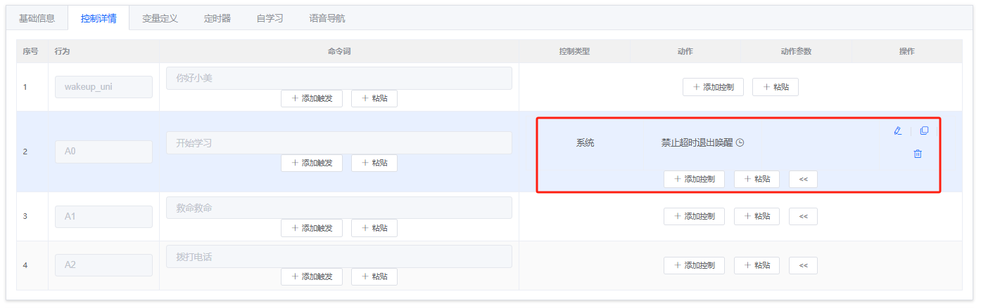

2. **使用命令词触发持续唤醒**

    - 添加一条特定命令词（如"开始学习"）
    - 触发该命令后，模块进入持续唤醒状态
    - 可设置保持时间或永久保持直到下次重启

    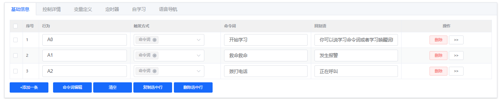

**方法二：上电自动进入唤醒状态**

1. **配置上电事件触发**

    - 在事件触发中添加"上电启动系统启动"事件
    - 设置控制选项为进入持续唤醒状态
    - 这样每次上电都会自动进入免唤醒模式

    

    

**方法三：使用平台配置免唤醒命令词**

1. **在基础信息中设置免唤醒**

    - 将需要免唤醒的命令词添加到免唤醒列表
    - 免唤醒命令词总数不能超过10条
    - 这些命令词将不受自学习功能限制

    

    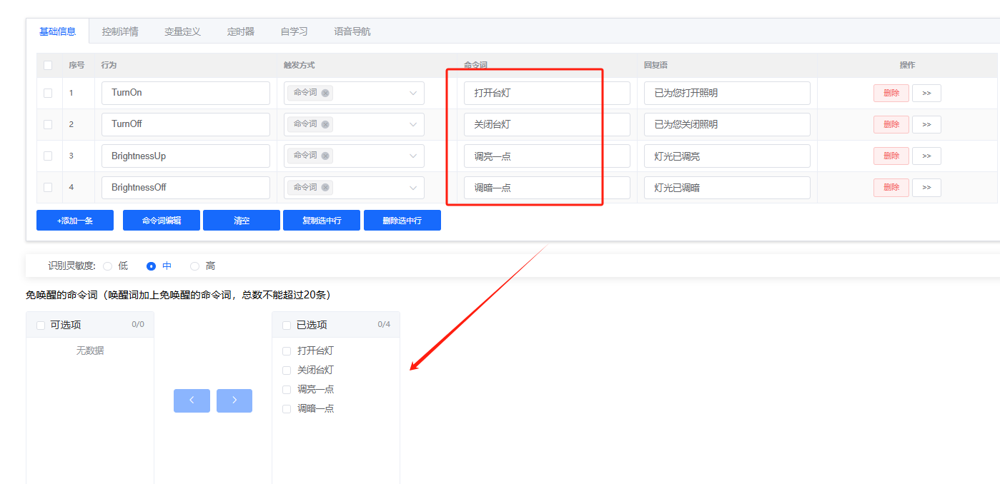

2. **自学习命令词的限制**

    - 自学习的命令词无法直接设置为免唤醒
    - 自学习功能默认需要唤醒词触发
    - 这是SU-03T自学习功能的设计机制

    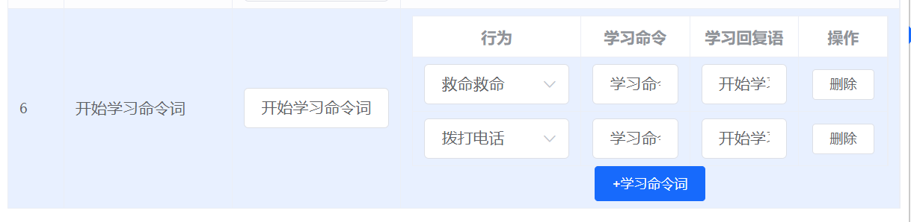

    

**注意事项：**

- 自学习功能暂不支持直接设置免唤醒
- 免唤醒命令词数量有限制（最多10条）
- 延长唤醒状态会增加功耗
- 上电自动设置需要通过事件触发实现
- 对于报警等特殊应用，建议设置合理的唤醒保持时间（如10分钟）以平衡功耗和响应性
- **上电自动进入唤醒的配置需要添加延时**：在"进入唤醒"操作前添加延时（建议500ms），确保系统完全启动后再进入唤醒状态
- **上电自动进入唤醒不是推荐配置**：此配置方式仅适用于需要很多免唤醒命令词的特殊固件场景，一般情况下不推荐使用。如需实现免唤醒功能，建议优先使用平台预设的"免唤醒的命令词"功能

---

### SU-03T1语音指令识别失败且无法修改

**问题描述：**

SU-03T1模块在语音识别功能上无法正常工作，语音指令识别失败，且无法通过小程序修改语音指令。

**解决方案：**

**1. 识别失败排查**

- 检查模块是否正常供电，电压不足会导致识别率下降
- 确认麦克风连接正常，无接触不良
- 在安静环境下测试，排除环境噪声干扰
- 重新学习语音命令，确保发音清晰标准

**2. 小程序修改失败处理**

- 检查手机与模块的蓝牙连接是否稳定
- 确认使用的是官方小程序，版本为最新
- 尝试重启模块后重新连接小程序
- 如仍无法修改，可能需要重新烧录固件

**3. 硬件检查**

- 使用转接板时确保接线正确牢固
- 检查模块引脚无虚焊、短路
- 更换USB端口或数据线排除连接问题
- 使用万用表检查供电电压是否达标（3.3V/5V）

**注意事项：**

- 接触不良是常见问题，确保连接可靠
- 供电不稳会导致识别失败
- 多次尝试无效时建议联系技术支持

---

### SU-03T1语音识别异常疑为接触不良

**问题描述：**

SU-03T1模块进行语音识别时遇到识别功能异常，初步判断为接触不良导致。

**解决方案：**

**1. 连接检查**

- 使用转接板烧录时，确认模块引脚与转接板接触良好
- 检查杜邦线两端是否插紧，无松动
- 测量模块供电是否稳定（3.3V或5V）
- 检查麦克风连接线是否牢固

**2. 硬件排查**

- 直接将模块焊接到PCB板上测试
- 更换不同的USB转串口模块
- 使用短杜邦线减少信号衰减
- 检查模块引脚是否有氧化或污渍

**3. 测试验证**

- 在最小系统下测试（仅保留必要连接）
- 更换已知良好的模块对比测试
- 在不同环境下测试排除干扰
- 使用示波器检查信号质量

**4. 预防措施**

- 使用质量可靠的原厂转接板
- 定期检查连接线状态
- 避免频繁插拔导致接触不良
- 做好防静电措施

**注意事项：**

- 接触问题最容易被忽视但影响最大
- 建议使用焊接方式替代杜邦线连接
- 如自行排查无法解决，联系技术支持

---

### SU-03T重置学习和清除学习有什么区别？

**问题描述：**

需要了解SU-03T芯片的重置学习和清除学习功能的区别，以及在什么情况下使用哪个功能。

**解决方案：**

**功能定义说明：**

1. **重置学习**：

    - 重置当前学习的进程
    - 清除正在学习但未完成的命令
    - 不影响之前已学习成功的数据

2. **清除学习**：

    - 清除所有学习数据
    - 包括之前学习成功的内容
    - 恢复到未学习的初始状态

**使用场景建议：**

1. **重置学习适用**：

    - 学习过程中出现错误
    - 当前学习卡住无法继续
    - 想重新学习当前这条命令
    - 学习失败后重新尝试

2. **清除学习适用**：

    - 需要重新学习所有命令
    - 更换用户使用场景
    - 学习数据混乱需要重来
    - 出厂时清除所有数据

**特殊情况说明：**

1. **开启覆盖学习内容时**：

    - 重置和清除基本没有区别
    - 新学习会覆盖旧数据
    - 但仍建议使用清除功能

2. **推荐做法**：

    - 即使开启覆盖，也建议使用清除
    - 确保数据完全清理
    - 避免残留数据干扰

**操作步骤：**

1. **重置学习**：

    - 选择"重置学习"选项
    - 确认重置操作
    - 重新开始学习当前命令

2. **清除学习**：

    - 选择"清除学习"选项
    - 确认清除所有数据
    - 逐条重新学习所有命令

**注意事项：**

- 重置只影响当前学习，清除影响所有数据
- 不确定时使用清除功能更安全
- 清除后需要重新学习所有命令词
- 建议在学习前规划好所有需要的命令

---

### SU-03T开启自学习后容易误触怎么办？

**问题描述：**

在使用SU-03T模块开启自学习功能后，发现学习的命令词容易误触，未说完就被识别成功，在实际使用中指令未完成即被触发。

**解决方案：**

**问题原因分析：**

1. **自学习算法特点**：

    - 开启自学习后识别率会提高
    - 对特定命令词更敏感
    - 容易出现部分匹配触发

2. **学习过程问题**：

    - 学习时未等说完就提示成功
    - 可能是环境噪音干扰
    - 或接触不良导致声音截断

**优化方法：**

1. **改善学习环境**：

    - 在安静环境下进行学习
    - 保持固定距离和角度
    - 避免环境噪音干扰

2. **调整学习参数**：

    - 学习次数设置为默认5次
    - 不要为了速度减少次数
    - 确保每次学习完整清晰

3. **优化命令词设计**：

    - 使用较长的命令词
    - 避免过于简单的词汇
    - 增加命令词的区分度

4. **降低识别灵敏度**：

    - 在平台中适当调低识别阈值
    - 平衡识别率和误触率
    - 测试找到最佳设置

**替代方案：**

1. **使用免唤醒命令**：

    - 将必要命令配置为免唤醒
    - 通过平台生成固件实现
    - 不依赖自学习功能

2. **精简命令数量**：

    - 只学习最核心的命令
    - 减少误触的可能性
    - 通过组合命令扩展功能

**注意事项：**

- 自学习功能的误触是正常现象
- 需要在识别率和误触率间找到平衡
- 学习环境对质量影响很大
- 如无法接受误触，建议使用平台配置方式

---

## 误识别问题

### SU-03T1在无语音输入时出现误识别怎么办？

**问题描述：**

SU-03T1芯片在无语音输入情况下，因风扇等环境噪声导致误识别语音内容，且问题在卧室等环境中更为明显。

**解决方案：**

**问题分析：**

环境噪声（如风扇）是导致误识别的主要原因，特别是在安静的卧室环境中，低频噪声更容易被误判为语音指令。

**解决方法：**

1. **配置误识别词汇**
    - 登录智能公元平台
    - 找到"误识别"设置选项
    - 将常见的误识别词汇填入黑名单
    - 重新生成并烧录固件

2. **优化麦克风位置**
    - 远离噪声源（如风扇、空调）
    - 避免正对噪声源放置
    - 考虑使用防风罩

3. **调整识别灵敏度**
    - 适当降低识别阈值
    - 在平台中调整唤醒词和命令词的灵敏度
    - 平衡识别率和误触发率

4. **环境改善**
    - 使用指向性更好的麦克风
    - 增加软件滤波算法
    - 在 firmware 中启用噪声抑制功能

**固件测试建议：**

- 将出现误识别的固件发给技术支持测试
- 记录具体的误识别场景和噪声源
- 提供环境噪声录音样本供分析

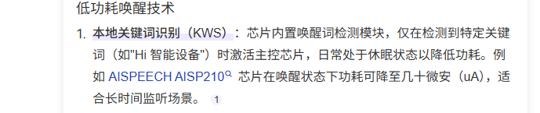


**注意事项：**

- 误识别在一定程度上无法完全避免
- 通过配置可以显著降低误识别率
- 风扇等周期性噪声是主要干扰源
- 卧室等安静环境对噪声更敏感

---

## 语音响应问题

### SU-03T唤醒后串口无输出怎么办？

**问题描述：**

模块能够正常唤醒，但说出命令词后串口没有输出任何数据，无法获取识别结果。

**解决方案：**

**1. 检查退出唤醒设置**

- 登录智能公元平台查看配置
- 检查"退出唤醒"控制动作设置
- 如果设置了"禁止超时退出唤醒"，会导致串口无输出

**2. 修改配置步骤**

- 删除"退出唤醒"控制动作
- 重新生成固件
- 重新烧录修改后的固件

**3. 验证串口配置**

- 确认串口调试工具参数正确（波特率9600）
- 检查串口线连接（TX/RX交叉连接）
- 使用正确的串口调试软件

**4. 硬件检查**

- 确保模块供电充足（5V）
- 检查咪头和喇叭连接
- 尝试更换电源适配器

**注意事项：**

- "禁止超时退出唤醒"功能会阻塞串口输出
- 命令词识别后需要配置相应的输出动作
- 建议添加回复语以便确认识别成功

---

### SU-03T开机后只能响应一次语音指令怎么办？

**问题描述：**

模块开机后只能成功响应一次语音指令，第二次指令无响应，需要重启才能恢复。

**解决方案：**

这是硬件电路设计问题，需要检查硬件设计。

- **可能原因**：

    - 供电电压不稳定
    - 电源功率不足
    - 硬件连接问题

- **排查步骤**：

    1. 使用独立电源测试模块
    2. 检查供电电压是否稳定在5V
    3. 测试平台固件是否正常
    4. 检查外围电路设计

**注意事项：**

- 模块本身功能正常，问题出在硬件电路
- 确保电源能提供足够电流
- 建议使用标准的硬件设计方案

---

## 命令词识别问题

### SU-03T命令词无法触发回复怎么办？

**问题描述：**

SU-03T模块在使用过程中，命令词无法触发回复，影响语音交互功能的正常使用。

**解决方案：**

**1. 检查硬件连接**

- 确认模块接线正确，参考标准接线图：

    - VCC接电源正极（5V）
    - GND接电源负极
    - TXD接USB转串口模块的RXD
    - RXD接USB转串口模块的TXD
    - MIC+和MIC-接麦克风正负极
    - SPK+和SPK-接喇叭正负极

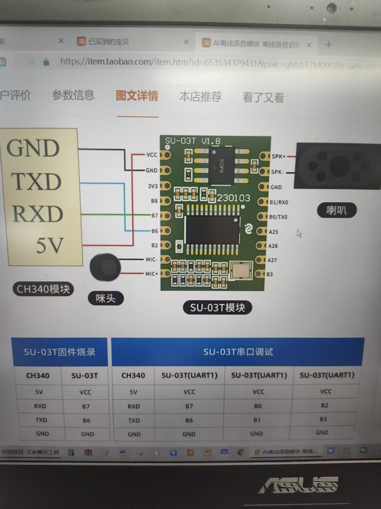

**2. 验证串口调试**

- 使用串口调试工具（如PuTTY、串口助手）
- 设置波特率为9600
- 检查串口数据输出是否正常
- 确认TX/RX线序交叉连接正确

**3. 检查固件配置**

- 确认已烧录包含命令词的固件
- 检查命令词是否已正确添加到平台配置
- 验证命令词对应的动作是否已设置
- 确认固件生成时包含了所有需要的命令词

**4. 测试步骤**

- 上电后等待模块初始化完成
- 清晰地说出命令词
- 观察串口是否有数据输出
- 检查模块是否有回复语音

**注意事项：**

- 确保环境噪声不过大，避免影响识别
- 说话距离建议在15-30cm范围内
- 命令词需要按照平台配置的标准发音
- 如果问题持续存在，建议重新生成并烧录固件

---

## 唤醒距离问题

### SU-03T首次唤醒正常，退出后再次唤醒距离变短怎么办？

**问题描述：**

使用SU-03T离线方式，首次唤醒后识别率和距离都正常，但当退出后，再次唤醒时必须很近才能触发唤醒。

**解决方案：**

**1. 咪头选型要求**

咪头选型推荐使用机芯智能定制咪头6027：

- **规格参数**：直径6MM，高度2.7MM，电流0.5ma，灵敏度-27dB，信噪比75
- **连接线**：2.0端子+双绞线60mm
- **线长限制**：咪头线设计尽量短，尽量不要大于100MM
- **如需延长**：超过100mm必须使用双绞线或者屏蔽线防干扰

**2. 咪头技术要求**

- **灵敏度范围**：推荐在-32dB到-25dB范围内选型
- **信噪比**：建议70以上
- **电流要求**：咪头电流0.1ma到0.5ma
- **管芯选择**：有条件可以用进口的管芯
- **厂家实力**：选择有出厂检测、长期供货能力的厂家

**3. 其他注意事项**

- **极性连接**：模块是单端结构，咪头极性反接时没有接收性能
- **电源要求**：模块供电不足或不稳都会造成识别灵敏度下降
- **并联问题**：咪头并联电流减小会影响拾音性能，不建议使用
- **结构设计**：声音通过空气传播，别把咪头放进密闭空间里面

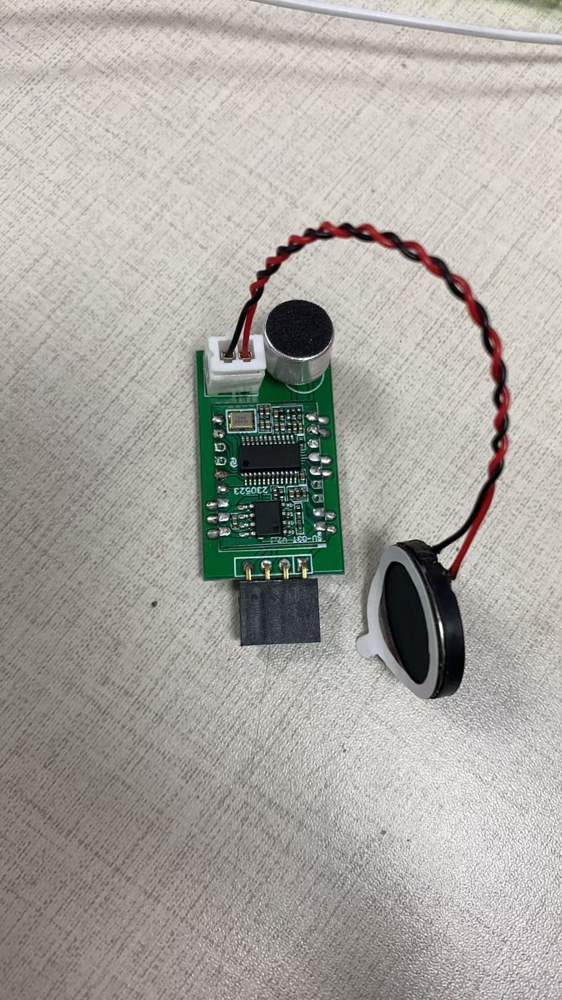

**注意事项：**

- 咪头选型非常重要，直接影响唤醒距离和识别率
- 现阶段国内市场咪头参差不齐，很多规格书和产品实物参数不符
- 具体选型要根据用户使用场景或者环境测试为准
- 如仍有问题，建议更换为推荐的机芯智能6027咪头测试

---

## 咪头相关问题

### SU-03T插入咪头后电压从3.3V降至2.5V怎么办？

**问题描述：**

插入咪头后，模块电压从3.3V降至2.5V，且无法正常唤醒设备。

**解决方案：**

**1. 咪头损坏判断**

- 正常咪头应有约1kΩ阻值
- 无穷大阻值表明咪头已损坏
- 损坏的咪头会导致电压异常

**2. 电压测量验证**

- 不插咪头时测试模块供电应为3.3V
- 插入正常咪头后电压在2.4-2.5V范围
- 喇叭正负对地电压应为2.2-2.5V

**3. 处理步骤**

- 更换新的咪头测试
- 确认新咪头阻值正常
- 重新测试唤醒功能

**注意事项：**

- 咪头是易损件，使用时需注意保护
- 电压异常会导致唤醒功能失效
- 建议备用咪头以供更换

---

## 脉冲输入相关问题

### SU-03T脉冲输入检测精度不足怎么办？

**问题描述：**

SU-03T的脉冲输入检测无法满足200ms脉冲的精度要求，输入180ms脉冲信号无法正常触发，设置100ms脉冲时出现自激振荡。

**解决方案：**

**1. 脉冲宽度限制**

- SU-03T无法稳定检测小于100ms的脉冲信号
- 建议使用300-500ms的脉冲宽度
- 脉冲宽度过小可能导致检测失效

**2. 配置注意事项**

- 脉冲宽度误差只能调大，不能调小
- 调大后若无反应，可适当增加脉宽
- 避免设置100ms以下脉冲值

**3. 硬件连接检查**

- 确认脉冲信号电压符合模块要求
- 使用示波器验证输入脉冲波形
- 检查信号线连接是否牢固

**4. 应用建议**

- 对于需要精确控制200ms脉冲的应用
- 考虑使用外部硬件电路进行脉冲处理
- 或选择其他支持更高精度的模块

**注意事项：**

- SU-03T脉冲检测存在精度限制
- 300-500ms脉冲宽度下响应较为稳定
- 不同应用场景建议实测验证

**5. 输入电平要求**

- IO口输入的脉冲电压需达到一定数值才能正常接收
- 一般建议电压不低于2.5V，推荐使用3V
- 输入脉冲电压值过低会导致IO口无法正常接收

---

## 喇叭声音相关问题

### SU-03T喇叭声音特别小怎么办？

**问题描述：**

SU-03T模块的喇叭声音特别小，影响正常使用。

**解决方案：**

**1. 调整音量参数**

    - 进入设备配置界面
    - 找到音量设置选项
    - 将音量值调大（默认75可调至80-90）

**2. 检查硬件连接**

    - 确认喇叭正负极连接正确
    - 检查喇叭功率匹配（推荐8欧姆0.5W）
    - 确保连接线无虚接

**注意事项：**

- 音量设置过大会导致失真
- 建议根据实际环境需求调整
- 如仍有问题，可尝试更换喇叭测试

---

### SU-03T喇叭输出声音不自然怎么办？

**问题描述：**

使用SU-03T模组时，喇叭输出声音不自然，感觉采样率不够，即使更换喇叭和功放模块问题依旧存在。

**解决方案：**

1. **音频文件优化**
    - 如使用个性化音频功能，优化上传的MP3文件质量
    - 确保音频文件采样率和比特率设置合理
    - 使用专业音频软件进行预处理

2. **硬件检查**
    - 确认喇叭规格匹配（5V输入/4Ω负载/THD+N<1%）
    - 检查功放模块性能
    - 排除硬件故障可能

3. **音频参数调整**
    - 调整平台中的音频输出参数
    - 尝试不同的音频编码格式
    - 优化音频压缩设置

**注意事项：**

- 更换喇叭和功放后问题仍存在，说明问题可能出在音频源
- 个性化音频的播放效果与原始文件质量直接相关
- 建议使用高质量音频文件（如16kHz采样率以上）

---

## 出厂程序与唤醒词设置

### SU-03T出厂默认程序需要烧录新固件吗？

**问题描述：**

SU-03T上电后能听到"你好我是小美"的提示音，但说出唤醒词"小美小美"后没有响应。

**解决方案：**

**1. 出厂程序说明**

- 出厂程序仅用于测试模块基本功能
- 不包含完整的唤醒识别功能
- 需要烧录自定义固件才能正常使用

**2. 唤醒词配置**

- 唤醒词是可以自定义的
- 在平台的"唤醒词自定义"界面设置
- 支持修改唤醒词和唤醒回复

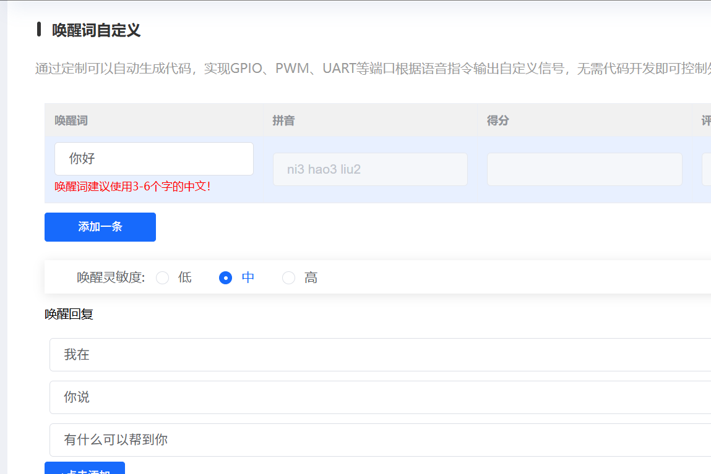

**3. 使用步骤**

- 登录智能公元平台配置所需功能
- 生成包含唤醒词和命令词的固件
- 使用烧录工具烧录新固件
- 烧录完成后测试唤醒功能

**注意事项：**

- 出厂提示音不等于完整功能程序
- 必须烧录自定义固件才能正常使用
- 唤醒词可以根据需求自定义设置

---

## 串口通信与数据处理

### 如何处理SU-03T串口接收数据中的多组数据？

**问题描述：**

使用SU-03T通过串口接收数据时，接收到的是一组包含帧头、帧尾和多组变化数据的十六进制数据流，希望只提取并识别其中一组数据中的特定字符。

**解决方案：**

**问题分析：**

- 串口接收到的数据包含帧头、帧尾和中间12组变化数据
- 数据堆叠在一起可能是未添加时间戳导致
- 需要配置正确的串口格式来解析数据

**配置步骤：**

1. **检查Pin脚配置**
    - 在平台配置中查看Pin脚设置
    - 确认串口功能配置正确

2. **配置串口格式**
    - 进入平台Pin脚配置界面
    - 设置UART1_RX和UART1_TX
    - 配置帧头、帧尾、波特率、数据位等参数

3. **数据解析方法**
    - 使用导入配置文件方式参考正确配置
    - 导入技术支持提供的示例配置文件提供的示例配置文件
    - 导入技术支持提供的示例配置文件提供的示例配置文件
    - 根据实际需求调整识别位置

**操作建议：**

- 确认已配置时间戳，避免数据堆叠
- 使用平台提供的示例文件进行测试
- 根据实际数据格式调整识别逻辑

**注意事项：**

- SU-03T的串口配置需要在平台中正确设置
- 多组数据需要明确识别哪一组数据
- 建议联系技术支持获取配置示例文件

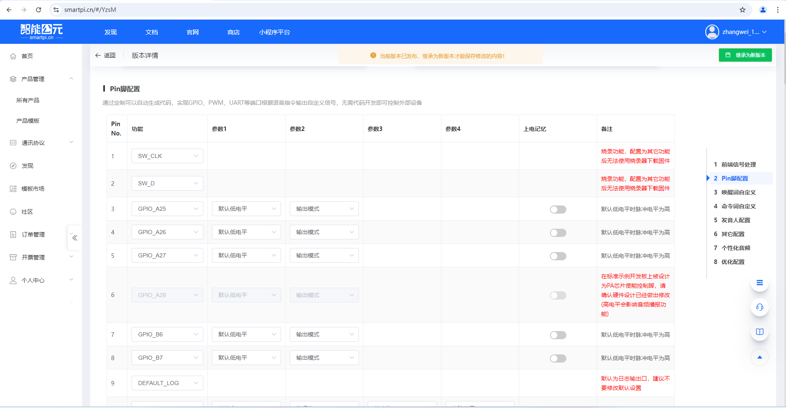


---

## 通讯协议相关问题

### SU-03T是否支持MODBUS-RTU和I2C通讯？

**问题描述：**

需要实现MODBUS-RTU规约通讯和I2C总线的SDA/SCK通讯测试，询问SU-03T是否支持。

**解决方案：**

**1. MODBUS-RTU支持**

    - MODBUS-RTU规约通讯属于串口通信
    - SU-03T可以通过串口实现MODBUS-RTU通讯

**2. I2C通讯支持**

    - I2C总线的SDA/SCK通讯方式可以实现
    - 但需要二次开发或者定制固件

**注意事项：**

- 标准固件可能不包含所有通讯协议
- 特殊需求需要评估开发成本
- 建议详细描述需求后咨询技术支持
- 建议详细描述需求后咨询技术支持

---

## 唤醒词屏蔽与自动运行

### 如何配置SU-03T上电自动运行并屏蔽唤醒词？

**问题描述：**

需要配置SU-03T模块实现上电后自动运行，同时屏蔽唤醒词功能。

**解决方案：**

**1. 屏蔽唤醒词配置**

- 进入"系统设置"→"识别控制"
- 在"禁止识别词"中添加要屏蔽的唤醒词
- 例如：将"你好小爱"加入禁止列表

**2. 上电自动运行配置**

- 添加"上电启动"事件触发
- 在事件中设置需要执行的动作
- 配置免唤醒命令词

**3. 配置注意事项**

- 设置免唤醒的命令词
- IO初始化等动作需要配置为免唤醒
- wake_up_uni行为不影响事件触发

**4. 唤醒词屏蔽原理**

- 屏蔽后唤醒词无法触发识别
- 命令词如未设置免唤醒也无法使用
- 适合特定应用场景（如自动播报设备）

**注意事项：**

- 屏蔽唤醒词后只能通过命令词或触发事件控制
- 确保必要的功能已设置为免唤醒
- 上电启动事件可以替代唤醒触发

---

### SU-03T执行指令时声音变小是什么原因？

**问题描述：**

在使用智能开关项目时，遇到声音在听到指令后执行时音量变小的问题。

**解决方案：**

**1. 可能原因分析**

- **电源供电不足**：

    - 执行动作时电流增大，电压下降
    - 导致功放输出功率不足
    - 表现为声音突然变小

- **功放电路问题**：

    - 功放芯片供电不稳定
    - 耦合电容容量不足
    - 静音控制电路异常

- **固件配置问题**：

    - 播放时误触发了音量调节
    - 某些动作导致音量被降低
    - 音量参数设置不合理

**2. 排查步骤**

- **电源检查**：

    - 测量执行动作时的电源电压
    - 确认电源能提供足够电流
    - 检查电源线材是否过细

- **硬件检查**：

    - 检查功放电路焊接
    - 测量功放供电电压
    - 确认耦合电容规格

- **固件检查**：

    - 查看是否配置了音量调节
    - 检查动作执行流程
    - 确认初始音量设置

**3. 解决方案**

- **电源优化**：

    - 使用更粗的电源线
    - 增加滤波电容
    - 确保电源能提供2A以上电流

- **硬件改进**：

    - 检查功放芯片型号是否正确
    - 增大耦合电容容量
    - 优化PCB走线宽度

- **软件调整**：

    - 检查平台音量设置
    - 移除不必要的音量调节动作
    - 设置合适的默认音量值

**注意事项：**

- 执行动作时功耗会增加，电源设计需留有余量
- 功放电路设计要考虑瞬态大电流需求
- 建议在空载和满载时分别测试音量
- 可通过示波器观察电压波动情况

---

## 喇叭与声音输出

### SU-03T烧录后无声音是什么原因？

**问题描述：**

SU-03T模块烧录固件后无声音输出，即使设置了开机播报也无反应，且串口通信异常。

**解决方案：**

**1. 硬件检查**

- **供电检查**：使用万用表测量3.3V、喇叭和麦克风电压
- **喇叭规格**：确认喇叭功率和阻抗匹配
    - 4欧姆喇叭：功率需大于2.4W
    - 8欧姆喇叭：功率需大于1.6W
- **连接检查**：确认喇叭正负极连接正确

**2. 可能原因分析**

- **功放烧毁**：使用不匹配的喇叭可能导致功放损坏
- **固件问题**：烧录的固件可能不包含播报功能
- **硬件故障**：模块本身可能存在硬件问题

**3. 解决方案**

- **更换喇叭**：使用推荐规格的喇叭
- **使用转接板**：购买官方转接板确保兼容性
- **重新烧录**：使用官方提供的固件重新烧录
- **联系技术支持**：如硬件检查正常仍无声音

**注意事项：**

- 喇叭功率不匹配会烧毁功放电路
- 建议使用官方推荐的喇叭型号
- 转接板可以避免接线错误和兼容性问题


---

## 自学习功能

### 如何关闭SU-03T的自学习功能？

**问题描述：**

SU-03T设备在使用过程中突然出现自学习功能，但不清楚如何关闭该功能。

**解决方案：**

**1. 定位自学习开关**

- 登录智能公元平台
- 进入"命令词控制"设置界面
- 找到"自学习功能"开关选项

**2. 关闭自学习功能**

- 将"自学习功能"开关从开启状态（蓝色）关闭
- 确认关闭后保存配置
- 重新生成固件并烧录

**3. 验证功能关闭**

- 烧录新固件后测试设备
- 确认自学习功能不再自动触发
- 验证正常语音识别功能不受影响

**注意事项：**

- 自学习功能可能被误操作触发
- 关闭后不会影响原有的命令词识别
- 如需重新启用，可在相同位置打开开关


---

### SU-03T自学习命令词删除不了怎么办？

**问题描述：**

在使用US-03T模块进行命令词学习时，发现无法删除已学习的旧命令词，即使执行了删除操作，底层命令词仍然存在，导致新命令词无法完全替换旧命令词。

**解决方案：**

**1. 选择正确的学习模式**

- 在智能云元平台的命令词自定义界面
- 找到"指定学习模式"下拉菜单
- 选择"覆盖原来学习"而非"新增学习结果"

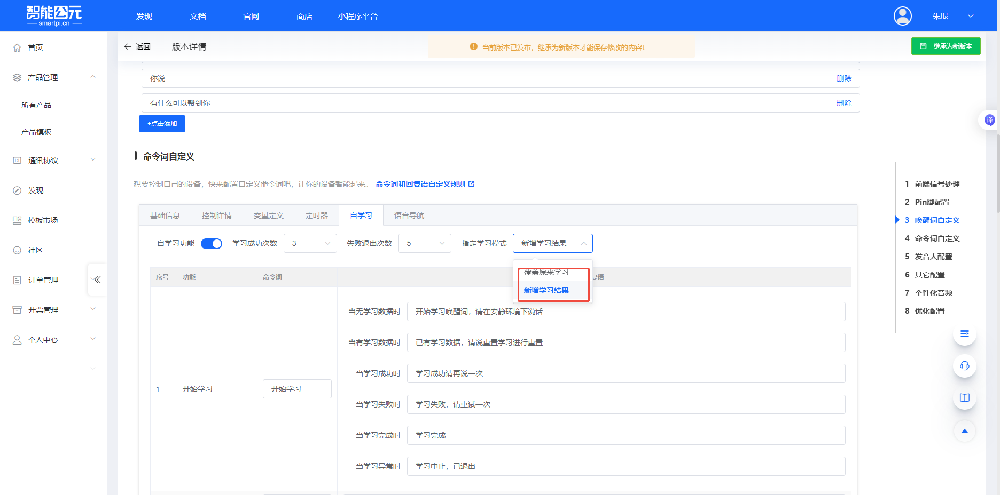

**2. 清除学习数据**

- 先执行"清除学习"操作
- 确认收到"学习数据已清除"的回复
- 重新进行命令词学习

**3. 验证学习效果**

- 学习完成后测试新命令词
- 确认旧命令词不再被识别
- 验证只有新命令词生效

**注意事项：**

- "新增学习结果"模式会保留原有命令词，可能导致命令词冲突
- "覆盖原来学习"模式会完全替换之前的命令词
- 如需彻底删除所有命令词，建议先清除再重新学习

---

### SU-03T系统预设命令词可以删除吗？

**问题描述：**

在自学习功能中，系统预设的命令词无法被删除，而用户希望移除这些默认命令词，只保留自学习的命令词。

**解决方案：**

**1. 理解系统命令词的作用**

- 系统预设命令词（如"前进"、"后退"、"左转"等）是自学习功能的基础
- 删除这些命令词会导致自学习功能无法正常工作
- 自学习需要基于这些预设命令词进行映射

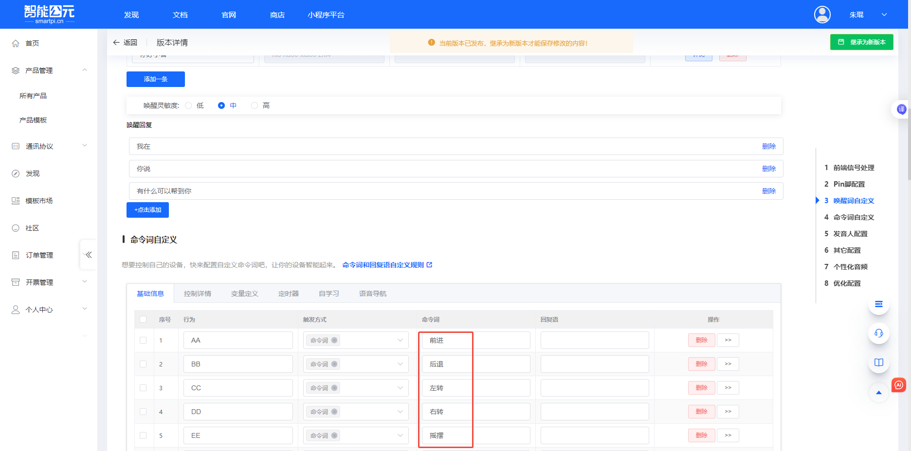

**2. 使用控制事件禁用系统命令词**

- 在智能平台添加控制事件
- 设置触发条件为"自学习事件-已重置命令词"
- 添加控制动作，禁止识别系统预设命令词

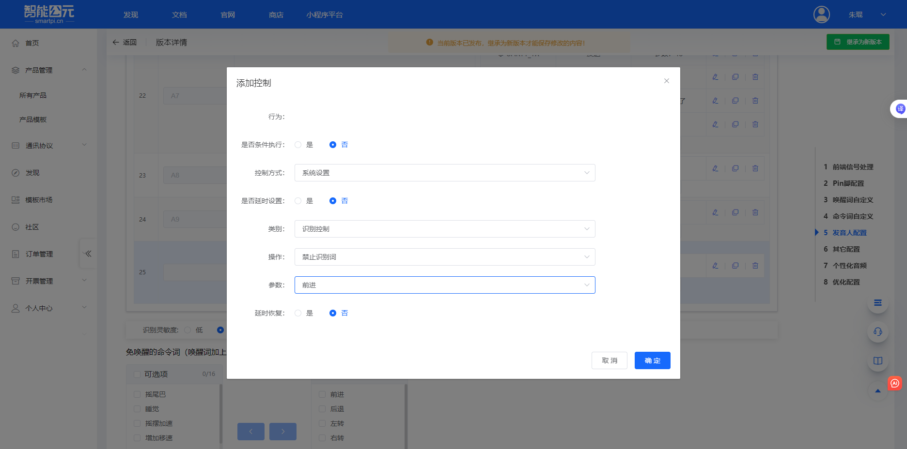


**3. 配置免唤醒命令词**

- 将需要的自学习命令词添加到免唤醒列表
- 系统命令词被禁用后，只有自学习命令词生效
- 通过语音命令可以重新启用系统命令词

**注意事项：**

- 系统预设命令词是自学习功能的基础，不能直接删除
- 自学习的命令词可以单独删除和管理
- 如需完全替换系统命令词，建议使用平台配置而非自学习功能
- 可以通过事件控制实现动态禁用/启用特定命令词

---

### 如何通过语音命令恢复出厂设置？

**问题描述：**

需要配置一个语音指令，使设备能够通过语音命令恢复出厂设置，并确保恢复后仍能识别原有的语音指令。

**解决方案：**

**1. 添加"恢复出厂设置"命令词**

- 在智能平台的命令词自定义页面
- 添加新的命令词"恢复出厂设置"
- 设置为免唤醒命令词以便随时使用

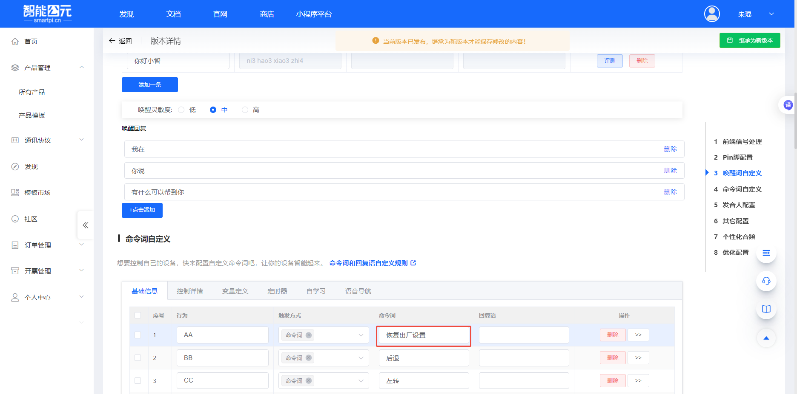

**2. 配置恢复出厂设置的控制动作**

- 为"恢复出厂设置"命令词添加控制
- 选择系统设置类别
- 添加"允许识别词"动作，参数选择需要恢复的命令词


**3. 验证配置效果**

- 保存配置并生成固件
- 烧录后测试"恢复出厂设置"命令词
- 确认系统命令词被重新启用

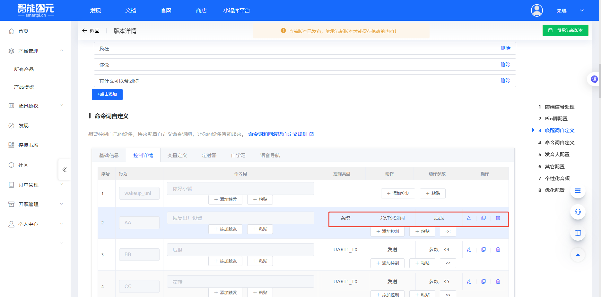

**注意事项：**

- 恢复出厂设置会重新启用所有系统预设命令词
- 自学习的命令词数据会被清除
- 建议在恢复前确认是否需要保留当前配置
- 可以配合禁用功能实现命令词的动态管理

---

## 串口控制与固件管理

### 如何确认SU-03T烧录的固件版本？参数66未生效怎么办？

**问题描述：**

烧录固件后无法确认版本信息，且发现串口输入的参数66未生效，需要确认固件是否正确烧录。

**解决方案：**

**1. 固件版本确认**

- **记录管理**：下载固件时保存到指定文件夹
- **命名规范**：使用版本号或日期命名固件文件
- **烧录选择**：烧录时选择对应的固件文件
- **无日志查看**：模块暂不支持运行时查看固件版本

**2. 参数66问题排查**

- **症状描述**：串口输入指令无响应
- **常见原因**：配置的播报内容为空导致数据错乱
- **测试方法**：使用其他串口指令测试模块响应

**3. 串口指令触发方式**

- **语音触发**：说出"前进"等命令词，模块发送数据到串口
- **串口输入触发**：

    - 消息号20：播放"南宁今天阴天，户外温度比室内低"
    - 可通过代码 `Uart2_SU03T_SendCMD2(20)` 直接触发


*UART1_TX发送参数6配置界面*


*消息号20的串口输入配置*

**4. 故障排查步骤**

- 检查其他串口指令是否有响应
- 确认串口连接和参数配置
- 重新烧录确认的固件版本
- 检查播报内容是否为空

**注意事项：**

- 模块焊接后不便查看版本，烧录时务必记录
- 播报内容为空会影响相邻参数的正常工作
- 建议在烧录前完整测试所有功能
- 保留固件备份便于问题排查

---

### SU-03T参数21播报不完整是什么原因？

**问题描述：**

参数22可以正常播报完整句子，但参数21只能播报"室内温度"几个字，无法完整播报预设内容。

**解决方案：**

**1. 问题原因分析**

- **播报内容为空**：某个播报项的播放内容未填写
- **数据错乱**：空内容导致后续参数播报异常
- **误触发**：可能触发了其他包含"室内温度"的配置项

**2. 配置检查**

- **参数21配置**：串口输入触发，消息号21
    - 预设播报："南宁今天雾天，户外温度比室内高"
- **参数22配置**：串口输入触发，消息号22
    - 预设播报："南宁今天雾天，户外温度比室内低"
- **t66参数**：可能包含"室内温度$homeT$度"的播报内容


*参数21和22的配置界面，均设置为串口输入*


*t66参数配置，消息号25，包含"室内温度"播报*

**3. 解决方案**

- 检查所有播报项，确保没有空内容
- 重点检查参数21附近的配置项
- 重新生成固件并烧录测试

**4. 预防措施**

- 配置时填写完整的播报内容
- 使用测试功能验证每个参数
- 定期检查配置项的完整性

**注意事项：**

- 空的播报内容会影响相邻参数的正常工作
- 建议在配置时避免留空任何播报项
- 如出现异常，优先检查播报内容配置

---

### 播报内容为空会导致什么问题？

**问题描述：**

发现语音播报数据错乱，无法正常播报，经排查是某个播报项的内容为空导致的。

**解决方案：**

**1. 问题现象**

- **数据错乱**：空内容导致播报顺序混乱
- **播报失败**：某些命令词无声音响应
- **影响范围**：空播报项前后的参数都会受影响

**2. 问题定位**

- 检查配置列表中是否有空的播放内容
- 特别关注异常行为对应的播报项
- 使用平台工具逐项排查

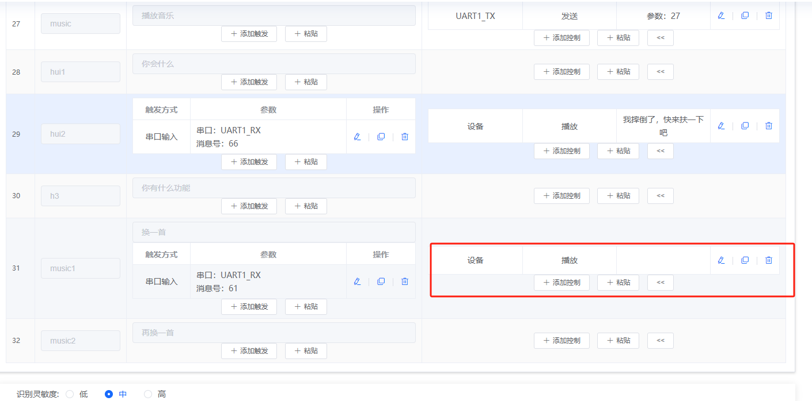

*第31行music1播报项的播放内容为空（红色框标出）*

**3. 解决方法**

- **填写内容**：为所有空播报项添加相应的播报文本
- **删除空项**：如不需要该播报项，直接删除
- **重新烧录**：修改配置后重新生成并烧录固件

**4. 影响范围说明**

- 前后相邻：空播报项会影响其前后的参数
- 不影响远处：距离较远的播报项通常不受影响
- 系统性影响：多个空项会导致整体功能异常

**预防措施：**

- 配置完成后逐项检查，避免遗漏
- 使用测试功能验证所有播报项
- 建立配置检查清单
- 保存配置前进行完整性验证

**注意事项：**

- 任何播报项都不应该留空
- 空内容不仅影响自身，还会影响其他功能
- 建议使用默认内容填充不需要的播报项
- 定期检查配置的完整性

---

### SU-03T是否支持串口或IO控制播报指定语音？

**问题描述：**

需要确认SU-03T模块是否支持通过串口或IO触发播报指定的语音内容，以及播报条数和容量限制。

**解决方案：**

**1. 触发方式设置**

SU-03T支持多种触发播报方式：

- **串口输入触发**：通过串口接收指令触发播报
- **GPIO触发**：通过IO口电平变化触发播报
- 在平台配置时选择相应的触发方式

**2. 语音播报配置**

- 添加需要播报的语音内容
- 为每个播报项设置对应的触发条件
- 支持播报文本、数字、简单词汇等

**3. 播报条数限制**

- **数量限制**：语音播报条数没有硬性限制
- **容量限制**：受芯片Flash存储空间限制
- **空间考虑**：播报音比较占用存储空间

**4. 存储优化建议**

- 播报内容尽量简洁
- 避免过长的语音内容
- 根据实际需求选择必要的播报项

**注意事项：**

- 虽然条数不限，但Flash空间有限
- 播报音质量越高，占用空间越大
- 合理规划播报内容数量和长度
- 优先保存重要的播报内容

---

### SU-03T是否支持组合识别功能？

**问题描述：**

SU-03T芯片是否支持组合识别功能，即同时识别多个指令并执行相应操作。

**解决方案：**

**功能限制说明：**

- SU-03T目前不支持组合识别功能
- 无法同时识别多个独立的指令
- 对于数字的短句组合识别存在限制

**技术现状：**

1. **现有能力**：

    - 支持多意图识别（付费开发定制）
    - 对简单的数字组合可能支持
    - 需要根据具体需求评估

2. **限制说明**：

    - 标准固件不支持组合识别
    - "灯光打开百分之十"这类指令无法识别
    - 需要将组合指令拆分为独立命令

**开发选项：**

1. **付费定制开发**：

    - 联系厂家进行多意图功能开发
    - 需要提供详细的需求规格
    - 评估开发周期和费用

2. **替代实现方案**：

    - 使用多轮对话方式
    - 先识别"灯光"，再识别具体数值
    - 通过状态机实现组合逻辑

**配置建议：**

- 将组合功能拆分为多个简单命令
- 使用场景化的指令设计
- 考虑使用其他支持更复杂功能的模块

**注意事项：**

- 组合识别是高级功能，需要额外开发
- 标准版本只能通过命令词拆分实现
- 如有量产需求，建议早期评估技术可行性
- 可考虑使用带屏显或按键的方案作为补充

---

### SU-03T1在唤醒或识别时发出"嘀"声怎么办？

**问题描述：**

SU-03T1模块在唤醒或识别指令时，会发出明显的"嘀"声，影响用户体验。

**解决方案：**

**问题分析：**

- **现象说明**：每次语音处理时都有"嘀"声
- **影响范围**：唤醒和指令识别过程
- **用户体验**：声音突兀，影响产品品质感

**临时解决方案：**

1. **硬件方案**：

    - 并联电阻到喇叭输出端
    - 串联10-100欧姆电阻
    - 可以降低音量但不影响基本功能

2. **软件配置**：

    - 调整系统音量参数
    - 降低TTS播报音量
    - 可能影响正常播报音量

3. **固件定制**：

    - 联系技术支持定制固件
    - 移除或减少提示音
    - 需要评估开发成本和时间

**根本解决建议：**

1. **产品设计考虑**：

    - 在产品设计阶段预留音量控制
    - 使用可调音量的功放电路
    - 分离提示音和语音播报通路

2. **替代方案**：

    - 使用其他型号模块
    - 选择无提示音的版本
    - 评估更换成本和周期

3. **用户体验优化**：

    - 将"嘀"声改为柔和音效
    - 添加音效开关选项
    - 允许用户自定义开关

**技术说明：**

- "嘀"声是系统提示音
- 用于反馈语音处理状态
- 可能无法完全关闭
- 需要硬件或固件层面解决

**注意事项：**

- 并联电阻可能影响正常播报
- 软件调整需平衡用户体验
- 固件定制需要一定开发周期
- 建议与技术支持详细沟通需求

---

### SU-03T是否可以不设置唤醒词？

**问题描述：**

希望所有语音指令都能直接执行，不需要先说唤醒词，实现完全免唤醒的语音控制。

**解决方案：**

**功能限制说明：**

SU-03T模块的免唤醒功能有以下限制：

- **唤醒词必须要有**：不能完全去除唤醒词
- **免唤醒指令数量限制**：最多支持10条指令设置为免唤醒
- **超过限制的指令**：必须通过唤醒词唤醒后才能使用

**配置方法：**

1. **在命令词自定义页面**
    - 选择需要免唤醒的命令词
    - 设置为免唤醒模式
    - 最多选择10个常用指令

2. **设置退出唤醒控制**
    - 在控制详情中添加"退出唤醒"操作
    - 可以通过特定指令关闭语音识别
    - 需要时可通过其他指令重新唤醒

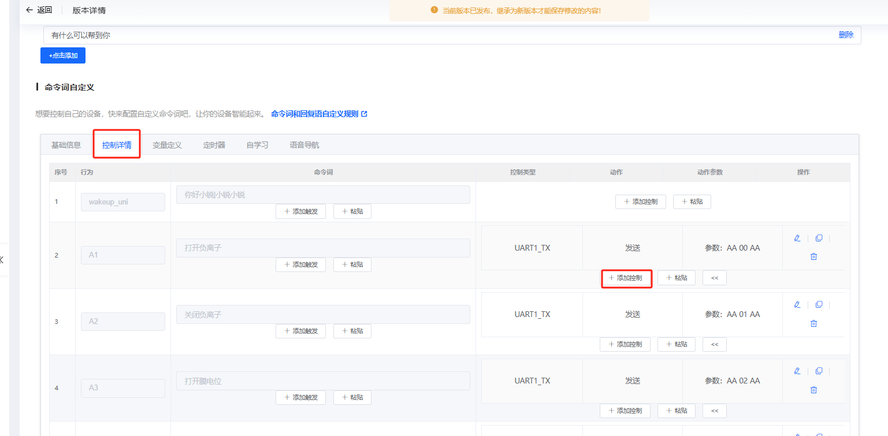

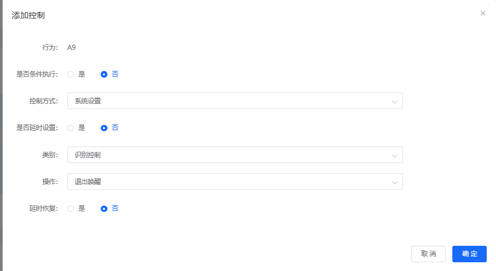


**误识别问题处理：**

对于环境噪音导致的误识别：

1. **更换唤醒词**
    - 选择不易被误识别的唤醒词
    - 避免与环境音相似的词汇
    - 测试多种唤醒词效果

2. **使用退出唤醒功能**
    - 通过程序控制临时关闭识别
    - 在不需要语音时彻底停止
    - 避免频繁误触发

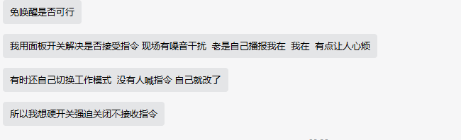

**注意事项：**

- 免唤醒指令超过10条无法设置
- 40条指令全部免唤醒的需求无法实现
- 建议选择最常用的10条指令设为免唤醒
- 环境噪音大时建议使用物理屏蔽或退出唤醒

---

### 如何配置SU-03T的唤醒和退出唤醒？

**问题描述：**

需要了解如何通过软件配置控制SU-03T的唤醒状态，实现程序的动态控制。

**解决方案：**

**唤醒控制配置：**

1. **添加退出唤醒控制**
    - 进入命令词自定义页面
    - 选择特定命令词（如A9、CTL1等）
    - 设置操作为"退出唤醒"
    - 不需要条件执行和延时

2. **配置进入唤醒**
    - 可以设置另一个命令词
    - 操作选择"进入唤醒"
    - 实现唤醒状态的切换

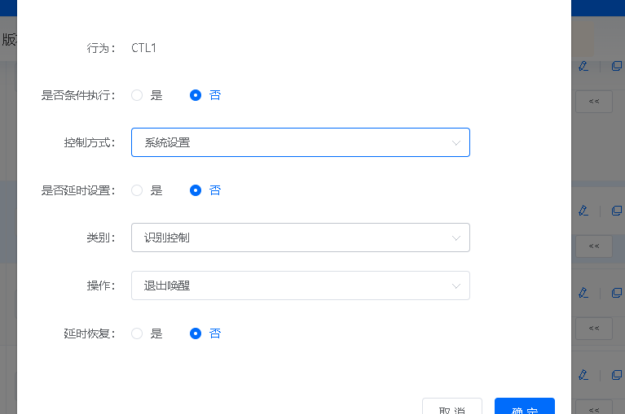


**工作原理：**

- **正常模式**：需要唤醒词激活，然后识别命令
- **退出唤醒后**：模块暂停语音识别功能
- **进入唤醒后**：恢复正常语音识别

**应用场景：**

1. **程序控制**
    - 主控MCU发送指令控制模块状态
    - 在特定时段关闭语音功能
    - 避免误识别影响设备运行

2. **降噪处理**
    - 检测到环境噪音过大
    - 临时退出唤醒模式
    - 噪音减小后重新开启

**注意事项：**

- 退出唤醒后，所有语音指令都不会响应
- 需要通过UART或其他方式重新进入唤醒
- 合理设计控制逻辑，避免模块无法唤醒
- 建议保留至少一个唤醒途径

---

### SU-03T支持所有指令都免唤醒吗？

**问题描述：**

希望所有40条语音指令都能免唤醒直接执行，但发现受到系统限制。

**解决方案：**

**系统限制说明：**

SU-03T的设计限制如下：

- **唤醒词机制**：必须保留至少一个唤醒词
- **免唤醒上限**：最多设置10条免唤醒指令
- **超限处理**：超出10条的指令必须通过唤醒词使用

**技术原因：**

1. **资源限制**
    - 内存容量有限
    - 识别处理能力约束
    - 保证识别准确率

2. **误识别控制**
    - 全部免唤醒易误触发
    - 影响用户体验
    - 通过唤醒词降低误触发率

**建议方案：**

1. **指令分类**
    - 选择最常用的10条设为免唤醒
    - 如：开关机、模式切换等高频操作
    - 其他操作保留唤醒词模式

2. **优化工作流程**
    - 合理设计语音交互逻辑
    - 减少不必要的语音操作
    - 结合其他控制方式（如按键、UART）

3. **使用场景优化**
    - 安装调试阶段：保留更多免唤醒
    - 正常使用阶段：减少免唤醒数量
    - 根据实际需求动态调整

**注意事项：**

- 40条指令全部免唤醒的需求无法实现
- 超过10条免唤醒会导致设置失败
- 建议选择真正必要的指令设为免唤醒
- 可通过程序逻辑优化减少语音操作需求

---


---

### SU-03T模块出现误识别怎么办？

**问题描述：**

SU-03T模块在使用过程中经常出现误识别，在旁边讲话时容易被误触发命令词。

**解决方案：**

**1. 调节识别阈值**

- 识别阈值越大越容易被识别成功
- 但误识别率也会相应增大
- 未设置时使用默认值
- 建议根据实际环境调节


**2. 设置识别灵敏度**

- 将识别灵敏度从"高"调整为"中"
- 平衡识别率和误识别率
- 避免过于灵敏导致的误触发


**3. 使用防误识别功能**

- 将不想被识别的词条加入防误识别列表
- 可有效减少误触发情况
- 特别适用于环境噪声较大的场合

**4. 检查超时设置**

- 超时退出时间设置为60秒
- 60秒后模块会退出唤醒状态
- 退出后直接喊命令词无效


**注意事项：**

- 避免在嘈杂环境使用
- 保持适当的拾音距离
- 必要时可添加防误识别词条
- 灵敏度设置建议从"中"开始测试

---

### SU-03T模块超时设置不生效怎么办？

**问题描述：**

设置超时时间为60秒后，设备未按预期退出唤醒状态，命令词在长时间后仍能被识别。

**解决方案：**

**1. 检查免唤醒设置**

- 确认命令词未加入免唤醒列表
- 免唤醒的命令词不受超时限制
- 检查免唤醒命令词管理界面

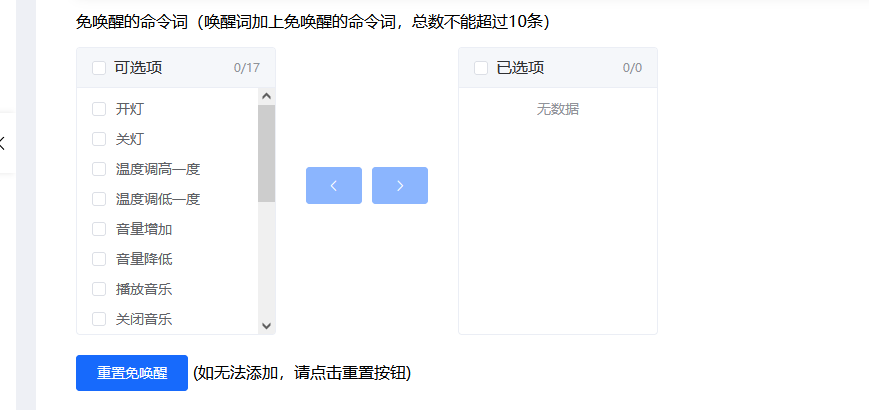

**2. 确认配置生效**

- 超时设置后需要重新生成固件
- 烧录新固件才能使配置生效
- 确认烧录的是最新配置

**3. 验证功能流程**

- 先喊唤醒词进入唤醒状态
- 等待60秒不进行任何操作
- 此时直接喊命令词应该无效

**注意事项：**

- 超时功能仅在唤醒模式下有效
- 免唤醒命令词会绕过超时限制
- 如仍有问题，可能需要技术支持分析配置文件

---

### SU-03T无法响应唤醒词且无语音输出？

**问题描述：**

SU-03T配置了语音指令和唤醒词，但无法响应"唤醒小爱"的指令。

**解决方案：**

**1. 检查唤醒词回复语配置**

- 进入智能云平台唤醒词配置界面
- 确认"唤醒回复"字段已填写内容
- 回复语为空将导致唤醒后无语音反馈

**2. 检查扬声器接线**

- 扬声器应连接到SPK+和SPK-引脚
- 不能接到SPK-和GND（错误接法）
- 检查连线是否有电压输出

**3. 验证硬件连接**

- 确认咪头（麦克风）连接正常
- 检查供电是否稳定（5V）
- 模块版本：SU-03T V2.1

**4. 重新生成固件**

- 修改配置后必须重新生成固件
- 下载最新固件并烧录
- 烧录完成后重新上电测试

**注意事项：**

- 唤醒词和命令词都需要配置回复语
- SPK+和SPK-是差分信号，不能接反
- 如果连接正确仍无声音，测试扬声器是否损坏

---

### SU-03T只能识别"打开灯光"指令？

**问题描述：**

烧录固件后，设备只能识别"打开灯光"指令，其他语音指令均无法识别。

**解决方案：**

**1. 检查命令词配置**

- 登录智能云平台查看所有命令词
- 确认每个命令词都已正确添加
- 检查命令词的拼音或文字是否正确

**2. 验证固件生成**

- 确认修改后已点击"生成固件"
- 检查生成时间是否为最新
- 下载最新生成的固件文件

**3. 重新烧录固件**

- 使用正确的烧录工具（UnisoundAssistant）
- 确保烧录过程无错误提示
- 烧录完成后重新上电

**4. 测试方法**

- 逐个测试每个命令词
- 保持适当距离（1-3米）
- 发音清晰，语速适中

**可能原因：**

- 固件生成时配置未保存
- 使用了旧版本的固件文件
- 部分命令词可能过于相似
- 麦克风朝向或位置不当

**注意事项：**

- 每次修改配置都必须重新生成固件
- 建议使用有明显区别的命令词
- 避免使用谐音或相近的词组
- 如问题持续，尝试恢复出厂设置重新配置

---

### SU-03T如何识别长语音指令？

**问题描述：**

使用SU-03T模块识别19个字的语音指令时，识别效果不理想，需要优化长语音指令的识别率。

**解决方案：**

**1. 控制指令长度**

- SU-03T虽然可以识别较长的语音指令，但不建议使用过长的指令
- 建议使用几个字的短指令，识别效果最佳
- 指令越长，识别难度越大，成功率越低

**2. 调整命令识别阈值**

- 进入"优化配置"界面调整"命令识别阈值"
- 阈值范围：0.01-0.2，值越大越容易识别，但误识别率也会增高
- 对于长指令（如十几个字），建议设置为较高值以提升识别率

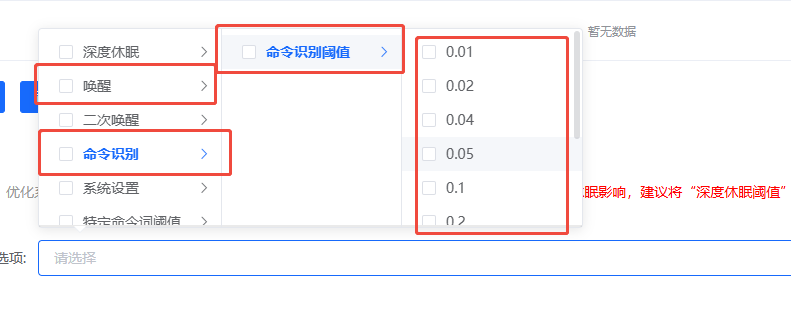

**3. 优化系统阈值配置**

- 将"深度休眠阈值"、"唤醒阈值"、"二次唤醒阈值"设为相同值
- "进入休眠时间"建议设置为2天或更长，降低休眠影响
- 阈值设置需要根据实际测试效果进行调整

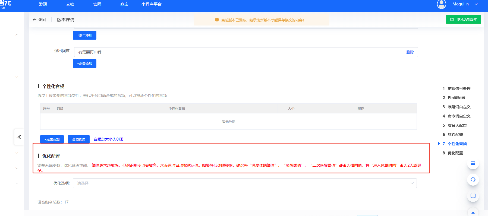

**4. 测试与调整**

- 先将阈值调至最高（如0.2）测试识别效果
- 如果误识别率过高，逐步降低阈值
- 同时考虑精简指令长度，找到最佳平衡点

**注意事项：**

- 19个字的指令识别成功率较低，强烈建议拆分为更短的指令
- 免唤醒的命令词属于命令词选项，不是唤醒词
- 阈值调整后需要重新生成固件并烧录才能生效
- 如果阈值调整后仍无法识别，建议精简指令内容

---

### 如何避免SU-03T误唤醒相似词语？

**问题描述：**

SU-03T模块设置的唤醒词（如"小陈同学"）在被叫成"小爱同学"时也会被误唤醒，需要调整参数避免误唤醒。

**解决方案：**

通过调整唤醒阈值和优化唤醒词设置可以减少误唤醒现象。

**1. 调整唤醒阈值**

- **阈值说明**：数值越大越灵敏，误唤醒率越高
- **建议设置**：根据实际情况适当调低阈值
- **测试方法**：从默认值开始，逐步降低直到误唤醒消失
- **平衡点**：找到能正常唤醒又不误触发的前值

**2. 优化唤醒词选择**

- **避免相似音**：不选择与常见词汇发音相似的唤醒词
- **选择独特词**：使用不易被误触发的组合词汇
- **音调差异**：选择音调特征明显的词汇

**3. 环境优化**

- **减少背景音**：在安静环境中使用可降低阈值
- **避免干扰源**：远离电视、音响等声源
- **合理放置**：麦克风避开主要声音传播方向

**参数调整示例：**

- 默认阈值：0.2（中等灵敏度）
- 减少误唤醒：可调整为0.1-0.15
- 测试验证：在不同环境下测试调整效果

**注意事项：**

- 阈值过低可能导致正常呼叫也无法唤醒
- 需要经过多轮测试找到最佳设置
- 如环境噪声较大，可能需要接受一定误唤醒率

---


---

### SU-03T如何识别命令中的数字字符串？

**问题描述：**

需要了解SU-03T是否能识别命令中的数字字符串，如"打开1"、"关闭2"等包含数字的命令。

**解决方案：**

**1. 不支持通配符识别**

- SU-03T不支持通配符或变量识别
- 无法识别包含任意数字的命令模式
- 每个数字都需要单独定义命令词

**2. 数字命令处理方法**

- **分别定义**：为每个数字定义独立命令
- **使用中文数字**：用"一"、"二"、"三"替代阿拉伯数字
- **避免相似发音**：命令词要有明显区别，如"时间一"vs"时间二"

**3. 配置建议**

- 命令词总数不超过10条限制
- 使用发音差异较大的词汇
- 避免使用"时间一"、"时间二"这种相似结构

**注意事项：**

- 数字识别需要为每个数值单独配置命令词
- 建议使用中文数字提高识别准确率
- 命令词设计要简单明了，避免混淆

---

---


---

### 如何实现B3触发直接进入唤醒状态？

**问题描述：**

SU-03T模块在B3为低电平时，希望直接进入唤醒状态并开始语音识别，而不播放唤醒语音。

**解决方案：**

通过删除唤醒回复语音可以实现静默进入唤醒状态。

**1. 简单方案：删除唤醒回复**

- 在唤醒词配置中删除"唤醒回复此词"内容
- 保留唤醒词本身，但删除回复语音
- 触发后直接进入识别状态，无语音播报

**2. 注意事项**

- "允许语音识别"选项需要建立在唤醒状态下
- 不进入唤醒状态时，该功能无效
- 确认B3触发后模块已正确进入唤醒状态

**3. 进阶方案：控制回复播报**

如需要特定情况下有播报，无播报时无：

- 在控制详情中添加播报控制
- 根据不同命令设置是否播报
- 但回复语音的随机性无法保证

**4. 验证方法**

- 测试B3触发后是否直接进入识别状态
- 验证是否有唤醒语音播报
- 测试命令词识别是否正常

**注意事项：**

- 删除唤醒回复后，可能影响用户体验
- 保留唤醒词是必要的，仅删除回复部分
- 建议在确定不需要播报时再删除

---


---

### SU-03T 麦克风的工作电压是多少？

**问题描述：**

需要了解 SU-03T 麦克风的工作电压，以便添加前置放大器改善收音效果。

**解决方案：**

- SU-03T 麦克风工作电压为 3.3V
- 如需添加外部放大器，需要注意电压匹配
- 可考虑使用低噪声麦克风前置放大器模块

**注意事项：**

- 外部放大器需要良好接地，避免引入噪声
- 放大器增益不宜过高，否则可能导致失真
- 建议先调整软件参数，再考虑硬件改造


---

### SU-03T 在室外使用收音效果不好怎么办？

**问题描述：**

SU-03T 在室外环境下使用时，收音距离明显缩短，需要大声喊才能识别。

**解决方案：**

- **软件调整**：

    - 将难以识别的词条对应的识别灵敏度调高
    - 使用配置工具逐个调整词条阈值

- **使用技巧**：

    - 喊指令时尽量靠近麦克风
    - 避免在强风或嘈杂环境使用
    - 考虑为麦克风添加防风罩

- **硬件优化**：

    - 增加 3.3V 麦克风前置放大器
    - 优化麦克风安装位置，避免遮挡
    - 使用指向性更好的麦克风

**注意事项：**

- 室外环境噪声较大，影响识别准确率
- 防水安装时注意不要完全密封麦克风
- 调整灵敏度时要平衡误触发和识别率
- 前置放大器需要选用低噪声型号

---

## 噪声与识别距离相关问题


---

### 数字声音播放时音量异常变大怎么办？

**问题描述：**

在使用SU-03T等模块时，发现播放到数字部分（如数字、编号等）时声音突然变得异常响亮，与文本部分的音量不匹配。

**解决方案：**

**1. 问题原因分析**

- 文本音和数字音是分别录制和拼接的
- 两者的录制音量参数存在差异
- 拼接时没有进行音量平滑处理

**2. 常见现象**

- 播报"请到2号窗口"时，"2"的音量明显大于前后文字
- 数字部分听起来像是突然被放大
- 整体播报不够平滑自然

**3. 解决方案**

- **基本方案**：这是正常现象，大多数TTS播报都存在类似问题
- **优化方案**：通过修改SDK代码参数调节（需要二次开发）
- **规避方案**：调整播报文案，避免数字和文字直接拼接

**4. 二次开发要求**

- 需要搭建虚拟机开发环境
- 具备一定的代码开发能力
- 修改音量合成相关参数

**注意事项：**

- 这种现象在各类语音播报中都很常见（如微信、支付宝收款提示）
- 如果对产品音质要求极高，建议投入开发资源进行优化
- 一般应用场景下可以接受此正常现象

---


---

### 语音识别灵敏度不足导致识别错误

**问题描述：**

语音指令"230摄氏度"被错误识别为"130摄氏度"，且存在未说完就被提前识别的问题。

**解决方案：**

1. **调整特定命令词阈值**：

    - 在平台的优化配置中找到"特定命令词阈值"设置
    - 针对识别不准确的词汇提高阈值
    - 例如：将"230摄氏度"的阈值从默认值调整到0.8

2. **命令词优化建议**：

    - 使用"二百三十度"或"两百三十度"替代"230摄氏度"
    - 数字识别效果更好的可选择SU-03T模块
    - 避免"230"和"130"这种容易混淆的数字组合

3. **命令词长度控制**：

    - 命令词字数建议控制在4-6个字最佳
    - 过长的命令词可能导致识别中断
    - 例如"深圳今天的天气到底是怎么样的好坏是否有风"，可能在讲到一半就被识别

---

### SU-03T单条识别词的最大字数限制是多少？

**问题描述：**

需要了解SU-03T模块单条识别词的最大字数限制，以便设计合适的命令词。

**解决方案：**

SU-03T模块并没有严格的字数限制，但实际使用时存在识别准确率的问题：

- **实测情况**：十几个字的命令词可以正常识别
- **字数影响**：识别字数越多，识别不准确的概率越大
- **识别失败**：字数过多可能导致无法识别

**建议：**

- 命令词长度建议控制在4-6个字最佳
- 如需使用长命令词，建议先进行实际测试
- 重要功能建议使用简短明确的命令词

**注意事项：**

- 没有明确的字数上限，但受识别准确率限制
- 长命令词的识别效果受环境噪声影响较大
- 建议通过实际测试验证长命令词的可用性

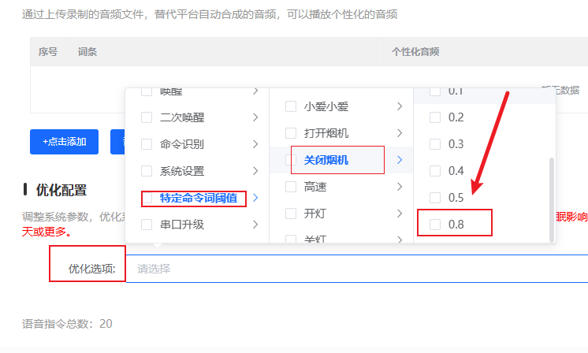

*提高"关闭风机"命令词的阈值示例*

**注意事项：**

- 阈值调整范围通常为0.1-1.0，数值越高识别越严格
- 不同命令词可能需要不同的阈值设置
- 建议逐个测试易混淆的命令词
- 如果问题持续，考虑更换为SU-03T等识别性能更好的模块

---


---

### 如何使用单个麦克风实现语音识别和音乐律动？

**问题描述：**

希望仅使用一个连接到SU-03T的麦克风，在语音识别后播放音乐，并通过该麦克风监听音乐声音以实现灯光随音乐律动的功能。

**解决方案：**

**技术限制说明**

- SU-03T在播放音频时无法同时采集音频
- 单麦克风方案无法实现边播边录
- 需要两个独立的音频通道

**推荐方案**

**1. 双麦克风方案**

- 主麦克风：连接SU-03T用于语音识别
- 辅助麦克风：连接MCU用于音频采集
- 各司其职，互不干扰

**2. 实现步骤**

- 语音命令触发音乐播放
- MCU通过辅助麦克风采集音频
- MCU进行FFT分析获取频率
- 根据频率控制灯光律动

**3. 硬件连接**
```
语音模块(SU-03T)    MCU
    |                   |
    |--- UART --------|
    |                   |
    |              ADC <-- 辅助麦克风
    |                   |
    |               PWM --> LED灯带
```

**替代方案**

如坚持使用单麦克风：

- 使用预置音乐模式
- 不同命令对应不同灯光效果
- 不依赖实时音频分析

**注意事项：**

- SU-03T播放时无法采集麦克风音频
- 单麦克风方案无法实现音乐律动功能
- 辅助麦克风建议使用单独的ADC通道
- 灯光律动需要MCU进行实时音频处理

---

## 唤醒与休眠设置


---

### SU-03T能识别未设置的语音命令吗？

**问题描述：**

希望了解SU-03T模块是否能捕获用户说的未设置命令，并返回"你说什么？我没听清"等提示。

**解决方案：**

- SU-03T模块无法识别未设置的语音命令
- 模块只能识别预先配置好的命令词

**替代方案：**

1. **超时检测法**
    - 检测到一定音量后，如一段时间内无正确命令响应
    - 判定为无效输入，返回提示语
    - 可设置超时时间为3-5秒

2. **排除法思路**
    - 只要不是正确答案的触发，都按错误处理
    - 不需要知道具体说了什么
    - 只判断是否为预设命令

**注意事项：**

- 在线模块可以持续扫描识别，需要AI支持
- 离线模块只能识别预设命令词
- 一直扫描识别会增加误触发率
- 建议使用超时检测的方案实现类似功能

---

## 应用场景选择


---

### SU-03T如何识别命令中的数字字符串？

**问题描述：**

SU-03T芯片是否支持识别命令中包含的数字字符串，或是否需要逐个定义所有数字命令。

**解决方案：**

**数字识别限制：**

- **不支持通配符**：SU-03T不支持类似正则表达式的通配符匹配
- **无数字字符串识别**：无法识别"打开123"中的数字部分
- **需要单独定义**：每个需要识别的数字都必须作为独立命令词

**解决方案：**

1. **逐个定义数字命令**
    - 将所有需要的数字单独定义为命令词
    - 例如："零"、"一"、"二"到"九十九"等
    - 每个数字占用一个命令词位置

2. **使用中文数字**
    - 推荐使用中文数字代替阿拉伯数字
    - 识别准确率更高
    - 符合中文语音识别习惯

3. **命令词管理**
    - 注意命令词总数限制（如10条）
    - 合理分配数字和功能命令
    - 避免相似命令导致误识别

**注意事项：**

- 命令词应避免使用相似发音
- "时间一"、"时间二"这类命令容易混淆
- 建议使用完全不同的发音组合

---

## 播报相关问题


---

### CI-033T和SU-03T在高噪声环境下有什么区别？

**问题描述：**

比较CI-033T和SU-03T在高噪声环境下的性能表现，选择更适合嘈杂环境的模块。

**解决方案：**

**性能对比**

- **CI-033T**：在高噪声环境下表现稍好
- **SU-03T**：噪声环境下的识别能力相对较弱
- 两者都有一定的降噪能力，但CI-033T更优

**选择建议**

- 高噪声环境推荐使用CI-033T
- 普通环境两种模块均可满足需求
- 建议实际测试后再做决定

**技术说明**

- CI-033T在硬件设计和算法上有所优化
- 降噪算法和麦克风配置更适合嘈杂环境
- 具体性能差异需通过实际应用验证

**注意事项：**

- 模块性能差异不是绝对的，还取决于具体应用场景
- 除了硬件，安装位置和麦克风布置也很重要
- 建议购买样品进行对比测试

---


---

### SU-03T自学习命令词在免唤醒状态下不识别怎么办？

**问题描述：**

SU-03T模块的自学习命令词已添加到免唤醒命令词列表中，但在非唤醒状态下无法被识别。

**解决方案：**

**1. 方言识别限制**

- **系统限制**：自学习功能主要支持普通话
- **方言问题**：方言发音与普通话差异较大
- **识别原理**：基于标准普通话模型训练

**2. 解决方案**

- **改为普通话**：用普通话重新设置命令词
- **定制方言**：联系厂家定制方言模型（需要收费）
- **使用词条**：在平台中添加固定词条而非自学习

**技术说明**

- 免唤醒命令词需要与内置模型匹配
- 自学习在非唤醒状态下识别能力有限
- 方言支持需要专门的训练数据

**注意事项：**

- 自学习功能更适合普通话环境
- 如必须使用方言，建议选择定制方案
- 普通话设置能获得最佳识别效果

---

## 音量控制


---
### 离线语音能否控制音量？

**问题描述：**

在SU-03T系统设置中发现有音量调节选项，需要确认是否可以通过离线语音指令来控制音量大小。

**解决方案：**

**功能确认：**

- SU-03T支持离线语音控制音量
- 可以通过语音指令直接调节音量
- 无需网络连接，本地即可实现

**支持的音量控制指令：**

- **停止播放**：停止当前音频播放
- **最小音量**：将音量设置为最低
- **最大音量**：将音量设置为最高
- **增加音量**：逐步提升音量
- **减少音量**：逐步降低音量
- **静音**：立即静音

**配置步骤：**

1. **登录配置平台**
    - 进入产品配置页面
    - 找到控制设置选项

2. **添加音量控制**
    - 点击"添加控制"
    - 选择相应的音量控制行为
    - 配置触发方式和类别

3. **设置触发指令**
    - 为每个音量控制动作设置对应的语音指令
    - 如"调大声"、"调小声"、"静音"等

4. **生成并烧录**
    - 保存配置
    - 生成新固件
    - 烧录到模块

**注意事项：**

- 音量控制是离线功能，无需网络支持
- 可根据实际需求选择需要的音量控制指令
- 建议为每个指令设置语音反馈，提升用户体验
- 测试时确保模块处于正常工作状态


### 语音指令能否同时控制多个设备？

**问题描述：**

在使用语音指令时，发现无法同时触发多个设备控制命令（如"打开3和5"），只能单独触发，希望实现语音指令能同时控制多个设备。

**解决方案：**

**当前系统限制：**

- 语音模块一次只能识别一个命令词
- 无法识别包含多个控制目标的复合指令
- 每个命令词对应固定的控制动作

**替代实现方案：**

1. **设置延时触发**

    - 为多个指令添加适当延时
    - 通过MCU或上位机实现延时控制逻辑
    - 可使用定时器功能实现间隔触发

2. **使用上位机发送多条指令**

    - 语音模块只负责识别命令
    - 上位机接收到指令后发送多个控制信号
    - 实现一个语音触发多个设备动作

3. **命令词组合设计**

    - 设置专门的组合控制命令词
    - 例如："全部打开"、"打开多个"等
    - 每个组合命令对应预设的多设备控制

**技术实现建议：**

- SU-03T模块：可通过串口调试助手测试20ms间隔指令发送
- 使用SDK开发：可编程实现更灵活的控制逻辑
- 平台配置：利用定时器功能实现延时控制

**注意事项：**

- 多个指令间需要设置合适延时（建议20-50ms）
- 避免指令发送过快导致执行错乱
- 复杂控制逻辑需要外部控制器支持
- 语音识别精度受命令词设计影响

---

### SU-03T模块自动进入静音状态怎么办？

**问题描述：**

SU-03T模块在未触发静音命令的情况下，偶尔会自动进入静音状态，导致无法通过唤醒词唤醒，需要说"取消静音"才能恢复。

**解决方案：**

1. **问题分析**
    - 可能是在无人时误识别到类似"静音"的词语
    - 静音功能仅关闭喇叭播报，不影响识别和执行
    - 第二天无法唤醒可能是夜间误识别导致

2. **排查方法**
    - 暂时移除静音控制功能
    - 将静音命令改为引脚输出电平信号
    - 观察是否还会出现自动静音现象

3. **优化建议**
    - 修改静音命令为"不唤醒就不能控制"模式
    - 或使用串口/电平触发替代语音静音命令
    - 确保唤醒词与静音词发音差异明显

**注意事项：**

- 静音状态不影响实际的控制功能
- 如问题持续，建议提供具体场景录音
- 可以通过观察指示灯状态判断是否真的静音

---

### SU-03T英文固件唤醒词无法响应怎么办？

**问题描述：**

使用SU-03T模组烧录英文固件后，设备无法被唤醒。测试发现中文版固件可以正常工作，但英文唤醒词（如HELLO-LEXA、HI-LEXA）无法触发响应。

**解决方案：**

**1. 唤醒词语料问题**

- 英文唤醒词可能未被充分训练
- 某些英文发音组合在训练语料中覆盖不足
- 导致识别率较低或无法识别

**2. 更换唤醒词策略**

- 选择更常见的英文唤醒词组合
- 避免使用生僻或发音特殊的词汇
- 推荐使用已被广泛验证的英文唤醒词

**3. 唤醒词配置优化**

- 进入平台"唤醒词自定义"界面
- 调整唤醒灵敏度设置为"高"
- 确保唤醒词回复已正确配置

**4. 测试验证方法**

- 先使用中文版固件验证硬件功能
- 对比测试不同英文唤醒词的识别效果
- 记录可正常工作的唤醒词组合

**5. 固件生成注意事项**

- 重新生成固件时确保配置已保存
- 使用官方烧录工具（UnisoundAssistant）
- 烧录完成后重新上电测试

**注意事项：**

- 英文唤醒词的识别率可能低于中文
- 如多次尝试仍无法唤醒，建议更换其他英文唤醒词
- 唤醒词训练数据覆盖有限是当前限制
- 可考虑使用更简单的英文单词组合作为唤醒词

---

### SU-03T是否支持通过单片机发送指令进行自学习？

**问题描述：**

希望通过单片机发送指令来触发SU-03T的自学习功能，而不是通过语音指令进行学习，以便在产品销往不同国家时，用户不需要听懂语音提示就能完成命令词的学习。

**解决方案：**

**功能限制说明：**

- SU-03T不支持通过单片机发送指令触发自学习
- 自学习功能必须通过语音指令触发
- 这是模块硬件设计的技术限制

**替代实现方案：**

1. **使用按键触发学习**
    - 通过硬件按键连接到模块
    - 不同按键代表不同的学习指令
    - 最多可支持8个按键对应8条命令词

2. **平台预配置命令词**
    - 在智能公元平台预先配置好各语种命令词
    - 通过模式切换功能选择不同语种
    - 生成多语种固件供不同地区使用

3. **定制开发方案**
    - 联系厂家进行定制开发
    - 实现串口控制的学习触发功能
    - 需要根据需求复杂度和功能要求评估费用

**注意事项：**

- 自学习功能的设计初衷是通过语音交互完成
- 如需非语音触发，建议考虑平台预配置方案
- 定制开发需要较长的开发周期和测试验证

---

### SU-03T能支持多语种吗？

**问题描述：**

需要在SU-03T上实现多语种支持，包括英语、阿拉伯语、印度语、波斯语和西班牙语，让产品能够销往不同国家。

**解决方案：**

**多语种支持说明：**

1. **单一语种支持**
    - 中文或英文单独使用无需定制
    - 可直接在智能公元平台配置开发
    - 支持免唤醒命令词配置

2. **双语种支持**
    - 需要使用CI-33T模块（Flash容量更大）
    - 方案一：使用谐音词实现双语种
    - 方案二：定制开发模式切换功能（费用2000+）

3. **多语种支持（3种及以上）**
    - 每种语言需要独立的识别模型
    - Flash容量不足以支持3种语言
    - 必须通过定制开发实现

**小语种定制要求：**

1. **语料准备**
    - 每个命令词需要接近100人录制
    - 录制人员需包含男女老少，男女各占一半
    - 每人录制4-10条，音频格式：.wav（16.0KHz，16位，1声道）

2. **命令词要求**
    - 建议至少4个音节
    - 发音有明显差异，避免相近词汇
    - 语速正常，声音平稳，底噪小

3. **回复语处理**
    - 产品中的小语种回复语也需要录制音频
    - 提供所有需要播报的内容
    - 按照相同格式要求准备

**技术实现建议：**

- 如只需中英双语，优先选择CI-33T模块
- 使用谐音词方案可自行开发，无需定制
- 小语种定制费用根据命令词数量和实现难度确定
- 训练和开发周期较长，需提前规划

---

### 如何实现语音控制期间禁止扩展IO触发？

**问题描述：**

在使用SU-03T语音模块时，需要实现语音控制继电器时禁止扩展IO（如B0-B8）的高电平触发，避免语音控制与感应器触发产生冲突。

**解决方案：**

通过变量控制和附加条件配置，实现语音指令执行期间临时禁用IO触发功能。

**操作步骤：**

1. **创建控制变量**
    - 进入变量定义页面
    - 创建用于控制IO禁用的变量（如prohibit_b0）
    - 变量类型设为unsigned char，默认值为0

    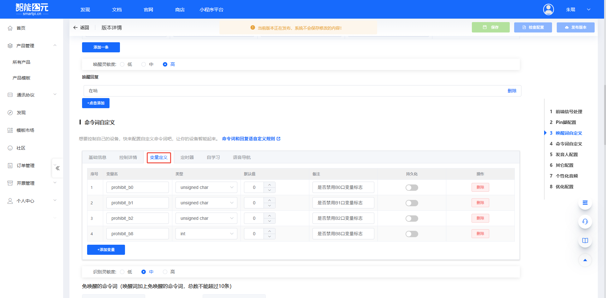

2. **配置语音命令**
    - 在需要控制IO的语音命令词后添加控制动作
    - 设置变量prohibit_b0的值为1（禁止IO触发）

3. **配置IO输入触发**
    - 在GPIO输入触发方式中添加"附加条件"
    - 选择变量prohibit_b0并设置条件为等于0

    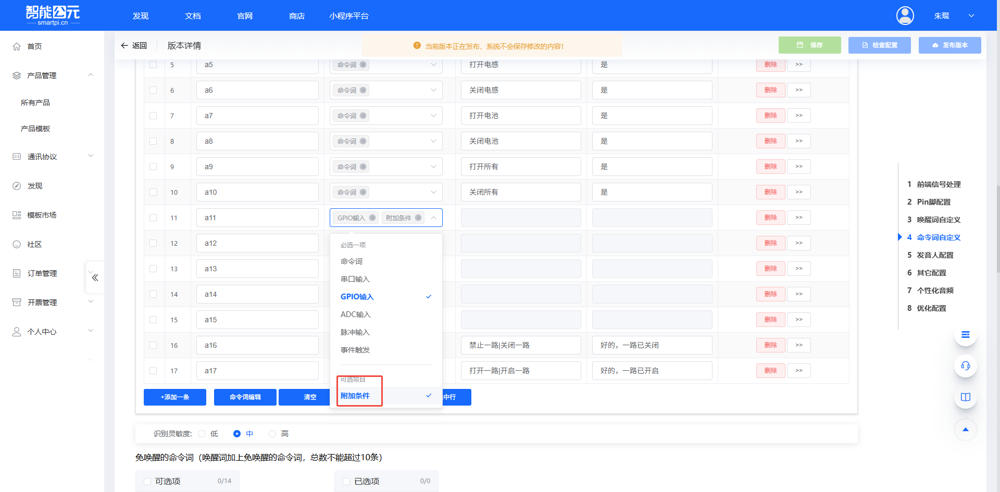

    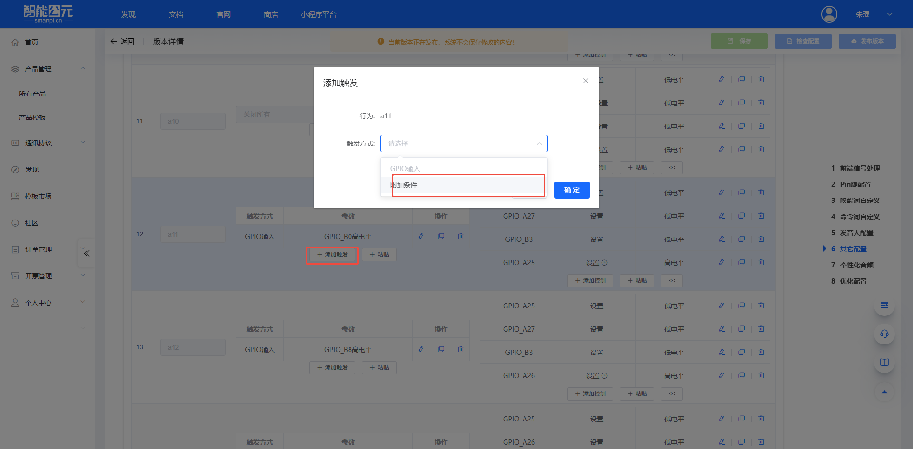

    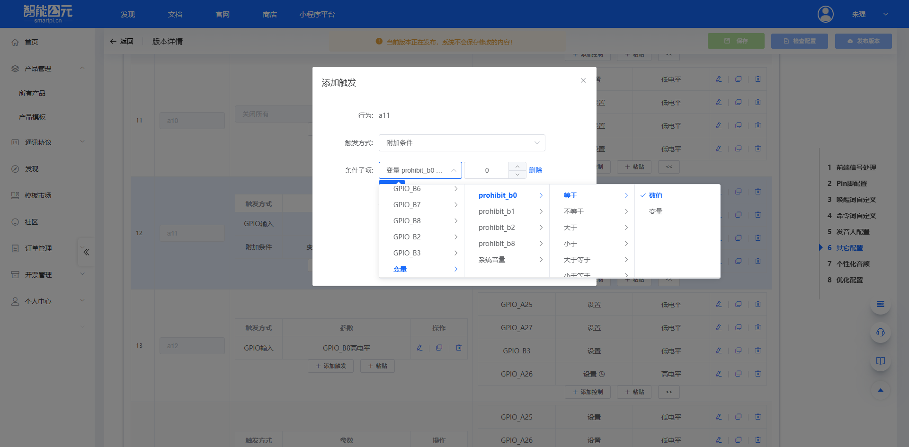

4. **恢复IO功能**
    - 在语音命令执行完毕后（如延时3秒后）
    - 设置变量prohibit_b0的值为0（恢复IO触发）

**注意事项：**

- 每个需要控制的IO口都需要创建对应的控制变量
- 语音命令的延时期间必须保持变量值为1
- 该方法适用于所有扩展IO口的冲突避免
- 确保在产品管理页面导出工程文件进行配置

---

### 语音指令执行期间如何禁止外部IO触发？

**问题描述：**

在语音指令执行期间（如打开1-4号及打开所有），需要禁止外部扩展IO口（B0-B8-B6-B1-B2）的高电平触发，以避免语音控制与外部触发产生冲突。

**解决方案：**

通过引入全局变量实现语音指令执行期间的IO触发禁用功能。

**实现步骤：**

1. **定义控制变量**
    - 创建名为voice_active的布尔变量
    - 用于标记语音指令是否正在执行

2. **语音指令配置**
    - 当用户发出语音指令时，设置voice_active为true
    - 在语音指令执行完毕（包括延时）后，设置voice_active为false

3. **IO触发逻辑修改**
    - 在外部IO触发的检测逻辑中添加条件判断：
    ```
    如果voice_active为true，则禁止IO触发
    如果voice_active为false，则正常执行IO触发
    ```

4. **工程配置**
    - 在产品管理页面导出工程文件
    - 导入配置并生成固件

    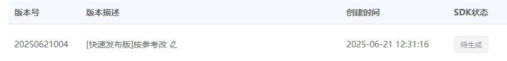

**注意事项：**

- 确保voice_active变量在语音指令开始和结束时被正确设置
- 语音指令的延时必须包含在voice_active为true的期间内
- 该方案适用于所有语音指令（打开1-4号及打开所有）
- 在唤醒过程中，如果感应器先触发仍可能生效，此为系统限制

---

### 在AI产品零代码平台配置唤醒词时提示"不能有非英文字符"怎么办？

**问题描述：**

在AI产品零代码平台为SU-03T配置中文唤醒词（如"小氢小氢"）时，系统提示"不能有非英文字符"，导致配置失败。

**解决方案：**

该问题是因为产品语言设置不正确导致的。需要将语言设置从"英文"更改为"中文"。

**操作步骤：**

1. **导出当前项目配置**
    - 在产品管理页面点击"导出"按钮
    - 保存项目配置文件

2. **修改语言设置**
    - 进入产品详情页面
    - 找到"语言"设置选项
    - 将语言从"英文"更改为"中文"

3. **重新配置唤醒词**
    - 刷新页面
    - 在唤醒词输入框中输入中文唤醒词
    - 此时错误提示应该消失，可以正常保存

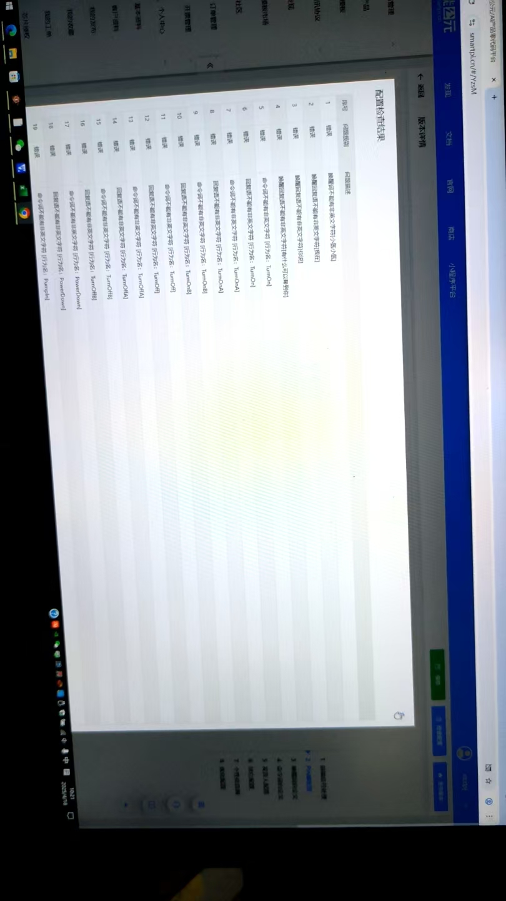

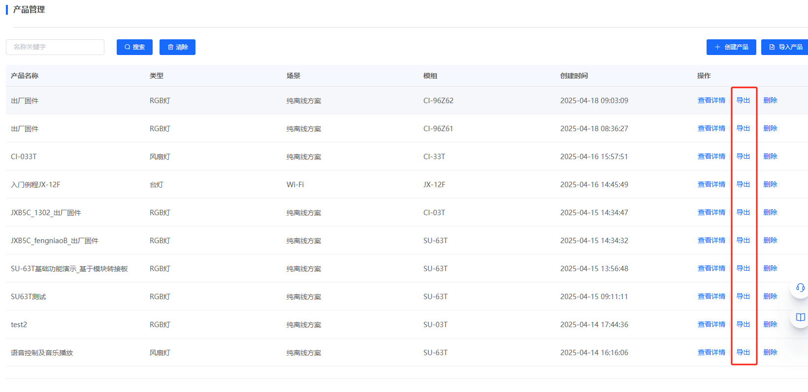


**注意事项：**

- 语言设置必须与唤醒词的语言类型一致
- 使用中文唤醒词时，语言必须设置为"中文"
- 使用英文唤醒词时，语言设置为"英文"即可
- 修改语言设置后可能需要重新保存整个配置

---

### 米家8键唤醒时回应"好的"如何禁用？

**问题描述：**

米家8键设备在唤醒时有时会回应"好的"，但实际需求是禁用该功能，同时需要为手势识别命令词增加学习功能，并计划订购500片用于试销售。

**解决方案：**

1. **禁用唤醒回应功能**：

    - 在固件层面删除或注释掉唤醒后的自动回应
    - 修改唤醒逻辑，使其不触发默认的"好的"回复
    - 保留必要的语音提示，移除多余的回应语

2. **增加手势识别学习功能**：

    - 为手势识别命令词添加自学习机制
    - 支持用户自定义手势命令词汇
    - 学习后的命令词直接关联到手势识别功能
    - 确保学习功能的稳定性和准确性

3. **批量生产支持**：

    - 确认订购500片的生产计划
    - 准备批量烧录和测试流程
    - 提供技术支持确保试销售顺利进行

**注意事项：**

- 禁用唤醒回应后，需保留其他必要的语音反馈
- 手势学习功能需要充分测试，避免误识别
- 批量订购前建议先进行小批量验证
- 固件优化需要平衡功能性和响应速度

---

### SU-03T模块响应迟钝，识别延迟超过1秒怎么办？

**问题描述：**

模块响应迟钝，语音识别延迟超过1秒才能反应过来，且在连接三根口线和电源时无法正常工作。

**解决方案：**

**1. 灵敏度调整**

- **提高识别灵敏度**：

    - 在智能公元平台调高麦克风灵敏度参数
    - 逐步提升，避免过高导致误识别
    - 建议从默认值开始，每次增加5-10%

- **环境优化**：

    - 减少背景噪声干扰
    - 确保麦克风朝向正确
    - 避免在强噪声环境下使用

**2. 硬件连接检查**

- **多线路干扰问题**：

    - 检查三根口线是否有屏蔽干扰
    - 确保电源线与信号线分离布线
    - 验证所有连接牢固无松动

- **供电稳定性**：

    - 测量供电电压是否稳定
    - 检查电源纹波是否过大
    - 使用稳压电源确保供电质量

**3. 固件优化**

- **语音识别参数**：

    - 调整识别阈值（降低误判率）
    - 优化端点检测参数
    - 减少不必要的处理延时

- **系统性能**：

    - 确保固件版本为最新
    - 检查是否有性能优化选项
    - 关闭非必要功能节省资源

**注意事项：**

- 灵敏度调整需要逐步进行，避免一步到位
- 多线连接时注意信号完整性，必要时使用屏蔽线
- 长延迟可能与具体应用场景相关，需要实际测试
- 如果问题持续，建议联系技术支持获取定制固件

---

### 如何在SU-03T模块上实现多组温度指令的识别？

**问题描述：**

需要实现10组温度控制（如"第一组五十度"），希望通过组合命令减少命令词数量，避免需要1600条独立命令。

**解决方案：**

- **命令词分组设置**：

    - 将组别命令词设置为："第一组"到"第十组"（10条）
    - 将温度命令词设置为："零度"到"一百六十度"（160条）
    - 当用户说出"第一组五十度"时，模块可以同时识别两条指令

- **串口通信协议**：

    - 模块通过串口将识别到的组别和温度信息发送给MCU
    - MCU接收两条指令后进行组合处理
    - 建议定义数据协议格式，例如：

    - 组别指令格式：`GROUP_01`到`GROUP_10`
    - 温度指令格式：`TEMP_000`到`TEMP_160`

- **MCU端处理逻辑**：

    - 接收组别指令后暂存当前组别
    - 接收温度指令后与暂存的组别组合
    - 执行对应组别的温度控制动作

**注意事项：**

- SU-03T模块支持在同一句话中识别多个命令词
- 确保命令词之间有明显的停顿或分隔
- MCU端需要设置合理的指令超时机制，避免组合错误
    - 建议在实际使用前进行充分的测试验证

---

### 多人说话时出现误识别如何解决？

**问题描述：**

在多人说话或嘈杂环境下，SU-03T出现误触发和误识别问题，特别是两个字命令词容易误识别。

**解决方案：**

**问题分析**：
两个字命令词（如"关灯"）在多人环境下容易被误识别，需要调整命令识别阈值来提高识别准确性。

**调整步骤**：

1. **进入优化配置界面**
    - 在智能平台找到"优化配置"选项
    - 选择"命令识别"功能

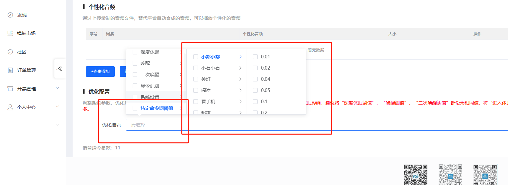

2. **查看当前命令词列表**
    - 检查所有配置的命令词
    - 识别容易误识别的词（特别是两字词）

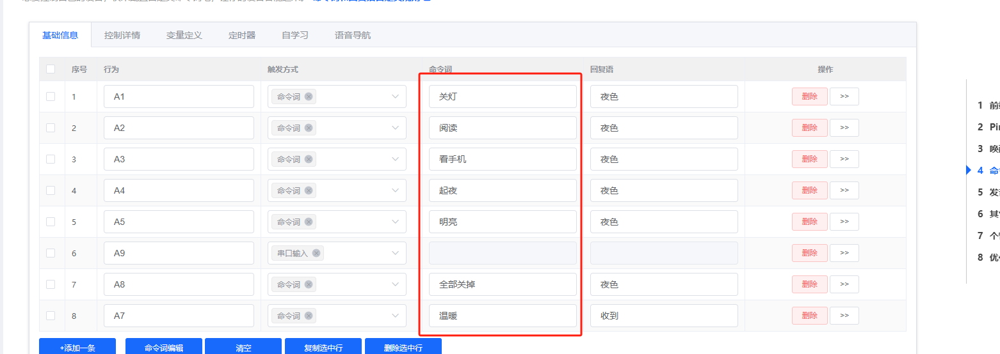

3. **调整识别阈值**
    - 系统默认阈值为0.4
    - 对于容易误识别的两字词，建议调整为0.2
    - 可以单独调整每个命令词的阈值，也可以统一设置

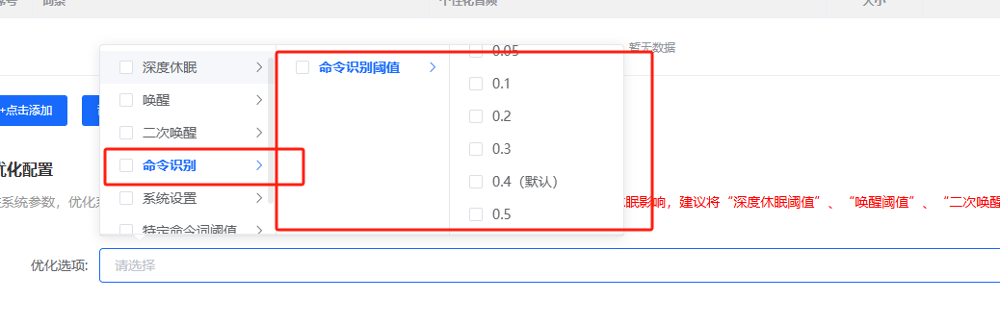

4. **测试验证**
    - 调整后生成新固件
    - 在多人环境下测试效果
    - 根据实际效果微调阈值

**阈值设置建议**：

- **两字命令词**：建议设置0.2（降低误识别率）
- **三字及以上命令词**：可保持默认0.4或适当调整
- **特定环境**：根据实际噪声水平调整
    - 噪声较大：适当提高阈值
    - 识别困难：适当降低阈值

**注意事项：**

- 阈值调整需要平衡识别率和误识率
- 建议逐步调整，每次调整一个数值后测试
- 两个字命令词本身容易误识别，可考虑改为三字命令
- 具体阈值设置需根据实际使用环境测试确定

---

### SU-03T1语音指令识别失败如何处理？

**问题描述：**

SU-03T1模块在语音识别功能上无法正常工作，语音指令识别失败，且无法通过小程序修改语音指令。

**解决方案：**

1. **检查固件版本**
    - 确认使用的是最新版本的固件
    - 旧版本固件可能存在识别算法问题
    - 重新生成并烧录最新固件

2. **验证硬件连接**
    - 检查麦克风连接是否正确
    - 确认麦克风类型是否匹配
    - 测试麦克风工作状态

3. **优化识别环境**
    - 在安静环境下测试识别效果
    - 避免背景噪声干扰
    - 保持适当的说话距离（10-30cm）

4. **检查平台配置**
    - 确认命令词已正确配置
    - 检查识别阈值设置
    - 验证唤醒词配置

**注意事项：**

- 小程序功能可能受固件版本限制
- 建议使用官方平台进行配置修改
- 如问题持续，需要检查模块是否损坏
- 识别失败可能与环境噪声有关

---

### SU-03T播放语音过程中是否支持被打断？

**问题描述：**

需要确认SU-03T模块在播放语音或TTS语音时，是否能够通过新的语音指令打断当前播放。

**解决方案：**

**功能确认**

- **SU-03T不支持打断**：播放语音过程中无法被新指令打断
- **必须等待完成**：当前语音播放完成后才能响应新的语音输入
- **设计限制**：这是模块的硬件设计限制，非配置问题

**替代方案**

- **使用CI-03T/CI-33T**：

    - CI-03T和CI-33T支持AEC语音打断功能
    - 播放过程中可以说新指令立即响应
    - 如需要语音打断功能，建议选用这些型号

- **使用串口打断**：

    SU-03T不支持AEC打断，但可以通过配置串口输入触发停止播放：

    在智能公元平台配置串口输入触发：
    - **触发方式**：选择"串口输入"
    - **串口配置**：选择对应的UART接口（如UART1_RX）
    - **消息号**：设置识别的消息号（如消息号1）
    - **参数**：设置触发参数（如01）
    - **控制动作**：系统 → 停止播放

    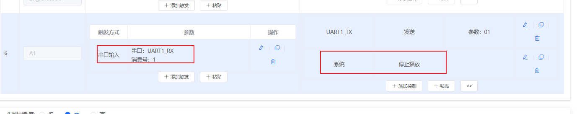

    当串口接收到指定消息号的数据时，会触发停止播放动作。这种方式需要外部MCU发送串口指令来实现打断。

- **优化播报内容**：

    - 缩短单条播报时长
    - 将长内容拆分为多条短播报
    - 优先播放重要信息，次要信息后置

**使用注意事项**

- **播报队列**：多条播报指令会按顺序执行，需等待队列清空
- **识别响应**：播报期间语音识别功能暂停，播报完成后恢复
- **应用设计**：设计交互逻辑时考虑播报时间，避免用户重复指令

### SU-03T是否支持英文语音指令？

**问题描述：**

需要在SU-03T模块上添加英文语音指令，询问是否支持英文识别以及如何实现多语言支持。

**解决方案：**

**1. 多语言支持情况**

**支持的语言类型：**

- SU-03T支持中英文混合识别
- 可在同一固件中配置中文和英文命令词
- 支持纯英文命令词列表

**语言配置方式：**

1. **单个语言配置**
    - 纯中文命令词：如"打开"、"关闭"
    - 纯英文命令词：如"turn on"、"turn off"

2. **混合语言配置**
    - 中英文混合：如"打开灯"、"turn on light"
    - 同一功能支持多种语言触发

**2. 英文命令词添加方法**

**智能公元平台配置：**

1. **添加命令词**
    ```
    命令词1: turn on
    命令词2: turn off
    命令词3: open
    命令词4: close
    ```

2. **识别设置**
    - 语言模式：选择"中英文混合"或"纯英文"
    - 识别灵敏度：根据实际使用环境调整
    - 响应时间：根据需要设置

**3. 注意事项**

**识别准确率：**

- 英文识别准确率与发音标准程度相关
- 建议使用标准英语发音
- 避免使用地方口音过重的英文

**配置建议：**

- 英文命令词建议简洁明了
- 避免使用发音相似的词组
- 考虑添加同义词提高识别成功率

**固件容量：**

- 多语言支持会占用更多存储空间
- 注意固件大小限制（约968KB）
- 合理规划命令词数量

**4. 实际应用案例**

```c
// 中英文混合控制示例
"turn on"    → 控制继电器1
"打开"       → 控制继电器1
"turn off"   → 控制继电器1断开
"关闭"       → 控制继电器1断开
"next"      → 切换到下一项
"下一个"    → 切换到下一项
```

**注意事项：**

- 确保在平台配置时正确选择语言模式
- 测试时使用标准发音验证识别效果
- 如识别率低，可尝试调整命令词或重新录音
- 混合语言模式下，建议功能对应的命令词成对配置

---

**型号对比**

| 型号 | 语音打断 | TTS打断 | 备注 |
|------|----------|---------|------|
| SU-03T | 不支持 | 不支持 | 必须等待播放完成 |
| CI-03T | 支持 | 支持 | 可实时响应用户指令 |
| CI-33T | 支持 | 支持 | 支持更多词条容量 |

---

### SU-03T免唤醒指令错误触发如何处理？

**问题描述：**

SU-03T模块在未唤醒状态下仍能触发语音指令，且指令执行错误（如"打开1号继电器"实际执行了"打开3号继电器"）。

**解决方案：**

- 检查指令是否被错误添加到免唤醒词列表中
- 在平台配置界面中，将误添加的指令从"已选项"移回"可选项"
- 重新生成固件并烧录

**注意事项：**

- 默认情况下，命令词需要唤醒后才能触发
- 免唤醒词配置需谨慎，避免误触发

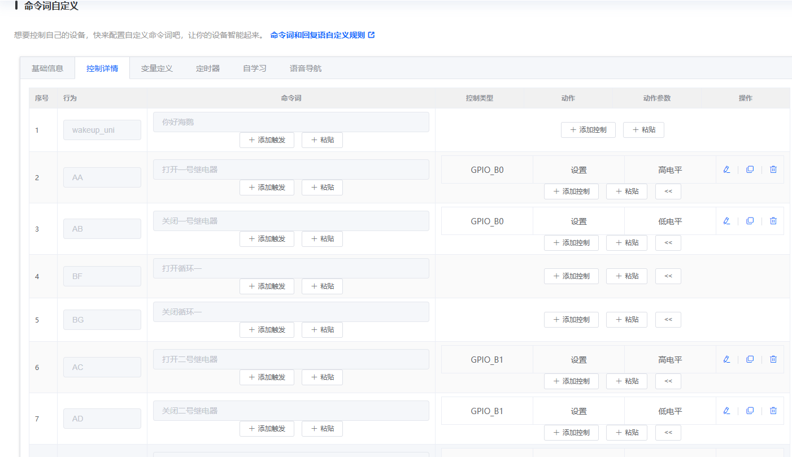


---


---


---

### SU-03T和CI1302的语音检测距离大概是多少？

**问题描述：**

需要了解SU-03T和CI1302芯片在安静环境下的有效语音检测距离，以便在产品规格中标注相应参数。

**解决方案：**

在安静环境下，SU-03T和CI1302的一般有效检测距离为：

- **常规检测距离**：10米以内
- **最佳识别范围**：3-5米
- **极限距离**：超过10米后识别效果可能下降

**影响识别距离的因素：**

1. **发音人因素**
    - 普通话标准程度
    - 声音大小
    - 发音人到咪头的距离

2. **环境因素**
    - 环境噪声水平
    - 回声和混响
    - 空间大小和布局

3. **硬件配置**
    - 麦克风灵敏度设置
    - 唤醒词选择（低、中、高）
    - 功放和喇叭配置

**注意事项：**

- 唤醒灵敏度参数主要影响触发难易度，与检测距离无直接关系
- 超过10米距离可能出现无法识别或误识别问题
- 建议根据实际应用场景选择合适的安装位置
- 产品规格建议标注为"安静环境下10米以内"

---


---

### SU-03T连续唤醒出现1-2秒真空期怎么办？

**问题描述：**

使用平台生成的新固件时，连续唤醒功能异常，表现为在连续唤醒过程中存在1-2秒的识别真空期，无法响应任何唤醒词。该问题仅出现在平台更新后生成的固件中，旧版本固件无此问题。

**解决方案：**

- **问题定位**：这是平台软件功能升级导致的变化，新固件在连续唤醒时设计了1-2秒的保护间隔
- **使用旧版本固件**：如果应用场景需要快速连续唤醒，可继续使用旧版本固件
- **调整产品设计**：适应该保护间隔，在产品设计上避免需要快速连续唤醒的场景
- **反馈需求**：如确实需要连续唤醒功能，可向技术团队反馈具体应用需求

**注意事项：**

- 新旧芯片搭配新固件都会出现此保护间隔
- 该问题是平台级的软件功能升级，非硬件故障
- 所有控制词在连续唤醒时都会有1-2秒的中空期

---


---

### 数字命令词（如"四档"和"十档"）识别准确率低怎么办？

**问题描述：**

在使用CI-03T1和SU-03T模块时，"四档"和"十档"等数字命令词识别准确率较低，特别是当用户发音不标准时，平翘舌不分容易导致误识别。

**解决方案：**

**1. 降低识别灵敏度**

- 将命令词的整体灵敏度从默认值调低
- SU-03T模块：唤醒词保持0.2，命令词从0.4调低至0.2或更低
- 针对问题命令词（如"四档"、"十档"）单独调低阈值

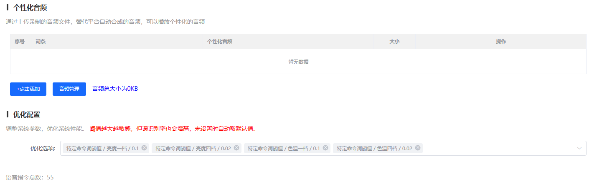

**2. 选择合适的模块型号**

- SU-03T：数字识别效率较高，不支持中英双模型
- CI-03T：支持中英日韩，数字识别效果略逊于SU-03T
- 根据实际需求选择适合的模块

**3. 优化模型选择**

- 使用对数字识别加强的模型，如"中文风扇通用Pro"
- 这类模型经过数字识别优化，能更好区分相近发音

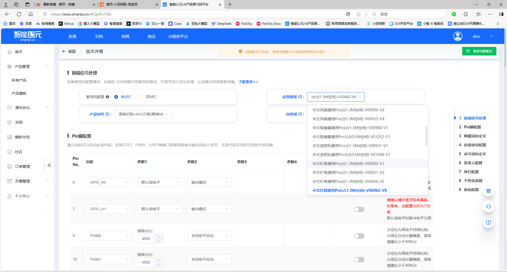
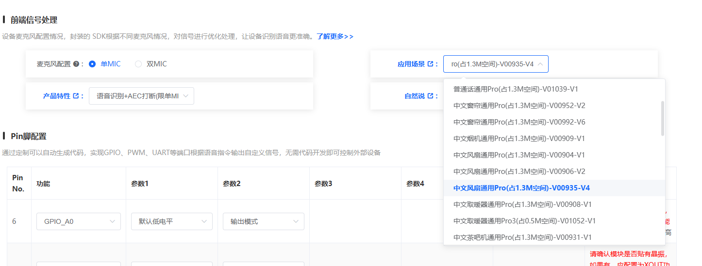

**4. 多方案结合**

- 口音较重时，需要多种方法结合使用
- 适当降低灵敏度 + 优化命令词设计 + 调整模型

**注意事项：**

- 平翘舌发音不清晰是主要误识别原因
- 最终用户普通话水平会影响识别效果
- 建议进行多人口音测试，覆盖实际使用场景
- 如果数字识别是关键需求，优先选择SU-03T模块
- 对于行业规范要求必须支持10级调节的产品，需充分测试验证

---


---

### SU-03T模块支持中英文混合识别吗？

**问题描述：**

需要为SU-03T模块设计支持中英文的语音命令词表，并了解英文识别的限制、中英文混合识别的实现方式和定制成本。

**解决方案：**

**1. 语言支持情况**

- SU-03T支持中英文识别
- CI-03T支持中英日韩，其他小语种需要定制
- 两个模块都不支持中英文同时识别，需要模型切换

**2. 英文识别配置**

- 在创建工程界面选择语言为英文
- 英文命令词的限制与中文相同
- 英文识别对灵敏度要求更高，建议调高设置

**3. 中英文混合识别方案**

- SU-03T：不支持中英双模型，需要定制实现模型切换
- 切换逻辑：中文唤醒词→中文模型，英文唤醒词→英文模型
- CI-03T：支持双模型，但需要定制开发

**4. 定制服务与费用**

- 定制内容：提供命令词翻译，制作调试固件
- 可提供播报音替换服务
- 定制费用：具体费用请联系官方客服评估
- 根据固件复杂程度和词量调整价格


**5. 翻译建议**

- 建议先使用翻译软件进行初步翻译
- 确认英文翻译符合目标市场习惯
- 特别注意专业术语的准确翻译（如无影灯、手术灯）

**注意事项：**

- 唤醒词"小安"在英文中需要音译处理
- 英文模型训练词库丰富，口音识别问题不大
- 几十个命令词规模的定制费用相对较低
- 年出货3万规模的项目，建议考虑定制开发

---


### SU-03T自学习多语言命令词时为什么会中断？

**问题描述：**

使用SU-03T进行匈牙利语等多语言命令词自学习时，有些命令词可以学习成功，但有些在学习第2遍就会中止。更换不同语音或指令词都无法解决。

**解决方案：**

**问题原因分析：**

1. **RAM资源不足**：

    - SU-03T SRAM容量仅为242KB
    - 当预设命令词过多时（如200多条），剩余RAM不足以支持自学习功能
    - 自学习需要额外的RAM空间存储语音特征数据

2. **总命令词超限**：

    - SU-03T最多支持150条命令词
    - 预设命令词过多会导致自学习功能无法正常工作

**解决方法：**

1. **减少预设命令词数量**：

    - 将总命令词数量控制在100条以内
    - 为自学习功能预留足够的RAM空间

2. **升级到CI-33T**：

    - CI-33T SRAM容量：640KB（是SU-03T的2.6倍）
    - 支持更多自学习命令词（可达50条）
    - 适合需要大量命令词和多语言支持的应用

3. **分批自学习**：

    - 先学习最常用的10条命令
    - 使用后通过重置学习更换其他命令

**预防措施：**

- 在项目设计阶段充分考虑RAM需求
- 合理规划预设命令词和自学习命令词的数量分配
- 优先选择RAM容量更大的模块（如CI-33T）

---


