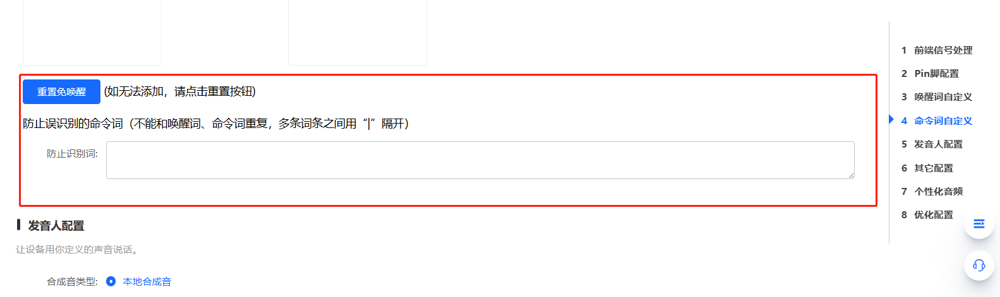
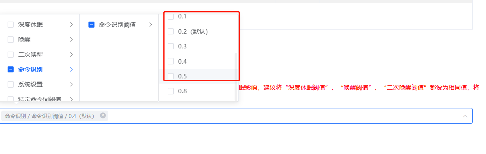

# SU-10A 语音调优 FAQ

本页用于整理 SU-10A 相关的语音调优问题。

### SU-10A模块在使用过程中出现语音识别误识别问题怎么办？

**问题描述：**

SU-10A模块在使用过程中出现语音识别误识别的问题，特别是在特定环境下容易误触发语音指令。

**问题分析：**

- 模块在特定环境下对环境噪声或相似语音过于敏感
- 可能存在识别阈值设置过低的情况
- 环境因素导致语音信号被错误解读为有效指令

**解决方案：**

1. **调整识别灵敏度**

    - 在智能公元平台将识别灵敏度从"高"调整为"中"
    - 通过降低敏感度减少误触发概率
    - 在保证正常识别的前提下找到最佳平衡点

2. **优化识别阈值**

    - 适当提高命令词的识别阈值
    - 阈值越高，识别越严格，误识别率越低
    - 建议从默认值开始逐步调整，避免过度调整

3. **添加防误识别词**

    - 在"防止误识别的命令词"中添加容易误触发的词汇
    - 将日常对话中的高频词加入防识别列表
    - 多个词用"|"分隔，如："你好|请问|谢谢"

**配置方法：**

1. 登录智能公元平台
2. 进入对应产品的配置界面
3. 在"优化配置"选项卡中调整参数
4. 重新生成固件并烧录测试

**注意事项：**

- 灵敏度调整需要在实际使用环境下充分测试
- 阈值调整要平衡识别率和误识别率
- 如问题持续存在，建议联系技术支持获取定制优化方案

---

---

### SU-10A模块在美容仪器应用中存在严重误识别问题怎么办？

**问题描述：**

SU-10A模块在美容仪器应用中存在严重的误识别问题，包括在正常人声交流时误触发命令，以及数字模式命令（如"振动模式一"）易被误识别为其他模式。

**问题分析：**

1. **数字模式识别困难**：

    - "振动模式一"至"振动模式十"等数字命令词只有最后一个字不同
    - 单字差异的命令词误识别率极高
    - 数字"一"到"十"发音相似，容易混淆

2. **人声对话误触发**：

    - 唤醒后，正常交谈会触发其他命令
    - 即使将识别阈值调至最低（0.01）仍会出现误识别
    - 环境音量较大时误识别率增加

3. **外部环境干扰**：

    - 附近播放抖音等音频内容时会误判
    - 需要在实际使用环境下测试优化

**解决方案：**

**方法一：优化命令词设计**

1. **避免数字序列命令**：

    - 不要使用"振动模式一"到"振动模式十"的序列
    - 改用描述性词汇，如"柔和振动"、"强力振动"等
    - 确保命令词之间有明显差异

2. **增加命令词复杂度**：

    - 使用4字或更长的命令词
    - 避免仅最后一个字不同的设计
    - 选择发音差异较大的词汇组合

**方法二：配置防误识别词**

1. **设置防误识别词列表**：

    - 在"防止误识别的命令词"中添加容易误触发的词汇
    - 添加日常对话中的高频词
    - 多个词用"|"分隔，如："震动|强度|模式"

    

2. **针对数字命令优化**：

    - 将"震动强度"添加到防误识别词列表
    - 这样单独说"震动强度"时不会触发任何动作
    - 避免不完整命令被误识别

**方法三：调整识别参数**

1. **命令识别阈值优化**：

    - 将命令识别阈值从默认值调整为0.05
    - 避免设置过低（如0.01）导致过度敏感
    - 在识别率和误识别率之间找到平衡

    

2. **已应用的优化措施**：

    - 当前已将阈值设置为最低（0.01）
    - 已设置防误识别词
    - 超时退出时间设置为20秒

    

**方法四：硬件升级方案**

1. **更换为性能更好的模块**：

    - SU-32T：识别准确率和效率更高，降噪能力强
    - 是现行离线性能最高的模块
    - 成本更高，但效果显著改善

2. **封装兼容性确认**：

    - 更换模块需考虑封装尺寸
    - 确认与现有PCB设计兼容
    - 评估改版成本和时间

**临时解决方案：**

1. **减少命令词数量**：

    - 从10个振动模式减少到3-5个
    - 使用更差异化的命名
    - 通过组合命令实现更多功能

2. **用户使用引导**：

    - 提醒使用时避免大声交谈
    - 建议在相对安静环境下使用
    - 明确命令词的发音要求

**测试验证方法：**

1. **模拟使用场景**：

    - 在正常交谈环境下测试误识别率
    - 使用手机播放音频测试抗干扰能力
    - 记录24小时内的误触发次数

2. **参数调优验证**：

    - 逐步调整阈值，找到最佳设置
    - 验证防误识别词的有效性
    - 确保正常识别不受影响

**注意事项：**

- 数字命令词的设计需要避免，这是误识别的主要根源
- 识别阈值不是越低越好，需要平衡识别率和误识别率
- 如果误识别问题严重影响使用，建议升级到SU-32T模块
- 在嘈杂环境下，完全避免误识别是困难的，目标是将误识别率控制在可接受范围内

---

