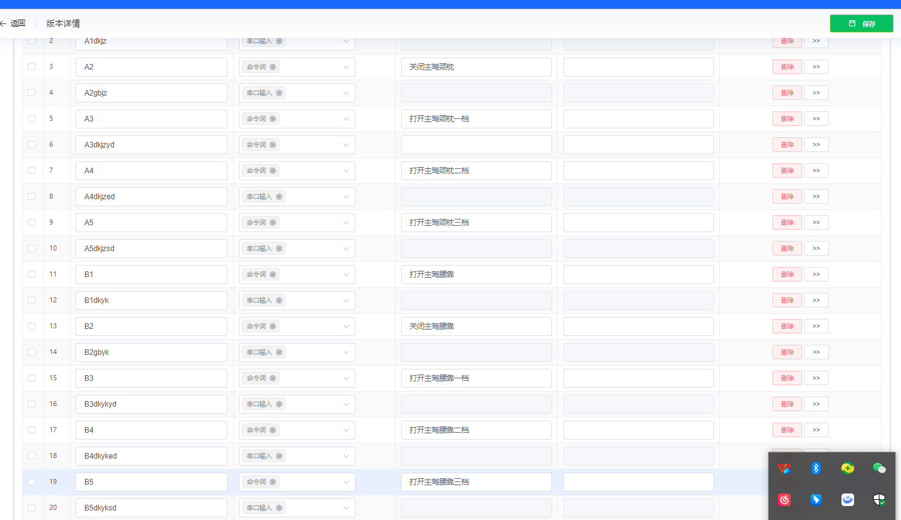
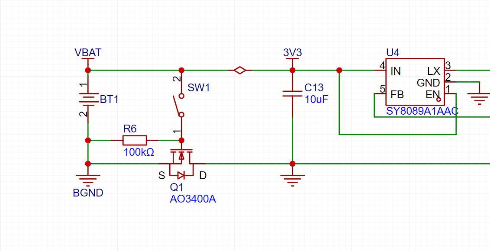
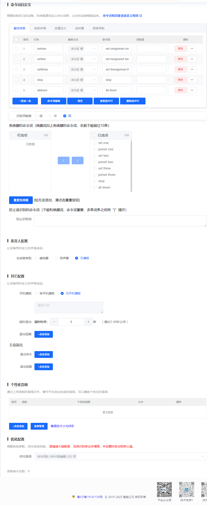
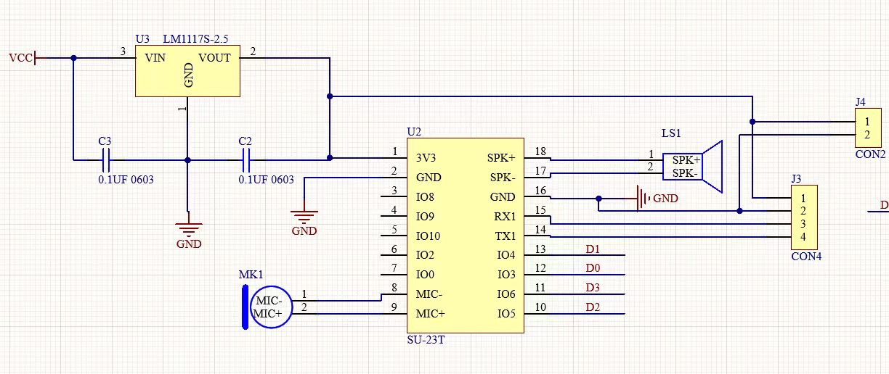
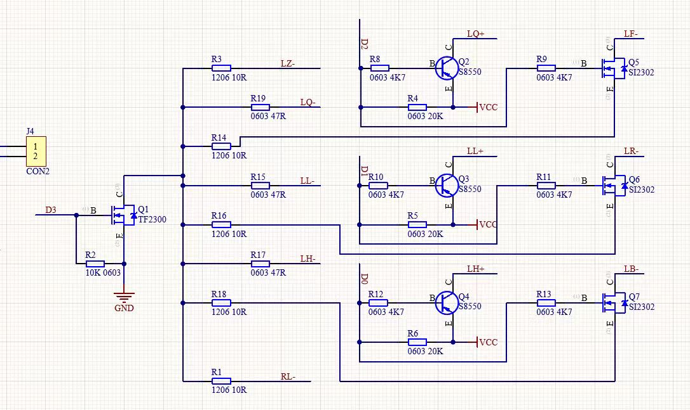

# SU-23T 语音调优 FAQ

本页用于整理 SU-23T 相关的语音调优问题。

### SU-23T语音指令和回复内容有什么限制？

**问题描述：**

需要了解SU-23T语音芯片的离线语音指令数量限制，以及回复内容占用Flash空间的情况。

**解决方案：**

**指令数量限制：**

SU-23T模块支持**50条**离线语音指令，这是硬件级别的限制。

**回复内容限制：**

1. **回复占用Flash空间**：

    - 回复语音比命令词更占用Flash空间
    - 字数越多，占用的Flash容量越大
    - 需要合理控制回复内容的长度

2. **总容量规划**：

    - 命令词和回复语共享Flash空间
    - 不是分别计算50条指令+50条回复
    - 总占用必须在模块Flash容量范围内

**配置建议：**

1. **回复内容优化**：

    - 回复语尽量简洁明了
    - 避免过长的描述性文字
    - 使用"主人，已收到"等简洁回复

2. **容量分配参考**：

    - 典型配置：20-30条命令词+对应回复
    - 如需更多指令，可考虑牺牲部分回复
    - 或选择Flash容量更大的模块型号

**计算方式：**

总Flash占用 = 命令词占用空间 + 回复语占用空间 + 系统程序占用

*平台配置界面，显示命令词和对应回复内容*

**注意事项：**

- SU-23T的50条指令限制是硬件限制，无法突破
- 回复内容长度直接影响Flash占用，需要精简设计
- 如需更多指令或更长回复，建议选择其他型号
- 配置时注意平衡功能需求和容量限制

---

### 手持语音遥控器识别率不稳定怎么办？

**问题描述：**

手持语音遥控器在使用SU-23T芯片时，出现识别率不稳定的问题，有时能正常识别，有时完全没有反应，感觉灵敏度不足。

**解决方案：**

**1. 供电稳定性检查**

手持遥控器采用按键控制电源通电的设计，需要确认：

- 按键按下后模块能稳定通电
- 模块通电后LED指示灯正常闪烁
- 电源电路能提供稳定的工作电压
- 避免因供电不稳定导致模块工作异常

**2. 识别灵敏度优化**

平台配置中涉及两个关键灵敏度设置：

- **唤醒灵敏度**：影响模块是否进入识别状态
- **识别灵敏度**：影响命令词的识别准确率

推荐配置：

- 唤醒灵敏度设置为"中"或"高"
- 识别灵敏度设置为"高"
- 根据实际效果进行微调

**3. 系统优化参数调整**

在平台的高级设置中：

- 命令识别阈值默认为0.5，可根据需要调整
- 阈值越低越敏感，但可能增加误识别
- 建议先使用默认值，根据实际效果调整

**4. 使用环境优化**

- 测试时保持环境相对安静
- 遥控器使用距离保持在0.5-1米范围内
- 避免在强噪声环境下测试
- 确保麦克风孔没有被遮挡

**5. 命令词设计建议**

- 使用简洁明确的命令词
- 避免使用过于相似或发音相近的词汇
- 英文命令词建议使用翻译软件验证发音
- 必要时可考虑使用中文命令词

**排查步骤：**

1. 确认按键按下后模块正常通电（LED闪烁）
2. 检查平台配置中的灵敏度设置
3. 在安静环境下进行基础测试
4. 逐步调整参数找到最佳配置
5. 如问题持续，联系技术支持进行硬件检查

**注意事项：**

- 手持设备的供电设计是关键因素
- 灵敏度设置需要平衡识别率和误触发
- 不同批次模块可能存在细微差异
- 建议量产前进行充分的环境测试

---

### SU-23T 模块自行触发动作怎么办？

**问题描述：**

模块在没有语音指令的情况下自行触发动作，表现为设备不规律地自动打开和关闭，影响正常使用。

**解决方案：**

**1. 问题确认**

- 确认触发是规律的还是不规律的
- 不规律的自行触发通常是误识别造成的

**2. 调整命令词识别阈值**

平台配置中可以调整命令词的识别阈值：

- 登录智能公元平台
- 进入对应产品的语音配置
- 调整命令识别阈值参数（默认为0.5）
- 适当调低阈值可降低误触发率
- 阈值越低越不敏感，但可能影响正常识别

**3. 优化建议**

- 先从默认值0.5开始测试
- 如出现误触发，逐步降低阈值（如0.4、0.3）
- 每次调整后充分测试，找到平衡点
- 避免一次调整幅度过大

**4. 环境因素排查**

- 检查使用环境是否存在持续的背景噪声
- 确认麦克风孔没有被遮挡
- 避免靠近电视、音响等声源
- 远离空调出风口等产生持续噪声的位置

**注意事项：**

- 阈值调整需要平衡识别率和误触发
- 不同应用场景的最佳阈值可能不同
- CI-03T 在相同环境下可能表现更好，可根据需求选择型号

---

### SU-23T 长时间不使用后唤醒困难怎么办？

**问题描述：**

SU-23T模块在长时间不使用后，偶尔无法正常播报语音，表现为唤醒困难（需多次唤醒）且在未唤醒状态下串口输入无播报，疑似进入深度睡眠状态。

**解决方案：**

**1. 现象分析**

- 模块几分钟不唤醒后，需要喊3到5次才能唤醒
- 唤醒前喇叭会"滴"的一声，再次喊一下即可唤醒
- 在未唤醒期间，串口输入的数据无播报响应
- 模块疑似进入了深度睡眠模式

**2. 深度睡眠设置检查**

在平台的系统设置中，可以查看和配置深度休眠选项：

- 登录智能公元平台
- 进入对应产品的配置界面
- 查看"系统设置"中的"深度休眠"选项
- 当前固件版本该功能显示为"不支持"

*平台系统设置中的深度休眠选项（当前显示为不支持状态）*

**3. 临时解决方案**

- **频繁唤醒测试**：持续操作模块可避免进入深度睡眠，问题不会出现
- **串口通信确认**：确认MCU与模块之间的通信电平转换是否稳定
- **传输稳定性检查**：由于播报依赖与MCU的稳定通信，需要检查串口传输线路

**4. 长期优化建议**

- **固件版本确认**：联系技术支持确认是否有支持禁用深度睡眠的固件版本
- **硬件电路检查**：确认串口电平转换电路的稳定性，避免通信异常
- **应用层优化**：在主控MCU端增加心跳机制，定期唤醒模块保持活跃状态

**注意事项：**

- 深度睡眠是低功耗设计的正常行为，旨在节省电能
- 当前固件版本可能不支持禁用该功能
- 量产前建议与原厂确认具体解决方案
- 也可考虑选择不支持深度睡眠或可配置的其他型号

---

### SU-23T待机电流过高如何优化？

**问题描述：**

SU-23T模块在待机状态下电流为3-4mA，高于产品宣传的1mA，需要了解如何降低功耗并确认深度休眠模式的具体影响和进入时机。

**解决方案：**

**1. 深度休眠模式配置**

在智能公元平台的优化选项中可以开启深度休眠功能：

- 登录智能公元平台
- 进入对应产品的配置界面
- 在"优化选项"中找到"系统设置"
- 勾选"深度休眠"选项（默认支持）

**2. 功耗对比**

- **普通模式**：3-4mA（连接麦克风、喇叭）
- **深度休眠模式**：1-2mA
- **官方标称值**：1mA（测试环境下）

**3. 深度休眠的影响**

开启深度休眠后会影响以下功能：

- **串口触发输入**：无法通过串口触发识别
- **电平触发输入**：无法通过外部电平触发

**4. 深度休眠进入机制**

深度休眠的进入时机：

- 退出唤醒状态后自动进入
- 需要环境足够安静
- 一有响声就会退出休眠
- 进入时间不可精确控制

**5. 应用建议**

**如果需要低功耗**：

- 开启深度休眠模式
- 接受无法使用串口/电平触发的限制
- 适用于纯语音唤醒的应用场景

**如果需要串口控制**：

- 不开启深度休眠模式
- 接受3-4mA的待机电流
- 适用于需要MCU主动控制的应用

**6. 硬件检查要点**

如果功耗仍然异常，检查：

- 外围电路是否存在漏电流
- 麦克风和喇叭的功耗是否正常
- 供电电压是否稳定
- PCB布局是否存在干扰

**注意事项：**

- 深度休眠与功能需求需要权衡
- 官方测试在理想环境下进行，实际应用可能有差异
- 如需要在唤醒前发送播报命令，需谨慎使用深度休眠
- 建议在产品定型前进行实际的功耗测试

---

### 英文固件无法唤醒且声音输出偏低怎么办？

**问题描述：**

使用SU-23T模块时，中文固件工作正常，但切换到英文固件后无法唤醒设备，虽然设备有开机语音但无法被语音唤醒，同时声音输出偏低。

**解决方案：**

**1. 唤醒阈值调整**

英文固件对唤醒词的识别特性可能与中文固件不同，需要调整唤醒阈值：

- 登录智能公元平台
- 进入语音配置界面
- 找到"唤醒阈值"设置选项
- 从默认值0.2开始逐步调整，建议先尝试0.15或0.1
- 阈值越低，唤醒灵敏度越高

*唤醒阈值配置界面，可根据需要调整灵敏度*

**2. 硬件电路检查**

检查音频相关硬件电路连接：

- **麦克风电路**：确认MK1麦克风连接正确，供电稳定
- **功放电路**：检查音频功放部分，确保Q1-Q7等功放晶体管工作正常
- **电源供电**：确认供电电压稳定，避免因电源不稳定导致声音输出偏低

*SU-23T芯片的电源、麦克风和控制引脚连接*

*音频功放电路图，与声音输出相关*

**3. 引脚电平配置检查**

在平台配置中确认：

- 检查控制亮灯的引脚电平配置
- 如有必要，尝试翻转电平设置
- 确认所有I/O引脚配置与硬件电路匹配

**4. 调试步骤**

- 先调整唤醒阈值，测试是否能唤醒
- 检查是否有误识别现象
- 如仍有问题，分析电路图确认硬件连接
- 使用示波器检查关键信号电平

**注意事项：**

- 英文固件和中文固件的参数设置可能需要分别优化
- 唤醒阈值调整需要平衡灵敏度和误触发率
- 声音输出偏低可能与功放电路或供电有关
- 建议在安静环境下进行唤醒测试
- 量产前建议对不同固件版本分别进行充分测试

---