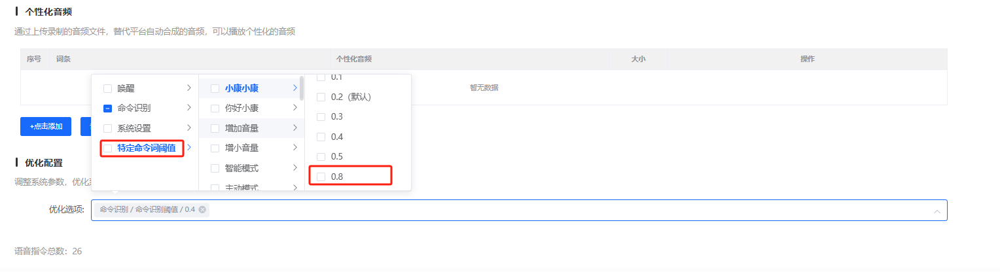
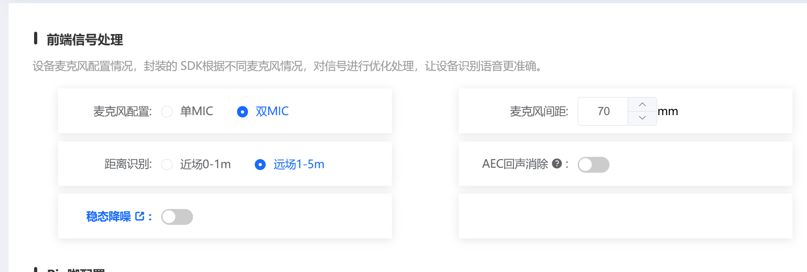
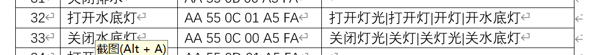
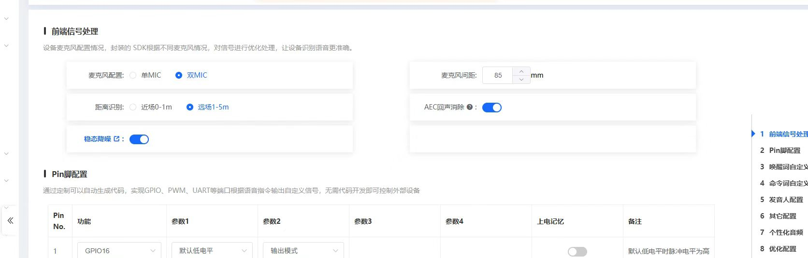
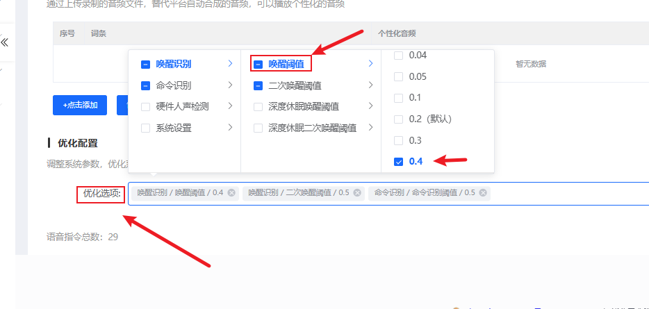
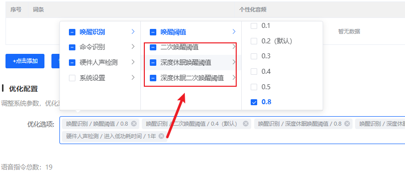
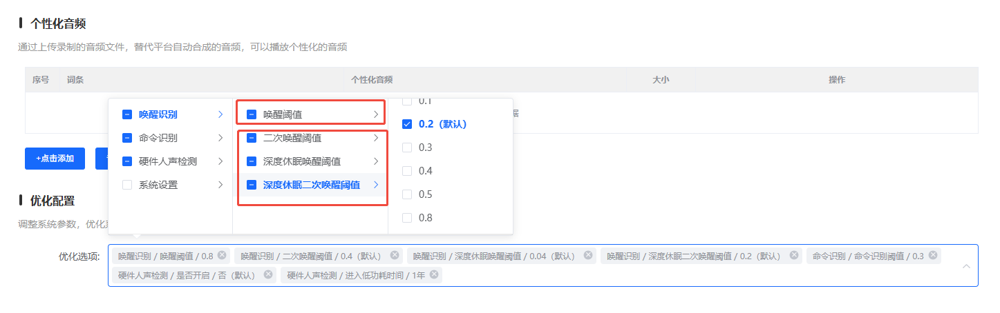

# SU-32T 语音调优 FAQ

本页用于整理 SU-32T 相关的语音调优问题。

### SU-32T 开发板唤醒词无反应怎么办？

**问题描述：**

SU-32T开发板上电后能自动播报，但唤醒词无反应。

**解决方案：**

**检查拨码开关配置：**

1. **确认拨码开关状态**：

    - 检查开发板上的拨码开关是否正确配置
    - 拨码开关控制模块的工作模式
    - 错误的配置会导致唤醒功能失效

2. **正确配置方法**：

    - 参考开发板规格书中的拨码配置说明
    - 确保语音识别功能对应的拨码位开启
    - 如需要，可拍照联系技术支持确认配置

**硬件连接检查：**

1. **麦克风连接**：

    - 确认双麦克风正确连接到对应接口
    - 检查麦克风线序是否正确
    - 验证麦克风供电正常

2. **电源检查**：

    - 确保供电电压在4.5V-5.5V范围内
    - 检查电源纹波是否过大
    - 使用稳定的电源适配器

**固件验证：**

1. **使用出厂固件测试**：

    - 先烧录出厂固件验证基础功能
    - 确认硬件是否正常工作
    - 出厂固件应能正常响应唤醒词

2. **自定义固件检查**：

    - 检查唤醒词设置是否正确
    - 确认唤醒词灵敏度配置
    - 验证命令词配置是否生效

**常见问题排查：**

- 拨码配置错误导致功能异常
- 麦克风连接松动或接触不良
- 固件烧录不完整或损坏
- 环境噪声过大影响识别

---

### SU-32T如何解决语音识别误触发问题？

**问题描述：**

SU-32T模块在语音识别时出现误触发，即使只说出部分指令（如"打开"）也会被识别并执行，即使已将灵敏度调至最低。

**解决方案：**

**1. 调整特定命令词阈值**

在智能公元平台的个性化音频配置中，可以针对特定命令词调整识别阈值：

- **当前阈值**：默认0.4
- **优化建议**：将阈值提高到0.8
- **配置位置**：优化配置 → 特定命令词阈值



*将特定命令词阈值从0.4调整为0.8*

**2. 检查前端信号处理配置**

确认模块的前端信号处理配置是否正确：

- **麦克风配置**：双MIC设置
- **识别距离**：远场1-5m配置
- **降噪功能**：根据环境开启稳态降噪和AEC回声消除



*前端信号处理配置界面*

**3. 命令词设计优化**

避免使用容易引发误触发的命令词：

- **避免部分匹配**：不要使用"打开"这样的单字词
- **使用完整指令**：如"打开灯光"、"关闭灯光"等完整表达
- **增加指令长度**：4字以上的指令误触发率越低



*完整的命令词配置示例*

**4. 逐步调试方法**

1. **先调整阈值**：

    - 将问题命令词的阈值提高到0.8
    - 测试是否仍出现误触发
    - 如仍有问题，可继续提高至1.0

2. **验证正常识别**：

    - 在不同距离下测试完整指令
    - 确认正常识别不受影响
    - 找到误触发和正常识别的平衡点

3. **环境优化**：

    - 减少背景噪声干扰
    - 合理布置麦克风位置
    - 避免靠近持续噪声源

**技术说明：**

- **阈值原理**：阈值越高，识别越严格，误触发率越低
- **双麦克风优势**：SU-32T的双麦阵列有更好的噪声抑制能力
- **识别逻辑**：完整指令比部分指令更容易准确识别

**注意事项：**

- 阈值调整会影响识别率，需要平衡误触发和漏识别
- 建议在典型使用环境下进行充分测试
- 如问题持续，可考虑更换更独特的命令词

---

### SU-32T智能音箱唤醒不稳定怎么办？

**问题描述：**

智能音箱在相同距离和环境下，唤醒时有时灵敏有时不灵敏，且隔一段时间后难以唤醒，怀疑设备自动进入低功耗模式。

**解决方案：**

**问题分析：**

1. **深度休眠机制**：

    - 设备在空闲一段时间后会自动进入深度休眠状态
    - 深度休眠状态下唤醒灵敏度降低
    - 需要更大的声音或特定的唤醒条件

2. **阈值设置影响**：

    - 唤醒阈值设置过高导致灵敏度不足
    - 深度休眠相关阈值设置不当
    - 二次唤醒阈值配置影响唤醒成功率

**调试步骤：**

1. **检查当前配置**：

    - 确认前端信号处理配置：双MIC、远场1-5m、麦克风间距85mm
    - 验证AEC回声消除和稳态降噪已开启
    - 记录当前的唤醒阈值设置



*双麦克风配置界面，支持远场识别和AEC回声消除*

2. **调整唤醒阈值**：

    - 初始尝试将唤醒阈值从默认0.2提高到0.4
    - 如问题仍存在，可继续提高至0.6或0.8
    - 注意：阈值越大越灵敏，但误识别率也会增高



*优化配置界面，唤醒阈值设置为0.4*

3. **优化深度休眠参数**：

    - 将二次唤醒阈值调整为与唤醒阈值相同
    - 深度休眠二次唤醒阈值建议设为0.8
    - 或考虑关闭深度休眠功能以提高唤醒稳定性



*深度休眠相关阈值参数设置界面*

**参数调整建议：**

1. **推荐配置**：

    - 唤醒阈值：0.2-0.4（根据实际环境调整）
    - 二次唤醒阈值：与唤醒阈值保持一致
    - 深度休眠二次唤醒阈值：0.8或关闭深度休眠

2. **阈值逻辑说明**：

    - 唤醒阈值越大、深度休眠相关参数越小，设备越灵敏
    - 二次唤醒阈值设置过高时，需要更大的声音才能触发唤醒
    - 建议先从默认值开始，逐步调整到最佳状态

3. **远场模式影响**：

    - 开启远场模式不会降低近场唤醒灵敏度
    - 远场模式主要优化远距离识别算法
    - 可保持开启状态以获得最佳体验



*唤醒阈值恢复为默认值0.2的配置界面*

**注意事项：**

- 唤醒阈值和深度休眠阈值需要平衡设置
- 阈值过高会增加误唤醒率，过低会导致唤醒困难
- 如不需要低功耗功能，建议关闭深度休眠
- 调整参数后需要充分测试各种场景下的唤醒效果

---

### CI33T4模组在嘈杂环境下识别率低如何处理？

**问题描述：**

CI33T4模组在嘈杂环境下使用时出现语音识别率低的问题，影响正常使用体验。

**解决方案：**

**问题分析：**

- CI33T4在嘈杂环境下的识别性能有限
- 单麦克风配置对噪声抑制能力不足
- 需要根据实际噪声程度选择合适的优化方案

**优化建议：**

1. **升级至蜂鸟US52X系列**：

    - 推荐更换为SU-32T模块，识别率提升至98%
    - 双麦克风阵列提供更强的噪声抑制能力
    - 适合嘈杂环境下的语音识别应用

2. **参数调整优化**：

    - 在智能公元平台选择合适的声学模型
    - 启用深度降噪功能（如果支持）
    - 适当调整识别阈值平衡识别率和误识别

3. **硬件改进建议**：

    - 考虑使用双麦克风版本模组
    - 优化麦克风安装位置，远离噪声源
    - 使用防风罩或声学隔离材料

**替代方案选择：**

| 模组型号 | 识别率 | 麦克风配置 | 适用场景 |
|---------|--------|------------|----------|
| CI33T4 | 95% | 单麦 | 一般环境 |
| SU-32T | 98% | 双麦 | 嘈杂环境 |
| CI-33T | 95% | 双麦 | 中高噪声环境 |

**注意事项：**

- 模组更换需要重新设计硬件电路
- 建议在产品选型阶段充分考虑使用环境的噪声水平
- 如需保持现有硬件，可联系技术支持评估软件优化可能性

---

### SU-32T初次唤醒困难怎么办？

**问题描述：**

SU-32T模块初次使用时唤醒难度较大，需要大声或多次尝试才能唤醒，但一旦成功唤醒后，后续唤醒的灵敏度显著提高。

**解决方案：**

**问题分析：**

- **固件优化问题**：固件中的唤醒算法需要优化
- **同音字冲突**：唤醒词中包含相似发音的字词
- **模型适应性**：首次唤醒时模型需要适应环境

**解决方法：**

1. **使用优化后的固件**
    - 联系技术支持获取最新优化版本
    - 使用同音字替换方案优化唤醒词
    - 导入提供的固件包进行测试
    - 确认优化效果是否符合预期

2. **调整唤醒配置**
    - 适当提高唤醒灵敏度阈值
    - 检查唤醒词发音是否清晰
    - 避免使用相似发音的词汇
    - 在安静环境下测试初始唤醒

3. **环境优化**
    - 确保环境噪声在合理范围
    - 麦克风位置避免遮挡
    - 保持适当的使用距离（1-3米）
    - 避免强风或空调直吹

4. **多次测试验证**
    - 测试不同音量的唤醒效果
    - 记录成功和失败的案例
    - 观察唤醒后的响应速度变化
    - 确认问题是否持续存在

**技术支持处理：**

- 如问题持续，提供固件包给技术支持分析
- 技术支持可重新配置唤醒参数
- 使用同音字替换可优化识别效果
- 必要时可提供定制化的唤醒方案

**注意事项：**

- 初次唤醒困难属于已知问题，可通过固件优化解决
- 唤醒后的高灵敏度表明硬件功能正常
- 保留测试视频有助于技术支持分析问题
- 建议使用官方推荐的优化固件版本

---


---

### SU-32T如何设置免唤醒功能？

**问题描述：**

需要通过手机小程序修改语音指令并实现免唤醒功能，避免使用唤醒词，直接通过语音指令触发设备动作。

**解决方案：**

**模块选择说明：**

1. **SU-32T特性**：

    - 支持蓝牙小程序配置
    - 支持免唤醒命令词设置
    - 可通过手机修改命令词
    - 适合需要灵活配置的应用

2. **免唤醒实现方式**：

    **方式一：平台设置免唤醒**

    - 在智能公元平台配置免唤醒命令
    - 生成固件并烧录到模块
    - 效果：设置后的命令词无需唤醒词

    **方式二：持续唤醒模式**

    - 开机后直接进入唤醒状态
    - 不退出唤醒模式
    - 缺点：误触发率高，不建议使用

3. **小程序操作流程**：

    - 连接SU-32T模块蓝牙
    - 进入免唤醒设置界面
    - 添加或修改命令词
    - 实时生效，无需重新烧录

**免唤醒与自学习的冲突：**

1. **功能限制说明**：

    - 免唤醒命令：平台预设，性能优化
    - 自学习命令：默认需要唤醒
    - 系统设计：两种模式互斥

2. **冲突表现**：

    - 免唤醒命令通过自学习修改后失去免唤醒特性
    - 需要先唤醒才能识别自学习的命令
    - 无法混合使用两种模式

3. **解决方案建议**：

    **方案一：使用平台免唤醒**

    - 优先使用平台设置的免唤醒功能
    - 避免使用自学习修改免唤醒命令
    - 通过小程序动态调整命令词

    **方案二：接受唤醒模式**

    - 对自学习的命令接受需要唤醒
    - 教育用户正确的使用方式
    - 平衡便利性和准确性

    **方案三：分场景使用**

    - 固定常用命令使用免唤醒
    - 临时命令使用自学习+唤醒
    - 根据实际需求选择

**技术细节：**

1. **灵敏度差异**：

    - 免唤醒命令：算法优化，误触率低
    - 持续唤醒模式：灵敏度过高，易误触
    - 原因：免唤醒使用了特殊识别算法

2. **性能影响**：

    - 免唤醒命令：CPU资源占用适中
    - 持续唤醒：持续高占用
    - 功耗差异：持续唤醒模式功耗更高

**优化建议：**

1. **命令词设计**：

    - 使用3-5字的命令词
    - 避免使用口语化表达
    - 确保命令词辨识度高

2. **环境优化**：

    - 控制使用环境噪声
    - 避免电视等声音干扰
    - 合理放置麦克风位置

3. **用户培训**：

    - 明确告知哪些命令免唤醒
    - 说明自学习命令的使用方法
    - 提供命令词列表参考

**注意事项：**

- 免唤醒命令数量有限，建议优先设置常用命令
- 自学习功能修改免唤醒命令后会使其失效
- 持续唤醒模式误触率高，不建议实际使用
- SU-32T是当前支持小程序配置免唤醒的主要型号

### SU-32T语音响应慢且识别不灵敏怎么办？

**问题描述：**

在使用SU-32T开发净化器产品时，部分板卡出现语音响应慢、识别不灵敏甚至不识别的问题，且在高噪声环境下表现不佳。

**解决方案：**

**问题排查步骤：**

1. **硬件问题确认**

    - 确认多套板卡中是否只有部分出现问题
    - 检查硬件电路焊接是否良好
    - 验证麦克风连接是否正常
    - 确认PWM功能使用是否正常（避免与音频功能冲突）

2. **固件一致性检查**

    - 确认所有板卡烧录的固件版本一致
    - 检查固件配置参数是否相同
    - 验证命令词配置是否正确

3. **噪声环境优化**

    - 启用AEC回声消除功能
    - 开启稳态降噪
    - 使用双麦克风配置增强噪声抑制
    - 调整前端信号处理参数

4. **唤醒和识别阈值调整**

    - 适当提高唤醒阈值（如从0.2提高到0.4）
    - 调整识别阈值平衡灵敏度
    - 检查深度休眠相关参数设置

5. **硬件设计改进建议**

    - 检查电源供电是否稳定
    - 确保PCB布局合理，避免数字信号干扰模拟音频
    - 麦克风远离噪声源（如风扇、电机）
    - 考虑增加声学隔离措施

**高噪声环境特殊处理：**

1. **硬件层面**：

    - 使用双麦克风版本
    - 优化麦克风安装位置
    - 增加防风罩
    - 做好电磁屏蔽

2. **软件层面**：

    - 启用深度降噪算法
    - 调整噪声门限
    - 使用更适合噪声环境的声学模型
    - 优化命令词，选择更清晰的发音

**调试建议：**

- 使用相同固件对比正常和异常板卡
- 记录测试视频便于技术支持分析
- 在安静环境下测试是否为硬件问题
- 逐步排查，先软件后硬件

**注意事项：**

- 部分板卡正常而部分异常，通常是硬件一致性或焊接问题
- 高噪声环境对语音识别是重大挑战，需要软硬件结合优化
- 净化器产品特有的风噪需要特别处理
- 如确认为硬件问题，建议重新评估PCB设计和生产工艺

---

## 平台配置问题

---
### SU-32T如何优化词条配置和删除不常用命令？

**问题描述：**

在使用SU-32T模块时，感觉默认的词条（命令词）较少，需要根据实际应用场景优化词条配置，删除不常用的命令词以提高识别准确率。

**解决方案：**

**1. 词条规划原则**

- **精简实用**：只保留实际需要的核心功能命令
- **避免相似**：删除发音相近的命令词，减少误识别
- **场景适配**：根据具体应用场景定制命令词
- **用户习惯**：考虑用户的使用习惯和语言表达

**2. 智能公元平台词条管理**

**添加新词条**：

1. 登录智能公元平台，进入产品配置页面
2. 在"语音指令"部分点击"添加指令"
3. 输入命令词和对应的执行动作
4. 设置命令词的识别阈值（默认0.4，可根据需要调整）
5. 保存配置并生成新固件

**删除词条**：

1. 在指令列表中找到要删除的命令
2. 点击删除按钮确认删除
3. 重新生成固件并烧录

**词条优化技巧**：

- 使用4字以上的命令词，误触发率更低
- 避免使用部分匹配的词汇（如单独的"打开"、"关闭"）
- 选择发音清晰、不易混淆的词汇
- 同一功能可设置多个说法（用竖线分隔）

**3. SU-32T词条限制说明**

- **最大词条数**：SU-32T支持最多150条命令词
- **计算规则**：一个命令词包含多个不同说法时，算作1条词条
- **内存占用**：词条越多，占用Flash空间越大
- **识别性能**：词条过多可能影响识别速度

**4. 实际应用建议**

**智能家居场景**：
```
推荐词条：

- 打开客厅灯光
- 关闭客厅灯光
- 调亮灯光/调暗灯光
- 打开空调/关闭空调
- 温度调到26度
- 播放音乐/停止音乐
```

**卫浴控制场景**：
```
推荐词条：

- 打开浴霸/关闭浴霸
- 换气开启/换气关闭
- 水温调高/水温调低
- 风速增大/风速减小
```

**5. 词条测试验证**

1. **基础测试**：

    - 在安静环境下逐条测试命令词
    - 验证识别准确率和响应速度
    - 记录识别失败的词条

2. **环境测试**：

    - 在典型使用环境下测试
    - 测试不同距离和角度的识别效果
    - 验证背景噪声下的识别性能

3. **用户测试**：

    - 让实际用户测试命令词的自然度
    - 收集使用反馈和建议
    - 根据反馈调整词条配置

**6. 常见问题处理**

**识别率低**：

- 检查命令词发音是否清晰
- 调整识别阈值（提高到0.6-0.8）
- 增加命令词长度或更改表达方式

**误触发多**：

- 删除容易误识别的词条
- 提高特定词条的识别阈值
- 使用更独特的表达方式

**响应慢**：

- 减少词条总数
- 优化命令词结构
- 检查固件配置是否合理

**注意事项：**

- SU-32T的150条词条限制对于大多数应用已经足够
- 建议预留10-20%的词条空间用于后续功能扩展
- 删除词条后需要重新生成并烧录固件
- 重要的核心功能建议设置多条相似命令作为备份
- 定期评估词条使用情况，及时清理无用命令

---

### SU-32T字母+数字组合命令词容易混淆怎么办？

**问题描述：**

使用字母+数字组合的命令词（如 S30070、S30010、S31007、S32007）时，发现相近的命令词难以区分，容易出现误识别。例如只差一个字符的两个命令词，模块无法准确区分。

**问题分析：**

1. **命令词相似性过高**：

    - 字母+数字组合中，只有一个字符不同时（如 S30070 vs S30010）
    - 相同字符越多，越容易误识别
    - 6个字符长度是混淆高发区间

2. **识别算法特点**：

    - 命令词最佳长度为 3-4 个汉字
    - 过长的命令词伴随难触发和误识别风险
    - 命令词总数越多，误识别风险越高

3. **数字与字母识别差异**：

    - 模型算法对数字和字母的处理特征不同
    - 连续数字作为前缀时识别效果较差（如"164028"想识别"64028"）
    - 字母和文字作为前缀效果相对更好

**解决方案：**

**方案一：优化命令词设计**

1. **缩短命令词长度**：

    - 建议命令词控制在 5-6 个字符
    - 只保留区分度高的部分
    - 确保每个命令词唯一即可

2. **增加区分度**：

    - 将相同字母开头的命令词集中到同一模块
    - 不同字母开头分配到不同模块
    - 避免单个模块内命令词过于相似

3. **使用字母替代数字**：

    - 优先使用字母而非纯数字组合
    - 如必须使用数字，建议配合字母使用
    - 避免使用只有一个数字差异的命令词

**方案二：使用双模块方案**

当单模块无法满足识别精度要求时，可采用 CI-33T + SU-32T 双模块方案：

1. **工作原理**：

    - CI-33T 和 SU-32T 使用不同的识别算法
    - 两个模块同时识别语音指令
    - 只有两个模块都识别到才执行控制
    - 两个模块不太可能同时误识别到错误命令

2. **硬件连接**：

    - CI-33T 通过串口或 GPIO 向 SU-32T 发送识别结果
    - SU-32T 配置串口输入或电平输入触发
    - 在 SU-32T 的命令词控制中添加附加条件
    - 两个模块都触发时才执行实际控制

3. **配置方法**：

    - 将容易混淆的命令词配置到 CI-33T
    - CI-33T 识别成功后向 SU-32T 发送信号
    - SU-32T 的命令词设置附加条件（需接收到 CI-33T 信号）
    - 两个条件同时满足时才输出控制信号

**方案三：调整识别参数**

1. **调整命令词识别阈值**：

    - 在平台配置中提高特定命令词的阈值
    - 建议从 0.1 逐步上调测试效果
    - 注意：阈值越大越不敏感，可能影响正常识别

2. **使用防误识别词功能**：

    - 将易混淆的相同部分加入防误识别词
    - 例如 S30070 和 S30010，可将 S300 加入防误识别词
    - 注意：此方法对大量相似命令词操作较复杂

**硬件注意事项：**

1. **麦克风安装要求**：

    - 双麦克风间距建议接近 70mm（误差尽可能小）
    - 固定麦克风时避免使用热熔胶（高温可能损坏咪头内部）
    - 建议使用电子黄胶或胶布固定

2. **麦克风线缆处理**：

    - 焊接加长麦克风线会影响识别效果
    - 如需加长，建议控制在 10cm 以内
    - 麦克风应尽量靠近用户的发声点

3. **测试建议**：

    - 使用官方开发板进行测试验证
    - 排除硬件连接和电源供电问题
    - 在不同距离和角度下测试识别效果

**技术说明：**

- 双模块方案成本较高，建议先尝试单模块优化
- 命令词设计是解决混淆问题的根本方法
- 硬件安装规范对识别效果有重要影响
- 字母/文字前缀的识别效果优于纯数字前缀

**注意事项：**

- 命令词数量接近上限时误识别率会显著增加
- 需要在识别率和误识别率之间找到平衡
- 双模块方案需要 MCU 有足够的接口资源
- 建议先在开发板上验证方案可行性

---
