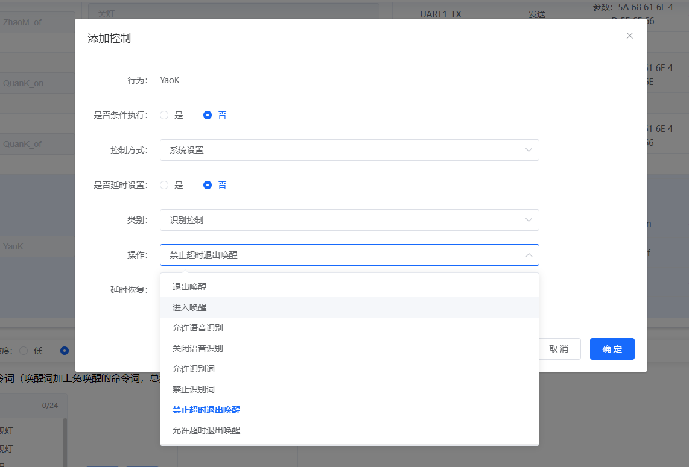
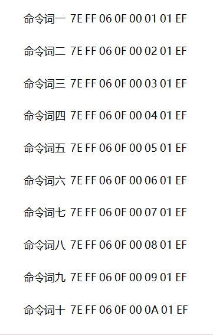
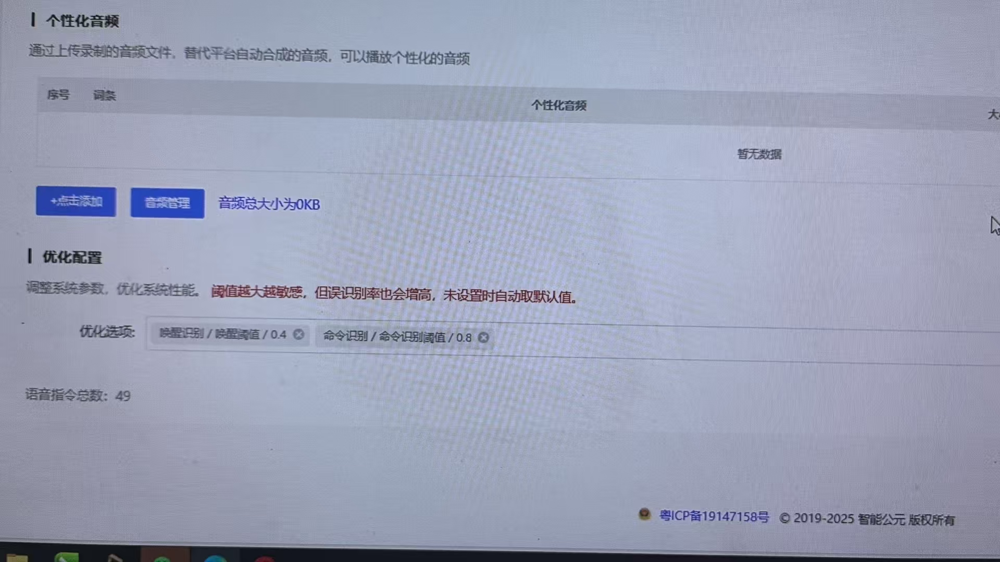

# SU-63T 语音调优 FAQ

本页用于整理 SU-63T 相关的语音调优问题。

### 语音指令需要说两次才能识别怎么办？

**问题描述：**

语音识别模块使用过程中，经常需要对着同一个指令说两次才能成功识别，第一次说话后系统没有任何反应。

**解决方案：**

**1. 麦克风灵敏度检查**

- **麦克风质量**：确认使用的麦克风规格符合要求
- **电路连接**：检查麦克风电路焊接是否牢固
- **供电电压**：测量麦克风两端电压应为2.4V左右

**2. 识别参数调优**

- **识别阈值**：在智能公元平台调整识别灵敏度参数
- **降噪设置**：适当开启噪声抑制功能
- **回声消除**：在特定环境下启用回声消除

**3. 环境因素优化**

- **环境噪声**：降低背景噪声干扰
- **距离控制**：保持在3-5米有效识别距离内
- **声学环境**：避免强回声和反射环境

**4. 语音输入规范**

- **音量控制**：使用正常说话音量，避免过小或过大
- **语速调节**：保持适中的说话速度
- **发音清晰**：确保指令发音准确清晰

**5. 固件配置检查**

- **指令词设置**：确认指令词录制质量良好
- **识别算法**：使用最新版本的识别算法
- **固件版本**：升级到最新稳定版本固件

**6. 硬件优化措施**

- **电容滤波**：在麦克风电路增加滤波电容
- **屏蔽处理**：对音频线路进行电磁屏蔽
- **接地优化**：确保良好的接地连接

---

### SU-63T在电机产品上识别灵敏度低怎么办？

**问题描述：**

在电机产品上使用SU-63T时，识别灵敏度低，近距离下识别效果不佳，已尝试调整灵敏度和改善电源供电但问题仍未解决。

**解决方案：**

**问题分析：**

电机产品运行时会产生噪声干扰，影响语音识别。SU-63T本身没有深度降噪功能，需要选择合适的应用场景模型。

**解决方法：**

1. **选择合适的应用场景模型**：

    - 不要选择"电机"场景
    - 推荐选择"厨房电器"类别下的"油烟机"场景
    - 油烟机PRO模型具有降噪算法，更适合有噪声的环境

2. **前端信号处理配置**：

    - 确认麦克风配置为单MIC
    - 距离识别设置为远场（1-5m）
    - 在前端信号处理界面选择正确的应用场景

3. **灵敏度调整**：

    - 将命令词灵敏度调至最高
    - 确保唤醒词也已设置为最高灵敏度
    - 测试不同距离下的识别效果

4. **硬件优化建议**：

    - 使用防噪麦克风，减少环境噪声影响
    - 麦克风安装位置远离电机噪声源
    - 必要时增加物理隔音措施

**注意事项：**

- SU-63T不具备深度降噪功能，这是硬件限制
- 电机产品的噪声环境对语音识别是巨大挑战
- 如果效果仍不理想，可考虑更换为支持深度降噪的模块
- 相同条件下，开关产品没有电机噪声，识别效果会更好

---

### SU-63T小程序修改唤醒词存在什么风险？

**问题描述：**

在使用SU-63T模块时，通过小程序修改唤醒词功能存在风险，修改失败可能导致芯片无法使用（变砖），希望了解如何降低风险。

**解决方案：**

**风险说明：**

1. **变砖原因**：

    - 修改唤醒词过程中需要重新烧录固件
    - 如果在烧录完成前断开连接（如蓝牙关掉）
    - 会导致固件不完整，芯片无法正常工作

2. **风险场景**：

    - 蓝牙连接意外断开
    - 网络不稳定导致传输中断
    - 电量不足导致操作中断
    - 用户主动取消操作

**预防措施：**

1. **操作前准备**：

    - 确保设备电量充足
    - 保持稳定的蓝牙连接
    - 避免在修改过程中操作其他功能

2. **环境要求**：

    - 在安静环境下进行操作
    - 避免电磁干扰
    - 确保手机与模块距离适中（1-3米）

3. **备份管理**：

    - 修改前记录当前唤醒词
    - 保存配置参数供恢复使用
    - 建立版本管理机制

**正确操作流程：**

1. **进入修改模式**：

    - 打开小程序并连接设备
    - 进入唤醒词设置界面
    - 准备好新的唤醒词

2. **执行修改操作**：

    - 输入新的唤醒词
    - 确认修改并等待传输
    - 保持连接直到完成提示

3. **验证操作结果**：

    - 等待设备重启完成
    - 测试新唤醒词是否生效
    - 验证其他功能是否正常

**风险控制建议：**

1. **功能禁用考虑**：

    - 如担心用户误操作导致风险
    - 可在小程序中隐藏此功能
    - 通过专业工具进行修改

2. **批量处理建议**：

    - 批量修改建议使用专用烧录工具
    - 通过有线连接确保稳定性
    - 避免使用无线方式进行批量操作

3. **技术支持**：

    - 如遇问题及时联系技术支持
    - 提供操作日志便于分析
    - 必要时返厂维修恢复

**注意事项：**

- 修改唤醒词是高风险操作，需谨慎进行
- 过程中保持设备供电稳定
- 不要中断蓝牙连接，等待自然完成
- 建议在专业人员指导下操作

---

### SU-63T唤醒后无响应怎么办？

**问题描述：**

SU-63T模块上电后有声音提示"你好我是小美"，但使用唤醒词时机器没有响应。

**解决方案：**

**1. 基础检查**

- 检查麦克风连接是否正常
- 确认喇叭工作状态良好
- 验证模块供电稳定

**2. 唤醒词配置验证**

- 确认使用的是默认唤醒词
- 检查唤醒词发音是否标准
- 验证语音模块是否正确配置

**3. 环境因素排查**

- 确保环境安静，无噪音干扰
- 与模块保持适当距离（20-50cm）
- 避免在风口或强光直射处使用

**4. 硬件连接检查**

- 麦克风正负极连接正确
- 使用推荐规格的麦克风
- 检查连接线是否接触良好

**5. 恢复出厂设置**

如上述检查后仍无响应：

- 重新烧录默认固件
- 恢复出厂设置
- 使用原厂配置测试

**注意事项：**

- 首次使用建议按照说明书操作
- 唤醒词需要标准发音，语速适中
- 如持续无响应，可能需要联系技术支持

---
- 批量产品建议预烧录，避免后期修改

---

### 小程序更换为自注册后语音指令识别错位怎么办？

**问题描述：**

将小程序从公司提供的模板更换为自注册的小程序后，出现语音指令识别错位的问题，即喊第一条语音指令时执行第二条，喊第二条时执行第三条，且该问题在断电后暂时恢复。

**解决方案：**

**问题分析：**

这是由于小程序配置中存在多余空格导致的指令索引偏移问题。当自注册小程序的配置与原模板不一致时，容易出现格式差异。

**解决步骤：**

1. **检查固件配置空格**：

    - 在智能公元平台中仔细检查所有命令词配置
    - 确认命令词前后没有多余的空格字符
    - 特别注意免唤醒词配置的格式

2. **逐项对比配置**：

    - 将新小程序配置与原模板逐项对比
    - 重点检查命令词列表的顺序和格式
    - 确保完全一致后再生成固件

3. **重新生成固件**：

    - 修正配置后重新生成固件
    - 烧录到SU-63T模块进行测试
    - 验证所有指令是否正确对应

**预防措施：**

- 配置命令词时避免使用空格符
- 使用标准格式，保持一致性
- 修改配置后进行完整测试
- 保留配置备份便于问题排查

**注意事项：**

- 断电后暂时恢复说明是配置问题而非硬件故障
- 自注册小程序需要特别注意配置格式的一致性
- 建议在更改小程序前备份原有配置
- 如问题持续，建议联系技术支持协助排查

---

### SU-63T如何配置免唤醒功能？

**问题描述：**

需要实现设备通电后无需唤醒词即可直接响应语音命令的功能。

**解决方案：**

**1. 免唤醒实现原理**

- 通过配置让设备始终保持唤醒状态
- 无需喊唤醒词，直接识别命令词
- 适合需要即时响应的应用场景

**2. 配置步骤**

**触发方式设置：**

1. 设置触发方式为"上电启动"
2. 添加控制动作"进入唤醒"
3. 这样设备开机后会自动进入唤醒状态

**保持唤醒状态：**

1. 添加控制动作"禁止超时退出唤醒"
2. 这样设备会一直保持唤醒状态
3. 不会因为超时而自动退出唤醒模式

**3. 配置示例**

```
开机触发 → 进入唤醒 → 禁止超时退出唤醒
结果：设备始终处于唤醒状态，可直接识别命令词
```

**4. 应用场景**

- 即时控制设备
- 简化用户操作
- 特殊应用需求（如无障碍使用）
- 演示和展示场景

**注意事项：**

- 免唤醒状态会增加功耗
- 持续唤醒可能增加误识别率
- 根据实际需求选择是否使用
- 可通过命令控制切换唤醒/免唤醒模式



---

### SU-63T命令词设计时如何避免误触发？

**问题描述：**

在配置命令词时，担心某些设计可能导致高误触发率，影响用户体验。

**解决方案：**

**1. 命令词设计原则**

- 避免使用发音相似的命令词
- 选择差异性大的词汇组合
- 考虑日常对话中可能出现的相似音

**2. 十六进制编码说明**

- 展示的十六进制编码（如 7E FF 06 0F 00 01 01 EF）是内部标识符
- 仅用于系统区分不同的命令条目
- 不是实际的识别语音内容
- 实际命令词由用户在小程序中自定义设置

**3. 误触发预防措施**

**命令词选择：**

- 选择4-6个汉字的词组
- 避免单字或过短的词汇
- 使用不常见的组合词汇

**测试验证：**

- 在不同环境下测试误触发率
- 模拟日常使用场景
- 收集多人口音测试数据

**4. 永不退出唤醒功能配置**

实现设备始终保持唤醒状态的方法：

**配置步骤：**

1. **设置开机触发**
    - 触发方式：上电启动
    - 添加动作：进入唤醒

2. **保持唤醒状态**
    - 添加动作：禁止超时退出唤醒
    - 设备将始终保持唤醒状态

3. **配置效果**
    - 通电后自动进入唤醒状态
    - 无需重复喊唤醒词
    - 直接识别命令词即可执行

**注意事项：**

- 持续唤醒会增加设备功耗
- 可能提高误识别率
- 适用于需要即时响应的场景
- 可根据需求切换唤醒/免唤醒模式



---

### SU-63T语音识别不灵敏和识别出错怎么办？

**问题描述：**

SU-63T模块出现语音识别不灵敏、识别出错以及通电后不播报语音的问题。

**解决方案：**

**1. 识别不灵敏处理**

**开启稳态降噪**：

- 在平台配置中开启稳态降噪功能
- 有助于提升在稳定噪声环境下的识别效果

**调整优化配置参数**：

- 进入"优化配置"界面
- 将命令识别阈值调整为0.8（最高灵敏度）
- 测试不同参数值找到最佳设置

**2. 识别出错处理**

**命令词优化**：

- 更换为差异性更大的命令词
- 命令词之间的差异越大越好
- 避免使用发音相似的词汇

**测试验证**：

- 在安静环境下测试基础识别能力
- 逐步增加环境难度
- 记录哪些命令词容易出错

**3. 通电不播报语音**

**电源检查**：

- 确认AC转DC5V供电稳定
- 检查电源纹波是否过大
- 测试不同电源适配器

**硬件连接**：

- 检查喇叭连接是否正确
- 确认音频输出电路正常
- 验证模块供电电压稳定

**4. 硬件设计参考**


**注意事项：**

- SU-63T单麦克风设计在噪声环境下识别能力有限
- 语音识别出错问题无法完全解决，只能通过优化命令词改善
- 建议在产品设计阶段考虑麦克风布局和防噪措施

---

### SU-63T近距离说话仍难以准确识别怎么办？

**问题描述：**

SU-63T测试中存在误识别问题，即使在近距离说话时也难以准确识别。

**解决方案：**

**1. 问题分析**

- SU-63T识别效果存在局限性
- 单麦克风设计在复杂环境下能力有限
- 需要考虑替代方案

**2. 模块选型建议**

**测试CI-03T**：

- CI-03T识别效果优于SU-63T
- 支持更好的降噪算法
- 适合对识别要求较高的应用

**蓝牙方案选择**：

- 基于CI-03T的蓝牙版本
- 需要定制开发
- 无法在平台直接配置

**3. 功能需求确认**

**小程序功能**：

- SU-63T支持小程序是选择它的主要原因
- CI-03T标准版不支持小程序
- 蓝牙版CI-03T可通过定制实现

**建议方案**：

- 优先测试CI-03T基础识别效果
- 如满足需求，可考虑定制蓝牙版本
- 权衡识别效果与功能需求



**注意事项：**

- SU-63T的小程序功能是刚需时无法替代
- CI-03T蓝牙版本需要走定制流程
- 建议先测试标准版确认识别效果

---

### SU-63T单麦克风配置下如何优化骑行场景的识别效果？

**问题描述：**

在骑行场景下使用SU-63T芯片模块时，发现其单麦克风配置的语音识别性能不满足需求，特别是在噪声环境下的识别效果不佳。

**解决方案：**

**芯片信息确认：**

- SU-63T使用蜂鸟B主控芯片（US665）
- 确认为单麦克风配置设计
- 识别效果可以通过参数调整优化

**优化方法：**

1. **调整识别阈值**：

    - 对于特定词汇识别效果不佳的情况
    - 可以通过降低识别阈值来提升灵敏度
    - 在智能公元平台的"命令识别"中进行阈值调整
    - 使用"优化选项"功能进行精细调优

2. **环境适应性调整**：

    - 针对骑行场景的特殊噪声环境
    - 建议选择合适的应用场景模型
    - 可以尝试使用降噪算法优化的场景模型

3. **命令词优化**：

    - 避免使用发音相似度高的命令词
    - 选择清晰、区分度高的词汇
    - 测试并验证每个命令词的识别率

**注意事项：**

- 单麦克风配置在噪声环境下的识别能力有限
- 骑行场景的风噪是主要挑战，建议考虑物理防护措施
- 调整阈值时需要平衡识别率和误触发率
- 如效果仍不理想，可考虑使用支持多麦克风或深度降噪的模块


---

### SU-63T俄语固件指令词识别困难如何解决？

**问题描述：**

在移植俄语固件时，当唤醒词为'Привет, Алиса'时，指令词的识别触发困难，而当唤醒词为'Алиса'时，指令词识别正常。

**解决方案：**

**问题分析：**

- 唤醒词长度影响后续指令词的识别效果
- 较长的唤醒词可能与指令词产生冲突
- 需要根据语言特性优化配置

**解决方法：**

1. **简化唤醒词**：

    - 使用简短唤醒词：'Алиса'
    - 避免使用复合式唤醒词：'Привет, Алиса'
    - 简化后的指令词：

        - 上升：иди наверх
        - 下降：иди навниз
        - 暂停：остановись

2. **固件配置优化**：

    - 基于中文固件进行俄语移植
    - 删除不需要的中文命令词
    - 配置俄语反馈音

3. **测试验证**：

    - 确保所有指令词都能正常触发
    - 验证识别率满足使用要求
    - 测试不同语速和口音的适应性

**注意事项：**

- 不同语言的语音特性需要针对性优化
- 唤醒词设计应考虑与指令词的区分度
- 建议在实际使用场景中充分测试

---

