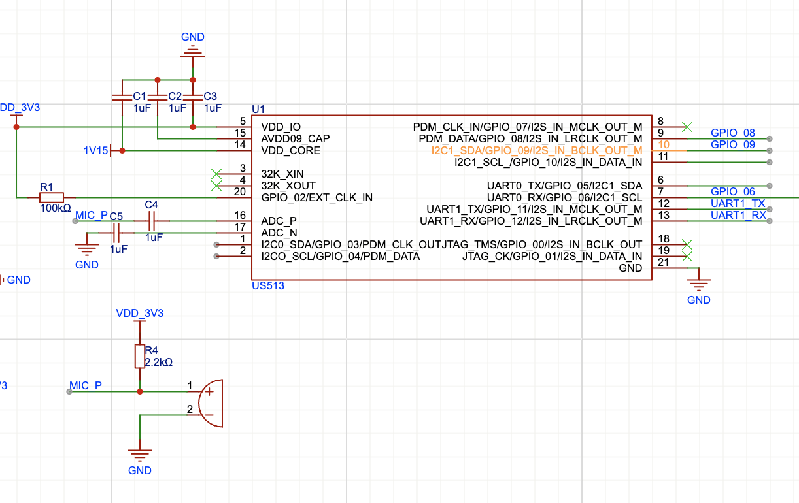
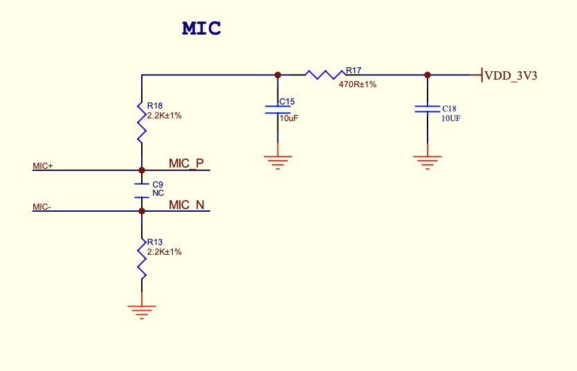
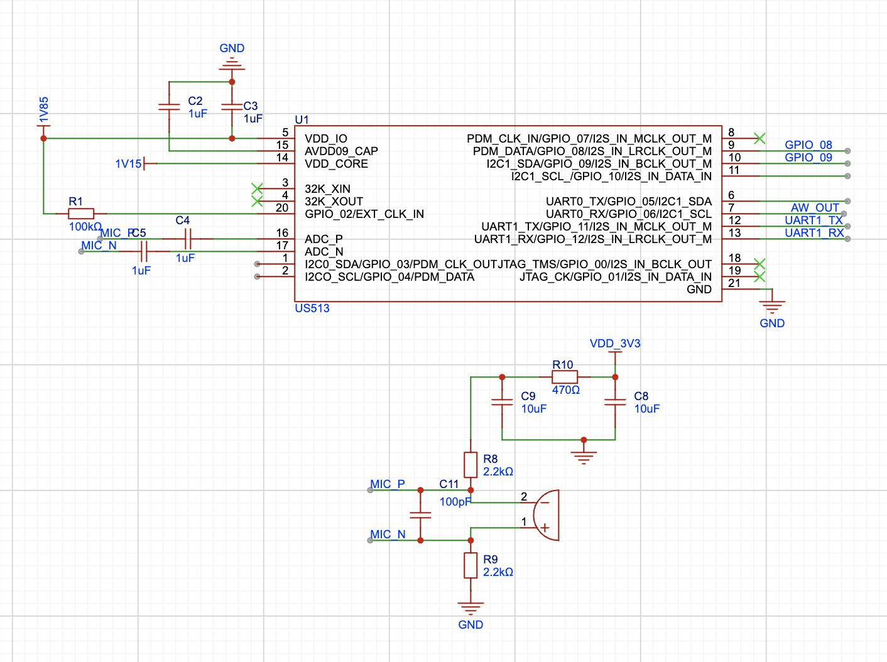
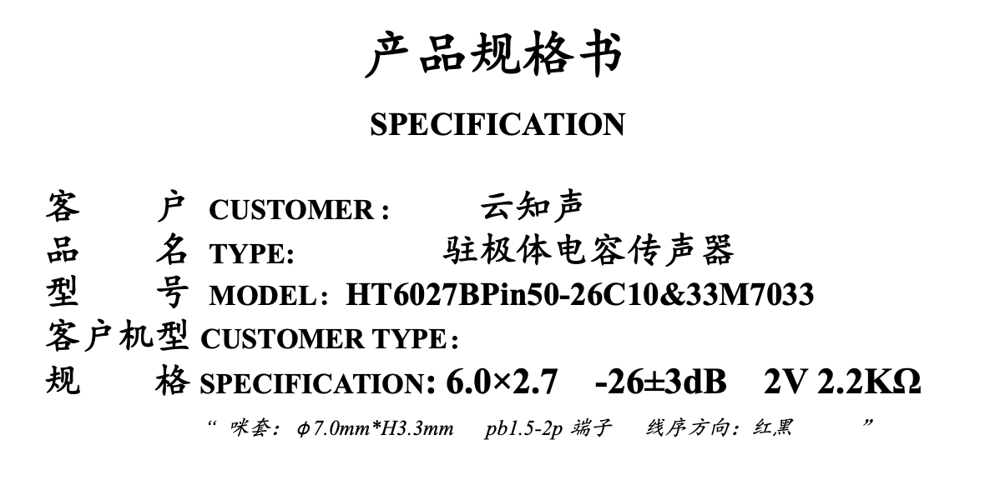
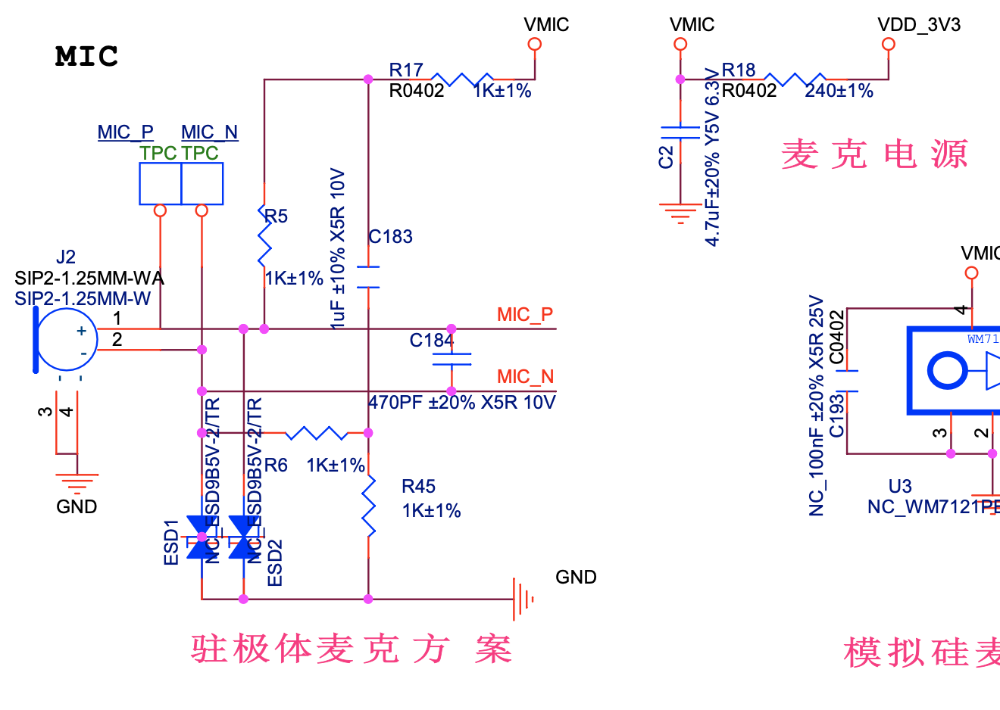

# US513U61 语音调优 FAQ

### US513U61芯片误唤醒率过高如何解决？

**问题描述：**

US513U61芯片在设置为中等唤醒灵敏度时，仍出现较高的误唤醒率，尤其是在会议等嘈杂环境中，即使未说出唤醒词也会被触发。

**解决方案：**

**硬件优化方案：**

- 改用差分麦克风接法替代单端接法，提高抗干扰能力
- 优化麦克风布局，避免长走线，远离干扰源
- 确保麦克风供电使用3.3V，通过电流源电路提供稳定偏置
- 添加必要的滤波电容：差分共模电容100pF，电源滤波电容
- 使用470Ω电阻构成RC滤波器，减少VBIAS电源纹波

**软件配置优化：**

- 调低命令词灵敏度阈值（在平台"优化配置"中设置）
- 缩短超时退出时间至10秒，减少误识别窗口
- 减少词条数量，US513U61作为低功耗芯片建议设置最少的必要词条
- 避免使用叠词作为唤醒词，选择日常不常用的词汇

**注意事项：**

- 单端接法可能导致正负波不对称，在空间受限时建议优先考虑PCB布局优化
- US513U61是低功耗芯片，语音识别能力和抗噪能力相对较弱
- 唤醒状态下的时间越短，越不容易误识别
- 差分接法需要两根信号线并排走线，注意阻抗匹配

### US513U61的IO口供电电压改为1.8V时，麦克风供电是否需要调整？

**问题描述：**

当将US513U61芯片的IO口供电电压从3.3V改为1.8V时，不确定麦克风（MIC）的供电电压和相关电路参数是否需要相应调整。

**解决方案：**

- 麦克风供电电压应保持3.3V，不受VDD_IO电压影响
- MIC的ADC_P和ADC_N引脚由模拟电源供电，与VDD_IO无关
- 咪头的工作电压应按照规格书要求（如2V），通过电流源电路降压实现
- IO上拉电阻需要调整到新电压（1.8V）

**注意事项：**

- 咪头供电电压过低会严重影响灵敏度和信噪比
- 3.3V电源经过电流源电路，当咪头电流在500uA时，落在咪头两端的电压约2V
- VDD_IO仅控制数字IO口的通讯电平
- GPIO_02引脚（外部晶振选择）也需要接到1.8V

### US513U61芯片的VDD_CORE供电电压应该如何配置？

**问题描述：**

手册中关于VDD_CORE供电电压存在冲突描述，管脚描述显示0.9-3.3V，电气特性显示1.1-1.2V，需要明确正确配置方法。

**解决方案：**

- 使用内部LDO时：外部可给VDD_CORE引脚供电到3.3V，内部降压至1.1-1.2V
- 使用外部LDO时：外部直接供给1.1-1.2V，电流可达5mA左右，CPU可运行在50MHz
- 内部LDO电流较小（<3mA），CPU频率限制在16MHz

**注意事项：**

- 现有算法功耗大于3mA，建议使用外部LDO供电方案
- 如果仅需唤醒功能（功耗<3mA），可考虑使用内部LDO简化设计
- 内部LDO方案会限制CPU性能，仅适合简单应用场景

### 如何实现单个词直接执行命令功能？

**问题描述：**

希望直接通过一个词执行命令，而不是先说唤醒词再说命令词，但对误唤醒有较高要求。

**解决方案：**

- 使用命令词替代唤醒词，将需要执行的词设置为命令词
- 在平台配置中删除唤醒词，实现免唤醒模式
- 通过"允许语音识别"选项保持常时唤醒状态

**注意事项：**

- 单个词直接执行会增加误唤醒率，需要权衡使用
- 建议选择日常对话中不常用的词汇
- 穿戴设备等对误唤醒敏感的应用需要特别考虑用户体验
- 可以通过调整灵敏度阈值来平衡唤醒率和误唤醒率

### US513芯片的误识别率是多少？

**问题描述：**

需要了解US513芯片标称的误识别率指标，以及是否可以通过训练唤醒词来降低误唤醒。

**解决方案：**

- US513系列芯片在理想环境下的误唤醒率约为24小时/次
- 可通过调整唤醒阈值和优化唤醒词设置来减少误唤醒
- 特定训练需要100K以上的量级，成本较高

**注意事项：**

- 训练不能完全杜绝误识别，只能降低概率
- 实际误唤醒率受环境影响较大
- 叠词类唤醒词（如"小千小千"）相对容易误识别
- 建议选择发音独特、不易混淆的唤醒词

### 如何在平台配置唤醒词、命令词并生成SDK？

**问题描述：**

需要了解如何在智能公元平台配置语音指令，并获取包含源代码的SDK进行二次开发。

**解决方案：**

- 在平台中配置唤醒词、命令词和回复语
- 发布版本生成成功后，下载SDK包
- SDK包含语音部分的源代码，可修改后重新编译

**注意事项：**

- 平台生成的SDK仅包含语音功能，增强控制功能不完整
- 官方仅提供基础函数列表文档，没有更详细的开发教程
- 需要自行实现具体的业务逻辑控制代码

### US513U61芯片唤醒后多久进入休眠？可以配置吗？

**问题描述：**

需要了解芯片在唤醒状态下的持续时间，以及是否可以主动配置进入休眠的时间。

**解决方案：**

- 休眠时间取决于外部环境状态，非固定时间
- 安静环境下约10秒进入待机状态
- 嘈杂环境可能一直保持唤醒状态

**注意事项：**

- 唤醒状态下功耗约3mA以上，休眠状态约1mA
- 无法通过算法主动强制进入休眠
- 可通过缩短超时退出时间减少唤醒持续时间
- 实际休眠时间受环境噪声影响较大