# 语音调优 FAQ

### 声纹注册需要额外费用吗？

**问题描述：**

询问声纹注册是否需要额外费用，以及具体的授权流程和时间要求是什么。

**解决方案：**

**费用说明：**

- **授权费用**：在模块原价基础上增加1元/片
- **一次授权**：永久有效，无需重复付费
- **包含内容**：声纹识别功能使用权

**授权流程：**

1. **下单备注**
    - 购买模块时联系客服或备注
    - 说明"需要声纹授权功能"
    - 客服会安排授权版本的模块

2. **生产周期**
    - 标准产品：正常发货
    - 授权产品：约15天交期
    - 需要预留充足的生产时间

3. **授权方式**
    - 出厂前在模块硬件层面授权
    - 同时对指定的固件进行授权绑定
    - 授权信息永久保存在模块中

**使用注意事项：**

- 授权模块重新烧录固件会失去授权
- 如需更换固件，需要重新购买授权模块
- 建议在确定最终固件版本后再申请授权
- 授权费用仅针对声纹功能，普通功能无需额外付费

**建议：**

- 开发阶段可使用未授权模块测试（会定时重启）
- 量产时直接采购已授权模块
- 提前规划生产周期，考虑15天授权时间

---

### 声纹注册变量类型配置错误怎么办？

**问题描述：**

配置声纹注册功能时，将声纹注册变量类型错误地选择为string类型，导致声纹识别功能异常。

**解决方案：**

**变量类型正确配置：**

- **声纹注册变量（RegVoicePrints）**：必须选择**number**类型，不能使用string类型
- **类型区分变量（Type_number）**：同样应使用number类型

**正确配置示例：**

| 变量名 | 变量类型 | 用途 |
|--------|----------|------|
| RegVoicePrints | number | 声纹注册标志变量（=1表示进入注册模式） |
| Type_number | number | 区分不同声纹（=1开门，=2关门） |

**错误现象：**

- 使用string类型会导致声纹注册功能无法正常工作
- 声纹识别事件无法被正确触发

**注意事项：**

- 声纹相关的所有变量都应使用number类型
- 配置完成后需要重新生成并下载固件

---

### 声纹注册的正确使用流程是什么？

**问题描述：**

配置声纹注册功能后，不清楚如何正确触发声纹注册流程，导致声纹识别事件无法正常触发。

**解决方案：**

**声纹注册完整流程：**

1. **第一步：唤醒设备**
   - 说出唤醒词激活设备

2. **第二步：触发注册命令**
   - 说出注册命令，如"注册开门"或"注册关门"
   - 此时设备会播放提示音，如"请在安静环境下对我说开门"

3. **第三步：录入声纹**
   - **重要**：听到提示音后，必须再次说出目标词（如"开门"或"关门"）
   - 设备才会开始采集声纹特征
   - 按提示完成两遍声纹录入

4. **第四步：声纹识别生效**
   - 录入完成后，可正常使用声纹识别功能
   - 只有录入过声纹的用户才能触发对应的控制动作

**常见错误：**

- 喊完"注册开门"后不继续说"开门"，导致声纹无法录入
- 忽略设备提示音，不知道需要继续说话

**注意事项：**

- 声纹注册需要在安静环境下进行
- 每个声纹需要录入两遍才能生效
- 录入的声纹具有掉电保存功能

---

### 优化配置功能是否有效？

**问题描述：**

平台中的优化配置选项是否能有效改善语音识别效果，是否需要开启此功能。

**解决方案：**

**优化配置说明：**

- 优化配置对识别效果有一定改善作用
- 主要针对特定应用场景进行算法优化
- 建议根据实际使用情况决定是否开启

**适用场景：**

- 环境噪声较大的场合
- 识别准确率要求较高的应用
- 需要提升整体识别体验的项目

**使用建议：**

- 可先关闭优化配置测试效果
- 再开启优化配置对比差异
- 根据实际效果决定最终设置

**注意事项：**

- 优化配置可能增加少量处理延迟
- 不同场景下效果可能有所差异
- 建议在实际使用环境中充分测试

---

### 免唤醒指令后如何使用常规指令？

**问题描述：**

使用免唤醒指令功能时，设备对免唤醒指令有响应，但后续的常规指令无法被识别。

**解决方案：**

免唤醒指令和常规指令是两种不同的工作模式：

- **免唤醒指令**：不需要说唤醒词，直接说出指令即可触发
- **常规指令**：必须先说唤醒词，然后说出指令才能触发

**使用流程：**

1. 使用免唤醒指令后，模块不会自动进入唤醒状态
2. 要使用常规指令，仍需先说唤醒词
3. 只有被配置为免唤醒的指令才能直接触发
4. 其他所有指令都需要通过唤醒词激活

**注意事项：**

- 免唤醒指令仅限特定配置的命令词
- 常规指令需要唤醒词作为前置条件
- 两种模式可以混合使用，但需注意触发条件

---

### 免唤醒命令词与泛化词冲突问题

**问题描述：**

开启自然说功能后，将某个命令词设置为免唤醒词时，该命令词的泛化词（如"请打开台灯"、"帮我打开台灯"等）失效，无法通过免唤醒或唤醒后识别。

**解决方案：**

**功能限制说明：**

- 泛化后的词不能设置为免唤醒词
- 只有最初填写的命令词支持免唤醒功能
- 这是由免唤醒词的数量限制决定的

**原因分析：**

1. **免唤醒词数量限制**
    - 系统对免唤醒词有严格的数量限制
    - 泛化词的数量较多，容易超过限制
    - 为避免系统资源耗尽，仅支持主词免唤醒

2. **设计逻辑**
    - 免唤醒功能需要预配置实现
    - 泛化词是动态生成的，无法预配置
    - 识别效率和资源消耗的平衡考虑

**影响范围：**

- 泛化词在免唤醒模式下无法使用
- 通过唤醒词唤醒后，泛化词也无法识别
- 只有原始命令词（主词）可以正常使用

**注意事项：**

- 这是系统设计的正常限制，不是bug
- 如需要泛化功能，请使用唤醒后识别模式
- 可考虑重新设计命令词，减少对泛化的依赖

---

### 离线语音功能开发进度如何？

**问题描述：**

询问项目当前进度，特别是离线功能的开发状态，并希望确认是否可以开始进行离线功能的开发工作。

**解决方案：**

- SDK 已准备好，离线语音功能正在调试中
- 其他功能模块已完成开发
- 离线识别算法存在一些问题，正在优化中
- 可与团队沟通协调，开始离线功能的开发工作

**注意事项：**

- 离线算法移植在 SDK 中可以正常运行
- 需要理清楚云端对接和业务逻辑
- 建议与开发团队沟通具体的配合方式
- 关注算法优化的进度，合理安排开发计划

---

### 离线识别算法中的VAD如何使用？

**问题描述：**

在集成离线语音识别功能时，需要了解VAD（语音活动检测）算法的使用方式，以及是否必须依赖讯飞算法引擎。同时，在识别到离线命令词时，需要处理已上报到云端的音频数据。

**解决方案：**

- SDK中的VAD功能有实际使用，不是必须启动讯飞算法引擎即可运行
- 可以自行移植VAD功能，移植完成后由开发团队进行修改适配
- 对于离线命令词识别时云端已收到音频的情况，需要在云端实现中止处理机制
- 建议使用任务通知或队列机制在中断和任务之间进行通信，避免直接在中断中调用阻塞式API

**注意事项：**

- 离线算法移植在SDK中可以正常运行，但云端对接逻辑需要理清
- 音频上报到云端后，保持连接不释放的同时中止处理，需要通过云端API实现
- 离线识别算法还在调试中，存在一些问题需要解决
- 移植过程中注意避免在中断服务例程中调用互斥锁等阻塞式操作

---

### 合成语音音调生硬如何处理？

**问题描述：**

日语语音播报音调生硬、机械化，缺乏情感，需要更自然的语音效果。

**解决方案：**

- 目前合成的日语播报无法选择其他音调
- 可以由客户提供播报录音，使用客户提供的录音替换系统合成的播报
- 需要提供所有要播报的语音 MP3 文件

**注意事项：**

- 个性化音频替换需要客户提供完整的播报录音文件
- 确保提供的音频文件格式为 MP3
- 替换后所有播报将使用客户提供的录音

---

### 语音识别结合自学习功能有哪些优点？

**问题描述：**

需要了解语音识别模块结合自学习功能的优势和应用场景。

**解决方案：**

**1. 自学习功能的核心价值**：

- **命令词学习**：可以学习用户自定义的命令词
- **动态扩展**：无需重新烧录固件即可增加新命令
- **灵活适配**：适应不同用户的使用习惯和口音

**2. 主要优点**：

- **提升识别准确率**：通过学习用户口音提高识别成功率
- **降低开发成本**：无需频繁修改固件和重新烧录
- **增强用户体验**：支持个性化命令词定制
- **快速迭代**：可随时学习新命令，快速验证效果

**3. 应用场景**：

- 智能家居控制（学习用户自定义的控制指令）
- 车载语音助手（学习特定用户的发音习惯）
- 老人/儿童专用设备（学习特殊群体的发音特点）
- 工业控制设备（学习特定场景的专业术语）

**4. 使用方法**：

- 通过B站等平台观看自学习功能演示视频
- 按照模块说明进行自学习配置
- 录制需要学习的命令词
- 保存并测试学习效果

**注意事项：**

- 自学习功能需要模块硬件支持
- 学习环境应保持安静，确保录音质量
- 建议多次学习同一命令以提高准确率
- 学习完成后进行充分测试验证

---

### 语音指令容易被误识别怎么办？

**问题描述：**

在使用语音识别时，某些指令经常被错误识别为其他相似指令，例如"打开一键入眠"被识别为"打开瑜伽"。

**解决方案：**

1. **修改指令名称**
    - 将容易混淆的指令词改为差异更大的词汇
    - 避免使用发音相似或包含关系的词组
    - 例如：将"打开一键入眠"改为"启动睡眠模式"

2. **增加指令差异度**
    - 确保指令词的声调、音节有明显区别
    - 避免使用过多相同或相近的音节
    - 可以在指令前添加特定前缀（如"小爱小爱"）

3. **调整识别参数**
    - 检查是否启用了过于严格的识别模式
    - 适当调整识别阈值
    - 确保录音环境相对安静

**注意事项：**

- 指令词的设计应避免音韵相近
- 如果无法修改指令词，考虑调整应用场景
- 识别混淆通常在嘈杂环境中更容易发生
- 建议测试多个使用场景，验证识别准确性

---

### 学习模式后只能控制部分功能怎么办？

**问题描述：**

使用学习模式后，设备只能控制开关机和制冷制热功能，其他功能被删除，且无法恢复默认设置。

**解决方案：**

**1. 学习模式特性**

- 学习模式只能控制学习过的功能
- 模块会记录并发射学习到的红外码
- 未学习的功能无法通过语音控制

**2. 温度控制方法**

- 使用"升高温度"、"降低温度"命令控制温度
- 这些命令需要预先学习遥控器的对应按键
- 学习的是遥控器发出的红外码

**3. 恢复默认功能**

- **方法一**：重新匹配空调品牌
    - 可以随意重新匹配不同品牌
    - 匹配后使用库里的标准数据
    - 想换品牌可再次重新匹配

- **方法二**：重新烧录固件
    - 可以恢复到默认功能状态
    - 恢复后所有标准控制功能可用

**注意事项：**

- 学习模式和匹配模式是互斥的
- 学习模式只能控制已学习的数据
- 建议根据实际需求选择合适的工作模式
- 如需完整功能，建议使用匹配模式

---

### 电机工作时语音识别失效怎么办？

**问题描述：**

电机启动工作时，语音模块无法正常识别指令，电机停止后识别功能恢复正常。

**解决方案：**

1. **确认问题类型**
    - 判断是电机噪音过大导致识别效率降低，还是电机启动导致模块停止运行
    - 如果模块没有重启操作，说明是噪音导致的识别率下降

2. **优化语音识别配置**
    - 将识别灵敏度调高（注意：可能导致误识别率提高）
    - 选择带有深度降噪或稳态降噪功能的应用场景
    - 对于单麦克风模式，可考虑启用AEC（回声消除）功能

3. **硬件优化措施**
    - 麦克风尽量远离电机噪声源
    - 检查供电稳定性，电机工作可能引起电源波动
    - 为模块提供独立供电，避免电机电源干扰
    - 在麦克风和电机之间增加物理隔振措施

4. **结构设计优化**
    - 参考声学设计规范，合理规划麦克风位置
    - 避免将麦克风直接安装在电机振动传导路径上
    - 使用减震材料隔离机械振动

**注意事项：**

- 提高灵敏度会增加误识别风险，需要根据实际环境调整
- 电源干扰问题通常表现为所有模块受影响，而噪音问题可能仅影响特定模块
- 结构优化是最有效的长期解决方案，比单纯调整参数效果更好


---

### 语音指令识别不稳定怎么办？

**问题描述：**

某些语音指令（如"关泵主泵"）有时能正常识别，有时无响应，导致控制不稳定。

**解决方案：**

1. **修改命令词**
    - 在平台中修改识别不稳定的命令词
    - 尝试使用发音更清晰、不易混淆的词汇
    - 避免使用发音相似或容易误识别的词组

2. **调整识别参数**
    - 适当提高识别灵敏度
    - 检查命令词的拼音标注是否准确
    - 确认录音质量良好

3. **测试验证**
    - 修改后重新生成固件
    - 多次测试验证识别稳定性
    - 在实际使用环境中验证效果

**注意事项：**

- 命令词修改需要重新烧录固件
- 建议在安静环境下进行测试
- 如问题持续，可考虑更换为更易识别的词汇

---

### 语音指令配置时行为与命令词不一致怎么办？

**问题描述：**

配置语音指令时，发现"行为"列中的名称与"命令词"列中的内容完全不匹配，导致语音指令无法被正确识别。

**解决方案：**

1. **理解各字段含义**
    - **行为**：内部标识符，用于程序控制，只支持字母、数字、下划线
    - **命令词**：实际要识别的语音内容，支持中文
    - **回复语**：识别成功后的语音反馈内容
    - 两者可以不同，但需要有对应关系

2. **正确配置方法**
    - 行为名称使用英文或拼音（如：shuibeng_on）
    - 命令词使用中文（如：打开水泵）
    - 确保触发方式设置为"命令词"
    - 行为名称不能为空，否则生成固件会报错

3. **配置建议**
    - 行为名称要有明确的命名规则
    - 建议使用拼音或英文缩写
    - 保持行为名称的唯一性
    - 定期检查配置是否一致

**注意事项：**

- 行为名称不能包含中文字符
- 命令词必须使用标准普通话
- 行为名称为空会导致固件生成失败
- 配置错误需要在平台中修正并重新生成固件

---

### 65分贝高噪声环境下语音识别是否可行？

**问题描述：**

在淋浴间等约65分贝的高噪声环境（如花洒出水声、电机运行噪声）下，语音识别系统是否能正常工作，以及是否能识别带有地方口音的普通话。

**解决方案：**

1. **高噪声环境适应性**
    - 已有浴霸产品在淋浴场景下的量产验证
    - 模拟测试环境包含淋浴时的水声和电机噪声
    - 65分贝噪声环境下基本可以正常识别

2. **地方口音支持**
    - 华中及往北地区的带口音普通话基本没问题
    - 东南地区口音较重时，识别效果取决于口音严重程度
    - 只要不太偏离标准普通话，都能正常使用

3. **实际应用建议**
    - 建议采购样片进行实际测试验证识别效果
    - 重点测试在产品实际使用环境下的识别率
    - 对口音较重的用户，可尝试使用更标准的发音

**注意事项：**

- 高噪声环境对识别效果有一定影响，需要通过实际测试验证
- 地方口音的识别效果因地区和个人发音差异而不同
- 如需定制特定口音的识别，需要提供语料进行专门训练
- 推荐在实际使用场景中进行充分测试，确认满足需求后再量产

---

### 设备只能响应唤醒词但听不懂其他指令怎么办？

**问题描述：**

设备能够响应唤醒词"你好小智"，但无法识别其他语音指令，仅保持待机状态。

**解决方案：**

**1. 固件配置检查**

- 确认是否在平台中添加了命令词
- 检查命令词与回复语的对应关系
- 验证已生成包含这些命令词的固件

**2. 语音识别功能测试**

- 确认咪头（麦克风）工作正常
- 测试环境噪音是否过大
- 尝试用清晰、标准的普通话发音

**3. 常见问题排查**

- **命令词未配置**：需要在平台中添加并重新生成固件
- **发音不标准**：使用标准普通话，语速适中
- **环境噪音干扰**：在安静环境下测试
- **固件版本问题**：确认使用的是最新生成的固件

**4. 测试建议**

- 先使用简单、常用的词汇作为命令词
- 避免使用谐音词或容易混淆的词汇
- 测试时保持与设备适当距离（20-50cm）

**注意事项：**

- 唤醒词和命令词是两个独立的概念
- 唤醒词只是激活设备，之后才能识别命令词
- 确保每个命令词都有对应的触发动作配置
- 如问题持续，建议恢复出厂固件重新测试

---

### 语音模块是否支持方言识别？

**问题描述：**

需要确认语音识别模块是否支持直接识别方言。

**解决方案：**

**1. 标准支持**

- 模块目前仅支持标准普通话识别
- 不支持直接识别各地方言
- 识别引擎基于普通话训练

**2. 替代方案**

- 使用方言的中文谐音作为命令词
- 尝试自学习功能训练特定发音
- 选择发音接近普通话的词汇

**3. 定制方案**

- 可联系厂商进行付费定制
- 需要提供方言语料进行训练
- 训练后的固件专门针对特定方言优化

**注意事项：**

- 谐音方案识别效果有限，不如普通话准确
- 自学习功能需要多次训练才能达到较好效果
- 定制方案成本较高，适合批量需求
- 建议优先尝试谐音方案

---

### 如何优化语音指令响应延迟？

**问题描述：**

在使用蓝牙协议传输语音指令时，由于协议处理需要时间，导致语音指令响应存在延迟。

**解决方案：**

**优化蓝牙协议处理：**

- 对蓝牙协议处理时间进行压缩优化
- 通过固件优化减少指令处理链路
- 优化后的响应时间可达到 0.5 秒

**测试验证方法：**

- 使用语音指令测试响应速度（如"打开窗帘"、"关闭窗帘"）
- 对比优化前后的响应时间差异
- 在实际使用场景中验证效果

**注意事项：**

- 优化后的固件需要重新烧录测试
- 响应时间受环境因素影响，建议在安静环境下测试
- 如仍有延迟问题，可进一步排查蓝牙连接稳定性

---

### 双电机安装在一起时会同时响应吗？

**问题描述：**

当纱帘和布帘的两个电机安装在一起时，担心系统会同时响应语音指令，需要了解实际控制逻辑。

**解决方案：**

**控制逻辑说明：**

- 系统采用单一响应机制，即使多个电机安装在一起，也只会响应一个
- 不会出现两个电机同时动作的情况
- 固件版本 V2.0.0 已验证此功能

**测试方法：**

- 将双电机安装在同一轨道上进行测试
- 发出语音指令观察响应情况
- 验证是否只有单一电机响应

**注意事项：**

- 该控制逻辑适用于同一控制范围内的多个电机
- 测试时建议使用最新版本固件
- 如发现异常响应，需要检查电机配置和固件版本

---

### 为什么远距离语音识别不稳定？

**问题描述：**

在距离电机1-3米的环境中，语音识别模块无法稳定识别距离最近的电机，存在识别错误或多个电机同时响应的问题。

**解决方案：**

**问题原因分析：**

- 声源定位技术在近距离时效果较好
- 距离增加后，声音传播路径复杂化
- 系统可能无法准确判断声源位置

**当前限制：**

- 最佳识别距离：电机附近0.5-1米范围内
- 远距离识别准确性下降
- 可能出现非最近电机响应的情况

**测试建议：**

- 在不同距离下测试响应频率
- 记录识别错误的场景和距离
- 提供测试视频供技术分析

**注意事项：**

- 正常安装时通常不会离电机过远（1-2米为常见距离）
- 如需改善远距离识别，可能需要硬件升级或算法优化
- 建议根据实际使用场景调整安装位置

---

### 语音播报内容与设置语句不一致怎么办？

**问题描述：**

在平台生成固件后，实际播报的语音内容与设置的语句不一致，出现整体语音移位的现象。

**解决方案：**

**检查空配置项：**

- 仔细检查所有命令词配置
- 确认是否存在未设置的空白项
- 空白配置项可能导致后续语音内容移位

**排查步骤：**

- 逐项检查命令词列表
- 确认每个命令词都有对应的回复内容
- 删除或补充未完成配置的条目
- 重新生成固件并测试

**注意事项：**

- 语音移位通常是由配置项缺失或顺序错误引起
- 生成固件前确保所有配置完整
- 如问题持续，可提供配置截图供分析

---

### 如何设置模块上电后一直处于唤醒状态？

**问题描述：**

希望模块上电后直接进入唤醒状态，无需通过唤醒词触发，实现即时响应。

**解决方案：**

**当前系统限制：**

- 语音模块需要通过唤醒词激活
- 上电后默认处于待机状态
- 暂不支持永久唤醒状态的配置

**替代方案：**

- 使用高灵敏度唤醒词设置
- 设置简单易触发的唤醒词（如"你好"）
- 通过GPIO控制实现手动激活
- 考虑使用串口指令直接控制

**注意事项：**

- 永久唤醒状态会增加功耗
- 可能影响语音识别的准确性
- 如有特殊需求，可讨论定制方案

---

### 学习命令词时能否跳过某些词条？

**问题描述：**

在学习命令词时，想要跳过前面的词条，直接学习第三个或后续的命令词。

**解决方案：**

当前系统的学习机制：

- **学习顺序**：必须按照顺序逐个学习命令词
- **无法跳过**：系统不支持跳过某个命令词直接学习后续
- **学习下一个**：该功能仅在学习唤醒词时可用

**学习流程：**

1. 唤醒词学习阶段
    - 可以选择"学习下一个"
    - 但学习命令词时该选项不可用

2. 命令词学习阶段
    - 必须按顺序逐个学习
    - 无法跳过任何词条
    - 每个命令词都需要单独录制

**注意事项：**

- 更换唤醒词后，所有命令词需要重新学习
- 这是系统当前的设计限制
- 建议规划好学习顺序，避免频繁更换唤醒词

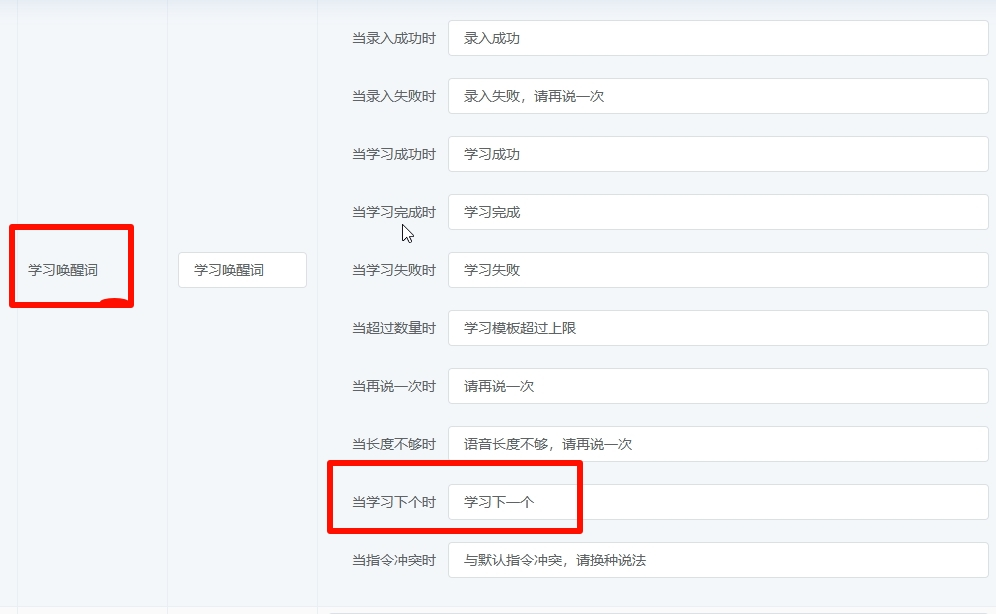

---

### 自学习功能与深度降噪功能可以同时使用吗？

**问题描述：**

在配置窗帘电机应用时，需要同时使用自学习功能和深度降噪功能，但发现无法同时选择这两项功能。

**解决方案：**

- **功能互斥**：自学习功能和深度降噪功能不能同时启用
- **选择方案**：根据实际需求选择其中一种功能
    - 需要自定义命令词时，选择"语音识别+自学习"
    - 需要降噪处理时，选择"语音识别+深度降噪"

**配置步骤：**

1. 在产品特性下拉菜单中选择功能组合
2. 应用场景选择"中文窗帘通用Pro(占1.3M空间)-V00992-V6"
3. 根据需求选择功能：

    - 自学习模式：选择"语音识别+自学习"
    - 降噪模式：选择"语音识别+深度降噪"，并选择对应的噪声模型（如"窗帘"）

**注意事项：**

- 噪音不大的环境下，可以不开启深度降噪功能
- 开启自学习后，需要按顺序学习所有需要的命令词
- 更换唤醒词后，所有命令词需要重新学习


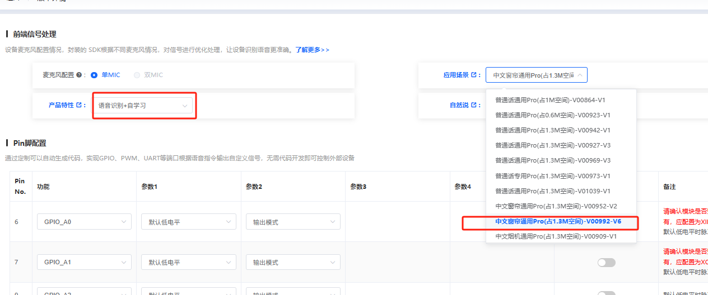

---

### 开启自学习功能后是否需要学习所有命令词？

**问题描述：**

开启自学习功能后，是否需要在使用前对所有语音指令进行学习，不学习的指令是否无法使用。

**解决方案：**

**自学习机制：**

- **按需学习**：只需要学习实际使用的命令词，不是所有命令词都需要学习
- **选择性添加**：根据产品功能需求，选择需要的命令词进行学习
- **未学习的命令词**：未通过自学习添加的命令词无法使用

**学习流程：**

1. **配置自学习模式**
    - 产品特性选择"语音识别+自学习"
    - 应用场景选择对应的场景（如"中文窗帘通用Pro"）

2. **添加学习命令词**
    - 在自学习界面添加需要学习的命令词
    - 可以添加自定义命令词，如"打开台灯"、"关闭台灯"等

3. **逐个学习**
    - 按照列表顺序逐个学习命令词
    - 在安静环境下按照提示进行录制

**注意事项：**

- 只有通过自学习添加的命令词才能被识别
- 建议只学习必要的命令词，避免配置过多
- 学习完成后要测试每个命令词的有效性
- 更换唤醒词后，所有自学习的命令词需要重新学习

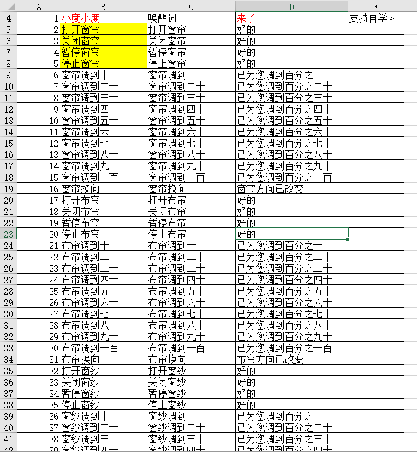

---

### 如何配置免唤醒词和防误识别功能？

**问题描述：**

在配置语音指令时，免唤醒词设置在生成后被取消，同时语音指令出现误识别（如"打开4号"误识别为"打开1号"）。

**解决方案：**

**1. 免唤醒词配置方法**

- **移动词条**：在词条列表中，将需要免唤醒的词条通过勾选移动到另一侧
- **生效机制**：移动后的词条即可实现免唤醒识别
- **设置位置**：在语音指令配置界面找到免唤醒词设置区域

**2. 防误识别配置**

- **功能位置**：在免唤醒词设置下方
- **设置方法**：添加防误识别词，避免相似指令的误触发
- **作用机制**：系统会根据防误识别词提高识别准确性

**注意事项：**

- 免唤醒词条移动后需重新生成固件才能生效
- 防误识别词应选择与干扰词相似但不影响正常识别的词汇
- 建议在真实环境中测试防误识别效果

---

### 英文语音词条长度有什么要求？

**问题描述：**

询问英文版语音词条是否有长度要求，以及推荐的长度范围。

**解决方案：**

**英文词条长度建议：**

- **推荐长度**：3-5个单词最为合适
- **最小长度**：避免使用单个单词
- **最大长度**：不超过8-9个单词

**长度选择原因：**

1. **避免过短（1-2个单词）**
    - 容易误识别
    - 唤醒词过于简单可能被日常对话触发
    - 识别准确率较低

2. **避免过长（8个单词以上）**
    - 可能识别困难
    - 增加识别时间
    - 影响实时性

3. **适中长度（3-5个单词）**
    - 识别准确率较高
    - 平衡识别速度和准确率
    - 使用体验最佳

**实际应用建议：**

- **命令词设计**
    - 使用清晰的常用词汇组合
    - 避免使用生僻词或专业术语
    - 保持发音清晰度

- **测试验证**
    - 根据实际测试效果调整长度
    - 考虑环境噪声影响
    - 在目标使用场景下验证

**注意事项：**

- 具体长度可根据实际效果微调
- 不同语言环境可能需要不同策略
- 建议在产品最终定稿前充分测试

## 命令词识别问题


---

### 如何判断语音指令是否为系统关键词？如何获取识别结果？

**问题描述：**

使用离线语音模块时，需要区分唤醒词和系统关键词，并获取相应的识别结果，以便进行不同的处理（如连接大模型对话）。

**解决方案：**

**1. 模块工作原理**

- 离线语音模块只能识别预先配置好的命令词
- 对于不在配置列表中的语音指令，模块判定为无效指令，不做处理
- 模块本质上是一个"函数"，语音指令是输入方式之一

**2. 获取识别结果的方式**

识别到有效指令后，模块可通过以下方式输出：

- **串口通信**：发送对应的数据到主控（如ESP32）
- **语音播报**：直接通过声音反馈结果
- **IO口电平变化**：控制外部设备（如LED、继电器）

**3. 配置示例**

根据平台配置：

- 唤醒词："小亮小亮"
- 系统命令："打开台灯"、"关闭台灯"、"台灯亮一点"等
- 每个命令对应特定的输出（如串口发送特定数据）

**4. 调试建议**

- **检查串口连接**：确认TX/RX交叉连接，波特率正确
- **添加语音播报**：让模块既发送串口数据又进行播报，便于调试
- **使用串口助手**：监控模块输出的实际数据

**注意事项：**

- 无法识别非预设的语音指令
- 串口无数据可能是接线错误或波特率不匹配
- 建议先测试简单指令，确保通信正常

---

## 唤醒词识别优化


---

### 离线语音模块能否将识别的完整文本通过串口输出？

**问题描述：**

希望将语音识别的完整文本通过串口发送给其他设备，实现非自定义词条的语音转文本功能，例如将识别结果上传至上位机进行处理。

**解决方案：**

离线语音模块无法实现自由语音转文本功能：

**1. 模块工作原理**

- 离线语音模块只能识别预先配置好的命令词
- 对于不在配置列表中的语音指令，模块判定为无效指令
- 模块基于固定词条匹配，无法实现连续语音识别

**2. 技术限制**

- 不支持语音转文本（ASR）功能
- 无法输出非预设命令词的识别结果
- 只能触发预定义的动作，不能传递原始语音内容

**3. 替代方案**

如需语音转文本功能，可考虑：

- 使用在线语音识别服务（如百度ASR、阿里云等）
- 采用支持录音功能的模块，录制后上传识别
- 使用带ASR功能的开发板（如ESP32配合语音服务）

**注意事项：**

- 离线模块的优势是响应速度快、保护隐私
- 如需自由对话功能，需要选择在线语音方案
- 可以将多个可能的说法配置为同一命令词

---

### 设备唤醒不灵敏、音量低且发热怎么办？

**问题描述：**

设备出现唤醒不灵敏、音量变低、微微发热等现象，即使将唤醒灵敏度调至最高，问题依然存在，表现为时而灵敏时而不灵敏。

**解决方案：**

**现象分析：**

- **唤醒不灵敏**：初次唤醒困难，需要大声或多次尝试
- **音量降低**：音响播放音量比初始状态小
- **发热现象**：设备轻微发热（正常现象）
- **灵敏度不稳定**：时好时坏，表现不一致

**排查与解决方法：**

1. **检查电源供电**
    - 确认电源适配器规格符合要求
    - 检查供电电压是否稳定
    - 尝试更换电源或USB端口
    - 避免使用延长线或质量不佳的电源线

2. **验证灵敏度配置**
    - 确认唤醒词已正确设置
    - 检查唤醒阈值设置（建议0.8）
    - 验证所有唤醒词都已启用
    - 重新录制唤醒词样本

3. **检查音频输出设置**
    - 确认音量输出配置正确
    - 检查是否有限音设置
    - 验证PWM或DAC配置
    - 测试不同的音频输出模式

4. **环境因素排查**
    - 检查环境噪声是否过大
    - 确认麦克风孔未被遮挡
    - 避免强风或直吹麦克风
    - 测试不同距离的唤醒效果

5. **硬件检查**
    - 检查喇叭连接是否良好
    - 验证麦克风焊接是否正常
    - 确认PCB无短路或虚焊
    - 检查外围电路是否符合规格

**注意事项：**

- 设备轻微发热属于正常工作现象
- 出厂固件默认灵敏度为中等，自定义固件可能不同
- 如果问题持续存在，可能是硬件故障，需要维修或更换
- 保留问题现象的视频记录，便于分析

---

### "醒一醒"唤醒词识别率低怎么办？

**问题描述：**

使用"醒一醒"作为唤醒词时，识别率较低，即使将灵敏度设置为"高"后效果仍不理想。

**解决方案：**

**问题原因分析：**

- "醒一醒"末尾词为轻声词，语音特征不明显
- 轻声发音音量小，声学特征弱
- 系统提示避免使用末尾轻声词的唤醒词

**优化方法：**

1. **使用优化配置功能**：

    - 进入平台"优化配置"界面
    - 选择"特定命令词阈值"选项
    - 为"醒一醒"设置专用阈值（如0.8）
    - 可单独降低该词的识别门槛

2. **调整识别策略**：

    - 降低该词的识别阈值，提高灵敏度
    - 接受可能增加的误唤醒风险
    - 在不怕误动作的前提下尽可能调高

3. **更换唤醒词建议**：

    - 优选末尾非轻声的词语
    - 选择发音更清晰、响亮的词组
    - 避免使用"一、七、八"等轻声字结尾

**替代方案：**

- 使用无唤醒词模式：保持常时唤醒状态
- 选择其他唤醒词：如"你好小智"、"小爱同学"等
- 双字唤醒词：避免三字词中包含轻声字

**注意事项：**

- "醒一醒"属于救急场景专用词，识别难度较大
- 调低阈值会增加误唤醒，需要权衡使用
- 建议测试多种唤醒词，选择效果最好的


---

### 语速过快导致识别率下降怎么办？

**问题描述：**

使用"醒一醒"唤醒词时，语速快时识别率明显下降，慢速说话时识别效果尚可，需要优化救急场景下的识别效果。

**解决方案：**

**识别原理说明：**

- 语音识别和语速密切相关
- 语速过快会影响发音清晰度
- 人耳都难以听清的语速，机器识别会更困难

**优化建议：**

1. **调整说话方式**：

    - 适当放慢语速，保证发音清晰
    - 每个字说到位，不要含混
    - 模仿正常对话的语速，不要过急促

2. **训练最佳语速**：

    - 测试不同语速下的识别率
    - 找到识别效果和响应速度的平衡点
    - 提前演练救急时的说话方式

3. **系统配置优化**：

    - 保持较高的识别灵敏度设置
    - 避免过度降噪影响信号采集
    - 确保麦克风位置合适

**限制说明：**

- 语速和识别率是此消彼长的关系
- 过快的语速超出正常语音处理范围
- 识别系统针对正常语速优化，非超快语速

**应用建议：**

- 救急时尽量保持冷静，控制语速
- 可增加手势配合语音指令
- 考虑使用物理按键作为备用触发方式

---

## 语音识别原理问题


---

### 多音字发音如何处理？

**问题描述：**

需要了解声纹识别系统如何处理多音字发音，当一个汉字有多个读音时，系统是否识别所有读音。

**解决方案：**

声纹识别系统基于声纹特征而非语义：

- **识别原理**：识别声音的声学特征，不关注具体读音
- **多音字处理**：只要发音相同，不同读音都会被识别
- **同音字现象**："贵子"和"柜子"发音相同，识别结果取决于上下文

**技术说明：**

- 声纹识别是线性回归模型
- 后续的语义识别才处理具体含义
- 单独发音时可能无法区分同音字

**解决方案建议：**

- 使用谐音或同音字替代
- 通过上下文命令明确操作意图
- 避免使用容易混淆的单字命令

---

### 语音播放时多音字发音错误怎么办？

**问题描述：**

语音播放包含多音字的内容时，发音不正确。例如播放"弱风量、中风量、强风量"时，"量"字发成第一声而不是第四声。

**解决方案：**

**1. 使用同音字替代**

- 最简单有效的方法是使用发音相同的字
- 将"弱风量"改为"弱风速"
- 将"中风量"改为"中等风速"
- 将"强风量"改为"最大风速"

**2. 替换方案示例**

| 原词组 | 推荐替换 | 发音说明 |
|---------|-----------|---------|
| 弱风量 | 弱风速 | 避免"量"字歧义 |
| 中风量 | 中等风速 | 使用"风速"更准确 |
| 强风量 | 最大风速 | "风速"发音统一 |

**3. 词语选择原则**

- 选择没有多音字歧义的词汇
- 优先使用常用、明确的表达方式
- 考虑用户使用习惯和场景

**4. 其他替代思路**

- 使用数字表达：1档、2档、3档
- 使用简单描述：小风、中风、大风
- 使用英文标识：Low、Medium、High

**注意事项：**

- 语音合成系统对多音字的识别基于上下文判断
- 技术限制下，同音字替换是最可靠的解决方案
- 替换后的词汇需保持原有的控制逻辑一致性

---

### 是否支持英语字母（航空发音）识别？

**问题描述：**

需要实现对26个英语字母的航空发音识别，考虑到字母有多种读音，是否需要提供每个字母的发音或音标。

**解决方案：**

**识别可行性分析：**

- 单独字母的误识别率较高
- 航空发音（非标准发音）增加了识别难度
- 系统主要针对中文命令词优化

**技术限制：**

- 语音识别系统基于特定发音模型训练
- 单字母发音短促，声学特征不明显
- 相似字母（如B/P、D/T）容易混淆

**音标输入支持：**

- 系统不支持直接输入音标进行识别
- 无法通过IPA音标或英语音标定制发音
- 识别模型基于语音特征，非文本音标

**替代方案：**

1. **使用字母组合单词**
    - Alpha代替A
    - Bravo代替B
    - Charlie代替C
    - 使用完整单词提高识别率

2. **采用标准英文发音**
    - 避免航空字母的特殊发音
    - 使用常规英文字母发音
    - 提供清晰的发音样本

3. **数字代码替代**
    - A→1, B→2, C→3
    - 或使用NATO字母编码
    - 简化识别复杂度

4. **特殊实现方案**
    - 分组训练：相似字母分组训练
    - 延长发音：适当拉长元音部分
    - 添加静音间隔：字母间增加停顿

**注意事项：**

- 系统不支持直接输入音标进行识别
- 建议先进行小规模测试验证可行性
- 如需强制实现，可能需要定制化开发
- 航空发音识别率通常低于标准发音
- 可考虑使用多模态识别（语音+按键）提高准确性

---

## 防误触发优化


---

### 如何使用毫米波传感器防止语音误触发？

**问题描述：**

需要通过毫米波距离传感器检测人员是否在附近，以防止语音识别模块的误触发。

**解决方案：**

将毫米波传感器接入语音模块，通过电平触发控制语音识别的启用和禁用。

**实现步骤：**

1. **硬件连接**
    - 将毫米波距离传感器连接到语音模块的GPIO口
    - 传感器输出信号作为控制语音识别的开关

2. **平台配置**
    - 配置电平触发功能
    - 设置高电平或低电平触发条件
    - 添加控制指令：允许或禁止语音识别

3. **工作逻辑**
    - 检测到人员靠近时，传感器输出特定电平
    - 模块接收到触发信号，启用语音识别功能
    - 人员离开时，传感器输出反向电平
    - 模块禁止语音识别，避免误触发

**注意事项：**

- 传感器可直接接入模块，无需经过主控
- 电平触发配置需根据传感器输出类型选择
- 此方法可有效避免无人时的环境噪声误触发
- 建议结合实际场景调整触发阈值

---

## 休眠与唤醒问题


---

### 语音模块是否可以设置永久唤醒状态？

**问题描述：**

希望语音模块在上电后不进入休眠模式，持续保持唤醒状态以响应指令。

**解决方案：**

**设置方法：**

- 通过配置事件触发功能实现永久唤醒
- 设置"上电触发"事件
- 配置动作为"不休眠"或执行相应的系统指令

**具体操作：**

1. **进入事件触发配置界面**
    - 在平台配置中找到事件触发选项
    - 添加新的事件触发规则

2. **设置触发条件**
    - 选择"上电触发"作为触发条件
    - 这样模块上电后会自动执行预设动作

3. **配置执行动作**
    - 设置动作为"不休眠"或类似功能
    - 部分模块可能需要通过GPIO控制来实现

**注意事项：**

- 永久唤醒会增加功耗，需要考虑供电能力
- 部分模块可能支持此功能，具体请参考对应型号文档
- 设置后模块将持续工作，无法进入低功耗休眠状态

## 麦克风选型与使用


---

### 如何正确选型和使用咪头？

**问题描述：**

需要了解如何正确选型和使用咪头，避免识别灵敏度低和识别失灵的问题，特别是在高噪声环境和长距离引线情况下。

**解决方案：**

**1. 咪头硬件选型**

- **推荐型号**：机芯智能定制咪头6027（电容麦）
- **规格参数**：直径6mm，高度2.7mm，电流0.5mA
- **灵敏度**：-27dB（推荐范围-32dB到-25dB）
- **信噪比**：75以上（推荐70以上）

**2. 引线设计要求**

- **线长限制**：尽量不要大于100mm（10cm）
- **延长处理**：必须加长时使用双绞线或屏蔽线
- **干扰防护**：线越长干扰越严重，超过100mm必须加屏蔽

**3. 接线注意事项**

- **极性正确**：模块是单端结构，咪头极性反接无法接收
- **并联问题**：咪头并联电流减小，影响拾音性能，不建议使用
- **供电稳定**：供电不足或不稳会导致识别灵敏度下降

**4. 结构设计考虑**

- **避免密闭**：不要把咪头放在完全密闭的空间
- **开孔设计**：结构需要开孔并参考设计资料
- **防水膜**：使用防水膜时要选择质量好的产品

**注意事项：**

- 国内咪头质量参差不齐，规格书可能与实物不符
- 选型要参考厂家实力和供货能力
- 最终以实际使用场景测试为准

---

## 自然说配置问题


---

### 自然说配置错误导致生成失败怎么办？

**问题描述：**

在使用SDK生成语音模型时，因自然说配置错误导致生成失败，具体表现为泛化词配置中存在重复词或超出长度限制的词汇。

**解决方案：**

**错误类型分析：**

1. **常见错误原因**：

    - **重复词**：泛化词列表中存在相同的词汇
    - **超长词**：单个词长度超过5个字符
    - **组合超长**：组合后泛化词总长度超过12个字符
    - **不常见词**：使用生僻词或特殊字符

2. **错误识别方法**：

    生成失败时，状态显示为"生成失败: 语言模型生成失败"：

    

**配置规则说明：**

自然说泛化词配置界面中的规则：


1. **基本规则**：

    - 主词为必填项
    - 单个词最大长度为5个字符
    - 组合后泛化词最小长度为2
    - 组合后泛化词最大长度为12

2. **特殊说明**：

    - 前缀最后不能加空格（系统自动处理分隔）
    - 支持前缀+主词的组合方式
    - 系统会自动组合所有可能的排列

**排查和解决方法：**

1. **逐步排查法**：

    **步骤1：分段检查**

    - 将100多条词分成10条一组
    - 逐组生成测试
    - 定位到具体出错的部分

    **步骤2：删除定位**

    - 删除前10条，尝试生成
    - 如果成功，继续删除下一组
    - 直到找到导致失败的部分

    **步骤3：精确查找**

    - 对出错的10条进行逐个检查
    - 删除第1条测试，成功则继续
    - 最终定位到具体的问题词汇

2. **批量检查清单**：

    **重复词检查**：

    - 使用Excel的删除重复项功能
    - 或编写简单脚本去重
    - 确保每个词只出现一次

    **长度检查**：

    - 检查每个词的字符数
    - 中文按1个字符计算
    - 删除或修改超长词

    **组合长度验证**：
    ```
    前缀长度 + 主词长度 ≤ 12
    例如：前缀"请"（1） + 主词"打开空调"（4） = 5 ≤ 12 ✓
            前缀"请帮我"（3） + 主词"打开空调"（4） = 7 ≤ 12 ✓
            前缀"请帮我马上"（5） + 主词"打开空调"（4） = 9 ≤ 12 ✓
    ```

3. **优化建议**：

    **词汇优化**：

    - 优先使用高频常用词
    - 避免使用生僻字词
    - 简化过长的表达方式

    **配置策略**：

    - 分场景配置，避免一次性过多
    - 使用版本管理，继承修改
    - 定期备份有效配置

**注意事项：**

- 自然说功能对词汇质量要求较高，建议仔细核对每个词
- 模型生成需要一定时间，请耐心等待，不要频繁操作
- 批量修改时建议使用表格导入功能（如支持）
- 修改后建议生成新版本进行测试，避免覆盖原有工作成果


---

### 如何选择自然说配置的版本？

**问题描述：**

在选择离线语音识别芯片的自然说配置版本时，因存在多个版本（如普通话通用Pro、系统自动泛化等），不清楚如何根据实际需求选择合适的版本。

**解决方案：**

**版本选择指南：**

1. **版本说明**：

    - **版本号规则**：版本号越大代表版本越新
    - **普通话版本**：提供多个版本选择，适应不同应用场景
    - **系统自动泛化**：支持系统自动扩展理解范围
    - **用户指定泛化**：支持用户自定义泛化规则

2. **应用场景选择**：

    **降噪需求优先**：

    - 选择标注了降噪优化的版本
    - 适合噪声较大的环境
    - 可能牺牲部分识别灵敏度

    **常用词优化**：

    - 根据产品类型选择对应版本
    - 如"灯具开灯识别好"版本适合灯具
    - "风扇开机识别好"版本适合风扇

3. **泛化方式选择**：

    **系统自动泛化**：

    - 优点：无需配置，自动理解相近表达
    - 缺点：可能增加误识别率
    - 适用：追求便捷性的应用

    **用户指定泛化**：

    - 优点：精确控制，误识别率低
    - 缺点：需要配置工作量大
    - 适用：要求高精度的应用

4. **功能对比**：

    

    **配置选项说明**：

    - **麦克风配置**：根据硬件选择单MIC或双MIC
    - **产品特性**：如"语音识别+AEC打断"
    - **自然说配置**：选择泛化方式和版本

5. **选择建议**：

    **首次使用**：

    - 选择最新版本测试效果
    - 如果效果满意，直接使用
    - 如有问题，尝试其他版本

    **批量生产**：

    - 充分测试各版本效果
    - 固定使用效果最好的版本
    - 记录版本号便于复现

    **特殊需求**：

    - 有特定降噪需求→选择降噪优化版本
    - 需要高识别率→选择识别优化版本
    - 追求平衡→选择通用Pro版本

**参考资源：**

- 官方视频教程：[离线自然说用户自定义和系统自动泛化区别](https://www.bilibili.com/video/BV1VdynYwEFY/)
- 技术团队：提供具体应用场景，获取针对性推荐

**注意事项：**

- 不同版本对硬件要求可能不同
- 版本切换需要重新生成和烧录固件
- 建议在量产前充分测试各版本效果
- 保留配置文件备份，便于版本回退

## 免唤醒功能


---


### 免唤醒词在退出状态下仍能识别怎么办？

**问题描述：**

设备配置了免唤醒词功能后，在退出状态下仍然能响应免唤醒命令词，希望禁用此行为。

**原因分析：**

这是免唤醒词的正常工作特性：
- 免唤醒词设计为可以在设备未唤醒（包括退出状态）的情况下直接触发
- 免唤醒词不受唤醒超时退出的影响
- 这是为了实现快速响应而设计的功能

**解决方案：**

如果不希望命令词在退出状态下响应，有以下两种处理方式：

**方案一：将免唤醒词移到需要唤醒的命令词配置**

1. 在智能公元平台的"免唤醒的命令词"设置区域
2. 将不需要免唤醒的命令词从"已选项"移回"可选项"
3. 这些命令词将恢复为需要先唤醒才能识别

**方案二：使用防误识别词**

如果只想防止特定词语的误触发：

1. 在"防误识别词"设置区域添加容易误触发的词
2. 多个词条用"|"分隔
3. 例如：`请打开|打开冰|关闭冰`

**配置建议：**

- 只将真正需要快速响应的命令设为免唤醒
- 其他命令保持需要唤醒的配置
- 通过防误识别词可以进一步减少误触发

---
### 唤醒灵敏度和识别灵敏度设置位置错误怎么办？


**问题描述：**

在配置平台中发现，唤醒灵敏度和识别灵敏度的设置选项被错误地放置在同一配置区域，且区域的标签与实际功能不符，导致无法正确配置免唤醒命令。

**解决方案：**

这是平台的UI设计问题，需要了解各项设置的正确位置和功能。

**1. 唤醒灵敏度设置**

- **正确位置**：应在"唤醒词自定义"界面中
- **功能说明**：控制唤醒词的识别难度
- **阈值范围**：通常为0.05-0.4，数值越大越灵敏
- **设置效果**：影响是否容易被误唤醒

**2. 识别灵敏度设置**

- **正确位置**：应在"命令词配置"界面中
- **功能说明**：控制命令词的识别难度
- **阈值范围**：通常为0.02-0.08，数值越小越不敏感
- **设置效果**：影响命令词的识别准确率

**3. UI标签识别**

- "唤醒回复"：实际可能是唤醒灵敏度设置
- "免唤醒的命令词"：实际可能包含识别灵敏度设置
- 需要根据实际功能而非标签来操作

**临时解决方案：**

- 逐个测试各设置项的功能
- 记录不同设置的实际效果
- 如不确定，可联系技术团队确认正确设置方法

**注意事项：**

- 平台后续版本可能会修复此UI问题
- 建议保存配置前的截图以便恢复
- 配置完成后进行充分测试验证效果

----


---

### 重置学习和清除学习有什么区别？

**问题描述：**

在使用CI系列离线语音识别芯片的自学习功能时，需要理解重置学习和清除学习两个操作的区别，以便正确使用。

**解决方案：**

**1. 功能区别说明**

- **重置学习**：重置当前正在进行的学习进程
    - 仅取消当前正在录入的学习操作
    - 不影响之前已经学习并保存的数据
    - 适用于学习过程中需要重新开始的情况

- **清除学习**：清除所有学习数据
    - 包括当前学习进程和之前所有已保存的学习数据
    - 完全恢复到未学习的初始状态
    - 适用于需要重新学习所有命令的情况

**2. 使用场景建议**

- **开启覆盖学习内容时**：

    - 重置学习和清除学习效果基本相同
    - 但仍建议使用清除学习以确保完全清除

- **日常使用中**：

    - 学习过程中出错 → 使用重置学习
    - 需要重新学习所有命令 → 使用清除学习

**注意事项：**

- 清除学习会删除所有已学习的数据，操作需谨慎
- 建议在清除前确认是否需要保留已学习的命令
- 覆盖学习模式下，新学习的命令会替换原有的命令

---

### 自学习功能能否实现免唤醒命令？

**问题描述：**

希望通过自学习功能动态添加指令，实现不需要唤醒词直接执行命令，但发现自学习的指令仍需要唤醒才能触发，而免唤醒指令修改需要频繁烧录固件。

**解决方案：**

**1. 功能限制说明**

- **自学习功能特性**：

    - 自学习的命令词默认需要先唤醒才能识别
    - 无法直接实现真正的免唤醒功能
    - 开启自学习会提高误识别率（需要平衡使用）

- **免唤醒指令配置**：

    - 需要在平台配置界面的"免唤醒命令框"中设置
    - 每次修改都需要重新生成和烧录固件
    - 配置后支持直接说出命令词执行动作

**2. 使用建议**

- **对于固定命令**：

    - 使用平台配置免唤醒指令
    - 虽然需要烧录，但稳定可靠
    - 适合不常变更的固定命令

- **对于动态需求**：

    - 接受需要唤醒的限制
    - 或考虑其他实现方案
    - 平衡便利性和识别准确率

**注意事项：**

- 自学习功能和免唤醒是两个独立的功能
- 自学习主要提高灵活性，免唤醒提供便利性
- 开启自学习会增加误触发风险，需权衡使用
- 如需频繁修改命令，建议使用自学习并接受唤醒机制

---

## 灵敏度调节


---

### 麦克风增益设置值（0~63）与灵敏度的关系是什么？

**问题描述：**

需要了解麦克风增益设置值（0~63）与灵敏度的关系，以及增益值越大是麦克风越敏感还是越不敏感。

**解决方案：**

**增益值与灵敏度关系：**

- **增益范围**：0~63
- **数值含义**：增益值越大，麦克风越敏感
- **灵敏度单位**：dB（分贝），范围0~-65dB

**设置说明：**

- **远默认（值0）**：适合远距离使用，灵敏度较低
- **近默认（值16）**：适合近距离使用，灵敏度较高
- **灵敏度规律**：数值越接近0dB，灵敏度越高

**实际应用建议：**

- 根据使用距离选择合适的增益值
- 安静环境可适当提高增益
- 噪音较大环境应降低增益避免误触发

---

## 唤醒与识别


---

### 长句识别导致自动退出怎么办？

**问题描述：**

在使用语音识别时，说出长句后设备不仅无法识别，还会自动退出识别状态，导致后续语音指令无法响应，必须重新唤醒才能恢复功能。

**解决方案：**

**1. 识别长度限制**

- 语音模块对识别长度有限制
- 推荐使用4-5个字的短句
- 长句识别率低且容易导致退出

**2. 最佳实践建议**

- 命令词设计为2-5个字
- 避免使用长句子作为控制指令
- 将长句内容改为开机播报

**3. 退出机制说明**

- 未识别到内容时会忽略输入
- 到达退出时间会自动退出识别状态
- 这是正常的保护机制

**注意事项：**

- 短句识别效果最好
- 长句建议拆分为多个短命令
- 如需播报长内容，使用开机播报功能

---

## 音质与播报


---

### 什么是组合播报？如何配置？

**问题描述：**

需要了解组合播报的具体操作方法。

**解决方案：**

组合播报是将多个播报内容分段处理，提高播报效率：

1. **播报内容分段**：

    - 将长内容拆分成多个短句
    - 每段控制在合理长度内
    - 避免单次播报内容过长

2. **配置方法**：

    - 在平台配置中选择"组合播报"模式
    - 设置分段规则和间隔时间
    - 配置播报优先级

3. **优化建议**：

    - 删除不必要的播报内容
    - 合并相似的提示音
    - 调整播报顺序

**注意事项：**

- 组合播报可减少播报时间
- 需要根据实际需求测试效果
- 过多分段可能影响用户体验

---

### 执行语音指令时音量变小是什么原因？

**问题描述：**

在使用过程中，发现听到语音指令后执行时音量变小，影响正常使用体验。

---

### 高噪声环境下如何使用双芯片方案降低误唤醒率？

**问题描述：**

在棋牌室等高噪声环境中，单芯片方案的语音识别误唤醒率较高，需要采用双芯片方案提升识别准确性和稳定性。

**解决方案：**

**1. 双芯片方案选型**

- **主芯片**：CI1302（支持自然说和AEC降噪）
- **从芯片**：US516P6（蜂鸟M芯片）
- 两芯片独立工作，通过主控进行结果确认

**2. 工作原理**

- 采用一主一从架构，主芯片检测到命令词后延时等待从芯片信息
- 从芯片收到相同命令词后发送确认信息给主芯片
- 只有两边都确认收到相同命令才会作出响应
- 主控接收两个芯片的输出，进行双重确认

**3. 硬件设计要点**

- CI1302支持AEC（声学回声消除）功能，US516P6不支持
- 两芯片需要独立的天线和麦克风布局
- 建议间距适当以避免相互干扰
- 主控需要有足够的串口资源连接两个芯片

**注意事项：**

- 双芯片方案成本较高，适合对误唤醒要求严格的应用场景
- 在嘈杂环境中，识别距离不宜要求过高（建议1-2米）
- 可通过调整识别灵敏度进一步优化效果
- 两芯片的命令词配置需要保持一致

---

### 数字命令词容易误识别怎么办？

**问题描述：**

在设定温度等数字命令时，出现误识别现象。例如设定36度时，可能被识别为30度或16度。

**解决方案：**

**1. 优化命令词设计**

- 避免使用发音相似的数字组合
- 将易混淆的数字分开设置，如16度和30度不同时使用
- 使用更有区分度的表达方式，如"十六度"改为"一十六度"

**2. 调整识别阈值**

- 降低易误识别命令词的灵敏度阈值
- 在平台中选择"特定命令词阈值"进行单独设置
- 阈值范围建议设置在0.02-0.05之间

**3. 应用场景配置**

- 根据实际使用环境选择合适的场景模式
- 在安静环境下使用"安静"场景配置
- 启用稳态降噪功能减少环境干扰

**注意事项：**

- 阈值越大越敏感，但误识别率也会增高
- 未设置阈值时自动取默认值
- 建议通过实际测试调整到最佳效果
- 可以考虑增加确认机制，如识别后要求用户确认

---

## 灵敏度调节


---

### 如何在智能公元平台调低命令词阈值？

**问题描述：**

需要在智能公元平台中调低命令词阈值以提高识别灵敏度，但不清楚具体的操作界面位置。

**解决方案：**

**1. 平台设置步骤**

- 登录智能公元平台，进入产品的"个性化音频"配置页面
- 找到"命令识别"设置区域
- 在"命令识别阈值"选项中，使用滑块调整阈值
- 阈值范围：0.01-0.2，默认值通常为0.2
- 向左拖动滑块降低阈值（提高灵敏度）

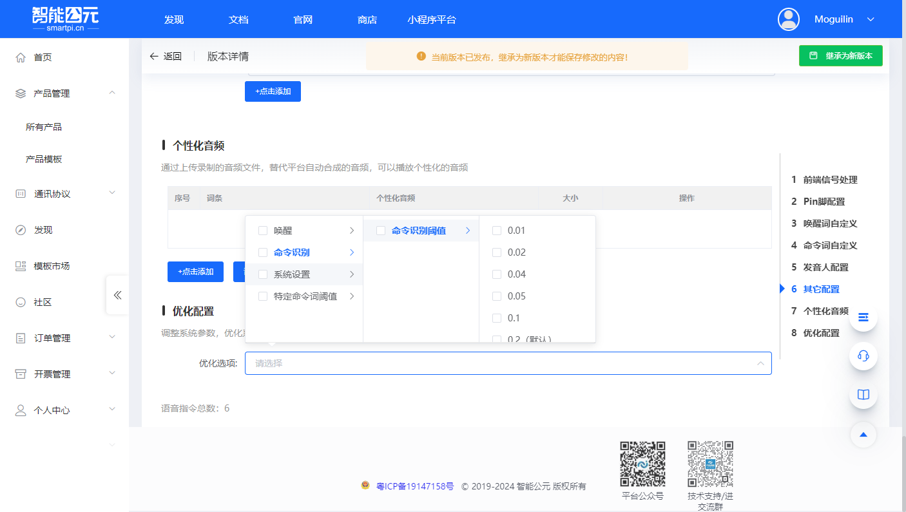

**2. 阈值说明**

- 默认阈值0.2：提供中等灵敏度，适合一般环境
- 调低至0.05-0.1：提高识别率，适合相对安静环境
- 极低阈值0.01-0.02：最高灵敏度，但可能增加误触发

**3. 注意事项**

- 小程序端不支持修改语音指令，需在PC平台操作
- 阈值调整后需要重新下载固件才能生效
- 建议在实际使用环境中测试调整效果


---

### 如何平衡灵敏度和误识别？

**问题描述：**

需要根据实际应用场景优化语音识别系统，在提高灵敏度的同时控制误识别率。

**解决方案：**

**1. 理解灵敏度与误识别的关系**

- 提高灵敏度（降低阈值）：增加识别率，但误识别风险上升
- 降低灵敏度（提高阈值）：减少误识别，但可能漏识别
- 需要根据具体应用场景找到最佳平衡点

**2. 针对性优化策略**

- 安静环境：可适当降低阈值（0.05-0.1），提高识别灵敏度
- 嘈杂环境：建议使用中等阈值（0.15-0.2），避免误触发
- 关键命令词：使用较高阈值，避免误操作
- 常用命令词：使用较低阈值，确保及时响应

**3. 分级阈值设置**

- 使用特定命令词阈值功能
- 不同重要程度的命令词设置不同阈值
- 关键操作类命令词可配合二次确认

**注意事项：**

- 没有放之四海而皆准的最佳阈值
- 必须在实际使用环境中反复测试调整
- 建议记录不同阈值下的测试数据
- 考虑使用确认机制应对关键命令的误识别

---

### 默认唤醒词是什么？

**问题描述：**

需要确认模块的默认唤醒词设置。

**解决方案：**

- 默认唤醒词为："你好魔方"
- 如果没有修改过唤醒词配置，系统会使用此默认唤醒词
- 可通过平台重新配置自定义唤醒词

**注意事项：**

- 唤醒词修改后需要重新烧录固件
- 建议选择易于识别且不易误触发的唤醒词
- 修改唤醒词可能影响识别率，需要充分测试

---

### 如何实现语音识别功能的动态禁用与启用？

**问题描述：**

需要在特定场景下临时禁止语音识别功能，避免误识别，并在需要时重新启用。同时希望断电后能够保持禁止状态的持久化控制。

**解决方案：**

**1. 基础控制方案**

- **设置控制命令**：添加语音指令或串口命令来控制识别状态
- **配置识别控制**：在平台中设置"允许语音识别"或"关闭语音识别"操作
- **使用串口/按键**：通过外部信号控制识别功能的开启和关闭

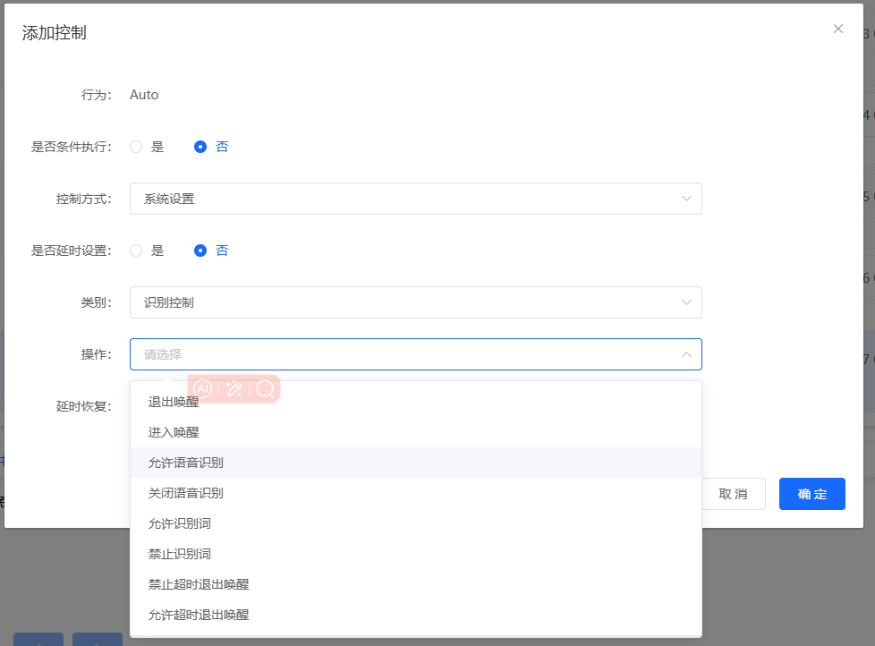

**2. 持久化控制方案**

为实现断电后保持禁止状态，需要使用变量控制：

- **定义状态变量**：创建字符型变量（如 temp_flag）用于判断是否进行语音识别
- **启用变量恢复**：在变量定义中开启"上电恢复断电前状态"功能
- **添加判断逻辑**：通过变量值控制语音识别的开启或关闭


**3. 实现步骤**

1. **配置识别控制命令**
    - 在命令词中添加"禁止识别"和"允许识别"指令
    - 设置对应的控制行为为"关闭语音识别"和"允许语音识别"

2. **创建状态变量**
    - 进入变量定义页面
    - 添加字符型变量 temp_flag
    - 勾选"上电恢复断电前状态"选项

3. **配置变量控制**
    - 为识别控制命令添加变量设置动作
    - "禁止识别"时设置 temp_flag = 0
    - "允许识别"时设置 temp_flag = 1

4. **添加条件判断**
    - 在识别功能前检查 temp_flag 值
    - 只有当 temp_flag = 1 时才进行语音识别

**注意事项：**

- 关闭语音识别时，唤醒词也不会被识别
- 默认情况下，重新上电后语音识别会自动开启
- 使用变量控制可实现状态的持久化保存
- 变量恢复功能需要在平台中手动开启设置

---

## 语音控制功能


---

### 如何配置语音控制音量功能？

**问题描述：**

需要配置语音控制音量功能，使设备能够响应"音量大点"和"音量小点"的语音指令。

**解决方案：**

通过语音平台配置控制指令，实现音量调节功能：

1. **添加语音指令**
    - 在命令词配置中添加"声音大点"和"声音小点"指令

2. **配置控制动作**
    - 选择对应的控制方式（系统设置）
    - 设置类别为"播放控制"
    - 选择操作类型：

        - "声音大点" → "增加音量"
        - "声音小点" → "减小音量"

3. **参数设置**
    - 设置行为标识（如A1）
    - 配置相应的控制参数
    - 保存并生成固件


**注意事项：**

- 语音指令需要根据实际应用场景调整
- 确保设备系统支持音量控制功能
- 建议测试不同音量调节效果，选择合适的步进值

---

### 个性化音频音量控制有何限制？

**问题描述：**

使用个性化音频功能时，发现输出声音过大导致失真，且无法通过系统音量调节功能控制个性化音频的音量。上电后音量恢复到最大值，无法断电保存。

**解决方案：**

1. **音频文件预处理**
    - 在上传个性化音频文件前，使用音频处理软件降低原始音量
    - 确保音频文件本身音量适中，避免播放时失真

2. **系统音量控制说明**
    - 系统音量调节功能无法控制个性化音频的播放音量
    - 系统不能自动识别当前音量值，需要通过自定义变量模拟

3. **音量变量模拟**
    - 创建自定义变量来记录当前音量状态
    - 通过语音指令对变量进行加减操作，模拟音量调节


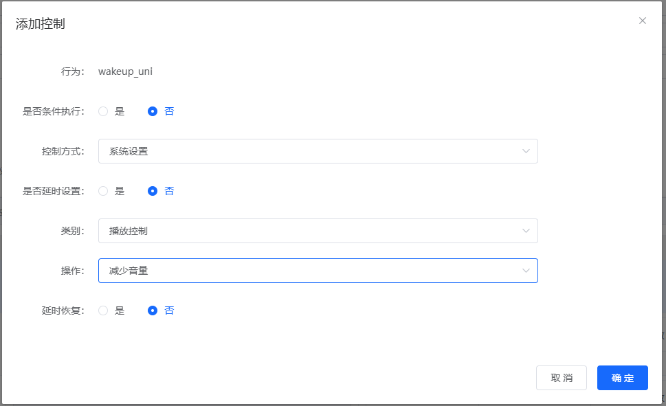


**注意事项：**

- 个性化音频的音量设置不会断电保存，每次上电后会恢复到默认值
- 如需降低个性化音频音量，必须从音频文件源头进行处理
- 系统音量调节仅对TTS语音回复生效，对个性化音频无效

---

## 唤醒词配置


---

### 如何实现带附加条件的免唤醒功能？

**问题描述：**

希望实现免唤醒功能，让某些指令直接触发，不需要先说唤醒词。

**解决方案：**

**1. 配置思路**

- 先配置一个唤醒词（必须存在，不能为空）
- 创建需要免唤醒的命令词（如"你好小智"）
- 给该命令词添加附加条件和回复语
- 在控制详情中设置识别后"进入唤醒"

**2. 具体步骤**

- 写入任意唤醒词（如"我自横刀向天笑"）
- 创建命令词"你好小智"
- 设置命令词的附加条件和触发动作
- 将"你好小智"添加到免唤醒列表

**3. 工作原理**

- 模块机制是先唤醒词后命令词
- 通过免唤醒设置，命令词可直接触发
- 附加条件确保触发准确性

**注意事项：**

- 需要实际制作固件测试效果
- 免唤醒词需要清晰发音避免误触发
- 附加条件可提高识别准确性

---

## 声源定位相关问题


---

### 语音模块收音距离过短怎么办？

**问题描述：**

语音模块识别距离过短，仅在离车两米内才能被识别，怀疑是线路过长导致电压损失。

**解决方案：**

- **排查供电问题**：

    - 检查麦克风线路电压是否稳定
    - 过长的线路可能导致电压损失，影响收音效果
    - 使用更粗的线材或缩短线路长度

- **软件优化**：

    - 提高难以识别词条的识别灵敏度
    - 在配置工具中逐个调整词条阈值

- **硬件改进**：

    - 目前没有专用的咪头前级放大器
    - 可考虑添加低噪声麦克风前置放大器（需注意3.3V电压匹配）
    - 优化麦克风安装位置，避免遮挡

**注意事项：**

- 线路过长确实会影响收音效果，建议控制在合理范围内
- 外部放大器需要良好接地，避免引入噪声
- 调整灵敏度时要平衡误触发和识别率


---

### 咪头线长度对语音识别有影响吗？

**问题描述：**

咪头线过长是否会影响语音识别效果，以及应该如何处理。

**解决方案：**

- **线长限制**：

    - 咪头线长度超过100mm（10cm）会影响识别效果
    - 线越长，引入的干扰越严重
    - 信号衰减和噪声干扰会降低识别率

- **布线建议**：

    - 尽量缩短咪头到主板的连接线
    - 如必须加长，使用双绞线减少干扰
    - 优先选择屏蔽线保护信号

- **技术原理**：

    - 模拟信号在长线传输中易受电磁干扰
    - 线缆寄生电容会影响高频响应
    - 接触电阻增加会降低信噪比

**注意事项：**

- 理想线长应控制在100mm以内
- 避免与电源线、高频信号线平行布线
- 定期检查连接器是否接触良好
- 在高噪声环境下更要注意线长影响

---

### 什么是"安静环境"的定义？

**问题描述：**

需要了解语音模块工作时的"安静环境"具体指什么，是否需要完全没有声音。

**解决方案：**

安静环境并非指完全没有声音，而是指相对稳定、无突发噪声的环境：

- **允许的环境声音**：

    - 稳定的背景噪声（如空调声、风扇声）
    - 连续的、规律性的环境音
    - 不影响语音指令识别的轻微噪音

- **需要避免的干扰**：

    - 突发性的噪声（如关门声、电话铃声）
    - 与唤醒词或命令词相似的声音
    - 过大的环境噪声掩盖语音信号

**注意事项：**

- 语音模块具有一定的抗噪声能力
- 连续的稳定噪声比突发噪声更容易处理
- 实际应用中，完全无声的环境并不必要

---

### 部分语音指令无法识别怎么办？

**问题描述：**

配置了多个语音指令，但只有部分指令（如"开灯"）能被识别，其他指令无效，且设备出现"加载中，请稍候..."的卡顿现象。

**解决方案：**

**1. 指令配置检查**

- 确认指令词条配置是否完整
- 检查多个同义词是否用"|"正确分隔
- 验证每个指令对应的触发动作

**2. 关键词匹配问题**

- 单独说"开灯"可能无效
- 需要完整说出配置的词条
- 确认发音清晰度

**3. 加载卡顿处理**

- 检查固件配置文件完整性
- 确认指令数量是否超出模块限制
- 重新生成并下载固件

**4. 调试步骤**

- 简化配置，先测试单个指令
- 逐个添加指令定位问题
- 检查设备内存是否充足

**注意事项：**

- 指令识别失败可能是配置问题
- 加载卡顿说明可能存在配置冲突
- 建议逐个测试指令定位具体问题


---

### 语音识别错误时可以添加提示回复吗？

**问题描述：**

在唤醒时间内，如果用户输入的命令词识别错误，是否可以添加语音回复提示，例如"我没有听懂，请再说一遍"？

**解决方案：**

- 目前不支持未识别时的语音回复功能
- 只有识别到命令词才会执行相应动作
- 添加错误回复可能导致误触发（如与旁人对话时触发）

**注意事项：**

- 不建议添加未识别回复功能，可能造成产品缺陷
- 唤醒状态下与任何人说话都可能触发回复
- 建议保持现有的设计逻辑

---

### 语音识别灵敏度调至最大后仍需近距离识别怎么办？

**问题描述：**

将语音识别模块的灵敏度配置调至最大后，仍需要较长时间或近距离才能识别语音命令，怀疑麦克风存在问题。

**解决方案：**

**1. 检查配置设置**

确认平台中的所有灵敏度相关设置：

- **识别阈值**：确保设置为较低值（如0.8）
- **远场识别距离**：设置为1-5米
- **词条灵敏度**：逐个检查每个词条的设置

**2. 环境因素排查**

**环境噪声**：

- 在安静环境下测试
- 避免空调、风扇等噪声源
- 远离电磁干扰设备

**使用方式**：

- 正对麦克风说话
- 保持正常音量，不要过大或过小
- 语速适中，发音清晰

**3. 硬件检查**

**麦克风连接**：

- 检查咪头线是否松动
- 确认连接极性正确
- 线长建议不超过10cm

**模块测试**：

- 使用已知良好的固件测试
- 对比不同模块的表现
- 检查是否为硬件问题

**4. 固件问题排查**

如果怀疑是固件问题：

- 发送固件给技术团队测试
- 说明具体的测试环境和现象
- 提供灵敏度配置截图

**注意事项：**

- 灵敏度不是唯一影响因素，环境同样重要
- 某些环境下可能需要牺牲部分性能
- 建议保留测试记录便于定位问题
- 硬件故障需要联系售后处理

---

### 自然说模式下部分指令无法识别怎么办？

**问题描述：**

使用自然说功能时，部分指令如"关闭灯光"和"关一下窗帘"无法被识别，尽管指令列表中已包含相关命令。

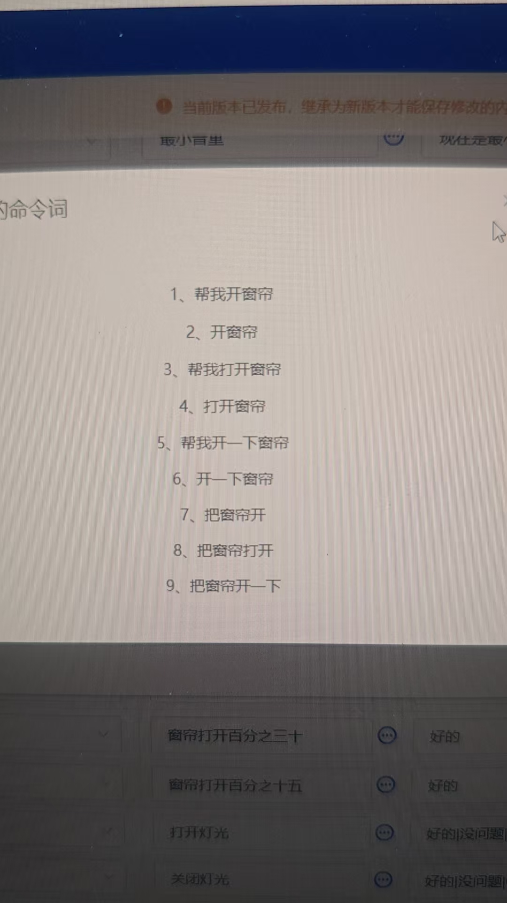

*指令列表中包含相关命令但识别失败*

**解决方案：**

**1. 自然说特性理解**

- 自然说对指令的理解可能与字面意思不同
- 系统会尝试语义理解而非简单匹配
- 部分表达方式可能不在自然说的理解范围内

**2. 指令优化建议**

**修改指令表达方式**：

- 将"关闭灯光"改为"关灯"
- 将"关一下窗帘"改为"关窗帘"或"关闭窗帘"
- 避免使用"一下"、"了"等语气词
- 使用更直接的动词表达

**3. 配置调整方法**

**添加同义词支持**：

- 在同一指令中添加多种表达方式
- 使用"|"分隔符：`关灯|关闭灯光|关掉灯`
- 测试哪种表达方式识别率最高

**4. 测试验证步骤**

- 逐个测试指令的识别效果
- 记录哪些表达方式能被识别
- 找出自然说的偏好表达模式

**5. 替代方案**

**使用固定指令模式**：

- 如果自然说效果不理想
- 可考虑使用固定指令模式
- 精确匹配预设的指令词条

**注意事项：**

- 自然说的理解能力有限，不是所有表达方式都能识别
- 系统会持续学习更新，但需要时间
- 建议使用简洁明确的表达方式
- 如多次尝试仍无法解决，可联系技术团队获取帮助

---

### 部分语音回复语播放中断怎么办？

**问题描述：**

部分语音回复语在触发后只响了一声就停止，无法正常播报完整内容，而其他回复语则正常。

**解决方案：**

- **检查回复语内容**：

    - 确认中断的回复语是否包含特殊字符或格式
    - 对比正常播报和异常播报的回复语差异

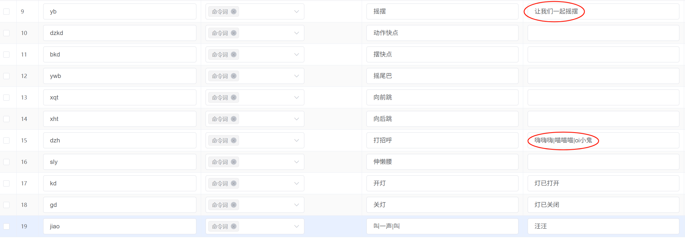

- **确认触发条件**：

    - 检查串口输入的消息长度是否足够
    - 数据长度不足可能导致触发异常
    - 确保参数配置正确

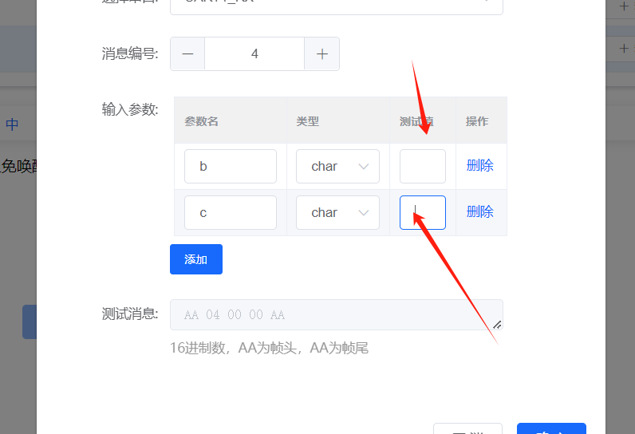

- **排查方法**：

    1. 测试其他回复语是否正常播报
    2. 重新编辑有问题的回复语
    3. 检查消息格式的完整性

**注意事项：**

- 数据长度必须足够才能正确触发
- 输入参数的测试值可以为空
- 串口消息格式需要严格遵循AA开头、AA结尾的规则
- 如果问题持续，建议重新创建该回复语

---

### 自定义音频文件播放断断续续怎么办？

**问题描述：**

播放自定义音频文件时出现断断续续、有时只播放前半段的问题，但播放音乐文件时却正常。

**解决方案：**

- **排查供电问题**：

    - 检查系统供电是否稳定
    - 供电不稳定是导致音频播放异常的主要原因
    - 确保电源电压稳定在规定范围内

- **检查文件格式**：

    - 虽然文件不大（如8KB），但仍需确认格式是否兼容
    - 建议使用标准音频格式（WAV、MP3等）

---

### 如何调低麦克风识别距离到5cm左右？

**问题描述：**

需要将麦克风识别距离调低到5cm左右，询问是否可以通过物理方案（如加隔音棉）来实现近距离识别。

**解决方案：**

**软件调整方案：**

1. **降低识别灵敏度**：

    - 在平台配置中调低识别阈值
    - 逐个调整需要近距离的词条
    - 提高触发难度，减少远距离误识别

2. **词条优化**：

    - 使用发音清晰的词条
    - 避免过于相似的词条
    - 简化词条结构

**物理方案：**

1. **麦克风遮挡**：

    - 在麦克风周围添加隔音棉
    - 使用海绵材料包裹麦克风
    - 留出正面收音孔

2. **结构设计**：

    - 将麦克风安装在凹陷位置
    - 使用遮光罩减少远距离拾音
    - 设计定向收音结构

**实现效果：**

- **近距离**：5cm内正常识别
- **远距离**：10cm以上基本不响应
- **抗干扰**：减少环境噪声影响
- **稳定性**：避免远距离误触发

**注意事项：**

- 隔音材料不要完全密封麦克风
- 保持正面收音通道畅通
- 调整后需要在实际环境中测试
- 平衡识别距离和识别率

**应用场景：**

- 近距离交互设备
- 需要贴近使用的控制场景
- 避免远距离误触发的应用
- 个人专用设备控制

---

- **硬件连接检查**：

    - 检查喇叭连接是否牢固
    - 确认音频输出线路没有接触不良

- **对比测试**：

    - 如音乐播放正常，说明硬件本身无问题
    - 重点检查特定音频文件的编码或格式

**注意事项：**

- 供电问题比文件大小更容易导致播放异常
- 即使小文件也可能因供电不稳定播放不完整
- 建议使用示波器或万用表检查供电稳定性

---

### ESP32播放时语音识别困难怎么办？

**问题描述：**

在ESP32环境下，离线语音模块在播放其他内容时难以识别内置的语音指令，即使麦克风和喇叭距离很近也无法正常识别。

**解决方案：**

**1. 问题分析**

- **声音干扰**：ESP32播放的声音被模块麦克风拾取
- **信噪比降低**：播放声音50，需要60-70的音量才能触发
- **硬件限制**：模具已固定，无法调整麦克风和喇叭距离

**2. 固件配置优化**

- **启用AEC打断功能**（推荐）：

    - 选择"语音识别+AEC打断(限单MIC)"固件模式
    - AEC功能可消除播放声音对识别的干扰
    - 支持在播报过程中识别新的语音指令
    - 仅支持单麦克风配置

- **启用降噪功能**：

    - 语音识别+深度降噪
    - 语音识别+降人声干扰（限双MIC）
    - 语音识别+降混响（限双MIC）

- **注意事项**：

    - "仅语音识别"固件模式不支持AEC功能
    - 使用"仅语音识别"模式时，播报期间无法识别指令
    - 如需在播报时识别，必须选择带AEC打断的固件模式

- **调整应用场景**：

    - 根据实际环境选择合适场景
    - 测试不同场景的识别效果
    - 选择最优配置组合

**3. 临时解决方案**

- **提高触发音量**：

    - 说话时提高音量
    - 靠近麦克风说话
    - 确保声音强度超过播放音量

- **分时控制**：

    - 播放时暂停语音识别
    - 通过IO口控制识别启停
    - 错开播放和识别时段

- **使用提示音**：

    - 播放前先发出提示音
    - 提示用户暂停其他声音
    - 创造短暂的安静识别环境

**4. 硬件改进建议**

- **物理隔震**：

    - 在麦克风和喇叭间添加隔震材料
    - 使用软质材料包裹麦克风
    - 减少固体传声干扰

- **定向设计**：

    - 调整麦克风朝向
    - 背向喇叭安装
    - 利用指向性减少干扰

**注意事项：**

- 单MIC模块抗干扰能力有限
- 播放音量和识别距离需要平衡
- 分时控制是最有效的解决方案
- 硬件改进需要重新设计模具成本较高

---

### 单麦克风语音识别率低怎么办？

**问题描述：**

使用单麦克风语音识别产品时，遇到语音识别率低的问题，主要原因是喇叭播放声音与麦克风拾音相互干扰，导致语音指令无法被正确识别。

**解决方案：**

**1. 硬件布局问题**

- **距离过近**：麦克风与喇叭距离太近是主要原因
- **无隔震设计**：声音通过结构件直接传递
- **腔体共鸣**：封闭空间内产生回声和混响

**2. 固件配置优化**

- **启用降噪功能**：

    - 选择"语音识别+深度降噪"
    - 根据环境选择合适场景
    - 测试不同降噪效果

- **调整识别参数**：

    - 提高识别阈值
    - 降低麦克风增益
    - 优化唤醒词设置

**3. 应用层解决方案**

- **分时控制策略**：

    - 播放时禁用语音识别
    - 通过IO口控制识别启停
    - 错开播放和识别时段

- **提高触发条件**：

    - 要求更清晰的发音
    - 说话时更靠近麦克风
    - 避免背景噪音干扰

**4. 系统级优化**

- **使用多MIC方案**：

    - 升级到双麦克风版本
    - 利用阵列降噪技术
    - 获得更好的方向性和降噪效果

- **重新设计结构**：

    - 增加物理隔震
    - 优化声学腔体设计
    - 合理布置麦克风和喇叭位置

**注意事项：**

- 单MIC方案在嘈杂环境下识别率会下降
- 播放音量和识别距离需要找到平衡点
- 硬件改动需要考虑成本和量产难度
- 软件优化可以快速改善，建议优先尝试

---

### 语音播报音量不稳定怎么办？

**问题描述：**

语音播报时音量不稳定，有时很大有时很小，板子晃动时音量变化明显。

**解决方案：**

**1. 检查喇叭连接**

- 确认喇叭线是否虚焊
- 正常播报时音量应保持一致
- 晃动板子时音量变化说明接触不良

**2. 排查接触问题**

- 检查喇叭正负极连接是否牢固
- 测量喇叭两端电压是否稳定（应在2.2-2.5V范围）
- 重新焊接喇叭连接线

**3. 硬件检查方法**

- 轻轻敲击或晃动电路板
- 观察音量是否随晃动变化
- 使用万用表检测连接通断

**4. 解决方案**

- 重新焊接喇叭连接点
- 使用质量良好的连接线
- 确保焊接点没有虚焊

**注意事项：**

- 音量不稳定通常是硬件连接问题
- 与软件设置或音源文件无关
- 焊接是最可靠的连接方式
- 问题解决后可加固焊接点防止再次出现

---

## 命令词和参数设置相关问题


---

### 如何自定义发音人？

**问题描述：**

希望了解是否可以自定义发音人，以及如何将自定义的AI发音人导入到设备中。

**解决方案：**

**1. 个性化音频功能**

- 可以上传个性化音频自定义发音人
- 通过替换原有的回复语来实现自定义声音效果
- 支持在智能公元平台中上传音频文件

**2. 操作方法**

- 在智能公元平台找到个性化音频设置
- 上传录制的音频文件
- 将音频文件分配给对应的命令回复

**3. 实现效果**

- 每条命令回复都可以使用不同的自定义声音
- 可以实现全程使用特定声音的效果
- 需要为所有回复语准备对应音频文件

**注意事项：**

- 个性化音频是逐条替换回复语，不是替换整个TTS引擎
- 如需全程使用同一声音，需要准备所有回复语的音频文件
- 音频文件格式和长度需符合平台要求
- 可参考B站视频教程：【新手入门教程——个性化音频+音量调节】

---

### 小语种语音合成音质不自然怎么办？

**问题描述：**

使用俄语、日语等小语种语音合成时，声音听起来生硬、不自然，本地用户认为音质较差。

**解决方案：**

**1. 使用个性化音频替换**

- 录制本地真人发音的音频文件
- 通过个性化音频功能替换机器合成音
- 音频文件要求：WAV或MP3格式，大小几十KB到一两百KB

**2. 操作流程**

- 准备所需的播报内容录音
- 登录智能公元平台，进入个性化音频配置
- 逐条上传音频文件并对应到具体回复语
- 重新生成固件并烧录

**3. 不同语言的支持方式**

- **中英日韩**：可在平台直接添加或替换个性化音频
- **俄语/德语/西班牙语等**：需要通过文件替换和代码编辑实现

**注意事项：**

- 机器合成音缺乏情感色彩，听觉体验不如真人录音
- 个性化音频需要为每条回复语准备对应的录音文件
- 建议由母语使用者录制，确保发音自然准确
- 小语种的发音人选项后续会逐渐增加完善

---

### 如何通过语音指令切换播报音色？

**问题描述：**

希望通过语音指令（如"切换女声"、"切换童声"）动态切换设备的播报音色，实现男声、女声、童声等多种声音的实时切换。

**解决方案：**

**1. 使用个性化音频 + 变量控制**

- 提前录制不同音色的音频文件（男声版、女声版、童声版）
- 为每种音色准备对应的回复语音频
- 通过变量标记当前使用的音色模式

**2. 实现步骤**

- **定义音色变量**：创建一个变量（如 voice_mode）用于存储当前音色模式
  - voice_mode = 1：男声模式
  - voice_mode = 2：女声模式
  - voice_mode = 3：童声模式

- **添加切换指令**：
  - "切换男声"：设置 voice_mode = 1，播报"已切换为男声"
  - "切换女声"：设置 voice_mode = 2，播报"已切换为女声"
  - "切换童声"：设置 voice_mode = 3，播报"已切换为童声"

- **配置条件播报**：为每条回复语设置条件判断
  - 当 voice_mode = 1 时，播放男声版音频
  - 当 voice_mode = 2 时，播放女声版音频
  - 当 voice_mode = 3 时，播放童声版音频

**3. 音频文件要求**

- 格式：WAV 或 MP3
- 单个文件大小：建议 500KB 以内
- 录制要求：同一播报内容需要录制三个版本

**注意事项：**

- 此方案需要为每条播报内容准备多套音频文件，会增加固件大小
- 如播报内容较多，建议评估 Flash 容量是否足够
- 平台提供的发音人选择是全局配置，无法运行时动态切换
- 如需运行时动态切换且播报内容较多，属于定制开发需求


### 如何实现语音唤醒的环境自适应？

**问题描述：**

希望在不同环境（安静和嘈杂）下设置不同的语音唤醒灵敏度，以减少误唤醒。

**解决方案：**

**1. 建议方案**

- **嘈杂环境**：需要说两次唤醒词才能唤醒
- **安静环境**：说一次唤醒词即可唤醒
- 通过环境检测自动切换灵敏度模式

**2. 技术实现思路**

- 检测环境噪声水平
- 根据噪声阈值自动调整唤醒策略
- 双重确认机制减少误触发

**3. 临时优化方案**

- 手动调整唤醒灵敏度设置
- 在嘈杂环境下调高灵敏度阈值
- 使用深度降噪功能过滤环境噪声

**注意事项：**

- 该功能建议已提交给开发团队考虑
- 当前版本可通过调整灵敏度来适配不同环境
- 过高的灵敏度可能导致误唤醒，过低可能导致无法唤醒
- 建议根据实际使用场景选择合适的平衡点

---

### 自定义程序声音比官方程序小怎么办？

**问题描述：**

使用同一块板和同一个喇叭，自行开发的程序播放声音比使用官方提供的程序声音小。

**解决方案：**

**1. 检查智能公元平台音量设置**

- 登录智能公元平台
- 进入"发音人配置"界面
- 检查音量调节滑块设置
- 默认音量范围为0-100，当前设置为50可能偏小

**2. 调整音量参数**

- 将音量滑块调至更高值（如70-80）
- 重新生成固件文件
- 烧录新固件并测试效果
- 逐步调整直到达到合适的音量

**3. 硬件检查**

- 确认功放电路工作正常
- 检查喇叭功率匹配
- 验证供电电压稳定性

**注意事项：**

- 音量设置需要在生成固件前配置
- 不同版本的固件可能有不同的音量基准
- 建议在安静环境下测试音量效果

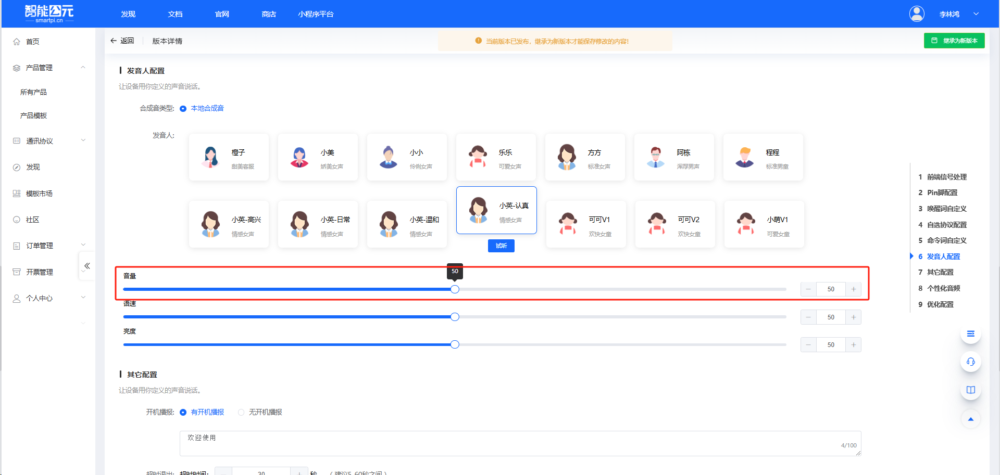

---

### 语音配置音量调到25还是很响怎么办？

**问题描述：**

在智能公元平台将语音配置音量调到25，但实际播放声音仍然很响，感觉和调到50时差不多。

**解决方案：**

- **进一步降低音量**：

    - 继续调低音量设置值
    - 可以尝试设置到15或更低
    - 音量参数不是线性关系，需要实际测试

- **硬件音量控制**：

    - 检查外接功放电路是否有增益调节
    - 如有外部功放，降低其增益设置
    - 确认喇叭功率匹配，避免过驱

- **固件配置检查**：

    - 确认使用的是正确的固件版本
    - 某些固件版本可能存在音量参数异常
    - 尝试重新生成并烧录固件

**注意事项：**

- 音量设置需要实际测试验证，不能仅凭数值判断
- 外部功放的增益对最终音量影响很大
- 如音量调节范围不够，可能需要修改硬件电路

---

### 烧录固件后设备无法响应唤醒词怎么办？

**问题描述：**

烧录了包含唤醒词和命令词的固件后，设备无法响应唤醒词，怀疑是板子焊接问题或烧录失败。

**解决方案：**

**问题排查步骤：**

1. **确认固件配置**
    - 检查唤醒词配置是否正确
    - 确认唤醒灵敏度设置是否合适
    - 验证命令词列表是否完整

2. **验证烧录结果**
    - 确认烧录工具显示"烧录成功"
    - 重新进行一次烧录操作
    - 使用不同的固件文件测试

3. **硬件检查**
    - 检查模块焊接质量
    - 测试模块供电是否正常
    - 确认麦克风连接无误

**诊断方法：**

1. **对比测试**
    - 使用之前能正常工作的固件测试
    - 如果旧固件可以响应，说明是配置问题
    - 如果旧固件也无法响应，说明是硬件问题

2. **单模块测试**
    - 将模块单独供电测试
    - 排除其他电路干扰
    - 使用示波器或万用表检查关键信号


**注意事项：**

- 烧录成功不代表固件配置正确
- 唤醒灵敏度设置过低可能导致无法唤醒
- 焊接质量直接影响模块性能
- 建议保留一个已知的良好固件用于对比测试


---

## 串口通信与配置问题


---

### 串口发送数据与返回值不匹配怎么办？

**问题描述：**

通过串口发送指令01，但接收到随机数字，同时语音指令的回复出现错位现象。

**解决方案：**

**数据不匹配排查：**

1. **检查波特率设置**：

    - 确认串口助手和模块波特率一致
    - 常用波特率为9600或115200
    - 波特率不匹配会导致数据解析错误

2. **检查硬件连接**：

    - 确认TX/RX线正确连接（交叉连接）
    - 检查GND线连接牢固
    - 验证供电电压稳定

**语音回复错位处理：**

1. **检查平台配置**：

    - 仔细检查命令词与回复语的对应关系
    - 确认没有空行或空白内容导致索引错位
    - 逐项验证配置的正确性

2. **配置修正方法**：

    - 删除空白或重复的配置项
    - 重新排列命令词顺序
    - 生成新固件进行测试

**注意事项：**

- 串口数据异常通常是波特率或连接问题
- 回复错位多是配置时的空内容导致
- 建议修改配置后重新生成完整固件
---

### 为什么没有设置回复词但仍会自动回复？

**问题描述：**

在命令词中设置了"打开风扇"，但没有设置回复词，语音模块仍会回复"已打开风扇"。

**解决方案：**

1. **自动学习机制**：

    - 模块具有自动学习功能
    - 会根据命令词自动生成默认回复
    - 使用"已"+动词+名词的格式

2. **回复规则说明**：

    - 系统默认生成确认性回复
    - 格式通常为"已"+动作描述
    - 这是为了提供操作反馈

3. **自定义设置**：

    - 如需修改回复，可在回复词中设置
    - 也可以设置不播放回复
    - 通过平台配置关闭自动回复

**注意事项：**

- 自动回复有助于用户确认操作成功
- 如不需要反馈，可将回复词设为空
- 默认回复可能因固件版本略有差异
- 特殊应用场景可自定义回复内容

---

## 语音识别原理与器件组成

**问题描述：**

需要了解语音识别功能的实现原理，使用的核心器件以及信号处理流程。

**解决方案：**

**1. 核心器件组成**

**主控芯片**：

- **RISC处理器**：负责整体控制和决策
- **DSP（数字信号处理器）**：专门处理音频信号
- **FPU（浮点运算单元）**：支持浮点数运算
- **DMA（直接内存访问）**：高效数据传输

**存储单元**：

- **SRAM**：临时数据存储
- **Flash**：固件和语音模型存储

**音频接口**：

- **ADC（模数转换器）**：将模拟音频转换为数字信号
- **I2S接口**：数字音频输入输出
- **AUDIO处理单元**：音频信号预处理和放大

**外设接口**：

- **UART**：串口通信
- **I2C/SPI**：其他设备通信
- **GPIO/PWM**：通用输入输出和脉宽调制

**2. 信号处理流程**

**音频采集阶段**：

1. 麦克风采集声音信号
2. AUDIO单元进行放大和滤波
3. ADC将模拟信号转换为数字信号
4. I2S接口传输数字音频数据

**信号处理阶段**：

1. DSP接收数字音频数据
2. 进行预处理（降噪、回声消除）
3. 提取语音特征参数
4. 与存储的语音模型进行匹配

**决策输出阶段**：

1. RISC处理器接收匹配结果
2. 根据匹配度判断识别结果
3. 触发对应的控制指令
4. 通过UART/I2C等接口输出控制信号

**3. 技术特点**

- **离线识别**：无需联网，本地处理
- **实时响应**：低延迟识别
- **低功耗设计**：适合嵌入式应用
- **可编程性**：支持自定义词条和命令

**注意事项：**

- 语音识别准确率与录音质量密切相关
- 环境噪声会影响识别效果
- 建议在安静环境下训练和测试
- 不同应用场景可能需要调整算法参数

---

## 供电相关问题


---

### 语音模块无法唤醒且喇叭有异响怎么办？

**问题描述：**

语音模块出现无法唤醒且喇叭只有嗡嗡声的问题，即使使用数据线供电也没有反应。

**解决方案：**

**电压检测：**

1. **喇叭电压测量**：

    - 正常范围：2.2-2.5V
    - 使用万用表测量喇叭两端电压
    - 电压过低会导致喇叭工作异常

2. **供电检查**：

    - 确保5V电源供电稳定
    - 检查电源输出电流是否足够
    - 避免使用电压不足的USB口

**故障排查步骤：**

1. **单独测试模块**：

    - 将语音模块从主板上拆下
    - 单独给模块供电测试
    - 判断是否为模块自身问题

2. **喇叭检查**：

    - 更换喇叭测试
    - 确认喇叭是否损坏
    - 检查喇叭连接线路

3. **电源排查**：

    - 测试不同电源适配器
    - 使用带负载的电源测试
    - 确保供电电压稳定

**处理建议：**

- 电压不足时，更换大功率电源
- 喇叭损坏时，更换同规格喇叭
- 模块故障时，联系供应商更换

**注意事项：**

- 喇叭正常工作电压为2.2-2.5V
- 供电不足会导致模块功能异常
- 建议使用额定5V/2A以上的电源适配器

---

## 命令词识别相关问题


---

### 拼音指令无法被识别怎么办？

**问题描述：**

在配置语音指令时，拼音指令（如"guandan"）无法被设备识别。

**解决方案：**

- 语音识别系统不支持拼音输入
- 命令词必须使用汉字或英文单词
- 拼音无法作为有效的识别指令

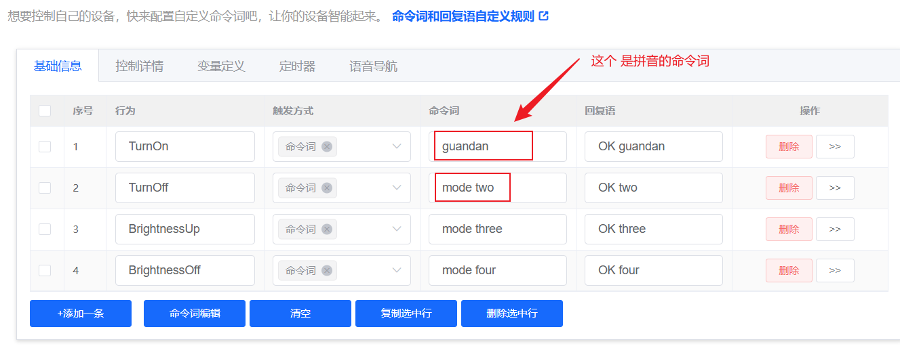

*拼音指令无法被识别的示例*


---

### 英文指令是否仅限于预设单词？

**问题描述：**

询问英文指令是否只能使用系统预设的单词。

**解决方案：**

- 是的，英文指令仅限于系统预设的单词
- 无法自定义添加新的英文单词
- 建议使用汉字命令词以获得更大的灵活性

**注意事项：**

- 配置命令词时请使用标准汉字
- 英文命令词数量有限，如需更多指令建议使用中文
- 命令词配置后需要重新生成固件才能生效

---

### 命令词中如何实现参数（变量）提取？

**问题描述：**

需要在命令词中提取用户输入的数字参数（如"我想要2个苹果"中的数字"2"）并发送给单片机。

**解决方案：**

- 语音识别系统不支持实时参数提取
- 命令词必须提前设置好完整的识别内容
- 无法识别未设置的随机数字

**实现方式：**

1. **预设所有可能的命令词**
    - 将所有需要的数字都设置成独立命令词
    - 如"我要1个苹果"、"我要2个苹果"、"我要3个苹果"等
    - 每个命令词对应发送不同的数字

2. **发送对应的值**
    - 每个预设命令词可配置发送不同的数据
    - 通过串口发送对应的数字给单片机
    - 单片机根据接收到的数值执行相应操作

**注意事项：**

- 命令词数量有限，需合理规划
- 数字越多，命令词配置越复杂
- 建议限制参数范围，避免命令词过多
- 无法实现真正的"变量"功能，只能是预设的组合

---

### 命令词应该使用重复形式还是不同形式？

**问题描述：**

询问命令词设置时，使用ABCABC重复形式（如"开电视开电视"）好，还是使用ABCD不同形式（如"打开电视"）好。

**解决方案：**

**推荐做法：**

使用不同的词语形式，如"打开电视"。

**原因分析：**

1. **识别效果更好**
    - 不同词语的语音特征更明显
    - 避免重复导致的识别混淆
    - 提高系统辨识准确率

2. **自然度更高**
    - 更接近日常说话习惯
    - 用户体验更好
    - 减少刻意重复的生硬感

3. **技术优势**
    - 算法对独特词汇更敏感
    - 减少语音特征重叠
    - 降低误识别率

**配置建议：**

- 使用简洁明了的命令词
- 避免使用重复或相似音节
- 选择与生活用语贴近的表达
- 测试不同命令词的识别效果

**注意事项：**

- 命令词长度建议3-5个字
- 避免使用同音字或易混淆词汇
- 如需提高识别率，可适当增加训练样本

---

## 平台配置与功能


---

### 如何设置命令词触发播放文字-MP3-文字序列？

**问题描述：**

需要在智能公元平台设置一个命令词，使其触发播放一段文字、一个MP3文件、再播放一段文字的序列。

**解决方案：**

**1. 配置方法**

- 在平台配置中添加命令词
- 设置连续的播放动作序列
- 第一步：播放第一段文字
- 第二步：播放MP3文件
- 第三步：播放第二段文字

**2. 定时器控制**

- 使用定时器功能控制播放顺序
- 确保每个动作之间有适当间隔
- 可参考固件模板中的定时器逻辑

**3. 实现步骤**

- 添加触发命令词
- 配置三个播放动作
- 设置执行条件（顺序执行）
- 调整间隔时间参数

**注意事项：**

- MP3文件需要先上传到平台
- 确保播放顺序符合需求
- 可使用变量标志位控制播放流程
- 参考提供的固件模板进行配置

---

## 免唤醒命令词配置


---

### 如何配置禁用唤醒词功能？

**问题描述：**

项目不需要使用唤醒词功能，希望直接通过免唤醒命令词或串口控制设备。

**解决方案：**

**1. 平台配置方法**

- 上电后进入平台配置界面
- 找到唤醒词设置选项
- 选择禁用或删除唤醒词配置
- 保存配置并重新烧录固件

**2. 使用免唤醒命令词**

- 配置所需的免唤醒命令词
- 设置对应的触发动作
- 无需唤醒词即可直接执行命令

**3. 上电自动禁用**

- 某些型号支持上电自动禁用唤醒
- 通过变量控制唤醒功能的开启/关闭
- 在初始化代码中设置禁用标志

**注意事项：**

- 不是所有型号都支持完全禁用唤醒词
- 禁用唤醒后功耗会有所降低
- 保留至少个唤醒词便于测试和维护
- 完全禁用前建议备份原有配置

---

### 免唤醒命令词经常误触发怎么办？

**问题描述：**

使用免唤醒功能时，正常说话或环境噪音会误触发命令词（如"打开灯"、"打开窗帘"），导致设备意外执行动作。

**问题分析：**

- 免唤醒命令词无需唤醒词即可触发，识别门槛较低
- 常用词汇（如"打开"、"灯光"、"窗帘"）容易在日常对话中出现
- 命令词阈值已设置到最低（0.01）但仍无法避免误触发
- 正常说话或噪音都可能被误识别为命令

**解决方案：**

**1. 使用防止误识别词功能**

在智能公元平台中配置防止误识别词：

- 找到"防止误识别词"设置框
- 将容易误触发的词根填入，例如：`打开|打开灯|把灯打开|打开灯光`
- 多个词之间使用 `|` 分隔
- 系统检测到这些词时不会触发免唤醒命令

**2. 更换语音模型**

尝试更换不同的声学模型：

- 在"前端信号处理"配置中切换语音模型
- 选择"普通话通用Pro"或其他适合的模型
- 不同模型对命令词的识别特性不同
- 重新生成固件并测试误触发情况


**3. 优化命令词设计**

- 避免使用过于简单的命令词（如"开灯"、"关灯"）
- 使用更具体、不易误触发的表达（如"打开卧室灯"）
- 将高频触发词从免唤醒列表移除，改为唤醒后触发

**4. 降低特定命令词阈值**

虽然已设置到最低（0.01），但可以尝试：

- 检查是否所有相关命令词阈值都已调低
- 确认"特定命令词阈值"设置已生效
- 重新生成固件确保配置写入

**5. 最后方案：取消免唤醒功能**

如果以上方法仍无法解决：

- 考虑取消误触发严重的免唤醒命令
- 改用唤醒词+命令词的方式
- 通过其他物理手段（按键、遥控器）实现快速控制

**注意事项：**

- 免唤醒命令词越多，误触发概率越高
- 环境噪音较大时建议谨慎使用免唤醒功能
- 防止误识别词功能可能影响正常命令的识别率
- 需要在便利性和误触发率之间找到平衡

---

## 命令词配置


---

### 免唤醒命令词数量受限怎么办？

**问题描述：**

配置免唤醒功能时，发现命令词数量存在限制，无法添加超过20条。

**解决方案：**

**1. 理解免唤醒与普通命令词区别**

- **免唤醒命令词**：无需唤醒词即可直接触发，有数量限制
- **普通命令词**：需要先说唤醒词，支持更多词条

**2. 配置位置**

免唤醒命令词配置位置：

- 在免唤醒命令词列表中添加
- 通常限制在20条以内

普通命令词配置位置：

- 在命令词列表中添加
- 支持更多词条（根据型号而定）

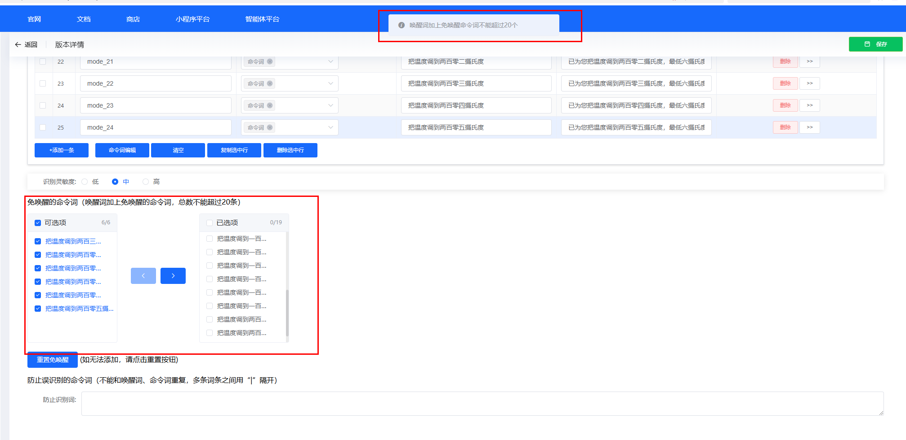

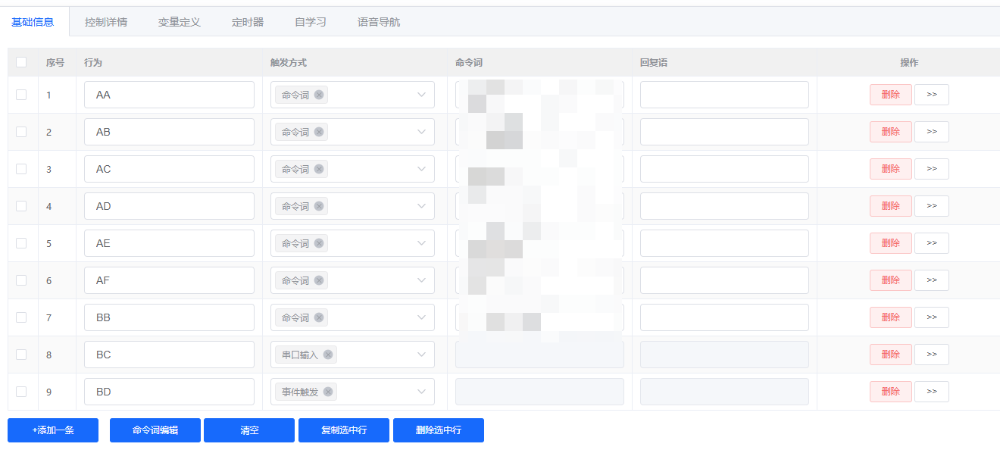

**3. 优化建议**

- 优先选择核心功能作为免唤醒命令
- 次要功能可通过唤醒词后触发
- 合理分配两类命令词的数量

**注意事项：**

- 免唤醒命令词过多可能降低识别准确率
- 不同型号对命令词总数的支持能力不同
- 建议根据实际使用场景合理配置

---

## 语音命令配置


---

### 附加条件不成立时播报提示内容

**问题描述：**

希望在语音命令触发时，当附加条件不成立时能够播报其他提示内容，例如当某个变量值达到最大时提示"已经最大了"。

**解决方案：**

当前系统不支持在附加条件不成立时播报其他提示内容。

- **系统限制**：

    - 语音命令的附加条件不成立时，系统不会执行任何动作
    - 无法直接配置条件不成立时的播报内容
    - 触发机制仅支持条件成立的情况

- **替代方案**：

    - 使用另一个语音命令来专门处理边界情况
    - 例如："检查状态"命令用于播报当前变量值
    - 通过程序逻辑在主命令执行前先检查条件


*Increase_energy命令的附加条件设置*

**注意事项：**

- 设计命令逻辑时需要考虑边界情况
- 可以通过多个命令组合实现类似功能
- 未来版本可能会支持更复杂的条件逻辑
- 建议在产品设计阶段就规划好命令词体系

---

### 不懂韩语的情况下如何调试韩语语音识别？

**问题描述：**

需要调试韩语语音识别功能，但调试人员不懂韩语，难以评估识别效果和进行针对性优化。

**解决方案：**

- **使用AI生成韩语语音样本**：

    - 通过AI工具生成多个韩语语音样本
    - 将生成的语音样本作为测试素材
    - 无需理解韩语含义，只需测试识别准确性

**注意事项：**

- 中文语音识别效果最佳，其他语种需要专门调优
- 建议收集识别效果最好的韩语词汇加入词库
- 可以让懂韩语的人员协助验证识别结果
- 不同语种的语音特征差异较大，需要单独优化模型

---

### 如何设置唤醒词灵敏度？

**问题描述：**

需要了解如何调整唤醒词的灵敏度，以及阈值设置对识别效果的影响。

**解决方案：**

- **阈值说明**：

    - 阈值范围：0.05-0.4
    - 数值越大越灵敏
    - 默认值为中间档位

- **设置方法**：

    1. 进入"唤醒词自定义"界面
    2. 选择唤醒词灵敏度（低/中/高）
    3. 或直接设置具体阈值数值

- **优化建议**：

    - 室内无噪音环境可调高灵敏度
    - 噪音较大环境建议中等灵敏度
    - 避免设置过高导致误唤醒

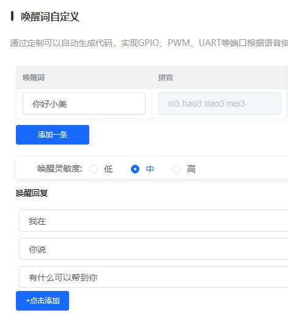

---

### 如何配置免唤醒命令词？

**问题描述：**

希望直接通过语音命令控制设备，无需先说唤醒词，需要了解免唤醒词的配置方法和限制。

**解决方案：**

- **免唤醒词特点**：

    - 直接说出命令词即可触发
    - 无需先喊唤醒词
    - 即使退出唤醒状态也能响应

- **配置步骤**：

    1. 进入"免唤醒的命令词"界面
    2. 从左侧选择可用的命令词
    3. 添加到右侧已选列表
    4. 总数不能超过10条

- **适用场景**：

    - 报警器类应用
    - 紧急求助场景
    - 不需要交互的简单控制

**注意事项：**

- 免唤醒词会增加误触发率
- 建议选择不易误触发的词汇
- 适合需要快速响应的场景


---

### 如何配置谐音唤醒词并识别对应的串口消息？

**问题描述：**

添加多个谐音唤醒词后，需要了解如何通过串口消息号来对应识别每个新增的唤醒词。

**解决方案：**

1. **使用命令词替代唤醒词**
    - 对于方言或发音差异，建议使用命令词功能
    - 设置格式："救命|九名|旧明|玖名"
    - 这样多个谐音词都会触发同一个命令

2. **免唤醒词配置**
    - 命令词可以设置为免唤醒
    - 直接说出命令词即可触发
    - 适合紧急求助等场景

3. **串口消息对应**
    - 每个命令词对应一个固定的消息ID
    - 可通过串口输出查看具体的消息号
    - 在平台配置中查看命令词列表确认ID

**配置步骤：**

1. 进入语音平台配置界面
2. 添加命令词，使用"|"分隔多个谐音
3. 设置为免唤醒模式（如需要）
4. 烧录固件到模块
5. 测试说出不同谐音，观察串口输出

**注意事项：**

- 谐音词越多，误唤醒率可能越高
- 建议测试常用谐音，选择效果最好的组合
- 命令词支持免唤醒，但会增加误触发可能

---

## 声纹识别


---

### 如何为有电机噪音的项目选择合适的应用场景？

**问题描述：**

项目运行时有直流电机齿轮噪音，需要了解如何选择合适的语音识别应用场景配置。

**解决方案：**

**1. 推荐应用场景**

- **首选普通话通用**：适用大部分版本，识别效果稳定
- **尝试窗帘场景**：针对机械噪音环境优化，可优先测试
- **避开专用场景**：如非特定应用，不建议使用烟机等专用模型

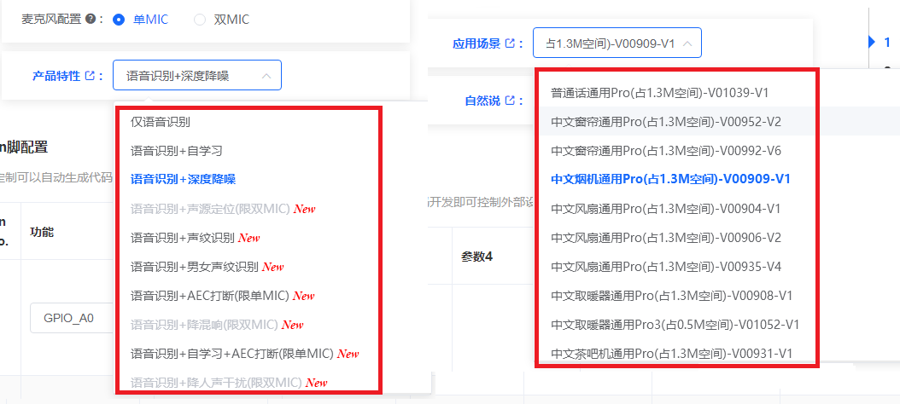

**2. 版本选择建议**

- **选择新版本**：新版本识别效果比老版本好
- **版本差异**：主要是老版本与新版本的区别，新版本在算法和模型上都有改进

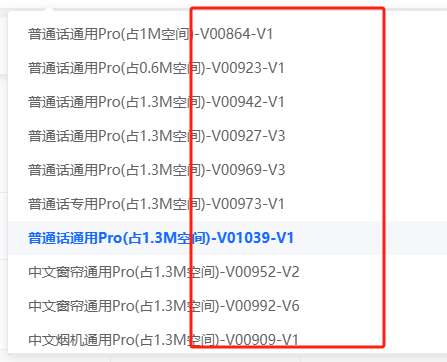

**3. 测试验证流程**

- 先测试普通话通用版本
- 如效果不佳，再尝试窗帘场景
- 根据实际测试效果确定最终方案

**注意事项：**

- 普通话通用适用大部分版本
- 新版本相比老版本有更好的识别效果
- 对于机械噪音环境，窗帘场景可能比通用场景更优
- 建议实际录音测试，根据噪音情况调整选择

---

## 应用场景选择


---

### 如何为有电机噪音的项目选择合适的应用场景？

**问题描述：**

项目运行时有直流电机齿轮噪音，需要了解如何选择合适的语音识别应用场景配置。

**解决方案：**

**1. 推荐应用场景**

- **首选普通话通用**：适用大部分版本，识别效果稳定
- **尝试窗帘场景**：针对机械噪音环境优化，可优先测试
- **避开专用场景**：如非特定应用，不建议使用烟机等专用模型


**2. 版本选择建议**

- **选择新版本**：新版本识别效果比老版本好
- **版本差异**：主要是老版本与新版本的区别，新版本在算法和模型上都有改进


**3. 测试验证流程**

- 先测试普通话通用版本
- 如效果不佳，再尝试窗帘场景
- 根据实际测试效果确定最终方案

**注意事项：**

- 普通话通用适用大部分版本
- 新版本相比老版本有更好的识别效果
- 对于机械噪音环境，窗帘场景可能比通用场景更优
- 建议实际录音测试，根据噪音情况调整选择

---

## 功能说明


---

### 如何配置语音模块的节能选项？

**问题描述：**

在使用语音模块时需要配置节能选项以降低功耗，延长设备使用时间。

**解决方案：**

- **节能配置选项**：

    1. **深度休眠模式**：

        - 设置模块在无活动时进入深度休眠
        - 可大幅降低待机功耗至0.3mA以下
        - 需要通过唤醒词重新激活

    2. **唤醒灵敏度调节**：

        - 适当降低唤醒灵敏度
        - 减少误唤醒导致的功耗增加
        - 平衡响应速度和功耗

    3. **采样频率优化**：

        - 休眠时降低采样频率
        - 减少不必要的运算
        - 根据应用场景选择合适频率

- **配置方法**：

    - 在智能公元平台中开启"节能模式"
    - 设置休眠时间参数
    - 调整唤醒阈值
    - 选择合适的唤醒词数量

**注意事项：**

- 节能模式可能影响响应速度
- 需要根据实际使用场景调整参数
- 测试时逐步优化，找到最佳平衡点

---

### 什么是逐步唤醒功能？

**问题描述：**

需要了解逐步唤醒功能的实现方式和应用场景。

**解决方案：**

- **功能说明**：

    - 逐步唤醒是指通过分级触发机制实现更精准的语音控制
    - 避免单次误触发的误操作
    - 提高系统可靠性和用户体验

- **实现方式**：

    1. **多级唤醒机制**：

        - 第一级：轻唤醒，进入监听状态
        - 第二级：确认唤醒，准备执行命令
        - 第三级：命令执行，触发具体动作

    2. **延时确认机制**：

        - 唤醒后等待二次确认
        - 设定时间窗口内的二次语音输入
        - 超时自动返回休眠状态

    3. **关键词组合**：

        - 使用多个关键词组合
        - 按顺序说出不同唤醒词
        - 降低误触发率

- **应用场景**：

    - 重要设备控制（如安全设备）
    - 工业自动化场景
    - 对可靠性要求高的应用

- **配置建议**：

    - 根据应用需求选择合适的触发层级
    - 设置合理的等待时间
    - 优化关键词组合的复杂度

**注意事项：**

- 逐步唤醒会增加响应时间
- 需要用户适应新的交互方式
- 建议在关键场景中使用此功能

---

### 模块无法实现语音控制功能怎么办？

**问题描述：**

语音模块无法响应语音命令，需要排查故障原因并恢复语音控制功能。

**解决方案：**

- **基础检查**：

    1. **硬件连接**：

        - 检查麦克风是否正确连接
        - 确认麦克风极性（正负极）无误
        - 测量麦克风供电电压是否正常

    2. **电源供应**：

        - 确认模块供电电压在规定范围
        - 检查电源稳定性，避免电压波动
        - 测量模块工作电流是否正常

    3. **输出设备**：

        - 连接喇叭或耳机测试音频输出
        - 确认输出设备阻抗匹配
        - 检查输出线路连接良好

- **软件配置检查**：

    1. **固件版本**：

        - 确认固件已正确烧录
        - 检查固件版本是否匹配硬件
        - 尝试重新烧录最新固件

    2. **唤醒词配置**：

        - 确认已正确配置唤醒词
        - 检查唤醒词录音质量
        - 测试不同唤醒词的响应

    3. **命令词设置**：

        - 验证命令词已正确添加
        - 检查命令词发音是否标准
        - 确认命令词与动作正确关联

- **调试方法**：

    1. **串口调试**：

        - 通过串口连接模块
        - 发送测试命令检查响应
        - 观察调试信息输出

    2. **指示灯状态**：

        - 观察模块指示灯变化
        - 记录不同状态下的灯光模式
        - 对比正常工作时的状态

    3. **环境因素**：

        - 测试环境噪声是否过大
        - 调整说话距离和角度
        - 避免回声和干扰

- **常见问题及解决**：

| 问题现象 | 可能原因 | 解决方法 |
|---------|----------|----------|
| 完全无响应 | 电源故障 | 检查供电和接线 |
| 不能唤醒 | 麦克风故障 | 更换麦克风 |
| 唤醒不执行 | 固件问题 | 重新烧录固件 |
| 误触发率高 | 环境噪声 | 降噪处理或调整灵敏度 |

**注意事项：**

- 先排查硬件问题，再检查软件配置
- 保留每次测试的记录，便于分析
- 如多次尝试无效，可能需要更换模块
- 建议在安静环境下进行初始测试

---

### 如何验证Action_Mode变量赋值逻辑？

**问题描述：**

在语音控制代码中，对Action_Mode变量赋值后不确定是否能正确触发相应的控制行为。

**解决方案：**

**1. 逻辑验证**

- Action_Mode == 1 对应语音指令"开灯"（发送参数"AA"）
- Action_Mode == 2 对应语音指令"关灯"（发送参数"BB"）
- 确保switch case条件与语音指令配置一致

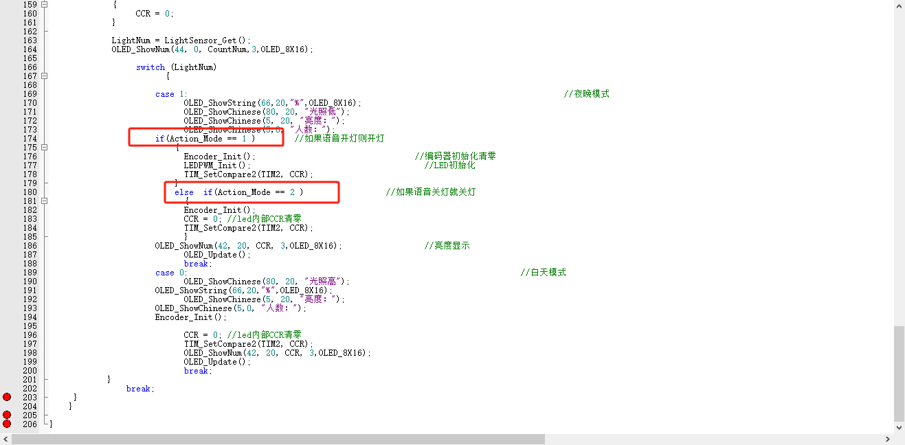

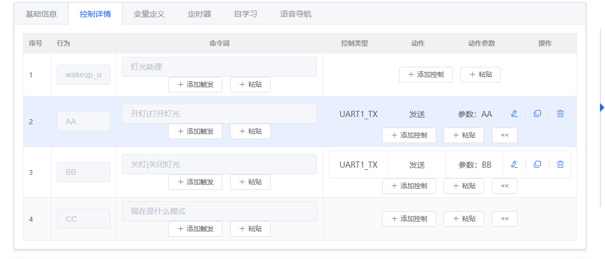

**2. 调试方法**

- 在UART中断处理函数中添加调试输出
- 监控Action_Mode变量的变化
- 确认case分支是否被正确执行

**3. 注意事项**

- 语音指令配置的动作类型必须为UART1_TX
- 参数值要与代码中的判断逻辑匹配
- 建议使用断点调试验证程序流程

---

### 语音模块播报字母时播报为数字怎么办？

**问题描述：**

通过串口输入字符类型（char）进行播报时，模块将英文字母播报为数字，无法正确播报字母内容。

**解决方案：**

**1. 问题原因分析**

模块将字母播报为数字的可能原因：

- **固定播报规则**：模块不支持自定义字符播报
- **编码方式限制**：仅支持特定格式的播报指令
- **固件版本限制**：当前版本不支持字符播报功能

**2. 模块功能限制**

**支持的播报方式**：

- 预设语音播报：平台配置的固定回复语
- 数字播报：支持数字的直接播报
- 简单词汇播报：预设的命令词回复

**不支持的功能**：

- 自定义字符播报：如单个字母A、B、C等
- 十六进制指令播报：如AA 55 00 61等
- 动态字符组合：实时组合的字符内容

**3. 替代方案**

**使用预设语音**：

- 在平台中预设需要的字母播报内容
- 每个字母作为独立的语音文件
- 通过触发对应的消息号来播报

**使用TTS功能（如支持）**：

- 部分型号支持文字转语音功能
- 需要额外授权或特定固件
- 可以实现动态文本播报

**4. 配置建议**

**预设字母播报**：

1. 在平台中添加26个字母的播报内容
2. 每个字母对应一个消息ID
3. 通过串口发送对应消息ID触发播报

**示例配置**：

- 消息号100：播报"A"
- 消息号101：播报"B"
- 消息号102：播报"C"
- 以此类推...

**5. 注意事项**

- 离线语音模块的播报内容需要预置
- 无法像在线TTS那样实时生成语音
- 自定义字符播报需要平台支持
- 建议在设计阶段确认具体功能需求

**适用场景**：

- 固定的字母播报需求
- 数量有限的播报内容
- 不需要动态变化的场景

---

## 语音回复与播报控制


---

### 如何设置语音指令回复语句之间的停顿间隔？

**问题描述：**

需要设置语音指令回复语句之间的停顿间隔和时间，控制多个回复语的播放节奏。

**解决方案：**

**方法一：使用延时输出功能**

- 在指令配置中添加"延时输出"动作
- 可设置具体的延时时间（如1000ms）
- 将长句拆分为多个短句，分别设置延时

**操作步骤**：

1. **删除原回复语**
    - 在指令配置界面删除原有的完整回复语
    - 为后续详细设置做准备

2. **拆分回复内容**
    - 将长句拆分为多个独立短句
    - 例如："你好，想你了"拆分为"你好"和"想你了"

3. **设置延时播放**
    - 为每个短句添加"延时输出"动作
    - 设置所需的延时时间（单位：毫秒）
    - 按顺序配置播放逻辑

**方法二：使用标点符号控制间隔**

- 在回复语中添加标点符号
- 不同标点符号会产生不同的播放间隔
- 标点越多，间隔时间越长

**注意事项：**

- 使用标点符号的间隔时间无法精确设置
- 延时输出方法更加稳定和可控
- 建议根据实际需求选择合适的方法


---

### 事件触发时如何实现语音输出延迟控制？

**问题描述：**

在事件触发场景中，语音播报提前开始，导致引脚控制信号滞后，造成语音开头1-2个字丢失。需要实现语音输出的延迟功能以同步控制时序。

**解决方案：**

**1. 配置延时输出功能**

- **步骤1：清空原回复语**
    - 在指令管理界面，找到需要延时的指令
    - 将回复语内容清空，避免立即播放

- **步骤2：进入控制详情页**
    - 切换到该指令的控制详情页面
    - 准备添加延时控制动作

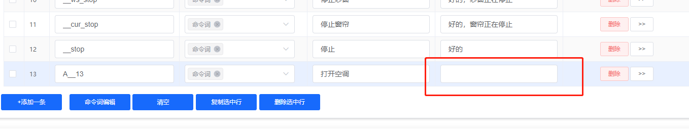

- **步骤3：添加延时播报**
    - 点击"添加控制"按钮
    - 选择"播报语音"动作类型
    - 勾选"是否延时输出"选项
    - 设置延时时间（如5000毫秒）
    - 选择需要播报的语音内容


**2. 延时时间设置建议**

- **最短延时**：1000ms（1秒）
    - 适用于快速响应的继电器控制
    - 确保继电器动作完成后再播报

- **推荐延时**：3000-5000ms（3-5秒）
    - 适用于大多数控制场景
    - 给硬件动作留足稳定时间

- **长延时**：5000-10000ms（5-10秒）
    - 适用于电机启动、机械动作等慢响应场景
    - 确保机械结构完全就位

**3. 实现原理**

- **事件触发顺序**：

    1. 语音识别成功
    2. 引脚立即输出高电平
    3. 延时等待（设定时间）
    4. 语音播报开始

- **同步效果**：

    - 引脚控制动作有足够时间完成
    - 语音播报时设备已处于目标状态
    - 避免播报内容与实际状态不符

**注意事项：**

- 延时时间应根据实际硬件响应特性调整
- 过长的延时可能影响用户体验，需平衡性能
- 建议通过实际测试确定最佳延时值
- 多个连续动作可分别设置不同延时，实现时序控制

---

## 声纹识别功能


---

### 为什么语音模块无法播报英文字母而是播报数字？

**问题描述：**

通过串口输入字符类型（char）来播报英文字母时，模块却将字母播报为数字，无法正确进行字符播报。

**解决方案：**

**1. 数据类型限制**

- **char类型解析**：当设置为char类型时，系统将字符解析为ASCII码数值
- **播报行为**：系统播报的是ASCII码对应的数字，而非字符本身
- **技术限制**：这是char类型数据处理的固有特性

**2. 解决方案**

- **不支持自定义字符**：模块不支持自定义字符或十六进制指令的播报
- **固定播报内容**：只能播报预设的音频文件或固定的文本内容
- **替代方案**：使用预设的音频文件替代动态字符播报

**3. 配置说明**

- **speaker触发方式**：支持串口输入触发
- **消息号映射**：将消息号映射到具体的播报内容
- **类型选择**：根据需要选择合适的数据类型

**注意事项：**

- 英文字母（A-Z）无法直接通过char类型实现播报
- 如需播报字母，建议使用录制的音频文件
- 系统设计时需考虑播报内容的限制
- 动态字符播报功能当前版本不支持

---

### 数字音的默认参数是什么？如何实现数字音与文本音播报平滑一致？

**问题描述：**

在播报包含数字的内容时，数字音与文本音的音量存在差异，导致播报不够平滑，需要了解数字音的默认参数并调整配置。

**解决方案：**

**1. 数字音默认参数**

- **音量**：默认75（系统最小音量40，最大音量100）
- **语速和亮度**：与所选发音人参数一致
- **生成方式**：数字音基于所选发音人生成，是拼接而成的音频

**2. 参数配置位置**

数字音的参数配置位于平台的发音人设置界面：

- 可以选择不同的发音人（如KiYo、萱萱、玲玲等）
- 调整音量、语速和亮度参数
- 这些参数会影响数字音的生成效果


**3. 实现平滑播报的方法**

- 将发音人的音量、语速、亮度参数调整到与文本音一致
- 在平台调节音量时，文本音和数字音会同步变化
- 如需更精细的控制，需要手工修改代码来实现

**4. 音频优化**

- 数字音是预置拼接音频，文本音是动态生成，本质特性不同
- 如出现嘈杂问题，可能是扬声器质量限制
- 手工调整数字发音文件可以优化音质，但需要有足够的项目量支撑

**注意事项：**

- 数字音参数与芯片型号无关，是软件层面的控制
- 音频文件优化需要手工调整，属于定制开发范畴
- 扬声器质量会影响最终播报效果，建议选用质量较好的音频输出设备

---

### 长命令词容易误识别怎么办？

**问题描述：**

使用长命令词（如"六路设备"、"七路设备"）控制多路设备时，容易出现误识别，且部分设备控制指令无法正确执行。

**解决方案：**

1. **缩短命令词长度**
    - 将长命令词改为3-4个字的短命令词
    - 例如："六路设备打开"改为"六路开"或"六开"
    - "打开一号设备"改为"一路开"或"设备一开"

2. **优化命令词结构**
    - 避免使用只有一个数字不同的相似命令词
    - 采用"数字+动作"的组合方式
    - 例如："一路开"、"二路开"、"三路开"

3. **测试验证**
    - 修改命令词后重新生成固件
    - 在实际使用环境中测试识别准确率
    - 确认所有设备控制指令正常执行

**注意事项：**

- 命令词长度建议控制在3-4个字，识别效果最佳
- 避免使用发音相似的长命令词
- 如仍有误识别，可考虑更换为差异更大的词汇

---

### Arduino串口控制时语音播报不完整怎么办？

**问题描述：**

使用Arduino通过串口控制语音模块时，出现语音播报不完整的情况，且问题具有随机性，重新通电后可暂时恢复。

**解决方案：**

**1. 电源稳定性检查**

- 首先检查Arduino的供电是否稳定
- 测量电源电压波动情况
- 确认电源容量足够支撑所有功能

**2. 串口通信优化**

- 检查串口连接线是否牢固
- 验证波特率设置是否正确
- 减少长线传输，避免信号干扰

**3. 时序控制**

- 在发送播报指令前添加适当延时
- 等待前一条播报完全结束
- 避免连续快速发送指令

**4. 代码优化建议**

```cpp
// 示例代码
void sendVoiceCommand(String command) {
    delay(100); // 发送前延时
    Serial.println(command); // 发送指令
    delay(500); // 等待播报完成
}
```

**5. 故障排查步骤**

- 监测串口发送的数据是否完整
- 检查是否有其他设备干扰
- 测试不同波特率下的表现
- 记录播报不完整时的具体现象

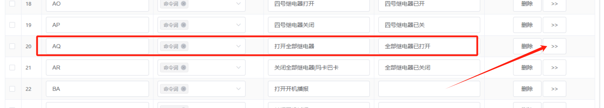

**注意事项：**

- 电源不稳是导致随机故障的常见原因
- 重新通电后恢复说明可能是电源或时序问题
- 建议在电源端添加滤波电容
- 如问题持续，考虑使用独立的电源为语音模块供电

---

### 高噪声或嘈杂人声环境下的语音识别限制

**问题描述：**

在高噪声或嘈杂人声环境中，现有语音识别芯片无法有效识别语音指令，需要了解是否有能在这种环境下工作的芯片解决方案。

**解决方案：**

**技术限制说明**

- 很大的随机噪声比较难以克服，这是语音识别技术的普遍限制
- 嘈杂的人声环境比单纯噪声环境更难识别
- 当环境噪声超过语音信号强度时，识别准确率会大幅下降

**应用场景限制**

- 不符合语音识别的典型应用场景，不应当使用语音识别技术
- 在极嘈杂环境下（如工厂车间、KTV等），语音识别效果有限
- 随机噪声和突发噪声是当前语音识别技术的主要挑战

**替代方案建议**

- 考虑使用其他控制方式（如按键、遥控器、APP控制）
- 若必须使用语音，应改善使用环境或降低噪声源
- 对于特定噪声环境，可尝试定制化的降噪方案

**注意事项：**

- 当前市场上没有能够完全克服极强随机噪声的语音识别芯片
- 即使是高端语音识别产品，在嘈杂环境下也存在识别限制
- 选择语音识别方案时，应确保应用环境符合基本要求

---

### 如何实现语音控制音量调节？

**问题描述：**

需要在语音识别模块中实现通过语音指令调节音量的功能。

**解决方案：**

**实现方法：**

1. **在平台配置控制指令**
    - 添加音量调节命令词："调高音量"、"调低音量"
    - 设置对应的行为控制：PWM输出或变量控制
    - 配置音量调节范围和步进值

2. **使用PWM控制音量**
    - 配置PWM引脚连接到音频功放的VOL引脚
    - 设置不同音量对应的PWM占空比
    - 例如：30%占空比=低音量，70%占空比=高音量

3. **通过变量控制音量**
    - 创建音量变量（0-100范围）
    - 语音指令修改变量值
    - 变量值输出到串口控制外部电路

**配置示例：**

- 命令词："声音大一点" → 音量变量+10
- 命令词："声音小一点" → 音量变量-10
- 限制范围：最小0，最大100

**注意事项：**

- 不同功放模块的音量控制方式可能不同
- PWM控制需要确认功放支持电压范围
- 音量调节建议有档位限制，避免突然变化过大
- 测试时从中间音量开始，逐步调节验证效果

---

### 主动退出命令无反应怎么办？

**问题描述：**

配置主动退出功能时，设置的退出命令（如"红光，关闭语音"）在实际使用中没有反应，设备无法执行退出操作。

**解决方案：**

- 尝试将退出命令简化为"关闭语音"
- 检查命令词识别是否准确
- 确认主动退出功能已正确配置

**注意事项：**

- 复杂的退出命令可能导致识别失败
- 建议使用简短明确的退出词
- **退出命令字数建议**：最少2个字，建议2-4个字
- 过长的命令（如超过4个字）会有难触发和误触发的风险


---

### 语音播报时如何避免提前退出唤醒？

**问题描述：**

在语音播报过程中，如果用户主动退出唤醒或发送新指令，会导致当前播报中断，影响用户体验。

**解决方案：**

**问题原因分析：**

- 默认情况下，新指令会打断当前播报
- 超时退出机制可能在播报期间触发
- 连续指令处理时会中断正在播放的语音

**解决方法：**

1. **使用"禁止超时退出唤醒"功能**
    - 在语音播报开始时添加"禁止超时退出唤醒"控制
    - 在语音播报结束时添加"允许超时退出唤醒"控制
    - 确保播报期间不会因超时而退出


2. **配置播报保护机制**
    - 在播放控制前设置保护标志
    - 使用变量控制播报状态
    - 播报期间拒绝新的唤醒退出指令

3. **延时退出策略**
    - 在"退出唤醒"操作前添加延时控制
    - 延时时间应大于最长播报时间
    - 例如：延时10000ms（10秒）

**实现步骤：**

1. **播报开始控制**：

    - 触发语音播放时
    - 立即执行"禁止超时退出唤醒"
    - 设置播报状态变量为1

2. **播报结束控制**：

    - 监听播报完成事件
    - 执行"允许超时退出唤醒"
    - 重置播报状态变量为0

3. **保护逻辑验证**：

    - 测试不同长度的语音播报
    - 验证连续指令发送场景
    - 确认播报不会被意外打断

**注意事项：**

- 延时方法不够可靠，建议使用控制功能
- 播报时间较长时更需要保护机制
- 测试时要覆盖各种场景，包括边界情况
- 如仍出现中断，检查控制逻辑的执行顺序

---

### 语音输出内容会触发自身识别吗？

**问题描述：**

当设备同时存在语音输出和语音指令识别功能时，如果语音输出内容与预设的语音指令相同，是否会触发模块自身的语音识别功能。

**解决方案：**

**1. 同一模块的影响**

    - 同一个模块的语音输出不会触发自身识别
    - 模块内部已有隔离机制
    - 可以正常使用相同的语音内容

**2. 分离模块的影响**

    - 如果是两个分离的模块
    - 一个模块播报时，另一个模块会识别到
    - 可能导致误触发或循环响应

**注意事项：**

- 单模块使用时无需担心语音内容冲突
- 多模块协同使用时需要避免播报内容与命令词相同
- 可以使用不同的命令词避免误触发
- 考虑使用串口等其他控制方式替代语音控制

---

### 如何在语音播报中实现停顿效果？

**问题描述：**

需要在语音播报的特定位置添加短暂停顿，以提升播报的自然度和可听性。

**解决方案：**

将需要停顿的内容分为两句话进行播报，在第二句播报时添加延时控制。

**操作步骤：**

- 将原始播报内容拆分为多个独立句子
- 为每句话配置独立的播报指令
- 在需要停顿的句子之间添加适当的延时控制

**注意事项：**

- 延时时间根据实际需求调整，通常0.5-2秒较为合适
- 拆分句子时要保证语义的完整性和连贯性
- 建议在实际使用环境中测试停顿效果，确保用户体验

---

### 语音播报内容优化建议

**问题描述：**

语音播报内容过于冗长，长时间使用会让人感到烦躁，需要优化播报的简洁性。

**解决方案：**

**1. 播报内容简化**

    - 使用简短明确的表达
    - 避免冗余的修饰词
    - 直接说明核心信息

**2. 优化示例**

    - 不推荐："好的，已经为您打开灯光了"
    - 推荐："已开灯"
    - 不推荐："现在开始播放您喜欢的音乐"
    - 推荐："播放音乐"

**3. 用户体验考虑**

    - 保持播报内容在3-5个字内
    - 使用标准化的表达方式
    - 避免过于口语化或机械化

**注意事项：**

- 简洁的播报能提升用户体验
- 需要在信息完整和简洁之间找到平衡
- 建议根据实际应用场景调整播报风格
- 可以提供选项让用户自定义播报内容

---

### 语音指令执行反馈时间多长？

**问题描述：**

了解语音模块从接收到语音指令到执行命令并反馈所需的时间。

**解决方案：**

- **执行速度**：执行命令后立即执行控制，无明显延迟
- **响应时间**：从识别完成到命令执行几乎是瞬时的
- **整体流程**：唤醒词识别 → 命令词识别 → 命令执行（立即）

**注意事项：**

- 感知到的延迟主要来自语音识别过程，而非命令执行
- 正常环境下整个识别-执行过程在1秒内完成
- 复杂命令或网络控制可能增加额外处理时间
- 建议优化指令设计，减少识别层级以提高响应速度

---

### 离线语音模块频繁误唤醒如何解决？

**问题描述：**

离线语音模块在台灯应用中频繁误唤醒，即使在非唤醒词出现时也会自动响应"在呢"，影响正常使用。

**解决方案：**

误唤醒问题通常由环境噪声或电磁干扰引起，可根据具体情况选择合适的解决方案。

**主要原因分析：**

1. **环境噪声干扰**
    - 周围环境噪声过大
    - 电视、音响等音频设备干扰
    - 多人交谈或背景音乐

2. **电磁干扰**
    - 台灯镇流器质量差
    - 电源适配器干扰
    - 其他电器的电磁辐射

3. **硬件配置问题**
    - 麦克风灵敏度设置过高
    - 唤醒词识别阈值过低
    - 硬件接地不良

**解决方案：**

**1. 硬件优化方案**

    - **更换控制方式**：使用拉线开关替代语音触发，彻底避免误唤醒
    - **更换电源配件**：使用质量更好的镇流器和电源适配器
    - **优化接地**：确保模块良好接地，减少干扰

**2. 软件调整方案**

    - 调整唤醒词识别阈值（在平台配置中调高）
    - 降低麦克风灵敏度
    - 选择更独特的唤醒词
    - 启用双麦降噪算法（如硬件支持）

**3. 环境改善措施**

    - 减少环境噪声源
    - 避免在嘈杂环境使用
    - 远离音响等设备
    - 使用物理隔声措施

**选型建议：**

- 如果误唤醒问题严重，建议选择支持双麦算法的型号
- 噪声较大的环境优先选择带AEC功能的模块
- 考虑使用按键作为备用控制方式

**注意事项：**

- 台灯等照明设备的镇流器是常见干扰源
- 语音控制在特定环境下的误唤醒属于正常现象
- 应在功能便利性和稳定性之间找到平衡点

---

### 如何优化语音播报音质？

**问题描述：**

模块的语音播报音质较差，听起来像机器人发音。

**解决方案：**

更换为音质更好的播报音源。

**注意事项：**

- 不同的播报音源对音质有直接影响
- 可以通过平台上传不同风格的语音文件进行测试
- 建议选择清晰度更高、更自然的录音文件

---

## 特殊声音识别


---

### 是否可以使用专业播音员录制的声音作为语音应答？

**问题描述：**

希望使用专业播音员录制的高质量声音作为模块的语音应答，询问是否支持此功能。

**解决方案：**

模块支持使用自定义录制的声音作为语音应答：

**1. 实现方式**

- 可以邀请专业播音员录制声音文件
- 将录制好的音频文件上传到平台
- 配置为模块的播报音源或应答语音

**2. 音频格式要求**

- 需要符合平台支持的音频格式
- 建议使用高质量的录音设备和环境
- 确保音频文件清晰度达到要求

**3. 配置方法**

- 在平台中找到语音播报配置选项
- 上传自定义音频文件
- 设置对应的触发条件和播报内容

**注意事项：**

- 音频文件大小可能影响固件大小
- 过多的自定义语音会占用较多存储空间
- 建议根据实际需求选择性使用高质量录音

---

## 识别优化


---

### 英文词汇识别率低如何优化？

**问题描述：**

在使用离线语音识别时，某些英文词汇的识别率较低，影响实际使用效果。

**解决方案：**

**1. 选择高频词汇**

- 优先使用日常高频率的英文词汇
- 如 Smith、Alice 等常见英文名字
- 避免使用生僻或专业术语

**2. 使用发音近似的词汇**

- 找发音相似的常用词汇进行替代
- 类似中文的同音字替换方法
- 确保替代词在实际场景中可用

**3. 避免生僻词**

- 识别模型的词库可能未收录生僻词
- 使用词典中常见的英文单词
- 特殊术语可能需要定制模型

**注意事项：**

- 对于必须使用的特殊词汇，可联系技术团队
- 定期更新识别模型可获得更好的支持
- 测试时使用多种口音和语调进行验证

---

## 高级功能配置


---

### 语音指令泛化配置导致误识别怎么办？

**问题描述：**

在使用语音指令泛化功能时，配置的指令（如"减小音量"）被错误识别为"增加音量"，且部分指令无法被识别。

**解决方案：**

**1. 检查前缀和主词配置**

- 前缀词应使用不重要的辅助词汇（如"请"、"帮我"、"请帮我"）
- 主词必须是触发命令的关键词（如"音量"、"窗帘"）
- 避免将重要词汇放入前缀中

**2. 常见配置错误**

- 错误示例：前缀="小一点"，主词="声音"（重要词汇在前缀）
- 正确示例：前缀="把"，主词="窗帘"（关键词汇在主词）
- 前缀中不要包含相反意义的词汇（如"减小"和"增加"）

**3. 排查重复词问题**

- 检查组合后的命令词列表
- 系统会自动标注重复项（如"打开窗帘【重复】"）
- 删除或修改导致重复的配置

**4. 优化建议**

- 使用明确的主词，避免歧义
- 测试所有生成的组合是否能正确触发
- 如持续误识别，考虑简化泛化规则

**5. 重复词自动检测**

- 系统会自动标注重复项（如"打开窗帘【重复】"）
- 检查组合后的命令词列表，删除重复项
- 调整前缀和主词的组合逻辑，避免生成重复

**注意事项：**

- 泛化功能是为了减少配置量，不是创建新命令
- 主词是识别的核心，必须准确配置
- 前缀只是可选的修饰词，影响识别权重较小
- 平台正在开发重复词自动检测和提示功能

---

### 语音指令泛化功能如何使用？回复词是否支持泛化？

**问题描述：**

需要了解语音指令泛化功能的使用方法，以及除了命令词可以泛化外，回复词是否也可以进行泛化设置。

**解决方案：**

**指令泛化功能说明：**

- **功能定义**：通过设置前缀词、后缀词和中间词，自动组合生成多个命令
- **优势**：大幅减少配置工作量，提高识别灵活性
- **适用场景**：结构相似的命令词（如"打开"+"空调"="打开空调"）

**配置方法：**

1. **基础设置**：

    - 选择要泛化的基础命令词（如"打开空调"）
    - 配置前缀词：如"把"、"请帮我"等
    - 配置后缀词：如"一下"、"好吗"等
    - 系统自动组合生成多个变体

2. **配置示例**：

    ```
    基础词：打开空调
    前缀词：把、请帮我、麻烦你
    后缀词：一下、好吗、可以吗

    生成的命令：

    - 打开空调
    - 把打开空调
    - 请帮我打开空调
    - 打开空调一下
    - 把打开空调一下
    - 请帮我打开空调一下
    ...等组合
    ```

**回复词限制：**

- **不支持泛化**：回复词目前不支持泛化功能
- **固定回复**：每个命令只能设置一个固定的回复内容
- **设计原因**：回复内容需要精确控制，避免产生歧义

**替代方案：**

1. **多回复设置**：

    - 为同一命令设置多个变体
    - 使用条件判断选择不同回复
    - 增加交互的丰富度

2. **随机回复选择**：

    - 使用变量控制回复内容
    - 通过逻辑设置实现回复变化
    - 提升用户体验

**注意事项：**

- 指令泛化会占用更多词条资源
- 测试时验证所有组合都能正确识别
- 复杂场景建议分层次配置，避免过度泛化
- 回复词虽不支持泛化，但可通过其他方式实现多样化

---

### 如何选择合适的语音指令词包？

**问题描述：**

在配置语音指令时，平台提供多个"普通话通用Pro"词包（如V00864-V1、V00923-V1、V00942-V1、V00927-V3、V00969-V3、V01039-V1等），需要了解如何选择最适合的词包。

**解决方案：**

**词包版本说明：**

- **版本号规律**：

    - V00864：较早版本
    - V00923、V00942：中等版本
    - V00927、V00969：较新版本
    - V01039：最新版本

**选择建议：**

1. **优先选择最新版本**：

    - **推荐V01039-V1**：最新版本，识别效果最好
    - 持续优化：新版本修复了已知问题，提升了识别率
    - 兼容性：最新版本兼容更多场景和口音

2. **版本对比参考**：

    | 版本号 | 发布时间 | 特点 | 推荐度 |
    |---------|---------|-------|---------|
    | V00864 | 较早 | 基础版本 | ★★☆☆☆☆ |
    | V00923 | 中期 | 稳定版本 | ★★★☆☆ |
    | V00942 | 中期 | 优化版本 | ★★★☆☆ |
    | V00927 | 较新 | 改进版本 | ★★★★☆ |
    | V00969 | 较新 | 增强版本 | ★★★★☆ |
    | V01039 | 最新 | 最佳版本 | ★★★★★ |

3. **选择依据**：

    - **识别效果**：新版本通常识别率更高
    - **稳定性**：经过充分测试的版本更可靠
    - **功能支持**：新版本可能支持更多特性
    - **兼容性**：确保与目标硬件平台兼容

**注意事项：**

- 词包版本不影响已配置的命令词
- 建议在测试环境验证效果后再正式使用
- 如有特殊需求，可联系技术团队获取定制版本
- 定期关注平台更新，及时升级到最新版本

---

### 英文版语音指令无法识别中文拼音怎么办？

**问题描述：**

在使用英文版语音识别系统时，配置的中文拼音格式的指令无法被识别，而纯英文指令可以正常工作。

**解决方案：**

**1. 问题原因分析**

- **格式错误**：英文版系统不支持中文拼音格式的输入
- **识别局限**：系统无法识别如"ni3 hao3 xiao3 mei3"这种带声调的拼音
- **版本差异**：英文版和中文版对指令格式的要求不同

**2. 正确配置方法**

- **使用纯英文**：指令内容应完全使用英文单词
- **拼音字段留空**：在JSON配置中，拼音(pinyin)字段应设置为空或删除
- **示例对比**：

    ❌ **错误格式**：
    ```json
    {
    "cmd": "Xiaoduo",
    "pinyin": "ni3 hao3 xiao3 mei3"
    }
    ```

    ✅ **正确格式**：
    ```json
    {
    "cmd": "Xiaoduo",
    "pinyin": ""
    }
    ```

**3. 配置步骤**

1. 打开语音指令配置文件(.json)
2. 将所有指令改为纯英文格式
3. 清空拼音字段内容
4. 重新生成并烧录固件
5. 测试验证识别效果

**注意事项：**

- 英文版系统专门针对英文语音优化
- 如需要中文识别，应使用中文版固件

----


---

### 部分语音指令为什么无法试听？

**问题描述：**

在平台中选择部分语音指令时，试听功能不可用，询问相关语音是否已准备好。


**解决方案：**

- **功能状态**：

    - 部分语音选项仍在测试中
    - "可可V2"等新音色尚未完全开放
    - 试听功能暂不可用

- **可用音色**：

    - 优先选择标注为可用的音色
    - 使用成熟稳定的语音选项
    - 关注平台更新，了解新音色上线情况

**注意事项：**

- 试听功能仅用于预览，不影响实际使用
- 新音色上线后会通过平台公告通知
- 建议使用已验证的音色确保稳定性

----


---

### 是否支持威严音色？

**问题描述：**

希望在语音识别芯片产品中增加一种威严的音色选项，以满足特定应用场景的语音输出需求。

**解决方案：**

- **音色开发**：

    - 官方会根据市场需求开发新音色
    - 威严音色可作为特定需求提交
    - 需要评估技术可行性和用户需求量

- **建议方案**：

    - 通过平台反馈功能提交需求
    - 详细说明应用场景和使用场景
    - 关注平台更新，了解新音色上线情况

**注意事项：**

- 音色开发需要时间，建议提前规划
- 可通过现有音色调整语速语调部分满足需求
- 特殊音色需求可联系商务评估定制开发

---

## 多设备部署


---

### 人脸识别算法不稳定导致识别人数变化

**问题描述：**

在使用过程中，人脸识别算法出现不稳定现象，表现为识别人数忽多忽少，有时已识别的用户会突然消失，即使没有物理遮挡也无法持续识别。

**解决方案：**

- 这是算法本身的问题，相关技术团队已经确认存在此问题
- 目前业务部门尚未提供解决方案
- 建议关注后续固件更新，等待算法优化

**注意事项：**

- 该问题属于已知算法缺陷，非硬件或设置问题
- 在项目前期应充分考虑此限制，必要时准备备用方案

---

### 语音识别模块识别角度和距离性能不达标

**问题描述：**

语音识别模块的实际识别角度和距离未达到宣传标准，且存在以下问题：

- 识别角度比标称值窄
- 有效识别距离比预期短
- 产品价格较高，性价比不合理
- 售后服务响应不及时

**解决方案：**

- 考虑更换为其他性能更稳定的型号
- 在项目选型前进行充分测试验证
- 评估实际需求与产品规格的匹配度

**注意事项：**

- 建议在批量采购前先进行小批量测试
- 重点关注产品的实际识别范围是否满足应用场景
- 考虑选用支持更好售后服务的供应商

---

### 唤醒灵敏度参数与语音检测距离的关系是什么？

**问题描述：**

配置界面的唤醒灵敏度参数（低、中、高）是否会影响语音检测距离，需要明确该参数的具体作用。

**解决方案：**

唤醒灵敏度参数主要影响唤醒词的触发难易度，而非检测距离：

**1. 参数说明**

- **低**：需要更清晰、更接近的唤醒词才能触发，误触发率最低
- **中**：平衡灵敏度和误触发率，适合大多数应用场景
- **高**：最容易触发，但可能增加误触发概率

**2. 与检测距离的关系**

- 灵敏度参数**不直接决定检测距离**
- 实际检测距离主要受以下因素影响：

    - 麦克风硬件性能
    - 环境噪声水平
    - 说话者音量和发音标准度
    - 唤醒词本身的特点

**3. 选择建议**

- **安静环境**：可设置为"低"，提高识别准确性
- **嘈杂环境**：建议设置为"中"，平衡识别率和误触发
- **远距离需求**：不能仅依靠提高灵敏度，需要优化硬件布局

**4. 其他影响因素**

- 喇叭音量过大会影响麦克风拾音
- 多个咪头阵列可以提升远距离识别效果
- 建议根据实际测试结果调整参数

---

### 免唤醒词在休眠状态下不响应

**问题描述：**

设备进入休眠状态后，免唤醒词无法被识别，只有使用标准唤醒词才能唤醒设备，导致免唤醒功能在休眠期间失效。

**解决方案：**

- 调整休眠时间设置，将其设置为较长的时间（如2年）
- 在平台配置中修改休眠时间参数
- 修改后重新生成固件并烧录

**注意事项：**

- 免唤醒词仅在设备唤醒状态下有效
- 休眠时间设置需要根据实际应用场景平衡功耗和响应性
- 过长的休眠时间可能影响用户体验

---

- 配置修改后务必重新生成固件才能生效
- 建议备份原始配置文件以防误操作

---

### 自学习指令的准确性和固件预设有何区别？

**问题描述：**

需要了解自学习语音指令的准确性与固件预设指令的差异，以及自学习是否带有个人语音特征。

**解决方案：**

**准确性对比：**

- **自学习指令**：有时比预设指令更准确
- **识别原理**：将用户麦克风采集的音频转换为文本存储
- **匹配优势**：再次识别时与存储的音频特征更匹配

**个人语音特征说明：**

- **不具有个人特征**：自学习不是声纹识别
- **通用性**：A用户录制的命令，B用户也能识别
- **存储内容**：存储的是音频文本转换后的结果
- **识别基础**：基于通用语音模型，非个人专属

**自学习功能特点：**

1. **指令管理**

    - 支持添加新命令词
    - 可以删除已有命令
    - 界面提供"+学习命令词"和"删除"按钮

2. **学习机制限制**

    - 每次学习需要重新学习所有命令
    - 暂不支持选择性学习单个命令
    - 修改部分命令需要全部重新学习

**SDK开发实现：**

- 如需实现选择性学习功能
- 可使用SDK进行二次开发
- 安装虚拟机和编译环境
- 手工修改SDK代码实现

**注意事项：**

- 自学习提高的是匹配度，不是个人语音识别
- 更改部分命令需要重新学习所有命令
- 方言环境下自学习效果更明显
- 使用SDK开发需要较强的编程能力

---

### 自学习功能如何帮助方言用户？

**问题描述：**

普通话不标准的用户希望通过自学习功能实现方言语音识别，解决标准语音识别不准确的问题。

**解决方案：**

**1. 自学习对方言的支持原理**

- 自学习功能通过录制用户实际发音来建立语音模板
- 不依赖标准普通话发音标准，适配个人发音习惯
- 系统将录制的音频转换为文本并存储，后续识别时进行匹配

**2. 使用场景**

- 方言口音较重，标准识别率低
- 特定词汇的发音与普通话差异较大
- 需要适应家庭成员的不同口音

**3. 配置步骤**

- 选择"语音识别+自学习"产品特性
- 添加需要使用的命令词
- 逐个录制命令词，建议在安静环境下进行
- 完成学习后测试识别效果

**4. 效果优化建议**

- 多次录制以提高识别准确率
- 使用简短清晰的命令词
- 保持录制环境的一致性
- 定期重新学习以维持识别效果

**注意事项：**

- 自学习功能主要基于个人发音特征，A用户录制的命令B用户也能使用
- 方言差异过大时，识别效果可能仍有局限
- 更换唤醒词后需要重新学习所有命令
- 自学习会占用更多存储空间，建议只学习必要的命令

---

### 自学习功能能否对单个命令进行更新？

**问题描述：**

希望对已学习的指令进行选择性更新，而不需要重新学习所有命令，以提高使用便利性。

**解决方案：**

**当前系统限制：**

- **全量学习**：每次学习需要将所有命令重新学习一遍
- **无法选择**：暂不支持选择性学习单个命令
- **学习机制**：系统设计为全量更新模式

**操作流程说明：**

1. **添加命令**

    - 点击"+学习命令词"添加新命令
    - 输入命令词和对应的回复
    - 系统会提示学习所有命令

2. **删除命令**

    - 选择要删除的命令
    - 点击"删除"按钮移除
    - 删除后仍需重新学习剩余命令

**替代方案：**

1. **SDK定制开发**

    - 需要搭建开发环境（虚拟机、编译环境）
    - 修改SDK源码实现选择性学习
    - 重新编译生成定制固件

2. **规划学习批量**

    - 将需要修改的命令集中处理
    - 一次性完成多个命令的修改
    - 减少频繁的学习操作

**技术建议：**

- 常用命令优先设置，减少修改频率
- 使用平台预设功能避免频繁重新学习
- 考虑使用小程序动态调整命令

**注意事项：**

- 暂时只能接受全量学习机制
- SDK开发需要嵌入式开发经验
- 修改后的固件需要充分测试
- 保留原有命令作为备份

---

### 超时退出时间设置无效，设备未进入休眠怎么办？

**问题描述：**

配置超时退出时间（如60秒或15秒）后，设备在设定时间内未进入休眠状态，命令词仍能被识别，影响误识别控制。

**解决方案：**

**1. 功能确认**

超时退出功能：

- 60秒后会退出唤醒状态
- 退出唤醒后直接喊命令词无效
- 需要重新唤醒词才能识别命令

**2. 配置检查**

- **确认未加入免唤醒**：检查命令词是否被误加入免唤醒列表
- **识别灵敏度设置**：建议设置为"中"，避免"高"灵敏度导致的过度识别
- **唤醒词设置**：确保已正确设置唤醒词

**3. 问题排查**

如果超时设置无效：

- 检查是否有其他配置错误
- 确认唤醒词已正确配置
- 验证固件版本是否支持该功能

**4. 临时解决方案**

- 通过降低识别灵敏度减少误识别
- 使用较短的超时时间（如10秒）
- 考虑通过串口控制休眠

**注意事项：**

- 超时退出是退出唤醒状态，不是深度休眠
- 不同固件版本可能有功能差异
- 如问题持续，建议联系技术团队分析配置

---

### 如何实现设备上电后不退下唤醒功能？

**问题描述：**

需要在特定模块（如CL03T）中实现上电后自动进入唤醒状态且不退出，类似于免唤醒词的持续唤醒功能。

**解决方案：**

**配置方法：**

1. **系统启动触发**
    - 触发方式：上电启动|PIN脚重置|看门狗重启|LVD触发|系统重置系统启动
    - 操作：进入唤醒
    - 延时：根据需要设置（如500ms）

2. **禁止超时退出**
    - 触发方式：上电启动|PIN脚重置|看门狗重启|LVD触发|系统重置系统启动
    - 操作：禁止超时退出唤醒
    - 延时：根据需要设置（如1000ms）

**实现效果：**

- 设备上电后自动进入唤醒状态
- 不会因为超时而退出唤醒
- 可以直接识别命令词无需唤醒

**配置要点：**

- 需要同时配置进入唤醒和禁止超时退出
- 延时设置确保初始化完成
- 适用于需要持续监听的应用场景

**注意事项：**

- 此功能会增加设备功耗
- 可能增加误识别的概率
- 根据实际需求选择合适的配置
- 不同模块型号支持程度可能不同

---

### 修改唤醒词后默认唤醒词无法关闭怎么办？

**问题描述：**

在使用"你好小度"固件修改唤醒词后，无法成功关闭默认唤醒词，修改后的唤醒词（如"蓝精灵"）无法生效，系统仍能被原唤醒词"你好小度"触发。

**解决方案：**

**1. 确认配置文件设置**

- 检查JSON配置文件中是否正确设置`disable_default_wake_word`为`true`
- 确认`wake_word`字段已正确设置为新唤醒词
- 配置示例：
    ```json
    {
    "wake_word": "蓝精灵",
    "disable_default_wake_word": true
    }
    ```

**2. 重新生成并烧录固件**

- 修改配置后必须重新生成固件文件
- 使用最新版本的固件以确保功能支持
- 烧录完成后进行完整测试

**3. 唤醒词逻辑处理**

- 唤醒词模块有特殊处理逻辑
- 修改唤醒词时相关逻辑也需要同步更新
- 如自行修改配置出现问题，建议由技术团队协助处理

**注意事项：**

- 修改唤醒词后必须重新烧录固件，更改才会生效
- 使用原始"你好小度"固件时无此问题，建议基于该固件进行修改
- 若问题持续存在，可提供配置文件给技术团队分析

---

### 修改唤醒词后出现误识别怎么办？

**问题描述：**

在修改固件中的唤醒词后，出现唤醒词误识别的问题，导致设备在不应该触发的时候响应。

**解决方案：**

**1. 问题排查**

- 确认修改唤醒词后是否重新烧录了固件
- 检查新唤醒词是否容易与日常用语混淆
- 记录误识别的具体场景和触发词

**2. 灵敏度调整**

- 通过技术团队降低唤醒识别的灵敏度
- 避免设置过于敏感的识别参数
- 在保证正常唤醒的前提下适当降低阈值

**3. 唤醒词优化**

- 选择发音独特、不易误触发的唤醒词
- 避免使用常见词汇或短语
- 考虑使用4个字以上的唤醒词提高准确性

**4. 技术团队处理**

- 提供误识别的具体案例给技术团队
- 技术团队可以在后台禁用容易误识别的词汇
- 必要时重新选择更适合的唤醒词

**注意事项：**

- 唤醒词修改涉及多个逻辑模块，需要全面测试
- 误识别是正常现象，可通过参数优化减少发生概率
- 如问题严重，建议更换为更独特的唤醒词

---

### 多个电机同时响应唤醒词怎么办？

**问题描述：**

在实际使用场景中，当在中间或边上呼叫时，多个电机（通常两个或三个）会同时响应，而非仅有一个电机响应，影响系统准确性。

**解决方案：**

**1. 距离控制优化**

- 合理设置电机的安装距离，避免过于密集
- 增加物理隔断或屏障，减少声音串扰
- 在50厘米内才能保证单一电机响应，实际使用需考虑距离因素

**2. 灵敏度调节**

- 通过技术团队调整各电机的识别灵敏度
- 降低部分电机的灵敏度，减少响应范围
- 实现梯度响应，最近的优先响应

**3. 唤醒词差异化**

- 为不同电机设置不同的唤醒词
- 避免使用相同或相似的唤醒词
- 通过差异化唤醒词实现精确控制

**4. 测试与验证**

- 在实际应用场景进行全面测试
- 模拟不同位置的唤醒情况
- 记录并优化响应模式

**注意事项：**

- 多设备响应是语音控制的常见挑战
- 需要平衡响应范围和单一响应的需求
- 建议在项目设计阶段就考虑多设备干扰问题
- 可考虑添加位置识别技术实现更精准的控制

---

### 修改唤醒词后开机播报语未更新怎么办？

**问题描述：**

在修改唤醒词（如改为"你好小乐"）后，开机播报语没有同步更新为新唤醒词，其他功能正常。

**解决方案：**

**1. 配置文件检查**

- 确认JSON配置文件中开机播报语相关的字段
- 检查是否设置了正确的开机提示语
- 确认播报语中包含新的唤醒词

**2. 重新生成固件**

- 修改播报语后必须重新生成固件
- 确保所有配置项都已正确设置
- 重新烧录更新后的固件

**3. 技术团队协助**

- 如果自行修改困难，可提供需求给技术团队
- 技术团队可以帮助修改配置文件
- 测试确认后再交付使用

**配置示例：**

```json
{
    "wake_word": "你好小乐",
    "startup_prompt": "你好小乐已就绪"
}
```

**注意事项：**

- 开机播报语和唤醒词是独立配置项
- 修改任何配置都需要重新烧录固件
- 建议在修改后全面测试所有功能

---

### 设备只能识别唤醒词但无法执行其他指令怎么办？

**问题描述：**

设备能够识别唤醒词（如"小飞小飞"），但无法执行后续的语音指令，需要了解原因和解决方法。

**解决方案：**

1. **检查唤醒切换状态**

    - 确认系统是否正确执行了唤醒切换操作
    - 唤醒成功后应该进入命令识别模式
    - 检查事件处理逻辑中是否正确响应AIK_EVENT_KWS_TIMEOUT

2. **配置超时时间**

    - 默认唤醒超时时间可以在资源文件中修改
    - 通过修改bin文件中的超时参数调整等待时间
    - 确保超时时间不会过短导致无法输入指令

3. **代码段检查**

    - 不要将唤醒相关配置加在代码段中
    - 确保资源文件正确加载到内存
    - 验证命令词库是否正确初始化

**注意事项：**

- 唤醒词识别成功不代表自动进入命令模式
- 需要明确的切换机制进入命令识别状态
- 超时时间设置需要考虑用户反应时间
- 如持续无法解决，需要检查固件完整性

---

### 唤醒距离测试效果不佳怎么办？

**问题描述：**

在进行产品模块测试时，近距离和远距离唤醒测试中存在唤醒效果不佳的问题，且无法正常烧录固件。

**解决方案：**

**1. 唤醒距离优化**

- **近距离测试（50cm内）**：

    - 确认麦克风朝向和位置
    - 检查是否有遮挡物影响
    - 调整识别灵敏度到适中或高

- **远距离测试（3-5米）**：

    - 确保环境噪音控制在40dB以下
    - 使用标准音量（60-70dB）测试
    - 避免回声和反射干扰

**2. 环境因素调整**

- 减少背景噪音，保证测试环境安静
- 避免空调、风扇等持续噪声源
- 注意墙壁反射可能造成的干扰

**3. 硬件检查**

- 确认麦克风焊接是否正确
- 检查麦克风质量是否有问题
- 验证音频电路连接是否良好

**4. 参数配置优化**

- 调整麦克风增益参数
- 优化噪声抑制算法参数
- 设置合适的唤醒门限值

**注意事项：**

- 唤醒效果与使用环境密切相关
- 建议在实际使用场景中测试
- 如问题持续，可提供测试视频给技术团队分析
- 烧录问题需单独排查，可能是接线或驱动问题

---

### 语音指令翻译错误与命令词冲突怎么办？

**问题描述：**

在使用窗帘电机语音控制系统时，出现语音指令翻译错误、唤醒灵敏度低以及命令词冲突等问题。

**解决方案：**

**1. 命令词翻译问题**

- 检查命令词对照表，确保翻译准确性
- 修正错误的翻译映射
- 删除有歧义的重复命令词

**2. 唤醒灵敏度优化**

- 调整唤醒词识别参数
- 优化麦克风增益设置
- 在安静环境下测试唤醒效果
- 确保发音清晰标准

**3. 避免命令词冲突**

- 不同功能不能使用相同的命令词
- 使用条件判断机制（如选型后再执行具体操作）
- 确保每个命令词对应唯一功能

**注意事项：**

- 命令词需要最终确认，避免后期反复修改
- 唤醒灵敏度已在新版本固件中改进
- 如"停止布帘/停止纱帘"和"电机换向"都翻译为"Motor commutation"，必须修改其中一个以避免冲突

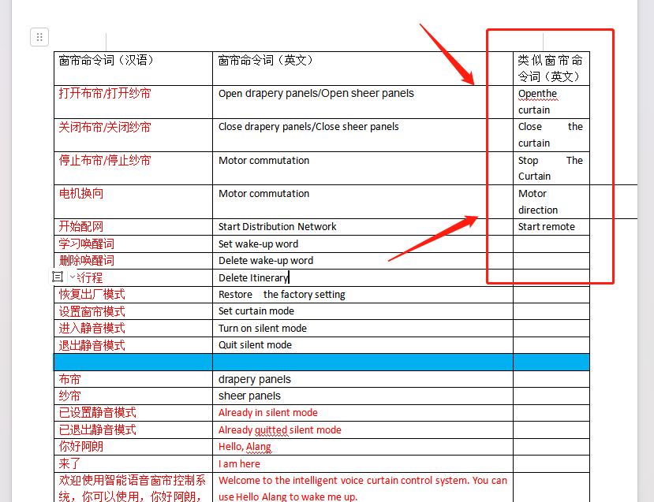

---

### 如何处理窗帘电机控制方向错误？

**问题描述：**

在测试窗帘电机固件时，发现关闭和打开窗帘的指令执行方向相同，但协议发送正确。

**解决方案：**

**1. 硬件检查**

- 检查电机接线是否正确
- 验证MCU控制信号输出
- 使用示波器检测控制信号波形

**2. 软件排查**

- 检查固件中的方向控制逻辑
- 验证协议解析是否正确
- 确认PWM信号输出与指令对应关系

**3. 寄送样机验证**

- 寄送问题样机给技术团队分析
- 提供测试视频和协议日志
- 更换MCU或电机控制板测试

**注意事项：**

- 协议发送正确但执行错误，通常是硬件问题
- 建议保留完整测试记录供分析
- 更换硬件前需确认软件逻辑无误

---

### 固件烧录后如何确认版本正确性？

**问题描述：**

需要确认烧录的固件版本、唤醒词、回复语等配置信息是否与要求一致。

**解决方案：**

**1. 文件校验**

- 使用MD5值校验固件文件完整性
- 对比烧录前后的文件哈希值
- 确认文件未被篡改或损坏

**2. 功能验证**

- 测试唤醒词是否正确响应
- 验证回复语内容是否匹配
- 检查所有语音指令功能

**3. 记录管理**

- 记录固件版本号和烧录时间
- 保存配置参数清单
- 建立烧录追溯档案

**注意事项：**

- 烧录完成后必须进行功能复核
- 不同固件版本不能混用
- 建议使用标准化的烧录记录模板

---

### 语音识别不准确如何优化？

**问题描述：**

在使用语音识别功能时遇到识别不准确的问题，需要优化语音指令的识别灵敏度和准确性。

**解决方案：**

**1. 使用标准测试方法**

- 使用百度翻译的标准发音进行测试
- 确保发音清晰、标准
- 在安静环境下测试识别效果

**2. 固件优化**

- 使用已经过优化的固件版本
- 调整识别灵敏度参数
- 优化噪声抑制算法

**3. 问题反馈与调整**

- 记录识别效果不好的具体词条
- 汇总识别失败的案例
- 提供给技术团队进行针对性调整

**4. 测试验证流程**

- 逐个测试所有命令词
- 记录识别率统计
- 在实际使用场景中验证

**注意事项：**

- 识别效果与发音标准程度密切相关
- 建议使用标准普通话测试
- 如问题持续，提供详细的问题描述和测试视频

---

### 如何对接语音识别技术团队？

**问题描述：**

需要联系技术团队人员解决语音识别问题，并进行后续的技术对接。

**解决方案：**

**1. 准备相关资料**

- 提供详细的问题描述
- 准备测试视频展示问题现象
- 记录问题发生的具体场景

**2. 技术对接方式**

- 添加技术团队人员联系方式（如微信）
- 提供产品型号和固件版本信息
- 说明已尝试的解决方法

**3. 问题沟通要点**

- 清晰描述问题现象和频率
- 提供完整的测试环境信息
- 说明对产品的具体需求

**注意事项：**

- 问题描述越详细，技术团队越能精准定位问题
- 保留所有测试记录和日志
- 建议建立长期技术对接机制

---

### 特定命令词不识别怎么办？

**问题描述：**

特定命令词如"stop sheer panel"无法被识别，需要排查原因。

**解决方案：**

**1. 版本确认**

- 确认使用的固件版本
- 检查该版本是否包含该命令词
- 验证命令词的准确拼写

**2. 命令词适用性**

- "stop sheer panel"适用于第一个版本
- 第二个版本使用不同的命令词
- 不能混用不同版本的命令词

**3. 识别优化建议**

- 使用标准英语发音
- 确保语音清晰度
- 在合适距离（0.5-1米）内发音

**4. 替代方案**

- 如持续识别失败，可调整命令词
- 使用更简单明确的词汇
- 考虑增加同义命令词

**注意事项：**

- 不同项目或版本的固件命令词可能不同
- 建议使用最终确认的命令词列表
- 识别问题可能与发音、环境、距离有关

---

### 是否可以实现免唤醒命令词直接触发功能？

**问题描述：**

希望实现无需唤醒词直接通过一个命令词触发芯片执行指令的功能，以满足主控芯片从休眠状态直接被唤醒的需求。

**解决方案：**

**技术限制说明：**

- 免唤醒命令词绕过了唤醒词的保护机制
- 语音识别产品无法完全杜绝误识别
- 唤醒词的设计是为了防止误触发，保护系统稳定性

**风险提示：**

- 使用免唤醒命令词会显著增加误触概率
- 可能导致设备在不需要时被意外激活
- 影响用户体验和系统可靠性

**建议方案：**

- 保持使用唤醒词+命令词的两级识别机制
- 如需快速响应，可优化唤醒词识别算法
- 考虑使用更简短的唤醒词提高响应速度

**注意事项：**

- 不建议完全绕过唤醒词保护
- 在特殊应用场景中，需要权衡误触发风险
- 可通过调整麦克风灵敏度和识别阈值来优化响应

---

### 蜂鸟L Pro芯片误唤醒问题如何解决？

**问题描述：**

蜂鸟L Pro芯片在优化差分电路并降低唤醒灵敏度后，仍存在较高误唤醒率，尤其在嘈杂环境和会议场景中问题更为明显。

**解决方案：**

**问题分析：**

- 蜂鸟L Pro是低功耗芯片，未集成降噪算法
- 在嘈杂环境（如会议室）中容易产生误唤醒
- 唤醒词"小千同学"已相对优化，但仍受芯片限制

**优化建议：**

1. **灵敏度调整**：

    - 进一步降低唤醒灵敏度
    - 测试不同灵敏度下的唤醒成功率
    - 找到误唤醒率和正常唤醒的平衡点

2. **交互方式优化**：

    - 考虑采用唤醒词不带回复的模式
    - 唤醒后再喊命令词执行动作
    - 减少唤醒后的音频输出干扰

3. **环境适配**：

    - 针对不同使用场景调整参数
    - 安静环境可适当提高灵敏度
    - 嘈杂环境降低敏感度

**技术限制：**

- 唤醒词训练成本高且效果不确定
- 芯片本身不支持复杂降噪算法
- 唤醒词不能更换（"小千同学"已固定）

**注意事项：**

- 该问题主要由芯片架构决定，硬件限制较大
- 如对误唤醒要求极高，可考虑更换带降噪功能的芯片
- 建议通过软件逻辑过滤进一步降低误触发

---

## 产品特定语音指令


---

### 火焰灯的语音指令有哪些？

**问题描述：**

火焰灯的语音指令如何使用，包括打开和关闭命令，以及如何提高识别准确率。

**解决方案：**

**1. 基础指令集**

- **打开火焰灯**：`Firelight please`
- **关闭所有灯**：`Turn Off Please`
- 注意：任何情况下，`Turn Off Please` 都会关闭所有灯光

**2. 指令演进历史**

- 早期使用：`Mood please`（容易误识别）
- 改进后：`Candle please`
- 最终确定：`Firelight please`

**3. 识别率优化建议**

- 保持其他指令与之前版本一致
- 经过长时间测试，已加入很多优化字词
- 可提高命中率和准确性

**4. 使用说明**

- 打开火焰灯不需要专门的关闭指令
- 使用通用的`Turn Off Please`即可关闭
- 所有指令建议使用英文

**注意事项：**

- 语音指令已经过大量测试和优化
- 不要随意修改指令词，以免影响识别率
- 如遇识别问题，可调整发音清晰度和距离
- 建议在相对安静的环境下使用语音指令

---`

### 360旋转灯语音唤醒灵敏度不一致且偶发死机

**问题描述：**

360旋转灯在烧录新固件后，出现语音唤醒灵敏度不一致的情况，其中一个麦克风唤醒正常，另一个有时无法唤醒。同时存在触摸不灵敏和偶发死机的问题，死机时蓝灯长亮，触摸功能失效。

**解决方案：**

**1. 硬件设计分析**

根据提供的结构图纸，需要关注以下设计要点：

- **软板尺寸**：69.02mm x 35.00mm
- **顶部RGB灯珠位置**：靠边设计，可能影响电磁环境
- **板框变更**：板框尺寸修改和软PCBA焊脚位变化
- **旋转复位开关ER1102**：新增的开关可能影响电路稳定性

**2. 语音唤醒不一致排查**

- **麦克风差异**：两个麦克风的灵敏度可能存在硬件差异
- **固件适配**：新固件可能需要重新校准麦克风参数
- **环境干扰**：RGB灯珠工作时可能产生电磁干扰
- **结构影响**：板框改动可能影响麦克风拾音角度和距离

**3. 触摸和死机问题处理**

- **触摸延迟调整**：固件已优化触摸延时参数
- **死机恢复**：断电重启可恢复正常，说明是软件问题
- **指示灯更换**：使用雾状LED灯珠降低刺眼感

**4. 测试验证流程**

- **多轮循环测试**：进行至少两次完整的循环功能测试
- **环境一致性**：在相同环境下对比两个麦克风的唤醒效果
- **长期稳定性测试**：连续运行24小时以上，验证死机问题是否解决
- **触摸响应测试**：在不同灯光模式下测试触摸灵敏度

**5. 量产建议**

- **固件版本锁定**：经过完整测试后锁定固件版本
- **硬件校准**：对麦克风进行分档匹配或软件补偿
- **EMC优化**：增加必要的滤波和屏蔽措施
- **质量控制**：增加麦克风一致性的进料检验

**注意事项：**

- 语音识别效果受发音、环境噪声、设备摆放位置影响较大
- 触摸灵敏度在白光模式下可能降低，属于正常现象
- 死机问题如频繁出现，建议检查电源稳定性和滤波电路
- 结构改动后需要重新验证整机EMC性能

---

## 小语种语音定制


---

### 英文唤醒词在骑行场景下识别率低怎么办？

**问题描述：**

在室外骑行环境下，英文唤醒词识别率低，特别是公司名称'aventon'无法识别，且'light on'和'light off'容易相互误判。

**解决方案：**

**问题分析：**

- 骑行环境存在风噪和环境噪声干扰
- 英文词汇发音特点可能影响识别率
- 相似发音的命令词容易误判

**优化建议：**

1. **选择更适合的唤醒词**：

    - 避免使用'aventon'这类识别率低的词汇
    - 使用发音简单清晰的词汇，如'vee'
    - 唤醒词选择标准：

        - 4个音节以上
        - 发音清晰，不易混淆
        - 避免常见词汇

2. **命令词差异化设计**：

    - 'light on'和'light off'发音相似，容易误判
    - 建议使用差异化更大的词汇：

        - 替代方案：'open'和'close'
        - 或使用' turn on'和'turn off'
        - 避免使用仅有一词之差的命令组

3. **发音优化建议**：

    - 'turbo'的正确发音：/ˈtɜːrboʊ/（特博）
    - 避免使用发音复杂或特殊的词汇
    - 选择英语母语者常用的简单词汇

**测试方法：**

1. **多轮测试**：

    - 在安静环境下测试基准识别率
    - 在模拟骑行噪声环境下测试
    - 记录每个词汇的成功率

2. **逐步优化**：

    - 先测试单个词汇的识别效果
    - 逐步添加到完整命令集
    - 持续调整和优化

**注意事项：**

- 英文词汇识别需要考虑发音特点
- 骑行环境的噪声是主要挑战
- 建议在实际使用场景中进行充分测试
- 如效果仍不理想，可考虑增加物理降噪措施

---

### 语音唤醒距离过近怎么办？

**问题描述：**

语音唤醒距离过近，需要在40公分内大声喊叫才能触发，影响正常使用体验。

**解决方案：**

**问题原因：**

唤醒距离过近通常是因为唤醒阈值设置过高，导致唤醒灵敏度降低。

**调整方法：**

1. **找到唤醒阈值设置**

    

2. **调整唤醒阈值**

    - 进入语音配置界面
    - 找到"唤醒阈值"设置项
    - **降低阈值数值**以提高灵敏度
    - 例如：从0.8调整到0.6或更低

3. **测试验证**

    - 调整后重新生成固件
    - 在不同距离测试唤醒效果
    - 逐步微调至最佳状态

**注意事项：**

- 唤醒阈值过低可能导致误唤醒
- 建议逐步调整，每次调整0.1-0.2
- 在实际使用环境中测试效果
- 平衡唤醒距离和误唤醒率

---

### 如何定制语音指令词文件？

**问题描述：**

需要基于现有的语音指令词库，生成包含特定指令词的定制化语音文件，以满足特定应用需求。

**解决方案：**

**获取定制文件的方式：**

- **联系技术团队**：

    - 提供需要包含的指令词列表
    - 说明是基于现有词库的修改需求
    - 技术团队可协助生成定制的jx_firm.tar.gz文件

- **自行修改步骤**：

    1. 获取现有的语音固件包
    2. 解包后找到指令词配置文件
    3. 在原有词库基础上添加或替换需要的指令词
    4. 重新打包生成新的固件文件

**注意事项：**

- 定制语音文件需要专业工具和知识
- 修改后需要重新烧录固件到模块
- 建议先小批量测试效果
- 确保新增的指令词符合识别规范
- 保留原有词库中的常用指令以避免功能缺失


---

### 如何替换固件中的特定指令词？

**问题描述：**

需要在已有的固件指令列表中，将特定指令（如"和雅花开"）替换为新指令（如"送你一朵小红花"）。

**解决方案：**

**替换流程：**

1. **确认替换目标**：

    - 在指令列表中找到需要替换的指令序号
    - 明确说明要替换的具体指令
    - 避免误操作其他指令

2. **提供修改信息**：

    - 指明是替换而非新增指令
    - 提供新指令的具体内容
    - 保留其他原有指令不变

3. **生成新固件**：

    - 技术团队根据要求修改配置
    - 重新生成包含新指令的固件包
    - 下载新的jx_firm.tar.gz文件

**注意事项：**

- 替换前确认指令序号避免错误
- 新指令应符合语音识别规范
- 建议记录替换历史便于管理
- 烧录后测试所有指令功能正常

---

### 是否支持普通话和方言同时识别？

**问题描述：**

需要在同一设备中实现普通话和方言（如山西方言、潮汕话）的识别，并动态切换声纹模型。

**解决方案：**

1. **识别模型限制**
    - 语音识别以普通话为主，纯方言识别效果不佳
    - 普通话和方言需要不同的识别模型
    - 每个模型会占用芯片的Flash空间

2. **可行的实现方案**
    - **方案一**：分别制作两个固件版本，一个识别普通话，一个识别方言
    - **方案二**：在同一固件中包含方言语料训练（需要提供大量语音样本）
    - **方案三**：通过动态烧录不同固件实现功能切换

3. **关于ONNX模型动态加载**
    - 当前语音识别模型通常转成C语言代码烧录到芯片
    - 不支持在Flash文件系统中动态加载ONNX模型
    - 模型切换需要通过重新烧录固件实现

**注意事项：**

- 方言识别效果取决于方言口音程度，带方言口音的普通话识别效果较好
- 多模型方案会显著增加Flash空间占用
- 动态切换功能需要在产品设计阶段规划好实现方案

---

### 如何实现语音控制模块的身份验证功能？

**问题描述：**

在电力配电柜等安全要求较高的场景中，需要通过语音指令控制设备操作，但必须确保只有授权人员才能进行控制，需要实现身份验证功能。

**解决方案：**

语音控制模块支持两种身份验证方案：声纹识别和密码验证。

**1. 声纹识别方案**

- **功能特点**：支持最多9个声纹识别名额
- **实现方式**：可以9个人录同一命令词，或1个人录9个不同命令词
- **验证机制**：针对特定人员和特定词汇进行识别，其他人员无法触发
- **建议配置**：声纹数量不宜过多，推荐3-5个为宜，避免误识别率上升

**2. 密码验证方案**

- **实现方式**：先说出密码进行身份验证，验证成功后才能识别后续操作指令
- **工作流程**：密码验证 → 验证成功 → 识别操作命令（如断路器合闸、分闸等）
- **控制方式**：语音模块将声信号转换为电信号，控制继电器模块动作
- **主控方案**：需要语音模块作为主控，省去其他单片机参与

**3. 样件定制需求**

定制样件需要提供以下信息：

- **控制需求**：继电器数量（如16个）、功率规格
- **结构要求**：板子尺寸、麦克风和喇叭布局
- **命令词列表**：如"断路器合闸"、"断路器分闸"、"接地刀合闸"、"接地刀分闸"等
- **语音反馈**：每个操作对应的语音提示

---

### 如何正确设置命令词泛化功能？

**问题描述：**

需要配置命令词泛化功能，实现对特定前缀词的识别控制，避免误触发或不必要的识别。

**解决方案：**

**1. 理解命令词泛化原理**

- **前缀词作用**：前缀词用于修饰主词，但不参与识别
- **主词识别**：系统只识别主词部分，前缀词起到扩展作用
- **分隔符使用**：使用"/"作为分隔符，明确标识前缀和主词

**2. 配置方法**

- **添加前缀分隔符**：在前缀词后添加"/"
    - 正确示例："请|帮我|请帮助|请帮助我/"
    - 错误示例："请|帮我|请帮助|请帮助我"（无分隔符）

- **设置主词列表**：主词部分不需要特殊符号
    - 示例："断开|关闭|停止|关掉|关上|停用"

**3. 配置示例**

```
前缀词：请|帮我|请帮助|请帮助我/
主词：断开|关闭|停止|关掉|关上|停用|电源|总电源|电源系统|所有设备|所有外设
```

**4. 编辑现有配置**

- 找到需要修改的前缀词行
- 在行尾添加"/"分隔符
- 删除不需要重复的主词行

**注意事项：**

- 前缀词添加"/"后，表示前缀不参与识别
- 不加"/"的词语会被视为完整命令词
- 配置完成后需要重新生成固件生效
- 合理使用泛化功能可以提高识别准确率


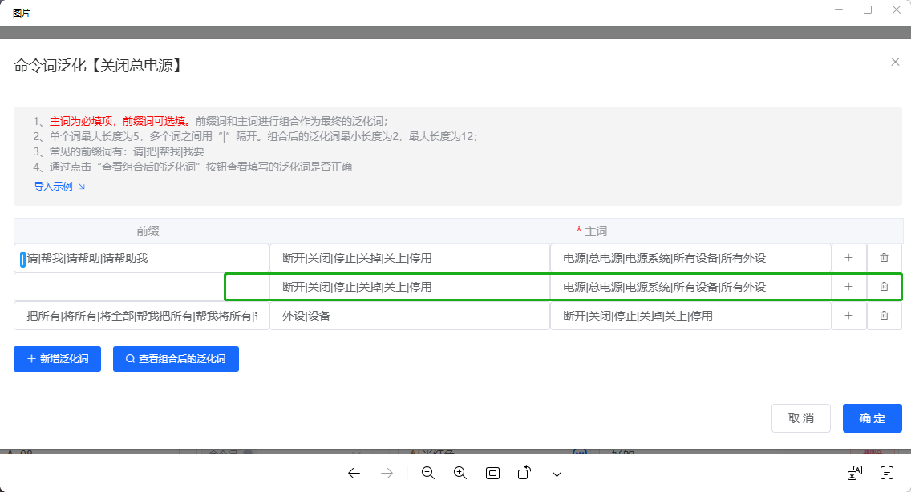
- **安规要求**：是否需要安规检测及等级要求

**注意事项：**

- 声纹识别方案对识别环境要求较高，嘈杂环境可能影响准确率
- 密码验证方案需要语音模块作为主控，开发成本相对较高
- 建议根据实际安全等级要求选择合适的验证方案
- 高安全要求的场景可考虑声纹+密码双重验证
- 定制开发需要提供详细需求文档并支付开发费用

---

### 语音指令是否支持阿拉伯数字和英文单词？

**问题描述：**

在设置语音指令时，系统提示"不能出现阿拉伯数字"，询问是否支持混合语言指令（如中文+数字或英文）。

**解决方案：**

**语言限制说明：**

- **单一语言要求**：语音指令只支持全中文或全英文，不能混合使用
- **数字限制**：不支持阿拉伯数字（1、2、3等），需用中文数字（一、二、三）
- **英文单词**：不支持单个英文单词，需使用完整英文句子

**替代方案：**

1. **数字替换**
    - 阿拉伯数字 → 中文数字：端口1 → 端口一
    - 使用中文数字表达：端口一、端口二、端口三

2. **英文替换**
    - TYPEC → "太配希"（谐音词）
    - 慢速发音有助于识别
    - 使用功能描述词：充电接口、传输接口

**注意事项：**

- 混合语言会导致模型生成失败
- 命令词配置时严格遵守单一语言原则
- 如需使用专业术语，建议使用中文描述或谐音替代


---

### 如何通过串口指令控制语音模块的开启和关闭？

**问题描述：**

需要通过外部单片机控制语音模块的识别功能开启和关闭，实现灵活的语音控制管理。

**解决方案：**

**1. 识别控制功能**

- **系统设置**：在平台的"识别控制"中配置语音识别开关
- **串口触发**：支持通过串口指令控制识别功能
- **实时切换**：可以随时开启或关闭语音识别功能

**2. 实现方式**

- **控制逻辑**：系统的控制运行逻辑是自上而下的
- **勿扰模式**：提供勿扰模式选项，不会回复但会"叮"一声提示
- **变量控制**：可通过变量记录和控制识别状态

**3. 配置建议**

- 在"允许语音识别"控制行为下面，再打开一个可以打开识别的指令
- 这样关闭后还能通过语音重新开启
- 适合有外部控制系统的应用场景

**注意事项：**

- 关闭语音识别后，所有识别功能都会暂停
- 勿扰模式适合夜间或会议场景使用
- 串口指令格式需参考模块的通信协议

---

### 最新语音模组是否支持俄语？离线和在线有什么区别？

**问题描述：**

了解最新语音模组是否支持俄语，以及离线和在线版本在功能上的区别。

**解决方案：**

- **离线俄语**：支持离线俄语识别和合成
- **在线俄语**：需要定制开发，支持更强大的对话能力

**离线与在线的区别：**

1. **离线版本**
    - 本地处理，无需联网
    - 响应速度快，隐私性好
    - 功能相对固定，仅支持预置命令

2. **在线版本**
    - 需要连接网络
    - 支持大模型对话，更智能
    - 可定制开发更多功能

**注意事项：**

- 目前主要提供离线俄语支持
- 在线版本需要根据具体需求定制
- 选择时根据应用场景和功能需求决定

---

### 语音模组能响应唤醒但无法回复指令怎么办？

**问题描述：**

语音模组能够响应唤醒指令并发出"叮"的提示音，但无法正常回复语音指令。

**解决方案：**

如果设备能响应唤醒并发送提示音，说明语音模组本身工作正常。

**排查步骤：**

1. **确认系统架构**
    - 检查是否使用了单片机进行控制
    - 确认语音模组与单片机的通信连接
    - 验证串口通信配置是否正确

2. **检查控制逻辑**
    - 确认单片机是否正确接收语音模组的指令
    - 检查指令解析和处理代码
    - 验证执行机构的工作状态

3. **测试通信链路**
    - 使用串口工具监听语音模组输出
    - 确认指令码格式与预期一致
    - 检查波特率、数据位、停止位等参数

**注意事项：**

- 唤醒响应说明模组的语音识别功能正常
- 重点排查模组与控制系统之间的通信链路
- "叮"声表示模组已识别到指令并尝试响应
- 如果所有硬件连接正常，问题可能出在控制软件的逻辑处理上

---

### AI语音回复声音大小异常怎么办？

**问题描述：**

导入继承并重新生成WiFi固件后，发现设备的唤醒声音和回复声音不一致，且回复声音较小。

**解决方案：**

**1. 升级正确的固件部分**

- 不是WiFi部分的问题，需要升级语音ASR部分固件
- 在智能公元平台导入继承后，重新生成语音部分固件

**2. 音量调节方法**

- 在智能体平台的发音人配置中调节音量
- 可将音量滑块调整至合适值（如75或更高）

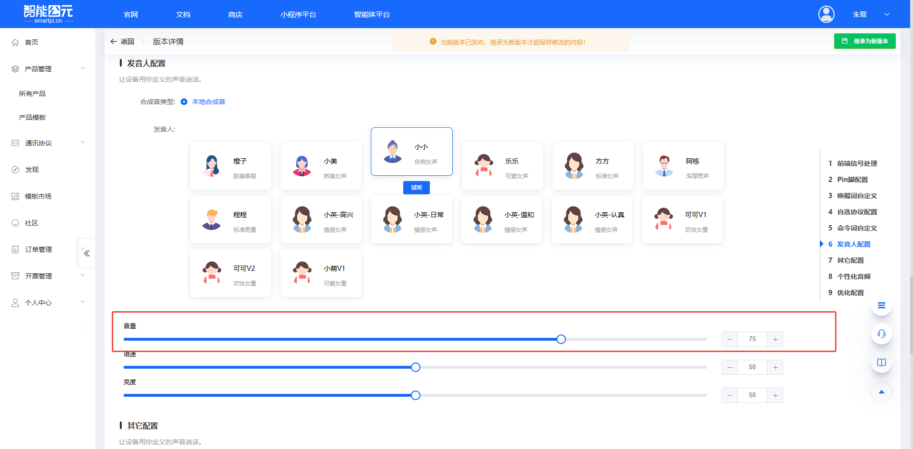

**注意事项：**

- WiFi固件更新不影响语音部分，语音问题需单独更新ASR固件
- 若音量仍然偏小，需要检查AI智能体的音量配置
- 不同设备间可能有差异，建议逐台调试

---

### WiFi语音回答不完整或频繁断句怎么办？

**问题描述：**

WiFi语音回答功能频繁出现无法完整回复的问题，在多次测试中出现断句情况。

**解决方案：**

**1. 更新ASR固件**

- 升级语音ASR部分固件可以优化WiFi语音回答功能
- 在智能公元平台继承语音工程后重新生成并下载固件

**2. 确认烧录流程**

- 先烧录WiFi固件
- 再烧录ASR固件
- 确保两个固件版本匹配

**注意事项：**

- ASR固件更新主要针对在线语音识别和回答优化
- 更新后需要重新测试各项功能
- 若问题持续，可能需要进一步优化智能体配置

---

### 唤醒词与AI回复声音不一致怎么办？

**问题描述：**

烧录WiFi固件后，AI语音回复声音变小，且唤醒词与回复声音不一致，不同设备间声音表现不一致。

**解决方案：**

**1. 理解声音差异原因**

- 唤醒词回复是本地回复语（ASR部分）
- 在线语音是AI智能体的声音（WiFi部分）
- 两部分声音存在差异是正常现象

**2. 统一声音的方法**

- 在智能体平台配置与本地唤醒词相同的声音
- 可将智能体名称改为与唤醒词一致（如都叫"小智"）
- 扫描新的智能体二维码进行绑定

**3. 音量调节步骤**

- 在智能体平台的发音人配置中调节音量
- 将音量滑块调整至合适值（如75或更高）


**4. 设备一致性处理**

- 确保所有设备烧录相同的固件
- 使用相同的智能体配置
- 若仍有差异，重新烧录固件

**注意事项：**

- 本地唤醒词暂时无法直接修改为"小新"，只能修改智能体名称
- 只烧录WiFi固件时，使用的是默认智能体，声音可能不同
- 若AI声音过小，需要在智能体平台而非本地配置中调节音量

---

### 离线语音识别芯片的测试方法和标准是什么？

**问题描述：**

需要了解离线语音识别芯片的测试方法、测试标准、测试环境要求、声源要求以及生产过程中的测试规范。

**解决方案：**

**1. 基本测试方法**

- 使用正常说话音量在5米距离进行测试
- 测试环境应相对安静，避免过度噪声干扰
- 常规测试即可，不需要特殊声源或设备

**2. 研发阶段测试**

- 在专门实验室进行识别率测试
- 识别率合格后才会推出产品
- 测试覆盖不同使用场景和声学环境

**3. 生产测试建议**

- 播报版本号确认固件更新成功
- 抽检关键指令词（不需要测试所有指令）
- 通过结构优化和咪头灵敏度调整提升识别效果

**4. 测试注意事项**

- 无需使用不同声源测试，正常人声即可
- 不需要对语速、音量、性别做特殊要求
- 重点测试实际使用场景下的识别效果

**注意事项：**

- 生产过程建议建立标准测试流程
- 发现识别问题时，可从结构调整、咪头灵敏度、软件配置三方面优化
- 端出现识别问题通常与环境、结构或配置相关

---

### 新增语音指令无法识别怎么办？

**问题描述：**

在新增语音指令后，部分新指令无法被识别，需要排查具体原因。

**解决方案：**

**1. 检查指令配置**

- 确认新指令的命令词已正确填写
- 检查指令列表中是否有空白的命令词字段
- 验证指令的触发动作是否已设置

**2. 对比新旧指令**

- 记录哪些是新添加的指令
- 对比正常指令和异常指令的配置差异
- 重点检查命令词的命名和发音

**3. 重新生成固件**

- 确认配置修改后已保存
- 重新生成完整的固件文件
- 使用可靠方式烧录新固件

**注意事项：**

- 新指令建议使用差异较大的词汇
- 避免与现有指令发音相似
- 测试时在安静环境下进行

---

### 更新固件后旧免唤醒词仍有效怎么办？

**问题描述：**

固件更新后，已经移除的免唤醒词仍可以触发响应，同时部分音量控制指令无反应。

**解决方案：**

**1. 确认固件更新**

- 检查芯片播报的版本号是否为新版本
- 对比固件生成时间和修改时间
- 确认烧录工具显示完全成功

**2. 验证免唤醒词配置**

- 在平台中确认免唤醒词已完全删除
- 检查是否有其他地方设置了相同指令
- 重新生成固件并重新烧录

**3. 检查音量控制指令**

- 确认"小声点"、"大声点"等指令存在
- 检查音量控制的参数设置
- 验证串口消息输出是否正常


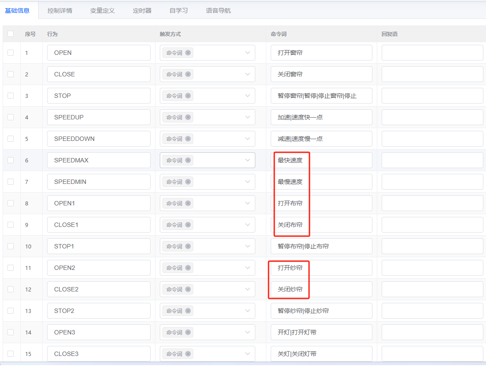

**4. 可能的原因**

- 固件可能未完全更新
- 部分Flash区域未被擦除
- 烧录过程存在干扰或断开

**注意事项：**

- 建议使用CH340烧录器代替升级狗
- 烧录时提供稳定供电
- 多次出现问题需要更换芯片

---

### 定时复位是否能提升语音模块的唤醒灵敏度？

**问题描述：**

语音模块在刚上电时唤醒灵敏度较高，但待机时间越长，误触发频率增加，导致唤醒需要多次尝试。

**解决方案：**

**1. 问题现象分析**

- 刚上电时唤醒较为容易
- 待机时间延长后误触发增多
- 需要多次尝试才能成功唤醒

**2. 定时复位效果**

- 定时复位对唤醒灵敏度没有任何提升
- 复位仅重启系统，不改变硬件特性
- 灵敏度问题需要通过其他方式解决

**3. 正确的解决方法**

- 直接调整灵敏度参数
- 在平台中调高唤醒灵敏度设置
- 优化麦克风安装位置和方式

**4. 误触发原因分析**

- 待机时间增长可能积累噪声
- 播报语音时无法识别是正常现象
- 环境噪声变化会影响识别效果

**注意事项：**

- 定时复位主要用于系统维护，不能改善灵敏度
- 建议根据实际环境调整灵敏度参数
- 如问题持续，需检查硬件设计和麦克风质量

---

### 如何进行语音模块的稳定性与可靠性测试？

**问题描述：**

希望了解针对语音模块（US516P6和LPA4871）的稳定性与可靠性测试方法，特别是如何在自动化测试中模拟语音输入以确保测试结果的一致性和准确性。

**解决方案：**

**1. 基本测试方法**

- 使用人工嘴或真人喊命令词测试
- 让不同的人来喊以避免个体差异
- 在不同场景下进行测试

**2. 测试场景**

- 机器不启动的情况下测试基准识别率
- 机器启动的情况下测试抗干扰能力
- 播放新闻或音乐时测试噪声环境识别

**3. 自动化测试考虑**

- 扬声器和人喊的结果区别较大
- 难以保证每次音量和音色相同
- 音量不好模拟正常人使用时的音量

**4. 问题排查思路**

如果识别效果不好：

- 先将咪头挪出来测试
- 检查机器噪音影响
- 针对词条优化
- 检查咪头装配位置和打孔设计

**注意事项：**

- 建议使用人工测试为主
- 自动化测试需要专门设备和环境控制
- 重点测试实际使用场景
- 逐一排查问题根源

---

### 语音模块无法正常工作如何排查？

**问题描述：**

部分语音模块无法正常工作，需要排查具体故障原因。

**解决方案：**

**1. 初步排查**

- 确认是否为固件问题，检查固件版本是否正确
- 验证固件文件是否完整，使用MD5校验
- 对比正常工作和异常模块的配置差异

**2. 音量检查**

- 虽然初步怀疑是音量问题，但需要实际验证
- 检查模块的音频输出配置
- 确认音量设置是否符合规格要求

**3. 功能验证**

- 测试模块的各项基本功能
- 检查唤醒词识别是否正常
- 验证指令响应是否准确

**4. 环境因素**

- 检查使用环境的噪声水平
- 确认供电是否稳定
- 验证接线是否正确牢固

**注意事项：**

- 不是所有问题都是音量导致的，需要全面排查
- 保留故障模块的详细信息便于分析
- 建议建立故障记录追踪系统
- 如问题持续存在，需要返厂检测

---

### 是否可以实现多个语音指令的连续控制？

**问题描述：**

需要实现多个语音指令的连续控制功能，例如连续执行打开风扇2档、开启摇头、自然风等操作。

**解决方案：**

- 确认支持多意图连续控制的芯片型号
- 具体实现方式需要根据所选芯片的技术方案确定
- 建议联系技术团队获取详细的多意图实现方案

**注意事项：**

- 多指令连续控制需要特定的硬件支持
- 实现前需确认芯片是否具备该功能
- 不同芯片型号的多意图支持能力可能不同

---

### 是否支持用户自定义唤醒词功能？

**问题描述：**

需要确认语音模块是否支持消费者自定义唤醒词，以及该功能的实现方式和潜在风险。

**解决方案：**

**1. 功能支持**

- 语音模块支持自学习唤醒词功能
- 消费者可以自行录制和设置自定义唤醒词

**2. 实现方式**

- 通过模块的自学习功能录制新唤醒词
- 只学习唤醒词，不影响其他指令词的识别
- 学习过程需要在相对安静的环境下进行

**3. 风险评估**

- 自定义唤醒词会提高误唤醒率
- 可能导致"夜半机叫"等异常情况
- 误唤醒率相比标准唤醒词会有所增加
- 建议根据产品类型评估是否开启此功能

**注意事项：**

- 不建议默认开启自学习功能，以免导致客诉和退货率增加
- 如必须开启，建议提前与用户沟通可能出现的问题
- 偶尔的误触发是正常现象，只要不会持续误触发即可
- 可以先小批量测试，评估用户接受程度

---

### 模块灵敏度不佳如何调整？

**问题描述：**

测试模块时感觉灵敏度不是很好，希望技术团队人员调整灵敏度参数以改善识别效果。

**解决方案：**

**1. 灵敏度调整**

- 技术团队人员会进行灵敏度参数调整
- 调整基于实际测试结果
- 需要一定时间进行优化
- 调整完成后会通知测试

**2. 测试反馈**

- 安装到样机上进行实际测试
- 记录具体的识别问题
- 提供详细的测试场景
- 反馈识别不灵敏的具体情况

**3. 优化验证**

- 调整后进行全面测试
- 对比调整前后的效果
- 确认是否满足使用需求
- 如仍有问题可继续优化

**注意事项：**

- 灵敏度调整需要平衡识别率和误触发率
- 测试环境应保持相对安静
- 多人测试以获得更全面的效果评估
- 调整需要时间，请耐心等待

---

### CI-03系列是否支持俄语？

**问题描述：**

需要确认CI-03系列芯片是否支持俄语，以及如何实现俄语语音指令。

**解决方案：**

**1. 语言支持说明**

- CI-03系列支持俄语，但需要定制开发
- 小语种定制属于特殊需求
- 常用语推荐词可直接定制
- 生僻词需要录音制作

**2. 定制要求**

如需俄语定制，需提供：

- **唤醒词和命令词列表**
    - 唤醒词：Привет, Алиса
    - 上升：Алиса, иди наверх
    - 下降：Алиса, иди вниз
    - 暂停：Алиса, остановись

- **录音文件（如需）**
    - 每个词条4-10条录音
    - 音频格式：.wav（16.0KHz，16位，单声道）
    - 男女录音比例各半为佳
    - 声音平稳，语速正常

- **技术要求**
    - 命令词建议至少4个音节
    - 选择发音有明显差异的词条
    - 声音干净，底噪小

**3. 开发流程**

1. 需求确认
    - 提供俄语词条列表
    - 确认是否需要回复语录音
    - 评估定制开发费用

2. 固件开发
    - 在智能公元平台配置
    - 生成俄语固件
    - 测试识别效果

3. 烧录测试
    - 下载固件到设备
    - 验证俄语命令识别
    - 确认功能正常

**注意事项：**

- 小语种定制需要额外开发时间
- 部分生僻词可能无法通过标准模型实现
- 建议提前规划多语言支持需求
- 俄语回复语也需要通过录音方式提供
- **低功耗限制**：低功耗产品（如SU系列低功耗型号）暂不支持俄语、日语等小语种，小语种仅限CI系列常规功耗产品
- **双模型限制**：支持多语种双模型切换的模块一般不支持低功耗模式

---

### 如何添加俄语回复语"OK"？

**问题描述：**

需要在俄语固件中添加"OK"的回复语，询问具体实现方式。

**解决方案：**

**1. 确认回复语形式**

- 明确"OK"的俄语发音
- 确认使用文字转语音还是录音
- 评估开发工作量和费用

**2. 定制开发流程**

1. **需求确认**
    - 提供俄语回复语音频
    - 确认触发条件
    - 签订开发合同

2. **开发实施**
    - 技术团队进行固件修改
    - 添加俄语回复语功能
    - 测试语音合成效果

3. **交付验证**
    - 提供测试固件
    - 验证回复语功能
    - 确认语音清晰度

**注意事项：**

- 俄语回复语定制属于二次开发
- 需要支付500元开发费用
- 建议提供标准俄语发音
- 开发周期根据具体需求确定

---

### 语音播报不完整如何排查？

**问题描述：**

语音播报在某些情况下只播放部分内容，即使已选择"不被打断"设置，旧版本程序也出现播报不完整的问题。

**解决方案：**

**1. 播报配置检查**

- 确认播报任务配置是否正确
- 检查"不被打断"设置是否生效
- 验证播报内容是否完整

**2. 电源供电排查**

语音播报不完整的常见原因是电源问题：

- 检查电源连接是否牢固
- 测量供电电压是否稳定
- 确认电源接触是否良好
- 排除虚接、接触不良等问题

**3. 硬件故障判断**

如果电源正常但问题依旧：

- 检查音频输出电路
- 测试扬声器工作状态
- 验证功放电路供电
- 排除硬件损坏可能

**4. 软件配置优化**

软件层面的排查方法：

- 尝试合并多个播报内容为一条
- 减少同时进行的其他操作
- 优化播报触发逻辑
- 使用不同版本固件对比测试

**注意事项：**

- 语音播报不完整多数情况下是电源供电问题导致
- 供电不稳定会影响音频功放正常工作
- 建议使用稳定可靠的电源方案
- 如问题突然出现，优先检查电源连接

---

### 多意图演示固件命令词参考

**问题描述：**

在使用多意图功能时，需要了解支持的命令词列表，以便进行产品演示和功能开发。

**解决方案：**

多意图演示固件支持以下类型的命令词：

- **多意图识别**
    - 支持一句话包含多个指令
    - 可同时识别开关和速度等不同维度的控制
    - 适用于复杂的控制场景

- **自然语言理解**
    - 支持更自然的表达方式
    - 不需要严格的固定词条格式
    - 提升用户体验

- **小程序集成**
    - 配合小程序实现更多功能
    - 支持配置和管理命令词
    - 提供可视化的操作界面

**注意事项：**

- 具体的命令词列表请参考演示固件文档
- 不同版本支持的命令词可能有所不同
- 开发时建议先使用标准命令词测试
- 可根据产品需求定制专属命令词

---

### 音频播放后出现识别延迟怎么办？

**问题描述：**

音频文件播放结束后存在一段空隙时间，导致语音识别出现延迟，影响了识别的及时性。

**解决方案：**

- **问题定位**：使用音频编辑软件检查音频文件，确认播放结束后是否有多余的空白时段
- **编辑音频文件**：删除音频文件尾部的空白段，确保音频播放完毕后立即开始识别
- **测试验证**：使用其他无空隙的音频文件测试，确认识别是否正常

**注意事项：**

- 音频文件末尾的空白段可能很短，用普通播放器不易察觉
- 建议使用专业的音频编辑软件查看和编辑音频波形
- 处理后的音频文件需要重新生成固件才能生效

---

### 不同版本离线算法的性能差异？

**问题描述：**

需要了解新旧版本离线算法在代码大小和识别效果上的差异。

**解决方案：**

**1. 代码大小对比**

- **旧版本算法**：约300多KB
- **当前版本算法**：约500多KB

**2. 识别性能对比**

- **识别距离**：两个版本都支持3-5米的有效识别距离
- **打断效果**：正常说话音量下，两个版本都支持3-5米范围内的有效打断
- **识别准确率**：新版本在复杂场景下可能有更好的鲁棒性

**3. 算法特点**

- **离线算法特性**：算法是训练生成的模型，代码大小与模型复杂度直接相关
- **优化空间有限**：训练完成的算法模型难以进一步压缩
- **效果权衡**：更大的模型通常意味着更好的识别效果

**4. 选择建议**

- **内存受限场景**：可考虑使用旧版本算法
- **效果优先场景**：建议使用新版本算法
- **功耗敏感应用**：需要平衡识别效果和功耗消耗

**注意事项：**

- 算法选择需根据具体产品需求和硬件资源来定
- 测试环境要保持一致，避免影响对比结果
- 建议在实际应用场景中进行充分测试

---

### 如何配置离线语音唤醒超时时间？

**问题描述：**

需要修改离线语音唤醒后，从识别到命令词后的超时退出时间。

**解决方案：**

**1. 超时机制说明**

唤醒后系统会启动一个超时定时器，如果在定时器超时前没有再次识别到唤醒词或命令词，系统将自动退出唤醒状态。

**2. 修改方法**

在 `local_asr_proc.c` 文件中，找到 `user_kws_time_update` 函数，修改 `KWS_EXIT_TIME` 的值：

```c
// 更新超时退出唤醒时间
void user_kws_time_update(int is_wakeup) {
    if (kws_timer_status) {
        sys_timer_re_run(kws_timer);
    } else {
        if (is_wakeup) {
            // 修改此处的 KWS_EXIT_TIME 值（单位：秒）
            kws_timer = sys_timeout_add_to_task("sys_timer", NULL,
                user_kws_timeout_cb, KWS_EXIT_TIME * 1000);
            kws_timer_status = 1;
        }
    }
}
```

**3. 函数调用逻辑**

- **识别到唤醒词**：调用 `user_kws_time_update(1)`，启动或更新定时器
- **识别到命令词**：调用 `user_kws_time_update(0)`，更新定时器延长唤醒状态
- **播报音频时**：也调用 `user_kws_time_update(0)`，避免播报过程中超时退出

**4. 配置建议**

- **短时间（3-5秒）**：适合快速响应场景
- **中等时间（8-10秒）**：适合一般交互场景
- **长时间（15-20秒）**：适合需要长时间思考的场景

**注意事项：**

- `KWS_EXIT_TIME` 的单位为秒，代码中乘以1000转换为毫秒
- 超时时间过短可能导致用户说话时被误判为超时
- 修改后需要重新编译并烧录固件才能生效
- 该配置直接影响用户体验，需根据实际产品特性调整

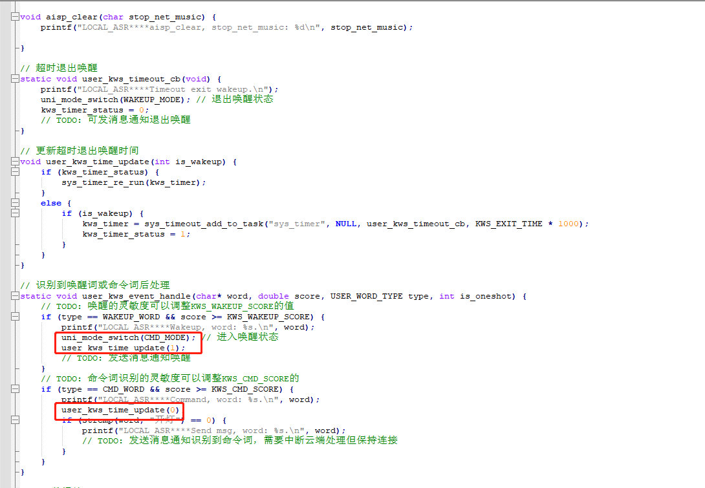

---

### 英文固件内存过大如何优化？

**问题描述：**

开发英文固件时出现内存占用过大的问题，同时发现存在大量重复的词条需要合并优化。

**解决方案：**

- 将重复的词条使用 "|" 符号合并到同一条指令中
- 删除不必要的重复词条，减少内存占用
- 考虑使用 4M Flash 容量的模块来满足大容量需求
- 优化词条配置，提高内存使用效率

**注意事项：**

- 拼接语音播报可能影响流畅性，需要平衡内存优化和用户体验
- 使用 4M 模块时需确认硬件兼容性
- 词条合并后需要重新测试识别效果

---

### 中文固件无法唤醒且无开机播报怎么办？

**问题描述：**

烧录中文固件后出现设备无法唤醒，同时没有开机播报声音的问题。

**解决方案：**

- 检查功放使能电平配置，尝试将功放使能改为低电平
- 重新烧录固件并确认配置生效
- 测试唤醒词和命令词的识别效果

**注意事项：**

- 功放使能电平配置不当会导致音频输出异常
- 修改配置后需要重新烧录固件
- 建议在修改前记录原始配置以便恢复

---

### 英文唤醒词的正确发音方式是什么？

**问题描述：**

英文固件的唤醒词 "Little Cow Little Cow" 需要了解正确的中文发音方式。

**解决方案：**

- "Little Cow Little Cow" 的中文谐音发音为："哩偷寇哩偷寇"
- 可以使用手机翻译软件（如百度翻译）对着麦克风发音进行测试
- 也可以使用视频教程学习正确发音

**注意事项：**

- 发音准确性直接影响唤醒成功率
- 建议多次测试找到最佳发音方式
- 中文音译的唤醒词可能不如英文原文识别准确

---

### 唤醒词音译功能失效如何解决？

**问题描述：**

之前可以正常使用的中文音译唤醒词突然失效，无法正常唤醒设备。

**解决方案：**

- 在固件中添加唤醒词的谐音支持
- 使用 "小牛小牛" 和 "恩牛恩牛" 作为中文谐音唤醒词
- 更新固件后进行全面测试
- 验证普通话发音和视频教学发音都能正常使用

**注意事项：**

- 音译功能可能因固件更新而失效，需要重新配置
- 建议保留多种发音方式以提高唤醒成功率
- 更新后需要测试其他功能是否正常

---

### 播放视频时触发语音指令导致声音重叠怎么办？

**问题描述：**

在使用设备时，播放视频过程中触发了语音指令，导致出现两个声音重叠的现象，疑似USB设备干扰所致。

**解决方案：**

**1. USB设备干扰排查**

- 拔掉其他不必要的USB设备，减少干扰源
- 避免多个USB设备同时连接在同一USB集线器上
- 使用质量更好的USB线缆，确保屏蔽效果

**2. 音频输出隔离**

- 检查视频播放设备和语音模块的音频输出路径
- 确保语音模块的音频输出独立于系统音频
- 使用外部功放或独立音频通道

**3. 麦克风灵敏度调整**

- 适当降低语音识别的灵敏度
- 增加误触发过滤设置
- 调整麦克风增益，避免拾取视频音频

**4. 物理隔离措施**

- 将语音模块远离视频播放设备
- 使用屏蔽麦克风，减少音频串扰
- 确保麦克风朝向合适，避免直接对准音箱

**注意事项：**

- 视频播放时产生的音频可能被误识别为唤醒词
- 建议在播放视频前暂时关闭语音功能
- 如问题持续，可考虑使用带AEC（声学回声消除）功能的模块

---

### 语料采集需要多少人？

**问题描述：**

为提升语音识别模型的训练效果，需要了解语料采集的最低人数要求和年龄分布要求。

**解决方案：**

语料采集有数量和质量要求：

**1. 人数要求**

- 标准方案：最少30人的语音语料
- 深度方案：100人以上的语料（效果更佳）
- 从30人中精选10个音色最具特色的声音

**2. 年龄分布**

- 必须覆盖各个年龄段
- 儿童、青年、中年、老年都要有
- 不同年龄段声音特征差异大，有助于模型泛化

**3. 性别和音色**

- 男女声音比例最好各占一半
- 音色差异要大，避免声音相近
- 包含有口音的语料，提高识别鲁棒性

**4. 语料质量影响**

- 语料太少导致识别效果差
- 每个人音色不同，语料越多样效果越好
- 语料质量直接影响最终产品体验

**5. 详细录制要求**

- 每个命令词录制4-10条
- 声音平稳，语速正常
- 音频干净，底噪和背景声小或无
- 命令词至少4个音节
- 发音有明显差异，避免相近词条

**训练方案对比：**

- 10人语料方案：开发周期2周，费用2000元
- 100人语料方案：开发周期1个月，效果更佳
- 语料越多，训练效果越好

**注意事项：**

- 优先保证语料数量而非追求完美录音
- 年龄分布不均会导致某些人群识别率低
- 同一命令词多人录制能提高适应性
- 语料采集是影响识别效果的关键因素
- AI翻译的回复语可用于应答语音

---

### 相近命令词容易误识别如何解决？

**问题描述：**

在使用语音识别时，遇到发音相近的命令词（如"亮度一档"和"亮度七档"、"色温一档"和"色温七档"）容易发生误识别。同时，未定义的命令词（如"亮度十档"）也可能被误识别为相近的已定义命令词（如"亮度四档"）。

**解决方案：**

**1. 优化命令词设计**

- 加长命令词长度，在数字中间增加"调到"等词语，如"亮度调到一档"
- 避免使用发音过于相近的数字组合

**2. 调整识别阈值**

- 在智能公元平台的"优化配置"中，为不同命令词设置不同的识别阈值
- 对于容易混淆的命令词，一个调高阈值，一个调低阈值，形成差异化
- 阈值越大越敏感，但误识别率也会增高；阈值越小，识别越严格

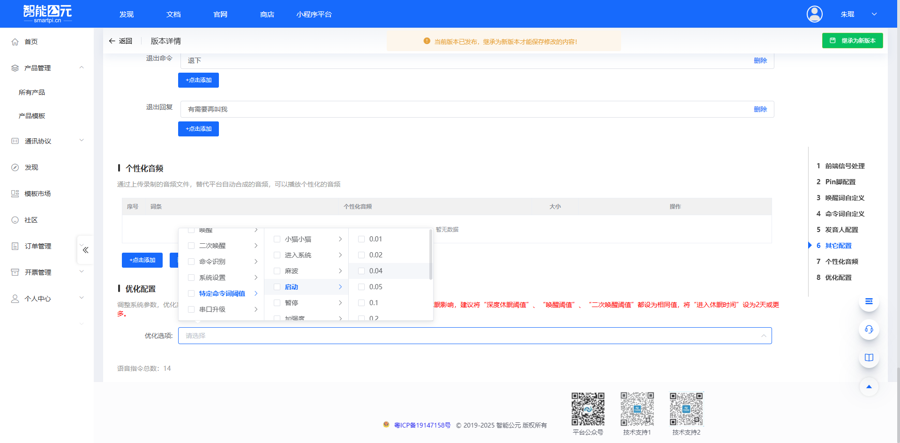

**3. 添加误识别词**

- 将容易引起误识别的未定义词添加到"误识别词"列表
- 如将"亮度十档"添加为误识别词，降低被误识别为"亮度四档"的概率

**4. 增加分词识别**

- 为同一命令词添加多个发音相似的变体
- 例如："亮度四档|亮度思档|亮度斯档"，提高识别容错率

**5. 更换识别模型**

- 考虑使用针对数字识别优化的模型
- 如"中文风扇通用Pro"模型对数字识别有加强


**注意事项：**

- "十"（翘舌音）和"四"（平舌音）在普通话不标准的情况下容易混淆
- 调整阈值需要根据实际测试效果进行微调
- 如果用户普通话水平有限，建议考虑更换为不易混淆的命令词
- 减少命令词挡位数或使用非数字区分挡位也是可选方案

---

### 如何实现多灯具场景下的唤醒词动态切换？

**问题描述：**

统一控制板支持多种灯具组合（大灯具、小灯具、大+小灯具），需要根据不同组合动态切换唤醒词，实现精准控制。

**解决方案：**

**1. 方案概述**

使用免唤醒命令词代替唤醒词，通过主控控制当前生效的命令词：

- 单一大灯具：启用"小安你好"
- 单一小灯具：启用"小安你好"
- 大+小双灯具：启用"小安一号灯"（大灯具）、"小安二号灯"（小灯具）

**2. 实现步骤**

- 在智能公元平台配置多个免唤醒命令词
- 设置"进入唤醒"控制选项
- 主控通过串口协议控制命令词的启用/禁用

**3. 控制逻辑**

- 主控检测灯具组合状态
- 发送控制指令激活对应唤醒词
- 语音芯片识别后返回不同ID给主控
- 主控根据ID执行相应控制

**4. Demo获取**

- 可申请"切换唤醒词demo.json"参考文件
- 导入智能公元平台理解配置方法
- 参考demo实现主控通信协议

**注意事项：**

- 需要定制开发，非标准功能
- 免唤醒命令词应设计为不易触发的词汇
- 确保主控与语音模块通信稳定
- 建议使用蜂鸟M等支持免唤醒的模块

---

### 中文语音指令长度超过12个字后识别效果变差怎么办？

**问题描述：**

在使用语音识别芯片时发现语音指令长度超过12个字后识别效果变差，怀疑是命令长度限制导致的问题。

**解决方案：**

**1. 长度限制说明**

- 语音模块对命令词长度确实存在限制
- 中文命令词建议不超过12个汉字
- 超过限制会导致识别准确率明显下降

**2. 解决方案**

**缩短命令词**：

- 将长命令词拆分为多个短命令词
- 使用简洁、明确的表达方式
- 避免使用冗余词汇

**使用关键词触发**：

- 通过短关键词识别后，由主控MCU执行完整功能
- 例如："调亮度"→触发，然后根据上下文执行具体档位

**分段识别**：

- 将复杂指令分解为多个简单步骤
- 使用多轮对话完成复杂操作
- 提高单次识别成功率

**3. 优化建议**

- 每个命令词控制在3-4个字最佳
- 重要参数可使用数字单独识别
- 避免同音字、易混淆词汇

**4. 测试验证**

- 测试不同长度的命令词识别效果
- 记录最佳的长度范围
- 根据实际应用场景调整

**注意事项：**

- 长度限制是硬件特性，无法通过软件修改
- 建议在设计阶段考虑命令词的简洁性
- 如必须使用长指令，考虑关键词+参数的方案


---

### 中文语音指令长度超过12个字后识别效果变差怎么办？

**问题描述：**

在使用语音识别芯片时发现语音指令长度超过12个字后识别效果变差，怀疑是命令长度限制导致的问题。

**解决方案：**

**1. 长度限制说明**

- 语音模块对命令词长度确实存在限制
- 中文命令词建议不超过12个汉字
- 超过限制会导致识别准确率明显下降

**2. 解决方案**

**缩短命令词**：

- 将长命令词拆分为多个短命令词
- 使用简洁、明确的表达方式
- 避免使用冗余词汇

**使用关键词触发**：

- 通过短关键词识别后，由主控MCU执行完整功能
- 例如："调亮度"→触发，然后根据上下文执行具体档位

**分段识别**：

- 将复杂指令分解为多个简单步骤
- 使用多轮对话完成复杂操作
- 提高单次识别成功率

**3. 优化建议**

- 每个命令词控制在3-4个字最佳
- 重要参数可使用数字单独识别
- 避免同音字、易混淆词汇

**4. 测试验证**

- 测试不同长度的命令词识别效果
- 记录最佳的长度范围
- 根据实际应用场景调整

**注意事项：**

- 长度限制是硬件特性，无法通过软件修改
- 建议在设计阶段考虑命令词的简洁性
- 如必须使用长指令，考虑关键词+参数的方案


---

### 语音识别中如何处理变化的数字？

**问题描述：**

需要实现语音指令中包含可变数字的识别功能，例如"请输入东经XX度，北纬XX度"中的经纬度数字。

**解决方案：**

**1. 离线模块限制说明**

- 离线语音模块无法直接识别可变数字
- 只能识别预设的固定命令词
- 数字变化需要通过其他方式处理

**2. 替代方案**

**方案一：关键词+数字参数分离**

- 将指令拆分为关键词和数字两部分
- 关键词如："请输入东经"、"请输入北纬"
- 数字参数单独识别或通过其他方式输入

**方案二：多命令词覆盖**

- 预设所有可能的数字组合作为独立命令词
- 例如："东经120度"、"东经121度"等
- 根据识别到的数字执行相应功能

**方案三：串口输入处理**

- 通过串口接收具体的数字参数
- 语音模块只负责识别固定的关键词
- 数字变化由主控MCU处理

**3. 实现建议**

- 根据应用场景选择合适方案
- 考虑开发复杂度和成本
- 确保用户体验流畅
- 充分测试验证功能正确性

**注意事项：**

- 离线模块的词条数量有限制
- 过多的命令词会占用存储空间
- 数字识别准确率依赖于音频质量
- 建议在安静环境下进行配置和测试

---

### 可以使用录音设置命令词吗？

**问题描述：**

希望使用录音文件直接设置命令词，而不是手动输入文本，特别是对于特殊语言或发音的命令词。

**解决方案：**

**录音设置说明：**

1. **录音功能支持**
    - 平台支持录音功能录入语音
    - 但命令词仍需要经过训练过程
    - 录音仅作为训练的语料来源

2. **设置流程**
    - 提供录音文件作为语料
    - 由工程师进行模型训练
    - 训练完成后生成新固件

3. **训练服务**
    - 需要付费开发服务
    - 基础训练：3k起步，周期两周
    - 高级训练：1w起步，周期一个月，效果更好

**注意事项：**

- 平台开发功能无法直接使用录音设置命令词
- 必须通过官方训练服务实现
- 训练效果受录音质量和数量影响
- 建议提供清晰、标准的录音文件

---

### 支持多种语言吗？

**问题描述：**

需要了解模块是否支持多种语言，如乌克兰语等非中文语言。

**解决方案：**

**语言支持说明：**

1. **多语言切换**
    - 支持两种语言模式切换
    - 但不支持多种语言穿插识别
    - 每次只能使用一种语言模式

2. **支持的语言**
    - 中文（普通话）
    - 英文
    - 其他语言需要定制开发

3. **乌克兰语支持**
    - 暂时不支持乌克兰语
    - 需要专门的语料训练
    - 可联系工程师评估可行性

**定制开发说明：**

- 需要提供目标语言的语料数据
- 训练周期和费用需单独评估
- 效果取决于语料质量和数量
- 建议先进行小批量测试

**注意事项：**

- 多语言切换需要重新加载模型
- 不同语言的识别效果可能有差异
- 建议根据主要用户群体选择语言
- 特殊语言需求请提前与工程师沟通

---

### 如何通过语音播报输入4位数并组合成变量？

**问题描述：**

希望通过语音识别输入一个4位数的随机数，并将该数字按先后顺序组合成一个四位数存入变量中。

**解决方案：**

**1. 语音识别限制**

- 语音识别模块无法一次性识别连续的多个数字
- 通常只能识别一段话中的一个或两个数字
- 需要逐个输入数字以确保识别准确

**2. 实现方案**

**语音输入设计：**

- 将0-9的中文数字分别作为独立的语音指令
- 每次只识别一个数字，避免识别错误
- 每输入一位数字后进行确认

**数字组合逻辑：**

- 使用变量存储每次识别的数字
- 通过数学运算将数字按位组合成四位数

**3. 实现步骤**

初始化变量用于存储最终结果，然后依次识别每个数字：

```
number = 0

# 识别千位数字
thousands_digit = recognize_digit()  # 识别"一"到"九"
number += thousands_digit * 1000

# 识别百位数字
hundreds_digit = recognize_digit()
number += hundreds_digit * 100

# 识别十位数字
tens_digit = recognize_digit()
number += tens_digit * 10

# 识别个位数字
ones_digit = recognize_digit()
number += ones_digit

# 最终number即为组合的四位数
```

**注意事项：**

- 语音识别的准确性依赖于环境噪声和麦克风质量
- 建议在识别每个数字后增加确认环节
- 平台支持变量运算，但具体逻辑需要自行设计
- 由于当前平台没有提供相关示例，需要自行实现变量运算逻辑

---

### 是否可以不使用唤醒词直接响应所有语音词条？

**问题描述：**

询问是否可以设置所有词条响应不需要先说唤醒词，直接识别并执行。

**解决方案：**

**功能支持说明**

- 支持不使用唤醒词直接响应词条
- 但有词条数量限制：最多只支持10条词条
- 超过10条词条则必须使用唤醒词模式

**配置方法**

1. **平台配置**
    - 在智能公元平台创建产品配置
    - 关闭唤醒词功能或设置为空
    - 添加需要识别的词条（不超过10条）

2. **词条选择建议**
    - 选择最常用的10个指令
    - 避免发音相似的词条
    - 考虑使用组合词减少误触发

**性能考虑**

**优势：**

- 响应更快，无需先说唤醒词
- 交互更自然，类似语音助手体验

**劣势：**

- 词条数量受限（最多10条）
- 容易误触发，需要安静环境
- 功耗较高，持续处于识别状态

**注意事项：**

- 环境噪声较大时建议使用唤醒词模式
- 如需超过10条词条，必须使用唤醒词
- 直接响应模式对麦克风质量要求更高
- 建议根据实际应用场景选择合适模式

---

### 语音识别不完整如何排查？

**问题描述：**

使用语音识别芯片时，即使供电电压为5V，语音识别仍然不完整，影响正常使用。

**解决方案：**

**排查步骤：**

1. **供电检查**
    - 确认供电电压稳定在5V
    - 检查电源纹波是否过大
    - 测量工作时的电压波动

2. **喇叭检查**
    - 更换不同规格的喇叭测试
    - 确认喇叭阻抗匹配（推荐4Ω或8Ω）
    - 检查喇叭功率是否合适

3. **音频回路检查**
    - 检查喇叭连接线是否牢固
    - 确认音频输出无短路或断路
    - 测量喇叭工作电流是否正常

**常见原因：**

1. **喇叭问题**
    - 喇叭内部损坏或音圈卡住
    - 阻抗不匹配导致输出功率不足
    - 喇叭功率过大超出模块驱动能力

2. **电源问题**
    - 电源带载能力不足
    - 电压跌落导致工作异常
    - 电源适配器输出电流不够

**建议方案：**

- 更换为4Ω/3W的标准喇叭
- 使用5V/2A以上的电源适配器
- 检查音频输出回路的焊接质量

**注意事项：**

- 电压正常不代表电流充足
- 喇叭问题是最常见的故障原因
- 建议使用标配的喇叭型号

---------

---

### 声源定位串口发送角度数据异常

**问题描述：**

使用声源定位功能时，串口发送的角度数据是上一次识别播报的角度，而不是当前实时的声源角度。

**解决方案：**

- **确认配置正确**
    - 声源定位功能应设置为"唤醒词+命令词定位"模式
    - 检查事件触发配置是否正确关联声源定位成功事件
    - 确保"获取声源角度"操作在正确的事件触发下执行

- **数据发送机制**
    - 声源定位功能是实时的
    - 检测到声音后会立即发送当前角度数据
    - 系统不会发送上次识别的历史角度

**调试步骤：**

1. 检查声源定位配置界面，确认定位方式设置正确
2. 使用串口调试助手监控数据流
3. 在不同位置发出声音，验证角度数据是否实时更新
4. 确认角度值与实际播报角度一致

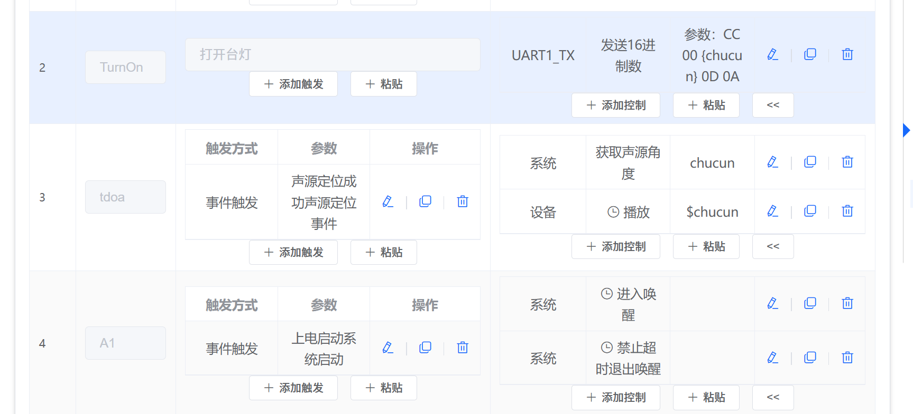

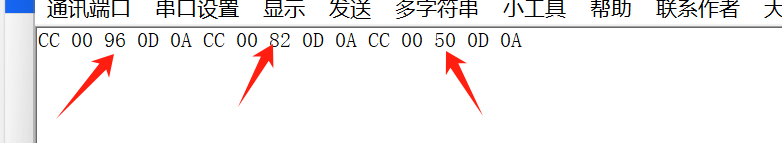

**注意事项：**

- 声源定位必须配合唤醒词和命令词使用，不支持普通说话定位
- 如发现数据不一致，建议重新测试验证
- 确保串口配置参数正确（波特率、数据位等）

---

### 声源定位是否支持普通说话定位

**问题描述：**

需要确认声源定位功能是否可以在不使用唤醒词和命令词的情况下，对普通说话进行实时定位。

**解决方案：**

- **声源定位触发条件**
    - 声源定位功能必须配合唤醒词和命令词使用
    - 系统仅在检测到有效的唤醒词和命令词后才进行角度计算
    - 不支持对普通说话或环境声音进行定位

- **工作原理**
    - 模块需要先识别到预设的唤醒词
    - 再识别到有效的命令词
    - 完成识别流程后才执行声源定位并输出角度

**配置方法：**

在声源定位配置界面中：

- 开启"声源定位功能"
- 将"定位方式"设置为"唤醒词+命令词定位"
- 配置相应的唤醒词和命令词


**注意事项：**

- 普通说话或环境声音无法触发声源定位
- 必须完整配置唤醒词和命令词才能正常工作
- 如需实时声源定位，需要设计交互流程让用户持续使用唤醒词和命令词

---

### 哭声检测功能是否支持硅麦

**问题描述：**

需要确认哭声检测功能是否支持使用硅麦作为麦克风输入。

**解决方案：**

- **硅麦兼容性**
    - 哭声检测功能支持使用硅麦
    - 只要硅麦能正常完成语音唤醒功能，哭声检测就能正常工作
    - 硅麦的类型不影响哭声检测算法的实现

- **判断标准**
    - 首先测试硅麦是否能够正常唤醒设备
    - 如果唤醒功能正常，说明硅麦与模块兼容
    - 唤醒正常的情况下，哭声检测功能即可正常使用

**注意事项：**

- 需要先确保硅麦硬件连接正确
- 建议进行实际测试验证唤醒和哭声检测效果
- 不同品牌的硅麦可能有灵敏度差异，需要根据实际情况调整参数


---

### 唤醒词"小明小明"容易误触发怎么办？

**问题描述：**

在使用"小明小明"作为唤醒词时，仅说出"小明"也会导致误唤醒，希望找到避免这种情况的方法。

**解决方案：**

**问题分析：**

"小明小明"这个唤醒词存在设计缺陷，因为"小明"是唤醒词的子串，容易在日常对话中被误触发。

**解决方案：**

1. **调低识别灵敏度**：

    - 在智能公元平台中找到唤醒词灵敏度设置
    - 将默认的"中"调整为"低"
    - 重新生成固件并烧录测试

2. **使用防误识别功能**：

    - 将"小明"添加到防止误识别词列表中
    - 系统检测到单独说出"小明"时不会触发唤醒
    - 注意：此功能可能会影响正常唤醒率

3. **更换唤醒词**：

    - 选择不易被日常对话触发的唤醒词
    - 避免使用包含子串的词汇
    - 推荐使用4-6个音节、发音差异较大的词汇

**注意事项：**

- 调低灵敏度可能影响正常唤醒距离
- 防误识别功能需要平衡识别率和误触发率
- 更换唤醒词后需要重新学习和适应
- 建议在实际环境中测试优化效果


### 唤醒词配置参数说明

**问题描述：**

了解智能公元平台上唤醒词配置的各项参数含义及其设置方法。

**配置界面说明：**

智能公元平台的唤醒词配置界面包含以下核心参数设置：

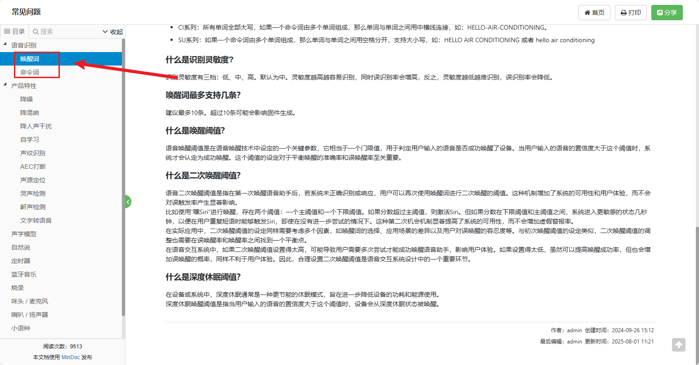

**技术参数详解：**

**识别灵敏度**

- 分为低、中、高三个级别，默认设置为中
- 灵敏度越高，语音识别越容易，识别率相应提高
- 灵敏度越低，识别难度增加，识别率降低
- 需要根据实际使用场景和环境噪声情况选择合适的灵敏度

**唤醒词支持条数**

- 建议最多设置10条唤醒词
- 超过10条可能影响固件生成效率
- 唤醒词数量过多会增加误唤醒的风险

**唤醒阈值**

- 语音唤醒的关键参数，作为判断是否成功唤醒的门限值
- 当语音置信度超过设定阈值时，系统判定为成功唤醒
- 需要在"唤醒准确率"和"唤醒率"之间找到平衡点
- 阈值设置过低容易导致误唤醒，设置过高可能导致唤醒困难

**二次唤醒阈值**

- 首次唤醒失败后的补偿机制
- 包含"主阈值"和"下限阈值"两个参数：

    - 若置信度 > 主阈值：直接激活设备
    - 若置信度在主阈值与下限阈值之间：系统进入"更敏感状态"（持续数秒），提升唤醒概率
- 实际应用需结合唤醒词选择、场景差异和用户容忍度进行调优

**深度休眠阈值**

- 设备在深度休眠模式下的唤醒判断标准
- 当语音置信度超过阈值时，设备从休眠状态被唤醒
- 适用于低功耗设备的功耗管理场景

**配置建议：**

- 根据产品使用环境选择合适的识别灵敏度
- 优先使用简洁、发音清晰的唤醒词
- 在保证唤醒率的前提下，适当提高阈值以减少误唤醒
- 针对不同应用场景（安静/嘈杂环境）进行针对性调优
- 定期收集实际使用数据进行参数优化

---

### AI合成音训练与真人语料训练的区别

**问题描述：**

使用AI合成音进行语音识别模型训练时，识别率提升有限，需要了解真人语料训练的要求和注意事项。

**技术要点：**

**AI合成音的局限性：**

- AI合成音训练的模型识别效果提升有限
- 无法达到真人语料训练的识别准确率
- 对于特定语种（如韩语、越南语等）效果更差
- 容易出现误识别和识别率低的问题

**真人语料训练要求：**

- 每条命令词最少需要50条真人语音语料
- 语料越多效果越好，建议一次性收集足够数量
- 语料需要与文本描述完全匹配
- 避免音频内容与文本不对应的情况

**训练周期管理：**

- 标准训练周期约为3周
- 紧急项目可申请插队处理
- 训练需要经过优化、测试等多个阶段
- 建议提前规划训练时间，预留充足余量

**常见问题处理：**

- 特定命令词识别率低（如Q1、Q10、Q13、Q21、Q22、Q32D等）
- 需要针对低识别率命令词提供更多真人语料
- 可调整命令词的语序或用词来提升识别率
- 训练完成后需要充分测试验证效果

**建议：**

- 项目初期就收集真人语料进行训练
- 不要仅依赖AI合成音做最终效果验证
- 与终端用户沟通，获取实际使用场景的语料
- 预留充足的训练和测试时间


---

### 语料与文本匹配的重要性

**问题描述：**

提供的音频文件与对应的文本描述不匹配，导致训练效果不佳。

**技术要求：**

**匹配标准：**

- 音频内容必须与文本描述完全对应
- 避免音频文件比文本描述长或短的情况
- 确保每条语料的文本准确无误

**常见问题：**

- 音频包含多个词组，但文本只对应其中一部分
- 音频文件质量不佳，影响训练效果
- 语料格式不规范，增加训练难度

**处理建议：**

- 在提交语料前仔细核对每一条音频和文本
- 使用标准格式整理语料数据
- 发现不匹配及时修正，避免影响整体训练效果

---

### 声纹注册需要额外费用吗？

**问题描述：**

询问声纹注册是否需要额外费用，以及具体的授权流程和时间要求是什么。

**解决方案：**

**费用说明：**

- **授权费用**：在模块原价基础上增加1元/片
- **一次授权**：永久有效，无需重复付费
- **包含内容**：声纹识别功能使用权

**授权流程：**

1. **下单备注**
    - 购买模块时联系客服或备注
    - 说明"需要声纹授权功能"
    - 客服会安排授权版本的模块
2. **生产周期**
    - 标准产品：正常发货
    - 授权产品：约15天交期
3. **授权方式**
    - 出厂前在模块硬件层面授权
    - 同时对指定的固件进行授权绑定
    - 授权信息永久保存在模块中

**使用注意事项：**

- 授权模块重新烧录固件会失去授权
- 如需更换固件，需要重新购买授权模块
- 建议在确定最终固件版本后再申请授权
- 授权费用仅针对声纹功能，普通功能无需额外付费

**建议：**

- 开发阶段可使用未授权模块测试（会定时重启）
- 量产时直接采购已授权模块
- 提前规划生产周期，考虑15天授权时间

---

### 优化配置功能是否有效？

**问题描述：**

平台中的优化配置选项是否能有效改善语音识别效果，是否需要开启此功能。

**解决方案：**

- 优化配置对识别效果有一定改善作用
- 主要针对特定应用场景进行算法优化
- 建议根据实际使用情况决定是否开启

**适用场景：**

- 环境噪声较大的场合
- 识别准确率要求较高的应用
- 需要提升整体识别体验的项目

**使用建议：**

- 可先关闭优化配置测试效果
- 再开启优化配置对比差异
- 根据实际效果决定最终设置

**注意事项：**

- 优化配置可能增加少量处理延迟
- 不同场景下效果可能有所差异
- 建议在实际使用环境中充分测试

---

### 免唤醒指令后如何使用常规指令？

**问题描述：**

使用免唤醒指令功能时，设备对免唤醒指令有响应，但后续的常规指令无法被识别。

**解决方案：**

免唤醒指令和常规指令是两种不同的工作模式：

- **免唤醒指令**：不需要说唤醒词，直接说出指令即可触发
- **常规指令**：必须先说唤醒词，然后说出指令才能触发

**使用流程：**

1. 使用免唤醒指令后，模块不会自动进入唤醒状态
2. 要使用常规指令，仍需先说唤醒词
3. 只有被配置为免唤醒的指令才能直接触发
4. 其他所有指令都需要通过唤醒词激活

**注意事项：**

- 免唤醒指令仅限特定配置的命令词
- 常规指令需要唤醒词作为前置条件
- 两种模式可以混合使用，但需注意触发条件

---

### 免唤醒命令词与泛化词冲突问题

**问题描述：**

开启自然说功能后，将某个命令词设置为免唤醒词时，该命令词的泛化词失效。

**解决方案：**

- 泛化后的词不能设置为免唤醒词，仅主词支持免唤醒
- 免唤醒词数量有限，泛化词数量过多会超限
- 需在免唤醒功能与泛化需求之间权衡

---

### 命令词为何需要唤醒后才能使用？

**技术原理与设计考虑：**

- **防误触发**：唤醒词是明确的交互开始信号，避免日常对话/环境声触发。
- **资源与功耗**：免唤醒需持续监听所有命令，耗电和算力更高；唤醒后识别可集中资源、提高准确率。
- **交互体验**：明确交互边界，符合人机习惯，减少干扰。

**不建议直接免唤醒的原因：**

- 误触发概率高、功耗增加、准确率下降、设备稳定性受影响。

**若必须免唤醒的建议：**

1. 平台配置免唤醒词：选特殊且不易误触发的词，严格控制数量。
2. 命令词选择：避开日常高频词，选发音清晰、区分度高的词。
3. 实测验证：在真实场景长时间测试误触发率，监控功耗与稳定性。

**替代方案：**

- 保持唤醒状态（上电不超时退），或用简短易说的唤醒词。
- 优化唤醒后响应链路，降低延迟。

---

### 离线语音功能开发进度如何？

**问题描述：**

询问项目当前进度，特别是离线功能的开发状态，并希望确认是否可以开始进行离线功能的开发工作。

**解决方案：**

- SDK已准备好，离线语音功能正在调试中
- 其他功能模块已完成开发
- 离线识别算法仍在优化
- 可与团队协调，开始离线功能开发

**注意事项：**

- 理清云端对接和业务逻辑
- 关注算法优化进度，合理安排计划

---

### 离线识别算法中的VAD如何使用？

**问题描述：**

在集成离线语音识别功能时，需要了解VAD（语音活动检测）算法的使用方式。

**解决方案：**

- SDK中的VAD可直接使用，不强制依赖讯飞引擎
- 可自行移植VAD功能，移植后需适配
- 离线命令词识别时如云端已收到音频，需在云端实现中止处理
- 建议用任务通知/队列方式通信，避免在中断中调用阻塞API

**注意事项：**

- 云端对接逻辑需明确
- 避免在ISR中使用锁等阻塞操作

---

### 合成语音音调生硬如何处理？

**问题描述：**

日语语音播报音调生硬、机械化。

**解决方案：**

- 暂不支持选择其他音调
- 可由客户提供所有播报MP3录音，替换系统合成音

**注意事项：**

- 提供完整、格式正确的播报录音文件

---

### 语音识别结合自学习功能有哪些优点？

**问题描述：**

需要了解语音识别模块结合自学习功能的优势和应用场景。

**解决方案：**

- **命令词学习**：支持自定义并动态扩展，无需重烧固件
- **提升准确率**：学习用户口音，提升识别成功率
- **降低成本**：减少固件改动与烧录成本
- **应用场景**：智能家居、车载、老人/儿童设备、工业控制
- **使用方法**：按指南配置自学习，录制并测试命令词

**注意事项：**

- 需硬件支持；学习环境保持安静；建议多次学习同一命令词

---

### 语音指令容易被误识别怎么办？

**问题描述：**

某些指令经常被误识别为相似指令。

**解决方案：**

1. 修改指令名称，提升差异度
2. 增加音节/声调差异，避免相近发音
3. 调整识别参数和阈值，检查拼音标注与录音质量

**注意事项：**

- 指令设计避免音韵相近；在多场景测试

---

### 学习模式后只能控制部分功能怎么办？

**问题描述：**

学习模式后只保留少量功能，其他功能丢失且无法恢复。

**解决方案：**

- 学习模式仅记录学习过的红外码，未学习功能不可用
- 温度控制需学习对应按键
- 恢复默认功能可重新匹配品牌或重烧固件

**注意事项：**

- 学习模式与匹配模式互斥

---

### 电机工作时语音识别失效怎么办？

**问题描述：**

电机启动时识别失败，停止后恢复。

**解决方案：**

- 确认是噪音还是供电干扰
- 调高灵敏度、选择降噪场景或启用AEC（单麦）
- 硬件：麦克远离噪声源，独立供电、加隔振

**注意事项：**

- 提高灵敏度会增误识别；结构优化更有效

---

### 电机噪音环境下的语音调优（加速/缓起场景）

**问题描述：**

电机运行时（尤其加速、缓起缓停阶段）识别距离从静止的约8米降至1-3米，停止指令不灵敏。

**问题分析：**

- 物理震动：电机结构震动传递至麦克风
- 噪音增大：齿轮噪声在加速阶段明显
- 机械特性：缓起缓停导致噪声变化

**解决方案：**

1) 固件优化
- 使用降噪模型，结合场景调整置信度
- 不同负载下多轮迭代测试

2) 硬件/结构改进
- 麦克风固定：避免热熔胶，推荐黄胶/水胶并隔振
- 增加减震，优化齿轮与隔音材料

3) 测试验证
- 必须在整机、实际导轨/负载场景测试
- 测静止/缓起/匀速/加速/减速各阶段
- 可用新闻播报等持续噪音测试误唤醒率

**调试案例与注意事项：**

- 降噪模型版本可将运行时识别距离由1米提升至3-5米，优化模型接近静止效果
- 更换唤醒词可能影响整体性能；降噪与结构优化需并行
- 批量前先小批量验证，持续收集反馈调整

---

### 语音指令识别不稳定怎么办？

**问题描述：**

指令有时识别，有时无响应。

**解决方案：**

- 修改为更清晰的命令词
- 提高灵敏度，检查拼音标注和录音质量
- 重新生成固件并在实际环境测试

**注意事项：**

- 修改命令词需重烧固件；测试宜在安静环境

---

### 语音指令配置时行为与命令词不一致怎么办？

**问题描述：**

行为字段与命令词不匹配导致识别失败。

**解决方案：**

- 行为：内部标识符（字母/数字/下划线）
- 命令词：实际语音内容（中文）
- 行为不能为空，触发方式设为命令词
- 建议行为用拼音/英文缩写，保持唯一

**注意事项：**

- 行为不能包含中文；错误需修正后重新生成固件

---

### 65分贝高噪声环境下语音识别是否可行？

**问题描述：**

如淋浴间等约65dB环境下的识别效果。

**解决方案：**

- 有量产案例，65dB环境下基本可识别
- 华中及往北口音一般可；东南口音视程度而定
- 建议采购样片，实测目标场景

**注意事项：**

- 高噪声影响识别，必要时定制口音训练

---

### 设备只能响应唤醒词但听不懂其他指令怎么办？

**问题描述：**

能唤醒但不识别命令。

**解决方案：**

- 检查是否配置并生成命令词
- 检查麦克与环境噪声，使用标准普通话
- 排查固件版本与串口输出

**注意事项：**

- 唤醒词与命令词独立；确保每个命令有动作配置

---

### 语音模块是否支持方言识别？

**问题描述：**

确认方言支持情况。

**解决方案：**

- 仅支持标准普通话
- 可用方言谐音或自学习尝试
- 需方言支持可付费定制（提供语料）

**注意事项：**

- 谐音效果有限；定制成本高

---

### 如何优化语音指令响应延迟？

**问题描述：**

蓝牙协议处理导致响应延迟。

**解决方案：**

- 优化协议与固件链路，响应可至约0.5s
- 通过语音指令测试对比优化前后

**注意事项：**

- 优化固件需重烧；关注环境对延迟影响

---

### 双电机安装在一起时会同时响应吗？

**问题描述：**

担心双电机同时动作。

**解决方案：**

- 系统单一响应机制，同轨只响应一个
- 建议使用最新固件测试验证

---

### 为什么远距离语音识别不稳定？

**问题描述：**

距离1-3米识别错误或多电机同时响应。

**解决方案：**

- 声源定位近距离效果好，远距离精度下降
- 最佳识别距离0.5-1米；远距需硬件/算法优化
- 测试不同距离并提供视频供分析

---

### 语音播报内容与设置语句不一致怎么办？

**问题描述：**

播报内容移位。

**解决方案：**

- 检查命令词列表是否有空白项或顺序错误
- 补全/删除空项，重新生成固件

---

### 如何设置模块上电后一直处于唤醒状态？

**问题描述：**

希望上电即唤醒。

**解决方案：**

- 当前需通过唤醒词激活，不支持永久唤醒
- 可用高灵敏度唤醒词、GPIO手动激活或串口控制

**注意事项：**

- 永久唤醒增加功耗且影响准确率

---

### 学习命令词时能否跳过某些词条？

**问题描述：**

想直接学习后续命令词。

**解决方案：**

- 命令词学习必须按顺序逐个进行，不能跳过
- "学习下一个"仅适用于唤醒词学习

**注意事项：**

- 更换唤醒词后需重新学习命令词

---

### 自学习功能与深度降噪功能可以同时使用吗？

**问题描述：**

配置窗帘应用时，自学习与深度降噪无法同时选中。

**解决方案：**

- 功能互斥：二者不能同时启用
- 需自定义命令选"语音识别+自学习"；需降噪选"语音识别+深度降噪"并选对应模型

**注意事项：**

- 噪音不大可不启用深度降噪；更换唤醒词后需重新学习命令词

---

### 开启自学习功能后是否需要学习所有命令词？

**问题描述：**

开启自学习后是否必须学习全部指令。

**解决方案：**

- 按需学习：仅学习实际使用的命令词
- 未学习的命令词无法使用
- 流程：配置自学习模式 → 添加需学习的命令词 → 按顺序录制

**注意事项：**

- 建议只学习必要命令；更换唤醒词后需重新学习

---

### 如何配置免唤醒词和防误识别功能？

**问题描述：**

生成后免唤醒词被取消且有误识别。

**解决方案：**

- 通过勾选移动需要免唤醒的词条到指定区域，重新生成固件生效
- 在防误识别区域添加干扰相似词，提升准确性

**注意事项：**

- 设置后需重新生成固件；防误识别词需实测

---

### 音乐调名语音识别优化（C/D/E/F/G/A/B/J* 调）

**问题描述：**

识别"C调"、"D调"等调名不灵敏，中文发音与字母读音存在差异。

**优化方法：**

1) 中文谐音替代（推荐/备选举例）
- C调：西调、锡调、斯调（备选：谁调、啬衣调…）
- D调：低吊、第吊（备选：第四个字母）
- E调：亿吊、衣吊
- F调：艾弗调、富调、爱抚调（备选：额腐吊…）
- G调：记吊、鸡调
- A调：屙衣吊、诶吊
- B调：逼调、必吊（备选：第二个字母）
- JA/JB/JD/JE/JG 调：酱诶/酱逼/酱低/酱亿/酱记 等谐音

2) 多候选词配置
- 用“|”分隔同一命令的多谐音，例如：
```
C调=西调|锡调|斯调|谁调|啬衣调
D调=低吊|第吊|第四个字母
F调=艾弗调|富调|爱抚调|额腐吊|额父吊
…
```

3) 特定命令词阈值
- 在“优化配置”→“特定命令词阈值”中，适当降低问题调名阈值（如0.5→0.3），平衡识别率与误识别率

4) 测试建议
- 逐个调名测试；多人口音测试；安静/嘈杂环境对比；连续快速发音测试响应

**注意事项：**

- 谐音需易记且与其他命令区分；阈值调低可能增加误识别，需逐步微调并实测
- 仍不满足时，可收集真人语料（每词≥50条）进行训练

---

### 英文语音词条长度有什么要求？

**问题描述：**

英文词条长度建议。

**解决方案：**

- 推荐3-5个单词，最少避免单词级，最长不超过8-9词
- 过短易误识别，过长影响实时性
- 采用常用词组合，测试后微调

**注意事项：**

- 根据场景和噪声调整；产品定稿前充分测试

---

### 降噪模块使用经验

**问题描述：**

在高噪音环境下（如室外、街道等），需要使用降噪模块来提升语音识别效果。

**降噪模块选型：**

**A-59P降噪模块特性：**

- 商业级规格芯片，价格更低，适合批量生产
- 上电启动速度快，实现"秒启动"
- 增加USB接口，可作为USB声卡使用
- 支持模拟麦克风输入（驻极体麦克风）
- 一个固件可存储4个应用模式，随时切换
- AI降噪固件支持近、中、远、超远距离4种场景拾音
- 双阵列波束降噪固件支持30°、60°、90°、120°4种拾音角度
- SPI数据调试接口，可实时调节降噪强弱、输入增益、输出增益等参数

**降噪效果对比：**

- 无降噪模块：室内正常，室外完全不识别（噪音76dB以上）
- 有降噪模块：识别率显著提升，响应速度改善

**注意事项：**

- 降噪模块在使用过程中会发热
- 需要与语音模块配合调试，最好由供应商专业调试
- 选择响应速度快的降噪模块，避免上电速度慢导致程序休眠


---

### 如何使用标准化方法测试识别率稳定性？

**问题描述：**

语音识别设备有时能正常识别，有时无响应，需要一种标准化的测试方法来排查问题。

**解决方案：**

**录音播放测试法：**

1. **准备测试音频**
    - 录制一段清晰的语音指令音频
    - 确保音频包含能够正常触发的指令

2. **标准化测试流程**
    - 使用手机或音响播放录制的测试音频
    - 保持同一距离进行测试
    - 在同一环境下进行重复测试
    - 每隔一段时间重复播放测试

3. **多设备对比测试**
    - 同时测试多个设备
    - 使用同一音频源
    - 记录每个设备的识别情况
    - 分析是否有特定设备识别率异常

**测试注意事项：**

- 如果5句指令中基本总有一个设备识别不到，可能是个别设备问题
- 测试时要确保播放音量一致
- 环境噪声应保持稳定
- 建议记录测试结果以便分析

---

### 阈值与灵敏度有什么区别？

**问题描述：**

在平台配置中看到"阈值"和"灵敏度"两个参数，不清楚它们的具体区别和如何设置。

**解决方案：**

**参数区别说明：**

1. **阈值（Threshold）**
    - 默认值：0.2（中等）
    - 数值越大越灵敏
    - 设置越高越容易识别，但误识别率也会增加
    - 需要手动设置具体数值

2. **灵敏度**
    - 选项：低、中、高三档
    - 默认值：中
    - 值越大越灵敏（高 > 中 > 低）
    - 通过档位选择，无需设置具体数值

3. **优化配置触发逻辑**
    - 只有当优化配置值大于阈值时才会触发识别
    - 例如：阈值设为0.2，优化配置需达到0.2以上才能识别成功
    - 这是识别的最终判断条件

**配置建议：**

- 阈值和灵敏度配合使用可以精细调节识别效果
- 如果设置了阈值参数，灵敏度参数可以忽略
- 调整时建议逐步调整，每次调整后测试效果
- 噪声环境可适当提高阈值，安静环境可适当降低

**注意事项：**

- 阈值设置过高可能导致误识别增加
- 阈值设置过低可能导致漏识别增加
- 建议在实际使用场景中进行测试验证
