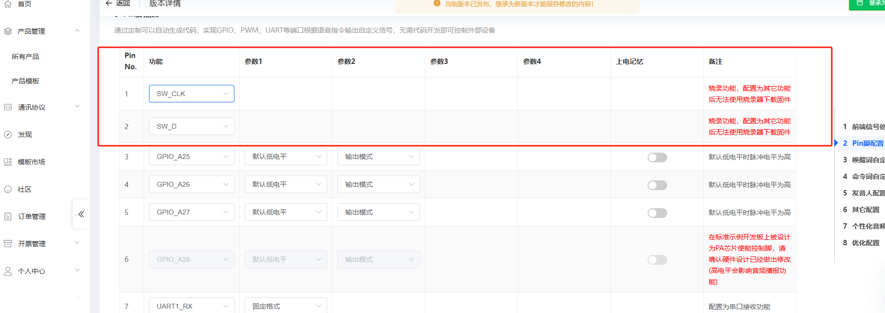
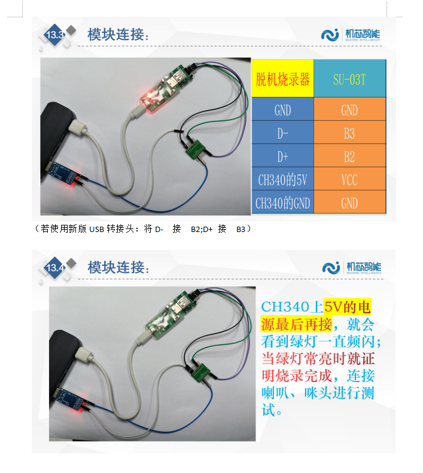
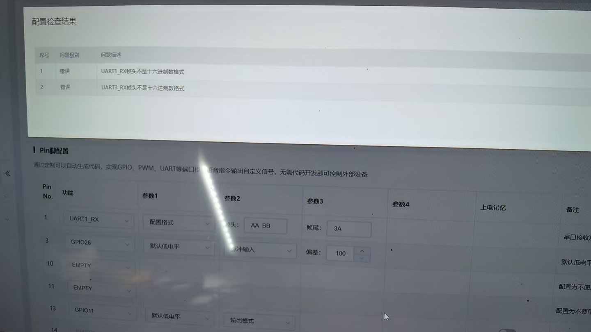

# 烧录与调试 FAQ

### 为什么用SU-03T模块烧录固件时，使用电源适配器供电无法烧录，而插在笔记本电脑上却可以？

烧录固件时，需要连接到电脑进行烧录操作。烧录完成后，模块才可以使用电源适配器独立供电运行。您所使用的烧录方式（B2/B3接口）是用于量产的，但仍需在电脑上完成烧录过程。电源适配器在烧录阶段仅为模块供电，不负责数据传输。

---

### 如何下载程序到CI-03T芯片中，烧录不成功如何解决？

参考平台入门视频（https://www.bilibili.com/video/BV1e8411T77q/），在平台中点击固件审计进行升级。进度条变绿表示烧录成功。如果卡在没有动作，检查接口连接；如果烧录失败，确保芯片复位（断电上电），并检查外围电路如AGND和GND连接。

---

### CI-03T样机无法下载程序或无法识别语音的原因及解决方法是什么？

样机A无法下载程序的原因是5V对GND短路，需卸载R36解决；样机B无法识别语音的原因是AGND和GND不通，需飞线连接。所有板子AGND和GND之间必须飞线连接。短路问题可能导致芯片损坏，需自行排查电路。

---

### CI1302芯片样机无法烧录程序和语音识别功能失效的排查步骤

**问题描述：**

CI1302芯片样机出现无法烧录程序和语音识别功能失效的问题，需要排查硬件和软件配置原因。

**解决方案：**

**样机A（无法下载程序）：**

- 检查发现为5V对GND短路导致
- 卸掉R36电阻后，语音部分电路VCC和GND无短路
- 芯片电压均正常，说明语音部分电路基本正常
- 如果5V供电连接器处仍然对GND短路，说明其他部分电路存在短路

**样机B（可烧录但无法语音识别）：**

- 原因为AGND和GND不通导致
- 需要在AGND和GND之间飞线连接
- 可进行串口通信，说明芯片和串口功能正常

**通用调试步骤：**

1. 确认功放电路和喇叭没问题：添加开机播报，断电上电后自动播报
2. 确认语音识别功能：添加唤醒回复，喊"你好小智"验证是否有回复
3. 确认串口通信：添加串口输入触发行为，验证收发功能
4. 最后排查变量、标志位、行为跳转等逻辑问题

**注意事项：**

- 所有板子的AGND和GND之间必须飞线连接
- 5V对GND短路可能导致芯片引脚损坏
- 喇叭连接器方向错误会导致无声，需检查连接器方向

---

### 烧录接口应该如何选择？B0/B1、B2/B3、B6/B7有什么区别？

**问题描述：**

烧录时不清楚应该使用哪组接口，不同接口的作用和区别是什么。

**解决方案：**

- **B0/B1接口**：专用烧录器使用，B0为RX，B1为TX
- **B2/B3接口**：脱机烧录器使用，连接DM和DP信号
- **B6/B7接口**：标准烧录接口，用于常规烧录操作

**注意事项：**

- 不同接口对应不同的烧录软件和固件文件
- 选择错误的接口会导致烧录失败
- 烧录前请确认使用的烧录器和对应的接口

*烧录配置界面中显示的Pin功能配置，注意烧录功能配置为其他功能后无法使用烧录器下载*

---

### SU-63T模块支持哪些烧录方式？

**问题描述：**

客户询问SU-63T模块是否只能通过专业工具烧写固件。

**解决方案：**

SU-63T模块支持多种烧录方式：

- **专业烧录工具**：使用官方USB烧录器进行烧录
- **串口工具**：可通过串口工具进行固件烧录

**注意事项：**

- 如果用户已有咪头和喇叭，可购买已焊接排针的模块直接使用
- 烧录时需要配合专用的烧录工具和软件

---

### 使用电源适配器供电时无法烧录怎么办？

**问题描述：**

使用电源适配器为烧录模块供电时无法完成烧录，但使用笔记本电脑USB接口可以正常烧录。

**解决方案：**

- **烧录流程**：下载阶段必须连接电脑，完成后可使用适配器供电
- **CH340芯片作用**：仅用于供电，不参与协议转换和数据传输
- **模块开关**：烧录时不要调动模块上的开关
- **连接确认**：确保使用正确的烧录接口（B2/B3或B6/B7）

**注意事项：**

- 电源适配器只能在烧录完成后为模块独立供电
- 烧录过程中的数据传输必须通过电脑USB接口
- 如果批量烧录，建议使用专用的烧录工装

*烧录操作连接示意图，展示电源连接和烧录完成后的指示灯状态*

---

### SU-63T模块只能通过专业工具烧写固件吗？

**不是的，SU-63T支持多种烧录方式：**

- **专业烧录工具**：使用官方提供的专用烧录器
- **串口工具**：也可以通过串口工具进行烧录

**注意事项：**

- 串口烧录需要正确的硬件连接和软件配置
- 建议使用官方提供的烧录软件和文档
- 烧录前确保模块进入正确的烧录模式

---

### 购买已焊接的SU-63T模块还需要其他器件吗？

**如果已有咪头和喇叭，购买已焊接模块即可。**

- **已焊接模块**：包含必要的外围器件和排针
- **用户需准备**：咪头（麦克风）和喇叭
- **电源**：需要提供2.5V-5.5V的电源
- **调试**：如需调试可准备USB转TTL模块

---

### CI1302芯片和CI-03T模块的固件是否可以通用？

**问题描述：**

客户之前使用CI-03T模块开发的固件，现在更换为CI1302芯片，询问是否可以继续使用之前的固件。

**解决方案：**

**固件兼容性确认：**

1. **完全兼容**：

    - CI1302是CI-03T模块的主控芯片
    - 两者使用相同的开发平台和固件格式
    - 之前为CI-03T模块开发的固件可以直接用于CI1302芯片

2. **烧录方式相同**：

    - 使用相同的烧录工具和软件
    - 烧录流程和接口完全一致
    - 语音包和控制词配置方法相同

**注意事项：**

- 确保芯片的硬件连接正确
- 检查外围电路是否与原模块一致
- 如有问题，可先用原厂测试固件验证硬件

---

### PACK_UPDATE_TOOLS烧录工具出现无限重复下载怎么办？

**问题描述：**

使用PACK_UPDATE_TOOLS v3.7.3烧录工具下载固件后，出现无限次重复下载问题，导致生产无法正常进行。

**解决方案：**

**问题排查：**

1. **工具版本确认**：

    - 当前使用版本：PACK_UPDATE_TOOLS v3.7.3
    - 确认是否为官方最新版本

2. **固件文件检查**：

    - 确认固件文件完整性
    - 检查固件是否为对应型号
    - 尝试使用其他已知正常的固件文件

3. **硬件连接检查**：

    - 检查USB连接是否稳定
    - 确认烧录接口连接正确
    - 检查模块供电是否稳定

**临时解决方法：**

1. **重启工具和电脑**：

    - 完全关闭烧录工具
    - 重新插拔USB连接
    - 重启电脑后重新尝试

2. **更换烧录工具**：

    - 尝试使用其他版本的烧录工具
    - 或使用官方提供的其他烧录软件

3. **分步烧录**：

    - 先烧录主固件
    - 再单独烧录语音资源
    - 避免一次性烧录过大文件

**预防措施：**

- 使用稳定的USB接口和线缆
- 确保烧录过程中不要中断
- 定期更新烧录工具到最新版本

**注意事项：**

- 无限重复下载可能是工具bug或固件兼容性问题
- 生产环境建议准备备用烧录方案
- 持续出现问题请联系技术支持

---

### 固件配置时提示"不是十六进制数格式"怎么办？

**问题描述：**

在固件配置工具中设置帧头、帧尾等参数时，系统提示"UART1_RX帧头不是十六进制数格式"或"UART3_RX帧头不是十六进制数格式"。

**解决方案：**

- **检查空格格式**：确保十六进制数之间的空格使用英文半角空格，而不是中文全角空格
- **正确格式示例**：

    - 正确：`55 AA`（英文空格）
    - 错误：`55　AA`（中文空格）

**常见错误原因：**

1. 输入法切换问题，不小心输入了中文空格
2. 从其他地方复制粘贴时带入了中文空格
3. 配置工具对空格格式要求严格

**注意事项：**

- 所有十六进制参数必须使用英文半角空格分隔
- 建议在输入十六进制数前将输入法切换到英文模式
- 配置完成后仔细检查所有参数格式

*配置检查失败提示，显示帧头/帧尾格式错误*

*正确的帧头配置示例（55 AA），使用英文空格分隔*

---

---
