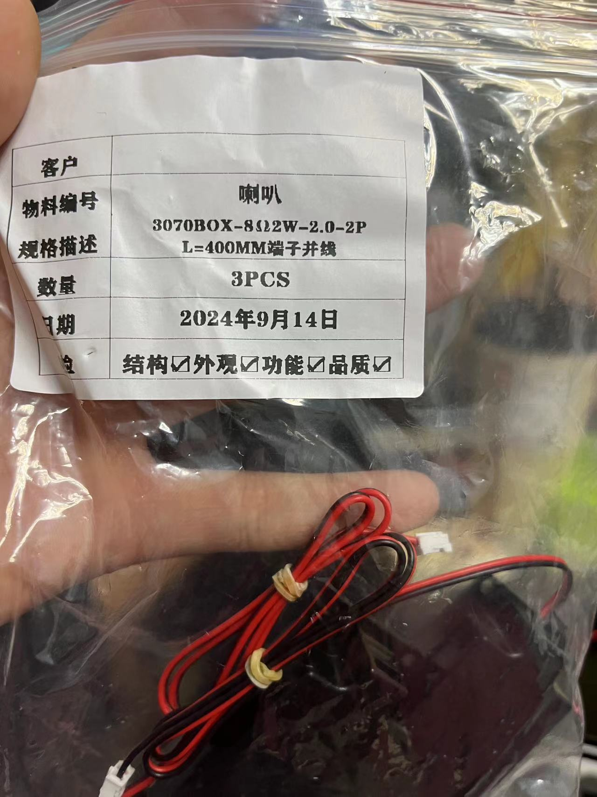
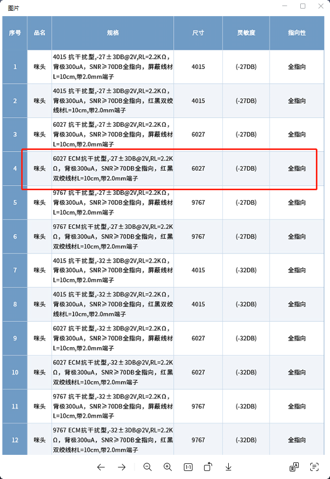

# 硬件设计与电路 FAQ

### CI1302芯片配合AD8802D功放模块时喇叭声音听不清楚怎么办？

**问题描述：**

CI1302芯片配合AD8802D功放模块时，喇叭发出的声音听不清楚，内容无法辨识，感觉喇叭在响但听不清具体内容。

**解决方案：**

1. **检查功放地线连接**：确保功放的地线与系统GND良好连接
2. **测量喇叭对地电压**：分别测量喇叭正极和负极对GND的电压，确保在正常范围内
3. **确认功放供电**：检查AD8802D功放的供电电压是否稳定
4. **验证音频信号**：使用示波器检查CI1302输出的音频信号是否正常

**注意事项：**

- 功放地线不通会导致音频输出异常
- 建议使用原厂推荐型号的功放模块
- 如问题持续，可尝试更换其他品牌的功放模块进行对比测试

---

### CI-03T1模块电路设计审核要点

**问题描述：**

客户希望审核基于CI-03T1芯片的电路设计，特别是驻极体话筒输入电路、电源电路和功放使能脚的接法是否合理，以及是否可以简化电路以降低成本。

**设计要点：**

1. **咪头电路设计**：需要按照官方参考电路设计，不能随意改动
2. **电源电路要求**：电源电路的4.7Ω/0805封装电阻不能省略，这是保证稳定供电的关键元件
3. **未使用引脚处理**：未使用的引脚不需要悬空，按官方设计处理即可
4. **电路简化原则**：建议直接按照官方图纸设计，不要随意变动，只需要考虑与485通信的电平匹配

**注意事项：**

- 功放使能脚的接法需要根据具体功放芯片型号确定
- 电路简化应以不影响功能稳定性为前提
- 电源滤波电容的位置需要靠近芯片电源引脚

---

### 如何通过CI1302控制8002D功放芯片以消除静噪声？

**问题描述：**

CI1302配合8002D功放芯片时，静噪声很大，希望在非语音交互期间关闭功放以消除噪声。

**解决方案：**

1. **功放控制原理**：通过控制8002D芯片的第1脚（SD引脚）高低电平来开关功放
2. **引脚连接方案**：

    - 使用CI1302的第11脚（PA6）连接到8002D的第1脚
    - PA6是CI1302的官方功放使能脚，可直接用于功放控制

3. **控制逻辑**：

    - 语音交互期间：PA6输出高电平，8002D开启工作
    - 非交互期间：PA6输出低电平，8002D关闭，消除静噪声

**注意事项：**

- 必须使用PA6（官方功放使能脚），其他IO口无法实现此功能
- 平台上的音频播放控制功能需要配合PA6使用
- 这种方式可以有效消除功放静态噪声，提升用户体验

---

### 如果自己已有咪头（麦克风）和喇叭，是否只需购买已焊接好的模块即可？

如果客户已有咪头和喇叭，直接购买已焊接的模块即可。

---

### 关于语音模块的喇叭匹配问题，比如喇叭声音小、失真或不响，应如何选型喇叭？

建议先使用发货时配套的喇叭或开发板跟随的喇叭进行测试，以排除喇叭不匹配的问题。关于喇叭选型，模块对喇叭的负载有要求：4欧姆（4R）的喇叭功率应从2.4W起步，8欧姆（8R）的喇叭功率应从1.6W起步。尽量不要使用功率过大的喇叭（例如4欧姆5瓦的），因为模块可能带不动。推荐使用8欧姆2瓦的喇叭负载。

**实际案例参考：**

- 客户使用8Ω2W喇叭（物料编号3070BOX-8Ω2W-2.0-2P）时出现驱动问题，需确认喇叭参数是否在模块驱动能力范围内
- 遇到喇叭不工作时，优先使用开发板配套的圆喇叭进行验证，避免因喇叭不匹配导致误判模块故障

---

### CI-03T模块连接8欧5W喇叭后无法正常唤醒，仅能轻微振动，是什么原因？

**问题描述：**

CI-03T模块连接8欧5W喇叭后，设备无法正常唤醒，仅能轻微振动（用户描述为"只能轻轻蠕动"），喇叭工作异常。

**问题分析：**

根据实际测试结果，8欧5W喇叭的功率超出了CI-03T模块的最佳驱动范围。模块内置的ClassAB功放对喇叭功率有特定要求：

- **4欧姆喇叭**：建议功率从2.4W起步
- **8欧姆喇叭**：建议功率从1.6W起步，不宜超过2W

**实际案例现象：**

- 用户使用8欧5W喇叭时，设备LED指示灯亮起，表明已上电
- 但语音唤醒功能失效，模块只能轻微振动，无法正常响应
- 更换为推荐功率的喇叭后，功能恢复正常

**解决方案：**

- 更换为推荐规格的喇叭：8欧姆2瓦（8Ω2W）
- 优先使用开发板配套的喇叭进行测试验证
- 如需更大功率输出，应考虑外接功放方案

**注意事项：**

- 功率过大的喇叭可能导致模块驱动不足，表现为无法正常唤醒或声音异常
- 典型症状是设备上电但唤醒失效，仅能轻微振动
- 喇叭阻抗和功率匹配是确保模块正常工作的关键因素
- 建议在设计阶段确认喇叭参数是否符合模块的驱动能力

---

### CI-03T模块喇叭发出声音不正常，听不清楚内容，是什么原因？

原因包括：1. R24电阻值太低（用了3K），应大于4.7K；2. C33电容焊接不良或容值错误，需检查105电容；3. 功放地线不通，需飞线解决。检查喇叭正负极对GND电压应为1/2VCC（约2.5V），确保功放电路正常。

---

### CI1302芯片配合AD8802D功放模块时喇叭声音听不清楚的解决方案

**问题描述：**

CI1302芯片配合AD8802D功放模块时，喇叭发出的声音听不清楚，内容无法辨识，疑似存在音频失真或干扰问题。

**解决方案：**

**电阻选择：**

- R24电阻必须使用大于4.7K的阻值
- 3K阻值过低会导致音频信号异常
- 推荐使用4.7K-10K范围内的电阻

**电容配置：**

- C34电容使用105（1μF）容值
- 确保电容焊接良好，无虚焊

**电路检查：**

- 电流干扰通常是芯片外围电路问题
- 检查功放电路的接地是否良好
- 测量喇叭正负极对GND电压，应为1/2VCC（约2.5V）

**注意事项：**

- 仅使用CI1302和AD8802的最小系统测试时，如果问题仍存在，重点检查外围元件参数
- R23电阻建议使用33K
- 设计角度来说，R24的4.7K已是极限值，不应低于此值

---

### 使用CI-03T模组时，外部麦克风灵敏度过高导致误触发怎么办？

**问题描述：**

客户使用CI-03T模组加底板设计，但搭配非标麦克风（灵敏度高于-32dB），导致语音模块出现误触发问题。

**解决方案：**

**麦克风规格要求：**

- 建议麦克风灵敏度：-32dB
- 信噪比要求：SNR＞70dB
- 电源纹波要求：小于100mV（客户实测100mV符合要求）

**处理方法：**

1. **优先方案**：更换符合规格的麦克风
    - 联系麦克风供应商调整灵敏度至-32dB
    - 注意性能调整不影响尺寸装配

2. **替代方案**：若已定型无法更换硬件
    - 通过软件算法优化来降低误触发率
    - 在电路板上增加滤波电路
    - 硬件需搭配标准配置，再优化算法才能达到最佳效果

**注意事项：**

- 咪头灵敏度是影响误识别的关键因素
- 仅通过软件或电路板滤波难以完全解决硬件不匹配问题
- 研发阶段建议多测试样板，选择最佳性能配置

---

### CI1302芯片如何正确处理未使用的引脚和电源滤波？

**问题描述：**

在使用CI1302芯片的电路设计中，如何正确处理未使用的引脚和特定引脚的连接，以及电源部分的滤波电容位置。

**解决方案：**

**未使用引脚处理：**

- 将未使用的引脚悬空或适当接地，避免引入干扰
- 保持芯片引脚的原始设计状态

**电源滤波：**

- 滤波电容应尽量靠近芯片的电源引脚放置
- 确保电源走线短而粗，减少噪声干扰
- AGND和GND必须在PCB上可靠连接

**重要提醒：**

- 所有板子的AGND和GND之间必须飞线连接
- 5V对GND的短路会导致芯片无法正常工作甚至损坏

---

### 如何选择合适的咪头（麦克风）型号以避免识别失灵？

**问题描述：**

客户在使用语音模块时遇到识别灵敏度低、识别失灵等问题，需要了解如何正确选择咪头型号。

**解决方案：**

**推荐咪头规格：**

- **型号**：机芯智能定制咪头6027
- **尺寸**：直径6mm，高度2.7mm
- **电流**：0.1mA-0.5mA
- **灵敏度**：-32dB ~ -25dB范围内
- **信噪比**：≥70dB（推荐75dB）
- **端子**：2.0mm端子+双绞线60mm

**市场选购注意事项：**

**型号识别：**

- 6027为ECM抗干扰型咪头
- 灵敏度：-27dB，信噪比：≥70dB
- 全指向，带2.0mm端子
- 线长建议控制在10cm以内

**采购要点：**

1. **厂家实力考察**：

    - 选择有出厂检测能力的厂家
    - 确认长期供货能力
    - 避免选择小作坊产品

2. **规格书核实**：

    - 国内市场咪头参数参差不齐
    - 很多规格书与实物参数不符
    - 建议购买前先送样测试

3. **质量一致性**：

    - 批量采购前先测试多个批次
    - 关注参数的一致性
    - 确保量产稳定性

**选型注意事项：**

**①硬件要求：**

- 咪头选型非常重要，直接影响识别效果
- 电流建议选择0.5mA以保证性能
- 管芯建议选择进口优质产品

**②接线注意事项：**

- 咪头线设计尽量短，不要超过100mm
- 如需延长引线，必须使用双绞线或屏蔽线
- 模块为单端结构，注意咪头极性，反接会导致无法工作

**③并联问题：**

- 咪头并联会减小电流，影响拾音性能
- 不是一个合理的方案，会导致问题分散且难分析
- 不建议使用咪头并联方案

**④电源要求：**

- 模块供电必须稳定（纹波<100mV）
- 供电不足或不稳会造成识别灵敏度下降

**⑤结构设计：**

- 咪头不能放入密闭空间
- 结构开孔和咪头固定有设计要求
- 防水膜类产品需选用质量好的防水膜

**市场现状：**

- 国内市场咪头质量参差不齐
- 很多规格书参数与实物不符
- 选型时需考察厂家实力、出厂检测能力和长期供货能力

**最终建议：**

- 根据实际使用场景和环境测试为准
- 优先使用原厂推荐的咪头型号
- 研发阶段多测试几个样板，选择最佳配置

---

### 如何增强3.2米长的咪头线缆信号，解决因线缆过长导致的信号衰减？

**问题描述：**

由于产品设计需要，使用3.2米长的咪头线缆，导致信号衰减严重，抗干扰能力差，影响语音识别效果。

**解决方案：**

**问题分析：**

- 咪头线缆超过3米后信号衰减明显
- 长线缆容易受到外界电磁干扰
- 信号强度降低导致识别率下降

**解决方法：**

1. **使用有源麦克风**：

    - 选用内置放大电路的有源麦克风
    - 可以有效补偿长距离传输的信号损失
    - 需要提供合适的偏置电压

2. **信号放大电路**：

    - 在咪头输出端增加前置放大电路
    - 使用运算放大器构建信号调理电路
    - 注意放大器的噪声系数和带宽

3. **线缆选择**：

    - 使用屏蔽线减少电磁干扰
    - 选择低电容、低损耗的音频线缆
    - 双绞线结构有助于抑制共模干扰

4. **阻抗匹配**：

    - 确保咪头输出阻抗与输入端匹配
    - 避免信号反射造成失真

**注意事项：**

- 有源方案需要考虑供电问题
- 放大电路可能引入额外噪声
- 长线缆布局应远离强干扰源
- 建议在研发阶段测试不同方案的优劣

---

### 如何为离线语音识别产品选择合适的贴片式麦克风和喇叭？

**问题描述：**

需要为离线语音识别产品推荐合适的贴片式麦克风和贴片式喇叭，并了解将麦克风与语音芯片集成在同一板上的效果。

**解决方案：**

**贴片式麦克风选型要点：**

1. **灵敏度要求**：

    - 建议灵敏度：-32dB ± 2dB
    - 灵敏度过高容易误触发
    - 灵敏度过低影响识别距离

2. **信噪比（SNR）**：

    - 要求SNR > 70dB
    - 高信噪比能提供更好的识别效果
    - 避免选用低性价比的杂牌产品

3. **频响特性**：

    - 关注语音频段（100Hz-4kHz）
    - 平坦的频响曲线有助于识别

4. **推荐型号方向**：

    - 选择知名品牌（如歌尔、瑞声等）
    - 注意封装尺寸与PCB布局匹配

**贴片式喇叭选型要点：**

1. **功率匹配**：

    - CI-03T内置功放：8Ω 3W以下
    - 根据产品尺寸选择合适功率
    - 考虑音量需求和功耗限制

2. **频率范围**：

    - 重点关注中频段语音还原
    - 避免过分追求低频而影响清晰度

**集成设计优势：**

将麦克风与语音芯片集成在同一板上：

- 减少信号传输路径，降低干扰
- 便于做阻抗匹配和信号调理
- 可以优化电源滤波和地线设计
- 提高产品一致性和可靠性

**注意事项：**

- 麦克风位置要避免结构共振
- 喇叭与麦克风保持合理距离
- 考虑防水、防尘等环境要求
- 留有调试和测试接口
