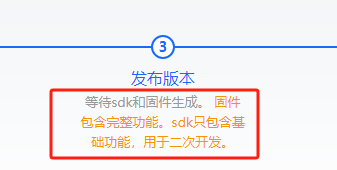
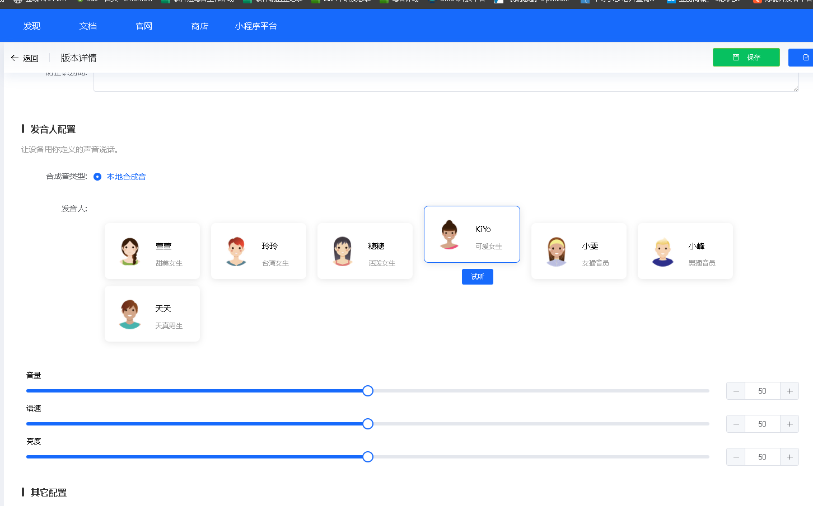

# 平台配置与固件生成 FAQ

### 如何在平台中删除控制详情的控制项？

在平台上打开控制详情，选择要删除的控制项，点击删除按钮操作。如果无法删除整个项，需截图具体位置给技术支持协助。

---

### 在CI-03T模组的配置平台上，网页一直加载无法正常使用，以及不知道如何选择正确的声学模型。

1. 网页一直加载的问题，可以尝试刷新页面，或更换为谷歌浏览器重新登录。
2. 选择声学模型时，需要选择带有“pro”后缀的模型（如CI1302_pro_q），这样才能开启所有功能。如果使用环境嘈杂，建议选择带有深度降噪功能的模型（如CI1302_pro_n）以获得更好的识别效果。

---

### 为什么平台（或官方网站）上显示的 Pin 脚配置序号与模组规格书中的不一致？这是不是配置错误？

平台上显示的 Pin 脚配置序号可以忽略，请直接参照"功能"栏中对应的 GPIO 引脚名称。该序号通常是平台用于内部标识或排序的，与模组规格书中的物理引脚编号或逻辑编号无关。因此，进行配置时，应以引脚的功能名称为准，而不是前面的序号。

---

### 固件版本兼容性：新生成的固件能否下载到老款产品？

**问题描述：**

新生成的固件是否可以下载到老款产品中使用？去年生成的固件是否需要重新生成？

**解决方案：**

- **新生成的固件**：可以下载到老款产品中使用，模块引脚功能没有变动
- **去年10月25日前生成的固件**：需要重新继承发布一下
- 固件继承重新发布不会影响模块的正常功能

**注意事项：**

- 定期检查和更新固件版本，确保兼容性
- 如有不确定的地方，可联系技术支持确认

---

### 固件版本号管理：如何理解0.1、0.2等版本差异？

**问题描述：**

客户询问固件版本0.1和0.2之间的差异，以及0.1和0.05之间的版本关系，特别是是否存在中间版本。

**解决方案：**

**版本号含义：**

1. **版本号规则**：

    - 版本号表示固件的迭代版本
    - 数值大小通常与开发顺序相关，不直接代表性能差异
    - 0.2相对于0.1是后续版本

2. **灵敏度版本差异**：

    - 0.2版本：默认灵敏度设置
    - 0.1版本：降低灵敏度版本（针对误识别优化）
    - 0.05版本：进一步降低灵敏度版本

**版本选择建议：**

- **高噪声环境**：选择0.1或0.05版本以降低误识别
- **正常环境**：可使用0.2默认版本
- **根据实际测试**：选择最适合现场环境的版本

**版本获取：**

- 每次调整参数都需要重新生成固件
- 技术支持可根据需求提供不同灵敏度版本
- 建议保留多个版本进行对比测试

**注意事项：**

- 版本号差异可能包含多种参数调整，不仅是灵敏度
- 新版本通常会改进算法和识别率
- 需要针对具体应用场景选择合适版本

---

### CI-03T1模块固件生成失败，提示空间超出2M限制怎么办？

**问题描述：**

CI-03T1模块在生成固件时因空间不足而失败，错误提示"生成的固件超大(8192字节)，请删减配置项目，选用小模型或使用组合播"。

**解决方案：**

**固件大小限制：**

- CI1302芯片最大存储空间为2MB
- 固件超出限制时会生成失败

**优化方法：**

1. **选择更小的场景模型**
    - 在平台场景模型选择界面选择较小模型
    - 可选模型包括0.6M、1M、1.3M等不同大小
    - 占用内存空间越大，识别效果通常越好

2. **删减配置项目**
    - 减少不必要的命令词和语音播报
    - 精简行为逻辑配置
    - 删除未使用的变量和定时器

3. **使用组合播报**
    - 将多个播报内容组合成单个播报
    - 减少播报占用的存储空间

**注意事项：**

- 场景模型大小直接影响识别效果
- 需要在功能和空间之间找到平衡
- 如果需求确实超出2M限制，考虑使用更大存储空间的芯片型号

---

### SDK生成时间过长怎么办？

**问题描述：**

SDK生成状态长时间显示"正在生成"，已超过2小时，远超正常的10-30分钟。

**解决方案：**

- **原因分析**：SU系列用户过多，需要排队，系统不太稳定
- **当前状态**：工程团队正在紧急修复，全力优化中
- **处理方法**：

    - 耐心等待排队完成
    - 可尝试重新生成（避开高峰期）
    - 选择一早等非高峰时段进行生成

**注意事项：**

- 正常生成时间为10-30分钟，超过2小时属于异常情况
- 问题主要影响SU系列模块
- 官方正在持续优化系统稳定性

---

### 客户无法选择深度降噪、声纹识别等高级功能怎么办？

**问题描述：**

客户在配置语音模块功能时，无法选择包含深度降噪、声纹识别等高级功能的选项，需要指导如何正确配置。

**解决方案：**

**功能选择方法：**

1. **选择正确的声学模型**：

    - 必须选择带"pro"后缀的模型（如CI1302_pro_q）
    - 带深度降噪功能的模型通常带有"n"后缀（如CI1302_pro_n）
    - 安静环境模型（如CI1302_q）不支持高级功能

2. **功能配置路径**：

    - 在平台配置界面找到"高级功能"选项卡
    - 勾选需要的功能（深度降噪、声纹识别等）
    - 确保固件空间足够支持这些功能

3. **注意事项**：

    - 不同型号的模块支持的功能有差异
    - 某些功能可能需要特定的硬件支持
    - 固件空间限制可能无法同时启用所有功能

**故障排查：**

- 如果找不到功能选项，检查是否选择了正确的模型
- 确认使用的模块型号支持该功能
- 联系技术支持获取详细配置指导

---

### 是否支持多唤醒词与多命令词联动的场景？

**问题描述：**

客户希望实现多唤醒词与多命令词联动，即通过不同唤醒词（如小红、小明）唤醒后，发出不同命令词（如睡眠模式、消化模式），设备能根据组合发送对应编码。

**解决方案：**

**技术支持：**

- CI-03T系列模块支持多唤醒词功能
- 支持唤醒词与命令词的联动逻辑
- 可通过平台配置实现复杂的交互场景

**实现方法：**

1. **多唤醒词配置**：

    - 在平台中添加多个唤醒词
    - 每个唤醒词可设置独立的响应
    - 支持最多配置的唤醒词数量以平台限制为准

2. **命令词联动**：

    - 配置不同的命令词对应不同功能
    - 可设置条件判断逻辑
    - 通过状态变量记录当前唤醒词

3. **编码输出**：

    - 可通过串口输出不同编码
    - 例如：01 01（小红+睡眠）、02 01（小明+睡眠）
    - 编码格式可在平台中自定义

**配置示例：**
```
唤醒词"小红" → 设置变量唤醒者=1
唤醒词"小明" → 设置变量唤醒者=2
命令词"睡眠模式" → 输出编码(唤醒者, 01)
```

**注意事项：**

- 联动逻辑需要在平台中正确配置
- 建议使用状态变量管理当前场景
- 测试时注意验证所有组合情况

---

### 是否支持小语种（如阿拉伯语）语音指令定制？有什么要求？

**问题描述：**

客户希望在离线语音识别芯片上实现阿拉伯语等小语种的语音指令定制功能，包括语音指令的识别和响应，并咨询相关技术要求、成本和可行性。

**解决方案：**

**支持范围：**

- 支持小语种定制，但需要额外的定制开发
- 平台默认仅支持中英文，其他语言需要提供语料进行定制
- 效果会略大于大模型，但可满足基本使用需求

**语料要求：**

1. **音频文件格式**
    - 格式：.wav
    - 采样率：16.0KHz
    - 位深度：16 bits
    - 声道：1 channel（单声道）

2. **录制数量要求**
    - 每个唤醒词和命令词需要提供4-10个录音文件
    - 男女声比例建议各50%，以获得更好的适配效果
    - 每个指令词建议至少4个音节（特别是唤醒词必须保证4个音节以上）

3. **内容选择建议**
    - 选择发音差异明显的指令词，避免发音相似的词汇（容易误识别）
    - 录音时保持正常语速，不要故意放慢或加快
    - 声音清晰流畅，无明显的背景噪音

4. **其他要求**
    - 产品中使用的回复语音也需要通过录音方式提供
    - 不超过20条指令（包含唤醒词和命令词）
    - 不接受AI生成的音频文件

**定制流程：**

1. **提供语料**：客户按照要求录制并提供音频文件
2. **技术评估**：技术团队评估语料质量
3. **定制开发**：基于提供语料进行模型训练（约1个月时间）
4. **样品测试**：提供定制固件进行测试验证
5. **最终交付**：确认效果后交付最终固件

**成本说明：**

- 定制费用：2000元/固件
- 需要客户提供完整的语料库

**注意事项：**

- 小语种定制的识别率通常会略低于中文和英文的大模型
- 整个定制周期约1个月，需要预留足够的开发时间
- 建议先进行少量指令的测试，确认效果后再进行完整定制
- 定制固件的功能与标准版本相同，只是语言不同

---

### CI1302芯片支持I2C通信和自学习功能吗？如何获取完整SDK？

**问题描述：**

客户需要使用支持I2C通信和自学习功能的CI1302芯片方案，并咨询如何从平台下载完整的SDK包进行二次开发。

**解决方案：**

**功能支持情况：**

- **I2C通信**：CI1302系列支持I2C协议定制，需要根据具体需求评估可行性
- **自学习功能**：CI1302系列支持自学习功能
- **定制开发**：需要提供详细的功能需求文档，由技术团队评估

**SDK获取方式：**

1. **平台下载限制**：

    - CI系列芯片的完整SDK无法直接从平台下载
    - 平台上"发布版本"的固件包含完整功能，SDK只包含基础功能
    - SU-03T等系列可以从平台下载，CI系列需要技术支持提供

2. **获取途径**：

    - 联系技术支持人员获取CI130X_SDK包
    - 提供项目需求和时间安排
    - 技术支持会通过群聊或邮件发送SDK下载链接

**二次开发说明：**

- SDK仅提供基础的二次开发功能
- 不包含完整的技术支持服务
- 如需要对固件进行二次编译和端口配置，需要自行开发
- 官方只提供平台开发的技术支持

**注意事项：**

- CI系列SDK目前不支持平台自动生成
- 需要二次开发的项目建议提前与技术支持沟通
- 定制I2C协议需要评估项目数量和应用场景
- 教学教具等项目可申请技术支持协助



---

### 语音合成平台生成音频文件为0KB怎么办？

**问题描述：**

在语音合成平台生成自定义音频时，系统生成的文件一直显示0KB，无法正常播放。

**解决方案：**

**问题分析：**

- 该问题通常是平台操作异常导致的临时问题
- 通过平台重新生成操作通常可以解决

**操作步骤：**

1. **确认操作位置**：

    - 在语音合成平台的"发音人配置"界面操作
    - 选择合适的发音人（如KYo、萱萱、玲玲等）
    - 调整音量、语速和亮度等参数

2. **重新生成音频**：

    - 使用平台生成播报内容
    - 生成的音频可集成到SDK中使用

3. **集成到SDK**：

    - 将平台生成的音频文件放入已开发的SDK中
    - 确保音频文件格式兼容

**注意事项：**

- 平台主要用于生成播报音频，SDK用于二次开发
- 两者配合使用可以实现完整的语音交互功能
- 如问题持续存在，可尝试刷新页面或更换浏览器



---

