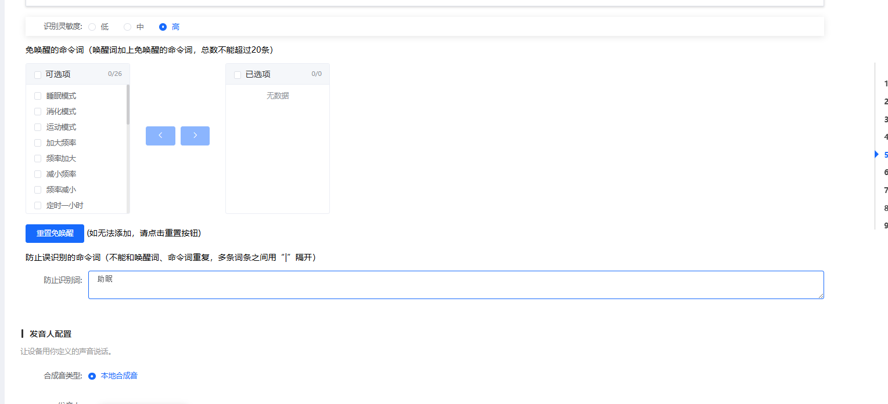

# 语音效果与参数调优 FAQ

### 当CI-03T模组的"睡眠模式"和产品上另一个语音系统的"助眠模式"使用同一个唤醒词时发生冲突，如何解决？

**问题描述：**

产品上有两套语音系统，CI-03T的"睡眠模式"与另一语音系统的"助眠模式"使用相同唤醒词，导致说出"助眠模式"时会错误触发CI-03T的睡眠模式。

**解决方案：**

**方法一：调整识别阈值**

1. 进入固件的"优化配置"界面
2. 找到"睡眠模式"的识别阈值设置
3. 适当调低阈值（阈值越小越不敏感，可降低误识别率）
4. 建议从0.4开始调整，根据实际效果微调

**方法二：添加禁止识别词**

1. 在优化配置中找到"防止误识别的命令词"设置
2. 添加"助眠模式"、"助眠"等关键词
3. 保存配置后，系统识别到这些词时不会触发睡眠模式

**注意事项：**

- 阈值调整需要平衡识别率和误识别率
- 禁止识别词功能可以有效避免特定场景下的误触发
- 建议两种方法结合使用以达到最佳效果

---

### CI03T模组在使用过程中，有时会出现无法唤醒的问题，需要重新上电才能恢复，是什么原因？

芯片本身有看门狗功能，一般不会死机。无法唤醒可能的原因有：1. 电源不稳定，存在较大毛刺或瞬间电流波动，导致模块工作异常。2. 模块确实发生了重启或死机。这需要具体分析，例如提供无法唤醒时的现象视频，或检查电源质量来定位问题。

---

### 为什么将CI-03T模组的唤醒词从“小豹小豹”改为“豹一豹一”和“豹二豹二”后，唤醒效果会变差？

首先，应确保使用最新的“pro”声学模型，而不是旧的“安静环境”模型。如果更换模型后效果仍不理想，可以通过优化唤醒词来改善。技术支持可以提供一个修改后的固件，为“豹一豹一”和“豹二豹二”等不易识别的唤醒词增加“泛词”来提升唤醒率。如果担心误识别，也可以选择不增加泛词，而是直接调高该唤醒词的灵敏度。

---

### 部分语音指令（如"加大频率"、"减小频率"）识别不灵敏怎么办？

**问题描述：**

CI-03T模组在使用过程中，部分特定指令（如"加大频率"、"减小频率"）识别率较低，用户需要多次重复才能触发。

**解决方案：**

**方法一：使用多指令词配置**

- 在命令词配置中使用"|"符号添加多个相似指令
- 例如："加大频率|频率加大"、"减小频率|频率减小"
- 这样用户说出任何一个相似指令都能触发同一功能

**方法二：声学模型优化**

- 更换为最新的"pro"声学模型（非"安静环境"模型）
- 技术支持可以提供定制固件，针对特定难识别词进行优化
- 在平台上使用：https://demohome.aimachip.com/（新模型支持）

**注意事项：**

- 研发阶段应多测试样板，找到最佳性能配置
- 多指令词配置能提高识别成功率，但可能增加误识别风险
- 如有特定需求，可联系技术支持进行固件定制优化

---

### 英语命令词过长且相似导致误识别怎么办？

**问题描述：**

英语命令词过长且部分指令词相似时，会导致语音识别在命令未说完时就提前触发，造成误识别。

**解决方案：**

- 将命令词改得更简短且差异化
- 避免使用只有最后一个词不同的相似命令结构
- 例如："Turn on the driver seat heater" 和 "Turn on the driver seat ventilation" 这种结构容易误识别，类似中文的"你好"和"你好啊"

**注意事项：**

- 命令词设计时应确保前半部分有明显区别
- 简短且独特的命令词可以有效减少误识别率

---

### 如何调整语音识别模块的灵敏度以平衡识别率和误识别率？

**问题描述：**

需要调整语音识别模块的灵敏度，既要有良好的识别率，又要避免误识别过多，找到最佳平衡点。

**解决方案：**

**灵敏度调整方法：**

1. **识别阈值调整**：

    - 在固件的"优化配置"界面找到相关阈值设置
    - 阈值范围通常在0.1-0.9之间
    - 阈值越小越不敏感（降低误识别，但可能影响识别率）
    - 阈值越大越敏感（提高识别率，但可能增加误识别）

2. **推荐设置**：

    - 噪声较小环境：阈值0.4-0.6
    - 中等噪声环境：阈值0.3-0.5
    - 高噪声环境：阈值0.2-0.4

**优化策略：**

- 先从默认值开始，根据实际效果逐步调整
- 记录不同阈值下的表现，找到最佳平衡点
- 考虑产品使用场景，针对性优化

**注意事项：**

- 灵敏度调整需要综合考虑使用环境
- 建议在不同噪声环境下测试
- 过度追求低误识别率可能影响正常使用体验

---

### CI-03T1在现场环境中出现高误识别率如何解决？

**问题描述：**

CI-03T1芯片在产品现场使用时，每天出现约100次误识别（将非"Help me"语音误识别为"Help me"），且误识别率随音量增大而显著上升。

**解决方案：**

**降低唤醒灵敏度：**

1. **当前默认值**：0.2（默认灵敏度）
2. **优化建议**：降低到0.1以减少误识别
3. **调整方法**：

    - 在固件配置界面找到唤醒词灵敏度设置
    - 将数值从0.2调整为0.1
    - 重新生成固件并烧录测试

**音量与误识别关系：**

- 音量从30%增加到80%时，误识别率显著上升
- TV等背景噪声是主要误识别源
- 需要在典型家庭环境（TV开启）下测试验证

**固件版本说明：**

- 新版本固件相比旧版本识别率更高
- 但灵敏度提高也可能增加误识别率
- 需要平衡识别率和误识别率

**测试验证：**

1. 在不同音量环境下测试（30%、50%、80%）
2. 记录24小时内的误识别次数
3. 根据实际效果微调灵敏度值

**注意事项：**

- 灵敏度调整需要多次测试找到最佳值
- 建议在量产前进行充分的环境测试
- 如仍有问题，可联系技术支持进行算法优化

---

### CI-03T系列语音模块在嘈杂环境下是否会出现持续识别导致卡死的问题？

**问题描述：**

担心CI-03T系列语音模块在嘈杂环境下可能会出现持续识别导致系统卡死的问题，需要了解模块的处理机制。

**解决方案：**

**技术特性：**

- CI-03T系列模块具备抗持续识别机制
- 不会因嘈杂环境导致系统卡死
- 模块有内置的音频处理和过滤算法

**麦克风规格：**

- 信号接收速率：标准16kHz采样率
- 支持自适应噪声抑制
- 具备防误触发机制

**优化建议：**

- 在嘈杂环境下适当调低识别阈值
- 确保麦克风安装位置合理
- 避免直接靠近强噪声源

**注意事项：**

- 模块设计已考虑各种使用场景
- 正常使用情况下不会出现卡死问题
- 如遇异常可联系技术支持分析

