- 关注账号管理、配网绑定、控制面板配置与运维能力。
- 包含小程序的基础搭建、发布流程及日常使用操作。

## 小程序平台概述

**功能特性：**

- 账号登录和管理
- 设备列表和状态查看
- 实时控制和监控
- 控制面板自定义
- OTA固件升级
- 设备日志查看

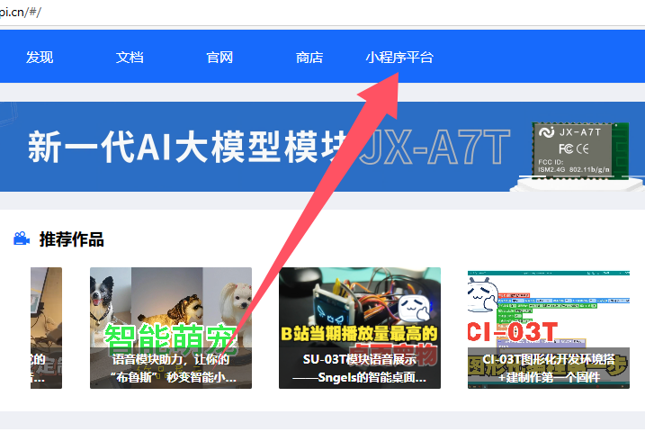

**架构说明：**

- 前端：微信小程序
- 后端：智能公元平台 API
- 数据流：小程序 ↔ 云平台 ↔ 设备

**平台定位：**

- 是公司提供的小程序解决方案
- 支持使用公版模板
- 支持定制化开发
- 适用于各种语音控制产品

**适用场景：**

- 智能家居控制
- 语音交互产品
- IoT设备管理
- 消费电子产品控制

- 架构：前端小程序 + 智能公元平台 API。
- 平台地址：智能公元小程序系统 https://help.aimachip.com/docs/mini_program
- 详细文档：https://help.aimachip.com/docs/mini_program/mini_program-1e9ca38dt6dg3#7y73d2

---

## 常见问题

### 更换小程序图标后设备上显示不变？

**问题描述：**

在小程序平台更换了图标图片，生成新固件并下载后，设备上的图标仍未更新。

**解决方案：**

需要在小程序端清除设备缓存并重新连接：

**操作步骤：**

1. **删除设备**
    - 在小程序中找到对应的设备
    - 删除该设备连接

2. **重新配网连接**
    - 重新搜索并添加设备
    - 完成配网绑定流程

3. **刷新图标**
    - 重新连接后，小程序会从服务器获取最新的图标信息
    - 设备端显示的图标将自动更新

**注意事项：**

- 图标信息缓存在小程序本地，删除设备后才能清除
- 确保已在平台正确上传并生成了包含新图标的固件
- 如多次尝试仍未更新，可尝试清除小程序缓存或重启微信

---

### 小程序注册时是否必须配置支付功能？

**问题描述：**

注册微信小程序时，是否可以跳过支付配置步骤，仅实现基本的设备连接功能。

**解决方案：**

支付功能为可选配置，可以根据需求跳过：

**操作步骤：**

1. **进入小程序设置页面**
    - 登录智能公元小程序系统
    - 点击"客户端 > 小程序设置"

2. **配置支付选项**
    - 如果不需要支付功能，微信商户号MCHID和微信支付密钥APIKEY都填"1"即可
    - 如需支付功能，请填写真实的商户号和密钥

**注意事项：**

- 仅有设备连接和控制需求的小程序可以跳过支付配置
- 填写"1"仅为占位符，不会启用实际支付功能
- 如后期需要添加支付功能，可重新配置真实的商户信息

---

### 如何定制小程序界面移除公司标识？

**问题描述：**

需要在小程序界面中移除公司标识、联系电话和售后橱窗等信息，实现品牌定制。

**解决方案：**

**1. 界面定制需求**

在智能公元平台进行界面设计：

- 进入"页面管理 > 页面设计"
- 选择需要修改的页面元素
- 删除或隐藏公司相关信息
- 修改按钮和链接指向

**2. 可定制的元素**

- 公司Logo和标识
- 联系电话和地址
- 售后橱窗入口
- 品牌色彩方案
- 页面布局结构

**3. 定制流程**

1. **需求确认**
    - 明确需要隐藏的元素
    - 确认品牌展示要求
    - 提供定制设计稿

2. **平台配置**
    - 在设计界面修改相关元素
    - 保存并预览效果
    - 生成新的小程序版本

3. **测试发布**
    - 在测试环境验证功能
    - 确认所有定制要求已实现
    - 发布到生产环境

**注意事项：**

- 定化功能需要联系技术支持协助
- 部分定制需求可能涉及开发费用
- 建议提前规划定制需求，避免频繁修改
- 确保定制后不影响核心功能使用

---

### 小程序支持实时推送通知吗？

**问题描述：**

希望在小程序中实现实时推送通知功能，例如当设备开关打开时向用户推送消息提醒。

**解决方案：**

智能公元小程序平台**不支持实时状态推送通知**功能。

**功能说明：**

- 小程序主要用于设备的**主动控制**和**状态查看**
- 不支持设备状态变化时自动推送通知到手机
- 用户需要主动打开小程序查看设备状态

**替代方案：**

1. **状态指示灯**：在设备上添加LED指示灯，直观显示开关状态
2. **语音播报**：设备状态变化时通过语音提示告知用户
3. **自定义开发**：如必须有推送功能，需要基于模块自行开发APP或定制小程序

**注意事项：**

- 实时推送需要后端服务器支持，当前小程序平台未提供此功能
- 如需推送功能，建议评估项目成本与收益后选择定制开发方案

---

## 小程序迁移指南

### 从智能公元迁移到公司平台

**问题描述：**

已在智能公元平台创建的小程序，需要迁移到公司自己的小程序平台。

**解决方案：**

1. **评估迁移方案**：

    - 可继续在智能公元平台发布小程序
    - 可将小程序界面定制为符合公司需求的样式
    - 新平台配置完成后可直接迁移到公司平台

2. **界面设计定制**：

    - 在智能公元平台进行页面设计
    - 通过"页面管理 > 页面设计"进行自定义
    - 支持修改小程序的整体界面风格

3. **平台迁移准备**：

    - 备份现有小程序配置数据
    - 记录当前的功能模块和设置
    - 准备迁移到新平台所需资料

**注意事项：**

- 迁移前需确保小程序已完成认证和备案
- 建议先在测试环境验证新平台功能
- 迁移过程中可能需要重新配置部分功能

---

## 第一部分：基础搭建及发布

### 1. 账号注册

打开网址[智能公元小程序系统](https://help.aimachip.com/docs/mini_program)，如果您还没有账号，请点击"立即注册"按钮进行注册。

如果您已注册了账号，请输入用户名和密码进入到系统，开始基本的搭建操作。

### 2. 小程序注册

**重要：授权小程序必须要企业主体的微信小程序账号。**

小程序注册有三种方式：快速注册、有公众号注册、无公众号注册。小程序必须完成认证和备案后，才能进行授权操作。

#### 2.1 快速注册

小程序平台支持快速注册小程序，通过智能公元平台快速创建小程序。

**操作步骤：**

1. **登录智能公元小程序系统**
    - 打开[智能公元小程序系统](https://help.aimachip.com/docs/mini_program)
    - 使用账号密码登录

    

2. **点击客户端>快速注册>立即注册**

    

3. **填写资料**
    - 填写企业信息、法人信息等必要资料

    

4. **开始认证**
    - 4.1 法人的微信会收到创建小程序申请

        

    - 4.2 点击开始认证

        

    - 4.3 同意授权

        

    - 4.4 点击下一步

        
        

    - 4.5 在后台界面查看认证状态（如看不到变化，刷新页面）

        

    - 4.6 验证成功

        

    - 4.7 收到创建成功通知

        

5. **登录使用**
    - 前往手机微信里的"小程序助手"小程序设置登录邮箱和密码（重要）
    - 设置完成后前往[微信公众平台](https://mp.weixin.qq.com/)登录使用
    - 参考指引：<https://kf.qq.com/touch/sappfaq/200617VbQzaa200617aq67ru.html>
    - 最后设置小程序的名称、logo和服务类目

**注意事项：**

1. 注意保证主体信息与工商部门登记一致。如：广州和广州市；国家企业信用信息公示系统：<http://www.gsxt.gov.cn/index.html>
2. 确保微信号主人和微信支付绑定银行卡的主人姓名一致。需核实用户是否有改过名字，或者近期有做身份证升级（从15位身份证升级成18位身份证）。
3. 快速创建的小程序如何登录使用：可先前往"小程序助手"小程序设置登录邮箱和密码，设置完成后即可前往微信公众平台登录使用。

#### 2.2 有公众号注册

为方便公众号快捷接入小程序，并在各功能中使用小程序的服务，上线复用公众号资质注册小程序流程。快速注册认证小程序，无需重新提交主体材料、无需对公打款。

**条件：**

- 已认证的企业、媒体、政府、其他组织类型公众号

**限制：**

- 非个体户类型（企业、媒体、政府、其他组织类型）公众号一个月可以复用资质注册5个小程序
- 个体户一个月可以复用资质注册1个小程序

**开通入口：**

- 登录公众号 → 小程序 → 小程序管理 → 添加 → 快速注册并认证小程序

**相关规则：**

1. 复用资质创建的小程序默认与该公众号关联
2. 复用资质创建的小程序默认关联该公众号，不占一个月新增关联13个小程序的限制
3. 复用资质创建的小程序默认关联公众号，不下发模板消息，不默认出现在公众号资料页
4. 一个公众号若存在"待完成注册"的小程序，不可发起复用资质创建小程序
5. 一个公众号一个月内可复用资质注册小程序不多于5个（创建成功才占用）
6. 使用复用公众号资质注册小程序，将以本公众号的主体作为该小程序的开发者，可选择以本公众号运营者作为该小程序的管理员
7. 若选择了复用认证资质，则小程序完成注册后即是"已认证"状态

**创建流程：**

1. **登录公众号**
    - 登录公众号 → 小程序 → 小程序管理 → 添加 → 快速注册并认证小程序

    

2. **同意协议**

    

3. **管理员扫码验证**

    

4. **勾选快速创建小程序的资质**
    - 复用微信认证资质不需要再次支付认证审核服务费，也不需要审核

    

5. **填写小程序帐号信息**
    - 需要一个未绑定个人微信或其他公众平台的邮箱

    

6. **邮件激活小程序帐号**
    - 激活完成后即可使用邮箱帐号密码登录小程序

    

7. **绑定小程序管理员**
    - 注：绑定管理员，如果有在第四步有勾选复用运营者信息，最终以绑定管理员信息为准

    

以上注册流程创建的小程序，不用再走小额打款验证主体。生成的帐号具有独立的邮箱帐号、密码，跟走正常注册流程注册的小程序具有一样的能力权限。

#### 2.3 无公众号注册

在微信公众平台官网首页直接注册小程序。

**注册流程：**

1. **注册方法**
    - 在[微信公众平台](https://mp.weixin.qq.com/)官网首页点击右上角的"立即注册"按钮

    

2. **选择注册的帐号类型**
    - 选择"小程序"，点击"查看类型区别"可查看不同类型帐号的区别和优势

    

3. **填写邮箱和密码**
    - 请填写未注册过公众平台、开放平台、企业号、未绑定个人号的邮箱

    

4. **激活邮箱**
    - 登录邮箱，查收激活邮件，点击激活链接

    

5. **填写主体信息**
    - 点击激活链接后，继续下一步的注册流程
    - 选择主体类型，完善主体信息和管理员信息

    **选择主体类型：**

    

    **主体类型说明：**

    

    **填写主体信息并选择验证方式：**

    - 企业类型帐号可选择两种主体验证方式：

        1. 需要用公司的对公账户向腾讯公司打款来验证主体身份，打款信息在提交主体信息后可以查看到。请根据页面提示，向指定的收款帐号汇入指定金额。温馨提示：请在10天内完成汇款，否则将注册失败。
        2. 通过微信认证验证主体身份，具体认证费用请以平台页面为准。认证通过前，小程序部分功能暂无法使用

    

    **填写管理员信息：**

    

    **确认主体信息不可变更：**

    
    

6. **微信认证**
    - 点击前往认证

    

    - 同意协议

    

    - 填写资料

    
    

    - 填写发票

    

    - 支付费用

    

7. **认证审核**
    - 腾讯公司收到打款后，会及时将该帐号认证申请派发给第三方审核公司进行审核

    **温馨提示：**

    1. 腾讯公司收到打款后会在小信封通知对应审核公司名称及联系方式
    2. 审核过程中若有问题，审核公司会主动联系运营者

    

### 2.4 小程序备案

小程序备案是微信小程序上线的必要步骤，需要在微信公众平台完成备案流程。

**备案指引：**

- 参考[小程序备案操作指引](https://developers.weixin.qq.com/miniprogram/product/record/record_guidelines.html)

**重要提示：**

- 小程序必须完成认证和备案后，才能进行授权操作
- 备案审核时间一般为1-5个工作日
- 备案通过后，小程序才能正式发布上线

### 3. 授权小程序

如果您已拥有微信小程序，点击**客户端 > 授权发布 > 一键授权**，将微信小程序授权给"智能公元"。

**前提条件：**

- 必须已完成小程序注册、认证和备案
- 必须为企业主体的微信小程序账号

### 4. 基本设置

#### 4.1 店铺设置

点击**店铺管理 > 店铺设置**，填写以下信息：

- 小程序名称
- 小程序简介
- 小程序logo

填写完成后点击提交。

#### 4.2 注册设置

点击**客户端 > 注册设置**，修改登录方式，一般默认即可。

#### 4.3 小程序设置

点击**客户端 > 小程序设置**，填写以下信息：

**必填项：**

- **小程序AppID**：从微信公众平台获取（参考"如何获取小程序AppID和AppSecret?"章节）
- **小程序AppSecret**：从微信公众平台获取

**支付功能（可选）：**

- 如果不需要支付功能，微信商户号MCHID和微信支付密钥APIKEY都填"1"即可
- 如果需要支付功能，请填写真实的商户号和密钥

#### 4.4 短信设置

点击**设置 > 短信通知**，选择对应的短信平台进行设置。

短信主要用于：

- 发送验证码
- 订单通知

请根据自己的需要进行配置。

#### 4.5 配送设置（可选）

点击**设置 > 配送设置 > 配送方式**，填写：

- 快递100Customer
- 快递100Key

默认是快递发货，请根据自己的需要进行配置。

#### 4.6 运费模板设置（可选）

点击**设置 > 配送设置 > 运费模板**，点击"新增"创建运费模板，请根据自己的需要进行配置。

#### 4.7 物流公司设置（可选）

点击**设置 > 配送设置 > 物流公司**，请根据自己的需要进行配置。

#### 4.8 发货地址和退货地址设置（可选）

点击**店铺管理 > 地址管理**，点击"新增"按钮，添加发货地址和退货地址，请根据自己的需要进行配置。

#### 4.9 帮助中心设置（可选）

点击**内容管理 > 文件库管理 > 帮助中心**，点击"新增"按钮，填写帮助内容。

这部分内容将会在小程序**个人中心 > 帮助**中展示。请根据自己的需要进行配置。

### 5. 页面设计

**重要提示：如果已发布过小程序，后续修改页面后，不需要重新发布，只需要在微信小程序上刷新相关页面或者重新进入小程序即可看到效果。**

#### 5.1 页面设计

点击**页面管理 > 页面设计**，点击"新增"按钮，根据自己的需求进行页面修改。

**关键操作：**

- 如果想通过小程序控制设备，则必须要添加"设备组件"中的"设备列表"到页面中
- 点击底部"保存"按钮完成编辑

**重要：页面可以创建多个，但是必须要选择一个作为首页。**

#### 5.2 分类模板

点击**页面管理 > 分类模板**，选择分类页样式，然后点击提交。

#### 5.3 底部导航

点击**页面管理 > 底部导航**，点击"新增"按钮创建导航栏。

**导航配置说明：**

- 初始会有四个默认导航按钮，可根据自己的需求进行修改
- 点击"选择链接"，为每个导航分配跳转链接页面
- 固定页面：首页（页面设计中标签为首页的页面）、分类页、购物车、个人中心
- 自定义页：通过填写对应的页面id（比如10001），就能将导航绑定到该页面

**重要：底部导航栏可以创建多个，但是必须要选择一个作为默认导航。**微信小程序里显示的底部导航栏为默认导航栏。

### 6. 发布小程序

#### 6.1 预览体验版

如果您还未进行微信授权小程序，请先授权小程序。

授权成功后，点击**客户端 > 微信小程序 > 授权发布**，点击"预览"按钮，扫描二维码即可查看体验版小程序。

#### 6.2 正式发布

体验版小程序确认无误后，点击"发布"按钮，在弹窗中点击确认发布。

**审核说明：**

- 审核一般1到5个工作日
- 审核成功后，在微信里会收到审核成功信息
- 平台授权发布页面里的状态会变成"已上线"

### 7. 如何获取小程序AppID和AppSecret

1. 前往[微信公众平台](https://mp.weixin.qq.com/)
2. 扫码登录
3. 点击左侧**开发 > 开发管理**，选择"开发设置"
4. 保存AppID和AppSecret
    - **AppID**：直接显示在页面上
    - **AppSecret**：需要通过点击右侧"重置"按钮获取

---

## 第二部分：设备管理

设备管理功能用于统一管理设备，提供查看设备的详细信息、控制设备状态、设置密码、固件管理等功能。

### 8. 设备列表

统一管理设备，提供查看设备的详细信息、控制设备状态、设置密码等功能。

#### 8.1 设备启用和禁用

点击按钮改变设备的启用状态。

- **启用**：设备可以被小程序正常使用
- **禁用**：设备无法被小程序控制

#### 8.2 密码设置

设备密码有两种模式：

- **后台管理密码**：用于后台管理设备
- **设备本地密码**：设备本地设置的密码

**设置后台管理密码：**

**批量设置密码：**

- 勾选所有要设置的设备，点击"批量设置密码"按钮设置密码

#### 8.3 控件显示设置

针对单个设备，灵活调整控件。设置成功后立马生效。

#### 8.4 实时日志

单击操作栏的实时日志，可查看设备运行中产生的数据日志，用于数据查看和问题排查。

### 9. 固件管理

后台管理人员可以自行管理产品开发中上传的固件，通过上传的固件可以方便的对设备进行远程升级。

#### 9.1 固件上传

单击新增按钮，上传固件。

**固件上传说明：**

- 固件包建议从"智能公元平台上生成和下载"
- 解压固件包，找到后缀名为".bin.ota"的文件和"ota_cfg.json"文件
- 在步骤2导入"ota_cfg.json"文件
- 在步骤3导入后缀名为".bin.ota"的文件
- 完成后点击确定按钮

**固件状态：**

- **上线**：表示该固件版本可以被使用，允许在固件升级中选择
- **下线**：表示该固件版本暂时无法使用

### 10. 固件OTA

当需要对批量的设备进行固件升级时，可以通过后台进行远程在线升级，无需烧录。

#### 10.1 新建任务

点击新建按钮，选择目标固件，配置以下参数：

- **目标固件**：升级的目标固件
- **待升级产品号**：用于选择本次需要升级的固件对应的产品号
- **待升级版本号**：用于选择本次需要升级的固件对应的版本号，包含等于和低于指定版本的版本
- **升级方式**：

    - **提醒升级**：用户在小程序/客户端收到升级提醒，可选择升级或不升级
    - **强制升级**：用户必须升级后才能继续使用
    - **检测升级**：用户选择对应设备的面板，主动更新
    - **静默升级**：设备定时检测，自动进行升级
- **升级超时时长**：用于规定OTA等待时间，超时判定为升级失败，可根据固件包大小和客户体验适当调整

#### 10.2 发布任务

点击发布按钮，发布成功后，设备开始升级，用户在小程序端也能看到升级进度。

---

## 第三部分：公版小程序与自有后台管理

### 公版小程序添加的设备如何同步到自有后台？

**问题描述：**

使用公版小程序（智能公元）添加的设备，希望在自有后台管理系统中进行统一管理，实现基于账号的权限控制和设备访问管理。

**解决方案：**

**1. 了解公版小程序限制**

- 公版小程序的设备数据存储在厂商后台
- 数据不对外开放，无法直接迁移
- 需要申请独立的小程序才能实现自主管理

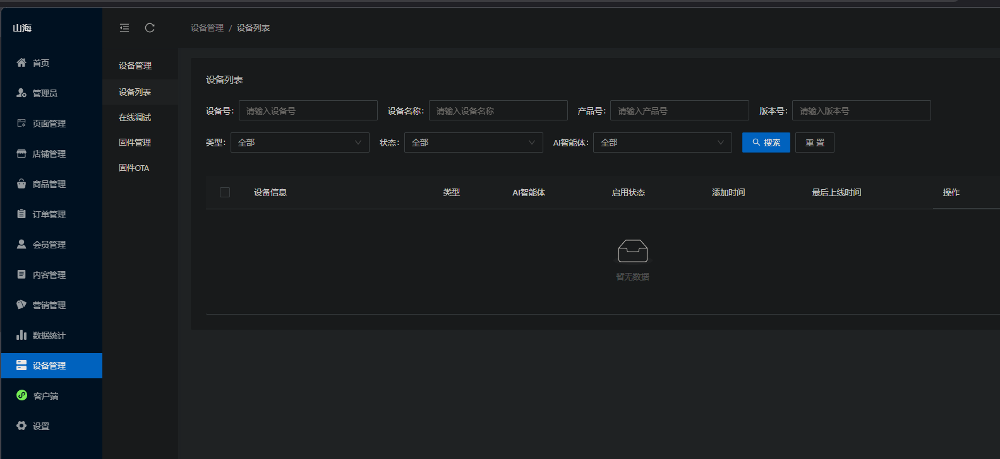

**2. 申请独立小程序**

申请独立小程序的步骤：

1. **进入小程序注册页面**
    - 访问微信公众平台
    - 选择小程序注册类型
    - 完成认证流程

2. **选择开发方式**
    - 法人人脸识别认证（适用于未认证公众号）
    - 或直接在微信公众平台注册

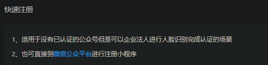

**3. 搭建自有管理后台**

申请成功后：

- 获得独立的小程序后台
- 可以设置和管理用户权限
- 实现基于账号的设备访问控制
- 支持人员离职后权限回收

**4. 权限管理功能**

自有后台支持的管理功能：

- **账号管理**：添加/删除运维人员账号
- **设备授权**：为特定账号分配设备控制权限
- **操作日志**：记录设备使用和操作历史
- **密码保护**：设置设备访问密码

**注意事项：**

- 公版小程序的设备无法直接迁移到自有后台
- 建议新项目直接申请独立小程序
- 独立小程序功能与公版相同，无需额外开发
- 可联系技术支持获取小程序开发接口文档

### 如何获取小程序和APP开发接口文档？

**问题描述：**

需要获取小程序和APP开发的接口文档，以便将设备控制功能集成到自建的运营平台中，实现设备添加、联网及权限管理等功能。

**解决方案：**

**1. 小程序开发接口**

- **文档地址**：https://help.aimachip.com/docs/mini_program
- **开发方式**：在公版小程序基础上加套
- **组件使用**：添加"设备列表"组件实现设备控制

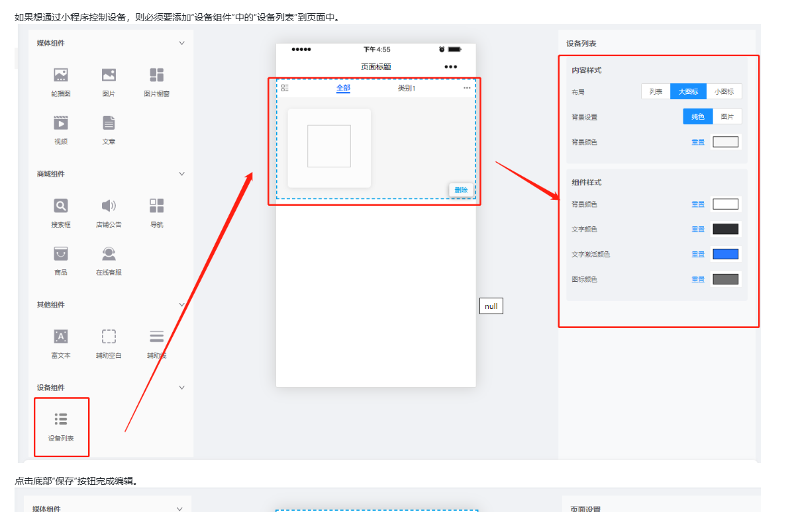

**2. APP开发接口**

- **协议文档**：固件包中的`jx_iot_protocol.docx`
- **基础文档**：固件包中的`readme.txt`
- **通信协议**：包含API接口和数据格式说明

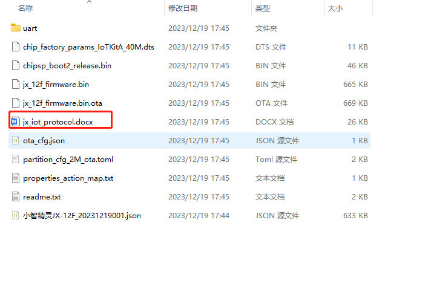

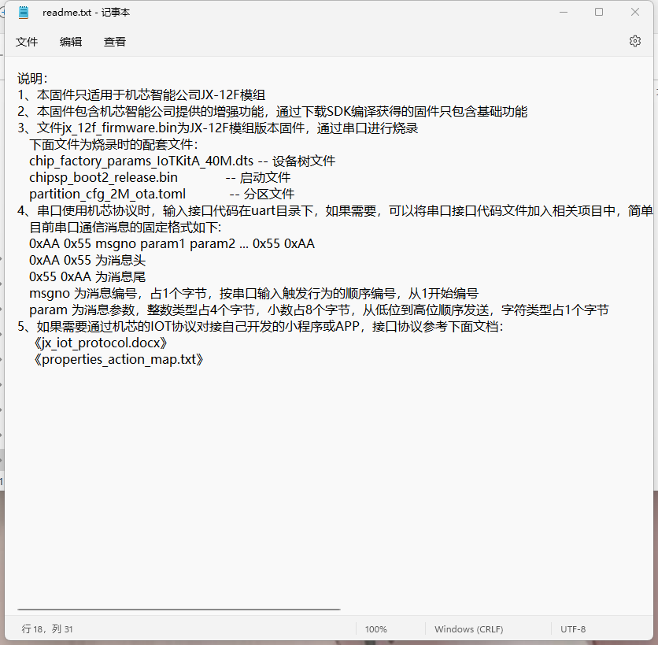

**3. 开发流程**

独立平台开发步骤：

1. **申请小程序**：获得独立的开发权限
2. **获取协议**：下载并研读IoT协议文档
3. **接口对接**：按照协议实现设备联网和控制
4. **权限管理**：设计基于账号的权限体系
5. **测试验证**：使用测试设备验证功能

**注意事项：**

- 独立开发需要自己搭建后台
- 设备联网和控制接口在协议文档中有详细说明
- 小程序开发可以复用公版的功能组件
- 技术支持可提供开发指导和问题解答

---

## 第三部分：日常使用操作

### 11. 账号注册与登录

1. 管理员在平台为运营人员开通账号与权限。
2. 打开小程序，使用手机号/企业账号登录。
3. 首次登录绑定企业或项目，启用二次验证。

### 12. 设备配网与绑定

- 支持二维码、蓝牙辅助、AP 模式等多种配网方式。
- 步骤：添加设备 → 选择模组类型 → 复位设备 → 输入 Wi-Fi 信息 → 绑定成功。
- 常见问题：配网超时（检查信号/密码）、设备已被绑定（管理员解绑）。

### 13. 控制面板配置与自定义

- 在"面板编辑"模式拖拽控件（开关、滑块、数值显示）。
- 可绑定智能体/MCP 工具，实现语音控制与可视化联动。
- 支持主题、图标、布局预览。

#### 13.1 按钮控件双向控制配置

**功能说明：**

配置按钮控件实现双向控制，既可以通过小程序下发指令控制设备，也能接收设备上报的状态变化并实时更新按钮状态。

**适用控件：**

- 开关
- 状态按钮
- 数值按钮

**配置步骤：**

1. **创建串口输入行为**
    - 在行为管理中创建新行为
    - 设置触发方式为"串口输入"
    - 配置串口参数（如：UART1_RX，消息号：1）
    - 在执行行为中绑定需要的状态变化

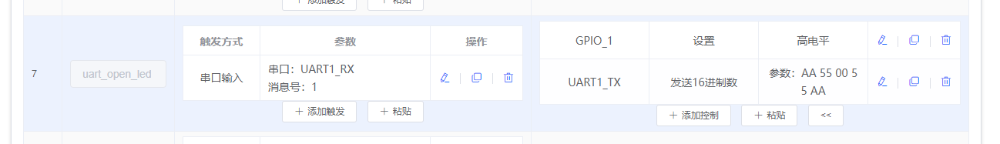

2. **绑定行为到按钮**
    - 选择按钮控件（开关/状态按钮）
    - 在"开"状态或"关"状态中绑定已创建的行为
    - 在控制配置中写下发指令

3. **数值按钮配置**
    - 也可以使用数值按钮
    - 通过关联变量来实现双向控制
    - 变量值变化时自动更新按钮显示

**注意事项：**

- 确保下位机通过串口上报的指令格式与配置一致
- 按钮状态变化会在接收到串口数据时自动更新
- 下发指令和接收上报可同时工作，实现真正的双向控制

---

## 第四部分：常见问题与故障排查

### 14. 常见问题与故障排查

| 场景 | 可能原因 | 解决方案 |
| --- | --- | --- |
| 登录失败 | 权限不足/网络异常 | 重新授权、切换网络 |
| 控制面板无控件 | 未绑定模板 | 在控制台绑定后刷新 |
| 数据不刷新 | 长时间后台停留 | 下拉刷新或重新登录 |
| 配网超时 | 信号弱/密码错误 | 检查Wi-Fi信号强度、确认密码正确 |
| 设备已被绑定 | 设备已绑定其他账号 | 联系管理员解绑设备 |
| 小程序审核失败 | 信息不完整/违规内容 | 检查店铺设置、帮助中心内容 |
| 页面修改不生效 | 未刷新小程序 | 刷新相关页面或重新进入小程序 |
| 无法获取AppSecret | 未重置密钥 | 在微信公众平台点击"重置"按钮 |
| 显示控件显示异常 | 小程序版本过旧 | 在小程序管理后台点击预览测试，发布后即可正常显示 |
| 蓝牙设备数量达到上限 | 免费版限制 | 免费版限制10个蓝牙设备，需升级授权或付费 |

---

### 蓝牙设备数量限制问题

**问题描述：**

在小程序中添加蓝牙设备时提示"设备数量达到上限"，但后台显示的设备总数可能未达到预期上限。

**解决方案：**

1. **了解免费版限制**
    - 免费版小程序蓝牙设备限制数量：10个
    - WiFi设备不限制数量
    - 适用于SU-63T等蓝牙模块

2. **申请扩容**
    - 联系技术支持申请免费扩容到100个设备
    - 扩容有效期：一年
    - 超过有效期或超过数量需要付费授权

3. **付费授权**
    - 购买设备数量授权
    - 根据实际需求选择合适的授权方案
    - 授权后可添加更多蓝牙设备

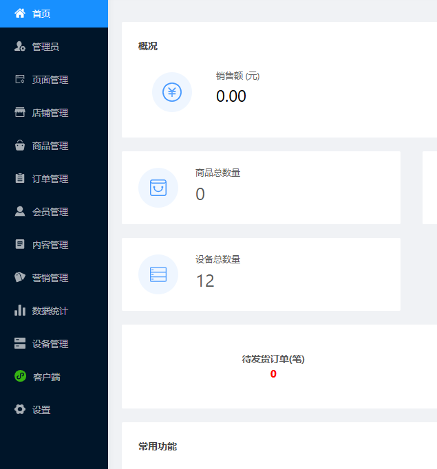

**注意事项：**

- JX-12F等WiFi模块不受蓝牙设备数量限制
- 设备数量统计的是蓝牙类型的设备
- 建议定期清理不再使用的设备以释放配额
- 扩容申请需提前规划，避免影响项目进度

---

### 控件显示异常问题

**问题描述：**

在小程序配置界面中，环形显示控件显示正常，但在小程序实际运行时显示为彩色圆环，与配置的控件类型不符。其他显示控件（文字显示、图文显示、环形显示）也存在类似问题。

**解决方案：**

1. **检查小程序版本**
    - 确认使用的小程序版本是否为最新版本
    - 旧版本可能存在控件渲染问题

2. **使用预览功能测试**
    - 在小程序管理后台点击"预览"按钮
    - 扫描二维码查看体验版小程序
    - 在预览版本中测试控件显示是否正常

3. **发布小程序**
    - 体验版确认无误后，点击"发布"按钮
    - 等待微信审核（1-5个工作日）
    - 审核通过后，控件显示将恢复正常

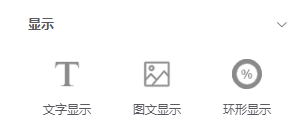
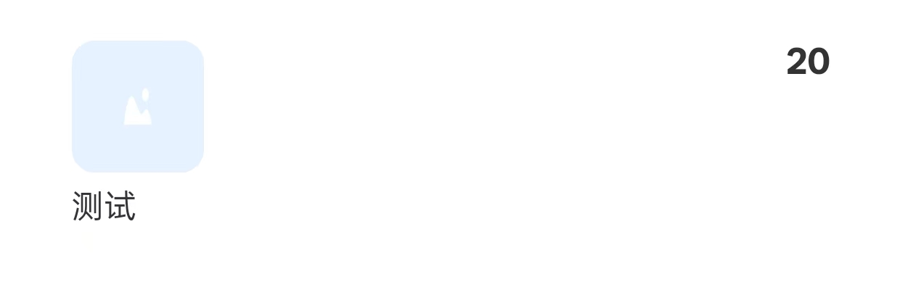

**注意事项：**

- 该问题通常出现在使用较旧版本的小程序时
- 发布后无需重复操作，新版本小程序将正常显示所有控件
- 确保在发布前已通过预览功能验证效果

---

### 小程序编辑器中控件无法缩小和页面无法滚动怎么办？

**问题描述：**

在小程序编辑器中添加控件时，发现控件尺寸无法缩小，且页面无法滚动，导致控件放置困难。

**解决方案：**

**1. 页面滚动功能确认**

小程序编辑器页面是可以上下滚动的：

- 使用鼠标滚轮或触摸板进行滚动
- 页面右侧有滚动条指示可滚动区域
- 滚动范围会根据控件数量自动扩展

**2. 控件尺寸调整方法**

如果控件无法缩小到所需尺寸，可尝试以下方法：

- **最小尺寸限制**：每个控件都有最小尺寸限制
- **调整比例**：先调整一个方向，再调整另一个方向
- **使用缩放手柄**：拖动控件角落和边缘的调整点

**3. 正确的编辑流程**

控件数量较多时的编辑步骤：

1. **进入编辑模式**
    - 在控制台选择设备
    - 点击"面板编辑"进入编辑界面

2. **添加控件**
    - 从控件库拖拽所需控件到页面
    - 先放置大致位置，不用立即精确调整

3. **调整布局**
    - 逐个调整控件位置和大小
    - 使用滚动查看页面不同区域
    - 合理利用页面空间

4. **保存配置**
    - 确认所有控件位置合适后保存
    - 退出编辑模式

**注意事项：**

- 编辑器支持无限滚动，可放置足够多的控件
- 如滚动无效，检查浏览器是否支持滚动操作
- 建议使用Chrome或Edge浏览器获得最佳体验
- 控件最小尺寸是为了保证显示效果和可操作性

---

## 第五部分：质检与维护

### 15. 质检与维护 / 变更记录

- 小程序发布新版本后，验证"登录→配网→控制→OTA"路径。
- 更新截图与操作说明，记录变更。
- 定期检查小程序功能是否正常，及时处理用户反馈。

| 日期 | 版本 | 改动 | 备注 |
| --- | --- | --- | --- |
| 2024-04-30 | v1.0 | 初始版本发布 | 包含基础搭建和发布流程 |
| 2024-11-28 | v1.1 | 图片完整性检查 | 确认70张图片完整 |

---

## 参考链接

- [智能公元小程序系统](https://help.aimachip.com/docs/mini_program)
- [基础搭建及发布](https://help.aimachip.com/docs/mini_program/mini_program-1e9ca38dt6dg3)
- [设备管理](https://help.aimachip.com/docs/mini_program/mini_program-1f5vp20d3egjb)
- [小程序注册](https://help.aimachip.com/docs/mini_program/mini_program-1e9c0aghs7jd2)
- [快速注册](https://help.aimachip.com/docs/mini_program/mini_program-1f609kcqsbhav)
- [有公众号注册](https://help.aimachip.com/docs/mini_program/mini_program-1f60as2lpkh27)
- [无公众号注册](https://help.aimachip.com/docs/mini_program/mini_program-1f60asdb1fqu6)
- [小程序备案](https://help.aimachip.com/docs/mini_program/mini_program-1finuobnf2uv3)
- [微信公众平台](https://mp.weixin.qq.com/)
- [小程序备案操作指引](https://developers.weixin.qq.com/miniprogram/product/record/record_guidelines.html)

---

### 小程序为什么只能添加一个设备？

**问题描述：**

在使用US63T等模块的小程序时，发现只能添加一个设备，无法添加多个设备进行控制。

**解决方案：**

- **设计限制**：一个小程序实例同时只能控制一个设备
- **设备切换**：如需控制多个设备，需要先断开当前设备连接，再连接新设备
- **固件绑定**：一个模块只能烧录一个固件，一个固件只能绑定一个设备

**操作步骤：**

1. **断开当前设备**
    - 在小程序中断开与当前设备的蓝牙连接
    - 确认设备已完全断开

2. **连接新设备**
    - 重新搜索蓝牙设备
    - 选择要连接的新设备进行配对
    - 完成连接后即可控制新设备

**注意事项：**

- 同时控制多个设备需要使用多个小程序实例
- 切换设备时需要确保前一个设备已完全断开
- 设备切换可能有短暂延迟，属正常现象

---

### 多台设备烧录相同固件时小程序会同时控制所有设备吗？

**问题描述：**

多台设备烧录了相同的固件程序，担心通过小程序控制时会同时触发所有设备一起动作。

**解决方案：**

**小程序控制方式：**

- **点对点连接**：小程序通过蓝牙与设备建立点对点连接，只控制已连接的那台设备
- **唯一标识区分**：每台设备有唯一的蓝牙MAC地址，即使固件相同也能独立区分
- **控制范围**：小程序指令只会发送给当前已连接的设备，不会影响其他设备

**设备识别机制：**

- **MAC地址**：芯片出厂时内置的唯一蓝牙MAC地址
- **设备名称**：即使使用相同的自定义名称前缀，系统会自动追加MAC地址后缀
- **配对机制**：小程序通过蓝牙扫描设备的MAC地址进行配对和连接

**示例说明：**

- 设备A蓝牙名称：`智能设备_AA:BB:CC:DD:01:02`
- 设备B蓝牙名称：`智能设备_AA:BB:CC:DD:03:04`
- 小程序连接设备A时，控制指令只发送给设备A，设备B不受影响

**注意事项：**

- 烧录相同固件的多台设备可以独立使用，互不干扰
- 小程序同一时间只能连接一台设备
- 如需控制不同设备，需要先断开当前设备再连接新设备

---

## 常见问题

### 设备发现时提示"蓝牙未开启"怎么办？

**问题描述：**

在小程序使用设备发现功能时，弹出提示框显示"蓝牙未开启"，无法搜索到附近的设备。

**解决方案：**

**1. 检查手机蓝牙状态**

- **开启蓝牙功能**：

    - 从手机屏幕顶部向下滑动
    - 找到蓝牙快捷开关
    - 点击开启蓝牙功能

- **系统设置检查**：

    - 进入手机设置
    - 找到蓝牙选项
    - 确认蓝牙开关处于打开状态

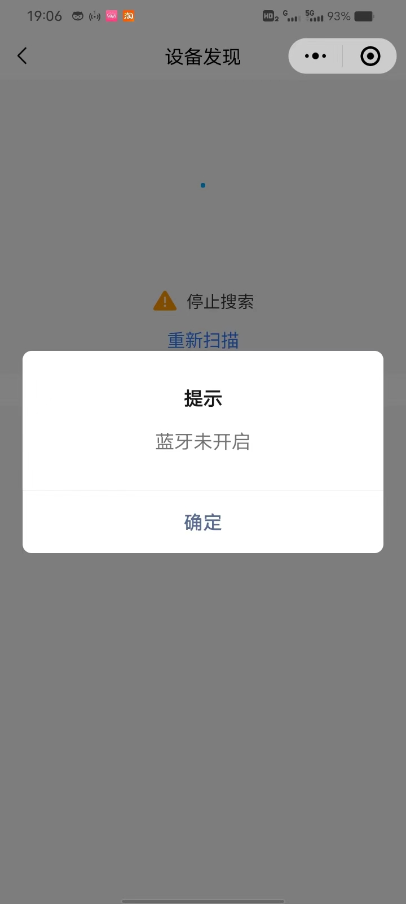

**2. 小程序权限检查**

- **蓝牙权限授权**：

    - 进入手机设置 → 应用管理 → 微信
    - 检查蓝牙权限是否已开启
    - 如未开启，请授予蓝牙权限

- **位置权限检查**：

    - Android系统需要开启位置权限才能使用蓝牙扫描
    - 进入设置 → 应用管理 → 微信 → 权限
    - 开启位置权限

**3. 其他排查方法**

- **重启蓝牙**：

    - 关闭蓝牙后等待10秒再重新开启
    - 或重启手机后再尝试

- **小程序重试**：

    - 关闭小程序重新打开
    - 重新点击设备发现功能

**注意事项：**

- 蓝牙未开启不是小程序更新的表现
- Android系统蓝牙扫描需要位置权限是系统机制
- 如权限都已开启仍无法使用，可尝试更新微信版本
- 已添加过的设备无法通过蓝牙搜索再次发现，需要先在小程序中删除该设备

---

### 小程序添加设备时显示"设备添加失败"或"产品不存在"怎么办？

**问题描述：**

在使用智能公元小程序添加设备时，遇到以下错误：

- 提示"设备添加失败"
- 显示"产品不存在"
- 虽然设备能被蓝牙搜索到，但无法成功添加

**解决方案：**

**1. 重复尝试操作**

    - **多次添加尝试**：

        - 网络波动可能导致添加失败
        - 建议连续尝试3-5次
        - 每次间隔30秒左右

    - **重新初始化流程**：

        1. 关闭小程序重新打开
        2. 重新搜索蓝牙设备
        3. 确认设备名称和型号匹配

**2. 检查设备状态**

    - **设备重置**：

        - 确保设备处于待配对状态
        - 部分设备需要长按按键进入配对模式
        - 查看设备指示灯状态

    - **蓝牙连接检查**：

        - 确认手机蓝牙已开启
        - 清除之前的蓝牙配对记录
        - 靠近设备进行配对

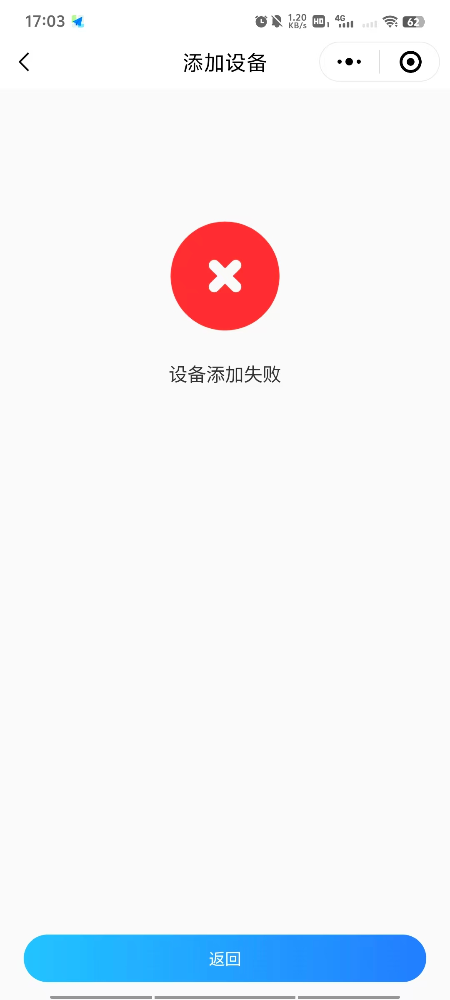

**3. 账号与权限验证**

    - **账号登录状态**：

        - 确认使用正确的账号登录
        - 检查账号是否有设备添加权限
        - 尝试退出重新登录

    - **产品信息确认**：

        - 查看设备包装或标签确认型号
        - 确认小程序选择了正确的产品类别
        - 部分旧型号可能已停止支持

**4. 录屏反馈问题**

    - **录制操作视频**：

        - 从搜索设备开始录制
        - 记录完整的添加过程
        - 包含错误提示的特写

    - **提交技术支持**：

        - 将视频发送给技术支持
        - 提供设备型号和序列号
        - 描述具体的错误现象

**注意事项：**

- 添加设备时保持手机靠近模块（1米内）
- 确保设备电量充足，低电量可能导致连接不稳定
- 若多次尝试仍失败，可能是固件版本不匹配，需要升级
- 部分设备需要先恢复出厂设置才能重新配对

---

### 自定义小程序报错"应用无法正常使用"如何解决？

**问题描述：**

使用自定义的小程序时出现"应用无法正常使用，请联系管理员"的错误，而使用官方提供的正常小程序则没有问题。

**解决方案：**

此类错误通常与小程序授权状态有关，特别是免费版本的小程序。

**主要原因：**

1. **免费版授权过期**
    - 免费试用版小程序有使用期限
    - 过期后无法正常使用
    - 需要续费或升级到付费版

2. **小程序配置错误**
    - 小程序ID配置不正确
    - 授权信息填写错误
    - 与服务端的连接配置有误

3. **账号权限问题**
    - 使用的小程序账号无权限
    - 账号状态异常
    - 授权被管理员收回

**解决方法：**

**1. 检查授权状态**

    - 确认小程序是否为免费试用版
    - 查看授权有效期
    - 联系技术支持确认授权状态

**2. 重新授权操作**

    - 注册新的小程序账号（可获得新的免费期）
    - 将小程序重新授权给新账号
    - 更新设备配置中的小程序ID

**3. 升级到付费版**

    - 购买正式授权
    - 获得长期使用权限
    - 享受完整的技术支持服务

**操作建议：**

- 测试用途：可注册新小程序账号获得免费试用期
- 正式使用：建议购买付费版本授权
- 提前规划：在免费期到期前完成续费或升级

**注意事项：**

- 免费版仅适用于短期测试
- 付费版提供更稳定的服务保障
- 重新授权可能需要更新设备配置
- 保留好购买授权的凭证信息

---

## 小程序GPIO控制配置

### 如何配置按钮执行GPIO控制？

**问题描述：**

需要在小程序中配置按钮，使其点击时能够控制GPIO引脚输出高低电平，实现LED指示灯等硬件控制功能。

**解决方案：**

**1. 配置GPIO按钮**

- **进入控制面板**：在小程序平台选择"控制面板 > GPIO配置"
- **添加按钮**：创建新的GPIO控制按钮（如GPIO_12、GPIO_14等）
- **设置行为**：在按钮的"执行"字段中配置相应的控制指令

**2. 配置执行行为**

- **高电平输出**：输入`[gpio_12_high]`或类似指令
- **低电平输出**：输入`[gpio_12_low]`或类似指令
- **闪烁控制**：可配置高/低电平交替实现闪烁效果

**3. 参考例程**

- **下载例程**：使用平台提供的入门例程（如JX-12F.json）
- **查看配置**：参考例程中GPIO_14按钮的配置方式
- **修改应用**：根据实际需求修改GPIO引脚号和执行指令

**注意事项：**

- GPIO引脚号需要与硬件设计对应
- 执行指令格式必须严格按照平台规范
- 可通过事件触发功能实现更复杂的控制逻辑
- 建议先使用例程测试，确认功能正常后再自定义

---

### TCP通信数据接收指示灯配置

**问题描述：**

需要实现当设备接收到TCP数据时，通过GPIO控制LED闪烁，作为通信状态指示。

**解决方案：**

**1. 配置TCP通信**

- **通讯接口设置**：在平台配置TCP客户端或服务端
- **对端地址**：填写实际的TCP服务器地址和端口
- **启用心跳检测**：保持连接稳定性

**2. 配置事件触发**

- **选择触发条件**：选择"通讯输入"作为触发源
- **配置触发事件**：设置"事件触发"为启用状态
- **绑定GPIO行为**：将数据接收事件与GPIO控制关联

**3. 实现指示灯控制**

- **连接建立**：TCP连接建立时点亮LED（如[tcp_open_led]）
- **数据接收**：收到数据时控制GPIO闪烁
- **连接断开**：连接断开时关闭LED（如[tcp_close_led]）

**注意事项：**

- TCP配置需要填写实际的服务器地址和端口
- 小程序平台与TCP通信是独立的功能模块
- 指示灯控制需要GPIO硬件支持
- 可通过调整触发条件实现不同的指示效果

---

### 小程序授权登录时提示手机号服务次数用完怎么办？

**问题描述：**

在小程序中使用手机号授权登录功能时，提示"手机号服务获取次数用完"，导致新用户无法完成登录。

**解决方案：**

**问题原因：**

- 微信小程序的手机号服务需要付费购买次数
- 每次新用户使用手机号授权时会消耗一次次数
- 次数用完后需要重新购买才能继续使用

**解决方法：**

1. **购买手机号服务次数**
    - 登录微信公众平台（mp.weixin.qq.com）
    - 进入小程序管理后台
    - 找到"设置 > 第三方设置 > 手机号快速验证"
    - 购买手机号服务次数

2. **费用说明**
    - 费用由微信官方收取
    - 按使用次数计费
    - 每注册一个新用户扣除一次次数

3. **替代方案**
    - 如不希望产生费用，可使用其他登录方式
    - 用户名密码登录
    - 企业账号登录
    - 微信授权登录（不获取手机号）

**注意事项：**

- 手机号服务是微信小程序的付费功能
- 费用由小程序开发者承担，用户无需支付
- 建议根据实际用户量购买合适的次数包
- 购买后立即生效，无需重新发布小程序

---
