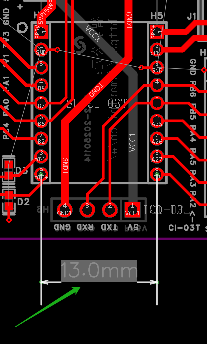
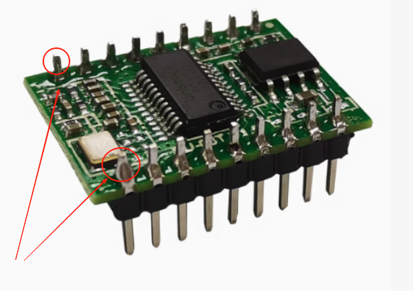
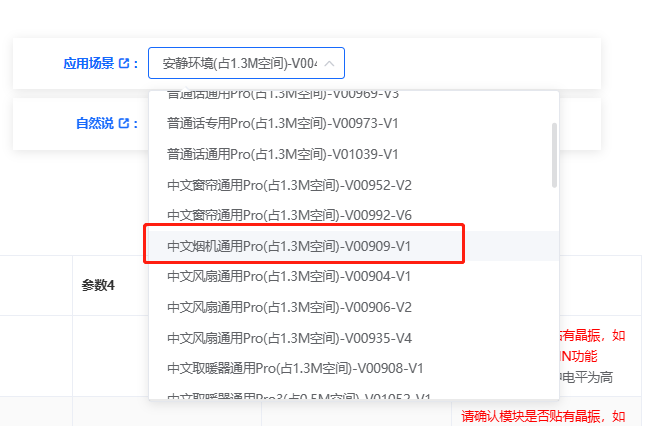
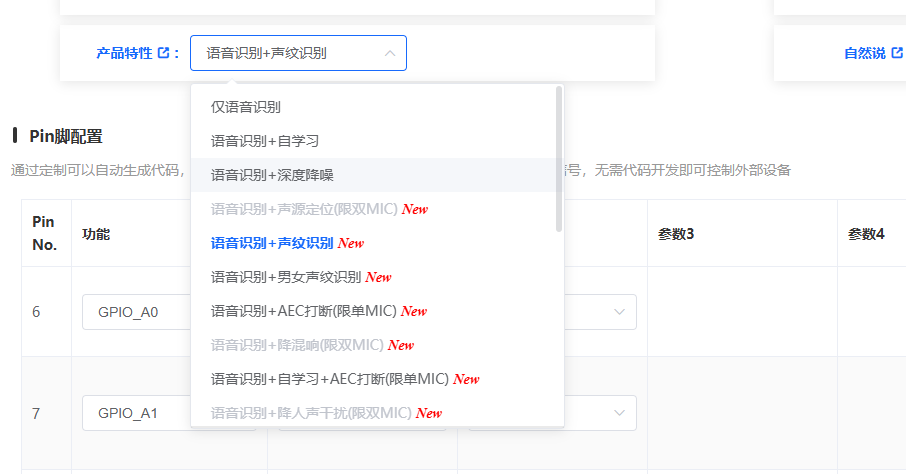
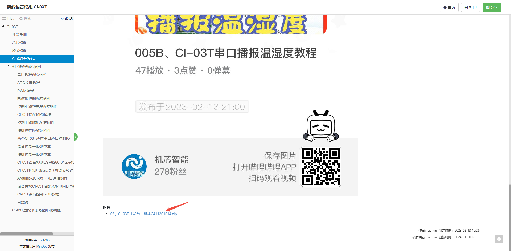
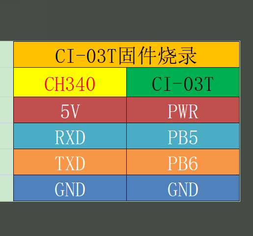
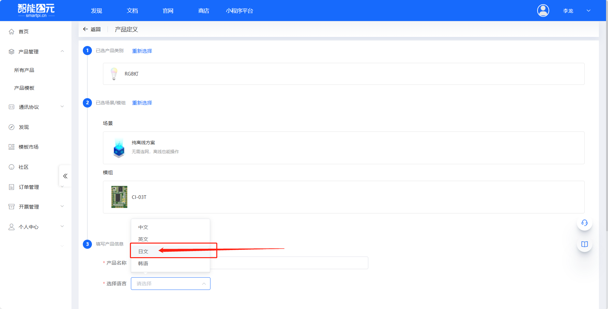
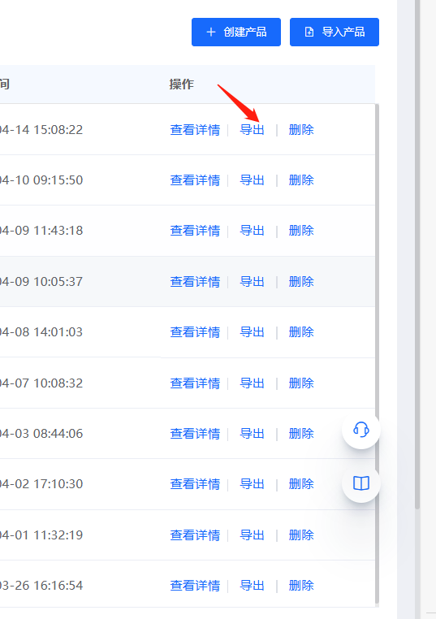

# 离线语音模组 CI-03T

## 快速规格一览

| 参数 | CI-03T1（单麦） | CI-03T2（双麦） |
|------|----------------|----------------|
| 主控芯片 | CI1302 | CI1302 |
| 综合识别率 | 95% | 95% |
| 供电电压 | 3.6-5.5V | 3.6-5.5V |
| 词条数 | 300 | 300 |
| Flash | 2M | 2M |
| AEC（回声消除） | ✓ | ✓ |
| 双麦算法 | ✗ | ✓ |
| 适用环境 | 中噪声环境 | 高噪声环境 |
| 待机电流 | ~60mA | ~60mA |
| 工作电流 | >500mA (4Ω喇叭) | >500mA (4Ω喇叭) |
| 功放功率 | 2.4W@5V4Ω | 2.4W@5V4Ω |
| 封装 | SMD22/DIP22 | SMD22/DIP22 |
| 尺寸 | 21×15mm | 21×15mm |

### 高级功能支持

| 功能 | 支持情况 |
|------|---------|
| 自然说 | ✓ |
| 声纹识别 | ✓ |
| 声源定位 | ✓ |
| 哭声检测 | ✓ |
| 鼾声检测 | ✓ |
| 文字转语音(TTS) | ✓ |
| 自学习 | ✓ |
| 支持语言 | 中/英/日/韩（其他语种可定制） |
| 平台能力 | 支持生成固件 |

---

## 定位与适用场景
- **定位**：新一代高性能神经网络离线语音模组，集成 BNPU V3 + CPU，可单独作为语音主控使用。
- **适用场景**：

    - **智能家电**：风扇、晾衣架、加湿器、茶壶等需要语音控制的产品。
    - **智能照明**：台灯、吸顶灯、氛围灯。
    - **智能门锁/安防类**：门锁、门磁、门禁面板。
    - **智能玩具与小家电**：故事机、互动玩偶、小型清洁类设备等。
    - **其他**：86 盒、语音面板等无需联网即可响应的产品。
- **能力特点**（摘自官网特性）：

    - 集成 BNPU V3，支持 DNN / TDNN / RNN 等神经网络及卷积运算。
    - 支持语音识别、声纹识别、语音增强、语音检测等多种语音 AI 能力。
    - 内置 Audio Codec + Class AB 功放，可直接驱动喇叭。
    - 内置 PMU、电源管理与多路 UART / IIC / IIS / PWM / GPIO / PDM 等外设接口。
- **硬件版本**：

    - **普通双咪版本**：适合常规双麦克风场景，内部不支持 AEC。
    - **单咪 AEC 版本**：单麦克风方案，内部支持 AEC 功能，适合空间有限但需要回声抑制的场景。

> 以上信息主要参考：官方帮助中心中 CI-03T 模块的介绍页面。

## 模组概述与规格参数

CI-03T 是我司研发的新一代高性能神经网络智能语音模组，集成了脑神经网络处理器 BNPU V3 和 CPU 内核，系统主频可达 220MHz，内置高达 640KByte 的 SRAM，集成 PMU 电源管理单元，高性能低功耗 Audio Codec+ClassAB 功率放大器和多路 UART、IIC、IIS、PWM、GPIO、PDM 等外围控制接口；支持 DNN\TDNN\RNN 等神经网络及卷积计算，支持语音识别、声纹识别、语音增强、语音检测等功能；以及简单友好的客制化工具。能快速应用于智能家居，智能小家电，86 盒，玩具，灯具等需要语音操控的产品（例如风扇、智能门锁、扫地机、智能台灯、智能空调、智能茶壶等产品）。

**该模组分为两个版本：普通双咪版本，单咪 AEC 版本；它们的硬件区别请查看引脚定义（备注：在实际的智能公元编程时，请认准版本的对应）**

**版本选择建议**：

- **普通双咪版本**：适合空间充足、需要双麦克风降噪的场景，如智能台灯、智能风扇等。通过双麦克风阵列实现方向性拾音和噪声抑制。
- **单咪 AEC 版本**：适合空间受限、需要回声消除的场景，如智能门锁、86 盒等。单麦克风配合内部 AEC 算法，可有效抑制喇叭播放声音对麦克风的干扰。

### CI-03T1的AEC与唤醒打断功能

**AEC功能支持**：

CI-03T1作为单麦克风版本，内置AEC（回声消除）功能：

- **硬件支持**：单麦克风架构专门优化用于AEC处理
- **功能特点**：可有效消除自身播放声音对麦克风的干扰
- **应用场景**：音响、故事机等需要实时交互的产品

**唤醒打断实现**：

通过AEC功能可以实现语音播报过程中的唤醒打断：

1. **功能原理**：

    - AEC算法实时分离播放信号和语音信号
    - 播报时仍能识别新的语音指令
    - 无需等待播报完成即可下达新指令

2. **配置方法**：

    - 在智能公元平台开启AEC功能
    - 使用单麦克风配置（CI-03T1）
    - 生成支持打断功能的固件

3. **使用效果**：

    - 播报过程中可直接说出新指令
    - 系统立即响应新指令，中断当前播报
    - 实现更自然的语音交互体验

**固件更新要求**：

- 使用最新版本的固件以获得最佳AEC效果
- 旧版固件可能不支持完整的打断功能
- 建议通过智能公元平台重新生成最新固件

**型号对比**：

| 功能 | CI-03T1（单麦） | CI-03T2（双麦） |
|------|----------------|----------------|
| AEC支持 | ✓ | ✗ |
| 唤醒打断 | ✓ | ✗ |
| 降噪能力 | 基础降噪 | 双麦阵列降噪 |
| 适用场景 | 需要实时交互 | 高噪声环境 |


### 1. 关键特性与资源

| 指标分类 | 参数项 | 规格/数值 | 备注 |
| --- | --- | --- | --- |
| **核心性能** | AI 运算内核 | BNPU V3 神经网络加速器 | 支持 DNN / TDNN / RNN 等 |
| | CPU | 32 位高性能 CPU，最高 220MHz | 带 DSP 扩展、单周期乘法器 |
| **存储资源** | SRAM | 640KB SRAM | 片上内存 |
| | Flash | 2MB Flash | 片上程序 / 资源存储 |
| | eFuse | 512bit eFuse | 配置 / 安全相关 |
| **音频接口** | Codec | 内置高性能低功耗 Audio Codec | 双路 ADC + 单路 DAC |
| | 采样率 | 8 / 16 / 24 / 32 / 44.1 / 48 kHz | 参考官网"特性"章节 |
| | ALC | 支持 Automatic Level Control (ALC)功能 | 自动电平控制 |
| | 扩展通路 | 1 路 IIS | 可外接音频功放等 |
| | AEC 能力 | 单咪 AEC 版本支持内部 AEC | 普通双咪版本不支持内部 AEC |
| | 功放 | 内置 ClassAB 功率放大器 | 可直接驱动喇叭 |
| **电源/功耗** | 供电范围 | 3.6V ~ 5.5V（典型 5V） | 内置 3 路 LDO，无需外置电源芯片 |
| | 电流 | 以规格书标称值为准 | 建议参考最新版本规格书中的典型/最大电流参数 |
| **外设与接口** | UART | 3 路 UART，最高 3M 波特率 | 其中一路常用于日志/烧录 |
| | IIC | 1 路 IIC | 可外接传感器等外设 |
| | IIS | 1 路 IIS 音频扩展通路 | 可外接音频功放等 |
| | PWM | 5 路 PWM | 可直接用于灯控、电机等 |
| | PDM | 支持 PDM 接口 | 可外接数字麦克风 |
| | ADC | 1 路 10bit SAR ADC，最高 1MHz 采样 | 电压检测、按键等 |
| | GPIO | 9 个普通 GPIO | 部分 GPIO 支持 5V 宽压输入，可配置中断、上下拉 |
| | Timer | 4 组 32-bit timer | 定时器功能 |
| | Watchdog | 1 组独立看门狗（IWDG）+ 1 组窗口看门狗（WWDG） | 系统保护 |
| **环境与可靠性** | 工作温度 | 以规格书给出的工作温度范围为准 | 典型为工业级温度范围，具体请参见规格书说明 |
| | EMC/ESD | 支持 FCC；ESD 接触放电 4kV | 参考官网 EMC/ESD 描述 |
| | 环保认证 | 支持 ROHS 和 REACH 测试 | 采用环保材料 |
| **固件与保护** | 升级方式 | 支持 UART 升级 | 串口烧录和升级 |
| | 固件保护 | 支持固件保护功能 | 防止固件被非法读取 |

> 数值与能力请以官方 CI-03T 规格书及芯片手册为最终依据，此处为结构化摘要。

### 2. 系统架构

CI-03T 模组采用高度集成的系统架构，主要包含以下功能模块：

- **音频处理**：支持模拟 MIC、Line-in 输入（双路 ADC）、DMIC（数字麦克风）、DAC 输出、IIS 扩展接口
- **CPU 核心**：32 位 RISC 处理器，主频 220MHz，支持 DSP 扩展
- **AI 加速**：BNPU V3 神经网络处理器，支持 DNN\TDNN\RNN 等神经网络及卷积运算
- **连接接口**：3 路 UART、1 路 IIC、5 路 PWM、9 个 GPIO、1 路 IIS、PDM 接口
- **电源管理**：内置 3 路 LDO（Analog LDO、Core LDO 1V1、IO LDO 3V3），支持 5V 单电源输入（3.6V-5.5V）
- **存储系统**：640KB SRAM、2MB Flash（SIP）、512bit e-Fuse
- **系统功能**：4 组 32-bit Timer、2 路 GP DMA、1 路 SAR ADC、2 组看门狗

模组可连接多种外部设备：3.3V/5V 主控处理器、IOT 连接（WiFi/蓝牙）、IIC 外设、红外控制、灯光控制、电机控制、5V 宽压 GPIO、按键输入、模拟信号采样等。

### 3. 外观尺寸与封装

- 模组整体外观与尺寸可参考官方 CI-03T 帮助页面中的"外观尺寸"章节：

    - 
    - 
    - 
- 尺寸图与焊盘封装图可在封装图文档及规格书的机械尺寸章节中查到，包含长宽高、焊盘间距等信息。
- 建议在本仓库中统一维护一份 **CI-03T 封装与尺寸图**（如 PNG/SVG），并在此处以图片形式引用，方便结构/硬件工程师查阅。

### CI-03T 两个9针排针间距

**问题描述：**

需要绘制CI-03T模块的封装时，确认两侧9针排针之间的精确间距。

**解决方案：**

CI-03T模块采用SMD22/DIP22封装，两侧各有一个9针的2.0mm排针：

- **排针规格**：两个9P的2.0mm排针
- **排针间距**：两个排针中心之间的距离为13mm





**注意事项：**

- 设计时请按照2.0mm的排针规格和13mm的间距进行布局
- 该尺寸为标准规格，适用于所有CI-03T系列模块

## 硬件设计建议

以下设计建议基于 CI-03T 模组的特性，旨在帮助硬件工程师设计出性能稳定、识别率高的产品。

### 1. 电源设计
- **独立供电**：建议使用独立的 LDO 或 DC-DC + LDO 为模组供电，避免与其他大电流设备（如电机、WiFi）共用电源网络，防止电源纹波干扰。
- **滤波电容**：在 VCC 引脚附近紧挨放置 10uF + 100nF 的滤波电容。
- **接地与布线**：

    - 数字地与模拟地在单点汇合，避免大电流回流经过音频前端。
    - 电源走线尽量短且线宽充足。

### 2. 声学设计 (MIC / SPK)
- **麦克风布局**：

    - 走线必须采用 **差分走线**，且包地处理。
    - 麦克风孔应有良好的密封性，避免漏音和回声。
    - 麦克风与喇叭之间应有良好的声学隔离（如使用减震棉），防止自激啸叫。
    - 麦克风距离声源（人嘴）的路径应尽量短且无遮挡。
- **喇叭驱动**：

    - 功放电路应远离麦克风电路。
    - 注意喇叭磁体对天线（如有）的影响。
- **进一步设计建议**：

    - 结构声学设计上，可参考官方提供的《产品结构声学规范》，其中包含模组在不同腔体、开孔方式下的推荐做法及注意事项。
    - 喇叭功率、阻抗以及咪头灵敏度的选择，可参考官方《喇叭和咪头选型推荐》文档，并结合整机响度、失真和成本要求进行评估。

### 3. 接口与防护
- **UART/IO**：预留 TX/RX 测试点以便后续升级调试；推荐在靠近模组处放置串口排针或测试座。
- **ESD 防护**：

    - 对外接口（麦克风、喇叭、按键、触摸接口等）建议放置 ESD 器件。
    - 外部走线靠近接口处注意增加地过孔与保护电阻/电容。

## 开发环境搭建与工具准备
1. **开发工具包 (SDK)**：

    - 获取途径：联系 FAE 或访问开发者中心下载 CI-03T 最新 SDK（参考 `ci_03t_kfb.md` 与“开发包”网页）。
    - 内容包含：编译器、烧录工具、调试助手、示例代码、串口调试脚本等。
    - 
    - 
2. **语音配置平台（智能公元平台）**：

    - **平台地址**：访问智能公元平台（https://www.aimachip.com/ 或相关开发者入口）
    - **主要功能**：

        - 编辑词条（唤醒词、命令词）
        - 设置回复语（TTS 语音播报内容）
        - 配置唤醒和识别阈值
        - 生成语音资源包（`.bin` 或 `.hex` 格式）
    - **输出文件**：通常生成 `.bin` 或 `.hex` 格式的语音资源包，用于与主固件一起烧录
    - **版本对应**：在智能公元平台配置时，需选择对应的模组版本（普通双咪版本或单咪 AEC 版本）

### 高级功能配置指南

CI-03T支持深度降噪、声纹识别等高级功能，但需要正确配置才能启用：

**启用高级功能的步骤：**

1. **选择Pro模型**
    - 在应用场景选择中，必须选择带有"Pro"后缀的模型
    - 只有Pro模型支持深度降噪、声纹识别等高级功能
    - 静音环境模型及普通模型不支持这些功能


2. **根据使用环境选择合适的Pro模型**
    - **普通话通用Pro**：适用于一般安静或嘈杂环境
    - **中文烟机通用Pro**：专为高噪声环境优化，开启深度降噪效果最佳

 

3. **功能配置**
    - 选择Pro模型后，在产品特性中即可选择"语音识别+深度降噪"等高级功能
    - 确保模块型号选择正确（CI-03T）



**注意事项：**

- 高级功能仅在Pro模型中可用，其他模型无法选择这些选项
- 噪声较大的环境建议使用"中文烟机通用Pro"以获得最佳降噪效果
- 配置完成后需要重新生成固件并烧录到模组
3. **硬件工具**：

    - USB 转 TTL 串口模块（用于调试与日志打印）。
    - 专用烧录器（如量产治具时使用），参考“烧录资料”中的烧录文档与工具说明。

## 固件烧录与升级指南

### 如何获取烧录软件和固件文件？

**问题描述：**

需要获取CI-03T系列芯片的烧录安装软件和固件文件，以完成烧录操作。

**解决方案：**

- **烧录软件下载**：

    - 访问机芯智能官网的CI-03T开发包页面
    - 下载名为"03、CI-03T开发包；版本2411201614.zip"的压缩包
    - 包含PACK_UPDATE_TOOL.exe烧录工具和所需驱动

- **固件下载**：

    - 登录智能云元平台（http://www.smartpi.cn/#/）
    - 在固件管理界面查看已生成的固件版本
    - 点击对应版本的"下载固件"按钮获取固件文件




**注意事项：**

- 烧录前先安装CH340驱动（USB转串口驱动）
- 确保烧录转接板正确连接，B5/B6为专用烧录引脚
- 固件文件通常包含.bin和_update.bin两种格式，根据需要选择

### 烧录资料概览

烧录相关的官方资料大致分为四类：

- **CH340 驱动**：用于安装 USB 转串口驱动，使 PC 能识别烧录转接板的虚拟串口。
- **烧录软件**：官方提供的模块烧录工具，负责通过串口将固件和语音资源写入 CI-03T。
- **烧录文档**：图文说明烧录环境准备、线序连接、软件参数配置以及完整烧录步骤。
    - 
- **出厂固件**：官方提供的出厂缺省固件压缩包，可在调试失败时恢复到出厂状态。

详细的附件名称和下载地址已在文末附录中给出，可在离线环境下对照查看。

### 基本烧录流程
1. **硬件连接**：将模组 UART_TX/RX 与 PC 串口工具连接好，保证 GND 相连。
2. **进入烧录模式**：

    - 方式 A：拉低 BOOT 引脚后上电（具体脚位见原理图/规格书）。
    - 方式 B：参考烧录文档，通过串口发送“进入 Boot”命令。
3. **执行烧录**：

    - 打开官方烧录软件，选择固件文件与端口。
    - 点击“开始烧录”，等待进度完成。
4. **验证结果**：

    - 复位模组，对着麦克风说出唤醒词，观察串口日志与语音播报是否正常。

### 词表更新
- 一般情况下，仅需更新语音资源区（词表与提示音），无需全片擦除，速度较快。
- 建议在量产前固定一套"固件版本 + 词表版本"组合，在后文"质检与维护"中登记。

### 烧录故障排除

#### 焊接后无法烧录问题

**问题描述：**

CI-03T芯片焊接到电路板后，无法通过CH340烧录器进行固件烧录，即使接线正确且重新上电尝试，模块仍处于开机状态而非进入烧录模式。

**标准接线方式：**



**烧录接线说明：**

- **CH340 5V** → **CI-03T PWR**：模块供电
- **CH340 RXD** → **CI-03T PB5**：烧录数据接收
- **CH340 TXD** → **CI-03T PB6**：烧录数据发送
- **CH340 GND** → **CI-03T GND**：共地

**故障排查步骤：**

1. **基础检查**：

    - 确认CH340驱动已正确安装
    - 检查设备管理器中COM口是否正常识别
    - 验证烧录工具是否能打开端口

2. **接线验证**：

    - 使用万用表确认每根线连通性
    - 检查是否有短路或断路
    - 确认RX/TX没有接反（尝试交叉连接）

3. **进入烧录模式**：

    - 完全断开电源
    - 重新连接GND线
    - 上电后立即尝试烧录
    - 必要时多次插拔GND触发烧录模式

4. **焊接检查**：

    - 检查焊点是否有虚焊或连锡
    - 确认PB5/PB6引脚没有与其他电路短路
    - 检查电源纹波是否过大

5. **替代方案**：

    - 使用未焊接的模块进行烧录测试
    - 烧录完成后再焊接到底板
    - 考虑使用带排针的模块便于后续更新

**预防措施建议：**

- **开发阶段**：使用带排针的模块，便于反复烧录
- **量产前**：完成所有测试后再进行最终焊接
- **设计优化**：预留烧录接口，避免焊接后无法更新
- **焊接工艺**：控制温度和时间，避免热损坏芯片

---

## 测试环境搭建与二次开发入门

**问题描述：**

需要进行CI-03T模块的测试和二次开发，但不确定如何搭建测试环境和开始开发工作。

**解决方案：**

### 1. 测试环境搭建

**硬件准备：**

- CI-03T模块（建议选择双麦版本以获得更好的降噪效果）
- USB转串口适配器（CP2102或CH340）
- 5V直流电源（可通过USB提供）
- 麦克风和喇叭（用于测试语音功能）
- 杜邦线若干

**连接步骤：**

1. 使用USB转串口适配器连接模块与PC：

    - 模块TX（B5引脚）→ 适配器RX
    - 模块RX（B6引脚）→ 适配器TX
    - 模块GND → 适配器GND
    - 模块VCC → 5V电源

2. 连接麦克风和喇叭到对应接口

3. 使用串口调试工具（如SecureCRT、Putty）设置：

    - 波特率：115200
    - 数据位：8
    - 停止位：1
    - 校验位：无

### 2. 快速测试流程

1. **基础功能测试**：

    - 上电后观察串口输出是否正常
    - 说出唤醒词测试模块是否响应
    - 检查语音播报是否清晰

2. **平台配置测试**：

    - 登录智能公元平台创建项目
    - 配置基本的语音指令
    - 生成固件并烧录
    - 测试指令识别效果

### 3. 二次开发入门

**开发资源获取：**

1. **智能公元平台**：提供在线配置和固件生成
2. **SDK下载**：可在平台下载对应版本的SDK
3. **开发文档**：参考平台的开发指南和API文档

**开发步骤：**

1. **需求分析**：

    - 确定产品功能需求
    - 评估所需词条数量
    - 选择合适的硬件接口

2. **平台开发**：

    - 使用智能公元平台进行快速原型开发
    - 配置语音指令和响应动作
    - 生成基础固件进行测试

3. **SDK开发**（如需要）：

    - 下载并搭建SDK开发环境
    - 根据需求修改底层代码
    - 实现自定义功能和协议

4. **调试与优化**：

    - 使用串口日志进行问题定位
    - 优化识别率和响应速度
    - 进行实际场景测试

**注意事项：**

- 测试环境应尽量安静，避免背景噪音干扰
- 二次开发需要具备一定的嵌入式开发经验
- 建议先使用平台进行快速验证，再进行深度定制
- 开发过程中注意保护模块，避免静电和过压损坏

## 外设开发与应用示例

### 场景 1：继电器控制 (开关灯)
- **逻辑**：识别到“打开灯光” -> GPIO 输出高电平 -> 继电器吸合。
- **代码片段**：
    ```c
    // 伪代码示例
    void on_voice_command(int cmd_id) {
        if (cmd_id == CMD_LIGHT_ON) {
            gpio_set_level(PIN_RELAY, 1);
            play_voice("灯已打开");
        }
    }
    ```

### 场景 2：串口透传 (对接主控 MCU)
- **逻辑**：CI-03T 作为语音协处理器，识别成功后通过串口发送 ID 给主控 MCU。
- **协议示例**：`0xAA 0x55 [CMD_ID] [DATA_LEN] [DATA] [CHECKSUM]`（具体字段与校验请参考协议文档或示例工程）。

### 场景 3：PWM 控制（调光/调速）

- **逻辑**：识别到"调亮灯光"或"调快风扇" -> PWM 输出不同占空比 -> 控制亮度或速度。
- **代码片段**：
    ```c
    // 伪代码示例
    void on_voice_command(int cmd_id) {
        if (cmd_id == CMD_LIGHT_BRIGHT) {
            pwm_set_duty(PIN_PWM_LIGHT, 80);  // 80% 占空比
            play_voice("灯光已调亮");
        }
    }
    ```
- **应用场景**：智能台灯调光、风扇调速、电机控制等需要连续调节的场景

### 场景 4：流水灯控制

- **逻辑**：开机上电时自动启动 -> GPIO 输出延时翻转 -> 实现 LED 流水灯效果。
- **代码片段**：
    ```c
    // 伪代码示例 - 开机流水灯
    void system_init() {
        // 配置GPIO为输出模式
        gpio_set_direction(PIN_LED1, OUTPUT);
        gpio_set_direction(PIN_LED2, OUTPUT);
        gpio_set_direction(PIN_LED3, OUTPUT);

        // 设置初始状态为低电平
        gpio_write(PIN_LED1, LOW);
        gpio_write(PIN_LED2, LOW);
        gpio_write(PIN_LED3, LOW);

        // 流水灯效果
        while(1) {
            // LED1亮
            gpio_write(PIN_LED1, HIGH);
            delay_ms(500);
            gpio_write(PIN_LED1, LOW);

            // LED2亮
            gpio_write(PIN_LED2, HIGH);
            delay_ms(500);
            gpio_write(PIN_LED2, LOW);

            // LED3亮
            gpio_write(PIN_LED3, HIGH);
            delay_ms(500);
            gpio_write(PIN_LED3, LOW);
        }
    }
    ```
- **应用场景**：设备状态指示、装饰灯光、产品展示效果等

### 场景 4：小语种开发与定制
- **概述**：CI-03T 支持多语言模型开发，方便方案商在无语料情况下进行初步模型制作和样品测试。
- **注意事项**：

    - **模块选型**：CI-03T（推荐）、CI-33T。
    - **词条数量**：建议 <30 条；词条过多容易导致相近词误识别，且验收/优化时间增加。
    - **词条要求**：命令词至少 4 个音节，尤其是唤醒词；选择发音差异明显的词，避免相近发音误识。
    - **测试标准**：声音平稳、语速正常，避免刻意慢/快。
    - **特别提醒**：选词质量直接影响项目落地；若词条在训练集中少见，可能需提供至少 50 人语料进行迭代（周期约 3 周）。
- **支持语言**：截止 2024 年 8 月，支持中、英、日、韩、西班牙、德、俄、泰、越南、阿拉伯语（不支持阿拉伯数字）；其他语言需商务确认，周期约 3 个月。
- **开发流程**：

    1. 注册智能公元平台账号，熟悉中文固件开发流程。
    2. 确定词条，提供至少 4 人测试语料（2男2女，干净无底噪）。
    3. 使用中文固件开发完成后，替换为对应小语种的语言模型、声学模型和 cmd_info 文件。
- **验收标准**：
    - 注：命令词区分度高可大幅减少误识，利于量产。
- **进一步参考**：完整开发须知见附录 G 的附件 `小语种识别方案开发须知-V2.0-240929.pdf`。

### 场景 5：日语语音识别项目实施（智能头盔应用）

**项目背景**：

智能头盔项目需要支持日语语音识别功能，实现语音控制头盔的各种功能，如开关灯光、调整风扇速度等。

**实施流程**：

1. **平台语言选择**

    - 登录智能公元平台（smartpi.cn）
    - 创建新产品时，在语言选择下拉菜单中选择"日语"选项
    - 确保选择正确的模块型号（CI-03T）



2. **固件开发与导出**

    - 在平台上配置所需的日语语音指令
    - 设置相应的控制逻辑和GPIO输出
    - 完成配置后，点击"导出"按钮生成固件文件
    - 导出的固件包含所有日语语音包和控制逻辑



3. **语音指令定制**

    - 根据智能头盔功能需求，定义日语命令词
    - 建议每个命令词至少4个音节，确保识别准确率
    - 提供日文翻译的语音指令列表，便于系统配置

4. **测试与验证**

    - 使用日语测试语音进行功能验证
    - 在实际头盔环境中测试识别效果
    - 根据测试结果调整识别阈值和命令词

**技术要点**：

- **词条数量控制**：建议控制在30条以内，过多词条可能导致误识别率上升
- **语料要求**：如需优化识别效果，可提供4人（2男2女）的干净日语语料
- **发音差异**：选择发音差异明显的命令词，避免相近发音导致的误触发

**注意事项**：

- 日语语音模型已内置在CI-03T中，无需额外下载
- 固件烧录使用标准流程，与中文固件相同
- 如需添加更多日语命令词，需重新生成固件并烧录
- 建议在实际使用环境中进行充分测试，确保识别效果满足需求

---

### 如何获取CI-03T完整开发资料？

**问题描述：**

需要获取CI-03T和CI-03T2芯片的完整产品信息、技术参数以及相关开发资料和下载链接。

**解决方案：**

**官方资料下载方式：**

1. **百度网盘下载**：

    - **链接**：https://pan.baidu.com/s/1Fb24gvOwHKtxB8QlJtjJiA
    - **提取码**：xjtt
    - **内容**：包含完整的说明书、开发资料、技术参数等文档
**EDA设计支持：**

对于使用嘉立创EDA等设计工具的用户，CI-03T模块已添加到常用器件库：

- **供应商编号**：C9900046340
- **封装信息**：标准SMD22/DIP22封装
- **设计建议**：可直接从器件库拖拽使用，简化PCB设计流程


*嘉立创EDA软件中已添加CI-03T器件，方便直接调用*

**资料包含内容：**

1. **基础文档**：

    - CI-03T模块规格书
    - CI1302芯片手册
    - 模块原理图和封装图
    - 引脚定义说明

2. **开发工具**：

    - CH340驱动程序
    - 模块烧录软件
    - 烧录指引文档
    - 出厂固件包

3. **设计指南**：

    - 产品结构声学规范
    - 喇叭和咪头选型建议
    - PCB布局设计要点
    - 整机结构设计指导

4. **示例代码**：

    - 开发包和示例工程
    - API接口说明
    - 串口通信协议
    - 常见应用案例

**相关产品参考：**

对于需要更多功能的应用，可考虑以下型号：

- **GMIRV2401**：超高集成度红外码库SOC芯片
    - 内置红外码库、BLE5.1、RS485、Modbus-RTU
    - 支持微信小程序控制
    - SOP16封装，适合高集成度设计


*GMIRV2401芯片功能特性，支持多种通信协议和控制方式**

**获取步骤：**

1. 打开百度网盘链接
2. 输入提取码 xjtt
3. 下载所有资料压缩包
4. 解压后查看各类文档
5. 根据开发需求查阅相应资料

**注意事项：**

- 建议下载所有资料并备份保存
- 开发前仔细阅读规格书和烧录文档
- 如有疑问可及时联系技术支持
- 定期关注官方更新，获取最新版本资料

## 参考资源列表

本章节已经整合了官方文档中的关键信息，下面列出与 CI-03T 相关的主要资料类型，方便在需要时进一步查阅：

- **CI-03T 模块功能与特性总览文档**：包含外观照片、外形尺寸图、特性列表、系统架构等。
- **CI1302 芯片中/英文手册**：PDF 格式，包含寄存器说明、电气参数、时序图等。
- **CI-03T 模块烧录资料**：CH340 安装包、模块烧录软件包、烧录指引文档、转接板接线图、出厂固件包等。
- **CI-03T 开发包与示例工程**：最新版本和旧版本开发包压缩包、示例工程结构说明。
- **产品结构声学规范文档**：对整机结构、开孔方式、腔体设计对识别率的影响进行说明。
- **喇叭和咪头选型推荐文档**：列出推荐的喇叭与麦克风参数范围及选型建议。
- **小语种开发训练模型相关说明**：小语种方案须知、采集环境与方法、数据存储示例等。
- **CI-03T 适配图形化编程平台的说明**：如何在米思奇图形化环境中调用语音指令、与主控联动等。

## 参考链接

### 主要入口
- [CI-03T 官方帮助中心](https://help.aimachip.com/docs/offline_ci03t)
- [CI-03T 主页](https://help.aimachip.com/docs/offline_ci03t/offline_ci03t-1eboja4efbc49)

### 基本资料
- [基本资料（总览）](https://help.aimachip.com/docs/offline_ci03t/offline_ci03t-1gbdvdh3tnafj)
- [原理图](https://help.aimachip.com/docs/offline_ci03t/offline_ci03t-1gbdve90ls902)
- [规格书](https://help.aimachip.com/docs/offline_ci03t/offline_ci03t-1gbdveflfoj5l)
- [封装图](https://help.aimachip.com/docs/offline_ci03t/offline_ci03t-1gbdvela2anvd)

### 烧录资料
- [烧录资料（总览）](https://help.aimachip.com/docs/offline_ci03t/CI_03t_02)
- [CH340驱动](https://help.aimachip.com/docs/offline_ci03t/offline_ci03t-1gbdvfdgcbim0)
- [烧录软件](https://help.aimachip.com/docs/offline_ci03t/offline_ci03t-1gbdvfoifmpdr)
- [烧录文档](https://help.aimachip.com/docs/offline_ci03t/offline_ci03t-1gbdvfuk8pkh3)
- [出厂固件](https://help.aimachip.com/docs/offline_ci03t/offline_ci03t-1gbdvg4a45tfk)
- [串口调试](https://help.aimachip.com/docs/offline_ci03t/offline_ci03t-1gbdvgnpjl0gq)

### 芯片资料
- [芯片资料](https://help.aimachip.com/docs/offline_ci03t/CI_03t_01)
- [CI1302 芯片手册](http://help.aimachip.com/docs/chip/chip-1eec6hndetl5k)

### 开发包
- [开发包（最新版本）](https://help.aimachip.com/docs/offline_ci03t/offline_ci03t-1gbdvhie6a97l)
- [CI-03T开发包（旧版本）](https://help.aimachip.com/docs/offline_ci03t/ci_03t_kfb)
- [产品结构声学规范](https://help.aimachip.com/docs/offline_ci03t/offline_ci03t-1gbdvi4p27ktg)
- [喇叭和咪头选型](https://help.aimachip.com/docs/offline_ci03t/offline_ci03t-1gbdviat8vfje)

### 小语种开发训练模型
- [小语种开发训练模型（总览）](https://help.aimachip.com/docs/offline_ci03t/offline_ci03t-1gblf4s9m4olo)
- [开发方案须知](https://help.aimachip.com/docs/offline_ci03t/offline_ci03t-1gblf6ei1l0hn)
- [训练数据采集环境及方法说明](https://help.aimachip.com/docs/offline_ci03t/offline_ci03t-1gblfaml16q5d)
- [数据储存相关示例文档](https://help.aimachip.com/docs/offline_ci03t/offline_ci03t-1gblfc30gutt9)

### 图形化编程
- [CI-03T适配米思奇图形化编程](https://help.aimachip.com/docs/offline_ci03t/su_03t_MSQ)
- [米思齐图形化编程](http://help.aimachip.com/docs/block/)

---

## 附录：官方资料详细说明

本附录按照官方帮助中心的目录结构，详细列出 CI-03T 相关的所有资料、附件和链接，便于快速查找和下载。

### 第一部分：基本资料

#### 附录 A：基本资料（总览）

- **网页链接**：[基本资料](https://help.aimachip.com/docs/offline_ci03t/offline_ci03t-1gbdvdh3tnafj)
- **内容说明**：包含原理图、规格书、封装图等基本资料的汇总
- **图片预览**：

    - 
- **官方附件**：

    - `01、模块基本资料.rar`

#### 附录 B：原理图

- **网页链接**：[原理图](https://help.aimachip.com/docs/offline_ci03t/offline_ci03t-1gbdve90ls902)
- **内容说明**：包含总原理图、主芯片和晶振电路图、功放电路图、麦克风电路图、模块外设引脚图等电路设计细节
- **图片预览**：

    - 
    - 
    - 
    - 
    - 
- **官方附件**：

    - `CI-03T-V1.3-原理图.pdf`

#### 附录 C：规格书

- **网页链接**：[规格书](https://help.aimachip.com/docs/offline_ci03t/offline_ci03t-1gbdveflfoj5l)
- **内容说明**：提供 CI-03T 模块的详细电气参数、机械尺寸、接口定义、工作温度范围等规范
- **官方附件**：

    - `CI-03T-V1.3-模组规格书.pdf`

#### 附录 D：封装图

- **网页链接**：[封装图](https://help.aimachip.com/docs/offline_ci03t/offline_ci03t-1gbdvela2anvd)
- **内容说明**：提供 CI-03T 模块的 PCB 封装文件，包含焊盘尺寸、间距等机械结构信息
- **官方附件**：

    - `CI-03T-封装图.PCB`

---

### 第三部分：芯片资料

#### 附录 J：芯片资料

- **网页链接**：[芯片资料](https://help.aimachip.com/docs/offline_ci03t/CI_03t_01)
- **内容说明**：CI1302 芯片的详细技术手册，包含寄存器说明、电气参数、时序图、外设接口定义等
- **相关链接**：[CI1302 芯片手册](http://help.aimachip.com/docs/chip/chip-1eec6hndetl5k)
- **官方附件**：

    - `CI1302中文版芯片手册 V0.7.pdf`
    - `CI1302英文版芯片手册 V1.2.pdf`

### 第四部分：开发包

#### 附录 K：开发包（最新版本）

- **网页链接**：[开发包](https://help.aimachip.com/docs/offline_ci03t/offline_ci03t-1gbdvhie6a97l)
- **内容说明**：最新的 CI-03T 开发包，包含 SDK、示例工程、编译器、调试工具等完整的开发环境
- **图片预览**：

    - 
    - 
- **官方附件**：

    - `CI-03T开发包；版本V2.1.0.rar`

#### 附录 L：CI-03T 开发包（旧版本）

- **网页链接**：[CI-03T开发包（旧版本）](https://help.aimachip.com/docs/offline_ci03t/ci_03t_kfb)
- **内容说明**：旧版本的 CI-03T 开发包，用于历史项目兼容和参考
- **图片预览**：

    - 
- **官方附件**：

    - `03、CI-03T开发包；版本2411201614.zip`

#### 附录 M：产品结构声学规范

- **网页链接**：[产品结构声学规范](https://help.aimachip.com/docs/offline_ci03t/offline_ci03t-1gbdvi4p27ktg)
- **内容说明**：

    - 说明不同整机结构、开孔方式、声学腔体设计对语音识别性能和误触发率的影响
    - 给出推荐的 MIC 开孔位置、开孔直径范围、喇叭与麦克风之间的距离和隔离方式等
    - 对整机结构设计具有重要指导意义
- **官方附件**：

    - `04、产品结构声学结构规范.rar`

#### 附录 N：喇叭和咪头选型

- **网页链接**：[喇叭和咪头选型](https://help.aimachip.com/docs/offline_ci03t/offline_ci03t-1gbdviat8vfje)
- **内容说明**：

    - 列出推荐的喇叭功率、阻抗范围以及麦克风灵敏度、信噪比等指标
    - 提示在不同应用场景下（如玩具、小家电、门锁等）的器件选型差异
    - 帮助开发者选择合适的音频器件
- **官方附件**：

    - `05、喇叭和咪头选型推荐.rar`

### 第五部分：小语种开发训练模型

#### 附录 O：小语种开发训练模型（总览）

- **网页链接**：[小语种开发训练模型](https://help.aimachip.com/docs/offline_ci03t/offline_ci03t-1gblf4s9m4olo)
- **内容说明**：小语种语音识别模型开发相关资料的汇总入口
- **官方附件**：

    - `小语种开发.rar`

#### 附录 P：开发方案须知

- **网页链接**：[开发方案须知](https://help.aimachip.com/docs/offline_ci03t/offline_ci03t-1gblf6ei1l0hn)
- **内容说明**：

    - **方案注意事项**：

    - 模块选型：CI-03T（推荐）、CI-33T
    - 芯片选型：CI-1302（推荐）、CI-1303
    - 词条数量：建议 <30 条
    - 词条要求：命令词建议至少 4 个音节，尤其是唤醒词；选择发音有明显差异的词条
    - 测试注意：声音平稳，语速正常
    - **特别提醒**：

    - 选词好坏对项目落地的影响很大
    - 可能存在词条在原本的训练集中很少的情况，该情况下需要提供至少 50 人的语料进行迭代训练（周期约 3 周）
    - 截止 2024 年 8 月 17 日支持语言：中、英、日、韩、西班牙、德、俄、泰、越南、阿拉伯语（不支持阿拉伯数字）
    - 其他语言需要确定商务条件，提供语料后，周期约 3 个月
    - **开发流程**：

    1. 注册智能公元平台账号，熟悉中文固件开发流程
    2. 确定好词条，提供至少 4 个人的测试语料（语料应尽量干净无底噪，2男2女）
    3. 使用中文开发好固件后，再替换为对应小语种的语言模型、声学模型和 cmd_info 文件
    - **验收标准**：

    - 
    - 注：命令词区分度高可大幅减少误识，利于量产
- **官方附件**：

    - `小语种识别方案开发须知-V2.0-240929.pdf`

#### 附录 Q：训练数据采集环境及方法说明

- **网页链接**：[训练数据采集环境及方法说明](https://help.aimachip.com/docs/offline_ci03t/offline_ci03t-1gblfaml16q5d)
- **内容说明**：详细说明小语种训练数据的采集环境要求、采集方法和注意事项
- **详细内容**：

    - **1. 录音文本要求**：

    - 按照项目需求提供所有录音数据对应的命令词文本
    - 命令词音节长度建议在 4-8 个音节（中文基本一字为一音节，如"打开空调"为 4 个音节）
    - 小语种命令词需提供文本对应的中文释义或英文释义
    - 小语种中包含的外来语应尽量提供其对应语种的拼写形式
    - 将文本中所有的阿拉伯数字转写成录音语种对应的文字格式
    - **2. 录音人员及流程**：

    - 训练集音频录音人建议主要选取年龄在 18-60 的人群
    - 小语种开发训练的数据采集，建议采集人次不低于 50 人次；若是喉音、颤音等特殊发音较多语种，则建议录制人数不低于 100 人次
    - 中文项目增强训练的数据采集，建议采集人次不低于 150 人次；若是新开发领域的项目，则建议录制人数不低于 300 人次
    - 以当地标准口音录制，尽量不要带太重的地方口音
    - 相同命令词至少录制 3 遍，正常语速 1 遍，快语速 2 遍
    - 唤醒词每人次录制不少于 10 遍
    - 建议性别比例 1:1
    - 发音人面对最近 mic 分贝在 65-80dB 左右
    - 采集时记录发音人的性别、年龄和籍贯信息，记录录音使用的录音设备及型号
    - **3. 采集设备及环境要求（高保真录音机）**：

    - 最好适宜家居环境，现场混响范围在 0.3-0.6
    - 房间底噪在 35-45dB
    - 最好使用罗兰高保真录音机，根据现场环境调试设备增益和灵敏度
    - mic 选取舒伯乐 ECM999 麦克风四个，对应不同距离 mic 采集音频
    - 麦克风放在距离发声源 0.5m、1m、3m、5m 位置，如有必要可同时放置不同角度对应的 mic 进行录音
    - 现场环境保持安静，无明显的干扰噪音
    - 
    - **4. 采集设备及环境要求（手机/电脑/高保真录音笔）**：

    - 手机/电脑录音需保证较高的音频质量，采样率不低于 44.1k，且避免传输时造成音质受损
    - 使用手持高保真录音笔，选择 44.1k 采样率单声道进行录制
    - 使用手机/电脑/手持高保真录音笔时，将收音设备放在距离发音人 3m 的位置
    - 最好适宜家居环境，录音环境混响尽量小，建议 0.3-0.6
    - 房间底噪在 35-40dB
    - 音频存储格式 wav、采样率不低于 44.1K
    - **5. 数据存储注意事项**：

    - 命令词较少时，建议每条命令词存储为 1 个文件，并提供对应的文本
    - 命令词较多时，建议使用启英泰伦录音工具搭配高保真录音机进行录制，可实现后期数据的批量切分
    - 启英泰伦录音工具设备搭建方法请联系启英泰伦数据组工作人员
- **官方附件**：

    - `训练数据采集环境及方法说明.pdf`

#### 附录 R：数据储存相关示例文档

- **网页链接**：[数据储存相关示例文档](https://help.aimachip.com/docs/offline_ci03t/offline_ci03t-1gblfc30gutt9)
- **内容说明**：提供录音训练集的文件夹格式示例，包括录音规范、数据存储格式等
- **图片预览**：

    - 
- **备注**：

    - 如果要录制语料，可先录制一个人的语料提供给我们看下是否格式正确，如无问题，再进行后续录音
    - 录制后的声音必须严格按照一个声音一个文件按压缩包进行校对处理好，如未清洗好，会导致识别效果不稳定
- **官方附件**：

    - `数据储存示例文档_V1.0_231120.rar`

### 第六部分：图形化编程

#### 附录 S：CI-03T适配米思奇图形化编程

- **网页链接**：[CI-03T适配米思奇图形化编程](https://help.aimachip.com/docs/offline_ci03t/su_03t_MSQ)
- **内容说明**：说明如何在米思奇（Mixly）图形化编程平台中使用 CI-03T 模组，包括语音指令调用、与主控联动等功能
- **相关链接**：[米思齐图形化编程](http://help.aimachip.com/docs/block/)
