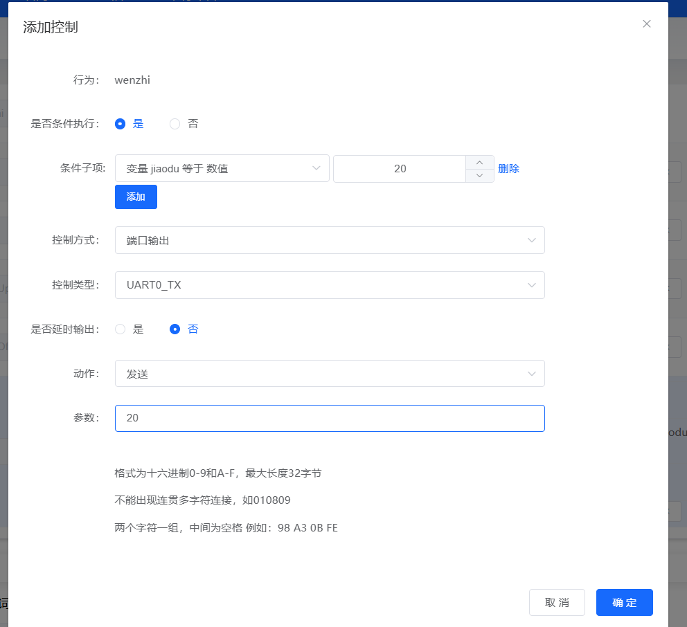
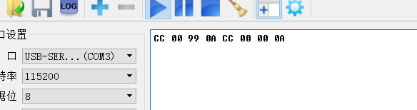

# 离线语音模组 CI-33T

## 快速规格一览

| 参数 | 规格 |
|------|------|
| 主控芯片 | CI1303 |
| 综合识别率 | 95% |
| 供电电压 | 3.6-5.5V |
| 词条数 | **500** |
| Flash | **4M** |
| SRAM | 640KB |
| AEC（回声消除） | ✗ |
| 双麦算法 | ✓ |
| 单/双麦 | 双麦 |
| 适用环境 | 中噪声环境 |
| 待机电流 | ~60mA |
| 工作电流 | >500mA (4Ω喇叭) |
| 功放功率 | 2.4W@5V4Ω |
| 封装 | SMD22/DIP22 |
| 尺寸 | 21×15mm |

### 高级功能支持

| 功能 | 支持情况 |
|------|---------|
| 自然说 | ✓ |
| 声纹识别 | ✓ |
| 声源定位 | ✓ |
| 哭声检测 | ✓ |
| 鼾声检测 | ✓ |
| 文字转语音(TTS) | ✓ |
| 自学习 | ✓ |
| 支持语言 | 中/英/日/韩（其他语种可定制） |
| 平台能力 | 支持生成固件 |

### CI-33T vs CI-03T 对比

| 参数 | CI-33T | CI-03T |
|------|--------|--------|
| 词条数 | **500** | 300 |
| Flash | **4M** | 2M |
| 主控芯片 | CI1303 | CI1302 |
| 其他特性 | 相同 | 相同 |

> CI-33T 相比 CI-03T 主要优势在于更大的词条容量（500 vs 300）和更大的 Flash（4M vs 2M），适合需要更多命令词的应用场景。

---

## 定位与适用场景

- **定位**：新一代高性能神经网络离线语音模组，集成 BNPU V3 + CPU，可单独作为语音主控使用
- **适用场景**：

    - **智能家电**：风扇、晾衣架、加湿器、茶壶等需要语音控制的产品
    - **智能照明**：台灯、吸顶灯、氛围灯
    - **智能门锁/安防类**：门锁、门磁、门禁面板
    - **智能玩具与小家电**：故事机、互动玩偶、小型清洁类设备等
    - **其他**：86盒、语音面板等无需联网即可响应的产品
- **优势**：低延时、本地数据安全、大词条容量（500词）
- **版本说明**：

    - **普通双咪版本**：适合双麦克风降噪场景，内部不支持 AEC
    - **单咪 AEC 版本**：单麦克风配合内部 AEC 算法，可有效抑制回声

---

## 模组概述

CI-33T 是我司研发的新一代高性能神经网络智能语音模组，集成了脑神经网络处理器 BNPU V3 和 CPU 内核，系统主频可达 220MHz，内置高达 640KByte 的 SRAM，集成 PMU 电源管理单元，高性能低功耗 Audio Codec+ClassAB 功率放大器和多路 UART、IIC、IIS、PWM、GPIO、PDM 等外围控制接口。

### 核心特性

| 指标分类 | 参数项 | 规格/数值 |
|---------|-------|----------|
| **核心性能** | AI运算内核 | BNPU V3 神经网络加速器 |
| | CPU | 32位高性能CPU，最高220MHz |
| | DSP | 32-bit单周期乘法器，支持DSP扩展加速 |
| **存储资源** | SRAM | 640KB |
| | Flash | 4MB |
| | eFuse | 512bit |
| **音频接口** | Codec | 内置高性能低功耗Audio Codec |
| | ADC/DAC | 双路ADC + 单路DAC |
| | 采样率 | 8/16/24/32/44.1/48 kHz |
| | ALC | 支持自动电平控制 |
| | IIS | 1路音频扩展通路 |
| | 功放 | 内置ClassAB功率放大器 |
| **电源** | 供电范围 | 3.6V ~ 5.5V |
| | LDO | 内置3个高性能LDO |
| **外设接口** | UART | 3路，最高3M波特率 |
| | IIC | 1路 |
| | PWM | 5路 |
| | GPIO | 9个（部分支持5V宽压） |
| | ADC | 1路10bit SAR ADC @1MHz |
| | Timer | 4组32-bit |
| | Watchdog | IWDG + WWDG |
| **EMC/ESD** | EMC | 支持FCC标准 |
| | ESD | 4KV接触放电 |
| | 环保 | ROHS/REACH |

---

## 基本资料下载

- [CI-33T-V1.3-模组规格书.pdf](https://help.aimachip.com/attach_files/offline_ci33t/1007)
- [CI-33T-V1.3-原理图.pdf](https://help.aimachip.com/attach_files/offline_ci33t/1006)
- [CI-33T封装图.PCB](https://help.aimachip.com/attach_files/offline_ci33t/1008)

### 资料获取说明

CI-33T与CI-03T共用开发资料，主要差异在于Flash容量：

- **CI-03T**：2M Flash，支持300条词条
- **CI-33T**：4M Flash，支持500条词条

除上述差异外，其他硬件规格和功能完全相同，可参考CI-03T的所有技术文档和开发资料。

### 开发与烧录资源附件
- [01、CH340安装包.rar](https://help.aimachip.com/attach_files/offline_ci33t/1002)
- [02、模块烧录软件.rar](https://help.aimachip.com/attach_files/offline_ci33t/1003)
- [CI-33T烧录指引文档V1.2.docx](https://help.aimachip.com/attach_files/offline_ci33t/1004)
- [CI-33T烧录调试接线.png](https://help.aimachip.com/attach_files/offline_ci33t/1005)
- [04、模块出厂固件.rar](https://help.aimachip.com/attach_files/offline_ci33t/1001)
- [05、串口调试软件.rar](https://help.aimachip.com/attach_files/offline_ci33t/1000)
- [CI-33T开发包；版本V2.1.0.rar](https://help.aimachip.com/attach_files/offline_ci33t/999)
- [产品结构声学规范.rar](https://help.aimachip.com/attach_files/offline_ci33t/998)
- [喇叭和咪头选型推荐.rar](https://help.aimachip.com/attach_files/offline_ci33t/997)

---

## 硬件设计指南

### 1. 电源设计

- **独立供电**：建议使用独立的 LDO 或 DC-DC + LDO 为模组供电
- **滤波电容**：在 VCC 引脚附近放置 10uF + 100nF 滤波电容
- **接地设计**：数字地与模拟地单点汇合，避免大电流回流经过音频前端

### 2. 声学设计

- **麦克风布局**：差分走线并包地处理，麦克风孔应有良好密封性
- **隔离设计**：麦克风与喇叭之间应有声学隔离（如减震棉）
- **功放电路**：功放电路应远离麦克风电路

### 3. 接口与防护

- **UART/IO**：预留 TX/RX 测试点以便调试升级
- **ESD 防护**：对外接口建议放置 ESD 保护器件

### 参考设计文档

- [产品结构声学规范.rar](https://help.aimachip.com/attach_files/offline_ci33t/998)
- [喇叭和咪头选型推荐.rar](https://help.aimachip.com/attach_files/offline_ci33t/997)

---

## 开发环境搭建

### 开发工具下载

| 工具 | 说明 | 下载链接 |
|------|------|---------|
| CI-33T 开发包 V2.1.0 | SDK和开发资源 | [下载](https://help.aimachip.com/attach_files/offline_ci33t/999) |
| CH340 驱动 | USB转串口驱动 | [下载](https://help.aimachip.com/attach_files/offline_ci33t/1002) |
| 烧录软件 | 模块烧录工具 | [下载](https://help.aimachip.com/attach_files/offline_ci33t/1003) |
| 串口调试软件 | 串口通信调试 | [下载](https://help.aimachip.com/attach_files/offline_ci33t/1000) |

### 环境准备

1. 安装 CH340 USB转串口驱动
2. 安装烧录软件
3. 注册智能公元平台账号（配置词表和语音）

---

## 固件烧录指南

### 烧录文档

- [CI-33T烧录指引文档V1.2.docx](https://help.aimachip.com/attach_files/offline_ci33t/1004)
- [CI-33T烧录调试接线.png](https://help.aimachip.com/attach_files/offline_ci33t/1005)

### 烧录步骤

1. **硬件连接**：将模组 UART_TX/RX 与 PC 串口工具连接，保证 GND 相连
2. **进入烧录模式**：拉低 BOOT 引脚后上电
3. **执行烧录**：打开烧录软件，选择固件文件与端口，点击开始烧录
4. **验证结果**：复位模组，对着麦克风说出唤醒词，观察串口日志与语音播报

### 出厂固件

- [04、模块出厂固件.rar](https://help.aimachip.com/attach_files/offline_ci33t/1001)

---

## 指令集与词表配置

- 支持多场景词表，结构为"唤醒词 → 命令组 → 动作"
- 词条容量：**500条**（比 CI-03T 多 200 条）
- 通过智能公元平台配置唤醒词、命令词和回复语
- 串口协议：`0xAA 0x55 [CMD] [LEN] [DATA] [CS]`

---

## 教程与配套固件

### 项目教程

| 教程名称 | 说明 | 下载链接 |
|---------|------|---------|
| 语音+蓝牙控制灯泡 | 使用CI-33T和蓝牙模块远距离控制灯泡 | [下载ZIP](https://help.aimachip.com/attach_files/offline_ci33t/534) |
| 语音+2.4G无线透传控制灯泡 | 使用语音模块和2.4G无线透传实现超远距离控制 | [下载ZIP](https://help.aimachip.com/attach_files/offline_ci33t/552) |

### 在线教程链接

- [CI-33T语音+蓝牙控制灯泡教程](https://help.aimachip.com/docs/offline_ci33t/offline_ci33t-1eob1dvf3q5mo)
- [CI-33T语音+2.4G无线透传控制灯泡教程](https://help.aimachip.com/docs/offline_ci33t/offline_ci33t-1eob1neus8oio)

---

## 外设开发与应用示例

### 场景 1：继电器控制（开关灯）

```c
// 伪代码示例
void on_voice_command(int cmd_id) {
    if (cmd_id == CMD_LIGHT_ON) {
        gpio_set_level(PIN_RELAY, 1);
        play_voice("灯已打开");
    }
}
```

### 场景 2：串口透传（对接主控 MCU）

- CI-33T 作为语音协处理器，识别成功后通过串口发送 ID 给主控 MCU
- 协议示例：`0xAA 0x55 [CMD_ID] [DATA_LEN] [DATA] [CHECKSUM]`

### 场景 3：联动应用

- 与 WiFi 模组（如 BL-62B）结合，实现语音+云端控制
- 典型方案：CI-33T（语音识别）+ BL-62B（WiFi联网）

---

## 产品升级路径

### CI-33T项目需要AI功能时如何升级？

**问题描述：**

CI-33T项目推进过程中，如果需要增加AI功能（如自然语言对话、智能问答等），原方案无法满足需求。

**升级方案：**

**方案一：升级至JX-A7T模组**

- **产品定位**：JX-A7T是离在线语音AI大模型模组
- **核心优势**：同时支持离线指令和在线AI对话
- **技术架构**：双芯片方案（CI1302语音芯片 + WiFi芯片）
- **功能对比**：

| 功能 | CI-33T | JX-A7T |
|------|--------|--------|
| 离线词条 | 500条 | 300条 |
| AI对话 | × | ✓（云端大模型） |
| 网络连接 | × | ✓（WiFi + BLE 5.0） |
| Flash容量 | 4MB | 2MB（语音）+ 2MB（WiFi） |

**方案二：搭配ESP32方案**

- 使用CI-33T处理语音识别
- 通过串口连接ESP32处理AI功能
- 需要额外的硬件和软件开发成本

**JX-A7T优势：**

- 集成度高，减少开发复杂度
- 支持智能体平台配置
- 商用拓展性好，适合产品化
- 当前入手有优惠价格

**注意事项：**

- JX-A7T离线词条容量为300条，如需更多离线词条需评估需求
- AI功能需要网络连接
- 详细文档：[JX-A7T使用指南](https://help.aimachip.com/docs/jx_a7t_v1/jx_a7t_v1-1ghc1h40pidif)

---

## 参考链接

| 资源 | 链接 |
|------|------|
| CI-33T 官方文档首页 | [https://help.aimachip.com/docs/offline_ci33t](https://help.aimachip.com/docs/offline_ci33t) |
| 智能公元平台 | [https://smartpi.cn](https://smartpi.cn) |
| CI-03T 文档（参考） | [https://help.aimachip.com/docs/offline_ci03t](https://help.aimachip.com/docs/offline_ci03t) |
| JX-A7T AI模组文档 | [https://help.aimachip.com/docs/jx_a7t_v1](https://help.aimachip.com/docs/jx_a7t_v1) |

---

## 声源定位功能配置与数据读取

**功能概述：**

CI系列芯片支持声源定位功能，通过双麦克风阵列实现声源方向检测。该功能可识别0-180度范围内的声源角度，分辨率为10度，共19个角度位置。

**技术规格：**


- 检测范围：0-180度
- 角度分辨率：10度（19个角度位置）
- 双麦克风要求：同一平面、同向安装
- 推荐间距：40mm
- 识别距离：建议1米以上（过近会导致识别不准确）

**功能配置步骤：**

**1. 启用声源定位功能**

在配置界面中启用声源定位功能：


- 定位方式：选择"唤醒词+命令词定位"
- 双麦间距：设置为40mm
- 识别方位数：设置为10

**2. 数据获取方法**

声源定位数据可通过以下方式获取：

- **变量访问**：角度数据存储在内部变量中
- **串口输出**：通过UART0发送角度数据
- **语音播报**：实时播报当前角度值

**3. 角度数据读取配置**

使用播放动作读取变量值：


配置播放变量"jiaodu"的当前值，用于验证数据获取是否正常。

**4. 串口数据发送配置**

设置条件触发，当检测到特定角度时通过串口发送数据：



**配置步骤：**

1. **添加控制条件**：

    - 条件类型：变量等于数值
    - 变量名：jiaodu
    - 数值：具体角度值（0、10、20...180）

2. **设置输出参数**：

    - 控制方式：端口输出
    - 控制类型：UART0_TX
    - 动作：发送
    - 参数：对应角度的十六进制值

**最终控制配置示例：**


显示已配置的两个控制项：

- 变量jiaodu等于数值0时，通过UART0_TX发送参数0
- 变量jiaodu等于数值20时，通过UART0_TX发送参数20

**串口数据格式示例：**

- 0度时：`55 AA 01 00 AA 55`
- 10度时：`55 AA 01 0A AA 55`
- 20度时：`55 AA 01 14 AA 55`
- 90度时：`55 AA 01 5A AA 55`
- 180度时：`55 AA 01 B4 AA 55`

**完整配置要求：**

需要为19个角度值分别设置控制条件：

- 0度、10度、20度、...、180度
- 每个角度对应一个触发条件
- 共19个控制配置项

**使用注意事项：**

1. **距离要求**：

    - 测试距离应保持在1米以上
    - 过近距离会导致识别不准确
    - 远些距离会显著提高识别精度

2. **硬件安装**：

    - 双麦克风必须处于同一平面
    - 麦克风方向应保持一致
    - 推荐间距为40mm

3. **功能触发**：

    - 不唤醒时始终播报0度
    - 唤醒后才能检测到实际角度
    - 需要设置19个触发和控制条件对应各角度

4. **数据稳定性**：

    - 初期测试可能出现数据不稳定
    - 建议在不同距离和角度进行测试
    - 可使用测试固件验证功能

**应用场景：**

声源定位功能适用于：

- 展厅交互系统
- 智能家居控制
- 机器人听觉系统
- 多媒体互动装置
- 语音方向追踪设备

**故障排除：**

- **始终显示0度**：确认系统已唤醒，检查麦克风连接
- **数据不稳定**：增加测试距离，检查环境噪声
- **无法获取数据**：确认变量配置正确，检查串口连接



### CI-33T烧录接线说明

**串口烧录接线图**：


**接线说明**：

- 使用UART1接口进行烧录（B6/B7引脚）
- CH340模块的TX连接到CI-33T的RX
- CH340模块的RX连接到CI-33T的TX
- 烧录时芯片型号选择CI1303

---

### CI-33T如何通过串口控制TTS语音合成？

**问题描述：**

需要了解如何使用单片机（如STM32）通过串口控制CI-33T模块的TTS（文字转语音）功能，实现将文本转换为语音输出。

**解决方案：**

**功能确认**

CI-33T模块支持TTS文字转语音功能，可以通过串口接收文本数据并合成语音输出。

**通信协议**

- **接口类型**：串口（UART）
- **数据编码格式**：GB2312
- **数据格式**：直接发送需要合成的文本内容，无需特殊协议头或尾

**硬件连接**

1. **串口连接**：

    - STM32的UART TX引脚连接到CI-33T的UART RX引脚
    - STM32的UART RX引脚连接到CI-33T的UART TX引脚
    - 确保GND共地连接

2. **电源要求**：

    - 供电电压：3.6V-5.5V
    - 确保电源能提供足够的峰值电流（>500mA）

**软件配置**

1. **串口参数设置**：

    - 波特率：9600bps（默认）
    - 数据位：8位
    - 停止位：1位
    - 校验位：无

2. **发送数据示例**：

    - 发送"你好"文本（GB2312编码）：
    ```
    0xC4 0xE3 0xCA 0xC7
    ```
    - 模块接收后自动进行语音合成并播放

**使用步骤**

1. **配置模块**：

    - 在智能公元平台生成支持TTS功能的固件
    - 烧录到CI-33T模块

2. **发送文本**：

    - 将文本转换为GB2312编码
    - 通过串口发送编码后的字节数据
    - 模块自动识别并合成语音

3. **验证功能**：

    - 发送测试文本如"测试"
    - 听模块是否正确播放语音
    - 检查语音清晰度和音量

**注意事项**

- 确保发送的文本编码为GB2312格式，否则可能出现乱码
- 串口通信参数必须与模块默认设置一致
- TTS功能需要模块支持，使用前请确认固件已启用该功能
- 长文本建议分段发送，避免一次性发送过多数据

**参考资料**

- 详细的TTS功能说明请参考官方技术文档
- GB2312编码表可查询相关标准文档
- 更多示例代码可联系技术支持获取
