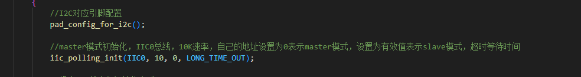
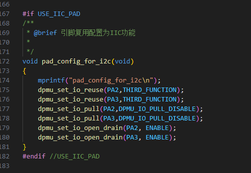
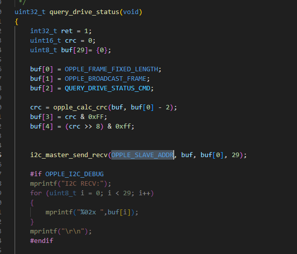
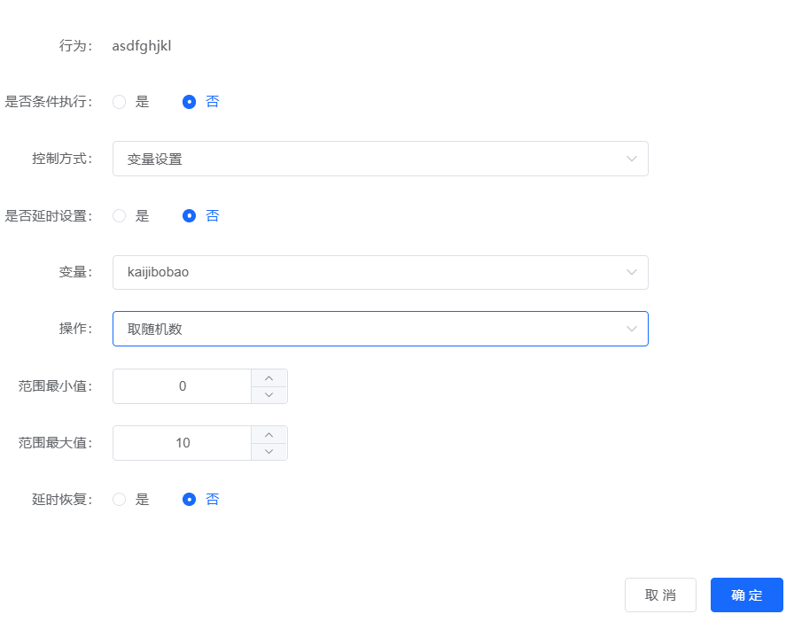
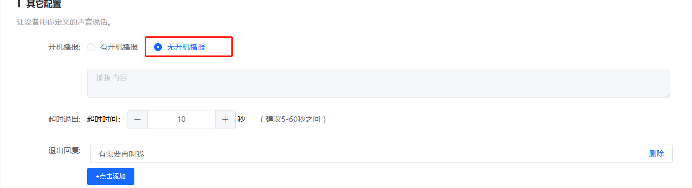
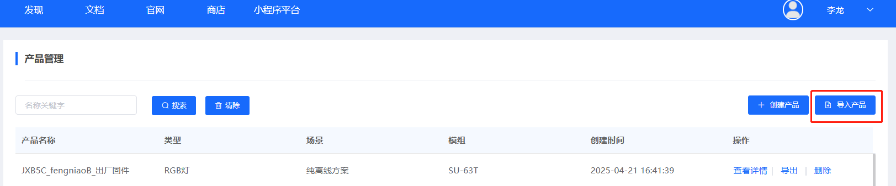

# CI-73T2 离线语音模组

## CI-73T2原理图与硬件配置指南

**问题描述：**

需要获取CI-73T2的原理图以便进行硬件兼容性设计，并了解外部晶振和串口通信的配置要求。

**解决方案：**

**1. 获取原理图和开发资料**：

- 官方网站提供完整的开发包下载
- 开发包包含原理图、数据手册等硬件资料
- 访问地址：https://help.aimachip.com/docs/ci73t

**2. 硬件配置要点**：

- **外部晶振**：非必需，CI-73T2可以不使用外部晶振正常工作
- **串口通信**：

    - 固件升级使用：UART0
    - 通讯控制使用：UART1或UART2（两者都支持）
- **兼容性设计**：参考官方原理图进行硬件设计，确保最佳兼容性

**3. 开发资源**：

- 完整的原理图文件（PDF格式）
- 引脚定义说明
- 参考设计电路
- PCB布局建议

**注意事项：**

- 下载开发包前需注册官方账号
- 建议使用最新版本的开发资料
- 硬件设计时遵循原理图的推荐布局
- 如有特殊需求，可联系技术支持获取定制化建议

---

## CI-73T2模块I2C接口二次开发支持

**问题描述：**

需要使用CI-73T2模块的I2C接口进行二次开发，实现自定义的I2C通信功能。

**解决方案：**

**开发环境与工具：**

- **操作系统**：Ubuntu
- **编译工具**：Visual Studio (VS) 编译器，C语言环境
- **开发流程**：通过智能公元平台生成语言模型 → 在虚拟机环境中编译代码 → 拉取到Windows系统进行开发

**开发流程：**

1. **获取SDK基础包**

    - 联系技术支持获取CI-73T2的SDK基础包（如CI-73T2.rar）
    - SDK包含基础的代码框架和驱动程序

2. **I2C初始化配置**

    ```c
    // I2C对应引脚配置
    pad_config_for_i2c();

    // master模式初始化，IIC0总线，10K速率，自己的地址设置为0表示master模式
    iic_polling_init(IIC0, 10, 0, LONG_TIME_OUT);
    ```

3. **I2C引脚配置**

    ```c
    void pad_config_for_i2c(void)
    {
        dpmu_set_io_reuse(PA2, THIRD_FUNCTION);    // PA2配置为复用功能
        dpmu_set_io_reuse(PA3, THIRD_FUNCTION);    // PA3配置为复用功能
        dpmu_set_io_pull(PA2, DPMU_IO_PULL_DISABLE);  // 禁用PA2上拉下拉
        dpmu_set_io_pull(PA3, DPMU_IO_PULL_DISABLE);  // 禁用PA3上拉下拉
        dpmu_set_io_open_drain(PA2, ENABLE);     // PA2设置为开漏输出
        dpmu_set_io_open_drain(PA3, ENABLE);     // PA3设置为开漏输出
    }
    ```

4. **I2C数据通信实现**

    ```c
    uint32_t query_drive_status(void)
    {
        int32_t ret = 1;
        uint16_t crc = 0;
        uint8_t buf[29] = {0};

        // 构建查询命令
        buf[0] = 0xAA;  // 帧头
        buf[1] = 0x55;  // 帧头
        buf[2] = 0x01;  // 设备地址
        // ...填充其他数据

        // 计算CRC校验码
        crc = crc16(buf, 27);
        buf[27] = (crc >> 8) & 0xFF;
        buf[28] = crc & 0xFF;

        // I2C发送和接收数据
        ret = i2c_master_send_recv(IIC0, DEVICE_ADDR, buf, 29, buf, 29, LONG_TIME_OUT);

        if (ret == 0) {
            // 通信成功，处理接收数据
            printf("Received data: ");
            for(int i = 0; i < 29; i++) {
                printf("%02X ", buf[i]);
            }
            printf("\n");
        }

        return ret;
    }
    ```

**技术支持说明：**

- 厂商不提供直接的二次开发支持服务
- 会提供必要的SDK和基础开发资料
- 需要自行完成I2C通信协议的实现
- 开发过程中可参考SU-03T的二次开发资料（原理类似）

**注意事项：**

- I2C接口需要通过SDK进行二次开发才能使用
- 开发前需要具备一定的嵌入式开发经验

---

## 烧录与调试

### CI-73T2的烧录工具是什么？如何使用？

**问题描述：**

询问US513U61烧录工具的下载位置，以及CI-73T2型号的具体烧录方法和工具使用。

**解决方案：**

**烧录工具获取**

1. **工具来源**
    - 烧录工具在开发包中提供
    - 联系技术支持获取CI-73T2开发包
    - 或使用通用的PACK_UPDATE_TOOL.exe

2. **工具版本**
    - 支持CI-73T2的烧录工具版本
    - 确保工具版本兼容模块型号

**烧录步骤**

1. **选择芯片系列**
    - 打开PACK_UPDATE_TOOL.exe
    - 第一列下拉选择"CI 13LC系列"
    - 这个系列包含CI-73T2

2. **固件加载**
    - 点击"选择固件文件"
    - 加载平台生成的.bin固件
    - 确认固件路径正确

3. **串口连接**
    - 连接USB转串口模块
    - 选择正确的COM端口
    - 确认波特率设置

4. **开始烧录**
    - 点击"开始升级"按钮
    - 等待进度条完成
    - 提示"升级完成自动运行"表示成功

**参考流程**

- 使用方法可参考CI-03T的烧录流程
- 部分引脚与CI-03T相同
- 固件制作和烧录流程基本一致

**注意事项：**

- 烧录软件是不通用的，不同型号需要对应工具
- 确保选择正确的芯片系列
- 烧录过程中不要断电或断开连接

---
- PA2和PA3是I2C通信的专用引脚，必须正确配置
- I2C通信速率可根据实际需求调整
- 开发过程中建议使用逻辑分析仪监控I2C信号



*I2C初始化和主设备模式配置*



*PA2和PA3引脚的复用、上拉下拉和开漏输出配置*



*I2C主设备发送和接收数据的流程实现*

---

## PWM输出控制实现

**问题描述：**

需要实现PWM输出控制，前2秒占空比为80%，之后变为65%，用于电机启动控制。

**解决方案：**

**平台配置方法：**

1. **添加第一个PWM控制行为**：

    - 设置为延时2000ms后输出
    - 占空比设置为80%
    - 用于初始阶段的高扭矩启动

2. **添加第二个PWM控制行为**：

    - 直接设置占空比为65%
    - 无延时设置
    - 用于正常运行阶段

3. **开机初始化配置（可选）**：

    - 开机时设置PWM为100%
    - 确保设备有足够的启动扭矩
    - 第一个行为执行后自动切换到80%

**配置示例：**

```
行为1：PWM1控制
- 触发方式：事件触发（开机）
- 延时：2000ms
- 占空比：80%
- 功能：电机启动阶段

行为2：PWM1控制
- 触发方式：事件触发（开机）
- 延时：0ms
- 占空比：65%
- 功能：电机正常运行
```

**注意事项：**

- 两个行为会按顺序执行，先执行80%占空比，2秒后切换到65%
- 65%占空比会一直保持，直到设备重启
- 如需更精确的占空比，建议使用70%替代65%（平台限制）
- 此配置适用于需要大扭矩启动的应用场景


*PWM分阶段控制配置界面，第一个PWM延时2000ms输出80%，第二个PWM直接输出65%占空比*

---

## 车辆运行中麦克风识别问题

**问题描述：**

CI-73T模块在车辆运行过程中无法识别麦克风命令，只有在车辆停止后才能正常响应。

**问题分析：**

这是典型的电源质量问题导致的识别失效：

1. **电源噪声干扰**：

    - 车辆运行时电机产生的电源毛刺过多
    - 毛刺通过电源传导至麦克风电路
    - 严重降低麦克风的识别性能

2. **供电不稳定**：

    - 车载电源存在电压波动
    - 模块供电纹波过大
    - 影响语音识别算法的正常工作

**解决方案：**

**① 电源优化（必须）**

1. **独立供电设计**：

    - 为CI-73T模块提供独立的供电回路
    - 与电机等大功率负载分开供电
    - 确保模块供电稳定纯净

2. **电源滤波处理**：

    - 在模块电源输入端增加LC滤波电路
    - 添加大容量储能电容（100μF以上）
    - 使用π型滤波器减少传导干扰

3. **稳压措施**：

    - 使用LDO稳压芯片提供稳定3.3V
    - 避免直接使用车载不稳定电源
    - 确保电源纹波小于100mV

**② 硬件布局优化**

1. **物理隔离**：

    - 模块远离电机、继电器等干扰源
    - 使用屏蔽罩保护模块电路
    - 麦克风线路使用屏蔽线

2. **接地处理**：

    - 模块与车身可靠单点接地
    - 避免接地回路形成
    - 模拟地和数字地分开处理

**③ 软件调试建议**

1. **测试方法**：

    - 用示波器测量电源输入部分的毛刺
    - 对比车辆运行和停止时的电源质量
    - 记录识别失败时的电源波形

2. **临时验证**：

    - 使用外部独立电池供电测试
    - 如识别恢复正常，可确认是电源问题
    - 近距离对麦克风大声说话测试

**注意事项：**

- CI系列模块对电源质量要求较高
- 车载环境必须进行专门的电源设计
- 电源问题会导致完全无法识别，而非灵敏度下降
- 建议在设计的早期阶段就考虑电源隔离方案

---

## 开机播报功能扩展与变量控制

**问题描述：**

需要实现开机播报功能的扩展，使其能够根据变量控制播放不同的音频内容，并实现变量的持久化存储和递增。

**解决方案：**

**平台配置方法（CI系列适用）**

1. **创建新行为控制**：

    - 在平台中添加新的行为项
    - 设置触发方式为"事件触发"
    - 该行为将作为开机播报的控制器

2. **配置随机变量**：

    - 添加"变量设置"控制项
    - 选择"取随机数"操作
    - 设置变量名称（如kaijibobao）
    - 设置随机数范围（如0-2，对应3种播报）

3. **开机播报设置**：

    - 在"其它配置"中设置"无开机播报"
    - 通过自定义行为控制播报逻辑
    - 避免使用平台固定的开机播报功能

**配置示例：**

```
行为名称：asdfghjkl（自定义）
触发方式：事件触发（开机）
变量操作：设置变量kaijibobao为随机数(0-2)

播报控制：

- 变量=0 → 播报内容1
- 变量=1 → 播报内容2
- 变量=2 → 播报内容3
```

**变量持久化说明：**

- **随机数模式**：每次开机生成新的随机数，实现随机播报
- **递增模式**：需要二次开发实现变量存储和递增
- **存储限制**：CI系列芯片的变量存储在RAM中，断电会丢失

**二次开发方案（如需持久化）**

如需要实现开机次数计数等持久化功能：

1. **使用外部存储**：

    - 添加外部EEPROM存储开机次数
    - 通过I2C或SPI接口读写
    - CI-73T2的I2C接口可用于此目的

2. **实现存储逻辑**：

    ```c
    // 读取开机次数
    uint8_t boot_count = eeprom_read(BOOT_COUNT_ADDR);

    // 开机次数递增
    boot_count++;

    // 存储新值
    eeprom_write(BOOT_COUNT_ADDR, boot_count);

    // 根据次数选择播报内容
    uint8_t content_index = boot_count % CONTENT_COUNT;
    play_content(content_index);
    ```

**注意事项：**

- CI系列模块的变量是易失性的，断电后重置
- 随机数播报无需二次开发，直接平台配置即可
- 持久化存储需要额外硬件支持
- SU系列模块不支持此类高级变量控制功能



*通过变量设置随机数来控制播报内容*



*在其它配置中设置为"无开机播报"，使用自定义行为控制*



*通过导入产品功能快速应用配置*

---

## 串口唤醒与提示语播放功能

**问题描述：**

需要通过串口发送命令唤醒 CI-73T2 模组，模组在唤醒后播放提示语，然后等待用户输入语音指令。

**解决方案：**

通过智能公元平台配置串口输入触发器，实现串口命令唤醒并播放提示音的功能。

**配置步骤：**

1. **添加串口输入触发器**：

    - 在平台中添加新的行为
    - 触发方式选择：串口输入
    - 选择串口：UART1_RX
    - 设置消息编号（如 1）

2. **配置唤醒行为**：

    - 添加"允许语音识别"控制
    - 取消模组的休眠状态
    - 使模组进入待唤醒状态

3. **添加提示语播报**：

    - 在触发器后添加播报动作
    - 输入提示语内容（如"我在，请说"）
    - 设置合适的音量

4. **生成并烧录固件**：

    - 保存配置并生成固件
    - 使用 PACK_UPDATE_TOOLS 工具烧录
    - 芯片系列选择 CI130X 系列
    - 芯片型号选择 CI1302

**使用方法：**

1. **串口发送唤醒命令**：

    ```
    数据格式：AA 55 01 [数据] AA
    其中：01 为消息编号，需与配置一致
    ```

2. **模组响应流程**：

    - 接收串口命令后唤醒
    - 播放提示语："我在，请说"
    - 进入语音识别状态，等待用户指令

3. **用户交互**：

    - 用户说出语音命令
    - 模组识别并执行对应操作
    - 可播报确认语或发送串口响应

**注意事项：**

- 串口通信波特率需与主控设备保持一致
- 建议在唤醒命令后增加 100-200ms 延时，确保模组完全唤醒
- 提示语不宜过长，建议控制在 2 秒内
- 如需长时间待机，可配置超时退出功能

**应用场景：**

- 节能设备的智能控制
- 需要按需唤醒的应用
- 降低待机功耗的产品
- 与主控 MCU 协同工作的系统

---

## CI-03T2订单规格与定制要求

**问题描述：**

需要确认CI-03T2语音模块的订单配置，包括喇叭和咪头的具体规格要求。

**解决方案：**

**标准配置清单：**

1. **CI-03T2语音模块**：

    - 支持离线语音识别和播报功能
    - 数量：按订单需求（如2000片）
    - 单价：参考最新报价

2. **喇叭规格**：

    - 端子类型：2.0mm端子接口
    - 外观要求：不带"耳朵"（端子直接连接）
    - 线缆长度：150mm（±10mm）
    - 功率阻抗：8Ω2W（根据实际需求）
    - 数量：通常与模块1:1配置

3. **咪头规格**：

    - 端子类型：2.0mm端子接口
    - 线缆长度：120mm（±10mm）
    - 型号推荐：6027或同等规格
    - 灵敏度：-32dB至-25dB
    - 信噪比：≥70dB

**订单注意事项：**

1. **规格确认**：

    - 下单前确认所有技术规格
    - 明确端子类型和线长要求
    - 保留样品记录便于批量一致性

2. **生产安排**：

    - 备货生产：按交期安排
    - 发货前确认配置符合要求
    - 提供送货单和产品清单

3. **质量管控**：

    - 确保线长一致性，避免长短不一
    - 端子规格与样品保持一致
    - 批量生产前进行首件确认

**应用建议：**

- CI-03T2适用于智能家具、家电控制等场景
- 2.0mm端子接口便于快速装配
- 线长规格根据实际安装距离确定