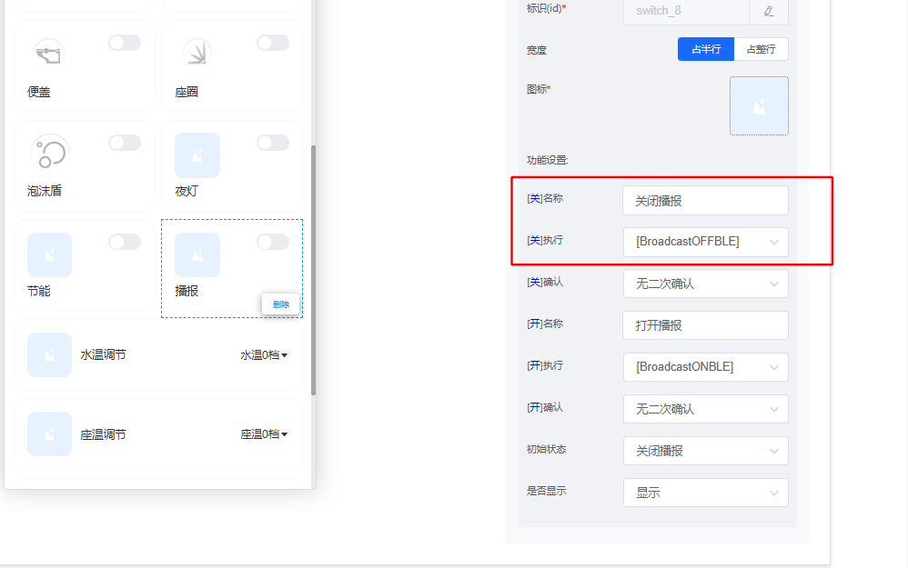

# 离线语音模组 JX-B5C（二合一）

## 快速规格一览

| 参数 | JX-B5C |
|------|--------|
| 架构 | **CI1302（语音）+ 蜂鸟B（蓝牙）二合一** |
| 语音芯片 | CI1302（BNPU V3 + CPU @220MHz） |
| 蓝牙芯片 | 蜂鸟B（Bluetooth V5.1） |
| 供电电压 | 3.6-5.5V |
| SRAM | 640KB |
| eFuse | 512bit |
| AEC（回声消除） | ✓ |
| ALC（自动电平） | ✓ |
| 功放 | 内置Class AB |
| 采样率 | 8/16/24/32/44.1/48 kHz |

### 蓝牙特性

| 参数 | 规格 |
|------|------|
| 蓝牙版本 | V5.1 + BR + EDR + BLE |
| 发射功率 | 6dBm |
| 接收灵敏度 | -90dBm |
| 支持协议 | A2DP/AVRCP/HFP/SPP/SMP/ATT/GAP/GATT等 |

### 高级功能支持

| 功能 | 支持情况 |
|------|---------|
| 离线语音识别 | ✓ |
| 蓝牙音乐播放 | ✓ |
| 声纹识别 | ✓ |
| 命令词自学习 | ✓ |
| 深度学习降噪 | ✓ |
| 语音检测 | ✓ |

### JX-B5C 定位

> JX-B5C 是 **二合一智能模组**：

> - **离线语音**：CI1302芯片，BNPU V3 神经网络加速器，220MHz主频
> - **蓝牙音乐**：蜂鸟B芯片，Bluetooth V5.1，支持A2DP音频流
> - **应用场景**：智能音箱、智能台灯、智能玩具等需要语音控制+音乐播放的产品

---

## 模组概述

JX-B5C 是我司研发的新一代高性能神经网络智能语音 **CI1302 + 蜂鸟B** 设计的**二合一模组**，离线语音部分集成了脑神经网络处理器 BNPU V3 和 CPU 内核，系统主频可达 220MHz，内置高达 640KByte 的 SRAM，集成 PMU 电源管理单元，高性能低功耗 Audio Codec + Class AB 功率放大器，可以运用于各种需要**离线语音和蓝牙连接播放音乐**的场合。

### 定位与适用场景
- **定位**：二合一智能模组，结合离线语音识别和蓝牙音乐播放功能
- **适用场景**：

    - **智能音箱**：支持语音控制和蓝牙音乐播放的智能音箱产品
    - **智能家电**：风扇、加湿器、空气净化器等需要语音控制和音乐播放的产品
    - **智能照明**：台灯、吸顶灯、氛围灯，支持语音控制和蓝牙音乐
    - **智能玩具**：互动玩偶、故事机、教育机器人
    - **其他场景**：需要离线语音识别和蓝牙连接功能的各类产品

## 核心特性

### 神经网络处理器（BNPU V3）
- 采用 3 代硬件 BNPU 技术
- 支持 DNN、TDNN、RNN、CNN 等神经网络及并行矢量运算
- 可实现语音识别、声纹识别、命令词自学习、语音检测及深度学习降噪等功能

### CPU 处理器
- **32 位高性能 CPU**，运行频率最高支持 **220MHz**
- **32-bit 单周期乘法器**，支持 DSP 扩展加速

### 存储器
- 内置 **640KB SRAM**
- 内置 **512bit eFuse**

### 音频接口
- 内置高性能低功耗 **Audio Codec** 模块，支持单路 ADC 采样和单路 DAC 播放
- 支持 **Automatic Level Control (ALC)** 功能
- 支持 **8kHz / 16kHz / 24kHz / 32kHz / 44.1kHz / 48kHz** 采样率
- 支持内部 **PA 功率放大器**
- 支持内部 **AEC** 功能（回声消除）

### 蓝牙特性
- 支持 **Bluetooth V5.1 + BR + EDR + BLE**
- 支持 Class1、2、3 发送功率
- 支持 GFSK、π/4 DQPSK 包型
- 支持 **6dBm 发射功率**
- 接收灵敏度 **-90dBm**
- 快速 AGC 支持增强型动态范围
- 支持协议：**a2dp / avctp / avdtp / avrcp / hfp / spp / smp / att / gap / gatt / rfcomm / sdp / l2cap**

### 电源管理单元（PMU）
- 内置 **3 个高性能 LDO**，无需外加电源芯片，外围仅需少量阻容器件
- 支持 **5V 供电直接输入**
- 供电范围：最小支持 **3.6V** 输入，最大支持 **5.5V** 输入

### 时钟
- 内置 **RC 振荡器**

### GPIO 特性
- **UART0 串口支持 5V 电平通讯**

### 固件烧录和保护
- 支持 **UART 升级**和固件保护

### EMC 和 ESD
- 良好 **EMC 设计**，支持 **FCC 标准**
- 内部 **ESD 增强设计**，可通过 **4KV 接触放电试验**

## 官方资料下载

### 基本资料

| 资料 | 链接 |
|------|------|
| 原理图 | [下载](https://help.aimachip.com/docs/offline_jxb5c/offline_jxb5c-1gbt0l9q1ulh7) |
| 规格书 | [下载](https://help.aimachip.com/docs/offline_jxb5c/offline_jxb5c-1gbt0leih1kku) |

### 烧录资料

| 资料 | 链接 |
|------|------|
| CH340驱动 | [下载](https://help.aimachip.com/docs/offline_jxb5c/offline_jxb5c-1gbt0lm0ks7ce) |
| 烧录软件（蓝牙音乐部分） | [下载](https://help.aimachip.com/docs/offline_jxb5c/offline_jxb5c-1gbt0lrbgbdmn) |
| 烧录软件（语音识别部分） | [下载](https://help.aimachip.com/docs/offline_jxb5c/offline_jxb5c-1gbt0m48pbqdo) |
| 烧录文档 | [下载](https://help.aimachip.com/docs/offline_jxb5c/offline_jxb5c-1gbt0mbqvnvdp) |
| 出厂固件（蓝牙音乐部分） | [下载](https://help.aimachip.com/docs/offline_jxb5c/offline_jxb5c-1gbt0mjf3p44r) |
| 出厂固件（语音识别部分） | [下载](https://help.aimachip.com/docs/offline_jxb5c/offline_jxb5c-1gbt0mq8b3fbs) |
| 串口调试 | [下载](https://help.aimachip.com/docs/offline_jxb5c/offline_jxb5c-1gbt0n0j95nst) |

### 芯片资料

| 资料 | 链接 |
|------|------|
| 蓝牙音乐部分（蜂鸟B） | [下载](https://help.aimachip.com/docs/offline_jxb5c/offline_jxb5c-1gbt0umdko2m8) |
| 语音识别部分（CI1302） | [下载](https://help.aimachip.com/docs/offline_jxb5c/offline_jxb5c-1gbt0vbv77ouu) |

### 开发包

| 资料 | 链接 |
|------|------|
| 开发包资料 | [下载](https://help.aimachip.com/docs/offline_jxb5c/offline_jxb5c-1gbt0l1n61he9) |

### 产品设计

| 资料 | 链接 |
|------|------|
| 产品结构声学规范 | [下载](https://help.aimachip.com/docs/offline_jxb5c/offline_jxb5c-1gbt0pk7k5o60) |
| 喇叭和咪头选型 | [下载](https://help.aimachip.com/docs/offline_jxb5c/offline_jxb5c-1gbt0pqh7d9v3) |

## 快速开始

### 硬件准备
1. JX-B5C 模组
2. 麦克风（支持单麦 AEC）
3. 扬声器
4. USB转串口工具（CH340）
5. 5V 电源适配器

### 开发流程

#### 1. 环境搭建
- 安装 [CH340驱动](https://help.aimachip.com/docs/offline_jxb5c/offline_jxb5c-1gbt0lm0ks7ce)
- 下载烧录软件（蓝牙部分和语音识别部分）
- 准备串口调试工具

#### 2. 硬件连接
- 连接电源（3.6V-5.5V）
- 连接串口调试工具到UART0
- 连接麦克风和扬声器

#### 3. 固件烧录
- 参考 [烧录文档](https://help.aimachip.com/docs/offline_jxb5c/offline_jxb5c-1gbt0mbqvnvdp) 进行固件烧录
- 分别烧录蓝牙音乐部分和语音识别部分固件

#### 4. 功能测试
- 测试蓝牙配对和音乐播放
- 测试语音唤醒和命令识别
- 使用串口工具查看运行日志

#### 5. 平台开发
- 注册智能公元平台账号
- 创建产品并配置语音词表
- 下载SDK和开发包
- 根据需求进行二次开发

## 应用示例

### 智能音箱应用
1. 使用语音命令控制播放、暂停、切歌
2. 支持蓝牙连接手机播放音乐
3. 离线语音识别，无需联网

### 智能台灯应用
1. 语音控制灯光开关、亮度调节
2. 支持蓝牙音乐播放功能
3. 组合使用两种功能实现多样化交互

## 常见问题

### 硬件相关问题

#### Q1: 模组无法启动怎么办？
**现象**：上电后模组无反应，指示灯不亮。

**可能原因**：

1. 供电电压不足或不稳定
2. 硬件连接错误
3. 固件损坏

**解决方案**：

1. 检查供电电压是否在规格范围内（通常3.3V）
2. 确认电源线和地线连接正确
3. 重新烧录出厂固件

#### Q2: 语音识别率低怎么办？
**现象**：唤醒困难或指令识别不准确。

**可能原因**：

1. 麦克风位置不当或被遮挡
2. 环境噪音过大
3. 词表未正确下发

**解决方案**：

1. 调整麦克风位置，避免遮挡
2. 优化产品腔体设计，减少回声
3. 重新下发词表到模组
4. 调整识别灵敏度参数

### 软件开发问题

#### Q3: 如何自定义语音词条？
**步骤**：

1. 登录智能公元平台
2. 进入产品管理 > 语音词表
3. 添加或编辑词条
4. 保存并下发到设备

#### Q4: 串口通信失败怎么办？
**现象**：主控无法与模组通过串口通信。

**排查步骤**：

1. 检查波特率设置是否一致（默认115200）
2. 确认TX/RX引脚是否正确连接（注意交叉连接）
3. 使用串口调试工具测试
4. 检查电平逻辑是否匹配（3.3V）

#### Q5: 串口触发"设为静音"功能无效怎么办？
**现象**：通过串口发送指令设置静音，模块仍然播放语音，静音功能未生效。

**问题分析**：

1. **串口触发机制问题**：

    - 串口输入可能无法正确触发静音功能
    - USART_BLEACK触发方式可能存在兼容性问题
    - 静音控制逻辑可能与串口触发不匹配

2. **配置验证方法**：

    - 在串口设置静音后，增加其他操作验证触发是否成功
    - 观察是否串口指令被正确接收和处理
    - 对比语音指令触发与串口触发的差异

**解决方案**：

1. **使用语音控制静音**：

    - 优先使用语音指令控制静音功能
    - 配置专用命令词如"关闭声音"/"开启声音"
    - 避免使用串口直接控制静音

2. **小程序控制验证**：

    - 通过微信小程序控制静音功能测试
    - 确认静音功能本身是否正常工作
    - 验证静音设置是否生效

3. **协议检查**：

    - 确认串口指令格式正确
    - 验证指令是否符合模块协议规范
    - 检查指令是否包含必要的帧头帧尾

**配置参考**：

*串口触发设置界面，行为选择"设为静音"*

*串口调试助手显示指令已发送但静音未生效*

*通过小程序的播报功能验证静音控制*

**注意事项**：

- 蜂鸟B模块的静音功能可能不支持串口触发
- 建议使用语音指令或小程序方式控制静音
- 如必须使用串口控制，考虑在固件中添加中继逻辑
- 配置修改后需要重新生成并烧录固件

### 平台使用问题

#### Q6: 设备离线怎么办？
**说明**：JX-B5C为离线模组，不需要联网即可工作。如果是通过WiFi模组联动使用，请参考WiFi模组文档排查网络问题。

#### Q7: 如何更新固件？
**步骤**：

1. 从智能公元平台下载最新固件
2. 使用烧录工具连接模组
3. 选择固件文件并开始烧录
4. 等待烧录完成后重启设备

---

## 参考链接

| 资源 | 链接 |
|------|------|
| JX-B5C 官方文档首页 | [https://help.aimachip.com/docs/offline_jxb5c](https://help.aimachip.com/docs/offline_jxb5c) |
| 智能公元平台 | [https://smartpi.cn](https://smartpi.cn) |
| CI-03T 文档（参考） | [https://help.aimachip.com/docs/offline_ci03t](https://help.aimachip.com/docs/offline_ci03t) |

---

## 技术支持

如有其他问题，请联系智能公元技术支持团队。

---

## 附录 A：JX-B5C 规格书

### 资料下载

请访问 [官方帮助中心](https://help.aimachip.com/docs/offline_jxb5c/offline_jxb5c-1gbt0leih1kku) 下载最新版本的规格书。
  
  ### 核心规格
  
  #### 处理器
    - **语音处理器**：CI1302（BNPU V3 + CPU）
    - **蓝牙处理器**：蜂鸟B芯片
    - **CPU主频**：220MHz
    - **神经网络**：支持DNN/TDNN/RNN/CNN
  
  #### 存储
    - **SRAM**：640KB
    - **eFuse**：512bit
  
  #### 音频参数
    - **采样率**：8/16/24/32/44.1/48 kHz
    - **功放**：内置Class AB功放
    - **AEC**：支持回声消除
    - **ALC**：支持自动电平控制
  
  #### 蓝牙参数
    - **版本**：Bluetooth V5.1 + BR + EDR + BLE
    - **发射功率**：6dBm
    - **接收灵敏度**：-90dBm
    - **支持协议**：A2DP、AVRCP、HFP、SPP等
  
  #### 电源
    - **输入电压**：3.6V - 5.5V
    - **推荐电压**：5V
    - **功耗**：待补充
  
  #### 工作环境
    - **工作温度**：-20℃ ~ 70℃
    - **储存温度**：-40℃ ~ 85℃
  
  #### 物理尺寸
    - 详见规格书PDF文档
  
  #### 相关资源
  
    - [原理图](basic-info/schematic.md)
    - [喇叭和咪头选型](product-design/speaker-mic.md)
    - 返回 [主文档](JX-B5C.md)
  
  ## 附录 B：JX-B5C 原理图
  
  ### 资料下载
  
  请访问 [官方帮助中心](https://help.aimachip.com/docs/offline_jxb5c/offline_jxb5c-1gbt0l9q1ulh7) 下载最新版本的原理图资料。
  
  ### 原理图说明
  
  #### 主要模块
    1. **电源模块**：3.6V-5.5V输入，内置3个LDO
    2. **语音识别模块**：CI1302芯片及外围电路
    3. **蓝牙模块**：蜂鸟B芯片及射频电路
    4. **音频模块**：麦克风输入、功放输出
    5. **接口模块**：UART、GPIO等外设接口
  
  #### 设计要点
    - 注意电源隔离和滤波设计
    - 射频天线设计需符合规范
    - 音频信号路径需注意屏蔽和地处理
    - UART0支持5V电平通讯
  
  #### 相关资源
  
    - [规格书](basic-info/datasheet.md)
    - [产品结构声学规范](product-design/acoustic-design.md)
    - 返回 [主文档](JX-B5C.md)
  
  ## 附录 C：芯片资料 - 语音识别部分（CI1302）
  
  ### 资料下载
  
  请访问 [官方帮助中心](https://help.aimachip.com/docs/offline_jxb5c/offline_jxb5c-1gbt0vbv77ouu) 获取CI1302芯片完整技术资料。
  
  ### 芯片概述
  
  #### CI1302基本信息
    - **芯片型号**：CI1302
    - **架构**：BNPU V3 + 32位CPU
    - **主频**：220MHz
    - **内存**：640KB SRAM
    - **封装**：QFN/QFP（具体见规格书）
  
  ### 核心特性
  
  #### BNPU V3神经网络处理器
    - 支持DNN、TDNN、RNN、CNN网络
    - 硬件加速神经网络运算
    - 低功耗高性能
    - 支持语音识别、声纹识别、命令词自学习
  
  #### CPU性能
    - 32位RISC架构
    - 220MHz主频
    - 单周期乘法器
    - DSP扩展指令
  
  #### 音频处理
    - 内置高性能Audio Codec
    - 支持8/16/24/32/44.1/48kHz采样率
    - 内置Class AB功放
    - 支持AEC回声消除
    - 支持ALC自动电平控制
  
  ### 技术资料
  
  #### 可用文档
    1. **芯片数据手册**：完整规格参数
    2. **寄存器手册**：寄存器详细说明
    3. **应用笔记**：典型应用电路
    4. **开发指南**：软件开发说明
  
  ### 引脚定义
  
  详细引脚定义请参考：

    - [原理图](basic-info/schematic.md)
    - [规格书](basic-info/datasheet.md)
  
  ### 开发资源
  
  #### SDK支持
    - 完整的SDK开发包
    - 示例代码和库文件
    - 开发工具链
    - 调试工具
  
  #### 技术支持
    - 芯片级技术支持
    - 应用方案咨询
    - 问题诊断协助
  
  ### 相关资源
  
    - [规格书](basic-info/datasheet.md)
    - [开发包](sdk/sdk.md)
    - [烧录文档](flash/flash-guide.md)
    - 返回 [主文档](JX-B5C.md)
  
  ## 附录 D：芯片资料 - 蓝牙音乐部分（蜂鸟B）
  
  ### 资料下载
  
  请访问 [官方帮助中心](https://help.aimachip.com/docs/offline_jxb5c/offline_jxb5c-1gbt0umdko2m8) 获取蜂鸟B芯片完整技术资料。
  
  ### 芯片概述
  
  #### 蜂鸟B基本信息
    - **芯片系列**：蜂鸟B
    - **蓝牙版本**：Bluetooth V5.1 + BR + EDR + BLE
    - **发射功率**：6dBm
    - **接收灵敏度**：-90dBm
  
  ### 核心特性
  
  #### 蓝牙协议栈
  支持协议：A2DP、AVRCP、HFP、SPP、SMP、ATT、GAP、GATT、RFCOMM、SDP、L2CAP
  
  #### 射频性能
    - 支持GFSK、π/4 DQPSK调制
    - 接收灵敏度-90dBm
    - 快速AGC和增强型动态范围
    - 良好的EMC设计
  
  #### 音频性能
    - 高品质音频播放
    - 支持SBC、AAC编码（根据版本）
    - 低延迟音频传输
  
  ### 技术资料
  
  #### 可用文档
    1. **芯片数据手册**：完整规格参数
    2. **应用指南**：典型应用说明
    3. **开发文档**：软件开发指南
  
  ### 开发资源
  
  #### SDK和工具
    - 蓝牙开发SDK
    - 配置工具
    - 测试工具
  
  ### 相关资源
  
    - [规格书](basic-info/datasheet.md)
    - [烧录软件](flash/flash-tool-bt.md)
    - [出厂固件](flash/firmware-bt.md)
    - 返回 [主文档](JX-B5C.md)
  
  ## 附录 E：JX-B5C 开发包
  
  ### 资料下载
  
  请访问 [官方帮助中心](https://help.aimachip.com/docs/offline_jxb5c/offline_jxb5c-1gbt0l1n61he9) 下载完整的开发包资料。
  
  ### 开发包内容
  
  #### SDK组件
    1. **语音识别SDK**
        - CI1302芯片SDK
        - 示例代码
        - 库文件
        - API文档
  
    2. **蓝牙SDK**
        - 蜂鸟B芯片SDK
        - 蓝牙协议栈
        - 示例工程
        - 配置工具
  
  #### 开发工具
    1. **IDE开发环境**
        - Keil MDK或其他支持的IDE
        - 编译工具链
        - 调试器配置
  
    2. **烧录工具**
        - 语音部分烧录工具
        - 蓝牙部分烧录工具
        - 驱动程序
  
    3. **调试工具**
        - 串口调试助手
        - 日志分析工具
        - 性能监控工具
  
  ### 开发环境搭建
  
  #### 软件要求
    - **操作系统**：Windows 7/10/11
    - **IDE**：Keil MDK 5.x或更高
    - **编译器**：ARM GCC
    - **Python**：3.x（用于脚本工具）
  
  #### 安装步骤
    1. 解压开发包到本地目录
    2. 安装IDE和编译器
    3. 安装USB驱动
    4. 配置环境变量
    5. 编译示例工程验证
  
  ### 示例工程
  
  #### 语音识别示例
    1. **基础唤醒示例**：演示语音唤醒功能
    2. **命令词识别示例**：演示命令词识别
    3. **串口通信示例**：演示与主控通信
    4. **GPIO控制示例**：演示GPIO控制
  
  #### 蓝牙功能示例
    1. **蓝牙配对示例**：演示蓝牙连接
    2. **音乐播放示例**：演示A2DP音乐播放
    3. **AVRCP控制示例**：演示播放控制
    4. **SPP数据传输示例**：演示数据传输
  
  #### 综合应用示例
    1. **智能音箱示例**：完整的智能音箱方案
    2. **智能台灯示例**：语音控制台灯
    3. **自定义应用模板**：快速开发模板
  
  ### API文档
  
  #### 语音识别API
    - 初始化和配置
    - 唤醒词设置
    - 命令词注册
    - 回调函数
    - 状态查询
  
  #### 蓝牙控制API
    - 蓝牙初始化
    - 连接管理
    - 音乐控制
    - 数据传输
    - 事件处理
  
  ### 开发指南
  
  #### 快速入门
    1. 阅读开发包README
    2. 编译运行示例工程
    3. 理解基本架构
    4. 参考API文档
    5. 开始自定义开发
  
  #### 最佳实践
    1. 使用版本控制
    2. 遵循代码规范
    3. 充分测试验证
    4. 优化性能和功耗
    5. 记录开发文档
  
  ### 技术支持
  
  #### 获取帮助
    - **开发者论坛**：https://forum.aimachip.com
    - **技术文档**：https://help.aimachip.com
    - **技术支持邮箱**：support@aimachip.com
  
  #### 提交问题
    - 描述问题现象
    - 提供复现步骤
    - 附上相关代码
    - 说明开发环境
  
  ### 相关资源
  
    - [芯片资料](chip-info/chip-asr.md)
    - [烧录文档](flash/flash-guide.md)
    - [串口调试](flash/serial-debug.md)
    - [常见问答](QA/QA.md)
    - 返回 [主文档](JX-B5C.md)
