# 离线语音模组 SU-03T

## 快速规格一览

| 参数 | SU-03T |
|------|--------|
| 主控芯片 | 32bit RISC @240MHz |
| 综合识别率 | 90%+ |
| 供电电压 | 3.6-5.5V |
| 词条数 | **50**（推荐） |
| Flash | 2M |
| SRAM | 高速SRAM |
| AEC（回声消除） | ✗ |
| 双麦算法 | ✗ |
| 单/双麦 | 单麦（驻极体） |
| 适用环境 | 安静环境 |
| 待机电流 | 68mA（平均） |
| 工作电流 | >500mA (4Ω喇叭) |
| 功放功率 | 2.4W@5V4Ω |
| 封装 | **SMD18** |
| 尺寸 | 21×15mm |

### 高级功能支持

| 功能 | 支持情况 |
|------|---------|
| 自然说 | ✗ |
| 声纹识别 | ✗ |
| 声源定位 | ✗ |
| 哭声检测 | ✗ |
| 鼾声检测 | ✗ |
| 文字转语音(TTS) | ✗（仅播报预置录音） |
| 自学习 | ✗ |
| 平台能力 | 支持生成固件 |

### SU-03T 定位

> SU-03T 是 **入门级低成本模组**：

> - **优势**：成本极低，体积小，开发简单
> - **限制**：不支持 AEC（回声消除），抗噪能力较弱，词条数较少
> - **适用场景**：玩具、简单的语音控制设备（如开关、晾衣架）

---

## 定位与适用场景

- **定位**：低成本、低功耗、小体积的离线语音识别模组
- **适用场景**：

    - **智能家电**：风扇、晾衣架、加湿器、茶壶等
    - **智能照明**：台灯、吸顶灯、氛围灯
    - **智能玩具**：故事机、互动玩偶等
    - **其他**：86盒、语音面板等
- **优势**：低延时、本地数据安全、成本极低
- **注意**：不支持打断唤醒（因无AEC），播报时无法识别

### 授权与识别方式

**授权费用：**

- SU-03T模块**无需支付额外的License费用**
- 固件通过智能公元平台免费生成
- 无按产量收取的授权费或专利费

**识别方式：**

- 采用**离线语音识别**技术
- 本地处理，无需网络连接
- 支持命令词识别，不支持连续语音识别
- 识别响应速度快，隐私安全性高

---

## 模组概述

SU-03T 是一款低成本、低功耗、小体积的离线语音识别模组，能快速应用于智能家居、智能小家电、86盒、玩具、灯具等需要语音操控的产品。

### 产品外观


### 外观尺寸


### 核心特性

| 指标分类 | 参数项 | 规格/数值 |
|---------|-------|----------|
| **核心性能** | CPU | 32bit RISC 内核 @ 240MHz |
| | 运算单元 | DSP 指令集 + FPU 浮点运算单元 |
| | 加速器 | FFT 加速器 (最大1024点复数/2048点实数) |
| **存储资源** | SRAM | 高速 SRAM |
| | Flash | 2MB |
| **音频接口** | 麦克风 | 支持 1 路驻极体麦 |
| | 功放 | 内置 2.4W 单声道 AB 类功放 |
| | 接口 | I2S input/output |
| **电源** | 供电范围 | 5V 电源输入 (内置5V->3.3V LDO) |
| | 对外供电 | 3.3V (负载≤150mA) |
| | 时钟 | RC 12MHz + PLL 锁相环 |
| **外设接口** | UART | 1路全双工 (3Mbps) |
| | I2C | 1路 (400kHz) |
| | SPI | 1路Master + 1路Slave (30MHz) |
| | PWM | 2路 |
| | ADC | 1路 12-bit SAR-ADC (450Khz) |
| | GPIO | 所有 GPIO 可配置中断/唤醒 |
| **保护功能** | 监控 | POR、低电压检测、看门狗 |

---

## 官方资料下载

### 基本资料

| 资料 | 链接 |
|------|------|
| 原理图 | [下载](https://help.aimachip.com/docs/offline_su03t/offline_su03t-1e9c64320m7b4) |
| 规格书 | [下载](https://help.aimachip.com/docs/offline_su03t/offline_su03t-1e9c64cmn4l8s) |
| 封装图 | [下载](https://help.aimachip.com/docs/offline_su03t/offline_su03t-1e9c64lmb1k0h) |
| 开发板资料 | [下载](https://help.aimachip.com/docs/offline_su03t/offline_su03t-1ecu2m15522vj) |

### 烧录资料

| 资料 | 链接 |
|------|------|
| CH340驱动 | [下载](https://help.aimachip.com/docs/offline_su03t/offline_su03t-1e9ef257a487g) |
| 烧录软件 | [下载](https://help.aimachip.com/docs/offline_su03t/offline_su03t-1e9ef2d3j713u) |
| 烧录文档 | [下载](https://help.aimachip.com/docs/offline_su03t/offline_su03t-1e9ef2n43b4k1) |
| 出厂固件 | [下载](https://help.aimachip.com/docs/offline_su03t/offline_su03t-1e9ef31r383u8) |
| 串口调试 | [下载](https://help.aimachip.com/docs/offline_su03t/offline_su03t-1e9ef3brv57no) |

### 开发包

| 资料 | 链接 |
|------|------|
| SU-03T开发包(老版本) | [下载](https://help.aimachip.com/docs/offline_su03t/su_03t_kfb) |
| SU-03T开发包 版本240816 | [下载](https://help.aimachip.com/attach_files/offline_su03t/722) |
| Linux二次开发环境搭建（无虚拟机） | [下载](https://help.aimachip.com/attach_files/offline_su03t/618) |
| Linux二次开发环境搭建（附带虚拟机） | [下载](https://help.aimachip.com/attach_files/offline_su03t/617) |

### 产品设计

| 资料 | 链接 |
|------|------|
| 产品结构声学设计 | [下载](https://help.aimachip.com/docs/offline_su03t/su_03t_999) |
| 喇叭和咪头选型 | [下载](https://help.aimachip.com/docs/offline_su03t/offline_su03t-1ecu2n8d8f503) |

### 视频教程

| 类型 | 链接 |
|------|------|
| 机芯智能B站官方教程 | [查看](https://space.bilibili.com/1399467255) |
| 串口教程视频 | [查看](https://www.bilibili.com/video/BV1nv4y197uR/) |
| 入门例程演示 | [查看](https://www.smartpi.cn/#/example) |

---


### 主要参数表


### 管脚定义

SU-03T 模组共接出 **18 个接口**：

> **重要烧录引脚说明**：
> - **B0/B1**：UART0 调试器烧录口
> - **B6/B7**：UART1 串口烧录口（串口烧录使用）
> - **B2/B3**：升级狗烧录/脱机烧录（建议生产使用）
> - 具体烧录方式请查看烧录文档


## 硬件设计指南
1. 电源：独立 LDO，加 RC 滤波，保持语音前端稳定。
2. 麦克风/喇叭：差分走线、保持对称，严格按照推荐距离布置。
3. 串口/IO：预留调试接口并加 ESD 保护。

### 电气特性


---

## SU-03T_EVB开发板使用指南

### SU-03T_EVB开发板如何正确接线和供电？

**问题描述：**

需要了解SU-03T_EVB开发板的接线方法，包括供电引脚选择和拨码开关功能。

**解决方案：**

**开发板供电方式：**

1. **USB-C供电（推荐）**：

    - 使用USB-C接口供电，可同时进行烧录
    - 电压为5V，满足模块工作需求
    - 烧录时仅需连接USB线即可

2. **引脚供电（集成到自有板卡时）**：

    - 使用背面排针引脚供电
    - 可选5V或3.3V供电（根据系统设计选择）
    - 多个5V、GND引脚并联，方便布线


*SU-03T_EVB离线语音开发板，板载麦克风、USB接口、LED指示灯和拨码开关*


*USB-C接口可用于供电和固件烧录*

**音频设备连接：**

- **麦克风**：开发板已内置麦克风，无需外接
- **喇叭**：需要外接喇叭，连接到SPK+和SPK-引脚
- **推荐喇叭规格**：8Ω 2W

**拨码开关功能说明：**

开发板配备4个拨码开关，具体功能如下：

| 开关 | ON位置 | 数字位置 | 功能说明 |
|------|---------|-----------|----------|
| 开关1 | MIC连接 | MIC断开 | 控制板载麦克风连接 |
| 开关2 | MIC断开 | MIC连接 | 控制板载麦克风连接（与开关1配合） |
| 开关3 | 串口烧录模式 | 调试器模式 | 选择烧录方式 |
| 开关4 | 保留功能 | 保留功能 | 预留扩展功能 |


*开发板开关功能说明，1/2控制MIC，3/4控制烧录模式*

**物理规格：**

- **尺寸**：25.4mm × 53.3mm
- **封装**：DIP22（2.54间距标准排针）
- **工作温度**：-10℃ ~ +70℃

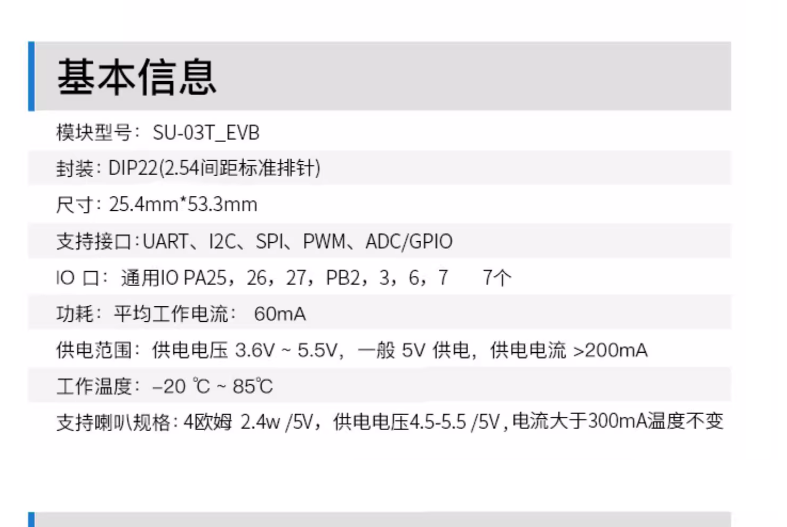

*开发板详细参数，包含尺寸、接口、功耗等信息*


*开发板采用DIP22封装，2.54mm标准排针间距*

**注意事项：**

- 开发板默认带排针，可直接使用杜邦线连接
- 集成到产品时，可通过背面排针焊接到PCB
- 拨码开关默认设置即可满足大多数应用场景
- 如需外接麦克风，需通过拨码开关断开内置麦克风

---

### SU-03T模块的2.0mm排母如何与2.54mm杜邦线转接？

**问题描述：**

SU-03T模块使用2.0mm间距的排母，无法直接使用标准的2.54mm间距杜邦线连接，需要找到合适的转接方案。

**解决方案：**

**1. 使用转接板**

   - 购买2.0mm转2.54mm的专用转接板
   - 转接板一面焊接2.0mm排针，另一面标准2.54mm排母
   - 这样可以使用标准杜邦线连接

**2. 使用转接线**

   - 购买现成的2.0mm母头转2.54mm母头转接线
   - 注意2.0mm端通常是2P合并的排母
   - 可以直接使用，无需焊接


*使用杜邦线连接SU-03T模块的场景*

**3. 直接焊接排针**

   - 购买2.0mm间距的排针自行焊接
   - 焊接到模块背面或其他位置
   - 需要一定的焊接经验


*市售的2.0mm母头转2.54mm母头转接线*

**注意事项：**

- 模块使用2.0mm间距是为了控制整体尺寸
- 2.0mm和2.54mm都是常用规格，容易找到转接方案
- 转接时注意引脚顺序，避免接反
- 长期使用建议焊接固定，更可靠

---

### SU-03T转接板连接多个继电器如何供电？

**问题描述：**

使用SU-03T转接板连接多个5V继电器时，不确定如何给继电器供电，以及是否需要外接独立电源。同时需要确认转接板的供电能力。

**解决方案：**

**供电方案：**

1. **继电器供电方式**
   - 继电器5V和GND应连接到外部独立电源
   - 不建议使用SU-03T转接板直接供电多个继电器
   - 模块供电能力有限，无法提供足够电流

2. **电源接线方法**
   - 外部5V电源正极→所有继电器VCC并联
   - 外部电源地线→所有继电器GND并联
   - 继电器控制信号→分别连接到SU-03T的GPIO口

3. **转接板供电分配**
   - SU-03T转接板自身需要5V供电
   - 其他设备可从转接板的5V口取电
   - 但总电流不能超过转接板的供电能力

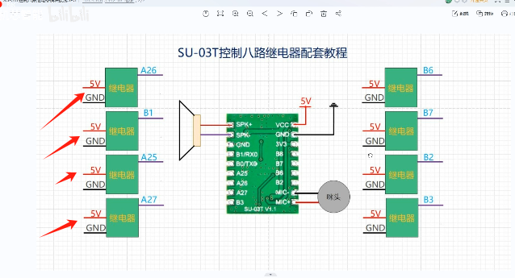

*多个继电器的5V和GND并联连接示意图*

**具体步骤：**

1. **电源容量计算**
   - 单个5V继电器工作电流约50-70mA
   - 多个继电器总电流=数量×单只电流
   - 选择合适功率的外部电源

2. **接线步骤**
   - 先连接所有继电器的VCC到外部5V电源正极
   - 连接所有继电器的GND到外部电源负极
   - 最后连接控制信号到模块GPIO口

3. **共地处理**
   - 外部电源地线需要与SU-03T的GND相连
   - 确保控制信号有共同的参考地
   - 避免地环路带来的干扰

**注意事项：**

- 继电器线圈会产生反向电动势，建议在继电器线圈两端并联二极管
- 如果控制感性负载，还需要在负载端加浪涌保护
- 测试时应先单个继电器，再逐步增加数量
- 外部电源建议带过流保护，提高系统安全性

---

### SU-03T转接板供电后其他设备能否共用电源？

**问题描述：**

SU-03T转接板通过USB供电后，其他设备是否能从转接板的5V和GND口取电，以及转接板本身的供电能力如何。

**解决方案：**

**供电能力分析：**

1. **转接板供电来源**
   - USB供电：提供5V/500mA电流
   - 有限制：主要供给SU-03T模块使用
   - 余量：约100-200mA可供外部设备使用

2. **电源分配方案**
   - 方案一：外部设备使用USB余量供电
   - 方案二：外部设备独立供电，避免干扰
   - 根据设备功耗选择合适方案

**具体接线方法：**

1. **从转接板取电**
   - 其他设备VCC→转接板5V口
   - 其他设备GND→转接板GND口
   - 适用于小功耗设备（<100mA）

2. **独立供电方案**
   - 外部设备使用独立5V电源
   - 所有地线连接在一起（共地）
   - 避免电源噪声相互干扰


*SU-03T转接板通过USB供电，红线和黑线连接到继电器模块*

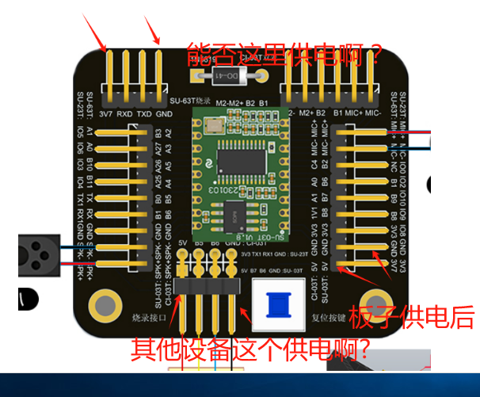

*转接板5V和GND引脚位置，可用于为外部设备供电*

**电流计算参考：**

- SU-03T模块功耗：约300mA
- USB总供电能力：500mA
- 可供外部设备：200mA（500-300）
- 同时支持设备数量：2-3个小功率设备

**注意事项：**

- 大功率设备（如舵机、电机）建议独立供电
- 共用电源时注意总电流不超过USB限制
- 使用独立电源时，所有地线必须连接
- 如设备工作异常，优先检查供电是否稳定

---

## 温度范围与晶振规格

### SU-03T的工作温度范围是多少？

**问题描述：**

需要确认SU-03T模块的工作温度范围是否满足-20℃至70℃的要求，以及是否需要更换晶振。

**解决方案：**

SU-03T模块满足-20℃至70℃的工作温度要求：

- **工作温度范围**：-20℃ 至 70℃
- **存储温度范围**：-40℃ 至 85℃
- **晶振规格**：-30℃ 至 85℃，完全满足工作温度需求

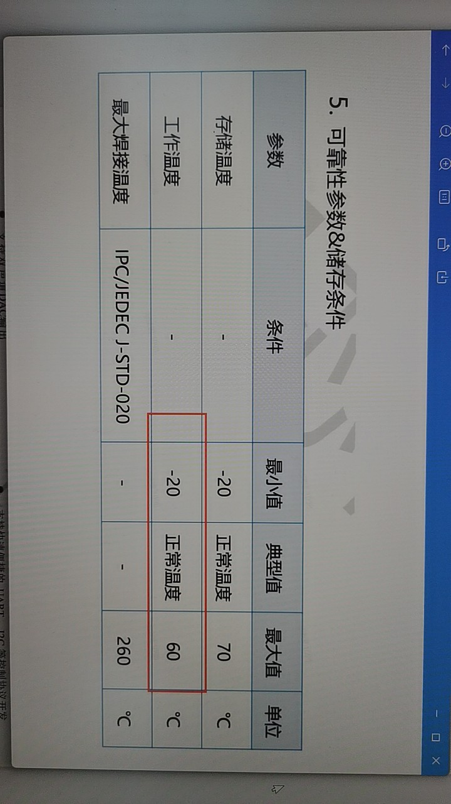

*原规格书中显示的工作温度范围*


**技术要点：**

1. **晶振无需更换**：
   - 原配晶振为-30~85℃工业级规格
   - 完全覆盖-20~70℃工作温度范围
   - 不需要额外定制晶振

2. **规格书更新**：
   - 早期规格书未及时更新温度参数
   - 最新规格书已修正为正确温度范围
   - 使用时以最新版规格书为准

**注意事项：**

- 批量使用前建议进行实际温度测试验证
- 极端温度环境下注意散热和通风设计
- 如需更宽温度范围，可联系技术支持定制方案

### SU-03T规格书温度参数如何更新？

**问题描述：**

规格书中的工作温度和存储温度参数未及时更新，与实际支持的温度范围不符，需要获取更新后的规格书。

**解决方案：**

**温度参数更新过程：**

1. **原规格书问题**：
   - 工作温度显示：-20℃ 至 60℃（错误）
   - 存储温度显示：-20℃ 至 70℃（错误）
   - 实际支持温度范围更宽


*规格书中未更新的可靠性参数表*

2. **实际温度规格**：
   - **工作温度**：-30℃ 至 70℃
   - **存储温度**：-40℃ 至 80℃
   - 符合工业级应用标准

3. **规格书获取**：
   - 联系技术支持获取最新版规格书
   - 确认文件版本为SU-03T1-V2.1-20250710-001或更新
   - 新版规格书已修正所有温度参数

4. **扬声器参数说明**：
   - 旧版：≥3W，4Ω
   - 新版：≥2.4W，4Ω 或 ≥1.6W，8Ω
   - 实际使用参数未变化，仅标注更详细


*旧版扬声器规格标注*


*新版更详细的扬声器规格说明*

**定制晶振说明：**

- 标准晶振已满足大多数工业应用需求
- 如需特殊温度范围（如军品级），需要定制：
  - 最小订购量：3K片
  - 成本会相应增加
  - 需要提前确认交付周期

**注意事项：**

- 设计产品时以最新版规格书为准
- 批量生产前使用小批量验证温度性能
- 保留好规格书版本号用于产品追溯

### 回流焊曲线图


### 应用电路图


---

### SU-03T模块功放芯片发热问题如何解决？

**问题描述：**

SU-03T模块上的功放芯片（AD8002D）在未连接喇叭的情况下异常发热，怀疑是原理图设计问题导致。

**解决方案：**

**问题原因分析：**

SU-03T模块的SPK+和SPK-输出端直接连接到主控板的功放输出端，造成两个功放输出并联：

- SU-03T内置AD8002D功放芯片
- 主控板使用NS4160功放芯片
- 两个功放输出直接并联会导致异常发热

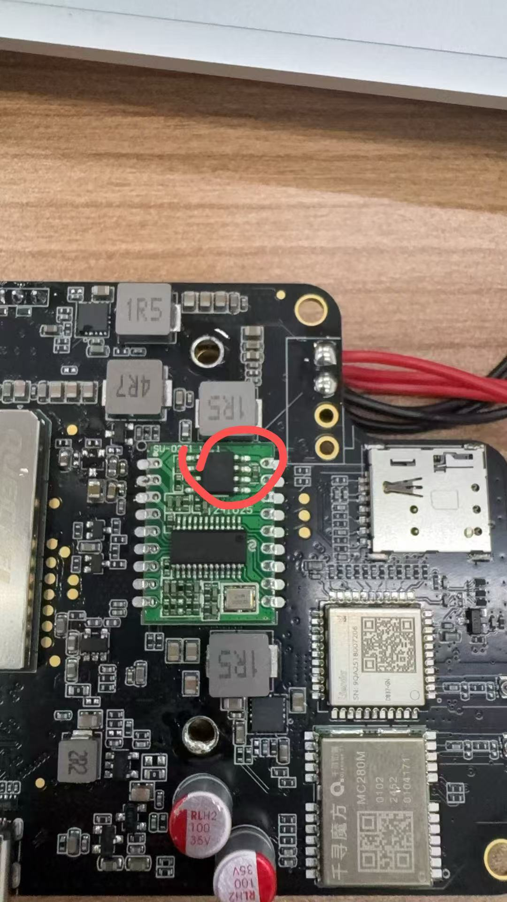

*SU-03T模块上发烫的功放芯片位置（红圈标注）*

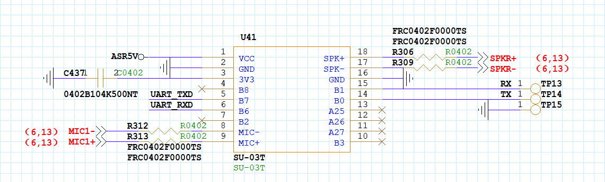

*SU-03T模块的音频输出接口原理图*

**正确连接方案：**

1. **取信号而不并联输出**：
   - 从SU-03T的SPK+和SPK-取音频信号
   - 通过RC电路耦合到主控功放输入端
   - 放大倍数控制在2-3倍

2. **RC滤波电路设计**：
   - 使用串联电阻限制电流
   - 并联电容滤除高频噪声
   - 典型值：电阻1-10kΩ，电容1-10μF

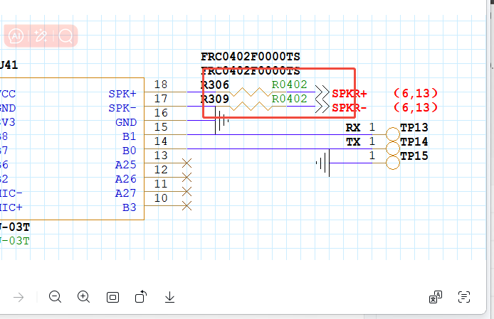

*SPK+和SPK-通过0欧电阻连接到外部电路*

**临时解决方案：**

如需紧急测试，可在电源输入端串联二极管降压：

- 使用通用二极管或肖特基二极管
- 串联在5V电源输入端
- 降低功放芯片供电电压

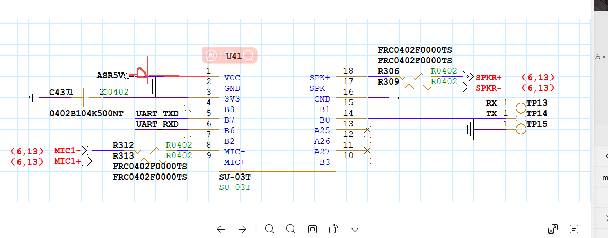

*在电源输入端串联二极管降低电压的测试方案*

**系统连接示意：**

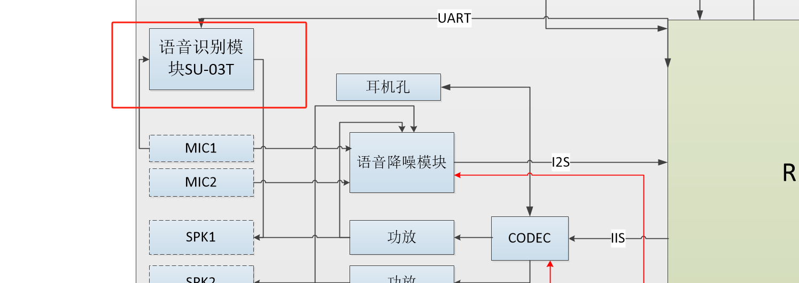

*SU-03T模块与主控板各模块的连接关系*

**技术要点：**

1. **功放芯片规格**：
   - SU-03T内置：AD8002D AB类功放
   - 额定功率：2.4W@5V/4Ω
   - 正常工作需要连接喇叭负载

2. **错误连接后果**：
   - 两个功放输出互相冲突
   - 导致芯片异常发热
   - 可能损坏功放电路

3. **正确设计原则**：
   - 只使用一个功放驱动喇叭
   - 另一个功放仅作为信号源
   - 通过适当电路进行阻抗匹配

**注意事项：**

- SU-03T的SPK输出不能直接与其他功放输出并联
- 如需使用外部功放，应断开内置功放的输出或使用DAC信号
- 设计时考虑音频信号的电平匹配和阻抗匹配
- 异常发热时立即断电检查，避免损坏器件

## 开发环境与工具
- 词表配置工具、串口烧录工具、日志查看软件。
- [SU-03T开发包(老版本)](https://help.aimachip.com/docs/offline_su03t/su_03t_kfb) - 包含SDK、示例代码、配置工具
- [蜂鸟M、脱机烧录器演示固件](https://help.aimachip.com/docs/offline_su03t/offline_su03t-1ecu2mfa1run0)
- [其他开发资料](https://help.aimachip.com/docs/offline_su03t/offline_su03t-1gbcdfsv7adqr)

## 固件烧录与升级指南

### SU-03T新模块固件兼容性要求

**问题描述：**

SU-03T模块升级后，新发货的模块需要使用新版本固件，旧固件无法在新模块上运行。

**解决方案：**

**新模块固件要求：**

- **旧版本模块**：可兼容新旧固件
- **新版本模块（SU-03T1）**：仅支持新版本固件（2024年10月25日后生成）
- **识别方法**：查看模块丝印或咨询技术支持确认模块版本

**固件继承升级步骤：**

1. **登录智能公元平台**
2. **找到原有项目**：选择需要升级的项目配置
3. **执行继承操作**：
   - 点击"继承"按钮
   - 系统自动复制原有配置
   - 生成新版本固件
4. **下载新固件**：获取最新生成的固件文件

**生产注意事项：**

- 新模块必须使用继承升级后的固件
- 保留固件MD5校验值用于质量追溯
- 批量生产前进行小批量测试验证

**从SU-03T切换到SU-03T1的固件处理：**

当旧版本SU-03T模块库存用完，需要采购新版本SU-03T1模块时：

1. **固件兼容性**：
   - SU-03T1模块必须使用2024年10月25日后生成的新版本固件
   - 旧版本固件无法在SU-03T1上运行
   - 新版本固件同时兼容SU-03T和SU-03T1模块

2. **二次开发处理**：
   - 无需重新编写二次开发的固件
   - 在智能公元平台执行"继承"操作即可
   - 系统自动保留原有配置，生成兼容新模块的固件

3. **操作步骤**：
   - 登录智能公元平台
   - 找到原有项目
   - 点击"继承"按钮
   - 重新生成并下载新固件
   - 使用新固件烧录到SU-03T1模块

**注意事项：**

- 继承操作会完整保留原有的命令词、串口协议等所有配置
- 新固件功能更稳定，建议统一使用新版本
- 如有特殊定制需求，可联系技术支持协助处理

---

### SU-03T固件如何更新到新版本？

**问题描述：**

需要将SU-03T芯片的固件更新至新版本，并确保批量生产时能正确烧录新生成的固件。

**解决方案：**

**固件更新流程：**

1. **平台生成新固件**：

    - 登录智能公元平台
    - 继承原有项目配置
    - 重新生成最新版本固件
    - 下载新的固件文件

2. **固件验证**：

    - 确认固件文件完整性
    - 记录MD5校验码
    - 小批量测试验证功能

3. **固件版本识别**：

    - 新模块发货时需使用新版本固件
    - 检查固件生成时间，2024年后的为最新版本
    - 旧固件无法在新模块上运行

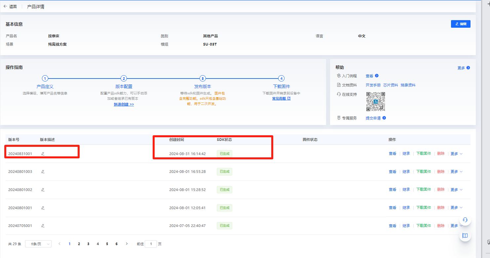

*固件版本管理界面显示最新版本号和生成时间*

**批量生产准备：**

1. **固件文件管理**：

    - 使用统一的新版本固件
    - 建立版本控制机制
    - 保留生产记录和校验码

2. **烧录流程标准化**：

    - 使用指定的烧录工具
    - 统一烧录参数设置
    - 实施全检或抽检制度

3. **MD5校验与存档**：

    - 烧录前验证固件MD5值
    - 保留MD5校验记录备查
    - 使用哈希工具验证文件完整性

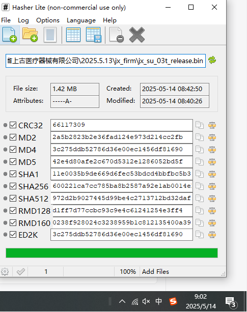

*使用哈希工具验证固件文件的MD5校验值*

**标准烧录步骤：**

1. 安装烧录软件与驱动，连接开发板的 UART 接口。
2. 打开烧录工具，选择对应的固件文件（.bin）。
3. 使用配置工具导入词表、编译后生成固件。
4. 点击烧录按钮，等待进度完成。
5. 复位设备并通过串口或播放测试词表确认成功。

**注意事项：**

- 新旧版本固件可能存在差异，建议统一使用新版本
- 批量烧录前先进行小批量验证
- 保留好固件的MD5校验记录
- 如有异常，及时联系技术支持

### SU-03T固件MD5校验方法

**问题描述：**

在使用SU-03T模块进行批量生产时，需要确认固件文件的完整性，避免使用损坏或过期的固件文件导致烧录失败。

**解决方案：**

**1. MD5校验值获取**

固件文件生成时会附带MD5校验值：

- **中文版固件**：MD5-faecb29bbfdd7e6b83d46d7eafb0fa2d
- **英文版固件**：MD5-30ae49b5149bf168778d1c766651ec62

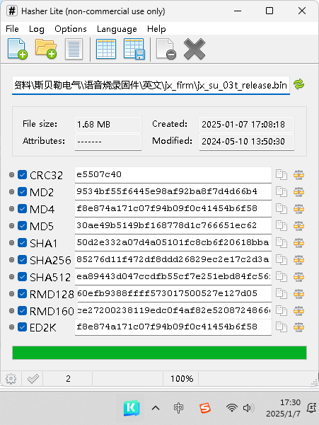

*英文版固件文件的MD5校验值*

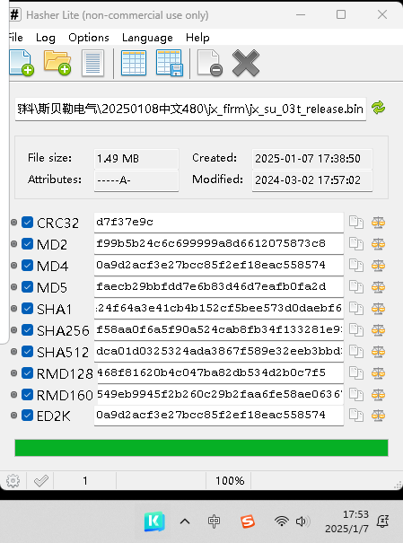

*中文版固件文件的MD5校验值*

**2. 校验步骤**

1. **获取校验工具**：

    - 使用哈希校验工具（如Hasher Lite）
    - 或使用命令行工具：Windows Certutil、Linux md5sum

2. **计算文件MD5**：

    - 对比固件文件的MD5值与提供的校验值
    - 确保文件在传输过程中未损坏

3. **记录校验结果**：

    - 保存校验记录用于质量追溯
    - 建立固件版本与MD5的对应关系

**3. 批量生产应用**

- **入库检验**：每批次固件入库前进行MD5校验
- **烧录前验证**：批量烧录前再次确认文件完整性
- **问题追溯**：出现问题时可通过MD5快速定位固件版本

**注意事项：**

- 固件文件过期会导致链接失效，需重新生成
- 建议建立固件文件归档机制，避免文件丢失
- 不同语言版本的固件MD5值不同，需分别管理
- 校验时确保文件路径不含中文字符

> 参考资料：
> - [常见资料下载](https://help.aimachip.com/docs/offline_su03t/offline_su03t-1e9ef1me6u76e)

## 指令集 / 词表配置
- 支持多场景词表，结构为“唤醒词 → 命令组 → 动作”。
- 串口协议：0xAA 0x55 CMD LEN DATA CS
- 通过开发包中的配置工具可视化编辑词表，支持自定义唤醒词和命令词。
- 每个命令可绑定 GPIO 输出、串口消息、音频播放等动作。

> 教程与示例：
> - [IO输入输出配套固件](https://help.aimachip.com/docs/offline_su03t/su_03t_io)
> - [串口教程配套固件](https://help.aimachip.com/docs/offline_su03t/SU-03T_usart)
> - [ADC教程配套固件](https://help.aimachip.com/docs/offline_su03t/su_03t_adc)
> - [六路继电器配套固件](https://help.aimachip.com/docs/offline_su03t/su_03t_relay)
> - [红外收发配套固件](https://help.aimachip.com/docs/offline_su03t/SU-03T_irc)
> - [呼吸灯、PWM柔和调光固件](https://help.aimachip.com/docs/offline_su03t/su_03t_PWM)
> - [更多教程](https://help.aimachip.com/docs/offline_su03t/offline_su03t-1ec2jtqqtopq7)

### SU-03T如何进行自定义固件开发和输入口控制？

**问题描述：**

需要进行固件个性化定制，控制输入端口，并通过导入自定义JSON配置文件实现产品的特定需求。

**解决方案：**

**1. 开发平台使用**

- 访问智能公元开发平台：https://www.smartpi.cn/#/
- 注册账号并登录开发平台
- 在产品管理界面可以创建和管理自定义产品项目


*平台产品管理页面，红色箭头指向"导入产品"功能*

**2. 自定义配置文件导入**

- 准备JSON格式的产品配置文件
- 配置文件包含词条定义、IO配置、串口协议等参数
- 在产品管理页面点击"导入产品"
- 选择本地JSON文件并上传

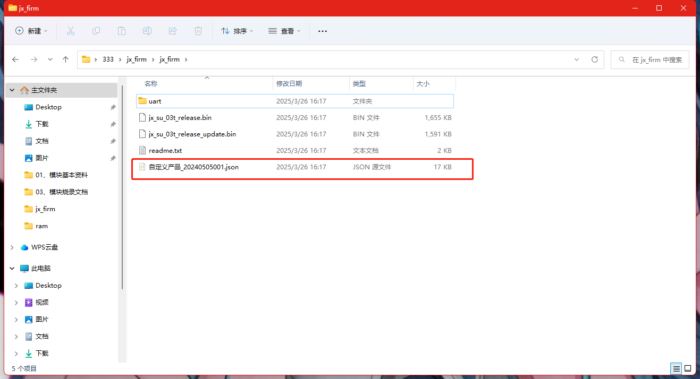

*本地文件夹中的JSON配置文件示例*

**3. 输入端口控制方法**

SU-03T支持多种输入控制方式：

- **GPIO输入**：配置引脚为输入模式，检测电平变化
- **串口输入**：通过UART接收外部控制指令
- **ADC输入**：模拟信号采集，支持12位精度
- **PWM输入**：支持脉冲宽度调制信号输入

**4. 固件开发流程**

- 在平台创建新产品项目
- 根据需求配置语音词条和识别参数
- 设置输入输出端口功能
- 定义串口通信协议（如需要）
- 生成并下载固件文件
- 烧录到SU-03T模块进行测试

**技术资源：**

- 完整视频教程和开发资料请参考"官方资料下载"章节
- 开发文档和技术支持可在智能公元平台获取

**注意事项：**

- 自定义固件开发需要基础的硬件和软件知识
- 输入端口配置需注意电平匹配（3.3V逻辑电平）
- 建议先使用平台提供的示例项目进行学习
- 复杂项目可联系技术支持获取开发协助

## 外设开发与应用示例
- 继电器：识别指令后驱动 GPIO 切换。
- 串口反馈：将识别到的词 ID 发给主控。
- 联动应用：与 WiFi 模组结合，实现语音+云端控制。

### SU-03T是否支持语音开关机功能？

**问题描述：**

需要了解SU-03T模块是否支持语音开关机功能，以及能否通过IO口与触摸按键模块连接实现点触开关控制。

**解决方案：**

**功能支持情况：**

1. **语音开关机**：

   - 平台不能配置开关机功能，只能重启
   - 模块不支持完全断电后的语音唤醒开机
   - 可通过外部电路实现电源控制

2. **IO口控制能力**：

   - 模块具有IO口可以控制高低电平输入输出
   - 可通过IO口与外部触摸按键模块连接
   - 支持通过外部信号触发控制动作

**实现方案：**

1. **外部电源控制**：

   - 使用MOS管控制模块供电
   - 触摸模块输出高电平信号控制MOS管
   - 实现点触开关控制设备电源

2. **触摸模块连接**：

   - 触摸模块供电范围：2.5-5.5V
   - 支持点动高电平输出和自锁低电平输出
   - 可根据需要选择合适的焊点连接方式


**注意事项：**

- 模块本身不支持语音控制的开关机，只能通过外部电路实现
- 触摸模块需要与模块IO口正确配合使用
- 建议使用MOS管控制电源而不是直接断电，避免信号干扰

---

### 定时器触发串口输出配置

**问题描述：**

配置定时器超时后触发串口输出数据，但定时器超时后串口没有输出数据。

**解决方案：**

**1. 定时器配置步骤**

在智能公元平台中配置定时器触发串口输出需要两个事件配合：

1. **事件8：上电启动定时器**
   - 触发方式：事件触发 → 系统启动
   - 操作：系统 → 启动定时器
   - 参数：TEST_UART,超时500ms,立即重复

2. **事件7：定时器超时串口输出**
   - 触发方式：事件触发 → TEST_UART定时器超时
   - 操作：UART1_TX → 发送
   - 参数：99（十进制）或0x63（十六进制）

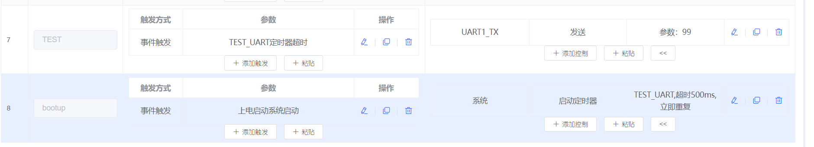

*定时器配置示例，事件7为定时器超时触发串口输出，事件8为系统启动时开启定时器*

**2. 配置要点**

- **定时器名称**：两个事件中的定时器名称必须一致（如TEST_UART）
- **超时时间**：根据需求设置，如500ms表示每500毫秒触发一次
- **重复模式**：立即重复表示循环执行，单次执行表示只触发一次
- **串口配置**：确保UART1_TX已正确配置到对应引脚（如B6）

**3. 常见问题排查**

- **串口无输出**：
  - 检查UART1_TX引脚配置是否正确
  - 确认定时器是否已启动
  - 验证触发条件是否匹配

- **定时器不工作**：
  - 确认定时器名称在两个事件中完全一致
  - 检查系统启动事件是否正确配置
  - 验证定时器参数格式是否正确

**4. 应用示例**

定时器触发串口输出可用于：

- **心跳包发送**：定期发送设备状态
- **数据采集**：定时读取传感器数据
- **通信保持**：维持与主控的连接
- **周期性控制**：按固定间隔控制设备

**注意事项：**

- 定时器精度为毫秒级，最小间隔建议不小于100ms
- 串口输出数据格式需与接收端约定
- 多个定时器可同时工作，但要注意系统资源占用
- 配置完成后需要重新生成并烧录固件

---

### PWM控制可控硅应用方案

**问题描述：**

在使用SU03T控制养生广告机等设备时，需要通过PWM信号控制可控硅实现功率调节。使用B3口的简单电平驱动方式存在脉冲宽度不足和功率不稳定的问题。

**解决方案：**

**1. 硬件电路设计**

- 使用光耦隔离（如MOC3023）实现强弱电隔离
- 通过晶体管（MMBT3904）驱动可控硅
- SU03T的PWM信号从J3接口引出，经驱动电路控制负载

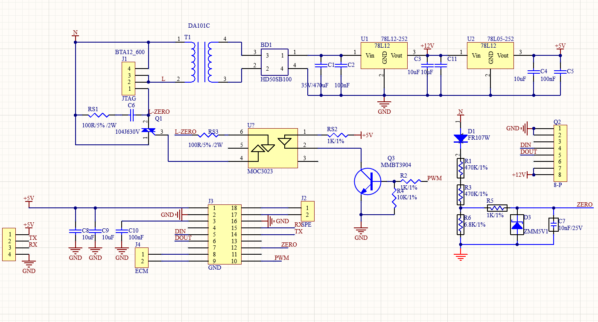

**2. 控制逻辑实现**

- 检测引脚（如A26）检测到0电位时，触发PWM输出
- PWM脉冲用于导通可控硅相应支路
- 根据控制需求调节脉冲宽度和频率

**3. 技术要点**

- 脉冲持续时间：根据应用需求设定，如10ms
- 功率稳定性：通过PWM精确控制确保功率稳定
- 触发方式：支持电平检测触发和语音指令触发

**4. 配电方案**

- 独立12V供电（78L12）和5V供电（78L05）
- 使用电源管理芯片确保供电稳定
- 合理布置滤波电容，减少电源干扰

**注意事项：**

- PWM输出引脚需正确配置，避免与其他功能冲突
- 可控硅选型需匹配负载功率要求
- 光耦隔离确保控制电路安全
- 调试时注意强弱电隔离，避免安全风险

### 引脚延时输出配置

**问题描述：**

需要配置SU-03T的引脚实现延时功能，例如高电平持续20秒后自动转为低电平，用于控制需要定时动作的设备。

**解决方案：**

在智能公元平台中，所有配置为输出模式的GPIO引脚都可以设置延时功能：

**1. 可配置引脚范围**

- GPIO_A25、GPIO_A26、GPIO_A27、GPIO_A28
- UART1_RX、UART1_TX（当不作为串口使用时）
- DEFAULT_LOG
- GPIO_B2、GPIO_B3等可配置为输出的引脚

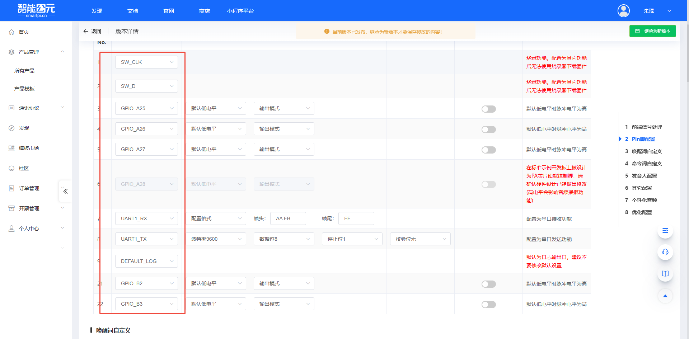

**2. 延时配置步骤**

1. 在智能公元平台选择目标引脚
2. 将引脚功能配置为"输出模式"
3. 设置默认电平（高电平或低电平）
4. 配置延时时间（如20秒）
5. 设置延时后的目标电平

**3. 配置示例**

- 初始状态：引脚输出高电平
- 延时时间：20秒
- 延时后动作：自动转为低电平

**注意事项：**

- SW_CLK和SW_D配置为其他功能后无法使用烧录器下载固件
- PA芯片控制脚有特殊功能限制，配置前需查看备注
- 引脚具体可用性需参考平台中的实时配置选项
- 部分引脚有默认功能，修改前请确认不影响系统正常工作

---

## GPIO实现循环灯（流水灯）功能

### SU-03T循环灯功能实现方法

**问题描述：**

用户询问SU-03T是否支持设置循环灯（流水灯）功能，以及是否有相关案例程序。

**解决方案：**

**1. 基本实现原理**

SU-03T可以通过定时器结合GPIO输出来实现循环灯功能。使用多个GPIO引脚控制LED，通过定时器精确控制各LED的亮灭时序，形成流水灯效果。

**2. 硬件连接方案**

```
LED1 → GPIO_B0
LED2 → GPIO_B1
LED3 → GPIO_B2
LED4 → GPIO_B3
...
每个LED串联220Ω-330Ω限流电阻后接地
```

**3. 软件实现思路**

基于定时器的流水灯控制逻辑：

1. **初始化阶段**：
   - 配置多个GPIO为输出模式
   - 设置初始状态（全灭或第一个灯亮）

2. **定时器中断处理**：
   ```c
   // 伪代码示例
   timer_interrupt_handler() {
       switch(current_state) {
           case 0:
               GPIO_B0 = HIGH;  // LED1亮
               GPIO_B1 = LOW;   // LED2灭
               GPIO_B2 = LOW;   // LED3灭
               GPIO_B3 = LOW;   // LED4灭
               break;
           case 1:
               GPIO_B0 = LOW;   // LED1灭
               GPIO_B1 = HIGH;  // LED2亮
               GPIO_B2 = LOW;   // LED3灭
               GPIO_B3 = LOW;   // LED4灭
               break;
           case 2:
               GPIO_B0 = LOW;   // LED1灭
               GPIO_B1 = LOW;   // LED2灭
               GPIO_B2 = HIGH;  // LED3亮
               GPIO_B3 = LOW;   // LED4灭
               break;
           case 3:
               GPIO_B0 = LOW;   // LED1灭
               GPIO_B1 = LOW;   // LED2灭
               GPIO_B2 = LOW;   // LED3灭
               GPIO_B3 = HIGH;  // LED4亮
               break;
       }
       current_state = (current_state + 1) % 4;
   }
   ```

**4. 智能公元平台配置**

在智能公元平台上进行以下配置：

1. **选择GPIO引脚**：
   - GPIO_B0、GPIO_B1、GPIO_B2、GPIO_B3等
   - 配置为输出模式

2. **设置定时器**：
   - 定时周期：100-500ms（根据需要的流水速度）
   - 中断优先级：适中

3. **动作序列配置**：
   - 创建动作序列，按顺序控制各GPIO
   - 设置循环执行模式

**5. 高级效果扩展**

实现更复杂的流水灯效果：

- **双向流水**：正方向和反方向交替进行
- **呼吸效果**：配合PWM实现亮度渐变
- **多灯模式**：同时点亮多个LED形成追逐效果
- **速度控制**：通过外部输入或语音指令控制流水速度

**6. 注意事项**

- **功耗控制**：LED数量较多时注意总电流限制
- **引脚选择**：避免使用有特殊功能的引脚（如烧录引脚）
- **定时精度**：选择合适的定时器周期，避免系统负载过高
- **视觉连续性**：流水速度建议在200-300ms之间，过快会产生闪烁感

**7. 语音控制集成**

可以将流水灯功能与语音识别结合：

```c
// 语音指令处理示例
if(语音指令 == "开启流水灯") {
    start_timer();
    enable_gpio_output();
}
if(语音指令 == "关闭流水灯") {
    stop_timer();
    all_leds_off();
}
if(语音指令 == "加快速度") {
    timer_period = timer_period / 2;
}
```

---

## UART引脚配置与烧录问题

### SU-03T烧录时串口无输出的解决方案

**问题描述：**

SU-03T模块烧录固件后，语音识别正常但串口无数据输出，或烧录时一直显示"等待设备"状态。

**解决方案：**

**1. 烧录引脚连接**


*CH340与SU-03T的烧录引脚对应关系*

- **CH340 RXD** → **SU-03T B7** (UART1_RX)
- **CH340 TXD** → **SU-03T B6** (UART1_TX)
- 连接时必须交叉连接：TX接RX，RX接TX

**2. 串口引脚配置错误**

常见错误是将UART1配置到B2/B3引脚：

- 错误配置：UART1_TX配置为GPIO_B2
- 正确配置：UART1_TX必须配置为GPIO_B6
- 正确配置：UART1_RX必须配置为GPIO_B7


*UART1_TX和UART1_RX应分别配置为GPIO_B6和GPIO_B7*

**3. 烧录故障排查**

- **"等待设备"问题**：
    - 检查VCC供电，建议使用5V
    - 1.9V电压过低，会影响烧录
    - 确认TX/RX线没有接反

- **路径包含中文**：
    - 烧录失败提示"文件读取失败"
    - 将固件文件移至英文路径
    - 避免使用包含中文的文件夹

- **固件生成时间过长**：
    - 非固定时间，使用人数多时需要排队
    - 可等待或选择非高峰时段生成

**4. 串口通信验证**

- 使用示波器检查B6/B7引脚波形
- 确认配置的引脚与硬件连接一致
- SU-03T默认串口电平为3.3V

**注意事项：**

- SU-03T支持三组UART引脚复用，但只能选择一路
- B6/B7为固定串口烧录引脚，不可更改
- B0/B1、B2/B3可作为串口通信引脚使用
- 硬件连接与软件配置必须一致才能正常通信

---

## 固件烧录常见问题

### SU-03T模块出厂时是否带有固件？

**问题描述：**

不确定SU-03T模块出厂时是否预装固件，以及是否可以直接使用CH340串口工具进行固件烧录。

**解决方案：**

SU-03T模块**出厂为空片**，不预装固件，需要自行烧录：

- **发货状态**：模块为空片发货，需要烧录固件后才能使用
- **烧录方式**：

    - 首次烧录：必须使用专用烧录器或升级狗
    - 后续更新：可使用CH340串口工具进行升级

**烧录服务选项：**

1. **自行烧录**：

    - 购买专用烧录器进行首次烧录
    - 后续可通过CH340串口更新固件
    - 适合有开发能力的用户

2. **预烧录服务**：

    - 支付烧录费，由厂商代为烧录
    - 收到模块即可直接使用
    - 适合批量生产或无开发设备的用户

**烧录引脚说明：**

- **B0/B1**：UART0 调试器烧录口
- **B6/B7**：UART1 串口烧录口（CH340使用）
- **B2/B3**：升级狗烧录/脱机烧录口

**注意事项：**

- 空片首次烧录必须使用专用烧录器
- CH340仅可用于固件更新，不能首次烧录空片
- 固件存放于主芯片Flash内部，非旁边小芯片
- 旁边小芯片为功放芯片，用于驱动喇叭

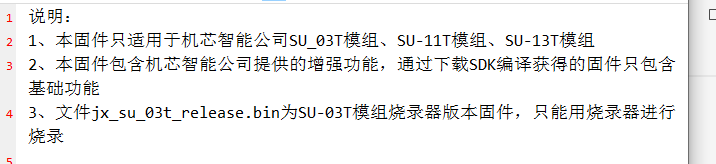

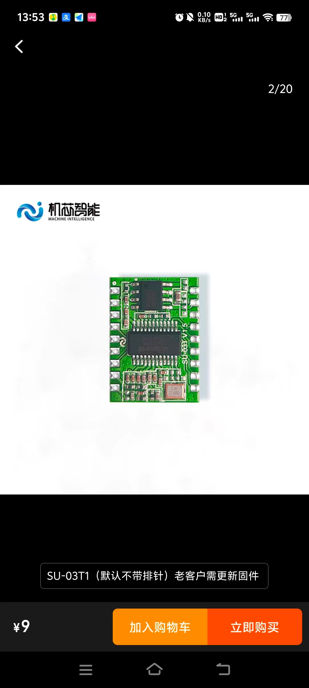

### SU-03T固件生成失败或超时怎么办？

**问题描述：**

在使用智能公元平台为SU-03T生成固件时，遇到固件大小超出2M Flash限制、生成耗时过长甚至超时的问题，影响开发进度。

**解决方案：**

**1. 固件大小查看方法**

- 智能公元平台目前没有直接显示固件大小的功能
- 可通过下载后的固件文件大小间接判断
- SU-03T的Flash容量为2MB，需要预留系统程序空间

**2. 固件大小优化策略**

- **减少词条数量**：SU-03T推荐控制在50条词条以内
- **缩短回复语句**：避免过长的回复文本（如100字的长语句）
- **精简场景配置**：删除非必要的识别场景
- **使用相似语料**：选择回复语相近的内容，减少内存占用

**3. 生成超时处理**

- SU-03T固件生成确实较慢，这是平台限制
- 尝试刷新界面或重新生成
- 选择非高峰时段生成固件
- 联系技术支持检查服务器状态

**4. 替代方案**

- **升级到CI-33T**：拥有4MB Flash，支持更多词条
- **使用TTS版本芯片**：支持文本转语音，不占用Flash存储音频
- **外置音频存储**：通过SD卡存储音频（需要SDK开发）


**注意事项：**

- SU-03T作为入门级模块，Flash限制是其物理限制
- 91个语句配置导致2.2MB固件，远超模块承受能力
- 精简到四分之一内容仍无法生成时，应考虑更换模块
- TTS版本可通过串口发送文本实时转换，不受Flash限制

---

### SU-03T如何确认使用的固件版本？

**问题描述：**

在使用SU-03T模块时，需要确认当前使用的固件版本，以及如何获取正确版本的固件文件进行烧录。

**解决方案：**

**1. 确认模块型号和版本**

- 查看模块上的丝印信息，确认具体型号
- SU-03T模块上的芯片会标注版本信息（如V1.5）
- 记录模块的批次信息，便于追溯固件版本

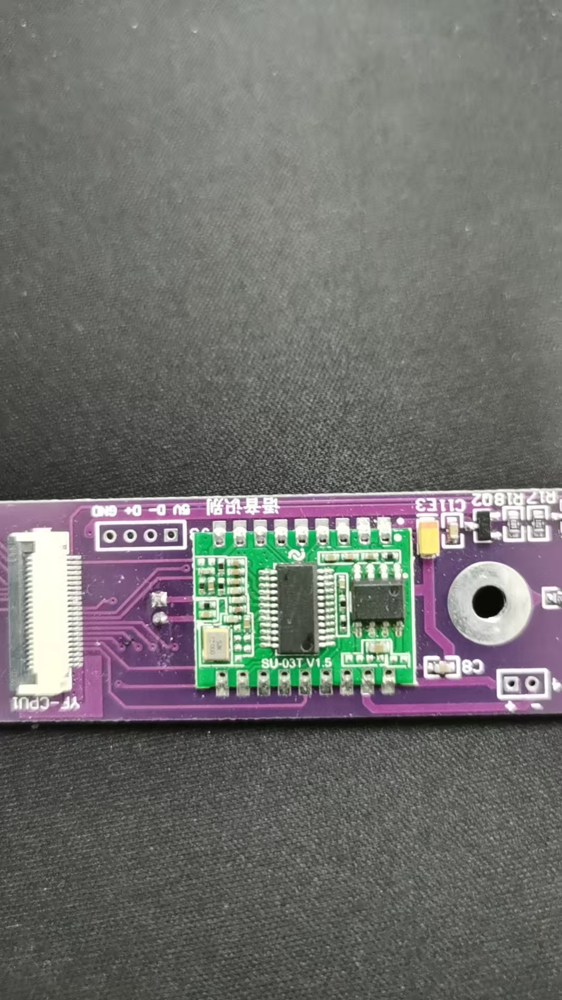

**2. 固件文件管理**

- 固件文件通常保存在项目专用文件夹中
- 文件夹命名规则：客户名称/项目名称/SU-03T 版本号/
- 固件文件包含校验码（如MD5）用于验证完整性


**3. 版本确认方法**

1. **查看生产记录**：

    - 确认模块生产日期
    - 查找对应日期的固件版本记录
    - 如2024年9月3日生产的模块，对应当时使用的最终版本

2. **功能验证**：

    - 烧录后测试模块功能
    - 确认是否有开机播报（如"有什么可以帮助您的"）
    - 验证所有命令词是否正常响应

3. **版本对比**：

    - 对比不同版本的功能差异
    - 确认当前版本是否满足项目需求
    - 必要时升级到最新版本

**注意事项：**

- 固件版本与功能特性相关，不同版本可能存在功能差异
- 批量生产时建议使用统一版本的固件，避免混用
- 保留好固件文件的备份，包括校验码记录
- 如遇到功能异常，首先确认是否使用了正确的固件版本

### SU-03T旧版固件烧录服务

**问题描述：**

SU-03T模块在2024年10月25日进行了固件升级，需要确认是否需要技术支持人员进行旧版固件烧录，以及发货安排。

**解决方案：**

**固件版本说明：**

- **新版固件**：2024年10月25日之后发布的版本
- **旧版固件**：2024年10月25日之前的版本
- **库存情况**：旧版模块库存有限，售完即止

**烧录服务选项：**

1. **厂商烧录服务**：

    - 适用于需要旧版固件的情况
    - 由厂商完成固件更新后发货
    - 收到模块即可直接使用

2. **自行烧录**：

    - 如有烧录设备，可自行更新固件
    - 需要在智能公元平台重新生成固件
    - 使用专用工具进行烧录

**发货流程：**

1. **确认需求**：

    - 明确需要的固件版本（新版/旧版）
    - 确认数量和交付时间

2. **技术准备**：

    - 旧版固件：厂商预烧录
    - 新版固件：可直接发货或自行烧录

3. **安排发货**：

    - 旧版模块：厂商烧录完成后发货
    - 新版模块：常规发货流程

**注意事项：**

- 旧版模块库存有限，建议尽早确认需求
- 如选择旧版固件，需提前与厂商确认库存
- 新旧版固件在功能上可能有差异，建议测试验证
- 长期供货建议考虑新版固件产品

### 麦克风外引配置指南

**问题描述：**

因结构设计需要，将SU-03T模块装在盒子内时，需要将麦克风（咪头）外引到盒子外部，同时避免风扇等内部噪声干扰。

**解决方案：**

**1. 外引可行性**

- SU-03T的MIC+和MIC-引脚可以直接外引麦克风
- 外引麦克风无需修改程序，模块会自动识别外部麦克风信号
- 可以选择保留原麦克风并增加外置麦克风，或拆除原麦克风仅使用外置麦克风

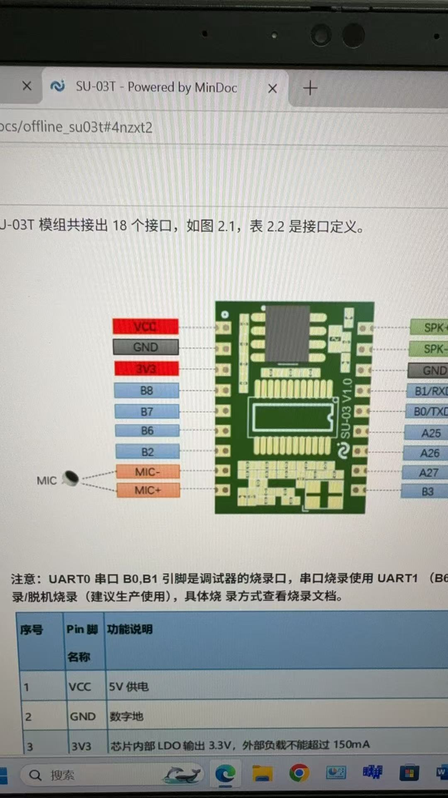

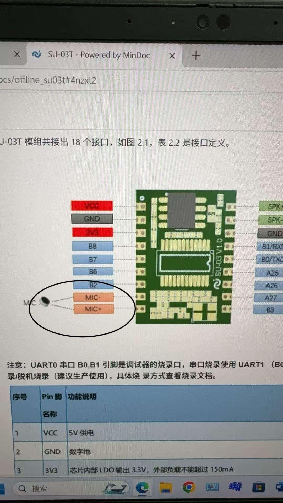

**2. 外引方案选择**

**方案一：保留原麦克风，增加外置麦克风**
- 优点：双麦克风拾音，可能增强拾音效果
- 缺点：两个麦克风叠加可能产生干扰
- 适用：需要增强拾音的场景

**方案二：拆除原麦克风，仅使用外置麦克风（推荐）**
- 优点：避免干扰，拾音效果稳定
- 操作：将板载麦克风拆除，从MIC+和MIC-焊盘外引导线
- 适用：大多数应用场景

**3. 线缆长度与处理**

- **推荐长度**：10cm以内效果最佳
- **最大长度**：如需更长线缆，必须使用屏蔽线或双绞线
- **接线要求**：

    - 使用双绞线减少干扰
    - 线缆远离电源线、电机等干扰源
    - 确保连接可靠，避免接触不良

**4. 麦克风选型建议**

如需更换外置麦克风，建议选择以下规格：

- **灵敏度**：-32dB ~ -25dB（推荐-27dB）
- **信噪比**：≥70dB（推荐75dB）
- **电流**：0.1mA-0.5mA
- **工作电压**：3.3V
- **类型**：驻极体麦克风（ECM）

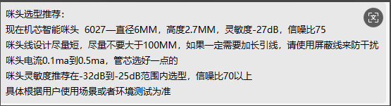

*推荐使用的6027麦克风型号及其参数*

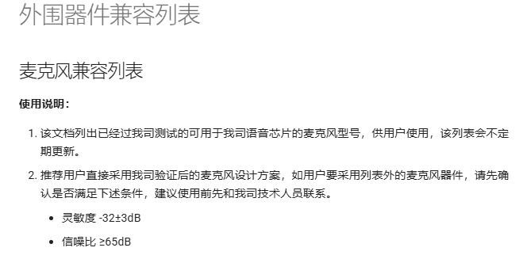

*麦克风参数推荐范围：灵敏度-32±3dB，信噪比≥65dB*

**5. PCB布局设计要点**

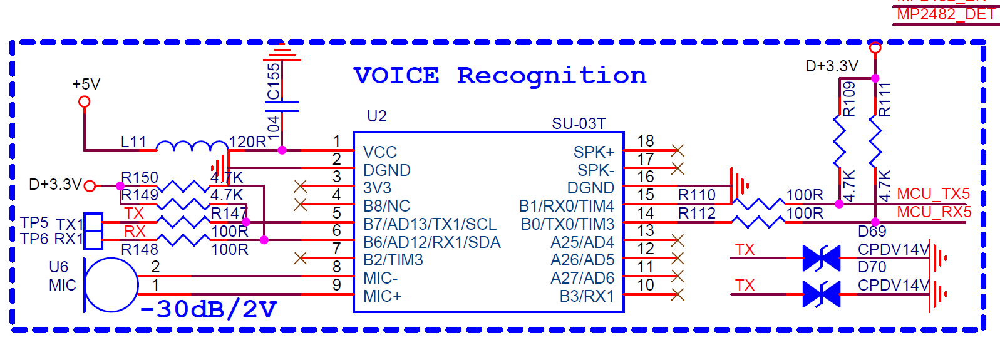

*SU-03T模块与外部麦克风、主控的连接设计示例*

- **磁珠选择**：根据实际干扰情况选择合适型号
- **串口电平**：SU-03T串口默认3.3V，与3.3V主控通信时不需上拉电阻
- **布线要求**：
    - 麦克风走线不能交叉
    - 避免底层走线交叉
    - 远离干扰源，防止影响识别效果

**注意事项：**

- 外引线缆过长会增加干扰风险，影响识别效果
- 如环境噪声较大（如风扇），建议将麦克风远离噪声源
- 拆除原麦克风时注意不要损坏PCB焊盘
- 外置麦克风需注意正负极，反接会影响灵敏度
- 结构设计时确保麦克风有良好的拾音孔，避免密闭空间
- 主控通信电平为3.3V时，串口不需上拉电阻

## 串口通信与指令配置

### SU-03T如何配置自定义串口指令协议？

**问题描述：**

需要通过上位机发送特定的十六进制指令（如HDMI1和HDMI2）来触发SU-03T的不同动作，并解决帧尾不固定的问题。

**解决方案：**

**1. 自定义协议配置方法**

- SU-03T支持自定义串口指令协议
- 需要在智能公元平台中将固定帧格式改为"配置格式"
- 删除固定帧尾配置，以适应不固定的帧尾

**2. 串口参数配置**

在智能公元平台中配置UART1参数：

- **波特率**：9600
- **数据位**：8位
- **停止位**：1位
- **校验位**：无
- **帧头设置**：AA 55（可自定义）

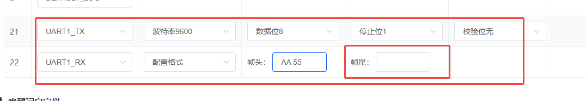

*UART1_TX和UART1_RX的配置参数*

**3. 触发配置步骤**

1. **添加触发配置**：

    - 行为：选择需要执行的动作（如GQ_1）
    - 触发方式：串口输入
    - 选择串口：UART1_RX
    - 消息编号：设置唯一编号（如1）

2. **输入参数设置**：

    - 使用变量接收参数
    - 删除固定的FF字节（如适用）
    - 配置测试消息验证

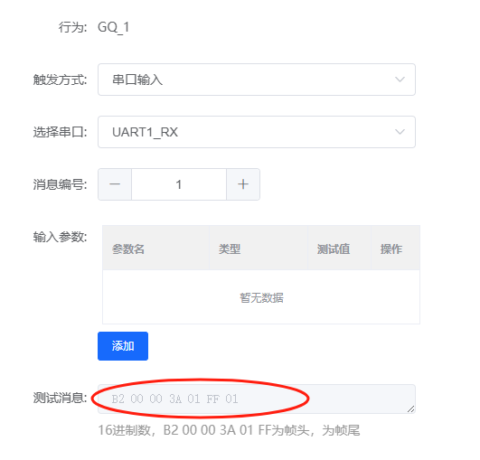

*串口输入触发配置示例*

**4. 处理不固定帧尾**

对于帧尾不固定的情况：

- 将"固定帧格式"切换为"配置格式"
- 在配置中删除"帧尾"设置
- 保留"帧头"设置用于数据识别

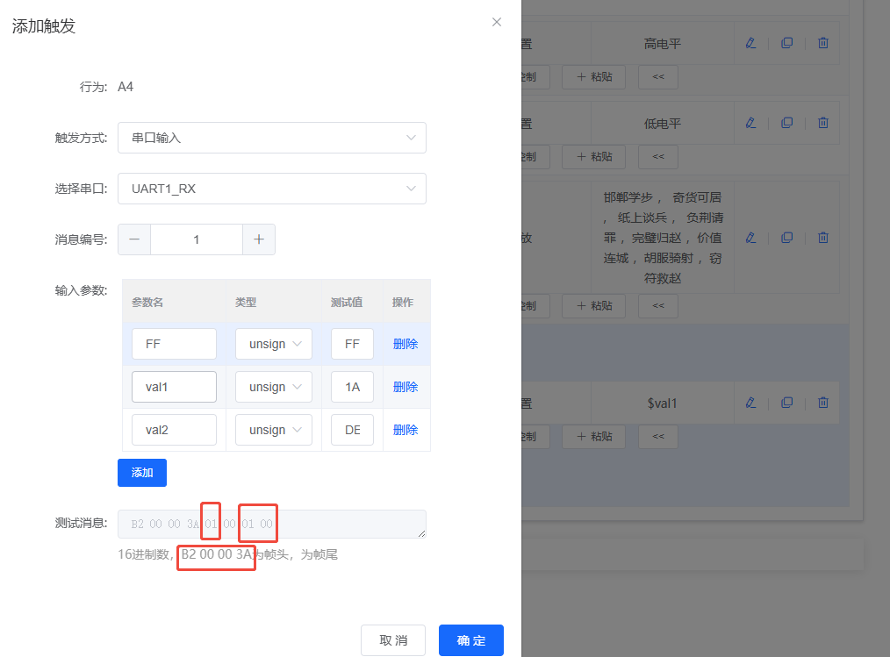

*添加触发时的参数配置示例*

**5. 实际指令示例**

自定义指令可以按以下格式发送：

- HDMI1指令：`B2 00 00 3A 01 FF 1A DE`
- HDMI2指令：`B2 00 00 3A 01 FF 19 DD`


*两个不同的自定义串口指令*

**技术要点：**

1. **消息编号**：自定义指令必须包含消息编号
2. **帧格式选择**：固定帧格式→配置格式
3. **帧尾处理**：删除固定帧尾以适应可变长度
4. **参数传递**：使用变量接收和处理串口参数

**注意事项：**

- 配置格式只对输入有效，输出协议可以保持灵活
- 不同消息编号对应不同的触发动作
- 测试时使用串口调试工具验证指令格式
- 完成配置后需要重新生成并烧录固件

### SU-03T串口输入如何添加校验码？

**问题描述：**

需要在SU-03T的串口输入功能中添加校验码，以提高通信的可靠性，防止数据传输错误。

**解决方案：**

**1. 校验码添加方法**

SU-03T支持在串口输入中添加校验参数：

- 确认消息编号后，可以在参数中添加校验字段
- 使用变量接收校验参数值
- 通过变量赋值将参数传递给内部变量

**2. 配置步骤**

1. **添加触发配置**：

    - 触发方式：串口输入
    - 选择串口：UART1_RX
    - 消息编号：设置唯一编号（如4）

    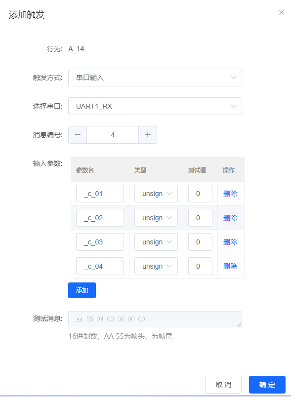

    *串口输入触发配置，消息号为4，测试消息为AA 55 04 00 00 00 00*

2. **设置输入参数**：

    - 添加4个参数：_c_01、_c_02、_c_03、_c_04
    - 参数类型：unsigned char
    - 可将其中一个参数作为校验码使用

    

    *串口输入参数配置，包含4个unsigned char类型的参数*

3. **配置变量赋值**：

    - 语音模块收到消息后，将参数值赋给变量
    - 可设置执行条件（如变量值等于特定数值）
    - 支持多个变量同时赋值

    

    *变量赋值配置，设置变量_C__1等于数值64等*

**3. 校验实现建议**

1. **简单校验**：

    - 使用固定值作为校验（如0xAA）
    - 接收时检查校验参数是否匹配
    - 不匹配时忽略该指令

2. **和校验**：

    - 发送端计算所有数据的和值
    - 将和值作为最后一个参数发送
    - 接收端重新计算并比对

3. **其他校验算法**：

    - 可根据实际需求选择校验算法
    - 如CRC、异或校验等
    - 需要在发送端和接收端实现相同算法

**技术要点：**

- 消息编号必须唯一，避免触发冲突
- 参数名需符合C语言命名规范
- 支持设置执行条件，增加灵活性
- 变量赋值可在满足条件时执行

**注意事项：**

- 校验功能需要通过参数和变量组合实现
- 平台不直接提供校验码计算功能
- 需要在发送端实现校验码计算
- 接收端可通过条件判断验证校验码
- 配置完成后需重新生成固件

### SU-03T多个GPIO触发条件的逻辑关系是什么？

**问题描述：**

配置多个GPIO条件（如GPIO_B0低电平和GPIO_B1高电平）时，需要确认这些条件之间的逻辑关系以及如何正确触发。

**解决方案：**

**1. GPIO触发逻辑说明**

在SU-03T的智能公元平台配置中：

- **多个GPIO条件是与的关系**：所有条件必须同时满足才能触发
- 不是或关系：任一条件满足不会触发
- 需要全部满足：所有设定的GPIO状态必须同时达到

**2. 实际配置示例**

示例1：GPIO_B0低电平 AND GPIO_B1高电平

- 条件1：GPIO_B0 = 低电平
- 条件2：GPIO_B1 = 高电平
- 触发条件：必须同时满足（B0为低且B1为高）


*GPIO_B0低电平和GPIO_B1高电平的配置*

示例2：GPIO_B0高电平 AND GPIO_B1高电平

- 条件1：GPIO_B0 = 高电平
- 条件2：GPIO_B1 = 高电平
- 触发条件：两个GPIO必须同时为高电平

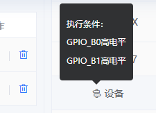

*GPIO_B0高电平和GPIO_B1高电平的配置*

**3. 配置要点**

1. **条件理解**：

    - 执行条件中的多个GPIO是"与"逻辑
    - 不是独立触发，而是联合触发
    - 类似于编程中的 AND 操作

2. **硬件准备**：

    - 确保GPIO电平稳定
    - 避免信号抖动造成误判
    - 使用上拉/下拉电阻确保默认电平

3. **测试验证**：

    - 逐个测试每个GPIO的状态
    - 验证组合条件是否正确触发
    - 检查是否有其他干扰因素

**技术细节：**

- **与逻辑实现**：内部通过逻辑门实现与操作
- **状态检测**：持续监控所有配置的GPIO状态
- **触发判定**：仅当所有条件都满足时才执行动作
- **响应时间**：取决于检测周期，通常毫秒级

**注意事项：**

- 多GPIO条件必须是逻辑与关系，无法改为或关系
- 如需要或逻辑，需要分别配置多个触发条件
- 配置时仔细检查每个GPIO的触发条件
- 硬件连接确保正确的电平逻辑

### SU-03T如何简化串口协议帧头帧尾？

**问题描述：**

需要将SU-03T模块的串口通信协议从默认的16进制格式（AA 55 01 55 AA）简化为单字节格式（如16），以适应特定产品（如晾衣架、窗帘电机）的通信需求。

**解决方案：**

**1. 协议简化方法**

SU-03T支持自定义串口通信协议的帧头和帧尾：

- 默认协议：AA 55 01 55 AA（AA 55为帧头，55 AA为帧尾）
- 可简化为：仅保留有效数据部分，如单字节16

**2. 配置步骤**

1. **进入协议配置界面**：

    - 在智能公元平台中找到"Pin脚配置"部分
    - 点击UART1_TX和UART1_RX的配置参数


*UART1协议参数配置，可修改帧头帧尾*

2. **修改协议参数**：

    - 删除帧头设置（清空"AA 55"）
    - 删除帧尾设置（清空"55 AA"）
    - 保留中间的有效数据部分

3. **验证配置**：

    - 在"添加触发"中查看串口输入配置
    - 测试消息框中应只显示有效数据
    - 确认无帧头帧尾标识


*简化后的协议格式，测试消息仅显示有效数据*

**3. 配置入口说明**

通过定制功能可以自动生成代码，实现GPIO、PWM、UART等端口根据语音指令输出自定义信号，无需代码开发即可控制外部设备。


*Pin脚配置中的定制功能说明*

**4. 实际应用示例**

简化后的协议可应用于：

- **晾衣架控制**：发送单字节指令控制升降、停止
- **窗帘电机**：简化指令格式，便于主控解析
- **其他简单设备**：减少通信开销，提高响应速度

**注意事项：**

- 协议简化后，需要确保主控端能够正确解析简化后的数据格式
- 删除帧头帧尾会降低通信的可靠性，建议在干扰较小的环境中使用
- 修改协议后需要重新生成并烧录固件
- 测试时建议使用串口调试工具验证通信效果

### SU-03T如何通过PWM控制风扇实现自然风效果？

**问题描述：**

需要使用SU-03T的PWM功能控制风扇，实现自然风效果，即PWM占空比从20%到80%的缓慢变化。

**解决方案：**

**1. 支持的风扇类型**

SU-03T的PWM功能可以控制：

- **直流电机风扇**：完全支持，可直接控制
- **交流风扇**：需要额外的驱动电路（如H桥或继电器）
- **注意**：SU-03T无法直接驱动大功率交流负载

**2. PWM占空比控制原理**

- SU-03T支持PWM输出功能
- 通过改变占空比调节风扇转速
- 占空比范围：0%-100%
- 自然风效果：占空比在20%-80%之间循环变化

**3. 实现缓慢变化的方法**

由于SU-03T无法直接实现平滑渐变，需要通过软件控制：

1. **使用定时器分段控制**：

    - 设置定时器中断（如每100ms执行一次）
    - 每次调整占空比1%-2%
    - 从20%逐步增加到80%
    - 到达80%后逐步减小到20%

2. **实现步骤**：
    ```
    步骤1：初始化PWM，设置初始占空比为20%
    步骤2：启动定时器
    步骤3：定时器触发时，增加占空比
    步骤4：达到80%后，改为减小占空比
    步骤5：循环执行，实现连续变化
    ```

**4. 配置要点**

1. **PWM频率设置**：

    - 推荐频率：1kHz-10kHz
    - 频率过高可能影响驱动效果
    - 频率过低可能导致风扇抖动

2. **占空比变化速率**：

    - 变化间隔：100ms-500ms
    - 每次调整量：1%-5%
    - 可根据实际效果调整

3. **硬件连接**：

    - 使用SU-03T的PWM输出引脚
    - 连接到风扇控制端
    - 必要时添加驱动电路

**5. 技术限制**

- **无法直接渐变**：SU-03T不支持PWM的平滑渐变功能
- **需要软件实现**：必须通过定时器分段调整
- **精度限制**：占空比调整精度受限于PWM分辨率

**注意事项：**

- 交流风扇必须使用驱动电路，不能直接连接
- 测试时从低占空比开始，避免突然高转速
- 风扇功率过大时需要使用MOSFET等驱动器件
- 实际效果可能需要多次调整参数才能达到理想状态

---

### SU-03T如何配置10秒延时输出后自动恢复？

**问题描述：**

需要配置GPIO输出，在按键触发后输出10秒高电平，然后自动恢复到低电平状态。

**解决方案：**

**1. 延时电平翻转功能**

在智能公元平台中，可以使用"延时电平翻转"功能实现这个需求：

- 先输出高电平
- 延时10秒后自动翻转为低电平
- 无需额外的复位操作

**2. 配置步骤**

1. **GPIO输出配置**：

   - 选择目标GPIO引脚（如A25）
   - 配置为输出模式
   - 设置默认低电平

2. **添加控制设置**：

   - 控制类型：选择对应的GPIO引脚
   - 延时输出：10000ms（10秒）
   - 勾选"延时电平翻转"选项

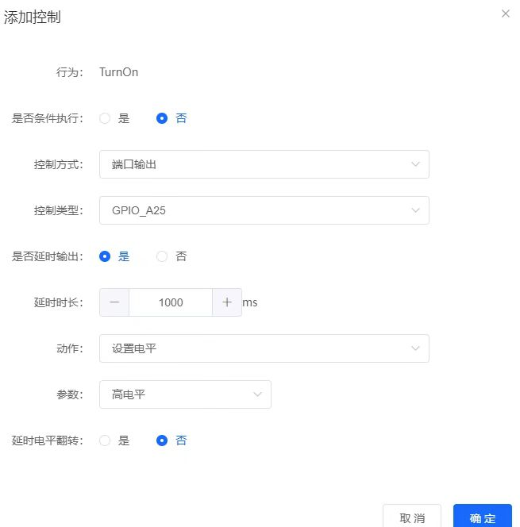

*设置延时输出时间为10秒*

3. **延时电平翻转设置**：

   - 勾选"延时电平翻转"后
   - 系统会先输出设定的电平（高电平）
   - 延时时间到达后自动翻转（变为低电平）

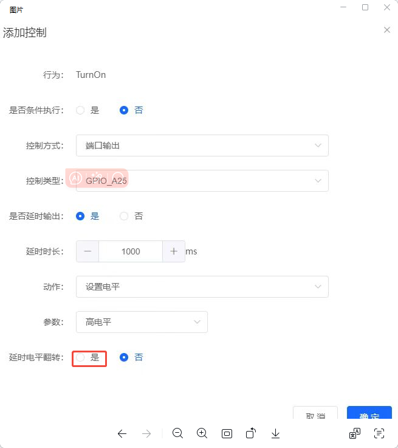

*关键选项：勾选"延时电平翻转"实现自动恢复*

**3. 两种延时模式的区别**

- **延时输出**：延时指定时间后输出电平
- **延时电平翻转**：先输出电平，延时后翻转为相反电平

**4. 应用场景示例**

这个配置适用于：

- 点动控制：如电梯楼层按钮
- 定时开关：如风扇定时关闭
- 脉冲触发：如门禁开关控制

**注意事项：**

- 延时时间单位为毫秒（ms），10秒=10000ms
- "延时电平翻转"是实现自动恢复的关键设置
- 翻转后的电平会保持，直到下次触发
- 默认电平设置决定初始状态

---

### 如何配置GPIO连续输出高电平两次？

**问题描述：**

需要设置一个GPIO端口（如GPIO_A0）连续输出高电平0.5秒两次，之后变为低电平。

**解决方案：**

**方法一：使用两次延时电平翻转**

1. **第一次输出配置**
   - 控制类型：GPIO_A0
   - 动作：设置电平
   - 参数：高电平
   - 延时时间：500ms（0.5秒）
   - 勾选"延时电平翻转"

2. **第二次输出配置**
   - 控制类型：GPIO_A0
   - 动作：设置电平
   - 参数：高电平
   - 延时时间：1000ms（1秒间隔）
   - 勾选"延时电平翻转"

**方法二：连续输出间隔1秒**

如需要两次高电平输出之间间隔1秒：

1. **第一个控制动作**
   - GPIO_A0设置为高电平
   - 延时50ms

2. **第二个控制动作**
   - GPIO_A0设置为高电平
   - 延时1000ms（1秒）

3. **第三个控制动作**
   - GPIO_A0设置为低电平
   - 无延时

**配置示例：**

```
语音指令："输出两次"
├── 动作1：GPIO_A0=高电平，延时50ms
├── 动作2：GPIO_A0=高电平，延时1000ms
└── 动作3：GPIO_A0=低电平
```

**注意事项：**

- 延时时间单位为毫秒（ms）
- 0.5秒=500ms，1秒=1000ms
- 使用"延时电平翻转"可自动恢复
- 多个动作会按顺序执行

---

### 外部GPIO触发语音播报无响应如何处理？

**问题描述：**

配置外部GPIO触发语音播报功能，烧录后触发无响应，需要确认配置是否正确以及排查问题原因。

**解决方案：**

**配置检查步骤：**

1. **GPIO配置确认**
   - 检查GPIO是否设置为输入模式
   - 确认默认电平设置正确（低电平）
   - 验证GPIO引脚与实际接线一致

2. **触发条件设置**
   - 触发方式：GPIO输入
   - 触发条件：高电平触发（根据实际需求）
   - 确保多组触发条件配置正确

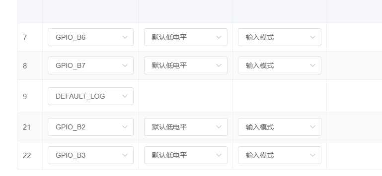

*GPIO配置界面，显示B6、B7、B2、B3设置为输入模式，默认低电平*

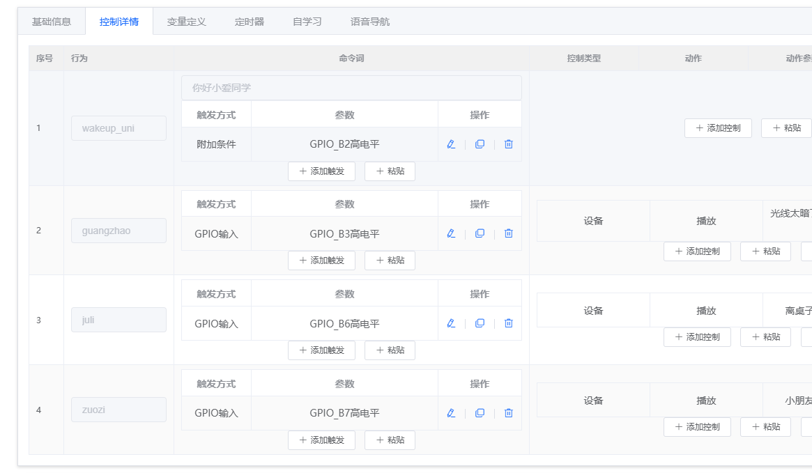

*控制详情列表，显示多个GPIO高电平触发配置*

**常见问题排查：**

1. **硬件连接检查**
   - 确认触发信号连接到正确的GPIO引脚
   - 检查触发信号电平是否匹配配置（高/低电平）
   - 使用万用表测试触发信号是否正常到达

2. **软件配置验证**
   - 重新生成固件，确保配置生效
   - 检查触发条件是否与其他功能冲突
   - 验证GPIO引脚没有被其他功能占用

3. **触发方式测试**
   - 手动给GPIO一个触发信号
   - 观察串口是否有输出
   - 测试不同触发电平（高/低）

**调试建议：**

1. **使用简单测试固件**
   - 仅配置GPIO触发和简单播报
   - 排除其他复杂功能干扰
   - 确认GPIO触发功能正常

2. **信号质量检查**
   - 触发信号脉宽建议>10ms
   - 避免信号抖动造成误触发
   - 必要时可增加滤波电容

3. **串口监控**
   - 连接串口调试助手
   - 实时查看触发状态
   - 确认模块收到触发信号

**注意事项：**

- GPIO输入内部有上拉或下拉电阻
- 触发电平要与配置的相反电平匹配
- 多个GPIO触发时是"与"关系，不是"或"关系
- 如仍无法解决，可能需要检查模块硬件

---

### SU-03T烧录后MCU无法触发模块怎么办？

**问题描述：**

使用MCU触发SU-03T模块时，烧录后触发无反应，怀疑是MCU的IO驱动能力不足导致无法触发SU-03T。

**解决方案：**

**1. 使用电脑进行测试**

   - 先用电脑连接模块测试基本功能
   - 确认模块本身工作正常
   - 排除模块故障的可能性

**2. 检查外部触发条件**

   - 制作最简单的外部触发播报测试
   - 使用杜邦线直接短接触发引脚
   - 观察模块是否响应

**3. MCU驱动能力排查**

   - 检查MCU的IO输出电压是否符合模块要求
   - 确认IO驱动电流足够（模块为CMOS电平）
   - 必要时增加驱动电路（如三极管或MOS管）

**4. 硬件连接检查**

   - 验证接线是否一一对应
   - 检查共地连接是否正确
   - 确认触发信号极性（高/低电平触发）

**注意事项：**

- SU-03T模块为高阻抗输入，正常MCU IO应该能够直接驱动
- 触发信号脉宽建议大于10ms，避免过短脉冲
- 如果确认是驱动能力问题，可增加上拉电阻改善信号质量
- 长距离连接时建议使用屏蔽线避免干扰

---

### SU-03T如何实现按键长按短按的不同功能？

**问题描述：**

需要通过IO口连接按键，根据按键按压时间长短（如200ms和2000ms）触发不同的动作。

**解决方案：**

**1. 实现原理**

使用定时器和电平检测实现按键时长判断：

- IO口检测按键按下（电平变化）
- 启动定时器开始计时
- 检测按键松开，停止计时
- 根据计时长度执行不同功能

**2. 硬件连接**

- 按键一端连接到SU-03T的任意IO口
- 按键另一端接地
- IO口配置内部上拉电阻（默认高电平）
- 按键按下时IO口变为低电平

**3. 软件实现逻辑**

1. **初始化配置**：

    - 配置IO口为输入模式
    - 启用内部上拉电阻
    - 初始化定时器（建议1ms精度）

2. **按键检测流程**：
    ```
    检测流程：

    1. 持续检测IO口电平
    2. 检测到下降沿（高→低）：按键按下
        - 启动定时器，记录开始时间
    3. 检测到上升沿（低→高）：按键松开
        - 停止定时器，计算按压时间
        - 根据时间长度执行对应功能
    ```

**4. 时间判断标准**

根据需求设置时间阈值：

- **短按**：< 500ms（如200ms）
- **长按**：≥ 2000ms
- 可根据实际需求调整阈值

**5. 配置建议**

1. **去抖动处理**：

    - 检测到电平变化后延时10ms再确认
    - 避免机械抖动造成误判

2. **定时器精度**：

    - 使用高精度定时器（1ms或更高）
    - 确保时间测量准确

3. **状态管理**：

    - 使用状态机管理按键状态
    - 避免重复触发

**6. 实现示例**

```
伪代码示例：
if (IO_read() == LOW && !key_pressed) {
    key_pressed = true;
    start_timer();
}

if (IO_read() == HIGH && key_pressed) {
    key_pressed = false;
    duration = stop_timer();

    if (duration < 500) {
        // 短按功能
        short_press_action();
    } else if (duration >= 2000) {
        // 长按功能
        long_press_action();
    }
}
```

**注意事项：**

- 必须处理按键抖动，避免误触发
- 定时器精度直接影响时间判断的准确性
- 建议在按键松开后才执行功能，避免长按过程中多次触发
- 实际测试中可能需要调整时间阈值以适应不同按键

---

## 常见问题与故障排查

### SU-03T模块音频播放后无法停止，语音识别失效怎么办？

**问题描述：**

音频文件上传后显示文件大小变大，音频开始播放后无法停止，且语音识别功能失效，希望通过语音控制音频播放的启停。

**解决方案：**

**问题原因：**

- 音频文件上传后，系统会转换为标准格式，可能导致文件大小变化
- SU-03T不支持语音打断功能（无AEC功能），播报时无法识别语音指令

**解决方法：**

1. **外部触发停止播放**

    - 通过外部串口发送指令触发新的语音播放，可以终止当前播放
    - 使用其他IO口或外部信号控制播放停止

2. **硬件替代方案**

    - 升级到CI-03T系列模块，支持语音打断功能
    - CI系列脚位兼容SU系列，可直接替换

**注意事项：**

- SU-03T因无AEC功能，不支持播报过程中的语音打断
- 音频文件转换后的容量变化是正常现象，通常因采样率调整导致
- 如必须实现语音控制播放启停，建议更换为支持打断功能的模块


---

## 音频输出接口

### SU-03T的音频输出接口可以接蜂鸣器吗？

**问题描述：**

需要了解SU-03T模块的喇叭输出接口是否可以直接连接蜂鸣器，以实现beep提示音功能。

**解决方案：**

SU-03T模块可以通过两种方式实现beep提示音：

**1. 个性化音频方案（推荐）**

- 在智能公元平台上传beep音频文件
- 将beep音频设置为特定命令的回复语
- 通过语音指令触发beep提示音播放
- 无需额外硬件，使用原有喇叭输出

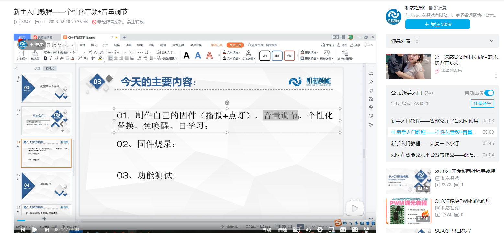

*智能公元平台个性化音频配置教程*

**2. PWM驱动蜂鸣器方案**

- 使用SU-03T的PWM输出引脚
- 蜂鸣器必须支持PWM驱动方式
- 在智能公元平台配置PWM输出功能
- 可通过语音指令或IO触发控制PWM输出

**技术要点：**

1. **喇叭接口限制**：
   - SU-03T的喇叭接口是音频输出，不是PWM
   - 不能直接驱动有源蜂鸣器
   - 无源蜂鸣器需要音频信号驱动

2. **PWM接口使用**：
   - SU-03T支持2路PWM输出
   - 可配置频率和占空比
   - 适合驱动有源蜂鸣器

3. **配置方法**：
   - 登录智能公元平台
   - 在Pin脚配置中设置PWM输出
   - 绑定语音指令到PWM控制

**注意事项：**

- 个性化音频方案最简单，直接使用喇叭播放beep
- PWM方案需要额外接线，适合需要静音beep的场景
- 蜂鸣器选型需注意工作电压和驱动方式
- 测试时先验证单个beep音效是否正常

---

### 如何获取SU-03T的原始DAC音频信号？

**问题描述：**

需要获取SU-03T模块未经过功放的原始音频信号（DAC输出），以便连接外部大功率功放驱动大喇叭。

**解决方案：**

**1. 硬件修改方法**

要从SU-03T获取原始DAC音频信号，需要进行以下硬件修改：

- **移除电阻R6**：断开功放输入信号
- **从电容C5引出信号**：获取原始DAC输出
- 信号从C5焊盘引出后可直接连接外部功放

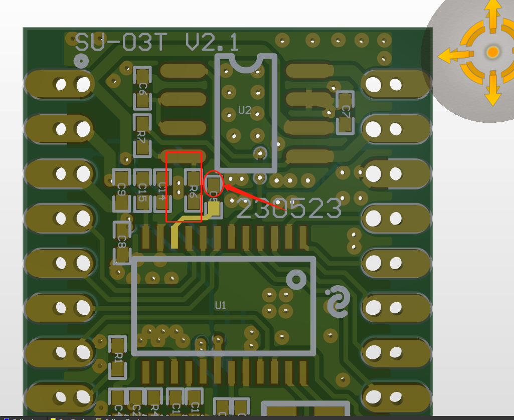

*红框标示需要移除的R6电阻和需要引出信号的C5电容位置*

**2. 开发方式确认**

使用SU-03T模块的主控芯片（CI1302）进行开发时：

- 开发方式与使用完整模块相同
- 在智能公元平台选择"SU-03T"进行开发配置
- 平台配置和固件生成流程完全一致

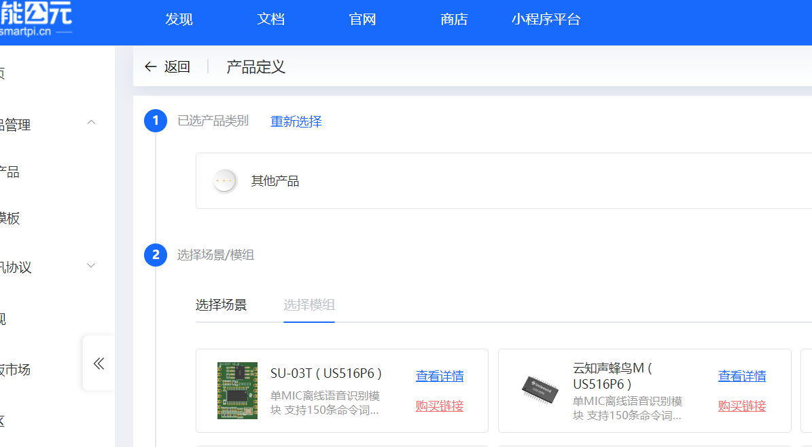

*在开发平台选择SU-03T进行项目配置*

**3. 功放使能配置**

- 功放使能脚为低电平有效
- 平台默认配置为低电平使能
- 自行设计时需保持相同的使能逻辑

**注意事项：**

- 移除R6后，模块上的功放将不再工作
- C5引出的是原始音频信号，需要外部功放才能驱动喇叭
- 确保外部功放的输入阻抗匹配
- 开发阶段可使用调试器烧录，批量生产建议联系厂商预烧录

---

## 音量控制与记忆

### SU-03T如何实现音量设置的断电记忆功能？

**问题描述：**

SU-03T芯片在设置音量后，断电再上电时音量会恢复到默认值，无法记住上次设置的音量档位。

**解决方案：**

使用持久化变量存储音量档位，并在设备上电时恢复音量设置：

**1. 创建持久化变量**

在智能公元平台中创建变量用于存储音量档位：

- 变量名：volume
- 变量类型：unsigned char
- 默认值：4（中等音量）
- **关键设置：开启持久化功能**


**2. 音量控制逻辑**

配置音量增减的触发逻辑：

- **增大音量**：变量volume执行"增加"操作
- **减小音量**：变量volume执行"减少"操作
- 变量范围：1-6（对应6个音量档位）


**3. 上电恢复机制**

配置系统启动时的音量恢复逻辑：

- 触发事件：上电启动系统启动
- 执行动作：根据volume变量的值恢复音量
- 恢复方式：
  - volume=1：执行"最小音量"
  - volume=2：执行"中等音量"或相应档位
  - volume=6：执行"最大音量"


**4. 实现步骤总结**

1. **定义持久化变量**：创建volume变量，开启持久化
2. **配置音量命令**：
   - 设置6个音量档位命令（最小音量、中等音量、最大音量等）
   - 配置增大/减小音量命令，更新volume变量
3. **设置上电恢复**：在系统启动事件中读取volume变量值
4. **执行对应操作**：根据变量值执行相应次数的音量调节

**注意事项：**

- 持久化变量是实现断电记忆的关键，必须开启该功能
- 音量档位要与volume变量的值域匹配
- 上电恢复逻辑需要在系统启动时立即执行
- 建议测试所有音量档位的保存和恢复功能
- 变量值的存储在Flash中，不会因断电而丢失

---

## 常见问题与故障排查

### SU-03T使用英文固件时无法唤醒怎么办？

**问题描述：**

SU-03T模块烧录英文固件后，开机播报功能正常，但语音唤醒功能失效，无法响应唤醒词。

**解决方案：**

**问题排查步骤：**

1. **确认固件配置**：

    - 检查英文固件中的唤醒词设置
    - 确认唤醒词发音符合英文语音习惯
    - 验证唤醒词在固件中正确配置

2. **验证语音识别模型**：

    - 确认使用的是英文语音识别模型
    - 中文模型可能无法正确识别英文唤醒词
    - 在智能公元平台重新生成英文版固件

3. **测试环境因素**：

    - 确保测试环境安静，避免背景噪声干扰
    - SU-03T为单麦设计，抗噪能力较弱
    - 建议在安静环境下进行唤醒测试

4. **固件兼容性检查**：

    - 确认英文固件版本与模块硬件兼容
    - 尝试使用最新版本重新生成固件
    - 联系技术支持获取英文固件专用版本

**技术要点：**

- SU-03T主要针对中文语音优化，英文识别可能存在准确率下降
- 单麦克风设计在嘈杂环境下英文唤醒更加困难
- 英文唤醒词建议选择音节清晰、不易混淆的词汇

**注意事项：**

- 英文固件需要使用专门的英文语音识别模型
- 如需更好的英文识别效果，建议升级到CI系列模块
- 测试英文唤醒时注意发音标准，避免口音影响识别

---

### SU-03T连续使用几天后无法唤醒怎么办？

**问题描述：**

SU-03T设备在连续使用几天后，出现无法被唤醒的情况，需要断电重启才能恢复正常工作。

**解决方案：**

**问题排查步骤：**

1. **供电稳定性检查**：

   - 测量供电电压是否稳定在5V
   - 检查电源适配器输出电流是否充足
   - 观察电压波动，特别是设备长时间工作后
   - 不稳定的供电是导致此问题的常见原因

2. **电源质量评估**：

   - 使用示波器检查电源纹波
   - 确认电源在长时间负载下是否稳定
   - 避免使用质量较差的电源适配器
   - 考虑添加滤波电容改善电源质量

3. **模块状态判断**：

   - 确认是固件消失还是仅不响应唤醒
   - 检查设备是否还有其他功能响应
   - 通过串口连接检查模块通信状态
   - 区分是死机还是仅唤醒功能失效

**可能原因分析：**

1. **电源相关问题**：

   - 电源长时间工作后输出不稳定
   - 电压下降导致芯片工作异常
   - 电源纹波增大影响语音识别

2. **软件状态异常**：

   - 长时间运行后出现内存泄漏
   - 某些状态变量异常导致功能失效
   - 中断服务程序出现死锁

**预防措施：**

1. **电源优化**：

   - 使用额定电流更大的电源适配器
   - 在电源输入端增加大容量滤波电容
   - 考虑使用LDO稳压提高电源稳定性

2. **定期重启方案**：

   - 通过外部控制定时重启设备
   - 设置定时器每天自动重启一次
   - 可有效避免长时间运行的累积问题

3. **硬件改进建议**：

   - 在PCB设计时预留复位控制引脚
   - 添加硬件看门狗电路
   - 考虑使用更高规格的电源方案

**注意事项：**

- 此问题通常与电源质量直接相关
- 建议使用质量可靠的5V/2A电源适配器
- 长期运行的产品建议增加定时重启功能
- 如果问题持续存在，建议更换使用更高规格的模块

---

### SU-03T语音模块在唤醒之前是否处于低功耗或休眠状态？

**问题描述：**

需要了解SU-03T语音模块在唤醒之前的工作状态，是否处于低功耗或休眠模式以节省电能。

**解决方案：**

SU-03T语音模块在唤醒之前**不处于低功耗或休眠状态**：

- **工作状态**：模块始终处于正常工作状态，保持语音识别功能激活
- **功耗一致**：待机功耗与工作功耗相同，均为68mA（平均）
- **持续监听**：模块持续监听唤醒词，没有进入休眠模式

**功耗特点：**

1. **静态功耗**：
   - 平均电流：68mA
   - 功耗稳定，无低功耗模式
   - 适用于市电供电场景

2. **与SU-23T对比**：
   - SU-23T支持亚毫瓦级待机功耗
   - SU-03T无低功耗休眠功能
   - 选型时需根据供电方式选择合适型号

**注意事项：**

- SU-03T不适合电池供电应用
- 如需低功耗功能，建议选择SU-23T或SU-20T模块
- 模块设计主要用于市电供电的固定设备

---

- **工作状态**：模块始终保持正常工作状态，功耗为68mA（平均值）
- **语音监听**：持续进行语音识别处理，等待唤醒词触发
- **功耗表现**：无论是否被唤醒，模块功耗基本相同

**技术说明：**

SU-03T作为入门级低成本模组，未设计低功耗休眠功能：

1. **持续监听模式**：

   - 模块始终保持在激活状态
   - 语音识别电路持续工作
   - 可以随时响应唤醒词

2. **功耗对比**：

   - 待机状态：68mA（平均）
   - 工作状态：>500mA（驱动4Ω喇叭时）
   - 唤醒前后功耗无明显变化

3. **设计定位**：

   - 定位为市电供电的低成本模组
   - 适用于玩具、开关等简单控制场景
   - 未考虑电池供电的超低功耗需求

**替代方案建议：**

如需要低功耗或休眠功能，建议选择以下模组：

- **SU-23T**：亚毫瓦级超低功耗，支持电池供电
- **SU-20T**：待机亚毫瓦级，专为电池应用设计
- **SU-22T**：低功耗设计，内置1W功放

**注意事项：**

- SU-03T不适合电池供电的应用场景
- 长期使用时需考虑持续的功耗成本
- 如需节能功能，建议选择支持休眠的低功耗型号

---

## 参考链接

| 资源 | 链接 |
|------|------|
| SU-03T 官方文档首页 | [https://help.aimachip.com/docs/offline_su03t](https://help.aimachip.com/docs/offline_su03t) |
| 智能公元平台 | [https://smartpi.cn](https://smartpi.cn) |
| 芯片资料 | [查看](https://help.aimachip.com/docs/offline_su03t/offline_su03t-1e9c648nb2nec) |


---

## 附录：常见问题

### SU-03T1模块的PCB封装文件如何获取？

**问题描述：**

需要获取SU-03T1模块的PCB封装文件用于设计PCB，同时确认模块的引脚通信方式和固件更新方法。

**解决方案：**

**封装文件获取：**

1. **技术支持提供**：

    - 可联系技术支持索取封装文件
    - 文件名：SU-03T-V1.6-封装.PcbDoc
    - 同时提供原理图文件：SU-03T-原理图.pdf

2. **模块版本确认**：

    - SU-03T1与SU-03T封装相同，可直接使用
    - **PCB封装和引脚定义完全一致**，无需修改现有设计
    - V1.6版本为最新版本，包含完整引脚定义
    - 支持Altium Designer等主流EDA工具

**引脚通信说明：**

1. **串口通信引脚**：

    - **B0/B1**：可复用为串口通信
    - **B6/B7**：固定串口烧录口
    - 支持与MCU进行UART通信

2. **通信方式确认**：

    - 使用B0/B1与单片机通信是可行的
    - 需要在平台中配置为UART功能
    - 支持标准的串口通信协议


**固件更新方法：**

1. **旧版本更新**：

    - 老客户需更新固件以获得最新功能
    - 在智能公元平台继承原项目
    - 重新生成新版本固件

2. **烧录接口选择**：

    - **B6/B7**：UART1串口烧录口（推荐使用）
    - **B2/B3**：升级狗烧录/脱机烧录
    - 根据实际烧录工具选择对应接口

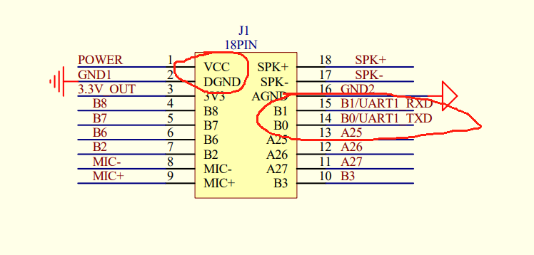

*SU-03T模块引脚定义，红圈标注B0/B1通信引脚*

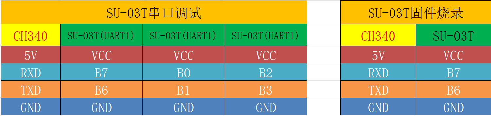

*CH340烧录器与模块的连接方式对比*

**使用注意事项：**

- 模块默认不带排针，需要自行焊接
- 购买时确认是否需要预烧录固件服务
- 旧版本模块更新固件后功能更稳定
- 设计PCB时预留测试点便于生产调试

### 如何通过丝印识别SU-03T模块版本？

**问题描述：**

收到的模块丝印为SU-03T1，需要确认是否为新版本模块，以及固件版本要求。

**解决方案：**

**丝印识别方法：**

- **旧版本模块**：丝印为SU-03T
- **新版本模块**：丝印为SU-03T1
- 新版本模块在硬件上做了优化改进，功能兼容

**固件兼容性要求：**

1. **旧版本模块**：可兼容新旧固件
2. **新版本模块（SU-03T1）**：仅支持新版本固件（2024年10月25日后生成）
3. **固件生成时间确认**：
   - 登录智能公元平台
   - 查看固件生成日期
   - 2024年10月25日之后生成的为新版本固件

**固件更新步骤：**

如果使用的是旧版本固件，需要按以下步骤更新：

1. **登录智能公元平台**
2. **找到原有项目**
3. **执行继承操作**：
   - 点击"继承"按钮
   - 系统自动复制原有配置
   - 生成新版本固件
4. **下载并烧录新固件**

**注意事项：**

- SU-03T1与SU-03T的PCB封装和引脚定义完全一致
- 新模块必须使用新版本固件，否则无法正常工作
- 建议老客户也升级到新版本固件以获得更好的稳定性
- 如不确定固件版本，可联系技术支持确认

---

### SU-03T是否可以长期连续通电运行？

**问题描述：**

需要确认SU-03T产品是否可以长时间通电运行，例如连续开启半年。

**解决方案：**

**长期运行能力确认：**

SU-03T模块设计支持长期连续通电运行：

- **支持时长**：可连续运行半年甚至更长时间
- **设计目标**：为需要长期工作的应用场景设计
- **可靠性**：经过长期稳定性测试验证

**技术特性：**

1. **功耗特性**：
    - 待机电流：68mA（平均）
    - 工作电流：>500mA（带4Ω喇叭）
    - 功耗设计合理，适合长期工作

2. **稳定性保证**：
    - 内置看门狗功能，防止程序跑飞
    - 支持低电压检测，自动保护
    - 工业级设计，工作温度-20℃~70℃

**应用建议：**

1. **电源要求**：
    - 确保供电电压稳定（3.6-5.5V）
    - 使用质量可靠的电源适配器
    - 避免电源波动对模块寿命的影响

2. **散热考虑**：
    - 长期运行时注意模块散热
    - 避免在密闭环境中使用
    - 必要时增加散热措施

3. **定期维护**：
    - 虽然支持长期运行，建议定期检查
    - 关注语音识别效果是否正常
    - 检查喇叭播放是否清晰

**注意事项：**

- SU-03T专为长期工作设计，可放心用于需要7×24小时运行的产品
- 长期运行不会显著缩短模块使用寿命
- 如用于关键应用，建议预留备用模块以便快速更换
- 产品设计时应考虑整体系统的可靠性，而非仅关注语音模块

### SU-03T是否支持语音打断功能？

**问题描述：**

需要了解SU-03T模块是否支持在语音播放过程中通过语音指令打断播报，实现更灵活的交互控制。

**解决方案：**

**功能支持情况：**

SU-03T模块**不支持**语音打断功能：

1. **硬件限制**：

   - 不支持AEC（回声消除）功能
   - 单麦克风设计，无法区分播报声音和用户语音
   - 播报时无法进行语音识别

2. **技术原因**：

   - 模块播报时会占用音频处理资源
   - 无回声消除算法导致无法消除自身播放的声音
   - 播报声音会干扰麦克风，造成识别失效

**替代方案：**

1. **使用免唤醒命令词**：

   - 配置免唤醒命令词控制播报停止
   - 在播报间隙说出停止命令
   - 适合简单的播放控制需求

2. **升级至支持打断的模块**：

   - **CI-03T**：支持AEC和语音打断功能
   - **CI-33T**：支持双麦降噪和打断
   - 脚位兼容，可直接替换

3. **物理按键控制**：

   - 添加停止按键连接到GPIO
   - 通过按键中断停止播报
   - 成本低，实现简单

**选型建议：**

- **需要打断功能**：选择CI系列模块（CI-03T/CI-33T等）
- **简单应用**：SU-03T配合免唤醒词或按键控制
- **成本考虑**：SU-03T成本更低，但功能有限

**注意事项：**

- SU-03T设计定位为低成本基础应用
- 如必须实现打断功能，建议更换模块型号
- CI系列模块与SU系列脚位兼容，便于升级

---

### SU-03T语音模块可以使用8欧1W的小喇叭吗？

**问题描述：**

需要确认SU-03T语音模块是否能够驱动8欧1W的小喇叭，以及功率匹配的注意事项。

**解决方案：**

**功率匹配规格：**

1. **喇叭阻抗功率要求**：
   - 4Ω喇叭：最小2.4W
   - 8Ω喇叭：最小1.6W
   - 8Ω 1W喇叭可以正常使用

2. **模块驱动能力**：
   - 支持标准阻抗喇叭（4Ω/8Ω）
   - 不建议使用过大功率的喇叭
   - 4Ω 5W喇叭可能驱动困难

**选型建议：**

1. **推荐配置**：
   - 8Ω 1W-3W喇叭（最佳匹配）
   - 4Ω 2.4W-4W喇叭（高功率选择）
   - 避免使用低于额定功率的喇叭

2. **性能考虑**：
   - 功率过小可能导致音量不足
   - 功率过大会造成模块负载过大
   - 阻抗不匹配影响音质

**实际应用注意事项：**

1. **音量设置**：
   - 使用低功率喇叭时注意音量控制
   - 避免长时间最大音量播放
   - 可通过软件调节输出功率

2. **音质优化**：
   - 选择合适的喇叭频响范围
   - 考虑使用音频输出滤波
   - 避免喇叭失真影响识别效果

**技术规格参考：**

| 喇叭类型 | 阻抗 | 推荐功率范围 | 最大功率 |
|----------|------|------------|----------|
| 标准喇叭 | 4Ω | 2.4W-4W | 5W |
| 标准喇叭 | 8Ω | 1.6W-3W | 4W |
| 小喇叭 | 8Ω | 1W-2W | 3W |

**常见问题处理：**

1. **音量过小**：
   - 检查喇叭功率是否匹配
   - 调整模块音量设置
   - 确认接线正确性

2. **声音失真**：
   - 降低音量设置
   - 检查喇叭额定功率
   - 考虑更换合适喇叭

3. **模块发热**：
   - 避免使用过高功率喇叭
   - 控制播放音量
   - 确保良好散热

**预防措施：**

- 选择正规厂商的喇叭产品
- 严格按照规格书选型
- 进行充分的匹配测试
- 保留适当的功率余量

**注意事项：**

- 喇叭功率不是越大越好
- 阻抗匹配比功率更重要
- 过大功率可能损坏模块
- 建议使用推荐范围内的喇叭

---

## 烧录后无法返回识别结果

### SU-03T烧录后无法返回识别结果怎么办？

**问题描述：**

SU-03T模块可以正常烧录固件，但语音唤醒后没有返回识别结果，部分模块工作正常，部分模块异常。

**解决方案：**

#### 问题排查步骤

1. **唤醒词识别效率检查**：

   "吉祥如意"等部分唤醒词识别效率较低，建议更换识别度更高的唤醒词进行测试。

2. **硬件问题排查**：

   - **焊接质量检查**：
     - 检查模块引脚焊接是否牢固
     - 确认没有虚焊、连焊现象
     - 使用万用表测试连通性

   - **供电稳定性验证**：
     - 测量模块供电电压是否稳定
     - 确保供电电流足够（建议预留500mA余量）
     - 尝试给模块单独供电测试

   - **连接线路检查**：
     - 确认TX、RX连接正确
     - 检查是否存在短路或接触不良
     - 验证波特率设置是否匹配

3. **模块故障判断**：

   - **对比测试法**：
     - 使用相同固件烧录多个模块
     - 正常工作的模块与异常模块对比
     - 交叉测试排除外部因素

   - **外观检查**：
     - 检查模块是否有明显烧痕
     - 确认PCB无裂纹或损伤
     - 查看元器件是否完好

4. **固件和配置验证**：

   - **固件完整性**：
     - 重新下载固件文件
     - 验证固件MD5校验值
     - 使用官方推荐固件版本

   - **配置参数检查**：
     - 确认串口波特率设置
     - 验证唤醒词配置是否正确
     - 检查输出格式设置

**故障处理建议：**

1. **优先处理步骤**：

   - 更换识别率更高的唤醒词
   - 给模块提供独立稳定的5V供电
   - 重新检查并优化焊接质量

2. **模块更换判断**：

   如果多个模块中仅个别异常，且已完成上述排查，可判定为模块硬件故障，联系供应商更换。

3. **预防措施**：

   - 使用正规渠道购买的模块
   - 焊接时控制温度和时间
   - 避免供电电压波动
   - 做好静电防护

**技术要点：**

- SU-03T模块对供电稳定性要求较高
- 部分唤醒词识别效率存在差异
- 焊接质量直接影响模块工作稳定性
- 建议使用独立的LDO供电模块

---

### SU-03T1电路板如何连接按键？

**问题描述：**

需要了解如何将两脚按键连接到SU-03T1电路板，以及连接方式。

**解决方案：**

按键连接到电路板的方式取决于具体的应用需求和电路设计。

**连接方式分析：**

1. **并联连接方式**：
   - 与六脚开关的正负极并联
   - 保持相同的电平逻辑
   - 适合需要相同功能的场景

2. **直接连接方式**：
   - 直接连接到电路板的正负极
   - 通过电路板的按键检测电路
   - 需要了解电路板的按键接口定义

**电路板结构：**

从图片可以看出SU-03T1电路板包含：
- 语音模块（SU-03T1）
- 蓝牙模块
- 电源开关
- 充电管理模块
- 各类接口和按键检测电路


**按键连接建议：**

1. **查看电路图**：
   - 找到按键检测电路的具体位置
   - 确认检测引脚定义
   - 了解触发方式和电平要求

2. **按键特性**：
   - 两脚按键通常为瞬时开关
   - 无正负极区分（起导通作用）
   - 触发时需要稳定的电平变化

3. **连接验证**：
   - 连接后测试按键功能
   - 确认触发响应正常
   - 检查是否有抖动或误触发

**注意事项：**

- 按键起导通作用，通常不需要区分正负
- 连接前确认电路板的按键检测方式
- 避免长时间按键导致误触发
- 如需要特定功能，可能需要额外的电路设计

**技术要点：**

- SU-03T1支持外部按键中断
- 按键检测需要软件配置支持
- 根据实际需求选择合适的连接方式
- 保留原设计意图，避免改动核心电路

---

### SU-03T1烧录后语音功能完全失效？

**问题描述：**

CI-03T1烧录后语音功能完全无法使用，无法响应任何语音指令，仅能通过蓝牙连接。

**解决方案：**

**问题特征：**

- 烧录工具显示进度但未真正完成
- 烧录后无任何语音响应
- 蓝牙功能可以正常使用
- 提示可能需要多次烧录

**烧录状态判断：**

1. **成功标志**：
   - 进度条显示100%完成
   - 出现绿色成功提示
   - 设备自动重启运行

2. **失败状态**：
   - 进度停在62%（或其他非100%）
   - 无成功提示信息
   - 需要手动关闭

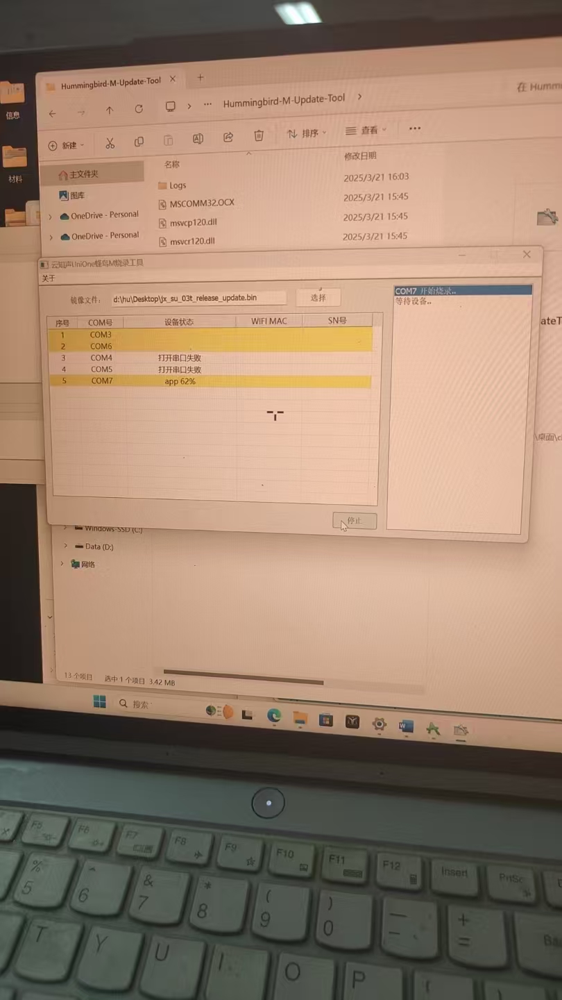

*烧录工具显示'app 62%'，表示烧录未完成*

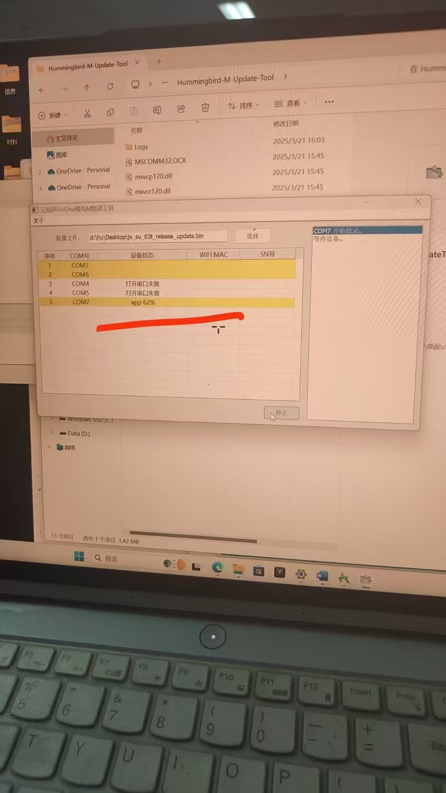

*烧录完成后显示绿色成功状态*

**处理方法：**

1. **重新烧录**：
   - 使用相同固件再次烧录
   - 确认等待100%完成
   - 不要在未完成时断开

2. **检查连接**：
   - 验证USB连接稳定
   - 确认端口未被占用
   - 尝试更换USB接口

3. **模块检查**：
   - 排除虚焊问题
   - 检查语音模块排针
   - 确认麦克风和喇叭连接

**注意事项：**

- 烧录必须一次性完成到100%
- 62%进度不算成功
- 多次烧录无助于解决问题
- 如持续失败，可能是硬件问题

---
