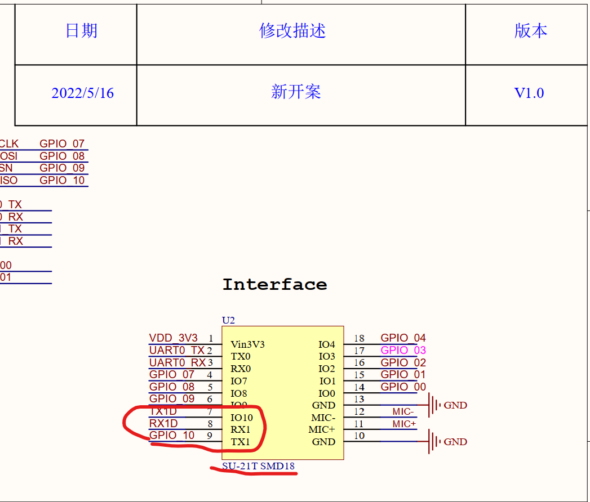

# 离线语音模组 SU-21T

## 快速规格一览

| 参数 | SU-21T |
|------|--------|
| 主控芯片 | 32bit RISC @50MHz |
| 架构 | **低功耗语音专用 NPU** |
| 词条数 | **50**（推荐） |
| 供电电压 | **3.3V**（严禁5V） |
| 接口电平 | 3.3V |
| 功放 | ✗（无功放，需外接） |
| Flash | 1MB |
| 功耗 | **亚毫瓦级**（待机） |
| 封装 | **小体积** |

### SU-21T 定位

> SU-21T 是 **超低功耗小体积模组**：

> - **特点**：待机功耗极低，体积小
> - **对比 SU-20T**：Flash 较小（1M vs 2.5M），无内置功放
> - **适用场景**：手持设备、穿戴设备、对体积功耗要求苛刻的产品

---

## 定位与适用场景

- **定位**：超低功耗、低成本、小体积的离线语音识别模组
- **适用场景**：

    - **穿戴设备**：智能手表、TWS耳机充电仓
    - **便携设备**：手持风扇、录音笔
    - **智能家居**：温湿度计、遥控器
- **优势**：极致低功耗、小体积
- **注意**：**供电电压必须为 3.3V**，无内置功放

---

## 模组概述

SU-21T 是一款低成本、小体积、超低功耗的离线语音识别模组。内置高精度语音检测模块配合系统多级启动模式使芯片待机功耗进入亚毫瓦级，工作功耗几毫瓦级别。

### 产品外观

### 外观尺寸

### 核心特性

| 指标分类 | 参数项 | 规格/数值 |
|---------|-------|----------|
| **核心性能** | CPU | 32bit 超低功耗 RISC 内核 @ 50MHz |
| | 运算单元 | DSP 指令集 + FPU 浮点运算单元 |
| | NPU | 低功耗语音专用神经网络处理单元 |
| **存储资源** | SRAM | 208KB |
| | Flash | 1MB |
| **音频接口** | 麦克风 | 支持 1 路驻极体麦 |
| | 功放 | **无内置功放** (需外接) |
| **电源** | 供电范围 | **3.3V** (严禁5V) |
| | 功耗 | 待机亚毫瓦级 |
| **外设接口** | UART | 3.3V 电平 |

### 官方资料下载

| 资料 | 链接 |
|------|------|
| 官方文档首页 | [查看](https://help.aimachip.com/docs/offline_su21t) |
| 开发包 V2.1.0 | [下载](https://help.aimachip.com/attach_files/offline_su21t/897) |
| 开发包(旧版本) | [下载](https://help.aimachip.com/attach_files/offline_su21t/580) |
| 烧录软件 | [下载](https://help.aimachip.com/docs/offline_su21t/offline_su21t-1gb2hlcok72aj) |
| 规格书 | [下载](https://help.aimachip.com/docs/offline_su21t/offline_su21t-1gb2j7ik4lpf4) |
| 原理图 | [下载](https://help.aimachip.com/docs/offline_su21t/offline_su21t-1gb2j3itkpacg) |
| 产品结构声学规范 | [下载](https://help.aimachip.com/attach_files/offline_su21t/890) |
| 喇叭和咪头选型 | [下载](https://help.aimachip.com/attach_files/offline_su21t/891) |

---

## 硬件设计指南

### SU-21T原理图引脚标识问题

**问题描述：**

在使用SU-21T产品资料时，发现原理图中部分引脚标识符存在错误，可能导致混淆。

**问题确认与处理：**

1. **线路连接正确**：

    - 原理图中的实际线路连接是正确的
    - 引脚功能定义和连接方式无误
    - 电路设计本身没有问题

2. **标识符错误**：

    - 原理图中某些引脚的标识符号标注错误
    - 这仅是文档标注问题，不影响实际功能
    - 实际使用时应以正确的引脚定义为准

**设计注意事项：**

1. **引脚定义参考**：

    - 设计时请参考规格书中的标准引脚定义
    - 验证关键引脚如TXD、RXD、GPIO的功能
    - 如有疑问可联系技术支持确认

2. **原理图使用**：

    - 按照线路连接进行PCB设计
    - 引脚标识符以官方最新文档为准
    - 标识错误不影响电路的正常工作

**建议操作：**

- 按照原理图中的线路连接进行设计
- 引脚定义参考产品规格书或联系技术支持
- 保留最新的原理图版本便于后续维护

---

**基础设计原则：**

1. 电源：独立 LDO，加 RC 滤波，保持语音前端稳定。
2. 麦克风/喇叭：差分走线、保持对称，严格按照推荐距离布置。
3. 串口/IO：预留调试接口并加 ESD 保护。

## 开发环境与工具

### 开发工具下载

| 工具 | 说明 | 下载链接 |
|------|------|---------|
| 开发包 V2.1.0 | SDK、示例代码、配置工具 | [下载](https://help.aimachip.com/attach_files/offline_su21t/897) |
| CH340 驱动 | USB转串口驱动 | [下载](https://help.aimachip.com/docs/offline_su21t/offline_su21t-1gb2hkm8qnnh6) |
| 烧录软件 | 固件烧录工具 | [下载](https://help.aimachip.com/docs/offline_su21t/offline_su21t-1gb2hlcok72aj) |
| 串口调试工具 | 日志查看与命令调试 | [下载](https://help.aimachip.com/docs/offline_su21t/offline_su21t-1gb2hmb13rqgg) |

### 芯片资料

> **蜂鸟L系列 (US513U6/US513U61)** 是一颗亚毫瓦级超低功耗智能纯离线语音识别芯片，面向带电池和便携式产品以及对功耗有严苛要求的各类产品。
> - 采用 MCU + 语音识别专用 NPU 架构内核
> - 采用超低功耗制程工艺
> - 内置高精度语音检测模块 + 多级启动模式
> - 待机功耗亚毫瓦级，工作功耗几毫瓦级
> - 支持 50 条本地指令离线 3-5 米远场识别
> - 支持 RTOS 轻量级系统

| 资料 | 链接 |
|------|------|
| 蜂鸟L 芯片详情 | [查看](http://help.aimachip.com/docs/chip/chip-1e9c8p36onh9g) |
| 蜂鸟L SOC产品手册 | [下载](https://help.aimachip.com/attach_files/chip/427) |
| 蜂鸟L 离线方案开发指导手册 | [下载](https://help.aimachip.com/attach_files/chip/429) |
| 蜂鸟L 参考原理图 | [下载](https://help.aimachip.com/attach_files/chip/428) |

### 产品设计参考

| 资料 | 链接 |
|------|------|
| 产品结构声学规范 | [下载](https://help.aimachip.com/attach_files/offline_su21t/890) |
| 喇叭和咪头选型推荐 | [下载](https://help.aimachip.com/attach_files/offline_su21t/891) |

---

## 常见问题

- [SU-21T 常见问题](../faq-offline-voice/faq-offline-voice-su-21t.md)

---

## 参考链接

| 资源 | 链接 |
|------|------|
| SU-21T 官方文档首页 | [https://help.aimachip.com/docs/offline_su21t](https://help.aimachip.com/docs/offline_su21t) |
| 蜂鸟L 芯片资料 | [https://help.aimachip.com/docs/chip/chip-1e9c8p36onh9g](http://help.aimachip.com/docs/chip/chip-1e9c8p36onh9g) |
| 智能公元平台 | [https://smartpi.cn](https://smartpi.cn) |
| SU-20T 文档（参考） | [https://help.aimachip.com/docs/offline_su20t](https://help.aimachip.com/docs/offline_su20t) |
