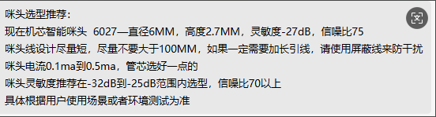
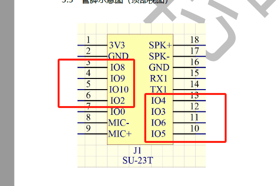
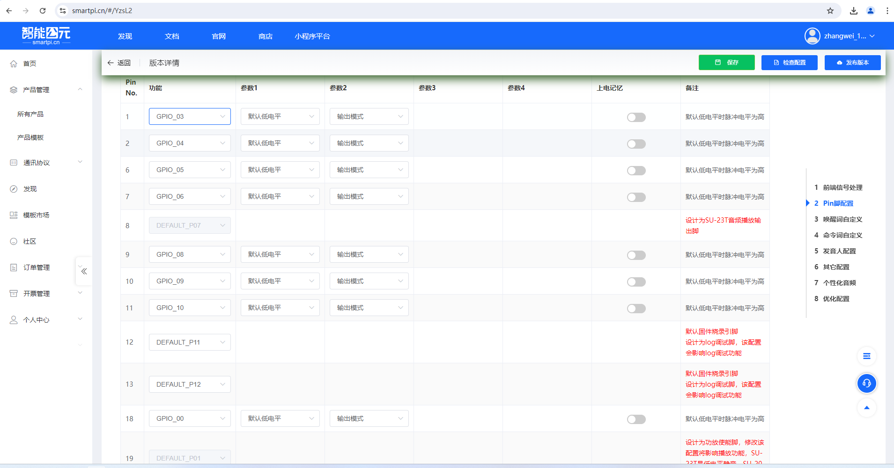
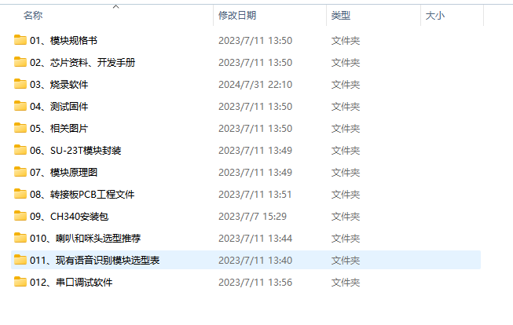
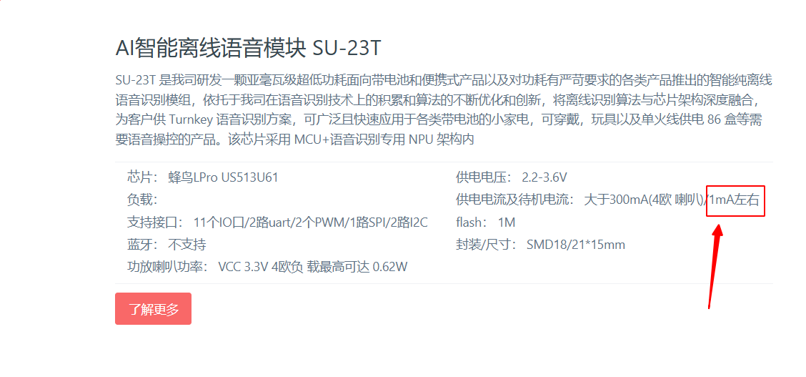
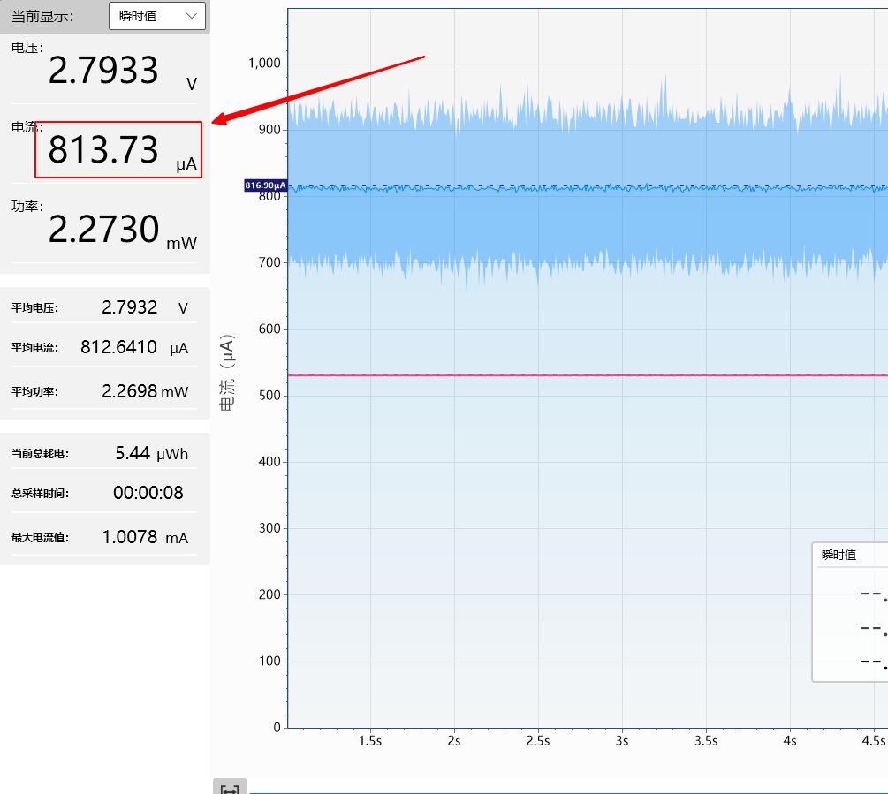

# 离线语音模组 SU-23T

## 快速规格一览

| 参数 | SU-23T |
|------|--------|
| 主控芯片 | 32bit RISC @50MHz |
| 架构 | **MCU + 语音识别专用 NPU** |
| 词条数 | **50**（推荐） |
| 供电电压 | **3.3V**（严禁5V） |
| 接口电平 | 3.3V |
| 功放 | 内置功率放大器 |
| 存储器 | 内置 SRAM + Flash |
| 功耗 | **亚毫瓦级**（待机） |
| 识别距离 | 3-5米远场 |
| 封装 | **小体积** |

### SU-23T 定位

> SU-23T 是 **亚毫瓦级超低功耗模组**：

> - **特点**：待机功耗亚毫瓦级，工作功耗几毫瓦级（不含功放）
> - **工艺**：超低功耗制程工艺
> - **适用场景**：带电池小家电、可穿戴设备、玩具、单火线86盒

---

## 定位与适用场景

- **定位**：亚毫瓦级超低功耗智能纯离线语音识别模组
- **适用场景**：

    - **电池供电产品**：便携风扇、遥控器、手持设备
    - **可穿戴设备**：智能手表、TWS耳机
    - **智能家居**：单火线86盒、温湿度计
    - **玩具产品**：故事机、互动玩偶
- **优势**：Turnkey 语音识别方案、低延时、本地数据安全
- **注意**：**供电电压必须为 3.3V**

---

## 模组概述

SU-23T 是亚毫瓦级超低功耗智能纯离线语音识别模组，面向带电池和便携式产品以及对功耗有严苛要求的各类产品。依托于在语音识别技术上的积累和算法的不断优化和创新，将离线识别算法与芯片架构深度融合，提供 Turnkey 语音识别方案。

采用 MCU+语音识别专用 NPU 架构内核，采用超低功耗制程工艺，内置高精度语音检测模块配合系统多级启动模式使芯片待机功耗进入亚毫瓦级，工作功耗几毫瓦级别（除功放的功耗）。内置 SRAM 和 FLASH、功率放大器等，只需少量外围器件即可形成完整解决方案。

| 指标 | 内容 |
| --- | --- |
| 架构 | MCU + 语音识别专用 NPU |
| 功耗特性 | 待机亚毫瓦级，工作几毫瓦级（不含功放） |
| 制程 | 超低功耗制程工艺 |
| 存储器 | 内置 SRAM + Flash |
| 音频输出 | 内置功率放大器 |
| 词表容量 | 50条本地指令 |
| 识别能力 | 3-5米远场识别 |
| 系统支持 | RTOS 轻量级系统 |
| 应用场景 | 带电池小家电、可穿戴设备、玩具、单火线86盒 |
| 供电 | 3.3 V，峰值电流待补 |
| 接口 | UART/GPIO/I2C（型号不同） |

### 官方资料下载

| 资料 | 链接 |
|------|------|
| 官方文档首页 | [查看](https://help.aimachip.com/docs/offline_su23t) |
| 规格书 V1.1 | [下载](https://help.aimachip.com/attach_files/offline_su23t/923) |
| 原理图 V1.1 | [下载](https://help.aimachip.com/attach_files/offline_su23t/922) |
| 封装图 V1.1 | [下载](https://help.aimachip.com/attach_files/offline_su23t/924) |
| 开发包 V2.1.0 | [下载](https://help.aimachip.com/attach_files/offline_su23t/914) |
| 开发包(旧版本) | [下载](https://help.aimachip.com/attach_files/offline_su23t/594) |
| CH340 驱动 | [下载](https://help.aimachip.com/attach_files/offline_su23t/925) |
| 烧录软件 | [下载](https://help.aimachip.com/attach_files/offline_su23t/926) |
| 串口调试软件 | [下载](https://help.aimachip.com/attach_files/offline_su23t/929) |
| 产品结构声学规范 | [下载](https://help.aimachip.com/attach_files/offline_su23t/920) |
| 喇叭和咪头选型 | [下载](https://help.aimachip.com/attach_files/offline_su23t/921) |

## 硬件设计指南
1. 电源：独立 LDO，加 RC 滤波，保持语音前端稳定。
2. 麦克风/喇叭：差分走线、保持对称，严格按照推荐距离布置。
3. 串口/IO：预留调试接口并加 ESD 保护。

### 麦克风选型推荐

**问题描述：**

SU23T模块推荐使用灵敏度为多少dB的麦克风。

**解决方案：**

SU23T模块的麦克风选型参数建议：

- **推荐灵敏度范围**：-32dB 到 -25dB
- **推荐型号**：6027（直径6MM，高度2.7MM）
- **灵敏度**：-27dB
- **信噪比**：75（需大于70）

**注意事项：**

- 电源线长度不宜超过100MM
- 如需加长引线，应使用屏蔽线防止干扰
- 信噪比必须大于70以确保识别效果

### 电池供电方案

SU-23T支持两节干电池供电方案，适用于遥控器等电池供电设备：

- **供电电压**：3.3V（严禁5V）
- **电池配置**：支持两节干电池串联供电
- **功耗特性**：待机亚毫瓦级，工作功耗约3mA
- **适用场景**：遥控器、手持设备等便携式产品

### IO口配置与使用

SU-23T提供多个可配置的IO口，包括IO2、IO3、IO4、IO5、IO8、IO9、IO10等：

- **配置方式**：需通过智能公元平台进行配置和开发
- **支持模式**：

    - 输出模式
    - 输入模式
    - PWM输出模式
- **ADC限制**：多出的IO口不支持ADC采样模式
- **使用要求**：所有IO口功能需要在平台中配置后才能使用

*SU-23T模块引脚图，红色框标出了可用的IO口*

*智能公元平台的Pin脚配置界面，可配置IO口的工作模式*

*平台输出模式配置选项，包括输出模式、输入模式和PWM输出*

## 开发环境与工具

### 开发包内容

SU-23T开发包包含完整的开发资料：

- **模块规格书**：详细的技术规格和参数
- **芯片资料**：主控芯片的完整技术文档
- **烧录软件**：固件烧录工具
- **测试固件**：用于功能验证的示例固件
- **相关图片**：模块原理图、引脚图等
- **模块原理图**：硬件设计参考
- **转接板PCB工程文件**：转接板设计资料

*SU-23T模块开发包中的文件和文件夹结构*

### 开发工具下载

| 工具 | 说明 | 下载链接 |
|------|------|---------|
| 开发包 V2.1.0 | SDK、示例代码、配置工具 | [下载](https://help.aimachip.com/attach_files/offline_su23t/914) |
| CH340 驱动 | USB转串口驱动 | [下载](https://help.aimachip.com/attach_files/offline_su23t/925) |
| 烧录软件 | 固件烧录工具 | [下载](https://help.aimachip.com/attach_files/offline_su23t/926) |
| 串口调试软件 | 日志查看与命令调试 | [下载](https://help.aimachip.com/attach_files/offline_su23t/929) |

### 芯片资料

> **蜂鸟L系列 (US513U6/US513U61)** 是一颗亚毫瓦级超低功耗智能纯离线语音识别芯片，面向带电池和便携式产品以及对功耗有严苛要求的各类产品。
> - 采用 MCU + 语音识别专用 NPU 架构内核
> - 采用超低功耗制程工艺
> - 内置高精度语音检测模块 + 多级启动模式
> - 待机功耗亚毫瓦级，工作功耗几毫瓦级
> - 支持 50 条本地指令离线 3-5 米远场识别
> - 支持 RTOS 轻量级系统

| 资料 | 链接 |
|------|------|
| 蜂鸟L 芯片详情 | [查看](http://help.aimachip.com/docs/chip/chip-1e9c8p36onh9g) |
| 蜂鸟L SOC产品手册 | [下载](https://help.aimachip.com/attach_files/chip/427) |
| 蜂鸟L 离线方案开发指导手册 | [下载](https://help.aimachip.com/attach_files/chip/429) |
| 蜂鸟L 参考原理图 | [下载](https://help.aimachip.com/attach_files/chip/428) |

### 产品设计参考

| 资料 | 链接 |
|------|------|
| 产品结构声学规范 | [下载](https://help.aimachip.com/attach_files/offline_su23t/920) |
| 喇叭和咪头选型推荐 | [下载](https://help.aimachip.com/attach_files/offline_su23t/921) |

## 固件烧录与升级指南
1. 通过 USB/UART 将固件写入 Flash。
2. 使用配置工具导入词表、编译后烧录。
3. 复位设备并播放测试词表确认成功。

## 功耗模式与深度休眠

### SU-23T 的功耗状态

SU-23T 作为亚毫瓦级超低功耗模组，在不同工作状态下会进入不同的功耗模式：

- **静默状态（约 800μA）**：模块进入普通休眠模式，语音识别功能正常，可通过唤醒词唤醒
- **播放后状态（约 2.7mA）**：模块在执行语音播报后的工作状态，功耗较高

### 深度休眠模式的影响

当 SU-23T 静默一段时间后，会自动进入深度休眠模式以进一步降低功耗：

**问题描述：**

在深度休眠模式下，串口命令的接收会受到影响，无法正常响应通过串口发送的控制指令。

**解决方案：**

- 通过唤醒词触发语音识别后，串口命令功能即可恢复正常
- 如果应用场景需要频繁使用串口命令，可以通过配置设置模块不进入深度休眠模式

**注意事项：**

- 深度休眠模式下语音识别功能不受影响，仍可通过唤醒词正常唤醒
- 两种功耗状态（800μA 和 2.7mA）下都可通过唤醒词唤醒模块

## 指令集 / 词表配置
- 支持多场景词表，结构为“唤醒词 → 命令组 → 动作”。
- 串口协议：0xAA 0x55 CMD LEN DATA CS（详见旧文档）。

> 教程参考：
> - [SU-23T转接板烧录教程](https://help.aimachip.com/docs/offline_su23t/offline_su23t-1ers5mquhdeag) - [资料下载](https://help.aimachip.com/attach_files/offline_su23t/595)
> - [SU-23T IO口输入输出教学](https://help.aimachip.com/docs/offline_su23t/offline_su23t-1es5qqqjujol9) - [资料下载](https://help.aimachip.com/attach_files/offline_su23t/599)
> - [SU-23T 串口输入输出教程](https://help.aimachip.com/docs/offline_su23t/offline_su23t-1es5tpug6ofsb) - [资料下载](https://help.aimachip.com/attach_files/offline_su23t/598)
>
> **教程功能说明**：
> - IO输入输出：PWM调光、呼吸灯制作、按键控制灯光亮灭
> - 串口教程：语音控制串口输出数据、串口触发语音播报、温湿度播报

## 外设开发与应用示例
- 继电器：识别指令后驱动 GPIO 切换。
- 串口反馈：将识别到的词 ID 发给主控。
- 联动应用：与 WiFi 模组结合，实现语音+云端控制。

---

## 参考链接

| 资源 | 链接 |
|------|------|
| SU-23T 官方文档首页 | [https://help.aimachip.com/docs/offline_su23t](https://help.aimachip.com/docs/offline_su23t) |
| 蜂鸟L 芯片资料 | [https://help.aimachip.com/docs/chip/chip-1e9c8p36onh9g](http://help.aimachip.com/docs/chip/chip-1e9c8p36onh9g) |
| 智能公元平台 | [https://smartpi.cn](https://smartpi.cn) |
| SU-22T 文档（参考） | [https://help.aimachip.com/docs/offline_su22t](https://help.aimachip.com/docs/offline_su22t) |
