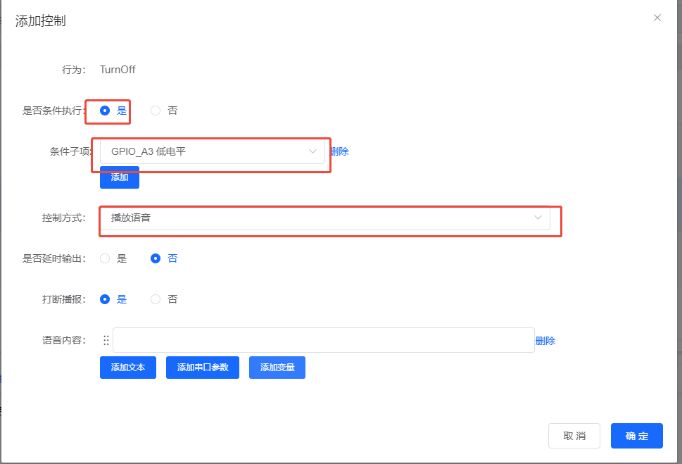
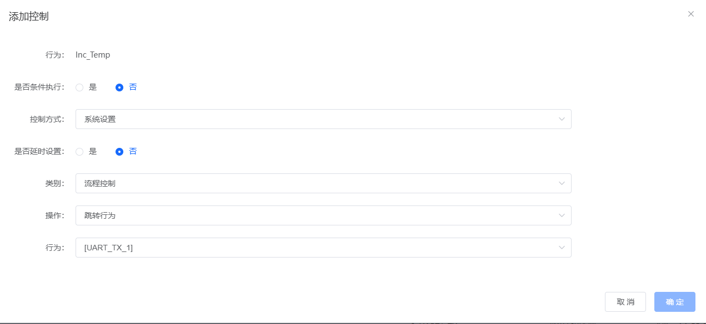
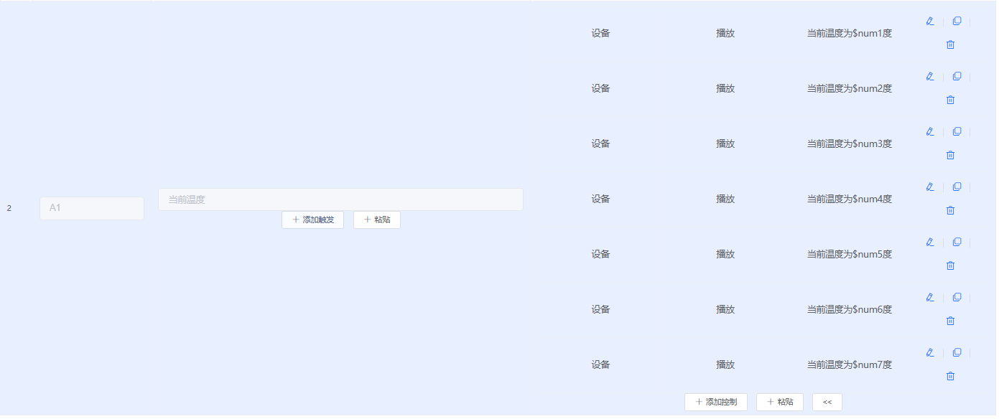

# 命令执行条件控制

## 问题描述

需要实现命令执行的顺序控制，确保只有在第一条命令执行成功后才执行第二条命令。

## 解决方案

### 1. 使用标志变量控制

通过定义一个标志变量来实现命令执行的条件判断：

**基本原理：**

- 第一条命令执行时，设置标志变量为特定值
- 第二条命令执行前，先检查标志变量
- 只有标志变量符合条件时，才执行第二条命令

### 2. 配置步骤

**步骤1：定义标志变量**

1. 在"变量定义"页面添加新变量
2. 变量名：如 `cmd1_executed`
3. 类型：选择 `int`
4. 默认值：设置为 `0`（未执行状态）

**步骤2：配置第一条命令**

1. 选择需要先执行的命令词
2. 在控制详情中添加"变量设置"动作
3. 选择标志变量 `cmd1_executed`
4. 操作方式：设置为"赋值"
5. 设置值：`1`（表示已执行）
6. 同时执行原有的控制动作

**步骤3：配置第二条命令**

1. 选择需要后执行的命令词
2. 添加"条件判断"控制
3. 判断条件：`cmd1_executed == 1`
4. 条件成立时执行的动作：后续控制逻辑
5. 条件不成立时不执行或提示错误

### 3. 实现示例

**场景：开灯1分钟后自动关灯**

```c
// 变量定义
int light_on_time = 0;  // 灯光开启时间
int light_state = 0;     // 灯光状态

// 命令1：开灯
void turn_on_light() {
    // 开启灯光
    set_gpio(LIGHT_PIN, HIGH);

    // 设置状态和时间
    light_state = 1;
    light_on_time = get_current_time();
}

// 命令2：关灯（带条件）
void turn_off_light() {
    // 检查条件：灯光是否已开启
    if (light_state == 1) {
        // 关闭灯光
        set_gpio(LIGHT_PIN, LOW);

        // 重置状态
        light_state = 0;
        light_on_time = 0;
    }
}
```

### 4. 高级应用

**多命令序列控制：**

```c
// 定义多个状态变量
int step1_done = 0;
int step2_done = 0;
int step3_done = 0;

// 命令执行流程
if (command == "cmd1" && step1_done == 0) {
    execute_cmd1();
    step1_done = 1;
}

if (command == "cmd2" && step1_done == 1 && step2_done == 0) {
    execute_cmd2();
    step2_done = 1;
}

if (command == "cmd3" && step2_done == 1 && step3_done == 0) {
    execute_cmd3();
    step3_done = 1;
}
```

**时间控制示例：**

```c
// 使用定时器实现延时
void start_timer() {
    if (timer_started == 0) {
        timer_start(60000);  // 60秒定时器
        timer_started = 1;
    }
}

void timer_callback() {
    // 定时器到时执行
    turn_off_light();
    timer_started = 0;
}
```

## 注意事项

- **变量初始化**：确保变量在系统启动时有正确的初始值
- **状态重置**：根据需要提供重置机制，避免状态锁死
- **异常处理**：考虑异常情况下的状态恢复
- **调试方法**：通过串口输出变量状态，便于调试
- **文档记录**：详细记录每个变量的用途和状态含义

### 智能公元平台如何注册和配置语音指令？

**问题描述：**

初次使用智能公元平台，需要了解注册流程和语音指令的配置方法。

**解决方案：**

**1. 平台注册流程**

- 访问智能公元平台：https://www.smartpi.cn/
- 点击注册按钮，完成账号注册
- 登录后进入主配置界面

**2. 语音指令配置步骤**

- 选择对应的模块版本（如CI-03T）
- 进入指令配置页面
- 添加需要的语音指令
- 配置每个指令对应的控制行为
- 生成并下载固件

**注意事项：**

- 首次使用建议先在平台查看教程视频
- 配置前确认模块型号，选择正确的固件版本
- 保存配置模板，便于后续修改

---

## 相关教程

- B站有相关配置视频教程
- 参考SU-03T技术手册中的变量控制章节
- 在智能公元平台的示例项目中查看具体实现

### 条件不满足时播放提示语音

**问题描述：**

在语音指令控制逻辑中，需要实现当条件不满足时播放一段提示语音的功能。

**解决方案：**

可以通过在控制逻辑中添加额外的控制行为来实现条件不满足时的语音提示：

1. **添加控制逻辑**：在原有的控制行为之后，再添加一个控制行为

2. **设置条件判断**：

    - 勾选"是否条件执行"为"是"
    - 设置与原条件相反的判断条件
    - 控制方式选择"播放语音"

3. **配置示例**：

    - 原控制：当 GPIO_A3 为低电平时执行 TurnOff
    - 提示控制：当 GPIO_A3 不为低电平时播放提示语音



**注意事项：**

- 不需要在原控制行为中添加"附件条件"
- 提示语音应提前录制并上传到平台
- 建议提示语音内容简洁明了，便于用户理解

---

### 控制条件是否支持"或"逻辑关系？

**问题描述：**

希望在添加控制的子条件之间选择"或"关系，而不是当前强制的"与"关系，以简化程序逻辑。

**解决方案：**

**当前限制：**

- 平台目前只支持条件之间的"与"（AND）关系
- 暂不支持"或"（OR）逻辑关系
- 如需支持OR关系，涉及底层架构的较大修改

**临时解决方案：**

1. **创建多个控制逻辑**
    - 为每个OR条件创建独立的控制逻辑
    - 每个控制逻辑执行相同的动作
    - 通过多个独立判断实现OR效果

2. **使用标志变量**
    - 通过中间变量记录各条件状态
    - 主控制逻辑检查变量组合
    - 间接实现OR逻辑功能

3. **刷新页面重试**
    - 如遇到配置界面无法点击"确定"
    - 尝试刷新页面重新进入平台
    - 清除缓存后重新配置



**未来计划：**

- OR逻辑支持已在评估中
- 可能会增加全局选项（全部条件与/或）
- 但短期内不会列入开发计划

**注意事项：**

- 当前界面复杂度已较高，避免过度嵌套
- OR逻辑实现需要平衡功能与用户体验
- 建议通过合理的逻辑设计减少对OR的依赖

---

### 连续播报功能如何优化内存使用？

**问题描述：**

使用连续播报功能时，一次性组合播报过多语音指令会导致内存浪费，影响其他功能。

**解决方案：**

**问题分析：**

连续播报功能需要将所有语音片段预加载到内存中进行拼接：

- 语音片段越多，占用的内存越大
- 过长的拼接会严重影响其他功能的内存需求
- 芯片内存有限，无法为无限长拼接预留空间

**优化建议：**

1. **限制播报长度**
    - 建议最大拼接8-10条语音指令
    - 可满足绝大多数应用需求
    - 避免过度占用内存资源

2. **分批播报策略**
    - 将长内容拆分为多个短播报
    - 使用延时控制实现连续效果
    - 减少单次内存占用

3. **简化播报内容**
    - 使用更简洁的语音表达
    - 合并重复或冗余信息
    - 优化语音指令结构

4. **配置示例**
    - 使用变量占位符动态播报
    - 每个变量对应一段简短语音
    - 避免固定长语音片段



**技术限制：**

- 无法预知用户最终拼接长度
- 过度预留内存会影响大部分应用
- 需要平衡功能与资源消耗

**未来改进：**

- 注释功能已在计划中，便于配置管理
- 可能增加拼接长度限制选项
- 优化内存管理算法

**注意事项：**

- 连续播报虽已支持，但需合理使用
- 测试时注意观察其他功能是否正常
- 如遇内存不足，应减少播报片段数量