# BL-62B 固件配置

> 本文档专门针对 **BL-62B** WiFi 模组的固件配置，提供该模组特有的配置参数和注意事项。

## 模组信息

- **模组型号**：BL-62B
- **芯片型号**：BL602
- **模组类型**：WiFi 模组
- **主要功能**：零代码开发 WiFi 产品
- **网络支持**：WiFi 连接
- **协议支持**：二进制/JSON/文本协议
- **特色功能**：

    - 免费接入智能公元小程序
    - 支持自有小程序商城
    - 手机扫码 OTA
    - 可免烧录
    - 支持嵌入 C 代码

## 创建产品

在开始配置固件之前，需要先在智能公元平台创建对应的产品。以下是创建 BL-62B 产品的详细步骤：

### 1. 进入产品管理页面

1. 登录智能公元平台（[smartpi.cn](https://smartpi.cn)）
2. 在左侧导航菜单中，点击「产品管理」，展开子菜单后选择「所有产品」
3. 进入产品管理页面，可以看到产品列表和操作按钮

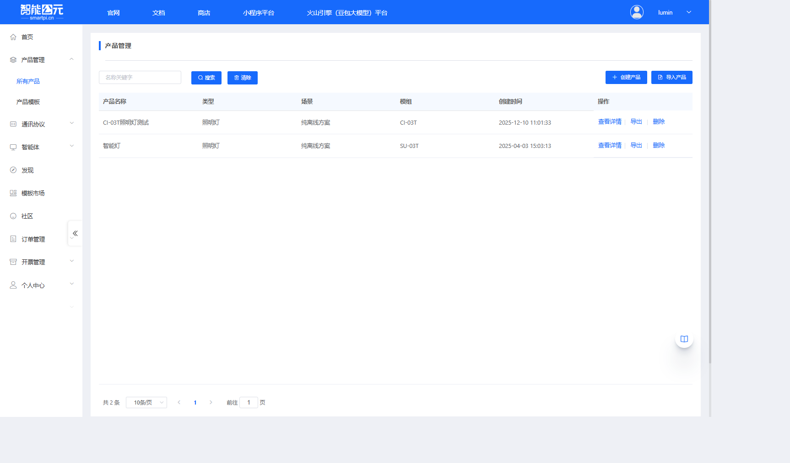

### 2. 点击创建产品

在产品管理页面右上角，点击蓝色的「创建产品」按钮，进入产品创建向导。

### 3. 选择产品类别

产品创建向导分为三个步骤。第一步是选择产品类别：

1. 在「选择产品类别」步骤中，可以看到多个产品类别标签页（灯具、开关、插座等）
2. 对于 BL-62B 模组，通常选择「其他」类别下的「其他产品」
3. 点击「其他产品」卡片完成选择

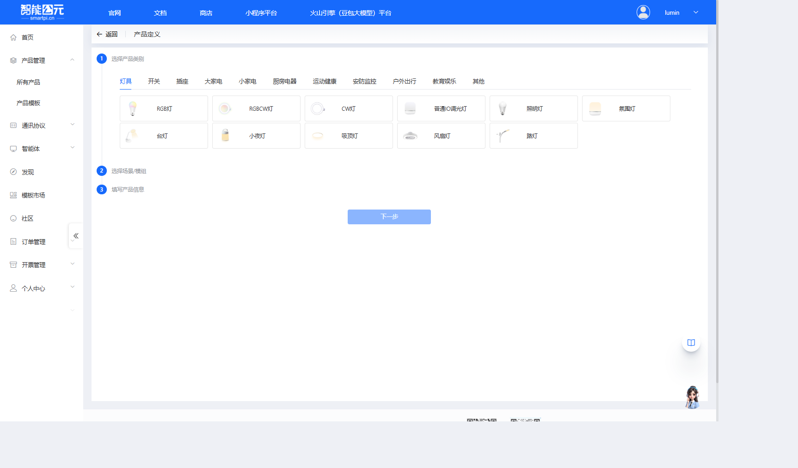

**示例**：选择「其他产品」类型，点击对应的卡片完成选择。

### 4. 选择场景和模组

第二步是选择应用场景和硬件模组：

#### 4.1 选择场景

在「选择场景/模组」步骤中，首先选择应用场景：

- **纯离线方案**：无需连网，离线也能操作
- **Wi-Fi**：Wi-Fi 产品，可远程控制产品（**推荐用于 BL-62B**）
- **大模型**：离在线操作，可接入大模型智能体
- **在线**：随时随地可操作产品

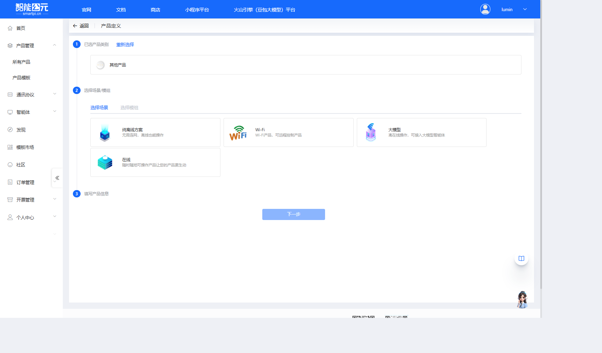

**对于 BL-62B**：选择「Wi-Fi」场景，因为 BL-62B 是 WiFi 模组，支持远程控制。

#### 4.2 选择模组

选择场景后，页面会自动切换到「选择模组」标签页，显示可用的模组列表：

1. 在模组列表中查找并选择 **BL-62B (BL602)**
2. 可以看到模组的详细信息：

    - 零代码开发 WiFi 产品
    - 二进制/JSON/文本协议
    - 免费接入智能公元小程序
    - 支持自有小程序商城
    - 手机扫码 OTA/可免烧录
    - 支持嵌入 C 代码

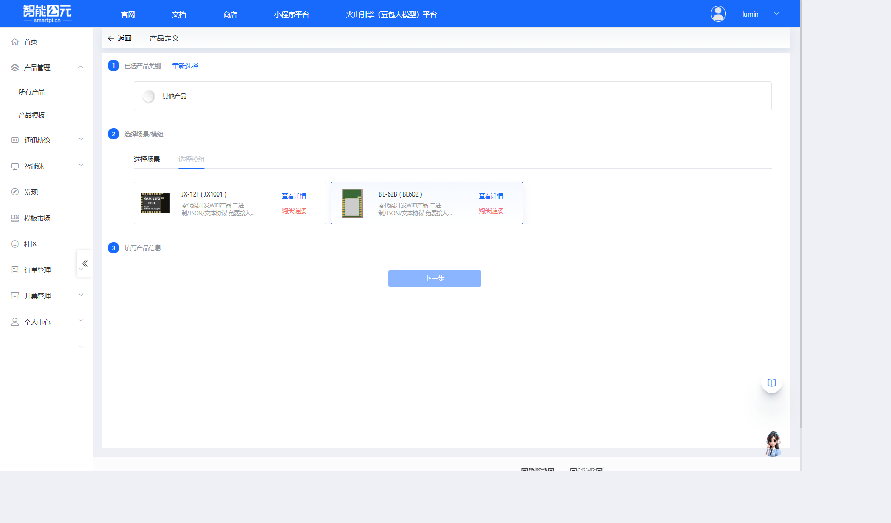

3. 点击 BL-62B 模组卡片完成选择

### 5. 填写产品信息

第三步是填写产品的基本信息：

1. **产品名称**（必填）：

    - 输入一个有意义的产品名称，例如：「BL-62B WiFi 测试产品」
    - 建议使用能清楚标识产品用途的名称

2. **选择语言**（必填）：

    - 从下拉菜单中选择语言，支持：中文、英文
    - 根据目标市场选择合适的语言

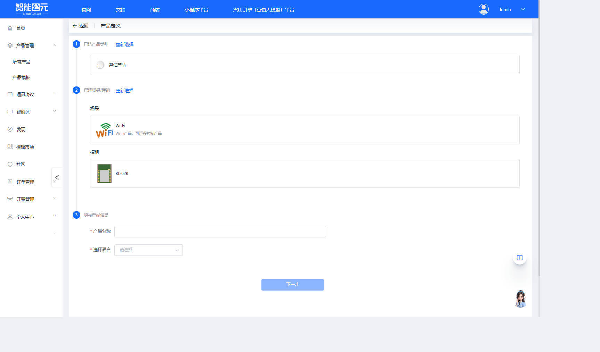

3. 填写完成后，点击页面底部的「下一步」按钮

### 6. 产品创建完成

完成上述步骤后，系统会自动创建产品并跳转到「版本详情」页面，此时可以开始配置固件版本。

在版本详情页面，可以看到以下配置步骤（WiFi 模组的配置步骤与离线语音模组不同）：

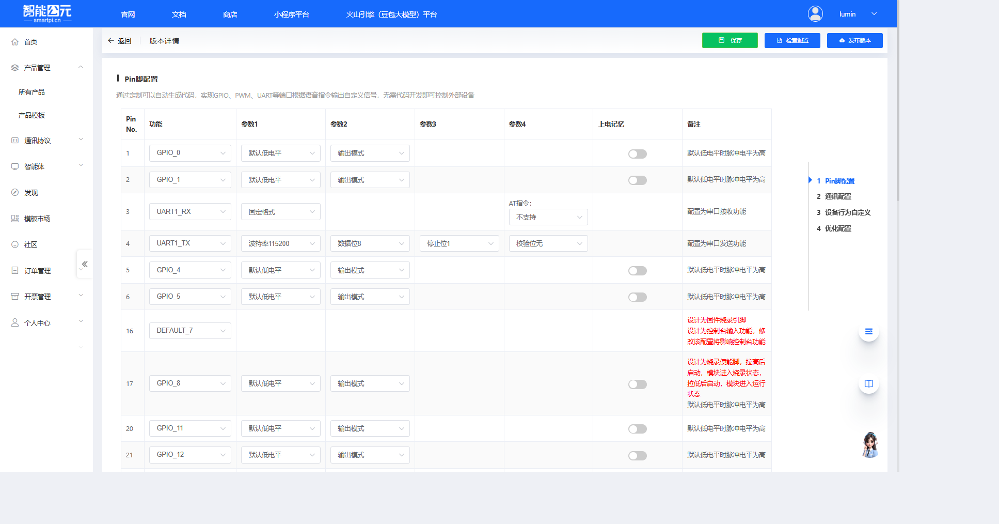

配置步骤包括：

1. **Pin脚配置**：配置 GPIO、PWM、UART 等引脚功能
2. **通讯配置**：配置设备对外的通讯类型、通讯接口、通讯方式
3. **设备行为自定义**：配置自定义行为，让设备智能起来
4. **优化配置**：调整系统参数，优化系统性能

## 配置流程

产品创建完成后，BL-62B 的固件配置遵循标准的[固件配置全流程](./firmware-config-workflow.md)，主要步骤包括：

1. [进入产品管理](./firmware-config-workflow.md#1-进入产品管理)
2. [产品详情与版本列表](./firmware-config-workflow.md#2-产品详情与版本列表)
3. [新建或编辑版本](./firmware-config-workflow.md#3-新建或编辑版本)
4. [按步骤完成版本配置](./firmware-config-workflow.md#4-按步骤完成版本配置)
    - Pin脚配置
    - 通讯配置
    - 设备行为自定义
    - 优化配置
5. [配置检查与保存](./firmware-config-workflow.md#5-配置检查与保存)
6. [发布版本](./firmware-config-workflow.md#6-发布版本)
7. [下载固件](./firmware-config-workflow.md#7-下载固件)

## 版本配置详解

产品创建完成后，进入版本详情页面进行固件配置。版本配置页面右侧列出了所有配置步骤，可以按顺序或根据需要跳转到任意步骤进行配置。以下是各个配置部分的详细说明：

### 1. Pin脚配置

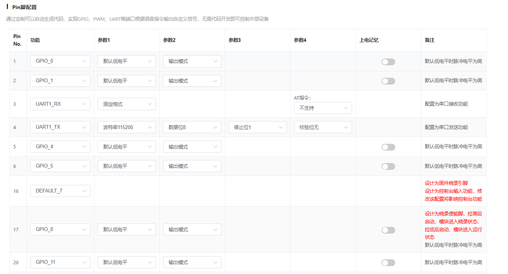

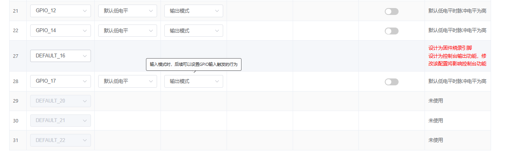

**功能说明**：通过定制可以自动生成代码，实现 GPIO、PWM、UART 等端口根据指令输出自定义信号，无需代码开发即可控制外部设备。

**配置表格**：

配置表格包含以下列：

- **Pin No.**：引脚编号
- **功能**：引脚功能（GPIO、PWM、UART 等）
- **参数1**：功能参数1（如默认电平）
- **参数2**：功能参数2（如输入/输出模式）
- **参数3**：功能参数3（根据功能类型不同）
- **参数4**：功能参数4（根据功能类型不同）
- **上电记忆**：是否保持上电前的状态
- **备注**：引脚使用注意事项

**BL-62B 引脚说明**：

- **Pin 1-2**：GPIO_0、GPIO_1，默认配置为 GPIO，默认低电平，输出模式
- **Pin 3**：UART1_RX，配置为串口接收功能，支持固定格式，AT指令不支持
- **Pin 4**：UART1_TX，配置为串口发送功能，波特率115200，数据位8，停止位1，校验位无
- **Pin 5-6**：GPIO_4、GPIO_5，默认配置为 GPIO，默认低电平，输出模式
- **Pin 16**：DEFAULT_7，设计为固件烧录引脚和控制台输入功能，修改该配置将影响控制台功能
- **Pin 17**：GPIO_8，设计为烧录使能脚，拉高后启动模块进入烧录状态，拉低后启动模块进入运行状态
- **Pin 20-22**：GPIO_11、GPIO_12、GPIO_14，默认配置为 GPIO，默认低电平，输出模式
- **Pin 27**：DEFAULT_16，设计为固件烧录引脚和控制台输出功能，修改该配置将影响控制台功能
- **Pin 28**：GPIO_17，默认配置为 GPIO，默认低电平，输出模式
- **Pin 29-31**：DEFAULT_20、DEFAULT_21、DEFAULT_22，未使用

**配置建议**：

- 仔细查看 BL-62B 硬件资料，确认引脚定义
- 注意某些引脚（如 Pin 16、17、27）有特殊用途，修改配置需谨慎
- 根据实际硬件设计配置引脚功能
- 默认低电平时脉冲电平为高

### 2. 通讯配置

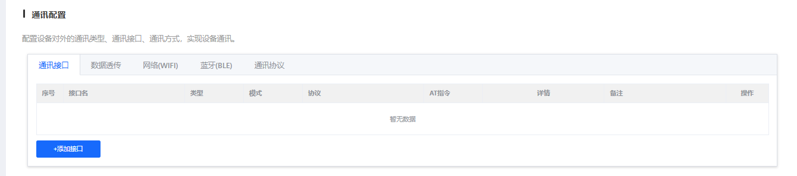

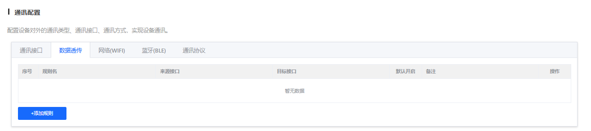

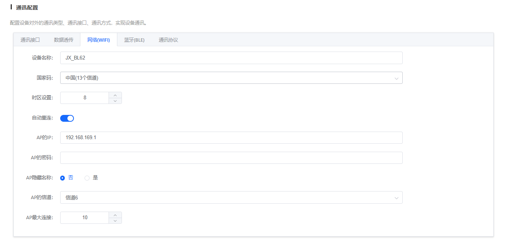

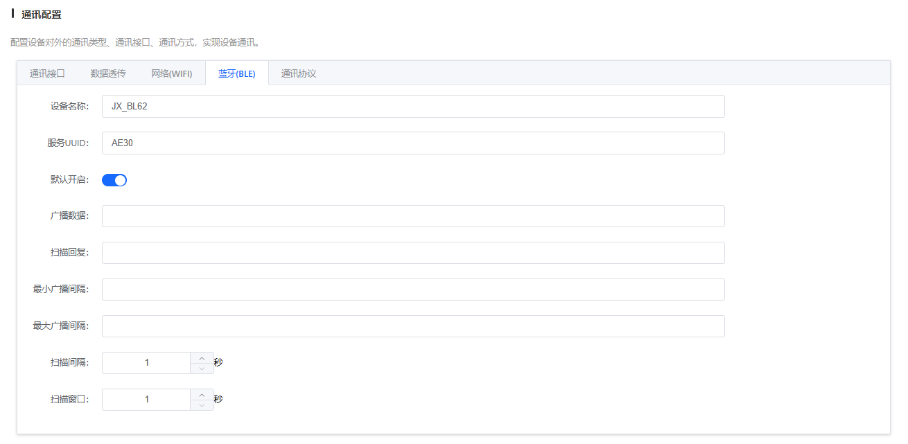

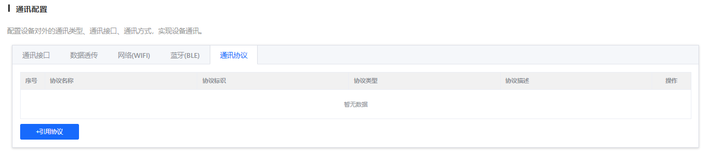

**功能说明**：配置设备对外的通讯类型、通讯接口、通讯方式，实现设备通讯。

**配置标签页**：

#### 2.1 通讯接口

配置设备的通讯接口，包括：

- **序号**：接口编号
- **接口名**：接口名称
- **类型**：接口类型（UART、SPI、I2C 等）
- **模式**：工作模式
- **协议**：使用的通讯协议
- **AT指令**：是否支持 AT 指令
- **详情**：接口详细信息
- **备注**：接口使用说明
- **操作**：可以编辑或删除接口

点击「+添加接口」可以添加新的通讯接口。

#### 2.2 数据透传

配置数据透传功能，实现数据的透明传输。数据透传允许设备将接收到的数据原样转发，不进行任何处理或解析。

#### 2.3 网络(WIFI)

配置 WiFi 网络连接参数：

- **WiFi SSID**：要连接的无线网络名称
- **WiFi 密码**：无线网络密码
- **网络模式**：STA 模式（客户端模式）或 AP 模式（接入点模式）
- **连接超时**：WiFi 连接超时时间设置
- **自动重连**：WiFi 断开后自动重连配置

#### 2.4 蓝牙(BLE)

配置蓝牙低功耗（BLE）功能。BLE 支持设备通过蓝牙与其他设备进行低功耗通信，适用于需要长时间运行的场景。

#### 2.5 通讯协议

配置设备与服务器之间的通信协议和数据传输方式：

- **传输协议**：HTTP、MQTT、TCP、UDP、二进制协议、JSON 协议、文本协议等
- **服务器地址**：数据服务器的地址（IP 地址或域名）
- **传输端口**：服务器端口配置
- **认证信息**：API 密钥或 Token 配置
- **SSL/TLS 加密**：是否启用 SSL/TLS 加密

**配置建议**：

- 根据实际需求选择合适的通讯接口和协议
- WiFi 配置时确保 SSID 和密码正确
- 推荐使用 MQTT 协议，适合 IoT 设备
- 生产环境建议启用 SSL/TLS 加密

### 3. 设备行为自定义

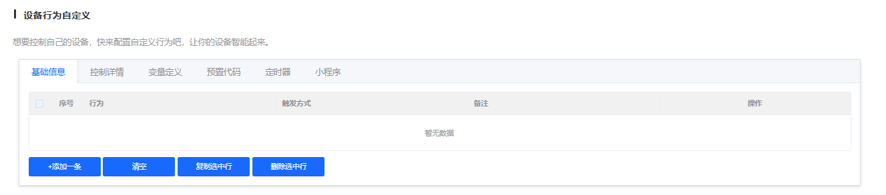

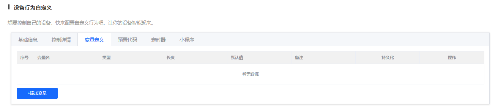

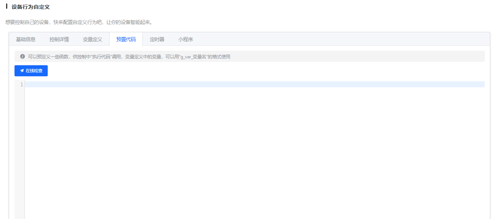

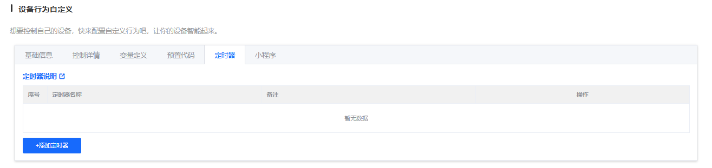

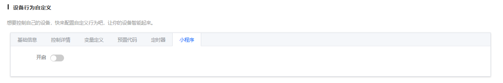

**功能说明**：想要控制自己的设备，快来配置自定义行为吧，让你的设备智能起来。

**配置标签页**：

#### 3.1 基础信息

配置设备行为的基础信息：

- **序号**：行为编号
- **行为**：行为名称（如 TurnOn、TurnOff 等）
- **触发方式**：命令词、串口输入、小程序控制等
- **备注**：行为说明
- **操作**：可以编辑或删除行为

点击「+添加一条」可以添加新的行为。

#### 3.2 控制详情

配置行为对应的 GPIO/PWM 等控制行为，定义具体的控制逻辑。可以设置：

- GPIO 引脚的高低电平控制
- PWM 信号的频率和占空比
- 多个引脚组合控制
- 控制时序和延时

#### 3.3 变量定义

定义变量用于逻辑控制，可以在行为之间共享数据。变量可以用于：

- 存储设备状态
- 实现行为之间的数据传递
- 实现条件判断和逻辑控制

#### 3.4 预置代码

添加预置代码，实现更复杂的控制逻辑。预置代码支持：

- C 语言代码嵌入
- 自定义函数实现
- 复杂算法和逻辑处理

#### 3.5 定时器

配置定时任务，在指定时间执行预设的操作。定时器支持：

- 单次定时任务
- 循环定时任务（每天、每周等）
- 定时执行指定的行为

#### 3.6 小程序

配置小程序相关的功能和行为。可以设置：

- 小程序界面显示
- 小程序控制逻辑
- 小程序数据上报

**配置建议**：

- 根据实际应用场景定义设备行为
- 合理使用变量和预置代码实现复杂逻辑
- 利用定时器实现自动化控制

### 4. 优化配置

**功能说明**：调整系统参数，优化系统性能。阈值越大越敏感，但误识别率也会增高，未设置时自动取默认值。

**配置项**：

- **优化选项**：从下拉菜单中选择需要优化的选项
- 根据选择的优化选项，显示相应的参数配置界面
- 可以调整各种系统参数，如超时时间、重试次数等

**配置建议**：

- 如无特殊需求，建议使用默认值
- 如需优化，建议逐个参数调整并测试效果
- 注意平衡性能和稳定性

## 相关文档

- [版本配置参数详解](./firmware-config-parameters.md) - 通用配置参数说明
- [固件配置全流程](./firmware-config-workflow.md) - 完整配置流程
- [BL-62B 模组资料](../wifi-bl62b/bl-62b.md) - 模组详细资料
- [BL-62B 烧录与调试](../faq-burning-and-debug/faq-burning-and-debug-bl-62b.md) - 烧录相关问题
- [BL-62B 硬件设计](../faq-hardware-design/faq-hardware-design-bl-62b.md) - 硬件相关问题

## 常见问题

### 配置相关问题

- WiFi 连接失败？检查 SSID 和密码是否正确，信号强度是否足够
- 数据传输异常？确认网络连接正常，服务器地址和端口配置正确
- Pin 脚配置不生效？确认引脚号与实际硬件一致
- 功耗异常？检查 WiFi 连接状态和功耗模式配置

### 获取帮助

如遇到配置问题，可参考：

- [平台与固件 FAQ](../faq-platform-and-firmware/faq-platform-and-firmware-bl-62b.md)
- [应用开发案例](../faq-application-scenarios/faq-application-scenarios-bl-62b.md)
- [模块选型指南](../faq-module-selection/faq-module-selection-bl-62b.md)

---

> **提示**：建议先阅读[固件配置全流程](./firmware-config-workflow.md)了解整体流程，再结合本文档进行 BL-62B 特定配置。BL-62B 作为 WiFi 模组，需要特别注意网络连接和数据传输的配置。

