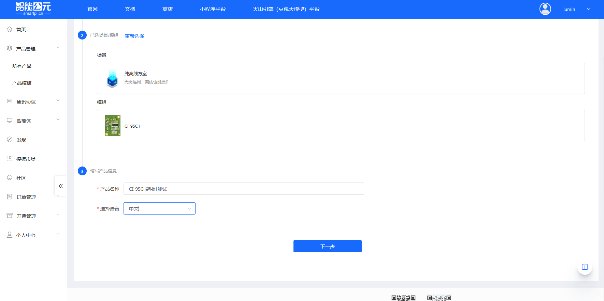
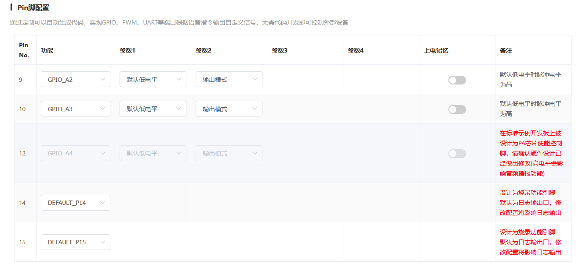
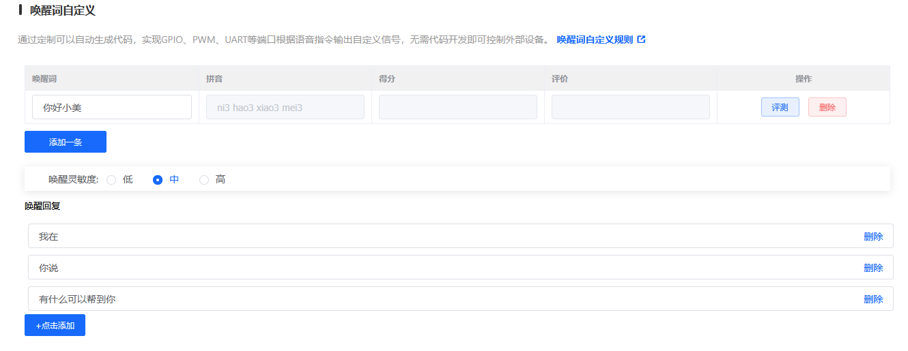
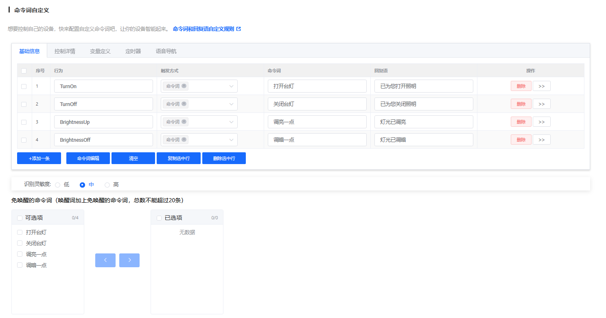

# CI-95C 固件配置

> 本文档专门针对 **CI-95C** 模组的固件配置，提供该模组特有的配置参数和注意事项。

## 模组信息

- **模组型号**：CI-95C
- **芯片型号**：CI1311
- **支持命令词数量**：100 条
- **麦克风配置**：单/双 MIC 离线语音模块

## 创建产品

在开始配置固件之前，需要先在智能公元平台创建对应的产品。以下是创建 CI-95C 产品的详细步骤：

### 1. 进入产品管理页面

1. 登录智能公元平台（[smartpi.cn](https://smartpi.cn)）
2. 在左侧导航菜单中，点击「产品管理」，展开子菜单后选择「所有产品」
3. 进入产品管理页面，可以看到产品列表和操作按钮

### 2. 点击创建产品

在产品管理页面右上角，点击蓝色的「创建产品」按钮，进入产品创建向导。

### 3. 选择产品类别

产品创建向导分为三个步骤。第一步是选择产品类别：

1. 在「选择产品类别」步骤中，可以看到多个产品类别标签页（灯具、开关、插座等）
2. 对于 CI-95C 模组，通常选择「灯具」类别
3. 在灯具类别下，选择合适的子类型，例如：

    - **照明灯**：适用于普通照明场景
    - **RGB灯**：适用于彩色灯光控制
    - **台灯**：适用于桌面照明
    - 其他类型根据实际应用选择

**示例**：选择「照明灯」类型，点击对应的卡片完成选择。

### 4. 选择场景和模组

第二步是选择应用场景和硬件模组：

#### 4.1 选择场景

在「选择场景/模组」步骤中，首先选择应用场景：

- **纯离线方案**：无需连网，离线也能操作（推荐用于 CI-95C）
- **Wi-Fi**：Wi-Fi产品，可远程控制产品
- **大模型**：离在线操作，可接入大模型智能体
- **在线**：随时随地可操作产品

**对于 CI-95C**：选择「纯离线方案」，因为 CI-95C 是离线语音识别模块。

#### 4.2 选择模组

选择场景后，页面会自动切换到「选择模组」标签页，显示可用的模组列表：

1. 在模组列表中查找并选择 **CI-95C (CI1311)**
2. 可以看到模组的详细信息：

    - 单/双MIC离线语音模块
    - 支持100条命令词
    - 内置Flash
    - 支持中英文自学习指令
    - 支持语音打断
    - 综合唤醒率95%

3. 点击 CI-95C 模组卡片完成选择

### 5. 填写产品信息

第三步是填写产品的基本信息：

1. **产品名称**（必填）：

    - 输入一个有意义的产品名称，例如：「CI-95C照明灯测试」
    - 建议使用能清楚标识产品用途的名称
2. **选择语言**（必填）：

    - 从下拉菜单中选择语言，支持：中文、英文、日文、韩语
    - 根据目标市场选择合适的语言

3. 填写完成后，点击页面底部的「下一步」按钮

### 6. 产品创建完成

完成上述步骤后，系统会自动创建产品并跳转到「版本详情」页面，此时可以开始配置固件版本。

在版本详情页面，可以看到以下配置步骤：

- 前端信号处理
- Pin脚配置
- 唤醒词自定义
- 自选协议配置
- 命令词自定义
- 发音人配置
- 其它配置
- 个性化音频
- 优化配置

## 版本配置详解

产品创建完成后，进入版本详情页面进行固件配置。版本配置页面右侧列出了所有配置步骤，可以按顺序或根据需要跳转到任意步骤进行配置。以下是各个配置部分的详细说明：

### 1. 前端信号处理

**功能说明**：设备麦克风配置情况，封装的 SDK 根据不同麦克风情况，对信号进行优化处理，让设备识别语音更准确。

**配置项表格**：

#### 1. 麦克风配置

| 选项 | 是否支持 | 说明 |
|------|---------|------|
| 单MIC | ✓ 支持 | 适用于单麦克风硬件配置 |
| 双MIC | ✓ 支持 | 适用于双麦克风硬件配置，支持更好的降噪效果 |

> **重要提示**：
> - 选择"双MIC"前，请确认模块硬件版本是支持双MIC的
> - 如果选择"双MIC"，则后面不能再选择"AEC回声消除"功能
> - CI-95C 支持单/双 MIC 配置，根据实际硬件选择

#### 2. 应用场景

| 选项 | 是否支持 | 说明 |
|------|---------|------|
| 普通话通用Pro(占1M空间) | ✓ 支持 | 通用语音识别模型，占用 1M Flash 空间 |
| 普通话通用Pro(占0.6M空间) | ✓ 支持 | 通用语音识别模型，占用 0.6M Flash 空间 |
| 普通话通用Pro(占1.3M空间) | ✓ 支持 | 通用语音识别模型，占用 1.3M Flash 空间 |
| 中文窗帘通用Pro | ✓ 支持 | 中文窗帘通用模型 |
| 中文烟机通用Pro | ✓ 支持 | 中文烟机通用模型 |
| 中文风扇通用Pro | ✓ 支持 | 中文风扇通用模型 |
| 中文取暖器通用Pro | ✓ 支持 | 中文取暖器通用模型 |
| 中文茶吧机通用Pro | ✓ 支持 | 中文茶吧机通用模型 |
| 中文灯具通用Pro | ✓ 支持 | 中文灯具通用模型 |
| 中文卫浴通用Pro | ✓ 支持 | 中文卫浴通用模型 |
| 中文空调通用Pro | ✓ 支持 | 中文空调通用模型 |
| 中文风扇灯通用Pro | ✓ 支持 | 中文风扇灯通用模型 |
| 中文晾衣杆通用Pro | ✓ 支持 | 中文晾衣杆通用模型 |
| 中文拖地机降噪Pro | ✓ 支持 | 中文拖地机降噪模型 |
| 中文门锁通用Pro5 | ✓ 支持 | 中文门锁通用模型 |
| 中文离在线通用Pro | ✓ 支持 | 中文离在线通用模型 |
| 安静环境 | ✓ 支持 | 安静环境模型 |
| 低误识别 | ✓ 支持 | 低误识别模型 |
| 烟机专用 | ✓ 支持 | 专用于烟机场景 |
| 取暖桌专用 | ✓ 支持 | 专用于取暖桌场景 |
| 卫浴专用 | ✓ 支持 | 专用于卫浴场景 |
| 风扇专用 | ✓ 支持 | 专用于风扇场景 |
| 茶吧机专用 | ✓ 支持 | 专用于茶吧机场景 |
| 晾衣杆专用 | ✓ 支持 | 专用于晾衣杆场景 |
| 灯具专用 | ✓ 支持 | 专用于灯具场景 |
| 中控专用 | ✓ 支持 | 专用于中控场景 |
| 浴霸专用 | ✓ 支持 | 专用于浴霸场景 |
| 窗帘专用 | ✓ 支持 | 专用于窗帘场景 |
| 空气炸锅专用 | ✓ 支持 | 专用于空气炸锅场景 |

**什么是声学模型？**

声学模型是语音识别中用于识别声音的模型，其质量直接影响识别准确率和鲁棒性。声学模型通过概率统计的方法，为基本语音单元建立模型，测量特征向量序列与发音模板之间的相似度，从而确定语音段所包含的声学信息（内容）。

**如何选择合适的声学模型？**

1. **根据实际使用场景选择**：根据产品的实际使用场景选择合适的声学模型。例如，产品用于风扇场景，优先选择名称中包含"风扇"的模型。
2. **空间占用考虑**：在同一场景下，占用空间越大的模型，识别效果一般越好。
3. **版本选择**：版本越新，性能越好。
4. **Pro 系列推荐**：CI 系列中名称包含"Pro"的新模型为推荐模型。

**什么是安静环境？**

安静环境是指：

- 非人声噪声低于 60dB
- 设备本身无强振动或强噪声（如电机）
- 无强对流
- 信噪比要求 ≥ 3dB

> **注意**：不同模型占用空间和识别效果不同，需根据 Flash 容量选择。CI-95C 内置 Flash，建议选择占用空间适中的模型。

#### 3. 产品特性

| 选项 | 是否支持 | 说明 |
|------|---------|------|
| 仅语音识别 | ✓ 支持 | 基础语音识别功能 |
| 语音识别+自学习 | ✓ 支持 | 支持语音识别和自学习功能 |
| 语音识别+深度降噪 | ✓ 支持 | 支持语音识别和深度降噪 |
| 语音识别+声源定位(限双MIC) | ✗ 不支持 | 支持声源定位，仅限双MIC配置（当前配置为单MIC时不可选） |
| 语音识别+声纹识别 | ✓ 支持 | 支持声纹识别功能 |
| 语音识别+男女声纹识别 | ✓ 支持 | 支持男女声纹识别 |
| 语音识别+AEC打断(限单MIC) | ✗ 不支持 | 不支持AEC打断功能 |
| 语音识别+降混响(限双MIC) | ✗ 不支持 | 支持降混响，仅限双MIC配置（当前配置为单MIC时不可选） |
| 语音识别+降人声干扰(限双MIC) | ✗ 不支持 | 支持降人声干扰，仅限双MIC配置（当前配置为单MIC时不可选） |
| 语音识别+自学习+AEC打断(限单MIC) | ✗ 不支持 | 不支持AEC打断功能 |
| 语音识别+声源定位+AEC(限双MIC+外部AEC) | ✗ 不支持 | 声源定位+AEC组合，需双MIC+外部AEC（当前配置为单MIC时不可选） |
| 语音识别+降混响+AEC(限双MIC+外部AEC) | ✗ 不支持 | 降混响+AEC组合，需双MIC+外部AEC（当前配置为单MIC时不可选） |
| 语音识别+降人声干扰+AEC(限双MIC+外部AEC) | ✗ 不支持 | 降人声干扰+AEC组合，需双MIC+外部AEC（当前配置为单MIC时不可选） |
| 语音识别+声源定位+降混响(限双MIC) | ✗ 不支持 | 声源定位+降混响组合，仅限双MIC（当前配置为单MIC时不可选） |
| 语音识别+降人声干扰+降混响(限双MIC) | ✗ 不支持 | 降人声干扰+降混响组合，仅限双MIC（当前配置为单MIC时不可选） |
| 语音识别+自学习+声源定位(限双MIC) | ✗ 不支持 | 自学习+声源定位组合，仅限双MIC（当前配置为单MIC时不可选） |
| 语音识别+双麦+AEC(限双MIC+外部AEC) | ✗ 不支持 | 双麦+AEC组合，需双MIC+外部AEC（当前配置为单MIC时不可选） |
| 语音识别+AEC+深度降噪 | ✗ 不支持 | AEC+深度降噪组合 |
| 语音识别+自学习+AEC+深度降噪 | ✗ 不支持 | 自学习+AEC+深度降噪组合 |
| 哭声检测 | ✓ 支持 | 哭声检测功能 |
| 鼾声检测 | ✓ 支持 | 鼾声检测功能 |
| 文字转语音 | ✓ 支持 | 文字转语音功能 |
| 老版本语音识别+稳态降噪 | ✗ 不支持 | 老版本语音识别+稳态降噪 |
| 老版本语音识别+AEC打断 | ✗ 不支持 | 老版本语音识别+AEC打断 |
| 老版本语音识别+稳态降噪+AEC打断 | ✗ 不支持 | 老版本语音识别+稳态降噪+AEC打断 |

> **CI-95C 说明**：
> - 根据实际需求选择产品特性，注意功能限制（单MIC/双MIC）和 Flash 空间占用
> - **重要**：当麦克风配置为单MIC时，限双MIC的功能选项将不可选择；当配置为双MIC时，限单MIC的功能选项将不可选择
> - **特别注意**：如果选择"双MIC"，则不能再选择包含"AEC回声消除"的功能选项

#### 4. 自然说

| 选项 | 是否支持 | 说明 |
|------|---------|------|
| 不支持 | ✓ 支持 | 不支持自然语言识别 |
| 系统自动泛化+用户指定泛化 | ✓ 支持 | 系统自动泛化和用户指定泛化相结合，支持更灵活的自然语言识别 |
| 用户指定泛化 | ✓ 支持 | 仅使用用户指定的泛化规则进行自然语言识别 |

> **说明**：CI-95C 支持自然语言识别功能，可以选择"不支持"、"系统自动泛化+用户指定泛化"或"用户指定泛化"三种模式。根据实际需求选择合适的自然语言识别模式。

#### 5. 多意图

| 选项 | 是否支持 | 说明 |
|------|---------|------|
| 单指令 | ✓ 支持 | 每次识别一个命令 |
| 双指令连说 | ✓ 支持 | 支持连续说出两个指令 |
| 三指令连说 | ✓ 支持 | 支持连续说出三个指令 |

### 2. Pin脚配置

**功能说明**：通过定制可以自动生成代码，实现 GPIO、PWM、UART 等端口根据语音指令输出自定义信号，无需代码开发即可控制外部设备。

**配置表格**：

配置表格包含以下列：

- **Pin No.**：引脚编号
- **功能**：引脚功能（GPIO、PWM、UART 等）
- **参数1**：功能参数1（如默认电平）
- **参数2**：功能参数2（如输入/输出模式）
- **参数3**：功能参数3（根据功能类型不同）
- **参数4**：功能参数4（根据功能类型不同）
- **上电记忆**：是否保持上电前的状态
- **备注**：引脚使用注意事项

**CI-95C 引脚说明**：

- **Pin 6 (GPIO_A0)**：

    - 默认配置：GPIO_A0，默认低电平，输出模式
    - 注意：请确认模块是否贴有晶振，如果有，应配置为 XIN 功能
    - 默认低电平时脉冲电平为高

- **Pin 7 (GPIO_A1)**：

    - 默认配置：GPIO_A1，默认低电平，输出模式
    - 注意：请确认模块是否贴有晶振，如果有，应配置为 XOUT 功能
    - 默认低电平时脉冲电平为高

- **Pin 9-12 (GPIO_A2-A5)**：

    - 默认配置：GPIO，默认低电平，输出模式
    - 可用于控制外部设备（如 LED、继电器等）

- **Pin 13 (GPIO_A6)**：

    - 注意：在标准示例开发板上被设计为 PA 芯片使能控制脚
    - 请确认硬件设计已经做出修改（高电平会影响音频播报功能）

- **Pin 14-15 (DEFAULT_P14/P15)**：

    - 设计为烧录功能引脚
    - 默认为日志输出口，修改配置将影响日志输出

- **Pin 16 (GPIO_C4)**：

    - 默认配置：GPIO_C4，默认低电平，输出模式

### 3. 唤醒词自定义

**功能说明**：配置设备唤醒词，用户说出唤醒词后设备进入语音识别状态。

**配置项**：

1. **唤醒词列表**：

    - 表格显示已配置的唤醒词
    - 列包括：唤醒词、拼音、得分、评价、操作
    - 默认唤醒词示例：「你好小美」
    - 可以点击「添加一条」添加新的唤醒词
    - 可以对唤醒词进行「评测」和「删除」操作

2. **唤醒灵敏度**：

    - **低**：唤醒灵敏度较低，减少误唤醒，但可能降低唤醒率
    - **中**：平衡唤醒率和误唤醒率（推荐）
    - **高**：唤醒灵敏度较高，提高唤醒率，但可能增加误唤醒

3. **唤醒回复**：

    - 配置设备被唤醒后的回复语
    - 可以添加多条回复语，系统随机选择
    - 默认示例：「我在」、「你说」、「有什么可以帮到你」
    - 点击「+点击添加」可以添加更多回复语

### 5. 命令词自定义

**功能说明**：配置语音控制命令词，让设备能够识别用户的语音指令并执行相应操作。

**配置项**：

1. **命令词表格**（基础信息标签页）：

    - **序号**：命令词编号
    - **行为**：命令对应的行为 ID（如 TurnOn、TurnOff）
    - **触发方式**：命令触发方式（命令词、串口输入等）
    - **命令词**：用户说出的语音指令（如「打开台灯」）
    - **回复语**：设备执行命令后的语音回复（如「已为您打开照明」）
    - **操作**：可以删除命令词或查看详细配置（>>）

2. **操作按钮**：

    - **+添加一条**：添加新的命令词
    - **命令词编辑**：批量编辑命令词
    - **清空**：清空所有命令词
    - **复制选中行**：复制选中的命令词
    - **删除选中行**：删除选中的命令词

3. **识别灵敏度**：

    - **低**：识别灵敏度较低，减少误识别
    - **中**：平衡识别率和误识别率（推荐）
    - **高**：识别灵敏度较高，提高识别率

4. **免唤醒的命令词**：

    - 配置无需唤醒词即可直接识别的命令词
    - 唤醒词加上免唤醒的命令词，总数不能超过 20 条
    - 左侧「可选项」显示可用的命令词
    - 右侧「已选项」显示已选择的免唤醒命令词
    - 使用箭头按钮在两侧之间移动命令词
    - 如果无法添加，可以点击「重置免唤醒」按钮

5. **防止误识别的命令词**：

    - 输入不希望被识别的词条
    - 不能和唤醒词、命令词重复
    - 多条词条之间用「|」隔开

6. **其他标签页**：

    - **控制详情**：配置命令词对应的 GPIO/PWM 等控制行为
    - **变量定义**：定义变量用于逻辑控制
    - **定时器**：配置定时任务
    - **语音导航**：配置语音导航功能
    - **红外控制**：配置红外控制功能

**CI-95C 限制**：

- 最大支持 100 条命令词
- 建议合理分配命令词，避免超出限制

### 6. 发音人配置

**功能说明**：配置设备语音播报的发音人、音量、语速等参数，让设备用你定义的声音说话。

**配置项**：

1. **合成音类型**：

    - **本地合成音**：使用本地语音合成引擎（推荐用于离线方案）

2. **发音人选择**：

    - 从发音人列表中选择合适的发音人
    - 可选的发音人包括：

        - **女声**：橙子（甜美客服）、小美（娇美女声）、小小（伶俐女声）、乐乐（可爱女声）、方方（标准女声）、小英系列（情感女声，包括高兴、日常、温和、认真）、可可系列（欢快女童）、小萌（可爱女童）
        - **男声**：阿栋（浑厚男声）、程程（标准男童）
    - 点击发音人可以试听效果（「试听」按钮）

3. **音量调节**：

    - 滑块调节，范围 0-100
    - 默认值：75
    - 可以通过「-」「+」按钮或直接输入数值调整

4. **语速调节**：

    - 滑块调节，范围 0-100
    - 默认值：50
    - 数值越大语速越快

5. **亮度调节**：

    - 滑块调节，范围 0-100
    - 默认值：50
    - 影响语音的音调高低

### 7. 其它配置

**功能说明**：配置开机播报、超时退出、主动退出等系统行为。

**配置项**：

1. **开机播报**：

    - **有开机播报**：设备上电时播放开机提示音
    - **无开机播报**：设备上电时不播放提示音（默认）
    - 选择「有开机播报」后，可以配置「播报内容」

2. **超时退出**：

    - 配置设备在无语音输入多长时间后自动退出识别状态
    - **超时时间**：可调节，范围建议 5-60 秒
    - 默认值：10 秒
    - **退出回复**：超时退出时播放的回复语
    - 默认示例：「有需要再叫我」
    - 可以添加多条回复语，系统随机选择

3. **主动退出**：

    - **退出命令**：用户说出这些命令后，设备主动退出识别状态
    - 默认示例：「退下」
    - 可以添加多条退出命令
    - **退出回复**：主动退出时播放的回复语
    - 默认示例：「有需要再叫我」
    - 可以添加多条回复语

### 8. 个性化音频

**功能说明**：通过上传录制的音频文件，替代平台自动合成的音频，可以播放个性化的音频。

**配置项**：

1. **配置表格**：

    - **序号**：音频编号
    - **词条**：选择对应的词条类型，包括：

        - **唤醒**：唤醒词相关的个性化音频
        - **命令识别**：命令词识别相关的个性化音频
        - **系统设置**：系统设置相关的个性化音频
        - **特定命令词阈值**：特定命令词阈值相关的个性化音频
        - **红外控制**：红外控制相关的个性化音频
    - **个性化音频**：上传的音频文件名称
    - **大小**：音频文件大小（KB）
    - **操作**：可以删除或管理音频

2. **词条子选项**：

    - 当选择「唤醒」词条时，可以进一步选择「唤醒阈值」：

        - 0.01、0.02、0.04、0.05、0.1、0.2（默认）
    - 其他词条类型根据实际需求选择

3. **操作按钮**：

    - **+点击添加**：添加个性化音频，需要选择对应的词条类型并上传音频文件
    - **音频管理**：管理已上传的音频文件，可以预览、删除等

4. **音频总大小**：

    - 显示当前使用的音频总大小
    - 需要注意 Flash 容量限制，CI-95C 内置 Flash

> **注意**：个性化音频会占用 Flash 空间，建议合理控制音频数量和大小，避免超出 Flash 容量限制。音频格式需要符合平台要求。

### 9. 优化配置

**功能说明**：调整系统参数，优化系统性能。阈值越大越敏感，但误识别率也会增高，未设置时自动取默认值。

**配置项**：

优化配置包含多个优化选项类别，每个类别下有不同的参数设置：

#### 9.1 唤醒相关

- **唤醒阈值**：调整唤醒灵敏度
    - 可选值：0.01、0.02、0.04、0.05、0.1、0.2（默认）
    - 数值越大，唤醒灵敏度越高

#### 9.2 命令识别相关

- **命令识别阈值**：调整命令词识别灵敏度
    - 可选值：0.01、0.02、0.04、0.05、0.1、0.2（默认）
    - 数值越大，识别灵敏度越高，但误识别率也可能增加

#### 9.3 系统设置相关

- **系统参数调整**：配置系统级别的优化参数

#### 9.4 特定命令词阈值

- **特定命令词阈值**：为特定命令词设置独立的识别阈值

#### 9.5 红外控制相关

- **红外唤醒学习时间**：配置红外唤醒的学习时间
    - 可选值：20秒、30秒（默认）、40秒、50秒、60秒、70秒
    - 学习时间越长，红外唤醒识别效果可能越好

#### 9.6 硬件配置相关

- **ADC检测时长**：配置ADC检测的时间长度
    - 可选值：10毫秒、20毫秒、30毫秒、40毫秒、50毫秒（默认）、100毫秒
    - 影响音频信号采集的时长

- **MIC差分/单端**：配置麦克风的连接方式
    - **差分**：双麦克风差分连接
    - **单端**：单麦克风连接

- **功放使能引脚**：配置功放使能控制引脚

- **自动使能功放**：是否自动使能功放

- **功放使能电平**：配置功放使能的电平（高电平/低电平）

#### 9.7 IISO配置

- **设置IISO主从**：配置IISO通信的主从模式

**配置建议**：

1. **默认值优先**：如无特殊需求，建议使用默认值
2. **逐步调整**：如需优化，建议逐个参数调整并测试效果
3. **平衡考虑**：阈值设置需要在识别率和误识别率之间找到平衡
4. **硬件匹配**：硬件相关配置（如MIC差分/单端、功放使能）需与实际硬件设计一致

> **注意**：优化配置为可选配置，如无特殊需求，可以不配置，系统将使用默认值。建议在完成其他配置后再进行优化调整。修改优化参数后需要重新测试设备性能。

## 配置流程

产品创建完成后，CI-95C 的固件配置遵循标准的[固件配置全流程](./firmware-config-workflow.md)，主要步骤包括：

1. [进入产品管理](./firmware-config-workflow.md#1-进入产品管理)
2. [产品详情与版本列表](./firmware-config-workflow.md#2-产品详情与版本列表)
3. [新建或编辑版本](./firmware-config-workflow.md#3-新建或编辑版本)
4. [按步骤完成版本配置](./firmware-config-workflow.md#4-按步骤完成版本配置)
5. [配置检查与保存](./firmware-config-workflow.md#5-配置检查与保存)
6. [发布版本](./firmware-config-workflow.md#6-发布版本)
7. [下载固件](./firmware-config-workflow.md#7-下载固件)

## CI-95C 特有配置

### Pin 脚配置

CI-95C 模组的 GPIO 配置需要注意：

- 确认实际硬件连接的引脚
- 参考 CI-95C 硬件资料中的引脚定义
- 注意引脚功能复用（GPIO / PWM / UART 等）

### 命令词配置

- **最大支持**：100 条命令词
- 建议合理分配命令词，避免超出限制
- 命令词识别率优化可参考[语音调优文档](../faq-voice-tuning/faq-voice-tuning-ci-95c.md)

### 功耗配置

- 支持低功耗模式配置
- 根据应用场景选择合适的功耗模式

## 相关文档

- [版本配置参数详解](./firmware-config-parameters.md) - 通用配置参数说明
- [固件配置全流程](./firmware-config-workflow.md) - 完整配置流程
- [CI-95C 烧录与调试](../faq-burning-and-debug/faq-burning-and-debug-ci-95c.md) - 烧录相关问题
- [CI-95C 语音调优](../faq-voice-tuning/faq-voice-tuning-ci-95c.md) - 语音识别优化
- [CI-95C 硬件设计](../faq-hardware-design/faq-hardware-design-ci-95c.md) - 硬件相关问题

## 常见问题

### 配置相关问题

- 命令词数量超出限制？检查是否超过 100 条
- Pin 脚配置不生效？确认引脚号与实际硬件一致
- 功耗异常？检查功耗模式配置和唤醒参数

### 获取帮助

如遇到配置问题，可参考：

- [平台与固件 FAQ](../faq-platform-and-firmware/faq-platform-and-firmware-ci-95c.md)
- [应用开发案例](../faq-application-scenarios/faq-application-scenarios-ci-95c.md)
- [模块选型指南](../faq-module-selection/faq-module-selection-ci-95c.md)

---

> **提示**：建议先阅读[固件配置全流程](./firmware-config-workflow.md)了解整体流程，再结合本文档进行 CI-95C 特定配置。

