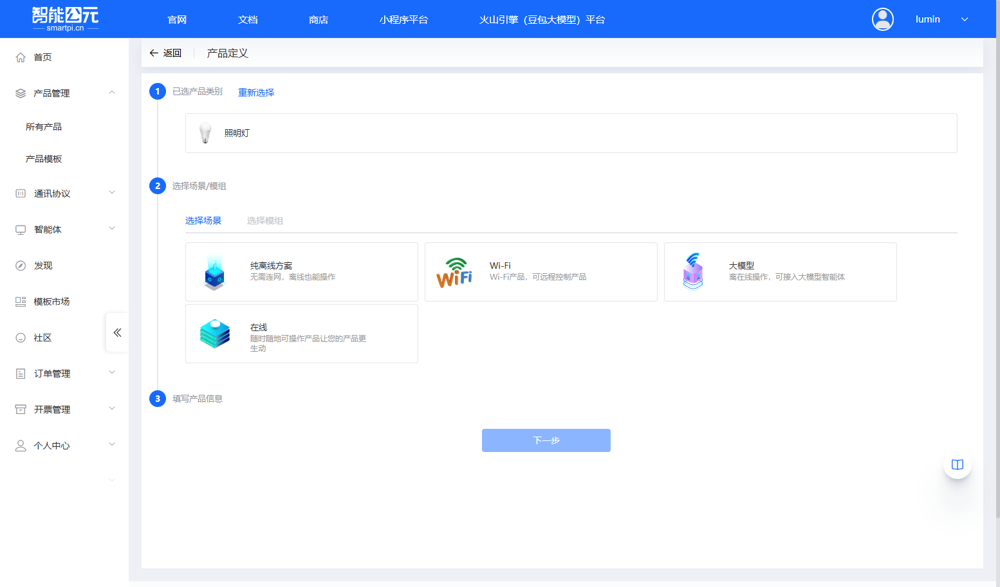
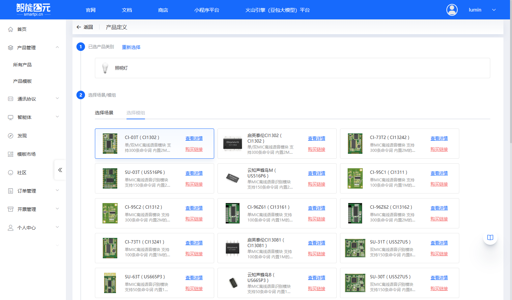
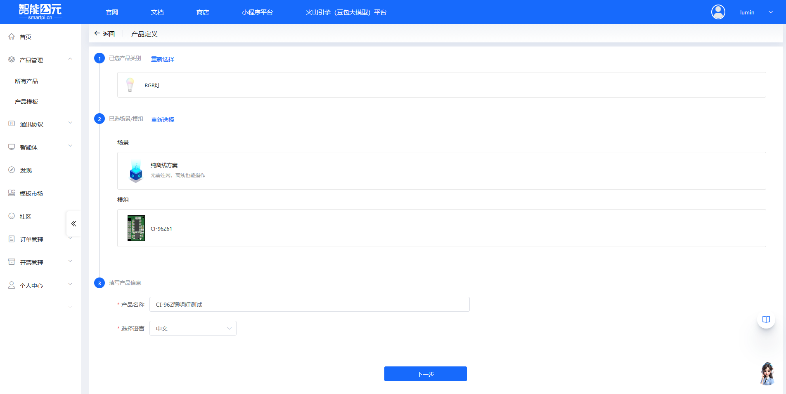
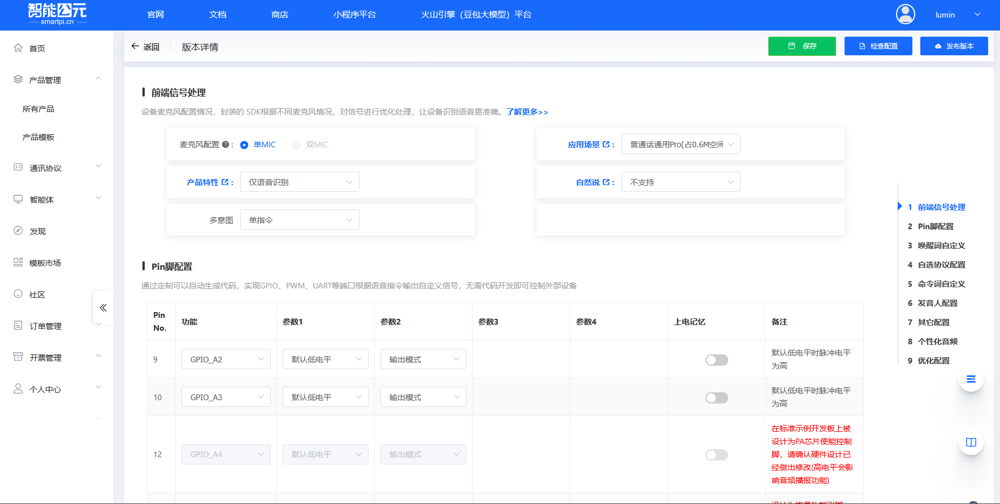
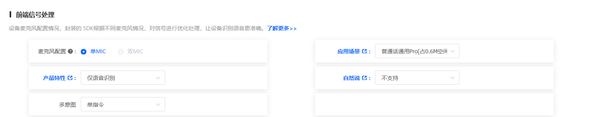
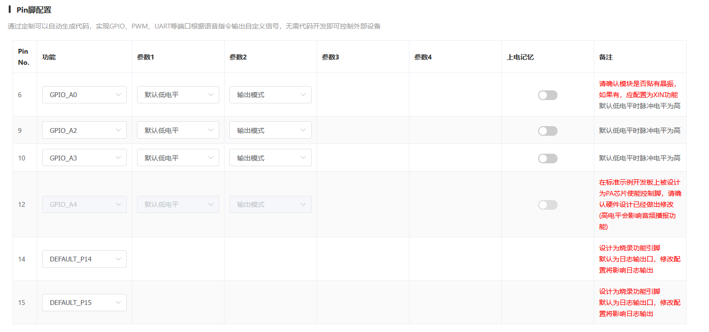
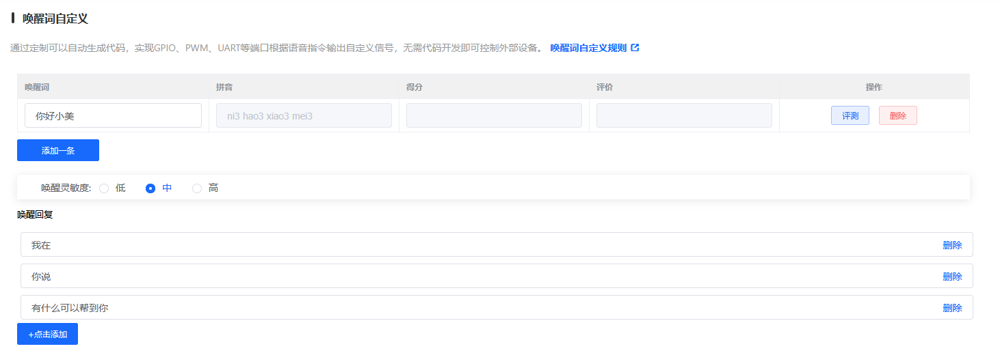
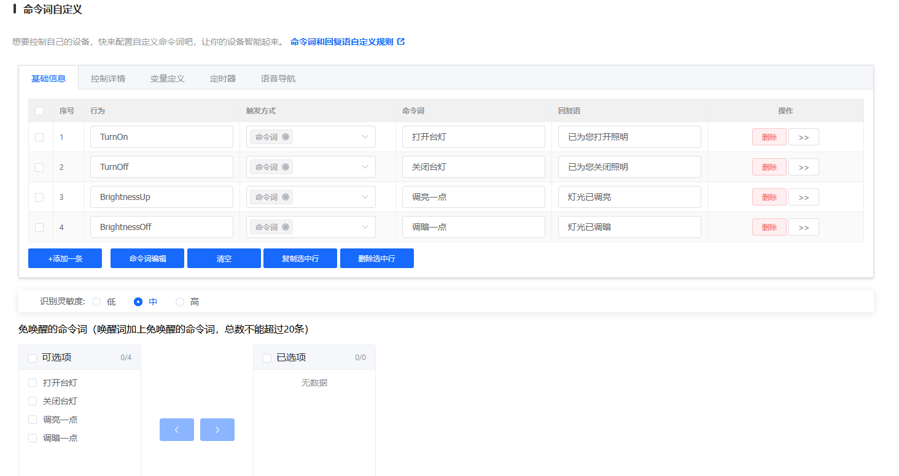
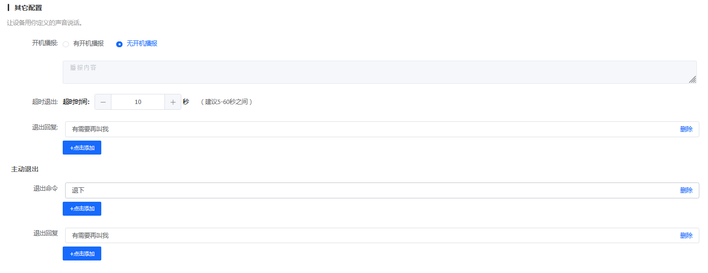

# CI-96Z 固件配置

> 本文档专门针对 **CI-96Z** 模组的固件配置，提供该模组特有的配置参数和注意事项。

## 模组信息

- **模组型号**：CI-96Z
- **芯片型号**：CI13161
- **支持命令词数量**：100 条
- **麦克风配置**：单/双 MIC 离线语音模块

## 配置流程

CI-96Z 的固件配置遵循标准的[固件配置全流程](./firmware-config-workflow.md)，主要步骤包括：

1. [进入产品管理](./firmware-config-workflow.md#1-进入产品管理)
2. [产品详情与版本列表](./firmware-config-workflow.md#2-产品详情与版本列表)
3. [新建或编辑版本](./firmware-config-workflow.md#3-新建或编辑版本)
4. [按步骤完成版本配置](./firmware-config-workflow.md#4-按步骤完成版本配置)
5. [配置检查与保存](./firmware-config-workflow.md#5-配置检查与保存)
6. [发布版本](./firmware-config-workflow.md#6-发布版本)
7. [下载固件](./firmware-config-workflow.md#7-下载固件)

## 创建产品

在开始配置固件之前，需要先在智能公元平台创建对应的产品。以下是创建 CI-96Z 产品的详细步骤：

### 1. 进入产品管理页面

1. 登录智能公元平台（[smartpi.cn](https://smartpi.cn)）
2. 在左侧导航菜单中，点击「产品管理」，展开子菜单后选择「所有产品」
3. 进入产品管理页面，可以看到产品列表和操作按钮

### 2. 点击创建产品

在产品管理页面右上角，点击蓝色的「创建产品」按钮，进入产品创建向导。

### 3. 选择产品类别

产品创建向导分为三个步骤。第一步是选择产品类别：

1. 在「选择产品类别」步骤中，可以看到多个产品类别标签页（灯具、开关、插座等）
2. 对于 CI-96Z 模组，通常选择「灯具」类别
3. 在灯具类别下，选择合适的子类型，例如：

    - **照明灯**：适用于普通照明场景
    - **RGB灯**：适用于彩色灯光控制
    - **台灯**：适用于桌面照明
    - 其他类型根据实际应用选择

**示例**：选择「照明灯」类型，点击对应的卡片完成选择。

### 4. 选择场景和模组

第二步是选择应用场景和硬件模组：

#### 4.1 选择场景

在「选择场景/模组」步骤中，首先选择应用场景：

- **纯离线方案**：无需连网，离线也能操作（推荐用于 CI-96Z）
- **Wi-Fi**：Wi-Fi产品，可远程控制产品
- **大模型**：离在线操作，可接入大模型智能体
- **在线**：随时随地可操作产品

**对于 CI-96Z**：选择「纯离线方案」，因为 CI-96Z 是离线语音识别模块。

#### 4.2 选择模组

选择场景后，页面会自动切换到「选择模组」标签页，显示可用的模组列表：

1. 在模组列表中查找并选择 **CI-96Z61 (CI13161)** 或 **CI-96Z62 (CI13162)**
2. 可以看到模组的详细信息：

    - 单MIC离线语音模块
    - CI-96Z61 支持100条命令词，内置1M的Flash
    - CI-96Z62 支持300条命令词，内置2M的Flash
    - 支持中英文自学习指令
    - 支持单麦降噪
    - 综合唤醒率95%

3. 点击 CI-96Z 模组卡片完成选择

### 5. 填写产品信息

第三步是填写产品的基本信息：

1. **产品名称**（必填）：

    - 输入一个有意义的产品名称，例如：「CI-96Z照明灯测试」
    - 建议使用能清楚标识产品用途的名称

2. **选择语言**（必填）：

    - 从下拉菜单中选择语言，支持：中文、英文、日文、韩语
    - 根据目标市场选择合适的语言

3. 填写完成后，点击页面底部的「下一步」按钮

### 6. 产品创建完成

完成上述步骤后，系统会自动创建产品并跳转到「版本详情」页面，此时可以开始配置固件版本。

在版本详情页面，可以看到以下配置步骤：

- 前端信号处理
- Pin脚配置
- 唤醒词自定义
- 自选协议配置
- 命令词自定义
- 发音人配置
- 其它配置
- 个性化音频
- 优化配置

## 版本配置详解

产品创建完成后，进入版本详情页面进行固件配置。版本配置页面右侧列出了所有配置步骤，可以按顺序或根据需要跳转到任意步骤进行配置。以下是各个配置部分的详细说明：

### 1. 前端信号处理

**功能说明**：配置设备麦克风及前端声学模型，封装的 SDK 会根据不同麦克风情况对信号进行预处理，让设备识别语音更准确。

**配置项表格**：

#### 1. 麦克风配置

| 选项 | 是否支持 | 说明 |
|------|---------|------|
| 单MIC | ✓ 支持 | 适用于单麦克风硬件配置 |
| 双MIC | ✓ 支持（视具体型号） | 适用于双麦克风硬件配置，可获得更好的降噪效果 |

> **重要提示**：  
> - 选择「双MIC」前，请确认所用 CI-96Z 系列模组硬件版本是否支持双 MIC  
> - 如果选择「双MIC」，则后面不能再选择带有 AEC 回声消除的部分功能组合  
> - 实际可选项以平台界面为准，平台会自动屏蔽当前模组不支持的配置

#### 2. 应用场景（声学模型）

| 选项 | 是否支持 | 说明 |
|------|---------|------|
| 普通话通用Pro(占1M空间) | ✓ 支持 | 通用语音识别模型，占用 1M Flash 空间 |
| 普通话通用Pro(占0.6M空间) | ✓ 支持 | 通用语音识别模型，占用 0.6M Flash 空间 |
| 普通话通用Pro(占1.3M空间) | ✓ 支持（CI-96Z62） | 通用语音识别模型，占用 1.3M Flash 空间，需要 2M Flash |
| 中文窗帘通用Pro | ✓ 支持 | 中文窗帘通用模型 |
| 中文烟机通用Pro | ✓ 支持 | 中文烟机通用模型 |
| 中文风扇通用Pro | ✓ 支持 | 中文风扇通用模型 |
| 中文取暖器通用Pro | ✓ 支持 | 中文取暖器通用模型 |
| 中文茶吧机通用Pro | ✓ 支持 | 中文茶吧机通用模型 |
| 中文灯具通用Pro | ✓ 支持 | 中文灯具通用模型 |
| 中文卫浴通用Pro | ✓ 支持 | 中文卫浴通用模型 |
| 中文空调通用Pro | ✓ 支持 | 中文空调通用模型 |
| 中文风扇灯通用Pro | ✓ 支持 | 中文风扇灯通用模型 |
| 中文晾衣杆通用Pro | ✓ 支持 | 中文晾衣杆通用模型 |
| 中文拖地机降噪Pro | ✓ 支持 | 中文拖地机降噪模型 |
| 中文门锁通用Pro5 | ✓ 支持 | 中文门锁通用模型 |
| 中文离在线通用Pro | ✓ 支持 | 中文离在线通用模型 |
| 安静环境 | ✓ 支持 | 安静环境模型 |
| 低误识别 | ✓ 支持 | 低误识别模型 |
| 烟机专用 | ✓ 支持 | 专用于烟机场景 |
| 取暖桌专用 | ✓ 支持 | 专用于取暖桌场景 |
| 卫浴专用 | ✓ 支持 | 专用于卫浴场景 |
| 风扇专用 | ✓ 支持 | 专用于风扇场景 |
| 茶吧机专用 | ✓ 支持 | 专用于茶吧机场景 |
| 晾衣杆专用 | ✓ 支持 | 专用于晾衣杆场景 |
| 灯具专用 | ✓ 支持 | 专用于灯具场景 |
| 中控专用 | ✓ 支持 | 专用于中控场景 |
| 浴霸专用 | ✓ 支持 | 专用于浴霸场景 |
| 窗帘专用 | ✓ 支持 | 专用于窗帘场景 |
| 空气炸锅专用 | ✓ 支持 | 专用于空气炸锅场景 |

**什么是声学模型？**

声学模型是语音识别中用于识别声音的模型，其质量直接影响识别准确率和鲁棒性。声学模型通过概率统计的方法，为基本语音单元建立模型，测量特征向量序列与发音模板之间的相似度，从而确定语音段所包含的声学信息（内容）。

**如何选择合适的声学模型？**

1. **根据实际使用场景选择**：例如，产品用于风扇场景，优先选择名称中包含「风扇」的模型。  
2. **空间占用考虑**：在同一场景下，占用空间越大的模型，识别效果一般越好。  
3. **版本选择**：版本越新，性能越好。  
4. **Pro 系列推荐**：CI 系列中名称包含「Pro」的新模型为推荐模型。

**什么是安静环境？**

安静环境通常指：  

- 非人声噪声低于 60dB  
- 设备本身无强振动或强噪声（如电机）  
- 无强对流  
- 信噪比要求 ≥ 3dB  

> **注意**：不同声学模型占用空间和识别效果不同，需根据 CI-96Z 实际 Flash 容量选择。  
> - CI-96Z61 (CI13161)：1M Flash，建议选择占用 0.6M 或更小的模型  
> - CI-96Z62 (CI13162)：2M Flash，可以选择占用 1M 或 1.3M 的模型  
> 一般建议声学模型占用空间不要超过 Flash 容量的一半。

#### 3. 产品特性

| 选项 | 是否支持 | 说明 |
|------|---------|------|
| 仅语音识别 | ✓ 支持 | 基础语音识别功能 |
| 语音识别+自学习 | ✓ 支持 | 支持语音识别和自学习功能 |
| 语音识别+深度降噪 | ✓ 支持 | 支持语音识别和深度降噪 |
| 语音识别+声源定位(限双MIC) | ✗ 视具体型号 | 仅在支持双 MIC 的硬件上可用，当前为单 MIC 时不可选 |
| 语音识别+声纹识别 | ✓ 支持 | 支持声纹识别功能 |
| 语音识别+男女声纹识别 | ✓ 支持 | 支持男女声纹识别 |
| 语音识别+AEC打断(限单MIC) | ✓ 支持 | 支持 AEC 打断，仅限单 MIC 配置 |
| 语音识别+降混响(限双MIC) | ✗ 视具体型号 | 仅限双 MIC 配置，当前为单 MIC 时不可选 |
| 语音识别+降人声干扰(限双MIC) | ✗ 视具体型号 | 仅限双 MIC 配置，当前为单 MIC 时不可选 |
| 语音识别+自学习+AEC打断(限单MIC) | ✓ 支持 | 自学习 + AEC 打断组合，仅限单 MIC |
| 语音识别+声源定位+AEC(限双MIC+外部AEC) | ✗ 视具体型号 | 需双 MIC + 外部 AEC 支持 |
| 语音识别+降混响+AEC(限双MIC+外部AEC) | ✗ 视具体型号 | 需双 MIC + 外部 AEC 支持 |
| 语音识别+降人声干扰+AEC(限双MIC+外部AEC) | ✗ 视具体型号 | 需双 MIC + 外部 AEC 支持 |
| 语音识别+声源定位+降混响(限双MIC) | ✗ 视具体型号 | 仅限双 MIC，当前为单 MIC 时不可选 |
| 语音识别+降人声干扰+降混响(限双MIC) | ✗ 视具体型号 | 仅限双 MIC，当前为单 MIC 时不可选 |
| 语音识别+自学习+声源定位(限双MIC) | ✗ 视具体型号 | 仅限双 MIC，当前为单 MIC 时不可选 |
| 语音识别+双麦+AEC(限双MIC+外部AEC) | ✗ 视具体型号 | 需双 MIC + 外部 AEC 支持 |
| 语音识别+AEC+深度降噪 | ✗ 视具体型号 | AEC + 深度降噪组合 |
| 语音识别+自学习+AEC+深度降噪 | ✗ 视具体型号 | 自学习 + AEC + 深度降噪组合 |
| 哭声检测 | ✓ 视固件 | 哭声检测功能 |
| 鼾声检测 | ✓ 视固件 | 鼾声检测功能 |
| 文字转语音 | ✓ 支持 | 文本转语音功能 |

> **CI-96Z 说明**：  
> - 根据实际需求选择产品特性，注意功能限制（单 MIC / 双 MIC）和 Flash 空间占用  
> - 当麦克风配置为单 MIC 时，限双 MIC 的功能选项在平台中会自动置灰不可选；当配置为双 MIC 时，限单 MIC 的功能选项会自动屏蔽  
> - 如果选择「双 MIC」，则不能再选择包含 AEC 回声消除的某些功能组合，具体以平台校验规则为准

#### 4. 自然说

| 选项 | 是否支持 | 说明 |
|------|---------|------|
| 不支持 | ✓ 支持 | 不开启自然语言理解，仅按命令词匹配 |
| 系统自动泛化+用户指定泛化 | ✓ 支持 | 系统自动泛化和用户指定泛化相结合，支持更灵活的自然语言识别 |
| 用户指定泛化 | ✓ 支持 | 仅使用用户指定的泛化规则进行自然语言识别 |

> **说明**：CI-96Z 支持自然语言识别能力，可按需选择关闭或开启自动泛化与自定义泛化，综合控制识别效果与资源占用。

#### 5. 多意图

| 选项 | 是否支持 | 说明 |
|------|---------|------|
| 单指令 | ✓ 支持 | 每次识别一个命令 |
| 双指令连说 | ✓ 支持 | 支持连续说出两个指令 |
| 三指令连说 | ✓ 支持 | 支持连续说出三个指令 |

> **建议**：多指令连说会增加语音解析复杂度，若产品响应时间要求较高，可优先选择「单指令」或在实验验证后再开启多指令模式。

### 2. Pin 脚配置

**功能说明**：通过可视化配置可自动生成代码，实现 GPIO、PWM、UART 等端口根据语音指令输出自定义信号，无需手写固件代码即可控制外部设备。

**配置表格**：

配置表格包含以下列：

- **Pin No.**：引脚编号  
- **功能**：引脚功能（GPIO、PWM、UART 等）  
- **参数1**：功能参数 1（如默认电平）  
- **参数2**：功能参数 2（如输入/输出模式）  
- **参数3**：功能参数 3（根据功能类型不同）  
- **参数4**：功能参数 4（根据功能类型不同）  
- **上电记忆**：是否保持上电前的状态  
- **备注**：引脚使用注意事项  

CI-96Z 引脚实际定义请参考模组硬件手册，并结合平台中给出的引脚功能说明进行配置，常见注意点包括：

- 确认实际硬件连接的引脚编号与平台配置一致  
- 注意部分引脚存在功能复用（GPIO / PWM / UART / 外设功能），配置错误可能导致功能冲突  
- 若开发板或整机方案中使用了外接功放、按键灯等外设，引脚方向、电平默认值需与硬件设计匹配  

### 3. 唤醒词自定义

**功能说明**：配置设备唤醒词，用户说出唤醒词后设备进入语音识别状态。

**配置项**：

1. **唤醒词列表**：  

    - 表格显示已配置的唤醒词  
    - 列包括：唤醒词、拼音、得分、评价、操作  
    - 默认唤醒词示例：「你好小美」  
    - 可以点击「添加一条」添加新的唤醒词  
    - 可以对唤醒词进行「评测」和「删除」操作  

2. **唤醒灵敏度**：  

    - **低**：误唤醒少，但可能略微降低唤醒成功率  
    - **中**：平衡唤醒率和误唤醒率（推荐）  
    - **高**：唤醒成功率高，但可能增加误唤醒  

3. **唤醒回复**：  

    - 配置设备被唤醒后的回复语  
    - 可以添加多条回复语，系统随机选择  
    - 默认示例：「我在」「你说」「有什么可以帮到你」  

### 4. 自选协议配置

**功能说明**：配置自定义通信协议，用于设备与外部 MCU、主控板或上位机之间的数据交互。

> **注意**：自选协议配置为可选配置，如无特殊需求可以不配置。CI-96Z 通常搭配默认通信协议即可满足大部分应用场景。

### 5. 命令词自定义

**功能说明**：配置语音控制命令词，让设备能够识别用户的语音指令并执行相应操作。

**配置项**：

1. **命令词表格**（基础信息标签页）：  

    - **序号**：命令词编号  
    - **行为**：命令对应的行为 ID（如 TurnOn、TurnOff）  
    - **触发方式**：命令触发方式（命令词、串口输入等）  
    - **命令词**：用户说出的语音指令（如「打开台灯」）  
    - **回复语**：设备执行命令后的语音回复（如「已为你打开照明」）  
    - **操作**：可以删除命令词或进入详情（>>）配置更复杂的行为  

2. **操作按钮**：  

    - **+添加一条**：添加新的命令词  
    - **命令词编辑**：批量编辑命令词  
    - **清空**：清空所有命令词  
    - **复制选中行**：复制选中的命令词  
    - **删除选中行**：删除选中的命令词  

3. **识别灵敏度**：  

    - **低**：识别阈值高，误识别少，但可能漏识别  
    - **中**：平衡识别率和误识别率（推荐）  
    - **高**：识别阈值低，识别更灵敏，但误识别概率增加  

4. **免唤醒的命令词**：  

    - 可配置部分命令为「免唤醒」，无需先说唤醒词即可直接识别  
    - 唤醒词 + 免唤醒命令词总数不能超过 20 条  
    - 左侧「可选项」显示可配置的命令词，右侧「已选项」显示当前已设为免唤醒的命令词  
    - 使用箭头按钮在两侧之间移动命令词，如遇到无法添加的情况可以点击「重置免唤醒」  

5. **防止误识别的命令词**：  

    - 输入不希望被识别的词条，多个词条用「|」分隔  
    - 不可与唤醒词、命令词重复  

6. **其他标签页**：  

    - **控制详情**：配置命令词对应的 GPIO/PWM 等控制行为  
    - **变量定义**：定义变量用于逻辑控制  
    - **定时器**：配置定时任务（延时开关灯、定时关闭等）  
    - **语音导航**：配置多轮语音交互、菜单式导航等  
    - **红外控制**：配置红外学习与发送功能（如控制空调、电视等）  

> **CI-96Z 限制**：  
> - CI-96Z61 (CI13161) 支持最大 100 条命令词  
> - CI-96Z62 (CI13162) 支持最大 300 条命令词  
> - 建议根据实际业务需求合理分配命令词，避免超出模组支持上限

### 6. 发音人配置

**功能说明**：配置设备语音播报的发音人、音量、语速等参数，让设备用你期望的声音说话。

**配置项**：

1. **合成音类型**：  

    - **本地合成音**：使用本地语音合成引擎（推荐用于离线方案）  

2. **发音人选择**：  

    - 从发音人列表中选择合适的发音人  
    - 可选发音人包括多种女声、男声、儿童音色等（如橙子、小美、小小、乐乐、方方、小英系列、可可系列、小萌、阿栋、程程等）  
    - 点击「试听」可预听当前发音人效果  

3. **音量调节**：  

    - 滑块调节，范围 0–100，默认值约 75  
    - 可通过「-」「+」按钮或直接输入数值调整  

4. **语速调节**：  

    - 滑块调节，范围 0–100，默认值约 50  
    - 数值越大语速越快  

5. **亮度（音调）调节**：  

    - 滑块调节，范围 0–100，默认值约 50  
    - 影响声音的高低和明亮度

### 7. 其它配置

**功能说明**：配置开机播报、超时退出、主动退出等系统行为。

**配置项**：

1. **开机播报**：  

    - **有开机播报**：设备上电时播放开机提示音或语音  
    - **无开机播报**：设备上电时不播放提示音（默认）  
    - 若选择「有开机播报」，可进一步配置具体播报内容  

2. **超时退出**：  

    - 配置设备在无语音输入多长时间后自动退出识别状态  
    - **超时时间**：可调节，建议范围 5–60 秒，默认约 10 秒  
    - **退出回复**：超时退出时播放的回复语，如「有需要再叫我」等，可配置多条由系统随机播放  

3. **主动退出**：  

    - **退出命令**：用户说出这些命令后，设备主动退出识别状态（如「退下」等）  
    - **退出回复**：主动退出时的回复语，同样可配置多条  

### 8. 个性化音频

**功能说明**：通过上传录制的音频文件，替代平台自动合成的语音，在唤醒、命令识别、系统提示等场景播放更有品牌风格的声音。

**配置项**：

1. **配置表格**：  

    - **序号**：音频编号  
    - **词条**：选择对应的词条类型，包括：唤醒、命令识别、系统设置、特定命令词阈值、红外控制等  
    - **个性化音频**：上传的音频文件名称  
    - **大小**：音频文件大小（KB）  
    - **操作**：可以删除或管理音频  

2. **词条子选项**：  

    - 当选择「唤醒」词条时，可以进一步选择「唤醒阈值」：0.01、0.02、0.04、0.05、0.1、0.2（默认）  
    - 其他词条类型根据实际需求选择不同子项  

3. **操作按钮**：  

    - **+点击添加**：添加个性化音频，需要选择对应的词条类型并上传音频文件  
    - **音频管理**：集中管理已上传的音频文件，可进行预览、删除等操作  

4. **音频总大小**：  

    - 显示当前使用的音频总大小  
    - 需要注意模组 Flash 容量限制，CI-96Z 实际可用空间需留出足够余量给声学模型和命令词等资源  

> **注意**：个性化音频会占用 Flash 空间，建议合理控制音频数量和大小，避免超出 Flash 容量限制。音频格式需要符合平台要求。

### 9. 优化配置

**功能说明**：通过调整若干高级参数对系统性能做微调。阈值一般是越大越敏感，但误识别率也可能升高；未设置时会采用默认值。

**配置项**（按类别拆分）：

#### 9.1 唤醒相关

- **唤醒阈值**：调整唤醒灵敏度  
    - 可选值：0.01、0.02、0.04、0.05、0.1、0.2（默认）  
    - 数值越大，唤醒越敏感  

#### 9.2 命令识别相关

- **命令识别阈值**：调整命令词识别灵敏度  
    - 可选值：0.01、0.02、0.04、0.05、0.1、0.2（默认）  
    - 数值越大，识别更敏感，但误识别概率也会相应增加  

#### 9.3 系统设置相关

- **系统参数调整**：配置系统级别的优化参数（如部分延时、缓存相关等），一般保持默认即可  

#### 9.4 特定命令词阈值

- **特定命令词阈值**：为某些关键命令词单独设置更严格或更宽松的识别阈值，用于控制误识别/漏识别的平衡  

#### 9.5 红外控制相关

- **红外唤醒学习时间**：配置红外唤醒的学习时间  
    - 可选值：20 秒、30 秒（默认）、40 秒、50 秒、60 秒、70 秒  
    - 学习时间越长，红外唤醒识别效果可能越好，但学习过程耗时更长  

#### 9.6 硬件配置相关

- **ADC 检测时长**：配置 ADC 检测的时间长度  
    - 可选值：10 毫秒、20 毫秒、30 毫秒、40 毫秒、50 毫秒（默认）、100 毫秒  
    - 会影响音频信号采集的时长和响应速度  
- **MIC 差分/单端**：配置麦克风的连接方式（差分 / 单端）  
- **功放使能引脚 / 自动使能功放 / 功放使能电平**：与外接功放芯片的使能控制相关，需与硬件设计保持一致  

#### 9.7 IISO 配置

- **设置 IISO 主从**：配置 IISO 通信的主从模式（如与外部 MCU 或其它芯片通讯时的角色）  

**配置建议**：

1. **默认值优先**：如无特殊需求，建议先使用平台默认配置进行整机联调  
2. **逐项微调**：如需优化，建议一次只修改一个参数，并结合测试记录效果变化  
3. **平衡识别与误识别**：阈值过高或过低都会带来体验问题，需要在识别成功率和误识别率之间找到平衡点  
4. **硬件匹配**：硬件相关配置（如 MIC 差分/单端、功放使能）须与实际硬件设计严格一致，避免出现静音、底噪过大等问题  

> **注意**：优化配置为可选配置，如无明确调优需求，可以不修改，系统将使用默认值。建议在功能验证通过后，再针对具体场景做小步试验式调参。

## 相关文档

- [版本配置参数详解](./firmware-config-parameters.md) - 通用配置参数说明
- [固件配置全流程](./firmware-config-workflow.md) - 完整配置流程
- [CI-96Z 烧录与调试](../faq-burning-and-debug/faq-burning-and-debug-ci-96z.md) - 烧录相关问题
- [CI-96Z 语音调优](../faq-voice-tuning/faq-voice-tuning-ci-96z.md) - 语音识别优化
- [CI-96Z 硬件设计](../faq-hardware-design/faq-hardware-design-ci-96z.md) - 硬件相关问题

## 常见问题

### 配置相关问题

- 命令词数量超出限制？检查是否超过 100 条
- Pin 脚配置不生效？确认引脚号与实际硬件一致
- 功耗异常？检查功耗模式配置和唤醒参数

### 获取帮助

如遇到配置问题，可参考：

- [平台与固件 FAQ](../faq-platform-and-firmware/faq-platform-and-firmware-ci-96z.md)
- [应用开发案例](../faq-application-scenarios/faq-application-scenarios-ci-96z.md)
- [模块选型指南](../faq-module-selection/faq-module-selection-ci-96z.md)

---

> **提示**：建议先阅读[固件配置全流程](./firmware-config-workflow.md)了解整体流程，再结合本文档进行 CI-96Z 特定配置。

