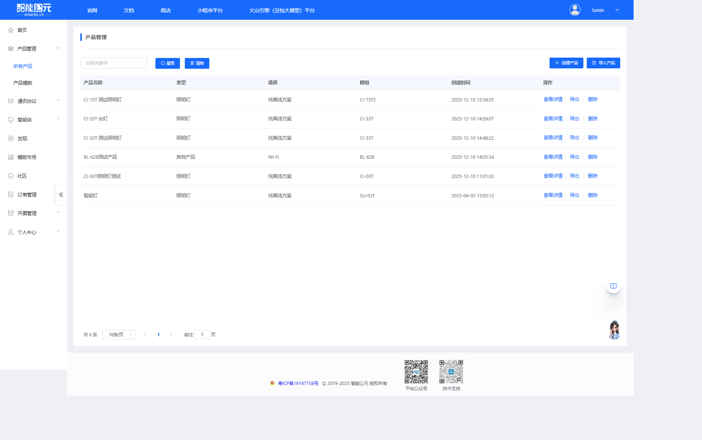
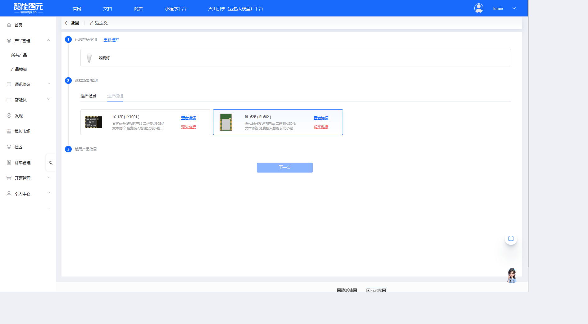
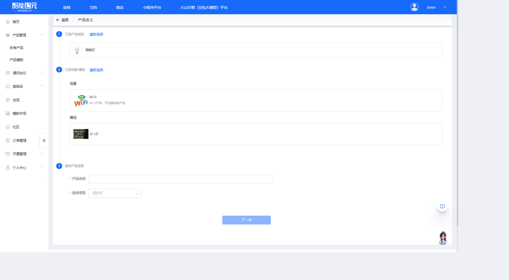
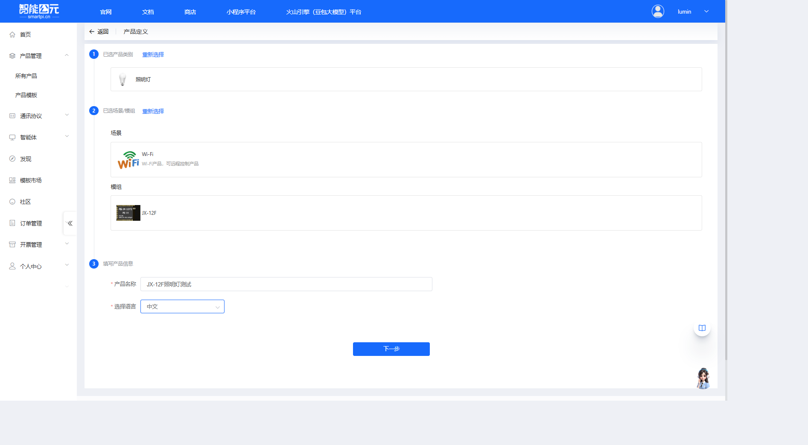
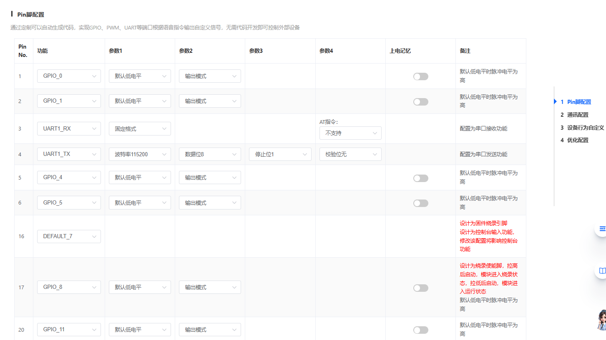
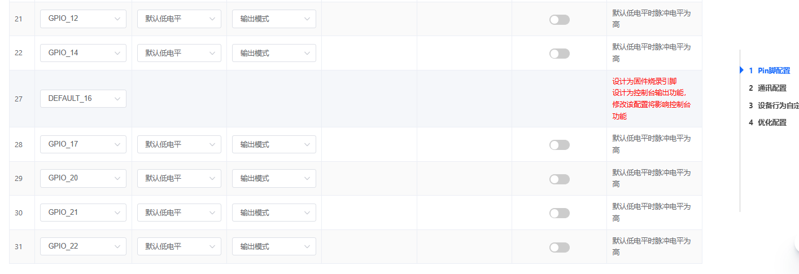
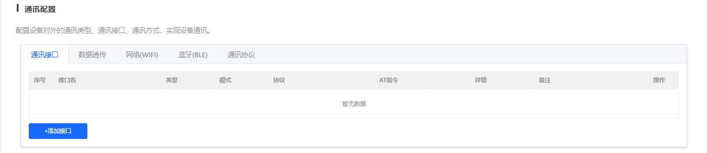
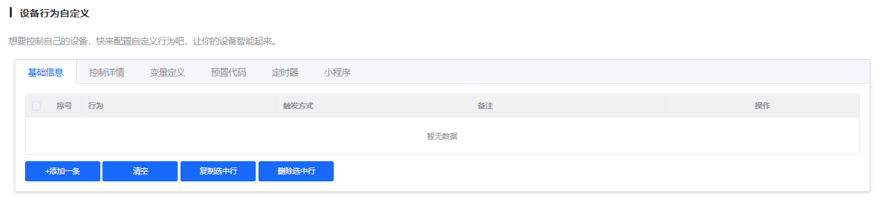

# JX-12F 固件配置

> 本文档专门针对 **JX-12F** WiFi 模组的固件配置，提供该模组特有的配置参数和注意事项。

## 模组信息

- **模组型号**：JX-12F
- **模组类型**：WiFi 模组
- **主要功能**：WiFi 连接与数据传输
- **网络支持**：WiFi 连接
- **AT 指令**：支持 AT 指令集

## 配置流程

JX-12F 的固件配置遵循标准的[固件配置全流程](./firmware-config-workflow.md)，主要步骤包括：

1. [进入产品管理](./firmware-config-workflow.md#1-进入产品管理)
2. [产品详情与版本列表](./firmware-config-workflow.md#2-产品详情与版本列表)
3. [新建或编辑版本](./firmware-config-workflow.md#3-新建或编辑版本)
4. [按步骤完成版本配置](./firmware-config-workflow.md#4-按步骤完成版本配置)
5. [配置检查与保存](./firmware-config-workflow.md#5-配置检查与保存)
6. [发布版本](./firmware-config-workflow.md#6-发布版本)
7. [下载固件](./firmware-config-workflow.md#7-下载固件)

## 创建产品

在开始配置固件之前，需要先在智能公元平台创建对应的产品。以下是创建 JX-12F 产品的详细步骤：

### 1. 进入产品管理页面

1. 登录智能公元平台（[smartpi.cn](https://smartpi.cn)）
2. 在左侧导航菜单中，点击「产品管理」，展开子菜单后选择「所有产品」
3. 进入产品管理页面，可以看到产品列表和操作按钮

### 2. 点击创建产品

在产品管理页面右上角，点击蓝色的「创建产品」按钮，进入产品创建向导。

### 3. 选择产品类别

产品创建向导分为三个步骤。第一步是选择产品类别：

1. 在「选择产品类别」步骤中，可以看到多个产品类别标签页（灯具、开关、插座等）
2. 对于 JX-12F 模组，可以根据实际应用选择合适的类别，例如选择「灯具」类别
3. 在灯具类别下，选择合适的子类型，例如：

    - **照明灯**：适用于普通照明场景
    - **RGB灯**：适用于彩色灯光控制
    - **台灯**：适用于桌面照明
    - 其他类型根据实际应用选择

**示例**：选择「照明灯」类型，点击对应的卡片完成选择。

### 4. 选择场景和模组

第二步是选择应用场景和硬件模组：

#### 4.1 选择场景

在「选择场景/模组」步骤中，首先选择应用场景：

- **纯离线方案**：无需连网，离线也能操作
- **Wi-Fi**：Wi-Fi产品，可远程控制产品（**推荐用于 JX-12F**）
- **大模型**：离在线操作，可接入大模型智能体
- **在线**：随时随地可操作产品

**对于 JX-12F**：选择「Wi-Fi」，因为 JX-12F 是 WiFi 通讯模组，用于实现设备的网络连接和远程控制。

#### 4.2 选择模组

选择场景后，页面会自动切换到「选择模组」标签页，显示可用的模组列表：

1. 在模组列表中查找并选择 **JX-12F (JX1001)**
2. 可以看到模组的详细信息：

    - 零代码开发WiFi产品
    - 二进制/JSON/文本协议
    - 免费接入智能公元小程序
    - 支持自有小程序商城
    - 手机扫码OTA/可免烧录
    - 支持嵌入C代码

3. 点击 JX-12F 模组卡片完成选择

### 5. 填写产品信息

第三步是填写产品的基本信息：

1. **产品名称**（必填）：

    - 输入一个有意义的产品名称，例如：「JX-12F照明灯测试」
    - 建议使用能清楚标识产品用途的名称

2. **选择语言**（必填）：

    - 从下拉菜单中选择语言，支持：中文、英文
    - 根据目标市场选择合适的语言

3. 填写完成后，点击页面底部的「下一步」按钮

### 6. 产品创建完成

完成上述步骤后，系统会自动创建产品并跳转到「版本详情」页面，此时可以开始配置固件版本。

在版本详情页面，可以看到 WiFi 产品特有的配置步骤，包括：

- WiFi 配置
- Pin 脚配置
- 通讯协议配置
- 设备功能配置
- OTA 升级配置
- 小程序配置

## 版本配置详解

产品创建完成后，进入版本详情页面进行固件配置。JX-12F 作为 WiFi 模组，配置页面包含 4 个配置步骤：

### 1. Pin 脚配置

**功能说明**：通过可视化配置可自动生成代码，实现 GPIO、PWM、UART 等端口根据指令输出自定义信号，无需代码开发即可控制外部设备。

**配置表格**：

配置表格包含以下列：

- **Pin No.**：引脚编号
- **功能**：引脚功能（GPIO、PWM、UART、DEFAULT 等）
- **参数1-4**：根据功能类型不同，配置相应参数（如电平、模式、波特率等）
- **上电记忆**：是否保持上电前的状态
- **备注**：引脚使用注意事项

**JX-12F 引脚配置注意事项**：

1. **GPIO 引脚**：

    - 支持多个 GPIO 引脚（GPIO_0, GPIO_1, GPIO_4, GPIO_5, GPIO_8, GPIO_11, GPIO_12, GPIO_14, GPIO_17, GPIO_20, GPIO_21, GPIO_22）
    - 可配置为输入或输出模式
    - 支持默认高/低电平设置
    - 支持上电记忆功能

2. **UART 串口**：

    - **UART1_RX (Pin 3)**：串口接收功能，支持固定格式，可配置 AT 指令支持
    - **UART1_TX (Pin 4)**：串口发送功能，可配置波特率（默认 115200）、数据位（默认 8 位）、停止位（默认 1 位）、校验位（默认无校验）

3. **烧录引脚**：

    - **Pin 16 (DEFAULT_7)**：固件烧录引脚，控制台输入功能，修改配置将影响控制台功能
    - **Pin 17 (GPIO_8)**：烧录使能脚，拉高后启动模块进入烧录状态，拉低后启动模块进入运行状态
    - **Pin 27 (DEFAULT_16)**：固件烧录引脚，控制台输出功能，修改配置将影响控制台功能

> **注意**：烧录相关引脚建议保持默认配置，避免影响固件烧录和调试功能。

### 2. 通讯配置

**功能说明**：配置设备对外的通讯类型、通讯接口、通讯方式，实现设备通讯。

通讯配置包含 5 个标签页：

#### 2.1 通讯接口

配置设备的通讯接口，表格包含以下列：

- **序号**：接口序号
- **接口名**：自定义接口名称
- **类型**：接口类型
- **模式**：通讯模式
- **协议**：使用的通讯协议
- **AT指令**：是否支持 AT 指令
- **详情**：接口详细配置
- **备注**：接口使用说明

点击「添加接口」可以新增通讯接口配置。

#### 2.2 数据透传

配置数据在不同接口之间的透明传输。

#### 2.3 网络(WIFI)

配置 WiFi 网络连接参数，这是 JX-12F 模组的核心功能。

#### 2.4 蓝牙(BLE)

配置蓝牙连接参数（如果硬件支持）。

#### 2.5 通讯协议

配置与云端或 APP 通讯的协议格式，支持二进制、JSON、文本等多种协议。

### 3. 设备行为自定义

**功能说明**：想要控制自己的设备，快来配置自定义行为吧，让你的设备智能起来。

设备行为自定义包含 6 个标签页：

#### 3.1 基础信息

配置设备行为的基本信息，表格包含以下列：

- **序号**：行为编号
- **行为**：行为 ID
- **触发方式**：触发条件
- **备注**：行为说明

点击「添加一条」可以新增设备行为。

#### 3.2 控制详情

配置行为对应的具体控制逻辑（GPIO、PWM、串口等）。

#### 3.3 变量定义

定义全局变量用于逻辑控制。

#### 3.4 预置代码

支持嵌入 C 代码实现复杂的控制逻辑。

#### 3.5 定时器

配置定时任务和延时控制。

#### 3.6 小程序

配置与智能公元小程序的交互。

### 4. 优化配置

**功能说明**：调整系统参数，优化系统性能。阈值越大越敏感，但误识别率也会增高，未设置时自动取默认值。

**配置项**：

可以在「优化选项」下拉菜单中选择要配置的参数，包括：

- **系统设置**：包含 GPIO 检测时长、ADC 检测时长等系统级参数

**配置建议**：

1. **默认值优先**：如无特殊需求，建议先使用平台默认配置进行整机联调
2. **逐项微调**：如需优化，建议一次只修改一个参数，并结合测试记录效果变化
3. **硬件匹配**：配置参数须与实际硬件设计严格一致

> **注意**：优化配置为可选配置，如无明确调优需求，可以不修改，系统将使用默认值。

## 相关文档

- [版本配置参数详解](./firmware-config-parameters.md) - 通用配置参数说明
- [固件配置全流程](./firmware-config-workflow.md) - 完整配置流程
- [JX-12F 模组资料](../wifi-jx12f/jx-12f.md) - 模组详细资料（包含 AT 指令说明）
- [JX-12F 烧录与调试](../faq-burning-and-debug/faq-burning-and-debug-jx-12f.md) - 烧录相关问题
- [JX-12F 硬件设计](../faq-hardware-design/faq-hardware-design-jx-12f.md) - 硬件相关问题

## 常见问题

### 配置相关问题

- WiFi 连接失败？检查 SSID 和密码是否正确，信号强度是否足够
- AT 指令无响应？检查串口参数配置是否正确
- 数据传输异常？确认网络连接正常，服务器地址和端口配置正确
- Pin 脚配置不生效？确认引脚号与实际硬件一致
- 功耗异常？检查 WiFi 连接状态和功耗模式配置

### 获取帮助

如遇到配置问题，可参考：

- [平台与固件 FAQ](../faq-platform-and-firmware/faq-platform-and-firmware-jx-12f.md)
- [应用开发案例](../faq-application-scenarios/faq-application-scenarios-jx-12f.md)
- [模块选型指南](../faq-module-selection/faq-module-selection-jx-12f.md)

---

> **提示**：建议先阅读[固件配置全流程](./firmware-config-workflow.md)了解整体流程，再结合本文档进行 JX-12F 特定配置。JX-12F 作为 WiFi 模组，支持 AT 指令，可以通过串口进行灵活配置。

