# JX-A7T 固件配置

> 本文档专门针对 **JX-A7T** 模组的固件配置，提供该模组特有的配置参数和注意事项。

## 模组信息

- **模组型号**：JX-A7T
- **模组类型**：离在线语音 AI 大模型模组
- **支持功能**：离线语音识别 + 在线 AI 大模型
- **网络支持**：WiFi 连接

## 配置流程

JX-A7T 的固件配置遵循标准的[固件配置全流程](./firmware-config-workflow.md)，主要步骤包括：

1. [进入产品管理](./firmware-config-workflow.md#1-进入产品管理)
2. [产品详情与版本列表](./firmware-config-workflow.md#2-产品详情与版本列表)
3. [新建或编辑版本](./firmware-config-workflow.md#3-新建或编辑版本)
4. [按步骤完成版本配置](./firmware-config-workflow.md#4-按步骤完成版本配置)
5. [配置检查与保存](./firmware-config-workflow.md#5-配置检查与保存)
6. [发布版本](./firmware-config-workflow.md#6-发布版本)
7. [下载固件](./firmware-config-workflow.md#7-下载固件)

## 创建产品

在开始配置固件前，需要先在平台上创建产品。以下是 JX-A7T 模组的产品创建步骤：

### 步骤 1：选择产品类别

进入产品管理页面后，点击「创建产品」按钮，首先选择产品所属的类别。

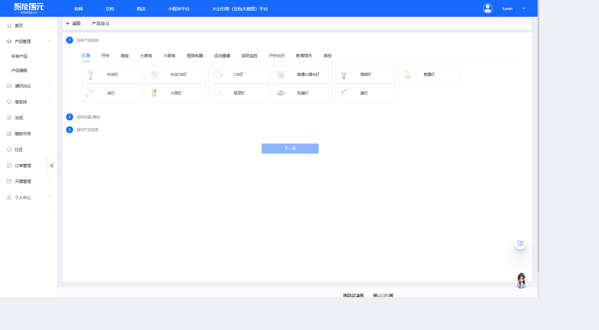

**操作说明**：

1. 在产品类别标签页中，根据实际应用选择合适的产品类别（如：灯具、开关、插座等）
2. 选择具体的产品子类型，例如在「灯具」类别下选择「照明灯」
3. 点击产品类型卡片后，页面会自动进入下一步

### 步骤 2：选择应用场景和模组

选择产品类别后，需要选择应用场景和对应的模组型号。

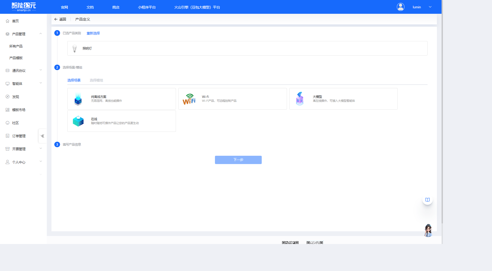

**JX-A7T 特别说明**：

JX-A7T 是离在线语音 AI 大模型模组，需要选择「**大模型**」场景：

- **大模型场景**：离在线操作，可接入大模型智能体
- 支持离线语音识别和在线 AI 大模型对话
- 需要 WiFi 网络连接

选择「大模型」场景后，点击「选择模组」标签页，选择 JX-A7T 模组。

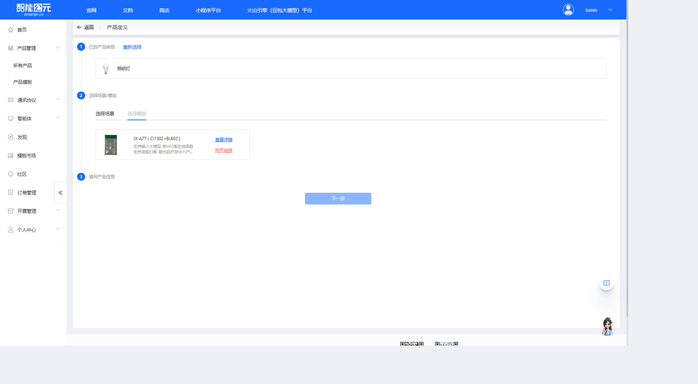

**选择模组类型**：

点击 JX-A7T 模组后，会弹出固件类型选择对话框：

JX-A7T 支持两种固件类型：

- **JX-A7T ASR**：语音识别固件（CI1302 芯片），用于制作离在线语音产品
- **JX-A7T WiFi**：WiFi 固件（BL602 芯片），用于制作纯 WiFi 产品

**根据需求选择**：

- 制作语音固件请选择 **JX-A7T ASR**
- 制作 WiFi 固件请选择 **JX-A7T WiFi**

本文档以 **JX-A7T ASR** 为例进行说明。

### 步骤 3：填写产品信息

选择完模组后，填写产品的基本信息。

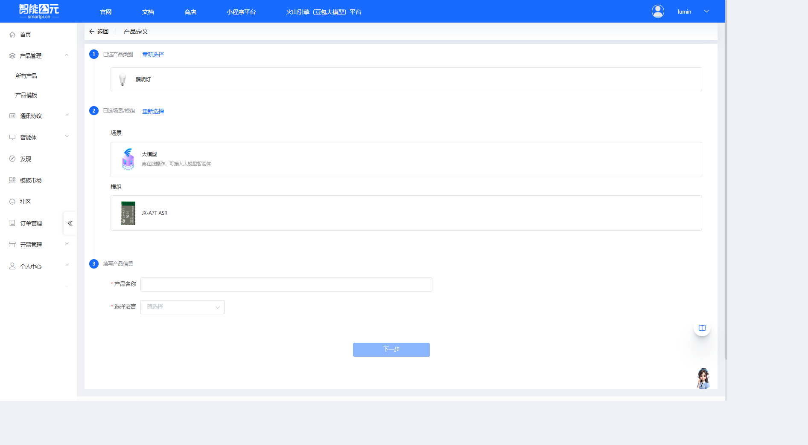

**必填信息**：

1. **产品名称**：

    - 为产品起一个易于识别的名称
    - 建议包含模组型号和功能描述，便于后续管理
    - 示例：`JX-A7T 智能照明灯`、`JX-A7T AI语音助手`

2. **选择语言**：

    - 选择产品的语音识别语言
    - 可选项：中文、英文、日文、韩语
    - 根据目标市场选择合适的语言

填写完成后，点击「下一步」按钮即可创建产品。

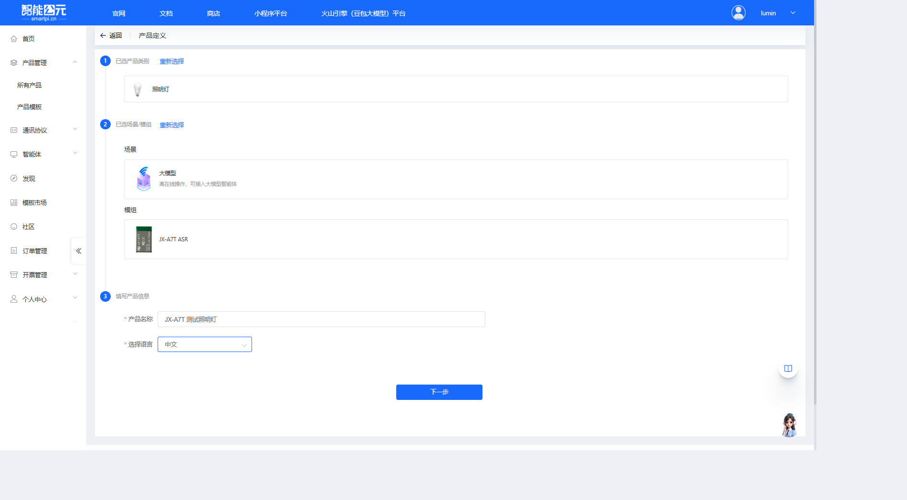

**下一步操作**：

产品创建成功后，系统会自动进入产品详情页面，可以开始进行固件版本配置。

## 版本配置详解

产品创建完成后，进入版本详情页面进行固件配置。JX-A7T 作为离在线语音 AI 大模型模组，配置页面包含以下配置步骤：

### 1. 前端信号处理

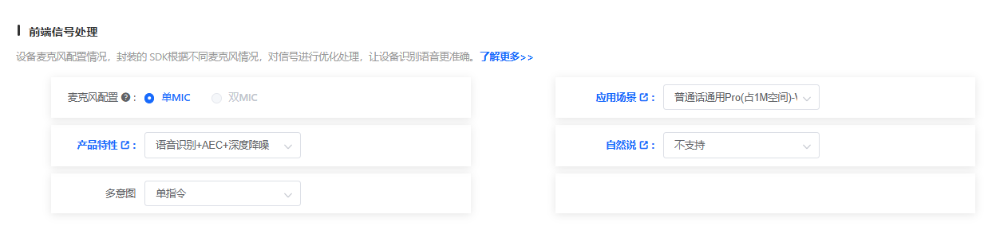

**功能说明**：设备麦克风配置情况，封装的 SDK 根据不同麦克风情况，对信号进行优化处理，让设备识别语音更准确。

**配置项**：

#### 1.1 麦克风配置

| 选项 | 说明 |
|------|------|
| 单MIC | JX-A7T 采用单麦克风配置，适用于一般语音识别场景 |

> **注意**：JX-A7T 固定为单MIC配置。

#### 1.2 应用场景

选择合适的声学模型以优化识别效果。JX-A7T 支持多种应用场景模型：

- **普通话通用Pro**系列：通用语音识别模型，占用不同空间（0.6M、1M、1.3M等）
- **场景专用模型**：针对特定场景优化（如灯具、窗帘、风扇等）

**如何选择声学模型？**

1. **根据实际使用场景选择**：根据产品的实际使用场景选择合适的声学模型
2. **空间占用考虑**：占用空间越大的模型，识别效果一般越好
3. **Pro 系列推荐**：名称包含"Pro"的新模型为推荐模型

#### 1.3 产品特性

根据需求选择产品特性功能：

- **仅语音识别**：基础语音识别功能
- **语音识别+自学习**：支持语音识别和自学习功能
- **语音识别+AEC打断(限单MIC)**：支持AEC打断，适用于单MIC配置
- **其他特性**：根据实际需求选择

> **JX-A7T 说明**：作为单MIC模组，支持选择限单MIC的功能选项，不支持限双MIC的功能。

#### 1.4 自然说

| 选项 | 说明 |
|------|------|
| 不支持 | 不支持自然语言识别 |
| 系统自动泛化+用户指定泛化 | 系统自动泛化和用户指定泛化相结合 |
| 用户指定泛化 | 仅使用用户指定的泛化规则 |

#### 1.5 多意图

| 选项 | 说明 |
|------|------|
| 单指令 | 每次识别一个命令 |
| 双指令连说 | 支持连续说出两个指令 |
| 三指令连说 | 支持连续说出三个指令 |

### 2. Pin脚配置

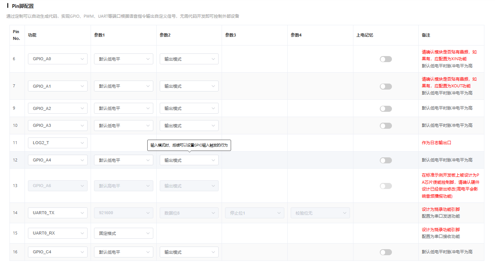

**功能说明**：通过可视化配置可自动生成代码，实现 GPIO、PWM、UART 等端口根据语音指令输出自定义信号，无需代码开发即可控制外部设备。

**配置表格**：

配置表格包含以下列：

- **Pin No.**：引脚编号
- **功能**：引脚功能（GPIO、PWM、UART、DEFAULT 等）
- **参数1-4**：根据功能类型不同，配置相应参数
- **上电记忆**：是否保持上电前的状态
- **备注**：引脚使用注意事项

**JX-A7T 引脚说明**：

JX-A7T 基于 CI1302 芯片，引脚配置与 CI-03T 类似：

- **Pin 6-7 (GPIO_A0/A1)**：确认模块是否贴有晶振，如有应配置为 XIN/XOUT 功能
- **Pin 9-12 (GPIO_A2-A5)**：可用于控制外部设备
- **Pin 13 (GPIO_A6)**：注意 PA 芯片使能控制脚
- **Pin 14-15 (DEFAULT_P14/P15)**：烧录功能引脚，修改配置将影响日志输出
- **Pin 16 (GPIO_C4)**：可用 GPIO 引脚

> **注意**：引脚配置需与实际硬件设计严格一致。

### 3. 唤醒词自定义

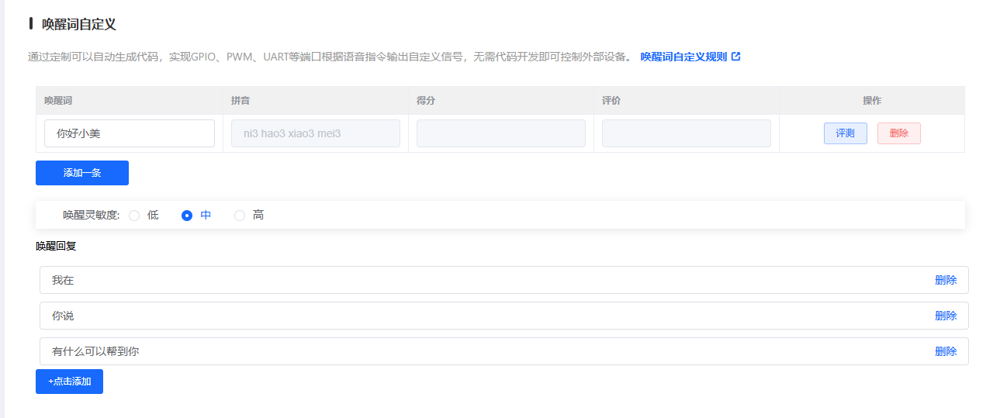

**功能说明**：配置设备唤醒词，用户说出唤醒词后设备进入语音识别状态。

**配置项**：

1. **唤醒词列表**：

    - 表格显示已配置的唤醒词
    - 可以添加、评测和删除唤醒词
    - 默认唤醒词示例：「你好小美」

2. **唤醒灵敏度**：

    - **低**：唤醒灵敏度较低，减少误唤醒
    - **中**：平衡唤醒率和误唤醒率（推荐）
    - **高**：唤醒灵敏度较高，提高唤醒率

3. **唤醒回复**：

    - 配置设备被唤醒后的回复语
    - 可以添加多条回复语，系统随机选择
    - 默认示例：「我在」、「你说」

### 4. 命令词自定义

**功能说明**：配置语音控制命令词，让设备能够识别用户的语音指令并执行相应操作。

**配置项**：

1. **命令词表格**（基础信息标签页）：

    - **序号**：命令词编号
    - **行为**：命令对应的行为 ID
    - **触发方式**：命令触发方式（命令词、串口输入等）
    - **命令词**：用户说出的语音指令
    - **回复语**：设备执行命令后的语音回复
    - **操作**：删除命令词或查看详细配置

2. **操作按钮**：

    - **+添加一条**：添加新的命令词
    - **命令词编辑**：批量编辑命令词
    - **清空**：清空所有命令词
    - **复制选中行**：复制选中的命令词
    - **删除选中行**：删除选中的命令词

3. **识别灵敏度**：

    - **低**：识别灵敏度较低，减少误识别
    - **中**：平衡识别率和误识别率（推荐）
    - **高**：识别灵敏度较高，提高识别率

4. **免唤醒的命令词**：

    - 配置无需唤醒词即可直接识别的命令词
    - 唤醒词加上免唤醒的命令词，总数不能超过 20 条

5. **防止误识别的命令词**：

    - 输入不希望被识别的词条
    - 多条词条之间用「|」隔开

6. **其他标签页**：

    - **控制详情**：配置命令词对应的 GPIO/PWM 等控制行为
    - **变量定义**：定义变量用于逻辑控制
    - **定时器**：配置定时任务

### 5. 发音人配置

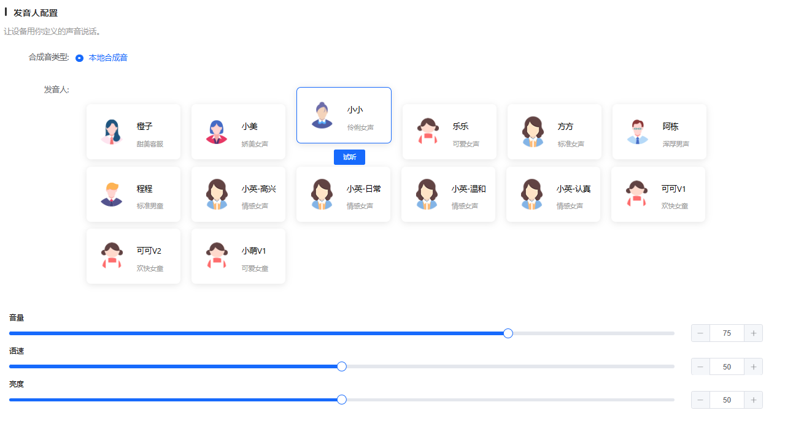

**功能说明**：配置设备语音播报的发音人、音量、语速等参数。

**配置项**：

1. **合成音类型**：

    - **本地合成音**：使用本地语音合成引擎

2. **发音人选择**：

    - **女声**：橙子、小美、小小、乐乐、方方、小英系列、可可、小萌等
    - **男声**：阿栋、程程等
    - 点击发音人可以试听效果

3. **音量调节**：

    - 滑块调节，范围 0-100
    - 默认值：75

4. **语速调节**：

    - 滑块调节，范围 0-100
    - 默认值：50

5. **亮度调节**：

    - 滑块调节，范围 0-100
    - 默认值：50
    - 影响语音的音调高低

### 6. 其它配置

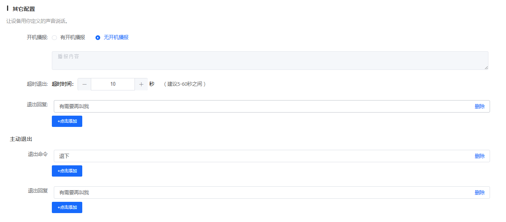

**功能说明**：配置开机播报、超时退出、主动退出等系统行为。

**配置项**：

1. **开机播报**：

    - **有开机播报**：设备上电时播放开机提示音
    - **无开机播报**：设备上电时不播放提示音（默认）

2. **超时退出**：

    - 配置设备在无语音输入多长时间后自动退出识别状态
    - **超时时间**：可调节，范围建议 5-60 秒
    - **退出回复**：超时退出时播放的回复语

3. **主动退出**：

    - **退出命令**：用户说出这些命令后，设备主动退出识别状态
    - **退出回复**：主动退出时播放的回复语

### 7. 个性化音频

**功能说明**：通过上传录制的音频文件，替代平台自动合成的音频，可以播放个性化的音频。

**配置项**：

1. **配置表格**：

    - **序号**：音频编号
    - **词条**：选择对应的词条类型（唤醒、命令识别、系统设置等）
    - **个性化音频**：上传的音频文件名称
    - **大小**：音频文件大小（KB）
    - **操作**：可以删除或管理音频

2. **操作按钮**：

    - **+点击添加**：添加个性化音频
    - **音频管理**：管理已上传的音频文件

3. **音频总大小**：

    - 显示当前使用的音频总大小
    - 需要注意 Flash 容量限制

> **注意**：个性化音频会占用 Flash 空间，建议合理控制音频数量和大小。

### 8. 优化配置

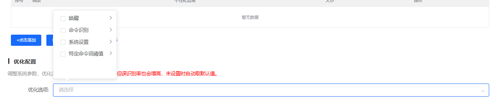

**功能说明**：调整系统参数，优化系统性能。阈值越大越敏感，但误识别率也会增高，未设置时自动取默认值。

**配置项**：

优化配置包含多个优化选项类别：

#### 8.1 唤醒相关

- **唤醒阈值**：调整唤醒灵敏度
    - 可选值：0.01、0.02、0.04、0.05、0.1、0.2（默认）

#### 8.2 命令识别相关

- **命令识别阈值**：调整命令词识别灵敏度
    - 可选值：0.01、0.02、0.04、0.05、0.1、0.2（默认）

#### 8.3 系统设置相关

- **系统参数调整**：配置系统级别的优化参数

#### 8.4 硬件配置相关

- **ADC检测时长**：配置ADC检测的时间长度
    - 可选值：10毫秒、20毫秒、30毫秒、40毫秒、50毫秒（默认）、100毫秒

- **MIC差分/单端**：配置麦克风的连接方式
    - **单端**：JX-A7T 采用单端连接

- **功放使能引脚**：配置功放使能控制引脚

- **自动使能功放**：是否自动使能功放

- **功放使能电平**：配置功放使能的电平（高电平/低电平）

**配置建议**：

1. **默认值优先**：如无特殊需求，建议使用默认值
2. **逐步调整**：如需优化，建议逐个参数调整并测试效果
3. **平衡考虑**：阈值设置需要在识别率和误识别率之间找到平衡
4. **硬件匹配**：硬件相关配置需与实际硬件设计严格一致

> **注意**：优化配置为可选配置，如无明确调优需求，可以不修改，系统将使用默认值。

## 相关文档

- [版本配置参数详解](./firmware-config-parameters.md) - 通用配置参数说明
- [固件配置全流程](./firmware-config-workflow.md) - 完整配置流程
- [JX-A7T 模组资料](../offline-online-ai-jxa7t/jx-a7t.md) - 模组详细资料
- [JX-A7T 烧录与调试](../faq-burning-and-debug/faq-burning-and-debug-jx-a7t.md) - 烧录相关问题
- [JX-A7T 语音调优](../faq-voice-tuning/faq-voice-tuning-jx-a7t.md) - 语音识别优化
- [JX-A7T 硬件设计](../faq-hardware-design/faq-hardware-design-jx-a7t.md) - 硬件相关问题

## 常见问题

### 配置相关问题

- WiFi 连接失败？检查 SSID 和密码是否正确，信号强度是否足够
- 在线功能不可用？确认网络连接正常，API 配置正确
- Pin 脚配置不生效？确认引脚号与实际硬件一致
- 功耗异常？检查 WiFi 连接状态和功耗模式配置

### 获取帮助

如遇到配置问题，可参考：

- [平台与固件 FAQ](../faq-platform-and-firmware/faq-platform-and-firmware-jx-a7t.md)
- [应用开发案例](../faq-application-scenarios/faq-application-scenarios-jx-a7t.md)
- [模块选型指南](../faq-module-selection/faq-module-selection-jx-a7t.md)

---

> **提示**：建议先阅读[固件配置全流程](./firmware-config-workflow.md)了解整体流程，再结合本文档进行 JX-A7T 特定配置。JX-A7T 作为离在线模组，需要特别注意 WiFi 和 AI 大模型的配置。

