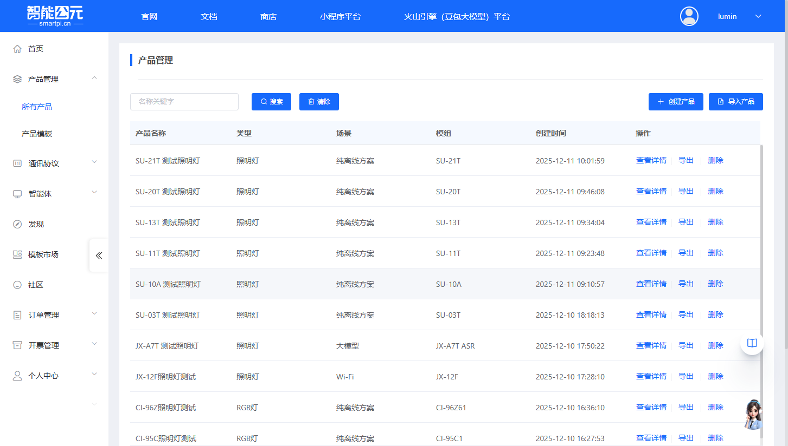
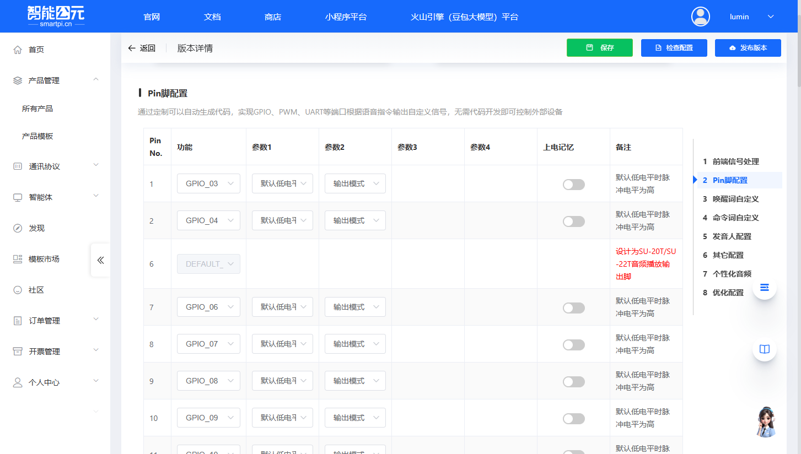
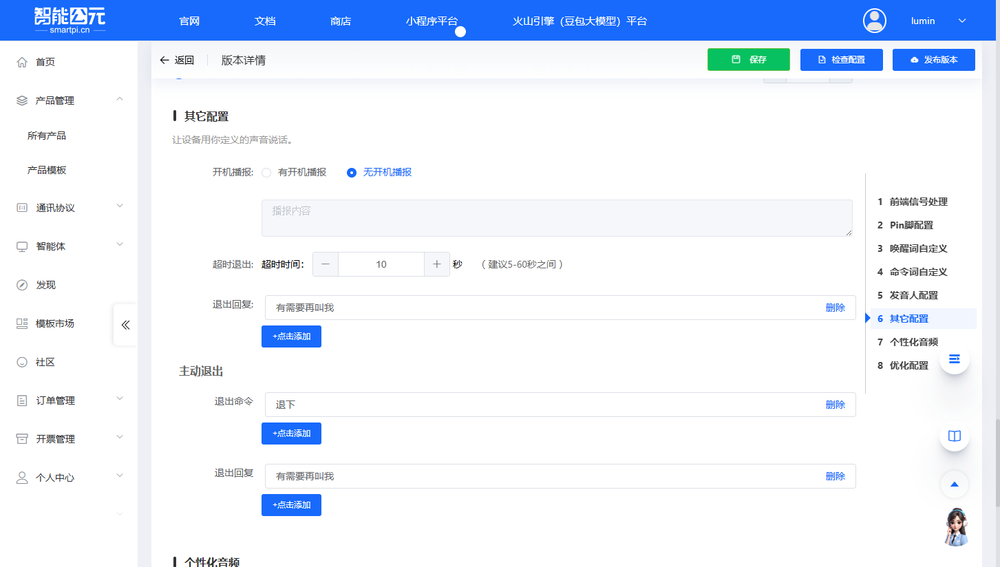

# SU-22T 固件配置

> 本文档专门针对 **SU-22T** 模组的固件配置，提供该模组特有的配置参数和注意事项。

## 模组信息

- **模组型号**：SU-22T
- **芯片型号**：US513U61
- **支持命令词数量**：50 条
- **麦克风配置**：单 MIC 离线语音模块
- **Flash 配置**：内置 1M 的 Flash
- **特殊功能**：支持低功耗
- **环境支持**：支持中噪声环境
- **综合唤醒率**：93%

## 创建产品

在开始配置固件之前，需要先在智能公元平台创建对应的产品。以下是创建 SU-22T 产品的详细步骤：

### 1. 进入产品管理页面

1. 登录智能公元平台（[smartpi.cn](https://smartpi.cn)）
2. 在左侧导航菜单中，点击「产品管理」，展开子菜单后选择「所有产品」
3. 进入产品管理页面，可以看到产品列表和操作按钮

### 2. 点击创建产品

在产品管理页面右上角，点击蓝色的「创建产品」按钮，进入产品创建向导。

### 3. 选择产品类别

产品创建向导分为三个步骤。第一步是选择产品类别：

1. 在「选择产品类别」步骤中，可以看到多个产品类别标签页（灯具、开关、插座等）
2. 对于 SU-22T 模组，通常选择「灯具」类别
3. 在灯具类别下，选择合适的子类型，例如：

    - **照明灯**：适用于普通照明场景
    - **RGB灯**：适用于彩色灯光控制
    - **台灯**：适用于桌面照明
    - 其他类型根据实际应用选择

**示例**：选择「照明灯」类型，点击对应的卡片完成选择。

### 4. 选择场景和模组

第二步是选择应用场景和硬件模组：

#### 4.1 选择场景

在「选择场景/模组」步骤中，首先选择应用场景：

- **纯离线方案**：无需连网，离线也能操作（推荐用于 SU-22T）
- **Wi-Fi**：Wi-Fi产品，可远程控制产品
- **大模型**：离在线操作，可接入大模型智能体
- **在线**：随时随地可操作产品

**对于 SU-22T**：选择「纯离线方案」，因为 SU-22T 是离线语音识别模块。

#### 4.2 选择模组

选择场景后，页面会自动切换到「选择模组」标签页，显示可用的模组列表：

1. 在模组列表中查找并选择 **SU-22T (US513U61)**
2. 可以看到模组的详细信息：

    - 单MIC离线语音识别模块
    - 支持50条命令词
    - 内置1M的Flash
    - 支持低功耗
    - 支持中噪声环境
    - 综合唤醒率93%

3. 点击 SU-22T 模组卡片完成选择

### 5. 填写产品信息

第三步是填写产品的基本信息：

1. **产品名称**（必填）：

    - 输入一个有意义的产品名称，例如：「SU-22T智能照明灯」
    - 建议使用能清楚标识产品用途的名称

2. **选择语言**（必填）：

    - 从下拉菜单中选择语言，支持：中文、英文
    - SU-22T 支持中文和英文两种语言
    - 根据目标市场选择合适的语言

3. 填写完成后，点击页面底部的「下一步」按钮

### 6. 产品创建完成

完成上述步骤后，系统会自动创建产品并跳转到「版本详情」页面，此时可以开始配置固件版本。

在版本详情页面，可以看到以下配置步骤：

- 前端信号处理
- Pin脚配置
- 唤醒词自定义
- 命令词自定义
- 发音人配置
- 其它配置
- 个性化音频
- 优化配置

## 版本配置详解

产品创建完成后，进入版本详情页面进行固件配置。以下是各个配置部分的详细说明：

### 1. 前端信号处理

**功能说明**：设备麦克风配置情况，封装的 SDK 根据不同麦克风情况，对信号进行优化处理，让设备识别语音更准确。

**配置项**：

#### 1.1 麦克风配置

| 选项 | 是否支持 | 说明 |
|------|---------|------|
| 单MIC | ✓ 支持（默认） | 适用于单麦克风硬件配置 |
| 双MIC | ✗ 不支持 | SU-22T 标准版不支持双MIC |

> **提示**：SU-22T 标准配置仅支持单MIC，页面中双MIC选项为灰色禁用状态。

#### 1.2 距离识别

根据产品的实际使用距离选择合适的识别模式：

| 选项 | 说明 |
|------|------|
| 近场0-1m | 适用于近距离使用场景，如台灯、开关面板 |
| 远场1-5m | 适用于远距离使用场景，如吸顶灯、壁灯（默认） |

### 2. Pin脚配置

**功能说明**：通过定制可以自动生成代码，实现 GPIO、PWM、UART 等端口根据语音指令输出自定义信号，无需代码开发即可控制外部设备。

**配置表格**：

配置表格包含以下列：

- **Pin No.**：引脚编号
- **功能**：引脚功能（SW_CLK、SW_D、GPIO、PWM、UART 等）
- **参数1**：功能参数1（如默认电平）
- **参数2**：功能参数2（如输入/输出模式）
- **参数3**：功能参数3（根据功能类型不同）
- **参数4**：功能参数4（根据功能类型不同）
- **上电记忆**：是否保持上电前的状态
- **备注**：引脚使用注意事项

**SU-22T 引脚说明**：

- **Pin 6**：DEFAULT_P05 - 设计为SU-20T/SU-22T音频播放输出脚
- **Pin 19**：DEFAULT_P01 - 设计为功放使能脚，修改该配置将影响播放功能，SU-23T是低电平静音，SU-20T/SU-22T是高电平静音
- **Pin 1-2, 7-12, 18, 20**：可配置为 GPIO、PWM、UART 等功能
- 配置为 GPIO 时，默认低电平时脉冲电平为高
- 确认实际硬件连接的引脚，参考 SU-22T 硬件资料中的引脚定义
- 注意引脚功能复用（GPIO / PWM / UART 等）

### 3. 唤醒词自定义

**功能说明**：配置设备唤醒词，用户说出唤醒词后设备进入语音识别状态。

**配置项**：

1. **唤醒词列表**：

    - 表格显示已配置的唤醒词
    - 列包括：唤醒词、拼音、得分、评价、操作
    - 默认唤醒词示例：「你好小美」
    - 可以点击「添加一条」添加新的唤醒词
    - 可以对唤醒词进行「评测」和「删除」操作
    - 支持自定义唤醒词，建议使用3-5个音节的词组

2. **唤醒灵敏度**：

    - **低**：唤醒灵敏度较低，减少误唤醒，但可能降低唤醒率
    - **中**：平衡唤醒率和误唤醒率（推荐）
    - **高**：唤醒灵敏度较高，提高唤醒率，但可能增加误唤醒

3. **唤醒回复**：

    - 配置设备被唤醒后的回复语
    - 可以添加多条回复语，系统随机选择
    - 默认示例：「我在」、「你说」、「有什么可以帮到你」

> **提示**：唤醒词的选择会影响识别准确率，建议使用平台提供的评测功能测试唤醒词质量。

### 4. 命令词自定义

**功能说明**：配置语音控制命令词，让设备能够识别用户的语音指令并执行相应操作。

**配置项**：

1. **命令词表格**（基础信息标签页）：

    - **序号**：命令词编号
    - **行为**：命令对应的行为 ID（如 TurnOn、TurnOff、SetBrightness）
    - **触发方式**：命令触发方式（命令词、串口输入等）
    - **命令词**：用户说出的语音指令（如「打开台灯」、「关闭台灯」）
    - **回复语**：设备执行命令后的语音回复（如「已打开」、「好的」）
    - **操作**：可以删除命令词或查看详细配置

2. **操作按钮**：

    - **+添加一条**：添加新的命令词
    - **命令词编辑**：批量编辑命令词
    - **清空**：清空所有命令词
    - **复制选中行**：复制选中的命令词
    - **删除选中行**：删除选中的命令词

3. **识别灵敏度**：

    - **低**：识别灵敏度较低，减少误识别
    - **中**：平衡识别率和误识别率（推荐）
    - **高**：识别灵敏度较高，提高识别率

4. **免唤醒的命令词**：

    - 配置无需唤醒词即可直接识别的命令词
    - 唤醒词加上免唤醒的命令词，总数不能超过 10 条
    - 适用于高频使用的命令，如「打开」、「关闭」

5. **其他标签页**：

    - **控制详情**：配置命令词对应的 GPIO/PWM 等控制行为
    - **变量定义**：定义变量用于逻辑控制
    - **定时器**：配置定时任务

**SU-22T 限制**：

- 最大支持 50 条命令词
- 建议合理分配命令词，避免超出限制
- 命令词建议使用2-5个音节，避免过长或过短

> **提示**：在「控制详情」标签页中，可以配置命令词触发时的具体控制行为，如 GPIO 输出、PWM 调节、串口输出等。

### 5. 发音人配置

**功能说明**：配置设备语音播报的发音人、音量、语速等参数。

**配置项**：

1. **合成音类型**：

    - **蜂鸣器**：使用蜂鸣器播报
    - **扬声器**：使用扬声器播报（推荐用于离线方案）
    - **无播报**：不进行语音播报
    - SU-22T 作为纯离线模组，推荐使用扬声器

2. **发音人选择**：

    - 从发音人列表中选择合适的发音人
    - 可选的发音人包括女声和男声多种选择
    - 点击发音人卡片可以试听效果
    - 常用发音人：萱萱、玲玲、糖糖、KiYo、小雯、小峰、天天等

3. **音高调节**：

    - 滑块调节，范围 0-100
    - 默认值：50
    - 建议根据实际应用场景调整

4. **音量调节**：

    - 滑块调节，范围 0-100
    - 默认值：50
    - 建议根据实际应用场景调整

5. **语速调节**：

    - 滑块调节，范围 0-100
    - 默认值：50
    - 建议根据用户体验调整，过快或过慢都会影响用户体验

6. **亮度调节**：

    - 滑块调节，范围 50-100
    - 默认值：50
    - 用于调节语音亮度

> **提示**：选择发音人后，建议实际测试播报效果，确保音质和音色符合产品需求。

### 6. 其它配置

**功能说明**：配置开机播报、超时退出、主动退出等系统行为。

**配置项**：

1. **开机播报**：

    - **有开机播报**：设备上电时播放开机提示音
    - **无开机播报**：设备上电时不播放提示音（默认）
    - 建议根据产品定位选择，如儿童产品可启用开机播报

2. **超时退出**：

    - 配置设备在无语音输入多长时间后自动退出识别状态
    - **超时时间**：滑块调节，范围建议 5-60 秒，默认 10 秒
    - **退出回复**：超时退出时播放的回复语，如「我先去忙了」
    - 适用于唤醒后长时间无操作的场景

3. **主动退出**：

    - **退出命令**：用户说出这些命令后，设备主动退出识别状态
    - 示例：「退下」、「再见」、「不用了」
    - **退出回复**：主动退出时播放的回复语，如「好的」、「再见」
    - 可以添加多条退出命令，提升用户体验

> **提示**：合理配置超时退出时间，既能保证用户体验，又能降低功耗。

### 7. 个性化音频

**功能说明**：通过上传录制的音频文件，替代平台自动合成的音频。

**配置项**：

1. **配置表格**：

    - **序号**：音频编号
    - **词条**：选择对应的词条类型（唤醒词、命令词回复等）
    - **个性化音频**：上传的音频文件名称
    - **大小**：音频文件大小（KB）
    - **操作**：可以删除或管理音频

2. **操作按钮**：

    - **+点击添加**：添加个性化音频
    - **音频管理**：管理已上传的音频文件

**使用场景**：

- 品牌定制音频：使用特定声音或音效
- 多语言支持：上传方言或其他语言音频
- 特殊音效：如儿童产品使用卡通音效

**音频格式要求**：

- 格式：WAV / MP3
- 采样率：16kHz 推荐
- 位深度：16bit
- 声道：单声道

> **注意**：个性化音频会占用 Flash 空间，SU-22T 内置 1M Flash，建议合理控制音频数量和大小，避免空间不足。

### 8. 优化配置

**功能说明**：调整系统参数，优化系统性能。阈值越大越敏感，但误识别率也会增高。

**配置项**：

1. **优化选项**：

    - 从下拉菜单中选择优化选项
    - 根据实际需求选择合适的优化策略

2. **语音指令总数**：

    - 显示当前配置的语音指令总数
    - 包括唤醒词和命令词的总数

**配置建议**：

1. 如无特殊需求，建议使用默认值
2. 如需优化，建议逐个参数调整并测试效果
3. 在实际使用环境中进行测试，确保识别率和误识别率达到平衡

> **警告**：不正确的优化配置可能导致设备无法正常工作，修改前请确认硬件设计参数。

## 配置流程

产品创建完成后，SU-22T 的固件配置遵循标准的[固件配置全流程](./firmware-config-workflow.md)，主要步骤包括：

1. [进入产品管理](./firmware-config-workflow.md#1-进入产品管理)
2. [产品详情与版本列表](./firmware-config-workflow.md#2-产品详情与版本列表)
3. [新建或编辑版本](./firmware-config-workflow.md#3-新建或编辑版本)
4. [按步骤完成版本配置](./firmware-config-workflow.md#4-按步骤完成版本配置)
5. [配置检查与保存](./firmware-config-workflow.md#5-配置检查与保存)
6. [发布版本](./firmware-config-workflow.md#6-发布版本)
7. [下载固件](./firmware-config-workflow.md#7-下载固件)

## 相关文档

- [版本配置参数详解](./firmware-config-parameters.md) - 通用配置参数说明
- [固件配置全流程](./firmware-config-workflow.md) - 完整配置流程
- [SU-22T 烧录与调试](../faq-burning-and-debug/faq-burning-and-debug-su-22t.md) - 烧录相关问题
- [SU-22T 语音调优](../faq-voice-tuning/faq-voice-tuning-su-22t.md) - 语音识别优化
- [SU-22T 硬件设计](../faq-hardware-design/faq-hardware-design-su-22t.md) - 硬件相关问题

## 常见问题

### 配置相关问题

- 命令词数量超出限制？检查是否超过 50 条
- Pin 脚配置不生效？确认引脚号与实际硬件一致
- 功耗异常？检查功耗模式配置和唤醒参数

### 获取帮助

如遇到配置问题，可参考：

- [平台与固件 FAQ](../faq-platform-and-firmware/faq-platform-and-firmware-su-22t.md)
- [应用开发案例](../faq-application-scenarios/faq-application-scenarios-su-22t.md)
- [模块选型指南](../faq-module-selection/faq-module-selection-su-22t.md)

---

> **提示**：建议先阅读[固件配置全流程](./firmware-config-workflow.md)了解整体流程，再结合本文档进行 SU-22T 特定配置。

