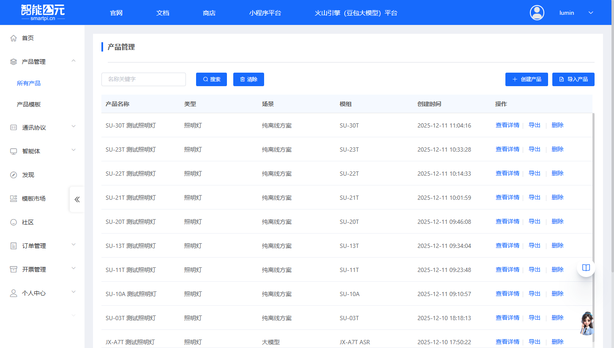
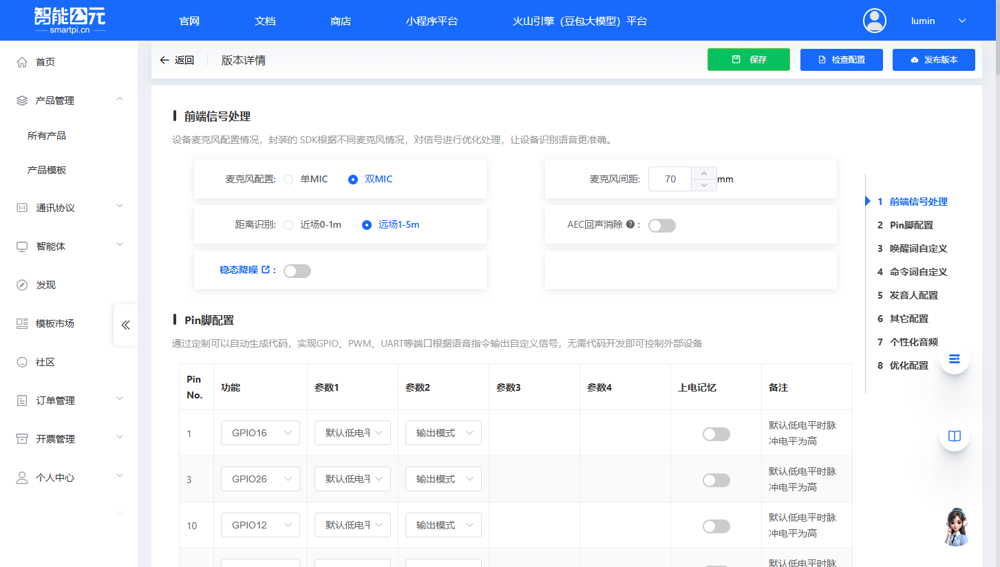
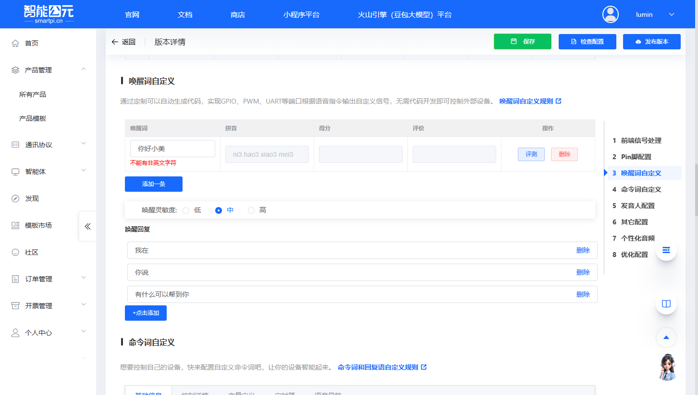
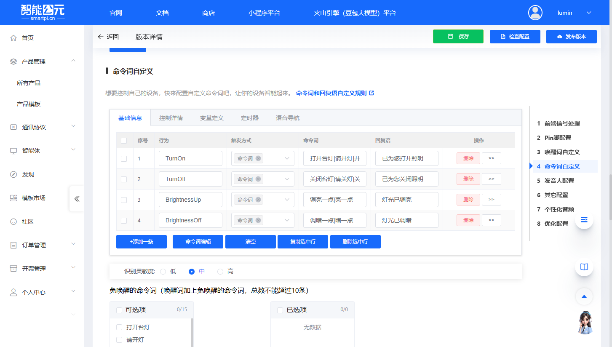
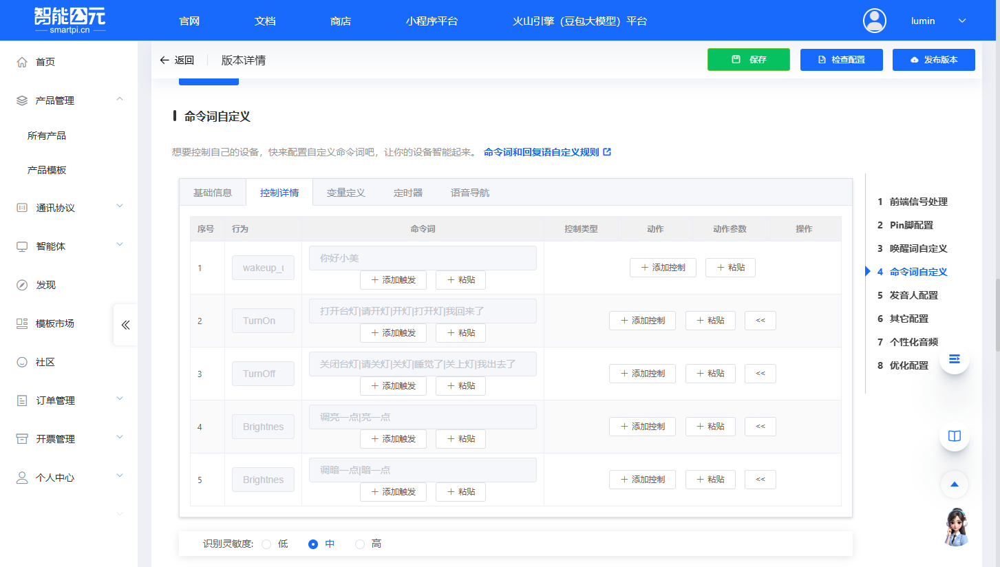
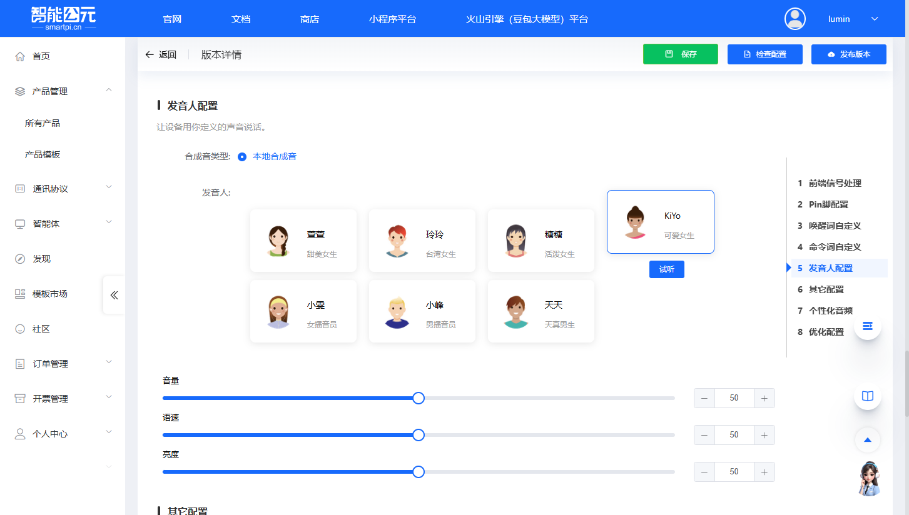
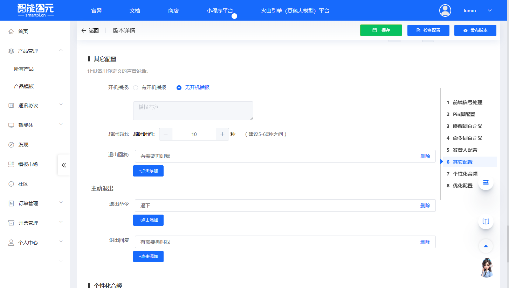

# SU-32T 固件配置

> 本文档专门针对 **SU-32T** 模组的固件配置，提供该模组特有的配置参数和注意事项。

## 模组信息

- **模组型号**：SU-32T
- **芯片型号**：US527U5
- **支持命令词数量**：150 条
- **麦克风配置**：双 MIC 离线语音模块
- **Flash 配置**：内置 8M 的 Flash、多引脚
- **特殊功能**：支持双 MIC 降噪和打断，支持高噪声环境
- **综合唤醒率**：98%

## 创建产品

在开始配置固件之前，需要先在智能公元平台创建对应的产品。以下是创建 SU-32T 产品的详细步骤：

### 1. 进入产品管理页面

1. 登录智能公元平台（[smartpi.cn](https://smartpi.cn)）
2. 在左侧导航菜单中，点击「产品管理」，展开子菜单后选择「所有产品」
3. 进入产品管理页面，可以看到产品列表和操作按钮

### 2. 点击创建产品

在产品管理页面右上角，点击蓝色的「创建产品」按钮，进入产品创建向导。

### 3. 选择产品类别

产品创建向导分为三个步骤。第一步是选择产品类别：

1. 在「选择产品类别」步骤中，可以看到多个产品类别标签页（灯具、开关、插座等）
2. 对于 SU-32T 模组，通常选择「灯具」类别
3. 在灯具类别下，选择合适的子类型，例如：

    - **照明灯**：适用于普通照明场景
    - **RGB灯**：适用于彩色灯光控制
    - **台灯**：适用于桌面照明
    - 其他类型根据实际应用选择

**示例**：选择「照明灯」类型，点击对应的卡片完成选择。

### 4. 选择场景和模组

第二步是选择应用场景和硬件模组：

#### 4.1 选择场景

在「选择场景/模组」步骤中，首先选择应用场景：

- **纯离线方案**：无需连网，离线也能操作（推荐用于 SU-32T）
- **Wi-Fi**：Wi-Fi产品，可远程控制产品
- **大模型**：离在线操作，可接入大模型智能体
- **在线**：随时随地可操作产品

**对于 SU-32T**：选择「纯离线方案」，因为 SU-32T 是离线语音识别模块。

#### 4.2 选择模组

选择场景后，页面会自动切换到「选择模组」标签页，显示可用的模组列表：

1. 在模组列表中查找并选择 **SU-32T (US527U5)**
2. 可以看到模组的详细信息：

    - 双MIC离线语音识别模块
    - 支持150条命令词
    - 内置8M的Flash、多引脚
    - 支持双MIC降噪和打断
    - 支持高噪声环境
    - 综合唤醒率98%

3. 点击 SU-32T 模组卡片完成选择

### 5. 填写产品信息

第三步是填写产品的基本信息：

1. **产品名称**（必填）：

    - 输入一个有意义的产品名称，例如：「SU-32T智能照明灯」
    - 建议使用能清楚标识产品用途的名称

2. **选择语言**（必填）：

    - 从下拉菜单中选择语言，支持：中文、英文
    - SU-32T 支持中文和英文两种语言
    - 根据目标市场选择合适的语言

3. 填写完成后，点击页面底部的「下一步」按钮

### 6. 产品创建完成

完成上述步骤后，系统会自动创建产品并跳转到「版本详情」页面，此时可以开始配置固件版本。

在版本详情页面，可以看到以下配置步骤：

- 前端信号处理
- Pin脚配置
- 唤醒词自定义
- 命令词自定义
- 发音人配置
- 其它配置
- 个性化音频
- 优化配置

## 版本配置详解

### 1. 前端信号处理

前端信号处理配置用于优化设备的语音识别效果，特别是针对双 MIC 配置的 SU-32T 模组。

**主要配置项：**

- **麦克风配置**：

    - **单MIC**：单麦克风配置
    - **双MIC**：双麦克风配置（SU-32T 推荐使用）
  
- **麦克风间距**：

    - 设置两个麦克风之间的距离（单位：mm）
    - 默认值：70mm
    - 根据实际硬件布局调整

- **距离识别**：

    - **近场0-1m**：适用于近距离语音识别
    - **远场1-5m**：适用于远距离语音识别（推荐）

- **AEC回声消除**：

    - 开启后可减少回声干扰
    - 根据实际应用场景选择是否开启

- **稳态降噪**：

    - 开启后可减少稳态噪声干扰
    - 根据实际应用场景选择是否开启

### 2. Pin脚配置

Pin脚配置用于定义 GPIO、PWM、UART 等端口的输出行为，根据语音指令自动控制外部设备。

**主要配置项：**

- **Pin No.**：引脚编号
- **功能**：选择引脚功能（GPIO、PWM、UART、ADC 等）
- **参数1-4**：根据选择的功能配置相应参数
- **上电记忆**：是否在上电时保持上次状态
- **备注**：添加引脚用途说明

**注意事项：**

- SU-32T 模组支持多引脚配置，可根据实际硬件连接进行配置
- 参考 SU-32T 硬件资料中的引脚定义
- 注意引脚功能复用（GPIO / PWM / UART 等）

### 3. 唤醒词自定义

唤醒词自定义用于设置设备的唤醒词，让设备能够被语音唤醒。

**主要配置项：**

- **唤醒词**：

    - 输入唤醒词（不能有非英文字符）
    - 系统会自动生成拼音
    - 可以添加多条唤醒词

- **唤醒灵敏度**：

    - **低**：唤醒率较低，误唤醒率也较低
    - **中**：平衡唤醒率和误唤醒率（推荐）
    - **高**：唤醒率较高，但误唤醒率也较高

- **唤醒回复**：

    - 设置设备被唤醒后的回复语
    - 可以添加多条回复语，系统会随机选择

### 4. 命令词自定义

命令词自定义用于设置设备的语音控制命令，让设备能够响应特定的语音指令。

**基础信息配置：**

- **序号**：命令词的序号
- **行为**：命令词对应的行为名称（如 TurnOn、TurnOff 等）
- **触发方式**：选择触发方式（命令词、免唤醒等）
- **命令词**：输入命令词，多条命令词用「|」分隔
- **回复语**：设备执行命令后的回复语

**控制详情配置：**

- **控制类型**：选择控制类型（GPIO、PWM、UART 等）
- **动作**：配置具体的控制动作
- **动作参数**：设置动作的参数值

**其他配置：**

- **识别灵敏度**：

    - **低**：识别率较低，误识别率也较低
    - **中**：平衡识别率和误识别率（推荐）
    - **高**：识别率较高，但误识别率也较高

- **免唤醒的命令词**：

    - 设置无需唤醒词即可触发的命令词
    - 唤醒词加上免唤醒的命令词，总数不能超过10条

- **防止误识别的命令词**：

    - 设置防止误识别的命令词列表
    - 不能和唤醒词、命令词重复

**注意事项：**

- SU-32T 模组支持最多 150 条命令词
- 建议合理分配命令词，避免超出限制
- 命令词识别率优化可参考[语音调优文档](../faq-voice-tuning/faq-voice-tuning-su-32t.md)

### 5. 发音人配置

发音人配置用于设置设备的语音合成参数，让设备用指定的声音说话。

**主要配置项：**

- **合成音类型**：

    - **本地合成音**：使用本地语音合成引擎（推荐）
    - **在线合成音**：使用在线语音合成服务

- **发音人**：选择发音人，包括：

    - 萱萱（甜美女生）
    - 玲玲（台湾女生）
    - 糖糖（活泼女生）
    - KiYo（可爱女生）
    - 小雯（女播音员）
    - 小峰（男播音员）
    - 天天（天真男生）

- **音量**：调整语音音量（0-100）
- **语速**：调整语音语速（0-100）
- **亮度**：调整语音亮度（0-100）

### 6. 其它配置

其它配置用于设置设备的其他行为参数。

**主要配置项：**

- **开机播报**：

    - **有开机播报**：设备开机时播放播报内容
    - **无开机播报**：设备开机时不播放播报
    - **播报内容**：设置开机播报的文字内容

- **超时退出**：

    - **超时时间**：设置超时时间（建议5-60秒之间）
    - **退出回复**：设置超时退出时的回复语

- **主动退出**：

    - **退出命令**：设置主动退出的命令词
    - **退出回复**：设置主动退出时的回复语

### 7. 个性化音频

个性化音频用于上传自定义的音频文件，替代平台自动合成的音频。

**主要功能：**

- **上传音频文件**：为特定的词条上传自定义音频文件
- **音频管理**：管理已上传的音频文件
- **音频总大小**：显示已上传音频的总大小

**注意事项：**

- 音频文件格式和大小限制请参考平台说明
- 个性化音频可以提升用户体验，但会增加固件大小

### 8. 优化配置

优化配置用于调整系统参数，优化系统性能。

**主要配置项：**

- **优化选项**：选择优化选项（如需要）
- **语音指令总数**：显示当前配置的语音指令总数

**注意事项：**

- 阈值越大越敏感，但误识别率也会增高
- 未设置时自动取默认值

## 相关文档

- [版本配置参数详解](./firmware-config-parameters.md) - 通用配置参数说明
- [固件配置全流程](./firmware-config-workflow.md) - 完整配置流程
- [SU-32T 烧录与调试](../faq-burning-and-debug/faq-burning-and-debug-su-32t.md) - 烧录相关问题
- [SU-32T 语音调优](../faq-voice-tuning/faq-voice-tuning-su-32t.md) - 语音识别优化
- [SU-32T 硬件设计](../faq-hardware-design/faq-hardware-design-su-32t.md) - 硬件相关问题

## 常见问题

### 配置相关问题

- Pin 脚配置不生效？确认引脚号与实际硬件一致
- 功耗异常？检查功耗模式配置和唤醒参数

### 获取帮助

如遇到配置问题，可参考：

- [平台与固件 FAQ](../faq-platform-and-firmware/faq-platform-and-firmware-su-32t.md)
- [应用开发案例](../faq-application-scenarios/faq-application-scenarios-su-32t.md)
- [模块选型指南](../faq-module-selection/faq-module-selection-su-32t.md)

---

> **提示**：建议先阅读[固件配置全流程](./firmware-config-workflow.md)了解整体流程，再结合本文档进行 SU-32T 特定配置。
