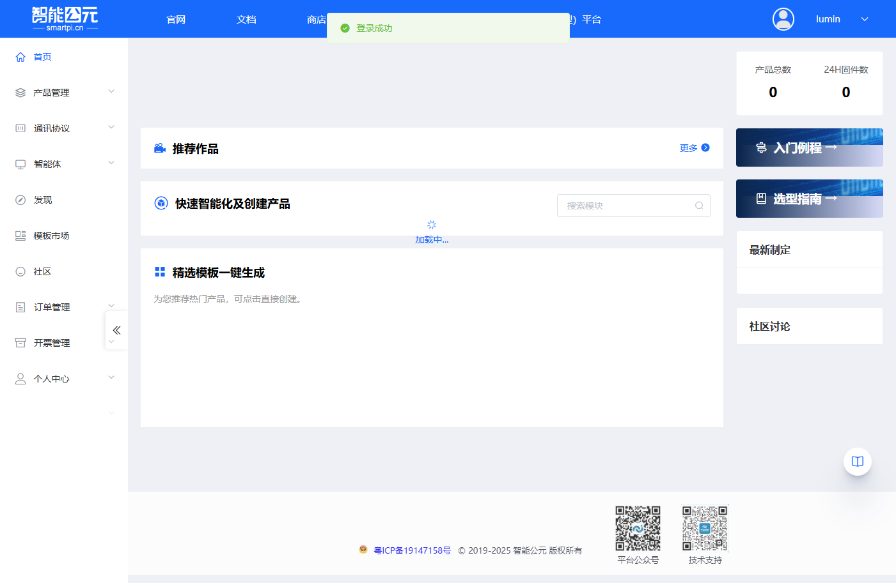
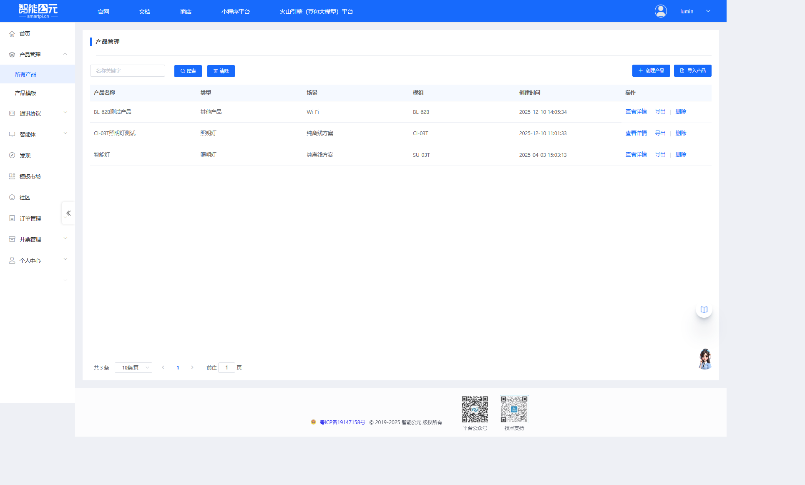
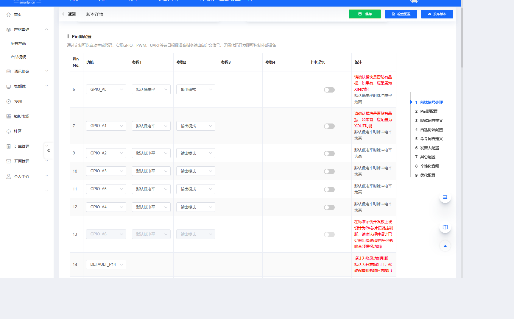

# 固件配置全流程

> 本文以智能公元平台的「产品管理 → 产品详情 → 版本配置」为主线，带你从 0 开始完成一次固件配置，并指出每一步和固件的关系。

## 快速访问

- **产品管理页面**：[https://smartpi.cn/#/productManage](https://smartpi.cn/#/productManage)
- **智能公元平台首页**：[https://smartpi.cn](https://smartpi.cn)

## 1. 进入产品管理

1. 登录智能公元平台（[smartpi.cn](https://smartpi.cn)）。
    
2. 在左侧导航菜单中，点击「产品管理」，展开子菜单后选择「所有产品」。
3. 进入产品管理页面，可以看到产品列表。

### 产品管理页面功能

产品管理页面主要包含以下功能区域：

- **搜索区域**：支持按产品名称关键字搜索产品
- **操作按钮**：

    - **导入产品**：从文件导入已有产品配置
    - **创建产品**：创建新的产品项目
- **产品列表表格**：显示所有已创建的产品，包含以下列：

    - **产品名称**：产品的标识名称
    - **类型**：产品类型（如：照明灯、RGB 灯、路灯等）
    - **场景**：应用场景（如：纯离线方案、大模型、WiFi 等）
    - **模组**：使用的硬件模组型号（如：SU-03T、CI-03T、JX-A7T WiFi 等）
    - **创建时间**：产品创建的时间戳
    - **操作**：每行产品提供三个操作按钮
    - **查看详情**：进入产品详情页面，进行版本配置
    - **导出**：导出产品配置文件
    - **删除**：删除该产品（请谨慎操作）

4. 在产品列表中找到目标产品，点击「查看详情」按钮进入产品详情页。

> **建议**：为不同模组（如 SU-03T、CI-03T 等）分别创建产品，方便后续维护和版本管理。

## 2. 产品详情与版本列表

点击「查看详情」后，进入产品详情页面。在产品详情页可以看到：

### 页面布局

- **基本信息区域**：显示产品的基本信息

    - 产品名称
    - 产品类型
    - 模组型号
    - 语言设置
    - 其他产品属性

- **操作步骤引导**：页面顶部通常会有操作流程提示

    - 产品定义 → 版本配置 → 发布版本 → 下载固件

- **版本列表**：页面主体部分显示该产品的所有版本配置
    - 每一行代表一个固件版本
    - 显示版本号、创建时间、状态等信息

### 版本管理操作

在版本列表中，你可以执行以下操作：

- **新建版本配置**：创建全新的固件版本
- **复制已有版本**：基于现有版本创建副本，然后进行调整
- **编辑版本**：修改已有版本的配置参数
- **查看版本状态**：查看某个版本当前的 SDK 状态 / 网料状态
    - SDK 状态：固件编译生成状态
    - 网料状态：网络固件包生成状态

## 3. 新建或编辑版本

### 创建新版本

1. 在产品详情页的版本列表中，点击「新建版本」按钮。
2. 系统会引导你进入「版本配置」向导页面。

### 版本配置界面

版本配置页面采用向导式设计，通常包含以下元素：

- **左侧配置区域**：显示当前步骤的具体配置选项和参数
- **右侧步骤菜单**：显示所有配置步骤的导航列表，常见步骤包括：

    - 额外唤醒与功耗
    - Pin 脚配置（GPIO 配置）
    - 命令词与行为
    - 变量与逻辑控制
    - 通讯 / 串口参数
    - 其他高级配置

### 配置流程

1. 按照右侧步骤菜单的顺序，依次完成每个步骤的配置。
2. 每个步骤完成后，可以点击「下一步」或直接点击其他步骤进行跳转。
3. 配置过程中可以随时保存，避免数据丢失。

> **提示**：后续文档《版本配置参数详解》会逐项解释每个页面、每个字段的含义，这里以流程为主。建议初次使用时，按照步骤顺序逐一配置，熟悉后可以灵活跳转。

## 4. 按步骤完成版本配置

可以按右侧步骤顺序配置，例如：

1. 额外唤醒与功耗
2. Pin 脚配置
3. 命令词与行为
4. 变量与逻辑控制
5. 通讯 / 串口参数
6. 其他高级配置

每一步的常见配置思路和参数说明，请参考：

- 《版本配置参数详解》
- 《GPIO 电平翻转时间控制》
- 《串口输入参数配置》
- 《变量控制配置》
- 《设备行为 ID 配置》

示例页面便于理解各步骤（不同模组界面略有差异）：

## 5. 配置检查与保存

1. 完成所有步骤后，点击页面中的「保存」或「检查配置」完成必填项校验。
2. 若有红色提示或校验失败，根据提示回到对应步骤修改参数；常见为必填漏填、Pin 冲突、命令词重复等。
3. 建议在关键步骤（Pin、命令词、变量）调整后立即保存，避免浏览器刷新导致数据丢失。
4. 保存成功后，当前版本配置会以草稿/未发布状态记录在版本列表中，可随时继续编辑。

## 6. 发布版本

1. 在产品详情页的版本列表中，找到刚配置的版本。
2. 确认版本信息无误后点击「发布」或类似按钮，使该版本进入可下载状态。
3. 发布会触发 SDK 与网料的生成/更新；生成状态通常显示为“编译中/生成中 → 生成完成”。
4. 若发布后状态长时间未完成，可查看错误提示或重新发布；修改配置后需再次发布才能生成新的固件。

> 发布是生成可用固件前的必要步骤，未发布的版本通常无法直接下载固件。

## 7. 下载固件

### 下载步骤

1. 在产品详情页的版本列表中，找到已发布的版本（状态显示为"已发布"或"生成完成"）。
2. 在该版本的操作列中，点击「下载固件」按钮或相关入口。
3. 系统会弹出下载对话框，选择需要的固件类型：

    - **标准固件**：用于正式发布的固件版本
    - **调试固件**：包含调试信息的固件版本，便于问题排查
    - **其他类型**：根据模组类型可能还有其他固件格式
4. 点击下载后，固件文件会保存到本地。

### 固件使用

下载完成后，可配合相应的烧录工具将固件写入到模组中：

- 使用官方提供的烧录工具（如 SU-03T 烧录工具、CI-03T 烧录工具等）
- 按照对应模组的烧录指南进行操作
- 烧录成功后，即可在硬件上测试固件功能

> **注意**：不同模组的烧录方式可能不同，请参考对应模组的烧录文档。

## 8. 常见问题与排查建议

- 已配置但列表中看不到新版本？检查是否点击了保存或发布。
- 下载按钮灰色？查看版本当前的 SDK / 网料状态是否已生成完成。
- 烧录后无语音效果？结合《平台与固件 FAQ》《语音调优》等文档排查。

### 平台编译速度很慢或生成失败怎么办？

**问题描述：**

平台编译速度极慢，即使"快速"模式也需要1小时以上，且生成固件失败，重新继承也无法在合理时间内完成。

**解决方案：**

**1. 问题原因分析**

- **服务器负载**：可能遇到服务器维护或高负载情况
- **配置复杂度**：命令词数量过多或配置复杂会增加编译时间
- **网络稳定性**：网络连接问题可能导致生成中断

**2. 处理步骤**

- **检查状态**：

    - 查看版本发布的SDK/网料状态
    - 确认是否显示"编译中"或"生成中"
    - 注意是否有错误提示信息

- **重新操作**：

    - 使用"继承"功能重新生成
    - 尝试简化配置（如减少命令词数量）
    - 选择非高峰时段进行操作

**3. 替代方案**

- **更换模组**：

    - 如问题持续，可尝试使用其他型号模组
    - 不同模组的编译效率可能有差异

- **联系支持**：

    - 向技术支持反馈具体问题
    - 提供版本号和操作时间
    - 确认服务器状态是否正常

**注意事项：**

- 正常情况下编译应在几分钟内完成
- 长时间编译可能是服务器或系统问题
- 建议保存配置草稿，避免重复操作

---

> 下一步：建议配合《版本配置参数详解》一起阅读，从整体流程视角和参数细节视角同时理解平台配置。
