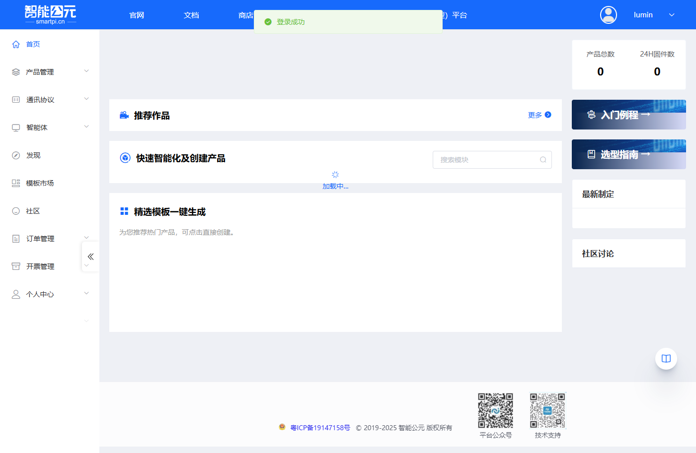
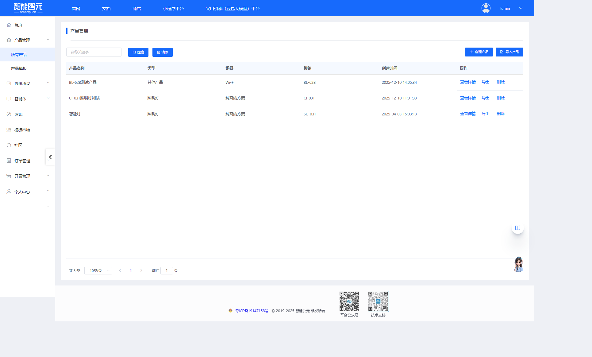
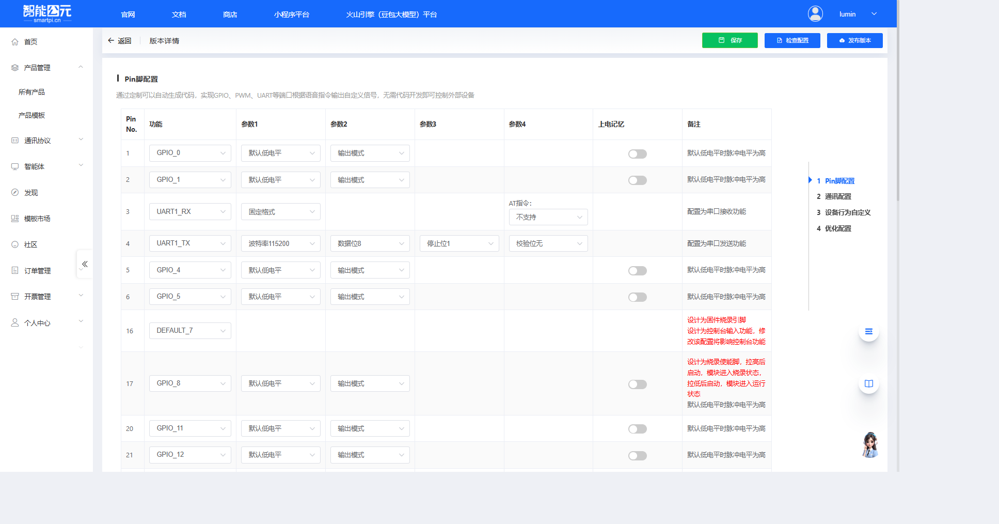
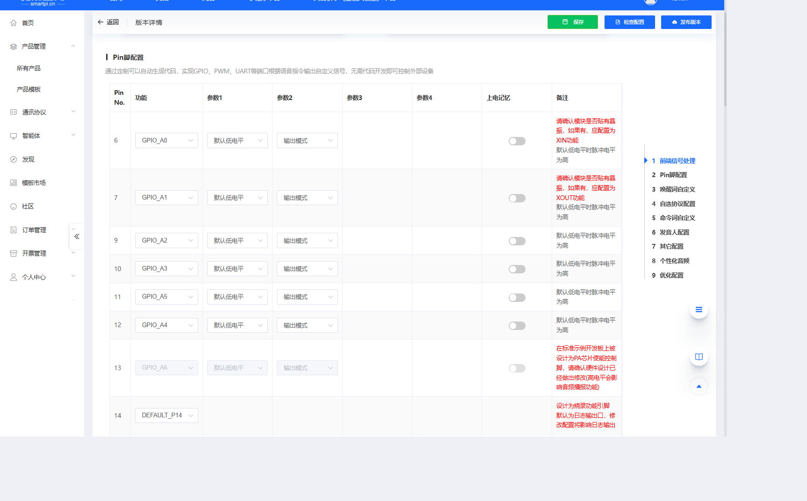
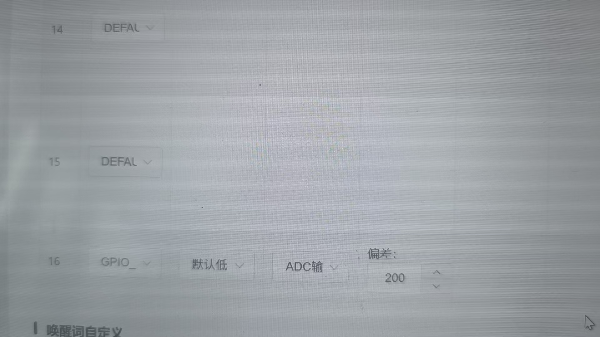
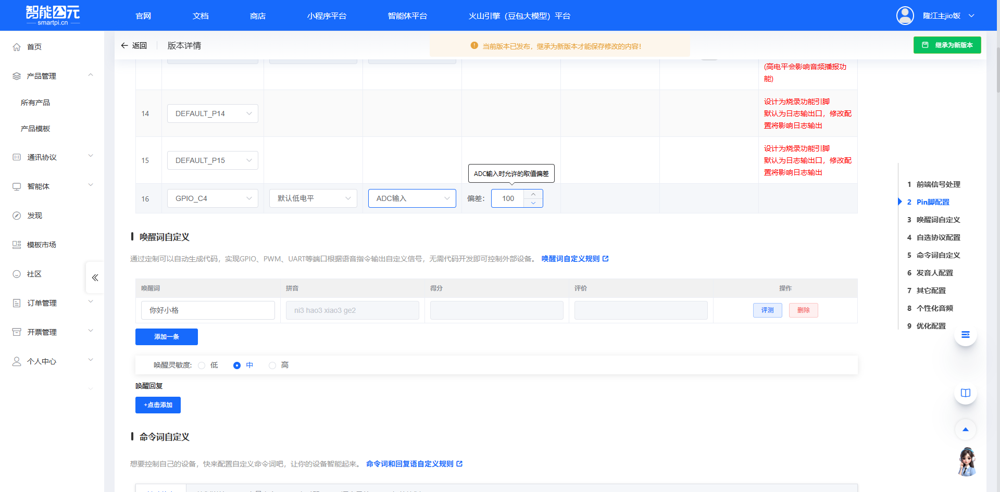
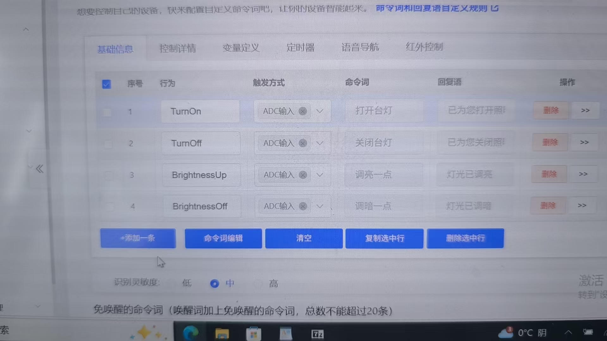

# 固件配置全流程

> 本文以智能公元平台的「产品管理 → 产品详情 → 版本配置」为主线，带你从 0 开始完成一次固件配置，并指出每一步和固件的关系。

## 快速访问

- **产品管理页面**：[https://smartpi.cn/#/productManage](https://smartpi.cn/#/productManage)
- **智能公元平台首页**：[https://smartpi.cn](https://smartpi.cn)

## 1. 进入产品管理

1. 登录智能公元平台（[smartpi.cn](https://smartpi.cn)）。
    
2. 在左侧导航菜单中，点击「产品管理」，展开子菜单后选择「所有产品」。
3. 进入产品管理页面，可以看到产品列表。



### 产品管理页面功能

产品管理页面主要包含以下功能区域：

- **搜索区域**：支持按产品名称关键字搜索产品
- **操作按钮**：

    - **导入产品**：从文件导入已有产品配置
    - **创建产品**：创建新的产品项目
- **产品列表表格**：显示所有已创建的产品，包含以下列：

    - **产品名称**：产品的标识名称
    - **类型**：产品类型（如：照明灯、RGB 灯、路灯等）
    - **场景**：应用场景（如：纯离线方案、大模型、WiFi 等）
    - **模组**：使用的硬件模组型号（如：SU-03T、CI-03T、JX-A7T WiFi 等）
    - **创建时间**：产品创建的时间戳
    - **操作**：每行产品提供三个操作按钮
    - **查看详情**：进入产品详情页面，进行版本配置
    - **导出**：导出产品配置文件
    - **删除**：删除该产品（请谨慎操作）

4. 在产品列表中找到目标产品，点击「查看详情」按钮进入产品详情页。

> **建议**：为不同模组（如 SU-03T、CI-03T 等）分别创建产品，方便后续维护和版本管理。

## 2. 产品详情与版本列表

点击「查看详情」后，进入产品详情页面。在产品详情页可以看到：

### 页面布局

- **基本信息区域**：显示产品的基本信息

    - 产品名称
    - 产品类型
    - 模组型号
    - 语言设置
    - 其他产品属性

- **操作步骤引导**：页面顶部通常会有操作流程提示

    - 产品定义 → 版本配置 → 发布版本 → 下载固件

- **版本列表**：页面主体部分显示该产品的所有版本配置
    - 每一行代表一个固件版本
    - 显示版本号、创建时间、状态等信息

### 版本管理操作

在版本列表中，你可以执行以下操作：

- **新建版本配置**：创建全新的固件版本
- **复制已有版本**：基于现有版本创建副本，然后进行调整
- **编辑版本**：修改已有版本的配置参数
- **查看版本状态**：查看某个版本当前的 SDK 状态 / 网料状态
    - SDK 状态：固件编译生成状态
    - 网料状态：网络固件包生成状态

## 3. 新建或编辑版本


### 不同模块工程间可以复制配置吗？

**问题描述：**

需要将一个模块（如 CI-03T）工程中的配置复制到另一个模块（如 SU-03T）工程中。

**说明：**

- **不同模块工程无法直接复制**：由于不同模块的硬件引脚、功能特性存在差异，平台不支持跨模块工程的直接复制
- **手动复制内容**：可以手动复制命令词和回复语，但需要在新工程中重新配置
- **配置需重设**：引脚配置、串口参数、GPIO 定义等需要根据新模块重新设置

**建议操作流程：**

1. **创建新工程**：为目标模块创建新的产品工程
2. **复制命令词**：将原工程的命令词内容复制到新工程
3. **复制回复语**：将原工程的回复语内容复制到新工程
4. **重新配置**：根据目标模块的引脚定义重新配置 GPIO、串口等参数
5. **测试验证**：生成固件后进行功能测试

### 如何创建英文语音工程？

**问题描述：**

需要创建英文语音识别的工程配置。

**操作步骤：**

1. **创建产品**：在产品管理页面点击「创建产品」
2. **选择语言**：在产品基本信息中选择「英文」
3. **配置命令词**：使用英文词条配置命令词（如 "Turn on"、"Turn off"）
4. **配置回复语**：设置英文的回复语内容

**注意事项：**

- 英文词条需要使用英文单词或短语
- 英文识别率可能与中文存在差异
- 建议使用简单易识别的英文单词
- 可通过调整识别灵敏度优化识别效果

### 创建新版本

1. 在产品详情页的版本列表中，点击「新建版本」按钮。
2. 系统会引导你进入「版本配置」向导页面。

### 版本配置界面

版本配置页面采用向导式设计，通常包含以下元素：

- **左侧配置区域**：显示当前步骤的具体配置选项和参数
- **右侧步骤菜单**：显示所有配置步骤的导航列表，常见步骤包括：

    - 额外唤醒与功耗
    - Pin 脚配置（GPIO 配置）
    - 命令词与行为
    - 变量与逻辑控制
    - 通讯 / 串口参数
    - 其他高级配置



### 配置流程

1. 按照右侧步骤菜单的顺序，依次完成每个步骤的配置。
2. 每个步骤完成后，可以点击「下一步」或直接点击其他步骤进行跳转。
3. 配置过程中可以随时保存，避免数据丢失。

> **提示**：后续文档《版本配置参数详解》会逐项解释每个页面、每个字段的含义，这里以流程为主。建议初次使用时，按照步骤顺序逐一配置，熟悉后可以灵活跳转。

## 4. 按步骤完成版本配置

可以按右侧步骤顺序配置，例如：

1. 额外唤醒与功耗
2. Pin 脚配置
3. 命令词与行为
4. 变量与逻辑控制
5. 通讯 / 串口参数
6. 其他高级配置

每一步的常见配置思路和参数说明，请参考：

- 《版本配置参数详解》
- 《GPIO 电平翻转时间控制》
- 《串口输入参数配置》
- 《变量控制配置》
- 《设备行为 ID 配置》

示例页面便于理解各步骤（不同模组界面略有差异）：



### GPIO 输入触发配置指南

#### 问题描述

配置 GPIO 输入触发时，发现触发方式下拉菜单中显示“暂无数据”，无法选择 GPIO 输入引脚进行触发配置。

#### 解决方案

##### 问题原因分析

出现“暂无数据”的原因是没有预先配置 GPIO 引脚功能。GPIO 输入触发需要先在 Pin 脚配置中定义 GPIO 引脚为输入模式，才能在触发配置中选择。

##### 配置步骤

###### 第一步：Pin 脚配置

1. **进入 Pin 脚配置页面**
    - 在平台配置中找到“Pin 脚配置”标签页
    - 这是配置流程中的第 2 步

2. **配置 GPIO 为输入模式**
    - 选择需要使用的 GPIO 引脚（如 A4、A5 等）
    - 设置引脚功能为“GPIO 输入”
    - 不要设置为“GPIO 输出”
    - 保存配置

3. **注意事项**
    - 确认模组的该引脚支持输入功能
    - 不同模组支持的 GPIO 引脚数量不同
    - 部分引脚可能有复用功能，需要避免冲突

###### 第二步：添加触发

1. **进入触发配置界面**
    - 在配置界面中点击“添加触发”
    - 弹出触发配置对话框

2. **选择触发方式**
    - 触发方式：选择“GPIO 输入”
    - GPIO 输入：现在可以选择已配置的输入引脚
    - 行为：选择触发后要执行的动作

3. **配置触发条件**
    - 选择高电平触发或低电平触发
    - 根据外部电路设计选择合适的触发条件

###### 第三步：配置触发动作

1. **选择执行的行为**
    - 可以是播报语音
    - 可以是 GPIO 输出控制
    - 可以是串口发送数据
    - 可以是变量赋值等

2. **测试验证**
    - 生成固件并烧录
    - 通过外部信号测试触发功能
    - 验证触发条件是否正确

##### 配置示例

###### 示例 1：按键触发播报

**需求：** 按下按键时播报“欢迎使用”。

**配置步骤：**

1. Pin 脚配置：

    - 引脚：A7
    - 功能：GPIO 输入
    - 默认电平：高电平（按键下拉）

2. 触发配置：

    - 触发方式：GPIO 输入
    - GPIO 输入：A7
    - 触发条件：低电平（按键按下）
    - 行为：播放语音
    - 播报内容：“欢迎使用”

###### 示例 2：传感器触发控制

**需求：** 传感器检测到信号时控制继电器。

**配置步骤：**

1. Pin 脚配置：

    - 引脚：A5
    - 功能：GPIO 输入
    - 默认电平：低电平

2. 触发配置：

    - 触发方式：GPIO 输入
    - GPIO 输入：A5
    - 触发条件：高电平（传感器信号）
    - 行为：GPIO 控制
    - 控制引脚：B0
    - 输出电平：高电平

##### 常见问题

###### 1. 无法选择 GPIO 输入

**问题：** GPIO 输入下拉菜单显示“暂无数据”。

**解决：**

- 检查是否已完成 Pin 脚配置
- 确认引脚功能设置为“GPIO 输入”
- 保存配置后重新进入触发配置

###### 2. 触发不响应

**可能原因：**

- 外部电路连接错误
- 触发电平不匹配
- 引脚被其他功能占用

**解决方法：**

- 检查硬件连接
- 测量引脚电平
- 确认引脚没有被复用

###### 3. 误触发问题

**现象：** 没有触发信号但产生误触发。

**解决：**

- 增加上拉/下拉电阻
- 软件添加消抖处理
- 检查电源稳定性

###### 4. 引脚触发方向能否反转？

**问题：** 是否可以将引脚触发方向反转（如低电平触发改为高电平触发）？

**说明：**

平台引脚配置模式是固定的，不支持引脚触发方向反转功能。可用的配置选项：

- **高电平触发**：检测到高电平信号时触发
- **低电平触发**：检测到低电平信号时触发

**解决方法：**

- 根据外部电路特性选择合适的触发条件（高电平或低电平）
- 如需同时响应两种电平，可添加两个触发条件（高电平触发和低电平触发各一个）
- 通过硬件设计调整信号的极性（如使用三极管反相电路）

##### 不同模组的 GPIO 配置

###### SU-03T 系列

- **可用引脚**：Pin 3-12 (GPIO_A25~GPIO_A33、GPIO_B6)
- **特点**：支持 GPIO、PWM、UART 复用
- **注意**：配置为 GPIO 时，默认低电平，脉冲电平为高

###### CI-03T/CI-33T 系列

- **可用引脚**：

    - Pin 6 (GPIO_A0)
    - Pin 7 (GPIO_A1)
    - Pin 9-12 (GPIO_A2-A5)
    - Pin 13 (GPIO_A6)
    - Pin 16 (GPIO_C4)
- **特点**：功能丰富，支持多种复用

###### SU-63T

- **可用引脚**：Pin 3-20
- **特点**：引脚资源丰富，支持小程序功能

##### 硬件连接建议

###### 按键连接

```
GPIO引脚 ——+—— 按键 —— GND
             |
          10kΩ上拉电阻
             |
            VCC (3.3V)
```

###### 传感器连接

```
传感器信号 —— 100Ω电阻 —— GPIO引脚
                         |
                      10kΩ下拉电阻
                         |
                        GND
```

##### 调试技巧

1. **使用串口调试**
    - 添加串口输出显示触发状态
    - 便于确认触发是否发生

2. **添加 LED 指示**
    - 使用 GPIO 输出控制 LED
    - 直观显示触发状态

3. **逻辑分析仪**
    - 捕获 GPIO 波形
    - 分析触发时序

##### 最佳实践

1. **规划引脚使用**
    - 输入输出分开规划
    - 预留调试用的 GPIO

2. **硬件设计**
    - 预留上拉/下拉电阻位置
    - 考虑信号完整性

3. **软件配置**
    - 使用有意义的触发名称
    - 添加必要的触发条件

4. **测试验证**
    - 分别测试硬件和软件
    - 进行边界条件测试

##### 注意事项

- **电平匹配**：确保外部信号电平与模组兼容（3.3V）
- **电流限制**：GPIO 输入电流有限，避免直接驱动大电流
- **防静电**：操作时注意防静电措施
- **配置备份**：重要配置要及时备份

通过以上配置步骤，可以成功实现 GPIO 输入触发功能。关键是要先完成 Pin 脚配置，定义引脚为输入模式，然后才能在触发配置中选择使用。

### ADC 输入触发配置指南

#### 问题描述

需要使用 ADC（模数转换）输入作为触发方式，例如通过 ADC 检测模拟按键或传感器信号来触发语音指令。

#### 解决方案

##### 第一步：Pin 脚配置

1. **进入 Pin 脚配置页面**
    - 在平台配置中找到"Pin 脚配置"标签页
    - 这是配置流程中的第 2 步

2. **配置引脚为 ADC 输入模式**
    - 选择需要使用的引脚（如 GPIO_C4）
    - 设置引脚功能为"ADC输入"
    - 设置偏差值（deviation）：允许的取值偏差范围
    - 保存配置

3. **偏差值说明**
    - 偏差值是 ADC 触发的允许误差范围
    - 例如：ADC 输入取值为 614，偏差设置为 200
    - 则实际 ADC 值在 414~814 范围内都能触发
    - 计算公式：触发范围 = [取值 - 偏差, 取值 + 偏差]



##### 第二步：添加触发

1. **进入控制详情页面**
    - 在配置界面中点击"控制详情"标签
    - 找到需要配置的命令词

2. **选择触发方式**
    - 触发方式：选择"ADC输入"
    - 确认已在 Pin 脚配置中将对应引脚设置为 ADC 输入模式

3. **配置 ADC 触发参数**
    - 设置 ADC 输入的取值（目标值）
    - 设置偏差值（允许的误差范围）
    - 系统会自动计算触发范围



##### 第三步：常见问题排查

**问题：无法添加 ADC 触发**

如果在触发方式中选择 ADC 输入后无法添加触发：

1. **检查 Pin 脚配置**
    - 确认对应引脚已设置为"ADC输入"模式
    - 不要设置为"GPIO 输入"或"GPIO 输出"

2. **刷新页面重试**
    - 可能是浏览器缓存问题
    - 刷新页面后重新尝试添加触发

3. **重新创建工程**
    - 如果问题持续存在，可能是工程文件损坏
    - 尝试创建新的工程进行配置



#### 注意事项

- **模组支持**：并非所有模组都支持 ADC 输入触发功能，请确认模组型号
- **电压范围**：ADC 输入电压范围通常为 0-3.3V，超过可能损坏模组
- **偏差设置**：偏差值设置过小可能导致触发不稳定，设置过大会增加误触发
- **教程参考**：可参考官方 ADC 按键教程视频了解具体应用示例

## 5. 配置检查与保存

1. 完成所有步骤后，点击页面中的「保存」或「检查配置」完成必填项校验。
2. 若有红色提示或校验失败，根据提示回到对应步骤修改参数；常见为必填漏填、Pin 冲突、命令词重复等。
3. 建议在关键步骤（Pin、命令词、变量）调整后立即保存，避免浏览器刷新导致数据丢失。
4. 保存成功后，当前版本配置会以草稿/未发布状态记录在版本列表中，可随时继续编辑。

## 6. 发布版本

1. 在产品详情页的版本列表中，找到刚配置的版本。
2. 确认版本信息无误后点击「发布」或类似按钮，使该版本进入可下载状态。
3. 发布会触发 SDK 与网料的生成/更新；生成状态通常显示为“编译中/生成中 → 生成完成”。
4. 若发布后状态长时间未完成，可查看错误提示或重新发布；修改配置后需再次发布才能生成新的固件。

> 发布是生成可用固件前的必要步骤，未发布的版本通常无法直接下载固件。

## 7. 下载固件

### 下载步骤

1. 在产品详情页的版本列表中，找到已发布的版本（状态显示为"已发布"或"生成完成"）。
2. 在该版本的操作列中，点击「下载固件」按钮或相关入口。
3. 系统会弹出下载对话框，选择需要的固件类型：

    - **标准固件**：用于正式发布的固件版本
    - **调试固件**：包含调试信息的固件版本，便于问题排查
    - **其他类型**：根据模组类型可能还有其他固件格式
4. 点击下载后，固件文件会保存到本地。

### 固件使用

下载完成后，可配合相应的烧录工具将固件写入到模组中：

- 使用官方提供的烧录工具（如 SU-03T 烧录工具、CI-03T 烧录工具等）
- 按照对应模组的烧录指南进行操作
- 烧录成功后，即可在硬件上测试固件功能

> **注意**：不同模组的烧录方式可能不同，请参考对应模组的烧录文档。

## 8. 常见问题与排查建议

- 已配置但列表中看不到新版本？检查是否点击了保存或发布。
- 下载按钮灰色？查看版本当前的 SDK / 网料状态是否已生成完成。
- 烧录后无语音效果？结合《平台与固件 FAQ》《语音调优》等文档排查。

- 配置时提示"申请失败"？查看下方专门的处理步骤。

### 配置时提示"申请失败"怎么办？

**问题描述：**

在平台配置过程中，点击保存或生成操作时，界面弹出红色提示框显示"申请失败"，导致配置无法保存或固件无法生成。

**解决方案：**

**1. 问题原因分析**

- **网络波动**：网络连接不稳定可能导致请求超时或失败
- **源文件损坏**：网络传输过程中文件可能损坏
- **服务器负载**：服务器临时过载或维护
- **浏览器缓存**：缓存数据与当前操作冲突

**2. 处理步骤**

- **立即重试**：

    - 刷新页面后重新操作
    - 检查网络连接是否稳定
    - 清除浏览器缓存后重试

- **新建版本**：

    - 使用"继承"功能创建新版本
    - 或直接新建版本配置
    - 避免使用可能已损坏的配置文件

- **检查配置**：

    - 确认必填项已完整填写
    - 检查是否有配置冲突
    - 验证上传文件的完整性

**3. 预防措施**

- **定期保存**：配置过程中及时保存草稿
- **网络稳定**：确保网络连接稳定时操作
- **避开高峰**：选择服务器负载较低的时间段
- **配置备份**：导出配置文件作为备份

**注意事项：**

- "申请失败"通常是临时性问题，重试往往能解决
- 如持续失败，建议导出配置联系技术支持
- 保留错误截图有助于问题排查

### 平台编译速度很慢或生成失败怎么办？

**问题描述：**

平台编译速度极慢，即使"快速"模式也需要1小时以上，且生成固件失败，重新继承也无法在合理时间内完成。

**解决方案：**

**1. 问题原因分析**

- **服务器负载**：可能遇到服务器维护或高负载情况
- **配置复杂度**：命令词数量过多或配置复杂会增加编译时间
- **网络稳定性**：网络连接问题可能导致生成中断

**2. 处理步骤**

- **检查状态**：

    - 查看版本发布的SDK/网料状态
    - 确认是否显示"编译中"或"生成中"
    - 注意是否有错误提示信息

- **重新操作**：

    - 使用"继承"功能重新生成
    - 尝试简化配置（如减少命令词数量）
    - 选择非高峰时段进行操作

**3. 替代方案**

- **更换模组**：

    - 如问题持续，可尝试使用其他型号模组
    - 不同模组的编译效率可能有差异

- **联系支持**：

    - 向技术支持反馈具体问题
    - 提供版本号和操作时间
    - 确认服务器状态是否正常

**注意事项：**

- 正常情况下编译应在几分钟内完成
- 长时间编译可能是服务器或系统问题
- 建议保存配置草稿，避免重复操作

---

> 下一步：建议配合《版本配置参数详解》一起阅读，从整体流程视角和参数细节视角同时理解平台配置。
