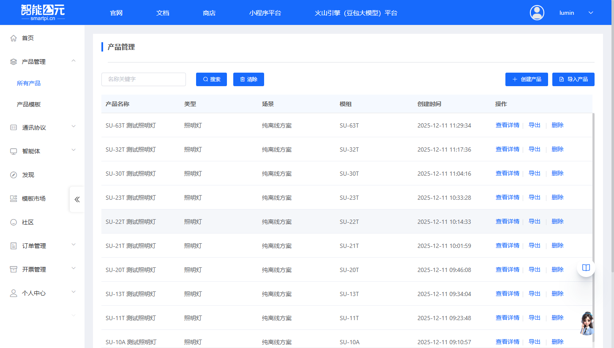
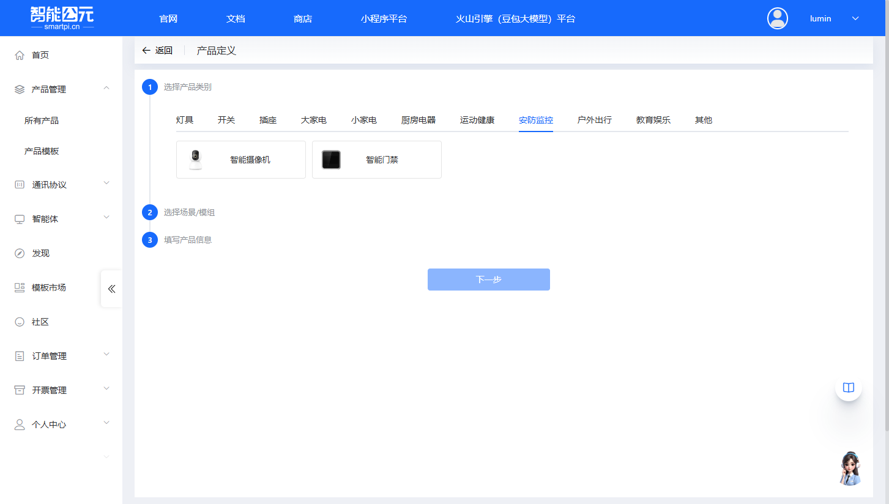
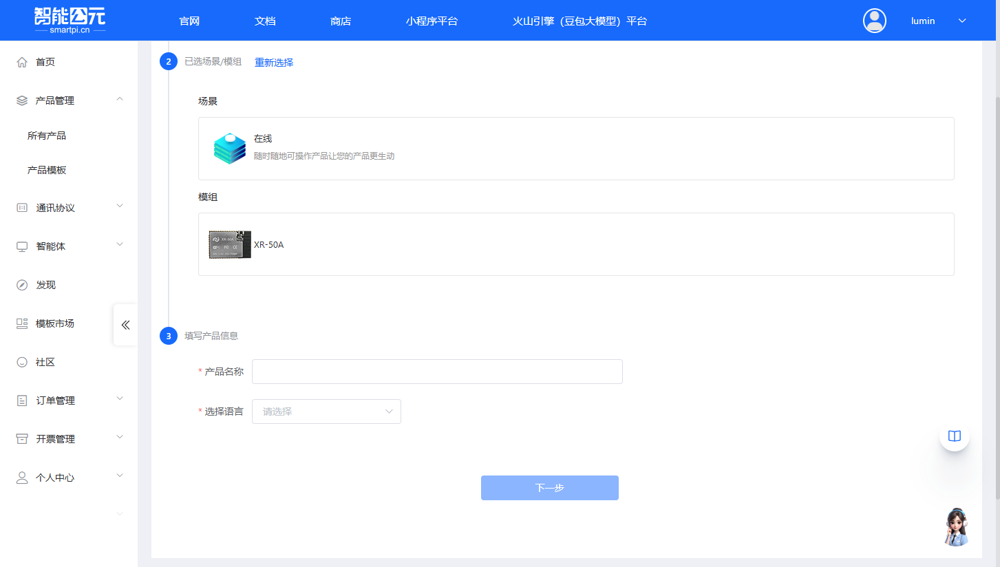
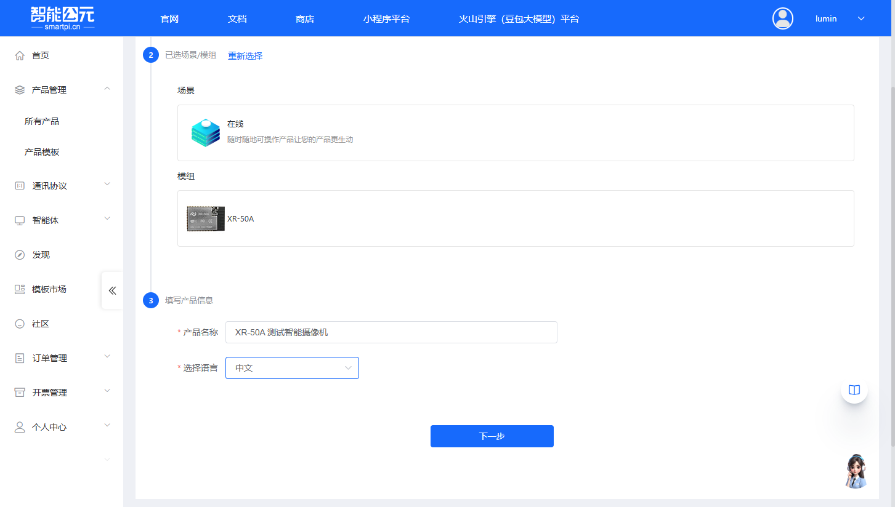
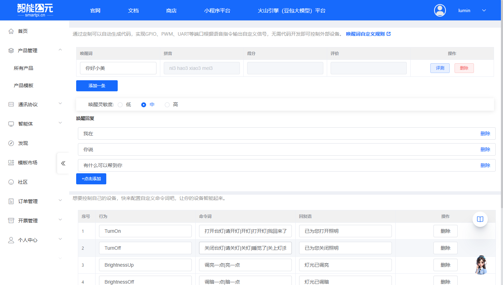
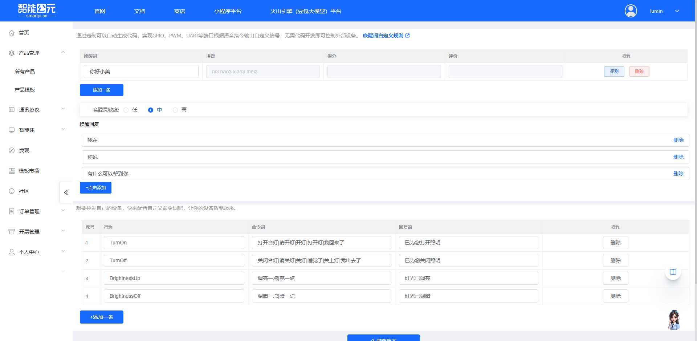

# XR-50A 固件配置

> 本文档专门针对 **XR-50A** WiFi 图像模组的固件配置，提供该模组特有的配置参数和注意事项。

## 模组信息

- **模组型号**：XR-50A
- **模组类型**：WiFi 图像模组
- **主要功能**：图像采集与传输
- **网络支持**：WiFi 连接

## 创建产品

在开始配置固件之前，需要先在智能公元平台创建对应的产品。以下是创建 XR-50A 产品的详细步骤：

### 1. 进入产品管理页面

1. 登录智能公元平台（[smartpi.cn](https://smartpi.cn)）
2. 在左侧导航菜单中，点击「产品管理」，展开子菜单后选择「所有产品」
3. 进入产品管理页面，可以看到产品列表和操作按钮

### 2. 点击创建产品

在产品管理页面右上角，点击蓝色的「创建产品」按钮，进入产品创建向导。

### 3. 选择产品类别

产品创建向导分为三个步骤。第一步是选择产品类别：

1. 在「选择产品类别」步骤中，可以看到多个产品类别标签页（灯具、开关、插座、安防监控等）
2. 对于 XR-50A 模组，作为图像模组，通常选择「安防监控」类别
3. 在安防监控类别下，选择「智能摄像机」类型

**示例**：选择「安防监控」类别下的「智能摄像机」类型，点击对应的卡片完成选择。

### 4. 选择场景和模组

第二步是选择应用场景和硬件模组：

#### 4.1 选择场景

在「选择场景/模组」步骤中，首先选择应用场景：

- **纯离线方案**：无需连网，离线也能操作
- **Wi-Fi**：Wi-Fi 产品，可远程控制产品
- **大模型**：离在线操作，可接入大模型智能体
- **在线**：随时随地可操作产品（**推荐用于 XR-50A**）

**对于 XR-50A**：选择「在线」场景，因为 XR-50A 是 WiFi 图像模组，需要在线传输图像数据。

#### 4.2 选择模组

选择场景后，页面会自动切换到「选择模组」标签页，显示可用的模组列表：

1. 在模组列表中查找并选择 **XR-50A**
2. 可以看到模组的详细信息：

    - WiFi 图像模组
    - 支持图像采集与传输
    - 支持 WiFi 连接

3. 点击 XR-50A 模组卡片完成选择

### 5. 填写产品信息

第三步是填写产品的基本信息：

1. **产品名称**（必填）：

    - 输入一个有意义的产品名称，例如：「XR-50A 测试智能摄像机」
    - 建议使用能清楚标识产品用途的名称

2. **选择语言**（必填）：

    - 从下拉菜单中选择语言，支持：中文、英文
    - 根据目标市场选择合适的语言

3. 填写完成后，点击页面底部的「下一步」按钮

### 6. 产品创建完成

完成上述步骤后，系统会自动创建产品并跳转到「版本详情」页面，此时可以开始配置固件版本。

在版本详情页面，可以看到配置步骤。XR-50A 的配置页面包含语音控制配置，通过语音指令控制 GPIO、PWM、UART 等端口输出自定义信号，无需代码开发即可控制外部设备。

配置步骤包括：

- 唤醒词自定义
- 命令词自定义

## 配置流程

产品创建完成后，XR-50A 的固件配置遵循标准的[固件配置全流程](./firmware-config-workflow.md)，主要步骤包括：

1. [进入产品管理](./firmware-config-workflow.md#1-进入产品管理)
2. [产品详情与版本列表](./firmware-config-workflow.md#2-产品详情与版本列表)
3. [新建或编辑版本](./firmware-config-workflow.md#3-新建或编辑版本)
4. [按步骤完成版本配置](./firmware-config-workflow.md#4-按步骤完成版本配置)
5. [配置检查与保存](./firmware-config-workflow.md#5-配置检查与保存)
6. [发布版本](./firmware-config-workflow.md#6-发布版本)
7. [下载固件](./firmware-config-workflow.md#7-下载固件)

## 版本配置详解

产品创建完成后，进入版本详情页面进行固件配置。XR-50A 的配置页面通过语音指令控制 GPIO、PWM、UART 等端口输出自定义信号，无需代码开发即可控制外部设备。

### 1. 唤醒词自定义

**功能说明**：配置设备唤醒词，用户说出唤醒词后设备进入语音识别状态。

**配置项**：

#### 1.1 唤醒词列表

- 表格显示已配置的唤醒词
- 列包括：唤醒词、拼音、得分、评价、操作
- 默认唤醒词示例：「你好小美」
- 可以点击「添加一条」添加新的唤醒词
- 可以对唤醒词进行「评测」和「删除」操作
- 支持自定义唤醒词，建议使用3-5个音节的词组

#### 1.2 唤醒灵敏度

- **低**：唤醒灵敏度较低，减少误唤醒，但可能降低唤醒率
- **中**：平衡唤醒率和误唤醒率（推荐，默认选择）
- **高**：唤醒灵敏度较高，提高唤醒率，但可能增加误唤醒

#### 1.3 唤醒回复

- 配置设备被唤醒后的回复语
- 可以添加多条回复语，系统随机选择
- 默认示例：「我在」、「你说」、「有什么可以帮到你」
- 可以点击「+点击添加」添加新的回复语
- 每条回复语都可以单独删除

> **提示**：唤醒词的选择会影响识别准确率，建议使用平台提供的评测功能测试唤醒词质量。点击「唤醒词自定义规则」可以查看详细的唤醒词配置规则。

### 2. 命令词自定义

**功能说明**：配置语音控制命令词，让设备能够识别用户的语音指令并执行相应操作。通过定制可以自动生成代码，实现 GPIO、PWM、UART 等端口根据语音指令输出自定义信号，无需代码开发即可控制外部设备。

**配置表格**：

配置表格包含以下列：

- **序号**：命令词的序号
- **行为**：行为名称（如 TurnOn、TurnOff、BrightnessUp、BrightnessOff 等）
- **命令词**：语音指令，多个命令词用「|」分隔（如「打开台灯|请开灯|开灯|打开灯|我回来了」）
- **回复语**：设备执行操作后的语音回复（如「已为您打开照明」）
- **操作**：删除按钮，可以删除该条命令词

**配置示例**：

| 序号 | 行为 | 命令词 | 回复语 |
|------|------|--------|--------|
| 1 | TurnOn | 打开台灯\|请开灯\|开灯\|打开灯\|我回来了 | 已为您打开照明 |
| 2 | TurnOff | 关闭台灯\|请关灯\|关灯\|睡觉了\|关上灯\|我出去了 | 已为您关闭照明 |
| 3 | BrightnessUp | 调亮一点\|亮一点 | 灯光已调亮 |
| 4 | BrightnessOff | 调暗一点\|暗一点 | 灯光已调暗 |

**配置说明**：

1. **添加命令词**：

    - 点击「+添加一条」按钮添加新的命令词
    - 填写行为名称、命令词和回复语
    - 命令词可以设置多个同义词，用「|」分隔

2. **行为名称**：

    - 行为名称用于标识不同的操作类型
    - 建议使用英文命名，如 TurnOn、TurnOff 等
    - 行为名称会映射到 GPIO、PWM、UART 等端口的控制信号

3. **命令词设置**：

    - 可以设置多个命令词，用「|」分隔
    - 例如：「打开台灯|请开灯|开灯|打开灯|我回来了」
    - 用户说出任意一个命令词都会触发对应的行为

4. **回复语设置**：

    - 设备执行操作后的语音回复
    - 可以设置为空，表示不回复
    - 建议设置友好的回复语，提升用户体验

> **提示**：命令词的配置会直接影响设备的控制功能。通过配置不同的行为名称和命令词，可以实现对 GPIO、PWM、UART 等端口的精确控制，无需编写代码即可实现复杂的设备控制逻辑。

## 相关文档

- [版本配置参数详解](./firmware-config-parameters.md) - 通用配置参数说明
- [固件配置全流程](./firmware-config-workflow.md) - 完整配置流程
- [XR-50A 模组资料](../wifi-image-xr50a/xr-50a.md) - 模组详细资料
- [XR-50A 烧录与调试](../faq-burning-and-debug/faq-burning-and-debug-xr-50a.md) - 烧录相关问题
- [XR-50A 硬件设计](../faq-hardware-design/faq-hardware-design-xr-50a.md) - 硬件相关问题

## 常见问题

### 配置相关问题

- WiFi 连接失败？检查 SSID 和密码是否正确，信号强度是否足够
- 图像采集异常？检查摄像头连接和图像参数配置
- 图像传输失败？确认网络连接正常，服务器地址和端口配置正确
- Pin 脚配置不生效？确认引脚号与实际硬件一致
- 功耗异常？检查 WiFi 连接状态和图像采集频率

### 获取帮助

如遇到配置问题，可参考：

- [平台与固件 FAQ](../faq-platform-and-firmware/faq-platform-and-firmware-xr-50a.md)
- [应用开发案例](../faq-application-scenarios/faq-application-scenarios-xr-50a.md)
- [模块选型指南](../faq-module-selection/faq-module-selection-xr-50a.md)

---

> **提示**：建议先阅读[固件配置全流程](./firmware-config-workflow.md)了解整体流程，再结合本文档进行 XR-50A 特定配置。XR-50A 作为 WiFi 图像模组，需要特别注意网络和图像相关的配置。

