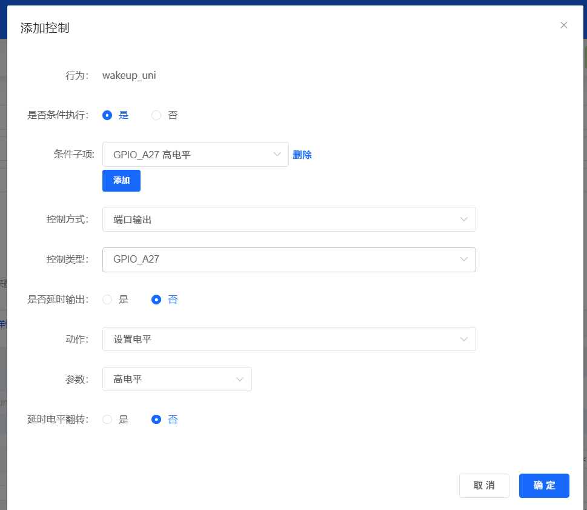
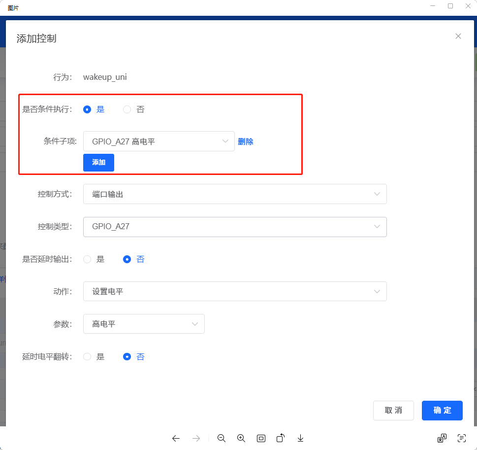

# GPIO控制逻辑配置常见问题

---

### GPIO控制时条件执行与控制逻辑冲突怎么办？

**问题描述：**

配置GPIO控制时，条件执行与控制动作使用同一个GPIO，导致逻辑无法正常执行。例如：条件为"GPIO_A27高电平"，控制动作也是"设置GPIO_A27为高电平"。

**解决方案：**

**问题分析**

1. **逻辑冲突原因**
    - 条件：当A27为高电平时触发
    - 动作：设置A27为高电平
    - 结果：永远无法满足条件，动作不执行

2. **正确的逻辑关系**
    ```
    错误示例：
    条件：GPIO_A27 = 高电平
    动作：设置 GPIO_A27 = 高电平

    正确示例：
    条件：语音命令"开启"
    动作：设置 GPIO_A27 = 高电平

    或：
    条件：GPIO_A27 = 高电平
    动作：设置 GPIO_B26 = 高电平
    ```

**配置方法**

**方法一：去除条件执行**

1. **直接控制模式**
    - "是否条件执行"选择"否"
    - 仅通过语音命令触发
    - 不依赖GPIO状态

2. **配置步骤**
    ```
    第一步：添加控制指令
    第二步：选择控制类型（如GPIO_A27）
    第三步：设置执行动作（设置电平）
    第四步：选择动作值（高电平/低电平）
    第五步：条件执行选"否"
    ```

**方法二：使用不同GPIO**

1. **交叉控制逻辑**
    - 使用GPIO_A26作为条件
    - 控制GPIO_A27输出
    - 避免同一GPIO的条件和动作冲突

2. **配置示例**
    ```
    条件：GPIO_A26 = 高电平（外部触发）
    动作：设置 GPIO_A27 = 高电平

    或：
    条件：语音命令"打开"
    动作：设置 GPIO_A27 = 高电平
    条件：语音命令"关闭"
    动作：设置 GPIO_A27 = 低电平
    ```

**方法三：使用变量作为中介**

1. **变量控制模式**
    - 创建状态变量（如device_status）
    - 通过语音命令改变变量值
    - GPIO控制基于变量值而非GPIO状态

2. **配置流程**
    ```
    步骤1：创建变量 device_status
    步骤2：添加命令"打开设备"
            → 设置 device_status = 1
    步骤3：添加命令"关闭设备"
            → 设置 device_status = 0
    步骤4：添加控制
            → 条件：device_status = 1
            → 动作：设置 GPIO_A27 = 高电平
    ```

**常见应用场景**

**1. 开关控制**
    ```
    语音控制：直接模式，无需条件
    传感器触发：不同GPIO，避免冲突
    定时控制：使用定时器，非GPIO条件
    ```

**2. 互锁控制**
    ```
    设备A开启时，设备B必须关闭：

    - 条件：device_A_status = 1
    - 动作1：设置 GPIO_A27 = 高电平
    - 动作2：设置 GPIO_A26 = 低电平
    ```

**3. 状态反馈**
    ```
    读取外部输入状态：

    - 条件：GPIO_B25 = 低电平
    - 动作：设置 device_mode = "自动"
    - 不同GPIO，避免循环
    ```

**4. 多灯光控制**
    ```
    控制多个独立灯光时，需要为每个灯光重复添加控制：

    - 意图1："打开一号灯光" → GPIO_A25 = 高电平
    - 意图2："打开二号灯光" → GPIO_A26 = 高电平
    - 意图3："打开三号灯光" → GPIO_A27 = 高电平

    配置方法：
    1. 在"添加控制"中选择"端口输出"作为控制方式
    2. 为每个灯光单独添加一条控制记录
    3. 每条控制设置对应的GPIO引脚和电平值
    ```
**配置原则**

1. **避免自引用**
    - 条件和动作不能使用同一GPIO
    - 避免无限循环或死锁

2. **清晰的触发源**
    - 优先使用语音命令作为触发
    - 传感器使用不同GPIO
    - 避免GPIO互相依赖

3. **合理使用变量**
    - 复杂逻辑建议使用变量
    - 变量可以组合多个条件
    - 便于实现状态机

**调试技巧**

1. **使用日志输出**
    - 添加串口输出调试信息
    - 观察条件是否满足
    - 确认动作是否执行

2. **分步测试**
    - 先测试条件满足检测
    - 再测试动作执行
    - 最后组合测试完整流程

**注意事项**

- 条件执行是对触发条件的限制
- 不满足条件时动作不会执行
- 复杂控制逻辑建议使用变量
- 平台会提示明显的逻辑冲突
- 保存前预览配置的逻辑关系

**配置界面说明**



*条件执行与控制动作使用同一GPIO会导致逻辑错误*



*将"是否条件执行"设置为"否"可避免逻辑冲突*

---

### 什么是条件执行功能？

**功能说明：**

条件执行功能用于配置GPIO控制的触发条件，只有当满足特定条件时，控制动作才会执行。

**使用场景**

1. **传感器触发**
    - 条件：GPIO_B25 = 低电平（传感器触发）
    - 动作：设置 GPIO_A27 = 高电平（打开设备）

2. **时间条件**
    - 条件：定时器超时
    - 动作：执行相应控制

3. **组合条件**
    - 条件：GPIO_B25 = 低电平 AND 变量x = 1
    - 动作：设置多个GPIO输出

**配置要点**

- 条件判断在动作执行前进行
- 不满足条件时，动作不会执行
- 避免使用同一GPIO作为条件和动作
- 复杂逻辑建议使用变量中介

**常见错误**

1. **自引用循环**
    - GPIO_A27 = 1 → 设置 GPIO_A27 = 1
    - 永远无法满足条件

2. **条件过于严格**
    - 设置不可能满足的条件
    - 导致动作永远不会执行

3. **忽略初始状态**
    - 未考虑GPIO初始电平
    - 上电后可能出现意外动作
4. **缺少触发方式**
    - 意图配置了条件执行但没有设置触发方式
    - 导致行为永远不会被触发执行
    - 必须为每个意图设置至少一种触发方式（如语音命令、定时器、GPIO输入等）

**最佳实践**

- 使用语音命令作为直接触发
- 传感器使用不同GPIO避免冲突
- 通过变量实现复杂状态管理
- 测试时逐步验证每个条件
- 使用日志功能调试逻辑流程